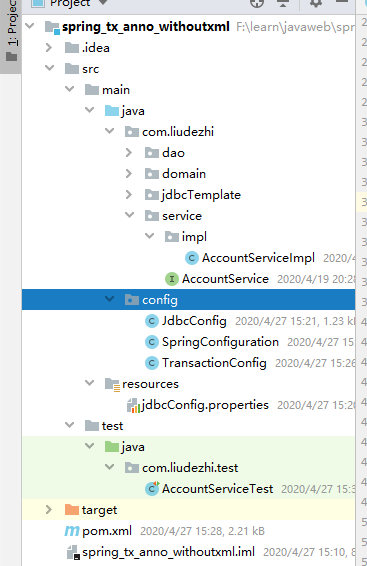

# 17.基于纯注解的声明式事务控制

- 笔记本：16.Spring
- 创建时间：2020-04-27 07:31:53 UTC
- 更新时间：2020-04-27 07:55:24 UTC
- 印象笔记 GUID：64b53423-500e-4ab2-b4dc-bcf967a9dc2c

**项目结构：**
 

```
<?xml version="1.0" encoding="UTF-8"?>
<project xmlns="http://maven.apache.org/POM/4.0.0"
         xmlns:xsi="http://www.w3.org/2001/XMLSchema-instance"
         xsi:schemaLocation="http://maven.apache.org/POM/4.0.0 http://maven.apache.org/xsd/maven-4.0.0.xsd">
    <modelVersion>4.0.0</modelVersion>

    <groupId>com.liudezhi</groupId>
    <artifactId>spring_tx_anno_withoutxml</artifactId>
    <version>1.0-SNAPSHOT</version>
    <build>
        <plugins>
            <plugin>
                <groupId>org.apache.maven.plugins</groupId>
                <artifactId>maven-compiler-plugin</artifactId>
                <configuration>
                    <source>6</source>
                    <target>6</target>
                </configuration>
            </plugin>
        </plugins>
    </build>
    <packaging>jar</packaging>

    <dependencies>
        <dependency>
            <groupId>org.springframework</groupId>
            <artifactId>spring-context</artifactId>
            <version>5.2.4.RELEASE</version>
        </dependency>

        <dependency>
            <groupId>org.springframework</groupId>
            <artifactId>spring-jdbc</artifactId>
            <version>5.2.2.RELEASE</version>
        </dependency>

        <dependency>
            <groupId>org.springframework</groupId>
            <artifactId>spring-tx</artifactId>
            <version>5.2.5.RELEASE</version>
        </dependency>

        <dependency>
            <groupId>org.springframework</groupId>
            <artifactId>spring-test</artifactId>
            <version>5.2.3.RELEASE</version>
            <scope>test</scope>
        </dependency>

        <dependency>
            <groupId>mysql</groupId>
            <artifactId>mysql-connector-java</artifactId>
            <version>8.0.11</version>
        </dependency>

        <dependency>
            <groupId>org.aspectj</groupId>
            <artifactId>aspectjweaver</artifactId>
            <version>1.9.2</version>
        </dependency>

        <dependency>
            <groupId>junit</groupId>
            <artifactId>junit</artifactId>
            <version>4.13</version>
            <scope>test</scope>
        </dependency>

    </dependencies>

</project>

```

```
package config;

/**
 * spring的配置类，相当于bean.xml
 */
@Configuration
@ComponentScan("com.liudezhi")
@Import({JdbcConfig.class, TransactionConfig.class})
@PropertySource("jdbcConfig.properties")
@EnableTransactionManagement
public class SpringConfiguration {
}

```

```
package config;

/**
 * 和连接数据库相关的配置类
 */
public class JdbcConfig {

    @Value("${jdbc.driver}")
    private String driver;

    @Value("${jdbc.url}")
    private String url;

    @Value("${jdbc.username}")
    private String username;

    @Value("${jdbc.password}")
    private String password;

    /**
     * 创建JdbcTemplate
     * @param dataSource
     * @return
     */
    @Bean(name = "jdbcTemplate")
    public JdbcTemplate createJdbcTemplate(DataSource dataSource) {
        return new JdbcTemplate(dataSource);
    }

    /**
     * 创建数据源对象
     * @return
     */
    @Bean(name = "dataSource")
    public DataSource createDataSource() {
        DriverManagerDataSource ds = new DriverManagerDataSource();
        ds.setDriverClassName(driver);
        ds.setUrl(url);
        ds.setUsername(username);
        ds.setPassword(password);
        return ds;
    }
}

```

```
package config;

/**
 * 和事务相关的配置类
 */
public class TransactionConfig {

    /**
     * 用于创建事务管理器对象
     * @param dataSource
     * @return
     */
    @Bean(name = "transactionManager")
    public PlatformTransactionManager createTransactionManager(DataSource dataSource) {
        return new DataSourceTransactionManager(dataSource);
    }
}

```

```
package com.liudezhi.test;

/**
 * 使用Junit单元测试，测试我们的配置
 */
@RunWith(SpringJUnit4ClassRunner.class)
@ContextConfiguration(classes = SpringConfiguration.class)
public class AccountServiceTest {

    @Autowired
    private AccountService accountService;

    @Test
    public void testTransfer(){
        accountService.transfer("aaa", "bbb", 100f);
    }
}

```

```
package com.liudezhi.service.impl;

/**
 * 账户的业务层实现类
 */
@Service("accountService")
@Transactional(propagation = Propagation.SUPPORTS, readOnly = true) //只读型事务的配置
public class AccountServiceImpl implements AccountService {

    @Autowired
    private AccountDao accountDao;

    @Override
    public Account findAccountById(Integer accountId) {
        return accountDao.findAccountById(accountId);
    }

    //需要的是读写型事务配置
    @Transactional(propagation = Propagation.REQUIRED, readOnly = false)
    @Override
    public void transfer(String sourceName, String targetName, Float money) {
        //2.1. 根据名称查询转出账户
        Account sourceAccount = accountDao.findAccountByName(sourceName);
        //2.2. 根据名称查询转入账户
        Account targetAccount = accountDao.findAccountByName(targetName);
        //2.3. 转出账户减钱
        sourceAccount.setMoney(sourceAccount.getMoney() - money);
        //2.4. 转入账户加钱
        targetAccount.setMoney(targetAccount.getMoney() + money);
        //2.5. 更新转出账户
        accountDao.updateAccount(sourceAccount);
//        int i = 1/0;
        //2.6. 更新转入账户
        accountDao.updateAccount(targetAccount);
    }
}

```

```
package com.liudezhi.dao.impl;

/**
 * 账户的持久层实现类
 */
@Repository("accountDao")
public class AccountDaoImpl implements AccountDao {

    @Autowired
    private JdbcTemplate jdbcTemplate;

    @Override
    public Account findAccountById(Integer accountId) {
        List<Account> accounts = jdbcTemplate.query("select * from account where id = ?", new BeanPropertyRowMapper<Account>(Account.class), accountId);
        return accounts.isEmpty() ? null : accounts.get(0);
    }

    @Override
    public Account findAccountByName(String accountName) {
        List<Account> accounts = jdbcTemplate.query("select * from account where name = ?", new BeanPropertyRowMapper<Account>(Account.class), accountName);
        if (accounts.isEmpty()) {
            return null;
        }
        if (accounts.size() > 1) {
            throw new RuntimeException("结果集不唯一");
        }
        return accounts.get(0);
    }

    @Override
    public void updateAccount(Account account) {
        jdbcTemplate.update("update account set name = ?, money = ? where id = ?", account.getName(), account.getMoney(), account.getId());
    }
}

```

**%E9%A1%B9%E7%9B%AE%E7%BB%93%E6%9E%84%EF%BC%9A**%0A!%5Bfc86db044000837229897362deb272df.png%5D(en-resource%3A%2F%2Fdatabase%2F3489%3A0)%0A%0A%60%60%60xml%0A%3C%3Fxml%20version%3D%221.0%22%20encoding%3D%22UTF-8%22%3F%3E%0A%3Cproject%20xmlns%3D%22http%3A%2F%2Fmaven.apache.org%2FPOM%2F4.0.0%22%0A%20%20%20%20%20%20%20%20%20xmlns%3Axsi%3D%22http%3A%2F%2Fwww.w3.org%2F2001%2FXMLSchema-instance%22%0A%20%20%20%20%20%20%20%20%20xsi%3AschemaLocation%3D%22http%3A%2F%2Fmaven.apache.org%2FPOM%2F4.0.0%20http%3A%2F%2Fmaven.apache.org%2Fxsd%2Fmaven-4.0.0.xsd%22%3E%0A%20%20%20%20%3CmodelVersion%3E4.0.0%3C%2FmodelVersion%3E%0A%0A%20%20%20%20%3CgroupId%3Ecom.liudezhi%3C%2FgroupId%3E%0A%20%20%20%20%3CartifactId%3Espring_tx_anno_withoutxml%3C%2FartifactId%3E%0A%20%20%20%20%3Cversion%3E1.0-SNAPSHOT%3C%2Fversion%3E%0A%20%20%20%20%3Cbuild%3E%0A%20%20%20%20%20%20%20%20%3Cplugins%3E%0A%20%20%20%20%20%20%20%20%20%20%20%20%3Cplugin%3E%0A%20%20%20%20%20%20%20%20%20%20%20%20%20%20%20%20%3CgroupId%3Eorg.apache.maven.plugins%3C%2FgroupId%3E%0A%20%20%20%20%20%20%20%20%20%20%20%20%20%20%20%20%3CartifactId%3Emaven-compiler-plugin%3C%2FartifactId%3E%0A%20%20%20%20%20%20%20%20%20%20%20%20%20%20%20%20%3Cconfiguration%3E%0A%20%20%20%20%20%20%20%20%20%20%20%20%20%20%20%20%20%20%20%20%3Csource%3E6%3C%2Fsource%3E%0A%20%20%20%20%20%20%20%20%20%20%20%20%20%20%20%20%20%20%20%20%3Ctarget%3E6%3C%2Ftarget%3E%0A%20%20%20%20%20%20%20%20%20%20%20%20%20%20%20%20%3C%2Fconfiguration%3E%0A%20%20%20%20%20%20%20%20%20%20%20%20%3C%2Fplugin%3E%0A%20%20%20%20%20%20%20%20%3C%2Fplugins%3E%0A%20%20%20%20%3C%2Fbuild%3E%0A%20%20%20%20%3Cpackaging%3Ejar%3C%2Fpackaging%3E%0A%0A%20%20%20%20%3Cdependencies%3E%0A%20%20%20%20%20%20%20%20%3Cdependency%3E%0A%20%20%20%20%20%20%20%20%20%20%20%20%3CgroupId%3Eorg.springframework%3C%2FgroupId%3E%0A%20%20%20%20%20%20%20%20%20%20%20%20%3CartifactId%3Espring-context%3C%2FartifactId%3E%0A%20%20%20%20%20%20%20%20%20%20%20%20%3Cversion%3E5.2.4.RELEASE%3C%2Fversion%3E%0A%20%20%20%20%20%20%20%20%3C%2Fdependency%3E%0A%0A%20%20%20%20%20%20%20%20%3Cdependency%3E%0A%20%20%20%20%20%20%20%20%20%20%20%20%3CgroupId%3Eorg.springframework%3C%2FgroupId%3E%0A%20%20%20%20%20%20%20%20%20%20%20%20%3CartifactId%3Espring-jdbc%3C%2FartifactId%3E%0A%20%20%20%20%20%20%20%20%20%20%20%20%3Cversion%3E5.2.2.RELEASE%3C%2Fversion%3E%0A%20%20%20%20%20%20%20%20%3C%2Fdependency%3E%0A%0A%20%20%20%20%20%20%20%20%3Cdependency%3E%0A%20%20%20%20%20%20%20%20%20%20%20%20%3CgroupId%3Eorg.springframework%3C%2FgroupId%3E%0A%20%20%20%20%20%20%20%20%20%20%20%20%3CartifactId%3Espring-tx%3C%2FartifactId%3E%0A%20%20%20%20%20%20%20%20%20%20%20%20%3Cversion%3E5.2.5.RELEASE%3C%2Fversion%3E%0A%20%20%20%20%20%20%20%20%3C%2Fdependency%3E%0A%0A%20%20%20%20%20%20%20%20%3Cdependency%3E%0A%20%20%20%20%20%20%20%20%20%20%20%20%3CgroupId%3Eorg.springframework%3C%2FgroupId%3E%0A%20%20%20%20%20%20%20%20%20%20%20%20%3CartifactId%3Espring-test%3C%2FartifactId%3E%0A%20%20%20%20%20%20%20%20%20%20%20%20%3Cversion%3E5.2.3.RELEASE%3C%2Fversion%3E%0A%20%20%20%20%20%20%20%20%20%20%20%20%3Cscope%3Etest%3C%2Fscope%3E%0A%20%20%20%20%20%20%20%20%3C%2Fdependency%3E%0A%0A%20%20%20%20%20%20%20%20%3Cdependency%3E%0A%20%20%20%20%20%20%20%20%20%20%20%20%3CgroupId%3Emysql%3C%2FgroupId%3E%0A%20%20%20%20%20%20%20%20%20%20%20%20%3CartifactId%3Emysql-connector-java%3C%2FartifactId%3E%0A%20%20%20%20%20%20%20%20%20%20%20%20%3Cversion%3E8.0.11%3C%2Fversion%3E%0A%20%20%20%20%20%20%20%20%3C%2Fdependency%3E%0A%0A%20%20%20%20%20%20%20%20%3Cdependency%3E%0A%20%20%20%20%20%20%20%20%20%20%20%20%3CgroupId%3Eorg.aspectj%3C%2FgroupId%3E%0A%20%20%20%20%20%20%20%20%20%20%20%20%3CartifactId%3Easpectjweaver%3C%2FartifactId%3E%0A%20%20%20%20%20%20%20%20%20%20%20%20%3Cversion%3E1.9.2%3C%2Fversion%3E%0A%20%20%20%20%20%20%20%20%3C%2Fdependency%3E%0A%0A%20%20%20%20%20%20%20%20%3Cdependency%3E%0A%20%20%20%20%20%20%20%20%20%20%20%20%3CgroupId%3Ejunit%3C%2FgroupId%3E%0A%20%20%20%20%20%20%20%20%20%20%20%20%3CartifactId%3Ejunit%3C%2FartifactId%3E%0A%20%20%20%20%20%20%20%20%20%20%20%20%3Cversion%3E4.13%3C%2Fversion%3E%0A%20%20%20%20%20%20%20%20%20%20%20%20%3Cscope%3Etest%3C%2Fscope%3E%0A%20%20%20%20%20%20%20%20%3C%2Fdependency%3E%0A%0A%20%20%20%20%3C%2Fdependencies%3E%0A%0A%3C%2Fproject%3E%0A%60%60%60%0A%0A%60%60%60java%0Apackage%20config%3B%0A%0A%2F**%0A%20*%20spring%E7%9A%84%E9%85%8D%E7%BD%AE%E7%B1%BB%EF%BC%8C%E7%9B%B8%E5%BD%93%E4%BA%8Ebean.xml%0A%20*%2F%0A%40Configuration%0A%40ComponentScan(%22com.liudezhi%22)%0A%40Import(%7BJdbcConfig.class%2C%20TransactionConfig.class%7D)%0A%40PropertySource(%22jdbcConfig.properties%22)%0A%40EnableTransactionManagement%0Apublic%20class%20SpringConfiguration%20%7B%0A%7D%0A%60%60%60%0A%0A%60%60%60java%0Apackage%20config%3B%0A%0A%2F**%0A%20*%20%E5%92%8C%E8%BF%9E%E6%8E%A5%E6%95%B0%E6%8D%AE%E5%BA%93%E7%9B%B8%E5%85%B3%E7%9A%84%E9%85%8D%E7%BD%AE%E7%B1%BB%0A%20*%2F%0Apublic%20class%20JdbcConfig%20%7B%0A%0A%20%20%20%20%40Value(%22%24%7Bjdbc.driver%7D%22)%0A%20%20%20%20private%20String%20driver%3B%0A%0A%20%20%20%20%40Value(%22%24%7Bjdbc.url%7D%22)%0A%20%20%20%20private%20String%20url%3B%0A%0A%20%20%20%20%40Value(%22%24%7Bjdbc.username%7D%22)%0A%20%20%20%20private%20String%20username%3B%0A%0A%20%20%20%20%40Value(%22%24%7Bjdbc.password%7D%22)%0A%20%20%20%20private%20String%20password%3B%0A%0A%20%20%20%20%2F**%0A%20%20%20%20%20*%20%E5%88%9B%E5%BB%BAJdbcTemplate%0A%20%20%20%20%20*%20%40param%20dataSource%0A%20%20%20%20%20*%20%40return%0A%20%20%20%20%20*%2F%0A%20%20%20%20%40Bean(name%20%3D%20%22jdbcTemplate%22)%0A%20%20%20%20public%20JdbcTemplate%20createJdbcTemplate(DataSource%20dataSource)%20%7B%0A%20%20%20%20%20%20%20%20return%20new%20JdbcTemplate(dataSource)%3B%0A%20%20%20%20%7D%0A%0A%20%20%20%20%2F**%0A%20%20%20%20%20*%20%E5%88%9B%E5%BB%BA%E6%95%B0%E6%8D%AE%E6%BA%90%E5%AF%B9%E8%B1%A1%0A%20%20%20%20%20*%20%40return%0A%20%20%20%20%20*%2F%0A%20%20%20%20%40Bean(name%20%3D%20%22dataSource%22)%0A%20%20%20%20public%20DataSource%20createDataSource()%20%7B%0A%20%20%20%20%20%20%20%20DriverManagerDataSource%20ds%20%3D%20new%20DriverManagerDataSource()%3B%0A%20%20%20%20%20%20%20%20ds.setDriverClassName(driver)%3B%0A%20%20%20%20%20%20%20%20ds.setUrl(url)%3B%0A%20%20%20%20%20%20%20%20ds.setUsername(username)%3B%0A%20%20%20%20%20%20%20%20ds.setPassword(password)%3B%0A%20%20%20%20%20%20%20%20return%20ds%3B%0A%20%20%20%20%7D%0A%7D%0A%60%60%60%0A%0A%60%60%60java%0Apackage%20config%3B%0A%0A%2F**%0A%20*%20%E5%92%8C%E4%BA%8B%E5%8A%A1%E7%9B%B8%E5%85%B3%E7%9A%84%E9%85%8D%E7%BD%AE%E7%B1%BB%0A%20*%2F%0Apublic%20class%20TransactionConfig%20%7B%0A%0A%20%20%20%20%2F**%0A%20%20%20%20%20*%20%E7%94%A8%E4%BA%8E%E5%88%9B%E5%BB%BA%E4%BA%8B%E5%8A%A1%E7%AE%A1%E7%90%86%E5%99%A8%E5%AF%B9%E8%B1%A1%0A%20%20%20%20%20*%20%40param%20dataSource%0A%20%20%20%20%20*%20%40return%0A%20%20%20%20%20*%2F%0A%20%20%20%20%40Bean(name%20%3D%20%22transactionManager%22)%0A%20%20%20%20public%20PlatformTransactionManager%20createTransactionManager(DataSource%20dataSource)%20%7B%0A%20%20%20%20%20%20%20%20return%20new%20DataSourceTransactionManager(dataSource)%3B%0A%20%20%20%20%7D%0A%7D%0A%60%60%60%0A%0A%60%60%60java%0Apackage%20com.liudezhi.test%3B%0A%0A%2F**%0A%20*%20%E4%BD%BF%E7%94%A8Junit%E5%8D%95%E5%85%83%E6%B5%8B%E8%AF%95%EF%BC%8C%E6%B5%8B%E8%AF%95%E6%88%91%E4%BB%AC%E7%9A%84%E9%85%8D%E7%BD%AE%0A%20*%2F%0A%40RunWith(SpringJUnit4ClassRunner.class)%0A%40ContextConfiguration(classes%20%3D%20SpringConfiguration.class)%0Apublic%20class%20AccountServiceTest%20%7B%0A%0A%20%20%20%20%40Autowired%0A%20%20%20%20private%20AccountService%20accountService%3B%0A%0A%20%20%20%20%40Test%0A%20%20%20%20public%20void%20testTransfer()%7B%0A%20%20%20%20%20%20%20%20accountService.transfer(%22aaa%22%2C%20%22bbb%22%2C%20100f)%3B%0A%20%20%20%20%7D%0A%7D%0A%60%60%60%0A%0A%60%60%60java%0Apackage%20com.liudezhi.service.impl%3B%0A%0A%2F**%0A%20*%20%E8%B4%A6%E6%88%B7%E7%9A%84%E4%B8%9A%E5%8A%A1%E5%B1%82%E5%AE%9E%E7%8E%B0%E7%B1%BB%0A%20*%2F%0A%40Service(%22accountService%22)%0A%40Transactional(propagation%20%3D%20Propagation.SUPPORTS%2C%20readOnly%20%3D%20true)%20%2F%2F%E5%8F%AA%E8%AF%BB%E5%9E%8B%E4%BA%8B%E5%8A%A1%E7%9A%84%E9%85%8D%E7%BD%AE%0Apublic%20class%20AccountServiceImpl%20implements%20AccountService%20%7B%0A%0A%20%20%20%20%40Autowired%0A%20%20%20%20private%20AccountDao%20accountDao%3B%0A%0A%20%20%20%20%40Override%0A%20%20%20%20public%20Account%20findAccountById(Integer%20accountId)%20%7B%0A%20%20%20%20%20%20%20%20return%20accountDao.findAccountById(accountId)%3B%0A%20%20%20%20%7D%0A%0A%20%20%20%20%2F%2F%E9%9C%80%E8%A6%81%E7%9A%84%E6%98%AF%E8%AF%BB%E5%86%99%E5%9E%8B%E4%BA%8B%E5%8A%A1%E9%85%8D%E7%BD%AE%0A%20%20%20%20%40Transactional(propagation%20%3D%20Propagation.REQUIRED%2C%20readOnly%20%3D%20false)%0A%20%20%20%20%40Override%0A%20%20%20%20public%20void%20transfer(String%20sourceName%2C%20String%20targetName%2C%20Float%20money)%20%7B%0A%20%20%20%20%20%20%20%20%2F%2F2.1.%20%E6%A0%B9%E6%8D%AE%E5%90%8D%E7%A7%B0%E6%9F%A5%E8%AF%A2%E8%BD%AC%E5%87%BA%E8%B4%A6%E6%88%B7%0A%20%20%20%20%20%20%20%20Account%20sourceAccount%20%3D%20accountDao.findAccountByName(sourceName)%3B%0A%20%20%20%20%20%20%20%20%2F%2F2.2.%20%E6%A0%B9%E6%8D%AE%E5%90%8D%E7%A7%B0%E6%9F%A5%E8%AF%A2%E8%BD%AC%E5%85%A5%E8%B4%A6%E6%88%B7%0A%20%20%20%20%20%20%20%20Account%20targetAccount%20%3D%20accountDao.findAccountByName(targetName)%3B%0A%20%20%20%20%20%20%20%20%2F%2F2.3.%20%E8%BD%AC%E5%87%BA%E8%B4%A6%E6%88%B7%E5%87%8F%E9%92%B1%0A%20%20%20%20%20%20%20%20sourceAccount.setMoney(sourceAccount.getMoney()%20-%20money)%3B%0A%20%20%20%20%20%20%20%20%2F%2F2.4.%20%E8%BD%AC%E5%85%A5%E8%B4%A6%E6%88%B7%E5%8A%A0%E9%92%B1%0A%20%20%20%20%20%20%20%20targetAccount.setMoney(targetAccount.getMoney()%20%2B%20money)%3B%0A%20%20%20%20%20%20%20%20%2F%2F2.5.%20%E6%9B%B4%E6%96%B0%E8%BD%AC%E5%87%BA%E8%B4%A6%E6%88%B7%0A%20%20%20%20%20%20%20%20accountDao.updateAccount(sourceAccount)%3B%0A%2F%2F%20%20%20%20%20%20%20%20int%20i%20%3D%201%2F0%3B%0A%20%20%20%20%20%20%20%20%2F%2F2.6.%20%E6%9B%B4%E6%96%B0%E8%BD%AC%E5%85%A5%E8%B4%A6%E6%88%B7%0A%20%20%20%20%20%20%20%20accountDao.updateAccount(targetAccount)%3B%0A%20%20%20%20%7D%0A%7D%0A%60%60%60%0A%0A%60%60%60java%0Apackage%20com.liudezhi.dao.impl%3B%0A%0A%2F**%0A%20*%20%E8%B4%A6%E6%88%B7%E7%9A%84%E6%8C%81%E4%B9%85%E5%B1%82%E5%AE%9E%E7%8E%B0%E7%B1%BB%0A%20*%2F%0A%40Repository(%22accountDao%22)%0Apublic%20class%20AccountDaoImpl%20implements%20AccountDao%20%7B%0A%0A%20%20%20%20%40Autowired%0A%20%20%20%20private%20JdbcTemplate%20jdbcTemplate%3B%0A%0A%20%20%20%20%40Override%0A%20%20%20%20public%20Account%20findAccountById(Integer%20accountId)%20%7B%0A%20%20%20%20%20%20%20%20List%3CAccount%3E%20accounts%20%3D%20jdbcTemplate.query(%22select%20*%20from%20account%20where%20id%20%3D%20%3F%22%2C%20new%20BeanPropertyRowMapper%3CAccount%3E(Account.class)%2C%20accountId)%3B%0A%20%20%20%20%20%20%20%20return%20accounts.isEmpty()%20%3F%20null%20%3A%20accounts.get(0)%3B%0A%20%20%20%20%7D%0A%0A%20%20%20%20%40Override%0A%20%20%20%20public%20Account%20findAccountByName(String%20accountName)%20%7B%0A%20%20%20%20%20%20%20%20List%3CAccount%3E%20accounts%20%3D%20jdbcTemplate.query(%22select%20*%20from%20account%20where%20name%20%3D%20%3F%22%2C%20new%20BeanPropertyRowMapper%3CAccount%3E(Account.class)%2C%20accountName)%3B%0A%20%20%20%20%20%20%20%20if%20(accounts.isEmpty())%20%7B%0A%20%20%20%20%20%20%20%20%20%20%20%20return%20null%3B%0A%20%20%20%20%20%20%20%20%7D%0A%20%20%20%20%20%20%20%20if%20(accounts.size()%20%3E%201)%20%7B%0A%20%20%20%20%20%20%20%20%20%20%20%20throw%20new%20RuntimeException(%22%E7%BB%93%E6%9E%9C%E9%9B%86%E4%B8%8D%E5%94%AF%E4%B8%80%22)%3B%0A%20%20%20%20%20%20%20%20%7D%0A%20%20%20%20%20%20%20%20return%20accounts.get(0)%3B%0A%20%20%20%20%7D%0A%0A%20%20%20%20%40Override%0A%20%20%20%20public%20void%20updateAccount(Account%20account)%20%7B%0A%20%20%20%20%20%20%20%20jdbcTemplate.update(%22update%20account%20set%20name%20%3D%20%3F%2C%20money%20%3D%20%3F%20where%20id%20%3D%20%3F%22%2C%20account.getName()%2C%20account.getMoney()%2C%20account.getId())%3B%0A%20%20%20%20%7D%0A%7D%0A%60%60%60
