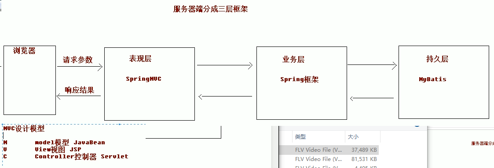
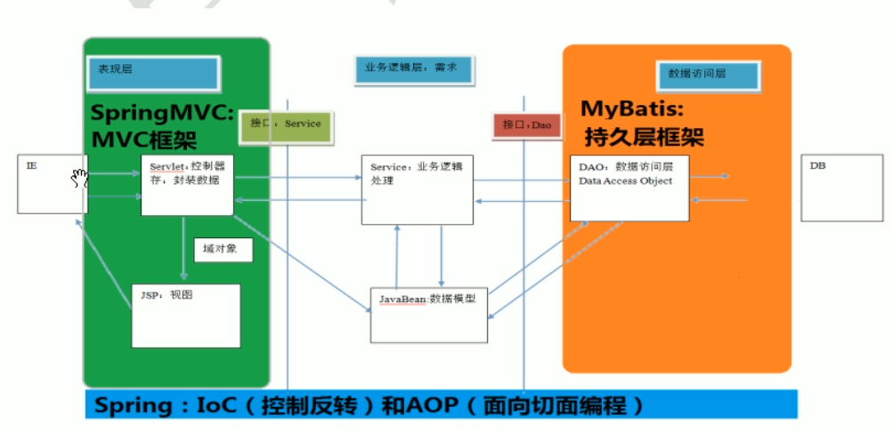
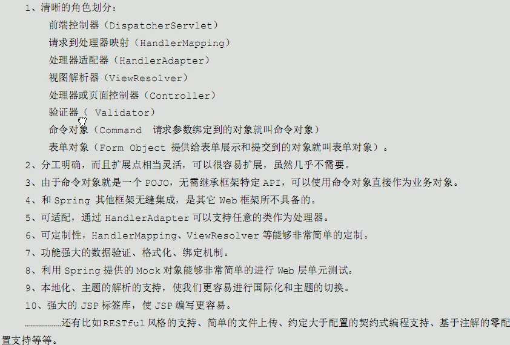

# 01.SpringMVC的基本概念

- 笔记本：17.SpringMVC
- 创建时间：2020-04-27 12:21:15 UTC
- 更新时间：2020-04-27 12:38:58 UTC
- 印象笔记 GUID：88f31fbf-e669-471b-af8f-f757190229fd

1.
SpringMVC是什么
 SpringMVC 是一种基于 Java 的实现 MVC 设计模式的请求驱动类型的轻量级 Web 框架，属于 Spring FrameWork 的后续产品，已经融合在 Spring Web Flow 里面。Spring 框架提供了构建 Web 应用程序的全功能的 MVC 模块。使用 Spring 可插入的 MVC 架构，从而在使用 Spring 进行 WEB 开发时，可以选择使用 Spring 的 Spring MVC 框架集成其他的 MVC 开发框架，如 Struts1（现在一般不用），Struts2等。
 SpringMVC 已经成为目前最主流的 MVC 框架之一。
 它通过一套注解，让一个简单的 Java 类成为处理请求的控制器，而无须实现任何接口。同时它还支持 RESTful 编程风格的请求。

1.
SpringMVC 在三层架构的位置
 

1.
SpringMVC 的优势
 

!%5B8e794cb15c1b6a2ccb9b8f647611be45.png%5D(en-resource%3A%2F%2Fdatabase%2F3499%3A1)%0A%0A1.%20SpringMVC%E6%98%AF%E4%BB%80%E4%B9%88%0A%26ensp%3B%26ensp%3B%26ensp%3B%26ensp%3BSpringMVC%20%E6%98%AF%E4%B8%80%E7%A7%8D%E5%9F%BA%E4%BA%8E%20Java%20%E7%9A%84%E5%AE%9E%E7%8E%B0%20MVC%20%E8%AE%BE%E8%AE%A1%E6%A8%A1%E5%BC%8F%E7%9A%84%E8%AF%B7%E6%B1%82%E9%A9%B1%E5%8A%A8%E7%B1%BB%E5%9E%8B%E7%9A%84%E8%BD%BB%E9%87%8F%E7%BA%A7%20Web%20%E6%A1%86%E6%9E%B6%EF%BC%8C%E5%B1%9E%E4%BA%8E%20Spring%20FrameWork%20%E7%9A%84%E5%90%8E%E7%BB%AD%E4%BA%A7%E5%93%81%EF%BC%8C%E5%B7%B2%E7%BB%8F%E8%9E%8D%E5%90%88%E5%9C%A8%20Spring%20Web%20Flow%20%E9%87%8C%E9%9D%A2%E3%80%82Spring%20%E6%A1%86%E6%9E%B6%E6%8F%90%E4%BE%9B%E4%BA%86%E6%9E%84%E5%BB%BA%20Web%20%E5%BA%94%E7%94%A8%E7%A8%8B%E5%BA%8F%E7%9A%84%E5%85%A8%E5%8A%9F%E8%83%BD%E7%9A%84%20MVC%20%E6%A8%A1%E5%9D%97%E3%80%82%E4%BD%BF%E7%94%A8%20Spring%20%E5%8F%AF%E6%8F%92%E5%85%A5%E7%9A%84%20MVC%20%E6%9E%B6%E6%9E%84%EF%BC%8C%E4%BB%8E%E8%80%8C%E5%9C%A8%E4%BD%BF%E7%94%A8%20Spring%20%E8%BF%9B%E8%A1%8C%20WEB%20%E5%BC%80%E5%8F%91%E6%97%B6%EF%BC%8C%E5%8F%AF%E4%BB%A5%E9%80%89%E6%8B%A9%E4%BD%BF%E7%94%A8%20Spring%20%E7%9A%84%20Spring%20MVC%20%E6%A1%86%E6%9E%B6%E9%9B%86%E6%88%90%E5%85%B6%E4%BB%96%E7%9A%84%20MVC%20%E5%BC%80%E5%8F%91%E6%A1%86%E6%9E%B6%EF%BC%8C%E5%A6%82%20Struts1%EF%BC%88%E7%8E%B0%E5%9C%A8%E4%B8%80%E8%88%AC%E4%B8%8D%E7%94%A8%EF%BC%89%EF%BC%8CStruts2%E7%AD%89%E3%80%82%0A%26ensp%3B%26ensp%3B%26ensp%3B%26ensp%3BSpringMVC%20%E5%B7%B2%E7%BB%8F%E6%88%90%E4%B8%BA%E7%9B%AE%E5%89%8D%E6%9C%80%E4%B8%BB%E6%B5%81%E7%9A%84%20MVC%20%E6%A1%86%E6%9E%B6%E4%B9%8B%E4%B8%80%E3%80%82%0A%26ensp%3B%26ensp%3B%26ensp%3B%26ensp%3B%E5%AE%83%E9%80%9A%E8%BF%87%E4%B8%80%E5%A5%97%E6%B3%A8%E8%A7%A3%EF%BC%8C%E8%AE%A9%E4%B8%80%E4%B8%AA%E7%AE%80%E5%8D%95%E7%9A%84%20Java%20%E7%B1%BB%E6%88%90%E4%B8%BA%E5%A4%84%E7%90%86%E8%AF%B7%E6%B1%82%E7%9A%84%E6%8E%A7%E5%88%B6%E5%99%A8%EF%BC%8C%E8%80%8C%E6%97%A0%E9%A1%BB%E5%AE%9E%E7%8E%B0%E4%BB%BB%E4%BD%95%E6%8E%A5%E5%8F%A3%E3%80%82%E5%90%8C%E6%97%B6%E5%AE%83%E8%BF%98%E6%94%AF%E6%8C%81%20RESTful%20%E7%BC%96%E7%A8%8B%E9%A3%8E%E6%A0%BC%E7%9A%84%E8%AF%B7%E6%B1%82%E3%80%82%0A%0A2.%20SpringMVC%20%E5%9C%A8%E4%B8%89%E5%B1%82%E6%9E%B6%E6%9E%84%E7%9A%84%E4%BD%8D%E7%BD%AE%0A!%5Bb3e1c39c703a71b1ba8e9881cfcbab61.png%5D(en-resource%3A%2F%2Fdatabase%2F3501%3A1)%0A%0A3.%20SpringMVC%20%E7%9A%84%E4%BC%98%E5%8A%BF%0A!%5B03f0b596f941ff66566bd0094910f8a8.png%5D(en-resource%3A%2F%2Fdatabase%2F3503%3A1)%0A%0A
