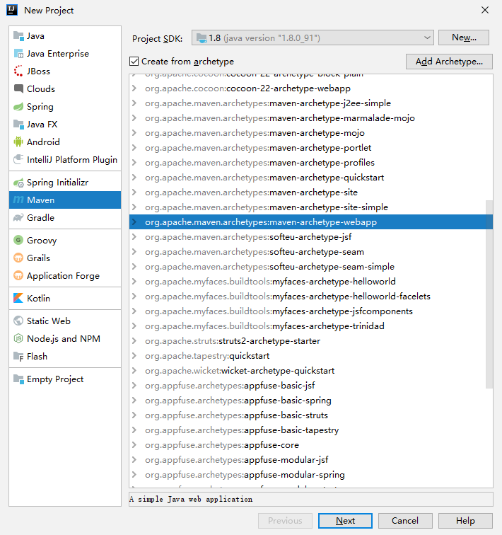
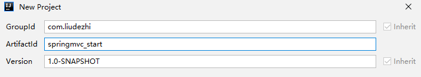
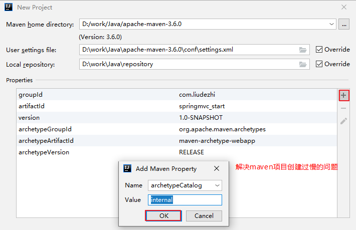
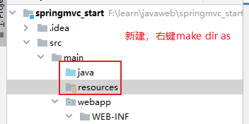
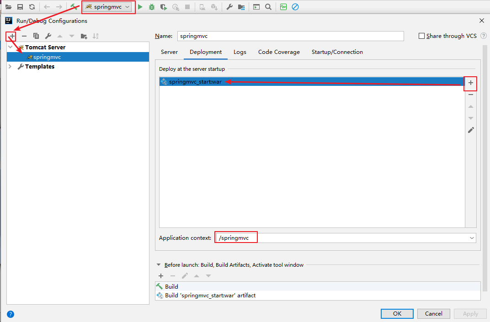
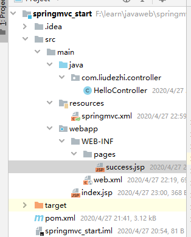
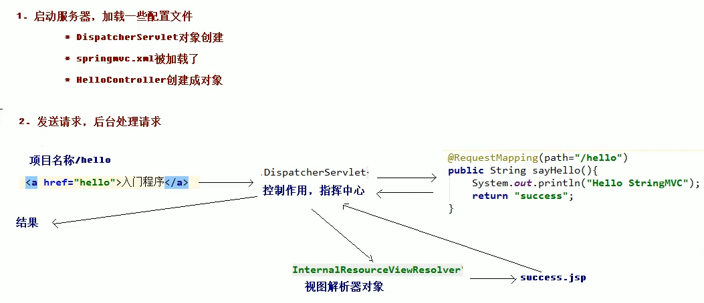
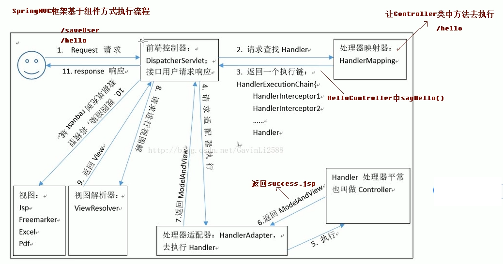

# 02.SpringMVC的入门程序

- 笔记本：17.SpringMVC
- 创建时间：2020-04-27 12:38:47 UTC
- 更新时间：2020-05-04 07:22:10 UTC
- 印象笔记 GUID：ea7b3426-5ce0-4f0c-a617-eac27b68aeb3

#### 需求分析：

**入门程序的需求：**

```
PHN2ZyBpZD0iZDRhbDYwa25oaGoiIHdpZHRoPSIxMDAlIiB4bWxucz0iaHR0cDovL3d3dy53My5vcmcvMjAwMC9zdmciIHN0eWxlPSJtYXgtd2lkdGg6IDUxNC45Njg3NXB4OyIgdmlld0JveD0iMCAwIDUxNC45Njg3NSA1NSI+PHN0eWxlPgoKCiNkNGFsNjBrbmhoaiAubGFiZWwgewogIGZvbnQtZmFtaWx5OiAndHJlYnVjaGV0IG1zJywgdmVyZGFuYSwgYXJpYWw7CiAgY29sb3I6ICMzMzM7IH0KCiNkNGFsNjBrbmhoaiAubm9kZSByZWN0LAojZDRhbDYwa25oaGogLm5vZGUgY2lyY2xlLAojZDRhbDYwa25oaGogLm5vZGUgZWxsaXBzZSwKI2Q0YWw2MGtuaGhqIC5ub2RlIHBvbHlnb24gewogIGZpbGw6ICNFQ0VDRkY7CiAgc3Ryb2tlOiAjOTM3MERCOwogIHN0cm9rZS13aWR0aDogMXB4OyB9CgojZDRhbDYwa25oaGogLm5vZGUuY2xpY2thYmxlIHsKICBjdXJzb3I6IHBvaW50ZXI7IH0KCiNkNGFsNjBrbmhoaiAuYXJyb3doZWFkUGF0aCB7CiAgZmlsbDogIzMzMzMzMzsgfQoKI2Q0YWw2MGtuaGhqIC5lZGdlUGF0aCAucGF0aCB7CiAgc3Ryb2tlOiAjMzMzMzMzOwogIHN0cm9rZS13aWR0aDogMS41cHg7IH0KCiNkNGFsNjBrbmhoaiAuZWRnZUxhYmVsIHsKICBiYWNrZ3JvdW5kLWNvbG9yOiAjZThlOGU4OyB9CgojZDRhbDYwa25oaGogLmNsdXN0ZXIgcmVjdCB7CiAgZmlsbDogI2ZmZmZkZSAhaW1wb3J0YW50OwogIHN0cm9rZTogI2FhYWEzMyAhaW1wb3J0YW50OwogIHN0cm9rZS13aWR0aDogMXB4ICFpbXBvcnRhbnQ7IH0KCiNkNGFsNjBrbmhoaiAuY2x1c3RlciB0ZXh0IHsKICBmaWxsOiAjMzMzOyB9CgojZDRhbDYwa25oaGogZGl2Lm1lcm1haWRUb29sdGlwIHsKICBwb3NpdGlvbjogYWJzb2x1dGU7CiAgdGV4dC1hbGlnbjogY2VudGVyOwogIG1heC13aWR0aDogMjAwcHg7CiAgcGFkZGluZzogMnB4OwogIGZvbnQtZmFtaWx5OiAndHJlYnVjaGV0IG1zJywgdmVyZGFuYSwgYXJpYWw7CiAgZm9udC1zaXplOiAxMnB4OwogIGJhY2tncm91bmQ6ICNmZmZmZGU7CiAgYm9yZGVyOiAxcHggc29saWQgI2FhYWEzMzsKICBib3JkZXItcmFkaXVzOiAycHg7CiAgcG9pbnRlci1ldmVudHM6IG5vbmU7CiAgei1pbmRleDogMTAwOyB9CgojZDRhbDYwa25oaGogLmFjdG9yIHsKICBzdHJva2U6ICNDQ0NDRkY7CiAgZmlsbDogI0VDRUNGRjsgfQoKI2Q0YWw2MGtuaGhqIHRleHQuYWN0b3IgewogIGZpbGw6IGJsYWNrOwogIHN0cm9rZTogbm9uZTsgfQoKI2Q0YWw2MGtuaGhqIC5hY3Rvci1saW5lIHsKICBzdHJva2U6IGdyZXk7IH0KCiNkNGFsNjBrbmhoaiAubWVzc2FnZUxpbmUwIHsKICBzdHJva2Utd2lkdGg6IDEuNTsKICBzdHJva2UtZGFzaGFycmF5OiAnMiAyJzsKICBzdHJva2U6ICMzMzM7IH0KCiNkNGFsNjBrbmhoaiAubWVzc2FnZUxpbmUxIHsKICBzdHJva2Utd2lkdGg6IDEuNTsKICBzdHJva2UtZGFzaGFycmF5OiAnMiAyJzsKICBzdHJva2U6ICMzMzM7IH0KCiNkNGFsNjBrbmhoaiAjYXJyb3doZWFkIHsKICBmaWxsOiAjMzMzOyB9CgojZDRhbDYwa25oaGogI2Nyb3NzaGVhZCBwYXRoIHsKICBmaWxsOiAjMzMzICFpbXBvcnRhbnQ7CiAgc3Ryb2tlOiAjMzMzICFpbXBvcnRhbnQ7IH0KCiNkNGFsNjBrbmhoaiAubWVzc2FnZVRleHQgewogIGZpbGw6ICMzMzM7CiAgc3Ryb2tlOiBub25lOyB9CgojZDRhbDYwa25oaGogLmxhYmVsQm94IHsKICBzdHJva2U6ICNDQ0NDRkY7CiAgZmlsbDogI0VDRUNGRjsgfQoKI2Q0YWw2MGtuaGhqIC5sYWJlbFRleHQgewogIGZpbGw6IGJsYWNrOwogIHN0cm9rZTogbm9uZTsgfQoKI2Q0YWw2MGtuaGhqIC5sb29wVGV4dCB7CiAgZmlsbDogYmxhY2s7CiAgc3Ryb2tlOiBub25lOyB9CgojZDRhbDYwa25oaGogLmxvb3BMaW5lIHsKICBzdHJva2Utd2lkdGg6IDI7CiAgc3Ryb2tlLWRhc2hhcnJheTogJzIgMic7CiAgc3Ryb2tlOiAjQ0NDQ0ZGOyB9CgojZDRhbDYwa25oaGogLm5vdGUgewogIHN0cm9rZTogI2FhYWEzMzsKICBmaWxsOiAjZmZmNWFkOyB9CgojZDRhbDYwa25oaGogLm5vdGVUZXh0IHsKICBmaWxsOiBibGFjazsKICBzdHJva2U6IG5vbmU7CiAgZm9udC1mYW1pbHk6ICd0cmVidWNoZXQgbXMnLCB2ZXJkYW5hLCBhcmlhbDsKICBmb250LXNpemU6IDE0cHg7IH0KCiNkNGFsNjBrbmhoaiAuYWN0aXZhdGlvbjAgewogIGZpbGw6ICNmNGY0ZjQ7CiAgc3Ryb2tlOiAjNjY2OyB9CgojZDRhbDYwa25oaGogLmFjdGl2YXRpb24xIHsKICBmaWxsOiAjZjRmNGY0OwogIHN0cm9rZTogIzY2NjsgfQoKI2Q0YWw2MGtuaGhqIC5hY3RpdmF0aW9uMiB7CiAgZmlsbDogI2Y0ZjRmNDsKICBzdHJva2U6ICM2NjY7IH0KCgojZDRhbDYwa25oaGogLnNlY3Rpb24gewogIHN0cm9rZTogbm9uZTsKICBvcGFjaXR5OiAwLjI7IH0KCiNkNGFsNjBrbmhoaiAuc2VjdGlvbjAgewogIGZpbGw6IHJnYmEoMTAyLCAxMDIsIDI1NSwgMC40OSk7IH0KCiNkNGFsNjBrbmhoaiAuc2VjdGlvbjIgewogIGZpbGw6ICNmZmY0MDA7IH0KCiNkNGFsNjBrbmhoaiAuc2VjdGlvbjEsCiNkNGFsNjBrbmhoaiAuc2VjdGlvbjMgewogIGZpbGw6IHdoaXRlOwogIG9wYWNpdHk6IDAuMjsgfQoKI2Q0YWw2MGtuaGhqIC5zZWN0aW9uVGl0bGUwIHsKICBmaWxsOiAjMzMzOyB9CgojZDRhbDYwa25oaGogLnNlY3Rpb25UaXRsZTEgewogIGZpbGw6ICMzMzM7IH0KCiNkNGFsNjBrbmhoaiAuc2VjdGlvblRpdGxlMiB7CiAgZmlsbDogIzMzMzsgfQoKI2Q0YWw2MGtuaGhqIC5zZWN0aW9uVGl0bGUzIHsKICBmaWxsOiAjMzMzOyB9CgojZDRhbDYwa25oaGogLnNlY3Rpb25UaXRsZSB7CiAgdGV4dC1hbmNob3I6IHN0YXJ0OwogIGZvbnQtc2l6ZTogMTFweDsKICB0ZXh0LWhlaWdodDogMTRweDsgfQoKCiNkNGFsNjBrbmhoaiAuZ3JpZCAudGljayB7CiAgc3Ryb2tlOiBsaWdodGdyZXk7CiAgb3BhY2l0eTogMC4zOwogIHNoYXBlLXJlbmRlcmluZzogY3Jpc3BFZGdlczsgfQoKI2Q0YWw2MGtuaGhqIC5ncmlkIHBhdGggewogIHN0cm9rZS13aWR0aDogMDsgfQoKCiNkNGFsNjBrbmhoaiAudG9kYXkgewogIGZpbGw6IG5vbmU7CiAgc3Ryb2tlOiByZWQ7CiAgc3Ryb2tlLXdpZHRoOiAycHg7IH0KCgoKI2Q0YWw2MGtuaGhqIC50YXNrIHsKICBzdHJva2Utd2lkdGg6IDI7IH0KCiNkNGFsNjBrbmhoaiAudGFza1RleHQgewogIHRleHQtYW5jaG9yOiBtaWRkbGU7CiAgZm9udC1zaXplOiAxMXB4OyB9CgojZDRhbDYwa25oaGogLnRhc2tUZXh0T3V0c2lkZVJpZ2h0IHsKICBmaWxsOiBibGFjazsKICB0ZXh0LWFuY2hvcjogc3RhcnQ7CiAgZm9udC1zaXplOiAxMXB4OyB9CgojZDRhbDYwa25oaGogLnRhc2tUZXh0T3V0c2lkZUxlZnQgewogIGZpbGw6IGJsYWNrOwogIHRleHQtYW5jaG9yOiBlbmQ7CiAgZm9udC1zaXplOiAxMXB4OyB9CgoKI2Q0YWw2MGtuaGhqIC50YXNrVGV4dDAsCiNkNGFsNjBrbmhoaiAudGFza1RleHQxLAojZDRhbDYwa25oaGogLnRhc2tUZXh0MiwKI2Q0YWw2MGtuaGhqIC50YXNrVGV4dDMgewogIGZpbGw6IHdoaXRlOyB9CgojZDRhbDYwa25oaGogLnRhc2swLAojZDRhbDYwa25oaGogLnRhc2sxLAojZDRhbDYwa25oaGogLnRhc2syLAojZDRhbDYwa25oaGogLnRhc2szIHsKICBmaWxsOiAjOGE5MGRkOwogIHN0cm9rZTogIzUzNGZiYzsgfQoKI2Q0YWw2MGtuaGhqIC50YXNrVGV4dE91dHNpZGUwLAojZDRhbDYwa25oaGogLnRhc2tUZXh0T3V0c2lkZTIgewogIGZpbGw6IGJsYWNrOyB9CgojZDRhbDYwa25oaGogLnRhc2tUZXh0T3V0c2lkZTEsCiNkNGFsNjBrbmhoaiAudGFza1RleHRPdXRzaWRlMyB7CiAgZmlsbDogYmxhY2s7IH0KCgojZDRhbDYwa25oaGogLmFjdGl2ZTAsCiNkNGFsNjBrbmhoaiAuYWN0aXZlMSwKI2Q0YWw2MGtuaGhqIC5hY3RpdmUyLAojZDRhbDYwa25oaGogLmFjdGl2ZTMgewogIGZpbGw6ICNiZmM3ZmY7CiAgc3Ryb2tlOiAjNTM0ZmJjOyB9CgojZDRhbDYwa25oaGogLmFjdGl2ZVRleHQwLAojZDRhbDYwa25oaGogLmFjdGl2ZVRleHQxLAojZDRhbDYwa25oaGogLmFjdGl2ZVRleHQyLAojZDRhbDYwa25oaGogLmFjdGl2ZVRleHQzIHsKICBmaWxsOiBibGFjayAhaW1wb3J0YW50OyB9CgoKI2Q0YWw2MGtuaGhqIC5kb25lMCwKI2Q0YWw2MGtuaGhqIC5kb25lMSwKI2Q0YWw2MGtuaGhqIC5kb25lMiwKI2Q0YWw2MGtuaGhqIC5kb25lMyB7CiAgc3Ryb2tlOiBncmV5OwogIGZpbGw6IGxpZ2h0Z3JleTsKICBzdHJva2Utd2lkdGg6IDI7IH0KCiNkNGFsNjBrbmhoaiAuZG9uZVRleHQwLAojZDRhbDYwa25oaGogLmRvbmVUZXh0MSwKI2Q0YWw2MGtuaGhqIC5kb25lVGV4dDIsCiNkNGFsNjBrbmhoaiAuZG9uZVRleHQzIHsKICBmaWxsOiBibGFjayAhaW1wb3J0YW50OyB9CgoKI2Q0YWw2MGtuaGhqIC5jcml0MCwKI2Q0YWw2MGtuaGhqIC5jcml0MSwKI2Q0YWw2MGtuaGhqIC5jcml0MiwKI2Q0YWw2MGtuaGhqIC5jcml0MyB7CiAgc3Ryb2tlOiAjZmY4ODg4OwogIGZpbGw6IHJlZDsKICBzdHJva2Utd2lkdGg6IDI7IH0KCiNkNGFsNjBrbmhoaiAuYWN0aXZlQ3JpdDAsCiNkNGFsNjBrbmhoaiAuYWN0aXZlQ3JpdDEsCiNkNGFsNjBrbmhoaiAuYWN0aXZlQ3JpdDIsCiNkNGFsNjBrbmhoaiAuYWN0aXZlQ3JpdDMgewogIHN0cm9rZTogI2ZmODg4ODsKICBmaWxsOiAjYmZjN2ZmOwogIHN0cm9rZS13aWR0aDogMjsgfQoKI2Q0YWw2MGtuaGhqIC5kb25lQ3JpdDAsCiNkNGFsNjBrbmhoaiAuZG9uZUNyaXQxLAojZDRhbDYwa25oaGogLmRvbmVDcml0MiwKI2Q0YWw2MGtuaGhqIC5kb25lQ3JpdDMgewogIHN0cm9rZTogI2ZmODg4ODsKICBmaWxsOiBsaWdodGdyZXk7CiAgc3Ryb2tlLXdpZHRoOiAyOwogIGN1cnNvcjogcG9pbnRlcjsKICBzaGFwZS1yZW5kZXJpbmc6IGNyaXNwRWRnZXM7IH0KCiNkNGFsNjBrbmhoaiAuZG9uZUNyaXRUZXh0MCwKI2Q0YWw2MGtuaGhqIC5kb25lQ3JpdFRleHQxLAojZDRhbDYwa25oaGogLmRvbmVDcml0VGV4dDIsCiNkNGFsNjBrbmhoaiAuZG9uZUNyaXRUZXh0MyB7CiAgZmlsbDogYmxhY2sgIWltcG9ydGFudDsgfQoKI2Q0YWw2MGtuaGhqIC5hY3RpdmVDcml0VGV4dDAsCiNkNGFsNjBrbmhoaiAuYWN0aXZlQ3JpdFRleHQxLAojZDRhbDYwa25oaGogLmFjdGl2ZUNyaXRUZXh0MiwKI2Q0YWw2MGtuaGhqIC5hY3RpdmVDcml0VGV4dDMgewogIGZpbGw6IGJsYWNrICFpbXBvcnRhbnQ7IH0KCiNkNGFsNjBrbmhoaiAudGl0bGVUZXh0IHsKICB0ZXh0LWFuY2hvcjogbWlkZGxlOwogIGZvbnQtc2l6ZTogMThweDsKICBmaWxsOiBibGFjazsgfQoKI2Q0YWw2MGtuaGhqIGcuY2xhc3NHcm91cCB0ZXh0IHsKICBmaWxsOiAjOTM3MERCOwogIHN0cm9rZTogbm9uZTsKICBmb250LWZhbWlseTogJ3RyZWJ1Y2hldCBtcycsIHZlcmRhbmEsIGFyaWFsOwogIGZvbnQtc2l6ZTogMTBweDsgfQoKI2Q0YWw2MGtuaGhqIGcuY2xhc3NHcm91cCByZWN0IHsKICBmaWxsOiAjRUNFQ0ZGOwogIHN0cm9rZTogIzkzNzBEQjsgfQoKI2Q0YWw2MGtuaGhqIGcuY2xhc3NHcm91cCBsaW5lIHsKICBzdHJva2U6ICM5MzcwREI7CiAgc3Ryb2tlLXdpZHRoOiAxOyB9CgojZDRhbDYwa25oaGogLmNsYXNzTGFiZWwgLmJveCB7CiAgc3Ryb2tlOiBub25lOwogIHN0cm9rZS13aWR0aDogMDsKICBmaWxsOiAjRUNFQ0ZGOwogIG9wYWNpdHk6IDAuNTsgfQoKI2Q0YWw2MGtuaGhqIC5jbGFzc0xhYmVsIC5sYWJlbCB7CiAgZmlsbDogIzkzNzBEQjsKICBmb250LXNpemU6IDEwcHg7IH0KCiNkNGFsNjBrbmhoaiAucmVsYXRpb24gewogIHN0cm9rZTogIzkzNzBEQjsKICBzdHJva2Utd2lkdGg6IDE7CiAgZmlsbDogbm9uZTsgfQoKI2Q0YWw2MGtuaGhqICNjb21wb3NpdGlvblN0YXJ0IHsKICBmaWxsOiAjOTM3MERCOwogIHN0cm9rZTogIzkzNzBEQjsKICBzdHJva2Utd2lkdGg6IDE7IH0KCiNkNGFsNjBrbmhoaiAjY29tcG9zaXRpb25FbmQgewogIGZpbGw6ICM5MzcwREI7CiAgc3Ryb2tlOiAjOTM3MERCOwogIHN0cm9rZS13aWR0aDogMTsgfQoKI2Q0YWw2MGtuaGhqICNhZ2dyZWdhdGlvblN0YXJ0IHsKICBmaWxsOiAjRUNFQ0ZGOwogIHN0cm9rZTogIzkzNzBEQjsKICBzdHJva2Utd2lkdGg6IDE7IH0KCiNkNGFsNjBrbmhoaiAjYWdncmVnYXRpb25FbmQgewogIGZpbGw6ICNFQ0VDRkY7CiAgc3Ryb2tlOiAjOTM3MERCOwogIHN0cm9rZS13aWR0aDogMTsgfQoKI2Q0YWw2MGtuaGhqICNkZXBlbmRlbmN5U3RhcnQgewogIGZpbGw6ICM5MzcwREI7CiAgc3Ryb2tlOiAjOTM3MERCOwogIHN0cm9rZS13aWR0aDogMTsgfQoKI2Q0YWw2MGtuaGhqICNkZXBlbmRlbmN5RW5kIHsKICBmaWxsOiAjOTM3MERCOwogIHN0cm9rZTogIzkzNzBEQjsKICBzdHJva2Utd2lkdGg6IDE7IH0KCiNkNGFsNjBrbmhoaiAjZXh0ZW5zaW9uU3RhcnQgewogIGZpbGw6ICM5MzcwREI7CiAgc3Ryb2tlOiAjOTM3MERCOwogIHN0cm9rZS13aWR0aDogMTsgfQoKI2Q0YWw2MGtuaGhqICNleHRlbnNpb25FbmQgewogIGZpbGw6ICM5MzcwREI7CiAgc3Ryb2tlOiAjOTM3MERCOwogIHN0cm9rZS13aWR0aDogMTsgfQoKI2Q0YWw2MGtuaGhqIC5jb21taXQtaWQsCiNkNGFsNjBrbmhoaiAuY29tbWl0LW1zZywKI2Q0YWw2MGtuaGhqIC5icmFuY2gtbGFiZWwgewogIGZpbGw6IGxpZ2h0Z3JleTsKICBjb2xvcjogbGlnaHRncmV5OyB9CgoKCiNkNGFsNjBrbmhoaiAubGFiZWx7CiAgY29sb3I6IzE4QjE0RTsKfQojZDRhbDYwa25oaGogLm5vZGUgcmVjdCwKI2Q0YWw2MGtuaGhqIC5ub2RlIGNpcmNsZSwKI2Q0YWw2MGtuaGhqIC5ub2RlIGVsbGlwc2UsCiNkNGFsNjBrbmhoaiAubm9kZSBwb2x5Z29uIHsKICBmaWxsOiAjRjlGRkZCOzsKICBzdHJva2U6ICMyREJENjA7CiAgc3Ryb2tlLXdpZHRoOiAxLjVweDsKfQojZDRhbDYwa25oaGogLmFycm93aGVhZFBhdGh7CiAgZmlsbDogIzJEQkQ2MDsKfQojZDRhbDYwa25oaGogLmVkZ2VQYXRoIC5wYXRoIHsKICBzdHJva2U6ICMyREJENjA7CiAgc3Ryb2tlLXdpZHRoOiAxcHg7Cn0KI2Q0YWw2MGtuaGhqIC5lZGdlTGFiZWwgewogIGJhY2tncm91bmQtY29sb3I6ICNmZmY7Cn0KI2Q0YWw2MGtuaGhqIC5jbHVzdGVyIHJlY3QgewogIGZpbGw6ICNGOUZGRkIgIWltcG9ydGFudDsKICBzdHJva2U6ICMyREJENjAgIWltcG9ydGFudDsKICBzdHJva2Utd2lkdGg6IDFweCAhaW1wb3J0YW50Owp9CgojZDRhbDYwa25oaGogLmNsdXN0ZXIgdGV4dCB7CiAgZmlsbDogI0Y5RkZGQjsKfQoKI2Q0YWw2MGtuaGhqIGRpdi5tZXJtYWlkVG9vbHRpcCB7CiAgYmFja2dyb3VuZDogI0Y5RkZGQjsKICBib3JkZXI6IDFweCBzb2xpZCAjMkRCRDYwOwp9CgoKI2Q0YWw2MGtuaGhqIC5hY3RvciB7CiAgc3Ryb2tlOiAjMkRCRDYwOwogIGZpbGw6ICNGOUZGRkI7Cn0KCiNkNGFsNjBrbmhoaiB0ZXh0LmFjdG9yIHsKICBmaWxsOiAjMkRCRDYwOwogIHN0cm9rZTogbm9uZTsKfQoKI2Q0YWw2MGtuaGhqIC5hY3Rvci1saW5lIHsKICBzdHJva2U6ICMyREJENjA7Cn0KCiNkNGFsNjBrbmhoaiAubWVzc2FnZUxpbmUwIHsKICBzdHJva2Utd2lkdGg6IDEuNTsKICBzdHJva2UtZGFzaGFycmF5OiAnMiAyJzsKICBtYXJrZXItZW5kOiAndXJsKCNhcnJvd2hlYWQpJzsKICBzdHJva2U6ICMyREJENjA7Cn0KCiNkNGFsNjBrbmhoaiAubWVzc2FnZUxpbmUxIHsKICBzdHJva2Utd2lkdGg6IDEuNTsKICBzdHJva2UtZGFzaGFycmF5OiAnMiAyJzsKICBzdHJva2U6ICMyREJENjA7Cn0KCiNkNGFsNjBrbmhoaiAjYXJyb3doZWFkIHsKICBmaWxsOiAjMkRCRDYwOwp9CgojZDRhbDYwa25oaGogI2Nyb3NzaGVhZCBwYXRoIHsKICBmaWxsOiAjMkRCRDYwICFpbXBvcnRhbnQ7CiAgc3Ryb2tlOiAjMkRCRDYwICFpbXBvcnRhbnQ7Cn0KCiNkNGFsNjBrbmhoaiAubWVzc2FnZVRleHQgewogIGZpbGw6ICMyREJENjA7CiAgc3Ryb2tlOiBub25lOwp9CgojZDRhbDYwa25oaGogLmxhYmVsQm94IHsKICBzdHJva2U6ICMyREJENjA7CiAgZmlsbDogI0Y5RkZGQjsKfQoKI2Q0YWw2MGtuaGhqIC5sYWJlbFRleHQgewogIGZpbGw6ICMyREJENjA7CiAgc3Ryb2tlOiAjMkRCRDYwOwp9CgojZDRhbDYwa25oaGogLmxvb3BUZXh0IHsKICBmaWxsOiAjMkRCRDYwOwogIHN0cm9rZTogIzJEQkQ2MDsKfQoKI2Q0YWw2MGtuaGhqIC5sb29wTGluZSB7CiAgc3Ryb2tlLXdpZHRoOiAyOwogIHN0cm9rZS1kYXNoYXJyYXk6ICcyIDInOwogIG1hcmtlci1lbmQ6ICd1cmwoI2Fycm93aGVhZCknOwogIHN0cm9rZTogIzJEQkQ2MDsKfQoKI2Q0YWw2MGtuaGhqIC5ub3RlIHsKICBzdHJva2U6ICMyREJENjA7CiAgZmlsbDogI0Y5RkZGQjsKfQoKI2Q0YWw2MGtuaGhqIC5ub3RlVGV4dCB7CiAgZmlsbDogIzJEQkQ2MDsKICBzdHJva2U6ICMyREJENjA7Cn0KCgojZDRhbDYwa25oaGogLnNlY3Rpb257CiAgb3BhY2l0eToxOwp9CiNkNGFsNjBrbmhoaiAuc2VjdGlvbjAsI2Q0YWw2MGtuaGhqICAuc2VjdGlvbjIgewogIGZpbGw6ICNFQ0Y3RjA7Cn0KCiNkNGFsNjBrbmhoaiAuc2VjdGlvbjEsCiNkNGFsNjBrbmhoaiAuc2VjdGlvbjMgewogIGZpbGw6ICNGRkY7Cn0KI2Q0YWw2MGtuaGhqIC50YXNrVGV4dDAsCiNkNGFsNjBrbmhoaiAudGFza1RleHQxLAojZDRhbDYwa25oaGogLnRhc2tUZXh0MiwKI2Q0YWw2MGtuaGhqIC50YXNrVGV4dDMgewogIGZpbGw6ICNmZmY7Cn0KCiNkNGFsNjBrbmhoaiAudGFzazAsCiNkNGFsNjBrbmhoaiAudGFzazEsCiNkNGFsNjBrbmhoaiAudGFzazIsCiNkNGFsNjBrbmhoaiAudGFzazMgewogIGZpbGw6ICMyREJENjA7CiAgc3Ryb2tlOiAjMzU5RjVBOwp9Cjwvc3R5bGU+PHN0eWxlPiNkNGFsNjBrbmhoaiB7CiAgICBjb2xvcjogcmdiKDI0NCwgMjQ0LCAyNDQpOwogICAgZm9udDogbm9ybWFsIG5vcm1hbCA0MDAgbm9ybWFsIDE0cHggLyAyMi40cHggIk1pY3Jvc29mdCBZYWhlaSIsIHNhbnMtc2VyaWY7CiAgfTwvc3R5bGU+PGcgdHJhbnNmb3JtPSJ0cmFuc2xhdGUoLTEyLCAtMTIpIj48ZyBjbGFzcz0ib3V0cHV0Ij48ZyBjbGFzcz0iY2x1c3RlcnMiPjwvZz48ZyBjbGFzcz0iZWRnZVBhdGhzIj48ZyBjbGFzcz0iZWRnZVBhdGgiIHN0eWxlPSJvcGFjaXR5OiAxOyI+PHBhdGggY2xhc3M9InBhdGgiIGQ9Ik0xNjkuODEyNSwzOS41TDIyMy4zNTkzNzUsMzkuNUwyNzYuOTA2MjUsMzkuNSIgbWFya2VyLWVuZD0idXJsKCNhcnJvd2hlYWQzNjApIiBzdHlsZT0ic3Ryb2tlOiAjMzMzOyBzdHJva2Utd2lkdGg6IDEuNXB4O2ZpbGw6bm9uZSI+PC9wYXRoPjxkZWZzPjxtYXJrZXIgaWQ9ImFycm93aGVhZDM2MCIgdmlld0JveD0iMCAwIDEwIDEwIiByZWZYPSI5IiByZWZZPSI1IiBtYXJrZXJVbml0cz0ic3Ryb2tlV2lkdGgiIG1hcmtlcldpZHRoPSI4IiBtYXJrZXJIZWlnaHQ9IjYiIG9yaWVudD0iYXV0byI+PHBhdGggZD0iTSAwIDAgTCAxMCA1IEwgMCAxMCB6IiBjbGFzcz0iYXJyb3doZWFkUGF0aCIgc3R5bGU9InN0cm9rZS13aWR0aDogMTsgc3Ryb2tlLWRhc2hhcnJheTogMSwgMDsiPjwvcGF0aD48L21hcmtlcj48L2RlZnM+PC9nPjwvZz48ZyBjbGFzcz0iZWRnZUxhYmVscyI+PGcgY2xhc3M9ImVkZ2VMYWJlbCIgdHJhbnNmb3JtPSJ0cmFuc2xhdGUoMjIzLjM1OTM3NSwzOS41KSIgc3R5bGU9Im9wYWNpdHk6IDE7Ij48ZyB0cmFuc2Zvcm09InRyYW5zbGF0ZSgtMjguNTQ2ODc1LC05LjUpIiBjbGFzcz0ibGFiZWwiPjxyZWN0IHJ4PSIwIiByeT0iMCIgd2lkdGg9IjU3LjA5Mzc1IiBoZWlnaHQ9IjE5IiBzdHlsZT0iZmlsbDojZThlOGU4OyI+PC9yZWN0Pjx0ZXh0Pjx0c3BhbiB4bWw6c3BhY2U9InByZXNlcnZlIiBkeT0iMWVtIiB4PSIxIj7lj5HpgIHor7fmsYI8L3RzcGFuPjwvdGV4dD48L2c+PC9nPjwvZz48ZyBjbGFzcz0ibm9kZXMiPjxnIGNsYXNzPSJub2RlIiBpZD0iQSIgdHJhbnNmb3JtPSJ0cmFuc2xhdGUoOTQuOTA2MjUsMzkuNSkiIHN0eWxlPSJvcGFjaXR5OiAxOyI+PHJlY3Qgcng9IjAiIHJ5PSIwIiB4PSItNzQuOTA2MjUiIHk9Ii0xOS41IiB3aWR0aD0iMTQ5LjgxMjUiIGhlaWdodD0iMzkiIHN0eWxlPSJmaWxsOiNmOWY7c3Ryb2tlOiMzMzM7c3Ryb2tlLXdpZHRoOjJweDtmaWxsLW9wYWNpdHk6MC41OyI+PC9yZWN0PjxnIGNsYXNzPSJsYWJlbCIgdHJhbnNmb3JtPSJ0cmFuc2xhdGUoMCwwKSI+PGcgdHJhbnNmb3JtPSJ0cmFuc2xhdGUoLTY0LjkwNjI1LC05LjUpIj48dGV4dD48dHNwYW4geG1sOnNwYWNlPSJwcmVzZXJ2ZSIgZHk9IjFlbSIgeD0iMSI+aW5kZXguanNwIOi2hemTvuaOpeagh+etvjwvdHNwYW4+PC90ZXh0PjwvZz48L2c+PC9nPjxnIGNsYXNzPSJub2RlIiBpZD0iQiIgdHJhbnNmb3JtPSJ0cmFuc2xhdGUoMzk3LjkzNzUsMzkuNSkiIHN0eWxlPSJvcGFjaXR5OiAxOyI+PHJlY3Qgcng9IjAiIHJ5PSIwIiB4PSItMTIxLjAzMTI1IiB5PSItMTkuNSIgd2lkdGg9IjI0Mi4wNjI1IiBoZWlnaHQ9IjM5IiBzdHlsZT0iZmlsbDojY2NmO3N0cm9rZTojZjY2O3N0cm9rZS13aWR0aDoycHg7c3Ryb2tlLWRhc2hhcnJheTogMTA7NTsiPjwvcmVjdD48ZyBjbGFzcz0ibGFiZWwiIHRyYW5zZm9ybT0idHJhbnNsYXRlKDAsMCkiPjxnIHRyYW5zZm9ybT0idHJhbnNsYXRlKC0xMTEuMDMxMjUsLTkuNSkiPjx0ZXh0Pjx0c3BhbiB4bWw6c3BhY2U9InByZXNlcnZlIiBkeT0iMWVtIiB4PSIxIj7nvJblhpnnsbsg57yW5YaZ5pa55rOVIOi9rOWPkeWIsOaIkOWKn0pTUOmhtemdojwvdHNwYW4+PC90ZXh0PjwvZz48L2c+PC9nPjwvZz48L2c+PC9nPjwvc3ZnPg==

```

1.
搭建开发环境
 **新建项目**
 
 
 
 在main下创建 java 和 resources，右键 ->make directory as -> Sources Root(java)/Resoures Root(resources)
 

**pom.xml**

```
<?xml version="1.0" encoding="UTF-8"?>

<project xmlns="http://maven.apache.org/POM/4.0.0" xmlns:xsi="http://www.w3.org/2001/XMLSchema-instance"
  xsi:schemaLocation="http://maven.apache.org/POM/4.0.0 http://maven.apache.org/xsd/maven-4.0.0.xsd">
  <modelVersion>4.0.0</modelVersion>

  <groupId>com.liudezhi</groupId>
  <artifactId>springmvc_start</artifactId>
  <version>1.0-SNAPSHOT</version>
  <packaging>war</packaging>

  <name>springmvc_start Maven Webapp</name>
  <!-- FIXME change it to the project's website -->
  <url>http://www.example.com</url>

  <properties>
    <project.build.sourceEncoding>UTF-8</project.build.sourceEncoding>
    <maven.compiler.source>1.8</maven.compiler.source>
    <maven.compiler.target>1.8</maven.compiler.target>
    <!-- 版本锁定 -->
    <spring.version>5.2.4.RELEASE</spring.version>
  </properties>

  <dependencies>
    <dependency>
      <groupId>org.springframework</groupId>
      <artifactId>spring-context</artifactId>
      <version>${spring.version}</version>
    </dependency>

    <dependency>
      <groupId>org.springframework</groupId>
      <artifactId>spring-web</artifactId>
      <version>${spring.version}</version>
    </dependency>

    <dependency>
      <groupId>org.springframework</groupId>
      <artifactId>spring-webmvc</artifactId>
      <version>${spring.version}</version>
    </dependency>

    <dependency>
      <groupId>javax.servlet</groupId>
      <artifactId>javax.servlet-api</artifactId>
      <version>3.1.0</version>
      <scope>provided</scope>
    </dependency>

    <dependency>
      <groupId>javax.servlet.jsp</groupId>
      <artifactId>javax.servlet.jsp-api</artifactId>
      <version>2.2.1</version>
      <scope>provided</scope>
    </dependency>

  </dependencies>
</project>

```

**web.xml** (DispatcherServlet 是 spring 提供的)

```
    <!DOCTYPE web-app PUBLIC
 "-//Sun Microsystems, Inc.//DTD Web Application 2.3//EN"
 "http://java.sun.com/dtd/web-app_2_3.dtd" >

<web-app>
  <display-name>Archetype Created Web Application</display-name>

  <servlet>
    <servlet-name>dispatcherServlet</servlet-name>
    <servlet-class>org.springframework.web.servlet.DispatcherServlet</servlet-class>
    <init-param>        <!-- 前端控制器加载spring配置文件 -->
      <param-name>contextConfigLocation</param-name>
      <param-value>classpath:springmvc.xml</param-value>
    </init-param>
    <load-on-startup>1</load-on-startup>
  </servlet>

  <servlet-mapping>
    <servlet-name>dispatcherServlet</servlet-name>
    <url-pattern>/</url-pattern>
  </servlet-mapping>
</web-app>

```



1.
编写入门程序
 **项目结构：**
 

**springmvc.xml**

```
<?xml version="1.0" encoding="UTF-8"?>
<beans xmlns="http://www.springframework.org/schema/beans"
       xmlns:mvc="http://www.springframework.org/schema/mvc"
       xmlns:context="http://www.springframework.org/schema/context"
       xmlns:xsi="http://www.w3.org/2001/XMLSchema-instance"
       xsi:schemaLocation="
        http://www.springframework.org/schema/beans
        http://www.springframework.org/schema/beans/spring-beans.xsd
        http://www.springframework.org/schema/mvc
        https://www.springframework.org/schema/mvc/spring-mvc.xsd
        http://www.springframework.org/schema/context
        https://www.springframework.org/schema/context/spring-context.xsd">

    <!-- 开启注解扫描 -->
    <context:component-scan base-package="com.liudezhi"></context:component-scan>

    <!-- 视图解析器对象 -->
    <bean id="internalResourceViewResolver" class="org.springframework.web.servlet.view.InternalResourceViewResolver">
        <property name="prefix" value="/WEB-INF/pages/"/>
        <property name="suffix" value=".jsp"/>
    </bean>

    <!-- 开启 SpringMVC 框架注解的支持 -->
    <mvc:annotation-driven/>

</beans>

```

**HelloController.java**

```
package com.liudezhi.controller;
/**
 * 控制器类
 */
@Controller
public class HelloController {

    @RequestMapping(path = "/hello")
    public String sayHello() {
        System.out.println("Hello SpringMVC");
        return "success";
    }
}

```

**index.jsp**

```
<%@ page contentType="text/html;charset=UTF-8" language="java" %>
<html>
<head>
    <title>Title</title>
</head>
<body>

    <h3>入门程序</h3>
    <a  >入门程序</a>

</body>
</html>

```

**success.jsp**

```
<%@ page contentType="text/html;charset=UTF-8" language="java" %>
<html>
<head>
    <title>Title</title>
</head>
<body>

    <h3>入门成功</h3>

</body>
</html>

```

#### 流程总结:



#### 入门案例中使用的组件介绍：



-
DispatcherServlet：前端控制器
 用户请求到达前端控制器，它就相当于 mvc 模式中的 c，dispatcherServlet 是整个流程控制的中心，由它调用其他组件处理用户的请求，dispatcherServlet 的存在降低了组件之间的耦合性。

-
HandlerMapping：处理器映射器
 HandlerMapping 负责根据用户请求找到 Handler 即处理器，SpringMVC 提供了不同的映射器实现不同的映射方式，例如：配置文件方式，实现接口方式，注解方式等。

-
Handler：处理器
 它就是我们开发中要编写的具体业务控制器。由 DispatcherServlet 把用户请求转发到 Handler。由 Handler 对具体的用户请求进行处理。

-
HandlerAdapter：处理器适配器
 通过 HandlerAdapter 对处理器进行执行，这是适配器模式的应用，通过扩展适配器可以对更多类型的处理器进行执行。

-
ViewResolver：视图解析器
 View Resolver 负责将处理结果生成 View 视图，View Resolver 首先根据逻辑视图名解析成物理视图名即具体的页面地址，再生成 View 视图对象，最后对 View 进行渲染将处理结果通过页面展示给用户。

-
View：视图
 SpringMVC 提供了很多的 View 视图类型的支持，包括：jstlView、freemarkerView、pdfView 等。我们最常用的视图就是 jsp。
 一般情况下需要通过对页面标签或页面模板技术将模型数据通过页面展示给用户，需要由程序员根据业务需求开发具体的页面。

-
[mvc:annotation-driven]说明：
 在 SpringMVC 的各个组件中，处理器映射器、处理器适配器、视图解析器称为 SpringMVC 的三大组件。
 使用 `<mvc:annotation-driven>` 自动加载 RequestMappingHandlerMapping（处理器映射器）和 RequestMappingHandlerAdapter（处理器适配器），可用在 SpringMVC.xml 配置文件中使用 `<mvc:annotation-driven>` 替代注解处理器和适配器的配置。
 它相当于在 xml 中配置了：

```
<!-- HandlerMapping -->
<bean class="org.springframework.web.servlet.mvc.method.annotation.RequestMappingHandlerMapping"></bean>
<bean class="org.springframework.web.servlet.handler.BeanNameUrlHandlerMapping"></bean>

<!-- HandlerAdapter -->
<bean class="org.springframework.web.servlet.mvc.method.annotation.RequestMappingHandlerAdapter"></bean>
<bean class="org.springframework.web.servlet.mvc.HttpRequestHandlerAdapter"></bean>
<bean class="org.springframework.web.servlet.mvc.SimpleControllerHandlerAdapter"></bean>

<!-- HandlerExceptionResolvers -->
<bean class="org.springframework.web.servlet.mvc.method.annotation.ExceptionHandlerExceptionResolver"></bean>
<bean class="org.springframework.web.servlet.mvc.annotation.ResponseStatusExceptionResolver"></bean>
<bean class="org.springframework.web.servlet.mvc.support.DefaultHandlerExceptionResolver"></bean>

```

**注意：** 一般开发中，我们都需要写上此标签。
 **明确：** 我们只需要编写处理具体业务的控制器以及视图。

#### @RequestMapping 注解的作用

- 作用：用于建立请求 URL 和处理请求方法之间的对应关系。

- 出现位置：

- 属性：

  1. value：用于指定请求的 URL。它和 path 属性的作用是一样的。

  1. mehtod：用于指定请求的方法。eg：`@RequestMapping(value = "/testRequestMapping", method = {RequestMethod.GET, RequestMethod.POST})`

  1. params：用于指定限制请求参数的条件。它支持简单的表达式。要求请求参数的 key 和 value 必须和配置的一模一样。eg：
 `params = {"accountName"}`，表示请求参数必须有 accountName
 `params = {"money!100"}`，表示请求参数中 money 不能是100。

  1. headers：用于指定限制请求消息头的条件。
 注意：以上四个属性只要出现 2 个或以上时，他们的关系是与的关系。

%23%23%23%23%20%E9%9C%80%E6%B1%82%E5%88%86%E6%9E%90%EF%BC%9A%0A**%E5%85%A5%E9%97%A8%E7%A8%8B%E5%BA%8F%E7%9A%84%E9%9C%80%E6%B1%82%EF%BC%9A**%0A%60%60%60mermaid%0Agraph%20LR%0A%20%20%20A%5Bindex.jsp%20%E8%B6%85%E9%93%BE%E6%8E%A5%E6%A0%87%E7%AD%BE%5D%20%3D%3D%20%E5%8F%91%E9%80%81%E8%AF%B7%E6%B1%82%20%3D%3D%3E%20B%5B%E7%BC%96%E5%86%99%E7%B1%BB%20%E7%BC%96%E5%86%99%E6%96%B9%E6%B3%95%20%E8%BD%AC%E5%8F%91%E5%88%B0%E6%88%90%E5%8A%9FJSP%E9%A1%B5%E9%9D%A2%5D%20%0A%20%20%20style%20A%20fill%3A%23f9f%2Cstroke%3A%23333%2Cstroke-width%3A2px%2Cfill-opacity%3A0.5%0A%20%20%20%20style%20B%20fill%3A%23ccf%2Cstroke%3A%23f66%2Cstroke-width%3A2px%2Cstroke-dasharray%3A%2010%2C5%0A%60%60%60%0A%0A1.%20%E6%90%AD%E5%BB%BA%E5%BC%80%E5%8F%91%E7%8E%AF%E5%A2%83%0A**%E6%96%B0%E5%BB%BA%E9%A1%B9%E7%9B%AE**%0A!%5B1ee070850046dc45bf0f2d993aacb516.png%5D(en-resource%3A%2F%2Fdatabase%2F3509%3A1)%0A!%5Bb4239f095fdb7c61f5ed1c14d3be1e0b.png%5D(en-resource%3A%2F%2Fdatabase%2F3511%3A1)%0A!%5Bf0f1420096f66faa78fd9b9be4e3c7f7.png%5D(en-resource%3A%2F%2Fdatabase%2F3513%3A1)%0A%E5%9C%A8main%E4%B8%8B%E5%88%9B%E5%BB%BA%20java%20%E5%92%8C%20resources%EF%BC%8C%E5%8F%B3%E9%94%AE%20-%3Emake%20directory%20as%20-%3E%20Sources%20Root(java)%2FResoures%20Root(resources)%0A!%5Bd309417a489bf9baa0e5ef6c71723f83.png%5D(en-resource%3A%2F%2Fdatabase%2F3515%3A1)%0A%0A%20%20%20%20**pom.xml**%0A%20%20%20%20%60%60%60xml%0A%20%20%20%20%3C%3Fxml%20version%3D%221.0%22%20encoding%3D%22UTF-8%22%3F%3E%0A%0A%20%20%20%20%3Cproject%20xmlns%3D%22http%3A%2F%2Fmaven.apache.org%2FPOM%2F4.0.0%22%20xmlns%3Axsi%3D%22http%3A%2F%2Fwww.w3.org%2F2001%2FXMLSchema-instance%22%0A%20%20%20%20%20%20xsi%3AschemaLocation%3D%22http%3A%2F%2Fmaven.apache.org%2FPOM%2F4.0.0%20http%3A%2F%2Fmaven.apache.org%2Fxsd%2Fmaven-4.0.0.xsd%22%3E%0A%20%20%20%20%20%20%3CmodelVersion%3E4.0.0%3C%2FmodelVersion%3E%0A%0A%20%20%20%20%20%20%3CgroupId%3Ecom.liudezhi%3C%2FgroupId%3E%0A%20%20%20%20%20%20%3CartifactId%3Espringmvc_start%3C%2FartifactId%3E%0A%20%20%20%20%20%20%3Cversion%3E1.0-SNAPSHOT%3C%2Fversion%3E%0A%20%20%20%20%20%20%3Cpackaging%3Ewar%3C%2Fpackaging%3E%0A%0A%20%20%20%20%20%20%3Cname%3Espringmvc_start%20Maven%20Webapp%3C%2Fname%3E%0A%20%20%20%20%20%20%3C!--%20FIXME%20change%20it%20to%20the%20project's%20website%20--%3E%0A%20%20%20%20%20%20%3Curl%3Ehttp%3A%2F%2Fwww.example.com%3C%2Furl%3E%0A%0A%20%20%20%20%20%20%3Cproperties%3E%0A%20%20%20%20%20%20%20%20%3Cproject.build.sourceEncoding%3EUTF-8%3C%2Fproject.build.sourceEncoding%3E%0A%20%20%20%20%20%20%20%20%3Cmaven.compiler.source%3E1.8%3C%2Fmaven.compiler.source%3E%0A%20%20%20%20%20%20%20%20%3Cmaven.compiler.target%3E1.8%3C%2Fmaven.compiler.target%3E%0A%20%20%20%20%20%20%20%20%3C!--%20%E7%89%88%E6%9C%AC%E9%94%81%E5%AE%9A%20--%3E%0A%20%20%20%20%20%20%20%20%3Cspring.version%3E5.2.4.RELEASE%3C%2Fspring.version%3E%0A%20%20%20%20%20%20%3C%2Fproperties%3E%0A%0A%20%20%20%20%20%20%3Cdependencies%3E%0A%20%20%20%20%20%20%20%20%3Cdependency%3E%0A%20%20%20%20%20%20%20%20%20%20%3CgroupId%3Eorg.springframework%3C%2FgroupId%3E%0A%20%20%20%20%20%20%20%20%20%20%3CartifactId%3Espring-context%3C%2FartifactId%3E%0A%20%20%20%20%20%20%20%20%20%20%3Cversion%3E%24%7Bspring.version%7D%3C%2Fversion%3E%0A%20%20%20%20%20%20%20%20%3C%2Fdependency%3E%0A%0A%20%20%20%20%20%20%20%20%3Cdependency%3E%0A%20%20%20%20%20%20%20%20%20%20%3CgroupId%3Eorg.springframework%3C%2FgroupId%3E%0A%20%20%20%20%20%20%20%20%20%20%3CartifactId%3Espring-web%3C%2FartifactId%3E%0A%20%20%20%20%20%20%20%20%20%20%3Cversion%3E%24%7Bspring.version%7D%3C%2Fversion%3E%0A%20%20%20%20%20%20%20%20%3C%2Fdependency%3E%0A%0A%20%20%20%20%20%20%20%20%3Cdependency%3E%0A%20%20%20%20%20%20%20%20%20%20%3CgroupId%3Eorg.springframework%3C%2FgroupId%3E%0A%20%20%20%20%20%20%20%20%20%20%3CartifactId%3Espring-webmvc%3C%2FartifactId%3E%0A%20%20%20%20%20%20%20%20%20%20%3Cversion%3E%24%7Bspring.version%7D%3C%2Fversion%3E%0A%20%20%20%20%20%20%20%20%3C%2Fdependency%3E%0A%0A%20%20%20%20%20%20%20%20%3Cdependency%3E%0A%20%20%20%20%20%20%20%20%20%20%3CgroupId%3Ejavax.servlet%3C%2FgroupId%3E%0A%20%20%20%20%20%20%20%20%20%20%3CartifactId%3Ejavax.servlet-api%3C%2FartifactId%3E%0A%20%20%20%20%20%20%20%20%20%20%3Cversion%3E3.1.0%3C%2Fversion%3E%0A%20%20%20%20%20%20%20%20%20%20%3Cscope%3Eprovided%3C%2Fscope%3E%0A%20%20%20%20%20%20%20%20%3C%2Fdependency%3E%0A%0A%20%20%20%20%20%20%20%20%3Cdependency%3E%0A%20%20%20%20%20%20%20%20%20%20%3CgroupId%3Ejavax.servlet.jsp%3C%2FgroupId%3E%0A%20%20%20%20%20%20%20%20%20%20%3CartifactId%3Ejavax.servlet.jsp-api%3C%2FartifactId%3E%0A%20%20%20%20%20%20%20%20%20%20%3Cversion%3E2.2.1%3C%2Fversion%3E%0A%20%20%20%20%20%20%20%20%20%20%3Cscope%3Eprovided%3C%2Fscope%3E%0A%20%20%20%20%20%20%20%20%3C%2Fdependency%3E%0A%0A%20%20%20%20%20%20%3C%2Fdependencies%3E%0A%20%20%20%20%3C%2Fproject%3E%0A%20%20%20%20%60%60%60%0A%0A%20%20%20%20**web.xml**%20(DispatcherServlet%20%E6%98%AF%20spring%20%E6%8F%90%E4%BE%9B%E7%9A%84)%0A%20%20%20%20%60%60%60xml%0A%20%20%20%20%20%20%20%20%3C!DOCTYPE%20web-app%20PUBLIC%0A%20%20%20%20%20%22-%2F%2FSun%20Microsystems%2C%20Inc.%2F%2FDTD%20Web%20Application%202.3%2F%2FEN%22%0A%20%20%20%20%20%22http%3A%2F%2Fjava.sun.com%2Fdtd%2Fweb-app_2_3.dtd%22%20%3E%0A%0A%20%20%20%20%3Cweb-app%3E%0A%20%20%20%20%20%20%3Cdisplay-name%3EArchetype%20Created%20Web%20Application%3C%2Fdisplay-name%3E%0A%0A%20%20%20%20%20%20%3Cservlet%3E%0A%20%20%20%20%20%20%20%20%3Cservlet-name%3EdispatcherServlet%3C%2Fservlet-name%3E%0A%20%20%20%20%20%20%20%20%3Cservlet-class%3Eorg.springframework.web.servlet.DispatcherServlet%3C%2Fservlet-class%3E%0A%20%20%20%20%20%20%20%20%3Cinit-param%3E%20%20%20%20%20%20%20%20%3C!--%20%E5%89%8D%E7%AB%AF%E6%8E%A7%E5%88%B6%E5%99%A8%E5%8A%A0%E8%BD%BDspring%E9%85%8D%E7%BD%AE%E6%96%87%E4%BB%B6%20--%3E%0A%20%20%20%20%20%20%20%20%20%20%3Cparam-name%3EcontextConfigLocation%3C%2Fparam-name%3E%0A%20%20%20%20%20%20%20%20%20%20%3Cparam-value%3Eclasspath%3Aspringmvc.xml%3C%2Fparam-value%3E%0A%20%20%20%20%20%20%20%20%3C%2Finit-param%3E%0A%20%20%20%20%20%20%20%20%3Cload-on-startup%3E1%3C%2Fload-on-startup%3E%20%20%20%20%0A%20%20%20%20%20%20%3C%2Fservlet%3E%0A%0A%20%20%20%20%20%20%3Cservlet-mapping%3E%0A%20%20%20%20%20%20%20%20%3Cservlet-name%3EdispatcherServlet%3C%2Fservlet-name%3E%0A%20%20%20%20%20%20%20%20%3Curl-pattern%3E%2F%3C%2Furl-pattern%3E%0A%20%20%20%20%20%20%3C%2Fservlet-mapping%3E%0A%20%20%20%20%3C%2Fweb-app%3E%0A%20%20%20%20%60%60%60%0A%20%20%20%20!%5B3a8580c468ca03307080b959fc5c1e17.png%5D(en-resource%3A%2F%2Fdatabase%2F3517%3A1)%0A%0A%0A2.%20%E7%BC%96%E5%86%99%E5%85%A5%E9%97%A8%E7%A8%8B%E5%BA%8F%0A**%E9%A1%B9%E7%9B%AE%E7%BB%93%E6%9E%84%EF%BC%9A**%0A!%5B45867ecd6916788914d0f8ff1083c213.png%5D(en-resource%3A%2F%2Fdatabase%2F3519%3A1)%0A%0A%20%20%20%20**springmvc.xml**%0A%20%20%20%20%60%60%60xml%0A%20%20%20%20%3C%3Fxml%20version%3D%221.0%22%20encoding%3D%22UTF-8%22%3F%3E%0A%20%20%20%20%3Cbeans%20xmlns%3D%22http%3A%2F%2Fwww.springframework.org%2Fschema%2Fbeans%22%0A%20%20%20%20%20%20%20%20%20%20%20xmlns%3Amvc%3D%22http%3A%2F%2Fwww.springframework.org%2Fschema%2Fmvc%22%0A%20%20%20%20%20%20%20%20%20%20%20xmlns%3Acontext%3D%22http%3A%2F%2Fwww.springframework.org%2Fschema%2Fcontext%22%0A%20%20%20%20%20%20%20%20%20%20%20xmlns%3Axsi%3D%22http%3A%2F%2Fwww.w3.org%2F2001%2FXMLSchema-instance%22%0A%20%20%20%20%20%20%20%20%20%20%20xsi%3AschemaLocation%3D%22%0A%20%20%20%20%20%20%20%20%20%20%20%20http%3A%2F%2Fwww.springframework.org%2Fschema%2Fbeans%0A%20%20%20%20%20%20%20%20%20%20%20%20http%3A%2F%2Fwww.springframework.org%2Fschema%2Fbeans%2Fspring-beans.xsd%0A%20%20%20%20%20%20%20%20%20%20%20%20http%3A%2F%2Fwww.springframework.org%2Fschema%2Fmvc%0A%20%20%20%20%20%20%20%20%20%20%20%20https%3A%2F%2Fwww.springframework.org%2Fschema%2Fmvc%2Fspring-mvc.xsd%0A%20%20%20%20%20%20%20%20%20%20%20%20http%3A%2F%2Fwww.springframework.org%2Fschema%2Fcontext%0A%20%20%20%20%20%20%20%20%20%20%20%20https%3A%2F%2Fwww.springframework.org%2Fschema%2Fcontext%2Fspring-context.xsd%22%3E%0A%0A%20%20%20%20%20%20%20%20%3C!--%20%E5%BC%80%E5%90%AF%E6%B3%A8%E8%A7%A3%E6%89%AB%E6%8F%8F%20--%3E%0A%20%20%20%20%20%20%20%20%3Ccontext%3Acomponent-scan%20base-package%3D%22com.liudezhi%22%3E%3C%2Fcontext%3Acomponent-scan%3E%0A%0A%20%20%20%20%20%20%20%20%3C!--%20%E8%A7%86%E5%9B%BE%E8%A7%A3%E6%9E%90%E5%99%A8%E5%AF%B9%E8%B1%A1%20--%3E%0A%20%20%20%20%20%20%20%20%3Cbean%20id%3D%22internalResourceViewResolver%22%20class%3D%22org.springframework.web.servlet.view.InternalResourceViewResolver%22%3E%0A%20%20%20%20%20%20%20%20%20%20%20%20%3Cproperty%20name%3D%22prefix%22%20value%3D%22%2FWEB-INF%2Fpages%2F%22%2F%3E%0A%20%20%20%20%20%20%20%20%20%20%20%20%3Cproperty%20name%3D%22suffix%22%20value%3D%22.jsp%22%2F%3E%0A%20%20%20%20%20%20%20%20%3C%2Fbean%3E%0A%0A%20%20%20%20%20%20%20%20%3C!--%20%E5%BC%80%E5%90%AF%20SpringMVC%20%E6%A1%86%E6%9E%B6%E6%B3%A8%E8%A7%A3%E7%9A%84%E6%94%AF%E6%8C%81%20--%3E%0A%20%20%20%20%20%20%20%20%3Cmvc%3Aannotation-driven%2F%3E%0A%0A%20%20%20%20%3C%2Fbeans%3E%0A%20%20%20%20%60%60%60%0A%20%20%20%20%0A%20%20%20%20**HelloController.java**%0A%20%20%20%20%60%60%60java%0A%20%20%20%20package%20com.liudezhi.controller%3B%0A%20%20%20%20%2F**%0A%20%20%20%20%20*%20%E6%8E%A7%E5%88%B6%E5%99%A8%E7%B1%BB%0A%20%20%20%20%20*%2F%0A%20%20%20%20%40Controller%0A%20%20%20%20public%20class%20HelloController%20%7B%0A%0A%20%20%20%20%20%20%20%20%40RequestMapping(path%20%3D%20%22%2Fhello%22)%0A%20%20%20%20%20%20%20%20public%20String%20sayHello()%20%7B%0A%20%20%20%20%20%20%20%20%20%20%20%20System.out.println(%22Hello%20SpringMVC%22)%3B%0A%20%20%20%20%20%20%20%20%20%20%20%20return%20%22success%22%3B%0A%20%20%20%20%20%20%20%20%7D%0A%20%20%20%20%7D%0A%20%20%20%20%60%60%60%0A%0A%20%20%20%20**index.jsp**%0A%20%20%20%20%60%60%60jsp%0A%20%20%20%20%3C%25%40%20page%20contentType%3D%22text%2Fhtml%3Bcharset%3DUTF-8%22%20language%3D%22java%22%20%25%3E%0A%20%20%20%20%3Chtml%3E%0A%20%20%20%20%3Chead%3E%0A%20%20%20%20%20%20%20%20%3Ctitle%3ETitle%3C%2Ftitle%3E%0A%20%20%20%20%3C%2Fhead%3E%0A%20%20%20%20%3Cbody%3E%0A%0A%20%20%20%20%20%20%20%20%3Ch3%3E%E5%85%A5%E9%97%A8%E7%A8%8B%E5%BA%8F%3C%2Fh3%3E%0A%20%20%20%20%20%20%20%20%3Ca%20href%3D%22hello%22%3E%E5%85%A5%E9%97%A8%E7%A8%8B%E5%BA%8F%3C%2Fa%3E%0A%0A%20%20%20%20%3C%2Fbody%3E%0A%20%20%20%20%3C%2Fhtml%3E%0A%20%20%20%20%60%60%60%0A%0A%20%20%20%20**success.jsp**%0A%20%20%20%20%60%60%60jsp%0A%20%20%20%20%3C%25%40%20page%20contentType%3D%22text%2Fhtml%3Bcharset%3DUTF-8%22%20language%3D%22java%22%20%25%3E%0A%20%20%20%20%3Chtml%3E%0A%20%20%20%20%3Chead%3E%0A%20%20%20%20%20%20%20%20%3Ctitle%3ETitle%3C%2Ftitle%3E%0A%20%20%20%20%3C%2Fhead%3E%0A%20%20%20%20%3Cbody%3E%0A%0A%20%20%20%20%20%20%20%20%3Ch3%3E%E5%85%A5%E9%97%A8%E6%88%90%E5%8A%9F%3C%2Fh3%3E%0A%0A%20%20%20%20%3C%2Fbody%3E%0A%20%20%20%20%3C%2Fhtml%3E%0A%20%20%20%20%60%60%60%0A%20%20%20%20%0A%23%23%23%23%20%E6%B5%81%E7%A8%8B%E6%80%BB%E7%BB%93%3A%0A!%5B313b91ea38e0fd215a977b1cca86bbb0.png%5D(en-resource%3A%2F%2Fdatabase%2F3521%3A1)%0A%20%20%20%20%0A%23%23%23%23%20%E5%85%A5%E9%97%A8%E6%A1%88%E4%BE%8B%E4%B8%AD%E4%BD%BF%E7%94%A8%E7%9A%84%E7%BB%84%E4%BB%B6%E4%BB%8B%E7%BB%8D%EF%BC%9A%0A!%5B91803023a5db98c7f83257b6c33a4c45.png%5D(en-resource%3A%2F%2Fdatabase%2F3525%3A1)%0A%0A*%20DispatcherServlet%EF%BC%9A%E5%89%8D%E7%AB%AF%E6%8E%A7%E5%88%B6%E5%99%A8%0A%E7%94%A8%E6%88%B7%E8%AF%B7%E6%B1%82%E5%88%B0%E8%BE%BE%E5%89%8D%E7%AB%AF%E6%8E%A7%E5%88%B6%E5%99%A8%EF%BC%8C%E5%AE%83%E5%B0%B1%E7%9B%B8%E5%BD%93%E4%BA%8E%20mvc%20%E6%A8%A1%E5%BC%8F%E4%B8%AD%E7%9A%84%20c%EF%BC%8CdispatcherServlet%20%E6%98%AF%E6%95%B4%E4%B8%AA%E6%B5%81%E7%A8%8B%E6%8E%A7%E5%88%B6%E7%9A%84%E4%B8%AD%E5%BF%83%EF%BC%8C%E7%94%B1%E5%AE%83%E8%B0%83%E7%94%A8%E5%85%B6%E4%BB%96%E7%BB%84%E4%BB%B6%E5%A4%84%E7%90%86%E7%94%A8%E6%88%B7%E7%9A%84%E8%AF%B7%E6%B1%82%EF%BC%8CdispatcherServlet%20%E7%9A%84%E5%AD%98%E5%9C%A8%E9%99%8D%E4%BD%8E%E4%BA%86%E7%BB%84%E4%BB%B6%E4%B9%8B%E9%97%B4%E7%9A%84%E8%80%A6%E5%90%88%E6%80%A7%E3%80%82%0A%0A*%20HandlerMapping%EF%BC%9A%E5%A4%84%E7%90%86%E5%99%A8%E6%98%A0%E5%B0%84%E5%99%A8%0AHandlerMapping%20%E8%B4%9F%E8%B4%A3%E6%A0%B9%E6%8D%AE%E7%94%A8%E6%88%B7%E8%AF%B7%E6%B1%82%E6%89%BE%E5%88%B0%20Handler%20%E5%8D%B3%E5%A4%84%E7%90%86%E5%99%A8%EF%BC%8CSpringMVC%20%E6%8F%90%E4%BE%9B%E4%BA%86%E4%B8%8D%E5%90%8C%E7%9A%84%E6%98%A0%E5%B0%84%E5%99%A8%E5%AE%9E%E7%8E%B0%E4%B8%8D%E5%90%8C%E7%9A%84%E6%98%A0%E5%B0%84%E6%96%B9%E5%BC%8F%EF%BC%8C%E4%BE%8B%E5%A6%82%EF%BC%9A%E9%85%8D%E7%BD%AE%E6%96%87%E4%BB%B6%E6%96%B9%E5%BC%8F%EF%BC%8C%E5%AE%9E%E7%8E%B0%E6%8E%A5%E5%8F%A3%E6%96%B9%E5%BC%8F%EF%BC%8C%E6%B3%A8%E8%A7%A3%E6%96%B9%E5%BC%8F%E7%AD%89%E3%80%82%0A%0A*%20Handler%EF%BC%9A%E5%A4%84%E7%90%86%E5%99%A8%0A%E5%AE%83%E5%B0%B1%E6%98%AF%E6%88%91%E4%BB%AC%E5%BC%80%E5%8F%91%E4%B8%AD%E8%A6%81%E7%BC%96%E5%86%99%E7%9A%84%E5%85%B7%E4%BD%93%E4%B8%9A%E5%8A%A1%E6%8E%A7%E5%88%B6%E5%99%A8%E3%80%82%E7%94%B1%20DispatcherServlet%20%E6%8A%8A%E7%94%A8%E6%88%B7%E8%AF%B7%E6%B1%82%E8%BD%AC%E5%8F%91%E5%88%B0%20Handler%E3%80%82%E7%94%B1%20Handler%20%E5%AF%B9%E5%85%B7%E4%BD%93%E7%9A%84%E7%94%A8%E6%88%B7%E8%AF%B7%E6%B1%82%E8%BF%9B%E8%A1%8C%E5%A4%84%E7%90%86%E3%80%82%0A%0A*%20HandlerAdapter%EF%BC%9A%E5%A4%84%E7%90%86%E5%99%A8%E9%80%82%E9%85%8D%E5%99%A8%0A%E9%80%9A%E8%BF%87%20HandlerAdapter%20%E5%AF%B9%E5%A4%84%E7%90%86%E5%99%A8%E8%BF%9B%E8%A1%8C%E6%89%A7%E8%A1%8C%EF%BC%8C%E8%BF%99%E6%98%AF%E9%80%82%E9%85%8D%E5%99%A8%E6%A8%A1%E5%BC%8F%E7%9A%84%E5%BA%94%E7%94%A8%EF%BC%8C%E9%80%9A%E8%BF%87%E6%89%A9%E5%B1%95%E9%80%82%E9%85%8D%E5%99%A8%E5%8F%AF%E4%BB%A5%E5%AF%B9%E6%9B%B4%E5%A4%9A%E7%B1%BB%E5%9E%8B%E7%9A%84%E5%A4%84%E7%90%86%E5%99%A8%E8%BF%9B%E8%A1%8C%E6%89%A7%E8%A1%8C%E3%80%82%0A%0A*%20ViewResolver%EF%BC%9A%E8%A7%86%E5%9B%BE%E8%A7%A3%E6%9E%90%E5%99%A8%0AView%20Resolver%20%E8%B4%9F%E8%B4%A3%E5%B0%86%E5%A4%84%E7%90%86%E7%BB%93%E6%9E%9C%E7%94%9F%E6%88%90%20View%20%E8%A7%86%E5%9B%BE%EF%BC%8CView%20Resolver%20%E9%A6%96%E5%85%88%E6%A0%B9%E6%8D%AE%E9%80%BB%E8%BE%91%E8%A7%86%E5%9B%BE%E5%90%8D%E8%A7%A3%E6%9E%90%E6%88%90%E7%89%A9%E7%90%86%E8%A7%86%E5%9B%BE%E5%90%8D%E5%8D%B3%E5%85%B7%E4%BD%93%E7%9A%84%E9%A1%B5%E9%9D%A2%E5%9C%B0%E5%9D%80%EF%BC%8C%E5%86%8D%E7%94%9F%E6%88%90%20View%20%E8%A7%86%E5%9B%BE%E5%AF%B9%E8%B1%A1%EF%BC%8C%E6%9C%80%E5%90%8E%E5%AF%B9%20View%20%E8%BF%9B%E8%A1%8C%E6%B8%B2%E6%9F%93%E5%B0%86%E5%A4%84%E7%90%86%E7%BB%93%E6%9E%9C%E9%80%9A%E8%BF%87%E9%A1%B5%E9%9D%A2%E5%B1%95%E7%A4%BA%E7%BB%99%E7%94%A8%E6%88%B7%E3%80%82%0A%0A*%20View%EF%BC%9A%E8%A7%86%E5%9B%BE%0ASpringMVC%20%E6%8F%90%E4%BE%9B%E4%BA%86%E5%BE%88%E5%A4%9A%E7%9A%84%20View%20%E8%A7%86%E5%9B%BE%E7%B1%BB%E5%9E%8B%E7%9A%84%E6%94%AF%E6%8C%81%EF%BC%8C%E5%8C%85%E6%8B%AC%EF%BC%9AjstlView%E3%80%81freemarkerView%E3%80%81pdfView%20%E7%AD%89%E3%80%82%E6%88%91%E4%BB%AC%E6%9C%80%E5%B8%B8%E7%94%A8%E7%9A%84%E8%A7%86%E5%9B%BE%E5%B0%B1%E6%98%AF%20jsp%E3%80%82%0A%E4%B8%80%E8%88%AC%E6%83%85%E5%86%B5%E4%B8%8B%E9%9C%80%E8%A6%81%E9%80%9A%E8%BF%87%E5%AF%B9%E9%A1%B5%E9%9D%A2%E6%A0%87%E7%AD%BE%E6%88%96%E9%A1%B5%E9%9D%A2%E6%A8%A1%E6%9D%BF%E6%8A%80%E6%9C%AF%E5%B0%86%E6%A8%A1%E5%9E%8B%E6%95%B0%E6%8D%AE%E9%80%9A%E8%BF%87%E9%A1%B5%E9%9D%A2%E5%B1%95%E7%A4%BA%E7%BB%99%E7%94%A8%E6%88%B7%EF%BC%8C%E9%9C%80%E8%A6%81%E7%94%B1%E7%A8%8B%E5%BA%8F%E5%91%98%E6%A0%B9%E6%8D%AE%E4%B8%9A%E5%8A%A1%E9%9C%80%E6%B1%82%E5%BC%80%E5%8F%91%E5%85%B7%E4%BD%93%E7%9A%84%E9%A1%B5%E9%9D%A2%E3%80%82%0A%0A*%20%3Cmvc%3Aannotation-driven%3E%E8%AF%B4%E6%98%8E%EF%BC%9A%0A%E5%9C%A8%20SpringMVC%20%E7%9A%84%E5%90%84%E4%B8%AA%E7%BB%84%E4%BB%B6%E4%B8%AD%EF%BC%8C%E5%A4%84%E7%90%86%E5%99%A8%E6%98%A0%E5%B0%84%E5%99%A8%E3%80%81%E5%A4%84%E7%90%86%E5%99%A8%E9%80%82%E9%85%8D%E5%99%A8%E3%80%81%E8%A7%86%E5%9B%BE%E8%A7%A3%E6%9E%90%E5%99%A8%E7%A7%B0%E4%B8%BA%20SpringMVC%20%E7%9A%84%E4%B8%89%E5%A4%A7%E7%BB%84%E4%BB%B6%E3%80%82%0A%E4%BD%BF%E7%94%A8%20%60%3Cmvc%3Aannotation-driven%3E%60%20%E8%87%AA%E5%8A%A8%E5%8A%A0%E8%BD%BD%20RequestMappingHandlerMapping%EF%BC%88%E5%A4%84%E7%90%86%E5%99%A8%E6%98%A0%E5%B0%84%E5%99%A8%EF%BC%89%E5%92%8C%20RequestMappingHandlerAdapter%EF%BC%88%E5%A4%84%E7%90%86%E5%99%A8%E9%80%82%E9%85%8D%E5%99%A8%EF%BC%89%EF%BC%8C%E5%8F%AF%E7%94%A8%E5%9C%A8%20SpringMVC.xml%20%E9%85%8D%E7%BD%AE%E6%96%87%E4%BB%B6%E4%B8%AD%E4%BD%BF%E7%94%A8%20%60%3Cmvc%3Aannotation-driven%3E%60%20%20%E6%9B%BF%E4%BB%A3%E6%B3%A8%E8%A7%A3%E5%A4%84%E7%90%86%E5%99%A8%E5%92%8C%E9%80%82%E9%85%8D%E5%99%A8%E7%9A%84%E9%85%8D%E7%BD%AE%E3%80%82%0A%20%20%20%20%E5%AE%83%E7%9B%B8%E5%BD%93%E4%BA%8E%E5%9C%A8%20xml%20%E4%B8%AD%E9%85%8D%E7%BD%AE%E4%BA%86%EF%BC%9A%0A%20%20%20%20%60%60%60xml%0A%20%20%20%20%3C!--%20HandlerMapping%20--%3E%0A%20%20%20%20%3Cbean%20class%3D%22org.springframework.web.servlet.mvc.method.annotation.RequestMappingHandlerMapping%22%3E%3C%2Fbean%3E%0A%20%20%20%20%3Cbean%20class%3D%22org.springframework.web.servlet.handler.BeanNameUrlHandlerMapping%22%3E%3C%2Fbean%3E%0A%0A%20%20%20%20%3C!--%20HandlerAdapter%20--%3E%0A%20%20%20%20%3Cbean%20class%3D%22org.springframework.web.servlet.mvc.method.annotation.RequestMappingHandlerAdapter%22%3E%3C%2Fbean%3E%0A%20%20%20%20%3Cbean%20class%3D%22org.springframework.web.servlet.mvc.HttpRequestHandlerAdapter%22%3E%3C%2Fbean%3E%0A%20%20%20%20%3Cbean%20class%3D%22org.springframework.web.servlet.mvc.SimpleControllerHandlerAdapter%22%3E%3C%2Fbean%3E%0A%0A%20%20%20%20%3C!--%20HandlerExceptionResolvers%20--%3E%0A%20%20%20%20%3Cbean%20class%3D%22org.springframework.web.servlet.mvc.method.annotation.ExceptionHandlerExceptionResolver%22%3E%3C%2Fbean%3E%0A%20%20%20%20%3Cbean%20class%3D%22org.springframework.web.servlet.mvc.annotation.ResponseStatusExceptionResolver%22%3E%3C%2Fbean%3E%0A%20%20%20%20%3Cbean%20class%3D%22org.springframework.web.servlet.mvc.support.DefaultHandlerExceptionResolver%22%3E%3C%2Fbean%3E%0A%20%20%20%20%60%60%60%0A%20%20%20%20**%E6%B3%A8%E6%84%8F%EF%BC%9A**%20%E4%B8%80%E8%88%AC%E5%BC%80%E5%8F%91%E4%B8%AD%EF%BC%8C%E6%88%91%E4%BB%AC%E9%83%BD%E9%9C%80%E8%A6%81%E5%86%99%E4%B8%8A%E6%AD%A4%E6%A0%87%E7%AD%BE%E3%80%82%0A%20%20%20%20**%E6%98%8E%E7%A1%AE%EF%BC%9A**%20%E6%88%91%E4%BB%AC%E5%8F%AA%E9%9C%80%E8%A6%81%E7%BC%96%E5%86%99%E5%A4%84%E7%90%86%E5%85%B7%E4%BD%93%E4%B8%9A%E5%8A%A1%E7%9A%84%E6%8E%A7%E5%88%B6%E5%99%A8%E4%BB%A5%E5%8F%8A%E8%A7%86%E5%9B%BE%E3%80%82%0A%20%20%20%20%0A%23%23%23%23%20%40RequestMapping%20%E6%B3%A8%E8%A7%A3%E7%9A%84%E4%BD%9C%E7%94%A8%0A*%20%E4%BD%9C%E7%94%A8%EF%BC%9A%E7%94%A8%E4%BA%8E%E5%BB%BA%E7%AB%8B%E8%AF%B7%E6%B1%82%20URL%20%E5%92%8C%E5%A4%84%E7%90%86%E8%AF%B7%E6%B1%82%E6%96%B9%E6%B3%95%E4%B9%8B%E9%97%B4%E7%9A%84%E5%AF%B9%E5%BA%94%E5%85%B3%E7%B3%BB%E3%80%82%0A*%20%E5%87%BA%E7%8E%B0%E4%BD%8D%E7%BD%AE%EF%BC%9A%0A*%20%E5%B1%9E%E6%80%A7%EF%BC%9A%0A%20%20%20%201.%20value%EF%BC%9A%E7%94%A8%E4%BA%8E%E6%8C%87%E5%AE%9A%E8%AF%B7%E6%B1%82%E7%9A%84%20URL%E3%80%82%E5%AE%83%E5%92%8C%20path%20%E5%B1%9E%E6%80%A7%E7%9A%84%E4%BD%9C%E7%94%A8%E6%98%AF%E4%B8%80%E6%A0%B7%E7%9A%84%E3%80%82%0A%20%20%20%202.%20mehtod%EF%BC%9A%E7%94%A8%E4%BA%8E%E6%8C%87%E5%AE%9A%E8%AF%B7%E6%B1%82%E7%9A%84%E6%96%B9%E6%B3%95%E3%80%82eg%EF%BC%9A%60%40RequestMapping(value%20%3D%20%22%2FtestRequestMapping%22%2C%20method%20%3D%20%7BRequestMethod.GET%2C%20%0ARequestMethod.POST%7D)%60%0A%20%20%20%203.%20params%EF%BC%9A%E7%94%A8%E4%BA%8E%E6%8C%87%E5%AE%9A%E9%99%90%E5%88%B6%E8%AF%B7%E6%B1%82%E5%8F%82%E6%95%B0%E7%9A%84%E6%9D%A1%E4%BB%B6%E3%80%82%E5%AE%83%E6%94%AF%E6%8C%81%E7%AE%80%E5%8D%95%E7%9A%84%E8%A1%A8%E8%BE%BE%E5%BC%8F%E3%80%82%E8%A6%81%E6%B1%82%E8%AF%B7%E6%B1%82%E5%8F%82%E6%95%B0%E7%9A%84%20key%20%E5%92%8C%20value%20%E5%BF%85%E9%A1%BB%E5%92%8C%E9%85%8D%E7%BD%AE%E7%9A%84%E4%B8%80%E6%A8%A1%E4%B8%80%E6%A0%B7%E3%80%82eg%EF%BC%9A%0A%20%20%20%20%20%20%20%20%20%20%20%20%60params%20%3D%20%7B%22accountName%22%7D%60%EF%BC%8C%E8%A1%A8%E7%A4%BA%E8%AF%B7%E6%B1%82%E5%8F%82%E6%95%B0%E5%BF%85%E9%A1%BB%E6%9C%89%20accountName%0A%20%20%20%20%20%20%20%20%20%20%20%20%60params%20%3D%20%7B%22money!100%22%7D%60%EF%BC%8C%E8%A1%A8%E7%A4%BA%E8%AF%B7%E6%B1%82%E5%8F%82%E6%95%B0%E4%B8%AD%20money%20%E4%B8%8D%E8%83%BD%E6%98%AF100%E3%80%82%0A%20%20%20%204.%20headers%EF%BC%9A%E7%94%A8%E4%BA%8E%E6%8C%87%E5%AE%9A%E9%99%90%E5%88%B6%E8%AF%B7%E6%B1%82%E6%B6%88%E6%81%AF%E5%A4%B4%E7%9A%84%E6%9D%A1%E4%BB%B6%E3%80%82%0A%20%20%20%20%E6%B3%A8%E6%84%8F%EF%BC%9A%E4%BB%A5%E4%B8%8A%E5%9B%9B%E4%B8%AA%E5%B1%9E%E6%80%A7%E5%8F%AA%E8%A6%81%E5%87%BA%E7%8E%B0%202%20%E4%B8%AA%E6%88%96%E4%BB%A5%E4%B8%8A%E6%97%B6%EF%BC%8C%E4%BB%96%E4%BB%AC%E7%9A%84%E5%85%B3%E7%B3%BB%E6%98%AF%E4%B8%8E%E7%9A%84%E5%85%B3%E7%B3%BB%E3%80%82
