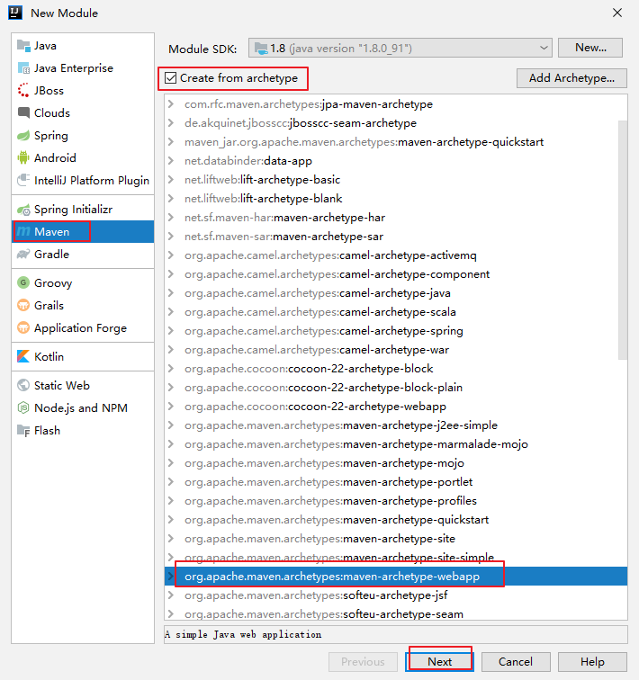
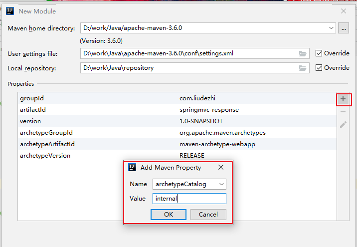

# 07.SpringMVC返回值类型及响应数据类型

- 笔记本：17.SpringMVC
- 创建时间：2020-05-07 15:11:42 UTC
- 更新时间：2020-05-11 01:32:11 UTC
- 印象笔记 GUID：428e0de9-9816-438a-9ed1-2a8d920c5aa3

### 1. 搭建环境

File -> New -> Module -> Maven -> Create from archetype -> org.apache.maven.archetypes:maven-archetype-webapp
 
 *为了更快创建项目：*
 
 ...

### 2. 响应返回值 String 类型

```
package com.liudezhi.controller;

@Controller()
@RequestMapping("/user")
public class UserController {

    @RequestMapping("/testString")
    public String testString(Model model) {
        System.out.println("testString 方法执行了...");
        //模拟从数据库中查询出User对象
        User user = new User();
        user.setUsername("刘德智");
        user.setAge(20);
        user.setPassword("abc");

        model.addAttribute("user", user);
        return "success";
    }
}

```

```
<%@ page contentType="text/html;charset=UTF-8" language="java" %>
<html>
<head>
    <title>Title</title>
</head>
<body>
    <a  >testString</a>
</body>
</html>

```

### 3. 响应返回值是 void 类型

```
package com.liudezhi.controller;

@Controller()
@RequestMapping("/user")
public class UserController {
    @RequestMapping("/testVoid")
    public void testVoid(HttpServletRequest request, HttpServletResponse response) throws ServletException, IOException {
        System.out.println("testVoid 方法执行了...");
        //编写用于转发的程序
//        request.getRequestDispatcher("/WEB-INF/pages/success.jsp").forward(request, response);

        //重定向
//        response.sendRedirect(request.getContextPath() + "/WEB-INF/pages/success.jsp");   //重定向相当于直接请求页面，WEB-INF下的页面是不能直接请求的。

        //设置中文乱码
        response.setCharacterEncoding("UTF-8");
        response.setContentType("text/html;charset=UTF-8");

        //直接进行响应
        response.getWriter().print("hello 你好啊");

        return;
    }
}

```

### 4. 响应返回值是 ModelAndView 类型

**ModelAndView 对象是 Spring 提供的一个对象，可以用来调整具体的 JSP 视图**

```
@Controller()
@RequestMapping("/user")
public class UserController {
    @RequestMapping("/testModelAndView")
    public ModelAndView testModelAndView() {
        //创建 ModelAndView 对象
        ModelAndView mv = new ModelAndView();
        System.out.println("testModelAndView 方法执行了...");
        //模拟从数据库中查询出User对象
        User user = new User();
        user.setUsername("刘德智");
        user.setAge(20);
        user.setPassword("abc");

        //把 user 对象存储到 mv 对象中，也会把 user 对象存入 request 对象
        mv.addObject("user", user);

        //跳转到哪个页面
        mv.setViewName("success");

        return mv;
    }
}

```

### 5. 转发和重定向

#### forward 转发

controller 方法在提供了 String 类型的返回值之后，默认就是请求转发。

#### redirect 重定向

```
@Controller()
@RequestMapping("/user")
public class UserController {
    @RequestMapping("testForwardOrRedirect")
    public String testForwardOrRedirect() {
        System.out.println("testForwardOrRedirect方法执行了...");
        //请求的转发
//        return "forward:/WEB-INF/pages/success.jsp";
        //重定向
        return "redirect:/index.jsp";
    }
}

```

### 6. ResponseBody 响应 json 数据

**页面发送ajax请求**

```
<%@ page contentType="text/html;charset=UTF-8" language="java" %>
<html>
<head>
    <title>Title</title>
    <script src="js/jquery.min.js"></script>
    <script>
        //页面加载，绑定单击事件
        $(function () {
            $("#btn").click(function () {
                // alert("hello btn");
                //发送ajax请求
                $.ajax({
                    url: "user/testAjax",
                    contentType: "application/json;charset=UTF-8",
                    data: '{"username": "haha", "password": "abc", "age":30}',
                    dataType: "json",
                    type: "post",
                    success: function (data) {
                        //data是服务器响应的json数据
                        alert(data);
                        alert(data.username);
                        alert(data.password);
                        alert(data.age);
                    }
                });
            })
        });
    </script>
</head>
<body>
    <button >发送ajax请求</button>
</body>
</html>

```

**springmvc.xml**

```
<!-- 前端控制器，哪些静态资源不拦截 -->
<mvc:resources location="/js/" mapping="/js/**"/>

```

**pom.xml:** 使用@ResponseBody返回json数据，需要引入jackson坐标

```
<dependency>
  <groupId>com.fasterxml.jackson.core</groupId>
  <artifactId>jackson-databind</artifactId>
  <version>2.10.0</version>
</dependency>

<dependency>
  <groupId>com.fasterxml.jackson.core</groupId>
  <artifactId>jackson-core</artifactId>
  <version>2.10.0</version>
</dependency>

<dependency>
  <groupId>com.fasterxml.jackson.core</groupId>
  <artifactId>jackson-annotations</artifactId>
  <version>2.10.0</version>
</dependency>

```

**controller**

```
package com.liudezhi.controller;
@Controller()
@RequestMapping("/user")
public class UserController {
    /**
     * 模拟异步请求响应
     * @param user
     * @return
     */
    @RequestMapping("/testAjax")
    public @ResponseBody User testAjax(@RequestBody User user) {
        System.out.println("testAjax执行了...");
        //客户端发送ajax的请求，传的是json字符串，后端把json字符串封装到user对象中
        System.out.println(user);
        //做响应，模拟查询数据库
        user.setUsername("abc");
        user.setAge(55);
        return user;
    }
}

```

%23%23%23%201.%20%E6%90%AD%E5%BB%BA%E7%8E%AF%E5%A2%83%0AFile%20-%3E%20New%20-%3E%20Module%20-%3E%20Maven%20-%3E%20Create%20from%20archetype%20-%3E%20org.apache.maven.archetypes%3Amaven-archetype-webapp%0A!%5B7f8c3125a91bc23f87d75379bdc9c470.png%5D(en-resource%3A%2F%2Fdatabase%2F3539%3A1)%0A*%E4%B8%BA%E4%BA%86%E6%9B%B4%E5%BF%AB%E5%88%9B%E5%BB%BA%E9%A1%B9%E7%9B%AE%EF%BC%9A*%0A!%5Bdbe875b14fb177ea1c1ac2d5816f89cc.png%5D(en-resource%3A%2F%2Fdatabase%2F3541%3A1)%0A...%0A%0A%0A%23%23%23%202.%20%E5%93%8D%E5%BA%94%E8%BF%94%E5%9B%9E%E5%80%BC%20String%20%E7%B1%BB%E5%9E%8B%0A%60%60%60java%0Apackage%20com.liudezhi.controller%3B%0A%0A%40Controller()%0A%40RequestMapping(%22%2Fuser%22)%0Apublic%20class%20UserController%20%7B%0A%0A%20%20%20%20%40RequestMapping(%22%2FtestString%22)%0A%20%20%20%20public%20String%20testString(Model%20model)%20%7B%0A%20%20%20%20%20%20%20%20System.out.println(%22testString%20%E6%96%B9%E6%B3%95%E6%89%A7%E8%A1%8C%E4%BA%86...%22)%3B%0A%20%20%20%20%20%20%20%20%2F%2F%E6%A8%A1%E6%8B%9F%E4%BB%8E%E6%95%B0%E6%8D%AE%E5%BA%93%E4%B8%AD%E6%9F%A5%E8%AF%A2%E5%87%BAUser%E5%AF%B9%E8%B1%A1%0A%20%20%20%20%20%20%20%20User%20user%20%3D%20new%20User()%3B%0A%20%20%20%20%20%20%20%20user.setUsername(%22%E5%88%98%E5%BE%B7%E6%99%BA%22)%3B%0A%20%20%20%20%20%20%20%20user.setAge(20)%3B%0A%20%20%20%20%20%20%20%20user.setPassword(%22abc%22)%3B%0A%0A%20%20%20%20%20%20%20%20model.addAttribute(%22user%22%2C%20user)%3B%0A%20%20%20%20%20%20%20%20return%20%22success%22%3B%0A%20%20%20%20%7D%0A%7D%0A%60%60%60%0A%0A%60%60%60jsp%0A%3C%25%40%20page%20contentType%3D%22text%2Fhtml%3Bcharset%3DUTF-8%22%20language%3D%22java%22%20%25%3E%0A%3Chtml%3E%0A%3Chead%3E%0A%20%20%20%20%3Ctitle%3ETitle%3C%2Ftitle%3E%0A%3C%2Fhead%3E%0A%3Cbody%3E%0A%20%20%20%20%3Ca%20href%3D%22user%2FtestString%22%3EtestString%3C%2Fa%3E%0A%3C%2Fbody%3E%0A%3C%2Fhtml%3E%0A%60%60%60%0A%0A%23%23%23%203.%20%E5%93%8D%E5%BA%94%E8%BF%94%E5%9B%9E%E5%80%BC%E6%98%AF%20void%20%E7%B1%BB%E5%9E%8B%0A%60%60%60java%0Apackage%20com.liudezhi.controller%3B%0A%0A%40Controller()%0A%40RequestMapping(%22%2Fuser%22)%0Apublic%20class%20UserController%20%7B%0A%20%20%20%20%40RequestMapping(%22%2FtestVoid%22)%0A%20%20%20%20public%20void%20testVoid(HttpServletRequest%20request%2C%20HttpServletResponse%20response)%20throws%20ServletException%2C%20IOException%20%7B%0A%20%20%20%20%20%20%20%20System.out.println(%22testVoid%20%E6%96%B9%E6%B3%95%E6%89%A7%E8%A1%8C%E4%BA%86...%22)%3B%0A%20%20%20%20%20%20%20%20%2F%2F%E7%BC%96%E5%86%99%E7%94%A8%E4%BA%8E%E8%BD%AC%E5%8F%91%E7%9A%84%E7%A8%8B%E5%BA%8F%0A%2F%2F%20%20%20%20%20%20%20%20request.getRequestDispatcher(%22%2FWEB-INF%2Fpages%2Fsuccess.jsp%22).forward(request%2C%20response)%3B%0A%0A%20%20%20%20%20%20%20%20%2F%2F%E9%87%8D%E5%AE%9A%E5%90%91%0A%2F%2F%20%20%20%20%20%20%20%20response.sendRedirect(request.getContextPath()%20%2B%20%22%2FWEB-INF%2Fpages%2Fsuccess.jsp%22)%3B%20%20%20%2F%2F%E9%87%8D%E5%AE%9A%E5%90%91%E7%9B%B8%E5%BD%93%E4%BA%8E%E7%9B%B4%E6%8E%A5%E8%AF%B7%E6%B1%82%E9%A1%B5%E9%9D%A2%EF%BC%8CWEB-INF%E4%B8%8B%E7%9A%84%E9%A1%B5%E9%9D%A2%E6%98%AF%E4%B8%8D%E8%83%BD%E7%9B%B4%E6%8E%A5%E8%AF%B7%E6%B1%82%E7%9A%84%E3%80%82%0A%0A%20%20%20%20%20%20%20%20%2F%2F%E8%AE%BE%E7%BD%AE%E4%B8%AD%E6%96%87%E4%B9%B1%E7%A0%81%0A%20%20%20%20%20%20%20%20response.setCharacterEncoding(%22UTF-8%22)%3B%0A%20%20%20%20%20%20%20%20response.setContentType(%22text%2Fhtml%3Bcharset%3DUTF-8%22)%3B%0A%0A%20%20%20%20%20%20%20%20%2F%2F%E7%9B%B4%E6%8E%A5%E8%BF%9B%E8%A1%8C%E5%93%8D%E5%BA%94%0A%20%20%20%20%20%20%20%20response.getWriter().print(%22hello%20%E4%BD%A0%E5%A5%BD%E5%95%8A%22)%3B%0A%0A%20%20%20%20%20%20%20%20return%3B%0A%20%20%20%20%7D%0A%7D%0A%60%60%60%0A%0A%23%23%23%204.%20%E5%93%8D%E5%BA%94%E8%BF%94%E5%9B%9E%E5%80%BC%E6%98%AF%20ModelAndView%20%E7%B1%BB%E5%9E%8B%0A**ModelAndView%20%E5%AF%B9%E8%B1%A1%E6%98%AF%20Spring%20%E6%8F%90%E4%BE%9B%E7%9A%84%E4%B8%80%E4%B8%AA%E5%AF%B9%E8%B1%A1%EF%BC%8C%E5%8F%AF%E4%BB%A5%E7%94%A8%E6%9D%A5%E8%B0%83%E6%95%B4%E5%85%B7%E4%BD%93%E7%9A%84%20JSP%20%E8%A7%86%E5%9B%BE**%0A%60%60%60java%0A%40Controller()%0A%40RequestMapping(%22%2Fuser%22)%0Apublic%20class%20UserController%20%7B%0A%20%20%20%20%40RequestMapping(%22%2FtestModelAndView%22)%0A%20%20%20%20public%20ModelAndView%20testModelAndView()%20%7B%0A%20%20%20%20%20%20%20%20%2F%2F%E5%88%9B%E5%BB%BA%20ModelAndView%20%E5%AF%B9%E8%B1%A1%0A%20%20%20%20%20%20%20%20ModelAndView%20mv%20%3D%20new%20ModelAndView()%3B%0A%20%20%20%20%20%20%20%20System.out.println(%22testModelAndView%20%E6%96%B9%E6%B3%95%E6%89%A7%E8%A1%8C%E4%BA%86...%22)%3B%0A%20%20%20%20%20%20%20%20%2F%2F%E6%A8%A1%E6%8B%9F%E4%BB%8E%E6%95%B0%E6%8D%AE%E5%BA%93%E4%B8%AD%E6%9F%A5%E8%AF%A2%E5%87%BAUser%E5%AF%B9%E8%B1%A1%0A%20%20%20%20%20%20%20%20User%20user%20%3D%20new%20User()%3B%0A%20%20%20%20%20%20%20%20user.setUsername(%22%E5%88%98%E5%BE%B7%E6%99%BA%22)%3B%0A%20%20%20%20%20%20%20%20user.setAge(20)%3B%0A%20%20%20%20%20%20%20%20user.setPassword(%22abc%22)%3B%0A%0A%20%20%20%20%20%20%20%20%2F%2F%E6%8A%8A%20user%20%E5%AF%B9%E8%B1%A1%E5%AD%98%E5%82%A8%E5%88%B0%20mv%20%E5%AF%B9%E8%B1%A1%E4%B8%AD%EF%BC%8C%E4%B9%9F%E4%BC%9A%E6%8A%8A%20user%20%E5%AF%B9%E8%B1%A1%E5%AD%98%E5%85%A5%20request%20%E5%AF%B9%E8%B1%A1%0A%20%20%20%20%20%20%20%20mv.addObject(%22user%22%2C%20user)%3B%0A%0A%20%20%20%20%20%20%20%20%2F%2F%E8%B7%B3%E8%BD%AC%E5%88%B0%E5%93%AA%E4%B8%AA%E9%A1%B5%E9%9D%A2%0A%20%20%20%20%20%20%20%20mv.setViewName(%22success%22)%3B%0A%0A%20%20%20%20%20%20%20%20return%20mv%3B%0A%20%20%20%20%7D%0A%7D%0A%60%60%60%0A%0A%23%23%23%205.%20%E8%BD%AC%E5%8F%91%E5%92%8C%E9%87%8D%E5%AE%9A%E5%90%91%0A%23%23%23%23%20forward%20%E8%BD%AC%E5%8F%91%0Acontroller%20%E6%96%B9%E6%B3%95%E5%9C%A8%E6%8F%90%E4%BE%9B%E4%BA%86%20String%20%E7%B1%BB%E5%9E%8B%E7%9A%84%E8%BF%94%E5%9B%9E%E5%80%BC%E4%B9%8B%E5%90%8E%EF%BC%8C%E9%BB%98%E8%AE%A4%E5%B0%B1%E6%98%AF%E8%AF%B7%E6%B1%82%E8%BD%AC%E5%8F%91%E3%80%82%0A%0A%23%23%23%23%20redirect%20%E9%87%8D%E5%AE%9A%E5%90%91%0A%60%60%60java%0A%40Controller()%0A%40RequestMapping(%22%2Fuser%22)%0Apublic%20class%20UserController%20%7B%0A%20%20%20%20%40RequestMapping(%22testForwardOrRedirect%22)%0A%20%20%20%20public%20String%20testForwardOrRedirect()%20%7B%0A%20%20%20%20%20%20%20%20System.out.println(%22testForwardOrRedirect%E6%96%B9%E6%B3%95%E6%89%A7%E8%A1%8C%E4%BA%86...%22)%3B%0A%20%20%20%20%20%20%20%20%2F%2F%E8%AF%B7%E6%B1%82%E7%9A%84%E8%BD%AC%E5%8F%91%0A%2F%2F%20%20%20%20%20%20%20%20return%20%22forward%3A%2FWEB-INF%2Fpages%2Fsuccess.jsp%22%3B%0A%20%20%20%20%20%20%20%20%2F%2F%E9%87%8D%E5%AE%9A%E5%90%91%0A%20%20%20%20%20%20%20%20return%20%22redirect%3A%2Findex.jsp%22%3B%0A%20%20%20%20%7D%0A%7D%0A%60%60%60%0A%0A%0A%23%23%23%206.%20ResponseBody%20%E5%93%8D%E5%BA%94%20json%20%E6%95%B0%E6%8D%AE%0A**%E9%A1%B5%E9%9D%A2%E5%8F%91%E9%80%81ajax%E8%AF%B7%E6%B1%82**%0A%60%60%60jsp%0A%3C%25%40%20page%20contentType%3D%22text%2Fhtml%3Bcharset%3DUTF-8%22%20language%3D%22java%22%20%25%3E%0A%3Chtml%3E%0A%3Chead%3E%0A%20%20%20%20%3Ctitle%3ETitle%3C%2Ftitle%3E%0A%20%20%20%20%3Cscript%20src%3D%22js%2Fjquery.min.js%22%3E%3C%2Fscript%3E%0A%20%20%20%20%3Cscript%3E%0A%20%20%20%20%20%20%20%20%2F%2F%E9%A1%B5%E9%9D%A2%E5%8A%A0%E8%BD%BD%EF%BC%8C%E7%BB%91%E5%AE%9A%E5%8D%95%E5%87%BB%E4%BA%8B%E4%BB%B6%0A%20%20%20%20%20%20%20%20%24(function%20()%20%7B%0A%20%20%20%20%20%20%20%20%20%20%20%20%24(%22%23btn%22).click(function%20()%20%7B%0A%20%20%20%20%20%20%20%20%20%20%20%20%20%20%20%20%2F%2F%20alert(%22hello%20btn%22)%3B%0A%20%20%20%20%20%20%20%20%20%20%20%20%20%20%20%20%2F%2F%E5%8F%91%E9%80%81ajax%E8%AF%B7%E6%B1%82%0A%20%20%20%20%20%20%20%20%20%20%20%20%20%20%20%20%24.ajax(%7B%0A%20%20%20%20%20%20%20%20%20%20%20%20%20%20%20%20%20%20%20%20url%3A%20%22user%2FtestAjax%22%2C%0A%20%20%20%20%20%20%20%20%20%20%20%20%20%20%20%20%20%20%20%20contentType%3A%20%22application%2Fjson%3Bcharset%3DUTF-8%22%2C%0A%20%20%20%20%20%20%20%20%20%20%20%20%20%20%20%20%20%20%20%20data%3A%20'%7B%22username%22%3A%20%22haha%22%2C%20%22password%22%3A%20%22abc%22%2C%20%22age%22%3A30%7D'%2C%0A%20%20%20%20%20%20%20%20%20%20%20%20%20%20%20%20%20%20%20%20dataType%3A%20%22json%22%2C%0A%20%20%20%20%20%20%20%20%20%20%20%20%20%20%20%20%20%20%20%20type%3A%20%22post%22%2C%0A%20%20%20%20%20%20%20%20%20%20%20%20%20%20%20%20%20%20%20%20success%3A%20function%20(data)%20%7B%0A%20%20%20%20%20%20%20%20%20%20%20%20%20%20%20%20%20%20%20%20%20%20%20%20%2F%2Fdata%E6%98%AF%E6%9C%8D%E5%8A%A1%E5%99%A8%E5%93%8D%E5%BA%94%E7%9A%84json%E6%95%B0%E6%8D%AE%0A%20%20%20%20%20%20%20%20%20%20%20%20%20%20%20%20%20%20%20%20%20%20%20%20alert(data)%3B%0A%20%20%20%20%20%20%20%20%20%20%20%20%20%20%20%20%20%20%20%20%20%20%20%20alert(data.username)%3B%0A%20%20%20%20%20%20%20%20%20%20%20%20%20%20%20%20%20%20%20%20%20%20%20%20alert(data.password)%3B%0A%20%20%20%20%20%20%20%20%20%20%20%20%20%20%20%20%20%20%20%20%20%20%20%20alert(data.age)%3B%0A%20%20%20%20%20%20%20%20%20%20%20%20%20%20%20%20%20%20%20%20%7D%0A%20%20%20%20%20%20%20%20%20%20%20%20%20%20%20%20%7D)%3B%0A%20%20%20%20%20%20%20%20%20%20%20%20%7D)%0A%20%20%20%20%20%20%20%20%7D)%3B%0A%20%20%20%20%3C%2Fscript%3E%0A%3C%2Fhead%3E%0A%3Cbody%3E%0A%20%20%20%20%3Cbutton%20id%3D%22btn%22%3E%E5%8F%91%E9%80%81ajax%E8%AF%B7%E6%B1%82%3C%2Fbutton%3E%0A%3C%2Fbody%3E%0A%3C%2Fhtml%3E%0A%60%60%60%0A%0A**springmvc.xml**%0A%60%60%60xml%0A%3C!--%20%E5%89%8D%E7%AB%AF%E6%8E%A7%E5%88%B6%E5%99%A8%EF%BC%8C%E5%93%AA%E4%BA%9B%E9%9D%99%E6%80%81%E8%B5%84%E6%BA%90%E4%B8%8D%E6%8B%A6%E6%88%AA%20--%3E%0A%3Cmvc%3Aresources%20location%3D%22%2Fjs%2F%22%20mapping%3D%22%2Fjs%2F**%22%2F%3E%0A%60%60%60%0A%0A**pom.xml%3A**%20%E4%BD%BF%E7%94%A8%40ResponseBody%E8%BF%94%E5%9B%9Ejson%E6%95%B0%E6%8D%AE%EF%BC%8C%E9%9C%80%E8%A6%81%E5%BC%95%E5%85%A5jackson%E5%9D%90%E6%A0%87%0A%60%60%60xml%0A%3Cdependency%3E%0A%20%20%3CgroupId%3Ecom.fasterxml.jackson.core%3C%2FgroupId%3E%0A%20%20%3CartifactId%3Ejackson-databind%3C%2FartifactId%3E%0A%20%20%3Cversion%3E2.10.0%3C%2Fversion%3E%0A%3C%2Fdependency%3E%0A%0A%3Cdependency%3E%0A%20%20%3CgroupId%3Ecom.fasterxml.jackson.core%3C%2FgroupId%3E%0A%20%20%3CartifactId%3Ejackson-core%3C%2FartifactId%3E%0A%20%20%3Cversion%3E2.10.0%3C%2Fversion%3E%0A%3C%2Fdependency%3E%0A%0A%3Cdependency%3E%0A%20%20%3CgroupId%3Ecom.fasterxml.jackson.core%3C%2FgroupId%3E%0A%20%20%3CartifactId%3Ejackson-annotations%3C%2FartifactId%3E%0A%20%20%3Cversion%3E2.10.0%3C%2Fversion%3E%0A%3C%2Fdependency%3E%0A%60%60%60%0A%0A**controller**%0A%60%60%60java%0Apackage%20com.liudezhi.controller%3B%0A%40Controller()%0A%40RequestMapping(%22%2Fuser%22)%0Apublic%20class%20UserController%20%7B%0A%20%20%20%20%2F**%0A%20%20%20%20%20*%20%E6%A8%A1%E6%8B%9F%E5%BC%82%E6%AD%A5%E8%AF%B7%E6%B1%82%E5%93%8D%E5%BA%94%0A%20%20%20%20%20*%20%40param%20user%0A%20%20%20%20%20*%20%40return%0A%20%20%20%20%20*%2F%0A%20%20%20%20%40RequestMapping(%22%2FtestAjax%22)%0A%20%20%20%20public%20%40ResponseBody%20User%20testAjax(%40RequestBody%20User%20user)%20%7B%0A%20%20%20%20%20%20%20%20System.out.println(%22testAjax%E6%89%A7%E8%A1%8C%E4%BA%86...%22)%3B%0A%20%20%20%20%20%20%20%20%2F%2F%E5%AE%A2%E6%88%B7%E7%AB%AF%E5%8F%91%E9%80%81ajax%E7%9A%84%E8%AF%B7%E6%B1%82%EF%BC%8C%E4%BC%A0%E7%9A%84%E6%98%AFjson%E5%AD%97%E7%AC%A6%E4%B8%B2%EF%BC%8C%E5%90%8E%E7%AB%AF%E6%8A%8Ajson%E5%AD%97%E7%AC%A6%E4%B8%B2%E5%B0%81%E8%A3%85%E5%88%B0user%E5%AF%B9%E8%B1%A1%E4%B8%AD%0A%20%20%20%20%20%20%20%20System.out.println(user)%3B%0A%20%20%20%20%20%20%20%20%2F%2F%E5%81%9A%E5%93%8D%E5%BA%94%EF%BC%8C%E6%A8%A1%E6%8B%9F%E6%9F%A5%E8%AF%A2%E6%95%B0%E6%8D%AE%E5%BA%93%0A%20%20%20%20%20%20%20%20user.setUsername(%22abc%22)%3B%0A%20%20%20%20%20%20%20%20user.setAge(55)%3B%0A%20%20%20%20%20%20%20%20return%20user%3B%0A%20%20%20%20%7D%0A%7D%0A%60%60%60
