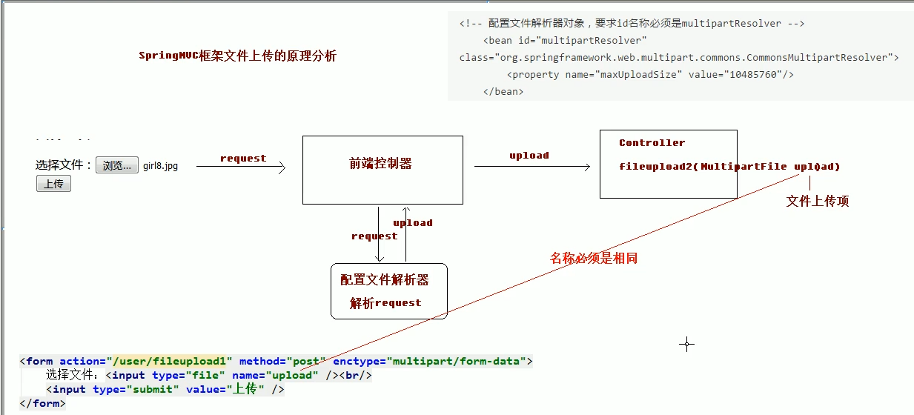

# 08.SpringMVC文件上传

- 笔记本：17.SpringMVC
- 创建时间：2020-05-11 01:36:42 UTC
- 更新时间：2020-05-11 03:49:06 UTC
- 印象笔记 GUID：8116fac9-a7bc-4924-9120-85474aaea6ea

## 1. 文件上传的回顾

### 1.1 文件上传的必要前提

1. form 表单的 enctype 取值必须是：`multipart/form-data`(默认值是：`application/x-www-form-urlencoded`)。enctype：是表单请求正文的类型

1. method 属性必须是 Post

1. 提供一个文件选择域 `<input type="file/>`

### 1.2 文件上传的原理分析

- 当 form 表单的 enctype 取值不是默认值后，`request.getParameter()` 将失效。
 `enctype="application/x-www-form-urlencoded"` 时，form 表单的正文内容是：`key=value&key=value&key=value`

- 当 from 表单的 enctype 取值为 `Mutilpart/form-data` 时，请求正文内容就变成：
 每一部分都是 MIME 类型描述的正文
 -------------------------------------------7dela433602ac //分界符
 Content-Disposition: form-data; name="userName" //协议头
 aaa //协议的正文
 -------------------------------------------7dela433602ac
 Content-Disposition: form-data;
 filename="C:.\a.txt"
 Content-Type: text/plain //协议的类型(MIME类型)
 bbbbbbbbbbbbbbbbbbbbbbbbbbbbbbbbbbbbbbbbbbbbbb
 -------------------------------------------7dela433602ac--

### 1.3 借助第三方组件实现文件上传

使用 Commons-fileupload 组件实现文件上传，需要导入该组件响应的支撑 jar 包：Commons-fileupload 和 commons-io。commons-io 不属于文件上传组件的开发 jar 文件，但 Commons-fileupload 组件从1.1 版本开始，它工作时需要 commons-io 包的支持。

#### eg

```
<?xml version="1.0" encoding="UTF-8"?>
  <dependencies>
    <dependency>
      <groupId>commons-fileupload</groupId>
      <artifactId>commons-fileupload</artifactId>
      <version>1.3.3</version>
    </dependency>

    <dependency>
      <groupId>commons-io</groupId>
      <artifactId>commons-io</artifactId>
      <version>2.4</version>
    </dependency>
  </dependencies>
</project>

```

```
<%@ page contentType="text/html;charset=UTF-8" language="java" %>
<html>
<head>
    <title>Title</title>
</head>
<body>
    <h3>文件上传</h3>
    <form action="user/fileupload1" method="post" enctype="multipart/form-data">
        选择文件：<input type="file" name="upload"/><br/>
        <input type="submit" value="上传" />
    </form>
</body>
</html>

```

```
package com.liudezhi.controller;

@Controller
@RequestMapping("/user")
public class UserController {

    @RequestMapping("/fileupload1")
    public String fileUpload1(HttpServletRequest request) throws Exception {
        System.out.println("文件上传");
        //使用fileupload组件完成文件上传
        //上传的位置
        String path = request.getSession().getServletContext().getRealPath("/uploads/");
        //判断该路径是否存在
        File file = new File(path);
        if (!file.exists()) {
            //创建该文件夹
            file.mkdirs();
        }
        //解析request对象，获取上传文件项
        DiskFileItemFactory factory = new DiskFileItemFactory();
        ServletFileUpload upload = new ServletFileUpload(factory);
        //解析request
        List<FileItem> items = upload.parseRequest(request);
        //遍历
        for (FileItem item : items) {
            //判断当前item对象是否是上传文件项
            if(item.isFormField()) {
                //说明是普通表单上传项
            } else {
                //说明是上传文件项
                //获取上传文件的名称
                String filename = item.getName();
                //把文件名称设置唯一值,uuid
                String uuid = UUID.randomUUID().toString().replace("-", "");
                filename = uuid + "_" + filename;
                //完成文件上传
                item.write(new File(path, filename));
                //删除临时文件
                item.delete();
            }
        }
        return "success";
    }
}

```

## springmvc 传统方式的文件上传

SpringMVC 框架提供了 MultipartFile 对象，该对象表示上传的文件，要求变量名称必须和表单 file 标签的 name 属性名称相同。
 

**配置文件解析器对象(springmvc.xml)**

```
<?xml version="1.0" encoding="UTF-8"?>
<beans xmlns="http://www.springframework.org/schema/beans"
       xmlns:mvc="http://www.springframework.org/schema/mvc"
       xmlns:context="http://www.springframework.org/schema/context"
       xmlns:xsi="http://www.w3.org/2001/XMLSchema-instance"
       xsi:schemaLocation="
        http://www.springframework.org/schema/beans
        http://www.springframework.org/schema/beans/spring-beans.xsd
        http://www.springframework.org/schema/mvc
        https://www.springframework.org/schema/mvc/spring-mvc.xsd
        http://www.springframework.org/schema/context
        https://www.springframework.org/schema/context/spring-context.xsd">

    <!-- 开启注解扫描 -->
    <context:component-scan base-package="com.liudezhi"></context:component-scan>

    <!-- 视图解析器对象 -->
    <bean id="internalResourceViewResolver" class="org.springframework.web.servlet.view.InternalResourceViewResolver">
        <property name="prefix" value="/WEB-INF/pages/"/>
        <property name="suffix" value=".jsp"/>
    </bean>

    <!-- 前端控制器，哪些静态资源不拦截 -->
    <mvc:resources location="/js/" mapping="/js/**"/>

    <!-- 配置文件解析器对象 -->
    <bean id="multipartResolver" class="org.springframework.web.multipart.commons.CommonsMultipartResolver">
        <property name="maxUploadSize" value="10485760"/>
    </bean>

    <!-- 开启 SpringMVC 框架注解的支持 -->
    <mvc:annotation-driven />
</beans>

```

```
<%@ page contentType="text/html;charset=UTF-8" language="java" %>
<html>
<head>
    <title>Title</title>
</head>
<body>
    <h3>springmvc文件上传</h3>
    <form action="user/fileupload2" method="post" enctype="multipart/form-data">
        选择文件：<input type="file" name="upload"/><br/>
        <input type="submit" value="上传" />
    </form>
</body>
</html>

```

```
package com.liudezhi.controller;

@Controller
@RequestMapping("/user")
public class UserController {
    @RequestMapping("/fileupload2")
    public String fileUpload2(HttpServletRequest request, MultipartFile upload) throws Exception {
        System.out.println("springmvc文件上传");
        //使用fileupload组件完成文件上传
        //上传的位置
        String path = request.getSession().getServletContext().getRealPath("/uploads/");
        //判断该路径是否存在
        File file = new File(path);
        if (!file.exists()) {
            //创建该文件夹
            file.mkdirs();
        }
        //说明是上传文件项
        //获取上传文件的名称
        String filename = upload.getOriginalFilename();
        //把文件名称设置唯一值,uuid
        String uuid = UUID.randomUUID().toString().replace("-", "");
        filename = uuid + "_" + filename;
        //完成文件上传
        upload.transferTo(new File(path, filename));
        return "success";
    }
}

```

%23%23%201.%20%E6%96%87%E4%BB%B6%E4%B8%8A%E4%BC%A0%E7%9A%84%E5%9B%9E%E9%A1%BE%0A%23%23%23%201.1%20%E6%96%87%E4%BB%B6%E4%B8%8A%E4%BC%A0%E7%9A%84%E5%BF%85%E8%A6%81%E5%89%8D%E6%8F%90%0A1.%20form%20%E8%A1%A8%E5%8D%95%E7%9A%84%20enctype%20%E5%8F%96%E5%80%BC%E5%BF%85%E9%A1%BB%E6%98%AF%EF%BC%9A%60multipart%2Fform-data%60(%E9%BB%98%E8%AE%A4%E5%80%BC%E6%98%AF%EF%BC%9A%60application%2Fx-www-form-urlencoded%60)%E3%80%82enctype%EF%BC%9A%E6%98%AF%E8%A1%A8%E5%8D%95%E8%AF%B7%E6%B1%82%E6%AD%A3%E6%96%87%E7%9A%84%E7%B1%BB%E5%9E%8B%0A2.%20method%20%E5%B1%9E%E6%80%A7%E5%BF%85%E9%A1%BB%E6%98%AF%20Post%0A3.%20%E6%8F%90%E4%BE%9B%E4%B8%80%E4%B8%AA%E6%96%87%E4%BB%B6%E9%80%89%E6%8B%A9%E5%9F%9F%20%60%3Cinput%20type%3D%22file%2F%3E%60%0A%0A%23%23%23%201.2%20%E6%96%87%E4%BB%B6%E4%B8%8A%E4%BC%A0%E7%9A%84%E5%8E%9F%E7%90%86%E5%88%86%E6%9E%90%0A*%20%E5%BD%93%20form%20%E8%A1%A8%E5%8D%95%E7%9A%84%20enctype%20%E5%8F%96%E5%80%BC%E4%B8%8D%E6%98%AF%E9%BB%98%E8%AE%A4%E5%80%BC%E5%90%8E%EF%BC%8C%60request.getParameter()%60%20%E5%B0%86%E5%A4%B1%E6%95%88%E3%80%82%0A%60enctype%3D%22application%2Fx-www-form-urlencoded%22%60%20%E6%97%B6%EF%BC%8Cform%20%E8%A1%A8%E5%8D%95%E7%9A%84%E6%AD%A3%E6%96%87%E5%86%85%E5%AE%B9%E6%98%AF%EF%BC%9A%60key%3Dvalue%26key%3Dvalue%26key%3Dvalue%60%0A*%20%E5%BD%93%20from%20%E8%A1%A8%E5%8D%95%E7%9A%84%20enctype%20%E5%8F%96%E5%80%BC%E4%B8%BA%20%60Mutilpart%2Fform-data%60%20%E6%97%B6%EF%BC%8C%E8%AF%B7%E6%B1%82%E6%AD%A3%E6%96%87%E5%86%85%E5%AE%B9%E5%B0%B1%E5%8F%98%E6%88%90%EF%BC%9A%0A%E6%AF%8F%E4%B8%80%E9%83%A8%E5%88%86%E9%83%BD%E6%98%AF%20MIME%20%E7%B1%BB%E5%9E%8B%E6%8F%8F%E8%BF%B0%E7%9A%84%E6%AD%A3%E6%96%87%0A-------------------------------------------7dela433602ac%20%20%20%20%2F%2F%E5%88%86%E7%95%8C%E7%AC%A6%0AContent-Disposition%3A%20form-data%3B%20name%3D%22userName%22%20%20%20%20%20%2F%2F%E5%8D%8F%E8%AE%AE%E5%A4%B4%0Aaaa%20%20%20%20%20%20%20%20%20%20%20%20%20%20%20%20%20%20%20%20%20%20%20%20%20%20%20%20%20%20%20%20%20%20%20%20%20%20%20%20%20%20%20%20%20%20%20%20%20%20%20%20%20%20%20%20%20%20%20%20%20%20%20%20%20%2F%2F%E5%8D%8F%E8%AE%AE%E7%9A%84%E6%AD%A3%E6%96%87%0A-------------------------------------------7dela433602ac%20%20%20%20%0AContent-Disposition%3A%20form-data%3B%0Afilename%3D%22C%3A%5C.%5Ca.txt%22%20%0AContent-Type%3A%20text%2Fplain%20%20%20%20%20%20%20%20%20%20%20%20%20%20%20%20%20%20%20%20%20%20%20%20%20%20%20%20%20%20%20%20%20%20%2F%2F%E5%8D%8F%E8%AE%AE%E7%9A%84%E7%B1%BB%E5%9E%8B(MIME%E7%B1%BB%E5%9E%8B)%0Abbbbbbbbbbbbbbbbbbbbbbbbbbbbbbbbbbbbbbbbbbbbbb%0A-------------------------------------------7dela433602ac--%0A%0A%23%23%23%201.3%20%E5%80%9F%E5%8A%A9%E7%AC%AC%E4%B8%89%E6%96%B9%E7%BB%84%E4%BB%B6%E5%AE%9E%E7%8E%B0%E6%96%87%E4%BB%B6%E4%B8%8A%E4%BC%A0%0A%E4%BD%BF%E7%94%A8%20Commons-fileupload%20%E7%BB%84%E4%BB%B6%E5%AE%9E%E7%8E%B0%E6%96%87%E4%BB%B6%E4%B8%8A%E4%BC%A0%EF%BC%8C%E9%9C%80%E8%A6%81%E5%AF%BC%E5%85%A5%E8%AF%A5%E7%BB%84%E4%BB%B6%E5%93%8D%E5%BA%94%E7%9A%84%E6%94%AF%E6%92%91%20jar%20%E5%8C%85%EF%BC%9ACommons-fileupload%20%E5%92%8C%20commons-io%E3%80%82commons-io%20%E4%B8%8D%E5%B1%9E%E4%BA%8E%E6%96%87%E4%BB%B6%E4%B8%8A%E4%BC%A0%E7%BB%84%E4%BB%B6%E7%9A%84%E5%BC%80%E5%8F%91%20jar%20%E6%96%87%E4%BB%B6%EF%BC%8C%E4%BD%86%20Commons-fileupload%20%E7%BB%84%E4%BB%B6%E4%BB%8E1.1%20%E7%89%88%E6%9C%AC%E5%BC%80%E5%A7%8B%EF%BC%8C%E5%AE%83%E5%B7%A5%E4%BD%9C%E6%97%B6%E9%9C%80%E8%A6%81%20commons-io%20%E5%8C%85%E7%9A%84%E6%94%AF%E6%8C%81%E3%80%82%0A%0A%23%23%23%23%20eg%0A****%0A%60%60%60xml%0A%3C%3Fxml%20version%3D%221.0%22%20encoding%3D%22UTF-8%22%3F%3E%0A%20%20%3Cdependencies%3E%0A%20%20%20%20%3Cdependency%3E%0A%20%20%20%20%20%20%3CgroupId%3Ecommons-fileupload%3C%2FgroupId%3E%0A%20%20%20%20%20%20%3CartifactId%3Ecommons-fileupload%3C%2FartifactId%3E%0A%20%20%20%20%20%20%3Cversion%3E1.3.3%3C%2Fversion%3E%0A%20%20%20%20%3C%2Fdependency%3E%0A%0A%20%20%20%20%3Cdependency%3E%0A%20%20%20%20%20%20%3CgroupId%3Ecommons-io%3C%2FgroupId%3E%0A%20%20%20%20%20%20%3CartifactId%3Ecommons-io%3C%2FartifactId%3E%0A%20%20%20%20%20%20%3Cversion%3E2.4%3C%2Fversion%3E%0A%20%20%20%20%3C%2Fdependency%3E%0A%20%20%3C%2Fdependencies%3E%0A%3C%2Fproject%3E%0A%60%60%60%0A%0A%60%60%60jsp%0A%3C%25%40%20page%20contentType%3D%22text%2Fhtml%3Bcharset%3DUTF-8%22%20language%3D%22java%22%20%25%3E%0A%3Chtml%3E%0A%3Chead%3E%0A%20%20%20%20%3Ctitle%3ETitle%3C%2Ftitle%3E%0A%3C%2Fhead%3E%0A%3Cbody%3E%0A%20%20%20%20%3Ch3%3E%E6%96%87%E4%BB%B6%E4%B8%8A%E4%BC%A0%3C%2Fh3%3E%0A%20%20%20%20%3Cform%20action%3D%22user%2Ffileupload1%22%20method%3D%22post%22%20enctype%3D%22multipart%2Fform-data%22%3E%0A%20%20%20%20%20%20%20%20%E9%80%89%E6%8B%A9%E6%96%87%E4%BB%B6%EF%BC%9A%3Cinput%20type%3D%22file%22%20name%3D%22upload%22%2F%3E%3Cbr%2F%3E%0A%20%20%20%20%20%20%20%20%3Cinput%20type%3D%22submit%22%20value%3D%22%E4%B8%8A%E4%BC%A0%22%20%2F%3E%0A%20%20%20%20%3C%2Fform%3E%0A%3C%2Fbody%3E%0A%3C%2Fhtml%3E%0A%60%60%60%0A%0A%60%60%60java%0Apackage%20com.liudezhi.controller%3B%0A%0A%40Controller%0A%40RequestMapping(%22%2Fuser%22)%0Apublic%20class%20UserController%20%7B%0A%0A%20%20%20%20%40RequestMapping(%22%2Ffileupload1%22)%0A%20%20%20%20public%20String%20fileUpload1(HttpServletRequest%20request)%20throws%20Exception%20%7B%0A%20%20%20%20%20%20%20%20System.out.println(%22%E6%96%87%E4%BB%B6%E4%B8%8A%E4%BC%A0%22)%3B%0A%20%20%20%20%20%20%20%20%2F%2F%E4%BD%BF%E7%94%A8fileupload%E7%BB%84%E4%BB%B6%E5%AE%8C%E6%88%90%E6%96%87%E4%BB%B6%E4%B8%8A%E4%BC%A0%0A%20%20%20%20%20%20%20%20%2F%2F%E4%B8%8A%E4%BC%A0%E7%9A%84%E4%BD%8D%E7%BD%AE%0A%20%20%20%20%20%20%20%20String%20path%20%3D%20request.getSession().getServletContext().getRealPath(%22%2Fuploads%2F%22)%3B%0A%20%20%20%20%20%20%20%20%2F%2F%E5%88%A4%E6%96%AD%E8%AF%A5%E8%B7%AF%E5%BE%84%E6%98%AF%E5%90%A6%E5%AD%98%E5%9C%A8%0A%20%20%20%20%20%20%20%20File%20file%20%3D%20new%20File(path)%3B%0A%20%20%20%20%20%20%20%20if%20(!file.exists())%20%7B%0A%20%20%20%20%20%20%20%20%20%20%20%20%2F%2F%E5%88%9B%E5%BB%BA%E8%AF%A5%E6%96%87%E4%BB%B6%E5%A4%B9%0A%20%20%20%20%20%20%20%20%20%20%20%20file.mkdirs()%3B%0A%20%20%20%20%20%20%20%20%7D%0A%20%20%20%20%20%20%20%20%2F%2F%E8%A7%A3%E6%9E%90request%E5%AF%B9%E8%B1%A1%EF%BC%8C%E8%8E%B7%E5%8F%96%E4%B8%8A%E4%BC%A0%E6%96%87%E4%BB%B6%E9%A1%B9%0A%20%20%20%20%20%20%20%20DiskFileItemFactory%20factory%20%3D%20new%20DiskFileItemFactory()%3B%0A%20%20%20%20%20%20%20%20ServletFileUpload%20upload%20%3D%20new%20ServletFileUpload(factory)%3B%0A%20%20%20%20%20%20%20%20%2F%2F%E8%A7%A3%E6%9E%90request%0A%20%20%20%20%20%20%20%20List%3CFileItem%3E%20items%20%3D%20upload.parseRequest(request)%3B%0A%20%20%20%20%20%20%20%20%2F%2F%E9%81%8D%E5%8E%86%0A%20%20%20%20%20%20%20%20for%20(FileItem%20item%20%3A%20items)%20%7B%0A%20%20%20%20%20%20%20%20%20%20%20%20%2F%2F%E5%88%A4%E6%96%AD%E5%BD%93%E5%89%8Ditem%E5%AF%B9%E8%B1%A1%E6%98%AF%E5%90%A6%E6%98%AF%E4%B8%8A%E4%BC%A0%E6%96%87%E4%BB%B6%E9%A1%B9%0A%20%20%20%20%20%20%20%20%20%20%20%20if(item.isFormField())%20%7B%0A%20%20%20%20%20%20%20%20%20%20%20%20%20%20%20%20%2F%2F%E8%AF%B4%E6%98%8E%E6%98%AF%E6%99%AE%E9%80%9A%E8%A1%A8%E5%8D%95%E4%B8%8A%E4%BC%A0%E9%A1%B9%0A%20%20%20%20%20%20%20%20%20%20%20%20%7D%20else%20%7B%0A%20%20%20%20%20%20%20%20%20%20%20%20%20%20%20%20%2F%2F%E8%AF%B4%E6%98%8E%E6%98%AF%E4%B8%8A%E4%BC%A0%E6%96%87%E4%BB%B6%E9%A1%B9%0A%20%20%20%20%20%20%20%20%20%20%20%20%20%20%20%20%2F%2F%E8%8E%B7%E5%8F%96%E4%B8%8A%E4%BC%A0%E6%96%87%E4%BB%B6%E7%9A%84%E5%90%8D%E7%A7%B0%0A%20%20%20%20%20%20%20%20%20%20%20%20%20%20%20%20String%20filename%20%3D%20item.getName()%3B%0A%20%20%20%20%20%20%20%20%20%20%20%20%20%20%20%20%2F%2F%E6%8A%8A%E6%96%87%E4%BB%B6%E5%90%8D%E7%A7%B0%E8%AE%BE%E7%BD%AE%E5%94%AF%E4%B8%80%E5%80%BC%2Cuuid%0A%20%20%20%20%20%20%20%20%20%20%20%20%20%20%20%20String%20uuid%20%3D%20UUID.randomUUID().toString().replace(%22-%22%2C%20%22%22)%3B%0A%20%20%20%20%20%20%20%20%20%20%20%20%20%20%20%20filename%20%3D%20uuid%20%2B%20%22_%22%20%2B%20filename%3B%0A%20%20%20%20%20%20%20%20%20%20%20%20%20%20%20%20%2F%2F%E5%AE%8C%E6%88%90%E6%96%87%E4%BB%B6%E4%B8%8A%E4%BC%A0%0A%20%20%20%20%20%20%20%20%20%20%20%20%20%20%20%20item.write(new%20File(path%2C%20filename))%3B%0A%20%20%20%20%20%20%20%20%20%20%20%20%20%20%20%20%2F%2F%E5%88%A0%E9%99%A4%E4%B8%B4%E6%97%B6%E6%96%87%E4%BB%B6%0A%20%20%20%20%20%20%20%20%20%20%20%20%20%20%20%20item.delete()%3B%0A%20%20%20%20%20%20%20%20%20%20%20%20%7D%0A%20%20%20%20%20%20%20%20%7D%0A%20%20%20%20%20%20%20%20return%20%22success%22%3B%0A%20%20%20%20%7D%0A%7D%0A%60%60%60%0A%0A%23%23%20springmvc%20%E4%BC%A0%E7%BB%9F%E6%96%B9%E5%BC%8F%E7%9A%84%E6%96%87%E4%BB%B6%E4%B8%8A%E4%BC%A0%0ASpringMVC%20%E6%A1%86%E6%9E%B6%E6%8F%90%E4%BE%9B%E4%BA%86%20MultipartFile%20%E5%AF%B9%E8%B1%A1%EF%BC%8C%E8%AF%A5%E5%AF%B9%E8%B1%A1%E8%A1%A8%E7%A4%BA%E4%B8%8A%E4%BC%A0%E7%9A%84%E6%96%87%E4%BB%B6%EF%BC%8C%E8%A6%81%E6%B1%82%E5%8F%98%E9%87%8F%E5%90%8D%E7%A7%B0%E5%BF%85%E9%A1%BB%E5%92%8C%E8%A1%A8%E5%8D%95%20file%20%E6%A0%87%E7%AD%BE%E7%9A%84%20name%20%E5%B1%9E%E6%80%A7%E5%90%8D%E7%A7%B0%E7%9B%B8%E5%90%8C%E3%80%82%0A!%5B7a6477b489b158817db036138ece07eb.png%5D(en-resource%3A%2F%2Fdatabase%2F3549%3A0)%0A%0A%0A**%E9%85%8D%E7%BD%AE%E6%96%87%E4%BB%B6%E8%A7%A3%E6%9E%90%E5%99%A8%E5%AF%B9%E8%B1%A1(springmvc.xml)**%0A%60%60%60xml%0A%3C%3Fxml%20version%3D%221.0%22%20encoding%3D%22UTF-8%22%3F%3E%0A%3Cbeans%20xmlns%3D%22http%3A%2F%2Fwww.springframework.org%2Fschema%2Fbeans%22%0A%20%20%20%20%20%20%20xmlns%3Amvc%3D%22http%3A%2F%2Fwww.springframework.org%2Fschema%2Fmvc%22%0A%20%20%20%20%20%20%20xmlns%3Acontext%3D%22http%3A%2F%2Fwww.springframework.org%2Fschema%2Fcontext%22%0A%20%20%20%20%20%20%20xmlns%3Axsi%3D%22http%3A%2F%2Fwww.w3.org%2F2001%2FXMLSchema-instance%22%0A%20%20%20%20%20%20%20xsi%3AschemaLocation%3D%22%0A%20%20%20%20%20%20%20%20http%3A%2F%2Fwww.springframework.org%2Fschema%2Fbeans%0A%20%20%20%20%20%20%20%20http%3A%2F%2Fwww.springframework.org%2Fschema%2Fbeans%2Fspring-beans.xsd%0A%20%20%20%20%20%20%20%20http%3A%2F%2Fwww.springframework.org%2Fschema%2Fmvc%0A%20%20%20%20%20%20%20%20https%3A%2F%2Fwww.springframework.org%2Fschema%2Fmvc%2Fspring-mvc.xsd%0A%20%20%20%20%20%20%20%20http%3A%2F%2Fwww.springframework.org%2Fschema%2Fcontext%0A%20%20%20%20%20%20%20%20https%3A%2F%2Fwww.springframework.org%2Fschema%2Fcontext%2Fspring-context.xsd%22%3E%0A%0A%20%20%20%20%3C!--%20%E5%BC%80%E5%90%AF%E6%B3%A8%E8%A7%A3%E6%89%AB%E6%8F%8F%20--%3E%0A%20%20%20%20%3Ccontext%3Acomponent-scan%20base-package%3D%22com.liudezhi%22%3E%3C%2Fcontext%3Acomponent-scan%3E%0A%0A%20%20%20%20%3C!--%20%E8%A7%86%E5%9B%BE%E8%A7%A3%E6%9E%90%E5%99%A8%E5%AF%B9%E8%B1%A1%20--%3E%0A%20%20%20%20%3Cbean%20id%3D%22internalResourceViewResolver%22%20class%3D%22org.springframework.web.servlet.view.InternalResourceViewResolver%22%3E%0A%20%20%20%20%20%20%20%20%3Cproperty%20name%3D%22prefix%22%20value%3D%22%2FWEB-INF%2Fpages%2F%22%2F%3E%0A%20%20%20%20%20%20%20%20%3Cproperty%20name%3D%22suffix%22%20value%3D%22.jsp%22%2F%3E%0A%20%20%20%20%3C%2Fbean%3E%0A%0A%20%20%20%20%3C!--%20%E5%89%8D%E7%AB%AF%E6%8E%A7%E5%88%B6%E5%99%A8%EF%BC%8C%E5%93%AA%E4%BA%9B%E9%9D%99%E6%80%81%E8%B5%84%E6%BA%90%E4%B8%8D%E6%8B%A6%E6%88%AA%20--%3E%0A%20%20%20%20%3Cmvc%3Aresources%20location%3D%22%2Fjs%2F%22%20mapping%3D%22%2Fjs%2F**%22%2F%3E%0A%0A%20%20%20%20%3C!--%20%E9%85%8D%E7%BD%AE%E6%96%87%E4%BB%B6%E8%A7%A3%E6%9E%90%E5%99%A8%E5%AF%B9%E8%B1%A1%20--%3E%0A%20%20%20%20%3Cbean%20id%3D%22multipartResolver%22%20class%3D%22org.springframework.web.multipart.commons.CommonsMultipartResolver%22%3E%0A%20%20%20%20%20%20%20%20%3Cproperty%20name%3D%22maxUploadSize%22%20value%3D%2210485760%22%2F%3E%0A%20%20%20%20%3C%2Fbean%3E%0A%0A%20%20%20%20%3C!--%20%E5%BC%80%E5%90%AF%20SpringMVC%20%E6%A1%86%E6%9E%B6%E6%B3%A8%E8%A7%A3%E7%9A%84%E6%94%AF%E6%8C%81%20--%3E%0A%20%20%20%20%3Cmvc%3Aannotation-driven%20%2F%3E%0A%3C%2Fbeans%3E%0A%60%60%60%0A%0A%60%60%60jsp%0A%3C%25%40%20page%20contentType%3D%22text%2Fhtml%3Bcharset%3DUTF-8%22%20language%3D%22java%22%20%25%3E%0A%3Chtml%3E%0A%3Chead%3E%0A%20%20%20%20%3Ctitle%3ETitle%3C%2Ftitle%3E%0A%3C%2Fhead%3E%0A%3Cbody%3E%0A%20%20%20%20%3Ch3%3Espringmvc%E6%96%87%E4%BB%B6%E4%B8%8A%E4%BC%A0%3C%2Fh3%3E%0A%20%20%20%20%3Cform%20action%3D%22user%2Ffileupload2%22%20method%3D%22post%22%20enctype%3D%22multipart%2Fform-data%22%3E%0A%20%20%20%20%20%20%20%20%E9%80%89%E6%8B%A9%E6%96%87%E4%BB%B6%EF%BC%9A%3Cinput%20type%3D%22file%22%20name%3D%22upload%22%2F%3E%3Cbr%2F%3E%0A%20%20%20%20%20%20%20%20%3Cinput%20type%3D%22submit%22%20value%3D%22%E4%B8%8A%E4%BC%A0%22%20%2F%3E%0A%20%20%20%20%3C%2Fform%3E%0A%3C%2Fbody%3E%0A%3C%2Fhtml%3E%0A%60%60%60%0A%0A%60%60%60java%0Apackage%20com.liudezhi.controller%3B%0A%0A%40Controller%0A%40RequestMapping(%22%2Fuser%22)%0Apublic%20class%20UserController%20%7B%0A%20%20%20%20%40RequestMapping(%22%2Ffileupload2%22)%0A%20%20%20%20public%20String%20fileUpload2(HttpServletRequest%20request%2C%20MultipartFile%20upload)%20throws%20Exception%20%7B%0A%20%20%20%20%20%20%20%20System.out.println(%22springmvc%E6%96%87%E4%BB%B6%E4%B8%8A%E4%BC%A0%22)%3B%0A%20%20%20%20%20%20%20%20%2F%2F%E4%BD%BF%E7%94%A8fileupload%E7%BB%84%E4%BB%B6%E5%AE%8C%E6%88%90%E6%96%87%E4%BB%B6%E4%B8%8A%E4%BC%A0%0A%20%20%20%20%20%20%20%20%2F%2F%E4%B8%8A%E4%BC%A0%E7%9A%84%E4%BD%8D%E7%BD%AE%0A%20%20%20%20%20%20%20%20String%20path%20%3D%20request.getSession().getServletContext().getRealPath(%22%2Fuploads%2F%22)%3B%0A%20%20%20%20%20%20%20%20%2F%2F%E5%88%A4%E6%96%AD%E8%AF%A5%E8%B7%AF%E5%BE%84%E6%98%AF%E5%90%A6%E5%AD%98%E5%9C%A8%0A%20%20%20%20%20%20%20%20File%20file%20%3D%20new%20File(path)%3B%0A%20%20%20%20%20%20%20%20if%20(!file.exists())%20%7B%0A%20%20%20%20%20%20%20%20%20%20%20%20%2F%2F%E5%88%9B%E5%BB%BA%E8%AF%A5%E6%96%87%E4%BB%B6%E5%A4%B9%0A%20%20%20%20%20%20%20%20%20%20%20%20file.mkdirs()%3B%0A%20%20%20%20%20%20%20%20%7D%0A%20%20%20%20%20%20%20%20%2F%2F%E8%AF%B4%E6%98%8E%E6%98%AF%E4%B8%8A%E4%BC%A0%E6%96%87%E4%BB%B6%E9%A1%B9%0A%20%20%20%20%20%20%20%20%2F%2F%E8%8E%B7%E5%8F%96%E4%B8%8A%E4%BC%A0%E6%96%87%E4%BB%B6%E7%9A%84%E5%90%8D%E7%A7%B0%0A%20%20%20%20%20%20%20%20String%20filename%20%3D%20upload.getOriginalFilename()%3B%0A%20%20%20%20%20%20%20%20%2F%2F%E6%8A%8A%E6%96%87%E4%BB%B6%E5%90%8D%E7%A7%B0%E8%AE%BE%E7%BD%AE%E5%94%AF%E4%B8%80%E5%80%BC%2Cuuid%0A%20%20%20%20%20%20%20%20String%20uuid%20%3D%20UUID.randomUUID().toString().replace(%22-%22%2C%20%22%22)%3B%0A%20%20%20%20%20%20%20%20filename%20%3D%20uuid%20%2B%20%22_%22%20%2B%20filename%3B%0A%20%20%20%20%20%20%20%20%2F%2F%E5%AE%8C%E6%88%90%E6%96%87%E4%BB%B6%E4%B8%8A%E4%BC%A0%0A%20%20%20%20%20%20%20%20upload.transferTo(new%20File(path%2C%20filename))%3B%0A%20%20%20%20%20%20%20%20return%20%22success%22%3B%0A%20%20%20%20%7D%0A%7D%0A%60%60%60%0A%0A
