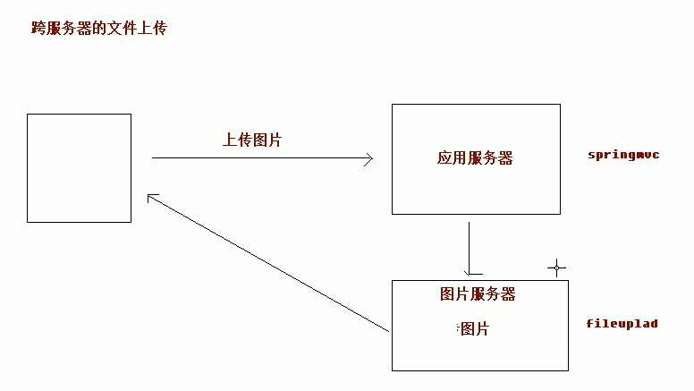
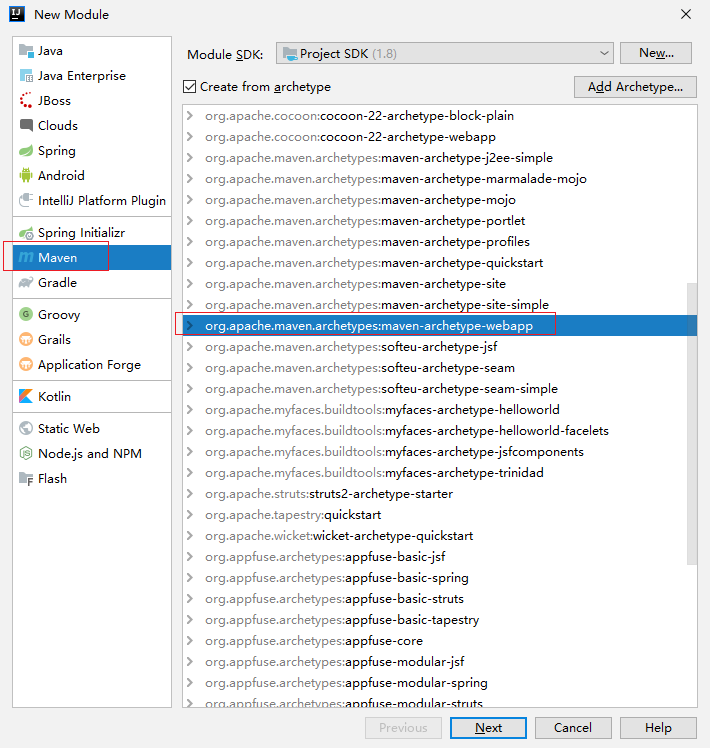
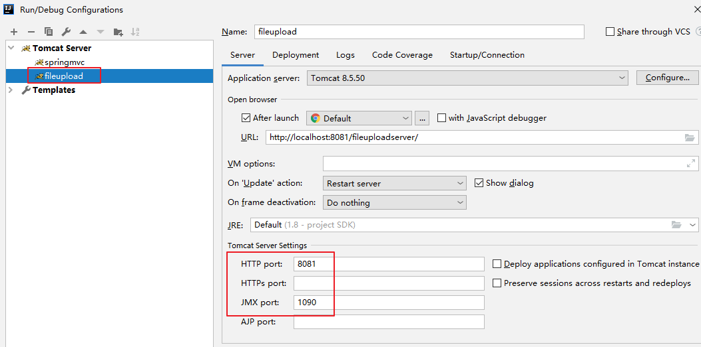

# 09.springmvc跨服务器方式的文件上传

- 笔记本：17.SpringMVC
- 创建时间：2020-05-11 03:59:53 UTC
- 更新时间：2020-05-11 07:38:15 UTC
- 原始链接：https://segmentfault.com/a/1190000021309683?utm_source=tag-newest
- 印象笔记 GUID：db1f919e-77f8-4008-a9da-f5bd91d9534d

### 1. 分服务器的目的

在实际开发中，我们会有很多处理不同功能的服务器。例如：

- 应用服务器：负责部署我们的项目

- 数据库服务器：运行我们的数据库

- 缓存和消息服务器：负责处理大并发访问的缓存和消息

- 文件服务器：负责存储用户上传文件的服务器。



### 2. 文件服务器的搭建

File -> new -> Module -> Maven
 



### 3. 文件上传代码

**注意：tomcat 高版本会默认readonly，可以通过修改conf/web.xml

```
<servlet>
        <servlet-name>default</servlet-name>
        <servlet-class>org.apache.catalina.servlets.DefaultServlet</servlet-class>
        <init-param>
            <param-name>debug</param-name>
            <param-value>0</param-value>
        </init-param>
        <init-param>
            <param-name>listings</param-name>
            <param-value>false</param-value>
        </init-param>
        <init-param>
            <param-name>readonly</param-name>
            <param-value>false</param-value>
        </init-param>
        <load-on-startup>1</load-on-startup>
    </servlet>

```

[参考]

**pom.xml：需要引入 jersey**

```
<dependency>
  <groupId>com.sun.jersey</groupId>
  <artifactId>jersey-core</artifactId>
  <version>1.19</version>
</dependency>

<dependency>
  <groupId>com.sun.jersey</groupId>
  <artifactId>jersey-client</artifactId>
  <version>1.19</version>
</dependency>

```

**index.jsp**

```
<%@ page contentType="text/html;charset=UTF-8" language="java" %>
<html>
<head>
    <title>Title</title>
</head>
<body>
    <h3>跨服务文件上传</h3>
    <form action="user/fileupload3" method="post" enctype="multipart/form-data">
        选择文件：<input type="file" name="upload"/><br/>
        <input type="submit" value="上传" />
    </form>
</body>
</html>

```

**UserController.java**

```
package com.liudezhi.controller;
@Controller
@RequestMapping("/user")
public class UserController {
    @RequestMapping("/fileupload3")
    public String fileUpload3(MultipartFile upload) throws Exception {
        System.out.println("跨服务器文件上传");

        //定义上传文件服务器路径
        String path = "http://localhost:8081/fileuploadserver/uploads/";
        //说明是上传文件项
        //获取上传文件的名称
        String filename = upload.getOriginalFilename();
        //把文件名称设置唯一值,uuid
        String uuid = UUID.randomUUID().toString().replace("-", "");
        filename = uuid + "_" + filename;
        //完成文件上传，跨服务器上传

        //创建客户端的对象
        Client client = Client.create();
        //和图片服务器进行连接
        WebResource webResource = client.resource(path + filename);
        //上传文件
        webResource.put(upload.getBytes());
        return "success";
    }
}

```

%23%23%23%201.%20%E5%88%86%E6%9C%8D%E5%8A%A1%E5%99%A8%E7%9A%84%E7%9B%AE%E7%9A%84%0A%E5%9C%A8%E5%AE%9E%E9%99%85%E5%BC%80%E5%8F%91%E4%B8%AD%EF%BC%8C%E6%88%91%E4%BB%AC%E4%BC%9A%E6%9C%89%E5%BE%88%E5%A4%9A%E5%A4%84%E7%90%86%E4%B8%8D%E5%90%8C%E5%8A%9F%E8%83%BD%E7%9A%84%E6%9C%8D%E5%8A%A1%E5%99%A8%E3%80%82%E4%BE%8B%E5%A6%82%EF%BC%9A%0A*%20%E5%BA%94%E7%94%A8%E6%9C%8D%E5%8A%A1%E5%99%A8%EF%BC%9A%E8%B4%9F%E8%B4%A3%E9%83%A8%E7%BD%B2%E6%88%91%E4%BB%AC%E7%9A%84%E9%A1%B9%E7%9B%AE%0A*%20%E6%95%B0%E6%8D%AE%E5%BA%93%E6%9C%8D%E5%8A%A1%E5%99%A8%EF%BC%9A%E8%BF%90%E8%A1%8C%E6%88%91%E4%BB%AC%E7%9A%84%E6%95%B0%E6%8D%AE%E5%BA%93%0A*%20%E7%BC%93%E5%AD%98%E5%92%8C%E6%B6%88%E6%81%AF%E6%9C%8D%E5%8A%A1%E5%99%A8%EF%BC%9A%E8%B4%9F%E8%B4%A3%E5%A4%84%E7%90%86%E5%A4%A7%E5%B9%B6%E5%8F%91%E8%AE%BF%E9%97%AE%E7%9A%84%E7%BC%93%E5%AD%98%E5%92%8C%E6%B6%88%E6%81%AF%0A*%20%E6%96%87%E4%BB%B6%E6%9C%8D%E5%8A%A1%E5%99%A8%EF%BC%9A%E8%B4%9F%E8%B4%A3%E5%AD%98%E5%82%A8%E7%94%A8%E6%88%B7%E4%B8%8A%E4%BC%A0%E6%96%87%E4%BB%B6%E7%9A%84%E6%9C%8D%E5%8A%A1%E5%99%A8%E3%80%82%0A%0A!%5Bc6b5dc28e70edfff9da2520423bf1655.png%5D(en-resource%3A%2F%2Fdatabase%2F3553%3A0)%0A%0A%23%23%23%202.%20%E6%96%87%E4%BB%B6%E6%9C%8D%E5%8A%A1%E5%99%A8%E7%9A%84%E6%90%AD%E5%BB%BA%0AFile%20-%3E%20new%20-%3E%20Module%20-%3E%20Maven%20%0A!%5B0efa862557f9841efbdae2d00ee6894b.png%5D(en-resource%3A%2F%2Fdatabase%2F3555%3A0)%0A%0A!%5B6207c518ef5f8f841680293eb9f09907.png%5D(en-resource%3A%2F%2Fdatabase%2F3557%3A0)%0A%0A%23%23%23%203.%20%E6%96%87%E4%BB%B6%E4%B8%8A%E4%BC%A0%E4%BB%A3%E7%A0%81%0A**%E6%B3%A8%E6%84%8F%EF%BC%9Atomcat%20%E9%AB%98%E7%89%88%E6%9C%AC%E4%BC%9A%E9%BB%98%E8%AE%A4readonly%EF%BC%8C%E5%8F%AF%E4%BB%A5%E9%80%9A%E8%BF%87%E4%BF%AE%E6%94%B9conf%2Fweb.xml%0A%60%60%60xml%0A%3Cservlet%3E%0A%20%20%20%20%20%20%20%20%3Cservlet-name%3Edefault%3C%2Fservlet-name%3E%0A%20%20%20%20%20%20%20%20%3Cservlet-class%3Eorg.apache.catalina.servlets.DefaultServlet%3C%2Fservlet-class%3E%0A%20%20%20%20%20%20%20%20%3Cinit-param%3E%0A%20%20%20%20%20%20%20%20%20%20%20%20%3Cparam-name%3Edebug%3C%2Fparam-name%3E%0A%20%20%20%20%20%20%20%20%20%20%20%20%3Cparam-value%3E0%3C%2Fparam-value%3E%0A%20%20%20%20%20%20%20%20%3C%2Finit-param%3E%0A%20%20%20%20%20%20%20%20%3Cinit-param%3E%0A%20%20%20%20%20%20%20%20%20%20%20%20%3Cparam-name%3Elistings%3C%2Fparam-name%3E%0A%20%20%20%20%20%20%20%20%20%20%20%20%3Cparam-value%3Efalse%3C%2Fparam-value%3E%0A%20%20%20%20%20%20%20%20%3C%2Finit-param%3E%0A%20%20%20%20%20%20%20%20%3Cinit-param%3E%0A%20%20%20%20%20%20%20%20%20%20%20%20%3Cparam-name%3Ereadonly%3C%2Fparam-name%3E%0A%20%20%20%20%20%20%20%20%20%20%20%20%3Cparam-value%3Efalse%3C%2Fparam-value%3E%0A%20%20%20%20%20%20%20%20%3C%2Finit-param%3E%0A%20%20%20%20%20%20%20%20%3Cload-on-startup%3E1%3C%2Fload-on-startup%3E%0A%20%20%20%20%3C%2Fservlet%3E%0A%60%60%60%0A%5B%E5%8F%82%E8%80%83%5D(%20href%3D%22https%3A%2F%2Fsegmentfault.com%2Fa%2F1190000021309683%3Futm_source%3Dtag-newest%22%253Ehttps%3A%2F%2Fsegmentfault.com%2Fa%2F1190000021309683%3Futm_source%3Dtag-newest%253C%2Fa%253E)%0A%0A**pom.xml%EF%BC%9A%E9%9C%80%E8%A6%81%E5%BC%95%E5%85%A5%20jersey**%0A%60%60%60xml%0A%3Cdependency%3E%0A%20%20%3CgroupId%3Ecom.sun.jersey%3C%2FgroupId%3E%0A%20%20%3CartifactId%3Ejersey-core%3C%2FartifactId%3E%0A%20%20%3Cversion%3E1.19%3C%2Fversion%3E%0A%3C%2Fdependency%3E%0A%0A%3Cdependency%3E%0A%20%20%3CgroupId%3Ecom.sun.jersey%3C%2FgroupId%3E%0A%20%20%3CartifactId%3Ejersey-client%3C%2FartifactId%3E%0A%20%20%3Cversion%3E1.19%3C%2Fversion%3E%0A%3C%2Fdependency%3E%0A%60%60%60%0A%0A**index.jsp**%0A%60%60%60jsp%0A%3C%25%40%20page%20contentType%3D%22text%2Fhtml%3Bcharset%3DUTF-8%22%20language%3D%22java%22%20%25%3E%0A%3Chtml%3E%0A%3Chead%3E%0A%20%20%20%20%3Ctitle%3ETitle%3C%2Ftitle%3E%0A%3C%2Fhead%3E%0A%3Cbody%3E%0A%20%20%20%20%3Ch3%3E%E8%B7%A8%E6%9C%8D%E5%8A%A1%E6%96%87%E4%BB%B6%E4%B8%8A%E4%BC%A0%3C%2Fh3%3E%0A%20%20%20%20%3Cform%20action%3D%22user%2Ffileupload3%22%20method%3D%22post%22%20enctype%3D%22multipart%2Fform-data%22%3E%0A%20%20%20%20%20%20%20%20%E9%80%89%E6%8B%A9%E6%96%87%E4%BB%B6%EF%BC%9A%3Cinput%20type%3D%22file%22%20name%3D%22upload%22%2F%3E%3Cbr%2F%3E%0A%20%20%20%20%20%20%20%20%3Cinput%20type%3D%22submit%22%20value%3D%22%E4%B8%8A%E4%BC%A0%22%20%2F%3E%0A%20%20%20%20%3C%2Fform%3E%0A%3C%2Fbody%3E%0A%3C%2Fhtml%3E%0A%60%60%60%0A%0A**UserController.java**%0A%60%60%60java%0Apackage%20com.liudezhi.controller%3B%0A%40Controller%0A%40RequestMapping(%22%2Fuser%22)%0Apublic%20class%20UserController%20%7B%0A%20%20%20%20%40RequestMapping(%22%2Ffileupload3%22)%0A%20%20%20%20public%20String%20fileUpload3(MultipartFile%20upload)%20throws%20Exception%20%7B%0A%20%20%20%20%20%20%20%20System.out.println(%22%E8%B7%A8%E6%9C%8D%E5%8A%A1%E5%99%A8%E6%96%87%E4%BB%B6%E4%B8%8A%E4%BC%A0%22)%3B%0A%0A%20%20%20%20%20%20%20%20%2F%2F%E5%AE%9A%E4%B9%89%E4%B8%8A%E4%BC%A0%E6%96%87%E4%BB%B6%E6%9C%8D%E5%8A%A1%E5%99%A8%E8%B7%AF%E5%BE%84%0A%20%20%20%20%20%20%20%20String%20path%20%3D%20%22http%3A%2F%2Flocalhost%3A8081%2Ffileuploadserver%2Fuploads%2F%22%3B%0A%20%20%20%20%20%20%20%20%2F%2F%E8%AF%B4%E6%98%8E%E6%98%AF%E4%B8%8A%E4%BC%A0%E6%96%87%E4%BB%B6%E9%A1%B9%0A%20%20%20%20%20%20%20%20%2F%2F%E8%8E%B7%E5%8F%96%E4%B8%8A%E4%BC%A0%E6%96%87%E4%BB%B6%E7%9A%84%E5%90%8D%E7%A7%B0%0A%20%20%20%20%20%20%20%20String%20filename%20%3D%20upload.getOriginalFilename()%3B%0A%20%20%20%20%20%20%20%20%2F%2F%E6%8A%8A%E6%96%87%E4%BB%B6%E5%90%8D%E7%A7%B0%E8%AE%BE%E7%BD%AE%E5%94%AF%E4%B8%80%E5%80%BC%2Cuuid%0A%20%20%20%20%20%20%20%20String%20uuid%20%3D%20UUID.randomUUID().toString().replace(%22-%22%2C%20%22%22)%3B%0A%20%20%20%20%20%20%20%20filename%20%3D%20uuid%20%2B%20%22_%22%20%2B%20filename%3B%0A%20%20%20%20%20%20%20%20%2F%2F%E5%AE%8C%E6%88%90%E6%96%87%E4%BB%B6%E4%B8%8A%E4%BC%A0%EF%BC%8C%E8%B7%A8%E6%9C%8D%E5%8A%A1%E5%99%A8%E4%B8%8A%E4%BC%A0%0A%0A%20%20%20%20%20%20%20%20%2F%2F%E5%88%9B%E5%BB%BA%E5%AE%A2%E6%88%B7%E7%AB%AF%E7%9A%84%E5%AF%B9%E8%B1%A1%0A%20%20%20%20%20%20%20%20Client%20client%20%3D%20Client.create()%3B%0A%20%20%20%20%20%20%20%20%2F%2F%E5%92%8C%E5%9B%BE%E7%89%87%E6%9C%8D%E5%8A%A1%E5%99%A8%E8%BF%9B%E8%A1%8C%E8%BF%9E%E6%8E%A5%0A%20%20%20%20%20%20%20%20WebResource%20webResource%20%3D%20client.resource(path%20%2B%20filename)%3B%0A%20%20%20%20%20%20%20%20%2F%2F%E4%B8%8A%E4%BC%A0%E6%96%87%E4%BB%B6%0A%20%20%20%20%20%20%20%20webResource.put(upload.getBytes())%3B%0A%20%20%20%20%20%20%20%20return%20%22success%22%3B%0A%20%20%20%20%7D%0A%7D%0A%60%60%60%0A%0A
