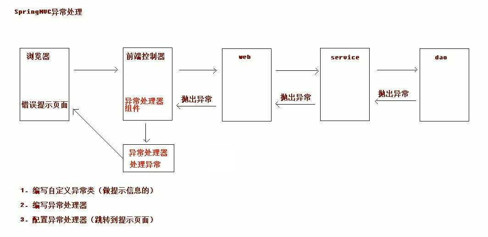
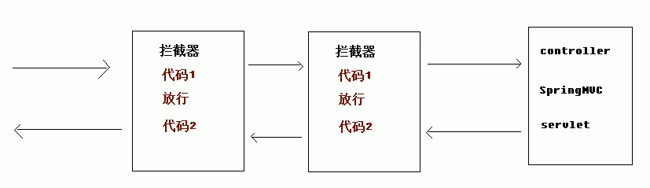
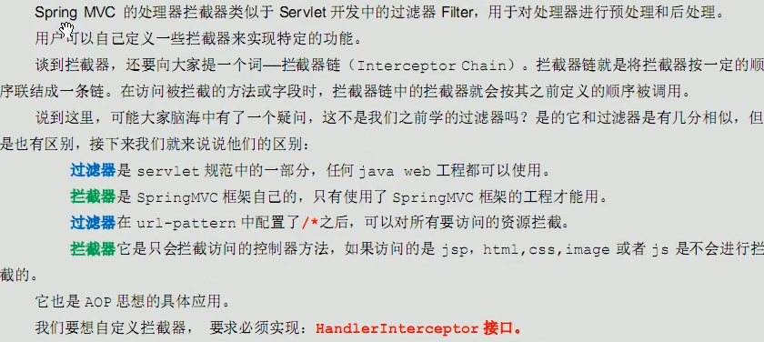

# 10.异常处理及拦截器

- 笔记本：17.SpringMVC
- 创建时间：2020-05-11 07:55:29 UTC
- 更新时间：2020-05-11 15:41:56 UTC
- 印象笔记 GUID：534eeaf8-04fb-4b6a-a542-d81c8cace283

## SpringMVC 的异常处理

### 1. 异常处理思路

Controller 调用 service，service 调用 dao，异常都是向上抛出的，最终由 DIspatcherServlet 找异常处理器进行异常的处理。
 

### 2. SpringMVC 的异常处理

#### 1. 自定义异常类

```
package com.liudezhi.exception;
/**
 * 自定义异常类
 */
public class SysException extends Exception {

    //存储提示信息
    private String message;

    public SysException(String message) {
        this.message = message;
    }

    @Override
    public String getMessage() {
        return message;
    }

    public void setMessage(String message) {
        this.message = message;
    }
}

```

#### 2. 编写异常处理代码

```
package com.liudezhi.exception;

/**
 * 异常处理器
 */
public class SysExceptionResolver implements HandlerExceptionResolver {

    /**
     * 处理异常业务逻辑
     * @param httpServletRequest
     * @param httpServletResponse
     * @param o
     * @param e
     * @return
     */
    @Override
    public ModelAndView resolveException(HttpServletRequest httpServletRequest, HttpServletResponse httpServletResponse, Object o, Exception e) {
        //获取到异常对象
        SysException ex = null;
        if(e instanceof SysException) {
            ex = (SysException)e;
        } else {
            ex = new SysException("系统正在维护...");
        }
        //创建ModelAndView对象
        ModelAndView mv = new ModelAndView();
        mv.addObject("errorMsg", e.getMessage());
        mv.setViewName("error");
        return mv;
    }
}

```

#### 3. 配置异常处理器(springmvc.xml)

```
<!-- 配置异常处理器对象 --><bean id="sysExceptionResolver"
class="com.liudezhi.exception.SysExceptionResolver"></bean>

```

```
package com.liudezhi.controller;

@Controller
@RequestMapping("/user")
public class UserController {

    @RequestMapping("/testException")
    public String testException() throws Exception {
        System.out.println("testException执行了...");

        try {
            //模拟异常
            int a = 10/0;
        } catch (Exception e) {
            //打印异常信息
            e.printStackTrace();
            //抛出自定义异常信息
            throw new SysException("查询所有用户出现了错误....");
        }
        return "success";
    }
}

```

## 2. SpringMVC 的拦截器

### 1. 拦截器概述


 

### 2. 自定义拦截器步骤

#### 1. 编写拦截器类，实现 HandlerInterceptor 接口

```
package com.liudezhi.interceptor;

public class MyInterceptor1 implements HandlerInterceptor {

    /**
     * 预处理，Controller 方法执行前执行
     * @param request
     * @param response
     * @param handler
     * @return true：放行，执行下一个拦截器，如果没有，执行controller 中的方法。false：不放行
     * @throws Exception
     */
    @Override
    public boolean preHandle(HttpServletRequest request, HttpServletResponse response, Object handler) throws Exception {
        System.out.println("MyInterceptor1执行了...");
        return true;
    }
}

```

#### 2. 配置拦截器（springmvc.xml）

```
<!-- 配置拦截器 -->
<mvc:interceptors>
    <mvc:interceptor>
        <!-- 要拦截的具体方法 -->
        <mvc:mapping path="/**"/>   <!-- /**所有方法全部拦截 ,/user/*一级访问目录是/user后面是任意-->
        <!-- 不要拦截的具体方法 -->
<!--            <mvc:exclude-mapping path=""/>-->
        <!-- 配置拦截器对象 -->
        <bean class="com.liudezhi.interceptor.MyInterceptor1"></bean>
    </mvc:interceptor>
</mvc:interceptors>

```

```
package com.liudezhi.controller;

@Controller
@RequestMapping("/user")
public class UserController {

    @RequestMapping("/testInterceptor")
    public String testInterceptor() {
        System.out.println("testInterceptor执行了...");

        return "success";
    }
}

```

### 3. HandlerInterceptor 接口中的方法

#### 1. PreHandler 方法是 controller 方法执行前拦截的方法

1. 可以使用 request 或者 response 跳转到指定的页面。

1. return true 放行，执行下一个拦截器，如果没有拦截器，执行 controller 中的方法。

1. return false 不放行，不会执行 controller 中的方法。

#### 2. postHandle 是 controller 方法执行后执行的方法，在 JSP 视图执行前。

1. 可以使用 request 或者 response 跳转到指定的页面。

1. 如果制定了跳转的页面，那么 controller 方法跳转的页面将不会显示。

#### 3. postHandle 方法是在 JSP 执行后执行

request 或者 response 不能再跳转页面了。

**eg:**

```
package com.liudezhi.interceptor;

public class MyInterceptor1 implements HandlerInterceptor {

    /**
     * 预处理，Controller 方法执行前执行
     * @param request
     * @param response
     * @param handler
     * @return true：放行，执行下一个拦截器，如果没有，执行controller 中的方法。false：不放行
     * @throws Exception
     */
    @Override
    public boolean preHandle(HttpServletRequest request, HttpServletResponse response, Object handler) throws Exception {
        System.out.println("MyInterceptor1执行了...");
//        request.getRequestDispatcher("/WEB-INF/pages/error.jsp").forward(request, response);
        return true;
    }

    /**
     * 后处理方法
     * @param request
     * @param response
     * @param handler
     * @param modelAndView
     * @throws Exception
     */
    @Override
    public void postHandle(HttpServletRequest request, HttpServletResponse response, Object handler, ModelAndView modelAndView) throws Exception {
        System.out.println("postHandle执行了");
//        request.getRequestDispatcher("/WEB-INF/pages/error.jsp").forward(request, response);
    }

    /**
     * success.jsp页面执行后，该方法会执行（最后）
     * @param request
     * @param response
     * @param handler
     * @param ex
     * @throws Exception
     */
    @Override
    public void afterCompletion(HttpServletRequest request, HttpServletResponse response, Object handler, Exception ex) throws Exception {
        System.out.println("afterCompletion...");
    }
}

```

### 4. 配置多个拦截器

#### 1. 再编写一个拦截器的类

#### 2. 配置两个拦截器

```
<!-- 配置拦截器 -->
<mvc:interceptors>
    <!-- 配置拦截器 -->
    <mvc:interceptor>
        <!-- 要拦截的具体方法 -->
        <mvc:mapping path="/**"/>   <!-- /**所有方法全部拦截 ,/user/*一级访问目录是/user后面是任意-->
        <!-- 不要拦截的具体方法 -->
<!--            <mvc:exclude-mapping path=""/>-->
        <!-- 配置拦截器对象 -->
        <bean class="com.liudezhi.interceptor.MyInterceptor1"></bean>
    </mvc:interceptor>

    <!-- 配置第二个拦截器 -->
    <mvc:interceptor>
        <!-- 要拦截的具体方法 -->
        <mvc:mapping path="/user/*"/>
        <bean class="com.liudezhi.interceptor.MyInterceptor2"></bean>
    </mvc:interceptor>
</mvc:interceptors>

```

%23%23%20SpringMVC%20%E7%9A%84%E5%BC%82%E5%B8%B8%E5%A4%84%E7%90%86%0A%23%23%23%201.%20%E5%BC%82%E5%B8%B8%E5%A4%84%E7%90%86%E6%80%9D%E8%B7%AF%0AController%20%E8%B0%83%E7%94%A8%20service%EF%BC%8Cservice%20%E8%B0%83%E7%94%A8%20dao%EF%BC%8C%E5%BC%82%E5%B8%B8%E9%83%BD%E6%98%AF%E5%90%91%E4%B8%8A%E6%8A%9B%E5%87%BA%E7%9A%84%EF%BC%8C%E6%9C%80%E7%BB%88%E7%94%B1%20DIspatcherServlet%20%E6%89%BE%E5%BC%82%E5%B8%B8%E5%A4%84%E7%90%86%E5%99%A8%E8%BF%9B%E8%A1%8C%E5%BC%82%E5%B8%B8%E7%9A%84%E5%A4%84%E7%90%86%E3%80%82%0A!%5B46cc57cd539cab53116bfaa1a9dba93a.png%5D(en-resource%3A%2F%2Fdatabase%2F3565%3A0)%0A%0A%23%23%23%202.%20SpringMVC%20%E7%9A%84%E5%BC%82%E5%B8%B8%E5%A4%84%E7%90%86%0A%23%23%23%23%201.%20%E8%87%AA%E5%AE%9A%E4%B9%89%E5%BC%82%E5%B8%B8%E7%B1%BB%0A%60%60%60java%0Apackage%20com.liudezhi.exception%3B%0A%2F**%0A%20*%20%E8%87%AA%E5%AE%9A%E4%B9%89%E5%BC%82%E5%B8%B8%E7%B1%BB%0A%20*%2F%0Apublic%20class%20SysException%20extends%20Exception%20%7B%0A%0A%20%20%20%20%2F%2F%E5%AD%98%E5%82%A8%E6%8F%90%E7%A4%BA%E4%BF%A1%E6%81%AF%0A%20%20%20%20private%20String%20message%3B%0A%0A%20%20%20%20public%20SysException(String%20message)%20%7B%0A%20%20%20%20%20%20%20%20this.message%20%3D%20message%3B%0A%20%20%20%20%7D%0A%0A%20%20%20%20%40Override%0A%20%20%20%20public%20String%20getMessage()%20%7B%0A%20%20%20%20%20%20%20%20return%20message%3B%0A%20%20%20%20%7D%0A%0A%20%20%20%20public%20void%20setMessage(String%20message)%20%7B%0A%20%20%20%20%20%20%20%20this.message%20%3D%20message%3B%0A%20%20%20%20%7D%0A%7D%0A%60%60%60%0A%0A%23%23%23%23%202.%20%E7%BC%96%E5%86%99%E5%BC%82%E5%B8%B8%E5%A4%84%E7%90%86%E4%BB%A3%E7%A0%81%0A%60%60%60java%0Apackage%20com.liudezhi.exception%3B%0A%0A%2F**%0A%20*%20%E5%BC%82%E5%B8%B8%E5%A4%84%E7%90%86%E5%99%A8%0A%20*%2F%0Apublic%20class%20SysExceptionResolver%20implements%20HandlerExceptionResolver%20%7B%0A%0A%20%20%20%20%2F**%0A%20%20%20%20%20*%20%E5%A4%84%E7%90%86%E5%BC%82%E5%B8%B8%E4%B8%9A%E5%8A%A1%E9%80%BB%E8%BE%91%0A%20%20%20%20%20*%20%40param%20httpServletRequest%0A%20%20%20%20%20*%20%40param%20httpServletResponse%0A%20%20%20%20%20*%20%40param%20o%0A%20%20%20%20%20*%20%40param%20e%0A%20%20%20%20%20*%20%40return%0A%20%20%20%20%20*%2F%0A%20%20%20%20%40Override%0A%20%20%20%20public%20ModelAndView%20resolveException(HttpServletRequest%20httpServletRequest%2C%20HttpServletResponse%20httpServletResponse%2C%20Object%20o%2C%20Exception%20e)%20%7B%0A%20%20%20%20%20%20%20%20%2F%2F%E8%8E%B7%E5%8F%96%E5%88%B0%E5%BC%82%E5%B8%B8%E5%AF%B9%E8%B1%A1%0A%20%20%20%20%20%20%20%20SysException%20ex%20%3D%20null%3B%0A%20%20%20%20%20%20%20%20if(e%20instanceof%20SysException)%20%7B%0A%20%20%20%20%20%20%20%20%20%20%20%20ex%20%3D%20(SysException)e%3B%0A%20%20%20%20%20%20%20%20%7D%20else%20%7B%0A%20%20%20%20%20%20%20%20%20%20%20%20ex%20%3D%20new%20SysException(%22%E7%B3%BB%E7%BB%9F%E6%AD%A3%E5%9C%A8%E7%BB%B4%E6%8A%A4...%22)%3B%0A%20%20%20%20%20%20%20%20%7D%0A%20%20%20%20%20%20%20%20%2F%2F%E5%88%9B%E5%BB%BAModelAndView%E5%AF%B9%E8%B1%A1%0A%20%20%20%20%20%20%20%20ModelAndView%20mv%20%3D%20new%20ModelAndView()%3B%0A%20%20%20%20%20%20%20%20mv.addObject(%22errorMsg%22%2C%20e.getMessage())%3B%0A%20%20%20%20%20%20%20%20mv.setViewName(%22error%22)%3B%0A%20%20%20%20%20%20%20%20return%20mv%3B%0A%20%20%20%20%7D%0A%7D%0A%60%60%60%0A%0A%23%23%23%23%203.%20%E9%85%8D%E7%BD%AE%E5%BC%82%E5%B8%B8%E5%A4%84%E7%90%86%E5%99%A8(springmvc.xml)%0A%60%60%60xml%0A%3C!--%20%E9%85%8D%E7%BD%AE%E5%BC%82%E5%B8%B8%E5%A4%84%E7%90%86%E5%99%A8%E5%AF%B9%E8%B1%A1%20--%3E%3Cbean%20id%3D%22sysExceptionResolver%22%20%0Aclass%3D%22com.liudezhi.exception.SysExceptionResolver%22%3E%3C%2Fbean%3E%0A%60%60%60%0A%0A%60%60%60java%0Apackage%20com.liudezhi.controller%3B%0A%0A%40Controller%0A%40RequestMapping(%22%2Fuser%22)%0Apublic%20class%20UserController%20%7B%0A%0A%20%20%20%20%40RequestMapping(%22%2FtestException%22)%0A%20%20%20%20public%20String%20testException()%20throws%20Exception%20%7B%0A%20%20%20%20%20%20%20%20System.out.println(%22testException%E6%89%A7%E8%A1%8C%E4%BA%86...%22)%3B%0A%0A%20%20%20%20%20%20%20%20try%20%7B%0A%20%20%20%20%20%20%20%20%20%20%20%20%2F%2F%E6%A8%A1%E6%8B%9F%E5%BC%82%E5%B8%B8%0A%20%20%20%20%20%20%20%20%20%20%20%20int%20a%20%3D%2010%2F0%3B%0A%20%20%20%20%20%20%20%20%7D%20catch%20(Exception%20e)%20%7B%0A%20%20%20%20%20%20%20%20%20%20%20%20%2F%2F%E6%89%93%E5%8D%B0%E5%BC%82%E5%B8%B8%E4%BF%A1%E6%81%AF%0A%20%20%20%20%20%20%20%20%20%20%20%20e.printStackTrace()%3B%0A%20%20%20%20%20%20%20%20%20%20%20%20%2F%2F%E6%8A%9B%E5%87%BA%E8%87%AA%E5%AE%9A%E4%B9%89%E5%BC%82%E5%B8%B8%E4%BF%A1%E6%81%AF%0A%20%20%20%20%20%20%20%20%20%20%20%20throw%20new%20SysException(%22%E6%9F%A5%E8%AF%A2%E6%89%80%E6%9C%89%E7%94%A8%E6%88%B7%E5%87%BA%E7%8E%B0%E4%BA%86%E9%94%99%E8%AF%AF....%22)%3B%0A%20%20%20%20%20%20%20%20%7D%0A%20%20%20%20%20%20%20%20return%20%22success%22%3B%0A%20%20%20%20%7D%0A%7D%0A%60%60%60%0A%0A%23%23%202.%20SpringMVC%20%E7%9A%84%E6%8B%A6%E6%88%AA%E5%99%A8%0A%23%23%23%201.%20%E6%8B%A6%E6%88%AA%E5%99%A8%E6%A6%82%E8%BF%B0%0A!%5B038f5c99023512f1ea1438dbd550206f.png%5D(en-resource%3A%2F%2Fdatabase%2F3567%3A0)%0A!%5B8f2b9689f31860f012a5456664510a54.png%5D(en-resource%3A%2F%2Fdatabase%2F3561%3A1)%0A%0A%23%23%23%202.%20%E8%87%AA%E5%AE%9A%E4%B9%89%E6%8B%A6%E6%88%AA%E5%99%A8%E6%AD%A5%E9%AA%A4%0A%23%23%23%23%201.%20%E7%BC%96%E5%86%99%E6%8B%A6%E6%88%AA%E5%99%A8%E7%B1%BB%EF%BC%8C%E5%AE%9E%E7%8E%B0%20HandlerInterceptor%20%E6%8E%A5%E5%8F%A3%0A%60%60%60java%0Apackage%20com.liudezhi.interceptor%3B%0A%0Apublic%20class%20MyInterceptor1%20implements%20HandlerInterceptor%20%7B%0A%0A%20%20%20%20%2F**%0A%20%20%20%20%20*%20%E9%A2%84%E5%A4%84%E7%90%86%EF%BC%8CController%20%E6%96%B9%E6%B3%95%E6%89%A7%E8%A1%8C%E5%89%8D%E6%89%A7%E8%A1%8C%0A%20%20%20%20%20*%20%40param%20request%0A%20%20%20%20%20*%20%40param%20response%0A%20%20%20%20%20*%20%40param%20handler%0A%20%20%20%20%20*%20%40return%20true%EF%BC%9A%E6%94%BE%E8%A1%8C%EF%BC%8C%E6%89%A7%E8%A1%8C%E4%B8%8B%E4%B8%80%E4%B8%AA%E6%8B%A6%E6%88%AA%E5%99%A8%EF%BC%8C%E5%A6%82%E6%9E%9C%E6%B2%A1%E6%9C%89%EF%BC%8C%E6%89%A7%E8%A1%8Ccontroller%20%E4%B8%AD%E7%9A%84%E6%96%B9%E6%B3%95%E3%80%82false%EF%BC%9A%E4%B8%8D%E6%94%BE%E8%A1%8C%0A%20%20%20%20%20*%20%40throws%20Exception%0A%20%20%20%20%20*%2F%0A%20%20%20%20%40Override%0A%20%20%20%20public%20boolean%20preHandle(HttpServletRequest%20request%2C%20HttpServletResponse%20response%2C%20Object%20handler)%20throws%20Exception%20%7B%0A%20%20%20%20%20%20%20%20System.out.println(%22MyInterceptor1%E6%89%A7%E8%A1%8C%E4%BA%86...%22)%3B%0A%20%20%20%20%20%20%20%20return%20true%3B%0A%20%20%20%20%7D%0A%7D%0A%60%60%60%0A%0A%23%23%23%23%202.%20%E9%85%8D%E7%BD%AE%E6%8B%A6%E6%88%AA%E5%99%A8%EF%BC%88springmvc.xml%EF%BC%89%0A%60%60%60xml%0A%3C!--%20%E9%85%8D%E7%BD%AE%E6%8B%A6%E6%88%AA%E5%99%A8%20--%3E%0A%3Cmvc%3Ainterceptors%3E%0A%20%20%20%20%3Cmvc%3Ainterceptor%3E%0A%20%20%20%20%20%20%20%20%3C!--%20%E8%A6%81%E6%8B%A6%E6%88%AA%E7%9A%84%E5%85%B7%E4%BD%93%E6%96%B9%E6%B3%95%20--%3E%0A%20%20%20%20%20%20%20%20%3Cmvc%3Amapping%20path%3D%22%2F**%22%2F%3E%20%20%20%3C!--%20%2F**%E6%89%80%E6%9C%89%E6%96%B9%E6%B3%95%E5%85%A8%E9%83%A8%E6%8B%A6%E6%88%AA%20%2C%2Fuser%2F*%E4%B8%80%E7%BA%A7%E8%AE%BF%E9%97%AE%E7%9B%AE%E5%BD%95%E6%98%AF%2Fuser%E5%90%8E%E9%9D%A2%E6%98%AF%E4%BB%BB%E6%84%8F--%3E%0A%20%20%20%20%20%20%20%20%3C!--%20%E4%B8%8D%E8%A6%81%E6%8B%A6%E6%88%AA%E7%9A%84%E5%85%B7%E4%BD%93%E6%96%B9%E6%B3%95%20--%3E%0A%3C!--%20%20%20%20%20%20%20%20%20%20%20%20%3Cmvc%3Aexclude-mapping%20path%3D%22%22%2F%3E--%3E%0A%20%20%20%20%20%20%20%20%3C!--%20%E9%85%8D%E7%BD%AE%E6%8B%A6%E6%88%AA%E5%99%A8%E5%AF%B9%E8%B1%A1%20--%3E%0A%20%20%20%20%20%20%20%20%3Cbean%20class%3D%22com.liudezhi.interceptor.MyInterceptor1%22%3E%3C%2Fbean%3E%0A%20%20%20%20%3C%2Fmvc%3Ainterceptor%3E%0A%3C%2Fmvc%3Ainterceptors%3E%0A%60%60%60%0A%0A%60%60%60java%0Apackage%20com.liudezhi.controller%3B%0A%0A%40Controller%0A%40RequestMapping(%22%2Fuser%22)%0Apublic%20class%20UserController%20%7B%0A%0A%20%20%20%20%40RequestMapping(%22%2FtestInterceptor%22)%0A%20%20%20%20public%20String%20testInterceptor()%20%7B%0A%20%20%20%20%20%20%20%20System.out.println(%22testInterceptor%E6%89%A7%E8%A1%8C%E4%BA%86...%22)%3B%0A%0A%20%20%20%20%20%20%20%20return%20%22success%22%3B%0A%20%20%20%20%7D%0A%7D%0A%60%60%60%0A%0A%23%23%23%203.%20HandlerInterceptor%20%E6%8E%A5%E5%8F%A3%E4%B8%AD%E7%9A%84%E6%96%B9%E6%B3%95%0A%23%23%23%23%201.%20PreHandler%20%E6%96%B9%E6%B3%95%E6%98%AF%20controller%20%E6%96%B9%E6%B3%95%E6%89%A7%E8%A1%8C%E5%89%8D%E6%8B%A6%E6%88%AA%E7%9A%84%E6%96%B9%E6%B3%95%0A1.%20%E5%8F%AF%E4%BB%A5%E4%BD%BF%E7%94%A8%20request%20%E6%88%96%E8%80%85%20response%20%E8%B7%B3%E8%BD%AC%E5%88%B0%E6%8C%87%E5%AE%9A%E7%9A%84%E9%A1%B5%E9%9D%A2%E3%80%82%0A2.%20return%20true%20%E6%94%BE%E8%A1%8C%EF%BC%8C%E6%89%A7%E8%A1%8C%E4%B8%8B%E4%B8%80%E4%B8%AA%E6%8B%A6%E6%88%AA%E5%99%A8%EF%BC%8C%E5%A6%82%E6%9E%9C%E6%B2%A1%E6%9C%89%E6%8B%A6%E6%88%AA%E5%99%A8%EF%BC%8C%E6%89%A7%E8%A1%8C%20controller%20%E4%B8%AD%E7%9A%84%E6%96%B9%E6%B3%95%E3%80%82%0A3.%20return%20false%20%E4%B8%8D%E6%94%BE%E8%A1%8C%EF%BC%8C%E4%B8%8D%E4%BC%9A%E6%89%A7%E8%A1%8C%20controller%20%E4%B8%AD%E7%9A%84%E6%96%B9%E6%B3%95%E3%80%82%0A%0A%23%23%23%23%202.%20postHandle%20%E6%98%AF%20controller%20%E6%96%B9%E6%B3%95%E6%89%A7%E8%A1%8C%E5%90%8E%E6%89%A7%E8%A1%8C%E7%9A%84%E6%96%B9%E6%B3%95%EF%BC%8C%E5%9C%A8%20JSP%20%E8%A7%86%E5%9B%BE%E6%89%A7%E8%A1%8C%E5%89%8D%E3%80%82%0A1.%20%E5%8F%AF%E4%BB%A5%E4%BD%BF%E7%94%A8%20request%20%E6%88%96%E8%80%85%20response%20%E8%B7%B3%E8%BD%AC%E5%88%B0%E6%8C%87%E5%AE%9A%E7%9A%84%E9%A1%B5%E9%9D%A2%E3%80%82%0A2.%20%E5%A6%82%E6%9E%9C%E5%88%B6%E5%AE%9A%E4%BA%86%E8%B7%B3%E8%BD%AC%E7%9A%84%E9%A1%B5%E9%9D%A2%EF%BC%8C%E9%82%A3%E4%B9%88%20controller%20%E6%96%B9%E6%B3%95%E8%B7%B3%E8%BD%AC%E7%9A%84%E9%A1%B5%E9%9D%A2%E5%B0%86%E4%B8%8D%E4%BC%9A%E6%98%BE%E7%A4%BA%E3%80%82%0A%0A%23%23%23%23%203.%20postHandle%20%E6%96%B9%E6%B3%95%E6%98%AF%E5%9C%A8%20JSP%20%E6%89%A7%E8%A1%8C%E5%90%8E%E6%89%A7%E8%A1%8C%0Arequest%20%E6%88%96%E8%80%85%20response%20%E4%B8%8D%E8%83%BD%E5%86%8D%E8%B7%B3%E8%BD%AC%E9%A1%B5%E9%9D%A2%E4%BA%86%E3%80%82%0A%0A**eg%3A**%0A%60%60%60java%0Apackage%20com.liudezhi.interceptor%3B%0A%0Apublic%20class%20MyInterceptor1%20implements%20HandlerInterceptor%20%7B%0A%0A%20%20%20%20%2F**%0A%20%20%20%20%20*%20%E9%A2%84%E5%A4%84%E7%90%86%EF%BC%8CController%20%E6%96%B9%E6%B3%95%E6%89%A7%E8%A1%8C%E5%89%8D%E6%89%A7%E8%A1%8C%0A%20%20%20%20%20*%20%40param%20request%0A%20%20%20%20%20*%20%40param%20response%0A%20%20%20%20%20*%20%40param%20handler%0A%20%20%20%20%20*%20%40return%20true%EF%BC%9A%E6%94%BE%E8%A1%8C%EF%BC%8C%E6%89%A7%E8%A1%8C%E4%B8%8B%E4%B8%80%E4%B8%AA%E6%8B%A6%E6%88%AA%E5%99%A8%EF%BC%8C%E5%A6%82%E6%9E%9C%E6%B2%A1%E6%9C%89%EF%BC%8C%E6%89%A7%E8%A1%8Ccontroller%20%E4%B8%AD%E7%9A%84%E6%96%B9%E6%B3%95%E3%80%82false%EF%BC%9A%E4%B8%8D%E6%94%BE%E8%A1%8C%0A%20%20%20%20%20*%20%40throws%20Exception%0A%20%20%20%20%20*%2F%0A%20%20%20%20%40Override%0A%20%20%20%20public%20boolean%20preHandle(HttpServletRequest%20request%2C%20HttpServletResponse%20response%2C%20Object%20handler)%20throws%20Exception%20%7B%0A%20%20%20%20%20%20%20%20System.out.println(%22MyInterceptor1%E6%89%A7%E8%A1%8C%E4%BA%86...%22)%3B%0A%2F%2F%20%20%20%20%20%20%20%20request.getRequestDispatcher(%22%2FWEB-INF%2Fpages%2Ferror.jsp%22).forward(request%2C%20response)%3B%0A%20%20%20%20%20%20%20%20return%20true%3B%0A%20%20%20%20%7D%0A%0A%20%20%20%20%2F**%0A%20%20%20%20%20*%20%E5%90%8E%E5%A4%84%E7%90%86%E6%96%B9%E6%B3%95%0A%20%20%20%20%20*%20%40param%20request%0A%20%20%20%20%20*%20%40param%20response%0A%20%20%20%20%20*%20%40param%20handler%0A%20%20%20%20%20*%20%40param%20modelAndView%0A%20%20%20%20%20*%20%40throws%20Exception%0A%20%20%20%20%20*%2F%0A%20%20%20%20%40Override%0A%20%20%20%20public%20void%20postHandle(HttpServletRequest%20request%2C%20HttpServletResponse%20response%2C%20Object%20handler%2C%20ModelAndView%20modelAndView)%20throws%20Exception%20%7B%0A%20%20%20%20%20%20%20%20System.out.println(%22postHandle%E6%89%A7%E8%A1%8C%E4%BA%86%22)%3B%0A%2F%2F%20%20%20%20%20%20%20%20request.getRequestDispatcher(%22%2FWEB-INF%2Fpages%2Ferror.jsp%22).forward(request%2C%20response)%3B%0A%20%20%20%20%7D%0A%0A%20%20%20%20%2F**%0A%20%20%20%20%20*%20success.jsp%E9%A1%B5%E9%9D%A2%E6%89%A7%E8%A1%8C%E5%90%8E%EF%BC%8C%E8%AF%A5%E6%96%B9%E6%B3%95%E4%BC%9A%E6%89%A7%E8%A1%8C%EF%BC%88%E6%9C%80%E5%90%8E%EF%BC%89%0A%20%20%20%20%20*%20%40param%20request%0A%20%20%20%20%20*%20%40param%20response%0A%20%20%20%20%20*%20%40param%20handler%0A%20%20%20%20%20*%20%40param%20ex%0A%20%20%20%20%20*%20%40throws%20Exception%0A%20%20%20%20%20*%2F%0A%20%20%20%20%40Override%0A%20%20%20%20public%20void%20afterCompletion(HttpServletRequest%20request%2C%20HttpServletResponse%20response%2C%20Object%20handler%2C%20Exception%20ex)%20throws%20Exception%20%7B%0A%20%20%20%20%20%20%20%20System.out.println(%22afterCompletion...%22)%3B%0A%20%20%20%20%7D%0A%7D%0A%60%60%60%0A%0A%23%23%23%204.%20%E9%85%8D%E7%BD%AE%E5%A4%9A%E4%B8%AA%E6%8B%A6%E6%88%AA%E5%99%A8%0A%23%23%23%23%201.%20%E5%86%8D%E7%BC%96%E5%86%99%E4%B8%80%E4%B8%AA%E6%8B%A6%E6%88%AA%E5%99%A8%E7%9A%84%E7%B1%BB%0A%23%23%23%23%202.%20%E9%85%8D%E7%BD%AE%E4%B8%A4%E4%B8%AA%E6%8B%A6%E6%88%AA%E5%99%A8%0A%60%60%60xml%0A%3C!--%20%E9%85%8D%E7%BD%AE%E6%8B%A6%E6%88%AA%E5%99%A8%20--%3E%0A%3Cmvc%3Ainterceptors%3E%0A%20%20%20%20%3C!--%20%E9%85%8D%E7%BD%AE%E6%8B%A6%E6%88%AA%E5%99%A8%20--%3E%0A%20%20%20%20%3Cmvc%3Ainterceptor%3E%0A%20%20%20%20%20%20%20%20%3C!--%20%E8%A6%81%E6%8B%A6%E6%88%AA%E7%9A%84%E5%85%B7%E4%BD%93%E6%96%B9%E6%B3%95%20--%3E%0A%20%20%20%20%20%20%20%20%3Cmvc%3Amapping%20path%3D%22%2F**%22%2F%3E%20%20%20%3C!--%20%2F**%E6%89%80%E6%9C%89%E6%96%B9%E6%B3%95%E5%85%A8%E9%83%A8%E6%8B%A6%E6%88%AA%20%2C%2Fuser%2F*%E4%B8%80%E7%BA%A7%E8%AE%BF%E9%97%AE%E7%9B%AE%E5%BD%95%E6%98%AF%2Fuser%E5%90%8E%E9%9D%A2%E6%98%AF%E4%BB%BB%E6%84%8F--%3E%0A%20%20%20%20%20%20%20%20%3C!--%20%E4%B8%8D%E8%A6%81%E6%8B%A6%E6%88%AA%E7%9A%84%E5%85%B7%E4%BD%93%E6%96%B9%E6%B3%95%20--%3E%0A%3C!--%20%20%20%20%20%20%20%20%20%20%20%20%3Cmvc%3Aexclude-mapping%20path%3D%22%22%2F%3E--%3E%0A%20%20%20%20%20%20%20%20%3C!--%20%E9%85%8D%E7%BD%AE%E6%8B%A6%E6%88%AA%E5%99%A8%E5%AF%B9%E8%B1%A1%20--%3E%0A%20%20%20%20%20%20%20%20%3Cbean%20class%3D%22com.liudezhi.interceptor.MyInterceptor1%22%3E%3C%2Fbean%3E%0A%20%20%20%20%3C%2Fmvc%3Ainterceptor%3E%0A%0A%20%20%20%20%3C!--%20%E9%85%8D%E7%BD%AE%E7%AC%AC%E4%BA%8C%E4%B8%AA%E6%8B%A6%E6%88%AA%E5%99%A8%20--%3E%0A%20%20%20%20%3Cmvc%3Ainterceptor%3E%0A%20%20%20%20%20%20%20%20%3C!--%20%E8%A6%81%E6%8B%A6%E6%88%AA%E7%9A%84%E5%85%B7%E4%BD%93%E6%96%B9%E6%B3%95%20--%3E%0A%20%20%20%20%20%20%20%20%3Cmvc%3Amapping%20path%3D%22%2Fuser%2F*%22%2F%3E%0A%20%20%20%20%20%20%20%20%3Cbean%20class%3D%22com.liudezhi.interceptor.MyInterceptor2%22%3E%3C%2Fbean%3E%0A%20%20%20%20%3C%2Fmvc%3Ainterceptor%3E%0A%3C%2Fmvc%3Ainterceptors%3E%0A%60%60%60
