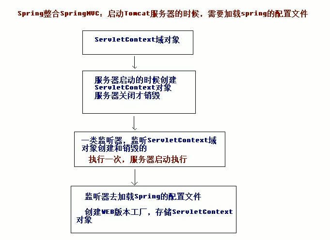

# 11.SSM框架整合

- 笔记本：17.SpringMVC
- 创建时间：2020-05-12 02:01:40 UTC
- 更新时间：2020-05-17 07:38:50 UTC
- 印象笔记 GUID：0751ac01-be03-4d7e-9e11-dc71ecad9818

## 一、搭建整合环境

### 1. 搭建整合环境

1.
整合说明：SSM 整合可以使用多种方式，这里会选用 XML + 注解的方式

1.
整合的思路：

  1. 先搭建整合的环境

  1. 先把 Spring 的配置搭建完成

  1. 再使用 Spring 整合 SpringMVC 框架

  1. 最后使用 Spring 整合 Mybatis 框架

1.
创建数据库和表结构

  1. 语句

```
create database ssm;
use ssm;
create table account (
    id int primary key auto_increment,
    name varchar(20),
    money double
);

```

1.
创建 maven 的工程（这里会使用到工程的聚合和拆分的概念，这个技术会在maven高级中讲解）

  1. 创建 ssm_parent 父工程（打包方式选择 pom，必须的）

  1. 创建 ssm_web 子模块（打包方式是war包）

  1. 创建 ssm_service 子模块（打包方式是jar包）

  1. 创建 ssm_dao 子模块（打包方式是jar包）

  1. 创建 ssm_domain 子模块（打包方式是jar包）

  1. web 依赖于 service，service 依赖于 dao，dao 依赖于 domain

  1. ssm_parent 的 pom.xml 文件中引入坐标依赖

```
<?xml version="1.0" encoding="UTF-8"?>

<project xmlns="http://maven.apache.org/POM/4.0.0" xmlns:xsi="http://www.w3.org/2001/XMLSchema-instance"
  xsi:schemaLocation="http://maven.apache.org/POM/4.0.0 http://maven.apache.org/xsd/maven-4.0.0.xsd">
  <modelVersion>4.0.0</modelVersion>

  <groupId>com.liudezhi</groupId>
  <artifactId>ssm</artifactId>
  <version>1.0-SNAPSHOT</version>
  <packaging>war</packaging>

  <name>ssm Maven Webapp</name>
  <!-- FIXME change it to the project's website -->
  <url>http://www.example.com</url>
  <properties>
    <project.build.sourceEncoding>UTF-8</project.build.sourceEncoding>
    <maven.compiler.source>1.8</maven.compiler.source>
    <maven.compiler.target>1.8</maven.compiler.target>
    <!-- 版本锁定 -->
    <spring.version>5.2.4.RELEASE</spring.version>
    <slf4j.version>1.7.30</slf4j.version>
    <log4j.version>1.2.12</log4j.version>
    <mysql.version>8.0.11</mysql.version>
    <mybatis.version>3.4.5</mybatis.version>
  </properties>
  <dependencies>
    <dependency>
      <groupId>org.aspectj</groupId>
      <artifactId>aspectjweaver</artifactId>
      <version>1.9.2</version>
    </dependency>
    <dependency>
      <groupId>org.springframework</groupId>
      <artifactId>spring-aop</artifactId>
      <version>${spring.version}</version>
    </dependency>
    <dependency>
      <groupId>org.springframework</groupId>
      <artifactId>spring-context</artifactId>
      <version>${spring.version}</version>
    </dependency>
    <dependency>
      <groupId>org.springframework</groupId>
      <artifactId>spring-web</artifactId>
      <version>${spring.version}</version>
    </dependency>
    <dependency>
      <groupId>org.springframework</groupId>
      <artifactId>spring-webmvc</artifactId>
      <version>${spring.version}</version>
    </dependency>
    <dependency>
      <groupId>org.springframework</groupId>
      <artifactId>spring-test</artifactId>
      <version>${spring.version}</version>
    </dependency>
    <dependency>
      <groupId>org.springframework</groupId>
      <artifactId>spring-tx</artifactId>
      <version>${spring.version}</version>
    </dependency>
    <dependency>
      <groupId>org.springframework</groupId>
      <artifactId>spring-jdbc</artifactId>
      <version>${spring.version}</version>
    </dependency>
    <dependency>
      <groupId>junit</groupId>
      <artifactId>junit</artifactId>
      <version>4.12</version>
      <scope>compile</scope>
    </dependency>
    <dependency>
      <groupId>mysql</groupId>
      <artifactId>mysql-connector-java</artifactId>
      <version>${mysql.version}</version>
    </dependency>
    <dependency>
      <groupId>javax.servlet</groupId>
      <artifactId>javax.servlet-api</artifactId>
      <version>3.1.0</version>
      <scope>provided</scope>
    </dependency>
    <dependency>
      <groupId>javax.servlet</groupId>
      <artifactId>jsp-api</artifactId>
      <version>2.0</version>
      <scope>provided</scope>
    </dependency>
    <dependency>
      <groupId>javax.servlet</groupId>
      <artifactId>jstl</artifactId>
      <version>1.2</version>
    </dependency>
    <!-- log start -->
    <dependency>
      <groupId>log4j</groupId>
      <artifactId>log4j</artifactId>
      <version>${log4j.version}</version>
    </dependency>
    <dependency>
      <groupId>org.slf4j</groupId>
      <artifactId>slf4j-api</artifactId>
      <version>${slf4j.version}</version>
    </dependency>
    <dependency>
      <groupId>org.slf4j</groupId>
      <artifactId>slf4j-log4j12</artifactId>
      <version>${slf4j.version}</version>
    </dependency>
    <!-- log end -->
    <dependency>
      <groupId>org.mybatis</groupId>
      <artifactId>mybatis</artifactId>
      <version>${mybatis.version}</version>
    </dependency>
    <dependency>
      <groupId>org.mybatis</groupId>
      <artifactId>mybatis-spring</artifactId>
      <version>1.3.2</version>
    </dependency>
    <dependency>
      <groupId>com.mchange</groupId>
      <artifactId>c3p0</artifactId>
      <version>0.9.5.2</version>
    </dependency>
  </dependencies>
</project>

```

### ssm 编写 Spirng 框架

**applicationContext.xml**

```
<?xml version="1.0" encoding="UTF-8"?>
<beans xmlns="http://www.springframework.org/schema/beans"
       xmlns:xsi="http://www.w3.org/2001/XMLSchema-instance"
       xmlns:context="http://www.springframework.org/schema/context"
       xmlns:aop="http://www.springframework.org/schema/aop"
       xmlns:tx="http://www.springframework.org/schema/tx"
       xsi:schemaLocation="http://www.springframework.org/schema/beans
    http://www.springframework.org/schema/beans/spring-beans.xsd
    http://www.springframework.org/schema/context
    http://www.springframework.org/schema/context/spring-context.xsd
    http://www.springframework.org/schema/aop
    http://www.springframework.org/schema/aop/spring-aop.xsd
    http://www.springframework.org/schema/tx
    http://www.springframework.org/schema/tx/spring-tx.xsd">

    <!-- 开启注解的扫描，希望处理service和dao，controller不需要spring框架去处理 -->
    <context:component-scan base-package="com.liudezhi">
        <!-- 配置哪些注解不扫描 -->
        <context:exclude-filter type="annotation" expression="org.springframework.stereotype.Controller"/>
    </context:component-scan>
</beans>

```

**servcie 上添加 `@Service("accountService")` 注解**

**测试 spring**

```
package com.liudezhi.test;
public class TestSpring {
    @Test
    public void run1() {
        //加载配置文件
        ApplicationContext applicationContext = new ClassPathXmlApplicationContext("classpath:applicationContext.xml");
        //获取对象
        AccountService accountService = (AccountService) applicationContext.getBean("accountService");
        accountService.findAllAccount();
    }
}

```

**注：若未配置 log4j.properties 文件运行时会有警告
 **log4j.propertes：**

```
# Set root category priority to INFO and its only appender to CONSOLE.
#log4j.rootCategory=INFO, CONSOLE            debug   info   warn error fatal
log4j.rootCategory=debug, CONSOLE, LOGFILE

# Set the enterprise logger category to FATAL and its only appender to CONSOLE.
log4j.logger.org.apache.axis.enterprise=FATAL, CONSOLE

# CONSOLE is set to be a ConsoleAppender using a PatternLayout.
log4j.appender.CONSOLE=org.apache.log4j.ConsoleAppender
log4j.appender.CONSOLE.layout=org.apache.log4j.PatternLayout
log4j.appender.CONSOLE.layout.ConversionPattern=%d{ISO8601} %-6r [%15.15t] %-5p %30.30c %x - %m\n

# LOGFILE is set to be a File appender using a PatternLayout.
log4j.appender.LOGFILE=org.apache.log4j.FileAppender
log4j.appender.LOGFILE.File=d:\axis.log
log4j.appender.LOGFILE.Append=true
log4j.appender.LOGFILE.layout=org.apache.log4j.PatternLayout
log4j.appender.LOGFILE.layout.ConversionPattern=%d{ISO8601} %-6r [%15.15t] %-5p %30.30c %x - %m\n

```

### ssm 整合之编写 SpringMVC 框架

**web.xml**

```
<!DOCTYPE web-app PUBLIC
 "-//Sun Microsystems, Inc.//DTD Web Application 2.3//EN"
 "http://java.sun.com/dtd/web-app_2_3.dtd" >
<web-app>
  <display-name>Archetype Created Web Application</display-name>
  <!-- 配置前端控制器 -->
  <servlet>
    <servlet-name>dispatcherServlet</servlet-name>
    <servlet-class>org.springframework.web.servlet.DispatcherServlet</servlet-class>
    <!-- 加载 springmvc.xml 配置文件 -->
    <init-param>
      <param-name>contextConfigLocation</param-name>
      <param-value>classpath:springmvc.xml</param-value>
    </init-param>
    <load-on-startup>1</load-on-startup>
  </servlet>

  <servlet-mapping>
    <servlet-name>dispatcherServlet</servlet-name>
    <url-pattern>/</url-pattern>
  </servlet-mapping>

  <!-- 配置解决中文乱码的过滤器 -->
  <filter>
    <filter-name>characterEncodingFilter</filter-name>
    <filter-class>org.springframework.web.filter.CharacterEncodingFilter</filter-class>
    <init-param>
      <param-name>encoding</param-name>
      <param-value>UTF-8</param-value>
    </init-param>
  </filter>
  <filter-mapping>
    <filter-name>characterEncodingFilter</filter-name>
    <url-pattern>/*</url-pattern>
  </filter-mapping>
</web-app>

```

**springmvc.xml：**

```
<?xml version="1.0" encoding="UTF-8"?>
<beans xmlns="http://www.springframework.org/schema/beans"
       xmlns:mvc="http://www.springframework.org/schema/mvc"
       xmlns:context="http://www.springframework.org/schema/context"
       xmlns:xsi="http://www.w3.org/2001/XMLSchema-instance"
       xsi:schemaLocation="
        http://www.springframework.org/schema/beans
        http://www.springframework.org/schema/beans/spring-beans.xsd
        http://www.springframework.org/schema/mvc
        https://www.springframework.org/schema/mvc/spring-mvc.xsd
        http://www.springframework.org/schema/context
        https://www.springframework.org/schema/context/spring-context.xsd">

    <!-- 开启注解扫描，只扫描 Controller 注解 -->
    <context:component-scan base-package="com.liudezhi">
        <context:include-filter type="annotation" expression="org.springframework.stereotype.Controller"/>
    </context:component-scan>

    <!-- 视图解析器对象 -->
    <bean id="internalResourceViewResolver" class="org.springframework.web.servlet.view.InternalResourceViewResolver">
        <property name="prefix" value="/WEB-INF/pages/"/>
        <property name="suffix" value=".jsp"/>
    </bean>

    <!-- 设置静态资源不过滤 -->
    <mvc:resources location="/js/" mapping="/js/**"/>
    <mvc:resources location="/images/" mapping="/images/**"/>
    <mvc:resources location="/css/" mapping="/css/**"/>

    <!-- 开启 SpringMVC 框架注解的支持 -->
    <mvc:annotation-driven />

</beans>

```

**index.jsp：**

```
<%@ page contentType="text/html;charset=UTF-8" language="java" %>
<html>
<head>
    <title>Title</title>
</head>
<body>
    <a  >测试</a>
</body>
</html>

```

```
package com.liudezhi.controller;

/**
 * 账户web
 */
@Controller
@RequestMapping("/account")
public class AccountController {
    @RequestMapping("/findAllAccount")
    public String findAllAccount() {
        System.out.println("表现层：查询所有账户...");
        return "list";
    }
}

```

### Spring 整合 SpringMVC 框架


 **web.xml**

```
<!-- 配置 Spring 的监听器，默认只加载 WEB-INF 目录下的 applicationContext.xml 配置文件 -->
<listener>
    <listener-class>org.springframework.web.context.ContextLoaderListener</listener-class>
</listener>
<!-- 设置配置文件的路径 -->
<context-param>
    <param-name>contextConfigLocation</param-name>
    <param-value>classpath:applicationContext.xml</param-value>
</context-param>

```

```
@Controller
@RequestMapping("/account")
public class AccountController {
    @Autowired
    private AccountService accountService;
    @RequestMapping("/findAllAccount")
    public String findAllAccount() {
        System.out.println("表现层：查询所有账户...");
        //调用 service 的方法
        accountService.findAllAccount();
        return "list";
    }
}

```

### Spring 整合 MyBatis 框架

#### 1. 搭建和测试 MyBatis 的环境

1. 在 web 项目中编写 SqlMapConfig.xml 的配置文件，编写核心配置文件
 **SqlMapConfig.xml**

```
<?xml version="1.0" encoding="UTF-8"?>
<!DOCTYPE configuration
        PUBLIC "-//mybatis.org//DTD Config 3.0//EN"
        "http://mybatis.org/dtd/mybatis-3-config.dtd">
<configuration>
    <!-- 配置环境 -->
    <environments default="mysql">
        <environment id="mysql">
            <transactionManager type="JDBC"></transactionManager>
            <dataSource type="POOLED">
                <property name="driver" value="com.mysql.cj.jdbc.Driver"/>
                <property name="url" value="jdbc:mysql://localhost:3306/ssm?useUnicode=true&amp;characterEncoding=utf-8&amp;useSSL=false&amp;serverTimezone=GMT"/>
                <property name="username" value="root"/>
                <property name="password" value="Liudezhi"/>
            </dataSource>
        </environment>
    </environments>

    <!-- 引入映射文件 -->
    <mappers>
<!--        <mapper ></mapper>-->
        <package name="com.liudezhi.dao"/>
    </mappers>
</configuration>

```

**AccountDao.java**

```
package com.liudezhi.dao;
/**
 * 账户dao接口
 */
public interface AccountDao {

    /**
     * 查询所有账户
     * @return
     */
    @Select("select * from account")
    public List<Account> findAllAccount();

    /**
     * 保存账户信息
     * @param account
     */
    @Insert("insert into account (name, money) values (#{name}, #{money})")
    public void saveAccount(Account account);
}

```

**TestMyBatis.java**

```
package com.liudezhi.test;
public class TestMyBatis {
    /**
     * 测试查询
     * @throws IOException
     */
    @Test
    public void run1() throws IOException {
        //加载配置文件
        InputStream in = Resources.getResourceAsStream("SqlMapConfig.xml");
        //创建 SqlSessionFactory 工厂对象
        SqlSessionFactory factory = new SqlSessionFactoryBuilder().build(in);
        //创建 SqlSession 对象
        SqlSession session = factory.openSession();
        //获取到代理对象
        AccountDao accountDao = session.getMapper(AccountDao.class);
        //查询所有数据
        List<Account> allAccount = accountDao.findAllAccount();
        for (Account account: allAccount) {
            System.out.println(account);
        }
        //关闭资源
        session.close();
        in.close();
    }

    /**
     * 测试保存
     * @throws IOException
     */
    @Test
    public void run2() throws IOException {
        Account account = new Account();
        account.setName("dongmingming");
        account.setMoney(40000d);
        //加载配置文件
        InputStream in = Resources.getResourceAsStream("SqlMapConfig.xml");
        //创建 SqlSessionFactory 工厂对象
        SqlSessionFactory factory = new SqlSessionFactoryBuilder().build(in);
        //创建 SqlSession 对象
        SqlSession session = factory.openSession();
        //获取到代理对象
        AccountDao accountDao = session.getMapper(AccountDao.class);
        //保存
        accountDao.saveAccount(account);
        //提交事务
        session.commit();
        //关闭资源
        session.close();
        in.close();
    }
}

```

#### 2. Spring 整合 MyBatis 框架

在 Spring 的配置文件中整合Mybatis，配置完成后，即可删除 Mybatis 的 SqlMapperConfig.xml 配置文件。
 **applicationContext.xml**

```
<?xml version="1.0" encoding="UTF-8"?>
<beans xmlns="http://www.springframework.org/schema/beans"
       xmlns:xsi="http://www.w3.org/2001/XMLSchema-instance"
       xmlns:context="http://www.springframework.org/schema/context"
       xmlns:aop="http://www.springframework.org/schema/aop"
       xmlns:tx="http://www.springframework.org/schema/tx"
       xsi:schemaLocation="http://www.springframework.org/schema/beans
    http://www.springframework.org/schema/beans/spring-beans.xsd
    http://www.springframework.org/schema/context
    http://www.springframework.org/schema/context/spring-context.xsd
    http://www.springframework.org/schema/aop
    http://www.springframework.org/schema/aop/spring-aop.xsd
    http://www.springframework.org/schema/tx
    http://www.springframework.org/schema/tx/spring-tx.xsd">

    <!-- 开启注解的扫描，希望处理service和dao，controller不需要spring框架去处理 -->
    <context:component-scan base-package="com.liudezhi">
        <!-- 配置哪些注解不扫描 -->
        <context:exclude-filter type="annotation" expression="org.springframework.stereotype.Controller"/>
    </context:component-scan>

    <!-- Spring 整合 Mybatis 框架 -->
    <!-- 配置连接池 -->
    <bean id="dataSource" class="com.mchange.v2.c3p0.ComboPooledDataSource">
        <property name="driverClass" value="com.mysql.cj.jdbc.Driver"/>
        <property name="jdbcUrl" value="jdbc:mysql://localhost:3306/ssm?useUnicode=true&amp;characterEncoding=utf-8&amp;useSSL=false&amp;serverTimezone=GMT"/>
        <property name="user" value="root"/>
        <property name="password" value="Liudezhi"/>
    </bean>
    <!-- 配置 SqlSessionFactory 工厂 -->
    <bean id="sqlSessionFactory" class="org.mybatis.spring.SqlSessionFactoryBean">
        <property name="dataSource" ref="dataSource"/>
    </bean>
    <!-- 配置 AccountDao 接口所造包 -->
    <bean id="mapperScanner" class="org.mybatis.spring.mapper.MapperScannerConfigurer">
        <property name="basePackage" value="com.liudezhi.dao"/>
    </bean>
</beans>

```

```
package com.liudezhi.dao;
/**
 * 账户dao接口
 */
@Repository
public interface AccountDao {

    /**
     * 查询所有账户
     * @return
     */
    @Select("select * from account")
    public List<Account> findAllAccount();

    /**
     * 保存账户信息
     * @param account
     */
    @Insert("insert into account (name, money) values (#{name}, #{money})")
    public void saveAccount(Account account);
}

```

```
package com.liudezhi.controller;

/**
 * 账户web
 * @author dezhi
 */
@Controller
@RequestMapping("/account")
public class AccountController {

    @Autowired
    private AccountService accountService;

    @RequestMapping("/findAllAccount")
    public String findAllAccount(Model model) {
        System.out.println("表现层：查询所有账户...");
        //调用 service 的方法
        List<Account> accountList = accountService.findAllAccount();
        model.addAttribute("accountList", accountList);
        return "list";
    }
}

```

#### 配置声明式事务管理

**applicationContext.xml**

```
<!-- 配置 Spring 框架声明式事务管理 -->
<!-- 配饰事务管理器 -->
<bean id="transactionManager" class="org.springframework.jdbc.datasource.DataSourceTransactionManager">
    <property name="dataSource" ref="dataSource"/>
</bean>
<!-- 配置事务通知 -->
<tx:advice id="txAdvice" transaction-manager="transactionManager">
    <tx:attributes>
        <tx:method name="find*" read-only="true"/>
        <tx:method name="*" isolation="DEFAULT"/>
    </tx:attributes>
</tx:advice>
<!-- 配置 AOP 增强 -->
<aop:config>
    <aop:advisor advice-ref="txAdvice" pointcut="execution(* com.liudezhi.service.impl.*ServiceImpl.*(..))"/>
</aop:config>

```

```
package com.liudezhi.controller;

/**
 * 账户web
 * @author dezhi
 */
@Controller
@RequestMapping("/account")
public class AccountController {

    @Autowired
    private AccountService accountService;

    @RequestMapping("/findAllAccount")
    public String findAllAccount(Model model) {
        System.out.println("表现层：查询所有账户...");
        //调用 service 的方法
        List<Account> accountList = accountService.findAllAccount();
        model.addAttribute("accountList", accountList);
        return "list";
    }

    @RequestMapping("/saveAccount")
    public void saveAccount(HttpServletRequest request, HttpServletResponse response, Account account) throws IOException {
        accountService.saveAccount(account);
        response.sendRedirect(request.getContextPath() + "/account/findAllAccount");
        return;
    }
}

```

```
<%@ page contentType="text/html;charset=UTF-8" language="java" %>
<html>
<head>
    <title>Title</title>
</head>
<body>
    <h3>测试保存</h3>
    <form action="account/saveAccount" method="post">
        姓名：<input type="text" name="name"/><br/>
        金额：<input type="text" name="money"/><br/>
        <input type="submit" value="保存"/><br/>
    </form>
</body>
</html>

```

%23%23%20%E4%B8%80%E3%80%81%E6%90%AD%E5%BB%BA%E6%95%B4%E5%90%88%E7%8E%AF%E5%A2%83%0A%23%23%23%201.%20%E6%90%AD%E5%BB%BA%E6%95%B4%E5%90%88%E7%8E%AF%E5%A2%83%0A1.%20%E6%95%B4%E5%90%88%E8%AF%B4%E6%98%8E%EF%BC%9ASSM%20%E6%95%B4%E5%90%88%E5%8F%AF%E4%BB%A5%E4%BD%BF%E7%94%A8%E5%A4%9A%E7%A7%8D%E6%96%B9%E5%BC%8F%EF%BC%8C%E8%BF%99%E9%87%8C%E4%BC%9A%E9%80%89%E7%94%A8%20XML%20%2B%20%E6%B3%A8%E8%A7%A3%E7%9A%84%E6%96%B9%E5%BC%8F%0A2.%20%E6%95%B4%E5%90%88%E7%9A%84%E6%80%9D%E8%B7%AF%EF%BC%9A%0A%20%20%20%201.%20%E5%85%88%E6%90%AD%E5%BB%BA%E6%95%B4%E5%90%88%E7%9A%84%E7%8E%AF%E5%A2%83%0A%20%20%20%202.%20%E5%85%88%E6%8A%8A%20Spring%20%E7%9A%84%E9%85%8D%E7%BD%AE%E6%90%AD%E5%BB%BA%E5%AE%8C%E6%88%90%0A%20%20%20%203.%20%E5%86%8D%E4%BD%BF%E7%94%A8%20Spring%20%E6%95%B4%E5%90%88%20SpringMVC%20%E6%A1%86%E6%9E%B6%0A%20%20%20%204.%20%E6%9C%80%E5%90%8E%E4%BD%BF%E7%94%A8%20Spring%20%E6%95%B4%E5%90%88%20Mybatis%20%E6%A1%86%E6%9E%B6%0A3.%20%E5%88%9B%E5%BB%BA%E6%95%B0%E6%8D%AE%E5%BA%93%E5%92%8C%E8%A1%A8%E7%BB%93%E6%9E%84%0A%20%20%20%201.%20%E8%AF%AD%E5%8F%A5%0A%20%20%20%20%60%60%60sql%0A%20%20%20%20create%20database%20ssm%3B%0A%20%20%20%20use%20ssm%3B%0A%20%20%20%20create%20table%20account%20(%0A%20%20%20%20%20%20%20%20id%20int%20primary%20key%20auto_increment%2C%0A%20%20%20%20%20%20%20%20name%20varchar(20)%2C%0A%20%20%20%20%20%20%20%20money%20double%0A%20%20%20%20)%3B%0A%20%20%20%20%60%60%60%20%0A%20%20%20%20%0A4.%20%E5%88%9B%E5%BB%BA%20maven%20%E7%9A%84%E5%B7%A5%E7%A8%8B%EF%BC%88%E8%BF%99%E9%87%8C%E4%BC%9A%E4%BD%BF%E7%94%A8%E5%88%B0%E5%B7%A5%E7%A8%8B%E7%9A%84%E8%81%9A%E5%90%88%E5%92%8C%E6%8B%86%E5%88%86%E7%9A%84%E6%A6%82%E5%BF%B5%EF%BC%8C%E8%BF%99%E4%B8%AA%E6%8A%80%E6%9C%AF%E4%BC%9A%E5%9C%A8maven%E9%AB%98%E7%BA%A7%E4%B8%AD%E8%AE%B2%E8%A7%A3%EF%BC%89%0A%20%20%20%201.%20%E5%88%9B%E5%BB%BA%20ssm_parent%20%E7%88%B6%E5%B7%A5%E7%A8%8B%EF%BC%88%E6%89%93%E5%8C%85%E6%96%B9%E5%BC%8F%E9%80%89%E6%8B%A9%20pom%EF%BC%8C%E5%BF%85%E9%A1%BB%E7%9A%84%EF%BC%89%0A%20%20%20%202.%20%E5%88%9B%E5%BB%BA%20ssm_web%20%E5%AD%90%E6%A8%A1%E5%9D%97%EF%BC%88%E6%89%93%E5%8C%85%E6%96%B9%E5%BC%8F%E6%98%AFwar%E5%8C%85%EF%BC%89%0A%20%20%20%203.%20%E5%88%9B%E5%BB%BA%20ssm_service%20%E5%AD%90%E6%A8%A1%E5%9D%97%EF%BC%88%E6%89%93%E5%8C%85%E6%96%B9%E5%BC%8F%E6%98%AFjar%E5%8C%85%EF%BC%89%0A%20%20%20%204.%20%E5%88%9B%E5%BB%BA%20ssm_dao%20%E5%AD%90%E6%A8%A1%E5%9D%97%EF%BC%88%E6%89%93%E5%8C%85%E6%96%B9%E5%BC%8F%E6%98%AFjar%E5%8C%85%EF%BC%89%0A%20%20%20%205.%20%E5%88%9B%E5%BB%BA%20ssm_domain%20%E5%AD%90%E6%A8%A1%E5%9D%97%EF%BC%88%E6%89%93%E5%8C%85%E6%96%B9%E5%BC%8F%E6%98%AFjar%E5%8C%85%EF%BC%89%0A%20%20%20%206.%20web%20%E4%BE%9D%E8%B5%96%E4%BA%8E%20service%EF%BC%8Cservice%20%E4%BE%9D%E8%B5%96%E4%BA%8E%20dao%EF%BC%8Cdao%20%E4%BE%9D%E8%B5%96%E4%BA%8E%20domain%0A%20%20%20%207.%20ssm_parent%20%E7%9A%84%20pom.xml%20%E6%96%87%E4%BB%B6%E4%B8%AD%E5%BC%95%E5%85%A5%E5%9D%90%E6%A0%87%E4%BE%9D%E8%B5%96%0A%60%60%60xml%0A%3C%3Fxml%20version%3D%221.0%22%20encoding%3D%22UTF-8%22%3F%3E%0A%0A%3Cproject%20xmlns%3D%22http%3A%2F%2Fmaven.apache.org%2FPOM%2F4.0.0%22%20xmlns%3Axsi%3D%22http%3A%2F%2Fwww.w3.org%2F2001%2FXMLSchema-instance%22%0A%20%20xsi%3AschemaLocation%3D%22http%3A%2F%2Fmaven.apache.org%2FPOM%2F4.0.0%20http%3A%2F%2Fmaven.apache.org%2Fxsd%2Fmaven-4.0.0.xsd%22%3E%0A%20%20%3CmodelVersion%3E4.0.0%3C%2FmodelVersion%3E%0A%0A%20%20%3CgroupId%3Ecom.liudezhi%3C%2FgroupId%3E%0A%20%20%3CartifactId%3Essm%3C%2FartifactId%3E%0A%20%20%3Cversion%3E1.0-SNAPSHOT%3C%2Fversion%3E%0A%20%20%3Cpackaging%3Ewar%3C%2Fpackaging%3E%0A%0A%20%20%3Cname%3Essm%20Maven%20Webapp%3C%2Fname%3E%0A%20%20%3C!--%20FIXME%20change%20it%20to%20the%20project's%20website%20--%3E%0A%20%20%3Curl%3Ehttp%3A%2F%2Fwww.example.com%3C%2Furl%3E%0A%20%20%3Cproperties%3E%0A%20%20%20%20%3Cproject.build.sourceEncoding%3EUTF-8%3C%2Fproject.build.sourceEncoding%3E%0A%20%20%20%20%3Cmaven.compiler.source%3E1.8%3C%2Fmaven.compiler.source%3E%0A%20%20%20%20%3Cmaven.compiler.target%3E1.8%3C%2Fmaven.compiler.target%3E%0A%20%20%20%20%3C!--%20%E7%89%88%E6%9C%AC%E9%94%81%E5%AE%9A%20--%3E%0A%20%20%20%20%3Cspring.version%3E5.2.4.RELEASE%3C%2Fspring.version%3E%0A%20%20%20%20%3Cslf4j.version%3E1.7.30%3C%2Fslf4j.version%3E%0A%20%20%20%20%3Clog4j.version%3E1.2.12%3C%2Flog4j.version%3E%0A%20%20%20%20%3Cmysql.version%3E8.0.11%3C%2Fmysql.version%3E%0A%20%20%20%20%3Cmybatis.version%3E3.4.5%3C%2Fmybatis.version%3E%0A%20%20%3C%2Fproperties%3E%0A%20%20%3Cdependencies%3E%0A%20%20%20%20%3Cdependency%3E%0A%20%20%20%20%20%20%3CgroupId%3Eorg.aspectj%3C%2FgroupId%3E%0A%20%20%20%20%20%20%3CartifactId%3Easpectjweaver%3C%2FartifactId%3E%0A%20%20%20%20%20%20%3Cversion%3E1.9.2%3C%2Fversion%3E%0A%20%20%20%20%3C%2Fdependency%3E%0A%20%20%20%20%3Cdependency%3E%0A%20%20%20%20%20%20%3CgroupId%3Eorg.springframework%3C%2FgroupId%3E%0A%20%20%20%20%20%20%3CartifactId%3Espring-aop%3C%2FartifactId%3E%0A%20%20%20%20%20%20%3Cversion%3E%24%7Bspring.version%7D%3C%2Fversion%3E%0A%20%20%20%20%3C%2Fdependency%3E%0A%20%20%20%20%3Cdependency%3E%0A%20%20%20%20%20%20%3CgroupId%3Eorg.springframework%3C%2FgroupId%3E%0A%20%20%20%20%20%20%3CartifactId%3Espring-context%3C%2FartifactId%3E%0A%20%20%20%20%20%20%3Cversion%3E%24%7Bspring.version%7D%3C%2Fversion%3E%0A%20%20%20%20%3C%2Fdependency%3E%0A%20%20%20%20%3Cdependency%3E%0A%20%20%20%20%20%20%3CgroupId%3Eorg.springframework%3C%2FgroupId%3E%0A%20%20%20%20%20%20%3CartifactId%3Espring-web%3C%2FartifactId%3E%0A%20%20%20%20%20%20%3Cversion%3E%24%7Bspring.version%7D%3C%2Fversion%3E%0A%20%20%20%20%3C%2Fdependency%3E%0A%20%20%20%20%3Cdependency%3E%0A%20%20%20%20%20%20%3CgroupId%3Eorg.springframework%3C%2FgroupId%3E%0A%20%20%20%20%20%20%3CartifactId%3Espring-webmvc%3C%2FartifactId%3E%0A%20%20%20%20%20%20%3Cversion%3E%24%7Bspring.version%7D%3C%2Fversion%3E%0A%20%20%20%20%3C%2Fdependency%3E%0A%20%20%20%20%3Cdependency%3E%0A%20%20%20%20%20%20%3CgroupId%3Eorg.springframework%3C%2FgroupId%3E%0A%20%20%20%20%20%20%3CartifactId%3Espring-test%3C%2FartifactId%3E%0A%20%20%20%20%20%20%3Cversion%3E%24%7Bspring.version%7D%3C%2Fversion%3E%0A%20%20%20%20%3C%2Fdependency%3E%0A%20%20%20%20%3Cdependency%3E%0A%20%20%20%20%20%20%3CgroupId%3Eorg.springframework%3C%2FgroupId%3E%0A%20%20%20%20%20%20%3CartifactId%3Espring-tx%3C%2FartifactId%3E%0A%20%20%20%20%20%20%3Cversion%3E%24%7Bspring.version%7D%3C%2Fversion%3E%0A%20%20%20%20%3C%2Fdependency%3E%0A%20%20%20%20%3Cdependency%3E%0A%20%20%20%20%20%20%3CgroupId%3Eorg.springframework%3C%2FgroupId%3E%0A%20%20%20%20%20%20%3CartifactId%3Espring-jdbc%3C%2FartifactId%3E%0A%20%20%20%20%20%20%3Cversion%3E%24%7Bspring.version%7D%3C%2Fversion%3E%0A%20%20%20%20%3C%2Fdependency%3E%0A%20%20%20%20%3Cdependency%3E%0A%20%20%20%20%20%20%3CgroupId%3Ejunit%3C%2FgroupId%3E%0A%20%20%20%20%20%20%3CartifactId%3Ejunit%3C%2FartifactId%3E%0A%20%20%20%20%20%20%3Cversion%3E4.12%3C%2Fversion%3E%0A%20%20%20%20%20%20%3Cscope%3Ecompile%3C%2Fscope%3E%0A%20%20%20%20%3C%2Fdependency%3E%0A%20%20%20%20%3Cdependency%3E%0A%20%20%20%20%20%20%3CgroupId%3Emysql%3C%2FgroupId%3E%0A%20%20%20%20%20%20%3CartifactId%3Emysql-connector-java%3C%2FartifactId%3E%0A%20%20%20%20%20%20%3Cversion%3E%24%7Bmysql.version%7D%3C%2Fversion%3E%0A%20%20%20%20%3C%2Fdependency%3E%0A%20%20%20%20%3Cdependency%3E%0A%20%20%20%20%20%20%3CgroupId%3Ejavax.servlet%3C%2FgroupId%3E%0A%20%20%20%20%20%20%3CartifactId%3Ejavax.servlet-api%3C%2FartifactId%3E%0A%20%20%20%20%20%20%3Cversion%3E3.1.0%3C%2Fversion%3E%0A%20%20%20%20%20%20%3Cscope%3Eprovided%3C%2Fscope%3E%0A%20%20%20%20%3C%2Fdependency%3E%0A%20%20%20%20%3Cdependency%3E%0A%20%20%20%20%20%20%3CgroupId%3Ejavax.servlet%3C%2FgroupId%3E%0A%20%20%20%20%20%20%3CartifactId%3Ejsp-api%3C%2FartifactId%3E%0A%20%20%20%20%20%20%3Cversion%3E2.0%3C%2Fversion%3E%0A%20%20%20%20%20%20%3Cscope%3Eprovided%3C%2Fscope%3E%0A%20%20%20%20%3C%2Fdependency%3E%0A%20%20%20%20%3Cdependency%3E%0A%20%20%20%20%20%20%3CgroupId%3Ejavax.servlet%3C%2FgroupId%3E%0A%20%20%20%20%20%20%3CartifactId%3Ejstl%3C%2FartifactId%3E%0A%20%20%20%20%20%20%3Cversion%3E1.2%3C%2Fversion%3E%0A%20%20%20%20%3C%2Fdependency%3E%0A%20%20%20%20%3C!--%20log%20start%20--%3E%0A%20%20%20%20%3Cdependency%3E%0A%20%20%20%20%20%20%3CgroupId%3Elog4j%3C%2FgroupId%3E%0A%20%20%20%20%20%20%3CartifactId%3Elog4j%3C%2FartifactId%3E%0A%20%20%20%20%20%20%3Cversion%3E%24%7Blog4j.version%7D%3C%2Fversion%3E%0A%20%20%20%20%3C%2Fdependency%3E%0A%20%20%20%20%3Cdependency%3E%0A%20%20%20%20%20%20%3CgroupId%3Eorg.slf4j%3C%2FgroupId%3E%0A%20%20%20%20%20%20%3CartifactId%3Eslf4j-api%3C%2FartifactId%3E%0A%20%20%20%20%20%20%3Cversion%3E%24%7Bslf4j.version%7D%3C%2Fversion%3E%0A%20%20%20%20%3C%2Fdependency%3E%0A%20%20%20%20%3Cdependency%3E%0A%20%20%20%20%20%20%3CgroupId%3Eorg.slf4j%3C%2FgroupId%3E%0A%20%20%20%20%20%20%3CartifactId%3Eslf4j-log4j12%3C%2FartifactId%3E%0A%20%20%20%20%20%20%3Cversion%3E%24%7Bslf4j.version%7D%3C%2Fversion%3E%0A%20%20%20%20%3C%2Fdependency%3E%0A%20%20%20%20%3C!--%20log%20end%20--%3E%0A%20%20%20%20%3Cdependency%3E%0A%20%20%20%20%20%20%3CgroupId%3Eorg.mybatis%3C%2FgroupId%3E%0A%20%20%20%20%20%20%3CartifactId%3Emybatis%3C%2FartifactId%3E%0A%20%20%20%20%20%20%3Cversion%3E%24%7Bmybatis.version%7D%3C%2Fversion%3E%0A%20%20%20%20%3C%2Fdependency%3E%0A%20%20%20%20%3Cdependency%3E%0A%20%20%20%20%20%20%3CgroupId%3Eorg.mybatis%3C%2FgroupId%3E%0A%20%20%20%20%20%20%3CartifactId%3Emybatis-spring%3C%2FartifactId%3E%0A%20%20%20%20%20%20%3Cversion%3E1.3.2%3C%2Fversion%3E%0A%20%20%20%20%3C%2Fdependency%3E%0A%20%20%20%20%3Cdependency%3E%0A%20%20%20%20%20%20%3CgroupId%3Ecom.mchange%3C%2FgroupId%3E%0A%20%20%20%20%20%20%3CartifactId%3Ec3p0%3C%2FartifactId%3E%0A%20%20%20%20%20%20%3Cversion%3E0.9.5.2%3C%2Fversion%3E%0A%20%20%20%20%3C%2Fdependency%3E%0A%20%20%3C%2Fdependencies%3E%0A%3C%2Fproject%3E%0A%60%60%60%0A%0A%23%23%23%20ssm%20%E7%BC%96%E5%86%99%20Spirng%20%E6%A1%86%E6%9E%B6%0A**applicationContext.xml**%0A%60%60%60xml%0A%3C%3Fxml%20version%3D%221.0%22%20encoding%3D%22UTF-8%22%3F%3E%0A%3Cbeans%20xmlns%3D%22http%3A%2F%2Fwww.springframework.org%2Fschema%2Fbeans%22%0A%20%20%20%20%20%20%20xmlns%3Axsi%3D%22http%3A%2F%2Fwww.w3.org%2F2001%2FXMLSchema-instance%22%0A%20%20%20%20%20%20%20xmlns%3Acontext%3D%22http%3A%2F%2Fwww.springframework.org%2Fschema%2Fcontext%22%0A%20%20%20%20%20%20%20xmlns%3Aaop%3D%22http%3A%2F%2Fwww.springframework.org%2Fschema%2Faop%22%0A%20%20%20%20%20%20%20xmlns%3Atx%3D%22http%3A%2F%2Fwww.springframework.org%2Fschema%2Ftx%22%0A%20%20%20%20%20%20%20xsi%3AschemaLocation%3D%22http%3A%2F%2Fwww.springframework.org%2Fschema%2Fbeans%0A%20%20%20%20http%3A%2F%2Fwww.springframework.org%2Fschema%2Fbeans%2Fspring-beans.xsd%0A%20%20%20%20http%3A%2F%2Fwww.springframework.org%2Fschema%2Fcontext%0A%20%20%20%20http%3A%2F%2Fwww.springframework.org%2Fschema%2Fcontext%2Fspring-context.xsd%0A%20%20%20%20http%3A%2F%2Fwww.springframework.org%2Fschema%2Faop%0A%20%20%20%20http%3A%2F%2Fwww.springframework.org%2Fschema%2Faop%2Fspring-aop.xsd%0A%20%20%20%20http%3A%2F%2Fwww.springframework.org%2Fschema%2Ftx%0A%20%20%20%20http%3A%2F%2Fwww.springframework.org%2Fschema%2Ftx%2Fspring-tx.xsd%22%3E%0A%0A%20%20%20%20%3C!--%20%E5%BC%80%E5%90%AF%E6%B3%A8%E8%A7%A3%E7%9A%84%E6%89%AB%E6%8F%8F%EF%BC%8C%E5%B8%8C%E6%9C%9B%E5%A4%84%E7%90%86service%E5%92%8Cdao%EF%BC%8Ccontroller%E4%B8%8D%E9%9C%80%E8%A6%81spring%E6%A1%86%E6%9E%B6%E5%8E%BB%E5%A4%84%E7%90%86%20--%3E%0A%20%20%20%20%3Ccontext%3Acomponent-scan%20base-package%3D%22com.liudezhi%22%3E%0A%20%20%20%20%20%20%20%20%3C!--%20%E9%85%8D%E7%BD%AE%E5%93%AA%E4%BA%9B%E6%B3%A8%E8%A7%A3%E4%B8%8D%E6%89%AB%E6%8F%8F%20--%3E%0A%20%20%20%20%20%20%20%20%3Ccontext%3Aexclude-filter%20type%3D%22annotation%22%20expression%3D%22org.springframework.stereotype.Controller%22%2F%3E%0A%20%20%20%20%3C%2Fcontext%3Acomponent-scan%3E%0A%3C%2Fbeans%3E%0A%60%60%60%0A%0A**servcie%20%E4%B8%8A%E6%B7%BB%E5%8A%A0%20%60%40Service(%22accountService%22)%60%20%E6%B3%A8%E8%A7%A3**%20%0A%0A**%E6%B5%8B%E8%AF%95%20spring**%0A%60%60%60java%0Apackage%20com.liudezhi.test%3B%0Apublic%20class%20TestSpring%20%7B%0A%20%20%20%20%40Test%0A%20%20%20%20public%20void%20run1()%20%7B%0A%20%20%20%20%20%20%20%20%2F%2F%E5%8A%A0%E8%BD%BD%E9%85%8D%E7%BD%AE%E6%96%87%E4%BB%B6%0A%20%20%20%20%20%20%20%20ApplicationContext%20applicationContext%20%3D%20new%20ClassPathXmlApplicationContext(%22classpath%3AapplicationContext.xml%22)%3B%0A%20%20%20%20%20%20%20%20%2F%2F%E8%8E%B7%E5%8F%96%E5%AF%B9%E8%B1%A1%0A%20%20%20%20%20%20%20%20AccountService%20accountService%20%3D%20(AccountService)%20applicationContext.getBean(%22accountService%22)%3B%0A%20%20%20%20%20%20%20%20accountService.findAllAccount()%3B%0A%20%20%20%20%7D%0A%7D%0A%60%60%60%0A%0A**%E6%B3%A8%EF%BC%9A%E8%8B%A5%E6%9C%AA%E9%85%8D%E7%BD%AE%20log4j.properties%20%E6%96%87%E4%BB%B6%E8%BF%90%E8%A1%8C%E6%97%B6%E4%BC%9A%E6%9C%89%E8%AD%A6%E5%91%8A%0A**log4j.propertes%EF%BC%9A**%0A%60%60%60properties%0A%23%20Set%20root%20category%20priority%20to%20INFO%20and%20its%20only%20appender%20to%20CONSOLE.%0A%23log4j.rootCategory%3DINFO%2C%20CONSOLE%20%20%20%20%20%20%20%20%20%20%20%20debug%20%20%20info%20%20%20warn%20error%20fatal%0Alog4j.rootCategory%3Ddebug%2C%20CONSOLE%2C%20LOGFILE%0A%0A%23%20Set%20the%20enterprise%20logger%20category%20to%20FATAL%20and%20its%20only%20appender%20to%20CONSOLE.%0Alog4j.logger.org.apache.axis.enterprise%3DFATAL%2C%20CONSOLE%0A%0A%23%20CONSOLE%20is%20set%20to%20be%20a%20ConsoleAppender%20using%20a%20PatternLayout.%0Alog4j.appender.CONSOLE%3Dorg.apache.log4j.ConsoleAppender%0Alog4j.appender.CONSOLE.layout%3Dorg.apache.log4j.PatternLayout%0Alog4j.appender.CONSOLE.layout.ConversionPattern%3D%25d%7BISO8601%7D%20%25-6r%20%5B%2515.15t%5D%20%25-5p%20%2530.30c%20%25x%20-%20%25m%5Cn%0A%0A%23%20LOGFILE%20is%20set%20to%20be%20a%20File%20appender%20using%20a%20PatternLayout.%0Alog4j.appender.LOGFILE%3Dorg.apache.log4j.FileAppender%0Alog4j.appender.LOGFILE.File%3Dd%3A%5Caxis.log%0Alog4j.appender.LOGFILE.Append%3Dtrue%0Alog4j.appender.LOGFILE.layout%3Dorg.apache.log4j.PatternLayout%0Alog4j.appender.LOGFILE.layout.ConversionPattern%3D%25d%7BISO8601%7D%20%25-6r%20%5B%2515.15t%5D%20%25-5p%20%2530.30c%20%25x%20-%20%25m%5Cn%0A%60%60%60%0A%0A%23%23%23%20ssm%20%E6%95%B4%E5%90%88%E4%B9%8B%E7%BC%96%E5%86%99%20SpringMVC%20%E6%A1%86%E6%9E%B6%0A**web.xml**%0A%60%60%60xml%0A%3C!DOCTYPE%20web-app%20PUBLIC%0A%20%22-%2F%2FSun%20Microsystems%2C%20Inc.%2F%2FDTD%20Web%20Application%202.3%2F%2FEN%22%0A%20%22http%3A%2F%2Fjava.sun.com%2Fdtd%2Fweb-app_2_3.dtd%22%20%3E%0A%3Cweb-app%3E%0A%20%20%3Cdisplay-name%3EArchetype%20Created%20Web%20Application%3C%2Fdisplay-name%3E%0A%20%20%3C!--%20%E9%85%8D%E7%BD%AE%E5%89%8D%E7%AB%AF%E6%8E%A7%E5%88%B6%E5%99%A8%20--%3E%0A%20%20%3Cservlet%3E%0A%20%20%20%20%3Cservlet-name%3EdispatcherServlet%3C%2Fservlet-name%3E%0A%20%20%20%20%3Cservlet-class%3Eorg.springframework.web.servlet.DispatcherServlet%3C%2Fservlet-class%3E%0A%20%20%20%20%3C!--%20%E5%8A%A0%E8%BD%BD%20springmvc.xml%20%E9%85%8D%E7%BD%AE%E6%96%87%E4%BB%B6%20--%3E%0A%20%20%20%20%3Cinit-param%3E%0A%20%20%20%20%20%20%3Cparam-name%3EcontextConfigLocation%3C%2Fparam-name%3E%0A%20%20%20%20%20%20%3Cparam-value%3Eclasspath%3Aspringmvc.xml%3C%2Fparam-value%3E%0A%20%20%20%20%3C%2Finit-param%3E%0A%20%20%20%20%3Cload-on-startup%3E1%3C%2Fload-on-startup%3E%0A%20%20%3C%2Fservlet%3E%0A%0A%20%20%3Cservlet-mapping%3E%0A%20%20%20%20%3Cservlet-name%3EdispatcherServlet%3C%2Fservlet-name%3E%0A%20%20%20%20%3Curl-pattern%3E%2F%3C%2Furl-pattern%3E%0A%20%20%3C%2Fservlet-mapping%3E%0A%0A%20%20%3C!--%20%E9%85%8D%E7%BD%AE%E8%A7%A3%E5%86%B3%E4%B8%AD%E6%96%87%E4%B9%B1%E7%A0%81%E7%9A%84%E8%BF%87%E6%BB%A4%E5%99%A8%20--%3E%0A%20%20%3Cfilter%3E%0A%20%20%20%20%3Cfilter-name%3EcharacterEncodingFilter%3C%2Ffilter-name%3E%0A%20%20%20%20%3Cfilter-class%3Eorg.springframework.web.filter.CharacterEncodingFilter%3C%2Ffilter-class%3E%0A%20%20%20%20%3Cinit-param%3E%0A%20%20%20%20%20%20%3Cparam-name%3Eencoding%3C%2Fparam-name%3E%0A%20%20%20%20%20%20%3Cparam-value%3EUTF-8%3C%2Fparam-value%3E%0A%20%20%20%20%3C%2Finit-param%3E%0A%20%20%3C%2Ffilter%3E%0A%20%20%3Cfilter-mapping%3E%0A%20%20%20%20%3Cfilter-name%3EcharacterEncodingFilter%3C%2Ffilter-name%3E%0A%20%20%20%20%3Curl-pattern%3E%2F*%3C%2Furl-pattern%3E%0A%20%20%3C%2Ffilter-mapping%3E%0A%3C%2Fweb-app%3E%0A%60%60%60%0A%0A**springmvc.xml%EF%BC%9A**%0A%60%60%60xml%0A%3C%3Fxml%20version%3D%221.0%22%20encoding%3D%22UTF-8%22%3F%3E%0A%3Cbeans%20xmlns%3D%22http%3A%2F%2Fwww.springframework.org%2Fschema%2Fbeans%22%0A%20%20%20%20%20%20%20xmlns%3Amvc%3D%22http%3A%2F%2Fwww.springframework.org%2Fschema%2Fmvc%22%0A%20%20%20%20%20%20%20xmlns%3Acontext%3D%22http%3A%2F%2Fwww.springframework.org%2Fschema%2Fcontext%22%0A%20%20%20%20%20%20%20xmlns%3Axsi%3D%22http%3A%2F%2Fwww.w3.org%2F2001%2FXMLSchema-instance%22%0A%20%20%20%20%20%20%20xsi%3AschemaLocation%3D%22%0A%20%20%20%20%20%20%20%20http%3A%2F%2Fwww.springframework.org%2Fschema%2Fbeans%0A%20%20%20%20%20%20%20%20http%3A%2F%2Fwww.springframework.org%2Fschema%2Fbeans%2Fspring-beans.xsd%0A%20%20%20%20%20%20%20%20http%3A%2F%2Fwww.springframework.org%2Fschema%2Fmvc%0A%20%20%20%20%20%20%20%20https%3A%2F%2Fwww.springframework.org%2Fschema%2Fmvc%2Fspring-mvc.xsd%0A%20%20%20%20%20%20%20%20http%3A%2F%2Fwww.springframework.org%2Fschema%2Fcontext%0A%20%20%20%20%20%20%20%20https%3A%2F%2Fwww.springframework.org%2Fschema%2Fcontext%2Fspring-context.xsd%22%3E%0A%0A%20%20%20%20%3C!--%20%E5%BC%80%E5%90%AF%E6%B3%A8%E8%A7%A3%E6%89%AB%E6%8F%8F%EF%BC%8C%E5%8F%AA%E6%89%AB%E6%8F%8F%20Controller%20%E6%B3%A8%E8%A7%A3%20--%3E%0A%20%20%20%20%3Ccontext%3Acomponent-scan%20base-package%3D%22com.liudezhi%22%3E%0A%20%20%20%20%20%20%20%20%3Ccontext%3Ainclude-filter%20type%3D%22annotation%22%20expression%3D%22org.springframework.stereotype.Controller%22%2F%3E%0A%20%20%20%20%3C%2Fcontext%3Acomponent-scan%3E%0A%0A%20%20%20%20%3C!--%20%E8%A7%86%E5%9B%BE%E8%A7%A3%E6%9E%90%E5%99%A8%E5%AF%B9%E8%B1%A1%20--%3E%0A%20%20%20%20%3Cbean%20id%3D%22internalResourceViewResolver%22%20class%3D%22org.springframework.web.servlet.view.InternalResourceViewResolver%22%3E%0A%20%20%20%20%20%20%20%20%3Cproperty%20name%3D%22prefix%22%20value%3D%22%2FWEB-INF%2Fpages%2F%22%2F%3E%0A%20%20%20%20%20%20%20%20%3Cproperty%20name%3D%22suffix%22%20value%3D%22.jsp%22%2F%3E%0A%20%20%20%20%3C%2Fbean%3E%0A%0A%20%20%20%20%3C!--%20%E8%AE%BE%E7%BD%AE%E9%9D%99%E6%80%81%E8%B5%84%E6%BA%90%E4%B8%8D%E8%BF%87%E6%BB%A4%20--%3E%0A%20%20%20%20%3Cmvc%3Aresources%20location%3D%22%2Fjs%2F%22%20mapping%3D%22%2Fjs%2F**%22%2F%3E%0A%20%20%20%20%3Cmvc%3Aresources%20location%3D%22%2Fimages%2F%22%20mapping%3D%22%2Fimages%2F**%22%2F%3E%0A%20%20%20%20%3Cmvc%3Aresources%20location%3D%22%2Fcss%2F%22%20mapping%3D%22%2Fcss%2F**%22%2F%3E%0A%0A%20%20%20%20%3C!--%20%E5%BC%80%E5%90%AF%20SpringMVC%20%E6%A1%86%E6%9E%B6%E6%B3%A8%E8%A7%A3%E7%9A%84%E6%94%AF%E6%8C%81%20--%3E%0A%20%20%20%20%3Cmvc%3Aannotation-driven%20%2F%3E%0A%0A%3C%2Fbeans%3E%0A%60%60%60%0A%0A**index.jsp%EF%BC%9A**%0A%60%60%60jsp%0A%3C%25%40%20page%20contentType%3D%22text%2Fhtml%3Bcharset%3DUTF-8%22%20language%3D%22java%22%20%25%3E%0A%3Chtml%3E%0A%3Chead%3E%0A%20%20%20%20%3Ctitle%3ETitle%3C%2Ftitle%3E%0A%3C%2Fhead%3E%0A%3Cbody%3E%0A%20%20%20%20%3Ca%20href%3D%22account%2FfindAllAccount%22%3E%E6%B5%8B%E8%AF%95%3C%2Fa%3E%0A%3C%2Fbody%3E%0A%3C%2Fhtml%3E%0A%60%60%60%0A%0A%60%60%60java%0Apackage%20com.liudezhi.controller%3B%0A%0A%2F**%0A%20*%20%E8%B4%A6%E6%88%B7web%0A%20*%2F%0A%40Controller%0A%40RequestMapping(%22%2Faccount%22)%0Apublic%20class%20AccountController%20%7B%0A%20%20%20%20%40RequestMapping(%22%2FfindAllAccount%22)%0A%20%20%20%20public%20String%20findAllAccount()%20%7B%0A%20%20%20%20%20%20%20%20System.out.println(%22%E8%A1%A8%E7%8E%B0%E5%B1%82%EF%BC%9A%E6%9F%A5%E8%AF%A2%E6%89%80%E6%9C%89%E8%B4%A6%E6%88%B7...%22)%3B%0A%20%20%20%20%20%20%20%20return%20%22list%22%3B%0A%20%20%20%20%7D%0A%7D%0A%60%60%60%0A%0A%0A%23%23%23%20Spring%20%E6%95%B4%E5%90%88%20SpringMVC%20%E6%A1%86%E6%9E%B6%0A!%5B7baab5189a58c27e71948d2d44b9ac0a.png%5D(en-resource%3A%2F%2Fdatabase%2F3573%3A1)%0A**web.xml**%0A%60%60%60xml%0A%3C!--%20%E9%85%8D%E7%BD%AE%20Spring%20%E7%9A%84%E7%9B%91%E5%90%AC%E5%99%A8%EF%BC%8C%E9%BB%98%E8%AE%A4%E5%8F%AA%E5%8A%A0%E8%BD%BD%20WEB-INF%20%E7%9B%AE%E5%BD%95%E4%B8%8B%E7%9A%84%20applicationContext.xml%20%E9%85%8D%E7%BD%AE%E6%96%87%E4%BB%B6%20--%3E%0A%3Clistener%3E%0A%20%20%20%20%3Clistener-class%3Eorg.springframework.web.context.ContextLoaderListener%3C%2Flistener-class%3E%0A%3C%2Flistener%3E%0A%3C!--%20%E8%AE%BE%E7%BD%AE%E9%85%8D%E7%BD%AE%E6%96%87%E4%BB%B6%E7%9A%84%E8%B7%AF%E5%BE%84%20--%3E%0A%3Ccontext-param%3E%0A%20%20%20%20%3Cparam-name%3EcontextConfigLocation%3C%2Fparam-name%3E%0A%20%20%20%20%3Cparam-value%3Eclasspath%3AapplicationContext.xml%3C%2Fparam-value%3E%0A%3C%2Fcontext-param%3E%0A%60%60%60%0A%0A%60%60%60java%0A%40Controller%0A%40RequestMapping(%22%2Faccount%22)%0Apublic%20class%20AccountController%20%7B%0A%20%20%20%20%40Autowired%0A%20%20%20%20private%20AccountService%20accountService%3B%0A%20%20%20%20%40RequestMapping(%22%2FfindAllAccount%22)%0A%20%20%20%20public%20String%20findAllAccount()%20%7B%0A%20%20%20%20%20%20%20%20System.out.println(%22%E8%A1%A8%E7%8E%B0%E5%B1%82%EF%BC%9A%E6%9F%A5%E8%AF%A2%E6%89%80%E6%9C%89%E8%B4%A6%E6%88%B7...%22)%3B%0A%20%20%20%20%20%20%20%20%2F%2F%E8%B0%83%E7%94%A8%20service%20%E7%9A%84%E6%96%B9%E6%B3%95%0A%20%20%20%20%20%20%20%20accountService.findAllAccount()%3B%0A%20%20%20%20%20%20%20%20return%20%22list%22%3B%0A%20%20%20%20%7D%0A%7D%0A%60%60%60%0A%0A%23%23%23%20Spring%20%E6%95%B4%E5%90%88%20MyBatis%20%E6%A1%86%E6%9E%B6%0A%23%23%23%23%201.%20%E6%90%AD%E5%BB%BA%E5%92%8C%E6%B5%8B%E8%AF%95%20MyBatis%20%E7%9A%84%E7%8E%AF%E5%A2%83%0A1.%20%E5%9C%A8%20web%20%E9%A1%B9%E7%9B%AE%E4%B8%AD%E7%BC%96%E5%86%99%20SqlMapConfig.xml%20%E7%9A%84%E9%85%8D%E7%BD%AE%E6%96%87%E4%BB%B6%EF%BC%8C%E7%BC%96%E5%86%99%E6%A0%B8%E5%BF%83%E9%85%8D%E7%BD%AE%E6%96%87%E4%BB%B6%0A**SqlMapConfig.xml**%0A%60%60%60xml%0A%3C%3Fxml%20version%3D%221.0%22%20encoding%3D%22UTF-8%22%3F%3E%0A%3C!DOCTYPE%20configuration%0A%20%20%20%20%20%20%20%20PUBLIC%20%22-%2F%2Fmybatis.org%2F%2FDTD%20Config%203.0%2F%2FEN%22%0A%20%20%20%20%20%20%20%20%22http%3A%2F%2Fmybatis.org%2Fdtd%2Fmybatis-3-config.dtd%22%3E%0A%3Cconfiguration%3E%0A%20%20%20%20%3C!--%20%E9%85%8D%E7%BD%AE%E7%8E%AF%E5%A2%83%20--%3E%0A%20%20%20%20%3Cenvironments%20default%3D%22mysql%22%3E%0A%20%20%20%20%20%20%20%20%3Cenvironment%20id%3D%22mysql%22%3E%0A%20%20%20%20%20%20%20%20%20%20%20%20%3CtransactionManager%20type%3D%22JDBC%22%3E%3C%2FtransactionManager%3E%0A%20%20%20%20%20%20%20%20%20%20%20%20%3CdataSource%20type%3D%22POOLED%22%3E%0A%20%20%20%20%20%20%20%20%20%20%20%20%20%20%20%20%3Cproperty%20name%3D%22driver%22%20value%3D%22com.mysql.cj.jdbc.Driver%22%2F%3E%0A%20%20%20%20%20%20%20%20%20%20%20%20%20%20%20%20%3Cproperty%20name%3D%22url%22%20value%3D%22jdbc%3Amysql%3A%2F%2Flocalhost%3A3306%2Fssm%3FuseUnicode%3Dtrue%26amp%3BcharacterEncoding%3Dutf-8%26amp%3BuseSSL%3Dfalse%26amp%3BserverTimezone%3DGMT%22%2F%3E%0A%20%20%20%20%20%20%20%20%20%20%20%20%20%20%20%20%3Cproperty%20name%3D%22username%22%20value%3D%22root%22%2F%3E%0A%20%20%20%20%20%20%20%20%20%20%20%20%20%20%20%20%3Cproperty%20name%3D%22password%22%20value%3D%22Liudezhi%22%2F%3E%0A%20%20%20%20%20%20%20%20%20%20%20%20%3C%2FdataSource%3E%0A%20%20%20%20%20%20%20%20%3C%2Fenvironment%3E%0A%20%20%20%20%3C%2Fenvironments%3E%0A%0A%20%20%20%20%3C!--%20%E5%BC%95%E5%85%A5%E6%98%A0%E5%B0%84%E6%96%87%E4%BB%B6%20--%3E%0A%20%20%20%20%3Cmappers%3E%0A%3C!--%20%20%20%20%20%20%20%20%3Cmapper%20class%3D%22com.liudezhi.dao.AccountDao%22%3E%3C%2Fmapper%3E--%3E%0A%20%20%20%20%20%20%20%20%3Cpackage%20name%3D%22com.liudezhi.dao%22%2F%3E%0A%20%20%20%20%3C%2Fmappers%3E%0A%3C%2Fconfiguration%3E%0A%60%60%60%0A%0A**AccountDao.java**%0A%60%60%60java%0Apackage%20com.liudezhi.dao%3B%0A%2F**%0A%20*%20%E8%B4%A6%E6%88%B7dao%E6%8E%A5%E5%8F%A3%0A%20*%2F%0Apublic%20interface%20AccountDao%20%7B%0A%0A%20%20%20%20%2F**%0A%20%20%20%20%20*%20%E6%9F%A5%E8%AF%A2%E6%89%80%E6%9C%89%E8%B4%A6%E6%88%B7%0A%20%20%20%20%20*%20%40return%0A%20%20%20%20%20*%2F%0A%20%20%20%20%40Select(%22select%20*%20from%20account%22)%0A%20%20%20%20public%20List%3CAccount%3E%20findAllAccount()%3B%0A%0A%20%20%20%20%2F**%0A%20%20%20%20%20*%20%E4%BF%9D%E5%AD%98%E8%B4%A6%E6%88%B7%E4%BF%A1%E6%81%AF%0A%20%20%20%20%20*%20%40param%20account%0A%20%20%20%20%20*%2F%0A%20%20%20%20%40Insert(%22insert%20into%20account%20(name%2C%20money)%20values%20(%23%7Bname%7D%2C%20%23%7Bmoney%7D)%22)%0A%20%20%20%20public%20void%20saveAccount(Account%20account)%3B%0A%7D%0A%60%60%60%0A%0A**TestMyBatis.java**%0A%60%60%60java%0Apackage%20com.liudezhi.test%3B%0Apublic%20class%20TestMyBatis%20%7B%0A%20%20%20%20%2F**%0A%20%20%20%20%20*%20%E6%B5%8B%E8%AF%95%E6%9F%A5%E8%AF%A2%0A%20%20%20%20%20*%20%40throws%20IOException%0A%20%20%20%20%20*%2F%0A%20%20%20%20%40Test%0A%20%20%20%20public%20void%20run1()%20throws%20IOException%20%7B%0A%20%20%20%20%20%20%20%20%2F%2F%E5%8A%A0%E8%BD%BD%E9%85%8D%E7%BD%AE%E6%96%87%E4%BB%B6%0A%20%20%20%20%20%20%20%20InputStream%20in%20%3D%20Resources.getResourceAsStream(%22SqlMapConfig.xml%22)%3B%0A%20%20%20%20%20%20%20%20%2F%2F%E5%88%9B%E5%BB%BA%20SqlSessionFactory%20%E5%B7%A5%E5%8E%82%E5%AF%B9%E8%B1%A1%0A%20%20%20%20%20%20%20%20SqlSessionFactory%20factory%20%3D%20new%20SqlSessionFactoryBuilder().build(in)%3B%0A%20%20%20%20%20%20%20%20%2F%2F%E5%88%9B%E5%BB%BA%20SqlSession%20%E5%AF%B9%E8%B1%A1%0A%20%20%20%20%20%20%20%20SqlSession%20session%20%3D%20factory.openSession()%3B%0A%20%20%20%20%20%20%20%20%2F%2F%E8%8E%B7%E5%8F%96%E5%88%B0%E4%BB%A3%E7%90%86%E5%AF%B9%E8%B1%A1%0A%20%20%20%20%20%20%20%20AccountDao%20accountDao%20%3D%20session.getMapper(AccountDao.class)%3B%0A%20%20%20%20%20%20%20%20%2F%2F%E6%9F%A5%E8%AF%A2%E6%89%80%E6%9C%89%E6%95%B0%E6%8D%AE%0A%20%20%20%20%20%20%20%20List%3CAccount%3E%20allAccount%20%3D%20accountDao.findAllAccount()%3B%0A%20%20%20%20%20%20%20%20for%20(Account%20account%3A%20allAccount)%20%7B%0A%20%20%20%20%20%20%20%20%20%20%20%20System.out.println(account)%3B%0A%20%20%20%20%20%20%20%20%7D%0A%20%20%20%20%20%20%20%20%2F%2F%E5%85%B3%E9%97%AD%E8%B5%84%E6%BA%90%0A%20%20%20%20%20%20%20%20session.close()%3B%0A%20%20%20%20%20%20%20%20in.close()%3B%0A%20%20%20%20%7D%0A%0A%20%20%20%20%2F**%0A%20%20%20%20%20*%20%E6%B5%8B%E8%AF%95%E4%BF%9D%E5%AD%98%0A%20%20%20%20%20*%20%40throws%20IOException%0A%20%20%20%20%20*%2F%0A%20%20%20%20%40Test%0A%20%20%20%20public%20void%20run2()%20throws%20IOException%20%7B%0A%20%20%20%20%20%20%20%20Account%20account%20%3D%20new%20Account()%3B%0A%20%20%20%20%20%20%20%20account.setName(%22dongmingming%22)%3B%0A%20%20%20%20%20%20%20%20account.setMoney(40000d)%3B%0A%20%20%20%20%20%20%20%20%2F%2F%E5%8A%A0%E8%BD%BD%E9%85%8D%E7%BD%AE%E6%96%87%E4%BB%B6%0A%20%20%20%20%20%20%20%20InputStream%20in%20%3D%20Resources.getResourceAsStream(%22SqlMapConfig.xml%22)%3B%0A%20%20%20%20%20%20%20%20%2F%2F%E5%88%9B%E5%BB%BA%20SqlSessionFactory%20%E5%B7%A5%E5%8E%82%E5%AF%B9%E8%B1%A1%0A%20%20%20%20%20%20%20%20SqlSessionFactory%20factory%20%3D%20new%20SqlSessionFactoryBuilder().build(in)%3B%0A%20%20%20%20%20%20%20%20%2F%2F%E5%88%9B%E5%BB%BA%20SqlSession%20%E5%AF%B9%E8%B1%A1%0A%20%20%20%20%20%20%20%20SqlSession%20session%20%3D%20factory.openSession()%3B%0A%20%20%20%20%20%20%20%20%2F%2F%E8%8E%B7%E5%8F%96%E5%88%B0%E4%BB%A3%E7%90%86%E5%AF%B9%E8%B1%A1%0A%20%20%20%20%20%20%20%20AccountDao%20accountDao%20%3D%20session.getMapper(AccountDao.class)%3B%0A%20%20%20%20%20%20%20%20%2F%2F%E4%BF%9D%E5%AD%98%0A%20%20%20%20%20%20%20%20accountDao.saveAccount(account)%3B%0A%20%20%20%20%20%20%20%20%2F%2F%E6%8F%90%E4%BA%A4%E4%BA%8B%E5%8A%A1%0A%20%20%20%20%20%20%20%20session.commit()%3B%0A%20%20%20%20%20%20%20%20%2F%2F%E5%85%B3%E9%97%AD%E8%B5%84%E6%BA%90%0A%20%20%20%20%20%20%20%20session.close()%3B%0A%20%20%20%20%20%20%20%20in.close()%3B%0A%20%20%20%20%7D%0A%7D%0A%60%60%60%0A%0A%23%23%23%23%202.%20Spring%20%E6%95%B4%E5%90%88%20MyBatis%20%E6%A1%86%E6%9E%B6%0A%E5%9C%A8%20Spring%20%E7%9A%84%E9%85%8D%E7%BD%AE%E6%96%87%E4%BB%B6%E4%B8%AD%E6%95%B4%E5%90%88Mybatis%EF%BC%8C%E9%85%8D%E7%BD%AE%E5%AE%8C%E6%88%90%E5%90%8E%EF%BC%8C%E5%8D%B3%E5%8F%AF%E5%88%A0%E9%99%A4%20Mybatis%20%E7%9A%84%20SqlMapperConfig.xml%20%E9%85%8D%E7%BD%AE%E6%96%87%E4%BB%B6%E3%80%82%0A**applicationContext.xml**%0A%60%60%60xml%0A%3C%3Fxml%20version%3D%221.0%22%20encoding%3D%22UTF-8%22%3F%3E%0A%3Cbeans%20xmlns%3D%22http%3A%2F%2Fwww.springframework.org%2Fschema%2Fbeans%22%0A%20%20%20%20%20%20%20xmlns%3Axsi%3D%22http%3A%2F%2Fwww.w3.org%2F2001%2FXMLSchema-instance%22%0A%20%20%20%20%20%20%20xmlns%3Acontext%3D%22http%3A%2F%2Fwww.springframework.org%2Fschema%2Fcontext%22%0A%20%20%20%20%20%20%20xmlns%3Aaop%3D%22http%3A%2F%2Fwww.springframework.org%2Fschema%2Faop%22%0A%20%20%20%20%20%20%20xmlns%3Atx%3D%22http%3A%2F%2Fwww.springframework.org%2Fschema%2Ftx%22%0A%20%20%20%20%20%20%20xsi%3AschemaLocation%3D%22http%3A%2F%2Fwww.springframework.org%2Fschema%2Fbeans%0A%20%20%20%20http%3A%2F%2Fwww.springframework.org%2Fschema%2Fbeans%2Fspring-beans.xsd%0A%20%20%20%20http%3A%2F%2Fwww.springframework.org%2Fschema%2Fcontext%0A%20%20%20%20http%3A%2F%2Fwww.springframework.org%2Fschema%2Fcontext%2Fspring-context.xsd%0A%20%20%20%20http%3A%2F%2Fwww.springframework.org%2Fschema%2Faop%0A%20%20%20%20http%3A%2F%2Fwww.springframework.org%2Fschema%2Faop%2Fspring-aop.xsd%0A%20%20%20%20http%3A%2F%2Fwww.springframework.org%2Fschema%2Ftx%0A%20%20%20%20http%3A%2F%2Fwww.springframework.org%2Fschema%2Ftx%2Fspring-tx.xsd%22%3E%0A%0A%20%20%20%20%3C!--%20%E5%BC%80%E5%90%AF%E6%B3%A8%E8%A7%A3%E7%9A%84%E6%89%AB%E6%8F%8F%EF%BC%8C%E5%B8%8C%E6%9C%9B%E5%A4%84%E7%90%86service%E5%92%8Cdao%EF%BC%8Ccontroller%E4%B8%8D%E9%9C%80%E8%A6%81spring%E6%A1%86%E6%9E%B6%E5%8E%BB%E5%A4%84%E7%90%86%20--%3E%0A%20%20%20%20%3Ccontext%3Acomponent-scan%20base-package%3D%22com.liudezhi%22%3E%0A%20%20%20%20%20%20%20%20%3C!--%20%E9%85%8D%E7%BD%AE%E5%93%AA%E4%BA%9B%E6%B3%A8%E8%A7%A3%E4%B8%8D%E6%89%AB%E6%8F%8F%20--%3E%0A%20%20%20%20%20%20%20%20%3Ccontext%3Aexclude-filter%20type%3D%22annotation%22%20expression%3D%22org.springframework.stereotype.Controller%22%2F%3E%0A%20%20%20%20%3C%2Fcontext%3Acomponent-scan%3E%0A%0A%20%20%20%20%3C!--%20Spring%20%E6%95%B4%E5%90%88%20Mybatis%20%E6%A1%86%E6%9E%B6%20--%3E%0A%20%20%20%20%3C!--%20%E9%85%8D%E7%BD%AE%E8%BF%9E%E6%8E%A5%E6%B1%A0%20--%3E%0A%20%20%20%20%3Cbean%20id%3D%22dataSource%22%20class%3D%22com.mchange.v2.c3p0.ComboPooledDataSource%22%3E%0A%20%20%20%20%20%20%20%20%3Cproperty%20name%3D%22driverClass%22%20value%3D%22com.mysql.cj.jdbc.Driver%22%2F%3E%0A%20%20%20%20%20%20%20%20%3Cproperty%20name%3D%22jdbcUrl%22%20value%3D%22jdbc%3Amysql%3A%2F%2Flocalhost%3A3306%2Fssm%3FuseUnicode%3Dtrue%26amp%3BcharacterEncoding%3Dutf-8%26amp%3BuseSSL%3Dfalse%26amp%3BserverTimezone%3DGMT%22%2F%3E%0A%20%20%20%20%20%20%20%20%3Cproperty%20name%3D%22user%22%20value%3D%22root%22%2F%3E%0A%20%20%20%20%20%20%20%20%3Cproperty%20name%3D%22password%22%20value%3D%22Liudezhi%22%2F%3E%0A%20%20%20%20%3C%2Fbean%3E%0A%20%20%20%20%3C!--%20%E9%85%8D%E7%BD%AE%20SqlSessionFactory%20%E5%B7%A5%E5%8E%82%20--%3E%0A%20%20%20%20%3Cbean%20id%3D%22sqlSessionFactory%22%20class%3D%22org.mybatis.spring.SqlSessionFactoryBean%22%3E%0A%20%20%20%20%20%20%20%20%3Cproperty%20name%3D%22dataSource%22%20ref%3D%22dataSource%22%2F%3E%0A%20%20%20%20%3C%2Fbean%3E%0A%20%20%20%20%3C!--%20%E9%85%8D%E7%BD%AE%20AccountDao%20%E6%8E%A5%E5%8F%A3%E6%89%80%E9%80%A0%E5%8C%85%20--%3E%0A%20%20%20%20%3Cbean%20id%3D%22mapperScanner%22%20class%3D%22org.mybatis.spring.mapper.MapperScannerConfigurer%22%3E%0A%20%20%20%20%20%20%20%20%3Cproperty%20name%3D%22basePackage%22%20value%3D%22com.liudezhi.dao%22%2F%3E%0A%20%20%20%20%3C%2Fbean%3E%0A%3C%2Fbeans%3E%0A%60%60%60%0A%0A%60%60%60java%0Apackage%20com.liudezhi.dao%3B%0A%2F**%0A%20*%20%E8%B4%A6%E6%88%B7dao%E6%8E%A5%E5%8F%A3%0A%20*%2F%0A%40Repository%0Apublic%20interface%20AccountDao%20%7B%0A%0A%20%20%20%20%2F**%0A%20%20%20%20%20*%20%E6%9F%A5%E8%AF%A2%E6%89%80%E6%9C%89%E8%B4%A6%E6%88%B7%0A%20%20%20%20%20*%20%40return%0A%20%20%20%20%20*%2F%0A%20%20%20%20%40Select(%22select%20*%20from%20account%22)%0A%20%20%20%20public%20List%3CAccount%3E%20findAllAccount()%3B%0A%0A%20%20%20%20%2F**%0A%20%20%20%20%20*%20%E4%BF%9D%E5%AD%98%E8%B4%A6%E6%88%B7%E4%BF%A1%E6%81%AF%0A%20%20%20%20%20*%20%40param%20account%0A%20%20%20%20%20*%2F%0A%20%20%20%20%40Insert(%22insert%20into%20account%20(name%2C%20money)%20values%20(%23%7Bname%7D%2C%20%23%7Bmoney%7D)%22)%0A%20%20%20%20public%20void%20saveAccount(Account%20account)%3B%0A%7D%0A%60%60%60%0A%0A%60%60%60java%0Apackage%20com.liudezhi.controller%3B%0A%0A%2F**%0A%20*%20%E8%B4%A6%E6%88%B7web%0A%20*%20%40author%20dezhi%0A%20*%2F%0A%40Controller%0A%40RequestMapping(%22%2Faccount%22)%0Apublic%20class%20AccountController%20%7B%0A%0A%20%20%20%20%40Autowired%0A%20%20%20%20private%20AccountService%20accountService%3B%0A%0A%20%20%20%20%40RequestMapping(%22%2FfindAllAccount%22)%0A%20%20%20%20public%20String%20findAllAccount(Model%20model)%20%7B%0A%20%20%20%20%20%20%20%20System.out.println(%22%E8%A1%A8%E7%8E%B0%E5%B1%82%EF%BC%9A%E6%9F%A5%E8%AF%A2%E6%89%80%E6%9C%89%E8%B4%A6%E6%88%B7...%22)%3B%0A%20%20%20%20%20%20%20%20%2F%2F%E8%B0%83%E7%94%A8%20service%20%E7%9A%84%E6%96%B9%E6%B3%95%0A%20%20%20%20%20%20%20%20List%3CAccount%3E%20accountList%20%3D%20accountService.findAllAccount()%3B%0A%20%20%20%20%20%20%20%20model.addAttribute(%22accountList%22%2C%20accountList)%3B%0A%20%20%20%20%20%20%20%20return%20%22list%22%3B%0A%20%20%20%20%7D%0A%7D%0A%60%60%60%0A%0A%23%23%23%23%20%E9%85%8D%E7%BD%AE%E5%A3%B0%E6%98%8E%E5%BC%8F%E4%BA%8B%E5%8A%A1%E7%AE%A1%E7%90%86%0A**applicationContext.xml**%0A%60%60%60xml%0A%3C!--%20%E9%85%8D%E7%BD%AE%20Spring%20%E6%A1%86%E6%9E%B6%E5%A3%B0%E6%98%8E%E5%BC%8F%E4%BA%8B%E5%8A%A1%E7%AE%A1%E7%90%86%20--%3E%0A%3C!--%20%E9%85%8D%E9%A5%B0%E4%BA%8B%E5%8A%A1%E7%AE%A1%E7%90%86%E5%99%A8%20--%3E%0A%3Cbean%20id%3D%22transactionManager%22%20class%3D%22org.springframework.jdbc.datasource.DataSourceTransactionManager%22%3E%0A%20%20%20%20%3Cproperty%20name%3D%22dataSource%22%20ref%3D%22dataSource%22%2F%3E%0A%3C%2Fbean%3E%0A%3C!--%20%E9%85%8D%E7%BD%AE%E4%BA%8B%E5%8A%A1%E9%80%9A%E7%9F%A5%20--%3E%0A%3Ctx%3Aadvice%20id%3D%22txAdvice%22%20transaction-manager%3D%22transactionManager%22%3E%0A%20%20%20%20%3Ctx%3Aattributes%3E%0A%20%20%20%20%20%20%20%20%3Ctx%3Amethod%20name%3D%22find*%22%20read-only%3D%22true%22%2F%3E%0A%20%20%20%20%20%20%20%20%3Ctx%3Amethod%20name%3D%22*%22%20isolation%3D%22DEFAULT%22%2F%3E%0A%20%20%20%20%3C%2Ftx%3Aattributes%3E%0A%3C%2Ftx%3Aadvice%3E%0A%3C!--%20%E9%85%8D%E7%BD%AE%20AOP%20%E5%A2%9E%E5%BC%BA%20--%3E%0A%3Caop%3Aconfig%3E%0A%20%20%20%20%3Caop%3Aadvisor%20advice-ref%3D%22txAdvice%22%20pointcut%3D%22execution(*%20com.liudezhi.service.impl.*ServiceImpl.*(..))%22%2F%3E%0A%3C%2Faop%3Aconfig%3E%0A%60%60%60%0A%0A%60%60%60java%0Apackage%20com.liudezhi.controller%3B%0A%0A%2F**%0A%20*%20%E8%B4%A6%E6%88%B7web%0A%20*%20%40author%20dezhi%0A%20*%2F%0A%40Controller%0A%40RequestMapping(%22%2Faccount%22)%0Apublic%20class%20AccountController%20%7B%0A%0A%20%20%20%20%40Autowired%0A%20%20%20%20private%20AccountService%20accountService%3B%0A%0A%20%20%20%20%40RequestMapping(%22%2FfindAllAccount%22)%0A%20%20%20%20public%20String%20findAllAccount(Model%20model)%20%7B%0A%20%20%20%20%20%20%20%20System.out.println(%22%E8%A1%A8%E7%8E%B0%E5%B1%82%EF%BC%9A%E6%9F%A5%E8%AF%A2%E6%89%80%E6%9C%89%E8%B4%A6%E6%88%B7...%22)%3B%0A%20%20%20%20%20%20%20%20%2F%2F%E8%B0%83%E7%94%A8%20service%20%E7%9A%84%E6%96%B9%E6%B3%95%0A%20%20%20%20%20%20%20%20List%3CAccount%3E%20accountList%20%3D%20accountService.findAllAccount()%3B%0A%20%20%20%20%20%20%20%20model.addAttribute(%22accountList%22%2C%20accountList)%3B%0A%20%20%20%20%20%20%20%20return%20%22list%22%3B%0A%20%20%20%20%7D%0A%0A%20%20%20%20%40RequestMapping(%22%2FsaveAccount%22)%0A%20%20%20%20public%20void%20saveAccount(HttpServletRequest%20request%2C%20HttpServletResponse%20response%2C%20Account%20account)%20throws%20IOException%20%7B%0A%20%20%20%20%20%20%20%20accountService.saveAccount(account)%3B%0A%20%20%20%20%20%20%20%20response.sendRedirect(request.getContextPath()%20%2B%20%22%2Faccount%2FfindAllAccount%22)%3B%0A%20%20%20%20%20%20%20%20return%3B%0A%20%20%20%20%7D%0A%7D%0A%60%60%60%0A%0A%60%60%60jsp%0A%3C%25%40%20page%20contentType%3D%22text%2Fhtml%3Bcharset%3DUTF-8%22%20language%3D%22java%22%20%25%3E%0A%3Chtml%3E%0A%3Chead%3E%0A%20%20%20%20%3Ctitle%3ETitle%3C%2Ftitle%3E%0A%3C%2Fhead%3E%0A%3Cbody%3E%0A%20%20%20%20%3Ch3%3E%E6%B5%8B%E8%AF%95%E4%BF%9D%E5%AD%98%3C%2Fh3%3E%0A%20%20%20%20%3Cform%20action%3D%22account%2FsaveAccount%22%20method%3D%22post%22%3E%0A%20%20%20%20%20%20%20%20%E5%A7%93%E5%90%8D%EF%BC%9A%3Cinput%20type%3D%22text%22%20name%3D%22name%22%2F%3E%3Cbr%2F%3E%0A%20%20%20%20%20%20%20%20%E9%87%91%E9%A2%9D%EF%BC%9A%3Cinput%20type%3D%22text%22%20name%3D%22money%22%2F%3E%3Cbr%2F%3E%0A%20%20%20%20%20%20%20%20%3Cinput%20type%3D%22submit%22%20value%3D%22%E4%BF%9D%E5%AD%98%22%2F%3E%3Cbr%2F%3E%0A%20%20%20%20%3C%2Fform%3E%0A%3C%2Fbody%3E%0A%3C%2Fhtml%3E%0A%60%60%60%0A%0A
