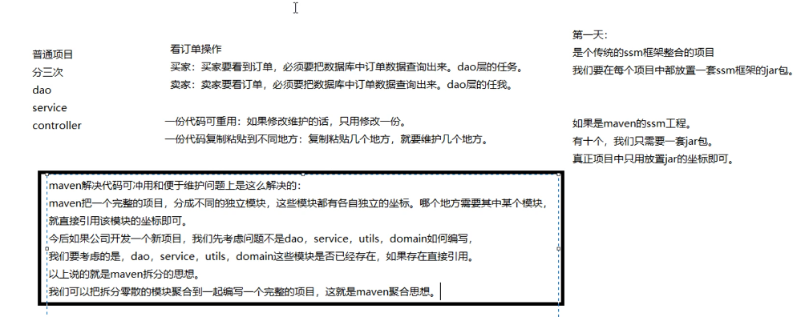
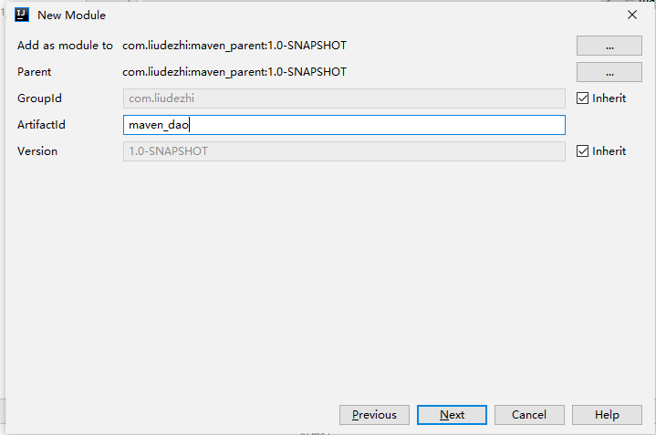
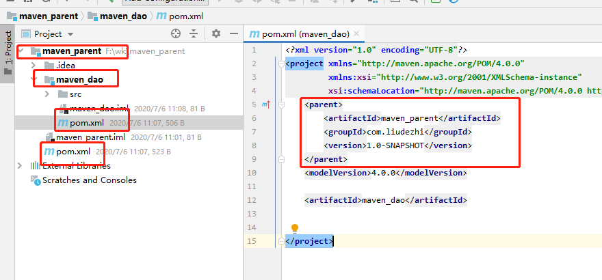
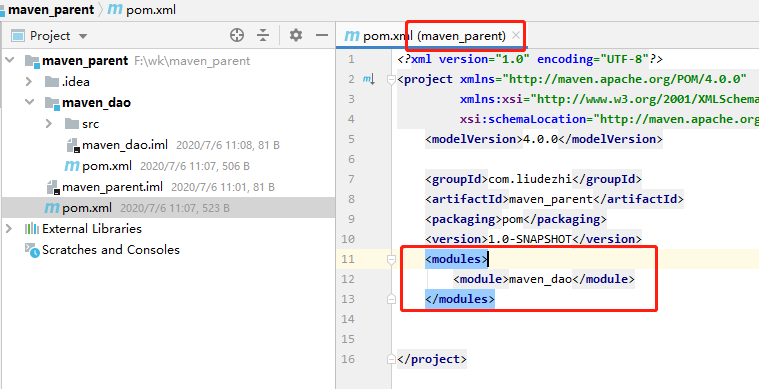
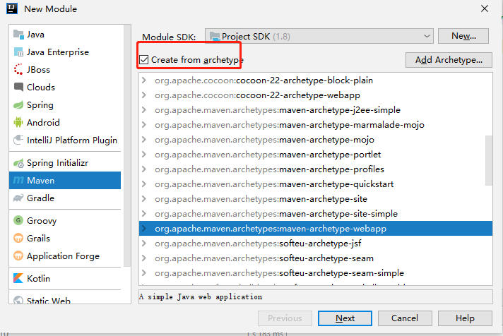
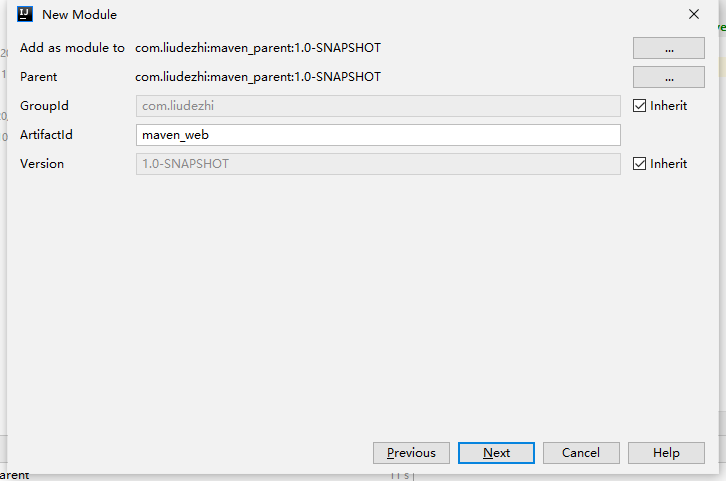
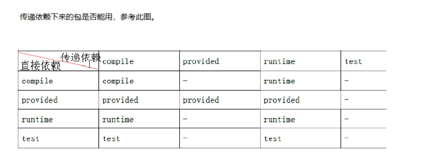

# 01.分模块构建

- 笔记本：18.maven高级
- 创建时间：2020-05-17 13:53:42 UTC
- 更新时间：2020-07-06 06:45:01 UTC
- 印象笔记 GUID：b84c0bba-1791-4fac-96cd-8a92ae2bfdb9

#### 1. maven 基础回顾

maven 是一个项目管理工具。

##### 依赖管理：

- maven 对项目中 jar 包的管理过程。传统工程我们直接把 jar 包放置在项目中。

- maven 工程真正的 jar 包放置在仓库中，项目中只用放置 jar 包的坐标。

##### 仓库的种类：

- 本地仓库

- 远程仓库（私服）

- 中央仓库

##### 仓库之间的关系

当我们启动一个 maven 工程的时候，maven 工程会通过 pom 文件中 jar 包的坐标去本地仓库找对应的 jar 包。默认情况下：如果本地仓库没有对应的 jar 包，maven 工程会自动去中央仓库下载 jar 包到本地仓库。在公司中，如果本地没有对应的 jar 包，会先从私服下载 jar 包。如果私服中没有 jar 包，可以从中央仓库下载，也可以从本地上传。

##### 一键构建：

- maven 自身继承了 tomcat 插件，可以对项目进行编译、测试、打包、安装，发布等操作。

##### maven 常用命令：

- clean

- compile

- test

- package

- install

- deploy

##### maven 三套生命周期：

- 清理生命周期

- 默认生命周期

- 站点生命周期

#### 2. maven 传统的 web 工程做一个数据查询操作

##### 创建数据库

```
create table items (
	id int(10) not null auto_increment,
	name varchar(20) default null,
	price float(10,0) default null,
	pic varchar(40) default null,
	createtime datetime default null,
	detail varchar(200) default null,
	primary key (id)
)
insert into items values('1', 'liudezhi', '1000', null, '2000-03-12', '你们好')

```

##### 解决 jar 包冲突

- maven 导入 jar 包中的一些概念：
 直接依赖：项目中直接导入的 jar 包，就是该项目的直接依赖包。
 传递依赖：项目中没有直接导入的 jar 包，可以通过项目直接依赖 jar 包传递到项目中去。

- 解决 jar 包冲突的方式一：
 第一声明优先原则：哪个 jar 包的坐标在靠上的位置，这个 jar 包就是先声明的。先声明的 jar 包坐标下的依赖包，可以优先进入项目中。

- 解决 jar 包冲突的方式二：
 路径近者优先原则。直接依赖路径比传递依赖路径近，那么最终项目进入的 jar 包会是路径近的直接依赖包。

- 解决 jar 包冲突的方式三[推荐使用]：
 直接排除法：使用 exclusions 标签来排除某个 jar 包下的依赖包
 当我们要排除某个 jar 包下依赖包的时候，在配置 exclusions 标签的是偶，内部可以不写版本号，因为此时依赖包使用的版本和默认的本 jar 包一样
 **eg:**

```
  <dependencies>
    <dependency>
      <groupId>org.springframework</groupId>
      <artifactId>spring-beans</artifactId>
      <version>4.2.4.RELEASE</version>
      <exclusions>
        <exclusion>
          <groupId>org.springframework</groupId>
          <artifactId>spring-core</artifactId>
        </exclusion>
      </exclusions>
    </dependency>
    <dependency>
      <groupId>org.springframework</groupId>
      <artifactId>spring-context</artifactId>
      <version>5.0.2.RELEASE</version>
    </dependency>
  </dependencies>

```

#### 3. maven 工程拆分与聚合的思想



##### maven 父子工程的创建

1.
创建父工程
 创建父工程时选择 project 或 module 都可以。

 **注：** 父工程只需要 pom.xml 文件，其他都可以删除（创建时可以不用骨架）。

1.
创建子模块
 父工程上右键，new -> module
 
 
 
 同理创建 service（和页面无交互，不需要使用骨架）。
 创建 web 子模块（与页面有交互，使用骨架创建）
 
 
 创建完成后的 pom.xml 文件中从name后可以直接删除。

##### 工程和模块的区别：

工程不等于完整的项目，模块也不等于完整的项目，一个完整的项目看的是代码，代码完整，就可以说这是一个完整的项目。和此项目是工程和模块没有关系。

工程只能使用自己内部资源，工程天生是独立的。后天可以和其他工程或模块建立关联关系。
 模块天生不是独立的，模块天生是属于父工程的，模块一旦创建，所有父工程的资源都可以使用。

父子模块之间：子模块天生集成父工程，可以使用父工程所有资源。
 子工程之间天生是没有任何关系的。

父子工程之间不用建立关系，继承关系是先天的，不需要手动建立。
 平级直接引用叫依赖，依赖不是先天的，一来是需要后天建立的。

##### 传递依赖的包是否能用



#### 4. 把传统的 web 工程修改成 maven 拆分与聚合的形式

%23%23%23%23%201.%20maven%20%E5%9F%BA%E7%A1%80%E5%9B%9E%E9%A1%BE%0Amaven%20%E6%98%AF%E4%B8%80%E4%B8%AA%E9%A1%B9%E7%9B%AE%E7%AE%A1%E7%90%86%E5%B7%A5%E5%85%B7%E3%80%82%0A%23%23%23%23%23%20%E4%BE%9D%E8%B5%96%E7%AE%A1%E7%90%86%EF%BC%9A%0A*%20maven%20%E5%AF%B9%E9%A1%B9%E7%9B%AE%E4%B8%AD%20jar%20%E5%8C%85%E7%9A%84%E7%AE%A1%E7%90%86%E8%BF%87%E7%A8%8B%E3%80%82%E4%BC%A0%E7%BB%9F%E5%B7%A5%E7%A8%8B%E6%88%91%E4%BB%AC%E7%9B%B4%E6%8E%A5%E6%8A%8A%20jar%20%E5%8C%85%E6%94%BE%E7%BD%AE%E5%9C%A8%E9%A1%B9%E7%9B%AE%E4%B8%AD%E3%80%82%0A*%20maven%20%E5%B7%A5%E7%A8%8B%E7%9C%9F%E6%AD%A3%E7%9A%84%20jar%20%E5%8C%85%E6%94%BE%E7%BD%AE%E5%9C%A8%E4%BB%93%E5%BA%93%E4%B8%AD%EF%BC%8C%E9%A1%B9%E7%9B%AE%E4%B8%AD%E5%8F%AA%E7%94%A8%E6%94%BE%E7%BD%AE%20jar%20%E5%8C%85%E7%9A%84%E5%9D%90%E6%A0%87%E3%80%82%0A%0A%23%23%23%23%23%20%E4%BB%93%E5%BA%93%E7%9A%84%E7%A7%8D%E7%B1%BB%EF%BC%9A%0A*%20%E6%9C%AC%E5%9C%B0%E4%BB%93%E5%BA%93%0A*%20%E8%BF%9C%E7%A8%8B%E4%BB%93%E5%BA%93%EF%BC%88%E7%A7%81%E6%9C%8D%EF%BC%89%0A*%20%E4%B8%AD%E5%A4%AE%E4%BB%93%E5%BA%93%0A%0A%23%23%23%23%23%20%E4%BB%93%E5%BA%93%E4%B9%8B%E9%97%B4%E7%9A%84%E5%85%B3%E7%B3%BB%0A%E5%BD%93%E6%88%91%E4%BB%AC%E5%90%AF%E5%8A%A8%E4%B8%80%E4%B8%AA%20maven%20%E5%B7%A5%E7%A8%8B%E7%9A%84%E6%97%B6%E5%80%99%EF%BC%8Cmaven%20%E5%B7%A5%E7%A8%8B%E4%BC%9A%E9%80%9A%E8%BF%87%20pom%20%E6%96%87%E4%BB%B6%E4%B8%AD%20jar%20%E5%8C%85%E7%9A%84%E5%9D%90%E6%A0%87%E5%8E%BB%E6%9C%AC%E5%9C%B0%E4%BB%93%E5%BA%93%E6%89%BE%E5%AF%B9%E5%BA%94%E7%9A%84%20jar%20%E5%8C%85%E3%80%82%E9%BB%98%E8%AE%A4%E6%83%85%E5%86%B5%E4%B8%8B%EF%BC%9A%E5%A6%82%E6%9E%9C%E6%9C%AC%E5%9C%B0%E4%BB%93%E5%BA%93%E6%B2%A1%E6%9C%89%E5%AF%B9%E5%BA%94%E7%9A%84%20jar%20%E5%8C%85%EF%BC%8Cmaven%20%E5%B7%A5%E7%A8%8B%E4%BC%9A%E8%87%AA%E5%8A%A8%E5%8E%BB%E4%B8%AD%E5%A4%AE%E4%BB%93%E5%BA%93%E4%B8%8B%E8%BD%BD%20jar%20%E5%8C%85%E5%88%B0%E6%9C%AC%E5%9C%B0%E4%BB%93%E5%BA%93%E3%80%82%E5%9C%A8%E5%85%AC%E5%8F%B8%E4%B8%AD%EF%BC%8C%E5%A6%82%E6%9E%9C%E6%9C%AC%E5%9C%B0%E6%B2%A1%E6%9C%89%E5%AF%B9%E5%BA%94%E7%9A%84%20jar%20%E5%8C%85%EF%BC%8C%E4%BC%9A%E5%85%88%E4%BB%8E%E7%A7%81%E6%9C%8D%E4%B8%8B%E8%BD%BD%20jar%20%E5%8C%85%E3%80%82%E5%A6%82%E6%9E%9C%E7%A7%81%E6%9C%8D%E4%B8%AD%E6%B2%A1%E6%9C%89%20jar%20%E5%8C%85%EF%BC%8C%E5%8F%AF%E4%BB%A5%E4%BB%8E%E4%B8%AD%E5%A4%AE%E4%BB%93%E5%BA%93%E4%B8%8B%E8%BD%BD%EF%BC%8C%E4%B9%9F%E5%8F%AF%E4%BB%A5%E4%BB%8E%E6%9C%AC%E5%9C%B0%E4%B8%8A%E4%BC%A0%E3%80%82%0A%0A%23%23%23%23%23%20%E4%B8%80%E9%94%AE%E6%9E%84%E5%BB%BA%EF%BC%9A%0A*%20maven%20%E8%87%AA%E8%BA%AB%E7%BB%A7%E6%89%BF%E4%BA%86%20tomcat%20%E6%8F%92%E4%BB%B6%EF%BC%8C%E5%8F%AF%E4%BB%A5%E5%AF%B9%E9%A1%B9%E7%9B%AE%E8%BF%9B%E8%A1%8C%E7%BC%96%E8%AF%91%E3%80%81%E6%B5%8B%E8%AF%95%E3%80%81%E6%89%93%E5%8C%85%E3%80%81%E5%AE%89%E8%A3%85%EF%BC%8C%E5%8F%91%E5%B8%83%E7%AD%89%E6%93%8D%E4%BD%9C%E3%80%82%0A%0A%23%23%23%23%23%20maven%20%E5%B8%B8%E7%94%A8%E5%91%BD%E4%BB%A4%EF%BC%9A%0A*%20clean%0A*%20compile%0A*%20test%0A*%20package%0A*%20install%0A*%20deploy%0A%0A%23%23%23%23%23%20maven%20%E4%B8%89%E5%A5%97%E7%94%9F%E5%91%BD%E5%91%A8%E6%9C%9F%EF%BC%9A%0A*%20%E6%B8%85%E7%90%86%E7%94%9F%E5%91%BD%E5%91%A8%E6%9C%9F%0A*%20%E9%BB%98%E8%AE%A4%E7%94%9F%E5%91%BD%E5%91%A8%E6%9C%9F%0A*%20%E7%AB%99%E7%82%B9%E7%94%9F%E5%91%BD%E5%91%A8%E6%9C%9F%0A%0A%23%23%23%23%202.%20maven%20%E4%BC%A0%E7%BB%9F%E7%9A%84%20web%20%E5%B7%A5%E7%A8%8B%E5%81%9A%E4%B8%80%E4%B8%AA%E6%95%B0%E6%8D%AE%E6%9F%A5%E8%AF%A2%E6%93%8D%E4%BD%9C%0A%23%23%23%23%23%20%E5%88%9B%E5%BB%BA%E6%95%B0%E6%8D%AE%E5%BA%93%0A%60%60%60sql%0Acreate%20table%20items%20(%0A%09id%20int(10)%20not%20null%20auto_increment%2C%0A%09name%20varchar(20)%20default%20null%2C%0A%09price%20float(10%2C0)%20default%20null%2C%0A%09pic%20varchar(40)%20default%20null%2C%0A%09createtime%20datetime%20default%20null%2C%0A%09detail%20varchar(200)%20default%20null%2C%0A%09primary%20key%20(id)%0A)%0Ainsert%20into%20items%20values('1'%2C%20'liudezhi'%2C%20'1000'%2C%20null%2C%20'2000-03-12'%2C%20'%E4%BD%A0%E4%BB%AC%E5%A5%BD')%0A%60%60%60%0A%0A%23%23%23%23%23%20%E8%A7%A3%E5%86%B3%20jar%20%E5%8C%85%E5%86%B2%E7%AA%81%0A*%20maven%20%E5%AF%BC%E5%85%A5%20jar%20%E5%8C%85%E4%B8%AD%E7%9A%84%E4%B8%80%E4%BA%9B%E6%A6%82%E5%BF%B5%EF%BC%9A%0A%E7%9B%B4%E6%8E%A5%E4%BE%9D%E8%B5%96%EF%BC%9A%E9%A1%B9%E7%9B%AE%E4%B8%AD%E7%9B%B4%E6%8E%A5%E5%AF%BC%E5%85%A5%E7%9A%84%20jar%20%E5%8C%85%EF%BC%8C%E5%B0%B1%E6%98%AF%E8%AF%A5%E9%A1%B9%E7%9B%AE%E7%9A%84%E7%9B%B4%E6%8E%A5%E4%BE%9D%E8%B5%96%E5%8C%85%E3%80%82%0A%E4%BC%A0%E9%80%92%E4%BE%9D%E8%B5%96%EF%BC%9A%E9%A1%B9%E7%9B%AE%E4%B8%AD%E6%B2%A1%E6%9C%89%E7%9B%B4%E6%8E%A5%E5%AF%BC%E5%85%A5%E7%9A%84%20jar%20%E5%8C%85%EF%BC%8C%E5%8F%AF%E4%BB%A5%E9%80%9A%E8%BF%87%E9%A1%B9%E7%9B%AE%E7%9B%B4%E6%8E%A5%E4%BE%9D%E8%B5%96%20jar%20%E5%8C%85%E4%BC%A0%E9%80%92%E5%88%B0%E9%A1%B9%E7%9B%AE%E4%B8%AD%E5%8E%BB%E3%80%82%0A*%20%E8%A7%A3%E5%86%B3%20jar%20%E5%8C%85%E5%86%B2%E7%AA%81%E7%9A%84%E6%96%B9%E5%BC%8F%E4%B8%80%EF%BC%9A%0A%E7%AC%AC%E4%B8%80%E5%A3%B0%E6%98%8E%E4%BC%98%E5%85%88%E5%8E%9F%E5%88%99%EF%BC%9A%E5%93%AA%E4%B8%AA%20jar%20%E5%8C%85%E7%9A%84%E5%9D%90%E6%A0%87%E5%9C%A8%E9%9D%A0%E4%B8%8A%E7%9A%84%E4%BD%8D%E7%BD%AE%EF%BC%8C%E8%BF%99%E4%B8%AA%20jar%20%E5%8C%85%E5%B0%B1%E6%98%AF%E5%85%88%E5%A3%B0%E6%98%8E%E7%9A%84%E3%80%82%E5%85%88%E5%A3%B0%E6%98%8E%E7%9A%84%20jar%20%E5%8C%85%E5%9D%90%E6%A0%87%E4%B8%8B%E7%9A%84%E4%BE%9D%E8%B5%96%E5%8C%85%EF%BC%8C%E5%8F%AF%E4%BB%A5%E4%BC%98%E5%85%88%E8%BF%9B%E5%85%A5%E9%A1%B9%E7%9B%AE%E4%B8%AD%E3%80%82%0A*%20%E8%A7%A3%E5%86%B3%20jar%20%E5%8C%85%E5%86%B2%E7%AA%81%E7%9A%84%E6%96%B9%E5%BC%8F%E4%BA%8C%EF%BC%9A%0A%E8%B7%AF%E5%BE%84%E8%BF%91%E8%80%85%E4%BC%98%E5%85%88%E5%8E%9F%E5%88%99%E3%80%82%E7%9B%B4%E6%8E%A5%E4%BE%9D%E8%B5%96%E8%B7%AF%E5%BE%84%E6%AF%94%E4%BC%A0%E9%80%92%E4%BE%9D%E8%B5%96%E8%B7%AF%E5%BE%84%E8%BF%91%EF%BC%8C%E9%82%A3%E4%B9%88%E6%9C%80%E7%BB%88%E9%A1%B9%E7%9B%AE%E8%BF%9B%E5%85%A5%E7%9A%84%20jar%20%E5%8C%85%E4%BC%9A%E6%98%AF%E8%B7%AF%E5%BE%84%E8%BF%91%E7%9A%84%E7%9B%B4%E6%8E%A5%E4%BE%9D%E8%B5%96%E5%8C%85%E3%80%82%0A*%20%E8%A7%A3%E5%86%B3%20jar%20%E5%8C%85%E5%86%B2%E7%AA%81%E7%9A%84%E6%96%B9%E5%BC%8F%E4%B8%89%5B%E6%8E%A8%E8%8D%90%E4%BD%BF%E7%94%A8%5D%EF%BC%9A%0A%E7%9B%B4%E6%8E%A5%E6%8E%92%E9%99%A4%E6%B3%95%EF%BC%9A%E4%BD%BF%E7%94%A8%20exclusions%20%E6%A0%87%E7%AD%BE%E6%9D%A5%E6%8E%92%E9%99%A4%E6%9F%90%E4%B8%AA%20jar%20%E5%8C%85%E4%B8%8B%E7%9A%84%E4%BE%9D%E8%B5%96%E5%8C%85%0A%E5%BD%93%E6%88%91%E4%BB%AC%E8%A6%81%E6%8E%92%E9%99%A4%E6%9F%90%E4%B8%AA%20jar%20%E5%8C%85%E4%B8%8B%E4%BE%9D%E8%B5%96%E5%8C%85%E7%9A%84%E6%97%B6%E5%80%99%EF%BC%8C%E5%9C%A8%E9%85%8D%E7%BD%AE%20exclusions%20%E6%A0%87%E7%AD%BE%E7%9A%84%E6%98%AF%E5%81%B6%EF%BC%8C%E5%86%85%E9%83%A8%E5%8F%AF%E4%BB%A5%E4%B8%8D%E5%86%99%E7%89%88%E6%9C%AC%E5%8F%B7%EF%BC%8C%E5%9B%A0%E4%B8%BA%E6%AD%A4%E6%97%B6%E4%BE%9D%E8%B5%96%E5%8C%85%E4%BD%BF%E7%94%A8%E7%9A%84%E7%89%88%E6%9C%AC%E5%92%8C%E9%BB%98%E8%AE%A4%E7%9A%84%E6%9C%AC%20jar%20%E5%8C%85%E4%B8%80%E6%A0%B7%0A**eg%3A**%0A%60%60%60xml%0A%20%20%3Cdependencies%3E%0A%20%20%20%20%3Cdependency%3E%0A%20%20%20%20%20%20%3CgroupId%3Eorg.springframework%3C%2FgroupId%3E%0A%20%20%20%20%20%20%3CartifactId%3Espring-beans%3C%2FartifactId%3E%0A%20%20%20%20%20%20%3Cversion%3E4.2.4.RELEASE%3C%2Fversion%3E%0A%20%20%20%20%20%20%3Cexclusions%3E%0A%20%20%20%20%20%20%20%20%3Cexclusion%3E%0A%20%20%20%20%20%20%20%20%20%20%3CgroupId%3Eorg.springframework%3C%2FgroupId%3E%0A%20%20%20%20%20%20%20%20%20%20%3CartifactId%3Espring-core%3C%2FartifactId%3E%0A%20%20%20%20%20%20%20%20%3C%2Fexclusion%3E%0A%20%20%20%20%20%20%3C%2Fexclusions%3E%0A%20%20%20%20%3C%2Fdependency%3E%0A%20%20%20%20%3Cdependency%3E%0A%20%20%20%20%20%20%3CgroupId%3Eorg.springframework%3C%2FgroupId%3E%0A%20%20%20%20%20%20%3CartifactId%3Espring-context%3C%2FartifactId%3E%0A%20%20%20%20%20%20%3Cversion%3E5.0.2.RELEASE%3C%2Fversion%3E%0A%20%20%20%20%3C%2Fdependency%3E%0A%20%20%3C%2Fdependencies%3E%0A%60%60%60%0A%0A%0A%23%23%23%23%203.%20maven%20%E5%B7%A5%E7%A8%8B%E6%8B%86%E5%88%86%E4%B8%8E%E8%81%9A%E5%90%88%E7%9A%84%E6%80%9D%E6%83%B3%0A!%5Bc48b5cd6ce1b2561ae8dd391ba68dc2a.png%5D(en-resource%3A%2F%2Fdatabase%2F3598%3A1)%0A%0A%23%23%23%23%23%20maven%20%E7%88%B6%E5%AD%90%E5%B7%A5%E7%A8%8B%E7%9A%84%E5%88%9B%E5%BB%BA%0A1.%20%E5%88%9B%E5%BB%BA%E7%88%B6%E5%B7%A5%E7%A8%8B%0A%20%20%20%20%E5%88%9B%E5%BB%BA%E7%88%B6%E5%B7%A5%E7%A8%8B%E6%97%B6%E9%80%89%E6%8B%A9%20project%20%E6%88%96%20module%20%E9%83%BD%E5%8F%AF%E4%BB%A5%E3%80%82%0A!%5Bimage.png%5D(data%3Aimage%2Fpng%3Bbase64%2CiVBORw0KGgoAAAANSUhEUgAAAsoAAAHbCAYAAADS9LzjAAAgAElEQVR4Ae3db4zd1Xkv%2BmcnmPqVHaL2KGplFDzYRRfxwjKMal8JJdQm%2FsMLWzIlQldGPk08FCKMLS5gnRtekHvkBCEb0DFg03ssOBIKx5bsWzG263FJhG6xZIP8AlEcmzEUpCZqKjgzaqu0SdlXa%2F%2BZvef%2FHnu8ZtbMZ0ujvWfv3289z%2B%2BzJuQ7y2vvqfz93%2F999csvv4xqtTrmV0TUnk%2F3bgQIECBAgAABAgQ6EfiHf%2FiH%2BMM%2F%2FMNODp32Y1Kubd4qlUrtYft9epy%2BvvKVr9S%2BvvrVr8Z1111X%2B0rPpe%2FTfWVwcLA1UnNE9wQIECBAgAABAgTmiUBaNB4cHIwFCxbUwnIzKF83T67fZRIgQIAAAQIECBAYV%2BC3v%2F1tbZW5udqc7gXlcbm8QIAAAQIECBAgMF8E%2FuM%2F%2FiPSynLzq7Y1Y75cvOskQIAAAQIECBAgMJ5ACsrNr%2Bb7974y3sGeJ0CAAAECBAgQIDBfBJoryumNgM1VZUF5vsy%2B6yRAgAABAgQIEBhXoBmO2%2B8n3KP8n55ZOO5gnbzwj4%2F%2FppPDHEOAAAECBAgQIEBgRgXaA3LzY5MnDMqp2w1%2F990ravr4%2F%2FbTKzrPSQQIECBAgAABAgRyC7Rvueg4KKePynAjQIAAAQIECBAgMJcF0opyMyA3V5cn3aP87%2F%2F%2B75G%2BXnjhhfirv%2Fqr2n3zuXS%2FadOmOHToUO2Y9ufnMuRY11bt3x9rFq2J%2Ff3%2BfstYPp4jQIAAAQIECHQi8Nj%2F%2BXj87TvvjHvo%2F%2Fe3fxvpmOm%2BjbWiPGlQ%2Fs1vfhPpK4XhdEv3zefS%2Fe9%2B97ta%2Bm5%2FLj3u9Fat9sf%2BNYti0Rghs3pqRyxasz%2F62%2F4MYafjTnZcq26qXf%2FacUrInczN6wQIECBAgACBaymwefOm%2BM%2F%2F%2Bc%2FHDMspJP%2F5n38v0jHTfWuuJrffdxyUL168WOsn3beH4ubWjPbnphKUmxe5bdutsbvnxWsSips1Rt93x57zA7U%2FWThwfk98sGXtFa8IV7oejtODp%2BPhrvrfEx9da%2BJnmsFdWJ%2FYyasECBAgQIDA3Bb431evjv%2F%2B3%2F%2BfUWG5GZLTa%2BmY6b61b71ohuVJg%2FK%2F%2Fuu%2FRvpqht9033wu3aegnAZrfy49nvJt4yOxJ3ZHz4uXp3zqdJyQgu7j287G0ZMzU386rsEYBAgQIECAAIG5IDAyLF%2FrkJzMmuG4%2FX7SoPwv%2F%2FIvkb7%2B6I%2F%2BqOae7tP3W7ZsiRtvvDGWL18ev%2F71r2vPNY9N91O%2FLY2HDuyJ2L0ixltVrVZPxY7GNom0XWLN%2Fv5amVM7Wo%2BbxzTHuJLtG63V3Ua9xvaP5tjNrRqLFu2IU41tIfU9ym3fj9NranjkOH%2F6316LRxeviN1nIw5tWVzbbjJ1P2cQIECAAAECBOaOQDMs%2Fx9bt8bWrQ%2FUVpmvxUpyU6w9IKfH6TZpUP7nf%2F7nSF8%2F%2BMEPaiek%2B3Tyd77znXjzzTfjW9%2F6Vjz77LO1Y5rHpvsruaVV3QN7uuPQlkeHAmhznBQuH138TCxvbpUYOB%2Bbj9ZDddfy7jh7sR6ao683Pujujg8u1VeG%2B3oPRffmddFVmXhLRAq6zxzqjs3rljZLxqEtvbFxYCAGTz8cS6MvHl28JT7Yc762VWNwcDAGjkRsWTy1XuvXMXycv%2FnB1nhu4Hzs6Y7YdqReb6gJDwgQIECAAAEC81QgZc5KNaI6SY67VjyTfo5yCoTptmLFimE9pICcVpfTanL6tIvpui196EDsOboitjy6MQY2to3a1xuH4mzEisWxu%2B3p7kuXY%2Bm6zdG9uzdOPbc2oveD2Hzg8bjYczL6H1oXlz7ojs2PtMJv26kRcTZ2D42X9iv31fYYN987uO3Ic3F3c2JS%2Fe49cf6htrHWPhJ7uldEb99zsbarbeQJeo0YY5y2Uz0kQIAAAQIECBCIaG63%2BB%2F%2F47UaR3qD37Xanzye96RBubk3eawB%2Bvsbq7hjvHilf9OvUumKtAXj6Iot8WhsGz5yCqp9D41aHa5W18Xm7qNx6XJfXPxgczyyNKXWZ%2BJkX8TR2BwH2rLtiAGHwvHw56fyXXcsbw%2FJzVPH6%2FVU8wD3BAgQIECAAAECYwk0Q3J7MG6%2Bwa%2F9ubHOnc7nJt16MZ3FOh1raAtG4yPpauet3Rjbzu6OF%2Fpao5zaUd8TnML1us0RR3ueiUO3Louu5vfPHI3oYNtFa8QJHjXqD3uzYd8LsTs2R9tujfoAE%2FQaI15LWzH2N%2FZaT1DdSwQIECBAgACBeSEwVkhOF97cszzeR8ddC5yOg%2FLIDc7N769FU2nM2haM7tbolcrd8VztI9wWD33uce%2FG1taItP0izp6NbRvX1k6qf59y8rjLya3BO3hUqz9wJG7dvWKo%2FuItEUfGWOGeqNeRry1e3BvLHloa9bCf9md7M18H0%2BEQAgQIECBAYI4KHDv2%2F467xaIZlo8ePZbl6iuDg4Pj%2FpWN%2F%2FTMwvjN%2F339FTWy8P%2F69%2FjHxzv%2FwyNXVGQWnZTeDLh2xcV4fKAV3mdRe1ohQIAAAQIECBAYRyB9hvKHH34YCxcujOuvv772tWDBgsk%2F9WKc8Tw9QuDyyaNxtnt5jLVdecShviVAgAABAgQIEChAYNI386WVYbfxBdLnNC%2Fekv6897Y4MjD6jYbjn%2BkVAgQIECBAgACB2Sww4daL2dy43ggQIECAAAECBAhMh4CtF9OhaAwCBAgQIECAAIF5I9Dxp17MGxEXSoAAAQIECBAgQKCTP2FNiQABAgQIECBAgMB8FLCiPB9n3TUTIECAAAECBAhMKiAoT0rkAAIECBAgQIAAgfkoICjPx1l3zQQIECBAgAABApMKCMqTEjmAAAECBAgQIEBgPgoIyvNx1l0zAQIECBAgQIDApAKC8qREDiBAgAABAgQIEJiPAoLyfJx110yAAAECBAgQIDCpgKA8KZEDCBAgQIAAAQIE5qOAoDwfZ901EyBAgAABAgQITCogKE9K5AACBAgQIECAAIH5KCAoz8dZd80ECBAgQIAAAQKTClw36REOqAmcO3eOBAECBAgQIEBgVgvccccds7q%2F0poTlKcwY3fdddcUjnYoAQIECBAgQCCfwFtvvZWv2DypZOvFPJlol0mAAAECBAgQIDA1AUF5al6OJkCAAAECBAgQmCcCtl7Mk4l2mQQIECBAgACBkQIXL14c%2BdSk3y9fvnzSY%2BbKAXN%2BRbl6akcsWrM%2F%2BqvVOTJnJ6Kn0hMn0tVc2herK6tj36UruLQTPVFZvS%2Bu5NR6tdTHOLWvpq8ruBSnECBAgAABAlcusHLlyuj068qr1M%2BsVi9H30tvxLtfXH0uq37xbrwxTWONd11TDsrVan%2FsX7MoFi1qfu2IUzMYQk%2FtWBRr9vePd32eJ0CAAAECBAgQuMYCl%2Fteijfe%2FeIaV8k%2F%2FJSCcrV%2Ff6xdvCIuPj4Qg4ODta%2BBgY3Ru%2FbFObRim38Srrjisp3xTvWd2Lnsike4NifO1r6uzdUalQABAgQIzHmBX%2F3qV%2FHJJ5%2FMquus3HB73PcX98XtN1SiWv0i3n3jpei7fPUr1e0X2XFQTivJL%2FbsjluPDMTzd1eGxqhU7o7nTz8cXZXWc0MvekCAAAECBAgQIFC0QArJFy5ciIULFxZ9HVfSfMdBOS6fjKOxJx5ZO36Z5raMHadOxY60NaOxN7habXw%2FxnaNtEq9ZlFr%2B0b796PGa5y%2F49T4vy2MrLV4y6HxG562V9J%2B3UpUGl%2BrhzYND3%2B%2B0txbXKvb2ON7Iu0zrp%2FbkzYep73Do8YZp9HaXuD2%2FcqNx%2Bnw9teG6rV6rGw4OGLQ4b02r%2BHSvtVD%2FTT7qtQabZz%2BZqvfoedH1R5RyrcECBAgQIBAEQLNkHzLLbfEN77xjY56HtqH%2FG5fvPzyy7WvUdsy%2Bk8PvfZS3%2BWhcevnvjT0WvO81opx2uP8Urz0xrvx%2Bedpj3Jf9H95OU6%2F%2FNN494tK9J86UHttaMCrfNB5UO6%2FGGfbitUD7dj7lA9t6Y2NAwMxePrhWBp98ejiLfHBnvOt7RpHIrYsfrTjvc1D4w0OxsCRbXFoy9jnppCcasWR1taQI9vamr4mD1PA3BDv770Y1Wq19vVObS%2FE6OerxyM2DAvLZ2LXjyJeTecd3x4HN1SicmxTfZyLeyN2PVt%2F095V913vJY7X%2B0t9Ht%2FePmh6%2FUdxy8Xm6xfj3sPLI%2BXhZTvfGbqu1GOs2hsXD6xvnHwmdl1o9bvq4I%2Bu7I2F7a14TIAAAQIECGQXSNsqUihuv11JSG6d%2F3mc%2B6IrHnzwwei57%2FaIc6fa3sA3%2FLWvf3Su9loKyadfPhc3fPfB%2Bnk990VX%2F0%2BHbaf46K%2F7o%2BvBB%2BMv7rs9bmhsZqhUboo1D343br%2BhGl1399Rea%2FVxdY%2Bu%2BOPhKl0Px%2BnBh6MeTnuHdbHtyHNxd3MrRl9vHOreE%2BcfWto6Zu0jsad7RfT2PRdru1pPj%2Fdo2Hht595994gzmrXaVr3XbtwW8cGI46bz2xPH4mAKjyM3Co%2F1%2FPrHYu%2Bq5XHsxIFYX8uaq2LvqzujtsV4%2FabYHu%2FHLY81QuiyW%2BK2OBwXLkWsv9o9yM1emvk2ItZv2h7xfgMivR5nIpZXYlebzar24mmVeEPE8Wqj39pxq2LvUL%2F3xL2rDred7SEBAgQIECBQikDaVpG2V6RbWjm%2BupCcRvl63HH7TfXL%2F1pXdH29%2FYMXxnnt4%2F7or3wR8caBeLd%2BZkRU4obP%2F1dEY6ibv7MmljYz5tAx1%2B5B50F57cbYtuWZOHn5oXi4g3A7ecvdsXxaxpm80uw6YlXccvPs6qjWTQr777SH4PYeT0TP8sNx78V3oi1rtx%2FgMQECBAgQIFCwQHNbRQrLAwMD8ctf%2FjKmst1iui69esPt8d0%2FWxk3jAjDaevFTNw63nqR3rT3yJ6I3SvWxv7%2B8fcIj7qIFLDP7o6eF1v7T6Lvhdgdm2Pd0CLzB3Gp8fLlk0eHbfFI4x3q7Rsa9vKLPbH77LbY2LZqPPRio9YLjcNrb0B85hrvUU4rwWd2xbO1DzZOnZyIfWmPcuP5B4b2K6eXno1dcW%2FcM9UV4tqe33E%2Bs3jo4tOD92sr0OnRpTcPpzXi%2Bm1Uj5di34%2Fa9iiPej1tlW7ud74U%2B2pLybPw0zWa1%2BeeAAECBAgQuGqBFJZTOJ6pkBw3dcXNn5%2BLdz9uXcrlvr64PIMfQ9xxUE4tdz18OgbOb46jKxYPfY7y4tr%2B40daWy1a11Z7lAL2cwNH4tbdK1rnpG3EfQ%2FVPikjbeE4UAvg9TF7Lt4a3SPG2Ba9Q%2Beu2H1rHBlo29rRdmytVm0Pc32sxYt7IjZf603K6%2BPAxb3xftpfXHsT3rG4pbYNY30cqB6P23Ytb70ZLm1dGHfVtu1CruThsp3xatrWvLzexwMXbotVQ%2BOsjwPNPdC1Hh%2BIuLd9k%2FLIa6jEsU0HaqvHJ3qWx64zUd8%2F3XiT4dCb9obG94AAAQIECBCYCwIpLP%2FJn%2FxJx2%2Fcm85rrlSWxprv3hGf%2F3X9DYDpjYD9XZ1ttahUboiurq9P%2B5v5KoODg1NYHp5OjsnHqq0Ir61%2FbnP7R9JNfub0H3Hu3Lm46667pn9gIxIgQIAAAQIEpkHgrbfeijvuuGNKI6U%2FYZ3%2BKl%2Bnt%2Ffeey%2Fm4p%2Bw%2FvLLL%2BPDDz%2BsfQTe9ddfH%2BlrwYIF0fke5U4FHUeAAAECBAgQIFCMQAq%2FbmMLCMpju3iWAAECBAgQIDDnBebi6vB0TtqsDsqVSlc8fHpwOq%2FXWAQIECBAgAABAgQ6EpjSm%2Fk6GtFBBAgQIECAAAECBOaAgKA8BybRJRAgQIAAAQIECEy%2FwKzeejH9l3t1I6Z3k7oRIECAAAECBAjMDwFBucN5nurHrXQ4rMMIECBAgAABAgRmqYCtF7N0YrRFgAABAgQIECAwswKC8sz6q06AAAECBAgQIDBLBQTlWTox2iJAgAABAgQIEJhZAUF5Zv1VJ0CAAAECBAgQmKUCgvIsnRhtESBAgAABAgQIzKyAoDyz%2FqoTIECAAAECBAjMUgEfD9fhxPzBC%2F%2FU4ZEOI0CAAAECBAjMjMCvH%2Fn9mSk8R6sKylOY2N%2F8l5umcLRDCRAgQIAAAQL5BBb%2B14%2FzFZsnlWy9mCcTPZsvs1KpzOb29EaAAAECBAjMUwFBeZ5OvMsmQIAAAQIECBCYWEBQntjHqwQIECBAgAABAvNUIGtQrvbvjzWL1sT%2B%2FmqNu1rtj%2F1rFsWiRYtix6n6c9d6HqqndsSiNfujv5qn3rW%2BHuMTIECAAAECBAhcG4EpB%2BWhcLvj1FV3dPnFnth965EYHByM5%2B%2Benn2qp3YsijX7%2B6%2B6NwMQIECAAAECBAjMb4EpB%2BW4fDKORnd0H%2BqNU5OsyjZDdXO1uNL1cJwePB0Pd9VDcf%2FFs9G9vOuKZ2Dk%2BFc8kBMzC1yKfasr0XMic1nlCBAgQIAAAQJTEJhyUL588mjE5gPx%2BLZD0ds3hUoOJUCAAAECBAgQIFCQwJSCclrBreXkdUtj7cZtceiZF4f2%2BrZWd0%2FFjkWLYtGfPhLbFq%2BI3WcjDm1ZXNsX%2FNFHaY%2FyjtpKdNoiseVQxNndK2JR47n6Hub6nuWR%2B5ar1ca4aexFi%2BJP%2F9tr8eiI8cfadzzyvMWp6LTeTkRPZXXsO7EvVlcqkT7qrLZSeqKn9jh9v3rfpVbFS63jho6N%2Bgpr%2B3GX9q2Oyup9UT8z1aiPPXy8Ru1949RqVW08aq7kDh9v2MrumP2l00ece8W9pdrLY9eZiIMbKrVrHNWmJwgQIECAAAECs0BgSkE5%2Bl6I3bE51i2NiLUbY9vZo3Hy8vCrOLSlNzYODMTg37wQhwbOx57uiG1HBmLw9MPR2HFRO%2BHu5wfjyLaI7j3nY3Dw%2BVgbl%2BPFFyIOpHMHB2PgyLY4tOXRWqhOYffRxVvig9qxg7XX%2F%2BYHW%2BO5UeMP3%2BfcPC9S%2FcH6eanm9N%2FOxK4fRbxarUb1%2BPZ6ADy2Karp%2B4t7I3Y9G%2FVdBpdi37ON44aO7YkTsSx2%2FnB7nDn8ZiMYX4o3D5%2BJ7T%2FcGcsiBcsfxS0Xq%2FXxqhfj3sPL27YtnIldF9prPRDtuXysaz244VhsSvWH9ZCOHK%2B%2F1ihD575zpb2tjwPVi7F3VcT249WovrOzNbhHBAgQIECAAIFZJDCloNzXeyi6N6%2BLrtrq5t2xcdvZODoiKW878lzcfQV%2FQKJS6YqHn3844sW1tRXjYSu%2Ffb1xqHtPHHgoJfQp3BrnPbK2dU5aCZ%2F%2B26rY%2B2oKjhGxflNsj1Wx97H19TLLbonb4v24UFsaXhY7D%2ByMSKvFyXDDwVYr6bwzh%2BPNdNylN%2BPwme2xKQ1x4lgcjDOxa3lzRbm%2BGvt%2BfcCIYbXuiXtXtYYc79H24wei0V3E%2Bsdi76qDcayW5CforzHYsHOvQW%2Fj9ex5AgQIECBAgEBugY6Dclqd7R3aKlHf%2FlDfOvHCpG%2Fq6%2BSimtsueuJAfUX5%2FJ7o7uTEko5pbGt4IF4dWm1u5dr1sWn7mTj85qW49ObhiL2PtcLsqr1xsbkC3Lh%2FZ2ctlk%2Fv1U%2FY3zilcvU2TnlPEyBAgAABAgSulUDHQTnS6mxsiyONrRG17REDR2JbTNOb%2Bvovxtm2VeP0psGzzauubfPYHS803jyYQvv%2BTj4CbtR5%2FfHiM9O9R7nZZAf3H12IM6v2xquNkJsC8Zm209Y%2Ftjfi8LPx7OGIe%2B9pBOHaSvOueLbtEyJO9KTtGld%2BO1hfPq4NcGnfA7GruXo9SX%2BjKl6D3kbV8AQBAgQIECBAYIYEOg7KadtFbNs4bFtFpZK2X0QcGufjL9J2inWbu4fezNf4OyNjX%2BraR2JP7I4VixfXtl70XLx1aEU51Xnu%2FJ74IL0pcNGiWLy4N5Y9tDRGjz%2F8j4jUzqvtdW6e1xOx%2BVpsvRj7kkY9m7Y5xK5Y3nhj3gMXbovWinJELLsn7o2DcfC2H0ZrwXh9HLi4N95Pb3xrnHdsU9vWiVFFJn9iexwbGmv5rtvieLUx3mT9jRr6SntbFvfcu8qb%2BUZ5eoIAAQIECBCYTQKVwcHB4elyNnU3i3r5gxf%2BKX7zX26aRR1dSSvpkyuWx4UfVuPA0CblKxlnes9JvwCkNxa6ESBAgAABAlcusPC%2Ffhy%2FfuT3r3yAeXzml19%2BGR9%2B%2BGEsXLgwrr%2F%2B%2BtrXggULouMV5Xls59IJECBAgAABAgTmoYCgPCcnffjnJDe3bGw%2FPicv1kURIECAAAECBK6JwHXXZFSDzrBA%2BqziahwYq4sNtjiMxeI5AgQIECBAgMBIASvKI0V8n13A%2FuTs5AoSIECAAAECHQgIyh0gOYQAAQIECBAgQGD%2BCdh6MYU5T%2B8mdSNAgAABAgQIEJgfAoJyh%2FPs41Y6hHIYAQIECBAgQGCOCNh6MUcm0mUQIECAAAECBAhMr4CgPL2eRiNAgAABAgQIEJgjAoLyHJlIl0GAAAECBAgQIDC9AoLy9HoajQABAgQIECBAYI4ICMpzZCJdBgECBAgQIECAwPQKCMrT62k0AgQIECBAgACBOSLg4%2BE6nMhz5851eKTDCBAgQIAAAQIzI3DHHXfMTOE5WlVQnsLE3nXXXVM42qEECBAgQIAAgXwCb731Vr5i86SSrRfzZKJdJgECBAgQIECAwNQEBOWpeTmaAAECBAgQIEBgngjYejFPJtplEiBAgAABAgRGCly8eHHkU5N%2Bv3z58kmPmSsHzLqgXO3fH2tXHI3N5%2Fvi4a7KXHF2HQQIECBAgACBWSmwcuXKjvt67733Oj52rAOr1ctx%2BuVzccN3%2Fyxuv%2BHqcl71i3fjf%2F60P7qmYayxek3Pdbz14tSORbFox6lR4%2FTvXxOL1uyP%2Fmp11Gvz64kT0VOpxOp9lya47PoxlUolKpXVMeGhtVHaj69Ez4nm0Jdi3%2BpxxjjRE5XV%2B2J4F43jWwM0BmqOk8aqfw0%2FZOL6w4%2BNiEv7YnWlJ4baTFVqz7XGH3ndJ3raX2t7PGrw5rW7J0CAAAECBGabwOW%2Bl%2BKNd7%2BYbW1ddT8dB%2BW1G7dFHOqNU22BuFrtj5NHz8a2xx%2BKrsrV%2FVbQvJJK18NxevB0QavJzbB5LGJ78yrGuk%2FHbYj3916MarUa1eO3xa7lI0LlsNNSSN0QcbxaP756MW750fDjt2%2B%2FLXY9MDIUDxuk%2Fs2lN%2BNwrIpVB48ND7G1V1fF3ouNGhf3xvsbmgF%2B8vpjVBr%2BVArtyw%2FHvc3x03VfvDcOL2%2BF%2FvUHmtd3PLbH9jiejklfB9YPH8t3BAgQIECAwIwJ%2FOpXv4pPPvlkxuqPVbhyw%2B1x31%2FcV1uZrla%2FiHffeCn6Lk%2Fvwm3HQTnWboxtcSh6%2B9pavXwyjp7dFhvXtj037x4ui53vpHB3IDZNdO0prJ7ZHj%2Fcuax%2B1PrHYu%2Bqg3Fs2PJr2wCXLsT7q%2FbGY0N5MdU5EEPfpkM3PRZ7Y1c8MMnS9KU3D0fc%2B2r8cPsE9dJ4y3bGD7eficNvXoropH5bu6MfnoieDQdj%2B%2FF3onnJtWOW7Yx3jm%2BPgxuGh%2F7R53uGAAECBAgQmA0CKSRfuHAhFi5cOBvaydpDx0G5Urk76ovKraR8%2BeTROLttY9zdWE2uVk%2FFjkWLYlHja83%2B%2FtrFpJXn%2FWsWxY5TjdcbWzVq2zaGjt9RW61Oe5TXLKo%2FTiePHHPRqNfWxP79O0bVzKrYSbGPLsSZ7Zvagu6yuOW2iPcvDN8kMTTUslvitjO74tnxgnTtwGWx89W9EbuWt23LGBqh8eBS1HLyPcti%2FabtcfBHHaxApzM7qj%2ByVtv3J47FwWFBv%2B219Ztie7wf411625EeEiBAgAABAjMo0AzJt9xyS3zjG9%2FoqJO0D7nvpTfi3Xf74uWXX659jdqW0X966LWX%2Bi4PjVs%2F96Wh15rntVaM09gvxUtvvBuff%2F5uvPFSX%2FR%2FmfY9%2FzTe%2FaIS%2FacO1F4bGvAqH3QclFOdtY%2Fsie7G9ouhbReN5eQUaB9d%2FEwsPz8Qg4ODMTBwPjYfXRE7TrWWwA9t6Y2NAwMxePrhWHr5xejZfWscSd8PDsbg4PNDgbt5TfUxt8QHe843jhmMgSMRWxY%2F2rYF5GzsvrixXvP8nojdPbG%2Fv1WzOdZM31%2B68P4UW1gfB2orr2nf7gSrr8t2xqt7V42%2FQnvi2dgV98Y9aSE7BdQzhyMtGI95u7QvfnRwVdxbP3jS%2Bgc3tO0pTnucl%2B%2BKM2MOPPLJm%2BOWVWfiwkcjn%2Fc9AQIECBAgMBMCaVtFCsXttysJya3zP49zX3TFgw8%2BGD333R5x7lS8%2B0Uznw1%2F7esfnau91nqj34P183rui67%2Bnw7bTvHRX%2FdH14MPxl%2Fcd3s03wtYqdwUax78btx%2BQzW67u6pvdbq4%2BoeTSkox9J1sbm7sf1i5LaLvt44FGdj94rFtdXdxYtXxO6zER9cav2WsO3Ic60wvHRZ3BqHYsviteMH2zRm95448NDS1lWufST2NHuoPdsdex5p7P2o9dc6dDY9WpaWj8e9tb9prrlHOAXbA7X9uhf3vh8bUhAd5w1uy3a%2BWtvGsWGM108cOxir7r0n6hs%2B1sem5taKoV7OxK7ljcBb20%2FctlVikvrbh%2FZPt%2FY4rxoad7IHq%2BKWmyc7xusECBAgQIBADoG0rSJtr2iG5asLyanjr8cdt99Ub%2F1rXdH19farGOe1j%2Fujv5L2Gh%2BorSgfOPBGbZX488%2F%2F19DJN39nTSydpvfFDQ06wYMpfTxcpdIV6zZ3x%2B7evnhkedp28Xgr%2BKYi3XvifN%2FoN%2Fal1eeRt7SV4%2FnBwXiu2h8vrl0ci852x57zffHQyAPH%2FL47lneN%2BcLsfvL9C3Ep1jdC66VIi8y3bUoRdlkcqFbjwDjdL9v5TlR31t9c17OpGqPf51bfgnF4%2BYboGfaOwhNx7GDEmVgelV3tgz8bJ3Y29zunN%2FO1heP2wxqPJ68%2Fxklp9XrDhnj2xM7R%2FaZV7jO3xfHGdu0xzvYUAQIECBAgkFGgua0iheWBgYH45eX%2BUMgAACAASURBVC9%2FGVPZbjFdrVZvuD2%2B%2B2cr44YRYThtvZiJ29RWlCNi6brN0X3omeg5Gq2V3NR5erPf2d3xQmsLc5za0dprPPLi0l7k%2FaeqkcL3Q33nY0%2F32bg4Mk83xux5sbUqHX0vxO7YHOvaFplHjj1rvq99NFpjhTi9eS%2Fa9hzXtkS0v1lvRNfp3FErxBOswja3YBw82Boo7RNu%2FySJ2idKpE%2BXmORNfWmEqdZvVW08Wh%2BP1baEtK2QN8etvcmvGdRHnegJAgQIECBAYAYEUlhO4XimQnLc1BU3f34u3v24dfGX%2B%2FrictsnrrVeyfNoSivKtZZq2xt2x%2B7YEwfawmpaIX7u%2FJ5Ym7ZeNHrfdmQgnq9UYqzrSx8Dt%2ByFRbFoy9DBMXh3JdoXn2tjDhyJRxeviEW7myDb4shAfdV6rHGbR82%2B%2B%2Fqq7%2Bq0zaHWXPootJ2N1eUxuk3B95bVUUkfEde4pa0Owz5BovlC4762BePw8mguHqdtF7H9eNsbCNOBaftFxIZjJ%2BLA%2Bgn2PlxB%2FRHtRG0l%2Bp59ka652VNE%2FePoJrqOkeP4ngABAgQIEMgjkMLy1772tRn5hItKZWms%2Be4d8T9%2F%2BnK83FhRTnuO146TJdtFKpUboqvr6%2FHGqQPx0Q23T9s%2B5crg4GBzZ3V7PY9HCJw7dy7uuuuuEc%2F6lgABAgQIECAwOwTeeuutuOOOO6bUTPoT1lP9y3xz8U9Yf%2Fnll%2FHhhx%2FWfkG4%2FvrrI30tWLAgpr6iPCV%2BBxMgQIAAAQIECMxmgav9s9Sz%2BdqutjdB%2BWoFnU%2BAAAECBAgQKFRgLq4OT%2BdUTPnNfNNZ3FgECBAgQIAAAQIEZquAoDxbZ0ZfBAgQIECAAAECMyogKM8ov%2BIECBAgQIAAAQKzVcAe5SnMTHo3qRsBAgQIECBAgMD8EBCUO5znqX7cSofDOowAAQIECBAgQGCmBX77DxG%2F%2B8eI3%2F1exFeuj%2FjKgojKdWHrxUxPjPoECBAgQIAAAQKzUkBQnpXToikCBAgQIECAAIGZFhCUZ3oG1CdAgAABAgQIEJiVAoLyrJwWTREgQIAAAQIECMy0gKA80zOgPgECBAgQIECAwKwUEJRn5bRoigABAgQIECBAYKYFBOWZngH1CRAgQIAAAQIEZqWAoDwrp0VTBAgQIECAAAECMy0gKM%2F0DKhPgAABAgQIECAwKwUE5Vk5LZoiQIAAAQIECBCYaQFBeaZnQH0CBAgQIECAAIFZKSAoz8pp0RQBAgQIECBAgMBMCwjKMz0D6hMgQIAAAQIECMxKAUF5Vk6LpggQIECAAAECBGZaQFCe6RlQnwABAgQIECBAYFYKCMqzclo0RYAAAQIECBAgMNMCgvJMz4D6BAgQIECAAAECs1JAUJ6V06IpAgQIECBAgACBmRYQlGd6BtQnQIAAAQIECBCYlQLXzcquNEWAAAECBAgQIEAgl8CCP4y4biDiuoUR113f%2BFoQVpRzTYA6BAgQIECAAAECRQkIykVNl2YJECBAgAABAgRyCQjKuaTVIUCAAAECBAgQKEpAUC5qujRLgAABAgQIECCQS0BQziWtDgECBAgQIECAQFECgnJR06VZAgQIECBAgACBXAKCci5pdQgQIECAAAECBIoSEJSLmi7NEiBAgAABAgQI5BIQlHNJq0OAAAECBAgQIFCUgKBc1HRplgABAgQIECBAIJeAoJxLWh0CBAgQIECAAIGiBATloqZLswQIECBAgAABArkEBOVc0uoQIECAAAECBAgUJSAoFzVdmiVAgAABAgQIEMglICjnklaHAAECBAgQIECgKAFBuajp0iwBAgQIECBAgEAuAUE5l7Q6BAgQIECAAAECRQkIykVNl2YJECBAgAABAgRyCQjKuaTVIUCAAAECBAgQKEpAUC5qujRLgAABAgQIECCQS0BQziWtDgECBAgQIECAQFECgnJR06VZAgQIECBAgACBXAKCci5pdQgQIECAAAECBIoSEJSLmi7NEiBAgAABAgQI5BIQlHNJq0OAAAECBAgQIFCUgKBc1HRplgABAgQIECBAIJeAoJxLWh0CBAgQIECAAIGiBATloqZLswQIECBAgAABArkEBOVc0uoQIECAAAECBAgUJSAoFzVdmiVAgAABAgQIEMglICjnklaHAAECBAgQIECgKAFBuajp0iwBAgQIECBAgEAuAUE5l7Q6BAgQIECAAAECRQkIykVNl2YJECBAgAABAgRyCQjKuaTVIUCAAAECBAgQKEpAUC5qujRLgAABAgQIECCQS0BQziWtDgECBAgQIECAQFECgnJR06VZAgQIECBAgACBXAKCci5pdQgQIECAAAECBIoSEJSLmi7NEiBAgAABAgQI5BIQlHNJq0OAAAECBAgQIFCUgKBc1HRplgABAgQIECBAIJeAoJxLWh0CBAgQIECAAIGiBATloqZLswQIECBAgAABArkEBOVc0uoQIECAAAECBAgUJSAoFzVdmiVAgAABAgQIEMglICjnklaHAAECBAgQIECgKAFBuajp0iwBAgQIECBAgEAuAUE5l7Q6BAgQIECAAAECRQkIykVNl2YJECBAgAABAgRyCQjKuaTVIUCAAAECBAgQKEpAUC5qujRLgAABAgQIECCQS0BQziWtDgECBAgQIECAQFECgnJR06VZAgQIECBAgACBXAKCci5pdQgQIECAAAECBIoSEJSLmi7NEiBAgAABAgQI5BIQlHNJq0OAAAECBAgQIFCUgKBc1HRplgABAgQIECBAIJeAoJxLWh0CBAgQIECAAIGiBATloqZLswQIECBAgAABArkEBOVc0uoQIECAAAECBAgUJSAoFzVdmiVAgAABAgQIEMglICjnklaHAAECBAgQIECgKAFBuajp0iwBAgQIECBAgEAuAUE5l7Q6BAgQIECAAAECRQkIykVNl2YJECBAgAABAgRyCQjKuaTVIUCAAAECBAgQKEpAUC5qujRLgAABAgQIECCQS0BQziWtDgECBAgQIECAQFECgnJR06VZAgQIECBAgACBXAKCci5pdQgQIECAAAECBIoSEJSLmi7NEiBAgAABAgQI5BIQlHNJq0OAAAECBAgQIFCUgKBc1HRplgABAgQIECBAIJeAoJxLWh0CBAgQIECAAIGiBATloqZLswQIECBAgAABArkEBOVc0uoQIECAAAECBAgUJSAoFzVdmiVAgAABAgQIEMglICjnklaHAAECBAgQIECgKAFBuajp0iwBAgQIECBAgEAuAUE5l7Q6BAgQIECAAAECRQkIykVNl2YJECBAgAABAgRyCQjKuaTVIUCAAAECBAgQKEpAUC5qujRLgAABAgQIECCQS0BQziWtDgECBAgQIECAQFECgnJR06VZAgQIECBAgACBXAKCci5pdQgQIECAAAECBIoSEJSLmi7NEiBAgAABAgQI5BIQlHNJq0OAAAECBAgQIFCUgKBc1HRplgABAgQIECBAIJeAoJxLWh0CBAgQIECAAIGiBATloqZLswQIECBAgAABArkEBOVc0uoQIECAAAECBAgUJSAoFzVdmiVAgAABAgQIEMglICjnklaHAAECBAgQIECgKAFBuajp0iwBAgQIECBAgEAuAUE5l7Q6BAgQIECAAAECRQkIykVNl2YJECBAgAABAgRyCQjKuaTVIUCAAAECBAgQKEpAUC5qujRLgAABAgQIECCQS0BQziWtDgECBAgQIECAQFECgnJR06VZAgQIECBAgACBXAKCci5pdQgQIECAAAECBIoSEJSLmi7NEiBAgAABAgQI5BIQlHNJq0OAAAECBAgQIFCUgKBc1HRplgABAgQIECBAIJeAoJxLWh0CBAgQIECAAIGiBATloqZLswQIECBAgAABArkEBOVc0uoQIECAAAECBAgUJSAoFzVdmiVAgAABAgQIEMglICjnklaHAAECBAgQIECgKAFBuajp0iwBAgQIECBAgEAuAUE5l7Q6BAgQIECAAAECRQkIykVNl2YJECBAgAABAgRyCQjKuaTVIUCAAAECBAgQKEpAUC5qujRLgAABAgQIECCQS0BQziWtDgECBAgQIECAQFECgnJR06VZAgQIECBAgACBXAKCci5pdQgQIECAAAECBIoSEJSLmi7NEiBAgAABAgQI5BIQlHNJq0OAAAECBAgQIFCUgKBc1HRplgABAgQIECBAIJeAoJxLWh0CBAgQIECAAIGiBATloqZLswQIECBAgAABArkEBOVc0uoQIECAAAECBAgUJSAoFzVdmiVAgAABAgQIEMglICjnklaHAAECBAgQIECgKAFBuajp0iwBAgQIECBAgEAuAUE5l7Q6BAgQIECAAAECRQkIykVNl2YJECBAgAABAgRyCQjKuaTVIUCAAAECBAgQKEpAUC5qujRLgAABAgQIECCQS0BQziWtDgECBAgQIECAQFECgnJR06VZAgQIECBAgACBXAKCci5pdQgQIECAAAECBIoSEJSLmi7NEiBAgAABAgQI5BIQlHNJq0OAAAECBAgQIFCUgKBc1HRplgABAgQIECBAIJeAoJxLWh0CBAgQIECAAIGiBATloqZLswQIECBAgAABArkEBOVc0uoQIECAAAECBAgUJSAoFzVdmiVAgAABAgQIEMglICjnklaHAAECBAgQIECgKAFBuajp0iwBAgQIECBAgEAuAUE5l7Q6BAgQIECAAAECRQkIykVNl2YJECBAgAABAgRyCQjKuaTVIUCAAAECBAgQKEpAUC5qujRLgAABAgQIECCQS0BQziWtDgECBAgQIECAQFECgnJR06VZAgQIECBAgACBXAKCci5pdQgQIECAAAECBIoSEJSLmi7NEiBAgAABAgQI5BIQlHNJq0OAAAECBAgQIFCUgKBc1HRplgABAgQIECBAIJeAoJxLWh0CBAgQIECAAIGiBATloqZLswQIECBAgAABArkEBOVc0uoQIECAAAECBAgUJSAoFzVdmiVAgAABAgQIEMglICjnklaHAAECBAgQIECgKAFBuajp0iwBAgQIECBAgEAuAUE5l7Q6BAgQIECAAAECRQkIykVNl2YJECBAgAABAgRyCQjKuaTVIUCAAAECBAgQKEpAUC5qujRLgAABAgQIECCQS0BQziWtDgECBAgQIECAQFECgnJR06VZAgQIECBAgACBXAKCci5pdQgQIECAAAECBIoSEJSLmi7NEiBAgAABAgQI5BIQlHNJq0OAAAECBAgQIFCUgKBc1HRplgABAgQIECBAIJeAoJxLWh0CBAgQIECAAIGiBATloqZLswQIECBAgAABArkEBOVc0uoQIECAAAECBAgUJSAoFzVdmiVAgAABAgQIEMglICjnklaHAAECBAgQIECgKAFBuajp0iwBAgQIECBAgEAuAUE5l7Q6BAgQIECAAAECRQkIykVNl2YJECBAgAABAgRyCQjKuaTVIUCAAAECBAgQKEpAUC5qujRLgAABAgQIECCQS0BQziWtDgECBAgQIECAQFECgnJR06VZAgQIECBAgACBXAKCci5pdQgQIECAAAECBIoSEJSLmi7NEiBAgAABAgQI5BIQlHNJq0OAAAECBAgQIFCUgKBc1HRplgABAgQIECBAIJeAoJxLWh0CBAgQIECAAIGiBATloqZLswQIECBAgAABArkEBOVc0uoQIECAAAECBAgUJSAoFzVdmiVAgAABAgQIEMglICjnklaHAAECBAgQIECgKAFBuajp0iwBAgQIECBAgEAuAUE5l7Q6BAgQIECAAAECRQkIykVNl2YJECBAgAABAgRyCQjKuaTVIUCAAAECBAgQKEpAUC5qujRLgAABAgQIECCQS0BQziWtDgECBAgQIECAQFECgnJR06VZAgQIECBAgACBXAKCci5pdQgQIECAAAECBIoSEJSLmi7NEiBAgAABAgQI5BIQlHNJq0OAAAECBAgQIFCUgKBc1HRplgABAgQIECBAIJeAoJxLWh0CBAgQIECAAIGiBATloqZLswQIECBAgAABArkEBOVc0uoQIECAAAECBAgUJSAoFzVdmiVAgAABAgQIEMglICjnklaHAAECBAgQIECgKAFBuajp0iwBAgQIECBAgEAuAUE5l7Q6BAgQIECAAAECRQkIykVNl2YJECBAgAABAgRyCQjKuaTVIUCAAAECBAgQKEpAUC5qujRLgAABAgQIECCQS0BQziWtDgECBAgQIECAQFECgnJR06VZAgQIECBAgACBXAKCci5pdQgQIECAAAECBIoSEJSLmi7NEiBAgAABAgQI5BIQlHNJq0OAAAECBAgQIFCUgKBc1HRplgABAgQIECBAIJeAoJxLWh0CBAgQIECAAIGiBATloqZLswQIECBAgAABArkEBOVc0uoQIECAAAECBAgUJSAoFzVdmiVAgAABAgQIEMglICjnklaHAAECBAgQIECgKAFBuajp0iwBAgQIECBAgEAuAUE5l7Q6BAgQIECAAAECRQkIykVNl2YJECBAgAABAgRyCQjKuaTVIUCAAAECBAgQKEpAUC5qujRLgAABAgQIECCQS0BQziWtDgECBAgQIECAQFECgnJR06VZAgQIECBAgACBXAKCci5pdQgQIECAAAECBIoSEJSLmi7NEiBAgAABAgQI5BIQlHNJq0OAAAECBAgQIFCUgKBc1HRplgABAgQIECBAIJeAoJxLWh0CBAgQIECAAIGiBATloqZLswQIECBAgAABArkEBOVc0uoQIECAAAECBAgUJSAoFzVdmiVAgAABAgQIEMglICjnklaHAAECBAgQIECgKAFBuajp0iwBAgQIECBAgEAuAUE5l7Q6BAgQIECAAAECRQkIykVNl2YJECBAgAABAgRyCQjKuaTVIUCAAAECBAgQKEpAUC5qujRLgAABAgQIECCQS0BQziWtDgECBAgQIECAQFECgnJR06VZAgQIECBAgACBXAKCci5pdQgQIECAAAECBIoSEJSLmi7NEiBAgAABAgQI5BIQlHNJq0OAAAECBAgQIFCUgKBc1HRplgABAgQIECBAIJeAoJxLWh0CBAgQIECAAIGiBATloqZLswQIECBAgAABArkEBOVc0uoQIECAAAECBAgUJSAoFzVdmiVAgAABAgQIEMglICjnklaHAAECBAgQIECgKAFBuajp0iwBAgQIECBAgEAuAUE5l7Q6BAgQIECAAAECRQkIykVNl2YJECBAgAABAgRyCQjKuaTVIUCAAAECBAgQKEpAUC5qujRLgAABAgQIECCQS0BQziWtDgECBAgQIECAQFECgnJR06VZAgQIECBAgACBXAKCci5pdQgQIECAAAECBIoSEJSLmi7NEiBAgAABAgQI5BIQlHNJq0OAAAECBAgQIFCUgKBc1HRplgABAgQIECBAIJeAoJxLWh0CBAgQIECAAIGiBATloqZLswQIECBAgAABArkEBOVc0uoQIECAAAECBAgUJSAoFzVdmiVAgAABAgQIEMglICjnklaHAAECBAgQIECgKAFBuajp0iwBAgQIECBAgEAuAUE5l7Q6BAgQIECAAAECRQkIykVNl2YJECBAgAABAgRyCQjKuaTVIUCAAAECBAgQKEpAUC5qujRLgAABAgQIECCQS0BQziWtDgECBAgQIECAQFECgnJR06VZAgQIECBAgACBXAKCci5pdQgQIECAAAECBIoSEJSLmi7NEiBAgAABAgQI5BIQlHNJq0OAAAECBAgQIFCUgKBc1HRplgABAgQIECBAIJeAoJxLWh0CBAgQIECAAIGiBATloqZLswQIECBAgAABArkEBOVc0uoQIECAAAECBAgUJSAoFzVdmiVAgAABAgQIEMglICjnklaHAAECBAgQIECgKAFBuajp0iwBAgQIECBAgEAuAUE5l7Q6BAgQIECAAAECRQkIykVNl2YJECBAgAABAgRyCQjKuaTVIUCAAAECBAgQKEpAUC5qujRLgAABAgQIECCQS0BQziWtDgECBAgQIECAQFECgnJR06VZAgQIECBAgACBXAKCci5pdQgQIECAAAECBIoSEJSLmi7NEiBAgAABAgQI5BIQlHNJq0OAAAECBAgQIFCUgKBc1HRplgABAgQIECBAIJeAoJxLWh0CBAgQIECAAIGiBATloqZLswQIECBAgAABArkEBOVc0uoQIECAAAECBAgUJSAoFzVdmiVAgAABAgQIEMglICjnklaHAAECBAgQIECgKAFBuajp0iwBAgQIECBAgEAugetyFVKHAAECBK5coK%2Bv78pPnqdnrl27dsIr%2F4MX%2FmnC1704WuDXj%2Fz%2B6CfbnvFz2obR4cPJfk6ZdgjZdthkpm2HTvpQUJ6UyAEECBCYHQLd3d2zo5ECujh79mwBXc7NFv2cdj6vnf6cMp1%2B005HFJQ7lXIcAQIECMxJgY8eWDAnr2s6L%2BrmV387ncMZi0AxAvYoFzNVGiVAgAABAgQIEMgpICjn1FaLAAECBAgQIECgGAFBuZip0igBAgRmp0D141di05JN8crH1dnZoK4IXKVAtfqzeGLJE%2FGzqp%2FxsSjnso%2BgPNaMe44AAQJzRKBa%2FThe2bQklixpfT3xM%2F9nn2t6W%2F6jf5Go%2FuyJWLLplfhY%2BJpwOuohrPXzu%2BSJn014vBenLtD8OR3534b6L8Hz%2BxcEQXnqP0%2FOIECAQGECK%2BOptz%2BNzz77LD59%2B6n4xdbN07r6W7np%2B3Hss2Px%2FZsqhbnka%2Ff%2B%2B%2F84nt75l9MaiscLN%2Fmu6tpXSr9M3Hjj1ojX6j%2B%2FtZ%2FhdSdj0ysfX%2FviKhCICEHZjwEBAgTmkUAKtTvufy96T38yj656FlzqugfjqXg6dv4l905nI60kP7n19bj%2FtU%2FjJ99u%2FRJW%2BfZP4tj3b%2Bp0GMcRuCoBQfmq%2BJxMgACBcgVaK5Jp%2F%2BWSoW0AI%2F%2BpO63eNY9tX8n7%2BJVNtXMuX057lFv%2FPDvy%2FCXtr9X2M7cdO%2BL72phD20Rax5Wr3Oz8m%2FG9fU9FPH1njPzn7eYRI92a1nWTlsXPnlgSSx5%2FLp688c54%2Br2I17feODR3zbHmxP3PT8brK5%2BKB781%2FtXUtwa0tmU0beuWm%2BKVV54Y2nbU9EyjjWc93vPjdzC%2FXunEp%2Fnfiid%2B1vjvSuN%2Fz825KU1MUC5txvRLgACBqxBIweL511fGxjXfHBrl9a0nY92nn8Znx74f34yfx5M3Ph83N7dqfPp2bOy9M578%2BTfjezvuj%2Fd6T9e2D6T%2FMzzd%2B17cv%2BN70b7jIv0f6ZM3bo1fPPV2batH7Z%2FKX4vYeuOTk74RKvW28%2Bk%2FjtdSL599Fp999pP4dqW1kjjUcKEP0mr%2BvqdWxutbR1vU3Ua7p3Bx0%2FePxWv3vx7P%2F%2BUnkbYibP3FU%2FH2T3bEjz99O55aGbUV1zR3N80hq06mOP0M%2FuXLEfsaPy%2Bfvnb%2FCNv34umP1g1tOYqnd9a2HI31M5pWqCeag076mQvH1H7pGvpFdUnceOfT8V7jwqbqM%2FTflbTla9TclKPlD46UM1c6JUCAwBUKvBdP33ljPF07O%2B1XPlrbT9x8D9n9r%2F24FUjTKl76v8ah4%2BslV370ScT31sX9W5%2BP0598L74Xp6P3vftjR1rta99N0FgFfPt7rSAe33ownlp5Z5z8%2BY%2FjW21Pj7qYb94cfxxPx9YbfzHU46hjCn%2Fim9%2FbF0%2F13hlbn1wXn65ru5iJ3L99U3zrx6%2FFyRvvjBsjzd%2BPa6G4OX9to8yrh5XKTfH9n3w%2FaivuaWm9dru%2FzWBlPNVcjv7mmti4srf%2B2lg%2Fo%2BmVieZgglXttoLFPxy5zSX98rr5zo9abuP9t2EMn2H%2FXWn7b8C3v10Wk6Bc1nzplgABAlcg0ArHHZ288ql4%2B2haKR65mntTrLt%2Fazx%2F%2BpNYE70RT%2B2rBezOPkNjZdw8UUiOiErl2%2FGTzz6LH6eVws03xpL3pth3Rxc3swelcJe2YPTeuTWejPZQFxHjus9szzNW%2FVutX8zG2pJcD3FPR9T%2B9eKmGBbqrrTpceagWm3%2FbfBKB58D581DH1sv5sDPrUsgQIDAtAmkcPLe0%2FHyz1sj%2FuyJ1v7Ybz34VETvy%2FFybwzbvjF0dOP8YW9a%2B%2FnL8XRsjNZuj19EWqBOt09O97b%2BaffjV%2BKVn1WjFiaPpm0F7w0dNzT%2BHHgwtAXj9ddbVzOJ%2B8%2BfrG9neTttc57mT89oNTG7HqVfnNKP29N3Dv%2BUlrT9pLbf%2BJOP4r2VT8W%2Bxr9etP8sTXglI6zTloJX0qdojHg%2BjdH%2Bsz%2FhmPPhxSn6vH6y9R%2BRT%2F5yZzz93v2xboyV59lOZ0V5ts%2BQ%2FggQIJBRIIWTH7%2F9VGy%2B88ZY0qhb%2B%2BfY5upy%2BifseDqe%2FuPX4rP2zcmNY2vnf%2Fpa7Y1mS%2Bp7PSLi%2Fnjt08YKdW2fbm%2Fc2djasfL%2B%2B2Nl89ybvh83v7wklmwdKhyftX3aQePZOXHX3ILRJJrIPb15r7Yv%2BcffjG9GfevGnU%2FeHJ%2F95NuxZuPKeHrrjbU3vY39rwBlc6X92Z%2Fe%2FETc2L4V6P7X4rOfpD3FD8ZTz98Zd97Y2FTU9rM00VWPtk4%2Fnz%2Bu%2FYI23s%2F%2BfN%2FmkjxHu9X3x%2F%2BkUomxfO6Pk7Gk9T%2FmmnGJ7zmoDA4OdvavZhP91HmNAAECBK6pQF9fX3R3d1%2FTGnNp8LNnz8batWsnvKQ%2FeOGfaq9%2F9MCCCY%2FzYsTNr%2F62xvDrR35%2FQg4%2FpxPyjHqxk5%2FT0kxrb7LcfGd8tGP4x%2FqNuvhr9EQnpmOV%2FvLLL%2BPDDz%2BMhQsXxvXXX1%2F7WrBgQVhRHkvLcwQIEJgjAukv8o13S58s4XZtBSbyb69sLto1PCYwewQE5dkzFzohQIDAtAsIYNNOOqUB%2BU%2BJy8EEZp2AoDzrpkRDBAgQIECAAIEyBWof23ds7vxrlU%2B9KPPnUNcECBAgQIAAAQLXSKBarUb6sqJ8jYANS4AAAQJlCDTfqFZGt7okzoC18wAAAWZJREFUQOBaCTTDcbpv3gTlpoR7AgQIzHKB9G5uNwKzXcDP6fTPENPpN%2B10RB8P16mU4wgQIECAAAECBOakQPp4uL%2F7u78b9fFw9ijPyel2UQQIECBAgAABAlMRqFQq0fxqnicoNyXcEyBAgAABAgQIEKj9JcJ6aBaU%2FTgQIECAAAECBAjMe4HmanLzPoEIyvP%2BxwIAAQIECBAgQIBAMyC33wvKfi4IECBAgAABAgTmvcBXvvKVoT3KzbAsKM%2F7HwsABAgQIECAAAECzXDcfi8o%2B7kgQIAAAQIECBCY9wJpRfmrX%2F1q7asZlgXlef9jAYAAAQIECBAgQCCF5Ob2i3Sfvq5LH7Dc6e30zhuid%2BMXsW9N64z0Z%2F7%2B7d%2F%2Brfb3sFvPTu1RSu2%2F93u%2FV9sXMrUzHd2xwOmdcUPvxviiffI6PtmBBAgQIECAAIGpCXz22WexZMmSqZ00g0dfd911tXDcDMspn%2F7%2FRWlepSjgWMUAAAAASUVORK5CYII%3D)%0A**%E6%B3%A8%EF%BC%9A**%20%E7%88%B6%E5%B7%A5%E7%A8%8B%E5%8F%AA%E9%9C%80%E8%A6%81%20pom.xml%20%E6%96%87%E4%BB%B6%EF%BC%8C%E5%85%B6%E4%BB%96%E9%83%BD%E5%8F%AF%E4%BB%A5%E5%88%A0%E9%99%A4%EF%BC%88%E5%88%9B%E5%BB%BA%E6%97%B6%E5%8F%AF%E4%BB%A5%E4%B8%8D%E7%94%A8%E9%AA%A8%E6%9E%B6%EF%BC%89%E3%80%82%0A%0A2.%20%E5%88%9B%E5%BB%BA%E5%AD%90%E6%A8%A1%E5%9D%97%0A%E7%88%B6%E5%B7%A5%E7%A8%8B%E4%B8%8A%E5%8F%B3%E9%94%AE%EF%BC%8Cnew%20-%3E%20module%0A!%5Bffe9cfc874bb3247169093c3b8766e02.png%5D(en-resource%3A%2F%2Fdatabase%2F3600%3A0)%0A!%5B861ac6042f5a056089cbb5a9cdc9a939.png%5D(en-resource%3A%2F%2Fdatabase%2F3602%3A0)%0A!%5B5668a6887fbc28a5f01d067e8b56c9f5.png%5D(en-resource%3A%2F%2Fdatabase%2F3604%3A0)%0A%E5%90%8C%E7%90%86%E5%88%9B%E5%BB%BA%20service%EF%BC%88%E5%92%8C%E9%A1%B5%E9%9D%A2%E6%97%A0%E4%BA%A4%E4%BA%92%EF%BC%8C%E4%B8%8D%E9%9C%80%E8%A6%81%E4%BD%BF%E7%94%A8%E9%AA%A8%E6%9E%B6%EF%BC%89%E3%80%82%0A%E5%88%9B%E5%BB%BA%20web%20%E5%AD%90%E6%A8%A1%E5%9D%97%EF%BC%88%E4%B8%8E%E9%A1%B5%E9%9D%A2%E6%9C%89%E4%BA%A4%E4%BA%92%EF%BC%8C%E4%BD%BF%E7%94%A8%E9%AA%A8%E6%9E%B6%E5%88%9B%E5%BB%BA%EF%BC%89%0A!%5B62437037e310118c5b3cb10af650eea3.png%5D(en-resource%3A%2F%2Fdatabase%2F3606%3A0)%0A!%5Bbbd2846923c002d80804f0896dcb48f1.png%5D(en-resource%3A%2F%2Fdatabase%2F3608%3A0)%0A%E5%88%9B%E5%BB%BA%E5%AE%8C%E6%88%90%E5%90%8E%E7%9A%84%20pom.xml%20%E6%96%87%E4%BB%B6%E4%B8%AD%E4%BB%8Ename%E5%90%8E%E5%8F%AF%E4%BB%A5%E7%9B%B4%E6%8E%A5%E5%88%A0%E9%99%A4%E3%80%82%0A%0A%23%23%23%23%23%20%E5%B7%A5%E7%A8%8B%E5%92%8C%E6%A8%A1%E5%9D%97%E7%9A%84%E5%8C%BA%E5%88%AB%EF%BC%9A%0A%E5%B7%A5%E7%A8%8B%E4%B8%8D%E7%AD%89%E4%BA%8E%E5%AE%8C%E6%95%B4%E7%9A%84%E9%A1%B9%E7%9B%AE%EF%BC%8C%E6%A8%A1%E5%9D%97%E4%B9%9F%E4%B8%8D%E7%AD%89%E4%BA%8E%E5%AE%8C%E6%95%B4%E7%9A%84%E9%A1%B9%E7%9B%AE%EF%BC%8C%E4%B8%80%E4%B8%AA%E5%AE%8C%E6%95%B4%E7%9A%84%E9%A1%B9%E7%9B%AE%E7%9C%8B%E7%9A%84%E6%98%AF%E4%BB%A3%E7%A0%81%EF%BC%8C%E4%BB%A3%E7%A0%81%E5%AE%8C%E6%95%B4%EF%BC%8C%E5%B0%B1%E5%8F%AF%E4%BB%A5%E8%AF%B4%E8%BF%99%E6%98%AF%E4%B8%80%E4%B8%AA%E5%AE%8C%E6%95%B4%E7%9A%84%E9%A1%B9%E7%9B%AE%E3%80%82%E5%92%8C%E6%AD%A4%E9%A1%B9%E7%9B%AE%E6%98%AF%E5%B7%A5%E7%A8%8B%E5%92%8C%E6%A8%A1%E5%9D%97%E6%B2%A1%E6%9C%89%E5%85%B3%E7%B3%BB%E3%80%82%0A%0A%E5%B7%A5%E7%A8%8B%E5%8F%AA%E8%83%BD%E4%BD%BF%E7%94%A8%E8%87%AA%E5%B7%B1%E5%86%85%E9%83%A8%E8%B5%84%E6%BA%90%EF%BC%8C%E5%B7%A5%E7%A8%8B%E5%A4%A9%E7%94%9F%E6%98%AF%E7%8B%AC%E7%AB%8B%E7%9A%84%E3%80%82%E5%90%8E%E5%A4%A9%E5%8F%AF%E4%BB%A5%E5%92%8C%E5%85%B6%E4%BB%96%E5%B7%A5%E7%A8%8B%E6%88%96%E6%A8%A1%E5%9D%97%E5%BB%BA%E7%AB%8B%E5%85%B3%E8%81%94%E5%85%B3%E7%B3%BB%E3%80%82%0A%E6%A8%A1%E5%9D%97%E5%A4%A9%E7%94%9F%E4%B8%8D%E6%98%AF%E7%8B%AC%E7%AB%8B%E7%9A%84%EF%BC%8C%E6%A8%A1%E5%9D%97%E5%A4%A9%E7%94%9F%E6%98%AF%E5%B1%9E%E4%BA%8E%E7%88%B6%E5%B7%A5%E7%A8%8B%E7%9A%84%EF%BC%8C%E6%A8%A1%E5%9D%97%E4%B8%80%E6%97%A6%E5%88%9B%E5%BB%BA%EF%BC%8C%E6%89%80%E6%9C%89%E7%88%B6%E5%B7%A5%E7%A8%8B%E7%9A%84%E8%B5%84%E6%BA%90%E9%83%BD%E5%8F%AF%E4%BB%A5%E4%BD%BF%E7%94%A8%E3%80%82%0A%0A%E7%88%B6%E5%AD%90%E6%A8%A1%E5%9D%97%E4%B9%8B%E9%97%B4%EF%BC%9A%E5%AD%90%E6%A8%A1%E5%9D%97%E5%A4%A9%E7%94%9F%E9%9B%86%E6%88%90%E7%88%B6%E5%B7%A5%E7%A8%8B%EF%BC%8C%E5%8F%AF%E4%BB%A5%E4%BD%BF%E7%94%A8%E7%88%B6%E5%B7%A5%E7%A8%8B%E6%89%80%E6%9C%89%E8%B5%84%E6%BA%90%E3%80%82%0A%E5%AD%90%E5%B7%A5%E7%A8%8B%E4%B9%8B%E9%97%B4%E5%A4%A9%E7%94%9F%E6%98%AF%E6%B2%A1%E6%9C%89%E4%BB%BB%E4%BD%95%E5%85%B3%E7%B3%BB%E7%9A%84%E3%80%82%0A%0A%E7%88%B6%E5%AD%90%E5%B7%A5%E7%A8%8B%E4%B9%8B%E9%97%B4%E4%B8%8D%E7%94%A8%E5%BB%BA%E7%AB%8B%E5%85%B3%E7%B3%BB%EF%BC%8C%E7%BB%A7%E6%89%BF%E5%85%B3%E7%B3%BB%E6%98%AF%E5%85%88%E5%A4%A9%E7%9A%84%EF%BC%8C%E4%B8%8D%E9%9C%80%E8%A6%81%E6%89%8B%E5%8A%A8%E5%BB%BA%E7%AB%8B%E3%80%82%0A%E5%B9%B3%E7%BA%A7%E7%9B%B4%E6%8E%A5%E5%BC%95%E7%94%A8%E5%8F%AB%E4%BE%9D%E8%B5%96%EF%BC%8C%E4%BE%9D%E8%B5%96%E4%B8%8D%E6%98%AF%E5%85%88%E5%A4%A9%E7%9A%84%EF%BC%8C%E4%B8%80%E6%9D%A5%E6%98%AF%E9%9C%80%E8%A6%81%E5%90%8E%E5%A4%A9%E5%BB%BA%E7%AB%8B%E7%9A%84%E3%80%82%0A%0A%23%23%23%23%23%20%E4%BC%A0%E9%80%92%E4%BE%9D%E8%B5%96%E7%9A%84%E5%8C%85%E6%98%AF%E5%90%A6%E8%83%BD%E7%94%A8%0A!%5Bf8139f34978641b19fe452c06e9ef298.png%5D(en-resource%3A%2F%2Fdatabase%2F3610%3A0)%0A!%5Bf20b2c44f01b60ccb01e01ac2b143b9b.png%5D(en-resource%3A%2F%2Fdatabase%2F3612%3A0)%0A%0A%0A%23%23%23%23%204.%20%E6%8A%8A%E4%BC%A0%E7%BB%9F%E7%9A%84%20web%20%E5%B7%A5%E7%A8%8B%E4%BF%AE%E6%94%B9%E6%88%90%20maven%20%E6%8B%86%E5%88%86%E4%B8%8E%E8%81%9A%E5%90%88%E7%9A%84%E5%BD%A2%E5%BC%8F
