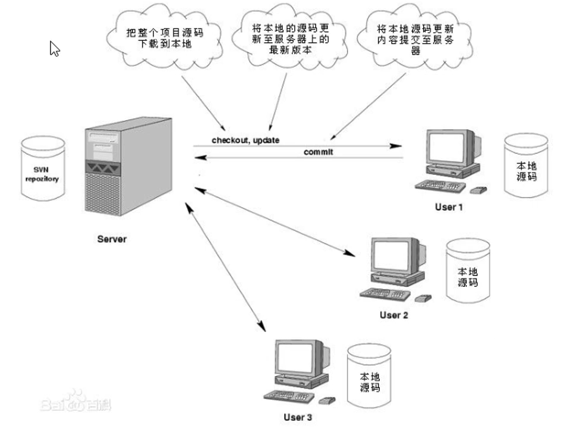

# 01.svn的基本介绍

- 笔记本：19.SSM框架整合案例(企业权限管理系统)
- 创建时间：2020-07-06 08:05:19 UTC
- 更新时间：2020-07-06 09:16:04 UTC
- 印象笔记 GUID：390c0f4d-02b4-4e3f-8510-6a10ed8a0e92

#### 1. SVN 介绍

SVN 是 Subversion 的简称，是一个自由开源的版本控制系统。
 Subversion 将文件存放在中心版本库里，这个版本很像一个普通的文件服务器，不同的是，它可以记录每一次文件和目录的修改情况，这样就可以借此将数据恢复到从前的版本，并可以查看数据的更改细节
 早期版本控制使用的是CVS，后来SVN 替代了CVS，随着Git版本控制工具，后续会学到。

##### 1.1 SVN 基本概念

 **问题：** 怎么让系统允许用户共享信息，而不会让他们因意外而相互干扰？
 **1. 复制-修改-合并方案(Subversion 默认的模式)**
 在这种模型里，每一个客户读取项目配置库建立一个私有工作副本--版本库中文件和目录的本地映射。用户进行工作，修改各自的工作副本，最总，各自私有的复制合并在一起，成为最终的版本，这种系统通常可以辅助合并操作，但是最终要靠人工去确定正误。

**2. 锁定-修改-解锁方案**
 在这样的模型里。在一个时间段里配置库的一个文件只允许被一个人修改，此模式不适合软件开发这种工作。

##### 1.2 SVN 架构

Subversion 支持 Linux 和 Windows，更多是安装在 Linux 下。
 SVN 服务器有两种运行方式：独立服务和借助 apache 运行。两种方式各有利弊，用户可以自行选择。
 SVN 存储版本数据也有两种方式：BDB 一种事务安全型表类型和 FSFS 一种不需要数据库的存储系统。因为 BDB 方式在服务器中断时，有可能锁住数据，所以还是 FSFS方式更安全一点。

%23%23%23%23%201.%20SVN%20%E4%BB%8B%E7%BB%8D%0ASVN%20%E6%98%AF%20Subversion%20%E7%9A%84%E7%AE%80%E7%A7%B0%EF%BC%8C%E6%98%AF%E4%B8%80%E4%B8%AA%E8%87%AA%E7%94%B1%E5%BC%80%E6%BA%90%E7%9A%84%E7%89%88%E6%9C%AC%E6%8E%A7%E5%88%B6%E7%B3%BB%E7%BB%9F%E3%80%82%0ASubversion%20%E5%B0%86%E6%96%87%E4%BB%B6%E5%AD%98%E6%94%BE%E5%9C%A8%E4%B8%AD%E5%BF%83%E7%89%88%E6%9C%AC%E5%BA%93%E9%87%8C%EF%BC%8C%E8%BF%99%E4%B8%AA%E7%89%88%E6%9C%AC%E5%BE%88%E5%83%8F%E4%B8%80%E4%B8%AA%E6%99%AE%E9%80%9A%E7%9A%84%E6%96%87%E4%BB%B6%E6%9C%8D%E5%8A%A1%E5%99%A8%EF%BC%8C%E4%B8%8D%E5%90%8C%E7%9A%84%E6%98%AF%EF%BC%8C%E5%AE%83%E5%8F%AF%E4%BB%A5%E8%AE%B0%E5%BD%95%E6%AF%8F%E4%B8%80%E6%AC%A1%E6%96%87%E4%BB%B6%E5%92%8C%E7%9B%AE%E5%BD%95%E7%9A%84%E4%BF%AE%E6%94%B9%E6%83%85%E5%86%B5%EF%BC%8C%E8%BF%99%E6%A0%B7%E5%B0%B1%E5%8F%AF%E4%BB%A5%E5%80%9F%E6%AD%A4%E5%B0%86%E6%95%B0%E6%8D%AE%E6%81%A2%E5%A4%8D%E5%88%B0%E4%BB%8E%E5%89%8D%E7%9A%84%E7%89%88%E6%9C%AC%EF%BC%8C%E5%B9%B6%E5%8F%AF%E4%BB%A5%E6%9F%A5%E7%9C%8B%E6%95%B0%E6%8D%AE%E7%9A%84%E6%9B%B4%E6%94%B9%E7%BB%86%E8%8A%82%0A%E6%97%A9%E6%9C%9F%E7%89%88%E6%9C%AC%E6%8E%A7%E5%88%B6%E4%BD%BF%E7%94%A8%E7%9A%84%E6%98%AFCVS%EF%BC%8C%E5%90%8E%E6%9D%A5SVN%20%E6%9B%BF%E4%BB%A3%E4%BA%86CVS%EF%BC%8C%E9%9A%8F%E7%9D%80Git%E7%89%88%E6%9C%AC%E6%8E%A7%E5%88%B6%E5%B7%A5%E5%85%B7%EF%BC%8C%E5%90%8E%E7%BB%AD%E4%BC%9A%E5%AD%A6%E5%88%B0%E3%80%82%0A%0A%23%23%23%23%23%201.1%20SVN%20%E5%9F%BA%E6%9C%AC%E6%A6%82%E5%BF%B5%0A!%5B45c445445acb25890c6db8406be5120f.png%5D(en-resource%3A%2F%2Fdatabase%2F3626%3A0)%0A**%E9%97%AE%E9%A2%98%EF%BC%9A**%20%E6%80%8E%E4%B9%88%E8%AE%A9%E7%B3%BB%E7%BB%9F%E5%85%81%E8%AE%B8%E7%94%A8%E6%88%B7%E5%85%B1%E4%BA%AB%E4%BF%A1%E6%81%AF%EF%BC%8C%E8%80%8C%E4%B8%8D%E4%BC%9A%E8%AE%A9%E4%BB%96%E4%BB%AC%E5%9B%A0%E6%84%8F%E5%A4%96%E8%80%8C%E7%9B%B8%E4%BA%92%E5%B9%B2%E6%89%B0%EF%BC%9F%0A**1.%20%E5%A4%8D%E5%88%B6-%E4%BF%AE%E6%94%B9-%E5%90%88%E5%B9%B6%E6%96%B9%E6%A1%88(Subversion%20%E9%BB%98%E8%AE%A4%E7%9A%84%E6%A8%A1%E5%BC%8F)**%0A%E5%9C%A8%E8%BF%99%E7%A7%8D%E6%A8%A1%E5%9E%8B%E9%87%8C%EF%BC%8C%E6%AF%8F%E4%B8%80%E4%B8%AA%E5%AE%A2%E6%88%B7%E8%AF%BB%E5%8F%96%E9%A1%B9%E7%9B%AE%E9%85%8D%E7%BD%AE%E5%BA%93%E5%BB%BA%E7%AB%8B%E4%B8%80%E4%B8%AA%E7%A7%81%E6%9C%89%E5%B7%A5%E4%BD%9C%E5%89%AF%E6%9C%AC--%E7%89%88%E6%9C%AC%E5%BA%93%E4%B8%AD%E6%96%87%E4%BB%B6%E5%92%8C%E7%9B%AE%E5%BD%95%E7%9A%84%E6%9C%AC%E5%9C%B0%E6%98%A0%E5%B0%84%E3%80%82%E7%94%A8%E6%88%B7%E8%BF%9B%E8%A1%8C%E5%B7%A5%E4%BD%9C%EF%BC%8C%E4%BF%AE%E6%94%B9%E5%90%84%E8%87%AA%E7%9A%84%E5%B7%A5%E4%BD%9C%E5%89%AF%E6%9C%AC%EF%BC%8C%E6%9C%80%E6%80%BB%EF%BC%8C%E5%90%84%E8%87%AA%E7%A7%81%E6%9C%89%E7%9A%84%E5%A4%8D%E5%88%B6%E5%90%88%E5%B9%B6%E5%9C%A8%E4%B8%80%E8%B5%B7%EF%BC%8C%E6%88%90%E4%B8%BA%E6%9C%80%E7%BB%88%E7%9A%84%E7%89%88%E6%9C%AC%EF%BC%8C%E8%BF%99%E7%A7%8D%E7%B3%BB%E7%BB%9F%E9%80%9A%E5%B8%B8%E5%8F%AF%E4%BB%A5%E8%BE%85%E5%8A%A9%E5%90%88%E5%B9%B6%E6%93%8D%E4%BD%9C%EF%BC%8C%E4%BD%86%E6%98%AF%E6%9C%80%E7%BB%88%E8%A6%81%E9%9D%A0%E4%BA%BA%E5%B7%A5%E5%8E%BB%E7%A1%AE%E5%AE%9A%E6%AD%A3%E8%AF%AF%E3%80%82%0A%0A**2.%20%E9%94%81%E5%AE%9A-%E4%BF%AE%E6%94%B9-%E8%A7%A3%E9%94%81%E6%96%B9%E6%A1%88**%0A%E5%9C%A8%E8%BF%99%E6%A0%B7%E7%9A%84%E6%A8%A1%E5%9E%8B%E9%87%8C%E3%80%82%E5%9C%A8%E4%B8%80%E4%B8%AA%E6%97%B6%E9%97%B4%E6%AE%B5%E9%87%8C%E9%85%8D%E7%BD%AE%E5%BA%93%E7%9A%84%E4%B8%80%E4%B8%AA%E6%96%87%E4%BB%B6%E5%8F%AA%E5%85%81%E8%AE%B8%E8%A2%AB%E4%B8%80%E4%B8%AA%E4%BA%BA%E4%BF%AE%E6%94%B9%EF%BC%8C%E6%AD%A4%E6%A8%A1%E5%BC%8F%E4%B8%8D%E9%80%82%E5%90%88%E8%BD%AF%E4%BB%B6%E5%BC%80%E5%8F%91%E8%BF%99%E7%A7%8D%E5%B7%A5%E4%BD%9C%E3%80%82%0A%0A%23%23%23%23%23%201.2%20SVN%20%E6%9E%B6%E6%9E%84%0ASubversion%20%E6%94%AF%E6%8C%81%20Linux%20%E5%92%8C%20Windows%EF%BC%8C%E6%9B%B4%E5%A4%9A%E6%98%AF%E5%AE%89%E8%A3%85%E5%9C%A8%20Linux%20%E4%B8%8B%E3%80%82%0ASVN%20%E6%9C%8D%E5%8A%A1%E5%99%A8%E6%9C%89%E4%B8%A4%E7%A7%8D%E8%BF%90%E8%A1%8C%E6%96%B9%E5%BC%8F%EF%BC%9A%E7%8B%AC%E7%AB%8B%E6%9C%8D%E5%8A%A1%E5%92%8C%E5%80%9F%E5%8A%A9%20apache%20%E8%BF%90%E8%A1%8C%E3%80%82%E4%B8%A4%E7%A7%8D%E6%96%B9%E5%BC%8F%E5%90%84%E6%9C%89%E5%88%A9%E5%BC%8A%EF%BC%8C%E7%94%A8%E6%88%B7%E5%8F%AF%E4%BB%A5%E8%87%AA%E8%A1%8C%E9%80%89%E6%8B%A9%E3%80%82%0ASVN%20%E5%AD%98%E5%82%A8%E7%89%88%E6%9C%AC%E6%95%B0%E6%8D%AE%E4%B9%9F%E6%9C%89%E4%B8%A4%E7%A7%8D%E6%96%B9%E5%BC%8F%EF%BC%9ABDB%20%E4%B8%80%E7%A7%8D%E4%BA%8B%E5%8A%A1%E5%AE%89%E5%85%A8%E5%9E%8B%E8%A1%A8%E7%B1%BB%E5%9E%8B%E5%92%8C%20FSFS%20%E4%B8%80%E7%A7%8D%E4%B8%8D%E9%9C%80%E8%A6%81%E6%95%B0%E6%8D%AE%E5%BA%93%E7%9A%84%E5%AD%98%E5%82%A8%E7%B3%BB%E7%BB%9F%E3%80%82%E5%9B%A0%E4%B8%BA%20BDB%20%E6%96%B9%E5%BC%8F%E5%9C%A8%E6%9C%8D%E5%8A%A1%E5%99%A8%E4%B8%AD%E6%96%AD%E6%97%B6%EF%BC%8C%E6%9C%89%E5%8F%AF%E8%83%BD%E9%94%81%E4%BD%8F%E6%95%B0%E6%8D%AE%EF%BC%8C%E6%89%80%E4%BB%A5%E8%BF%98%E6%98%AF%20FSFS%E6%96%B9%E5%BC%8F%E6%9B%B4%E5%AE%89%E5%85%A8%E4%B8%80%E7%82%B9%E3%80%82
