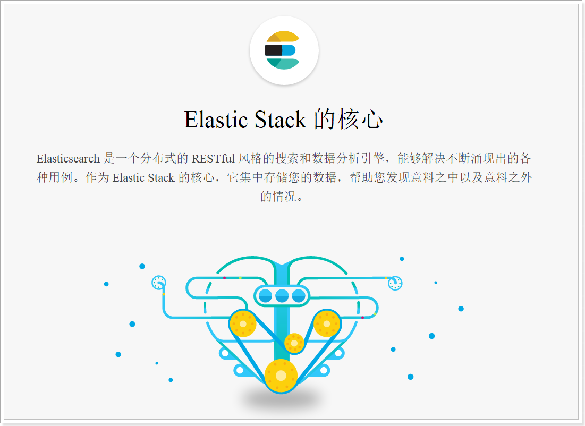
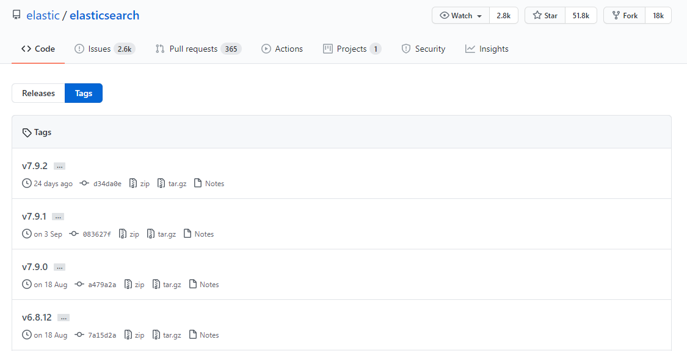
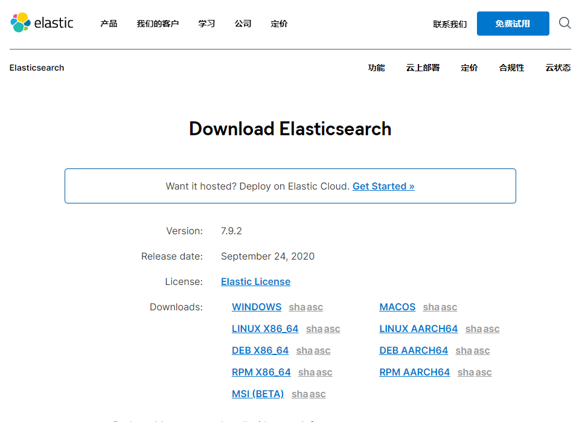
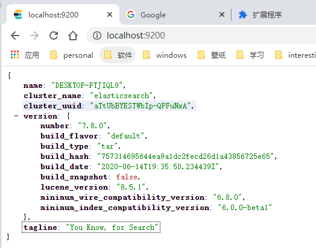

# 1.elasticsearch安装

- 笔记本：20.elasticsearch
- 创建时间：2020-10-18 13:49:07 UTC
- 更新时间：2020-10-18 17:00:24 UTC
- 原始链接：https://www.cnblogs.com/justuntil/p/10055258.html
- 印象笔记 GUID：09f91371-7f80-4239-bb20-999ca4114e64

# Elasticsearch介绍和安装及配置

## 1. ElasticSearch 介绍

### 1.1. Elastic

>
Elastic 官网：https://www.elastic.co/cn/

Elastic有一条完整的产品线及解决方案：Elasticsearch、Kibana、Logstash等，前面说的三个就是大家常说的ELK技术栈。

### 1.2. Elasticsearch

>
Elasticsearch 官网：https://www.elastic.co/cn/products/elasticsearch



如上所述，Elasticsearch具备以下特点：

- 分布式，无需人工搭建集群（solr就需要人为配置，使用Zookeeper作为注册中心）

- Restful风格，一切API都遵循Rest原则，容易上手

- 近实时搜索，数据更新在Elasticsearch中几乎是完全同步的。

### 1.3. 版本及下载

#### 1.3.1. elasticsearch 下载

>
github 地址：https://github.com/elastic/elasticsearch



>
elastic 官网地址：https://www.elastic.co/cn/downloads/elasticsearch



**tips：** 官网及git下载太慢，可以使用国内源

>
eg: https://mirrors.huaweicloud.com/elasticsearch/

#### 1.3.2. elasticsearch-analysis-ik 分词器下载

>
官网地址：https://elastic.co/downloads/kibana

>
github 地址：https://github.com/medcl/elasticsearch-analysis-ik/releases

#### 1.3.3. kibana 下载

>
github 地址：https://github.com/elastic/kibana

>
华为源地址：https://mirrors.huaweicloud.com/kibana/

需要 JDK1.8 及以上

## 2. Elasticsearch 安装和配置

### 2.1 新建一个用户

出于安全考虑，elasticsearch 默认不允许以 root 账户运行。
 创建用户：

```
useradd -d /home/esUser -m esUser
# -d home_dir   设置用户主目录，默认值为用户的登录名，并放在/home目录下。
# -m 自动创建用户主目录，并把框架目录(默认为/etc/skel)下的文件复制到用户主目录下。

```

设置密码：

```
passwd esUser

```

切换用户：

```
su esUser

```

### 2.2 解压 elestaicsearch

```
tar -zxvf elasticsearch-*.tar.gz
mv elasticsearch-版本号 elasticsearch

```

### 2.3 修改配置

进入 config 目录 `cd config`
 需要修改的配置文件有两个：

1. jvm.options
 Elasticsearch基于Lucene的，而Lucene底层是java实现，因此我们需要配置jvm参数。
 编辑jvm.options：`vim jvm.options`

默认配置如下：

```
-Xms1g
-Xms1g

```

可以根据机器配置进行修改，默认是一个G。

1. elasticsearch.yml

```
vim elasticsearch.yml

```

- 修改数据和日志目录：

```
path.data: /home/esUser/elasticsearch/data  # 数据目录位置
path.logs:/home/esUser/elasticsearch/logs   # 日志目录位置

```

我们把data和logs目录修改指向了elasticsearch的安装目录。但是这两个目录并不存在，因此我们需要创建出来。进入elasticsearch的根目录，然后创建：

```
mkdir data
mkdir logs

```

- 修改绑定的 ip：

```
network.host: 0.0.0.0   # 绑定到 0.0.0.0，允许任何 ip 来访问。

```

默认只允许本机访问，修改为0.0.0.0后则可以远程访问。

这里做的是单机安装，如果要做集群，只需要在这个配置文件中添加其它节点信息即可。

>
elasticsearch.yml的其它可配置信息：

 | 属性名 | 说明
 | cluster.name | 配置elasticsearch的集群名称，默认是elasticsearch。建议修改成一个有意义的名称。
 | node.name | 节点名，es会默认随机指定一个名字，建议指定一个有意义的名称，方便管理
 | path.conf | 设置配置文件的存储路径，tar或zip包安装默认在es根目录下的config文件夹，rpm安装默认在/etc/ elasticsearch
 | path.data | 设置索引数据的存储路径，默认是es根目录下的data文件夹，可以设置多个存储路径，用逗号隔开
 | path.logs | 设置日志文件的存储路径，默认是es根目录下的logs文件夹
 | path.plugins | 设置插件的存放路径，默认是es根目录下的plugins文件夹
 | bootstrap.memory_lock | 设置为true可以锁住ES使用的内存，避免内存进行swap
 | network.host | 设置bind_host和publish_host，设置为0.0.0.0允许外网访问
 | http.port | 设置对外服务的http端口，默认为9200。
 | transport.tcp.port | 集群结点之间通信端口
 | discovery.zen.ping.timeout | 设置ES自动发现节点连接超时的时间，默认为3秒，如果网络延迟高可设置大些
 | discovery.zen.minimum_master_nodes | 主结点数量的最少值 ,此值的公式为：(master_eligible_nodes / 2) + 1 ，比如：有3个符合要求的主结点，那么这里要设置为2

## 3. 运行

进入elasticsearch/bin目录，输入命令：

```
./elasticsearch

```

### 3.1 错误

#### 3.1.1 错误1：内核过低

```
system call filters failed to install; check the logs and fix your configuration or disable system call filters at your own risk

```

**解决：**
 Centos6不支持SecComp，而ES5.2.0默认bootstrap.system_call_filter为true
 禁用：在elasticsearch.yml中配置bootstrap.system_call_filter为false，注意要在Memory下面:
 bootstrap.memory_lock: false
 bootstrap.system_call_filter: false

修改elasticsearch.yml文件，在最下面添加如下配置：

```
bootstrap.system_call_filter: false

```

#### 3.1.2 错误2：

在elasticsearch的config目录下，修改elasticsearch.yml配置文件，将下面的配置加入到该配置文件中：

```
cluster.initial_master_nodes: ["node-1"] 

```

### 3.2 启动

```
./elasticsearch

```

可以看到绑定了两个端口:

- 9300：集群节点间通讯接口

- 9200：客户端访问接口

在浏览器中访问：http://localhost:9200/
 

%23%20Elasticsearch%E4%BB%8B%E7%BB%8D%E5%92%8C%E5%AE%89%E8%A3%85%E5%8F%8A%E9%85%8D%E7%BD%AE%0A%0A%23%23%201.%20ElasticSearch%20%E4%BB%8B%E7%BB%8D%0A%23%23%23%201.1.%20Elastic%0A%3E%20Elastic%20%E5%AE%98%E7%BD%91%EF%BC%9Ahttps%3A%2F%2Fwww.elastic.co%2Fcn%2F%0A%0AElastic%E6%9C%89%E4%B8%80%E6%9D%A1%E5%AE%8C%E6%95%B4%E7%9A%84%E4%BA%A7%E5%93%81%E7%BA%BF%E5%8F%8A%E8%A7%A3%E5%86%B3%E6%96%B9%E6%A1%88%EF%BC%9AElasticsearch%E3%80%81Kibana%E3%80%81Logstash%E7%AD%89%EF%BC%8C%E5%89%8D%E9%9D%A2%E8%AF%B4%E7%9A%84%E4%B8%89%E4%B8%AA%E5%B0%B1%E6%98%AF%E5%A4%A7%E5%AE%B6%E5%B8%B8%E8%AF%B4%E7%9A%84ELK%E6%8A%80%E6%9C%AF%E6%A0%88%E3%80%82%0A%0A%23%23%23%201.2.%20Elasticsearch%0A%3E%20Elasticsearch%20%E5%AE%98%E7%BD%91%EF%BC%9Ahttps%3A%2F%2Fwww.elastic.co%2Fcn%2Fproducts%2Felasticsearch%0A%0A!%5B1484518e73c251bf5fcf065746caf4a8.png%5D(en-resource%3A%2F%2Fdatabase%2F3647%3A1)%0A%0A%E5%A6%82%E4%B8%8A%E6%89%80%E8%BF%B0%EF%BC%8CElasticsearch%E5%85%B7%E5%A4%87%E4%BB%A5%E4%B8%8B%E7%89%B9%E7%82%B9%EF%BC%9A%0A-%20%E5%88%86%E5%B8%83%E5%BC%8F%EF%BC%8C%E6%97%A0%E9%9C%80%E4%BA%BA%E5%B7%A5%E6%90%AD%E5%BB%BA%E9%9B%86%E7%BE%A4%EF%BC%88solr%E5%B0%B1%E9%9C%80%E8%A6%81%E4%BA%BA%E4%B8%BA%E9%85%8D%E7%BD%AE%EF%BC%8C%E4%BD%BF%E7%94%A8Zookeeper%E4%BD%9C%E4%B8%BA%E6%B3%A8%E5%86%8C%E4%B8%AD%E5%BF%83%EF%BC%89%0A-%20Restful%E9%A3%8E%E6%A0%BC%EF%BC%8C%E4%B8%80%E5%88%87API%E9%83%BD%E9%81%B5%E5%BE%AARest%E5%8E%9F%E5%88%99%EF%BC%8C%E5%AE%B9%E6%98%93%E4%B8%8A%E6%89%8B%0A-%20%E8%BF%91%E5%AE%9E%E6%97%B6%E6%90%9C%E7%B4%A2%EF%BC%8C%E6%95%B0%E6%8D%AE%E6%9B%B4%E6%96%B0%E5%9C%A8Elasticsearch%E4%B8%AD%E5%87%A0%E4%B9%8E%E6%98%AF%E5%AE%8C%E5%85%A8%E5%90%8C%E6%AD%A5%E7%9A%84%E3%80%82%0A%0A%23%23%23%201.3.%20%E7%89%88%E6%9C%AC%E5%8F%8A%E4%B8%8B%E8%BD%BD%0A%23%23%23%23%201.3.1.%20elasticsearch%20%E4%B8%8B%E8%BD%BD%0A%3E%20github%20%E5%9C%B0%E5%9D%80%EF%BC%9Ahttps%3A%2F%2Fgithub.com%2Felastic%2Felasticsearch%0A%0A!%5B61ce3ec9d90f55a70df2c9cae212b2cb.png%5D(en-resource%3A%2F%2Fdatabase%2F3649%3A1)%0A%3E%20elastic%20%E5%AE%98%E7%BD%91%E5%9C%B0%E5%9D%80%EF%BC%9Ahttps%3A%2F%2Fwww.elastic.co%2Fcn%2Fdownloads%2Felasticsearch%0A%0A!%5B59e2da5195154e42a3dc4dd7db0eed95.png%5D(en-resource%3A%2F%2Fdatabase%2F3651%3A1)%0A%0A**tips%EF%BC%9A**%20%E5%AE%98%E7%BD%91%E5%8F%8Agit%E4%B8%8B%E8%BD%BD%E5%A4%AA%E6%85%A2%EF%BC%8C%E5%8F%AF%E4%BB%A5%E4%BD%BF%E7%94%A8%E5%9B%BD%E5%86%85%E6%BA%90%0A%3E%20eg%3A%20https%3A%2F%2Fmirrors.huaweicloud.com%2Felasticsearch%2F%0A%0A%23%23%23%23%201.3.2.%20elasticsearch-analysis-ik%20%E5%88%86%E8%AF%8D%E5%99%A8%E4%B8%8B%E8%BD%BD%0A%3E%20%E5%AE%98%E7%BD%91%E5%9C%B0%E5%9D%80%EF%BC%9Ahttps%3A%2F%2Felastic.co%2Fdownloads%2Fkibana%0A%0A%3E%20github%20%E5%9C%B0%E5%9D%80%EF%BC%9Ahttps%3A%2F%2Fgithub.com%2Fmedcl%2Felasticsearch-analysis-ik%2Freleases%0A%0A%23%23%23%23%201.3.3.%20kibana%20%E4%B8%8B%E8%BD%BD%0A%3E%20github%20%E5%9C%B0%E5%9D%80%EF%BC%9Ahttps%3A%2F%2Fgithub.com%2Felastic%2Fkibana%0A%0A%3E%20%E5%8D%8E%E4%B8%BA%E6%BA%90%E5%9C%B0%E5%9D%80%EF%BC%9Ahttps%3A%2F%2Fmirrors.huaweicloud.com%2Fkibana%2F%0A%0A%E9%9C%80%E8%A6%81%20JDK1.8%20%E5%8F%8A%E4%BB%A5%E4%B8%8A%0A%0A%23%23%202.%20Elasticsearch%20%E5%AE%89%E8%A3%85%E5%92%8C%E9%85%8D%E7%BD%AE%0A%23%23%23%202.1%20%E6%96%B0%E5%BB%BA%E4%B8%80%E4%B8%AA%E7%94%A8%E6%88%B7%0A%E5%87%BA%E4%BA%8E%E5%AE%89%E5%85%A8%E8%80%83%E8%99%91%EF%BC%8Celasticsearch%20%E9%BB%98%E8%AE%A4%E4%B8%8D%E5%85%81%E8%AE%B8%E4%BB%A5%20root%20%E8%B4%A6%E6%88%B7%E8%BF%90%E8%A1%8C%E3%80%82%0A%E5%88%9B%E5%BB%BA%E7%94%A8%E6%88%B7%EF%BC%9A%0A%60%60%60shell%0Auseradd%20-d%20%2Fhome%2FesUser%20-m%20esUser%0A%23%20-d%20home_dir%20%20%20%E8%AE%BE%E7%BD%AE%E7%94%A8%E6%88%B7%E4%B8%BB%E7%9B%AE%E5%BD%95%EF%BC%8C%E9%BB%98%E8%AE%A4%E5%80%BC%E4%B8%BA%E7%94%A8%E6%88%B7%E7%9A%84%E7%99%BB%E5%BD%95%E5%90%8D%EF%BC%8C%E5%B9%B6%E6%94%BE%E5%9C%A8%2Fhome%E7%9B%AE%E5%BD%95%E4%B8%8B%E3%80%82%0A%23%20-m%20%E8%87%AA%E5%8A%A8%E5%88%9B%E5%BB%BA%E7%94%A8%E6%88%B7%E4%B8%BB%E7%9B%AE%E5%BD%95%EF%BC%8C%E5%B9%B6%E6%8A%8A%E6%A1%86%E6%9E%B6%E7%9B%AE%E5%BD%95(%E9%BB%98%E8%AE%A4%E4%B8%BA%2Fetc%2Fskel)%E4%B8%8B%E7%9A%84%E6%96%87%E4%BB%B6%E5%A4%8D%E5%88%B6%E5%88%B0%E7%94%A8%E6%88%B7%E4%B8%BB%E7%9B%AE%E5%BD%95%E4%B8%8B%E3%80%82%0A%60%60%60%0A%E8%AE%BE%E7%BD%AE%E5%AF%86%E7%A0%81%EF%BC%9A%0A%60%60%60shell%0Apasswd%20esUser%0A%60%60%60%0A%E5%88%87%E6%8D%A2%E7%94%A8%E6%88%B7%EF%BC%9A%0A%60%60%60shell%0Asu%20esUser%0A%60%60%60%0A%0A%23%23%23%202.2%20%E8%A7%A3%E5%8E%8B%20elestaicsearch%0A%60%60%60shell%0Atar%20-zxvf%20elasticsearch-*.tar.gz%20%0Amv%20elasticsearch-%E7%89%88%E6%9C%AC%E5%8F%B7%20elasticsearch%0A%60%60%60%0A%0A%23%23%23%202.3%20%E4%BF%AE%E6%94%B9%E9%85%8D%E7%BD%AE%0A%E8%BF%9B%E5%85%A5%20config%20%E7%9B%AE%E5%BD%95%20%60cd%20config%60%0A%E9%9C%80%E8%A6%81%E4%BF%AE%E6%94%B9%E7%9A%84%E9%85%8D%E7%BD%AE%E6%96%87%E4%BB%B6%E6%9C%89%E4%B8%A4%E4%B8%AA%EF%BC%9A%0A1.%20jvm.options%0AElasticsearch%E5%9F%BA%E4%BA%8ELucene%E7%9A%84%EF%BC%8C%E8%80%8CLucene%E5%BA%95%E5%B1%82%E6%98%AFjava%E5%AE%9E%E7%8E%B0%EF%BC%8C%E5%9B%A0%E6%AD%A4%E6%88%91%E4%BB%AC%E9%9C%80%E8%A6%81%E9%85%8D%E7%BD%AEjvm%E5%8F%82%E6%95%B0%E3%80%82%0A%E7%BC%96%E8%BE%91jvm.options%EF%BC%9A%60vim%20jvm.options%60%0A%0A%E9%BB%98%E8%AE%A4%E9%85%8D%E7%BD%AE%E5%A6%82%E4%B8%8B%EF%BC%9A%0A%60%60%60shell%0A-Xms1g%0A-Xms1g%0A%60%60%60%0A%E5%8F%AF%E4%BB%A5%E6%A0%B9%E6%8D%AE%E6%9C%BA%E5%99%A8%E9%85%8D%E7%BD%AE%E8%BF%9B%E8%A1%8C%E4%BF%AE%E6%94%B9%EF%BC%8C%E9%BB%98%E8%AE%A4%E6%98%AF%E4%B8%80%E4%B8%AAG%E3%80%82%0A%0A2.%20elasticsearch.yml%0A%60%60%60shell%0Avim%20elasticsearch.yml%0A%60%60%60%0A*%20%E4%BF%AE%E6%94%B9%E6%95%B0%E6%8D%AE%E5%92%8C%E6%97%A5%E5%BF%97%E7%9B%AE%E5%BD%95%EF%BC%9A%0A%60%60%60%0Apath.data%3A%20%2Fhome%2FesUser%2Felasticsearch%2Fdata%20%20%23%20%E6%95%B0%E6%8D%AE%E7%9B%AE%E5%BD%95%E4%BD%8D%E7%BD%AE%0Apath.logs%3A%2Fhome%2FesUser%2Felasticsearch%2Flogs%20%20%20%23%20%E6%97%A5%E5%BF%97%E7%9B%AE%E5%BD%95%E4%BD%8D%E7%BD%AE%0A%60%60%60%0A%0A%E6%88%91%E4%BB%AC%E6%8A%8Adata%E5%92%8Clogs%E7%9B%AE%E5%BD%95%E4%BF%AE%E6%94%B9%E6%8C%87%E5%90%91%E4%BA%86elasticsearch%E7%9A%84%E5%AE%89%E8%A3%85%E7%9B%AE%E5%BD%95%E3%80%82%E4%BD%86%E6%98%AF%E8%BF%99%E4%B8%A4%E4%B8%AA%E7%9B%AE%E5%BD%95%E5%B9%B6%E4%B8%8D%E5%AD%98%E5%9C%A8%EF%BC%8C%E5%9B%A0%E6%AD%A4%E6%88%91%E4%BB%AC%E9%9C%80%E8%A6%81%E5%88%9B%E5%BB%BA%E5%87%BA%E6%9D%A5%E3%80%82%E8%BF%9B%E5%85%A5elasticsearch%E7%9A%84%E6%A0%B9%E7%9B%AE%E5%BD%95%EF%BC%8C%E7%84%B6%E5%90%8E%E5%88%9B%E5%BB%BA%EF%BC%9A%0A%60%60%60shell%0Amkdir%20data%0Amkdir%20logs%0A%60%60%60%0A%0A*%20%E4%BF%AE%E6%94%B9%E7%BB%91%E5%AE%9A%E7%9A%84%20ip%EF%BC%9A%0A%60%60%60%0Anetwork.host%3A%200.0.0.0%20%20%20%23%20%E7%BB%91%E5%AE%9A%E5%88%B0%200.0.0.0%EF%BC%8C%E5%85%81%E8%AE%B8%E4%BB%BB%E4%BD%95%20ip%20%E6%9D%A5%E8%AE%BF%E9%97%AE%E3%80%82%0A%60%60%60%0A%E9%BB%98%E8%AE%A4%E5%8F%AA%E5%85%81%E8%AE%B8%E6%9C%AC%E6%9C%BA%E8%AE%BF%E9%97%AE%EF%BC%8C%E4%BF%AE%E6%94%B9%E4%B8%BA0.0.0.0%E5%90%8E%E5%88%99%E5%8F%AF%E4%BB%A5%E8%BF%9C%E7%A8%8B%E8%AE%BF%E9%97%AE%E3%80%82%0A%0A%E8%BF%99%E9%87%8C%E5%81%9A%E7%9A%84%E6%98%AF%E5%8D%95%E6%9C%BA%E5%AE%89%E8%A3%85%EF%BC%8C%E5%A6%82%E6%9E%9C%E8%A6%81%E5%81%9A%E9%9B%86%E7%BE%A4%EF%BC%8C%E5%8F%AA%E9%9C%80%E8%A6%81%E5%9C%A8%E8%BF%99%E4%B8%AA%E9%85%8D%E7%BD%AE%E6%96%87%E4%BB%B6%E4%B8%AD%E6%B7%BB%E5%8A%A0%E5%85%B6%E5%AE%83%E8%8A%82%E7%82%B9%E4%BF%A1%E6%81%AF%E5%8D%B3%E5%8F%AF%E3%80%82%0A%0A%3E%20elasticsearch.yml%E7%9A%84%E5%85%B6%E5%AE%83%E5%8F%AF%E9%85%8D%E7%BD%AE%E4%BF%A1%E6%81%AF%EF%BC%9A%0A%0A%7C%20%E5%B1%9E%E6%80%A7%E5%90%8D%20%20%20%20%20%20%20%20%20%20%20%20%20%20%20%20%20%20%20%20%20%20%20%20%20%20%20%20%20%7C%20%E8%AF%B4%E6%98%8E%20%20%20%20%20%20%20%20%20%20%20%20%20%20%20%20%20%20%20%20%20%20%20%20%20%20%20%20%20%20%20%20%20%20%20%20%20%20%20%20%20%20%20%20%20%20%20%20%20%20%20%20%20%20%20%20%20%7C%0A%7C%20----------------------------------%20%7C%20------------------------------------------------------------%20%7C%0A%7C%20cluster.name%20%20%20%20%20%20%20%20%20%20%20%20%20%20%20%20%20%20%20%20%20%20%20%7C%20%E9%85%8D%E7%BD%AEelasticsearch%E7%9A%84%E9%9B%86%E7%BE%A4%E5%90%8D%E7%A7%B0%EF%BC%8C%E9%BB%98%E8%AE%A4%E6%98%AFelasticsearch%E3%80%82%E5%BB%BA%E8%AE%AE%E4%BF%AE%E6%94%B9%E6%88%90%E4%B8%80%E4%B8%AA%E6%9C%89%E6%84%8F%E4%B9%89%E7%9A%84%E5%90%8D%E7%A7%B0%E3%80%82%20%7C%0A%7C%20node.name%20%20%20%20%20%20%20%20%20%20%20%20%20%20%20%20%20%20%20%20%20%20%20%20%20%20%7C%20%E8%8A%82%E7%82%B9%E5%90%8D%EF%BC%8Ces%E4%BC%9A%E9%BB%98%E8%AE%A4%E9%9A%8F%E6%9C%BA%E6%8C%87%E5%AE%9A%E4%B8%80%E4%B8%AA%E5%90%8D%E5%AD%97%EF%BC%8C%E5%BB%BA%E8%AE%AE%E6%8C%87%E5%AE%9A%E4%B8%80%E4%B8%AA%E6%9C%89%E6%84%8F%E4%B9%89%E7%9A%84%E5%90%8D%E7%A7%B0%EF%BC%8C%E6%96%B9%E4%BE%BF%E7%AE%A1%E7%90%86%20%7C%0A%7C%20path.conf%20%20%20%20%20%20%20%20%20%20%20%20%20%20%20%20%20%20%20%20%20%20%20%20%20%20%7C%20%E8%AE%BE%E7%BD%AE%E9%85%8D%E7%BD%AE%E6%96%87%E4%BB%B6%E7%9A%84%E5%AD%98%E5%82%A8%E8%B7%AF%E5%BE%84%EF%BC%8Ctar%E6%88%96zip%E5%8C%85%E5%AE%89%E8%A3%85%E9%BB%98%E8%AE%A4%E5%9C%A8es%E6%A0%B9%E7%9B%AE%E5%BD%95%E4%B8%8B%E7%9A%84config%E6%96%87%E4%BB%B6%E5%A4%B9%EF%BC%8Crpm%E5%AE%89%E8%A3%85%E9%BB%98%E8%AE%A4%E5%9C%A8%2Fetc%2F%20elasticsearch%20%7C%0A%7C%20path.data%20%20%20%20%20%20%20%20%20%20%20%20%20%20%20%20%20%20%20%20%20%20%20%20%20%20%7C%20%E8%AE%BE%E7%BD%AE%E7%B4%A2%E5%BC%95%E6%95%B0%E6%8D%AE%E7%9A%84%E5%AD%98%E5%82%A8%E8%B7%AF%E5%BE%84%EF%BC%8C%E9%BB%98%E8%AE%A4%E6%98%AFes%E6%A0%B9%E7%9B%AE%E5%BD%95%E4%B8%8B%E7%9A%84data%E6%96%87%E4%BB%B6%E5%A4%B9%EF%BC%8C%E5%8F%AF%E4%BB%A5%E8%AE%BE%E7%BD%AE%E5%A4%9A%E4%B8%AA%E5%AD%98%E5%82%A8%E8%B7%AF%E5%BE%84%EF%BC%8C%E7%94%A8%E9%80%97%E5%8F%B7%E9%9A%94%E5%BC%80%20%7C%0A%7C%20path.logs%20%20%20%20%20%20%20%20%20%20%20%20%20%20%20%20%20%20%20%20%20%20%20%20%20%20%7C%20%E8%AE%BE%E7%BD%AE%E6%97%A5%E5%BF%97%E6%96%87%E4%BB%B6%E7%9A%84%E5%AD%98%E5%82%A8%E8%B7%AF%E5%BE%84%EF%BC%8C%E9%BB%98%E8%AE%A4%E6%98%AFes%E6%A0%B9%E7%9B%AE%E5%BD%95%E4%B8%8B%E7%9A%84logs%E6%96%87%E4%BB%B6%E5%A4%B9%20%20%20%20%20%20%20%20%20%7C%0A%7C%20path.plugins%20%20%20%20%20%20%20%20%20%20%20%20%20%20%20%20%20%20%20%20%20%20%20%7C%20%E8%AE%BE%E7%BD%AE%E6%8F%92%E4%BB%B6%E7%9A%84%E5%AD%98%E6%94%BE%E8%B7%AF%E5%BE%84%EF%BC%8C%E9%BB%98%E8%AE%A4%E6%98%AFes%E6%A0%B9%E7%9B%AE%E5%BD%95%E4%B8%8B%E7%9A%84plugins%E6%96%87%E4%BB%B6%E5%A4%B9%20%20%20%20%20%20%20%20%20%20%7C%0A%7C%20bootstrap.memory_lock%20%20%20%20%20%20%20%20%20%20%20%20%20%20%7C%20%E8%AE%BE%E7%BD%AE%E4%B8%BAtrue%E5%8F%AF%E4%BB%A5%E9%94%81%E4%BD%8FES%E4%BD%BF%E7%94%A8%E7%9A%84%E5%86%85%E5%AD%98%EF%BC%8C%E9%81%BF%E5%85%8D%E5%86%85%E5%AD%98%E8%BF%9B%E8%A1%8Cswap%20%20%20%20%20%20%20%20%20%20%20%20%20%7C%0A%7C%20network.host%20%20%20%20%20%20%20%20%20%20%20%20%20%20%20%20%20%20%20%20%20%20%20%7C%20%E8%AE%BE%E7%BD%AEbind_host%E5%92%8Cpublish_host%EF%BC%8C%E8%AE%BE%E7%BD%AE%E4%B8%BA0.0.0.0%E5%85%81%E8%AE%B8%E5%A4%96%E7%BD%91%E8%AE%BF%E9%97%AE%20%20%20%20%20%20%20%7C%0A%7C%20http.port%20%20%20%20%20%20%20%20%20%20%20%20%20%20%20%20%20%20%20%20%20%20%20%20%20%20%7C%20%E8%AE%BE%E7%BD%AE%E5%AF%B9%E5%A4%96%E6%9C%8D%E5%8A%A1%E7%9A%84http%E7%AB%AF%E5%8F%A3%EF%BC%8C%E9%BB%98%E8%AE%A4%E4%B8%BA9200%E3%80%82%20%20%20%20%20%20%20%20%20%20%20%20%20%20%20%20%20%20%20%20%20%20%20%20%20%7C%0A%7C%20transport.tcp.port%20%20%20%20%20%20%20%20%20%20%20%20%20%20%20%20%20%7C%20%E9%9B%86%E7%BE%A4%E7%BB%93%E7%82%B9%E4%B9%8B%E9%97%B4%E9%80%9A%E4%BF%A1%E7%AB%AF%E5%8F%A3%20%20%20%20%20%20%20%20%20%20%20%20%20%20%20%20%20%20%20%20%20%20%20%20%20%20%20%20%20%20%20%20%20%20%20%20%20%20%20%20%20%7C%0A%7C%20discovery.zen.ping.timeout%20%20%20%20%20%20%20%20%20%7C%20%E8%AE%BE%E7%BD%AEES%E8%87%AA%E5%8A%A8%E5%8F%91%E7%8E%B0%E8%8A%82%E7%82%B9%E8%BF%9E%E6%8E%A5%E8%B6%85%E6%97%B6%E7%9A%84%E6%97%B6%E9%97%B4%EF%BC%8C%E9%BB%98%E8%AE%A4%E4%B8%BA3%E7%A7%92%EF%BC%8C%E5%A6%82%E6%9E%9C%E7%BD%91%E7%BB%9C%E5%BB%B6%E8%BF%9F%E9%AB%98%E5%8F%AF%E8%AE%BE%E7%BD%AE%E5%A4%A7%E4%BA%9B%20%7C%0A%7C%20discovery.zen.minimum_master_nodes%20%7C%20%E4%B8%BB%E7%BB%93%E7%82%B9%E6%95%B0%E9%87%8F%E7%9A%84%E6%9C%80%E5%B0%91%E5%80%BC%20%2C%E6%AD%A4%E5%80%BC%E7%9A%84%E5%85%AC%E5%BC%8F%E4%B8%BA%EF%BC%9A(master_eligible_nodes%20%2F%202)%20%2B%201%20%EF%BC%8C%E6%AF%94%E5%A6%82%EF%BC%9A%E6%9C%893%E4%B8%AA%E7%AC%A6%E5%90%88%E8%A6%81%E6%B1%82%E7%9A%84%E4%B8%BB%E7%BB%93%E7%82%B9%EF%BC%8C%E9%82%A3%E4%B9%88%E8%BF%99%E9%87%8C%E8%A6%81%E8%AE%BE%E7%BD%AE%E4%B8%BA2%20%7C%0A%0A%23%23%203.%20%E8%BF%90%E8%A1%8C%0A%E8%BF%9B%E5%85%A5elasticsearch%2Fbin%E7%9B%AE%E5%BD%95%EF%BC%8C%E8%BE%93%E5%85%A5%E5%91%BD%E4%BB%A4%EF%BC%9A%0A%60%60%60shell%0A.%2Felasticsearch%0A%60%60%60%0A%0A%23%23%23%203.1%20%E9%94%99%E8%AF%AF%0A%23%23%23%23%203.1.1%20%E9%94%99%E8%AF%AF1%EF%BC%9A%E5%86%85%E6%A0%B8%E8%BF%87%E4%BD%8E%0A%60%60%60shell%0Asystem%20call%20filters%20failed%20to%20install%3B%20check%20the%20logs%20and%20fix%20your%20configuration%20or%20disable%20system%20call%20filters%20at%20your%20own%20risk%0A%60%60%60%0A**%E8%A7%A3%E5%86%B3%EF%BC%9A**%0ACentos6%E4%B8%8D%E6%94%AF%E6%8C%81SecComp%EF%BC%8C%E8%80%8CES5.2.0%E9%BB%98%E8%AE%A4bootstrap.system_call_filter%E4%B8%BAtrue%0A%E7%A6%81%E7%94%A8%EF%BC%9A%E5%9C%A8elasticsearch.yml%E4%B8%AD%E9%85%8D%E7%BD%AEbootstrap.system_call_filter%E4%B8%BAfalse%EF%BC%8C%E6%B3%A8%E6%84%8F%E8%A6%81%E5%9C%A8Memory%E4%B8%8B%E9%9D%A2%3A%0Abootstrap.memory_lock%3A%20false%0Abootstrap.system_call_filter%3A%20false%0A%0A%E4%BF%AE%E6%94%B9elasticsearch.yml%E6%96%87%E4%BB%B6%EF%BC%8C%E5%9C%A8%E6%9C%80%E4%B8%8B%E9%9D%A2%E6%B7%BB%E5%8A%A0%E5%A6%82%E4%B8%8B%E9%85%8D%E7%BD%AE%EF%BC%9A%0A%60%60%60shell%0Abootstrap.system_call_filter%3A%20false%0A%60%60%60%0A%0A%0A%23%23%23%23%203.1.2%20%E9%94%99%E8%AF%AF2%EF%BC%9A%0A%E5%9C%A8elasticsearch%E7%9A%84config%E7%9B%AE%E5%BD%95%E4%B8%8B%EF%BC%8C%E4%BF%AE%E6%94%B9elasticsearch.yml%E9%85%8D%E7%BD%AE%E6%96%87%E4%BB%B6%EF%BC%8C%E5%B0%86%E4%B8%8B%E9%9D%A2%E7%9A%84%E9%85%8D%E7%BD%AE%E5%8A%A0%E5%85%A5%E5%88%B0%E8%AF%A5%E9%85%8D%E7%BD%AE%E6%96%87%E4%BB%B6%E4%B8%AD%EF%BC%9A%0A%60%60%60shell%0Acluster.initial_master_nodes%3A%20%5B%22node-1%22%5D%C2%A0%0A%60%60%60%0A%0A%23%23%23%203.2%20%E5%90%AF%E5%8A%A8%0A%60%60%60shell%0A.%2Felasticsearch%0A%60%60%60%0A%0A%E5%8F%AF%E4%BB%A5%E7%9C%8B%E5%88%B0%E7%BB%91%E5%AE%9A%E4%BA%86%E4%B8%A4%E4%B8%AA%E7%AB%AF%E5%8F%A3%3A%0A*%209300%EF%BC%9A%E9%9B%86%E7%BE%A4%E8%8A%82%E7%82%B9%E9%97%B4%E9%80%9A%E8%AE%AF%E6%8E%A5%E5%8F%A3%0A*%209200%EF%BC%9A%E5%AE%A2%E6%88%B7%E7%AB%AF%E8%AE%BF%E9%97%AE%E6%8E%A5%E5%8F%A3%0A%0A%E5%9C%A8%E6%B5%8F%E8%A7%88%E5%99%A8%E4%B8%AD%E8%AE%BF%E9%97%AE%EF%BC%9Ahttp%3A%2F%2Flocalhost%3A9200%2F%0A!%5B9058e24d68fc377f114647c6fdeaf6c9.png%5D(en-resource%3A%2F%2Fdatabase%2F3653%3A0)%0A
