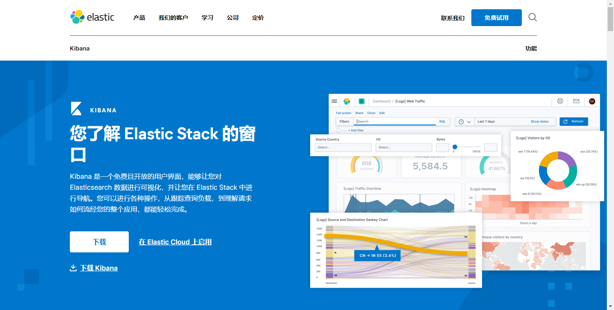
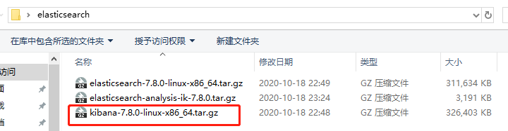
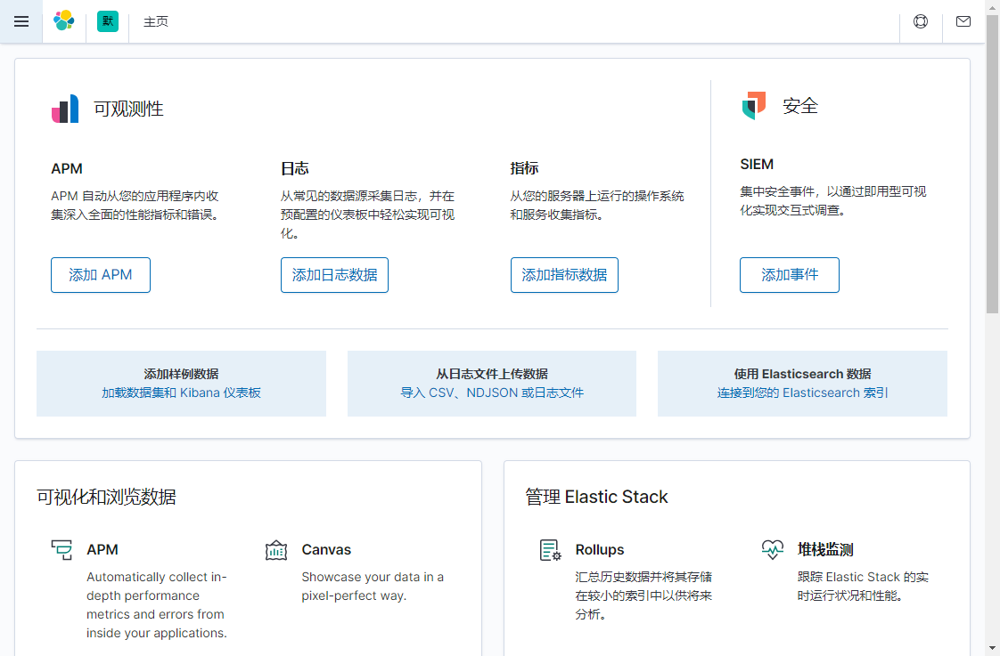
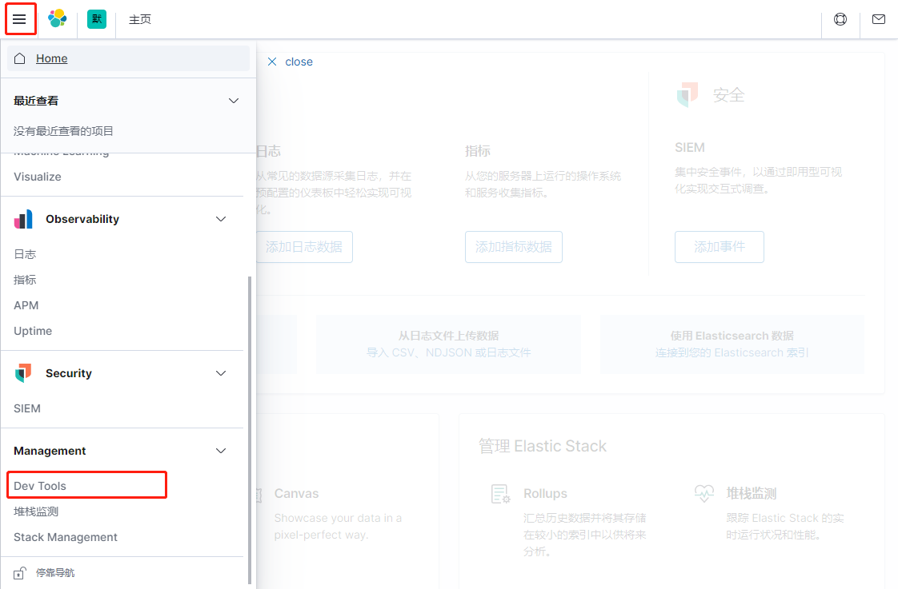

# 2.安装kibana

- 笔记本：20.elasticsearch
- 创建时间：2020-10-18 17:01:09 UTC
- 更新时间：2020-10-19 04:19:31 UTC
- 印象笔记 GUID：cf67b63e-ee73-4d92-b379-d3292e504800

# 安装 kibana

## 1. 什么是 kubana？



Kibana是一个基于Node.js的Elasticsearch索引库数据统计工具，可以利用Elasticsearch的聚合功能，生成各种图表，如柱形图，线状图，饼图等。而且还提供了操作Elasticsearch索引数据的控制台，并且提供了一定的API提示，非常有利于我们学习Elasticsearch的语法。

## 2. 安装及配置运行

### 2.1 安装

**tips：** Kibana 依赖于 node，需要安装node，这里就不赘述。
 
 解压文件即可

### 2.2 配置运行

#### 2.2.1 配置

进入安装目录下的config目录，修改kibana.yml文件：
 修改elasticsearch服务器的地址：

```
elasticsearch.url: "http://127.0.0.1:9200"

```

#### 2.2.2 运行

进入安装目录下的bin目录：

```
./kibana

```

运行报错：

```
  log   [03:23:59.200] [warning][plugins-discovery] Expect plugin "id" in camelCase, but found: apm_oss
  log   [03:23:59.216] [warning][plugins-discovery] Expect plugin "id" in camelCase, but found: triggers_actions_ui
  log   [03:24:13.702] [info][plugins-service] Plugin "visTypeXy" is disabled.
  log   [03:24:13.703] [info][plugins-service] Plugin "ingestManager" is disabled.
  log   [03:24:13.704] [info][plugins-service] Plugin "lists" is disabled.
  log   [03:24:13.704] [info][plugins-service] Plugin "endpoint" is disabled.
  log   [03:24:15.968] [info][plugins-system] Setting up [94] plugins: [taskManager,eventLog,licensing,observability,usageCollection,ossTelemetry,telemetryCollectionManager,telemetry,telemetryCollectionXpack,encryptedSavedObjects,code,kibanaLegacy,devTools,translations,newsfeed,uiActions,statusPage,share,mapsLegacy,mapsLegacyLicensing,kibanaReact,kibanaUtils,inspector,embeddable,advancedUiActions,embeddableEnhanced,drilldowns,indexPatternManagement,esUiShared,discover,charts,bfetch,expressions,data,home,cloud,apm_oss,console,consoleExtensions,searchprofiler,painlessLab,grokdebugger,management,reporting,upgradeAssistant,licenseManagement,indexManagement,remoteClusters,crossClusterReplication,indexLifecycleManagement,watcher,advancedSettings,telemetryManagementSection,fileUpload,dataEnhanced,visualizations,visTypeTagcloud,visTypeVislib,visTypeVega,visTypeTimeseries,rollup,visTypeMarkdown,visTypeTimelion,features,security,snapshotRestore,transform,ingestPipelines,canvas,visTypeTable,visTypeMetric,inputControlVis,navigation,lens,graph,maps,savedObjects,visualize,dashboard,dashboardEnhanced,savedObjectsManagement,spaces,actions,case,alerting,alertingBuiltins,triggers_actions_ui,infra,monitoring,logstash,uptime,ml,siem,apm]
  log   [03:24:15.985] [warning][config][encryptedSavedObjects][plugins] Generating a random key for xpack.encryptedSavedObjects.encryptionKey. To be able to decrypt encrypted saved objects attributes after restart, please set xpack.encryptedSavedObjects.encryptionKey in kibana.yml
  log   [03:24:16.196] [warning][config][plugins][security] Generating a random key for xpack.security.encryptionKey. To prevent sessions from being invalidated on restart, please set xpack.security.encryptionKey in kibana.yml
  log   [03:24:16.198] [warning][config][plugins][security] Session cookies will be transmitted over insecure connections. This is not recommended.
  log   [03:24:16.241] [warning][actions][actions][plugins] APIs are disabled due to the Encrypted Saved Objects plugin using an ephemeral encryption key. Please set xpack.encryptedSavedObjects.encryptionKey in kibana.yml.
  log   [03:24:16.252] [warning][alerting][alerting][plugins][plugins] APIs are disabled due to the Encrypted Saved Objects plugin using an ephemeral encryption key. Please set xpack.encryptedSavedObjects.encryptionKey in kibana.yml.
  log   [03:24:16.281] [info][monitoring][monitoring][plugins] config sourced from: production cluster
  log   [03:24:16.282] [warning][monitoring][monitoring][plugins] X-Pack Monitoring Cluster Alerts will not be available: undefined
  log   [03:24:16.485] [info][savedobjects-service] Waiting until all Elasticsearch nodes are compatible with Kibana before starting saved objects migrations...
  log   [03:24:16.490] [info][crossClusterReplication][plugins] Your basic license does not support crossClusterReplication. Please upgrade your license.
  log   [03:24:16.491] [info][plugins][watcher] Your basic license does not support watcher. Please upgrade your license.
  log   [03:24:16.492] [info][kibana-monitoring][monitoring][monitoring][plugins] Starting monitoring stats collection
  log   [03:24:16.509] [info][savedobjects-service] Starting saved objects migrations
  log   [03:24:16.562] [info][savedobjects-service] Creating index .kibana_task_manager_1.
  log   [03:24:16.564] [info][savedobjects-service] Creating index .kibana_1.
  log   [03:24:46.564] [warning][savedobjects-service] Unable to connect to Elasticsearch. Error: Request Timeout after 30000ms

```

解决方案：百度很多没有解决，重启后可以启动了，看后面会不会复现。

访问：127.0.0.1:5601
 

### 2.3 控制台

选择左侧的DevTools菜单，即可进入控制台页面：
 

在页面右侧，我们就可以输入请求，访问Elasticsearch了。

%23%20%E5%AE%89%E8%A3%85%20kibana%0A%23%23%201.%20%E4%BB%80%E4%B9%88%E6%98%AF%20kubana%EF%BC%9F%0A!%5B53f0b18f91348f73690835f50b3a869e.png%5D(en-resource%3A%2F%2Fdatabase%2F3659%3A1)%0A%0AKibana%E6%98%AF%E4%B8%80%E4%B8%AA%E5%9F%BA%E4%BA%8ENode.js%E7%9A%84Elasticsearch%E7%B4%A2%E5%BC%95%E5%BA%93%E6%95%B0%E6%8D%AE%E7%BB%9F%E8%AE%A1%E5%B7%A5%E5%85%B7%EF%BC%8C%E5%8F%AF%E4%BB%A5%E5%88%A9%E7%94%A8Elasticsearch%E7%9A%84%E8%81%9A%E5%90%88%E5%8A%9F%E8%83%BD%EF%BC%8C%E7%94%9F%E6%88%90%E5%90%84%E7%A7%8D%E5%9B%BE%E8%A1%A8%EF%BC%8C%E5%A6%82%E6%9F%B1%E5%BD%A2%E5%9B%BE%EF%BC%8C%E7%BA%BF%E7%8A%B6%E5%9B%BE%EF%BC%8C%E9%A5%BC%E5%9B%BE%E7%AD%89%E3%80%82%E8%80%8C%E4%B8%94%E8%BF%98%E6%8F%90%E4%BE%9B%E4%BA%86%E6%93%8D%E4%BD%9CElasticsearch%E7%B4%A2%E5%BC%95%E6%95%B0%E6%8D%AE%E7%9A%84%E6%8E%A7%E5%88%B6%E5%8F%B0%EF%BC%8C%E5%B9%B6%E4%B8%94%E6%8F%90%E4%BE%9B%E4%BA%86%E4%B8%80%E5%AE%9A%E7%9A%84API%E6%8F%90%E7%A4%BA%EF%BC%8C%E9%9D%9E%E5%B8%B8%E6%9C%89%E5%88%A9%E4%BA%8E%E6%88%91%E4%BB%AC%E5%AD%A6%E4%B9%A0Elasticsearch%E7%9A%84%E8%AF%AD%E6%B3%95%E3%80%82%0A%0A%23%23%202.%20%E5%AE%89%E8%A3%85%E5%8F%8A%E9%85%8D%E7%BD%AE%E8%BF%90%E8%A1%8C%0A%23%23%23%202.1%20%E5%AE%89%E8%A3%85%0A**tips%EF%BC%9A**%20Kibana%20%E4%BE%9D%E8%B5%96%E4%BA%8E%20node%EF%BC%8C%E9%9C%80%E8%A6%81%E5%AE%89%E8%A3%85node%EF%BC%8C%E8%BF%99%E9%87%8C%E5%B0%B1%E4%B8%8D%E8%B5%98%E8%BF%B0%E3%80%82%0A!%5B27e7edc50ac29cb0010158f8d6e82daf.png%5D(en-resource%3A%2F%2Fdatabase%2F3661%3A1)%0A%E8%A7%A3%E5%8E%8B%E6%96%87%E4%BB%B6%E5%8D%B3%E5%8F%AF%0A%0A%23%23%23%202.2%20%E9%85%8D%E7%BD%AE%E8%BF%90%E8%A1%8C%0A%23%23%23%23%202.2.1%20%E9%85%8D%E7%BD%AE%0A%E8%BF%9B%E5%85%A5%E5%AE%89%E8%A3%85%E7%9B%AE%E5%BD%95%E4%B8%8B%E7%9A%84config%E7%9B%AE%E5%BD%95%EF%BC%8C%E4%BF%AE%E6%94%B9kibana.yml%E6%96%87%E4%BB%B6%EF%BC%9A%0A%E4%BF%AE%E6%94%B9elasticsearch%E6%9C%8D%E5%8A%A1%E5%99%A8%E7%9A%84%E5%9C%B0%E5%9D%80%EF%BC%9A%0A%60%60%60shell%0Aelasticsearch.url%3A%20%22http%3A%2F%2F127.0.0.1%3A9200%22%0A%60%60%60%0A%0A%23%23%23%23%202.2.2%20%E8%BF%90%E8%A1%8C%0A%E8%BF%9B%E5%85%A5%E5%AE%89%E8%A3%85%E7%9B%AE%E5%BD%95%E4%B8%8B%E7%9A%84bin%E7%9B%AE%E5%BD%95%EF%BC%9A%0A%60%60%60shell%0A.%2Fkibana%0A%60%60%60%0A%0A%E8%BF%90%E8%A1%8C%E6%8A%A5%E9%94%99%EF%BC%9A%0A%60%60%60shell%0A%20%20log%20%20%20%5B03%3A23%3A59.200%5D%20%5Bwarning%5D%5Bplugins-discovery%5D%20Expect%20plugin%20%22id%22%20in%20camelCase%2C%20but%20found%3A%20apm_oss%0A%20%20log%20%20%20%5B03%3A23%3A59.216%5D%20%5Bwarning%5D%5Bplugins-discovery%5D%20Expect%20plugin%20%22id%22%20in%20camelCase%2C%20but%20found%3A%20triggers_actions_ui%0A%20%20log%20%20%20%5B03%3A24%3A13.702%5D%20%5Binfo%5D%5Bplugins-service%5D%20Plugin%20%22visTypeXy%22%20is%20disabled.%0A%20%20log%20%20%20%5B03%3A24%3A13.703%5D%20%5Binfo%5D%5Bplugins-service%5D%20Plugin%20%22ingestManager%22%20is%20disabled.%0A%20%20log%20%20%20%5B03%3A24%3A13.704%5D%20%5Binfo%5D%5Bplugins-service%5D%20Plugin%20%22lists%22%20is%20disabled.%0A%20%20log%20%20%20%5B03%3A24%3A13.704%5D%20%5Binfo%5D%5Bplugins-service%5D%20Plugin%20%22endpoint%22%20is%20disabled.%0A%20%20log%20%20%20%5B03%3A24%3A15.968%5D%20%5Binfo%5D%5Bplugins-system%5D%20Setting%20up%20%5B94%5D%20plugins%3A%20%5BtaskManager%2CeventLog%2Clicensing%2Cobservability%2CusageCollection%2CossTelemetry%2CtelemetryCollectionManager%2Ctelemetry%2CtelemetryCollectionXpack%2CencryptedSavedObjects%2Ccode%2CkibanaLegacy%2CdevTools%2Ctranslations%2Cnewsfeed%2CuiActions%2CstatusPage%2Cshare%2CmapsLegacy%2CmapsLegacyLicensing%2CkibanaReact%2CkibanaUtils%2Cinspector%2Cembeddable%2CadvancedUiActions%2CembeddableEnhanced%2Cdrilldowns%2CindexPatternManagement%2CesUiShared%2Cdiscover%2Ccharts%2Cbfetch%2Cexpressions%2Cdata%2Chome%2Ccloud%2Capm_oss%2Cconsole%2CconsoleExtensions%2Csearchprofiler%2CpainlessLab%2Cgrokdebugger%2Cmanagement%2Creporting%2CupgradeAssistant%2ClicenseManagement%2CindexManagement%2CremoteClusters%2CcrossClusterReplication%2CindexLifecycleManagement%2Cwatcher%2CadvancedSettings%2CtelemetryManagementSection%2CfileUpload%2CdataEnhanced%2Cvisualizations%2CvisTypeTagcloud%2CvisTypeVislib%2CvisTypeVega%2CvisTypeTimeseries%2Crollup%2CvisTypeMarkdown%2CvisTypeTimelion%2Cfeatures%2Csecurity%2CsnapshotRestore%2Ctransform%2CingestPipelines%2Ccanvas%2CvisTypeTable%2CvisTypeMetric%2CinputControlVis%2Cnavigation%2Clens%2Cgraph%2Cmaps%2CsavedObjects%2Cvisualize%2Cdashboard%2CdashboardEnhanced%2CsavedObjectsManagement%2Cspaces%2Cactions%2Ccase%2Calerting%2CalertingBuiltins%2Ctriggers_actions_ui%2Cinfra%2Cmonitoring%2Clogstash%2Cuptime%2Cml%2Csiem%2Capm%5D%0A%20%20log%20%20%20%5B03%3A24%3A15.985%5D%20%5Bwarning%5D%5Bconfig%5D%5BencryptedSavedObjects%5D%5Bplugins%5D%20Generating%20a%20random%20key%20for%20xpack.encryptedSavedObjects.encryptionKey.%20To%20be%20able%20to%20decrypt%20encrypted%20saved%20objects%20attributes%20after%20restart%2C%20please%20set%20xpack.encryptedSavedObjects.encryptionKey%20in%20kibana.yml%0A%20%20log%20%20%20%5B03%3A24%3A16.196%5D%20%5Bwarning%5D%5Bconfig%5D%5Bplugins%5D%5Bsecurity%5D%20Generating%20a%20random%20key%20for%20xpack.security.encryptionKey.%20To%20prevent%20sessions%20from%20being%20invalidated%20on%20restart%2C%20please%20set%20xpack.security.encryptionKey%20in%20kibana.yml%0A%20%20log%20%20%20%5B03%3A24%3A16.198%5D%20%5Bwarning%5D%5Bconfig%5D%5Bplugins%5D%5Bsecurity%5D%20Session%20cookies%20will%20be%20transmitted%20over%20insecure%20connections.%20This%20is%20not%20recommended.%0A%20%20log%20%20%20%5B03%3A24%3A16.241%5D%20%5Bwarning%5D%5Bactions%5D%5Bactions%5D%5Bplugins%5D%20APIs%20are%20disabled%20due%20to%20the%20Encrypted%20Saved%20Objects%20plugin%20using%20an%20ephemeral%20encryption%20key.%20Please%20set%20xpack.encryptedSavedObjects.encryptionKey%20in%20kibana.yml.%0A%20%20log%20%20%20%5B03%3A24%3A16.252%5D%20%5Bwarning%5D%5Balerting%5D%5Balerting%5D%5Bplugins%5D%5Bplugins%5D%20APIs%20are%20disabled%20due%20to%20the%20Encrypted%20Saved%20Objects%20plugin%20using%20an%20ephemeral%20encryption%20key.%20Please%20set%20xpack.encryptedSavedObjects.encryptionKey%20in%20kibana.yml.%0A%20%20log%20%20%20%5B03%3A24%3A16.281%5D%20%5Binfo%5D%5Bmonitoring%5D%5Bmonitoring%5D%5Bplugins%5D%20config%20sourced%20from%3A%20production%20cluster%0A%20%20log%20%20%20%5B03%3A24%3A16.282%5D%20%5Bwarning%5D%5Bmonitoring%5D%5Bmonitoring%5D%5Bplugins%5D%20X-Pack%20Monitoring%20Cluster%20Alerts%20will%20not%20be%20available%3A%20undefined%0A%20%20log%20%20%20%5B03%3A24%3A16.485%5D%20%5Binfo%5D%5Bsavedobjects-service%5D%20Waiting%20until%20all%20Elasticsearch%20nodes%20are%20compatible%20with%20Kibana%20before%20starting%20saved%20objects%20migrations...%0A%20%20log%20%20%20%5B03%3A24%3A16.490%5D%20%5Binfo%5D%5BcrossClusterReplication%5D%5Bplugins%5D%20Your%20basic%20license%20does%20not%20support%20crossClusterReplication.%20Please%20upgrade%20your%20license.%0A%20%20log%20%20%20%5B03%3A24%3A16.491%5D%20%5Binfo%5D%5Bplugins%5D%5Bwatcher%5D%20Your%20basic%20license%20does%20not%20support%20watcher.%20Please%20upgrade%20your%20license.%0A%20%20log%20%20%20%5B03%3A24%3A16.492%5D%20%5Binfo%5D%5Bkibana-monitoring%5D%5Bmonitoring%5D%5Bmonitoring%5D%5Bplugins%5D%20Starting%20monitoring%20stats%20collection%0A%20%20log%20%20%20%5B03%3A24%3A16.509%5D%20%5Binfo%5D%5Bsavedobjects-service%5D%20Starting%20saved%20objects%20migrations%0A%20%20log%20%20%20%5B03%3A24%3A16.562%5D%20%5Binfo%5D%5Bsavedobjects-service%5D%20Creating%20index%20.kibana_task_manager_1.%0A%20%20log%20%20%20%5B03%3A24%3A16.564%5D%20%5Binfo%5D%5Bsavedobjects-service%5D%20Creating%20index%20.kibana_1.%0A%20%20log%20%20%20%5B03%3A24%3A46.564%5D%20%5Bwarning%5D%5Bsavedobjects-service%5D%20Unable%20to%20connect%20to%20Elasticsearch.%20Error%3A%20Request%20Timeout%20after%2030000ms%0A%60%60%60%0A%E8%A7%A3%E5%86%B3%E6%96%B9%E6%A1%88%EF%BC%9A%E7%99%BE%E5%BA%A6%E5%BE%88%E5%A4%9A%E6%B2%A1%E6%9C%89%E8%A7%A3%E5%86%B3%EF%BC%8C%E9%87%8D%E5%90%AF%E5%90%8E%E5%8F%AF%E4%BB%A5%E5%90%AF%E5%8A%A8%E4%BA%86%EF%BC%8C%E7%9C%8B%E5%90%8E%E9%9D%A2%E4%BC%9A%E4%B8%8D%E4%BC%9A%E5%A4%8D%E7%8E%B0%E3%80%82%0A%0A%E8%AE%BF%E9%97%AE%EF%BC%9A127.0.0.1%3A5601%0A!%5Bc3593bd1d52a9842faec790fc9906828.png%5D(en-resource%3A%2F%2Fdatabase%2F3663%3A0)%0A%0A%0A%0A%0A%23%23%23%202.3%20%E6%8E%A7%E5%88%B6%E5%8F%B0%20%0A%E9%80%89%E6%8B%A9%E5%B7%A6%E4%BE%A7%E7%9A%84DevTools%E8%8F%9C%E5%8D%95%EF%BC%8C%E5%8D%B3%E5%8F%AF%E8%BF%9B%E5%85%A5%E6%8E%A7%E5%88%B6%E5%8F%B0%E9%A1%B5%E9%9D%A2%EF%BC%9A%0A!%5B12cc832fe44666d4e8b6e569b277d2f3.png%5D(en-resource%3A%2F%2Fdatabase%2F3665%3A0)%0A%0A%E5%9C%A8%E9%A1%B5%E9%9D%A2%E5%8F%B3%E4%BE%A7%EF%BC%8C%E6%88%91%E4%BB%AC%E5%B0%B1%E5%8F%AF%E4%BB%A5%E8%BE%93%E5%85%A5%E8%AF%B7%E6%B1%82%EF%BC%8C%E8%AE%BF%E9%97%AEElasticsearch%E4%BA%86%E3%80%82%0A!%5Bbb2f7a718e42538614748918fbd6e6c9.png%5D(en-resource%3A%2F%2Fdatabase%2F3667%3A0)%0A%0A
