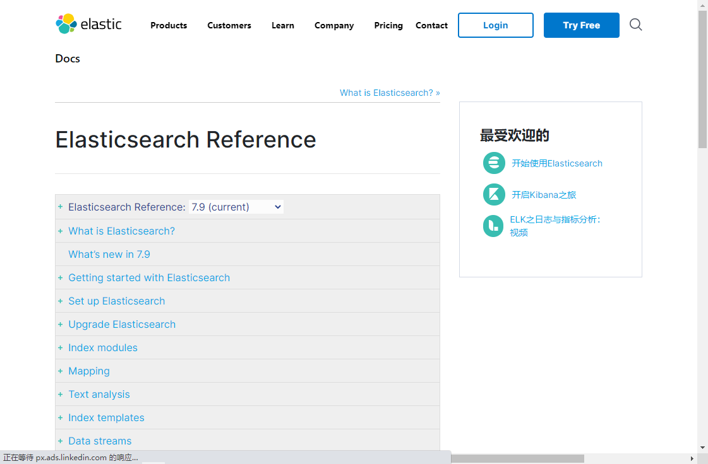

# 4.API

- 笔记本：20.elasticsearch
- 创建时间：2020-10-19 07:22:14 UTC
- 更新时间：2020-10-19 07:27:20 UTC
- 印象笔记 GUID：4d375e2e-736b-454e-aef1-cff9ae80b986

# API

## 1. Rest 风格 API

文档地址：https://www.elastic.co/guide/en/elasticsearch/reference/current/index.html
 

## 2. 客户端 API

%23%20API%0A%23%23%201.%20Rest%20%E9%A3%8E%E6%A0%BC%20API%0A%E6%96%87%E6%A1%A3%E5%9C%B0%E5%9D%80%EF%BC%9Ahttps%3A%2F%2Fwww.elastic.co%2Fguide%2Fen%2Felasticsearch%2Freference%2Fcurrent%2Findex.html%0A!%5Bb28b663b6d279523ea99d9759f43eeda.png%5D(en-resource%3A%2F%2Fdatabase%2F3677%3A1)%0A%0A%23%23%202.%20%E5%AE%A2%E6%88%B7%E7%AB%AF%20API%0A%0AElasticsearch%E6%94%AF%E6%8C%81%E7%9A%84%E5%AE%A2%E6%88%B7%E7%AB%AF%E9%9D%9E%E5%B8%B8%E5%A4%9A%EF%BC%9Ahttps%3A%2F%2Fwww.elastic.co%2Fguide%2Fen%2Felasticsearch%2Fclient%2Findex.html%0A!%5Bfe4b5845c2234eae6516182425b091a1.png%5D(en-resource%3A%2F%2Fdatabase%2F3679%3A0)%0A%0A%E7%82%B9%E5%87%BBJava%20Rest%20Client%E5%90%8E%EF%BC%8C%E5%8F%AF%E4%BB%A5%E7%9C%8B%E5%88%B0%E6%9C%89%E4%B8%A4%E4%B8%AA%EF%BC%9A%0A!%5Bf4068d52be8af5ca0466c33f86bc1e21.png%5D(en-resource%3A%2F%2Fdatabase%2F3681%3A0)%0A%0A*%20Low%20Level%20Rest%20Client%E6%98%AF%E4%BD%8E%E7%BA%A7%E5%88%AB%E5%B0%81%E8%A3%85%EF%BC%8C%E6%8F%90%E4%BE%9B%E4%B8%80%E4%BA%9B%E5%9F%BA%E7%A1%80%E5%8A%9F%E8%83%BD%EF%BC%8C%E4%BD%86%E6%9B%B4%E7%81%B5%E6%B4%BB%0A*%20High%20Level%20Rest%20Client%EF%BC%8C%E6%98%AF%E5%9C%A8Low%20Level%20Rest%20Client%E5%9F%BA%E7%A1%80%E4%B8%8A%E8%BF%9B%E8%A1%8C%E7%9A%84%E9%AB%98%E7%BA%A7%E5%88%AB%E5%B0%81%E8%A3%85%EF%BC%8C%E5%8A%9F%E8%83%BD%E6%9B%B4%E4%B8%B0%E5%AF%8C%E5%92%8C%E5%AE%8C%E5%96%84%EF%BC%8C%E8%80%8C%E4%B8%94API%E4%BC%9A%E5%8F%98%E7%9A%84%E7%AE%80%E5%8D%95
