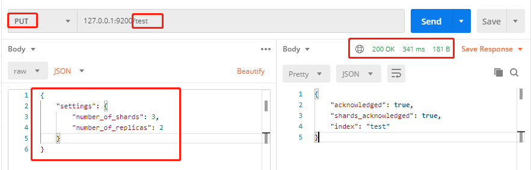
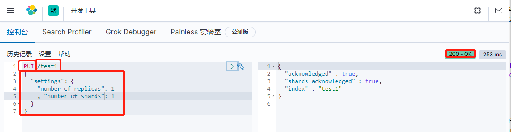
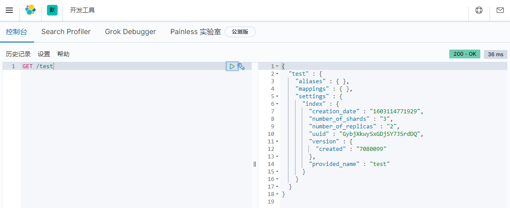
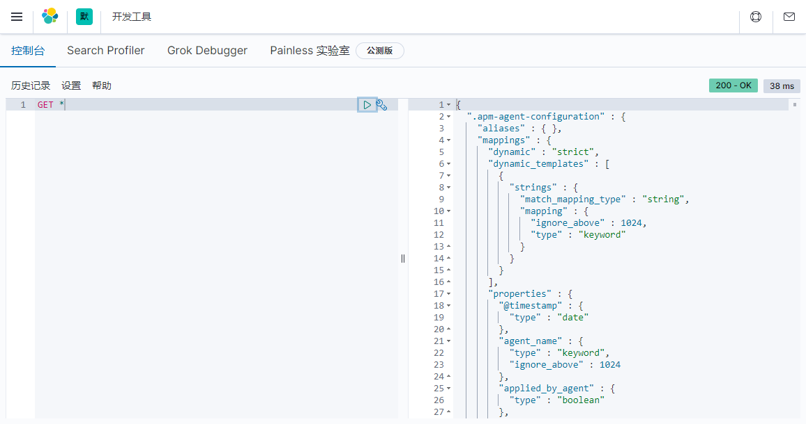
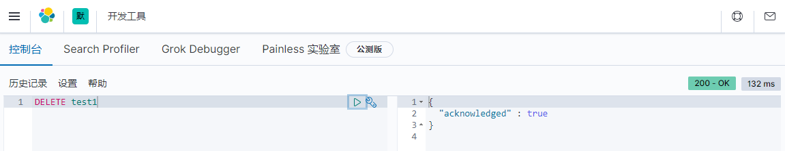
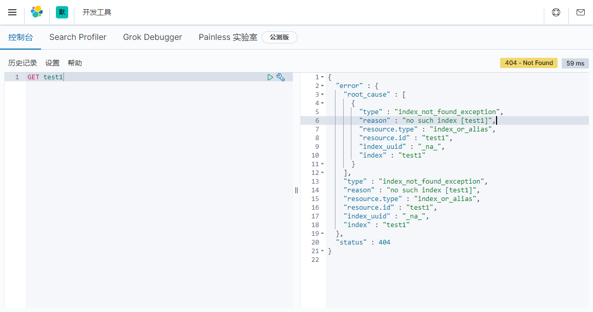
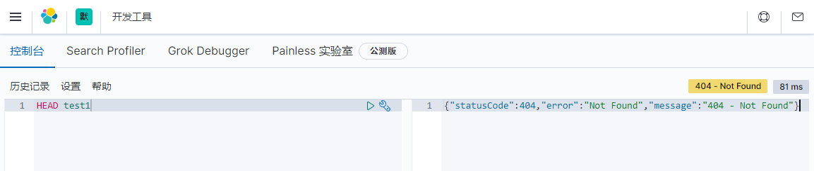
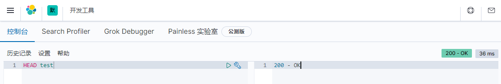
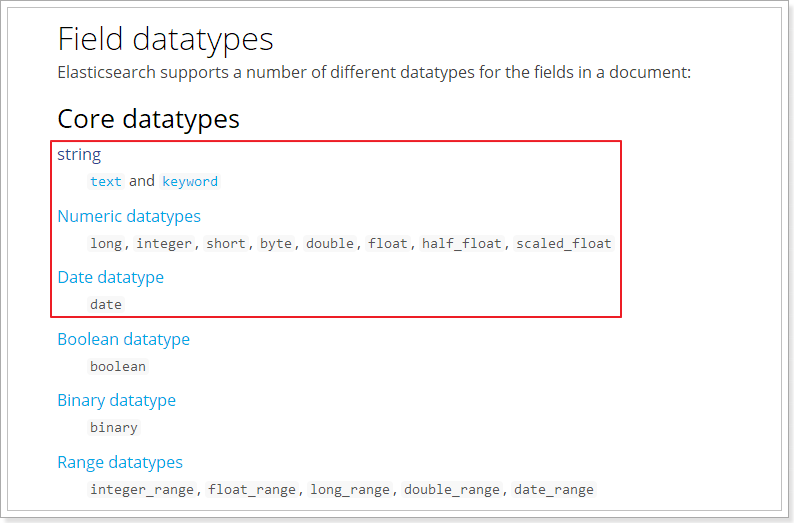

# 5. 操作索引

- 笔记本：20.elasticsearch
- 创建时间：2020-10-19 13:32:15 UTC
- 更新时间：2020-10-19 14:53:25 UTC
- 原始链接：https://blog.csdn.net/kobedir/article/details/106482828
- 印象笔记 GUID：e0a8be61-1179-4a4b-bf79-fc1f8abd68e5

# 操作索引

## 1. 基本概念

Elasticsearch也是基于Lucene的全文检索库，本质也是存储数据，很多概念与MySQL类似的。
 对比关系：

```
索引（indices）--------------------------------Databases 数据库

  类型（type）-----------------------------Table 数据表

     文档（Document）----------------Row 行

	   字段（Field）-------------------Columns 列

```

详细说明：

 | 概念 | 说明
 | 索引库（indices) | indices是index的复数，代表许多的索引，
 | 类型（type） | 类型是模拟mysql中的table概念，一个索引库下可以有不同类型的索引，比如商品索引，订单索引，其数据格式不同。不过这会导致索引库混乱，因此未来版本中会移除这个概念
 | 文档（document） | 存入索引库原始的数据。比如每一条商品信息，就是一个文档
 | 字段（field） | 文档中的属性
 | 映射配置（mappings） | 字段的数据类型、属性、是否索引、是否存储等特性

与Lucene和solr中的概念类似。

另外，在SolrCloud中，有一些集群相关的概念，在Elasticsearch也有类似的：

- 索引集（Indices，index的复数）：逻辑上的完整索引 collection1

- 分片（shard）：数据拆分后的各个部分

- 副本（replica）：每个分片的复制

要注意的是：Elasticsearch本身就是分布式的，因此即便你只有一个节点，Elasticsearch默认也会对你的数据进行分片和副本操作，当你向集群添加新数据时，数据也会在新加入的节点中进行平衡。

## 2. 操作索引

### 2.1 创建索引

Elasticsearch采用Rest风格API，因此其API就是一次http请求，可以用任何工具发起http请求

创建索引的请求格式：

- 请求方式：PUT

- 请求路径：/索引库名

- 请求参数：json格式

```
{
    "settings": {
        "number_of_shards": 3,
        "number_of_replicas": 2
    }
}

```

- settings：索引库的设置

  - number_of_shards：分片数量

  - number_of_replicas：副本数量

#### 2.1.1 使用 RestClient 来测试：



#### 2.1.2使用 Kibana 创建

kibana的控制台，可以对http请求进行简化，示例：
 

### 2.2 查看索引设置

**语法：**
 Get请求可以帮我们查看索引信息，格式：

```
GET /索引库名

```

**示例：**
 

或者，可以使用*来查询所有索引库配置：
 

### 2.3 删除索引

删除索引使用 DELETE 请求
 **语法：**

```
DELETE /索引库名

```

**示例：**
 

再次查看 test1 索引：
 

当然，我们也可以用HEAD请求，查看索引是否存在：
 
 

## 3. 映射配置

索引有了，接下来肯定是添加数据。但是，在添加数据之前必须定义映射。什么是映射？

>
映射是定义文档的过程，文档包含哪些字段，这些字段是否保存，是否索引，是否分词等

只有配置清楚，Elasticsearch才会帮我们进行索引库的创建（不一定）

### 3.1 创建映射字段

**语法：**
 请求方式：PUT

```
PUT /索引库名/_mapping/类型名称
{
  "properties": {
    "字段名": {
      "type": "类型",
      "index": true，
      "store": true，
      "analyzer": "分词器"
    }
  }
}

```

- 类型名称：就是前面说的 type 的概念，类似于数据库中的不同表。字段名：任意填写，可以指定许多属性，例如：

  - type：类型，可以是 text、long、short、date、integer、object 等

  - index：是否索引，默认为 true

  - store：是否存储，默认为 fasle

  - analyzer：分词器，这里的 `ik_max_word` 即为使用 ik 分词器

**示例：**
 发起请求：(es6.x写法)

```
PUT test/_mapping/goods
{
  "properties": {
    "title": {
      "type": "text",
      "analyzer": "ik_max_word"
    },
    "images": {
      "type": "keyword",
      "index": "false"
    },
    "price": {
      "type": "float"
    }
  }
}

```

响应结果：（es7.x中）

```
{
  "error" : {
    "root_cause" : [
      {
        "type" : "illegal_argument_exception",
        "reason" : "Types cannot be provided in put mapping requests, unless the include_type_name parameter is set to true."
      }
    ],
    "type" : "illegal_argument_exception",
    "reason" : "Types cannot be provided in put mapping requests, unless the include_type_name parameter is set to true."
  },
  "status" : 400
}

```

**解决方案：**
 这个是因为elasticsearch7.0 之后不支持type导致的…
 原因是由于写法是低版本的elasticsearch的，高版本要求传入一个include_type_name参数，值为true。所以加上一个参数即可。如下：

```
PUT test/_mapping/goods?include_type_name=true
{
  "properties": {
    "title": {
      "type": "text",
      "analyzer": "ik_max_word"
    },
    "images": {
      "type": "keyword",
      "index": "false"
    },
    "price": {
      "type": "float"
    }
  }
}

```

**结果：**

```
#! Deprecation: [types removal] Using include_type_name in put mapping requests is deprecated. The parameter will be removed in the next major version.
{
  "acknowledged" : true
}

```

**Tips:**

- es6时，官方就提到了es7会删除type，并且es6时已经规定每一个index只能有一个type。在es7中使用默认的_doc作为type，官方说在8.x版本会彻底移除type。

- api请求方式也发送变化，对索引的文档进行操作的时候，默认使用的Type是 _doc

- 如获得某索引的某ID的文档：GET index/_doc/id其中index和id为具体的值

### 3.2 查看映射关系

**语法：**

```
GET /索引库名/_mapping

```

**示例：**

```
GET /test/_mapping

```

响应：

```
{
  "test" : {
    "mappings" : {
      "properties" : {
        "images" : {
          "type" : "keyword",
          "index" : false
        },
        "price" : {
          "type" : "float"
        },
        "title" : {
          "type" : "text",
          "analyzer" : "ik_max_word"
        }
      }
    }
  }
}

```

### 3.3 字段属性详解

#### 3.3.1 type

Elasticsearch中支持的数据类型非常丰富：
 

-
String类型，又分两种：

  - text：可分词，不可参与聚合

  - keyword：不可分词，数据会作为完整字段进行匹配，可以参与聚合

-
Numerical：数值类型，分两类

  - 基本数据类型：long、interger、short、byte、double、float、half_float

  - 浮点数的高精度类型：scaled_float

    - 需要指定一个精度因子，比如10或100。elasticsearch会把真实值乘以这个因子后存储，取出时再还原。

-
Date：日期类型

elasticsearch可以对日期格式化为字符串存储，但是建议我们存储为毫秒值，存储为long，节省空间。

%23%20%E6%93%8D%E4%BD%9C%E7%B4%A2%E5%BC%95%0A%23%23%201.%20%E5%9F%BA%E6%9C%AC%E6%A6%82%E5%BF%B5%0AElasticsearch%E4%B9%9F%E6%98%AF%E5%9F%BA%E4%BA%8ELucene%E7%9A%84%E5%85%A8%E6%96%87%E6%A3%80%E7%B4%A2%E5%BA%93%EF%BC%8C%E6%9C%AC%E8%B4%A8%E4%B9%9F%E6%98%AF%E5%AD%98%E5%82%A8%E6%95%B0%E6%8D%AE%EF%BC%8C%E5%BE%88%E5%A4%9A%E6%A6%82%E5%BF%B5%E4%B8%8EMySQL%E7%B1%BB%E4%BC%BC%E7%9A%84%E3%80%82%0A%E5%AF%B9%E6%AF%94%E5%85%B3%E7%B3%BB%EF%BC%9A%0A%60%60%60%0A%E7%B4%A2%E5%BC%95%EF%BC%88indices%EF%BC%89--------------------------------Databases%20%E6%95%B0%E6%8D%AE%E5%BA%93%0A%0A%20%20%E7%B1%BB%E5%9E%8B%EF%BC%88type%EF%BC%89-----------------------------Table%20%E6%95%B0%E6%8D%AE%E8%A1%A8%0A%0A%20%20%20%20%20%E6%96%87%E6%A1%A3%EF%BC%88Document%EF%BC%89----------------Row%20%E8%A1%8C%0A%0A%09%20%20%20%E5%AD%97%E6%AE%B5%EF%BC%88Field%EF%BC%89-------------------Columns%20%E5%88%97%20%0A%60%60%60%0A%E8%AF%A6%E7%BB%86%E8%AF%B4%E6%98%8E%EF%BC%9A%0A%0A%7C%20%E6%A6%82%E5%BF%B5%20%20%20%20%20%20%20%20%20%20%20%20%20%20%20%20%20%7C%20%E8%AF%B4%E6%98%8E%20%20%20%20%20%20%20%20%20%20%20%20%20%20%20%20%20%20%20%20%20%20%20%20%20%20%20%20%20%20%20%20%20%20%20%20%20%20%20%20%20%20%20%20%20%20%20%20%20%20%20%20%20%20%20%20%20%7C%0A%7C%20--------------------%20%7C%20------------------------------------------------------------%20%7C%0A%7C%20%E7%B4%A2%E5%BC%95%E5%BA%93%EF%BC%88indices)%20%20%20%20%20%7C%20indices%E6%98%AFindex%E7%9A%84%E5%A4%8D%E6%95%B0%EF%BC%8C%E4%BB%A3%E8%A1%A8%E8%AE%B8%E5%A4%9A%E7%9A%84%E7%B4%A2%E5%BC%95%EF%BC%8C%20%20%20%20%20%20%20%20%20%20%20%20%20%20%20%20%20%20%20%20%20%20%20%7C%0A%7C%20%E7%B1%BB%E5%9E%8B%EF%BC%88type%EF%BC%89%20%20%20%20%20%20%20%20%20%7C%20%E7%B1%BB%E5%9E%8B%E6%98%AF%E6%A8%A1%E6%8B%9Fmysql%E4%B8%AD%E7%9A%84table%E6%A6%82%E5%BF%B5%EF%BC%8C%E4%B8%80%E4%B8%AA%E7%B4%A2%E5%BC%95%E5%BA%93%E4%B8%8B%E5%8F%AF%E4%BB%A5%E6%9C%89%E4%B8%8D%E5%90%8C%E7%B1%BB%E5%9E%8B%E7%9A%84%E7%B4%A2%E5%BC%95%EF%BC%8C%E6%AF%94%E5%A6%82%E5%95%86%E5%93%81%E7%B4%A2%E5%BC%95%EF%BC%8C%E8%AE%A2%E5%8D%95%E7%B4%A2%E5%BC%95%EF%BC%8C%E5%85%B6%E6%95%B0%E6%8D%AE%E6%A0%BC%E5%BC%8F%E4%B8%8D%E5%90%8C%E3%80%82%E4%B8%8D%E8%BF%87%E8%BF%99%E4%BC%9A%E5%AF%BC%E8%87%B4%E7%B4%A2%E5%BC%95%E5%BA%93%E6%B7%B7%E4%B9%B1%EF%BC%8C%E5%9B%A0%E6%AD%A4%E6%9C%AA%E6%9D%A5%E7%89%88%E6%9C%AC%E4%B8%AD%E4%BC%9A%E7%A7%BB%E9%99%A4%E8%BF%99%E4%B8%AA%E6%A6%82%E5%BF%B5%20%7C%0A%7C%20%E6%96%87%E6%A1%A3%EF%BC%88document%EF%BC%89%20%20%20%20%20%7C%20%E5%AD%98%E5%85%A5%E7%B4%A2%E5%BC%95%E5%BA%93%E5%8E%9F%E5%A7%8B%E7%9A%84%E6%95%B0%E6%8D%AE%E3%80%82%E6%AF%94%E5%A6%82%E6%AF%8F%E4%B8%80%E6%9D%A1%E5%95%86%E5%93%81%E4%BF%A1%E6%81%AF%EF%BC%8C%E5%B0%B1%E6%98%AF%E4%B8%80%E4%B8%AA%E6%96%87%E6%A1%A3%20%20%20%20%20%20%20%7C%0A%7C%20%E5%AD%97%E6%AE%B5%EF%BC%88field%EF%BC%89%20%20%20%20%20%20%20%20%7C%20%E6%96%87%E6%A1%A3%E4%B8%AD%E7%9A%84%E5%B1%9E%E6%80%A7%20%20%20%20%20%20%20%20%20%20%20%20%20%20%20%20%20%20%20%20%20%20%20%20%20%20%20%20%20%20%20%20%20%20%20%20%20%20%20%20%20%20%20%20%20%20%20%20%20%7C%0A%7C%20%E6%98%A0%E5%B0%84%E9%85%8D%E7%BD%AE%EF%BC%88mappings%EF%BC%89%20%7C%20%E5%AD%97%E6%AE%B5%E7%9A%84%E6%95%B0%E6%8D%AE%E7%B1%BB%E5%9E%8B%E3%80%81%E5%B1%9E%E6%80%A7%E3%80%81%E6%98%AF%E5%90%A6%E7%B4%A2%E5%BC%95%E3%80%81%E6%98%AF%E5%90%A6%E5%AD%98%E5%82%A8%E7%AD%89%E7%89%B9%E6%80%A7%20%20%20%20%20%20%20%20%20%20%20%20%20%20%20%7C%0A%0A%E4%B8%8ELucene%E5%92%8Csolr%E4%B8%AD%E7%9A%84%E6%A6%82%E5%BF%B5%E7%B1%BB%E4%BC%BC%E3%80%82%0A%0A%E5%8F%A6%E5%A4%96%EF%BC%8C%E5%9C%A8SolrCloud%E4%B8%AD%EF%BC%8C%E6%9C%89%E4%B8%80%E4%BA%9B%E9%9B%86%E7%BE%A4%E7%9B%B8%E5%85%B3%E7%9A%84%E6%A6%82%E5%BF%B5%EF%BC%8C%E5%9C%A8Elasticsearch%E4%B9%9F%E6%9C%89%E7%B1%BB%E4%BC%BC%E7%9A%84%EF%BC%9A%0A%0A-%20%E7%B4%A2%E5%BC%95%E9%9B%86%EF%BC%88Indices%EF%BC%8Cindex%E7%9A%84%E5%A4%8D%E6%95%B0%EF%BC%89%EF%BC%9A%E9%80%BB%E8%BE%91%E4%B8%8A%E7%9A%84%E5%AE%8C%E6%95%B4%E7%B4%A2%E5%BC%95%20collection1%20%0A-%20%E5%88%86%E7%89%87%EF%BC%88shard%EF%BC%89%EF%BC%9A%E6%95%B0%E6%8D%AE%E6%8B%86%E5%88%86%E5%90%8E%E7%9A%84%E5%90%84%E4%B8%AA%E9%83%A8%E5%88%86%0A-%20%E5%89%AF%E6%9C%AC%EF%BC%88replica%EF%BC%89%EF%BC%9A%E6%AF%8F%E4%B8%AA%E5%88%86%E7%89%87%E7%9A%84%E5%A4%8D%E5%88%B6%0A%0A%E8%A6%81%E6%B3%A8%E6%84%8F%E7%9A%84%E6%98%AF%EF%BC%9AElasticsearch%E6%9C%AC%E8%BA%AB%E5%B0%B1%E6%98%AF%E5%88%86%E5%B8%83%E5%BC%8F%E7%9A%84%EF%BC%8C%E5%9B%A0%E6%AD%A4%E5%8D%B3%E4%BE%BF%E4%BD%A0%E5%8F%AA%E6%9C%89%E4%B8%80%E4%B8%AA%E8%8A%82%E7%82%B9%EF%BC%8CElasticsearch%E9%BB%98%E8%AE%A4%E4%B9%9F%E4%BC%9A%E5%AF%B9%E4%BD%A0%E7%9A%84%E6%95%B0%E6%8D%AE%E8%BF%9B%E8%A1%8C%E5%88%86%E7%89%87%E5%92%8C%E5%89%AF%E6%9C%AC%E6%93%8D%E4%BD%9C%EF%BC%8C%E5%BD%93%E4%BD%A0%E5%90%91%E9%9B%86%E7%BE%A4%E6%B7%BB%E5%8A%A0%E6%96%B0%E6%95%B0%E6%8D%AE%E6%97%B6%EF%BC%8C%E6%95%B0%E6%8D%AE%E4%B9%9F%E4%BC%9A%E5%9C%A8%E6%96%B0%E5%8A%A0%E5%85%A5%E7%9A%84%E8%8A%82%E7%82%B9%E4%B8%AD%E8%BF%9B%E8%A1%8C%E5%B9%B3%E8%A1%A1%E3%80%82%0A%0A%23%23%202.%20%E6%93%8D%E4%BD%9C%E7%B4%A2%E5%BC%95%0A%0A%23%23%23%202.1%20%E5%88%9B%E5%BB%BA%E7%B4%A2%E5%BC%95%0AElasticsearch%E9%87%87%E7%94%A8Rest%E9%A3%8E%E6%A0%BCAPI%EF%BC%8C%E5%9B%A0%E6%AD%A4%E5%85%B6API%E5%B0%B1%E6%98%AF%E4%B8%80%E6%AC%A1http%E8%AF%B7%E6%B1%82%EF%BC%8C%E5%8F%AF%E4%BB%A5%E7%94%A8%E4%BB%BB%E4%BD%95%E5%B7%A5%E5%85%B7%E5%8F%91%E8%B5%B7http%E8%AF%B7%E6%B1%82%0A%0A%E5%88%9B%E5%BB%BA%E7%B4%A2%E5%BC%95%E7%9A%84%E8%AF%B7%E6%B1%82%E6%A0%BC%E5%BC%8F%EF%BC%9A%0A-%20%E8%AF%B7%E6%B1%82%E6%96%B9%E5%BC%8F%EF%BC%9APUT%0A-%20%E8%AF%B7%E6%B1%82%E8%B7%AF%E5%BE%84%EF%BC%9A%2F%E7%B4%A2%E5%BC%95%E5%BA%93%E5%90%8D%0A-%20%E8%AF%B7%E6%B1%82%E5%8F%82%E6%95%B0%EF%BC%9Ajson%E6%A0%BC%E5%BC%8F%0A%0A%60%60%60json%0A%7B%0A%20%20%20%20%22settings%22%3A%20%7B%0A%20%20%20%20%20%20%20%20%22number_of_shards%22%3A%203%2C%0A%20%20%20%20%20%20%20%20%22number_of_replicas%22%3A%202%0A%20%20%20%20%7D%0A%7D%0A%60%60%60%0A%20%20%20%20%20%20%0A-%20settings%EF%BC%9A%E7%B4%A2%E5%BC%95%E5%BA%93%E7%9A%84%E8%AE%BE%E7%BD%AE%0A%20%20%20%20-%20number_of_shards%EF%BC%9A%E5%88%86%E7%89%87%E6%95%B0%E9%87%8F%0A%20%20%20%20-%20number_of_replicas%EF%BC%9A%E5%89%AF%E6%9C%AC%E6%95%B0%E9%87%8F%0A%20%20%20%20%0A%23%23%23%23%202.1.1%20%E4%BD%BF%E7%94%A8%20RestClient%20%E6%9D%A5%E6%B5%8B%E8%AF%95%EF%BC%9A%0A!%5Bd943146fb9c1e1eb945a431e8e336fa2.png%5D(en-resource%3A%2F%2Fdatabase%2F3685%3A0)%0A%0A%23%23%23%23%202.1.2%E4%BD%BF%E7%94%A8%20Kibana%20%E5%88%9B%E5%BB%BA%0Akibana%E7%9A%84%E6%8E%A7%E5%88%B6%E5%8F%B0%EF%BC%8C%E5%8F%AF%E4%BB%A5%E5%AF%B9http%E8%AF%B7%E6%B1%82%E8%BF%9B%E8%A1%8C%E7%AE%80%E5%8C%96%EF%BC%8C%E7%A4%BA%E4%BE%8B%EF%BC%9A%0A!%5B8c05a281b04b35dc26ca9ad89cba5bb8.png%5D(en-resource%3A%2F%2Fdatabase%2F3687%3A0)%0A%0A%23%23%23%202.2%20%E6%9F%A5%E7%9C%8B%E7%B4%A2%E5%BC%95%E8%AE%BE%E7%BD%AE%0A**%E8%AF%AD%E6%B3%95%EF%BC%9A**%0AGet%E8%AF%B7%E6%B1%82%E5%8F%AF%E4%BB%A5%E5%B8%AE%E6%88%91%E4%BB%AC%E6%9F%A5%E7%9C%8B%E7%B4%A2%E5%BC%95%E4%BF%A1%E6%81%AF%EF%BC%8C%E6%A0%BC%E5%BC%8F%EF%BC%9A%0A%60%60%60json%0AGET%20%2F%E7%B4%A2%E5%BC%95%E5%BA%93%E5%90%8D%0A%60%60%60%0A**%E7%A4%BA%E4%BE%8B%EF%BC%9A**%0A!%5B8b3e4ae0ceaa9af3b633c7a6d8172974.png%5D(en-resource%3A%2F%2Fdatabase%2F3689%3A0)%0A%0A%E6%88%96%E8%80%85%EF%BC%8C%E5%8F%AF%E4%BB%A5%E4%BD%BF%E7%94%A8*%E6%9D%A5%E6%9F%A5%E8%AF%A2%E6%89%80%E6%9C%89%E7%B4%A2%E5%BC%95%E5%BA%93%E9%85%8D%E7%BD%AE%EF%BC%9A%0A!%5B1a7096b288a69db542ad882defa80410.png%5D(en-resource%3A%2F%2Fdatabase%2F3691%3A0)%0A%0A%23%23%23%202.3%20%E5%88%A0%E9%99%A4%E7%B4%A2%E5%BC%95%0A%E5%88%A0%E9%99%A4%E7%B4%A2%E5%BC%95%E4%BD%BF%E7%94%A8%20DELETE%20%E8%AF%B7%E6%B1%82%0A**%E8%AF%AD%E6%B3%95%EF%BC%9A**%0A%60%60%60json%0ADELETE%20%2F%E7%B4%A2%E5%BC%95%E5%BA%93%E5%90%8D%0A%60%60%60%0A**%E7%A4%BA%E4%BE%8B%EF%BC%9A**%0A!%5B3158ef47234bf8db5db98b16f4683349.png%5D(en-resource%3A%2F%2Fdatabase%2F3693%3A0)%0A%0A%E5%86%8D%E6%AC%A1%E6%9F%A5%E7%9C%8B%20test1%20%E7%B4%A2%E5%BC%95%EF%BC%9A%0A!%5Bf73e9807cd10a3c2b7cb02c8f7ddc1e4.png%5D(en-resource%3A%2F%2Fdatabase%2F3695%3A0)%0A%0A%E5%BD%93%E7%84%B6%EF%BC%8C%E6%88%91%E4%BB%AC%E4%B9%9F%E5%8F%AF%E4%BB%A5%E7%94%A8HEAD%E8%AF%B7%E6%B1%82%EF%BC%8C%E6%9F%A5%E7%9C%8B%E7%B4%A2%E5%BC%95%E6%98%AF%E5%90%A6%E5%AD%98%E5%9C%A8%EF%BC%9A%0A!%5Ba1d57c461774679b4c21c59e43ecb91a.png%5D(en-resource%3A%2F%2Fdatabase%2F3697%3A0)%0A!%5B74abdcc76ed923df564b2dec0a779ef3.png%5D(en-resource%3A%2F%2Fdatabase%2F3699%3A0)%0A%0A%23%23%203.%20%E6%98%A0%E5%B0%84%E9%85%8D%E7%BD%AE%0A%E7%B4%A2%E5%BC%95%E6%9C%89%E4%BA%86%EF%BC%8C%E6%8E%A5%E4%B8%8B%E6%9D%A5%E8%82%AF%E5%AE%9A%E6%98%AF%E6%B7%BB%E5%8A%A0%E6%95%B0%E6%8D%AE%E3%80%82%E4%BD%86%E6%98%AF%EF%BC%8C%E5%9C%A8%E6%B7%BB%E5%8A%A0%E6%95%B0%E6%8D%AE%E4%B9%8B%E5%89%8D%E5%BF%85%E9%A1%BB%E5%AE%9A%E4%B9%89%E6%98%A0%E5%B0%84%E3%80%82%E4%BB%80%E4%B9%88%E6%98%AF%E6%98%A0%E5%B0%84%EF%BC%9F%0A%0A%3E%20%E6%98%A0%E5%B0%84%E6%98%AF%E5%AE%9A%E4%B9%89%E6%96%87%E6%A1%A3%E7%9A%84%E8%BF%87%E7%A8%8B%EF%BC%8C%E6%96%87%E6%A1%A3%E5%8C%85%E5%90%AB%E5%93%AA%E4%BA%9B%E5%AD%97%E6%AE%B5%EF%BC%8C%E8%BF%99%E4%BA%9B%E5%AD%97%E6%AE%B5%E6%98%AF%E5%90%A6%E4%BF%9D%E5%AD%98%EF%BC%8C%E6%98%AF%E5%90%A6%E7%B4%A2%E5%BC%95%EF%BC%8C%E6%98%AF%E5%90%A6%E5%88%86%E8%AF%8D%E7%AD%89%0A%0A%E5%8F%AA%E6%9C%89%E9%85%8D%E7%BD%AE%E6%B8%85%E6%A5%9A%EF%BC%8CElasticsearch%E6%89%8D%E4%BC%9A%E5%B8%AE%E6%88%91%E4%BB%AC%E8%BF%9B%E8%A1%8C%E7%B4%A2%E5%BC%95%E5%BA%93%E7%9A%84%E5%88%9B%E5%BB%BA%EF%BC%88%E4%B8%8D%E4%B8%80%E5%AE%9A%EF%BC%89%0A%0A%23%23%23%203.1%20%E5%88%9B%E5%BB%BA%E6%98%A0%E5%B0%84%E5%AD%97%E6%AE%B5%0A**%E8%AF%AD%E6%B3%95%EF%BC%9A**%0A%E8%AF%B7%E6%B1%82%E6%96%B9%E5%BC%8F%EF%BC%9APUT%0A%60%60%60json%0APUT%20%2F%E7%B4%A2%E5%BC%95%E5%BA%93%E5%90%8D%2F_mapping%2F%E7%B1%BB%E5%9E%8B%E5%90%8D%E7%A7%B0%0A%7B%0A%20%20%22properties%22%3A%20%7B%0A%20%20%20%20%22%E5%AD%97%E6%AE%B5%E5%90%8D%22%3A%20%7B%0A%20%20%20%20%20%20%22type%22%3A%20%22%E7%B1%BB%E5%9E%8B%22%2C%0A%20%20%20%20%20%20%22index%22%3A%20true%EF%BC%8C%0A%20%20%20%20%20%20%22store%22%3A%20true%EF%BC%8C%0A%20%20%20%20%20%20%22analyzer%22%3A%20%22%E5%88%86%E8%AF%8D%E5%99%A8%22%0A%20%20%20%20%7D%0A%20%20%7D%0A%7D%0A%60%60%60%0A%0A-%20%E7%B1%BB%E5%9E%8B%E5%90%8D%E7%A7%B0%EF%BC%9A%E5%B0%B1%E6%98%AF%E5%89%8D%E9%9D%A2%E8%AF%B4%E7%9A%84%20type%20%E7%9A%84%E6%A6%82%E5%BF%B5%EF%BC%8C%E7%B1%BB%E4%BC%BC%E4%BA%8E%E6%95%B0%E6%8D%AE%E5%BA%93%E4%B8%AD%E7%9A%84%E4%B8%8D%E5%90%8C%E8%A1%A8%E3%80%82%E5%AD%97%E6%AE%B5%E5%90%8D%EF%BC%9A%E4%BB%BB%E6%84%8F%E5%A1%AB%E5%86%99%EF%BC%8C%E5%8F%AF%E4%BB%A5%E6%8C%87%E5%AE%9A%E8%AE%B8%E5%A4%9A%E5%B1%9E%E6%80%A7%EF%BC%8C%E4%BE%8B%E5%A6%82%EF%BC%9A%0A%20%20%20%20-%20type%EF%BC%9A%E7%B1%BB%E5%9E%8B%EF%BC%8C%E5%8F%AF%E4%BB%A5%E6%98%AF%20text%E3%80%81long%E3%80%81short%E3%80%81date%E3%80%81integer%E3%80%81object%20%E7%AD%89%0A%20%20%20%20-%20index%EF%BC%9A%E6%98%AF%E5%90%A6%E7%B4%A2%E5%BC%95%EF%BC%8C%E9%BB%98%E8%AE%A4%E4%B8%BA%20true%0A%20%20%20%20-%20store%EF%BC%9A%E6%98%AF%E5%90%A6%E5%AD%98%E5%82%A8%EF%BC%8C%E9%BB%98%E8%AE%A4%E4%B8%BA%20fasle%0A%20%20%20%20-%20analyzer%EF%BC%9A%E5%88%86%E8%AF%8D%E5%99%A8%EF%BC%8C%E8%BF%99%E9%87%8C%E7%9A%84%20%60ik_max_word%60%20%E5%8D%B3%E4%B8%BA%E4%BD%BF%E7%94%A8%20ik%20%E5%88%86%E8%AF%8D%E5%99%A8%0A%0A**%E7%A4%BA%E4%BE%8B%EF%BC%9A**%0A%E5%8F%91%E8%B5%B7%E8%AF%B7%E6%B1%82%EF%BC%9A(es6.x%E5%86%99%E6%B3%95)%0A%60%60%60json%0APUT%20test%2F_mapping%2Fgoods%0A%7B%0A%20%20%22properties%22%3A%20%7B%0A%20%20%20%20%22title%22%3A%20%7B%0A%20%20%20%20%20%20%22type%22%3A%20%22text%22%2C%0A%20%20%20%20%20%20%22analyzer%22%3A%20%22ik_max_word%22%0A%20%20%20%20%7D%2C%0A%20%20%20%20%22images%22%3A%20%7B%0A%20%20%20%20%20%20%22type%22%3A%20%22keyword%22%2C%0A%20%20%20%20%20%20%22index%22%3A%20%22false%22%0A%20%20%20%20%7D%2C%0A%20%20%20%20%22price%22%3A%20%7B%0A%20%20%20%20%20%20%22type%22%3A%20%22float%22%0A%20%20%20%20%7D%0A%20%20%7D%0A%7D%0A%60%60%60%0A%0A%E5%93%8D%E5%BA%94%E7%BB%93%E6%9E%9C%EF%BC%9A%EF%BC%88es7.x%E4%B8%AD%EF%BC%89%0A%60%60%60json%0A%7B%0A%20%20%22error%22%20%3A%20%7B%0A%20%20%20%20%22root_cause%22%20%3A%20%5B%0A%20%20%20%20%20%20%7B%0A%20%20%20%20%20%20%20%20%22type%22%20%3A%20%22illegal_argument_exception%22%2C%0A%20%20%20%20%20%20%20%20%22reason%22%20%3A%20%22Types%20cannot%20be%20provided%20in%20put%20mapping%20requests%2C%20unless%20the%20include_type_name%20parameter%20is%20set%20to%20true.%22%0A%20%20%20%20%20%20%7D%0A%20%20%20%20%5D%2C%0A%20%20%20%20%22type%22%20%3A%20%22illegal_argument_exception%22%2C%0A%20%20%20%20%22reason%22%20%3A%20%22Types%20cannot%20be%20provided%20in%20put%20mapping%20requests%2C%20unless%20the%20include_type_name%20parameter%20is%20set%20to%20true.%22%0A%20%20%7D%2C%0A%20%20%22status%22%20%3A%20400%0A%7D%0A%60%60%60%0A**%E8%A7%A3%E5%86%B3%E6%96%B9%E6%A1%88%EF%BC%9A**%0A%E8%BF%99%E4%B8%AA%E6%98%AF%E5%9B%A0%E4%B8%BAelasticsearch7.0%20%E4%B9%8B%E5%90%8E%E4%B8%8D%E6%94%AF%E6%8C%81type%E5%AF%BC%E8%87%B4%E7%9A%84%E2%80%A6%0A%E5%8E%9F%E5%9B%A0%E6%98%AF%E7%94%B1%E4%BA%8E%E5%86%99%E6%B3%95%E6%98%AF%E4%BD%8E%E7%89%88%E6%9C%AC%E7%9A%84elasticsearch%E7%9A%84%EF%BC%8C%E9%AB%98%E7%89%88%E6%9C%AC%E8%A6%81%E6%B1%82%E4%BC%A0%E5%85%A5%E4%B8%80%E4%B8%AAinclude_type_name%E5%8F%82%E6%95%B0%EF%BC%8C%E5%80%BC%E4%B8%BAtrue%E3%80%82%E6%89%80%E4%BB%A5%E5%8A%A0%E4%B8%8A%E4%B8%80%E4%B8%AA%E5%8F%82%E6%95%B0%E5%8D%B3%E5%8F%AF%E3%80%82%E5%A6%82%E4%B8%8B%EF%BC%9A%0A%60%60%60json%0APUT%20test%2F_mapping%2Fgoods%3Finclude_type_name%3Dtrue%0A%7B%0A%20%20%22properties%22%3A%20%7B%0A%20%20%20%20%22title%22%3A%20%7B%0A%20%20%20%20%20%20%22type%22%3A%20%22text%22%2C%0A%20%20%20%20%20%20%22analyzer%22%3A%20%22ik_max_word%22%0A%20%20%20%20%7D%2C%0A%20%20%20%20%22images%22%3A%20%7B%0A%20%20%20%20%20%20%22type%22%3A%20%22keyword%22%2C%0A%20%20%20%20%20%20%22index%22%3A%20%22false%22%0A%20%20%20%20%7D%2C%0A%20%20%20%20%22price%22%3A%20%7B%0A%20%20%20%20%20%20%22type%22%3A%20%22float%22%0A%20%20%20%20%7D%0A%20%20%7D%0A%7D%0A%60%60%60%0A%0A**%E7%BB%93%E6%9E%9C%EF%BC%9A**%0A%60%60%60json%0A%23!%20Deprecation%3A%20%5Btypes%20removal%5D%20Using%20include_type_name%20in%20put%20mapping%20requests%20is%20deprecated.%20The%20parameter%20will%20be%20removed%20in%20the%20next%20major%20version.%0A%7B%0A%20%20%22acknowledged%22%20%3A%20true%0A%7D%0A%60%60%60%0A**Tips%3A**%20%0A*%20es6%E6%97%B6%EF%BC%8C%E5%AE%98%E6%96%B9%E5%B0%B1%E6%8F%90%E5%88%B0%E4%BA%86es7%E4%BC%9A%E5%88%A0%E9%99%A4type%EF%BC%8C%E5%B9%B6%E4%B8%94es6%E6%97%B6%E5%B7%B2%E7%BB%8F%E8%A7%84%E5%AE%9A%E6%AF%8F%E4%B8%80%E4%B8%AAindex%E5%8F%AA%E8%83%BD%E6%9C%89%E4%B8%80%E4%B8%AAtype%E3%80%82%E5%9C%A8es7%E4%B8%AD%E4%BD%BF%E7%94%A8%E9%BB%98%E8%AE%A4%E7%9A%84_doc%E4%BD%9C%E4%B8%BAtype%EF%BC%8C%E5%AE%98%E6%96%B9%E8%AF%B4%E5%9C%A88.x%E7%89%88%E6%9C%AC%E4%BC%9A%E5%BD%BB%E5%BA%95%E7%A7%BB%E9%99%A4type%E3%80%82%0A*%20api%E8%AF%B7%E6%B1%82%E6%96%B9%E5%BC%8F%E4%B9%9F%E5%8F%91%E9%80%81%E5%8F%98%E5%8C%96%EF%BC%8C%E5%AF%B9%E7%B4%A2%E5%BC%95%E7%9A%84%E6%96%87%E6%A1%A3%E8%BF%9B%E8%A1%8C%E6%93%8D%E4%BD%9C%E7%9A%84%E6%97%B6%E5%80%99%EF%BC%8C%E9%BB%98%E8%AE%A4%E4%BD%BF%E7%94%A8%E7%9A%84Type%E6%98%AF%C2%A0%5C_doc%0A*%20%E5%A6%82%E8%8E%B7%E5%BE%97%E6%9F%90%E7%B4%A2%E5%BC%95%E7%9A%84%E6%9F%90ID%E7%9A%84%E6%96%87%E6%A1%A3%EF%BC%9AGET%20index%2F%5C_doc%2Fid%E5%85%B6%E4%B8%ADindex%E5%92%8Cid%E4%B8%BA%E5%85%B7%E4%BD%93%E7%9A%84%E5%80%BC%0A%0A%23%23%23%203.2%20%E6%9F%A5%E7%9C%8B%E6%98%A0%E5%B0%84%E5%85%B3%E7%B3%BB%0A**%E8%AF%AD%E6%B3%95%EF%BC%9A**%0A%60%60%60json%0AGET%20%2F%E7%B4%A2%E5%BC%95%E5%BA%93%E5%90%8D%2F_mapping%0A%60%60%60%0A**%E7%A4%BA%E4%BE%8B%EF%BC%9A**%0A%60%60%60json%0AGET%20%2Ftest%2F_mapping%0A%60%60%60%0A%E5%93%8D%E5%BA%94%EF%BC%9A%0A%60%60%60json%0A%7B%0A%20%20%22test%22%20%3A%20%7B%0A%20%20%20%20%22mappings%22%20%3A%20%7B%0A%20%20%20%20%20%20%22properties%22%20%3A%20%7B%0A%20%20%20%20%20%20%20%20%22images%22%20%3A%20%7B%0A%20%20%20%20%20%20%20%20%20%20%22type%22%20%3A%20%22keyword%22%2C%0A%20%20%20%20%20%20%20%20%20%20%22index%22%20%3A%20false%0A%20%20%20%20%20%20%20%20%7D%2C%0A%20%20%20%20%20%20%20%20%22price%22%20%3A%20%7B%0A%20%20%20%20%20%20%20%20%20%20%22type%22%20%3A%20%22float%22%0A%20%20%20%20%20%20%20%20%7D%2C%0A%20%20%20%20%20%20%20%20%22title%22%20%3A%20%7B%0A%20%20%20%20%20%20%20%20%20%20%22type%22%20%3A%20%22text%22%2C%0A%20%20%20%20%20%20%20%20%20%20%22analyzer%22%20%3A%20%22ik_max_word%22%0A%20%20%20%20%20%20%20%20%7D%0A%20%20%20%20%20%20%7D%0A%20%20%20%20%7D%0A%20%20%7D%0A%7D%0A%60%60%60%0A%0A%23%23%23%203.3%20%E5%AD%97%E6%AE%B5%E5%B1%9E%E6%80%A7%E8%AF%A6%E8%A7%A3%0A%23%23%23%23%203.3.1%20type%0AElasticsearch%E4%B8%AD%E6%94%AF%E6%8C%81%E7%9A%84%E6%95%B0%E6%8D%AE%E7%B1%BB%E5%9E%8B%E9%9D%9E%E5%B8%B8%E4%B8%B0%E5%AF%8C%EF%BC%9A%0A!%5B208a2b52e1fbe6d31942a69e198218ff.png%5D(en-resource%3A%2F%2Fdatabase%2F3701%3A0)%0A%0A-%20String%E7%B1%BB%E5%9E%8B%EF%BC%8C%E5%8F%88%E5%88%86%E4%B8%A4%E7%A7%8D%EF%BC%9A%0A%20%20-%20text%EF%BC%9A%E5%8F%AF%E5%88%86%E8%AF%8D%EF%BC%8C%E4%B8%8D%E5%8F%AF%E5%8F%82%E4%B8%8E%E8%81%9A%E5%90%88%0A%20%20-%20keyword%EF%BC%9A%E4%B8%8D%E5%8F%AF%E5%88%86%E8%AF%8D%EF%BC%8C%E6%95%B0%E6%8D%AE%E4%BC%9A%E4%BD%9C%E4%B8%BA%E5%AE%8C%E6%95%B4%E5%AD%97%E6%AE%B5%E8%BF%9B%E8%A1%8C%E5%8C%B9%E9%85%8D%EF%BC%8C%E5%8F%AF%E4%BB%A5%E5%8F%82%E4%B8%8E%E8%81%9A%E5%90%88%0A%0A-%20Numerical%EF%BC%9A%E6%95%B0%E5%80%BC%E7%B1%BB%E5%9E%8B%EF%BC%8C%E5%88%86%E4%B8%A4%E7%B1%BB%0A%20%20-%20%E5%9F%BA%E6%9C%AC%E6%95%B0%E6%8D%AE%E7%B1%BB%E5%9E%8B%EF%BC%9Along%E3%80%81interger%E3%80%81short%E3%80%81byte%E3%80%81double%E3%80%81float%E3%80%81half_float%0A%20%20-%20%E6%B5%AE%E7%82%B9%E6%95%B0%E7%9A%84%E9%AB%98%E7%B2%BE%E5%BA%A6%E7%B1%BB%E5%9E%8B%EF%BC%9Ascaled_float%0A%20%20%20%20-%20%E9%9C%80%E8%A6%81%E6%8C%87%E5%AE%9A%E4%B8%80%E4%B8%AA%E7%B2%BE%E5%BA%A6%E5%9B%A0%E5%AD%90%EF%BC%8C%E6%AF%94%E5%A6%8210%E6%88%96100%E3%80%82elasticsearch%E4%BC%9A%E6%8A%8A%E7%9C%9F%E5%AE%9E%E5%80%BC%E4%B9%98%E4%BB%A5%E8%BF%99%E4%B8%AA%E5%9B%A0%E5%AD%90%E5%90%8E%E5%AD%98%E5%82%A8%EF%BC%8C%E5%8F%96%E5%87%BA%E6%97%B6%E5%86%8D%E8%BF%98%E5%8E%9F%E3%80%82%0A%0A-%20Date%EF%BC%9A%E6%97%A5%E6%9C%9F%E7%B1%BB%E5%9E%8B%0A%20%20elasticsearch%E5%8F%AF%E4%BB%A5%E5%AF%B9%E6%97%A5%E6%9C%9F%E6%A0%BC%E5%BC%8F%E5%8C%96%E4%B8%BA%E5%AD%97%E7%AC%A6%E4%B8%B2%E5%AD%98%E5%82%A8%EF%BC%8C%E4%BD%86%E6%98%AF%E5%BB%BA%E8%AE%AE%E6%88%91%E4%BB%AC%E5%AD%98%E5%82%A8%E4%B8%BA%E6%AF%AB%E7%A7%92%E5%80%BC%EF%BC%8C%E5%AD%98%E5%82%A8%E4%B8%BAlong%EF%BC%8C%E8%8A%82%E7%9C%81%E7%A9%BA%E9%97%B4%E3%80%82%0A%E5%A6%82%E6%9E%9C%E5%AD%98%E7%9A%84%E6%98%AF%E5%AF%B9%E8%B1%A1%EF%BC%8C%E6%AF%94%E5%A6%82%EF%BC%9A%0A%60%60%60json%0A%7B%0A%20%20%20%20girl%3A%20%7B%0A%20%20%20%20%20%20%20%20name%3A%20%22rose%22%2C%0A%20%20%20%20%20%20%20%20age%3A%2021%0A%20%20%20%20%7D%0A%7D%0A%60%60%60%0A%E4%BC%9A%E5%A4%84%E7%90%86%E6%88%90%E4%B8%A4%E4%B8%AA%E5%AD%97%E6%AE%B5%EF%BC%9A%60girl.name%60%20%E5%92%8C%20%60girl.age%60%0A%20%20%0A%23%23%23%23%203.3.2%20index%0Aindex%E5%BD%B1%E5%93%8D%E5%AD%97%E6%AE%B5%E7%9A%84%E7%B4%A2%E5%BC%95%E6%83%85%E5%86%B5%E3%80%82%0A-%20true%EF%BC%9A%E5%AD%97%E6%AE%B5%E4%BC%9A%E8%A2%AB%E7%B4%A2%E5%BC%95%EF%BC%8C%E5%88%99%E5%8F%AF%E4%BB%A5%E7%94%A8%E6%9D%A5%E8%BF%9B%E8%A1%8C%E6%90%9C%E7%B4%A2%E3%80%82%E9%BB%98%E8%AE%A4%E5%80%BC%E5%B0%B1%E6%98%AFtrue%0A-%20false%EF%BC%9A%E5%AD%97%E6%AE%B5%E4%B8%8D%E4%BC%9A%E8%A2%AB%E7%B4%A2%E5%BC%95%EF%BC%8C%E4%B8%8D%E8%83%BD%E7%94%A8%E6%9D%A5%E6%90%9C%E7%B4%A2%0A%0A%0Aindex%E7%9A%84%E9%BB%98%E8%AE%A4%E5%80%BC%E5%B0%B1%E6%98%AFtrue%EF%BC%8C%E4%B9%9F%E5%B0%B1%E6%98%AF%E8%AF%B4%E4%BD%A0%E4%B8%8D%E8%BF%9B%E8%A1%8C%E4%BB%BB%E4%BD%95%E9%85%8D%E7%BD%AE%EF%BC%8C%E6%89%80%E6%9C%89%E5%AD%97%E6%AE%B5%E9%83%BD%E4%BC%9A%E8%A2%AB%E7%B4%A2%E5%BC%95%E3%80%82%E4%BD%86%E6%98%AF%E6%9C%89%E4%BA%9B%E5%AD%97%E6%AE%B5%E6%98%AF%E6%88%91%E4%BB%AC%E4%B8%8D%E5%B8%8C%E6%9C%9B%E8%A2%AB%E7%B4%A2%E5%BC%95%E7%9A%84%EF%BC%8C%E6%AF%94%E5%A6%82%E5%95%86%E5%93%81%E7%9A%84%E5%9B%BE%E7%89%87%E4%BF%A1%E6%81%AF%EF%BC%8C%E5%B0%B1%E9%9C%80%E8%A6%81%E6%89%8B%E5%8A%A8%E8%AE%BE%E7%BD%AEindex%E4%B8%BAfalse%E3%80%82%0A%0A%23%23%23%23%203.3.3%20store%0A%0A%E6%98%AF%E5%90%A6%E5%B0%86%E6%95%B0%E6%8D%AE%E8%BF%9B%E8%A1%8C%E9%A2%9D%E5%A4%96%E5%AD%98%E5%82%A8%E3%80%82%0A%0A%E5%9C%A8%20lucene%20%E5%92%8C%20solr%20%E4%B8%AD%EF%BC%8C%E5%A6%82%E6%9E%9C%E4%B8%80%E4%B8%AA%E5%AD%97%E6%AE%B5%E7%9A%84store%E8%AE%BE%E7%BD%AE%E4%B8%BAfalse%EF%BC%8C%E9%82%A3%E4%B9%88%E5%9C%A8%E6%96%87%E6%A1%A3%E5%88%97%E8%A1%A8%E4%B8%AD%E5%B0%B1%E4%B8%8D%E4%BC%9A%E6%9C%89%E8%BF%99%E4%B8%AA%E5%AD%97%E6%AE%B5%E7%9A%84%E5%80%BC%EF%BC%8C%E7%94%A8%E6%88%B7%E7%9A%84%E6%90%9C%E7%B4%A2%E7%BB%93%E6%9E%9C%E4%B8%AD%E4%B8%8D%E4%BC%9A%E6%98%BE%E7%A4%BA%E5%87%BA%E6%9D%A5%E3%80%82%0A%E4%BD%86%E6%98%AF%E5%9C%A8Elasticsearch%E4%B8%AD%EF%BC%8C%E5%8D%B3%E4%BE%BFstore%E8%AE%BE%E7%BD%AE%E4%B8%BAfalse%EF%BC%8C%E4%B9%9F%E5%8F%AF%E4%BB%A5%E6%90%9C%E7%B4%A2%E5%88%B0%E7%BB%93%E6%9E%9C%E3%80%82%0A%E5%8E%9F%E5%9B%A0%E6%98%AFElasticsearch%E5%9C%A8%E5%88%9B%E5%BB%BA%E6%96%87%E6%A1%A3%E7%B4%A2%E5%BC%95%E6%97%B6%EF%BC%8C%E4%BC%9A%E5%B0%86%E6%96%87%E6%A1%A3%E4%B8%AD%E7%9A%84%E5%8E%9F%E5%A7%8B%E6%95%B0%E6%8D%AE%E5%A4%87%E4%BB%BD%EF%BC%8C%E4%BF%9D%E5%AD%98%E5%88%B0%E4%B8%80%E4%B8%AA%E5%8F%AB%E5%81%9A_source%E7%9A%84%E5%B1%9E%E6%80%A7%E4%B8%AD%E3%80%82%E8%80%8C%E4%B8%94%E6%88%91%E4%BB%AC%E5%8F%AF%E4%BB%A5%E9%80%9A%E8%BF%87%E8%BF%87%E6%BB%A4_source%E6%9D%A5%E9%80%89%E6%8B%A9%E5%93%AA%E4%BA%9B%E8%A6%81%E6%98%BE%E7%A4%BA%EF%BC%8C%E5%93%AA%E4%BA%9B%E4%B8%8D%E6%98%BE%E7%A4%BA%E3%80%82%0A%E8%80%8C%E5%A6%82%E6%9E%9C%E8%AE%BE%E7%BD%AEstore%E4%B8%BAtrue%EF%BC%8C%E5%B0%B1%E4%BC%9A%E5%9C%A8_source%E4%BB%A5%E5%A4%96%E9%A2%9D%E5%A4%96%E5%AD%98%E5%82%A8%E4%B8%80%E4%BB%BD%E6%95%B0%E6%8D%AE%EF%BC%8C%E5%A4%9A%E4%BD%99%EF%BC%8C%E5%9B%A0%E6%AD%A4%E4%B8%80%E8%88%AC%E6%88%91%E4%BB%AC%E9%83%BD%E4%BC%9A%E5%B0%86store%E8%AE%BE%E7%BD%AE%E4%B8%BAfalse%EF%BC%8C%E4%BA%8B%E5%AE%9E%E4%B8%8A%EF%BC%8Cstore%E7%9A%84%E9%BB%98%E8%AE%A4%E5%80%BC%E5%B0%B1%E6%98%AFfalse%E3%80%82%0A%0A%23%23%23%23%203.3.4%20boost%0A%E6%BF%80%E5%8A%B1%E5%9B%A0%E5%AD%90
