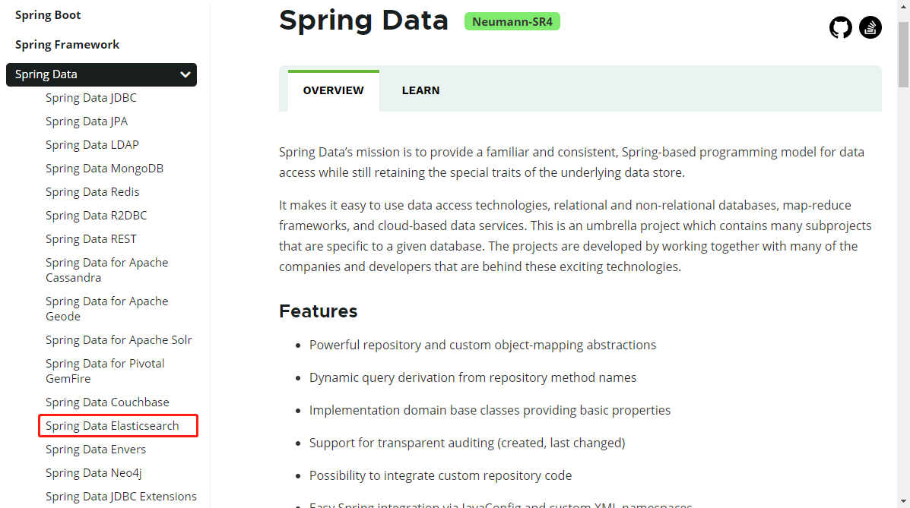
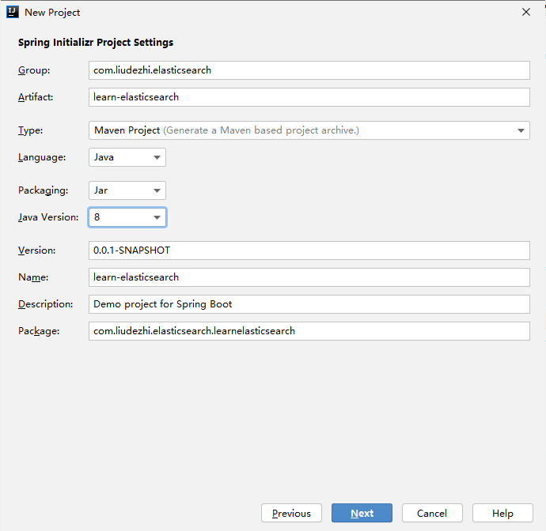
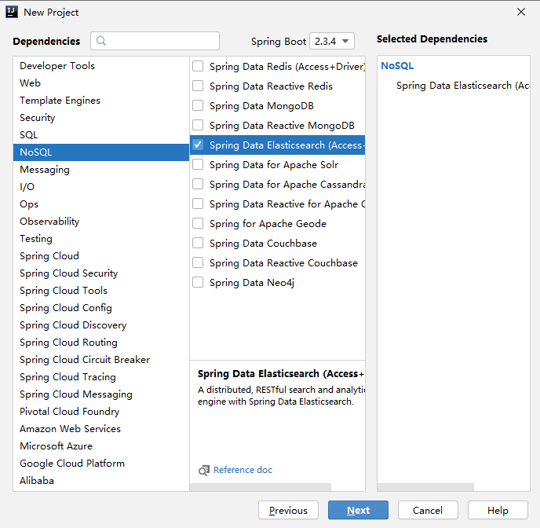

# 9.Spring Data Elasticsearch

- 笔记本：20.elasticsearch
- 创建时间：2020-10-20 09:02:30 UTC
- 更新时间：2020-10-20 14:58:03 UTC
- 印象笔记 GUID：41f9e26b-99d6-4c29-ab83-a5789081551c

# Spring Data Elasticsearch

Elasticsearch提供的Java客户端有一些不太方便的地方：

- 很多地方需要拼接Json字符串，在java中拼接字符串有多恐怖你应该懂的

- 需要自己把对象序列化为json存储

- 查询到结果也需要自己反序列化为对象

因此，我们这里就不讲解原生的Elasticsearch客户端API了。
 而是学习Spring提供的套件：Spring Data Elasticsearch。

## 1. 简介

Spring Data Elasticsearch是Spring Data项目下的一个子模块。
 查看 Spring Data的官网：http://projects.spring.io/spring-data/
 

>
Spring Data的使命是为数据访问提供熟悉且一致的基于Spring的编程模型，同时仍保留底层数据存储的特殊特性。
 它使得使用数据访问技术，关系数据库和非关系数据库，map-reduce框架和基于云的数据服务变得容易。这是一个总括项目，其中包含许多特定于给定数据库的子项目。这些令人兴奋的技术项目背后，是由许多公司和开发人员合作开发的。

Spring Data 的使命是给各种数据访问提供统一的编程接口，不管是关系型数据库（如MySQL），还是非关系数据库（如Redis），或者类似Elasticsearch这样的索引数据库。从而简化开发人员的代码，提高开发效率。

包含很多不同数据操作的模块：
 [附件]

特征：

- 支持Spring的基于`@Configuration`的java配置方式，或者XML配置方式

- 提供了用于操作ES的便捷工具类 `ElasticsearchTemplate` 。包括实现文档到POJO之间的自动智能映射。

- 利用Spring的数据转换服务实现的功能丰富的对象映射

- 基于注解的元数据映射方式，而且可扩展以支持更多不同的数据格式

- 根据持久层接口自动生成对应实现方法，无需人工编写基本操作代码（类似mybatis，根据接口自动得到实现）。当然，也支持人工定制查询

## 2. 创建 Demo 工程

使用 spring 脚手架新建一个 demo，学习 Elasticsearch
 
 

pom依赖：

```
<?xml version="1.0" encoding="UTF-8"?>
<project xmlns="http://maven.apache.org/POM/4.0.0" xmlns:xsi="http://www.w3.org/2001/XMLSchema-instance"
         xsi:schemaLocation="http://maven.apache.org/POM/4.0.0 https://maven.apache.org/xsd/maven-4.0.0.xsd">
    <modelVersion>4.0.0</modelVersion>
    <parent>
        <groupId>org.springframework.boot</groupId>
        <artifactId>spring-boot-starter-parent</artifactId>
        <version>2.3.4.RELEASE</version>
        <relativePath/> <!-- lookup parent from repository -->
    </parent>
    <groupId>com.liudezhi.elasticsearch</groupId>
    <artifactId>learn-elasticsearch</artifactId>
    <version>0.0.1-SNAPSHOT</version>
    <name>learn-elasticsearch</name>
    <description>Demo project for Spring Boot</description>

    <properties>
        <java.version>1.8</java.version>
    </properties>

    <dependencies>
        <dependency>
            <groupId>org.springframework.boot</groupId>
            <artifactId>spring-boot-starter-data-elasticsearch</artifactId>
        </dependency>

        <dependency>
            <groupId>org.springframework.boot</groupId>
            <artifactId>spring-boot-starter-test</artifactId>
            <scope>test</scope>
            <exclusions>
                <exclusion>
                    <groupId>org.junit.vintage</groupId>
                    <artifactId>junit-vintage-engine</artifactId>
                </exclusion>
            </exclusions>
        </dependency>
    </dependencies>

    <build>
        <plugins>
            <plugin>
                <groupId>org.springframework.boot</groupId>
                <artifactId>spring-boot-maven-plugin</artifactId>
            </plugin>
        </plugins>
    </build>

</project>

```

application.yml文件配置：

```
spring:
  data:
    elasticsearch:
      cluster-name: elasticsearch
      cluster-nodes: 127.0.0.1:9300

```

%23%20Spring%20Data%20Elasticsearch%0AElasticsearch%E6%8F%90%E4%BE%9B%E7%9A%84Java%E5%AE%A2%E6%88%B7%E7%AB%AF%E6%9C%89%E4%B8%80%E4%BA%9B%E4%B8%8D%E5%A4%AA%E6%96%B9%E4%BE%BF%E7%9A%84%E5%9C%B0%E6%96%B9%EF%BC%9A%0A-%20%E5%BE%88%E5%A4%9A%E5%9C%B0%E6%96%B9%E9%9C%80%E8%A6%81%E6%8B%BC%E6%8E%A5Json%E5%AD%97%E7%AC%A6%E4%B8%B2%EF%BC%8C%E5%9C%A8java%E4%B8%AD%E6%8B%BC%E6%8E%A5%E5%AD%97%E7%AC%A6%E4%B8%B2%E6%9C%89%E5%A4%9A%E6%81%90%E6%80%96%E4%BD%A0%E5%BA%94%E8%AF%A5%E6%87%82%E7%9A%84%0A-%20%E9%9C%80%E8%A6%81%E8%87%AA%E5%B7%B1%E6%8A%8A%E5%AF%B9%E8%B1%A1%E5%BA%8F%E5%88%97%E5%8C%96%E4%B8%BAjson%E5%AD%98%E5%82%A8%0A-%20%E6%9F%A5%E8%AF%A2%E5%88%B0%E7%BB%93%E6%9E%9C%E4%B9%9F%E9%9C%80%E8%A6%81%E8%87%AA%E5%B7%B1%E5%8F%8D%E5%BA%8F%E5%88%97%E5%8C%96%E4%B8%BA%E5%AF%B9%E8%B1%A1%0A%0A%E5%9B%A0%E6%AD%A4%EF%BC%8C%E6%88%91%E4%BB%AC%E8%BF%99%E9%87%8C%E5%B0%B1%E4%B8%8D%E8%AE%B2%E8%A7%A3%E5%8E%9F%E7%94%9F%E7%9A%84Elasticsearch%E5%AE%A2%E6%88%B7%E7%AB%AFAPI%E4%BA%86%E3%80%82%0A%E8%80%8C%E6%98%AF%E5%AD%A6%E4%B9%A0Spring%E6%8F%90%E4%BE%9B%E7%9A%84%E5%A5%97%E4%BB%B6%EF%BC%9ASpring%20Data%20Elasticsearch%E3%80%82%0A%0A%23%23%201.%20%E7%AE%80%E4%BB%8B%0ASpring%20Data%20Elasticsearch%E6%98%AFSpring%20Data%E9%A1%B9%E7%9B%AE%E4%B8%8B%E7%9A%84%E4%B8%80%E4%B8%AA%E5%AD%90%E6%A8%A1%E5%9D%97%E3%80%82%0A%E6%9F%A5%E7%9C%8B%20Spring%20Data%E7%9A%84%E5%AE%98%E7%BD%91%EF%BC%9Ahttp%3A%2F%2Fprojects.spring.io%2Fspring-data%2F%0A!%5B94082c0f18fb2cd39c46fef039069825.png%5D(en-resource%3A%2F%2Fdatabase%2F3725%3A0)%0A%0A%3E%20Spring%20Data%E7%9A%84%E4%BD%BF%E5%91%BD%E6%98%AF%E4%B8%BA%E6%95%B0%E6%8D%AE%E8%AE%BF%E9%97%AE%E6%8F%90%E4%BE%9B%E7%86%9F%E6%82%89%E4%B8%94%E4%B8%80%E8%87%B4%E7%9A%84%E5%9F%BA%E4%BA%8ESpring%E7%9A%84%E7%BC%96%E7%A8%8B%E6%A8%A1%E5%9E%8B%EF%BC%8C%E5%90%8C%E6%97%B6%E4%BB%8D%E4%BF%9D%E7%95%99%E5%BA%95%E5%B1%82%E6%95%B0%E6%8D%AE%E5%AD%98%E5%82%A8%E7%9A%84%E7%89%B9%E6%AE%8A%E7%89%B9%E6%80%A7%E3%80%82%0A%3E%20%E5%AE%83%E4%BD%BF%E5%BE%97%E4%BD%BF%E7%94%A8%E6%95%B0%E6%8D%AE%E8%AE%BF%E9%97%AE%E6%8A%80%E6%9C%AF%EF%BC%8C%E5%85%B3%E7%B3%BB%E6%95%B0%E6%8D%AE%E5%BA%93%E5%92%8C%E9%9D%9E%E5%85%B3%E7%B3%BB%E6%95%B0%E6%8D%AE%E5%BA%93%EF%BC%8Cmap-reduce%E6%A1%86%E6%9E%B6%E5%92%8C%E5%9F%BA%E4%BA%8E%E4%BA%91%E7%9A%84%E6%95%B0%E6%8D%AE%E6%9C%8D%E5%8A%A1%E5%8F%98%E5%BE%97%E5%AE%B9%E6%98%93%E3%80%82%E8%BF%99%E6%98%AF%E4%B8%80%E4%B8%AA%E6%80%BB%E6%8B%AC%E9%A1%B9%E7%9B%AE%EF%BC%8C%E5%85%B6%E4%B8%AD%E5%8C%85%E5%90%AB%E8%AE%B8%E5%A4%9A%E7%89%B9%E5%AE%9A%E4%BA%8E%E7%BB%99%E5%AE%9A%E6%95%B0%E6%8D%AE%E5%BA%93%E7%9A%84%E5%AD%90%E9%A1%B9%E7%9B%AE%E3%80%82%E8%BF%99%E4%BA%9B%E4%BB%A4%E4%BA%BA%E5%85%B4%E5%A5%8B%E7%9A%84%E6%8A%80%E6%9C%AF%E9%A1%B9%E7%9B%AE%E8%83%8C%E5%90%8E%EF%BC%8C%E6%98%AF%E7%94%B1%E8%AE%B8%E5%A4%9A%E5%85%AC%E5%8F%B8%E5%92%8C%E5%BC%80%E5%8F%91%E4%BA%BA%E5%91%98%E5%90%88%E4%BD%9C%E5%BC%80%E5%8F%91%E7%9A%84%E3%80%82%0A%0ASpring%20Data%20%E7%9A%84%E4%BD%BF%E5%91%BD%E6%98%AF%E7%BB%99%E5%90%84%E7%A7%8D%E6%95%B0%E6%8D%AE%E8%AE%BF%E9%97%AE%E6%8F%90%E4%BE%9B%E7%BB%9F%E4%B8%80%E7%9A%84%E7%BC%96%E7%A8%8B%E6%8E%A5%E5%8F%A3%EF%BC%8C%E4%B8%8D%E7%AE%A1%E6%98%AF%E5%85%B3%E7%B3%BB%E5%9E%8B%E6%95%B0%E6%8D%AE%E5%BA%93%EF%BC%88%E5%A6%82MySQL%EF%BC%89%EF%BC%8C%E8%BF%98%E6%98%AF%E9%9D%9E%E5%85%B3%E7%B3%BB%E6%95%B0%E6%8D%AE%E5%BA%93%EF%BC%88%E5%A6%82Redis%EF%BC%89%EF%BC%8C%E6%88%96%E8%80%85%E7%B1%BB%E4%BC%BCElasticsearch%E8%BF%99%E6%A0%B7%E7%9A%84%E7%B4%A2%E5%BC%95%E6%95%B0%E6%8D%AE%E5%BA%93%E3%80%82%E4%BB%8E%E8%80%8C%E7%AE%80%E5%8C%96%E5%BC%80%E5%8F%91%E4%BA%BA%E5%91%98%E7%9A%84%E4%BB%A3%E7%A0%81%EF%BC%8C%E6%8F%90%E9%AB%98%E5%BC%80%E5%8F%91%E6%95%88%E7%8E%87%E3%80%82%0A%0A%E5%8C%85%E5%90%AB%E5%BE%88%E5%A4%9A%E4%B8%8D%E5%90%8C%E6%95%B0%E6%8D%AE%E6%93%8D%E4%BD%9C%E7%9A%84%E6%A8%A1%E5%9D%97%EF%BC%9A%0A!%5Bacf9ae5702771d4884d1459d555931ca.png%5D(en-resource%3A%2F%2Fdatabase%2F3727%3A0)%0A%0A%E7%89%B9%E5%BE%81%EF%BC%9A%0A-%20%E6%94%AF%E6%8C%81Spring%E7%9A%84%E5%9F%BA%E4%BA%8E%60%40Configuration%60%E7%9A%84java%E9%85%8D%E7%BD%AE%E6%96%B9%E5%BC%8F%EF%BC%8C%E6%88%96%E8%80%85XML%E9%85%8D%E7%BD%AE%E6%96%B9%E5%BC%8F%0A-%20%E6%8F%90%E4%BE%9B%E4%BA%86%E7%94%A8%E4%BA%8E%E6%93%8D%E4%BD%9CES%E7%9A%84%E4%BE%BF%E6%8D%B7%E5%B7%A5%E5%85%B7%E7%B1%BB%20%60ElasticsearchTemplate%60%20%E3%80%82%E5%8C%85%E6%8B%AC%E5%AE%9E%E7%8E%B0%E6%96%87%E6%A1%A3%E5%88%B0POJO%E4%B9%8B%E9%97%B4%E7%9A%84%E8%87%AA%E5%8A%A8%E6%99%BA%E8%83%BD%E6%98%A0%E5%B0%84%E3%80%82%0A-%20%E5%88%A9%E7%94%A8Spring%E7%9A%84%E6%95%B0%E6%8D%AE%E8%BD%AC%E6%8D%A2%E6%9C%8D%E5%8A%A1%E5%AE%9E%E7%8E%B0%E7%9A%84%E5%8A%9F%E8%83%BD%E4%B8%B0%E5%AF%8C%E7%9A%84%E5%AF%B9%E8%B1%A1%E6%98%A0%E5%B0%84%0A-%20%E5%9F%BA%E4%BA%8E%E6%B3%A8%E8%A7%A3%E7%9A%84%E5%85%83%E6%95%B0%E6%8D%AE%E6%98%A0%E5%B0%84%E6%96%B9%E5%BC%8F%EF%BC%8C%E8%80%8C%E4%B8%94%E5%8F%AF%E6%89%A9%E5%B1%95%E4%BB%A5%E6%94%AF%E6%8C%81%E6%9B%B4%E5%A4%9A%E4%B8%8D%E5%90%8C%E7%9A%84%E6%95%B0%E6%8D%AE%E6%A0%BC%E5%BC%8F%0A-%20%E6%A0%B9%E6%8D%AE%E6%8C%81%E4%B9%85%E5%B1%82%E6%8E%A5%E5%8F%A3%E8%87%AA%E5%8A%A8%E7%94%9F%E6%88%90%E5%AF%B9%E5%BA%94%E5%AE%9E%E7%8E%B0%E6%96%B9%E6%B3%95%EF%BC%8C%E6%97%A0%E9%9C%80%E4%BA%BA%E5%B7%A5%E7%BC%96%E5%86%99%E5%9F%BA%E6%9C%AC%E6%93%8D%E4%BD%9C%E4%BB%A3%E7%A0%81%EF%BC%88%E7%B1%BB%E4%BC%BCmybatis%EF%BC%8C%E6%A0%B9%E6%8D%AE%E6%8E%A5%E5%8F%A3%E8%87%AA%E5%8A%A8%E5%BE%97%E5%88%B0%E5%AE%9E%E7%8E%B0%EF%BC%89%E3%80%82%E5%BD%93%E7%84%B6%EF%BC%8C%E4%B9%9F%E6%94%AF%E6%8C%81%E4%BA%BA%E5%B7%A5%E5%AE%9A%E5%88%B6%E6%9F%A5%E8%AF%A2%0A%0A%23%23%202.%20%E5%88%9B%E5%BB%BA%20Demo%20%E5%B7%A5%E7%A8%8B%0A%E4%BD%BF%E7%94%A8%20spring%20%E8%84%9A%E6%89%8B%E6%9E%B6%E6%96%B0%E5%BB%BA%E4%B8%80%E4%B8%AA%20demo%EF%BC%8C%E5%AD%A6%E4%B9%A0%20Elasticsearch%0A!%5B08f3aa54c2bd747de5cca62901693ed7.png%5D(en-resource%3A%2F%2Fdatabase%2F3729%3A0)%0A!%5B2ce2e62b2ddb9cc9bdd45724e0907039.png%5D(en-resource%3A%2F%2Fdatabase%2F3731%3A0)%0A%0Apom%E4%BE%9D%E8%B5%96%EF%BC%9A%0A%60%60%60xml%0A%3C%3Fxml%20version%3D%221.0%22%20encoding%3D%22UTF-8%22%3F%3E%0A%3Cproject%20xmlns%3D%22http%3A%2F%2Fmaven.apache.org%2FPOM%2F4.0.0%22%20xmlns%3Axsi%3D%22http%3A%2F%2Fwww.w3.org%2F2001%2FXMLSchema-instance%22%0A%20%20%20%20%20%20%20%20%20xsi%3AschemaLocation%3D%22http%3A%2F%2Fmaven.apache.org%2FPOM%2F4.0.0%20https%3A%2F%2Fmaven.apache.org%2Fxsd%2Fmaven-4.0.0.xsd%22%3E%0A%20%20%20%20%3CmodelVersion%3E4.0.0%3C%2FmodelVersion%3E%0A%20%20%20%20%3Cparent%3E%0A%20%20%20%20%20%20%20%20%3CgroupId%3Eorg.springframework.boot%3C%2FgroupId%3E%0A%20%20%20%20%20%20%20%20%3CartifactId%3Espring-boot-starter-parent%3C%2FartifactId%3E%0A%20%20%20%20%20%20%20%20%3Cversion%3E2.3.4.RELEASE%3C%2Fversion%3E%0A%20%20%20%20%20%20%20%20%3CrelativePath%2F%3E%20%3C!--%20lookup%20parent%20from%20repository%20--%3E%0A%20%20%20%20%3C%2Fparent%3E%0A%20%20%20%20%3CgroupId%3Ecom.liudezhi.elasticsearch%3C%2FgroupId%3E%0A%20%20%20%20%3CartifactId%3Elearn-elasticsearch%3C%2FartifactId%3E%0A%20%20%20%20%3Cversion%3E0.0.1-SNAPSHOT%3C%2Fversion%3E%0A%20%20%20%20%3Cname%3Elearn-elasticsearch%3C%2Fname%3E%0A%20%20%20%20%3Cdescription%3EDemo%20project%20for%20Spring%20Boot%3C%2Fdescription%3E%0A%0A%20%20%20%20%3Cproperties%3E%0A%20%20%20%20%20%20%20%20%3Cjava.version%3E1.8%3C%2Fjava.version%3E%0A%20%20%20%20%3C%2Fproperties%3E%0A%0A%20%20%20%20%3Cdependencies%3E%0A%20%20%20%20%20%20%20%20%3Cdependency%3E%0A%20%20%20%20%20%20%20%20%20%20%20%20%3CgroupId%3Eorg.springframework.boot%3C%2FgroupId%3E%0A%20%20%20%20%20%20%20%20%20%20%20%20%3CartifactId%3Espring-boot-starter-data-elasticsearch%3C%2FartifactId%3E%0A%20%20%20%20%20%20%20%20%3C%2Fdependency%3E%0A%0A%20%20%20%20%20%20%20%20%3Cdependency%3E%0A%20%20%20%20%20%20%20%20%20%20%20%20%3CgroupId%3Eorg.springframework.boot%3C%2FgroupId%3E%0A%20%20%20%20%20%20%20%20%20%20%20%20%3CartifactId%3Espring-boot-starter-test%3C%2FartifactId%3E%0A%20%20%20%20%20%20%20%20%20%20%20%20%3Cscope%3Etest%3C%2Fscope%3E%0A%20%20%20%20%20%20%20%20%20%20%20%20%3Cexclusions%3E%0A%20%20%20%20%20%20%20%20%20%20%20%20%20%20%20%20%3Cexclusion%3E%0A%20%20%20%20%20%20%20%20%20%20%20%20%20%20%20%20%20%20%20%20%3CgroupId%3Eorg.junit.vintage%3C%2FgroupId%3E%0A%20%20%20%20%20%20%20%20%20%20%20%20%20%20%20%20%20%20%20%20%3CartifactId%3Ejunit-vintage-engine%3C%2FartifactId%3E%0A%20%20%20%20%20%20%20%20%20%20%20%20%20%20%20%20%3C%2Fexclusion%3E%0A%20%20%20%20%20%20%20%20%20%20%20%20%3C%2Fexclusions%3E%0A%20%20%20%20%20%20%20%20%3C%2Fdependency%3E%0A%20%20%20%20%3C%2Fdependencies%3E%0A%0A%20%20%20%20%3Cbuild%3E%0A%20%20%20%20%20%20%20%20%3Cplugins%3E%0A%20%20%20%20%20%20%20%20%20%20%20%20%3Cplugin%3E%0A%20%20%20%20%20%20%20%20%20%20%20%20%20%20%20%20%3CgroupId%3Eorg.springframework.boot%3C%2FgroupId%3E%0A%20%20%20%20%20%20%20%20%20%20%20%20%20%20%20%20%3CartifactId%3Espring-boot-maven-plugin%3C%2FartifactId%3E%0A%20%20%20%20%20%20%20%20%20%20%20%20%3C%2Fplugin%3E%0A%20%20%20%20%20%20%20%20%3C%2Fplugins%3E%0A%20%20%20%20%3C%2Fbuild%3E%0A%0A%3C%2Fproject%3E%0A%60%60%60%0A%0Aapplication.yml%E6%96%87%E4%BB%B6%E9%85%8D%E7%BD%AE%EF%BC%9A%0A%60%60%60yml%0Aspring%3A%0A%20%20data%3A%0A%20%20%20%20elasticsearch%3A%0A%20%20%20%20%20%20cluster-name%3A%20elasticsearch%0A%20%20%20%20%20%20cluster-nodes%3A%20127.0.0.1%3A9300%0A%60%60%60%0A%0A%23%23%203.%20%E5%AE%9E%E4%BD%93%E7%B1%BB%E5%8F%8A%E6%B3%A8%E8%A7%A3%0A%E9%A6%96%E5%85%88%E6%88%91%E4%BB%AC%E5%87%86%E5%A4%87%E5%A5%BD%E5%AE%9E%E4%BD%93%E7%B1%BB%EF%BC%9A%0A%60%60%60java%0Apublic%20class%20Item%20%7B%0A%20%20%20%20Long%20id%3B%0A%20%20%20%20String%20title%3B%20%2F%2F%E6%A0%87%E9%A2%98%0A%20%20%20%20String%20category%3B%2F%2F%20%E5%88%86%E7%B1%BB%0A%20%20%20%20String%20brand%3B%20%2F%2F%20%E5%93%81%E7%89%8C%0A%20%20%20%20Double%20price%3B%20%2F%2F%20%E4%BB%B7%E6%A0%BC%0A%20%20%20%20String%20images%3B%20%2F%2F%20%E5%9B%BE%E7%89%87%E5%9C%B0%E5%9D%80%0A%7D%0A%60%60%60%0A**%E6%98%A0%E5%B0%84%EF%BC%9A**%0ASpring%20Data%20%E9%80%9A%E8%BF%87%E6%B3%A8%E8%A7%A3%E6%9D%A5%E5%A3%B0%E6%98%8E%E5%AD%97%E6%AE%B5%E7%9A%84%E6%98%A0%E5%B0%84%E5%B1%9E%E6%80%A7%EF%BC%8C%E6%9C%89%E4%B8%8B%E9%9D%A2%E7%9A%84%E4%B8%89%E4%B8%AA%E6%B3%A8%E8%A7%A3%EF%BC%9A%0A%2B%20%60%40Document%60%20%E4%BD%9C%E7%94%A8%E5%9C%A8%E7%B1%BB%E4%B8%8A%EF%BC%8C%E6%A0%87%E8%AE%B0%E5%AE%9E%E4%BD%93%E7%B1%BB%E4%B8%BA%E6%96%87%E6%A1%A3%E5%AF%B9%E8%B1%A1%EF%BC%8C%E4%B8%80%E8%88%AC%E6%9C%89%E5%9B%9B%E4%B8%AA%E5%B1%9E%E6%80%A7%0A%20%20%20%20-%20indexName%3A%20%E5%AF%B9%E5%BA%94%E7%B4%A2%E5%BC%95%E5%BA%93%E5%90%8D%E7%A7%B0%0A%20%20%20%20-%20type%3A%20%E5%AF%B9%E5%BA%94%E5%9C%A8%E7%B4%A2%E5%BC%95%E5%BA%93%E7%A7%8D%E7%9A%84%E7%B1%BB%E5%9E%8B%0A%20%20%20%20-%20shards%3A%20%E5%88%86%E7%89%87%E6%95%B0%E9%87%8F%EF%BC%8C%E9%BB%98%E8%AE%A45%0A%20%20%20%20-%20replicas%3A%20%E5%89%AF%E6%9C%AC%E6%95%B0%E9%87%8F%EF%BC%8C%E9%BB%98%E8%AE%A41%0A%2B%20%60%40Id%60%20%E4%BD%9C%E7%94%A8%E5%9C%A8%E6%88%90%E5%91%98%E5%8F%98%E9%87%8F%E4%B8%8A%EF%BC%8C%E6%A0%87%E8%AE%B0%E4%B8%80%E4%B8%AA%E5%AD%97%E6%AE%B5%E4%BD%9C%E4%B8%BA%20id%20%E4%B8%BB%E9%94%AE%0A%2B%20%60%40Field%60%20%E4%BD%9C%E7%94%A8%E5%9C%A8%E6%88%90%E5%91%98%E5%8F%98%E9%87%8F%E4%B8%8A%EF%BC%8C%E6%A0%87%E8%AE%B0%E4%B8%BA%E6%96%87%E6%A1%A3%E7%9A%84%E5%AD%97%E6%AE%B5%EF%BC%8C%E5%B9%B6%E6%8C%87%E5%AE%9A%E5%AD%97%E6%AE%B5%E6%98%A0%E5%B0%84%E5%B1%9E%E6%80%A7%EF%BC%9A%0A%20%20%20%20-%20type%EF%BC%9A%E5%AD%97%E6%AE%B5%E7%B1%BB%E5%9E%8B%EF%BC%8C%E5%8F%96%E5%80%BC%E6%98%AF%E6%9E%9A%E4%B8%BE%EF%BC%9AFieldType%0A%20%20%20%20-%20index%EF%BC%9A%E6%98%AF%E5%90%A6%E7%B4%A2%E5%BC%95%EF%BC%8C%E5%B8%83%E5%B0%94%E7%B1%BB%E5%9E%8B%EF%BC%8C%E9%BB%98%E8%AE%A4%E6%98%AF%20true%0A%20%20%20%20-%20store%EF%BC%9A%E6%98%AF%E5%90%A6%E5%AD%98%E5%82%A8%EF%BC%8C%E5%B8%83%E5%B0%94%E7%B1%BB%E5%9E%8B%EF%BC%8C%E9%BB%98%E8%AE%A4%E6%98%AF%20false%0A%20%20%20%20-%20analyzer%EF%BC%9A%E5%88%86%E8%AF%8D%E5%99%A8%E5%90%8D%E7%A7%B0%EF%BC%9Aik_max_word%0A**%E7%A4%BA%E4%BE%8B%EF%BC%9A**%0A%60%60%60json%0A%0A%60%60%60
