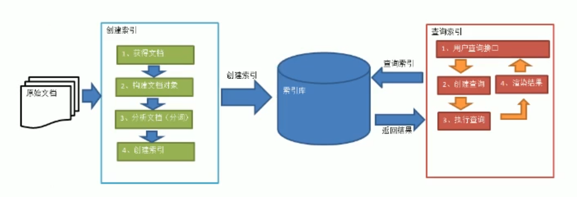
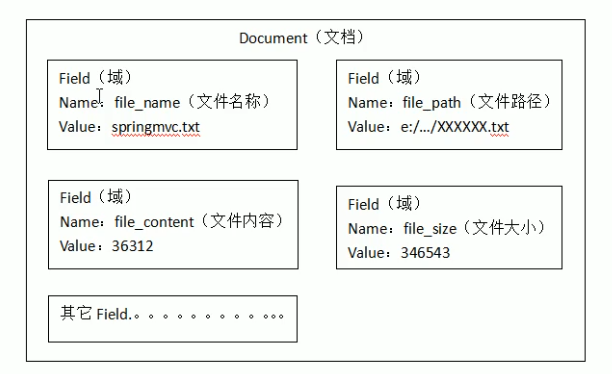
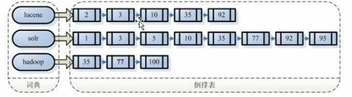

# 2. Lucene全文检索流程

- 笔记本：21.Lucene
- 创建时间：2020-10-29 14:25:06 UTC
- 更新时间：2020-10-29 14:47:51 UTC
- 印象笔记 GUID：24980f03-70b8-4cba-a35f-897f2558d26a

# Lucene

## 1. 什么是 Lucene

Lucene 是一个基于 Java 开发的全文检索工具包。

## 2. Lucene 实现全文检索的流程

### 2.1. 创建索引

#### 2.1.1. 获得文档

**原始文档：** 要基于哪些数据进行搜索，那么这些数据就是原始文档。
 **搜索引擎：** 使用爬虫获得原始文档。
 **站内搜索：** 数据库中的数据。
 **案例：** 直接使用 IO 流读取磁盘上的文件。

#### 2.1.2. 构建文档对象

对应每个原始文档创建一个 Document 对象
 每个 Document 中包含多个域（field）
 域中保存的就是原始文档的数据（域的名称和域的值）。
 每个文档都有一个唯一的编号。就是文档 id。
 

#### 2.1.3. 分析文档

**就是分词的过程**

1. 先根据字符串的拆分，获得一个单词列表

1. 把单词同一转换成小写/大写

1. 去除标点符号

1. 去除停用词
 **tips：** 停用词：无意义的词
 每个关键词都封装成一个 Term 对象。
 Term 中包含两部分内容：

- 关键词所在的域

- 关键词本身
 **注意：** 不同的域中拆分出来的相同的关键词是不同的 Term

#### 2.1.4. 创建索引

基于关键词列表创建一个索引。保存到索引库（磁盘）中。
 索引库中包含：

- 索引

- document 对象

- 关键词和文档的对应关系

**注意：** 创建索引是对词汇单元索引，通过词语找文档。这种索引的结构叫做**倒排索引结构**。
 传统方法是根据文件找到该文件的内容，在文件内容中匹配搜索关键字，这种方法是顺序扫描方法，数据量打、搜索慢。
 **倒排索引结构**是根据内容（词语）找文档，如下图：

 **倒排索引结构**也叫做**反向索引结构**，包括索引和文档两部分，索引即词汇表，它的规模较小，而文档集合较大。

### 2.2. 查询索引

#### 2.2.1. 用户查询接口

用户输入查询条件的地方。
 **eg：** 百度的搜索框

#### 2.2.2. 把关键词封装成一个查询对象

- 要查询的域

- 要搜索的关键词

#### 2.2.3. 执行查询

根据要查询的关键词找到对应的域上进行搜索。
 找到关键词，根据关键词找到对应的文档。

#### 2.2.4. 渲染结果

根据文档的id找到文档对象，对关键词进行高亮显示，分页处理，最终展示给用户看等等。

%23%20Lucene%0A%0A%23%23%201.%20%E4%BB%80%E4%B9%88%E6%98%AF%20Lucene%0ALucene%20%E6%98%AF%E4%B8%80%E4%B8%AA%E5%9F%BA%E4%BA%8E%20Java%20%E5%BC%80%E5%8F%91%E7%9A%84%E5%85%A8%E6%96%87%E6%A3%80%E7%B4%A2%E5%B7%A5%E5%85%B7%E5%8C%85%E3%80%82%0A%0A%23%23%202.%20Lucene%20%E5%AE%9E%E7%8E%B0%E5%85%A8%E6%96%87%E6%A3%80%E7%B4%A2%E7%9A%84%E6%B5%81%E7%A8%8B%0A!%5B522ea8cae3972920d4123a92a18f40d4.png%5D(en-resource%3A%2F%2Fdatabase%2F3741%3A1)%0A%0A%23%23%23%202.1.%20%E5%88%9B%E5%BB%BA%E7%B4%A2%E5%BC%95%0A%23%23%23%23%202.1.1.%20%E8%8E%B7%E5%BE%97%E6%96%87%E6%A1%A3%0A**%E5%8E%9F%E5%A7%8B%E6%96%87%E6%A1%A3%EF%BC%9A**%20%E8%A6%81%E5%9F%BA%E4%BA%8E%E5%93%AA%E4%BA%9B%E6%95%B0%E6%8D%AE%E8%BF%9B%E8%A1%8C%E6%90%9C%E7%B4%A2%EF%BC%8C%E9%82%A3%E4%B9%88%E8%BF%99%E4%BA%9B%E6%95%B0%E6%8D%AE%E5%B0%B1%E6%98%AF%E5%8E%9F%E5%A7%8B%E6%96%87%E6%A1%A3%E3%80%82%0A**%E6%90%9C%E7%B4%A2%E5%BC%95%E6%93%8E%EF%BC%9A**%20%E4%BD%BF%E7%94%A8%E7%88%AC%E8%99%AB%E8%8E%B7%E5%BE%97%E5%8E%9F%E5%A7%8B%E6%96%87%E6%A1%A3%E3%80%82%0A**%E7%AB%99%E5%86%85%E6%90%9C%E7%B4%A2%EF%BC%9A**%20%E6%95%B0%E6%8D%AE%E5%BA%93%E4%B8%AD%E7%9A%84%E6%95%B0%E6%8D%AE%E3%80%82%0A**%E6%A1%88%E4%BE%8B%EF%BC%9A**%20%E7%9B%B4%E6%8E%A5%E4%BD%BF%E7%94%A8%20IO%20%E6%B5%81%E8%AF%BB%E5%8F%96%E7%A3%81%E7%9B%98%E4%B8%8A%E7%9A%84%E6%96%87%E4%BB%B6%E3%80%82%0A%23%23%23%23%202.1.2.%20%E6%9E%84%E5%BB%BA%E6%96%87%E6%A1%A3%E5%AF%B9%E8%B1%A1%0A%E5%AF%B9%E5%BA%94%E6%AF%8F%E4%B8%AA%E5%8E%9F%E5%A7%8B%E6%96%87%E6%A1%A3%E5%88%9B%E5%BB%BA%E4%B8%80%E4%B8%AA%20Document%20%E5%AF%B9%E8%B1%A1%0A%E6%AF%8F%E4%B8%AA%20Document%20%E4%B8%AD%E5%8C%85%E5%90%AB%E5%A4%9A%E4%B8%AA%E5%9F%9F%EF%BC%88field%EF%BC%89%0A%E5%9F%9F%E4%B8%AD%E4%BF%9D%E5%AD%98%E7%9A%84%E5%B0%B1%E6%98%AF%E5%8E%9F%E5%A7%8B%E6%96%87%E6%A1%A3%E7%9A%84%E6%95%B0%E6%8D%AE%EF%BC%88%E5%9F%9F%E7%9A%84%E5%90%8D%E7%A7%B0%E5%92%8C%E5%9F%9F%E7%9A%84%E5%80%BC%EF%BC%89%E3%80%82%0A%E6%AF%8F%E4%B8%AA%E6%96%87%E6%A1%A3%E9%83%BD%E6%9C%89%E4%B8%80%E4%B8%AA%E5%94%AF%E4%B8%80%E7%9A%84%E7%BC%96%E5%8F%B7%E3%80%82%E5%B0%B1%E6%98%AF%E6%96%87%E6%A1%A3%20id%E3%80%82%0A!%5Bf5d699f71710d6dca239e4641531e67c.png%5D(en-resource%3A%2F%2Fdatabase%2F3743%3A1)%0A%0A%23%23%23%23%202.1.3.%20%E5%88%86%E6%9E%90%E6%96%87%E6%A1%A3%0A**%E5%B0%B1%E6%98%AF%E5%88%86%E8%AF%8D%E7%9A%84%E8%BF%87%E7%A8%8B**%20%0A1.%20%E5%85%88%E6%A0%B9%E6%8D%AE%E5%AD%97%E7%AC%A6%E4%B8%B2%E7%9A%84%E6%8B%86%E5%88%86%EF%BC%8C%E8%8E%B7%E5%BE%97%E4%B8%80%E4%B8%AA%E5%8D%95%E8%AF%8D%E5%88%97%E8%A1%A8%0A2.%20%E6%8A%8A%E5%8D%95%E8%AF%8D%E5%90%8C%E4%B8%80%E8%BD%AC%E6%8D%A2%E6%88%90%E5%B0%8F%E5%86%99%2F%E5%A4%A7%E5%86%99%0A3.%20%E5%8E%BB%E9%99%A4%E6%A0%87%E7%82%B9%E7%AC%A6%E5%8F%B7%0A4.%20%E5%8E%BB%E9%99%A4%E5%81%9C%E7%94%A8%E8%AF%8D%0A**tips%EF%BC%9A**%20%E5%81%9C%E7%94%A8%E8%AF%8D%EF%BC%9A%E6%97%A0%E6%84%8F%E4%B9%89%E7%9A%84%E8%AF%8D%0A%E6%AF%8F%E4%B8%AA%E5%85%B3%E9%94%AE%E8%AF%8D%E9%83%BD%E5%B0%81%E8%A3%85%E6%88%90%E4%B8%80%E4%B8%AA%20Term%20%E5%AF%B9%E8%B1%A1%E3%80%82%0ATerm%20%E4%B8%AD%E5%8C%85%E5%90%AB%E4%B8%A4%E9%83%A8%E5%88%86%E5%86%85%E5%AE%B9%EF%BC%9A%0A-%20%E5%85%B3%E9%94%AE%E8%AF%8D%E6%89%80%E5%9C%A8%E7%9A%84%E5%9F%9F%0A-%20%E5%85%B3%E9%94%AE%E8%AF%8D%E6%9C%AC%E8%BA%AB%0A**%E6%B3%A8%E6%84%8F%EF%BC%9A**%20%E4%B8%8D%E5%90%8C%E7%9A%84%E5%9F%9F%E4%B8%AD%E6%8B%86%E5%88%86%E5%87%BA%E6%9D%A5%E7%9A%84%E7%9B%B8%E5%90%8C%E7%9A%84%E5%85%B3%E9%94%AE%E8%AF%8D%E6%98%AF%E4%B8%8D%E5%90%8C%E7%9A%84%20Term%0A%0A%23%23%23%23%202.1.4.%20%E5%88%9B%E5%BB%BA%E7%B4%A2%E5%BC%95%0A%E5%9F%BA%E4%BA%8E%E5%85%B3%E9%94%AE%E8%AF%8D%E5%88%97%E8%A1%A8%E5%88%9B%E5%BB%BA%E4%B8%80%E4%B8%AA%E7%B4%A2%E5%BC%95%E3%80%82%E4%BF%9D%E5%AD%98%E5%88%B0%E7%B4%A2%E5%BC%95%E5%BA%93%EF%BC%88%E7%A3%81%E7%9B%98%EF%BC%89%E4%B8%AD%E3%80%82%0A%E7%B4%A2%E5%BC%95%E5%BA%93%E4%B8%AD%E5%8C%85%E5%90%AB%EF%BC%9A%0A-%20%E7%B4%A2%E5%BC%95%0A-%20document%20%E5%AF%B9%E8%B1%A1%0A-%20%E5%85%B3%E9%94%AE%E8%AF%8D%E5%92%8C%E6%96%87%E6%A1%A3%E7%9A%84%E5%AF%B9%E5%BA%94%E5%85%B3%E7%B3%BB%0A%0A**%E6%B3%A8%E6%84%8F%EF%BC%9A**%20%E5%88%9B%E5%BB%BA%E7%B4%A2%E5%BC%95%E6%98%AF%E5%AF%B9%E8%AF%8D%E6%B1%87%E5%8D%95%E5%85%83%E7%B4%A2%E5%BC%95%EF%BC%8C%E9%80%9A%E8%BF%87%E8%AF%8D%E8%AF%AD%E6%89%BE%E6%96%87%E6%A1%A3%E3%80%82%E8%BF%99%E7%A7%8D%E7%B4%A2%E5%BC%95%E7%9A%84%E7%BB%93%E6%9E%84%E5%8F%AB%E5%81%9A**%E5%80%92%E6%8E%92%E7%B4%A2%E5%BC%95%E7%BB%93%E6%9E%84**%E3%80%82%0A%E4%BC%A0%E7%BB%9F%E6%96%B9%E6%B3%95%E6%98%AF%E6%A0%B9%E6%8D%AE%E6%96%87%E4%BB%B6%E6%89%BE%E5%88%B0%E8%AF%A5%E6%96%87%E4%BB%B6%E7%9A%84%E5%86%85%E5%AE%B9%EF%BC%8C%E5%9C%A8%E6%96%87%E4%BB%B6%E5%86%85%E5%AE%B9%E4%B8%AD%E5%8C%B9%E9%85%8D%E6%90%9C%E7%B4%A2%E5%85%B3%E9%94%AE%E5%AD%97%EF%BC%8C%E8%BF%99%E7%A7%8D%E6%96%B9%E6%B3%95%E6%98%AF%E9%A1%BA%E5%BA%8F%E6%89%AB%E6%8F%8F%E6%96%B9%E6%B3%95%EF%BC%8C%E6%95%B0%E6%8D%AE%E9%87%8F%E6%89%93%E3%80%81%E6%90%9C%E7%B4%A2%E6%85%A2%E3%80%82%0A**%E5%80%92%E6%8E%92%E7%B4%A2%E5%BC%95%E7%BB%93%E6%9E%84**%E6%98%AF%E6%A0%B9%E6%8D%AE%E5%86%85%E5%AE%B9%EF%BC%88%E8%AF%8D%E8%AF%AD%EF%BC%89%E6%89%BE%E6%96%87%E6%A1%A3%EF%BC%8C%E5%A6%82%E4%B8%8B%E5%9B%BE%EF%BC%9A%0A%0A!%5B05101cf7c012cb4f9237b41e16860b1a.png%5D(en-resource%3A%2F%2Fdatabase%2F3745%3A1)%0A**%E5%80%92%E6%8E%92%E7%B4%A2%E5%BC%95%E7%BB%93%E6%9E%84**%E4%B9%9F%E5%8F%AB%E5%81%9A**%E5%8F%8D%E5%90%91%E7%B4%A2%E5%BC%95%E7%BB%93%E6%9E%84**%EF%BC%8C%E5%8C%85%E6%8B%AC%E7%B4%A2%E5%BC%95%E5%92%8C%E6%96%87%E6%A1%A3%E4%B8%A4%E9%83%A8%E5%88%86%EF%BC%8C%E7%B4%A2%E5%BC%95%E5%8D%B3%E8%AF%8D%E6%B1%87%E8%A1%A8%EF%BC%8C%E5%AE%83%E7%9A%84%E8%A7%84%E6%A8%A1%E8%BE%83%E5%B0%8F%EF%BC%8C%E8%80%8C%E6%96%87%E6%A1%A3%E9%9B%86%E5%90%88%E8%BE%83%E5%A4%A7%E3%80%82%0A%0A%23%23%23%202.2.%20%E6%9F%A5%E8%AF%A2%E7%B4%A2%E5%BC%95%0A%23%23%23%23%202.2.1.%20%E7%94%A8%E6%88%B7%E6%9F%A5%E8%AF%A2%E6%8E%A5%E5%8F%A3%0A%E7%94%A8%E6%88%B7%E8%BE%93%E5%85%A5%E6%9F%A5%E8%AF%A2%E6%9D%A1%E4%BB%B6%E7%9A%84%E5%9C%B0%E6%96%B9%E3%80%82%0A**eg%EF%BC%9A**%20%E7%99%BE%E5%BA%A6%E7%9A%84%E6%90%9C%E7%B4%A2%E6%A1%86%0A%23%23%23%23%202.2.2.%20%E6%8A%8A%E5%85%B3%E9%94%AE%E8%AF%8D%E5%B0%81%E8%A3%85%E6%88%90%E4%B8%80%E4%B8%AA%E6%9F%A5%E8%AF%A2%E5%AF%B9%E8%B1%A1%0A-%20%E8%A6%81%E6%9F%A5%E8%AF%A2%E7%9A%84%E5%9F%9F%0A-%20%E8%A6%81%E6%90%9C%E7%B4%A2%E7%9A%84%E5%85%B3%E9%94%AE%E8%AF%8D%0A%23%23%23%23%202.2.3.%20%E6%89%A7%E8%A1%8C%E6%9F%A5%E8%AF%A2%0A%E6%A0%B9%E6%8D%AE%E8%A6%81%E6%9F%A5%E8%AF%A2%E7%9A%84%E5%85%B3%E9%94%AE%E8%AF%8D%E6%89%BE%E5%88%B0%E5%AF%B9%E5%BA%94%E7%9A%84%E5%9F%9F%E4%B8%8A%E8%BF%9B%E8%A1%8C%E6%90%9C%E7%B4%A2%E3%80%82%0A%E6%89%BE%E5%88%B0%E5%85%B3%E9%94%AE%E8%AF%8D%EF%BC%8C%E6%A0%B9%E6%8D%AE%E5%85%B3%E9%94%AE%E8%AF%8D%E6%89%BE%E5%88%B0%E5%AF%B9%E5%BA%94%E7%9A%84%E6%96%87%E6%A1%A3%E3%80%82%0A%23%23%23%23%202.2.4.%20%E6%B8%B2%E6%9F%93%E7%BB%93%E6%9E%9C%0A%E6%A0%B9%E6%8D%AE%E6%96%87%E6%A1%A3%E7%9A%84id%E6%89%BE%E5%88%B0%E6%96%87%E6%A1%A3%E5%AF%B9%E8%B1%A1%EF%BC%8C%E5%AF%B9%E5%85%B3%E9%94%AE%E8%AF%8D%E8%BF%9B%E8%A1%8C%E9%AB%98%E4%BA%AE%E6%98%BE%E7%A4%BA%EF%BC%8C%E5%88%86%E9%A1%B5%E5%A4%84%E7%90%86%EF%BC%8C%E6%9C%80%E7%BB%88%E5%B1%95%E7%A4%BA%E7%BB%99%E7%94%A8%E6%88%B7%E7%9C%8B%E7%AD%89%E7%AD%89%E3%80%82%0A
