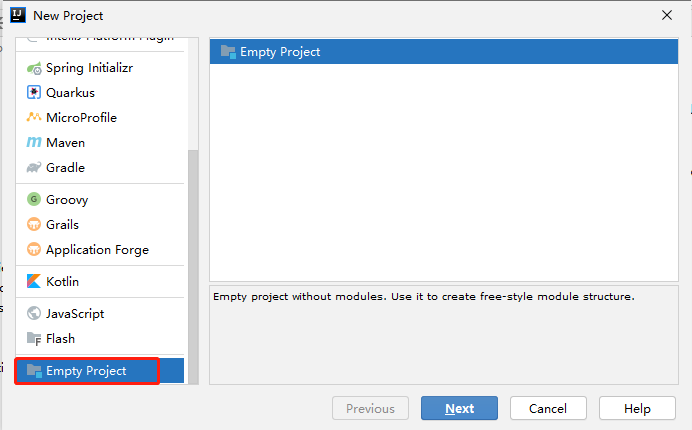
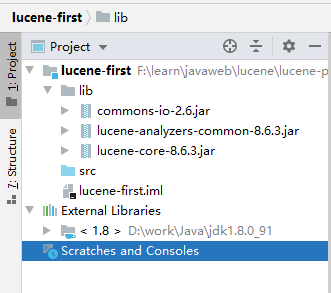
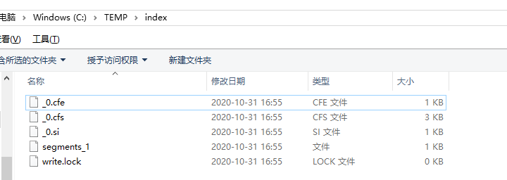
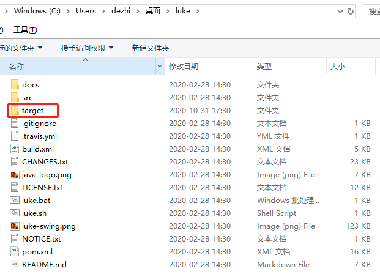
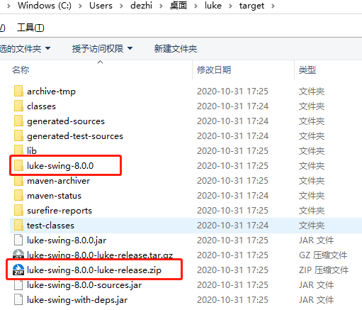
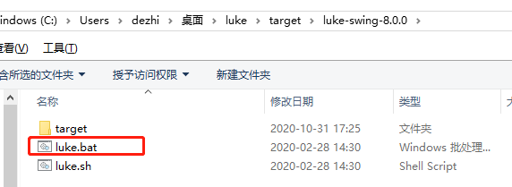
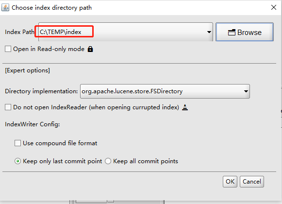
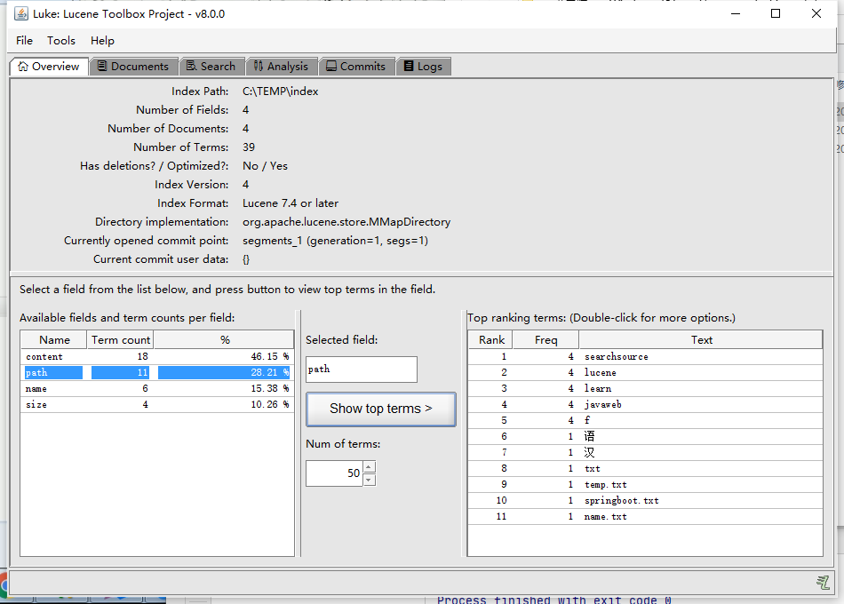

# 3.lucene入门程序

- 笔记本：21.Lucene
- 创建时间：2020-10-31 08:14:26 UTC
- 更新时间：2020-10-31 10:55:03 UTC
- 印象笔记 GUID：6b431b02-5011-4daa-a0ec-688459532df7

# 入门程序

## 1. 创建索引

### 1.1. 环境

需要下载 Lucene [下载连接](http://lucene.apache.org) 最低要求 jdk 1.8+

### 1.2. 工程搭建

-
创建一个java 工程
 

-
添加 jar 包：
 `lucene-analyzers-common-*.jar`
 `lucene-core-*.jar`
 `commons-io.jar`
 

### 1.3. 步骤

1. 创建一个 Director 对象，指定索引库保存的位置

1. 基于 Director对象创建一个 IndexWriter 对象

1. 读取磁盘上文件，对应每个文件创建一个文档对象

1. 向文档对象中添加域

1. 把文档对象写入索引库

1. 关闭 indexwriter 对象

**代码：**

```
package com.liudezhi.lucene;

import org.apache.commons.io.FileUtils;
import org.apache.lucene.document.Document;
import org.apache.lucene.document.Field;
import org.apache.lucene.document.TextField;
import org.apache.lucene.index.IndexWriter;
import org.apache.lucene.index.IndexWriterConfig;
import org.apache.lucene.store.Directory;
import org.apache.lucene.store.FSDirectory;
import org.apache.lucene.store.RAMDirectory;
import org.junit.Test;

import java.io.File;
import java.io.IOException;

public class LuceneFirst {

    @Test
    public void createIndex() throws IOException {
        // 1. 创建一个 Director 对象，指定索引库保存的位置
        // 把索引库保存在内存中
//        Directory directory = new RAMDirectory();
        // 把索引库保存在磁盘
        Directory directory = FSDirectory.open(new File("C:\\TEMP\\index").toPath());
        // 2. 基于 Director对象创建一个 IndexWriter 对象
        IndexWriter indexWriter = new IndexWriter(directory, new IndexWriterConfig());
        // 3. 读取磁盘上文件，对应每个文件创建一个文档对象
        File dir = new File("F:\\learn\\javaweb\\lucene\\searchsource");
        File[] files = dir.listFiles();
        for (File f : files) {
            // 取文件名
            String fileName = f.getName();
            // 文件路径
            String filePath = f.getPath();
            // 文件内容
            String fileContext = FileUtils.readFileToString(f, "utf-8");
            // 文件大小
            long fileSize = FileUtils.sizeOf(f);
            // 创建 Field
            // 参数1：域的名词，参数2：域的内容，参数3：是否存储
            Field fieldName = new TextField("name", fileName, Field.Store.YES);
            Field fieldPath = new TextField("path", filePath, Field.Store.YES);
            Field fieldContent = new TextField("content", fileContext, Field.Store.YES);
            Field fieldSize = new TextField("size", fileSize+"", Field.Store.YES);
            // 创建文档对象
            Document document = new Document();
            // 4. 向文档对象中添加域
            document.add(fieldName);
            document.add(fieldPath);
            document.add(fieldContent);
            document.add(fieldSize);
            // 5. 把文档对象写入索引库
            indexWriter.addDocument(document);
        }
        // 6. 关闭 indexwriter 对象
        indexWriter.close();
    }
}

```

**运行结果：**
 

## 2. 使用 luke 查看索引库中的内容

### 2.1. 安装

下载链接：https://gitee.com/mirrors/luke
 下载后解压，在项目根目录下运行 `mvn install`
 安装完成后会出现 target 目录
 
 
 解压
 
 双击 luke.bat 即可运行
 



**注意：** luke的版本要和lucene对应
 **注意：** luke（javafx） 基于 jdk1.9，使用 jdk1.8 无法打开。

## 3. 查询索引库

**步骤：**

1. 创建一个 Director 对象，指定索引库的位置

1. 创建一个 IndexReader 对象

1. 创建一个 IndexSearcher 对象，构造方法中的参数 indexReader 对象

1. 创建一个 Query 对象，TermQuery

1. 执行查询，得到一个 TopDocs 对象

1. 取查询结果的总记录数

1. 取文档列表

1. 打印文档中的内容

1. 关闭 IndexReader 对象

**示例：**

```
@Test
public void searchIndex() throws IOException {
    // 1. 创建一个 Director 对象，指定索引库的位置
    Directory directory = FSDirectory.open(new File("C:\\TEMP\\index").toPath());
    // 2. 创建一个 IndexReader 对象
    IndexReader indexReader = DirectoryReader.open(directory);
    // 3. 创建一个 IndexSearcher 对象，构造方法中的参数 indexReader 对象
    IndexSearcher indexSearcher = new IndexSearcher(indexReader);
    // 4. 创建一个 Query 对象，TermQuery
    Query query = new TermQuery(new Term("content", "spring"));
    // 5. 执行查询，得到一个 TopDocs 对象
    // 参数1：查询对象，参数2：查询结果返回的最大记录数
    TopDocs topDocs = indexSearcher.search(query, 10);
    // 6. 取查询结果的总记录数
    System.out.println("查询总记录数：" + topDocs.totalHits);
    // 7. 取文档列表
    ScoreDoc[] scoreDocs = topDocs.scoreDocs;
    // 8. 打印文档中的内容
    for (ScoreDoc doc : scoreDocs) {
        // 取文档 id
        int docId = doc.doc;
        // 根据 id 取文档对象
        Document document = indexSearcher.doc(docId);
        System.out.println(document.get("name"));
        System.out.println(document.get("path"));
        System.out.println(document.get("size"));
        System.out.println(document.get("content"));
        System.out.println("-------------------------------");
    }
    // 9. 关闭 IndexReader 对象
    indexReader.close();
}

```

%23%20%E5%85%A5%E9%97%A8%E7%A8%8B%E5%BA%8F%0A%23%23%201.%20%E5%88%9B%E5%BB%BA%E7%B4%A2%E5%BC%95%0A%23%23%23%201.1.%20%E7%8E%AF%E5%A2%83%0A%E9%9C%80%E8%A6%81%E4%B8%8B%E8%BD%BD%20Lucene%20%5B%E4%B8%8B%E8%BD%BD%E8%BF%9E%E6%8E%A5%5D(http%3A%2F%2Flucene.apache.org)%20%E6%9C%80%E4%BD%8E%E8%A6%81%E6%B1%82%20jdk%201.8%2B%0A%0A%23%23%23%201.2.%20%E5%B7%A5%E7%A8%8B%E6%90%AD%E5%BB%BA%0A-%20%E5%88%9B%E5%BB%BA%E4%B8%80%E4%B8%AAjava%20%E5%B7%A5%E7%A8%8B%0A!%5B2b338e43a635535d4bd2c5dbdd2e8344.png%5D(en-resource%3A%2F%2Fdatabase%2F3749%3A1)%0A%0A%0A-%20%E6%B7%BB%E5%8A%A0%20jar%20%E5%8C%85%EF%BC%9A%0A%60lucene-analyzers-common-*.jar%60%0A%60lucene-core-*.jar%60%0A%60commons-io.jar%60%0A!%5Ba9094416f0aae6c57a7cf13ef1a2ff95.png%5D(en-resource%3A%2F%2Fdatabase%2F3751%3A1)%0A%0A%0A%23%23%23%201.3.%20%E6%AD%A5%E9%AA%A4%0A1.%20%E5%88%9B%E5%BB%BA%E4%B8%80%E4%B8%AA%20Director%20%E5%AF%B9%E8%B1%A1%EF%BC%8C%E6%8C%87%E5%AE%9A%E7%B4%A2%E5%BC%95%E5%BA%93%E4%BF%9D%E5%AD%98%E7%9A%84%E4%BD%8D%E7%BD%AE%0A2.%20%E5%9F%BA%E4%BA%8E%20Director%E5%AF%B9%E8%B1%A1%E5%88%9B%E5%BB%BA%E4%B8%80%E4%B8%AA%20IndexWriter%20%E5%AF%B9%E8%B1%A1%0A3.%20%E8%AF%BB%E5%8F%96%E7%A3%81%E7%9B%98%E4%B8%8A%E6%96%87%E4%BB%B6%EF%BC%8C%E5%AF%B9%E5%BA%94%E6%AF%8F%E4%B8%AA%E6%96%87%E4%BB%B6%E5%88%9B%E5%BB%BA%E4%B8%80%E4%B8%AA%E6%96%87%E6%A1%A3%E5%AF%B9%E8%B1%A1%0A4.%20%E5%90%91%E6%96%87%E6%A1%A3%E5%AF%B9%E8%B1%A1%E4%B8%AD%E6%B7%BB%E5%8A%A0%E5%9F%9F%0A5.%20%E6%8A%8A%E6%96%87%E6%A1%A3%E5%AF%B9%E8%B1%A1%E5%86%99%E5%85%A5%E7%B4%A2%E5%BC%95%E5%BA%93%0A6.%20%E5%85%B3%E9%97%AD%20indexwriter%20%E5%AF%B9%E8%B1%A1%0A%0A**%E4%BB%A3%E7%A0%81%EF%BC%9A**%0A%60%60%60java%0Apackage%20com.liudezhi.lucene%3B%0A%0Aimport%20org.apache.commons.io.FileUtils%3B%0Aimport%20org.apache.lucene.document.Document%3B%0Aimport%20org.apache.lucene.document.Field%3B%0Aimport%20org.apache.lucene.document.TextField%3B%0Aimport%20org.apache.lucene.index.IndexWriter%3B%0Aimport%20org.apache.lucene.index.IndexWriterConfig%3B%0Aimport%20org.apache.lucene.store.Directory%3B%0Aimport%20org.apache.lucene.store.FSDirectory%3B%0Aimport%20org.apache.lucene.store.RAMDirectory%3B%0Aimport%20org.junit.Test%3B%0A%0Aimport%20java.io.File%3B%0Aimport%20java.io.IOException%3B%0A%0Apublic%20class%20LuceneFirst%20%7B%0A%0A%20%20%20%20%40Test%0A%20%20%20%20public%20void%20createIndex()%20throws%20IOException%20%7B%0A%20%20%20%20%20%20%20%20%2F%2F%201.%20%E5%88%9B%E5%BB%BA%E4%B8%80%E4%B8%AA%20Director%20%E5%AF%B9%E8%B1%A1%EF%BC%8C%E6%8C%87%E5%AE%9A%E7%B4%A2%E5%BC%95%E5%BA%93%E4%BF%9D%E5%AD%98%E7%9A%84%E4%BD%8D%E7%BD%AE%0A%20%20%20%20%20%20%20%20%2F%2F%20%E6%8A%8A%E7%B4%A2%E5%BC%95%E5%BA%93%E4%BF%9D%E5%AD%98%E5%9C%A8%E5%86%85%E5%AD%98%E4%B8%AD%0A%2F%2F%20%20%20%20%20%20%20%20Directory%20directory%20%3D%20new%20RAMDirectory()%3B%0A%20%20%20%20%20%20%20%20%2F%2F%20%E6%8A%8A%E7%B4%A2%E5%BC%95%E5%BA%93%E4%BF%9D%E5%AD%98%E5%9C%A8%E7%A3%81%E7%9B%98%0A%20%20%20%20%20%20%20%20Directory%20directory%20%3D%20FSDirectory.open(new%20File(%22C%3A%5C%5CTEMP%5C%5Cindex%22).toPath())%3B%0A%20%20%20%20%20%20%20%20%2F%2F%202.%20%E5%9F%BA%E4%BA%8E%20Director%E5%AF%B9%E8%B1%A1%E5%88%9B%E5%BB%BA%E4%B8%80%E4%B8%AA%20IndexWriter%20%E5%AF%B9%E8%B1%A1%0A%20%20%20%20%20%20%20%20IndexWriter%20indexWriter%20%3D%20new%20IndexWriter(directory%2C%20new%20IndexWriterConfig())%3B%0A%20%20%20%20%20%20%20%20%2F%2F%203.%20%E8%AF%BB%E5%8F%96%E7%A3%81%E7%9B%98%E4%B8%8A%E6%96%87%E4%BB%B6%EF%BC%8C%E5%AF%B9%E5%BA%94%E6%AF%8F%E4%B8%AA%E6%96%87%E4%BB%B6%E5%88%9B%E5%BB%BA%E4%B8%80%E4%B8%AA%E6%96%87%E6%A1%A3%E5%AF%B9%E8%B1%A1%0A%20%20%20%20%20%20%20%20File%20dir%20%3D%20new%20File(%22F%3A%5C%5Clearn%5C%5Cjavaweb%5C%5Clucene%5C%5Csearchsource%22)%3B%0A%20%20%20%20%20%20%20%20File%5B%5D%20files%20%3D%20dir.listFiles()%3B%0A%20%20%20%20%20%20%20%20for%20(File%20f%20%3A%20files)%20%7B%0A%20%20%20%20%20%20%20%20%20%20%20%20%2F%2F%20%E5%8F%96%E6%96%87%E4%BB%B6%E5%90%8D%0A%20%20%20%20%20%20%20%20%20%20%20%20String%20fileName%20%3D%20f.getName()%3B%0A%20%20%20%20%20%20%20%20%20%20%20%20%2F%2F%20%E6%96%87%E4%BB%B6%E8%B7%AF%E5%BE%84%0A%20%20%20%20%20%20%20%20%20%20%20%20String%20filePath%20%3D%20f.getPath()%3B%0A%20%20%20%20%20%20%20%20%20%20%20%20%2F%2F%20%E6%96%87%E4%BB%B6%E5%86%85%E5%AE%B9%0A%20%20%20%20%20%20%20%20%20%20%20%20String%20fileContext%20%3D%20FileUtils.readFileToString(f%2C%20%22utf-8%22)%3B%0A%20%20%20%20%20%20%20%20%20%20%20%20%2F%2F%20%E6%96%87%E4%BB%B6%E5%A4%A7%E5%B0%8F%0A%20%20%20%20%20%20%20%20%20%20%20%20long%20fileSize%20%3D%20FileUtils.sizeOf(f)%3B%0A%20%20%20%20%20%20%20%20%20%20%20%20%2F%2F%20%E5%88%9B%E5%BB%BA%20Field%0A%20%20%20%20%20%20%20%20%20%20%20%20%2F%2F%20%E5%8F%82%E6%95%B01%EF%BC%9A%E5%9F%9F%E7%9A%84%E5%90%8D%E8%AF%8D%EF%BC%8C%E5%8F%82%E6%95%B02%EF%BC%9A%E5%9F%9F%E7%9A%84%E5%86%85%E5%AE%B9%EF%BC%8C%E5%8F%82%E6%95%B03%EF%BC%9A%E6%98%AF%E5%90%A6%E5%AD%98%E5%82%A8%0A%20%20%20%20%20%20%20%20%20%20%20%20Field%20fieldName%20%3D%20new%20TextField(%22name%22%2C%20fileName%2C%20Field.Store.YES)%3B%0A%20%20%20%20%20%20%20%20%20%20%20%20Field%20fieldPath%20%3D%20new%20TextField(%22path%22%2C%20filePath%2C%20Field.Store.YES)%3B%0A%20%20%20%20%20%20%20%20%20%20%20%20Field%20fieldContent%20%3D%20new%20TextField(%22content%22%2C%20fileContext%2C%20Field.Store.YES)%3B%0A%20%20%20%20%20%20%20%20%20%20%20%20Field%20fieldSize%20%3D%20new%20TextField(%22size%22%2C%20fileSize%2B%22%22%2C%20Field.Store.YES)%3B%0A%20%20%20%20%20%20%20%20%20%20%20%20%2F%2F%20%E5%88%9B%E5%BB%BA%E6%96%87%E6%A1%A3%E5%AF%B9%E8%B1%A1%0A%20%20%20%20%20%20%20%20%20%20%20%20Document%20document%20%3D%20new%20Document()%3B%0A%20%20%20%20%20%20%20%20%20%20%20%20%2F%2F%204.%20%E5%90%91%E6%96%87%E6%A1%A3%E5%AF%B9%E8%B1%A1%E4%B8%AD%E6%B7%BB%E5%8A%A0%E5%9F%9F%0A%20%20%20%20%20%20%20%20%20%20%20%20document.add(fieldName)%3B%0A%20%20%20%20%20%20%20%20%20%20%20%20document.add(fieldPath)%3B%0A%20%20%20%20%20%20%20%20%20%20%20%20document.add(fieldContent)%3B%0A%20%20%20%20%20%20%20%20%20%20%20%20document.add(fieldSize)%3B%0A%20%20%20%20%20%20%20%20%20%20%20%20%2F%2F%205.%20%E6%8A%8A%E6%96%87%E6%A1%A3%E5%AF%B9%E8%B1%A1%E5%86%99%E5%85%A5%E7%B4%A2%E5%BC%95%E5%BA%93%0A%20%20%20%20%20%20%20%20%20%20%20%20indexWriter.addDocument(document)%3B%0A%20%20%20%20%20%20%20%20%7D%0A%20%20%20%20%20%20%20%20%2F%2F%206.%20%E5%85%B3%E9%97%AD%20indexwriter%20%E5%AF%B9%E8%B1%A1%0A%20%20%20%20%20%20%20%20indexWriter.close()%3B%0A%20%20%20%20%7D%0A%7D%0A%60%60%60%0A%0A**%E8%BF%90%E8%A1%8C%E7%BB%93%E6%9E%9C%EF%BC%9A**%0A!%5B82b6275be7b676f2a814e0d0a6b1de99.png%5D(en-resource%3A%2F%2Fdatabase%2F3753%3A1)%0A%0A%23%23%202.%20%E4%BD%BF%E7%94%A8%20luke%20%E6%9F%A5%E7%9C%8B%E7%B4%A2%E5%BC%95%E5%BA%93%E4%B8%AD%E7%9A%84%E5%86%85%E5%AE%B9%0A%23%23%23%202.1.%20%E5%AE%89%E8%A3%85%0A%E4%B8%8B%E8%BD%BD%E9%93%BE%E6%8E%A5%EF%BC%9Ahttps%3A%2F%2Fgitee.com%2Fmirrors%2Fluke%0A%E4%B8%8B%E8%BD%BD%E5%90%8E%E8%A7%A3%E5%8E%8B%EF%BC%8C%E5%9C%A8%E9%A1%B9%E7%9B%AE%E6%A0%B9%E7%9B%AE%E5%BD%95%E4%B8%8B%E8%BF%90%E8%A1%8C%20%60mvn%20install%60%0A%E5%AE%89%E8%A3%85%E5%AE%8C%E6%88%90%E5%90%8E%E4%BC%9A%E5%87%BA%E7%8E%B0%20target%20%E7%9B%AE%E5%BD%95%0A!%5Bb5a6715549a5071cac6aa14e03b64c3b.png%5D(en-resource%3A%2F%2Fdatabase%2F3755%3A1)%0A!%5B5b5e225726ed07a9e408d406a83db5a3.png%5D(en-resource%3A%2F%2Fdatabase%2F3757%3A1)%0A%E8%A7%A3%E5%8E%8B%0A!%5B7bbade70738f386042cae7383d35904d.png%5D(en-resource%3A%2F%2Fdatabase%2F3759%3A1)%0A%E5%8F%8C%E5%87%BB%20luke.bat%20%E5%8D%B3%E5%8F%AF%E8%BF%90%E8%A1%8C%0A!%5B31cf568822c0ab85716bd554c2bae719.png%5D(en-resource%3A%2F%2Fdatabase%2F3761%3A1)%0A%0A!%5B866fa96f6719b5fe1fb477fdccf4dc37.png%5D(en-resource%3A%2F%2Fdatabase%2F3763%3A0)%0A%0A**%E6%B3%A8%E6%84%8F%EF%BC%9A**%20luke%E7%9A%84%E7%89%88%E6%9C%AC%E8%A6%81%E5%92%8Clucene%E5%AF%B9%E5%BA%94%0A**%E6%B3%A8%E6%84%8F%EF%BC%9A**%20luke%EF%BC%88javafx%EF%BC%89%20%E5%9F%BA%E4%BA%8E%20jdk1.9%EF%BC%8C%E4%BD%BF%E7%94%A8%20jdk1.8%20%E6%97%A0%E6%B3%95%E6%89%93%E5%BC%80%E3%80%82%0A%0A%23%23%203.%20%E6%9F%A5%E8%AF%A2%E7%B4%A2%E5%BC%95%E5%BA%93%0A**%E6%AD%A5%E9%AA%A4%EF%BC%9A**%0A1.%20%E5%88%9B%E5%BB%BA%E4%B8%80%E4%B8%AA%20Director%20%E5%AF%B9%E8%B1%A1%EF%BC%8C%E6%8C%87%E5%AE%9A%E7%B4%A2%E5%BC%95%E5%BA%93%E7%9A%84%E4%BD%8D%E7%BD%AE%0A2.%20%E5%88%9B%E5%BB%BA%E4%B8%80%E4%B8%AA%20IndexReader%20%E5%AF%B9%E8%B1%A1%0A3.%20%E5%88%9B%E5%BB%BA%E4%B8%80%E4%B8%AA%20IndexSearcher%20%E5%AF%B9%E8%B1%A1%EF%BC%8C%E6%9E%84%E9%80%A0%E6%96%B9%E6%B3%95%E4%B8%AD%E7%9A%84%E5%8F%82%E6%95%B0%20indexReader%20%E5%AF%B9%E8%B1%A1%0A4.%20%E5%88%9B%E5%BB%BA%E4%B8%80%E4%B8%AA%20Query%20%E5%AF%B9%E8%B1%A1%EF%BC%8CTermQuery%0A5.%20%E6%89%A7%E8%A1%8C%E6%9F%A5%E8%AF%A2%EF%BC%8C%E5%BE%97%E5%88%B0%E4%B8%80%E4%B8%AA%20TopDocs%20%E5%AF%B9%E8%B1%A1%0A6.%20%E5%8F%96%E6%9F%A5%E8%AF%A2%E7%BB%93%E6%9E%9C%E7%9A%84%E6%80%BB%E8%AE%B0%E5%BD%95%E6%95%B0%0A7.%20%E5%8F%96%E6%96%87%E6%A1%A3%E5%88%97%E8%A1%A8%0A8.%20%E6%89%93%E5%8D%B0%E6%96%87%E6%A1%A3%E4%B8%AD%E7%9A%84%E5%86%85%E5%AE%B9%0A9.%20%E5%85%B3%E9%97%AD%20IndexReader%20%E5%AF%B9%E8%B1%A1%0A%0A**%E7%A4%BA%E4%BE%8B%EF%BC%9A**%0A%60%60%60java%0A%40Test%0Apublic%20void%20searchIndex()%20throws%20IOException%20%7B%0A%20%20%20%20%2F%2F%201.%20%E5%88%9B%E5%BB%BA%E4%B8%80%E4%B8%AA%20Director%20%E5%AF%B9%E8%B1%A1%EF%BC%8C%E6%8C%87%E5%AE%9A%E7%B4%A2%E5%BC%95%E5%BA%93%E7%9A%84%E4%BD%8D%E7%BD%AE%0A%20%20%20%20Directory%20directory%20%3D%20FSDirectory.open(new%20File(%22C%3A%5C%5CTEMP%5C%5Cindex%22).toPath())%3B%0A%20%20%20%20%2F%2F%202.%20%E5%88%9B%E5%BB%BA%E4%B8%80%E4%B8%AA%20IndexReader%20%E5%AF%B9%E8%B1%A1%0A%20%20%20%20IndexReader%20indexReader%20%3D%20DirectoryReader.open(directory)%3B%0A%20%20%20%20%2F%2F%203.%20%E5%88%9B%E5%BB%BA%E4%B8%80%E4%B8%AA%20IndexSearcher%20%E5%AF%B9%E8%B1%A1%EF%BC%8C%E6%9E%84%E9%80%A0%E6%96%B9%E6%B3%95%E4%B8%AD%E7%9A%84%E5%8F%82%E6%95%B0%20indexReader%20%E5%AF%B9%E8%B1%A1%0A%20%20%20%20IndexSearcher%20indexSearcher%20%3D%20new%20IndexSearcher(indexReader)%3B%0A%20%20%20%20%2F%2F%204.%20%E5%88%9B%E5%BB%BA%E4%B8%80%E4%B8%AA%20Query%20%E5%AF%B9%E8%B1%A1%EF%BC%8CTermQuery%0A%20%20%20%20Query%20query%20%3D%20new%20TermQuery(new%20Term(%22content%22%2C%20%22spring%22))%3B%0A%20%20%20%20%2F%2F%205.%20%E6%89%A7%E8%A1%8C%E6%9F%A5%E8%AF%A2%EF%BC%8C%E5%BE%97%E5%88%B0%E4%B8%80%E4%B8%AA%20TopDocs%20%E5%AF%B9%E8%B1%A1%0A%20%20%20%20%2F%2F%20%E5%8F%82%E6%95%B01%EF%BC%9A%E6%9F%A5%E8%AF%A2%E5%AF%B9%E8%B1%A1%EF%BC%8C%E5%8F%82%E6%95%B02%EF%BC%9A%E6%9F%A5%E8%AF%A2%E7%BB%93%E6%9E%9C%E8%BF%94%E5%9B%9E%E7%9A%84%E6%9C%80%E5%A4%A7%E8%AE%B0%E5%BD%95%E6%95%B0%0A%20%20%20%20TopDocs%20topDocs%20%3D%20indexSearcher.search(query%2C%2010)%3B%0A%20%20%20%20%2F%2F%206.%20%E5%8F%96%E6%9F%A5%E8%AF%A2%E7%BB%93%E6%9E%9C%E7%9A%84%E6%80%BB%E8%AE%B0%E5%BD%95%E6%95%B0%0A%20%20%20%20System.out.println(%22%E6%9F%A5%E8%AF%A2%E6%80%BB%E8%AE%B0%E5%BD%95%E6%95%B0%EF%BC%9A%22%20%2B%20topDocs.totalHits)%3B%0A%20%20%20%20%2F%2F%207.%20%E5%8F%96%E6%96%87%E6%A1%A3%E5%88%97%E8%A1%A8%0A%20%20%20%20ScoreDoc%5B%5D%20scoreDocs%20%3D%20topDocs.scoreDocs%3B%0A%20%20%20%20%2F%2F%208.%20%E6%89%93%E5%8D%B0%E6%96%87%E6%A1%A3%E4%B8%AD%E7%9A%84%E5%86%85%E5%AE%B9%0A%20%20%20%20for%20(ScoreDoc%20doc%20%3A%20scoreDocs)%20%7B%0A%20%20%20%20%20%20%20%20%2F%2F%20%E5%8F%96%E6%96%87%E6%A1%A3%20id%0A%20%20%20%20%20%20%20%20int%20docId%20%3D%20doc.doc%3B%0A%20%20%20%20%20%20%20%20%2F%2F%20%E6%A0%B9%E6%8D%AE%20id%20%E5%8F%96%E6%96%87%E6%A1%A3%E5%AF%B9%E8%B1%A1%0A%20%20%20%20%20%20%20%20Document%20document%20%3D%20indexSearcher.doc(docId)%3B%0A%20%20%20%20%20%20%20%20System.out.println(document.get(%22name%22))%3B%0A%20%20%20%20%20%20%20%20System.out.println(document.get(%22path%22))%3B%0A%20%20%20%20%20%20%20%20System.out.println(document.get(%22size%22))%3B%0A%20%20%20%20%20%20%20%20System.out.println(document.get(%22content%22))%3B%0A%20%20%20%20%20%20%20%20System.out.println(%22-------------------------------%22)%3B%0A%20%20%20%20%7D%0A%20%20%20%20%2F%2F%209.%20%E5%85%B3%E9%97%AD%20IndexReader%20%E5%AF%B9%E8%B1%A1%0A%20%20%20%20indexReader.close()%3B%0A%7D%0A%60%60%60%0A%0A
