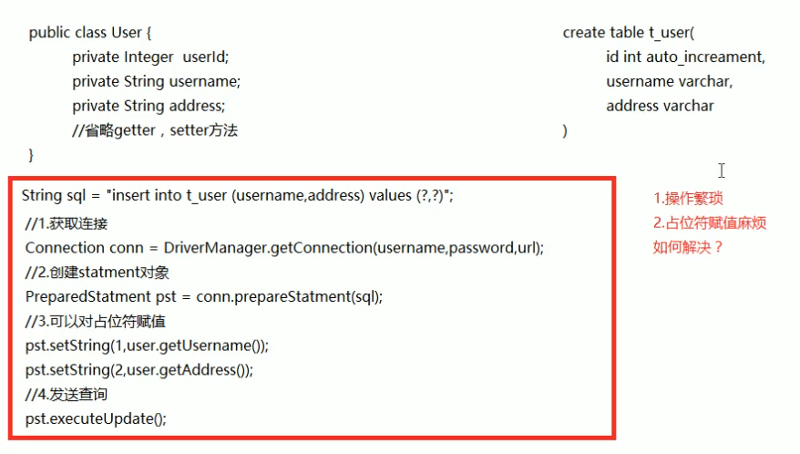
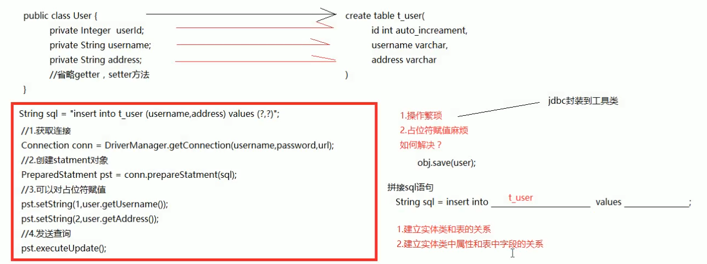

# 01.ORM思想

- 笔记本：22.Spring Data JPA
- 创建时间：2020-10-31 15:22:00 UTC
- 更新时间：2020-10-31 15:32:14 UTC
- 印象笔记 GUID：459af300-ac65-40b8-9d63-d6fdb6e5e9d6

# ORM

## 回顾 jdbc 操作完成保存用户

# ORM 思想

## 1. ORM 思想的引入

## 2. ORM 思想的概述

**主要目的：** 操作实体类就相当于操作数据库表
 建立两个映射关系：

- 实体类和表的映射关系

- 实体类中属性和表中字段的映射关系
 不再重点关注 sql 语句。

%23%20ORM%20%0A%0A%23%23%20%E5%9B%9E%E9%A1%BE%20jdbc%20%E6%93%8D%E4%BD%9C%E5%AE%8C%E6%88%90%E4%BF%9D%E5%AD%98%E7%94%A8%E6%88%B7%0A!%5B37febe948b1b4700437eab6d99fcb699.png%5D(en-resource%3A%2F%2Fdatabase%2F3781%3A0)%0A%0A%23%20ORM%20%E6%80%9D%E6%83%B3%0A%23%23%201.%20ORM%20%E6%80%9D%E6%83%B3%E7%9A%84%E5%BC%95%E5%85%A5%0A!%5B759b1efd498105167ca564afe04c66d5.png%5D(en-resource%3A%2F%2Fdatabase%2F3783%3A0)%0A%0A%23%23%202.%20ORM%20%E6%80%9D%E6%83%B3%E7%9A%84%E6%A6%82%E8%BF%B0%0A**%E4%B8%BB%E8%A6%81%E7%9B%AE%E7%9A%84%EF%BC%9A**%20%E6%93%8D%E4%BD%9C%E5%AE%9E%E4%BD%93%E7%B1%BB%E5%B0%B1%E7%9B%B8%E5%BD%93%E4%BA%8E%E6%93%8D%E4%BD%9C%E6%95%B0%E6%8D%AE%E5%BA%93%E8%A1%A8%0A%E5%BB%BA%E7%AB%8B%E4%B8%A4%E4%B8%AA%E6%98%A0%E5%B0%84%E5%85%B3%E7%B3%BB%EF%BC%9A%0A-%20%E5%AE%9E%E4%BD%93%E7%B1%BB%E5%92%8C%E8%A1%A8%E7%9A%84%E6%98%A0%E5%B0%84%E5%85%B3%E7%B3%BB%0A-%20%E5%AE%9E%E4%BD%93%E7%B1%BB%E4%B8%AD%E5%B1%9E%E6%80%A7%E5%92%8C%E8%A1%A8%E4%B8%AD%E5%AD%97%E6%AE%B5%E7%9A%84%E6%98%A0%E5%B0%84%E5%85%B3%E7%B3%BB%0A%E4%B8%8D%E5%86%8D%E9%87%8D%E7%82%B9%E5%85%B3%E6%B3%A8%20sql%20%E8%AF%AD%E5%8F%A5%E3%80%82%0A%0A%E5%AE%9E%E7%8E%B0%E4%BA%86%20ORM%20%E6%80%9D%E6%83%B3%E7%9A%84%E6%A1%86%E6%9E%B6%EF%BC%9Amybatis%E3%80%81hibernate%0A
