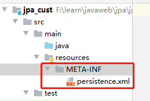
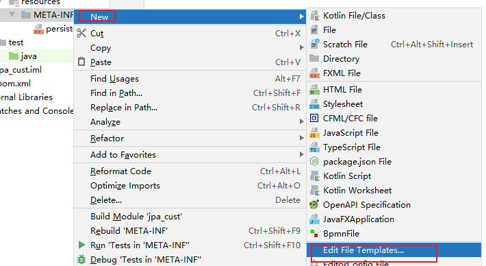
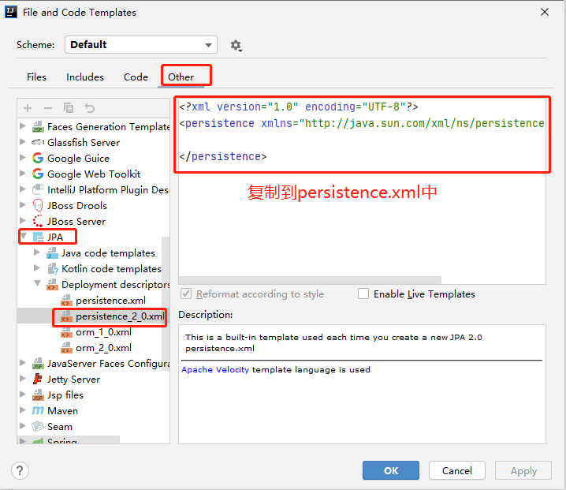

# 03.JPA入门案例

- 笔记本：22.Spring Data JPA
- 创建时间：2020-11-01 02:37:11 UTC
- 更新时间：2020-11-01 05:00:45 UTC
- 印象笔记 GUID：39160c50-4a41-40b6-a1ed-cdfc2d619bd3

# JPA 入门案例

## 需求介绍

客户的相关操作（增删改查）

## 环境搭建及代码

### 1. 创建数据库及表

```
CREATE TABLE cst_customer (
	cust_id bigint(32) NOT NULL AUTO_INCREMENT COMMENT '客户编号（主键）',
	cust_name varchar(32) NOT NULL COMMENT '客户名称（公司名称）',
	cust_source varchar(32) DEFAULT NULL COMMENT '客户信息来源',
	cust_industry varchar(32) DEFAULT NULL COMMENT '客户所属行业',
	cust_level varchar(32) DEFAULT NULL COMMENT '客户级别',
	cust_address varchar(128) DEFAULT NULL COMMENT '客户联系地址',
	cust_phone varchar(64) DEFAULT NULL COMMENT '客户联系电话',
	PRIMARY KEY (`cust_id`)
) ENGINE=InnoDB AUTO_INCREMENT=1 DEFAULT CHARSET=utf8;

```

### 2. 创建 maven 工程导入坐标

```
<properties>
    <project.hibernate.version>5.4.22.Final</project.hibernate.version>
</properties>

<dependencies>
    <!-- junit -->
    <dependency>
        <groupId>junit</groupId>
        <artifactId>junit</artifactId>
        <version>4.13</version>
        <scope>test</scope>
    </dependency>

    <!-- hibernate 对 jpa 的支持包 -->
    <dependency>
        <groupId>org.hibernate</groupId>
        <artifactId>hibernate-entitymanager</artifactId>
        <version>${project.hibernate.version}</version>
    </dependency>

    <!-- c3p0 -->
    <dependency>
        <groupId>org.hibernate</groupId>
        <artifactId>hibernate-c3p0</artifactId>
        <version>${project.hibernate.version}</version>
    </dependency>

    <!-- log 日志 -->
    <dependency>
        <groupId>log4j</groupId>
        <artifactId>log4j</artifactId>
        <version>1.2.17</version>
    </dependency>

    <!-- mysql and MariaDB -->
    <dependency>
        <groupId>mysql</groupId>
        <artifactId>mysql-connector-java</artifactId>
        <version>8.0.20</version>
    </dependency>

```

### 3. 需要配置 jpa 的核心配置文件

- 配置到类路径下的一个叫 META-INF 的文件夹下

- 命名：persistence.xml
 
 
 

```
<?xml version="1.0" encoding="UTF-8"?>
<persistence xmlns="http://java.sun.com/xml/ns/persistence" version="2.0">
    <!-- 需要配置 persistence-unit节点
         持久化单元：
            name：持久化单元名称
            transaction-type：事务管理的方式
                JTA: 分布式事务管理
                RESOURCE_LOCAL: 本地事务管理
    -->
    <persistence-unit name="myJpa" transaction-type="RESOURCE_LOCAL">
        <!-- jpa 的实现方式 -->
        <provider>org.hibernate.jpa.HibernatePersistenceProvider</provider>
        <!-- 可选配置：配置 jpa 实现方的配置信息 -->
        <properties>
            <!-- 数据库信息 -->
            <property name="javax.persistence.jdbc.user" value="root"/>
            <property name="javax.persistence.jdbc.password" value="Liudezhi"/>
            <property name="javax.persistence.jdbc.driver" value="com.mysql.cj.jdbc.Driver"/>
            <property name="javax.persistence.jdbc.url" value="jdbc:mysql://localhost:3306/jpa?useUnicode=true&amp;characterEncoding=utf-8&amp;useSSL=false&amp;serverTimezone=GMT"/>

            <!-- 配置 jpa 实现方（hibernate）的配置信息
                    显示 sql: false | true
                    自动创建数据库表: hibernate.hbm2ddl.auto
                        create: 程序运行时创建数据库表(如果有表，先删除再创建)
                        update: 程序运行时创建表(如果有表，不会创建表)
                        none: 不会创建表
            -->
            <property name="hibernate.show_sql" value="true"/>
            <property name="hibernate.hbm2ddl.auto" value="update"/>
        </properties>
    </persistence-unit>
</persistence>

```

### 4. 编写客户的实体类及配置实体类和表，类中属性和表中字段的映射关系

```
package com.liudezhi.domain;

import javax.persistence.*;

/**
 * 客户的实体类
 *  配置映射关系
 *      1. 实体类和表的映射关系
 *          @Entity：声明实体类
 *          @Table：声明实体类和表的映射关系，name 属性配置数据库表的名称
 *      2. 实体类中属性和表中字段的映射关系
 *          @Id：声明主键
 *          @GeneratedValue：配置主键的生成策略
 *              GenerationType.IDENTITY：自增
 *          @Column：配置属性和字段的映射关系，name 属性配置数据库表中字段的名称
 */
@Entity
@Table(name = "cst_customer")
public class Customer {

    @Id
    @GeneratedValue(strategy = GenerationType.IDENTITY)
    @Column(name = "cust_id")
    private Long custId;            // 客户主键

    @Column(name = "cust_name")
    private String custName;        // 客户名称

    @Column(name = "cust_source")
    private String custSource;      // 客户来源

    @Column(name = "cust_level")
    private String custLevel;       // 客户级别

    @Column(name = "cust_industry")
    private String custIndustry;    // 客户所属行业

    @Column(name = "cust_phone")
    private String custPhone;       // 客户联系方式

    @Column(name = "cust_address")
    private String custAddress;     // 客户地址
    // 省略 getter、setter、toString 方法
}

```

### 5. 保存客户到数据库中

```
package com.liudezhi.test;

import com.liudezhi.domain.Customer;
import org.junit.Test;

import javax.persistence.EntityManager;
import javax.persistence.EntityManagerFactory;
import javax.persistence.EntityTransaction;
import javax.persistence.Persistence;

public class JpaTest {

    /**
     * 测试 jpa 的保存
     *  案例：保存一个客户到数据库中
     *  Jpa 的操作步骤：
     *      1. 加载配置文件创建工厂（实体管理类工厂）对象
     *      2. 通过实体管理类工厂获取实体管理类
     *      3. 获取事务对象，开启事务
     *      4. 完成增删改查操作
     *      5. 提交事务（回滚事务）
     *      6. 释放资源
     */
    @Test
    public void testSave() {
        // 1. 加载配置文件创建工厂（实体管理类工厂）对象
        EntityManagerFactory factory = Persistence.createEntityManagerFactory("myJpa");
        // 2. 通过实体管理类工厂获取实体管理类
        EntityManager em = factory.createEntityManager();
        // 3. 获取事务对象，开启事务
        EntityTransaction tx = em.getTransaction(); // 获取事务对象
        tx.begin(); // 开启事务
        // 4. 完成增删改查操作
        Customer customer = new Customer();
        customer.setCustName("serva");
        customer.setCustIndustry("外包");
        customer.setCustAddress("上海市***");
        customer.setCustLevel("1");
        customer.setCustPhone("19329932492");
        customer.setCustSource("网站");
        // 保存
        em.persist(customer);   // 保存操作
        // 5. 提交事务（回滚事务）
        tx.commit();
        // 6. 释放资源
        em.close();
        factory.close();
    }
}

```

%23%20JPA%20%E5%85%A5%E9%97%A8%E6%A1%88%E4%BE%8B%0A%0A%23%23%20%E9%9C%80%E6%B1%82%E4%BB%8B%E7%BB%8D%0A%E5%AE%A2%E6%88%B7%E7%9A%84%E7%9B%B8%E5%85%B3%E6%93%8D%E4%BD%9C%EF%BC%88%E5%A2%9E%E5%88%A0%E6%94%B9%E6%9F%A5%EF%BC%89%0A%0A%23%23%20%E7%8E%AF%E5%A2%83%E6%90%AD%E5%BB%BA%E5%8F%8A%E4%BB%A3%E7%A0%81%0A%23%23%23%201.%20%E5%88%9B%E5%BB%BA%E6%95%B0%E6%8D%AE%E5%BA%93%E5%8F%8A%E8%A1%A8%0A%60%60%60sql%0ACREATE%20TABLE%20cst_customer%20(%0A%09cust_id%20bigint(32)%20NOT%20NULL%20AUTO_INCREMENT%20COMMENT%20'%E5%AE%A2%E6%88%B7%E7%BC%96%E5%8F%B7%EF%BC%88%E4%B8%BB%E9%94%AE%EF%BC%89'%2C%0A%09cust_name%20varchar(32)%20NOT%20NULL%20COMMENT%20'%E5%AE%A2%E6%88%B7%E5%90%8D%E7%A7%B0%EF%BC%88%E5%85%AC%E5%8F%B8%E5%90%8D%E7%A7%B0%EF%BC%89'%2C%0A%09cust_source%20varchar(32)%20DEFAULT%20NULL%20COMMENT%20'%E5%AE%A2%E6%88%B7%E4%BF%A1%E6%81%AF%E6%9D%A5%E6%BA%90'%2C%0A%09cust_industry%20varchar(32)%20DEFAULT%20NULL%20COMMENT%20'%E5%AE%A2%E6%88%B7%E6%89%80%E5%B1%9E%E8%A1%8C%E4%B8%9A'%2C%0A%09cust_level%20varchar(32)%20DEFAULT%20NULL%20COMMENT%20'%E5%AE%A2%E6%88%B7%E7%BA%A7%E5%88%AB'%2C%0A%09cust_address%20varchar(128)%20DEFAULT%20NULL%20COMMENT%20'%E5%AE%A2%E6%88%B7%E8%81%94%E7%B3%BB%E5%9C%B0%E5%9D%80'%2C%0A%09cust_phone%20varchar(64)%20DEFAULT%20NULL%20COMMENT%20'%E5%AE%A2%E6%88%B7%E8%81%94%E7%B3%BB%E7%94%B5%E8%AF%9D'%2C%0A%09PRIMARY%20KEY%20(%60cust_id%60)%0A)%20ENGINE%3DInnoDB%20AUTO_INCREMENT%3D1%20DEFAULT%20CHARSET%3Dutf8%3B%0A%60%60%60%0A%23%23%23%202.%20%E5%88%9B%E5%BB%BA%20maven%20%E5%B7%A5%E7%A8%8B%E5%AF%BC%E5%85%A5%E5%9D%90%E6%A0%87%0A%60%60%60xml%0A%3Cproperties%3E%0A%20%20%20%20%3Cproject.hibernate.version%3E5.4.22.Final%3C%2Fproject.hibernate.version%3E%0A%3C%2Fproperties%3E%0A%0A%3Cdependencies%3E%0A%20%20%20%20%3C!--%20junit%20--%3E%0A%20%20%20%20%3Cdependency%3E%0A%20%20%20%20%20%20%20%20%3CgroupId%3Ejunit%3C%2FgroupId%3E%0A%20%20%20%20%20%20%20%20%3CartifactId%3Ejunit%3C%2FartifactId%3E%0A%20%20%20%20%20%20%20%20%3Cversion%3E4.13%3C%2Fversion%3E%0A%20%20%20%20%20%20%20%20%3Cscope%3Etest%3C%2Fscope%3E%0A%20%20%20%20%3C%2Fdependency%3E%0A%0A%20%20%20%20%3C!--%20hibernate%20%E5%AF%B9%20jpa%20%E7%9A%84%E6%94%AF%E6%8C%81%E5%8C%85%20--%3E%0A%20%20%20%20%3Cdependency%3E%0A%20%20%20%20%20%20%20%20%3CgroupId%3Eorg.hibernate%3C%2FgroupId%3E%0A%20%20%20%20%20%20%20%20%3CartifactId%3Ehibernate-entitymanager%3C%2FartifactId%3E%0A%20%20%20%20%20%20%20%20%3Cversion%3E%24%7Bproject.hibernate.version%7D%3C%2Fversion%3E%0A%20%20%20%20%3C%2Fdependency%3E%0A%0A%20%20%20%20%3C!--%20c3p0%20--%3E%0A%20%20%20%20%3Cdependency%3E%0A%20%20%20%20%20%20%20%20%3CgroupId%3Eorg.hibernate%3C%2FgroupId%3E%0A%20%20%20%20%20%20%20%20%3CartifactId%3Ehibernate-c3p0%3C%2FartifactId%3E%0A%20%20%20%20%20%20%20%20%3Cversion%3E%24%7Bproject.hibernate.version%7D%3C%2Fversion%3E%0A%20%20%20%20%3C%2Fdependency%3E%0A%0A%20%20%20%20%3C!--%20log%20%E6%97%A5%E5%BF%97%20--%3E%0A%20%20%20%20%3Cdependency%3E%0A%20%20%20%20%20%20%20%20%3CgroupId%3Elog4j%3C%2FgroupId%3E%0A%20%20%20%20%20%20%20%20%3CartifactId%3Elog4j%3C%2FartifactId%3E%0A%20%20%20%20%20%20%20%20%3Cversion%3E1.2.17%3C%2Fversion%3E%0A%20%20%20%20%3C%2Fdependency%3E%0A%0A%20%20%20%20%3C!--%20mysql%20and%20MariaDB%20--%3E%0A%20%20%20%20%3Cdependency%3E%0A%20%20%20%20%20%20%20%20%3CgroupId%3Emysql%3C%2FgroupId%3E%0A%20%20%20%20%20%20%20%20%3CartifactId%3Emysql-connector-java%3C%2FartifactId%3E%0A%20%20%20%20%20%20%20%20%3Cversion%3E8.0.20%3C%2Fversion%3E%0A%20%20%20%20%3C%2Fdependency%3E%0A%60%60%60%0A%0A%23%23%23%203.%20%E9%9C%80%E8%A6%81%E9%85%8D%E7%BD%AE%20jpa%20%E7%9A%84%E6%A0%B8%E5%BF%83%E9%85%8D%E7%BD%AE%E6%96%87%E4%BB%B6%0A*%20%E9%85%8D%E7%BD%AE%E5%88%B0%E7%B1%BB%E8%B7%AF%E5%BE%84%E4%B8%8B%E7%9A%84%E4%B8%80%E4%B8%AA%E5%8F%AB%20META-INF%20%E7%9A%84%E6%96%87%E4%BB%B6%E5%A4%B9%E4%B8%8B%0A*%20%E5%91%BD%E5%90%8D%EF%BC%9Apersistence.xml%0A!%5B8aa8365fff0e15d3126c60e7bf2c8b03.png%5D(en-resource%3A%2F%2Fdatabase%2F3795%3A0)%0A!%5Bc07ffa4c7082162abef4722bfba73e7c.png%5D(en-resource%3A%2F%2Fdatabase%2F3797%3A0)%0A!%5Be9bff79fe16adbb60feb76fdf9c297b8.png%5D(en-resource%3A%2F%2Fdatabase%2F3799%3A0)%0A%60%60%60xml%0A%3C%3Fxml%20version%3D%221.0%22%20encoding%3D%22UTF-8%22%3F%3E%0A%3Cpersistence%20xmlns%3D%22http%3A%2F%2Fjava.sun.com%2Fxml%2Fns%2Fpersistence%22%20version%3D%222.0%22%3E%0A%20%20%20%20%3C!--%20%E9%9C%80%E8%A6%81%E9%85%8D%E7%BD%AE%20persistence-unit%E8%8A%82%E7%82%B9%0A%20%20%20%20%20%20%20%20%20%E6%8C%81%E4%B9%85%E5%8C%96%E5%8D%95%E5%85%83%EF%BC%9A%0A%20%20%20%20%20%20%20%20%20%20%20%20name%EF%BC%9A%E6%8C%81%E4%B9%85%E5%8C%96%E5%8D%95%E5%85%83%E5%90%8D%E7%A7%B0%0A%20%20%20%20%20%20%20%20%20%20%20%20transaction-type%EF%BC%9A%E4%BA%8B%E5%8A%A1%E7%AE%A1%E7%90%86%E7%9A%84%E6%96%B9%E5%BC%8F%0A%20%20%20%20%20%20%20%20%20%20%20%20%20%20%20%20JTA%3A%20%E5%88%86%E5%B8%83%E5%BC%8F%E4%BA%8B%E5%8A%A1%E7%AE%A1%E7%90%86%0A%20%20%20%20%20%20%20%20%20%20%20%20%20%20%20%20RESOURCE_LOCAL%3A%20%E6%9C%AC%E5%9C%B0%E4%BA%8B%E5%8A%A1%E7%AE%A1%E7%90%86%0A%20%20%20%20--%3E%0A%20%20%20%20%3Cpersistence-unit%20name%3D%22myJpa%22%20transaction-type%3D%22RESOURCE_LOCAL%22%3E%0A%20%20%20%20%20%20%20%20%3C!--%20jpa%20%E7%9A%84%E5%AE%9E%E7%8E%B0%E6%96%B9%E5%BC%8F%20--%3E%0A%20%20%20%20%20%20%20%20%3Cprovider%3Eorg.hibernate.jpa.HibernatePersistenceProvider%3C%2Fprovider%3E%0A%20%20%20%20%20%20%20%20%3C!--%20%E5%8F%AF%E9%80%89%E9%85%8D%E7%BD%AE%EF%BC%9A%E9%85%8D%E7%BD%AE%20jpa%20%E5%AE%9E%E7%8E%B0%E6%96%B9%E7%9A%84%E9%85%8D%E7%BD%AE%E4%BF%A1%E6%81%AF%20--%3E%0A%20%20%20%20%20%20%20%20%3Cproperties%3E%0A%20%20%20%20%20%20%20%20%20%20%20%20%3C!--%20%E6%95%B0%E6%8D%AE%E5%BA%93%E4%BF%A1%E6%81%AF%20--%3E%0A%20%20%20%20%20%20%20%20%20%20%20%20%3Cproperty%20name%3D%22javax.persistence.jdbc.user%22%20value%3D%22root%22%2F%3E%0A%20%20%20%20%20%20%20%20%20%20%20%20%3Cproperty%20name%3D%22javax.persistence.jdbc.password%22%20value%3D%22Liudezhi%22%2F%3E%0A%20%20%20%20%20%20%20%20%20%20%20%20%3Cproperty%20name%3D%22javax.persistence.jdbc.driver%22%20value%3D%22com.mysql.cj.jdbc.Driver%22%2F%3E%0A%20%20%20%20%20%20%20%20%20%20%20%20%3Cproperty%20name%3D%22javax.persistence.jdbc.url%22%20value%3D%22jdbc%3Amysql%3A%2F%2Flocalhost%3A3306%2Fjpa%3FuseUnicode%3Dtrue%26amp%3BcharacterEncoding%3Dutf-8%26amp%3BuseSSL%3Dfalse%26amp%3BserverTimezone%3DGMT%22%2F%3E%0A%0A%20%20%20%20%20%20%20%20%20%20%20%20%3C!--%20%E9%85%8D%E7%BD%AE%20jpa%20%E5%AE%9E%E7%8E%B0%E6%96%B9%EF%BC%88hibernate%EF%BC%89%E7%9A%84%E9%85%8D%E7%BD%AE%E4%BF%A1%E6%81%AF%0A%20%20%20%20%20%20%20%20%20%20%20%20%20%20%20%20%20%20%20%20%E6%98%BE%E7%A4%BA%20sql%3A%20false%20%7C%20true%0A%20%20%20%20%20%20%20%20%20%20%20%20%20%20%20%20%20%20%20%20%E8%87%AA%E5%8A%A8%E5%88%9B%E5%BB%BA%E6%95%B0%E6%8D%AE%E5%BA%93%E8%A1%A8%3A%20hibernate.hbm2ddl.auto%0A%20%20%20%20%20%20%20%20%20%20%20%20%20%20%20%20%20%20%20%20%20%20%20%20create%3A%20%E7%A8%8B%E5%BA%8F%E8%BF%90%E8%A1%8C%E6%97%B6%E5%88%9B%E5%BB%BA%E6%95%B0%E6%8D%AE%E5%BA%93%E8%A1%A8(%E5%A6%82%E6%9E%9C%E6%9C%89%E8%A1%A8%EF%BC%8C%E5%85%88%E5%88%A0%E9%99%A4%E5%86%8D%E5%88%9B%E5%BB%BA)%0A%20%20%20%20%20%20%20%20%20%20%20%20%20%20%20%20%20%20%20%20%20%20%20%20update%3A%20%E7%A8%8B%E5%BA%8F%E8%BF%90%E8%A1%8C%E6%97%B6%E5%88%9B%E5%BB%BA%E8%A1%A8(%E5%A6%82%E6%9E%9C%E6%9C%89%E8%A1%A8%EF%BC%8C%E4%B8%8D%E4%BC%9A%E5%88%9B%E5%BB%BA%E8%A1%A8)%0A%20%20%20%20%20%20%20%20%20%20%20%20%20%20%20%20%20%20%20%20%20%20%20%20none%3A%20%E4%B8%8D%E4%BC%9A%E5%88%9B%E5%BB%BA%E8%A1%A8%0A%20%20%20%20%20%20%20%20%20%20%20%20--%3E%0A%20%20%20%20%20%20%20%20%20%20%20%20%3Cproperty%20name%3D%22hibernate.show_sql%22%20value%3D%22true%22%2F%3E%0A%20%20%20%20%20%20%20%20%20%20%20%20%3Cproperty%20name%3D%22hibernate.hbm2ddl.auto%22%20value%3D%22update%22%2F%3E%0A%20%20%20%20%20%20%20%20%3C%2Fproperties%3E%0A%20%20%20%20%3C%2Fpersistence-unit%3E%0A%3C%2Fpersistence%3E%0A%60%60%60%0A%0A%23%23%23%204.%20%E7%BC%96%E5%86%99%E5%AE%A2%E6%88%B7%E7%9A%84%E5%AE%9E%E4%BD%93%E7%B1%BB%E5%8F%8A%E9%85%8D%E7%BD%AE%E5%AE%9E%E4%BD%93%E7%B1%BB%E5%92%8C%E8%A1%A8%EF%BC%8C%E7%B1%BB%E4%B8%AD%E5%B1%9E%E6%80%A7%E5%92%8C%E8%A1%A8%E4%B8%AD%E5%AD%97%E6%AE%B5%E7%9A%84%E6%98%A0%E5%B0%84%E5%85%B3%E7%B3%BB%0A%60%60%60java%0Apackage%20com.liudezhi.domain%3B%0A%0Aimport%20javax.persistence.*%3B%0A%0A%2F**%0A%20*%20%E5%AE%A2%E6%88%B7%E7%9A%84%E5%AE%9E%E4%BD%93%E7%B1%BB%0A%20*%20%20%E9%85%8D%E7%BD%AE%E6%98%A0%E5%B0%84%E5%85%B3%E7%B3%BB%0A%20*%20%20%20%20%20%201.%20%E5%AE%9E%E4%BD%93%E7%B1%BB%E5%92%8C%E8%A1%A8%E7%9A%84%E6%98%A0%E5%B0%84%E5%85%B3%E7%B3%BB%0A%20*%20%20%20%20%20%20%20%20%20%20%40Entity%EF%BC%9A%E5%A3%B0%E6%98%8E%E5%AE%9E%E4%BD%93%E7%B1%BB%0A%20*%20%20%20%20%20%20%20%20%20%20%40Table%EF%BC%9A%E5%A3%B0%E6%98%8E%E5%AE%9E%E4%BD%93%E7%B1%BB%E5%92%8C%E8%A1%A8%E7%9A%84%E6%98%A0%E5%B0%84%E5%85%B3%E7%B3%BB%EF%BC%8Cname%20%E5%B1%9E%E6%80%A7%E9%85%8D%E7%BD%AE%E6%95%B0%E6%8D%AE%E5%BA%93%E8%A1%A8%E7%9A%84%E5%90%8D%E7%A7%B0%0A%20*%20%20%20%20%20%202.%20%E5%AE%9E%E4%BD%93%E7%B1%BB%E4%B8%AD%E5%B1%9E%E6%80%A7%E5%92%8C%E8%A1%A8%E4%B8%AD%E5%AD%97%E6%AE%B5%E7%9A%84%E6%98%A0%E5%B0%84%E5%85%B3%E7%B3%BB%0A%20*%20%20%20%20%20%20%20%20%20%20%40Id%EF%BC%9A%E5%A3%B0%E6%98%8E%E4%B8%BB%E9%94%AE%0A%20*%20%20%20%20%20%20%20%20%20%20%40GeneratedValue%EF%BC%9A%E9%85%8D%E7%BD%AE%E4%B8%BB%E9%94%AE%E7%9A%84%E7%94%9F%E6%88%90%E7%AD%96%E7%95%A5%0A%20*%20%20%20%20%20%20%20%20%20%20%20%20%20%20strategy%0A%20*%20%20%20%20%20%20%20%20%20%20%20%20%20%20%20%20%20%20GenerationType.IDENTITY%EF%BC%9A%E8%87%AA%E5%A2%9E%20mysq%0A%20*%20%20%20%20%20%20%20%20%20%20%20%20%20%20%20%20%20%20%20%20%20%20*%20%E5%BA%95%E5%B1%82%E6%95%B0%E6%8D%AE%E5%BA%93%E5%BF%85%E9%A1%BB%E6%94%AF%E6%8C%81%E8%87%AA%E5%8A%A8%E5%A2%9E%E9%95%BF(%E5%BA%95%E5%B1%82%E6%95%B0%E6%8D%AE%E5%BA%93%E6%94%AF%E6%8C%81%E7%9A%84%E8%87%AA%E5%8A%A8%E5%A2%9E%E9%95%BF%E6%96%B9%E5%BC%8F%EF%BC%8C%E5%AF%B9id%E8%87%AA%E5%A2%9E)%0A%20*%20%20%20%20%20%20%20%20%20%20%20%20%20%20%20%20%20%20GenerationType.SEQUENCE%EF%BC%9A%E5%BA%8F%E5%88%97%20oracle(%E4%B8%8D%E6%94%AF%E6%8C%81%E8%87%AA%E5%A2%9E)%0A%20*%20%20%20%20%20%20%20%20%20%20%20%20%20%20%20%20%20%20%20%20%20%20*%20%E5%BA%95%E5%B1%82%E6%95%B0%E6%8D%AE%E5%BA%93%E5%BF%85%E9%A1%BB%E6%94%AF%E6%8C%81%E5%BA%8F%E5%88%97%0A%20*%20%20%20%20%20%20%20%20%20%20%20%20%20%20%20%20%20%20GenerationType.TABLE%EF%BC%9Ajpa%20%E6%8F%90%E4%BE%9B%E7%9A%84%E4%B8%80%E7%A7%8D%E6%9C%BA%E5%88%B6%EF%BC%8C%E9%80%9A%E8%BF%87%E4%B8%80%E5%BC%A0%E6%95%B0%E6%8D%AE%E5%BA%93%E8%A1%A8%E7%9A%84%E5%BD%A2%E5%BC%8F%E5%B8%AE%E5%8A%A9%E6%88%91%E4%BB%AC%E5%AE%8C%E6%88%90%E4%B8%BB%E9%94%AE%E8%87%AA%E5%A2%9E%0A%20*%20%20%20%20%20%20%20%20%20%20%20%20%20%20%20%20%20%20GenerationType.AUTO%EF%BC%9A%E7%94%B1%E7%A8%8B%E5%BA%8F%E8%87%AA%E5%8A%A8%E7%9A%84%E5%B8%AE%E5%8A%A9%E6%88%91%E4%BB%AC%E9%80%89%E6%8B%A9%E4%B8%BB%E9%94%AE%E7%94%9F%E6%88%90%E7%AD%96%E7%95%A5%0A%20*%20%20%20%20%20%20%20%20%20%20%40Column%EF%BC%9A%E9%85%8D%E7%BD%AE%E5%B1%9E%E6%80%A7%E5%92%8C%E5%AD%97%E6%AE%B5%E7%9A%84%E6%98%A0%E5%B0%84%E5%85%B3%E7%B3%BB%EF%BC%8Cname%20%E5%B1%9E%E6%80%A7%E9%85%8D%E7%BD%AE%E6%95%B0%E6%8D%AE%E5%BA%93%E8%A1%A8%E4%B8%AD%E5%AD%97%E6%AE%B5%E7%9A%84%E5%90%8D%E7%A7%B0%0A%20*%2F%0A%40Entity%0A%40Table(name%20%3D%20%22cst_customer%22)%0Apublic%20class%20Customer%20%7B%0A%0A%20%20%20%20%40Id%0A%20%20%20%20%40GeneratedValue(strategy%20%3D%20GenerationType.IDENTITY)%0A%20%20%20%20%40Column(name%20%3D%20%22cust_id%22)%0A%20%20%20%20private%20Long%20custId%3B%20%20%20%20%20%20%20%20%20%20%20%20%2F%2F%20%E5%AE%A2%E6%88%B7%E4%B8%BB%E9%94%AE%0A%0A%20%20%20%20%40Column(name%20%3D%20%22cust_name%22)%0A%20%20%20%20private%20String%20custName%3B%20%20%20%20%20%20%20%20%2F%2F%20%E5%AE%A2%E6%88%B7%E5%90%8D%E7%A7%B0%0A%0A%20%20%20%20%40Column(name%20%3D%20%22cust_source%22)%0A%20%20%20%20private%20String%20custSource%3B%20%20%20%20%20%20%2F%2F%20%E5%AE%A2%E6%88%B7%E6%9D%A5%E6%BA%90%0A%0A%20%20%20%20%40Column(name%20%3D%20%22cust_level%22)%0A%20%20%20%20private%20String%20custLevel%3B%20%20%20%20%20%20%20%2F%2F%20%E5%AE%A2%E6%88%B7%E7%BA%A7%E5%88%AB%0A%0A%20%20%20%20%40Column(name%20%3D%20%22cust_industry%22)%0A%20%20%20%20private%20String%20custIndustry%3B%20%20%20%20%2F%2F%20%E5%AE%A2%E6%88%B7%E6%89%80%E5%B1%9E%E8%A1%8C%E4%B8%9A%0A%0A%20%20%20%20%40Column(name%20%3D%20%22cust_phone%22)%0A%20%20%20%20private%20String%20custPhone%3B%20%20%20%20%20%20%20%2F%2F%20%E5%AE%A2%E6%88%B7%E8%81%94%E7%B3%BB%E6%96%B9%E5%BC%8F%0A%0A%20%20%20%20%40Column(name%20%3D%20%22cust_address%22)%0A%20%20%20%20private%20String%20custAddress%3B%20%20%20%20%20%2F%2F%20%E5%AE%A2%E6%88%B7%E5%9C%B0%E5%9D%80%0A%20%20%20%20%2F%2F%20%E7%9C%81%E7%95%A5%20getter%E3%80%81setter%E3%80%81toString%20%E6%96%B9%E6%B3%95%0A%7D%0A%0A%60%60%60%0A%0A%23%23%23%205.%20%E4%BF%9D%E5%AD%98%E5%AE%A2%E6%88%B7%E5%88%B0%E6%95%B0%E6%8D%AE%E5%BA%93%E4%B8%AD%0A%60%60%60java%0Apackage%20com.liudezhi.test%3B%0A%0Aimport%20com.liudezhi.domain.Customer%3B%0Aimport%20org.junit.Test%3B%0A%0Aimport%20javax.persistence.EntityManager%3B%0Aimport%20javax.persistence.EntityManagerFactory%3B%0Aimport%20javax.persistence.EntityTransaction%3B%0Aimport%20javax.persistence.Persistence%3B%0A%0Apublic%20class%20JpaTest%20%7B%0A%0A%20%20%20%20%2F**%0A%20%20%20%20%20*%20%E6%B5%8B%E8%AF%95%20jpa%20%E7%9A%84%E4%BF%9D%E5%AD%98%0A%20%20%20%20%20*%20%20%E6%A1%88%E4%BE%8B%EF%BC%9A%E4%BF%9D%E5%AD%98%E4%B8%80%E4%B8%AA%E5%AE%A2%E6%88%B7%E5%88%B0%E6%95%B0%E6%8D%AE%E5%BA%93%E4%B8%AD%0A%20%20%20%20%20*%20%20Jpa%20%E7%9A%84%E6%93%8D%E4%BD%9C%E6%AD%A5%E9%AA%A4%EF%BC%9A%0A%20%20%20%20%20*%20%20%20%20%20%201.%20%E5%8A%A0%E8%BD%BD%E9%85%8D%E7%BD%AE%E6%96%87%E4%BB%B6%E5%88%9B%E5%BB%BA%E5%B7%A5%E5%8E%82%EF%BC%88%E5%AE%9E%E4%BD%93%E7%AE%A1%E7%90%86%E7%B1%BB%E5%B7%A5%E5%8E%82%EF%BC%89%E5%AF%B9%E8%B1%A1%0A%20%20%20%20%20*%20%20%20%20%20%202.%20%E9%80%9A%E8%BF%87%E5%AE%9E%E4%BD%93%E7%AE%A1%E7%90%86%E7%B1%BB%E5%B7%A5%E5%8E%82%E8%8E%B7%E5%8F%96%E5%AE%9E%E4%BD%93%E7%AE%A1%E7%90%86%E7%B1%BB%0A%20%20%20%20%20*%20%20%20%20%20%203.%20%E8%8E%B7%E5%8F%96%E4%BA%8B%E5%8A%A1%E5%AF%B9%E8%B1%A1%EF%BC%8C%E5%BC%80%E5%90%AF%E4%BA%8B%E5%8A%A1%0A%20%20%20%20%20*%20%20%20%20%20%204.%20%E5%AE%8C%E6%88%90%E5%A2%9E%E5%88%A0%E6%94%B9%E6%9F%A5%E6%93%8D%E4%BD%9C%0A%20%20%20%20%20*%20%20%20%20%20%205.%20%E6%8F%90%E4%BA%A4%E4%BA%8B%E5%8A%A1%EF%BC%88%E5%9B%9E%E6%BB%9A%E4%BA%8B%E5%8A%A1%EF%BC%89%0A%20%20%20%20%20*%20%20%20%20%20%206.%20%E9%87%8A%E6%94%BE%E8%B5%84%E6%BA%90%0A%20%20%20%20%20*%2F%0A%20%20%20%20%40Test%0A%20%20%20%20public%20void%20testSave()%20%7B%0A%20%20%20%20%20%20%20%20%2F%2F%201.%20%E5%8A%A0%E8%BD%BD%E9%85%8D%E7%BD%AE%E6%96%87%E4%BB%B6%E5%88%9B%E5%BB%BA%E5%B7%A5%E5%8E%82%EF%BC%88%E5%AE%9E%E4%BD%93%E7%AE%A1%E7%90%86%E7%B1%BB%E5%B7%A5%E5%8E%82%EF%BC%89%E5%AF%B9%E8%B1%A1%0A%20%20%20%20%20%20%20%20EntityManagerFactory%20factory%20%3D%20Persistence.createEntityManagerFactory(%22myJpa%22)%3B%0A%20%20%20%20%20%20%20%20%2F%2F%202.%20%E9%80%9A%E8%BF%87%E5%AE%9E%E4%BD%93%E7%AE%A1%E7%90%86%E7%B1%BB%E5%B7%A5%E5%8E%82%E8%8E%B7%E5%8F%96%E5%AE%9E%E4%BD%93%E7%AE%A1%E7%90%86%E7%B1%BB%0A%20%20%20%20%20%20%20%20EntityManager%20em%20%3D%20factory.createEntityManager()%3B%0A%20%20%20%20%20%20%20%20%2F%2F%203.%20%E8%8E%B7%E5%8F%96%E4%BA%8B%E5%8A%A1%E5%AF%B9%E8%B1%A1%EF%BC%8C%E5%BC%80%E5%90%AF%E4%BA%8B%E5%8A%A1%0A%20%20%20%20%20%20%20%20EntityTransaction%20tx%20%3D%20em.getTransaction()%3B%20%2F%2F%20%E8%8E%B7%E5%8F%96%E4%BA%8B%E5%8A%A1%E5%AF%B9%E8%B1%A1%0A%20%20%20%20%20%20%20%20tx.begin()%3B%20%2F%2F%20%E5%BC%80%E5%90%AF%E4%BA%8B%E5%8A%A1%0A%20%20%20%20%20%20%20%20%2F%2F%204.%20%E5%AE%8C%E6%88%90%E5%A2%9E%E5%88%A0%E6%94%B9%E6%9F%A5%E6%93%8D%E4%BD%9C%0A%20%20%20%20%20%20%20%20Customer%20customer%20%3D%20new%20Customer()%3B%0A%20%20%20%20%20%20%20%20customer.setCustName(%22serva%22)%3B%0A%20%20%20%20%20%20%20%20customer.setCustIndustry(%22%E5%A4%96%E5%8C%85%22)%3B%0A%20%20%20%20%20%20%20%20customer.setCustAddress(%22%E4%B8%8A%E6%B5%B7%E5%B8%82***%22)%3B%0A%20%20%20%20%20%20%20%20customer.setCustLevel(%221%22)%3B%0A%20%20%20%20%20%20%20%20customer.setCustPhone(%2219329932492%22)%3B%0A%20%20%20%20%20%20%20%20customer.setCustSource(%22%E7%BD%91%E7%AB%99%22)%3B%0A%20%20%20%20%20%20%20%20%2F%2F%20%E4%BF%9D%E5%AD%98%0A%20%20%20%20%20%20%20%20em.persist(customer)%3B%20%20%20%2F%2F%20%E4%BF%9D%E5%AD%98%E6%93%8D%E4%BD%9C%0A%20%20%20%20%20%20%20%20%2F%2F%205.%20%E6%8F%90%E4%BA%A4%E4%BA%8B%E5%8A%A1%EF%BC%88%E5%9B%9E%E6%BB%9A%E4%BA%8B%E5%8A%A1%EF%BC%89%0A%20%20%20%20%20%20%20%20tx.commit()%3B%0A%20%20%20%20%20%20%20%20%2F%2F%206.%20%E9%87%8A%E6%94%BE%E8%B5%84%E6%BA%90%0A%20%20%20%20%20%20%20%20em.close()%3B%0A%20%20%20%20%20%20%20%20factory.close()%3B%0A%20%20%20%20%7D%0A%7D%0A%60%60%60%0A%0A
