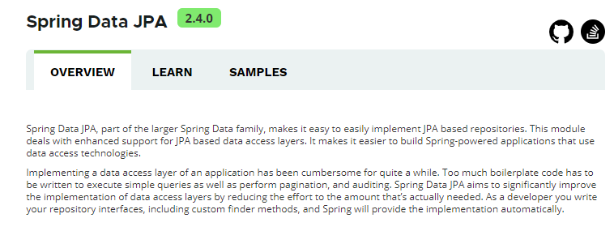
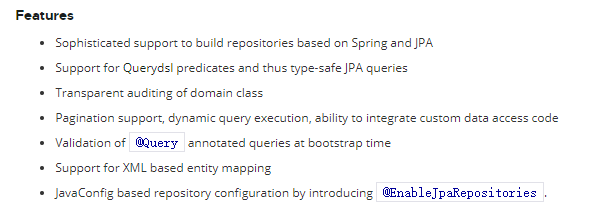

# 07. Spring Data JPA简介

- 笔记本：22.Spring Data JPA
- 创建时间：2020-11-01 11:46:46 UTC
- 更新时间：2020-11-01 12:04:45 UTC
- 印象笔记 GUID：aeaf02bb-4283-4188-9fb9-37f709a6bdd0

## 1. Spring Data JPA 概述

 Spring Data JPA 是 Spirng 基于 ORM 框架、JPA 规范的基础上封装的一套 JPA 应用框架，可使开发者用极简的代码即可实现对数据库的访问和操作。它提供了包括增上改查等在内的常用功能，且易于扩展！学习并使用 JPA 可以极大提供开发效率。

Spring Data JPA 让我们解脱了 DAO 层的操作，基本上所有的 CRUD 都可以依赖于它实现，在实际的工作工程中，推荐使用 Spring Data JPA + ORM（如：hibernate）完成操作，这样在切换不同的 ORM 框架时提供了极大的方便，同时也使数据库层操作更加简单，方便解耦。

## 2. Spring Data JPA 的特性

## 3. Spring Data JPA 与 JPA 和 hibernate 之间

%23%23%201.%20Spring%20Data%20JPA%20%E6%A6%82%E8%BF%B0%0A!%5Bd6d6c0f06467a633a1b3b17f76bab387.png%5D(en-resource%3A%2F%2Fdatabase%2F3811%3A0)%0ASpring%20Data%20JPA%20%E6%98%AF%20Spirng%20%E5%9F%BA%E4%BA%8E%20ORM%20%E6%A1%86%E6%9E%B6%E3%80%81JPA%20%E8%A7%84%E8%8C%83%E7%9A%84%E5%9F%BA%E7%A1%80%E4%B8%8A%E5%B0%81%E8%A3%85%E7%9A%84%E4%B8%80%E5%A5%97%20JPA%20%E5%BA%94%E7%94%A8%E6%A1%86%E6%9E%B6%EF%BC%8C%E5%8F%AF%E4%BD%BF%E5%BC%80%E5%8F%91%E8%80%85%E7%94%A8%E6%9E%81%E7%AE%80%E7%9A%84%E4%BB%A3%E7%A0%81%E5%8D%B3%E5%8F%AF%E5%AE%9E%E7%8E%B0%E5%AF%B9%E6%95%B0%E6%8D%AE%E5%BA%93%E7%9A%84%E8%AE%BF%E9%97%AE%E5%92%8C%E6%93%8D%E4%BD%9C%E3%80%82%E5%AE%83%E6%8F%90%E4%BE%9B%E4%BA%86%E5%8C%85%E6%8B%AC%E5%A2%9E%E4%B8%8A%E6%94%B9%E6%9F%A5%E7%AD%89%E5%9C%A8%E5%86%85%E7%9A%84%E5%B8%B8%E7%94%A8%E5%8A%9F%E8%83%BD%EF%BC%8C%E4%B8%94%E6%98%93%E4%BA%8E%E6%89%A9%E5%B1%95%EF%BC%81%E5%AD%A6%E4%B9%A0%E5%B9%B6%E4%BD%BF%E7%94%A8%20JPA%20%E5%8F%AF%E4%BB%A5%E6%9E%81%E5%A4%A7%E6%8F%90%E4%BE%9B%E5%BC%80%E5%8F%91%E6%95%88%E7%8E%87%E3%80%82%0A%0ASpring%20Data%20JPA%20%E8%AE%A9%E6%88%91%E4%BB%AC%E8%A7%A3%E8%84%B1%E4%BA%86%20DAO%20%E5%B1%82%E7%9A%84%E6%93%8D%E4%BD%9C%EF%BC%8C%E5%9F%BA%E6%9C%AC%E4%B8%8A%E6%89%80%E6%9C%89%E7%9A%84%20CRUD%20%E9%83%BD%E5%8F%AF%E4%BB%A5%E4%BE%9D%E8%B5%96%E4%BA%8E%E5%AE%83%E5%AE%9E%E7%8E%B0%EF%BC%8C%E5%9C%A8%E5%AE%9E%E9%99%85%E7%9A%84%E5%B7%A5%E4%BD%9C%E5%B7%A5%E7%A8%8B%E4%B8%AD%EF%BC%8C%E6%8E%A8%E8%8D%90%E4%BD%BF%E7%94%A8%20Spring%20Data%20JPA%20%2B%20ORM%EF%BC%88%E5%A6%82%EF%BC%9Ahibernate%EF%BC%89%E5%AE%8C%E6%88%90%E6%93%8D%E4%BD%9C%EF%BC%8C%E8%BF%99%E6%A0%B7%E5%9C%A8%E5%88%87%E6%8D%A2%E4%B8%8D%E5%90%8C%E7%9A%84%20ORM%20%E6%A1%86%E6%9E%B6%E6%97%B6%E6%8F%90%E4%BE%9B%E4%BA%86%E6%9E%81%E5%A4%A7%E7%9A%84%E6%96%B9%E4%BE%BF%EF%BC%8C%E5%90%8C%E6%97%B6%E4%B9%9F%E4%BD%BF%E6%95%B0%E6%8D%AE%E5%BA%93%E5%B1%82%E6%93%8D%E4%BD%9C%E6%9B%B4%E5%8A%A0%E7%AE%80%E5%8D%95%EF%BC%8C%E6%96%B9%E4%BE%BF%E8%A7%A3%E8%80%A6%E3%80%82%0A%0A%23%23%202.%20Spring%20Data%20JPA%20%E7%9A%84%E7%89%B9%E6%80%A7%0A!%5B19c3e7c667ec147a2f43633d09f0ff05.png%5D(en-resource%3A%2F%2Fdatabase%2F3813%3A0)%0ASpring%20Data%20JPA%20%E6%9E%81%E5%A4%A7%E7%AE%80%E5%8C%96%E4%BA%86%E6%95%B0%E6%8D%AE%E5%BA%93%E8%AE%BF%E9%97%AE%E5%B1%82%E4%BB%A3%E7%A0%81%E3%80%82%E4%BD%BF%E7%94%A8%E4%BA%86%20Spring%20Data%20JPA%EF%BC%8C%E6%88%91%E4%BB%AC%E7%9A%84%20dao%20%E5%B1%82%E4%B8%AD%E5%8F%AA%E9%9C%80%E8%A6%81%E5%86%99%E6%8E%A5%E5%8F%A3%EF%BC%8C%E5%B0%B1%E8%87%AA%E5%8A%A8%E5%85%B7%E6%9C%89%E4%BA%86%E5%A2%9E%E5%88%A0%E6%94%B9%E6%9F%A5%E3%80%81%E5%88%86%E9%A1%B5%E6%9F%A5%E8%AF%A2%E7%AD%89%E6%96%B9%E6%B3%95%E3%80%82%0A%0A%0A%0A%23%23%203.%20Spring%20Data%20JPA%20%E4%B8%8E%20JPA%20%E5%92%8C%20hibernate%20%E4%B9%8B%E9%97%B4%E5%85%B3%E7%B3%BB%E8%AF%B4%E6%98%8E%0A!%5B705dee7c200f7e4aebc50c9825bd62d9.png%5D(en-resource%3A%2F%2Fdatabase%2F3815%3A0)%0AJPA%20%E6%98%AF%E4%B8%80%E5%A5%97%E8%A7%84%E8%8C%83%EF%BC%8C%E5%86%85%E9%83%A8%E6%98%AF%E7%94%B1%E6%8E%A5%E5%8F%A3%E5%92%8C%E6%8A%BD%E8%B1%A1%E7%B1%BB%E7%BB%84%E6%88%90%E7%9A%84%E3%80%82hibernate%20%E6%98%AF%E4%B8%80%E5%A5%97%E6%88%90%E7%86%9F%E7%9A%84%20ORM%20%E6%A1%86%E6%9E%B6%EF%BC%8C%E8%80%8C%E4%B8%94%20hibernate%20%E5%AE%9E%E7%8E%B0%E4%BA%86%20JPA%20%E8%A7%84%E8%8C%83%EF%BC%8C%E6%89%80%E4%BB%A5%E5%8F%AF%E4%BB%A5%E7%A7%B0%20hibernate%20%E4%B8%BA%20JPA%20%E7%9A%84%E4%B8%80%E7%A7%8D%E5%AE%9E%E7%8E%B0%E6%96%B9%E5%BC%8F%EF%BC%8C%E6%88%91%E4%BB%AC%E4%BD%BF%E7%94%A8%20JPA%20%E7%9A%84%20API%20%E7%BC%96%E7%A8%8B%EF%BC%8C%E6%84%8F%E5%91%B3%E7%9D%80%E7%AB%99%E5%9C%A8%E6%9B%B4%E9%AB%98%E7%9A%84%E8%A7%92%E5%BA%A6%E4%B8%8A%E7%9C%8B%E5%BE%85%E9%97%AE%E9%A2%98%EF%BC%88%E9%9D%A2%E5%90%91%E6%8E%A5%E5%8F%A3%E7%BC%96%E7%A8%8B%EF%BC%89%E3%80%82%0A%0ASpring%20Data%20JPA%20%E6%98%AF%20Spring%20%E6%8F%90%E4%BE%9B%E7%9A%84%E4%B8%80%E5%A5%97%E5%AF%B9%20JPA%20%E6%93%8D%E4%BD%9C%E6%9B%B4%E5%8A%A0%E9%AB%98%E7%BA%A7%E7%9A%84%E5%B0%81%E8%A3%85%EF%BC%8C%E6%98%AF%E5%9C%A8%20JPA%20%E8%A7%84%E8%8C%83%E4%B8%8B%E7%9A%84%E4%B8%93%E9%97%A8%E7%94%A8%E6%9D%A5%E8%BF%9B%E8%A1%8C%E6%95%B0%E6%8D%AE%E6%8C%81%E4%B9%85%E5%8C%96%E7%9A%84%E8%A7%A3%E5%86%B3%E6%96%B9%E6%A1%88%E3%80%82%0A%0A
