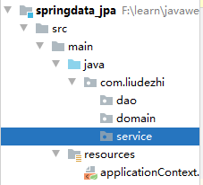

# 08. Spring Data JPA 快速入门

- 笔记本：22.Spring Data JPA
- 创建时间：2020-11-01 12:06:33 UTC
- 更新时间：2020-11-01 13:42:27 UTC
- 印象笔记 GUID：8b1271ad-126b-4eab-8038-4d7a412914e2

# Spring Data JPA 快速入门

## 1. 需求说明

## 2. 搭建 Spring Data JPA 的开发环境

### 2.1. 引入 Spring Data JPA 的坐标

```
<properties>
    <spring.version>5.2.9.RELEASE</spring.version>
    <hibernate.version>5.4.22.Final</hibernate.version>
    <slf4j.version>1.7.30</slf4j.version>
    <log4j.version>1.2.17</log4j.version>
    <c3p0.version>0.9.1.2</c3p0.version>
    <mysql.version>8.0.20</mysql.version>
</properties>

<dependencies>
    <!-- junit 单元测试 -->
    <dependency>
        <groupId>junit</groupId>
        <artifactId>junit</artifactId>
        <version>4.13</version>
        <scope>test</scope>
    </dependency>

    <!-- spring beg -->
    <!-- spring aop 相关坐标 -->
    <dependency>
        <groupId>org.aspectj</groupId>
        <artifactId>aspectjweaver</artifactId>
        <version>1.6.8</version>
    </dependency>
    <dependency>
        <groupId>org.springframework</groupId>
        <artifactId>spring-aop</artifactId>
        <version>${spring.version}</version>
    </dependency>

    <!-- spring ioc 相关坐标 -->
    <dependency>
        <groupId>org.springframework</groupId>
        <artifactId>spring-context</artifactId>
        <version>${spring.version}</version>
    </dependency>
    <dependency>
        <groupId>org.springframework</groupId>
        <artifactId>spring-context-support</artifactId>
        <version>${spring.version}</version>
    </dependency>

    <!-- spring 对 orm 框架的支持包 -->
    <dependency>
        <groupId>org.springframework</groupId>
        <artifactId>spring-orm</artifactId>
        <version>${spring.version}</version>
    </dependency>

    <dependency>
        <groupId>org.springframework</groupId>
        <artifactId>spring-beans</artifactId>
        <version>${spring.version}</version>
    </dependency>

    <dependency>
        <groupId>org.springframework</groupId>
        <artifactId>spring-core</artifactId>
        <version>${spring.version}</version>
    </dependency>
    <!-- spring end -->

    <!-- hibernate beg -->
    <dependency>
        <groupId>org.hibernate</groupId>
        <artifactId>hibernate-core</artifactId>
        <version>${hibernate.version}</version>
    </dependency>
    <dependency>
        <groupId>org.hibernate</groupId>
        <artifactId>hibernate-entitymanager</artifactId>
        <version>${hibernate.version}</version>
    </dependency>
    <dependency>
        <groupId>org.hibernate</groupId>
        <artifactId>hibernate-validator</artifactId>
        <version>6.1.6.Final</version>
    </dependency>
    <!-- hibernate end -->

    <!-- c3p0 数据库连接池 -->
    <dependency>
        <groupId>c3p0</groupId>
        <artifactId>c3p0</artifactId>
        <version>${c3p0.version}</version>
    </dependency>

    <!-- log -->
    <dependency>
        <groupId>log4j</groupId>
        <artifactId>log4j</artifactId>
        <version>${log4j.version}</version>
    </dependency>
    <dependency>
        <groupId>org.slf4j</groupId>
        <artifactId>slf4j-api</artifactId>
        <version>${slf4j.version}</version>
    </dependency>

    <!-- mysql -->
    <dependency>
        <groupId>mysql</groupId>
        <artifactId>mysql-connector-java</artifactId>
        <version>${mysql.version}</version>
    </dependency>

    <!-- spring data jpa 的坐标 -->
    <dependency>
        <groupId>org.springframework.data</groupId>
        <artifactId>spring-data-jpa</artifactId>
        <version>2.1.5.RELEASE</version>
    </dependency>

    <dependency>
        <groupId>org.springframework</groupId>
        <artifactId>spring-test</artifactId>
        <version>${spring.version}</version>
    </dependency>

    <!-- el beg 使用 spring data jpa 必须引入 -->
    <dependency>
        <groupId>javax.el</groupId>
        <artifactId>javax.el-api</artifactId>
        <version>2.2.5</version>
    </dependency>
    <dependency>
        <groupId>org.glassfish.web</groupId>
        <artifactId>javax.el</artifactId>
        <version>2.2.6</version>
    </dependency>
    <!-- el end -->
</dependencies>

```

### 2.2. 整合 Spring Data JPA 与 Spring

**applicationContext.xml**
 

```
<?xml version="1.0" encoding="UTF-8"?>
<beans xmlns="http://www.springframework.org/schema/beans"
       xmlns:xsi="http://www.w3.org/2001/XMLSchema-instance"
       xmlns:aop="http://www.springframework.org/schema/aop"
       xmlns:context="http://www.springframework.org/schema/context"
       xmlns:jdbc="http://www.springframework.org/schema/jdbc"
       xmlns:tx="http://www.springframework.org/schema/tx"
       xmlns:jpa="http://www.springframework.org/schema/data/jpa"
       xmlns:task="http://www.springframework.org/schema/task"
       xsi:schemaLocation="
        http://www.springframework.org/schema/beans http://www.springframework.org/schema/beans/spring-beans.xsd
        http://www.springframework.org/schema/aop http://www.springframework.org/schema/aop/spring-apo.xsd
        http://www.springframework.org/schema/context http://www.springframework.org/schema/context/spring-context.xsd
        http://www.springframework.org/schema/jdbc http://www.springframework.org/schema/jdbc/spring-jdbc.xsd
        http://www.springframework.org/schema/tx http://www.springframework.org/schema/tx/spring-tx.xsd
        http://www.springframework.org/schema/data/jpa http://www.springframework.org/schema/data/jpa/spring-jpa.xsd">

    <!-- spring 和 spring data jpa 的配置 -->

    <!-- 1. 创建 entityManagerFactory 对象交给 spring 容器管理 -->
    <bean id="entityManagerFactory" class="org.springframework.orm.jpa.LocalContainerEntityManagerFactoryBean">
        <property name="dataSource" ref="dataSource"/>
        <!-- 配置的是扫描的包（实体类所在的包） -->
        <property name="packagesToScan" value="com.liudezhi.domain"/>
        <!-- jpa 的实现厂家 -->
        <property name="persistenceProvider">
            <bean class="org.hibernate.jpa.HibernatePersistenceProvider"/>
        </property>
        <!-- jpa 的供应商适配器 -->
        <property name="jpaVendorAdapter">
            <bean class="org.springframework.orm.jpa.vendor.HibernateJpaVendorAdapter">
                <!-- 配置是否自动创建数据库表 -->
                <property name="generateDdl" value="false"/>
                <!-- 指定数据库类型 -->
                <property name="database" value="MYSQL"/>
                <!-- 数据库方言：支持的特有语法 -->
                <property name="databasePlatform" value="org.hibernate.dialect.MySQL8Dialect"/>
                <!-- 是否显示 sql 语句 -->
                <property name="showSql" value="true"/>
            </bean>
        </property>

        <!-- jpa 方言：高级的特性，不用可以不写 -->
        <property name="jpaDialect">
            <bean class="org.springframework.orm.jpa.vendor.HibernateJpaDialect"/>
        </property>
    </bean>

    <!-- 2. 创建数据库连接池 -->
    <bean id="dataSource" class="com.mchange.v2.c3p0.ComboPooledDataSource">
        <property name="user" value="root"/>
        <property name="password" value="Liudezhi"/>
        <property name="driverClass" value="com.mysql.cj.jdbc.Driver"/>
        <property name="jdbcUrl" value="jdbc:mysql://localhost:3306/jpa?useUnicode=true&amp;characterEncoding=utf-8&amp;useSSL=false&amp;serverTimezone=GMT"/>
    </bean>

    <!-- 3. 整合 spring data jpa -->
    <jpa:repositories base-package="com.liudezhi.dao" transaction-manager-ref="transactionManager"
                      entity-manager-factory-ref="entityManagerFactory"></jpa:repositories>

    <!-- 4. 配置事务管理器 -->
    <bean id="transactionManager" class="org.springframework.orm.jpa.JpaTransactionManager">
        <property name="entityManagerFactory" ref="entityManagerFactory"></property>
    </bean>

    <!-- 5. 声明式事务 -->
    <tx:advice id="txAdvice" transaction-manager="transactionManager">
        <tx:attributes>
            <tx:method name="save*" propagation="REQUIRED"/>
            <tx:method name="insert*" propagation="REQUIRED"/>
            <tx:method name="update*" propagation="REQUIRED"/>
            <tx:method name="delete*" propagation="REQUIRED"/>
            <tx:method name="get*" read-only="true"/>
            <tx:method name="find*" read-only="true"/>
            <tx:method name="*" propagation="REQUIRED"/>
        </tx:attributes>
    </tx:advice>

    <!-- 6. aop -->
    <aop:config>
        <aop:pointcut id="pointcut" expression="execution(* com.liudezhi.service.*.*(..))"/>
        <aop:advisor advice-ref="txAdvice" pointcut-ref="pointcut"/>
    </aop:config>

    <!-- 7. 配置包扫描 -->
    <context:component-scan base-package="com.liudezhi"></context:component-scan>

</beans>

```

### 2.3. 使用 JPA 注解配置映射关系

## 3. 使用 Spring Data JPA 完成需求

### 3.1. 编写符合 Spring Data JPA 规范的 dao 层接口

### 3.2. 完成基本 CRUD 操作

%23%20Spring%20Data%20JPA%20%E5%BF%AB%E9%80%9F%E5%85%A5%E9%97%A8%0A%0A%23%23%201.%20%E9%9C%80%E6%B1%82%E8%AF%B4%E6%98%8E%0A%0A%0A%23%23%202.%20%E6%90%AD%E5%BB%BA%20Spring%20Data%20JPA%20%E7%9A%84%E5%BC%80%E5%8F%91%E7%8E%AF%E5%A2%83%0A%23%23%23%202.1.%20%E5%BC%95%E5%85%A5%20Spring%20Data%20JPA%20%E7%9A%84%E5%9D%90%E6%A0%87%0A%60%60%60xml%0A%3Cproperties%3E%0A%20%20%20%20%3Cspring.version%3E5.2.9.RELEASE%3C%2Fspring.version%3E%0A%20%20%20%20%3Chibernate.version%3E5.4.22.Final%3C%2Fhibernate.version%3E%0A%20%20%20%20%3Cslf4j.version%3E1.7.30%3C%2Fslf4j.version%3E%0A%20%20%20%20%3Clog4j.version%3E1.2.17%3C%2Flog4j.version%3E%0A%20%20%20%20%3Cc3p0.version%3E0.9.1.2%3C%2Fc3p0.version%3E%0A%20%20%20%20%3Cmysql.version%3E8.0.20%3C%2Fmysql.version%3E%0A%3C%2Fproperties%3E%0A%0A%3Cdependencies%3E%0A%20%20%20%20%3C!--%20junit%20%E5%8D%95%E5%85%83%E6%B5%8B%E8%AF%95%20--%3E%0A%20%20%20%20%3Cdependency%3E%0A%20%20%20%20%20%20%20%20%3CgroupId%3Ejunit%3C%2FgroupId%3E%0A%20%20%20%20%20%20%20%20%3CartifactId%3Ejunit%3C%2FartifactId%3E%0A%20%20%20%20%20%20%20%20%3Cversion%3E4.13%3C%2Fversion%3E%0A%20%20%20%20%20%20%20%20%3Cscope%3Etest%3C%2Fscope%3E%0A%20%20%20%20%3C%2Fdependency%3E%0A%0A%20%20%20%20%3C!--%20spring%20beg%20--%3E%0A%20%20%20%20%3C!--%20spring%20aop%20%E7%9B%B8%E5%85%B3%E5%9D%90%E6%A0%87%20--%3E%0A%20%20%20%20%3Cdependency%3E%0A%20%20%20%20%20%20%20%20%3CgroupId%3Eorg.aspectj%3C%2FgroupId%3E%0A%20%20%20%20%20%20%20%20%3CartifactId%3Easpectjweaver%3C%2FartifactId%3E%0A%20%20%20%20%20%20%20%20%3Cversion%3E1.6.8%3C%2Fversion%3E%0A%20%20%20%20%3C%2Fdependency%3E%0A%20%20%20%20%3Cdependency%3E%0A%20%20%20%20%20%20%20%20%3CgroupId%3Eorg.springframework%3C%2FgroupId%3E%0A%20%20%20%20%20%20%20%20%3CartifactId%3Espring-aop%3C%2FartifactId%3E%0A%20%20%20%20%20%20%20%20%3Cversion%3E%24%7Bspring.version%7D%3C%2Fversion%3E%0A%20%20%20%20%3C%2Fdependency%3E%0A%0A%20%20%20%20%3C!--%20spring%20ioc%20%E7%9B%B8%E5%85%B3%E5%9D%90%E6%A0%87%20--%3E%0A%20%20%20%20%3Cdependency%3E%0A%20%20%20%20%20%20%20%20%3CgroupId%3Eorg.springframework%3C%2FgroupId%3E%0A%20%20%20%20%20%20%20%20%3CartifactId%3Espring-context%3C%2FartifactId%3E%0A%20%20%20%20%20%20%20%20%3Cversion%3E%24%7Bspring.version%7D%3C%2Fversion%3E%0A%20%20%20%20%3C%2Fdependency%3E%0A%20%20%20%20%3Cdependency%3E%0A%20%20%20%20%20%20%20%20%3CgroupId%3Eorg.springframework%3C%2FgroupId%3E%0A%20%20%20%20%20%20%20%20%3CartifactId%3Espring-context-support%3C%2FartifactId%3E%0A%20%20%20%20%20%20%20%20%3Cversion%3E%24%7Bspring.version%7D%3C%2Fversion%3E%0A%20%20%20%20%3C%2Fdependency%3E%0A%0A%20%20%20%20%3C!--%20spring%20%E5%AF%B9%20orm%20%E6%A1%86%E6%9E%B6%E7%9A%84%E6%94%AF%E6%8C%81%E5%8C%85%20--%3E%0A%20%20%20%20%3Cdependency%3E%0A%20%20%20%20%20%20%20%20%3CgroupId%3Eorg.springframework%3C%2FgroupId%3E%0A%20%20%20%20%20%20%20%20%3CartifactId%3Espring-orm%3C%2FartifactId%3E%0A%20%20%20%20%20%20%20%20%3Cversion%3E%24%7Bspring.version%7D%3C%2Fversion%3E%0A%20%20%20%20%3C%2Fdependency%3E%0A%0A%20%20%20%20%3Cdependency%3E%0A%20%20%20%20%20%20%20%20%3CgroupId%3Eorg.springframework%3C%2FgroupId%3E%0A%20%20%20%20%20%20%20%20%3CartifactId%3Espring-beans%3C%2FartifactId%3E%0A%20%20%20%20%20%20%20%20%3Cversion%3E%24%7Bspring.version%7D%3C%2Fversion%3E%0A%20%20%20%20%3C%2Fdependency%3E%0A%0A%20%20%20%20%3Cdependency%3E%0A%20%20%20%20%20%20%20%20%3CgroupId%3Eorg.springframework%3C%2FgroupId%3E%0A%20%20%20%20%20%20%20%20%3CartifactId%3Espring-core%3C%2FartifactId%3E%0A%20%20%20%20%20%20%20%20%3Cversion%3E%24%7Bspring.version%7D%3C%2Fversion%3E%0A%20%20%20%20%3C%2Fdependency%3E%0A%20%20%20%20%3C!--%20spring%20end%20--%3E%0A%0A%20%20%20%20%3C!--%20hibernate%20beg%20--%3E%0A%20%20%20%20%3Cdependency%3E%0A%20%20%20%20%20%20%20%20%3CgroupId%3Eorg.hibernate%3C%2FgroupId%3E%0A%20%20%20%20%20%20%20%20%3CartifactId%3Ehibernate-core%3C%2FartifactId%3E%0A%20%20%20%20%20%20%20%20%3Cversion%3E%24%7Bhibernate.version%7D%3C%2Fversion%3E%0A%20%20%20%20%3C%2Fdependency%3E%0A%20%20%20%20%3Cdependency%3E%0A%20%20%20%20%20%20%20%20%3CgroupId%3Eorg.hibernate%3C%2FgroupId%3E%0A%20%20%20%20%20%20%20%20%3CartifactId%3Ehibernate-entitymanager%3C%2FartifactId%3E%0A%20%20%20%20%20%20%20%20%3Cversion%3E%24%7Bhibernate.version%7D%3C%2Fversion%3E%0A%20%20%20%20%3C%2Fdependency%3E%0A%20%20%20%20%3Cdependency%3E%0A%20%20%20%20%20%20%20%20%3CgroupId%3Eorg.hibernate%3C%2FgroupId%3E%0A%20%20%20%20%20%20%20%20%3CartifactId%3Ehibernate-validator%3C%2FartifactId%3E%0A%20%20%20%20%20%20%20%20%3Cversion%3E6.1.6.Final%3C%2Fversion%3E%0A%20%20%20%20%3C%2Fdependency%3E%0A%20%20%20%20%3C!--%20hibernate%20end%20--%3E%0A%0A%20%20%20%20%3C!--%20c3p0%20%E6%95%B0%E6%8D%AE%E5%BA%93%E8%BF%9E%E6%8E%A5%E6%B1%A0%20--%3E%0A%20%20%20%20%3Cdependency%3E%0A%20%20%20%20%20%20%20%20%3CgroupId%3Ec3p0%3C%2FgroupId%3E%0A%20%20%20%20%20%20%20%20%3CartifactId%3Ec3p0%3C%2FartifactId%3E%0A%20%20%20%20%20%20%20%20%3Cversion%3E%24%7Bc3p0.version%7D%3C%2Fversion%3E%0A%20%20%20%20%3C%2Fdependency%3E%0A%0A%20%20%20%20%3C!--%20log%20--%3E%0A%20%20%20%20%3Cdependency%3E%0A%20%20%20%20%20%20%20%20%3CgroupId%3Elog4j%3C%2FgroupId%3E%0A%20%20%20%20%20%20%20%20%3CartifactId%3Elog4j%3C%2FartifactId%3E%0A%20%20%20%20%20%20%20%20%3Cversion%3E%24%7Blog4j.version%7D%3C%2Fversion%3E%0A%20%20%20%20%3C%2Fdependency%3E%0A%20%20%20%20%3Cdependency%3E%0A%20%20%20%20%20%20%20%20%3CgroupId%3Eorg.slf4j%3C%2FgroupId%3E%0A%20%20%20%20%20%20%20%20%3CartifactId%3Eslf4j-api%3C%2FartifactId%3E%0A%20%20%20%20%20%20%20%20%3Cversion%3E%24%7Bslf4j.version%7D%3C%2Fversion%3E%0A%20%20%20%20%3C%2Fdependency%3E%0A%0A%20%20%20%20%3C!--%20mysql%20--%3E%0A%20%20%20%20%3Cdependency%3E%0A%20%20%20%20%20%20%20%20%3CgroupId%3Emysql%3C%2FgroupId%3E%0A%20%20%20%20%20%20%20%20%3CartifactId%3Emysql-connector-java%3C%2FartifactId%3E%0A%20%20%20%20%20%20%20%20%3Cversion%3E%24%7Bmysql.version%7D%3C%2Fversion%3E%0A%20%20%20%20%3C%2Fdependency%3E%0A%0A%20%20%20%20%3C!--%20spring%20data%20jpa%20%E7%9A%84%E5%9D%90%E6%A0%87%20--%3E%0A%20%20%20%20%3Cdependency%3E%0A%20%20%20%20%20%20%20%20%3CgroupId%3Eorg.springframework.data%3C%2FgroupId%3E%0A%20%20%20%20%20%20%20%20%3CartifactId%3Espring-data-jpa%3C%2FartifactId%3E%0A%20%20%20%20%20%20%20%20%3Cversion%3E2.1.5.RELEASE%3C%2Fversion%3E%0A%20%20%20%20%3C%2Fdependency%3E%0A%0A%20%20%20%20%3Cdependency%3E%0A%20%20%20%20%20%20%20%20%3CgroupId%3Eorg.springframework%3C%2FgroupId%3E%0A%20%20%20%20%20%20%20%20%3CartifactId%3Espring-test%3C%2FartifactId%3E%0A%20%20%20%20%20%20%20%20%3Cversion%3E%24%7Bspring.version%7D%3C%2Fversion%3E%0A%20%20%20%20%3C%2Fdependency%3E%0A%0A%20%20%20%20%3C!--%20el%20beg%20%E4%BD%BF%E7%94%A8%20spring%20data%20jpa%20%E5%BF%85%E9%A1%BB%E5%BC%95%E5%85%A5%20--%3E%0A%20%20%20%20%3Cdependency%3E%0A%20%20%20%20%20%20%20%20%3CgroupId%3Ejavax.el%3C%2FgroupId%3E%0A%20%20%20%20%20%20%20%20%3CartifactId%3Ejavax.el-api%3C%2FartifactId%3E%0A%20%20%20%20%20%20%20%20%3Cversion%3E3.0.0%3C%2Fversion%3E%0A%20%20%20%20%3C%2Fdependency%3E%0A%20%20%20%20%3Cdependency%3E%0A%20%20%20%20%20%20%20%20%3CgroupId%3Eorg.glassfish.web%3C%2FgroupId%3E%0A%20%20%20%20%20%20%20%20%3CartifactId%3Ejavax.el%3C%2FartifactId%3E%0A%20%20%20%20%20%20%20%20%3Cversion%3E2.2.6%3C%2Fversion%3E%0A%20%20%20%20%3C%2Fdependency%3E%0A%20%20%20%20%3C!--%20el%20end%20--%3E%0A%3C%2Fdependencies%3E%0A%60%60%60%0A%0A%23%23%23%202.2.%20%E6%95%B4%E5%90%88%20Spring%20Data%20JPA%20%E4%B8%8E%20Spring%0A**applicationContext.xml**%0A!%5B8860c4ae7b09e9a3e021ec230bc1deb5.png%5D(en-resource%3A%2F%2Fdatabase%2F3819%3A0)%0A%0A%60%60%60xml%0A%3C%3Fxml%20version%3D%221.0%22%20encoding%3D%22UTF-8%22%3F%3E%0A%3Cbeans%20xmlns%3D%22http%3A%2F%2Fwww.springframework.org%2Fschema%2Fbeans%22%0A%20%20%20%20%20%20%20xmlns%3Axsi%3D%22http%3A%2F%2Fwww.w3.org%2F2001%2FXMLSchema-instance%22%0A%20%20%20%20%20%20%20xmlns%3Aaop%3D%22http%3A%2F%2Fwww.springframework.org%2Fschema%2Faop%22%0A%20%20%20%20%20%20%20xmlns%3Acontext%3D%22http%3A%2F%2Fwww.springframework.org%2Fschema%2Fcontext%22%0A%20%20%20%20%20%20%20xmlns%3Ajdbc%3D%22http%3A%2F%2Fwww.springframework.org%2Fschema%2Fjdbc%22%0A%20%20%20%20%20%20%20xmlns%3Atx%3D%22http%3A%2F%2Fwww.springframework.org%2Fschema%2Ftx%22%0A%20%20%20%20%20%20%20xmlns%3Ajpa%3D%22http%3A%2F%2Fwww.springframework.org%2Fschema%2Fdata%2Fjpa%22%0A%20%20%20%20%20%20%20xmlns%3Atask%3D%22http%3A%2F%2Fwww.springframework.org%2Fschema%2Ftask%22%0A%20%20%20%20%20%20%20xsi%3AschemaLocation%3D%22%0A%20%20%20%20%20%20%20%20http%3A%2F%2Fwww.springframework.org%2Fschema%2Fbeans%20http%3A%2F%2Fwww.springframework.org%2Fschema%2Fbeans%2Fspring-beans.xsd%0A%20%20%20%20%20%20%20%20http%3A%2F%2Fwww.springframework.org%2Fschema%2Faop%20http%3A%2F%2Fwww.springframework.org%2Fschema%2Faop%2Fspring-aop.xsd%0A%20%20%20%20%20%20%20%20http%3A%2F%2Fwww.springframework.org%2Fschema%2Fcontext%20http%3A%2F%2Fwww.springframework.org%2Fschema%2Fcontext%2Fspring-context.xsd%0A%20%20%20%20%20%20%20%20http%3A%2F%2Fwww.springframework.org%2Fschema%2Fjdbc%20http%3A%2F%2Fwww.springframework.org%2Fschema%2Fjdbc%2Fspring-jdbc.xsd%0A%20%20%20%20%20%20%20%20http%3A%2F%2Fwww.springframework.org%2Fschema%2Ftx%20http%3A%2F%2Fwww.springframework.org%2Fschema%2Ftx%2Fspring-tx.xsd%0A%20%20%20%20%20%20%20%20http%3A%2F%2Fwww.springframework.org%2Fschema%2Fdata%2Fjpa%20http%3A%2F%2Fwww.springframework.org%2Fschema%2Fdata%2Fjpa%2Fspring-jpa.xsd%22%3E%0A%0A%20%20%20%20%3C!--%20spring%20%E5%92%8C%20spring%20data%20jpa%20%E7%9A%84%E9%85%8D%E7%BD%AE%20--%3E%0A%0A%20%20%20%20%3C!--%201.%20%E5%88%9B%E5%BB%BA%20entityManagerFactory%20%E5%AF%B9%E8%B1%A1%E4%BA%A4%E7%BB%99%20spring%20%E5%AE%B9%E5%99%A8%E7%AE%A1%E7%90%86%20--%3E%0A%20%20%20%20%3Cbean%20id%3D%22entityManagerFactory%22%20class%3D%22org.springframework.orm.jpa.LocalContainerEntityManagerFactoryBean%22%3E%0A%20%20%20%20%20%20%20%20%3Cproperty%20name%3D%22dataSource%22%20ref%3D%22dataSource%22%2F%3E%0A%20%20%20%20%20%20%20%20%3C!--%20%E9%85%8D%E7%BD%AE%E7%9A%84%E6%98%AF%E6%89%AB%E6%8F%8F%E7%9A%84%E5%8C%85%EF%BC%88%E5%AE%9E%E4%BD%93%E7%B1%BB%E6%89%80%E5%9C%A8%E7%9A%84%E5%8C%85%EF%BC%89%20--%3E%0A%20%20%20%20%20%20%20%20%3Cproperty%20name%3D%22packagesToScan%22%20value%3D%22com.liudezhi.domain%22%2F%3E%0A%20%20%20%20%20%20%20%20%3C!--%20jpa%20%E7%9A%84%E5%AE%9E%E7%8E%B0%E5%8E%82%E5%AE%B6%20--%3E%0A%20%20%20%20%20%20%20%20%3Cproperty%20name%3D%22persistenceProvider%22%3E%0A%20%20%20%20%20%20%20%20%20%20%20%20%3Cbean%20class%3D%22org.hibernate.jpa.HibernatePersistenceProvider%22%2F%3E%0A%20%20%20%20%20%20%20%20%3C%2Fproperty%3E%0A%20%20%20%20%20%20%20%20%3C!--%20jpa%20%E7%9A%84%E4%BE%9B%E5%BA%94%E5%95%86%E9%80%82%E9%85%8D%E5%99%A8%20--%3E%0A%20%20%20%20%20%20%20%20%3Cproperty%20name%3D%22jpaVendorAdapter%22%3E%0A%20%20%20%20%20%20%20%20%20%20%20%20%3Cbean%20class%3D%22org.springframework.orm.jpa.vendor.HibernateJpaVendorAdapter%22%3E%0A%20%20%20%20%20%20%20%20%20%20%20%20%20%20%20%20%3C!--%20%E9%85%8D%E7%BD%AE%E6%98%AF%E5%90%A6%E8%87%AA%E5%8A%A8%E5%88%9B%E5%BB%BA%E6%95%B0%E6%8D%AE%E5%BA%93%E8%A1%A8%20--%3E%0A%20%20%20%20%20%20%20%20%20%20%20%20%20%20%20%20%3Cproperty%20name%3D%22generateDdl%22%20value%3D%22false%22%2F%3E%0A%20%20%20%20%20%20%20%20%20%20%20%20%20%20%20%20%3C!--%20%E6%8C%87%E5%AE%9A%E6%95%B0%E6%8D%AE%E5%BA%93%E7%B1%BB%E5%9E%8B%20--%3E%0A%20%20%20%20%20%20%20%20%20%20%20%20%20%20%20%20%3Cproperty%20name%3D%22database%22%20value%3D%22MYSQL%22%2F%3E%0A%20%20%20%20%20%20%20%20%20%20%20%20%20%20%20%20%3C!--%20%E6%95%B0%E6%8D%AE%E5%BA%93%E6%96%B9%E8%A8%80%EF%BC%9A%E6%94%AF%E6%8C%81%E7%9A%84%E7%89%B9%E6%9C%89%E8%AF%AD%E6%B3%95%20--%3E%0A%20%20%20%20%20%20%20%20%20%20%20%20%20%20%20%20%3Cproperty%20name%3D%22databasePlatform%22%20value%3D%22org.hibernate.dialect.MySQL8Dialect%22%2F%3E%0A%20%20%20%20%20%20%20%20%20%20%20%20%20%20%20%20%3C!--%20%E6%98%AF%E5%90%A6%E6%98%BE%E7%A4%BA%20sql%20%E8%AF%AD%E5%8F%A5%20--%3E%0A%20%20%20%20%20%20%20%20%20%20%20%20%20%20%20%20%3Cproperty%20name%3D%22showSql%22%20value%3D%22true%22%2F%3E%0A%20%20%20%20%20%20%20%20%20%20%20%20%3C%2Fbean%3E%0A%20%20%20%20%20%20%20%20%3C%2Fproperty%3E%0A%0A%20%20%20%20%20%20%20%20%3C!--%20jpa%20%E6%96%B9%E8%A8%80%EF%BC%9A%E9%AB%98%E7%BA%A7%E7%9A%84%E7%89%B9%E6%80%A7%EF%BC%8C%E4%B8%8D%E7%94%A8%E5%8F%AF%E4%BB%A5%E4%B8%8D%E5%86%99%20--%3E%0A%20%20%20%20%20%20%20%20%3Cproperty%20name%3D%22jpaDialect%22%3E%0A%20%20%20%20%20%20%20%20%20%20%20%20%3Cbean%20class%3D%22org.springframework.orm.jpa.vendor.HibernateJpaDialect%22%2F%3E%0A%20%20%20%20%20%20%20%20%3C%2Fproperty%3E%0A%20%20%20%20%3C%2Fbean%3E%0A%0A%20%20%20%20%3C!--%202.%20%E5%88%9B%E5%BB%BA%E6%95%B0%E6%8D%AE%E5%BA%93%E8%BF%9E%E6%8E%A5%E6%B1%A0%20--%3E%0A%20%20%20%20%3Cbean%20id%3D%22dataSource%22%20class%3D%22com.mchange.v2.c3p0.ComboPooledDataSource%22%3E%0A%20%20%20%20%20%20%20%20%3Cproperty%20name%3D%22user%22%20value%3D%22root%22%2F%3E%0A%20%20%20%20%20%20%20%20%3Cproperty%20name%3D%22password%22%20value%3D%22Liudezhi%22%2F%3E%0A%20%20%20%20%20%20%20%20%3Cproperty%20name%3D%22driverClass%22%20value%3D%22com.mysql.cj.jdbc.Driver%22%2F%3E%0A%20%20%20%20%20%20%20%20%3Cproperty%20name%3D%22jdbcUrl%22%20value%3D%22jdbc%3Amysql%3A%2F%2Flocalhost%3A3306%2Fjpa%3FuseUnicode%3Dtrue%26amp%3BcharacterEncoding%3Dutf-8%26amp%3BuseSSL%3Dfalse%26amp%3BserverTimezone%3DGMT%22%2F%3E%0A%20%20%20%20%3C%2Fbean%3E%0A%0A%20%20%20%20%3C!--%203.%20%E6%95%B4%E5%90%88%20spring%20data%20jpa%20--%3E%0A%20%20%20%20%3Cjpa%3Arepositories%20base-package%3D%22com.liudezhi.dao%22%20transaction-manager-ref%3D%22transactionManager%22%0A%20%20%20%20%20%20%20%20%20%20%20%20%20%20%20%20%20%20%20%20%20%20entity-manager-factory-ref%3D%22entityManagerFactory%22%3E%3C%2Fjpa%3Arepositories%3E%0A%0A%20%20%20%20%3C!--%204.%20%E9%85%8D%E7%BD%AE%E4%BA%8B%E5%8A%A1%E7%AE%A1%E7%90%86%E5%99%A8%20--%3E%0A%20%20%20%20%3Cbean%20id%3D%22transactionManager%22%20class%3D%22org.springframework.orm.jpa.JpaTransactionManager%22%3E%0A%20%20%20%20%20%20%20%20%3Cproperty%20name%3D%22entityManagerFactory%22%20ref%3D%22entityManagerFactory%22%3E%3C%2Fproperty%3E%0A%20%20%20%20%3C%2Fbean%3E%0A%0A%20%20%20%20%3C!--%205.%20%E5%A3%B0%E6%98%8E%E5%BC%8F%E4%BA%8B%E5%8A%A1%20--%3E%0A%20%20%20%20%3Ctx%3Aadvice%20id%3D%22txAdvice%22%20transaction-manager%3D%22transactionManager%22%3E%0A%20%20%20%20%20%20%20%20%3Ctx%3Aattributes%3E%0A%20%20%20%20%20%20%20%20%20%20%20%20%3Ctx%3Amethod%20name%3D%22save*%22%20propagation%3D%22REQUIRED%22%2F%3E%0A%20%20%20%20%20%20%20%20%20%20%20%20%3Ctx%3Amethod%20name%3D%22insert*%22%20propagation%3D%22REQUIRED%22%2F%3E%0A%20%20%20%20%20%20%20%20%20%20%20%20%3Ctx%3Amethod%20name%3D%22update*%22%20propagation%3D%22REQUIRED%22%2F%3E%0A%20%20%20%20%20%20%20%20%20%20%20%20%3Ctx%3Amethod%20name%3D%22delete*%22%20propagation%3D%22REQUIRED%22%2F%3E%0A%20%20%20%20%20%20%20%20%20%20%20%20%3Ctx%3Amethod%20name%3D%22get*%22%20read-only%3D%22true%22%2F%3E%0A%20%20%20%20%20%20%20%20%20%20%20%20%3Ctx%3Amethod%20name%3D%22find*%22%20read-only%3D%22true%22%2F%3E%0A%20%20%20%20%20%20%20%20%20%20%20%20%3Ctx%3Amethod%20name%3D%22*%22%20propagation%3D%22REQUIRED%22%2F%3E%0A%20%20%20%20%20%20%20%20%3C%2Ftx%3Aattributes%3E%0A%20%20%20%20%3C%2Ftx%3Aadvice%3E%0A%0A%20%20%20%20%3C!--%206.%20aop%20--%3E%0A%20%20%20%20%3Caop%3Aconfig%3E%0A%20%20%20%20%20%20%20%20%3Caop%3Apointcut%20id%3D%22pointcut%22%20expression%3D%22execution(*%20com.liudezhi.service.*.*(..))%22%2F%3E%0A%20%20%20%20%20%20%20%20%3Caop%3Aadvisor%20advice-ref%3D%22txAdvice%22%20pointcut-ref%3D%22pointcut%22%2F%3E%0A%20%20%20%20%3C%2Faop%3Aconfig%3E%0A%0A%20%20%20%20%3C!--%207.%20%E9%85%8D%E7%BD%AE%E5%8C%85%E6%89%AB%E6%8F%8F%20--%3E%0A%20%20%20%20%3Ccontext%3Acomponent-scan%20base-package%3D%22com.liudezhi%22%3E%3C%2Fcontext%3Acomponent-scan%3E%0A%0A%3C%2Fbeans%3E%0A%60%60%60%0A%0A%23%23%23%202.3.%20%E4%BD%BF%E7%94%A8%20JPA%20%E6%B3%A8%E8%A7%A3%E9%85%8D%E7%BD%AE%E6%98%A0%E5%B0%84%E5%85%B3%E7%B3%BB%0A**%E5%AE%9E%E4%BD%93%E7%B1%BB%EF%BC%9A**%0A%60%60%60java%0Apackage%20com.liudezhi.domain%3B%0A%0Aimport%20javax.persistence.*%3B%0A%0A%2F**%0A%20*%201.%20%E5%AE%9E%E4%BD%93%E7%B1%BB%E5%92%8C%E8%A1%A8%E7%9A%84%E6%98%A0%E5%B0%84%E5%85%B3%E7%B3%BB%0A%20*%20%20%40Entity%0A%20*%20%20%40Table%0A%20*%202.%20%E7%B1%BB%E4%B8%AD%E5%B1%9E%E6%80%A7%E5%92%8C%E8%A1%A8%E4%B8%AD%E5%AD%97%E6%AE%B5%E7%9A%84%E6%98%A0%E5%B0%84%E5%85%B3%E7%B3%BB%0A%20*%20%20%40Id%0A%20*%20%20%40GeneratedValue%0A%20*%20%20%40Column%0A%20*%2F%0A%40Entity%0A%40Table(name%20%3D%20%22cst_customer%22)%0Apublic%20class%20Customer%20%7B%0A%0A%20%20%20%20%40Id%0A%20%20%20%20%40GeneratedValue(strategy%20%3D%20GenerationType.IDENTITY)%0A%20%20%20%20%40Column(name%20%3D%20%22cust_id%22)%0A%20%20%20%20private%20Long%20custId%3B%20%20%20%20%20%20%20%20%20%20%20%20%2F%2F%20%E5%AE%A2%E6%88%B7%E4%B8%BB%E9%94%AE%0A%0A%20%20%20%20%40Column(name%20%3D%20%22cust_name%22)%0A%20%20%20%20private%20String%20custName%3B%20%20%20%20%20%20%20%20%2F%2F%20%E5%AE%A2%E6%88%B7%E5%90%8D%E7%A7%B0%0A%0A%20%20%20%20%40Column(name%20%3D%20%22cust_source%22)%0A%20%20%20%20private%20String%20custSource%3B%20%20%20%20%20%20%2F%2F%20%E5%AE%A2%E6%88%B7%E6%9D%A5%E6%BA%90%0A%0A%20%20%20%20%40Column(name%20%3D%20%22cust_level%22)%0A%20%20%20%20private%20String%20custLevel%3B%20%20%20%20%20%20%20%2F%2F%20%E5%AE%A2%E6%88%B7%E7%BA%A7%E5%88%AB%0A%0A%20%20%20%20%40Column(name%20%3D%20%22cust_industry%22)%0A%20%20%20%20private%20String%20custIndustry%3B%20%20%20%20%2F%2F%20%E5%AE%A2%E6%88%B7%E6%89%80%E5%B1%9E%E8%A1%8C%E4%B8%9A%0A%0A%20%20%20%20%40Column(name%20%3D%20%22cust_phone%22)%0A%20%20%20%20private%20String%20custPhone%3B%20%20%20%20%20%20%20%2F%2F%20%E5%AE%A2%E6%88%B7%E8%81%94%E7%B3%BB%E6%96%B9%E5%BC%8F%0A%0A%20%20%20%20%40Column(name%20%3D%20%22cust_address%22)%0A%20%20%20%20private%20String%20custAddress%3B%20%20%20%20%20%2F%2F%20%E5%AE%A2%E6%88%B7%E5%9C%B0%E5%9D%80%0A%20%20%20%20%2F%2F%20%E7%9C%81%E7%95%A5%20getter%E3%80%81setter%E3%80%81toString%0A%7D%0A%60%60%60%0A%0A%23%23%203.%20%E4%BD%BF%E7%94%A8%20Spring%20Data%20JPA%20%E5%AE%8C%E6%88%90%E9%9C%80%E6%B1%82%0A%23%23%23%203.1.%20%E7%BC%96%E5%86%99%E7%AC%A6%E5%90%88%20Spring%20Data%20JPA%20%E8%A7%84%E8%8C%83%E7%9A%84%20dao%20%E5%B1%82%E6%8E%A5%E5%8F%A3%0A**dao%20%E5%B1%82%E6%8E%A5%E5%8F%A3%E8%A7%84%E8%8C%83%EF%BC%9A**%0A-%20%E9%9C%80%E8%A6%81%E7%BB%A7%E6%89%BF%E4%B8%A4%E4%B8%AA%E6%8E%A5%E5%8F%A3%EF%BC%88JpaRepository%EF%BC%8CJpaSpecificationExecutor%EF%BC%89%0A-%20%E9%9C%80%E8%A6%81%E6%8F%90%E4%BE%9B%E5%93%8D%E5%BA%94%E7%9A%84%E6%B3%9B%E5%9E%8B%0A%0A%60%60%60java%0Apackage%20com.liudezhi.dao%3B%0A%0Aimport%20com.liudezhi.domain.Customer%3B%0Aimport%20org.springframework.data.jpa.repository.JpaRepository%3B%0Aimport%20org.springframework.data.jpa.repository.JpaSpecificationExecutor%3B%0A%0A%2F**%0A%20*%20%E7%AC%A6%E5%90%88%20Spring%20Data%20JPA%20%E7%9A%84%20dao%20%E5%B1%82%E6%8E%A5%E5%8F%A3%E8%A7%84%E8%8C%83%0A%20*%20%20JpaRepository%3C%E6%93%8D%E4%BD%9C%E7%9A%84%E5%AE%9E%E4%BD%93%E7%B1%BB%E7%B1%BB%E5%9E%8B%EF%BC%8C%20%E5%AE%9E%E4%BD%93%E7%B1%BB%E4%B8%AD%E4%B8%BB%E9%94%AE%E5%B1%9E%E6%80%A7%E7%9A%84%E7%B1%BB%E5%9E%8B%3E%0A%20*%20%20%20%20%20%20*%20%E5%B0%81%E8%A3%85%E4%BA%86%E5%9F%BA%E6%9C%AC%20CRUD%20%E6%93%8D%E4%BD%9C%0A%20*%20%20JpaSpecificationExecutor%3C%E6%93%8D%E4%BD%9C%E7%9A%84%E5%AE%9E%E4%BD%93%E7%B1%BB%E7%B1%BB%E5%9E%8B%3E%0A%20*%20%20%20%20%20%20*%20%E5%B0%81%E8%A3%85%E4%BA%86%E5%A4%8D%E6%9D%82%E6%9F%A5%E8%AF%A2%EF%BC%88%E5%88%86%E9%A1%B5%E7%AD%89%EF%BC%89%0A%20*%2F%0Apublic%20interface%20CustomerDao%20extends%20JpaRepository%3CCustomer%2C%20Long%3E%2C%20JpaSpecificationExecutor%3CCustomer%3E%20%7B%0A%7D%0A%60%60%60%0A%0A%23%23%23%203.2.%20%E5%AE%8C%E6%88%90%E5%9F%BA%E6%9C%AC%20CRUD%20%E6%93%8D%E4%BD%9C%0A%23%23%23%23%203.2.1%20%E6%9F%A5%E8%AF%A2%E6%93%8D%E4%BD%9C(%E6%A0%B9%E6%8D%AE%20id%20%E6%9F%A5%E8%AF%A2)%0A%60%60%60java%0Apackage%20com.liudezhi.test%3B%0A%0Aimport%20com.liudezhi.dao.CustomerDao%3B%0Aimport%20com.liudezhi.domain.Customer%3B%0Aimport%20org.junit.Test%3B%0Aimport%20org.junit.runner.RunWith%3B%0Aimport%20org.springframework.beans.factory.annotation.Autowired%3B%0Aimport%20org.springframework.test.context.ContextConfiguration%3B%0Aimport%20org.springframework.test.context.junit4.SpringJUnit4ClassRunner%3B%0A%0A%40RunWith(SpringJUnit4ClassRunner.class)%20%2F%2F%20%E5%A3%B0%E6%98%8E%20spring%20%E6%8F%90%E4%BE%9B%E7%9A%84%E5%8D%95%E5%85%83%E6%B5%8B%E8%AF%95%E7%8E%AF%E5%A2%83%0A%40ContextConfiguration(locations%20%3D%20%22classpath%3AapplicationContext.xml%22)%20%20%20%2F%2F%20%E6%8C%87%E5%AE%9A%20spring%20%E5%AE%B9%E5%99%A8%E7%9A%84%E9%85%8D%E7%BD%AE%E4%BF%A1%E6%81%AF%0Apublic%20class%20CustomerDaoTest%20%7B%0A%0A%20%20%20%20%40Autowired%0A%20%20%20%20private%20CustomerDao%20customerDao%3B%0A%0A%20%20%20%20%40Test%0A%20%20%20%20public%20void%20testFindOne()%20%7B%0A%20%20%20%20%20%20%20%20Customer%20customer%20%3D%20customerDao.findById(2l).get()%3B%0A%20%20%20%20%20%20%20%20System.out.println(%22customer%20%3D%20%22%20%2B%20customer)%3B%0A%20%20%20%20%7D%0A%7D%0A%60%60%60%0A%0A%23%23%23%23%203.2.2%20%E6%96%B0%E5%A2%9E%E6%93%8D%E4%BD%9C%0A%60%60%60java%0A%2F**%0A%20*%20save%EF%BC%9A%E4%BF%9D%E5%AD%98%E6%88%96%E8%80%85%E6%9B%B4%E6%96%B0%0A%20*%20%20%E6%A0%B9%E6%8D%AE%E4%BC%A0%E9%80%92%E7%9A%84%E5%AF%B9%E8%B1%A1%E6%98%AF%E5%90%A6%E5%AD%98%E5%9C%A8%E4%B8%BB%E9%94%AEid%EF%BC%8C%E5%A6%82%E6%9E%9C%E6%B2%A1%E6%9C%89%20id%20%E4%B8%BB%E9%94%AE%E5%B1%9E%E6%80%A7%EF%BC%9A%E4%BF%9D%E5%AD%98%0A%20*%20%20%E5%AD%98%E5%9C%A8%20id%20%E4%B8%BB%E9%94%AE%E5%B1%9E%E6%80%A7%EF%BC%8C%E6%A0%B9%E6%8D%AE%20id%20%E6%9F%A5%E8%AF%A2%E6%95%B0%E6%8D%AE%EF%BC%8C%E6%9B%B4%E6%96%B0%E6%95%B0%E6%8D%AE%0A%20*%2F%0A%40Test%0Apublic%20void%20testSave()%20%7B%0A%20%20%20%20Customer%20customer%20%3D%20new%20Customer()%3B%0A%20%20%20%20customer.setCustSource(%22internet%22)%3B%0A%20%20%20%20customer.setCustLevel(%22vip%22)%3B%0A%20%20%20%20customer.setCustPhone(%2218325530932%22)%3B%0A%20%20%20%20customer.setCustAddress(%22%E5%AE%89%E5%BE%BD%E9%98%9C%E9%98%B3%22)%3B%0A%20%20%20%20customer.setCustIndustry(%22%E8%BD%AF%E4%BB%B6%22)%3B%0A%20%20%20%20customer.setCustName(%22%E5%88%98%E5%BE%B7%E6%99%BA%22)%3B%0A%20%20%20%20customerDao.save(customer)%3B%0A%7D%0A%60%60%60%0A%0A%23%23%23%23%203.2.3%20%E4%BF%AE%E6%94%B9%E6%93%8D%E4%BD%9C%0A%60%60%60java%0A%2F**%0A%20*%20update%0A%20*%20%20%E6%B3%A8%E6%84%8F%EF%BC%9A%E5%A6%82%E6%9E%9C%E7%9B%B4%E6%8E%A5%20update%20%E4%BC%9A%E5%B0%86%E6%B2%A1%E6%9C%89%E8%AE%BE%E7%BD%AE%E7%9A%84%E5%80%BC%E6%9B%B4%E6%96%B0%E4%B8%BAnull%EF%BC%8C%E5%9B%A0%E6%AD%A4%E8%BF%98%E6%98%AF%E8%A6%81%E5%85%88%E6%9F%A5%E8%AF%A2%EF%BC%8C%E5%86%8D%E6%9B%B4%E6%96%B0%0A%20*%2F%0A%40Test%0Apublic%20void%20testUpdate()%20%7B%0A%2F%2F%20%20%20%20%20%20%20%20Customer%20customer%20%3D%20new%20Customer()%3B%0A%2F%2F%20%20%20%20%20%20%20%20customer.setCustId(2l)%3B%0A%2F%2F%20%20%20%20%20%20%20%20customer.setCustLevel(%22vip%22)%3B%E3%80%81%0A%20%20%20%20Customer%20customer%20%3D%20customerDao.findById(2l).get()%3B%0A%20%20%20%20customer.setCustLevel(%22vips%22)%3B%0A%20%20%20%20customerDao.save(customer)%3B%0A%7D%0A%60%60%60%0A%0A%23%23%23%23%202.3.4.%20%E5%88%A0%E9%99%A4%E6%93%8D%E4%BD%9C(%E6%A0%B9%E6%8D%AE%20id)%0A%60%60%60java%0A%40Test%0Apublic%20void%20testDelete()%20%7B%0A%20%20%20%20customerDao.deleteById(3l)%3B%0A%7D%0A%60%60%60%0A%0A%23%23%23%23%202.3.4.%20%E6%9F%A5%E8%AF%A2%E6%89%80%E6%9C%89%0A%60%60%60java%0A%40Test%0Apublic%20void%20testFindAll()%20%7B%0A%20%20%20%20List%3CCustomer%3E%20customers%20%3D%20customerDao.findAll()%3B%0A%20%20%20%20for%20(Customer%20customer%20%3A%20customers)%20%7B%0A%20%20%20%20%20%20%20%20System.out.println(%22customer%20%3D%20%22%20%2B%20customer)%3B%0A%20%20%20%20%7D%0A%7D%0A%60%60%60
