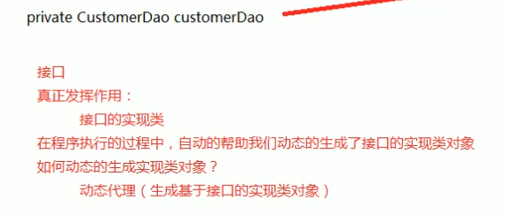
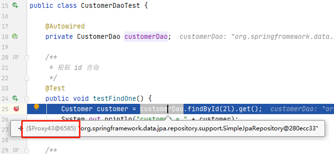
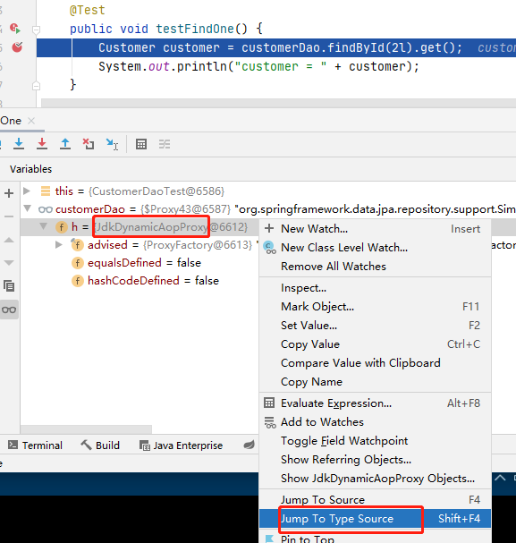
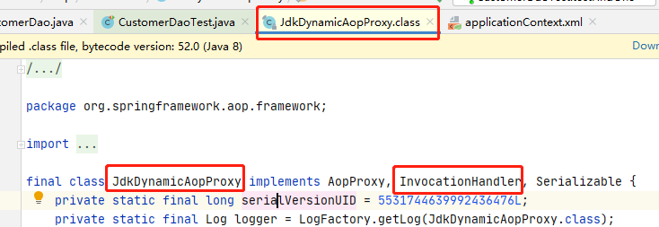
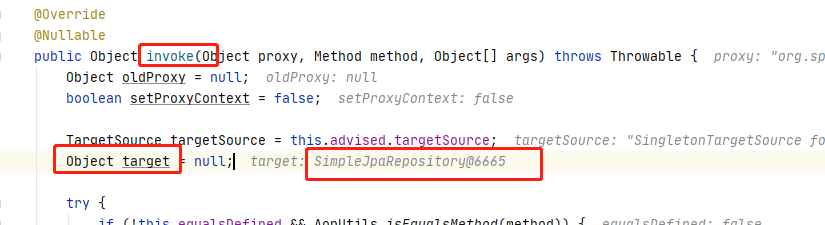
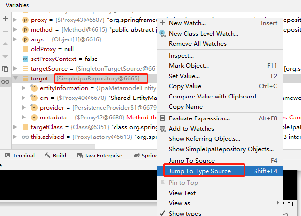
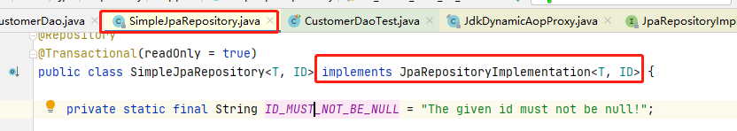
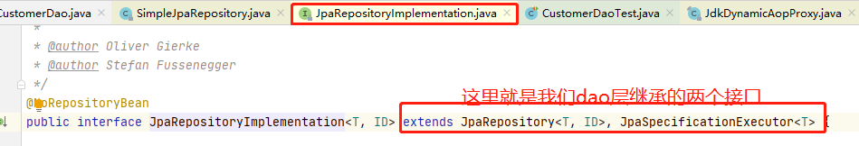
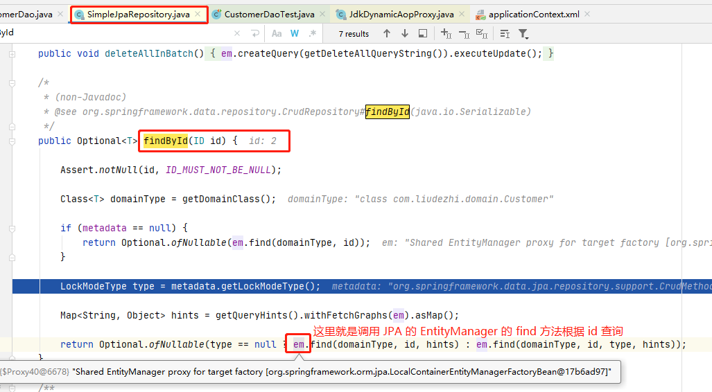
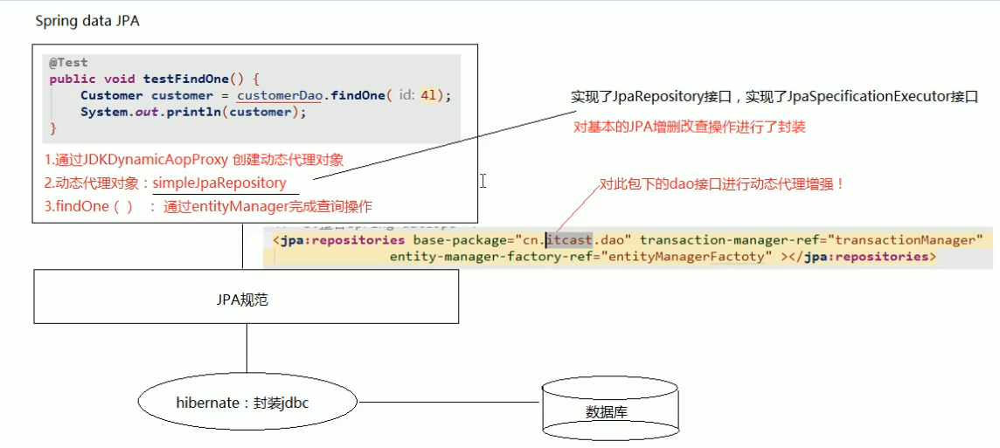

# 09.Spring Data JPA 的运行过程和原理剖析

- 笔记本：22.Spring Data JPA
- 创建时间：2020-11-01 13:48:12 UTC
- 更新时间：2020-11-01 15:35:12 UTC
- 印象笔记 GUID：361b8a7d-e959-42a9-a0fc-a09bfa7033e1

# Spring Data JPA 的运行过程和原理剖析

1. 通过 JdkDynamicAopProxy 的 invoke 方法创建了一个动态代理对象

1. SimpleJpaRepository 当中封装了 JPA 的操作（借助 JPA 的 API 完成数据库的 CRUD）

1. 通过 hibernate 完成数据库操作（封装了 jdbc）




 debug 运行可以看到 customerDao 是一个动态代理对象

**查看源码：**
 







```
public class SimpleJpaRepository<T, ID> implements JpaRepositoryImplementation<T,
ID> {}

```



```
public interface JpaRepositoryImplementation<T, ID> extends JpaRepository<T, ID>,
JpaSpecificationExecutor<T> {}

```



SimpleJpaRepository 可以看程 CustomerDao 的实现类.



**执行过程以及内部处理流程总结**
 

%23%20Spring%20Data%20JPA%20%E7%9A%84%E8%BF%90%E8%A1%8C%E8%BF%87%E7%A8%8B%E5%92%8C%E5%8E%9F%E7%90%86%E5%89%96%E6%9E%90%0A1.%20%E9%80%9A%E8%BF%87%20JdkDynamicAopProxy%20%E7%9A%84%20invoke%20%E6%96%B9%E6%B3%95%E5%88%9B%E5%BB%BA%E4%BA%86%E4%B8%80%E4%B8%AA%E5%8A%A8%E6%80%81%E4%BB%A3%E7%90%86%E5%AF%B9%E8%B1%A1%0A2.%20SimpleJpaRepository%20%E5%BD%93%E4%B8%AD%E5%B0%81%E8%A3%85%E4%BA%86%20JPA%20%E7%9A%84%E6%93%8D%E4%BD%9C%EF%BC%88%E5%80%9F%E5%8A%A9%20JPA%20%E7%9A%84%20API%20%E5%AE%8C%E6%88%90%E6%95%B0%E6%8D%AE%E5%BA%93%E7%9A%84%20CRUD%EF%BC%89%0A3.%20%E9%80%9A%E8%BF%87%20hibernate%20%E5%AE%8C%E6%88%90%E6%95%B0%E6%8D%AE%E5%BA%93%E6%93%8D%E4%BD%9C%EF%BC%88%E5%B0%81%E8%A3%85%E4%BA%86%20jdbc%EF%BC%89%0A%0A!%5B324ec6172ef07686cdaf0858c9ae70a8.png%5D(en-resource%3A%2F%2Fdatabase%2F3823%3A1)%0A%0A!%5Bd04c297b6d19ee7514a1d3af90ab9ab0.png%5D(en-resource%3A%2F%2Fdatabase%2F3825%3A1)%0Adebug%20%E8%BF%90%E8%A1%8C%E5%8F%AF%E4%BB%A5%E7%9C%8B%E5%88%B0%20customerDao%20%E6%98%AF%E4%B8%80%E4%B8%AA%E5%8A%A8%E6%80%81%E4%BB%A3%E7%90%86%E5%AF%B9%E8%B1%A1%0A%0A**%E6%9F%A5%E7%9C%8B%E6%BA%90%E7%A0%81%EF%BC%9A**%0A!%5Ba6ae471991e8204933e0ba8a914010be.png%5D(en-resource%3A%2F%2Fdatabase%2F3827%3A1)%0A%0A!%5B404f635011b6b45fe3b8f8df36e7d59c.png%5D(en-resource%3A%2F%2Fdatabase%2F3829%3A1)%0A%0A!%5B46bdc1c5e7602e55108220e5e7ccada3.png%5D(en-resource%3A%2F%2Fdatabase%2F3837%3A1)%0A%0A!%5B829e7e01e7db194bbeb3e2f04fa34bbe.png%5D(en-resource%3A%2F%2Fdatabase%2F3835%3A1)%0A%0A%60%60%60java%0Apublic%20class%20SimpleJpaRepository%3CT%2C%20ID%3E%20implements%20JpaRepositoryImplementation%3CT%2C%20%0AID%3E%20%7B%7D%0A%60%60%60%0A!%5Bd99f8811a915fc6dfd30df063cba19f2.png%5D(en-resource%3A%2F%2Fdatabase%2F3839%3A1)%0A%0A%0A%60%60%60java%0Apublic%20interface%20JpaRepositoryImplementation%3CT%2C%20ID%3E%20extends%20JpaRepository%3CT%2C%20ID%3E%2C%20%0AJpaSpecificationExecutor%3CT%3E%20%7B%7D%0A%60%60%60%0A!%5B2b43f10dfc611731d1b536a6d639290b.png%5D(en-resource%3A%2F%2Fdatabase%2F3841%3A1)%0A%0A%0ASimpleJpaRepository%20%E5%8F%AF%E4%BB%A5%E7%9C%8B%E7%A8%8B%20CustomerDao%20%E7%9A%84%E5%AE%9E%E7%8E%B0%E7%B1%BB.%0A%0A!%5B83bb23765a511b3c645f35f8366972ac.png%5D(en-resource%3A%2F%2Fdatabase%2F3845%3A1)%0A%0A%0A**%E6%89%A7%E8%A1%8C%E8%BF%87%E7%A8%8B%E4%BB%A5%E5%8F%8A%E5%86%85%E9%83%A8%E5%A4%84%E7%90%86%E6%B5%81%E7%A8%8B%E6%80%BB%E7%BB%93**%0A!%5B79a9332fec3c1d4550965f358d0ce163.png%5D(en-resource%3A%2F%2Fdatabase%2F3847%3A1)%0A
