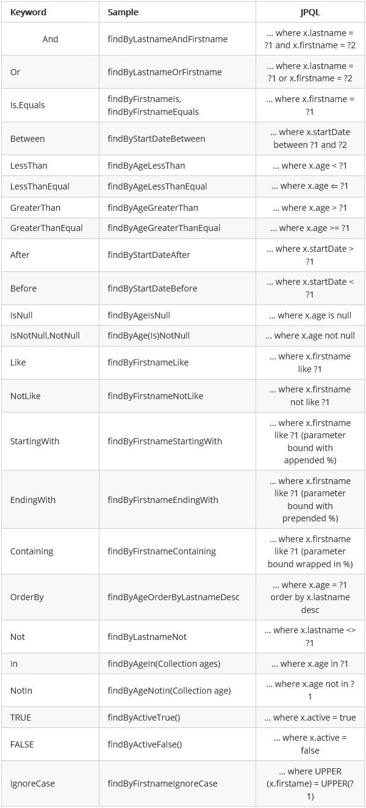
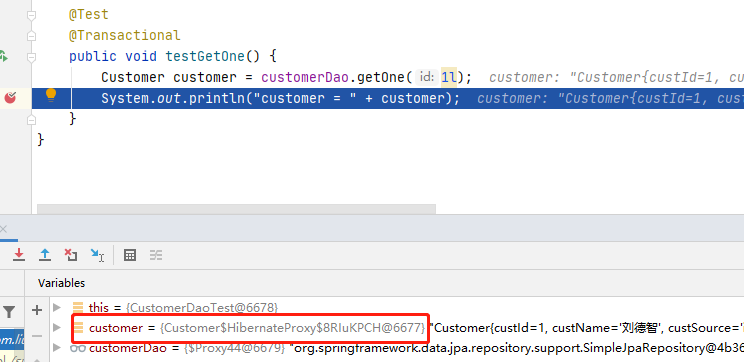

# 10.Spring Data JPA 复杂查询

- 笔记本：22.Spring Data JPA
- 创建时间：2020-11-01 15:35:49 UTC
- 更新时间：2020-11-26 08:52:49 UTC
- 原始链接：https://www.cnblogs.com/roadlandscape/p/12375059.html
- 印象笔记 GUID：e1034cb2-52bb-4cc0-8519-c6aac00a4d59



# Spring Data JPA 复杂查询

## 1. 借助接口中定义好的方法完成查询

### 1.1. 查询总条数

```
@Test
public void testCount() {
    long count = customerDao.count();
    System.out.println("count = " + count);
}

```

### 1.2. 查询是否存在

```
@Test
public void testExists() {
    boolean exists = customerDao.existsById(1l);
    System.out.println("exists = " + exists);
}

```

### 1.3. 延迟加载

```
/**
 * 根据 id 从数据库查询
 *  @Transactional: 保证 getOne 正常运行
 * findById:
 *  底层：em.find()
 * getOne:
 *  底层：em.getReference()
 *      * 返回的是一个客户的动态代理对象
 *      * 什么时候用，什么时候查询
 */
@Test
@Transactional
public void testGetOne() {
    Customer customer = customerDao.getOne(1l);
    System.out.println("customer = " + customer);
}

```


 可以看到，执行 sout 前，Customer 是一个动态代理对象

## 2. JPQL 查询引入

- 需要将 JPQL 语句配置到接口方法上

1. 特有的查询：需要在 dao 接口上配置方法

1. 在新添加的方法上，使用注解的形式配置 jpql 查询语句

1. 注解：@Query

### 2.1. 使用 JPQL 完成基本查询

**示例：**

```
package com.liudezhi.dao;

import com.liudezhi.domain.Customer;
import org.springframework.data.jpa.repository.JpaRepository;
import org.springframework.data.jpa.repository.JpaSpecificationExecutor;
import org.springframework.data.jpa.repository.Query;

public interface CustomerDao extends JpaRepository<Customer, Long>, JpaSpecificationExecutor<Customer> {

    /**
     * 案例：根据客户名称查询客户
     *  使用 jpql 的形式查询
     * jpql：from Customer where custName = ?
     * 配置 jpql 语句，使用 @Query 注解
     * @param custName
     * @return
     */
    @Query(value = "from Customer where custName = ?1")
    public Customer findCustomerByNameWithJpql(String custName);
}

```

```
package com.liudezhi.test;

import com.liudezhi.dao.CustomerDao;
import com.liudezhi.domain.Customer;
import org.junit.Test;
import org.junit.runner.RunWith;
import org.springframework.beans.factory.annotation.Autowired;
import org.springframework.test.context.ContextConfiguration;
import org.springframework.test.context.junit4.SpringJUnit4ClassRunner;

@RunWith(SpringJUnit4ClassRunner.class) // 声明 spring 提供的单元测试环境
@ContextConfiguration(locations = "classpath:applicationContext.xml")   // 指定 spring 容器的配置信息
public class JpqlTest {

    @Autowired
    private CustomerDao customerDao;

    @Test
    public void testFindJpql() {
        Customer customer = customerDao.findCustomerByNameWithJpql("刘德智");
        System.out.println("customer = " + customer);
    }
}

```

### 2.2. 多占位符的赋值

```
/**
 * 案例：根据客户名称和客户id查询客户
 *  jpql: from Customer where custName = ? and custId = ?
 */
@Query(value = "from Customer where custName = ?1 and custId = ?2")
public Customer findCustomerByNameAndIdWithJpql(String name, Long id);

```

```
@Test
public void testFindWithNameAndId() {
    Customer customer = customerDao.findCustomerByNameAndIdWithJpql("刘德智", 1l);
    System.out.println("customer = " + customer);
}

```

**对于多个占位符：** 赋值的时候，默认情况下，占位符的位置需要和方法参数中的位置保持一致

**可以指定占位符参数的位置：** ?索引的位置，指定此占位符的取值来源
 **eg:**

```
@Query(value = "from Customer where custName = ?2 and custId = ?1")
public Customer findCustomerByNameAndIdWithJpql2(Long id, String name);

```

```
@Test
public void testFindWithNameAndId2() {
    Customer customer = customerDao.findCustomerByNameAndIdWithJpql2(1l, "刘德智");
    System.out.println("customer = " + customer);
}

```

### 2.3. 使用 JPQL 完成更新操作

```
/**
 * 使用 jpql 完成更新操作
 *  案例：根据 id 更新客户的名称
 * sql: update cst_customer set cust_name = ? where cust_id = ?
 * jpql: update Customer set custName = ?2 where custId = ?1
 *
 * @Query: 代表的是进行查询
 * @Modifying: 声明当前执行的是更新操作
 */
@Query(value = "update Customer set custName = ?2 where custId = ?1")
@Modifying
public void updateCustomerById(Long id, String name);

```

```
/**
 * 测试 jpql 的更新操作
 *  spring Data JPA 中使用 jpql 完成 更新/删除 操作
 *      * 需要手动添加事务的支持
 *      * 默认会执行结束之后，回滚事务
 * @Rollback：设置是否自动回滚 false | true
 */
@Test
@Transactional  // 添加事务的支持(不会再报错了，但是数据库中的数据没有修改)
@Rollback(value = false)
public void testUpdate() {
    customerDao.updateCustomerById(1l, "夏爽");
}

```

## 3. SQL 查询

1. 特有的查询：需要在 dao 接口上配置方法

1. 在新添加的方法上，使用注解的形式配置 sql 查询语句

1. 注解：@Query
 value: jpql 语句 | sql 语句
 nativeQuery: false(使用jpql查询，默认值) | ture(使用本地查询：sql 查询)

### 3.1. 查询全部

```
/**
 * 使用 sql 的形式查询
 *  查询全部的客户
 * sql: select * from cst_customer
 * query: 配置 sql 查询
 *  value: sql 语句
 *  nativeQuery：查询方式
 *      true：sql 查询
 *      false：jpql 查询
 */
@Query(value = "select * from cst_customer", nativeQuery = true)
public List<Object []> findAllBySql();

```

```
@Test
public void testFindAllBySql() {
    List<Object[]> customers = customerDao.findAllBySql();
    for (Object[] obj : customers) {
        System.out.println(Arrays.toString(obj));
    }
}

```

### 3.2. 条件查询

```
@Query(value = "select * from cst_customer where cust_name like ?1", nativeQuery = true)
public List<Object []> findAllByNameWithSql(String name);

```

```
@Test
public void testFindAllByName() {
    List<Object[]> customers = customerDao.findAllByNameWithSql("%爽%");
    for (Object[] obj : customers) {
        System.out.println(Arrays.toString(obj));
    }
}

```

## 4. 方法命名规则查询

- 是对 jpql 查询，更加深入的一层封装。

- 我们只需要按照 Spring Data JPA 提供的方法名称规则定义方法，不需要再去配置 jpql 语句，完成查询。

顾名思义，方法命名规则查询就是根据方法的名字，就能创建查询。
 只需要按照Spring Data JPA提供的方法命名规则定义方法的名称，就可以完成查询工作。
 Spring Data JPA在程序执行的时候会根据方法名称进行解析，并自动生成查询语句进行查询

按照Spring Data JPA 定义的规则，查询方法以findBy开头，涉及条件查询时，条件的属性用条件关键字连接，
 要注意的是：条件属性首字母需大写。框架在进行方法名解析时，会先把方法名多余的前缀截取掉，然后对剩下部分进行解析。

具体的关键字，使用方法和生产成SQL如下表所示：
 

### 4.1. 基本查询

```
/**
 * 方法名的约定：
 *  findBy: 查询
 *      对象中的属性名（首字母大写）：查询的条件
 *  findByCustName -- 根据客户名称查询
 * 在 Spring Data JPA 运行的阶段
 *  会根据方法名进行解析 findBy from ***(实体类) 属性名称 where custName =
 * @param custName
 * @return
 */
public List<Customer> findByCustName(String custName);

```

```
@Test
public void testFindByCustName() {
    List<Customer> customers = customerDao.findByCustName("夏爽");
    for (Customer customer : customers) {
        System.out.println("customer = " + customer);
    }
}

```

### 4.2. 模糊匹配

```
/**
 * findBy + 属性名称（根据属性名称进行完成匹配的查询 = ）
 * findBy + 属性名称 + "查询方式(like | isnull)"
 */
public List<Customer> findByCustNameLike(String custName);

```

```
@Test
public void testFindByCustNameLike() {
    List<Customer> customers = customerDao.findByCustNameLike("%爽%");
    for (Customer customer : customers) {
        System.out.println("customer = " + customer);
    }
}

```

### 4.3. 多条件查询

```
/**
 * 多条件查询
 * findBy + 属性名称 + "查询方式(like | isnull)" + "多条件查询的连接符(and | or)"
 */
public List<Customer> findByCustNameLikeAndCustLevel(String name, String level);

```

```
@Test
public void testFindByCustNameLikeAndLevel() {
    List<Customer> customers = customerDao.findByCustNameLikeAndCustLevel("%爽%", "vips");
    for (Customer customer : customers) {
        System.out.println("customer = " + customer);
    }
}

```

!%5Bf72aa9429b88acf5e30bf13d7387541d.png%5D(en-resource%3A%2F%2Fdatabase%2F3853%3A2)%0A%23%20Spring%20Data%20JPA%20%E5%A4%8D%E6%9D%82%E6%9F%A5%E8%AF%A2%0A%0A%23%23%201.%20%E5%80%9F%E5%8A%A9%E6%8E%A5%E5%8F%A3%E4%B8%AD%E5%AE%9A%E4%B9%89%E5%A5%BD%E7%9A%84%E6%96%B9%E6%B3%95%E5%AE%8C%E6%88%90%E6%9F%A5%E8%AF%A2%0A%23%23%23%201.1.%20%E6%9F%A5%E8%AF%A2%E6%80%BB%E6%9D%A1%E6%95%B0%0A%60%60%60java%0A%40Test%0Apublic%20void%20testCount()%20%7B%0A%20%20%20%20long%20count%20%3D%20customerDao.count()%3B%0A%20%20%20%20System.out.println(%22count%20%3D%20%22%20%2B%20count)%3B%0A%7D%0A%60%60%60%0A%0A%23%23%23%201.2.%20%E6%9F%A5%E8%AF%A2%E6%98%AF%E5%90%A6%E5%AD%98%E5%9C%A8%0A%60%60%60java%0A%40Test%0Apublic%20void%20testExists()%20%7B%0A%20%20%20%20boolean%20exists%20%3D%20customerDao.existsById(1l)%3B%0A%20%20%20%20System.out.println(%22exists%20%3D%20%22%20%2B%20exists)%3B%0A%7D%0A%60%60%60%0A%0A%23%23%23%201.3.%20%E5%BB%B6%E8%BF%9F%E5%8A%A0%E8%BD%BD%0A%60%60%60java%0A%2F**%0A%20*%20%E6%A0%B9%E6%8D%AE%20id%20%E4%BB%8E%E6%95%B0%E6%8D%AE%E5%BA%93%E6%9F%A5%E8%AF%A2%0A%20*%20%20%40Transactional%3A%20%E4%BF%9D%E8%AF%81%20getOne%20%E6%AD%A3%E5%B8%B8%E8%BF%90%E8%A1%8C%0A%20*%20findById%3A%0A%20*%20%20%E5%BA%95%E5%B1%82%EF%BC%9Aem.find()%0A%20*%20getOne%3A%0A%20*%20%20%E5%BA%95%E5%B1%82%EF%BC%9Aem.getReference()%0A%20*%20%20%20%20%20%20*%20%E8%BF%94%E5%9B%9E%E7%9A%84%E6%98%AF%E4%B8%80%E4%B8%AA%E5%AE%A2%E6%88%B7%E7%9A%84%E5%8A%A8%E6%80%81%E4%BB%A3%E7%90%86%E5%AF%B9%E8%B1%A1%0A%20*%20%20%20%20%20%20*%20%E4%BB%80%E4%B9%88%E6%97%B6%E5%80%99%E7%94%A8%EF%BC%8C%E4%BB%80%E4%B9%88%E6%97%B6%E5%80%99%E6%9F%A5%E8%AF%A2%0A%20*%2F%0A%40Test%0A%40Transactional%0Apublic%20void%20testGetOne()%20%7B%0A%20%20%20%20Customer%20customer%20%3D%20customerDao.getOne(1l)%3B%0A%20%20%20%20System.out.println(%22customer%20%3D%20%22%20%2B%20customer)%3B%0A%7D%0A%60%60%60%0A!%5B99e73a98f2918620c6970eeb1c21e382.png%5D(en-resource%3A%2F%2Fdatabase%2F3851%3A1)%0A%E5%8F%AF%E4%BB%A5%E7%9C%8B%E5%88%B0%EF%BC%8C%E6%89%A7%E8%A1%8C%20sout%20%E5%89%8D%EF%BC%8CCustomer%20%E6%98%AF%E4%B8%80%E4%B8%AA%E5%8A%A8%E6%80%81%E4%BB%A3%E7%90%86%E5%AF%B9%E8%B1%A1%0A%0A%0A%23%23%202.%20JPQL%20%E6%9F%A5%E8%AF%A2%E5%BC%95%E5%85%A5%0A*%20%E9%9C%80%E8%A6%81%E5%B0%86%20JPQL%20%E8%AF%AD%E5%8F%A5%E9%85%8D%E7%BD%AE%E5%88%B0%E6%8E%A5%E5%8F%A3%E6%96%B9%E6%B3%95%E4%B8%8A%0A1.%20%E7%89%B9%E6%9C%89%E7%9A%84%E6%9F%A5%E8%AF%A2%EF%BC%9A%E9%9C%80%E8%A6%81%E5%9C%A8%20dao%20%E6%8E%A5%E5%8F%A3%E4%B8%8A%E9%85%8D%E7%BD%AE%E6%96%B9%E6%B3%95%0A2.%20%E5%9C%A8%E6%96%B0%E6%B7%BB%E5%8A%A0%E7%9A%84%E6%96%B9%E6%B3%95%E4%B8%8A%EF%BC%8C%E4%BD%BF%E7%94%A8%E6%B3%A8%E8%A7%A3%E7%9A%84%E5%BD%A2%E5%BC%8F%E9%85%8D%E7%BD%AE%20jpql%20%E6%9F%A5%E8%AF%A2%E8%AF%AD%E5%8F%A5%0A3.%20%E6%B3%A8%E8%A7%A3%EF%BC%9A%40Query%0A%0A%23%23%23%202.1.%20%E4%BD%BF%E7%94%A8%20JPQL%20%E5%AE%8C%E6%88%90%E5%9F%BA%E6%9C%AC%E6%9F%A5%E8%AF%A2%0A**%E7%A4%BA%E4%BE%8B%EF%BC%9A**%0A%60%60%60java%0Apackage%20com.liudezhi.dao%3B%0A%0Aimport%20com.liudezhi.domain.Customer%3B%0Aimport%20org.springframework.data.jpa.repository.JpaRepository%3B%0Aimport%20org.springframework.data.jpa.repository.JpaSpecificationExecutor%3B%0Aimport%20org.springframework.data.jpa.repository.Query%3B%0A%0Apublic%20interface%20CustomerDao%20extends%20JpaRepository%3CCustomer%2C%20Long%3E%2C%20JpaSpecificationExecutor%3CCustomer%3E%20%7B%0A%0A%20%20%20%20%2F**%0A%20%20%20%20%20*%20%E6%A1%88%E4%BE%8B%EF%BC%9A%E6%A0%B9%E6%8D%AE%E5%AE%A2%E6%88%B7%E5%90%8D%E7%A7%B0%E6%9F%A5%E8%AF%A2%E5%AE%A2%E6%88%B7%0A%20%20%20%20%20*%20%20%E4%BD%BF%E7%94%A8%20jpql%20%E7%9A%84%E5%BD%A2%E5%BC%8F%E6%9F%A5%E8%AF%A2%0A%20%20%20%20%20*%20jpql%EF%BC%9Afrom%20Customer%20where%20custName%20%3D%20%3F%0A%20%20%20%20%20*%20%E9%85%8D%E7%BD%AE%20jpql%20%E8%AF%AD%E5%8F%A5%EF%BC%8C%E4%BD%BF%E7%94%A8%20%40Query%20%E6%B3%A8%E8%A7%A3%0A%20%20%20%20%20*%20%40param%20custName%0A%20%20%20%20%20*%20%40return%0A%20%20%20%20%20*%2F%0A%20%20%20%20%40Query(value%20%3D%20%22from%20Customer%20where%20custName%20%3D%20%3F1%22)%0A%20%20%20%20public%20Customer%20findCustomerByNameWithJpql(String%20custName)%3B%0A%7D%0A%60%60%60%0A%0A%60%60%60java%0Apackage%20com.liudezhi.test%3B%0A%0Aimport%20com.liudezhi.dao.CustomerDao%3B%0Aimport%20com.liudezhi.domain.Customer%3B%0Aimport%20org.junit.Test%3B%0Aimport%20org.junit.runner.RunWith%3B%0Aimport%20org.springframework.beans.factory.annotation.Autowired%3B%0Aimport%20org.springframework.test.context.ContextConfiguration%3B%0Aimport%20org.springframework.test.context.junit4.SpringJUnit4ClassRunner%3B%0A%0A%40RunWith(SpringJUnit4ClassRunner.class)%20%2F%2F%20%E5%A3%B0%E6%98%8E%20spring%20%E6%8F%90%E4%BE%9B%E7%9A%84%E5%8D%95%E5%85%83%E6%B5%8B%E8%AF%95%E7%8E%AF%E5%A2%83%0A%40ContextConfiguration(locations%20%3D%20%22classpath%3AapplicationContext.xml%22)%20%20%20%2F%2F%20%E6%8C%87%E5%AE%9A%20spring%20%E5%AE%B9%E5%99%A8%E7%9A%84%E9%85%8D%E7%BD%AE%E4%BF%A1%E6%81%AF%0Apublic%20class%20JpqlTest%20%7B%0A%0A%20%20%20%20%40Autowired%0A%20%20%20%20private%20CustomerDao%20customerDao%3B%0A%0A%20%20%20%20%40Test%0A%20%20%20%20public%20void%20testFindJpql()%20%7B%0A%20%20%20%20%20%20%20%20Customer%20customer%20%3D%20customerDao.findCustomerByNameWithJpql(%22%E5%88%98%E5%BE%B7%E6%99%BA%22)%3B%0A%20%20%20%20%20%20%20%20System.out.println(%22customer%20%3D%20%22%20%2B%20customer)%3B%0A%20%20%20%20%7D%0A%7D%0A%60%60%60%0A%0A%23%23%23%202.2.%20%E5%A4%9A%E5%8D%A0%E4%BD%8D%E7%AC%A6%E7%9A%84%E8%B5%8B%E5%80%BC%0A%60%60%60java%0A%2F**%0A%20*%20%E6%A1%88%E4%BE%8B%EF%BC%9A%E6%A0%B9%E6%8D%AE%E5%AE%A2%E6%88%B7%E5%90%8D%E7%A7%B0%E5%92%8C%E5%AE%A2%E6%88%B7id%E6%9F%A5%E8%AF%A2%E5%AE%A2%E6%88%B7%0A%20*%20%20jpql%3A%20from%20Customer%20where%20custName%20%3D%20%3F%20and%20custId%20%3D%20%3F%0A%20*%2F%0A%40Query(value%20%3D%20%22from%20Customer%20where%20custName%20%3D%20%3F1%20and%20custId%20%3D%20%3F2%22)%0Apublic%20Customer%20findCustomerByNameAndIdWithJpql(String%20name%2C%20Long%20id)%3B%0A%60%60%60%0A%0A%60%60%60java%0A%40Test%0Apublic%20void%20testFindWithNameAndId()%20%7B%0A%20%20%20%20Customer%20customer%20%3D%20customerDao.findCustomerByNameAndIdWithJpql(%22%E5%88%98%E5%BE%B7%E6%99%BA%22%2C%201l)%3B%0A%20%20%20%20System.out.println(%22customer%20%3D%20%22%20%2B%20customer)%3B%0A%7D%0A%60%60%60%0A%0A**%E5%AF%B9%E4%BA%8E%E5%A4%9A%E4%B8%AA%E5%8D%A0%E4%BD%8D%E7%AC%A6%EF%BC%9A**%20%E8%B5%8B%E5%80%BC%E7%9A%84%E6%97%B6%E5%80%99%EF%BC%8C%E9%BB%98%E8%AE%A4%E6%83%85%E5%86%B5%E4%B8%8B%EF%BC%8C%E5%8D%A0%E4%BD%8D%E7%AC%A6%E7%9A%84%E4%BD%8D%E7%BD%AE%E9%9C%80%E8%A6%81%E5%92%8C%E6%96%B9%E6%B3%95%E5%8F%82%E6%95%B0%E4%B8%AD%E7%9A%84%E4%BD%8D%E7%BD%AE%E4%BF%9D%E6%8C%81%E4%B8%80%E8%87%B4%0A%0A**%E5%8F%AF%E4%BB%A5%E6%8C%87%E5%AE%9A%E5%8D%A0%E4%BD%8D%E7%AC%A6%E5%8F%82%E6%95%B0%E7%9A%84%E4%BD%8D%E7%BD%AE%EF%BC%9A**%20%3F%E7%B4%A2%E5%BC%95%E7%9A%84%E4%BD%8D%E7%BD%AE%EF%BC%8C%E6%8C%87%E5%AE%9A%E6%AD%A4%E5%8D%A0%E4%BD%8D%E7%AC%A6%E7%9A%84%E5%8F%96%E5%80%BC%E6%9D%A5%E6%BA%90%0A**eg%3A**%0A%60%60%60java%0A%40Query(value%20%3D%20%22from%20Customer%20where%20custName%20%3D%20%3F2%20and%20custId%20%3D%20%3F1%22)%0Apublic%20Customer%20findCustomerByNameAndIdWithJpql2(Long%20id%2C%20String%20name)%3B%0A%60%60%60%0A%60%60%60java%0A%40Test%0Apublic%20void%20testFindWithNameAndId2()%20%7B%0A%20%20%20%20Customer%20customer%20%3D%20customerDao.findCustomerByNameAndIdWithJpql2(1l%2C%20%22%E5%88%98%E5%BE%B7%E6%99%BA%22)%3B%0A%20%20%20%20System.out.println(%22customer%20%3D%20%22%20%2B%20customer)%3B%0A%7D%0A%60%60%60%0A%0A%23%23%23%202.3.%20%E4%BD%BF%E7%94%A8%20JPQL%20%E5%AE%8C%E6%88%90%E6%9B%B4%E6%96%B0%E6%93%8D%E4%BD%9C%0A%60%60%60java%0A%2F**%0A%20*%20%E4%BD%BF%E7%94%A8%20jpql%20%E5%AE%8C%E6%88%90%E6%9B%B4%E6%96%B0%E6%93%8D%E4%BD%9C%0A%20*%20%20%E6%A1%88%E4%BE%8B%EF%BC%9A%E6%A0%B9%E6%8D%AE%20id%20%E6%9B%B4%E6%96%B0%E5%AE%A2%E6%88%B7%E7%9A%84%E5%90%8D%E7%A7%B0%0A%20*%20sql%3A%20update%20cst_customer%20set%20cust_name%20%3D%20%3F%20where%20cust_id%20%3D%20%3F%0A%20*%20jpql%3A%20update%20Customer%20set%20custName%20%3D%20%3F2%20where%20custId%20%3D%20%3F1%0A%20*%0A%20*%20%40Query%3A%20%E4%BB%A3%E8%A1%A8%E7%9A%84%E6%98%AF%E8%BF%9B%E8%A1%8C%E6%9F%A5%E8%AF%A2%0A%20*%20%40Modifying%3A%20%E5%A3%B0%E6%98%8E%E5%BD%93%E5%89%8D%E6%89%A7%E8%A1%8C%E7%9A%84%E6%98%AF%E6%9B%B4%E6%96%B0%E6%93%8D%E4%BD%9C%0A%20*%2F%0A%40Query(value%20%3D%20%22update%20Customer%20set%20custName%20%3D%20%3F2%20where%20custId%20%3D%20%3F1%22)%0A%40Modifying%0Apublic%20void%20updateCustomerById(Long%20id%2C%20String%20name)%3B%0A%60%60%60%0A%0A%60%60%60java%0A%2F**%0A%20*%20%E6%B5%8B%E8%AF%95%20jpql%20%E7%9A%84%E6%9B%B4%E6%96%B0%E6%93%8D%E4%BD%9C%0A%20*%20%20spring%20Data%20JPA%20%E4%B8%AD%E4%BD%BF%E7%94%A8%20jpql%20%E5%AE%8C%E6%88%90%20%E6%9B%B4%E6%96%B0%2F%E5%88%A0%E9%99%A4%20%E6%93%8D%E4%BD%9C%0A%20*%20%20%20%20%20%20*%20%E9%9C%80%E8%A6%81%E6%89%8B%E5%8A%A8%E6%B7%BB%E5%8A%A0%E4%BA%8B%E5%8A%A1%E7%9A%84%E6%94%AF%E6%8C%81%0A%20*%20%20%20%20%20%20*%20%E9%BB%98%E8%AE%A4%E4%BC%9A%E6%89%A7%E8%A1%8C%E7%BB%93%E6%9D%9F%E4%B9%8B%E5%90%8E%EF%BC%8C%E5%9B%9E%E6%BB%9A%E4%BA%8B%E5%8A%A1%0A%20*%20%40Rollback%EF%BC%9A%E8%AE%BE%E7%BD%AE%E6%98%AF%E5%90%A6%E8%87%AA%E5%8A%A8%E5%9B%9E%E6%BB%9A%20false%20%7C%20true%0A%20*%2F%0A%40Test%0A%40Transactional%20%20%2F%2F%20%E6%B7%BB%E5%8A%A0%E4%BA%8B%E5%8A%A1%E7%9A%84%E6%94%AF%E6%8C%81(%E4%B8%8D%E4%BC%9A%E5%86%8D%E6%8A%A5%E9%94%99%E4%BA%86%EF%BC%8C%E4%BD%86%E6%98%AF%E6%95%B0%E6%8D%AE%E5%BA%93%E4%B8%AD%E7%9A%84%E6%95%B0%E6%8D%AE%E6%B2%A1%E6%9C%89%E4%BF%AE%E6%94%B9)%0A%40Rollback(value%20%3D%20false)%0Apublic%20void%20testUpdate()%20%7B%0A%20%20%20%20customerDao.updateCustomerById(1l%2C%20%22%E5%A4%8F%E7%88%BD%22)%3B%0A%7D%0A%60%60%60%0A%0A%23%23%203.%20SQL%20%E6%9F%A5%E8%AF%A2%0A1.%20%E7%89%B9%E6%9C%89%E7%9A%84%E6%9F%A5%E8%AF%A2%EF%BC%9A%E9%9C%80%E8%A6%81%E5%9C%A8%20dao%20%E6%8E%A5%E5%8F%A3%E4%B8%8A%E9%85%8D%E7%BD%AE%E6%96%B9%E6%B3%95%0A2.%20%E5%9C%A8%E6%96%B0%E6%B7%BB%E5%8A%A0%E7%9A%84%E6%96%B9%E6%B3%95%E4%B8%8A%EF%BC%8C%E4%BD%BF%E7%94%A8%E6%B3%A8%E8%A7%A3%E7%9A%84%E5%BD%A2%E5%BC%8F%E9%85%8D%E7%BD%AE%20sql%20%E6%9F%A5%E8%AF%A2%E8%AF%AD%E5%8F%A5%0A3.%20%E6%B3%A8%E8%A7%A3%EF%BC%9A%40Query%0A%20%20%20%20value%3A%20jpql%20%E8%AF%AD%E5%8F%A5%20%7C%20sql%20%E8%AF%AD%E5%8F%A5%0A%20%20%20%20nativeQuery%3A%20false(%E4%BD%BF%E7%94%A8jpql%E6%9F%A5%E8%AF%A2%EF%BC%8C%E9%BB%98%E8%AE%A4%E5%80%BC)%20%7C%20ture(%E4%BD%BF%E7%94%A8%E6%9C%AC%E5%9C%B0%E6%9F%A5%E8%AF%A2%EF%BC%9Asql%20%E6%9F%A5%E8%AF%A2)%0A%23%23%23%203.1.%20%E6%9F%A5%E8%AF%A2%E5%85%A8%E9%83%A8%0A%60%60%60java%0A%2F**%0A%20*%20%E4%BD%BF%E7%94%A8%20sql%20%E7%9A%84%E5%BD%A2%E5%BC%8F%E6%9F%A5%E8%AF%A2%0A%20*%20%20%E6%9F%A5%E8%AF%A2%E5%85%A8%E9%83%A8%E7%9A%84%E5%AE%A2%E6%88%B7%0A%20*%20sql%3A%20select%20*%20from%20cst_customer%0A%20*%20query%3A%20%E9%85%8D%E7%BD%AE%20sql%20%E6%9F%A5%E8%AF%A2%0A%20*%20%20value%3A%20sql%20%E8%AF%AD%E5%8F%A5%0A%20*%20%20nativeQuery%EF%BC%9A%E6%9F%A5%E8%AF%A2%E6%96%B9%E5%BC%8F%0A%20*%20%20%20%20%20%20true%EF%BC%9Asql%20%E6%9F%A5%E8%AF%A2%0A%20*%20%20%20%20%20%20false%EF%BC%9Ajpql%20%E6%9F%A5%E8%AF%A2%0A%20*%2F%0A%40Query(value%20%3D%20%22select%20*%20from%20cst_customer%22%2C%20nativeQuery%20%3D%20true)%0Apublic%20List%3CObject%20%5B%5D%3E%20findAllBySql()%3B%0A%60%60%60%0A%0A%60%60%60java%0A%40Test%0Apublic%20void%20testFindAllBySql()%20%7B%0A%20%20%20%20List%3CObject%5B%5D%3E%20customers%20%3D%20customerDao.findAllBySql()%3B%0A%20%20%20%20for%20(Object%5B%5D%20obj%20%3A%20customers)%20%7B%0A%20%20%20%20%20%20%20%20System.out.println(Arrays.toString(obj))%3B%0A%20%20%20%20%7D%0A%7D%0A%60%60%60%0A%0A%23%23%23%203.2.%20%E6%9D%A1%E4%BB%B6%E6%9F%A5%E8%AF%A2%0A%60%60%60java%0A%40Query(value%20%3D%20%22select%20*%20from%20cst_customer%20where%20cust_name%20like%20%3F1%22%2C%20nativeQuery%20%3D%20true)%0Apublic%20List%3CObject%20%5B%5D%3E%20findAllByNameWithSql(String%20name)%3B%0A%60%60%60%0A%60%60%60java%0A%40Test%0Apublic%20void%20testFindAllByName()%20%7B%0A%20%20%20%20List%3CObject%5B%5D%3E%20customers%20%3D%20customerDao.findAllByNameWithSql(%22%25%E7%88%BD%25%22)%3B%0A%20%20%20%20for%20(Object%5B%5D%20obj%20%3A%20customers)%20%7B%0A%20%20%20%20%20%20%20%20System.out.println(Arrays.toString(obj))%3B%0A%20%20%20%20%7D%0A%7D%0A%60%60%60%0A%0A%23%23%204.%20%E6%96%B9%E6%B3%95%E5%91%BD%E5%90%8D%E8%A7%84%E5%88%99%E6%9F%A5%E8%AF%A2%0A*%20%E6%98%AF%E5%AF%B9%20jpql%20%E6%9F%A5%E8%AF%A2%EF%BC%8C%E6%9B%B4%E5%8A%A0%E6%B7%B1%E5%85%A5%E7%9A%84%E4%B8%80%E5%B1%82%E5%B0%81%E8%A3%85%E3%80%82%0A*%20%E6%88%91%E4%BB%AC%E5%8F%AA%E9%9C%80%E8%A6%81%E6%8C%89%E7%85%A7%20Spring%20Data%20JPA%20%E6%8F%90%E4%BE%9B%E7%9A%84%E6%96%B9%E6%B3%95%E5%90%8D%E7%A7%B0%E8%A7%84%E5%88%99%E5%AE%9A%E4%B9%89%E6%96%B9%E6%B3%95%EF%BC%8C%E4%B8%8D%E9%9C%80%E8%A6%81%E5%86%8D%E5%8E%BB%E9%85%8D%E7%BD%AE%20jpql%20%E8%AF%AD%E5%8F%A5%EF%BC%8C%E5%AE%8C%E6%88%90%E6%9F%A5%E8%AF%A2%E3%80%82%0A%0A%E9%A1%BE%E5%90%8D%E6%80%9D%E4%B9%89%EF%BC%8C%E6%96%B9%E6%B3%95%E5%91%BD%E5%90%8D%E8%A7%84%E5%88%99%E6%9F%A5%E8%AF%A2%E5%B0%B1%E6%98%AF%E6%A0%B9%E6%8D%AE%E6%96%B9%E6%B3%95%E7%9A%84%E5%90%8D%E5%AD%97%EF%BC%8C%E5%B0%B1%E8%83%BD%E5%88%9B%E5%BB%BA%E6%9F%A5%E8%AF%A2%E3%80%82%0A%E5%8F%AA%E9%9C%80%E8%A6%81%E6%8C%89%E7%85%A7Spring%20Data%20JPA%E6%8F%90%E4%BE%9B%E7%9A%84%E6%96%B9%E6%B3%95%E5%91%BD%E5%90%8D%E8%A7%84%E5%88%99%E5%AE%9A%E4%B9%89%E6%96%B9%E6%B3%95%E7%9A%84%E5%90%8D%E7%A7%B0%EF%BC%8C%E5%B0%B1%E5%8F%AF%E4%BB%A5%E5%AE%8C%E6%88%90%E6%9F%A5%E8%AF%A2%E5%B7%A5%E4%BD%9C%E3%80%82%0ASpring%20Data%20JPA%E5%9C%A8%E7%A8%8B%E5%BA%8F%E6%89%A7%E8%A1%8C%E7%9A%84%E6%97%B6%E5%80%99%E4%BC%9A%E6%A0%B9%E6%8D%AE%E6%96%B9%E6%B3%95%E5%90%8D%E7%A7%B0%E8%BF%9B%E8%A1%8C%E8%A7%A3%E6%9E%90%EF%BC%8C%E5%B9%B6%E8%87%AA%E5%8A%A8%E7%94%9F%E6%88%90%E6%9F%A5%E8%AF%A2%E8%AF%AD%E5%8F%A5%E8%BF%9B%E8%A1%8C%E6%9F%A5%E8%AF%A2%0A%0A%E6%8C%89%E7%85%A7Spring%20Data%20JPA%20%E5%AE%9A%E4%B9%89%E7%9A%84%E8%A7%84%E5%88%99%EF%BC%8C%E6%9F%A5%E8%AF%A2%E6%96%B9%E6%B3%95%E4%BB%A5findBy%E5%BC%80%E5%A4%B4%EF%BC%8C%E6%B6%89%E5%8F%8A%E6%9D%A1%E4%BB%B6%E6%9F%A5%E8%AF%A2%E6%97%B6%EF%BC%8C%E6%9D%A1%E4%BB%B6%E7%9A%84%E5%B1%9E%E6%80%A7%E7%94%A8%E6%9D%A1%E4%BB%B6%E5%85%B3%E9%94%AE%E5%AD%97%E8%BF%9E%E6%8E%A5%EF%BC%8C%0A%E8%A6%81%E6%B3%A8%E6%84%8F%E7%9A%84%E6%98%AF%EF%BC%9A%E6%9D%A1%E4%BB%B6%E5%B1%9E%E6%80%A7%E9%A6%96%E5%AD%97%E6%AF%8D%E9%9C%80%E5%A4%A7%E5%86%99%E3%80%82%E6%A1%86%E6%9E%B6%E5%9C%A8%E8%BF%9B%E8%A1%8C%E6%96%B9%E6%B3%95%E5%90%8D%E8%A7%A3%E6%9E%90%E6%97%B6%EF%BC%8C%E4%BC%9A%E5%85%88%E6%8A%8A%E6%96%B9%E6%B3%95%E5%90%8D%E5%A4%9A%E4%BD%99%E7%9A%84%E5%89%8D%E7%BC%80%E6%88%AA%E5%8F%96%E6%8E%89%EF%BC%8C%E7%84%B6%E5%90%8E%E5%AF%B9%E5%89%A9%E4%B8%8B%E9%83%A8%E5%88%86%E8%BF%9B%E8%A1%8C%E8%A7%A3%E6%9E%90%E3%80%82%0A%0A%E5%85%B7%E4%BD%93%E7%9A%84%E5%85%B3%E9%94%AE%E5%AD%97%EF%BC%8C%E4%BD%BF%E7%94%A8%E6%96%B9%E6%B3%95%E5%92%8C%E7%94%9F%E4%BA%A7%E6%88%90SQL%E5%A6%82%E4%B8%8B%E8%A1%A8%E6%89%80%E7%A4%BA%EF%BC%9A%0A!%5Bf72aa9429b88acf5e30bf13d7387541d.png%5D(en-resource%3A%2F%2Fdatabase%2F3853%3A2)%0A%0A%0A%23%23%23%204.1.%20%E5%9F%BA%E6%9C%AC%E6%9F%A5%E8%AF%A2%0A%60%60%60java%0A%2F**%0A%20*%20%E6%96%B9%E6%B3%95%E5%90%8D%E7%9A%84%E7%BA%A6%E5%AE%9A%EF%BC%9A%0A%20*%20%20findBy%3A%20%E6%9F%A5%E8%AF%A2%0A%20*%20%20%20%20%20%20%E5%AF%B9%E8%B1%A1%E4%B8%AD%E7%9A%84%E5%B1%9E%E6%80%A7%E5%90%8D%EF%BC%88%E9%A6%96%E5%AD%97%E6%AF%8D%E5%A4%A7%E5%86%99%EF%BC%89%EF%BC%9A%E6%9F%A5%E8%AF%A2%E7%9A%84%E6%9D%A1%E4%BB%B6%0A%20*%20%20findByCustName%20--%20%E6%A0%B9%E6%8D%AE%E5%AE%A2%E6%88%B7%E5%90%8D%E7%A7%B0%E6%9F%A5%E8%AF%A2%0A%20*%20%E5%9C%A8%20Spring%20Data%20JPA%20%E8%BF%90%E8%A1%8C%E7%9A%84%E9%98%B6%E6%AE%B5%0A%20*%20%20%E4%BC%9A%E6%A0%B9%E6%8D%AE%E6%96%B9%E6%B3%95%E5%90%8D%E8%BF%9B%E8%A1%8C%E8%A7%A3%E6%9E%90%20findBy%20from%20***(%E5%AE%9E%E4%BD%93%E7%B1%BB)%20%E5%B1%9E%E6%80%A7%E5%90%8D%E7%A7%B0%20where%20custName%20%3D%0A%20*%20%40param%20custName%0A%20*%20%40return%0A%20*%2F%0Apublic%20List%3CCustomer%3E%20findByCustName(String%20custName)%3B%0A%60%60%60%0A%0A%60%60%60java%0A%40Test%0Apublic%20void%20testFindByCustName()%20%7B%0A%20%20%20%20List%3CCustomer%3E%20customers%20%3D%20customerDao.findByCustName(%22%E5%A4%8F%E7%88%BD%22)%3B%0A%20%20%20%20for%20(Customer%20customer%20%3A%20customers)%20%7B%0A%20%20%20%20%20%20%20%20System.out.println(%22customer%20%3D%20%22%20%2B%20customer)%3B%0A%20%20%20%20%7D%0A%7D%0A%60%60%60%0A%0A%23%23%23%204.2.%20%E6%A8%A1%E7%B3%8A%E5%8C%B9%E9%85%8D%0A%60%60%60java%0A%2F**%0A%20*%20findBy%20%2B%20%E5%B1%9E%E6%80%A7%E5%90%8D%E7%A7%B0%EF%BC%88%E6%A0%B9%E6%8D%AE%E5%B1%9E%E6%80%A7%E5%90%8D%E7%A7%B0%E8%BF%9B%E8%A1%8C%E5%AE%8C%E6%88%90%E5%8C%B9%E9%85%8D%E7%9A%84%E6%9F%A5%E8%AF%A2%20%3D%20%EF%BC%89%0A%20*%20findBy%20%2B%20%E5%B1%9E%E6%80%A7%E5%90%8D%E7%A7%B0%20%2B%20%22%E6%9F%A5%E8%AF%A2%E6%96%B9%E5%BC%8F(like%20%7C%20isnull)%22%0A%20*%2F%0Apublic%20List%3CCustomer%3E%20findByCustNameLike(String%20custName)%3B%0A%60%60%60%0A%60%60%60java%0A%40Test%0Apublic%20void%20testFindByCustNameLike()%20%7B%0A%20%20%20%20List%3CCustomer%3E%20customers%20%3D%20customerDao.findByCustNameLike(%22%25%E7%88%BD%25%22)%3B%0A%20%20%20%20for%20(Customer%20customer%20%3A%20customers)%20%7B%0A%20%20%20%20%20%20%20%20System.out.println(%22customer%20%3D%20%22%20%2B%20customer)%3B%0A%20%20%20%20%7D%0A%7D%0A%60%60%60%0A%0A%23%23%23%204.3.%20%E5%A4%9A%E6%9D%A1%E4%BB%B6%E6%9F%A5%E8%AF%A2%0A%60%60%60java%0A%2F**%0A%20*%20%E5%A4%9A%E6%9D%A1%E4%BB%B6%E6%9F%A5%E8%AF%A2%0A%20*%20findBy%20%2B%20%E5%B1%9E%E6%80%A7%E5%90%8D%E7%A7%B0%20%2B%20%22%E6%9F%A5%E8%AF%A2%E6%96%B9%E5%BC%8F(like%20%7C%20isnull)%22%20%2B%20%22%E5%A4%9A%E6%9D%A1%E4%BB%B6%E6%9F%A5%E8%AF%A2%E7%9A%84%E8%BF%9E%E6%8E%A5%E7%AC%A6(and%20%7C%20or)%22%0A%20*%2F%0Apublic%20List%3CCustomer%3E%20findByCustNameLikeAndCustLevel(String%20name%2C%20String%20level)%3B%0A%60%60%60%0A%0A%60%60%60java%0A%40Test%0Apublic%20void%20testFindByCustNameLikeAndLevel()%20%7B%0A%20%20%20%20List%3CCustomer%3E%20customers%20%3D%20customerDao.findByCustNameLikeAndCustLevel(%22%25%E7%88%BD%25%22%2C%20%22vips%22)%3B%0A%20%20%20%20for%20(Customer%20customer%20%3A%20customers)%20%7B%0A%20%20%20%20%20%20%20%20System.out.println(%22customer%20%3D%20%22%20%2B%20customer)%3B%0A%20%20%20%20%7D%0A%7D%0A%60%60%60
