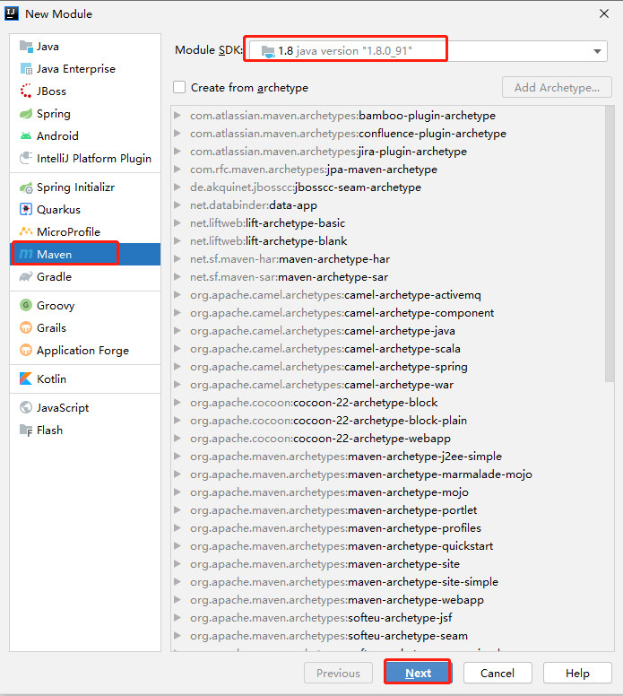
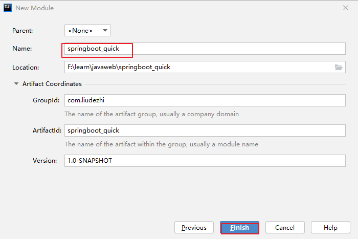
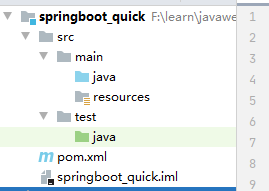
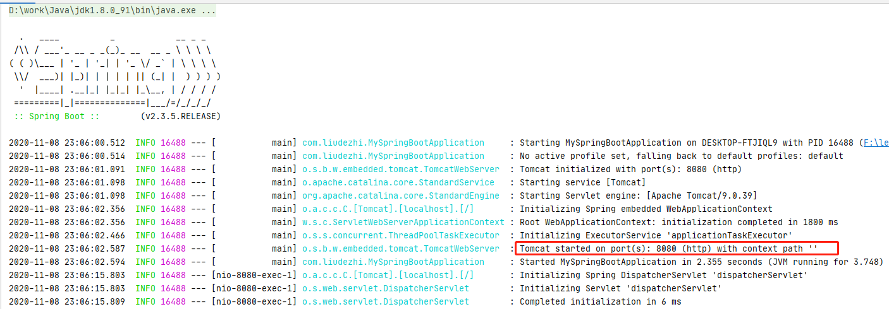
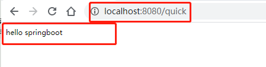
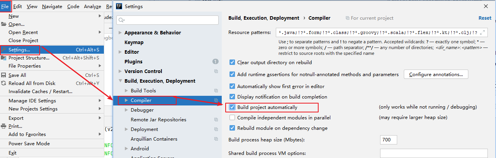
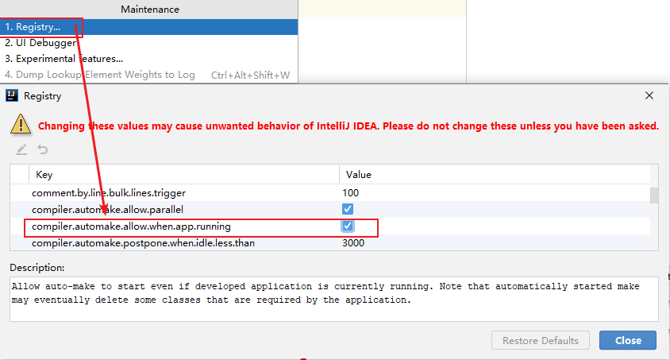

# 02.SpringBoot 快速入门

- 笔记本：23.SpringBoot
- 创建时间：2020-11-08 14:26:24 UTC
- 更新时间：2020-11-08 15:45:59 UTC
- 印象笔记 GUID：91b878ab-9a04-4100-9291-2858a387dcbe

# SpringBoot 快速入门

## 1. 代码实现

### 1.1. 创建 Maven 工程

使用idea工具创建一个maven工程，该工程为普通的java工程即可
 
 
 

### 1.2. 添加SpringBoot的起步依赖

SpringBoot要求，项目要继承SpringBoot的起步依赖 `spring-boot-starter-parent`

```
<parent>
    <groupId>org.springframework.boot</groupId>
    <artifactId>spring-boot-starter-parent</artifactId>
    <version>2.3.5.RELEASE</version>
</parent>

```

SpringBoot要集成SpringMVC进行Controller的开发，所以项目要导入web的启动依赖

```
<dependencies>
    <dependency>
        <groupId>org.springframework.boot</groupId>
        <artifactId>spring-boot-starter-web</artifactId>
    </dependency>
</dependencies>

```

### 1.3. 编写SpringBoot引导类

```
package com.liudezhi;

import org.springframework.boot.SpringApplication;
import org.springframework.boot.autoconfigure.SpringBootApplication;

@SpringBootApplication
public class MySpringBootApplication {
    public static void main(String[] args) {
        SpringApplication.run(MySpringBootApplication.class, args);
    }
}

```

### 1.4. 编写Controller

在引导类MySpringBootApplication同级包或者子级包中创建QuickStartController

```
package com.liudezhi.controller;

import org.springframework.stereotype.Controller;
import org.springframework.web.bind.annotation.RequestMapping;
import org.springframework.web.bind.annotation.ResponseBody;

@Controller
public class QuickController {

    @RequestMapping("/quick")
    @ResponseBody
    public String quick() {
        return "hello springboot";
    }
}

```

### 1.5. 测试

执行SpringBoot起步类的主方法，控制台打印日志如下：

```
.   ____          _            __ _ _
 /\\ / ___'_ __ _ _(_)_ __  __ _ \ \ \ \
( ( )\___ | '_ | '_| | '_ \/ _` | \ \ \ \
 \\/  ___)| |_)| | | | | || (_| |  ) ) ) )
  '  |____| .__|_| |_|_| |_\__, | / / / /
 =========|_|==============|___/=/_/_/_/
 :: Spring Boot ::        (v2.3.5.RELEASE)

2020-11-08 23:06:00.512  INFO 16488 --- [           main] com.liudezhi.MySpringBootApplication     : Starting MySpringBootApplication on DESKTOP-FTJIQL9 with PID 16488 (F:\learn\javaweb\springboot_quick\target\classes started by dezhi in F:\learn\javaweb\springboot)
2020-11-08 23:06:00.514  INFO 16488 --- [           main] com.liudezhi.MySpringBootApplication     : No active profile set, falling back to default profiles: default
2020-11-08 23:06:01.091  INFO 16488 --- [           main] o.s.b.w.embedded.tomcat.TomcatWebServer  : Tomcat initialized with port(s): 8080 (http)
2020-11-08 23:06:01.098  INFO 16488 --- [           main] o.apache.catalina.core.StandardService   : Starting service [Tomcat]
2020-11-08 23:06:01.098  INFO 16488 --- [           main] org.apache.catalina.core.StandardEngine  : Starting Servlet engine: [Apache Tomcat/9.0.39]
2020-11-08 23:06:02.356  INFO 16488 --- [           main] o.a.c.c.C.[Tomcat].[localhost].[/]       : Initializing Spring embedded WebApplicationContext
2020-11-08 23:06:02.356  INFO 16488 --- [           main] w.s.c.ServletWebServerApplicationContext : Root WebApplicationContext: initialization completed in 1800 ms
2020-11-08 23:06:02.466  INFO 16488 --- [           main] o.s.s.concurrent.ThreadPoolTaskExecutor  : Initializing ExecutorService 'applicationTaskExecutor'
2020-11-08 23:06:02.587  INFO 16488 --- [           main] o.s.b.w.embedded.tomcat.TomcatWebServer  : Tomcat started on port(s): 8080 (http) with context path ''
2020-11-08 23:06:02.594  INFO 16488 --- [           main] com.liudezhi.MySpringBootApplication     : Started MySpringBootApplication in 2.355 seconds (JVM running for 3.748)
2020-11-08 23:06:15.803  INFO 16488 --- [nio-8080-exec-1] o.a.c.c.C.[Tomcat].[localhost].[/]       : Initializing Spring DispatcherServlet 'dispatcherServlet'
2020-11-08 23:06:15.803  INFO 16488 --- [nio-8080-exec-1] o.s.web.servlet.DispatcherServlet        : Initializing Servlet 'dispatcherServlet'
2020-11-08 23:06:15.809  INFO 16488 --- [nio-8080-exec-1] o.s.web.servlet.DispatcherServlet        : Completed initialization in 6 ms

```



通过日志发现，Tomcat started on port(s): 8080 (http) with context path ''
 tomcat已经起步，端口监听8080，web应用的虚拟工程名称为空
 打开浏览器访问url地址为：http://localhost:8080/quick
 

## 2. 快速入门解析

### 2.1. SpringBoot代码解析

- @SpringBootApplication：标注SpringBoot的启动类，该注解具备多种功能（后面详细剖析）

- SpringApplication.run(MySpringBootApplication.class) 代表运行SpringBoot的启动类，参数为SpringBoot启动类的字节码对象

### 2.2. SpringBoot工程热部署

我们在开发中反复修改类、页面等资源，每次修改后都是需要重新启动才生效，这样每次启动都很麻烦，浪费了大量的时间，我们可以在修改代码后不重启就能生效，在 pom.xml 中添加如下配置就可以实现这样的功能，我们称之为热部署。

```
<!--热部署配置-->
<dependency>
    <groupId>org.springframework.boot</groupId>
    <artifactId>spring-boot-devtools</artifactId>
</dependency>

```

**注意：** IDEA 进行 SpringBoot 热部署失败原因

出现这种情况，并不是热部署配置问题，其根本原因是因为Intellij IEDA默认情况下不会自动编译，需要对IDEA进行自动编译的设置，如下：
 
 然后：Shift + Ctrl + Alt + /，选择 Registry
 

%23%20SpringBoot%20%E5%BF%AB%E9%80%9F%E5%85%A5%E9%97%A8%0A%23%23%201.%20%E4%BB%A3%E7%A0%81%E5%AE%9E%E7%8E%B0%0A%23%23%23%201.1.%20%E5%88%9B%E5%BB%BA%20Maven%20%E5%B7%A5%E7%A8%8B%0A%E4%BD%BF%E7%94%A8idea%E5%B7%A5%E5%85%B7%E5%88%9B%E5%BB%BA%E4%B8%80%E4%B8%AAmaven%E5%B7%A5%E7%A8%8B%EF%BC%8C%E8%AF%A5%E5%B7%A5%E7%A8%8B%E4%B8%BA%E6%99%AE%E9%80%9A%E7%9A%84java%E5%B7%A5%E7%A8%8B%E5%8D%B3%E5%8F%AF%0A!%5Bae60f723802abb63e4408bfcb6bfa95e.png%5D(en-resource%3A%2F%2Fdatabase%2F3901%3A0)%0A!%5Bc2ed7c3774dfa0bc00de83edb6f56571.png%5D(en-resource%3A%2F%2Fdatabase%2F3905%3A0)%0A!%5B6b9d8f23350241c3c6de1041c85b30ff.png%5D(en-resource%3A%2F%2Fdatabase%2F3907%3A0)%0A%0A%23%23%23%201.2.%20%E6%B7%BB%E5%8A%A0SpringBoot%E7%9A%84%E8%B5%B7%E6%AD%A5%E4%BE%9D%E8%B5%96%0ASpringBoot%E8%A6%81%E6%B1%82%EF%BC%8C%E9%A1%B9%E7%9B%AE%E8%A6%81%E7%BB%A7%E6%89%BFSpringBoot%E7%9A%84%E8%B5%B7%E6%AD%A5%E4%BE%9D%E8%B5%96%20%60spring-boot-starter-parent%60%0A%60%60%60xml%0A%3Cparent%3E%0A%20%20%20%20%3CgroupId%3Eorg.springframework.boot%3C%2FgroupId%3E%0A%20%20%20%20%3CartifactId%3Espring-boot-starter-parent%3C%2FartifactId%3E%0A%20%20%20%20%3Cversion%3E2.3.5.RELEASE%3C%2Fversion%3E%0A%3C%2Fparent%3E%0A%60%60%60%0A%0ASpringBoot%E8%A6%81%E9%9B%86%E6%88%90SpringMVC%E8%BF%9B%E8%A1%8CController%E7%9A%84%E5%BC%80%E5%8F%91%EF%BC%8C%E6%89%80%E4%BB%A5%E9%A1%B9%E7%9B%AE%E8%A6%81%E5%AF%BC%E5%85%A5web%E7%9A%84%E5%90%AF%E5%8A%A8%E4%BE%9D%E8%B5%96%0A%60%60%60xml%0A%3Cdependencies%3E%0A%20%20%20%20%3Cdependency%3E%0A%20%20%20%20%20%20%20%20%3CgroupId%3Eorg.springframework.boot%3C%2FgroupId%3E%0A%20%20%20%20%20%20%20%20%3CartifactId%3Espring-boot-starter-web%3C%2FartifactId%3E%0A%20%20%20%20%3C%2Fdependency%3E%0A%3C%2Fdependencies%3E%0A%60%60%60%0A%0A%23%23%23%201.3.%20%E7%BC%96%E5%86%99SpringBoot%E5%BC%95%E5%AF%BC%E7%B1%BB%0A%60%60%60java%0Apackage%20com.liudezhi%3B%0A%0Aimport%20org.springframework.boot.SpringApplication%3B%0Aimport%20org.springframework.boot.autoconfigure.SpringBootApplication%3B%0A%0A%40SpringBootApplication%0Apublic%20class%20MySpringBootApplication%20%7B%0A%20%20%20%20public%20static%20void%20main(String%5B%5D%20args)%20%7B%0A%20%20%20%20%20%20%20%20SpringApplication.run(MySpringBootApplication.class%2C%20args)%3B%0A%20%20%20%20%7D%0A%7D%0A%60%60%60%0A%0A%23%23%23%201.4.%20%E7%BC%96%E5%86%99Controller%0A%E5%9C%A8%E5%BC%95%E5%AF%BC%E7%B1%BBMySpringBootApplication%E5%90%8C%E7%BA%A7%E5%8C%85%E6%88%96%E8%80%85%E5%AD%90%E7%BA%A7%E5%8C%85%E4%B8%AD%E5%88%9B%E5%BB%BAQuickStartController%0A%60%60%60java%0Apackage%20com.liudezhi.controller%3B%0A%0Aimport%20org.springframework.stereotype.Controller%3B%0Aimport%20org.springframework.web.bind.annotation.RequestMapping%3B%0Aimport%20org.springframework.web.bind.annotation.ResponseBody%3B%0A%0A%40Controller%0Apublic%20class%20QuickController%20%7B%0A%0A%20%20%20%20%40RequestMapping(%22%2Fquick%22)%0A%20%20%20%20%40ResponseBody%0A%20%20%20%20public%20String%20quick()%20%7B%0A%20%20%20%20%20%20%20%20return%20%22hello%20springboot%22%3B%0A%20%20%20%20%7D%0A%7D%0A%60%60%60%0A%0A%23%23%23%201.5.%20%E6%B5%8B%E8%AF%95%0A%E6%89%A7%E8%A1%8CSpringBoot%E8%B5%B7%E6%AD%A5%E7%B1%BB%E7%9A%84%E4%B8%BB%E6%96%B9%E6%B3%95%EF%BC%8C%E6%8E%A7%E5%88%B6%E5%8F%B0%E6%89%93%E5%8D%B0%E6%97%A5%E5%BF%97%E5%A6%82%E4%B8%8B%EF%BC%9A%0A%60%60%60%0A.%20%20%20____%20%20%20%20%20%20%20%20%20%20_%20%20%20%20%20%20%20%20%20%20%20%20__%20_%20_%0A%20%2F%5C%5C%20%2F%20___'_%20__%20_%20_(_)_%20__%20%20__%20_%20%5C%20%5C%20%5C%20%5C%0A(%20(%20)%5C___%20%7C%20'_%20%7C%20'_%7C%20%7C%20'_%20%5C%2F%20_%60%20%7C%20%5C%20%5C%20%5C%20%5C%0A%20%5C%5C%2F%20%20___)%7C%20%7C_)%7C%20%7C%20%7C%20%7C%20%7C%20%7C%7C%20(_%7C%20%7C%20%20)%20)%20)%20)%0A%20%20'%20%20%7C____%7C%20.__%7C_%7C%20%7C_%7C_%7C%20%7C_%5C__%2C%20%7C%20%2F%20%2F%20%2F%20%2F%0A%20%3D%3D%3D%3D%3D%3D%3D%3D%3D%7C_%7C%3D%3D%3D%3D%3D%3D%3D%3D%3D%3D%3D%3D%3D%3D%7C___%2F%3D%2F_%2F_%2F_%2F%0A%20%3A%3A%20Spring%20Boot%20%3A%3A%20%20%20%20%20%20%20%20(v2.3.5.RELEASE)%0A%0A2020-11-08%2023%3A06%3A00.512%20%20INFO%2016488%20---%20%5B%20%20%20%20%20%20%20%20%20%20%20main%5D%20com.liudezhi.MySpringBootApplication%20%20%20%20%20%3A%20Starting%20MySpringBootApplication%20on%20DESKTOP-FTJIQL9%20with%20PID%2016488%20(F%3A%5Clearn%5Cjavaweb%5Cspringboot_quick%5Ctarget%5Cclasses%20started%20by%20dezhi%20in%20F%3A%5Clearn%5Cjavaweb%5Cspringboot)%0A2020-11-08%2023%3A06%3A00.514%20%20INFO%2016488%20---%20%5B%20%20%20%20%20%20%20%20%20%20%20main%5D%20com.liudezhi.MySpringBootApplication%20%20%20%20%20%3A%20No%20active%20profile%20set%2C%20falling%20back%20to%20default%20profiles%3A%20default%0A2020-11-08%2023%3A06%3A01.091%20%20INFO%2016488%20---%20%5B%20%20%20%20%20%20%20%20%20%20%20main%5D%20o.s.b.w.embedded.tomcat.TomcatWebServer%20%20%3A%20Tomcat%20initialized%20with%20port(s)%3A%208080%20(http)%0A2020-11-08%2023%3A06%3A01.098%20%20INFO%2016488%20---%20%5B%20%20%20%20%20%20%20%20%20%20%20main%5D%20o.apache.catalina.core.StandardService%20%20%20%3A%20Starting%20service%20%5BTomcat%5D%0A2020-11-08%2023%3A06%3A01.098%20%20INFO%2016488%20---%20%5B%20%20%20%20%20%20%20%20%20%20%20main%5D%20org.apache.catalina.core.StandardEngine%20%20%3A%20Starting%20Servlet%20engine%3A%20%5BApache%20Tomcat%2F9.0.39%5D%0A2020-11-08%2023%3A06%3A02.356%20%20INFO%2016488%20---%20%5B%20%20%20%20%20%20%20%20%20%20%20main%5D%20o.a.c.c.C.%5BTomcat%5D.%5Blocalhost%5D.%5B%2F%5D%20%20%20%20%20%20%20%3A%20Initializing%20Spring%20embedded%20WebApplicationContext%0A2020-11-08%2023%3A06%3A02.356%20%20INFO%2016488%20---%20%5B%20%20%20%20%20%20%20%20%20%20%20main%5D%20w.s.c.ServletWebServerApplicationContext%20%3A%20Root%20WebApplicationContext%3A%20initialization%20completed%20in%201800%20ms%0A2020-11-08%2023%3A06%3A02.466%20%20INFO%2016488%20---%20%5B%20%20%20%20%20%20%20%20%20%20%20main%5D%20o.s.s.concurrent.ThreadPoolTaskExecutor%20%20%3A%20Initializing%20ExecutorService%20'applicationTaskExecutor'%0A2020-11-08%2023%3A06%3A02.587%20%20INFO%2016488%20---%20%5B%20%20%20%20%20%20%20%20%20%20%20main%5D%20o.s.b.w.embedded.tomcat.TomcatWebServer%20%20%3A%20Tomcat%20started%20on%20port(s)%3A%208080%20(http)%20with%20context%20path%20''%0A2020-11-08%2023%3A06%3A02.594%20%20INFO%2016488%20---%20%5B%20%20%20%20%20%20%20%20%20%20%20main%5D%20com.liudezhi.MySpringBootApplication%20%20%20%20%20%3A%20Started%20MySpringBootApplication%20in%202.355%20seconds%20(JVM%20running%20for%203.748)%0A2020-11-08%2023%3A06%3A15.803%20%20INFO%2016488%20---%20%5Bnio-8080-exec-1%5D%20o.a.c.c.C.%5BTomcat%5D.%5Blocalhost%5D.%5B%2F%5D%20%20%20%20%20%20%20%3A%20Initializing%20Spring%20DispatcherServlet%20'dispatcherServlet'%0A2020-11-08%2023%3A06%3A15.803%20%20INFO%2016488%20---%20%5Bnio-8080-exec-1%5D%20o.s.web.servlet.DispatcherServlet%20%20%20%20%20%20%20%20%3A%20Initializing%20Servlet%20'dispatcherServlet'%0A2020-11-08%2023%3A06%3A15.809%20%20INFO%2016488%20---%20%5Bnio-8080-exec-1%5D%20o.s.web.servlet.DispatcherServlet%20%20%20%20%20%20%20%20%3A%20Completed%20initialization%20in%206%20ms%0A%60%60%60%0A!%5B721fffedad9ecda343569e01729d11e1.png%5D(en-resource%3A%2F%2Fdatabase%2F3911%3A0)%0A%0A%E9%80%9A%E8%BF%87%E6%97%A5%E5%BF%97%E5%8F%91%E7%8E%B0%EF%BC%8CTomcat%20started%20on%20port(s)%3A%208080%20(http)%20with%20context%20path%20''%0Atomcat%E5%B7%B2%E7%BB%8F%E8%B5%B7%E6%AD%A5%EF%BC%8C%E7%AB%AF%E5%8F%A3%E7%9B%91%E5%90%AC8080%EF%BC%8Cweb%E5%BA%94%E7%94%A8%E7%9A%84%E8%99%9A%E6%8B%9F%E5%B7%A5%E7%A8%8B%E5%90%8D%E7%A7%B0%E4%B8%BA%E7%A9%BA%0A%E6%89%93%E5%BC%80%E6%B5%8F%E8%A7%88%E5%99%A8%E8%AE%BF%E9%97%AEurl%E5%9C%B0%E5%9D%80%E4%B8%BA%EF%BC%9Ahttp%3A%2F%2Flocalhost%3A8080%2Fquick%0A!%5B839c7c612ead41f7e1b45fdfebac04cb.png%5D(en-resource%3A%2F%2Fdatabase%2F3909%3A0)%0A%0A%23%23%202.%20%E5%BF%AB%E9%80%9F%E5%85%A5%E9%97%A8%E8%A7%A3%E6%9E%90%0A%23%23%23%202.1.%20SpringBoot%E4%BB%A3%E7%A0%81%E8%A7%A3%E6%9E%90%0A-%20%40SpringBootApplication%EF%BC%9A%E6%A0%87%E6%B3%A8SpringBoot%E7%9A%84%E5%90%AF%E5%8A%A8%E7%B1%BB%EF%BC%8C%E8%AF%A5%E6%B3%A8%E8%A7%A3%E5%85%B7%E5%A4%87%E5%A4%9A%E7%A7%8D%E5%8A%9F%E8%83%BD%EF%BC%88%E5%90%8E%E9%9D%A2%E8%AF%A6%E7%BB%86%E5%89%96%E6%9E%90%EF%BC%89%0A-%20SpringApplication.run(MySpringBootApplication.class)%20%E4%BB%A3%E8%A1%A8%E8%BF%90%E8%A1%8CSpringBoot%E7%9A%84%E5%90%AF%E5%8A%A8%E7%B1%BB%EF%BC%8C%E5%8F%82%E6%95%B0%E4%B8%BASpringBoot%E5%90%AF%E5%8A%A8%E7%B1%BB%E7%9A%84%E5%AD%97%E8%8A%82%E7%A0%81%E5%AF%B9%E8%B1%A1%20%0A%0A%23%23%23%202.2.%20SpringBoot%E5%B7%A5%E7%A8%8B%E7%83%AD%E9%83%A8%E7%BD%B2%0A%E6%88%91%E4%BB%AC%E5%9C%A8%E5%BC%80%E5%8F%91%E4%B8%AD%E5%8F%8D%E5%A4%8D%E4%BF%AE%E6%94%B9%E7%B1%BB%E3%80%81%E9%A1%B5%E9%9D%A2%E7%AD%89%E8%B5%84%E6%BA%90%EF%BC%8C%E6%AF%8F%E6%AC%A1%E4%BF%AE%E6%94%B9%E5%90%8E%E9%83%BD%E6%98%AF%E9%9C%80%E8%A6%81%E9%87%8D%E6%96%B0%E5%90%AF%E5%8A%A8%E6%89%8D%E7%94%9F%E6%95%88%EF%BC%8C%E8%BF%99%E6%A0%B7%E6%AF%8F%E6%AC%A1%E5%90%AF%E5%8A%A8%E9%83%BD%E5%BE%88%E9%BA%BB%E7%83%A6%EF%BC%8C%E6%B5%AA%E8%B4%B9%E4%BA%86%E5%A4%A7%E9%87%8F%E7%9A%84%E6%97%B6%E9%97%B4%EF%BC%8C%E6%88%91%E4%BB%AC%E5%8F%AF%E4%BB%A5%E5%9C%A8%E4%BF%AE%E6%94%B9%E4%BB%A3%E7%A0%81%E5%90%8E%E4%B8%8D%E9%87%8D%E5%90%AF%E5%B0%B1%E8%83%BD%E7%94%9F%E6%95%88%EF%BC%8C%E5%9C%A8%20pom.xml%20%E4%B8%AD%E6%B7%BB%E5%8A%A0%E5%A6%82%E4%B8%8B%E9%85%8D%E7%BD%AE%E5%B0%B1%E5%8F%AF%E4%BB%A5%E5%AE%9E%E7%8E%B0%E8%BF%99%E6%A0%B7%E7%9A%84%E5%8A%9F%E8%83%BD%EF%BC%8C%E6%88%91%E4%BB%AC%E7%A7%B0%E4%B9%8B%E4%B8%BA%E7%83%AD%E9%83%A8%E7%BD%B2%E3%80%82%0A%60%60%60xml%0A%3C!--%E7%83%AD%E9%83%A8%E7%BD%B2%E9%85%8D%E7%BD%AE--%3E%0A%3Cdependency%3E%0A%20%20%20%20%3CgroupId%3Eorg.springframework.boot%3C%2FgroupId%3E%0A%20%20%20%20%3CartifactId%3Espring-boot-devtools%3C%2FartifactId%3E%0A%3C%2Fdependency%3E%0A%60%60%60%0A%0A**%E6%B3%A8%E6%84%8F%EF%BC%9A**%20IDEA%20%E8%BF%9B%E8%A1%8C%20SpringBoot%20%E7%83%AD%E9%83%A8%E7%BD%B2%E5%A4%B1%E8%B4%A5%E5%8E%9F%E5%9B%A0%0A%0A%E5%87%BA%E7%8E%B0%E8%BF%99%E7%A7%8D%E6%83%85%E5%86%B5%EF%BC%8C%E5%B9%B6%E4%B8%8D%E6%98%AF%E7%83%AD%E9%83%A8%E7%BD%B2%E9%85%8D%E7%BD%AE%E9%97%AE%E9%A2%98%EF%BC%8C%E5%85%B6%E6%A0%B9%E6%9C%AC%E5%8E%9F%E5%9B%A0%E6%98%AF%E5%9B%A0%E4%B8%BAIntellij%20IEDA%E9%BB%98%E8%AE%A4%E6%83%85%E5%86%B5%E4%B8%8B%E4%B8%8D%E4%BC%9A%E8%87%AA%E5%8A%A8%E7%BC%96%E8%AF%91%EF%BC%8C%E9%9C%80%E8%A6%81%E5%AF%B9IDEA%E8%BF%9B%E8%A1%8C%E8%87%AA%E5%8A%A8%E7%BC%96%E8%AF%91%E7%9A%84%E8%AE%BE%E7%BD%AE%EF%BC%8C%E5%A6%82%E4%B8%8B%EF%BC%9A%0A!%5Bc7c438b85699ca4004858d5a25bbaff1.png%5D(en-resource%3A%2F%2Fdatabase%2F3913%3A0)%0A%E7%84%B6%E5%90%8E%EF%BC%9AShift%20%2B%20Ctrl%20%2B%20Alt%20%2B%20%2F%EF%BC%8C%E9%80%89%E6%8B%A9%20Registry%0A!%5B3f6a0448b2459578da64493ea46ac87a.png%5D(en-resource%3A%2F%2Fdatabase%2F3915%3A0)%0A%0A%23%23%23%202.3.%20%E4%BD%BF%E7%94%A8idea%E5%BF%AB%E9%80%9F%E5%88%9B%E5%BB%BASpringBoot%E9%A1%B9%E7%9B%AE%0A!%5B7373b173be46a11874c4963305dcae0e.png%5D(en-resource%3A%2F%2Fdatabase%2F3917%3A0)%0A!%5Bf45ea97bf8a12e9aaefd4a012644cb33.png%5D(en-resource%3A%2F%2Fdatabase%2F3919%3A0)%0A!%5Bb77f0e786ba6fecd846bd98cf6ea6885.png%5D(en-resource%3A%2F%2Fdatabase%2F3921%3A0)%0A!%5Bd0a5aaf1a8fda1ba08bc7c07183828b3.png%5D(en-resource%3A%2F%2Fdatabase%2F3923%3A0)%0A!%5Bbd2a0e98492b1e111e627cd4a25bd833.png%5D(en-resource%3A%2F%2Fdatabase%2F3925%3A0)%0A%0A%E9%80%9A%E8%BF%87idea%E5%BF%AB%E9%80%9F%E5%88%9B%E5%BB%BA%E7%9A%84SpringBoot%E9%A1%B9%E7%9B%AE%E7%9A%84pom.xml%E4%B8%AD%E5%B7%B2%E7%BB%8F%E5%AF%BC%E5%85%A5%E4%BA%86%E6%88%91%E4%BB%AC%E9%80%89%E6%8B%A9%E7%9A%84web%E7%9A%84%E8%B5%B7%E6%AD%A5%E4%BE%9D%E8%B5%96%E7%9A%84%E5%9D%90%E6%A0%87%0A%0A**%E6%B3%A8%EF%BC%9A**%20%E5%8F%AF%E4%BB%A5%E4%BD%BF%E7%94%A8%20%60%40RestController%60%20%E6%9B%BF%E4%BB%A3%20%60%40Controller%60%0A!%5B6844fc8bc4c86a7433f0514391bff0bb.png%5D(en-resource%3A%2F%2Fdatabase%2F3927%3A0)%0ARestController%20%E4%B8%AD%E5%B7%B2%E7%BB%8F%E5%BC%95%E5%85%A5%E4%BA%86%20%60%40Controller%60%20%E5%92%8C%20%60%40ResponseBody%60%20%E6%B3%A8%E8%A7%A3%EF%BC%8C%E5%90%8E%E9%9D%A2%E7%9A%84%E6%96%B9%E6%B3%95%E4%B8%8A%E5%B0%B1%E4%B8%8D%E7%94%A8%E5%AE%B6%20%60%40ResponseBody%60%20%E4%BA%86%E3%80%82%0A%0A
