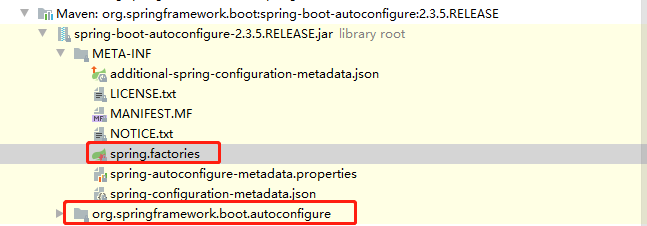
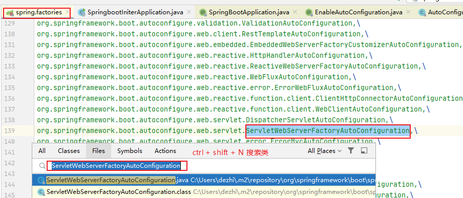

# 03.SpringBoot原理分析

- 笔记本：23.SpringBoot
- 创建时间：2020-11-08 16:02:51 UTC
- 更新时间：2020-11-08 17:06:54 UTC
- 印象笔记 GUID：02d4c7d3-2c6d-4ce9-b84a-a42102b38002

# SpringBoot原理分析

## 1. 起步依赖原理分析

### 1.1. 分析spring-boot-starter-parent

按住Ctrl点击pom.xml中的spring-boot-starter-parent，跳转到了spring-boot-starter-parent的pom.xml，xml配置如下（只摘抄了部分重点配置）：

```
<parent>
    <groupId>org.springframework.boot</groupId>
    <artifactId>spring-boot-dependencies</artifactId>
    <version>2.3.5.RELEASE</version>
</parent>

```

按住Ctrl点击pom.xml中的 `spring-boot-dependencies`，跳转到了`spring-boot-dependencies` 的 pom.xml，xml 配置如下（只摘抄了部分重点配置）：

```
<properties>
    <activemq.version>5.15.13</activemq.version>
    <antlr2.version>2.7.7</antlr2.version>
    <appengine-sdk.version>1.9.82</appengine-sdk.version>
    <artemis.version>2.12.0</artemis.version>
    ...
</properties>
<dependencyManagement>
    <dependency>
        <groupId>org.springframework.boot</groupId>
        <artifactId>spring-boot</artifactId>
        <version>2.3.5.RELEASE</version>
      </dependency>
      <dependency>
        <groupId>org.springframework.boot</groupId>
        <artifactId>spring-boot-test</artifactId>
        <version>2.3.5.RELEASE</version>
      </dependency>
      ...
</dependencyManagement>

```

从上面的spring-boot-starter-dependencies的pom.xml中我们可以发现，一部分坐标的版本、依赖管理、插件管理已经定义好，所以我们的SpringBoot工程继承spring-boot-starter-parent后已经具备版本锁定等配置了。所以起步依赖的作用就是进行依赖的传递。

### 1.2. 分析spring-boot-starter-web

按住Ctrl点击 pom.xml 中的 `spring-boot-starter-web`，跳转到了 `spring-boot-starter-web` 的 pom.xml，xml 配置如下（只摘抄了部分重点配置）：

```
<?xml version="1.0" encoding="UTF-8"?>
<project xsi:schemaLocation="http://maven.apache.org/POM/4.0.0 http://maven.apache.org/xsd/maven-4.0.0.xsd" xmlns="http://maven.apache.org/POM/4.0.0"
    xmlns:xsi="http://www.w3.org/2001/XMLSchema-instance">
  <modelVersion>4.0.0</modelVersion>
  <groupId>org.springframework.boot</groupId>
  <artifactId>spring-boot-starter-web</artifactId>
  <version>2.3.5.RELEASE</version>
  <name>spring-boot-starter-web</name>
  <description>Starter for building web, including RESTful, applications using Spring MVC. Uses Tomcat as the default embedded container</description>
  <url>https://spring.io/projects/spring-boot</url>
  <organization>
    <name>Pivotal Software, Inc.</name>
    <url>https://spring.io</url>
  </organization>
  <licenses>
    <license>
      <name>Apache License, Version 2.0</name>
      <url>https://www.apache.org/licenses/LICENSE-2.0</url>
    </license>
  </licenses>
  <developers>
    <developer>
      <name>Pivotal</name>
      <email>info@pivotal.io</email>
      <organization>Pivotal Software, Inc.</organization>
      <organizationUrl>https://www.spring.io</organizationUrl>
    </developer>
  </developers>
  <scm>
    <connection>scm:git:git://github.com/spring-projects/spring-boot.git</connection>
    <developerConnection>scm:git:ssh://git@github.com/spring-projects/spring-boot.git</developerConnection>
    <url>https://github.com/spring-projects/spring-boot</url>
  </scm>
  <issueManagement>
    <system>GitHub</system>
    <url>https://github.com/spring-projects/spring-boot/issues</url>
  </issueManagement>
  <dependencies>
    <dependency>
      <groupId>org.springframework.boot</groupId>
      <artifactId>spring-boot-starter</artifactId>
      <version>2.3.5.RELEASE</version>
      <scope>compile</scope>
    </dependency>
    <dependency>
      <groupId>org.springframework.boot</groupId>
      <artifactId>spring-boot-starter-json</artifactId>
      <version>2.3.5.RELEASE</version>
      <scope>compile</scope>
    </dependency>
    <dependency>
      <groupId>org.springframework.boot</groupId>
      <artifactId>spring-boot-starter-tomcat</artifactId>
      <version>2.3.5.RELEASE</version>
      <scope>compile</scope>
    </dependency>
    <dependency>
      <groupId>org.springframework</groupId>
      <artifactId>spring-web</artifactId>
      <version>5.2.10.RELEASE</version>
      <scope>compile</scope>
    </dependency>
    <dependency>
      <groupId>org.springframework</groupId>
      <artifactId>spring-webmvc</artifactId>
      <version>5.2.10.RELEASE</version>
      <scope>compile</scope>
    </dependency>
  </dependencies>
</project>

```

从上面的 `spring-boot-starter-web` 的pom.xml中我们可以发现， `spring-boot-starter-web` 就是将web开发要使用的 `spring-web、spring-webmvc` 等坐标进行了“打包”，这样我们的工程只要引入 `spring-boot-starter-web` 起步依赖的坐标就可以进行 web 开发了，同样体现了依赖传递的作用。

## 2. 自动配置原理解析

按住Ctrl点击查看启动类 `SpringbootIniterApplication` 上的注解 `@SpringBootApplication`

```
package com.liudezhi;

import org.springframework.boot.SpringApplication;
import org.springframework.boot.autoconfigure.SpringBootApplication;

@SpringBootApplication
public class SpringbootIniterApplication {
    public static void main(String[] args) {
        SpringApplication.run(SpringbootIniterApplication.class, args);
    }
}

```

注解 `@SpringBootApplication`` 的源码：

```
//
// Source code recreated from a .class file by IntelliJ IDEA
// (powered by Fernflower decompiler)
//

package org.springframework.boot.autoconfigure;

import java.lang.annotation.Documented;
import java.lang.annotation.ElementType;
import java.lang.annotation.Inherited;
import java.lang.annotation.Retention;
import java.lang.annotation.RetentionPolicy;
import java.lang.annotation.Target;
import org.springframework.beans.factory.support.BeanNameGenerator;
import org.springframework.boot.SpringBootConfiguration;
import org.springframework.boot.context.TypeExcludeFilter;
import org.springframework.context.annotation.ComponentScan;
import org.springframework.context.annotation.Configuration;
import org.springframework.context.annotation.FilterType;
import org.springframework.context.annotation.ComponentScan.Filter;
import org.springframework.core.annotation.AliasFor;

@Target({ElementType.TYPE})
@Retention(RetentionPolicy.RUNTIME)
@Documented
@Inherited
@SpringBootConfiguration
@EnableAutoConfiguration
@ComponentScan(
    excludeFilters = {@Filter(
    type = FilterType.CUSTOM,
    classes = {TypeExcludeFilter.class}
), @Filter(
    type = FilterType.CUSTOM,
    classes = {AutoConfigurationExcludeFilter.class}
)}
)
public @interface SpringBootApplication {
    @AliasFor(
        annotation = EnableAutoConfiguration.class
    )
    Class<?>[] exclude() default {};

    @AliasFor(
        annotation = EnableAutoConfiguration.class
    )
    String[] excludeName() default {};

    @AliasFor(
        annotation = ComponentScan.class,
        attribute = "basePackages"
    )
    String[] scanBasePackages() default {};

    @AliasFor(
        annotation = ComponentScan.class,
        attribute = "basePackageClasses"
    )
    Class<?>[] scanBasePackageClasses() default {};

    @AliasFor(
        annotation = ComponentScan.class,
        attribute = "nameGenerator"
    )
    Class<? extends BeanNameGenerator> nameGenerator() default BeanNameGenerator.class;

    @AliasFor(
        annotation = Configuration.class
    )
    boolean proxyBeanMethods() default true;
}

```

其中：
 `@SpringBootConfiguration`：等同与 `@Configuration`，既标注该类是Spring的一个配置类

`@EnableAutoConfiguration`：SpringBoot自动配置功能开启

按住Ctrl点击查看注解 `@EnableAutoConfiguration`

```
package org.springframework.boot.autoconfigure;

import java.lang.annotation.Documented;
import java.lang.annotation.ElementType;
import java.lang.annotation.Inherited;
import java.lang.annotation.Retention;
import java.lang.annotation.RetentionPolicy;
import java.lang.annotation.Target;
import org.springframework.context.annotation.Import;

@Target({ElementType.TYPE})
@Retention(RetentionPolicy.RUNTIME)
@Documented
@Inherited
@AutoConfigurationPackage
@Import({AutoConfigurationImportSelector.class})
public @interface EnableAutoConfiguration {
    String ENABLED_OVERRIDE_PROPERTY = "spring.boot.enableautoconfiguration";

    Class<?>[] exclude() default {};

    String[] excludeName() default {};
}

```

其中，`@Import({AutoConfigurationImportSelector.class})` 导入了 `AutoConfigurationImportSelector` 类

按住Ctrl点击查看 `AutoConfigurationImportSelector` 源码：

```
@Override
public String[] selectImports(AnnotationMetadata annotationMetadata) {
    if (!isEnabled(annotationMetadata)) {
        return NO_IMPORTS;
    }
    AutoConfigurationEntry autoConfigurationEntry = getAutoConfigurationEntry(annotationMetadata);
    return StringUtils.toStringArray(autoConfigurationEntry.getConfigurations());
}

protected AutoConfigurationEntry getAutoConfigurationEntry(AnnotationMetadata annotationMetadata) {
    if (!isEnabled(annotationMetadata)) {
        return EMPTY_ENTRY;
    }
    AnnotationAttributes attributes = getAttributes(annotationMetadata);
    List<String> configurations = getCandidateConfigurations(annotationMetadata, attributes);
    configurations = removeDuplicates(configurations);
    Set<String> exclusions = getExclusions(annotationMetadata, attributes);
    checkExcludedClasses(configurations, exclusions);
    configurations.removeAll(exclusions);
    configurations = getConfigurationClassFilter().filter(configurations);
    fireAutoConfigurationImportEvents(configurations, exclusions);
    return new AutoConfigurationEntry(configurations, exclusions);
}

protected List<String> getCandidateConfigurations(AnnotationMetadata metadata, AnnotationAttributes attributes) {
    List<String> configurations = SpringFactoriesLoader.loadFactoryNames(getSpringFactoriesLoaderFactoryClass(),
            getBeanClassLoader());
    Assert.notEmpty(configurations, "No auto configuration classes found in META-INF/spring.factories. If you "
            + "are using a custom packaging, make sure that file is correct.");
    return configurations;
}

```

其中，`SpringFactoriesLoader.loadFactoryNames` 方法的作用就是从 `META-INF/spring.factories` 文件中读取指定类对应的类名称列表。
 

`spring.factories` 文件中有关自动配置的配置信息如下：

```
org.springframework.boot.autoconfigure.web.reactive.function.client.WebClientAutoConfiguration,\
org.springframework.boot.autoconfigure.web.servlet.DispatcherServletAutoConfiguration,\
org.springframework.boot.autoconfigure.web.servlet.ServletWebServerFactoryAutoConfiguration,\
org.springframework.boot.autoconfigure.web.servlet.error.ErrorMvcAutoConfiguration,\
org.springframework.boot.autoconfigure.web.servlet.HttpEncodingAutoConfiguration,\
... ...

```

上面配置文件存在大量的以 `Configuration` 为结尾的类名称，这些类就是存有自动配置信息的类，而 `SpringApplication` 在获取这些类名后再加载。

我们以 `ServletWebServerFactoryAutoConfiguration` 为例来分析源码(Ctrl + Shift + N 搜索类名即可)：
 

```
package org.springframework.boot.autoconfigure.web.servlet;
ort javax.servlet.ServletRequest;

@Configuration(proxyBeanMethods = false)
@AutoConfigureOrder(Ordered.HIGHEST_PRECEDENCE)
@ConditionalOnClass(ServletRequest.class)
@ConditionalOnWebApplication(type = Type.SERVLET)
@EnableConfigurationProperties(ServerProperties.class)
@Import({ ServletWebServerFactoryAutoConfiguration.BeanPostProcessorsRegistrar.class,
		ServletWebServerFactoryConfiguration.EmbeddedTomcat.class,
		ServletWebServerFactoryConfiguration.EmbeddedJetty.class,
		ServletWebServerFactoryConfiguration.EmbeddedUndertow.class })
public class ServletWebServerFactoryAutoConfiguration {
    ...
}

```

其中：
 `@EnableConfigurationProperties(ServerProperties.class)` 代表加载 `ServerProperties` 服务器配置属性类，进入 `ServerProperties.class` 源码如下：

```
@ConfigurationProperties(prefix = "server", ignoreUnknownFields = true)
public class ServerProperties {

	/**
	 * Server HTTP port.
	 */
	private Integer port;

	/**
	 * Network address to which the server should bind.
	 */
	private InetAddress address;
    ... ...
}

```

其中：
 `prefix = "server"` 表示 SpringBoot 配置文件中的前缀，SpringBoot 会将配置文件中 以 server 开始的属性映射到该类的字段中。映射关系如下：
 [附件]

%23%20SpringBoot%E5%8E%9F%E7%90%86%E5%88%86%E6%9E%90%0A%23%23%201.%20%E8%B5%B7%E6%AD%A5%E4%BE%9D%E8%B5%96%E5%8E%9F%E7%90%86%E5%88%86%E6%9E%90%0A%0A%23%23%23%201.1.%20%E5%88%86%E6%9E%90spring-boot-starter-parent%0A%E6%8C%89%E4%BD%8FCtrl%E7%82%B9%E5%87%BBpom.xml%E4%B8%AD%E7%9A%84spring-boot-starter-parent%EF%BC%8C%E8%B7%B3%E8%BD%AC%E5%88%B0%E4%BA%86spring-boot-starter-parent%E7%9A%84pom.xml%EF%BC%8Cxml%E9%85%8D%E7%BD%AE%E5%A6%82%E4%B8%8B%EF%BC%88%E5%8F%AA%E6%91%98%E6%8A%84%E4%BA%86%E9%83%A8%E5%88%86%E9%87%8D%E7%82%B9%E9%85%8D%E7%BD%AE%EF%BC%89%EF%BC%9A%0A%60%60%60xml%0A%3Cparent%3E%0A%20%20%20%20%3CgroupId%3Eorg.springframework.boot%3C%2FgroupId%3E%0A%20%20%20%20%3CartifactId%3Espring-boot-dependencies%3C%2FartifactId%3E%0A%20%20%20%20%3Cversion%3E2.3.5.RELEASE%3C%2Fversion%3E%0A%3C%2Fparent%3E%0A%60%60%60%0A%0A%E6%8C%89%E4%BD%8FCtrl%E7%82%B9%E5%87%BBpom.xml%E4%B8%AD%E7%9A%84%20%60spring-boot-dependencies%60%EF%BC%8C%E8%B7%B3%E8%BD%AC%E5%88%B0%E4%BA%86%60spring-boot-dependencies%60%20%E7%9A%84%20pom.xml%EF%BC%8Cxml%20%E9%85%8D%E7%BD%AE%E5%A6%82%E4%B8%8B%EF%BC%88%E5%8F%AA%E6%91%98%E6%8A%84%E4%BA%86%E9%83%A8%E5%88%86%E9%87%8D%E7%82%B9%E9%85%8D%E7%BD%AE%EF%BC%89%EF%BC%9A%0A%60%60%60xml%0A%3Cproperties%3E%0A%20%20%20%20%3Cactivemq.version%3E5.15.13%3C%2Factivemq.version%3E%0A%20%20%20%20%3Cantlr2.version%3E2.7.7%3C%2Fantlr2.version%3E%0A%20%20%20%20%3Cappengine-sdk.version%3E1.9.82%3C%2Fappengine-sdk.version%3E%0A%20%20%20%20%3Cartemis.version%3E2.12.0%3C%2Fartemis.version%3E%0A%20%20%20%20...%0A%3C%2Fproperties%3E%0A%3CdependencyManagement%3E%0A%20%20%20%20%3Cdependency%3E%0A%20%20%20%20%20%20%20%20%3CgroupId%3Eorg.springframework.boot%3C%2FgroupId%3E%0A%20%20%20%20%20%20%20%20%3CartifactId%3Espring-boot%3C%2FartifactId%3E%0A%20%20%20%20%20%20%20%20%3Cversion%3E2.3.5.RELEASE%3C%2Fversion%3E%0A%20%20%20%20%20%20%3C%2Fdependency%3E%0A%20%20%20%20%20%20%3Cdependency%3E%0A%20%20%20%20%20%20%20%20%3CgroupId%3Eorg.springframework.boot%3C%2FgroupId%3E%0A%20%20%20%20%20%20%20%20%3CartifactId%3Espring-boot-test%3C%2FartifactId%3E%0A%20%20%20%20%20%20%20%20%3Cversion%3E2.3.5.RELEASE%3C%2Fversion%3E%0A%20%20%20%20%20%20%3C%2Fdependency%3E%0A%20%20%20%20%20%20...%0A%3C%2FdependencyManagement%3E%0A%60%60%60%0A%0A%E4%BB%8E%E4%B8%8A%E9%9D%A2%E7%9A%84spring-boot-starter-dependencies%E7%9A%84pom.xml%E4%B8%AD%E6%88%91%E4%BB%AC%E5%8F%AF%E4%BB%A5%E5%8F%91%E7%8E%B0%EF%BC%8C%E4%B8%80%E9%83%A8%E5%88%86%E5%9D%90%E6%A0%87%E7%9A%84%E7%89%88%E6%9C%AC%E3%80%81%E4%BE%9D%E8%B5%96%E7%AE%A1%E7%90%86%E3%80%81%E6%8F%92%E4%BB%B6%E7%AE%A1%E7%90%86%E5%B7%B2%E7%BB%8F%E5%AE%9A%E4%B9%89%E5%A5%BD%EF%BC%8C%E6%89%80%E4%BB%A5%E6%88%91%E4%BB%AC%E7%9A%84SpringBoot%E5%B7%A5%E7%A8%8B%E7%BB%A7%E6%89%BFspring-boot-starter-parent%E5%90%8E%E5%B7%B2%E7%BB%8F%E5%85%B7%E5%A4%87%E7%89%88%E6%9C%AC%E9%94%81%E5%AE%9A%E7%AD%89%E9%85%8D%E7%BD%AE%E4%BA%86%E3%80%82%E6%89%80%E4%BB%A5%E8%B5%B7%E6%AD%A5%E4%BE%9D%E8%B5%96%E7%9A%84%E4%BD%9C%E7%94%A8%E5%B0%B1%E6%98%AF%E8%BF%9B%E8%A1%8C%E4%BE%9D%E8%B5%96%E7%9A%84%E4%BC%A0%E9%80%92%E3%80%82%0A%0A%23%23%23%201.2.%20%E5%88%86%E6%9E%90spring-boot-starter-web%0A%E6%8C%89%E4%BD%8FCtrl%E7%82%B9%E5%87%BB%20pom.xml%20%E4%B8%AD%E7%9A%84%20%60spring-boot-starter-web%60%EF%BC%8C%E8%B7%B3%E8%BD%AC%E5%88%B0%E4%BA%86%20%60spring-boot-starter-web%60%20%E7%9A%84%20pom.xml%EF%BC%8Cxml%20%E9%85%8D%E7%BD%AE%E5%A6%82%E4%B8%8B%EF%BC%88%E5%8F%AA%E6%91%98%E6%8A%84%E4%BA%86%E9%83%A8%E5%88%86%E9%87%8D%E7%82%B9%E9%85%8D%E7%BD%AE%EF%BC%89%EF%BC%9A%0A%60%60%60xml%0A%3C%3Fxml%20version%3D%221.0%22%20encoding%3D%22UTF-8%22%3F%3E%0A%3Cproject%20xsi%3AschemaLocation%3D%22http%3A%2F%2Fmaven.apache.org%2FPOM%2F4.0.0%20http%3A%2F%2Fmaven.apache.org%2Fxsd%2Fmaven-4.0.0.xsd%22%20xmlns%3D%22http%3A%2F%2Fmaven.apache.org%2FPOM%2F4.0.0%22%0A%20%20%20%20xmlns%3Axsi%3D%22http%3A%2F%2Fwww.w3.org%2F2001%2FXMLSchema-instance%22%3E%0A%20%20%3CmodelVersion%3E4.0.0%3C%2FmodelVersion%3E%0A%20%20%3CgroupId%3Eorg.springframework.boot%3C%2FgroupId%3E%0A%20%20%3CartifactId%3Espring-boot-starter-web%3C%2FartifactId%3E%0A%20%20%3Cversion%3E2.3.5.RELEASE%3C%2Fversion%3E%0A%20%20%3Cname%3Espring-boot-starter-web%3C%2Fname%3E%0A%20%20%3Cdescription%3EStarter%20for%20building%20web%2C%20including%20RESTful%2C%20applications%20using%20Spring%20MVC.%20Uses%20Tomcat%20as%20the%20default%20embedded%20container%3C%2Fdescription%3E%0A%20%20%3Curl%3Ehttps%3A%2F%2Fspring.io%2Fprojects%2Fspring-boot%3C%2Furl%3E%0A%20%20%3Corganization%3E%0A%20%20%20%20%3Cname%3EPivotal%20Software%2C%20Inc.%3C%2Fname%3E%0A%20%20%20%20%3Curl%3Ehttps%3A%2F%2Fspring.io%3C%2Furl%3E%0A%20%20%3C%2Forganization%3E%0A%20%20%3Clicenses%3E%0A%20%20%20%20%3Clicense%3E%0A%20%20%20%20%20%20%3Cname%3EApache%20License%2C%20Version%202.0%3C%2Fname%3E%0A%20%20%20%20%20%20%3Curl%3Ehttps%3A%2F%2Fwww.apache.org%2Flicenses%2FLICENSE-2.0%3C%2Furl%3E%0A%20%20%20%20%3C%2Flicense%3E%0A%20%20%3C%2Flicenses%3E%0A%20%20%3Cdevelopers%3E%0A%20%20%20%20%3Cdeveloper%3E%0A%20%20%20%20%20%20%3Cname%3EPivotal%3C%2Fname%3E%0A%20%20%20%20%20%20%3Cemail%3Einfo%40pivotal.io%3C%2Femail%3E%0A%20%20%20%20%20%20%3Corganization%3EPivotal%20Software%2C%20Inc.%3C%2Forganization%3E%0A%20%20%20%20%20%20%3CorganizationUrl%3Ehttps%3A%2F%2Fwww.spring.io%3C%2ForganizationUrl%3E%0A%20%20%20%20%3C%2Fdeveloper%3E%0A%20%20%3C%2Fdevelopers%3E%0A%20%20%3Cscm%3E%0A%20%20%20%20%3Cconnection%3Escm%3Agit%3Agit%3A%2F%2Fgithub.com%2Fspring-projects%2Fspring-boot.git%3C%2Fconnection%3E%0A%20%20%20%20%3CdeveloperConnection%3Escm%3Agit%3Assh%3A%2F%2Fgit%40github.com%2Fspring-projects%2Fspring-boot.git%3C%2FdeveloperConnection%3E%0A%20%20%20%20%3Curl%3Ehttps%3A%2F%2Fgithub.com%2Fspring-projects%2Fspring-boot%3C%2Furl%3E%0A%20%20%3C%2Fscm%3E%0A%20%20%3CissueManagement%3E%0A%20%20%20%20%3Csystem%3EGitHub%3C%2Fsystem%3E%0A%20%20%20%20%3Curl%3Ehttps%3A%2F%2Fgithub.com%2Fspring-projects%2Fspring-boot%2Fissues%3C%2Furl%3E%0A%20%20%3C%2FissueManagement%3E%0A%20%20%3Cdependencies%3E%0A%20%20%20%20%3Cdependency%3E%0A%20%20%20%20%20%20%3CgroupId%3Eorg.springframework.boot%3C%2FgroupId%3E%0A%20%20%20%20%20%20%3CartifactId%3Espring-boot-starter%3C%2FartifactId%3E%0A%20%20%20%20%20%20%3Cversion%3E2.3.5.RELEASE%3C%2Fversion%3E%0A%20%20%20%20%20%20%3Cscope%3Ecompile%3C%2Fscope%3E%0A%20%20%20%20%3C%2Fdependency%3E%0A%20%20%20%20%3Cdependency%3E%0A%20%20%20%20%20%20%3CgroupId%3Eorg.springframework.boot%3C%2FgroupId%3E%0A%20%20%20%20%20%20%3CartifactId%3Espring-boot-starter-json%3C%2FartifactId%3E%0A%20%20%20%20%20%20%3Cversion%3E2.3.5.RELEASE%3C%2Fversion%3E%0A%20%20%20%20%20%20%3Cscope%3Ecompile%3C%2Fscope%3E%0A%20%20%20%20%3C%2Fdependency%3E%0A%20%20%20%20%3Cdependency%3E%0A%20%20%20%20%20%20%3CgroupId%3Eorg.springframework.boot%3C%2FgroupId%3E%0A%20%20%20%20%20%20%3CartifactId%3Espring-boot-starter-tomcat%3C%2FartifactId%3E%0A%20%20%20%20%20%20%3Cversion%3E2.3.5.RELEASE%3C%2Fversion%3E%0A%20%20%20%20%20%20%3Cscope%3Ecompile%3C%2Fscope%3E%0A%20%20%20%20%3C%2Fdependency%3E%0A%20%20%20%20%3Cdependency%3E%0A%20%20%20%20%20%20%3CgroupId%3Eorg.springframework%3C%2FgroupId%3E%0A%20%20%20%20%20%20%3CartifactId%3Espring-web%3C%2FartifactId%3E%0A%20%20%20%20%20%20%3Cversion%3E5.2.10.RELEASE%3C%2Fversion%3E%0A%20%20%20%20%20%20%3Cscope%3Ecompile%3C%2Fscope%3E%0A%20%20%20%20%3C%2Fdependency%3E%0A%20%20%20%20%3Cdependency%3E%0A%20%20%20%20%20%20%3CgroupId%3Eorg.springframework%3C%2FgroupId%3E%0A%20%20%20%20%20%20%3CartifactId%3Espring-webmvc%3C%2FartifactId%3E%0A%20%20%20%20%20%20%3Cversion%3E5.2.10.RELEASE%3C%2Fversion%3E%0A%20%20%20%20%20%20%3Cscope%3Ecompile%3C%2Fscope%3E%0A%20%20%20%20%3C%2Fdependency%3E%0A%20%20%3C%2Fdependencies%3E%0A%3C%2Fproject%3E%0A%60%60%60%0A%E4%BB%8E%E4%B8%8A%E9%9D%A2%E7%9A%84%20%60spring-boot-starter-web%60%20%E7%9A%84pom.xml%E4%B8%AD%E6%88%91%E4%BB%AC%E5%8F%AF%E4%BB%A5%E5%8F%91%E7%8E%B0%EF%BC%8C%20%60spring-boot-starter-web%60%20%E5%B0%B1%E6%98%AF%E5%B0%86web%E5%BC%80%E5%8F%91%E8%A6%81%E4%BD%BF%E7%94%A8%E7%9A%84%20%60spring-web%E3%80%81spring-webmvc%60%20%E7%AD%89%E5%9D%90%E6%A0%87%E8%BF%9B%E8%A1%8C%E4%BA%86%E2%80%9C%E6%89%93%E5%8C%85%E2%80%9D%EF%BC%8C%E8%BF%99%E6%A0%B7%E6%88%91%E4%BB%AC%E7%9A%84%E5%B7%A5%E7%A8%8B%E5%8F%AA%E8%A6%81%E5%BC%95%E5%85%A5%20%60spring-boot-starter-web%60%20%E8%B5%B7%E6%AD%A5%E4%BE%9D%E8%B5%96%E7%9A%84%E5%9D%90%E6%A0%87%E5%B0%B1%E5%8F%AF%E4%BB%A5%E8%BF%9B%E8%A1%8C%20web%20%E5%BC%80%E5%8F%91%E4%BA%86%EF%BC%8C%E5%90%8C%E6%A0%B7%E4%BD%93%E7%8E%B0%E4%BA%86%E4%BE%9D%E8%B5%96%E4%BC%A0%E9%80%92%E7%9A%84%E4%BD%9C%E7%94%A8%E3%80%82%0A%0A%23%23%202.%20%E8%87%AA%E5%8A%A8%E9%85%8D%E7%BD%AE%E5%8E%9F%E7%90%86%E8%A7%A3%E6%9E%90%0A%E6%8C%89%E4%BD%8FCtrl%E7%82%B9%E5%87%BB%E6%9F%A5%E7%9C%8B%E5%90%AF%E5%8A%A8%E7%B1%BB%20%60SpringbootIniterApplication%60%20%E4%B8%8A%E7%9A%84%E6%B3%A8%E8%A7%A3%20%60%40SpringBootApplication%60%0A%60%60%60java%0Apackage%20com.liudezhi%3B%0A%0Aimport%20org.springframework.boot.SpringApplication%3B%0Aimport%20org.springframework.boot.autoconfigure.SpringBootApplication%3B%0A%0A%40SpringBootApplication%0Apublic%20class%20SpringbootIniterApplication%20%7B%0A%20%20%20%20public%20static%20void%20main(String%5B%5D%20args)%20%7B%0A%20%20%20%20%20%20%20%20SpringApplication.run(SpringbootIniterApplication.class%2C%20args)%3B%0A%20%20%20%20%7D%0A%7D%0A%60%60%60%0A%0A%E6%B3%A8%E8%A7%A3%20%60%40SpringBootApplication%60%60%20%E7%9A%84%E6%BA%90%E7%A0%81%EF%BC%9A%0A%60%60%60java%0A%2F%2F%0A%2F%2F%20Source%20code%20recreated%20from%20a%20.class%20file%20by%20IntelliJ%20IDEA%0A%2F%2F%20(powered%20by%20Fernflower%20decompiler)%0A%2F%2F%0A%0Apackage%20org.springframework.boot.autoconfigure%3B%0A%0Aimport%20java.lang.annotation.Documented%3B%0Aimport%20java.lang.annotation.ElementType%3B%0Aimport%20java.lang.annotation.Inherited%3B%0Aimport%20java.lang.annotation.Retention%3B%0Aimport%20java.lang.annotation.RetentionPolicy%3B%0Aimport%20java.lang.annotation.Target%3B%0Aimport%20org.springframework.beans.factory.support.BeanNameGenerator%3B%0Aimport%20org.springframework.boot.SpringBootConfiguration%3B%0Aimport%20org.springframework.boot.context.TypeExcludeFilter%3B%0Aimport%20org.springframework.context.annotation.ComponentScan%3B%0Aimport%20org.springframework.context.annotation.Configuration%3B%0Aimport%20org.springframework.context.annotation.FilterType%3B%0Aimport%20org.springframework.context.annotation.ComponentScan.Filter%3B%0Aimport%20org.springframework.core.annotation.AliasFor%3B%0A%0A%40Target(%7BElementType.TYPE%7D)%0A%40Retention(RetentionPolicy.RUNTIME)%0A%40Documented%0A%40Inherited%0A%40SpringBootConfiguration%0A%40EnableAutoConfiguration%0A%40ComponentScan(%0A%20%20%20%20excludeFilters%20%3D%20%7B%40Filter(%0A%20%20%20%20type%20%3D%20FilterType.CUSTOM%2C%0A%20%20%20%20classes%20%3D%20%7BTypeExcludeFilter.class%7D%0A)%2C%20%40Filter(%0A%20%20%20%20type%20%3D%20FilterType.CUSTOM%2C%0A%20%20%20%20classes%20%3D%20%7BAutoConfigurationExcludeFilter.class%7D%0A)%7D%0A)%0Apublic%20%40interface%20SpringBootApplication%20%7B%0A%20%20%20%20%40AliasFor(%0A%20%20%20%20%20%20%20%20annotation%20%3D%20EnableAutoConfiguration.class%0A%20%20%20%20)%0A%20%20%20%20Class%3C%3F%3E%5B%5D%20exclude()%20default%20%7B%7D%3B%0A%0A%20%20%20%20%40AliasFor(%0A%20%20%20%20%20%20%20%20annotation%20%3D%20EnableAutoConfiguration.class%0A%20%20%20%20)%0A%20%20%20%20String%5B%5D%20excludeName()%20default%20%7B%7D%3B%0A%0A%20%20%20%20%40AliasFor(%0A%20%20%20%20%20%20%20%20annotation%20%3D%20ComponentScan.class%2C%0A%20%20%20%20%20%20%20%20attribute%20%3D%20%22basePackages%22%0A%20%20%20%20)%0A%20%20%20%20String%5B%5D%20scanBasePackages()%20default%20%7B%7D%3B%0A%0A%20%20%20%20%40AliasFor(%0A%20%20%20%20%20%20%20%20annotation%20%3D%20ComponentScan.class%2C%0A%20%20%20%20%20%20%20%20attribute%20%3D%20%22basePackageClasses%22%0A%20%20%20%20)%0A%20%20%20%20Class%3C%3F%3E%5B%5D%20scanBasePackageClasses()%20default%20%7B%7D%3B%0A%0A%20%20%20%20%40AliasFor(%0A%20%20%20%20%20%20%20%20annotation%20%3D%20ComponentScan.class%2C%0A%20%20%20%20%20%20%20%20attribute%20%3D%20%22nameGenerator%22%0A%20%20%20%20)%0A%20%20%20%20Class%3C%3F%20extends%20BeanNameGenerator%3E%20nameGenerator()%20default%20BeanNameGenerator.class%3B%0A%0A%20%20%20%20%40AliasFor(%0A%20%20%20%20%20%20%20%20annotation%20%3D%20Configuration.class%0A%20%20%20%20)%0A%20%20%20%20boolean%20proxyBeanMethods()%20default%20true%3B%0A%7D%0A%60%60%60%0A%E5%85%B6%E4%B8%AD%EF%BC%9A%0A%60%40SpringBootConfiguration%60%EF%BC%9A%E7%AD%89%E5%90%8C%E4%B8%8E%20%60%40Configuration%60%EF%BC%8C%E6%97%A2%E6%A0%87%E6%B3%A8%E8%AF%A5%E7%B1%BB%E6%98%AFSpring%E7%9A%84%E4%B8%80%E4%B8%AA%E9%85%8D%E7%BD%AE%E7%B1%BB%0A%0A%60%40EnableAutoConfiguration%60%EF%BC%9ASpringBoot%E8%87%AA%E5%8A%A8%E9%85%8D%E7%BD%AE%E5%8A%9F%E8%83%BD%E5%BC%80%E5%90%AF%0A%0A%E6%8C%89%E4%BD%8FCtrl%E7%82%B9%E5%87%BB%E6%9F%A5%E7%9C%8B%E6%B3%A8%E8%A7%A3%20%60%40EnableAutoConfiguration%60%0A%60%60%60java%0Apackage%20org.springframework.boot.autoconfigure%3B%0A%0Aimport%20java.lang.annotation.Documented%3B%0Aimport%20java.lang.annotation.ElementType%3B%0Aimport%20java.lang.annotation.Inherited%3B%0Aimport%20java.lang.annotation.Retention%3B%0Aimport%20java.lang.annotation.RetentionPolicy%3B%0Aimport%20java.lang.annotation.Target%3B%0Aimport%20org.springframework.context.annotation.Import%3B%0A%0A%40Target(%7BElementType.TYPE%7D)%0A%40Retention(RetentionPolicy.RUNTIME)%0A%40Documented%0A%40Inherited%0A%40AutoConfigurationPackage%0A%40Import(%7BAutoConfigurationImportSelector.class%7D)%0Apublic%20%40interface%20EnableAutoConfiguration%20%7B%0A%20%20%20%20String%20ENABLED_OVERRIDE_PROPERTY%20%3D%20%22spring.boot.enableautoconfiguration%22%3B%0A%0A%20%20%20%20Class%3C%3F%3E%5B%5D%20exclude()%20default%20%7B%7D%3B%0A%0A%20%20%20%20String%5B%5D%20excludeName()%20default%20%7B%7D%3B%0A%7D%0A%60%60%60%0A%0A%E5%85%B6%E4%B8%AD%EF%BC%8C%60%40Import(%7BAutoConfigurationImportSelector.class%7D)%60%20%E5%AF%BC%E5%85%A5%E4%BA%86%20%60AutoConfigurationImportSelector%60%20%E7%B1%BB%0A%0A%0A%E6%8C%89%E4%BD%8FCtrl%E7%82%B9%E5%87%BB%E6%9F%A5%E7%9C%8B%20%60AutoConfigurationImportSelector%60%20%E6%BA%90%E7%A0%81%EF%BC%9A%0A%60%60%60java%0A%40Override%0Apublic%20String%5B%5D%20selectImports(AnnotationMetadata%20annotationMetadata)%20%7B%0A%20%20%20%20if%20(!isEnabled(annotationMetadata))%20%7B%0A%20%20%20%20%20%20%20%20return%20NO_IMPORTS%3B%0A%20%20%20%20%7D%0A%20%20%20%20AutoConfigurationEntry%20autoConfigurationEntry%20%3D%20getAutoConfigurationEntry(annotationMetadata)%3B%0A%20%20%20%20return%20StringUtils.toStringArray(autoConfigurationEntry.getConfigurations())%3B%0A%7D%0A%0Aprotected%20AutoConfigurationEntry%20getAutoConfigurationEntry(AnnotationMetadata%20annotationMetadata)%20%7B%0A%20%20%20%20if%20(!isEnabled(annotationMetadata))%20%7B%0A%20%20%20%20%20%20%20%20return%20EMPTY_ENTRY%3B%0A%20%20%20%20%7D%0A%20%20%20%20AnnotationAttributes%20attributes%20%3D%20getAttributes(annotationMetadata)%3B%0A%20%20%20%20List%3CString%3E%20configurations%20%3D%20getCandidateConfigurations(annotationMetadata%2C%20attributes)%3B%0A%20%20%20%20configurations%20%3D%20removeDuplicates(configurations)%3B%0A%20%20%20%20Set%3CString%3E%20exclusions%20%3D%20getExclusions(annotationMetadata%2C%20attributes)%3B%0A%20%20%20%20checkExcludedClasses(configurations%2C%20exclusions)%3B%0A%20%20%20%20configurations.removeAll(exclusions)%3B%0A%20%20%20%20configurations%20%3D%20getConfigurationClassFilter().filter(configurations)%3B%0A%20%20%20%20fireAutoConfigurationImportEvents(configurations%2C%20exclusions)%3B%0A%20%20%20%20return%20new%20AutoConfigurationEntry(configurations%2C%20exclusions)%3B%0A%7D%0A%0Aprotected%20List%3CString%3E%20getCandidateConfigurations(AnnotationMetadata%20metadata%2C%20AnnotationAttributes%20attributes)%20%7B%0A%20%20%20%20List%3CString%3E%20configurations%20%3D%20SpringFactoriesLoader.loadFactoryNames(getSpringFactoriesLoaderFactoryClass()%2C%0A%20%20%20%20%20%20%20%20%20%20%20%20getBeanClassLoader())%3B%0A%20%20%20%20Assert.notEmpty(configurations%2C%20%22No%20auto%20configuration%20classes%20found%20in%20META-INF%2Fspring.factories.%20If%20you%20%22%0A%20%20%20%20%20%20%20%20%20%20%20%20%2B%20%22are%20using%20a%20custom%20packaging%2C%20make%20sure%20that%20file%20is%20correct.%22)%3B%0A%20%20%20%20return%20configurations%3B%0A%7D%0A%60%60%60%0A%0A%E5%85%B6%E4%B8%AD%EF%BC%8C%60SpringFactoriesLoader.loadFactoryNames%60%20%E6%96%B9%E6%B3%95%E7%9A%84%E4%BD%9C%E7%94%A8%E5%B0%B1%E6%98%AF%E4%BB%8E%20%60META-INF%2Fspring.factories%60%20%E6%96%87%E4%BB%B6%E4%B8%AD%E8%AF%BB%E5%8F%96%E6%8C%87%E5%AE%9A%E7%B1%BB%E5%AF%B9%E5%BA%94%E7%9A%84%E7%B1%BB%E5%90%8D%E7%A7%B0%E5%88%97%E8%A1%A8%E3%80%82%0A!%5B936a4076eb9d0582b304324cf42af6d9.png%5D(en-resource%3A%2F%2Fdatabase%2F3933%3A0)%0A%0A%60spring.factories%60%20%E6%96%87%E4%BB%B6%E4%B8%AD%E6%9C%89%E5%85%B3%E8%87%AA%E5%8A%A8%E9%85%8D%E7%BD%AE%E7%9A%84%E9%85%8D%E7%BD%AE%E4%BF%A1%E6%81%AF%E5%A6%82%E4%B8%8B%EF%BC%9A%0A%60%60%60properties%0Aorg.springframework.boot.autoconfigure.web.reactive.function.client.WebClientAutoConfiguration%2C%5C%0Aorg.springframework.boot.autoconfigure.web.servlet.DispatcherServletAutoConfiguration%2C%5C%0Aorg.springframework.boot.autoconfigure.web.servlet.ServletWebServerFactoryAutoConfiguration%2C%5C%0Aorg.springframework.boot.autoconfigure.web.servlet.error.ErrorMvcAutoConfiguration%2C%5C%0Aorg.springframework.boot.autoconfigure.web.servlet.HttpEncodingAutoConfiguration%2C%5C%0A...%20...%0A%60%60%60%0A%0A%E4%B8%8A%E9%9D%A2%E9%85%8D%E7%BD%AE%E6%96%87%E4%BB%B6%E5%AD%98%E5%9C%A8%E5%A4%A7%E9%87%8F%E7%9A%84%E4%BB%A5%20%60Configuration%60%20%E4%B8%BA%E7%BB%93%E5%B0%BE%E7%9A%84%E7%B1%BB%E5%90%8D%E7%A7%B0%EF%BC%8C%E8%BF%99%E4%BA%9B%E7%B1%BB%E5%B0%B1%E6%98%AF%E5%AD%98%E6%9C%89%E8%87%AA%E5%8A%A8%E9%85%8D%E7%BD%AE%E4%BF%A1%E6%81%AF%E7%9A%84%E7%B1%BB%EF%BC%8C%E8%80%8C%20%60SpringApplication%60%20%E5%9C%A8%E8%8E%B7%E5%8F%96%E8%BF%99%E4%BA%9B%E7%B1%BB%E5%90%8D%E5%90%8E%E5%86%8D%E5%8A%A0%E8%BD%BD%E3%80%82%0A%0A%E6%88%91%E4%BB%AC%E4%BB%A5%20%60ServletWebServerFactoryAutoConfiguration%60%20%E4%B8%BA%E4%BE%8B%E6%9D%A5%E5%88%86%E6%9E%90%E6%BA%90%E7%A0%81(Ctrl%20%2B%20Shift%20%2B%20N%20%E6%90%9C%E7%B4%A2%E7%B1%BB%E5%90%8D%E5%8D%B3%E5%8F%AF)%EF%BC%9A%0A!%5Bd00dcb38d355293966a85331f2685912.png%5D(en-resource%3A%2F%2Fdatabase%2F3935%3A0)%0A%0A%60%60%60java%0Apackage%20org.springframework.boot.autoconfigure.web.servlet%3B%0Aort%20javax.servlet.ServletRequest%3B%0A%0A%40Configuration(proxyBeanMethods%20%3D%20false)%0A%40AutoConfigureOrder(Ordered.HIGHEST_PRECEDENCE)%0A%40ConditionalOnClass(ServletRequest.class)%0A%40ConditionalOnWebApplication(type%20%3D%20Type.SERVLET)%0A%40EnableConfigurationProperties(ServerProperties.class)%0A%40Import(%7B%20ServletWebServerFactoryAutoConfiguration.BeanPostProcessorsRegistrar.class%2C%0A%09%09ServletWebServerFactoryConfiguration.EmbeddedTomcat.class%2C%0A%09%09ServletWebServerFactoryConfiguration.EmbeddedJetty.class%2C%0A%09%09ServletWebServerFactoryConfiguration.EmbeddedUndertow.class%20%7D)%0Apublic%20class%20ServletWebServerFactoryAutoConfiguration%20%7B%0A%20%20%20%20...%0A%7D%0A%60%60%60%0A%0A%E5%85%B6%E4%B8%AD%EF%BC%9A%0A%60%40EnableConfigurationProperties(ServerProperties.class)%60%20%E4%BB%A3%E8%A1%A8%E5%8A%A0%E8%BD%BD%20%20%60ServerProperties%60%20%E6%9C%8D%E5%8A%A1%E5%99%A8%E9%85%8D%E7%BD%AE%E5%B1%9E%E6%80%A7%E7%B1%BB%EF%BC%8C%E8%BF%9B%E5%85%A5%20%60ServerProperties.class%60%20%E6%BA%90%E7%A0%81%E5%A6%82%E4%B8%8B%EF%BC%9A%0A%60%60%60java%0A%40ConfigurationProperties(prefix%20%3D%20%22server%22%2C%20ignoreUnknownFields%20%3D%20true)%0Apublic%20class%20ServerProperties%20%7B%0A%0A%09%2F**%0A%09%20*%20Server%20HTTP%20port.%0A%09%20*%2F%0A%09private%20Integer%20port%3B%0A%0A%09%2F**%0A%09%20*%20Network%20address%20to%20which%20the%20server%20should%20bind.%0A%09%20*%2F%0A%09private%20InetAddress%20address%3B%0A%20%20%20%20...%20...%0A%7D%0A%60%60%60%0A%0A%E5%85%B6%E4%B8%AD%EF%BC%9A%0A%60prefix%20%3D%20%22server%22%60%20%E8%A1%A8%E7%A4%BA%20SpringBoot%20%E9%85%8D%E7%BD%AE%E6%96%87%E4%BB%B6%E4%B8%AD%E7%9A%84%E5%89%8D%E7%BC%80%EF%BC%8CSpringBoot%20%E4%BC%9A%E5%B0%86%E9%85%8D%E7%BD%AE%E6%96%87%E4%BB%B6%E4%B8%AD%20%E4%BB%A5%20server%20%E5%BC%80%E5%A7%8B%E7%9A%84%E5%B1%9E%E6%80%A7%E6%98%A0%E5%B0%84%E5%88%B0%E8%AF%A5%E7%B1%BB%E7%9A%84%E5%AD%97%E6%AE%B5%E4%B8%AD%E3%80%82%E6%98%A0%E5%B0%84%E5%85%B3%E7%B3%BB%E5%A6%82%E4%B8%8B%EF%BC%9A%0A!%5B4907213aee9a63f754bd3226dcdb77c9.png%5D(en-resource%3A%2F%2Fdatabase%2F3939%3A0)%0A
