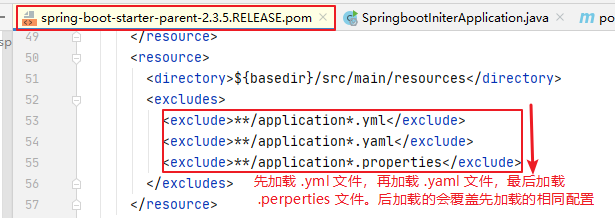
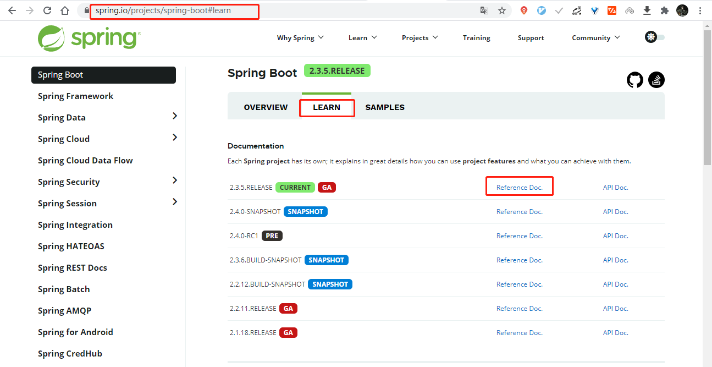
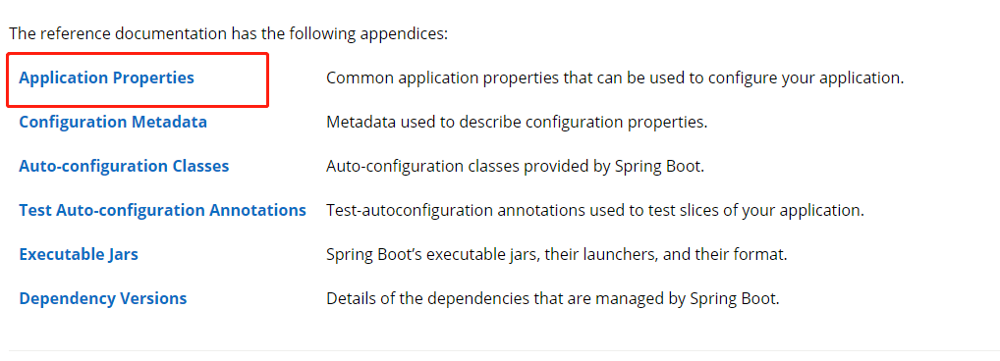
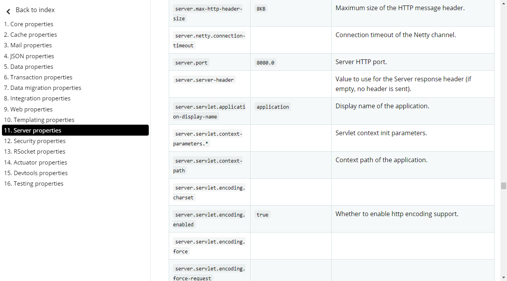
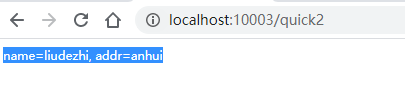
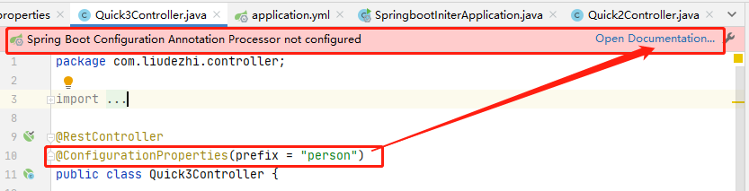
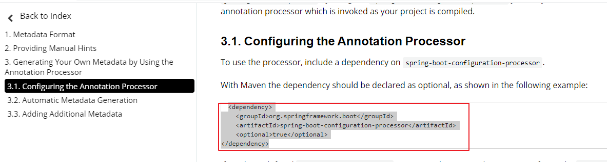
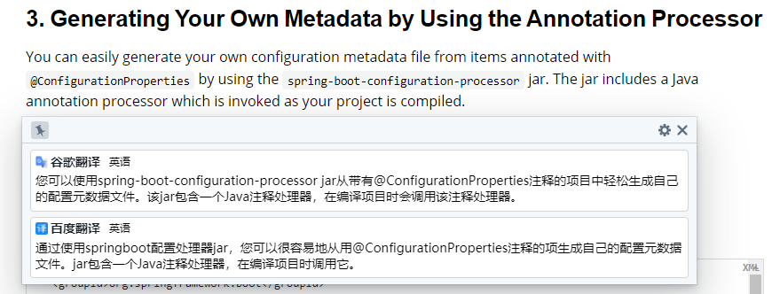

# 04.SpringBoot配置文件

- 笔记本：23.SpringBoot
- 创建时间：2020-11-08 17:09:24 UTC
- 更新时间：2020-11-09 03:25:11 UTC
- 原始链接：https://blog.csdn.net/weixin_43328357/article/details/106993172
- 印象笔记 GUID：a68519d1-32ae-4973-9692-f3d8679af03f

# SpringBoot 配置文件

## 1. SpringBoot 配置文件类型

### 1.1. SpringBoot 配置文件类型和作用

SpringBoot 是基于约定的，所以很多配置都有默认值，但如果想使用自己的配置替换默认配置的话，就可以使用 `application.properties` 或者 `application.yml（application.yaml）` 进行配置。

SpringBoot 默认会从 Resources 目录下加载 `application.properties` 或 `application.yml（application.yaml）` 文件

其中，`application.properties` 文件是键值对类型的文件，之前一直在使用，所以此处不在对properties文件的格式进行阐述。除了properties文件外，SpringBoot还可以使用 yml文件进行配置，下面对 yml文件进行讲解。

**加载顺序：**
 
 **eg:** application.yml 中配置 `server.port` 为 8082，application.properties 中配置 `server.port` 为 8081，最终端口号为 8081

### 1.2. application.yml 配置文件

#### 1.2.1. yml配置文件简介

YML 文件格式是 `YAML (YAML Aint Markup Language)` 编写的文件格式，YAML 是一种直观的能够被电脑识别的的数据数据序列化格式，并且容易被人类阅读，容易和脚本语言交互的，可以被支持 YAML 库的不同的编程语言程序导入，比如： C/C++, Ruby, Python, Java, Perl, C#, PHP等。YML文件是以数据为核心的，比传统的xml方式更加简洁。YML文件的扩展名可以使用 `.yml` 或者 `.yaml`。

#### 1.2.2. yml配置文件的语法

##### 1.2.2.1. 配置普通数据

- 语法：key: value

- 示例代码：`name: liudezhi`

- 注意：value 之前有一个空格

##### 1.2.2.2. 配置对象数据

- 语法：

```
key:
    key1: value1
    key2: value2

```

或者：`key: {key1: value1, key2: value2}`

- 示例代码：

```
person:
    name: liudezhi
    age: 24
    addr: anhui
# 或者
person: {name: liudezhi, age: 24, addr: anhui}

```

- 注意：key1 前面的空格个数不限定，在 yml 语法中，相同缩进代表 同一个级别。

##### 1.2.2.3. 配置 Map 数据

同上面的对象写法

##### 1.2.2.4. 配置数组（List、Set）数据

- 语法：

```
key:
    - value1
    - value2

```

或者：`key: [value1, value2]`

- 示例代码：

```
city:
    - beijing
    - shanghai
    - anhui
# 或者
city: [beijing, shanghai, anhui]

# 集合中的元素是对象形式
student:
  - name: liudezhi
    age: 24
    score: 100
  - name: xiashuang
    age: 24
    score: 100
# 或者
student: [{name: liudezhi, age: 24, score: 100}, {name: xiashuang, age: 24, score: 100}]

```

- 注意：value1 与 之间的 - 之间存在一个空格

### 1.3. SpringBoot 配置信息的查询

上面提及过，SpringBoot的配置文件，主要的目的就是对配置信息进行修改的，但在配置时的key从哪里去查询呢？我们可以查阅SpringBoot的官方文档：
 
 

>
文档URL：https://docs.spring.io/spring-boot/docs/current/reference/html/appendix-application-properties.html#common-application-properties

如图：
 

我们可以通过配置application.poperties 或者 application.yml 来修改SpringBoot 的默认配置
 **例如：**
 applicaiton.properties 文件：

```
server.port=8888
server.servlet.context-path=demo

```

application.yml 文件：

```
server:
    port: 8888
    servlet:
        context-path: /demo

```

## 2. 配置文件与配置类的属性映射方式

### 2.1. 使用注解 `@Value` 映射

我们可以通过@Value注解将配置文件中的值映射到一个Spring管理的Bean的字段上
 **eg:**
 application.properties 配置如下：

```
person.name=liudezhi
person.age=20
person.addr=anhui

```

或者，application.yml 配置如下：

```
person:
    name: liudezhi
    age: 20
    addr: anhui

```

实体 Bean 代码如下：

```
package com.liudezhi.controller;

import org.springframework.beans.factory.annotation.Value;
import org.springframework.web.bind.annotation.RequestMapping;
import org.springframework.web.bind.annotation.RestController;

@RestController
public class Quick2Controller {

    @Value("${person.name}")
    private String name;
    @Value("${person.addr}")
    private String addr;

    @RequestMapping("/quick2")
    public String quick2() {
        // 获得配置文件的信息
        return "name=" + name + ", addr=" + addr;
    }
}

```

浏览器访问地址：http://localhost:10003/quick2 结果如下：
 

### 2.2. 使用注解 `@ConfigurationProperties` 映射

通过注解 `@ConfigurationProperties(prefix="配置文件中的key的前缀")` 可以将配置文件中的配置自动与实体进行映射
 **eg:**
 application.properties 配置如下：

```
person.name=liudezhi
person.age=20
person.addr=anhui

```

或者，application.yml 配置如下：

```
person:
    name: liudezhi
    age: 20
    addr: anhui

```

实体 Bean 代码如下：

```
package com.liudezhi.controller;

@RestController
@ConfigurationProperties(prefix = "person")
public class Quick3Controller {

    private String name;

    private String addr;

    @RequestMapping("/quick3")
    public String quick3() {
        return "name=" + name + ", addr=" + addr;
    }

    public String getName() {
        return name;
    }

    public void setName(String name) {
        this.name = name;
    }

    public String getAddr() {
        return addr;
    }

    public void setAddr(String addr) {
        this.addr = addr;
    }
}

```

浏览器访问地址：http://localhost:10003/quick3 结果如下：
 

**注意：** 使用 `@ConfigurationProperties` 方式可以进行配置文件与实体字段的自动映射，但需要字段必须提供 set方法才可以，而使用 `@Value` 注解修饰的字段不需要提供set方法。

**Tips：**
 
 点击右上角
 
 将这个依赖导入 pom 文件中即可。
 这个依赖是：@ConfigurationProperties 的执行器配置
 可以在写配置文件的时候，根据 @ConfigurationProperties 的前缀和成员变量给提示。

spring-boot-configuration-processor其实是一个注解处理器，在编译阶段干活的，一般在maven的声明都是 ,optional 为true

```
<dependency>
    <groupId>org.springframework.boot</groupId>
    <artifactId>spring-boot-configuration-processor</artifactId>
    <optional>true</optional>
</dependency>

```

>
官网原文：
 You can easily generate your own configuration metadata file from items annotated with @ConfigurationProperties by using the spring-boot-configuration-processor jar. The jar includes a Java annotation processor which is invoked as your project is compiled.
 

>
参考博客： https://blog.csdn.net/weixin_43328357/article/details/106993172

%23%20SpringBoot%20%E9%85%8D%E7%BD%AE%E6%96%87%E4%BB%B6%0A%23%23%201.%20SpringBoot%20%E9%85%8D%E7%BD%AE%E6%96%87%E4%BB%B6%E7%B1%BB%E5%9E%8B%0A%23%23%23%201.1.%20SpringBoot%20%E9%85%8D%E7%BD%AE%E6%96%87%E4%BB%B6%E7%B1%BB%E5%9E%8B%E5%92%8C%E4%BD%9C%E7%94%A8%0ASpringBoot%20%E6%98%AF%E5%9F%BA%E4%BA%8E%E7%BA%A6%E5%AE%9A%E7%9A%84%EF%BC%8C%E6%89%80%E4%BB%A5%E5%BE%88%E5%A4%9A%E9%85%8D%E7%BD%AE%E9%83%BD%E6%9C%89%E9%BB%98%E8%AE%A4%E5%80%BC%EF%BC%8C%E4%BD%86%E5%A6%82%E6%9E%9C%E6%83%B3%E4%BD%BF%E7%94%A8%E8%87%AA%E5%B7%B1%E7%9A%84%E9%85%8D%E7%BD%AE%E6%9B%BF%E6%8D%A2%E9%BB%98%E8%AE%A4%E9%85%8D%E7%BD%AE%E7%9A%84%E8%AF%9D%EF%BC%8C%E5%B0%B1%E5%8F%AF%E4%BB%A5%E4%BD%BF%E7%94%A8%20%60application.properties%60%20%E6%88%96%E8%80%85%20%60application.yml%EF%BC%88application.yaml%EF%BC%89%60%20%20%E8%BF%9B%E8%A1%8C%E9%85%8D%E7%BD%AE%E3%80%82%0A%0ASpringBoot%20%E9%BB%98%E8%AE%A4%E4%BC%9A%E4%BB%8E%20Resources%20%E7%9B%AE%E5%BD%95%E4%B8%8B%E5%8A%A0%E8%BD%BD%20%60application.properties%60%20%E6%88%96%20%60application.yml%EF%BC%88application.yaml%EF%BC%89%60%20%E6%96%87%E4%BB%B6%0A%0A%E5%85%B6%E4%B8%AD%EF%BC%8C%60application.properties%60%20%E6%96%87%E4%BB%B6%E6%98%AF%E9%94%AE%E5%80%BC%E5%AF%B9%E7%B1%BB%E5%9E%8B%E7%9A%84%E6%96%87%E4%BB%B6%EF%BC%8C%E4%B9%8B%E5%89%8D%E4%B8%80%E7%9B%B4%E5%9C%A8%E4%BD%BF%E7%94%A8%EF%BC%8C%E6%89%80%E4%BB%A5%E6%AD%A4%E5%A4%84%E4%B8%8D%E5%9C%A8%E5%AF%B9properties%E6%96%87%E4%BB%B6%E7%9A%84%E6%A0%BC%E5%BC%8F%E8%BF%9B%E8%A1%8C%E9%98%90%E8%BF%B0%E3%80%82%E9%99%A4%E4%BA%86properties%E6%96%87%E4%BB%B6%E5%A4%96%EF%BC%8CSpringBoot%E8%BF%98%E5%8F%AF%E4%BB%A5%E4%BD%BF%E7%94%A8%20yml%E6%96%87%E4%BB%B6%E8%BF%9B%E8%A1%8C%E9%85%8D%E7%BD%AE%EF%BC%8C%E4%B8%8B%E9%9D%A2%E5%AF%B9%20yml%E6%96%87%E4%BB%B6%E8%BF%9B%E8%A1%8C%E8%AE%B2%E8%A7%A3%E3%80%82%0A%0A**%E5%8A%A0%E8%BD%BD%E9%A1%BA%E5%BA%8F%EF%BC%9A**%0A!%5Bcba302572f5a8ba7b739582f90d148ae.png%5D(en-resource%3A%2F%2Fdatabase%2F3943%3A0)%0A**eg%3A**%20application.yml%20%E4%B8%AD%E9%85%8D%E7%BD%AE%20%60server.port%60%20%E4%B8%BA%208082%EF%BC%8Capplication.properties%20%E4%B8%AD%E9%85%8D%E7%BD%AE%20%60server.port%60%20%E4%B8%BA%208081%EF%BC%8C%E6%9C%80%E7%BB%88%E7%AB%AF%E5%8F%A3%E5%8F%B7%E4%B8%BA%208081%0A%0A%23%23%23%201.2.%20application.yml%20%E9%85%8D%E7%BD%AE%E6%96%87%E4%BB%B6%0A%23%23%23%23%201.2.1.%20yml%E9%85%8D%E7%BD%AE%E6%96%87%E4%BB%B6%E7%AE%80%E4%BB%8B%0AYML%20%E6%96%87%E4%BB%B6%E6%A0%BC%E5%BC%8F%E6%98%AF%20%60YAML%20(YAML%20Aint%20Markup%20Language)%60%20%E7%BC%96%E5%86%99%E7%9A%84%E6%96%87%E4%BB%B6%E6%A0%BC%E5%BC%8F%EF%BC%8CYAML%20%E6%98%AF%E4%B8%80%E7%A7%8D%E7%9B%B4%E8%A7%82%E7%9A%84%E8%83%BD%E5%A4%9F%E8%A2%AB%E7%94%B5%E8%84%91%E8%AF%86%E5%88%AB%E7%9A%84%E7%9A%84%E6%95%B0%E6%8D%AE%E6%95%B0%E6%8D%AE%E5%BA%8F%E5%88%97%E5%8C%96%E6%A0%BC%E5%BC%8F%EF%BC%8C%E5%B9%B6%E4%B8%94%E5%AE%B9%E6%98%93%E8%A2%AB%E4%BA%BA%E7%B1%BB%E9%98%85%E8%AF%BB%EF%BC%8C%E5%AE%B9%E6%98%93%E5%92%8C%E8%84%9A%E6%9C%AC%E8%AF%AD%E8%A8%80%E4%BA%A4%E4%BA%92%E7%9A%84%EF%BC%8C%E5%8F%AF%E4%BB%A5%E8%A2%AB%E6%94%AF%E6%8C%81%20YAML%20%E5%BA%93%E7%9A%84%E4%B8%8D%E5%90%8C%E7%9A%84%E7%BC%96%E7%A8%8B%E8%AF%AD%E8%A8%80%E7%A8%8B%E5%BA%8F%E5%AF%BC%E5%85%A5%EF%BC%8C%E6%AF%94%E5%A6%82%EF%BC%9A%20C%2FC%2B%2B%2C%20Ruby%2C%20Python%2C%20Java%2C%20Perl%2C%20C%23%2C%20PHP%E7%AD%89%E3%80%82YML%E6%96%87%E4%BB%B6%E6%98%AF%E4%BB%A5%E6%95%B0%E6%8D%AE%E4%B8%BA%E6%A0%B8%E5%BF%83%E7%9A%84%EF%BC%8C%E6%AF%94%E4%BC%A0%E7%BB%9F%E7%9A%84xml%E6%96%B9%E5%BC%8F%E6%9B%B4%E5%8A%A0%E7%AE%80%E6%B4%81%E3%80%82YML%E6%96%87%E4%BB%B6%E7%9A%84%E6%89%A9%E5%B1%95%E5%90%8D%E5%8F%AF%E4%BB%A5%E4%BD%BF%E7%94%A8%20%60.yml%60%20%E6%88%96%E8%80%85%20%60.yaml%60%E3%80%82%0A%23%23%23%23%201.2.2.%20yml%E9%85%8D%E7%BD%AE%E6%96%87%E4%BB%B6%E7%9A%84%E8%AF%AD%E6%B3%95%0A%23%23%23%23%23%201.2.2.1.%20%E9%85%8D%E7%BD%AE%E6%99%AE%E9%80%9A%E6%95%B0%E6%8D%AE%0A-%20%E8%AF%AD%E6%B3%95%EF%BC%9Akey%3A%20value%0A-%20%E7%A4%BA%E4%BE%8B%E4%BB%A3%E7%A0%81%EF%BC%9A%60name%3A%20liudezhi%60%0A-%20%E6%B3%A8%E6%84%8F%EF%BC%9Avalue%20%E4%B9%8B%E5%89%8D%E6%9C%89%E4%B8%80%E4%B8%AA%E7%A9%BA%E6%A0%BC%0A%0A%23%23%23%23%23%201.2.2.2.%20%E9%85%8D%E7%BD%AE%E5%AF%B9%E8%B1%A1%E6%95%B0%E6%8D%AE%0A-%20%E8%AF%AD%E6%B3%95%EF%BC%9A%0A%60%60%60yml%0Akey%3A%0A%20%20%20%20key1%3A%20value1%0A%20%20%20%20key2%3A%20value2%0A%60%60%60%0A%E6%88%96%E8%80%85%EF%BC%9A%60key%3A%20%7Bkey1%3A%20value1%2C%20key2%3A%20value2%7D%60%0A-%20%E7%A4%BA%E4%BE%8B%E4%BB%A3%E7%A0%81%EF%BC%9A%0A%60%60%60yml%0Aperson%3A%0A%20%20%20%20name%3A%20liudezhi%0A%20%20%20%20age%3A%2024%0A%20%20%20%20addr%3A%20anhui%0A%23%20%E6%88%96%E8%80%85%0Aperson%3A%20%7Bname%3A%20liudezhi%2C%20age%3A%2024%2C%20addr%3A%20anhui%7D%0A%60%60%60%0A-%20%E6%B3%A8%E6%84%8F%EF%BC%9Akey1%20%E5%89%8D%E9%9D%A2%E7%9A%84%E7%A9%BA%E6%A0%BC%E4%B8%AA%E6%95%B0%E4%B8%8D%E9%99%90%E5%AE%9A%EF%BC%8C%E5%9C%A8%20yml%20%E8%AF%AD%E6%B3%95%E4%B8%AD%EF%BC%8C%E7%9B%B8%E5%90%8C%E7%BC%A9%E8%BF%9B%E4%BB%A3%E8%A1%A8%20%E5%90%8C%E4%B8%80%E4%B8%AA%E7%BA%A7%E5%88%AB%E3%80%82%0A%0A%23%23%23%23%23%201.2.2.3.%20%E9%85%8D%E7%BD%AE%20Map%20%E6%95%B0%E6%8D%AE%0A%E5%90%8C%E4%B8%8A%E9%9D%A2%E7%9A%84%E5%AF%B9%E8%B1%A1%E5%86%99%E6%B3%95%0A%0A%23%23%23%23%23%201.2.2.4.%20%E9%85%8D%E7%BD%AE%E6%95%B0%E7%BB%84%EF%BC%88List%E3%80%81Set%EF%BC%89%E6%95%B0%E6%8D%AE%0A-%20%E8%AF%AD%E6%B3%95%EF%BC%9A%0A%60%60%60yml%0Akey%3A%0A%20%20%20%20-%20value1%0A%20%20%20%20-%20value2%0A%60%60%60%0A%E6%88%96%E8%80%85%EF%BC%9A%60key%3A%20%5Bvalue1%2C%20value2%5D%60%0A-%20%E7%A4%BA%E4%BE%8B%E4%BB%A3%E7%A0%81%EF%BC%9A%0A%60%60%60yml%0Acity%3A%0A%20%20%20%20-%20beijing%0A%20%20%20%20-%20shanghai%0A%20%20%20%20-%20anhui%0A%23%20%E6%88%96%E8%80%85%0Acity%3A%20%5Bbeijing%2C%20shanghai%2C%20anhui%5D%0A%0A%23%20%E9%9B%86%E5%90%88%E4%B8%AD%E7%9A%84%E5%85%83%E7%B4%A0%E6%98%AF%E5%AF%B9%E8%B1%A1%E5%BD%A2%E5%BC%8F%0Astudent%3A%0A%20%20-%20name%3A%20liudezhi%0A%20%20%20%20age%3A%2024%0A%20%20%20%20score%3A%20100%0A%20%20-%20name%3A%20xiashuang%0A%20%20%20%20age%3A%2024%0A%20%20%20%20score%3A%20100%0A%23%20%E6%88%96%E8%80%85%0Astudent%3A%20%5B%7Bname%3A%20liudezhi%2C%20age%3A%2024%2C%20score%3A%20100%7D%2C%20%7Bname%3A%20xiashuang%2C%20age%3A%2024%2C%20score%3A%20100%7D%5D%0A%60%60%60%0A-%20%E6%B3%A8%E6%84%8F%EF%BC%9Avalue1%20%E4%B8%8E%20%E4%B9%8B%E9%97%B4%E7%9A%84%20-%20%E4%B9%8B%E9%97%B4%E5%AD%98%E5%9C%A8%E4%B8%80%E4%B8%AA%E7%A9%BA%E6%A0%BC%0A%0A%23%23%23%201.3.%20SpringBoot%20%E9%85%8D%E7%BD%AE%E4%BF%A1%E6%81%AF%E7%9A%84%E6%9F%A5%E8%AF%A2%0A%E4%B8%8A%E9%9D%A2%E6%8F%90%E5%8F%8A%E8%BF%87%EF%BC%8CSpringBoot%E7%9A%84%E9%85%8D%E7%BD%AE%E6%96%87%E4%BB%B6%EF%BC%8C%E4%B8%BB%E8%A6%81%E7%9A%84%E7%9B%AE%E7%9A%84%E5%B0%B1%E6%98%AF%E5%AF%B9%E9%85%8D%E7%BD%AE%E4%BF%A1%E6%81%AF%E8%BF%9B%E8%A1%8C%E4%BF%AE%E6%94%B9%E7%9A%84%EF%BC%8C%E4%BD%86%E5%9C%A8%E9%85%8D%E7%BD%AE%E6%97%B6%E7%9A%84key%E4%BB%8E%E5%93%AA%E9%87%8C%E5%8E%BB%E6%9F%A5%E8%AF%A2%E5%91%A2%EF%BC%9F%E6%88%91%E4%BB%AC%E5%8F%AF%E4%BB%A5%E6%9F%A5%E9%98%85SpringBoot%E7%9A%84%E5%AE%98%E6%96%B9%E6%96%87%E6%A1%A3%EF%BC%9A%0A!%5B7d425b9a029bfd4ee79a18023b3b0b83.png%5D(en-resource%3A%2F%2Fdatabase%2F3945%3A0)%0A!%5B7ca15477bc984374baa1f90fb26e7dfe.png%5D(en-resource%3A%2F%2Fdatabase%2F3947%3A0)%0A%0A%3E%20%E6%96%87%E6%A1%A3URL%EF%BC%9Ahttps%3A%2F%2Fdocs.spring.io%2Fspring-boot%2Fdocs%2Fcurrent%2Freference%2Fhtml%2Fappendix-application-properties.html%23common-application-properties%0A%0A%E5%A6%82%E5%9B%BE%EF%BC%9A%0A!%5B0990d0eb98170523aa319d738749e8ca.png%5D(en-resource%3A%2F%2Fdatabase%2F3949%3A0)%0A%0A%E6%88%91%E4%BB%AC%E5%8F%AF%E4%BB%A5%E9%80%9A%E8%BF%87%E9%85%8D%E7%BD%AEapplication.poperties%20%E6%88%96%E8%80%85%20application.yml%20%E6%9D%A5%E4%BF%AE%E6%94%B9SpringBoot%20%E7%9A%84%E9%BB%98%E8%AE%A4%E9%85%8D%E7%BD%AE%0A**%E4%BE%8B%E5%A6%82%EF%BC%9A**%0Aapplicaiton.properties%20%E6%96%87%E4%BB%B6%EF%BC%9A%0A%60%60%60propertites%0Aserver.port%3D8888%0Aserver.servlet.context-path%3Ddemo%0A%60%60%60%0Aapplication.yml%20%E6%96%87%E4%BB%B6%EF%BC%9A%0A%60%60%60yml%0Aserver%3A%0A%20%20%20%20port%3A%208888%0A%20%20%20%20servlet%3A%0A%20%20%20%20%20%20%20%20context-path%3A%20%2Fdemo%0A%60%60%60%0A%0A%23%23%202.%20%E9%85%8D%E7%BD%AE%E6%96%87%E4%BB%B6%E4%B8%8E%E9%85%8D%E7%BD%AE%E7%B1%BB%E7%9A%84%E5%B1%9E%E6%80%A7%E6%98%A0%E5%B0%84%E6%96%B9%E5%BC%8F%0A%23%23%23%202.1.%20%E4%BD%BF%E7%94%A8%E6%B3%A8%E8%A7%A3%20%60%40Value%60%20%E6%98%A0%E5%B0%84%0A%E6%88%91%E4%BB%AC%E5%8F%AF%E4%BB%A5%E9%80%9A%E8%BF%87%40Value%E6%B3%A8%E8%A7%A3%E5%B0%86%E9%85%8D%E7%BD%AE%E6%96%87%E4%BB%B6%E4%B8%AD%E7%9A%84%E5%80%BC%E6%98%A0%E5%B0%84%E5%88%B0%E4%B8%80%E4%B8%AASpring%E7%AE%A1%E7%90%86%E7%9A%84Bean%E7%9A%84%E5%AD%97%E6%AE%B5%E4%B8%8A%0A**eg%3A**%20%0Aapplication.properties%20%E9%85%8D%E7%BD%AE%E5%A6%82%E4%B8%8B%EF%BC%9A%0A%60%60%60properties%0Aperson.name%3Dliudezhi%0Aperson.age%3D20%0Aperson.addr%3Danhui%0A%60%60%60%0A%E6%88%96%E8%80%85%EF%BC%8Capplication.yml%20%E9%85%8D%E7%BD%AE%E5%A6%82%E4%B8%8B%EF%BC%9A%0A%60%60%60yml%0Aperson%3A%0A%20%20%20%20name%3A%20liudezhi%0A%20%20%20%20age%3A%2020%0A%20%20%20%20addr%3A%20anhui%0A%60%60%60%0A%E5%AE%9E%E4%BD%93%20Bean%20%E4%BB%A3%E7%A0%81%E5%A6%82%E4%B8%8B%EF%BC%9A%0A%60%60%60java%0Apackage%20com.liudezhi.controller%3B%0A%0Aimport%20org.springframework.beans.factory.annotation.Value%3B%0Aimport%20org.springframework.web.bind.annotation.RequestMapping%3B%0Aimport%20org.springframework.web.bind.annotation.RestController%3B%0A%0A%40RestController%0Apublic%20class%20Quick2Controller%20%7B%0A%0A%20%20%20%20%40Value(%22%24%7Bperson.name%7D%22)%0A%20%20%20%20private%20String%20name%3B%0A%20%20%20%20%40Value(%22%24%7Bperson.addr%7D%22)%0A%20%20%20%20private%20String%20addr%3B%0A%0A%20%20%20%20%40RequestMapping(%22%2Fquick2%22)%0A%20%20%20%20public%20String%20quick2()%20%7B%0A%20%20%20%20%20%20%20%20%2F%2F%20%E8%8E%B7%E5%BE%97%E9%85%8D%E7%BD%AE%E6%96%87%E4%BB%B6%E7%9A%84%E4%BF%A1%E6%81%AF%0A%20%20%20%20%20%20%20%20return%20%22name%3D%22%20%2B%20name%20%2B%20%22%2C%20addr%3D%22%20%2B%20addr%3B%0A%20%20%20%20%7D%0A%7D%0A%60%60%60%0A%E6%B5%8F%E8%A7%88%E5%99%A8%E8%AE%BF%E9%97%AE%E5%9C%B0%E5%9D%80%EF%BC%9Ahttp%3A%2F%2Flocalhost%3A10003%2Fquick2%20%E7%BB%93%E6%9E%9C%E5%A6%82%E4%B8%8B%EF%BC%9A%0A!%5Bd908aa994465bea641d47f530d4ae7dc.png%5D(en-resource%3A%2F%2Fdatabase%2F3951%3A0)%0A%0A%0A%23%23%23%202.2.%20%E4%BD%BF%E7%94%A8%E6%B3%A8%E8%A7%A3%20%60%40ConfigurationProperties%60%20%E6%98%A0%E5%B0%84%0A%E9%80%9A%E8%BF%87%E6%B3%A8%E8%A7%A3%20%60%40ConfigurationProperties(prefix%3D%22%E9%85%8D%E7%BD%AE%E6%96%87%E4%BB%B6%E4%B8%AD%E7%9A%84key%E7%9A%84%E5%89%8D%E7%BC%80%22)%60%20%E5%8F%AF%E4%BB%A5%E5%B0%86%E9%85%8D%E7%BD%AE%E6%96%87%E4%BB%B6%E4%B8%AD%E7%9A%84%E9%85%8D%E7%BD%AE%E8%87%AA%E5%8A%A8%E4%B8%8E%E5%AE%9E%E4%BD%93%E8%BF%9B%E8%A1%8C%E6%98%A0%E5%B0%84%0A**eg%3A**%20%0Aapplication.properties%20%E9%85%8D%E7%BD%AE%E5%A6%82%E4%B8%8B%EF%BC%9A%0A%60%60%60properties%0Aperson.name%3Dliudezhi%0Aperson.age%3D20%0Aperson.addr%3Danhui%0A%60%60%60%0A%E6%88%96%E8%80%85%EF%BC%8Capplication.yml%20%E9%85%8D%E7%BD%AE%E5%A6%82%E4%B8%8B%EF%BC%9A%0A%60%60%60yml%0Aperson%3A%0A%20%20%20%20name%3A%20liudezhi%0A%20%20%20%20age%3A%2020%0A%20%20%20%20addr%3A%20anhui%0A%60%60%60%0A%E5%AE%9E%E4%BD%93%20Bean%20%E4%BB%A3%E7%A0%81%E5%A6%82%E4%B8%8B%EF%BC%9A%0A%60%60%60java%0Apackage%20com.liudezhi.controller%3B%0A%0A%40RestController%0A%40ConfigurationProperties(prefix%20%3D%20%22person%22)%0Apublic%20class%20Quick3Controller%20%7B%0A%0A%20%20%20%20private%20String%20name%3B%0A%0A%20%20%20%20private%20String%20addr%3B%0A%0A%20%20%20%20%40RequestMapping(%22%2Fquick3%22)%0A%20%20%20%20public%20String%20quick3()%20%7B%0A%20%20%20%20%20%20%20%20return%20%22name%3D%22%20%2B%20name%20%2B%20%22%2C%20addr%3D%22%20%2B%20addr%3B%0A%20%20%20%20%7D%0A%0A%20%20%20%20public%20String%20getName()%20%7B%0A%20%20%20%20%20%20%20%20return%20name%3B%0A%20%20%20%20%7D%0A%0A%20%20%20%20public%20void%20setName(String%20name)%20%7B%0A%20%20%20%20%20%20%20%20this.name%20%3D%20name%3B%0A%20%20%20%20%7D%0A%0A%20%20%20%20public%20String%20getAddr()%20%7B%0A%20%20%20%20%20%20%20%20return%20addr%3B%0A%20%20%20%20%7D%0A%0A%20%20%20%20public%20void%20setAddr(String%20addr)%20%7B%0A%20%20%20%20%20%20%20%20this.addr%20%3D%20addr%3B%0A%20%20%20%20%7D%0A%7D%0A%60%60%60%0A%E6%B5%8F%E8%A7%88%E5%99%A8%E8%AE%BF%E9%97%AE%E5%9C%B0%E5%9D%80%EF%BC%9Ahttp%3A%2F%2Flocalhost%3A10003%2Fquick3%20%E7%BB%93%E6%9E%9C%E5%A6%82%E4%B8%8B%EF%BC%9A%0A!%5Bbf203173a2982e157c9fb4eb7c17028d.png%5D(en-resource%3A%2F%2Fdatabase%2F3953%3A0)%0A%0A**%E6%B3%A8%E6%84%8F%EF%BC%9A**%20%E4%BD%BF%E7%94%A8%20%60%40ConfigurationProperties%60%20%E6%96%B9%E5%BC%8F%E5%8F%AF%E4%BB%A5%E8%BF%9B%E8%A1%8C%E9%85%8D%E7%BD%AE%E6%96%87%E4%BB%B6%E4%B8%8E%E5%AE%9E%E4%BD%93%E5%AD%97%E6%AE%B5%E7%9A%84%E8%87%AA%E5%8A%A8%E6%98%A0%E5%B0%84%EF%BC%8C%E4%BD%86%E9%9C%80%E8%A6%81%E5%AD%97%E6%AE%B5%E5%BF%85%E9%A1%BB%E6%8F%90%E4%BE%9B%20set%E6%96%B9%E6%B3%95%E6%89%8D%E5%8F%AF%E4%BB%A5%EF%BC%8C%E8%80%8C%E4%BD%BF%E7%94%A8%20%60%40Value%60%20%E6%B3%A8%E8%A7%A3%E4%BF%AE%E9%A5%B0%E7%9A%84%E5%AD%97%E6%AE%B5%E4%B8%8D%E9%9C%80%E8%A6%81%E6%8F%90%E4%BE%9Bset%E6%96%B9%E6%B3%95%E3%80%82%0A%0A**Tips%EF%BC%9A**%20%0A!%5B8f9fc3577e4fc74d66e384226cde6509.png%5D(en-resource%3A%2F%2Fdatabase%2F3955%3A0)%0A%E7%82%B9%E5%87%BB%E5%8F%B3%E4%B8%8A%E8%A7%92%0A!%5Be06fbcbaf92a9af8c2bcdf772e9f2d93.png%5D(en-resource%3A%2F%2Fdatabase%2F3957%3A0)%0A%E5%B0%86%E8%BF%99%E4%B8%AA%E4%BE%9D%E8%B5%96%E5%AF%BC%E5%85%A5%20pom%20%E6%96%87%E4%BB%B6%E4%B8%AD%E5%8D%B3%E5%8F%AF%E3%80%82%0A%E8%BF%99%E4%B8%AA%E4%BE%9D%E8%B5%96%E6%98%AF%EF%BC%9A%40ConfigurationProperties%20%E7%9A%84%E6%89%A7%E8%A1%8C%E5%99%A8%E9%85%8D%E7%BD%AE%0A%E5%8F%AF%E4%BB%A5%E5%9C%A8%E5%86%99%E9%85%8D%E7%BD%AE%E6%96%87%E4%BB%B6%E7%9A%84%E6%97%B6%E5%80%99%EF%BC%8C%E6%A0%B9%E6%8D%AE%20%40ConfigurationProperties%20%E7%9A%84%E5%89%8D%E7%BC%80%E5%92%8C%E6%88%90%E5%91%98%E5%8F%98%E9%87%8F%E7%BB%99%E6%8F%90%E7%A4%BA%E3%80%82%0A%0Aspring-boot-configuration-processor%E5%85%B6%E5%AE%9E%E6%98%AF%E4%B8%80%E4%B8%AA%E6%B3%A8%E8%A7%A3%E5%A4%84%E7%90%86%E5%99%A8%EF%BC%8C%E5%9C%A8%E7%BC%96%E8%AF%91%E9%98%B6%E6%AE%B5%E5%B9%B2%E6%B4%BB%E7%9A%84%EF%BC%8C%E4%B8%80%E8%88%AC%E5%9C%A8maven%E7%9A%84%E5%A3%B0%E6%98%8E%E9%83%BD%E6%98%AF%20%2Coptional%20%E4%B8%BAtrue%0A%60%60%60xml%0A%3Cdependency%3E%20%0A%20%20%20%20%3CgroupId%3Eorg.springframework.boot%3C%2FgroupId%3E%0A%20%20%20%20%3CartifactId%3Espring-boot-configuration-processor%3C%2FartifactId%3E%20%0A%20%20%20%20%3Coptional%3Etrue%3C%2Foptional%3E%20%0A%3C%2Fdependency%3E%0A%60%60%60%0A%3E%E5%AE%98%E7%BD%91%E5%8E%9F%E6%96%87%EF%BC%9A%0A%3EYou%20can%20easily%20generate%20your%20own%20configuration%20metadata%20file%20from%20items%20annotated%20with%C2%A0%40ConfigurationProperties%C2%A0by%20using%20the%C2%A0spring-boot-configuration-processor%C2%A0jar.%20The%20jar%20includes%20a%20Java%20annotation%20processor%20which%20is%20invoked%20as%20your%20project%20is%20compiled.%0A!%5Bd25ac4d49d9e9ad4388997c34673eb41.png%5D(en-resource%3A%2F%2Fdatabase%2F3959%3A0)%0A%0A%0Aspring-boot-configuration-processor%20%E8%AF%B4%E7%99%BD%E4%BA%86%E5%B0%B1%E6%98%AF%E7%BB%99%E8%87%AA%E5%AE%9A%E4%B9%89%E7%9A%84%E9%85%8D%E7%BD%AE%E7%B1%BB%E7%94%9F%E6%88%90%E5%85%83%E6%95%B0%E6%8D%AE%E4%BF%A1%E6%81%AF%E7%9A%84%EF%BC%8C%E5%9B%A0%E4%B8%BAspring%E4%B9%9F%E4%B8%8D%E7%9F%A5%E9%81%93%E4%BD%A0%E6%9C%89%E5%93%AA%E4%BA%9B%E9%85%8D%E7%BD%AE%E7%B1%BB%EF%BC%8C%E6%89%80%E4%BB%A5%E6%90%9E%E4%BA%86%E8%BF%99%E4%B8%AA%E6%96%B9%E4%BE%BF%E5%A4%A7%E5%AE%B6%E8%87%AA%E5%AE%9A%E4%B9%89%E3%80%82%0A%0A%0A%3E%E5%8F%82%E8%80%83%E5%8D%9A%E5%AE%A2%EF%BC%9A%20https%3A%2F%2Fblog.csdn.net%2Fweixin_43328357%2Farticle%2Fdetails%2F106993172
