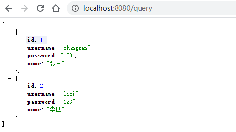
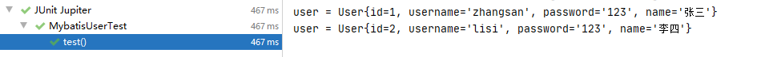
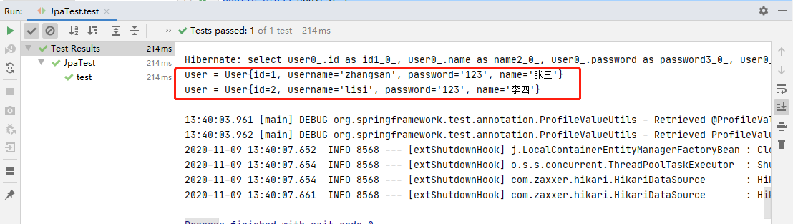
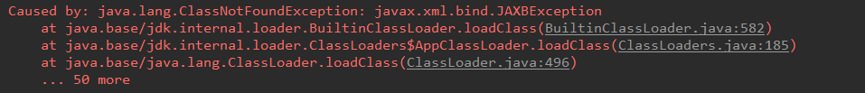

# 05.SpringBoot与整合其他技术

- 笔记本：23.SpringBoot
- 创建时间：2020-11-09 03:46:12 UTC
- 更新时间：2020-11-09 05:57:44 UTC
- 印象笔记 GUID：db92b51f-8c41-422f-8efe-aee50c2117ac

# SpringBoot与整合其他技术

## 1 SpringBoot整合Mybatis

### 1.1 添加 Mybatis 的起步依赖

```
<dependency>
    <groupId>org.mybatis.spring.boot</groupId>
    <artifactId>mybatis-spring-boot-starter</artifactId>
    <version>1.3.2</version>
</dependency>

```

### 1.2 添加数据库驱动坐标

```
<dependency>
    <groupId>mysql</groupId>
    <artifactId>mysql-connector-java</artifactId>
</dependency>

```

### 1.3 添加数据库连接信息

在 `application.properties` 中添加数据量的连接信息

```
#DB Configuration:
spring.datasource.driverClassName=com.mysql.cj.jdbc.Driver
spring.datasource.url=jdbc:mysql://127.0.0.1:3306/test?useUnicode=true&characterEncoding=utf-8&useSSL=false&serverTimezone=GMT%2B8
spring.datasource.username=root
spring.datasource.password=Liudezhi

```

### 1.4 创建user表

在test数据库中创建user表

```
-- ----------------------------
-- Table structure for `user`
-- ----------------------------
DROP TABLE IF EXISTS `user`;
CREATE TABLE `user` (
  `id` int(11) NOT NULL AUTO_INCREMENT,
  `username` varchar(50) DEFAULT NULL,
  `password` varchar(50) DEFAULT NULL,
  `name` varchar(50) DEFAULT NULL,
  PRIMARY KEY (`id`)
) ENGINE=InnoDB AUTO_INCREMENT=10 DEFAULT CHARSET=utf8;

-- ----------------------------
-- Records of user
-- ----------------------------
INSERT INTO `user` VALUES ('1', 'zhangsan', '123', '张三');
INSERT INTO `user` VALUES ('2', 'lisi', '123', '李四');

```

### 1.5 创建实体Bean

```
package com.liudezhi.domain;

public class User {
    private Integer id;
    private String username;
    private String password;
    private String name;
    // 此次省略 getter setter toString
}

```

### 1.6 编写 Mapper

```
package com.liudezhi.mapper;
import com.liudezhi.domain.User;
import org.apache.ibatis.annotations.Mapper;
@Mapper
public interface UserMapper {
    public List<User> queryUserList();
}

```

注意：@Mapper标记该类是一个mybatis的mapper接口，可以被spring boot自动扫描到spring上下文中

### 1.7 配置 Mapper 映射文件

在 `src\main\resources\mapper` 路径下加入 UserMapper.xml 配置文件

```
<?xml version="1.0" encoding="utf-8" ?>
<!DOCTYPE mapper PUBLIC "-//mybatis.org//DTD Mapper 3.0//EN" "http://mybatis.org/dtd/mybatis-3-mapper.dtd" >
<mapper namespace="com.liudezhi.mapper.UserMapper">
    <select id="queryUserList" resultType="user">
        select * from user
    </select>
</mapper>

```

### 1.8 在 application.properties 中添加 mybatis 的信息

```
#spring集成Mybatis环境
#pojo别名扫描包
mybatis.type-aliases-package=com.liudezhi.domain
#加载Mybatis映射文件
mybatis.mapper-locations=classpath:mapper/*Mapper.xml

```

### 1.9 编写测试Controller

```
package com.liudezhi.controller;

@RestController
public class UserController {

    @Autowired
    private UserMapper userMapper;

    @RequestMapping("/query")
    public List<User> queryUserList() {
        List<User> users = userMapper.queryUserList();
        return users;
    }
}

```

### 1.10 测试



## 2 SpringBoot整合Junit

### 2.1 添加Junit的起步依赖

```
<dependency>
    <groupId>org.springframework.boot</groupId>
    <artifactId>spring-boot-starter-test</artifactId>
    <scope>test</scope>
</dependency>
<dependency>
    <groupId>junit</groupId>
    <artifactId>junit</artifactId>
    <scope>test</scope>
</dependency>

```

### 2.2 编写测试类

```
package com.liudezhi;

import com.liudezhi.domain.User;
import com.liudezhi.mapper.UserMapper;
import org.junit.jupiter.api.Test;
import org.junit.runner.RunWith;
import org.springframework.beans.factory.annotation.Autowired;
import org.springframework.boot.test.context.SpringBootTest;
import org.springframework.test.context.junit4.SpringRunner;

import java.util.List;

@RunWith(SpringRunner.class)
@SpringBootTest(classes = SpringbootMybatisApplication.class)
public class MybatisUserTest {

    @Autowired
    private UserMapper userMapper;

    @Test
    public void test() {
        List<User> users = userMapper.queryUserList();
        for (User user : users) {
            System.out.println("user = " + user);
        }
    }
}

```

其中，SpringRunner 继承自 SpringJUnit4ClassRunner，使用哪一个Spring提供的测试测试引擎都可以

```
public final class SpringRunner extends SpringJUnit4ClassRunner

```

`@SpringBootTest` 的属性指定的是引导类的字节码对象

### 2.3 控制台打印信息



## 3 SpringBoot整合Spring Data JPA

### 3.1 添加Spring Data JPA的起步依赖

```
<dependency>
    <groupId>org.springframework.boot</groupId>
    <artifactId>spring-boot-starter-data-jpa</artifactId>
</dependency>

```

### 3.2 添加数据库驱动依赖

```
<dependency>
    <groupId>mysql</groupId>
    <artifactId>mysql-connector-java</artifactId>
</dependency>

```

### 3.3 在 `application.properties` 中配置数据库和jpa的相关属性

```
#DB Configuration:
spring.datasource.driverClassName=com.mysql.cj.jdbc.Driver
spring.datasource.url=jdbc:mysql://127.0.0.1:3306/test?useUnicode=true&characterEncoding=utf-8&useSSL=false&serverTimezone=GMT%2B8
spring.datasource.username=root
spring.datasource.password=Liudezhi

#JPA Configuration:
spring.jpa.database=MySQL
spring.jpa.show-sql=true
spring.jpa.generate-ddl=true
spring.jpa.hibernate.ddl-auto=update
spring.jpa.hibernate.naming_strategy=org.hibernate.cfg.ImprovedNamingStrategy

```

### 3.4 创建实体配置实体

```
package com.liudezhi.domain;

import javax.persistence.Entity;
import javax.persistence.GeneratedValue;
import javax.persistence.GenerationType;
import javax.persistence.Id;

@Entity
public class User {

    @Id
    @GeneratedValue(strategy = GenerationType.IDENTITY)
    private Long id;
    private String username;
    private String password;
    private String name;
    // getter and setter and toString
}

```

### 3.5 编写UserRepository

```
package com.liudezhi.repository;

import com.liudezhi.domain.User;
import org.springframework.data.jpa.repository.JpaRepository;
import org.springframework.data.jpa.repository.JpaSpecificationExecutor;

public interface UserRespository extends JpaRepository<User, Long>, JpaSpecificationExecutor<User> {
}

```

### 3.6 编写测试类

```
package com.liudezhi;

import com.liudezhi.domain.User;
import com.liudezhi.repository.UserRespository;
import org.junit.Test;
import org.junit.runner.RunWith;
import org.springframework.beans.factory.annotation.Autowired;
import org.springframework.boot.test.context.SpringBootTest;
import org.springframework.test.context.junit4.SpringRunner;

import java.util.List;

@RunWith(SpringRunner.class)
@SpringBootTest(classes = SpringbootJpaApplication.class)
public class JpaTest {

    @Autowired
    private UserRespository userRespository;

    @Test
    public void test() {
        List<User> users = userRespository.findAll();
        for (User user : users) {
            System.out.println("user = " + user);
        }
    }
}

```

### 3.7 控制台打印信息



**注意：** 如果是jdk9，执行报错如下：
 

## 4 SpringBoot整合Redis

%23%20SpringBoot%E4%B8%8E%E6%95%B4%E5%90%88%E5%85%B6%E4%BB%96%E6%8A%80%E6%9C%AF%0A%0A%23%23%201%20SpringBoot%E6%95%B4%E5%90%88Mybatis%0A%23%23%23%201.1%20%E6%B7%BB%E5%8A%A0%20Mybatis%20%E7%9A%84%E8%B5%B7%E6%AD%A5%E4%BE%9D%E8%B5%96%0A%60%60%60xml%0A%3Cdependency%3E%0A%20%20%20%20%3CgroupId%3Eorg.mybatis.spring.boot%3C%2FgroupId%3E%0A%20%20%20%20%3CartifactId%3Emybatis-spring-boot-starter%3C%2FartifactId%3E%0A%20%20%20%20%3Cversion%3E1.3.2%3C%2Fversion%3E%0A%3C%2Fdependency%3E%0A%60%60%60%0A%23%23%23%201.2%20%E6%B7%BB%E5%8A%A0%E6%95%B0%E6%8D%AE%E5%BA%93%E9%A9%B1%E5%8A%A8%E5%9D%90%E6%A0%87%0A%60%60%60xml%0A%3Cdependency%3E%0A%20%20%20%20%3CgroupId%3Emysql%3C%2FgroupId%3E%0A%20%20%20%20%3CartifactId%3Emysql-connector-java%3C%2FartifactId%3E%0A%3C%2Fdependency%3E%0A%60%60%60%0A%0A%23%23%23%201.3%20%E6%B7%BB%E5%8A%A0%E6%95%B0%E6%8D%AE%E5%BA%93%E8%BF%9E%E6%8E%A5%E4%BF%A1%E6%81%AF%0A%E5%9C%A8%20%60application.properties%60%20%E4%B8%AD%E6%B7%BB%E5%8A%A0%E6%95%B0%E6%8D%AE%E9%87%8F%E7%9A%84%E8%BF%9E%E6%8E%A5%E4%BF%A1%E6%81%AF%0A%60%60%60properties%0A%23DB%20Configuration%3A%0Aspring.datasource.driverClassName%3Dcom.mysql.cj.jdbc.Driver%0Aspring.datasource.url%3Djdbc%3Amysql%3A%2F%2F127.0.0.1%3A3306%2Ftest%3FuseUnicode%3Dtrue%26characterEncoding%3Dutf-8%26useSSL%3Dfalse%26serverTimezone%3DGMT%252B8%0Aspring.datasource.username%3Droot%0Aspring.datasource.password%3DLiudezhi%0A%60%60%60%0A%0A%23%23%23%201.4%20%E5%88%9B%E5%BB%BAuser%E8%A1%A8%0A%E5%9C%A8test%E6%95%B0%E6%8D%AE%E5%BA%93%E4%B8%AD%E5%88%9B%E5%BB%BAuser%E8%A1%A8%0A%60%60%60mysql%0A--%20----------------------------%0A--%20Table%20structure%20for%20%60user%60%0A--%20----------------------------%0ADROP%20TABLE%20IF%20EXISTS%20%60user%60%3B%0ACREATE%20TABLE%20%60user%60%20(%0A%20%20%60id%60%20int(11)%20NOT%20NULL%20AUTO_INCREMENT%2C%0A%20%20%60username%60%20varchar(50)%20DEFAULT%20NULL%2C%0A%20%20%60password%60%20varchar(50)%20DEFAULT%20NULL%2C%0A%20%20%60name%60%20varchar(50)%20DEFAULT%20NULL%2C%0A%20%20PRIMARY%20KEY%20(%60id%60)%0A)%20ENGINE%3DInnoDB%20AUTO_INCREMENT%3D10%20DEFAULT%20CHARSET%3Dutf8%3B%0A%0A--%20----------------------------%0A--%20Records%20of%20user%0A--%20----------------------------%0AINSERT%20INTO%20%60user%60%20VALUES%20('1'%2C%20'zhangsan'%2C%20'123'%2C%20'%E5%BC%A0%E4%B8%89')%3B%0AINSERT%20INTO%20%60user%60%20VALUES%20('2'%2C%20'lisi'%2C%20'123'%2C%20'%E6%9D%8E%E5%9B%9B')%3B%0A%60%60%60%0A%0A%23%23%23%201.5%20%E5%88%9B%E5%BB%BA%E5%AE%9E%E4%BD%93Bean%0A%60%60%60java%0Apackage%20com.liudezhi.domain%3B%0A%0Apublic%20class%20User%20%7B%0A%20%20%20%20private%20Integer%20id%3B%0A%20%20%20%20private%20String%20username%3B%0A%20%20%20%20private%20String%20password%3B%0A%20%20%20%20private%20String%20name%3B%0A%20%20%20%20%2F%2F%20%E6%AD%A4%E6%AC%A1%E7%9C%81%E7%95%A5%20getter%20setter%20toString%0A%7D%0A%60%60%60%0A%0A%23%23%23%201.6%20%E7%BC%96%E5%86%99%20Mapper%0A%60%60%60java%0Apackage%20com.liudezhi.mapper%3B%0Aimport%20com.liudezhi.domain.User%3B%0Aimport%20org.apache.ibatis.annotations.Mapper%3B%0A%40Mapper%0Apublic%20interface%20UserMapper%20%7B%0A%20%20%20%20public%20List%3CUser%3E%20queryUserList()%3B%0A%7D%0A%60%60%60%0A%E6%B3%A8%E6%84%8F%EF%BC%9A%40Mapper%E6%A0%87%E8%AE%B0%E8%AF%A5%E7%B1%BB%E6%98%AF%E4%B8%80%E4%B8%AAmybatis%E7%9A%84mapper%E6%8E%A5%E5%8F%A3%EF%BC%8C%E5%8F%AF%E4%BB%A5%E8%A2%ABspring%20boot%E8%87%AA%E5%8A%A8%E6%89%AB%E6%8F%8F%E5%88%B0spring%E4%B8%8A%E4%B8%8B%E6%96%87%E4%B8%AD%0A%0A%23%23%23%201.7%20%E9%85%8D%E7%BD%AE%20Mapper%20%E6%98%A0%E5%B0%84%E6%96%87%E4%BB%B6%0A%E5%9C%A8%20%60src%5Cmain%5Cresources%5Cmapper%60%20%E8%B7%AF%E5%BE%84%E4%B8%8B%E5%8A%A0%E5%85%A5%20UserMapper.xml%20%E9%85%8D%E7%BD%AE%E6%96%87%E4%BB%B6%0A%60%60%60xml%0A%3C%3Fxml%20version%3D%221.0%22%20encoding%3D%22utf-8%22%20%3F%3E%0A%3C!DOCTYPE%20mapper%20PUBLIC%20%22-%2F%2Fmybatis.org%2F%2FDTD%20Mapper%203.0%2F%2FEN%22%20%22http%3A%2F%2Fmybatis.org%2Fdtd%2Fmybatis-3-mapper.dtd%22%20%3E%0A%3Cmapper%20namespace%3D%22com.liudezhi.mapper.UserMapper%22%3E%0A%20%20%20%20%3Cselect%20id%3D%22queryUserList%22%20resultType%3D%22user%22%3E%0A%20%20%20%20%20%20%20%20select%20*%20from%20user%0A%20%20%20%20%3C%2Fselect%3E%0A%3C%2Fmapper%3E%0A%60%60%60%0A%0A%23%23%23%201.8%20%E5%9C%A8%20application.properties%20%E4%B8%AD%E6%B7%BB%E5%8A%A0%20mybatis%20%E7%9A%84%E4%BF%A1%E6%81%AF%0A%60%60%60properties%0A%23spring%E9%9B%86%E6%88%90Mybatis%E7%8E%AF%E5%A2%83%0A%23pojo%E5%88%AB%E5%90%8D%E6%89%AB%E6%8F%8F%E5%8C%85%0Amybatis.type-aliases-package%3Dcom.liudezhi.domain%0A%23%E5%8A%A0%E8%BD%BDMybatis%E6%98%A0%E5%B0%84%E6%96%87%E4%BB%B6%0Amybatis.mapper-locations%3Dclasspath%3Amapper%2F*Mapper.xml%0A%60%60%60%0A%0A%23%23%23%201.9%20%E7%BC%96%E5%86%99%E6%B5%8B%E8%AF%95Controller%0A%60%60%60java%0Apackage%20com.liudezhi.controller%3B%0A%0A%40RestController%0Apublic%20class%20UserController%20%7B%0A%0A%20%20%20%20%40Autowired%0A%20%20%20%20private%20UserMapper%20userMapper%3B%0A%0A%20%20%20%20%40RequestMapping(%22%2Fquery%22)%0A%20%20%20%20public%20List%3CUser%3E%20queryUserList()%20%7B%0A%20%20%20%20%20%20%20%20List%3CUser%3E%20users%20%3D%20userMapper.queryUserList()%3B%0A%20%20%20%20%20%20%20%20return%20users%3B%0A%20%20%20%20%7D%0A%7D%0A%60%60%60%0A%0A%23%23%23%201.10%20%E6%B5%8B%E8%AF%95%0A!%5B6f706ecf0eceb45b58dfdcb58d42396c.png%5D(en-resource%3A%2F%2Fdatabase%2F3963%3A0)%0A%0A%23%23%202%20SpringBoot%E6%95%B4%E5%90%88Junit%0A%23%23%23%202.1%20%E6%B7%BB%E5%8A%A0Junit%E7%9A%84%E8%B5%B7%E6%AD%A5%E4%BE%9D%E8%B5%96%0A%60%60%60xml%0A%3Cdependency%3E%0A%20%20%20%20%3CgroupId%3Eorg.springframework.boot%3C%2FgroupId%3E%0A%20%20%20%20%3CartifactId%3Espring-boot-starter-test%3C%2FartifactId%3E%0A%20%20%20%20%3Cscope%3Etest%3C%2Fscope%3E%0A%3C%2Fdependency%3E%0A%3Cdependency%3E%0A%20%20%20%20%3CgroupId%3Ejunit%3C%2FgroupId%3E%0A%20%20%20%20%3CartifactId%3Ejunit%3C%2FartifactId%3E%0A%20%20%20%20%3Cscope%3Etest%3C%2Fscope%3E%0A%3C%2Fdependency%3E%0A%60%60%60%0A%0A%23%23%23%202.2%20%E7%BC%96%E5%86%99%E6%B5%8B%E8%AF%95%E7%B1%BB%0A%60%60%60java%0Apackage%20com.liudezhi%3B%0A%0Aimport%20com.liudezhi.domain.User%3B%0Aimport%20com.liudezhi.mapper.UserMapper%3B%0Aimport%20org.junit.jupiter.api.Test%3B%0Aimport%20org.junit.runner.RunWith%3B%0Aimport%20org.springframework.beans.factory.annotation.Autowired%3B%0Aimport%20org.springframework.boot.test.context.SpringBootTest%3B%0Aimport%20org.springframework.test.context.junit4.SpringRunner%3B%0A%0Aimport%20java.util.List%3B%0A%0A%40RunWith(SpringRunner.class)%0A%40SpringBootTest(classes%20%3D%20SpringbootMybatisApplication.class)%0Apublic%20class%20MybatisUserTest%20%7B%0A%0A%20%20%20%20%40Autowired%0A%20%20%20%20private%20UserMapper%20userMapper%3B%0A%0A%20%20%20%20%40Test%0A%20%20%20%20public%20void%20test()%20%7B%0A%20%20%20%20%20%20%20%20List%3CUser%3E%20users%20%3D%20userMapper.queryUserList()%3B%0A%20%20%20%20%20%20%20%20for%20(User%20user%20%3A%20users)%20%7B%0A%20%20%20%20%20%20%20%20%20%20%20%20System.out.println(%22user%20%3D%20%22%20%2B%20user)%3B%0A%20%20%20%20%20%20%20%20%7D%0A%20%20%20%20%7D%0A%7D%0A%60%60%60%0A%E5%85%B6%E4%B8%AD%EF%BC%8CSpringRunner%20%E7%BB%A7%E6%89%BF%E8%87%AA%20SpringJUnit4ClassRunner%EF%BC%8C%E4%BD%BF%E7%94%A8%E5%93%AA%E4%B8%80%E4%B8%AASpring%E6%8F%90%E4%BE%9B%E7%9A%84%E6%B5%8B%E8%AF%95%E6%B5%8B%E8%AF%95%E5%BC%95%E6%93%8E%E9%83%BD%E5%8F%AF%E4%BB%A5%0A%60%60%60java%0Apublic%20final%20class%20SpringRunner%20extends%20SpringJUnit4ClassRunner%20%0A%60%60%60%0A%60%40SpringBootTest%60%20%E7%9A%84%E5%B1%9E%E6%80%A7%E6%8C%87%E5%AE%9A%E7%9A%84%E6%98%AF%E5%BC%95%E5%AF%BC%E7%B1%BB%E7%9A%84%E5%AD%97%E8%8A%82%E7%A0%81%E5%AF%B9%E8%B1%A1%0A%0A%0A%23%23%23%202.3%20%E6%8E%A7%E5%88%B6%E5%8F%B0%E6%89%93%E5%8D%B0%E4%BF%A1%E6%81%AF%0A!%5B7af860727e403d1983d57c50e759ec53.png%5D(en-resource%3A%2F%2Fdatabase%2F3965%3A0)%0A%0A%23%23%203%20SpringBoot%E6%95%B4%E5%90%88Spring%20Data%20JPA%0A%23%23%23%203.1%20%E6%B7%BB%E5%8A%A0Spring%20Data%20JPA%E7%9A%84%E8%B5%B7%E6%AD%A5%E4%BE%9D%E8%B5%96%0A%60%60%60xml%0A%3Cdependency%3E%0A%20%20%20%20%3CgroupId%3Eorg.springframework.boot%3C%2FgroupId%3E%0A%20%20%20%20%3CartifactId%3Espring-boot-starter-data-jpa%3C%2FartifactId%3E%0A%3C%2Fdependency%3E%0A%60%60%60%0A%0A%23%23%23%203.2%20%E6%B7%BB%E5%8A%A0%E6%95%B0%E6%8D%AE%E5%BA%93%E9%A9%B1%E5%8A%A8%E4%BE%9D%E8%B5%96%0A%60%60%60xml%0A%3Cdependency%3E%0A%20%20%20%20%3CgroupId%3Emysql%3C%2FgroupId%3E%0A%20%20%20%20%3CartifactId%3Emysql-connector-java%3C%2FartifactId%3E%0A%3C%2Fdependency%3E%0A%60%60%60%0A%0A%23%23%23%203.3%20%E5%9C%A8%20%60application.properties%60%20%E4%B8%AD%E9%85%8D%E7%BD%AE%E6%95%B0%E6%8D%AE%E5%BA%93%E5%92%8Cjpa%E7%9A%84%E7%9B%B8%E5%85%B3%E5%B1%9E%E6%80%A7%0A%60%60%60properties%0A%23DB%20Configuration%3A%0Aspring.datasource.driverClassName%3Dcom.mysql.cj.jdbc.Driver%0Aspring.datasource.url%3Djdbc%3Amysql%3A%2F%2F127.0.0.1%3A3306%2Ftest%3FuseUnicode%3Dtrue%26characterEncoding%3Dutf-8%26useSSL%3Dfalse%26serverTimezone%3DGMT%252B8%0Aspring.datasource.username%3Droot%0Aspring.datasource.password%3DLiudezhi%0A%0A%23JPA%20Configuration%3A%0Aspring.jpa.database%3DMySQL%0Aspring.jpa.show-sql%3Dtrue%0Aspring.jpa.generate-ddl%3Dtrue%0Aspring.jpa.hibernate.ddl-auto%3Dupdate%0Aspring.jpa.hibernate.naming_strategy%3Dorg.hibernate.cfg.ImprovedNamingStrategy%0A%60%60%60%0A%0A%23%23%23%203.4%20%E5%88%9B%E5%BB%BA%E5%AE%9E%E4%BD%93%E9%85%8D%E7%BD%AE%E5%AE%9E%E4%BD%93%0A%60%60%60java%0Apackage%20com.liudezhi.domain%3B%0A%0Aimport%20javax.persistence.Entity%3B%0Aimport%20javax.persistence.GeneratedValue%3B%0Aimport%20javax.persistence.GenerationType%3B%0Aimport%20javax.persistence.Id%3B%0A%0A%40Entity%0Apublic%20class%20User%20%7B%0A%0A%20%20%20%20%40Id%0A%20%20%20%20%40GeneratedValue(strategy%20%3D%20GenerationType.IDENTITY)%0A%20%20%20%20private%20Long%20id%3B%0A%20%20%20%20private%20String%20username%3B%0A%20%20%20%20private%20String%20password%3B%0A%20%20%20%20private%20String%20name%3B%0A%20%20%20%20%2F%2F%20getter%20and%20setter%20and%20toString%0A%7D%0A%60%60%60%0A%23%23%23%203.5%20%E7%BC%96%E5%86%99UserRepository%0A%60%60%60java%0Apackage%20com.liudezhi.repository%3B%0A%0Aimport%20com.liudezhi.domain.User%3B%0Aimport%20org.springframework.data.jpa.repository.JpaRepository%3B%0Aimport%20org.springframework.data.jpa.repository.JpaSpecificationExecutor%3B%0A%0Apublic%20interface%20UserRespository%20extends%20JpaRepository%3CUser%2C%20Long%3E%2C%20JpaSpecificationExecutor%3CUser%3E%20%7B%0A%7D%0A%60%60%60%0A%0A%23%23%23%203.6%20%E7%BC%96%E5%86%99%E6%B5%8B%E8%AF%95%E7%B1%BB%0A%60%60%60java%0Apackage%20com.liudezhi%3B%0A%0Aimport%20com.liudezhi.domain.User%3B%0Aimport%20com.liudezhi.repository.UserRespository%3B%0Aimport%20org.junit.Test%3B%0Aimport%20org.junit.runner.RunWith%3B%0Aimport%20org.springframework.beans.factory.annotation.Autowired%3B%0Aimport%20org.springframework.boot.test.context.SpringBootTest%3B%0Aimport%20org.springframework.test.context.junit4.SpringRunner%3B%0A%0Aimport%20java.util.List%3B%0A%0A%40RunWith(SpringRunner.class)%0A%40SpringBootTest(classes%20%3D%20SpringbootJpaApplication.class)%0Apublic%20class%20JpaTest%20%7B%0A%0A%20%20%20%20%40Autowired%0A%20%20%20%20private%20UserRespository%20userRespository%3B%0A%0A%20%20%20%20%40Test%0A%20%20%20%20public%20void%20test()%20%7B%0A%20%20%20%20%20%20%20%20List%3CUser%3E%20users%20%3D%20userRespository.findAll()%3B%0A%20%20%20%20%20%20%20%20for%20(User%20user%20%3A%20users)%20%7B%0A%20%20%20%20%20%20%20%20%20%20%20%20System.out.println(%22user%20%3D%20%22%20%2B%20user)%3B%0A%20%20%20%20%20%20%20%20%7D%0A%20%20%20%20%7D%0A%7D%0A%60%60%60%0A%0A%23%23%23%203.7%20%E6%8E%A7%E5%88%B6%E5%8F%B0%E6%89%93%E5%8D%B0%E4%BF%A1%E6%81%AF%0A!%5Bb8bdc224b29c4e1e329236db2dcabc0f.png%5D(en-resource%3A%2F%2Fdatabase%2F3967%3A0)%0A%0A**%E6%B3%A8%E6%84%8F%EF%BC%9A**%20%E5%A6%82%E6%9E%9C%E6%98%AFjdk9%EF%BC%8C%E6%89%A7%E8%A1%8C%E6%8A%A5%E9%94%99%E5%A6%82%E4%B8%8B%EF%BC%9A%0A!%5Ba93be5c3c460a3792f0ae05dcdc6a407.png%5D(en-resource%3A%2F%2Fdatabase%2F3969%3A0)%0A%0A**%E5%8E%9F%E5%9B%A0%EF%BC%9A**%20jdk%E7%BC%BA%E5%B0%91%E7%9B%B8%E5%BA%94%E7%9A%84jar%0A%0A**%E8%A7%A3%E5%86%B3%E6%96%B9%E6%A1%88%EF%BC%9A**%20%E6%89%8B%E5%8A%A8%E5%AF%BC%E5%85%A5%E5%AF%B9%E5%BA%94%E7%9A%84maven%E5%9D%90%E6%A0%87%EF%BC%8C%E5%A6%82%E4%B8%8B%EF%BC%9A%0A%60%60%60xml%0A%3C!--jdk9%E9%9C%80%E8%A6%81%E5%AF%BC%E5%85%A5%E5%A6%82%E4%B8%8B%E5%9D%90%E6%A0%87--%3E%0A%3Cdependency%3E%0A%20%20%20%20%3CgroupId%3Ejavax.xml.bind%3C%2FgroupId%3E%0A%20%20%20%20%3CartifactId%3Ejaxb-api%3C%2FartifactId%3E%0A%20%20%20%20%3Cversion%3E2.3.0%3C%2Fversion%3E%0A%3C%2Fdependency%3E%0A%60%60%60%0A%0A%23%23%204%20SpringBoot%E6%95%B4%E5%90%88Redis%0A%23%23%23%204.1%20%E6%B7%BB%E5%8A%A0%20redis%20%E7%9A%84%E8%B5%B7%E6%AD%A5%E4%BE%9D%E8%B5%96%0A%60%60%60xml%0A%3Cdependency%3E%0A%20%20%20%20%3CgroupId%3Eorg.springframework.boot%3C%2FgroupId%3E%0A%20%20%20%20%3CartifactId%3Espring-boot-starter-data-redis%3C%2FartifactId%3E%0A%3C%2Fdependency%3E%0A%60%60%60%0A%0A%23%23%23%204.2%20%E9%85%8D%E7%BD%AE%20redis%20%E7%9A%84%E8%BF%9E%E6%8E%A5%E4%BF%A1%E6%81%AF%0A%60%60%60properties%0A%23Redis%0Aspring.redis.host%3D127.0.0.1%0Aspring.redis.port%3D6379%0A%60%60%60%0A%0A%23%23%23%204.3%20%E6%B3%A8%E5%85%A5%20RedisTemplate%20%E6%B5%8B%E8%AF%95%20redis%20%E6%93%8D%E4%BD%9C%0A%60%60%60java%0Apackage%20com.liudezhi%3B%0A%0Aimport%20com.fasterxml.jackson.core.JsonProcessingException%3B%0Aimport%20com.fasterxml.jackson.databind.ObjectMapper%3B%0Aimport%20com.liudezhi.domain.User%3B%0Aimport%20com.liudezhi.repository.UserRespository%3B%0Aimport%20org.junit.Test%3B%0Aimport%20org.junit.runner.RunWith%3B%0Aimport%20org.springframework.beans.factory.annotation.Autowired%3B%0Aimport%20org.springframework.boot.test.context.SpringBootTest%3B%0Aimport%20org.springframework.data.redis.core.RedisTemplate%3B%0Aimport%20org.springframework.test.context.junit4.SpringRunner%3B%0A%0Aimport%20java.util.List%3B%0A%0A%40RunWith(SpringRunner.class)%0A%40SpringBootTest(classes%20%3D%20SpringbootJpaApplication.class)%0Apublic%20class%20RedisTest%20%7B%0A%0A%20%20%20%20%40Autowired%0A%20%20%20%20UserRespository%20userRespository%3B%0A%0A%20%20%20%20%40Autowired%0A%20%20%20%20RedisTemplate%3CString%2C%20String%3E%20redisTemplate%3B%0A%0A%20%20%20%20%40Test%0A%20%20%20%20public%20void%20test()%20throws%20JsonProcessingException%20%7B%0A%20%20%20%20%20%20%20%20%2F%2F%201.%20%E4%BB%8E%20redis%20%E4%B8%AD%E8%8E%B7%E5%8F%96%E6%95%B0%E6%8D%AE%EF%BC%8C%E6%95%B0%E6%8D%AE%E7%9A%84%E5%BD%A2%E5%BC%8F%EF%BC%9Ajson%20%E5%AD%97%E7%AC%A6%E4%B8%B2%0A%20%20%20%20%20%20%20%20String%20userListJson%20%3D%20redisTemplate.boundValueOps(%22user.findAll%22).get()%3B%0A%0A%20%20%20%20%20%20%20%20%2F%2F%202.%20%E5%88%A4%E6%96%AD%20redis%20%E4%B8%AD%E6%98%AF%E5%90%A6%E5%AD%98%E5%9C%A8%E6%95%B0%E6%8D%AE%0A%20%20%20%20%20%20%20%20if%20(null%20%3D%3D%20userListJson)%20%7B%0A%20%20%20%20%20%20%20%20%20%20%20%20%2F%2F%203.%20%E4%B8%8D%E5%AD%98%E5%9C%A8%E6%95%B0%E6%8D%AE%EF%BC%8C%E4%BB%8E%E6%95%B0%E6%8D%AE%E5%BA%93%E6%9F%A5%E8%AF%A2%0A%20%20%20%20%20%20%20%20%20%20%20%20List%3CUser%3E%20users%20%3D%20userRespository.findAll()%3B%0A%20%20%20%20%20%20%20%20%20%20%20%20%2F%2F%20%E5%B0%86%E6%9F%A5%E8%AF%A2%E5%87%BA%E7%9A%84%E6%95%B0%E6%8D%AE%E5%AD%98%E5%82%A8%E5%88%B0%20redis%20%E7%BC%93%E5%AD%98%E4%B8%AD%0A%20%20%20%20%20%20%20%20%20%20%20%20%2F%2F%20%E5%B0%86%20list%20%E9%9B%86%E5%90%88%E8%BD%AC%E6%8D%A2%E4%B8%BA%20json%20%E6%A0%BC%E5%BC%8F%E7%9A%84%E5%AD%97%E7%AC%A6%E4%B8%B2%EF%BC%8C%E4%BD%BF%E7%94%A8%20jackson%20%E8%BF%9B%E8%A1%8C%E8%BD%AC%E6%8D%A2%0A%20%20%20%20%20%20%20%20%20%20%20%20ObjectMapper%20objectMapper%20%3D%20new%20ObjectMapper()%3B%0A%20%20%20%20%20%20%20%20%20%20%20%20userListJson%20%3D%20objectMapper.writeValueAsString(users)%3B%0A%20%20%20%20%20%20%20%20%20%20%20%20redisTemplate.boundValueOps(%22user.findAll%22).set(userListJson)%3B%0A%0A%20%20%20%20%20%20%20%20%20%20%20%20System.out.println(%22----%20%E4%BB%8E%E6%95%B0%E6%8D%AE%E5%BA%93%E4%B8%AD%E8%8E%B7%E5%8F%96%20user%20%E7%9A%84%E6%95%B0%E6%8D%AE%20----%22)%3B%0A%20%20%20%20%20%20%20%20%7D%20else%20%7B%0A%20%20%20%20%20%20%20%20%20%20%20%20System.out.println(%22----%20%E4%BB%8E%20redis%20%E7%BC%93%E5%AD%98%E4%B8%AD%E8%8E%B7%E5%8F%96%20user%20%E7%9A%84%E6%95%B0%E6%8D%AE%20----%22)%3B%0A%20%20%20%20%20%20%20%20%7D%0A%0A%20%20%20%20%20%20%20%20%2F%2F%204.%20%E5%B0%86%E6%95%B0%E6%8D%AE%E5%9C%A8%E6%8E%A7%E5%88%B6%E5%8F%B0%E6%89%93%E5%8D%B0%0A%20%20%20%20%20%20%20%20System.out.println(userListJson)%3B%0A%20%20%20%20%7D%0A%7D%0A%60%60%60%0A%0A%0A
