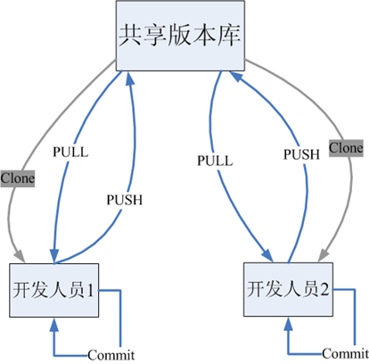
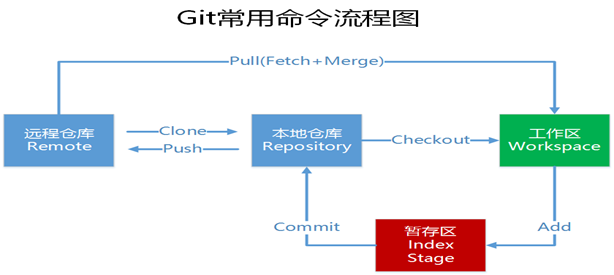
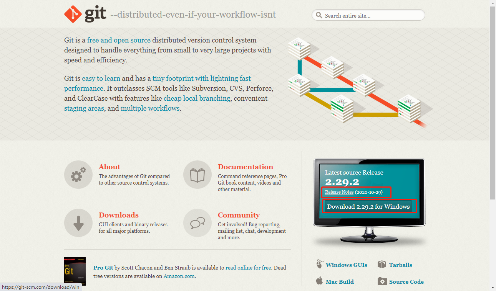

# 01.Git简介及安装使用

- 笔记本：24.Git
- 创建时间：2020-11-09 12:23:16 UTC
- 更新时间：2020-11-09 14:12:16 UTC
- 原始链接：https://www.w3cschool.cn/git/
- 印象笔记 GUID：0c95b321-de41-4ad1-8cb6-0038d6dd8e0c

# Git 简介及安装使用

## 1 Git 简介

Git是一个开源的分布式版本控制系统，用于敏捷高效地处理任何或小或大的项目。

**Git优点：**

- 适合分布式开发，强调个体。

- 公共服务器压力和数据量都不会太大。

- 速度快、灵活。

- 任意两个开发者之间可以很容易的解决冲突。

- 离线工作

Git是分布式版本控制系统，那么它就没有中央服务器的，每个人的电脑就是一个完整的版本库，这样，工作的时候就不需要联网了，因为版本都是在自己的电脑上。既然每个人的电脑都有一个完整的版本库，那多个人如何协作呢？比如说自己在电脑上改了文件A，其他人也在电脑上改了文件A，这时，你们两之间只需把各自的修改推送给对方，就可以互相看到对方的修改了。

下图就是分布式版本控制工具管理方式：
 

**git 工作流程：**
 一般工作流程如下：

1. 从远程仓库中克隆 Git 资源作为本地仓库。

1. 从本地仓库中checkout代码然后进行代码修改

1. 在提交前先将代码提交到暂存区。

1. 提交修改。提交到本地仓库。本地仓库中保存修改的各个历史版本。

1. 在修改完成后，需要和团队成员共享代码时，可以将代码push到远程仓库。

下图展示了 Git 的工作流程：
 

## 2 Git 的安装

最早Git是在Linux上开发的，很长一段时间内，Git也只能在Linux和Unix系统上跑。不过，慢慢地有人把它移植到了Windows上。现在，Git可以在Linux、Unix、Mac和Windows这几大平台上正常运行了。由于开发机大多数情况都是windows，所以本教程只讲解windows下的git的安装及使用。

### 2.1 软件下载：

>
**下载地址：** https://git-scm.com/
 

%23%20Git%20%E7%AE%80%E4%BB%8B%E5%8F%8A%E5%AE%89%E8%A3%85%E4%BD%BF%E7%94%A8%0A%0A%23%23%201%20Git%20%E7%AE%80%E4%BB%8B%0AGit%E6%98%AF%E4%B8%80%E4%B8%AA%E5%BC%80%E6%BA%90%E7%9A%84%E5%88%86%E5%B8%83%E5%BC%8F%E7%89%88%E6%9C%AC%E6%8E%A7%E5%88%B6%E7%B3%BB%E7%BB%9F%EF%BC%8C%E7%94%A8%E4%BA%8E%E6%95%8F%E6%8D%B7%E9%AB%98%E6%95%88%E5%9C%B0%E5%A4%84%E7%90%86%E4%BB%BB%E4%BD%95%E6%88%96%E5%B0%8F%E6%88%96%E5%A4%A7%E7%9A%84%E9%A1%B9%E7%9B%AE%E3%80%82%0A%0A**Git%E4%BC%98%E7%82%B9%EF%BC%9A**%20%0A-%20%E9%80%82%E5%90%88%E5%88%86%E5%B8%83%E5%BC%8F%E5%BC%80%E5%8F%91%EF%BC%8C%E5%BC%BA%E8%B0%83%E4%B8%AA%E4%BD%93%E3%80%82%0A-%20%E5%85%AC%E5%85%B1%E6%9C%8D%E5%8A%A1%E5%99%A8%E5%8E%8B%E5%8A%9B%E5%92%8C%E6%95%B0%E6%8D%AE%E9%87%8F%E9%83%BD%E4%B8%8D%E4%BC%9A%E5%A4%AA%E5%A4%A7%E3%80%82%0A-%20%E9%80%9F%E5%BA%A6%E5%BF%AB%E3%80%81%E7%81%B5%E6%B4%BB%E3%80%82%0A-%20%E4%BB%BB%E6%84%8F%E4%B8%A4%E4%B8%AA%E5%BC%80%E5%8F%91%E8%80%85%E4%B9%8B%E9%97%B4%E5%8F%AF%E4%BB%A5%E5%BE%88%E5%AE%B9%E6%98%93%E7%9A%84%E8%A7%A3%E5%86%B3%E5%86%B2%E7%AA%81%E3%80%82%0A-%20%E7%A6%BB%E7%BA%BF%E5%B7%A5%E4%BD%9C%0A%0AGit%E6%98%AF%E5%88%86%E5%B8%83%E5%BC%8F%E7%89%88%E6%9C%AC%E6%8E%A7%E5%88%B6%E7%B3%BB%E7%BB%9F%EF%BC%8C%E9%82%A3%E4%B9%88%E5%AE%83%E5%B0%B1%E6%B2%A1%E6%9C%89%E4%B8%AD%E5%A4%AE%E6%9C%8D%E5%8A%A1%E5%99%A8%E7%9A%84%EF%BC%8C%E6%AF%8F%E4%B8%AA%E4%BA%BA%E7%9A%84%E7%94%B5%E8%84%91%E5%B0%B1%E6%98%AF%E4%B8%80%E4%B8%AA%E5%AE%8C%E6%95%B4%E7%9A%84%E7%89%88%E6%9C%AC%E5%BA%93%EF%BC%8C%E8%BF%99%E6%A0%B7%EF%BC%8C%E5%B7%A5%E4%BD%9C%E7%9A%84%E6%97%B6%E5%80%99%E5%B0%B1%E4%B8%8D%E9%9C%80%E8%A6%81%E8%81%94%E7%BD%91%E4%BA%86%EF%BC%8C%E5%9B%A0%E4%B8%BA%E7%89%88%E6%9C%AC%E9%83%BD%E6%98%AF%E5%9C%A8%E8%87%AA%E5%B7%B1%E7%9A%84%E7%94%B5%E8%84%91%E4%B8%8A%E3%80%82%E6%97%A2%E7%84%B6%E6%AF%8F%E4%B8%AA%E4%BA%BA%E7%9A%84%E7%94%B5%E8%84%91%E9%83%BD%E6%9C%89%E4%B8%80%E4%B8%AA%E5%AE%8C%E6%95%B4%E7%9A%84%E7%89%88%E6%9C%AC%E5%BA%93%EF%BC%8C%E9%82%A3%E5%A4%9A%E4%B8%AA%E4%BA%BA%E5%A6%82%E4%BD%95%E5%8D%8F%E4%BD%9C%E5%91%A2%EF%BC%9F%E6%AF%94%E5%A6%82%E8%AF%B4%E8%87%AA%E5%B7%B1%E5%9C%A8%E7%94%B5%E8%84%91%E4%B8%8A%E6%94%B9%E4%BA%86%E6%96%87%E4%BB%B6A%EF%BC%8C%E5%85%B6%E4%BB%96%E4%BA%BA%E4%B9%9F%E5%9C%A8%E7%94%B5%E8%84%91%E4%B8%8A%E6%94%B9%E4%BA%86%E6%96%87%E4%BB%B6A%EF%BC%8C%E8%BF%99%E6%97%B6%EF%BC%8C%E4%BD%A0%E4%BB%AC%E4%B8%A4%E4%B9%8B%E9%97%B4%E5%8F%AA%E9%9C%80%E6%8A%8A%E5%90%84%E8%87%AA%E7%9A%84%E4%BF%AE%E6%94%B9%E6%8E%A8%E9%80%81%E7%BB%99%E5%AF%B9%E6%96%B9%EF%BC%8C%E5%B0%B1%E5%8F%AF%E4%BB%A5%E4%BA%92%E7%9B%B8%E7%9C%8B%E5%88%B0%E5%AF%B9%E6%96%B9%E7%9A%84%E4%BF%AE%E6%94%B9%E4%BA%86%E3%80%82%0A%0A%E4%B8%8B%E5%9B%BE%E5%B0%B1%E6%98%AF%E5%88%86%E5%B8%83%E5%BC%8F%E7%89%88%E6%9C%AC%E6%8E%A7%E5%88%B6%E5%B7%A5%E5%85%B7%E7%AE%A1%E7%90%86%E6%96%B9%E5%BC%8F%EF%BC%9A%0A!%5B987d709e3bafa8eec095aa6b92f546ff.png%5D(en-resource%3A%2F%2Fdatabase%2F3983%3A0)%0A%0A**git%20%E5%B7%A5%E4%BD%9C%E6%B5%81%E7%A8%8B%EF%BC%9A**%0A%E4%B8%80%E8%88%AC%E5%B7%A5%E4%BD%9C%E6%B5%81%E7%A8%8B%E5%A6%82%E4%B8%8B%EF%BC%9A%0A1.%20%E4%BB%8E%E8%BF%9C%E7%A8%8B%E4%BB%93%E5%BA%93%E4%B8%AD%E5%85%8B%E9%9A%86%20Git%20%E8%B5%84%E6%BA%90%E4%BD%9C%E4%B8%BA%E6%9C%AC%E5%9C%B0%E4%BB%93%E5%BA%93%E3%80%82%0A2.%20%E4%BB%8E%E6%9C%AC%E5%9C%B0%E4%BB%93%E5%BA%93%E4%B8%ADcheckout%E4%BB%A3%E7%A0%81%E7%84%B6%E5%90%8E%E8%BF%9B%E8%A1%8C%E4%BB%A3%E7%A0%81%E4%BF%AE%E6%94%B9%0A3.%20%E5%9C%A8%E6%8F%90%E4%BA%A4%E5%89%8D%E5%85%88%E5%B0%86%E4%BB%A3%E7%A0%81%E6%8F%90%E4%BA%A4%E5%88%B0%E6%9A%82%E5%AD%98%E5%8C%BA%E3%80%82%0A4.%20%E6%8F%90%E4%BA%A4%E4%BF%AE%E6%94%B9%E3%80%82%E6%8F%90%E4%BA%A4%E5%88%B0%E6%9C%AC%E5%9C%B0%E4%BB%93%E5%BA%93%E3%80%82%E6%9C%AC%E5%9C%B0%E4%BB%93%E5%BA%93%E4%B8%AD%E4%BF%9D%E5%AD%98%E4%BF%AE%E6%94%B9%E7%9A%84%E5%90%84%E4%B8%AA%E5%8E%86%E5%8F%B2%E7%89%88%E6%9C%AC%E3%80%82%0A5.%20%E5%9C%A8%E4%BF%AE%E6%94%B9%E5%AE%8C%E6%88%90%E5%90%8E%EF%BC%8C%E9%9C%80%E8%A6%81%E5%92%8C%E5%9B%A2%E9%98%9F%E6%88%90%E5%91%98%E5%85%B1%E4%BA%AB%E4%BB%A3%E7%A0%81%E6%97%B6%EF%BC%8C%E5%8F%AF%E4%BB%A5%E5%B0%86%E4%BB%A3%E7%A0%81push%E5%88%B0%E8%BF%9C%E7%A8%8B%E4%BB%93%E5%BA%93%E3%80%82%0A%0A%E4%B8%8B%E5%9B%BE%E5%B1%95%E7%A4%BA%E4%BA%86%20Git%20%E7%9A%84%E5%B7%A5%E4%BD%9C%E6%B5%81%E7%A8%8B%EF%BC%9A%0A!%5Bf775d677274993c71a989e25120b5045.png%5D(en-resource%3A%2F%2Fdatabase%2F3985%3A0)%0A%0A%0A%0A%23%23%202%20Git%20%E7%9A%84%E5%AE%89%E8%A3%85%0A%E6%9C%80%E6%97%A9Git%E6%98%AF%E5%9C%A8Linux%E4%B8%8A%E5%BC%80%E5%8F%91%E7%9A%84%EF%BC%8C%E5%BE%88%E9%95%BF%E4%B8%80%E6%AE%B5%E6%97%B6%E9%97%B4%E5%86%85%EF%BC%8CGit%E4%B9%9F%E5%8F%AA%E8%83%BD%E5%9C%A8Linux%E5%92%8CUnix%E7%B3%BB%E7%BB%9F%E4%B8%8A%E8%B7%91%E3%80%82%E4%B8%8D%E8%BF%87%EF%BC%8C%E6%85%A2%E6%85%A2%E5%9C%B0%E6%9C%89%E4%BA%BA%E6%8A%8A%E5%AE%83%E7%A7%BB%E6%A4%8D%E5%88%B0%E4%BA%86Windows%E4%B8%8A%E3%80%82%E7%8E%B0%E5%9C%A8%EF%BC%8CGit%E5%8F%AF%E4%BB%A5%E5%9C%A8Linux%E3%80%81Unix%E3%80%81Mac%E5%92%8CWindows%E8%BF%99%E5%87%A0%E5%A4%A7%E5%B9%B3%E5%8F%B0%E4%B8%8A%E6%AD%A3%E5%B8%B8%E8%BF%90%E8%A1%8C%E4%BA%86%E3%80%82%E7%94%B1%E4%BA%8E%E5%BC%80%E5%8F%91%E6%9C%BA%E5%A4%A7%E5%A4%9A%E6%95%B0%E6%83%85%E5%86%B5%E9%83%BD%E6%98%AFwindows%EF%BC%8C%E6%89%80%E4%BB%A5%E6%9C%AC%E6%95%99%E7%A8%8B%E5%8F%AA%E8%AE%B2%E8%A7%A3windows%E4%B8%8B%E7%9A%84git%E7%9A%84%E5%AE%89%E8%A3%85%E5%8F%8A%E4%BD%BF%E7%94%A8%E3%80%82%0A%0A%23%23%23%202.1%20%E8%BD%AF%E4%BB%B6%E4%B8%8B%E8%BD%BD%EF%BC%9A%0A%3E%20**%E4%B8%8B%E8%BD%BD%E5%9C%B0%E5%9D%80%EF%BC%9A**%20https%3A%2F%2Fgit-scm.com%2F%0A!%5B4a480cba5f2d098f5ac0caeef87f7548.png%5D(en-resource%3A%2F%2Fdatabase%2F3987%3A0)%0A%0A%23%23%23%202.2%20TortoisesGit%0A%3E%20**%E4%B8%8B%E8%BD%BD%E5%9C%B0%E5%9D%80%EF%BC%9A**%20https%3A%2F%2Ftortoisegit.org%2Fdownload%2F%0A!%5B6639f67f18499e6c93200eb62aee68c9.png%5D(en-resource%3A%2F%2Fdatabase%2F3989%3A0)%0A%0A
