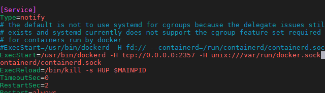

# 1.DockerMaven插件

- 笔记本：27.持续集成与容器管理
- 创建时间：2020-11-23 07:07:31 UTC
- 更新时间：2020-11-24 03:19:22 UTC
- 原始链接：https://blog.csdn.net/zhanghui_new/article/details/107385983
- 印象笔记 GUID：10df7bcd-867a-4516-9bca-1527106cf797

# DockerMaven插件

微服务部署有两种方法：

（1）手动部署：首先基于源码打包生成jar包（或war包）,将jar包（或war包）上传至虚拟机并拷贝至JDK容器。
 （2）通过Maven插件自动部署。

对于数量众多的微服务，手动部署无疑是非常麻烦的做法，并且容易出错。所以我们这里学习如何自动部署，这也是企业实际开发中经常使用的方法。

Maven 插件自动部署步骤：
 （1）修改宿主机的docker配置，让其可以远程访问

```
sudo vim /lib/systemd/system/docker.service

```

其中 ExecStart=后添加配置 `‐H tcp://0.0.0.0:2375 ‐H unix:///var/run/docker.sock`

修改后如下：
 

（2）刷新配置，重启服务

```
sudo systemctl daemon-reload
sudo systemctl restart docker
sudo docker start registry

```

（3）在工程pom.xml 增加配置

```
<build>
    <finalName>app</finalName>
    <plugins>
        <plugin>
            <groupId>org.springframework.boot</groupId>
            <artifactId>spring-boot-maven-plugin</artifactId>
        </plugin>
        <!-- docker的maven插件，官网：https://github.com/spotify/docker‐maven‐plugin -->
        <plugin>
            <groupId>com.spotify</groupId>
            <artifactId>docker-maven-plugin</artifactId>
            <version>1.2.2</version>
            <configuration>
                <imageName>192.168.1.19:5000/${project.artifactId}:${project.version}</imageName>
                <baseImage>centos7-jdk1.8</baseImage>
                <entryPoint>["java", "‐jar","/${project.build.finalName}.jar"]</entryPoint>
                <resources>
                    <resource>
                        <targetPath>/</targetPath>
                        <directory>${project.build.directory}</directory>
                        <include>${project.build.finalName}.jar</include>
                    </resource>
                </resources>
                <dockerHost>http://192.168.1.19::2375</dockerHost>
            </configuration>
        </plugin>
    </plugins>
</build>

```

以上配置会自动生成 Dockerfile

```
FROM centos7-jdk1.8
ADD app.jar /
ENTRYPOINT ["java","-jar","/app.jar"]

```

（5）在windows的命令提示符下，进入工程所在的目录

```
mvn install

```

输入以下命令，进行打包和上传镜像

```
mvn docker:build -DpushImage
``` 
执行后，会有如下输出，代码正在上传

**Tips:** 主要要开启防护墙的 5000 和 2375 端口才可以，下面以 Ubuntu20 为例：
```shell
# 安装 ufw
sudo apt-get install ufw
# 启用 ufw
sudo ufw enable
sudo ufw default deny

# 如果你需要开放某些服务，再使用sudo ufw allow命令开启，举例如下
# sudo ufw allow | deny [service]
# sudo ufw allow 53 # 允许外部访问53端口(tcp/udp)
# sudo ufw allow 3690 # 允许外部访问3690端口(svn)
# sudo ufw allow from 192.168.1.111 # 允许此IP访问所有的本机端口
# sudo ufw allow proto tcp from 192.168.0.0/24 to any port 22 # 允许指定的IP段访问特定端口
# sudo ufw delete allow smtp # 删除上面建立的某条规则，比如删除svn端口就是 sudo ufw delete allow 3690
sudo ufw allow 5000
sudo ufw allow 2375

```

%23%20DockerMaven%E6%8F%92%E4%BB%B6%0A%C2%A0%E5%BE%AE%E6%9C%8D%E5%8A%A1%E9%83%A8%E7%BD%B2%E6%9C%89%E4%B8%A4%E7%A7%8D%E6%96%B9%E6%B3%95%EF%BC%9A%0A%0A%EF%BC%881%EF%BC%89%E6%89%8B%E5%8A%A8%E9%83%A8%E7%BD%B2%EF%BC%9A%E9%A6%96%E5%85%88%E5%9F%BA%E4%BA%8E%E6%BA%90%E7%A0%81%E6%89%93%E5%8C%85%E7%94%9F%E6%88%90jar%E5%8C%85%EF%BC%88%E6%88%96war%E5%8C%85%EF%BC%89%2C%E5%B0%86jar%E5%8C%85%EF%BC%88%E6%88%96war%E5%8C%85%EF%BC%89%E4%B8%8A%E4%BC%A0%E8%87%B3%E8%99%9A%E6%8B%9F%E6%9C%BA%E5%B9%B6%E6%8B%B7%E8%B4%9D%E8%87%B3JDK%E5%AE%B9%E5%99%A8%E3%80%82%0A%EF%BC%882%EF%BC%89%E9%80%9A%E8%BF%87Maven%E6%8F%92%E4%BB%B6%E8%87%AA%E5%8A%A8%E9%83%A8%E7%BD%B2%E3%80%82%0A%0A%E5%AF%B9%E4%BA%8E%E6%95%B0%E9%87%8F%E4%BC%97%E5%A4%9A%E7%9A%84%E5%BE%AE%E6%9C%8D%E5%8A%A1%EF%BC%8C%E6%89%8B%E5%8A%A8%E9%83%A8%E7%BD%B2%E6%97%A0%E7%96%91%E6%98%AF%E9%9D%9E%E5%B8%B8%E9%BA%BB%E7%83%A6%E7%9A%84%E5%81%9A%E6%B3%95%EF%BC%8C%E5%B9%B6%E4%B8%94%E5%AE%B9%E6%98%93%E5%87%BA%E9%94%99%E3%80%82%E6%89%80%E4%BB%A5%E6%88%91%E4%BB%AC%E8%BF%99%E9%87%8C%E5%AD%A6%E4%B9%A0%E5%A6%82%E4%BD%95%E8%87%AA%E5%8A%A8%E9%83%A8%E7%BD%B2%EF%BC%8C%E8%BF%99%E4%B9%9F%E6%98%AF%E4%BC%81%E4%B8%9A%E5%AE%9E%E9%99%85%E5%BC%80%E5%8F%91%E4%B8%AD%E7%BB%8F%E5%B8%B8%E4%BD%BF%E7%94%A8%E7%9A%84%E6%96%B9%E6%B3%95%E3%80%82%0A%0AMaven%20%E6%8F%92%E4%BB%B6%E8%87%AA%E5%8A%A8%E9%83%A8%E7%BD%B2%E6%AD%A5%E9%AA%A4%EF%BC%9A%0A%EF%BC%881%EF%BC%89%E4%BF%AE%E6%94%B9%E5%AE%BF%E4%B8%BB%E6%9C%BA%E7%9A%84docker%E9%85%8D%E7%BD%AE%EF%BC%8C%E8%AE%A9%E5%85%B6%E5%8F%AF%E4%BB%A5%E8%BF%9C%E7%A8%8B%E8%AE%BF%E9%97%AE%0A%60%60%60shell%0Asudo%20vim%20%2Flib%2Fsystemd%2Fsystem%2Fdocker.service%0A%60%60%60%0A%C2%A0%E5%85%B6%E4%B8%AD%20ExecStart%3D%E5%90%8E%E6%B7%BB%E5%8A%A0%E9%85%8D%E7%BD%AE%20%60%E2%80%90H%20tcp%3A%2F%2F0.0.0.0%3A2375%20%E2%80%90H%20unix%3A%2F%2F%2Fvar%2Frun%2Fdocker.sock%60%0A%20%0A%20%E4%BF%AE%E6%94%B9%E5%90%8E%E5%A6%82%E4%B8%8B%EF%BC%9A%0A%20!%5B37bed191e29a27c3807b7398dd69b98c.png%5D(en-resource%3A%2F%2Fdatabase%2F4056%3A1)%0A%20%0A%EF%BC%882%EF%BC%89%E5%88%B7%E6%96%B0%E9%85%8D%E7%BD%AE%EF%BC%8C%E9%87%8D%E5%90%AF%E6%9C%8D%E5%8A%A1%0A%60%60%60shell%0Asudo%20systemctl%20daemon-reload%0Asudo%20systemctl%20restart%20docker%0Asudo%20docker%20start%20registry%0A%60%60%60%0A%0A%EF%BC%883%EF%BC%89%E5%9C%A8%E5%B7%A5%E7%A8%8Bpom.xml%20%E5%A2%9E%E5%8A%A0%E9%85%8D%E7%BD%AE%0A%60%60%60shell%0A%3Cbuild%3E%0A%20%20%20%20%3CfinalName%3Eapp%3C%2FfinalName%3E%0A%20%20%20%20%3Cplugins%3E%0A%20%20%20%20%20%20%20%20%3Cplugin%3E%0A%20%20%20%20%20%20%20%20%20%20%20%20%3CgroupId%3Eorg.springframework.boot%3C%2FgroupId%3E%0A%20%20%20%20%20%20%20%20%20%20%20%20%3CartifactId%3Espring-boot-maven-plugin%3C%2FartifactId%3E%0A%20%20%20%20%20%20%20%20%3C%2Fplugin%3E%0A%20%20%20%20%20%20%20%20%3C!--%20docker%E7%9A%84maven%E6%8F%92%E4%BB%B6%EF%BC%8C%E5%AE%98%E7%BD%91%EF%BC%9Ahttps%3A%2F%2Fgithub.com%2Fspotify%2Fdocker%E2%80%90maven%E2%80%90plugin%20--%3E%0A%20%20%20%20%20%20%20%20%3Cplugin%3E%0A%20%20%20%20%20%20%20%20%20%20%20%20%3CgroupId%3Ecom.spotify%3C%2FgroupId%3E%0A%20%20%20%20%20%20%20%20%20%20%20%20%3CartifactId%3Edocker-maven-plugin%3C%2FartifactId%3E%0A%20%20%20%20%20%20%20%20%20%20%20%20%3Cversion%3E1.2.2%3C%2Fversion%3E%0A%20%20%20%20%20%20%20%20%20%20%20%20%3Cconfiguration%3E%0A%20%20%20%20%20%20%20%20%20%20%20%20%20%20%20%20%3CimageName%3E192.168.1.19%3A5000%2F%24%7Bproject.artifactId%7D%3A%24%7Bproject.version%7D%3C%2FimageName%3E%0A%20%20%20%20%20%20%20%20%20%20%20%20%20%20%20%20%3CbaseImage%3Ecentos7-jdk1.8%3C%2FbaseImage%3E%0A%20%20%20%20%20%20%20%20%20%20%20%20%20%20%20%20%3CentryPoint%3E%5B%22java%22%2C%20%22%E2%80%90jar%22%2C%22%2F%24%7Bproject.build.finalName%7D.jar%22%5D%3C%2FentryPoint%3E%0A%20%20%20%20%20%20%20%20%20%20%20%20%20%20%20%20%3Cresources%3E%0A%20%20%20%20%20%20%20%20%20%20%20%20%20%20%20%20%20%20%20%20%3Cresource%3E%0A%20%20%20%20%20%20%20%20%20%20%20%20%20%20%20%20%20%20%20%20%20%20%20%20%3CtargetPath%3E%2F%3C%2FtargetPath%3E%0A%20%20%20%20%20%20%20%20%20%20%20%20%20%20%20%20%20%20%20%20%20%20%20%20%3Cdirectory%3E%24%7Bproject.build.directory%7D%3C%2Fdirectory%3E%0A%20%20%20%20%20%20%20%20%20%20%20%20%20%20%20%20%20%20%20%20%20%20%20%20%3Cinclude%3E%24%7Bproject.build.finalName%7D.jar%3C%2Finclude%3E%0A%20%20%20%20%20%20%20%20%20%20%20%20%20%20%20%20%20%20%20%20%3C%2Fresource%3E%0A%20%20%20%20%20%20%20%20%20%20%20%20%20%20%20%20%3C%2Fresources%3E%0A%20%20%20%20%20%20%20%20%20%20%20%20%20%20%20%20%3CdockerHost%3Ehttp%3A%2F%2F192.168.1.19%3A2375%3C%2FdockerHost%3E%0A%20%20%20%20%20%20%20%20%20%20%20%20%3C%2Fconfiguration%3E%0A%20%20%20%20%20%20%20%20%3C%2Fplugin%3E%0A%20%20%20%20%3C%2Fplugins%3E%0A%3C%2Fbuild%3E%0A%60%60%60%0A%E4%BB%A5%E4%B8%8A%E9%85%8D%E7%BD%AE%E4%BC%9A%E8%87%AA%E5%8A%A8%E7%94%9F%E6%88%90%20Dockerfile%0A%60%60%60shell%0AFROM%20centos7-jdk1.8%0AADD%20app.jar%20%2F%0AENTRYPOINT%20%5B%22java%22%2C%22-jar%22%2C%22%2Fapp.jar%22%5D%0A%60%60%60%0A%EF%BC%885%EF%BC%89%E5%9C%A8windows%E7%9A%84%E5%91%BD%E4%BB%A4%E6%8F%90%E7%A4%BA%E7%AC%A6%E4%B8%8B%EF%BC%8C%E8%BF%9B%E5%85%A5%E5%B7%A5%E7%A8%8B%E6%89%80%E5%9C%A8%E7%9A%84%E7%9B%AE%E5%BD%95%0A%60%60%60cmd%0Amvn%20install%0A%60%60%60%0A%E8%BE%93%E5%85%A5%E4%BB%A5%E4%B8%8B%E5%91%BD%E4%BB%A4%EF%BC%8C%E8%BF%9B%E8%A1%8C%E6%89%93%E5%8C%85%E5%92%8C%E4%B8%8A%E4%BC%A0%E9%95%9C%E5%83%8F%0A%60%60%60cmd%0Amvn%20docker%3Abuild%20-DpushImage%0A%60%60%60%C2%A0%0A%E6%89%A7%E8%A1%8C%E5%90%8E%EF%BC%8C%E4%BC%9A%E6%9C%89%E5%A6%82%E4%B8%8B%E8%BE%93%E5%87%BA%EF%BC%8C%E4%BB%A3%E7%A0%81%E6%AD%A3%E5%9C%A8%E4%B8%8A%E4%BC%A0%0A!%5B46a3c2f7dcce7917466a0a441b38c51c.png%5D(en-resource%3A%2F%2Fdatabase%2F4058%3A0)%0A%0A%EF%BC%886%EF%BC%89%E8%BF%9B%E5%85%A5%E5%AE%BF%E4%B8%BB%E6%9C%BA%E6%9F%A5%E7%9C%8B%E9%95%9C%E5%83%8F%0A%60%60%60shell%0Asudo%20docker%20images%0A%60%60%60%0A%E8%BE%93%E5%87%BA%E5%A6%82%E4%B8%8A%E5%86%85%E5%AE%B9%EF%BC%8C%E8%A1%A8%E7%A4%BA%E6%9C%8D%E5%8A%A1%E5%B7%B2%E5%81%9A%E6%88%90%E9%95%9C%E5%83%8F%0A%0A%EF%BC%887%EF%BC%89%E5%90%AF%E5%8A%A8%E5%AE%B9%E5%99%A8%EF%BC%9A%0A%60%60%60shell%0Asudo%20docker%20run%20-di%20--name%3Djpa%20-p%209001%3A9001%20192.168.1.19%3A5000%2Fspringboot_jpa%3A0.0.1-SNAPSHOT%0A%60%60%60%0A%0A%0A**Tips%3A**%20%E4%B8%BB%E8%A6%81%E8%A6%81%E5%BC%80%E5%90%AF%E9%98%B2%E6%8A%A4%E5%A2%99%E7%9A%84%205000%20%E5%92%8C%202375%20%E7%AB%AF%E5%8F%A3%E6%89%8D%E5%8F%AF%E4%BB%A5%EF%BC%8C%E4%B8%8B%E9%9D%A2%E4%BB%A5%20Ubuntu20%20%E4%B8%BA%E4%BE%8B%EF%BC%9A%0A%60%60%60shell%0A%23%20%E5%AE%89%E8%A3%85%20ufw%0Asudo%20apt-get%20install%20ufw%0A%23%20%E5%90%AF%E7%94%A8%20ufw%0Asudo%20ufw%20enable%0Asudo%20ufw%20default%20deny%0A%0A%23%20%E5%A6%82%E6%9E%9C%E4%BD%A0%E9%9C%80%E8%A6%81%E5%BC%80%E6%94%BE%E6%9F%90%E4%BA%9B%E6%9C%8D%E5%8A%A1%EF%BC%8C%E5%86%8D%E4%BD%BF%E7%94%A8sudo%20ufw%20allow%E5%91%BD%E4%BB%A4%E5%BC%80%E5%90%AF%EF%BC%8C%E4%B8%BE%E4%BE%8B%E5%A6%82%E4%B8%8B%0A%23%20sudo%20ufw%20allow%20%7C%20deny%20%5Bservice%5D%0A%23%20sudo%20ufw%20allow%2053%20%23%20%E5%85%81%E8%AE%B8%E5%A4%96%E9%83%A8%E8%AE%BF%E9%97%AE53%E7%AB%AF%E5%8F%A3(tcp%2Fudp)%20%0A%23%20sudo%20ufw%20allow%203690%20%23%20%E5%85%81%E8%AE%B8%E5%A4%96%E9%83%A8%E8%AE%BF%E9%97%AE3690%E7%AB%AF%E5%8F%A3(svn)%20%0A%23%20sudo%20ufw%20allow%20from%20192.168.1.111%20%23%20%E5%85%81%E8%AE%B8%E6%AD%A4IP%E8%AE%BF%E9%97%AE%E6%89%80%E6%9C%89%E7%9A%84%E6%9C%AC%E6%9C%BA%E7%AB%AF%E5%8F%A3%20%0A%23%20sudo%20ufw%20allow%20proto%20tcp%20from%20192.168.0.0%2F24%20to%20any%20port%2022%20%23%20%E5%85%81%E8%AE%B8%E6%8C%87%E5%AE%9A%E7%9A%84IP%E6%AE%B5%E8%AE%BF%E9%97%AE%E7%89%B9%E5%AE%9A%E7%AB%AF%E5%8F%A3%20%0A%23%20sudo%20ufw%20delete%20allow%20smtp%20%23%20%E5%88%A0%E9%99%A4%E4%B8%8A%E9%9D%A2%E5%BB%BA%E7%AB%8B%E7%9A%84%E6%9F%90%E6%9D%A1%E8%A7%84%E5%88%99%EF%BC%8C%E6%AF%94%E5%A6%82%E5%88%A0%E9%99%A4svn%E7%AB%AF%E5%8F%A3%E5%B0%B1%E6%98%AF%20sudo%20ufw%20delete%20allow%203690%0Asudo%20ufw%20allow%205000%0Asudo%20ufw%20allow%202375%0A%60%60%60
