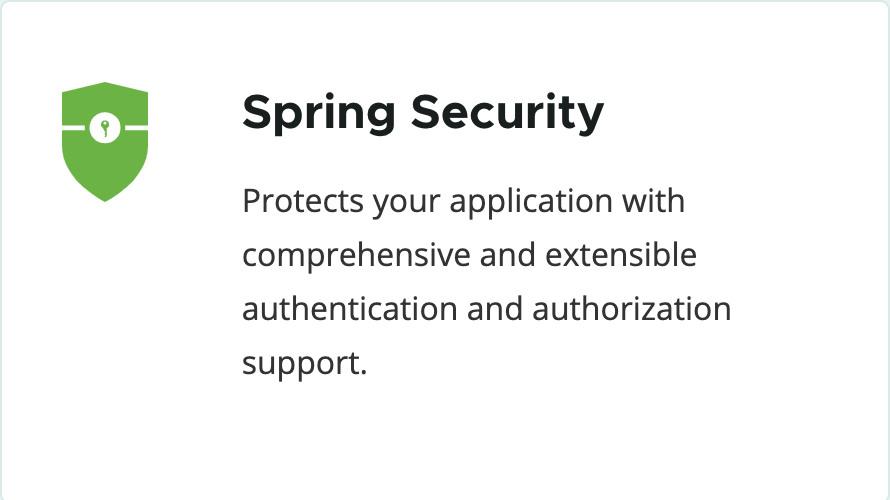
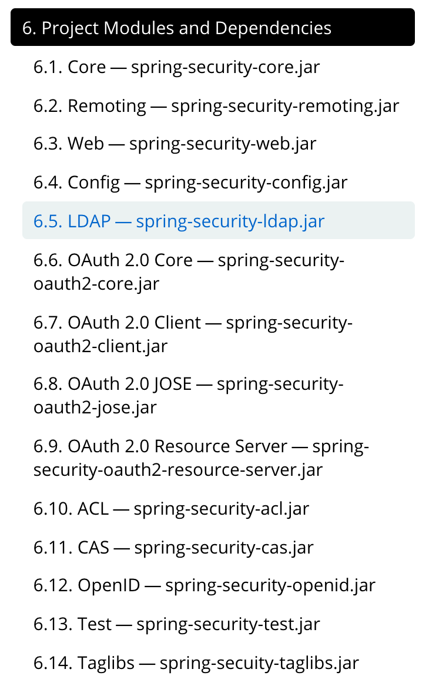

# 1. SpringSecurity框架简介

- 笔记本：29.Spring security
- 创建时间：2021-01-14 04:00:36 UTC
- 更新时间：2021-01-14 07:06:44 UTC
- 印象笔记 GUID：b3d09d21-63ac-4ef7-9fca-92b786b84abd

## SpringSecurity框架简介

### 1. 概要

Spring 是非常流行和成功的 Java 应用开发框架， Spring Security 正是 Spring 家族中的成员。 Spring Security 基于 Spring 框架，提供了一套 Web 应用安全性的完整解决方案。

正如你可能知道的关于安全方面的两个主要区域是“**认证**”和“**授权**”（或者访问控制）， 一般来说， Web 应用的安全性包括**用户认证（Authentication）** 和**用户授权（Authorization）** 两个部分， 这两点也是 Spring Security 重要核心功能。

（1）用户认证指的是：验证某个用户是否为系统中的合法主体，也就是说用户能否访问该系统。用户认证一般要求用户提供用户名和密码。系统通过校验用户名和密码来完成认证过程。***通俗点说就是系统认为用户是否能登录***
 （2）用户授权指的是验证某个用户是否有权限执行某个操作。在一个系统中，不同用户所具有的权限是不同的。比如对一个文件来说，有的用户只能进行读取，而有的用户可以进行修改。一般来说，系统会为不同的用户分配不同的角色，而每个角色则对应一系列的权限。***通俗点讲就是系统判断用户是否有权限去做某些事情***

### 2. 历史

“Spring Security 开始于 2003 年年底,““spring 的 acegi 安全系统”。 起因是 Spring开发者邮件列表中的一个问题,有人提问是否考虑提供一个基于 spring 的安全实现。

Spring Security 以“The Acegi Secutity System for Spring” 的名字始于 2013 年晚些时候。一个问题提交到 Spring 开发者的邮件列表，询问是否已经有考虑一个机遇 Spring的安全性社区实现。那时候 Spring 的社区相对较小（相对现在）。实际上 Spring 自己在2013 年只是一个存在于ScourseForge 的项目，这个问题的回答是一个值得研究的领域，虽然目前时间的缺乏组织了我们对它的探索。

考虑到这一点，一个简单的安全实现建成但是并没有发布。几周后， Spring 社区的其他成员询问了安全性，这次这个代码被发送给他们。其他几个请求也跟随而来。到 2014 年一月大约有 20 万人使用了这个代码。这些创业者的人提出一个 SourceForge 项目加入是为了，这是在 2004 三月正式成立。

在早些时候，这个项目没有任何自己的验证模块，身份验证过程依赖于容器管理的安全性和 Acegi 安全性。而不是专注于授权。开始的时候这很适合，但是越来越多的用户请求额外的容器支持。容器特定的认证领域接口的基本限制变得清晰。还有一个相关的问题增加新的容器的路径，这是最终用户的困惑和错误配置的常见问题。

Acegi 安全特定的认证服务介绍。大约一年后， Acegi 安全正式成为了 Spring 框架的子项目。 1.0.0 最终版本是出版于 2006 -在超过两年半的大量生产的软件项目和数以百计的改进和积极利用社区的贡献。

Acegi 安全 2007 年底正式成为了 Spring 组合项目，更名为"Spring Security"。

### 3. 同款产品对比

#### 3.1. Spring Security

Spring 技术栈的组成部分
 
 通过提供完整可扩展的认证和授权支持保护你的应用程序。

>
https://spring.io/projects/spring-security

SpringSecurity 特点：

- 和 Spring 无缝融合

- 全面的权限控制

- 专门为 Web 开发设计

  - 旧版本不能脱离 Web 环境使用

  - 新版本对整个框架进行了分层抽取，分成了核心模块和 Web 模块。单独引入核心模块就可以脱离 Web 环境。

- 重量级

#### 3.2. Shiro

Apache 旗下的轻量级权限控制框架。
 

特点：

- 轻量级。 Shiro 主张的理念是把复杂的事情变简单。针对对性能有更高要求的互联网应用有更好表现。

- 通用性

  - 好处：不局限于 Web 环境，可以脱离 Web 环境使用。

  - 缺陷：在 Web 环境下一些特定的需求需要手动编写代码定制。

Spring Security 是 Spring 家族中的一个安全管理框架，实际上，在 Spring Boot 出现之前， Spring Security 就已经发展了多年了，但是使用的并不多，安全管理这个领域，一直是 Shiro 的天下。

相对于 Shiro，在 SSM 中整合 Spring Security 都是比较麻烦的操作，所以， SpringSecurity 虽然功能比 Shiro 强大，但是使用反而没有 Shiro 多（Shiro 虽然功能没有Spring Security 多，但是对于大部分项目而言， Shiro 也够用了）。

自从有了 Spring Boot 之后， Spring Boot 对于 Spring Security 提供了自动化配置方案，可以使用更少的配置来使用 Spring Security。

因此，一般来说，常见的安全管理技术栈的组合是这样的：

- SSM + Shiro

- Spring Boot/Spring Cloud + Spring Security

**以上只是一个推荐的组合而已，如果单纯从技术上来说，无论怎么组合，都是可以运行的。**

### 4. 模块划分

%23%23%20SpringSecurity%E6%A1%86%E6%9E%B6%E7%AE%80%E4%BB%8B%0A%23%23%23%201.%20%E6%A6%82%E8%A6%81%0ASpring%20%E6%98%AF%E9%9D%9E%E5%B8%B8%E6%B5%81%E8%A1%8C%E5%92%8C%E6%88%90%E5%8A%9F%E7%9A%84%20Java%20%E5%BA%94%E7%94%A8%E5%BC%80%E5%8F%91%E6%A1%86%E6%9E%B6%EF%BC%8C%20Spring%20Security%20%E6%AD%A3%E6%98%AF%20Spring%20%E5%AE%B6%E6%97%8F%E4%B8%AD%E7%9A%84%E6%88%90%E5%91%98%E3%80%82%20Spring%20Security%20%E5%9F%BA%E4%BA%8E%20Spring%20%E6%A1%86%E6%9E%B6%EF%BC%8C%E6%8F%90%E4%BE%9B%E4%BA%86%E4%B8%80%E5%A5%97%20Web%20%E5%BA%94%E7%94%A8%E5%AE%89%E5%85%A8%E6%80%A7%E7%9A%84%E5%AE%8C%E6%95%B4%E8%A7%A3%E5%86%B3%E6%96%B9%E6%A1%88%E3%80%82%0A%0A%E6%AD%A3%E5%A6%82%E4%BD%A0%E5%8F%AF%E8%83%BD%E7%9F%A5%E9%81%93%E7%9A%84%E5%85%B3%E4%BA%8E%E5%AE%89%E5%85%A8%E6%96%B9%E9%9D%A2%E7%9A%84%E4%B8%A4%E4%B8%AA%E4%B8%BB%E8%A6%81%E5%8C%BA%E5%9F%9F%E6%98%AF%E2%80%9C**%E8%AE%A4%E8%AF%81**%E2%80%9D%E5%92%8C%E2%80%9C**%E6%8E%88%E6%9D%83**%E2%80%9D%EF%BC%88%E6%88%96%E8%80%85%E8%AE%BF%E9%97%AE%E6%8E%A7%E5%88%B6%EF%BC%89%EF%BC%8C%20%E4%B8%80%E8%88%AC%E6%9D%A5%E8%AF%B4%EF%BC%8C%20Web%20%E5%BA%94%E7%94%A8%E7%9A%84%E5%AE%89%E5%85%A8%E6%80%A7%E5%8C%85%E6%8B%AC**%E7%94%A8%E6%88%B7%E8%AE%A4%E8%AF%81%EF%BC%88Authentication%EF%BC%89**%20%E5%92%8C**%E7%94%A8%E6%88%B7%E6%8E%88%E6%9D%83%EF%BC%88Authorization%EF%BC%89**%20%E4%B8%A4%E4%B8%AA%E9%83%A8%E5%88%86%EF%BC%8C%20%E8%BF%99%E4%B8%A4%E7%82%B9%E4%B9%9F%E6%98%AF%20Spring%20Security%20%E9%87%8D%E8%A6%81%E6%A0%B8%E5%BF%83%E5%8A%9F%E8%83%BD%E3%80%82%0A%0A%EF%BC%881%EF%BC%89%E7%94%A8%E6%88%B7%E8%AE%A4%E8%AF%81%E6%8C%87%E7%9A%84%E6%98%AF%EF%BC%9A%E9%AA%8C%E8%AF%81%E6%9F%90%E4%B8%AA%E7%94%A8%E6%88%B7%E6%98%AF%E5%90%A6%E4%B8%BA%E7%B3%BB%E7%BB%9F%E4%B8%AD%E7%9A%84%E5%90%88%E6%B3%95%E4%B8%BB%E4%BD%93%EF%BC%8C%E4%B9%9F%E5%B0%B1%E6%98%AF%E8%AF%B4%E7%94%A8%E6%88%B7%E8%83%BD%E5%90%A6%E8%AE%BF%E9%97%AE%E8%AF%A5%E7%B3%BB%E7%BB%9F%E3%80%82%E7%94%A8%E6%88%B7%E8%AE%A4%E8%AF%81%E4%B8%80%E8%88%AC%E8%A6%81%E6%B1%82%E7%94%A8%E6%88%B7%E6%8F%90%E4%BE%9B%E7%94%A8%E6%88%B7%E5%90%8D%E5%92%8C%E5%AF%86%E7%A0%81%E3%80%82%E7%B3%BB%E7%BB%9F%E9%80%9A%E8%BF%87%E6%A0%A1%E9%AA%8C%E7%94%A8%E6%88%B7%E5%90%8D%E5%92%8C%E5%AF%86%E7%A0%81%E6%9D%A5%E5%AE%8C%E6%88%90%E8%AE%A4%E8%AF%81%E8%BF%87%E7%A8%8B%E3%80%82***%E9%80%9A%E4%BF%97%E7%82%B9%E8%AF%B4%E5%B0%B1%E6%98%AF%E7%B3%BB%E7%BB%9F%E8%AE%A4%E4%B8%BA%E7%94%A8%E6%88%B7%E6%98%AF%E5%90%A6%E8%83%BD%E7%99%BB%E5%BD%95***%0A%EF%BC%882%EF%BC%89%E7%94%A8%E6%88%B7%E6%8E%88%E6%9D%83%E6%8C%87%E7%9A%84%E6%98%AF%E9%AA%8C%E8%AF%81%E6%9F%90%E4%B8%AA%E7%94%A8%E6%88%B7%E6%98%AF%E5%90%A6%E6%9C%89%E6%9D%83%E9%99%90%E6%89%A7%E8%A1%8C%E6%9F%90%E4%B8%AA%E6%93%8D%E4%BD%9C%E3%80%82%E5%9C%A8%E4%B8%80%E4%B8%AA%E7%B3%BB%E7%BB%9F%E4%B8%AD%EF%BC%8C%E4%B8%8D%E5%90%8C%E7%94%A8%E6%88%B7%E6%89%80%E5%85%B7%E6%9C%89%E7%9A%84%E6%9D%83%E9%99%90%E6%98%AF%E4%B8%8D%E5%90%8C%E7%9A%84%E3%80%82%E6%AF%94%E5%A6%82%E5%AF%B9%E4%B8%80%E4%B8%AA%E6%96%87%E4%BB%B6%E6%9D%A5%E8%AF%B4%EF%BC%8C%E6%9C%89%E7%9A%84%E7%94%A8%E6%88%B7%E5%8F%AA%E8%83%BD%E8%BF%9B%E8%A1%8C%E8%AF%BB%E5%8F%96%EF%BC%8C%E8%80%8C%E6%9C%89%E7%9A%84%E7%94%A8%E6%88%B7%E5%8F%AF%E4%BB%A5%E8%BF%9B%E8%A1%8C%E4%BF%AE%E6%94%B9%E3%80%82%E4%B8%80%E8%88%AC%E6%9D%A5%E8%AF%B4%EF%BC%8C%E7%B3%BB%E7%BB%9F%E4%BC%9A%E4%B8%BA%E4%B8%8D%E5%90%8C%E7%9A%84%E7%94%A8%E6%88%B7%E5%88%86%E9%85%8D%E4%B8%8D%E5%90%8C%E7%9A%84%E8%A7%92%E8%89%B2%EF%BC%8C%E8%80%8C%E6%AF%8F%E4%B8%AA%E8%A7%92%E8%89%B2%E5%88%99%E5%AF%B9%E5%BA%94%E4%B8%80%E7%B3%BB%E5%88%97%E7%9A%84%E6%9D%83%E9%99%90%E3%80%82***%E9%80%9A%E4%BF%97%E7%82%B9%E8%AE%B2%E5%B0%B1%E6%98%AF%E7%B3%BB%E7%BB%9F%E5%88%A4%E6%96%AD%E7%94%A8%E6%88%B7%E6%98%AF%E5%90%A6%E6%9C%89%E6%9D%83%E9%99%90%E5%8E%BB%E5%81%9A%E6%9F%90%E4%BA%9B%E4%BA%8B%E6%83%85***%0A%0A%23%23%23%202.%20%E5%8E%86%E5%8F%B2%0A%E2%80%9CSpring%20Security%20%E5%BC%80%E5%A7%8B%E4%BA%8E%202003%20%E5%B9%B4%E5%B9%B4%E5%BA%95%2C%E2%80%9C%E2%80%9Cspring%20%E7%9A%84%20acegi%20%E5%AE%89%E5%85%A8%E7%B3%BB%E7%BB%9F%E2%80%9D%E3%80%82%20%E8%B5%B7%E5%9B%A0%E6%98%AF%20Spring%E5%BC%80%E5%8F%91%E8%80%85%E9%82%AE%E4%BB%B6%E5%88%97%E8%A1%A8%E4%B8%AD%E7%9A%84%E4%B8%80%E4%B8%AA%E9%97%AE%E9%A2%98%2C%E6%9C%89%E4%BA%BA%E6%8F%90%E9%97%AE%E6%98%AF%E5%90%A6%E8%80%83%E8%99%91%E6%8F%90%E4%BE%9B%E4%B8%80%E4%B8%AA%E5%9F%BA%E4%BA%8E%20spring%20%E7%9A%84%E5%AE%89%E5%85%A8%E5%AE%9E%E7%8E%B0%E3%80%82%0A%0ASpring%20Security%20%E4%BB%A5%E2%80%9CThe%20Acegi%20Secutity%20System%20for%20Spring%E2%80%9D%20%E7%9A%84%E5%90%8D%E5%AD%97%E5%A7%8B%E4%BA%8E%202013%20%E5%B9%B4%E6%99%9A%E4%BA%9B%E6%97%B6%E5%80%99%E3%80%82%E4%B8%80%E4%B8%AA%E9%97%AE%E9%A2%98%E6%8F%90%E4%BA%A4%E5%88%B0%20Spring%20%E5%BC%80%E5%8F%91%E8%80%85%E7%9A%84%E9%82%AE%E4%BB%B6%E5%88%97%E8%A1%A8%EF%BC%8C%E8%AF%A2%E9%97%AE%E6%98%AF%E5%90%A6%E5%B7%B2%E7%BB%8F%E6%9C%89%E8%80%83%E8%99%91%E4%B8%80%E4%B8%AA%E6%9C%BA%E9%81%87%20Spring%E7%9A%84%E5%AE%89%E5%85%A8%E6%80%A7%E7%A4%BE%E5%8C%BA%E5%AE%9E%E7%8E%B0%E3%80%82%E9%82%A3%E6%97%B6%E5%80%99%20Spring%20%E7%9A%84%E7%A4%BE%E5%8C%BA%E7%9B%B8%E5%AF%B9%E8%BE%83%E5%B0%8F%EF%BC%88%E7%9B%B8%E5%AF%B9%E7%8E%B0%E5%9C%A8%EF%BC%89%E3%80%82%E5%AE%9E%E9%99%85%E4%B8%8A%20Spring%20%E8%87%AA%E5%B7%B1%E5%9C%A82013%20%E5%B9%B4%E5%8F%AA%E6%98%AF%E4%B8%80%E4%B8%AA%E5%AD%98%E5%9C%A8%E4%BA%8EScourseForge%20%E7%9A%84%E9%A1%B9%E7%9B%AE%EF%BC%8C%E8%BF%99%E4%B8%AA%E9%97%AE%E9%A2%98%E7%9A%84%E5%9B%9E%E7%AD%94%E6%98%AF%E4%B8%80%E4%B8%AA%E5%80%BC%E5%BE%97%E7%A0%94%E7%A9%B6%E7%9A%84%E9%A2%86%E5%9F%9F%EF%BC%8C%E8%99%BD%E7%84%B6%E7%9B%AE%E5%89%8D%E6%97%B6%E9%97%B4%E7%9A%84%E7%BC%BA%E4%B9%8F%E7%BB%84%E7%BB%87%E4%BA%86%E6%88%91%E4%BB%AC%E5%AF%B9%E5%AE%83%E7%9A%84%E6%8E%A2%E7%B4%A2%E3%80%82%0A%0A%E8%80%83%E8%99%91%E5%88%B0%E8%BF%99%E4%B8%80%E7%82%B9%EF%BC%8C%E4%B8%80%E4%B8%AA%E7%AE%80%E5%8D%95%E7%9A%84%E5%AE%89%E5%85%A8%E5%AE%9E%E7%8E%B0%E5%BB%BA%E6%88%90%E4%BD%86%E6%98%AF%E5%B9%B6%E6%B2%A1%E6%9C%89%E5%8F%91%E5%B8%83%E3%80%82%E5%87%A0%E5%91%A8%E5%90%8E%EF%BC%8C%20Spring%20%E7%A4%BE%E5%8C%BA%E7%9A%84%E5%85%B6%E4%BB%96%E6%88%90%E5%91%98%E8%AF%A2%E9%97%AE%E4%BA%86%E5%AE%89%E5%85%A8%E6%80%A7%EF%BC%8C%E8%BF%99%E6%AC%A1%E8%BF%99%E4%B8%AA%E4%BB%A3%E7%A0%81%E8%A2%AB%E5%8F%91%E9%80%81%E7%BB%99%E4%BB%96%E4%BB%AC%E3%80%82%E5%85%B6%E4%BB%96%E5%87%A0%E4%B8%AA%E8%AF%B7%E6%B1%82%E4%B9%9F%E8%B7%9F%E9%9A%8F%E8%80%8C%E6%9D%A5%E3%80%82%E5%88%B0%202014%20%E5%B9%B4%E4%B8%80%E6%9C%88%E5%A4%A7%E7%BA%A6%E6%9C%89%2020%20%E4%B8%87%E4%BA%BA%E4%BD%BF%E7%94%A8%E4%BA%86%E8%BF%99%E4%B8%AA%E4%BB%A3%E7%A0%81%E3%80%82%E8%BF%99%E4%BA%9B%E5%88%9B%E4%B8%9A%E8%80%85%E7%9A%84%E4%BA%BA%E6%8F%90%E5%87%BA%E4%B8%80%E4%B8%AA%20SourceForge%20%E9%A1%B9%E7%9B%AE%E5%8A%A0%E5%85%A5%E6%98%AF%E4%B8%BA%E4%BA%86%EF%BC%8C%E8%BF%99%E6%98%AF%E5%9C%A8%202004%20%E4%B8%89%E6%9C%88%E6%AD%A3%E5%BC%8F%E6%88%90%E7%AB%8B%E3%80%82%0A%0A%E5%9C%A8%E6%97%A9%E4%BA%9B%E6%97%B6%E5%80%99%EF%BC%8C%E8%BF%99%E4%B8%AA%E9%A1%B9%E7%9B%AE%E6%B2%A1%E6%9C%89%E4%BB%BB%E4%BD%95%E8%87%AA%E5%B7%B1%E7%9A%84%E9%AA%8C%E8%AF%81%E6%A8%A1%E5%9D%97%EF%BC%8C%E8%BA%AB%E4%BB%BD%E9%AA%8C%E8%AF%81%E8%BF%87%E7%A8%8B%E4%BE%9D%E8%B5%96%E4%BA%8E%E5%AE%B9%E5%99%A8%E7%AE%A1%E7%90%86%E7%9A%84%E5%AE%89%E5%85%A8%E6%80%A7%E5%92%8C%20Acegi%20%E5%AE%89%E5%85%A8%E6%80%A7%E3%80%82%E8%80%8C%E4%B8%8D%E6%98%AF%E4%B8%93%E6%B3%A8%E4%BA%8E%E6%8E%88%E6%9D%83%E3%80%82%E5%BC%80%E5%A7%8B%E7%9A%84%E6%97%B6%E5%80%99%E8%BF%99%E5%BE%88%E9%80%82%E5%90%88%EF%BC%8C%E4%BD%86%E6%98%AF%E8%B6%8A%E6%9D%A5%E8%B6%8A%E5%A4%9A%E7%9A%84%E7%94%A8%E6%88%B7%E8%AF%B7%E6%B1%82%E9%A2%9D%E5%A4%96%E7%9A%84%E5%AE%B9%E5%99%A8%E6%94%AF%E6%8C%81%E3%80%82%E5%AE%B9%E5%99%A8%E7%89%B9%E5%AE%9A%E7%9A%84%E8%AE%A4%E8%AF%81%E9%A2%86%E5%9F%9F%E6%8E%A5%E5%8F%A3%E7%9A%84%E5%9F%BA%E6%9C%AC%E9%99%90%E5%88%B6%E5%8F%98%E5%BE%97%E6%B8%85%E6%99%B0%E3%80%82%E8%BF%98%E6%9C%89%E4%B8%80%E4%B8%AA%E7%9B%B8%E5%85%B3%E7%9A%84%E9%97%AE%E9%A2%98%E5%A2%9E%E5%8A%A0%E6%96%B0%E7%9A%84%E5%AE%B9%E5%99%A8%E7%9A%84%E8%B7%AF%E5%BE%84%EF%BC%8C%E8%BF%99%E6%98%AF%E6%9C%80%E7%BB%88%E7%94%A8%E6%88%B7%E7%9A%84%E5%9B%B0%E6%83%91%E5%92%8C%E9%94%99%E8%AF%AF%E9%85%8D%E7%BD%AE%E7%9A%84%E5%B8%B8%E8%A7%81%E9%97%AE%E9%A2%98%E3%80%82%0A%0AAcegi%20%E5%AE%89%E5%85%A8%E7%89%B9%E5%AE%9A%E7%9A%84%E8%AE%A4%E8%AF%81%E6%9C%8D%E5%8A%A1%E4%BB%8B%E7%BB%8D%E3%80%82%E5%A4%A7%E7%BA%A6%E4%B8%80%E5%B9%B4%E5%90%8E%EF%BC%8C%20Acegi%20%E5%AE%89%E5%85%A8%E6%AD%A3%E5%BC%8F%E6%88%90%E4%B8%BA%E4%BA%86%20Spring%20%E6%A1%86%E6%9E%B6%E7%9A%84%E5%AD%90%E9%A1%B9%E7%9B%AE%E3%80%82%201.0.0%20%E6%9C%80%E7%BB%88%E7%89%88%E6%9C%AC%E6%98%AF%E5%87%BA%E7%89%88%E4%BA%8E%202006%20-%E5%9C%A8%E8%B6%85%E8%BF%87%E4%B8%A4%E5%B9%B4%E5%8D%8A%E7%9A%84%E5%A4%A7%E9%87%8F%E7%94%9F%E4%BA%A7%E7%9A%84%E8%BD%AF%E4%BB%B6%E9%A1%B9%E7%9B%AE%E5%92%8C%E6%95%B0%E4%BB%A5%E7%99%BE%E8%AE%A1%E7%9A%84%E6%94%B9%E8%BF%9B%E5%92%8C%E7%A7%AF%E6%9E%81%E5%88%A9%E7%94%A8%E7%A4%BE%E5%8C%BA%E7%9A%84%E8%B4%A1%E7%8C%AE%E3%80%82%0A%0AAcegi%20%E5%AE%89%E5%85%A8%202007%20%E5%B9%B4%E5%BA%95%E6%AD%A3%E5%BC%8F%E6%88%90%E4%B8%BA%E4%BA%86%20Spring%20%E7%BB%84%E5%90%88%E9%A1%B9%E7%9B%AE%EF%BC%8C%E6%9B%B4%E5%90%8D%E4%B8%BA%22Spring%20Security%22%E3%80%82%0A%0A%23%23%23%203.%20%E5%90%8C%E6%AC%BE%E4%BA%A7%E5%93%81%E5%AF%B9%E6%AF%94%0A%23%23%23%23%203.1.%20Spring%20Security%0ASpring%20%E6%8A%80%E6%9C%AF%E6%A0%88%E7%9A%84%E7%BB%84%E6%88%90%E9%83%A8%E5%88%86%0A!%5B8a3c62723a82fb3b97e192dd1cd37212.png%5D(evernotecid%3A%2F%2F90F5C43D-AEAE-49B2-85BB-D02B6A52C764%2Fappyinxiangcom%2F25356149%2FENResource%2Fp1528)%0A%E9%80%9A%E8%BF%87%E6%8F%90%E4%BE%9B%E5%AE%8C%E6%95%B4%E5%8F%AF%E6%89%A9%E5%B1%95%E7%9A%84%E8%AE%A4%E8%AF%81%E5%92%8C%E6%8E%88%E6%9D%83%E6%94%AF%E6%8C%81%E4%BF%9D%E6%8A%A4%E4%BD%A0%E7%9A%84%E5%BA%94%E7%94%A8%E7%A8%8B%E5%BA%8F%E3%80%82%0A%3E%20https%3A%2F%2Fspring.io%2Fprojects%2Fspring-security%0A%0ASpringSecurity%20%E7%89%B9%E7%82%B9%EF%BC%9A%0A-%20%E5%92%8C%20Spring%20%E6%97%A0%E7%BC%9D%E8%9E%8D%E5%90%88%0A-%20%E5%85%A8%E9%9D%A2%E7%9A%84%E6%9D%83%E9%99%90%E6%8E%A7%E5%88%B6%0A-%20%E4%B8%93%E9%97%A8%E4%B8%BA%20Web%20%E5%BC%80%E5%8F%91%E8%AE%BE%E8%AE%A1%0A%20%20%20%20-%20%E6%97%A7%E7%89%88%E6%9C%AC%E4%B8%8D%E8%83%BD%E8%84%B1%E7%A6%BB%20Web%20%E7%8E%AF%E5%A2%83%E4%BD%BF%E7%94%A8%0A%20%20%20%20-%20%E6%96%B0%E7%89%88%E6%9C%AC%E5%AF%B9%E6%95%B4%E4%B8%AA%E6%A1%86%E6%9E%B6%E8%BF%9B%E8%A1%8C%E4%BA%86%E5%88%86%E5%B1%82%E6%8A%BD%E5%8F%96%EF%BC%8C%E5%88%86%E6%88%90%E4%BA%86%E6%A0%B8%E5%BF%83%E6%A8%A1%E5%9D%97%E5%92%8C%20Web%20%E6%A8%A1%E5%9D%97%E3%80%82%E5%8D%95%E7%8B%AC%E5%BC%95%E5%85%A5%E6%A0%B8%E5%BF%83%E6%A8%A1%E5%9D%97%E5%B0%B1%E5%8F%AF%E4%BB%A5%E8%84%B1%E7%A6%BB%20Web%20%E7%8E%AF%E5%A2%83%E3%80%82%0A-%20%E9%87%8D%E9%87%8F%E7%BA%A7%0A%0A%23%23%23%23%203.2.%20Shiro%0AApache%20%E6%97%97%E4%B8%8B%E7%9A%84%E8%BD%BB%E9%87%8F%E7%BA%A7%E6%9D%83%E9%99%90%E6%8E%A7%E5%88%B6%E6%A1%86%E6%9E%B6%E3%80%82%0A!%5B5ec466e1b201659de798ed687c52a47b.png%5D(evernotecid%3A%2F%2F90F5C43D-AEAE-49B2-85BB-D02B6A52C764%2Fappyinxiangcom%2F25356149%2FENNote%2Fp353%3Fhash%3D5ec466e1b201659de798ed687c52a47b)%0A%0A%E7%89%B9%E7%82%B9%EF%BC%9A%0A-%20%E8%BD%BB%E9%87%8F%E7%BA%A7%E3%80%82%20Shiro%20%E4%B8%BB%E5%BC%A0%E7%9A%84%E7%90%86%E5%BF%B5%E6%98%AF%E6%8A%8A%E5%A4%8D%E6%9D%82%E7%9A%84%E4%BA%8B%E6%83%85%E5%8F%98%E7%AE%80%E5%8D%95%E3%80%82%E9%92%88%E5%AF%B9%E5%AF%B9%E6%80%A7%E8%83%BD%E6%9C%89%E6%9B%B4%E9%AB%98%E8%A6%81%E6%B1%82%E7%9A%84%E4%BA%92%E8%81%94%E7%BD%91%E5%BA%94%E7%94%A8%E6%9C%89%E6%9B%B4%E5%A5%BD%E8%A1%A8%E7%8E%B0%E3%80%82%0A-%20%E9%80%9A%E7%94%A8%E6%80%A7%0A%20%20%20%20-%20%E5%A5%BD%E5%A4%84%EF%BC%9A%E4%B8%8D%E5%B1%80%E9%99%90%E4%BA%8E%20Web%20%E7%8E%AF%E5%A2%83%EF%BC%8C%E5%8F%AF%E4%BB%A5%E8%84%B1%E7%A6%BB%20Web%20%E7%8E%AF%E5%A2%83%E4%BD%BF%E7%94%A8%E3%80%82%0A%20%20%20%20-%20%E7%BC%BA%E9%99%B7%EF%BC%9A%E5%9C%A8%20Web%20%E7%8E%AF%E5%A2%83%E4%B8%8B%E4%B8%80%E4%BA%9B%E7%89%B9%E5%AE%9A%E7%9A%84%E9%9C%80%E6%B1%82%E9%9C%80%E8%A6%81%E6%89%8B%E5%8A%A8%E7%BC%96%E5%86%99%E4%BB%A3%E7%A0%81%E5%AE%9A%E5%88%B6%E3%80%82%0A%0ASpring%20Security%20%E6%98%AF%20Spring%20%E5%AE%B6%E6%97%8F%E4%B8%AD%E7%9A%84%E4%B8%80%E4%B8%AA%E5%AE%89%E5%85%A8%E7%AE%A1%E7%90%86%E6%A1%86%E6%9E%B6%EF%BC%8C%E5%AE%9E%E9%99%85%E4%B8%8A%EF%BC%8C%E5%9C%A8%20Spring%20Boot%20%E5%87%BA%E7%8E%B0%E4%B9%8B%E5%89%8D%EF%BC%8C%20Spring%20Security%20%E5%B0%B1%E5%B7%B2%E7%BB%8F%E5%8F%91%E5%B1%95%E4%BA%86%E5%A4%9A%E5%B9%B4%E4%BA%86%EF%BC%8C%E4%BD%86%E6%98%AF%E4%BD%BF%E7%94%A8%E7%9A%84%E5%B9%B6%E4%B8%8D%E5%A4%9A%EF%BC%8C%E5%AE%89%E5%85%A8%E7%AE%A1%E7%90%86%E8%BF%99%E4%B8%AA%E9%A2%86%E5%9F%9F%EF%BC%8C%E4%B8%80%E7%9B%B4%E6%98%AF%20Shiro%20%E7%9A%84%E5%A4%A9%E4%B8%8B%E3%80%82%0A%0A%E7%9B%B8%E5%AF%B9%E4%BA%8E%20Shiro%EF%BC%8C%E5%9C%A8%20SSM%20%E4%B8%AD%E6%95%B4%E5%90%88%20Spring%20Security%20%E9%83%BD%E6%98%AF%E6%AF%94%E8%BE%83%E9%BA%BB%E7%83%A6%E7%9A%84%E6%93%8D%E4%BD%9C%EF%BC%8C%E6%89%80%E4%BB%A5%EF%BC%8C%20SpringSecurity%20%E8%99%BD%E7%84%B6%E5%8A%9F%E8%83%BD%E6%AF%94%20Shiro%20%E5%BC%BA%E5%A4%A7%EF%BC%8C%E4%BD%86%E6%98%AF%E4%BD%BF%E7%94%A8%E5%8F%8D%E8%80%8C%E6%B2%A1%E6%9C%89%20Shiro%20%E5%A4%9A%EF%BC%88Shiro%20%E8%99%BD%E7%84%B6%E5%8A%9F%E8%83%BD%E6%B2%A1%E6%9C%89Spring%20Security%20%E5%A4%9A%EF%BC%8C%E4%BD%86%E6%98%AF%E5%AF%B9%E4%BA%8E%E5%A4%A7%E9%83%A8%E5%88%86%E9%A1%B9%E7%9B%AE%E8%80%8C%E8%A8%80%EF%BC%8C%20Shiro%20%E4%B9%9F%E5%A4%9F%E7%94%A8%E4%BA%86%EF%BC%89%E3%80%82%0A%0A%E8%87%AA%E4%BB%8E%E6%9C%89%E4%BA%86%20Spring%20Boot%20%E4%B9%8B%E5%90%8E%EF%BC%8C%20Spring%20Boot%20%E5%AF%B9%E4%BA%8E%20Spring%20Security%20%E6%8F%90%E4%BE%9B%E4%BA%86%E8%87%AA%E5%8A%A8%E5%8C%96%E9%85%8D%E7%BD%AE%E6%96%B9%E6%A1%88%EF%BC%8C%E5%8F%AF%E4%BB%A5%E4%BD%BF%E7%94%A8%E6%9B%B4%E5%B0%91%E7%9A%84%E9%85%8D%E7%BD%AE%E6%9D%A5%E4%BD%BF%E7%94%A8%20Spring%20Security%E3%80%82%0A%0A%E5%9B%A0%E6%AD%A4%EF%BC%8C%E4%B8%80%E8%88%AC%E6%9D%A5%E8%AF%B4%EF%BC%8C%E5%B8%B8%E8%A7%81%E7%9A%84%E5%AE%89%E5%85%A8%E7%AE%A1%E7%90%86%E6%8A%80%E6%9C%AF%E6%A0%88%E7%9A%84%E7%BB%84%E5%90%88%E6%98%AF%E8%BF%99%E6%A0%B7%E7%9A%84%EF%BC%9A%0A-%20SSM%20%2B%20Shiro%0A-%20Spring%20Boot%2FSpring%20Cloud%20%2B%20Spring%20Security%0A%0A**%E4%BB%A5%E4%B8%8A%E5%8F%AA%E6%98%AF%E4%B8%80%E4%B8%AA%E6%8E%A8%E8%8D%90%E7%9A%84%E7%BB%84%E5%90%88%E8%80%8C%E5%B7%B2%EF%BC%8C%E5%A6%82%E6%9E%9C%E5%8D%95%E7%BA%AF%E4%BB%8E%E6%8A%80%E6%9C%AF%E4%B8%8A%E6%9D%A5%E8%AF%B4%EF%BC%8C%E6%97%A0%E8%AE%BA%E6%80%8E%E4%B9%88%E7%BB%84%E5%90%88%EF%BC%8C%E9%83%BD%E6%98%AF%E5%8F%AF%E4%BB%A5%E8%BF%90%E8%A1%8C%E7%9A%84%E3%80%82**%0A%0A%23%23%23%204.%20%E6%A8%A1%E5%9D%97%E5%88%92%E5%88%86%0A!%5B1240de485ef849d4056016e95cfec086.png%5D(evernotecid%3A%2F%2F90F5C43D-AEAE-49B2-85BB-D02B6A52C764%2Fappyinxiangcom%2F25356149%2FENResource%2Fp1530)%0A
