# 2. SpringSecurity 入门案例

- 笔记本：29.Spring security
- 创建时间：2021-01-14 07:07:50 UTC
- 更新时间：2021-01-14 09:55:35 UTC
- 印象笔记 GUID：660c65e8-80c6-47da-93ad-0787f1cf1daa

## SpringSecurity 入门案例

### 1. 创建一个Springboot项目

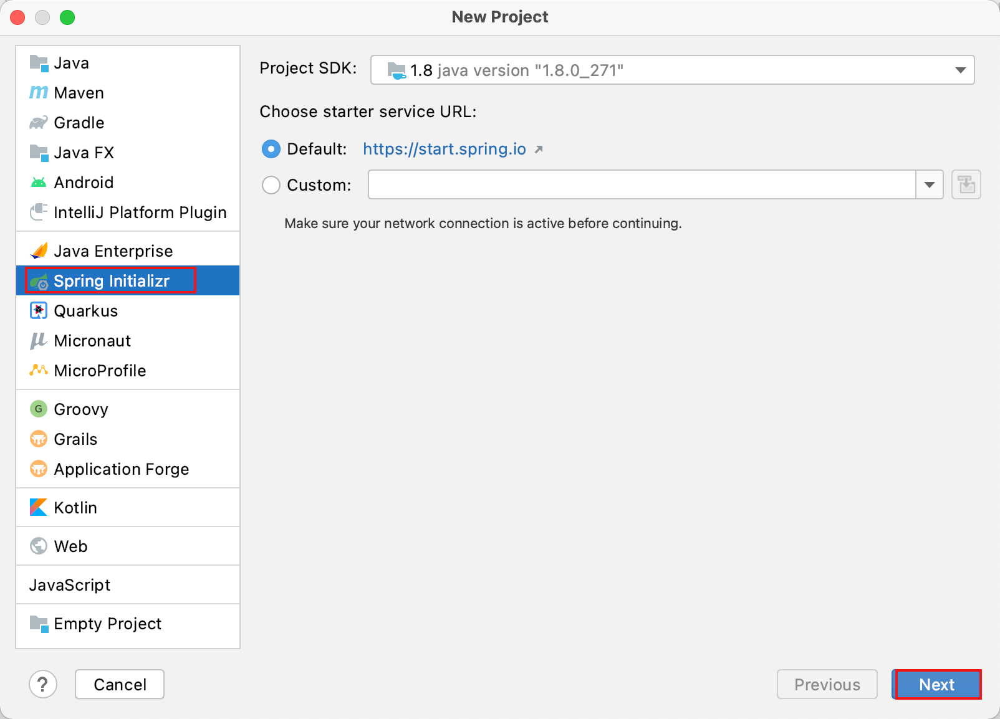
 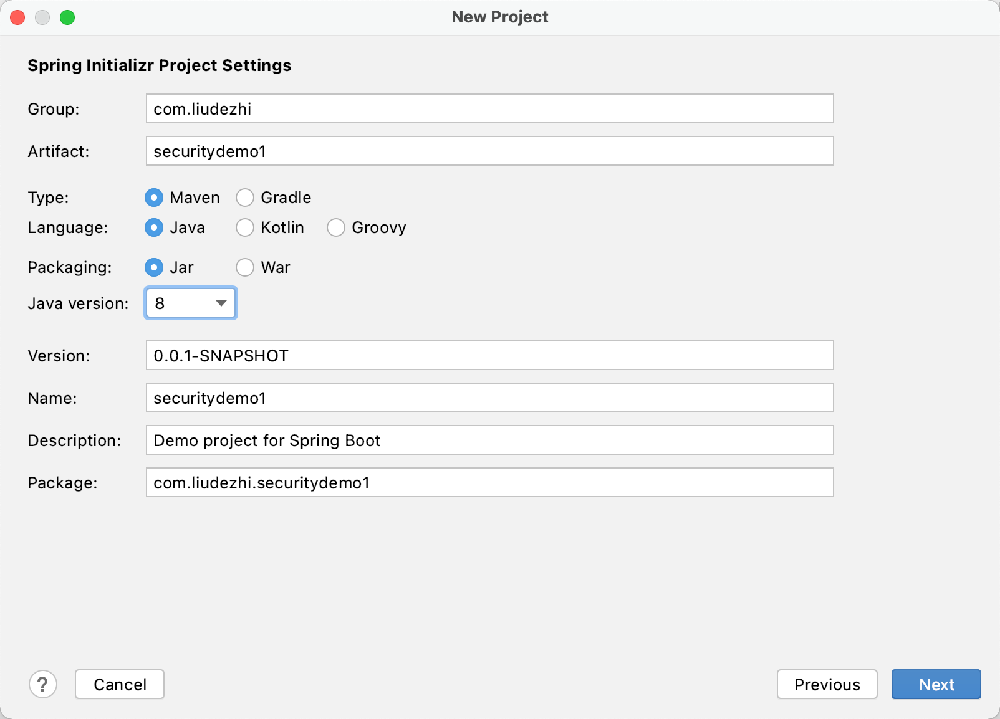

```
<dependency>
    <groupId>org.springframework.boot</groupId>
    <artifactId>spring-boot-starter-web</artifactId>
</dependency>
<dependency>
    <groupId>org.springframework.boot</groupId>
    <artifactId>spring-boot-starter-security</artifactId>
</dependency>

```

```
@RestController
@RequestMapping("/test")
public class TestController {

    @GetMapping("hello")
    public String hello() {
        return "hello security";
    }
}

```

### 2. 运行这个项目

```
server.port=8111

```

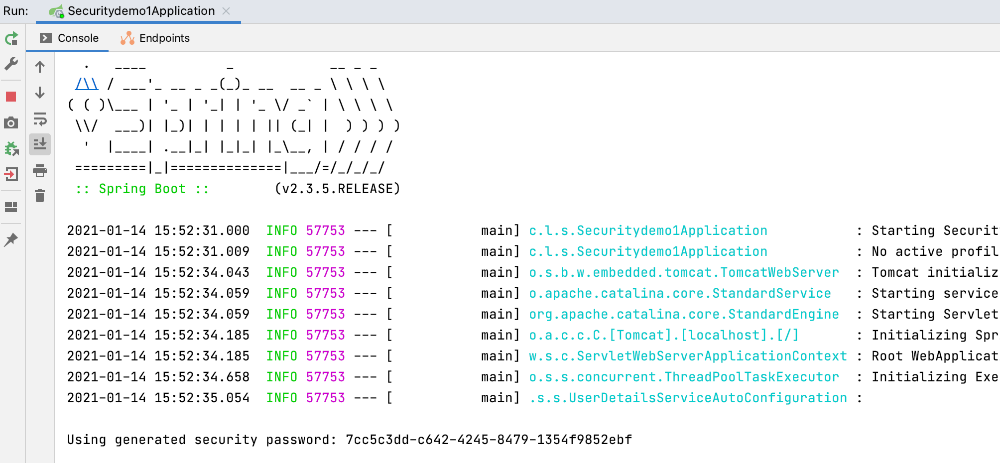
 访问：http://localhost:8111/test/hello
 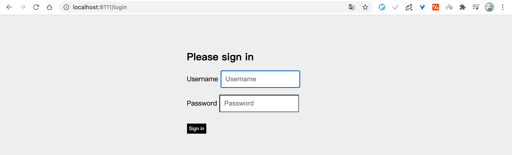
 SpringSecurity 默认用户名：user
 密码在项目启动的时候在控制台会打印， 注意每次启动的时候密码都回发生变化！
 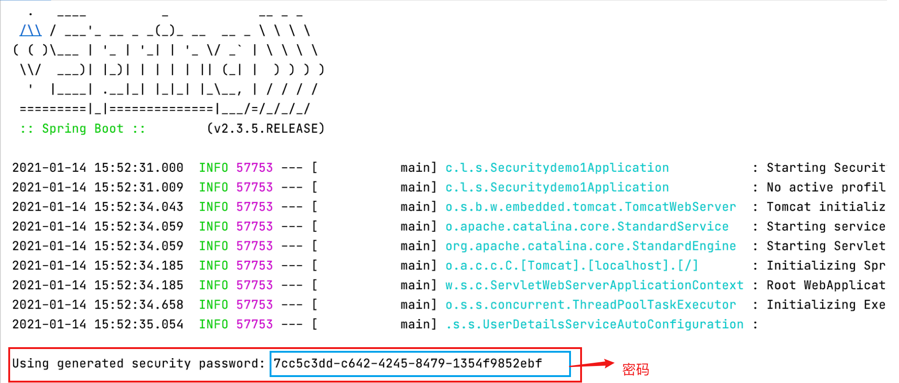
 登陆即可调用接口
 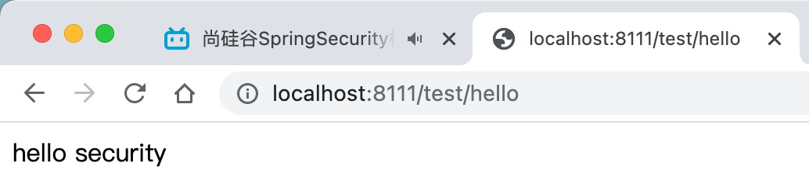

### 3. 权限管理中的相关概念

#### 3.1. 主体

英文单词： principal
 使用系统的用户或设备或从其他系统远程登录的用户等等。简单说就是谁使用系统谁就是主体。

#### 3.2. 认证

英文单词：authentication
 权限管理系统确认一个主体的身份，允许主体进入系统。简单说就是“主体”证明自己是谁。
 笼统的认为就是以前所做的登陆操作。

#### 3.3. 授权

英文单词：authorization
 将操作系统的“权利””授予“”主体“，这样主体就具备了操作系统中特定功能的能力。

所以简单来说，授权就是给用户分配权限。

### 4. SpringSecurity 基本原理

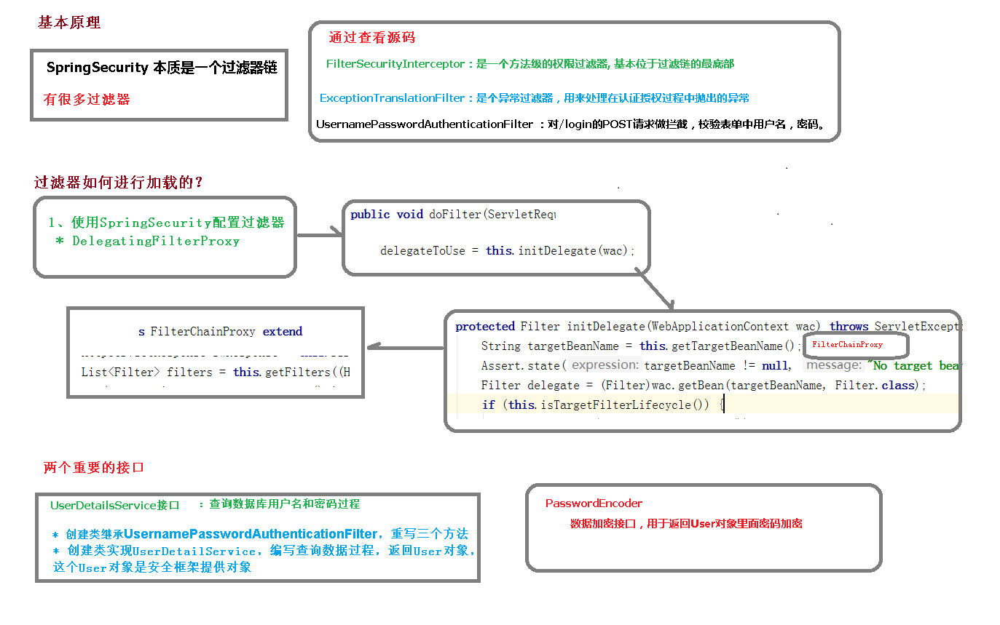

SpringSecurity 本质上是一个过滤器链：
 从启动是可以获取到过滤器链：

```
org.springframework.security.web.context.request.async.WebAsyncManagerIntegrationFilter
org.springframework.security.web.context.SecurityContextPersistenceFilter
org.springframework.security.web.header.HeaderWriterFilter
org.springframework.security.web.csrf.CsrfFilter
org.springframework.security.web.authentication.logout.LogoutFilter
org.springframework.security.web.authentication.UsernamePasswordAuthenticationFilter
org.springframework.security.web.authentication.ui.DefaultLoginPageGeneratingFilter
org.springframework.security.web.authentication.ui.DefaultLogoutPageGeneratingFilter
org.springframework.security.web.savedrequest.RequestCacheAwareFilter
org.springframework.security.web.servletapi.SecurityContextHolderAwareRequestFilter
org.springframework.security.web.authentication.AnonymousAuthenticationFilter
org.springframework.security.web.session.SessionManagementFilter
org.springframework.security.web.access.ExceptionTranslationFilter
org.springframework.security.web.access.intercept.FilterSecurityInterceptor

```

代码底层流程：重点看三个过滤器：

-
**FilterSecurityInterceptor：** 是一个方法级的权限过滤器, 基本位于过滤链的最底部。
 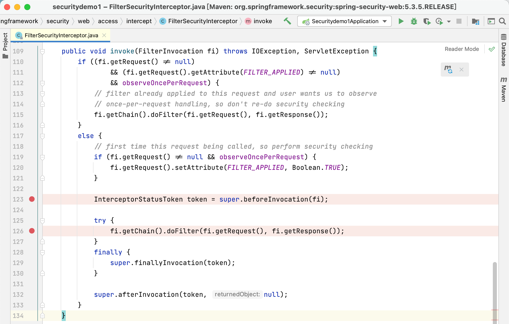
 `super.beforeInvocation(fi)` 表示查看之前的 filter 是否通过
 `fi.getChain().doFilter(fi.getRequest(), fi.getResponse());` 表示真正的调用后台的服务。

-
**ExceptionTranslationFilter：** 是个异常过滤器，用来处理在认证授权过程中抛出的异常
 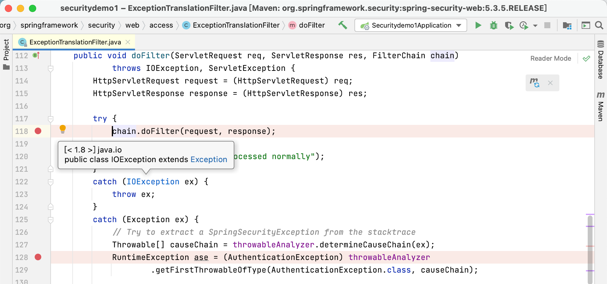

-
**UsernamePasswordAuthenticationFilter ：** 对/login 的 POST 请求做拦截，校验表单中用户名，密码。
 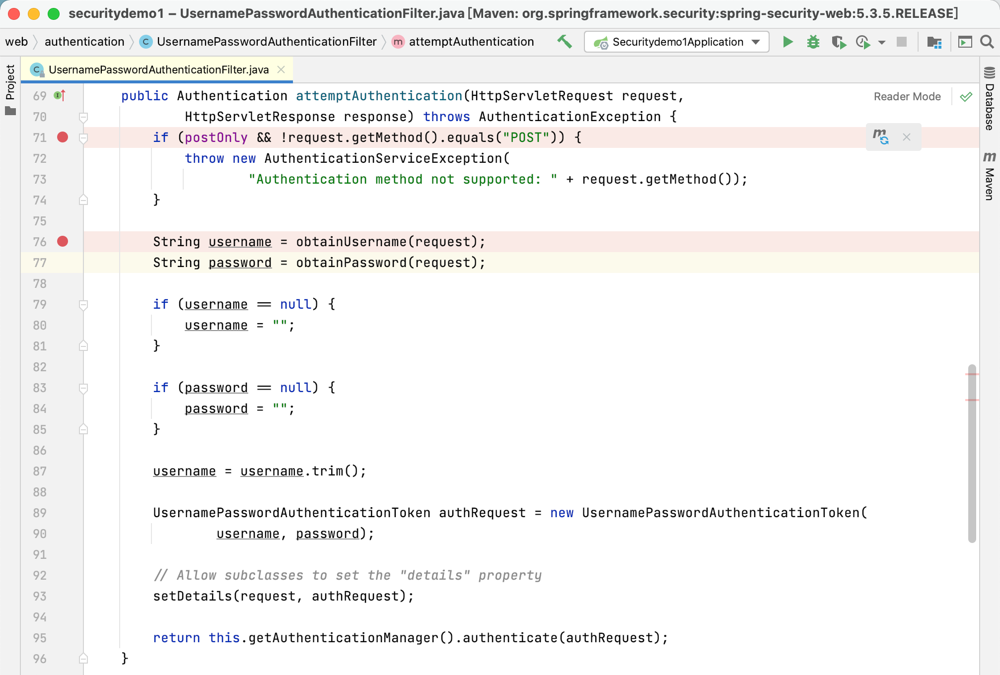

### 5. UserDetailsService 接口讲解

当什么也没有配置的时候，账号和密码是由 Spring Security 定义生成的。而在实际项目中账号和密码都是从数据库中查询出来的。 所以我们要通过自定义逻辑控制认证逻辑。

如果需要自定义逻辑时，只需要实现 UserDetailsService 接口即可。接口定义如下：
 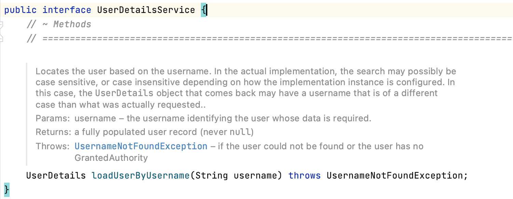

- **返回值 UserDetails**
 这个类是系统默认的用户“***主体***“

```
// 表示获取登录用户所有权限
Collection<? extends GrantedAuthority> getAuthorities();
// 表示获取密码
String getPassword();
// 表示获取用户名
String getUsername();
// 表示判断账户是否过期
boolean isAccountNonExpired();
// 表示判断账户是否被锁定
boolean isAccountNonLocked();
// 表示凭证{密码}是否过期
boolean isCredentialsNonExpired();
// 表示当前用户是否可用
boolean isEnabled();

```

以下是 UserDetails 实现类
 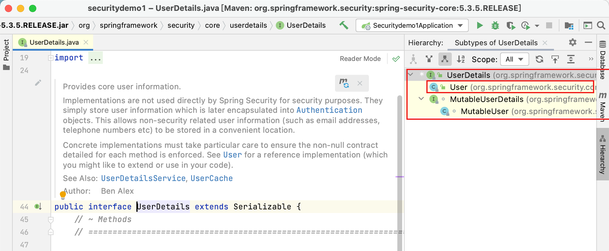
 以后我们只需要使用 User 这个实体类即可！
 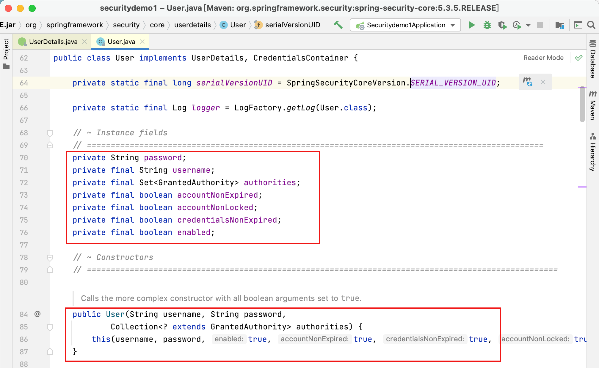

- **方法参数 username**
 表示用户名。此值是客户端表单传递过来的数据。默认情况下必须叫 username，否则无法接收。

### 6. PasswordEncoder 接口讲解

```
// 表示把参数按照特定的解析规则进行解析
String encode(CharSequence rawPassword);

// 表示验证从存储中获取的编码密码与编码后提交的原始密码是否匹配。如果密码匹配，则返回 true；如果不匹配，则返回 false。第一个参数表示需要被解析的密码。第二个参数表示存储的密码。
boolean matches(CharSequence rawPassword, String encodedPassword);

// 表示如果解析的密码能够再次进行解析且达到更安全的结果则返回 true，否则返回false。默认返回 false。
default boolean upgradeEncoding(String encodedPassword) {
    return false;
}

```

接口实现类：
 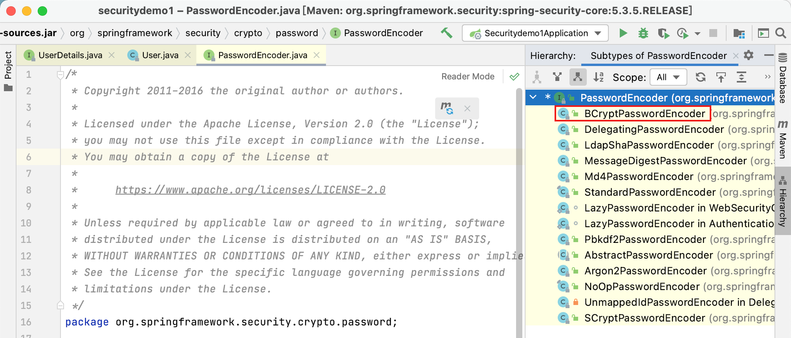
 BCryptPasswordEncoder 是 Spring Security 官方推荐的密码解析器，平时多使用这个解析器。

BCryptPasswordEncoder 是对 bcrypt 强散列方法的具体实现。是基于 Hash 算法实现的单向加密。可以通过 strength 控制加密强度，默认 10.

**eg：**

```
@Test
public void test01() {
    // 创建密码解析器
    BCryptPasswordEncoder bCryptPasswordEncoder = new BCryptPasswordEncoder();
    // 对密码进行加密
    String pwd = bCryptPasswordEncoder.encode("liudezhi");
    // 打印加密之后的数据
    System.out.println("加密之后数据：\t" + pwd);

    // 判断原字符加密后和加密之前是否匹配
    boolean result = bCryptPasswordEncoder.matches("liudezhi", pwd);
    System.out.println("比较结果：\t" + result);
}

```

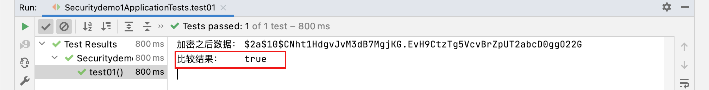

%23%23%20SpringSecurity%20%E5%85%A5%E9%97%A8%E6%A1%88%E4%BE%8B%0A%23%23%23%201.%20%E5%88%9B%E5%BB%BA%E4%B8%80%E4%B8%AASpringboot%E9%A1%B9%E7%9B%AE%0A!%5Bf6f87f563db494b0711c9cd66b9a8e68.png%5D(evernotecid%3A%2F%2F90F5C43D-AEAE-49B2-85BB-D02B6A52C764%2Fappyinxiangcom%2F25356149%2FENResource%2Fp1531)%0A!%5Bc75da5f32effb41d63ce4fbbaba4a466.png%5D(evernotecid%3A%2F%2F90F5C43D-AEAE-49B2-85BB-D02B6A52C764%2Fappyinxiangcom%2F25356149%2FENResource%2Fp1532)%0A%60%60%60xml%0A%3Cdependency%3E%0A%20%20%20%20%3CgroupId%3Eorg.springframework.boot%3C%2FgroupId%3E%0A%20%20%20%20%3CartifactId%3Espring-boot-starter-web%3C%2FartifactId%3E%0A%3C%2Fdependency%3E%0A%3Cdependency%3E%0A%20%20%20%20%3CgroupId%3Eorg.springframework.boot%3C%2FgroupId%3E%0A%20%20%20%20%3CartifactId%3Espring-boot-starter-security%3C%2FartifactId%3E%0A%3C%2Fdependency%3E%0A%60%60%60%0A%0A%60%60%60java%0A%40RestController%0A%40RequestMapping(%22%2Ftest%22)%0Apublic%20class%20TestController%20%7B%0A%0A%20%20%20%20%40GetMapping(%22hello%22)%0A%20%20%20%20public%20String%20hello()%20%7B%0A%20%20%20%20%20%20%20%20return%20%22hello%20security%22%3B%0A%20%20%20%20%7D%0A%7D%0A%60%60%60%0A%23%23%23%202.%20%E8%BF%90%E8%A1%8C%E8%BF%99%E4%B8%AA%E9%A1%B9%E7%9B%AE%0A%60%60%60properties%0Aserver.port%3D8111%0A%60%60%60%0A!%5B1d22fcf5eaf0f41b88a3d792b21f1bc2.png%5D(evernotecid%3A%2F%2F90F5C43D-AEAE-49B2-85BB-D02B6A52C764%2Fappyinxiangcom%2F25356149%2FENResource%2Fp1533)%0A%E8%AE%BF%E9%97%AE%EF%BC%9Ahttp%3A%2F%2Flocalhost%3A8111%2Ftest%2Fhello%0A!%5B46b7865eb772c15c97b3d2ad4b4ed684.png%5D(evernotecid%3A%2F%2F90F5C43D-AEAE-49B2-85BB-D02B6A52C764%2Fappyinxiangcom%2F25356149%2FENResource%2Fp1534)%0ASpringSecurity%20%E9%BB%98%E8%AE%A4%E7%94%A8%E6%88%B7%E5%90%8D%EF%BC%9Auser%0A%E5%AF%86%E7%A0%81%E5%9C%A8%E9%A1%B9%E7%9B%AE%E5%90%AF%E5%8A%A8%E7%9A%84%E6%97%B6%E5%80%99%E5%9C%A8%E6%8E%A7%E5%88%B6%E5%8F%B0%E4%BC%9A%E6%89%93%E5%8D%B0%EF%BC%8C%20%E6%B3%A8%E6%84%8F%E6%AF%8F%E6%AC%A1%E5%90%AF%E5%8A%A8%E7%9A%84%E6%97%B6%E5%80%99%E5%AF%86%E7%A0%81%E9%83%BD%E5%9B%9E%E5%8F%91%E7%94%9F%E5%8F%98%E5%8C%96%EF%BC%81%0A!%5B86945d5254563cd3d96d5df9a4b63417.png%5D(evernotecid%3A%2F%2F90F5C43D-AEAE-49B2-85BB-D02B6A52C764%2Fappyinxiangcom%2F25356149%2FENResource%2Fp1536)%0A%E7%99%BB%E9%99%86%E5%8D%B3%E5%8F%AF%E8%B0%83%E7%94%A8%E6%8E%A5%E5%8F%A3%0A!%5Bd74bf55eb574c00bba1db2a164243fbc.png%5D(evernotecid%3A%2F%2F90F5C43D-AEAE-49B2-85BB-D02B6A52C764%2Fappyinxiangcom%2F25356149%2FENResource%2Fp1535)%0A%0A%23%23%23%203.%20%E6%9D%83%E9%99%90%E7%AE%A1%E7%90%86%E4%B8%AD%E7%9A%84%E7%9B%B8%E5%85%B3%E6%A6%82%E5%BF%B5%0A%23%23%23%23%203.1.%20%E4%B8%BB%E4%BD%93%0A%E8%8B%B1%E6%96%87%E5%8D%95%E8%AF%8D%EF%BC%9A%20principal%0A%E4%BD%BF%E7%94%A8%E7%B3%BB%E7%BB%9F%E7%9A%84%E7%94%A8%E6%88%B7%E6%88%96%E8%AE%BE%E5%A4%87%E6%88%96%E4%BB%8E%E5%85%B6%E4%BB%96%E7%B3%BB%E7%BB%9F%E8%BF%9C%E7%A8%8B%E7%99%BB%E5%BD%95%E7%9A%84%E7%94%A8%E6%88%B7%E7%AD%89%E7%AD%89%E3%80%82%E7%AE%80%E5%8D%95%E8%AF%B4%E5%B0%B1%E6%98%AF%E8%B0%81%E4%BD%BF%E7%94%A8%E7%B3%BB%E7%BB%9F%E8%B0%81%E5%B0%B1%E6%98%AF%E4%B8%BB%E4%BD%93%E3%80%82%0A%23%23%23%23%203.2.%20%E8%AE%A4%E8%AF%81%0A%E8%8B%B1%E6%96%87%E5%8D%95%E8%AF%8D%EF%BC%9Aauthentication%0A%E6%9D%83%E9%99%90%E7%AE%A1%E7%90%86%E7%B3%BB%E7%BB%9F%E7%A1%AE%E8%AE%A4%E4%B8%80%E4%B8%AA%E4%B8%BB%E4%BD%93%E7%9A%84%E8%BA%AB%E4%BB%BD%EF%BC%8C%E5%85%81%E8%AE%B8%E4%B8%BB%E4%BD%93%E8%BF%9B%E5%85%A5%E7%B3%BB%E7%BB%9F%E3%80%82%E7%AE%80%E5%8D%95%E8%AF%B4%E5%B0%B1%E6%98%AF%E2%80%9C%E4%B8%BB%E4%BD%93%E2%80%9D%E8%AF%81%E6%98%8E%E8%87%AA%E5%B7%B1%E6%98%AF%E8%B0%81%E3%80%82%0A%E7%AC%BC%E7%BB%9F%E7%9A%84%E8%AE%A4%E4%B8%BA%E5%B0%B1%E6%98%AF%E4%BB%A5%E5%89%8D%E6%89%80%E5%81%9A%E7%9A%84%E7%99%BB%E9%99%86%E6%93%8D%E4%BD%9C%E3%80%82%0A%23%23%23%23%203.3.%20%E6%8E%88%E6%9D%83%0A%E8%8B%B1%E6%96%87%E5%8D%95%E8%AF%8D%EF%BC%9Aauthorization%0A%E5%B0%86%E6%93%8D%E4%BD%9C%E7%B3%BB%E7%BB%9F%E7%9A%84%E2%80%9C%E6%9D%83%E5%88%A9%E2%80%9D%E2%80%9D%E6%8E%88%E4%BA%88%E2%80%9C%E2%80%9D%E4%B8%BB%E4%BD%93%E2%80%9C%EF%BC%8C%E8%BF%99%E6%A0%B7%E4%B8%BB%E4%BD%93%E5%B0%B1%E5%85%B7%E5%A4%87%E4%BA%86%E6%93%8D%E4%BD%9C%E7%B3%BB%E7%BB%9F%E4%B8%AD%E7%89%B9%E5%AE%9A%E5%8A%9F%E8%83%BD%E7%9A%84%E8%83%BD%E5%8A%9B%E3%80%82%0A%0A%E6%89%80%E4%BB%A5%E7%AE%80%E5%8D%95%E6%9D%A5%E8%AF%B4%EF%BC%8C%E6%8E%88%E6%9D%83%E5%B0%B1%E6%98%AF%E7%BB%99%E7%94%A8%E6%88%B7%E5%88%86%E9%85%8D%E6%9D%83%E9%99%90%E3%80%82%0A%0A%23%23%23%204.%20SpringSecurity%20%E5%9F%BA%E6%9C%AC%E5%8E%9F%E7%90%86%0A!%5Bde8fe0963a231d8923b97ec714a20208.png%5D(evernotecid%3A%2F%2F90F5C43D-AEAE-49B2-85BB-D02B6A52C764%2Fappyinxiangcom%2F25356149%2FENResource%2Fp1544)%0A%0ASpringSecurity%20%E6%9C%AC%E8%B4%A8%E4%B8%8A%E6%98%AF%E4%B8%80%E4%B8%AA%E8%BF%87%E6%BB%A4%E5%99%A8%E9%93%BE%EF%BC%9A%0A%E4%BB%8E%E5%90%AF%E5%8A%A8%E6%98%AF%E5%8F%AF%E4%BB%A5%E8%8E%B7%E5%8F%96%E5%88%B0%E8%BF%87%E6%BB%A4%E5%99%A8%E9%93%BE%EF%BC%9A%0A%60%60%60%0Aorg.springframework.security.web.context.request.async.WebAsyncManagerIntegrationFilter%0Aorg.springframework.security.web.context.SecurityContextPersistenceFilter%0Aorg.springframework.security.web.header.HeaderWriterFilter%0Aorg.springframework.security.web.csrf.CsrfFilter%0Aorg.springframework.security.web.authentication.logout.LogoutFilter%0Aorg.springframework.security.web.authentication.UsernamePasswordAuthenticationFilter%0Aorg.springframework.security.web.authentication.ui.DefaultLoginPageGeneratingFilter%0Aorg.springframework.security.web.authentication.ui.DefaultLogoutPageGeneratingFilter%0Aorg.springframework.security.web.savedrequest.RequestCacheAwareFilter%0Aorg.springframework.security.web.servletapi.SecurityContextHolderAwareRequestFilter%0Aorg.springframework.security.web.authentication.AnonymousAuthenticationFilter%0Aorg.springframework.security.web.session.SessionManagementFilter%0Aorg.springframework.security.web.access.ExceptionTranslationFilter%0Aorg.springframework.security.web.access.intercept.FilterSecurityInterceptor%0A%60%60%60%0A%0A%E4%BB%A3%E7%A0%81%E5%BA%95%E5%B1%82%E6%B5%81%E7%A8%8B%EF%BC%9A%E9%87%8D%E7%82%B9%E7%9C%8B%E4%B8%89%E4%B8%AA%E8%BF%87%E6%BB%A4%E5%99%A8%EF%BC%9A%0A-%20**FilterSecurityInterceptor%EF%BC%9A**%20%E6%98%AF%E4%B8%80%E4%B8%AA%E6%96%B9%E6%B3%95%E7%BA%A7%E7%9A%84%E6%9D%83%E9%99%90%E8%BF%87%E6%BB%A4%E5%99%A8%2C%20%E5%9F%BA%E6%9C%AC%E4%BD%8D%E4%BA%8E%E8%BF%87%E6%BB%A4%E9%93%BE%E7%9A%84%E6%9C%80%E5%BA%95%E9%83%A8%E3%80%82%0A!%5Be09cf3bbd66cdab1b1dcee5acbf1a119.png%5D(evernotecid%3A%2F%2F90F5C43D-AEAE-49B2-85BB-D02B6A52C764%2Fappyinxiangcom%2F25356149%2FENResource%2Fp1537)%0A%60super.beforeInvocation(fi)%60%20%E8%A1%A8%E7%A4%BA%E6%9F%A5%E7%9C%8B%E4%B9%8B%E5%89%8D%E7%9A%84%20filter%20%E6%98%AF%E5%90%A6%E9%80%9A%E8%BF%87%0A%60fi.getChain().doFilter(fi.getRequest()%2C%20fi.getResponse())%3B%60%20%E8%A1%A8%E7%A4%BA%E7%9C%9F%E6%AD%A3%E7%9A%84%E8%B0%83%E7%94%A8%E5%90%8E%E5%8F%B0%E7%9A%84%E6%9C%8D%E5%8A%A1%E3%80%82%0A%0A-%20**ExceptionTranslationFilter%EF%BC%9A**%20%E6%98%AF%E4%B8%AA%E5%BC%82%E5%B8%B8%E8%BF%87%E6%BB%A4%E5%99%A8%EF%BC%8C%E7%94%A8%E6%9D%A5%E5%A4%84%E7%90%86%E5%9C%A8%E8%AE%A4%E8%AF%81%E6%8E%88%E6%9D%83%E8%BF%87%E7%A8%8B%E4%B8%AD%E6%8A%9B%E5%87%BA%E7%9A%84%E5%BC%82%E5%B8%B8%0A!%5B644c10c2be20f595bc29cdce4b652d6d.png%5D(evernotecid%3A%2F%2F90F5C43D-AEAE-49B2-85BB-D02B6A52C764%2Fappyinxiangcom%2F25356149%2FENResource%2Fp1538)%0A%0A-%20**UsernamePasswordAuthenticationFilter%20%EF%BC%9A**%20%E5%AF%B9%2Flogin%20%E7%9A%84%20POST%20%E8%AF%B7%E6%B1%82%E5%81%9A%E6%8B%A6%E6%88%AA%EF%BC%8C%E6%A0%A1%E9%AA%8C%E8%A1%A8%E5%8D%95%E4%B8%AD%E7%94%A8%E6%88%B7%E5%90%8D%EF%BC%8C%E5%AF%86%E7%A0%81%E3%80%82%0A!%5B213a410d99fb3388c6bd8dcd5b76a8b1.png%5D(evernotecid%3A%2F%2F90F5C43D-AEAE-49B2-85BB-D02B6A52C764%2Fappyinxiangcom%2F25356149%2FENResource%2Fp1539)%0A%0A%23%23%23%205.%20UserDetailsService%20%E6%8E%A5%E5%8F%A3%E8%AE%B2%E8%A7%A3%0A%E5%BD%93%E4%BB%80%E4%B9%88%E4%B9%9F%E6%B2%A1%E6%9C%89%E9%85%8D%E7%BD%AE%E7%9A%84%E6%97%B6%E5%80%99%EF%BC%8C%E8%B4%A6%E5%8F%B7%E5%92%8C%E5%AF%86%E7%A0%81%E6%98%AF%E7%94%B1%20Spring%20Security%20%E5%AE%9A%E4%B9%89%E7%94%9F%E6%88%90%E7%9A%84%E3%80%82%E8%80%8C%E5%9C%A8%E5%AE%9E%E9%99%85%E9%A1%B9%E7%9B%AE%E4%B8%AD%E8%B4%A6%E5%8F%B7%E5%92%8C%E5%AF%86%E7%A0%81%E9%83%BD%E6%98%AF%E4%BB%8E%E6%95%B0%E6%8D%AE%E5%BA%93%E4%B8%AD%E6%9F%A5%E8%AF%A2%E5%87%BA%E6%9D%A5%E7%9A%84%E3%80%82%20%E6%89%80%E4%BB%A5%E6%88%91%E4%BB%AC%E8%A6%81%E9%80%9A%E8%BF%87%E8%87%AA%E5%AE%9A%E4%B9%89%E9%80%BB%E8%BE%91%E6%8E%A7%E5%88%B6%E8%AE%A4%E8%AF%81%E9%80%BB%E8%BE%91%E3%80%82%0A%0A%E5%A6%82%E6%9E%9C%E9%9C%80%E8%A6%81%E8%87%AA%E5%AE%9A%E4%B9%89%E9%80%BB%E8%BE%91%E6%97%B6%EF%BC%8C%E5%8F%AA%E9%9C%80%E8%A6%81%E5%AE%9E%E7%8E%B0%20UserDetailsService%20%E6%8E%A5%E5%8F%A3%E5%8D%B3%E5%8F%AF%E3%80%82%E6%8E%A5%E5%8F%A3%E5%AE%9A%E4%B9%89%E5%A6%82%E4%B8%8B%EF%BC%9A%0A!%5B4c748e6cfeb4b88eb04c4db0822d4445.png%5D(evernotecid%3A%2F%2F90F5C43D-AEAE-49B2-85BB-D02B6A52C764%2Fappyinxiangcom%2F25356149%2FENResource%2Fp1540)%0A-%20**%E8%BF%94%E5%9B%9E%E5%80%BC%20UserDetails**%0A%E8%BF%99%E4%B8%AA%E7%B1%BB%E6%98%AF%E7%B3%BB%E7%BB%9F%E9%BB%98%E8%AE%A4%E7%9A%84%E7%94%A8%E6%88%B7%E2%80%9C***%E4%B8%BB%E4%BD%93***%E2%80%9C%0A%60%60%60java%0A%2F%2F%20%E8%A1%A8%E7%A4%BA%E8%8E%B7%E5%8F%96%E7%99%BB%E5%BD%95%E7%94%A8%E6%88%B7%E6%89%80%E6%9C%89%E6%9D%83%E9%99%90%0ACollection%3C%3F%20extends%20GrantedAuthority%3E%20getAuthorities()%3B%0A%2F%2F%20%E8%A1%A8%E7%A4%BA%E8%8E%B7%E5%8F%96%E5%AF%86%E7%A0%81%0AString%20getPassword()%3B%0A%2F%2F%20%E8%A1%A8%E7%A4%BA%E8%8E%B7%E5%8F%96%E7%94%A8%E6%88%B7%E5%90%8D%0AString%20getUsername()%3B%0A%2F%2F%20%E8%A1%A8%E7%A4%BA%E5%88%A4%E6%96%AD%E8%B4%A6%E6%88%B7%E6%98%AF%E5%90%A6%E8%BF%87%E6%9C%9F%0Aboolean%20isAccountNonExpired()%3B%0A%2F%2F%20%E8%A1%A8%E7%A4%BA%E5%88%A4%E6%96%AD%E8%B4%A6%E6%88%B7%E6%98%AF%E5%90%A6%E8%A2%AB%E9%94%81%E5%AE%9A%0Aboolean%20isAccountNonLocked()%3B%0A%2F%2F%20%E8%A1%A8%E7%A4%BA%E5%87%AD%E8%AF%81%7B%E5%AF%86%E7%A0%81%7D%E6%98%AF%E5%90%A6%E8%BF%87%E6%9C%9F%0Aboolean%20isCredentialsNonExpired()%3B%0A%2F%2F%20%E8%A1%A8%E7%A4%BA%E5%BD%93%E5%89%8D%E7%94%A8%E6%88%B7%E6%98%AF%E5%90%A6%E5%8F%AF%E7%94%A8%0Aboolean%20isEnabled()%3B%0A%60%60%60%0A%E4%BB%A5%E4%B8%8B%E6%98%AF%20UserDetails%20%E5%AE%9E%E7%8E%B0%E7%B1%BB%0A!%5Bec6cf86b2526e6ae76bb84adfbe7e0a1.png%5D(evernotecid%3A%2F%2F90F5C43D-AEAE-49B2-85BB-D02B6A52C764%2Fappyinxiangcom%2F25356149%2FENResource%2Fp1541)%0A%E4%BB%A5%E5%90%8E%E6%88%91%E4%BB%AC%E5%8F%AA%E9%9C%80%E8%A6%81%E4%BD%BF%E7%94%A8%20User%20%E8%BF%99%E4%B8%AA%E5%AE%9E%E4%BD%93%E7%B1%BB%E5%8D%B3%E5%8F%AF%EF%BC%81%0A!%5Bca64861d75a75a98755dd99d8a52fca2.png%5D(evernotecid%3A%2F%2F90F5C43D-AEAE-49B2-85BB-D02B6A52C764%2Fappyinxiangcom%2F25356149%2FENResource%2Fp1542)%0A%0A-%20**%E6%96%B9%E6%B3%95%E5%8F%82%E6%95%B0%20username**%0A%E8%A1%A8%E7%A4%BA%E7%94%A8%E6%88%B7%E5%90%8D%E3%80%82%E6%AD%A4%E5%80%BC%E6%98%AF%E5%AE%A2%E6%88%B7%E7%AB%AF%E8%A1%A8%E5%8D%95%E4%BC%A0%E9%80%92%E8%BF%87%E6%9D%A5%E7%9A%84%E6%95%B0%E6%8D%AE%E3%80%82%E9%BB%98%E8%AE%A4%E6%83%85%E5%86%B5%E4%B8%8B%E5%BF%85%E9%A1%BB%E5%8F%AB%20username%EF%BC%8C%E5%90%A6%E5%88%99%E6%97%A0%E6%B3%95%E6%8E%A5%E6%94%B6%E3%80%82%0A%0A%23%23%23%206.%20PasswordEncoder%20%E6%8E%A5%E5%8F%A3%E8%AE%B2%E8%A7%A3%0A%60%60%60java%0A%2F%2F%20%E8%A1%A8%E7%A4%BA%E6%8A%8A%E5%8F%82%E6%95%B0%E6%8C%89%E7%85%A7%E7%89%B9%E5%AE%9A%E7%9A%84%E8%A7%A3%E6%9E%90%E8%A7%84%E5%88%99%E8%BF%9B%E8%A1%8C%E8%A7%A3%E6%9E%90%0AString%20encode(CharSequence%20rawPassword)%3B%0A%0A%2F%2F%20%E8%A1%A8%E7%A4%BA%E9%AA%8C%E8%AF%81%E4%BB%8E%E5%AD%98%E5%82%A8%E4%B8%AD%E8%8E%B7%E5%8F%96%E7%9A%84%E7%BC%96%E7%A0%81%E5%AF%86%E7%A0%81%E4%B8%8E%E7%BC%96%E7%A0%81%E5%90%8E%E6%8F%90%E4%BA%A4%E7%9A%84%E5%8E%9F%E5%A7%8B%E5%AF%86%E7%A0%81%E6%98%AF%E5%90%A6%E5%8C%B9%E9%85%8D%E3%80%82%E5%A6%82%E6%9E%9C%E5%AF%86%E7%A0%81%E5%8C%B9%E9%85%8D%EF%BC%8C%E5%88%99%E8%BF%94%E5%9B%9E%20true%EF%BC%9B%E5%A6%82%E6%9E%9C%E4%B8%8D%E5%8C%B9%E9%85%8D%EF%BC%8C%E5%88%99%E8%BF%94%E5%9B%9E%20false%E3%80%82%E7%AC%AC%E4%B8%80%E4%B8%AA%E5%8F%82%E6%95%B0%E8%A1%A8%E7%A4%BA%E9%9C%80%E8%A6%81%E8%A2%AB%E8%A7%A3%E6%9E%90%E7%9A%84%E5%AF%86%E7%A0%81%E3%80%82%E7%AC%AC%E4%BA%8C%E4%B8%AA%E5%8F%82%E6%95%B0%E8%A1%A8%E7%A4%BA%E5%AD%98%E5%82%A8%E7%9A%84%E5%AF%86%E7%A0%81%E3%80%82%0Aboolean%20matches(CharSequence%20rawPassword%2C%20String%20encodedPassword)%3B%0A%0A%2F%2F%20%E8%A1%A8%E7%A4%BA%E5%A6%82%E6%9E%9C%E8%A7%A3%E6%9E%90%E7%9A%84%E5%AF%86%E7%A0%81%E8%83%BD%E5%A4%9F%E5%86%8D%E6%AC%A1%E8%BF%9B%E8%A1%8C%E8%A7%A3%E6%9E%90%E4%B8%94%E8%BE%BE%E5%88%B0%E6%9B%B4%E5%AE%89%E5%85%A8%E7%9A%84%E7%BB%93%E6%9E%9C%E5%88%99%E8%BF%94%E5%9B%9E%20true%EF%BC%8C%E5%90%A6%E5%88%99%E8%BF%94%E5%9B%9Efalse%E3%80%82%E9%BB%98%E8%AE%A4%E8%BF%94%E5%9B%9E%20false%E3%80%82%0Adefault%20boolean%20upgradeEncoding(String%20encodedPassword)%20%7B%0A%20%20%20%20return%20false%3B%0A%7D%0A%60%60%60%0A%E6%8E%A5%E5%8F%A3%E5%AE%9E%E7%8E%B0%E7%B1%BB%EF%BC%9A%0A!%5B5fefe23731f46189742c61fac23a5151.png%5D(evernotecid%3A%2F%2F90F5C43D-AEAE-49B2-85BB-D02B6A52C764%2Fappyinxiangcom%2F25356149%2FENResource%2Fp1543)%0ABCryptPasswordEncoder%20%E6%98%AF%20Spring%20Security%20%E5%AE%98%E6%96%B9%E6%8E%A8%E8%8D%90%E7%9A%84%E5%AF%86%E7%A0%81%E8%A7%A3%E6%9E%90%E5%99%A8%EF%BC%8C%E5%B9%B3%E6%97%B6%E5%A4%9A%E4%BD%BF%E7%94%A8%E8%BF%99%E4%B8%AA%E8%A7%A3%E6%9E%90%E5%99%A8%E3%80%82%0A%0ABCryptPasswordEncoder%20%E6%98%AF%E5%AF%B9%20bcrypt%20%E5%BC%BA%E6%95%A3%E5%88%97%E6%96%B9%E6%B3%95%E7%9A%84%E5%85%B7%E4%BD%93%E5%AE%9E%E7%8E%B0%E3%80%82%E6%98%AF%E5%9F%BA%E4%BA%8E%20Hash%20%E7%AE%97%E6%B3%95%E5%AE%9E%E7%8E%B0%E7%9A%84%E5%8D%95%E5%90%91%E5%8A%A0%E5%AF%86%E3%80%82%E5%8F%AF%E4%BB%A5%E9%80%9A%E8%BF%87%20strength%20%E6%8E%A7%E5%88%B6%E5%8A%A0%E5%AF%86%E5%BC%BA%E5%BA%A6%EF%BC%8C%E9%BB%98%E8%AE%A4%2010.%0A%0A**eg%EF%BC%9A**%0A%60%60%60java%0A%40Test%0Apublic%20void%20test01()%20%7B%0A%20%20%20%20%2F%2F%20%E5%88%9B%E5%BB%BA%E5%AF%86%E7%A0%81%E8%A7%A3%E6%9E%90%E5%99%A8%0A%20%20%20%20BCryptPasswordEncoder%20bCryptPasswordEncoder%20%3D%20new%20BCryptPasswordEncoder()%3B%0A%20%20%20%20%2F%2F%20%E5%AF%B9%E5%AF%86%E7%A0%81%E8%BF%9B%E8%A1%8C%E5%8A%A0%E5%AF%86%0A%20%20%20%20String%20pwd%20%3D%20bCryptPasswordEncoder.encode(%22liudezhi%22)%3B%0A%20%20%20%20%2F%2F%20%E6%89%93%E5%8D%B0%E5%8A%A0%E5%AF%86%E4%B9%8B%E5%90%8E%E7%9A%84%E6%95%B0%E6%8D%AE%0A%20%20%20%20System.out.println(%22%E5%8A%A0%E5%AF%86%E4%B9%8B%E5%90%8E%E6%95%B0%E6%8D%AE%EF%BC%9A%5Ct%22%20%2B%20pwd)%3B%0A%0A%20%20%20%20%2F%2F%20%E5%88%A4%E6%96%AD%E5%8E%9F%E5%AD%97%E7%AC%A6%E5%8A%A0%E5%AF%86%E5%90%8E%E5%92%8C%E5%8A%A0%E5%AF%86%E4%B9%8B%E5%89%8D%E6%98%AF%E5%90%A6%E5%8C%B9%E9%85%8D%0A%20%20%20%20boolean%20result%20%3D%20bCryptPasswordEncoder.matches(%22liudezhi%22%2C%20pwd)%3B%0A%20%20%20%20System.out.println(%22%E6%AF%94%E8%BE%83%E7%BB%93%E6%9E%9C%EF%BC%9A%5Ct%22%20%2B%20result)%3B%0A%7D%0A%60%60%60%0A!%5Bf1e0bfaa1cb47c959e9dcc3ce6d1f882.png%5D(evernotecid%3A%2F%2F90F5C43D-AEAE-49B2-85BB-D02B6A52C764%2Fappyinxiangcom%2F25356149%2FENResource%2Fp1545)%0A
