# 3. SpringSecurity Web 权限方案

- 笔记本：29.Spring security
- 创建时间：2021-01-14 09:56:15 UTC
- 更新时间：2021-01-17 02:56:34 UTC
- 印象笔记 GUID：08d19e0a-b25f-4c28-bda5-a14b73a687f8

## SpringSecurity Web 权限方案

### 1. 设置登录系统的账号、密码

#### 方式一：在 application.properties

```
spring.security.user.name=liudezhi
spring.security.user.password=Liudezhi

```

#### 方式二：通过配置类

```
@Configuration
public class SecurityConfig extends WebSecurityConfigurerAdapter {

    @Override
    protected void configure(AuthenticationManagerBuilder auth) throws Exception {
        BCryptPasswordEncoder passwordEncoder = new BCryptPasswordEncoder();
        String password = passwordEncoder.encode("xiaohua");
        auth.inMemoryAuthentication().withUser("xiaohua").password(password).roles("admin");
    }

    @Bean
    PasswordEncoder password() {
        return new BCryptPasswordEncoder();
    }
}

```

#### 方式三：自定义编写实现类

```
@Configuration
public class SecurityConfigTest extends WebSecurityConfigurerAdapter {

    @Autowired
    private UserDetailsService userDetailsService;

    @Override
    protected void configure(AuthenticationManagerBuilder auth) throws Exception {
        auth.userDetailsService(userDetailsService).passwordEncoder(password());
    }

    @Bean
    PasswordEncoder password() {
        return new BCryptPasswordEncoder();
    }
}

```

```
@Service("userDetailsService")
public class MyUserDetailsService implements UserDetailsService {
    @Override
    public UserDetails loadUserByUsername(String username) throws UsernameNotFoundException {
        List<GrantedAuthority> auths =
                AuthorityUtils.commaSeparatedStringToAuthorityList("role");
        return new User("xiaohua", new BCryptPasswordEncoder().encode("xiaohua"), auths);
    }
}

```

### 2. 实现数据库认证来完成用户登录

完成自定义登录

#### 2.1. 准备 sql

```
create table users(
    id bigint primary key auto_increment,
    username varchar(20) unique not null,
    password varchar(100)
);
insert into users values(1, 'xiaohua', '$2a$10$9BiHi58FzbSClAf5oey.tus8o39d8WVlKWXL8jVGt/lk3zNoSIA9.');

```

#### 2.2. 添加依赖

```
<!-- mybatis-plus -->
<dependency>
    <groupId>com.baomidou</groupId>
    <artifactId>mybatis-plus-boot-starter</artifactId>
    <version>3.4.1</version>
</dependency>

<!-- mysql -->
<dependency>
    <groupId>mysql</groupId>
    <artifactId>mysql-connector-java</artifactId>
</dependency>

<!-- lombok 用来简化实体类 -->
<dependency>
    <groupId>org.projectlombok</groupId>
    <artifactId>lombok</artifactId>
</dependency>

```

### 2.3. 编写实体类

```
@Data
public class Users {
    private Integer id;
    private String username;
    private String password;
}

```

### 2.4. 整合 Mybatis 制作 mapper

```
@Repository
public interface UserMapper extends BaseMapper<Users> {
}

```

配置文件：

```
# mysql 数据库连接
spring.datasource.driver-class-name=com.mysql.cj.jdbc.Driver
spring.datasource.url=jdbc:mysql://localhost:3306/security_learn?serverTimezone=GMT%2B8
spring.datasource.username=root
spring.datasource.password=12345678

```

启动类：

```
@SpringBootApplication
@MapperScan("com.liudezhi.securitydemo1.mapper")
public class Securitydemo1Application {
    public static void main(String[] args) {
       SpringApplication.run(Securitydemo1Application.class, args);
    }
}

```

### 2.5. 登录实现类

```
@Service("userDetailsService")
public class MyUserDetailsService implements UserDetailsService {

    @Autowired
    UserMapper userMapper;

    @Override
    public UserDetails loadUserByUsername(String username) throws UsernameNotFoundException {
        // 调用 userMapper 方法，根据用户名查询数据库
        QueryWrapper<Users> wrapper = new QueryWrapper<>();
        wrapper.eq("username", username);
        Users users = userMapper.selectOne(wrapper);
        // 判断
        if (users == null) { // 数据库中没有用户名，认证失败
            throw new UsernameNotFoundException("用户名不存在");
        }

        List<GrantedAuthority> auths =
                AuthorityUtils.commaSeparatedStringToAuthorityList("role");
        return new User(users.getUsername(),
                users.getPassword(), auths);
    }
}

```

### 3. 自定义设置登录页面，不需要认证可以访问

#### 3.1. 在配置类实现相关的配置

```
@Override
protected void configure(HttpSecurity http) throws Exception {
    http.formLogin()    // 自定义自己编写的登录页面
        .loginPage("/login.html")  // 登录页面设置
        .loginProcessingUrl("/user/login") // 登录访问路径
        .defaultSuccessUrl("/test/index").permitAll()    // 登录成功之后，跳转路径
        .and().authorizeRequests()
            .antMatchers("/", "/test/hello", "/user/login").permitAll() // 设置哪些路径可以直接访问，不需要认证
        .anyRequest().authenticated()
            .and().csrf().disable();    // 关闭 csrf 防护

}

```

#### 3.2. 创建相关页面，Controller

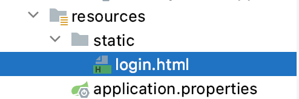

```
<form action="/user/login", method="post">
    用户名：<input type="text" name="username">
    <br/>
    密码： <input type="text" name="password">
    <br/>
    <input type="submit" value="login">
</form>

```

```
@GetMapping("index")
public String index() {
    return "hello index";
}

```

访问：http://localhost:8111/test/hello
 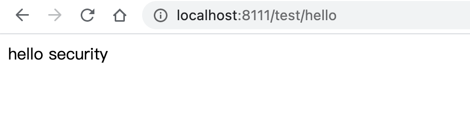
 访问：http://localhost:8111/test/index
 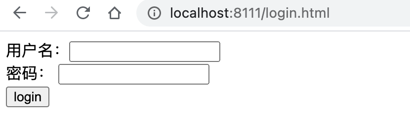

### 4. 基于角色或权限进行访问控制

#### 4.1. `hasAuthority` 方法

如果当前的主体具有指定的权限，则返回 true,否则返回 false

##### 4.1.1. 在配置类设置当前访问地址有哪些权限

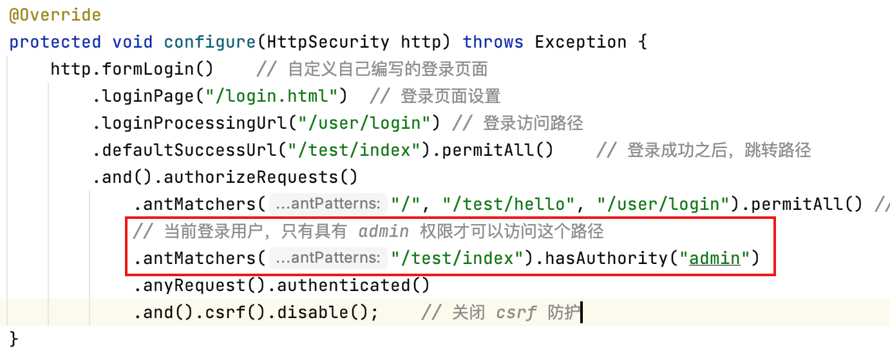

##### 4.1.2. 在 UserDetailsService，把返回的 User 对象设置权限

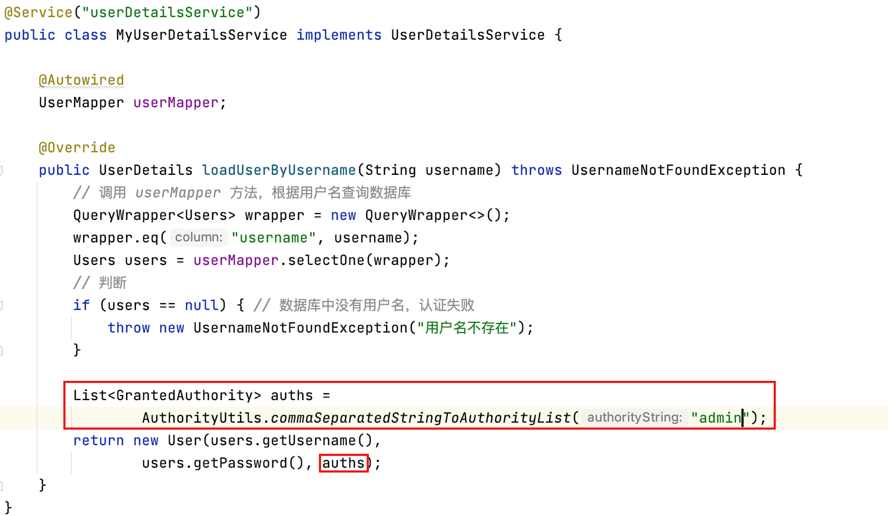
 如过设置 用户权限不是 admin，访问 /test/index 接口会：
 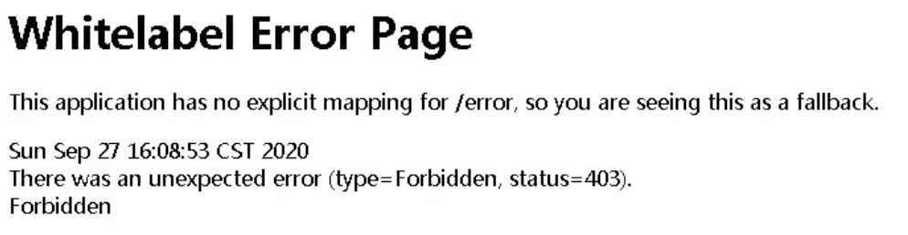
 type=Forbidden,status=403 表示没有访问的权限

#### 4.2. `hasAnyAuthority` 方法

如果当前的主体有任何提供的角色（给定的作为一个逗号分隔的字符串列表）的话，返回 true.

```
.antMatchers("/test/index").hasAnyAuthority("admin", "manager")// 或 .hasAnyAuthority("admin,manager")

```

#### 4.3. `hasRole` 方法

如果用户具备给定角色就允许访问,否则出现 403。
 如果当前主体具有指定的角色，则返回 true。
 底层源码：
 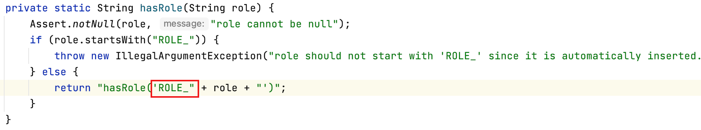
 给用户添加角色：
 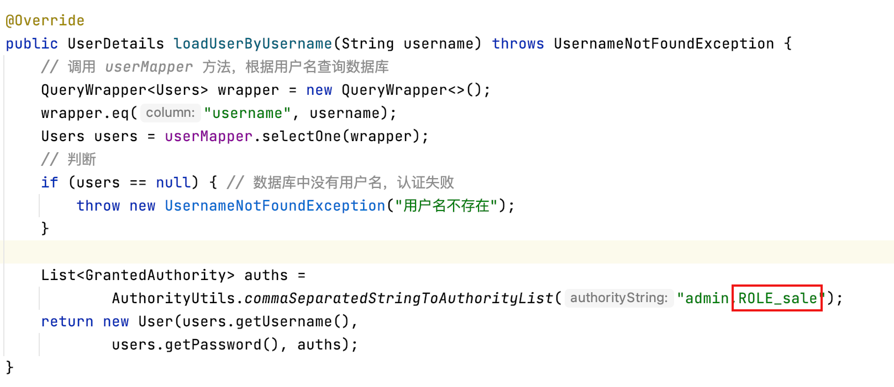
 修改配置类，主要配置文件不要添加 "ROLE_" ，因为上述的底层代码会自动添加与之进行匹配。
 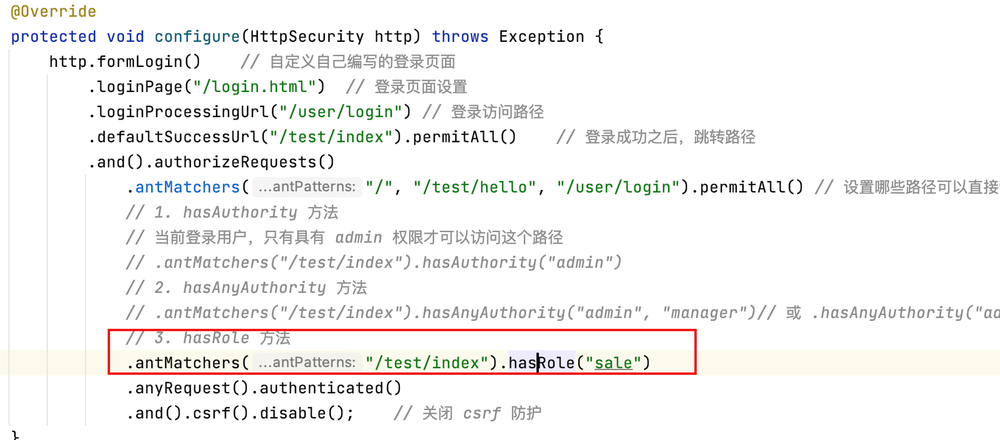

#### 4.4. `hasAnyRole` 方法

表示拥护具备任何一个条件都可以访问。
 给用户添加角色：
 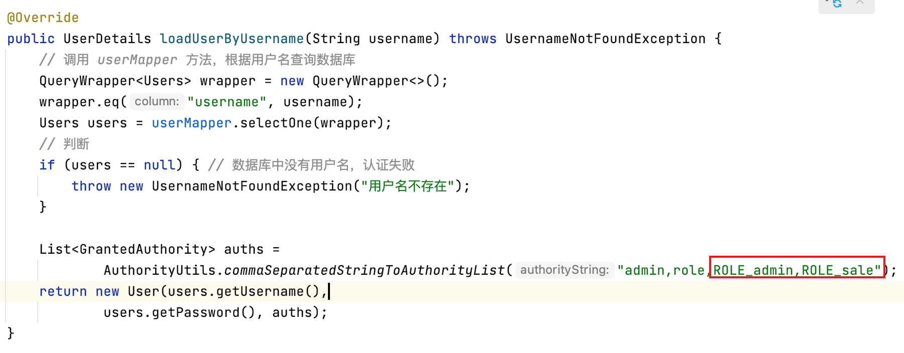
 修改配置文件：
 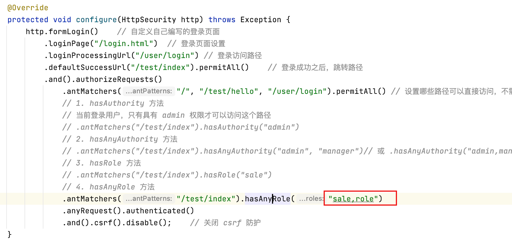

### 5. 基于数据库实现权限认证

### 6. 自定义 403 页面

```
@Override
protected void configure(HttpSecurity http) throws Exception {
    // 配置没有权限访问跳转自定义页面
    http.exceptionHandling().accessDeniedPage("/unauth.html");
}

```

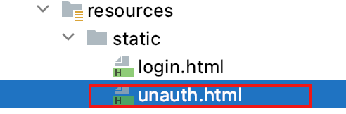

```
<body>
    <h1>没有访问的权限！</h1>
</body>

```

### 7. 注解使用

#### 7.1. `@Secured`

判断是否具有角色，另外需要注意的是这里匹配的字符串需要添加前缀“ROLE_“。

1. 使用注解先要开启注解功能！
 `@EnableGlobalMethodSecurity(securedEnabled=true)`

```
@SpringBootApplication
@MapperScan("com.liudezhi.securitydemo1.mapper")
@EnableGlobalMethodSecurity(securedEnabled = true)
public class Securitydemo1Application {
    public static void main(String[] args) {
        SpringApplication.run(Securitydemo1Application.class, args);
    }
}

```

1. 在 Controller 方法上添加注解，设置角色

```
@GetMapping("update")
@Secured({"ROLE_sale", "ROLE_manager"})
public String update() {
    return "hello update";
}

```

1. 在 userDetailsService 设置用户角色
 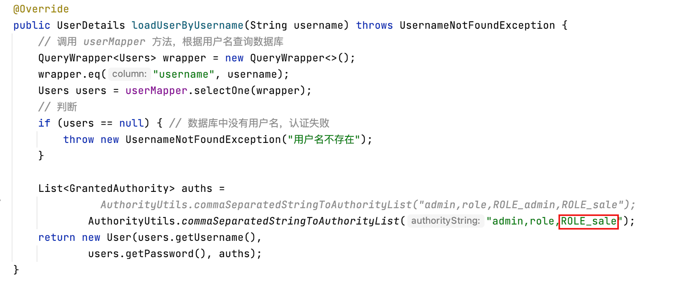

#### 7.2. `@PreAuthorize`

@PreAuthorize： 注解适合进入方法前的权限验证， @PreAuthorize 可以将登录用户的 roles/permissions 参数传到方法中。

1. 启动类开启注解功能：
 `@EnableGlobalMethodSecurity(prePostEnabled = true)`

```
@SpringBootApplication
@MapperScan("com.liudezhi.securitydemo1.mapper")
@EnableGlobalMethodSecurity(securedEnabled = true, prePostEnabled = true)
public class Securitydemo1Application {
    public static void main(String[] args) {
        SpringApplication.run(Securitydemo1Application.class, args);
    }
}

```

1. 在 Controller 的方法上面添加注解

```
@GetMapping("update")
@PreAuthorize("hasAnyAuthority('admin')")
public String update() {
    return "hello update";
}

```

#### 7.3. `@PostAuthorize`

@PostAuthorize 注解使用并不多，在方法执行后再进行权限验证，适合验证带有返回值的权限.

1. 启动类开启注解功能：
 `@EnableGlobalMethodSecurity(prePostEnabled = true)`

```
@SpringBootApplication
@MapperScan("com.liudezhi.securitydemo1.mapper")
@EnableGlobalMethodSecurity(securedEnabled = true, prePostEnabled = true)
public class Securitydemo1Application {
    public static void main(String[] args) {
        SpringApplication.run(Securitydemo1Application.class, args);
    }
}

```

1. 在 Controller 的方法上面添加注解

```
@GetMapping("update")
@PostAuthorize("hasAnyAuthority('admin')")
public String update() {
    System.out.println("update......");
    return "hello update";
}

```

不管有没有权限都会先执行，因此无论如何，update...... 都会输出

#### 7.4. `@PostFilter`

@PostFilter ：权限验证之后对数据进行过滤 留下用户名是 admin 的数据

表达式中的 filterObject 引用的是方法返回值 List 中的某一个元素

```
@GetMapping("getAll")
@PostAuthorize("hasAnyAuthority('admin')")
@PostFilter("filterObject.username == 'admin'")
public List<Users> getAllUser() {
    List<Users> list = new ArrayList<>();
    list.add(new Users(1, "xiaohua", "abc"));
    list.add(new Users(2, "admin", "admin"));
    return list;
}

```

#### 7.5. `@PreFilter`

@PreFilter: 进入控制器之前对数据进行过滤

```
@GetMapping("getTestPreFilter")
@PostAuthorize("hasAnyAuthority('admin')")
@PreFilter(value = "filterObject.id%2==0")
public List<Users> getTestPreFilter(@RequestBody List<Users> list) {
    list.forEach(t -> {
        System.out.println(t.getId() + "\t" + t.getUsername());
    });
    return list;
}

```

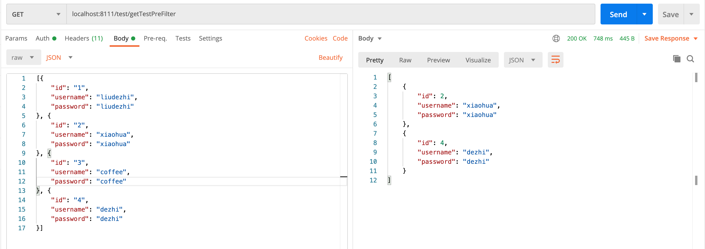

### 8. 基于数据库的记住我

#### 认证流程

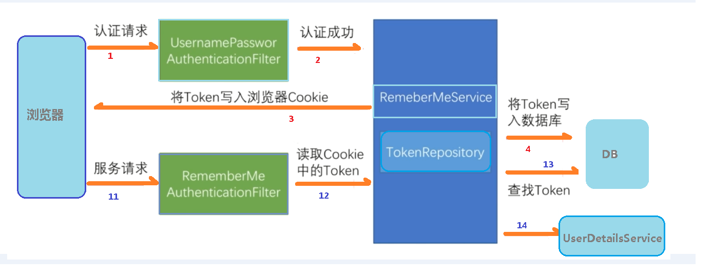

#### 实现原理

第一步：

```
PHN2ZyBpZD0iZHVmMXNpdXF1cnciIHdpZHRoPSIxMDAlIiB4bWxucz0iaHR0cDovL3d3dy53My5vcmcvMjAwMC9zdmciIHN0eWxlPSJtYXgtd2lkdGg6IDExNnB4OyIgdmlld0JveD0iMCAwIDExNiAxNiI+PHN0eWxlPgoKCiNkdWYxc2l1cXVydyAubGFiZWwgewogIGZvbnQtZmFtaWx5OiAndHJlYnVjaGV0IG1zJywgdmVyZGFuYSwgYXJpYWw7CiAgY29sb3I6ICMzMzM7IH0KCiNkdWYxc2l1cXVydyAubm9kZSByZWN0LAojZHVmMXNpdXF1cncgLm5vZGUgY2lyY2xlLAojZHVmMXNpdXF1cncgLm5vZGUgZWxsaXBzZSwKI2R1ZjFzaXVxdXJ3IC5ub2RlIHBvbHlnb24gewogIGZpbGw6ICNFQ0VDRkY7CiAgc3Ryb2tlOiAjOTM3MERCOwogIHN0cm9rZS13aWR0aDogMXB4OyB9CgojZHVmMXNpdXF1cncgLm5vZGUuY2xpY2thYmxlIHsKICBjdXJzb3I6IHBvaW50ZXI7IH0KCiNkdWYxc2l1cXVydyAuYXJyb3doZWFkUGF0aCB7CiAgZmlsbDogIzMzMzMzMzsgfQoKI2R1ZjFzaXVxdXJ3IC5lZGdlUGF0aCAucGF0aCB7CiAgc3Ryb2tlOiAjMzMzMzMzOwogIHN0cm9rZS13aWR0aDogMS41cHg7IH0KCiNkdWYxc2l1cXVydyAuZWRnZUxhYmVsIHsKICBiYWNrZ3JvdW5kLWNvbG9yOiAjZThlOGU4OyB9CgojZHVmMXNpdXF1cncgLmNsdXN0ZXIgcmVjdCB7CiAgZmlsbDogI2ZmZmZkZSAhaW1wb3J0YW50OwogIHN0cm9rZTogI2FhYWEzMyAhaW1wb3J0YW50OwogIHN0cm9rZS13aWR0aDogMXB4ICFpbXBvcnRhbnQ7IH0KCiNkdWYxc2l1cXVydyAuY2x1c3RlciB0ZXh0IHsKICBmaWxsOiAjMzMzOyB9CgojZHVmMXNpdXF1cncgZGl2Lm1lcm1haWRUb29sdGlwIHsKICBwb3NpdGlvbjogYWJzb2x1dGU7CiAgdGV4dC1hbGlnbjogY2VudGVyOwogIG1heC13aWR0aDogMjAwcHg7CiAgcGFkZGluZzogMnB4OwogIGZvbnQtZmFtaWx5OiAndHJlYnVjaGV0IG1zJywgdmVyZGFuYSwgYXJpYWw7CiAgZm9udC1zaXplOiAxMnB4OwogIGJhY2tncm91bmQ6ICNmZmZmZGU7CiAgYm9yZGVyOiAxcHggc29saWQgI2FhYWEzMzsKICBib3JkZXItcmFkaXVzOiAycHg7CiAgcG9pbnRlci1ldmVudHM6IG5vbmU7CiAgei1pbmRleDogMTAwOyB9CgojZHVmMXNpdXF1cncgLmFjdG9yIHsKICBzdHJva2U6ICNDQ0NDRkY7CiAgZmlsbDogI0VDRUNGRjsgfQoKI2R1ZjFzaXVxdXJ3IHRleHQuYWN0b3IgewogIGZpbGw6IGJsYWNrOwogIHN0cm9rZTogbm9uZTsgfQoKI2R1ZjFzaXVxdXJ3IC5hY3Rvci1saW5lIHsKICBzdHJva2U6IGdyZXk7IH0KCiNkdWYxc2l1cXVydyAubWVzc2FnZUxpbmUwIHsKICBzdHJva2Utd2lkdGg6IDEuNTsKICBzdHJva2UtZGFzaGFycmF5OiAnMiAyJzsKICBzdHJva2U6ICMzMzM7IH0KCiNkdWYxc2l1cXVydyAubWVzc2FnZUxpbmUxIHsKICBzdHJva2Utd2lkdGg6IDEuNTsKICBzdHJva2UtZGFzaGFycmF5OiAnMiAyJzsKICBzdHJva2U6ICMzMzM7IH0KCiNkdWYxc2l1cXVydyAjYXJyb3doZWFkIHsKICBmaWxsOiAjMzMzOyB9CgojZHVmMXNpdXF1cncgI2Nyb3NzaGVhZCBwYXRoIHsKICBmaWxsOiAjMzMzICFpbXBvcnRhbnQ7CiAgc3Ryb2tlOiAjMzMzICFpbXBvcnRhbnQ7IH0KCiNkdWYxc2l1cXVydyAubWVzc2FnZVRleHQgewogIGZpbGw6ICMzMzM7CiAgc3Ryb2tlOiBub25lOyB9CgojZHVmMXNpdXF1cncgLmxhYmVsQm94IHsKICBzdHJva2U6ICNDQ0NDRkY7CiAgZmlsbDogI0VDRUNGRjsgfQoKI2R1ZjFzaXVxdXJ3IC5sYWJlbFRleHQgewogIGZpbGw6IGJsYWNrOwogIHN0cm9rZTogbm9uZTsgfQoKI2R1ZjFzaXVxdXJ3IC5sb29wVGV4dCB7CiAgZmlsbDogYmxhY2s7CiAgc3Ryb2tlOiBub25lOyB9CgojZHVmMXNpdXF1cncgLmxvb3BMaW5lIHsKICBzdHJva2Utd2lkdGg6IDI7CiAgc3Ryb2tlLWRhc2hhcnJheTogJzIgMic7CiAgc3Ryb2tlOiAjQ0NDQ0ZGOyB9CgojZHVmMXNpdXF1cncgLm5vdGUgewogIHN0cm9rZTogI2FhYWEzMzsKICBmaWxsOiAjZmZmNWFkOyB9CgojZHVmMXNpdXF1cncgLm5vdGVUZXh0IHsKICBmaWxsOiBibGFjazsKICBzdHJva2U6IG5vbmU7CiAgZm9udC1mYW1pbHk6ICd0cmVidWNoZXQgbXMnLCB2ZXJkYW5hLCBhcmlhbDsKICBmb250LXNpemU6IDE0cHg7IH0KCiNkdWYxc2l1cXVydyAuYWN0aXZhdGlvbjAgewogIGZpbGw6ICNmNGY0ZjQ7CiAgc3Ryb2tlOiAjNjY2OyB9CgojZHVmMXNpdXF1cncgLmFjdGl2YXRpb24xIHsKICBmaWxsOiAjZjRmNGY0OwogIHN0cm9rZTogIzY2NjsgfQoKI2R1ZjFzaXVxdXJ3IC5hY3RpdmF0aW9uMiB7CiAgZmlsbDogI2Y0ZjRmNDsKICBzdHJva2U6ICM2NjY7IH0KCgojZHVmMXNpdXF1cncgLnNlY3Rpb24gewogIHN0cm9rZTogbm9uZTsKICBvcGFjaXR5OiAwLjI7IH0KCiNkdWYxc2l1cXVydyAuc2VjdGlvbjAgewogIGZpbGw6IHJnYmEoMTAyLCAxMDIsIDI1NSwgMC40OSk7IH0KCiNkdWYxc2l1cXVydyAuc2VjdGlvbjIgewogIGZpbGw6ICNmZmY0MDA7IH0KCiNkdWYxc2l1cXVydyAuc2VjdGlvbjEsCiNkdWYxc2l1cXVydyAuc2VjdGlvbjMgewogIGZpbGw6IHdoaXRlOwogIG9wYWNpdHk6IDAuMjsgfQoKI2R1ZjFzaXVxdXJ3IC5zZWN0aW9uVGl0bGUwIHsKICBmaWxsOiAjMzMzOyB9CgojZHVmMXNpdXF1cncgLnNlY3Rpb25UaXRsZTEgewogIGZpbGw6ICMzMzM7IH0KCiNkdWYxc2l1cXVydyAuc2VjdGlvblRpdGxlMiB7CiAgZmlsbDogIzMzMzsgfQoKI2R1ZjFzaXVxdXJ3IC5zZWN0aW9uVGl0bGUzIHsKICBmaWxsOiAjMzMzOyB9CgojZHVmMXNpdXF1cncgLnNlY3Rpb25UaXRsZSB7CiAgdGV4dC1hbmNob3I6IHN0YXJ0OwogIGZvbnQtc2l6ZTogMTFweDsKICB0ZXh0LWhlaWdodDogMTRweDsgfQoKCiNkdWYxc2l1cXVydyAuZ3JpZCAudGljayB7CiAgc3Ryb2tlOiBsaWdodGdyZXk7CiAgb3BhY2l0eTogMC4zOwogIHNoYXBlLXJlbmRlcmluZzogY3Jpc3BFZGdlczsgfQoKI2R1ZjFzaXVxdXJ3IC5ncmlkIHBhdGggewogIHN0cm9rZS13aWR0aDogMDsgfQoKCiNkdWYxc2l1cXVydyAudG9kYXkgewogIGZpbGw6IG5vbmU7CiAgc3Ryb2tlOiByZWQ7CiAgc3Ryb2tlLXdpZHRoOiAycHg7IH0KCgoKI2R1ZjFzaXVxdXJ3IC50YXNrIHsKICBzdHJva2Utd2lkdGg6IDI7IH0KCiNkdWYxc2l1cXVydyAudGFza1RleHQgewogIHRleHQtYW5jaG9yOiBtaWRkbGU7CiAgZm9udC1zaXplOiAxMXB4OyB9CgojZHVmMXNpdXF1cncgLnRhc2tUZXh0T3V0c2lkZVJpZ2h0IHsKICBmaWxsOiBibGFjazsKICB0ZXh0LWFuY2hvcjogc3RhcnQ7CiAgZm9udC1zaXplOiAxMXB4OyB9CgojZHVmMXNpdXF1cncgLnRhc2tUZXh0T3V0c2lkZUxlZnQgewogIGZpbGw6IGJsYWNrOwogIHRleHQtYW5jaG9yOiBlbmQ7CiAgZm9udC1zaXplOiAxMXB4OyB9CgoKI2R1ZjFzaXVxdXJ3IC50YXNrVGV4dDAsCiNkdWYxc2l1cXVydyAudGFza1RleHQxLAojZHVmMXNpdXF1cncgLnRhc2tUZXh0MiwKI2R1ZjFzaXVxdXJ3IC50YXNrVGV4dDMgewogIGZpbGw6IHdoaXRlOyB9CgojZHVmMXNpdXF1cncgLnRhc2swLAojZHVmMXNpdXF1cncgLnRhc2sxLAojZHVmMXNpdXF1cncgLnRhc2syLAojZHVmMXNpdXF1cncgLnRhc2szIHsKICBmaWxsOiAjOGE5MGRkOwogIHN0cm9rZTogIzUzNGZiYzsgfQoKI2R1ZjFzaXVxdXJ3IC50YXNrVGV4dE91dHNpZGUwLAojZHVmMXNpdXF1cncgLnRhc2tUZXh0T3V0c2lkZTIgewogIGZpbGw6IGJsYWNrOyB9CgojZHVmMXNpdXF1cncgLnRhc2tUZXh0T3V0c2lkZTEsCiNkdWYxc2l1cXVydyAudGFza1RleHRPdXRzaWRlMyB7CiAgZmlsbDogYmxhY2s7IH0KCgojZHVmMXNpdXF1cncgLmFjdGl2ZTAsCiNkdWYxc2l1cXVydyAuYWN0aXZlMSwKI2R1ZjFzaXVxdXJ3IC5hY3RpdmUyLAojZHVmMXNpdXF1cncgLmFjdGl2ZTMgewogIGZpbGw6ICNiZmM3ZmY7CiAgc3Ryb2tlOiAjNTM0ZmJjOyB9CgojZHVmMXNpdXF1cncgLmFjdGl2ZVRleHQwLAojZHVmMXNpdXF1cncgLmFjdGl2ZVRleHQxLAojZHVmMXNpdXF1cncgLmFjdGl2ZVRleHQyLAojZHVmMXNpdXF1cncgLmFjdGl2ZVRleHQzIHsKICBmaWxsOiBibGFjayAhaW1wb3J0YW50OyB9CgoKI2R1ZjFzaXVxdXJ3IC5kb25lMCwKI2R1ZjFzaXVxdXJ3IC5kb25lMSwKI2R1ZjFzaXVxdXJ3IC5kb25lMiwKI2R1ZjFzaXVxdXJ3IC5kb25lMyB7CiAgc3Ryb2tlOiBncmV5OwogIGZpbGw6IGxpZ2h0Z3JleTsKICBzdHJva2Utd2lkdGg6IDI7IH0KCiNkdWYxc2l1cXVydyAuZG9uZVRleHQwLAojZHVmMXNpdXF1cncgLmRvbmVUZXh0MSwKI2R1ZjFzaXVxdXJ3IC5kb25lVGV4dDIsCiNkdWYxc2l1cXVydyAuZG9uZVRleHQzIHsKICBmaWxsOiBibGFjayAhaW1wb3J0YW50OyB9CgoKI2R1ZjFzaXVxdXJ3IC5jcml0MCwKI2R1ZjFzaXVxdXJ3IC5jcml0MSwKI2R1ZjFzaXVxdXJ3IC5jcml0MiwKI2R1ZjFzaXVxdXJ3IC5jcml0MyB7CiAgc3Ryb2tlOiAjZmY4ODg4OwogIGZpbGw6IHJlZDsKICBzdHJva2Utd2lkdGg6IDI7IH0KCiNkdWYxc2l1cXVydyAuYWN0aXZlQ3JpdDAsCiNkdWYxc2l1cXVydyAuYWN0aXZlQ3JpdDEsCiNkdWYxc2l1cXVydyAuYWN0aXZlQ3JpdDIsCiNkdWYxc2l1cXVydyAuYWN0aXZlQ3JpdDMgewogIHN0cm9rZTogI2ZmODg4ODsKICBmaWxsOiAjYmZjN2ZmOwogIHN0cm9rZS13aWR0aDogMjsgfQoKI2R1ZjFzaXVxdXJ3IC5kb25lQ3JpdDAsCiNkdWYxc2l1cXVydyAuZG9uZUNyaXQxLAojZHVmMXNpdXF1cncgLmRvbmVDcml0MiwKI2R1ZjFzaXVxdXJ3IC5kb25lQ3JpdDMgewogIHN0cm9rZTogI2ZmODg4ODsKICBmaWxsOiBsaWdodGdyZXk7CiAgc3Ryb2tlLXdpZHRoOiAyOwogIGN1cnNvcjogcG9pbnRlcjsKICBzaGFwZS1yZW5kZXJpbmc6IGNyaXNwRWRnZXM7IH0KCiNkdWYxc2l1cXVydyAuZG9uZUNyaXRUZXh0MCwKI2R1ZjFzaXVxdXJ3IC5kb25lQ3JpdFRleHQxLAojZHVmMXNpdXF1cncgLmRvbmVDcml0VGV4dDIsCiNkdWYxc2l1cXVydyAuZG9uZUNyaXRUZXh0MyB7CiAgZmlsbDogYmxhY2sgIWltcG9ydGFudDsgfQoKI2R1ZjFzaXVxdXJ3IC5hY3RpdmVDcml0VGV4dDAsCiNkdWYxc2l1cXVydyAuYWN0aXZlQ3JpdFRleHQxLAojZHVmMXNpdXF1cncgLmFjdGl2ZUNyaXRUZXh0MiwKI2R1ZjFzaXVxdXJ3IC5hY3RpdmVDcml0VGV4dDMgewogIGZpbGw6IGJsYWNrICFpbXBvcnRhbnQ7IH0KCiNkdWYxc2l1cXVydyAudGl0bGVUZXh0IHsKICB0ZXh0LWFuY2hvcjogbWlkZGxlOwogIGZvbnQtc2l6ZTogMThweDsKICBmaWxsOiBibGFjazsgfQoKI2R1ZjFzaXVxdXJ3IGcuY2xhc3NHcm91cCB0ZXh0IHsKICBmaWxsOiAjOTM3MERCOwogIHN0cm9rZTogbm9uZTsKICBmb250LWZhbWlseTogJ3RyZWJ1Y2hldCBtcycsIHZlcmRhbmEsIGFyaWFsOwogIGZvbnQtc2l6ZTogMTBweDsgfQoKI2R1ZjFzaXVxdXJ3IGcuY2xhc3NHcm91cCByZWN0IHsKICBmaWxsOiAjRUNFQ0ZGOwogIHN0cm9rZTogIzkzNzBEQjsgfQoKI2R1ZjFzaXVxdXJ3IGcuY2xhc3NHcm91cCBsaW5lIHsKICBzdHJva2U6ICM5MzcwREI7CiAgc3Ryb2tlLXdpZHRoOiAxOyB9CgojZHVmMXNpdXF1cncgLmNsYXNzTGFiZWwgLmJveCB7CiAgc3Ryb2tlOiBub25lOwogIHN0cm9rZS13aWR0aDogMDsKICBmaWxsOiAjRUNFQ0ZGOwogIG9wYWNpdHk6IDAuNTsgfQoKI2R1ZjFzaXVxdXJ3IC5jbGFzc0xhYmVsIC5sYWJlbCB7CiAgZmlsbDogIzkzNzBEQjsKICBmb250LXNpemU6IDEwcHg7IH0KCiNkdWYxc2l1cXVydyAucmVsYXRpb24gewogIHN0cm9rZTogIzkzNzBEQjsKICBzdHJva2Utd2lkdGg6IDE7CiAgZmlsbDogbm9uZTsgfQoKI2R1ZjFzaXVxdXJ3ICNjb21wb3NpdGlvblN0YXJ0IHsKICBmaWxsOiAjOTM3MERCOwogIHN0cm9rZTogIzkzNzBEQjsKICBzdHJva2Utd2lkdGg6IDE7IH0KCiNkdWYxc2l1cXVydyAjY29tcG9zaXRpb25FbmQgewogIGZpbGw6ICM5MzcwREI7CiAgc3Ryb2tlOiAjOTM3MERCOwogIHN0cm9rZS13aWR0aDogMTsgfQoKI2R1ZjFzaXVxdXJ3ICNhZ2dyZWdhdGlvblN0YXJ0IHsKICBmaWxsOiAjRUNFQ0ZGOwogIHN0cm9rZTogIzkzNzBEQjsKICBzdHJva2Utd2lkdGg6IDE7IH0KCiNkdWYxc2l1cXVydyAjYWdncmVnYXRpb25FbmQgewogIGZpbGw6ICNFQ0VDRkY7CiAgc3Ryb2tlOiAjOTM3MERCOwogIHN0cm9rZS13aWR0aDogMTsgfQoKI2R1ZjFzaXVxdXJ3ICNkZXBlbmRlbmN5U3RhcnQgewogIGZpbGw6ICM5MzcwREI7CiAgc3Ryb2tlOiAjOTM3MERCOwogIHN0cm9rZS13aWR0aDogMTsgfQoKI2R1ZjFzaXVxdXJ3ICNkZXBlbmRlbmN5RW5kIHsKICBmaWxsOiAjOTM3MERCOwogIHN0cm9rZTogIzkzNzBEQjsKICBzdHJva2Utd2lkdGg6IDE7IH0KCiNkdWYxc2l1cXVydyAjZXh0ZW5zaW9uU3RhcnQgewogIGZpbGw6ICM5MzcwREI7CiAgc3Ryb2tlOiAjOTM3MERCOwogIHN0cm9rZS13aWR0aDogMTsgfQoKI2R1ZjFzaXVxdXJ3ICNleHRlbnNpb25FbmQgewogIGZpbGw6ICM5MzcwREI7CiAgc3Ryb2tlOiAjOTM3MERCOwogIHN0cm9rZS13aWR0aDogMTsgfQoKI2R1ZjFzaXVxdXJ3IC5jb21taXQtaWQsCiNkdWYxc2l1cXVydyAuY29tbWl0LW1zZywKI2R1ZjFzaXVxdXJ3IC5icmFuY2gtbGFiZWwgewogIGZpbGw6IGxpZ2h0Z3JleTsKICBjb2xvcjogbGlnaHRncmV5OyB9CgoKCiNkdWYxc2l1cXVydyAubGFiZWx7CiAgY29sb3I6IzE4QjE0RTsKfQojZHVmMXNpdXF1cncgLnRlLW1kLWNvbnRhaW5lci0tZGFyayAubm9kZSByZWN0IHsKICBmaWxsOiByZWQ7Cn0KCiNkdWYxc2l1cXVydyAubm9kZSByZWN0LAojZHVmMXNpdXF1cncgLm5vZGUgY2lyY2xlLAojZHVmMXNpdXF1cncgLm5vZGUgZWxsaXBzZSwKI2R1ZjFzaXVxdXJ3IC5ub2RlIHBvbHlnb24gewogIGZpbGw6ICNGOUZGRkI7OwogIHN0cm9rZTogIzJEQkQ2MDsKICBzdHJva2Utd2lkdGg6IDEuNXB4Owp9CiNkdWYxc2l1cXVydyAuYXJyb3doZWFkUGF0aHsKICBmaWxsOiAjMkRCRDYwOwp9CiNkdWYxc2l1cXVydyAuZWRnZVBhdGggLnBhdGggewogIHN0cm9rZTogIzJEQkQ2MDsKICBzdHJva2Utd2lkdGg6IDFweDsKfQojZHVmMXNpdXF1cncgLmVkZ2VMYWJlbCB7CiAgYmFja2dyb3VuZC1jb2xvcjogI2ZmZjsKfQojZHVmMXNpdXF1cncgLmNsdXN0ZXIgcmVjdCB7CiAgZmlsbDogI0Y5RkZGQiAhaW1wb3J0YW50OwogIHN0cm9rZTogIzJEQkQ2MCAhaW1wb3J0YW50OwogIHN0cm9rZS13aWR0aDogMXB4ICFpbXBvcnRhbnQ7Cn0KCiNkdWYxc2l1cXVydyAuY2x1c3RlciB0ZXh0IHsKICBmaWxsOiAjRjlGRkZCOwp9CgojZHVmMXNpdXF1cncgZGl2Lm1lcm1haWRUb29sdGlwIHsKICBiYWNrZ3JvdW5kOiAjRjlGRkZCOwogIGJvcmRlcjogMXB4IHNvbGlkICMyREJENjA7Cn0KCgojZHVmMXNpdXF1cncgLmFjdG9yIHsKICBzdHJva2U6ICMyREJENjA7CiAgZmlsbDogI0Y5RkZGQjsKfQoKI2R1ZjFzaXVxdXJ3IHRleHQuYWN0b3IgewogIGZpbGw6ICMyREJENjA7CiAgc3Ryb2tlOiBub25lOwp9CgojZHVmMXNpdXF1cncgLmFjdG9yLWxpbmUgewogIHN0cm9rZTogIzJEQkQ2MDsKfQoKI2R1ZjFzaXVxdXJ3IC5tZXNzYWdlTGluZTAgewogIHN0cm9rZS13aWR0aDogMS41OwogIHN0cm9rZS1kYXNoYXJyYXk6ICcyIDInOwogIG1hcmtlci1lbmQ6ICd1cmwoI2Fycm93aGVhZCknOwogIHN0cm9rZTogIzJEQkQ2MDsKfQoKI2R1ZjFzaXVxdXJ3IC5tZXNzYWdlTGluZTEgewogIHN0cm9rZS13aWR0aDogMS41OwogIHN0cm9rZS1kYXNoYXJyYXk6ICcyIDInOwogIHN0cm9rZTogIzJEQkQ2MDsKfQoKI2R1ZjFzaXVxdXJ3ICNhcnJvd2hlYWQgewogIGZpbGw6ICMyREJENjA7Cn0KCiNkdWYxc2l1cXVydyAjY3Jvc3NoZWFkIHBhdGggewogIGZpbGw6ICMyREJENjAgIWltcG9ydGFudDsKICBzdHJva2U6ICMyREJENjAgIWltcG9ydGFudDsKfQoKI2R1ZjFzaXVxdXJ3IC5tZXNzYWdlVGV4dCB7CiAgZmlsbDogIzJEQkQ2MDsKICBzdHJva2U6IG5vbmU7Cn0KCiNkdWYxc2l1cXVydyAubGFiZWxCb3ggewogIHN0cm9rZTogIzJEQkQ2MDsKICBmaWxsOiAjRjlGRkZCOwp9CgojZHVmMXNpdXF1cncgLmxhYmVsVGV4dCB7CiAgZmlsbDogIzJEQkQ2MDsKICBzdHJva2U6ICMyREJENjA7Cn0KCiNkdWYxc2l1cXVydyAubG9vcFRleHQgewogIGZpbGw6ICMyREJENjA7CiAgc3Ryb2tlOiAjMkRCRDYwOwp9CgojZHVmMXNpdXF1cncgLmxvb3BMaW5lIHsKICBzdHJva2Utd2lkdGg6IDI7CiAgc3Ryb2tlLWRhc2hhcnJheTogJzIgMic7CiAgbWFya2VyLWVuZDogJ3VybCgjYXJyb3doZWFkKSc7CiAgc3Ryb2tlOiAjMkRCRDYwOwp9CgojZHVmMXNpdXF1cncgLm5vdGUgewogIHN0cm9rZTogIzJEQkQ2MDsKICBmaWxsOiAjRjlGRkZCOwp9CgojZHVmMXNpdXF1cncgLm5vdGVUZXh0IHsKICBmaWxsOiAjMkRCRDYwOwogIHN0cm9rZTogIzJEQkQ2MDsKfQoKCiNkdWYxc2l1cXVydyAuc2VjdGlvbnsKICBvcGFjaXR5OjE7Cn0KI2R1ZjFzaXVxdXJ3IC5zZWN0aW9uMCwjZHVmMXNpdXF1cncgIC5zZWN0aW9uMiB7CiAgZmlsbDogI0VDRjdGMDsKfQoKI2R1ZjFzaXVxdXJ3IC5zZWN0aW9uMSwKI2R1ZjFzaXVxdXJ3IC5zZWN0aW9uMyB7CiAgZmlsbDogI0ZGRjsKfQojZHVmMXNpdXF1cncgLnRhc2tUZXh0MCwKI2R1ZjFzaXVxdXJ3IC50YXNrVGV4dDEsCiNkdWYxc2l1cXVydyAudGFza1RleHQyLAojZHVmMXNpdXF1cncgLnRhc2tUZXh0MyB7CiAgZmlsbDogI2ZmZjsKfQoKI2R1ZjFzaXVxdXJ3IC50YXNrMCwKI2R1ZjFzaXVxdXJ3IC50YXNrMSwKI2R1ZjFzaXVxdXJ3IC50YXNrMiwKI2R1ZjFzaXVxdXJ3IC50YXNrMyB7CiAgZmlsbDogIzJEQkQ2MDsKICBzdHJva2U6ICMzNTlGNUE7Cn0KPC9zdHlsZT48c3R5bGU+I2R1ZjFzaXVxdXJ3IHsKICAgIGNvbG9yOiByZ2IoMjQ0LCAyNDQsIDI0NCk7CiAgICBmb250OiBub3JtYWwgbm9ybWFsIG5vcm1hbCBub3JtYWwgMTRweC8yMi4zOTk5OTk2MTg1MzAyNzNweCBtb25vc3BhY2U7CiAgfTwvc3R5bGU+PGcgdHJhbnNmb3JtPSJ0cmFuc2xhdGUoLTEyLCAtMTIpIj48ZyBjbGFzcz0ib3V0cHV0Ij48ZyBjbGFzcz0iY2x1c3RlcnMiPjwvZz48ZyBjbGFzcz0iZWRnZVBhdGhzIj48ZyBjbGFzcz0iZWRnZVBhdGgiIHN0eWxlPSJvcGFjaXR5OiAxOyI+PHBhdGggY2xhc3M9InBhdGgiIGQ9Ik0yMCwyMEw0NSwyMEw3MCwyMCIgbWFya2VyLWVuZD0idXJsKCNhcnJvd2hlYWQyNDYpIiBzdHlsZT0ic3Ryb2tlOiAjMzMzOyBzdHJva2Utd2lkdGg6IDEuNXB4O2ZpbGw6bm9uZSI+PC9wYXRoPjxkZWZzPjxtYXJrZXIgaWQ9ImFycm93aGVhZDI0NiIgdmlld0JveD0iMCAwIDEwIDEwIiByZWZYPSI5IiByZWZZPSI1IiBtYXJrZXJVbml0cz0ic3Ryb2tlV2lkdGgiIG1hcmtlcldpZHRoPSI4IiBtYXJrZXJIZWlnaHQ9IjYiIG9yaWVudD0iYXV0byI+PHBhdGggZD0iTSAwIDAgTCAwIDAgTCAwIDAgeiIgc3R5bGU9ImZpbGw6ICMzMzMiPjwvcGF0aD48L21hcmtlcj48L2RlZnM+PC9nPjxnIGNsYXNzPSJlZGdlUGF0aCIgc3R5bGU9Im9wYWNpdHk6IDE7Ij48cGF0aCBjbGFzcz0icGF0aCIgZD0iTTcwLDIwTDk1LDIwTDEyMCwyMCIgbWFya2VyLWVuZD0idXJsKCNhcnJvd2hlYWQyNDcpIiBzdHlsZT0ic3Ryb2tlOiAjMzMzOyBzdHJva2Utd2lkdGg6IDEuNXB4O2ZpbGw6bm9uZSI+PC9wYXRoPjxkZWZzPjxtYXJrZXIgaWQ9ImFycm93aGVhZDI0NyIgdmlld0JveD0iMCAwIDEwIDEwIiByZWZYPSI5IiByZWZZPSI1IiBtYXJrZXJVbml0cz0ic3Ryb2tlV2lkdGgiIG1hcmtlcldpZHRoPSI4IiBtYXJrZXJIZWlnaHQ9IjYiIG9yaWVudD0iYXV0byI+PHBhdGggZD0iTSAwIDAgTCAwIDAgTCAwIDAgeiIgc3R5bGU9ImZpbGw6ICMzMzMiPjwvcGF0aD48L21hcmtlcj48L2RlZnM+PC9nPjwvZz48ZyBjbGFzcz0iZWRnZUxhYmVscyI+PGcgY2xhc3M9ImVkZ2VMYWJlbCIgdHJhbnNmb3JtPSIiIHN0eWxlPSJvcGFjaXR5OiAxOyI+PGcgdHJhbnNmb3JtPSJ0cmFuc2xhdGUoMCwwKSIgY2xhc3M9ImxhYmVsIj48cmVjdCByeD0iMCIgcnk9IjAiIHdpZHRoPSIwIiBoZWlnaHQ9IjAiIHN0eWxlPSJmaWxsOiNlOGU4ZTg7Ij48L3JlY3Q+PHRleHQ+PHRzcGFuIHhtbDpzcGFjZT0icHJlc2VydmUiIGR5PSIxZW0iIHg9IjEiPmNvb2tpZeWKoOWvhuS4sjwvdHNwYW4+PC90ZXh0PjwvZz48L2c+PGcgY2xhc3M9ImVkZ2VMYWJlbCIgdHJhbnNmb3JtPSIiIHN0eWxlPSJvcGFjaXR5OiAxOyI+PGcgdHJhbnNmb3JtPSJ0cmFuc2xhdGUoMCwwKSIgY2xhc3M9ImxhYmVsIj48cmVjdCByeD0iMCIgcnk9IjAiIHdpZHRoPSIwIiBoZWlnaHQ9IjAiIHN0eWxlPSJmaWxsOiNlOGU4ZTg7Ij48L3JlY3Q+PHRleHQ+PHRzcGFuIHhtbDpzcGFjZT0icHJlc2VydmUiIGR5PSIxZW0iIHg9IjEiPuWKoOWvhuS4sueUqOaIt+S/oeaBr+Wtl+espuS4sjwvdHNwYW4+PC90ZXh0PjwvZz48L2c+PC9nPjxnIGNsYXNzPSJub2RlcyI+PGcgY2xhc3M9Im5vZGUiIGlkPSJBIiB0cmFuc2Zvcm09InRyYW5zbGF0ZSgyMCwyMCkiIHN0eWxlPSJvcGFjaXR5OiAxOyI+PHJlY3Qgcng9IjAiIHJ5PSIwIiB4PSItMTAiIHk9Ii0xMCIgd2lkdGg9IjIwIiBoZWlnaHQ9IjIwIj48L3JlY3Q+PGcgY2xhc3M9ImxhYmVsIiB0cmFuc2Zvcm09InRyYW5zbGF0ZSgwLDApIj48ZyB0cmFuc2Zvcm09InRyYW5zbGF0ZSgwLDApIj48dGV4dD48dHNwYW4geG1sOnNwYWNlPSJwcmVzZXJ2ZSIgZHk9IjFlbSIgeD0iMSI+5rWP6KeI5ZmoPC90c3Bhbj48L3RleHQ+PC9nPjwvZz48L2c+PGcgY2xhc3M9Im5vZGUiIGlkPSJCIiB0cmFuc2Zvcm09InRyYW5zbGF0ZSg3MCwyMCkiIHN0eWxlPSJvcGFjaXR5OiAxOyI+PHJlY3Qgcng9IjAiIHJ5PSIwIiB4PSItMTAiIHk9Ii0xMCIgd2lkdGg9IjIwIiBoZWlnaHQ9IjIwIj48L3JlY3Q+PGcgY2xhc3M9ImxhYmVsIiB0cmFuc2Zvcm09InRyYW5zbGF0ZSgwLDApIj48ZyB0cmFuc2Zvcm09InRyYW5zbGF0ZSgwLDApIj48dGV4dD48dHNwYW4geG1sOnNwYWNlPSJwcmVzZXJ2ZSIgZHk9IjFlbSIgeD0iMSI+6K6k6K+B5oiQ5YqfPC90c3Bhbj48L3RleHQ+PC9nPjwvZz48L2c+PGcgY2xhc3M9Im5vZGUiIGlkPSJDIiB0cmFuc2Zvcm09InRyYW5zbGF0ZSgxMjAsMjApIiBzdHlsZT0ib3BhY2l0eTogMTsiPjxyZWN0IHJ4PSIwIiByeT0iMCIgeD0iLTEwIiB5PSItMTAiIHdpZHRoPSIyMCIgaGVpZ2h0PSIyMCI+PC9yZWN0PjxnIGNsYXNzPSJsYWJlbCIgdHJhbnNmb3JtPSJ0cmFuc2xhdGUoMCwwKSI+PGcgdHJhbnNmb3JtPSJ0cmFuc2xhdGUoMCwwKSI+PHRleHQ+PHRzcGFuIHhtbDpzcGFjZT0icHJlc2VydmUiIGR5PSIxZW0iIHg9IjEiPuaVsOaNruW6kzwvdHNwYW4+PC90ZXh0PjwvZz48L2c+PC9nPjwvZz48L2c+PC9nPjwvc3ZnPg==

```

第二步：再次访问
 获取 cookie 信息，拿着 cookie 信息到数据库比对，如果查询到对应信息，认证成功，可以登录。

#### 具体实现

**第一步：** 创建数据库表

```
create table persistent_logins (
    username varchar(64) not null,
    series varchar(64) primary key,
	token varchar(64) not null,
    last_used timestamp not null
);

```

**第二步：** 配置类注入数据源，配置操作数据库对象

```
@Configuration
public class SecurityConfigTest extends WebSecurityConfigurerAdapter {

    @Autowired
    private DataSource dataSource;  // 注入数据源
    // 配置对象
    @Bean
    public PersistentTokenRepository persistentTokenRepository() {
        JdbcTokenRepositoryImpl jdbcTokenRepository = new JdbcTokenRepositoryImpl();
        jdbcTokenRepository.setDataSource(dataSource);
        // jdbcTokenRepository.setCreateTableOnStartup(true); // 该配置会自动建表，就不需要第一步自己建表了
        return jdbcTokenRepository;
    }
}

```

**第三步：** 配置类中配置自动登录

```
@Override
protected void configure(HttpSecurity http) throws Exception {
    http.formLogin()    // 自定义自己编写的登录页面
        .loginPage("/login.html")  // 登录页面设置
        .loginProcessingUrl("/user/login") // 登录访问路径
        .defaultSuccessUrl("/success.html").permitAll()    // 登录成功之后，跳转路径
        .and().authorizeRequests()
            .antMatchers("/", "/test/hello", "/user/login").permitAll() // 设置哪些路
            .antMatchers("/test/index").hasAnyRole("sale,role")
            .anyRequest().authenticated()
            .and().rememberMe().tokenRepository(persistentTokenRepository())
            .tokenValiditySeconds(60)   // token 有效时长，单位 s
            .userDetailsService(userDetailsService)
            .and().csrf().disable();    // 关闭 csrf 防护
}

```

**第四步：** 在登录页面添加复选框

```
<body>
    <form action="/user/login", method="post">
        用户名：<input type="text" name="username">
        <br/>
        密码： <input type="text" name="password">
        <br/>
        <input type="checkbox" name="remember-me"/> 自动登录
        <input type="submit" value="login">
    </form>
</body>

```

**第五步：** 测试
 登录成功之后，关闭浏览器再次访问 http://localhost:8111/test/index，发现依然可以使用!
 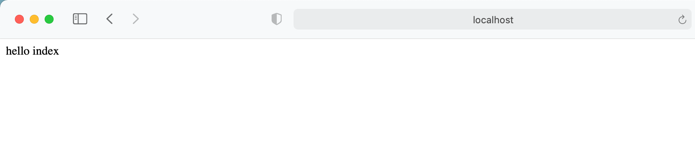

### 9. 用户注销

**在配置类添加退出的配置**
 `http.logout().logoutUrl("/logout").logoutSuccessUrl("/test/hello").permitAll();`
 **测试：**

1. 修改配置类，登录成功之后跳转到成功页面
 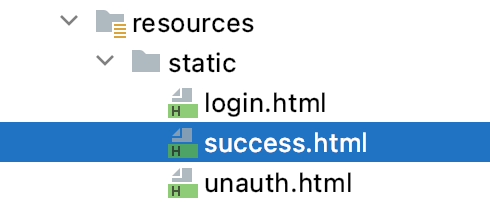

```
<body>
    登录成功！
    <a  >退出</a>
</body>

```

```
@Override
protected void configure(HttpSecurity http) throws Exception {
    // 退出
    http.logout().logoutUrl("/logout").
            logoutSuccessUrl("/test/hello").permitAll();

    // 配置没有权限访问跳转自定义页面
    http.exceptionHandling().accessDeniedPage("/unauth.html");

    http.formLogin()    // 自定义自己编写的登录页面
        .loginPage("/login.html")  // 登录页面设置
        .loginProcessingUrl("/user/login") // 登录访问路径
        .defaultSuccessUrl("/success.html").permitAll()    // 登录成功之后，跳转路径
        .and().authorizeRequests()
            .antMatchers("/", "/test/hello", "/user/login").permitAll() // 设置哪些路径可以直接访问，不需要认证
            .antMatchers("/test/index").hasAnyRole("sale,role")
            .anyRequest().authenticated()
            .and().csrf().disable();    // 关闭 csrf 防护
}

```

1. 在成功页面添加超链接，写设置退出路径

1. 登录成功之后，在成功页面点击退出

### 10. CSRF

#### 10.1. CSRF 理解

跨站请求伪造(英语:Cross-site request forgery)，也被称为 one-click attack 或者 session riding，通常缩写为 CSRF 或者 XSRF， 是一种挟制用户在当前已登录的 Web 应用程序上执行非本意的操作的攻击方法。跟跨网站脚本(XSS)相比，XSS 利用的是用户对指定网站的信任，CSRF 利用的是网站对用户网页浏览器的信任。

跨站请求攻击，简单地说，是攻击者通过一些技术手段欺骗用户的浏览器去访问一个 自己曾经认证过的网站并运行一些操作(如发邮件，发消息，甚至财产操作如转账和购买 商品)。由于浏览器曾经认证过，所以被访问的网站会认为是真正的用户操作而去运行。 这利用了 web 中用户身份验证的一个漏洞:简单的身份验证只能保证请求发自某个用户的浏览器，却不能保证请求本身是用户自愿发出的。

从 Spring Security 4.0 开始，默认情况下会启用 CSRF 保护，以防止 CSRF 攻击应用程序，Spring Security CSRF 会针对 PATCH，POST，PUT 和 DELETE 方法进行防护。

#### 10.2. 案例

1. 在登录页面添加一个隐藏域:

```
<input type="hidden" th:name="${_csrf.parameterName}" th:vale="${_csfr.token}">
<!-- 或 -->
<input type="hidden"th:if="${_csrf}!=null"th:value="${_csrf.token}"name="_csrf"/>

```

1. 关闭安全配置的类中的 csrf

```
// http.csrf().disable();

```

#### 10.3. SpringSecurity 实现 CSRF 的原理

1.
生成 csrfToken 保存到 HttpSession 或者 Cookie 中。
 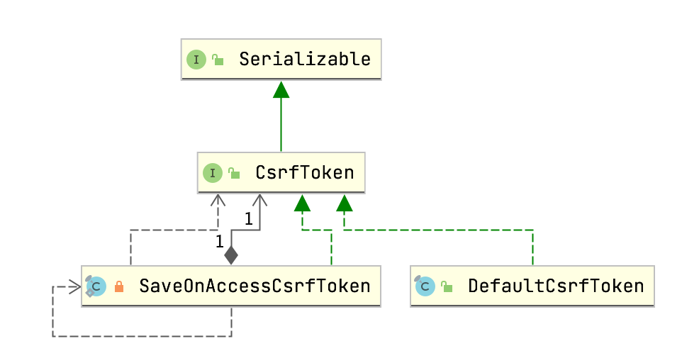
 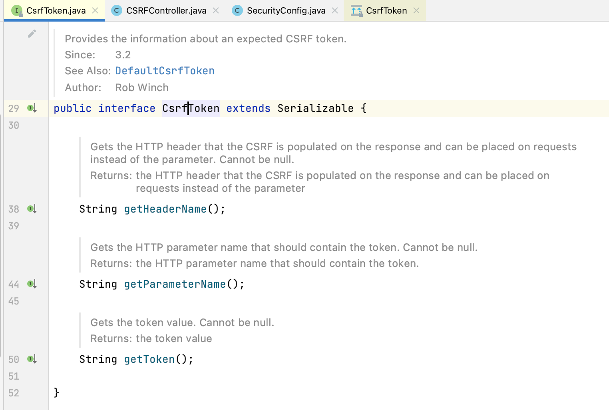
 SaveOnAccessCsrfToken 类有个接口CsrfTokenRepository
 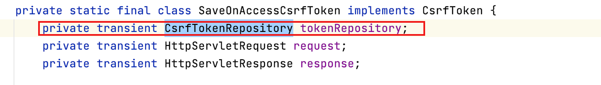
 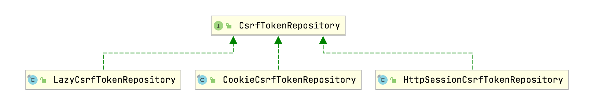
 当前接口实现类: HttpSessionCsrfTokenRepository，CookieCsrfTokenRepository
 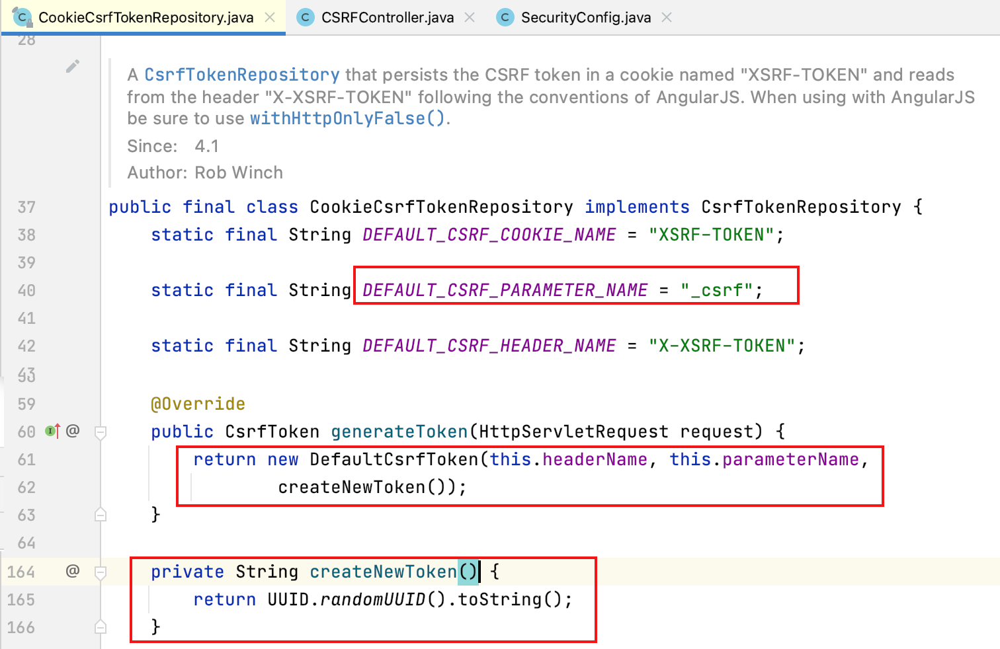

1.
请求到来时，从请求中提取csrfToken，和保存的csrfToken做比较，进而判断当前请求是否合法。主要通过 CsrfFilter 过滤器来完成。
 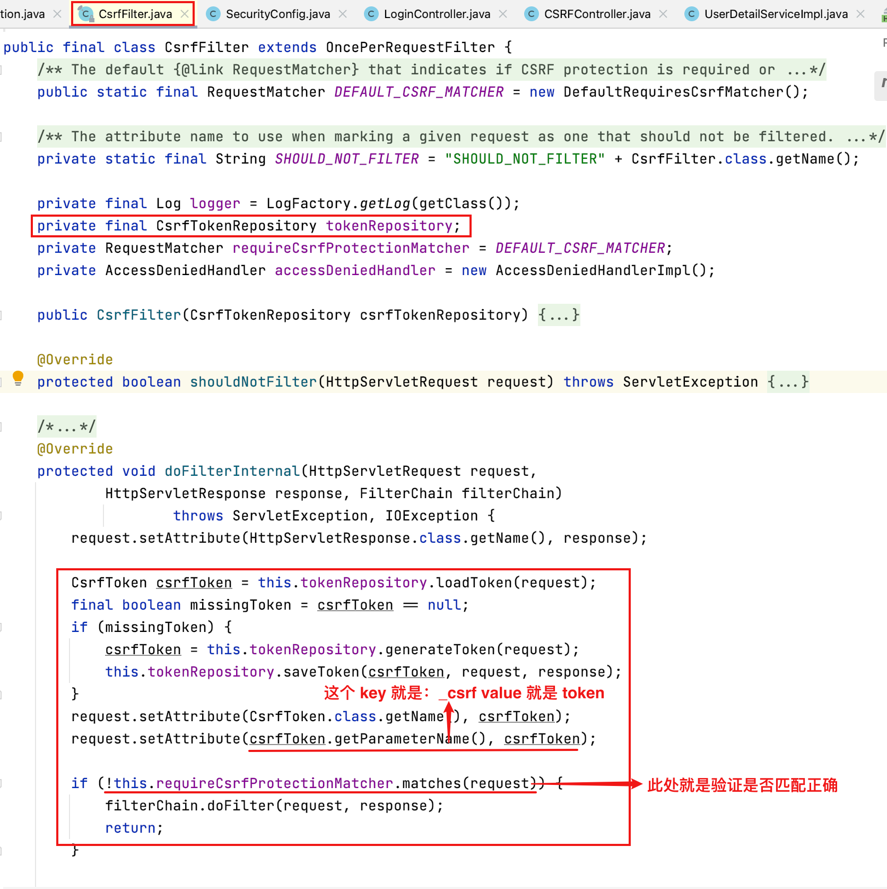

%23%23%20SpringSecurity%20Web%20%E6%9D%83%E9%99%90%E6%96%B9%E6%A1%88%0A%23%23%23%201.%20%E8%AE%BE%E7%BD%AE%E7%99%BB%E5%BD%95%E7%B3%BB%E7%BB%9F%E7%9A%84%E8%B4%A6%E5%8F%B7%E3%80%81%E5%AF%86%E7%A0%81%0A%23%23%23%23%20%E6%96%B9%E5%BC%8F%E4%B8%80%EF%BC%9A%E5%9C%A8%20application.properties%0A%60%60%60properties%0Aspring.security.user.name%3Dliudezhi%0Aspring.security.user.password%3DLiudezhi%0A%60%60%60%0A%0A%23%23%23%23%20%E6%96%B9%E5%BC%8F%E4%BA%8C%EF%BC%9A%E9%80%9A%E8%BF%87%E9%85%8D%E7%BD%AE%E7%B1%BB%0A%60%60%60java%0A%40Configuration%0Apublic%20class%20SecurityConfig%20extends%20WebSecurityConfigurerAdapter%20%7B%0A%0A%20%20%20%20%40Override%0A%20%20%20%20protected%20void%20configure(AuthenticationManagerBuilder%20auth)%20throws%20Exception%20%7B%0A%20%20%20%20%20%20%20%20BCryptPasswordEncoder%20passwordEncoder%20%3D%20new%20BCryptPasswordEncoder()%3B%0A%20%20%20%20%20%20%20%20String%20password%20%3D%20passwordEncoder.encode(%22xiaohua%22)%3B%0A%20%20%20%20%20%20%20%20auth.inMemoryAuthentication().withUser(%22xiaohua%22).password(password).roles(%22admin%22)%3B%0A%20%20%20%20%7D%0A%0A%20%20%20%20%40Bean%0A%20%20%20%20PasswordEncoder%20password()%20%7B%0A%20%20%20%20%20%20%20%20return%20new%20BCryptPasswordEncoder()%3B%0A%20%20%20%20%7D%0A%7D%0A%60%60%60%0A%0A%23%23%23%23%20%E6%96%B9%E5%BC%8F%E4%B8%89%EF%BC%9A%E8%87%AA%E5%AE%9A%E4%B9%89%E7%BC%96%E5%86%99%E5%AE%9E%E7%8E%B0%E7%B1%BB%0A%60%60%60java%0A%40Configuration%0Apublic%20class%20SecurityConfigTest%20extends%20WebSecurityConfigurerAdapter%20%7B%0A%0A%20%20%20%20%40Autowired%0A%20%20%20%20private%20UserDetailsService%20userDetailsService%3B%0A%0A%20%20%20%20%40Override%0A%20%20%20%20protected%20void%20configure(AuthenticationManagerBuilder%20auth)%20throws%20Exception%20%7B%0A%20%20%20%20%20%20%20%20auth.userDetailsService(userDetailsService).passwordEncoder(password())%3B%0A%20%20%20%20%7D%0A%0A%20%20%20%20%40Bean%0A%20%20%20%20PasswordEncoder%20password()%20%7B%0A%20%20%20%20%20%20%20%20return%20new%20BCryptPasswordEncoder()%3B%0A%20%20%20%20%7D%0A%7D%0A%60%60%60%0A%60%60%60java%0A%40Service(%22userDetailsService%22)%0Apublic%20class%20MyUserDetailsService%20implements%20UserDetailsService%20%7B%0A%20%20%20%20%40Override%0A%20%20%20%20public%20UserDetails%20loadUserByUsername(String%20username)%20throws%20UsernameNotFoundException%20%7B%0A%20%20%20%20%20%20%20%20List%3CGrantedAuthority%3E%20auths%20%3D%0A%20%20%20%20%20%20%20%20%20%20%20%20%20%20%20%20AuthorityUtils.commaSeparatedStringToAuthorityList(%22role%22)%3B%0A%20%20%20%20%20%20%20%20return%20new%20User(%22xiaohua%22%2C%20new%20BCryptPasswordEncoder().encode(%22xiaohua%22)%2C%20auths)%3B%0A%20%20%20%20%7D%0A%7D%0A%60%60%60%0A%0A%23%23%23%202.%20%E5%AE%9E%E7%8E%B0%E6%95%B0%E6%8D%AE%E5%BA%93%E8%AE%A4%E8%AF%81%E6%9D%A5%E5%AE%8C%E6%88%90%E7%94%A8%E6%88%B7%E7%99%BB%E5%BD%95%0A%E5%AE%8C%E6%88%90%E8%87%AA%E5%AE%9A%E4%B9%89%E7%99%BB%E5%BD%95%0A%23%23%23%23%202.1.%20%E5%87%86%E5%A4%87%20sql%0A%60%60%60sql%0Acreate%20table%20users(%0A%20%20%20%20id%20bigint%20primary%20key%20auto_increment%2C%0A%20%20%20%20username%20varchar(20)%20unique%20not%20null%2C%0A%20%20%20%20password%20varchar(100)%0A)%3B%0Ainsert%20into%20users%20values(1%2C%20'xiaohua'%2C%20'%242a%2410%249BiHi58FzbSClAf5oey.tus8o39d8WVlKWXL8jVGt%2Flk3zNoSIA9.')%3B%0A%60%60%60%0A%23%23%23%23%202.2.%20%E6%B7%BB%E5%8A%A0%E4%BE%9D%E8%B5%96%0A%60%60%60java%0A%3C!--%20mybatis-plus%20--%3E%0A%3Cdependency%3E%0A%20%20%20%20%3CgroupId%3Ecom.baomidou%3C%2FgroupId%3E%0A%20%20%20%20%3CartifactId%3Emybatis-plus-boot-starter%3C%2FartifactId%3E%0A%20%20%20%20%3Cversion%3E3.4.1%3C%2Fversion%3E%0A%3C%2Fdependency%3E%0A%0A%3C!--%20mysql%20--%3E%0A%3Cdependency%3E%0A%20%20%20%20%3CgroupId%3Emysql%3C%2FgroupId%3E%0A%20%20%20%20%3CartifactId%3Emysql-connector-java%3C%2FartifactId%3E%0A%3C%2Fdependency%3E%0A%0A%3C!--%20lombok%20%E7%94%A8%E6%9D%A5%E7%AE%80%E5%8C%96%E5%AE%9E%E4%BD%93%E7%B1%BB%20--%3E%0A%3Cdependency%3E%0A%20%20%20%20%3CgroupId%3Eorg.projectlombok%3C%2FgroupId%3E%0A%20%20%20%20%3CartifactId%3Elombok%3C%2FartifactId%3E%0A%3C%2Fdependency%3E%0A%60%60%60%0A%0A%23%23%23%202.3.%20%E7%BC%96%E5%86%99%E5%AE%9E%E4%BD%93%E7%B1%BB%0A%60%60%60java%0A%40Data%0Apublic%20class%20Users%20%7B%0A%20%20%20%20private%20Integer%20id%3B%0A%20%20%20%20private%20String%20username%3B%0A%20%20%20%20private%20String%20password%3B%0A%7D%0A%60%60%60%0A%0A%23%23%23%202.4.%20%E6%95%B4%E5%90%88%20Mybatis%20%E5%88%B6%E4%BD%9C%20mapper%0A%60%60%60java%0A%40Repository%0Apublic%20interface%20UserMapper%20extends%20BaseMapper%3CUsers%3E%20%7B%0A%7D%0A%60%60%60%0A%E9%85%8D%E7%BD%AE%E6%96%87%E4%BB%B6%EF%BC%9A%0A%60%60%60properties%0A%23%20mysql%20%E6%95%B0%E6%8D%AE%E5%BA%93%E8%BF%9E%E6%8E%A5%0Aspring.datasource.driver-class-name%3Dcom.mysql.cj.jdbc.Driver%0Aspring.datasource.url%3Djdbc%3Amysql%3A%2F%2Flocalhost%3A3306%2Fsecurity_learn%3FserverTimezone%3DGMT%252B8%0Aspring.datasource.username%3Droot%0Aspring.datasource.password%3D12345678%0A%60%60%60%0A%E5%90%AF%E5%8A%A8%E7%B1%BB%EF%BC%9A%0A%60%60%60java%0A%40SpringBootApplication%0A%40MapperScan(%22com.liudezhi.securitydemo1.mapper%22)%0Apublic%20class%20Securitydemo1Application%20%7B%0A%20%20%20%20public%20static%20void%20main(String%5B%5D%20args)%20%7B%0A%20%20%20%20%20%20%20SpringApplication.run(Securitydemo1Application.class%2C%20args)%3B%0A%20%20%20%20%7D%0A%7D%0A%60%60%60%0A%23%23%23%202.5.%20%E7%99%BB%E5%BD%95%E5%AE%9E%E7%8E%B0%E7%B1%BB%0A%60%60%60java%0A%40Service(%22userDetailsService%22)%0Apublic%20class%20MyUserDetailsService%20implements%20UserDetailsService%20%7B%0A%0A%20%20%20%20%40Autowired%0A%20%20%20%20UserMapper%20userMapper%3B%0A%0A%20%20%20%20%40Override%0A%20%20%20%20public%20UserDetails%20loadUserByUsername(String%20username)%20throws%20UsernameNotFoundException%20%7B%0A%20%20%20%20%20%20%20%20%2F%2F%20%E8%B0%83%E7%94%A8%20userMapper%20%E6%96%B9%E6%B3%95%EF%BC%8C%E6%A0%B9%E6%8D%AE%E7%94%A8%E6%88%B7%E5%90%8D%E6%9F%A5%E8%AF%A2%E6%95%B0%E6%8D%AE%E5%BA%93%0A%20%20%20%20%20%20%20%20QueryWrapper%3CUsers%3E%20wrapper%20%3D%20new%20QueryWrapper%3C%3E()%3B%0A%20%20%20%20%20%20%20%20wrapper.eq(%22username%22%2C%20username)%3B%0A%20%20%20%20%20%20%20%20Users%20users%20%3D%20userMapper.selectOne(wrapper)%3B%0A%20%20%20%20%20%20%20%20%2F%2F%20%E5%88%A4%E6%96%AD%0A%20%20%20%20%20%20%20%20if%20(users%20%3D%3D%20null)%20%7B%20%2F%2F%20%E6%95%B0%E6%8D%AE%E5%BA%93%E4%B8%AD%E6%B2%A1%E6%9C%89%E7%94%A8%E6%88%B7%E5%90%8D%EF%BC%8C%E8%AE%A4%E8%AF%81%E5%A4%B1%E8%B4%A5%0A%20%20%20%20%20%20%20%20%20%20%20%20throw%20new%20UsernameNotFoundException(%22%E7%94%A8%E6%88%B7%E5%90%8D%E4%B8%8D%E5%AD%98%E5%9C%A8%22)%3B%0A%20%20%20%20%20%20%20%20%7D%0A%0A%20%20%20%20%20%20%20%20List%3CGrantedAuthority%3E%20auths%20%3D%0A%20%20%20%20%20%20%20%20%20%20%20%20%20%20%20%20AuthorityUtils.commaSeparatedStringToAuthorityList(%22role%22)%3B%0A%20%20%20%20%20%20%20%20return%20new%20User(users.getUsername()%2C%0A%20%20%20%20%20%20%20%20%20%20%20%20%20%20%20%20users.getPassword()%2C%20auths)%3B%0A%20%20%20%20%7D%0A%7D%0A%60%60%60%0A%0A%23%23%23%203.%20%E8%87%AA%E5%AE%9A%E4%B9%89%E8%AE%BE%E7%BD%AE%E7%99%BB%E5%BD%95%E9%A1%B5%E9%9D%A2%EF%BC%8C%E4%B8%8D%E9%9C%80%E8%A6%81%E8%AE%A4%E8%AF%81%E5%8F%AF%E4%BB%A5%E8%AE%BF%E9%97%AE%0A%23%23%23%23%203.1.%20%E5%9C%A8%E9%85%8D%E7%BD%AE%E7%B1%BB%E5%AE%9E%E7%8E%B0%E7%9B%B8%E5%85%B3%E7%9A%84%E9%85%8D%E7%BD%AE%0A%60%60%60java%0A%40Override%0Aprotected%20void%20configure(HttpSecurity%20http)%20throws%20Exception%20%7B%0A%20%20%20%20http.formLogin()%20%20%20%20%2F%2F%20%E8%87%AA%E5%AE%9A%E4%B9%89%E8%87%AA%E5%B7%B1%E7%BC%96%E5%86%99%E7%9A%84%E7%99%BB%E5%BD%95%E9%A1%B5%E9%9D%A2%0A%20%20%20%20%20%20%20%20.loginPage(%22%2Flogin.html%22)%20%20%2F%2F%20%E7%99%BB%E5%BD%95%E9%A1%B5%E9%9D%A2%E8%AE%BE%E7%BD%AE%0A%20%20%20%20%20%20%20%20.loginProcessingUrl(%22%2Fuser%2Flogin%22)%20%2F%2F%20%E7%99%BB%E5%BD%95%E8%AE%BF%E9%97%AE%E8%B7%AF%E5%BE%84%0A%20%20%20%20%20%20%20%20.defaultSuccessUrl(%22%2Ftest%2Findex%22).permitAll()%20%20%20%20%2F%2F%20%E7%99%BB%E5%BD%95%E6%88%90%E5%8A%9F%E4%B9%8B%E5%90%8E%EF%BC%8C%E8%B7%B3%E8%BD%AC%E8%B7%AF%E5%BE%84%0A%20%20%20%20%20%20%20%20.and().authorizeRequests()%0A%20%20%20%20%20%20%20%20%20%20%20%20.antMatchers(%22%2F%22%2C%20%22%2Ftest%2Fhello%22%2C%20%22%2Fuser%2Flogin%22).permitAll()%20%2F%2F%20%E8%AE%BE%E7%BD%AE%E5%93%AA%E4%BA%9B%E8%B7%AF%E5%BE%84%E5%8F%AF%E4%BB%A5%E7%9B%B4%E6%8E%A5%E8%AE%BF%E9%97%AE%EF%BC%8C%E4%B8%8D%E9%9C%80%E8%A6%81%E8%AE%A4%E8%AF%81%0A%20%20%20%20%20%20%20%20.anyRequest().authenticated()%0A%20%20%20%20%20%20%20%20%20%20%20%20.and().csrf().disable()%3B%20%20%20%20%2F%2F%20%E5%85%B3%E9%97%AD%20csrf%20%E9%98%B2%E6%8A%A4%0A%0A%7D%0A%60%60%60%0A%23%23%23%23%203.2.%20%E5%88%9B%E5%BB%BA%E7%9B%B8%E5%85%B3%E9%A1%B5%E9%9D%A2%EF%BC%8CController%0A!%5B6fad2d60859806e8b64451c339ce91ec.png%5D(evernotecid%3A%2F%2F90F5C43D-AEAE-49B2-85BB-D02B6A52C764%2Fappyinxiangcom%2F25356149%2FENResource%2Fp1546)%0A%60%60%60html%0A%3Cform%20action%3D%22%2Fuser%2Flogin%22%2C%20method%3D%22post%22%3E%0A%20%20%20%20%E7%94%A8%E6%88%B7%E5%90%8D%EF%BC%9A%3Cinput%20type%3D%22text%22%20name%3D%22username%22%3E%0A%20%20%20%20%3Cbr%2F%3E%0A%20%20%20%20%E5%AF%86%E7%A0%81%EF%BC%9A%20%3Cinput%20type%3D%22text%22%20name%3D%22password%22%3E%0A%20%20%20%20%3Cbr%2F%3E%0A%20%20%20%20%3Cinput%20type%3D%22submit%22%20value%3D%22login%22%3E%0A%3C%2Fform%3E%0A%60%60%60%0A%60%60%60java%0A%40GetMapping(%22index%22)%0Apublic%20String%20index()%20%7B%0A%20%20%20%20return%20%22hello%20index%22%3B%0A%7D%0A%60%60%60%0A%E8%AE%BF%E9%97%AE%EF%BC%9Ahttp%3A%2F%2Flocalhost%3A8111%2Ftest%2Fhello%0A!%5Ba2eca89bde0e24b57eda3b078ddf7d0f.png%5D(evernotecid%3A%2F%2F90F5C43D-AEAE-49B2-85BB-D02B6A52C764%2Fappyinxiangcom%2F25356149%2FENResource%2Fp1547)%0A%E8%AE%BF%E9%97%AE%EF%BC%9Ahttp%3A%2F%2Flocalhost%3A8111%2Ftest%2Findex%0A!%5Bacaef095bfd166ffb52a0b1f66820ac0.png%5D(evernotecid%3A%2F%2F90F5C43D-AEAE-49B2-85BB-D02B6A52C764%2Fappyinxiangcom%2F25356149%2FENResource%2Fp1548)%0A%0A%23%23%23%204.%20%E5%9F%BA%E4%BA%8E%E8%A7%92%E8%89%B2%E6%88%96%E6%9D%83%E9%99%90%E8%BF%9B%E8%A1%8C%E8%AE%BF%E9%97%AE%E6%8E%A7%E5%88%B6%0A%23%23%23%23%204.1.%20%60hasAuthority%60%20%E6%96%B9%E6%B3%95%0A%E5%A6%82%E6%9E%9C%E5%BD%93%E5%89%8D%E7%9A%84%E4%B8%BB%E4%BD%93%E5%85%B7%E6%9C%89%E6%8C%87%E5%AE%9A%E7%9A%84%E6%9D%83%E9%99%90%EF%BC%8C%E5%88%99%E8%BF%94%E5%9B%9E%20true%2C%E5%90%A6%E5%88%99%E8%BF%94%E5%9B%9E%20false%0A%23%23%23%23%23%204.1.1.%20%E5%9C%A8%E9%85%8D%E7%BD%AE%E7%B1%BB%E8%AE%BE%E7%BD%AE%E5%BD%93%E5%89%8D%E8%AE%BF%E9%97%AE%E5%9C%B0%E5%9D%80%E6%9C%89%E5%93%AA%E4%BA%9B%E6%9D%83%E9%99%90%0A!%5B5b914b4267c03652c9c6631ee0e41a88.png%5D(evernotecid%3A%2F%2F90F5C43D-AEAE-49B2-85BB-D02B6A52C764%2Fappyinxiangcom%2F25356149%2FENResource%2Fp1549)%0A%23%23%23%23%23%204.1.2.%20%E5%9C%A8%20UserDetailsService%EF%BC%8C%E6%8A%8A%E8%BF%94%E5%9B%9E%E7%9A%84%20User%20%E5%AF%B9%E8%B1%A1%E8%AE%BE%E7%BD%AE%E6%9D%83%E9%99%90%0A!%5Badbba76cbf1c79aca4ef1b0e9f9cc691.png%5D(evernotecid%3A%2F%2F90F5C43D-AEAE-49B2-85BB-D02B6A52C764%2Fappyinxiangcom%2F25356149%2FENResource%2Fp1550)%0A%E5%A6%82%E8%BF%87%E8%AE%BE%E7%BD%AE%20%E7%94%A8%E6%88%B7%E6%9D%83%E9%99%90%E4%B8%8D%E6%98%AF%20admin%EF%BC%8C%E8%AE%BF%E9%97%AE%20%2Ftest%2Findex%20%E6%8E%A5%E5%8F%A3%E4%BC%9A%EF%BC%9A%0A!%5B970db0ea4eb15cfff97291ed68c0d256.png%5D(evernotecid%3A%2F%2F90F5C43D-AEAE-49B2-85BB-D02B6A52C764%2Fappyinxiangcom%2F25356149%2FENResource%2Fp1551)%0Atype%3DForbidden%2Cstatus%3D403%20%E8%A1%A8%E7%A4%BA%E6%B2%A1%E6%9C%89%E8%AE%BF%E9%97%AE%E7%9A%84%E6%9D%83%E9%99%90%0A%0A%23%23%23%23%204.2.%20%60hasAnyAuthority%60%20%E6%96%B9%E6%B3%95%0A%E5%A6%82%E6%9E%9C%E5%BD%93%E5%89%8D%E7%9A%84%E4%B8%BB%E4%BD%93%E6%9C%89%E4%BB%BB%E4%BD%95%E6%8F%90%E4%BE%9B%E7%9A%84%E8%A7%92%E8%89%B2%EF%BC%88%E7%BB%99%E5%AE%9A%E7%9A%84%E4%BD%9C%E4%B8%BA%E4%B8%80%E4%B8%AA%E9%80%97%E5%8F%B7%E5%88%86%E9%9A%94%E7%9A%84%E5%AD%97%E7%AC%A6%E4%B8%B2%E5%88%97%E8%A1%A8%EF%BC%89%E7%9A%84%E8%AF%9D%EF%BC%8C%E8%BF%94%E5%9B%9E%20true.%0A%60%60%60java%0A.antMatchers(%22%2Ftest%2Findex%22).hasAnyAuthority(%22admin%22%2C%20%22manager%22)%2F%2F%20%E6%88%96%20.hasAnyAuthority(%22admin%2Cmanager%22)%0A%60%60%60%0A%0A%23%23%23%23%204.3.%20%60hasRole%60%20%E6%96%B9%E6%B3%95%0A%E5%A6%82%E6%9E%9C%E7%94%A8%E6%88%B7%E5%85%B7%E5%A4%87%E7%BB%99%E5%AE%9A%E8%A7%92%E8%89%B2%E5%B0%B1%E5%85%81%E8%AE%B8%E8%AE%BF%E9%97%AE%2C%E5%90%A6%E5%88%99%E5%87%BA%E7%8E%B0%20403%E3%80%82%0A%E5%A6%82%E6%9E%9C%E5%BD%93%E5%89%8D%E4%B8%BB%E4%BD%93%E5%85%B7%E6%9C%89%E6%8C%87%E5%AE%9A%E7%9A%84%E8%A7%92%E8%89%B2%EF%BC%8C%E5%88%99%E8%BF%94%E5%9B%9E%20true%E3%80%82%0A%E5%BA%95%E5%B1%82%E6%BA%90%E7%A0%81%EF%BC%9A%0A!%5B4748c3b94430c89a5d2fdd03c915638c.png%5D(evernotecid%3A%2F%2F90F5C43D-AEAE-49B2-85BB-D02B6A52C764%2Fappyinxiangcom%2F25356149%2FENResource%2Fp1552)%0A%E7%BB%99%E7%94%A8%E6%88%B7%E6%B7%BB%E5%8A%A0%E8%A7%92%E8%89%B2%EF%BC%9A%0A!%5Bd2d9e77b89984c5411cbf90631e091ec.png%5D(evernotecid%3A%2F%2F90F5C43D-AEAE-49B2-85BB-D02B6A52C764%2Fappyinxiangcom%2F25356149%2FENResource%2Fp1553)%0A%E4%BF%AE%E6%94%B9%E9%85%8D%E7%BD%AE%E7%B1%BB%EF%BC%8C%E4%B8%BB%E8%A6%81%E9%85%8D%E7%BD%AE%E6%96%87%E4%BB%B6%E4%B8%8D%E8%A6%81%E6%B7%BB%E5%8A%A0%20%22ROLE_%22%20%EF%BC%8C%E5%9B%A0%E4%B8%BA%E4%B8%8A%E8%BF%B0%E7%9A%84%E5%BA%95%E5%B1%82%E4%BB%A3%E7%A0%81%E4%BC%9A%E8%87%AA%E5%8A%A8%E6%B7%BB%E5%8A%A0%E4%B8%8E%E4%B9%8B%E8%BF%9B%E8%A1%8C%E5%8C%B9%E9%85%8D%E3%80%82%0A!%5Ba831e59ee5868f27024813762b07a42f.png%5D(evernotecid%3A%2F%2F90F5C43D-AEAE-49B2-85BB-D02B6A52C764%2Fappyinxiangcom%2F25356149%2FENResource%2Fp1554)%0A%0A%23%23%23%23%204.4.%20%60hasAnyRole%60%20%E6%96%B9%E6%B3%95%0A%E8%A1%A8%E7%A4%BA%E6%8B%A5%E6%8A%A4%E5%85%B7%E5%A4%87%E4%BB%BB%E4%BD%95%E4%B8%80%E4%B8%AA%E6%9D%A1%E4%BB%B6%E9%83%BD%E5%8F%AF%E4%BB%A5%E8%AE%BF%E9%97%AE%E3%80%82%0A%E7%BB%99%E7%94%A8%E6%88%B7%E6%B7%BB%E5%8A%A0%E8%A7%92%E8%89%B2%EF%BC%9A%0A!%5Bc0796bc08d51453bb676361c8b7f4fa5.png%5D(evernotecid%3A%2F%2F90F5C43D-AEAE-49B2-85BB-D02B6A52C764%2Fappyinxiangcom%2F25356149%2FENResource%2Fp1555)%0A%E4%BF%AE%E6%94%B9%E9%85%8D%E7%BD%AE%E6%96%87%E4%BB%B6%EF%BC%9A%0A!%5Ba86e4cff7fd46298d0b12d29102a86f9.png%5D(evernotecid%3A%2F%2F90F5C43D-AEAE-49B2-85BB-D02B6A52C764%2Fappyinxiangcom%2F25356149%2FENResource%2Fp1556)%0A%0A%23%23%23%205.%20%E5%9F%BA%E4%BA%8E%E6%95%B0%E6%8D%AE%E5%BA%93%E5%AE%9E%E7%8E%B0%E6%9D%83%E9%99%90%E8%AE%A4%E8%AF%81%0A%0A%23%23%23%206.%20%E8%87%AA%E5%AE%9A%E4%B9%89%20403%20%E9%A1%B5%E9%9D%A2%0A%60%60%60java%0A%40Override%0Aprotected%20void%20configure(HttpSecurity%20http)%20throws%20Exception%20%7B%0A%20%20%20%20%2F%2F%20%E9%85%8D%E7%BD%AE%E6%B2%A1%E6%9C%89%E6%9D%83%E9%99%90%E8%AE%BF%E9%97%AE%E8%B7%B3%E8%BD%AC%E8%87%AA%E5%AE%9A%E4%B9%89%E9%A1%B5%E9%9D%A2%0A%20%20%20%20http.exceptionHandling().accessDeniedPage(%22%2Funauth.html%22)%3B%0A%7D%0A%60%60%60%0A!%5B40ac784c46b1845cb4c6a5d804337ac0.png%5D(evernotecid%3A%2F%2F90F5C43D-AEAE-49B2-85BB-D02B6A52C764%2Fappyinxiangcom%2F25356149%2FENResource%2Fp1557)%0A%60%60%60html%0A%3Cbody%3E%0A%20%20%20%20%3Ch1%3E%E6%B2%A1%E6%9C%89%E8%AE%BF%E9%97%AE%E7%9A%84%E6%9D%83%E9%99%90%EF%BC%81%3C%2Fh1%3E%0A%3C%2Fbody%3E%0A%60%60%60%0A%0A%23%23%23%207.%20%E6%B3%A8%E8%A7%A3%E4%BD%BF%E7%94%A8%0A%23%23%23%23%207.1.%20%60%40Secured%60%0A%E5%88%A4%E6%96%AD%E6%98%AF%E5%90%A6%E5%85%B7%E6%9C%89%E8%A7%92%E8%89%B2%EF%BC%8C%E5%8F%A6%E5%A4%96%E9%9C%80%E8%A6%81%E6%B3%A8%E6%84%8F%E7%9A%84%E6%98%AF%E8%BF%99%E9%87%8C%E5%8C%B9%E9%85%8D%E7%9A%84%E5%AD%97%E7%AC%A6%E4%B8%B2%E9%9C%80%E8%A6%81%E6%B7%BB%E5%8A%A0%E5%89%8D%E7%BC%80%E2%80%9CROLE_%E2%80%9C%E3%80%82%0A1.%20%E4%BD%BF%E7%94%A8%E6%B3%A8%E8%A7%A3%E5%85%88%E8%A6%81%E5%BC%80%E5%90%AF%E6%B3%A8%E8%A7%A3%E5%8A%9F%E8%83%BD%EF%BC%81%0A%60%40EnableGlobalMethodSecurity(securedEnabled%3Dtrue)%60%0A%60%60%60java%0A%40SpringBootApplication%0A%40MapperScan(%22com.liudezhi.securitydemo1.mapper%22)%0A%40EnableGlobalMethodSecurity(securedEnabled%20%3D%20true)%0Apublic%20class%20Securitydemo1Application%20%7B%0A%20%20%20%20public%20static%20void%20main(String%5B%5D%20args)%20%7B%0A%20%20%20%20%20%20%20%20SpringApplication.run(Securitydemo1Application.class%2C%20args)%3B%0A%20%20%20%20%7D%0A%7D%0A%60%60%60%0A2.%20%E5%9C%A8%20Controller%20%E6%96%B9%E6%B3%95%E4%B8%8A%E6%B7%BB%E5%8A%A0%E6%B3%A8%E8%A7%A3%EF%BC%8C%E8%AE%BE%E7%BD%AE%E8%A7%92%E8%89%B2%0A%60%60%60java%0A%40GetMapping(%22update%22)%0A%40Secured(%7B%22ROLE_sale%22%2C%20%22ROLE_manager%22%7D)%0Apublic%20String%20update()%20%7B%0A%20%20%20%20return%20%22hello%20update%22%3B%0A%7D%0A%60%60%60%0A%0A3.%20%E5%9C%A8%20userDetailsService%20%E8%AE%BE%E7%BD%AE%E7%94%A8%E6%88%B7%E8%A7%92%E8%89%B2%0A!%5B3724c77cba7c1e75da171ee2dc825b2f.png%5D(evernotecid%3A%2F%2F90F5C43D-AEAE-49B2-85BB-D02B6A52C764%2Fappyinxiangcom%2F25356149%2FENResource%2Fp1559)%0A%0A%23%23%23%23%207.2.%20%60%40PreAuthorize%60%0A%40PreAuthorize%EF%BC%9A%20%E6%B3%A8%E8%A7%A3%E9%80%82%E5%90%88%E8%BF%9B%E5%85%A5%E6%96%B9%E6%B3%95%E5%89%8D%E7%9A%84%E6%9D%83%E9%99%90%E9%AA%8C%E8%AF%81%EF%BC%8C%20%40PreAuthorize%20%E5%8F%AF%E4%BB%A5%E5%B0%86%E7%99%BB%E5%BD%95%E7%94%A8%E6%88%B7%E7%9A%84%20roles%2Fpermissions%20%E5%8F%82%E6%95%B0%E4%BC%A0%E5%88%B0%E6%96%B9%E6%B3%95%E4%B8%AD%E3%80%82%0A1.%20%E5%90%AF%E5%8A%A8%E7%B1%BB%E5%BC%80%E5%90%AF%E6%B3%A8%E8%A7%A3%E5%8A%9F%E8%83%BD%EF%BC%9A%0A%60%40EnableGlobalMethodSecurity(prePostEnabled%20%3D%20true)%60%0A%60%60%60java%0A%40SpringBootApplication%0A%40MapperScan(%22com.liudezhi.securitydemo1.mapper%22)%0A%40EnableGlobalMethodSecurity(securedEnabled%20%3D%20true%2C%20prePostEnabled%20%3D%20true)%0Apublic%20class%20Securitydemo1Application%20%7B%0A%20%20%20%20public%20static%20void%20main(String%5B%5D%20args)%20%7B%0A%20%20%20%20%20%20%20%20SpringApplication.run(Securitydemo1Application.class%2C%20args)%3B%0A%20%20%20%20%7D%0A%7D%0A%60%60%60%0A2.%20%E5%9C%A8%20Controller%20%E7%9A%84%E6%96%B9%E6%B3%95%E4%B8%8A%E9%9D%A2%E6%B7%BB%E5%8A%A0%E6%B3%A8%E8%A7%A3%0A%60%60%60java%0A%40GetMapping(%22update%22)%0A%40PreAuthorize(%22hasAnyAuthority('admin')%22)%0Apublic%20String%20update()%20%7B%0A%20%20%20%20return%20%22hello%20update%22%3B%0A%7D%0A%60%60%60%0A%0A%23%23%23%23%207.3.%20%60%40PostAuthorize%60%0A%40PostAuthorize%20%E6%B3%A8%E8%A7%A3%E4%BD%BF%E7%94%A8%E5%B9%B6%E4%B8%8D%E5%A4%9A%EF%BC%8C%E5%9C%A8%E6%96%B9%E6%B3%95%E6%89%A7%E8%A1%8C%E5%90%8E%E5%86%8D%E8%BF%9B%E8%A1%8C%E6%9D%83%E9%99%90%E9%AA%8C%E8%AF%81%EF%BC%8C%E9%80%82%E5%90%88%E9%AA%8C%E8%AF%81%E5%B8%A6%E6%9C%89%E8%BF%94%E5%9B%9E%E5%80%BC%E7%9A%84%E6%9D%83%E9%99%90.%0A1.%20%E5%90%AF%E5%8A%A8%E7%B1%BB%E5%BC%80%E5%90%AF%E6%B3%A8%E8%A7%A3%E5%8A%9F%E8%83%BD%EF%BC%9A%0A%60%40EnableGlobalMethodSecurity(prePostEnabled%20%3D%20true)%60%0A%60%60%60java%0A%40SpringBootApplication%0A%40MapperScan(%22com.liudezhi.securitydemo1.mapper%22)%0A%40EnableGlobalMethodSecurity(securedEnabled%20%3D%20true%2C%20prePostEnabled%20%3D%20true)%0Apublic%20class%20Securitydemo1Application%20%7B%0A%20%20%20%20public%20static%20void%20main(String%5B%5D%20args)%20%7B%0A%20%20%20%20%20%20%20%20SpringApplication.run(Securitydemo1Application.class%2C%20args)%3B%0A%20%20%20%20%7D%0A%7D%0A%60%60%60%0A2.%20%E5%9C%A8%20Controller%20%E7%9A%84%E6%96%B9%E6%B3%95%E4%B8%8A%E9%9D%A2%E6%B7%BB%E5%8A%A0%E6%B3%A8%E8%A7%A3%0A%60%60%60java%0A%40GetMapping(%22update%22)%0A%40PostAuthorize(%22hasAnyAuthority('admin')%22)%0Apublic%20String%20update()%20%7B%0A%20%20%20%20System.out.println(%22update......%22)%3B%0A%20%20%20%20return%20%22hello%20update%22%3B%0A%7D%0A%60%60%60%0A%E4%B8%8D%E7%AE%A1%E6%9C%89%E6%B2%A1%E6%9C%89%E6%9D%83%E9%99%90%E9%83%BD%E4%BC%9A%E5%85%88%E6%89%A7%E8%A1%8C%EF%BC%8C%E5%9B%A0%E6%AD%A4%E6%97%A0%E8%AE%BA%E5%A6%82%E4%BD%95%EF%BC%8Cupdate......%20%E9%83%BD%E4%BC%9A%E8%BE%93%E5%87%BA%0A%0A%23%23%23%23%207.4.%20%60%40PostFilter%60%0A%40PostFilter%20%EF%BC%9A%E6%9D%83%E9%99%90%E9%AA%8C%E8%AF%81%E4%B9%8B%E5%90%8E%E5%AF%B9%E6%95%B0%E6%8D%AE%E8%BF%9B%E8%A1%8C%E8%BF%87%E6%BB%A4%20%E7%95%99%E4%B8%8B%E7%94%A8%E6%88%B7%E5%90%8D%E6%98%AF%20admin%20%E7%9A%84%E6%95%B0%E6%8D%AE%0A%0A%E8%A1%A8%E8%BE%BE%E5%BC%8F%E4%B8%AD%E7%9A%84%20filterObject%20%E5%BC%95%E7%94%A8%E7%9A%84%E6%98%AF%E6%96%B9%E6%B3%95%E8%BF%94%E5%9B%9E%E5%80%BC%20List%20%E4%B8%AD%E7%9A%84%E6%9F%90%E4%B8%80%E4%B8%AA%E5%85%83%E7%B4%A0%0A%60%60%60java%0A%40GetMapping(%22getAll%22)%0A%40PostAuthorize(%22hasAnyAuthority('admin')%22)%0A%40PostFilter(%22filterObject.username%20%3D%3D%20'admin'%22)%0Apublic%20List%3CUsers%3E%20getAllUser()%20%7B%0A%20%20%20%20List%3CUsers%3E%20list%20%3D%20new%20ArrayList%3C%3E()%3B%0A%20%20%20%20list.add(new%20Users(1%2C%20%22xiaohua%22%2C%20%22abc%22))%3B%0A%20%20%20%20list.add(new%20Users(2%2C%20%22admin%22%2C%20%22admin%22))%3B%0A%20%20%20%20return%20list%3B%0A%7D%0A%60%60%60%0A%0A%23%23%23%23%207.5.%20%60%40PreFilter%60%0A%40PreFilter%3A%20%E8%BF%9B%E5%85%A5%E6%8E%A7%E5%88%B6%E5%99%A8%E4%B9%8B%E5%89%8D%E5%AF%B9%E6%95%B0%E6%8D%AE%E8%BF%9B%E8%A1%8C%E8%BF%87%E6%BB%A4%0A%60%60%60java%0A%40GetMapping(%22getTestPreFilter%22)%0A%40PostAuthorize(%22hasAnyAuthority('admin')%22)%0A%40PreFilter(value%20%3D%20%22filterObject.id%252%3D%3D0%22)%0Apublic%20List%3CUsers%3E%20getTestPreFilter(%40RequestBody%20List%3CUsers%3E%20list)%20%7B%0A%20%20%20%20list.forEach(t%20-%3E%20%7B%0A%20%20%20%20%20%20%20%20System.out.println(t.getId()%20%2B%20%22%5Ct%22%20%2B%20t.getUsername())%3B%0A%20%20%20%20%7D)%3B%0A%20%20%20%20return%20list%3B%0A%7D%0A%60%60%60%0A!%5B3238017d1822d2405305e95b2a42e581.png%5D(evernotecid%3A%2F%2F90F5C43D-AEAE-49B2-85BB-D02B6A52C764%2Fappyinxiangcom%2F25356149%2FENResource%2Fp1560)%0A%0A%23%23%23%208.%20%E5%9F%BA%E4%BA%8E%E6%95%B0%E6%8D%AE%E5%BA%93%E7%9A%84%E8%AE%B0%E4%BD%8F%E6%88%91%0A%23%23%23%23%20%E8%AE%A4%E8%AF%81%E6%B5%81%E7%A8%8B%0A!%5B55dbce58b40c19d9b02a010db1bc0f27.png%5D(evernotecid%3A%2F%2F90F5C43D-AEAE-49B2-85BB-D02B6A52C764%2Fappyinxiangcom%2F25356149%2FENResource%2Fp1562)%0A%23%23%23%23%20%E5%AE%9E%E7%8E%B0%E5%8E%9F%E7%90%86%0A%E7%AC%AC%E4%B8%80%E6%AD%A5%EF%BC%9A%0A%60%60%60mermaid%0Agraph%20LR%0A%20%20%20%20A%5B%E6%B5%8F%E8%A7%88%E5%99%A8%5D%20--%20cookie%E5%8A%A0%E5%AF%86%E4%B8%B2%20---%20B%5B%E8%AE%A4%E8%AF%81%E6%88%90%E5%8A%9F%5D%0A%20%20%20%20B%5B%E8%AE%A4%E8%AF%81%E6%88%90%E5%8A%9F%5D%20--%20%E5%8A%A0%E5%AF%86%E4%B8%B2%E7%94%A8%E6%88%B7%E4%BF%A1%E6%81%AF%E5%AD%97%E7%AC%A6%E4%B8%B2%20---%20C%5B%E6%95%B0%E6%8D%AE%E5%BA%93%5D%0A%60%60%60%0A%E7%AC%AC%E4%BA%8C%E6%AD%A5%EF%BC%9A%E5%86%8D%E6%AC%A1%E8%AE%BF%E9%97%AE%0A%E8%8E%B7%E5%8F%96%20cookie%20%E4%BF%A1%E6%81%AF%EF%BC%8C%E6%8B%BF%E7%9D%80%20cookie%20%E4%BF%A1%E6%81%AF%E5%88%B0%E6%95%B0%E6%8D%AE%E5%BA%93%E6%AF%94%E5%AF%B9%EF%BC%8C%E5%A6%82%E6%9E%9C%E6%9F%A5%E8%AF%A2%E5%88%B0%E5%AF%B9%E5%BA%94%E4%BF%A1%E6%81%AF%EF%BC%8C%E8%AE%A4%E8%AF%81%E6%88%90%E5%8A%9F%EF%BC%8C%E5%8F%AF%E4%BB%A5%E7%99%BB%E5%BD%95%E3%80%82%0A%0A%23%23%23%23%20%E5%85%B7%E4%BD%93%E5%AE%9E%E7%8E%B0%0A**%E7%AC%AC%E4%B8%80%E6%AD%A5%EF%BC%9A**%20%E5%88%9B%E5%BB%BA%E6%95%B0%E6%8D%AE%E5%BA%93%E8%A1%A8%0A%60%60%60sql%0Acreate%20table%20persistent_logins%20(%0A%20%20%20%20username%20varchar(64)%20not%20null%2C%20%0A%20%20%20%20series%20varchar(64)%20primary%20key%2C%0A%09token%20varchar(64)%20not%20null%2C%20%0A%20%20%20%20last_used%20timestamp%20not%20null%0A)%3B%0A%60%60%60%0A**%E7%AC%AC%E4%BA%8C%E6%AD%A5%EF%BC%9A**%20%E9%85%8D%E7%BD%AE%E7%B1%BB%E6%B3%A8%E5%85%A5%E6%95%B0%E6%8D%AE%E6%BA%90%EF%BC%8C%E9%85%8D%E7%BD%AE%E6%93%8D%E4%BD%9C%E6%95%B0%E6%8D%AE%E5%BA%93%E5%AF%B9%E8%B1%A1%0A%60%60%60java%0A%40Configuration%0Apublic%20class%20SecurityConfigTest%20extends%20WebSecurityConfigurerAdapter%20%7B%0A%20%20%20%20%0A%20%20%20%20%40Autowired%0A%20%20%20%20private%20DataSource%20dataSource%3B%20%20%2F%2F%20%E6%B3%A8%E5%85%A5%E6%95%B0%E6%8D%AE%E6%BA%90%0A%20%20%20%20%2F%2F%20%E9%85%8D%E7%BD%AE%E5%AF%B9%E8%B1%A1%0A%20%20%20%20%40Bean%0A%20%20%20%20public%20PersistentTokenRepository%20persistentTokenRepository()%20%7B%0A%20%20%20%20%20%20%20%20JdbcTokenRepositoryImpl%20jdbcTokenRepository%20%3D%20new%20JdbcTokenRepositoryImpl()%3B%0A%20%20%20%20%20%20%20%20jdbcTokenRepository.setDataSource(dataSource)%3B%0A%20%20%20%20%20%20%20%20%2F%2F%20jdbcTokenRepository.setCreateTableOnStartup(true)%3B%20%2F%2F%20%E8%AF%A5%E9%85%8D%E7%BD%AE%E4%BC%9A%E8%87%AA%E5%8A%A8%E5%BB%BA%E8%A1%A8%EF%BC%8C%E5%B0%B1%E4%B8%8D%E9%9C%80%E8%A6%81%E7%AC%AC%E4%B8%80%E6%AD%A5%E8%87%AA%E5%B7%B1%E5%BB%BA%E8%A1%A8%E4%BA%86%0A%20%20%20%20%20%20%20%20return%20jdbcTokenRepository%3B%0A%20%20%20%20%7D%0A%7D%0A%60%60%60%0A**%E7%AC%AC%E4%B8%89%E6%AD%A5%EF%BC%9A**%20%E9%85%8D%E7%BD%AE%E7%B1%BB%E4%B8%AD%E9%85%8D%E7%BD%AE%E8%87%AA%E5%8A%A8%E7%99%BB%E5%BD%95%0A%60%60%60java%0A%40Override%0Aprotected%20void%20configure(HttpSecurity%20http)%20throws%20Exception%20%7B%0A%20%20%20%20http.formLogin()%20%20%20%20%2F%2F%20%E8%87%AA%E5%AE%9A%E4%B9%89%E8%87%AA%E5%B7%B1%E7%BC%96%E5%86%99%E7%9A%84%E7%99%BB%E5%BD%95%E9%A1%B5%E9%9D%A2%0A%20%20%20%20%20%20%20%20.loginPage(%22%2Flogin.html%22)%20%20%2F%2F%20%E7%99%BB%E5%BD%95%E9%A1%B5%E9%9D%A2%E8%AE%BE%E7%BD%AE%0A%20%20%20%20%20%20%20%20.loginProcessingUrl(%22%2Fuser%2Flogin%22)%20%2F%2F%20%E7%99%BB%E5%BD%95%E8%AE%BF%E9%97%AE%E8%B7%AF%E5%BE%84%0A%20%20%20%20%20%20%20%20.defaultSuccessUrl(%22%2Fsuccess.html%22).permitAll()%20%20%20%20%2F%2F%20%E7%99%BB%E5%BD%95%E6%88%90%E5%8A%9F%E4%B9%8B%E5%90%8E%EF%BC%8C%E8%B7%B3%E8%BD%AC%E8%B7%AF%E5%BE%84%0A%20%20%20%20%20%20%20%20.and().authorizeRequests()%0A%20%20%20%20%20%20%20%20%20%20%20%20.antMatchers(%22%2F%22%2C%20%22%2Ftest%2Fhello%22%2C%20%22%2Fuser%2Flogin%22).permitAll()%20%2F%2F%20%E8%AE%BE%E7%BD%AE%E5%93%AA%E4%BA%9B%E8%B7%AF%0A%20%20%20%20%20%20%20%20%20%20%20%20.antMatchers(%22%2Ftest%2Findex%22).hasAnyRole(%22sale%2Crole%22)%0A%20%20%20%20%20%20%20%20%20%20%20%20.anyRequest().authenticated()%0A%20%20%20%20%20%20%20%20%20%20%20%20.and().rememberMe().tokenRepository(persistentTokenRepository())%0A%20%20%20%20%20%20%20%20%20%20%20%20.tokenValiditySeconds(60)%20%20%20%2F%2F%20token%20%E6%9C%89%E6%95%88%E6%97%B6%E9%95%BF%EF%BC%8C%E5%8D%95%E4%BD%8D%20s%0A%20%20%20%20%20%20%20%20%20%20%20%20.userDetailsService(userDetailsService)%0A%20%20%20%20%20%20%20%20%20%20%20%20.and().csrf().disable()%3B%20%20%20%20%2F%2F%20%E5%85%B3%E9%97%AD%20csrf%20%E9%98%B2%E6%8A%A4%0A%7D%0A%60%60%60%0A**%E7%AC%AC%E5%9B%9B%E6%AD%A5%EF%BC%9A**%20%E5%9C%A8%E7%99%BB%E5%BD%95%E9%A1%B5%E9%9D%A2%E6%B7%BB%E5%8A%A0%E5%A4%8D%E9%80%89%E6%A1%86%0A%60%60%60html%0A%3Cbody%3E%0A%20%20%20%20%3Cform%20action%3D%22%2Fuser%2Flogin%22%2C%20method%3D%22post%22%3E%0A%20%20%20%20%20%20%20%20%E7%94%A8%E6%88%B7%E5%90%8D%EF%BC%9A%3Cinput%20type%3D%22text%22%20name%3D%22username%22%3E%0A%20%20%20%20%20%20%20%20%3Cbr%2F%3E%0A%20%20%20%20%20%20%20%20%E5%AF%86%E7%A0%81%EF%BC%9A%20%3Cinput%20type%3D%22text%22%20name%3D%22password%22%3E%0A%20%20%20%20%20%20%20%20%3Cbr%2F%3E%0A%20%20%20%20%20%20%20%20%3Cinput%20type%3D%22checkbox%22%20name%3D%22remember-me%22%2F%3E%20%E8%87%AA%E5%8A%A8%E7%99%BB%E5%BD%95%0A%20%20%20%20%20%20%20%20%3Cinput%20type%3D%22submit%22%20value%3D%22login%22%3E%0A%20%20%20%20%3C%2Fform%3E%0A%3C%2Fbody%3E%0A%60%60%60%0A**%E7%AC%AC%E4%BA%94%E6%AD%A5%EF%BC%9A**%20%E6%B5%8B%E8%AF%95%0A%E7%99%BB%E5%BD%95%E6%88%90%E5%8A%9F%E4%B9%8B%E5%90%8E%EF%BC%8C%E5%85%B3%E9%97%AD%E6%B5%8F%E8%A7%88%E5%99%A8%E5%86%8D%E6%AC%A1%E8%AE%BF%E9%97%AE%20http%3A%2F%2Flocalhost%3A8111%2Ftest%2Findex%EF%BC%8C%E5%8F%91%E7%8E%B0%E4%BE%9D%E7%84%B6%E5%8F%AF%E4%BB%A5%E4%BD%BF%E7%94%A8!%0A!%5Bb0a948a9d623000825b7e9e9f1b0c290.png%5D(evernotecid%3A%2F%2F90F5C43D-AEAE-49B2-85BB-D02B6A52C764%2Fappyinxiangcom%2F25356149%2FENResource%2Fp1563)%0A%0A%0A%23%23%23%209.%20%E7%94%A8%E6%88%B7%E6%B3%A8%E9%94%80%0A**%E5%9C%A8%E9%85%8D%E7%BD%AE%E7%B1%BB%E6%B7%BB%E5%8A%A0%E9%80%80%E5%87%BA%E7%9A%84%E9%85%8D%E7%BD%AE**%0A%60http.logout().logoutUrl(%22%2Flogout%22).logoutSuccessUrl(%22%2Ftest%2Fhello%22).permitAll()%3B%60%0A**%E6%B5%8B%E8%AF%95%EF%BC%9A**%0A1.%20%E4%BF%AE%E6%94%B9%E9%85%8D%E7%BD%AE%E7%B1%BB%EF%BC%8C%E7%99%BB%E5%BD%95%E6%88%90%E5%8A%9F%E4%B9%8B%E5%90%8E%E8%B7%B3%E8%BD%AC%E5%88%B0%E6%88%90%E5%8A%9F%E9%A1%B5%E9%9D%A2%0A!%5B363c245973023550869300ed6f963f92.png%5D(evernotecid%3A%2F%2F90F5C43D-AEAE-49B2-85BB-D02B6A52C764%2Fappyinxiangcom%2F25356149%2FENResource%2Fp1561)%0A%60%60%60java%0A%3Cbody%3E%0A%20%20%20%20%E7%99%BB%E5%BD%95%E6%88%90%E5%8A%9F%EF%BC%81%0A%20%20%20%20%3Ca%20href%3D%22%2Flogout%22%3E%E9%80%80%E5%87%BA%3C%2Fa%3E%0A%3C%2Fbody%3E%0A%60%60%60%0A%60%60%60java%0A%40Override%0Aprotected%20void%20configure(HttpSecurity%20http)%20throws%20Exception%20%7B%0A%20%20%20%20%2F%2F%20%E9%80%80%E5%87%BA%0A%20%20%20%20http.logout().logoutUrl(%22%2Flogout%22).%0A%20%20%20%20%20%20%20%20%20%20%20%20logoutSuccessUrl(%22%2Ftest%2Fhello%22).permitAll()%3B%0A%0A%20%20%20%20%2F%2F%20%E9%85%8D%E7%BD%AE%E6%B2%A1%E6%9C%89%E6%9D%83%E9%99%90%E8%AE%BF%E9%97%AE%E8%B7%B3%E8%BD%AC%E8%87%AA%E5%AE%9A%E4%B9%89%E9%A1%B5%E9%9D%A2%0A%20%20%20%20http.exceptionHandling().accessDeniedPage(%22%2Funauth.html%22)%3B%0A%0A%20%20%20%20http.formLogin()%20%20%20%20%2F%2F%20%E8%87%AA%E5%AE%9A%E4%B9%89%E8%87%AA%E5%B7%B1%E7%BC%96%E5%86%99%E7%9A%84%E7%99%BB%E5%BD%95%E9%A1%B5%E9%9D%A2%0A%20%20%20%20%20%20%20%20.loginPage(%22%2Flogin.html%22)%20%20%2F%2F%20%E7%99%BB%E5%BD%95%E9%A1%B5%E9%9D%A2%E8%AE%BE%E7%BD%AE%0A%20%20%20%20%20%20%20%20.loginProcessingUrl(%22%2Fuser%2Flogin%22)%20%2F%2F%20%E7%99%BB%E5%BD%95%E8%AE%BF%E9%97%AE%E8%B7%AF%E5%BE%84%0A%20%20%20%20%20%20%20%20.defaultSuccessUrl(%22%2Fsuccess.html%22).permitAll()%20%20%20%20%2F%2F%20%E7%99%BB%E5%BD%95%E6%88%90%E5%8A%9F%E4%B9%8B%E5%90%8E%EF%BC%8C%E8%B7%B3%E8%BD%AC%E8%B7%AF%E5%BE%84%0A%20%20%20%20%20%20%20%20.and().authorizeRequests()%0A%20%20%20%20%20%20%20%20%20%20%20%20.antMatchers(%22%2F%22%2C%20%22%2Ftest%2Fhello%22%2C%20%22%2Fuser%2Flogin%22).permitAll()%20%2F%2F%20%E8%AE%BE%E7%BD%AE%E5%93%AA%E4%BA%9B%E8%B7%AF%E5%BE%84%E5%8F%AF%E4%BB%A5%E7%9B%B4%E6%8E%A5%E8%AE%BF%E9%97%AE%EF%BC%8C%E4%B8%8D%E9%9C%80%E8%A6%81%E8%AE%A4%E8%AF%81%0A%20%20%20%20%20%20%20%20%20%20%20%20.antMatchers(%22%2Ftest%2Findex%22).hasAnyRole(%22sale%2Crole%22)%0A%20%20%20%20%20%20%20%20%20%20%20%20.anyRequest().authenticated()%0A%20%20%20%20%20%20%20%20%20%20%20%20.and().csrf().disable()%3B%20%20%20%20%2F%2F%20%E5%85%B3%E9%97%AD%20csrf%20%E9%98%B2%E6%8A%A4%0A%7D%0A%60%60%60%0A2.%20%E5%9C%A8%E6%88%90%E5%8A%9F%E9%A1%B5%E9%9D%A2%E6%B7%BB%E5%8A%A0%E8%B6%85%E9%93%BE%E6%8E%A5%EF%BC%8C%E5%86%99%E8%AE%BE%E7%BD%AE%E9%80%80%E5%87%BA%E8%B7%AF%E5%BE%84%0A3.%20%E7%99%BB%E5%BD%95%E6%88%90%E5%8A%9F%E4%B9%8B%E5%90%8E%EF%BC%8C%E5%9C%A8%E6%88%90%E5%8A%9F%E9%A1%B5%E9%9D%A2%E7%82%B9%E5%87%BB%E9%80%80%E5%87%BA%0A%0A%23%23%23%2010.%20CSRF%0A%23%23%23%23%2010.1.%20CSRF%20%E7%90%86%E8%A7%A3%0A%E8%B7%A8%E7%AB%99%E8%AF%B7%E6%B1%82%E4%BC%AA%E9%80%A0(%E8%8B%B1%E8%AF%AD%3ACross-site%20request%20forgery)%EF%BC%8C%E4%B9%9F%E8%A2%AB%E7%A7%B0%E4%B8%BA%20one-click%20attack%20%E6%88%96%E8%80%85%20session%20riding%EF%BC%8C%E9%80%9A%E5%B8%B8%E7%BC%A9%E5%86%99%E4%B8%BA%20CSRF%20%E6%88%96%E8%80%85%20XSRF%EF%BC%8C%20%E6%98%AF%E4%B8%80%E7%A7%8D%E6%8C%9F%E5%88%B6%E7%94%A8%E6%88%B7%E5%9C%A8%E5%BD%93%E5%89%8D%E5%B7%B2%E7%99%BB%E5%BD%95%E7%9A%84%20Web%20%E5%BA%94%E7%94%A8%E7%A8%8B%E5%BA%8F%E4%B8%8A%E6%89%A7%E8%A1%8C%E9%9D%9E%E6%9C%AC%E6%84%8F%E7%9A%84%E6%93%8D%E4%BD%9C%E7%9A%84%E6%94%BB%E5%87%BB%E6%96%B9%E6%B3%95%E3%80%82%E8%B7%9F%E8%B7%A8%E7%BD%91%E7%AB%99%E8%84%9A%E6%9C%AC(XSS)%E7%9B%B8%E6%AF%94%EF%BC%8CXSS%20%E5%88%A9%E7%94%A8%E7%9A%84%E6%98%AF%E7%94%A8%E6%88%B7%E5%AF%B9%E6%8C%87%E5%AE%9A%E7%BD%91%E7%AB%99%E7%9A%84%E4%BF%A1%E4%BB%BB%EF%BC%8CCSRF%20%E5%88%A9%E7%94%A8%E7%9A%84%E6%98%AF%E7%BD%91%E7%AB%99%E5%AF%B9%E7%94%A8%E6%88%B7%E7%BD%91%E9%A1%B5%E6%B5%8F%E8%A7%88%E5%99%A8%E7%9A%84%E4%BF%A1%E4%BB%BB%E3%80%82%0A%0A%E8%B7%A8%E7%AB%99%E8%AF%B7%E6%B1%82%E6%94%BB%E5%87%BB%EF%BC%8C%E7%AE%80%E5%8D%95%E5%9C%B0%E8%AF%B4%EF%BC%8C%E6%98%AF%E6%94%BB%E5%87%BB%E8%80%85%E9%80%9A%E8%BF%87%E4%B8%80%E4%BA%9B%E6%8A%80%E6%9C%AF%E6%89%8B%E6%AE%B5%E6%AC%BA%E9%AA%97%E7%94%A8%E6%88%B7%E7%9A%84%E6%B5%8F%E8%A7%88%E5%99%A8%E5%8E%BB%E8%AE%BF%E9%97%AE%E4%B8%80%E4%B8%AA%20%E8%87%AA%E5%B7%B1%E6%9B%BE%E7%BB%8F%E8%AE%A4%E8%AF%81%E8%BF%87%E7%9A%84%E7%BD%91%E7%AB%99%E5%B9%B6%E8%BF%90%E8%A1%8C%E4%B8%80%E4%BA%9B%E6%93%8D%E4%BD%9C(%E5%A6%82%E5%8F%91%E9%82%AE%E4%BB%B6%EF%BC%8C%E5%8F%91%E6%B6%88%E6%81%AF%EF%BC%8C%E7%94%9A%E8%87%B3%E8%B4%A2%E4%BA%A7%E6%93%8D%E4%BD%9C%E5%A6%82%E8%BD%AC%E8%B4%A6%E5%92%8C%E8%B4%AD%E4%B9%B0%20%E5%95%86%E5%93%81)%E3%80%82%E7%94%B1%E4%BA%8E%E6%B5%8F%E8%A7%88%E5%99%A8%E6%9B%BE%E7%BB%8F%E8%AE%A4%E8%AF%81%E8%BF%87%EF%BC%8C%E6%89%80%E4%BB%A5%E8%A2%AB%E8%AE%BF%E9%97%AE%E7%9A%84%E7%BD%91%E7%AB%99%E4%BC%9A%E8%AE%A4%E4%B8%BA%E6%98%AF%E7%9C%9F%E6%AD%A3%E7%9A%84%E7%94%A8%E6%88%B7%E6%93%8D%E4%BD%9C%E8%80%8C%E5%8E%BB%E8%BF%90%E8%A1%8C%E3%80%82%20%E8%BF%99%E5%88%A9%E7%94%A8%E4%BA%86%20web%20%E4%B8%AD%E7%94%A8%E6%88%B7%E8%BA%AB%E4%BB%BD%E9%AA%8C%E8%AF%81%E7%9A%84%E4%B8%80%E4%B8%AA%E6%BC%8F%E6%B4%9E%3A%E7%AE%80%E5%8D%95%E7%9A%84%E8%BA%AB%E4%BB%BD%E9%AA%8C%E8%AF%81%E5%8F%AA%E8%83%BD%E4%BF%9D%E8%AF%81%E8%AF%B7%E6%B1%82%E5%8F%91%E8%87%AA%E6%9F%90%E4%B8%AA%E7%94%A8%E6%88%B7%E7%9A%84%E6%B5%8F%E8%A7%88%E5%99%A8%EF%BC%8C%E5%8D%B4%E4%B8%8D%E8%83%BD%E4%BF%9D%E8%AF%81%E8%AF%B7%E6%B1%82%E6%9C%AC%E8%BA%AB%E6%98%AF%E7%94%A8%E6%88%B7%E8%87%AA%E6%84%BF%E5%8F%91%E5%87%BA%E7%9A%84%E3%80%82%0A%0A%E4%BB%8E%20Spring%20Security%204.0%20%E5%BC%80%E5%A7%8B%EF%BC%8C%E9%BB%98%E8%AE%A4%E6%83%85%E5%86%B5%E4%B8%8B%E4%BC%9A%E5%90%AF%E7%94%A8%20CSRF%20%E4%BF%9D%E6%8A%A4%EF%BC%8C%E4%BB%A5%E9%98%B2%E6%AD%A2%20CSRF%20%E6%94%BB%E5%87%BB%E5%BA%94%E7%94%A8%E7%A8%8B%E5%BA%8F%EF%BC%8CSpring%20Security%20CSRF%20%E4%BC%9A%E9%92%88%E5%AF%B9%20PATCH%EF%BC%8CPOST%EF%BC%8CPUT%20%E5%92%8C%20DELETE%20%E6%96%B9%E6%B3%95%E8%BF%9B%E8%A1%8C%E9%98%B2%E6%8A%A4%E3%80%82%0A%0A%23%23%23%23%2010.2.%20%E6%A1%88%E4%BE%8B%0A1.%20%E5%9C%A8%E7%99%BB%E5%BD%95%E9%A1%B5%E9%9D%A2%E6%B7%BB%E5%8A%A0%E4%B8%80%E4%B8%AA%E9%9A%90%E8%97%8F%E5%9F%9F%3A%0A%60%60%60html%0A%3Cinput%20type%3D%22hidden%22%20th%3Aname%3D%22%24%7B_csrf.parameterName%7D%22%20th%3Avale%3D%22%24%7B_csfr.token%7D%22%3E%20%0A%3C!--%20%E6%88%96%20--%3E%0A%3Cinput%20type%3D%22hidden%22th%3Aif%3D%22%24%7B_csrf%7D!%3Dnull%22th%3Avalue%3D%22%24%7B_csrf.token%7D%22name%3D%22_csrf%22%2F%3E%0A%60%60%60%0A%0A2.%20%E5%85%B3%E9%97%AD%E5%AE%89%E5%85%A8%E9%85%8D%E7%BD%AE%E7%9A%84%E7%B1%BB%E4%B8%AD%E7%9A%84%20csrf%0A%60%60%60java%0A%2F%2F%20http.csrf().disable()%3B%0A%60%60%60%0A%0A%23%23%23%23%2010.3.%20SpringSecurity%20%E5%AE%9E%E7%8E%B0%20CSRF%20%E7%9A%84%E5%8E%9F%E7%90%86%0A1.%20%E7%94%9F%E6%88%90%20csrfToken%20%E4%BF%9D%E5%AD%98%E5%88%B0%20HttpSession%20%E6%88%96%E8%80%85%20Cookie%20%E4%B8%AD%E3%80%82%0A!%5B2219408623cef190caf631d499b9cdea.png%5D(evernotecid%3A%2F%2F90F5C43D-AEAE-49B2-85BB-D02B6A52C764%2Fappyinxiangcom%2F25356149%2FENResource%2Fp1571)%0A!%5Bef95e565671ed2083ed36a72e2b3e7a3.png%5D(evernotecid%3A%2F%2F90F5C43D-AEAE-49B2-85BB-D02B6A52C764%2Fappyinxiangcom%2F25356149%2FENResource%2Fp1572)%0ASaveOnAccessCsrfToken%20%E7%B1%BB%E6%9C%89%E4%B8%AA%E6%8E%A5%E5%8F%A3CsrfTokenRepository%0A!%5Ba63fc74b6dbcc1fd66091123defdefe5.png%5D(evernotecid%3A%2F%2F90F5C43D-AEAE-49B2-85BB-D02B6A52C764%2Fappyinxiangcom%2F25356149%2FENResource%2Fp1573)%0A!%5Bbd8a73811ad3a556b581b2f1520c4b23.png%5D(evernotecid%3A%2F%2F90F5C43D-AEAE-49B2-85BB-D02B6A52C764%2Fappyinxiangcom%2F25356149%2FENResource%2Fp1574)%0A%E5%BD%93%E5%89%8D%E6%8E%A5%E5%8F%A3%E5%AE%9E%E7%8E%B0%E7%B1%BB%3A%20HttpSessionCsrfTokenRepository%EF%BC%8CCookieCsrfTokenRepository%0A!%5B6ca04ef97ca0d3277f809d5c7e481494.png%5D(evernotecid%3A%2F%2F90F5C43D-AEAE-49B2-85BB-D02B6A52C764%2Fappyinxiangcom%2F25356149%2FENResource%2Fp1575)%0A%0A2.%20%E8%AF%B7%E6%B1%82%E5%88%B0%E6%9D%A5%E6%97%B6%EF%BC%8C%E4%BB%8E%E8%AF%B7%E6%B1%82%E4%B8%AD%E6%8F%90%E5%8F%96csrfToken%EF%BC%8C%E5%92%8C%E4%BF%9D%E5%AD%98%E7%9A%84csrfToken%E5%81%9A%E6%AF%94%E8%BE%83%EF%BC%8C%E8%BF%9B%E8%80%8C%E5%88%A4%E6%96%AD%E5%BD%93%E5%89%8D%E8%AF%B7%E6%B1%82%E6%98%AF%E5%90%A6%E5%90%88%E6%B3%95%E3%80%82%E4%B8%BB%E8%A6%81%E9%80%9A%E8%BF%87%20CsrfFilter%20%E8%BF%87%E6%BB%A4%E5%99%A8%E6%9D%A5%E5%AE%8C%E6%88%90%E3%80%82%0A!%5Bc9b77b91dbfc528a8faab98d946b511d.png%5D(evernotecid%3A%2F%2F90F5C43D-AEAE-49B2-85BB-D02B6A52C764%2Fappyinxiangcom%2F25356149%2FENResource%2Fp1568)%0A%0A%09%09%09%09%0A%09%09%09%0A%09%09
