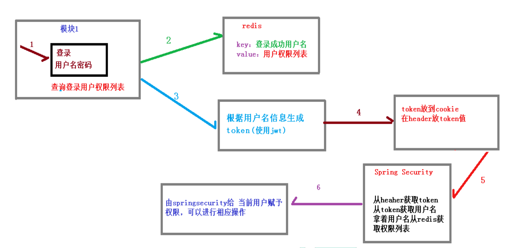
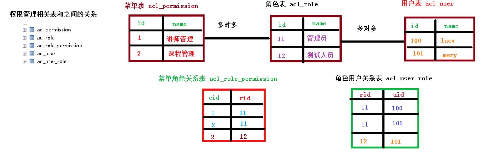
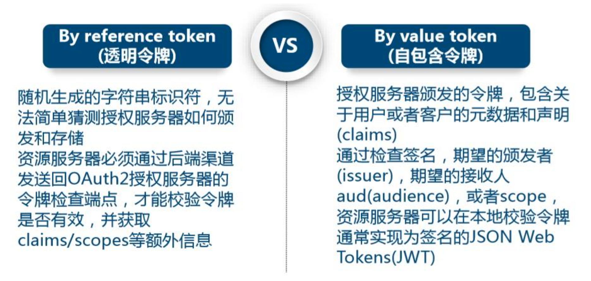
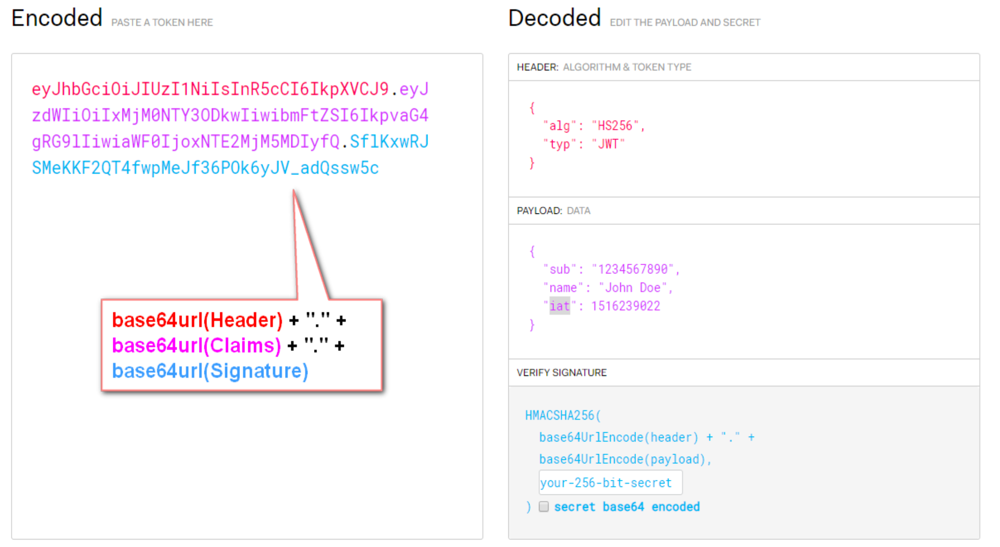

# 4. SpringSecurity 微服务权限方案

- 笔记本：29.Spring security
- 创建时间：2021-01-17 02:56:53 UTC
- 更新时间：2021-01-17 11:07:02 UTC
- 印象笔记 GUID：709e5163-f6c1-4e82-9d61-24bf610be661

## SpringSecurity 微服务权限方案

### 1. 什么是微服务

1.
微服务由来
 微服务最早由 Martin Fowler 与 James Lewis 于 2014 年共同提出，微服务架构风格是一种使用一套小服务来开发单个应用的方式途径，每个服务运行在自己的进程中，并使用轻量级机制通信，通常是 HTTP API，这些服务基于业务能力构建，并能够通过自动化部署机制来独立部署，这些服务使用不同的编程语言实现，以及不同数据存储技术，并保持最低限度的集中式管理。

1.
微服务优势
 (1)微服务每个模块就相当于一个单独的项目，代码量明显减少，遇到问题也相对来说比较好解决。
 (2)微服务每个模块都可以使用不同的存储方式(比如有的用 redis，有的用 mysql等)，数据库也是单个模块对应自己的数据库。
 (3)微服务每个模块都可以使用不同的开发技术，开发模式更灵活。

1.
微服务本质
 (1)微服务，关键其实不仅仅是微服务本身，而是系统要提供一套基础的架构，这种架构使得微服务可以独立的部署、运行、升级，不仅如此，这个系统架构还让微服务与微服务 之间在结构上“松耦合”，而在功能上则表现为一个统一的整体。这种所谓的“统一的整体”表现出来的是统一风格的界面，统一的权限管理，统一的安全策略，统一的上线过程，统一的日志和审计方法，统一的调度方式，统一的访问入口等等。
 (2)微服务的目的是有效的拆分应用，实现敏捷开发和部署

### 2. 微服务认证与授权实现思路

#### 2.1. 认证授权过程分析

(1)如果是基于 Session，那么 Spring-security 会对 cookie 里的 sessionid 进行解析，找 到服务器存储的session 信息，然后判断当前用户是否符合请求的要求。
 (2)如果是 token，则是解析出 token，然后将当前请求加入到 Spring-security 管理的权限 信息中去
 
 如果系统的模块众多，每个模块都需要进行授权与认证，所以我们选择基于 token 的形式进行授权与认证，用户根据用户名密码认证成功，然后获取当前用户角色的一系列权限 值，并以用户名为 key，权限列表为 value 的形式存入 redis 缓存中，根据用户名相关信息 生成 token 返回，浏览器将 token 记录到 cookie 中，每次调用 api 接口都默认将 token 携带 到 header 请求头中，Spring-security 解析 header 头获取 token 信息，解析 token 获取当前 用户名，根据用户名就可以从 redis 中获取权限列表，这样 Spring-security 就能够判断当前 请求是否有权限访问

#### 2.2. 权限管理数据模型

### 3. jwt 介绍

#### 3.1. 访问令牌的类型

#### 3.2. JWT 的组成

典型的，一个 JWT 看起来如下图:
 

该对象为一个很长的字符串，字符之间通过"."分隔符分为三个子串。
 每一个子串表示了一个功能块，总共有以下三个部分:JWT 头、有效载荷和签名

%23%23%20SpringSecurity%20%E5%BE%AE%E6%9C%8D%E5%8A%A1%E6%9D%83%E9%99%90%E6%96%B9%E6%A1%88%0A%23%23%23%201.%20%E4%BB%80%E4%B9%88%E6%98%AF%E5%BE%AE%E6%9C%8D%E5%8A%A1%0A1.%20%E5%BE%AE%E6%9C%8D%E5%8A%A1%E7%94%B1%E6%9D%A5%0A%E5%BE%AE%E6%9C%8D%E5%8A%A1%E6%9C%80%E6%97%A9%E7%94%B1%20Martin%20Fowler%20%E4%B8%8E%20James%20Lewis%20%E4%BA%8E%202014%20%E5%B9%B4%E5%85%B1%E5%90%8C%E6%8F%90%E5%87%BA%EF%BC%8C%E5%BE%AE%E6%9C%8D%E5%8A%A1%E6%9E%B6%E6%9E%84%E9%A3%8E%E6%A0%BC%E6%98%AF%E4%B8%80%E7%A7%8D%E4%BD%BF%E7%94%A8%E4%B8%80%E5%A5%97%E5%B0%8F%E6%9C%8D%E5%8A%A1%E6%9D%A5%E5%BC%80%E5%8F%91%E5%8D%95%E4%B8%AA%E5%BA%94%E7%94%A8%E7%9A%84%E6%96%B9%E5%BC%8F%E9%80%94%E5%BE%84%EF%BC%8C%E6%AF%8F%E4%B8%AA%E6%9C%8D%E5%8A%A1%E8%BF%90%E8%A1%8C%E5%9C%A8%E8%87%AA%E5%B7%B1%E7%9A%84%E8%BF%9B%E7%A8%8B%E4%B8%AD%EF%BC%8C%E5%B9%B6%E4%BD%BF%E7%94%A8%E8%BD%BB%E9%87%8F%E7%BA%A7%E6%9C%BA%E5%88%B6%E9%80%9A%E4%BF%A1%EF%BC%8C%E9%80%9A%E5%B8%B8%E6%98%AF%20HTTP%20API%EF%BC%8C%E8%BF%99%E4%BA%9B%E6%9C%8D%E5%8A%A1%E5%9F%BA%E4%BA%8E%E4%B8%9A%E5%8A%A1%E8%83%BD%E5%8A%9B%E6%9E%84%E5%BB%BA%EF%BC%8C%E5%B9%B6%E8%83%BD%E5%A4%9F%E9%80%9A%E8%BF%87%E8%87%AA%E5%8A%A8%E5%8C%96%E9%83%A8%E7%BD%B2%E6%9C%BA%E5%88%B6%E6%9D%A5%E7%8B%AC%E7%AB%8B%E9%83%A8%E7%BD%B2%EF%BC%8C%E8%BF%99%E4%BA%9B%E6%9C%8D%E5%8A%A1%E4%BD%BF%E7%94%A8%E4%B8%8D%E5%90%8C%E7%9A%84%E7%BC%96%E7%A8%8B%E8%AF%AD%E8%A8%80%E5%AE%9E%E7%8E%B0%EF%BC%8C%E4%BB%A5%E5%8F%8A%E4%B8%8D%E5%90%8C%E6%95%B0%E6%8D%AE%E5%AD%98%E5%82%A8%E6%8A%80%E6%9C%AF%EF%BC%8C%E5%B9%B6%E4%BF%9D%E6%8C%81%E6%9C%80%E4%BD%8E%E9%99%90%E5%BA%A6%E7%9A%84%E9%9B%86%E4%B8%AD%E5%BC%8F%E7%AE%A1%E7%90%86%E3%80%82%0A%0A2.%20%E5%BE%AE%E6%9C%8D%E5%8A%A1%E4%BC%98%E5%8A%BF%0A(1)%E5%BE%AE%E6%9C%8D%E5%8A%A1%E6%AF%8F%E4%B8%AA%E6%A8%A1%E5%9D%97%E5%B0%B1%E7%9B%B8%E5%BD%93%E4%BA%8E%E4%B8%80%E4%B8%AA%E5%8D%95%E7%8B%AC%E7%9A%84%E9%A1%B9%E7%9B%AE%EF%BC%8C%E4%BB%A3%E7%A0%81%E9%87%8F%E6%98%8E%E6%98%BE%E5%87%8F%E5%B0%91%EF%BC%8C%E9%81%87%E5%88%B0%E9%97%AE%E9%A2%98%E4%B9%9F%E7%9B%B8%E5%AF%B9%E6%9D%A5%E8%AF%B4%E6%AF%94%E8%BE%83%E5%A5%BD%E8%A7%A3%E5%86%B3%E3%80%82%0A(2)%E5%BE%AE%E6%9C%8D%E5%8A%A1%E6%AF%8F%E4%B8%AA%E6%A8%A1%E5%9D%97%E9%83%BD%E5%8F%AF%E4%BB%A5%E4%BD%BF%E7%94%A8%E4%B8%8D%E5%90%8C%E7%9A%84%E5%AD%98%E5%82%A8%E6%96%B9%E5%BC%8F(%E6%AF%94%E5%A6%82%E6%9C%89%E7%9A%84%E7%94%A8%20redis%EF%BC%8C%E6%9C%89%E7%9A%84%E7%94%A8%20mysql%E7%AD%89)%EF%BC%8C%E6%95%B0%E6%8D%AE%E5%BA%93%E4%B9%9F%E6%98%AF%E5%8D%95%E4%B8%AA%E6%A8%A1%E5%9D%97%E5%AF%B9%E5%BA%94%E8%87%AA%E5%B7%B1%E7%9A%84%E6%95%B0%E6%8D%AE%E5%BA%93%E3%80%82%0A(3)%E5%BE%AE%E6%9C%8D%E5%8A%A1%E6%AF%8F%E4%B8%AA%E6%A8%A1%E5%9D%97%E9%83%BD%E5%8F%AF%E4%BB%A5%E4%BD%BF%E7%94%A8%E4%B8%8D%E5%90%8C%E7%9A%84%E5%BC%80%E5%8F%91%E6%8A%80%E6%9C%AF%EF%BC%8C%E5%BC%80%E5%8F%91%E6%A8%A1%E5%BC%8F%E6%9B%B4%E7%81%B5%E6%B4%BB%E3%80%82%0A%0A3.%20%E5%BE%AE%E6%9C%8D%E5%8A%A1%E6%9C%AC%E8%B4%A8%0A(1)%E5%BE%AE%E6%9C%8D%E5%8A%A1%EF%BC%8C%E5%85%B3%E9%94%AE%E5%85%B6%E5%AE%9E%E4%B8%8D%E4%BB%85%E4%BB%85%E6%98%AF%E5%BE%AE%E6%9C%8D%E5%8A%A1%E6%9C%AC%E8%BA%AB%EF%BC%8C%E8%80%8C%E6%98%AF%E7%B3%BB%E7%BB%9F%E8%A6%81%E6%8F%90%E4%BE%9B%E4%B8%80%E5%A5%97%E5%9F%BA%E7%A1%80%E7%9A%84%E6%9E%B6%E6%9E%84%EF%BC%8C%E8%BF%99%E7%A7%8D%E6%9E%B6%E6%9E%84%E4%BD%BF%E5%BE%97%E5%BE%AE%E6%9C%8D%E5%8A%A1%E5%8F%AF%E4%BB%A5%E7%8B%AC%E7%AB%8B%E7%9A%84%E9%83%A8%E7%BD%B2%E3%80%81%E8%BF%90%E8%A1%8C%E3%80%81%E5%8D%87%E7%BA%A7%EF%BC%8C%E4%B8%8D%E4%BB%85%E5%A6%82%E6%AD%A4%EF%BC%8C%E8%BF%99%E4%B8%AA%E7%B3%BB%E7%BB%9F%E6%9E%B6%E6%9E%84%E8%BF%98%E8%AE%A9%E5%BE%AE%E6%9C%8D%E5%8A%A1%E4%B8%8E%E5%BE%AE%E6%9C%8D%E5%8A%A1%20%E4%B9%8B%E9%97%B4%E5%9C%A8%E7%BB%93%E6%9E%84%E4%B8%8A%E2%80%9C%E6%9D%BE%E8%80%A6%E5%90%88%E2%80%9D%EF%BC%8C%E8%80%8C%E5%9C%A8%E5%8A%9F%E8%83%BD%E4%B8%8A%E5%88%99%E8%A1%A8%E7%8E%B0%E4%B8%BA%E4%B8%80%E4%B8%AA%E7%BB%9F%E4%B8%80%E7%9A%84%E6%95%B4%E4%BD%93%E3%80%82%E8%BF%99%E7%A7%8D%E6%89%80%E8%B0%93%E7%9A%84%E2%80%9C%E7%BB%9F%E4%B8%80%E7%9A%84%E6%95%B4%E4%BD%93%E2%80%9D%E8%A1%A8%E7%8E%B0%E5%87%BA%E6%9D%A5%E7%9A%84%E6%98%AF%E7%BB%9F%E4%B8%80%E9%A3%8E%E6%A0%BC%E7%9A%84%E7%95%8C%E9%9D%A2%EF%BC%8C%E7%BB%9F%E4%B8%80%E7%9A%84%E6%9D%83%E9%99%90%E7%AE%A1%E7%90%86%EF%BC%8C%E7%BB%9F%E4%B8%80%E7%9A%84%E5%AE%89%E5%85%A8%E7%AD%96%E7%95%A5%EF%BC%8C%E7%BB%9F%E4%B8%80%E7%9A%84%E4%B8%8A%E7%BA%BF%E8%BF%87%E7%A8%8B%EF%BC%8C%E7%BB%9F%E4%B8%80%E7%9A%84%E6%97%A5%E5%BF%97%E5%92%8C%E5%AE%A1%E8%AE%A1%E6%96%B9%E6%B3%95%EF%BC%8C%E7%BB%9F%E4%B8%80%E7%9A%84%E8%B0%83%E5%BA%A6%E6%96%B9%E5%BC%8F%EF%BC%8C%E7%BB%9F%E4%B8%80%E7%9A%84%E8%AE%BF%E9%97%AE%E5%85%A5%E5%8F%A3%E7%AD%89%E7%AD%89%E3%80%82%0A(2)%E5%BE%AE%E6%9C%8D%E5%8A%A1%E7%9A%84%E7%9B%AE%E7%9A%84%E6%98%AF%E6%9C%89%E6%95%88%E7%9A%84%E6%8B%86%E5%88%86%E5%BA%94%E7%94%A8%EF%BC%8C%E5%AE%9E%E7%8E%B0%E6%95%8F%E6%8D%B7%E5%BC%80%E5%8F%91%E5%92%8C%E9%83%A8%E7%BD%B2%0A%0A%23%23%23%202.%20%E5%BE%AE%E6%9C%8D%E5%8A%A1%E8%AE%A4%E8%AF%81%E4%B8%8E%E6%8E%88%E6%9D%83%E5%AE%9E%E7%8E%B0%E6%80%9D%E8%B7%AF%0A%23%23%23%23%202.1.%20%E8%AE%A4%E8%AF%81%E6%8E%88%E6%9D%83%E8%BF%87%E7%A8%8B%E5%88%86%E6%9E%90%0A(1)%E5%A6%82%E6%9E%9C%E6%98%AF%E5%9F%BA%E4%BA%8E%20Session%EF%BC%8C%E9%82%A3%E4%B9%88%20Spring-security%20%E4%BC%9A%E5%AF%B9%20cookie%20%E9%87%8C%E7%9A%84%20sessionid%20%E8%BF%9B%E8%A1%8C%E8%A7%A3%E6%9E%90%EF%BC%8C%E6%89%BE%20%E5%88%B0%E6%9C%8D%E5%8A%A1%E5%99%A8%E5%AD%98%E5%82%A8%E7%9A%84session%20%E4%BF%A1%E6%81%AF%EF%BC%8C%E7%84%B6%E5%90%8E%E5%88%A4%E6%96%AD%E5%BD%93%E5%89%8D%E7%94%A8%E6%88%B7%E6%98%AF%E5%90%A6%E7%AC%A6%E5%90%88%E8%AF%B7%E6%B1%82%E7%9A%84%E8%A6%81%E6%B1%82%E3%80%82%0A(2)%E5%A6%82%E6%9E%9C%E6%98%AF%20token%EF%BC%8C%E5%88%99%E6%98%AF%E8%A7%A3%E6%9E%90%E5%87%BA%20token%EF%BC%8C%E7%84%B6%E5%90%8E%E5%B0%86%E5%BD%93%E5%89%8D%E8%AF%B7%E6%B1%82%E5%8A%A0%E5%85%A5%E5%88%B0%20Spring-security%20%E7%AE%A1%E7%90%86%E7%9A%84%E6%9D%83%E9%99%90%20%E4%BF%A1%E6%81%AF%E4%B8%AD%E5%8E%BB%0A!%5Bb9ac6cc6a8cbc01be439ff3272934ab2.png%5D(evernotecid%3A%2F%2F90F5C43D-AEAE-49B2-85BB-D02B6A52C764%2Fappyinxiangcom%2F25356149%2FENResource%2Fp1582)%0A%E5%A6%82%E6%9E%9C%E7%B3%BB%E7%BB%9F%E7%9A%84%E6%A8%A1%E5%9D%97%E4%BC%97%E5%A4%9A%EF%BC%8C%E6%AF%8F%E4%B8%AA%E6%A8%A1%E5%9D%97%E9%83%BD%E9%9C%80%E8%A6%81%E8%BF%9B%E8%A1%8C%E6%8E%88%E6%9D%83%E4%B8%8E%E8%AE%A4%E8%AF%81%EF%BC%8C%E6%89%80%E4%BB%A5%E6%88%91%E4%BB%AC%E9%80%89%E6%8B%A9%E5%9F%BA%E4%BA%8E%20token%20%E7%9A%84%E5%BD%A2%E5%BC%8F%E8%BF%9B%E8%A1%8C%E6%8E%88%E6%9D%83%E4%B8%8E%E8%AE%A4%E8%AF%81%EF%BC%8C%E7%94%A8%E6%88%B7%E6%A0%B9%E6%8D%AE%E7%94%A8%E6%88%B7%E5%90%8D%E5%AF%86%E7%A0%81%E8%AE%A4%E8%AF%81%E6%88%90%E5%8A%9F%EF%BC%8C%E7%84%B6%E5%90%8E%E8%8E%B7%E5%8F%96%E5%BD%93%E5%89%8D%E7%94%A8%E6%88%B7%E8%A7%92%E8%89%B2%E7%9A%84%E4%B8%80%E7%B3%BB%E5%88%97%E6%9D%83%E9%99%90%20%E5%80%BC%EF%BC%8C%E5%B9%B6%E4%BB%A5%E7%94%A8%E6%88%B7%E5%90%8D%E4%B8%BA%20key%EF%BC%8C%E6%9D%83%E9%99%90%E5%88%97%E8%A1%A8%E4%B8%BA%20value%20%E7%9A%84%E5%BD%A2%E5%BC%8F%E5%AD%98%E5%85%A5%20redis%20%E7%BC%93%E5%AD%98%E4%B8%AD%EF%BC%8C%E6%A0%B9%E6%8D%AE%E7%94%A8%E6%88%B7%E5%90%8D%E7%9B%B8%E5%85%B3%E4%BF%A1%E6%81%AF%20%E7%94%9F%E6%88%90%20token%20%E8%BF%94%E5%9B%9E%EF%BC%8C%E6%B5%8F%E8%A7%88%E5%99%A8%E5%B0%86%20token%20%E8%AE%B0%E5%BD%95%E5%88%B0%20cookie%20%E4%B8%AD%EF%BC%8C%E6%AF%8F%E6%AC%A1%E8%B0%83%E7%94%A8%20api%20%E6%8E%A5%E5%8F%A3%E9%83%BD%E9%BB%98%E8%AE%A4%E5%B0%86%20token%20%E6%90%BA%E5%B8%A6%20%E5%88%B0%20header%20%E8%AF%B7%E6%B1%82%E5%A4%B4%E4%B8%AD%EF%BC%8CSpring-security%20%E8%A7%A3%E6%9E%90%20header%20%E5%A4%B4%E8%8E%B7%E5%8F%96%20token%20%E4%BF%A1%E6%81%AF%EF%BC%8C%E8%A7%A3%E6%9E%90%20token%20%E8%8E%B7%E5%8F%96%E5%BD%93%E5%89%8D%20%E7%94%A8%E6%88%B7%E5%90%8D%EF%BC%8C%E6%A0%B9%E6%8D%AE%E7%94%A8%E6%88%B7%E5%90%8D%E5%B0%B1%E5%8F%AF%E4%BB%A5%E4%BB%8E%20redis%20%E4%B8%AD%E8%8E%B7%E5%8F%96%E6%9D%83%E9%99%90%E5%88%97%E8%A1%A8%EF%BC%8C%E8%BF%99%E6%A0%B7%20Spring-security%20%E5%B0%B1%E8%83%BD%E5%A4%9F%E5%88%A4%E6%96%AD%E5%BD%93%E5%89%8D%20%E8%AF%B7%E6%B1%82%E6%98%AF%E5%90%A6%E6%9C%89%E6%9D%83%E9%99%90%E8%AE%BF%E9%97%AE%0A%0A%23%23%23%23%202.2.%20%E6%9D%83%E9%99%90%E7%AE%A1%E7%90%86%E6%95%B0%E6%8D%AE%E6%A8%A1%E5%9E%8B%0A!%5Bde83a9549c773fefa2e4a7f08756055b.png%5D(evernotecid%3A%2F%2F90F5C43D-AEAE-49B2-85BB-D02B6A52C764%2Fappyinxiangcom%2F25356149%2FENResource%2Fp1583)%0A%0A%23%23%23%203.%20jwt%20%E4%BB%8B%E7%BB%8D%0A%23%23%23%23%203.1.%20%E8%AE%BF%E9%97%AE%E4%BB%A4%E7%89%8C%E7%9A%84%E7%B1%BB%E5%9E%8B%0A!%5B831d79e160c4c665b235c5144470697e.png%5D(evernotecid%3A%2F%2F90F5C43D-AEAE-49B2-85BB-D02B6A52C764%2Fappyinxiangcom%2F25356149%2FENResource%2Fp1584)%0A%0A%23%23%23%23%203.2.%20JWT%20%E7%9A%84%E7%BB%84%E6%88%90%0A%E5%85%B8%E5%9E%8B%E7%9A%84%EF%BC%8C%E4%B8%80%E4%B8%AA%20JWT%20%E7%9C%8B%E8%B5%B7%E6%9D%A5%E5%A6%82%E4%B8%8B%E5%9B%BE%3A%0A!%5B27dbf6f8cd90fb258c95f65664baef4e.png%5D(evernotecid%3A%2F%2F90F5C43D-AEAE-49B2-85BB-D02B6A52C764%2Fappyinxiangcom%2F25356149%2FENResource%2Fp1585)%0A%E8%AF%A5%E5%AF%B9%E8%B1%A1%E4%B8%BA%E4%B8%80%E4%B8%AA%E5%BE%88%E9%95%BF%E7%9A%84%E5%AD%97%E7%AC%A6%E4%B8%B2%EF%BC%8C%E5%AD%97%E7%AC%A6%E4%B9%8B%E9%97%B4%E9%80%9A%E8%BF%87%22.%22%E5%88%86%E9%9A%94%E7%AC%A6%E5%88%86%E4%B8%BA%E4%B8%89%E4%B8%AA%E5%AD%90%E4%B8%B2%E3%80%82%20%0A%E6%AF%8F%E4%B8%80%E4%B8%AA%E5%AD%90%E4%B8%B2%E8%A1%A8%E7%A4%BA%E4%BA%86%E4%B8%80%E4%B8%AA%E5%8A%9F%E8%83%BD%E5%9D%97%EF%BC%8C%E6%80%BB%E5%85%B1%E6%9C%89%E4%BB%A5%E4%B8%8B%E4%B8%89%E4%B8%AA%E9%83%A8%E5%88%86%3AJWT%20%E5%A4%B4%E3%80%81%E6%9C%89%E6%95%88%E8%BD%BD%E8%8D%B7%E5%92%8C%E7%AD%BE%E5%90%8D
