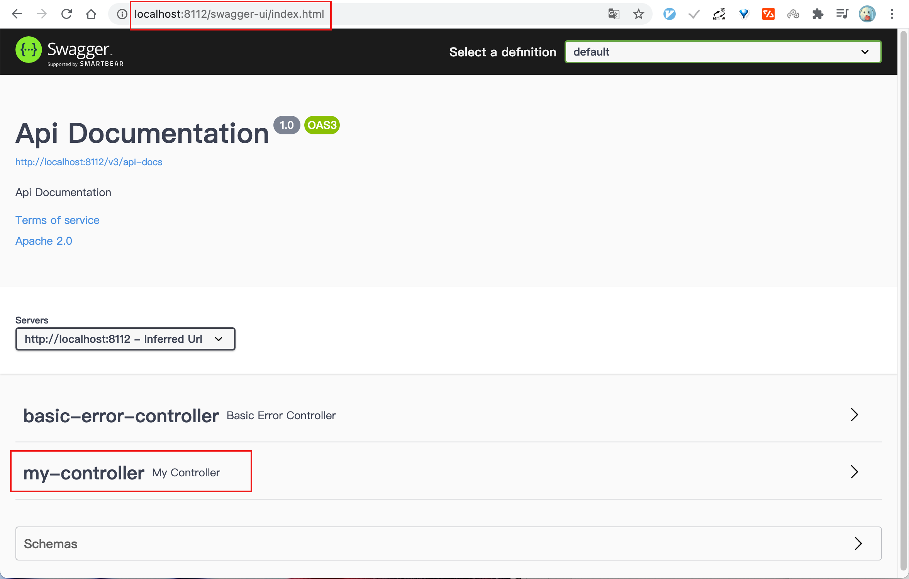

# 4. Swagger-UI 使用

- 笔记本：30.swagger
- 创建时间：2021-01-19 14:43:40 UTC
- 更新时间：2021-01-19 14:45:58 UTC
- 印象笔记 GUID：6c55306a-220b-42dc-b3f9-114b35a22c0a

## Swagger-UI 使用

访问 /swagger-ui/index.html 后可以在页面中看到所有需要生成接口文档的控制器名称。
 
 每个控制器

%23%23%20Swagger-UI%20%E4%BD%BF%E7%94%A8%0A%E8%AE%BF%E9%97%AE%20%2Fswagger-ui%2Findex.html%20%E5%90%8E%E5%8F%AF%E4%BB%A5%E5%9C%A8%E9%A1%B5%E9%9D%A2%E4%B8%AD%E7%9C%8B%E5%88%B0%E6%89%80%E6%9C%89%E9%9C%80%E8%A6%81%E7%94%9F%E6%88%90%E6%8E%A5%E5%8F%A3%E6%96%87%E6%A1%A3%E7%9A%84%E6%8E%A7%E5%88%B6%E5%99%A8%E5%90%8D%E7%A7%B0%E3%80%82%0A!%5Bd0873582427ac4faed57f5569d17fc49.png%5D(evernotecid%3A%2F%2F90F5C43D-AEAE-49B2-85BB-D02B6A52C764%2Fappyinxiangcom%2F25356149%2FENResource%2Fp1590)%0A%E6%AF%8F%E4%B8%AA%E6%8E%A7%E5%88%B6%E5%99%A8%0A%0A
