# 01.JVM和Java体系结构

- 笔记本：JVM_1_内存与垃圾回收
- 创建时间：2020-12-13 11:42:08 UTC
- 更新时间：2021-01-26 08:52:54 UTC
- 印象笔记 GUID：d34690f8-ab1c-455b-83bb-2f5fbe595874

## JVM 和 Java 体系结构

### 1. Java 语言和 JVM 简介

#### 1.1. Java 生态圈

Java 是目前应用最为广泛的软件开发平台之一。随着 Java 以及 Java 社区的不断壮大，Java 也早已不再是简简单单的一门计算机语言了，它更是一个平台、一种文化、一个社区。

- 作为一个平台：Java 虚拟机扮演着举足轻重的作用。
 Groovy、Scala、JRuby、Kotlin 等都是 Java 平台的一部分。

- 作为一种文化：Java 几乎成为了“开源”的代名词。
 第三方开源软件和框架。如 Tomcat、Structs、MyBatis、Spring 等。
 连 JDK 和 JVM 自身也有不少开源的实现，如 OpenJDK、Harmony。

- 作为一个社区：Java 拥有全世界最多的技术拥护者和开源社区支持，有数不清的论坛和资料。从桌面应用软件、嵌入式开发到企业级应用、后台服务器、中间件，都可以看到 Java 的身影。其应用之复杂、参与人数之众也令人咋舌。

#### 1.2. Java 跨平台的语言

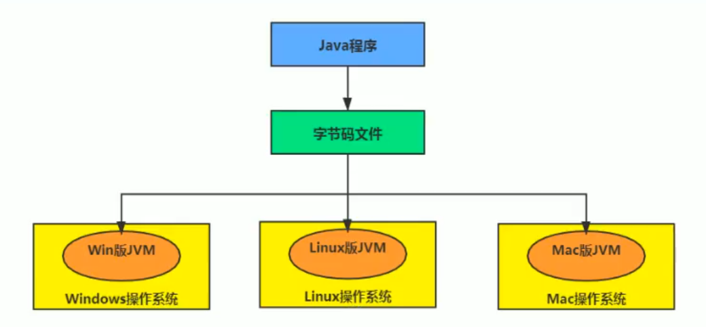
 *"wirte once, run anywhere"**
 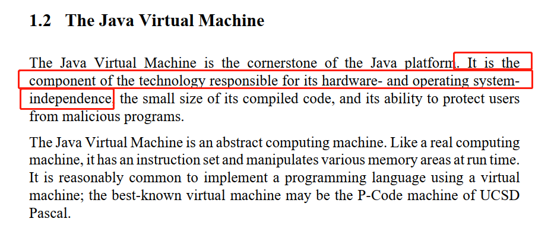

#### 1.3. JVM 跨语言的平台

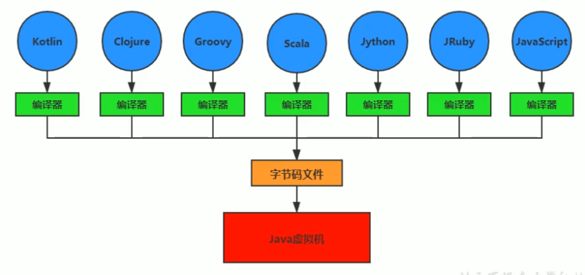

- 随着 Java7 的正式发布，Java 虚拟机的设计者们通过 JSR-292 规范基本实现在 **Java 虚拟机平台上运行非 Java 语言编写的程序。**

- Java 虚拟机根本不关心运行在其内部的程序到底是用何种编程语言编写的，它只关心“字节码“文件。也就是说 Java 虚拟机拥有平台无关性，并不会单纯地与 Java 语言”终身绑定“，只要其他编程语言的编译结果满足并包含 Java 虚拟机的内部指令集、符号表以及其他的辅助信息，他就是一个有效的字节码文件，就能够被虚拟机所识别并装载运行。

**Java 不是最强大的语言，但是 JVM 是最强大的虚拟机。**

#### 1.4. 字节码

- 我们平时说的 Java 字节码，指的是 Java 语言编译成的字节码。准确的说任何能在 jvm 平台上执行的字节码格式都是一样的。所以应该统称为：**jvm 字节码**。

- 不同的编译器，可以编译出相同的字节码文件，字节码文件也可以在不同的 JVM 上运行。

- Java 虚拟机与 Java 语言并没有必然的联系，它只是特定的二进制文件格式--Class 文件格式所关联，Class 文件中包含了 Java 虚拟机指令集（或者称为字节码、Bytecodes）和符号表，还有一些其他的辅助信息。

#### 1.5. 多语言混合编程

Java 平台上的多语言混合编程正在称为主流，通过特定领域的语言去解决特定领域的问题是当前软件开发应对日趋复杂的项目性需求的一个方向。

### 2. Java 发展的重大事件

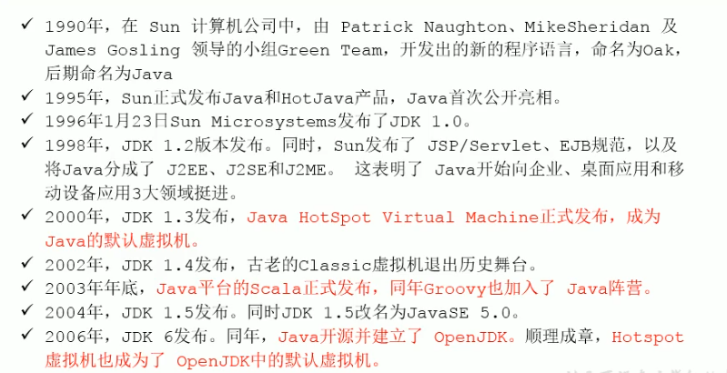
 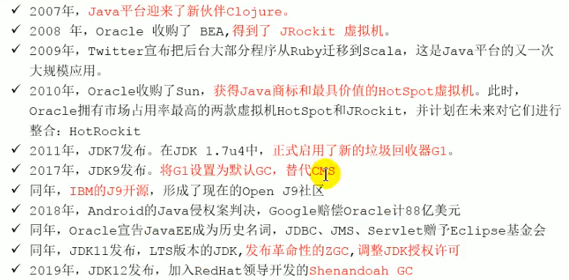

#### OpenJDK 和 Oracle JDK

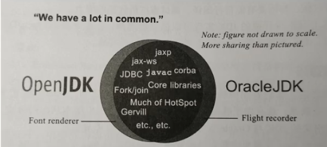
 在 JDK11 之前，OracleJDK 中还会存在一些 OpenJDK 中没有的、闭源的功能。但在 JDK11 中，我们可以认为 OpenJDK 和 OracleJDK 代码实质上已经”完全“一致的程度。

### 3. 虚拟机与 Java 虚拟机

#### 3.1. 虚拟机

所谓虚拟机（Virtual Machine），就是一台虚拟的计算机。它是一款软件，用来执行一系列虚拟计算机指令。大体上，虚拟机可以分为系统虚拟机和程序虚拟机。

- 大名鼎鼎的 Visual Boox，VMware 就属于系统虚拟机，它们**完全是对物理计算机的仿真**，提供了一个可运行完整操作系统的软件平台。

- 程序虚拟机的典型代表就是 Java 虚拟机，它**专门为执行单个计算机程序而设计**，在 Java 虚拟机中执行的指令我们称为 Java 字节码指令。

无论是系统虚拟机还是程序虚拟机，在上面运行的软件都被限制于虚拟机提供的资源中。

#### 3.2. Java 虚拟机

- Java 虚拟机是一台执行 Java 字节码的虚拟计算机，它拥有独立的运行机制，其运行的 Java 字节码也未必是由 Java 语言编译而成。

- JVM 平台的各种语言可以共享 Java 虚拟机带来的跨平台性、优秀的垃圾回收器，以及可靠的即时编译器。

- **Java 技术的核心就是 Java 虚拟机**（JVM，Java Virtual Machine），所有的 Java 程序都运行在 Java 虚拟机内部。

**作用：**
 **Java 虚拟机就是二进制字节码的运行环境**，负责装载字节码到其内部，解释/编译为对应平台上的机器指令执行。每一条 Java 指令，Java 虚拟机规范中的都由详细定义，如怎么取操作数，怎么处理操作数，处理结果放在哪里。
 **特点：**

- 一次编译，到处运行

- 自动内存管理

- 自动垃圾回收功能

#### 3.3. JVM 的位置

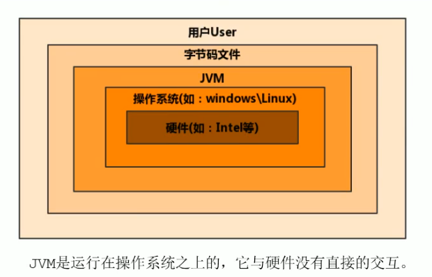
 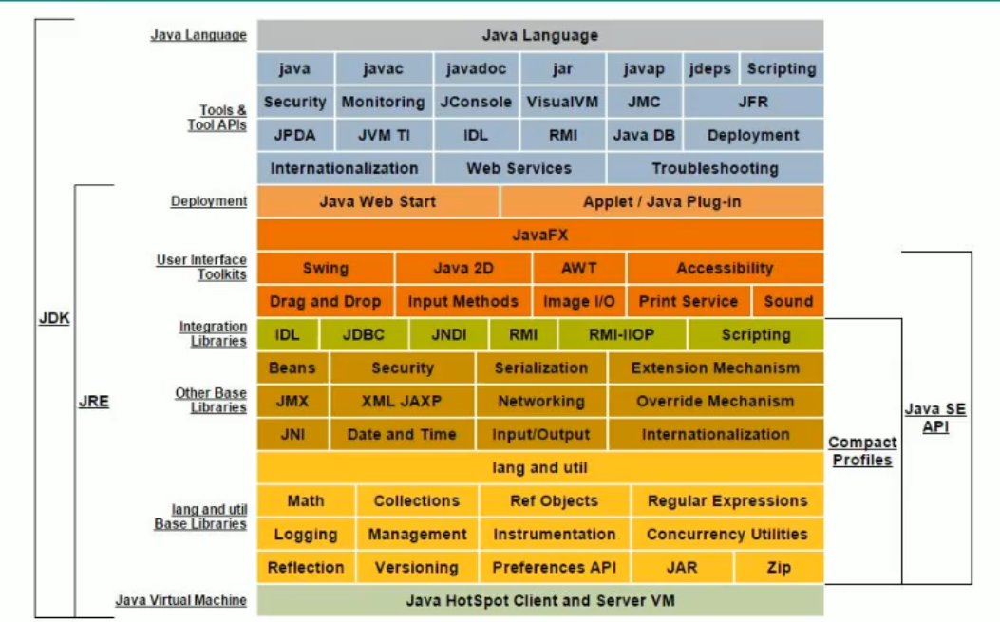

### 4. JVM 的整体结构

HotSpot VM 是目前市面上最高性能虚拟机的代表作之一。
 它采用解释器与即时编译器并存的架构。
 在今天，Java 程序的运行性能早已脱胎换骨，已经达到可以和 C/C++ 程序一教高下的地步。
 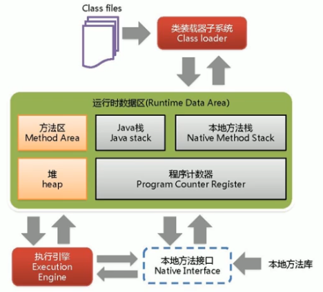

### 5. Java 代码的执行流程

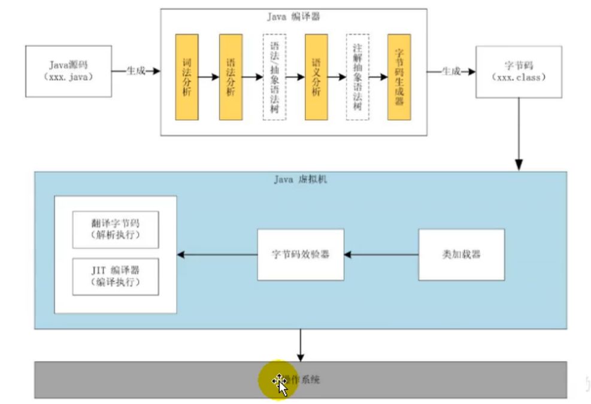

### 6. JVM 的架构模型

Java 编译器输入的指令流基本上是一种基于**栈的指令集架构**，另外一种指令集架构则是基于**寄存器的指令集架构**。
 具体来说：这两种架构之间的区别：

- 基于栈式架构的特点：

  - 设计和实现更简单，适用于资源受限的系统；

  - 避开了寄存器的分配难题，使用零地址指令方式分配。

  - 指令流中的指令大部分是零地址指令，其执行过程依赖于操作栈。指令集更小，编译器容易实现。

  - 不需要硬件支持，可移植性更好，更好实现跨平台。

- 基于寄存器架构的特点：

  - 典型的应用是 x86 的二进制指令集，比如传统的 PC 以及 Android 的 Davlik 虚拟机。

  - 指令集架构则完全依赖硬件，可移植性差

  - 性能优秀和执行更高效

  - 花费更少的指令去完成一项操作

  - 在大部分情况下，基于寄存器架构的指令集往往都以一地址指令、二地址指令和三地址指令为主，而基于栈式架构的指令集却是以零地址指令为主。

**总结：**
 **由于跨平台的设计，Java 的指令都是根据栈来设计的。** 不同平台 CPU 架构不同，所以不能设计为基于寄存器的。优点是跨平台，指令集小，编译器容易实现，缺点是性能下降，实现同样的功能需要更多的指令集。
 时至今日，尽管嵌入式平台已经不是 Java 程序的主流运行平台了（准确来说应该是 HotSpotVM 的宿主已经不局限于嵌入式平台了），那么为什么不将架构更换为寄存器的架构呢？

### 7. JVM 的生命周期

**虚拟机的启动**
 Java 虚拟机的启动是通过引导类加载器（bootstrap class loader）创建一个初始类（initial class）来完成的，这个类是由虚拟机的具体实现指定的。

**虚拟机的执行**

- 一个运行中的 Java 虚拟机有着一个清晰的任务：执行 Java 程序

- 程序开始执行时他才运行，程序结束时他就停止

- **执行一个所谓的 Java 程序的时候，真真正正在执行的是一个叫做 Java 虚拟机的进程。**

**虚拟机的退出**
 有如下的几种情况：

- 程序正常执行结束

- 程序在执行过程中遇到了异常或错误而异常终止

- 由于操作系统出现错误而导致 Java 虚拟机进程终止

- 某线程调用 Runtime 类或 System 类的 exit 方法，或 Runtime 类的 halt 方法，并且 Java 安全管理器也允许这次 exit 或 halt 操作。

- 除此之外，JNI（Java Native Interface）规范描述了用 JNI Invocation API 来加载或卸载 Java 虚拟机时，Java 虚拟机的退出情况。

### 8. JVM 的发展历程

**Sun Classic VM**
 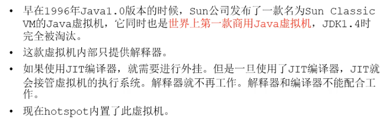
 **Exact VM**
 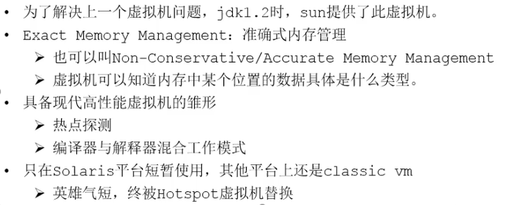
 **Sun 公司的 HotSpot VM**
 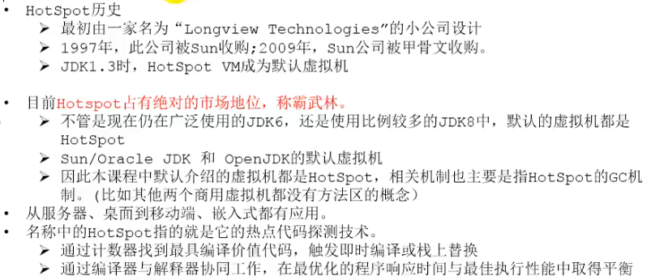
 **BEA 公司的 JRockit**
 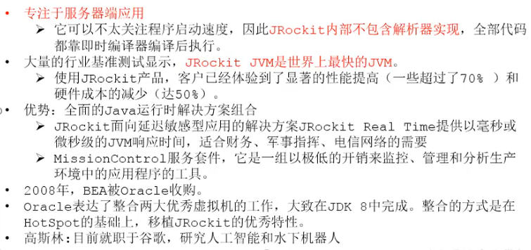
 **IBM 的 J9**
 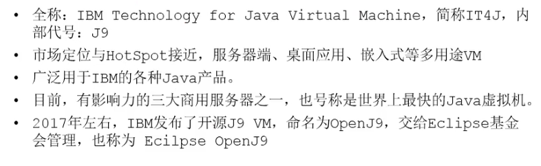
 **KVM 和 CDC/CLDC HotSpot**
 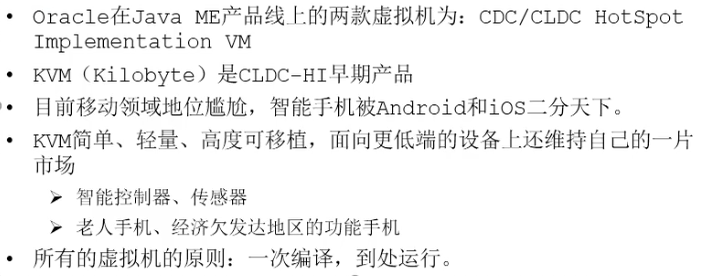
 **Azul VM**
 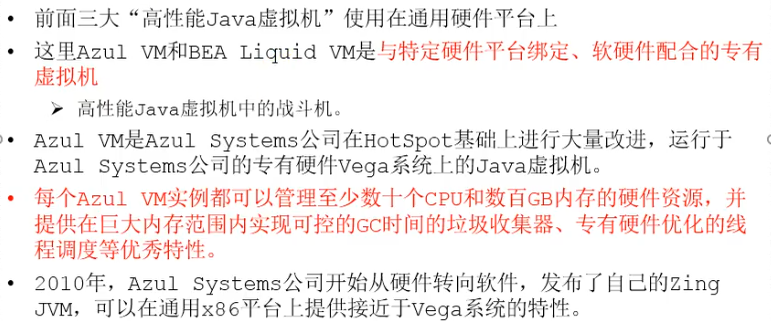
 **Liquid VM**
 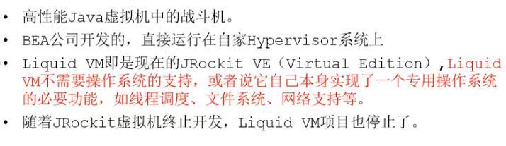
 **Apache Harmony**
 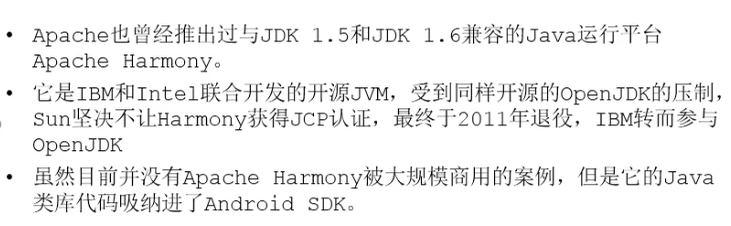
 **Microsoft JVM**
 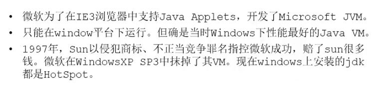
 **Taobao JVM**
 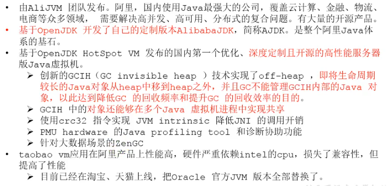
 **Dalvik VM**
 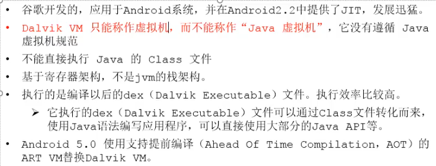
 **其他 JVM：**
 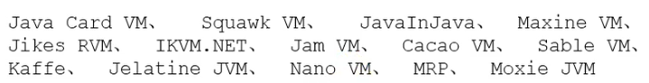
 具体的 JVM 的内存结构，其实取决于其实现，不同厂商的 JVM，或者同一厂商发布的不同版本，都有可能存在一定差异。在此以 Oracle HotSpot VM 为默认虚拟机。
 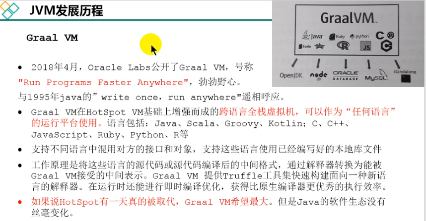

**Tips：** 参考书目
 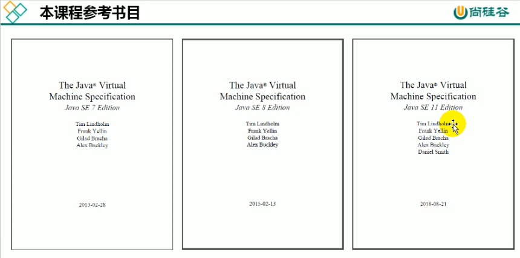
 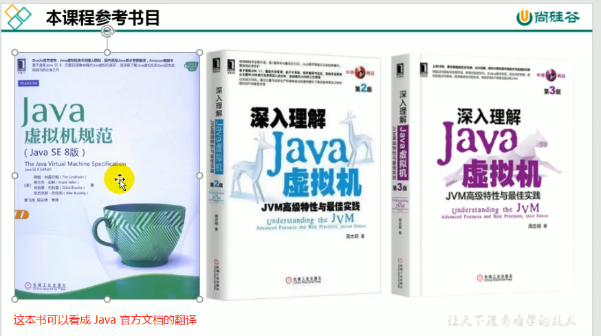
 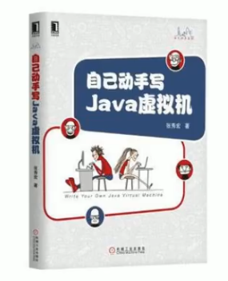

**下载教程：**
 打开 [oracle 官网](https://www.oracle.com/index.html)，Resources -> Software Downloads
 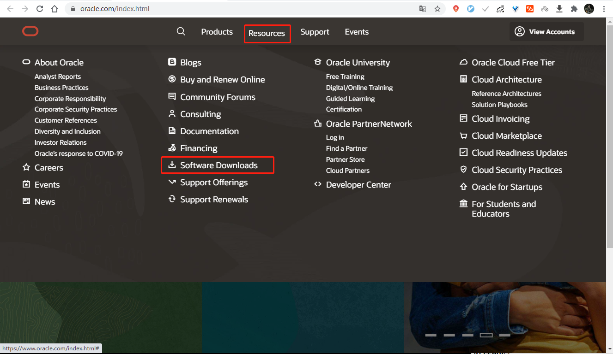
 选择 Java
 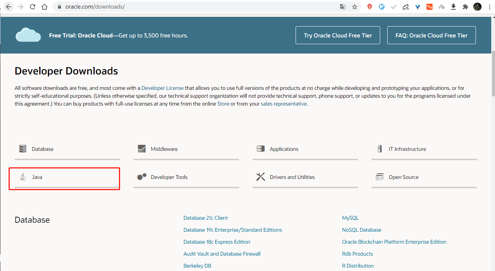
 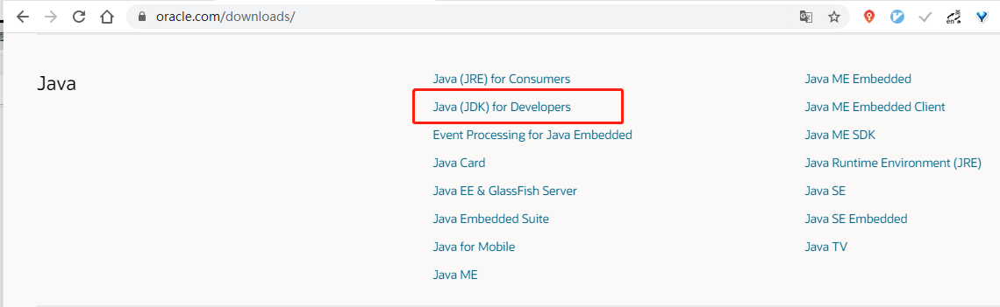
 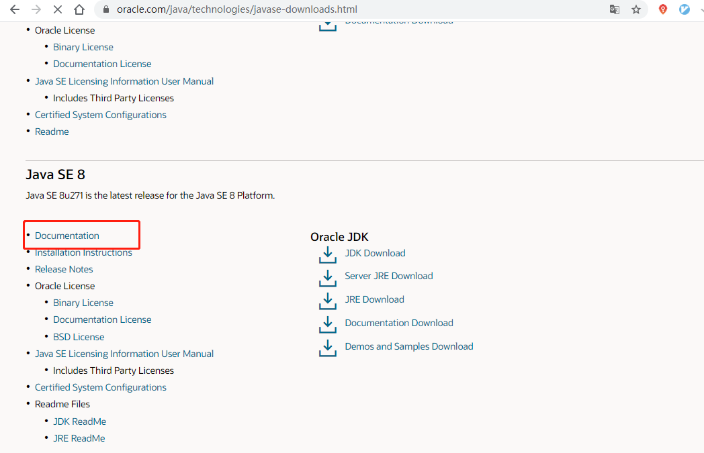
 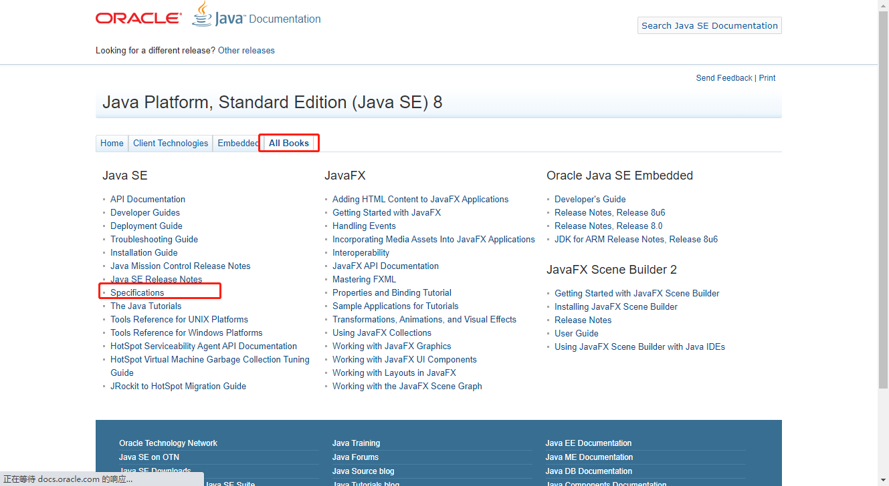
 即可下载各版本 Java 语言及虚拟机规范:
 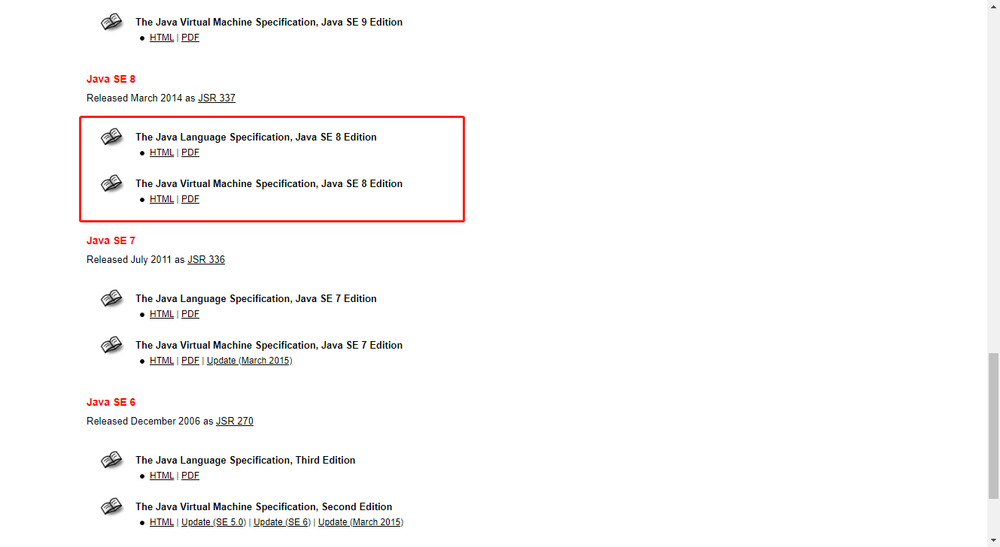

%23%23%20JVM%20%E5%92%8C%20Java%20%E4%BD%93%E7%B3%BB%E7%BB%93%E6%9E%84%0A%23%23%23%201.%20Java%20%E8%AF%AD%E8%A8%80%E5%92%8C%20JVM%20%E7%AE%80%E4%BB%8B%0A%23%23%23%23%201.1.%20Java%20%E7%94%9F%E6%80%81%E5%9C%88%0AJava%20%E6%98%AF%E7%9B%AE%E5%89%8D%E5%BA%94%E7%94%A8%E6%9C%80%E4%B8%BA%E5%B9%BF%E6%B3%9B%E7%9A%84%E8%BD%AF%E4%BB%B6%E5%BC%80%E5%8F%91%E5%B9%B3%E5%8F%B0%E4%B9%8B%E4%B8%80%E3%80%82%E9%9A%8F%E7%9D%80%20Java%20%E4%BB%A5%E5%8F%8A%20Java%20%E7%A4%BE%E5%8C%BA%E7%9A%84%E4%B8%8D%E6%96%AD%E5%A3%AE%E5%A4%A7%EF%BC%8CJava%20%E4%B9%9F%E6%97%A9%E5%B7%B2%E4%B8%8D%E5%86%8D%E6%98%AF%E7%AE%80%E7%AE%80%E5%8D%95%E5%8D%95%E7%9A%84%E4%B8%80%E9%97%A8%E8%AE%A1%E7%AE%97%E6%9C%BA%E8%AF%AD%E8%A8%80%E4%BA%86%EF%BC%8C%E5%AE%83%E6%9B%B4%E6%98%AF%E4%B8%80%E4%B8%AA%E5%B9%B3%E5%8F%B0%E3%80%81%E4%B8%80%E7%A7%8D%E6%96%87%E5%8C%96%E3%80%81%E4%B8%80%E4%B8%AA%E7%A4%BE%E5%8C%BA%E3%80%82%0A*%20%E4%BD%9C%E4%B8%BA%E4%B8%80%E4%B8%AA%E5%B9%B3%E5%8F%B0%EF%BC%9AJava%20%E8%99%9A%E6%8B%9F%E6%9C%BA%E6%89%AE%E6%BC%94%E7%9D%80%E4%B8%BE%E8%B6%B3%E8%BD%BB%E9%87%8D%E7%9A%84%E4%BD%9C%E7%94%A8%E3%80%82%0AGroovy%E3%80%81Scala%E3%80%81JRuby%E3%80%81Kotlin%20%E7%AD%89%E9%83%BD%E6%98%AF%20Java%20%E5%B9%B3%E5%8F%B0%E7%9A%84%E4%B8%80%E9%83%A8%E5%88%86%E3%80%82%0A*%20%E4%BD%9C%E4%B8%BA%E4%B8%80%E7%A7%8D%E6%96%87%E5%8C%96%EF%BC%9AJava%20%E5%87%A0%E4%B9%8E%E6%88%90%E4%B8%BA%E4%BA%86%E2%80%9C%E5%BC%80%E6%BA%90%E2%80%9D%E7%9A%84%E4%BB%A3%E5%90%8D%E8%AF%8D%E3%80%82%0A%E7%AC%AC%E4%B8%89%E6%96%B9%E5%BC%80%E6%BA%90%E8%BD%AF%E4%BB%B6%E5%92%8C%E6%A1%86%E6%9E%B6%E3%80%82%E5%A6%82%20Tomcat%E3%80%81Structs%E3%80%81MyBatis%E3%80%81Spring%20%E7%AD%89%E3%80%82%0A%E8%BF%9E%20JDK%20%E5%92%8C%20JVM%20%E8%87%AA%E8%BA%AB%E4%B9%9F%E6%9C%89%E4%B8%8D%E5%B0%91%E5%BC%80%E6%BA%90%E7%9A%84%E5%AE%9E%E7%8E%B0%EF%BC%8C%E5%A6%82%20OpenJDK%E3%80%81Harmony%E3%80%82%0A*%20%E4%BD%9C%E4%B8%BA%E4%B8%80%E4%B8%AA%E7%A4%BE%E5%8C%BA%EF%BC%9AJava%20%E6%8B%A5%E6%9C%89%E5%85%A8%E4%B8%96%E7%95%8C%E6%9C%80%E5%A4%9A%E7%9A%84%E6%8A%80%E6%9C%AF%E6%8B%A5%E6%8A%A4%E8%80%85%E5%92%8C%E5%BC%80%E6%BA%90%E7%A4%BE%E5%8C%BA%E6%94%AF%E6%8C%81%EF%BC%8C%E6%9C%89%E6%95%B0%E4%B8%8D%E6%B8%85%E7%9A%84%E8%AE%BA%E5%9D%9B%E5%92%8C%E8%B5%84%E6%96%99%E3%80%82%E4%BB%8E%E6%A1%8C%E9%9D%A2%E5%BA%94%E7%94%A8%E8%BD%AF%E4%BB%B6%E3%80%81%E5%B5%8C%E5%85%A5%E5%BC%8F%E5%BC%80%E5%8F%91%E5%88%B0%E4%BC%81%E4%B8%9A%E7%BA%A7%E5%BA%94%E7%94%A8%E3%80%81%E5%90%8E%E5%8F%B0%E6%9C%8D%E5%8A%A1%E5%99%A8%E3%80%81%E4%B8%AD%E9%97%B4%E4%BB%B6%EF%BC%8C%E9%83%BD%E5%8F%AF%E4%BB%A5%E7%9C%8B%E5%88%B0%20Java%20%E7%9A%84%E8%BA%AB%E5%BD%B1%E3%80%82%E5%85%B6%E5%BA%94%E7%94%A8%E4%B9%8B%E5%A4%8D%E6%9D%82%E3%80%81%E5%8F%82%E4%B8%8E%E4%BA%BA%E6%95%B0%E4%B9%8B%E4%BC%97%E4%B9%9F%E4%BB%A4%E4%BA%BA%E5%92%8B%E8%88%8C%E3%80%82%0A%0A%23%23%23%23%201.2.%20Java%20%E8%B7%A8%E5%B9%B3%E5%8F%B0%E7%9A%84%E8%AF%AD%E8%A8%80%0A!%5Bca811e25ed6a6b6e3013d252476e0e1e.png%5D(evernotecid%3A%2F%2F90F5C43D-AEAE-49B2-85BB-D02B6A52C764%2Fappyinxiangcom%2F25356149%2FENResource%2Fp737)%0A**%22wirte%20once%2C%20run%20anywhere%22**%0A!%5B9bc85535e48d2039cd337115db1894ca.png%5D(evernotecid%3A%2F%2F90F5C43D-AEAE-49B2-85BB-D02B6A52C764%2Fappyinxiangcom%2F25356149%2FENResource%2Fp733)%0A%0A%0A%23%23%23%23%201.3.%20JVM%20%E8%B7%A8%E8%AF%AD%E8%A8%80%E7%9A%84%E5%B9%B3%E5%8F%B0%0A!%5B5dbdd0e9dd7a489da0544a608a15c948.png%5D(evernotecid%3A%2F%2F90F5C43D-AEAE-49B2-85BB-D02B6A52C764%2Fappyinxiangcom%2F25356149%2FENResource%2Fp729)%0A-%20%E9%9A%8F%E7%9D%80%20Java7%20%E7%9A%84%E6%AD%A3%E5%BC%8F%E5%8F%91%E5%B8%83%EF%BC%8CJava%20%E8%99%9A%E6%8B%9F%E6%9C%BA%E7%9A%84%E8%AE%BE%E8%AE%A1%E8%80%85%E4%BB%AC%E9%80%9A%E8%BF%87%20JSR-292%20%E8%A7%84%E8%8C%83%E5%9F%BA%E6%9C%AC%E5%AE%9E%E7%8E%B0%E5%9C%A8%20**Java%20%E8%99%9A%E6%8B%9F%E6%9C%BA%E5%B9%B3%E5%8F%B0%E4%B8%8A%E8%BF%90%E8%A1%8C%E9%9D%9E%20Java%20%E8%AF%AD%E8%A8%80%E7%BC%96%E5%86%99%E7%9A%84%E7%A8%8B%E5%BA%8F%E3%80%82**%0A-%20Java%20%E8%99%9A%E6%8B%9F%E6%9C%BA%E6%A0%B9%E6%9C%AC%E4%B8%8D%E5%85%B3%E5%BF%83%E8%BF%90%E8%A1%8C%E5%9C%A8%E5%85%B6%E5%86%85%E9%83%A8%E7%9A%84%E7%A8%8B%E5%BA%8F%E5%88%B0%E5%BA%95%E6%98%AF%E7%94%A8%E4%BD%95%E7%A7%8D%E7%BC%96%E7%A8%8B%E8%AF%AD%E8%A8%80%E7%BC%96%E5%86%99%E7%9A%84%EF%BC%8C%E5%AE%83%E5%8F%AA%E5%85%B3%E5%BF%83%E2%80%9C%E5%AD%97%E8%8A%82%E7%A0%81%E2%80%9C%E6%96%87%E4%BB%B6%E3%80%82%E4%B9%9F%E5%B0%B1%E6%98%AF%E8%AF%B4%20Java%20%E8%99%9A%E6%8B%9F%E6%9C%BA%E6%8B%A5%E6%9C%89%E5%B9%B3%E5%8F%B0%E6%97%A0%E5%85%B3%E6%80%A7%EF%BC%8C%E5%B9%B6%E4%B8%8D%E4%BC%9A%E5%8D%95%E7%BA%AF%E5%9C%B0%E4%B8%8E%20Java%20%E8%AF%AD%E8%A8%80%E2%80%9D%E7%BB%88%E8%BA%AB%E7%BB%91%E5%AE%9A%E2%80%9C%EF%BC%8C%E5%8F%AA%E8%A6%81%E5%85%B6%E4%BB%96%E7%BC%96%E7%A8%8B%E8%AF%AD%E8%A8%80%E7%9A%84%E7%BC%96%E8%AF%91%E7%BB%93%E6%9E%9C%E6%BB%A1%E8%B6%B3%E5%B9%B6%E5%8C%85%E5%90%AB%20Java%20%E8%99%9A%E6%8B%9F%E6%9C%BA%E7%9A%84%E5%86%85%E9%83%A8%E6%8C%87%E4%BB%A4%E9%9B%86%E3%80%81%E7%AC%A6%E5%8F%B7%E8%A1%A8%E4%BB%A5%E5%8F%8A%E5%85%B6%E4%BB%96%E7%9A%84%E8%BE%85%E5%8A%A9%E4%BF%A1%E6%81%AF%EF%BC%8C%E4%BB%96%E5%B0%B1%E6%98%AF%E4%B8%80%E4%B8%AA%E6%9C%89%E6%95%88%E7%9A%84%E5%AD%97%E8%8A%82%E7%A0%81%E6%96%87%E4%BB%B6%EF%BC%8C%E5%B0%B1%E8%83%BD%E5%A4%9F%E8%A2%AB%E8%99%9A%E6%8B%9F%E6%9C%BA%E6%89%80%E8%AF%86%E5%88%AB%E5%B9%B6%E8%A3%85%E8%BD%BD%E8%BF%90%E8%A1%8C%E3%80%82%0A%0A**Java%20%E4%B8%8D%E6%98%AF%E6%9C%80%E5%BC%BA%E5%A4%A7%E7%9A%84%E8%AF%AD%E8%A8%80%EF%BC%8C%E4%BD%86%E6%98%AF%20JVM%20%E6%98%AF%E6%9C%80%E5%BC%BA%E5%A4%A7%E7%9A%84%E8%99%9A%E6%8B%9F%E6%9C%BA%E3%80%82**%0A%0A%23%23%23%23%201.4.%20%E5%AD%97%E8%8A%82%E7%A0%81%0A-%20%E6%88%91%E4%BB%AC%E5%B9%B3%E6%97%B6%E8%AF%B4%E7%9A%84%20Java%20%E5%AD%97%E8%8A%82%E7%A0%81%EF%BC%8C%E6%8C%87%E7%9A%84%E6%98%AF%20Java%20%E8%AF%AD%E8%A8%80%E7%BC%96%E8%AF%91%E6%88%90%E7%9A%84%E5%AD%97%E8%8A%82%E7%A0%81%E3%80%82%E5%87%86%E7%A1%AE%E7%9A%84%E8%AF%B4%E4%BB%BB%E4%BD%95%E8%83%BD%E5%9C%A8%20jvm%20%E5%B9%B3%E5%8F%B0%E4%B8%8A%E6%89%A7%E8%A1%8C%E7%9A%84%E5%AD%97%E8%8A%82%E7%A0%81%E6%A0%BC%E5%BC%8F%E9%83%BD%E6%98%AF%E4%B8%80%E6%A0%B7%E7%9A%84%E3%80%82%E6%89%80%E4%BB%A5%E5%BA%94%E8%AF%A5%E7%BB%9F%E7%A7%B0%E4%B8%BA%EF%BC%9A**jvm%20%E5%AD%97%E8%8A%82%E7%A0%81**%E3%80%82%0A-%20%E4%B8%8D%E5%90%8C%E7%9A%84%E7%BC%96%E8%AF%91%E5%99%A8%EF%BC%8C%E5%8F%AF%E4%BB%A5%E7%BC%96%E8%AF%91%E5%87%BA%E7%9B%B8%E5%90%8C%E7%9A%84%E5%AD%97%E8%8A%82%E7%A0%81%E6%96%87%E4%BB%B6%EF%BC%8C%E5%AD%97%E8%8A%82%E7%A0%81%E6%96%87%E4%BB%B6%E4%B9%9F%E5%8F%AF%E4%BB%A5%E5%9C%A8%E4%B8%8D%E5%90%8C%E7%9A%84%20JVM%20%E4%B8%8A%E8%BF%90%E8%A1%8C%E3%80%82%0A-%20Java%20%E8%99%9A%E6%8B%9F%E6%9C%BA%E4%B8%8E%20Java%20%E8%AF%AD%E8%A8%80%E5%B9%B6%E6%B2%A1%E6%9C%89%E5%BF%85%E7%84%B6%E7%9A%84%E8%81%94%E7%B3%BB%EF%BC%8C%E5%AE%83%E5%8F%AA%E6%98%AF%E7%89%B9%E5%AE%9A%E7%9A%84%E4%BA%8C%E8%BF%9B%E5%88%B6%E6%96%87%E4%BB%B6%E6%A0%BC%E5%BC%8F--Class%20%E6%96%87%E4%BB%B6%E6%A0%BC%E5%BC%8F%E6%89%80%E5%85%B3%E8%81%94%EF%BC%8CClass%20%E6%96%87%E4%BB%B6%E4%B8%AD%E5%8C%85%E5%90%AB%E4%BA%86%20Java%20%E8%99%9A%E6%8B%9F%E6%9C%BA%E6%8C%87%E4%BB%A4%E9%9B%86%EF%BC%88%E6%88%96%E8%80%85%E7%A7%B0%E4%B8%BA%E5%AD%97%E8%8A%82%E7%A0%81%E3%80%81Bytecodes%EF%BC%89%E5%92%8C%E7%AC%A6%E5%8F%B7%E8%A1%A8%EF%BC%8C%E8%BF%98%E6%9C%89%E4%B8%80%E4%BA%9B%E5%85%B6%E4%BB%96%E7%9A%84%E8%BE%85%E5%8A%A9%E4%BF%A1%E6%81%AF%E3%80%82%0A%0A%23%23%23%23%201.5.%20%E5%A4%9A%E8%AF%AD%E8%A8%80%E6%B7%B7%E5%90%88%E7%BC%96%E7%A8%8B%0AJava%20%E5%B9%B3%E5%8F%B0%E4%B8%8A%E7%9A%84%E5%A4%9A%E8%AF%AD%E8%A8%80%E6%B7%B7%E5%90%88%E7%BC%96%E7%A8%8B%E6%AD%A3%E5%9C%A8%E7%A7%B0%E4%B8%BA%E4%B8%BB%E6%B5%81%EF%BC%8C%E9%80%9A%E8%BF%87%E7%89%B9%E5%AE%9A%E9%A2%86%E5%9F%9F%E7%9A%84%E8%AF%AD%E8%A8%80%E5%8E%BB%E8%A7%A3%E5%86%B3%E7%89%B9%E5%AE%9A%E9%A2%86%E5%9F%9F%E7%9A%84%E9%97%AE%E9%A2%98%E6%98%AF%E5%BD%93%E5%89%8D%E8%BD%AF%E4%BB%B6%E5%BC%80%E5%8F%91%E5%BA%94%E5%AF%B9%E6%97%A5%E8%B6%8B%E5%A4%8D%E6%9D%82%E7%9A%84%E9%A1%B9%E7%9B%AE%E6%80%A7%E9%9C%80%E6%B1%82%E7%9A%84%E4%B8%80%E4%B8%AA%E6%96%B9%E5%90%91%E3%80%82%0A%0A%0A%23%23%23%202.%20Java%20%E5%8F%91%E5%B1%95%E7%9A%84%E9%87%8D%E5%A4%A7%E4%BA%8B%E4%BB%B6%0A!%5B388ff4a84addd0e46208f4764b34d63d.png%5D(evernotecid%3A%2F%2F90F5C43D-AEAE-49B2-85BB-D02B6A52C764%2Fappyinxiangcom%2F25356149%2FENResource%2Fp724)%0A!%5B9e80b46c456581353523db811aa0a1cf.png%5D(evernotecid%3A%2F%2F90F5C43D-AEAE-49B2-85BB-D02B6A52C764%2Fappyinxiangcom%2F25356149%2FENResource%2Fp734)%0A%0A%23%23%23%23%20OpenJDK%20%E5%92%8C%20Oracle%20JDK%0A!%5B9a59da1491cc10383cca48afd1b65863.png%5D(evernotecid%3A%2F%2F90F5C43D-AEAE-49B2-85BB-D02B6A52C764%2Fappyinxiangcom%2F25356149%2FENResource%2Fp732)%0A%E5%9C%A8%20JDK11%20%E4%B9%8B%E5%89%8D%EF%BC%8COracleJDK%20%E4%B8%AD%E8%BF%98%E4%BC%9A%E5%AD%98%E5%9C%A8%E4%B8%80%E4%BA%9B%20OpenJDK%20%E4%B8%AD%E6%B2%A1%E6%9C%89%E7%9A%84%E3%80%81%E9%97%AD%E6%BA%90%E7%9A%84%E5%8A%9F%E8%83%BD%E3%80%82%E4%BD%86%E5%9C%A8%20JDK11%20%E4%B8%AD%EF%BC%8C%E6%88%91%E4%BB%AC%E5%8F%AF%E4%BB%A5%E8%AE%A4%E4%B8%BA%20OpenJDK%20%E5%92%8C%20OracleJDK%20%E4%BB%A3%E7%A0%81%E5%AE%9E%E8%B4%A8%E4%B8%8A%E5%B7%B2%E7%BB%8F%E2%80%9D%E5%AE%8C%E5%85%A8%E2%80%9C%E4%B8%80%E8%87%B4%E7%9A%84%E7%A8%8B%E5%BA%A6%E3%80%82%0A%0A%23%23%23%203.%20%E8%99%9A%E6%8B%9F%E6%9C%BA%E4%B8%8E%20Java%20%E8%99%9A%E6%8B%9F%E6%9C%BA%0A%23%23%23%23%203.1.%20%E8%99%9A%E6%8B%9F%E6%9C%BA%0A%E6%89%80%E8%B0%93%E8%99%9A%E6%8B%9F%E6%9C%BA%EF%BC%88Virtual%20Machine%EF%BC%89%EF%BC%8C%E5%B0%B1%E6%98%AF%E4%B8%80%E5%8F%B0%E8%99%9A%E6%8B%9F%E7%9A%84%E8%AE%A1%E7%AE%97%E6%9C%BA%E3%80%82%E5%AE%83%E6%98%AF%E4%B8%80%E6%AC%BE%E8%BD%AF%E4%BB%B6%EF%BC%8C%E7%94%A8%E6%9D%A5%E6%89%A7%E8%A1%8C%E4%B8%80%E7%B3%BB%E5%88%97%E8%99%9A%E6%8B%9F%E8%AE%A1%E7%AE%97%E6%9C%BA%E6%8C%87%E4%BB%A4%E3%80%82%E5%A4%A7%E4%BD%93%E4%B8%8A%EF%BC%8C%E8%99%9A%E6%8B%9F%E6%9C%BA%E5%8F%AF%E4%BB%A5%E5%88%86%E4%B8%BA%E7%B3%BB%E7%BB%9F%E8%99%9A%E6%8B%9F%E6%9C%BA%E5%92%8C%E7%A8%8B%E5%BA%8F%E8%99%9A%E6%8B%9F%E6%9C%BA%E3%80%82%0A-%20%E5%A4%A7%E5%90%8D%E9%BC%8E%E9%BC%8E%E7%9A%84%20Visual%20Boox%EF%BC%8CVMware%20%E5%B0%B1%E5%B1%9E%E4%BA%8E%E7%B3%BB%E7%BB%9F%E8%99%9A%E6%8B%9F%E6%9C%BA%EF%BC%8C%E5%AE%83%E4%BB%AC**%E5%AE%8C%E5%85%A8%E6%98%AF%E5%AF%B9%E7%89%A9%E7%90%86%E8%AE%A1%E7%AE%97%E6%9C%BA%E7%9A%84%E4%BB%BF%E7%9C%9F**%EF%BC%8C%E6%8F%90%E4%BE%9B%E4%BA%86%E4%B8%80%E4%B8%AA%E5%8F%AF%E8%BF%90%E8%A1%8C%E5%AE%8C%E6%95%B4%E6%93%8D%E4%BD%9C%E7%B3%BB%E7%BB%9F%E7%9A%84%E8%BD%AF%E4%BB%B6%E5%B9%B3%E5%8F%B0%E3%80%82%0A-%20%E7%A8%8B%E5%BA%8F%E8%99%9A%E6%8B%9F%E6%9C%BA%E7%9A%84%E5%85%B8%E5%9E%8B%E4%BB%A3%E8%A1%A8%E5%B0%B1%E6%98%AF%20Java%20%E8%99%9A%E6%8B%9F%E6%9C%BA%EF%BC%8C%E5%AE%83**%E4%B8%93%E9%97%A8%E4%B8%BA%E6%89%A7%E8%A1%8C%E5%8D%95%E4%B8%AA%E8%AE%A1%E7%AE%97%E6%9C%BA%E7%A8%8B%E5%BA%8F%E8%80%8C%E8%AE%BE%E8%AE%A1**%EF%BC%8C%E5%9C%A8%20Java%20%E8%99%9A%E6%8B%9F%E6%9C%BA%E4%B8%AD%E6%89%A7%E8%A1%8C%E7%9A%84%E6%8C%87%E4%BB%A4%E6%88%91%E4%BB%AC%E7%A7%B0%E4%B8%BA%20Java%20%E5%AD%97%E8%8A%82%E7%A0%81%E6%8C%87%E4%BB%A4%E3%80%82%0A%0A%E6%97%A0%E8%AE%BA%E6%98%AF%E7%B3%BB%E7%BB%9F%E8%99%9A%E6%8B%9F%E6%9C%BA%E8%BF%98%E6%98%AF%E7%A8%8B%E5%BA%8F%E8%99%9A%E6%8B%9F%E6%9C%BA%EF%BC%8C%E5%9C%A8%E4%B8%8A%E9%9D%A2%E8%BF%90%E8%A1%8C%E7%9A%84%E8%BD%AF%E4%BB%B6%E9%83%BD%E8%A2%AB%E9%99%90%E5%88%B6%E4%BA%8E%E8%99%9A%E6%8B%9F%E6%9C%BA%E6%8F%90%E4%BE%9B%E7%9A%84%E8%B5%84%E6%BA%90%E4%B8%AD%E3%80%82%0A%0A%23%23%23%23%203.2.%20Java%20%E8%99%9A%E6%8B%9F%E6%9C%BA%0A-%20Java%20%E8%99%9A%E6%8B%9F%E6%9C%BA%E6%98%AF%E4%B8%80%E5%8F%B0%E6%89%A7%E8%A1%8C%20Java%20%E5%AD%97%E8%8A%82%E7%A0%81%E7%9A%84%E8%99%9A%E6%8B%9F%E8%AE%A1%E7%AE%97%E6%9C%BA%EF%BC%8C%E5%AE%83%E6%8B%A5%E6%9C%89%E7%8B%AC%E7%AB%8B%E7%9A%84%E8%BF%90%E8%A1%8C%E6%9C%BA%E5%88%B6%EF%BC%8C%E5%85%B6%E8%BF%90%E8%A1%8C%E7%9A%84%20Java%20%E5%AD%97%E8%8A%82%E7%A0%81%E4%B9%9F%E6%9C%AA%E5%BF%85%E6%98%AF%E7%94%B1%20Java%20%E8%AF%AD%E8%A8%80%E7%BC%96%E8%AF%91%E8%80%8C%E6%88%90%E3%80%82%0A-%20JVM%20%E5%B9%B3%E5%8F%B0%E7%9A%84%E5%90%84%E7%A7%8D%E8%AF%AD%E8%A8%80%E5%8F%AF%E4%BB%A5%E5%85%B1%E4%BA%AB%20Java%20%E8%99%9A%E6%8B%9F%E6%9C%BA%E5%B8%A6%E6%9D%A5%E7%9A%84%E8%B7%A8%E5%B9%B3%E5%8F%B0%E6%80%A7%E3%80%81%E4%BC%98%E7%A7%80%E7%9A%84%E5%9E%83%E5%9C%BE%E5%9B%9E%E6%94%B6%E5%99%A8%EF%BC%8C%E4%BB%A5%E5%8F%8A%E5%8F%AF%E9%9D%A0%E7%9A%84%E5%8D%B3%E6%97%B6%E7%BC%96%E8%AF%91%E5%99%A8%E3%80%82%0A-%20**Java%20%E6%8A%80%E6%9C%AF%E7%9A%84%E6%A0%B8%E5%BF%83%E5%B0%B1%E6%98%AF%20Java%20%E8%99%9A%E6%8B%9F%E6%9C%BA**%EF%BC%88JVM%EF%BC%8CJava%20Virtual%20Machine%EF%BC%89%EF%BC%8C%E6%89%80%E6%9C%89%E7%9A%84%20Java%20%E7%A8%8B%E5%BA%8F%E9%83%BD%E8%BF%90%E8%A1%8C%E5%9C%A8%20Java%20%E8%99%9A%E6%8B%9F%E6%9C%BA%E5%86%85%E9%83%A8%E3%80%82%0A%0A**%E4%BD%9C%E7%94%A8%EF%BC%9A**%0A**Java%20%E8%99%9A%E6%8B%9F%E6%9C%BA%E5%B0%B1%E6%98%AF%E4%BA%8C%E8%BF%9B%E5%88%B6%E5%AD%97%E8%8A%82%E7%A0%81%E7%9A%84%E8%BF%90%E8%A1%8C%E7%8E%AF%E5%A2%83**%EF%BC%8C%E8%B4%9F%E8%B4%A3%E8%A3%85%E8%BD%BD%E5%AD%97%E8%8A%82%E7%A0%81%E5%88%B0%E5%85%B6%E5%86%85%E9%83%A8%EF%BC%8C%E8%A7%A3%E9%87%8A%2F%E7%BC%96%E8%AF%91%E4%B8%BA%E5%AF%B9%E5%BA%94%E5%B9%B3%E5%8F%B0%E4%B8%8A%E7%9A%84%E6%9C%BA%E5%99%A8%E6%8C%87%E4%BB%A4%E6%89%A7%E8%A1%8C%E3%80%82%E6%AF%8F%E4%B8%80%E6%9D%A1%20Java%20%E6%8C%87%E4%BB%A4%EF%BC%8CJava%20%E8%99%9A%E6%8B%9F%E6%9C%BA%E8%A7%84%E8%8C%83%E4%B8%AD%E7%9A%84%E9%83%BD%E7%94%B1%E8%AF%A6%E7%BB%86%E5%AE%9A%E4%B9%89%EF%BC%8C%E5%A6%82%E6%80%8E%E4%B9%88%E5%8F%96%E6%93%8D%E4%BD%9C%E6%95%B0%EF%BC%8C%E6%80%8E%E4%B9%88%E5%A4%84%E7%90%86%E6%93%8D%E4%BD%9C%E6%95%B0%EF%BC%8C%E5%A4%84%E7%90%86%E7%BB%93%E6%9E%9C%E6%94%BE%E5%9C%A8%E5%93%AA%E9%87%8C%E3%80%82%0A**%E7%89%B9%E7%82%B9%EF%BC%9A**%0A-%20%E4%B8%80%E6%AC%A1%E7%BC%96%E8%AF%91%EF%BC%8C%E5%88%B0%E5%A4%84%E8%BF%90%E8%A1%8C%0A-%20%E8%87%AA%E5%8A%A8%E5%86%85%E5%AD%98%E7%AE%A1%E7%90%86%0A-%20%E8%87%AA%E5%8A%A8%E5%9E%83%E5%9C%BE%E5%9B%9E%E6%94%B6%E5%8A%9F%E8%83%BD%0A%0A%23%23%23%23%203.3.%20JVM%20%E7%9A%84%E4%BD%8D%E7%BD%AE%0A!%5Bd9cb65138351bf13c847e6ae2dac023f.png%5D(evernotecid%3A%2F%2F90F5C43D-AEAE-49B2-85BB-D02B6A52C764%2Fappyinxiangcom%2F25356149%2FENResource%2Fp739)%0A!%5B4d8d77a8eb88a480829dd99978c15867.png%5D(evernotecid%3A%2F%2F90F5C43D-AEAE-49B2-85BB-D02B6A52C764%2Fappyinxiangcom%2F25356149%2FENResource%2Fp727)%0A%0A%23%23%23%204.%20JVM%20%E7%9A%84%E6%95%B4%E4%BD%93%E7%BB%93%E6%9E%84%0AHotSpot%20VM%20%E6%98%AF%E7%9B%AE%E5%89%8D%E5%B8%82%E9%9D%A2%E4%B8%8A%E6%9C%80%E9%AB%98%E6%80%A7%E8%83%BD%E8%99%9A%E6%8B%9F%E6%9C%BA%E7%9A%84%E4%BB%A3%E8%A1%A8%E4%BD%9C%E4%B9%8B%E4%B8%80%E3%80%82%0A%E5%AE%83%E9%87%87%E7%94%A8%E8%A7%A3%E9%87%8A%E5%99%A8%E4%B8%8E%E5%8D%B3%E6%97%B6%E7%BC%96%E8%AF%91%E5%99%A8%E5%B9%B6%E5%AD%98%E7%9A%84%E6%9E%B6%E6%9E%84%E3%80%82%0A%E5%9C%A8%E4%BB%8A%E5%A4%A9%EF%BC%8CJava%20%E7%A8%8B%E5%BA%8F%E7%9A%84%E8%BF%90%E8%A1%8C%E6%80%A7%E8%83%BD%E6%97%A9%E5%B7%B2%E8%84%B1%E8%83%8E%E6%8D%A2%E9%AA%A8%EF%BC%8C%E5%B7%B2%E7%BB%8F%E8%BE%BE%E5%88%B0%E5%8F%AF%E4%BB%A5%E5%92%8C%20C%2FC%2B%2B%20%E7%A8%8B%E5%BA%8F%E4%B8%80%E6%95%99%E9%AB%98%E4%B8%8B%E7%9A%84%E5%9C%B0%E6%AD%A5%E3%80%82%0A!%5B831e506cca894f7c8c8b5442f5288417.png%5D(evernotecid%3A%2F%2F90F5C43D-AEAE-49B2-85BB-D02B6A52C764%2Fappyinxiangcom%2F25356149%2FENResource%2Fp731)%0A%0A%23%23%23%205.%20Java%20%E4%BB%A3%E7%A0%81%E7%9A%84%E6%89%A7%E8%A1%8C%E6%B5%81%E7%A8%8B%0A!%5Bb28f8892ab634830b36956cccb789e44.png%5D(evernotecid%3A%2F%2F90F5C43D-AEAE-49B2-85BB-D02B6A52C764%2Fappyinxiangcom%2F25356149%2FENResource%2Fp735)%0A%0A%23%23%23%206.%20JVM%20%E7%9A%84%E6%9E%B6%E6%9E%84%E6%A8%A1%E5%9E%8B%0AJava%20%E7%BC%96%E8%AF%91%E5%99%A8%E8%BE%93%E5%85%A5%E7%9A%84%E6%8C%87%E4%BB%A4%E6%B5%81%E5%9F%BA%E6%9C%AC%E4%B8%8A%E6%98%AF%E4%B8%80%E7%A7%8D%E5%9F%BA%E4%BA%8E**%E6%A0%88%E7%9A%84%E6%8C%87%E4%BB%A4%E9%9B%86%E6%9E%B6%E6%9E%84**%EF%BC%8C%E5%8F%A6%E5%A4%96%E4%B8%80%E7%A7%8D%E6%8C%87%E4%BB%A4%E9%9B%86%E6%9E%B6%E6%9E%84%E5%88%99%E6%98%AF%E5%9F%BA%E4%BA%8E**%E5%AF%84%E5%AD%98%E5%99%A8%E7%9A%84%E6%8C%87%E4%BB%A4%E9%9B%86%E6%9E%B6%E6%9E%84**%E3%80%82%0A%E5%85%B7%E4%BD%93%E6%9D%A5%E8%AF%B4%EF%BC%9A%E8%BF%99%E4%B8%A4%E7%A7%8D%E6%9E%B6%E6%9E%84%E4%B9%8B%E9%97%B4%E7%9A%84%E5%8C%BA%E5%88%AB%EF%BC%9A%0A*%20%E5%9F%BA%E4%BA%8E%E6%A0%88%E5%BC%8F%E6%9E%B6%E6%9E%84%E7%9A%84%E7%89%B9%E7%82%B9%EF%BC%9A%0A%20%20%20%20-%20%E8%AE%BE%E8%AE%A1%E5%92%8C%E5%AE%9E%E7%8E%B0%E6%9B%B4%E7%AE%80%E5%8D%95%EF%BC%8C%E9%80%82%E7%94%A8%E4%BA%8E%E8%B5%84%E6%BA%90%E5%8F%97%E9%99%90%E7%9A%84%E7%B3%BB%E7%BB%9F%EF%BC%9B%0A%20%20%20%20-%20%E9%81%BF%E5%BC%80%E4%BA%86%E5%AF%84%E5%AD%98%E5%99%A8%E7%9A%84%E5%88%86%E9%85%8D%E9%9A%BE%E9%A2%98%EF%BC%8C%E4%BD%BF%E7%94%A8%E9%9B%B6%E5%9C%B0%E5%9D%80%E6%8C%87%E4%BB%A4%E6%96%B9%E5%BC%8F%E5%88%86%E9%85%8D%E3%80%82%0A%20%20%20%20-%20%E6%8C%87%E4%BB%A4%E6%B5%81%E4%B8%AD%E7%9A%84%E6%8C%87%E4%BB%A4%E5%A4%A7%E9%83%A8%E5%88%86%E6%98%AF%E9%9B%B6%E5%9C%B0%E5%9D%80%E6%8C%87%E4%BB%A4%EF%BC%8C%E5%85%B6%E6%89%A7%E8%A1%8C%E8%BF%87%E7%A8%8B%E4%BE%9D%E8%B5%96%E4%BA%8E%E6%93%8D%E4%BD%9C%E6%A0%88%E3%80%82%E6%8C%87%E4%BB%A4%E9%9B%86%E6%9B%B4%E5%B0%8F%EF%BC%8C%E7%BC%96%E8%AF%91%E5%99%A8%E5%AE%B9%E6%98%93%E5%AE%9E%E7%8E%B0%E3%80%82%0A%20%20%20%20-%20%E4%B8%8D%E9%9C%80%E8%A6%81%E7%A1%AC%E4%BB%B6%E6%94%AF%E6%8C%81%EF%BC%8C%E5%8F%AF%E7%A7%BB%E6%A4%8D%E6%80%A7%E6%9B%B4%E5%A5%BD%EF%BC%8C%E6%9B%B4%E5%A5%BD%E5%AE%9E%E7%8E%B0%E8%B7%A8%E5%B9%B3%E5%8F%B0%E3%80%82%0A*%20%E5%9F%BA%E4%BA%8E%E5%AF%84%E5%AD%98%E5%99%A8%E6%9E%B6%E6%9E%84%E7%9A%84%E7%89%B9%E7%82%B9%EF%BC%9A%0A%20%20%20%20-%20%E5%85%B8%E5%9E%8B%E7%9A%84%E5%BA%94%E7%94%A8%E6%98%AF%20x86%20%E7%9A%84%E4%BA%8C%E8%BF%9B%E5%88%B6%E6%8C%87%E4%BB%A4%E9%9B%86%EF%BC%8C%E6%AF%94%E5%A6%82%E4%BC%A0%E7%BB%9F%E7%9A%84%20PC%20%E4%BB%A5%E5%8F%8A%20Android%20%E7%9A%84%20Davlik%20%E8%99%9A%E6%8B%9F%E6%9C%BA%E3%80%82%0A%20%20%20%20-%20%E6%8C%87%E4%BB%A4%E9%9B%86%E6%9E%B6%E6%9E%84%E5%88%99%E5%AE%8C%E5%85%A8%E4%BE%9D%E8%B5%96%E7%A1%AC%E4%BB%B6%EF%BC%8C%E5%8F%AF%E7%A7%BB%E6%A4%8D%E6%80%A7%E5%B7%AE%0A%20%20%20%20-%20%E6%80%A7%E8%83%BD%E4%BC%98%E7%A7%80%E5%92%8C%E6%89%A7%E8%A1%8C%E6%9B%B4%E9%AB%98%E6%95%88%0A%20%20%20%20-%20%E8%8A%B1%E8%B4%B9%E6%9B%B4%E5%B0%91%E7%9A%84%E6%8C%87%E4%BB%A4%E5%8E%BB%E5%AE%8C%E6%88%90%E4%B8%80%E9%A1%B9%E6%93%8D%E4%BD%9C%0A%20%20%20%20-%20%E5%9C%A8%E5%A4%A7%E9%83%A8%E5%88%86%E6%83%85%E5%86%B5%E4%B8%8B%EF%BC%8C%E5%9F%BA%E4%BA%8E%E5%AF%84%E5%AD%98%E5%99%A8%E6%9E%B6%E6%9E%84%E7%9A%84%E6%8C%87%E4%BB%A4%E9%9B%86%E5%BE%80%E5%BE%80%E9%83%BD%E4%BB%A5%E4%B8%80%E5%9C%B0%E5%9D%80%E6%8C%87%E4%BB%A4%E3%80%81%E4%BA%8C%E5%9C%B0%E5%9D%80%E6%8C%87%E4%BB%A4%E5%92%8C%E4%B8%89%E5%9C%B0%E5%9D%80%E6%8C%87%E4%BB%A4%E4%B8%BA%E4%B8%BB%EF%BC%8C%E8%80%8C%E5%9F%BA%E4%BA%8E%E6%A0%88%E5%BC%8F%E6%9E%B6%E6%9E%84%E7%9A%84%E6%8C%87%E4%BB%A4%E9%9B%86%E5%8D%B4%E6%98%AF%E4%BB%A5%E9%9B%B6%E5%9C%B0%E5%9D%80%E6%8C%87%E4%BB%A4%E4%B8%BA%E4%B8%BB%E3%80%82%0A%0A**%E6%80%BB%E7%BB%93%EF%BC%9A**%0A**%E7%94%B1%E4%BA%8E%E8%B7%A8%E5%B9%B3%E5%8F%B0%E7%9A%84%E8%AE%BE%E8%AE%A1%EF%BC%8CJava%20%E7%9A%84%E6%8C%87%E4%BB%A4%E9%83%BD%E6%98%AF%E6%A0%B9%E6%8D%AE%E6%A0%88%E6%9D%A5%E8%AE%BE%E8%AE%A1%E7%9A%84%E3%80%82**%20%E4%B8%8D%E5%90%8C%E5%B9%B3%E5%8F%B0%20CPU%20%E6%9E%B6%E6%9E%84%E4%B8%8D%E5%90%8C%EF%BC%8C%E6%89%80%E4%BB%A5%E4%B8%8D%E8%83%BD%E8%AE%BE%E8%AE%A1%E4%B8%BA%E5%9F%BA%E4%BA%8E%E5%AF%84%E5%AD%98%E5%99%A8%E7%9A%84%E3%80%82%E4%BC%98%E7%82%B9%E6%98%AF%E8%B7%A8%E5%B9%B3%E5%8F%B0%EF%BC%8C%E6%8C%87%E4%BB%A4%E9%9B%86%E5%B0%8F%EF%BC%8C%E7%BC%96%E8%AF%91%E5%99%A8%E5%AE%B9%E6%98%93%E5%AE%9E%E7%8E%B0%EF%BC%8C%E7%BC%BA%E7%82%B9%E6%98%AF%E6%80%A7%E8%83%BD%E4%B8%8B%E9%99%8D%EF%BC%8C%E5%AE%9E%E7%8E%B0%E5%90%8C%E6%A0%B7%E7%9A%84%E5%8A%9F%E8%83%BD%E9%9C%80%E8%A6%81%E6%9B%B4%E5%A4%9A%E7%9A%84%E6%8C%87%E4%BB%A4%E9%9B%86%E3%80%82%0A%E6%97%B6%E8%87%B3%E4%BB%8A%E6%97%A5%EF%BC%8C%E5%B0%BD%E7%AE%A1%E5%B5%8C%E5%85%A5%E5%BC%8F%E5%B9%B3%E5%8F%B0%E5%B7%B2%E7%BB%8F%E4%B8%8D%E6%98%AF%20Java%20%E7%A8%8B%E5%BA%8F%E7%9A%84%E4%B8%BB%E6%B5%81%E8%BF%90%E8%A1%8C%E5%B9%B3%E5%8F%B0%E4%BA%86%EF%BC%88%E5%87%86%E7%A1%AE%E6%9D%A5%E8%AF%B4%E5%BA%94%E8%AF%A5%E6%98%AF%20HotSpotVM%20%E7%9A%84%E5%AE%BF%E4%B8%BB%E5%B7%B2%E7%BB%8F%E4%B8%8D%E5%B1%80%E9%99%90%E4%BA%8E%E5%B5%8C%E5%85%A5%E5%BC%8F%E5%B9%B3%E5%8F%B0%E4%BA%86%EF%BC%89%EF%BC%8C%E9%82%A3%E4%B9%88%E4%B8%BA%E4%BB%80%E4%B9%88%E4%B8%8D%E5%B0%86%E6%9E%B6%E6%9E%84%E6%9B%B4%E6%8D%A2%E4%B8%BA%E5%AF%84%E5%AD%98%E5%99%A8%E7%9A%84%E6%9E%B6%E6%9E%84%E5%91%A2%EF%BC%9F%0A%0A%23%23%23%207.%20JVM%20%E7%9A%84%E7%94%9F%E5%91%BD%E5%91%A8%E6%9C%9F%0A**%E8%99%9A%E6%8B%9F%E6%9C%BA%E7%9A%84%E5%90%AF%E5%8A%A8**%0AJava%20%E8%99%9A%E6%8B%9F%E6%9C%BA%E7%9A%84%E5%90%AF%E5%8A%A8%E6%98%AF%E9%80%9A%E8%BF%87%E5%BC%95%E5%AF%BC%E7%B1%BB%E5%8A%A0%E8%BD%BD%E5%99%A8%EF%BC%88bootstrap%20class%20loader%EF%BC%89%E5%88%9B%E5%BB%BA%E4%B8%80%E4%B8%AA%E5%88%9D%E5%A7%8B%E7%B1%BB%EF%BC%88initial%20class%EF%BC%89%E6%9D%A5%E5%AE%8C%E6%88%90%E7%9A%84%EF%BC%8C%E8%BF%99%E4%B8%AA%E7%B1%BB%E6%98%AF%E7%94%B1%E8%99%9A%E6%8B%9F%E6%9C%BA%E7%9A%84%E5%85%B7%E4%BD%93%E5%AE%9E%E7%8E%B0%E6%8C%87%E5%AE%9A%E7%9A%84%E3%80%82%0A%0A**%E8%99%9A%E6%8B%9F%E6%9C%BA%E7%9A%84%E6%89%A7%E8%A1%8C**%0A-%20%E4%B8%80%E4%B8%AA%E8%BF%90%E8%A1%8C%E4%B8%AD%E7%9A%84%20Java%20%E8%99%9A%E6%8B%9F%E6%9C%BA%E6%9C%89%E7%9D%80%E4%B8%80%E4%B8%AA%E6%B8%85%E6%99%B0%E7%9A%84%E4%BB%BB%E5%8A%A1%EF%BC%9A%E6%89%A7%E8%A1%8C%20Java%20%E7%A8%8B%E5%BA%8F%0A-%20%E7%A8%8B%E5%BA%8F%E5%BC%80%E5%A7%8B%E6%89%A7%E8%A1%8C%E6%97%B6%E4%BB%96%E6%89%8D%E8%BF%90%E8%A1%8C%EF%BC%8C%E7%A8%8B%E5%BA%8F%E7%BB%93%E6%9D%9F%E6%97%B6%E4%BB%96%E5%B0%B1%E5%81%9C%E6%AD%A2%0A-%20**%E6%89%A7%E8%A1%8C%E4%B8%80%E4%B8%AA%E6%89%80%E8%B0%93%E7%9A%84%20Java%20%E7%A8%8B%E5%BA%8F%E7%9A%84%E6%97%B6%E5%80%99%EF%BC%8C%E7%9C%9F%E7%9C%9F%E6%AD%A3%E6%AD%A3%E5%9C%A8%E6%89%A7%E8%A1%8C%E7%9A%84%E6%98%AF%E4%B8%80%E4%B8%AA%E5%8F%AB%E5%81%9A%20Java%20%E8%99%9A%E6%8B%9F%E6%9C%BA%E7%9A%84%E8%BF%9B%E7%A8%8B%E3%80%82**%0A%0A**%E8%99%9A%E6%8B%9F%E6%9C%BA%E7%9A%84%E9%80%80%E5%87%BA**%0A%E6%9C%89%E5%A6%82%E4%B8%8B%E7%9A%84%E5%87%A0%E7%A7%8D%E6%83%85%E5%86%B5%EF%BC%9A%0A-%20%E7%A8%8B%E5%BA%8F%E6%AD%A3%E5%B8%B8%E6%89%A7%E8%A1%8C%E7%BB%93%E6%9D%9F%0A-%20%E7%A8%8B%E5%BA%8F%E5%9C%A8%E6%89%A7%E8%A1%8C%E8%BF%87%E7%A8%8B%E4%B8%AD%E9%81%87%E5%88%B0%E4%BA%86%E5%BC%82%E5%B8%B8%E6%88%96%E9%94%99%E8%AF%AF%E8%80%8C%E5%BC%82%E5%B8%B8%E7%BB%88%E6%AD%A2%0A-%20%E7%94%B1%E4%BA%8E%E6%93%8D%E4%BD%9C%E7%B3%BB%E7%BB%9F%E5%87%BA%E7%8E%B0%E9%94%99%E8%AF%AF%E8%80%8C%E5%AF%BC%E8%87%B4%20Java%20%E8%99%9A%E6%8B%9F%E6%9C%BA%E8%BF%9B%E7%A8%8B%E7%BB%88%E6%AD%A2%0A-%20%E6%9F%90%E7%BA%BF%E7%A8%8B%E8%B0%83%E7%94%A8%20Runtime%20%E7%B1%BB%E6%88%96%20System%20%E7%B1%BB%E7%9A%84%20exit%20%E6%96%B9%E6%B3%95%EF%BC%8C%E6%88%96%20Runtime%20%E7%B1%BB%E7%9A%84%20halt%20%E6%96%B9%E6%B3%95%EF%BC%8C%E5%B9%B6%E4%B8%94%20Java%20%E5%AE%89%E5%85%A8%E7%AE%A1%E7%90%86%E5%99%A8%E4%B9%9F%E5%85%81%E8%AE%B8%E8%BF%99%E6%AC%A1%20exit%20%E6%88%96%20halt%20%E6%93%8D%E4%BD%9C%E3%80%82%0A-%20%E9%99%A4%E6%AD%A4%E4%B9%8B%E5%A4%96%EF%BC%8CJNI%EF%BC%88Java%20Native%20Interface%EF%BC%89%E8%A7%84%E8%8C%83%E6%8F%8F%E8%BF%B0%E4%BA%86%E7%94%A8%20JNI%20Invocation%20API%20%E6%9D%A5%E5%8A%A0%E8%BD%BD%E6%88%96%E5%8D%B8%E8%BD%BD%20Java%20%E8%99%9A%E6%8B%9F%E6%9C%BA%E6%97%B6%EF%BC%8CJava%20%E8%99%9A%E6%8B%9F%E6%9C%BA%E7%9A%84%E9%80%80%E5%87%BA%E6%83%85%E5%86%B5%E3%80%82%0A%20%0A%20%23%23%23%208.%20JVM%20%E7%9A%84%E5%8F%91%E5%B1%95%E5%8E%86%E7%A8%8B%0A%20**Sun%20Classic%20VM**%0A!%5B6cb639569f3ff683bfcbfe00b8463fa4.png%5D(evernotecid%3A%2F%2F90F5C43D-AEAE-49B2-85BB-D02B6A52C764%2Fappyinxiangcom%2F25356149%2FENResource%2Fp744)%0A**Exact%20VM**%0A!%5B6683302e2072f709b6a1ae837b92e92f.png%5D(evernotecid%3A%2F%2F90F5C43D-AEAE-49B2-85BB-D02B6A52C764%2Fappyinxiangcom%2F25356149%2FENResource%2Fp743)%0A**Sun%20%E5%85%AC%E5%8F%B8%E7%9A%84%20HotSpot%20VM**%0A!%5Bbfa4941f145bace753ff95bae0573298.png%5D(evernotecid%3A%2F%2F90F5C43D-AEAE-49B2-85BB-D02B6A52C764%2Fappyinxiangcom%2F25356149%2FENResource%2Fp748)%0A**BEA%20%E5%85%AC%E5%8F%B8%E7%9A%84%20JRockit**%0A!%5Bf02a5c3834997c12ff7f3fde75c04a88.png%5D(evernotecid%3A%2F%2F90F5C43D-AEAE-49B2-85BB-D02B6A52C764%2Fappyinxiangcom%2F25356149%2FENResource%2Fp755)%0A**IBM%20%E7%9A%84%20J9**%0A!%5Bd1d4c10fa7b477535ca271fb7b03b9dc.png%5D(evernotecid%3A%2F%2F90F5C43D-AEAE-49B2-85BB-D02B6A52C764%2Fappyinxiangcom%2F25356149%2FENResource%2Fp750)%0A**KVM%20%E5%92%8C%20CDC%2FCLDC%20HotSpot**%0A!%5B31bc0963f75fc0ec2804a184178e36ee.png%5D(evernotecid%3A%2F%2F90F5C43D-AEAE-49B2-85BB-D02B6A52C764%2Fappyinxiangcom%2F25356149%2FENResource%2Fp742)%0A**Azul%20VM**%0A!%5Bc92666a6e33f3aaa744f42d09a270c5c.png%5D(evernotecid%3A%2F%2F90F5C43D-AEAE-49B2-85BB-D02B6A52C764%2Fappyinxiangcom%2F25356149%2FENResource%2Fp749)%0A**Liquid%20VM**%0A!%5Bd46cc72d3d92b90cfe837fb8004d316d.png%5D(evernotecid%3A%2F%2F90F5C43D-AEAE-49B2-85BB-D02B6A52C764%2Fappyinxiangcom%2F25356149%2FENResource%2Fp751)%0A**Apache%20Harmony**%0A!%5Bbd2ea1eee8a23258089273a2aa1946c4.png%5D(evernotecid%3A%2F%2F90F5C43D-AEAE-49B2-85BB-D02B6A52C764%2Fappyinxiangcom%2F25356149%2FENResource%2Fp747)%0A**Microsoft%20JVM**%0A!%5Beef47df19ffa2c08cb3965ddf74f8023.png%5D(evernotecid%3A%2F%2F90F5C43D-AEAE-49B2-85BB-D02B6A52C764%2Fappyinxiangcom%2F25356149%2FENResource%2Fp754)%0A**Taobao%20JVM**%0A!%5B87051ac3fc967f06566469c29b38b355.png%5D(evernotecid%3A%2F%2F90F5C43D-AEAE-49B2-85BB-D02B6A52C764%2Fappyinxiangcom%2F25356149%2FENResource%2Fp746)%0A**Dalvik%20VM**%0A!%5Beef1bb43fb1ec6b485ae919d88149c4d.png%5D(evernotecid%3A%2F%2F90F5C43D-AEAE-49B2-85BB-D02B6A52C764%2Fappyinxiangcom%2F25356149%2FENResource%2Fp753)%0A**%E5%85%B6%E4%BB%96%20JVM%EF%BC%9A**%0A!%5B7c6af84c10f732205817b97326e65010.png%5D(evernotecid%3A%2F%2F90F5C43D-AEAE-49B2-85BB-D02B6A52C764%2Fappyinxiangcom%2F25356149%2FENResource%2Fp745)%0A%E5%85%B7%E4%BD%93%E7%9A%84%20JVM%20%E7%9A%84%E5%86%85%E5%AD%98%E7%BB%93%E6%9E%84%EF%BC%8C%E5%85%B6%E5%AE%9E%E5%8F%96%E5%86%B3%E4%BA%8E%E5%85%B6%E5%AE%9E%E7%8E%B0%EF%BC%8C%E4%B8%8D%E5%90%8C%E5%8E%82%E5%95%86%E7%9A%84%20JVM%EF%BC%8C%E6%88%96%E8%80%85%E5%90%8C%E4%B8%80%E5%8E%82%E5%95%86%E5%8F%91%E5%B8%83%E7%9A%84%E4%B8%8D%E5%90%8C%E7%89%88%E6%9C%AC%EF%BC%8C%E9%83%BD%E6%9C%89%E5%8F%AF%E8%83%BD%E5%AD%98%E5%9C%A8%E4%B8%80%E5%AE%9A%E5%B7%AE%E5%BC%82%E3%80%82%E5%9C%A8%E6%AD%A4%E4%BB%A5%20Oracle%20HotSpot%20VM%20%E4%B8%BA%E9%BB%98%E8%AE%A4%E8%99%9A%E6%8B%9F%E6%9C%BA%E3%80%82%0A!%5Be1650bf65efc715690983eb7d35030e1.png%5D(evernotecid%3A%2F%2F90F5C43D-AEAE-49B2-85BB-D02B6A52C764%2Fappyinxiangcom%2F25356149%2FENResource%2Fp752)%0A%0A%20%0A**Tips%EF%BC%9A**%20%E5%8F%82%E8%80%83%E4%B9%A6%E7%9B%AE%0A!%5B5110cd6961323ee4154aeef557d30514.png%5D(evernotecid%3A%2F%2F90F5C43D-AEAE-49B2-85BB-D02B6A52C764%2Fappyinxiangcom%2F25356149%2FENResource%2Fp728)%0A!%5Bd92fa35ab5f6fcf56a3038995edd3e67.png%5D(evernotecid%3A%2F%2F90F5C43D-AEAE-49B2-85BB-D02B6A52C764%2Fappyinxiangcom%2F25356149%2FENResource%2Fp738)%0A!%5Bfce00c3d8f47cc780855c4c26bab9eb3.png%5D(evernotecid%3A%2F%2F90F5C43D-AEAE-49B2-85BB-D02B6A52C764%2Fappyinxiangcom%2F25356149%2FENResource%2Fp741)%0A%0A**%E4%B8%8B%E8%BD%BD%E6%95%99%E7%A8%8B%EF%BC%9A**%0A%E6%89%93%E5%BC%80%20%5Boracle%20%E5%AE%98%E7%BD%91%5D(https%3A%2F%2Fwww.oracle.com%2Findex.html)%EF%BC%8CResources%20-%3E%20Software%20Downloads%0A!%5B43a95b4055d62c3f36d97cafa65e0c60.png%5D(evernotecid%3A%2F%2F90F5C43D-AEAE-49B2-85BB-D02B6A52C764%2Fappyinxiangcom%2F25356149%2FENResource%2Fp726)%0A%E9%80%89%E6%8B%A9%20Java%0A!%5Bc3ae2de825a3aba58b5623afbdffdce2.png%5D(evernotecid%3A%2F%2F90F5C43D-AEAE-49B2-85BB-D02B6A52C764%2Fappyinxiangcom%2F25356149%2FENResource%2Fp736)%0A!%5Beb5691203e3ccf806a1ea379c4c16101.png%5D(evernotecid%3A%2F%2F90F5C43D-AEAE-49B2-85BB-D02B6A52C764%2Fappyinxiangcom%2F25356149%2FENResource%2Fp740)%0A!%5B1f583bf7dce01edf070ded998bc9e006.png%5D(evernotecid%3A%2F%2F90F5C43D-AEAE-49B2-85BB-D02B6A52C764%2Fappyinxiangcom%2F25356149%2FENResource%2Fp723)%0A!%5B7be3487b70d89a7b8ca7318b10d41cbd.png%5D(evernotecid%3A%2F%2F90F5C43D-AEAE-49B2-85BB-D02B6A52C764%2Fappyinxiangcom%2F25356149%2FENResource%2Fp730)%0A%E5%8D%B3%E5%8F%AF%E4%B8%8B%E8%BD%BD%E5%90%84%E7%89%88%E6%9C%AC%20Java%20%E8%AF%AD%E8%A8%80%E5%8F%8A%E8%99%9A%E6%8B%9F%E6%9C%BA%E8%A7%84%E8%8C%83%3A%0A!%5B389c45ff83d69ae5e932c0a15972c3f1.png%5D(evernotecid%3A%2F%2F90F5C43D-AEAE-49B2-85BB-D02B6A52C764%2Fappyinxiangcom%2F25356149%2FENResource%2Fp725)%0A%0A%0A
