# 02.类加载子系统

- 笔记本：JVM_1_内存与垃圾回收
- 创建时间：2020-12-14 14:10:29 UTC
- 更新时间：2021-03-15 09:33:35 UTC
- 印象笔记 GUID：d43fe26c-3956-4051-922d-aa2df01d59ca

## 类加载子系统

### 1. 内存结构概述

**简图：**
 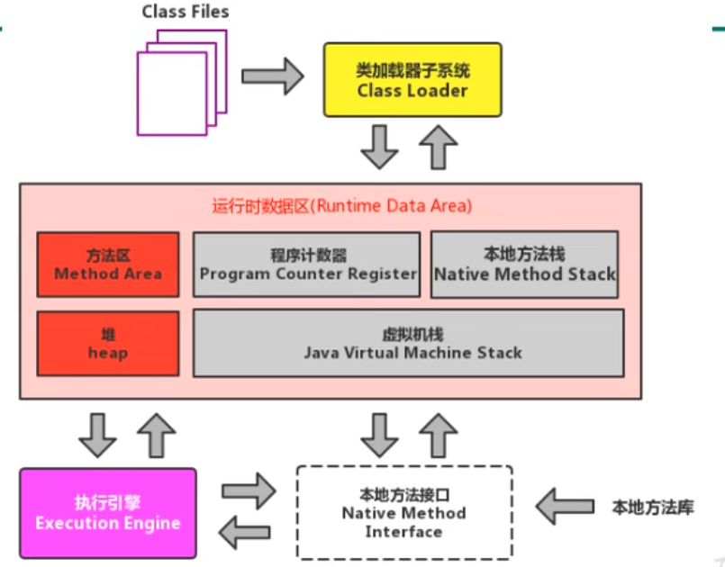
 **详细图：**
 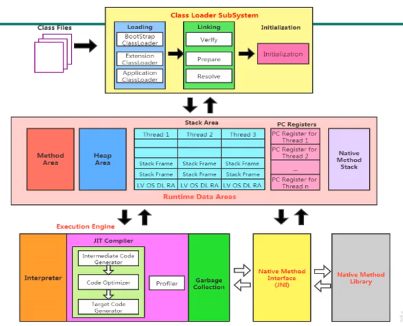
 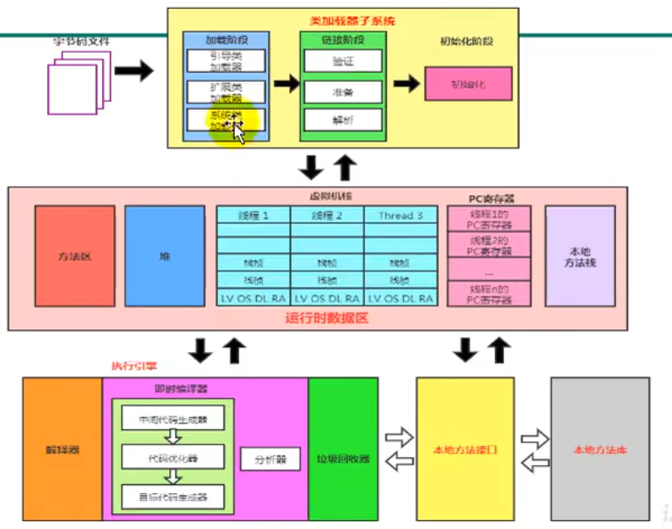
 如果自己手写一个 Java 虚拟机的话，主要要考虑 **类加载器** 和 **执行引擎**。

### 2. 类加载器与类的加载过程

#### 2.1. 类加载器子系统作用

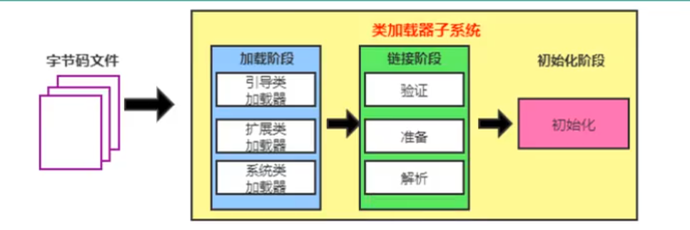

- 类加载器子系统复制从文件系统或者网络中加载 Class 文件，class 文件在文件开头有特定的文件标识。

- ClassLoader 只负责 class 文件的加载，至于它是否可以运行，则由 Execution Engine 决定。

- 加载的类信息存放于一块称为方法区的内存空间。除了类的信息外，方法区中还会存放运行时常量池信息，可能还包括字符串字面量和数字常量（这部分常量信息是 Class 文件中常量池部分的内存映射）。

#### 2.2. 类加载器 ClassLoader 角色

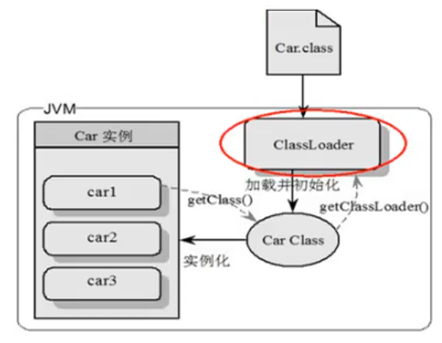

1. class file 存在于本地硬盘上，可以理解为设计师在纸上的模板，而最终这个额模板在执行的时候是要加载到 JVM 当中来根据这个文件实例化出 n 个一模一样的示例。

1. class file 加载到 JVM 中，被称为 DNA 元数据模板，放在方法区。

1. 在 .class 文件 -> JVM -> 最终称为元数据模板，此过程就要一个运输工具（类装载器 Class Loader），扮演一个快递员的角色。

#### 2.3. 类的加载过程

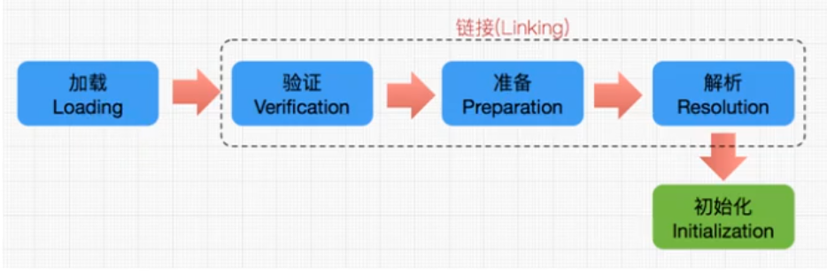
 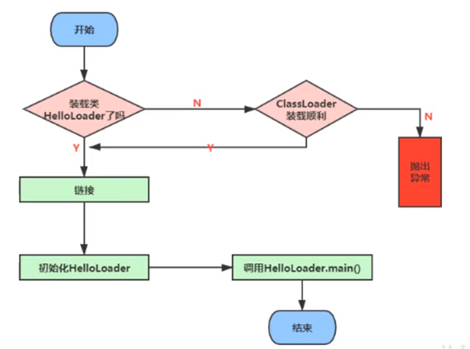

##### 2.3.1. 加载

1. 通过一个类的全限定名获取定义此类的二进制字节流

1. 将这个字节流所代表的静态存储结构转化为方法区的运行时数据结构

1. **在内存中生成一个代表这个类的 java.lang.Class 对象**，作为方法区这个类的各种数据的访问入口

**补充：** 加载 .class 文件的方式

- 从本地系统中直接加载

- 通过网络获取，典型场景：Web Applet

- 从 zip 压缩包中读取，成为日后 jar、war格式的基础

- 运行时计算生成，使用最多的是：动态代理技术

- 由其他文件生成，典型场景：JSP 应用

- 从专有数据库中提取 .class 文件，比较少见

- 从加密文件中获取，典型的防 Class 文件被发编译的保护措施

##### 2.3.2. 链接

**验证（verify）：**

- 目的在于确保 Class 文件的字节流中包含信息符合当前虚拟机要求，保证被加载类的正确性，不会危害虚拟机自身安全。

- 主要包括四种验证：文件格式验证、元数据验证、字节码验证，符号引用验证。

**准备（Prepare）：**

- 为类变量分配内存并且设置该类变量的默认初始值，即零值。

- **这里不包含用 final 修饰的 static，因为 final 在编译的时候就会分配了，准备阶段回显式初始化;**

- **这里不会为实例变量分配初始化**，类变量会分配在方法区中，而实例变量是会随着对象一起分配到 Java 堆中。

**解析（Resolve）：**

- 将常量池中的符号引用转换为直接引用的过程。

- 事实上，解析操作往往会伴随着 JVM 在执行完初始化之后再执行。

- 符号引用就是一组符号来描述所引用的目标。符号引用的字面量形式明确定义在《java 虚拟机规范》的 Class 文件格式中，直接引用就是直接指向目标的指针、相对偏移量或者一个间接定位到目标的句柄。

- 解析动作主要针对类或者接口、字段、类方法、接口方法、方法类型等。对应常量池中的 CONSTANT_Class_info、CONSTANT_Fieldref_info、CONSTANT_Methodref_info等。

##### 2.3.3. 初始化

-
**初始化阶段就是执行类构造器方法<clinit>() 的过程。**

-
此方法不需定义，是 javac 编译器自动收集类中的所有类变量的赋值动作和静态代码块中的语句合并而来的。

-
构造器方法中指令按语句在源文件中出现的顺序执行。
 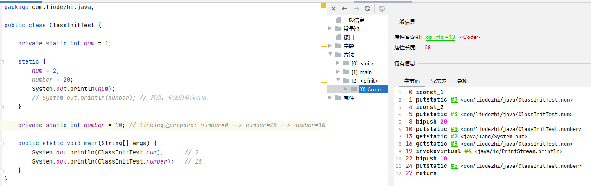

-
**<clinit>() 不同于类的构造器。** （关联：构造器是虚拟视角下的<inti>()）

-
若该类具有父类，JVM 会保证子类的 <clinit>() 执行前，父类的 <clinit>() 已经执行完毕。
 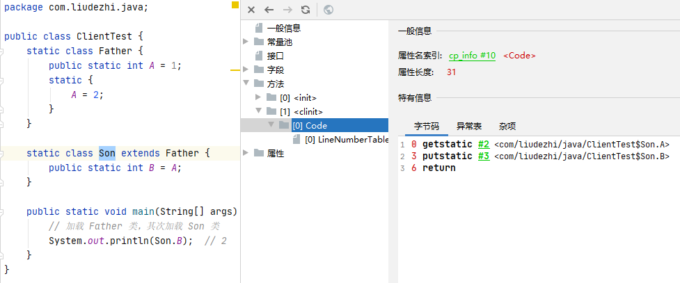

-
虚拟机必须保证一个类的 <clinit>() 方法在多线程下被同步加锁。
 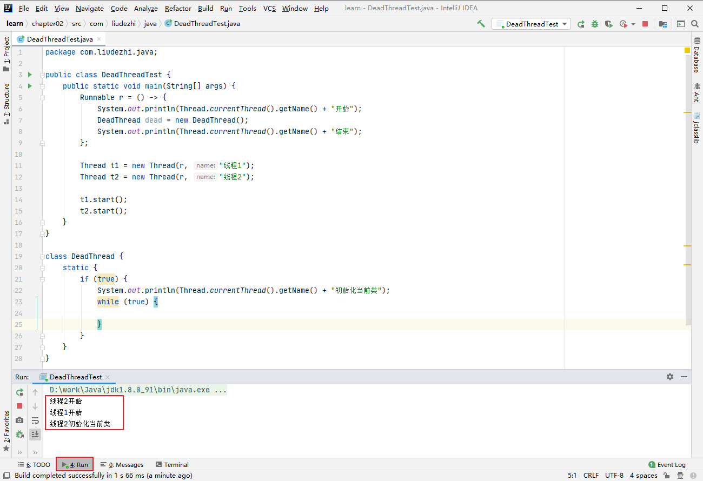

### 3. 类加载器分类

- JVM 支持两种类型的类加载器，分别为**引导类加载器（Bootstrap ClassLoader）**和**自定义类加载器（User-Defined ClassLoader）**

- 从概念上来讲，自定义类加载器一般指的是程序中由开发人员自定义的一类类加载器，但是 Java 虚拟机规范却并没有这么定义，而是将**所有派生于抽象类 ClassLoader 的类加载器都划分为自定义类加载器**。

- 无论类加载器的类型如何划分，在程序中我们最常见的类加载器始终只有3个，如下所示：
 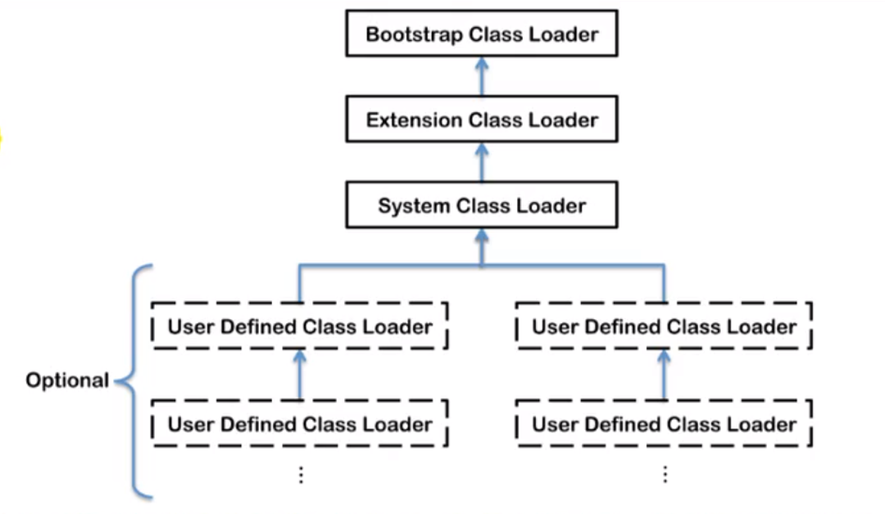
 这里的四者之间的关系是包含关系。不是上层下层，也不是子父类的继承关系。
 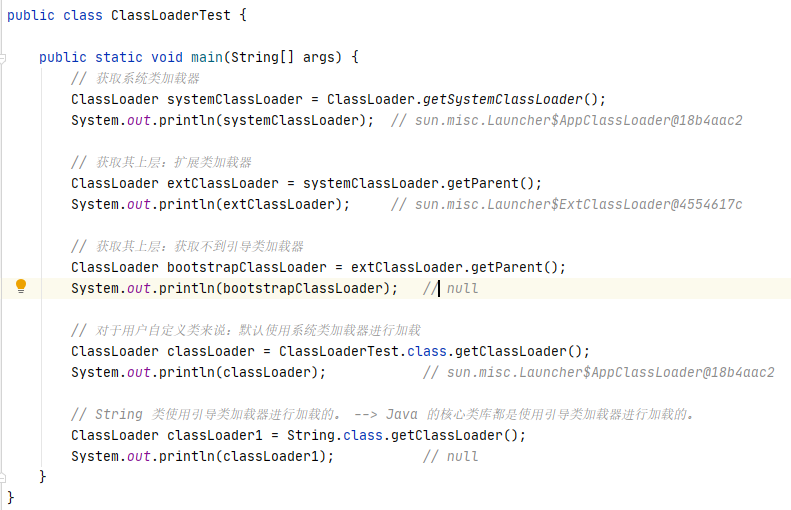

#### 3.1. 虚拟机自带的加载器

- 启动类加载器（引导类加载器，Bootstrap ClassLoader）

  - 这个类加载器使用 **C/C++ 语言实现**的，嵌套在 JVM 内部。

  - 它用来加载 Java 的核心库（JAVA_HOME/jre/lib/rt.jar、resources.jar 或 sun.boot.class.path 路径下的内容），用于提供 JVM 自身需要的类

  - 并不继承自 java.lang.ClassLoader，没有父加载器。

  - 加载扩展类和应用程序类加载器，并指定为他们的父类加载器。

  - 处于安全考虑，Bootstrap 启动类加载器只加载包名为 java、javax、sun 等开头的类

- 扩展类加载器（Extension ClassLoader）

  - **Java 语言编写**，由 sun.misc.Launcher$ExtClassLoader 实现。

  - **派生于 ClassLoader 类**

  - 父类加载器为 启动类加载器

  - 从 java.ext.dirs 系统属性所指定的目录中加载类库，或从 JDK 的安装目录的 jre/lib/ext 子目录（扩展目录）下加载类库。**如果用户创建的 JAR 放在此目录下，也会自动由扩展类加载器加载**。

- 应用程序类加载器（系统类加载器，AppClassLoader）

  - **Java 语言编写**，由 sun.misc.Launcher$AppClassLoader 实现

  - 派生于 ClassLoader 类

  - 父类加载器为扩展类加载器

  - 它负责加载环境变量 classpath 或系统属性 java.class.path 指定路径下的类库

  - **该类加载是程序中默认的类加载器**，一般来说，Java 应用的类都是由它来完成加载

  - 通过 classLoader.getSystemClassLoader() 方法可以获取到该类加载器
 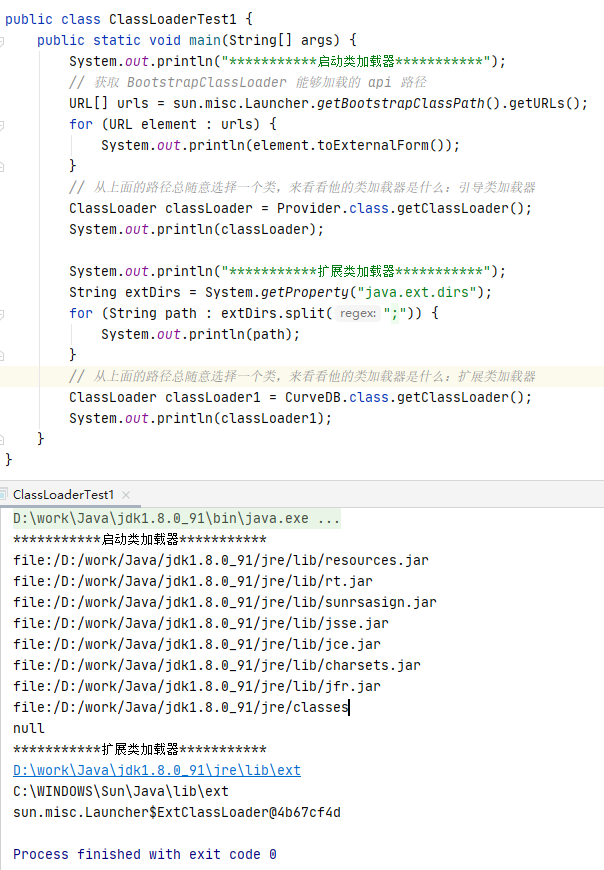

#### 3.2. 用户自定义类加载器

- 在 Java 的日常应用程序开发中，类的加载几乎是由上述3种类加载器相互配合执行的，在必要时，我们还可以自定义类加载器，来定制类的加载方式。

- 为什么要自定义类加载器：

  - 隔离加载类

  - 修改类加载的方式

  - 扩展加载源

  - 防止源码泄露

**用户自定义类加载器实现步骤：**

1. 开发人员可以通过继承抽象类 java.lang.ClassLoader 类的方式，实现自己的类加载器，以满足一些特殊的需求

1. 在 JDK 1.2 之前，在自定义类加载器时，总会去继承 ClassLoader 类并重写 loadClass() 方法，从而实现自定义的类加载类，但是在 JDK1.2 之后已不再建议用户去覆盖 loadClass() 方法，而是建议把自定义的类加载逻辑写在 findClass() 方法中

1. 在编写自定义类加载器时，如果没有太过于复杂的需求，可以直接继承 URLClassLoader 类，这样就可以避免自己去编写 findClass() 方法及其获取字节码流的方式，使自定义类加载器编写更加简介
 **eg：**

```
public class CustomClassLoader extends ClassLoader {

    @Override
    protected Class<?> findClass(String name) throws ClassNotFoundException {
        try {
            byte[] result = getClassFromCustomPath(name);
            if (result == null) {
                throw new FileNotFoundException();
            } else {
                return defineClass(name, result, 0, result.length);
            }
        } catch (FileNotFoundException e) {
            e.printStackTrace();
        }
        throw new ClassNotFoundException(name);
    }

    private byte[] getClassFromCustomPath(String name) {
        // 从自定义路径中加载指定类：细节略
        // 如果指定路径的字节码文件进行了加密，则需要在此方法中进行解密操作。
        return null;
    }

    public static void main(String[] args) {
        CustomClassLoader customClassLoader = new CustomClassLoader();
        try {
            Class<?> clazz = Class.forName("One", true, customClassLoader);
            Object obj = clazz.newInstance();
            System.out.println(obj.getClass().getClassLoader());
        } catch (Exception e) {
            e.printStackTrace();
        }
    }
}

```

### 4. ClassLoader 的使用说明

#### 4.1. 关于 ClassLoader

ClassLoader 类，它是一个抽象类，其后所有的类加载器都继承自 ClassLoader(不包括启动类加载器)

 | 方法名称 | 描述
 | getParent() | 返回该类的超类加载器
 | loadClass(String name) | 加载名称为 name 的类，返回结果为 java.lang.Class 类的实例
 | findClass(String name) | 查找名称为 name 的类，返回结果为 java.lang.Class 类的实例
 | findLoadedClass(String name) | 查找名称为 name 的已经被加载过的类，返回结果为 java.lang.Class 类的实例
 | defineClass(String name, byte[] b, int off, int len) | 把字节数组 b 中的内容转换为一个 Java 类，返回结果为 java.lang.Class 类的实例
 | resolveClass(Class<?> c) | 连接指定的一个 Java 类

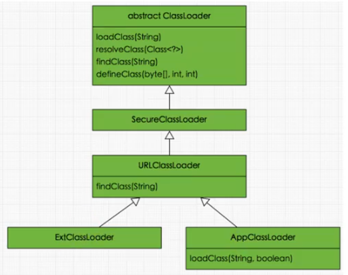
 sun.misc.Launcher 它是一个 java 虚拟机的入口应用。

#### 4.2. 获取 ClassLoader 的途径

- 方式一：获取当前类的 ClassLoader
 `clazz.getClassLoader();`

- 方式二：获取当前线程上下文的ClassLoader
 `Thread.currentThread().getContextClassLoader();`

- 方式三：获取系统的 ClassLoader
 `ClassLoader.getSystemClassLoader();`

- 方式四：获取调用者的 ClassLoader
 `DriverManager.getCallerClassLoader();`

### 5. 双亲委派机制

Java 虚拟机对 class 文件采用的是**按需加载**的方式，也就是说当需要使用该类时，才会将它的 class 文件加载到内存中生成 class 对象。而且加载某个类的 class 文件时，Java 虚拟机采用的是**双亲委托机制**，即把请求交给父类处理，它是一种任务委派模式。

#### 5.1. 工作原理

1）如果一个类加载器收到了类加载请求，它并不会自己先去加载，而是把这个请求委托给父类的加载器去执行；
 2）如果父类加载器还存在其父类加载器，则进一步向上委托，依次递归，请求最终将到达顶层的启动类加载器；
 3）如果父类加载器可以完成类加载任务，就返回成功，倘若父类加载器无法完成此加载任务，子类加载器才会尝试自己去加载，这就是双亲委派模式。
 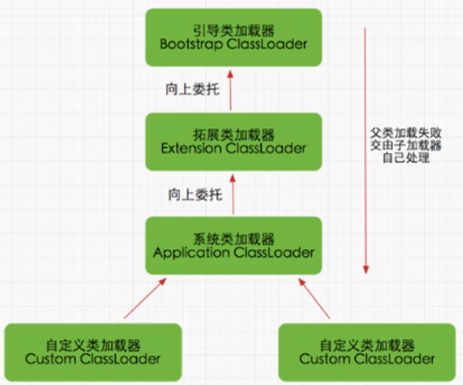
 **eg1:**

```
package com.liudezhi.java1;

public class StringTest {
    public static void main(String[] args) {
        String str = new String();  // 并没有加载我们自己定义的 java.lang.String，因为会委派到最上层的引导器加载。
        System.out.println("hello,taobao.com");

        StringTest test = new StringTest();
        System.out.println(test.getClass().getClassLoader());
    }
}

```

```
package java.lang;
public class String {

    static {
        System.out.println("我是自定义的 String 类的静态代码块");
    }

    // 错误: 在类 java.lang.String 中找不到 main 方法,
    public static void main(String[] args) {
        System.out.println("hello, String");
    }
}

```

**eg2：**
 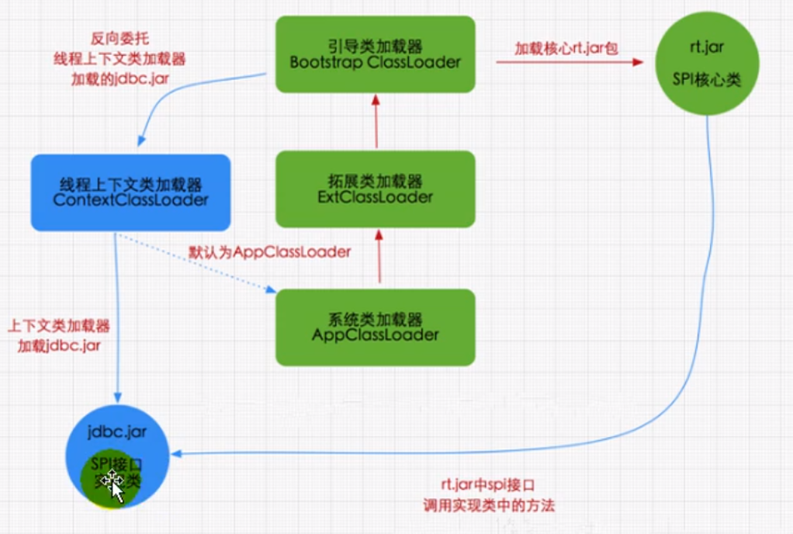

#### 5.2. 优势

- 避免类的重复加载

- 保护程序安全，防止核心 API 被随意篡改

  - 自定义类：java.lang.String

  - 自定义类：java.lang.TestStart (java.lang.SecurityException: Prohibited package name: java.lang)
 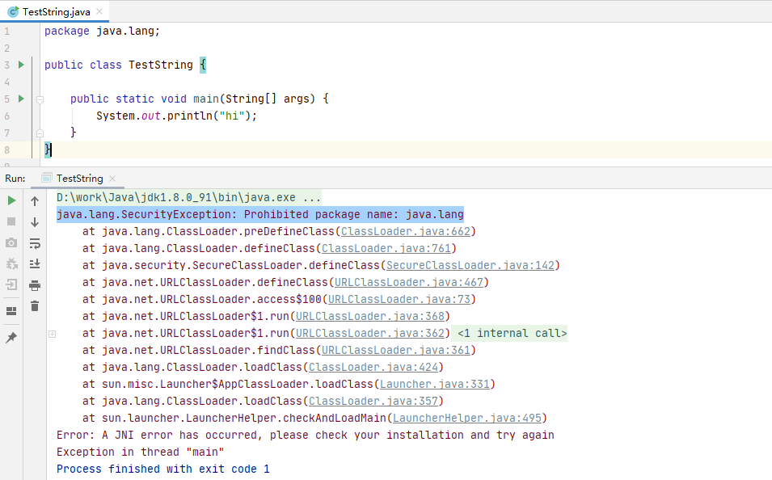

#### 5.3. 沙箱安全机制

自定义 String 类，但是在加载自定义 String 类的时候会率先使用引导类加载器加载，而引导类加载器在加载的过程中会先加载 jdk 自带的文件（rt.jar 包中 java/lang/String.class），根据报错信息说没有 main 方法，就是因为加载的是 rt.jar 包中的 String 类。这样可以保证对 java 核心源代码的保护，这就是**沙箱安全机制**。

### 6. 其他

#### 类的主动使用与被动属性

- 在 JVM 中表示两个 class 对象是否为同一个类存在两个必要条件：

  - 类的完整类名必须一致，包括报名。

  - 加载这个类的 ClassLoader（指 ClassLoader 实例对象）必须相同。

- 换句话说，在 JVM 中，即使这两个类（class对象）来源同一个 Class 文件，但只要加载它们的 ClassLoader 实例对象不同，那么这两个类对象也是不相等的。

#### 对类加载器的引用

JVM 必须知道一个类型是由启动加载器加载的还是由用户类加载器加载的。如果一个类型是由用户类加载器加载的，那么 JVM **会将这个类加载器的一个引用作为类型信息的一部分保存在方法区中**。当解析一个类型到另一个类型的引用的时候，JVM 需要保证这两个类型的类加载器是相同的。

#### 类的主动使用和被动使用

**Java 程序对类的使用分为：主动使用和被动使用。**

- 主动使用，又分为七种情况：

  - 创建类的实例

  - 访问某个类的接口或静态变量，或者对该静态变量赋值

  - 调用类的静态方法

  - 反射（比如：Class.forName("com.liudehzi.Test")）

  - 初始化一个类的子类

  - Java 虚拟机启动时被标明为启动类的类

  - JDK 7 开始提供的动态语言支持：
 java.lang.invoke.MethodHandle 实例的解析结果
 REF_getStatic、REF_putStatic、REF_invokeStatic 句柄对应的类没有初始化，则初始化

- 除了以上七种情况，其他使用 Java 类的方式都被看做是对**类的被动使用**，都**不会导致类的初始化**。

%23%23%20%E7%B1%BB%E5%8A%A0%E8%BD%BD%E5%AD%90%E7%B3%BB%E7%BB%9F%0A%23%23%23%201.%20%E5%86%85%E5%AD%98%E7%BB%93%E6%9E%84%E6%A6%82%E8%BF%B0%0A**%E7%AE%80%E5%9B%BE%EF%BC%9A**%0A!%5Bf2e4a40b0377b4d93a4015c9a2dc0199.png%5D(evernotecid%3A%2F%2F90F5C43D-AEAE-49B2-85BB-D02B6A52C764%2Fappyinxiangcom%2F25356149%2FENResource%2Fp766)%0A**%E8%AF%A6%E7%BB%86%E5%9B%BE%EF%BC%9A**%0A!%5B24d81b6522d1520a265e26d8a5696aff.png%5D(evernotecid%3A%2F%2F90F5C43D-AEAE-49B2-85BB-D02B6A52C764%2Fappyinxiangcom%2F25356149%2FENResource%2Fp757)%0A!%5B8c1ef81f095d5e9be65f8a8bfac82f52.png%5D(evernotecid%3A%2F%2F90F5C43D-AEAE-49B2-85BB-D02B6A52C764%2Fappyinxiangcom%2F25356149%2FENResource%2Fp761)%0A%E5%A6%82%E6%9E%9C%E8%87%AA%E5%B7%B1%E6%89%8B%E5%86%99%E4%B8%80%E4%B8%AA%20Java%20%E8%99%9A%E6%8B%9F%E6%9C%BA%E7%9A%84%E8%AF%9D%EF%BC%8C%E4%B8%BB%E8%A6%81%E8%A6%81%E8%80%83%E8%99%91%20**%E7%B1%BB%E5%8A%A0%E8%BD%BD%E5%99%A8**%20%E5%92%8C%20**%E6%89%A7%E8%A1%8C%E5%BC%95%E6%93%8E**%E3%80%82%0A%0A%23%23%23%202.%20%E7%B1%BB%E5%8A%A0%E8%BD%BD%E5%99%A8%E4%B8%8E%E7%B1%BB%E7%9A%84%E5%8A%A0%E8%BD%BD%E8%BF%87%E7%A8%8B%0A%23%23%23%23%202.1.%20%E7%B1%BB%E5%8A%A0%E8%BD%BD%E5%99%A8%E5%AD%90%E7%B3%BB%E7%BB%9F%E4%BD%9C%E7%94%A8%0A!%5B437b4780929d1dc7e71e81b307ab8832.png%5D(evernotecid%3A%2F%2F90F5C43D-AEAE-49B2-85BB-D02B6A52C764%2Fappyinxiangcom%2F25356149%2FENResource%2Fp758)%0A-%20%E7%B1%BB%E5%8A%A0%E8%BD%BD%E5%99%A8%E5%AD%90%E7%B3%BB%E7%BB%9F%E5%A4%8D%E5%88%B6%E4%BB%8E%E6%96%87%E4%BB%B6%E7%B3%BB%E7%BB%9F%E6%88%96%E8%80%85%E7%BD%91%E7%BB%9C%E4%B8%AD%E5%8A%A0%E8%BD%BD%20Class%20%E6%96%87%E4%BB%B6%EF%BC%8Cclass%20%E6%96%87%E4%BB%B6%E5%9C%A8%E6%96%87%E4%BB%B6%E5%BC%80%E5%A4%B4%E6%9C%89%E7%89%B9%E5%AE%9A%E7%9A%84%E6%96%87%E4%BB%B6%E6%A0%87%E8%AF%86%E3%80%82%0A-%20ClassLoader%20%E5%8F%AA%E8%B4%9F%E8%B4%A3%20class%20%E6%96%87%E4%BB%B6%E7%9A%84%E5%8A%A0%E8%BD%BD%EF%BC%8C%E8%87%B3%E4%BA%8E%E5%AE%83%E6%98%AF%E5%90%A6%E5%8F%AF%E4%BB%A5%E8%BF%90%E8%A1%8C%EF%BC%8C%E5%88%99%E7%94%B1%20Execution%20Engine%20%E5%86%B3%E5%AE%9A%E3%80%82%0A-%20%E5%8A%A0%E8%BD%BD%E7%9A%84%E7%B1%BB%E4%BF%A1%E6%81%AF%E5%AD%98%E6%94%BE%E4%BA%8E%E4%B8%80%E5%9D%97%E7%A7%B0%E4%B8%BA%E6%96%B9%E6%B3%95%E5%8C%BA%E7%9A%84%E5%86%85%E5%AD%98%E7%A9%BA%E9%97%B4%E3%80%82%E9%99%A4%E4%BA%86%E7%B1%BB%E7%9A%84%E4%BF%A1%E6%81%AF%E5%A4%96%EF%BC%8C%E6%96%B9%E6%B3%95%E5%8C%BA%E4%B8%AD%E8%BF%98%E4%BC%9A%E5%AD%98%E6%94%BE%E8%BF%90%E8%A1%8C%E6%97%B6%E5%B8%B8%E9%87%8F%E6%B1%A0%E4%BF%A1%E6%81%AF%EF%BC%8C%E5%8F%AF%E8%83%BD%E8%BF%98%E5%8C%85%E6%8B%AC%E5%AD%97%E7%AC%A6%E4%B8%B2%E5%AD%97%E9%9D%A2%E9%87%8F%E5%92%8C%E6%95%B0%E5%AD%97%E5%B8%B8%E9%87%8F%EF%BC%88%E8%BF%99%E9%83%A8%E5%88%86%E5%B8%B8%E9%87%8F%E4%BF%A1%E6%81%AF%E6%98%AF%20Class%20%E6%96%87%E4%BB%B6%E4%B8%AD%E5%B8%B8%E9%87%8F%E6%B1%A0%E9%83%A8%E5%88%86%E7%9A%84%E5%86%85%E5%AD%98%E6%98%A0%E5%B0%84%EF%BC%89%E3%80%82%0A%0A%23%23%23%23%202.2.%20%E7%B1%BB%E5%8A%A0%E8%BD%BD%E5%99%A8%20ClassLoader%20%E8%A7%92%E8%89%B2%0A!%5Ba929f3c293a4a11db116f62f6f43d5d6.png%5D(evernotecid%3A%2F%2F90F5C43D-AEAE-49B2-85BB-D02B6A52C764%2Fappyinxiangcom%2F25356149%2FENResource%2Fp763)%0A1.%20class%20file%20%E5%AD%98%E5%9C%A8%E4%BA%8E%E6%9C%AC%E5%9C%B0%E7%A1%AC%E7%9B%98%E4%B8%8A%EF%BC%8C%E5%8F%AF%E4%BB%A5%E7%90%86%E8%A7%A3%E4%B8%BA%E8%AE%BE%E8%AE%A1%E5%B8%88%E5%9C%A8%E7%BA%B8%E4%B8%8A%E7%9A%84%E6%A8%A1%E6%9D%BF%EF%BC%8C%E8%80%8C%E6%9C%80%E7%BB%88%E8%BF%99%E4%B8%AA%E9%A2%9D%E6%A8%A1%E6%9D%BF%E5%9C%A8%E6%89%A7%E8%A1%8C%E7%9A%84%E6%97%B6%E5%80%99%E6%98%AF%E8%A6%81%E5%8A%A0%E8%BD%BD%E5%88%B0%20JVM%20%E5%BD%93%E4%B8%AD%E6%9D%A5%E6%A0%B9%E6%8D%AE%E8%BF%99%E4%B8%AA%E6%96%87%E4%BB%B6%E5%AE%9E%E4%BE%8B%E5%8C%96%E5%87%BA%20n%20%E4%B8%AA%E4%B8%80%E6%A8%A1%E4%B8%80%E6%A0%B7%E7%9A%84%E7%A4%BA%E4%BE%8B%E3%80%82%0A2.%20class%20file%20%E5%8A%A0%E8%BD%BD%E5%88%B0%20JVM%20%E4%B8%AD%EF%BC%8C%E8%A2%AB%E7%A7%B0%E4%B8%BA%20DNA%20%E5%85%83%E6%95%B0%E6%8D%AE%E6%A8%A1%E6%9D%BF%EF%BC%8C%E6%94%BE%E5%9C%A8%E6%96%B9%E6%B3%95%E5%8C%BA%E3%80%82%0A3.%20%E5%9C%A8%20.class%20%E6%96%87%E4%BB%B6%20-%3E%20JVM%20-%3E%20%E6%9C%80%E7%BB%88%E7%A7%B0%E4%B8%BA%E5%85%83%E6%95%B0%E6%8D%AE%E6%A8%A1%E6%9D%BF%EF%BC%8C%E6%AD%A4%E8%BF%87%E7%A8%8B%E5%B0%B1%E8%A6%81%E4%B8%80%E4%B8%AA%E8%BF%90%E8%BE%93%E5%B7%A5%E5%85%B7%EF%BC%88%E7%B1%BB%E8%A3%85%E8%BD%BD%E5%99%A8%20Class%20Loader%EF%BC%89%EF%BC%8C%E6%89%AE%E6%BC%94%E4%B8%80%E4%B8%AA%E5%BF%AB%E9%80%92%E5%91%98%E7%9A%84%E8%A7%92%E8%89%B2%E3%80%82%0A%0A%23%23%23%23%202.3.%20%E7%B1%BB%E7%9A%84%E5%8A%A0%E8%BD%BD%E8%BF%87%E7%A8%8B%0A!%5B6d23b36772e6f602bca4a3fb4df8d6c0.png%5D(evernotecid%3A%2F%2F90F5C43D-AEAE-49B2-85BB-D02B6A52C764%2Fappyinxiangcom%2F25356149%2FENResource%2Fp760)%0A!%5Bf8f76d1e5a492e732b9d764c513b0062.png%5D(evernotecid%3A%2F%2F90F5C43D-AEAE-49B2-85BB-D02B6A52C764%2Fappyinxiangcom%2F25356149%2FENResource%2Fp767)%0A%23%23%23%23%23%202.3.1.%20%E5%8A%A0%E8%BD%BD%0A1.%20%E9%80%9A%E8%BF%87%E4%B8%80%E4%B8%AA%E7%B1%BB%E7%9A%84%E5%85%A8%E9%99%90%E5%AE%9A%E5%90%8D%E8%8E%B7%E5%8F%96%E5%AE%9A%E4%B9%89%E6%AD%A4%E7%B1%BB%E7%9A%84%E4%BA%8C%E8%BF%9B%E5%88%B6%E5%AD%97%E8%8A%82%E6%B5%81%0A2.%20%E5%B0%86%E8%BF%99%E4%B8%AA%E5%AD%97%E8%8A%82%E6%B5%81%E6%89%80%E4%BB%A3%E8%A1%A8%E7%9A%84%E9%9D%99%E6%80%81%E5%AD%98%E5%82%A8%E7%BB%93%E6%9E%84%E8%BD%AC%E5%8C%96%E4%B8%BA%E6%96%B9%E6%B3%95%E5%8C%BA%E7%9A%84%E8%BF%90%E8%A1%8C%E6%97%B6%E6%95%B0%E6%8D%AE%E7%BB%93%E6%9E%84%0A3.%20**%E5%9C%A8%E5%86%85%E5%AD%98%E4%B8%AD%E7%94%9F%E6%88%90%E4%B8%80%E4%B8%AA%E4%BB%A3%E8%A1%A8%E8%BF%99%E4%B8%AA%E7%B1%BB%E7%9A%84%20java.lang.Class%20%E5%AF%B9%E8%B1%A1**%EF%BC%8C%E4%BD%9C%E4%B8%BA%E6%96%B9%E6%B3%95%E5%8C%BA%E8%BF%99%E4%B8%AA%E7%B1%BB%E7%9A%84%E5%90%84%E7%A7%8D%E6%95%B0%E6%8D%AE%E7%9A%84%E8%AE%BF%E9%97%AE%E5%85%A5%E5%8F%A3%0A%0A**%E8%A1%A5%E5%85%85%EF%BC%9A**%20%E5%8A%A0%E8%BD%BD%20.class%20%E6%96%87%E4%BB%B6%E7%9A%84%E6%96%B9%E5%BC%8F%0A-%20%E4%BB%8E%E6%9C%AC%E5%9C%B0%E7%B3%BB%E7%BB%9F%E4%B8%AD%E7%9B%B4%E6%8E%A5%E5%8A%A0%E8%BD%BD%0A-%20%E9%80%9A%E8%BF%87%E7%BD%91%E7%BB%9C%E8%8E%B7%E5%8F%96%EF%BC%8C%E5%85%B8%E5%9E%8B%E5%9C%BA%E6%99%AF%EF%BC%9AWeb%20Applet%0A-%20%E4%BB%8E%20zip%20%E5%8E%8B%E7%BC%A9%E5%8C%85%E4%B8%AD%E8%AF%BB%E5%8F%96%EF%BC%8C%E6%88%90%E4%B8%BA%E6%97%A5%E5%90%8E%20jar%E3%80%81war%E6%A0%BC%E5%BC%8F%E7%9A%84%E5%9F%BA%E7%A1%80%0A-%20%E8%BF%90%E8%A1%8C%E6%97%B6%E8%AE%A1%E7%AE%97%E7%94%9F%E6%88%90%EF%BC%8C%E4%BD%BF%E7%94%A8%E6%9C%80%E5%A4%9A%E7%9A%84%E6%98%AF%EF%BC%9A%E5%8A%A8%E6%80%81%E4%BB%A3%E7%90%86%E6%8A%80%E6%9C%AF%0A-%20%E7%94%B1%E5%85%B6%E4%BB%96%E6%96%87%E4%BB%B6%E7%94%9F%E6%88%90%EF%BC%8C%E5%85%B8%E5%9E%8B%E5%9C%BA%E6%99%AF%EF%BC%9AJSP%20%E5%BA%94%E7%94%A8%0A-%20%E4%BB%8E%E4%B8%93%E6%9C%89%E6%95%B0%E6%8D%AE%E5%BA%93%E4%B8%AD%E6%8F%90%E5%8F%96%20.class%20%E6%96%87%E4%BB%B6%EF%BC%8C%E6%AF%94%E8%BE%83%E5%B0%91%E8%A7%81%0A-%20%E4%BB%8E%E5%8A%A0%E5%AF%86%E6%96%87%E4%BB%B6%E4%B8%AD%E8%8E%B7%E5%8F%96%EF%BC%8C%E5%85%B8%E5%9E%8B%E7%9A%84%E9%98%B2%20Class%20%E6%96%87%E4%BB%B6%E8%A2%AB%E5%8F%91%E7%BC%96%E8%AF%91%E7%9A%84%E4%BF%9D%E6%8A%A4%E6%8E%AA%E6%96%BD%0A%0A%23%23%23%23%23%202.3.2.%20%E9%93%BE%E6%8E%A5%0A**%E9%AA%8C%E8%AF%81%EF%BC%88verify%EF%BC%89%EF%BC%9A**%0A-%20%E7%9B%AE%E7%9A%84%E5%9C%A8%E4%BA%8E%E7%A1%AE%E4%BF%9D%20Class%20%E6%96%87%E4%BB%B6%E7%9A%84%E5%AD%97%E8%8A%82%E6%B5%81%E4%B8%AD%E5%8C%85%E5%90%AB%E4%BF%A1%E6%81%AF%E7%AC%A6%E5%90%88%E5%BD%93%E5%89%8D%E8%99%9A%E6%8B%9F%E6%9C%BA%E8%A6%81%E6%B1%82%EF%BC%8C%E4%BF%9D%E8%AF%81%E8%A2%AB%E5%8A%A0%E8%BD%BD%E7%B1%BB%E7%9A%84%E6%AD%A3%E7%A1%AE%E6%80%A7%EF%BC%8C%E4%B8%8D%E4%BC%9A%E5%8D%B1%E5%AE%B3%E8%99%9A%E6%8B%9F%E6%9C%BA%E8%87%AA%E8%BA%AB%E5%AE%89%E5%85%A8%E3%80%82%0A-%20%E4%B8%BB%E8%A6%81%E5%8C%85%E6%8B%AC%E5%9B%9B%E7%A7%8D%E9%AA%8C%E8%AF%81%EF%BC%9A%E6%96%87%E4%BB%B6%E6%A0%BC%E5%BC%8F%E9%AA%8C%E8%AF%81%E3%80%81%E5%85%83%E6%95%B0%E6%8D%AE%E9%AA%8C%E8%AF%81%E3%80%81%E5%AD%97%E8%8A%82%E7%A0%81%E9%AA%8C%E8%AF%81%EF%BC%8C%E7%AC%A6%E5%8F%B7%E5%BC%95%E7%94%A8%E9%AA%8C%E8%AF%81%E3%80%82%0A%0A**%E5%87%86%E5%A4%87%EF%BC%88Prepare%EF%BC%89%EF%BC%9A**%0A-%20%E4%B8%BA%E7%B1%BB%E5%8F%98%E9%87%8F%E5%88%86%E9%85%8D%E5%86%85%E5%AD%98%E5%B9%B6%E4%B8%94%E8%AE%BE%E7%BD%AE%E8%AF%A5%E7%B1%BB%E5%8F%98%E9%87%8F%E7%9A%84%E9%BB%98%E8%AE%A4%E5%88%9D%E5%A7%8B%E5%80%BC%EF%BC%8C%E5%8D%B3%E9%9B%B6%E5%80%BC%E3%80%82%0A-%20**%E8%BF%99%E9%87%8C%E4%B8%8D%E5%8C%85%E5%90%AB%E7%94%A8%20final%20%E4%BF%AE%E9%A5%B0%E7%9A%84%20static%EF%BC%8C%E5%9B%A0%E4%B8%BA%20final%20%E5%9C%A8%E7%BC%96%E8%AF%91%E7%9A%84%E6%97%B6%E5%80%99%E5%B0%B1%E4%BC%9A%E5%88%86%E9%85%8D%E4%BA%86%EF%BC%8C%E5%87%86%E5%A4%87%E9%98%B6%E6%AE%B5%E5%9B%9E%E6%98%BE%E5%BC%8F%E5%88%9D%E5%A7%8B%E5%8C%96%3B**%0A-%20**%E8%BF%99%E9%87%8C%E4%B8%8D%E4%BC%9A%E4%B8%BA%E5%AE%9E%E4%BE%8B%E5%8F%98%E9%87%8F%E5%88%86%E9%85%8D%E5%88%9D%E5%A7%8B%E5%8C%96**%EF%BC%8C%E7%B1%BB%E5%8F%98%E9%87%8F%E4%BC%9A%E5%88%86%E9%85%8D%E5%9C%A8%E6%96%B9%E6%B3%95%E5%8C%BA%E4%B8%AD%EF%BC%8C%E8%80%8C%E5%AE%9E%E4%BE%8B%E5%8F%98%E9%87%8F%E6%98%AF%E4%BC%9A%E9%9A%8F%E7%9D%80%E5%AF%B9%E8%B1%A1%E4%B8%80%E8%B5%B7%E5%88%86%E9%85%8D%E5%88%B0%20Java%20%E5%A0%86%E4%B8%AD%E3%80%82%0A%0A**%E8%A7%A3%E6%9E%90%EF%BC%88Resolve%EF%BC%89%EF%BC%9A**%0A-%20%E5%B0%86%E5%B8%B8%E9%87%8F%E6%B1%A0%E4%B8%AD%E7%9A%84%E7%AC%A6%E5%8F%B7%E5%BC%95%E7%94%A8%E8%BD%AC%E6%8D%A2%E4%B8%BA%E7%9B%B4%E6%8E%A5%E5%BC%95%E7%94%A8%E7%9A%84%E8%BF%87%E7%A8%8B%E3%80%82%0A-%20%E4%BA%8B%E5%AE%9E%E4%B8%8A%EF%BC%8C%E8%A7%A3%E6%9E%90%E6%93%8D%E4%BD%9C%E5%BE%80%E5%BE%80%E4%BC%9A%E4%BC%B4%E9%9A%8F%E7%9D%80%20JVM%20%E5%9C%A8%E6%89%A7%E8%A1%8C%E5%AE%8C%E5%88%9D%E5%A7%8B%E5%8C%96%E4%B9%8B%E5%90%8E%E5%86%8D%E6%89%A7%E8%A1%8C%E3%80%82%0A-%20%E7%AC%A6%E5%8F%B7%E5%BC%95%E7%94%A8%E5%B0%B1%E6%98%AF%E4%B8%80%E7%BB%84%E7%AC%A6%E5%8F%B7%E6%9D%A5%E6%8F%8F%E8%BF%B0%E6%89%80%E5%BC%95%E7%94%A8%E7%9A%84%E7%9B%AE%E6%A0%87%E3%80%82%E7%AC%A6%E5%8F%B7%E5%BC%95%E7%94%A8%E7%9A%84%E5%AD%97%E9%9D%A2%E9%87%8F%E5%BD%A2%E5%BC%8F%E6%98%8E%E7%A1%AE%E5%AE%9A%E4%B9%89%E5%9C%A8%E3%80%8Ajava%20%E8%99%9A%E6%8B%9F%E6%9C%BA%E8%A7%84%E8%8C%83%E3%80%8B%E7%9A%84%20Class%20%E6%96%87%E4%BB%B6%E6%A0%BC%E5%BC%8F%E4%B8%AD%EF%BC%8C%E7%9B%B4%E6%8E%A5%E5%BC%95%E7%94%A8%E5%B0%B1%E6%98%AF%E7%9B%B4%E6%8E%A5%E6%8C%87%E5%90%91%E7%9B%AE%E6%A0%87%E7%9A%84%E6%8C%87%E9%92%88%E3%80%81%E7%9B%B8%E5%AF%B9%E5%81%8F%E7%A7%BB%E9%87%8F%E6%88%96%E8%80%85%E4%B8%80%E4%B8%AA%E9%97%B4%E6%8E%A5%E5%AE%9A%E4%BD%8D%E5%88%B0%E7%9B%AE%E6%A0%87%E7%9A%84%E5%8F%A5%E6%9F%84%E3%80%82%0A-%20%E8%A7%A3%E6%9E%90%E5%8A%A8%E4%BD%9C%E4%B8%BB%E8%A6%81%E9%92%88%E5%AF%B9%E7%B1%BB%E6%88%96%E8%80%85%E6%8E%A5%E5%8F%A3%E3%80%81%E5%AD%97%E6%AE%B5%E3%80%81%E7%B1%BB%E6%96%B9%E6%B3%95%E3%80%81%E6%8E%A5%E5%8F%A3%E6%96%B9%E6%B3%95%E3%80%81%E6%96%B9%E6%B3%95%E7%B1%BB%E5%9E%8B%E7%AD%89%E3%80%82%E5%AF%B9%E5%BA%94%E5%B8%B8%E9%87%8F%E6%B1%A0%E4%B8%AD%E7%9A%84%20CONSTANT_Class_info%E3%80%81CONSTANT_Fieldref_info%E3%80%81CONSTANT_Methodref_info%E7%AD%89%E3%80%82%0A%0A%23%23%23%23%23%202.3.3.%20%E5%88%9D%E5%A7%8B%E5%8C%96%0A-%20**%E5%88%9D%E5%A7%8B%E5%8C%96%E9%98%B6%E6%AE%B5%E5%B0%B1%E6%98%AF%E6%89%A7%E8%A1%8C%E7%B1%BB%E6%9E%84%E9%80%A0%E5%99%A8%E6%96%B9%E6%B3%95%3Cclinit%3E()%20%E7%9A%84%E8%BF%87%E7%A8%8B%E3%80%82**%0A-%20%E6%AD%A4%E6%96%B9%E6%B3%95%E4%B8%8D%E9%9C%80%E5%AE%9A%E4%B9%89%EF%BC%8C%E6%98%AF%20javac%20%E7%BC%96%E8%AF%91%E5%99%A8%E8%87%AA%E5%8A%A8%E6%94%B6%E9%9B%86%E7%B1%BB%E4%B8%AD%E7%9A%84%E6%89%80%E6%9C%89%E7%B1%BB%E5%8F%98%E9%87%8F%E7%9A%84%E8%B5%8B%E5%80%BC%E5%8A%A8%E4%BD%9C%E5%92%8C%E9%9D%99%E6%80%81%E4%BB%A3%E7%A0%81%E5%9D%97%E4%B8%AD%E7%9A%84%E8%AF%AD%E5%8F%A5%E5%90%88%E5%B9%B6%E8%80%8C%E6%9D%A5%E7%9A%84%E3%80%82%0A-%20%E6%9E%84%E9%80%A0%E5%99%A8%E6%96%B9%E6%B3%95%E4%B8%AD%E6%8C%87%E4%BB%A4%E6%8C%89%E8%AF%AD%E5%8F%A5%E5%9C%A8%E6%BA%90%E6%96%87%E4%BB%B6%E4%B8%AD%E5%87%BA%E7%8E%B0%E7%9A%84%E9%A1%BA%E5%BA%8F%E6%89%A7%E8%A1%8C%E3%80%82%0A!%5B906deb070c8b76f91970106e7d77777f.png%5D(evernotecid%3A%2F%2F90F5C43D-AEAE-49B2-85BB-D02B6A52C764%2Fappyinxiangcom%2F25356149%2FENResource%2Fp762)%0A%0A-%20**%3Cclinit%3E()%20%E4%B8%8D%E5%90%8C%E4%BA%8E%E7%B1%BB%E7%9A%84%E6%9E%84%E9%80%A0%E5%99%A8%E3%80%82**%20%EF%BC%88%E5%85%B3%E8%81%94%EF%BC%9A%E6%9E%84%E9%80%A0%E5%99%A8%E6%98%AF%E8%99%9A%E6%8B%9F%E8%A7%86%E8%A7%92%E4%B8%8B%E7%9A%84%3Cinti%3E()%EF%BC%89%0A-%20%E8%8B%A5%E8%AF%A5%E7%B1%BB%E5%85%B7%E6%9C%89%E7%88%B6%E7%B1%BB%EF%BC%8CJVM%20%E4%BC%9A%E4%BF%9D%E8%AF%81%E5%AD%90%E7%B1%BB%E7%9A%84%20%3Cclinit%3E()%20%E6%89%A7%E8%A1%8C%E5%89%8D%EF%BC%8C%E7%88%B6%E7%B1%BB%E7%9A%84%20%3Cclinit%3E()%20%E5%B7%B2%E7%BB%8F%E6%89%A7%E8%A1%8C%E5%AE%8C%E6%AF%95%E3%80%82%0A!%5B0a88a9a22c685f8fb2625d52c2ec69bb.png%5D(evernotecid%3A%2F%2F90F5C43D-AEAE-49B2-85BB-D02B6A52C764%2Fappyinxiangcom%2F25356149%2FENResource%2Fp756)%0A%0A-%20%E8%99%9A%E6%8B%9F%E6%9C%BA%E5%BF%85%E9%A1%BB%E4%BF%9D%E8%AF%81%E4%B8%80%E4%B8%AA%E7%B1%BB%E7%9A%84%20%3Cclinit%3E()%20%E6%96%B9%E6%B3%95%E5%9C%A8%E5%A4%9A%E7%BA%BF%E7%A8%8B%E4%B8%8B%E8%A2%AB%E5%90%8C%E6%AD%A5%E5%8A%A0%E9%94%81%E3%80%82%0A!%5B4b0ee3d032a6fecfe3419fe762d8693b.png%5D(evernotecid%3A%2F%2F90F5C43D-AEAE-49B2-85BB-D02B6A52C764%2Fappyinxiangcom%2F25356149%2FENResource%2Fp759)%0A%0A%23%23%23%203.%20%E7%B1%BB%E5%8A%A0%E8%BD%BD%E5%99%A8%E5%88%86%E7%B1%BB%0A-%20JVM%20%E6%94%AF%E6%8C%81%E4%B8%A4%E7%A7%8D%E7%B1%BB%E5%9E%8B%E7%9A%84%E7%B1%BB%E5%8A%A0%E8%BD%BD%E5%99%A8%EF%BC%8C%E5%88%86%E5%88%AB%E4%B8%BA**%E5%BC%95%E5%AF%BC%E7%B1%BB%E5%8A%A0%E8%BD%BD%E5%99%A8%EF%BC%88Bootstrap%20ClassLoader%EF%BC%89**%E5%92%8C**%E8%87%AA%E5%AE%9A%E4%B9%89%E7%B1%BB%E5%8A%A0%E8%BD%BD%E5%99%A8%EF%BC%88User-Defined%20ClassLoader%EF%BC%89**%0A-%20%E4%BB%8E%E6%A6%82%E5%BF%B5%E4%B8%8A%E6%9D%A5%E8%AE%B2%EF%BC%8C%E8%87%AA%E5%AE%9A%E4%B9%89%E7%B1%BB%E5%8A%A0%E8%BD%BD%E5%99%A8%E4%B8%80%E8%88%AC%E6%8C%87%E7%9A%84%E6%98%AF%E7%A8%8B%E5%BA%8F%E4%B8%AD%E7%94%B1%E5%BC%80%E5%8F%91%E4%BA%BA%E5%91%98%E8%87%AA%E5%AE%9A%E4%B9%89%E7%9A%84%E4%B8%80%E7%B1%BB%E7%B1%BB%E5%8A%A0%E8%BD%BD%E5%99%A8%EF%BC%8C%E4%BD%86%E6%98%AF%20Java%20%E8%99%9A%E6%8B%9F%E6%9C%BA%E8%A7%84%E8%8C%83%E5%8D%B4%E5%B9%B6%E6%B2%A1%E6%9C%89%E8%BF%99%E4%B9%88%E5%AE%9A%E4%B9%89%EF%BC%8C%E8%80%8C%E6%98%AF%E5%B0%86**%E6%89%80%E6%9C%89%E6%B4%BE%E7%94%9F%E4%BA%8E%E6%8A%BD%E8%B1%A1%E7%B1%BB%20ClassLoader%20%E7%9A%84%E7%B1%BB%E5%8A%A0%E8%BD%BD%E5%99%A8%E9%83%BD%E5%88%92%E5%88%86%E4%B8%BA%E8%87%AA%E5%AE%9A%E4%B9%89%E7%B1%BB%E5%8A%A0%E8%BD%BD%E5%99%A8**%E3%80%82%0A-%20%E6%97%A0%E8%AE%BA%E7%B1%BB%E5%8A%A0%E8%BD%BD%E5%99%A8%E7%9A%84%E7%B1%BB%E5%9E%8B%E5%A6%82%E4%BD%95%E5%88%92%E5%88%86%EF%BC%8C%E5%9C%A8%E7%A8%8B%E5%BA%8F%E4%B8%AD%E6%88%91%E4%BB%AC%E6%9C%80%E5%B8%B8%E8%A7%81%E7%9A%84%E7%B1%BB%E5%8A%A0%E8%BD%BD%E5%99%A8%E5%A7%8B%E7%BB%88%E5%8F%AA%E6%9C%893%E4%B8%AA%EF%BC%8C%E5%A6%82%E4%B8%8B%E6%89%80%E7%A4%BA%EF%BC%9A%0A!%5B768a749f99420497c03ce9e25643b558.png%5D(evernotecid%3A%2F%2F90F5C43D-AEAE-49B2-85BB-D02B6A52C764%2Fappyinxiangcom%2F25356149%2FENResource%2Fp768)%0A%E8%BF%99%E9%87%8C%E7%9A%84%E5%9B%9B%E8%80%85%E4%B9%8B%E9%97%B4%E7%9A%84%E5%85%B3%E7%B3%BB%E6%98%AF%E5%8C%85%E5%90%AB%E5%85%B3%E7%B3%BB%E3%80%82%E4%B8%8D%E6%98%AF%E4%B8%8A%E5%B1%82%E4%B8%8B%E5%B1%82%EF%BC%8C%E4%B9%9F%E4%B8%8D%E6%98%AF%E5%AD%90%E7%88%B6%E7%B1%BB%E7%9A%84%E7%BB%A7%E6%89%BF%E5%85%B3%E7%B3%BB%E3%80%82%0A!%5B8bc79ff63605cc221209cc527ee79d6a.png%5D(evernotecid%3A%2F%2F90F5C43D-AEAE-49B2-85BB-D02B6A52C764%2Fappyinxiangcom%2F25356149%2FENResource%2Fp769)%0A%0A%23%23%23%23%203.1.%20%E8%99%9A%E6%8B%9F%E6%9C%BA%E8%87%AA%E5%B8%A6%E7%9A%84%E5%8A%A0%E8%BD%BD%E5%99%A8%0A*%20%E5%90%AF%E5%8A%A8%E7%B1%BB%E5%8A%A0%E8%BD%BD%E5%99%A8%EF%BC%88%E5%BC%95%E5%AF%BC%E7%B1%BB%E5%8A%A0%E8%BD%BD%E5%99%A8%EF%BC%8CBootstrap%20ClassLoader%EF%BC%89%0A%20%20%20%20-%20%E8%BF%99%E4%B8%AA%E7%B1%BB%E5%8A%A0%E8%BD%BD%E5%99%A8%E4%BD%BF%E7%94%A8%20**C%2FC%2B%2B%20%E8%AF%AD%E8%A8%80%E5%AE%9E%E7%8E%B0**%E7%9A%84%EF%BC%8C%E5%B5%8C%E5%A5%97%E5%9C%A8%20JVM%20%E5%86%85%E9%83%A8%E3%80%82%0A%20%20%20%20-%20%E5%AE%83%E7%94%A8%E6%9D%A5%E5%8A%A0%E8%BD%BD%20Java%20%E7%9A%84%E6%A0%B8%E5%BF%83%E5%BA%93%EF%BC%88JAVA_HOME%2Fjre%2Flib%2Frt.jar%E3%80%81resources.jar%20%E6%88%96%20sun.boot.class.path%20%E8%B7%AF%E5%BE%84%E4%B8%8B%E7%9A%84%E5%86%85%E5%AE%B9%EF%BC%89%EF%BC%8C%E7%94%A8%E4%BA%8E%E6%8F%90%E4%BE%9B%20JVM%20%E8%87%AA%E8%BA%AB%E9%9C%80%E8%A6%81%E7%9A%84%E7%B1%BB%0A%20%20%20%20-%20%E5%B9%B6%E4%B8%8D%E7%BB%A7%E6%89%BF%E8%87%AA%20java.lang.ClassLoader%EF%BC%8C%E6%B2%A1%E6%9C%89%E7%88%B6%E5%8A%A0%E8%BD%BD%E5%99%A8%E3%80%82%0A%20%20%20%20-%20%E5%8A%A0%E8%BD%BD%E6%89%A9%E5%B1%95%E7%B1%BB%E5%92%8C%E5%BA%94%E7%94%A8%E7%A8%8B%E5%BA%8F%E7%B1%BB%E5%8A%A0%E8%BD%BD%E5%99%A8%EF%BC%8C%E5%B9%B6%E6%8C%87%E5%AE%9A%E4%B8%BA%E4%BB%96%E4%BB%AC%E7%9A%84%E7%88%B6%E7%B1%BB%E5%8A%A0%E8%BD%BD%E5%99%A8%E3%80%82%0A%20%20%20%20-%20%E5%A4%84%E4%BA%8E%E5%AE%89%E5%85%A8%E8%80%83%E8%99%91%EF%BC%8CBootstrap%20%E5%90%AF%E5%8A%A8%E7%B1%BB%E5%8A%A0%E8%BD%BD%E5%99%A8%E5%8F%AA%E5%8A%A0%E8%BD%BD%E5%8C%85%E5%90%8D%E4%B8%BA%20java%E3%80%81javax%E3%80%81sun%20%E7%AD%89%E5%BC%80%E5%A4%B4%E7%9A%84%E7%B1%BB%0A*%20%E6%89%A9%E5%B1%95%E7%B1%BB%E5%8A%A0%E8%BD%BD%E5%99%A8%EF%BC%88Extension%20ClassLoader%EF%BC%89%0A%20%20%20%20-%20**Java%20%E8%AF%AD%E8%A8%80%E7%BC%96%E5%86%99**%EF%BC%8C%E7%94%B1%20sun.misc.Launcher%24ExtClassLoader%20%E5%AE%9E%E7%8E%B0%E3%80%82%0A%20%20%20%20-%20**%E6%B4%BE%E7%94%9F%E4%BA%8E%20ClassLoader%20%E7%B1%BB**%0A%20%20%20%20-%20%E7%88%B6%E7%B1%BB%E5%8A%A0%E8%BD%BD%E5%99%A8%E4%B8%BA%20%E5%90%AF%E5%8A%A8%E7%B1%BB%E5%8A%A0%E8%BD%BD%E5%99%A8%0A%20%20%20%20-%20%E4%BB%8E%20java.ext.dirs%20%E7%B3%BB%E7%BB%9F%E5%B1%9E%E6%80%A7%E6%89%80%E6%8C%87%E5%AE%9A%E7%9A%84%E7%9B%AE%E5%BD%95%E4%B8%AD%E5%8A%A0%E8%BD%BD%E7%B1%BB%E5%BA%93%EF%BC%8C%E6%88%96%E4%BB%8E%20JDK%20%E7%9A%84%E5%AE%89%E8%A3%85%E7%9B%AE%E5%BD%95%E7%9A%84%20jre%2Flib%2Fext%20%E5%AD%90%E7%9B%AE%E5%BD%95%EF%BC%88%E6%89%A9%E5%B1%95%E7%9B%AE%E5%BD%95%EF%BC%89%E4%B8%8B%E5%8A%A0%E8%BD%BD%E7%B1%BB%E5%BA%93%E3%80%82**%E5%A6%82%E6%9E%9C%E7%94%A8%E6%88%B7%E5%88%9B%E5%BB%BA%E7%9A%84%20JAR%20%E6%94%BE%E5%9C%A8%E6%AD%A4%E7%9B%AE%E5%BD%95%E4%B8%8B%EF%BC%8C%E4%B9%9F%E4%BC%9A%E8%87%AA%E5%8A%A8%E7%94%B1%E6%89%A9%E5%B1%95%E7%B1%BB%E5%8A%A0%E8%BD%BD%E5%99%A8%E5%8A%A0%E8%BD%BD**%E3%80%82%0A*%20%E5%BA%94%E7%94%A8%E7%A8%8B%E5%BA%8F%E7%B1%BB%E5%8A%A0%E8%BD%BD%E5%99%A8%EF%BC%88%E7%B3%BB%E7%BB%9F%E7%B1%BB%E5%8A%A0%E8%BD%BD%E5%99%A8%EF%BC%8CAppClassLoader%EF%BC%89%0A%20%20%20%20-%20**Java%20%E8%AF%AD%E8%A8%80%E7%BC%96%E5%86%99**%EF%BC%8C%E7%94%B1%20sun.misc.Launcher%24AppClassLoader%20%E5%AE%9E%E7%8E%B0%0A%20%20%20%20-%20%E6%B4%BE%E7%94%9F%E4%BA%8E%20ClassLoader%20%E7%B1%BB%0A%20%20%20%20-%20%E7%88%B6%E7%B1%BB%E5%8A%A0%E8%BD%BD%E5%99%A8%E4%B8%BA%E6%89%A9%E5%B1%95%E7%B1%BB%E5%8A%A0%E8%BD%BD%E5%99%A8%0A%20%20%20%20-%20%E5%AE%83%E8%B4%9F%E8%B4%A3%E5%8A%A0%E8%BD%BD%E7%8E%AF%E5%A2%83%E5%8F%98%E9%87%8F%20classpath%20%E6%88%96%E7%B3%BB%E7%BB%9F%E5%B1%9E%E6%80%A7%20java.class.path%20%E6%8C%87%E5%AE%9A%E8%B7%AF%E5%BE%84%E4%B8%8B%E7%9A%84%E7%B1%BB%E5%BA%93%0A%20%20%20%20-%20**%E8%AF%A5%E7%B1%BB%E5%8A%A0%E8%BD%BD%E6%98%AF%E7%A8%8B%E5%BA%8F%E4%B8%AD%E9%BB%98%E8%AE%A4%E7%9A%84%E7%B1%BB%E5%8A%A0%E8%BD%BD%E5%99%A8**%EF%BC%8C%E4%B8%80%E8%88%AC%E6%9D%A5%E8%AF%B4%EF%BC%8CJava%20%E5%BA%94%E7%94%A8%E7%9A%84%E7%B1%BB%E9%83%BD%E6%98%AF%E7%94%B1%E5%AE%83%E6%9D%A5%E5%AE%8C%E6%88%90%E5%8A%A0%E8%BD%BD%0A%20%20%20%20-%20%E9%80%9A%E8%BF%87%20classLoader.getSystemClassLoader()%20%E6%96%B9%E6%B3%95%E5%8F%AF%E4%BB%A5%E8%8E%B7%E5%8F%96%E5%88%B0%E8%AF%A5%E7%B1%BB%E5%8A%A0%E8%BD%BD%E5%99%A8%0A!%5B119f2e65a6f71caaa18241874bd64783.png%5D(evernotecid%3A%2F%2F90F5C43D-AEAE-49B2-85BB-D02B6A52C764%2Fappyinxiangcom%2F25356149%2FENResource%2Fp770)%0A%0A%23%23%23%23%203.2.%20%E7%94%A8%E6%88%B7%E8%87%AA%E5%AE%9A%E4%B9%89%E7%B1%BB%E5%8A%A0%E8%BD%BD%E5%99%A8%0A-%20%E5%9C%A8%20Java%20%E7%9A%84%E6%97%A5%E5%B8%B8%E5%BA%94%E7%94%A8%E7%A8%8B%E5%BA%8F%E5%BC%80%E5%8F%91%E4%B8%AD%EF%BC%8C%E7%B1%BB%E7%9A%84%E5%8A%A0%E8%BD%BD%E5%87%A0%E4%B9%8E%E6%98%AF%E7%94%B1%E4%B8%8A%E8%BF%B03%E7%A7%8D%E7%B1%BB%E5%8A%A0%E8%BD%BD%E5%99%A8%E7%9B%B8%E4%BA%92%E9%85%8D%E5%90%88%E6%89%A7%E8%A1%8C%E7%9A%84%EF%BC%8C%E5%9C%A8%E5%BF%85%E8%A6%81%E6%97%B6%EF%BC%8C%E6%88%91%E4%BB%AC%E8%BF%98%E5%8F%AF%E4%BB%A5%E8%87%AA%E5%AE%9A%E4%B9%89%E7%B1%BB%E5%8A%A0%E8%BD%BD%E5%99%A8%EF%BC%8C%E6%9D%A5%E5%AE%9A%E5%88%B6%E7%B1%BB%E7%9A%84%E5%8A%A0%E8%BD%BD%E6%96%B9%E5%BC%8F%E3%80%82%0A-%20%E4%B8%BA%E4%BB%80%E4%B9%88%E8%A6%81%E8%87%AA%E5%AE%9A%E4%B9%89%E7%B1%BB%E5%8A%A0%E8%BD%BD%E5%99%A8%EF%BC%9A%0A%20%20%20%20-%20%E9%9A%94%E7%A6%BB%E5%8A%A0%E8%BD%BD%E7%B1%BB%0A%20%20%20%20-%20%E4%BF%AE%E6%94%B9%E7%B1%BB%E5%8A%A0%E8%BD%BD%E7%9A%84%E6%96%B9%E5%BC%8F%0A%20%20%20%20-%20%E6%89%A9%E5%B1%95%E5%8A%A0%E8%BD%BD%E6%BA%90%0A%20%20%20%20-%20%E9%98%B2%E6%AD%A2%E6%BA%90%E7%A0%81%E6%B3%84%E9%9C%B2%0A%0A**%E7%94%A8%E6%88%B7%E8%87%AA%E5%AE%9A%E4%B9%89%E7%B1%BB%E5%8A%A0%E8%BD%BD%E5%99%A8%E5%AE%9E%E7%8E%B0%E6%AD%A5%E9%AA%A4%EF%BC%9A**%0A1.%20%E5%BC%80%E5%8F%91%E4%BA%BA%E5%91%98%E5%8F%AF%E4%BB%A5%E9%80%9A%E8%BF%87%E7%BB%A7%E6%89%BF%E6%8A%BD%E8%B1%A1%E7%B1%BB%20java.lang.ClassLoader%20%E7%B1%BB%E7%9A%84%E6%96%B9%E5%BC%8F%EF%BC%8C%E5%AE%9E%E7%8E%B0%E8%87%AA%E5%B7%B1%E7%9A%84%E7%B1%BB%E5%8A%A0%E8%BD%BD%E5%99%A8%EF%BC%8C%E4%BB%A5%E6%BB%A1%E8%B6%B3%E4%B8%80%E4%BA%9B%E7%89%B9%E6%AE%8A%E7%9A%84%E9%9C%80%E6%B1%82%0A2.%20%E5%9C%A8%20JDK%201.2%20%E4%B9%8B%E5%89%8D%EF%BC%8C%E5%9C%A8%E8%87%AA%E5%AE%9A%E4%B9%89%E7%B1%BB%E5%8A%A0%E8%BD%BD%E5%99%A8%E6%97%B6%EF%BC%8C%E6%80%BB%E4%BC%9A%E5%8E%BB%E7%BB%A7%E6%89%BF%20ClassLoader%20%E7%B1%BB%E5%B9%B6%E9%87%8D%E5%86%99%20loadClass()%20%E6%96%B9%E6%B3%95%EF%BC%8C%E4%BB%8E%E8%80%8C%E5%AE%9E%E7%8E%B0%E8%87%AA%E5%AE%9A%E4%B9%89%E7%9A%84%E7%B1%BB%E5%8A%A0%E8%BD%BD%E7%B1%BB%EF%BC%8C%E4%BD%86%E6%98%AF%E5%9C%A8%20JDK1.2%20%E4%B9%8B%E5%90%8E%E5%B7%B2%E4%B8%8D%E5%86%8D%E5%BB%BA%E8%AE%AE%E7%94%A8%E6%88%B7%E5%8E%BB%E8%A6%86%E7%9B%96%20loadClass()%20%E6%96%B9%E6%B3%95%EF%BC%8C%E8%80%8C%E6%98%AF%E5%BB%BA%E8%AE%AE%E6%8A%8A%E8%87%AA%E5%AE%9A%E4%B9%89%E7%9A%84%E7%B1%BB%E5%8A%A0%E8%BD%BD%E9%80%BB%E8%BE%91%E5%86%99%E5%9C%A8%20findClass()%20%E6%96%B9%E6%B3%95%E4%B8%AD%0A3.%20%E5%9C%A8%E7%BC%96%E5%86%99%E8%87%AA%E5%AE%9A%E4%B9%89%E7%B1%BB%E5%8A%A0%E8%BD%BD%E5%99%A8%E6%97%B6%EF%BC%8C%E5%A6%82%E6%9E%9C%E6%B2%A1%E6%9C%89%E5%A4%AA%E8%BF%87%E4%BA%8E%E5%A4%8D%E6%9D%82%E7%9A%84%E9%9C%80%E6%B1%82%EF%BC%8C%E5%8F%AF%E4%BB%A5%E7%9B%B4%E6%8E%A5%E7%BB%A7%E6%89%BF%20URLClassLoader%20%E7%B1%BB%EF%BC%8C%E8%BF%99%E6%A0%B7%E5%B0%B1%E5%8F%AF%E4%BB%A5%E9%81%BF%E5%85%8D%E8%87%AA%E5%B7%B1%E5%8E%BB%E7%BC%96%E5%86%99%20findClass()%20%E6%96%B9%E6%B3%95%E5%8F%8A%E5%85%B6%E8%8E%B7%E5%8F%96%E5%AD%97%E8%8A%82%E7%A0%81%E6%B5%81%E7%9A%84%E6%96%B9%E5%BC%8F%EF%BC%8C%E4%BD%BF%E8%87%AA%E5%AE%9A%E4%B9%89%E7%B1%BB%E5%8A%A0%E8%BD%BD%E5%99%A8%E7%BC%96%E5%86%99%E6%9B%B4%E5%8A%A0%E7%AE%80%E6%B4%81%0A**eg%EF%BC%9A**%0A%60%60%60java%0Apublic%20class%20CustomClassLoader%20extends%20ClassLoader%20%7B%0A%0A%20%20%20%20%40Override%0A%20%20%20%20protected%20Class%3C%3F%3E%20findClass(String%20name)%20throws%20ClassNotFoundException%20%7B%0A%20%20%20%20%20%20%20%20try%20%7B%0A%20%20%20%20%20%20%20%20%20%20%20%20byte%5B%5D%20result%20%3D%20getClassFromCustomPath(name)%3B%0A%20%20%20%20%20%20%20%20%20%20%20%20if%20(result%20%3D%3D%20null)%20%7B%0A%20%20%20%20%20%20%20%20%20%20%20%20%20%20%20%20throw%20new%20FileNotFoundException()%3B%0A%20%20%20%20%20%20%20%20%20%20%20%20%7D%20else%20%7B%0A%20%20%20%20%20%20%20%20%20%20%20%20%20%20%20%20return%20defineClass(name%2C%20result%2C%200%2C%20result.length)%3B%0A%20%20%20%20%20%20%20%20%20%20%20%20%7D%0A%20%20%20%20%20%20%20%20%7D%20catch%20(FileNotFoundException%20e)%20%7B%0A%20%20%20%20%20%20%20%20%20%20%20%20e.printStackTrace()%3B%0A%20%20%20%20%20%20%20%20%7D%0A%20%20%20%20%20%20%20%20throw%20new%20ClassNotFoundException(name)%3B%0A%20%20%20%20%7D%0A%0A%20%20%20%20private%20byte%5B%5D%20getClassFromCustomPath(String%20name)%20%7B%0A%20%20%20%20%20%20%20%20%2F%2F%20%E4%BB%8E%E8%87%AA%E5%AE%9A%E4%B9%89%E8%B7%AF%E5%BE%84%E4%B8%AD%E5%8A%A0%E8%BD%BD%E6%8C%87%E5%AE%9A%E7%B1%BB%EF%BC%9A%E7%BB%86%E8%8A%82%E7%95%A5%0A%20%20%20%20%20%20%20%20%2F%2F%20%E5%A6%82%E6%9E%9C%E6%8C%87%E5%AE%9A%E8%B7%AF%E5%BE%84%E7%9A%84%E5%AD%97%E8%8A%82%E7%A0%81%E6%96%87%E4%BB%B6%E8%BF%9B%E8%A1%8C%E4%BA%86%E5%8A%A0%E5%AF%86%EF%BC%8C%E5%88%99%E9%9C%80%E8%A6%81%E5%9C%A8%E6%AD%A4%E6%96%B9%E6%B3%95%E4%B8%AD%E8%BF%9B%E8%A1%8C%E8%A7%A3%E5%AF%86%E6%93%8D%E4%BD%9C%E3%80%82%0A%20%20%20%20%20%20%20%20return%20null%3B%0A%20%20%20%20%7D%0A%0A%20%20%20%20public%20static%20void%20main(String%5B%5D%20args)%20%7B%0A%20%20%20%20%20%20%20%20CustomClassLoader%20customClassLoader%20%3D%20new%20CustomClassLoader()%3B%0A%20%20%20%20%20%20%20%20try%20%7B%0A%20%20%20%20%20%20%20%20%20%20%20%20Class%3C%3F%3E%20clazz%20%3D%20Class.forName(%22One%22%2C%20true%2C%20customClassLoader)%3B%0A%20%20%20%20%20%20%20%20%20%20%20%20Object%20obj%20%3D%20clazz.newInstance()%3B%0A%20%20%20%20%20%20%20%20%20%20%20%20System.out.println(obj.getClass().getClassLoader())%3B%0A%20%20%20%20%20%20%20%20%7D%20catch%20(Exception%20e)%20%7B%0A%20%20%20%20%20%20%20%20%20%20%20%20e.printStackTrace()%3B%0A%20%20%20%20%20%20%20%20%7D%0A%20%20%20%20%7D%0A%7D%0A%60%60%60%0A%0A%23%23%23%204.%20ClassLoader%20%E7%9A%84%E4%BD%BF%E7%94%A8%E8%AF%B4%E6%98%8E%0A%23%23%23%23%204.1.%20%E5%85%B3%E4%BA%8E%20ClassLoader%0AClassLoader%20%E7%B1%BB%EF%BC%8C%E5%AE%83%E6%98%AF%E4%B8%80%E4%B8%AA%E6%8A%BD%E8%B1%A1%E7%B1%BB%EF%BC%8C%E5%85%B6%E5%90%8E%E6%89%80%E6%9C%89%E7%9A%84%E7%B1%BB%E5%8A%A0%E8%BD%BD%E5%99%A8%E9%83%BD%E7%BB%A7%E6%89%BF%E8%87%AA%20ClassLoader(%E4%B8%8D%E5%8C%85%E6%8B%AC%E5%90%AF%E5%8A%A8%E7%B1%BB%E5%8A%A0%E8%BD%BD%E5%99%A8)%0A%E6%96%B9%E6%B3%95%E5%90%8D%E7%A7%B0%20%7C%20%E6%8F%8F%E8%BF%B0%0A-%20%7C%20-%0AgetParent()%20%7C%20%E8%BF%94%E5%9B%9E%E8%AF%A5%E7%B1%BB%E7%9A%84%E8%B6%85%E7%B1%BB%E5%8A%A0%E8%BD%BD%E5%99%A8%0AloadClass(String%20name)%20%7C%20%E5%8A%A0%E8%BD%BD%E5%90%8D%E7%A7%B0%E4%B8%BA%20name%20%E7%9A%84%E7%B1%BB%EF%BC%8C%E8%BF%94%E5%9B%9E%E7%BB%93%E6%9E%9C%E4%B8%BA%20java.lang.Class%20%E7%B1%BB%E7%9A%84%E5%AE%9E%E4%BE%8B%0AfindClass(String%20name)%20%7C%20%E6%9F%A5%E6%89%BE%E5%90%8D%E7%A7%B0%E4%B8%BA%20name%20%E7%9A%84%E7%B1%BB%EF%BC%8C%E8%BF%94%E5%9B%9E%E7%BB%93%E6%9E%9C%E4%B8%BA%20java.lang.Class%20%E7%B1%BB%E7%9A%84%E5%AE%9E%E4%BE%8B%0AfindLoadedClass(String%20name)%20%7C%20%E6%9F%A5%E6%89%BE%E5%90%8D%E7%A7%B0%E4%B8%BA%20name%20%E7%9A%84%E5%B7%B2%E7%BB%8F%E8%A2%AB%E5%8A%A0%E8%BD%BD%E8%BF%87%E7%9A%84%E7%B1%BB%EF%BC%8C%E8%BF%94%E5%9B%9E%E7%BB%93%E6%9E%9C%E4%B8%BA%20java.lang.Class%20%E7%B1%BB%E7%9A%84%E5%AE%9E%E4%BE%8B%0AdefineClass(String%20name%2C%20byte%5B%5D%20b%2C%20int%20off%2C%20int%20len)%20%7C%20%E6%8A%8A%E5%AD%97%E8%8A%82%E6%95%B0%E7%BB%84%20b%20%E4%B8%AD%E7%9A%84%E5%86%85%E5%AE%B9%E8%BD%AC%E6%8D%A2%E4%B8%BA%E4%B8%80%E4%B8%AA%20Java%20%E7%B1%BB%EF%BC%8C%E8%BF%94%E5%9B%9E%E7%BB%93%E6%9E%9C%E4%B8%BA%20java.lang.Class%20%E7%B1%BB%E7%9A%84%E5%AE%9E%E4%BE%8B%0AresolveClass(Class%3C%3F%3E%20c)%20%7C%20%E8%BF%9E%E6%8E%A5%E6%8C%87%E5%AE%9A%E7%9A%84%E4%B8%80%E4%B8%AA%20Java%20%E7%B1%BB%0A%0A!%5B75cc98ce837ef3cde06d75fe0c848f57.png%5D(evernotecid%3A%2F%2F90F5C43D-AEAE-49B2-85BB-D02B6A52C764%2Fappyinxiangcom%2F25356149%2FENResource%2Fp771)%0Asun.misc.Launcher%20%E5%AE%83%E6%98%AF%E4%B8%80%E4%B8%AA%20java%20%E8%99%9A%E6%8B%9F%E6%9C%BA%E7%9A%84%E5%85%A5%E5%8F%A3%E5%BA%94%E7%94%A8%E3%80%82%0A%0A%23%23%23%23%204.2.%20%E8%8E%B7%E5%8F%96%20ClassLoader%20%E7%9A%84%E9%80%94%E5%BE%84%0A-%20%E6%96%B9%E5%BC%8F%E4%B8%80%EF%BC%9A%E8%8E%B7%E5%8F%96%E5%BD%93%E5%89%8D%E7%B1%BB%E7%9A%84%20ClassLoader%0A%60clazz.getClassLoader()%3B%60%0A-%20%E6%96%B9%E5%BC%8F%E4%BA%8C%EF%BC%9A%E8%8E%B7%E5%8F%96%E5%BD%93%E5%89%8D%E7%BA%BF%E7%A8%8B%E4%B8%8A%E4%B8%8B%E6%96%87%E7%9A%84ClassLoader%0A%60Thread.currentThread().getContextClassLoader()%3B%60%0A-%20%E6%96%B9%E5%BC%8F%E4%B8%89%EF%BC%9A%E8%8E%B7%E5%8F%96%E7%B3%BB%E7%BB%9F%E7%9A%84%20ClassLoader%0A%60ClassLoader.getSystemClassLoader()%3B%60%0A-%20%E6%96%B9%E5%BC%8F%E5%9B%9B%EF%BC%9A%E8%8E%B7%E5%8F%96%E8%B0%83%E7%94%A8%E8%80%85%E7%9A%84%20ClassLoader%0A%60DriverManager.getCallerClassLoader()%3B%60%0A%0A%23%23%23%205.%20%E5%8F%8C%E4%BA%B2%E5%A7%94%E6%B4%BE%E6%9C%BA%E5%88%B6%0AJava%20%E8%99%9A%E6%8B%9F%E6%9C%BA%E5%AF%B9%20class%20%E6%96%87%E4%BB%B6%E9%87%87%E7%94%A8%E7%9A%84%E6%98%AF**%E6%8C%89%E9%9C%80%E5%8A%A0%E8%BD%BD**%E7%9A%84%E6%96%B9%E5%BC%8F%EF%BC%8C%E4%B9%9F%E5%B0%B1%E6%98%AF%E8%AF%B4%E5%BD%93%E9%9C%80%E8%A6%81%E4%BD%BF%E7%94%A8%E8%AF%A5%E7%B1%BB%E6%97%B6%EF%BC%8C%E6%89%8D%E4%BC%9A%E5%B0%86%E5%AE%83%E7%9A%84%20class%20%E6%96%87%E4%BB%B6%E5%8A%A0%E8%BD%BD%E5%88%B0%E5%86%85%E5%AD%98%E4%B8%AD%E7%94%9F%E6%88%90%20class%20%E5%AF%B9%E8%B1%A1%E3%80%82%E8%80%8C%E4%B8%94%E5%8A%A0%E8%BD%BD%E6%9F%90%E4%B8%AA%E7%B1%BB%E7%9A%84%20class%20%E6%96%87%E4%BB%B6%E6%97%B6%EF%BC%8CJava%20%E8%99%9A%E6%8B%9F%E6%9C%BA%E9%87%87%E7%94%A8%E7%9A%84%E6%98%AF**%E5%8F%8C%E4%BA%B2%E5%A7%94%E6%89%98%E6%9C%BA%E5%88%B6**%EF%BC%8C%E5%8D%B3%E6%8A%8A%E8%AF%B7%E6%B1%82%E4%BA%A4%E7%BB%99%E7%88%B6%E7%B1%BB%E5%A4%84%E7%90%86%EF%BC%8C%E5%AE%83%E6%98%AF%E4%B8%80%E7%A7%8D%E4%BB%BB%E5%8A%A1%E5%A7%94%E6%B4%BE%E6%A8%A1%E5%BC%8F%E3%80%82%0A%0A%23%23%23%23%205.1.%20%E5%B7%A5%E4%BD%9C%E5%8E%9F%E7%90%86%0A1%EF%BC%89%E5%A6%82%E6%9E%9C%E4%B8%80%E4%B8%AA%E7%B1%BB%E5%8A%A0%E8%BD%BD%E5%99%A8%E6%94%B6%E5%88%B0%E4%BA%86%E7%B1%BB%E5%8A%A0%E8%BD%BD%E8%AF%B7%E6%B1%82%EF%BC%8C%E5%AE%83%E5%B9%B6%E4%B8%8D%E4%BC%9A%E8%87%AA%E5%B7%B1%E5%85%88%E5%8E%BB%E5%8A%A0%E8%BD%BD%EF%BC%8C%E8%80%8C%E6%98%AF%E6%8A%8A%E8%BF%99%E4%B8%AA%E8%AF%B7%E6%B1%82%E5%A7%94%E6%89%98%E7%BB%99%E7%88%B6%E7%B1%BB%E7%9A%84%E5%8A%A0%E8%BD%BD%E5%99%A8%E5%8E%BB%E6%89%A7%E8%A1%8C%EF%BC%9B%0A2%EF%BC%89%E5%A6%82%E6%9E%9C%E7%88%B6%E7%B1%BB%E5%8A%A0%E8%BD%BD%E5%99%A8%E8%BF%98%E5%AD%98%E5%9C%A8%E5%85%B6%E7%88%B6%E7%B1%BB%E5%8A%A0%E8%BD%BD%E5%99%A8%EF%BC%8C%E5%88%99%E8%BF%9B%E4%B8%80%E6%AD%A5%E5%90%91%E4%B8%8A%E5%A7%94%E6%89%98%EF%BC%8C%E4%BE%9D%E6%AC%A1%E9%80%92%E5%BD%92%EF%BC%8C%E8%AF%B7%E6%B1%82%E6%9C%80%E7%BB%88%E5%B0%86%E5%88%B0%E8%BE%BE%E9%A1%B6%E5%B1%82%E7%9A%84%E5%90%AF%E5%8A%A8%E7%B1%BB%E5%8A%A0%E8%BD%BD%E5%99%A8%EF%BC%9B%0A3%EF%BC%89%E5%A6%82%E6%9E%9C%E7%88%B6%E7%B1%BB%E5%8A%A0%E8%BD%BD%E5%99%A8%E5%8F%AF%E4%BB%A5%E5%AE%8C%E6%88%90%E7%B1%BB%E5%8A%A0%E8%BD%BD%E4%BB%BB%E5%8A%A1%EF%BC%8C%E5%B0%B1%E8%BF%94%E5%9B%9E%E6%88%90%E5%8A%9F%EF%BC%8C%E5%80%98%E8%8B%A5%E7%88%B6%E7%B1%BB%E5%8A%A0%E8%BD%BD%E5%99%A8%E6%97%A0%E6%B3%95%E5%AE%8C%E6%88%90%E6%AD%A4%E5%8A%A0%E8%BD%BD%E4%BB%BB%E5%8A%A1%EF%BC%8C%E5%AD%90%E7%B1%BB%E5%8A%A0%E8%BD%BD%E5%99%A8%E6%89%8D%E4%BC%9A%E5%B0%9D%E8%AF%95%E8%87%AA%E5%B7%B1%E5%8E%BB%E5%8A%A0%E8%BD%BD%EF%BC%8C%E8%BF%99%E5%B0%B1%E6%98%AF%E5%8F%8C%E4%BA%B2%E5%A7%94%E6%B4%BE%E6%A8%A1%E5%BC%8F%E3%80%82%0A!%5B62b605a57c757c5aa9f5ae5aa190bb23.png%5D(evernotecid%3A%2F%2F90F5C43D-AEAE-49B2-85BB-D02B6A52C764%2Fappyinxiangcom%2F25356149%2FENResource%2Fp772)%0A**eg1%3A**%0A%60%60%60java%0Apackage%20com.liudezhi.java1%3B%0A%0Apublic%20class%20StringTest%20%7B%0A%20%20%20%20public%20static%20void%20main(String%5B%5D%20args)%20%7B%0A%20%20%20%20%20%20%20%20String%20str%20%3D%20new%20String()%3B%20%20%2F%2F%20%E5%B9%B6%E6%B2%A1%E6%9C%89%E5%8A%A0%E8%BD%BD%E6%88%91%E4%BB%AC%E8%87%AA%E5%B7%B1%E5%AE%9A%E4%B9%89%E7%9A%84%20java.lang.String%EF%BC%8C%E5%9B%A0%E4%B8%BA%E4%BC%9A%E5%A7%94%E6%B4%BE%E5%88%B0%E6%9C%80%E4%B8%8A%E5%B1%82%E7%9A%84%E5%BC%95%E5%AF%BC%E5%99%A8%E5%8A%A0%E8%BD%BD%E3%80%82%0A%20%20%20%20%20%20%20%20System.out.println(%22hello%2Ctaobao.com%22)%3B%0A%0A%20%20%20%20%20%20%20%20StringTest%20test%20%3D%20new%20StringTest()%3B%0A%20%20%20%20%20%20%20%20System.out.println(test.getClass().getClassLoader())%3B%0A%20%20%20%20%7D%0A%7D%0A%60%60%60%0A%60%60%60java%0Apackage%20java.lang%3B%0Apublic%20class%20String%20%7B%0A%0A%20%20%20%20static%20%7B%0A%20%20%20%20%20%20%20%20System.out.println(%22%E6%88%91%E6%98%AF%E8%87%AA%E5%AE%9A%E4%B9%89%E7%9A%84%20String%20%E7%B1%BB%E7%9A%84%E9%9D%99%E6%80%81%E4%BB%A3%E7%A0%81%E5%9D%97%22)%3B%0A%20%20%20%20%7D%0A%0A%20%20%20%20%2F%2F%20%E9%94%99%E8%AF%AF%3A%20%E5%9C%A8%E7%B1%BB%20java.lang.String%20%E4%B8%AD%E6%89%BE%E4%B8%8D%E5%88%B0%20main%20%E6%96%B9%E6%B3%95%2C%0A%20%20%20%20public%20static%20void%20main(String%5B%5D%20args)%20%7B%0A%20%20%20%20%20%20%20%20System.out.println(%22hello%2C%20String%22)%3B%0A%20%20%20%20%7D%0A%7D%0A%0A%60%60%60%0A**eg2%EF%BC%9A**%0A!%5B6e9502a3d0409d6baba7d083f3872d58.png%5D(evernotecid%3A%2F%2F90F5C43D-AEAE-49B2-85BB-D02B6A52C764%2Fappyinxiangcom%2F25356149%2FENResource%2Fp773)%0A%0A%23%23%23%23%205.2.%20%E4%BC%98%E5%8A%BF%0A*%20%E9%81%BF%E5%85%8D%E7%B1%BB%E7%9A%84%E9%87%8D%E5%A4%8D%E5%8A%A0%E8%BD%BD%0A*%20%E4%BF%9D%E6%8A%A4%E7%A8%8B%E5%BA%8F%E5%AE%89%E5%85%A8%EF%BC%8C%E9%98%B2%E6%AD%A2%E6%A0%B8%E5%BF%83%20API%20%E8%A2%AB%E9%9A%8F%E6%84%8F%E7%AF%A1%E6%94%B9%0A%20%20%20%20*%20%E8%87%AA%E5%AE%9A%E4%B9%89%E7%B1%BB%EF%BC%9Ajava.lang.String%0A%20%20%20%20*%20%E8%87%AA%E5%AE%9A%E4%B9%89%E7%B1%BB%EF%BC%9Ajava.lang.TestStart%20(java.lang.SecurityException%3A%20Prohibited%20package%20name%3A%20java.lang)%0A!%5B295df9f4eead00262a2618e0f06c7be1.png%5D(evernotecid%3A%2F%2F90F5C43D-AEAE-49B2-85BB-D02B6A52C764%2Fappyinxiangcom%2F25356149%2FENResource%2Fp774)%0A%0A%23%23%23%23%205.3.%20%E6%B2%99%E7%AE%B1%E5%AE%89%E5%85%A8%E6%9C%BA%E5%88%B6%0A%E8%87%AA%E5%AE%9A%E4%B9%89%20String%20%E7%B1%BB%EF%BC%8C%E4%BD%86%E6%98%AF%E5%9C%A8%E5%8A%A0%E8%BD%BD%E8%87%AA%E5%AE%9A%E4%B9%89%20String%20%E7%B1%BB%E7%9A%84%E6%97%B6%E5%80%99%E4%BC%9A%E7%8E%87%E5%85%88%E4%BD%BF%E7%94%A8%E5%BC%95%E5%AF%BC%E7%B1%BB%E5%8A%A0%E8%BD%BD%E5%99%A8%E5%8A%A0%E8%BD%BD%EF%BC%8C%E8%80%8C%E5%BC%95%E5%AF%BC%E7%B1%BB%E5%8A%A0%E8%BD%BD%E5%99%A8%E5%9C%A8%E5%8A%A0%E8%BD%BD%E7%9A%84%E8%BF%87%E7%A8%8B%E4%B8%AD%E4%BC%9A%E5%85%88%E5%8A%A0%E8%BD%BD%20jdk%20%E8%87%AA%E5%B8%A6%E7%9A%84%E6%96%87%E4%BB%B6%EF%BC%88rt.jar%20%E5%8C%85%E4%B8%AD%20java%2Flang%2FString.class%EF%BC%89%EF%BC%8C%E6%A0%B9%E6%8D%AE%E6%8A%A5%E9%94%99%E4%BF%A1%E6%81%AF%E8%AF%B4%E6%B2%A1%E6%9C%89%20main%20%E6%96%B9%E6%B3%95%EF%BC%8C%E5%B0%B1%E6%98%AF%E5%9B%A0%E4%B8%BA%E5%8A%A0%E8%BD%BD%E7%9A%84%E6%98%AF%20rt.jar%20%E5%8C%85%E4%B8%AD%E7%9A%84%20String%20%E7%B1%BB%E3%80%82%E8%BF%99%E6%A0%B7%E5%8F%AF%E4%BB%A5%E4%BF%9D%E8%AF%81%E5%AF%B9%20java%20%E6%A0%B8%E5%BF%83%E6%BA%90%E4%BB%A3%E7%A0%81%E7%9A%84%E4%BF%9D%E6%8A%A4%EF%BC%8C%E8%BF%99%E5%B0%B1%E6%98%AF**%E6%B2%99%E7%AE%B1%E5%AE%89%E5%85%A8%E6%9C%BA%E5%88%B6**%E3%80%82%0A%0A%0A%23%23%23%206.%20%E5%85%B6%E4%BB%96%0A%23%23%23%23%20%E7%B1%BB%E7%9A%84%E4%B8%BB%E5%8A%A8%E4%BD%BF%E7%94%A8%E4%B8%8E%E8%A2%AB%E5%8A%A8%E5%B1%9E%E6%80%A7%0A-%20%E5%9C%A8%20JVM%20%E4%B8%AD%E8%A1%A8%E7%A4%BA%E4%B8%A4%E4%B8%AA%20class%20%E5%AF%B9%E8%B1%A1%E6%98%AF%E5%90%A6%E4%B8%BA%E5%90%8C%E4%B8%80%E4%B8%AA%E7%B1%BB%E5%AD%98%E5%9C%A8%E4%B8%A4%E4%B8%AA%E5%BF%85%E8%A6%81%E6%9D%A1%E4%BB%B6%EF%BC%9A%0A%20%20%20%20-%20%E7%B1%BB%E7%9A%84%E5%AE%8C%E6%95%B4%E7%B1%BB%E5%90%8D%E5%BF%85%E9%A1%BB%E4%B8%80%E8%87%B4%EF%BC%8C%E5%8C%85%E6%8B%AC%E6%8A%A5%E5%90%8D%E3%80%82%0A%20%20%20%20-%20%E5%8A%A0%E8%BD%BD%E8%BF%99%E4%B8%AA%E7%B1%BB%E7%9A%84%20ClassLoader%EF%BC%88%E6%8C%87%20ClassLoader%20%E5%AE%9E%E4%BE%8B%E5%AF%B9%E8%B1%A1%EF%BC%89%E5%BF%85%E9%A1%BB%E7%9B%B8%E5%90%8C%E3%80%82%0A-%20%E6%8D%A2%E5%8F%A5%E8%AF%9D%E8%AF%B4%EF%BC%8C%E5%9C%A8%20JVM%20%E4%B8%AD%EF%BC%8C%E5%8D%B3%E4%BD%BF%E8%BF%99%E4%B8%A4%E4%B8%AA%E7%B1%BB%EF%BC%88class%E5%AF%B9%E8%B1%A1%EF%BC%89%E6%9D%A5%E6%BA%90%E5%90%8C%E4%B8%80%E4%B8%AA%20Class%20%E6%96%87%E4%BB%B6%EF%BC%8C%E4%BD%86%E5%8F%AA%E8%A6%81%E5%8A%A0%E8%BD%BD%E5%AE%83%E4%BB%AC%E7%9A%84%20ClassLoader%20%E5%AE%9E%E4%BE%8B%E5%AF%B9%E8%B1%A1%E4%B8%8D%E5%90%8C%EF%BC%8C%E9%82%A3%E4%B9%88%E8%BF%99%E4%B8%A4%E4%B8%AA%E7%B1%BB%E5%AF%B9%E8%B1%A1%E4%B9%9F%E6%98%AF%E4%B8%8D%E7%9B%B8%E7%AD%89%E7%9A%84%E3%80%82%0A%0A%23%23%23%23%20%E5%AF%B9%E7%B1%BB%E5%8A%A0%E8%BD%BD%E5%99%A8%E7%9A%84%E5%BC%95%E7%94%A8%0AJVM%20%E5%BF%85%E9%A1%BB%E7%9F%A5%E9%81%93%E4%B8%80%E4%B8%AA%E7%B1%BB%E5%9E%8B%E6%98%AF%E7%94%B1%E5%90%AF%E5%8A%A8%E5%8A%A0%E8%BD%BD%E5%99%A8%E5%8A%A0%E8%BD%BD%E7%9A%84%E8%BF%98%E6%98%AF%E7%94%B1%E7%94%A8%E6%88%B7%E7%B1%BB%E5%8A%A0%E8%BD%BD%E5%99%A8%E5%8A%A0%E8%BD%BD%E7%9A%84%E3%80%82%E5%A6%82%E6%9E%9C%E4%B8%80%E4%B8%AA%E7%B1%BB%E5%9E%8B%E6%98%AF%E7%94%B1%E7%94%A8%E6%88%B7%E7%B1%BB%E5%8A%A0%E8%BD%BD%E5%99%A8%E5%8A%A0%E8%BD%BD%E7%9A%84%EF%BC%8C%E9%82%A3%E4%B9%88%20JVM%20**%E4%BC%9A%E5%B0%86%E8%BF%99%E4%B8%AA%E7%B1%BB%E5%8A%A0%E8%BD%BD%E5%99%A8%E7%9A%84%E4%B8%80%E4%B8%AA%E5%BC%95%E7%94%A8%E4%BD%9C%E4%B8%BA%E7%B1%BB%E5%9E%8B%E4%BF%A1%E6%81%AF%E7%9A%84%E4%B8%80%E9%83%A8%E5%88%86%E4%BF%9D%E5%AD%98%E5%9C%A8%E6%96%B9%E6%B3%95%E5%8C%BA%E4%B8%AD**%E3%80%82%E5%BD%93%E8%A7%A3%E6%9E%90%E4%B8%80%E4%B8%AA%E7%B1%BB%E5%9E%8B%E5%88%B0%E5%8F%A6%E4%B8%80%E4%B8%AA%E7%B1%BB%E5%9E%8B%E7%9A%84%E5%BC%95%E7%94%A8%E7%9A%84%E6%97%B6%E5%80%99%EF%BC%8CJVM%20%E9%9C%80%E8%A6%81%E4%BF%9D%E8%AF%81%E8%BF%99%E4%B8%A4%E4%B8%AA%E7%B1%BB%E5%9E%8B%E7%9A%84%E7%B1%BB%E5%8A%A0%E8%BD%BD%E5%99%A8%E6%98%AF%E7%9B%B8%E5%90%8C%E7%9A%84%E3%80%82%0A%0A%23%23%23%23%20%E7%B1%BB%E7%9A%84%E4%B8%BB%E5%8A%A8%E4%BD%BF%E7%94%A8%E5%92%8C%E8%A2%AB%E5%8A%A8%E4%BD%BF%E7%94%A8%0A**Java%20%E7%A8%8B%E5%BA%8F%E5%AF%B9%E7%B1%BB%E7%9A%84%E4%BD%BF%E7%94%A8%E5%88%86%E4%B8%BA%EF%BC%9A%E4%B8%BB%E5%8A%A8%E4%BD%BF%E7%94%A8%E5%92%8C%E8%A2%AB%E5%8A%A8%E4%BD%BF%E7%94%A8%E3%80%82**%0A%2B%20%E4%B8%BB%E5%8A%A8%E4%BD%BF%E7%94%A8%EF%BC%8C%E5%8F%88%E5%88%86%E4%B8%BA%E4%B8%83%E7%A7%8D%E6%83%85%E5%86%B5%EF%BC%9A%0A%20%20%20%20-%20%E5%88%9B%E5%BB%BA%E7%B1%BB%E7%9A%84%E5%AE%9E%E4%BE%8B%0A%20%20%20%20-%20%E8%AE%BF%E9%97%AE%E6%9F%90%E4%B8%AA%E7%B1%BB%E7%9A%84%E6%8E%A5%E5%8F%A3%E6%88%96%E9%9D%99%E6%80%81%E5%8F%98%E9%87%8F%EF%BC%8C%E6%88%96%E8%80%85%E5%AF%B9%E8%AF%A5%E9%9D%99%E6%80%81%E5%8F%98%E9%87%8F%E8%B5%8B%E5%80%BC%0A%20%20%20%20-%20%E8%B0%83%E7%94%A8%E7%B1%BB%E7%9A%84%E9%9D%99%E6%80%81%E6%96%B9%E6%B3%95%0A%20%20%20%20-%20%E5%8F%8D%E5%B0%84%EF%BC%88%E6%AF%94%E5%A6%82%EF%BC%9AClass.forName(%22com.liudehzi.Test%22)%EF%BC%89%0A%20%20%20%20-%20%E5%88%9D%E5%A7%8B%E5%8C%96%E4%B8%80%E4%B8%AA%E7%B1%BB%E7%9A%84%E5%AD%90%E7%B1%BB%0A%20%20%20%20-%20Java%20%E8%99%9A%E6%8B%9F%E6%9C%BA%E5%90%AF%E5%8A%A8%E6%97%B6%E8%A2%AB%E6%A0%87%E6%98%8E%E4%B8%BA%E5%90%AF%E5%8A%A8%E7%B1%BB%E7%9A%84%E7%B1%BB%0A%20%20%20%20-%20JDK%207%20%E5%BC%80%E5%A7%8B%E6%8F%90%E4%BE%9B%E7%9A%84%E5%8A%A8%E6%80%81%E8%AF%AD%E8%A8%80%E6%94%AF%E6%8C%81%EF%BC%9A%0A%20%20%20%20java.lang.invoke.MethodHandle%20%E5%AE%9E%E4%BE%8B%E7%9A%84%E8%A7%A3%E6%9E%90%E7%BB%93%E6%9E%9C%0A%20%20%20%20REF_getStatic%E3%80%81REF_putStatic%E3%80%81REF_invokeStatic%20%E5%8F%A5%E6%9F%84%E5%AF%B9%E5%BA%94%E7%9A%84%E7%B1%BB%E6%B2%A1%E6%9C%89%E5%88%9D%E5%A7%8B%E5%8C%96%EF%BC%8C%E5%88%99%E5%88%9D%E5%A7%8B%E5%8C%96%0A%2B%20%E9%99%A4%E4%BA%86%E4%BB%A5%E4%B8%8A%E4%B8%83%E7%A7%8D%E6%83%85%E5%86%B5%EF%BC%8C%E5%85%B6%E4%BB%96%E4%BD%BF%E7%94%A8%20Java%20%E7%B1%BB%E7%9A%84%E6%96%B9%E5%BC%8F%E9%83%BD%E8%A2%AB%E7%9C%8B%E5%81%9A%E6%98%AF%E5%AF%B9**%E7%B1%BB%E7%9A%84%E8%A2%AB%E5%8A%A8%E4%BD%BF%E7%94%A8**%EF%BC%8C%E9%83%BD**%E4%B8%8D%E4%BC%9A%E5%AF%BC%E8%87%B4%E7%B1%BB%E7%9A%84%E5%88%9D%E5%A7%8B%E5%8C%96**%E3%80%82
