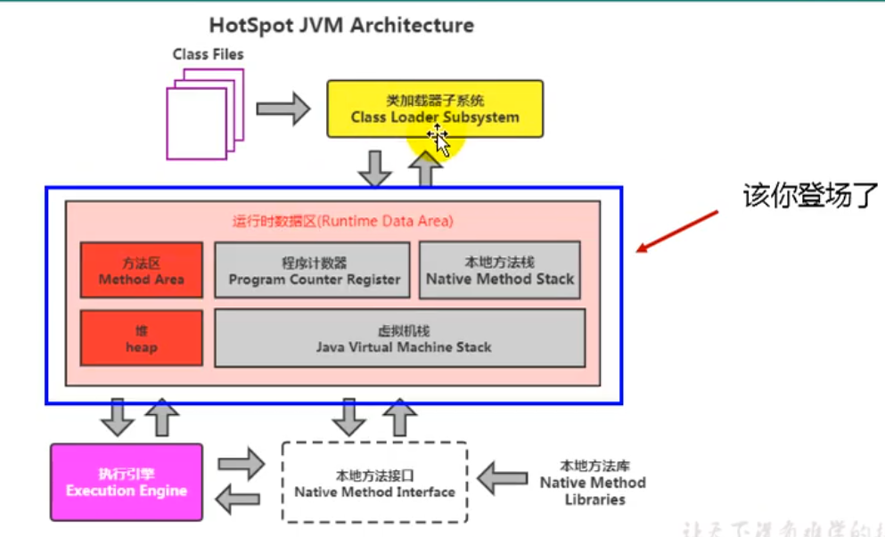
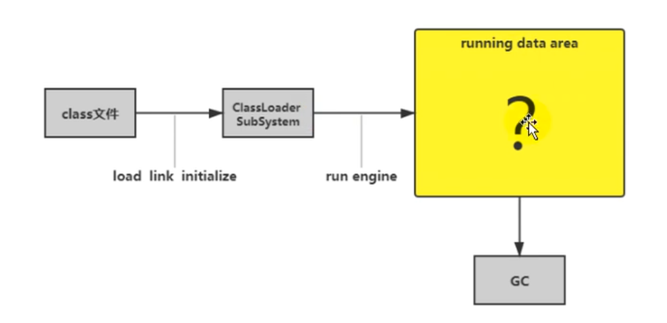
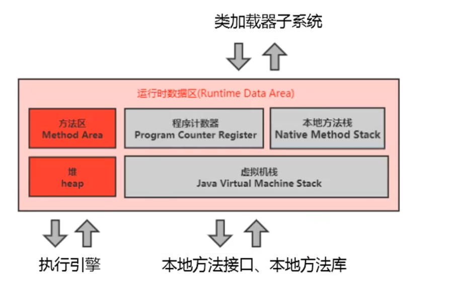
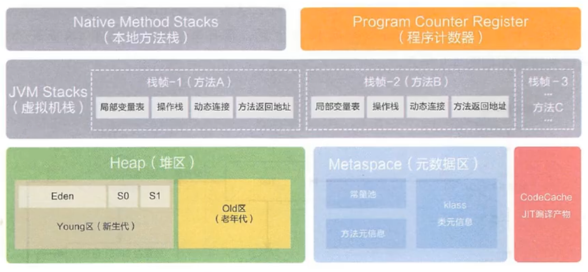
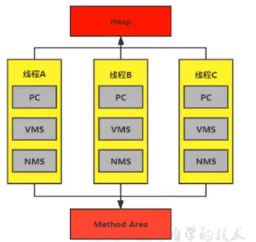
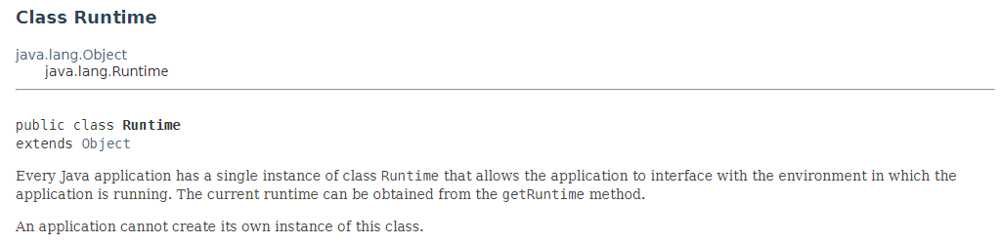

# 03.运行时数据区概述及线程

- 笔记本：JVM_1_内存与垃圾回收
- 创建时间：2020-12-18 09:54:33 UTC
- 更新时间：2020-12-19 03:22:33 UTC
- 印象笔记 GUID：833d1e86-8fdc-4afd-91a5-ad6ebaf7a119

## 运行时数据区概述及线程

 

### 运行时数据区

内存是非常重要的系统资源，是硬盘和 CPU 的中间仓库及桥梁，承载着操作系统和应用程序的实时运行。JVM 内存布局规定了 Java 在运行过程中内存申请、分配、管理的策略，保证了 JVM 的高效稳定运行。**不同的 JVM 对于内存的划分方式和管理机制存在着部分差异**。结合 JVM 虚拟机规范，来探讨一下经典的 JVM 内存布局。
 

Java 虚拟机定义了若干程序运行期间会使用到的运行时数据区，其中有一些会随着虚拟机启动而创建，随着虚拟机退出而销毁。另外一些则是则是与线程一一对应的，这些与线程一一对应的数据区域会随着线程开始和结束而创建和销毁。
 灰色的为单独线程私有的，红色的为多个线程（虚拟机进程）共享的。即：

- 每个线程：独立包括程序计数器、栈、本地栈

- 线程间共享：堆、堆外内存（永久代或元空间、代码缓存）
 

**关于线程间共享的说明**
 
 每个 JVM 只有一个 Runtime 实例。即为运行时环境，相当于内存结构的中间的那个框框：运行时环境。

### 线程

- 线程是一个程序里的运行单元。JVM 允许一个应用有多个线程并行的执行。

- 在 Hotspot JVM 里，每个线程都与操作系统的本地线程直接映射。

  - 当一个 Java 线程准备好执行以后，此时一个操作系统的本地线程也同时创建，Java 线程执行终止后，本地线程也会回收。

- 操作系统负责所有线程的安排调度到任何一个可用的 CPU 上，一旦本地线程初始化成功，它就会调用 Java 线程中的 run() 方法。

**JVM 系统线程**

- 如果使用 jconsole 或者任何一个调试工具，都能看到在后台有许多线程在运行。这些后台线程不包括调用 `public static void main(String[] args)` 的 main 线程以及所有这个 main 线程自己创建的线程。

- 这些主要的后台系统线程在 Hotspot JVM 里主要是以下几个：

  - **虚拟机线程：** 这种线程的操作是需要 JVM 达到安全点才会出现。这些操作必须在不同的线程中发生的原因是他们都需要 JVM 达到安全点，这样堆才不会变化。这种线程的执行类型包括 "stop-the-world" 的垃圾收集，线程栈收集，线程挂起以及偏向锁撤销。

  - **周期任务线程：** 这种

%23%23%20%E8%BF%90%E8%A1%8C%E6%97%B6%E6%95%B0%E6%8D%AE%E5%8C%BA%E6%A6%82%E8%BF%B0%E5%8F%8A%E7%BA%BF%E7%A8%8B%0A!%5B1e149b34e7073558ce15d7211f5b48a6.png%5D(en-resource%3A%2F%2Fdatabase%2F4658%3A1)%0A!%5B6b06495ea1aff0c36a6c9aa1d8c748d7.png%5D(en-resource%3A%2F%2Fdatabase%2F4660%3A0)%0A%0A%23%23%23%20%E8%BF%90%E8%A1%8C%E6%97%B6%E6%95%B0%E6%8D%AE%E5%8C%BA%0A%E5%86%85%E5%AD%98%E6%98%AF%E9%9D%9E%E5%B8%B8%E9%87%8D%E8%A6%81%E7%9A%84%E7%B3%BB%E7%BB%9F%E8%B5%84%E6%BA%90%EF%BC%8C%E6%98%AF%E7%A1%AC%E7%9B%98%E5%92%8C%20CPU%20%E7%9A%84%E4%B8%AD%E9%97%B4%E4%BB%93%E5%BA%93%E5%8F%8A%E6%A1%A5%E6%A2%81%EF%BC%8C%E6%89%BF%E8%BD%BD%E7%9D%80%E6%93%8D%E4%BD%9C%E7%B3%BB%E7%BB%9F%E5%92%8C%E5%BA%94%E7%94%A8%E7%A8%8B%E5%BA%8F%E7%9A%84%E5%AE%9E%E6%97%B6%E8%BF%90%E8%A1%8C%E3%80%82JVM%20%E5%86%85%E5%AD%98%E5%B8%83%E5%B1%80%E8%A7%84%E5%AE%9A%E4%BA%86%20Java%20%E5%9C%A8%E8%BF%90%E8%A1%8C%E8%BF%87%E7%A8%8B%E4%B8%AD%E5%86%85%E5%AD%98%E7%94%B3%E8%AF%B7%E3%80%81%E5%88%86%E9%85%8D%E3%80%81%E7%AE%A1%E7%90%86%E7%9A%84%E7%AD%96%E7%95%A5%EF%BC%8C%E4%BF%9D%E8%AF%81%E4%BA%86%20JVM%20%E7%9A%84%E9%AB%98%E6%95%88%E7%A8%B3%E5%AE%9A%E8%BF%90%E8%A1%8C%E3%80%82**%E4%B8%8D%E5%90%8C%E7%9A%84%20JVM%20%E5%AF%B9%E4%BA%8E%E5%86%85%E5%AD%98%E7%9A%84%E5%88%92%E5%88%86%E6%96%B9%E5%BC%8F%E5%92%8C%E7%AE%A1%E7%90%86%E6%9C%BA%E5%88%B6%E5%AD%98%E5%9C%A8%E7%9D%80%E9%83%A8%E5%88%86%E5%B7%AE%E5%BC%82**%E3%80%82%E7%BB%93%E5%90%88%20JVM%20%E8%99%9A%E6%8B%9F%E6%9C%BA%E8%A7%84%E8%8C%83%EF%BC%8C%E6%9D%A5%E6%8E%A2%E8%AE%A8%E4%B8%80%E4%B8%8B%E7%BB%8F%E5%85%B8%E7%9A%84%20JVM%20%E5%86%85%E5%AD%98%E5%B8%83%E5%B1%80%E3%80%82%0A!%5Be3dc0d34d1e9f639950e0f5c1fe962f8.png%5D(en-resource%3A%2F%2Fdatabase%2F4664%3A0)%0A%0A!%5B5ca704aa3f875e16e403c943f3d6a405.png%5D(en-resource%3A%2F%2Fdatabase%2F4666%3A0)%0A%0AJava%20%E8%99%9A%E6%8B%9F%E6%9C%BA%E5%AE%9A%E4%B9%89%E4%BA%86%E8%8B%A5%E5%B9%B2%E7%A8%8B%E5%BA%8F%E8%BF%90%E8%A1%8C%E6%9C%9F%E9%97%B4%E4%BC%9A%E4%BD%BF%E7%94%A8%E5%88%B0%E7%9A%84%E8%BF%90%E8%A1%8C%E6%97%B6%E6%95%B0%E6%8D%AE%E5%8C%BA%EF%BC%8C%E5%85%B6%E4%B8%AD%E6%9C%89%E4%B8%80%E4%BA%9B%E4%BC%9A%E9%9A%8F%E7%9D%80%E8%99%9A%E6%8B%9F%E6%9C%BA%E5%90%AF%E5%8A%A8%E8%80%8C%E5%88%9B%E5%BB%BA%EF%BC%8C%E9%9A%8F%E7%9D%80%E8%99%9A%E6%8B%9F%E6%9C%BA%E9%80%80%E5%87%BA%E8%80%8C%E9%94%80%E6%AF%81%E3%80%82%E5%8F%A6%E5%A4%96%E4%B8%80%E4%BA%9B%E5%88%99%E6%98%AF%E5%88%99%E6%98%AF%E4%B8%8E%E7%BA%BF%E7%A8%8B%E4%B8%80%E4%B8%80%E5%AF%B9%E5%BA%94%E7%9A%84%EF%BC%8C%E8%BF%99%E4%BA%9B%E4%B8%8E%E7%BA%BF%E7%A8%8B%E4%B8%80%E4%B8%80%E5%AF%B9%E5%BA%94%E7%9A%84%E6%95%B0%E6%8D%AE%E5%8C%BA%E5%9F%9F%E4%BC%9A%E9%9A%8F%E7%9D%80%E7%BA%BF%E7%A8%8B%E5%BC%80%E5%A7%8B%E5%92%8C%E7%BB%93%E6%9D%9F%E8%80%8C%E5%88%9B%E5%BB%BA%E5%92%8C%E9%94%80%E6%AF%81%E3%80%82%0A%E7%81%B0%E8%89%B2%E7%9A%84%E4%B8%BA%E5%8D%95%E7%8B%AC%E7%BA%BF%E7%A8%8B%E7%A7%81%E6%9C%89%E7%9A%84%EF%BC%8C%E7%BA%A2%E8%89%B2%E7%9A%84%E4%B8%BA%E5%A4%9A%E4%B8%AA%E7%BA%BF%E7%A8%8B%EF%BC%88%E8%99%9A%E6%8B%9F%E6%9C%BA%E8%BF%9B%E7%A8%8B%EF%BC%89%E5%85%B1%E4%BA%AB%E7%9A%84%E3%80%82%E5%8D%B3%EF%BC%9A%0A-%20%E6%AF%8F%E4%B8%AA%E7%BA%BF%E7%A8%8B%EF%BC%9A%E7%8B%AC%E7%AB%8B%E5%8C%85%E6%8B%AC%E7%A8%8B%E5%BA%8F%E8%AE%A1%E6%95%B0%E5%99%A8%E3%80%81%E6%A0%88%E3%80%81%E6%9C%AC%E5%9C%B0%E6%A0%88%0A-%20%E7%BA%BF%E7%A8%8B%E9%97%B4%E5%85%B1%E4%BA%AB%EF%BC%9A%E5%A0%86%E3%80%81%E5%A0%86%E5%A4%96%E5%86%85%E5%AD%98%EF%BC%88%E6%B0%B8%E4%B9%85%E4%BB%A3%E6%88%96%E5%85%83%E7%A9%BA%E9%97%B4%E3%80%81%E4%BB%A3%E7%A0%81%E7%BC%93%E5%AD%98%EF%BC%89%0A!%5B57c8786ce4e76768a58428ee77a30b28.png%5D(en-resource%3A%2F%2Fdatabase%2F4668%3A0)%0A%0A**%E5%85%B3%E4%BA%8E%E7%BA%BF%E7%A8%8B%E9%97%B4%E5%85%B1%E4%BA%AB%E7%9A%84%E8%AF%B4%E6%98%8E**%0A!%5B630d96031a27fc54230d4a62954385ea.png%5D(en-resource%3A%2F%2Fdatabase%2F4670%3A1)%0A%E6%AF%8F%E4%B8%AA%20JVM%20%E5%8F%AA%E6%9C%89%E4%B8%80%E4%B8%AA%20Runtime%20%E5%AE%9E%E4%BE%8B%E3%80%82%E5%8D%B3%E4%B8%BA%E8%BF%90%E8%A1%8C%E6%97%B6%E7%8E%AF%E5%A2%83%EF%BC%8C%E7%9B%B8%E5%BD%93%E4%BA%8E%E5%86%85%E5%AD%98%E7%BB%93%E6%9E%84%E7%9A%84%E4%B8%AD%E9%97%B4%E7%9A%84%E9%82%A3%E4%B8%AA%E6%A1%86%E6%A1%86%EF%BC%9A%E8%BF%90%E8%A1%8C%E6%97%B6%E7%8E%AF%E5%A2%83%E3%80%82%0A%0A%0A%23%23%23%20%E7%BA%BF%E7%A8%8B%0A-%20%E7%BA%BF%E7%A8%8B%E6%98%AF%E4%B8%80%E4%B8%AA%E7%A8%8B%E5%BA%8F%E9%87%8C%E7%9A%84%E8%BF%90%E8%A1%8C%E5%8D%95%E5%85%83%E3%80%82JVM%20%E5%85%81%E8%AE%B8%E4%B8%80%E4%B8%AA%E5%BA%94%E7%94%A8%E6%9C%89%E5%A4%9A%E4%B8%AA%E7%BA%BF%E7%A8%8B%E5%B9%B6%E8%A1%8C%E7%9A%84%E6%89%A7%E8%A1%8C%E3%80%82%0A-%20%E5%9C%A8%20Hotspot%20JVM%20%E9%87%8C%EF%BC%8C%E6%AF%8F%E4%B8%AA%E7%BA%BF%E7%A8%8B%E9%83%BD%E4%B8%8E%E6%93%8D%E4%BD%9C%E7%B3%BB%E7%BB%9F%E7%9A%84%E6%9C%AC%E5%9C%B0%E7%BA%BF%E7%A8%8B%E7%9B%B4%E6%8E%A5%E6%98%A0%E5%B0%84%E3%80%82%0A%20%20%20%20-%20%E5%BD%93%E4%B8%80%E4%B8%AA%20Java%20%E7%BA%BF%E7%A8%8B%E5%87%86%E5%A4%87%E5%A5%BD%E6%89%A7%E8%A1%8C%E4%BB%A5%E5%90%8E%EF%BC%8C%E6%AD%A4%E6%97%B6%E4%B8%80%E4%B8%AA%E6%93%8D%E4%BD%9C%E7%B3%BB%E7%BB%9F%E7%9A%84%E6%9C%AC%E5%9C%B0%E7%BA%BF%E7%A8%8B%E4%B9%9F%E5%90%8C%E6%97%B6%E5%88%9B%E5%BB%BA%EF%BC%8CJava%20%E7%BA%BF%E7%A8%8B%E6%89%A7%E8%A1%8C%E7%BB%88%E6%AD%A2%E5%90%8E%EF%BC%8C%E6%9C%AC%E5%9C%B0%E7%BA%BF%E7%A8%8B%E4%B9%9F%E4%BC%9A%E5%9B%9E%E6%94%B6%E3%80%82%0A-%20%E6%93%8D%E4%BD%9C%E7%B3%BB%E7%BB%9F%E8%B4%9F%E8%B4%A3%E6%89%80%E6%9C%89%E7%BA%BF%E7%A8%8B%E7%9A%84%E5%AE%89%E6%8E%92%E8%B0%83%E5%BA%A6%E5%88%B0%E4%BB%BB%E4%BD%95%E4%B8%80%E4%B8%AA%E5%8F%AF%E7%94%A8%E7%9A%84%20CPU%20%E4%B8%8A%EF%BC%8C%E4%B8%80%E6%97%A6%E6%9C%AC%E5%9C%B0%E7%BA%BF%E7%A8%8B%E5%88%9D%E5%A7%8B%E5%8C%96%E6%88%90%E5%8A%9F%EF%BC%8C%E5%AE%83%E5%B0%B1%E4%BC%9A%E8%B0%83%E7%94%A8%20Java%20%E7%BA%BF%E7%A8%8B%E4%B8%AD%E7%9A%84%20run()%20%E6%96%B9%E6%B3%95%E3%80%82%0A%0A**JVM%20%E7%B3%BB%E7%BB%9F%E7%BA%BF%E7%A8%8B**%0A-%20%E5%A6%82%E6%9E%9C%E4%BD%BF%E7%94%A8%20jconsole%20%E6%88%96%E8%80%85%E4%BB%BB%E4%BD%95%E4%B8%80%E4%B8%AA%E8%B0%83%E8%AF%95%E5%B7%A5%E5%85%B7%EF%BC%8C%E9%83%BD%E8%83%BD%E7%9C%8B%E5%88%B0%E5%9C%A8%E5%90%8E%E5%8F%B0%E6%9C%89%E8%AE%B8%E5%A4%9A%E7%BA%BF%E7%A8%8B%E5%9C%A8%E8%BF%90%E8%A1%8C%E3%80%82%E8%BF%99%E4%BA%9B%E5%90%8E%E5%8F%B0%E7%BA%BF%E7%A8%8B%E4%B8%8D%E5%8C%85%E6%8B%AC%E8%B0%83%E7%94%A8%20%60public%20static%20void%20main(String%5B%5D%20args)%60%20%E7%9A%84%20main%20%E7%BA%BF%E7%A8%8B%E4%BB%A5%E5%8F%8A%E6%89%80%E6%9C%89%E8%BF%99%E4%B8%AA%20main%20%E7%BA%BF%E7%A8%8B%E8%87%AA%E5%B7%B1%E5%88%9B%E5%BB%BA%E7%9A%84%E7%BA%BF%E7%A8%8B%E3%80%82%0A-%20%E8%BF%99%E4%BA%9B%E4%B8%BB%E8%A6%81%E7%9A%84%E5%90%8E%E5%8F%B0%E7%B3%BB%E7%BB%9F%E7%BA%BF%E7%A8%8B%E5%9C%A8%20Hotspot%20JVM%20%E9%87%8C%E4%B8%BB%E8%A6%81%E6%98%AF%E4%BB%A5%E4%B8%8B%E5%87%A0%E4%B8%AA%EF%BC%9A%0A%20%20%20%20-%20**%E8%99%9A%E6%8B%9F%E6%9C%BA%E7%BA%BF%E7%A8%8B%EF%BC%9A**%20%E8%BF%99%E7%A7%8D%E7%BA%BF%E7%A8%8B%E7%9A%84%E6%93%8D%E4%BD%9C%E6%98%AF%E9%9C%80%E8%A6%81%20JVM%20%E8%BE%BE%E5%88%B0%E5%AE%89%E5%85%A8%E7%82%B9%E6%89%8D%E4%BC%9A%E5%87%BA%E7%8E%B0%E3%80%82%E8%BF%99%E4%BA%9B%E6%93%8D%E4%BD%9C%E5%BF%85%E9%A1%BB%E5%9C%A8%E4%B8%8D%E5%90%8C%E7%9A%84%E7%BA%BF%E7%A8%8B%E4%B8%AD%E5%8F%91%E7%94%9F%E7%9A%84%E5%8E%9F%E5%9B%A0%E6%98%AF%E4%BB%96%E4%BB%AC%E9%83%BD%E9%9C%80%E8%A6%81%20JVM%20%E8%BE%BE%E5%88%B0%E5%AE%89%E5%85%A8%E7%82%B9%EF%BC%8C%E8%BF%99%E6%A0%B7%E5%A0%86%E6%89%8D%E4%B8%8D%E4%BC%9A%E5%8F%98%E5%8C%96%E3%80%82%E8%BF%99%E7%A7%8D%E7%BA%BF%E7%A8%8B%E7%9A%84%E6%89%A7%E8%A1%8C%E7%B1%BB%E5%9E%8B%E5%8C%85%E6%8B%AC%20%22stop-the-world%22%20%E7%9A%84%E5%9E%83%E5%9C%BE%E6%94%B6%E9%9B%86%EF%BC%8C%E7%BA%BF%E7%A8%8B%E6%A0%88%E6%94%B6%E9%9B%86%EF%BC%8C%E7%BA%BF%E7%A8%8B%E6%8C%82%E8%B5%B7%E4%BB%A5%E5%8F%8A%E5%81%8F%E5%90%91%E9%94%81%E6%92%A4%E9%94%80%E3%80%82%0A%20%20%20%20-%20**%E5%91%A8%E6%9C%9F%E4%BB%BB%E5%8A%A1%E7%BA%BF%E7%A8%8B%EF%BC%9A**%20%E8%BF%99%E7%A7%8D%E7%BA%BF%E7%A8%8B%E6%98%AF%E6%97%B6%E9%97%B4%E5%91%A8%E6%9C%9F%E4%BA%8B%E4%BB%B6%E7%9A%84%E4%BD%93%E7%8E%B0%EF%BC%88%E6%AF%94%E5%A6%82%E4%B8%AD%E6%96%AD%EF%BC%89%EF%BC%8C%E4%BB%96%E4%BB%AC%E4%B8%80%E8%88%AC%E7%94%A8%E4%BA%8E%E5%91%A8%E6%9C%9F%E6%80%A7%E6%93%8D%E4%BD%9C%E7%9A%84%E8%B0%83%E5%BA%A6%E6%89%A7%E8%A1%8C%E3%80%82%0A%20%20%20%20-%20**GC%20%E7%BA%BF%E7%A8%8B%EF%BC%9A**%20%E8%BF%99%E7%A7%8D%E7%BA%BF%E7%A8%8B%E5%AF%B9%E5%9C%A8%20JVM%20%E9%87%8C%E4%B8%8D%E5%90%8C%E7%A7%8D%E7%B1%BB%E7%9A%84%E5%9E%83%E5%9C%BE%E6%94%B6%E9%9B%86%E8%A1%8C%E4%B8%BA%E6%8F%90%E4%BE%9B%E4%BA%86%E6%94%AF%E6%8C%81%E3%80%82%0A%20%20%20%20-%20**%E7%BC%96%E8%AF%91%E7%BA%BF%E7%A8%8B%EF%BC%9A**%20%E8%BF%99%E7%A7%8D%E7%BA%BF%E7%A8%8B%E5%9C%A8%E8%BF%90%E8%A1%8C%E6%97%B6%E4%BC%9A%E5%B0%86%E5%AD%97%E8%8A%82%E7%A0%81%E7%BC%96%E8%AF%91%E6%88%90%E6%9C%AC%E5%9C%B0%E4%BB%A3%E7%A0%81%0A%20%20%20%20-%20**%E4%BF%A1%E5%8F%B7%E8%B0%83%E5%BA%A6%E7%BA%BF%E7%A8%8B%EF%BC%9A**%20%E8%BF%99%E7%A7%8D%E7%BA%BF%E7%A8%8B%E6%8E%A5%E6%94%B6%E4%BF%A1%E5%8F%B7%E5%B9%B6%E5%8F%91%E9%80%81%E7%BB%99%20JVM%EF%BC%8C%E5%9C%A8%E5%AE%83%E5%86%85%E9%83%A8%E9%80%9A%E8%BF%87%E8%B0%83%E7%94%A8%E9%80%82%E5%BD%93%E7%9A%84%E6%96%B9%E6%B3%95%E8%BF%9B%E8%A1%8C%E5%A4%84%E7%90%86%E3%80%82
