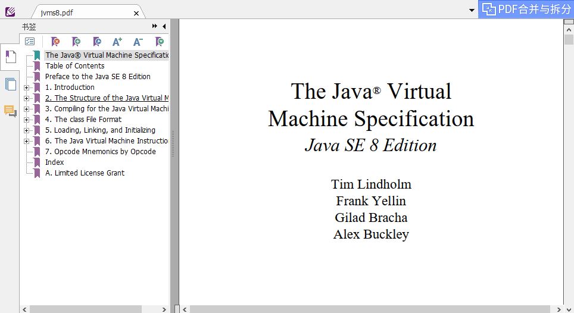
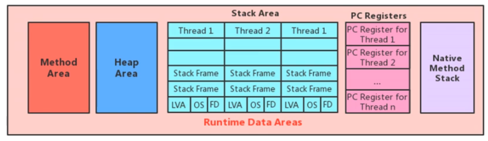
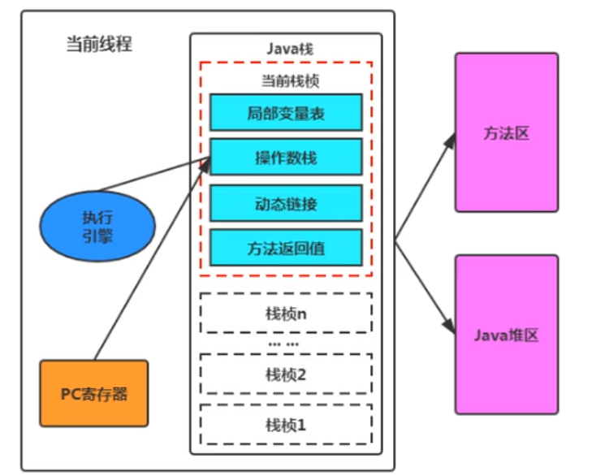
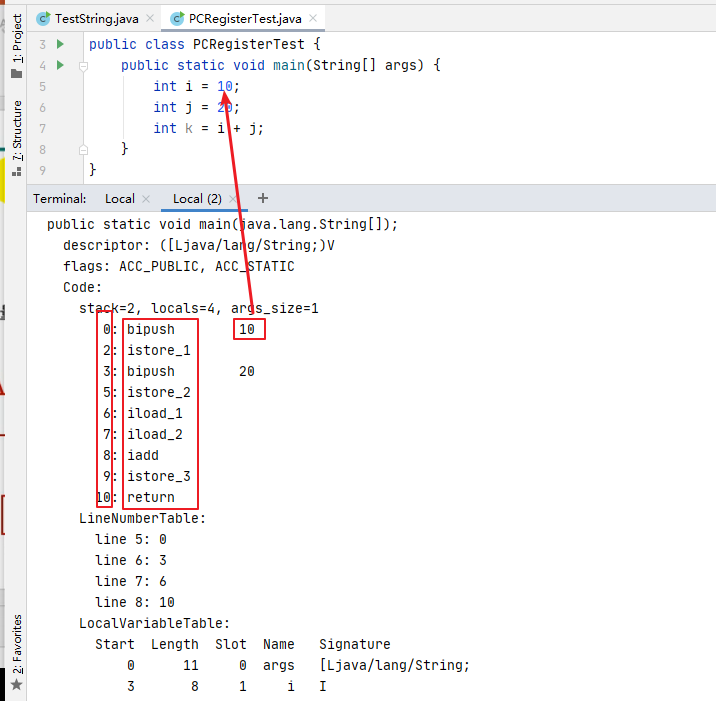
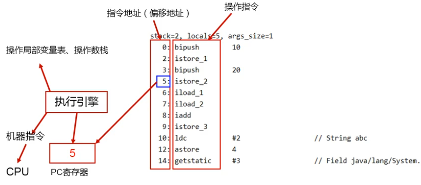

# 04.程序计数器（PC 寄存器）

- 笔记本：JVM_1_内存与垃圾回收
- 创建时间：2020-12-19 03:25:05 UTC
- 更新时间：2020-12-19 10:59:16 UTC
- 印象笔记 GUID：f62ac49c-ae8c-41f4-9110-2e04d29e0eb8

## 程序计数器（PC 寄存器）

### 1. PC Register 介绍



>
[官网地址](https://docs.oracle.com/javase/specs/jvms/se8/html/)


 JVM 中的程序计数器（Program Counter Register）中，Register 的命名源于 CPU 的寄存器，寄存器存储指令相关的现场信息。CPU 只有把数据装载到寄存器才能够运行。
 这里，并非是广义上所指的物理寄存器，或许将其翻译为 PC 计数器（或指令计数器）会更加贴切（也成为程序钩子），并且也不容易引起一些不必要的误会。**JVM 中的 PC 寄存器是对物理 PC 寄存器的一种抽象模拟**。

**作用：** PC 寄存器用来存储指向下一条指令的地址，也即将要执行的指令代码。由执行引擎读取下一条执行。
 

**PC Resister 介绍：**

- 它是很小的一块内存空间，几乎可以忽略不计。也是运行速度最快的存储区域。

- 在 JVM 规范中，每个线程都有它自己的程序计数器，是线程私有的，生命周期与线程的生命周期保持一致。

- 任何时间一个线程都只有一个方法在执行，也就是所谓的**当前方法**。程序计数器会存储当前线程正在执行的 Java 方法的 JVM 指令地址；或者，如果是在执行 native 方法，则是未指定指（undefined）。

- 它是程序控制流的指示器，分支、循环、跳转、异常处理、线程恢复等基础功能都需要依赖这个计数器来完成。

- 字节码解释器工作时就是通过改变这个计数器的值来选取下一条需要执行的字节码指令。

- 它是唯一一个在 Java 虚拟机规范中没有规定任何 OutOtMemoryError 情况的区域。

### 2. 举例说明

```
public class PCRegisterTest {
    public static void main(String[] args) {
        int i = 10;
        int j = 20;
        int k = i + j;
    }
}

```

```
javap -verbose PCRegisterTest.class

```


 

### 3. 两个常见问题

#### 使用 PC 寄存器存储字节码指令地址有什么用，为什么使用 PC 寄存器记录当前线程的执行地址呢？

因为 CPU 需要不停的切换各个线程，这时候切换回来以后，就得知道接着从哪开始继续执行。
 JVM 的字节码解释器就需要通过改变 PC 寄存器的值来明确下一条应该执行什么样的字节码指令。

#### PC 寄存器为什么会被设定为线程私有

我们都知道所谓的多线程在一个特定的时间段内只会执行其中某一个线程的方法，CPU 会不停地 做任务切换，这样必然会导致警察中断或恢复，如何保证分毫无差呢？**为了能够准确地记录各个线程正在执行的当前字节码指令地址，最好的办法自然是为每一个

%23%23%20%E7%A8%8B%E5%BA%8F%E8%AE%A1%E6%95%B0%E5%99%A8%EF%BC%88PC%20%E5%AF%84%E5%AD%98%E5%99%A8%EF%BC%89%0A%23%23%23%201.%20PC%20Register%20%E4%BB%8B%E7%BB%8D%0A!%5B566fb88cd7f549a6acd774f5149053b4.png%5D(en-resource%3A%2F%2Fdatabase%2F4674%3A0)%0A%3E%5B%E5%AE%98%E7%BD%91%E5%9C%B0%E5%9D%80%5D(https%3A%2F%2Fdocs.oracle.com%2Fjavase%2Fspecs%2Fjvms%2Fse8%2Fhtml%2F)%0A%0A!%5Bbca62e7ab195f3c9a68134d018202515.png%5D(en-resource%3A%2F%2Fdatabase%2F4676%3A0)%0AJVM%20%E4%B8%AD%E7%9A%84%E7%A8%8B%E5%BA%8F%E8%AE%A1%E6%95%B0%E5%99%A8%EF%BC%88Program%20Counter%20Register%EF%BC%89%E4%B8%AD%EF%BC%8CRegister%20%E7%9A%84%E5%91%BD%E5%90%8D%E6%BA%90%E4%BA%8E%20CPU%20%E7%9A%84%E5%AF%84%E5%AD%98%E5%99%A8%EF%BC%8C%E5%AF%84%E5%AD%98%E5%99%A8%E5%AD%98%E5%82%A8%E6%8C%87%E4%BB%A4%E7%9B%B8%E5%85%B3%E7%9A%84%E7%8E%B0%E5%9C%BA%E4%BF%A1%E6%81%AF%E3%80%82CPU%20%E5%8F%AA%E6%9C%89%E6%8A%8A%E6%95%B0%E6%8D%AE%E8%A3%85%E8%BD%BD%E5%88%B0%E5%AF%84%E5%AD%98%E5%99%A8%E6%89%8D%E8%83%BD%E5%A4%9F%E8%BF%90%E8%A1%8C%E3%80%82%0A%E8%BF%99%E9%87%8C%EF%BC%8C%E5%B9%B6%E9%9D%9E%E6%98%AF%E5%B9%BF%E4%B9%89%E4%B8%8A%E6%89%80%E6%8C%87%E7%9A%84%E7%89%A9%E7%90%86%E5%AF%84%E5%AD%98%E5%99%A8%EF%BC%8C%E6%88%96%E8%AE%B8%E5%B0%86%E5%85%B6%E7%BF%BB%E8%AF%91%E4%B8%BA%20PC%20%E8%AE%A1%E6%95%B0%E5%99%A8%EF%BC%88%E6%88%96%E6%8C%87%E4%BB%A4%E8%AE%A1%E6%95%B0%E5%99%A8%EF%BC%89%E4%BC%9A%E6%9B%B4%E5%8A%A0%E8%B4%B4%E5%88%87%EF%BC%88%E4%B9%9F%E6%88%90%E4%B8%BA%E7%A8%8B%E5%BA%8F%E9%92%A9%E5%AD%90%EF%BC%89%EF%BC%8C%E5%B9%B6%E4%B8%94%E4%B9%9F%E4%B8%8D%E5%AE%B9%E6%98%93%E5%BC%95%E8%B5%B7%E4%B8%80%E4%BA%9B%E4%B8%8D%E5%BF%85%E8%A6%81%E7%9A%84%E8%AF%AF%E4%BC%9A%E3%80%82**JVM%20%E4%B8%AD%E7%9A%84%20PC%20%E5%AF%84%E5%AD%98%E5%99%A8%E6%98%AF%E5%AF%B9%E7%89%A9%E7%90%86%20PC%20%E5%AF%84%E5%AD%98%E5%99%A8%E7%9A%84%E4%B8%80%E7%A7%8D%E6%8A%BD%E8%B1%A1%E6%A8%A1%E6%8B%9F**%E3%80%82%0A%0A**%E4%BD%9C%E7%94%A8%EF%BC%9A**%20PC%20%E5%AF%84%E5%AD%98%E5%99%A8%E7%94%A8%E6%9D%A5%E5%AD%98%E5%82%A8%E6%8C%87%E5%90%91%E4%B8%8B%E4%B8%80%E6%9D%A1%E6%8C%87%E4%BB%A4%E7%9A%84%E5%9C%B0%E5%9D%80%EF%BC%8C%E4%B9%9F%E5%8D%B3%E5%B0%86%E8%A6%81%E6%89%A7%E8%A1%8C%E7%9A%84%E6%8C%87%E4%BB%A4%E4%BB%A3%E7%A0%81%E3%80%82%E7%94%B1%E6%89%A7%E8%A1%8C%E5%BC%95%E6%93%8E%E8%AF%BB%E5%8F%96%E4%B8%8B%E4%B8%80%E6%9D%A1%E6%89%A7%E8%A1%8C%E3%80%82%0A!%5Be61df891b3408f7474fc592b7fafc945.png%5D(en-resource%3A%2F%2Fdatabase%2F4678%3A0)%0A%0A**PC%20Resister%20%E4%BB%8B%E7%BB%8D%EF%BC%9A**%0A-%20%E5%AE%83%E6%98%AF%E5%BE%88%E5%B0%8F%E7%9A%84%E4%B8%80%E5%9D%97%E5%86%85%E5%AD%98%E7%A9%BA%E9%97%B4%EF%BC%8C%E5%87%A0%E4%B9%8E%E5%8F%AF%E4%BB%A5%E5%BF%BD%E7%95%A5%E4%B8%8D%E8%AE%A1%E3%80%82%E4%B9%9F%E6%98%AF%E8%BF%90%E8%A1%8C%E9%80%9F%E5%BA%A6%E6%9C%80%E5%BF%AB%E7%9A%84%E5%AD%98%E5%82%A8%E5%8C%BA%E5%9F%9F%E3%80%82%0A-%20%E5%9C%A8%20JVM%20%E8%A7%84%E8%8C%83%E4%B8%AD%EF%BC%8C%E6%AF%8F%E4%B8%AA%E7%BA%BF%E7%A8%8B%E9%83%BD%E6%9C%89%E5%AE%83%E8%87%AA%E5%B7%B1%E7%9A%84%E7%A8%8B%E5%BA%8F%E8%AE%A1%E6%95%B0%E5%99%A8%EF%BC%8C%E6%98%AF%E7%BA%BF%E7%A8%8B%E7%A7%81%E6%9C%89%E7%9A%84%EF%BC%8C%E7%94%9F%E5%91%BD%E5%91%A8%E6%9C%9F%E4%B8%8E%E7%BA%BF%E7%A8%8B%E7%9A%84%E7%94%9F%E5%91%BD%E5%91%A8%E6%9C%9F%E4%BF%9D%E6%8C%81%E4%B8%80%E8%87%B4%E3%80%82%0A-%20%E4%BB%BB%E4%BD%95%E6%97%B6%E9%97%B4%E4%B8%80%E4%B8%AA%E7%BA%BF%E7%A8%8B%E9%83%BD%E5%8F%AA%E6%9C%89%E4%B8%80%E4%B8%AA%E6%96%B9%E6%B3%95%E5%9C%A8%E6%89%A7%E8%A1%8C%EF%BC%8C%E4%B9%9F%E5%B0%B1%E6%98%AF%E6%89%80%E8%B0%93%E7%9A%84**%E5%BD%93%E5%89%8D%E6%96%B9%E6%B3%95**%E3%80%82%E7%A8%8B%E5%BA%8F%E8%AE%A1%E6%95%B0%E5%99%A8%E4%BC%9A%E5%AD%98%E5%82%A8%E5%BD%93%E5%89%8D%E7%BA%BF%E7%A8%8B%E6%AD%A3%E5%9C%A8%E6%89%A7%E8%A1%8C%E7%9A%84%20Java%20%E6%96%B9%E6%B3%95%E7%9A%84%20JVM%20%E6%8C%87%E4%BB%A4%E5%9C%B0%E5%9D%80%EF%BC%9B%E6%88%96%E8%80%85%EF%BC%8C%E5%A6%82%E6%9E%9C%E6%98%AF%E5%9C%A8%E6%89%A7%E8%A1%8C%20native%20%E6%96%B9%E6%B3%95%EF%BC%8C%E5%88%99%E6%98%AF%E6%9C%AA%E6%8C%87%E5%AE%9A%E6%8C%87%EF%BC%88undefined%EF%BC%89%E3%80%82%0A-%20%E5%AE%83%E6%98%AF%E7%A8%8B%E5%BA%8F%E6%8E%A7%E5%88%B6%E6%B5%81%E7%9A%84%E6%8C%87%E7%A4%BA%E5%99%A8%EF%BC%8C%E5%88%86%E6%94%AF%E3%80%81%E5%BE%AA%E7%8E%AF%E3%80%81%E8%B7%B3%E8%BD%AC%E3%80%81%E5%BC%82%E5%B8%B8%E5%A4%84%E7%90%86%E3%80%81%E7%BA%BF%E7%A8%8B%E6%81%A2%E5%A4%8D%E7%AD%89%E5%9F%BA%E7%A1%80%E5%8A%9F%E8%83%BD%E9%83%BD%E9%9C%80%E8%A6%81%E4%BE%9D%E8%B5%96%E8%BF%99%E4%B8%AA%E8%AE%A1%E6%95%B0%E5%99%A8%E6%9D%A5%E5%AE%8C%E6%88%90%E3%80%82%0A-%20%E5%AD%97%E8%8A%82%E7%A0%81%E8%A7%A3%E9%87%8A%E5%99%A8%E5%B7%A5%E4%BD%9C%E6%97%B6%E5%B0%B1%E6%98%AF%E9%80%9A%E8%BF%87%E6%94%B9%E5%8F%98%E8%BF%99%E4%B8%AA%E8%AE%A1%E6%95%B0%E5%99%A8%E7%9A%84%E5%80%BC%E6%9D%A5%E9%80%89%E5%8F%96%E4%B8%8B%E4%B8%80%E6%9D%A1%E9%9C%80%E8%A6%81%E6%89%A7%E8%A1%8C%E7%9A%84%E5%AD%97%E8%8A%82%E7%A0%81%E6%8C%87%E4%BB%A4%E3%80%82%0A-%20%E5%AE%83%E6%98%AF%E5%94%AF%E4%B8%80%E4%B8%80%E4%B8%AA%E5%9C%A8%20Java%20%E8%99%9A%E6%8B%9F%E6%9C%BA%E8%A7%84%E8%8C%83%E4%B8%AD%E6%B2%A1%E6%9C%89%E8%A7%84%E5%AE%9A%E4%BB%BB%E4%BD%95%20OutOtMemoryError%20%E6%83%85%E5%86%B5%E7%9A%84%E5%8C%BA%E5%9F%9F%E3%80%82%0A%0A%23%23%23%202.%20%E4%B8%BE%E4%BE%8B%E8%AF%B4%E6%98%8E%0A%60%60%60java%0Apublic%20class%20PCRegisterTest%20%7B%0A%20%20%20%20public%20static%20void%20main(String%5B%5D%20args)%20%7B%0A%20%20%20%20%20%20%20%20int%20i%20%3D%2010%3B%0A%20%20%20%20%20%20%20%20int%20j%20%3D%2020%3B%0A%20%20%20%20%20%20%20%20int%20k%20%3D%20i%20%2B%20j%3B%0A%20%20%20%20%7D%0A%7D%0A%60%60%60%0A%0A%60%60%60cmd%0Ajavap%20-verbose%20PCRegisterTest.class%0A%60%60%60%0A!%5Baeabc9ac948bd1e8a85aee274e740533.png%5D(en-resource%3A%2F%2Fdatabase%2F4680%3A0)%0A!%5B1144a952aeddf6cc86859f5e0fdca6b3.png%5D(en-resource%3A%2F%2Fdatabase%2F4682%3A0)%0A%0A%23%23%23%203.%20%E4%B8%A4%E4%B8%AA%E5%B8%B8%E8%A7%81%E9%97%AE%E9%A2%98%0A%23%23%23%23%20%E4%BD%BF%E7%94%A8%20PC%20%E5%AF%84%E5%AD%98%E5%99%A8%E5%AD%98%E5%82%A8%E5%AD%97%E8%8A%82%E7%A0%81%E6%8C%87%E4%BB%A4%E5%9C%B0%E5%9D%80%E6%9C%89%E4%BB%80%E4%B9%88%E7%94%A8%EF%BC%8C%E4%B8%BA%E4%BB%80%E4%B9%88%E4%BD%BF%E7%94%A8%20PC%20%E5%AF%84%E5%AD%98%E5%99%A8%E8%AE%B0%E5%BD%95%E5%BD%93%E5%89%8D%E7%BA%BF%E7%A8%8B%E7%9A%84%E6%89%A7%E8%A1%8C%E5%9C%B0%E5%9D%80%E5%91%A2%EF%BC%9F%0A%E5%9B%A0%E4%B8%BA%20CPU%20%E9%9C%80%E8%A6%81%E4%B8%8D%E5%81%9C%E7%9A%84%E5%88%87%E6%8D%A2%E5%90%84%E4%B8%AA%E7%BA%BF%E7%A8%8B%EF%BC%8C%E8%BF%99%E6%97%B6%E5%80%99%E5%88%87%E6%8D%A2%E5%9B%9E%E6%9D%A5%E4%BB%A5%E5%90%8E%EF%BC%8C%E5%B0%B1%E5%BE%97%E7%9F%A5%E9%81%93%E6%8E%A5%E7%9D%80%E4%BB%8E%E5%93%AA%E5%BC%80%E5%A7%8B%E7%BB%A7%E7%BB%AD%E6%89%A7%E8%A1%8C%E3%80%82%0AJVM%20%E7%9A%84%E5%AD%97%E8%8A%82%E7%A0%81%E8%A7%A3%E9%87%8A%E5%99%A8%E5%B0%B1%E9%9C%80%E8%A6%81%E9%80%9A%E8%BF%87%E6%94%B9%E5%8F%98%20PC%20%E5%AF%84%E5%AD%98%E5%99%A8%E7%9A%84%E5%80%BC%E6%9D%A5%E6%98%8E%E7%A1%AE%E4%B8%8B%E4%B8%80%E6%9D%A1%E5%BA%94%E8%AF%A5%E6%89%A7%E8%A1%8C%E4%BB%80%E4%B9%88%E6%A0%B7%E7%9A%84%E5%AD%97%E8%8A%82%E7%A0%81%E6%8C%87%E4%BB%A4%E3%80%82%0A%0A%23%23%23%23%20PC%20%E5%AF%84%E5%AD%98%E5%99%A8%E4%B8%BA%E4%BB%80%E4%B9%88%E4%BC%9A%E8%A2%AB%E8%AE%BE%E5%AE%9A%E4%B8%BA%E7%BA%BF%E7%A8%8B%E7%A7%81%E6%9C%89%0A%E6%88%91%E4%BB%AC%E9%83%BD%E7%9F%A5%E9%81%93%E6%89%80%E8%B0%93%E7%9A%84%E5%A4%9A%E7%BA%BF%E7%A8%8B%E5%9C%A8%E4%B8%80%E4%B8%AA%E7%89%B9%E5%AE%9A%E7%9A%84%E6%97%B6%E9%97%B4%E6%AE%B5%E5%86%85%E5%8F%AA%E4%BC%9A%E6%89%A7%E8%A1%8C%E5%85%B6%E4%B8%AD%E6%9F%90%E4%B8%80%E4%B8%AA%E7%BA%BF%E7%A8%8B%E7%9A%84%E6%96%B9%E6%B3%95%EF%BC%8CCPU%20%E4%BC%9A%E4%B8%8D%E5%81%9C%E5%9C%B0%20%E5%81%9A%E4%BB%BB%E5%8A%A1%E5%88%87%E6%8D%A2%EF%BC%8C%E8%BF%99%E6%A0%B7%E5%BF%85%E7%84%B6%E4%BC%9A%E5%AF%BC%E8%87%B4%E8%AD%A6%E5%AF%9F%E4%B8%AD%E6%96%AD%E6%88%96%E6%81%A2%E5%A4%8D%EF%BC%8C%E5%A6%82%E4%BD%95%E4%BF%9D%E8%AF%81%E5%88%86%E6%AF%AB%E6%97%A0%E5%B7%AE%E5%91%A2%EF%BC%9F**%E4%B8%BA%E4%BA%86%E8%83%BD%E5%A4%9F%E5%87%86%E7%A1%AE%E5%9C%B0%E8%AE%B0%E5%BD%95%E5%90%84%E4%B8%AA%E7%BA%BF%E7%A8%8B%E6%AD%A3%E5%9C%A8%E6%89%A7%E8%A1%8C%E7%9A%84%E5%BD%93%E5%89%8D%E5%AD%97%E8%8A%82%E7%A0%81%E6%8C%87%E4%BB%A4%E5%9C%B0%E5%9D%80%EF%BC%8C%E6%9C%80%E5%A5%BD%E7%9A%84%E5%8A%9E%E6%B3%95%E8%87%AA%E7%84%B6%E6%98%AF%E4%B8%BA%E6%AF%8F%E4%B8%80%E4%B8%AA%0A%0A**CPU%20%E6%97%B6%E9%97%B4%E7%89%87**%0ACPU%20%E6%97%B6%E9%97%B4%E7%89%87%E5%8D%B3%20CPU%20%E5%88%86%E9%85%8D%E7%BB%99%E5%90%84%E4%B8%AA%E7%A8%8B%E5%BA%8F%E7%9A%84%E6%97%B6%E9%97%B4%EF%BC%8C%E6%AF%8F%E4%B8%AA%E7%BA%BF%E7%A8%8B%E8%A2%AB%E5%88%86%E9%85%8D%E4%B8%80%E4%B8%AA%E6%97%B6%E9%97%B4%E6%AE%B5%EF%BC%8C%E7%A7%B0%E4%BD%9C%E5%AE%83%E7%9A%84%E6%97%B6%E9%97%B4%E7%89%87%E3%80%82%0A%E5%9C%A8%E5%AE%8F%E8%A7%82%E4%B8%8A%EF%BC%9A%E6%88%91%E4%BB%AC%E5%8F%AF%E4%BB%A5%E5%90%8C%E6%97%B6%E6%89%93%E5%BC%80%E5%A4%9A%E4%B8%AA%E5%BA%94%E7%94%A8%E7%A8%8B%E5%BA%8F%EF%BC%8C%E6%AF%8F%E4%B8%AA%E5%BA%94%E7%94%A8%E7%A8%8B%E5%BA%8F%E5%B9%B6%E8%A1%8C%E4%B8%8D%E6%82%96%EF%BC%8C%E5%90%8C%E6%97%B6%E8%BF%90%E8%A1%8C%E3%80%82%0A%E4%BD%86%E5%9C%A8%E5%BE%AE%E8%A7%82%E4%B8%8A%EF%BC%9A%E7%94%B1%E4%BA%8E%E5%8F%AA%E6%9C%89%E4%B8%80%E4%B8%AA%20CPU%EF%BC%8C%E4%B8%80%E6%AC%A1%E5%8F%AA%E8%83%BD%E5%A4%84%E7%90%86%E7%A8%8B%E5%BA%8F%E8%A6%81%E6%B1%82%E7%9A%84%E4%B8%80%E9%83%A8%E5%88%86%EF%BC%8C%E5%A6%82%E6%9E%9C%E5%A4%84%E7%90%86%E5%85%AC%E5%B9%B3%EF%BC%8C%E4%B8%80%E7%A7%8D%E6%96%B9%E6%B3%95%E5%B0%B1%E6%98%AF%E5%BC%95%E5%85%A5%E6%97%B6%E9%97%B4%E7%89%87%EF%BC%8C%E6%AF%8F%E4%B8%AA%E7%A8%8B%E5%BA%8F%E8%BD%AE%E6%B5%81%E6%89%A7%E8%A1%8C%E3%80%82%0A!%5Bcbf9577c6b7b97e21a4b6b6ecbe840c4.png%5D(en-resource%3A%2F%2Fdatabase%2F4684%3A0)%0A%0A
