# 08.堆

- 笔记本：JVM_1_内存与垃圾回收
- 创建时间：2020-12-20 15:14:24 UTC
- 更新时间：2020-12-21 16:28:03 UTC
- 原始链接：https://www.cnblogs.com/williamjie/p/9222839.html
- 印象笔记 GUID：994c44b5-8c35-4b71-87b2-7432f0d563d6

## 堆

### 1. 堆（Heap）的核心概述

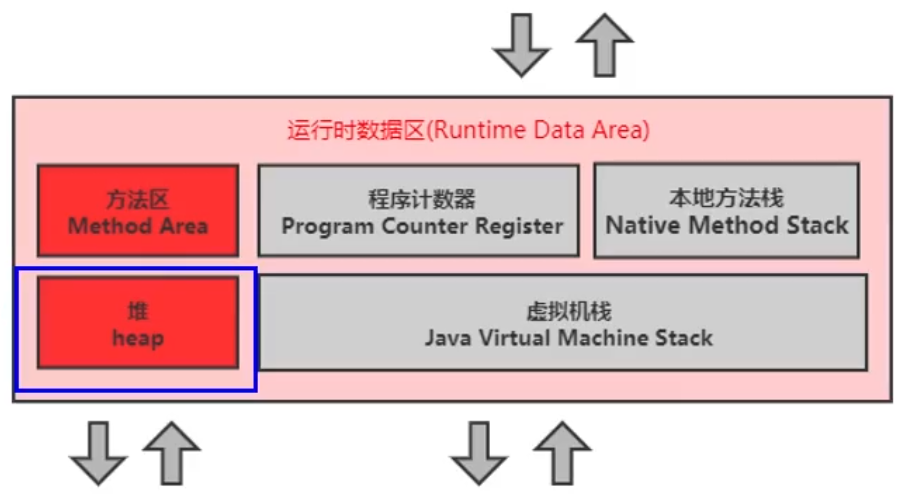

- 一个 JVM 实例（一个进程）只存在一个堆空间，堆也是 Java 内存管理的核心区域。

- Java 堆区在 JVM 启动的时候即被创建，其空间大小也就确定了。是 JVM 管理的最大一块内存空间

  - 堆内存的大小是可以调节的。

- 《Java 虚拟机规范》规定，堆可以处于物理上不连续的内存空间中，但在逻辑上它应该被视为连续的。

- 所有的线程共享 Java 堆，在这里还可以划分线程私有的缓冲区（Thread Local Allocation Buffer, TLAB）。

- 《Java 虚拟机规范》中对 Java 堆的描述是：所有的对象实例以及数组都应当在运行时分配在堆上。(The heap is the run-time data area from which memory for all class instances and arrays is allocated)

  - “几乎”所有的对象实例都在这里分配内存。--从实际使用角度看的。

- 数组和对象可能永远不会存储在栈上，因为栈帧中保存引用，这个引用指向对象或数组在堆中的位置。

- 在方法结束后，堆中的对象不会马上被移除，仅仅在垃圾收集的时候才会被移除。

- 堆，是GC（Garbage Collection，垃圾收集器）执行垃圾回收的重点区域。
 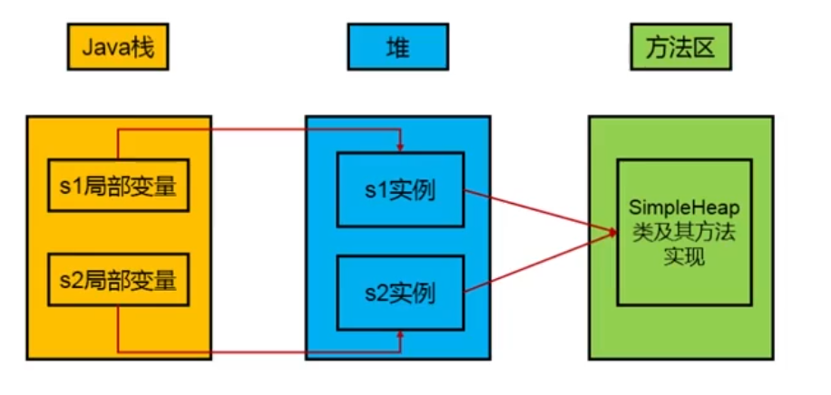

**eg：**

```
/**
 * -Xms10m -Xmx10m
 * 初始空间  最大空间
 */
public class HeapDemo {
    public static void main(String[] args) {
        System.out.println("start...");
        try {
            Thread.sleep(1000000);
        } catch (InterruptedException e) {
            e.printStackTrace();
        }
        System.out.println("end...");
    }
}

```

```
public class HeapDemo1 {
    public static void main(String[] args) {
        System.out.println("start...");
        try {
            Thread.sleep(1000000);
        } catch (InterruptedException e) {
            e.printStackTrace();
        }
        System.out.println("end...");
    }
}

```

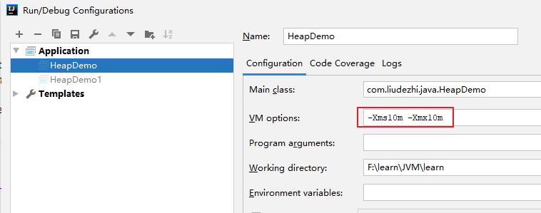
 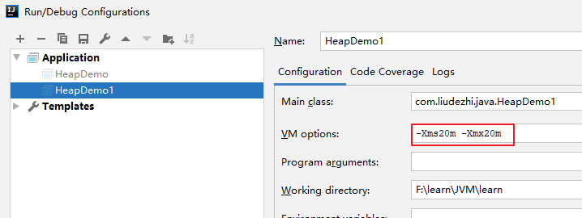
 运行两个类的main 方法：
 打开 jdk 中的程序：
 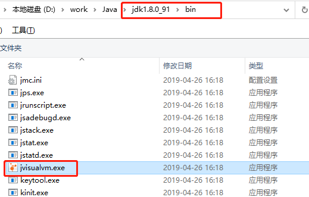
 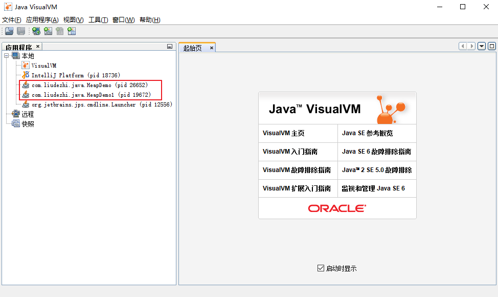
 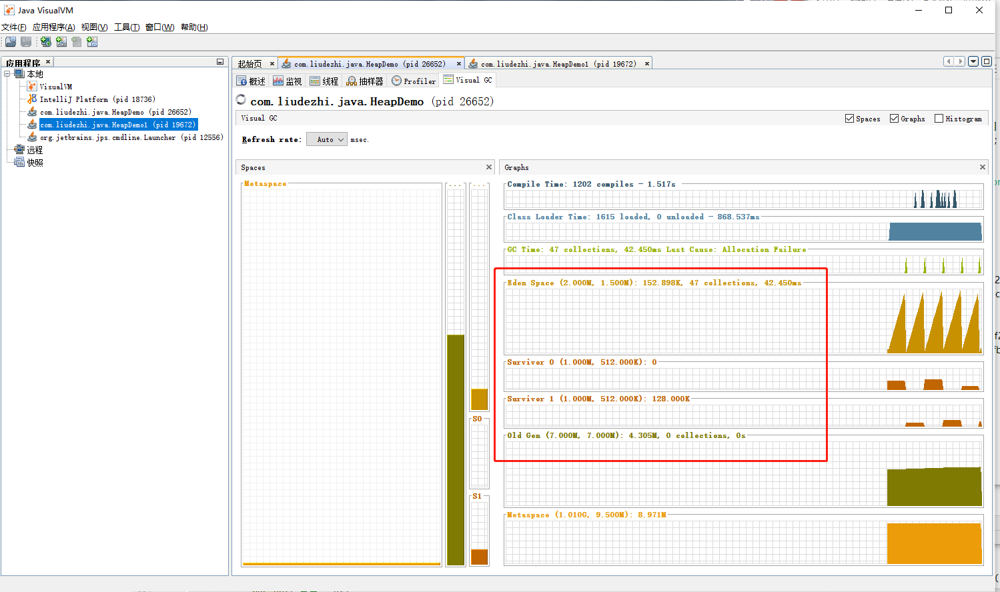

#### 1.1. 内存细分

**现代垃圾收集器大部分都基于分代收集理论设计，堆空间细分为：**

- Java7 及之前堆内存逻辑上分为三部分：新生区+养老区+**永生区**

  - Young Generation Space 新生区 Young/New
 又被划分为 Eden 区和 Survivor 区

  - Tenure Generation Space 养老区 Old/Tenure

  - Permanent Space 永久区 Perm

- Java8 及之后堆内存逻辑上分为三部分：新生区+养老区+**元空间**

  - Young Generation Space 新生区 Young/New
 又被划分为 Eden 区和 Survivor 区

  - Tenure Generation Space 养老区 Old/Tenure

  - Meta Space 元空间 Meta
 约定：新生区↔新生代↔年轻代 养老区↔老年区↔老年代 永生区↔永久代

#### 1.2. 堆空间内部结构

**JDK7**
 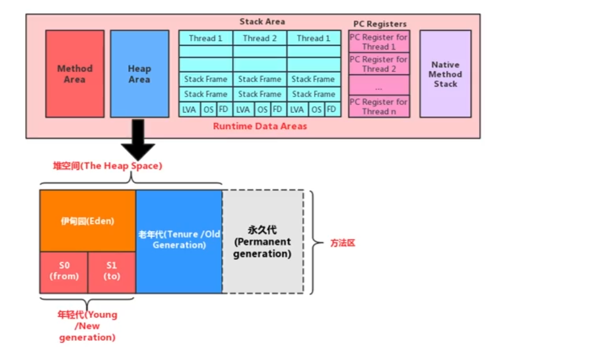
 **JDK8**
 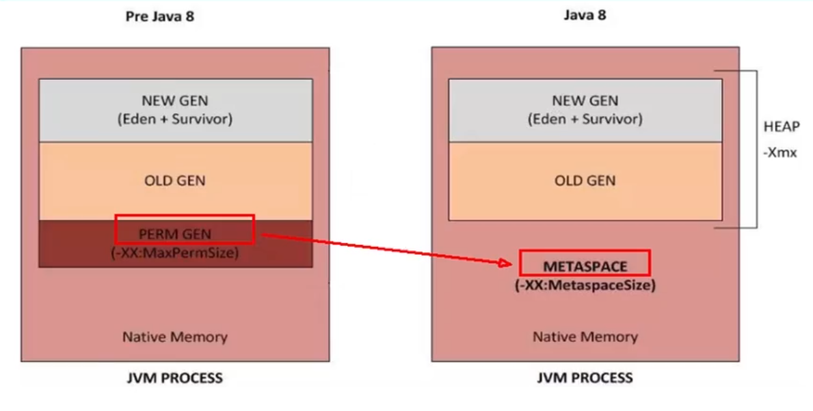

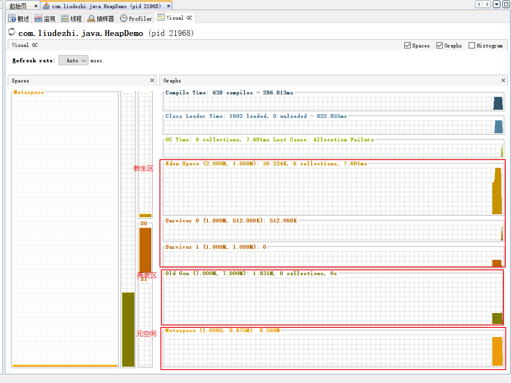

### 2. 设置堆内存大小与 OOM

#### 2.1. 堆空间大小设置

- Java 堆区用于存储 Java 对象实例，那么堆的大小在 JVM 启动时就已经设定好了，可以通过选项 "-Xmx" 和 "-Xms" 来进行设置。

  - "-Xms" （-x: 是jvm 的运行参数，ms 是 memory start）用于表示堆区（年轻代+老年代）的起始内存，等价于：-XX:InitialHeapSize

  - "-Xmx" 则用于表示堆区（年轻代+老年代）的最大内存，等价于：-XX:MaxHeapSize

- 一旦堆区中的内存大小超过 "-Xmx" 所指定的最大内存时，将会抛出 OutOfMemoryError 异常。

- 通常会将 -Xms 和 -Xmx 两个参数配置相同的值，其**目的是为了能够在 Java 垃圾回收机制清理完堆区后不需要重新分隔计算堆区的大小，从而提高性能**。

- 默认情况下，初始内存大小：物理电脑内存大小 / 64，最大内存大小：物理电脑内存大小 / 4

```
/**
* 1. 初始内存大小：物理电脑内存大小 / 64，最大内存大小：物理电脑内存大小 / 4
* 2. 手动设置：-Xms600m -Xmx600m
*  开发中建议将初始堆内存和最大堆内存设置成相同的值
* 3. 查看设置的参数：
*  方式一：jps / jstat -gc 进程id
*  方式二：-XX:+PrintGCDetails，程序执行完成后输出
*/
public class HeapSpaceInitial {
   public static void main(String[] args) {
       // 返回 Java 虚拟机中的堆内存总量
       long initialMemory = Runtime.getRuntime().totalMemory() / 1024 / 1024;
       // 返回 Java 虚拟机试图使用的最大堆内存量
       long maxMemory = Runtime.getRuntime().maxMemory() / 1024 / 1024;

       System.out.println("-Xms = " + initialMemory + "M");    // 默认：243M -Xms600m -Xmx600m：575M
       System.out.println("-Xmx = " + maxMemory + "M");        // 默认：3612M -Xms600m -Xmx600m：575M

       System.out.println("系统内存大小为：" + initialMemory * 64.0 / 1024 + "G"); // 默认：15.1875G
       System.out.println("系统内存大小为：" + maxMemory * 4.0 / 1024 + "G");      // 默认：14.109375G

       try {
           Thread.sleep(1000000);
       } catch (InterruptedException e) {
           e.printStackTrace();
       }
   }
}

```

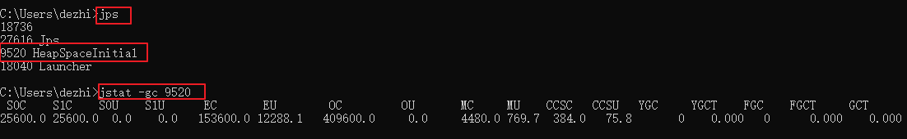
 OC老年代总量，OU老年代使用的大小
 前几个是新生代的伊甸园区和Survior1/2 的总量和使用量
 我们设置的是 600m，但是两个 survior 有一个是不放数据的，因此实际算出来结果为 (25600 + 153600 + 409600)/1024 = 575m

#### 2.2. OutOfMemory 举例

```
/**
 * -Xms600m -Xmx600m
 */
public class OOMTest {
    public static void main(String[] args) {
        List<Picture> list = new ArrayList<>();
        while (true) {
            try {
                Thread.sleep(20);
            } catch (InterruptedException e) {
                e.printStackTrace();
            }
            list.add(new Picture(new Random().nextInt(1024 * 1024)));
        }
    }
}
class Picture {
    private byte[] pixels;

    public Picture(int length) {
        this.pixels = new byte[length];
    }
}

```

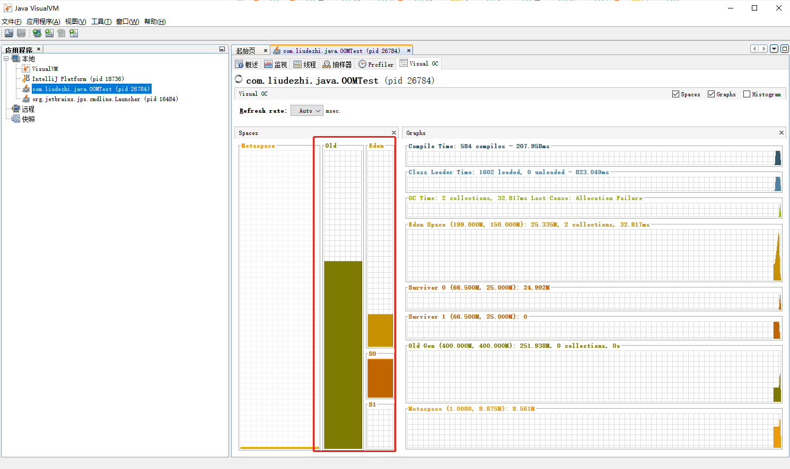
 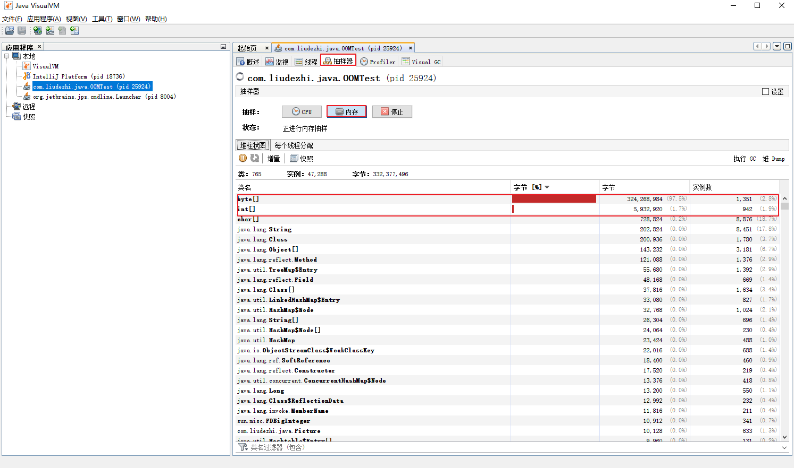
 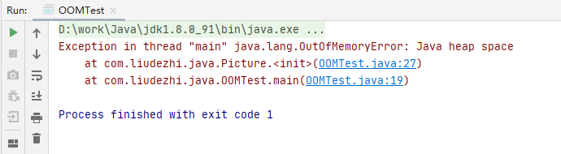

### 3. 年轻代与老年代

- 存储在 JVM 中的 Java 对象可以被划分为两类：

  - 一类是生命周期较短的瞬时对象，这类对象的创建和消亡都非常迅速

  - 另一类对象的生命周期却非常长，在某些极端的情况下还能够与 JVM 的生命周期保持一致。

- Java 堆区进一步细分的话，可以划分为年轻代（YoungGen）和老年代（OldGen）

- 其中年轻代又可以划分为 Eden 空间，Survivor0 空间和 Survivor1 空间（有时也叫做 from区、to区）。
 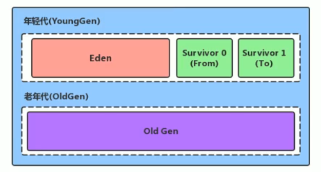

下面这参数开发中一般不会调：
 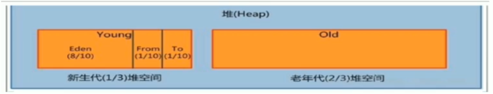

- 配置新生代与老年代在堆结构的占比。

  - 默认：-XX:NewRatio=2，表示新生代占1，老年代占2，新生代占整个堆的 1/3

  - 可以修改 -XX:NewRatio=4，表示新生代占1，老年代占4，新生代占整个堆的 1/5

```
/**
 * -Xms600m -Xmx600m
 * -XX:UseAdaptiveSizePolicy
 */
public class EdenSurvirorTest {
    public static void main(String[] args) {
        System.out.println("hi......");
        try {
            Thread.sleep(1000000);
        } catch (InterruptedException e) {
            e.printStackTrace();
        }
    }
}

```

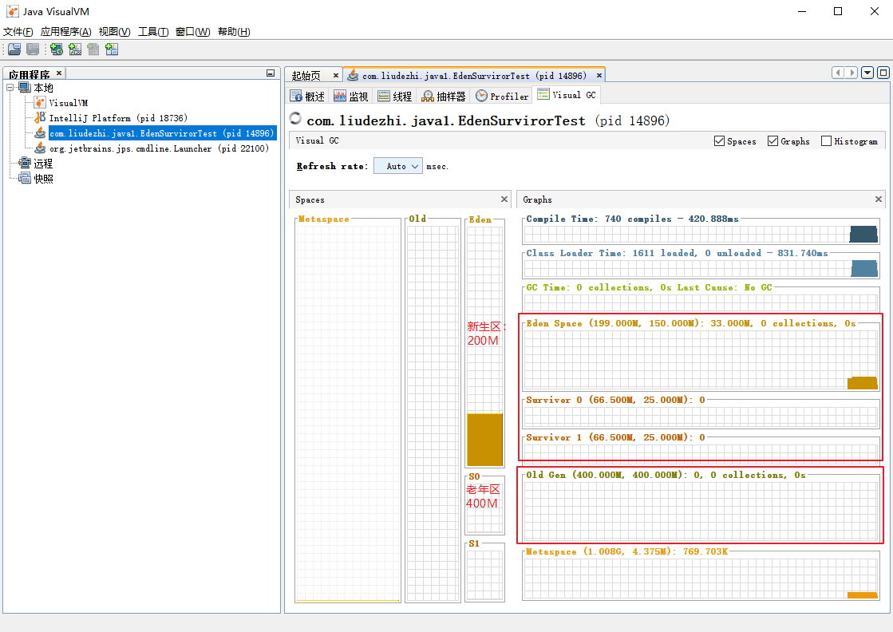
 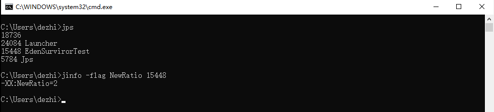

- 在 HotSpot 中，Eden 空间和另外两个 Survivor 空间缺省所占的比例是 8:1:1

- 开发人员可以通过选项 "-XX:SurvivorRatio" 调整这个空间比例。eg：-XX:SurvivorRatio=8

- **几乎所有的** Java 对象都是在 Eden 区被 new 出来的。

- 绝大部分的 Java 对象的销毁都在新生代进行了。

  - IBM 公司的专门研究表明，新生代中 80% 的对象都是“朝生夕死”的。

- 可以使用选项 "-Xmn" 设置新生代最大内存大小(当同时设置了 -XX:NewRatio 和 -Xmn 两者空间分配矛盾的话，以 -Xmn 为准)，一般不设置。

  - 这个参数一般使用默认值就可以了。

```
/**
 * -Xms600m -Xmx600m
 *
 * -X:NewRatio：设置新生代与老年代的比例。默认值是2
 * -XX:SurvivorRatio: 设置新生代中 Eden 区与 Survivor 区的比例。默认值是 8
 * -XX:UseAdaptiveSizePolicy:关闭自适应的内存分配策略（暂时用不到）
 * 不指定的话，默认是内存自适应的，会发现 Eden 和 两个 Survivor 并不是8：1：1
 * 只有显式指定 -XX:SurvivorRatio=8 才会是 8:1:1
 */
public class EdenSurvirorTest {
    public static void main(String[] args) {
        System.out.println("hi......");
        try {
            Thread.sleep(1000000);
        } catch (InterruptedException e) {
            e.printStackTrace();
        }
    }
}

```

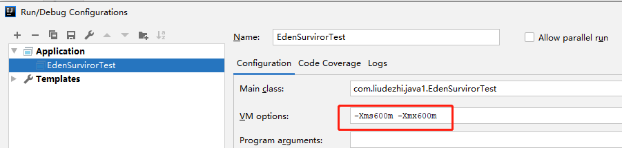
 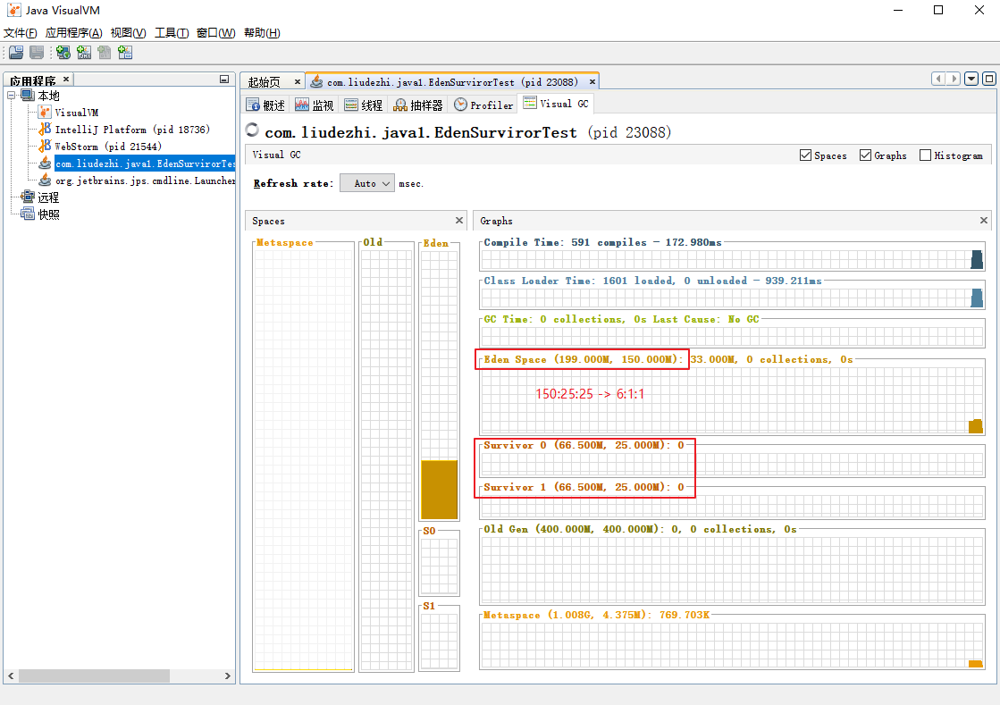

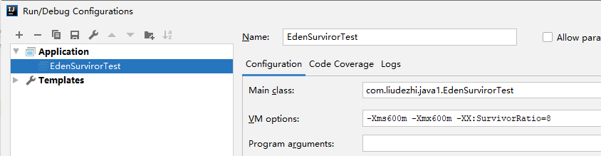
 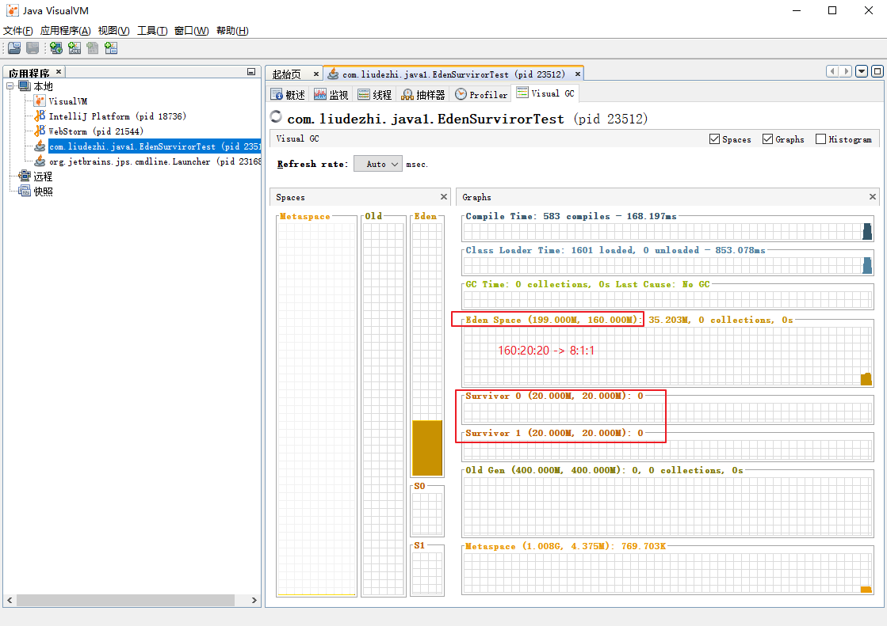

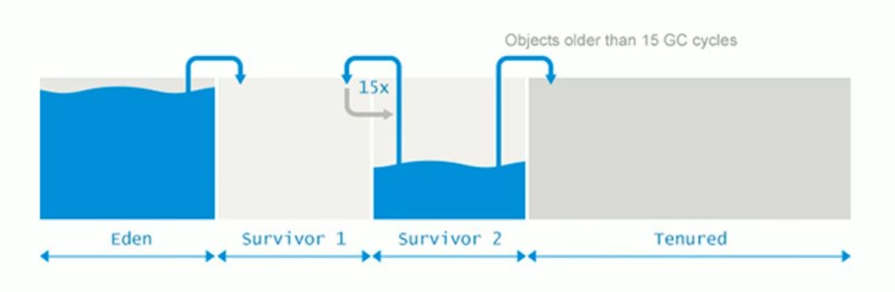

### 4. 图解对象分配过程

#### 4.1. 对象分配过程概述

为新对象分配内存是一件非常严谨和复杂的任务，JVM 的设计者们不仅需要考虑内存如何分配、在哪里分配等问题，并且由于内存分配算法与内存回收算法密切相关，所以还需要考虑 GC 执行完内存回收后是否会在内存空间中产生内存碎片。

1. new 的对象先放伊甸园区。此区有大小限制。

1. 当伊甸园的空间填满时，程序又需要创建对象，JVM 的垃圾回收器将对伊甸园进行垃圾回收（Minor GC），将伊甸园区中不再被其他对象所引用的对象进行销毁。再加载新的对象放到伊甸园区。

1. 然后将伊甸园区中的剩余对象移动到幸存者0区。

1. 如果再次触发垃圾回收，此时上次幸存下来的放到幸存者0区的，如果没有回收，就会放到幸存者1区。

1. 如果再次经历垃圾回收，此时会重新放回幸存者0区，接着再去幸存者1区。

1. 什么时候放入养老区呢？可以设置次数。默认是15次。

  - **可以设置参数：-XX:MaxTenuringThreshold=<N> 进行设置**。

1. 在养老区，相对悠闲。当养老区内存不足时，再次触发 GC: Major GC，进行养老区的内存清理。

1. 若养老区执行了 Major GC 之后发现依然无法进行对象的保存，就会产生 OOM 异常
 **java.lang.OutOfMemoryError: Java heap space**

#### 4.2. 对象分配过程图解

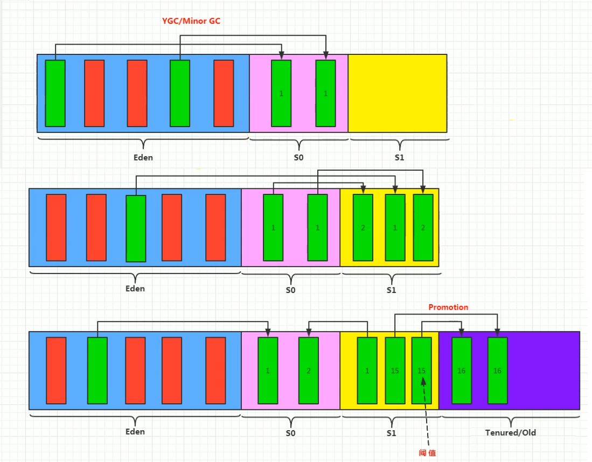

#### 4.3. 总结

- **针对幸存者 s0,s1 区的总结：复制之后有交换，谁空谁是 to.**

- **关于垃圾回收：频繁在新生区收集，很少在养老区收集，几乎不在永久区/元空间收集**。

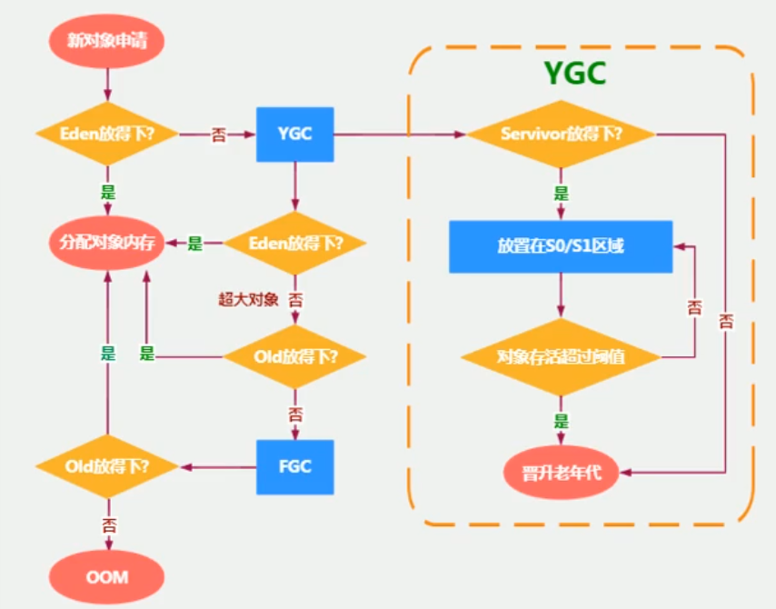

**eg：**

```
/**
 * -Xms600m -Xmx600m
 */
public class HeapInstanceTest {
    byte[] buffer = new byte[new Random().nextInt(1024 * 200)];

    public static void main(String[] args) {
        ArrayList<HeapInstanceTest> list = new ArrayList<>();
        while (true) {
            list.add(new HeapInstanceTest());
            try {
                Thread.sleep(10);
            } catch (InterruptedException e) {
                e.printStackTrace();
            }
        }
    }
}

```

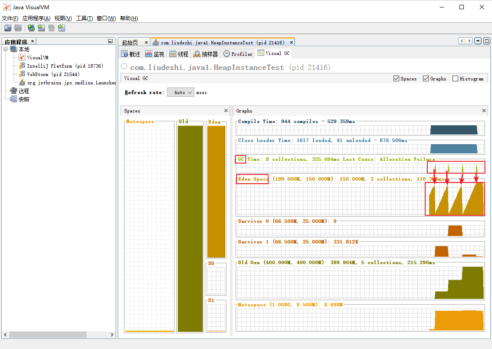
 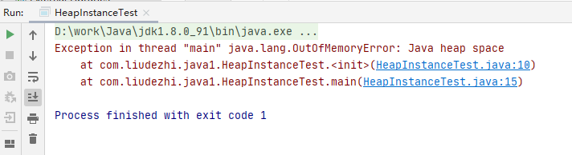

#### 4.4. 常用调优工具

- JDK 命令行

- Eclipse: Memory Analyzer Tool

- Jconsole

- VisualVm

- Jprofiler

>
[官网](https://www.ej-technologies.com/products/jprofiler/overview.html)

从官网下载 jprofiler_windows-x64_版本.exe 安装（官网下载的需要密钥激活，可以在网上下载破解版）
 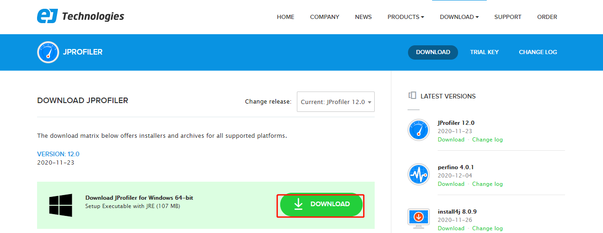

idea 安装 JProfiler 插件
 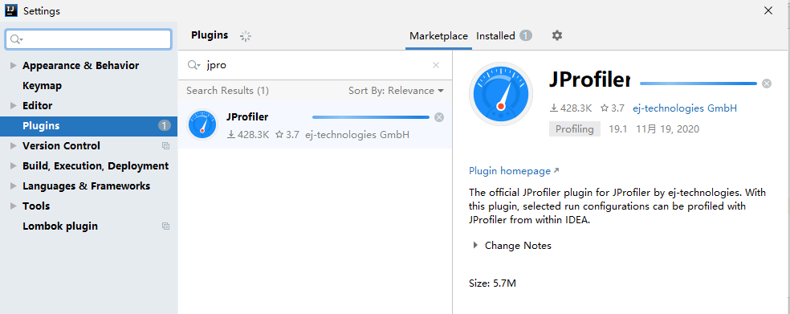
 安装后：
 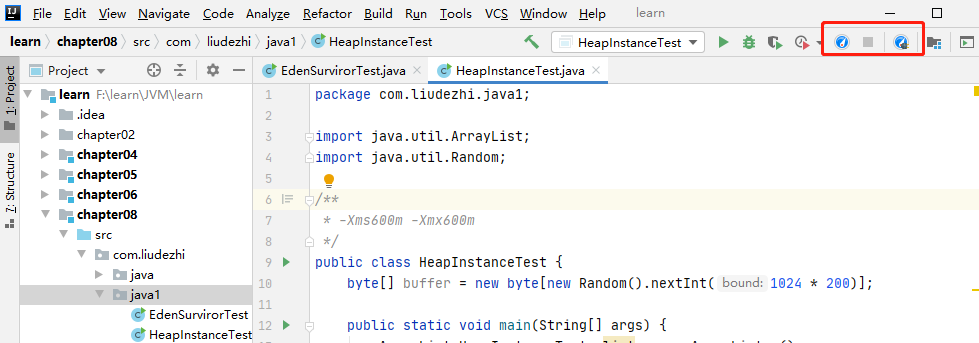
 点击，选择程序的安装位置即可启动
 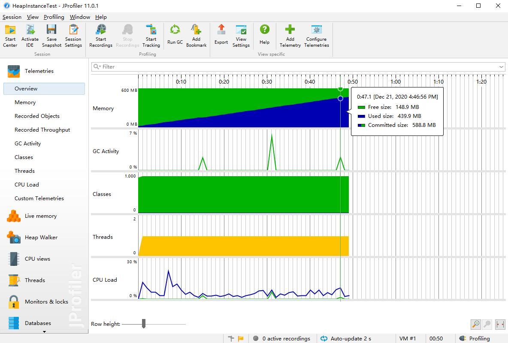

- Java Flight Recorder

- GCViewer

- GC Easy

### 5. Minor GC、Major GC与Full GC

JVM 在进行 GC 时，并非每次都对上面三个内存（新生代、老年代；方法区）区域一起回收的，大部分时候回收的都是指新生代。
 针对 HotSpot VM 的实现，它里面的 GC 按照回收区域又分为两大种类型：一种是部分收集（Partial GC），一种是整堆收集（Full GC）

- 部分收集：不是完整收集整个 java 堆的垃圾收集器。其中又分为：

  - 新生代收集（Minor GC / Young GC）：只是新生代(Eden/s0/s1)的垃圾收集

  - 老年代收集（Major GC / Old GC）：只是老年代的垃圾收集
 目前，只有 CMS GC 会有单独收集老年代的行为。
 **注意，很多时候 Major GC 会和 Full GC 混淆使用，需要具体分辨是老年代回收还是整堆回收**。

  - 混合收集（Mixed GC）：收集整个新生代以及部分老年代的垃圾收集。
 目前只有 G1 GC 会有这种行为

- 整堆收集(Full GC): 收集整个 java 堆和方法区的垃圾收集。

#### 最简单的分代式 GC 策略的触发条件：

- **年轻代GC(Minor GC)触发机制：**

  - 当年轻代空间不足时，就会触发 Minor GC，这里的年轻代指的是 Eden 代满，Survivor 满不会引发 GC（每次 Minor GC 会清理年轻代的内存）。

  - 因为 Java 对象**大多数都具备朝生夕死**的特性，所以 Minor GC 非常频繁，一般回收速度也比较快。这一定义既清晰又易于理解。

  - Minor GC 会引发 STW（Stop the World），暂停其他用户的线程，等垃圾回收结束，用户线程才恢复运行。
 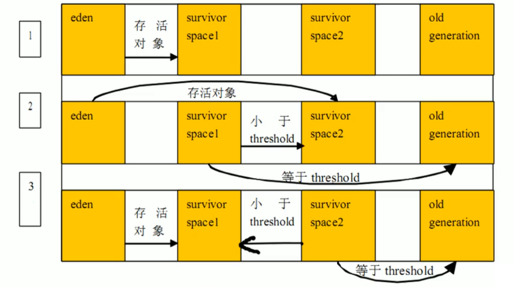

- **老年代 GC(Major GC/Full GC) 触发机制：**

  - 指发生在老年代的 GC，对象从老年代消失时，我们说“Major GC”或“Full GC”发生了。

  - 出现了 Major GC，经常会伴随至少一次的 Minor GC（但非绝对的，在 Parellel Scavenge 收集器的收集策略里就有直接进行 Major GC 的策略选择过程）。
 也就是在老年代空间不足时，会先尝试触发 Minor GC。如果之后空间还不足，则触发 Major GC

  - Major GC 的速度一般会比 Minor GC 慢 10 倍以上，STW 的时间更长。

  - 如果 Major GC 后，内存还不足，就会报 OOM(OutOfMemoryError)

- Full GC 触发机制（后面再详细学习）
 触发 Full GC 执行的情况有如下五种：
 （1）调用 System.gc() 时，系统建议执行 Full GC，但是不必然执行
 （2）老年代空间不足
 （3）方法区空间不足
 （4）通过 Minor GC 后进入老年代的平均大小大于老年代的可用内存
 （5）由 Eden 区、survivor space0(From Space)区向 survivor space1(To Space)区复制时，对象大小大于 To Space 可用内存，则把该对象转存到老年代，且老年代的可用内存小于该对象大小
 **说明：** Full GC 是开发或调优中要避免的。这样暂停时间会短一些。

**eg：**

```
/**
 * 测试 MinorGC、MajorGC、Full GC
 *  -Xms9m -Xmx9m -XX:+PrintGCDetails
 */
public class GCTest {
    public static void main(String[] args) {
        int i = 0;
        try {
            List<String> list = new ArrayList<>();
            String a = "liudezhi.com";
            while (true) {
                list.add(a);
                a = a + a;
                i++;
            }
        } catch (Throwable t) {
            t.printStackTrace();
            System.out.println("遍历次数为：" + i);
        }
    }
}

```

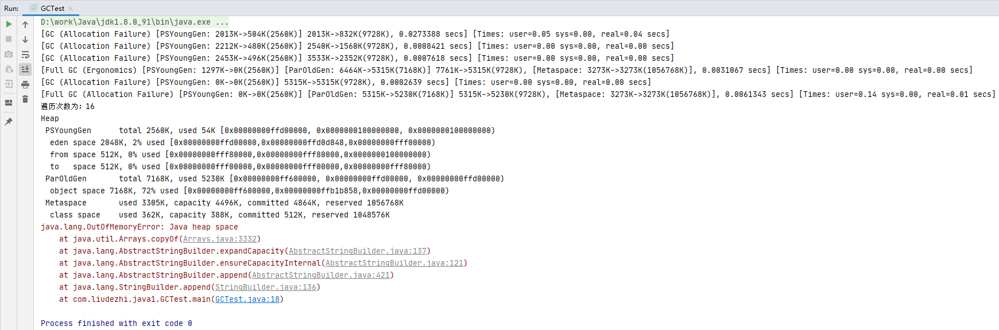

### 6. 堆空间分代思想

**为什么需要把 Java 堆分代？不分代就不能正常工作了吗？**

- 经研究，不同对象的生命周期不同，70%-99% 的对象是临时对象。

  - 新生代：有 Eden、两块大小相同的 Survivor（又称为 from/to，s0/s1）构成，to 总为空。

  - 老年代：存放新生代中经历多次 GC 仍然存活的对象。
 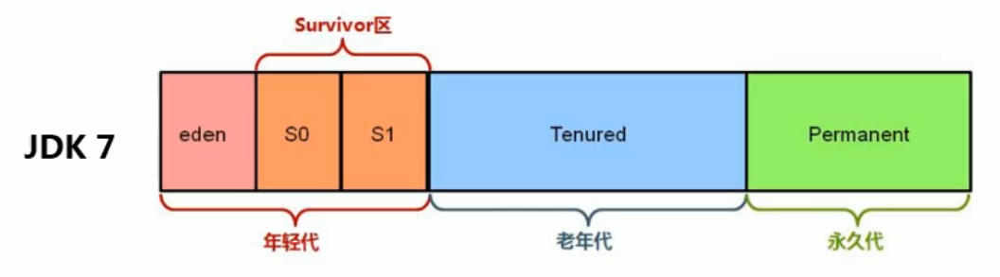

- 其实不分代完全可以，分代的唯一理由就是优化 GC 性能。如果没有分代，那所有的对象都在一块，就如同把一个学校的人都关在一个教室。GC 的时候要找到哪些对象没用，这样就会对堆的所有区域进行扫描。而很多对象都是朝生夕死的，如果分代的话，把新创建的对象放到某一地方，当 GC 的时候先把这块存储“朝生夕死”对象的区域进行回收，这样就会腾出很大的空间出来。
 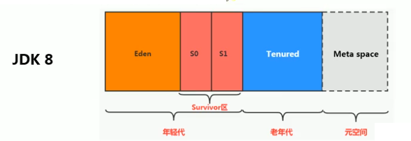

### 7. 内存分配策略

**内存分配策略（或对象提升(Promotion)规则）**
 如果对象在 Eden 出生并经过第一次 MinorGC 后仍然存活，并且能被 Survivor 容纳的话，将被移动到 Survivor 空间中，并将对象年龄设为1。对象在 Survivor 区中每熬过一次 MinorGC，年龄就增加1 岁，当它的年龄增加到一定程度（默认为15岁，其实每个 JVM、每个 GC 都有所不同）时，就会被晋升到老年代中。

对象晋升老年代的年龄阈值，可以通过选项 **`-XX:MaxTenuringThreshold`** 来设置。

针对不同年龄段的对象分配原则如下所示：

- 优先分配到 Eden

- 大对象直接分配到老年代

  - 进来避免程序中出现过多的大对象

- 长期存活的对象分配到老年代

- 动态对象年龄判断

  - 如果 Survivor 区中相同年龄的所有对象大小的总和大于 Survivor 空间的一半，年龄大于或等于该年龄的对象可以直接进入老年代，无须等到 MaxTenuringThreshold 中要求的年龄。

- 空间分配担保

  - -XX:HandlePromotionFailure

```
/**
 * 测试：大对象直接进入老年代
 *  -Xms60m -Xmx60m -XX:NewRatio=2 -XX:SurvivorRatio=8 -XX:+PrintGCDetails
 *      Eden: 16m， Survivor1:2m，Survivor1:2m，old:40m
 */
public class YoungOldAreaTest {
    public static void main(String[] args) {
        byte[] buffer = new byte[1024 * 1024 * 20]; // 20m
    }
}

```

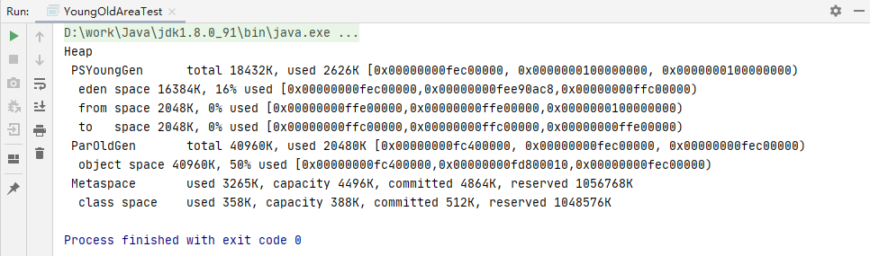

### 8. 为对象分配内存：TLAB

**为什么有 TLAB(Thread Local Allocation Buffer)?**

- 堆区是线程共享区域，任何线程都可以访问到堆区中的共享数据

- 由于对象实例的创建在 JVM 中非常频繁，因此在并发环境下从堆区中划分内存空间是线程不安全的

- 为避免多个线程操作同一地址，需要使用加锁等机制，进而影响分配速度

**什么是 TLAB ?**

- 从内存模型而不是垃圾收集的角度，对 Eden 区域继续进行划分，JVM 为**每个线程分配了一个私有缓存区域**，它包含在 Eden 空间内。

- 多线程同时分配内存时，使用 TLAB 可以避免一系列的非线程安全问题，同时还能够提升内存分配的吞吐量，因此我们可以将这种内存分配方式称之为**快速分配策略**。

- 据说所有的 OpenJDK 衍生出来的 JVM 都提供了 TLAB 的设计。

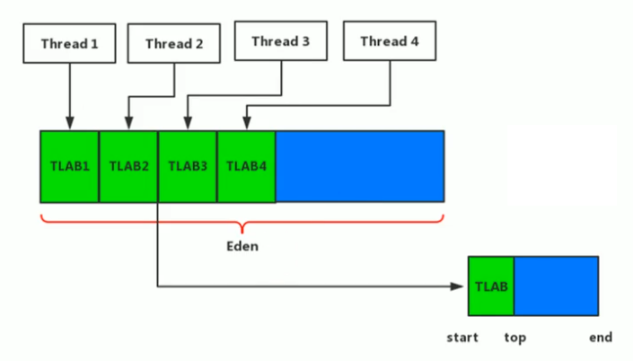

**TLAB 的再说明：**

- 尽管不是所有的对象实例都能够再 TLAB 中成功分配内存，但 **JVM 确实是将 TLAB 作为内存分配的首选**。

- 在程序中，开发人员可以通过选项 "-XX:UseTLAB" 设置是否开启 TLAB 空间，默认情况下 TLAB 是开启的。

```
/**
 * 测试：-XX:UseTLAB 参数是否开启的情况: 默认情况是开启的
 *
 */
public class TLABArgsTest {
    public static void main(String[] args) {
        System.out.println("hi...");
        try {
            Thread.sleep(1000000);
        } catch (InterruptedException e) {
            e.printStackTrace();
        }
    }
}

```

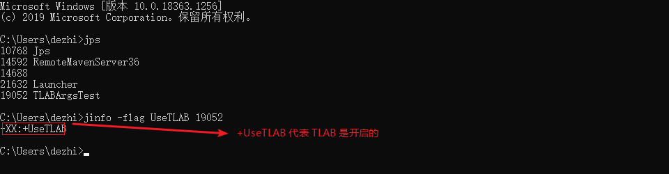

- 默认情况下，TLAB 空间的内存非常小，**仅占有整个 Eden 空间的 1%**，当然我们可以通过选项 "-XX:TLABWasteTargetPercent" 设置 TLAB 空间所占用的 Eden 空间的百分比大小。

- 一旦对象在 TLAB 空间分配内存失败，JVM 就会尝试着通过**使用加锁机制**确保数据操作的原子性，从而直接在 Eden 空间中分配内存**。

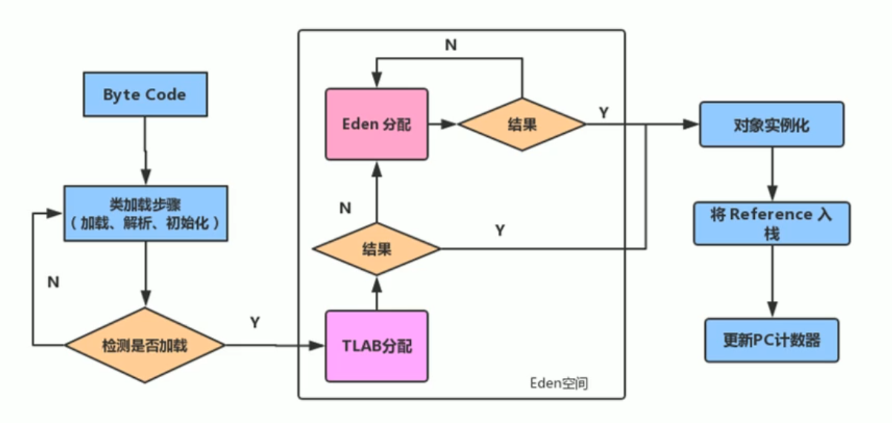

### 9. 小结堆空间的参数设置

- 官网说明：https://docs.oracle.com/javase/8/docs/technotes/tools/unix/java.html
 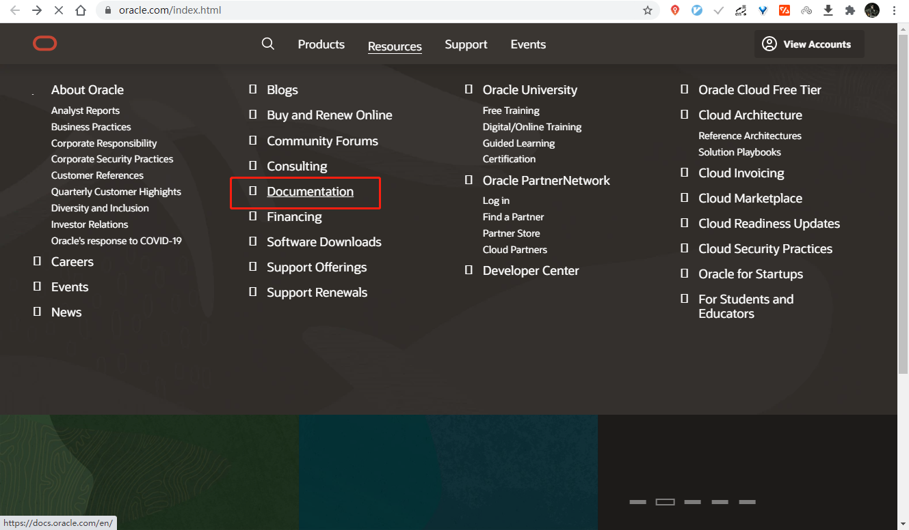
 
 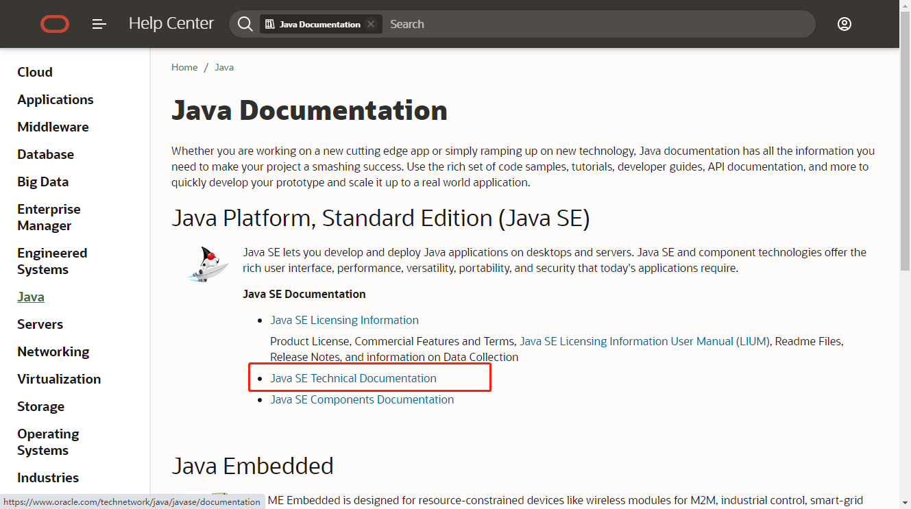
 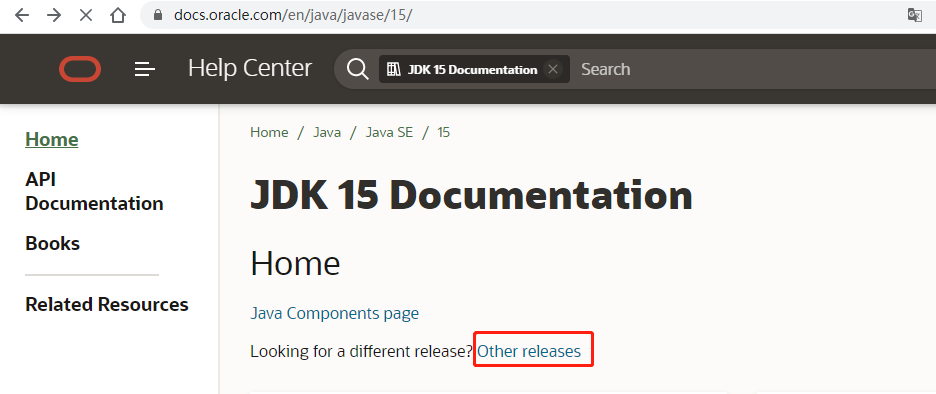
 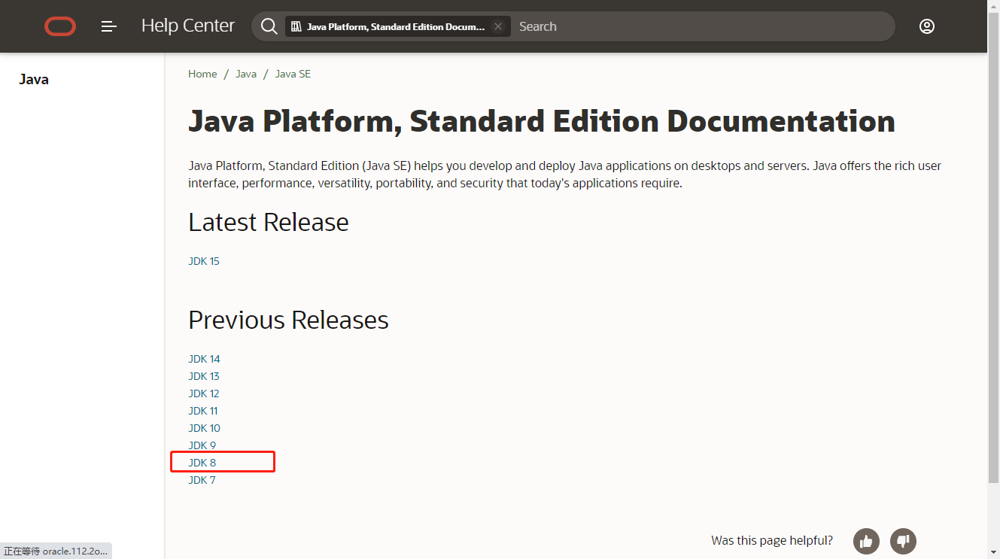
 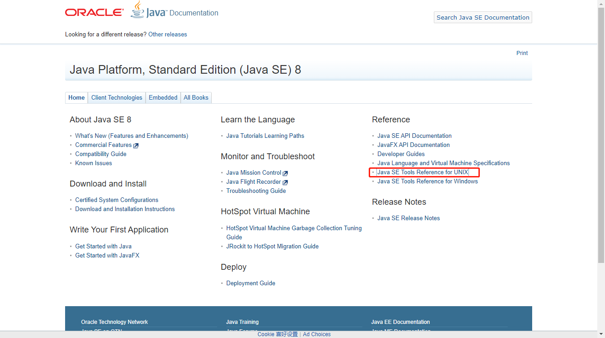
 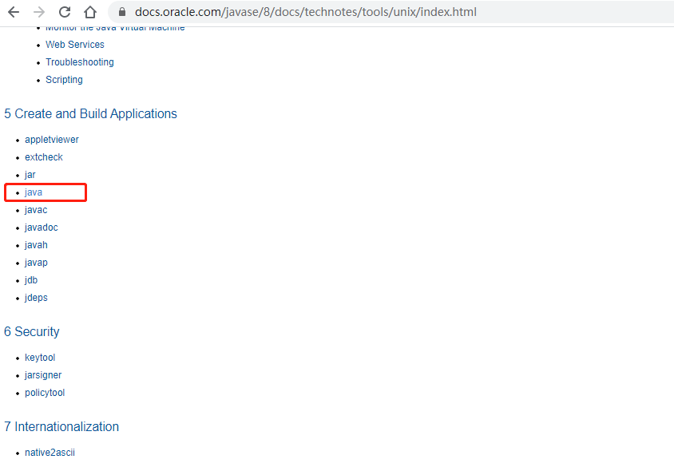

- -XX:+PrintFlagsInitial：查看所有的参数的默认初始值

- -XX:+PrintFlagsFinal：查看所有的参数的最终值（可能会存在修改，不再是初始值）

- -Xms：初始堆空间内存(默认为物理内存的 1 / 64)

- -Xmx：最大堆空间内存（默认为物理内存的 1 / 4）

- -Xmn：设置新生代的大小（初始值及最大值）

- -XX:NewRatio：配置新生代与老年代在堆结构的占比

- -XX:SurvivorRatio：设置新生代中 Eden 和 s0/s1 空间的比例

- -XX:MaxTenruingThreshold：设置新生代垃圾的最大年龄

- -XX:+PrintGCDetails：输出详细的 GC 处理日志

  - 打印 gc 简要信息：1. -XX:PrintGC 2. -verbose:gc

- -XX:HandlePromotionFailure：是否设置空间分配担保

在发生 Minor GC 之前，虚拟机会**检查老年代最大可用的连续空间是否大于新生代所有对象的总空间**。

- 如果大于，则此次 Minor GC 是安全的。

- 如果小于，则虚拟机会查看 -XX:HandlePromotionFailure 设置值是否允许担保失败。

  - 如果 HandlePromotionFailure=true，那么会继续**检查老年代最大可用连续空间是否大于历次晋升到老年代的对象的平均大小**。

    - 如果大于，则尝试进行一次 Minor GC，但是这次 Minor GC 依然是有风险的；

    - 如果小于，则改为进行一次 Full GC

  - 如果 HandlePromotionFailure=false，则改为进行一次 Full GC。

在 JDK6 Update24 之后(JDK7)，HandlePromotionFailure 参数不会再影响到虚拟机的空间分配担保策略(可以直接将 HandlePromotionFailure 看成 true)，观察 OpenJDK 中的源码变化，虽然源码中还定义了 HandlePromotionFailure 参数，但是在代码中已经不会再使用它。JDK6 Update24 之后的规则变为**只要老年代的连续空间大于新生代对象总大小**或者**历次晋升的平均大小就会进行 Minor GC**，否则将进行 Full GC。

### 10. 堆是分配对象的唯一选择吗？

**堆是分配对象存储的唯一选择吗？**
 在《深入理解 Java 虚拟机》中关于 Java 堆内存中有这样一段描述：

>
随着 JIT 编译期的发展与**逃逸分析技术**逐渐成熟，**栈上分配、标量替换优化技术**将会导致一些微妙的变化，所有的对象都分配到堆上也渐渐变得不那么“绝对”了。

在 Java 虚拟机中，对象是在 Java 堆中分配内存的，这是一个普遍的尝试。但是，有一种特殊情况，那就是**如果经过逃逸分析（Escape Analysis）后发现，一个对象并没有逃逸出方法的话，那么就可能被优化成栈上分配**。这样就无需在堆上分配内存，也无须进行垃圾回收了。这也是最常见的堆外存储技术。

此外，前面提到的基于 OpenJDK 深度定制的 TaoBaoVM，其中创新的 GCIH(GC invisible heap)技术实现 off-heap，将生命周期较长的 Java 对象从 heap 中移至 heap 外，并且 GC 不能管理 GCIH 内部的 Java 对象，以此达到降低 GC 的回收频率和提升 GC 的回收效率的目的。

#### 逃逸分析概述

- 如何将堆上的对象分配到栈，需要使用逃逸分析手段。

- 这是一种可以有效减少 Java 程序中同步负载和内存分配压力的跨函数全局数据流分析算法。

- 通过逃逸分析，Java Hotspot 编译器能够分析出一个新的对象的引用的使用范围从而决定是否要将这个对象分配到堆上。

- 逃逸分析的基本行为就是分析对象动态作用域：

  - 当一个对象在方法中被定义后，对象只在方法内部使用，则认为没有发生逃逸。

  - 当一个对象在方法中被定义后，它被外部方法所引用，则认为发生逃逸。例如作为调用参数传递到其他地方中。

**eg1：**

```
public void myMethod() {
    V v = new V():
    // use v
    // ...
    v = null;
}

```

没有发生逃逸的对象，则可以分配到栈上，随着方法执行的结束，栈空间就被移除。

**eg2：**

```
public static StringBuffer createStringBuffer(String s1, String s2) {
    StringBuffer sb = new StringBuffer();
    sb.append(s1);
    sb.append(s2);
    return sb;
}

```

上述代码如果想要 StringBuffer sb 不逃出方法，可以这样写：

```
public static String createStringBuffer(String s1, String s2) {
    StringBuffer sb = new StringBuffer();
    sb.append(s1);
    sb.append(s2);
    return sb.toString();
}

```

**eg3：**

```
/**
 * 逃逸分析
 *  快速判读是否发生了逃逸：看 new 的对象实体是否有可能在方法外被调用
 */
public class EscapeAnalysis {

    public EscapeAnalysis obj;

    /**
     * 方法返回 EscapeAnalysis 对象，发生逃逸
     */
    public EscapeAnalysis getInstance() {
        return obj == null ? new EscapeAnalysis() : obj;
    }

    /**
     * 为成员属性赋值，发生逃逸
     */
    public void setObj() {
        this.obj = new EscapeAnalysis();
    }
    // 如果当前的 obj 引用生命为 static 的，仍然会发生逃逸。

    /**
     * 对象的作用域仅在当前方法中有效，没有发生逃逸
     */
    public void useEscapeAnalysis() {
        EscapeAnalysis e = new EscapeAnalysis();
    }

    /**
     * 引用成员变量的值，发生逃逸
     */
    public void useEscapeAnalysis1() {
        EscapeAnalysis e = getInstance();
        // getInstance().xxx() 同样会发生逃逸
    }
}

```

**参数设置：**

- 在 JDK 6u23 版本之后，HotSpot 中默认开启了逃逸分析。

- 如果使用的是较早的版本，开发人员可以通过：

  - 选项 "-XX:+DoEscapeAnalysis" 显示开启逃逸分析

  - 通过选项 "-XX:+PrintEscapeAnalysis" 查看逃逸分析的筛选结果。

**结论：** 开发中能使用局部变量的，就不要使用在方法外定义。

#### 逃逸分析：代码优化

使用逃逸分析，编译器可以对代码做如下优化：
 一、**栈上分配**。将堆分配转化为栈分配。如果一个对象在子程序中被分配，要使指向该对象的指针永远不会逃逸，对象可能是栈分配的候选，而不是堆分配。
 二、**同步省略**。如果一个对象被发现只能从一个线程被访问到，那么对于这个对象的操作可以不考虑同步。
 三、**分离对象或标量替换**。有的对象可能不需要作为一个连续的内存结构存储也可以被访问到，那么对象的部分（或全部）可以不存储在内存，而是存储在 CPU 寄存器中。

##### 代码优化之栈上分配

- JIT 编译器在编译期间根据逃逸分析的结果，发现如果一个对象并没有逃逸出方法的话，就可能被优化成栈上分配。分配完成后，继续在调用栈内执行，最后线程结束，栈空间被回收，局部变量也被回收。这样就无须进行垃圾回收了。

- 常见的栈上分配的场景

  - 在逃逸分析中，已经说明了。分别是给成员变量赋值、方法返回值、实例引用传递。

```
/**
 * 栈上分配测试
 *  -Xms1G -Xmx1G -XX:-DoEscapeAnalysis -XX:+PrintGCDetails
 */
public class StackAllocation {
    public static void main(String[] args) {
        long start = System.currentTimeMillis();

        for (int i = 0; i < 10000000; i++) {
            alloc();
        }
        // 查看执行时间
        long end = System.currentTimeMillis();
        System.out.println("花费的时间为：" + (end - start) + " ms");
        try {
            Thread.sleep(1000000);
        } catch (InterruptedException e) {
            e.printStackTrace();
        }
    }

    private static void alloc() {
        User user = new User(); // 未发生逃逸
    }

    static class User {

    }
}

```

关闭逃逸分析：
 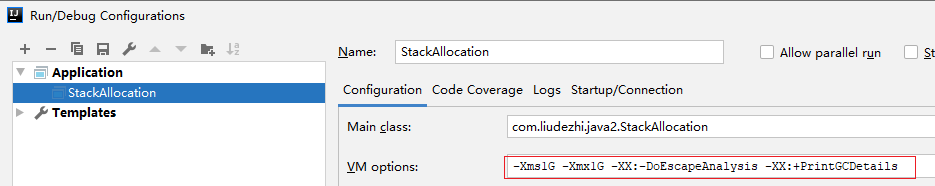
 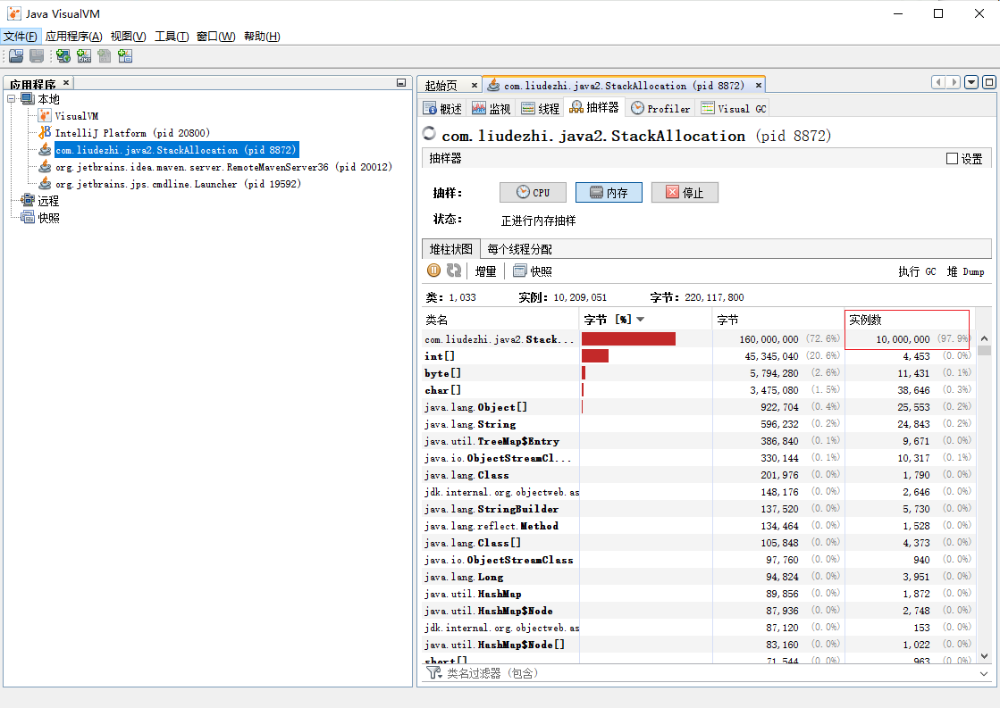
 开启逃逸分析：
 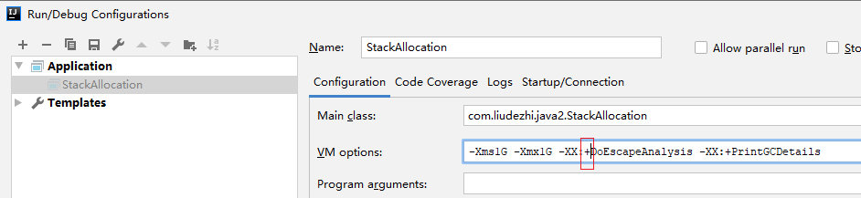
 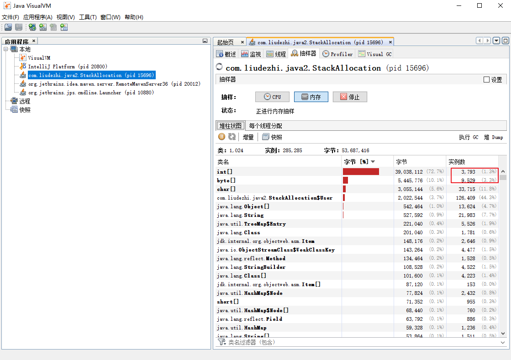

将堆空间设置小一些，关闭逃逸分析：
 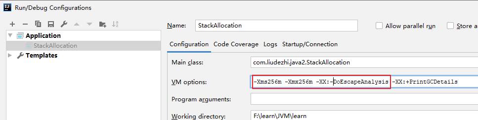
 可以看到发生了 GC
 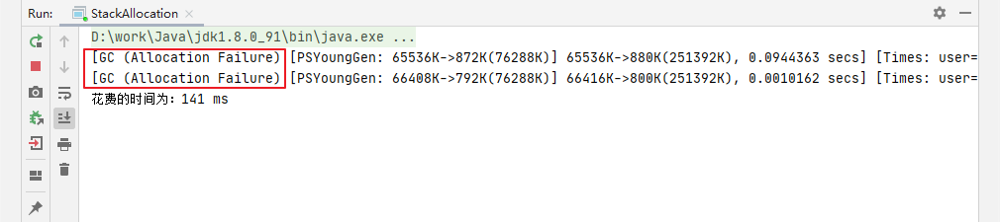

开启逃逸分析：
 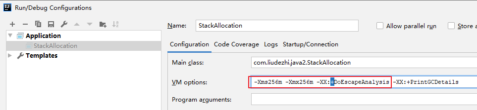
 可以看到并未发生 GC
 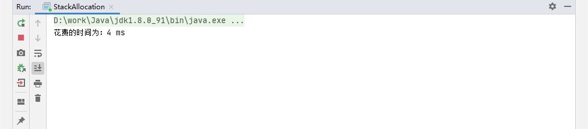

%23%23%20%E5%A0%86%0A%23%23%23%201.%20%E5%A0%86%EF%BC%88Heap%EF%BC%89%E7%9A%84%E6%A0%B8%E5%BF%83%E6%A6%82%E8%BF%B0%0A!%5Ba8889e8ec35582b46d621b66f59ecf08.png%5D(en-resource%3A%2F%2Fdatabase%2F4750%3A1)%0A-%20%E4%B8%80%E4%B8%AA%20JVM%20%E5%AE%9E%E4%BE%8B%EF%BC%88%E4%B8%80%E4%B8%AA%E8%BF%9B%E7%A8%8B%EF%BC%89%E5%8F%AA%E5%AD%98%E5%9C%A8%E4%B8%80%E4%B8%AA%E5%A0%86%E7%A9%BA%E9%97%B4%EF%BC%8C%E5%A0%86%E4%B9%9F%E6%98%AF%20Java%20%E5%86%85%E5%AD%98%E7%AE%A1%E7%90%86%E7%9A%84%E6%A0%B8%E5%BF%83%E5%8C%BA%E5%9F%9F%E3%80%82%0A-%20Java%20%E5%A0%86%E5%8C%BA%E5%9C%A8%20JVM%20%E5%90%AF%E5%8A%A8%E7%9A%84%E6%97%B6%E5%80%99%E5%8D%B3%E8%A2%AB%E5%88%9B%E5%BB%BA%EF%BC%8C%E5%85%B6%E7%A9%BA%E9%97%B4%E5%A4%A7%E5%B0%8F%E4%B9%9F%E5%B0%B1%E7%A1%AE%E5%AE%9A%E4%BA%86%E3%80%82%E6%98%AF%20JVM%20%E7%AE%A1%E7%90%86%E7%9A%84%E6%9C%80%E5%A4%A7%E4%B8%80%E5%9D%97%E5%86%85%E5%AD%98%E7%A9%BA%E9%97%B4%0A%20%20%20%20-%20%E5%A0%86%E5%86%85%E5%AD%98%E7%9A%84%E5%A4%A7%E5%B0%8F%E6%98%AF%E5%8F%AF%E4%BB%A5%E8%B0%83%E8%8A%82%E7%9A%84%E3%80%82%0A-%20%E3%80%8AJava%20%E8%99%9A%E6%8B%9F%E6%9C%BA%E8%A7%84%E8%8C%83%E3%80%8B%E8%A7%84%E5%AE%9A%EF%BC%8C%E5%A0%86%E5%8F%AF%E4%BB%A5%E5%A4%84%E4%BA%8E%E7%89%A9%E7%90%86%E4%B8%8A%E4%B8%8D%E8%BF%9E%E7%BB%AD%E7%9A%84%E5%86%85%E5%AD%98%E7%A9%BA%E9%97%B4%E4%B8%AD%EF%BC%8C%E4%BD%86%E5%9C%A8%E9%80%BB%E8%BE%91%E4%B8%8A%E5%AE%83%E5%BA%94%E8%AF%A5%E8%A2%AB%E8%A7%86%E4%B8%BA%E8%BF%9E%E7%BB%AD%E7%9A%84%E3%80%82%0A-%20%E6%89%80%E6%9C%89%E7%9A%84%E7%BA%BF%E7%A8%8B%E5%85%B1%E4%BA%AB%20Java%20%E5%A0%86%EF%BC%8C%E5%9C%A8%E8%BF%99%E9%87%8C%E8%BF%98%E5%8F%AF%E4%BB%A5%E5%88%92%E5%88%86%E7%BA%BF%E7%A8%8B%E7%A7%81%E6%9C%89%E7%9A%84%E7%BC%93%E5%86%B2%E5%8C%BA%EF%BC%88Thread%20Local%20Allocation%20Buffer%2C%20TLAB%EF%BC%89%E3%80%82%0A-%20%E3%80%8AJava%20%E8%99%9A%E6%8B%9F%E6%9C%BA%E8%A7%84%E8%8C%83%E3%80%8B%E4%B8%AD%E5%AF%B9%20Java%20%E5%A0%86%E7%9A%84%E6%8F%8F%E8%BF%B0%E6%98%AF%EF%BC%9A%E6%89%80%E6%9C%89%E7%9A%84%E5%AF%B9%E8%B1%A1%E5%AE%9E%E4%BE%8B%E4%BB%A5%E5%8F%8A%E6%95%B0%E7%BB%84%E9%83%BD%E5%BA%94%E5%BD%93%E5%9C%A8%E8%BF%90%E8%A1%8C%E6%97%B6%E5%88%86%E9%85%8D%E5%9C%A8%E5%A0%86%E4%B8%8A%E3%80%82(The%20heap%20is%20the%20run-time%20data%20area%20from%20which%20memory%20for%20all%20class%20instances%20and%20arrays%20is%20allocated)%0A%20%20%20%20-%20%E2%80%9C%E5%87%A0%E4%B9%8E%E2%80%9D%E6%89%80%E6%9C%89%E7%9A%84%E5%AF%B9%E8%B1%A1%E5%AE%9E%E4%BE%8B%E9%83%BD%E5%9C%A8%E8%BF%99%E9%87%8C%E5%88%86%E9%85%8D%E5%86%85%E5%AD%98%E3%80%82--%E4%BB%8E%E5%AE%9E%E9%99%85%E4%BD%BF%E7%94%A8%E8%A7%92%E5%BA%A6%E7%9C%8B%E7%9A%84%E3%80%82%0A-%20%E6%95%B0%E7%BB%84%E5%92%8C%E5%AF%B9%E8%B1%A1%E5%8F%AF%E8%83%BD%E6%B0%B8%E8%BF%9C%E4%B8%8D%E4%BC%9A%E5%AD%98%E5%82%A8%E5%9C%A8%E6%A0%88%E4%B8%8A%EF%BC%8C%E5%9B%A0%E4%B8%BA%E6%A0%88%E5%B8%A7%E4%B8%AD%E4%BF%9D%E5%AD%98%E5%BC%95%E7%94%A8%EF%BC%8C%E8%BF%99%E4%B8%AA%E5%BC%95%E7%94%A8%E6%8C%87%E5%90%91%E5%AF%B9%E8%B1%A1%E6%88%96%E6%95%B0%E7%BB%84%E5%9C%A8%E5%A0%86%E4%B8%AD%E7%9A%84%E4%BD%8D%E7%BD%AE%E3%80%82%0A-%20%E5%9C%A8%E6%96%B9%E6%B3%95%E7%BB%93%E6%9D%9F%E5%90%8E%EF%BC%8C%E5%A0%86%E4%B8%AD%E7%9A%84%E5%AF%B9%E8%B1%A1%E4%B8%8D%E4%BC%9A%E9%A9%AC%E4%B8%8A%E8%A2%AB%E7%A7%BB%E9%99%A4%EF%BC%8C%E4%BB%85%E4%BB%85%E5%9C%A8%E5%9E%83%E5%9C%BE%E6%94%B6%E9%9B%86%E7%9A%84%E6%97%B6%E5%80%99%E6%89%8D%E4%BC%9A%E8%A2%AB%E7%A7%BB%E9%99%A4%E3%80%82%0A-%20%E5%A0%86%EF%BC%8C%E6%98%AFGC%EF%BC%88Garbage%20Collection%EF%BC%8C%E5%9E%83%E5%9C%BE%E6%94%B6%E9%9B%86%E5%99%A8%EF%BC%89%E6%89%A7%E8%A1%8C%E5%9E%83%E5%9C%BE%E5%9B%9E%E6%94%B6%E7%9A%84%E9%87%8D%E7%82%B9%E5%8C%BA%E5%9F%9F%E3%80%82%0A!%5B0ac2cde0fac643b7afe8223d229ce077.png%5D(en-resource%3A%2F%2Fdatabase%2F4762%3A1)%0A%0A**eg%EF%BC%9A**%0A%60%60%60java%0A%2F**%0A%20*%20-Xms10m%20-Xmx10m%0A%20*%20%E5%88%9D%E5%A7%8B%E7%A9%BA%E9%97%B4%20%20%E6%9C%80%E5%A4%A7%E7%A9%BA%E9%97%B4%0A%20*%2F%0Apublic%20class%20HeapDemo%20%7B%0A%20%20%20%20public%20static%20void%20main(String%5B%5D%20args)%20%7B%0A%20%20%20%20%20%20%20%20System.out.println(%22start...%22)%3B%0A%20%20%20%20%20%20%20%20try%20%7B%0A%20%20%20%20%20%20%20%20%20%20%20%20Thread.sleep(1000000)%3B%0A%20%20%20%20%20%20%20%20%7D%20catch%20(InterruptedException%20e)%20%7B%0A%20%20%20%20%20%20%20%20%20%20%20%20e.printStackTrace()%3B%0A%20%20%20%20%20%20%20%20%7D%0A%20%20%20%20%20%20%20%20System.out.println(%22end...%22)%3B%0A%20%20%20%20%7D%0A%7D%0A%60%60%60%0A%60%60%60java%0Apublic%20class%20HeapDemo1%20%7B%0A%20%20%20%20public%20static%20void%20main(String%5B%5D%20args)%20%7B%0A%20%20%20%20%20%20%20%20System.out.println(%22start...%22)%3B%0A%20%20%20%20%20%20%20%20try%20%7B%0A%20%20%20%20%20%20%20%20%20%20%20%20Thread.sleep(1000000)%3B%0A%20%20%20%20%20%20%20%20%7D%20catch%20(InterruptedException%20e)%20%7B%0A%20%20%20%20%20%20%20%20%20%20%20%20e.printStackTrace()%3B%0A%20%20%20%20%20%20%20%20%7D%0A%20%20%20%20%20%20%20%20System.out.println(%22end...%22)%3B%0A%20%20%20%20%7D%0A%7D%0A%60%60%60%0A!%5Ba2d53693d334c3096a2e059d685f29df.png%5D(en-resource%3A%2F%2Fdatabase%2F4752%3A1)%0A!%5B8aa41ce099f9e3dd89b811d1b326c9c7.png%5D(en-resource%3A%2F%2Fdatabase%2F4754%3A1)%0A%E8%BF%90%E8%A1%8C%E4%B8%A4%E4%B8%AA%E7%B1%BB%E7%9A%84main%20%E6%96%B9%E6%B3%95%EF%BC%9A%0A%E6%89%93%E5%BC%80%20jdk%20%E4%B8%AD%E7%9A%84%E7%A8%8B%E5%BA%8F%EF%BC%9A%0A!%5Bc0557a516cc135dd35b19712ac3ef2e6.png%5D(en-resource%3A%2F%2Fdatabase%2F4756%3A1)%0A!%5Bdae57bf9131c5222599d37f37563fbd2.png%5D(en-resource%3A%2F%2Fdatabase%2F4758%3A1)%0A!%5B53503326893d3e9fc8446be38ba27bbc.png%5D(en-resource%3A%2F%2Fdatabase%2F4760%3A1)%0A%0A%23%23%23%23%201.1.%20%E5%86%85%E5%AD%98%E7%BB%86%E5%88%86%0A**%E7%8E%B0%E4%BB%A3%E5%9E%83%E5%9C%BE%E6%94%B6%E9%9B%86%E5%99%A8%E5%A4%A7%E9%83%A8%E5%88%86%E9%83%BD%E5%9F%BA%E4%BA%8E%E5%88%86%E4%BB%A3%E6%94%B6%E9%9B%86%E7%90%86%E8%AE%BA%E8%AE%BE%E8%AE%A1%EF%BC%8C%E5%A0%86%E7%A9%BA%E9%97%B4%E7%BB%86%E5%88%86%E4%B8%BA%EF%BC%9A**%0A-%20Java7%20%E5%8F%8A%E4%B9%8B%E5%89%8D%E5%A0%86%E5%86%85%E5%AD%98%E9%80%BB%E8%BE%91%E4%B8%8A%E5%88%86%E4%B8%BA%E4%B8%89%E9%83%A8%E5%88%86%EF%BC%9A%E6%96%B0%E7%94%9F%E5%8C%BA%2B%E5%85%BB%E8%80%81%E5%8C%BA%2B**%E6%B0%B8%E7%94%9F%E5%8C%BA**%0A%20%20%20%20-%20Young%20Generation%20Space%20%20%20%20%E6%96%B0%E7%94%9F%E5%8C%BA%20%20%20Young%2FNew%0A%20%20%20%20%E5%8F%88%E8%A2%AB%E5%88%92%E5%88%86%E4%B8%BA%20Eden%20%E5%8C%BA%E5%92%8C%20Survivor%20%E5%8C%BA%0A%20%20%20%20-%20Tenure%20Generation%20Space%20%20%20%E5%85%BB%E8%80%81%E5%8C%BA%20%20%20%20Old%2FTenure%0A%20%20%20%20-%20Permanent%20Space%20%20%20%20%20%20%20%20%20%20%20%20%20%E6%B0%B8%E4%B9%85%E5%8C%BA%20%20%20%20Perm%0A-%20Java8%20%E5%8F%8A%E4%B9%8B%E5%90%8E%E5%A0%86%E5%86%85%E5%AD%98%E9%80%BB%E8%BE%91%E4%B8%8A%E5%88%86%E4%B8%BA%E4%B8%89%E9%83%A8%E5%88%86%EF%BC%9A%E6%96%B0%E7%94%9F%E5%8C%BA%2B%E5%85%BB%E8%80%81%E5%8C%BA%2B**%E5%85%83%E7%A9%BA%E9%97%B4**%0A%20%20%20%20-%20Young%20Generation%20Space%20%20%20%20%E6%96%B0%E7%94%9F%E5%8C%BA%20%20%20Young%2FNew%0A%20%20%20%20%E5%8F%88%E8%A2%AB%E5%88%92%E5%88%86%E4%B8%BA%20Eden%20%E5%8C%BA%E5%92%8C%20Survivor%20%E5%8C%BA%0A%20%20%20%20-%20Tenure%20Generation%20Space%20%20%20%E5%85%BB%E8%80%81%E5%8C%BA%20%20%20%20Old%2FTenure%0A%20%20%20%20-%20Meta%20Space%20%20%20%20%20%20%20%20%20%20%20%20%20%20%20%20%20%20%20%20%20%E5%85%83%E7%A9%BA%E9%97%B4%20%20%20%20Meta%0A%E7%BA%A6%E5%AE%9A%EF%BC%9A%E6%96%B0%E7%94%9F%E5%8C%BA%E2%86%94%E6%96%B0%E7%94%9F%E4%BB%A3%E2%86%94%E5%B9%B4%E8%BD%BB%E4%BB%A3%20%20%E5%85%BB%E8%80%81%E5%8C%BA%E2%86%94%E8%80%81%E5%B9%B4%E5%8C%BA%E2%86%94%E8%80%81%E5%B9%B4%E4%BB%A3%20%E6%B0%B8%E7%94%9F%E5%8C%BA%E2%86%94%E6%B0%B8%E4%B9%85%E4%BB%A3%0A%0A%23%23%23%23%201.2.%20%E5%A0%86%E7%A9%BA%E9%97%B4%E5%86%85%E9%83%A8%E7%BB%93%E6%9E%84%0A**JDK7**%0A!%5Bac9e9142b563a25c4aa08760df61581a.png%5D(en-resource%3A%2F%2Fdatabase%2F4764%3A1)%0A**JDK8**%0A!%5B3535b0a07accc66f15d7d1ddc8bb5156.png%5D(en-resource%3A%2F%2Fdatabase%2F4766%3A1)%0A%0A!%5Bc3ab6e6ec864678c065fa3771ff409fb.png%5D(en-resource%3A%2F%2Fdatabase%2F4768%3A1)%0A%0A%23%23%23%202.%20%E8%AE%BE%E7%BD%AE%E5%A0%86%E5%86%85%E5%AD%98%E5%A4%A7%E5%B0%8F%E4%B8%8E%20OOM%0A%23%23%23%23%202.1.%20%E5%A0%86%E7%A9%BA%E9%97%B4%E5%A4%A7%E5%B0%8F%E8%AE%BE%E7%BD%AE%0A-%20Java%20%E5%A0%86%E5%8C%BA%E7%94%A8%E4%BA%8E%E5%AD%98%E5%82%A8%20Java%20%E5%AF%B9%E8%B1%A1%E5%AE%9E%E4%BE%8B%EF%BC%8C%E9%82%A3%E4%B9%88%E5%A0%86%E7%9A%84%E5%A4%A7%E5%B0%8F%E5%9C%A8%20JVM%20%E5%90%AF%E5%8A%A8%E6%97%B6%E5%B0%B1%E5%B7%B2%E7%BB%8F%E8%AE%BE%E5%AE%9A%E5%A5%BD%E4%BA%86%EF%BC%8C%E5%8F%AF%E4%BB%A5%E9%80%9A%E8%BF%87%E9%80%89%E9%A1%B9%20%22-Xmx%22%20%E5%92%8C%20%22-Xms%22%20%E6%9D%A5%E8%BF%9B%E8%A1%8C%E8%AE%BE%E7%BD%AE%E3%80%82%0A%20%20%20%20-%20%22-Xms%22%20%EF%BC%88-x%3A%20%E6%98%AFjvm%20%E7%9A%84%E8%BF%90%E8%A1%8C%E5%8F%82%E6%95%B0%EF%BC%8Cms%20%E6%98%AF%20memory%20start%EF%BC%89%E7%94%A8%E4%BA%8E%E8%A1%A8%E7%A4%BA%E5%A0%86%E5%8C%BA%EF%BC%88%E5%B9%B4%E8%BD%BB%E4%BB%A3%2B%E8%80%81%E5%B9%B4%E4%BB%A3%EF%BC%89%E7%9A%84%E8%B5%B7%E5%A7%8B%E5%86%85%E5%AD%98%EF%BC%8C%E7%AD%89%E4%BB%B7%E4%BA%8E%EF%BC%9A-XX%3AInitialHeapSize%0A%20%20%20%20-%20%22-Xmx%22%20%E5%88%99%E7%94%A8%E4%BA%8E%E8%A1%A8%E7%A4%BA%E5%A0%86%E5%8C%BA%EF%BC%88%E5%B9%B4%E8%BD%BB%E4%BB%A3%2B%E8%80%81%E5%B9%B4%E4%BB%A3%EF%BC%89%E7%9A%84%E6%9C%80%E5%A4%A7%E5%86%85%E5%AD%98%EF%BC%8C%E7%AD%89%E4%BB%B7%E4%BA%8E%EF%BC%9A-XX%3AMaxHeapSize%0A-%20%E4%B8%80%E6%97%A6%E5%A0%86%E5%8C%BA%E4%B8%AD%E7%9A%84%E5%86%85%E5%AD%98%E5%A4%A7%E5%B0%8F%E8%B6%85%E8%BF%87%20%22-Xmx%22%20%E6%89%80%E6%8C%87%E5%AE%9A%E7%9A%84%E6%9C%80%E5%A4%A7%E5%86%85%E5%AD%98%E6%97%B6%EF%BC%8C%E5%B0%86%E4%BC%9A%E6%8A%9B%E5%87%BA%20OutOfMemoryError%20%E5%BC%82%E5%B8%B8%E3%80%82%0A-%20%E9%80%9A%E5%B8%B8%E4%BC%9A%E5%B0%86%20-Xms%20%E5%92%8C%20-Xmx%20%E4%B8%A4%E4%B8%AA%E5%8F%82%E6%95%B0%E9%85%8D%E7%BD%AE%E7%9B%B8%E5%90%8C%E7%9A%84%E5%80%BC%EF%BC%8C%E5%85%B6**%E7%9B%AE%E7%9A%84%E6%98%AF%E4%B8%BA%E4%BA%86%E8%83%BD%E5%A4%9F%E5%9C%A8%20Java%20%E5%9E%83%E5%9C%BE%E5%9B%9E%E6%94%B6%E6%9C%BA%E5%88%B6%E6%B8%85%E7%90%86%E5%AE%8C%E5%A0%86%E5%8C%BA%E5%90%8E%E4%B8%8D%E9%9C%80%E8%A6%81%E9%87%8D%E6%96%B0%E5%88%86%E9%9A%94%E8%AE%A1%E7%AE%97%E5%A0%86%E5%8C%BA%E7%9A%84%E5%A4%A7%E5%B0%8F%EF%BC%8C%E4%BB%8E%E8%80%8C%E6%8F%90%E9%AB%98%E6%80%A7%E8%83%BD**%E3%80%82%0A-%20%E9%BB%98%E8%AE%A4%E6%83%85%E5%86%B5%E4%B8%8B%EF%BC%8C%E5%88%9D%E5%A7%8B%E5%86%85%E5%AD%98%E5%A4%A7%E5%B0%8F%EF%BC%9A%E7%89%A9%E7%90%86%E7%94%B5%E8%84%91%E5%86%85%E5%AD%98%E5%A4%A7%E5%B0%8F%20%2F%2064%EF%BC%8C%E6%9C%80%E5%A4%A7%E5%86%85%E5%AD%98%E5%A4%A7%E5%B0%8F%EF%BC%9A%E7%89%A9%E7%90%86%E7%94%B5%E8%84%91%E5%86%85%E5%AD%98%E5%A4%A7%E5%B0%8F%20%2F%204%0A%20%60%60%60java%0A%2F**%0A%20*%201.%20%E5%88%9D%E5%A7%8B%E5%86%85%E5%AD%98%E5%A4%A7%E5%B0%8F%EF%BC%9A%E7%89%A9%E7%90%86%E7%94%B5%E8%84%91%E5%86%85%E5%AD%98%E5%A4%A7%E5%B0%8F%20%2F%2064%EF%BC%8C%E6%9C%80%E5%A4%A7%E5%86%85%E5%AD%98%E5%A4%A7%E5%B0%8F%EF%BC%9A%E7%89%A9%E7%90%86%E7%94%B5%E8%84%91%E5%86%85%E5%AD%98%E5%A4%A7%E5%B0%8F%20%2F%204%0A%20*%202.%20%E6%89%8B%E5%8A%A8%E8%AE%BE%E7%BD%AE%EF%BC%9A-Xms600m%20-Xmx600m%0A%20*%20%20%E5%BC%80%E5%8F%91%E4%B8%AD%E5%BB%BA%E8%AE%AE%E5%B0%86%E5%88%9D%E5%A7%8B%E5%A0%86%E5%86%85%E5%AD%98%E5%92%8C%E6%9C%80%E5%A4%A7%E5%A0%86%E5%86%85%E5%AD%98%E8%AE%BE%E7%BD%AE%E6%88%90%E7%9B%B8%E5%90%8C%E7%9A%84%E5%80%BC%0A%20*%203.%20%E6%9F%A5%E7%9C%8B%E8%AE%BE%E7%BD%AE%E7%9A%84%E5%8F%82%E6%95%B0%EF%BC%9A%0A%20*%20%20%E6%96%B9%E5%BC%8F%E4%B8%80%EF%BC%9Ajps%20%2F%20jstat%20-gc%20%E8%BF%9B%E7%A8%8Bid%0A%20*%20%20%E6%96%B9%E5%BC%8F%E4%BA%8C%EF%BC%9A-XX%3A%2BPrintGCDetails%EF%BC%8C%E7%A8%8B%E5%BA%8F%E6%89%A7%E8%A1%8C%E5%AE%8C%E6%88%90%E5%90%8E%E8%BE%93%E5%87%BA%0A%20*%2F%0Apublic%20class%20HeapSpaceInitial%20%7B%0A%20%20%20%20public%20static%20void%20main(String%5B%5D%20args)%20%7B%0A%20%20%20%20%20%20%20%20%2F%2F%20%E8%BF%94%E5%9B%9E%20Java%20%E8%99%9A%E6%8B%9F%E6%9C%BA%E4%B8%AD%E7%9A%84%E5%A0%86%E5%86%85%E5%AD%98%E6%80%BB%E9%87%8F%0A%20%20%20%20%20%20%20%20long%20initialMemory%20%3D%20Runtime.getRuntime().totalMemory()%20%2F%201024%20%2F%201024%3B%0A%20%20%20%20%20%20%20%20%2F%2F%20%E8%BF%94%E5%9B%9E%20Java%20%E8%99%9A%E6%8B%9F%E6%9C%BA%E8%AF%95%E5%9B%BE%E4%BD%BF%E7%94%A8%E7%9A%84%E6%9C%80%E5%A4%A7%E5%A0%86%E5%86%85%E5%AD%98%E9%87%8F%0A%20%20%20%20%20%20%20%20long%20maxMemory%20%3D%20Runtime.getRuntime().maxMemory()%20%2F%201024%20%2F%201024%3B%0A%0A%20%20%20%20%20%20%20%20System.out.println(%22-Xms%20%3D%20%22%20%2B%20initialMemory%20%2B%20%22M%22)%3B%20%20%20%20%2F%2F%20%E9%BB%98%E8%AE%A4%EF%BC%9A243M%20-Xms600m%20-Xmx600m%EF%BC%9A575M%0A%20%20%20%20%20%20%20%20System.out.println(%22-Xmx%20%3D%20%22%20%2B%20maxMemory%20%2B%20%22M%22)%3B%20%20%20%20%20%20%20%20%2F%2F%20%E9%BB%98%E8%AE%A4%EF%BC%9A3612M%20-Xms600m%20-Xmx600m%EF%BC%9A575M%0A%0A%20%20%20%20%20%20%20%20System.out.println(%22%E7%B3%BB%E7%BB%9F%E5%86%85%E5%AD%98%E5%A4%A7%E5%B0%8F%E4%B8%BA%EF%BC%9A%22%20%2B%20initialMemory%20*%2064.0%20%2F%201024%20%2B%20%22G%22)%3B%20%2F%2F%20%E9%BB%98%E8%AE%A4%EF%BC%9A15.1875G%0A%20%20%20%20%20%20%20%20System.out.println(%22%E7%B3%BB%E7%BB%9F%E5%86%85%E5%AD%98%E5%A4%A7%E5%B0%8F%E4%B8%BA%EF%BC%9A%22%20%2B%20maxMemory%20*%204.0%20%2F%201024%20%2B%20%22G%22)%3B%20%20%20%20%20%20%2F%2F%20%E9%BB%98%E8%AE%A4%EF%BC%9A14.109375G%0A%0A%20%20%20%20%20%20%20%20try%20%7B%0A%20%20%20%20%20%20%20%20%20%20%20%20Thread.sleep(1000000)%3B%0A%20%20%20%20%20%20%20%20%7D%20catch%20(InterruptedException%20e)%20%7B%0A%20%20%20%20%20%20%20%20%20%20%20%20e.printStackTrace()%3B%0A%20%20%20%20%20%20%20%20%7D%0A%20%20%20%20%7D%0A%7D%0A%60%60%60%0A!%5Ba63b938c5a5c5b764d0f415f6fb0a659.png%5D(en-resource%3A%2F%2Fdatabase%2F4770%3A1)%0AOC%E8%80%81%E5%B9%B4%E4%BB%A3%E6%80%BB%E9%87%8F%EF%BC%8COU%E8%80%81%E5%B9%B4%E4%BB%A3%E4%BD%BF%E7%94%A8%E7%9A%84%E5%A4%A7%E5%B0%8F%0A%E5%89%8D%E5%87%A0%E4%B8%AA%E6%98%AF%E6%96%B0%E7%94%9F%E4%BB%A3%E7%9A%84%E4%BC%8A%E7%94%B8%E5%9B%AD%E5%8C%BA%E5%92%8CSurvior1%2F2%20%E7%9A%84%E6%80%BB%E9%87%8F%E5%92%8C%E4%BD%BF%E7%94%A8%E9%87%8F%0A%E6%88%91%E4%BB%AC%E8%AE%BE%E7%BD%AE%E7%9A%84%E6%98%AF%20600m%EF%BC%8C%E4%BD%86%E6%98%AF%E4%B8%A4%E4%B8%AA%20survior%20%E6%9C%89%E4%B8%80%E4%B8%AA%E6%98%AF%E4%B8%8D%E6%94%BE%E6%95%B0%E6%8D%AE%E7%9A%84%EF%BC%8C%E5%9B%A0%E6%AD%A4%E5%AE%9E%E9%99%85%E7%AE%97%E5%87%BA%E6%9D%A5%E7%BB%93%E6%9E%9C%E4%B8%BA%20(25600%20%2B%20153600%20%2B%20409600)%2F1024%20%3D%20575m%0A%0A%23%23%23%23%202.2.%20OutOfMemory%20%E4%B8%BE%E4%BE%8B%0A%60%60%60java%0A%2F**%0A%20*%20-Xms600m%20-Xmx600m%0A%20*%2F%0Apublic%20class%20OOMTest%20%7B%0A%20%20%20%20public%20static%20void%20main(String%5B%5D%20args)%20%7B%0A%20%20%20%20%20%20%20%20List%3CPicture%3E%20list%20%3D%20new%20ArrayList%3C%3E()%3B%0A%20%20%20%20%20%20%20%20while%20(true)%20%7B%0A%20%20%20%20%20%20%20%20%20%20%20%20try%20%7B%0A%20%20%20%20%20%20%20%20%20%20%20%20%20%20%20%20Thread.sleep(20)%3B%0A%20%20%20%20%20%20%20%20%20%20%20%20%7D%20catch%20(InterruptedException%20e)%20%7B%0A%20%20%20%20%20%20%20%20%20%20%20%20%20%20%20%20e.printStackTrace()%3B%0A%20%20%20%20%20%20%20%20%20%20%20%20%7D%0A%20%20%20%20%20%20%20%20%20%20%20%20list.add(new%20Picture(new%20Random().nextInt(1024%20*%201024)))%3B%0A%20%20%20%20%20%20%20%20%7D%0A%20%20%20%20%7D%0A%7D%0Aclass%20Picture%20%7B%0A%20%20%20%20private%20byte%5B%5D%20pixels%3B%0A%0A%20%20%20%20public%20Picture(int%20length)%20%7B%0A%20%20%20%20%20%20%20%20this.pixels%20%3D%20new%20byte%5Blength%5D%3B%0A%20%20%20%20%7D%0A%7D%0A%60%60%60%0A!%5B05343dae13784216ccf4bab32ebf8408.png%5D(en-resource%3A%2F%2Fdatabase%2F4774%3A1)%0A!%5B8802517e2dbada58053b35cbe835ac32.png%5D(en-resource%3A%2F%2Fdatabase%2F4776%3A1)%0A!%5B228d140c42d0ac3e8116ad90c43f5956.png%5D(en-resource%3A%2F%2Fdatabase%2F4772%3A1)%0A%0A%0A%23%23%23%203.%20%E5%B9%B4%E8%BD%BB%E4%BB%A3%E4%B8%8E%E8%80%81%E5%B9%B4%E4%BB%A3%0A-%20%E5%AD%98%E5%82%A8%E5%9C%A8%20JVM%20%E4%B8%AD%E7%9A%84%20Java%20%E5%AF%B9%E8%B1%A1%E5%8F%AF%E4%BB%A5%E8%A2%AB%E5%88%92%E5%88%86%E4%B8%BA%E4%B8%A4%E7%B1%BB%EF%BC%9A%0A%20%20%20%20-%20%E4%B8%80%E7%B1%BB%E6%98%AF%E7%94%9F%E5%91%BD%E5%91%A8%E6%9C%9F%E8%BE%83%E7%9F%AD%E7%9A%84%E7%9E%AC%E6%97%B6%E5%AF%B9%E8%B1%A1%EF%BC%8C%E8%BF%99%E7%B1%BB%E5%AF%B9%E8%B1%A1%E7%9A%84%E5%88%9B%E5%BB%BA%E5%92%8C%E6%B6%88%E4%BA%A1%E9%83%BD%E9%9D%9E%E5%B8%B8%E8%BF%85%E9%80%9F%0A%20%20%20%20-%20%E5%8F%A6%E4%B8%80%E7%B1%BB%E5%AF%B9%E8%B1%A1%E7%9A%84%E7%94%9F%E5%91%BD%E5%91%A8%E6%9C%9F%E5%8D%B4%E9%9D%9E%E5%B8%B8%E9%95%BF%EF%BC%8C%E5%9C%A8%E6%9F%90%E4%BA%9B%E6%9E%81%E7%AB%AF%E7%9A%84%E6%83%85%E5%86%B5%E4%B8%8B%E8%BF%98%E8%83%BD%E5%A4%9F%E4%B8%8E%20JVM%20%E7%9A%84%E7%94%9F%E5%91%BD%E5%91%A8%E6%9C%9F%E4%BF%9D%E6%8C%81%E4%B8%80%E8%87%B4%E3%80%82%0A-%20Java%20%E5%A0%86%E5%8C%BA%E8%BF%9B%E4%B8%80%E6%AD%A5%E7%BB%86%E5%88%86%E7%9A%84%E8%AF%9D%EF%BC%8C%E5%8F%AF%E4%BB%A5%E5%88%92%E5%88%86%E4%B8%BA%E5%B9%B4%E8%BD%BB%E4%BB%A3%EF%BC%88YoungGen%EF%BC%89%E5%92%8C%E8%80%81%E5%B9%B4%E4%BB%A3%EF%BC%88OldGen%EF%BC%89%0A-%20%E5%85%B6%E4%B8%AD%E5%B9%B4%E8%BD%BB%E4%BB%A3%E5%8F%88%E5%8F%AF%E4%BB%A5%E5%88%92%E5%88%86%E4%B8%BA%20Eden%20%E7%A9%BA%E9%97%B4%EF%BC%8CSurvivor0%20%E7%A9%BA%E9%97%B4%E5%92%8C%20Survivor1%20%E7%A9%BA%E9%97%B4%EF%BC%88%E6%9C%89%E6%97%B6%E4%B9%9F%E5%8F%AB%E5%81%9A%20from%E5%8C%BA%E3%80%81to%E5%8C%BA%EF%BC%89%E3%80%82%0A!%5B1ac5e9ea77861b72b7c876c524fb8a01.png%5D(en-resource%3A%2F%2Fdatabase%2F4778%3A1)%0A%0A%E4%B8%8B%E9%9D%A2%E8%BF%99%E5%8F%82%E6%95%B0%E5%BC%80%E5%8F%91%E4%B8%AD%E4%B8%80%E8%88%AC%E4%B8%8D%E4%BC%9A%E8%B0%83%EF%BC%9A%0A!%5B8da807c711a6afbfc5d8acc697aa506f.png%5D(en-resource%3A%2F%2Fdatabase%2F4780%3A1)%0A-%20%E9%85%8D%E7%BD%AE%E6%96%B0%E7%94%9F%E4%BB%A3%E4%B8%8E%E8%80%81%E5%B9%B4%E4%BB%A3%E5%9C%A8%E5%A0%86%E7%BB%93%E6%9E%84%E7%9A%84%E5%8D%A0%E6%AF%94%E3%80%82%0A%20%20%20%20-%20%E9%BB%98%E8%AE%A4%EF%BC%9A-XX%3ANewRatio%3D2%EF%BC%8C%E8%A1%A8%E7%A4%BA%E6%96%B0%E7%94%9F%E4%BB%A3%E5%8D%A01%EF%BC%8C%E8%80%81%E5%B9%B4%E4%BB%A3%E5%8D%A02%EF%BC%8C%E6%96%B0%E7%94%9F%E4%BB%A3%E5%8D%A0%E6%95%B4%E4%B8%AA%E5%A0%86%E7%9A%84%201%2F3%0A%20%20%20%20-%20%E5%8F%AF%E4%BB%A5%E4%BF%AE%E6%94%B9%20-XX%3ANewRatio%3D4%EF%BC%8C%E8%A1%A8%E7%A4%BA%E6%96%B0%E7%94%9F%E4%BB%A3%E5%8D%A01%EF%BC%8C%E8%80%81%E5%B9%B4%E4%BB%A3%E5%8D%A04%EF%BC%8C%E6%96%B0%E7%94%9F%E4%BB%A3%E5%8D%A0%E6%95%B4%E4%B8%AA%E5%A0%86%E7%9A%84%201%2F5%0A%60%60%60java%0A%2F**%0A%20*%20-Xms600m%20-Xmx600m%0A%20*%20-XX%3AUseAdaptiveSizePolicy%0A%20*%2F%0Apublic%20class%20EdenSurvirorTest%20%7B%0A%20%20%20%20public%20static%20void%20main(String%5B%5D%20args)%20%7B%0A%20%20%20%20%20%20%20%20System.out.println(%22hi......%22)%3B%0A%20%20%20%20%20%20%20%20try%20%7B%0A%20%20%20%20%20%20%20%20%20%20%20%20Thread.sleep(1000000)%3B%0A%20%20%20%20%20%20%20%20%7D%20catch%20(InterruptedException%20e)%20%7B%0A%20%20%20%20%20%20%20%20%20%20%20%20e.printStackTrace()%3B%0A%20%20%20%20%20%20%20%20%7D%0A%20%20%20%20%7D%0A%7D%0A%60%60%60%0A!%5B0d2de690ce21dddf142b33bf0f19b97b.png%5D(en-resource%3A%2F%2Fdatabase%2F4782%3A1)%0A!%5Bd39589590bd9fa65b144e5605e989590.png%5D(en-resource%3A%2F%2Fdatabase%2F4784%3A1)%0A%0A-%20%E5%9C%A8%20HotSpot%20%E4%B8%AD%EF%BC%8CEden%20%E7%A9%BA%E9%97%B4%E5%92%8C%E5%8F%A6%E5%A4%96%E4%B8%A4%E4%B8%AA%20Survivor%20%E7%A9%BA%E9%97%B4%E7%BC%BA%E7%9C%81%E6%89%80%E5%8D%A0%E7%9A%84%E6%AF%94%E4%BE%8B%E6%98%AF%208%3A1%3A1%0A-%20%E5%BC%80%E5%8F%91%E4%BA%BA%E5%91%98%E5%8F%AF%E4%BB%A5%E9%80%9A%E8%BF%87%E9%80%89%E9%A1%B9%20%22-XX%3ASurvivorRatio%22%20%E8%B0%83%E6%95%B4%E8%BF%99%E4%B8%AA%E7%A9%BA%E9%97%B4%E6%AF%94%E4%BE%8B%E3%80%82eg%EF%BC%9A-XX%3ASurvivorRatio%3D8%0A-%20**%E5%87%A0%E4%B9%8E%E6%89%80%E6%9C%89%E7%9A%84**%20Java%20%E5%AF%B9%E8%B1%A1%E9%83%BD%E6%98%AF%E5%9C%A8%20Eden%20%E5%8C%BA%E8%A2%AB%20new%20%E5%87%BA%E6%9D%A5%E7%9A%84%E3%80%82%0A-%20%E7%BB%9D%E5%A4%A7%E9%83%A8%E5%88%86%E7%9A%84%20Java%20%E5%AF%B9%E8%B1%A1%E7%9A%84%E9%94%80%E6%AF%81%E9%83%BD%E5%9C%A8%E6%96%B0%E7%94%9F%E4%BB%A3%E8%BF%9B%E8%A1%8C%E4%BA%86%E3%80%82%0A%20%20%20%20-%20IBM%20%E5%85%AC%E5%8F%B8%E7%9A%84%E4%B8%93%E9%97%A8%E7%A0%94%E7%A9%B6%E8%A1%A8%E6%98%8E%EF%BC%8C%E6%96%B0%E7%94%9F%E4%BB%A3%E4%B8%AD%2080%25%20%E7%9A%84%E5%AF%B9%E8%B1%A1%E9%83%BD%E6%98%AF%E2%80%9C%E6%9C%9D%E7%94%9F%E5%A4%95%E6%AD%BB%E2%80%9D%E7%9A%84%E3%80%82%0A-%20%E5%8F%AF%E4%BB%A5%E4%BD%BF%E7%94%A8%E9%80%89%E9%A1%B9%20%22-Xmn%22%20%E8%AE%BE%E7%BD%AE%E6%96%B0%E7%94%9F%E4%BB%A3%E6%9C%80%E5%A4%A7%E5%86%85%E5%AD%98%E5%A4%A7%E5%B0%8F(%E5%BD%93%E5%90%8C%E6%97%B6%E8%AE%BE%E7%BD%AE%E4%BA%86%20-XX%3ANewRatio%20%E5%92%8C%20-Xmn%20%E4%B8%A4%E8%80%85%E7%A9%BA%E9%97%B4%E5%88%86%E9%85%8D%E7%9F%9B%E7%9B%BE%E7%9A%84%E8%AF%9D%EF%BC%8C%E4%BB%A5%20-Xmn%20%E4%B8%BA%E5%87%86)%EF%BC%8C%E4%B8%80%E8%88%AC%E4%B8%8D%E8%AE%BE%E7%BD%AE%E3%80%82%0A%20%20%20%20-%20%E8%BF%99%E4%B8%AA%E5%8F%82%E6%95%B0%E4%B8%80%E8%88%AC%E4%BD%BF%E7%94%A8%E9%BB%98%E8%AE%A4%E5%80%BC%E5%B0%B1%E5%8F%AF%E4%BB%A5%E4%BA%86%E3%80%82%0A%0A%60%60%60java%0A%2F**%0A%20*%20-Xms600m%20-Xmx600m%0A%20*%0A%20*%20-X%3ANewRatio%EF%BC%9A%E8%AE%BE%E7%BD%AE%E6%96%B0%E7%94%9F%E4%BB%A3%E4%B8%8E%E8%80%81%E5%B9%B4%E4%BB%A3%E7%9A%84%E6%AF%94%E4%BE%8B%E3%80%82%E9%BB%98%E8%AE%A4%E5%80%BC%E6%98%AF2%0A%20*%20-XX%3ASurvivorRatio%3A%20%E8%AE%BE%E7%BD%AE%E6%96%B0%E7%94%9F%E4%BB%A3%E4%B8%AD%20Eden%20%E5%8C%BA%E4%B8%8E%20Survivor%20%E5%8C%BA%E7%9A%84%E6%AF%94%E4%BE%8B%E3%80%82%E9%BB%98%E8%AE%A4%E5%80%BC%E6%98%AF%208%0A%20*%20-XX%3AUseAdaptiveSizePolicy%3A%E5%85%B3%E9%97%AD%E8%87%AA%E9%80%82%E5%BA%94%E7%9A%84%E5%86%85%E5%AD%98%E5%88%86%E9%85%8D%E7%AD%96%E7%95%A5%EF%BC%88%E6%9A%82%E6%97%B6%E7%94%A8%E4%B8%8D%E5%88%B0%EF%BC%89%0A%20*%20%E4%B8%8D%E6%8C%87%E5%AE%9A%E7%9A%84%E8%AF%9D%EF%BC%8C%E9%BB%98%E8%AE%A4%E6%98%AF%E5%86%85%E5%AD%98%E8%87%AA%E9%80%82%E5%BA%94%E7%9A%84%EF%BC%8C%E4%BC%9A%E5%8F%91%E7%8E%B0%20Eden%20%E5%92%8C%20%E4%B8%A4%E4%B8%AA%20Survivor%20%E5%B9%B6%E4%B8%8D%E6%98%AF8%EF%BC%9A1%EF%BC%9A1%0A%20*%20%E5%8F%AA%E6%9C%89%E6%98%BE%E5%BC%8F%E6%8C%87%E5%AE%9A%20-XX%3ASurvivorRatio%3D8%20%E6%89%8D%E4%BC%9A%E6%98%AF%208%3A1%3A1%0A%20*%2F%0Apublic%20class%20EdenSurvirorTest%20%7B%0A%20%20%20%20public%20static%20void%20main(String%5B%5D%20args)%20%7B%0A%20%20%20%20%20%20%20%20System.out.println(%22hi......%22)%3B%0A%20%20%20%20%20%20%20%20try%20%7B%0A%20%20%20%20%20%20%20%20%20%20%20%20Thread.sleep(1000000)%3B%0A%20%20%20%20%20%20%20%20%7D%20catch%20(InterruptedException%20e)%20%7B%0A%20%20%20%20%20%20%20%20%20%20%20%20e.printStackTrace()%3B%0A%20%20%20%20%20%20%20%20%7D%0A%20%20%20%20%7D%0A%7D%0A%60%60%60%0A!%5B739a9aab908751079eebd8477358f71d.png%5D(en-resource%3A%2F%2Fdatabase%2F4786%3A1)%0A!%5Ba2147f003e42f85584044866e39225e1.png%5D(en-resource%3A%2F%2Fdatabase%2F4788%3A1)%0A%0A!%5B7e54a26e808aacc81c8cc7a4831c3df4.png%5D(en-resource%3A%2F%2Fdatabase%2F4792%3A1)%0A!%5B71c227a1ec69bd809538f0eabca09d07.png%5D(en-resource%3A%2F%2Fdatabase%2F4790%3A1)%0A%0A!%5Bfb32508e27698db9f60f9c9089fafe5a.png%5D(en-resource%3A%2F%2Fdatabase%2F4794%3A1)%0A%0A%23%23%23%204.%20%E5%9B%BE%E8%A7%A3%E5%AF%B9%E8%B1%A1%E5%88%86%E9%85%8D%E8%BF%87%E7%A8%8B%0A%23%23%23%23%204.1.%20%E5%AF%B9%E8%B1%A1%E5%88%86%E9%85%8D%E8%BF%87%E7%A8%8B%E6%A6%82%E8%BF%B0%0A%E4%B8%BA%E6%96%B0%E5%AF%B9%E8%B1%A1%E5%88%86%E9%85%8D%E5%86%85%E5%AD%98%E6%98%AF%E4%B8%80%E4%BB%B6%E9%9D%9E%E5%B8%B8%E4%B8%A5%E8%B0%A8%E5%92%8C%E5%A4%8D%E6%9D%82%E7%9A%84%E4%BB%BB%E5%8A%A1%EF%BC%8CJVM%20%E7%9A%84%E8%AE%BE%E8%AE%A1%E8%80%85%E4%BB%AC%E4%B8%8D%E4%BB%85%E9%9C%80%E8%A6%81%E8%80%83%E8%99%91%E5%86%85%E5%AD%98%E5%A6%82%E4%BD%95%E5%88%86%E9%85%8D%E3%80%81%E5%9C%A8%E5%93%AA%E9%87%8C%E5%88%86%E9%85%8D%E7%AD%89%E9%97%AE%E9%A2%98%EF%BC%8C%E5%B9%B6%E4%B8%94%E7%94%B1%E4%BA%8E%E5%86%85%E5%AD%98%E5%88%86%E9%85%8D%E7%AE%97%E6%B3%95%E4%B8%8E%E5%86%85%E5%AD%98%E5%9B%9E%E6%94%B6%E7%AE%97%E6%B3%95%E5%AF%86%E5%88%87%E7%9B%B8%E5%85%B3%EF%BC%8C%E6%89%80%E4%BB%A5%E8%BF%98%E9%9C%80%E8%A6%81%E8%80%83%E8%99%91%20GC%20%E6%89%A7%E8%A1%8C%E5%AE%8C%E5%86%85%E5%AD%98%E5%9B%9E%E6%94%B6%E5%90%8E%E6%98%AF%E5%90%A6%E4%BC%9A%E5%9C%A8%E5%86%85%E5%AD%98%E7%A9%BA%E9%97%B4%E4%B8%AD%E4%BA%A7%E7%94%9F%E5%86%85%E5%AD%98%E7%A2%8E%E7%89%87%E3%80%82%0A1.%20new%20%E7%9A%84%E5%AF%B9%E8%B1%A1%E5%85%88%E6%94%BE%E4%BC%8A%E7%94%B8%E5%9B%AD%E5%8C%BA%E3%80%82%E6%AD%A4%E5%8C%BA%E6%9C%89%E5%A4%A7%E5%B0%8F%E9%99%90%E5%88%B6%E3%80%82%0A2.%20%E5%BD%93%E4%BC%8A%E7%94%B8%E5%9B%AD%E7%9A%84%E7%A9%BA%E9%97%B4%E5%A1%AB%E6%BB%A1%E6%97%B6%EF%BC%8C%E7%A8%8B%E5%BA%8F%E5%8F%88%E9%9C%80%E8%A6%81%E5%88%9B%E5%BB%BA%E5%AF%B9%E8%B1%A1%EF%BC%8CJVM%20%E7%9A%84%E5%9E%83%E5%9C%BE%E5%9B%9E%E6%94%B6%E5%99%A8%E5%B0%86%E5%AF%B9%E4%BC%8A%E7%94%B8%E5%9B%AD%E8%BF%9B%E8%A1%8C%E5%9E%83%E5%9C%BE%E5%9B%9E%E6%94%B6%EF%BC%88Minor%20GC%EF%BC%89%EF%BC%8C%E5%B0%86%E4%BC%8A%E7%94%B8%E5%9B%AD%E5%8C%BA%E4%B8%AD%E4%B8%8D%E5%86%8D%E8%A2%AB%E5%85%B6%E4%BB%96%E5%AF%B9%E8%B1%A1%E6%89%80%E5%BC%95%E7%94%A8%E7%9A%84%E5%AF%B9%E8%B1%A1%E8%BF%9B%E8%A1%8C%E9%94%80%E6%AF%81%E3%80%82%E5%86%8D%E5%8A%A0%E8%BD%BD%E6%96%B0%E7%9A%84%E5%AF%B9%E8%B1%A1%E6%94%BE%E5%88%B0%E4%BC%8A%E7%94%B8%E5%9B%AD%E5%8C%BA%E3%80%82%0A3.%20%E7%84%B6%E5%90%8E%E5%B0%86%E4%BC%8A%E7%94%B8%E5%9B%AD%E5%8C%BA%E4%B8%AD%E7%9A%84%E5%89%A9%E4%BD%99%E5%AF%B9%E8%B1%A1%E7%A7%BB%E5%8A%A8%E5%88%B0%E5%B9%B8%E5%AD%98%E8%80%850%E5%8C%BA%E3%80%82%0A4.%20%E5%A6%82%E6%9E%9C%E5%86%8D%E6%AC%A1%E8%A7%A6%E5%8F%91%E5%9E%83%E5%9C%BE%E5%9B%9E%E6%94%B6%EF%BC%8C%E6%AD%A4%E6%97%B6%E4%B8%8A%E6%AC%A1%E5%B9%B8%E5%AD%98%E4%B8%8B%E6%9D%A5%E7%9A%84%E6%94%BE%E5%88%B0%E5%B9%B8%E5%AD%98%E8%80%850%E5%8C%BA%E7%9A%84%EF%BC%8C%E5%A6%82%E6%9E%9C%E6%B2%A1%E6%9C%89%E5%9B%9E%E6%94%B6%EF%BC%8C%E5%B0%B1%E4%BC%9A%E6%94%BE%E5%88%B0%E5%B9%B8%E5%AD%98%E8%80%851%E5%8C%BA%E3%80%82%0A5.%20%E5%A6%82%E6%9E%9C%E5%86%8D%E6%AC%A1%E7%BB%8F%E5%8E%86%E5%9E%83%E5%9C%BE%E5%9B%9E%E6%94%B6%EF%BC%8C%E6%AD%A4%E6%97%B6%E4%BC%9A%E9%87%8D%E6%96%B0%E6%94%BE%E5%9B%9E%E5%B9%B8%E5%AD%98%E8%80%850%E5%8C%BA%EF%BC%8C%E6%8E%A5%E7%9D%80%E5%86%8D%E5%8E%BB%E5%B9%B8%E5%AD%98%E8%80%851%E5%8C%BA%E3%80%82%0A6.%20%E4%BB%80%E4%B9%88%E6%97%B6%E5%80%99%E6%94%BE%E5%85%A5%E5%85%BB%E8%80%81%E5%8C%BA%E5%91%A2%EF%BC%9F%E5%8F%AF%E4%BB%A5%E8%AE%BE%E7%BD%AE%E6%AC%A1%E6%95%B0%E3%80%82%E9%BB%98%E8%AE%A4%E6%98%AF15%E6%AC%A1%E3%80%82%0A%20%20%20%20-%20**%E5%8F%AF%E4%BB%A5%E8%AE%BE%E7%BD%AE%E5%8F%82%E6%95%B0%EF%BC%9A-XX%3AMaxTenuringThreshold%3D%3CN%3E%20%E8%BF%9B%E8%A1%8C%E8%AE%BE%E7%BD%AE**%E3%80%82%0A7.%20%E5%9C%A8%E5%85%BB%E8%80%81%E5%8C%BA%EF%BC%8C%E7%9B%B8%E5%AF%B9%E6%82%A0%E9%97%B2%E3%80%82%E5%BD%93%E5%85%BB%E8%80%81%E5%8C%BA%E5%86%85%E5%AD%98%E4%B8%8D%E8%B6%B3%E6%97%B6%EF%BC%8C%E5%86%8D%E6%AC%A1%E8%A7%A6%E5%8F%91%20GC%3A%20Major%20GC%EF%BC%8C%E8%BF%9B%E8%A1%8C%E5%85%BB%E8%80%81%E5%8C%BA%E7%9A%84%E5%86%85%E5%AD%98%E6%B8%85%E7%90%86%E3%80%82%0A8.%20%E8%8B%A5%E5%85%BB%E8%80%81%E5%8C%BA%E6%89%A7%E8%A1%8C%E4%BA%86%20Major%20GC%20%E4%B9%8B%E5%90%8E%E5%8F%91%E7%8E%B0%E4%BE%9D%E7%84%B6%E6%97%A0%E6%B3%95%E8%BF%9B%E8%A1%8C%E5%AF%B9%E8%B1%A1%E7%9A%84%E4%BF%9D%E5%AD%98%EF%BC%8C%E5%B0%B1%E4%BC%9A%E4%BA%A7%E7%94%9F%20OOM%20%E5%BC%82%E5%B8%B8%0A**java.lang.OutOfMemoryError%3A%20Java%20heap%20space**%0A%0A%23%23%23%23%204.2.%20%E5%AF%B9%E8%B1%A1%E5%88%86%E9%85%8D%E8%BF%87%E7%A8%8B%E5%9B%BE%E8%A7%A3%0A!%5Bd30981a7de0d06d8fc736b8f8412559d.png%5D(en-resource%3A%2F%2Fdatabase%2F4798%3A1)%0A%0A%23%23%23%23%204.3.%20%E6%80%BB%E7%BB%93%0A-%20**%E9%92%88%E5%AF%B9%E5%B9%B8%E5%AD%98%E8%80%85%20s0%2Cs1%20%E5%8C%BA%E7%9A%84%E6%80%BB%E7%BB%93%EF%BC%9A%E5%A4%8D%E5%88%B6%E4%B9%8B%E5%90%8E%E6%9C%89%E4%BA%A4%E6%8D%A2%EF%BC%8C%E8%B0%81%E7%A9%BA%E8%B0%81%E6%98%AF%20to.**%0A-%20**%E5%85%B3%E4%BA%8E%E5%9E%83%E5%9C%BE%E5%9B%9E%E6%94%B6%EF%BC%9A%E9%A2%91%E7%B9%81%E5%9C%A8%E6%96%B0%E7%94%9F%E5%8C%BA%E6%94%B6%E9%9B%86%EF%BC%8C%E5%BE%88%E5%B0%91%E5%9C%A8%E5%85%BB%E8%80%81%E5%8C%BA%E6%94%B6%E9%9B%86%EF%BC%8C%E5%87%A0%E4%B9%8E%E4%B8%8D%E5%9C%A8%E6%B0%B8%E4%B9%85%E5%8C%BA%2F%E5%85%83%E7%A9%BA%E9%97%B4%E6%94%B6%E9%9B%86**%E3%80%82%0A%0A!%5B48353e11de67e5f88d9d11cf7d360723.png%5D(en-resource%3A%2F%2Fdatabase%2F4800%3A1)%0A%0A**eg%EF%BC%9A**%0A%60%60%60java%0A%2F**%0A%20*%20-Xms600m%20-Xmx600m%0A%20*%2F%0Apublic%20class%20HeapInstanceTest%20%7B%0A%20%20%20%20byte%5B%5D%20buffer%20%3D%20new%20byte%5Bnew%20Random().nextInt(1024%20*%20200)%5D%3B%0A%0A%20%20%20%20public%20static%20void%20main(String%5B%5D%20args)%20%7B%0A%20%20%20%20%20%20%20%20ArrayList%3CHeapInstanceTest%3E%20list%20%3D%20new%20ArrayList%3C%3E()%3B%0A%20%20%20%20%20%20%20%20while%20(true)%20%7B%0A%20%20%20%20%20%20%20%20%20%20%20%20list.add(new%20HeapInstanceTest())%3B%0A%20%20%20%20%20%20%20%20%20%20%20%20try%20%7B%0A%20%20%20%20%20%20%20%20%20%20%20%20%20%20%20%20Thread.sleep(10)%3B%0A%20%20%20%20%20%20%20%20%20%20%20%20%7D%20catch%20(InterruptedException%20e)%20%7B%0A%20%20%20%20%20%20%20%20%20%20%20%20%20%20%20%20e.printStackTrace()%3B%0A%20%20%20%20%20%20%20%20%20%20%20%20%7D%0A%20%20%20%20%20%20%20%20%7D%0A%20%20%20%20%7D%0A%7D%0A%60%60%60%0A!%5B5da154910da7a4b95be14d1d33041adb.png%5D(en-resource%3A%2F%2Fdatabase%2F4802%3A1)%0A!%5Bbd5b28829557b6b6e39a2cb4fe4659cb.png%5D(en-resource%3A%2F%2Fdatabase%2F4804%3A1)%0A%0A%23%23%23%23%204.4.%20%E5%B8%B8%E7%94%A8%E8%B0%83%E4%BC%98%E5%B7%A5%E5%85%B7%0A-%20JDK%20%E5%91%BD%E4%BB%A4%E8%A1%8C%0A-%20Eclipse%3A%20Memory%20Analyzer%20Tool%0A-%20Jconsole%0A-%20VisualVm%0A-%20Jprofiler%0A%3E%20%5B%E5%AE%98%E7%BD%91%5D(https%3A%2F%2Fwww.ej-technologies.com%2Fproducts%2Fjprofiler%2Foverview.html)%0A%0A%E4%BB%8E%E5%AE%98%E7%BD%91%E4%B8%8B%E8%BD%BD%20jprofiler_windows-x64_%E7%89%88%E6%9C%AC.exe%20%E5%AE%89%E8%A3%85%EF%BC%88%E5%AE%98%E7%BD%91%E4%B8%8B%E8%BD%BD%E7%9A%84%E9%9C%80%E8%A6%81%E5%AF%86%E9%92%A5%E6%BF%80%E6%B4%BB%EF%BC%8C%E5%8F%AF%E4%BB%A5%E5%9C%A8%E7%BD%91%E4%B8%8A%E4%B8%8B%E8%BD%BD%E7%A0%B4%E8%A7%A3%E7%89%88%EF%BC%89%0A!%5B0071a3027d0a9dba4c6a72524b59f4e4.png%5D(en-resource%3A%2F%2Fdatabase%2F4808%3A1)%0A%0Aidea%20%E5%AE%89%E8%A3%85%20JProfiler%20%E6%8F%92%E4%BB%B6%0A!%5Bfc26129f485f49beac279c3cd348f49d.png%5D(en-resource%3A%2F%2Fdatabase%2F4806%3A1)%0A%E5%AE%89%E8%A3%85%E5%90%8E%EF%BC%9A%0A!%5Be717db43f0af44b64d4829118d2d49f7.png%5D(en-resource%3A%2F%2Fdatabase%2F4810%3A1)%0A%E7%82%B9%E5%87%BB%EF%BC%8C%E9%80%89%E6%8B%A9%E7%A8%8B%E5%BA%8F%E7%9A%84%E5%AE%89%E8%A3%85%E4%BD%8D%E7%BD%AE%E5%8D%B3%E5%8F%AF%E5%90%AF%E5%8A%A8%0A!%5B008f14e567fe87c82d84fb4f3fc5697f.png%5D(en-resource%3A%2F%2Fdatabase%2F4812%3A1)%0A-%20Java%20Flight%20Recorder%0A-%20GCViewer%0A-%20GC%20Easy%0A%0A%23%23%23%205.%20Minor%20GC%E3%80%81Major%20GC%E4%B8%8EFull%20GC%0AJVM%20%E5%9C%A8%E8%BF%9B%E8%A1%8C%20GC%20%E6%97%B6%EF%BC%8C%E5%B9%B6%E9%9D%9E%E6%AF%8F%E6%AC%A1%E9%83%BD%E5%AF%B9%E4%B8%8A%E9%9D%A2%E4%B8%89%E4%B8%AA%E5%86%85%E5%AD%98%EF%BC%88%E6%96%B0%E7%94%9F%E4%BB%A3%E3%80%81%E8%80%81%E5%B9%B4%E4%BB%A3%EF%BC%9B%E6%96%B9%E6%B3%95%E5%8C%BA%EF%BC%89%E5%8C%BA%E5%9F%9F%E4%B8%80%E8%B5%B7%E5%9B%9E%E6%94%B6%E7%9A%84%EF%BC%8C%E5%A4%A7%E9%83%A8%E5%88%86%E6%97%B6%E5%80%99%E5%9B%9E%E6%94%B6%E7%9A%84%E9%83%BD%E6%98%AF%E6%8C%87%E6%96%B0%E7%94%9F%E4%BB%A3%E3%80%82%0A%E9%92%88%E5%AF%B9%20HotSpot%20VM%20%E7%9A%84%E5%AE%9E%E7%8E%B0%EF%BC%8C%E5%AE%83%E9%87%8C%E9%9D%A2%E7%9A%84%20GC%20%E6%8C%89%E7%85%A7%E5%9B%9E%E6%94%B6%E5%8C%BA%E5%9F%9F%E5%8F%88%E5%88%86%E4%B8%BA%E4%B8%A4%E5%A4%A7%E7%A7%8D%E7%B1%BB%E5%9E%8B%EF%BC%9A%E4%B8%80%E7%A7%8D%E6%98%AF%E9%83%A8%E5%88%86%E6%94%B6%E9%9B%86%EF%BC%88Partial%20GC%EF%BC%89%EF%BC%8C%E4%B8%80%E7%A7%8D%E6%98%AF%E6%95%B4%E5%A0%86%E6%94%B6%E9%9B%86%EF%BC%88Full%20GC%EF%BC%89%0A-%20%E9%83%A8%E5%88%86%E6%94%B6%E9%9B%86%EF%BC%9A%E4%B8%8D%E6%98%AF%E5%AE%8C%E6%95%B4%E6%94%B6%E9%9B%86%E6%95%B4%E4%B8%AA%20java%20%E5%A0%86%E7%9A%84%E5%9E%83%E5%9C%BE%E6%94%B6%E9%9B%86%E5%99%A8%E3%80%82%E5%85%B6%E4%B8%AD%E5%8F%88%E5%88%86%E4%B8%BA%EF%BC%9A%0A%20%20%20%20-%20%E6%96%B0%E7%94%9F%E4%BB%A3%E6%94%B6%E9%9B%86%EF%BC%88Minor%20GC%20%2F%20Young%20GC%EF%BC%89%EF%BC%9A%E5%8F%AA%E6%98%AF%E6%96%B0%E7%94%9F%E4%BB%A3(Eden%2Fs0%2Fs1)%E7%9A%84%E5%9E%83%E5%9C%BE%E6%94%B6%E9%9B%86%0A%20%20%20%20-%20%E8%80%81%E5%B9%B4%E4%BB%A3%E6%94%B6%E9%9B%86%EF%BC%88Major%20GC%20%2F%20Old%20GC%EF%BC%89%EF%BC%9A%E5%8F%AA%E6%98%AF%E8%80%81%E5%B9%B4%E4%BB%A3%E7%9A%84%E5%9E%83%E5%9C%BE%E6%94%B6%E9%9B%86%0A%20%20%20%20%20%20%20%20%E7%9B%AE%E5%89%8D%EF%BC%8C%E5%8F%AA%E6%9C%89%20CMS%20GC%20%E4%BC%9A%E6%9C%89%E5%8D%95%E7%8B%AC%E6%94%B6%E9%9B%86%E8%80%81%E5%B9%B4%E4%BB%A3%E7%9A%84%E8%A1%8C%E4%B8%BA%E3%80%82%0A%20%20%20%20%20%20%20%20**%E6%B3%A8%E6%84%8F%EF%BC%8C%E5%BE%88%E5%A4%9A%E6%97%B6%E5%80%99%20Major%20GC%20%E4%BC%9A%E5%92%8C%20Full%20GC%20%E6%B7%B7%E6%B7%86%E4%BD%BF%E7%94%A8%EF%BC%8C%E9%9C%80%E8%A6%81%E5%85%B7%E4%BD%93%E5%88%86%E8%BE%A8%E6%98%AF%E8%80%81%E5%B9%B4%E4%BB%A3%E5%9B%9E%E6%94%B6%E8%BF%98%E6%98%AF%E6%95%B4%E5%A0%86%E5%9B%9E%E6%94%B6**%E3%80%82%0A%20%20%20%20-%20%E6%B7%B7%E5%90%88%E6%94%B6%E9%9B%86%EF%BC%88Mixed%20GC%EF%BC%89%EF%BC%9A%E6%94%B6%E9%9B%86%E6%95%B4%E4%B8%AA%E6%96%B0%E7%94%9F%E4%BB%A3%E4%BB%A5%E5%8F%8A%E9%83%A8%E5%88%86%E8%80%81%E5%B9%B4%E4%BB%A3%E7%9A%84%E5%9E%83%E5%9C%BE%E6%94%B6%E9%9B%86%E3%80%82%0A%20%20%20%20%20%20%20%20%E7%9B%AE%E5%89%8D%E5%8F%AA%E6%9C%89%20G1%20GC%20%E4%BC%9A%E6%9C%89%E8%BF%99%E7%A7%8D%E8%A1%8C%E4%B8%BA%0A-%20%E6%95%B4%E5%A0%86%E6%94%B6%E9%9B%86(Full%20GC)%3A%20%E6%94%B6%E9%9B%86%E6%95%B4%E4%B8%AA%20java%20%E5%A0%86%E5%92%8C%E6%96%B9%E6%B3%95%E5%8C%BA%E7%9A%84%E5%9E%83%E5%9C%BE%E6%94%B6%E9%9B%86%E3%80%82%0A%0A%23%23%23%23%20%E6%9C%80%E7%AE%80%E5%8D%95%E7%9A%84%E5%88%86%E4%BB%A3%E5%BC%8F%20GC%20%E7%AD%96%E7%95%A5%E7%9A%84%E8%A7%A6%E5%8F%91%E6%9D%A1%E4%BB%B6%EF%BC%9A%0A-%20**%E5%B9%B4%E8%BD%BB%E4%BB%A3GC(Minor%20GC)%E8%A7%A6%E5%8F%91%E6%9C%BA%E5%88%B6%EF%BC%9A**%0A%20%20%20%20-%20%E5%BD%93%E5%B9%B4%E8%BD%BB%E4%BB%A3%E7%A9%BA%E9%97%B4%E4%B8%8D%E8%B6%B3%E6%97%B6%EF%BC%8C%E5%B0%B1%E4%BC%9A%E8%A7%A6%E5%8F%91%20Minor%20GC%EF%BC%8C%E8%BF%99%E9%87%8C%E7%9A%84%E5%B9%B4%E8%BD%BB%E4%BB%A3%E6%8C%87%E7%9A%84%E6%98%AF%20Eden%20%E4%BB%A3%E6%BB%A1%EF%BC%8CSurvivor%20%E6%BB%A1%E4%B8%8D%E4%BC%9A%E5%BC%95%E5%8F%91%20GC%EF%BC%88%E6%AF%8F%E6%AC%A1%20Minor%20GC%20%E4%BC%9A%E6%B8%85%E7%90%86%E5%B9%B4%E8%BD%BB%E4%BB%A3%E7%9A%84%E5%86%85%E5%AD%98%EF%BC%89%E3%80%82%0A%20%20%20%20-%20%E5%9B%A0%E4%B8%BA%20Java%20%E5%AF%B9%E8%B1%A1**%E5%A4%A7%E5%A4%9A%E6%95%B0%E9%83%BD%E5%85%B7%E5%A4%87%E6%9C%9D%E7%94%9F%E5%A4%95%E6%AD%BB**%E7%9A%84%E7%89%B9%E6%80%A7%EF%BC%8C%E6%89%80%E4%BB%A5%20Minor%20GC%20%E9%9D%9E%E5%B8%B8%E9%A2%91%E7%B9%81%EF%BC%8C%E4%B8%80%E8%88%AC%E5%9B%9E%E6%94%B6%E9%80%9F%E5%BA%A6%E4%B9%9F%E6%AF%94%E8%BE%83%E5%BF%AB%E3%80%82%E8%BF%99%E4%B8%80%E5%AE%9A%E4%B9%89%E6%97%A2%E6%B8%85%E6%99%B0%E5%8F%88%E6%98%93%E4%BA%8E%E7%90%86%E8%A7%A3%E3%80%82%0A%20%20%20%20-%20Minor%20GC%20%E4%BC%9A%E5%BC%95%E5%8F%91%20STW%EF%BC%88Stop%20the%20World%EF%BC%89%EF%BC%8C%E6%9A%82%E5%81%9C%E5%85%B6%E4%BB%96%E7%94%A8%E6%88%B7%E7%9A%84%E7%BA%BF%E7%A8%8B%EF%BC%8C%E7%AD%89%E5%9E%83%E5%9C%BE%E5%9B%9E%E6%94%B6%E7%BB%93%E6%9D%9F%EF%BC%8C%E7%94%A8%E6%88%B7%E7%BA%BF%E7%A8%8B%E6%89%8D%E6%81%A2%E5%A4%8D%E8%BF%90%E8%A1%8C%E3%80%82%0A!%5B53aa379b4803bcd41a128853fdf21593.png%5D(en-resource%3A%2F%2Fdatabase%2F4814%3A1)%0A-%20**%E8%80%81%E5%B9%B4%E4%BB%A3%20GC(Major%20GC%2FFull%20GC)%20%E8%A7%A6%E5%8F%91%E6%9C%BA%E5%88%B6%EF%BC%9A**%0A%20%20%20%20-%20%E6%8C%87%E5%8F%91%E7%94%9F%E5%9C%A8%E8%80%81%E5%B9%B4%E4%BB%A3%E7%9A%84%20GC%EF%BC%8C%E5%AF%B9%E8%B1%A1%E4%BB%8E%E8%80%81%E5%B9%B4%E4%BB%A3%E6%B6%88%E5%A4%B1%E6%97%B6%EF%BC%8C%E6%88%91%E4%BB%AC%E8%AF%B4%E2%80%9CMajor%20GC%E2%80%9D%E6%88%96%E2%80%9CFull%20GC%E2%80%9D%E5%8F%91%E7%94%9F%E4%BA%86%E3%80%82%0A%20%20%20%20-%20%E5%87%BA%E7%8E%B0%E4%BA%86%20Major%20GC%EF%BC%8C%E7%BB%8F%E5%B8%B8%E4%BC%9A%E4%BC%B4%E9%9A%8F%E8%87%B3%E5%B0%91%E4%B8%80%E6%AC%A1%E7%9A%84%20Minor%20GC%EF%BC%88%E4%BD%86%E9%9D%9E%E7%BB%9D%E5%AF%B9%E7%9A%84%EF%BC%8C%E5%9C%A8%20Parellel%20Scavenge%20%E6%94%B6%E9%9B%86%E5%99%A8%E7%9A%84%E6%94%B6%E9%9B%86%E7%AD%96%E7%95%A5%E9%87%8C%E5%B0%B1%E6%9C%89%E7%9B%B4%E6%8E%A5%E8%BF%9B%E8%A1%8C%20Major%20GC%20%E7%9A%84%E7%AD%96%E7%95%A5%E9%80%89%E6%8B%A9%E8%BF%87%E7%A8%8B%EF%BC%89%E3%80%82%0A%20%20%20%20%E4%B9%9F%E5%B0%B1%E6%98%AF%E5%9C%A8%E8%80%81%E5%B9%B4%E4%BB%A3%E7%A9%BA%E9%97%B4%E4%B8%8D%E8%B6%B3%E6%97%B6%EF%BC%8C%E4%BC%9A%E5%85%88%E5%B0%9D%E8%AF%95%E8%A7%A6%E5%8F%91%20Minor%20GC%E3%80%82%E5%A6%82%E6%9E%9C%E4%B9%8B%E5%90%8E%E7%A9%BA%E9%97%B4%E8%BF%98%E4%B8%8D%E8%B6%B3%EF%BC%8C%E5%88%99%E8%A7%A6%E5%8F%91%20Major%20GC%0A%20%20%20%20-%20Major%20GC%20%E7%9A%84%E9%80%9F%E5%BA%A6%E4%B8%80%E8%88%AC%E4%BC%9A%E6%AF%94%20Minor%20GC%20%E6%85%A2%2010%20%E5%80%8D%E4%BB%A5%E4%B8%8A%EF%BC%8CSTW%20%E7%9A%84%E6%97%B6%E9%97%B4%E6%9B%B4%E9%95%BF%E3%80%82%0A%20%20%20%20-%20%E5%A6%82%E6%9E%9C%20Major%20GC%20%E5%90%8E%EF%BC%8C%E5%86%85%E5%AD%98%E8%BF%98%E4%B8%8D%E8%B6%B3%EF%BC%8C%E5%B0%B1%E4%BC%9A%E6%8A%A5%20OOM(OutOfMemoryError)%0A-%20Full%20GC%20%E8%A7%A6%E5%8F%91%E6%9C%BA%E5%88%B6%EF%BC%88%E5%90%8E%E9%9D%A2%E5%86%8D%E8%AF%A6%E7%BB%86%E5%AD%A6%E4%B9%A0%EF%BC%89%0A%E8%A7%A6%E5%8F%91%20Full%20GC%20%E6%89%A7%E8%A1%8C%E7%9A%84%E6%83%85%E5%86%B5%E6%9C%89%E5%A6%82%E4%B8%8B%E4%BA%94%E7%A7%8D%EF%BC%9A%0A%EF%BC%881%EF%BC%89%E8%B0%83%E7%94%A8%20System.gc()%20%E6%97%B6%EF%BC%8C%E7%B3%BB%E7%BB%9F%E5%BB%BA%E8%AE%AE%E6%89%A7%E8%A1%8C%20Full%20GC%EF%BC%8C%E4%BD%86%E6%98%AF%E4%B8%8D%E5%BF%85%E7%84%B6%E6%89%A7%E8%A1%8C%0A%EF%BC%882%EF%BC%89%E8%80%81%E5%B9%B4%E4%BB%A3%E7%A9%BA%E9%97%B4%E4%B8%8D%E8%B6%B3%0A%EF%BC%883%EF%BC%89%E6%96%B9%E6%B3%95%E5%8C%BA%E7%A9%BA%E9%97%B4%E4%B8%8D%E8%B6%B3%0A%EF%BC%884%EF%BC%89%E9%80%9A%E8%BF%87%20Minor%20GC%20%E5%90%8E%E8%BF%9B%E5%85%A5%E8%80%81%E5%B9%B4%E4%BB%A3%E7%9A%84%E5%B9%B3%E5%9D%87%E5%A4%A7%E5%B0%8F%E5%A4%A7%E4%BA%8E%E8%80%81%E5%B9%B4%E4%BB%A3%E7%9A%84%E5%8F%AF%E7%94%A8%E5%86%85%E5%AD%98%0A%EF%BC%885%EF%BC%89%E7%94%B1%20Eden%20%E5%8C%BA%E3%80%81survivor%20space0(From%20Space)%E5%8C%BA%E5%90%91%20survivor%20space1(To%20Space)%E5%8C%BA%E5%A4%8D%E5%88%B6%E6%97%B6%EF%BC%8C%E5%AF%B9%E8%B1%A1%E5%A4%A7%E5%B0%8F%E5%A4%A7%E4%BA%8E%20To%20Space%20%E5%8F%AF%E7%94%A8%E5%86%85%E5%AD%98%EF%BC%8C%E5%88%99%E6%8A%8A%E8%AF%A5%E5%AF%B9%E8%B1%A1%E8%BD%AC%E5%AD%98%E5%88%B0%E8%80%81%E5%B9%B4%E4%BB%A3%EF%BC%8C%E4%B8%94%E8%80%81%E5%B9%B4%E4%BB%A3%E7%9A%84%E5%8F%AF%E7%94%A8%E5%86%85%E5%AD%98%E5%B0%8F%E4%BA%8E%E8%AF%A5%E5%AF%B9%E8%B1%A1%E5%A4%A7%E5%B0%8F%0A**%E8%AF%B4%E6%98%8E%EF%BC%9A**%20Full%20GC%20%E6%98%AF%E5%BC%80%E5%8F%91%E6%88%96%E8%B0%83%E4%BC%98%E4%B8%AD%E8%A6%81%E9%81%BF%E5%85%8D%E7%9A%84%E3%80%82%E8%BF%99%E6%A0%B7%E6%9A%82%E5%81%9C%E6%97%B6%E9%97%B4%E4%BC%9A%E7%9F%AD%E4%B8%80%E4%BA%9B%E3%80%82%0A%0A**eg%EF%BC%9A**%0A%60%60%60java%0A%2F**%0A%20*%20%E6%B5%8B%E8%AF%95%20MinorGC%E3%80%81MajorGC%E3%80%81Full%20GC%0A%20*%20%20-Xms9m%20-Xmx9m%20-XX%3A%2BPrintGCDetails%0A%20*%2F%0Apublic%20class%20GCTest%20%7B%0A%20%20%20%20public%20static%20void%20main(String%5B%5D%20args)%20%7B%0A%20%20%20%20%20%20%20%20int%20i%20%3D%200%3B%0A%20%20%20%20%20%20%20%20try%20%7B%0A%20%20%20%20%20%20%20%20%20%20%20%20List%3CString%3E%20list%20%3D%20new%20ArrayList%3C%3E()%3B%0A%20%20%20%20%20%20%20%20%20%20%20%20String%20a%20%3D%20%22liudezhi.com%22%3B%0A%20%20%20%20%20%20%20%20%20%20%20%20while%20(true)%20%7B%0A%20%20%20%20%20%20%20%20%20%20%20%20%20%20%20%20list.add(a)%3B%0A%20%20%20%20%20%20%20%20%20%20%20%20%20%20%20%20a%20%3D%20a%20%2B%20a%3B%0A%20%20%20%20%20%20%20%20%20%20%20%20%20%20%20%20i%2B%2B%3B%0A%20%20%20%20%20%20%20%20%20%20%20%20%7D%0A%20%20%20%20%20%20%20%20%7D%20catch%20(Throwable%20t)%20%7B%0A%20%20%20%20%20%20%20%20%20%20%20%20t.printStackTrace()%3B%0A%20%20%20%20%20%20%20%20%20%20%20%20System.out.println(%22%E9%81%8D%E5%8E%86%E6%AC%A1%E6%95%B0%E4%B8%BA%EF%BC%9A%22%20%2B%20i)%3B%0A%20%20%20%20%20%20%20%20%7D%0A%20%20%20%20%7D%0A%7D%0A%60%60%60%0A!%5Bb37f262c9f340aa064e9fd168f54f02c.png%5D(en-resource%3A%2F%2Fdatabase%2F4816%3A1)%0A%0A%23%23%23%206.%20%E5%A0%86%E7%A9%BA%E9%97%B4%E5%88%86%E4%BB%A3%E6%80%9D%E6%83%B3%0A**%E4%B8%BA%E4%BB%80%E4%B9%88%E9%9C%80%E8%A6%81%E6%8A%8A%20Java%20%E5%A0%86%E5%88%86%E4%BB%A3%EF%BC%9F%E4%B8%8D%E5%88%86%E4%BB%A3%E5%B0%B1%E4%B8%8D%E8%83%BD%E6%AD%A3%E5%B8%B8%E5%B7%A5%E4%BD%9C%E4%BA%86%E5%90%97%EF%BC%9F**%0A-%20%E7%BB%8F%E7%A0%94%E7%A9%B6%EF%BC%8C%E4%B8%8D%E5%90%8C%E5%AF%B9%E8%B1%A1%E7%9A%84%E7%94%9F%E5%91%BD%E5%91%A8%E6%9C%9F%E4%B8%8D%E5%90%8C%EF%BC%8C70%25-99%25%20%E7%9A%84%E5%AF%B9%E8%B1%A1%E6%98%AF%E4%B8%B4%E6%97%B6%E5%AF%B9%E8%B1%A1%E3%80%82%0A%20%20%20%20-%20%E6%96%B0%E7%94%9F%E4%BB%A3%EF%BC%9A%E6%9C%89%20Eden%E3%80%81%E4%B8%A4%E5%9D%97%E5%A4%A7%E5%B0%8F%E7%9B%B8%E5%90%8C%E7%9A%84%20Survivor%EF%BC%88%E5%8F%88%E7%A7%B0%E4%B8%BA%20from%2Fto%EF%BC%8Cs0%2Fs1%EF%BC%89%E6%9E%84%E6%88%90%EF%BC%8Cto%20%E6%80%BB%E4%B8%BA%E7%A9%BA%E3%80%82%0A%20%20%20%20-%20%E8%80%81%E5%B9%B4%E4%BB%A3%EF%BC%9A%E5%AD%98%E6%94%BE%E6%96%B0%E7%94%9F%E4%BB%A3%E4%B8%AD%E7%BB%8F%E5%8E%86%E5%A4%9A%E6%AC%A1%20GC%20%E4%BB%8D%E7%84%B6%E5%AD%98%E6%B4%BB%E7%9A%84%E5%AF%B9%E8%B1%A1%E3%80%82%0A!%5Bf2251047ad5d5317ffd2f184024be258.png%5D(en-resource%3A%2F%2Fdatabase%2F4818%3A1)%0A-%20%E5%85%B6%E5%AE%9E%E4%B8%8D%E5%88%86%E4%BB%A3%E5%AE%8C%E5%85%A8%E5%8F%AF%E4%BB%A5%EF%BC%8C%E5%88%86%E4%BB%A3%E7%9A%84%E5%94%AF%E4%B8%80%E7%90%86%E7%94%B1%E5%B0%B1%E6%98%AF%E4%BC%98%E5%8C%96%20GC%20%E6%80%A7%E8%83%BD%E3%80%82%E5%A6%82%E6%9E%9C%E6%B2%A1%E6%9C%89%E5%88%86%E4%BB%A3%EF%BC%8C%E9%82%A3%E6%89%80%E6%9C%89%E7%9A%84%E5%AF%B9%E8%B1%A1%E9%83%BD%E5%9C%A8%E4%B8%80%E5%9D%97%EF%BC%8C%E5%B0%B1%E5%A6%82%E5%90%8C%E6%8A%8A%E4%B8%80%E4%B8%AA%E5%AD%A6%E6%A0%A1%E7%9A%84%E4%BA%BA%E9%83%BD%E5%85%B3%E5%9C%A8%E4%B8%80%E4%B8%AA%E6%95%99%E5%AE%A4%E3%80%82GC%20%E7%9A%84%E6%97%B6%E5%80%99%E8%A6%81%E6%89%BE%E5%88%B0%E5%93%AA%E4%BA%9B%E5%AF%B9%E8%B1%A1%E6%B2%A1%E7%94%A8%EF%BC%8C%E8%BF%99%E6%A0%B7%E5%B0%B1%E4%BC%9A%E5%AF%B9%E5%A0%86%E7%9A%84%E6%89%80%E6%9C%89%E5%8C%BA%E5%9F%9F%E8%BF%9B%E8%A1%8C%E6%89%AB%E6%8F%8F%E3%80%82%E8%80%8C%E5%BE%88%E5%A4%9A%E5%AF%B9%E8%B1%A1%E9%83%BD%E6%98%AF%E6%9C%9D%E7%94%9F%E5%A4%95%E6%AD%BB%E7%9A%84%EF%BC%8C%E5%A6%82%E6%9E%9C%E5%88%86%E4%BB%A3%E7%9A%84%E8%AF%9D%EF%BC%8C%E6%8A%8A%E6%96%B0%E5%88%9B%E5%BB%BA%E7%9A%84%E5%AF%B9%E8%B1%A1%E6%94%BE%E5%88%B0%E6%9F%90%E4%B8%80%E5%9C%B0%E6%96%B9%EF%BC%8C%E5%BD%93%20GC%20%E7%9A%84%E6%97%B6%E5%80%99%E5%85%88%E6%8A%8A%E8%BF%99%E5%9D%97%E5%AD%98%E5%82%A8%E2%80%9C%E6%9C%9D%E7%94%9F%E5%A4%95%E6%AD%BB%E2%80%9D%E5%AF%B9%E8%B1%A1%E7%9A%84%E5%8C%BA%E5%9F%9F%E8%BF%9B%E8%A1%8C%E5%9B%9E%E6%94%B6%EF%BC%8C%E8%BF%99%E6%A0%B7%E5%B0%B1%E4%BC%9A%E8%85%BE%E5%87%BA%E5%BE%88%E5%A4%A7%E7%9A%84%E7%A9%BA%E9%97%B4%E5%87%BA%E6%9D%A5%E3%80%82%0A!%5Bb2287d373a22be6c6877c7cd7a6a2e04.png%5D(en-resource%3A%2F%2Fdatabase%2F4820%3A1)%0A%0A%23%23%23%207.%20%E5%86%85%E5%AD%98%E5%88%86%E9%85%8D%E7%AD%96%E7%95%A5%0A**%E5%86%85%E5%AD%98%E5%88%86%E9%85%8D%E7%AD%96%E7%95%A5%EF%BC%88%E6%88%96%E5%AF%B9%E8%B1%A1%E6%8F%90%E5%8D%87(Promotion)%E8%A7%84%E5%88%99%EF%BC%89**%0A%E5%A6%82%E6%9E%9C%E5%AF%B9%E8%B1%A1%E5%9C%A8%20Eden%20%E5%87%BA%E7%94%9F%E5%B9%B6%E7%BB%8F%E8%BF%87%E7%AC%AC%E4%B8%80%E6%AC%A1%20MinorGC%20%E5%90%8E%E4%BB%8D%E7%84%B6%E5%AD%98%E6%B4%BB%EF%BC%8C%E5%B9%B6%E4%B8%94%E8%83%BD%E8%A2%AB%20Survivor%20%E5%AE%B9%E7%BA%B3%E7%9A%84%E8%AF%9D%EF%BC%8C%E5%B0%86%E8%A2%AB%E7%A7%BB%E5%8A%A8%E5%88%B0%20Survivor%20%E7%A9%BA%E9%97%B4%E4%B8%AD%EF%BC%8C%E5%B9%B6%E5%B0%86%E5%AF%B9%E8%B1%A1%E5%B9%B4%E9%BE%84%E8%AE%BE%E4%B8%BA1%E3%80%82%E5%AF%B9%E8%B1%A1%E5%9C%A8%20Survivor%20%E5%8C%BA%E4%B8%AD%E6%AF%8F%E7%86%AC%E8%BF%87%E4%B8%80%E6%AC%A1%20MinorGC%EF%BC%8C%E5%B9%B4%E9%BE%84%E5%B0%B1%E5%A2%9E%E5%8A%A01%20%E5%B2%81%EF%BC%8C%E5%BD%93%E5%AE%83%E7%9A%84%E5%B9%B4%E9%BE%84%E5%A2%9E%E5%8A%A0%E5%88%B0%E4%B8%80%E5%AE%9A%E7%A8%8B%E5%BA%A6%EF%BC%88%E9%BB%98%E8%AE%A4%E4%B8%BA15%E5%B2%81%EF%BC%8C%E5%85%B6%E5%AE%9E%E6%AF%8F%E4%B8%AA%20JVM%E3%80%81%E6%AF%8F%E4%B8%AA%20GC%20%E9%83%BD%E6%9C%89%E6%89%80%E4%B8%8D%E5%90%8C%EF%BC%89%E6%97%B6%EF%BC%8C%E5%B0%B1%E4%BC%9A%E8%A2%AB%E6%99%8B%E5%8D%87%E5%88%B0%E8%80%81%E5%B9%B4%E4%BB%A3%E4%B8%AD%E3%80%82%0A%0A%E5%AF%B9%E8%B1%A1%E6%99%8B%E5%8D%87%E8%80%81%E5%B9%B4%E4%BB%A3%E7%9A%84%E5%B9%B4%E9%BE%84%E9%98%88%E5%80%BC%EF%BC%8C%E5%8F%AF%E4%BB%A5%E9%80%9A%E8%BF%87%E9%80%89%E9%A1%B9%20**%60-XX%3AMaxTenuringThreshold%60**%20%E6%9D%A5%E8%AE%BE%E7%BD%AE%E3%80%82%0A%0A%E9%92%88%E5%AF%B9%E4%B8%8D%E5%90%8C%E5%B9%B4%E9%BE%84%E6%AE%B5%E7%9A%84%E5%AF%B9%E8%B1%A1%E5%88%86%E9%85%8D%E5%8E%9F%E5%88%99%E5%A6%82%E4%B8%8B%E6%89%80%E7%A4%BA%EF%BC%9A%0A-%20%E4%BC%98%E5%85%88%E5%88%86%E9%85%8D%E5%88%B0%20Eden%0A-%20%E5%A4%A7%E5%AF%B9%E8%B1%A1%E7%9B%B4%E6%8E%A5%E5%88%86%E9%85%8D%E5%88%B0%E8%80%81%E5%B9%B4%E4%BB%A3%0A%20%20%20%20-%20%E8%BF%9B%E6%9D%A5%E9%81%BF%E5%85%8D%E7%A8%8B%E5%BA%8F%E4%B8%AD%E5%87%BA%E7%8E%B0%E8%BF%87%E5%A4%9A%E7%9A%84%E5%A4%A7%E5%AF%B9%E8%B1%A1%0A-%20%E9%95%BF%E6%9C%9F%E5%AD%98%E6%B4%BB%E7%9A%84%E5%AF%B9%E8%B1%A1%E5%88%86%E9%85%8D%E5%88%B0%E8%80%81%E5%B9%B4%E4%BB%A3%0A-%20%E5%8A%A8%E6%80%81%E5%AF%B9%E8%B1%A1%E5%B9%B4%E9%BE%84%E5%88%A4%E6%96%AD%0A%20%20%20%20-%20%E5%A6%82%E6%9E%9C%20Survivor%20%E5%8C%BA%E4%B8%AD%E7%9B%B8%E5%90%8C%E5%B9%B4%E9%BE%84%E7%9A%84%E6%89%80%E6%9C%89%E5%AF%B9%E8%B1%A1%E5%A4%A7%E5%B0%8F%E7%9A%84%E6%80%BB%E5%92%8C%E5%A4%A7%E4%BA%8E%20Survivor%20%E7%A9%BA%E9%97%B4%E7%9A%84%E4%B8%80%E5%8D%8A%EF%BC%8C%E5%B9%B4%E9%BE%84%E5%A4%A7%E4%BA%8E%E6%88%96%E7%AD%89%E4%BA%8E%E8%AF%A5%E5%B9%B4%E9%BE%84%E7%9A%84%E5%AF%B9%E8%B1%A1%E5%8F%AF%E4%BB%A5%E7%9B%B4%E6%8E%A5%E8%BF%9B%E5%85%A5%E8%80%81%E5%B9%B4%E4%BB%A3%EF%BC%8C%E6%97%A0%E9%A1%BB%E7%AD%89%E5%88%B0%20MaxTenuringThreshold%20%E4%B8%AD%E8%A6%81%E6%B1%82%E7%9A%84%E5%B9%B4%E9%BE%84%E3%80%82%0A-%20%E7%A9%BA%E9%97%B4%E5%88%86%E9%85%8D%E6%8B%85%E4%BF%9D%0A%20%20%20%20-%20-XX%3AHandlePromotionFailure%0A%0A%60%60%60java%0A%2F**%0A%20*%20%E6%B5%8B%E8%AF%95%EF%BC%9A%E5%A4%A7%E5%AF%B9%E8%B1%A1%E7%9B%B4%E6%8E%A5%E8%BF%9B%E5%85%A5%E8%80%81%E5%B9%B4%E4%BB%A3%0A%20*%20%20-Xms60m%20-Xmx60m%20-XX%3ANewRatio%3D2%20-XX%3ASurvivorRatio%3D8%20-XX%3A%2BPrintGCDetails%0A%20*%20%20%20%20%20%20Eden%3A%2016m%EF%BC%8C%20Survivor1%3A2m%EF%BC%8CSurvivor1%3A2m%EF%BC%8Cold%3A40m%0A%20*%2F%0Apublic%20class%20YoungOldAreaTest%20%7B%0A%20%20%20%20public%20static%20void%20main(String%5B%5D%20args)%20%7B%0A%20%20%20%20%20%20%20%20byte%5B%5D%20buffer%20%3D%20new%20byte%5B1024%20*%201024%20*%2020%5D%3B%20%2F%2F%2020m%0A%20%20%20%20%7D%0A%7D%0A%60%60%60%0A!%5Be1f79d0d7051d2a78b868202306d55e8.png%5D(en-resource%3A%2F%2Fdatabase%2F4822%3A0)%0A%0A%23%23%23%208.%20%E4%B8%BA%E5%AF%B9%E8%B1%A1%E5%88%86%E9%85%8D%E5%86%85%E5%AD%98%EF%BC%9ATLAB%0A**%E4%B8%BA%E4%BB%80%E4%B9%88%E6%9C%89%20TLAB(Thread%20Local%20Allocation%20Buffer)%3F**%0A-%20%E5%A0%86%E5%8C%BA%E6%98%AF%E7%BA%BF%E7%A8%8B%E5%85%B1%E4%BA%AB%E5%8C%BA%E5%9F%9F%EF%BC%8C%E4%BB%BB%E4%BD%95%E7%BA%BF%E7%A8%8B%E9%83%BD%E5%8F%AF%E4%BB%A5%E8%AE%BF%E9%97%AE%E5%88%B0%E5%A0%86%E5%8C%BA%E4%B8%AD%E7%9A%84%E5%85%B1%E4%BA%AB%E6%95%B0%E6%8D%AE%0A-%20%E7%94%B1%E4%BA%8E%E5%AF%B9%E8%B1%A1%E5%AE%9E%E4%BE%8B%E7%9A%84%E5%88%9B%E5%BB%BA%E5%9C%A8%20JVM%20%E4%B8%AD%E9%9D%9E%E5%B8%B8%E9%A2%91%E7%B9%81%EF%BC%8C%E5%9B%A0%E6%AD%A4%E5%9C%A8%E5%B9%B6%E5%8F%91%E7%8E%AF%E5%A2%83%E4%B8%8B%E4%BB%8E%E5%A0%86%E5%8C%BA%E4%B8%AD%E5%88%92%E5%88%86%E5%86%85%E5%AD%98%E7%A9%BA%E9%97%B4%E6%98%AF%E7%BA%BF%E7%A8%8B%E4%B8%8D%E5%AE%89%E5%85%A8%E7%9A%84%0A-%20%E4%B8%BA%E9%81%BF%E5%85%8D%E5%A4%9A%E4%B8%AA%E7%BA%BF%E7%A8%8B%E6%93%8D%E4%BD%9C%E5%90%8C%E4%B8%80%E5%9C%B0%E5%9D%80%EF%BC%8C%E9%9C%80%E8%A6%81%E4%BD%BF%E7%94%A8%E5%8A%A0%E9%94%81%E7%AD%89%E6%9C%BA%E5%88%B6%EF%BC%8C%E8%BF%9B%E8%80%8C%E5%BD%B1%E5%93%8D%E5%88%86%E9%85%8D%E9%80%9F%E5%BA%A6%0A%0A**%E4%BB%80%E4%B9%88%E6%98%AF%20TLAB%20%3F**%0A-%20%E4%BB%8E%E5%86%85%E5%AD%98%E6%A8%A1%E5%9E%8B%E8%80%8C%E4%B8%8D%E6%98%AF%E5%9E%83%E5%9C%BE%E6%94%B6%E9%9B%86%E7%9A%84%E8%A7%92%E5%BA%A6%EF%BC%8C%E5%AF%B9%20Eden%20%E5%8C%BA%E5%9F%9F%E7%BB%A7%E7%BB%AD%E8%BF%9B%E8%A1%8C%E5%88%92%E5%88%86%EF%BC%8CJVM%20%E4%B8%BA**%E6%AF%8F%E4%B8%AA%E7%BA%BF%E7%A8%8B%E5%88%86%E9%85%8D%E4%BA%86%E4%B8%80%E4%B8%AA%E7%A7%81%E6%9C%89%E7%BC%93%E5%AD%98%E5%8C%BA%E5%9F%9F**%EF%BC%8C%E5%AE%83%E5%8C%85%E5%90%AB%E5%9C%A8%20Eden%20%E7%A9%BA%E9%97%B4%E5%86%85%E3%80%82%0A-%20%E5%A4%9A%E7%BA%BF%E7%A8%8B%E5%90%8C%E6%97%B6%E5%88%86%E9%85%8D%E5%86%85%E5%AD%98%E6%97%B6%EF%BC%8C%E4%BD%BF%E7%94%A8%20TLAB%20%E5%8F%AF%E4%BB%A5%E9%81%BF%E5%85%8D%E4%B8%80%E7%B3%BB%E5%88%97%E7%9A%84%E9%9D%9E%E7%BA%BF%E7%A8%8B%E5%AE%89%E5%85%A8%E9%97%AE%E9%A2%98%EF%BC%8C%E5%90%8C%E6%97%B6%E8%BF%98%E8%83%BD%E5%A4%9F%E6%8F%90%E5%8D%87%E5%86%85%E5%AD%98%E5%88%86%E9%85%8D%E7%9A%84%E5%90%9E%E5%90%90%E9%87%8F%EF%BC%8C%E5%9B%A0%E6%AD%A4%E6%88%91%E4%BB%AC%E5%8F%AF%E4%BB%A5%E5%B0%86%E8%BF%99%E7%A7%8D%E5%86%85%E5%AD%98%E5%88%86%E9%85%8D%E6%96%B9%E5%BC%8F%E7%A7%B0%E4%B9%8B%E4%B8%BA**%E5%BF%AB%E9%80%9F%E5%88%86%E9%85%8D%E7%AD%96%E7%95%A5**%E3%80%82%0A-%20%E6%8D%AE%E8%AF%B4%E6%89%80%E6%9C%89%E7%9A%84%20OpenJDK%20%E8%A1%8D%E7%94%9F%E5%87%BA%E6%9D%A5%E7%9A%84%20JVM%20%E9%83%BD%E6%8F%90%E4%BE%9B%E4%BA%86%20TLAB%20%E7%9A%84%E8%AE%BE%E8%AE%A1%E3%80%82%0A%0A!%5B85005d054466dfde86a31a5b63e9a2d6.png%5D(en-resource%3A%2F%2Fdatabase%2F4824%3A0)%0A%0A**TLAB%20%E7%9A%84%E5%86%8D%E8%AF%B4%E6%98%8E%EF%BC%9A**%0A-%20%E5%B0%BD%E7%AE%A1%E4%B8%8D%E6%98%AF%E6%89%80%E6%9C%89%E7%9A%84%E5%AF%B9%E8%B1%A1%E5%AE%9E%E4%BE%8B%E9%83%BD%E8%83%BD%E5%A4%9F%E5%86%8D%20TLAB%20%E4%B8%AD%E6%88%90%E5%8A%9F%E5%88%86%E9%85%8D%E5%86%85%E5%AD%98%EF%BC%8C%E4%BD%86%20**JVM%20%E7%A1%AE%E5%AE%9E%E6%98%AF%E5%B0%86%20TLAB%20%E4%BD%9C%E4%B8%BA%E5%86%85%E5%AD%98%E5%88%86%E9%85%8D%E7%9A%84%E9%A6%96%E9%80%89**%E3%80%82%0A-%20%E5%9C%A8%E7%A8%8B%E5%BA%8F%E4%B8%AD%EF%BC%8C%E5%BC%80%E5%8F%91%E4%BA%BA%E5%91%98%E5%8F%AF%E4%BB%A5%E9%80%9A%E8%BF%87%E9%80%89%E9%A1%B9%20%22-XX%3AUseTLAB%22%20%E8%AE%BE%E7%BD%AE%E6%98%AF%E5%90%A6%E5%BC%80%E5%90%AF%20TLAB%20%E7%A9%BA%E9%97%B4%EF%BC%8C%E9%BB%98%E8%AE%A4%E6%83%85%E5%86%B5%E4%B8%8B%20TLAB%20%E6%98%AF%E5%BC%80%E5%90%AF%E7%9A%84%E3%80%82%0A%60%60%60java%0A%2F**%0A%20*%20%E6%B5%8B%E8%AF%95%EF%BC%9A-XX%3AUseTLAB%20%E5%8F%82%E6%95%B0%E6%98%AF%E5%90%A6%E5%BC%80%E5%90%AF%E7%9A%84%E6%83%85%E5%86%B5%3A%20%E9%BB%98%E8%AE%A4%E6%83%85%E5%86%B5%E6%98%AF%E5%BC%80%E5%90%AF%E7%9A%84%0A%20*%0A%20*%2F%0Apublic%20class%20TLABArgsTest%20%7B%0A%20%20%20%20public%20static%20void%20main(String%5B%5D%20args)%20%7B%0A%20%20%20%20%20%20%20%20System.out.println(%22hi...%22)%3B%0A%20%20%20%20%20%20%20%20try%20%7B%0A%20%20%20%20%20%20%20%20%20%20%20%20Thread.sleep(1000000)%3B%0A%20%20%20%20%20%20%20%20%7D%20catch%20(InterruptedException%20e)%20%7B%0A%20%20%20%20%20%20%20%20%20%20%20%20e.printStackTrace()%3B%0A%20%20%20%20%20%20%20%20%7D%0A%20%20%20%20%7D%0A%7D%0A%60%60%60%0A!%5Be03e5913ab0c729f604743780fb21bfa.png%5D(en-resource%3A%2F%2Fdatabase%2F4826%3A0)%0A-%20%E9%BB%98%E8%AE%A4%E6%83%85%E5%86%B5%E4%B8%8B%EF%BC%8CTLAB%20%E7%A9%BA%E9%97%B4%E7%9A%84%E5%86%85%E5%AD%98%E9%9D%9E%E5%B8%B8%E5%B0%8F%EF%BC%8C**%E4%BB%85%E5%8D%A0%E6%9C%89%E6%95%B4%E4%B8%AA%20Eden%20%E7%A9%BA%E9%97%B4%E7%9A%84%201%25**%EF%BC%8C%E5%BD%93%E7%84%B6%E6%88%91%E4%BB%AC%E5%8F%AF%E4%BB%A5%E9%80%9A%E8%BF%87%E9%80%89%E9%A1%B9%20%22-XX%3ATLABWasteTargetPercent%22%20%E8%AE%BE%E7%BD%AE%20TLAB%20%E7%A9%BA%E9%97%B4%E6%89%80%E5%8D%A0%E7%94%A8%E7%9A%84%20Eden%20%E7%A9%BA%E9%97%B4%E7%9A%84%E7%99%BE%E5%88%86%E6%AF%94%E5%A4%A7%E5%B0%8F%E3%80%82%0A-%20%E4%B8%80%E6%97%A6%E5%AF%B9%E8%B1%A1%E5%9C%A8%20TLAB%20%E7%A9%BA%E9%97%B4%E5%88%86%E9%85%8D%E5%86%85%E5%AD%98%E5%A4%B1%E8%B4%A5%EF%BC%8CJVM%20%E5%B0%B1%E4%BC%9A%E5%B0%9D%E8%AF%95%E7%9D%80%E9%80%9A%E8%BF%87**%E4%BD%BF%E7%94%A8%E5%8A%A0%E9%94%81%E6%9C%BA%E5%88%B6**%E7%A1%AE%E4%BF%9D%E6%95%B0%E6%8D%AE%E6%93%8D%E4%BD%9C%E7%9A%84%E5%8E%9F%E5%AD%90%E6%80%A7%EF%BC%8C%E4%BB%8E%E8%80%8C%E7%9B%B4%E6%8E%A5%E5%9C%A8%20Eden%20%E7%A9%BA%E9%97%B4%E4%B8%AD%E5%88%86%E9%85%8D%E5%86%85%E5%AD%98**%E3%80%82%0A%0A!%5B6f097012ccaa47c1512242f2b3469a0e.png%5D(en-resource%3A%2F%2Fdatabase%2F4828%3A0)%0A%0A%23%23%23%209.%20%E5%B0%8F%E7%BB%93%E5%A0%86%E7%A9%BA%E9%97%B4%E7%9A%84%E5%8F%82%E6%95%B0%E8%AE%BE%E7%BD%AE%0A-%20%E5%AE%98%E7%BD%91%E8%AF%B4%E6%98%8E%EF%BC%9Ahttps%3A%2F%2Fdocs.oracle.com%2Fjavase%2F8%2Fdocs%2Ftechnotes%2Ftools%2Funix%2Fjava.html%0A!%5B019bd65b5f4900087df1bca797bf52c2.png%5D(en-resource%3A%2F%2Fdatabase%2F4842%3A0)%0A!%5B163b801e7189b79d5c835c4ab9e29f7c.png%5D(en-resource%3A%2F%2Fdatabase%2F4840%3A0)%0A!%5Bdc2f9d5310eb9ddb76248135b8fe443c.png%5D(en-resource%3A%2F%2Fdatabase%2F4838%3A0)%0A!%5B2a11ddd284b4c155a4a47bca1aa9de79.png%5D(en-resource%3A%2F%2Fdatabase%2F4836%3A0)%0A!%5B7264b369eef93f6ba48eeab54ab8c79f.png%5D(en-resource%3A%2F%2Fdatabase%2F4834%3A1)%0A!%5Bf6814e193bb5e3324376c4d89fa7becb.png%5D(en-resource%3A%2F%2Fdatabase%2F4830%3A0)%0A!%5Ba9296b4f685b618475c1d69ea34fc48c.png%5D(en-resource%3A%2F%2Fdatabase%2F4832%3A0)%0A-%20-XX%3A%2BPrintFlagsInitial%EF%BC%9A%E6%9F%A5%E7%9C%8B%E6%89%80%E6%9C%89%E7%9A%84%E5%8F%82%E6%95%B0%E7%9A%84%E9%BB%98%E8%AE%A4%E5%88%9D%E5%A7%8B%E5%80%BC%0A-%20-XX%3A%2BPrintFlagsFinal%EF%BC%9A%E6%9F%A5%E7%9C%8B%E6%89%80%E6%9C%89%E7%9A%84%E5%8F%82%E6%95%B0%E7%9A%84%E6%9C%80%E7%BB%88%E5%80%BC%EF%BC%88%E5%8F%AF%E8%83%BD%E4%BC%9A%E5%AD%98%E5%9C%A8%E4%BF%AE%E6%94%B9%EF%BC%8C%E4%B8%8D%E5%86%8D%E6%98%AF%E5%88%9D%E5%A7%8B%E5%80%BC%EF%BC%89%0A-%20-Xms%EF%BC%9A%E5%88%9D%E5%A7%8B%E5%A0%86%E7%A9%BA%E9%97%B4%E5%86%85%E5%AD%98(%E9%BB%98%E8%AE%A4%E4%B8%BA%E7%89%A9%E7%90%86%E5%86%85%E5%AD%98%E7%9A%84%201%20%2F%2064)%0A-%20-Xmx%EF%BC%9A%E6%9C%80%E5%A4%A7%E5%A0%86%E7%A9%BA%E9%97%B4%E5%86%85%E5%AD%98%EF%BC%88%E9%BB%98%E8%AE%A4%E4%B8%BA%E7%89%A9%E7%90%86%E5%86%85%E5%AD%98%E7%9A%84%201%20%2F%204%EF%BC%89%0A-%20-Xmn%EF%BC%9A%E8%AE%BE%E7%BD%AE%E6%96%B0%E7%94%9F%E4%BB%A3%E7%9A%84%E5%A4%A7%E5%B0%8F%EF%BC%88%E5%88%9D%E5%A7%8B%E5%80%BC%E5%8F%8A%E6%9C%80%E5%A4%A7%E5%80%BC%EF%BC%89%0A-%20-XX%3ANewRatio%EF%BC%9A%E9%85%8D%E7%BD%AE%E6%96%B0%E7%94%9F%E4%BB%A3%E4%B8%8E%E8%80%81%E5%B9%B4%E4%BB%A3%E5%9C%A8%E5%A0%86%E7%BB%93%E6%9E%84%E7%9A%84%E5%8D%A0%E6%AF%94%0A-%20-XX%3ASurvivorRatio%EF%BC%9A%E8%AE%BE%E7%BD%AE%E6%96%B0%E7%94%9F%E4%BB%A3%E4%B8%AD%20Eden%20%E5%92%8C%20s0%2Fs1%20%E7%A9%BA%E9%97%B4%E7%9A%84%E6%AF%94%E4%BE%8B%0A-%20-XX%3AMaxTenruingThreshold%EF%BC%9A%E8%AE%BE%E7%BD%AE%E6%96%B0%E7%94%9F%E4%BB%A3%E5%9E%83%E5%9C%BE%E7%9A%84%E6%9C%80%E5%A4%A7%E5%B9%B4%E9%BE%84%0A-%20-XX%3A%2BPrintGCDetails%EF%BC%9A%E8%BE%93%E5%87%BA%E8%AF%A6%E7%BB%86%E7%9A%84%20GC%20%E5%A4%84%E7%90%86%E6%97%A5%E5%BF%97%0A%20%20%20%20-%20%E6%89%93%E5%8D%B0%20gc%20%E7%AE%80%E8%A6%81%E4%BF%A1%E6%81%AF%EF%BC%9A1.%20-XX%3APrintGC%202.%20-verbose%3Agc%0A-%20-XX%3AHandlePromotionFailure%EF%BC%9A%E6%98%AF%E5%90%A6%E8%AE%BE%E7%BD%AE%E7%A9%BA%E9%97%B4%E5%88%86%E9%85%8D%E6%8B%85%E4%BF%9D%0A%0A%E5%9C%A8%E5%8F%91%E7%94%9F%20Minor%20GC%20%E4%B9%8B%E5%89%8D%EF%BC%8C%E8%99%9A%E6%8B%9F%E6%9C%BA%E4%BC%9A**%E6%A3%80%E6%9F%A5%E8%80%81%E5%B9%B4%E4%BB%A3%E6%9C%80%E5%A4%A7%E5%8F%AF%E7%94%A8%E7%9A%84%E8%BF%9E%E7%BB%AD%E7%A9%BA%E9%97%B4%E6%98%AF%E5%90%A6%E5%A4%A7%E4%BA%8E%E6%96%B0%E7%94%9F%E4%BB%A3%E6%89%80%E6%9C%89%E5%AF%B9%E8%B1%A1%E7%9A%84%E6%80%BB%E7%A9%BA%E9%97%B4**%E3%80%82%0A-%20%E5%A6%82%E6%9E%9C%E5%A4%A7%E4%BA%8E%EF%BC%8C%E5%88%99%E6%AD%A4%E6%AC%A1%20Minor%20GC%20%E6%98%AF%E5%AE%89%E5%85%A8%E7%9A%84%E3%80%82%0A-%20%E5%A6%82%E6%9E%9C%E5%B0%8F%E4%BA%8E%EF%BC%8C%E5%88%99%E8%99%9A%E6%8B%9F%E6%9C%BA%E4%BC%9A%E6%9F%A5%E7%9C%8B%20-XX%3AHandlePromotionFailure%20%E8%AE%BE%E7%BD%AE%E5%80%BC%E6%98%AF%E5%90%A6%E5%85%81%E8%AE%B8%E6%8B%85%E4%BF%9D%E5%A4%B1%E8%B4%A5%E3%80%82%0A%20%20%20%20-%20%E5%A6%82%E6%9E%9C%20HandlePromotionFailure%3Dtrue%EF%BC%8C%E9%82%A3%E4%B9%88%E4%BC%9A%E7%BB%A7%E7%BB%AD**%E6%A3%80%E6%9F%A5%E8%80%81%E5%B9%B4%E4%BB%A3%E6%9C%80%E5%A4%A7%E5%8F%AF%E7%94%A8%E8%BF%9E%E7%BB%AD%E7%A9%BA%E9%97%B4%E6%98%AF%E5%90%A6%E5%A4%A7%E4%BA%8E%E5%8E%86%E6%AC%A1%E6%99%8B%E5%8D%87%E5%88%B0%E8%80%81%E5%B9%B4%E4%BB%A3%E7%9A%84%E5%AF%B9%E8%B1%A1%E7%9A%84%E5%B9%B3%E5%9D%87%E5%A4%A7%E5%B0%8F**%E3%80%82%0A%20%20%20%20%20%20%20%20-%20%E5%A6%82%E6%9E%9C%E5%A4%A7%E4%BA%8E%EF%BC%8C%E5%88%99%E5%B0%9D%E8%AF%95%E8%BF%9B%E8%A1%8C%E4%B8%80%E6%AC%A1%20Minor%20GC%EF%BC%8C%E4%BD%86%E6%98%AF%E8%BF%99%E6%AC%A1%20Minor%20GC%20%E4%BE%9D%E7%84%B6%E6%98%AF%E6%9C%89%E9%A3%8E%E9%99%A9%E7%9A%84%EF%BC%9B%0A%20%20%20%20%20%20%20%20-%20%E5%A6%82%E6%9E%9C%E5%B0%8F%E4%BA%8E%EF%BC%8C%E5%88%99%E6%94%B9%E4%B8%BA%E8%BF%9B%E8%A1%8C%E4%B8%80%E6%AC%A1%20Full%20GC%0A%20%20%20%20-%20%E5%A6%82%E6%9E%9C%20HandlePromotionFailure%3Dfalse%EF%BC%8C%E5%88%99%E6%94%B9%E4%B8%BA%E8%BF%9B%E8%A1%8C%E4%B8%80%E6%AC%A1%20Full%20GC%E3%80%82%0A%0A%E5%9C%A8%20JDK6%20Update24%20%E4%B9%8B%E5%90%8E(JDK7)%EF%BC%8CHandlePromotionFailure%20%E5%8F%82%E6%95%B0%E4%B8%8D%E4%BC%9A%E5%86%8D%E5%BD%B1%E5%93%8D%E5%88%B0%E8%99%9A%E6%8B%9F%E6%9C%BA%E7%9A%84%E7%A9%BA%E9%97%B4%E5%88%86%E9%85%8D%E6%8B%85%E4%BF%9D%E7%AD%96%E7%95%A5(%E5%8F%AF%E4%BB%A5%E7%9B%B4%E6%8E%A5%E5%B0%86%20HandlePromotionFailure%20%E7%9C%8B%E6%88%90%20true)%EF%BC%8C%E8%A7%82%E5%AF%9F%20OpenJDK%20%E4%B8%AD%E7%9A%84%E6%BA%90%E7%A0%81%E5%8F%98%E5%8C%96%EF%BC%8C%E8%99%BD%E7%84%B6%E6%BA%90%E7%A0%81%E4%B8%AD%E8%BF%98%E5%AE%9A%E4%B9%89%E4%BA%86%20HandlePromotionFailure%20%E5%8F%82%E6%95%B0%EF%BC%8C%E4%BD%86%E6%98%AF%E5%9C%A8%E4%BB%A3%E7%A0%81%E4%B8%AD%E5%B7%B2%E7%BB%8F%E4%B8%8D%E4%BC%9A%E5%86%8D%E4%BD%BF%E7%94%A8%E5%AE%83%E3%80%82JDK6%20Update24%20%E4%B9%8B%E5%90%8E%E7%9A%84%E8%A7%84%E5%88%99%E5%8F%98%E4%B8%BA**%E5%8F%AA%E8%A6%81%E8%80%81%E5%B9%B4%E4%BB%A3%E7%9A%84%E8%BF%9E%E7%BB%AD%E7%A9%BA%E9%97%B4%E5%A4%A7%E4%BA%8E%E6%96%B0%E7%94%9F%E4%BB%A3%E5%AF%B9%E8%B1%A1%E6%80%BB%E5%A4%A7%E5%B0%8F**%E6%88%96%E8%80%85**%E5%8E%86%E6%AC%A1%E6%99%8B%E5%8D%87%E7%9A%84%E5%B9%B3%E5%9D%87%E5%A4%A7%E5%B0%8F%E5%B0%B1%E4%BC%9A%E8%BF%9B%E8%A1%8C%20Minor%20GC**%EF%BC%8C%E5%90%A6%E5%88%99%E5%B0%86%E8%BF%9B%E8%A1%8C%20Full%20GC%E3%80%82%0A%0A%23%23%23%2010.%20%E5%A0%86%E6%98%AF%E5%88%86%E9%85%8D%E5%AF%B9%E8%B1%A1%E7%9A%84%E5%94%AF%E4%B8%80%E9%80%89%E6%8B%A9%E5%90%97%EF%BC%9F%0A**%E5%A0%86%E6%98%AF%E5%88%86%E9%85%8D%E5%AF%B9%E8%B1%A1%E5%AD%98%E5%82%A8%E7%9A%84%E5%94%AF%E4%B8%80%E9%80%89%E6%8B%A9%E5%90%97%EF%BC%9F**%0A%E5%9C%A8%E3%80%8A%E6%B7%B1%E5%85%A5%E7%90%86%E8%A7%A3%20Java%20%E8%99%9A%E6%8B%9F%E6%9C%BA%E3%80%8B%E4%B8%AD%E5%85%B3%E4%BA%8E%20Java%20%E5%A0%86%E5%86%85%E5%AD%98%E4%B8%AD%E6%9C%89%E8%BF%99%E6%A0%B7%E4%B8%80%E6%AE%B5%E6%8F%8F%E8%BF%B0%EF%BC%9A%0A%3E%20%E9%9A%8F%E7%9D%80%20JIT%20%E7%BC%96%E8%AF%91%E6%9C%9F%E7%9A%84%E5%8F%91%E5%B1%95%E4%B8%8E**%E9%80%83%E9%80%B8%E5%88%86%E6%9E%90%E6%8A%80%E6%9C%AF**%E9%80%90%E6%B8%90%E6%88%90%E7%86%9F%EF%BC%8C**%E6%A0%88%E4%B8%8A%E5%88%86%E9%85%8D%E3%80%81%E6%A0%87%E9%87%8F%E6%9B%BF%E6%8D%A2%E4%BC%98%E5%8C%96%E6%8A%80%E6%9C%AF**%E5%B0%86%E4%BC%9A%E5%AF%BC%E8%87%B4%E4%B8%80%E4%BA%9B%E5%BE%AE%E5%A6%99%E7%9A%84%E5%8F%98%E5%8C%96%EF%BC%8C%E6%89%80%E6%9C%89%E7%9A%84%E5%AF%B9%E8%B1%A1%E9%83%BD%E5%88%86%E9%85%8D%E5%88%B0%E5%A0%86%E4%B8%8A%E4%B9%9F%E6%B8%90%E6%B8%90%E5%8F%98%E5%BE%97%E4%B8%8D%E9%82%A3%E4%B9%88%E2%80%9C%E7%BB%9D%E5%AF%B9%E2%80%9D%E4%BA%86%E3%80%82%0A%0A%E5%9C%A8%20Java%20%E8%99%9A%E6%8B%9F%E6%9C%BA%E4%B8%AD%EF%BC%8C%E5%AF%B9%E8%B1%A1%E6%98%AF%E5%9C%A8%20Java%20%E5%A0%86%E4%B8%AD%E5%88%86%E9%85%8D%E5%86%85%E5%AD%98%E7%9A%84%EF%BC%8C%E8%BF%99%E6%98%AF%E4%B8%80%E4%B8%AA%E6%99%AE%E9%81%8D%E7%9A%84%E5%B0%9D%E8%AF%95%E3%80%82%E4%BD%86%E6%98%AF%EF%BC%8C%E6%9C%89%E4%B8%80%E7%A7%8D%E7%89%B9%E6%AE%8A%E6%83%85%E5%86%B5%EF%BC%8C%E9%82%A3%E5%B0%B1%E6%98%AF**%E5%A6%82%E6%9E%9C%E7%BB%8F%E8%BF%87%E9%80%83%E9%80%B8%E5%88%86%E6%9E%90%EF%BC%88Escape%20Analysis%EF%BC%89%E5%90%8E%E5%8F%91%E7%8E%B0%EF%BC%8C%E4%B8%80%E4%B8%AA%E5%AF%B9%E8%B1%A1%E5%B9%B6%E6%B2%A1%E6%9C%89%E9%80%83%E9%80%B8%E5%87%BA%E6%96%B9%E6%B3%95%E7%9A%84%E8%AF%9D%EF%BC%8C%E9%82%A3%E4%B9%88%E5%B0%B1%E5%8F%AF%E8%83%BD%E8%A2%AB%E4%BC%98%E5%8C%96%E6%88%90%E6%A0%88%E4%B8%8A%E5%88%86%E9%85%8D**%E3%80%82%E8%BF%99%E6%A0%B7%E5%B0%B1%E6%97%A0%E9%9C%80%E5%9C%A8%E5%A0%86%E4%B8%8A%E5%88%86%E9%85%8D%E5%86%85%E5%AD%98%EF%BC%8C%E4%B9%9F%E6%97%A0%E9%A1%BB%E8%BF%9B%E8%A1%8C%E5%9E%83%E5%9C%BE%E5%9B%9E%E6%94%B6%E4%BA%86%E3%80%82%E8%BF%99%E4%B9%9F%E6%98%AF%E6%9C%80%E5%B8%B8%E8%A7%81%E7%9A%84%E5%A0%86%E5%A4%96%E5%AD%98%E5%82%A8%E6%8A%80%E6%9C%AF%E3%80%82%0A%0A%E6%AD%A4%E5%A4%96%EF%BC%8C%E5%89%8D%E9%9D%A2%E6%8F%90%E5%88%B0%E7%9A%84%E5%9F%BA%E4%BA%8E%20OpenJDK%20%E6%B7%B1%E5%BA%A6%E5%AE%9A%E5%88%B6%E7%9A%84%20TaoBaoVM%EF%BC%8C%E5%85%B6%E4%B8%AD%E5%88%9B%E6%96%B0%E7%9A%84%20GCIH(GC%20invisible%20heap)%E6%8A%80%E6%9C%AF%E5%AE%9E%E7%8E%B0%20off-heap%EF%BC%8C%E5%B0%86%E7%94%9F%E5%91%BD%E5%91%A8%E6%9C%9F%E8%BE%83%E9%95%BF%E7%9A%84%20Java%20%E5%AF%B9%E8%B1%A1%E4%BB%8E%20heap%20%E4%B8%AD%E7%A7%BB%E8%87%B3%20heap%20%E5%A4%96%EF%BC%8C%E5%B9%B6%E4%B8%94%20GC%20%E4%B8%8D%E8%83%BD%E7%AE%A1%E7%90%86%20GCIH%20%E5%86%85%E9%83%A8%E7%9A%84%20Java%20%E5%AF%B9%E8%B1%A1%EF%BC%8C%E4%BB%A5%E6%AD%A4%E8%BE%BE%E5%88%B0%E9%99%8D%E4%BD%8E%20GC%20%E7%9A%84%E5%9B%9E%E6%94%B6%E9%A2%91%E7%8E%87%E5%92%8C%E6%8F%90%E5%8D%87%20GC%20%E7%9A%84%E5%9B%9E%E6%94%B6%E6%95%88%E7%8E%87%E7%9A%84%E7%9B%AE%E7%9A%84%E3%80%82%0A%0A%23%23%23%23%20%E9%80%83%E9%80%B8%E5%88%86%E6%9E%90%E6%A6%82%E8%BF%B0%0A-%20%E5%A6%82%E4%BD%95%E5%B0%86%E5%A0%86%E4%B8%8A%E7%9A%84%E5%AF%B9%E8%B1%A1%E5%88%86%E9%85%8D%E5%88%B0%E6%A0%88%EF%BC%8C%E9%9C%80%E8%A6%81%E4%BD%BF%E7%94%A8%E9%80%83%E9%80%B8%E5%88%86%E6%9E%90%E6%89%8B%E6%AE%B5%E3%80%82%0A-%20%E8%BF%99%E6%98%AF%E4%B8%80%E7%A7%8D%E5%8F%AF%E4%BB%A5%E6%9C%89%E6%95%88%E5%87%8F%E5%B0%91%20Java%20%E7%A8%8B%E5%BA%8F%E4%B8%AD%E5%90%8C%E6%AD%A5%E8%B4%9F%E8%BD%BD%E5%92%8C%E5%86%85%E5%AD%98%E5%88%86%E9%85%8D%E5%8E%8B%E5%8A%9B%E7%9A%84%E8%B7%A8%E5%87%BD%E6%95%B0%E5%85%A8%E5%B1%80%E6%95%B0%E6%8D%AE%E6%B5%81%E5%88%86%E6%9E%90%E7%AE%97%E6%B3%95%E3%80%82%0A-%20%E9%80%9A%E8%BF%87%E9%80%83%E9%80%B8%E5%88%86%E6%9E%90%EF%BC%8CJava%20Hotspot%20%E7%BC%96%E8%AF%91%E5%99%A8%E8%83%BD%E5%A4%9F%E5%88%86%E6%9E%90%E5%87%BA%E4%B8%80%E4%B8%AA%E6%96%B0%E7%9A%84%E5%AF%B9%E8%B1%A1%E7%9A%84%E5%BC%95%E7%94%A8%E7%9A%84%E4%BD%BF%E7%94%A8%E8%8C%83%E5%9B%B4%E4%BB%8E%E8%80%8C%E5%86%B3%E5%AE%9A%E6%98%AF%E5%90%A6%E8%A6%81%E5%B0%86%E8%BF%99%E4%B8%AA%E5%AF%B9%E8%B1%A1%E5%88%86%E9%85%8D%E5%88%B0%E5%A0%86%E4%B8%8A%E3%80%82%0A-%20%E9%80%83%E9%80%B8%E5%88%86%E6%9E%90%E7%9A%84%E5%9F%BA%E6%9C%AC%E8%A1%8C%E4%B8%BA%E5%B0%B1%E6%98%AF%E5%88%86%E6%9E%90%E5%AF%B9%E8%B1%A1%E5%8A%A8%E6%80%81%E4%BD%9C%E7%94%A8%E5%9F%9F%EF%BC%9A%0A%20%20%20%20-%20%E5%BD%93%E4%B8%80%E4%B8%AA%E5%AF%B9%E8%B1%A1%E5%9C%A8%E6%96%B9%E6%B3%95%E4%B8%AD%E8%A2%AB%E5%AE%9A%E4%B9%89%E5%90%8E%EF%BC%8C%E5%AF%B9%E8%B1%A1%E5%8F%AA%E5%9C%A8%E6%96%B9%E6%B3%95%E5%86%85%E9%83%A8%E4%BD%BF%E7%94%A8%EF%BC%8C%E5%88%99%E8%AE%A4%E4%B8%BA%E6%B2%A1%E6%9C%89%E5%8F%91%E7%94%9F%E9%80%83%E9%80%B8%E3%80%82%0A%20%20%20%20-%20%E5%BD%93%E4%B8%80%E4%B8%AA%E5%AF%B9%E8%B1%A1%E5%9C%A8%E6%96%B9%E6%B3%95%E4%B8%AD%E8%A2%AB%E5%AE%9A%E4%B9%89%E5%90%8E%EF%BC%8C%E5%AE%83%E8%A2%AB%E5%A4%96%E9%83%A8%E6%96%B9%E6%B3%95%E6%89%80%E5%BC%95%E7%94%A8%EF%BC%8C%E5%88%99%E8%AE%A4%E4%B8%BA%E5%8F%91%E7%94%9F%E9%80%83%E9%80%B8%E3%80%82%E4%BE%8B%E5%A6%82%E4%BD%9C%E4%B8%BA%E8%B0%83%E7%94%A8%E5%8F%82%E6%95%B0%E4%BC%A0%E9%80%92%E5%88%B0%E5%85%B6%E4%BB%96%E5%9C%B0%E6%96%B9%E4%B8%AD%E3%80%82%0A%0A**eg1%EF%BC%9A**%0A%60%60%60java%0Apublic%20void%20myMethod()%20%7B%0A%20%20%20%20V%20v%20%3D%20new%20V()%3A%0A%20%20%20%20%2F%2F%20use%20v%0A%20%20%20%20%2F%2F%20...%0A%20%20%20%20v%20%3D%20null%3B%0A%7D%0A%60%60%60%0A%E6%B2%A1%E6%9C%89%E5%8F%91%E7%94%9F%E9%80%83%E9%80%B8%E7%9A%84%E5%AF%B9%E8%B1%A1%EF%BC%8C%E5%88%99%E5%8F%AF%E4%BB%A5%E5%88%86%E9%85%8D%E5%88%B0%E6%A0%88%E4%B8%8A%EF%BC%8C%E9%9A%8F%E7%9D%80%E6%96%B9%E6%B3%95%E6%89%A7%E8%A1%8C%E7%9A%84%E7%BB%93%E6%9D%9F%EF%BC%8C%E6%A0%88%E7%A9%BA%E9%97%B4%E5%B0%B1%E8%A2%AB%E7%A7%BB%E9%99%A4%E3%80%82%0A%0A**eg2%EF%BC%9A**%0A%60%60%60java%0Apublic%20static%20StringBuffer%20createStringBuffer(String%20s1%2C%20String%20s2)%20%7B%0A%20%20%20%20StringBuffer%20sb%20%3D%20new%20StringBuffer()%3B%0A%20%20%20%20sb.append(s1)%3B%0A%20%20%20%20sb.append(s2)%3B%0A%20%20%20%20return%20sb%3B%0A%7D%0A%60%60%60%0A%E4%B8%8A%E8%BF%B0%E4%BB%A3%E7%A0%81%E5%A6%82%E6%9E%9C%E6%83%B3%E8%A6%81%20StringBuffer%20sb%20%E4%B8%8D%E9%80%83%E5%87%BA%E6%96%B9%E6%B3%95%EF%BC%8C%E5%8F%AF%E4%BB%A5%E8%BF%99%E6%A0%B7%E5%86%99%EF%BC%9A%0A%60%60%60java%0Apublic%20static%20String%20createStringBuffer(String%20s1%2C%20String%20s2)%20%7B%0A%20%20%20%20StringBuffer%20sb%20%3D%20new%20StringBuffer()%3B%0A%20%20%20%20sb.append(s1)%3B%0A%20%20%20%20sb.append(s2)%3B%0A%20%20%20%20return%20sb.toString()%3B%0A%7D%0A%60%60%60%0A%0A**eg3%EF%BC%9A**%0A%60%60%60java%0A%2F**%0A%20*%20%E9%80%83%E9%80%B8%E5%88%86%E6%9E%90%0A%20*%20%20%E5%BF%AB%E9%80%9F%E5%88%A4%E8%AF%BB%E6%98%AF%E5%90%A6%E5%8F%91%E7%94%9F%E4%BA%86%E9%80%83%E9%80%B8%EF%BC%9A%E7%9C%8B%20new%20%E7%9A%84%E5%AF%B9%E8%B1%A1%E5%AE%9E%E4%BD%93%E6%98%AF%E5%90%A6%E6%9C%89%E5%8F%AF%E8%83%BD%E5%9C%A8%E6%96%B9%E6%B3%95%E5%A4%96%E8%A2%AB%E8%B0%83%E7%94%A8%0A%20*%2F%0Apublic%20class%20EscapeAnalysis%20%7B%0A%0A%20%20%20%20public%20EscapeAnalysis%20obj%3B%0A%0A%20%20%20%20%2F**%0A%20%20%20%20%20*%20%E6%96%B9%E6%B3%95%E8%BF%94%E5%9B%9E%20EscapeAnalysis%20%E5%AF%B9%E8%B1%A1%EF%BC%8C%E5%8F%91%E7%94%9F%E9%80%83%E9%80%B8%0A%20%20%20%20%20*%2F%0A%20%20%20%20public%20EscapeAnalysis%20getInstance()%20%7B%0A%20%20%20%20%20%20%20%20return%20obj%20%3D%3D%20null%20%3F%20new%20EscapeAnalysis()%20%3A%20obj%3B%0A%20%20%20%20%7D%0A%0A%20%20%20%20%2F**%0A%20%20%20%20%20*%20%E4%B8%BA%E6%88%90%E5%91%98%E5%B1%9E%E6%80%A7%E8%B5%8B%E5%80%BC%EF%BC%8C%E5%8F%91%E7%94%9F%E9%80%83%E9%80%B8%0A%20%20%20%20%20*%2F%0A%20%20%20%20public%20void%20setObj()%20%7B%0A%20%20%20%20%20%20%20%20this.obj%20%3D%20new%20EscapeAnalysis()%3B%0A%20%20%20%20%7D%0A%20%20%20%20%2F%2F%20%E5%A6%82%E6%9E%9C%E5%BD%93%E5%89%8D%E7%9A%84%20obj%20%E5%BC%95%E7%94%A8%E7%94%9F%E5%91%BD%E4%B8%BA%20static%20%E7%9A%84%EF%BC%8C%E4%BB%8D%E7%84%B6%E4%BC%9A%E5%8F%91%E7%94%9F%E9%80%83%E9%80%B8%E3%80%82%0A%0A%20%20%20%20%2F**%0A%20%20%20%20%20*%20%E5%AF%B9%E8%B1%A1%E7%9A%84%E4%BD%9C%E7%94%A8%E5%9F%9F%E4%BB%85%E5%9C%A8%E5%BD%93%E5%89%8D%E6%96%B9%E6%B3%95%E4%B8%AD%E6%9C%89%E6%95%88%EF%BC%8C%E6%B2%A1%E6%9C%89%E5%8F%91%E7%94%9F%E9%80%83%E9%80%B8%0A%20%20%20%20%20*%2F%0A%20%20%20%20public%20void%20useEscapeAnalysis()%20%7B%0A%20%20%20%20%20%20%20%20EscapeAnalysis%20e%20%3D%20new%20EscapeAnalysis()%3B%0A%20%20%20%20%7D%0A%0A%20%20%20%20%2F**%0A%20%20%20%20%20*%20%E5%BC%95%E7%94%A8%E6%88%90%E5%91%98%E5%8F%98%E9%87%8F%E7%9A%84%E5%80%BC%EF%BC%8C%E5%8F%91%E7%94%9F%E9%80%83%E9%80%B8%0A%20%20%20%20%20*%2F%0A%20%20%20%20public%20void%20useEscapeAnalysis1()%20%7B%0A%20%20%20%20%20%20%20%20EscapeAnalysis%20e%20%3D%20getInstance()%3B%0A%20%20%20%20%20%20%20%20%2F%2F%20getInstance().xxx()%20%E5%90%8C%E6%A0%B7%E4%BC%9A%E5%8F%91%E7%94%9F%E9%80%83%E9%80%B8%0A%20%20%20%20%7D%0A%7D%0A%60%60%60%0A%0A**%E5%8F%82%E6%95%B0%E8%AE%BE%E7%BD%AE%EF%BC%9A**%0A-%20%E5%9C%A8%20JDK%206u23%20%E7%89%88%E6%9C%AC%E4%B9%8B%E5%90%8E%EF%BC%8CHotSpot%20%E4%B8%AD%E9%BB%98%E8%AE%A4%E5%BC%80%E5%90%AF%E4%BA%86%E9%80%83%E9%80%B8%E5%88%86%E6%9E%90%E3%80%82%0A-%20%E5%A6%82%E6%9E%9C%E4%BD%BF%E7%94%A8%E7%9A%84%E6%98%AF%E8%BE%83%E6%97%A9%E7%9A%84%E7%89%88%E6%9C%AC%EF%BC%8C%E5%BC%80%E5%8F%91%E4%BA%BA%E5%91%98%E5%8F%AF%E4%BB%A5%E9%80%9A%E8%BF%87%EF%BC%9A%0A%20%20%20%20-%20%E9%80%89%E9%A1%B9%20%22-XX%3A%2BDoEscapeAnalysis%22%20%E6%98%BE%E7%A4%BA%E5%BC%80%E5%90%AF%E9%80%83%E9%80%B8%E5%88%86%E6%9E%90%0A%20%20%20%20-%20%E9%80%9A%E8%BF%87%E9%80%89%E9%A1%B9%20%22-XX%3A%2BPrintEscapeAnalysis%22%20%E6%9F%A5%E7%9C%8B%E9%80%83%E9%80%B8%E5%88%86%E6%9E%90%E7%9A%84%E7%AD%9B%E9%80%89%E7%BB%93%E6%9E%9C%E3%80%82%0A%0A**%E7%BB%93%E8%AE%BA%EF%BC%9A**%20%E5%BC%80%E5%8F%91%E4%B8%AD%E8%83%BD%E4%BD%BF%E7%94%A8%E5%B1%80%E9%83%A8%E5%8F%98%E9%87%8F%E7%9A%84%EF%BC%8C%E5%B0%B1%E4%B8%8D%E8%A6%81%E4%BD%BF%E7%94%A8%E5%9C%A8%E6%96%B9%E6%B3%95%E5%A4%96%E5%AE%9A%E4%B9%89%E3%80%82%0A%0A%23%23%23%23%20%E9%80%83%E9%80%B8%E5%88%86%E6%9E%90%EF%BC%9A%E4%BB%A3%E7%A0%81%E4%BC%98%E5%8C%96%0A%E4%BD%BF%E7%94%A8%E9%80%83%E9%80%B8%E5%88%86%E6%9E%90%EF%BC%8C%E7%BC%96%E8%AF%91%E5%99%A8%E5%8F%AF%E4%BB%A5%E5%AF%B9%E4%BB%A3%E7%A0%81%E5%81%9A%E5%A6%82%E4%B8%8B%E4%BC%98%E5%8C%96%EF%BC%9A%0A%E4%B8%80%E3%80%81**%E6%A0%88%E4%B8%8A%E5%88%86%E9%85%8D**%E3%80%82%E5%B0%86%E5%A0%86%E5%88%86%E9%85%8D%E8%BD%AC%E5%8C%96%E4%B8%BA%E6%A0%88%E5%88%86%E9%85%8D%E3%80%82%E5%A6%82%E6%9E%9C%E4%B8%80%E4%B8%AA%E5%AF%B9%E8%B1%A1%E5%9C%A8%E5%AD%90%E7%A8%8B%E5%BA%8F%E4%B8%AD%E8%A2%AB%E5%88%86%E9%85%8D%EF%BC%8C%E8%A6%81%E4%BD%BF%E6%8C%87%E5%90%91%E8%AF%A5%E5%AF%B9%E8%B1%A1%E7%9A%84%E6%8C%87%E9%92%88%E6%B0%B8%E8%BF%9C%E4%B8%8D%E4%BC%9A%E9%80%83%E9%80%B8%EF%BC%8C%E5%AF%B9%E8%B1%A1%E5%8F%AF%E8%83%BD%E6%98%AF%E6%A0%88%E5%88%86%E9%85%8D%E7%9A%84%E5%80%99%E9%80%89%EF%BC%8C%E8%80%8C%E4%B8%8D%E6%98%AF%E5%A0%86%E5%88%86%E9%85%8D%E3%80%82%0A%E4%BA%8C%E3%80%81**%E5%90%8C%E6%AD%A5%E7%9C%81%E7%95%A5**%E3%80%82%E5%A6%82%E6%9E%9C%E4%B8%80%E4%B8%AA%E5%AF%B9%E8%B1%A1%E8%A2%AB%E5%8F%91%E7%8E%B0%E5%8F%AA%E8%83%BD%E4%BB%8E%E4%B8%80%E4%B8%AA%E7%BA%BF%E7%A8%8B%E8%A2%AB%E8%AE%BF%E9%97%AE%E5%88%B0%EF%BC%8C%E9%82%A3%E4%B9%88%E5%AF%B9%E4%BA%8E%E8%BF%99%E4%B8%AA%E5%AF%B9%E8%B1%A1%E7%9A%84%E6%93%8D%E4%BD%9C%E5%8F%AF%E4%BB%A5%E4%B8%8D%E8%80%83%E8%99%91%E5%90%8C%E6%AD%A5%E3%80%82%0A%E4%B8%89%E3%80%81**%E5%88%86%E7%A6%BB%E5%AF%B9%E8%B1%A1%E6%88%96%E6%A0%87%E9%87%8F%E6%9B%BF%E6%8D%A2**%E3%80%82%E6%9C%89%E7%9A%84%E5%AF%B9%E8%B1%A1%E5%8F%AF%E8%83%BD%E4%B8%8D%E9%9C%80%E8%A6%81%E4%BD%9C%E4%B8%BA%E4%B8%80%E4%B8%AA%E8%BF%9E%E7%BB%AD%E7%9A%84%E5%86%85%E5%AD%98%E7%BB%93%E6%9E%84%E5%AD%98%E5%82%A8%E4%B9%9F%E5%8F%AF%E4%BB%A5%E8%A2%AB%E8%AE%BF%E9%97%AE%E5%88%B0%EF%BC%8C%E9%82%A3%E4%B9%88%E5%AF%B9%E8%B1%A1%E7%9A%84%E9%83%A8%E5%88%86%EF%BC%88%E6%88%96%E5%85%A8%E9%83%A8%EF%BC%89%E5%8F%AF%E4%BB%A5%E4%B8%8D%E5%AD%98%E5%82%A8%E5%9C%A8%E5%86%85%E5%AD%98%EF%BC%8C%E8%80%8C%E6%98%AF%E5%AD%98%E5%82%A8%E5%9C%A8%20CPU%20%E5%AF%84%E5%AD%98%E5%99%A8%E4%B8%AD%E3%80%82%0A%0A%23%23%23%23%23%20%E4%BB%A3%E7%A0%81%E4%BC%98%E5%8C%96%E4%B9%8B%E6%A0%88%E4%B8%8A%E5%88%86%E9%85%8D%0A-%20JIT%20%E7%BC%96%E8%AF%91%E5%99%A8%E5%9C%A8%E7%BC%96%E8%AF%91%E6%9C%9F%E9%97%B4%E6%A0%B9%E6%8D%AE%E9%80%83%E9%80%B8%E5%88%86%E6%9E%90%E7%9A%84%E7%BB%93%E6%9E%9C%EF%BC%8C%E5%8F%91%E7%8E%B0%E5%A6%82%E6%9E%9C%E4%B8%80%E4%B8%AA%E5%AF%B9%E8%B1%A1%E5%B9%B6%E6%B2%A1%E6%9C%89%E9%80%83%E9%80%B8%E5%87%BA%E6%96%B9%E6%B3%95%E7%9A%84%E8%AF%9D%EF%BC%8C%E5%B0%B1%E5%8F%AF%E8%83%BD%E8%A2%AB%E4%BC%98%E5%8C%96%E6%88%90%E6%A0%88%E4%B8%8A%E5%88%86%E9%85%8D%E3%80%82%E5%88%86%E9%85%8D%E5%AE%8C%E6%88%90%E5%90%8E%EF%BC%8C%E7%BB%A7%E7%BB%AD%E5%9C%A8%E8%B0%83%E7%94%A8%E6%A0%88%E5%86%85%E6%89%A7%E8%A1%8C%EF%BC%8C%E6%9C%80%E5%90%8E%E7%BA%BF%E7%A8%8B%E7%BB%93%E6%9D%9F%EF%BC%8C%E6%A0%88%E7%A9%BA%E9%97%B4%E8%A2%AB%E5%9B%9E%E6%94%B6%EF%BC%8C%E5%B1%80%E9%83%A8%E5%8F%98%E9%87%8F%E4%B9%9F%E8%A2%AB%E5%9B%9E%E6%94%B6%E3%80%82%E8%BF%99%E6%A0%B7%E5%B0%B1%E6%97%A0%E9%A1%BB%E8%BF%9B%E8%A1%8C%E5%9E%83%E5%9C%BE%E5%9B%9E%E6%94%B6%E4%BA%86%E3%80%82%0A-%20%E5%B8%B8%E8%A7%81%E7%9A%84%E6%A0%88%E4%B8%8A%E5%88%86%E9%85%8D%E7%9A%84%E5%9C%BA%E6%99%AF%0A%20%20%20%20-%20%E5%9C%A8%E9%80%83%E9%80%B8%E5%88%86%E6%9E%90%E4%B8%AD%EF%BC%8C%E5%B7%B2%E7%BB%8F%E8%AF%B4%E6%98%8E%E4%BA%86%E3%80%82%E5%88%86%E5%88%AB%E6%98%AF%E7%BB%99%E6%88%90%E5%91%98%E5%8F%98%E9%87%8F%E8%B5%8B%E5%80%BC%E3%80%81%E6%96%B9%E6%B3%95%E8%BF%94%E5%9B%9E%E5%80%BC%E3%80%81%E5%AE%9E%E4%BE%8B%E5%BC%95%E7%94%A8%E4%BC%A0%E9%80%92%E3%80%82%0A%60%60%60java%0A%2F**%0A%20*%20%E6%A0%88%E4%B8%8A%E5%88%86%E9%85%8D%E6%B5%8B%E8%AF%95%0A%20*%20%20-Xms1G%20-Xmx1G%20-XX%3A-DoEscapeAnalysis%20-XX%3A%2BPrintGCDetails%0A%20*%2F%0Apublic%20class%20StackAllocation%20%7B%0A%20%20%20%20public%20static%20void%20main(String%5B%5D%20args)%20%7B%0A%20%20%20%20%20%20%20%20long%20start%20%3D%20System.currentTimeMillis()%3B%0A%0A%20%20%20%20%20%20%20%20for%20(int%20i%20%3D%200%3B%20i%20%3C%2010000000%3B%20i%2B%2B)%20%7B%0A%20%20%20%20%20%20%20%20%20%20%20%20alloc()%3B%0A%20%20%20%20%20%20%20%20%7D%0A%20%20%20%20%20%20%20%20%2F%2F%20%E6%9F%A5%E7%9C%8B%E6%89%A7%E8%A1%8C%E6%97%B6%E9%97%B4%0A%20%20%20%20%20%20%20%20long%20end%20%3D%20System.currentTimeMillis()%3B%0A%20%20%20%20%20%20%20%20System.out.println(%22%E8%8A%B1%E8%B4%B9%E7%9A%84%E6%97%B6%E9%97%B4%E4%B8%BA%EF%BC%9A%22%20%2B%20(end%20-%20start)%20%2B%20%22%20ms%22)%3B%0A%20%20%20%20%20%20%20%20try%20%7B%0A%20%20%20%20%20%20%20%20%20%20%20%20Thread.sleep(1000000)%3B%0A%20%20%20%20%20%20%20%20%7D%20catch%20(InterruptedException%20e)%20%7B%0A%20%20%20%20%20%20%20%20%20%20%20%20e.printStackTrace()%3B%0A%20%20%20%20%20%20%20%20%7D%0A%20%20%20%20%7D%0A%0A%20%20%20%20private%20static%20void%20alloc()%20%7B%0A%20%20%20%20%20%20%20%20User%20user%20%3D%20new%20User()%3B%20%2F%2F%20%E6%9C%AA%E5%8F%91%E7%94%9F%E9%80%83%E9%80%B8%0A%20%20%20%20%7D%0A%0A%20%20%20%20static%20class%20User%20%7B%0A%0A%20%20%20%20%7D%0A%7D%0A%60%60%60%0A%E5%85%B3%E9%97%AD%E9%80%83%E9%80%B8%E5%88%86%E6%9E%90%EF%BC%9A%0A!%5B2ea712a7baa5bd73d5f2b3af88d1e923.png%5D(en-resource%3A%2F%2Fdatabase%2F4846%3A0)%0A!%5B0b7502d0a857d9fde6335e49675a69f2.png%5D(en-resource%3A%2F%2Fdatabase%2F4844%3A0)%0A%E5%BC%80%E5%90%AF%E9%80%83%E9%80%B8%E5%88%86%E6%9E%90%EF%BC%9A%0A!%5Bc4c75e3115d85e616013db7b25d2849b.png%5D(en-resource%3A%2F%2Fdatabase%2F4848%3A0)%0A!%5Bbb699af4fea9eb4d91a7544d13a3ca00.png%5D(en-resource%3A%2F%2Fdatabase%2F4850%3A0)%0A%0A%E5%B0%86%E5%A0%86%E7%A9%BA%E9%97%B4%E8%AE%BE%E7%BD%AE%E5%B0%8F%E4%B8%80%E4%BA%9B%EF%BC%8C%E5%85%B3%E9%97%AD%E9%80%83%E9%80%B8%E5%88%86%E6%9E%90%EF%BC%9A%0A!%5B0d9a6d82c85d7a737b05b6da25ca4c13.png%5D(en-resource%3A%2F%2Fdatabase%2F4852%3A0)%0A%E5%8F%AF%E4%BB%A5%E7%9C%8B%E5%88%B0%E5%8F%91%E7%94%9F%E4%BA%86%20GC%0A!%5B8b7dde2ea69f67d26b3a82fa43a7bf8b.png%5D(en-resource%3A%2F%2Fdatabase%2F4854%3A0)%0A%0A%E5%BC%80%E5%90%AF%E9%80%83%E9%80%B8%E5%88%86%E6%9E%90%EF%BC%9A%0A!%5B6035b43309f67f5754e73ecac810d4cc.png%5D(en-resource%3A%2F%2Fdatabase%2F4856%3A0)%0A%E5%8F%AF%E4%BB%A5%E7%9C%8B%E5%88%B0%E5%B9%B6%E6%9C%AA%E5%8F%91%E7%94%9F%20GC%0A!%5B1ceec16710c3ffc58e31e2181073da1f.png%5D(en-resource%3A%2F%2Fdatabase%2F4858%3A1)%0A%0A%23%23%23%23%23%20%E4%BB%A3%E7%A0%81%E4%BC%98%E5%8C%96%E4%B9%8B%E5%90%8C%E6%AD%A5%E7%9C%81%E7%95%A5%EF%BC%88%E6%B6%88%E9%99%A4%EF%BC%89%0A-%20%E7%BA%BF%E7%A8%8B%E5%90%8C%E6%AD%A5%E7%9A%84%E4%BB%A3%E4%BB%B7%E6%98%AF%E7%9B%B8%E5%BD%93%E9%AB%98%E7%9A%84%EF%BC%8C%E5%90%8C%E6%AD%A5%E7%9A%84%E5%90%8E%E6%9E%9C%E6%98%AF%E9%99%8D%E4%BD%8E%E5%B9%B6%E5%8F%91%E6%80%A7%E5%92%8C%E6%80%A7%E8%83%BD%E3%80%82%0A-%20%E5%9C%A8%E5%8A%A8%E6%80%81%E7%BC%96%E8%AF%91%E5%90%8C%E6%AD%A5%E5%9D%97%E7%9A%84%E6%97%B6%E5%80%99%EF%BC%8CJIT%20%E7%BC%96%E8%AF%91%E5%99%A8%E5%8F%AF%E4%BB%A5%E5%80%9F%E5%8A%A9%E9%80%83%E9%80%B8%E5%88%86%E6%9E%90%E6%9D%A5**%E5%88%A4%E6%96%AD%E5%90%8C%E6%AD%A5%E5%9D%97%E6%89%80%E4%BD%BF%E7%94%A8%E7%9A%84%E9%94%81%E5%AF%B9%E8%B1%A1%E6%98%AF%E5%90%A6%E5%8F%AA%E8%83%BD%E5%A4%9F%E8%A2%AB%E4%B8%80%E4%B8%AA%E7%BA%BF%E7%A8%8B%E8%AE%BF%E9%97%AE%E8%80%8C%E6%B2%A1%E6%9C%89%E8%A2%AB%E5%8F%91%E5%B8%83%E5%88%B0%E5%85%B6%E4%BB%96%E7%BA%BF%E7%A8%8B**%E3%80%82%E5%A6%82%E6%9E%9C%E6%B2%A1%E6%9C%89%EF%BC%8C%E9%82%A3%E4%B9%88%20JIT%20%E7%BC%96%E8%AF%91%E5%99%A8%E5%9C%A8%E7%BC%96%E8%AF%91%E8%BF%99%E4%B8%AA%E5%90%8C%E6%AD%A5%E5%9D%97%E7%9A%84%E6%97%B6%E5%80%99%E5%B0%B1%E4%BC%9A%E5%8F%96%E6%B6%88%E5%AF%B9%E8%BF%99%E9%83%A8%E5%88%86%E4%BB%A3%E7%A0%81%E7%9A%84%E5%90%8C%E6%AD%A5%E3%80%82%E8%BF%99%E6%A0%B7%E5%B0%B1%E8%83%BD%E5%A4%A7%E5%A4%A7%E6%8F%90%E9%AB%98%E5%B9%B6%E5%8F%91%E6%80%A7%E5%92%8C%E6%80%A7%E8%83%BD%E3%80%82%E8%BF%99%E4%B8%AA%E5%8F%96%E6%B6%88%E5%90%8C%E6%AD%A5%E7%9A%84%E8%BF%87%E7%A8%8B%E5%B0%B1%E5%8F%AB%E5%90%8C%E6%AD%A5%E7%9C%81%E7%95%A5%EF%BC%8C%E4%B9%9F%E5%8F%AB**%E9%94%81%E6%B6%88%E9%99%A4**%E3%80%82%0A%0A**eg%EF%BC%9A**%0A%E5%A6%82%E4%BB%A5%E4%B8%8B%E4%BB%A3%E7%A0%81%EF%BC%9A%0A%60%60%60java%0Apublic%20void%20f()%20%7B%0A%20%20%20%20Object%20hollis%20%3D%20new%20Object()%3B%0A%20%20%20%20synchronized(hollis)%20%7B%0A%20%20%20%20%20%20%20%20System.out.println(hollis)%3B%0A%20%20%20%20%7D%0A%7D%0A%60%60%60%0A%E4%BB%A3%E7%A0%81%E4%B8%AD%E5%AF%B9%20hollis%20%E8%BF%99%E4%B8%AA%E5%AF%B9%E8%B1%A1%E8%BF%9B%E8%A1%8C%E5%8A%A0%E9%94%81%EF%BC%8C%E4%BD%86%E6%98%AF%20hollis%20%E5%AF%B9%E8%B1%A1%E7%9A%84%E7%94%9F%E5%91%BD%E5%91%A8%E6%9C%9F%E5%8F%AA%E5%9C%A8%20f()%20%E6%96%B9%E6%B3%95%E4%B8%AD%EF%BC%8C%E5%B9%B6%E4%B8%8D%E4%BC%9A%E8%A2%AB%E5%85%B6%E4%BB%96%E7%BA%BF%E7%A8%8B%E6%89%80%E8%AE%BF%E9%97%AE%E5%88%B0%EF%BC%8C%E6%89%80%E4%BB%A5%E5%9C%A8%20JIT%20%E7%BC%96%E8%AF%91%E9%98%B6%E6%AE%B5%E5%B0%B1%E4%BC%9A%E8%A2%AB%E4%BC%98%E5%8C%96%E6%8E%89%E3%80%82%E4%BC%98%E5%8C%96%E6%88%90%EF%BC%9A%0A%60%60%60java%0Apublic%20void%20f()%20%7B%0A%20%20%20%20Object%20hollis%20%3D%20new%20Object()%3B%0A%20%20%20%20System.out.println(hollis)%3B%0A%7D%0A%60%60%60%0A!%5B200b3dacf0d3ed0ef662fca18cc145b5.png%5D(en-resource%3A%2F%2Fdatabase%2F4860%3A0)%0A%0A%23%23%23%23%23%20%E4%BB%A3%E7%A0%81%E4%BC%98%E5%8C%96%E4%B9%8B%E6%A0%87%E9%87%8F%E6%9B%BF%E6%8D%A2%0A**%E6%A0%87%E9%87%8F%EF%BC%88Scalar%EF%BC%89**%E6%98%AF%E6%8C%87%E4%B8%80%E4%B8%AA%E6%97%A0%E6%B3%95%E5%86%8D%E5%88%86%E8%A7%A3%E6%88%90%E6%9B%B4%E5%B0%8F%E7%9A%84%E6%95%B0%E6%8D%AE%E7%9A%84%E6%95%B0%E6%8D%AE%E3%80%82Java%20%E4%B8%AD%E7%9A%84%E5%8E%9F%E5%A7%8B%E6%95%B0%E6%8D%AE%E7%B1%BB%E5%9E%8B%E5%B0%B1%E6%98%AF%E6%A0%87%E9%87%8F%E3%80%82%0A%E7%9B%B8%E5%AF%B9%E7%9A%84%EF%BC%8C%E9%82%A3%E4%BA%9B%E8%BF%98%E5%8F%AF%E4%BB%A5%E5%88%86%E8%A7%A3%E7%9A%84%E6%95%B0%E6%8D%AE%E5%8F%AB%E5%81%9A**%E8%81%9A%E5%90%88%E9%87%8F%EF%BC%88Aggregate%EF%BC%89**%EF%BC%8CJava%20%E4%B8%AD%E7%9A%84%E5%AF%B9%E8%B1%A1%E5%B0%B1%E6%98%AF%E8%81%9A%E5%90%88%E9%87%8F%EF%BC%8C%E5%9B%A0%E4%B8%BA%E4%BB%96%E5%8F%AF%E4%BB%A5%E5%88%86%E8%A7%A3%E6%88%90%E5%85%B6%E4%BB%96%E8%81%9A%E5%90%88%E9%87%8F%E5%92%8C%E6%A0%87%E9%87%8F%E3%80%82%0A%E5%9C%A8%20JIT%20%E9%98%B6%E6%AE%B5%EF%BC%8C%E5%A6%82%E6%9E%9C%E7%BB%8F%E8%BF%87%E9%80%83%E9%80%B8%E5%88%86%E6%9E%90%EF%BC%8C%E5%8F%91%E7%8E%B0%E4%B8%80%E4%B8%AA%E5%AF%B9%E8%B1%A1%E4%B8%8D%E4%BC%9A%E8%A2%AB%E5%A4%96%E7%95%8C%E8%AE%BF%E9%97%AE%E7%9A%84%E8%AF%9D%EF%BC%8C%E9%82%A3%E4%B9%88%E7%BB%8F%E8%BF%87%20JIT%20%E4%BC%98%E5%8C%96%EF%BC%8C%E5%B0%B1%E4%BC%9A%E6%8A%8A%E8%BF%99%E4%B8%AA%E5%AF%B9%E8%B1%A1%E6%8B%86%E8%A7%A3%E6%88%90%E8%8B%A5%E5%B9%B2%E4%B8%AA%E5%85%B6%E4%B8%AD%E5%8C%85%E5%90%AB%E7%9A%84%E8%8B%A5%E5%B9%B2%E4%B8%AA%E6%88%90%E5%91%98%E5%8F%98%E9%87%8F%E6%9D%A5%E4%BB%A3%E6%9B%BF%E3%80%82%E8%BF%99%E4%B8%AA%E8%BF%87%E7%A8%8B%E5%B0%B1%E6%98%AF**%E6%A0%87%E9%87%8F%E6%9B%BF%E6%8D%A2**%E3%80%82%0A%60%60%60java%0Apublic%20static%20void%20main(String%5B%5D%20args)%20%7B%0A%20%20%20%20alloc()%3B%0A%7D%0Aprivate%20static%20void%20alloc()%20%7B%0A%20%20%20%20Point%20point%20%3D%20new%20Point(1%2C%202)%3B%0A%20%20%20%20System.out.println(%22point.x%3D%22%20%2B%20point.x%20%2B%20%22%3B%20point.y%3D%22%20%2B%20ponit.y)%3B%0A%7D%0Aclass%20Point%20%7B%0A%20%20%20%20private%20int%20x%3B%0A%20%20%20%20private%20int%20y%3B%0A%7D%0A%60%60%60%0A%E4%BB%A5%E4%B8%8A%E4%BB%A3%E7%A0%81%EF%BC%8C%E7%BB%8F%E8%BF%87%E6%A0%87%E9%87%8F%E6%9B%BF%E6%8D%A2%E5%90%8E%EF%BC%8C%E5%B0%B1%E4%BC%9A%E5%8F%98%E6%88%90%EF%BC%9A%0A%60%60%60java%0Aprivate%20static%20void%20alloc()%20%7B%0A%20%20%20%20int%20x%20%3D%201%3B%0A%20%20%20%20int%20y%20%3D%202%3B%0A%20%20%20%20System.out.println(%22point.x%3D%22%20%2B%20x%20%2B%20%22%3B%20point.y%3D%22%20%2B%20y)%3B%0A%7D%0A%60%60%60%0A%E5%8F%AF%E4%BB%A5%E7%9C%8B%E5%88%B0%EF%BC%8CPoint%20%E8%BF%99%E4%B8%AA%E8%81%9A%E5%90%88%E9%87%8F%E7%BB%8F%E8%BF%87%E9%80%83%E9%80%B8%E5%88%86%E6%9E%90%E5%90%8E%EF%BC%8C%E5%8F%91%E7%8E%B0%E4%BB%96%E5%B9%B6%E6%B2%A1%E6%9C%89%E9%80%83%E9%80%B8%EF%BC%8C%E5%B0%B1%E8%A2%AB%E6%9B%BF%E6%8D%A2%E6%88%90%E4%B8%A4%E4%B8%AA%E8%81%9A%E5%90%88%E9%87%8F%E4%BA%86%E3%80%82%E9%82%A3%E4%B9%88%E6%A0%87%E9%87%8F%E6%9B%BF%E6%8D%A2%E6%9C%89%E4%BB%80%E4%B9%88%E5%A5%BD%E5%A4%84%E5%91%A2%EF%BC%9F%E5%B0%B1%E6%98%AF%E5%8F%AF%E4%BB%A5%E5%A4%A7%E5%A4%A7%E5%87%8F%E5%B0%91%E5%A0%86%E7%A9%BA%E9%97%B4%E7%9A%84%E5%8D%A0%E7%94%A8%E3%80%82%E5%9B%A0%E4%B8%BA%E4%B8%80%E6%97%A6%E4%B8%8D%E9%9C%80%E8%A6%81%E5%88%9B%E5%BB%BA%E5%AF%B9%E8%B1%A1%E4%BA%86%EF%BC%8C%E9%82%A3%E4%B9%88%E5%B0%B1%E4%B8%8D%E5%86%8D%E9%9C%80%E8%A6%81%E5%88%86%E9%85%8D%E5%A0%86%E5%86%85%E5%AD%98%E4%BA%86%E3%80%82%0A%E6%A0%87%E9%87%8F%E6%9B%BF%E6%8D%A2%E4%B8%BA%E6%A0%88%E4%B8%8A%E5%88%86%E9%85%8D%E6%8F%90%E4%BE%9B%E4%BA%86%E5%BE%88%E5%A5%BD%E7%9A%84%E5%9F%BA%E7%A1%80%E3%80%82%0A%0A**%E6%A0%87%E9%87%8F%E6%9B%BF%E6%8D%A2%E5%8F%82%E6%95%B0%E8%AE%BE%E7%BD%AE%EF%BC%9A**%20%E5%8F%82%E6%95%B0%20-XX%3A%2BEliminateAllocations%EF%BC%9A%E5%BC%80%E5%90%AF%E4%BA%86%E6%A0%87%E9%87%8F%E6%9B%BF%E6%8D%A2%EF%BC%88%E9%BB%98%E8%AE%A4%E6%89%93%E5%BC%80%EF%BC%89%EF%BC%8C%E5%85%81%E8%AE%B8%E5%B0%86%E5%AF%B9%E8%B1%A1%E6%89%93%E6%95%A3%E5%88%86%E9%85%8D%E5%9C%A8%E6%A0%88%E4%B8%8A%E3%80%82%0A**eg%EF%BC%9A**%0A%60%60%60java%0A%2F**%0A%20*%20%E6%A0%87%E9%87%8F%E6%9B%BF%E6%8D%A2%E6%B5%8B%E8%AF%95%0A%20*%20%20-Xmx100m%20-Xms100m%20-XX%3A%2BDoEscapeAnalysis%20-XX%3A%2BPrintGC%20-XX%3A-EliminateAllocations%0A%20*%2F%0Apublic%20class%20ScalarReplace%20%7B%0A%20%20%20%20public%20static%20class%20User%20%7B%0A%20%20%20%20%20%20%20%20public%20int%20id%3B%0A%20%20%20%20%20%20%20%20public%20String%20name%3B%0A%20%20%20%20%7D%0A%0A%20%20%20%20public%20static%20void%20alloc()%20%7B%0A%20%20%20%20%20%20%20%20User%20u%20%3D%20new%20User()%3B%20%20%20%20%2F%2F%20%E6%9C%AA%E5%8F%91%E7%94%9F%E9%80%83%E9%80%B8%0A%20%20%20%20%20%20%20%20u.id%20%3D%205%3B%0A%20%20%20%20%20%20%20%20u.name%20%3D%20%22liudezhi.com%22%3B%0A%20%20%20%20%7D%0A%0A%20%20%20%20public%20static%20void%20main(String%5B%5D%20args)%20%7B%0A%20%20%20%20%20%20%20%20long%20start%20%3D%20System.currentTimeMillis()%3B%0A%20%20%20%20%20%20%20%20for%20(int%20i%20%3D%200%3B%20i%20%3C%2010000000%3B%20i%2B%2B)%20%7B%0A%20%20%20%20%20%20%20%20%20%20%20%20alloc()%3B%0A%20%20%20%20%20%20%20%20%7D%0A%20%20%20%20%20%20%20%20long%20end%20%3D%20System.currentTimeMillis()%3B%0A%20%20%20%20%20%20%20%20System.out.println(%22%E8%8A%B1%E8%B4%B9%E7%9A%84%E6%97%B6%E9%97%B4%E4%B8%BA%EF%BC%9A%22%20%2B%20(end%20-%20start)%20%2B%20%22%20ms%22)%3B%0A%20%20%20%20%7D%0A%7D%0A%60%60%60%0A%E5%85%B3%E9%97%AD%E6%A0%87%E9%87%8F%E6%9B%BF%E6%8D%A2%EF%BC%9A%0A!%5B56c11b387474826880d893b6e7b70695.png%5D(en-resource%3A%2F%2Fdatabase%2F4862%3A0)%0A!%5B6088fb401b6ebf831451e2b2b7f35a0c.png%5D(en-resource%3A%2F%2Fdatabase%2F4864%3A0)%0A%E5%BC%80%E5%90%AF%E6%A0%87%E9%87%8F%E6%9B%BF%E6%8D%A2%EF%BC%9A%0A!%5B52a401e37632a8401e9ec6ad91276b38.png%5D(en-resource%3A%2F%2Fdatabase%2F4866%3A0)%0A!%5B2fed2e54a429e9b4c2c2562b6f0ec0eb.png%5D(en-resource%3A%2F%2Fdatabase%2F4868%3A0)%0A%0A%E4%B8%8A%E8%BF%B0%E4%BB%A3%E7%A0%81%E5%9C%A8%E4%B8%BB%E5%87%BD%E6%95%B0%E4%B8%AD%E8%BF%9B%E8%A1%8C%E4%BA%86%201%E4%BA%BF%E6%AC%A1%20alloc%E3%80%82%E8%B0%83%E7%94%A8%E8%BF%9B%E8%A1%8C%E5%AF%B9%E8%B1%A1%E5%88%9B%E5%BB%BA%EF%BC%8C%E7%94%B1%E4%BA%8E%20User%20%E5%AF%B9%E8%B1%A1%E5%AE%9E%E4%BE%8B%E9%9C%80%E8%A6%81%E5%8D%A0%E6%8D%AE%E7%BA%A6%2016%E5%AD%97%E8%8A%82%E7%9A%84%E7%A9%BA%E9%97%B4%EF%BC%8C%E5%9B%A0%E6%AD%A4%E7%B4%AF%E8%AE%A1%E5%88%86%E9%85%8D%E7%A9%BA%E9%97%B4%E8%BE%BE%E5%88%B0%E5%B0%86%E8%BF%91%201.5G%E3%80%82%E5%A6%82%E6%9E%9C%E5%A0%86%E7%A9%BA%E9%97%B4%E5%B0%8F%E4%BA%8E%E8%BF%99%E4%B8%AA%E5%80%BC%EF%BC%8C%E5%B0%B1%E5%BF%85%E7%84%B6%E4%BC%9A%E5%8F%91%E7%94%9F%20GC%E3%80%82%E4%BD%BF%E7%94%A8%E5%A6%82%E4%B8%8B%E5%8F%82%E6%95%B0%E5%85%81%E8%AE%B8%E4%B8%8A%E8%BF%B0%E4%BB%A3%E7%A0%81%EF%BC%9A%0A%60%60%60java%0A-server%20-Xmx100m%20-Xms100m%20-XX%3A%2BDoEscapeAnalysis%20-XX%3A%2BPrintGC%20-XX%3A%2BEliminateAllocations%0A%60%60%60%0A%E8%BF%99%E9%87%8C%E4%BD%BF%E7%94%A8%E5%8F%82%E6%95%B0%E5%A6%82%E4%B8%8B%EF%BC%9A%0A-%20%E5%8F%82%E6%95%B0%20-server%EF%BC%9A%E5%90%AF%E5%8A%A8%20Server%20%E6%A8%A1%E5%BC%8F%EF%BC%8C%E5%9B%A0%E4%B8%BA%E5%9C%A8%20Server%20%E6%A8%A1%E5%BC%8F%E4%B8%8B%EF%BC%8C%E6%89%8D%E5%8F%AF%E4%BB%A5%E5%90%AF%E7%94%A8%E9%80%83%E9%80%B8%E5%88%86%E6%9E%90%E3%80%82%0A-%20%E5%8F%82%E6%95%B0%20-XX%3A%2BDoEscapeAnalysis%EF%BC%9A%E5%90%AF%E7%94%A8%E9%80%83%E9%80%B8%E5%88%86%E6%9E%90%0A-%20%E5%8F%82%E6%95%B0%20-Xmx100m%EF%BC%9A%E6%8C%87%E5%AE%9A%E4%BA%86%E5%A0%86%E7%A9%BA%E9%97%B4%E6%9C%80%E5%A4%A7%E6%9C%AA%20100MB%E3%80%82%0A-%20%E5%8F%82%E6%95%B0%20-XX%3APrintGC%EF%BC%9A%E5%B0%86%E6%89%93%E5%8D%B0%20GC%20%E6%97%A5%E5%BF%97%E3%80%82%0A-%20%E5%8F%82%E6%95%B0%20-XX%3A%2BEliminateAllocations%EF%BC%9A%E5%BC%80%E5%90%AF%E4%BA%86%E6%A0%87%E9%87%8F%E6%9B%BF%E6%8D%A2%EF%BC%88%E9%BB%98%E8%AE%A4%E6%89%93%E5%BC%80%EF%BC%89%EF%BC%8C%E5%85%81%E8%AE%B8%E5%B0%86%E5%AF%B9%E8%B1%A1%E6%89%93%E6%95%A3%E5%88%86%E9%85%8D%E5%9C%A8%E6%A0%88%E4%B8%8A%EF%BC%8C%E6%AF%94%E5%A6%82%E5%AF%B9%E8%B1%A1%E6%8B%A5%E6%9C%89%20id%20%E5%92%8C%20name%20%E4%B8%A4%E4%B8%AA%E5%AD%97%E6%AE%B5%EF%BC%8C%E9%82%A3%E4%B9%88%E8%BF%99%E4%B8%A4%E4%B8%AA%E5%AD%97%E6%AE%B5%E5%B0%86%E4%BC%9A%E8%A2%AB%E8%A7%86%E4%B8%BA%E4%B8%A4%E4%B8%AA%E7%8B%AC%E7%AB%8B%E7%9A%84%E5%B1%80%E9%83%A8%E5%8F%98%E9%87%8F%E8%BF%9B%E8%A1%8C%E5%88%86%E9%85%8D%E3%80%82%0A!%5Be14a2cb5f4060452396af55b32ed30dc.png%5D(en-resource%3A%2F%2Fdatabase%2F4870%3A0)%0A%0A**%E9%80%83%E9%80%B8%E5%88%86%E6%9E%90%E5%B0%8F%E7%BB%93%EF%BC%9A%E9%80%83%E9%80%B8%E5%88%86%E6%9E%90%E5%B9%B6%E4%B8%8D%E6%88%90%E7%86%9F**%0A-%20%E5%85%B3%E4%BA%8E%E9%80%83%E9%80%B8%E5%88%86%E6%9E%90%E7%9A%84%E8%AE%BA%E6%96%87%E5%9C%A8%201999%20%E5%B9%B4%E5%B0%B1%E5%B7%B2%E7%BB%8F%E5%8F%91%E8%A1%A8%E4%BA%86%EF%BC%8C%E4%BD%86%E7%9F%A5%E9%81%93%20JDK%201.6%20%E6%89%8D%E6%9C%89%E5%AE%9E%E7%8E%B0%EF%BC%8C%E8%80%8C%E4%B8%94%E8%BF%99%E9%A1%B9%E6%8A%80%E6%9C%AF%E5%88%B0%E5%A6%82%E4%BB%8A%E4%B9%9F%E5%B9%B6%E4%B8%8D%E6%98%AF%E5%8D%81%E5%88%86%E6%88%90%E7%86%9F%E7%9A%84%E3%80%82%0A-%20%E5%85%B6%E6%A0%B9%E6%9C%AC%E5%8E%9F%E5%9B%A0%E5%B0%B1%E6%98%AF**%E6%97%A0%E6%B3%95%E4%BF%9D%E8%AF%81%E9%80%83%E9%80%B8%E5%88%86%E6%9E%90%E7%9A%84%E6%80%A7%E8%83%BD%E6%B6%88%E8%80%97%E4%B8%80%E5%AE%9A%E8%83%BD%E9%AB%98%E4%BA%8E%E4%BB%96%E7%9A%84%E6%B6%88%E8%80%97%E3%80%82%E8%99%BD%E7%84%B6%E7%BB%8F%E8%BF%87%E9%80%83%E9%80%B8%E5%88%86%E6%9E%90%E5%8F%AF%E4%BB%A5%E5%81%9A%E6%A0%87%E9%87%8F%E6%9B%BF%E6%8D%A2%E3%80%81%E6%A0%88%E4%B8%8A%E5%88%86%E9%85%8D%E5%92%8C%E9%94%81%E6%B6%88%E9%99%A4%E3%80%82%E4%BD%86%E6%98%AF%E9%80%83%E9%80%B8%E5%88%86%E6%9E%90%E8%87%AA%E8%BA%AB%E4%B9%9F%E6%98%AF%E9%9C%80%E8%A6%81%E8%BF%9B%E8%A1%8C%E4%B8%80%E7%B3%BB%E5%88%97%E5%A4%8D%E6%9D%82%E7%9A%84%E5%88%86%E6%9E%90%E7%9A%84%EF%BC%8C%E8%BF%99%E5%85%B6%E5%AE%9E%E4%B9%9F%E6%98%AF%E4%B8%80%E4%B8%AA%E7%9B%B8%E5%AF%B9%E8%80%97%E6%97%B6%E7%9A%84%E8%BF%87%E7%A8%8B**%E3%80%82%0A-%20%E4%B8%80%E4%B8%AA%E6%9E%81%E7%AB%AF%E7%9A%84%E4%BE%8B%E5%AD%90%EF%BC%8C%E5%B0%B1%E6%98%AF%E7%BB%8F%E8%BF%87%E9%80%83%E9%80%B8%E5%88%86%E6%9E%90%E4%B9%8B%E5%90%8E%EF%BC%8C%E5%8F%91%E7%8E%B0%E6%B2%A1%E6%9C%89%E4%B8%80%E4%B8%AA%E5%AF%B9%E8%B1%A1%E6%97%B6%E4%B8%8D%E9%80%83%E9%80%B8%E7%9A%84%E3%80%82%E9%82%A3%E8%BF%99%E4%B8%AA%E9%80%83%E9%80%B8%E5%88%86%E6%9E%90%E7%9A%84%E8%BF%87%E7%A8%8B%E5%B0%B1%E7%99%BD%E7%99%BD%E6%B5%AA%E8%B4%B9%E6%8E%89%E4%BA%86%E3%80%82%0A-%20%E8%99%BD%E7%84%B6%E8%BF%99%E9%A1%B9%E6%8A%80%E6%9C%AF%E5%B9%B6%E4%B8%8D%E5%8D%81%E5%88%86%E6%88%90%E7%86%9F%EF%BC%8C%E4%BD%86%E6%98%AF%E5%AE%83%E4%B9%9F**%E6%98%AF%E5%8D%B3%E4%BD%BF%E7%BC%96%E8%AF%91%E5%99%A8%E4%BC%98%E5%8C%96%E6%8A%80%E6%9C%AF%E4%B8%AD%E4%B8%80%E4%B8%AA%E5%8D%81%E5%88%86%E9%87%8D%E8%A6%81%E7%9A%84%E6%89%8B%E6%AE%B5**%E3%80%82%0A-%20%E6%B3%A8%E6%84%8F%E5%88%B0%E6%9C%89%E4%B8%80%E4%BA%9B%E8%A7%82%E7%82%B9%EF%BC%8C%E8%AE%A4%E4%B8%BA%E9%80%9A%E8%BF%87%E9%80%83%E9%80%B8%E5%88%86%E6%9E%90%EF%BC%8CJVM%20%E4%BC%9A%E5%9C%A8%E6%A0%88%E4%B8%8A%E5%88%86%E9%85%8D%E9%82%A3%E4%BA%9B%E4%B8%8D%E4%BC%9A%E9%80%83%E9%80%B8%E7%9A%84%E5%AF%B9%E8%B1%A1%EF%BC%8C%E8%BF%99%E5%9C%A8%E7%90%86%E8%AE%BA%E4%B8%8A%E6%98%AF%E5%8F%AF%E8%A1%8C%E7%9A%84%EF%BC%8C%E4%BD%86%E6%98%AF%E5%8F%96%E5%86%B3%E4%BA%8E%20JVM%20%E8%AE%BE%E8%AE%A1%E8%80%85%E7%9A%84%E9%80%89%E6%8B%A9%E3%80%82%E5%9C%A8%20Oracle%20Hotspot%20JVM%20%E4%B8%AD%E5%B9%B6%E6%B2%A1%E6%9C%89%E8%BF%99%E4%B9%88%E5%81%9A%E3%80%82%E8%BF%99%E4%B8%80%E7%82%B9%E5%9C%A8%E9%80%83%E9%80%B8%E5%88%86%E6%9E%90%E7%9B%B8%E5%85%B3%E7%9A%84%E6%96%87%E6%A1%A3%E9%87%8C%E5%B7%B2%E7%BB%8F%E8%AF%B4%E6%98%8E%EF%BC%8C%E6%89%80%E4%BB%A5%E5%8F%AF%E4%BB%A5%E6%98%8E%E7%A1%AE%E6%89%80%E6%9C%89%E7%9A%84%E5%AF%B9%E8%B1%A1%E5%AE%9E%E4%BE%8B%E9%83%BD%E6%98%AF%E5%88%9B%E5%BB%BA%E5%9C%A8%E5%A0%86%E4%B8%8A%E3%80%82%0A-%20%E7%9B%AE%E5%89%8D%E5%BE%88%E5%A4%9A%E4%B9%A6%E7%B1%8D%E8%BF%98%E6%98%AF%20JDK7%20%E4%BB%A5%E5%89%8D%E7%9A%84%E7%89%88%E6%9C%AC%EF%BC%8CJDK%20%E5%B7%B2%E7%BB%8F%E5%8F%91%E7%94%9F%E4%BA%86%E5%BE%88%E5%A4%A7%E7%9A%84%E6%94%B9%E5%8F%98%EF%BC%8Cintern%20%E5%AD%97%E7%AC%A6%E4%B8%B2%E7%9A%84%E7%BC%93%E5%AD%98%E5%92%8C%E9%9D%99%E6%80%81%E5%8F%98%E9%87%8F%E6%9B%BE%E7%BB%8F%E9%83%BD%E8%A2%AB%E5%88%86%E9%85%8D%E5%9C%A8%E6%B0%B8%E4%B9%85%E4%BB%A3%E4%B8%8A%EF%BC%8C%E8%80%8C%E6%B0%B8%E4%B9%85%E4%BB%A3%E5%B7%B2%E7%BB%8F%E8%A2%AB%E5%85%83%E6%95%B0%E6%8D%AE%E5%8C%BA%E5%8F%96%E4%BB%A3%E3%80%82%E4%BD%86%E6%98%AF%EF%BC%8Cintern%20%E5%AD%97%E7%AC%A6%E4%B8%B2%E7%BC%93%E5%AD%98%E5%92%8C%E9%9D%99%E6%80%81%E5%8F%98%E9%87%8F%E5%B9%B6%E4%B8%8D%E6%98%AF%E8%A2%AB%E8%BD%AC%E7%A7%BB%E5%88%B0%E5%85%83%E6%95%B0%E6%8D%AE%E5%8C%BA%EF%BC%8C%E8%80%8C%E6%98%AF%E7%9B%B4%E6%8E%A5%E5%9C%A8%E5%A0%86%E4%B8%8A%E5%88%86%E9%85%8D%EF%BC%8C%E6%89%80%E4%BB%A5%E8%BF%99%E4%B8%80%E7%82%B9%E5%90%8C%E6%A0%B7%E7%AC%A6%E5%90%88%E5%89%8D%E9%9D%A2%E7%9A%84%E4%B8%80%E7%82%B9%E7%9A%84%E7%BB%93%E8%AE%BA%EF%BC%9A%E5%AF%B9%E8%B1%A1%E5%AE%9E%E4%BE%8B%E9%83%BD%E6%98%AF%E5%88%86%E9%85%8D%E5%9C%A8%E5%A0%86%E4%B8%8A%E3%80%82%0A%0A%23%23%23%20%E5%B0%8F%E7%BB%93%0A-%20%E5%B9%B4%E8%BD%BB%E4%BB%A3%E6%98%AF%E5%AF%B9%E8%B1%A1%E7%9A%84%E8%AF%9E%E7%94%9F%E3%80%81%E6%88%90%E9%95%BF%E3%80%81%E6%B6%88%E4%BA%A1%E7%9A%84%E5%8C%BA%E5%9F%9F%EF%BC%8C%E4%B8%80%E4%B8%AA%E5%AF%B9%E8%B1%A1%E5%9C%A8%E8%BF%99%E9%87%8C%E4%BA%A7%E7%94%9F%E3%80%81%E5%BA%94%E7%94%A8%EF%BC%8C%E6%9C%80%E5%90%8E%E8%A2%AB%E5%9E%83%E5%9C%BE%E5%9B%9E%E6%94%B6%E5%99%A8%E6%94%B6%E9%9B%86%E3%80%81%E7%BB%93%E6%9D%9F%E7%94%9F%E5%91%BD%E3%80%82%0A-%20%E8%80%81%E5%B9%B4%E4%BB%A3%E6%94%BE%E7%BD%AE%E9%95%BF%E7%94%9F%E5%91%BD%E5%91%A8%E6%9C%9F%E7%9A%84%E5%AF%B9%E8%B1%A1%EF%BC%8C%E9%80%9A%E5%B8%B8%E9%83%BD%E6%98%AF%E4%BB%8E%20Survivor%20%E5%8C%BA%E5%9F%9F%E7%AD%9B%E9%80%89%E6%8B%B7%E8%B4%9D%E8%BF%87%E6%9D%A5%E7%9A%84%20Java%20%E5%AF%B9%E8%B1%A1%E3%80%82%E5%BD%93%E7%84%B6%EF%BC%8C%E4%B9%9F%E6%9C%89%E7%89%B9%E6%AE%8A%E6%83%85%E5%86%B5%EF%BC%8C%E6%88%91%E4%BB%AC%E7%9F%A5%E9%81%93%E6%99%AE%E9%80%9A%E7%9A%84%E5%AF%B9%E8%B1%A1%E4%BC%9A%E8%A2%AB%E5%88%86%E9%85%8D%E5%9C%A8%20TLAB%20%E4%B8%8A%EF%BC%9B%E5%A6%82%E6%9E%9C%E5%AF%B9%E8%B1%A1%E8%BE%83%E5%A4%A7%EF%BC%8CJVM%20%E4%BC%9A%E8%AF%95%E5%9B%BE%E7%9B%B4%E6%8E%A5%E5%88%86%E9%85%8D%E5%9C%A8%20Eden%20%E5%85%B6%E4%BB%96%E4%BD%8D%E7%BD%AE%E4%B8%8A%EF%BC%9B%E5%A6%82%E6%9E%9C%E5%AF%B9%E8%B1%A1%E5%A4%AA%E5%A4%A7%EF%BC%8C%E5%AE%8C%E5%85%A8%E6%97%A0%E6%B3%95%E5%9C%A8%E6%96%B0%E7%94%9F%E4%BB%A3%E6%89%BE%E5%88%B0%E8%B6%B3%E5%A4%9F%E9%95%BF%E7%9A%84%E8%BF%9E%E7%BB%AD%E7%A9%BA%E9%97%B2%E7%A9%BA%E9%97%B4%EF%BC%8CJVM%20%E5%B0%B1%E4%BC%9A%E7%9B%B4%E6%8E%A5%E5%88%86%E9%85%8D%E5%88%B0%E8%80%81%E5%B9%B4%E4%BB%A3%E3%80%82%0A-%20%E5%BD%93%20GC%20%E5%8F%AA%E5%8F%91%E7%94%9F%E5%9C%A8%E5%B9%B4%E8%BD%BB%E4%BB%A3%E4%B8%AD%EF%BC%8C%E5%9B%9E%E6%94%B6%E5%B9%B4%E8%BD%BB%E4%BB%A3%E5%AF%B9%E8%B1%A1%E7%9A%84%E8%A1%8C%E4%B8%BA%E8%A2%AB%E7%A7%B0%E4%B8%BA%20Minor%20GC%E3%80%82%E5%BD%93%20GC%20%E5%8F%91%E7%94%9F%E5%9C%A8%E8%80%81%E5%B9%B4%E4%BB%A3%E6%97%B6%E5%88%99%E8%A2%AB%E7%A7%B0%E4%B8%BA%20MajorGC%20%E6%88%96%E8%80%85%20Full%20GC%E3%80%82%E4%B8%80%E8%88%AC%E7%9A%84%EF%BC%8CMinorGC%20%E7%9A%84%E5%8F%91%E7%94%9F%E9%A2%91%E7%8E%87%E8%A6%81%E6%AF%94MajorGC%E9%AB%98%E5%BE%88%E5%A4%9A%EF%BC%8C%E5%8D%B3%E8%80%81%E5%B9%B4%E4%BB%A3%E4%B8%AD%E5%9E%83%E5%9C%BE%E5%9B%9E%E6%94%B6%E5%8F%91%E7%94%9F%E7%9A%84%E9%A2%91%E7%8E%87%E5%B0%86%E5%A4%A7%E5%A4%A7%E4%BD%8E%E4%BA%8E%E5%B9%B4%E8%BD%BB%E4%BB%A3%E3%80%82
