# 09.方法区

- 笔记本：JVM_1_内存与垃圾回收
- 创建时间：2020-12-22 02:05:36 UTC
- 更新时间：2020-12-24 07:45:03 UTC
- 印象笔记 GUID：44df7db2-6793-4d22-863b-91901a16b330

## 方法区

### 1. 栈、堆、方法区的交互关系

**运行时数据区结构图：**
 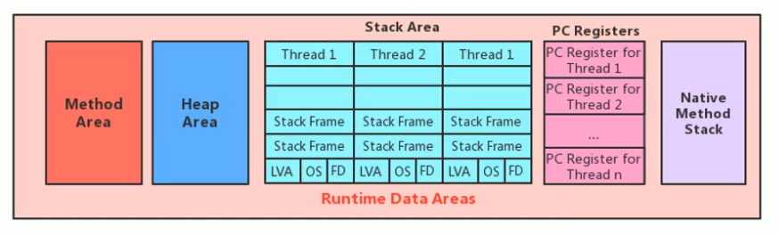
 从线程共享与否的角度来看
 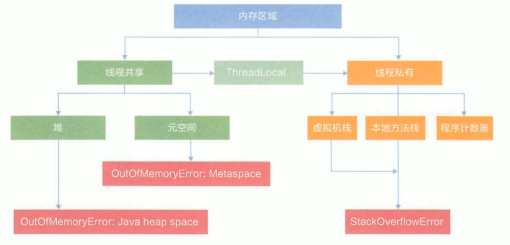

**栈、堆、方法区的交互关系
 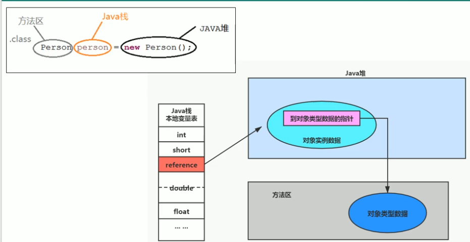

### 2. 方法区的理解

**官方文档：**
 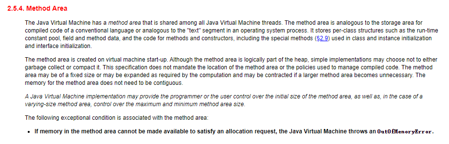

>
https://docs.oracle.com/javase/specs/jvms/se8/html/jvms-2.html#jvms-2.5.4

#### 方法区在哪里？

《Java 虚拟机规范》中明确说明：“尽管所有的方法区在逻辑上时属于堆的一部分，但一些简单的实现可能不会选择去进行垃圾收集或者进行压缩。”但对于 HotSpot JVM 而言，方法区还有一个别名叫做 Non-Heap(非堆)，目的就是要和堆分开。
 所以，**方法区看作是一个独立于 Java 堆的内存空间**。
 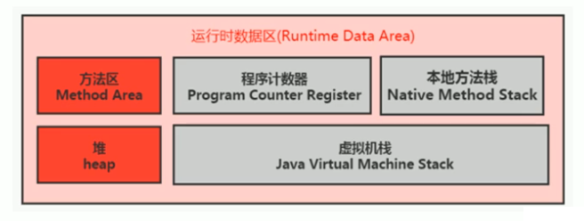

#### 方法区的基本理解

- 方法区（Method Area）与 Java 堆一样，是各个线程共享的内存区域。

- 方法区在 JVM 启动的时候被创建，并且它的实际的物理内存空间中和 Java 堆区一样都可以是不连续的

- 方法区的大小，跟堆空间一样，可以选择固定大小或者扩展。

- 方法区的大小决定了系统可以保存多少个类，如果系统定义了太多的类，导致方法区溢出，虚拟机同样会抛出内存溢出错误：java.lang.OutOfMemoryErro: **PerGen space**（JDK 7及之前） 或 java.lang.OutOfMemoryErro: **Metaspace**（JDK 8及之后）。可能出现 OOM 的场景：

  - 加载大量的第三方 jar 包；

  - Tomcat 部署的工程过多（30-50个）有可能导致方法区出现溢出；

  - 大量动态生成反射类

- 关闭 JVM 就会释放这个区域的内存

#### Hotspot 中方法区的演进

- 在 JDK7 之前，习惯上把方法区称为永久代。JDK8 开始，使用元空间取代了永久代。

- 本质上，方法区和永久代并不等价。仅是对 hotspot 而言的。《Java 虚拟机规范》对如何实现方法区，不做同一要求。例如：BEA JRockit / IBM J9 中不存在永久态的概念

  - 现在看来，当年使用永久代，不是好的 idea。导致 Java 程序更容易 OOM（超过 -XX:MaxPermSize 上限）。

- 而到了 JDK 8，终于完全废除了永久代的概念，改用与 JRockit、J9 一样在本地内存中实现的元空间（Metaspace）来代替
 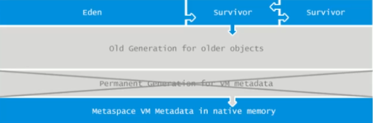

- 元空间的本质和永久代类似，都是对 JVM 规范中方法区的实现。不过元空间与永久代最大的区别在于：**元空间不在虚拟机设置的内存中，而是使用本地内存**。

- 永久代、元空间二者并不只是名字变了，内部结构也调整了。

- 根据《Java 虚拟机规范》的规定，如果方法区无法满足新的内存分配需求时，将抛出 OOM 异常。
 **方法区概述**
 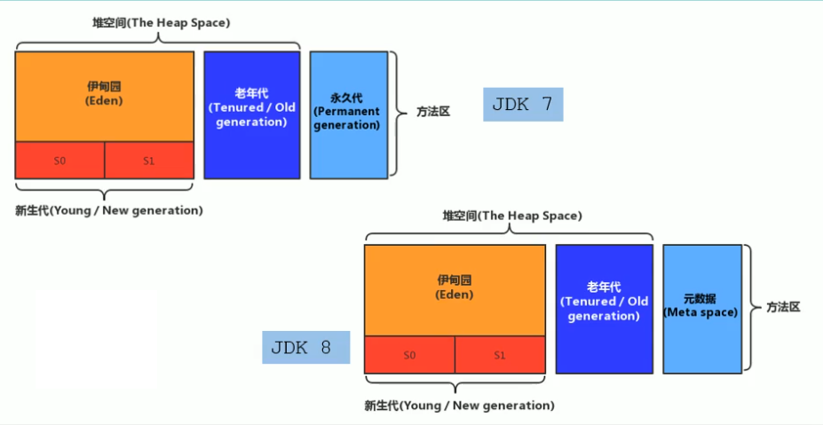

### 3. 设置方法区大小与 OOM

- 方法区的大小不必是固定的，jvm 可以根据应用的需要动态调整。

- **JDK 7及以前：**

  - 通过 -XX:PermSize 来设置永久代初始分配空间。默认值是 20.75M

  - -XX:MaxPermSize 来设定永久代最大可分配空间。32位机器默认是 64M，64位机器默认是 82M

  - 当 JVM 加载的类信息容量超过了这个值，会报异常 OutOfMemoryError:PermGen space。
 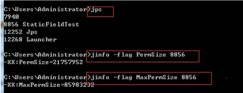

- **JDK 8及以后：**

  - 元数据区大小可以使用参数 -XX:MetaspaceSize 和 -XX:MaxMetaspaceSize 指定，替代上述原有的两个参数。

  - 默认值依赖于平台。*windwos 下，-XX:MetaspaceSize 是 21M，-XX:MaxMetaspaceSize 的值是 -1，即没有限制*。

  - 与永久代不同，如果不指定大小，默认情况下，虚拟机会耗尽所有的可能系统内存。如果元数据区发生溢出，虚拟机一样会抛出 OutOfMemoryError:Meatspace

  - -XX:MetaSpaceSize：设置初始的元空间的大小。对于一个 64 位的服务器端 JVM 来说，其默认的 -XX:MetaspaceSize 值为 21MB。这就是初始的高水位线，一旦触发这个水位线，Full GC 将会被触发并卸载没用的类（即这些类对应的类加载器不再存活），然后这个高水位线将会重置。新的高水位线的值取决于 GC 后释放了多少元空间。如果释放的空间不足，那么在不超过 MaxMetaspaceSize 时，适当提高该值。如果释放空间过多，那么适当降低该值。

  - 如果初始化的高水位线设置过低，上述高水位线调整情况会发生很多次。通过垃圾回收器的日志，可以观察到 Full GC 多次调用。为了避免频繁地 GC，建议将 -XX:MetaspaceSize 设置为一个相对较高的值。

**代码举例1：(《深入理解 Java 虚拟机》举的例子)**
 借助 CGLib 使得方法区出现内存溢出异常
 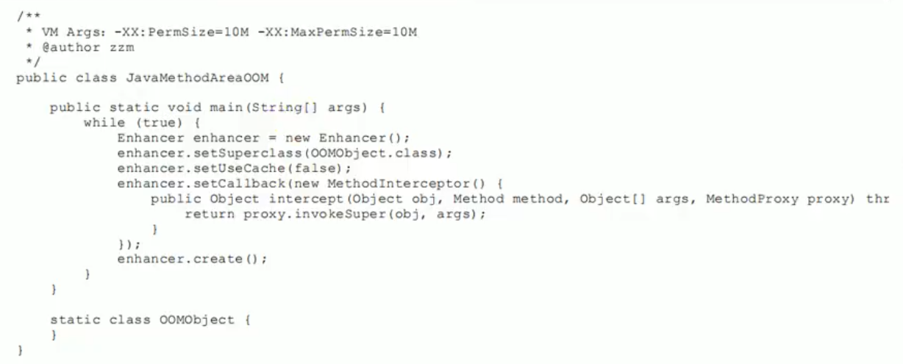

**代码举例2：**

```
/**
 * jdk6/7 中：
 *  -XX:PermSize=5m -XX:MaxPermSize=5m
 * jdk8 中：
 *  -XX:MetaspaceSize=5m -XX:MaxMetaspaceSize=5m
 */
public class OOMTest extends ClassLoader {

    public static void main(String[] args) {
        int j = 0;
        try {
            OOMTest test = new OOMTest();
            for (int i = 0; i < 10000; i++) {
                // 创建 ClassWrite 对象，用于生产类的二进制文件
                ClassWriter classWriter = new ClassWriter(0);
                // 指明版本号 V1_8，修饰符，类名，包名，父类，接口
                classWriter.visit(Opcodes.V1_8, Opcodes.ACC_PUBLIC, "class" + i, null, "java/lang/Object", null);
                // 返回 byte[]
                byte[] code = classWriter.toByteArray();
                // 类的加载
                test.defineClass("class" + i, code, 0, code.length); // Class 对象
                j++;
            }
        } finally {
            System.out.println(j);
        }
    }
}

```

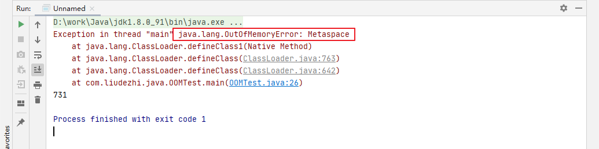

**如何解决这些 OOM？**

1. 要解决 OOM 异常或 heap space 的异常，一般的手段是首先通过内存映像分析工具（如 Eclipse Memory Analyzer）对 dump 出来的堆转储快照进行分析，重点是确认内存中的对象是否是必要的，也就是要先分清楚到底是出现了内存泄漏（Memory Leak）还是内存溢出（Memory Overflow）。

1. 如果是内存泄漏，可进一步通过工具查看泄漏对象到 GC Roots 的引用链。于是就能找到泄漏对象是通过怎样的路径与 GC Roots 相关联并导致垃圾收集器无法自动回收它们的。掌握了泄漏对象的类型信息，以及 GC Roots 引用链的信息，就可以比较准确地定位出泄漏代码的位置。

1. 如果不存在内存泄漏，换句话说就是内存中的对象确实都还必须存活着，那就应当检查虚拟机的堆参数（-Xmx 与 -Xms），与机器物理内存比对看是否还可以调大，从代码上检查是否存在某些对象生命周期过长、持有状态时间过长的情况，尝试减少程序运行期的内存消耗。

### 4. 方法区的内部结构

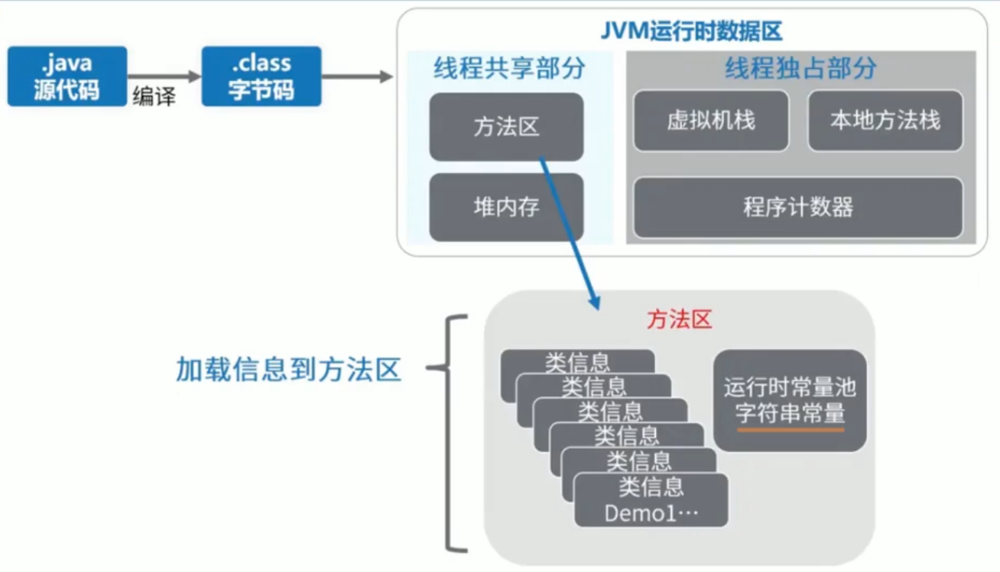

#### 4.1. 方法区（Method Area）存储什么？

《深入理解 Java 虚拟机》书中对方法区（Method Area）存储内容描述如下：
 它用于存储已被虚拟机加载的**类型信息、常量、静态变量、即使编译器编译后的代码缓存**等。
 

**类型信息**
 对每个加载的类型（类class、接口interface、枚举enum、注解annotation），JVM 必须在方法区中存储以下类型信息：

1. 这个类型的完整有效名称（全名=包名.类名）

1. 这个类型直接父类的完整有效名（对于 interface 或是 java.lang.Object，都没有父类）

1. 这个类型的修饰符（public，abstract，final 的某个子集）

1. 这个类型直接接口的一个有序列表

**域（Field）信息**

- JVM 必须在方法区中保存类型的所有域的相关信息以及域的声明顺序

- 域的相关信息包括：域名称、域类型、域修饰符（public，private，protected，static，final，volatile，transient 的某个子集）

**方法（Method）信息**
 JVM 必须保存所有方法的以下信息，同域信息一样包括声明顺序：

- 方法名称

- 方法的返回类型（或 void）

- 方法参数的数量和类型（按顺序）

- 方法的修饰符（public，private，protected，static，final，synchronized，native，abstract 的一个子集）

- 方法的字节码（bytecodes）、操作数栈、局部变量表及大小（abstract 和 native 方法除外）

- 异常表（abstract 和 native 方法除外）

  - 每个异常处理的开始位置、结束位置、代码处理在程序计数器中的偏移地址、被捕获的异常类的常量池索引

```
public class MethodInnerStrucTest extends Object implements Comparable<String>, Serializable {
    // 属性
    public int num = 10;
    private static String str = "测试方法的内部结构";
    // 构造器
    // 方法
    public void test1() {
        int count = 20;
        System.out.println("count = " + count);
    }
    public static int test2(int cal) {
        int result = 0;
        try {
            int value = 30;
            result = value / cal;
        } catch (Exception e) {
            e.printStackTrace();
        }
        return result;
    }

    @Override
    public int compareTo(String o) {
        return 0;
    }
}

```

```
javap -v -p MethodInnerStrucTest.class > test.txt

```

**non-final 的类变量**

- 静态变量和类关联在一起，随着类的加载而加载，它们成为类数据在逻辑上的一部分。

- 类变量被类的所有实例共享，即使没有类实例时你也可以访问它。

```
/**
 * non-final 的类变量
 */
public class MethodAreaTest {
    public static void main(String[] args) {
        Order order = null;
        order.hello();                      // hello
        System.out.println(order.count);    // 1
    }
}
class Order {
    public static int count = 1;
    public static final int number = 2;

    public static void hello() {
        System.out.println("hello");
    }
}

```

**补充说明：全局常量（static final）**
 被声明为 final 的类变量的处理方法则不同，每个全局常量在编译的时候就会被分配了。

```
javap -v -p Order.class > test.txt

```

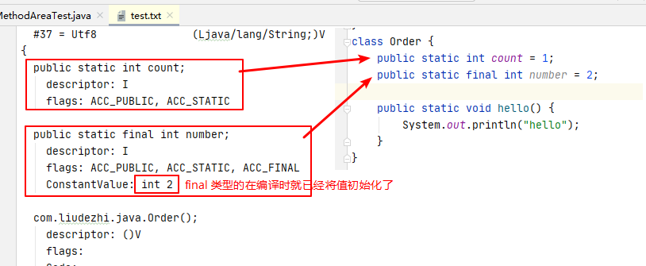

#### 运行时常量池 VS 常量池

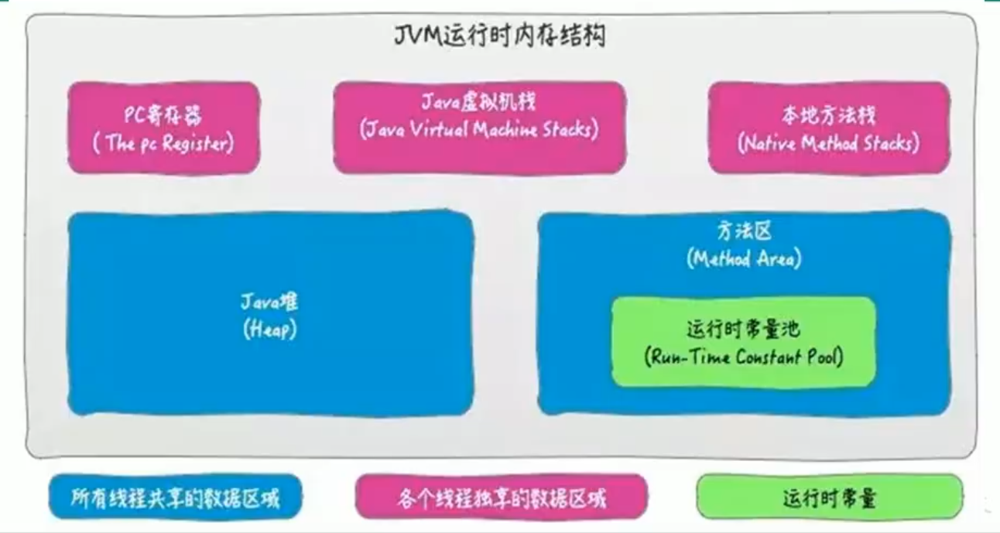

- 方法区，内部包含了运行时常量池。

- 字节码文件，内部包含了常量池。

- 要弄清除方法区，需要理解清除 ClassFile，因为加载类的信息都在方法区。

- 要弄清楚方法区的运行时常量池，需要理解清除 ClassFile 中的常量池。
 http://docs.oracle.com/javase/specs/jvms/se8/html/jvms-4.html
 如下：
 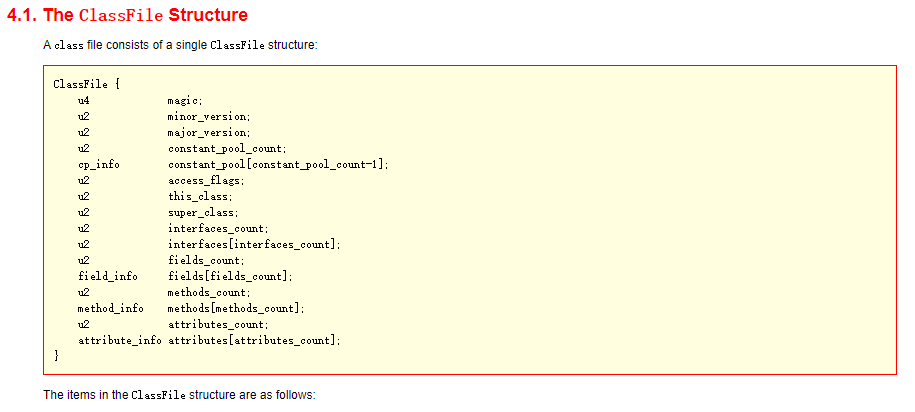

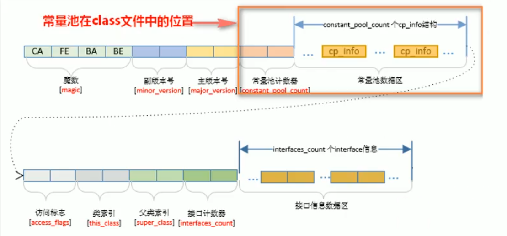
 一个有效的字节码文件中除了包含类的版本信息、字段、方法以及接口等描述信息外，还包含一项信息那就是常量池表（Constant Pool Table），包括各种字面量和对类型、域和方法的符号引用。

**为什么需要常量池？**
 一个 java 源文件中的类、接口，编译后产生一个字节码文件。而 Java 中的字节码需要数据支持，通常这种数据会很大以至于不能直接存到字节码里，换另一种方式，可以存到常量池，这个字节码包含了指向常量池的引用。在动态链接的时候会用到运行时常量池。
 比如：如下的代码：

```
public class SimpleClass {
    public void sayHello() {
        System.out.println("hello");
    }
}

```

虽然只有 194 字节，但是里面却使用了 String、System、PrintStream 及 Object 等结构。这里代码量其实已经很小了。如果代码多，引用到的结构更多！这里就需要常量池了！

**常量池中有什么？**
 几种在常量池内存储的数据类型包括：

- 数字值

- 字符串值

- 类引用

- 字段引用

- 方法引用

例如下面这段代码：

```
public class MethodAreaTest2 {
    public static void main(String[] args) {
        Object obj = new Object();
    }
}
Object foo = new Object();

```

将会被编译成如下字节码：

```
0 new #2 <java/lang/Object>
3 dup
4 invokespecial #1 <java/lang/Object.<init>>

```

**小结：** 常量池，可以看作是一张表，虚拟机指令根据这张常量表找到要执行的类名、方法名、参数类型、字面量等类型。

**运行时常量池**

- 运行时常量池（Runtime Constant Pool）是方法区的一部分。

- 常量池表（Constant Pool Table）是 Class 文件的一部分，**用于存放编译期生成的各种字面量与符号引用**，*这部分内容将在类加载后存放到方法区的运行时常量池中*。

- 运行时常量池，在加载类和接口到虚拟机后，就会创建对应的运行时常量池。

- JVM 为每个已加载的类型（类或接口）都维护一个常量池。池中的数据项像数组项一样，是通过索引访问的。

- 运行时常量池中包含了多种不同的常量，包括编译期就已经明确的数值字面量，也包括到运行期解析后才能够获得的方法或者字段引用。此时不再是常量池中的符号地址了，这里换为真实地址。

  - 运行时常量池，相对于 Class 文件常量池的另一重要特征是：**具备动态性**。eg：String.intern()

- 运行时常量池类似于传统编程语言中的符号表（symbol table），但是它所包含的数据却比符号表要更加丰富一些。

- 当创建类或接口的运行时常量池时，如果构造运行时常量池所需的内存空间超过了方法区所能提供的最大值，则 JVM 会抛 OutOfMemoryError 异常。

### 5. 方法区使用举例

```
public class MethodAreaDemo {
    public static void main(String[] args) {
        int x = 500;
        int y = 100;
        int a = x / y;
        int b = 50;
        System.out.println(a + b);
    }
}

```

`javap -v -p MethodAreaDemo.class > test.txt`
 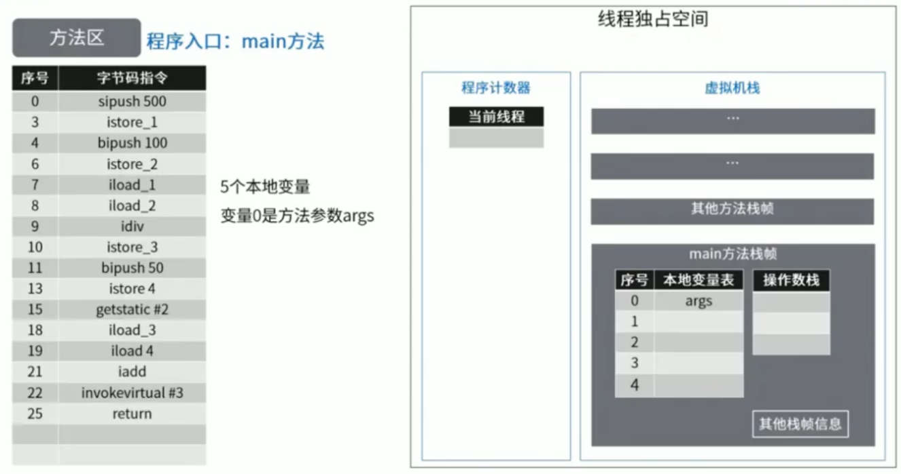
 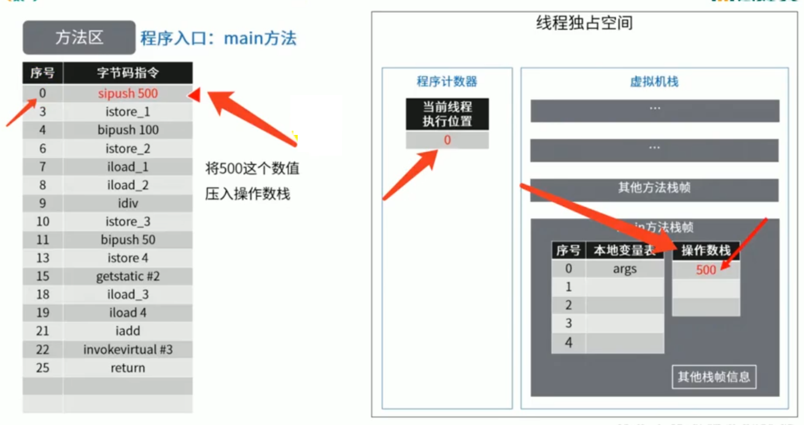
 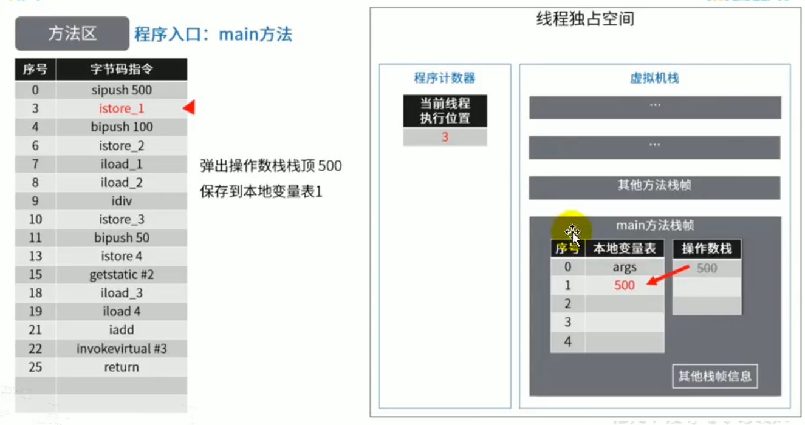
 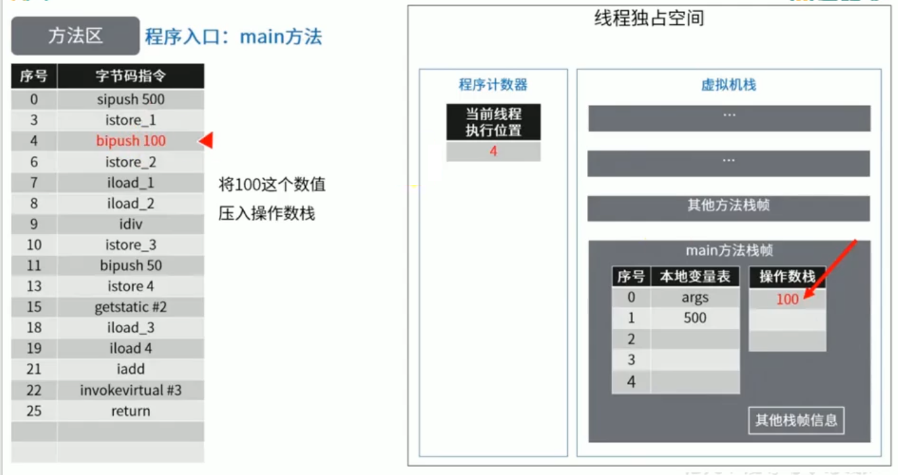
 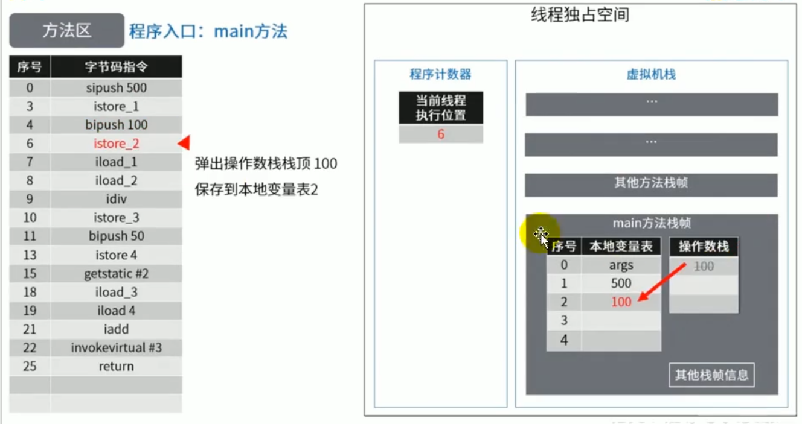
 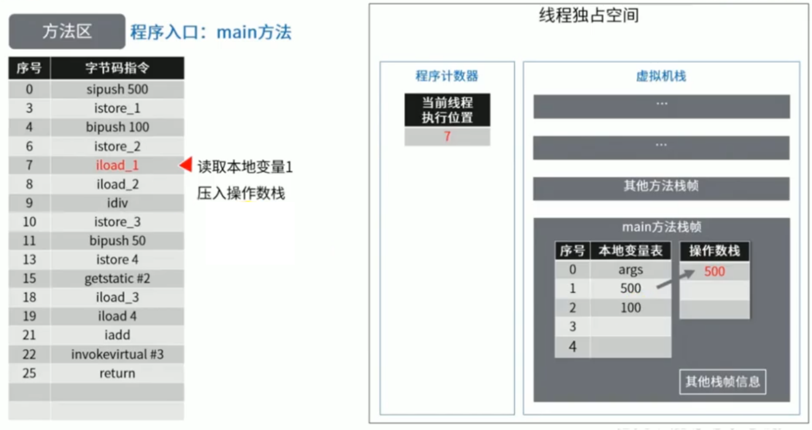
 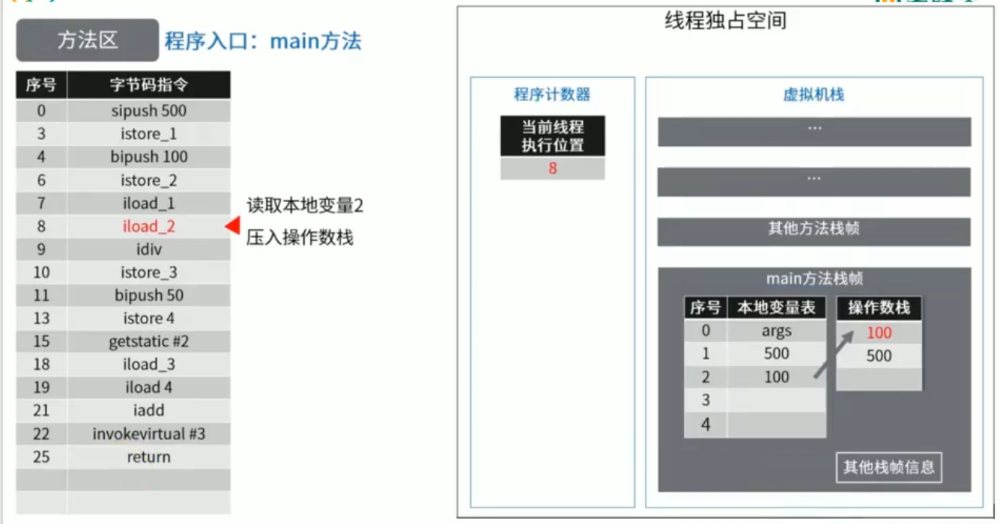
 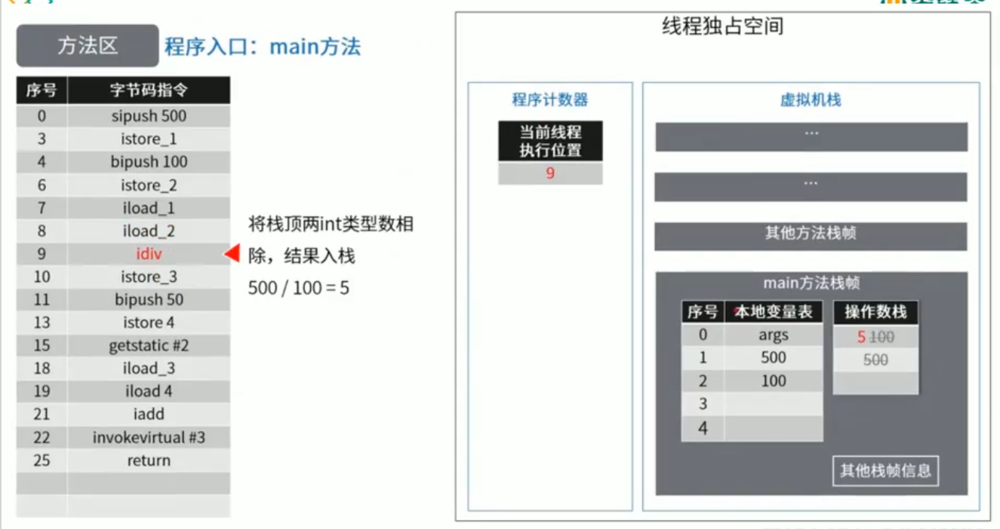
 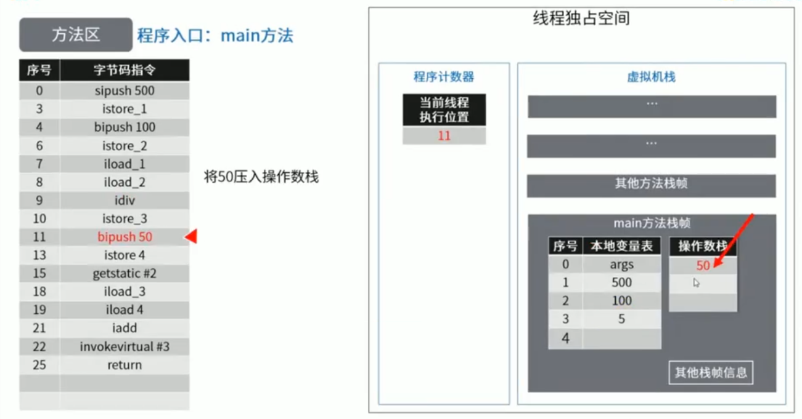
 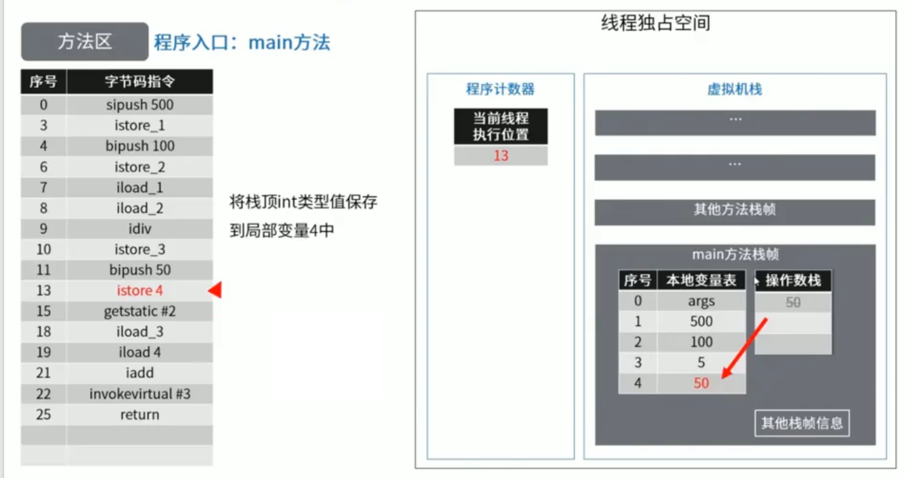
 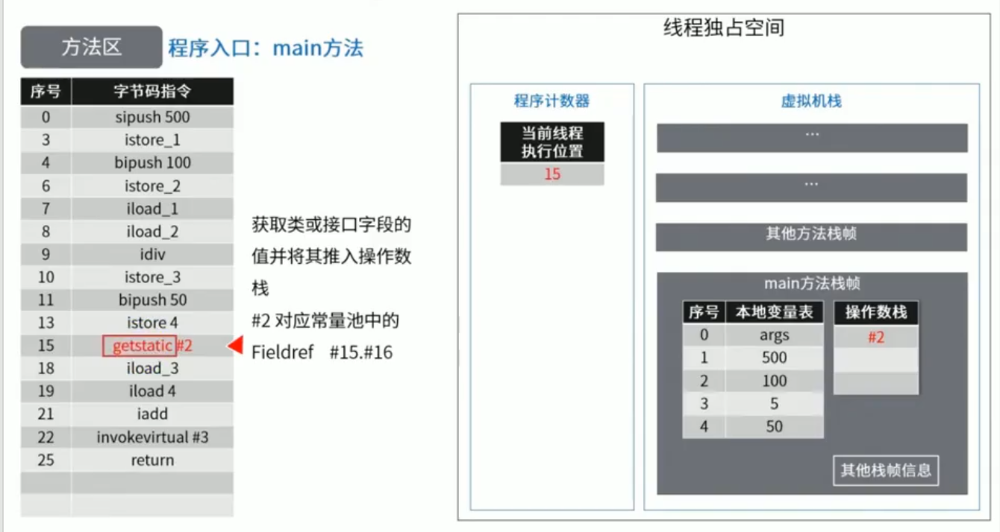
 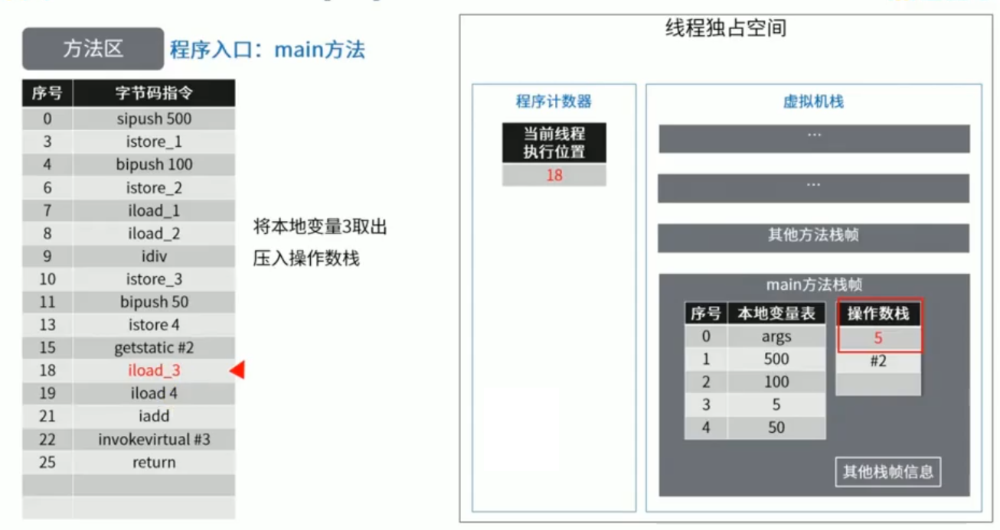
 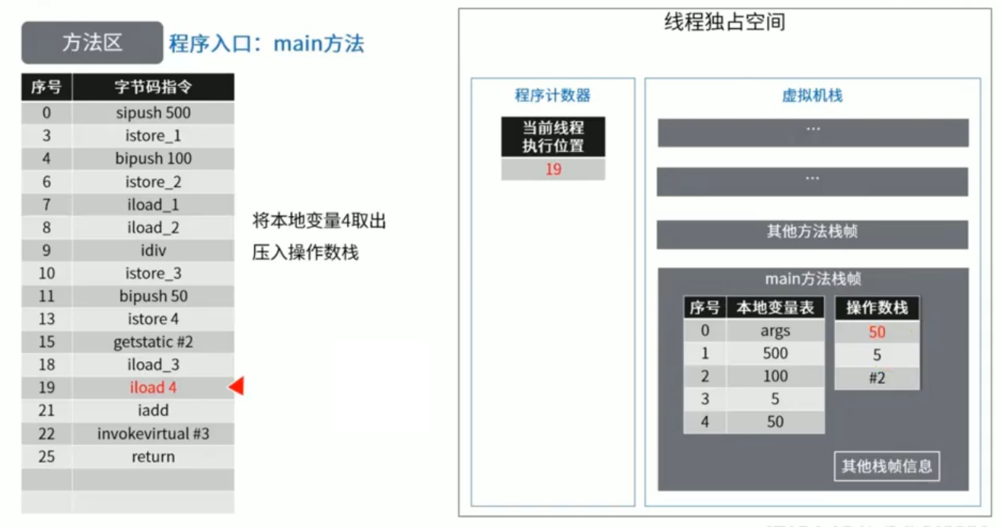
 
 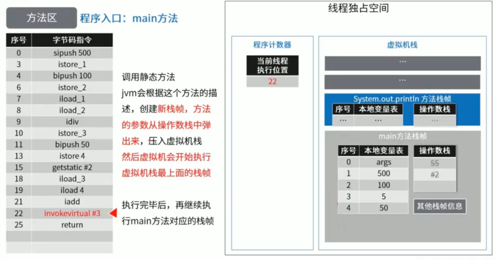
 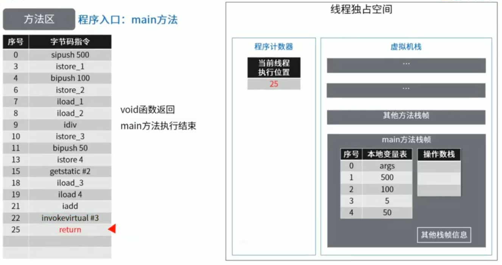

### 6. 方法区的演进细节

1. 首先明确：只有 HotSpot 才有永生代。
 BEA JRockit、IBM J9 等来说，是不存在永久代的概念的。原则上如何实现方法区属于虚拟机实现细节，不受《Java 虚拟机规范》管束，并不要求统一。

1. HotSpot 中方法区的变化：

 | 版本 | 变化
 | jdk1.6 及之前 | 在永久代(permanent generation)，静态变量存放在永久代上
 | jdk1.7 | 有永久代，但已经逐步“去永久代”，字符串常量池、静态变量移除，保存在堆中
 | jdk1.8 及之后 | 无永久代，类型信息、字段、方法、常量保存在本地内存的元空间，但字符串常量池、静态变量仍在堆

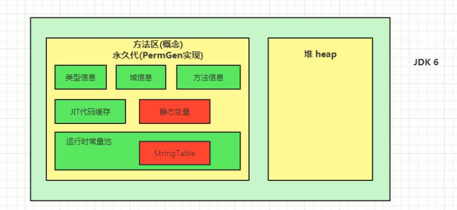
 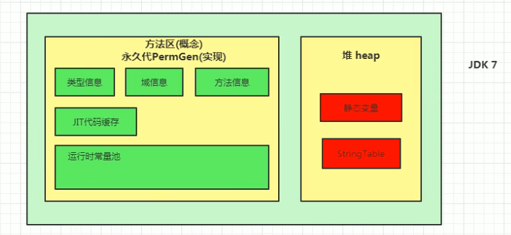
 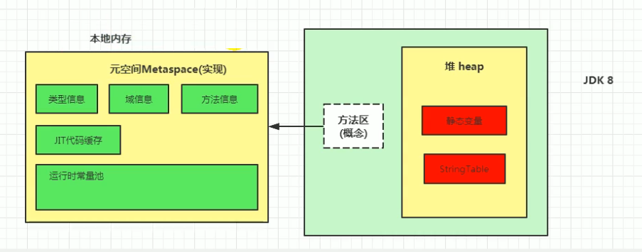

#### 永久代为什么要被元空间替换？

http://openjdk.java.net/jeps/122
 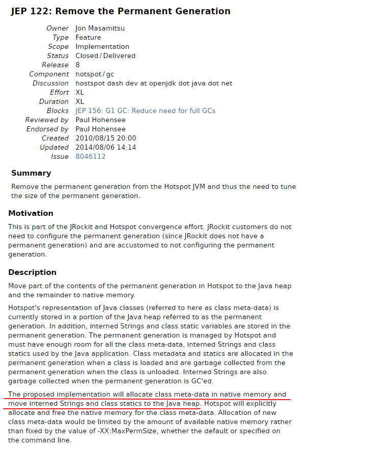

- 随着 Java8 的到来，HotSpot VM 中再也见不到永久代了。但是这并不意味着类的元数据信息也消失了。这些数据被移到了一个与**堆不相连的本地内存区域，这个区域叫做元空间（Metaspace）**。

- 由于类的元数据分配在本地内存中，元空间的最大可分配空间就是系统可用内存空间。

- 这项改动是很有必要的，原因有：
 1）**为永久代设置空间大小是很难确定的**。
 在某些场景下，如果动态加载类过多，容易产生 Perm 区的 OOM。比如某个实际 Web 工程中，因为功能点比较多，在运行过程中，要不断动态加载很多类，经常出现致命错误。
 "Exception in thread 'dubbo client x.x connector' java.lang.OutOfMemoryErro: PermGen space"
 而元空间和永久代之间最大的区别在于：元空间并不在虚拟机中，而是使用本地内存。因此，默认情况下，元空间的大小仅受本地内存限制。
 2）**对永久代进行调优是很困难的**。

**StringTable 为什么要调整？**
 JDK7 中将 StringTable 放到了堆空间中。因为永久代的回收效率低，在 Full GC 的时候才会触发。而 Full GC 是老年代的空间不足、永久代不足时才会触发。
 这就导致 StringTable 回收效率不高。而开发中会有大量的字符串被创建，回收效率低，导致永久代内存不足。放到堆里。能及时回收内存。

**静态变量放在哪里**

```
/**
 * 结论：静态引用对应的对象实体始终都存在堆空间
 * jdk7:
 *  -Xms200m -Xmx200m -XX:permSize=300m -XX:MaxPermSize=300m -XX:+PrintGCDetails
 * jdk8:
 *  -Xms200m -Xmx200m -XX:MetaspaceSize=300m -XX:MaxMetaspaceSize=300m -XX:+PrintGCDetails
 */
public class StaticFieldTest {
    private static byte[] arr = new byte[1024 * 1024 * 100];   // 100m

    public static void main(String[] args) {
        System.out.println(StaticFieldTest.arr);
        /*try {
            Thread.sleep(1000000);
        } catch (InterruptedException e) {
            e.printStackTrace();
        }*/
    }
}

```

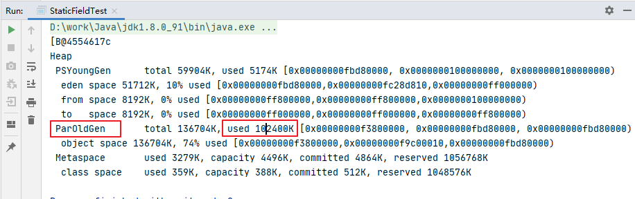

```
/**
 * 《深入理解 Java 虚拟机》中的案例：
 *  staticObj、instanceObj、localObj 存放在哪？
 */
public class StaticObjTest {
    static class Test {
        static ObjectHolder staticObj = new ObjectHolder();
        ObjectHolder instanceObj = new ObjectHolder();

        void foo() {
            ObjectHolder localObj = new ObjectHolder();
            System.out.println("done");
        }
    }

    private static class ObjectHolder {

    }

    public static void main(String[] args) {
        Test test = new StaticObjTest.Test();
        test.foo();
    }
}

```

使用 **JHSDB**(JDK9及之后 bin 目录自带工具) 工具进行分析，这里细节忽略掉。
 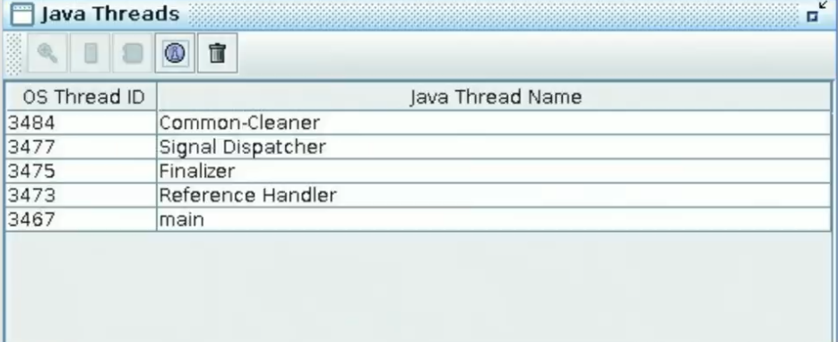
 staticObj 随着 Test 的类型信息存放在方法区，instanceObj 随着 Test 的对象实例存放在 Java 堆中，localObject 则是存放在 foo() 方法栈帧的局部变量表中。
 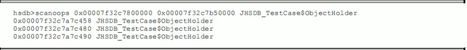
 测试发现：三个对象的数据在内存中的地址都落在 Eden 区范围内，所以结论：只要是对象实例必然会在 Java 堆中分配。
 接着，找到了一个引用该 staticObj 对象的地方，是在一个 java.lang.Class 的实例里，并且给出了这个实例的地址，通过 Inspector 查看该对象实例，可以清除看到这确实是一个 java.lang.Class 类型的对象实例，里面有一个名为 staticObj 的实例字段：
 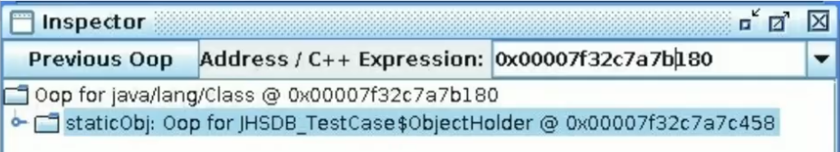
 从《Java 虚拟机规范》所定义的概念模型来看，所有 Class 相关的信息都应该存放在方法区之中，但方法区该如何实现，《Java 虚拟机规范》并未作规定，这就成了一件允许不同虚拟机自己灵活把握的事情。JDK7 及以后版本的 HotSpot 虚拟机选择把静态变量与类型在 Java 语言一端的映射 Class 对象存放在一起，存储于 Java 堆之中，从我们的实验中也明确验证了这一点。

### 7. 方法区的垃圾回收

**方法区的垃圾收集**
 有些人认为方法区（如 HotSpot 虚拟机中的元空间或者永久代）是没有垃圾收集行为的，其实不然。《Java 虚拟机规范》对方法区的约束是非常宽松的，提到过可以不要求虚拟机在方法区中实现垃圾收集。事实上也确实有未实现或未能完整实现方法区类型卸载的收集器存在（如JDK 11 时期的 ZGC 收集器就不支持类卸载）。

一般来说**这个区域的回收效果比较难令人满意，尤其是类型的卸载，条件相当苛刻**。但是这部分区域的回收**有时又确实是必要的**。以前 Sun 公司的 Bug 列表中，曾出现过的若干个严重的 Bug 就是由于低版本的 HotSpot 虚拟机对此区域未完全回收而导致内存泄漏的。

**方法区的垃圾收集主要回收两部分内容：常量池中废弃的常量和不再使用的类型。**

- 先来说说方法区内常量池之中主要存放的两大类常量：字面量和符号引用。字面量比较接近 Java 语言层次的常量概念，如文本字符串、被声明为 final 的常量值等。而符号引用则属于编译原理方面的概念，包括下面三类常量：

  - 1.类和接口的全限定名

  -

    1. 字段的名称和描述符

  -

    1. 方法的名称和描述符

- HotSpot 虚拟机对常量池的回收策略是很明确的，**只要常量池中的常量没有被任何地方引用，就可以被回收**。

- 回收废弃常量与回收 Java 堆中的对象非常类似。

- 判定一个常量是否“废弃”还是相对简单，而要判定一个类型是否属于“不再被使用的类”的条件就比较苛刻了。需要同时满足下面三个条件：

  - 该类的所有实例都已经被回收，也就是 Java 堆中不存在该类及其任何派生子类的实例。

  - 加载该类的类加载器已经被回收，这个条件除非是经过精心设计的可替换类加载器的场景，如 OSGi、JSP 的重加载等，否则通常是很难达成的。

  - 该类对应的 java.lang.Class 对象没有在任何地方被引用，无法在任何地方通过反射访问该类的方法。

- Java 虚拟机被允许对满足上述三个条件的无用类进行回收，这里说的仅仅是“被允许”，而并不是和对象一样，没有引用了就必然会回收。关于是否要对类型进行回收，HotSpot 虚拟机提供了 -Xnoclassgc 参数进行控制，还可以使用 -verbose:class 以及 -XX:+TraceClass-Loading、-XX:+TraceClassUnLoading 查看类加载和卸载信息。

- 在大量使用反射、动态代理、CGLib 等字节码框架，动态生成 JSP 以及 OSGi 这类频繁自定义类加载器的场景中，通常都需要 Java 虚拟机具备类型卸载的能力，以保证不会对方法区造成过大的内存压力。

### 8. 总结

%23%23%20%E6%96%B9%E6%B3%95%E5%8C%BA%0A%23%23%23%201.%20%E6%A0%88%E3%80%81%E5%A0%86%E3%80%81%E6%96%B9%E6%B3%95%E5%8C%BA%E7%9A%84%E4%BA%A4%E4%BA%92%E5%85%B3%E7%B3%BB%0A**%E8%BF%90%E8%A1%8C%E6%97%B6%E6%95%B0%E6%8D%AE%E5%8C%BA%E7%BB%93%E6%9E%84%E5%9B%BE%EF%BC%9A**%0A!%5B966697e12b5b15574dff741793486035.png%5D(en-resource%3A%2F%2Fdatabase%2F4874%3A1)%0A%E4%BB%8E%E7%BA%BF%E7%A8%8B%E5%85%B1%E4%BA%AB%E4%B8%8E%E5%90%A6%E7%9A%84%E8%A7%92%E5%BA%A6%E6%9D%A5%E7%9C%8B%0A!%5Bc397b1888e1955bc4d0fc119ef429cf3.png%5D(en-resource%3A%2F%2Fdatabase%2F4876%3A1)%0A%0A**%E6%A0%88%E3%80%81%E5%A0%86%E3%80%81%E6%96%B9%E6%B3%95%E5%8C%BA%E7%9A%84%E4%BA%A4%E4%BA%92%E5%85%B3%E7%B3%BB%0A!%5B8e680b5b5e777b599db1cd98662f2bb7.png%5D(en-resource%3A%2F%2Fdatabase%2F4878%3A1)%0A%0A%23%23%23%202.%20%E6%96%B9%E6%B3%95%E5%8C%BA%E7%9A%84%E7%90%86%E8%A7%A3%0A**%E5%AE%98%E6%96%B9%E6%96%87%E6%A1%A3%EF%BC%9A**%0A!%5B8e44276fe47abe6effc761fc4617e5e4.png%5D(en-resource%3A%2F%2Fdatabase%2F4880%3A1)%0A%3Ehttps%3A%2F%2Fdocs.oracle.com%2Fjavase%2Fspecs%2Fjvms%2Fse8%2Fhtml%2Fjvms-2.html%23jvms-2.5.4%0A%0A%23%23%23%23%20%E6%96%B9%E6%B3%95%E5%8C%BA%E5%9C%A8%E5%93%AA%E9%87%8C%EF%BC%9F%0A%E3%80%8AJava%20%E8%99%9A%E6%8B%9F%E6%9C%BA%E8%A7%84%E8%8C%83%E3%80%8B%E4%B8%AD%E6%98%8E%E7%A1%AE%E8%AF%B4%E6%98%8E%EF%BC%9A%E2%80%9C%E5%B0%BD%E7%AE%A1%E6%89%80%E6%9C%89%E7%9A%84%E6%96%B9%E6%B3%95%E5%8C%BA%E5%9C%A8%E9%80%BB%E8%BE%91%E4%B8%8A%E6%97%B6%E5%B1%9E%E4%BA%8E%E5%A0%86%E7%9A%84%E4%B8%80%E9%83%A8%E5%88%86%EF%BC%8C%E4%BD%86%E4%B8%80%E4%BA%9B%E7%AE%80%E5%8D%95%E7%9A%84%E5%AE%9E%E7%8E%B0%E5%8F%AF%E8%83%BD%E4%B8%8D%E4%BC%9A%E9%80%89%E6%8B%A9%E5%8E%BB%E8%BF%9B%E8%A1%8C%E5%9E%83%E5%9C%BE%E6%94%B6%E9%9B%86%E6%88%96%E8%80%85%E8%BF%9B%E8%A1%8C%E5%8E%8B%E7%BC%A9%E3%80%82%E2%80%9D%E4%BD%86%E5%AF%B9%E4%BA%8E%20HotSpot%20JVM%20%E8%80%8C%E8%A8%80%EF%BC%8C%E6%96%B9%E6%B3%95%E5%8C%BA%E8%BF%98%E6%9C%89%E4%B8%80%E4%B8%AA%E5%88%AB%E5%90%8D%E5%8F%AB%E5%81%9A%20Non-Heap(%E9%9D%9E%E5%A0%86)%EF%BC%8C%E7%9B%AE%E7%9A%84%E5%B0%B1%E6%98%AF%E8%A6%81%E5%92%8C%E5%A0%86%E5%88%86%E5%BC%80%E3%80%82%0A%E6%89%80%E4%BB%A5%EF%BC%8C**%E6%96%B9%E6%B3%95%E5%8C%BA%E7%9C%8B%E4%BD%9C%E6%98%AF%E4%B8%80%E4%B8%AA%E7%8B%AC%E7%AB%8B%E4%BA%8E%20Java%20%E5%A0%86%E7%9A%84%E5%86%85%E5%AD%98%E7%A9%BA%E9%97%B4**%E3%80%82%0A!%5B750121ca018e0b251386e2b51b223d21.png%5D(en-resource%3A%2F%2Fdatabase%2F4882%3A1)%0A%0A%23%23%23%23%20%E6%96%B9%E6%B3%95%E5%8C%BA%E7%9A%84%E5%9F%BA%E6%9C%AC%E7%90%86%E8%A7%A3%0A-%20%E6%96%B9%E6%B3%95%E5%8C%BA%EF%BC%88Method%20Area%EF%BC%89%E4%B8%8E%20Java%20%E5%A0%86%E4%B8%80%E6%A0%B7%EF%BC%8C%E6%98%AF%E5%90%84%E4%B8%AA%E7%BA%BF%E7%A8%8B%E5%85%B1%E4%BA%AB%E7%9A%84%E5%86%85%E5%AD%98%E5%8C%BA%E5%9F%9F%E3%80%82%0A-%20%E6%96%B9%E6%B3%95%E5%8C%BA%E5%9C%A8%20JVM%20%E5%90%AF%E5%8A%A8%E7%9A%84%E6%97%B6%E5%80%99%E8%A2%AB%E5%88%9B%E5%BB%BA%EF%BC%8C%E5%B9%B6%E4%B8%94%E5%AE%83%E7%9A%84%E5%AE%9E%E9%99%85%E7%9A%84%E7%89%A9%E7%90%86%E5%86%85%E5%AD%98%E7%A9%BA%E9%97%B4%E4%B8%AD%E5%92%8C%20Java%20%E5%A0%86%E5%8C%BA%E4%B8%80%E6%A0%B7%E9%83%BD%E5%8F%AF%E4%BB%A5%E6%98%AF%E4%B8%8D%E8%BF%9E%E7%BB%AD%E7%9A%84%0A-%20%E6%96%B9%E6%B3%95%E5%8C%BA%E7%9A%84%E5%A4%A7%E5%B0%8F%EF%BC%8C%E8%B7%9F%E5%A0%86%E7%A9%BA%E9%97%B4%E4%B8%80%E6%A0%B7%EF%BC%8C%E5%8F%AF%E4%BB%A5%E9%80%89%E6%8B%A9%E5%9B%BA%E5%AE%9A%E5%A4%A7%E5%B0%8F%E6%88%96%E8%80%85%E6%89%A9%E5%B1%95%E3%80%82%0A-%20%E6%96%B9%E6%B3%95%E5%8C%BA%E7%9A%84%E5%A4%A7%E5%B0%8F%E5%86%B3%E5%AE%9A%E4%BA%86%E7%B3%BB%E7%BB%9F%E5%8F%AF%E4%BB%A5%E4%BF%9D%E5%AD%98%E5%A4%9A%E5%B0%91%E4%B8%AA%E7%B1%BB%EF%BC%8C%E5%A6%82%E6%9E%9C%E7%B3%BB%E7%BB%9F%E5%AE%9A%E4%B9%89%E4%BA%86%E5%A4%AA%E5%A4%9A%E7%9A%84%E7%B1%BB%EF%BC%8C%E5%AF%BC%E8%87%B4%E6%96%B9%E6%B3%95%E5%8C%BA%E6%BA%A2%E5%87%BA%EF%BC%8C%E8%99%9A%E6%8B%9F%E6%9C%BA%E5%90%8C%E6%A0%B7%E4%BC%9A%E6%8A%9B%E5%87%BA%E5%86%85%E5%AD%98%E6%BA%A2%E5%87%BA%E9%94%99%E8%AF%AF%EF%BC%9Ajava.lang.OutOfMemoryErro%3A%20**PerGen%20space**%EF%BC%88JDK%207%E5%8F%8A%E4%B9%8B%E5%89%8D%EF%BC%89%20%E6%88%96%20java.lang.OutOfMemoryErro%3A%20**Metaspace**%EF%BC%88JDK%208%E5%8F%8A%E4%B9%8B%E5%90%8E%EF%BC%89%E3%80%82%E5%8F%AF%E8%83%BD%E5%87%BA%E7%8E%B0%20OOM%20%E7%9A%84%E5%9C%BA%E6%99%AF%EF%BC%9A%0A%20%20%20%20-%20%E5%8A%A0%E8%BD%BD%E5%A4%A7%E9%87%8F%E7%9A%84%E7%AC%AC%E4%B8%89%E6%96%B9%20jar%20%E5%8C%85%EF%BC%9B%0A%20%20%20%20-%20Tomcat%20%E9%83%A8%E7%BD%B2%E7%9A%84%E5%B7%A5%E7%A8%8B%E8%BF%87%E5%A4%9A%EF%BC%8830-50%E4%B8%AA%EF%BC%89%E6%9C%89%E5%8F%AF%E8%83%BD%E5%AF%BC%E8%87%B4%E6%96%B9%E6%B3%95%E5%8C%BA%E5%87%BA%E7%8E%B0%E6%BA%A2%E5%87%BA%EF%BC%9B%0A%20%20%20%20-%20%E5%A4%A7%E9%87%8F%E5%8A%A8%E6%80%81%E7%94%9F%E6%88%90%E5%8F%8D%E5%B0%84%E7%B1%BB%0A-%20%E5%85%B3%E9%97%AD%20JVM%20%E5%B0%B1%E4%BC%9A%E9%87%8A%E6%94%BE%E8%BF%99%E4%B8%AA%E5%8C%BA%E5%9F%9F%E7%9A%84%E5%86%85%E5%AD%98%0A%0A%23%23%23%23%20Hotspot%20%E4%B8%AD%E6%96%B9%E6%B3%95%E5%8C%BA%E7%9A%84%E6%BC%94%E8%BF%9B%0A-%20%E5%9C%A8%20JDK7%20%E4%B9%8B%E5%89%8D%EF%BC%8C%E4%B9%A0%E6%83%AF%E4%B8%8A%E6%8A%8A%E6%96%B9%E6%B3%95%E5%8C%BA%E7%A7%B0%E4%B8%BA%E6%B0%B8%E4%B9%85%E4%BB%A3%E3%80%82JDK8%20%E5%BC%80%E5%A7%8B%EF%BC%8C%E4%BD%BF%E7%94%A8%E5%85%83%E7%A9%BA%E9%97%B4%E5%8F%96%E4%BB%A3%E4%BA%86%E6%B0%B8%E4%B9%85%E4%BB%A3%E3%80%82%0A-%20%E6%9C%AC%E8%B4%A8%E4%B8%8A%EF%BC%8C%E6%96%B9%E6%B3%95%E5%8C%BA%E5%92%8C%E6%B0%B8%E4%B9%85%E4%BB%A3%E5%B9%B6%E4%B8%8D%E7%AD%89%E4%BB%B7%E3%80%82%E4%BB%85%E6%98%AF%E5%AF%B9%20hotspot%20%E8%80%8C%E8%A8%80%E7%9A%84%E3%80%82%E3%80%8AJava%20%E8%99%9A%E6%8B%9F%E6%9C%BA%E8%A7%84%E8%8C%83%E3%80%8B%E5%AF%B9%E5%A6%82%E4%BD%95%E5%AE%9E%E7%8E%B0%E6%96%B9%E6%B3%95%E5%8C%BA%EF%BC%8C%E4%B8%8D%E5%81%9A%E5%90%8C%E4%B8%80%E8%A6%81%E6%B1%82%E3%80%82%E4%BE%8B%E5%A6%82%EF%BC%9ABEA%20JRockit%20%2F%20IBM%20J9%20%E4%B8%AD%E4%B8%8D%E5%AD%98%E5%9C%A8%E6%B0%B8%E4%B9%85%E6%80%81%E7%9A%84%E6%A6%82%E5%BF%B5%0A%20%20%20%20-%20%E7%8E%B0%E5%9C%A8%E7%9C%8B%E6%9D%A5%EF%BC%8C%E5%BD%93%E5%B9%B4%E4%BD%BF%E7%94%A8%E6%B0%B8%E4%B9%85%E4%BB%A3%EF%BC%8C%E4%B8%8D%E6%98%AF%E5%A5%BD%E7%9A%84%20idea%E3%80%82%E5%AF%BC%E8%87%B4%20Java%20%E7%A8%8B%E5%BA%8F%E6%9B%B4%E5%AE%B9%E6%98%93%20OOM%EF%BC%88%E8%B6%85%E8%BF%87%20-XX%3AMaxPermSize%20%E4%B8%8A%E9%99%90%EF%BC%89%E3%80%82%0A-%20%E8%80%8C%E5%88%B0%E4%BA%86%20JDK%208%EF%BC%8C%E7%BB%88%E4%BA%8E%E5%AE%8C%E5%85%A8%E5%BA%9F%E9%99%A4%E4%BA%86%E6%B0%B8%E4%B9%85%E4%BB%A3%E7%9A%84%E6%A6%82%E5%BF%B5%EF%BC%8C%E6%94%B9%E7%94%A8%E4%B8%8E%20JRockit%E3%80%81J9%20%E4%B8%80%E6%A0%B7%E5%9C%A8%E6%9C%AC%E5%9C%B0%E5%86%85%E5%AD%98%E4%B8%AD%E5%AE%9E%E7%8E%B0%E7%9A%84%E5%85%83%E7%A9%BA%E9%97%B4%EF%BC%88Metaspace%EF%BC%89%E6%9D%A5%E4%BB%A3%E6%9B%BF%0A!%5B0c5da5298359113c1db7283490179c45.png%5D(en-resource%3A%2F%2Fdatabase%2F4886%3A1)%0A-%20%E5%85%83%E7%A9%BA%E9%97%B4%E7%9A%84%E6%9C%AC%E8%B4%A8%E5%92%8C%E6%B0%B8%E4%B9%85%E4%BB%A3%E7%B1%BB%E4%BC%BC%EF%BC%8C%E9%83%BD%E6%98%AF%E5%AF%B9%20JVM%20%E8%A7%84%E8%8C%83%E4%B8%AD%E6%96%B9%E6%B3%95%E5%8C%BA%E7%9A%84%E5%AE%9E%E7%8E%B0%E3%80%82%E4%B8%8D%E8%BF%87%E5%85%83%E7%A9%BA%E9%97%B4%E4%B8%8E%E6%B0%B8%E4%B9%85%E4%BB%A3%E6%9C%80%E5%A4%A7%E7%9A%84%E5%8C%BA%E5%88%AB%E5%9C%A8%E4%BA%8E%EF%BC%9A**%E5%85%83%E7%A9%BA%E9%97%B4%E4%B8%8D%E5%9C%A8%E8%99%9A%E6%8B%9F%E6%9C%BA%E8%AE%BE%E7%BD%AE%E7%9A%84%E5%86%85%E5%AD%98%E4%B8%AD%EF%BC%8C%E8%80%8C%E6%98%AF%E4%BD%BF%E7%94%A8%E6%9C%AC%E5%9C%B0%E5%86%85%E5%AD%98**%E3%80%82%0A-%20%E6%B0%B8%E4%B9%85%E4%BB%A3%E3%80%81%E5%85%83%E7%A9%BA%E9%97%B4%E4%BA%8C%E8%80%85%E5%B9%B6%E4%B8%8D%E5%8F%AA%E6%98%AF%E5%90%8D%E5%AD%97%E5%8F%98%E4%BA%86%EF%BC%8C%E5%86%85%E9%83%A8%E7%BB%93%E6%9E%84%E4%B9%9F%E8%B0%83%E6%95%B4%E4%BA%86%E3%80%82%0A-%20%E6%A0%B9%E6%8D%AE%E3%80%8AJava%20%E8%99%9A%E6%8B%9F%E6%9C%BA%E8%A7%84%E8%8C%83%E3%80%8B%E7%9A%84%E8%A7%84%E5%AE%9A%EF%BC%8C%E5%A6%82%E6%9E%9C%E6%96%B9%E6%B3%95%E5%8C%BA%E6%97%A0%E6%B3%95%E6%BB%A1%E8%B6%B3%E6%96%B0%E7%9A%84%E5%86%85%E5%AD%98%E5%88%86%E9%85%8D%E9%9C%80%E6%B1%82%E6%97%B6%EF%BC%8C%E5%B0%86%E6%8A%9B%E5%87%BA%20OOM%20%E5%BC%82%E5%B8%B8%E3%80%82%0A**%E6%96%B9%E6%B3%95%E5%8C%BA%E6%A6%82%E8%BF%B0**%0A!%5B17f59e89cd39f658f499c4e63cab3f87.png%5D(en-resource%3A%2F%2Fdatabase%2F4884%3A1)%0A%0A%23%23%23%203.%20%E8%AE%BE%E7%BD%AE%E6%96%B9%E6%B3%95%E5%8C%BA%E5%A4%A7%E5%B0%8F%E4%B8%8E%20OOM%0A-%20%E6%96%B9%E6%B3%95%E5%8C%BA%E7%9A%84%E5%A4%A7%E5%B0%8F%E4%B8%8D%E5%BF%85%E6%98%AF%E5%9B%BA%E5%AE%9A%E7%9A%84%EF%BC%8Cjvm%20%E5%8F%AF%E4%BB%A5%E6%A0%B9%E6%8D%AE%E5%BA%94%E7%94%A8%E7%9A%84%E9%9C%80%E8%A6%81%E5%8A%A8%E6%80%81%E8%B0%83%E6%95%B4%E3%80%82%0A-%20**JDK%207%E5%8F%8A%E4%BB%A5%E5%89%8D%EF%BC%9A**%0A%20%20%20%20-%20%E9%80%9A%E8%BF%87%20-XX%3APermSize%20%E6%9D%A5%E8%AE%BE%E7%BD%AE%E6%B0%B8%E4%B9%85%E4%BB%A3%E5%88%9D%E5%A7%8B%E5%88%86%E9%85%8D%E7%A9%BA%E9%97%B4%E3%80%82%E9%BB%98%E8%AE%A4%E5%80%BC%E6%98%AF%2020.75M%0A%20%20%20%20-%20-XX%3AMaxPermSize%20%E6%9D%A5%E8%AE%BE%E5%AE%9A%E6%B0%B8%E4%B9%85%E4%BB%A3%E6%9C%80%E5%A4%A7%E5%8F%AF%E5%88%86%E9%85%8D%E7%A9%BA%E9%97%B4%E3%80%8232%E4%BD%8D%E6%9C%BA%E5%99%A8%E9%BB%98%E8%AE%A4%E6%98%AF%2064M%EF%BC%8C64%E4%BD%8D%E6%9C%BA%E5%99%A8%E9%BB%98%E8%AE%A4%E6%98%AF%2082M%0A%20%20%20%20-%20%E5%BD%93%20JVM%20%E5%8A%A0%E8%BD%BD%E7%9A%84%E7%B1%BB%E4%BF%A1%E6%81%AF%E5%AE%B9%E9%87%8F%E8%B6%85%E8%BF%87%E4%BA%86%E8%BF%99%E4%B8%AA%E5%80%BC%EF%BC%8C%E4%BC%9A%E6%8A%A5%E5%BC%82%E5%B8%B8%20OutOfMemoryError%3APermGen%20space%E3%80%82%0A%20%20%20%20!%5Bfc021affe245f09237369107f0c78fa5.png%5D(en-resource%3A%2F%2Fdatabase%2F4888%3A1)%0A-%20**JDK%208%E5%8F%8A%E4%BB%A5%E5%90%8E%EF%BC%9A**%0A%20%20%20%20-%20%E5%85%83%E6%95%B0%E6%8D%AE%E5%8C%BA%E5%A4%A7%E5%B0%8F%E5%8F%AF%E4%BB%A5%E4%BD%BF%E7%94%A8%E5%8F%82%E6%95%B0%20-XX%3AMetaspaceSize%20%E5%92%8C%20-XX%3AMaxMetaspaceSize%20%E6%8C%87%E5%AE%9A%EF%BC%8C%E6%9B%BF%E4%BB%A3%E4%B8%8A%E8%BF%B0%E5%8E%9F%E6%9C%89%E7%9A%84%E4%B8%A4%E4%B8%AA%E5%8F%82%E6%95%B0%E3%80%82%0A%20%20%20%20-%20%E9%BB%98%E8%AE%A4%E5%80%BC%E4%BE%9D%E8%B5%96%E4%BA%8E%E5%B9%B3%E5%8F%B0%E3%80%82*windwos%20%E4%B8%8B%EF%BC%8C-XX%3AMetaspaceSize%20%E6%98%AF%2021M%EF%BC%8C-XX%3AMaxMetaspaceSize%20%E7%9A%84%E5%80%BC%E6%98%AF%20-1%EF%BC%8C%E5%8D%B3%E6%B2%A1%E6%9C%89%E9%99%90%E5%88%B6*%E3%80%82%0A%20%20%20%20-%20%E4%B8%8E%E6%B0%B8%E4%B9%85%E4%BB%A3%E4%B8%8D%E5%90%8C%EF%BC%8C%E5%A6%82%E6%9E%9C%E4%B8%8D%E6%8C%87%E5%AE%9A%E5%A4%A7%E5%B0%8F%EF%BC%8C%E9%BB%98%E8%AE%A4%E6%83%85%E5%86%B5%E4%B8%8B%EF%BC%8C%E8%99%9A%E6%8B%9F%E6%9C%BA%E4%BC%9A%E8%80%97%E5%B0%BD%E6%89%80%E6%9C%89%E7%9A%84%E5%8F%AF%E8%83%BD%E7%B3%BB%E7%BB%9F%E5%86%85%E5%AD%98%E3%80%82%E5%A6%82%E6%9E%9C%E5%85%83%E6%95%B0%E6%8D%AE%E5%8C%BA%E5%8F%91%E7%94%9F%E6%BA%A2%E5%87%BA%EF%BC%8C%E8%99%9A%E6%8B%9F%E6%9C%BA%E4%B8%80%E6%A0%B7%E4%BC%9A%E6%8A%9B%E5%87%BA%20OutOfMemoryError%3AMeatspace%0A%20%20%20%20-%20-XX%3AMetaSpaceSize%EF%BC%9A%E8%AE%BE%E7%BD%AE%E5%88%9D%E5%A7%8B%E7%9A%84%E5%85%83%E7%A9%BA%E9%97%B4%E7%9A%84%E5%A4%A7%E5%B0%8F%E3%80%82%E5%AF%B9%E4%BA%8E%E4%B8%80%E4%B8%AA%2064%20%E4%BD%8D%E7%9A%84%E6%9C%8D%E5%8A%A1%E5%99%A8%E7%AB%AF%20JVM%20%E6%9D%A5%E8%AF%B4%EF%BC%8C%E5%85%B6%E9%BB%98%E8%AE%A4%E7%9A%84%20-XX%3AMetaspaceSize%20%E5%80%BC%E4%B8%BA%2021MB%E3%80%82%E8%BF%99%E5%B0%B1%E6%98%AF%E5%88%9D%E5%A7%8B%E7%9A%84%E9%AB%98%E6%B0%B4%E4%BD%8D%E7%BA%BF%EF%BC%8C%E4%B8%80%E6%97%A6%E8%A7%A6%E5%8F%91%E8%BF%99%E4%B8%AA%E6%B0%B4%E4%BD%8D%E7%BA%BF%EF%BC%8CFull%20GC%20%E5%B0%86%E4%BC%9A%E8%A2%AB%E8%A7%A6%E5%8F%91%E5%B9%B6%E5%8D%B8%E8%BD%BD%E6%B2%A1%E7%94%A8%E7%9A%84%E7%B1%BB%EF%BC%88%E5%8D%B3%E8%BF%99%E4%BA%9B%E7%B1%BB%E5%AF%B9%E5%BA%94%E7%9A%84%E7%B1%BB%E5%8A%A0%E8%BD%BD%E5%99%A8%E4%B8%8D%E5%86%8D%E5%AD%98%E6%B4%BB%EF%BC%89%EF%BC%8C%E7%84%B6%E5%90%8E%E8%BF%99%E4%B8%AA%E9%AB%98%E6%B0%B4%E4%BD%8D%E7%BA%BF%E5%B0%86%E4%BC%9A%E9%87%8D%E7%BD%AE%E3%80%82%E6%96%B0%E7%9A%84%E9%AB%98%E6%B0%B4%E4%BD%8D%E7%BA%BF%E7%9A%84%E5%80%BC%E5%8F%96%E5%86%B3%E4%BA%8E%20GC%20%E5%90%8E%E9%87%8A%E6%94%BE%E4%BA%86%E5%A4%9A%E5%B0%91%E5%85%83%E7%A9%BA%E9%97%B4%E3%80%82%E5%A6%82%E6%9E%9C%E9%87%8A%E6%94%BE%E7%9A%84%E7%A9%BA%E9%97%B4%E4%B8%8D%E8%B6%B3%EF%BC%8C%E9%82%A3%E4%B9%88%E5%9C%A8%E4%B8%8D%E8%B6%85%E8%BF%87%20MaxMetaspaceSize%20%E6%97%B6%EF%BC%8C%E9%80%82%E5%BD%93%E6%8F%90%E9%AB%98%E8%AF%A5%E5%80%BC%E3%80%82%E5%A6%82%E6%9E%9C%E9%87%8A%E6%94%BE%E7%A9%BA%E9%97%B4%E8%BF%87%E5%A4%9A%EF%BC%8C%E9%82%A3%E4%B9%88%E9%80%82%E5%BD%93%E9%99%8D%E4%BD%8E%E8%AF%A5%E5%80%BC%E3%80%82%0A%20%20%20%20-%20%E5%A6%82%E6%9E%9C%E5%88%9D%E5%A7%8B%E5%8C%96%E7%9A%84%E9%AB%98%E6%B0%B4%E4%BD%8D%E7%BA%BF%E8%AE%BE%E7%BD%AE%E8%BF%87%E4%BD%8E%EF%BC%8C%E4%B8%8A%E8%BF%B0%E9%AB%98%E6%B0%B4%E4%BD%8D%E7%BA%BF%E8%B0%83%E6%95%B4%E6%83%85%E5%86%B5%E4%BC%9A%E5%8F%91%E7%94%9F%E5%BE%88%E5%A4%9A%E6%AC%A1%E3%80%82%E9%80%9A%E8%BF%87%E5%9E%83%E5%9C%BE%E5%9B%9E%E6%94%B6%E5%99%A8%E7%9A%84%E6%97%A5%E5%BF%97%EF%BC%8C%E5%8F%AF%E4%BB%A5%E8%A7%82%E5%AF%9F%E5%88%B0%20Full%20GC%20%E5%A4%9A%E6%AC%A1%E8%B0%83%E7%94%A8%E3%80%82%E4%B8%BA%E4%BA%86%E9%81%BF%E5%85%8D%E9%A2%91%E7%B9%81%E5%9C%B0%20GC%EF%BC%8C%E5%BB%BA%E8%AE%AE%E5%B0%86%20-XX%3AMetaspaceSize%20%E8%AE%BE%E7%BD%AE%E4%B8%BA%E4%B8%80%E4%B8%AA%E7%9B%B8%E5%AF%B9%E8%BE%83%E9%AB%98%E7%9A%84%E5%80%BC%E3%80%82%0A%0A**%E4%BB%A3%E7%A0%81%E4%B8%BE%E4%BE%8B1%EF%BC%9A(%E3%80%8A%E6%B7%B1%E5%85%A5%E7%90%86%E8%A7%A3%20Java%20%E8%99%9A%E6%8B%9F%E6%9C%BA%E3%80%8B%E4%B8%BE%E7%9A%84%E4%BE%8B%E5%AD%90)**%0A%E5%80%9F%E5%8A%A9%20CGLib%20%E4%BD%BF%E5%BE%97%E6%96%B9%E6%B3%95%E5%8C%BA%E5%87%BA%E7%8E%B0%E5%86%85%E5%AD%98%E6%BA%A2%E5%87%BA%E5%BC%82%E5%B8%B8%0A!%5B1514470abbab6aa4639d0fe4de156804.png%5D(en-resource%3A%2F%2Fdatabase%2F4890%3A1)%0A%0A**%E4%BB%A3%E7%A0%81%E4%B8%BE%E4%BE%8B2%EF%BC%9A**%0A%60%60%60java%0A%2F**%0A%20*%20jdk6%2F7%20%E4%B8%AD%EF%BC%9A%0A%20*%20%20-XX%3APermSize%3D5m%20-XX%3AMaxPermSize%3D5m%0A%20*%20jdk8%20%E4%B8%AD%EF%BC%9A%0A%20*%20%20-XX%3AMetaspaceSize%3D5m%20-XX%3AMaxMetaspaceSize%3D5m%0A%20*%2F%0Apublic%20class%20OOMTest%20extends%20ClassLoader%20%7B%0A%0A%20%20%20%20public%20static%20void%20main(String%5B%5D%20args)%20%7B%0A%20%20%20%20%20%20%20%20int%20j%20%3D%200%3B%0A%20%20%20%20%20%20%20%20try%20%7B%0A%20%20%20%20%20%20%20%20%20%20%20%20OOMTest%20test%20%3D%20new%20OOMTest()%3B%0A%20%20%20%20%20%20%20%20%20%20%20%20for%20(int%20i%20%3D%200%3B%20i%20%3C%2010000%3B%20i%2B%2B)%20%7B%0A%20%20%20%20%20%20%20%20%20%20%20%20%20%20%20%20%2F%2F%20%E5%88%9B%E5%BB%BA%20ClassWrite%20%E5%AF%B9%E8%B1%A1%EF%BC%8C%E7%94%A8%E4%BA%8E%E7%94%9F%E4%BA%A7%E7%B1%BB%E7%9A%84%E4%BA%8C%E8%BF%9B%E5%88%B6%E6%96%87%E4%BB%B6%0A%20%20%20%20%20%20%20%20%20%20%20%20%20%20%20%20ClassWriter%20classWriter%20%3D%20new%20ClassWriter(0)%3B%0A%20%20%20%20%20%20%20%20%20%20%20%20%20%20%20%20%2F%2F%20%E6%8C%87%E6%98%8E%E7%89%88%E6%9C%AC%E5%8F%B7%20V1_8%EF%BC%8C%E4%BF%AE%E9%A5%B0%E7%AC%A6%EF%BC%8C%E7%B1%BB%E5%90%8D%EF%BC%8C%E5%8C%85%E5%90%8D%EF%BC%8C%E7%88%B6%E7%B1%BB%EF%BC%8C%E6%8E%A5%E5%8F%A3%0A%20%20%20%20%20%20%20%20%20%20%20%20%20%20%20%20classWriter.visit(Opcodes.V1_8%2C%20Opcodes.ACC_PUBLIC%2C%20%22class%22%20%2B%20i%2C%20null%2C%20%22java%2Flang%2FObject%22%2C%20null)%3B%0A%20%20%20%20%20%20%20%20%20%20%20%20%20%20%20%20%2F%2F%20%E8%BF%94%E5%9B%9E%20byte%5B%5D%0A%20%20%20%20%20%20%20%20%20%20%20%20%20%20%20%20byte%5B%5D%20code%20%3D%20classWriter.toByteArray()%3B%0A%20%20%20%20%20%20%20%20%20%20%20%20%20%20%20%20%2F%2F%20%E7%B1%BB%E7%9A%84%E5%8A%A0%E8%BD%BD%0A%20%20%20%20%20%20%20%20%20%20%20%20%20%20%20%20test.defineClass(%22class%22%20%2B%20i%2C%20code%2C%200%2C%20code.length)%3B%20%2F%2F%20Class%20%E5%AF%B9%E8%B1%A1%0A%20%20%20%20%20%20%20%20%20%20%20%20%20%20%20%20j%2B%2B%3B%0A%20%20%20%20%20%20%20%20%20%20%20%20%7D%0A%20%20%20%20%20%20%20%20%7D%20finally%20%7B%0A%20%20%20%20%20%20%20%20%20%20%20%20System.out.println(j)%3B%0A%20%20%20%20%20%20%20%20%7D%0A%20%20%20%20%7D%0A%7D%0A%60%60%60%0A!%5B26ce3dcef47a4dde6fd567429b24cbad.png%5D(en-resource%3A%2F%2Fdatabase%2F4892%3A1)%0A%0A**%E5%A6%82%E4%BD%95%E8%A7%A3%E5%86%B3%E8%BF%99%E4%BA%9B%20OOM%EF%BC%9F**%0A1.%20%E8%A6%81%E8%A7%A3%E5%86%B3%20OOM%20%E5%BC%82%E5%B8%B8%E6%88%96%20heap%20space%20%E7%9A%84%E5%BC%82%E5%B8%B8%EF%BC%8C%E4%B8%80%E8%88%AC%E7%9A%84%E6%89%8B%E6%AE%B5%E6%98%AF%E9%A6%96%E5%85%88%E9%80%9A%E8%BF%87%E5%86%85%E5%AD%98%E6%98%A0%E5%83%8F%E5%88%86%E6%9E%90%E5%B7%A5%E5%85%B7%EF%BC%88%E5%A6%82%20Eclipse%20Memory%20Analyzer%EF%BC%89%E5%AF%B9%20dump%20%E5%87%BA%E6%9D%A5%E7%9A%84%E5%A0%86%E8%BD%AC%E5%82%A8%E5%BF%AB%E7%85%A7%E8%BF%9B%E8%A1%8C%E5%88%86%E6%9E%90%EF%BC%8C%E9%87%8D%E7%82%B9%E6%98%AF%E7%A1%AE%E8%AE%A4%E5%86%85%E5%AD%98%E4%B8%AD%E7%9A%84%E5%AF%B9%E8%B1%A1%E6%98%AF%E5%90%A6%E6%98%AF%E5%BF%85%E8%A6%81%E7%9A%84%EF%BC%8C%E4%B9%9F%E5%B0%B1%E6%98%AF%E8%A6%81%E5%85%88%E5%88%86%E6%B8%85%E6%A5%9A%E5%88%B0%E5%BA%95%E6%98%AF%E5%87%BA%E7%8E%B0%E4%BA%86%E5%86%85%E5%AD%98%E6%B3%84%E6%BC%8F%EF%BC%88Memory%20Leak%EF%BC%89%E8%BF%98%E6%98%AF%E5%86%85%E5%AD%98%E6%BA%A2%E5%87%BA%EF%BC%88Memory%20Overflow%EF%BC%89%E3%80%82%0A2.%20%E5%A6%82%E6%9E%9C%E6%98%AF%E5%86%85%E5%AD%98%E6%B3%84%E6%BC%8F%EF%BC%8C%E5%8F%AF%E8%BF%9B%E4%B8%80%E6%AD%A5%E9%80%9A%E8%BF%87%E5%B7%A5%E5%85%B7%E6%9F%A5%E7%9C%8B%E6%B3%84%E6%BC%8F%E5%AF%B9%E8%B1%A1%E5%88%B0%20GC%20Roots%20%E7%9A%84%E5%BC%95%E7%94%A8%E9%93%BE%E3%80%82%E4%BA%8E%E6%98%AF%E5%B0%B1%E8%83%BD%E6%89%BE%E5%88%B0%E6%B3%84%E6%BC%8F%E5%AF%B9%E8%B1%A1%E6%98%AF%E9%80%9A%E8%BF%87%E6%80%8E%E6%A0%B7%E7%9A%84%E8%B7%AF%E5%BE%84%E4%B8%8E%20GC%20Roots%20%E7%9B%B8%E5%85%B3%E8%81%94%E5%B9%B6%E5%AF%BC%E8%87%B4%E5%9E%83%E5%9C%BE%E6%94%B6%E9%9B%86%E5%99%A8%E6%97%A0%E6%B3%95%E8%87%AA%E5%8A%A8%E5%9B%9E%E6%94%B6%E5%AE%83%E4%BB%AC%E7%9A%84%E3%80%82%E6%8E%8C%E6%8F%A1%E4%BA%86%E6%B3%84%E6%BC%8F%E5%AF%B9%E8%B1%A1%E7%9A%84%E7%B1%BB%E5%9E%8B%E4%BF%A1%E6%81%AF%EF%BC%8C%E4%BB%A5%E5%8F%8A%20GC%20Roots%20%E5%BC%95%E7%94%A8%E9%93%BE%E7%9A%84%E4%BF%A1%E6%81%AF%EF%BC%8C%E5%B0%B1%E5%8F%AF%E4%BB%A5%E6%AF%94%E8%BE%83%E5%87%86%E7%A1%AE%E5%9C%B0%E5%AE%9A%E4%BD%8D%E5%87%BA%E6%B3%84%E6%BC%8F%E4%BB%A3%E7%A0%81%E7%9A%84%E4%BD%8D%E7%BD%AE%E3%80%82%0A3.%20%E5%A6%82%E6%9E%9C%E4%B8%8D%E5%AD%98%E5%9C%A8%E5%86%85%E5%AD%98%E6%B3%84%E6%BC%8F%EF%BC%8C%E6%8D%A2%E5%8F%A5%E8%AF%9D%E8%AF%B4%E5%B0%B1%E6%98%AF%E5%86%85%E5%AD%98%E4%B8%AD%E7%9A%84%E5%AF%B9%E8%B1%A1%E7%A1%AE%E5%AE%9E%E9%83%BD%E8%BF%98%E5%BF%85%E9%A1%BB%E5%AD%98%E6%B4%BB%E7%9D%80%EF%BC%8C%E9%82%A3%E5%B0%B1%E5%BA%94%E5%BD%93%E6%A3%80%E6%9F%A5%E8%99%9A%E6%8B%9F%E6%9C%BA%E7%9A%84%E5%A0%86%E5%8F%82%E6%95%B0%EF%BC%88-Xmx%20%E4%B8%8E%20-Xms%EF%BC%89%EF%BC%8C%E4%B8%8E%E6%9C%BA%E5%99%A8%E7%89%A9%E7%90%86%E5%86%85%E5%AD%98%E6%AF%94%E5%AF%B9%E7%9C%8B%E6%98%AF%E5%90%A6%E8%BF%98%E5%8F%AF%E4%BB%A5%E8%B0%83%E5%A4%A7%EF%BC%8C%E4%BB%8E%E4%BB%A3%E7%A0%81%E4%B8%8A%E6%A3%80%E6%9F%A5%E6%98%AF%E5%90%A6%E5%AD%98%E5%9C%A8%E6%9F%90%E4%BA%9B%E5%AF%B9%E8%B1%A1%E7%94%9F%E5%91%BD%E5%91%A8%E6%9C%9F%E8%BF%87%E9%95%BF%E3%80%81%E6%8C%81%E6%9C%89%E7%8A%B6%E6%80%81%E6%97%B6%E9%97%B4%E8%BF%87%E9%95%BF%E7%9A%84%E6%83%85%E5%86%B5%EF%BC%8C%E5%B0%9D%E8%AF%95%E5%87%8F%E5%B0%91%E7%A8%8B%E5%BA%8F%E8%BF%90%E8%A1%8C%E6%9C%9F%E7%9A%84%E5%86%85%E5%AD%98%E6%B6%88%E8%80%97%E3%80%82%0A%0A%23%23%23%204.%20%E6%96%B9%E6%B3%95%E5%8C%BA%E7%9A%84%E5%86%85%E9%83%A8%E7%BB%93%E6%9E%84%0A!%5Bb6af3421ec013f952901db766ca8d197.png%5D(en-resource%3A%2F%2Fdatabase%2F4894%3A1)%0A%0A%23%23%23%23%204.1.%20%E6%96%B9%E6%B3%95%E5%8C%BA%EF%BC%88Method%20Area%EF%BC%89%E5%AD%98%E5%82%A8%E4%BB%80%E4%B9%88%EF%BC%9F%0A%E3%80%8A%E6%B7%B1%E5%85%A5%E7%90%86%E8%A7%A3%20Java%20%E8%99%9A%E6%8B%9F%E6%9C%BA%E3%80%8B%E4%B9%A6%E4%B8%AD%E5%AF%B9%E6%96%B9%E6%B3%95%E5%8C%BA%EF%BC%88Method%20Area%EF%BC%89%E5%AD%98%E5%82%A8%E5%86%85%E5%AE%B9%E6%8F%8F%E8%BF%B0%E5%A6%82%E4%B8%8B%EF%BC%9A%0A%E5%AE%83%E7%94%A8%E4%BA%8E%E5%AD%98%E5%82%A8%E5%B7%B2%E8%A2%AB%E8%99%9A%E6%8B%9F%E6%9C%BA%E5%8A%A0%E8%BD%BD%E7%9A%84**%E7%B1%BB%E5%9E%8B%E4%BF%A1%E6%81%AF%E3%80%81%E5%B8%B8%E9%87%8F%E3%80%81%E9%9D%99%E6%80%81%E5%8F%98%E9%87%8F%E3%80%81%E5%8D%B3%E4%BD%BF%E7%BC%96%E8%AF%91%E5%99%A8%E7%BC%96%E8%AF%91%E5%90%8E%E7%9A%84%E4%BB%A3%E7%A0%81%E7%BC%93%E5%AD%98**%E7%AD%89%E3%80%82%0A!%5B936aab388d148b7ec6ab5d96883880ea.png%5D(en-resource%3A%2F%2Fdatabase%2F4896%3A1)%0A%0A**%E7%B1%BB%E5%9E%8B%E4%BF%A1%E6%81%AF**%0A%E5%AF%B9%E6%AF%8F%E4%B8%AA%E5%8A%A0%E8%BD%BD%E7%9A%84%E7%B1%BB%E5%9E%8B%EF%BC%88%E7%B1%BBclass%E3%80%81%E6%8E%A5%E5%8F%A3interface%E3%80%81%E6%9E%9A%E4%B8%BEenum%E3%80%81%E6%B3%A8%E8%A7%A3annotation%EF%BC%89%EF%BC%8CJVM%20%E5%BF%85%E9%A1%BB%E5%9C%A8%E6%96%B9%E6%B3%95%E5%8C%BA%E4%B8%AD%E5%AD%98%E5%82%A8%E4%BB%A5%E4%B8%8B%E7%B1%BB%E5%9E%8B%E4%BF%A1%E6%81%AF%EF%BC%9A%0A1.%20%E8%BF%99%E4%B8%AA%E7%B1%BB%E5%9E%8B%E7%9A%84%E5%AE%8C%E6%95%B4%E6%9C%89%E6%95%88%E5%90%8D%E7%A7%B0%EF%BC%88%E5%85%A8%E5%90%8D%3D%E5%8C%85%E5%90%8D.%E7%B1%BB%E5%90%8D%EF%BC%89%0A2.%20%E8%BF%99%E4%B8%AA%E7%B1%BB%E5%9E%8B%E7%9B%B4%E6%8E%A5%E7%88%B6%E7%B1%BB%E7%9A%84%E5%AE%8C%E6%95%B4%E6%9C%89%E6%95%88%E5%90%8D%EF%BC%88%E5%AF%B9%E4%BA%8E%20interface%20%E6%88%96%E6%98%AF%20java.lang.Object%EF%BC%8C%E9%83%BD%E6%B2%A1%E6%9C%89%E7%88%B6%E7%B1%BB%EF%BC%89%0A3.%20%E8%BF%99%E4%B8%AA%E7%B1%BB%E5%9E%8B%E7%9A%84%E4%BF%AE%E9%A5%B0%E7%AC%A6%EF%BC%88public%EF%BC%8Cabstract%EF%BC%8Cfinal%20%E7%9A%84%E6%9F%90%E4%B8%AA%E5%AD%90%E9%9B%86%EF%BC%89%0A4.%20%E8%BF%99%E4%B8%AA%E7%B1%BB%E5%9E%8B%E7%9B%B4%E6%8E%A5%E6%8E%A5%E5%8F%A3%E7%9A%84%E4%B8%80%E4%B8%AA%E6%9C%89%E5%BA%8F%E5%88%97%E8%A1%A8%0A%0A**%E5%9F%9F%EF%BC%88Field%EF%BC%89%E4%BF%A1%E6%81%AF**%0A-%20JVM%20%E5%BF%85%E9%A1%BB%E5%9C%A8%E6%96%B9%E6%B3%95%E5%8C%BA%E4%B8%AD%E4%BF%9D%E5%AD%98%E7%B1%BB%E5%9E%8B%E7%9A%84%E6%89%80%E6%9C%89%E5%9F%9F%E7%9A%84%E7%9B%B8%E5%85%B3%E4%BF%A1%E6%81%AF%E4%BB%A5%E5%8F%8A%E5%9F%9F%E7%9A%84%E5%A3%B0%E6%98%8E%E9%A1%BA%E5%BA%8F%0A-%20%E5%9F%9F%E7%9A%84%E7%9B%B8%E5%85%B3%E4%BF%A1%E6%81%AF%E5%8C%85%E6%8B%AC%EF%BC%9A%E5%9F%9F%E5%90%8D%E7%A7%B0%E3%80%81%E5%9F%9F%E7%B1%BB%E5%9E%8B%E3%80%81%E5%9F%9F%E4%BF%AE%E9%A5%B0%E7%AC%A6%EF%BC%88public%EF%BC%8Cprivate%EF%BC%8Cprotected%EF%BC%8Cstatic%EF%BC%8Cfinal%EF%BC%8Cvolatile%EF%BC%8Ctransient%20%E7%9A%84%E6%9F%90%E4%B8%AA%E5%AD%90%E9%9B%86%EF%BC%89%0A%0A**%E6%96%B9%E6%B3%95%EF%BC%88Method%EF%BC%89%E4%BF%A1%E6%81%AF**%0AJVM%20%E5%BF%85%E9%A1%BB%E4%BF%9D%E5%AD%98%E6%89%80%E6%9C%89%E6%96%B9%E6%B3%95%E7%9A%84%E4%BB%A5%E4%B8%8B%E4%BF%A1%E6%81%AF%EF%BC%8C%E5%90%8C%E5%9F%9F%E4%BF%A1%E6%81%AF%E4%B8%80%E6%A0%B7%E5%8C%85%E6%8B%AC%E5%A3%B0%E6%98%8E%E9%A1%BA%E5%BA%8F%EF%BC%9A%0A-%20%E6%96%B9%E6%B3%95%E5%90%8D%E7%A7%B0%0A-%20%E6%96%B9%E6%B3%95%E7%9A%84%E8%BF%94%E5%9B%9E%E7%B1%BB%E5%9E%8B%EF%BC%88%E6%88%96%20void%EF%BC%89%0A-%20%E6%96%B9%E6%B3%95%E5%8F%82%E6%95%B0%E7%9A%84%E6%95%B0%E9%87%8F%E5%92%8C%E7%B1%BB%E5%9E%8B%EF%BC%88%E6%8C%89%E9%A1%BA%E5%BA%8F%EF%BC%89%0A-%20%E6%96%B9%E6%B3%95%E7%9A%84%E4%BF%AE%E9%A5%B0%E7%AC%A6%EF%BC%88public%EF%BC%8Cprivate%EF%BC%8Cprotected%EF%BC%8Cstatic%EF%BC%8Cfinal%EF%BC%8Csynchronized%EF%BC%8Cnative%EF%BC%8Cabstract%20%E7%9A%84%E4%B8%80%E4%B8%AA%E5%AD%90%E9%9B%86%EF%BC%89%0A-%20%E6%96%B9%E6%B3%95%E7%9A%84%E5%AD%97%E8%8A%82%E7%A0%81%EF%BC%88bytecodes%EF%BC%89%E3%80%81%E6%93%8D%E4%BD%9C%E6%95%B0%E6%A0%88%E3%80%81%E5%B1%80%E9%83%A8%E5%8F%98%E9%87%8F%E8%A1%A8%E5%8F%8A%E5%A4%A7%E5%B0%8F%EF%BC%88abstract%20%E5%92%8C%20native%20%E6%96%B9%E6%B3%95%E9%99%A4%E5%A4%96%EF%BC%89%0A-%20%E5%BC%82%E5%B8%B8%E8%A1%A8%EF%BC%88abstract%20%E5%92%8C%20native%20%E6%96%B9%E6%B3%95%E9%99%A4%E5%A4%96%EF%BC%89%0A%20%20%20%20-%20%E6%AF%8F%E4%B8%AA%E5%BC%82%E5%B8%B8%E5%A4%84%E7%90%86%E7%9A%84%E5%BC%80%E5%A7%8B%E4%BD%8D%E7%BD%AE%E3%80%81%E7%BB%93%E6%9D%9F%E4%BD%8D%E7%BD%AE%E3%80%81%E4%BB%A3%E7%A0%81%E5%A4%84%E7%90%86%E5%9C%A8%E7%A8%8B%E5%BA%8F%E8%AE%A1%E6%95%B0%E5%99%A8%E4%B8%AD%E7%9A%84%E5%81%8F%E7%A7%BB%E5%9C%B0%E5%9D%80%E3%80%81%E8%A2%AB%E6%8D%95%E8%8E%B7%E7%9A%84%E5%BC%82%E5%B8%B8%E7%B1%BB%E7%9A%84%E5%B8%B8%E9%87%8F%E6%B1%A0%E7%B4%A2%E5%BC%95%0A%60%60%60java%0Apublic%20class%20MethodInnerStrucTest%20extends%20Object%20implements%20Comparable%3CString%3E%2C%20Serializable%20%7B%0A%20%20%20%20%2F%2F%20%E5%B1%9E%E6%80%A7%0A%20%20%20%20public%20int%20num%20%3D%2010%3B%0A%20%20%20%20private%20static%20String%20str%20%3D%20%22%E6%B5%8B%E8%AF%95%E6%96%B9%E6%B3%95%E7%9A%84%E5%86%85%E9%83%A8%E7%BB%93%E6%9E%84%22%3B%0A%20%20%20%20%2F%2F%20%E6%9E%84%E9%80%A0%E5%99%A8%0A%20%20%20%20%2F%2F%20%E6%96%B9%E6%B3%95%0A%20%20%20%20public%20void%20test1()%20%7B%0A%20%20%20%20%20%20%20%20int%20count%20%3D%2020%3B%0A%20%20%20%20%20%20%20%20System.out.println(%22count%20%3D%20%22%20%2B%20count)%3B%0A%20%20%20%20%7D%0A%20%20%20%20public%20static%20int%20test2(int%20cal)%20%7B%0A%20%20%20%20%20%20%20%20int%20result%20%3D%200%3B%0A%20%20%20%20%20%20%20%20try%20%7B%0A%20%20%20%20%20%20%20%20%20%20%20%20int%20value%20%3D%2030%3B%0A%20%20%20%20%20%20%20%20%20%20%20%20result%20%3D%20value%20%2F%20cal%3B%0A%20%20%20%20%20%20%20%20%7D%20catch%20(Exception%20e)%20%7B%0A%20%20%20%20%20%20%20%20%20%20%20%20e.printStackTrace()%3B%0A%20%20%20%20%20%20%20%20%7D%0A%20%20%20%20%20%20%20%20return%20result%3B%0A%20%20%20%20%7D%0A%0A%20%20%20%20%40Override%0A%20%20%20%20public%20int%20compareTo(String%20o)%20%7B%0A%20%20%20%20%20%20%20%20return%200%3B%0A%20%20%20%20%7D%0A%7D%0A%60%60%60%0A%60%60%60cmd%0Ajavap%20-v%20-p%20MethodInnerStrucTest.class%20%3E%20test.txt%0A%60%60%60%0A%0A**non-final%20%E7%9A%84%E7%B1%BB%E5%8F%98%E9%87%8F**%0A-%20%E9%9D%99%E6%80%81%E5%8F%98%E9%87%8F%E5%92%8C%E7%B1%BB%E5%85%B3%E8%81%94%E5%9C%A8%E4%B8%80%E8%B5%B7%EF%BC%8C%E9%9A%8F%E7%9D%80%E7%B1%BB%E7%9A%84%E5%8A%A0%E8%BD%BD%E8%80%8C%E5%8A%A0%E8%BD%BD%EF%BC%8C%E5%AE%83%E4%BB%AC%E6%88%90%E4%B8%BA%E7%B1%BB%E6%95%B0%E6%8D%AE%E5%9C%A8%E9%80%BB%E8%BE%91%E4%B8%8A%E7%9A%84%E4%B8%80%E9%83%A8%E5%88%86%E3%80%82%0A-%20%E7%B1%BB%E5%8F%98%E9%87%8F%E8%A2%AB%E7%B1%BB%E7%9A%84%E6%89%80%E6%9C%89%E5%AE%9E%E4%BE%8B%E5%85%B1%E4%BA%AB%EF%BC%8C%E5%8D%B3%E4%BD%BF%E6%B2%A1%E6%9C%89%E7%B1%BB%E5%AE%9E%E4%BE%8B%E6%97%B6%E4%BD%A0%E4%B9%9F%E5%8F%AF%E4%BB%A5%E8%AE%BF%E9%97%AE%E5%AE%83%E3%80%82%0A%60%60%60java%0A%2F**%0A%20*%20non-final%20%E7%9A%84%E7%B1%BB%E5%8F%98%E9%87%8F%0A%20*%2F%0Apublic%20class%20MethodAreaTest%20%7B%0A%20%20%20%20public%20static%20void%20main(String%5B%5D%20args)%20%7B%0A%20%20%20%20%20%20%20%20Order%20order%20%3D%20null%3B%0A%20%20%20%20%20%20%20%20order.hello()%3B%20%20%20%20%20%20%20%20%20%20%20%20%20%20%20%20%20%20%20%20%20%20%2F%2F%20hello%0A%20%20%20%20%20%20%20%20System.out.println(order.count)%3B%20%20%20%20%2F%2F%201%0A%20%20%20%20%7D%0A%7D%0Aclass%20Order%20%7B%0A%20%20%20%20public%20static%20int%20count%20%3D%201%3B%0A%20%20%20%20public%20static%20final%20int%20number%20%3D%202%3B%0A%0A%20%20%20%20public%20static%20void%20hello()%20%7B%0A%20%20%20%20%20%20%20%20System.out.println(%22hello%22)%3B%0A%20%20%20%20%7D%0A%7D%0A%60%60%60%0A%0A**%E8%A1%A5%E5%85%85%E8%AF%B4%E6%98%8E%EF%BC%9A%E5%85%A8%E5%B1%80%E5%B8%B8%E9%87%8F%EF%BC%88static%20final%EF%BC%89**%0A%E8%A2%AB%E5%A3%B0%E6%98%8E%E4%B8%BA%20final%20%E7%9A%84%E7%B1%BB%E5%8F%98%E9%87%8F%E7%9A%84%E5%A4%84%E7%90%86%E6%96%B9%E6%B3%95%E5%88%99%E4%B8%8D%E5%90%8C%EF%BC%8C%E6%AF%8F%E4%B8%AA%E5%85%A8%E5%B1%80%E5%B8%B8%E9%87%8F%E5%9C%A8%E7%BC%96%E8%AF%91%E7%9A%84%E6%97%B6%E5%80%99%E5%B0%B1%E4%BC%9A%E8%A2%AB%E5%88%86%E9%85%8D%E4%BA%86%E3%80%82%0A%60%60%60cmd%0Ajavap%20-v%20-p%20Order.class%20%3E%20test.txt%0A%60%60%60%0A!%5B2c9a88f1f7f0efb8098ba90d68baeede.png%5D(en-resource%3A%2F%2Fdatabase%2F4898%3A1)%0A%0A%23%23%23%23%20%E8%BF%90%E8%A1%8C%E6%97%B6%E5%B8%B8%E9%87%8F%E6%B1%A0%20VS%20%E5%B8%B8%E9%87%8F%E6%B1%A0%0A!%5B877743691b3987a87b25b7b41a279b2d.png%5D(en-resource%3A%2F%2Fdatabase%2F4900%3A1)%0A-%20%E6%96%B9%E6%B3%95%E5%8C%BA%EF%BC%8C%E5%86%85%E9%83%A8%E5%8C%85%E5%90%AB%E4%BA%86%E8%BF%90%E8%A1%8C%E6%97%B6%E5%B8%B8%E9%87%8F%E6%B1%A0%E3%80%82%0A-%20%E5%AD%97%E8%8A%82%E7%A0%81%E6%96%87%E4%BB%B6%EF%BC%8C%E5%86%85%E9%83%A8%E5%8C%85%E5%90%AB%E4%BA%86%E5%B8%B8%E9%87%8F%E6%B1%A0%E3%80%82%0A-%20%E8%A6%81%E5%BC%84%E6%B8%85%E9%99%A4%E6%96%B9%E6%B3%95%E5%8C%BA%EF%BC%8C%E9%9C%80%E8%A6%81%E7%90%86%E8%A7%A3%E6%B8%85%E9%99%A4%20ClassFile%EF%BC%8C%E5%9B%A0%E4%B8%BA%E5%8A%A0%E8%BD%BD%E7%B1%BB%E7%9A%84%E4%BF%A1%E6%81%AF%E9%83%BD%E5%9C%A8%E6%96%B9%E6%B3%95%E5%8C%BA%E3%80%82%0A-%20%E8%A6%81%E5%BC%84%E6%B8%85%E6%A5%9A%E6%96%B9%E6%B3%95%E5%8C%BA%E7%9A%84%E8%BF%90%E8%A1%8C%E6%97%B6%E5%B8%B8%E9%87%8F%E6%B1%A0%EF%BC%8C%E9%9C%80%E8%A6%81%E7%90%86%E8%A7%A3%E6%B8%85%E9%99%A4%20ClassFile%20%E4%B8%AD%E7%9A%84%E5%B8%B8%E9%87%8F%E6%B1%A0%E3%80%82%0Ahttp%3A%2F%2Fdocs.oracle.com%2Fjavase%2Fspecs%2Fjvms%2Fse8%2Fhtml%2Fjvms-4.html%0A%E5%A6%82%E4%B8%8B%EF%BC%9A%0A!%5Ba4d127a4c568512d1c22834ed06b0636.png%5D(en-resource%3A%2F%2Fdatabase%2F4902%3A1)%0A%0A!%5B0afc492744151d8dc6b618ac888c2c27.png%5D(en-resource%3A%2F%2Fdatabase%2F4904%3A1)%0A%E4%B8%80%E4%B8%AA%E6%9C%89%E6%95%88%E7%9A%84%E5%AD%97%E8%8A%82%E7%A0%81%E6%96%87%E4%BB%B6%E4%B8%AD%E9%99%A4%E4%BA%86%E5%8C%85%E5%90%AB%E7%B1%BB%E7%9A%84%E7%89%88%E6%9C%AC%E4%BF%A1%E6%81%AF%E3%80%81%E5%AD%97%E6%AE%B5%E3%80%81%E6%96%B9%E6%B3%95%E4%BB%A5%E5%8F%8A%E6%8E%A5%E5%8F%A3%E7%AD%89%E6%8F%8F%E8%BF%B0%E4%BF%A1%E6%81%AF%E5%A4%96%EF%BC%8C%E8%BF%98%E5%8C%85%E5%90%AB%E4%B8%80%E9%A1%B9%E4%BF%A1%E6%81%AF%E9%82%A3%E5%B0%B1%E6%98%AF%E5%B8%B8%E9%87%8F%E6%B1%A0%E8%A1%A8%EF%BC%88Constant%20Pool%20Table%EF%BC%89%EF%BC%8C%E5%8C%85%E6%8B%AC%E5%90%84%E7%A7%8D%E5%AD%97%E9%9D%A2%E9%87%8F%E5%92%8C%E5%AF%B9%E7%B1%BB%E5%9E%8B%E3%80%81%E5%9F%9F%E5%92%8C%E6%96%B9%E6%B3%95%E7%9A%84%E7%AC%A6%E5%8F%B7%E5%BC%95%E7%94%A8%E3%80%82%0A%0A**%E4%B8%BA%E4%BB%80%E4%B9%88%E9%9C%80%E8%A6%81%E5%B8%B8%E9%87%8F%E6%B1%A0%EF%BC%9F**%0A%E4%B8%80%E4%B8%AA%20java%20%E6%BA%90%E6%96%87%E4%BB%B6%E4%B8%AD%E7%9A%84%E7%B1%BB%E3%80%81%E6%8E%A5%E5%8F%A3%EF%BC%8C%E7%BC%96%E8%AF%91%E5%90%8E%E4%BA%A7%E7%94%9F%E4%B8%80%E4%B8%AA%E5%AD%97%E8%8A%82%E7%A0%81%E6%96%87%E4%BB%B6%E3%80%82%E8%80%8C%20Java%20%E4%B8%AD%E7%9A%84%E5%AD%97%E8%8A%82%E7%A0%81%E9%9C%80%E8%A6%81%E6%95%B0%E6%8D%AE%E6%94%AF%E6%8C%81%EF%BC%8C%E9%80%9A%E5%B8%B8%E8%BF%99%E7%A7%8D%E6%95%B0%E6%8D%AE%E4%BC%9A%E5%BE%88%E5%A4%A7%E4%BB%A5%E8%87%B3%E4%BA%8E%E4%B8%8D%E8%83%BD%E7%9B%B4%E6%8E%A5%E5%AD%98%E5%88%B0%E5%AD%97%E8%8A%82%E7%A0%81%E9%87%8C%EF%BC%8C%E6%8D%A2%E5%8F%A6%E4%B8%80%E7%A7%8D%E6%96%B9%E5%BC%8F%EF%BC%8C%E5%8F%AF%E4%BB%A5%E5%AD%98%E5%88%B0%E5%B8%B8%E9%87%8F%E6%B1%A0%EF%BC%8C%E8%BF%99%E4%B8%AA%E5%AD%97%E8%8A%82%E7%A0%81%E5%8C%85%E5%90%AB%E4%BA%86%E6%8C%87%E5%90%91%E5%B8%B8%E9%87%8F%E6%B1%A0%E7%9A%84%E5%BC%95%E7%94%A8%E3%80%82%E5%9C%A8%E5%8A%A8%E6%80%81%E9%93%BE%E6%8E%A5%E7%9A%84%E6%97%B6%E5%80%99%E4%BC%9A%E7%94%A8%E5%88%B0%E8%BF%90%E8%A1%8C%E6%97%B6%E5%B8%B8%E9%87%8F%E6%B1%A0%E3%80%82%0A%E6%AF%94%E5%A6%82%EF%BC%9A%E5%A6%82%E4%B8%8B%E7%9A%84%E4%BB%A3%E7%A0%81%EF%BC%9A%0A%60%60%60java%0Apublic%20class%20SimpleClass%20%7B%0A%20%20%20%20public%20void%20sayHello()%20%7B%0A%20%20%20%20%20%20%20%20System.out.println(%22hello%22)%3B%0A%20%20%20%20%7D%0A%7D%0A%60%60%60%0A%E8%99%BD%E7%84%B6%E5%8F%AA%E6%9C%89%20194%20%E5%AD%97%E8%8A%82%EF%BC%8C%E4%BD%86%E6%98%AF%E9%87%8C%E9%9D%A2%E5%8D%B4%E4%BD%BF%E7%94%A8%E4%BA%86%20String%E3%80%81System%E3%80%81PrintStream%20%E5%8F%8A%20Object%20%E7%AD%89%E7%BB%93%E6%9E%84%E3%80%82%E8%BF%99%E9%87%8C%E4%BB%A3%E7%A0%81%E9%87%8F%E5%85%B6%E5%AE%9E%E5%B7%B2%E7%BB%8F%E5%BE%88%E5%B0%8F%E4%BA%86%E3%80%82%E5%A6%82%E6%9E%9C%E4%BB%A3%E7%A0%81%E5%A4%9A%EF%BC%8C%E5%BC%95%E7%94%A8%E5%88%B0%E7%9A%84%E7%BB%93%E6%9E%84%E6%9B%B4%E5%A4%9A%EF%BC%81%E8%BF%99%E9%87%8C%E5%B0%B1%E9%9C%80%E8%A6%81%E5%B8%B8%E9%87%8F%E6%B1%A0%E4%BA%86%EF%BC%81%0A%0A**%E5%B8%B8%E9%87%8F%E6%B1%A0%E4%B8%AD%E6%9C%89%E4%BB%80%E4%B9%88%EF%BC%9F**%0A%E5%87%A0%E7%A7%8D%E5%9C%A8%E5%B8%B8%E9%87%8F%E6%B1%A0%E5%86%85%E5%AD%98%E5%82%A8%E7%9A%84%E6%95%B0%E6%8D%AE%E7%B1%BB%E5%9E%8B%E5%8C%85%E6%8B%AC%EF%BC%9A%0A-%20%E6%95%B0%E5%AD%97%E5%80%BC%0A-%20%E5%AD%97%E7%AC%A6%E4%B8%B2%E5%80%BC%0A-%20%E7%B1%BB%E5%BC%95%E7%94%A8%0A-%20%E5%AD%97%E6%AE%B5%E5%BC%95%E7%94%A8%0A-%20%E6%96%B9%E6%B3%95%E5%BC%95%E7%94%A8%0A%0A%E4%BE%8B%E5%A6%82%E4%B8%8B%E9%9D%A2%E8%BF%99%E6%AE%B5%E4%BB%A3%E7%A0%81%EF%BC%9A%0A%60%60%60java%0Apublic%20class%20MethodAreaTest2%20%7B%0A%20%20%20%20public%20static%20void%20main(String%5B%5D%20args)%20%7B%0A%20%20%20%20%20%20%20%20Object%20obj%20%3D%20new%20Object()%3B%0A%20%20%20%20%7D%0A%7D%0AObject%20foo%20%3D%20new%20Object()%3B%0A%60%60%60%0A%E5%B0%86%E4%BC%9A%E8%A2%AB%E7%BC%96%E8%AF%91%E6%88%90%E5%A6%82%E4%B8%8B%E5%AD%97%E8%8A%82%E7%A0%81%EF%BC%9A%0A%60%60%60class%0A0%20new%20%232%20%3Cjava%2Flang%2FObject%3E%0A3%20dup%0A4%20invokespecial%20%231%20%3Cjava%2Flang%2FObject.%3Cinit%3E%3E%0A%60%60%60%0A%0A**%E5%B0%8F%E7%BB%93%EF%BC%9A**%20%E5%B8%B8%E9%87%8F%E6%B1%A0%EF%BC%8C%E5%8F%AF%E4%BB%A5%E7%9C%8B%E4%BD%9C%E6%98%AF%E4%B8%80%E5%BC%A0%E8%A1%A8%EF%BC%8C%E8%99%9A%E6%8B%9F%E6%9C%BA%E6%8C%87%E4%BB%A4%E6%A0%B9%E6%8D%AE%E8%BF%99%E5%BC%A0%E5%B8%B8%E9%87%8F%E8%A1%A8%E6%89%BE%E5%88%B0%E8%A6%81%E6%89%A7%E8%A1%8C%E7%9A%84%E7%B1%BB%E5%90%8D%E3%80%81%E6%96%B9%E6%B3%95%E5%90%8D%E3%80%81%E5%8F%82%E6%95%B0%E7%B1%BB%E5%9E%8B%E3%80%81%E5%AD%97%E9%9D%A2%E9%87%8F%E7%AD%89%E7%B1%BB%E5%9E%8B%E3%80%82%0A%0A**%E8%BF%90%E8%A1%8C%E6%97%B6%E5%B8%B8%E9%87%8F%E6%B1%A0**%0A-%20%E8%BF%90%E8%A1%8C%E6%97%B6%E5%B8%B8%E9%87%8F%E6%B1%A0%EF%BC%88Runtime%20Constant%20Pool%EF%BC%89%E6%98%AF%E6%96%B9%E6%B3%95%E5%8C%BA%E7%9A%84%E4%B8%80%E9%83%A8%E5%88%86%E3%80%82%0A-%20%E5%B8%B8%E9%87%8F%E6%B1%A0%E8%A1%A8%EF%BC%88Constant%20Pool%20Table%EF%BC%89%E6%98%AF%20Class%20%E6%96%87%E4%BB%B6%E7%9A%84%E4%B8%80%E9%83%A8%E5%88%86%EF%BC%8C**%E7%94%A8%E4%BA%8E%E5%AD%98%E6%94%BE%E7%BC%96%E8%AF%91%E6%9C%9F%E7%94%9F%E6%88%90%E7%9A%84%E5%90%84%E7%A7%8D%E5%AD%97%E9%9D%A2%E9%87%8F%E4%B8%8E%E7%AC%A6%E5%8F%B7%E5%BC%95%E7%94%A8**%EF%BC%8C*%E8%BF%99%E9%83%A8%E5%88%86%E5%86%85%E5%AE%B9%E5%B0%86%E5%9C%A8%E7%B1%BB%E5%8A%A0%E8%BD%BD%E5%90%8E%E5%AD%98%E6%94%BE%E5%88%B0%E6%96%B9%E6%B3%95%E5%8C%BA%E7%9A%84%E8%BF%90%E8%A1%8C%E6%97%B6%E5%B8%B8%E9%87%8F%E6%B1%A0%E4%B8%AD*%E3%80%82%0A-%20%E8%BF%90%E8%A1%8C%E6%97%B6%E5%B8%B8%E9%87%8F%E6%B1%A0%EF%BC%8C%E5%9C%A8%E5%8A%A0%E8%BD%BD%E7%B1%BB%E5%92%8C%E6%8E%A5%E5%8F%A3%E5%88%B0%E8%99%9A%E6%8B%9F%E6%9C%BA%E5%90%8E%EF%BC%8C%E5%B0%B1%E4%BC%9A%E5%88%9B%E5%BB%BA%E5%AF%B9%E5%BA%94%E7%9A%84%E8%BF%90%E8%A1%8C%E6%97%B6%E5%B8%B8%E9%87%8F%E6%B1%A0%E3%80%82%0A-%20JVM%20%E4%B8%BA%E6%AF%8F%E4%B8%AA%E5%B7%B2%E5%8A%A0%E8%BD%BD%E7%9A%84%E7%B1%BB%E5%9E%8B%EF%BC%88%E7%B1%BB%E6%88%96%E6%8E%A5%E5%8F%A3%EF%BC%89%E9%83%BD%E7%BB%B4%E6%8A%A4%E4%B8%80%E4%B8%AA%E5%B8%B8%E9%87%8F%E6%B1%A0%E3%80%82%E6%B1%A0%E4%B8%AD%E7%9A%84%E6%95%B0%E6%8D%AE%E9%A1%B9%E5%83%8F%E6%95%B0%E7%BB%84%E9%A1%B9%E4%B8%80%E6%A0%B7%EF%BC%8C%E6%98%AF%E9%80%9A%E8%BF%87%E7%B4%A2%E5%BC%95%E8%AE%BF%E9%97%AE%E7%9A%84%E3%80%82%0A-%20%E8%BF%90%E8%A1%8C%E6%97%B6%E5%B8%B8%E9%87%8F%E6%B1%A0%E4%B8%AD%E5%8C%85%E5%90%AB%E4%BA%86%E5%A4%9A%E7%A7%8D%E4%B8%8D%E5%90%8C%E7%9A%84%E5%B8%B8%E9%87%8F%EF%BC%8C%E5%8C%85%E6%8B%AC%E7%BC%96%E8%AF%91%E6%9C%9F%E5%B0%B1%E5%B7%B2%E7%BB%8F%E6%98%8E%E7%A1%AE%E7%9A%84%E6%95%B0%E5%80%BC%E5%AD%97%E9%9D%A2%E9%87%8F%EF%BC%8C%E4%B9%9F%E5%8C%85%E6%8B%AC%E5%88%B0%E8%BF%90%E8%A1%8C%E6%9C%9F%E8%A7%A3%E6%9E%90%E5%90%8E%E6%89%8D%E8%83%BD%E5%A4%9F%E8%8E%B7%E5%BE%97%E7%9A%84%E6%96%B9%E6%B3%95%E6%88%96%E8%80%85%E5%AD%97%E6%AE%B5%E5%BC%95%E7%94%A8%E3%80%82%E6%AD%A4%E6%97%B6%E4%B8%8D%E5%86%8D%E6%98%AF%E5%B8%B8%E9%87%8F%E6%B1%A0%E4%B8%AD%E7%9A%84%E7%AC%A6%E5%8F%B7%E5%9C%B0%E5%9D%80%E4%BA%86%EF%BC%8C%E8%BF%99%E9%87%8C%E6%8D%A2%E4%B8%BA%E7%9C%9F%E5%AE%9E%E5%9C%B0%E5%9D%80%E3%80%82%0A%20%20%20%20-%20%E8%BF%90%E8%A1%8C%E6%97%B6%E5%B8%B8%E9%87%8F%E6%B1%A0%EF%BC%8C%E7%9B%B8%E5%AF%B9%E4%BA%8E%20Class%20%E6%96%87%E4%BB%B6%E5%B8%B8%E9%87%8F%E6%B1%A0%E7%9A%84%E5%8F%A6%E4%B8%80%E9%87%8D%E8%A6%81%E7%89%B9%E5%BE%81%E6%98%AF%EF%BC%9A**%E5%85%B7%E5%A4%87%E5%8A%A8%E6%80%81%E6%80%A7**%E3%80%82eg%EF%BC%9AString.intern()%0A-%20%E8%BF%90%E8%A1%8C%E6%97%B6%E5%B8%B8%E9%87%8F%E6%B1%A0%E7%B1%BB%E4%BC%BC%E4%BA%8E%E4%BC%A0%E7%BB%9F%E7%BC%96%E7%A8%8B%E8%AF%AD%E8%A8%80%E4%B8%AD%E7%9A%84%E7%AC%A6%E5%8F%B7%E8%A1%A8%EF%BC%88symbol%20table%EF%BC%89%EF%BC%8C%E4%BD%86%E6%98%AF%E5%AE%83%E6%89%80%E5%8C%85%E5%90%AB%E7%9A%84%E6%95%B0%E6%8D%AE%E5%8D%B4%E6%AF%94%E7%AC%A6%E5%8F%B7%E8%A1%A8%E8%A6%81%E6%9B%B4%E5%8A%A0%E4%B8%B0%E5%AF%8C%E4%B8%80%E4%BA%9B%E3%80%82%0A-%20%E5%BD%93%E5%88%9B%E5%BB%BA%E7%B1%BB%E6%88%96%E6%8E%A5%E5%8F%A3%E7%9A%84%E8%BF%90%E8%A1%8C%E6%97%B6%E5%B8%B8%E9%87%8F%E6%B1%A0%E6%97%B6%EF%BC%8C%E5%A6%82%E6%9E%9C%E6%9E%84%E9%80%A0%E8%BF%90%E8%A1%8C%E6%97%B6%E5%B8%B8%E9%87%8F%E6%B1%A0%E6%89%80%E9%9C%80%E7%9A%84%E5%86%85%E5%AD%98%E7%A9%BA%E9%97%B4%E8%B6%85%E8%BF%87%E4%BA%86%E6%96%B9%E6%B3%95%E5%8C%BA%E6%89%80%E8%83%BD%E6%8F%90%E4%BE%9B%E7%9A%84%E6%9C%80%E5%A4%A7%E5%80%BC%EF%BC%8C%E5%88%99%20JVM%20%E4%BC%9A%E6%8A%9B%20OutOfMemoryError%20%E5%BC%82%E5%B8%B8%E3%80%82%0A%0A%23%23%23%205.%20%E6%96%B9%E6%B3%95%E5%8C%BA%E4%BD%BF%E7%94%A8%E4%B8%BE%E4%BE%8B%0A%60%60%60java%0Apublic%20class%20MethodAreaDemo%20%7B%0A%20%20%20%20public%20static%20void%20main(String%5B%5D%20args)%20%7B%0A%20%20%20%20%20%20%20%20int%20x%20%3D%20500%3B%0A%20%20%20%20%20%20%20%20int%20y%20%3D%20100%3B%0A%20%20%20%20%20%20%20%20int%20a%20%3D%20x%20%2F%20y%3B%0A%20%20%20%20%20%20%20%20int%20b%20%3D%2050%3B%0A%20%20%20%20%20%20%20%20System.out.println(a%20%2B%20b)%3B%0A%20%20%20%20%7D%0A%7D%0A%60%60%60%0A%60javap%20-v%20-p%20MethodAreaDemo.class%20%3E%20test.txt%60%0A!%5Bff1e6a5861fdcea17e7ca767a140ced0.png%5D(en-resource%3A%2F%2Fdatabase%2F4906%3A1)%0A!%5B66d60cdd90068884563acb122e655f88.png%5D(en-resource%3A%2F%2Fdatabase%2F4908%3A1)%0A!%5B635ac1dac9a4222ec117c0fcc7e4a79f.png%5D(en-resource%3A%2F%2Fdatabase%2F4910%3A1)%0A!%5Bfc38b96efb522dc0423d041e4fc368b0.png%5D(en-resource%3A%2F%2Fdatabase%2F4912%3A1)%0A!%5B309f4be00772af5e07d224d4c8ff5da7.png%5D(en-resource%3A%2F%2Fdatabase%2F4914%3A1)%0A!%5B3c5ccb16c010379521ee659a4063aa9c.png%5D(en-resource%3A%2F%2Fdatabase%2F4916%3A1)%0A!%5B76572704f0b3a0f07cf4728f402ee97d.png%5D(en-resource%3A%2F%2Fdatabase%2F4918%3A1)%0A!%5B108b71bc312a5577eefc14fcf8fb8128.png%5D(en-resource%3A%2F%2Fdatabase%2F4920%3A1)%0A!%5Bf8a38cff2133ec322326a076ce05747b.png%5D(en-resource%3A%2F%2Fdatabase%2F4922%3A1)%0A!%5B6edc62bd9a02c43ff04a4562c06de461.png%5D(en-resource%3A%2F%2Fdatabase%2F4924%3A1)%0A!%5B80eda8a2716872944fa5ecddf983cc26.png%5D(en-resource%3A%2F%2Fdatabase%2F4926%3A1)%0A!%5Be9dca7430d4cce0a464f7681dc0956fc.png%5D(en-resource%3A%2F%2Fdatabase%2F4928%3A1)%0A!%5Ba6df9b8b0e563eb2eab9cef95b081bd5.png%5D(en-resource%3A%2F%2Fdatabase%2F4930%3A1)%0A!%5B5aeb9efb948840b30a13ce738e20f085.png%5D(en-resource%3A%2F%2Fdatabase%2F4932%3A1)%0A!%5B5da72bf95ad24ac9b88dd438e92ac98c.png%5D(en-resource%3A%2F%2Fdatabase%2F4934%3A1)%0A!%5B0b292f63076a01dd922dd83268768de4.png%5D(en-resource%3A%2F%2Fdatabase%2F4936%3A1)%0A%0A%23%23%23%206.%20%E6%96%B9%E6%B3%95%E5%8C%BA%E7%9A%84%E6%BC%94%E8%BF%9B%E7%BB%86%E8%8A%82%0A1.%20%E9%A6%96%E5%85%88%E6%98%8E%E7%A1%AE%EF%BC%9A%E5%8F%AA%E6%9C%89%20HotSpot%20%E6%89%8D%E6%9C%89%E6%B0%B8%E7%94%9F%E4%BB%A3%E3%80%82%0ABEA%20JRockit%E3%80%81IBM%20J9%20%E7%AD%89%E6%9D%A5%E8%AF%B4%EF%BC%8C%E6%98%AF%E4%B8%8D%E5%AD%98%E5%9C%A8%E6%B0%B8%E4%B9%85%E4%BB%A3%E7%9A%84%E6%A6%82%E5%BF%B5%E7%9A%84%E3%80%82%E5%8E%9F%E5%88%99%E4%B8%8A%E5%A6%82%E4%BD%95%E5%AE%9E%E7%8E%B0%E6%96%B9%E6%B3%95%E5%8C%BA%E5%B1%9E%E4%BA%8E%E8%99%9A%E6%8B%9F%E6%9C%BA%E5%AE%9E%E7%8E%B0%E7%BB%86%E8%8A%82%EF%BC%8C%E4%B8%8D%E5%8F%97%E3%80%8AJava%20%E8%99%9A%E6%8B%9F%E6%9C%BA%E8%A7%84%E8%8C%83%E3%80%8B%E7%AE%A1%E6%9D%9F%EF%BC%8C%E5%B9%B6%E4%B8%8D%E8%A6%81%E6%B1%82%E7%BB%9F%E4%B8%80%E3%80%82%0A2.%20HotSpot%20%E4%B8%AD%E6%96%B9%E6%B3%95%E5%8C%BA%E7%9A%84%E5%8F%98%E5%8C%96%EF%BC%9A%0A%0A%E7%89%88%E6%9C%AC%20%7C%20%E5%8F%98%E5%8C%96%0A-%20%7C%20-%0Ajdk1.6%20%E5%8F%8A%E4%B9%8B%E5%89%8D%20%7C%20%E5%9C%A8%E6%B0%B8%E4%B9%85%E4%BB%A3(permanent%20generation)%EF%BC%8C%E9%9D%99%E6%80%81%E5%8F%98%E9%87%8F%E5%AD%98%E6%94%BE%E5%9C%A8%E6%B0%B8%E4%B9%85%E4%BB%A3%E4%B8%8A%0Ajdk1.7%20%7C%20%E6%9C%89%E6%B0%B8%E4%B9%85%E4%BB%A3%EF%BC%8C%E4%BD%86%E5%B7%B2%E7%BB%8F%E9%80%90%E6%AD%A5%E2%80%9C%E5%8E%BB%E6%B0%B8%E4%B9%85%E4%BB%A3%E2%80%9D%EF%BC%8C%E5%AD%97%E7%AC%A6%E4%B8%B2%E5%B8%B8%E9%87%8F%E6%B1%A0%E3%80%81%E9%9D%99%E6%80%81%E5%8F%98%E9%87%8F%E7%A7%BB%E9%99%A4%EF%BC%8C%E4%BF%9D%E5%AD%98%E5%9C%A8%E5%A0%86%E4%B8%AD%0Ajdk1.8%20%E5%8F%8A%E4%B9%8B%E5%90%8E%20%7C%20%E6%97%A0%E6%B0%B8%E4%B9%85%E4%BB%A3%EF%BC%8C%E7%B1%BB%E5%9E%8B%E4%BF%A1%E6%81%AF%E3%80%81%E5%AD%97%E6%AE%B5%E3%80%81%E6%96%B9%E6%B3%95%E3%80%81%E5%B8%B8%E9%87%8F%E4%BF%9D%E5%AD%98%E5%9C%A8%E6%9C%AC%E5%9C%B0%E5%86%85%E5%AD%98%E7%9A%84%E5%85%83%E7%A9%BA%E9%97%B4%EF%BC%8C%E4%BD%86%E5%AD%97%E7%AC%A6%E4%B8%B2%E5%B8%B8%E9%87%8F%E6%B1%A0%E3%80%81%E9%9D%99%E6%80%81%E5%8F%98%E9%87%8F%E4%BB%8D%E5%9C%A8%E5%A0%86%0A!%5Bb77bce19e5f776ace8cad332bcd43a1a.png%5D(en-resource%3A%2F%2Fdatabase%2F4944%3A1)%0A!%5B791106636c17c876267d047a988e8ca2.png%5D(en-resource%3A%2F%2Fdatabase%2F4940%3A1)%0A!%5B305900b2e4599504e5000f807681eb83.png%5D(en-resource%3A%2F%2Fdatabase%2F4942%3A1)%0A%0A%23%23%23%23%20%E6%B0%B8%E4%B9%85%E4%BB%A3%E4%B8%BA%E4%BB%80%E4%B9%88%E8%A6%81%E8%A2%AB%E5%85%83%E7%A9%BA%E9%97%B4%E6%9B%BF%E6%8D%A2%EF%BC%9F%0Ahttp%3A%2F%2Fopenjdk.java.net%2Fjeps%2F122%0A!%5Bc40a3da221c5c85374bfb6d89d812457.png%5D(en-resource%3A%2F%2Fdatabase%2F4946%3A1)%0A-%20%E9%9A%8F%E7%9D%80%20Java8%20%E7%9A%84%E5%88%B0%E6%9D%A5%EF%BC%8CHotSpot%20VM%20%E4%B8%AD%E5%86%8D%E4%B9%9F%E8%A7%81%E4%B8%8D%E5%88%B0%E6%B0%B8%E4%B9%85%E4%BB%A3%E4%BA%86%E3%80%82%E4%BD%86%E6%98%AF%E8%BF%99%E5%B9%B6%E4%B8%8D%E6%84%8F%E5%91%B3%E7%9D%80%E7%B1%BB%E7%9A%84%E5%85%83%E6%95%B0%E6%8D%AE%E4%BF%A1%E6%81%AF%E4%B9%9F%E6%B6%88%E5%A4%B1%E4%BA%86%E3%80%82%E8%BF%99%E4%BA%9B%E6%95%B0%E6%8D%AE%E8%A2%AB%E7%A7%BB%E5%88%B0%E4%BA%86%E4%B8%80%E4%B8%AA%E4%B8%8E**%E5%A0%86%E4%B8%8D%E7%9B%B8%E8%BF%9E%E7%9A%84%E6%9C%AC%E5%9C%B0%E5%86%85%E5%AD%98%E5%8C%BA%E5%9F%9F%EF%BC%8C%E8%BF%99%E4%B8%AA%E5%8C%BA%E5%9F%9F%E5%8F%AB%E5%81%9A%E5%85%83%E7%A9%BA%E9%97%B4%EF%BC%88Metaspace%EF%BC%89**%E3%80%82%0A-%20%E7%94%B1%E4%BA%8E%E7%B1%BB%E7%9A%84%E5%85%83%E6%95%B0%E6%8D%AE%E5%88%86%E9%85%8D%E5%9C%A8%E6%9C%AC%E5%9C%B0%E5%86%85%E5%AD%98%E4%B8%AD%EF%BC%8C%E5%85%83%E7%A9%BA%E9%97%B4%E7%9A%84%E6%9C%80%E5%A4%A7%E5%8F%AF%E5%88%86%E9%85%8D%E7%A9%BA%E9%97%B4%E5%B0%B1%E6%98%AF%E7%B3%BB%E7%BB%9F%E5%8F%AF%E7%94%A8%E5%86%85%E5%AD%98%E7%A9%BA%E9%97%B4%E3%80%82%0A-%20%E8%BF%99%E9%A1%B9%E6%94%B9%E5%8A%A8%E6%98%AF%E5%BE%88%E6%9C%89%E5%BF%85%E8%A6%81%E7%9A%84%EF%BC%8C%E5%8E%9F%E5%9B%A0%E6%9C%89%EF%BC%9A%0A1%EF%BC%89**%E4%B8%BA%E6%B0%B8%E4%B9%85%E4%BB%A3%E8%AE%BE%E7%BD%AE%E7%A9%BA%E9%97%B4%E5%A4%A7%E5%B0%8F%E6%98%AF%E5%BE%88%E9%9A%BE%E7%A1%AE%E5%AE%9A%E7%9A%84**%E3%80%82%0A%E5%9C%A8%E6%9F%90%E4%BA%9B%E5%9C%BA%E6%99%AF%E4%B8%8B%EF%BC%8C%E5%A6%82%E6%9E%9C%E5%8A%A8%E6%80%81%E5%8A%A0%E8%BD%BD%E7%B1%BB%E8%BF%87%E5%A4%9A%EF%BC%8C%E5%AE%B9%E6%98%93%E4%BA%A7%E7%94%9F%20Perm%20%E5%8C%BA%E7%9A%84%20OOM%E3%80%82%E6%AF%94%E5%A6%82%E6%9F%90%E4%B8%AA%E5%AE%9E%E9%99%85%20Web%20%E5%B7%A5%E7%A8%8B%E4%B8%AD%EF%BC%8C%E5%9B%A0%E4%B8%BA%E5%8A%9F%E8%83%BD%E7%82%B9%E6%AF%94%E8%BE%83%E5%A4%9A%EF%BC%8C%E5%9C%A8%E8%BF%90%E8%A1%8C%E8%BF%87%E7%A8%8B%E4%B8%AD%EF%BC%8C%E8%A6%81%E4%B8%8D%E6%96%AD%E5%8A%A8%E6%80%81%E5%8A%A0%E8%BD%BD%E5%BE%88%E5%A4%9A%E7%B1%BB%EF%BC%8C%E7%BB%8F%E5%B8%B8%E5%87%BA%E7%8E%B0%E8%87%B4%E5%91%BD%E9%94%99%E8%AF%AF%E3%80%82%0A%22Exception%20in%20thread%20'dubbo%20client%20x.x%20connector'%20java.lang.OutOfMemoryErro%3A%20PermGen%20space%22%0A%E8%80%8C%E5%85%83%E7%A9%BA%E9%97%B4%E5%92%8C%E6%B0%B8%E4%B9%85%E4%BB%A3%E4%B9%8B%E9%97%B4%E6%9C%80%E5%A4%A7%E7%9A%84%E5%8C%BA%E5%88%AB%E5%9C%A8%E4%BA%8E%EF%BC%9A%E5%85%83%E7%A9%BA%E9%97%B4%E5%B9%B6%E4%B8%8D%E5%9C%A8%E8%99%9A%E6%8B%9F%E6%9C%BA%E4%B8%AD%EF%BC%8C%E8%80%8C%E6%98%AF%E4%BD%BF%E7%94%A8%E6%9C%AC%E5%9C%B0%E5%86%85%E5%AD%98%E3%80%82%E5%9B%A0%E6%AD%A4%EF%BC%8C%E9%BB%98%E8%AE%A4%E6%83%85%E5%86%B5%E4%B8%8B%EF%BC%8C%E5%85%83%E7%A9%BA%E9%97%B4%E7%9A%84%E5%A4%A7%E5%B0%8F%E4%BB%85%E5%8F%97%E6%9C%AC%E5%9C%B0%E5%86%85%E5%AD%98%E9%99%90%E5%88%B6%E3%80%82%0A2%EF%BC%89**%E5%AF%B9%E6%B0%B8%E4%B9%85%E4%BB%A3%E8%BF%9B%E8%A1%8C%E8%B0%83%E4%BC%98%E6%98%AF%E5%BE%88%E5%9B%B0%E9%9A%BE%E7%9A%84**%E3%80%82%0A%0A**StringTable%20%E4%B8%BA%E4%BB%80%E4%B9%88%E8%A6%81%E8%B0%83%E6%95%B4%EF%BC%9F**%0AJDK7%20%E4%B8%AD%E5%B0%86%20StringTable%20%E6%94%BE%E5%88%B0%E4%BA%86%E5%A0%86%E7%A9%BA%E9%97%B4%E4%B8%AD%E3%80%82%E5%9B%A0%E4%B8%BA%E6%B0%B8%E4%B9%85%E4%BB%A3%E7%9A%84%E5%9B%9E%E6%94%B6%E6%95%88%E7%8E%87%E4%BD%8E%EF%BC%8C%E5%9C%A8%20Full%20GC%20%E7%9A%84%E6%97%B6%E5%80%99%E6%89%8D%E4%BC%9A%E8%A7%A6%E5%8F%91%E3%80%82%E8%80%8C%20Full%20GC%20%E6%98%AF%E8%80%81%E5%B9%B4%E4%BB%A3%E7%9A%84%E7%A9%BA%E9%97%B4%E4%B8%8D%E8%B6%B3%E3%80%81%E6%B0%B8%E4%B9%85%E4%BB%A3%E4%B8%8D%E8%B6%B3%E6%97%B6%E6%89%8D%E4%BC%9A%E8%A7%A6%E5%8F%91%E3%80%82%0A%E8%BF%99%E5%B0%B1%E5%AF%BC%E8%87%B4%20StringTable%20%E5%9B%9E%E6%94%B6%E6%95%88%E7%8E%87%E4%B8%8D%E9%AB%98%E3%80%82%E8%80%8C%E5%BC%80%E5%8F%91%E4%B8%AD%E4%BC%9A%E6%9C%89%E5%A4%A7%E9%87%8F%E7%9A%84%E5%AD%97%E7%AC%A6%E4%B8%B2%E8%A2%AB%E5%88%9B%E5%BB%BA%EF%BC%8C%E5%9B%9E%E6%94%B6%E6%95%88%E7%8E%87%E4%BD%8E%EF%BC%8C%E5%AF%BC%E8%87%B4%E6%B0%B8%E4%B9%85%E4%BB%A3%E5%86%85%E5%AD%98%E4%B8%8D%E8%B6%B3%E3%80%82%E6%94%BE%E5%88%B0%E5%A0%86%E9%87%8C%E3%80%82%E8%83%BD%E5%8F%8A%E6%97%B6%E5%9B%9E%E6%94%B6%E5%86%85%E5%AD%98%E3%80%82%0A%0A**%E9%9D%99%E6%80%81%E5%8F%98%E9%87%8F%E6%94%BE%E5%9C%A8%E5%93%AA%E9%87%8C**%0A%60%60%60java%0A%2F**%0A%20*%20%E7%BB%93%E8%AE%BA%EF%BC%9A%E9%9D%99%E6%80%81%E5%BC%95%E7%94%A8%E5%AF%B9%E5%BA%94%E7%9A%84%E5%AF%B9%E8%B1%A1%E5%AE%9E%E4%BD%93%E5%A7%8B%E7%BB%88%E9%83%BD%E5%AD%98%E5%9C%A8%E5%A0%86%E7%A9%BA%E9%97%B4%0A%20*%20jdk7%3A%0A%20*%20%20-Xms200m%20-Xmx200m%20-XX%3ApermSize%3D300m%20-XX%3AMaxPermSize%3D300m%20-XX%3A%2BPrintGCDetails%0A%20*%20jdk8%3A%0A%20*%20%20-Xms200m%20-Xmx200m%20-XX%3AMetaspaceSize%3D300m%20-XX%3AMaxMetaspaceSize%3D300m%20-XX%3A%2BPrintGCDetails%0A%20*%2F%0Apublic%20class%20StaticFieldTest%20%7B%0A%20%20%20%20private%20static%20byte%5B%5D%20arr%20%3D%20new%20byte%5B1024%20*%201024%20*%20100%5D%3B%20%20%20%2F%2F%20100m%0A%0A%20%20%20%20public%20static%20void%20main(String%5B%5D%20args)%20%7B%0A%20%20%20%20%20%20%20%20System.out.println(StaticFieldTest.arr)%3B%0A%20%20%20%20%20%20%20%20%2F*try%20%7B%0A%20%20%20%20%20%20%20%20%20%20%20%20Thread.sleep(1000000)%3B%0A%20%20%20%20%20%20%20%20%7D%20catch%20(InterruptedException%20e)%20%7B%0A%20%20%20%20%20%20%20%20%20%20%20%20e.printStackTrace()%3B%0A%20%20%20%20%20%20%20%20%7D*%2F%0A%20%20%20%20%7D%0A%7D%0A%60%60%60%0A!%5B6d2020a4e6f158f4e2e89e330b467d4d.png%5D(en-resource%3A%2F%2Fdatabase%2F4948%3A0)%0A%0A%60%60%60java%0A%2F**%0A%20*%20%E3%80%8A%E6%B7%B1%E5%85%A5%E7%90%86%E8%A7%A3%20Java%20%E8%99%9A%E6%8B%9F%E6%9C%BA%E3%80%8B%E4%B8%AD%E7%9A%84%E6%A1%88%E4%BE%8B%EF%BC%9A%0A%20*%20%20staticObj%E3%80%81instanceObj%E3%80%81localObj%20%E5%AD%98%E6%94%BE%E5%9C%A8%E5%93%AA%EF%BC%9F%0A%20*%2F%0Apublic%20class%20StaticObjTest%20%7B%0A%20%20%20%20static%20class%20Test%20%7B%0A%20%20%20%20%20%20%20%20static%20ObjectHolder%20staticObj%20%3D%20new%20ObjectHolder()%3B%0A%20%20%20%20%20%20%20%20ObjectHolder%20instanceObj%20%3D%20new%20ObjectHolder()%3B%0A%0A%20%20%20%20%20%20%20%20void%20foo()%20%7B%0A%20%20%20%20%20%20%20%20%20%20%20%20ObjectHolder%20localObj%20%3D%20new%20ObjectHolder()%3B%0A%20%20%20%20%20%20%20%20%20%20%20%20System.out.println(%22done%22)%3B%0A%20%20%20%20%20%20%20%20%7D%0A%20%20%20%20%7D%0A%0A%20%20%20%20private%20static%20class%20ObjectHolder%20%7B%0A%0A%20%20%20%20%7D%0A%0A%20%20%20%20public%20static%20void%20main(String%5B%5D%20args)%20%7B%0A%20%20%20%20%20%20%20%20Test%20test%20%3D%20new%20StaticObjTest.Test()%3B%0A%20%20%20%20%20%20%20%20test.foo()%3B%0A%20%20%20%20%7D%0A%7D%0A%60%60%60%0A%E4%BD%BF%E7%94%A8%20**JHSDB**(JDK9%E5%8F%8A%E4%B9%8B%E5%90%8E%20bin%20%E7%9B%AE%E5%BD%95%E8%87%AA%E5%B8%A6%E5%B7%A5%E5%85%B7)%20%E5%B7%A5%E5%85%B7%E8%BF%9B%E8%A1%8C%E5%88%86%E6%9E%90%EF%BC%8C%E8%BF%99%E9%87%8C%E7%BB%86%E8%8A%82%E5%BF%BD%E7%95%A5%E6%8E%89%E3%80%82%0A!%5B7b47c9c6a301a3bcd3a50b1b65a3ec28.png%5D(en-resource%3A%2F%2Fdatabase%2F4950%3A0)%0AstaticObj%20%E9%9A%8F%E7%9D%80%20Test%20%E7%9A%84%E7%B1%BB%E5%9E%8B%E4%BF%A1%E6%81%AF%E5%AD%98%E6%94%BE%E5%9C%A8%E6%96%B9%E6%B3%95%E5%8C%BA%EF%BC%8CinstanceObj%20%E9%9A%8F%E7%9D%80%20Test%20%E7%9A%84%E5%AF%B9%E8%B1%A1%E5%AE%9E%E4%BE%8B%E5%AD%98%E6%94%BE%E5%9C%A8%20Java%20%E5%A0%86%E4%B8%AD%EF%BC%8ClocalObject%20%E5%88%99%E6%98%AF%E5%AD%98%E6%94%BE%E5%9C%A8%20foo()%20%E6%96%B9%E6%B3%95%E6%A0%88%E5%B8%A7%E7%9A%84%E5%B1%80%E9%83%A8%E5%8F%98%E9%87%8F%E8%A1%A8%E4%B8%AD%E3%80%82%0A!%5B17ebd4632a3a5bc8954cce6a83ae7462.png%5D(en-resource%3A%2F%2Fdatabase%2F4952%3A0)%0A%E6%B5%8B%E8%AF%95%E5%8F%91%E7%8E%B0%EF%BC%9A%E4%B8%89%E4%B8%AA%E5%AF%B9%E8%B1%A1%E7%9A%84%E6%95%B0%E6%8D%AE%E5%9C%A8%E5%86%85%E5%AD%98%E4%B8%AD%E7%9A%84%E5%9C%B0%E5%9D%80%E9%83%BD%E8%90%BD%E5%9C%A8%20Eden%20%E5%8C%BA%E8%8C%83%E5%9B%B4%E5%86%85%EF%BC%8C%E6%89%80%E4%BB%A5%E7%BB%93%E8%AE%BA%EF%BC%9A%E5%8F%AA%E8%A6%81%E6%98%AF%E5%AF%B9%E8%B1%A1%E5%AE%9E%E4%BE%8B%E5%BF%85%E7%84%B6%E4%BC%9A%E5%9C%A8%20Java%20%E5%A0%86%E4%B8%AD%E5%88%86%E9%85%8D%E3%80%82%0A%E6%8E%A5%E7%9D%80%EF%BC%8C%E6%89%BE%E5%88%B0%E4%BA%86%E4%B8%80%E4%B8%AA%E5%BC%95%E7%94%A8%E8%AF%A5%20staticObj%20%E5%AF%B9%E8%B1%A1%E7%9A%84%E5%9C%B0%E6%96%B9%EF%BC%8C%E6%98%AF%E5%9C%A8%E4%B8%80%E4%B8%AA%20java.lang.Class%20%E7%9A%84%E5%AE%9E%E4%BE%8B%E9%87%8C%EF%BC%8C%E5%B9%B6%E4%B8%94%E7%BB%99%E5%87%BA%E4%BA%86%E8%BF%99%E4%B8%AA%E5%AE%9E%E4%BE%8B%E7%9A%84%E5%9C%B0%E5%9D%80%EF%BC%8C%E9%80%9A%E8%BF%87%20Inspector%20%E6%9F%A5%E7%9C%8B%E8%AF%A5%E5%AF%B9%E8%B1%A1%E5%AE%9E%E4%BE%8B%EF%BC%8C%E5%8F%AF%E4%BB%A5%E6%B8%85%E9%99%A4%E7%9C%8B%E5%88%B0%E8%BF%99%E7%A1%AE%E5%AE%9E%E6%98%AF%E4%B8%80%E4%B8%AA%20java.lang.Class%20%E7%B1%BB%E5%9E%8B%E7%9A%84%E5%AF%B9%E8%B1%A1%E5%AE%9E%E4%BE%8B%EF%BC%8C%E9%87%8C%E9%9D%A2%E6%9C%89%E4%B8%80%E4%B8%AA%E5%90%8D%E4%B8%BA%20staticObj%20%E7%9A%84%E5%AE%9E%E4%BE%8B%E5%AD%97%E6%AE%B5%EF%BC%9A%0A!%5Bf1691d479141d3afa939cedd8113231b.png%5D(en-resource%3A%2F%2Fdatabase%2F4954%3A0)%0A%E4%BB%8E%E3%80%8AJava%20%E8%99%9A%E6%8B%9F%E6%9C%BA%E8%A7%84%E8%8C%83%E3%80%8B%E6%89%80%E5%AE%9A%E4%B9%89%E7%9A%84%E6%A6%82%E5%BF%B5%E6%A8%A1%E5%9E%8B%E6%9D%A5%E7%9C%8B%EF%BC%8C%E6%89%80%E6%9C%89%20Class%20%E7%9B%B8%E5%85%B3%E7%9A%84%E4%BF%A1%E6%81%AF%E9%83%BD%E5%BA%94%E8%AF%A5%E5%AD%98%E6%94%BE%E5%9C%A8%E6%96%B9%E6%B3%95%E5%8C%BA%E4%B9%8B%E4%B8%AD%EF%BC%8C%E4%BD%86%E6%96%B9%E6%B3%95%E5%8C%BA%E8%AF%A5%E5%A6%82%E4%BD%95%E5%AE%9E%E7%8E%B0%EF%BC%8C%E3%80%8AJava%20%E8%99%9A%E6%8B%9F%E6%9C%BA%E8%A7%84%E8%8C%83%E3%80%8B%E5%B9%B6%E6%9C%AA%E4%BD%9C%E8%A7%84%E5%AE%9A%EF%BC%8C%E8%BF%99%E5%B0%B1%E6%88%90%E4%BA%86%E4%B8%80%E4%BB%B6%E5%85%81%E8%AE%B8%E4%B8%8D%E5%90%8C%E8%99%9A%E6%8B%9F%E6%9C%BA%E8%87%AA%E5%B7%B1%E7%81%B5%E6%B4%BB%E6%8A%8A%E6%8F%A1%E7%9A%84%E4%BA%8B%E6%83%85%E3%80%82JDK7%20%E5%8F%8A%E4%BB%A5%E5%90%8E%E7%89%88%E6%9C%AC%E7%9A%84%20HotSpot%20%E8%99%9A%E6%8B%9F%E6%9C%BA%E9%80%89%E6%8B%A9%E6%8A%8A%E9%9D%99%E6%80%81%E5%8F%98%E9%87%8F%E4%B8%8E%E7%B1%BB%E5%9E%8B%E5%9C%A8%20Java%20%E8%AF%AD%E8%A8%80%E4%B8%80%E7%AB%AF%E7%9A%84%E6%98%A0%E5%B0%84%20Class%20%E5%AF%B9%E8%B1%A1%E5%AD%98%E6%94%BE%E5%9C%A8%E4%B8%80%E8%B5%B7%EF%BC%8C%E5%AD%98%E5%82%A8%E4%BA%8E%20Java%20%E5%A0%86%E4%B9%8B%E4%B8%AD%EF%BC%8C%E4%BB%8E%E6%88%91%E4%BB%AC%E7%9A%84%E5%AE%9E%E9%AA%8C%E4%B8%AD%E4%B9%9F%E6%98%8E%E7%A1%AE%E9%AA%8C%E8%AF%81%E4%BA%86%E8%BF%99%E4%B8%80%E7%82%B9%E3%80%82%0A%0A%23%23%23%207.%20%E6%96%B9%E6%B3%95%E5%8C%BA%E7%9A%84%E5%9E%83%E5%9C%BE%E5%9B%9E%E6%94%B6%0A**%E6%96%B9%E6%B3%95%E5%8C%BA%E7%9A%84%E5%9E%83%E5%9C%BE%E6%94%B6%E9%9B%86**%0A%E6%9C%89%E4%BA%9B%E4%BA%BA%E8%AE%A4%E4%B8%BA%E6%96%B9%E6%B3%95%E5%8C%BA%EF%BC%88%E5%A6%82%20HotSpot%20%E8%99%9A%E6%8B%9F%E6%9C%BA%E4%B8%AD%E7%9A%84%E5%85%83%E7%A9%BA%E9%97%B4%E6%88%96%E8%80%85%E6%B0%B8%E4%B9%85%E4%BB%A3%EF%BC%89%E6%98%AF%E6%B2%A1%E6%9C%89%E5%9E%83%E5%9C%BE%E6%94%B6%E9%9B%86%E8%A1%8C%E4%B8%BA%E7%9A%84%EF%BC%8C%E5%85%B6%E5%AE%9E%E4%B8%8D%E7%84%B6%E3%80%82%E3%80%8AJava%20%E8%99%9A%E6%8B%9F%E6%9C%BA%E8%A7%84%E8%8C%83%E3%80%8B%E5%AF%B9%E6%96%B9%E6%B3%95%E5%8C%BA%E7%9A%84%E7%BA%A6%E6%9D%9F%E6%98%AF%E9%9D%9E%E5%B8%B8%E5%AE%BD%E6%9D%BE%E7%9A%84%EF%BC%8C%E6%8F%90%E5%88%B0%E8%BF%87%E5%8F%AF%E4%BB%A5%E4%B8%8D%E8%A6%81%E6%B1%82%E8%99%9A%E6%8B%9F%E6%9C%BA%E5%9C%A8%E6%96%B9%E6%B3%95%E5%8C%BA%E4%B8%AD%E5%AE%9E%E7%8E%B0%E5%9E%83%E5%9C%BE%E6%94%B6%E9%9B%86%E3%80%82%E4%BA%8B%E5%AE%9E%E4%B8%8A%E4%B9%9F%E7%A1%AE%E5%AE%9E%E6%9C%89%E6%9C%AA%E5%AE%9E%E7%8E%B0%E6%88%96%E6%9C%AA%E8%83%BD%E5%AE%8C%E6%95%B4%E5%AE%9E%E7%8E%B0%E6%96%B9%E6%B3%95%E5%8C%BA%E7%B1%BB%E5%9E%8B%E5%8D%B8%E8%BD%BD%E7%9A%84%E6%94%B6%E9%9B%86%E5%99%A8%E5%AD%98%E5%9C%A8%EF%BC%88%E5%A6%82JDK%2011%20%E6%97%B6%E6%9C%9F%E7%9A%84%20ZGC%20%E6%94%B6%E9%9B%86%E5%99%A8%E5%B0%B1%E4%B8%8D%E6%94%AF%E6%8C%81%E7%B1%BB%E5%8D%B8%E8%BD%BD%EF%BC%89%E3%80%82%0A%0A%E4%B8%80%E8%88%AC%E6%9D%A5%E8%AF%B4**%E8%BF%99%E4%B8%AA%E5%8C%BA%E5%9F%9F%E7%9A%84%E5%9B%9E%E6%94%B6%E6%95%88%E6%9E%9C%E6%AF%94%E8%BE%83%E9%9A%BE%E4%BB%A4%E4%BA%BA%E6%BB%A1%E6%84%8F%EF%BC%8C%E5%B0%A4%E5%85%B6%E6%98%AF%E7%B1%BB%E5%9E%8B%E7%9A%84%E5%8D%B8%E8%BD%BD%EF%BC%8C%E6%9D%A1%E4%BB%B6%E7%9B%B8%E5%BD%93%E8%8B%9B%E5%88%BB**%E3%80%82%E4%BD%86%E6%98%AF%E8%BF%99%E9%83%A8%E5%88%86%E5%8C%BA%E5%9F%9F%E7%9A%84%E5%9B%9E%E6%94%B6**%E6%9C%89%E6%97%B6%E5%8F%88%E7%A1%AE%E5%AE%9E%E6%98%AF%E5%BF%85%E8%A6%81%E7%9A%84**%E3%80%82%E4%BB%A5%E5%89%8D%20Sun%20%E5%85%AC%E5%8F%B8%E7%9A%84%20Bug%20%E5%88%97%E8%A1%A8%E4%B8%AD%EF%BC%8C%E6%9B%BE%E5%87%BA%E7%8E%B0%E8%BF%87%E7%9A%84%E8%8B%A5%E5%B9%B2%E4%B8%AA%E4%B8%A5%E9%87%8D%E7%9A%84%20Bug%20%E5%B0%B1%E6%98%AF%E7%94%B1%E4%BA%8E%E4%BD%8E%E7%89%88%E6%9C%AC%E7%9A%84%20HotSpot%20%E8%99%9A%E6%8B%9F%E6%9C%BA%E5%AF%B9%E6%AD%A4%E5%8C%BA%E5%9F%9F%E6%9C%AA%E5%AE%8C%E5%85%A8%E5%9B%9E%E6%94%B6%E8%80%8C%E5%AF%BC%E8%87%B4%E5%86%85%E5%AD%98%E6%B3%84%E6%BC%8F%E7%9A%84%E3%80%82%0A%0A**%E6%96%B9%E6%B3%95%E5%8C%BA%E7%9A%84%E5%9E%83%E5%9C%BE%E6%94%B6%E9%9B%86%E4%B8%BB%E8%A6%81%E5%9B%9E%E6%94%B6%E4%B8%A4%E9%83%A8%E5%88%86%E5%86%85%E5%AE%B9%EF%BC%9A%E5%B8%B8%E9%87%8F%E6%B1%A0%E4%B8%AD%E5%BA%9F%E5%BC%83%E7%9A%84%E5%B8%B8%E9%87%8F%E5%92%8C%E4%B8%8D%E5%86%8D%E4%BD%BF%E7%94%A8%E7%9A%84%E7%B1%BB%E5%9E%8B%E3%80%82**%0A%0A-%20%E5%85%88%E6%9D%A5%E8%AF%B4%E8%AF%B4%E6%96%B9%E6%B3%95%E5%8C%BA%E5%86%85%E5%B8%B8%E9%87%8F%E6%B1%A0%E4%B9%8B%E4%B8%AD%E4%B8%BB%E8%A6%81%E5%AD%98%E6%94%BE%E7%9A%84%E4%B8%A4%E5%A4%A7%E7%B1%BB%E5%B8%B8%E9%87%8F%EF%BC%9A%E5%AD%97%E9%9D%A2%E9%87%8F%E5%92%8C%E7%AC%A6%E5%8F%B7%E5%BC%95%E7%94%A8%E3%80%82%E5%AD%97%E9%9D%A2%E9%87%8F%E6%AF%94%E8%BE%83%E6%8E%A5%E8%BF%91%20Java%20%E8%AF%AD%E8%A8%80%E5%B1%82%E6%AC%A1%E7%9A%84%E5%B8%B8%E9%87%8F%E6%A6%82%E5%BF%B5%EF%BC%8C%E5%A6%82%E6%96%87%E6%9C%AC%E5%AD%97%E7%AC%A6%E4%B8%B2%E3%80%81%E8%A2%AB%E5%A3%B0%E6%98%8E%E4%B8%BA%20final%20%E7%9A%84%E5%B8%B8%E9%87%8F%E5%80%BC%E7%AD%89%E3%80%82%E8%80%8C%E7%AC%A6%E5%8F%B7%E5%BC%95%E7%94%A8%E5%88%99%E5%B1%9E%E4%BA%8E%E7%BC%96%E8%AF%91%E5%8E%9F%E7%90%86%E6%96%B9%E9%9D%A2%E7%9A%84%E6%A6%82%E5%BF%B5%EF%BC%8C%E5%8C%85%E6%8B%AC%E4%B8%8B%E9%9D%A2%E4%B8%89%E7%B1%BB%E5%B8%B8%E9%87%8F%EF%BC%9A%0A%20%20%20%20-%201.%E7%B1%BB%E5%92%8C%E6%8E%A5%E5%8F%A3%E7%9A%84%E5%85%A8%E9%99%90%E5%AE%9A%E5%90%8D%0A%20%20%20%20-%202.%20%E5%AD%97%E6%AE%B5%E7%9A%84%E5%90%8D%E7%A7%B0%E5%92%8C%E6%8F%8F%E8%BF%B0%E7%AC%A6%0A%20%20%20%20-%203.%20%E6%96%B9%E6%B3%95%E7%9A%84%E5%90%8D%E7%A7%B0%E5%92%8C%E6%8F%8F%E8%BF%B0%E7%AC%A6%0A-%20HotSpot%20%E8%99%9A%E6%8B%9F%E6%9C%BA%E5%AF%B9%E5%B8%B8%E9%87%8F%E6%B1%A0%E7%9A%84%E5%9B%9E%E6%94%B6%E7%AD%96%E7%95%A5%E6%98%AF%E5%BE%88%E6%98%8E%E7%A1%AE%E7%9A%84%EF%BC%8C**%E5%8F%AA%E8%A6%81%E5%B8%B8%E9%87%8F%E6%B1%A0%E4%B8%AD%E7%9A%84%E5%B8%B8%E9%87%8F%E6%B2%A1%E6%9C%89%E8%A2%AB%E4%BB%BB%E4%BD%95%E5%9C%B0%E6%96%B9%E5%BC%95%E7%94%A8%EF%BC%8C%E5%B0%B1%E5%8F%AF%E4%BB%A5%E8%A2%AB%E5%9B%9E%E6%94%B6**%E3%80%82%0A-%20%E5%9B%9E%E6%94%B6%E5%BA%9F%E5%BC%83%E5%B8%B8%E9%87%8F%E4%B8%8E%E5%9B%9E%E6%94%B6%20Java%20%E5%A0%86%E4%B8%AD%E7%9A%84%E5%AF%B9%E8%B1%A1%E9%9D%9E%E5%B8%B8%E7%B1%BB%E4%BC%BC%E3%80%82%0A-%20%E5%88%A4%E5%AE%9A%E4%B8%80%E4%B8%AA%E5%B8%B8%E9%87%8F%E6%98%AF%E5%90%A6%E2%80%9C%E5%BA%9F%E5%BC%83%E2%80%9D%E8%BF%98%E6%98%AF%E7%9B%B8%E5%AF%B9%E7%AE%80%E5%8D%95%EF%BC%8C%E8%80%8C%E8%A6%81%E5%88%A4%E5%AE%9A%E4%B8%80%E4%B8%AA%E7%B1%BB%E5%9E%8B%E6%98%AF%E5%90%A6%E5%B1%9E%E4%BA%8E%E2%80%9C%E4%B8%8D%E5%86%8D%E8%A2%AB%E4%BD%BF%E7%94%A8%E7%9A%84%E7%B1%BB%E2%80%9D%E7%9A%84%E6%9D%A1%E4%BB%B6%E5%B0%B1%E6%AF%94%E8%BE%83%E8%8B%9B%E5%88%BB%E4%BA%86%E3%80%82%E9%9C%80%E8%A6%81%E5%90%8C%E6%97%B6%E6%BB%A1%E8%B6%B3%E4%B8%8B%E9%9D%A2%E4%B8%89%E4%B8%AA%E6%9D%A1%E4%BB%B6%EF%BC%9A%0A%20%20%20%20-%20%E8%AF%A5%E7%B1%BB%E7%9A%84%E6%89%80%E6%9C%89%E5%AE%9E%E4%BE%8B%E9%83%BD%E5%B7%B2%E7%BB%8F%E8%A2%AB%E5%9B%9E%E6%94%B6%EF%BC%8C%E4%B9%9F%E5%B0%B1%E6%98%AF%20Java%20%E5%A0%86%E4%B8%AD%E4%B8%8D%E5%AD%98%E5%9C%A8%E8%AF%A5%E7%B1%BB%E5%8F%8A%E5%85%B6%E4%BB%BB%E4%BD%95%E6%B4%BE%E7%94%9F%E5%AD%90%E7%B1%BB%E7%9A%84%E5%AE%9E%E4%BE%8B%E3%80%82%0A%20%20%20%20-%20%E5%8A%A0%E8%BD%BD%E8%AF%A5%E7%B1%BB%E7%9A%84%E7%B1%BB%E5%8A%A0%E8%BD%BD%E5%99%A8%E5%B7%B2%E7%BB%8F%E8%A2%AB%E5%9B%9E%E6%94%B6%EF%BC%8C%E8%BF%99%E4%B8%AA%E6%9D%A1%E4%BB%B6%E9%99%A4%E9%9D%9E%E6%98%AF%E7%BB%8F%E8%BF%87%E7%B2%BE%E5%BF%83%E8%AE%BE%E8%AE%A1%E7%9A%84%E5%8F%AF%E6%9B%BF%E6%8D%A2%E7%B1%BB%E5%8A%A0%E8%BD%BD%E5%99%A8%E7%9A%84%E5%9C%BA%E6%99%AF%EF%BC%8C%E5%A6%82%20OSGi%E3%80%81JSP%20%E7%9A%84%E9%87%8D%E5%8A%A0%E8%BD%BD%E7%AD%89%EF%BC%8C%E5%90%A6%E5%88%99%E9%80%9A%E5%B8%B8%E6%98%AF%E5%BE%88%E9%9A%BE%E8%BE%BE%E6%88%90%E7%9A%84%E3%80%82%0A%20%20%20%20-%20%E8%AF%A5%E7%B1%BB%E5%AF%B9%E5%BA%94%E7%9A%84%20java.lang.Class%20%E5%AF%B9%E8%B1%A1%E6%B2%A1%E6%9C%89%E5%9C%A8%E4%BB%BB%E4%BD%95%E5%9C%B0%E6%96%B9%E8%A2%AB%E5%BC%95%E7%94%A8%EF%BC%8C%E6%97%A0%E6%B3%95%E5%9C%A8%E4%BB%BB%E4%BD%95%E5%9C%B0%E6%96%B9%E9%80%9A%E8%BF%87%E5%8F%8D%E5%B0%84%E8%AE%BF%E9%97%AE%E8%AF%A5%E7%B1%BB%E7%9A%84%E6%96%B9%E6%B3%95%E3%80%82%0A-%20Java%20%E8%99%9A%E6%8B%9F%E6%9C%BA%E8%A2%AB%E5%85%81%E8%AE%B8%E5%AF%B9%E6%BB%A1%E8%B6%B3%E4%B8%8A%E8%BF%B0%E4%B8%89%E4%B8%AA%E6%9D%A1%E4%BB%B6%E7%9A%84%E6%97%A0%E7%94%A8%E7%B1%BB%E8%BF%9B%E8%A1%8C%E5%9B%9E%E6%94%B6%EF%BC%8C%E8%BF%99%E9%87%8C%E8%AF%B4%E7%9A%84%E4%BB%85%E4%BB%85%E6%98%AF%E2%80%9C%E8%A2%AB%E5%85%81%E8%AE%B8%E2%80%9D%EF%BC%8C%E8%80%8C%E5%B9%B6%E4%B8%8D%E6%98%AF%E5%92%8C%E5%AF%B9%E8%B1%A1%E4%B8%80%E6%A0%B7%EF%BC%8C%E6%B2%A1%E6%9C%89%E5%BC%95%E7%94%A8%E4%BA%86%E5%B0%B1%E5%BF%85%E7%84%B6%E4%BC%9A%E5%9B%9E%E6%94%B6%E3%80%82%E5%85%B3%E4%BA%8E%E6%98%AF%E5%90%A6%E8%A6%81%E5%AF%B9%E7%B1%BB%E5%9E%8B%E8%BF%9B%E8%A1%8C%E5%9B%9E%E6%94%B6%EF%BC%8CHotSpot%20%E8%99%9A%E6%8B%9F%E6%9C%BA%E6%8F%90%E4%BE%9B%E4%BA%86%20-Xnoclassgc%20%E5%8F%82%E6%95%B0%E8%BF%9B%E8%A1%8C%E6%8E%A7%E5%88%B6%EF%BC%8C%E8%BF%98%E5%8F%AF%E4%BB%A5%E4%BD%BF%E7%94%A8%20-verbose%3Aclass%20%E4%BB%A5%E5%8F%8A%20-XX%3A%2BTraceClass-Loading%E3%80%81-XX%3A%2BTraceClassUnLoading%20%E6%9F%A5%E7%9C%8B%E7%B1%BB%E5%8A%A0%E8%BD%BD%E5%92%8C%E5%8D%B8%E8%BD%BD%E4%BF%A1%E6%81%AF%E3%80%82%0A-%20%E5%9C%A8%E5%A4%A7%E9%87%8F%E4%BD%BF%E7%94%A8%E5%8F%8D%E5%B0%84%E3%80%81%E5%8A%A8%E6%80%81%E4%BB%A3%E7%90%86%E3%80%81CGLib%20%E7%AD%89%E5%AD%97%E8%8A%82%E7%A0%81%E6%A1%86%E6%9E%B6%EF%BC%8C%E5%8A%A8%E6%80%81%E7%94%9F%E6%88%90%20JSP%20%E4%BB%A5%E5%8F%8A%20OSGi%20%E8%BF%99%E7%B1%BB%E9%A2%91%E7%B9%81%E8%87%AA%E5%AE%9A%E4%B9%89%E7%B1%BB%E5%8A%A0%E8%BD%BD%E5%99%A8%E7%9A%84%E5%9C%BA%E6%99%AF%E4%B8%AD%EF%BC%8C%E9%80%9A%E5%B8%B8%E9%83%BD%E9%9C%80%E8%A6%81%20Java%20%E8%99%9A%E6%8B%9F%E6%9C%BA%E5%85%B7%E5%A4%87%E7%B1%BB%E5%9E%8B%E5%8D%B8%E8%BD%BD%E7%9A%84%E8%83%BD%E5%8A%9B%EF%BC%8C%E4%BB%A5%E4%BF%9D%E8%AF%81%E4%B8%8D%E4%BC%9A%E5%AF%B9%E6%96%B9%E6%B3%95%E5%8C%BA%E9%80%A0%E6%88%90%E8%BF%87%E5%A4%A7%E7%9A%84%E5%86%85%E5%AD%98%E5%8E%8B%E5%8A%9B%E3%80%82%0A%0A%23%23%23%208.%20%E6%80%BB%E7%BB%93%0A!%5Baf74c8e46871cad0d27a2c22b5e36038.png%5D(en-resource%3A%2F%2Fdatabase%2F4956%3A0)%0A%0A%23%23%23%23%20%E8%A7%81%E9%9D%A2%E8%AF%95%E9%A2%98%EF%BC%9A%0A**%E7%99%BE%E5%BA%A6%EF%BC%9A**%0A%E4%B8%89%E9%9D%A2%EF%BC%9A%E8%AF%B4%E4%B8%80%E4%B8%8B%20JVM%20%E5%86%85%E5%AD%98%E6%A8%A1%E5%9E%8B%EF%BC%8C%E6%9C%89%E5%93%AA%E4%BA%9B%E5%8C%BA%EF%BC%9F%E5%88%86%E5%88%AB%E5%B9%B2%E4%BB%80%E4%B9%88%E7%9A%84%EF%BC%9F%0A%0A**%E8%9A%82%E8%9A%81%E9%87%91%E6%9C%8D%EF%BC%9A**%0AJava8%20%E7%9A%84%E5%86%85%E5%AD%98%E5%88%86%E4%BB%A3%E6%94%B9%E8%BF%9B%0AJVM%20%E5%86%85%E5%AD%98%E5%88%86%E4%B8%BA%E5%93%AA%E5%87%A0%E4%B8%AA%E5%8C%BA%EF%BC%8C%E6%AF%8F%E4%B8%AA%E5%8C%BA%E7%9A%84%E4%BD%9C%E7%94%A8%E6%98%AF%E4%BB%80%E4%B9%88%EF%BC%9F%0A%E4%B8%80%E9%9D%A2%EF%BC%9AJVM%20%E5%86%85%E5%AD%98%E5%88%86%E5%B8%83%2F%E5%86%85%E5%AD%98%E7%BB%93%E6%9E%84%EF%BC%9F%E5%A0%86%E5%92%8C%E6%A0%88%E7%9A%84%E5%8C%BA%E5%88%AB%EF%BC%9F%E5%A0%86%E7%9A%84%E7%BB%93%E6%9E%84%EF%BC%9F%0A%E4%BA%8C%E9%9D%A2%EF%BC%9AEden%20%E5%92%8C%20Survivor%20%E7%9A%84%E6%AF%94%E4%BE%8B%E5%88%86%E9%85%8D%0A%0A**%E5%B0%8F%E7%B1%B3%EF%BC%9A**%0Ajvm%20%E5%86%85%E5%AD%98%E5%88%86%E5%8C%BA%EF%BC%8C%E4%B8%BA%E4%BB%80%E4%B9%88%E8%A6%81%E6%9C%89%E6%96%B0%E7%94%9F%E4%BB%A3%E5%92%8C%E8%80%81%E5%B9%B4%E4%BB%A3%0A%0A**%E5%AD%97%E8%8A%82%E8%B7%B3%E5%8A%A8%EF%BC%9A**%0A%E4%BA%8C%E9%9D%A2%EF%BC%9AJava%20%E7%9A%84%E5%86%85%E5%AD%98%E5%88%86%E5%8C%BA%0A%E4%BA%8C%E9%9D%A2%EF%BC%9A%E8%AE%B2%E8%AE%B2%20jvm%20%E8%BF%90%E8%A1%8C%E6%97%B6%E6%95%B0%E6%8D%AE%E5%8C%BA%0A%E4%BB%80%E4%B9%88%E6%97%B6%E5%80%99%E5%AF%B9%E8%B1%A1%E4%BC%9A%E8%BF%9B%E5%85%A5%E8%80%81%E5%B9%B4%E4%BB%A3%EF%BC%9F%0A%0A**%E4%BA%AC%E4%B8%9C%EF%BC%9A**%0AJVM%20%E7%9A%84%E5%86%85%E5%AD%98%E7%BB%93%E6%9E%84%EF%BC%8CEden%20%E5%92%8C%20Survivor%20%E6%AF%94%E4%BE%8B%0AJVM%20%E5%86%85%E5%AD%98%E4%B8%BA%E4%BB%80%E4%B9%88%E8%A6%81%E5%88%86%E6%88%90%E6%96%B0%E7%94%9F%E4%BB%A3%EF%BC%8C%E8%80%81%E5%B9%B4%E4%BB%A3%EF%BC%8C%E6%8C%81%E4%B9%85%E4%BB%A3%E3%80%82%E6%96%B0%E7%94%9F%E4%BB%A3%E4%B8%AD%E4%B8%BA%E4%BB%80%E4%B9%88%E8%A6%81%E5%88%86%E4%B8%BA%20Eden%20%E5%92%8C%20Survivor%E3%80%82%0A%0A**%E5%A4%A9%E7%8C%AB%3A**%0A%E4%B8%80%E9%9D%A2%EF%BC%9AJVM%20%E5%86%85%E5%AD%98%E6%A8%A1%E5%9E%8B%E4%BB%A5%E5%8F%8A%E5%88%86%E5%8C%BA%EF%BC%8C%E9%9C%80%E8%A6%81%E8%AF%A6%E7%BB%86%E5%88%B0%E6%AF%8F%E4%B8%AA%E5%8C%BA%E6%94%BE%E4%BB%80%E4%B9%88%E3%80%82%0A%E4%B8%80%E9%9D%A2%EF%BC%9AJVM%20%E7%9A%84%E5%86%85%E5%AD%98%E6%A8%A1%E5%9E%8B%EF%BC%8CJava8%20%E5%81%9A%E4%BA%86%E4%BB%80%E4%B9%88%E4%BF%AE%E6%94%B9%0A%0A**%E6%8B%BC%E5%A4%9A%E5%A4%9A%EF%BC%9A**%0AJVM%20%E5%86%85%E5%AD%98%E5%88%86%E5%93%AA%E5%87%A0%E4%B8%AA%E5%8C%BA%EF%BC%8C%E6%AF%8F%E4%B8%AA%E5%8C%BA%E7%9A%84%E4%BD%9C%E7%94%A8%E6%98%AF%E4%BB%80%E4%B9%88%EF%BC%9F%0A%0A**%E7%BE%8E%E5%9B%A2%EF%BC%9A**%0Ajava%20%E5%86%85%E5%AD%98%E5%88%86%E9%85%8D%0AJVM%20%E7%9A%84%E6%B0%B8%E4%B9%85%E4%BB%A3%E4%B8%AD%E4%BC%9A%E5%8F%91%E7%94%9F%E5%9E%83%E5%9C%BE%E5%9B%9E%E6%94%B6%E5%90%97%EF%BC%9F%0A%E4%B8%80%E9%9D%A2%EF%BC%9Ajvm%20%E5%86%85%E5%AD%98%E5%88%86%E5%8C%BA%EF%BC%8C%E4%B8%BA%E4%BB%80%E4%B9%88%E8%A6%81%E6%9C%89%E6%96%B0%E7%94%9F%E4%BB%A3%E5%92%8C%E8%80%81%E5%B9%B4%E4%BB%A3%EF%BC%9F
