# 13.StringTable

- 笔记本：JVM_1_内存与垃圾回收
- 创建时间：2020-12-26 03:56:33 UTC
- 更新时间：2020-12-26 15:55:13 UTC
- 原始链接：http://openjdk.java.net/jeps/254
- 印象笔记 GUID：773bc929-2ec9-4fc7-84a4-cc978a868737

## StringTable

### 1. String 的基本特性

- String：字符串，使用一对 "" 引起来表示。

  - String s1 = "liudezhi"; // 字面量的定义方式

  - String s2 = new String("hi");

- String 声明为 final 的，不可被继承

- String 实现了 Serializable 接口：表示字符串是支持序列化的。实现了 Comparable 接口：表示 String 可以比较大小

- String 在 JDK8 以前内部定义了 `final char[] value` 用于存储字符串数据。JDK9 时改成了 `byte[]`
 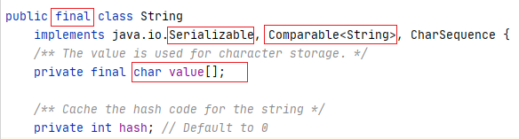

**String 在 jdk9 中存储结构变更**

>
http://openjdk.java.net/jeps/254
 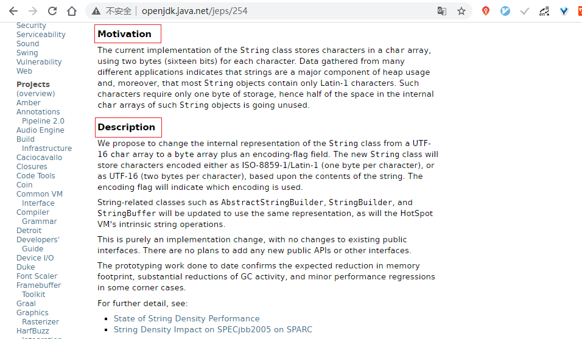

结论：String 再也不用 char[] 来存储了，改成了 byte[] 加上编码标记，节约了一些空间。

```
public final class String
    implements java.io.Serializable, Comparable<String>, CharSequence {
    @Stable
    private final byte[] value;
}

```

StringBuffer 和 StringBuilder 也同样做了修改：

>
String-related classes such as AbstractStringBuilder, StringBuilder, and StringBuffer will be updated to **use the same representation**, as will the HotSpot VM's intrinsic(固有的、内置的) string operations.

-
String：代表不可变的字符序列。简称：不可变性。

  - 当对字符串进行重新赋值时，需要重写指定内存区域赋值，不能使用原有的 value 进行赋值。

  - 当对现有的字符串进行连接操作时，也需要重新指定内存区域赋值，不能使用原有的 value 进行赋值。

  - 当调用 String 的 replace() 方法修改指定字符或字符串时，也需要重新指定内存区域赋值，不能使用原有的 value 进行赋值。

-
通过字面量的方式（区别于 new）给一个字符串赋值，此时的字符串值声明在字符串常量池中。

```
/**
 * String 的基本使用，体现 String 的不可变性
 */
public class StringTest1 {

    @Test
    public void test1() {
        String s1 = "abc";  // 字面量定义的方式，"abc" 存储在字符串常量池中
        String s2 = "abc";
        System.out.println(s1 == s2);   // 判断地址：true

//        s1 = "hello";
        System.out.println(s1 == s2);   // 判断地址：false

        System.out.println(s1);
        System.out.println(s2);
    }

    @Test
    public void test2() {
        String s1 = "abc";
        String s2 = "abc";
        s2 += "def";
        System.out.println(s2); // abcdef
        System.out.println(s1); // abc
    }

    @Test
    public void test3() {
        String s1 = "abc";
        String s2 = s1.replace('a', 'm');
        System.out.println(s1); // abc
        System.out.println(s2); // mbc
    }
}

```

String 不可变性面试题：

```
public class StringExer {
    String str = new String("good");
    char[] ch = {'t', 'e', 's', 't'};

    public void change(String str, char ch[]) {
        str = "test ok";
        ch[0] = 'b';
    }

    public static void main(String[] args) {
        StringExer ex = new StringExer();
        ex.change(ex.str, ex.ch);
        System.out.println(ex.str); // good
        System.out.println(ex.ch);  // best
    }
}

```

**字符串常量池中是不会存储相同内容的字符串的。**

- String 的 String Pool 是一个固定大小的 Hashtable，默认值大小长度是 1009。如果放进 String Pool 的 String 非常多，就会造成 Hash 冲突严重，从而导致链表会很长，而链表长了后直接会造成的影响就是当调用 String.intern 时性能会大幅下降。

- 使用 -XX:StringTableSize 可以设置 StringTable 的长度

- 在 JDK6 中 StringTable 是固定的，就是 1009 的长度，所以如果常量 池中的字符串过多就会导致效率下降很快。StringTableSize 设置没有要求

- 在 JDK7 中，StringTable 的默认长度为 60013

- JDK8 开始，设置 StringTable 的长度的话，1009 是可以设置的最小值。
 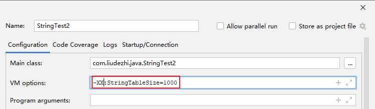
 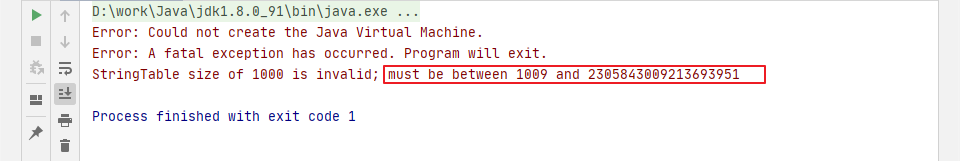

```
/**
 * 产生10万个长度不超过10的字符串，包含 a-z，A-Z
 */
public class GenerateString {
    public static void main(String[] args) throws IOException {
        FileWriter fw = new FileWriter("words.txt");

        for (int i = 0; i < 100000; i++) {
            // 1-10
            int length = (int)(Math.random() * (10 - 1 + 1) + 1);
            fw.write(getString(length) + "\n");
        }
        fw.close();
    }

    public static String getString(int length) {
        String str = "";
        for (int i = 0; i < length; i++) {
            // 65-90, 97-122
            int num = (int)(Math.random() * (90 - 65 + 1) + 65 + (int)(Math.random() * 2) * 32);
            str += (char)num;
        }
        return str;
    }
}

```

```
/**
 * -XX:StringTableSize=1009     // 94ms
 * -XX:StringTableSize=100009   // 27ms
 */
public class StringTest2 {
    public static void main(String[] args) {
        BufferedReader br = null;
        try {
            br = new BufferedReader(new FileReader("words.txt"));
            long start = System.currentTimeMillis();
            String data;
            while ((data = br.readLine()) != null) {
                data.intern();  // 如果字符串常量池中没有对应 data 的字符串的话，则在常量池中生成
            }
            long end = System.currentTimeMillis();
            System.out.println("花费时间为：" + (end - start));
        } catch (IOException e) {
            e.printStackTrace();
        } finally {
            if (br != null) {
                try {
                    br.close();
                } catch (IOException e) {
                    e.printStackTrace();
                }
            }
        }
    }
}

```

### 2. String 的内存分配

- 在 Java 语言中有8种基本数据类型和一种比较特殊的类型 String。这些类型为了使它们在运行过程中速度更快、更节省内存，都提供了一种常量池的概念。

- 常量池就类似一个 Java 系统级别提供的缓存。8中基本数据类型的常量池都是系统协调的，**String 类型的常量池比较特殊。它的主要使用方法有两种。**

  - 直接使用双引号声明出来的 String 对象会直接存储在常量池中。
 比如：String info = "liudezhi.com";

  - 如果不是用双引号声明的 String 对象，可以使用 String 提供的 intern() 方法。

- Java6 及之前，字符串常量池存放在永久代。

- Java7 中 Oracle 的工程师对字符串池的逻辑做了很大的改变，即将**字符串常量池的位置调整到 Java 堆内**。

  - 所有的字符串都保存在堆(heap)中，和其他普通对象一样，这样可以让你在进行调优应用时仅需要调整堆大小就可以了。

  - 字符串常量池概念原本使用的比较多，但是这个改动使得我们有足够的理由让我们重新考虑在 Java7 中使用 String.intern()。

- Java8 元空间，字符串常量在堆中。

**StringTable 为什么要调整？(1. permSize 默认比较小 2. 永久代垃圾回收频率低)**

>
官网：https://www.oracle.com/technetwork/java/javase/jdk7-relnotes-418459.html#jdk7changes

### 3. String 的基本操作

Java 语言规范里要求完全相同的字符串字面量，应该包含同样的 Unicode 字符序列（包含同一份码点序列的常量），并且必须是指向同一个 String 类实例。
 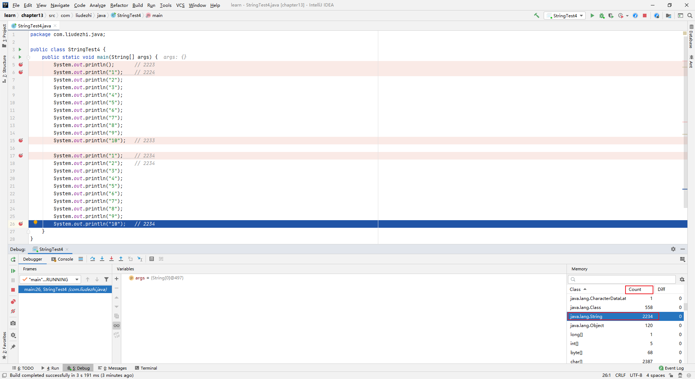

```
public class Memory {
    public static void main(String[] args) {    // line 1
        int i = 1;                              // line 2
        Object obj = new Object();              // line 3
        Memory mem = new Memory();              // line 4
        mem.foo(obj);                           // line 5
    }

    private void foo(Object param) {            // line 6
        String str = param.toString();          // line 7
        System.out.println(str);
    }                                           // line 8
}

```

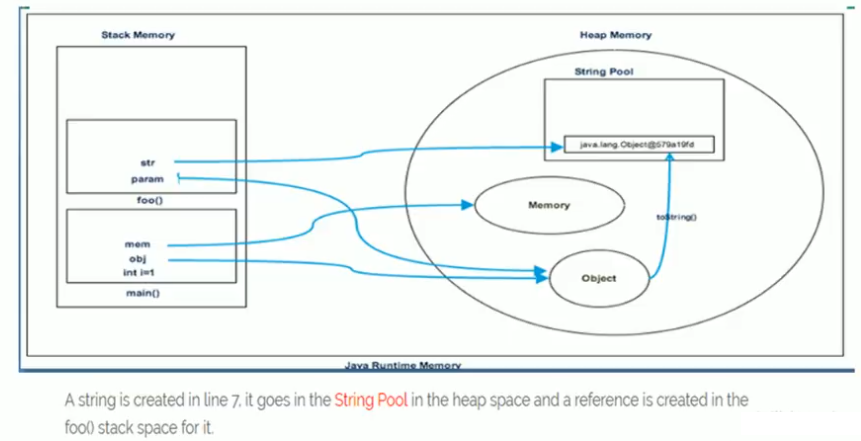

### 4. 字符串拼接操作

1. 常量与常量的拼接结果在常量池，原理是编译期优化

1. 常量池中不会存在相同内容的常量。

1. 只要其中有一个是变量，结果就在堆中。变量拼接的原理是 StringBuilder

1. 如果拼接的结果调用 intern() 方法，则主动将常量池中还没有的字符串对象放入池中，并返回此对象地址。

**eg：**

```
/**
 * 字符串拼接操作
 */
public class StringTest5 {

    @Test
    public void test1() {
        String s1 = "a" + "b" + "c";    // 等同于 “abc"
        String s2 = "abc";  // "abc" 一定是放在字符串常量池中，将此地址赋给 s2
        // 最终 .java 编译成 .class，再执行 .class
        // String s1 = "abc";
        // String s2 = "abc";
        System.out.println(s1 == s2);       // true
        System.out.println(s1.equals(s2));  // true

    }

    @Test
    public void test2() {
        String s1 = "JavaEE";
        String s2 = "hadoop";

        String s3 = "javaEEhadoop";
        String s4 = "javaEE" + "hadoop";    // 编译期优化为："javaEEhadoop"
        // 如果拼接符号的前后出现了变量，则相当于在堆空间中 new String()，具体的内容为拼接的结果：javaEEhadoop
        String s5 = s1 + "hadoop";
        String s6 = "javaEE" + s2;
        String s7 = s1 + s2;

        System.out.println(s3 == s4);   // true
        System.out.println(s3 == s5);   // false
        System.out.println(s3 == s6);   // false
        System.out.println(s3 == s7);   // false
        System.out.println(s5 == s6);   // false
        System.out.println(s5 == s7);   // false
        System.out.println(s6 == s7);   // false
        // intern(): 判断字符串常量池中是否存在 "javaEEhadoop"，如果存在，返回常量池中"javaEEhadoop"的地址
        // 如果不存在，则在常量池中加载一份 "javaEEhadoop"，并返回此对象的地址
        String s8 = s6.intern();
        System.out.println(s3 == s8);   // true
    }

    @Test
    public void test3() {
        String s1 = "a";
        String s2 = "b";
        String s3 = "ab";
        /*
        如下的 s1 + s2 的执行细节(这里的s是我临时定义的)：
            ① StringBuilder s = new StringBuilder();
            ② s.append("a");
            ③ s.append("b");
            ④ s.toString() --> 约等于 new String("ab");
        补充：在 jdk5.0 之后使用的是 StringBuilder，在 jdk5.0 之前使用的是 StringBuffer
         */
        String s4 = s1 + s2;            //
        System.out.println(s3 == s4);   // false
    }

    /**
     * 1. 字符串拼接操作不一定使用的是 StringBuilder！
     *  如果拼接符号左右两边都是字符串常量或常量引用，则仍然使用编译期优化，即非 StringBuilder 的方式。
     * 2. 针对于 final 修饰类、方法、基本数据类型、引用数据类型的量的结构时，能使用上 final 的时候建议使用上。
     */
    @Test
    public void test4() {
        final String s1 = "a";
        final String s2 = "b";
        String s3 = "ab";
        String s4 = s1 + s2;
        System.out.println(s3 == s4);   // true
    }

    // 练习：
    @Test
    public void test5() {
        String s1 = "javaEEhadoop";
        String s2 = "javaEE";
        String s3 = s2 + "hadoop";
        System.out.println(s1 == s3);   // false

        final String s4 = "javaEE";     // s4:常量
        String s5 = s4 + "hadoop";
        System.out.println(s1 == s5);   // true
    }

    /**
     * 体会执行效率：通过 StringBuilder 的 append() 的方式添加字符串的效率要远高于使用 String 的字符串拼接方式！
     * 详情：① StringBuilder 的 append() 的方式：自始至终只创建过一个 StringBuilder 的对象
     *          使用 String 的字符串拼接方式：创建过多个 StringBuilder 和 String 的对象
     *      ② 使用 String 的字符串拼接方式：内存中由于创建了较多的 StringBuilder 和 String 的对象，内存占用更大；如果进行 GC，需要花费额外的时间。
     *
     * 改进的空间：在实际开发中，如果基本确定前前后后添加的字符串长度不高于某个限定值 highLevel 的情况下，建议使用构造器：
     *  StringBuilder s = new StringBuilder(highLevel); // new char[highLevel]; 可以避免经常扩容
     */
    @Test
    public void test6() {
        long start = System.currentTimeMillis();

        // method1(100000);        // 3449ms
        method2(100000);    // 3ms

        long end = System.currentTimeMillis();
        System.out.println("花费的时间为：" + (end - start));
    }
    public void method1(int highLevel) {
        String src = "";
        for (int i = 0; i < highLevel; i++) {
            src = src + "a";    // 每次循环 都会创建一个 StringBuilder 及 String
        }
    }
    public void method2(int highLevel) {
        // 只需要创建一个 StringBuilder
        StringBuilder src = new StringBuilder();
        for (int i = 0; i < highLevel; i++) {
            src.append("a");
        }
    }
}

```

### 5. `intern()` 的使用

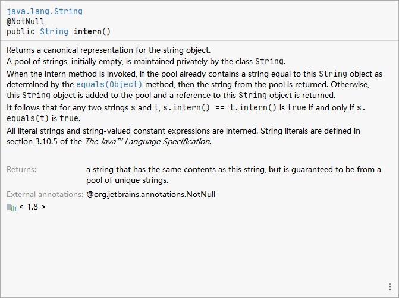
 如果不是双引号声明的 String 对象，可以使用 String 提供的 intern 方法：intern 方法会从字符串常量池中查询当前字符串是否存在，若不存在会将当前字符串放入常量池中。

- 比如：String myInfo = new MyInfo("liudezhi").intern();

也就是说，如果在任意字符串上调用 String.intern 方法，那么其返回的结果所指向的那个类实例，必须和直接以常量形式出现的字符串实例完全相同。因此，下列表达式的值必定是 true：
 ("a" + "b" + "c").intern() == "abc"

通俗点讲，Interned String 就是确保字符串在内存中只有一份拷贝，这样可以解约内存空间，加快字符串操作任务的执行速度。注意，这个值会被存放在字符串内部池（String Intern Pool）。

**Tips:** idea 中，快捷键 Ctrl + Q 可以查看方法的详细信息

#### jdk6 vs jdk7/8

**eg1:**

```
/**
 * 如何保证变量 s 指向的是字符串常量池中的数据呢？
 * 有两种方式：
 *  方式一：String s = "abc";   // 字面量定义的方式
 *  方式二：调用 intern()
 *      String s = new String("abc").intern()
 *      String s = new StringBuilder("abc").toString().intern()
 */
public class StringIntern {
    public static void main(String[] args) {
        String s = new String("1");
        s.intern(); // 调用此方法之前，字符串常量池中已经存在 "1"
        String s2 = "1";
        System.out.println(s == s2);    // jdk6:false, jdk7/8:false

        String s3 = new String("1") + new String("1");  // s3 变量记录的地址为：new String("11")
        // 执行完上一行代码以后，字符串常量池中不存在 "11"，因为 StringBuilder的toString()方法虽然 new 了一个String对象，但是并没有放入常量池
        s3.intern();        // 在字符串常量池中生成 "11"。如何理解：jdk6：创建了一个新的对象"11"，也就有新的地址，因此下面结果为 false
        // 在 jdk7/8: 此时常量池中并没有创建 "11"，而是创建一个指向堆空间中 new String("11") 的地址。(因为常量池也在堆中)
        String s4 = "11";   // s4 变量记录的地址：是上一行代码执行时，在常量池中生成的 "11" 的地址
        System.out.println(s3 == s4);   // jdk6:false, jdk7/8:true
    }

```

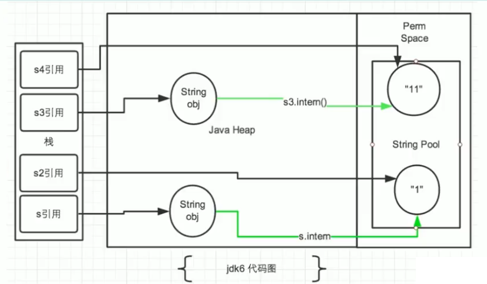
 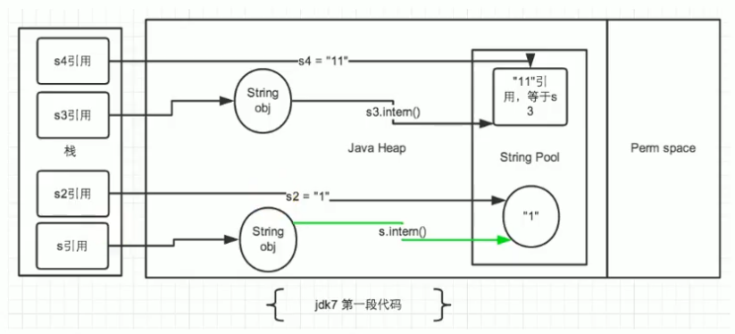

**eg2:**

```
public class StringIntern1 {
    public static void main(String[] args) {
        // StringIntern.java 中练习的扩展：
        String s3 = new String("1") + new String("1");
        // 执行完上一行代码，常量池中不存在 "11"
        String s4 = "11";   // 在字符串常量池中生成对象 "11"
        String s5 = s3.intern();
        System.out.println(s3 == s4);   // false
        System.out.println(s5 == s4);   // true
    }
}

```

**总结 String 的 intern() 的使用：**

- jdk1.6 中，将这个字符串对象尝试放入串池。

  - 如果串池中有，则并不会放入。返回已有的串池中的对象的地址

  - 如果没有，会把*此对象复制一份*，放入串池，并返回串池中的对象地址

- jdk1.7 起，将这个字符串对象尝试放入串池。

  - 如果串池中有，则并不会放入。返回已有的串池中的对象的地址

  - 如果没有，则会把*对象的引用地址复制一份*，放入串池，并返回串池中的引用地址

#### 面试题

**题目：** new String("ab") 会创建几个对象？
 **扩展：** new String("a") + new String("b") 呢？

```
/**
 * 题目：new String("ab") 会创建几个对象？看字节码，就知道是两个
 *  一个对象是：new 关键字在堆中创建的
 *  另一个对象是：字符串常量池中的对象"ab"。字节码指令：ldc
 *
 * 思考：new String("a") + new String("b") 呢？
 *  对象1：new StringBuilder()
 *  对象2：new String("a")
 *  对象3：常量池中的 "a"
 *  对象4：new String("b")
 *  对象5：常量池中的 "b"
 *  深入剖析：StringBuilder 的 toString()：
 *      对象6：new String("ab").
 *          强调以下：toString() 的调用，在字符串常量池中，没有生成"ab"。可以通过查看 toString 的字节码来确定
 */
public class StringNewTest {
    public static void main(String[] args) {
        // String str = new String("ab");

        String str1 = new String("a") + new String("b");
    }
}

```

**练习1：**
 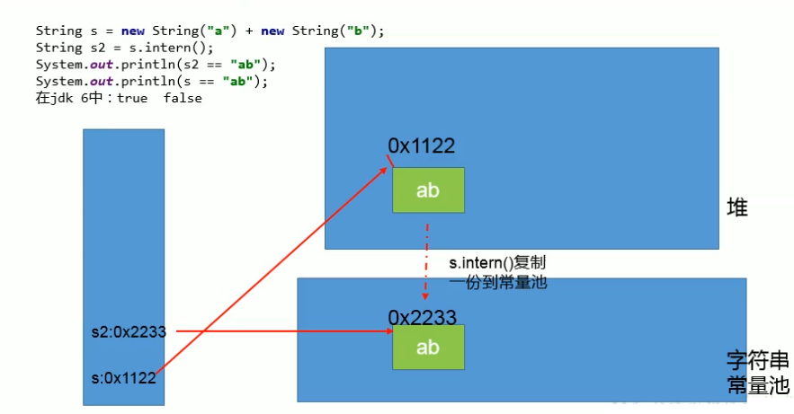
 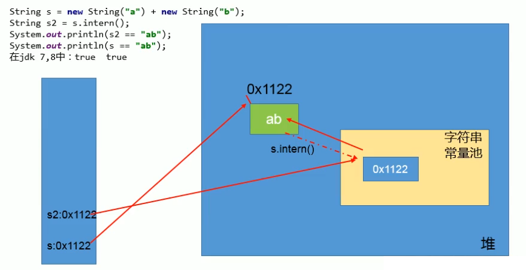
 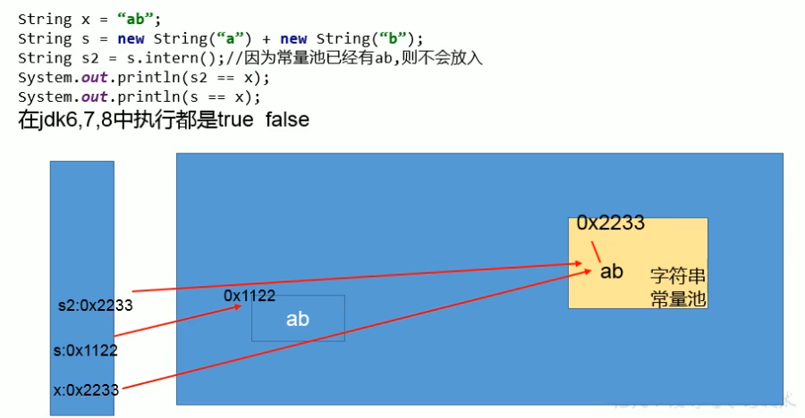

**练习2：**

```
public class StringExer2 {
    public static void main(String[] args) {
        String s1 = new String("ab");   // 执行完以后，会在字符串常量池中生成 "ab"
        s1.intern();
        String s2 = "ab";
        System.out.println(s1 == s2);   // false
    }
}

```

#### intern() 的效率测试：空间角度

```
/**
 * 使用 intern() 测试执行效率: 空间使用上
 *  结论：对于程序中大量存在的字符串，尤其其中存在很多重复字符串时，使用 intern() 可以省略内存空间。
 *      tips: new String() 的方式会创建大量的对象。
 *            new String().intern() 虽然也会创建大量对象，但是调用 intern 后，引用指向的时常量池中的实例。创建的对象后面会销毁
 */
public class StringIntern2 {
    static final int MAX_COUNT = 1000 * 10000;
    static final String[] arr = new String[MAX_COUNT];

    public static void main(String[] args) {
        Integer[] data = new Integer[]{1,2,3,4,5,6,7,8,9,10};

        long start = System.currentTimeMillis();
        for (int i = 0; i < MAX_COUNT; i++) {
            // arr[i] = new String(String.valueOf(data[i % data.length]));         // 2905ms
             arr[i] = new String(String.valueOf(data[i % data.length])).intern();    // 910ms
        }
        long end = System.currentTimeMillis();
        System.out.println("花费时间为：" + (end - start));

        try {
            Thread.sleep(1000000);
        } catch (InterruptedException e) {
            e.printStackTrace();
        }
    }
}

```

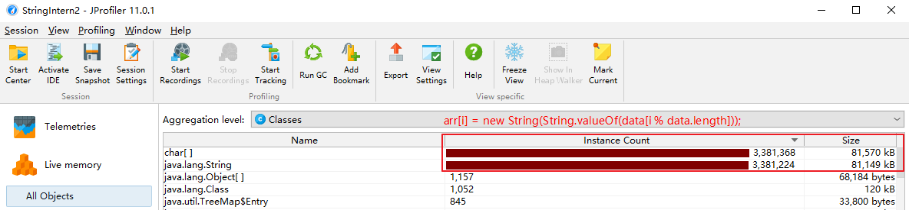
 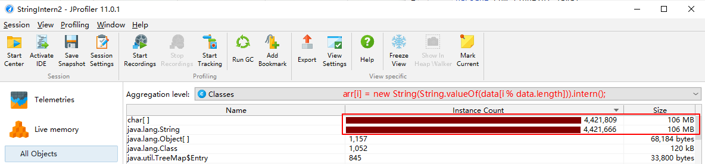

大的网站平台，需要内存中存储大量的字符串。比如社交网站，很多人都存储：北京市、海淀区等信息。这时候如果字符串都调用 intern() 方法，就会明显降低内存的大小。

### 6. StringTable 的垃圾回收

```
/**
 * String 的垃圾回收：
 *  -Xms15m -Xmx15m -XX:+PrintStringTableStatistics -XX:+PrintGCDetails
 */
public class StringGCTest {
    public static void main(String[] args) {
        for (int i = 0; i < 100000; i++) { // 100 ,10000, 100000
            String.valueOf(i).intern();
        }
    }
}

```

- i < 100
 未发生垃圾回收
 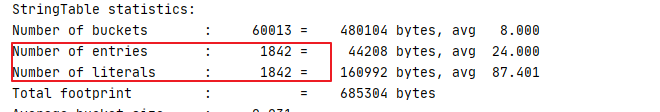

- i < 10000
 未发生垃圾回收
 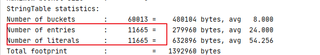

- i < 100000
 发生垃圾回收
 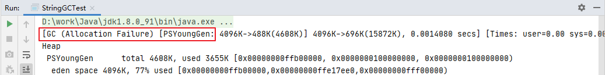
 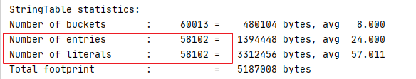

### 7. G1 中的 String 去重操作

%23%23%20StringTable%0A%23%23%23%201.%20String%20%E7%9A%84%E5%9F%BA%E6%9C%AC%E7%89%B9%E6%80%A7%0A-%20String%EF%BC%9A%E5%AD%97%E7%AC%A6%E4%B8%B2%EF%BC%8C%E4%BD%BF%E7%94%A8%E4%B8%80%E5%AF%B9%20%22%22%20%E5%BC%95%E8%B5%B7%E6%9D%A5%E8%A1%A8%E7%A4%BA%E3%80%82%0A%20%20%20%20-%20String%20s1%20%3D%20%22liudezhi%22%3B%20%20%20%20%20%20%20%20%20%20%2F%2F%20%E5%AD%97%E9%9D%A2%E9%87%8F%E7%9A%84%E5%AE%9A%E4%B9%89%E6%96%B9%E5%BC%8F%0A%20%20%20%20-%20String%20s2%20%3D%20new%20String(%22hi%22)%3B%20%0A-%20String%20%E5%A3%B0%E6%98%8E%E4%B8%BA%20final%20%E7%9A%84%EF%BC%8C%E4%B8%8D%E5%8F%AF%E8%A2%AB%E7%BB%A7%E6%89%BF%0A-%20String%20%E5%AE%9E%E7%8E%B0%E4%BA%86%20Serializable%20%E6%8E%A5%E5%8F%A3%EF%BC%9A%E8%A1%A8%E7%A4%BA%E5%AD%97%E7%AC%A6%E4%B8%B2%E6%98%AF%E6%94%AF%E6%8C%81%E5%BA%8F%E5%88%97%E5%8C%96%E7%9A%84%E3%80%82%E5%AE%9E%E7%8E%B0%E4%BA%86%20Comparable%20%E6%8E%A5%E5%8F%A3%EF%BC%9A%E8%A1%A8%E7%A4%BA%20String%20%E5%8F%AF%E4%BB%A5%E6%AF%94%E8%BE%83%E5%A4%A7%E5%B0%8F%0A-%20String%20%E5%9C%A8%20JDK8%20%E4%BB%A5%E5%89%8D%E5%86%85%E9%83%A8%E5%AE%9A%E4%B9%89%E4%BA%86%20%60final%20char%5B%5D%20value%60%20%E7%94%A8%E4%BA%8E%E5%AD%98%E5%82%A8%E5%AD%97%E7%AC%A6%E4%B8%B2%E6%95%B0%E6%8D%AE%E3%80%82JDK9%20%E6%97%B6%E6%94%B9%E6%88%90%E4%BA%86%20%60byte%5B%5D%60%20%0A!%5B519991b667381455c53c5889d1b9fa13.png%5D(en-resource%3A%2F%2Fdatabase%2F5034%3A1)%0A%0A**String%20%E5%9C%A8%20jdk9%20%E4%B8%AD%E5%AD%98%E5%82%A8%E7%BB%93%E6%9E%84%E5%8F%98%E6%9B%B4**%0A%3E%20http%3A%2F%2Fopenjdk.java.net%2Fjeps%2F254%0A!%5Bb54ed750627ec6d58ed2e9f058c2e553.png%5D(en-resource%3A%2F%2Fdatabase%2F5036%3A1)%0A%0A%E7%BB%93%E8%AE%BA%EF%BC%9AString%20%E5%86%8D%E4%B9%9F%E4%B8%8D%E7%94%A8%20char%5B%5D%20%E6%9D%A5%E5%AD%98%E5%82%A8%E4%BA%86%EF%BC%8C%E6%94%B9%E6%88%90%E4%BA%86%20byte%5B%5D%20%E5%8A%A0%E4%B8%8A%E7%BC%96%E7%A0%81%E6%A0%87%E8%AE%B0%EF%BC%8C%E8%8A%82%E7%BA%A6%E4%BA%86%E4%B8%80%E4%BA%9B%E7%A9%BA%E9%97%B4%E3%80%82%0A%60%60%60java%0Apublic%20final%20class%20String%0A%20%20%20%20implements%20java.io.Serializable%2C%20Comparable%3CString%3E%2C%20CharSequence%20%7B%0A%20%20%20%20%40Stable%0A%20%20%20%20private%20final%20byte%5B%5D%20value%3B%0A%7D%0A%60%60%60%0AStringBuffer%20%E5%92%8C%20StringBuilder%20%E4%B9%9F%E5%90%8C%E6%A0%B7%E5%81%9A%E4%BA%86%E4%BF%AE%E6%94%B9%EF%BC%9A%0A%3E%20String-related%20classes%20such%20as%C2%A0AbstractStringBuilder%2C%C2%A0StringBuilder%2C%20and%C2%A0StringBuffer%C2%A0will%20be%20updated%20to%20**use%20the%20same%20representation**%2C%20as%20will%20the%20HotSpot%20VM's%20intrinsic(%E5%9B%BA%E6%9C%89%E7%9A%84%E3%80%81%E5%86%85%E7%BD%AE%E7%9A%84)%20string%20operations.%0A%0A-%20String%EF%BC%9A%E4%BB%A3%E8%A1%A8%E4%B8%8D%E5%8F%AF%E5%8F%98%E7%9A%84%E5%AD%97%E7%AC%A6%E5%BA%8F%E5%88%97%E3%80%82%E7%AE%80%E7%A7%B0%EF%BC%9A%E4%B8%8D%E5%8F%AF%E5%8F%98%E6%80%A7%E3%80%82%0A%20%20%20%20-%20%E5%BD%93%E5%AF%B9%E5%AD%97%E7%AC%A6%E4%B8%B2%E8%BF%9B%E8%A1%8C%E9%87%8D%E6%96%B0%E8%B5%8B%E5%80%BC%E6%97%B6%EF%BC%8C%E9%9C%80%E8%A6%81%E9%87%8D%E5%86%99%E6%8C%87%E5%AE%9A%E5%86%85%E5%AD%98%E5%8C%BA%E5%9F%9F%E8%B5%8B%E5%80%BC%EF%BC%8C%E4%B8%8D%E8%83%BD%E4%BD%BF%E7%94%A8%E5%8E%9F%E6%9C%89%E7%9A%84%20value%20%E8%BF%9B%E8%A1%8C%E8%B5%8B%E5%80%BC%E3%80%82%0A%20%20%20%20-%20%E5%BD%93%E5%AF%B9%E7%8E%B0%E6%9C%89%E7%9A%84%E5%AD%97%E7%AC%A6%E4%B8%B2%E8%BF%9B%E8%A1%8C%E8%BF%9E%E6%8E%A5%E6%93%8D%E4%BD%9C%E6%97%B6%EF%BC%8C%E4%B9%9F%E9%9C%80%E8%A6%81%E9%87%8D%E6%96%B0%E6%8C%87%E5%AE%9A%E5%86%85%E5%AD%98%E5%8C%BA%E5%9F%9F%E8%B5%8B%E5%80%BC%EF%BC%8C%E4%B8%8D%E8%83%BD%E4%BD%BF%E7%94%A8%E5%8E%9F%E6%9C%89%E7%9A%84%20value%20%E8%BF%9B%E8%A1%8C%E8%B5%8B%E5%80%BC%E3%80%82%0A%20%20%20%20-%20%E5%BD%93%E8%B0%83%E7%94%A8%20String%20%E7%9A%84%20replace()%20%E6%96%B9%E6%B3%95%E4%BF%AE%E6%94%B9%E6%8C%87%E5%AE%9A%E5%AD%97%E7%AC%A6%E6%88%96%E5%AD%97%E7%AC%A6%E4%B8%B2%E6%97%B6%EF%BC%8C%E4%B9%9F%E9%9C%80%E8%A6%81%E9%87%8D%E6%96%B0%E6%8C%87%E5%AE%9A%E5%86%85%E5%AD%98%E5%8C%BA%E5%9F%9F%E8%B5%8B%E5%80%BC%EF%BC%8C%E4%B8%8D%E8%83%BD%E4%BD%BF%E7%94%A8%E5%8E%9F%E6%9C%89%E7%9A%84%20value%20%E8%BF%9B%E8%A1%8C%E8%B5%8B%E5%80%BC%E3%80%82%0A%0A-%20%E9%80%9A%E8%BF%87%E5%AD%97%E9%9D%A2%E9%87%8F%E7%9A%84%E6%96%B9%E5%BC%8F%EF%BC%88%E5%8C%BA%E5%88%AB%E4%BA%8E%20new%EF%BC%89%E7%BB%99%E4%B8%80%E4%B8%AA%E5%AD%97%E7%AC%A6%E4%B8%B2%E8%B5%8B%E5%80%BC%EF%BC%8C%E6%AD%A4%E6%97%B6%E7%9A%84%E5%AD%97%E7%AC%A6%E4%B8%B2%E5%80%BC%E5%A3%B0%E6%98%8E%E5%9C%A8%E5%AD%97%E7%AC%A6%E4%B8%B2%E5%B8%B8%E9%87%8F%E6%B1%A0%E4%B8%AD%E3%80%82%0A%60%60%60java%0A%2F**%0A%20*%20String%20%E7%9A%84%E5%9F%BA%E6%9C%AC%E4%BD%BF%E7%94%A8%EF%BC%8C%E4%BD%93%E7%8E%B0%20String%20%E7%9A%84%E4%B8%8D%E5%8F%AF%E5%8F%98%E6%80%A7%0A%20*%2F%0Apublic%20class%20StringTest1%20%7B%0A%0A%20%20%20%20%40Test%0A%20%20%20%20public%20void%20test1()%20%7B%0A%20%20%20%20%20%20%20%20String%20s1%20%3D%20%22abc%22%3B%20%20%2F%2F%20%E5%AD%97%E9%9D%A2%E9%87%8F%E5%AE%9A%E4%B9%89%E7%9A%84%E6%96%B9%E5%BC%8F%EF%BC%8C%22abc%22%20%E5%AD%98%E5%82%A8%E5%9C%A8%E5%AD%97%E7%AC%A6%E4%B8%B2%E5%B8%B8%E9%87%8F%E6%B1%A0%E4%B8%AD%0A%20%20%20%20%20%20%20%20String%20s2%20%3D%20%22abc%22%3B%0A%20%20%20%20%20%20%20%20System.out.println(s1%20%3D%3D%20s2)%3B%20%20%20%2F%2F%20%E5%88%A4%E6%96%AD%E5%9C%B0%E5%9D%80%EF%BC%9Atrue%0A%0A%2F%2F%20%20%20%20%20%20%20%20s1%20%3D%20%22hello%22%3B%0A%20%20%20%20%20%20%20%20System.out.println(s1%20%3D%3D%20s2)%3B%20%20%20%2F%2F%20%E5%88%A4%E6%96%AD%E5%9C%B0%E5%9D%80%EF%BC%9Afalse%0A%0A%20%20%20%20%20%20%20%20System.out.println(s1)%3B%0A%20%20%20%20%20%20%20%20System.out.println(s2)%3B%0A%20%20%20%20%7D%0A%0A%20%20%20%20%40Test%0A%20%20%20%20public%20void%20test2()%20%7B%0A%20%20%20%20%20%20%20%20String%20s1%20%3D%20%22abc%22%3B%0A%20%20%20%20%20%20%20%20String%20s2%20%3D%20%22abc%22%3B%0A%20%20%20%20%20%20%20%20s2%20%2B%3D%20%22def%22%3B%0A%20%20%20%20%20%20%20%20System.out.println(s2)%3B%20%2F%2F%20abcdef%0A%20%20%20%20%20%20%20%20System.out.println(s1)%3B%20%2F%2F%20abc%0A%20%20%20%20%7D%0A%0A%20%20%20%20%40Test%0A%20%20%20%20public%20void%20test3()%20%7B%0A%20%20%20%20%20%20%20%20String%20s1%20%3D%20%22abc%22%3B%0A%20%20%20%20%20%20%20%20String%20s2%20%3D%20s1.replace('a'%2C%20'm')%3B%0A%20%20%20%20%20%20%20%20System.out.println(s1)%3B%20%2F%2F%20abc%0A%20%20%20%20%20%20%20%20System.out.println(s2)%3B%20%2F%2F%20mbc%0A%20%20%20%20%7D%0A%7D%0A%60%60%60%0AString%20%E4%B8%8D%E5%8F%AF%E5%8F%98%E6%80%A7%E9%9D%A2%E8%AF%95%E9%A2%98%EF%BC%9A%0A%60%60%60java%0Apublic%20class%20StringExer%20%7B%0A%20%20%20%20String%20str%20%3D%20new%20String(%22good%22)%3B%0A%20%20%20%20char%5B%5D%20ch%20%3D%20%7B't'%2C%20'e'%2C%20's'%2C%20't'%7D%3B%0A%0A%20%20%20%20public%20void%20change(String%20str%2C%20char%20ch%5B%5D)%20%7B%0A%20%20%20%20%20%20%20%20str%20%3D%20%22test%20ok%22%3B%0A%20%20%20%20%20%20%20%20ch%5B0%5D%20%3D%20'b'%3B%0A%20%20%20%20%7D%0A%0A%20%20%20%20public%20static%20void%20main(String%5B%5D%20args)%20%7B%0A%20%20%20%20%20%20%20%20StringExer%20ex%20%3D%20new%20StringExer()%3B%0A%20%20%20%20%20%20%20%20ex.change(ex.str%2C%20ex.ch)%3B%0A%20%20%20%20%20%20%20%20System.out.println(ex.str)%3B%20%2F%2F%20good%0A%20%20%20%20%20%20%20%20System.out.println(ex.ch)%3B%20%20%2F%2F%20best%0A%20%20%20%20%7D%0A%7D%0A%60%60%60%0A**%E5%AD%97%E7%AC%A6%E4%B8%B2%E5%B8%B8%E9%87%8F%E6%B1%A0%E4%B8%AD%E6%98%AF%E4%B8%8D%E4%BC%9A%E5%AD%98%E5%82%A8%E7%9B%B8%E5%90%8C%E5%86%85%E5%AE%B9%E7%9A%84%E5%AD%97%E7%AC%A6%E4%B8%B2%E7%9A%84%E3%80%82**%0A-%20String%20%E7%9A%84%20String%20Pool%20%E6%98%AF%E4%B8%80%E4%B8%AA%E5%9B%BA%E5%AE%9A%E5%A4%A7%E5%B0%8F%E7%9A%84%20Hashtable%EF%BC%8C%E9%BB%98%E8%AE%A4%E5%80%BC%E5%A4%A7%E5%B0%8F%E9%95%BF%E5%BA%A6%E6%98%AF%201009%E3%80%82%E5%A6%82%E6%9E%9C%E6%94%BE%E8%BF%9B%20String%20Pool%20%E7%9A%84%20String%20%E9%9D%9E%E5%B8%B8%E5%A4%9A%EF%BC%8C%E5%B0%B1%E4%BC%9A%E9%80%A0%E6%88%90%20Hash%20%E5%86%B2%E7%AA%81%E4%B8%A5%E9%87%8D%EF%BC%8C%E4%BB%8E%E8%80%8C%E5%AF%BC%E8%87%B4%E9%93%BE%E8%A1%A8%E4%BC%9A%E5%BE%88%E9%95%BF%EF%BC%8C%E8%80%8C%E9%93%BE%E8%A1%A8%E9%95%BF%E4%BA%86%E5%90%8E%E7%9B%B4%E6%8E%A5%E4%BC%9A%E9%80%A0%E6%88%90%E7%9A%84%E5%BD%B1%E5%93%8D%E5%B0%B1%E6%98%AF%E5%BD%93%E8%B0%83%E7%94%A8%20String.intern%20%E6%97%B6%E6%80%A7%E8%83%BD%E4%BC%9A%E5%A4%A7%E5%B9%85%E4%B8%8B%E9%99%8D%E3%80%82%0A-%20%E4%BD%BF%E7%94%A8%20-XX%3AStringTableSize%20%E5%8F%AF%E4%BB%A5%E8%AE%BE%E7%BD%AE%20StringTable%20%E7%9A%84%E9%95%BF%E5%BA%A6%0A-%20%E5%9C%A8%20JDK6%20%E4%B8%AD%20StringTable%20%E6%98%AF%E5%9B%BA%E5%AE%9A%E7%9A%84%EF%BC%8C%E5%B0%B1%E6%98%AF%201009%20%E7%9A%84%E9%95%BF%E5%BA%A6%EF%BC%8C%E6%89%80%E4%BB%A5%E5%A6%82%E6%9E%9C%E5%B8%B8%E9%87%8F%20%E6%B1%A0%E4%B8%AD%E7%9A%84%E5%AD%97%E7%AC%A6%E4%B8%B2%E8%BF%87%E5%A4%9A%E5%B0%B1%E4%BC%9A%E5%AF%BC%E8%87%B4%E6%95%88%E7%8E%87%E4%B8%8B%E9%99%8D%E5%BE%88%E5%BF%AB%E3%80%82StringTableSize%20%E8%AE%BE%E7%BD%AE%E6%B2%A1%E6%9C%89%E8%A6%81%E6%B1%82%0A-%20%E5%9C%A8%20JDK7%20%E4%B8%AD%EF%BC%8CStringTable%20%E7%9A%84%E9%BB%98%E8%AE%A4%E9%95%BF%E5%BA%A6%E4%B8%BA%2060013%0A-%20JDK8%20%E5%BC%80%E5%A7%8B%EF%BC%8C%E8%AE%BE%E7%BD%AE%20StringTable%20%E7%9A%84%E9%95%BF%E5%BA%A6%E7%9A%84%E8%AF%9D%EF%BC%8C1009%20%E6%98%AF%E5%8F%AF%E4%BB%A5%E8%AE%BE%E7%BD%AE%E7%9A%84%E6%9C%80%E5%B0%8F%E5%80%BC%E3%80%82%0A!%5Ba3b831412f179a7c46d88e6cad543a8a.png%5D(en-resource%3A%2F%2Fdatabase%2F5040%3A0)%0A!%5Bc19fbbabb7975a741522dcef33c26fb5.png%5D(en-resource%3A%2F%2Fdatabase%2F5042%3A0)%0A%60%60%60java%0A%2F**%0A%20*%20%E4%BA%A7%E7%94%9F10%E4%B8%87%E4%B8%AA%E9%95%BF%E5%BA%A6%E4%B8%8D%E8%B6%85%E8%BF%8710%E7%9A%84%E5%AD%97%E7%AC%A6%E4%B8%B2%EF%BC%8C%E5%8C%85%E5%90%AB%20a-z%EF%BC%8CA-Z%0A%20*%2F%0Apublic%20class%20GenerateString%20%7B%0A%20%20%20%20public%20static%20void%20main(String%5B%5D%20args)%20throws%20IOException%20%7B%0A%20%20%20%20%20%20%20%20FileWriter%20fw%20%3D%20new%20FileWriter(%22words.txt%22)%3B%0A%0A%20%20%20%20%20%20%20%20for%20(int%20i%20%3D%200%3B%20i%20%3C%20100000%3B%20i%2B%2B)%20%7B%0A%20%20%20%20%20%20%20%20%20%20%20%20%2F%2F%201-10%0A%20%20%20%20%20%20%20%20%20%20%20%20int%20length%20%3D%20(int)(Math.random()%20*%20(10%20-%201%20%2B%201)%20%2B%201)%3B%0A%20%20%20%20%20%20%20%20%20%20%20%20fw.write(getString(length)%20%2B%20%22%5Cn%22)%3B%0A%20%20%20%20%20%20%20%20%7D%0A%20%20%20%20%20%20%20%20fw.close()%3B%0A%20%20%20%20%7D%0A%0A%20%20%20%20public%20static%20String%20getString(int%20length)%20%7B%0A%20%20%20%20%20%20%20%20String%20str%20%3D%20%22%22%3B%0A%20%20%20%20%20%20%20%20for%20(int%20i%20%3D%200%3B%20i%20%3C%20length%3B%20i%2B%2B)%20%7B%0A%20%20%20%20%20%20%20%20%20%20%20%20%2F%2F%2065-90%2C%2097-122%0A%20%20%20%20%20%20%20%20%20%20%20%20int%20num%20%3D%20(int)(Math.random()%20*%20(90%20-%2065%20%2B%201)%20%2B%2065%20%2B%20(int)(Math.random()%20*%202)%20*%2032)%3B%0A%20%20%20%20%20%20%20%20%20%20%20%20str%20%2B%3D%20(char)num%3B%0A%20%20%20%20%20%20%20%20%7D%0A%20%20%20%20%20%20%20%20return%20str%3B%0A%20%20%20%20%7D%0A%7D%0A%60%60%60%0A%60%60%60java%0A%2F**%0A%20*%20-XX%3AStringTableSize%3D1009%20%20%20%20%20%2F%2F%2094ms%0A%20*%20-XX%3AStringTableSize%3D100009%20%20%20%2F%2F%2027ms%0A%20*%2F%0Apublic%20class%20StringTest2%20%7B%0A%20%20%20%20public%20static%20void%20main(String%5B%5D%20args)%20%7B%0A%20%20%20%20%20%20%20%20BufferedReader%20br%20%3D%20null%3B%0A%20%20%20%20%20%20%20%20try%20%7B%0A%20%20%20%20%20%20%20%20%20%20%20%20br%20%3D%20new%20BufferedReader(new%20FileReader(%22words.txt%22))%3B%0A%20%20%20%20%20%20%20%20%20%20%20%20long%20start%20%3D%20System.currentTimeMillis()%3B%0A%20%20%20%20%20%20%20%20%20%20%20%20String%20data%3B%0A%20%20%20%20%20%20%20%20%20%20%20%20while%20((data%20%3D%20br.readLine())%20!%3D%20null)%20%7B%0A%20%20%20%20%20%20%20%20%20%20%20%20%20%20%20%20data.intern()%3B%20%20%2F%2F%20%E5%A6%82%E6%9E%9C%E5%AD%97%E7%AC%A6%E4%B8%B2%E5%B8%B8%E9%87%8F%E6%B1%A0%E4%B8%AD%E6%B2%A1%E6%9C%89%E5%AF%B9%E5%BA%94%20data%20%E7%9A%84%E5%AD%97%E7%AC%A6%E4%B8%B2%E7%9A%84%E8%AF%9D%EF%BC%8C%E5%88%99%E5%9C%A8%E5%B8%B8%E9%87%8F%E6%B1%A0%E4%B8%AD%E7%94%9F%E6%88%90%0A%20%20%20%20%20%20%20%20%20%20%20%20%7D%0A%20%20%20%20%20%20%20%20%20%20%20%20long%20end%20%3D%20System.currentTimeMillis()%3B%0A%20%20%20%20%20%20%20%20%20%20%20%20System.out.println(%22%E8%8A%B1%E8%B4%B9%E6%97%B6%E9%97%B4%E4%B8%BA%EF%BC%9A%22%20%2B%20(end%20-%20start))%3B%0A%20%20%20%20%20%20%20%20%7D%20catch%20(IOException%20e)%20%7B%0A%20%20%20%20%20%20%20%20%20%20%20%20e.printStackTrace()%3B%0A%20%20%20%20%20%20%20%20%7D%20finally%20%7B%0A%20%20%20%20%20%20%20%20%20%20%20%20if%20(br%20!%3D%20null)%20%7B%0A%20%20%20%20%20%20%20%20%20%20%20%20%20%20%20%20try%20%7B%0A%20%20%20%20%20%20%20%20%20%20%20%20%20%20%20%20%20%20%20%20br.close()%3B%0A%20%20%20%20%20%20%20%20%20%20%20%20%20%20%20%20%7D%20catch%20(IOException%20e)%20%7B%0A%20%20%20%20%20%20%20%20%20%20%20%20%20%20%20%20%20%20%20%20e.printStackTrace()%3B%0A%20%20%20%20%20%20%20%20%20%20%20%20%20%20%20%20%7D%0A%20%20%20%20%20%20%20%20%20%20%20%20%7D%0A%20%20%20%20%20%20%20%20%7D%0A%20%20%20%20%7D%0A%7D%0A%60%60%60%0A%0A%23%23%23%202.%20String%20%E7%9A%84%E5%86%85%E5%AD%98%E5%88%86%E9%85%8D%0A-%20%E5%9C%A8%20Java%20%E8%AF%AD%E8%A8%80%E4%B8%AD%E6%9C%898%E7%A7%8D%E5%9F%BA%E6%9C%AC%E6%95%B0%E6%8D%AE%E7%B1%BB%E5%9E%8B%E5%92%8C%E4%B8%80%E7%A7%8D%E6%AF%94%E8%BE%83%E7%89%B9%E6%AE%8A%E7%9A%84%E7%B1%BB%E5%9E%8B%20String%E3%80%82%E8%BF%99%E4%BA%9B%E7%B1%BB%E5%9E%8B%E4%B8%BA%E4%BA%86%E4%BD%BF%E5%AE%83%E4%BB%AC%E5%9C%A8%E8%BF%90%E8%A1%8C%E8%BF%87%E7%A8%8B%E4%B8%AD%E9%80%9F%E5%BA%A6%E6%9B%B4%E5%BF%AB%E3%80%81%E6%9B%B4%E8%8A%82%E7%9C%81%E5%86%85%E5%AD%98%EF%BC%8C%E9%83%BD%E6%8F%90%E4%BE%9B%E4%BA%86%E4%B8%80%E7%A7%8D%E5%B8%B8%E9%87%8F%E6%B1%A0%E7%9A%84%E6%A6%82%E5%BF%B5%E3%80%82%0A-%20%E5%B8%B8%E9%87%8F%E6%B1%A0%E5%B0%B1%E7%B1%BB%E4%BC%BC%E4%B8%80%E4%B8%AA%20Java%20%E7%B3%BB%E7%BB%9F%E7%BA%A7%E5%88%AB%E6%8F%90%E4%BE%9B%E7%9A%84%E7%BC%93%E5%AD%98%E3%80%828%E4%B8%AD%E5%9F%BA%E6%9C%AC%E6%95%B0%E6%8D%AE%E7%B1%BB%E5%9E%8B%E7%9A%84%E5%B8%B8%E9%87%8F%E6%B1%A0%E9%83%BD%E6%98%AF%E7%B3%BB%E7%BB%9F%E5%8D%8F%E8%B0%83%E7%9A%84%EF%BC%8C**String%20%E7%B1%BB%E5%9E%8B%E7%9A%84%E5%B8%B8%E9%87%8F%E6%B1%A0%E6%AF%94%E8%BE%83%E7%89%B9%E6%AE%8A%E3%80%82%E5%AE%83%E7%9A%84%E4%B8%BB%E8%A6%81%E4%BD%BF%E7%94%A8%E6%96%B9%E6%B3%95%E6%9C%89%E4%B8%A4%E7%A7%8D%E3%80%82**%0A%20%20%20%20-%20%E7%9B%B4%E6%8E%A5%E4%BD%BF%E7%94%A8%E5%8F%8C%E5%BC%95%E5%8F%B7%E5%A3%B0%E6%98%8E%E5%87%BA%E6%9D%A5%E7%9A%84%20String%20%E5%AF%B9%E8%B1%A1%E4%BC%9A%E7%9B%B4%E6%8E%A5%E5%AD%98%E5%82%A8%E5%9C%A8%E5%B8%B8%E9%87%8F%E6%B1%A0%E4%B8%AD%E3%80%82%0A%20%20%20%20%E6%AF%94%E5%A6%82%EF%BC%9AString%20info%20%3D%20%22liudezhi.com%22%3B%0A%20%20%20%20-%20%E5%A6%82%E6%9E%9C%E4%B8%8D%E6%98%AF%E7%94%A8%E5%8F%8C%E5%BC%95%E5%8F%B7%E5%A3%B0%E6%98%8E%E7%9A%84%20String%20%E5%AF%B9%E8%B1%A1%EF%BC%8C%E5%8F%AF%E4%BB%A5%E4%BD%BF%E7%94%A8%20String%20%E6%8F%90%E4%BE%9B%E7%9A%84%20intern()%20%E6%96%B9%E6%B3%95%E3%80%82%0A-%20Java6%20%E5%8F%8A%E4%B9%8B%E5%89%8D%EF%BC%8C%E5%AD%97%E7%AC%A6%E4%B8%B2%E5%B8%B8%E9%87%8F%E6%B1%A0%E5%AD%98%E6%94%BE%E5%9C%A8%E6%B0%B8%E4%B9%85%E4%BB%A3%E3%80%82%0A-%20Java7%20%E4%B8%AD%20Oracle%20%E7%9A%84%E5%B7%A5%E7%A8%8B%E5%B8%88%E5%AF%B9%E5%AD%97%E7%AC%A6%E4%B8%B2%E6%B1%A0%E7%9A%84%E9%80%BB%E8%BE%91%E5%81%9A%E4%BA%86%E5%BE%88%E5%A4%A7%E7%9A%84%E6%94%B9%E5%8F%98%EF%BC%8C%E5%8D%B3%E5%B0%86**%E5%AD%97%E7%AC%A6%E4%B8%B2%E5%B8%B8%E9%87%8F%E6%B1%A0%E7%9A%84%E4%BD%8D%E7%BD%AE%E8%B0%83%E6%95%B4%E5%88%B0%20Java%20%E5%A0%86%E5%86%85**%E3%80%82%0A%20%20%20%20-%20%E6%89%80%E6%9C%89%E7%9A%84%E5%AD%97%E7%AC%A6%E4%B8%B2%E9%83%BD%E4%BF%9D%E5%AD%98%E5%9C%A8%E5%A0%86(heap)%E4%B8%AD%EF%BC%8C%E5%92%8C%E5%85%B6%E4%BB%96%E6%99%AE%E9%80%9A%E5%AF%B9%E8%B1%A1%E4%B8%80%E6%A0%B7%EF%BC%8C%E8%BF%99%E6%A0%B7%E5%8F%AF%E4%BB%A5%E8%AE%A9%E4%BD%A0%E5%9C%A8%E8%BF%9B%E8%A1%8C%E8%B0%83%E4%BC%98%E5%BA%94%E7%94%A8%E6%97%B6%E4%BB%85%E9%9C%80%E8%A6%81%E8%B0%83%E6%95%B4%E5%A0%86%E5%A4%A7%E5%B0%8F%E5%B0%B1%E5%8F%AF%E4%BB%A5%E4%BA%86%E3%80%82%0A%20%20%20%20-%20%E5%AD%97%E7%AC%A6%E4%B8%B2%E5%B8%B8%E9%87%8F%E6%B1%A0%E6%A6%82%E5%BF%B5%E5%8E%9F%E6%9C%AC%E4%BD%BF%E7%94%A8%E7%9A%84%E6%AF%94%E8%BE%83%E5%A4%9A%EF%BC%8C%E4%BD%86%E6%98%AF%E8%BF%99%E4%B8%AA%E6%94%B9%E5%8A%A8%E4%BD%BF%E5%BE%97%E6%88%91%E4%BB%AC%E6%9C%89%E8%B6%B3%E5%A4%9F%E7%9A%84%E7%90%86%E7%94%B1%E8%AE%A9%E6%88%91%E4%BB%AC%E9%87%8D%E6%96%B0%E8%80%83%E8%99%91%E5%9C%A8%20Java7%20%E4%B8%AD%E4%BD%BF%E7%94%A8%20String.intern()%E3%80%82%0A-%20Java8%20%E5%85%83%E7%A9%BA%E9%97%B4%EF%BC%8C%E5%AD%97%E7%AC%A6%E4%B8%B2%E5%B8%B8%E9%87%8F%E5%9C%A8%E5%A0%86%E4%B8%AD%E3%80%82%0A%0A**StringTable%20%E4%B8%BA%E4%BB%80%E4%B9%88%E8%A6%81%E8%B0%83%E6%95%B4%EF%BC%9F(1.%20permSize%20%E9%BB%98%E8%AE%A4%E6%AF%94%E8%BE%83%E5%B0%8F%202.%20%E6%B0%B8%E4%B9%85%E4%BB%A3%E5%9E%83%E5%9C%BE%E5%9B%9E%E6%94%B6%E9%A2%91%E7%8E%87%E4%BD%8E)**%0A%3E%E5%AE%98%E7%BD%91%EF%BC%9Ahttps%3A%2F%2Fwww.oracle.com%2Ftechnetwork%2Fjava%2Fjavase%2Fjdk7-relnotes-418459.html%23jdk7changes%0A%0A%23%23%23%203.%20String%20%E7%9A%84%E5%9F%BA%E6%9C%AC%E6%93%8D%E4%BD%9C%0AJava%20%E8%AF%AD%E8%A8%80%E8%A7%84%E8%8C%83%E9%87%8C%E8%A6%81%E6%B1%82%E5%AE%8C%E5%85%A8%E7%9B%B8%E5%90%8C%E7%9A%84%E5%AD%97%E7%AC%A6%E4%B8%B2%E5%AD%97%E9%9D%A2%E9%87%8F%EF%BC%8C%E5%BA%94%E8%AF%A5%E5%8C%85%E5%90%AB%E5%90%8C%E6%A0%B7%E7%9A%84%20Unicode%20%E5%AD%97%E7%AC%A6%E5%BA%8F%E5%88%97%EF%BC%88%E5%8C%85%E5%90%AB%E5%90%8C%E4%B8%80%E4%BB%BD%E7%A0%81%E7%82%B9%E5%BA%8F%E5%88%97%E7%9A%84%E5%B8%B8%E9%87%8F%EF%BC%89%EF%BC%8C%E5%B9%B6%E4%B8%94%E5%BF%85%E9%A1%BB%E6%98%AF%E6%8C%87%E5%90%91%E5%90%8C%E4%B8%80%E4%B8%AA%20String%20%E7%B1%BB%E5%AE%9E%E4%BE%8B%E3%80%82%0A!%5Bae4ddb39e25940a6c4770095d389bffb.png%5D(en-resource%3A%2F%2Fdatabase%2F5044%3A0)%0A%0A%60%60%60java%0Apublic%20class%20Memory%20%7B%0A%20%20%20%20public%20static%20void%20main(String%5B%5D%20args)%20%7B%20%20%20%20%2F%2F%20line%201%0A%20%20%20%20%20%20%20%20int%20i%20%3D%201%3B%20%20%20%20%20%20%20%20%20%20%20%20%20%20%20%20%20%20%20%20%20%20%20%20%20%20%20%20%20%20%2F%2F%20line%202%0A%20%20%20%20%20%20%20%20Object%20obj%20%3D%20new%20Object()%3B%20%20%20%20%20%20%20%20%20%20%20%20%20%20%2F%2F%20line%203%0A%20%20%20%20%20%20%20%20Memory%20mem%20%3D%20new%20Memory()%3B%20%20%20%20%20%20%20%20%20%20%20%20%20%20%2F%2F%20line%204%0A%20%20%20%20%20%20%20%20mem.foo(obj)%3B%20%20%20%20%20%20%20%20%20%20%20%20%20%20%20%20%20%20%20%20%20%20%20%20%20%20%20%2F%2F%20line%205%0A%20%20%20%20%7D%0A%0A%20%20%20%20private%20void%20foo(Object%20param)%20%7B%20%20%20%20%20%20%20%20%20%20%20%20%2F%2F%20line%206%0A%20%20%20%20%20%20%20%20String%20str%20%3D%20param.toString()%3B%20%20%20%20%20%20%20%20%20%20%2F%2F%20line%207%0A%20%20%20%20%20%20%20%20System.out.println(str)%3B%0A%20%20%20%20%7D%20%20%20%20%20%20%20%20%20%20%20%20%20%20%20%20%20%20%20%20%20%20%20%20%20%20%20%20%20%20%20%20%20%20%20%20%20%20%20%20%20%20%20%2F%2F%20line%208%0A%7D%0A%60%60%60%0A!%5Bfa918e85826d28b77f0c319349c89fe3.png%5D(en-resource%3A%2F%2Fdatabase%2F5048%3A0)%0A%0A%0A%23%23%23%204.%20%E5%AD%97%E7%AC%A6%E4%B8%B2%E6%8B%BC%E6%8E%A5%E6%93%8D%E4%BD%9C%0A1.%20%E5%B8%B8%E9%87%8F%E4%B8%8E%E5%B8%B8%E9%87%8F%E7%9A%84%E6%8B%BC%E6%8E%A5%E7%BB%93%E6%9E%9C%E5%9C%A8%E5%B8%B8%E9%87%8F%E6%B1%A0%EF%BC%8C%E5%8E%9F%E7%90%86%E6%98%AF%E7%BC%96%E8%AF%91%E6%9C%9F%E4%BC%98%E5%8C%96%0A2.%20%E5%B8%B8%E9%87%8F%E6%B1%A0%E4%B8%AD%E4%B8%8D%E4%BC%9A%E5%AD%98%E5%9C%A8%E7%9B%B8%E5%90%8C%E5%86%85%E5%AE%B9%E7%9A%84%E5%B8%B8%E9%87%8F%E3%80%82%0A3.%20%E5%8F%AA%E8%A6%81%E5%85%B6%E4%B8%AD%E6%9C%89%E4%B8%80%E4%B8%AA%E6%98%AF%E5%8F%98%E9%87%8F%EF%BC%8C%E7%BB%93%E6%9E%9C%E5%B0%B1%E5%9C%A8%E5%A0%86%E4%B8%AD%E3%80%82%E5%8F%98%E9%87%8F%E6%8B%BC%E6%8E%A5%E7%9A%84%E5%8E%9F%E7%90%86%E6%98%AF%20StringBuilder%0A4.%20%E5%A6%82%E6%9E%9C%E6%8B%BC%E6%8E%A5%E7%9A%84%E7%BB%93%E6%9E%9C%E8%B0%83%E7%94%A8%20intern()%20%E6%96%B9%E6%B3%95%EF%BC%8C%E5%88%99%E4%B8%BB%E5%8A%A8%E5%B0%86%E5%B8%B8%E9%87%8F%E6%B1%A0%E4%B8%AD%E8%BF%98%E6%B2%A1%E6%9C%89%E7%9A%84%E5%AD%97%E7%AC%A6%E4%B8%B2%E5%AF%B9%E8%B1%A1%E6%94%BE%E5%85%A5%E6%B1%A0%E4%B8%AD%EF%BC%8C%E5%B9%B6%E8%BF%94%E5%9B%9E%E6%AD%A4%E5%AF%B9%E8%B1%A1%E5%9C%B0%E5%9D%80%E3%80%82%0A%0A**eg%EF%BC%9A**%0A%60%60%60java%0A%2F**%0A%20*%20%E5%AD%97%E7%AC%A6%E4%B8%B2%E6%8B%BC%E6%8E%A5%E6%93%8D%E4%BD%9C%0A%20*%2F%0Apublic%20class%20StringTest5%20%7B%0A%0A%20%20%20%20%40Test%0A%20%20%20%20public%20void%20test1()%20%7B%0A%20%20%20%20%20%20%20%20String%20s1%20%3D%20%22a%22%20%2B%20%22b%22%20%2B%20%22c%22%3B%20%20%20%20%2F%2F%20%E7%AD%89%E5%90%8C%E4%BA%8E%20%E2%80%9Cabc%22%0A%20%20%20%20%20%20%20%20String%20s2%20%3D%20%22abc%22%3B%20%20%2F%2F%20%22abc%22%20%E4%B8%80%E5%AE%9A%E6%98%AF%E6%94%BE%E5%9C%A8%E5%AD%97%E7%AC%A6%E4%B8%B2%E5%B8%B8%E9%87%8F%E6%B1%A0%E4%B8%AD%EF%BC%8C%E5%B0%86%E6%AD%A4%E5%9C%B0%E5%9D%80%E8%B5%8B%E7%BB%99%20s2%0A%20%20%20%20%20%20%20%20%2F%2F%20%E6%9C%80%E7%BB%88%20.java%20%E7%BC%96%E8%AF%91%E6%88%90%20.class%EF%BC%8C%E5%86%8D%E6%89%A7%E8%A1%8C%20.class%0A%20%20%20%20%20%20%20%20%2F%2F%20String%20s1%20%3D%20%22abc%22%3B%0A%20%20%20%20%20%20%20%20%2F%2F%20String%20s2%20%3D%20%22abc%22%3B%0A%20%20%20%20%20%20%20%20System.out.println(s1%20%3D%3D%20s2)%3B%20%20%20%20%20%20%20%2F%2F%20true%0A%20%20%20%20%20%20%20%20System.out.println(s1.equals(s2))%3B%20%20%2F%2F%20true%0A%0A%20%20%20%20%7D%0A%0A%20%20%20%20%40Test%0A%20%20%20%20public%20void%20test2()%20%7B%0A%20%20%20%20%20%20%20%20String%20s1%20%3D%20%22JavaEE%22%3B%0A%20%20%20%20%20%20%20%20String%20s2%20%3D%20%22hadoop%22%3B%0A%0A%20%20%20%20%20%20%20%20String%20s3%20%3D%20%22javaEEhadoop%22%3B%0A%20%20%20%20%20%20%20%20String%20s4%20%3D%20%22javaEE%22%20%2B%20%22hadoop%22%3B%20%20%20%20%2F%2F%20%E7%BC%96%E8%AF%91%E6%9C%9F%E4%BC%98%E5%8C%96%E4%B8%BA%EF%BC%9A%22javaEEhadoop%22%0A%20%20%20%20%20%20%20%20%2F%2F%20%E5%A6%82%E6%9E%9C%E6%8B%BC%E6%8E%A5%E7%AC%A6%E5%8F%B7%E7%9A%84%E5%89%8D%E5%90%8E%E5%87%BA%E7%8E%B0%E4%BA%86%E5%8F%98%E9%87%8F%EF%BC%8C%E5%88%99%E7%9B%B8%E5%BD%93%E4%BA%8E%E5%9C%A8%E5%A0%86%E7%A9%BA%E9%97%B4%E4%B8%AD%20new%20String()%EF%BC%8C%E5%85%B7%E4%BD%93%E7%9A%84%E5%86%85%E5%AE%B9%E4%B8%BA%E6%8B%BC%E6%8E%A5%E7%9A%84%E7%BB%93%E6%9E%9C%EF%BC%9AjavaEEhadoop%0A%20%20%20%20%20%20%20%20String%20s5%20%3D%20s1%20%2B%20%22hadoop%22%3B%0A%20%20%20%20%20%20%20%20String%20s6%20%3D%20%22javaEE%22%20%2B%20s2%3B%0A%20%20%20%20%20%20%20%20String%20s7%20%3D%20s1%20%2B%20s2%3B%0A%0A%20%20%20%20%20%20%20%20System.out.println(s3%20%3D%3D%20s4)%3B%20%20%20%2F%2F%20true%0A%20%20%20%20%20%20%20%20System.out.println(s3%20%3D%3D%20s5)%3B%20%20%20%2F%2F%20false%0A%20%20%20%20%20%20%20%20System.out.println(s3%20%3D%3D%20s6)%3B%20%20%20%2F%2F%20false%0A%20%20%20%20%20%20%20%20System.out.println(s3%20%3D%3D%20s7)%3B%20%20%20%2F%2F%20false%0A%20%20%20%20%20%20%20%20System.out.println(s5%20%3D%3D%20s6)%3B%20%20%20%2F%2F%20false%0A%20%20%20%20%20%20%20%20System.out.println(s5%20%3D%3D%20s7)%3B%20%20%20%2F%2F%20false%0A%20%20%20%20%20%20%20%20System.out.println(s6%20%3D%3D%20s7)%3B%20%20%20%2F%2F%20false%0A%20%20%20%20%20%20%20%20%2F%2F%20intern()%3A%20%E5%88%A4%E6%96%AD%E5%AD%97%E7%AC%A6%E4%B8%B2%E5%B8%B8%E9%87%8F%E6%B1%A0%E4%B8%AD%E6%98%AF%E5%90%A6%E5%AD%98%E5%9C%A8%20%22javaEEhadoop%22%EF%BC%8C%E5%A6%82%E6%9E%9C%E5%AD%98%E5%9C%A8%EF%BC%8C%E8%BF%94%E5%9B%9E%E5%B8%B8%E9%87%8F%E6%B1%A0%E4%B8%AD%22javaEEhadoop%22%E7%9A%84%E5%9C%B0%E5%9D%80%0A%20%20%20%20%20%20%20%20%2F%2F%20%E5%A6%82%E6%9E%9C%E4%B8%8D%E5%AD%98%E5%9C%A8%EF%BC%8C%E5%88%99%E5%9C%A8%E5%B8%B8%E9%87%8F%E6%B1%A0%E4%B8%AD%E5%8A%A0%E8%BD%BD%E4%B8%80%E4%BB%BD%20%22javaEEhadoop%22%EF%BC%8C%E5%B9%B6%E8%BF%94%E5%9B%9E%E6%AD%A4%E5%AF%B9%E8%B1%A1%E7%9A%84%E5%9C%B0%E5%9D%80%0A%20%20%20%20%20%20%20%20String%20s8%20%3D%20s6.intern()%3B%0A%20%20%20%20%20%20%20%20System.out.println(s3%20%3D%3D%20s8)%3B%20%20%20%2F%2F%20true%0A%20%20%20%20%7D%0A%0A%20%20%20%20%40Test%0A%20%20%20%20public%20void%20test3()%20%7B%0A%20%20%20%20%20%20%20%20String%20s1%20%3D%20%22a%22%3B%0A%20%20%20%20%20%20%20%20String%20s2%20%3D%20%22b%22%3B%0A%20%20%20%20%20%20%20%20String%20s3%20%3D%20%22ab%22%3B%0A%20%20%20%20%20%20%20%20%2F*%0A%20%20%20%20%20%20%20%20%E5%A6%82%E4%B8%8B%E7%9A%84%20s1%20%2B%20s2%20%E7%9A%84%E6%89%A7%E8%A1%8C%E7%BB%86%E8%8A%82(%E8%BF%99%E9%87%8C%E7%9A%84s%E6%98%AF%E6%88%91%E4%B8%B4%E6%97%B6%E5%AE%9A%E4%B9%89%E7%9A%84)%EF%BC%9A%0A%20%20%20%20%20%20%20%20%20%20%20%20%E2%91%A0%20StringBuilder%20s%20%3D%20new%20StringBuilder()%3B%0A%20%20%20%20%20%20%20%20%20%20%20%20%E2%91%A1%20s.append(%22a%22)%3B%0A%20%20%20%20%20%20%20%20%20%20%20%20%E2%91%A2%20s.append(%22b%22)%3B%0A%20%20%20%20%20%20%20%20%20%20%20%20%E2%91%A3%20s.toString()%20--%3E%20%E7%BA%A6%E7%AD%89%E4%BA%8E%20new%20String(%22ab%22)%3B%0A%20%20%20%20%20%20%20%20%E8%A1%A5%E5%85%85%EF%BC%9A%E5%9C%A8%20jdk5.0%20%E4%B9%8B%E5%90%8E%E4%BD%BF%E7%94%A8%E7%9A%84%E6%98%AF%20StringBuilder%EF%BC%8C%E5%9C%A8%20jdk5.0%20%E4%B9%8B%E5%89%8D%E4%BD%BF%E7%94%A8%E7%9A%84%E6%98%AF%20StringBuffer%0A%20%20%20%20%20%20%20%20%20*%2F%0A%20%20%20%20%20%20%20%20String%20s4%20%3D%20s1%20%2B%20s2%3B%20%20%20%20%20%20%20%20%20%20%20%20%2F%2F%0A%20%20%20%20%20%20%20%20System.out.println(s3%20%3D%3D%20s4)%3B%20%20%20%2F%2F%20false%0A%20%20%20%20%7D%0A%0A%20%20%20%20%2F**%0A%20%20%20%20%20*%201.%20%E5%AD%97%E7%AC%A6%E4%B8%B2%E6%8B%BC%E6%8E%A5%E6%93%8D%E4%BD%9C%E4%B8%8D%E4%B8%80%E5%AE%9A%E4%BD%BF%E7%94%A8%E7%9A%84%E6%98%AF%20StringBuilder%EF%BC%81%0A%20%20%20%20%20*%20%20%E5%A6%82%E6%9E%9C%E6%8B%BC%E6%8E%A5%E7%AC%A6%E5%8F%B7%E5%B7%A6%E5%8F%B3%E4%B8%A4%E8%BE%B9%E9%83%BD%E6%98%AF%E5%AD%97%E7%AC%A6%E4%B8%B2%E5%B8%B8%E9%87%8F%E6%88%96%E5%B8%B8%E9%87%8F%E5%BC%95%E7%94%A8%EF%BC%8C%E5%88%99%E4%BB%8D%E7%84%B6%E4%BD%BF%E7%94%A8%E7%BC%96%E8%AF%91%E6%9C%9F%E4%BC%98%E5%8C%96%EF%BC%8C%E5%8D%B3%E9%9D%9E%20StringBuilder%20%E7%9A%84%E6%96%B9%E5%BC%8F%E3%80%82%0A%20%20%20%20%20*%202.%20%E9%92%88%E5%AF%B9%E4%BA%8E%20final%20%E4%BF%AE%E9%A5%B0%E7%B1%BB%E3%80%81%E6%96%B9%E6%B3%95%E3%80%81%E5%9F%BA%E6%9C%AC%E6%95%B0%E6%8D%AE%E7%B1%BB%E5%9E%8B%E3%80%81%E5%BC%95%E7%94%A8%E6%95%B0%E6%8D%AE%E7%B1%BB%E5%9E%8B%E7%9A%84%E9%87%8F%E7%9A%84%E7%BB%93%E6%9E%84%E6%97%B6%EF%BC%8C%E8%83%BD%E4%BD%BF%E7%94%A8%E4%B8%8A%20final%20%E7%9A%84%E6%97%B6%E5%80%99%E5%BB%BA%E8%AE%AE%E4%BD%BF%E7%94%A8%E4%B8%8A%E3%80%82%0A%20%20%20%20%20*%2F%0A%20%20%20%20%40Test%0A%20%20%20%20public%20void%20test4()%20%7B%0A%20%20%20%20%20%20%20%20final%20String%20s1%20%3D%20%22a%22%3B%0A%20%20%20%20%20%20%20%20final%20String%20s2%20%3D%20%22b%22%3B%0A%20%20%20%20%20%20%20%20String%20s3%20%3D%20%22ab%22%3B%0A%20%20%20%20%20%20%20%20String%20s4%20%3D%20s1%20%2B%20s2%3B%0A%20%20%20%20%20%20%20%20System.out.println(s3%20%3D%3D%20s4)%3B%20%20%20%2F%2F%20true%0A%20%20%20%20%7D%0A%0A%20%20%20%20%2F%2F%20%E7%BB%83%E4%B9%A0%EF%BC%9A%0A%20%20%20%20%40Test%0A%20%20%20%20public%20void%20test5()%20%7B%0A%20%20%20%20%20%20%20%20String%20s1%20%3D%20%22javaEEhadoop%22%3B%0A%20%20%20%20%20%20%20%20String%20s2%20%3D%20%22javaEE%22%3B%0A%20%20%20%20%20%20%20%20String%20s3%20%3D%20s2%20%2B%20%22hadoop%22%3B%0A%20%20%20%20%20%20%20%20System.out.println(s1%20%3D%3D%20s3)%3B%20%20%20%2F%2F%20false%0A%0A%20%20%20%20%20%20%20%20final%20String%20s4%20%3D%20%22javaEE%22%3B%20%20%20%20%20%2F%2F%20s4%3A%E5%B8%B8%E9%87%8F%0A%20%20%20%20%20%20%20%20String%20s5%20%3D%20s4%20%2B%20%22hadoop%22%3B%0A%20%20%20%20%20%20%20%20System.out.println(s1%20%3D%3D%20s5)%3B%20%20%20%2F%2F%20true%0A%20%20%20%20%7D%0A%0A%20%20%20%20%2F**%0A%20%20%20%20%20*%20%E4%BD%93%E4%BC%9A%E6%89%A7%E8%A1%8C%E6%95%88%E7%8E%87%EF%BC%9A%E9%80%9A%E8%BF%87%20StringBuilder%20%E7%9A%84%20append()%20%E7%9A%84%E6%96%B9%E5%BC%8F%E6%B7%BB%E5%8A%A0%E5%AD%97%E7%AC%A6%E4%B8%B2%E7%9A%84%E6%95%88%E7%8E%87%E8%A6%81%E8%BF%9C%E9%AB%98%E4%BA%8E%E4%BD%BF%E7%94%A8%20String%20%E7%9A%84%E5%AD%97%E7%AC%A6%E4%B8%B2%E6%8B%BC%E6%8E%A5%E6%96%B9%E5%BC%8F%EF%BC%81%0A%20%20%20%20%20*%20%E8%AF%A6%E6%83%85%EF%BC%9A%E2%91%A0%20StringBuilder%20%E7%9A%84%20append()%20%E7%9A%84%E6%96%B9%E5%BC%8F%EF%BC%9A%E8%87%AA%E5%A7%8B%E8%87%B3%E7%BB%88%E5%8F%AA%E5%88%9B%E5%BB%BA%E8%BF%87%E4%B8%80%E4%B8%AA%20StringBuilder%20%E7%9A%84%E5%AF%B9%E8%B1%A1%0A%20%20%20%20%20*%20%20%20%20%20%20%20%20%20%20%E4%BD%BF%E7%94%A8%20String%20%E7%9A%84%E5%AD%97%E7%AC%A6%E4%B8%B2%E6%8B%BC%E6%8E%A5%E6%96%B9%E5%BC%8F%EF%BC%9A%E5%88%9B%E5%BB%BA%E8%BF%87%E5%A4%9A%E4%B8%AA%20StringBuilder%20%E5%92%8C%20String%20%E7%9A%84%E5%AF%B9%E8%B1%A1%0A%20%20%20%20%20*%20%20%20%20%20%20%E2%91%A1%20%E4%BD%BF%E7%94%A8%20String%20%E7%9A%84%E5%AD%97%E7%AC%A6%E4%B8%B2%E6%8B%BC%E6%8E%A5%E6%96%B9%E5%BC%8F%EF%BC%9A%E5%86%85%E5%AD%98%E4%B8%AD%E7%94%B1%E4%BA%8E%E5%88%9B%E5%BB%BA%E4%BA%86%E8%BE%83%E5%A4%9A%E7%9A%84%20StringBuilder%20%E5%92%8C%20String%20%E7%9A%84%E5%AF%B9%E8%B1%A1%EF%BC%8C%E5%86%85%E5%AD%98%E5%8D%A0%E7%94%A8%E6%9B%B4%E5%A4%A7%EF%BC%9B%E5%A6%82%E6%9E%9C%E8%BF%9B%E8%A1%8C%20GC%EF%BC%8C%E9%9C%80%E8%A6%81%E8%8A%B1%E8%B4%B9%E9%A2%9D%E5%A4%96%E7%9A%84%E6%97%B6%E9%97%B4%E3%80%82%0A%20%20%20%20%20*%0A%20%20%20%20%20*%20%E6%94%B9%E8%BF%9B%E7%9A%84%E7%A9%BA%E9%97%B4%EF%BC%9A%E5%9C%A8%E5%AE%9E%E9%99%85%E5%BC%80%E5%8F%91%E4%B8%AD%EF%BC%8C%E5%A6%82%E6%9E%9C%E5%9F%BA%E6%9C%AC%E7%A1%AE%E5%AE%9A%E5%89%8D%E5%89%8D%E5%90%8E%E5%90%8E%E6%B7%BB%E5%8A%A0%E7%9A%84%E5%AD%97%E7%AC%A6%E4%B8%B2%E9%95%BF%E5%BA%A6%E4%B8%8D%E9%AB%98%E4%BA%8E%E6%9F%90%E4%B8%AA%E9%99%90%E5%AE%9A%E5%80%BC%20highLevel%20%E7%9A%84%E6%83%85%E5%86%B5%E4%B8%8B%EF%BC%8C%E5%BB%BA%E8%AE%AE%E4%BD%BF%E7%94%A8%E6%9E%84%E9%80%A0%E5%99%A8%EF%BC%9A%0A%20%20%20%20%20*%20%20StringBuilder%20s%20%3D%20new%20StringBuilder(highLevel)%3B%20%2F%2F%20new%20char%5BhighLevel%5D%3B%20%E5%8F%AF%E4%BB%A5%E9%81%BF%E5%85%8D%E7%BB%8F%E5%B8%B8%E6%89%A9%E5%AE%B9%0A%20%20%20%20%20*%2F%0A%20%20%20%20%40Test%0A%20%20%20%20public%20void%20test6()%20%7B%0A%20%20%20%20%20%20%20%20long%20start%20%3D%20System.currentTimeMillis()%3B%0A%0A%20%20%20%20%20%20%20%20%2F%2F%20method1(100000)%3B%20%20%20%20%20%20%20%20%2F%2F%203449ms%0A%20%20%20%20%20%20%20%20method2(100000)%3B%20%20%20%20%2F%2F%203ms%0A%0A%20%20%20%20%20%20%20%20long%20end%20%3D%20System.currentTimeMillis()%3B%0A%20%20%20%20%20%20%20%20System.out.println(%22%E8%8A%B1%E8%B4%B9%E7%9A%84%E6%97%B6%E9%97%B4%E4%B8%BA%EF%BC%9A%22%20%2B%20(end%20-%20start))%3B%0A%20%20%20%20%7D%0A%20%20%20%20public%20void%20method1(int%20highLevel)%20%7B%0A%20%20%20%20%20%20%20%20String%20src%20%3D%20%22%22%3B%0A%20%20%20%20%20%20%20%20for%20(int%20i%20%3D%200%3B%20i%20%3C%20highLevel%3B%20i%2B%2B)%20%7B%0A%20%20%20%20%20%20%20%20%20%20%20%20src%20%3D%20src%20%2B%20%22a%22%3B%20%20%20%20%2F%2F%20%E6%AF%8F%E6%AC%A1%E5%BE%AA%E7%8E%AF%20%E9%83%BD%E4%BC%9A%E5%88%9B%E5%BB%BA%E4%B8%80%E4%B8%AA%20StringBuilder%20%E5%8F%8A%20String%0A%20%20%20%20%20%20%20%20%7D%0A%20%20%20%20%7D%0A%20%20%20%20public%20void%20method2(int%20highLevel)%20%7B%0A%20%20%20%20%20%20%20%20%2F%2F%20%E5%8F%AA%E9%9C%80%E8%A6%81%E5%88%9B%E5%BB%BA%E4%B8%80%E4%B8%AA%20StringBuilder%0A%20%20%20%20%20%20%20%20StringBuilder%20src%20%3D%20new%20StringBuilder()%3B%0A%20%20%20%20%20%20%20%20for%20(int%20i%20%3D%200%3B%20i%20%3C%20highLevel%3B%20i%2B%2B)%20%7B%0A%20%20%20%20%20%20%20%20%20%20%20%20src.append(%22a%22)%3B%0A%20%20%20%20%20%20%20%20%7D%0A%20%20%20%20%7D%0A%7D%0A%60%60%60%0A%0A%23%23%23%205.%20%60intern()%60%20%E7%9A%84%E4%BD%BF%E7%94%A8%0A!%5Bcbb4fd4dc375aac9015d768d3894ff53.png%5D(en-resource%3A%2F%2Fdatabase%2F5050%3A0)%0A%E5%A6%82%E6%9E%9C%E4%B8%8D%E6%98%AF%E5%8F%8C%E5%BC%95%E5%8F%B7%E5%A3%B0%E6%98%8E%E7%9A%84%20String%20%E5%AF%B9%E8%B1%A1%EF%BC%8C%E5%8F%AF%E4%BB%A5%E4%BD%BF%E7%94%A8%20String%20%E6%8F%90%E4%BE%9B%E7%9A%84%20intern%20%E6%96%B9%E6%B3%95%EF%BC%9Aintern%20%E6%96%B9%E6%B3%95%E4%BC%9A%E4%BB%8E%E5%AD%97%E7%AC%A6%E4%B8%B2%E5%B8%B8%E9%87%8F%E6%B1%A0%E4%B8%AD%E6%9F%A5%E8%AF%A2%E5%BD%93%E5%89%8D%E5%AD%97%E7%AC%A6%E4%B8%B2%E6%98%AF%E5%90%A6%E5%AD%98%E5%9C%A8%EF%BC%8C%E8%8B%A5%E4%B8%8D%E5%AD%98%E5%9C%A8%E4%BC%9A%E5%B0%86%E5%BD%93%E5%89%8D%E5%AD%97%E7%AC%A6%E4%B8%B2%E6%94%BE%E5%85%A5%E5%B8%B8%E9%87%8F%E6%B1%A0%E4%B8%AD%E3%80%82%0A-%20%E6%AF%94%E5%A6%82%EF%BC%9AString%20myInfo%20%3D%20new%20MyInfo(%22liudezhi%22).intern()%3B%0A%0A%E4%B9%9F%E5%B0%B1%E6%98%AF%E8%AF%B4%EF%BC%8C%E5%A6%82%E6%9E%9C%E5%9C%A8%E4%BB%BB%E6%84%8F%E5%AD%97%E7%AC%A6%E4%B8%B2%E4%B8%8A%E8%B0%83%E7%94%A8%20String.intern%20%E6%96%B9%E6%B3%95%EF%BC%8C%E9%82%A3%E4%B9%88%E5%85%B6%E8%BF%94%E5%9B%9E%E7%9A%84%E7%BB%93%E6%9E%9C%E6%89%80%E6%8C%87%E5%90%91%E7%9A%84%E9%82%A3%E4%B8%AA%E7%B1%BB%E5%AE%9E%E4%BE%8B%EF%BC%8C%E5%BF%85%E9%A1%BB%E5%92%8C%E7%9B%B4%E6%8E%A5%E4%BB%A5%E5%B8%B8%E9%87%8F%E5%BD%A2%E5%BC%8F%E5%87%BA%E7%8E%B0%E7%9A%84%E5%AD%97%E7%AC%A6%E4%B8%B2%E5%AE%9E%E4%BE%8B%E5%AE%8C%E5%85%A8%E7%9B%B8%E5%90%8C%E3%80%82%E5%9B%A0%E6%AD%A4%EF%BC%8C%E4%B8%8B%E5%88%97%E8%A1%A8%E8%BE%BE%E5%BC%8F%E7%9A%84%E5%80%BC%E5%BF%85%E5%AE%9A%E6%98%AF%20true%EF%BC%9A%0A(%22a%22%20%2B%20%22b%22%20%2B%20%22c%22).intern()%20%3D%3D%20%22abc%22%0A%0A%E9%80%9A%E4%BF%97%E7%82%B9%E8%AE%B2%EF%BC%8CInterned%20String%20%E5%B0%B1%E6%98%AF%E7%A1%AE%E4%BF%9D%E5%AD%97%E7%AC%A6%E4%B8%B2%E5%9C%A8%E5%86%85%E5%AD%98%E4%B8%AD%E5%8F%AA%E6%9C%89%E4%B8%80%E4%BB%BD%E6%8B%B7%E8%B4%9D%EF%BC%8C%E8%BF%99%E6%A0%B7%E5%8F%AF%E4%BB%A5%E8%A7%A3%E7%BA%A6%E5%86%85%E5%AD%98%E7%A9%BA%E9%97%B4%EF%BC%8C%E5%8A%A0%E5%BF%AB%E5%AD%97%E7%AC%A6%E4%B8%B2%E6%93%8D%E4%BD%9C%E4%BB%BB%E5%8A%A1%E7%9A%84%E6%89%A7%E8%A1%8C%E9%80%9F%E5%BA%A6%E3%80%82%E6%B3%A8%E6%84%8F%EF%BC%8C%E8%BF%99%E4%B8%AA%E5%80%BC%E4%BC%9A%E8%A2%AB%E5%AD%98%E6%94%BE%E5%9C%A8%E5%AD%97%E7%AC%A6%E4%B8%B2%E5%86%85%E9%83%A8%E6%B1%A0%EF%BC%88String%20Intern%20Pool%EF%BC%89%E3%80%82%0A%0A%0A**Tips%3A**%20idea%20%E4%B8%AD%EF%BC%8C%E5%BF%AB%E6%8D%B7%E9%94%AE%20Ctrl%20%2B%20Q%20%E5%8F%AF%E4%BB%A5%E6%9F%A5%E7%9C%8B%E6%96%B9%E6%B3%95%E7%9A%84%E8%AF%A6%E7%BB%86%E4%BF%A1%E6%81%AF%0A%0A%23%23%23%23%20jdk6%20vs%20jdk7%2F8%0A**eg1%3A**%0A%60%60%60java%0A%2F**%0A%20*%20%E5%A6%82%E4%BD%95%E4%BF%9D%E8%AF%81%E5%8F%98%E9%87%8F%20s%20%E6%8C%87%E5%90%91%E7%9A%84%E6%98%AF%E5%AD%97%E7%AC%A6%E4%B8%B2%E5%B8%B8%E9%87%8F%E6%B1%A0%E4%B8%AD%E7%9A%84%E6%95%B0%E6%8D%AE%E5%91%A2%EF%BC%9F%0A%20*%20%E6%9C%89%E4%B8%A4%E7%A7%8D%E6%96%B9%E5%BC%8F%EF%BC%9A%0A%20*%20%20%E6%96%B9%E5%BC%8F%E4%B8%80%EF%BC%9AString%20s%20%3D%20%22abc%22%3B%20%20%20%2F%2F%20%E5%AD%97%E9%9D%A2%E9%87%8F%E5%AE%9A%E4%B9%89%E7%9A%84%E6%96%B9%E5%BC%8F%0A%20*%20%20%E6%96%B9%E5%BC%8F%E4%BA%8C%EF%BC%9A%E8%B0%83%E7%94%A8%20intern()%0A%20*%20%20%20%20%20%20String%20s%20%3D%20new%20String(%22abc%22).intern()%0A%20*%20%20%20%20%20%20String%20s%20%3D%20new%20StringBuilder(%22abc%22).toString().intern()%0A%20*%2F%0Apublic%20class%20StringIntern%20%7B%0A%20%20%20%20public%20static%20void%20main(String%5B%5D%20args)%20%7B%0A%20%20%20%20%20%20%20%20String%20s%20%3D%20new%20String(%221%22)%3B%0A%20%20%20%20%20%20%20%20s.intern()%3B%20%2F%2F%20%E8%B0%83%E7%94%A8%E6%AD%A4%E6%96%B9%E6%B3%95%E4%B9%8B%E5%89%8D%EF%BC%8C%E5%AD%97%E7%AC%A6%E4%B8%B2%E5%B8%B8%E9%87%8F%E6%B1%A0%E4%B8%AD%E5%B7%B2%E7%BB%8F%E5%AD%98%E5%9C%A8%20%221%22%0A%20%20%20%20%20%20%20%20String%20s2%20%3D%20%221%22%3B%0A%20%20%20%20%20%20%20%20System.out.println(s%20%3D%3D%20s2)%3B%20%20%20%20%2F%2F%20jdk6%3Afalse%2C%20jdk7%2F8%3Afalse%0A%0A%20%20%20%20%20%20%20%20String%20s3%20%3D%20new%20String(%221%22)%20%2B%20new%20String(%221%22)%3B%20%20%2F%2F%20s3%20%E5%8F%98%E9%87%8F%E8%AE%B0%E5%BD%95%E7%9A%84%E5%9C%B0%E5%9D%80%E4%B8%BA%EF%BC%9Anew%20String(%2211%22)%0A%20%20%20%20%20%20%20%20%2F%2F%20%E6%89%A7%E8%A1%8C%E5%AE%8C%E4%B8%8A%E4%B8%80%E8%A1%8C%E4%BB%A3%E7%A0%81%E4%BB%A5%E5%90%8E%EF%BC%8C%E5%AD%97%E7%AC%A6%E4%B8%B2%E5%B8%B8%E9%87%8F%E6%B1%A0%E4%B8%AD%E4%B8%8D%E5%AD%98%E5%9C%A8%20%2211%22%EF%BC%8C%E5%9B%A0%E4%B8%BA%20StringBuilder%E7%9A%84toString()%E6%96%B9%E6%B3%95%E8%99%BD%E7%84%B6%20new%20%E4%BA%86%E4%B8%80%E4%B8%AAString%E5%AF%B9%E8%B1%A1%EF%BC%8C%E4%BD%86%E6%98%AF%E5%B9%B6%E6%B2%A1%E6%9C%89%E6%94%BE%E5%85%A5%E5%B8%B8%E9%87%8F%E6%B1%A0%0A%20%20%20%20%20%20%20%20s3.intern()%3B%20%20%20%20%20%20%20%20%2F%2F%20%E5%9C%A8%E5%AD%97%E7%AC%A6%E4%B8%B2%E5%B8%B8%E9%87%8F%E6%B1%A0%E4%B8%AD%E7%94%9F%E6%88%90%20%2211%22%E3%80%82%E5%A6%82%E4%BD%95%E7%90%86%E8%A7%A3%EF%BC%9Ajdk6%EF%BC%9A%E5%88%9B%E5%BB%BA%E4%BA%86%E4%B8%80%E4%B8%AA%E6%96%B0%E7%9A%84%E5%AF%B9%E8%B1%A1%2211%22%EF%BC%8C%E4%B9%9F%E5%B0%B1%E6%9C%89%E6%96%B0%E7%9A%84%E5%9C%B0%E5%9D%80%EF%BC%8C%E5%9B%A0%E6%AD%A4%E4%B8%8B%E9%9D%A2%E7%BB%93%E6%9E%9C%E4%B8%BA%20false%0A%20%20%20%20%20%20%20%20%2F%2F%20%E5%9C%A8%20jdk7%2F8%3A%20%E6%AD%A4%E6%97%B6%E5%B8%B8%E9%87%8F%E6%B1%A0%E4%B8%AD%E5%B9%B6%E6%B2%A1%E6%9C%89%E5%88%9B%E5%BB%BA%20%2211%22%EF%BC%8C%E8%80%8C%E6%98%AF%E5%88%9B%E5%BB%BA%E4%B8%80%E4%B8%AA%E6%8C%87%E5%90%91%E5%A0%86%E7%A9%BA%E9%97%B4%E4%B8%AD%20new%20String(%2211%22)%20%E7%9A%84%E5%9C%B0%E5%9D%80%E3%80%82(%E5%9B%A0%E4%B8%BA%E5%B8%B8%E9%87%8F%E6%B1%A0%E4%B9%9F%E5%9C%A8%E5%A0%86%E4%B8%AD)%0A%20%20%20%20%20%20%20%20String%20s4%20%3D%20%2211%22%3B%20%20%20%2F%2F%20s4%20%E5%8F%98%E9%87%8F%E8%AE%B0%E5%BD%95%E7%9A%84%E5%9C%B0%E5%9D%80%EF%BC%9A%E6%98%AF%E4%B8%8A%E4%B8%80%E8%A1%8C%E4%BB%A3%E7%A0%81%E6%89%A7%E8%A1%8C%E6%97%B6%EF%BC%8C%E5%9C%A8%E5%B8%B8%E9%87%8F%E6%B1%A0%E4%B8%AD%E7%94%9F%E6%88%90%E7%9A%84%20%2211%22%20%E7%9A%84%E5%9C%B0%E5%9D%80%0A%20%20%20%20%20%20%20%20System.out.println(s3%20%3D%3D%20s4)%3B%20%20%20%2F%2F%20jdk6%3Afalse%2C%20jdk7%2F8%3Atrue%0A%20%20%20%20%7D%0A%60%60%60%0A!%5B365eaa5a6e4574185e990e027fd8ccc0.png%5D(en-resource%3A%2F%2Fdatabase%2F5052%3A0)%0A!%5Bd636916729b44bc36448a91380c01f88.png%5D(en-resource%3A%2F%2Fdatabase%2F5054%3A0)%0A%0A**eg2%3A**%0A%60%60%60java%0Apublic%20class%20StringIntern1%20%7B%0A%20%20%20%20public%20static%20void%20main(String%5B%5D%20args)%20%7B%0A%20%20%20%20%20%20%20%20%2F%2F%20StringIntern.java%20%E4%B8%AD%E7%BB%83%E4%B9%A0%E7%9A%84%E6%89%A9%E5%B1%95%EF%BC%9A%0A%20%20%20%20%20%20%20%20String%20s3%20%3D%20new%20String(%221%22)%20%2B%20new%20String(%221%22)%3B%0A%20%20%20%20%20%20%20%20%2F%2F%20%E6%89%A7%E8%A1%8C%E5%AE%8C%E4%B8%8A%E4%B8%80%E8%A1%8C%E4%BB%A3%E7%A0%81%EF%BC%8C%E5%B8%B8%E9%87%8F%E6%B1%A0%E4%B8%AD%E4%B8%8D%E5%AD%98%E5%9C%A8%20%2211%22%0A%20%20%20%20%20%20%20%20String%20s4%20%3D%20%2211%22%3B%20%20%20%2F%2F%20%E5%9C%A8%E5%AD%97%E7%AC%A6%E4%B8%B2%E5%B8%B8%E9%87%8F%E6%B1%A0%E4%B8%AD%E7%94%9F%E6%88%90%E5%AF%B9%E8%B1%A1%20%2211%22%0A%20%20%20%20%20%20%20%20String%20s5%20%3D%20s3.intern()%3B%0A%20%20%20%20%20%20%20%20System.out.println(s3%20%3D%3D%20s4)%3B%20%20%20%2F%2F%20false%0A%20%20%20%20%20%20%20%20System.out.println(s5%20%3D%3D%20s4)%3B%20%20%20%2F%2F%20true%0A%20%20%20%20%7D%0A%7D%0A%60%60%60%0A%0A**%E6%80%BB%E7%BB%93%20String%20%E7%9A%84%20intern()%20%E7%9A%84%E4%BD%BF%E7%94%A8%EF%BC%9A**%0A-%20jdk1.6%20%E4%B8%AD%EF%BC%8C%E5%B0%86%E8%BF%99%E4%B8%AA%E5%AD%97%E7%AC%A6%E4%B8%B2%E5%AF%B9%E8%B1%A1%E5%B0%9D%E8%AF%95%E6%94%BE%E5%85%A5%E4%B8%B2%E6%B1%A0%E3%80%82%0A%20%20%20%20-%20%E5%A6%82%E6%9E%9C%E4%B8%B2%E6%B1%A0%E4%B8%AD%E6%9C%89%EF%BC%8C%E5%88%99%E5%B9%B6%E4%B8%8D%E4%BC%9A%E6%94%BE%E5%85%A5%E3%80%82%E8%BF%94%E5%9B%9E%E5%B7%B2%E6%9C%89%E7%9A%84%E4%B8%B2%E6%B1%A0%E4%B8%AD%E7%9A%84%E5%AF%B9%E8%B1%A1%E7%9A%84%E5%9C%B0%E5%9D%80%0A%20%20%20%20-%20%E5%A6%82%E6%9E%9C%E6%B2%A1%E6%9C%89%EF%BC%8C%E4%BC%9A%E6%8A%8A*%E6%AD%A4%E5%AF%B9%E8%B1%A1%E5%A4%8D%E5%88%B6%E4%B8%80%E4%BB%BD*%EF%BC%8C%E6%94%BE%E5%85%A5%E4%B8%B2%E6%B1%A0%EF%BC%8C%E5%B9%B6%E8%BF%94%E5%9B%9E%E4%B8%B2%E6%B1%A0%E4%B8%AD%E7%9A%84%E5%AF%B9%E8%B1%A1%E5%9C%B0%E5%9D%80%0A-%20jdk1.7%20%E8%B5%B7%EF%BC%8C%E5%B0%86%E8%BF%99%E4%B8%AA%E5%AD%97%E7%AC%A6%E4%B8%B2%E5%AF%B9%E8%B1%A1%E5%B0%9D%E8%AF%95%E6%94%BE%E5%85%A5%E4%B8%B2%E6%B1%A0%E3%80%82%0A%20%20%20%20-%20%E5%A6%82%E6%9E%9C%E4%B8%B2%E6%B1%A0%E4%B8%AD%E6%9C%89%EF%BC%8C%E5%88%99%E5%B9%B6%E4%B8%8D%E4%BC%9A%E6%94%BE%E5%85%A5%E3%80%82%E8%BF%94%E5%9B%9E%E5%B7%B2%E6%9C%89%E7%9A%84%E4%B8%B2%E6%B1%A0%E4%B8%AD%E7%9A%84%E5%AF%B9%E8%B1%A1%E7%9A%84%E5%9C%B0%E5%9D%80%0A%20%20%20%20-%20%E5%A6%82%E6%9E%9C%E6%B2%A1%E6%9C%89%EF%BC%8C%E5%88%99%E4%BC%9A%E6%8A%8A*%E5%AF%B9%E8%B1%A1%E7%9A%84%E5%BC%95%E7%94%A8%E5%9C%B0%E5%9D%80%E5%A4%8D%E5%88%B6%E4%B8%80%E4%BB%BD*%EF%BC%8C%E6%94%BE%E5%85%A5%E4%B8%B2%E6%B1%A0%EF%BC%8C%E5%B9%B6%E8%BF%94%E5%9B%9E%E4%B8%B2%E6%B1%A0%E4%B8%AD%E7%9A%84%E5%BC%95%E7%94%A8%E5%9C%B0%E5%9D%80%0A%0A%0A%23%23%23%23%20%E9%9D%A2%E8%AF%95%E9%A2%98%0A**%E9%A2%98%E7%9B%AE%EF%BC%9A**%20new%20String(%22ab%22)%20%E4%BC%9A%E5%88%9B%E5%BB%BA%E5%87%A0%E4%B8%AA%E5%AF%B9%E8%B1%A1%EF%BC%9F%0A**%E6%89%A9%E5%B1%95%EF%BC%9A**%20new%20String(%22a%22)%20%2B%20new%20String(%22b%22)%20%E5%91%A2%EF%BC%9F%0A%60%60%60java%0A%2F**%0A%20*%20%E9%A2%98%E7%9B%AE%EF%BC%9Anew%20String(%22ab%22)%20%E4%BC%9A%E5%88%9B%E5%BB%BA%E5%87%A0%E4%B8%AA%E5%AF%B9%E8%B1%A1%EF%BC%9F%E7%9C%8B%E5%AD%97%E8%8A%82%E7%A0%81%EF%BC%8C%E5%B0%B1%E7%9F%A5%E9%81%93%E6%98%AF%E4%B8%A4%E4%B8%AA%0A%20*%20%20%E4%B8%80%E4%B8%AA%E5%AF%B9%E8%B1%A1%E6%98%AF%EF%BC%9Anew%20%E5%85%B3%E9%94%AE%E5%AD%97%E5%9C%A8%E5%A0%86%E4%B8%AD%E5%88%9B%E5%BB%BA%E7%9A%84%0A%20*%20%20%E5%8F%A6%E4%B8%80%E4%B8%AA%E5%AF%B9%E8%B1%A1%E6%98%AF%EF%BC%9A%E5%AD%97%E7%AC%A6%E4%B8%B2%E5%B8%B8%E9%87%8F%E6%B1%A0%E4%B8%AD%E7%9A%84%E5%AF%B9%E8%B1%A1%22ab%22%E3%80%82%E5%AD%97%E8%8A%82%E7%A0%81%E6%8C%87%E4%BB%A4%EF%BC%9Aldc%0A%20*%0A%20*%20%E6%80%9D%E8%80%83%EF%BC%9Anew%20String(%22a%22)%20%2B%20new%20String(%22b%22)%20%E5%91%A2%EF%BC%9F%0A%20*%20%20%E5%AF%B9%E8%B1%A11%EF%BC%9Anew%20StringBuilder()%0A%20*%20%20%E5%AF%B9%E8%B1%A12%EF%BC%9Anew%20String(%22a%22)%0A%20*%20%20%E5%AF%B9%E8%B1%A13%EF%BC%9A%E5%B8%B8%E9%87%8F%E6%B1%A0%E4%B8%AD%E7%9A%84%20%22a%22%0A%20*%20%20%E5%AF%B9%E8%B1%A14%EF%BC%9Anew%20String(%22b%22)%0A%20*%20%20%E5%AF%B9%E8%B1%A15%EF%BC%9A%E5%B8%B8%E9%87%8F%E6%B1%A0%E4%B8%AD%E7%9A%84%20%22b%22%0A%20*%20%20%E6%B7%B1%E5%85%A5%E5%89%96%E6%9E%90%EF%BC%9AStringBuilder%20%E7%9A%84%20toString()%EF%BC%9A%0A%20*%20%20%20%20%20%20%E5%AF%B9%E8%B1%A16%EF%BC%9Anew%20String(%22ab%22).%0A%20*%20%20%20%20%20%20%20%20%20%20%E5%BC%BA%E8%B0%83%E4%BB%A5%E4%B8%8B%EF%BC%9AtoString()%20%E7%9A%84%E8%B0%83%E7%94%A8%EF%BC%8C%E5%9C%A8%E5%AD%97%E7%AC%A6%E4%B8%B2%E5%B8%B8%E9%87%8F%E6%B1%A0%E4%B8%AD%EF%BC%8C%E6%B2%A1%E6%9C%89%E7%94%9F%E6%88%90%22ab%22%E3%80%82%E5%8F%AF%E4%BB%A5%E9%80%9A%E8%BF%87%E6%9F%A5%E7%9C%8B%20toString%20%E7%9A%84%E5%AD%97%E8%8A%82%E7%A0%81%E6%9D%A5%E7%A1%AE%E5%AE%9A%0A%20*%2F%0Apublic%20class%20StringNewTest%20%7B%0A%20%20%20%20public%20static%20void%20main(String%5B%5D%20args)%20%7B%0A%20%20%20%20%20%20%20%20%2F%2F%20String%20str%20%3D%20new%20String(%22ab%22)%3B%0A%0A%20%20%20%20%20%20%20%20String%20str1%20%3D%20new%20String(%22a%22)%20%2B%20new%20String(%22b%22)%3B%0A%20%20%20%20%7D%0A%7D%0A%60%60%60%0A%0A**%E7%BB%83%E4%B9%A01%EF%BC%9A**%0A!%5Bd6605e3ea4725195ade6763f6c571b0a.png%5D(en-resource%3A%2F%2Fdatabase%2F5060%3A0)%0A!%5B401b438c646c78ed3f899224d5c51733.png%5D(en-resource%3A%2F%2Fdatabase%2F5056%3A0)%0A!%5B1adca6f5cf68c03e23c9fa7a63c86ddd.png%5D(en-resource%3A%2F%2Fdatabase%2F5058%3A0)%0A%0A**%E7%BB%83%E4%B9%A02%EF%BC%9A**%0A%60%60%60java%0Apublic%20class%20StringExer2%20%7B%0A%20%20%20%20public%20static%20void%20main(String%5B%5D%20args)%20%7B%0A%20%20%20%20%20%20%20%20String%20s1%20%3D%20new%20String(%22ab%22)%3B%20%20%20%2F%2F%20%E6%89%A7%E8%A1%8C%E5%AE%8C%E4%BB%A5%E5%90%8E%EF%BC%8C%E4%BC%9A%E5%9C%A8%E5%AD%97%E7%AC%A6%E4%B8%B2%E5%B8%B8%E9%87%8F%E6%B1%A0%E4%B8%AD%E7%94%9F%E6%88%90%20%22ab%22%0A%20%20%20%20%20%20%20%20s1.intern()%3B%0A%20%20%20%20%20%20%20%20String%20s2%20%3D%20%22ab%22%3B%0A%20%20%20%20%20%20%20%20System.out.println(s1%20%3D%3D%20s2)%3B%20%20%20%2F%2F%20false%0A%20%20%20%20%7D%0A%7D%0A%60%60%60%0A%0A%23%23%23%23%20intern()%20%E7%9A%84%E6%95%88%E7%8E%87%E6%B5%8B%E8%AF%95%EF%BC%9A%E7%A9%BA%E9%97%B4%E8%A7%92%E5%BA%A6%0A%60%60%60java%0A%2F**%0A%20*%20%E4%BD%BF%E7%94%A8%20intern()%20%E6%B5%8B%E8%AF%95%E6%89%A7%E8%A1%8C%E6%95%88%E7%8E%87%3A%20%E7%A9%BA%E9%97%B4%E4%BD%BF%E7%94%A8%E4%B8%8A%0A%20*%20%20%E7%BB%93%E8%AE%BA%EF%BC%9A%E5%AF%B9%E4%BA%8E%E7%A8%8B%E5%BA%8F%E4%B8%AD%E5%A4%A7%E9%87%8F%E5%AD%98%E5%9C%A8%E7%9A%84%E5%AD%97%E7%AC%A6%E4%B8%B2%EF%BC%8C%E5%B0%A4%E5%85%B6%E5%85%B6%E4%B8%AD%E5%AD%98%E5%9C%A8%E5%BE%88%E5%A4%9A%E9%87%8D%E5%A4%8D%E5%AD%97%E7%AC%A6%E4%B8%B2%E6%97%B6%EF%BC%8C%E4%BD%BF%E7%94%A8%20intern()%20%E5%8F%AF%E4%BB%A5%E7%9C%81%E7%95%A5%E5%86%85%E5%AD%98%E7%A9%BA%E9%97%B4%E3%80%82%0A%20*%20%20%20%20%20%20tips%3A%20new%20String()%20%E7%9A%84%E6%96%B9%E5%BC%8F%E4%BC%9A%E5%88%9B%E5%BB%BA%E5%A4%A7%E9%87%8F%E7%9A%84%E5%AF%B9%E8%B1%A1%E3%80%82%0A%20*%20%20%20%20%20%20%20%20%20%20%20%20new%20String().intern()%20%E8%99%BD%E7%84%B6%E4%B9%9F%E4%BC%9A%E5%88%9B%E5%BB%BA%E5%A4%A7%E9%87%8F%E5%AF%B9%E8%B1%A1%EF%BC%8C%E4%BD%86%E6%98%AF%E8%B0%83%E7%94%A8%20intern%20%E5%90%8E%EF%BC%8C%E5%BC%95%E7%94%A8%E6%8C%87%E5%90%91%E7%9A%84%E6%97%B6%E5%B8%B8%E9%87%8F%E6%B1%A0%E4%B8%AD%E7%9A%84%E5%AE%9E%E4%BE%8B%E3%80%82%E5%88%9B%E5%BB%BA%E7%9A%84%E5%AF%B9%E8%B1%A1%E5%90%8E%E9%9D%A2%E4%BC%9A%E9%94%80%E6%AF%81%0A%20*%2F%0Apublic%20class%20StringIntern2%20%7B%0A%20%20%20%20static%20final%20int%20MAX_COUNT%20%3D%201000%20*%2010000%3B%0A%20%20%20%20static%20final%20String%5B%5D%20arr%20%3D%20new%20String%5BMAX_COUNT%5D%3B%0A%0A%20%20%20%20public%20static%20void%20main(String%5B%5D%20args)%20%7B%0A%20%20%20%20%20%20%20%20Integer%5B%5D%20data%20%3D%20new%20Integer%5B%5D%7B1%2C2%2C3%2C4%2C5%2C6%2C7%2C8%2C9%2C10%7D%3B%0A%0A%20%20%20%20%20%20%20%20long%20start%20%3D%20System.currentTimeMillis()%3B%0A%20%20%20%20%20%20%20%20for%20(int%20i%20%3D%200%3B%20i%20%3C%20MAX_COUNT%3B%20i%2B%2B)%20%7B%0A%20%20%20%20%20%20%20%20%20%20%20%20%2F%2F%20arr%5Bi%5D%20%3D%20new%20String(String.valueOf(data%5Bi%20%25%20data.length%5D))%3B%20%20%20%20%20%20%20%20%20%2F%2F%202905ms%0A%20%20%20%20%20%20%20%20%20%20%20%20%20arr%5Bi%5D%20%3D%20new%20String(String.valueOf(data%5Bi%20%25%20data.length%5D)).intern()%3B%20%20%20%20%2F%2F%20910ms%0A%20%20%20%20%20%20%20%20%7D%0A%20%20%20%20%20%20%20%20long%20end%20%3D%20System.currentTimeMillis()%3B%0A%20%20%20%20%20%20%20%20System.out.println(%22%E8%8A%B1%E8%B4%B9%E6%97%B6%E9%97%B4%E4%B8%BA%EF%BC%9A%22%20%2B%20(end%20-%20start))%3B%0A%0A%20%20%20%20%20%20%20%20try%20%7B%0A%20%20%20%20%20%20%20%20%20%20%20%20Thread.sleep(1000000)%3B%0A%20%20%20%20%20%20%20%20%7D%20catch%20(InterruptedException%20e)%20%7B%0A%20%20%20%20%20%20%20%20%20%20%20%20e.printStackTrace()%3B%0A%20%20%20%20%20%20%20%20%7D%0A%20%20%20%20%7D%0A%7D%0A%60%60%60%0A!%5Bcf3d14003bd8e1f0d03e415d1a89bcf5.png%5D(en-resource%3A%2F%2Fdatabase%2F5066%3A0)%0A!%5Baeebe28e2332d10aed09866b575ce693.png%5D(en-resource%3A%2F%2Fdatabase%2F5068%3A0)%0A%0A%E5%A4%A7%E7%9A%84%E7%BD%91%E7%AB%99%E5%B9%B3%E5%8F%B0%EF%BC%8C%E9%9C%80%E8%A6%81%E5%86%85%E5%AD%98%E4%B8%AD%E5%AD%98%E5%82%A8%E5%A4%A7%E9%87%8F%E7%9A%84%E5%AD%97%E7%AC%A6%E4%B8%B2%E3%80%82%E6%AF%94%E5%A6%82%E7%A4%BE%E4%BA%A4%E7%BD%91%E7%AB%99%EF%BC%8C%E5%BE%88%E5%A4%9A%E4%BA%BA%E9%83%BD%E5%AD%98%E5%82%A8%EF%BC%9A%E5%8C%97%E4%BA%AC%E5%B8%82%E3%80%81%E6%B5%B7%E6%B7%80%E5%8C%BA%E7%AD%89%E4%BF%A1%E6%81%AF%E3%80%82%E8%BF%99%E6%97%B6%E5%80%99%E5%A6%82%E6%9E%9C%E5%AD%97%E7%AC%A6%E4%B8%B2%E9%83%BD%E8%B0%83%E7%94%A8%20intern()%20%E6%96%B9%E6%B3%95%EF%BC%8C%E5%B0%B1%E4%BC%9A%E6%98%8E%E6%98%BE%E9%99%8D%E4%BD%8E%E5%86%85%E5%AD%98%E7%9A%84%E5%A4%A7%E5%B0%8F%E3%80%82%0A%0A%23%23%23%206.%20StringTable%20%E7%9A%84%E5%9E%83%E5%9C%BE%E5%9B%9E%E6%94%B6%0A%60%60%60java%0A%2F**%0A%20*%20String%20%E7%9A%84%E5%9E%83%E5%9C%BE%E5%9B%9E%E6%94%B6%EF%BC%9A%0A%20*%20%20-Xms15m%20-Xmx15m%20-XX%3A%2BPrintStringTableStatistics%20-XX%3A%2BPrintGCDetails%0A%20*%2F%0Apublic%20class%20StringGCTest%20%7B%0A%20%20%20%20public%20static%20void%20main(String%5B%5D%20args)%20%7B%0A%20%20%20%20%20%20%20%20for%20(int%20i%20%3D%200%3B%20i%20%3C%20100000%3B%20i%2B%2B)%20%7B%20%2F%2F%20100%20%2C10000%2C%20100000%0A%20%20%20%20%20%20%20%20%20%20%20%20String.valueOf(i).intern()%3B%0A%20%20%20%20%20%20%20%20%7D%0A%20%20%20%20%7D%0A%7D%0A%60%60%60%0A-%20i%20%3C%20100%0A%E6%9C%AA%E5%8F%91%E7%94%9F%E5%9E%83%E5%9C%BE%E5%9B%9E%E6%94%B6%0A!%5B04ffaedf711b299da1f19044c11bb8e3.png%5D(en-resource%3A%2F%2Fdatabase%2F5070%3A0)%0A-%20i%20%3C%2010000%0A%E6%9C%AA%E5%8F%91%E7%94%9F%E5%9E%83%E5%9C%BE%E5%9B%9E%E6%94%B6%0A!%5B947b02a3b2ff237c23afdf3b74af1e1c.png%5D(en-resource%3A%2F%2Fdatabase%2F5072%3A0)%0A-%20i%20%3C%20100000%0A%E5%8F%91%E7%94%9F%E5%9E%83%E5%9C%BE%E5%9B%9E%E6%94%B6%0A!%5B4e49701d71c9055ddf64a1498cf5a560.png%5D(en-resource%3A%2F%2Fdatabase%2F5076%3A0)%0A!%5Bd12e420ed6ee91edcbde739105cda579.png%5D(en-resource%3A%2F%2Fdatabase%2F5074%3A0)%0A%0A%23%23%23%207.%20G1%20%E4%B8%AD%E7%9A%84%20String%20%E5%8E%BB%E9%87%8D%E6%93%8D%E4%BD%9C%0A%3E%20http%3A%2F%2Fopenjdk.java.net%2Fjeps%2F192%0A!%5Bd39778fe106e8abc3b306417b9b435ec.png%5D(en-resource%3A%2F%2Fdatabase%2F5078%3A0)%0A%0A-%20%E8%83%8C%E6%99%AF%EF%BC%9A%E5%AF%B9%E8%AE%B8%E5%A4%9A%20Java%20%E5%BA%94%E7%94%A8%EF%BC%88%E6%9C%89%E5%A4%A7%E7%9A%84%E4%B9%9F%E6%9C%89%E5%B0%8F%E7%9A%84%EF%BC%89%E5%81%9A%E7%9A%84%E6%B5%8B%E8%AF%95%E5%BE%97%E5%87%BA%E4%BB%A5%E4%B8%8B%E7%BB%93%E6%9E%9C%EF%BC%9A%0A%20%20%20%20-%20%E5%A0%86%E5%AD%98%E6%B4%BB%E6%95%B0%E6%8D%AE%E9%9B%86%E5%90%88%E9%87%8C%E9%9D%A2%20String%20%E5%AF%B9%E8%B1%A1%E5%8D%A0%E4%BA%86%2025%25%0A%20%20%20%20-%20%E5%A0%86%E5%AD%98%E6%B4%BB%E6%95%B0%E6%8D%AE%E9%9B%86%E5%90%88%E9%87%8C%E9%9D%A2%E9%87%8D%E5%A4%8D%E7%9A%84%20String%20%E5%AF%B9%E8%B1%A1%E6%9C%89%2013.5%25%0A%20%20%20%20-%20String%20%E5%AF%B9%E8%B1%A1%E7%9A%84%E5%B9%B3%E5%9D%87%E9%95%BF%E5%BA%A6%E6%98%AF%2045%0A-%20%E8%AE%B8%E5%A4%9A%E5%A4%A7%E8%A7%84%E6%A8%A1%E7%9A%84%20Java%20%E5%BA%94%E7%94%A8%E7%9A%84%E7%93%B6%E9%A2%88%E5%9C%A8%E4%BA%8E%E5%86%85%E5%AD%98%EF%BC%8C%E6%B5%8B%E8%AF%95%E8%A1%A8%E6%98%8E%EF%BC%8C%E5%9C%A8%E8%BF%99%E4%BA%9B%E7%B1%BB%E5%9E%8B%E7%9A%84%E5%BA%94%E7%94%A8%E9%87%8C%E9%9D%A2%EF%BC%8C*Java%20%E5%A0%86%E4%B8%AD%E5%AD%98%E6%B4%BB%E7%9A%84%E6%95%B0%E6%8D%AE%E9%9B%86%E5%90%88%E5%B7%AE%E4%B8%8D%E5%A4%9A%2025%25%20%E6%98%AF%20String%20%E5%AF%B9%E8%B1%A1*%E3%80%82%E6%9B%B4%E8%BF%9B%E4%B8%80%E6%AD%A5%EF%BC%8C%E8%BF%99%E9%87%8C%E9%9D%A2%E5%B7%AE%E4%B8%8D%E5%A4%9A%E4%B8%80%E5%8D%8A%20String%20%E5%AF%B9%E8%B1%A1%E6%98%AF%E9%87%8D%E5%A4%8D%E7%9A%84%EF%BC%8C%E9%87%8D%E5%A4%8D%E7%9A%84%E6%84%8F%E6%80%9D%E6%98%AF%E8%AF%B4%EF%BC%9Astring1.equals(string2)%20%3D%20true%E3%80%82*%E5%A0%86%E4%B8%8A%E5%AD%98%E5%9C%A8%E9%87%8D%E5%A4%8D%E7%9A%84%20String%20%E5%AF%B9%E8%B1%A1%E5%BF%85%E7%84%B6%E6%98%AF%E4%B8%80%E7%A7%8D%E5%86%85%E5%AD%98%E7%9A%84%E6%B5%AA%E8%B4%B9*%E3%80%82%E8%BF%99%E4%B8%AA%E9%A1%B9%E7%9B%AE%E5%B0%86%E5%9C%A8%20G1%20%E5%9E%83%E5%9C%BE%E6%94%B6%E9%9B%86%E5%99%A8%E4%B8%AD%E5%AE%9E%E7%8E%B0%E8%87%AA%E5%8A%A8%E6%8C%81%E7%BB%AD%E5%AF%B9%E9%87%8D%E5%A4%8D%E7%9A%84%20String%20%E5%AF%B9%E8%B1%A1%E8%BF%9B%E8%A1%8C%E5%8E%BB%E9%87%8D%EF%BC%8C%E8%BF%99%E6%A0%B7%E5%B0%B1%E8%83%BD%E9%81%BF%E5%85%8D%E6%B5%AA%E8%B4%B9%E5%86%85%E5%AD%98%E3%80%82%0A-%20%E5%AE%9E%E7%8E%B0%EF%BC%9A%0A%20%20%20%20-%20%E5%BD%93%E5%9E%83%E5%9C%BE%E6%94%B6%E9%9B%86%E5%99%A8%E5%B7%A5%E4%BD%9C%E7%9A%84%E6%97%B6%E5%80%99%EF%BC%8C%E4%BC%9A%E8%AE%BF%E9%97%AE%E5%A0%86%E4%B8%8A%E5%AD%98%E6%B4%BB%E7%9A%84%E5%AF%B9%E8%B1%A1%E3%80%82*%E5%AF%B9%E6%AF%8F%E4%B8%80%E4%B8%AA%E8%AE%BF%E9%97%AE%E7%9A%84%E5%AF%B9%E8%B1%A1%E9%83%BD%E4%BC%9A%E6%A3%80%E6%9F%A5%E6%98%AF%E5%90%A6%E6%98%AF%E5%80%99%E9%80%89%E7%9A%84%E8%A6%81%E5%8E%BB%E9%87%8D%E7%9A%84%20String%20%E5%AF%B9%E8%B1%A1*%E3%80%82%0A%20%20%20%20-%20%E5%A6%82%E6%9E%9C%E6%98%AF%EF%BC%8C%E6%8A%8A%E8%BF%99%E4%B8%AA%E5%AF%B9%E8%B1%A1%E7%9A%84%E4%B8%80%E4%B8%AA%E5%BC%95%E7%94%A8%E6%8F%92%E5%85%A5%E5%88%B0%E9%98%9F%E5%88%97%E4%B8%AD%E7%AD%89%E5%BE%85%E5%90%8E%E7%BB%AD%E7%9A%84%E5%A4%84%E7%90%86%E3%80%82%E4%B8%80%E4%B8%AA%E5%8E%BB%E9%87%8D%E7%9A%84%E7%BA%BF%E7%A8%8B%E5%9C%A8%E5%90%8E%E5%8F%B0%E8%BF%90%E8%A1%8C%EF%BC%8C%E5%A4%84%E7%90%86%E8%BF%99%E4%B8%AA%E9%98%9F%E5%88%97%E3%80%82%E5%A4%84%E7%90%86%E9%98%9F%E5%88%97%E7%9A%84%E4%B8%80%E4%B8%AA%E5%85%83%E7%B4%A0%E6%84%8F%E5%91%B3%E7%9D%80%E4%BB%8E%E9%98%9F%E5%88%97%E4%B8%AD%E5%88%A0%E9%99%A4%E8%BF%99%E4%B8%AA%E5%85%83%E7%B4%A0%EF%BC%8C%E7%84%B6%E5%90%8E%E5%B0%9D%E8%AF%95%E5%8E%BB%E9%87%8D%E5%AE%83%E5%BC%95%E7%94%A8%E7%9A%84%20String%20%E5%AF%B9%E8%B1%A1%E3%80%82%0A%20%20%20%20-%20%E4%BD%BF%E7%94%A8%E4%B8%80%E4%B8%AA%20hashtable%20%E6%9D%A5%E8%AE%B0%E5%BD%95%E6%89%80%E6%9C%89%E7%9A%84%E8%A2%AB%20String%20%E5%AF%B9%E8%B1%A1%E4%BD%BF%E7%94%A8%E7%9A%84%E4%B8%8D%E9%87%8D%E5%A4%8D%E7%9A%84%20char%20%E6%95%B0%E7%BB%84%E3%80%82%E5%BD%93%E5%8E%BB%E9%87%8D%E7%9A%84%E6%97%B6%E5%80%99%EF%BC%8C%E4%BC%9A%E6%9F%A5%E8%BF%99%E4%B8%AA%20hashtable%EF%BC%8C%E6%9D%A5%E7%9C%8B%E5%A0%86%E4%B8%8A%E6%98%AF%E5%90%A6%E5%B7%B2%E7%BB%8F%E5%AD%98%E5%9C%A8%E4%B8%80%E4%B8%AA%E4%B8%80%E6%A8%A1%E4%B8%80%E6%A0%B7%E7%9A%84%20char%20%E6%95%B0%E7%BB%84%E3%80%82%0A%20%20%20%20-%20%E5%A6%82%E6%9E%9C%E5%AD%98%E5%9C%A8%EF%BC%8CString%20%E5%AF%B9%E8%B1%A1%E4%BC%9A%E8%A2%AB%E8%B0%83%E6%95%B4%E5%BC%95%E7%94%A8%E9%82%A3%E4%B8%AA%E6%95%B0%E7%BB%84%EF%BC%8C%E9%87%8A%E6%94%BE%E5%AF%B9%E5%8E%9F%E6%9D%A5%E7%9A%84%E6%95%B0%E7%BB%84%E7%9A%84%E5%BC%95%E7%94%A8%EF%BC%8C%E6%9C%80%E7%BB%88%E4%BC%9A%E8%A2%AB%E5%9E%83%E5%9C%BE%E6%94%B6%E9%9B%86%E5%99%A8%E5%9B%9E%E6%94%B6%E6%8E%89%E3%80%82%0A%20%20%20%20-%20%E5%A6%82%E6%9E%9C%E6%9F%A5%E6%89%BE%E5%A4%B1%E8%B4%A5%EF%BC%8Cchar%20%E6%95%B0%E7%BB%84%E4%BC%9A%E8%A2%AB%E6%8F%92%E5%85%A5%E5%88%B0%20hashtable%EF%BC%8C%E8%BF%99%E6%A0%B7%E4%BB%A5%E5%90%8E%E7%9A%84%E6%97%B6%E5%80%99%E5%B0%B1%E5%8F%AF%E4%BB%A5%E5%85%B1%E4%BA%AB%E8%BF%99%E4%B8%AA%E6%95%B0%E7%BB%84%E4%BA%86%E3%80%82%0A%0A**%E5%91%BD%E4%BB%A4%E8%A1%8C%E9%80%89%E9%A1%B9**%0A-%20UseStringDeduplicationo(bool)%EF%BC%9A%E5%BC%80%E5%90%AF%20String%20%E5%8E%BB%E9%87%8D%EF%BC%8C**%E9%BB%98%E8%AE%A4%E6%98%AF%E4%B8%8D%E5%BC%80%E5%90%AF%E7%9A%84%EF%BC%8C%E9%9C%80%E8%A6%81%E6%89%8B%E5%8A%A8%E5%BC%80%E5%90%AF**%E3%80%82%0A-%20PrintStringDeduplicationStatistics(bool)%EF%BC%9A%E6%89%93%E5%8D%B0%E8%AF%A6%E7%BB%86%E7%9A%84%E5%8E%BB%E9%87%8D%E7%BB%9F%E8%AE%A1%E4%BF%A1%E6%81%AF%0A-%20StringDeduplicationAgeThreshold(uintx)%EF%BC%9A%E8%BE%BE%E5%88%B0%E8%BF%99%E4%B8%AA%E5%B9%B4%E9%BE%84%E7%9A%84%20String%20%E5%AF%B9%E8%B1%A1%E8%A2%AB%E8%AE%A4%E4%B8%BA%E6%98%AF%E5%8E%BB%E9%87%8D%E7%9A%84%E5%80%99%E9%80%89%E5%AF%B9%E8%B1%A1
