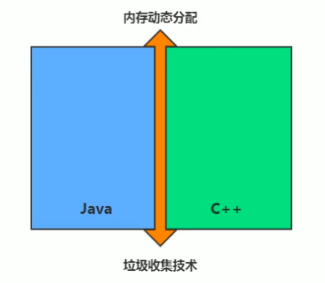

# 14.垃圾回收概述

- 笔记本：JVM_1_内存与垃圾回收
- 创建时间：2020-12-27 02:12:11 UTC
- 更新时间：2020-12-27 03:56:39 UTC
- 印象笔记 GUID：2257192a-e25a-42af-b753-c6a5c5292839

## 垃圾回收概述

### 1. 什么是垃圾



- 垃圾收集，不是 Java 语言的伴生产物，早在1960年，第一门开始使用内存动态分配和垃圾收集技术的 Lisp 语言诞生。

- 关于垃圾收集有三个经典问题：

  - 哪些内存需要回收？

  - 什么时候回收？

  - 如何回收？

- 垃圾收集机制是 Java 的招牌能力，*极大地提高了开发效率*。如今，垃圾收集几乎成为现代语言的标配，即时经过如此长时间的发展，Java 的垃圾收集机制仍然在不断的演进中，不同大小的设备、不同特征的应用场景，对垃圾收集提出了新的挑战，这当然也是**面试的热点**。

#### 大厂面试题

**蚂蚁金服：**
 你知道哪几种垃圾回收器，各自的优缺点，重点讲一下 cms 和 g1
 一面：JVM GC 算法有哪些，目前的 JDK 版本采用什么回收算法
 一面：G1 回收器讲下回收过程
 GC 是什么？为什么要有 GC？
 一面：GC 的两种判定方式？CMS 收集器与 G1 收集器的特点。

**百度：**
 说一下 GC 算法，分代回收说下
 垃圾收集策略和算法

**天猫：**
 一面：JVM GC 原理，JVM 怎么回收内存
 一面：CMS 特点，垃圾回收算法有哪些？各自的优缺点，他们共同的缺点是什么？

**滴滴：**
 一面：java 的垃圾收集器有哪些？说一下 g1 的应用场景，平时你是如何搭配使用垃圾回收器的

**京东：**
 你知道哪几种垃圾收集器，各自的优缺点，重点讲下 CMS 和 G1，包括原理，流程，优缺点。
 垃圾回收算法的实现原理。

**阿里：**
 讲一讲垃圾回收算法。
 什么情况下触发垃圾回收？
 如何选择合适的垃圾收集算法？
 JVM 有哪三种垃圾回收器？

**字节跳动：**
 常见的垃圾回收算法有哪些，各有什么优劣？
 System.gc() 和 runtime.gc() 会做什么事情？
 一面：Java GC 机制？GC Roots 有哪些？
 二面：Java 对象的回收方式，回收算法。
 CMS 和 G1 了解么，CMS 解决什么问题，说一下回收的过程。
 CMS 回收停顿了几次，为什么要停顿两次。

#### 什么是垃圾？

- 什么是垃圾（Garbage）呢？

  - 垃圾是指在**运行程序中没有任何指针指向对象**，这个对象就是需要被会回收的垃圾。

  - 外文：An object is considered garbage when it can no longer be reached from any pointer in the running program.

- 如果不及时对内存中的垃圾进行清理，那么，这些垃圾对象所占用的内存空间会一直保留到应用程序结束，被保留的空间无法被其它对象使用。甚至可能导致内存溢出。

### 2. 为什么需要 GC

**想要学习 GC，首先需要理解为什么需要 GC？**

- 对于高级语言来说，一个基本认知是如果不进行垃圾回收，*内存迟早都会被消耗完*，因为不断地分配内存空间而不进行回收，就好像不停地生成生活垃圾而从不打扫一样。

- 除了释放没用的对象，垃圾回收也可以清除内存里的记录碎片。碎片整理将所占用的堆内存移到堆的一端，一遍 *JVM 将整理出的内存分配给新的对象*。

- 随着应用程序所应付的业务越来越庞大、复杂，用户越来越多，*没有 GC 就不能保证应用程序的正常进行*。而经常造成 STW 的 GC 又跟不上实际的需求，所以才会不断地尝试对 GC 进行优化。

### 3. 早期垃圾回收

- 在早期的 C/C++ 时代，垃圾回收基本上是手工进行的。开发人员可以使用 new 关键字进行内存申请，并使用 delete 关键字进行内存释放。比如以下代码：

```
MibBridge *pBridge = new cmBaseGroupBridge();
// 如果注册失败，使用 delete 释放该对象所占内存区域
if(pBridge -> Register(kDestory) != NO_ERROR)
    delete pBridge;

```

- 这种方式可以灵活控制内存释放的时间，但是会给开发人员带来*频繁申请和释放内存的管理负担*。倘若有一处内存区由于程序员编码的问题忘记被回收，那么就会产生*内存泄漏*，垃圾对象永远无法被清除，随着系统运行时间的不断增长，垃圾对象所耗内存可能持续上升，直到出现内存溢出并造成*应用程序崩溃*。

在有了垃圾回收机制后，上述代码块极有可能变成这样：

```
MibBridge *pBridge = new cmBaseGroupBridge();
pBridge->Register(kDestory);

```

现在，除了 Java 意外，C#、Python、Ruby 等语言都使用了自动垃圾回收的思想，也是未来发展趋势。可以说，这种自动化的内存分配和垃圾回收的方式已经成为现代开发语言必备的标准。

### 4. Java 垃圾回收机制

- 自动内存管理，无需开发人员手动参与内存的分配与回收，这样**降低内存泄漏和内存溢出的风险**

  - 没有垃圾回收器，java 也会和 cpp 一样，各种悬垂指针，野指针，泄漏问题让你头疼不已。

- 自动内存管理机制，将程序员从繁重的内存管理中释放出来，可以**更专心地专注于业务开发**

- oracle 官网关于垃圾回收的介绍

  - http://docs.oracle.com/javase/8/docs/technotes/guides/vm/gctuning/toc.html

**担忧：**

- 对于 Java 开发人员而言，自动内存管理就像是一个黑匣子，如果过度依赖于“自动”，那么这将会是一场灾难，最严重的就会*弱化 Java 开发人员在程序出现内存溢出时定位问题和解决问题的能力*。

- 此时，了解 JVM 的自动内存分配和内存回收原理就显得非常重要，只有在真正了解 JVM 时如何管理内存后，我们才能够在遇见 OutOfMemoryError 时，快速地根据错误异常日志定位问题和解决问题。

- 当需要排查各种内存溢出、内存泄漏问题时，当垃圾收集成为系统达到更高并发量的瓶颈时，我们就必须对这些“自动化”的技术*实施

[附件]

%23%23%20%E5%9E%83%E5%9C%BE%E5%9B%9E%E6%94%B6%E6%A6%82%E8%BF%B0%0A%23%23%23%201.%20%E4%BB%80%E4%B9%88%E6%98%AF%E5%9E%83%E5%9C%BE%0A!%5B2b599286b73a0765dbf1d1d84ab46df2.png%5D(en-resource%3A%2F%2Fdatabase%2F5086%3A1)%0A-%20%E5%9E%83%E5%9C%BE%E6%94%B6%E9%9B%86%EF%BC%8C%E4%B8%8D%E6%98%AF%20Java%20%E8%AF%AD%E8%A8%80%E7%9A%84%E4%BC%B4%E7%94%9F%E4%BA%A7%E7%89%A9%EF%BC%8C%E6%97%A9%E5%9C%A81960%E5%B9%B4%EF%BC%8C%E7%AC%AC%E4%B8%80%E9%97%A8%E5%BC%80%E5%A7%8B%E4%BD%BF%E7%94%A8%E5%86%85%E5%AD%98%E5%8A%A8%E6%80%81%E5%88%86%E9%85%8D%E5%92%8C%E5%9E%83%E5%9C%BE%E6%94%B6%E9%9B%86%E6%8A%80%E6%9C%AF%E7%9A%84%20Lisp%20%E8%AF%AD%E8%A8%80%E8%AF%9E%E7%94%9F%E3%80%82%0A-%20%E5%85%B3%E4%BA%8E%E5%9E%83%E5%9C%BE%E6%94%B6%E9%9B%86%E6%9C%89%E4%B8%89%E4%B8%AA%E7%BB%8F%E5%85%B8%E9%97%AE%E9%A2%98%EF%BC%9A%0A%20%20%20%20-%20%E5%93%AA%E4%BA%9B%E5%86%85%E5%AD%98%E9%9C%80%E8%A6%81%E5%9B%9E%E6%94%B6%EF%BC%9F%0A%20%20%20%20-%20%E4%BB%80%E4%B9%88%E6%97%B6%E5%80%99%E5%9B%9E%E6%94%B6%EF%BC%9F%0A%20%20%20%20-%20%E5%A6%82%E4%BD%95%E5%9B%9E%E6%94%B6%EF%BC%9F%0A-%20%E5%9E%83%E5%9C%BE%E6%94%B6%E9%9B%86%E6%9C%BA%E5%88%B6%E6%98%AF%20Java%20%E7%9A%84%E6%8B%9B%E7%89%8C%E8%83%BD%E5%8A%9B%EF%BC%8C*%E6%9E%81%E5%A4%A7%E5%9C%B0%E6%8F%90%E9%AB%98%E4%BA%86%E5%BC%80%E5%8F%91%E6%95%88%E7%8E%87*%E3%80%82%E5%A6%82%E4%BB%8A%EF%BC%8C%E5%9E%83%E5%9C%BE%E6%94%B6%E9%9B%86%E5%87%A0%E4%B9%8E%E6%88%90%E4%B8%BA%E7%8E%B0%E4%BB%A3%E8%AF%AD%E8%A8%80%E7%9A%84%E6%A0%87%E9%85%8D%EF%BC%8C%E5%8D%B3%E6%97%B6%E7%BB%8F%E8%BF%87%E5%A6%82%E6%AD%A4%E9%95%BF%E6%97%B6%E9%97%B4%E7%9A%84%E5%8F%91%E5%B1%95%EF%BC%8CJava%20%E7%9A%84%E5%9E%83%E5%9C%BE%E6%94%B6%E9%9B%86%E6%9C%BA%E5%88%B6%E4%BB%8D%E7%84%B6%E5%9C%A8%E4%B8%8D%E6%96%AD%E7%9A%84%E6%BC%94%E8%BF%9B%E4%B8%AD%EF%BC%8C%E4%B8%8D%E5%90%8C%E5%A4%A7%E5%B0%8F%E7%9A%84%E8%AE%BE%E5%A4%87%E3%80%81%E4%B8%8D%E5%90%8C%E7%89%B9%E5%BE%81%E7%9A%84%E5%BA%94%E7%94%A8%E5%9C%BA%E6%99%AF%EF%BC%8C%E5%AF%B9%E5%9E%83%E5%9C%BE%E6%94%B6%E9%9B%86%E6%8F%90%E5%87%BA%E4%BA%86%E6%96%B0%E7%9A%84%E6%8C%91%E6%88%98%EF%BC%8C%E8%BF%99%E5%BD%93%E7%84%B6%E4%B9%9F%E6%98%AF**%E9%9D%A2%E8%AF%95%E7%9A%84%E7%83%AD%E7%82%B9**%E3%80%82%0A%0A%23%23%23%23%20%E5%A4%A7%E5%8E%82%E9%9D%A2%E8%AF%95%E9%A2%98%0A**%E8%9A%82%E8%9A%81%E9%87%91%E6%9C%8D%EF%BC%9A**%0A%E4%BD%A0%E7%9F%A5%E9%81%93%E5%93%AA%E5%87%A0%E7%A7%8D%E5%9E%83%E5%9C%BE%E5%9B%9E%E6%94%B6%E5%99%A8%EF%BC%8C%E5%90%84%E8%87%AA%E7%9A%84%E4%BC%98%E7%BC%BA%E7%82%B9%EF%BC%8C%E9%87%8D%E7%82%B9%E8%AE%B2%E4%B8%80%E4%B8%8B%20cms%20%E5%92%8C%20g1%0A%E4%B8%80%E9%9D%A2%EF%BC%9AJVM%20GC%20%E7%AE%97%E6%B3%95%E6%9C%89%E5%93%AA%E4%BA%9B%EF%BC%8C%E7%9B%AE%E5%89%8D%E7%9A%84%20JDK%20%E7%89%88%E6%9C%AC%E9%87%87%E7%94%A8%E4%BB%80%E4%B9%88%E5%9B%9E%E6%94%B6%E7%AE%97%E6%B3%95%0A%E4%B8%80%E9%9D%A2%EF%BC%9AG1%20%E5%9B%9E%E6%94%B6%E5%99%A8%E8%AE%B2%E4%B8%8B%E5%9B%9E%E6%94%B6%E8%BF%87%E7%A8%8B%0AGC%20%E6%98%AF%E4%BB%80%E4%B9%88%EF%BC%9F%E4%B8%BA%E4%BB%80%E4%B9%88%E8%A6%81%E6%9C%89%20GC%EF%BC%9F%0A%E4%B8%80%E9%9D%A2%EF%BC%9AGC%20%E7%9A%84%E4%B8%A4%E7%A7%8D%E5%88%A4%E5%AE%9A%E6%96%B9%E5%BC%8F%EF%BC%9FCMS%20%E6%94%B6%E9%9B%86%E5%99%A8%E4%B8%8E%20G1%20%E6%94%B6%E9%9B%86%E5%99%A8%E7%9A%84%E7%89%B9%E7%82%B9%E3%80%82%0A%0A**%E7%99%BE%E5%BA%A6%EF%BC%9A**%0A%E8%AF%B4%E4%B8%80%E4%B8%8B%20GC%20%E7%AE%97%E6%B3%95%EF%BC%8C%E5%88%86%E4%BB%A3%E5%9B%9E%E6%94%B6%E8%AF%B4%E4%B8%8B%0A%E5%9E%83%E5%9C%BE%E6%94%B6%E9%9B%86%E7%AD%96%E7%95%A5%E5%92%8C%E7%AE%97%E6%B3%95%0A%0A**%E5%A4%A9%E7%8C%AB%EF%BC%9A**%0A%E4%B8%80%E9%9D%A2%EF%BC%9AJVM%20GC%20%E5%8E%9F%E7%90%86%EF%BC%8CJVM%20%E6%80%8E%E4%B9%88%E5%9B%9E%E6%94%B6%E5%86%85%E5%AD%98%0A%E4%B8%80%E9%9D%A2%EF%BC%9ACMS%20%E7%89%B9%E7%82%B9%EF%BC%8C%E5%9E%83%E5%9C%BE%E5%9B%9E%E6%94%B6%E7%AE%97%E6%B3%95%E6%9C%89%E5%93%AA%E4%BA%9B%EF%BC%9F%E5%90%84%E8%87%AA%E7%9A%84%E4%BC%98%E7%BC%BA%E7%82%B9%EF%BC%8C%E4%BB%96%E4%BB%AC%E5%85%B1%E5%90%8C%E7%9A%84%E7%BC%BA%E7%82%B9%E6%98%AF%E4%BB%80%E4%B9%88%EF%BC%9F%0A%0A**%E6%BB%B4%E6%BB%B4%EF%BC%9A**%0A%E4%B8%80%E9%9D%A2%EF%BC%9Ajava%20%E7%9A%84%E5%9E%83%E5%9C%BE%E6%94%B6%E9%9B%86%E5%99%A8%E6%9C%89%E5%93%AA%E4%BA%9B%EF%BC%9F%E8%AF%B4%E4%B8%80%E4%B8%8B%20g1%20%E7%9A%84%E5%BA%94%E7%94%A8%E5%9C%BA%E6%99%AF%EF%BC%8C%E5%B9%B3%E6%97%B6%E4%BD%A0%E6%98%AF%E5%A6%82%E4%BD%95%E6%90%AD%E9%85%8D%E4%BD%BF%E7%94%A8%E5%9E%83%E5%9C%BE%E5%9B%9E%E6%94%B6%E5%99%A8%E7%9A%84%0A%0A**%E4%BA%AC%E4%B8%9C%EF%BC%9A**%0A%E4%BD%A0%E7%9F%A5%E9%81%93%E5%93%AA%E5%87%A0%E7%A7%8D%E5%9E%83%E5%9C%BE%E6%94%B6%E9%9B%86%E5%99%A8%EF%BC%8C%E5%90%84%E8%87%AA%E7%9A%84%E4%BC%98%E7%BC%BA%E7%82%B9%EF%BC%8C%E9%87%8D%E7%82%B9%E8%AE%B2%E4%B8%8B%20CMS%20%E5%92%8C%20G1%EF%BC%8C%E5%8C%85%E6%8B%AC%E5%8E%9F%E7%90%86%EF%BC%8C%E6%B5%81%E7%A8%8B%EF%BC%8C%E4%BC%98%E7%BC%BA%E7%82%B9%E3%80%82%0A%E5%9E%83%E5%9C%BE%E5%9B%9E%E6%94%B6%E7%AE%97%E6%B3%95%E7%9A%84%E5%AE%9E%E7%8E%B0%E5%8E%9F%E7%90%86%E3%80%82%0A%0A**%E9%98%BF%E9%87%8C%EF%BC%9A**%0A%E8%AE%B2%E4%B8%80%E8%AE%B2%E5%9E%83%E5%9C%BE%E5%9B%9E%E6%94%B6%E7%AE%97%E6%B3%95%E3%80%82%0A%E4%BB%80%E4%B9%88%E6%83%85%E5%86%B5%E4%B8%8B%E8%A7%A6%E5%8F%91%E5%9E%83%E5%9C%BE%E5%9B%9E%E6%94%B6%EF%BC%9F%0A%E5%A6%82%E4%BD%95%E9%80%89%E6%8B%A9%E5%90%88%E9%80%82%E7%9A%84%E5%9E%83%E5%9C%BE%E6%94%B6%E9%9B%86%E7%AE%97%E6%B3%95%EF%BC%9F%0AJVM%20%E6%9C%89%E5%93%AA%E4%B8%89%E7%A7%8D%E5%9E%83%E5%9C%BE%E5%9B%9E%E6%94%B6%E5%99%A8%EF%BC%9F%0A%0A**%E5%AD%97%E8%8A%82%E8%B7%B3%E5%8A%A8%EF%BC%9A**%0A%E5%B8%B8%E8%A7%81%E7%9A%84%E5%9E%83%E5%9C%BE%E5%9B%9E%E6%94%B6%E7%AE%97%E6%B3%95%E6%9C%89%E5%93%AA%E4%BA%9B%EF%BC%8C%E5%90%84%E6%9C%89%E4%BB%80%E4%B9%88%E4%BC%98%E5%8A%A3%EF%BC%9F%0ASystem.gc()%20%E5%92%8C%20runtime.gc()%20%E4%BC%9A%E5%81%9A%E4%BB%80%E4%B9%88%E4%BA%8B%E6%83%85%EF%BC%9F%0A%E4%B8%80%E9%9D%A2%EF%BC%9AJava%20GC%20%E6%9C%BA%E5%88%B6%EF%BC%9FGC%20Roots%20%E6%9C%89%E5%93%AA%E4%BA%9B%EF%BC%9F%0A%E4%BA%8C%E9%9D%A2%EF%BC%9AJava%20%E5%AF%B9%E8%B1%A1%E7%9A%84%E5%9B%9E%E6%94%B6%E6%96%B9%E5%BC%8F%EF%BC%8C%E5%9B%9E%E6%94%B6%E7%AE%97%E6%B3%95%E3%80%82%0ACMS%20%E5%92%8C%20G1%20%E4%BA%86%E8%A7%A3%E4%B9%88%EF%BC%8CCMS%20%E8%A7%A3%E5%86%B3%E4%BB%80%E4%B9%88%E9%97%AE%E9%A2%98%EF%BC%8C%E8%AF%B4%E4%B8%80%E4%B8%8B%E5%9B%9E%E6%94%B6%E7%9A%84%E8%BF%87%E7%A8%8B%E3%80%82%0ACMS%20%E5%9B%9E%E6%94%B6%E5%81%9C%E9%A1%BF%E4%BA%86%E5%87%A0%E6%AC%A1%EF%BC%8C%E4%B8%BA%E4%BB%80%E4%B9%88%E8%A6%81%E5%81%9C%E9%A1%BF%E4%B8%A4%E6%AC%A1%E3%80%82%0A%0A%23%23%23%23%20%E4%BB%80%E4%B9%88%E6%98%AF%E5%9E%83%E5%9C%BE%EF%BC%9F%0A-%20%E4%BB%80%E4%B9%88%E6%98%AF%E5%9E%83%E5%9C%BE%EF%BC%88Garbage%EF%BC%89%E5%91%A2%EF%BC%9F%0A%20%20%20%20-%20%E5%9E%83%E5%9C%BE%E6%98%AF%E6%8C%87%E5%9C%A8**%E8%BF%90%E8%A1%8C%E7%A8%8B%E5%BA%8F%E4%B8%AD%E6%B2%A1%E6%9C%89%E4%BB%BB%E4%BD%95%E6%8C%87%E9%92%88%E6%8C%87%E5%90%91%E5%AF%B9%E8%B1%A1**%EF%BC%8C%E8%BF%99%E4%B8%AA%E5%AF%B9%E8%B1%A1%E5%B0%B1%E6%98%AF%E9%9C%80%E8%A6%81%E8%A2%AB%E4%BC%9A%E5%9B%9E%E6%94%B6%E7%9A%84%E5%9E%83%E5%9C%BE%E3%80%82%0A%20%20%20%20-%20%E5%A4%96%E6%96%87%EF%BC%9AAn%20object%20is%20considered%20garbage%20when%20it%20can%20no%20longer%20be%20reached%20from%20any%20pointer%20in%20the%20running%20program.%0A-%20%E5%A6%82%E6%9E%9C%E4%B8%8D%E5%8F%8A%E6%97%B6%E5%AF%B9%E5%86%85%E5%AD%98%E4%B8%AD%E7%9A%84%E5%9E%83%E5%9C%BE%E8%BF%9B%E8%A1%8C%E6%B8%85%E7%90%86%EF%BC%8C%E9%82%A3%E4%B9%88%EF%BC%8C%E8%BF%99%E4%BA%9B%E5%9E%83%E5%9C%BE%E5%AF%B9%E8%B1%A1%E6%89%80%E5%8D%A0%E7%94%A8%E7%9A%84%E5%86%85%E5%AD%98%E7%A9%BA%E9%97%B4%E4%BC%9A%E4%B8%80%E7%9B%B4%E4%BF%9D%E7%95%99%E5%88%B0%E5%BA%94%E7%94%A8%E7%A8%8B%E5%BA%8F%E7%BB%93%E6%9D%9F%EF%BC%8C%E8%A2%AB%E4%BF%9D%E7%95%99%E7%9A%84%E7%A9%BA%E9%97%B4%E6%97%A0%E6%B3%95%E8%A2%AB%E5%85%B6%E5%AE%83%E5%AF%B9%E8%B1%A1%E4%BD%BF%E7%94%A8%E3%80%82%E7%94%9A%E8%87%B3%E5%8F%AF%E8%83%BD%E5%AF%BC%E8%87%B4%E5%86%85%E5%AD%98%E6%BA%A2%E5%87%BA%E3%80%82%0A%0A%23%23%23%202.%20%E4%B8%BA%E4%BB%80%E4%B9%88%E9%9C%80%E8%A6%81%20GC%0A**%E6%83%B3%E8%A6%81%E5%AD%A6%E4%B9%A0%20GC%EF%BC%8C%E9%A6%96%E5%85%88%E9%9C%80%E8%A6%81%E7%90%86%E8%A7%A3%E4%B8%BA%E4%BB%80%E4%B9%88%E9%9C%80%E8%A6%81%20GC%EF%BC%9F**%0A-%20%E5%AF%B9%E4%BA%8E%E9%AB%98%E7%BA%A7%E8%AF%AD%E8%A8%80%E6%9D%A5%E8%AF%B4%EF%BC%8C%E4%B8%80%E4%B8%AA%E5%9F%BA%E6%9C%AC%E8%AE%A4%E7%9F%A5%E6%98%AF%E5%A6%82%E6%9E%9C%E4%B8%8D%E8%BF%9B%E8%A1%8C%E5%9E%83%E5%9C%BE%E5%9B%9E%E6%94%B6%EF%BC%8C*%E5%86%85%E5%AD%98%E8%BF%9F%E6%97%A9%E9%83%BD%E4%BC%9A%E8%A2%AB%E6%B6%88%E8%80%97%E5%AE%8C*%EF%BC%8C%E5%9B%A0%E4%B8%BA%E4%B8%8D%E6%96%AD%E5%9C%B0%E5%88%86%E9%85%8D%E5%86%85%E5%AD%98%E7%A9%BA%E9%97%B4%E8%80%8C%E4%B8%8D%E8%BF%9B%E8%A1%8C%E5%9B%9E%E6%94%B6%EF%BC%8C%E5%B0%B1%E5%A5%BD%E5%83%8F%E4%B8%8D%E5%81%9C%E5%9C%B0%E7%94%9F%E6%88%90%E7%94%9F%E6%B4%BB%E5%9E%83%E5%9C%BE%E8%80%8C%E4%BB%8E%E4%B8%8D%E6%89%93%E6%89%AB%E4%B8%80%E6%A0%B7%E3%80%82%0A-%20%E9%99%A4%E4%BA%86%E9%87%8A%E6%94%BE%E6%B2%A1%E7%94%A8%E7%9A%84%E5%AF%B9%E8%B1%A1%EF%BC%8C%E5%9E%83%E5%9C%BE%E5%9B%9E%E6%94%B6%E4%B9%9F%E5%8F%AF%E4%BB%A5%E6%B8%85%E9%99%A4%E5%86%85%E5%AD%98%E9%87%8C%E7%9A%84%E8%AE%B0%E5%BD%95%E7%A2%8E%E7%89%87%E3%80%82%E7%A2%8E%E7%89%87%E6%95%B4%E7%90%86%E5%B0%86%E6%89%80%E5%8D%A0%E7%94%A8%E7%9A%84%E5%A0%86%E5%86%85%E5%AD%98%E7%A7%BB%E5%88%B0%E5%A0%86%E7%9A%84%E4%B8%80%E7%AB%AF%EF%BC%8C%E4%B8%80%E9%81%8D%20*JVM%20%E5%B0%86%E6%95%B4%E7%90%86%E5%87%BA%E7%9A%84%E5%86%85%E5%AD%98%E5%88%86%E9%85%8D%E7%BB%99%E6%96%B0%E7%9A%84%E5%AF%B9%E8%B1%A1*%E3%80%82%0A-%20%E9%9A%8F%E7%9D%80%E5%BA%94%E7%94%A8%E7%A8%8B%E5%BA%8F%E6%89%80%E5%BA%94%E4%BB%98%E7%9A%84%E4%B8%9A%E5%8A%A1%E8%B6%8A%E6%9D%A5%E8%B6%8A%E5%BA%9E%E5%A4%A7%E3%80%81%E5%A4%8D%E6%9D%82%EF%BC%8C%E7%94%A8%E6%88%B7%E8%B6%8A%E6%9D%A5%E8%B6%8A%E5%A4%9A%EF%BC%8C*%E6%B2%A1%E6%9C%89%20GC%20%E5%B0%B1%E4%B8%8D%E8%83%BD%E4%BF%9D%E8%AF%81%E5%BA%94%E7%94%A8%E7%A8%8B%E5%BA%8F%E7%9A%84%E6%AD%A3%E5%B8%B8%E8%BF%9B%E8%A1%8C*%E3%80%82%E8%80%8C%E7%BB%8F%E5%B8%B8%E9%80%A0%E6%88%90%20STW%20%E7%9A%84%20GC%20%E5%8F%88%E8%B7%9F%E4%B8%8D%E4%B8%8A%E5%AE%9E%E9%99%85%E7%9A%84%E9%9C%80%E6%B1%82%EF%BC%8C%E6%89%80%E4%BB%A5%E6%89%8D%E4%BC%9A%E4%B8%8D%E6%96%AD%E5%9C%B0%E5%B0%9D%E8%AF%95%E5%AF%B9%20GC%20%E8%BF%9B%E8%A1%8C%E4%BC%98%E5%8C%96%E3%80%82%0A%0A%23%23%23%203.%20%E6%97%A9%E6%9C%9F%E5%9E%83%E5%9C%BE%E5%9B%9E%E6%94%B6%0A-%20%E5%9C%A8%E6%97%A9%E6%9C%9F%E7%9A%84%20C%2FC%2B%2B%20%E6%97%B6%E4%BB%A3%EF%BC%8C%E5%9E%83%E5%9C%BE%E5%9B%9E%E6%94%B6%E5%9F%BA%E6%9C%AC%E4%B8%8A%E6%98%AF%E6%89%8B%E5%B7%A5%E8%BF%9B%E8%A1%8C%E7%9A%84%E3%80%82%E5%BC%80%E5%8F%91%E4%BA%BA%E5%91%98%E5%8F%AF%E4%BB%A5%E4%BD%BF%E7%94%A8%20new%20%E5%85%B3%E9%94%AE%E5%AD%97%E8%BF%9B%E8%A1%8C%E5%86%85%E5%AD%98%E7%94%B3%E8%AF%B7%EF%BC%8C%E5%B9%B6%E4%BD%BF%E7%94%A8%20delete%20%E5%85%B3%E9%94%AE%E5%AD%97%E8%BF%9B%E8%A1%8C%E5%86%85%E5%AD%98%E9%87%8A%E6%94%BE%E3%80%82%E6%AF%94%E5%A6%82%E4%BB%A5%E4%B8%8B%E4%BB%A3%E7%A0%81%EF%BC%9A%0A%60%60%60c%2B%2B%0AMibBridge%20*pBridge%20%3D%20new%20cmBaseGroupBridge()%3B%0A%2F%2F%20%E5%A6%82%E6%9E%9C%E6%B3%A8%E5%86%8C%E5%A4%B1%E8%B4%A5%EF%BC%8C%E4%BD%BF%E7%94%A8%20delete%20%E9%87%8A%E6%94%BE%E8%AF%A5%E5%AF%B9%E8%B1%A1%E6%89%80%E5%8D%A0%E5%86%85%E5%AD%98%E5%8C%BA%E5%9F%9F%0Aif(pBridge%20-%3E%20Register(kDestory)%20!%3D%20NO_ERROR)%0A%20%20%20%20delete%20pBridge%3B%0A%60%60%60%0A-%20%E8%BF%99%E7%A7%8D%E6%96%B9%E5%BC%8F%E5%8F%AF%E4%BB%A5%E7%81%B5%E6%B4%BB%E6%8E%A7%E5%88%B6%E5%86%85%E5%AD%98%E9%87%8A%E6%94%BE%E7%9A%84%E6%97%B6%E9%97%B4%EF%BC%8C%E4%BD%86%E6%98%AF%E4%BC%9A%E7%BB%99%E5%BC%80%E5%8F%91%E4%BA%BA%E5%91%98%E5%B8%A6%E6%9D%A5*%E9%A2%91%E7%B9%81%E7%94%B3%E8%AF%B7%E5%92%8C%E9%87%8A%E6%94%BE%E5%86%85%E5%AD%98%E7%9A%84%E7%AE%A1%E7%90%86%E8%B4%9F%E6%8B%85*%E3%80%82%E5%80%98%E8%8B%A5%E6%9C%89%E4%B8%80%E5%A4%84%E5%86%85%E5%AD%98%E5%8C%BA%E7%94%B1%E4%BA%8E%E7%A8%8B%E5%BA%8F%E5%91%98%E7%BC%96%E7%A0%81%E7%9A%84%E9%97%AE%E9%A2%98%E5%BF%98%E8%AE%B0%E8%A2%AB%E5%9B%9E%E6%94%B6%EF%BC%8C%E9%82%A3%E4%B9%88%E5%B0%B1%E4%BC%9A%E4%BA%A7%E7%94%9F*%E5%86%85%E5%AD%98%E6%B3%84%E6%BC%8F*%EF%BC%8C%E5%9E%83%E5%9C%BE%E5%AF%B9%E8%B1%A1%E6%B0%B8%E8%BF%9C%E6%97%A0%E6%B3%95%E8%A2%AB%E6%B8%85%E9%99%A4%EF%BC%8C%E9%9A%8F%E7%9D%80%E7%B3%BB%E7%BB%9F%E8%BF%90%E8%A1%8C%E6%97%B6%E9%97%B4%E7%9A%84%E4%B8%8D%E6%96%AD%E5%A2%9E%E9%95%BF%EF%BC%8C%E5%9E%83%E5%9C%BE%E5%AF%B9%E8%B1%A1%E6%89%80%E8%80%97%E5%86%85%E5%AD%98%E5%8F%AF%E8%83%BD%E6%8C%81%E7%BB%AD%E4%B8%8A%E5%8D%87%EF%BC%8C%E7%9B%B4%E5%88%B0%E5%87%BA%E7%8E%B0%E5%86%85%E5%AD%98%E6%BA%A2%E5%87%BA%E5%B9%B6%E9%80%A0%E6%88%90*%E5%BA%94%E7%94%A8%E7%A8%8B%E5%BA%8F%E5%B4%A9%E6%BA%83*%E3%80%82%0A%0A%E5%9C%A8%E6%9C%89%E4%BA%86%E5%9E%83%E5%9C%BE%E5%9B%9E%E6%94%B6%E6%9C%BA%E5%88%B6%E5%90%8E%EF%BC%8C%E4%B8%8A%E8%BF%B0%E4%BB%A3%E7%A0%81%E5%9D%97%E6%9E%81%E6%9C%89%E5%8F%AF%E8%83%BD%E5%8F%98%E6%88%90%E8%BF%99%E6%A0%B7%EF%BC%9A%0A%60%60%60c%2B%2B%0AMibBridge%20*pBridge%20%3D%20new%20cmBaseGroupBridge()%3B%0ApBridge-%3ERegister(kDestory)%3B%0A%60%60%60%0A%E7%8E%B0%E5%9C%A8%EF%BC%8C%E9%99%A4%E4%BA%86%20Java%20%E6%84%8F%E5%A4%96%EF%BC%8CC%23%E3%80%81Python%E3%80%81Ruby%20%E7%AD%89%E8%AF%AD%E8%A8%80%E9%83%BD%E4%BD%BF%E7%94%A8%E4%BA%86%E8%87%AA%E5%8A%A8%E5%9E%83%E5%9C%BE%E5%9B%9E%E6%94%B6%E7%9A%84%E6%80%9D%E6%83%B3%EF%BC%8C%E4%B9%9F%E6%98%AF%E6%9C%AA%E6%9D%A5%E5%8F%91%E5%B1%95%E8%B6%8B%E5%8A%BF%E3%80%82%E5%8F%AF%E4%BB%A5%E8%AF%B4%EF%BC%8C%E8%BF%99%E7%A7%8D%E8%87%AA%E5%8A%A8%E5%8C%96%E7%9A%84%E5%86%85%E5%AD%98%E5%88%86%E9%85%8D%E5%92%8C%E5%9E%83%E5%9C%BE%E5%9B%9E%E6%94%B6%E7%9A%84%E6%96%B9%E5%BC%8F%E5%B7%B2%E7%BB%8F%E6%88%90%E4%B8%BA%E7%8E%B0%E4%BB%A3%E5%BC%80%E5%8F%91%E8%AF%AD%E8%A8%80%E5%BF%85%E5%A4%87%E7%9A%84%E6%A0%87%E5%87%86%E3%80%82%0A%0A%23%23%23%204.%20Java%20%E5%9E%83%E5%9C%BE%E5%9B%9E%E6%94%B6%E6%9C%BA%E5%88%B6%0A-%20%E8%87%AA%E5%8A%A8%E5%86%85%E5%AD%98%E7%AE%A1%E7%90%86%EF%BC%8C%E6%97%A0%E9%9C%80%E5%BC%80%E5%8F%91%E4%BA%BA%E5%91%98%E6%89%8B%E5%8A%A8%E5%8F%82%E4%B8%8E%E5%86%85%E5%AD%98%E7%9A%84%E5%88%86%E9%85%8D%E4%B8%8E%E5%9B%9E%E6%94%B6%EF%BC%8C%E8%BF%99%E6%A0%B7**%E9%99%8D%E4%BD%8E%E5%86%85%E5%AD%98%E6%B3%84%E6%BC%8F%E5%92%8C%E5%86%85%E5%AD%98%E6%BA%A2%E5%87%BA%E7%9A%84%E9%A3%8E%E9%99%A9**%0A%20%20%20%20-%20%E6%B2%A1%E6%9C%89%E5%9E%83%E5%9C%BE%E5%9B%9E%E6%94%B6%E5%99%A8%EF%BC%8Cjava%20%E4%B9%9F%E4%BC%9A%E5%92%8C%20cpp%20%E4%B8%80%E6%A0%B7%EF%BC%8C%E5%90%84%E7%A7%8D%E6%82%AC%E5%9E%82%E6%8C%87%E9%92%88%EF%BC%8C%E9%87%8E%E6%8C%87%E9%92%88%EF%BC%8C%E6%B3%84%E6%BC%8F%E9%97%AE%E9%A2%98%E8%AE%A9%E4%BD%A0%E5%A4%B4%E7%96%BC%E4%B8%8D%E5%B7%B2%E3%80%82%0A-%20%E8%87%AA%E5%8A%A8%E5%86%85%E5%AD%98%E7%AE%A1%E7%90%86%E6%9C%BA%E5%88%B6%EF%BC%8C%E5%B0%86%E7%A8%8B%E5%BA%8F%E5%91%98%E4%BB%8E%E7%B9%81%E9%87%8D%E7%9A%84%E5%86%85%E5%AD%98%E7%AE%A1%E7%90%86%E4%B8%AD%E9%87%8A%E6%94%BE%E5%87%BA%E6%9D%A5%EF%BC%8C%E5%8F%AF%E4%BB%A5**%E6%9B%B4%E4%B8%93%E5%BF%83%E5%9C%B0%E4%B8%93%E6%B3%A8%E4%BA%8E%E4%B8%9A%E5%8A%A1%E5%BC%80%E5%8F%91**%0A-%20oracle%20%E5%AE%98%E7%BD%91%E5%85%B3%E4%BA%8E%E5%9E%83%E5%9C%BE%E5%9B%9E%E6%94%B6%E7%9A%84%E4%BB%8B%E7%BB%8D%0A%20%20%20%20-%20http%3A%2F%2Fdocs.oracle.com%2Fjavase%2F8%2Fdocs%2Ftechnotes%2Fguides%2Fvm%2Fgctuning%2Ftoc.html%0A%0A**%E6%8B%85%E5%BF%A7%EF%BC%9A**%0A-%20%E5%AF%B9%E4%BA%8E%20Java%20%E5%BC%80%E5%8F%91%E4%BA%BA%E5%91%98%E8%80%8C%E8%A8%80%EF%BC%8C%E8%87%AA%E5%8A%A8%E5%86%85%E5%AD%98%E7%AE%A1%E7%90%86%E5%B0%B1%E5%83%8F%E6%98%AF%E4%B8%80%E4%B8%AA%E9%BB%91%E5%8C%A3%E5%AD%90%EF%BC%8C%E5%A6%82%E6%9E%9C%E8%BF%87%E5%BA%A6%E4%BE%9D%E8%B5%96%E4%BA%8E%E2%80%9C%E8%87%AA%E5%8A%A8%E2%80%9D%EF%BC%8C%E9%82%A3%E4%B9%88%E8%BF%99%E5%B0%86%E4%BC%9A%E6%98%AF%E4%B8%80%E5%9C%BA%E7%81%BE%E9%9A%BE%EF%BC%8C%E6%9C%80%E4%B8%A5%E9%87%8D%E7%9A%84%E5%B0%B1%E4%BC%9A*%E5%BC%B1%E5%8C%96%20Java%20%E5%BC%80%E5%8F%91%E4%BA%BA%E5%91%98%E5%9C%A8%E7%A8%8B%E5%BA%8F%E5%87%BA%E7%8E%B0%E5%86%85%E5%AD%98%E6%BA%A2%E5%87%BA%E6%97%B6%E5%AE%9A%E4%BD%8D%E9%97%AE%E9%A2%98%E5%92%8C%E8%A7%A3%E5%86%B3%E9%97%AE%E9%A2%98%E7%9A%84%E8%83%BD%E5%8A%9B*%E3%80%82%0A-%20%E6%AD%A4%E6%97%B6%EF%BC%8C%E4%BA%86%E8%A7%A3%20JVM%20%E7%9A%84%E8%87%AA%E5%8A%A8%E5%86%85%E5%AD%98%E5%88%86%E9%85%8D%E5%92%8C%E5%86%85%E5%AD%98%E5%9B%9E%E6%94%B6%E5%8E%9F%E7%90%86%E5%B0%B1%E6%98%BE%E5%BE%97%E9%9D%9E%E5%B8%B8%E9%87%8D%E8%A6%81%EF%BC%8C%E5%8F%AA%E6%9C%89%E5%9C%A8%E7%9C%9F%E6%AD%A3%E4%BA%86%E8%A7%A3%20JVM%20%E6%97%B6%E5%A6%82%E4%BD%95%E7%AE%A1%E7%90%86%E5%86%85%E5%AD%98%E5%90%8E%EF%BC%8C%E6%88%91%E4%BB%AC%E6%89%8D%E8%83%BD%E5%A4%9F%E5%9C%A8%E9%81%87%E8%A7%81%20OutOfMemoryError%20%E6%97%B6%EF%BC%8C%E5%BF%AB%E9%80%9F%E5%9C%B0%E6%A0%B9%E6%8D%AE%E9%94%99%E8%AF%AF%E5%BC%82%E5%B8%B8%E6%97%A5%E5%BF%97%E5%AE%9A%E4%BD%8D%E9%97%AE%E9%A2%98%E5%92%8C%E8%A7%A3%E5%86%B3%E9%97%AE%E9%A2%98%E3%80%82%0A-%20%E5%BD%93%E9%9C%80%E8%A6%81%E6%8E%92%E6%9F%A5%E5%90%84%E7%A7%8D%E5%86%85%E5%AD%98%E6%BA%A2%E5%87%BA%E3%80%81%E5%86%85%E5%AD%98%E6%B3%84%E6%BC%8F%E9%97%AE%E9%A2%98%E6%97%B6%EF%BC%8C%E5%BD%93%E5%9E%83%E5%9C%BE%E6%94%B6%E9%9B%86%E6%88%90%E4%B8%BA%E7%B3%BB%E7%BB%9F%E8%BE%BE%E5%88%B0%E6%9B%B4%E9%AB%98%E5%B9%B6%E5%8F%91%E9%87%8F%E7%9A%84%E7%93%B6%E9%A2%88%E6%97%B6%EF%BC%8C%E6%88%91%E4%BB%AC%E5%B0%B1%E5%BF%85%E9%A1%BB%E5%AF%B9%E8%BF%99%E4%BA%9B%E2%80%9C%E8%87%AA%E5%8A%A8%E5%8C%96%E2%80%9D%E7%9A%84%E6%8A%80%E6%9C%AF*%E5%AE%9E%E6%96%BD%E5%BF%85%E8%A6%81%E7%9A%84%E7%9B%91%E6%8E%A7%E5%92%8C%E8%B0%83%E8%8A%82*%E3%80%82%0A%0A**%E5%BA%94%E8%AF%A5%E5%85%B3%E5%BF%83%E5%93%AA%E4%BA%9B%E5%8C%BA%E5%9F%9F%E7%9A%84%E5%9B%9E%E6%94%B6%EF%BC%9F**%0A!%5B2db9a5427d19118644db099b15b21957.png%5D(en-resource%3A%2F%2Fdatabase%2F5088%3A0)%0A-%20%E5%9E%83%E5%9C%BE%E5%9B%9E%E6%94%B6%E5%99%A8%E5%8F%AF%E4%BB%A5%E5%AF%B9%E5%B9%B4%E8%BD%BB%E4%BB%A3%E5%9B%9E%E6%94%B6%EF%BC%8C%E4%B9%9F%E5%8F%AF%E4%BB%A5%E5%AF%B9%E8%80%81%E5%B9%B4%E4%BB%A3%E4%BC%9A%E6%90%9C%EF%BC%8C%E7%94%9A%E8%87%B3%E6%98%AF%E5%85%A8%E5%A0%86%E5%92%8C%E6%96%B9%E6%B3%95%E5%8C%BA%E7%9A%84%E5%9B%9E%E6%94%B6%E3%80%82%0A%20%20%20%20%E5%85%B6%E4%B8%AD%EF%BC%8C**Java%20%E5%A0%86%E6%98%AF%E5%9E%83%E5%9C%BE%E6%94%B6%E9%9B%86%E5%99%A8%E7%9A%84%E5%B7%A5%E4%BD%9C%E9%87%8D%E7%82%B9**%E3%80%82%0A-%20%E4%BB%8E%E6%AC%A1%E6%95%B0%E4%B8%8A%E8%AE%B2%EF%BC%9A%0A%20%20%20%20-%20%E9%A2%91%E7%B9%81%E6%94%B6%E9%9B%86%20Young%20%E5%8C%BA%0A%20%20%20%20-%20%E8%BE%83%E5%B0%91%E6%94%B6%E9%9B%86%20Old%20%E5%8C%BA%0A%20%20%20%20-%20%E5%9F%BA%E6%9C%AC%E4%B8%8D%E5%8A%A8%20Perm%20%E5%8C%BA
