# 15.垃圾回收的相关算法

- 笔记本：JVM_1_内存与垃圾回收
- 创建时间：2020-12-27 03:58:04 UTC
- 更新时间：2020-12-27 15:13:56 UTC
- 印象笔记 GUID：789bd15e-6401-42ba-a951-d0a66ec2a950

## 垃圾回收的算法

### 1. 垃圾标记阶段的算法（标记阶段）

**对象存活判断**

- 在堆里存放着几乎所有的 Java 对象实例，在 GC 执行垃圾回收之前，首先*需要分出内存中哪些是存活对象，哪些是已经死亡的对象*。只有被标记为已经死亡的对象，GC 才会在执行垃圾回收的时候，释放掉其所占的内存空间，因此这个过程我们可以称为*垃圾标记阶段*。

- 那么在 JVM 中究竟是如何标记一个对象死亡呢？简单来说，当一个对象已经不再被任何的存活对象继续引用时，就可以宣判为已经死亡。

- 判断对象存活一般有两种方式：**引用计数算法**和**可达性分析算法**。

#### 1.1.引用计数算法

- 引用计数算法（Reference Counting）比较简单，对每个对象保存一个整形的**引用计数器属性。用于记录对象被引用的情况**。

- 对于一个对象A，只要有任何一个对象引用了A，则A的引用计数器就加1；当引用失效时，引用计数器就减1.只要对象A的引用计数器的值为0，即表示对象A 不可能被再次使用，可进行回收。

- 优点：*实现简单，垃圾对象便于辨识；判定效率高，回收没有延迟性*。

- 缺点：

  - 它需要单独的字段存储计数器，这样的做法增加了存储空间的开销。

  - 每次赋值都需要更新计数器，伴随着加法和减法操作，这增加了*时间开销*。

  - 引用计数器有一个严重的问题，即*无法处理循环引用*的情况。这是一条致命缺陷，导致在 Java 的垃圾回收器中没有使用这类算法

**循环引用：**
 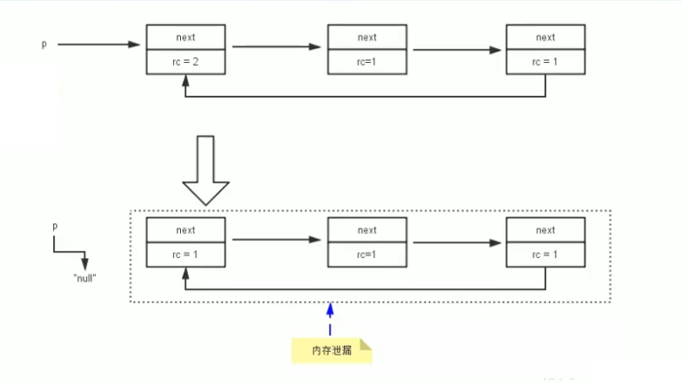

**eg：**

```
/**
 * -XX:+PrintGCDetails
 * 证明：Java 使用的不是引用计数算法
*/
public class RefCountGC {
    // 这个成员唯一的作用就是占用一点内存
    private byte[] bigSize = new byte[5 * 1024 * 1024];

    Object reference = null;

    public static void main(String[] args) {
        RefCountGC obj1 = new RefCountGC();
        RefCountGC obj2 = new RefCountGC();

        obj1.reference = obj2;
        obj2.reference = obj1;

        obj1 = null;
        obj2 = null;
        // 显示的执行垃圾回收行为
        // 这里发生GC，obj1 和 obj2 能否被回收？
        System.gc();
    }
}

```

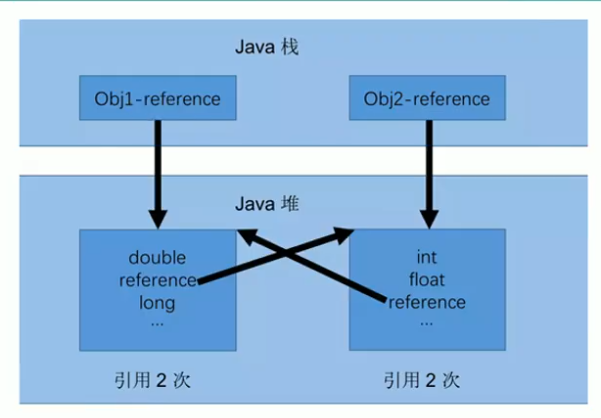
 如果不小心直接把 Obj1-reference 和 Obj2-reference 置 null。则在 Java 堆当中的两块内存依然保持着互相引用，无法回收。

**小结：**

- 引用计数算法，是很多语言的资源回收选择，例如因人工智能而更加火热的 Python，它更是同时支持引用计数和垃圾收集机制。

- 具体哪种最优，是要看场景的，业界有大规模实践中仅保留引用计数机制，以提高吞吐量的尝试。

- Java 并没有选择引用计数，是因为其存在一个基本的难题，也就是很难处理循环引用关系。

- Python 如何解决循环引用？

  - 手动接触：很好理解，就是在合适的时机，解除引用关系。

  - 使用弱引用 weakref，weakref 是 Python 提供的标准库，旨在解决循环引用。

#### 1.2. 标记阶段：可达性分析算法

**方式二：** 引用计数算法（或根搜索算法、追踪性垃圾收集）

-
相对于引用计数算法而言，可达性分析算法不仅同样具备实现简单和执行高效等特点，更重要的是该算法可以有效地*解决在引用计数算法中循环引用的问题，防止内存泄漏的发生*。

-
相较于引用计数算法，这里的可达性分析就是 **Java、C# 选择的**。这种类型的垃圾收集器通常也叫作*追踪性垃圾收集（Tracing Garbage Collection）*。

-
所谓的”GC Roots“根集合就是一组必须活跃的引用。

-
基本思路：

  - 可达性分析算法是以根对象集合（GC Roots）为起始点，按照从上至下的方式*搜索被根对象集合所连接的目标对象是否可达*。

  - 使用可达性分析算法后，内存中的存活对象都会被根节点集合直接或间接连接着，搜索所走过的路径称为**引用链（Reference Chain）**

  - 如果目标对象没有任何引用链相连，则是不可达的，就意味着该对象已经死亡，可以标记为垃圾对象。

  - 在可达性分析算法中，只有能够被根对象集合直接或间接连接的对象才是存活对象。
 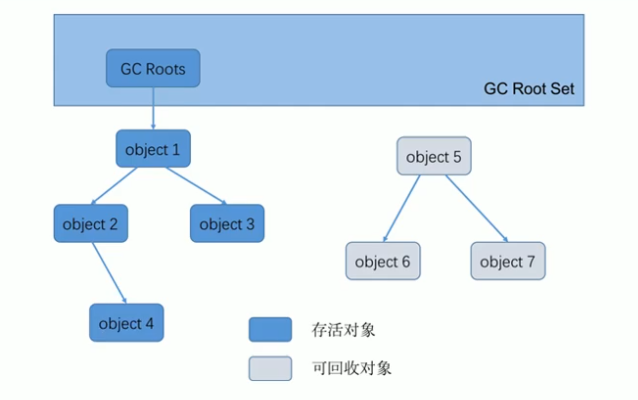
 这个算法目前较为常用。

#### GC Roots

**在 Java 语言中，GC Roots 包括以下几类元素：**

- 虚拟机栈中引用的对象

  - 比如：各个线程被调用的方法中使用到的参数、局部变量等。

- 本地方法栈内 JNI（通常说的本地方法）引用的对象

- 方法区中类静态属性引用的对象

  - 比如：Java 类的引用类型静态变量

- 方法区中常量引用的对象

  - 比如：字符串常量池（String Table）里的引用

- 所有被同步锁 synchronized 持有的对象

- Java 虚拟机内部的引用

  - 基本数据类型对应的 Class 对象，一些常驻的异常对象（如：NullPointerException、OutOfMemoryError），系统类加载器等。

- 反映 Java 虚拟机内部情况的 JMXBean、JVMTI 中注册的回调、本地代码缓存等。
 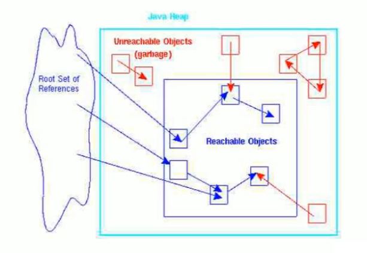

- 除了这些固定的 GC Roots 集合以外，根据用户所选用的垃圾收集器以及当前回收的内存区域不同，还可以有其他对象”临时性“地加入，共同构成完整 GC Roots 集合。比如：分代收集和局部回收（Partial GC）。

  - 如果只针对 Java 堆中的某一块区域进行垃圾回收（比如：典型的只针对新生代），必须考虑到内存区域是虚拟机自己的实现细节，更不是孤立封闭的，这个区域的对象完全有可能被其他区域的对象所引用，这时候就需要一并将关联的区域对象也加入 GC Roots 集合中去考虑，才能保证可达性分析的准确性。

- 小技巧：
 由于 Root 采用栈方式存放变量和指针，所以如果一个指针，它保存了堆内存里面的对象，但是自己又不存放在堆内存里面，那它就是一个 Root。

**注意：**

- 如果要使用可达性分析算法来判断内存是否可回收，那么分析工作必须在一个能保障一致性的快照中进行。这点不满足的话分析结果的准确性就无法保证。

- 这点也是导致 GC 进行时必须”stop the world“的一个重要原因。

  - 即使是号称（几乎）不会发生停顿的 CMS 收集器中，**枚举根节点时也是必须要停顿的。**

### 2. 对象的 finalization 机制

- Java 语言提供了对象终止（finalization）机制来允许开发人员提供*对象被销毁之前的自定义处理逻辑*。

- 当垃圾回收器发现没有引用指向一个对象，即：垃圾回收此对象之前，总会先调用这个对象的 finalize() 方法。

- finalize() 方法允许在子类中被重写，*用于在对象被回收时进行资源释放*。通常在这个方法中进行一些资源释放和清理的工作，比如关闭文件、套接字和数据库连接等。

- 永远不要主动调用某个对象的 finalize() 方法，应该交给垃圾回收机制调用。理由包括下面三点：

  - 在 finalize() 时可能会导致对象复活。

  - finalize() 方法的执行时间是没有保障的，它完全由 GC 线程决定，极端情况下，若不发生 GC，则 finalize() 方法将没有执行机会。

- 从功能上来说，finalize() 方法与 C++ 中的析构函数比较相似，但是 Java 采用的是基于垃圾回收器的自动内存管理机制，所以 finalize() 方法在本质上不同于 C++ 中的析构函数。

- 由于 finalize() 方法的存在，*虚拟机中的对象一般处于三种可能的状态*。

**生存还是死亡？**

- 如果从所有的根节点都无法访问到某个对象，说明对象已经不再使用了。一般来说，此对象需要被回收。但事实上，也并非是“非死不可”的，这时候它们暂时处于“缓刑”阶段。**一个无法触及的对象有可能在某一条件下“复活”自己**，如果这样，那么对它的回收就是不合理的，为此，定义虚拟机中的对象可能的三种状态。如下：

  - **可触及的：** 从根节点开始，可以到达这个对象。

  - **可复活的：** 对象的所有引用都被释放，但是对象有可能在 finalize() 中复活。

  - **不可触及的：** 对象的 finalize() 被调用，并且没有复活，那么就会进入不可触及状态。不可触及的对象不可能被复活，因为 *finalize() 方法只会被调用一次*。

- 以上三种状态中，是由于 finalize() 方法的存在，进行的区分。只有在对象不可触及时才可以被回收。

**具体过程：**
 判断一个对象 objA 是否可回收，至少要经历两次标记过程：

1. 如果对象 objA 到 GC Roots 没有引用链，则进行第一次标记。

1. 进行筛选，判断此对象是否有必要执行 finalize() 方法
 ① 如果对象 objA 没有重写 finalize() 方法，或者 finalize() 方法已经被虚拟机调用过，则虚拟机视为”没有必要执行“，objA 被判定为不可触及的。
 ② 如果对象 objA 重写了 fialize() 方法，且还未执行过，那么 objA 会被插入到 F-Queue 队列中，有一个虚拟机自动创建的、低优先级的 Finalizer 线程触发器 finalize() 方法执行。
 ③ **finalize() 方法是对象逃脱死亡的最后机会**，稍后 GC 会对 F-Queue 队列中的对象进行第二次标记。如果 objA 在 finalize() 方法中与引用链上的任何一个对象建立了联系，那么在第二次标记时，objA 会被移出”即将回收“集合。之后，对象会再次出现没有引用存在的情况。在这个情况下，finalize 方法不会被再次调用，对象会直接变成不可触及的状态，也就是说，一个对象的 finalize 方法只会被调用一次。

**eg：**

```
/**
 * 测试 Object 类中 finalize() 方法，即对象的 finalization 机制。
 */
public class CanReliveObj {
    public static CanReliveObj obj;     // 类变量，属于 GC Root

    // 此方法只能被调用一次
    @Override
    protected void finalize() throws Throwable {
        super.finalize();
        System.out.println("调用当前类重写的 finalize() 方法");
        obj = this; // 当前待回收的对象在 finalize() 方法中与引用链上的一个对象 obj 建立了联系
    }

    public static void main(String[] args) {
        try {
            obj = new CanReliveObj();
            // 对象第一次成功拯救自己
            obj = null;
            System.gc();
            System.out.println("第一次 gc");
            // 因为 Finalizer 线程优先级很低，暂停 2 秒，以等待它
            Thread.sleep(2000);
            if (obj == null) {
                System.out.println("obj is dead");
            } else {
                System.out.println("obj is still alive");
            }
            System.out.println("第二次 gc");
            // 下面这段代码与上面的完全相同，但是这次自救却失败了
            obj = null;
            System.gc();
            // 因为 Finalizer 线程优先级很低，暂停 2 秒，以等待它
            Thread.sleep(2000);
            if (obj == null) {
                System.out.println("obj is dead");
            } else {
                System.out.println("obj is still alive");
            }
        } catch (Exception e) {
            e.printStackTrace();
        }
    }
}

```

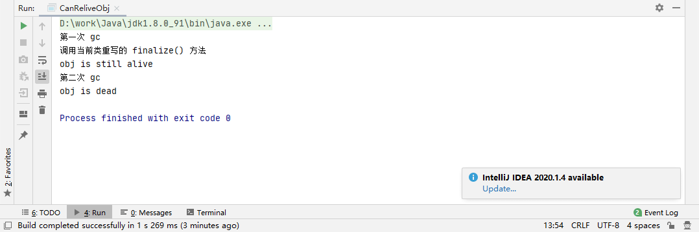

### 3. MAT 与 JProfiler 的 GC Roots 溯源

#### MAT

MAT 是 Memory Analyzer 的简称，它是一款功能强大的 Java 堆内存分析器。用于查找内存泄漏以及查看内存消耗情况。
 MAT 是基于 Eclipse 开发的，是一款免费的性能分析工具。
 可以在 http://www.eclipse.org/mat/ 下载并使用 MAT。
 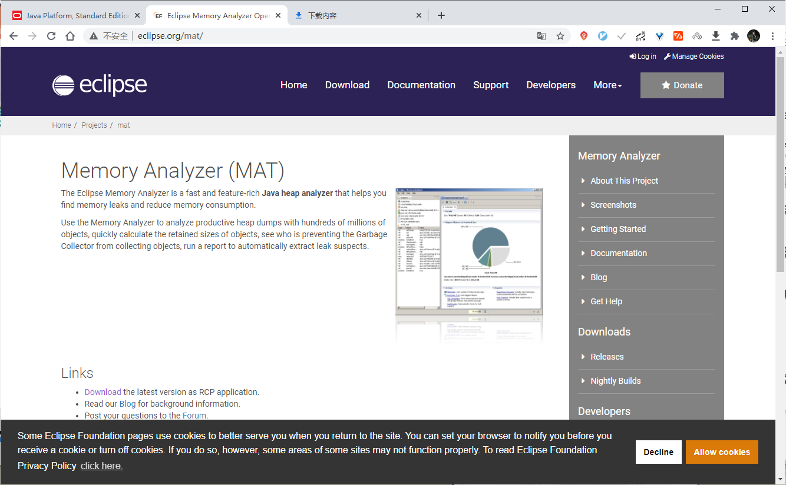

##### 获取 dump 文件

**方式一：** 命令行使用 jmap
 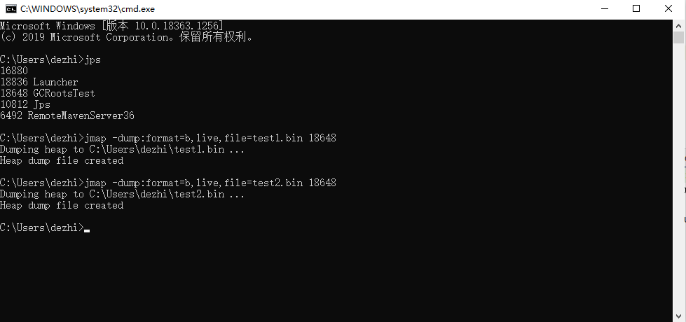

**方式二：** 使用 JVisualVM 导出

- 捕获的 heap dump 文件是一个临时文件，关闭 JVisualVM 后自动删除，若要保留，需要将其另存为文件。

- 可通过以下方法捕获 heap dump：

  - 在左侧”Application”（应用程序）子窗口中右击相应的应用程序，选择 Heap Dump（堆Dump）。

  - 在 Monitor（监视）子标签页中点击 Heap Dump（堆Dump）按钮。

- 本地应用程序的 Heap dumps 作为应用程序标签页的一个子标签页打开。同时，heap dump 的左侧 Application（应用程序）栏中对应一个含有时间戳的节点。右击这个节点选择 save as（另存为）即可将 heap dump 保存到本地。
 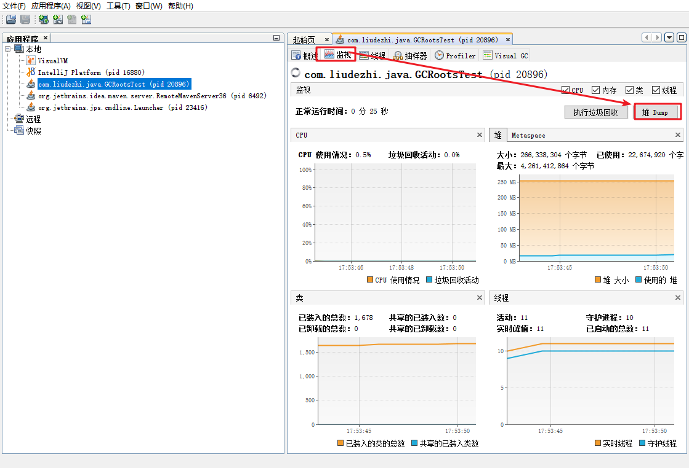
 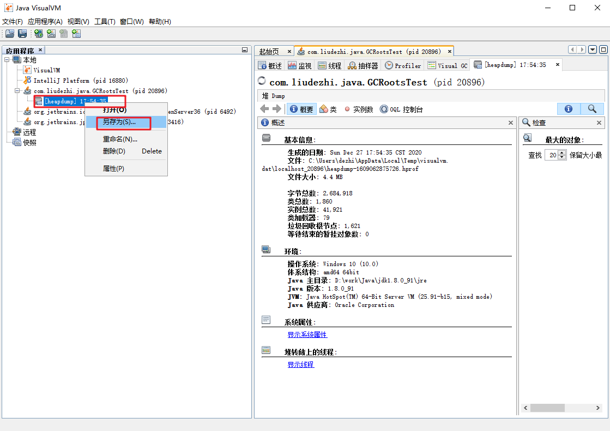

##### Eclipse GC Roots 说明

>
https://help.eclipse.org/2020-12/index.jsp
 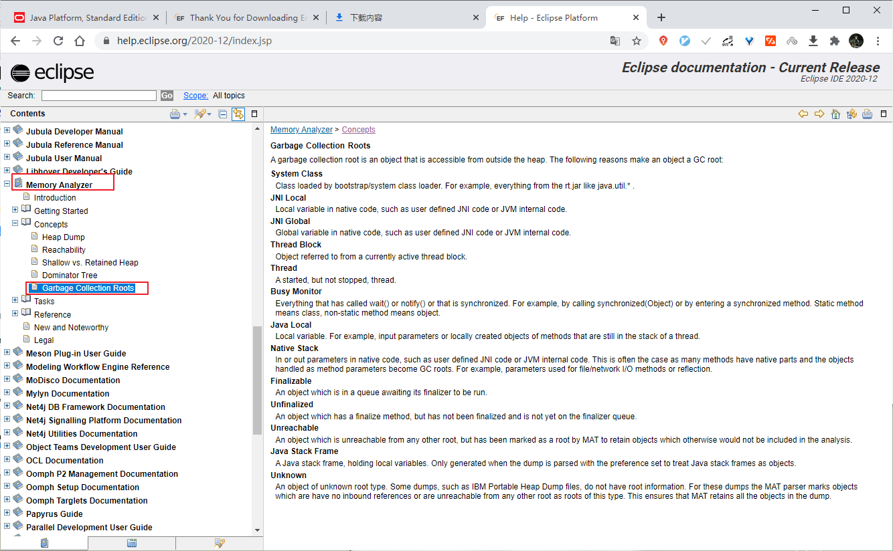

**Eclipse Memory Analyzer 查看 jVisualVm 导出的文件**
 File -> Open File...
 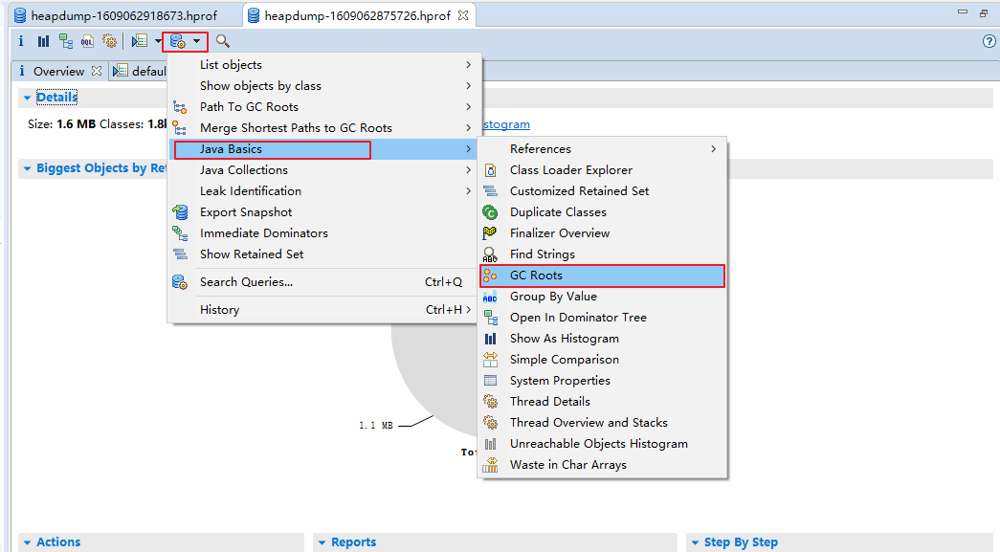
 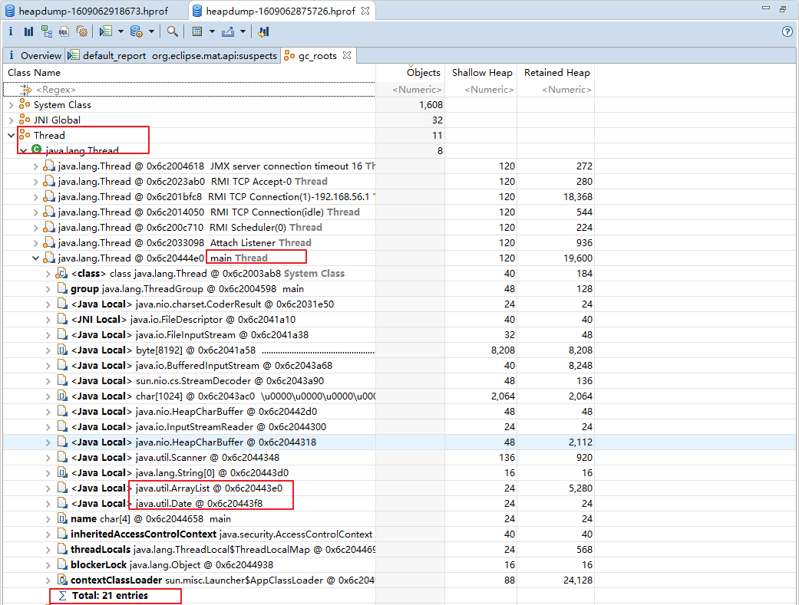
 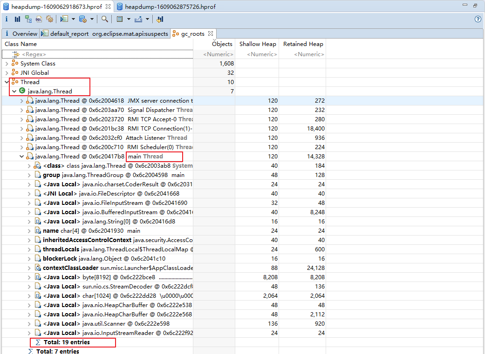

#### JProfiler 的 GC Roots 溯源

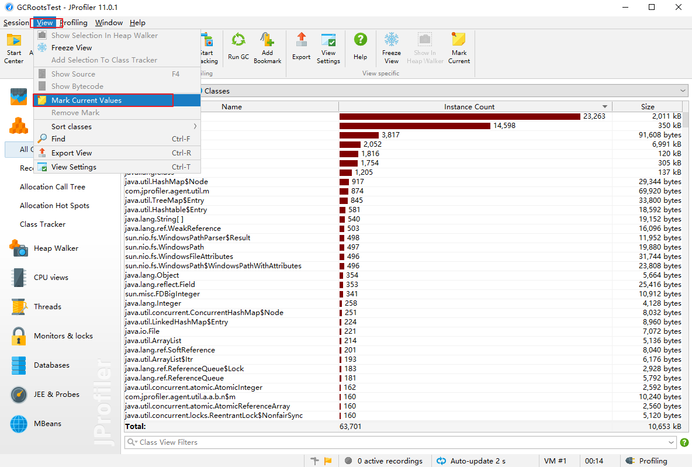
 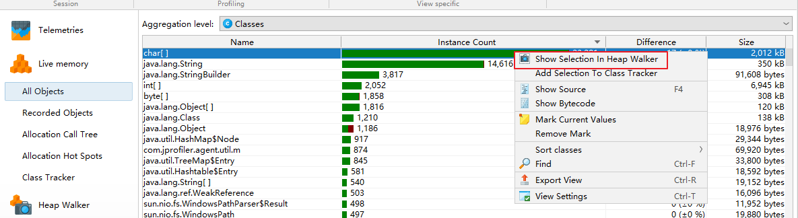
 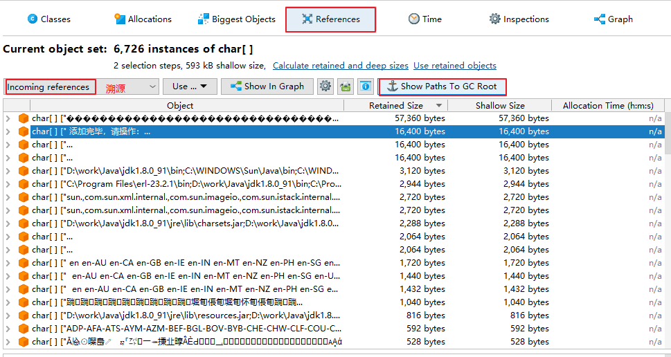
 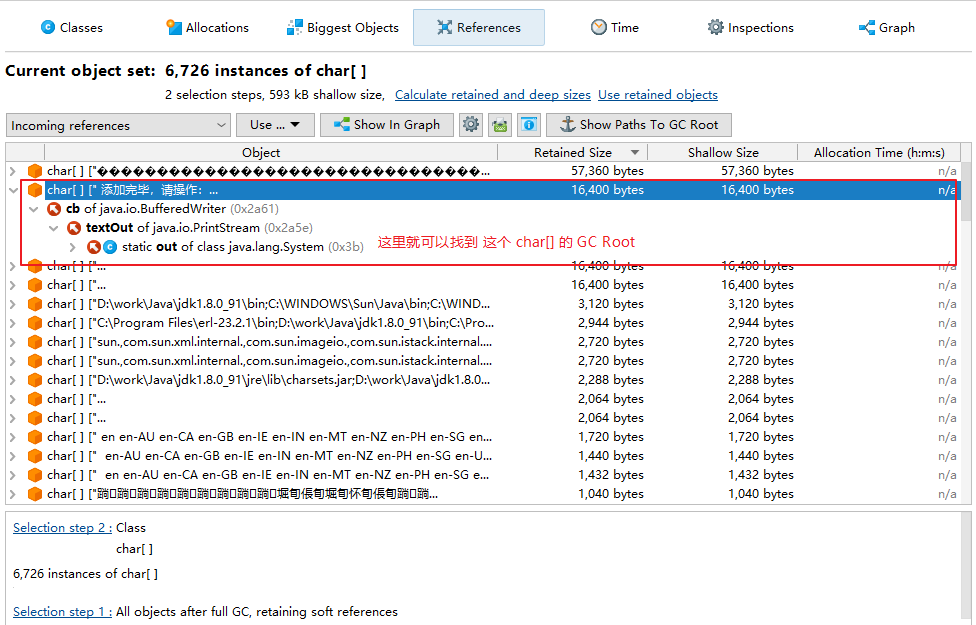

**eg：OOM 查看**

```
/**
 * -Xms8m -Xmx8m -XX:+HeapDumpOnOutOfMemoryError(出现 OOM error 时，生成堆空间的 dump 文件)
 */
public class HeapOOM {
    byte[] buffer = new byte[1 * 1024 * 1024];  // 1MB

    public static void main(String[] args) {
        List<HeapOOM> list = new ArrayList<>();

        int count = 0;
        try {
            while (true) {
                list.add(new HeapOOM());
            }
        } catch (Throwable e) {
            System.out.println("count = " + count);
            e.printStackTrace();
        }
    }
}

```

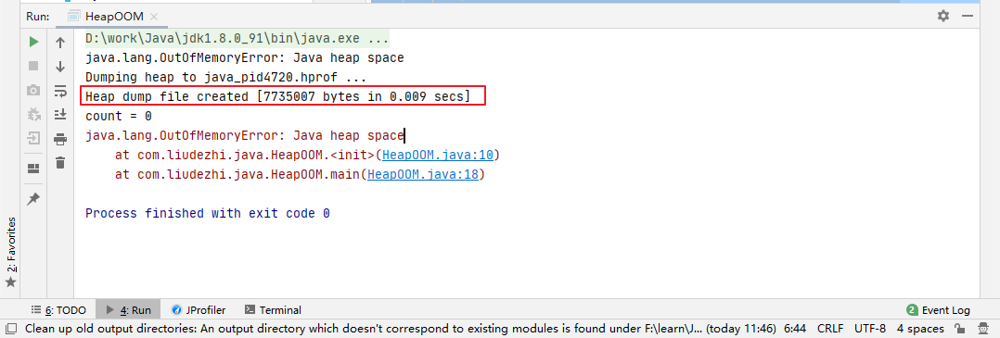
 dump 文件默认位置：当前 module 所在目录下
 直接双击即可使用 JProfiler 打开
 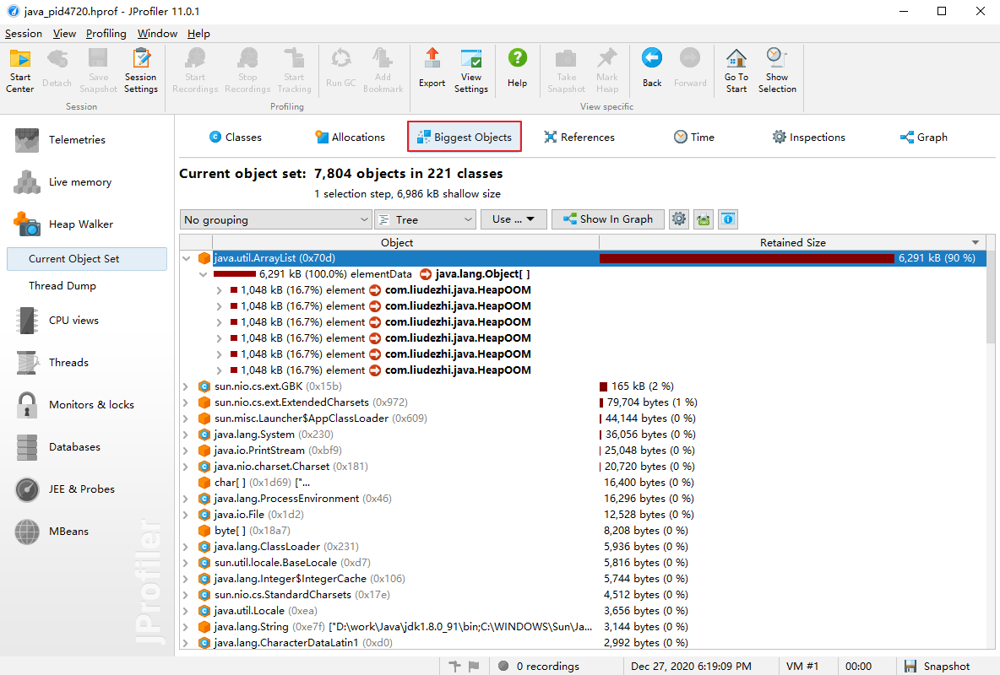

### 4. 垃圾清除阶段

当成功区分出内存中存活对象和死亡对象后，GC 接下来的任务就是执行垃圾回收，释放掉无用对象所占用的内存空间，以便有足够的可用内存空间为新对象分配内存。

目前在 JVM 中比较常见的三种垃圾收集算法是标记-清除算法（Mark-Sweep）、复制算法（Copying）、标记-压缩算法（Mark-Compact）。

#### 4.1. 标记-清除（Mark-Sweep）算法

**背景：**
 标记-清除算法（Mark-Sweep）是一种非常基础和常见的垃圾收集算法，该算法被 J.McCarthy 等人在 1960 年提出并应用于 Lisp 语言。

**执行过程：**
 当堆中的有效内存空间（available memory）被耗尽的时候，就会停止整个程序（也被称为 stop the world），然后进行两项工作，第一项则是标记，第二项则是清除。

- *标记：* Collector 从引用根节点开始遍历，标记所有被引用的对象。一般是在对象的 Header 中记录为可达节点。

- *清除：* Collector 对堆内存从头到尾进行线性的遍历，如果发现某个对象在其 Header 中没有标记为可达对象，则将其回收。
 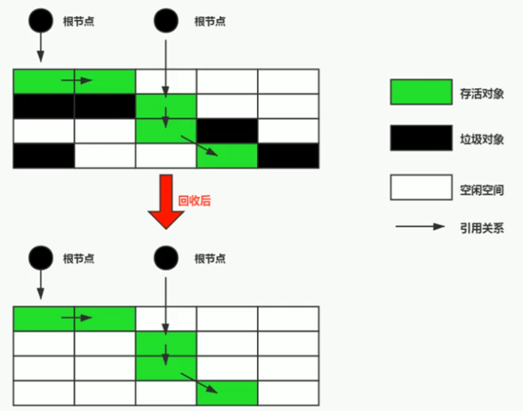

**缺点：**

- 效率不算高

- 在进行 GC 的时候，需要停止整个应用程序，导致用户体验差

- 这种方式清理出来的空闲内存是不连续的，产生内存碎片。需要维护一个**空闲列表**

**注意：何为清除？**
 这里所谓的清除并不是真的置空，而是把需要清除的对象地址保存在空闲的地址列表里。下次有新对象需要加载时，判断垃圾的位置空间是否足够，如果够，就存放。

#### 4.2. 复制（Copying）算法

**背景：**
 为了解决标记-清除算法在垃圾收集效率方面的缺陷，M.L.Minsky 于 1963 年发表了著名的论文，“使用双存储区的 Lisp 语言垃圾收集器 CA LISP Garbage Collector Algorithm Using Serial Secondary Storage）”。M.L.Minsky 在该论文中描述的算法被人们称为复制（Copying）算法，它也被 M.L.Minsky 本人成功地引入到了 Lisp 语言的一个实现版本中。

**核心思想：**
 将活着的内存空间非为两块，每次只使用其中一块，在垃圾回收时将正在使用的内存中的存活对象复制到未被使用的内存块中，之后清除正在使用的内存块中的所有对象，交换两个内存的角色，最后完成垃圾回收。
 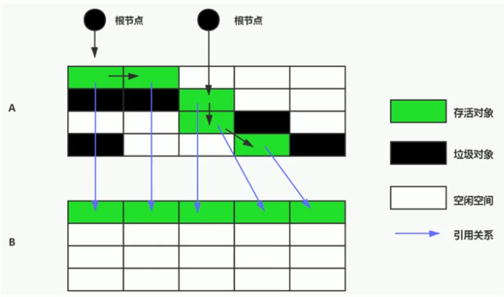

**优点：**

- 没有标记和清除过程，实现简单，运行高效

- 复制过去以后保证空间的连续性，不会出现“碎片”问题

**缺点：**

- 此算法的缺点也是很明显的，就是需要两倍的内存空间

- 对于 G1 这种拆分成大量的 region 的 GC，复制而不是移动，意味着 GC 需要维护 region 之间对象引用关系，不管是内存占用或者时间开销也不小

**特别的：**
 如果系统中的垃圾对象非常多，复制算法需要复制的存活对象数量并不会太大，或者说非常低才行

**应用场景：**
 在新生代，对常规应用的垃圾回收，一次通常可以回收 70%-99% 的内存空间。回收性价比很高。所以现在的商用虚拟机都是用这种收集算法回收新生代。

#### 4.3. 标记-压缩（或标记-整理、Mark-Compact）算法

**背景：**
 复制算法的高效性是建立在存活对象少、垃圾对象多的前提下的。这种情况在新生代经常发生，但是在老年代，更常见的是大部分对象都是存活对象。如果依然使用复制算法，由于存活对象较多，复制的成本也将很高。因此，**基于老年代垃圾回收的特性，需要使用其他的算法**。

标记-清除算法的确可以应用在老年代中，但是该算法不仅执行效率地下，而且在执行完内存回收后还会产生内存碎片，所以 JVM 的设计者需要在此基础之上进行改建。标记-压缩（Mark-COmpact）算法由此诞生。

1970年前后，G.L.Steele、C.J.Chene 和 D.S.Wise 等研究者发布标记-压缩算法。在许多现代的垃圾回收器中，人们都使用了标记-压缩算法或其改进版本。

**执行过程：**
 第一阶段和标记清除算法一样，从根节点开始标记所有被引用对象
 第二阶段将所有的存活对象压缩到内存的一端，按顺序排放。
 之后，清理边界外所有的空间。
 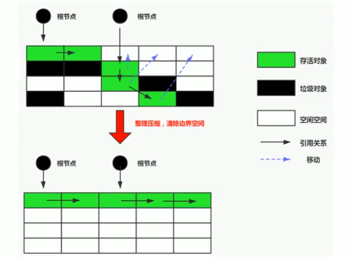
 标记-压缩算法的最终效果等同于标记-清除算法执行完之后，再进行一次内存碎片整理，因此，也可以把它称为**标记-清除-压缩（Mark-Sweep-Compact）算法。

二者的本质差异在于标记-清除算法是一种*非移动式的回收算法*，标记-压缩算法是*移动式的*。是否移动回收后的存活对象是一项优缺点并存的风险决策。

可以看到，标记的存活对象将会被整理，按照内存地址依次排列，而未被标记的内存会被清理掉。如此一来，当我们需要给新对象分配内存时，JVM 只需要持有一个内存的起始地址即可，这比维护一个空闲列表显然少了许多开销。

**优点：**

- 消除了标记-清除算法当中，内存区域分散的缺点，我们需要给新对象分配内存时，JVM 只需要持有一个内存的起始地址即可。

- 消除了复制算法当中，内存减半的高额代价。

**缺点：**

- 从效率上来说，标记-整理算法要低于复制算法。

- 移动对象的同时，如果对象被其他对象引用，则还需要调整引用的地址。

- 移动的过程中，需要完全暂停用户应用程序。即：STW

### 5. 小结

**对比三种算法**

 |  | Mark-Sweep | Mark-Compact | Copying
 | 速度 | 中等 | 最慢 | 最快
 | 空间开销 | 少（但会堆积碎片） | 少（不堆积碎片） | 通常需要活对象2倍大小（不堆积碎片）
 | 移动对象 | 否 | 是 | 是

效率上来说，复制算法是当之无愧的老大，但是却浪费了太多的内存。

而为了尽量兼顾上面提到的三个指标，标记-整理算法相对来说更平滑一些，但是效率上不尽如任意，它比复制算法多了一个标记的阶段，比标记-清除多了一个整理内存的阶段。

### 6. 清除阶段：分代收集算法

### 7. 清除阶段：增量收集算法、分区算法

%23%23%20%E5%9E%83%E5%9C%BE%E5%9B%9E%E6%94%B6%E7%9A%84%E7%AE%97%E6%B3%95%0A%23%23%23%201.%20%E5%9E%83%E5%9C%BE%E6%A0%87%E8%AE%B0%E9%98%B6%E6%AE%B5%E7%9A%84%E7%AE%97%E6%B3%95%EF%BC%88%E6%A0%87%E8%AE%B0%E9%98%B6%E6%AE%B5%EF%BC%89%0A**%E5%AF%B9%E8%B1%A1%E5%AD%98%E6%B4%BB%E5%88%A4%E6%96%AD**%0A-%20%E5%9C%A8%E5%A0%86%E9%87%8C%E5%AD%98%E6%94%BE%E7%9D%80%E5%87%A0%E4%B9%8E%E6%89%80%E6%9C%89%E7%9A%84%20Java%20%E5%AF%B9%E8%B1%A1%E5%AE%9E%E4%BE%8B%EF%BC%8C%E5%9C%A8%20GC%20%E6%89%A7%E8%A1%8C%E5%9E%83%E5%9C%BE%E5%9B%9E%E6%94%B6%E4%B9%8B%E5%89%8D%EF%BC%8C%E9%A6%96%E5%85%88*%E9%9C%80%E8%A6%81%E5%88%86%E5%87%BA%E5%86%85%E5%AD%98%E4%B8%AD%E5%93%AA%E4%BA%9B%E6%98%AF%E5%AD%98%E6%B4%BB%E5%AF%B9%E8%B1%A1%EF%BC%8C%E5%93%AA%E4%BA%9B%E6%98%AF%E5%B7%B2%E7%BB%8F%E6%AD%BB%E4%BA%A1%E7%9A%84%E5%AF%B9%E8%B1%A1*%E3%80%82%E5%8F%AA%E6%9C%89%E8%A2%AB%E6%A0%87%E8%AE%B0%E4%B8%BA%E5%B7%B2%E7%BB%8F%E6%AD%BB%E4%BA%A1%E7%9A%84%E5%AF%B9%E8%B1%A1%EF%BC%8CGC%20%E6%89%8D%E4%BC%9A%E5%9C%A8%E6%89%A7%E8%A1%8C%E5%9E%83%E5%9C%BE%E5%9B%9E%E6%94%B6%E7%9A%84%E6%97%B6%E5%80%99%EF%BC%8C%E9%87%8A%E6%94%BE%E6%8E%89%E5%85%B6%E6%89%80%E5%8D%A0%E7%9A%84%E5%86%85%E5%AD%98%E7%A9%BA%E9%97%B4%EF%BC%8C%E5%9B%A0%E6%AD%A4%E8%BF%99%E4%B8%AA%E8%BF%87%E7%A8%8B%E6%88%91%E4%BB%AC%E5%8F%AF%E4%BB%A5%E7%A7%B0%E4%B8%BA*%E5%9E%83%E5%9C%BE%E6%A0%87%E8%AE%B0%E9%98%B6%E6%AE%B5*%E3%80%82%0A-%20%E9%82%A3%E4%B9%88%E5%9C%A8%20JVM%20%E4%B8%AD%E7%A9%B6%E7%AB%9F%E6%98%AF%E5%A6%82%E4%BD%95%E6%A0%87%E8%AE%B0%E4%B8%80%E4%B8%AA%E5%AF%B9%E8%B1%A1%E6%AD%BB%E4%BA%A1%E5%91%A2%EF%BC%9F%E7%AE%80%E5%8D%95%E6%9D%A5%E8%AF%B4%EF%BC%8C%E5%BD%93%E4%B8%80%E4%B8%AA%E5%AF%B9%E8%B1%A1%E5%B7%B2%E7%BB%8F%E4%B8%8D%E5%86%8D%E8%A2%AB%E4%BB%BB%E4%BD%95%E7%9A%84%E5%AD%98%E6%B4%BB%E5%AF%B9%E8%B1%A1%E7%BB%A7%E7%BB%AD%E5%BC%95%E7%94%A8%E6%97%B6%EF%BC%8C%E5%B0%B1%E5%8F%AF%E4%BB%A5%E5%AE%A3%E5%88%A4%E4%B8%BA%E5%B7%B2%E7%BB%8F%E6%AD%BB%E4%BA%A1%E3%80%82%0A-%20%E5%88%A4%E6%96%AD%E5%AF%B9%E8%B1%A1%E5%AD%98%E6%B4%BB%E4%B8%80%E8%88%AC%E6%9C%89%E4%B8%A4%E7%A7%8D%E6%96%B9%E5%BC%8F%EF%BC%9A**%E5%BC%95%E7%94%A8%E8%AE%A1%E6%95%B0%E7%AE%97%E6%B3%95**%E5%92%8C**%E5%8F%AF%E8%BE%BE%E6%80%A7%E5%88%86%E6%9E%90%E7%AE%97%E6%B3%95**%E3%80%82%0A%0A%23%23%23%23%201.1.%E5%BC%95%E7%94%A8%E8%AE%A1%E6%95%B0%E7%AE%97%E6%B3%95%0A-%20%E5%BC%95%E7%94%A8%E8%AE%A1%E6%95%B0%E7%AE%97%E6%B3%95%EF%BC%88Reference%20Counting%EF%BC%89%E6%AF%94%E8%BE%83%E7%AE%80%E5%8D%95%EF%BC%8C%E5%AF%B9%E6%AF%8F%E4%B8%AA%E5%AF%B9%E8%B1%A1%E4%BF%9D%E5%AD%98%E4%B8%80%E4%B8%AA%E6%95%B4%E5%BD%A2%E7%9A%84**%E5%BC%95%E7%94%A8%E8%AE%A1%E6%95%B0%E5%99%A8%E5%B1%9E%E6%80%A7%E3%80%82%E7%94%A8%E4%BA%8E%E8%AE%B0%E5%BD%95%E5%AF%B9%E8%B1%A1%E8%A2%AB%E5%BC%95%E7%94%A8%E7%9A%84%E6%83%85%E5%86%B5**%E3%80%82%0A-%20%E5%AF%B9%E4%BA%8E%E4%B8%80%E4%B8%AA%E5%AF%B9%E8%B1%A1A%EF%BC%8C%E5%8F%AA%E8%A6%81%E6%9C%89%E4%BB%BB%E4%BD%95%E4%B8%80%E4%B8%AA%E5%AF%B9%E8%B1%A1%E5%BC%95%E7%94%A8%E4%BA%86A%EF%BC%8C%E5%88%99A%E7%9A%84%E5%BC%95%E7%94%A8%E8%AE%A1%E6%95%B0%E5%99%A8%E5%B0%B1%E5%8A%A01%EF%BC%9B%E5%BD%93%E5%BC%95%E7%94%A8%E5%A4%B1%E6%95%88%E6%97%B6%EF%BC%8C%E5%BC%95%E7%94%A8%E8%AE%A1%E6%95%B0%E5%99%A8%E5%B0%B1%E5%87%8F1.%E5%8F%AA%E8%A6%81%E5%AF%B9%E8%B1%A1A%E7%9A%84%E5%BC%95%E7%94%A8%E8%AE%A1%E6%95%B0%E5%99%A8%E7%9A%84%E5%80%BC%E4%B8%BA0%EF%BC%8C%E5%8D%B3%E8%A1%A8%E7%A4%BA%E5%AF%B9%E8%B1%A1A%20%E4%B8%8D%E5%8F%AF%E8%83%BD%E8%A2%AB%E5%86%8D%E6%AC%A1%E4%BD%BF%E7%94%A8%EF%BC%8C%E5%8F%AF%E8%BF%9B%E8%A1%8C%E5%9B%9E%E6%94%B6%E3%80%82%0A-%20%E4%BC%98%E7%82%B9%EF%BC%9A*%E5%AE%9E%E7%8E%B0%E7%AE%80%E5%8D%95%EF%BC%8C%E5%9E%83%E5%9C%BE%E5%AF%B9%E8%B1%A1%E4%BE%BF%E4%BA%8E%E8%BE%A8%E8%AF%86%EF%BC%9B%E5%88%A4%E5%AE%9A%E6%95%88%E7%8E%87%E9%AB%98%EF%BC%8C%E5%9B%9E%E6%94%B6%E6%B2%A1%E6%9C%89%E5%BB%B6%E8%BF%9F%E6%80%A7*%E3%80%82%0A-%20%E7%BC%BA%E7%82%B9%EF%BC%9A%0A%20%20%20%20-%20%E5%AE%83%E9%9C%80%E8%A6%81%E5%8D%95%E7%8B%AC%E7%9A%84%E5%AD%97%E6%AE%B5%E5%AD%98%E5%82%A8%E8%AE%A1%E6%95%B0%E5%99%A8%EF%BC%8C%E8%BF%99%E6%A0%B7%E7%9A%84%E5%81%9A%E6%B3%95%E5%A2%9E%E5%8A%A0%E4%BA%86%E5%AD%98%E5%82%A8%E7%A9%BA%E9%97%B4%E7%9A%84%E5%BC%80%E9%94%80%E3%80%82%0A%20%20%20%20-%20%E6%AF%8F%E6%AC%A1%E8%B5%8B%E5%80%BC%E9%83%BD%E9%9C%80%E8%A6%81%E6%9B%B4%E6%96%B0%E8%AE%A1%E6%95%B0%E5%99%A8%EF%BC%8C%E4%BC%B4%E9%9A%8F%E7%9D%80%E5%8A%A0%E6%B3%95%E5%92%8C%E5%87%8F%E6%B3%95%E6%93%8D%E4%BD%9C%EF%BC%8C%E8%BF%99%E5%A2%9E%E5%8A%A0%E4%BA%86*%E6%97%B6%E9%97%B4%E5%BC%80%E9%94%80*%E3%80%82%0A%20%20%20%20-%20%E5%BC%95%E7%94%A8%E8%AE%A1%E6%95%B0%E5%99%A8%E6%9C%89%E4%B8%80%E4%B8%AA%E4%B8%A5%E9%87%8D%E7%9A%84%E9%97%AE%E9%A2%98%EF%BC%8C%E5%8D%B3*%E6%97%A0%E6%B3%95%E5%A4%84%E7%90%86%E5%BE%AA%E7%8E%AF%E5%BC%95%E7%94%A8*%E7%9A%84%E6%83%85%E5%86%B5%E3%80%82%E8%BF%99%E6%98%AF%E4%B8%80%E6%9D%A1%E8%87%B4%E5%91%BD%E7%BC%BA%E9%99%B7%EF%BC%8C%E5%AF%BC%E8%87%B4%E5%9C%A8%20Java%20%E7%9A%84%E5%9E%83%E5%9C%BE%E5%9B%9E%E6%94%B6%E5%99%A8%E4%B8%AD%E6%B2%A1%E6%9C%89%E4%BD%BF%E7%94%A8%E8%BF%99%E7%B1%BB%E7%AE%97%E6%B3%95%0A%0A**%E5%BE%AA%E7%8E%AF%E5%BC%95%E7%94%A8%EF%BC%9A**%0A!%5B24d98eebef5f8dd1778f802f4e6aacc8.png%5D(en-resource%3A%2F%2Fdatabase%2F5092%3A1)%0A%0A**eg%EF%BC%9A**%0A%60%60%60java%0A%2F**%0A%20*%20-XX%3A%2BPrintGCDetails%0A%20*%20%E8%AF%81%E6%98%8E%EF%BC%9AJava%20%E4%BD%BF%E7%94%A8%E7%9A%84%E4%B8%8D%E6%98%AF%E5%BC%95%E7%94%A8%E8%AE%A1%E6%95%B0%E7%AE%97%E6%B3%95%0A*%2F%0Apublic%20class%20RefCountGC%20%7B%0A%20%20%20%20%2F%2F%20%E8%BF%99%E4%B8%AA%E6%88%90%E5%91%98%E5%94%AF%E4%B8%80%E7%9A%84%E4%BD%9C%E7%94%A8%E5%B0%B1%E6%98%AF%E5%8D%A0%E7%94%A8%E4%B8%80%E7%82%B9%E5%86%85%E5%AD%98%0A%20%20%20%20private%20byte%5B%5D%20bigSize%20%3D%20new%20byte%5B5%20*%201024%20*%201024%5D%3B%0A%0A%20%20%20%20Object%20reference%20%3D%20null%3B%0A%0A%20%20%20%20public%20static%20void%20main(String%5B%5D%20args)%20%7B%0A%20%20%20%20%20%20%20%20RefCountGC%20obj1%20%3D%20new%20RefCountGC()%3B%0A%20%20%20%20%20%20%20%20RefCountGC%20obj2%20%3D%20new%20RefCountGC()%3B%0A%0A%20%20%20%20%20%20%20%20obj1.reference%20%3D%20obj2%3B%0A%20%20%20%20%20%20%20%20obj2.reference%20%3D%20obj1%3B%0A%0A%20%20%20%20%20%20%20%20obj1%20%3D%20null%3B%0A%20%20%20%20%20%20%20%20obj2%20%3D%20null%3B%0A%20%20%20%20%20%20%20%20%2F%2F%20%E6%98%BE%E7%A4%BA%E7%9A%84%E6%89%A7%E8%A1%8C%E5%9E%83%E5%9C%BE%E5%9B%9E%E6%94%B6%E8%A1%8C%E4%B8%BA%0A%20%20%20%20%20%20%20%20%2F%2F%20%E8%BF%99%E9%87%8C%E5%8F%91%E7%94%9FGC%EF%BC%8Cobj1%20%E5%92%8C%20obj2%20%E8%83%BD%E5%90%A6%E8%A2%AB%E5%9B%9E%E6%94%B6%EF%BC%9F%0A%20%20%20%20%20%20%20%20System.gc()%3B%0A%20%20%20%20%7D%0A%7D%0A%60%60%60%0A!%5B8ec56c84ad2d2fce00e92649a876d29d.png%5D(en-resource%3A%2F%2Fdatabase%2F5094%3A1)%0A%E5%A6%82%E6%9E%9C%E4%B8%8D%E5%B0%8F%E5%BF%83%E7%9B%B4%E6%8E%A5%E6%8A%8A%20Obj1-reference%20%E5%92%8C%20Obj2-reference%20%E7%BD%AE%20null%E3%80%82%E5%88%99%E5%9C%A8%20Java%20%E5%A0%86%E5%BD%93%E4%B8%AD%E7%9A%84%E4%B8%A4%E5%9D%97%E5%86%85%E5%AD%98%E4%BE%9D%E7%84%B6%E4%BF%9D%E6%8C%81%E7%9D%80%E4%BA%92%E7%9B%B8%E5%BC%95%E7%94%A8%EF%BC%8C%E6%97%A0%E6%B3%95%E5%9B%9E%E6%94%B6%E3%80%82%0A%0A**%E5%B0%8F%E7%BB%93%EF%BC%9A**%0A-%20%E5%BC%95%E7%94%A8%E8%AE%A1%E6%95%B0%E7%AE%97%E6%B3%95%EF%BC%8C%E6%98%AF%E5%BE%88%E5%A4%9A%E8%AF%AD%E8%A8%80%E7%9A%84%E8%B5%84%E6%BA%90%E5%9B%9E%E6%94%B6%E9%80%89%E6%8B%A9%EF%BC%8C%E4%BE%8B%E5%A6%82%E5%9B%A0%E4%BA%BA%E5%B7%A5%E6%99%BA%E8%83%BD%E8%80%8C%E6%9B%B4%E5%8A%A0%E7%81%AB%E7%83%AD%E7%9A%84%20Python%EF%BC%8C%E5%AE%83%E6%9B%B4%E6%98%AF%E5%90%8C%E6%97%B6%E6%94%AF%E6%8C%81%E5%BC%95%E7%94%A8%E8%AE%A1%E6%95%B0%E5%92%8C%E5%9E%83%E5%9C%BE%E6%94%B6%E9%9B%86%E6%9C%BA%E5%88%B6%E3%80%82%0A-%20%E5%85%B7%E4%BD%93%E5%93%AA%E7%A7%8D%E6%9C%80%E4%BC%98%EF%BC%8C%E6%98%AF%E8%A6%81%E7%9C%8B%E5%9C%BA%E6%99%AF%E7%9A%84%EF%BC%8C%E4%B8%9A%E7%95%8C%E6%9C%89%E5%A4%A7%E8%A7%84%E6%A8%A1%E5%AE%9E%E8%B7%B5%E4%B8%AD%E4%BB%85%E4%BF%9D%E7%95%99%E5%BC%95%E7%94%A8%E8%AE%A1%E6%95%B0%E6%9C%BA%E5%88%B6%EF%BC%8C%E4%BB%A5%E6%8F%90%E9%AB%98%E5%90%9E%E5%90%90%E9%87%8F%E7%9A%84%E5%B0%9D%E8%AF%95%E3%80%82%0A-%20Java%20%E5%B9%B6%E6%B2%A1%E6%9C%89%E9%80%89%E6%8B%A9%E5%BC%95%E7%94%A8%E8%AE%A1%E6%95%B0%EF%BC%8C%E6%98%AF%E5%9B%A0%E4%B8%BA%E5%85%B6%E5%AD%98%E5%9C%A8%E4%B8%80%E4%B8%AA%E5%9F%BA%E6%9C%AC%E7%9A%84%E9%9A%BE%E9%A2%98%EF%BC%8C%E4%B9%9F%E5%B0%B1%E6%98%AF%E5%BE%88%E9%9A%BE%E5%A4%84%E7%90%86%E5%BE%AA%E7%8E%AF%E5%BC%95%E7%94%A8%E5%85%B3%E7%B3%BB%E3%80%82%0A-%20Python%20%E5%A6%82%E4%BD%95%E8%A7%A3%E5%86%B3%E5%BE%AA%E7%8E%AF%E5%BC%95%E7%94%A8%EF%BC%9F%0A%20%20%20%20-%20%E6%89%8B%E5%8A%A8%E6%8E%A5%E8%A7%A6%EF%BC%9A%E5%BE%88%E5%A5%BD%E7%90%86%E8%A7%A3%EF%BC%8C%E5%B0%B1%E6%98%AF%E5%9C%A8%E5%90%88%E9%80%82%E7%9A%84%E6%97%B6%E6%9C%BA%EF%BC%8C%E8%A7%A3%E9%99%A4%E5%BC%95%E7%94%A8%E5%85%B3%E7%B3%BB%E3%80%82%0A%20%20%20%20-%20%E4%BD%BF%E7%94%A8%E5%BC%B1%E5%BC%95%E7%94%A8%20weakref%EF%BC%8Cweakref%20%E6%98%AF%20Python%20%E6%8F%90%E4%BE%9B%E7%9A%84%E6%A0%87%E5%87%86%E5%BA%93%EF%BC%8C%E6%97%A8%E5%9C%A8%E8%A7%A3%E5%86%B3%E5%BE%AA%E7%8E%AF%E5%BC%95%E7%94%A8%E3%80%82%0A%0A%23%23%23%23%201.2.%20%E6%A0%87%E8%AE%B0%E9%98%B6%E6%AE%B5%EF%BC%9A%E5%8F%AF%E8%BE%BE%E6%80%A7%E5%88%86%E6%9E%90%E7%AE%97%E6%B3%95%0A**%E6%96%B9%E5%BC%8F%E4%BA%8C%EF%BC%9A**%20%E5%BC%95%E7%94%A8%E8%AE%A1%E6%95%B0%E7%AE%97%E6%B3%95%EF%BC%88%E6%88%96%E6%A0%B9%E6%90%9C%E7%B4%A2%E7%AE%97%E6%B3%95%E3%80%81%E8%BF%BD%E8%B8%AA%E6%80%A7%E5%9E%83%E5%9C%BE%E6%94%B6%E9%9B%86%EF%BC%89%0A-%20%E7%9B%B8%E5%AF%B9%E4%BA%8E%E5%BC%95%E7%94%A8%E8%AE%A1%E6%95%B0%E7%AE%97%E6%B3%95%E8%80%8C%E8%A8%80%EF%BC%8C%E5%8F%AF%E8%BE%BE%E6%80%A7%E5%88%86%E6%9E%90%E7%AE%97%E6%B3%95%E4%B8%8D%E4%BB%85%E5%90%8C%E6%A0%B7%E5%85%B7%E5%A4%87%E5%AE%9E%E7%8E%B0%E7%AE%80%E5%8D%95%E5%92%8C%E6%89%A7%E8%A1%8C%E9%AB%98%E6%95%88%E7%AD%89%E7%89%B9%E7%82%B9%EF%BC%8C%E6%9B%B4%E9%87%8D%E8%A6%81%E7%9A%84%E6%98%AF%E8%AF%A5%E7%AE%97%E6%B3%95%E5%8F%AF%E4%BB%A5%E6%9C%89%E6%95%88%E5%9C%B0*%E8%A7%A3%E5%86%B3%E5%9C%A8%E5%BC%95%E7%94%A8%E8%AE%A1%E6%95%B0%E7%AE%97%E6%B3%95%E4%B8%AD%E5%BE%AA%E7%8E%AF%E5%BC%95%E7%94%A8%E7%9A%84%E9%97%AE%E9%A2%98%EF%BC%8C%E9%98%B2%E6%AD%A2%E5%86%85%E5%AD%98%E6%B3%84%E6%BC%8F%E7%9A%84%E5%8F%91%E7%94%9F*%E3%80%82%0A-%20%E7%9B%B8%E8%BE%83%E4%BA%8E%E5%BC%95%E7%94%A8%E8%AE%A1%E6%95%B0%E7%AE%97%E6%B3%95%EF%BC%8C%E8%BF%99%E9%87%8C%E7%9A%84%E5%8F%AF%E8%BE%BE%E6%80%A7%E5%88%86%E6%9E%90%E5%B0%B1%E6%98%AF%20**Java%E3%80%81C%23%20%E9%80%89%E6%8B%A9%E7%9A%84**%E3%80%82%E8%BF%99%E7%A7%8D%E7%B1%BB%E5%9E%8B%E7%9A%84%E5%9E%83%E5%9C%BE%E6%94%B6%E9%9B%86%E5%99%A8%E9%80%9A%E5%B8%B8%E4%B9%9F%E5%8F%AB%E4%BD%9C*%E8%BF%BD%E8%B8%AA%E6%80%A7%E5%9E%83%E5%9C%BE%E6%94%B6%E9%9B%86%EF%BC%88Tracing%20Garbage%20Collection%EF%BC%89*%E3%80%82%0A%0A-%20%E6%89%80%E8%B0%93%E7%9A%84%E2%80%9DGC%20Roots%E2%80%9C%E6%A0%B9%E9%9B%86%E5%90%88%E5%B0%B1%E6%98%AF%E4%B8%80%E7%BB%84%E5%BF%85%E9%A1%BB%E6%B4%BB%E8%B7%83%E7%9A%84%E5%BC%95%E7%94%A8%E3%80%82%0A-%20%E5%9F%BA%E6%9C%AC%E6%80%9D%E8%B7%AF%EF%BC%9A%0A%20%20%20%20-%20%E5%8F%AF%E8%BE%BE%E6%80%A7%E5%88%86%E6%9E%90%E7%AE%97%E6%B3%95%E6%98%AF%E4%BB%A5%E6%A0%B9%E5%AF%B9%E8%B1%A1%E9%9B%86%E5%90%88%EF%BC%88GC%20Roots%EF%BC%89%E4%B8%BA%E8%B5%B7%E5%A7%8B%E7%82%B9%EF%BC%8C%E6%8C%89%E7%85%A7%E4%BB%8E%E4%B8%8A%E8%87%B3%E4%B8%8B%E7%9A%84%E6%96%B9%E5%BC%8F*%E6%90%9C%E7%B4%A2%E8%A2%AB%E6%A0%B9%E5%AF%B9%E8%B1%A1%E9%9B%86%E5%90%88%E6%89%80%E8%BF%9E%E6%8E%A5%E7%9A%84%E7%9B%AE%E6%A0%87%E5%AF%B9%E8%B1%A1%E6%98%AF%E5%90%A6%E5%8F%AF%E8%BE%BE*%E3%80%82%0A%20%20%20%20-%20%E4%BD%BF%E7%94%A8%E5%8F%AF%E8%BE%BE%E6%80%A7%E5%88%86%E6%9E%90%E7%AE%97%E6%B3%95%E5%90%8E%EF%BC%8C%E5%86%85%E5%AD%98%E4%B8%AD%E7%9A%84%E5%AD%98%E6%B4%BB%E5%AF%B9%E8%B1%A1%E9%83%BD%E4%BC%9A%E8%A2%AB%E6%A0%B9%E8%8A%82%E7%82%B9%E9%9B%86%E5%90%88%E7%9B%B4%E6%8E%A5%E6%88%96%E9%97%B4%E6%8E%A5%E8%BF%9E%E6%8E%A5%E7%9D%80%EF%BC%8C%E6%90%9C%E7%B4%A2%E6%89%80%E8%B5%B0%E8%BF%87%E7%9A%84%E8%B7%AF%E5%BE%84%E7%A7%B0%E4%B8%BA**%E5%BC%95%E7%94%A8%E9%93%BE%EF%BC%88Reference%20Chain%EF%BC%89**%0A%20%20%20%20-%20%E5%A6%82%E6%9E%9C%E7%9B%AE%E6%A0%87%E5%AF%B9%E8%B1%A1%E6%B2%A1%E6%9C%89%E4%BB%BB%E4%BD%95%E5%BC%95%E7%94%A8%E9%93%BE%E7%9B%B8%E8%BF%9E%EF%BC%8C%E5%88%99%E6%98%AF%E4%B8%8D%E5%8F%AF%E8%BE%BE%E7%9A%84%EF%BC%8C%E5%B0%B1%E6%84%8F%E5%91%B3%E7%9D%80%E8%AF%A5%E5%AF%B9%E8%B1%A1%E5%B7%B2%E7%BB%8F%E6%AD%BB%E4%BA%A1%EF%BC%8C%E5%8F%AF%E4%BB%A5%E6%A0%87%E8%AE%B0%E4%B8%BA%E5%9E%83%E5%9C%BE%E5%AF%B9%E8%B1%A1%E3%80%82%0A%20%20%20%20-%20%E5%9C%A8%E5%8F%AF%E8%BE%BE%E6%80%A7%E5%88%86%E6%9E%90%E7%AE%97%E6%B3%95%E4%B8%AD%EF%BC%8C%E5%8F%AA%E6%9C%89%E8%83%BD%E5%A4%9F%E8%A2%AB%E6%A0%B9%E5%AF%B9%E8%B1%A1%E9%9B%86%E5%90%88%E7%9B%B4%E6%8E%A5%E6%88%96%E9%97%B4%E6%8E%A5%E8%BF%9E%E6%8E%A5%E7%9A%84%E5%AF%B9%E8%B1%A1%E6%89%8D%E6%98%AF%E5%AD%98%E6%B4%BB%E5%AF%B9%E8%B1%A1%E3%80%82%0A!%5B4d79f69f6a6f22c20a6cb38aaef26709.png%5D(en-resource%3A%2F%2Fdatabase%2F5096%3A1)%0A%E8%BF%99%E4%B8%AA%E7%AE%97%E6%B3%95%E7%9B%AE%E5%89%8D%E8%BE%83%E4%B8%BA%E5%B8%B8%E7%94%A8%E3%80%82%0A%0A%23%23%23%23%20GC%20Roots%0A**%E5%9C%A8%20Java%20%E8%AF%AD%E8%A8%80%E4%B8%AD%EF%BC%8CGC%20Roots%20%E5%8C%85%E6%8B%AC%E4%BB%A5%E4%B8%8B%E5%87%A0%E7%B1%BB%E5%85%83%E7%B4%A0%EF%BC%9A**%0A-%20%E8%99%9A%E6%8B%9F%E6%9C%BA%E6%A0%88%E4%B8%AD%E5%BC%95%E7%94%A8%E7%9A%84%E5%AF%B9%E8%B1%A1%0A%20%20%20%20-%20%E6%AF%94%E5%A6%82%EF%BC%9A%E5%90%84%E4%B8%AA%E7%BA%BF%E7%A8%8B%E8%A2%AB%E8%B0%83%E7%94%A8%E7%9A%84%E6%96%B9%E6%B3%95%E4%B8%AD%E4%BD%BF%E7%94%A8%E5%88%B0%E7%9A%84%E5%8F%82%E6%95%B0%E3%80%81%E5%B1%80%E9%83%A8%E5%8F%98%E9%87%8F%E7%AD%89%E3%80%82%0A-%20%E6%9C%AC%E5%9C%B0%E6%96%B9%E6%B3%95%E6%A0%88%E5%86%85%20JNI%EF%BC%88%E9%80%9A%E5%B8%B8%E8%AF%B4%E7%9A%84%E6%9C%AC%E5%9C%B0%E6%96%B9%E6%B3%95%EF%BC%89%E5%BC%95%E7%94%A8%E7%9A%84%E5%AF%B9%E8%B1%A1%0A-%20%E6%96%B9%E6%B3%95%E5%8C%BA%E4%B8%AD%E7%B1%BB%E9%9D%99%E6%80%81%E5%B1%9E%E6%80%A7%E5%BC%95%E7%94%A8%E7%9A%84%E5%AF%B9%E8%B1%A1%0A%20%20%20%20-%20%E6%AF%94%E5%A6%82%EF%BC%9AJava%20%E7%B1%BB%E7%9A%84%E5%BC%95%E7%94%A8%E7%B1%BB%E5%9E%8B%E9%9D%99%E6%80%81%E5%8F%98%E9%87%8F%0A-%20%E6%96%B9%E6%B3%95%E5%8C%BA%E4%B8%AD%E5%B8%B8%E9%87%8F%E5%BC%95%E7%94%A8%E7%9A%84%E5%AF%B9%E8%B1%A1%0A%20%20%20%20-%20%E6%AF%94%E5%A6%82%EF%BC%9A%E5%AD%97%E7%AC%A6%E4%B8%B2%E5%B8%B8%E9%87%8F%E6%B1%A0%EF%BC%88String%20Table%EF%BC%89%E9%87%8C%E7%9A%84%E5%BC%95%E7%94%A8%0A-%20%E6%89%80%E6%9C%89%E8%A2%AB%E5%90%8C%E6%AD%A5%E9%94%81%20synchronized%20%E6%8C%81%E6%9C%89%E7%9A%84%E5%AF%B9%E8%B1%A1%0A-%20Java%20%E8%99%9A%E6%8B%9F%E6%9C%BA%E5%86%85%E9%83%A8%E7%9A%84%E5%BC%95%E7%94%A8%0A%20%20%20%20-%20%E5%9F%BA%E6%9C%AC%E6%95%B0%E6%8D%AE%E7%B1%BB%E5%9E%8B%E5%AF%B9%E5%BA%94%E7%9A%84%20Class%20%E5%AF%B9%E8%B1%A1%EF%BC%8C%E4%B8%80%E4%BA%9B%E5%B8%B8%E9%A9%BB%E7%9A%84%E5%BC%82%E5%B8%B8%E5%AF%B9%E8%B1%A1%EF%BC%88%E5%A6%82%EF%BC%9ANullPointerException%E3%80%81OutOfMemoryError%EF%BC%89%EF%BC%8C%E7%B3%BB%E7%BB%9F%E7%B1%BB%E5%8A%A0%E8%BD%BD%E5%99%A8%E7%AD%89%E3%80%82%0A-%20%E5%8F%8D%E6%98%A0%20Java%20%E8%99%9A%E6%8B%9F%E6%9C%BA%E5%86%85%E9%83%A8%E6%83%85%E5%86%B5%E7%9A%84%20JMXBean%E3%80%81JVMTI%20%E4%B8%AD%E6%B3%A8%E5%86%8C%E7%9A%84%E5%9B%9E%E8%B0%83%E3%80%81%E6%9C%AC%E5%9C%B0%E4%BB%A3%E7%A0%81%E7%BC%93%E5%AD%98%E7%AD%89%E3%80%82%0A!%5B463f8d04cb4fa5539d74142f36816f5e.png%5D(en-resource%3A%2F%2Fdatabase%2F5098%3A1)%0A-%20%E9%99%A4%E4%BA%86%E8%BF%99%E4%BA%9B%E5%9B%BA%E5%AE%9A%E7%9A%84%20GC%20Roots%20%E9%9B%86%E5%90%88%E4%BB%A5%E5%A4%96%EF%BC%8C%E6%A0%B9%E6%8D%AE%E7%94%A8%E6%88%B7%E6%89%80%E9%80%89%E7%94%A8%E7%9A%84%E5%9E%83%E5%9C%BE%E6%94%B6%E9%9B%86%E5%99%A8%E4%BB%A5%E5%8F%8A%E5%BD%93%E5%89%8D%E5%9B%9E%E6%94%B6%E7%9A%84%E5%86%85%E5%AD%98%E5%8C%BA%E5%9F%9F%E4%B8%8D%E5%90%8C%EF%BC%8C%E8%BF%98%E5%8F%AF%E4%BB%A5%E6%9C%89%E5%85%B6%E4%BB%96%E5%AF%B9%E8%B1%A1%E2%80%9D%E4%B8%B4%E6%97%B6%E6%80%A7%E2%80%9C%E5%9C%B0%E5%8A%A0%E5%85%A5%EF%BC%8C%E5%85%B1%E5%90%8C%E6%9E%84%E6%88%90%E5%AE%8C%E6%95%B4%20GC%20Roots%20%E9%9B%86%E5%90%88%E3%80%82%E6%AF%94%E5%A6%82%EF%BC%9A%E5%88%86%E4%BB%A3%E6%94%B6%E9%9B%86%E5%92%8C%E5%B1%80%E9%83%A8%E5%9B%9E%E6%94%B6%EF%BC%88Partial%20GC%EF%BC%89%E3%80%82%0A%20%20%20%20-%20%E5%A6%82%E6%9E%9C%E5%8F%AA%E9%92%88%E5%AF%B9%20Java%20%E5%A0%86%E4%B8%AD%E7%9A%84%E6%9F%90%E4%B8%80%E5%9D%97%E5%8C%BA%E5%9F%9F%E8%BF%9B%E8%A1%8C%E5%9E%83%E5%9C%BE%E5%9B%9E%E6%94%B6%EF%BC%88%E6%AF%94%E5%A6%82%EF%BC%9A%E5%85%B8%E5%9E%8B%E7%9A%84%E5%8F%AA%E9%92%88%E5%AF%B9%E6%96%B0%E7%94%9F%E4%BB%A3%EF%BC%89%EF%BC%8C%E5%BF%85%E9%A1%BB%E8%80%83%E8%99%91%E5%88%B0%E5%86%85%E5%AD%98%E5%8C%BA%E5%9F%9F%E6%98%AF%E8%99%9A%E6%8B%9F%E6%9C%BA%E8%87%AA%E5%B7%B1%E7%9A%84%E5%AE%9E%E7%8E%B0%E7%BB%86%E8%8A%82%EF%BC%8C%E6%9B%B4%E4%B8%8D%E6%98%AF%E5%AD%A4%E7%AB%8B%E5%B0%81%E9%97%AD%E7%9A%84%EF%BC%8C%E8%BF%99%E4%B8%AA%E5%8C%BA%E5%9F%9F%E7%9A%84%E5%AF%B9%E8%B1%A1%E5%AE%8C%E5%85%A8%E6%9C%89%E5%8F%AF%E8%83%BD%E8%A2%AB%E5%85%B6%E4%BB%96%E5%8C%BA%E5%9F%9F%E7%9A%84%E5%AF%B9%E8%B1%A1%E6%89%80%E5%BC%95%E7%94%A8%EF%BC%8C%E8%BF%99%E6%97%B6%E5%80%99%E5%B0%B1%E9%9C%80%E8%A6%81%E4%B8%80%E5%B9%B6%E5%B0%86%E5%85%B3%E8%81%94%E7%9A%84%E5%8C%BA%E5%9F%9F%E5%AF%B9%E8%B1%A1%E4%B9%9F%E5%8A%A0%E5%85%A5%20GC%20Roots%20%E9%9B%86%E5%90%88%E4%B8%AD%E5%8E%BB%E8%80%83%E8%99%91%EF%BC%8C%E6%89%8D%E8%83%BD%E4%BF%9D%E8%AF%81%E5%8F%AF%E8%BE%BE%E6%80%A7%E5%88%86%E6%9E%90%E7%9A%84%E5%87%86%E7%A1%AE%E6%80%A7%E3%80%82%0A-%20%E5%B0%8F%E6%8A%80%E5%B7%A7%EF%BC%9A%0A%E7%94%B1%E4%BA%8E%20Root%20%E9%87%87%E7%94%A8%E6%A0%88%E6%96%B9%E5%BC%8F%E5%AD%98%E6%94%BE%E5%8F%98%E9%87%8F%E5%92%8C%E6%8C%87%E9%92%88%EF%BC%8C%E6%89%80%E4%BB%A5%E5%A6%82%E6%9E%9C%E4%B8%80%E4%B8%AA%E6%8C%87%E9%92%88%EF%BC%8C%E5%AE%83%E4%BF%9D%E5%AD%98%E4%BA%86%E5%A0%86%E5%86%85%E5%AD%98%E9%87%8C%E9%9D%A2%E7%9A%84%E5%AF%B9%E8%B1%A1%EF%BC%8C%E4%BD%86%E6%98%AF%E8%87%AA%E5%B7%B1%E5%8F%88%E4%B8%8D%E5%AD%98%E6%94%BE%E5%9C%A8%E5%A0%86%E5%86%85%E5%AD%98%E9%87%8C%E9%9D%A2%EF%BC%8C%E9%82%A3%E5%AE%83%E5%B0%B1%E6%98%AF%E4%B8%80%E4%B8%AA%20Root%E3%80%82%0A%0A**%E6%B3%A8%E6%84%8F%EF%BC%9A**%0A-%20%E5%A6%82%E6%9E%9C%E8%A6%81%E4%BD%BF%E7%94%A8%E5%8F%AF%E8%BE%BE%E6%80%A7%E5%88%86%E6%9E%90%E7%AE%97%E6%B3%95%E6%9D%A5%E5%88%A4%E6%96%AD%E5%86%85%E5%AD%98%E6%98%AF%E5%90%A6%E5%8F%AF%E5%9B%9E%E6%94%B6%EF%BC%8C%E9%82%A3%E4%B9%88%E5%88%86%E6%9E%90%E5%B7%A5%E4%BD%9C%E5%BF%85%E9%A1%BB%E5%9C%A8%E4%B8%80%E4%B8%AA%E8%83%BD%E4%BF%9D%E9%9A%9C%E4%B8%80%E8%87%B4%E6%80%A7%E7%9A%84%E5%BF%AB%E7%85%A7%E4%B8%AD%E8%BF%9B%E8%A1%8C%E3%80%82%E8%BF%99%E7%82%B9%E4%B8%8D%E6%BB%A1%E8%B6%B3%E7%9A%84%E8%AF%9D%E5%88%86%E6%9E%90%E7%BB%93%E6%9E%9C%E7%9A%84%E5%87%86%E7%A1%AE%E6%80%A7%E5%B0%B1%E6%97%A0%E6%B3%95%E4%BF%9D%E8%AF%81%E3%80%82%0A-%20%E8%BF%99%E7%82%B9%E4%B9%9F%E6%98%AF%E5%AF%BC%E8%87%B4%20GC%20%E8%BF%9B%E8%A1%8C%E6%97%B6%E5%BF%85%E9%A1%BB%E2%80%9Dstop%20the%20world%E2%80%9C%E7%9A%84%E4%B8%80%E4%B8%AA%E9%87%8D%E8%A6%81%E5%8E%9F%E5%9B%A0%E3%80%82%0A%20%20%20%20-%20%E5%8D%B3%E4%BD%BF%E6%98%AF%E5%8F%B7%E7%A7%B0%EF%BC%88%E5%87%A0%E4%B9%8E%EF%BC%89%E4%B8%8D%E4%BC%9A%E5%8F%91%E7%94%9F%E5%81%9C%E9%A1%BF%E7%9A%84%20CMS%20%E6%94%B6%E9%9B%86%E5%99%A8%E4%B8%AD%EF%BC%8C**%E6%9E%9A%E4%B8%BE%E6%A0%B9%E8%8A%82%E7%82%B9%E6%97%B6%E4%B9%9F%E6%98%AF%E5%BF%85%E9%A1%BB%E8%A6%81%E5%81%9C%E9%A1%BF%E7%9A%84%E3%80%82**%0A%0A%23%23%23%202.%20%E5%AF%B9%E8%B1%A1%E7%9A%84%20finalization%20%E6%9C%BA%E5%88%B6%0A-%20Java%20%E8%AF%AD%E8%A8%80%E6%8F%90%E4%BE%9B%E4%BA%86%E5%AF%B9%E8%B1%A1%E7%BB%88%E6%AD%A2%EF%BC%88finalization%EF%BC%89%E6%9C%BA%E5%88%B6%E6%9D%A5%E5%85%81%E8%AE%B8%E5%BC%80%E5%8F%91%E4%BA%BA%E5%91%98%E6%8F%90%E4%BE%9B*%E5%AF%B9%E8%B1%A1%E8%A2%AB%E9%94%80%E6%AF%81%E4%B9%8B%E5%89%8D%E7%9A%84%E8%87%AA%E5%AE%9A%E4%B9%89%E5%A4%84%E7%90%86%E9%80%BB%E8%BE%91*%E3%80%82%0A-%20%E5%BD%93%E5%9E%83%E5%9C%BE%E5%9B%9E%E6%94%B6%E5%99%A8%E5%8F%91%E7%8E%B0%E6%B2%A1%E6%9C%89%E5%BC%95%E7%94%A8%E6%8C%87%E5%90%91%E4%B8%80%E4%B8%AA%E5%AF%B9%E8%B1%A1%EF%BC%8C%E5%8D%B3%EF%BC%9A%E5%9E%83%E5%9C%BE%E5%9B%9E%E6%94%B6%E6%AD%A4%E5%AF%B9%E8%B1%A1%E4%B9%8B%E5%89%8D%EF%BC%8C%E6%80%BB%E4%BC%9A%E5%85%88%E8%B0%83%E7%94%A8%E8%BF%99%E4%B8%AA%E5%AF%B9%E8%B1%A1%E7%9A%84%20finalize()%20%E6%96%B9%E6%B3%95%E3%80%82%0A-%20finalize()%20%E6%96%B9%E6%B3%95%E5%85%81%E8%AE%B8%E5%9C%A8%E5%AD%90%E7%B1%BB%E4%B8%AD%E8%A2%AB%E9%87%8D%E5%86%99%EF%BC%8C*%E7%94%A8%E4%BA%8E%E5%9C%A8%E5%AF%B9%E8%B1%A1%E8%A2%AB%E5%9B%9E%E6%94%B6%E6%97%B6%E8%BF%9B%E8%A1%8C%E8%B5%84%E6%BA%90%E9%87%8A%E6%94%BE*%E3%80%82%E9%80%9A%E5%B8%B8%E5%9C%A8%E8%BF%99%E4%B8%AA%E6%96%B9%E6%B3%95%E4%B8%AD%E8%BF%9B%E8%A1%8C%E4%B8%80%E4%BA%9B%E8%B5%84%E6%BA%90%E9%87%8A%E6%94%BE%E5%92%8C%E6%B8%85%E7%90%86%E7%9A%84%E5%B7%A5%E4%BD%9C%EF%BC%8C%E6%AF%94%E5%A6%82%E5%85%B3%E9%97%AD%E6%96%87%E4%BB%B6%E3%80%81%E5%A5%97%E6%8E%A5%E5%AD%97%E5%92%8C%E6%95%B0%E6%8D%AE%E5%BA%93%E8%BF%9E%E6%8E%A5%E7%AD%89%E3%80%82%0A-%20%E6%B0%B8%E8%BF%9C%E4%B8%8D%E8%A6%81%E4%B8%BB%E5%8A%A8%E8%B0%83%E7%94%A8%E6%9F%90%E4%B8%AA%E5%AF%B9%E8%B1%A1%E7%9A%84%20finalize()%20%E6%96%B9%E6%B3%95%EF%BC%8C%E5%BA%94%E8%AF%A5%E4%BA%A4%E7%BB%99%E5%9E%83%E5%9C%BE%E5%9B%9E%E6%94%B6%E6%9C%BA%E5%88%B6%E8%B0%83%E7%94%A8%E3%80%82%E7%90%86%E7%94%B1%E5%8C%85%E6%8B%AC%E4%B8%8B%E9%9D%A2%E4%B8%89%E7%82%B9%EF%BC%9A%0A%20%20%20%20-%20%E5%9C%A8%20finalize()%20%E6%97%B6%E5%8F%AF%E8%83%BD%E4%BC%9A%E5%AF%BC%E8%87%B4%E5%AF%B9%E8%B1%A1%E5%A4%8D%E6%B4%BB%E3%80%82%0A%20%20%20%20-%20finalize()%20%E6%96%B9%E6%B3%95%E7%9A%84%E6%89%A7%E8%A1%8C%E6%97%B6%E9%97%B4%E6%98%AF%E6%B2%A1%E6%9C%89%E4%BF%9D%E9%9A%9C%E7%9A%84%EF%BC%8C%E5%AE%83%E5%AE%8C%E5%85%A8%E7%94%B1%20GC%20%E7%BA%BF%E7%A8%8B%E5%86%B3%E5%AE%9A%EF%BC%8C%E6%9E%81%E7%AB%AF%E6%83%85%E5%86%B5%E4%B8%8B%EF%BC%8C%E8%8B%A5%E4%B8%8D%E5%8F%91%E7%94%9F%20GC%EF%BC%8C%E5%88%99%20finalize()%20%E6%96%B9%E6%B3%95%E5%B0%86%E6%B2%A1%E6%9C%89%E6%89%A7%E8%A1%8C%E6%9C%BA%E4%BC%9A%E3%80%82%0A-%20%E4%BB%8E%E5%8A%9F%E8%83%BD%E4%B8%8A%E6%9D%A5%E8%AF%B4%EF%BC%8Cfinalize()%20%E6%96%B9%E6%B3%95%E4%B8%8E%20C%2B%2B%20%E4%B8%AD%E7%9A%84%E6%9E%90%E6%9E%84%E5%87%BD%E6%95%B0%E6%AF%94%E8%BE%83%E7%9B%B8%E4%BC%BC%EF%BC%8C%E4%BD%86%E6%98%AF%20Java%20%E9%87%87%E7%94%A8%E7%9A%84%E6%98%AF%E5%9F%BA%E4%BA%8E%E5%9E%83%E5%9C%BE%E5%9B%9E%E6%94%B6%E5%99%A8%E7%9A%84%E8%87%AA%E5%8A%A8%E5%86%85%E5%AD%98%E7%AE%A1%E7%90%86%E6%9C%BA%E5%88%B6%EF%BC%8C%E6%89%80%E4%BB%A5%20finalize()%20%E6%96%B9%E6%B3%95%E5%9C%A8%E6%9C%AC%E8%B4%A8%E4%B8%8A%E4%B8%8D%E5%90%8C%E4%BA%8E%20C%2B%2B%20%E4%B8%AD%E7%9A%84%E6%9E%90%E6%9E%84%E5%87%BD%E6%95%B0%E3%80%82%0A-%20%E7%94%B1%E4%BA%8E%20finalize()%20%E6%96%B9%E6%B3%95%E7%9A%84%E5%AD%98%E5%9C%A8%EF%BC%8C*%E8%99%9A%E6%8B%9F%E6%9C%BA%E4%B8%AD%E7%9A%84%E5%AF%B9%E8%B1%A1%E4%B8%80%E8%88%AC%E5%A4%84%E4%BA%8E%E4%B8%89%E7%A7%8D%E5%8F%AF%E8%83%BD%E7%9A%84%E7%8A%B6%E6%80%81*%E3%80%82%0A%0A**%E7%94%9F%E5%AD%98%E8%BF%98%E6%98%AF%E6%AD%BB%E4%BA%A1%EF%BC%9F**%0A-%20%E5%A6%82%E6%9E%9C%E4%BB%8E%E6%89%80%E6%9C%89%E7%9A%84%E6%A0%B9%E8%8A%82%E7%82%B9%E9%83%BD%E6%97%A0%E6%B3%95%E8%AE%BF%E9%97%AE%E5%88%B0%E6%9F%90%E4%B8%AA%E5%AF%B9%E8%B1%A1%EF%BC%8C%E8%AF%B4%E6%98%8E%E5%AF%B9%E8%B1%A1%E5%B7%B2%E7%BB%8F%E4%B8%8D%E5%86%8D%E4%BD%BF%E7%94%A8%E4%BA%86%E3%80%82%E4%B8%80%E8%88%AC%E6%9D%A5%E8%AF%B4%EF%BC%8C%E6%AD%A4%E5%AF%B9%E8%B1%A1%E9%9C%80%E8%A6%81%E8%A2%AB%E5%9B%9E%E6%94%B6%E3%80%82%E4%BD%86%E4%BA%8B%E5%AE%9E%E4%B8%8A%EF%BC%8C%E4%B9%9F%E5%B9%B6%E9%9D%9E%E6%98%AF%E2%80%9C%E9%9D%9E%E6%AD%BB%E4%B8%8D%E5%8F%AF%E2%80%9D%E7%9A%84%EF%BC%8C%E8%BF%99%E6%97%B6%E5%80%99%E5%AE%83%E4%BB%AC%E6%9A%82%E6%97%B6%E5%A4%84%E4%BA%8E%E2%80%9C%E7%BC%93%E5%88%91%E2%80%9D%E9%98%B6%E6%AE%B5%E3%80%82**%E4%B8%80%E4%B8%AA%E6%97%A0%E6%B3%95%E8%A7%A6%E5%8F%8A%E7%9A%84%E5%AF%B9%E8%B1%A1%E6%9C%89%E5%8F%AF%E8%83%BD%E5%9C%A8%E6%9F%90%E4%B8%80%E6%9D%A1%E4%BB%B6%E4%B8%8B%E2%80%9C%E5%A4%8D%E6%B4%BB%E2%80%9D%E8%87%AA%E5%B7%B1**%EF%BC%8C%E5%A6%82%E6%9E%9C%E8%BF%99%E6%A0%B7%EF%BC%8C%E9%82%A3%E4%B9%88%E5%AF%B9%E5%AE%83%E7%9A%84%E5%9B%9E%E6%94%B6%E5%B0%B1%E6%98%AF%E4%B8%8D%E5%90%88%E7%90%86%E7%9A%84%EF%BC%8C%E4%B8%BA%E6%AD%A4%EF%BC%8C%E5%AE%9A%E4%B9%89%E8%99%9A%E6%8B%9F%E6%9C%BA%E4%B8%AD%E7%9A%84%E5%AF%B9%E8%B1%A1%E5%8F%AF%E8%83%BD%E7%9A%84%E4%B8%89%E7%A7%8D%E7%8A%B6%E6%80%81%E3%80%82%E5%A6%82%E4%B8%8B%EF%BC%9A%0A%20%20%20%20-%20**%E5%8F%AF%E8%A7%A6%E5%8F%8A%E7%9A%84%EF%BC%9A**%20%E4%BB%8E%E6%A0%B9%E8%8A%82%E7%82%B9%E5%BC%80%E5%A7%8B%EF%BC%8C%E5%8F%AF%E4%BB%A5%E5%88%B0%E8%BE%BE%E8%BF%99%E4%B8%AA%E5%AF%B9%E8%B1%A1%E3%80%82%0A%20%20%20%20-%20**%E5%8F%AF%E5%A4%8D%E6%B4%BB%E7%9A%84%EF%BC%9A**%20%E5%AF%B9%E8%B1%A1%E7%9A%84%E6%89%80%E6%9C%89%E5%BC%95%E7%94%A8%E9%83%BD%E8%A2%AB%E9%87%8A%E6%94%BE%EF%BC%8C%E4%BD%86%E6%98%AF%E5%AF%B9%E8%B1%A1%E6%9C%89%E5%8F%AF%E8%83%BD%E5%9C%A8%20finalize()%20%E4%B8%AD%E5%A4%8D%E6%B4%BB%E3%80%82%0A%20%20%20%20-%20**%E4%B8%8D%E5%8F%AF%E8%A7%A6%E5%8F%8A%E7%9A%84%EF%BC%9A**%20%E5%AF%B9%E8%B1%A1%E7%9A%84%20finalize()%20%E8%A2%AB%E8%B0%83%E7%94%A8%EF%BC%8C%E5%B9%B6%E4%B8%94%E6%B2%A1%E6%9C%89%E5%A4%8D%E6%B4%BB%EF%BC%8C%E9%82%A3%E4%B9%88%E5%B0%B1%E4%BC%9A%E8%BF%9B%E5%85%A5%E4%B8%8D%E5%8F%AF%E8%A7%A6%E5%8F%8A%E7%8A%B6%E6%80%81%E3%80%82%E4%B8%8D%E5%8F%AF%E8%A7%A6%E5%8F%8A%E7%9A%84%E5%AF%B9%E8%B1%A1%E4%B8%8D%E5%8F%AF%E8%83%BD%E8%A2%AB%E5%A4%8D%E6%B4%BB%EF%BC%8C%E5%9B%A0%E4%B8%BA%20*finalize()%20%E6%96%B9%E6%B3%95%E5%8F%AA%E4%BC%9A%E8%A2%AB%E8%B0%83%E7%94%A8%E4%B8%80%E6%AC%A1*%E3%80%82%0A-%20%E4%BB%A5%E4%B8%8A%E4%B8%89%E7%A7%8D%E7%8A%B6%E6%80%81%E4%B8%AD%EF%BC%8C%E6%98%AF%E7%94%B1%E4%BA%8E%20finalize()%20%E6%96%B9%E6%B3%95%E7%9A%84%E5%AD%98%E5%9C%A8%EF%BC%8C%E8%BF%9B%E8%A1%8C%E7%9A%84%E5%8C%BA%E5%88%86%E3%80%82%E5%8F%AA%E6%9C%89%E5%9C%A8%E5%AF%B9%E8%B1%A1%E4%B8%8D%E5%8F%AF%E8%A7%A6%E5%8F%8A%E6%97%B6%E6%89%8D%E5%8F%AF%E4%BB%A5%E8%A2%AB%E5%9B%9E%E6%94%B6%E3%80%82%0A%0A**%E5%85%B7%E4%BD%93%E8%BF%87%E7%A8%8B%EF%BC%9A**%0A%E5%88%A4%E6%96%AD%E4%B8%80%E4%B8%AA%E5%AF%B9%E8%B1%A1%20objA%20%E6%98%AF%E5%90%A6%E5%8F%AF%E5%9B%9E%E6%94%B6%EF%BC%8C%E8%87%B3%E5%B0%91%E8%A6%81%E7%BB%8F%E5%8E%86%E4%B8%A4%E6%AC%A1%E6%A0%87%E8%AE%B0%E8%BF%87%E7%A8%8B%EF%BC%9A%0A1.%20%E5%A6%82%E6%9E%9C%E5%AF%B9%E8%B1%A1%20objA%20%E5%88%B0%20GC%20Roots%20%E6%B2%A1%E6%9C%89%E5%BC%95%E7%94%A8%E9%93%BE%EF%BC%8C%E5%88%99%E8%BF%9B%E8%A1%8C%E7%AC%AC%E4%B8%80%E6%AC%A1%E6%A0%87%E8%AE%B0%E3%80%82%0A2.%20%E8%BF%9B%E8%A1%8C%E7%AD%9B%E9%80%89%EF%BC%8C%E5%88%A4%E6%96%AD%E6%AD%A4%E5%AF%B9%E8%B1%A1%E6%98%AF%E5%90%A6%E6%9C%89%E5%BF%85%E8%A6%81%E6%89%A7%E8%A1%8C%20finalize()%20%E6%96%B9%E6%B3%95%0A%20%20%20%20%E2%91%A0%20%E5%A6%82%E6%9E%9C%E5%AF%B9%E8%B1%A1%20objA%20%E6%B2%A1%E6%9C%89%E9%87%8D%E5%86%99%20finalize()%20%E6%96%B9%E6%B3%95%EF%BC%8C%E6%88%96%E8%80%85%20finalize()%20%E6%96%B9%E6%B3%95%E5%B7%B2%E7%BB%8F%E8%A2%AB%E8%99%9A%E6%8B%9F%E6%9C%BA%E8%B0%83%E7%94%A8%E8%BF%87%EF%BC%8C%E5%88%99%E8%99%9A%E6%8B%9F%E6%9C%BA%E8%A7%86%E4%B8%BA%E2%80%9D%E6%B2%A1%E6%9C%89%E5%BF%85%E8%A6%81%E6%89%A7%E8%A1%8C%E2%80%9C%EF%BC%8CobjA%20%E8%A2%AB%E5%88%A4%E5%AE%9A%E4%B8%BA%E4%B8%8D%E5%8F%AF%E8%A7%A6%E5%8F%8A%E7%9A%84%E3%80%82%0A%20%20%20%20%E2%91%A1%20%E5%A6%82%E6%9E%9C%E5%AF%B9%E8%B1%A1%20objA%20%E9%87%8D%E5%86%99%E4%BA%86%20fialize()%20%E6%96%B9%E6%B3%95%EF%BC%8C%E4%B8%94%E8%BF%98%E6%9C%AA%E6%89%A7%E8%A1%8C%E8%BF%87%EF%BC%8C%E9%82%A3%E4%B9%88%20objA%20%E4%BC%9A%E8%A2%AB%E6%8F%92%E5%85%A5%E5%88%B0%20F-Queue%20%E9%98%9F%E5%88%97%E4%B8%AD%EF%BC%8C%E6%9C%89%E4%B8%80%E4%B8%AA%E8%99%9A%E6%8B%9F%E6%9C%BA%E8%87%AA%E5%8A%A8%E5%88%9B%E5%BB%BA%E7%9A%84%E3%80%81%E4%BD%8E%E4%BC%98%E5%85%88%E7%BA%A7%E7%9A%84%20Finalizer%20%E7%BA%BF%E7%A8%8B%E8%A7%A6%E5%8F%91%E5%99%A8%20finalize()%20%E6%96%B9%E6%B3%95%E6%89%A7%E8%A1%8C%E3%80%82%0A%20%20%20%20%E2%91%A2%20**finalize()%20%E6%96%B9%E6%B3%95%E6%98%AF%E5%AF%B9%E8%B1%A1%E9%80%83%E8%84%B1%E6%AD%BB%E4%BA%A1%E7%9A%84%E6%9C%80%E5%90%8E%E6%9C%BA%E4%BC%9A**%EF%BC%8C%E7%A8%8D%E5%90%8E%20GC%20%E4%BC%9A%E5%AF%B9%20F-Queue%20%E9%98%9F%E5%88%97%E4%B8%AD%E7%9A%84%E5%AF%B9%E8%B1%A1%E8%BF%9B%E8%A1%8C%E7%AC%AC%E4%BA%8C%E6%AC%A1%E6%A0%87%E8%AE%B0%E3%80%82%E5%A6%82%E6%9E%9C%20objA%20%E5%9C%A8%20finalize()%20%E6%96%B9%E6%B3%95%E4%B8%AD%E4%B8%8E%E5%BC%95%E7%94%A8%E9%93%BE%E4%B8%8A%E7%9A%84%E4%BB%BB%E4%BD%95%E4%B8%80%E4%B8%AA%E5%AF%B9%E8%B1%A1%E5%BB%BA%E7%AB%8B%E4%BA%86%E8%81%94%E7%B3%BB%EF%BC%8C%E9%82%A3%E4%B9%88%E5%9C%A8%E7%AC%AC%E4%BA%8C%E6%AC%A1%E6%A0%87%E8%AE%B0%E6%97%B6%EF%BC%8CobjA%20%E4%BC%9A%E8%A2%AB%E7%A7%BB%E5%87%BA%E2%80%9D%E5%8D%B3%E5%B0%86%E5%9B%9E%E6%94%B6%E2%80%9C%E9%9B%86%E5%90%88%E3%80%82%E4%B9%8B%E5%90%8E%EF%BC%8C%E5%AF%B9%E8%B1%A1%E4%BC%9A%E5%86%8D%E6%AC%A1%E5%87%BA%E7%8E%B0%E6%B2%A1%E6%9C%89%E5%BC%95%E7%94%A8%E5%AD%98%E5%9C%A8%E7%9A%84%E6%83%85%E5%86%B5%E3%80%82%E5%9C%A8%E8%BF%99%E4%B8%AA%E6%83%85%E5%86%B5%E4%B8%8B%EF%BC%8Cfinalize%20%E6%96%B9%E6%B3%95%E4%B8%8D%E4%BC%9A%E8%A2%AB%E5%86%8D%E6%AC%A1%E8%B0%83%E7%94%A8%EF%BC%8C%E5%AF%B9%E8%B1%A1%E4%BC%9A%E7%9B%B4%E6%8E%A5%E5%8F%98%E6%88%90%E4%B8%8D%E5%8F%AF%E8%A7%A6%E5%8F%8A%E7%9A%84%E7%8A%B6%E6%80%81%EF%BC%8C%E4%B9%9F%E5%B0%B1%E6%98%AF%E8%AF%B4%EF%BC%8C%E4%B8%80%E4%B8%AA%E5%AF%B9%E8%B1%A1%E7%9A%84%20finalize%20%E6%96%B9%E6%B3%95%E5%8F%AA%E4%BC%9A%E8%A2%AB%E8%B0%83%E7%94%A8%E4%B8%80%E6%AC%A1%E3%80%82%0A%0A**eg%EF%BC%9A**%0A%60%60%60java%0A%2F**%0A%20*%20%E6%B5%8B%E8%AF%95%20Object%20%E7%B1%BB%E4%B8%AD%20finalize()%20%E6%96%B9%E6%B3%95%EF%BC%8C%E5%8D%B3%E5%AF%B9%E8%B1%A1%E7%9A%84%20finalization%20%E6%9C%BA%E5%88%B6%E3%80%82%0A%20*%2F%0Apublic%20class%20CanReliveObj%20%7B%0A%20%20%20%20public%20static%20CanReliveObj%20obj%3B%20%20%20%20%20%2F%2F%20%E7%B1%BB%E5%8F%98%E9%87%8F%EF%BC%8C%E5%B1%9E%E4%BA%8E%20GC%20Root%0A%0A%20%20%20%20%2F%2F%20%E6%AD%A4%E6%96%B9%E6%B3%95%E5%8F%AA%E8%83%BD%E8%A2%AB%E8%B0%83%E7%94%A8%E4%B8%80%E6%AC%A1%0A%20%20%20%20%40Override%0A%20%20%20%20protected%20void%20finalize()%20throws%20Throwable%20%7B%0A%20%20%20%20%20%20%20%20super.finalize()%3B%0A%20%20%20%20%20%20%20%20System.out.println(%22%E8%B0%83%E7%94%A8%E5%BD%93%E5%89%8D%E7%B1%BB%E9%87%8D%E5%86%99%E7%9A%84%20finalize()%20%E6%96%B9%E6%B3%95%22)%3B%0A%20%20%20%20%20%20%20%20obj%20%3D%20this%3B%20%2F%2F%20%E5%BD%93%E5%89%8D%E5%BE%85%E5%9B%9E%E6%94%B6%E7%9A%84%E5%AF%B9%E8%B1%A1%E5%9C%A8%20finalize()%20%E6%96%B9%E6%B3%95%E4%B8%AD%E4%B8%8E%E5%BC%95%E7%94%A8%E9%93%BE%E4%B8%8A%E7%9A%84%E4%B8%80%E4%B8%AA%E5%AF%B9%E8%B1%A1%20obj%20%E5%BB%BA%E7%AB%8B%E4%BA%86%E8%81%94%E7%B3%BB%0A%20%20%20%20%7D%0A%0A%20%20%20%20public%20static%20void%20main(String%5B%5D%20args)%20%7B%0A%20%20%20%20%20%20%20%20try%20%7B%0A%20%20%20%20%20%20%20%20%20%20%20%20obj%20%3D%20new%20CanReliveObj()%3B%0A%20%20%20%20%20%20%20%20%20%20%20%20%2F%2F%20%E5%AF%B9%E8%B1%A1%E7%AC%AC%E4%B8%80%E6%AC%A1%E6%88%90%E5%8A%9F%E6%8B%AF%E6%95%91%E8%87%AA%E5%B7%B1%0A%20%20%20%20%20%20%20%20%20%20%20%20obj%20%3D%20null%3B%0A%20%20%20%20%20%20%20%20%20%20%20%20System.gc()%3B%0A%20%20%20%20%20%20%20%20%20%20%20%20System.out.println(%22%E7%AC%AC%E4%B8%80%E6%AC%A1%20gc%22)%3B%0A%20%20%20%20%20%20%20%20%20%20%20%20%2F%2F%20%E5%9B%A0%E4%B8%BA%20Finalizer%20%E7%BA%BF%E7%A8%8B%E4%BC%98%E5%85%88%E7%BA%A7%E5%BE%88%E4%BD%8E%EF%BC%8C%E6%9A%82%E5%81%9C%202%20%E7%A7%92%EF%BC%8C%E4%BB%A5%E7%AD%89%E5%BE%85%E5%AE%83%0A%20%20%20%20%20%20%20%20%20%20%20%20Thread.sleep(2000)%3B%0A%20%20%20%20%20%20%20%20%20%20%20%20if%20(obj%20%3D%3D%20null)%20%7B%0A%20%20%20%20%20%20%20%20%20%20%20%20%20%20%20%20System.out.println(%22obj%20is%20dead%22)%3B%0A%20%20%20%20%20%20%20%20%20%20%20%20%7D%20else%20%7B%0A%20%20%20%20%20%20%20%20%20%20%20%20%20%20%20%20System.out.println(%22obj%20is%20still%20alive%22)%3B%0A%20%20%20%20%20%20%20%20%20%20%20%20%7D%0A%20%20%20%20%20%20%20%20%20%20%20%20System.out.println(%22%E7%AC%AC%E4%BA%8C%E6%AC%A1%20gc%22)%3B%0A%20%20%20%20%20%20%20%20%20%20%20%20%2F%2F%20%E4%B8%8B%E9%9D%A2%E8%BF%99%E6%AE%B5%E4%BB%A3%E7%A0%81%E4%B8%8E%E4%B8%8A%E9%9D%A2%E7%9A%84%E5%AE%8C%E5%85%A8%E7%9B%B8%E5%90%8C%EF%BC%8C%E4%BD%86%E6%98%AF%E8%BF%99%E6%AC%A1%E8%87%AA%E6%95%91%E5%8D%B4%E5%A4%B1%E8%B4%A5%E4%BA%86%0A%20%20%20%20%20%20%20%20%20%20%20%20obj%20%3D%20null%3B%0A%20%20%20%20%20%20%20%20%20%20%20%20System.gc()%3B%0A%20%20%20%20%20%20%20%20%20%20%20%20%2F%2F%20%E5%9B%A0%E4%B8%BA%20Finalizer%20%E7%BA%BF%E7%A8%8B%E4%BC%98%E5%85%88%E7%BA%A7%E5%BE%88%E4%BD%8E%EF%BC%8C%E6%9A%82%E5%81%9C%202%20%E7%A7%92%EF%BC%8C%E4%BB%A5%E7%AD%89%E5%BE%85%E5%AE%83%0A%20%20%20%20%20%20%20%20%20%20%20%20Thread.sleep(2000)%3B%0A%20%20%20%20%20%20%20%20%20%20%20%20if%20(obj%20%3D%3D%20null)%20%7B%0A%20%20%20%20%20%20%20%20%20%20%20%20%20%20%20%20System.out.println(%22obj%20is%20dead%22)%3B%0A%20%20%20%20%20%20%20%20%20%20%20%20%7D%20else%20%7B%0A%20%20%20%20%20%20%20%20%20%20%20%20%20%20%20%20System.out.println(%22obj%20is%20still%20alive%22)%3B%0A%20%20%20%20%20%20%20%20%20%20%20%20%7D%0A%20%20%20%20%20%20%20%20%7D%20catch%20(Exception%20e)%20%7B%0A%20%20%20%20%20%20%20%20%20%20%20%20e.printStackTrace()%3B%0A%20%20%20%20%20%20%20%20%7D%0A%20%20%20%20%7D%0A%7D%0A%60%60%60%0A!%5B858ad17b24587f20067bf15be3b1da6e.png%5D(en-resource%3A%2F%2Fdatabase%2F5100%3A1)%0A%0A%23%23%23%203.%20MAT%20%E4%B8%8E%20JProfiler%20%E7%9A%84%20GC%20Roots%20%E6%BA%AF%E6%BA%90%0A%23%23%23%23%20MAT%0AMAT%20%E6%98%AF%20Memory%20Analyzer%20%E7%9A%84%E7%AE%80%E7%A7%B0%EF%BC%8C%E5%AE%83%E6%98%AF%E4%B8%80%E6%AC%BE%E5%8A%9F%E8%83%BD%E5%BC%BA%E5%A4%A7%E7%9A%84%20Java%20%E5%A0%86%E5%86%85%E5%AD%98%E5%88%86%E6%9E%90%E5%99%A8%E3%80%82%E7%94%A8%E4%BA%8E%E6%9F%A5%E6%89%BE%E5%86%85%E5%AD%98%E6%B3%84%E6%BC%8F%E4%BB%A5%E5%8F%8A%E6%9F%A5%E7%9C%8B%E5%86%85%E5%AD%98%E6%B6%88%E8%80%97%E6%83%85%E5%86%B5%E3%80%82%0AMAT%20%E6%98%AF%E5%9F%BA%E4%BA%8E%20Eclipse%20%E5%BC%80%E5%8F%91%E7%9A%84%EF%BC%8C%E6%98%AF%E4%B8%80%E6%AC%BE%E5%85%8D%E8%B4%B9%E7%9A%84%E6%80%A7%E8%83%BD%E5%88%86%E6%9E%90%E5%B7%A5%E5%85%B7%E3%80%82%0A%E5%8F%AF%E4%BB%A5%E5%9C%A8%20http%3A%2F%2Fwww.eclipse.org%2Fmat%2F%20%E4%B8%8B%E8%BD%BD%E5%B9%B6%E4%BD%BF%E7%94%A8%20MAT%E3%80%82%0A!%5Bc7bd0902018bf4b295ba21f93248744a.png%5D(en-resource%3A%2F%2Fdatabase%2F5102%3A1)%0A%0A%23%23%23%23%23%20%E8%8E%B7%E5%8F%96%20dump%20%E6%96%87%E4%BB%B6%0A**%E6%96%B9%E5%BC%8F%E4%B8%80%EF%BC%9A**%20%E5%91%BD%E4%BB%A4%E8%A1%8C%E4%BD%BF%E7%94%A8%20jmap%0A!%5Bb51b58e088b633c82e5fef849bb23965.png%5D(en-resource%3A%2F%2Fdatabase%2F5104%3A1)%0A%0A**%E6%96%B9%E5%BC%8F%E4%BA%8C%EF%BC%9A**%20%E4%BD%BF%E7%94%A8%20JVisualVM%20%E5%AF%BC%E5%87%BA%0A-%20%E6%8D%95%E8%8E%B7%E7%9A%84%20heap%20dump%20%E6%96%87%E4%BB%B6%E6%98%AF%E4%B8%80%E4%B8%AA%E4%B8%B4%E6%97%B6%E6%96%87%E4%BB%B6%EF%BC%8C%E5%85%B3%E9%97%AD%20JVisualVM%20%E5%90%8E%E8%87%AA%E5%8A%A8%E5%88%A0%E9%99%A4%EF%BC%8C%E8%8B%A5%E8%A6%81%E4%BF%9D%E7%95%99%EF%BC%8C%E9%9C%80%E8%A6%81%E5%B0%86%E5%85%B6%E5%8F%A6%E5%AD%98%E4%B8%BA%E6%96%87%E4%BB%B6%E3%80%82%0A-%20%E5%8F%AF%E9%80%9A%E8%BF%87%E4%BB%A5%E4%B8%8B%E6%96%B9%E6%B3%95%E6%8D%95%E8%8E%B7%20heap%20dump%EF%BC%9A%0A%20%20%20%20-%20%E5%9C%A8%E5%B7%A6%E4%BE%A7%E2%80%9DApplication%E2%80%9D%EF%BC%88%E5%BA%94%E7%94%A8%E7%A8%8B%E5%BA%8F%EF%BC%89%E5%AD%90%E7%AA%97%E5%8F%A3%E4%B8%AD%E5%8F%B3%E5%87%BB%E7%9B%B8%E5%BA%94%E7%9A%84%E5%BA%94%E7%94%A8%E7%A8%8B%E5%BA%8F%EF%BC%8C%E9%80%89%E6%8B%A9%20Heap%20Dump%EF%BC%88%E5%A0%86Dump%EF%BC%89%E3%80%82%0A%20%20%20%20-%20%E5%9C%A8%20Monitor%EF%BC%88%E7%9B%91%E8%A7%86%EF%BC%89%E5%AD%90%E6%A0%87%E7%AD%BE%E9%A1%B5%E4%B8%AD%E7%82%B9%E5%87%BB%20Heap%20Dump%EF%BC%88%E5%A0%86Dump%EF%BC%89%E6%8C%89%E9%92%AE%E3%80%82%0A-%20%E6%9C%AC%E5%9C%B0%E5%BA%94%E7%94%A8%E7%A8%8B%E5%BA%8F%E7%9A%84%20Heap%20dumps%20%E4%BD%9C%E4%B8%BA%E5%BA%94%E7%94%A8%E7%A8%8B%E5%BA%8F%E6%A0%87%E7%AD%BE%E9%A1%B5%E7%9A%84%E4%B8%80%E4%B8%AA%E5%AD%90%E6%A0%87%E7%AD%BE%E9%A1%B5%E6%89%93%E5%BC%80%E3%80%82%E5%90%8C%E6%97%B6%EF%BC%8Cheap%20dump%20%E7%9A%84%E5%B7%A6%E4%BE%A7%20Application%EF%BC%88%E5%BA%94%E7%94%A8%E7%A8%8B%E5%BA%8F%EF%BC%89%E6%A0%8F%E4%B8%AD%E5%AF%B9%E5%BA%94%E4%B8%80%E4%B8%AA%E5%90%AB%E6%9C%89%E6%97%B6%E9%97%B4%E6%88%B3%E7%9A%84%E8%8A%82%E7%82%B9%E3%80%82%E5%8F%B3%E5%87%BB%E8%BF%99%E4%B8%AA%E8%8A%82%E7%82%B9%E9%80%89%E6%8B%A9%20save%20as%EF%BC%88%E5%8F%A6%E5%AD%98%E4%B8%BA%EF%BC%89%E5%8D%B3%E5%8F%AF%E5%B0%86%20heap%20dump%20%E4%BF%9D%E5%AD%98%E5%88%B0%E6%9C%AC%E5%9C%B0%E3%80%82%0A!%5B021879b019faaf6d073ffb328c7402f2.png%5D(en-resource%3A%2F%2Fdatabase%2F5106%3A1)%0A!%5B3a27e943d23237145e2ddd81d7bcc02f.png%5D(en-resource%3A%2F%2Fdatabase%2F5108%3A1)%0A%0A%23%23%23%23%23%20Eclipse%20GC%20Roots%20%E8%AF%B4%E6%98%8E%0A%3E%20https%3A%2F%2Fhelp.eclipse.org%2F2020-12%2Findex.jsp%0A!%5B75b10da572a8edcee8efbeb76e1e714d.png%5D(en-resource%3A%2F%2Fdatabase%2F5110%3A1)%0A%0A**Eclipse%20Memory%20Analyzer%20%E6%9F%A5%E7%9C%8B%20jVisualVm%20%E5%AF%BC%E5%87%BA%E7%9A%84%E6%96%87%E4%BB%B6**%0AFile%20-%3E%20Open%20File...%20%0A!%5B863aa84be03aecb18c0fe0fc41b684d8.png%5D(en-resource%3A%2F%2Fdatabase%2F5112%3A1)%0A!%5B3579d338eb9e65cce8161547dfc39c89.png%5D(en-resource%3A%2F%2Fdatabase%2F5114%3A1)%0A!%5B44f7b3666006ea092e6fd96cb7bbad86.png%5D(en-resource%3A%2F%2Fdatabase%2F5116%3A1)%0A%0A%23%23%23%23%20JProfiler%20%E7%9A%84%20GC%20Roots%20%E6%BA%AF%E6%BA%90%0A!%5B4aac5459f9dd3110e96ae1c8e0a82715.png%5D(en-resource%3A%2F%2Fdatabase%2F5118%3A1)%0A!%5B5d98d2b0086369d69e067c9ff69dfe0d.png%5D(en-resource%3A%2F%2Fdatabase%2F5120%3A1)%0A!%5B3da97501a6f12d360a7edf3d3d0f2d0a.png%5D(en-resource%3A%2F%2Fdatabase%2F5122%3A1)%0A!%5Bd1fac700e9a1e46bd6f20b1cec61a036.png%5D(en-resource%3A%2F%2Fdatabase%2F5124%3A1)%0A%0A**eg%EF%BC%9AOOM%20%E6%9F%A5%E7%9C%8B**%0A%60%60%60java%0A%2F**%0A%20*%20-Xms8m%20-Xmx8m%20-XX%3A%2BHeapDumpOnOutOfMemoryError(%E5%87%BA%E7%8E%B0%20OOM%20error%20%E6%97%B6%EF%BC%8C%E7%94%9F%E6%88%90%E5%A0%86%E7%A9%BA%E9%97%B4%E7%9A%84%20dump%20%E6%96%87%E4%BB%B6)%0A%20*%2F%0Apublic%20class%20HeapOOM%20%7B%0A%20%20%20%20byte%5B%5D%20buffer%20%3D%20new%20byte%5B1%20*%201024%20*%201024%5D%3B%20%20%2F%2F%201MB%0A%0A%20%20%20%20public%20static%20void%20main(String%5B%5D%20args)%20%7B%0A%20%20%20%20%20%20%20%20List%3CHeapOOM%3E%20list%20%3D%20new%20ArrayList%3C%3E()%3B%0A%0A%20%20%20%20%20%20%20%20int%20count%20%3D%200%3B%0A%20%20%20%20%20%20%20%20try%20%7B%0A%20%20%20%20%20%20%20%20%20%20%20%20while%20(true)%20%7B%0A%20%20%20%20%20%20%20%20%20%20%20%20%20%20%20%20list.add(new%20HeapOOM())%3B%0A%20%20%20%20%20%20%20%20%20%20%20%20%7D%0A%20%20%20%20%20%20%20%20%7D%20catch%20(Throwable%20e)%20%7B%0A%20%20%20%20%20%20%20%20%20%20%20%20System.out.println(%22count%20%3D%20%22%20%2B%20count)%3B%0A%20%20%20%20%20%20%20%20%20%20%20%20e.printStackTrace()%3B%0A%20%20%20%20%20%20%20%20%7D%0A%20%20%20%20%7D%0A%7D%0A%60%60%60%0A!%5B2ec8c2f7accd0f4a135518f582155f8f.png%5D(en-resource%3A%2F%2Fdatabase%2F5126%3A1)%0Adump%20%E6%96%87%E4%BB%B6%E9%BB%98%E8%AE%A4%E4%BD%8D%E7%BD%AE%EF%BC%9A%E5%BD%93%E5%89%8D%20module%20%E6%89%80%E5%9C%A8%E7%9B%AE%E5%BD%95%E4%B8%8B%0A%E7%9B%B4%E6%8E%A5%E5%8F%8C%E5%87%BB%E5%8D%B3%E5%8F%AF%E4%BD%BF%E7%94%A8%20JProfiler%20%E6%89%93%E5%BC%80%0A!%5B7c4a27459db69694f576acb034944d8c.png%5D(en-resource%3A%2F%2Fdatabase%2F5128%3A1)%0A%0A%23%23%23%204.%20%E5%9E%83%E5%9C%BE%E6%B8%85%E9%99%A4%E9%98%B6%E6%AE%B5%0A%E5%BD%93%E6%88%90%E5%8A%9F%E5%8C%BA%E5%88%86%E5%87%BA%E5%86%85%E5%AD%98%E4%B8%AD%E5%AD%98%E6%B4%BB%E5%AF%B9%E8%B1%A1%E5%92%8C%E6%AD%BB%E4%BA%A1%E5%AF%B9%E8%B1%A1%E5%90%8E%EF%BC%8CGC%20%E6%8E%A5%E4%B8%8B%E6%9D%A5%E7%9A%84%E4%BB%BB%E5%8A%A1%E5%B0%B1%E6%98%AF%E6%89%A7%E8%A1%8C%E5%9E%83%E5%9C%BE%E5%9B%9E%E6%94%B6%EF%BC%8C%E9%87%8A%E6%94%BE%E6%8E%89%E6%97%A0%E7%94%A8%E5%AF%B9%E8%B1%A1%E6%89%80%E5%8D%A0%E7%94%A8%E7%9A%84%E5%86%85%E5%AD%98%E7%A9%BA%E9%97%B4%EF%BC%8C%E4%BB%A5%E4%BE%BF%E6%9C%89%E8%B6%B3%E5%A4%9F%E7%9A%84%E5%8F%AF%E7%94%A8%E5%86%85%E5%AD%98%E7%A9%BA%E9%97%B4%E4%B8%BA%E6%96%B0%E5%AF%B9%E8%B1%A1%E5%88%86%E9%85%8D%E5%86%85%E5%AD%98%E3%80%82%0A%0A%E7%9B%AE%E5%89%8D%E5%9C%A8%20JVM%20%E4%B8%AD%E6%AF%94%E8%BE%83%E5%B8%B8%E8%A7%81%E7%9A%84%E4%B8%89%E7%A7%8D%E5%9E%83%E5%9C%BE%E6%94%B6%E9%9B%86%E7%AE%97%E6%B3%95%E6%98%AF%E6%A0%87%E8%AE%B0-%E6%B8%85%E9%99%A4%E7%AE%97%E6%B3%95%EF%BC%88Mark-Sweep%EF%BC%89%E3%80%81%E5%A4%8D%E5%88%B6%E7%AE%97%E6%B3%95%EF%BC%88Copying%EF%BC%89%E3%80%81%E6%A0%87%E8%AE%B0-%E5%8E%8B%E7%BC%A9%E7%AE%97%E6%B3%95%EF%BC%88Mark-Compact%EF%BC%89%E3%80%82%0A%0A%23%23%23%23%204.1.%20%E6%A0%87%E8%AE%B0-%E6%B8%85%E9%99%A4%EF%BC%88Mark-Sweep%EF%BC%89%E7%AE%97%E6%B3%95%0A**%E8%83%8C%E6%99%AF%EF%BC%9A**%0A%E6%A0%87%E8%AE%B0-%E6%B8%85%E9%99%A4%E7%AE%97%E6%B3%95%EF%BC%88Mark-Sweep%EF%BC%89%E6%98%AF%E4%B8%80%E7%A7%8D%E9%9D%9E%E5%B8%B8%E5%9F%BA%E7%A1%80%E5%92%8C%E5%B8%B8%E8%A7%81%E7%9A%84%E5%9E%83%E5%9C%BE%E6%94%B6%E9%9B%86%E7%AE%97%E6%B3%95%EF%BC%8C%E8%AF%A5%E7%AE%97%E6%B3%95%E8%A2%AB%20J.McCarthy%20%E7%AD%89%E4%BA%BA%E5%9C%A8%201960%20%E5%B9%B4%E6%8F%90%E5%87%BA%E5%B9%B6%E5%BA%94%E7%94%A8%E4%BA%8E%20Lisp%20%E8%AF%AD%E8%A8%80%E3%80%82%0A%0A**%E6%89%A7%E8%A1%8C%E8%BF%87%E7%A8%8B%EF%BC%9A**%0A%E5%BD%93%E5%A0%86%E4%B8%AD%E7%9A%84%E6%9C%89%E6%95%88%E5%86%85%E5%AD%98%E7%A9%BA%E9%97%B4%EF%BC%88available%20memory%EF%BC%89%E8%A2%AB%E8%80%97%E5%B0%BD%E7%9A%84%E6%97%B6%E5%80%99%EF%BC%8C%E5%B0%B1%E4%BC%9A%E5%81%9C%E6%AD%A2%E6%95%B4%E4%B8%AA%E7%A8%8B%E5%BA%8F%EF%BC%88%E4%B9%9F%E8%A2%AB%E7%A7%B0%E4%B8%BA%20stop%20the%20world%EF%BC%89%EF%BC%8C%E7%84%B6%E5%90%8E%E8%BF%9B%E8%A1%8C%E4%B8%A4%E9%A1%B9%E5%B7%A5%E4%BD%9C%EF%BC%8C%E7%AC%AC%E4%B8%80%E9%A1%B9%E5%88%99%E6%98%AF%E6%A0%87%E8%AE%B0%EF%BC%8C%E7%AC%AC%E4%BA%8C%E9%A1%B9%E5%88%99%E6%98%AF%E6%B8%85%E9%99%A4%E3%80%82%0A-%20*%E6%A0%87%E8%AE%B0%EF%BC%9A*%20Collector%20%E4%BB%8E%E5%BC%95%E7%94%A8%E6%A0%B9%E8%8A%82%E7%82%B9%E5%BC%80%E5%A7%8B%E9%81%8D%E5%8E%86%EF%BC%8C%E6%A0%87%E8%AE%B0%E6%89%80%E6%9C%89%E8%A2%AB%E5%BC%95%E7%94%A8%E7%9A%84%E5%AF%B9%E8%B1%A1%E3%80%82%E4%B8%80%E8%88%AC%E6%98%AF%E5%9C%A8%E5%AF%B9%E8%B1%A1%E7%9A%84%20Header%20%E4%B8%AD%E8%AE%B0%E5%BD%95%E4%B8%BA%E5%8F%AF%E8%BE%BE%E8%8A%82%E7%82%B9%E3%80%82%0A-%20*%E6%B8%85%E9%99%A4%EF%BC%9A*%20Collector%20%E5%AF%B9%E5%A0%86%E5%86%85%E5%AD%98%E4%BB%8E%E5%A4%B4%E5%88%B0%E5%B0%BE%E8%BF%9B%E8%A1%8C%E7%BA%BF%E6%80%A7%E7%9A%84%E9%81%8D%E5%8E%86%EF%BC%8C%E5%A6%82%E6%9E%9C%E5%8F%91%E7%8E%B0%E6%9F%90%E4%B8%AA%E5%AF%B9%E8%B1%A1%E5%9C%A8%E5%85%B6%20Header%20%E4%B8%AD%E6%B2%A1%E6%9C%89%E6%A0%87%E8%AE%B0%E4%B8%BA%E5%8F%AF%E8%BE%BE%E5%AF%B9%E8%B1%A1%EF%BC%8C%E5%88%99%E5%B0%86%E5%85%B6%E5%9B%9E%E6%94%B6%E3%80%82%0A!%5B289c972fc82f94d4d1dd3dc46abbb906.png%5D(en-resource%3A%2F%2Fdatabase%2F5130%3A1)%0A%0A**%E7%BC%BA%E7%82%B9%EF%BC%9A**%0A-%20%E6%95%88%E7%8E%87%E4%B8%8D%E7%AE%97%E9%AB%98%0A-%20%E5%9C%A8%E8%BF%9B%E8%A1%8C%20GC%20%E7%9A%84%E6%97%B6%E5%80%99%EF%BC%8C%E9%9C%80%E8%A6%81%E5%81%9C%E6%AD%A2%E6%95%B4%E4%B8%AA%E5%BA%94%E7%94%A8%E7%A8%8B%E5%BA%8F%EF%BC%8C%E5%AF%BC%E8%87%B4%E7%94%A8%E6%88%B7%E4%BD%93%E9%AA%8C%E5%B7%AE%0A-%20%E8%BF%99%E7%A7%8D%E6%96%B9%E5%BC%8F%E6%B8%85%E7%90%86%E5%87%BA%E6%9D%A5%E7%9A%84%E7%A9%BA%E9%97%B2%E5%86%85%E5%AD%98%E6%98%AF%E4%B8%8D%E8%BF%9E%E7%BB%AD%E7%9A%84%EF%BC%8C%E4%BA%A7%E7%94%9F%E5%86%85%E5%AD%98%E7%A2%8E%E7%89%87%E3%80%82%E9%9C%80%E8%A6%81%E7%BB%B4%E6%8A%A4%E4%B8%80%E4%B8%AA**%E7%A9%BA%E9%97%B2%E5%88%97%E8%A1%A8**%0A%0A**%E6%B3%A8%E6%84%8F%EF%BC%9A%E4%BD%95%E4%B8%BA%E6%B8%85%E9%99%A4%EF%BC%9F**%0A%E8%BF%99%E9%87%8C%E6%89%80%E8%B0%93%E7%9A%84%E6%B8%85%E9%99%A4%E5%B9%B6%E4%B8%8D%E6%98%AF%E7%9C%9F%E7%9A%84%E7%BD%AE%E7%A9%BA%EF%BC%8C%E8%80%8C%E6%98%AF%E6%8A%8A%E9%9C%80%E8%A6%81%E6%B8%85%E9%99%A4%E7%9A%84%E5%AF%B9%E8%B1%A1%E5%9C%B0%E5%9D%80%E4%BF%9D%E5%AD%98%E5%9C%A8%E7%A9%BA%E9%97%B2%E7%9A%84%E5%9C%B0%E5%9D%80%E5%88%97%E8%A1%A8%E9%87%8C%E3%80%82%E4%B8%8B%E6%AC%A1%E6%9C%89%E6%96%B0%E5%AF%B9%E8%B1%A1%E9%9C%80%E8%A6%81%E5%8A%A0%E8%BD%BD%E6%97%B6%EF%BC%8C%E5%88%A4%E6%96%AD%E5%9E%83%E5%9C%BE%E7%9A%84%E4%BD%8D%E7%BD%AE%E7%A9%BA%E9%97%B4%E6%98%AF%E5%90%A6%E8%B6%B3%E5%A4%9F%EF%BC%8C%E5%A6%82%E6%9E%9C%E5%A4%9F%EF%BC%8C%E5%B0%B1%E5%AD%98%E6%94%BE%E3%80%82%0A%0A%23%23%23%23%204.2.%20%E5%A4%8D%E5%88%B6%EF%BC%88Copying%EF%BC%89%E7%AE%97%E6%B3%95%0A**%E8%83%8C%E6%99%AF%EF%BC%9A**%0A%E4%B8%BA%E4%BA%86%E8%A7%A3%E5%86%B3%E6%A0%87%E8%AE%B0-%E6%B8%85%E9%99%A4%E7%AE%97%E6%B3%95%E5%9C%A8%E5%9E%83%E5%9C%BE%E6%94%B6%E9%9B%86%E6%95%88%E7%8E%87%E6%96%B9%E9%9D%A2%E7%9A%84%E7%BC%BA%E9%99%B7%EF%BC%8CM.L.Minsky%20%E4%BA%8E%201963%20%E5%B9%B4%E5%8F%91%E8%A1%A8%E4%BA%86%E8%91%97%E5%90%8D%E7%9A%84%E8%AE%BA%E6%96%87%EF%BC%8C%E2%80%9C%E4%BD%BF%E7%94%A8%E5%8F%8C%E5%AD%98%E5%82%A8%E5%8C%BA%E7%9A%84%20Lisp%20%E8%AF%AD%E8%A8%80%E5%9E%83%E5%9C%BE%E6%94%B6%E9%9B%86%E5%99%A8%20CA%20LISP%20Garbage%20Collector%20Algorithm%20Using%20Serial%20Secondary%20Storage%EF%BC%89%E2%80%9D%E3%80%82M.L.Minsky%20%E5%9C%A8%E8%AF%A5%E8%AE%BA%E6%96%87%E4%B8%AD%E6%8F%8F%E8%BF%B0%E7%9A%84%E7%AE%97%E6%B3%95%E8%A2%AB%E4%BA%BA%E4%BB%AC%E7%A7%B0%E4%B8%BA%E5%A4%8D%E5%88%B6%EF%BC%88Copying%EF%BC%89%E7%AE%97%E6%B3%95%EF%BC%8C%E5%AE%83%E4%B9%9F%E8%A2%AB%20M.L.Minsky%20%E6%9C%AC%E4%BA%BA%E6%88%90%E5%8A%9F%E5%9C%B0%E5%BC%95%E5%85%A5%E5%88%B0%E4%BA%86%20Lisp%20%E8%AF%AD%E8%A8%80%E7%9A%84%E4%B8%80%E4%B8%AA%E5%AE%9E%E7%8E%B0%E7%89%88%E6%9C%AC%E4%B8%AD%E3%80%82%0A%0A**%E6%A0%B8%E5%BF%83%E6%80%9D%E6%83%B3%EF%BC%9A**%0A%E5%B0%86%E6%B4%BB%E7%9D%80%E7%9A%84%E5%86%85%E5%AD%98%E7%A9%BA%E9%97%B4%E9%9D%9E%E4%B8%BA%E4%B8%A4%E5%9D%97%EF%BC%8C%E6%AF%8F%E6%AC%A1%E5%8F%AA%E4%BD%BF%E7%94%A8%E5%85%B6%E4%B8%AD%E4%B8%80%E5%9D%97%EF%BC%8C%E5%9C%A8%E5%9E%83%E5%9C%BE%E5%9B%9E%E6%94%B6%E6%97%B6%E5%B0%86%E6%AD%A3%E5%9C%A8%E4%BD%BF%E7%94%A8%E7%9A%84%E5%86%85%E5%AD%98%E4%B8%AD%E7%9A%84%E5%AD%98%E6%B4%BB%E5%AF%B9%E8%B1%A1%E5%A4%8D%E5%88%B6%E5%88%B0%E6%9C%AA%E8%A2%AB%E4%BD%BF%E7%94%A8%E7%9A%84%E5%86%85%E5%AD%98%E5%9D%97%E4%B8%AD%EF%BC%8C%E4%B9%8B%E5%90%8E%E6%B8%85%E9%99%A4%E6%AD%A3%E5%9C%A8%E4%BD%BF%E7%94%A8%E7%9A%84%E5%86%85%E5%AD%98%E5%9D%97%E4%B8%AD%E7%9A%84%E6%89%80%E6%9C%89%E5%AF%B9%E8%B1%A1%EF%BC%8C%E4%BA%A4%E6%8D%A2%E4%B8%A4%E4%B8%AA%E5%86%85%E5%AD%98%E7%9A%84%E8%A7%92%E8%89%B2%EF%BC%8C%E6%9C%80%E5%90%8E%E5%AE%8C%E6%88%90%E5%9E%83%E5%9C%BE%E5%9B%9E%E6%94%B6%E3%80%82%0A!%5Bbba60c5e5bc18ec368e0244fdf0527c5.png%5D(en-resource%3A%2F%2Fdatabase%2F5132%3A1)%0A%0A**%E4%BC%98%E7%82%B9%EF%BC%9A**%0A-%20%E6%B2%A1%E6%9C%89%E6%A0%87%E8%AE%B0%E5%92%8C%E6%B8%85%E9%99%A4%E8%BF%87%E7%A8%8B%EF%BC%8C%E5%AE%9E%E7%8E%B0%E7%AE%80%E5%8D%95%EF%BC%8C%E8%BF%90%E8%A1%8C%E9%AB%98%E6%95%88%0A-%20%E5%A4%8D%E5%88%B6%E8%BF%87%E5%8E%BB%E4%BB%A5%E5%90%8E%E4%BF%9D%E8%AF%81%E7%A9%BA%E9%97%B4%E7%9A%84%E8%BF%9E%E7%BB%AD%E6%80%A7%EF%BC%8C%E4%B8%8D%E4%BC%9A%E5%87%BA%E7%8E%B0%E2%80%9C%E7%A2%8E%E7%89%87%E2%80%9D%E9%97%AE%E9%A2%98%0A%0A**%E7%BC%BA%E7%82%B9%EF%BC%9A**%0A-%20%E6%AD%A4%E7%AE%97%E6%B3%95%E7%9A%84%E7%BC%BA%E7%82%B9%E4%B9%9F%E6%98%AF%E5%BE%88%E6%98%8E%E6%98%BE%E7%9A%84%EF%BC%8C%E5%B0%B1%E6%98%AF%E9%9C%80%E8%A6%81%E4%B8%A4%E5%80%8D%E7%9A%84%E5%86%85%E5%AD%98%E7%A9%BA%E9%97%B4%0A-%20%E5%AF%B9%E4%BA%8E%20G1%20%E8%BF%99%E7%A7%8D%E6%8B%86%E5%88%86%E6%88%90%E5%A4%A7%E9%87%8F%E7%9A%84%20region%20%E7%9A%84%20GC%EF%BC%8C%E5%A4%8D%E5%88%B6%E8%80%8C%E4%B8%8D%E6%98%AF%E7%A7%BB%E5%8A%A8%EF%BC%8C%E6%84%8F%E5%91%B3%E7%9D%80%20GC%20%E9%9C%80%E8%A6%81%E7%BB%B4%E6%8A%A4%20region%20%E4%B9%8B%E9%97%B4%E5%AF%B9%E8%B1%A1%E5%BC%95%E7%94%A8%E5%85%B3%E7%B3%BB%EF%BC%8C%E4%B8%8D%E7%AE%A1%E6%98%AF%E5%86%85%E5%AD%98%E5%8D%A0%E7%94%A8%E6%88%96%E8%80%85%E6%97%B6%E9%97%B4%E5%BC%80%E9%94%80%E4%B9%9F%E4%B8%8D%E5%B0%8F%0A%0A**%E7%89%B9%E5%88%AB%E7%9A%84%EF%BC%9A**%0A%E5%A6%82%E6%9E%9C%E7%B3%BB%E7%BB%9F%E4%B8%AD%E7%9A%84%E5%9E%83%E5%9C%BE%E5%AF%B9%E8%B1%A1%E9%9D%9E%E5%B8%B8%E5%A4%9A%EF%BC%8C%E5%A4%8D%E5%88%B6%E7%AE%97%E6%B3%95%E9%9C%80%E8%A6%81%E5%A4%8D%E5%88%B6%E7%9A%84%E5%AD%98%E6%B4%BB%E5%AF%B9%E8%B1%A1%E6%95%B0%E9%87%8F%E5%B9%B6%E4%B8%8D%E4%BC%9A%E5%A4%AA%E5%A4%A7%EF%BC%8C%E6%88%96%E8%80%85%E8%AF%B4%E9%9D%9E%E5%B8%B8%E4%BD%8E%E6%89%8D%E8%A1%8C%0A%0A**%E5%BA%94%E7%94%A8%E5%9C%BA%E6%99%AF%EF%BC%9A**%0A%E5%9C%A8%E6%96%B0%E7%94%9F%E4%BB%A3%EF%BC%8C%E5%AF%B9%E5%B8%B8%E8%A7%84%E5%BA%94%E7%94%A8%E7%9A%84%E5%9E%83%E5%9C%BE%E5%9B%9E%E6%94%B6%EF%BC%8C%E4%B8%80%E6%AC%A1%E9%80%9A%E5%B8%B8%E5%8F%AF%E4%BB%A5%E5%9B%9E%E6%94%B6%2070%25-99%25%20%E7%9A%84%E5%86%85%E5%AD%98%E7%A9%BA%E9%97%B4%E3%80%82%E5%9B%9E%E6%94%B6%E6%80%A7%E4%BB%B7%E6%AF%94%E5%BE%88%E9%AB%98%E3%80%82%E6%89%80%E4%BB%A5%E7%8E%B0%E5%9C%A8%E7%9A%84%E5%95%86%E7%94%A8%E8%99%9A%E6%8B%9F%E6%9C%BA%E9%83%BD%E6%98%AF%E7%94%A8%E8%BF%99%E7%A7%8D%E6%94%B6%E9%9B%86%E7%AE%97%E6%B3%95%E5%9B%9E%E6%94%B6%E6%96%B0%E7%94%9F%E4%BB%A3%E3%80%82%0A!%5Bimage.png%5D(data%3Aimage%2Fpng%3Bbase64%2CiVBORw0KGgoAAAANSUhEUgAAAtUAAAFLCAYAAAAZN3DFAAAgAElEQVR4Aey995NcR5Yu9l1Tpn2jgYZvoGEJkADoOTTjSc7szr6Z0Uq7sfG0L0IRq18kRegX%2Fa5%2FQk%2BhUOitTISkt7tjtLsz%2B8ZxZ8jhkBzO0AGEIQhHGBKu0d6Uu0bxncysulVd3ahqW9WdRTbq1r1pv8x78suTJ086QRzEsB%2BLgEXAImARsAhYBCwCFgGLgEVgyQi4S45pI1oELAIWAYuARcAiYBGwCFgELAKCgCXVtiNYBCwCFgGLgEXAImARsAhYBJaJgCXVywTQRrcIWAQsAhYBi4BFwCJgEbAIWFJt%2B4BFwCJgEbAIWAQsAhYBi4BFYJkIWFK9TABtdIuARcAiYBGwCFgELAIWAYuAJdW2D1gELAIWAYuARcAiYBGwCFgElomAJdXLBNBGtwhYBCwCFgGLgEXAImARsAhYUm37gEXAImARsAhYBCwCFgGLgEVgmQhYUr1MAG10i4BFwCJgEbAIWAQsAhYBi4Al1bYPWAQsAhYBi4BFwCJgEbAIWASWiYAl1csE0Ea3CFgELAIWAYuARcAiYBGwCFhSbfuARaAZBOJmAtuwFgGLgEXAImARsAhsFgQsqd4sLd2q9YwdgH9t8HFiQEpqiXUbtJYtokXAImARsAhYBNYWAX9ts7O5bT4Ekgx0NchzMv3VQTdWVFr%2FC2HWzLVMsFejWqtTFZuqRcAiYBGwCFgELAKrhIAl1asE7GZKNo5jgFpckkv5x9SedJT0M4a6cirE1ARZ1rdKWyXRPLlmsc1HSrYAOY6k1A4cJwa11SZXqS5rxxsLxDXp22%2BLgEXAImARsAhYBDY2ApZUb%2Bz2Xf%2FaicmEpp9CPA2TNSxUf4sJiHnWaLEdwImEtDcaozocTU%2F0narJQCWU0lLr8seVXwxBgi3fyyiBSsH%2BaxGwCFgELAIWAYtAuyNgSXW7t2BLl59klGb7Dlyy1ziCUGDDRsvq3RqC3UydYqZPdkv2bhhyowmYfBk%2BQbB1dGPqbTYeqJoAbiKbxGWjmdpwFgGLgEXAImARsAhsQAQsqd6AjdoSVTKb%2BsqFUcRXaGxMqk16bVS8vJskuOVIDVyodMH0mmW4hjVLLnXyZ3rl2yofk4XSWaviJa8bKLANYhGwCFgELAIWAYvABkTAkuoN2KitUKUyF0WEiLbISkcNFyk4cQREARCFQJT0%2FlGJ1VgdjHZaEd7mWTXzWyhPcz8GfA9w1e%2FIYU1oKU7tO2ObcOa7sZLbUBYBi4BFwCJgEbAIbCwELKneWO3ZUrUhzRRlLy0%2F5EeMOC7BKQXAyG3EY6MIYxex4y2x3EkybXTIzSTFQs0nw3KHuw%2B1RYjnp%2BBu2wZs6UecSiUyMAYhiVv20iJgEbAIWAQsAhaBTYmAJdWbstnXrtLKHtlBRNtn2VcYAbPTGHvrTRSvX0OQ6ULJSxLVZspWS6qbJdYLkGpRgGujjjhCKR%2Fg0BNPAS9%2BCehLwRUiniTU84l5M7WwYS0CFgGLwMMQMNKtLG2M%2BVoje0kkso7ZSPiHFcY%2BtwhYBOoiYEl1XVjszZVAQA0CRpBTbU1iHQP5PPLj49h98CBw7ASQ6VxGdszFGHCbYafB5GSTY3mIqomk0wxKmHnzbcSjD%2BCUStrgw4ETa2eBC3gNqUnM%2FrQIWAQsAs0jYEQbpZzIGi3vyr%2FrrbXVy0bJOY9meGHSY5KRf03KznpZrNY9UzTW3%2BWWd2V%2BR0etdRYaV6sUNl2LQEMIWFLdEEw2ULMIaD2veKhmXMpFl0IxIrH2lHZ663Zg%2F0Ggs6fZ5Cvhl0VqOaCYQaWSpLqiwI6AQg7xx2eBUlE7pHbhxEpXbepYG9P%2BtghYBCwCK4EApZNZ7Ys5kRdxFYk8LXPNh2WU1GiTUOdzQLGo94kYr0eUdyZFnWDSkX%2Fy%2BmH5reRzFkkGDxfwU0C2E47nI%2BZ6oUMcasq8knnbtCwCS0DAkuolgGajNIYAN%2FGJyBNhTeFdEYByoIrjAq6HYKnmHzQnWQ6plsFmYVLtkVR7JQSySZFlN0PcQnEaw8WGsghYBCwCjSKgpKbRzlL28I65y1TMvToplmWcCo%2BZSeDiBYzcv4%2BS68MJI%2BXuNJGmScXkomOa22v2LUoLx4Mfx0jDgT%2BwFT2HjwDbtsPxlMba4LBmhbIZWQQegoAl1Q8ByD5eGgKGdhpxz29zb2kprncslp46I6U3UqVZr%2BFmvbGw%2BVsELAJrgQA5sTnRVTshBeCJLPW0kqIshWo1zeUCGskbA%2BOjwIe%2Fx9z4DDr2H4JHxYRxb1oOn7gQwW3iJ%2B6v8iWrpsw8PKRKAYpjYxj%2F%2FHP0dHYC%2FQOIfVIXqm0WLpvVYq9yI9nk6yJgSXVdWOzNlUCA4q4s8FciwZZIwwjxjVezloDXFsIiYBGoQUCv%2BNXcDYUQ02pjMVlk5JXSdCPgvpAI%2B48eAb72KuDR81KFrley0InzxnJWAysJNn8lWnZXmd59dg3O1atAMS%2FuWGn4oVBZrO7NZ2ljWASWi4Al1ctF0Ma3CFgELAIWAYvAqiBAUqz0sVFUgiOmaL7Q4FDWzWhdHBs3%2BtUlKJt%2BKOUGQ4Imd56L2Y5OdPUNANT4LsZLDSevTnkNf7lAYQ7o6kQhk0LsxnBcUmo1EVj34q0hEjar9kDAkur2aCdbSouARcAiYBHYbAjI6bOAG4Xw52aEECObBVwfgdbVLq5IphFEQuvM69hD4HiIXReO6yFchFSTly%2FyeFVbgzp0ThhkxiCHbunphXX6saq428SXh4Al1cvDz8a2CFgELAIWAYvAqiBATaxLVjs1jfDTC8paY%2B9eoKcXfmcXIterS3plk7ijrIqrSDHdiMYpfR7sqhR5BRNlySvu%2F0Rfr7XvVkO9gjDbpFYUAUuqVxTOzZkYBZzIukU2jbQkMtzYUzXi1JaSmxJ9dEQhnLkpYPQu%2FDjUcdSya22MTfF7IdWYS28u%2FGOPMMOe%2Bd4UyCQqmexYGgPXU0feCzabFZcEROVLrUk1%2FUeg4z8ao80OFd%2B30dsY%2BacfIT0ziYGjhwD6%2BD90BO7AINDVD6Szqm9RoyvvJ%2FHjFkeCZwA037TDVtsTRRNcbof6F5VY9Z%2Bv3t3kO5TMhffNs%2FUrXbJE9toiYBCwpNogYb%2BXhICINE2yeG1E3ZISW49IC%2B2Yj4Eo9uBGLrI89OXyBaBUADq7EpVMCvf1KPxa58kWJgHS3yZ72SgVA9kM0NGh7DTLxDrpLcVE2ODftS8CsaAtK4lPT4%2B4kawQnQ2OxUOrp%2FsSN8xl00A6I37sJZo84j%2BJT83PxJONeRnTrSeAa5%2Bg5%2F3fI339KvCGBxzYDzx2Ajj2BHD4CWDPXmBwG9BB0xBPuxqlpprGHxpjQaiiSIiMVchCMjBBx9cH3MRoMs8Mhc82W2dYn1awuTaHgCXVzeGlQpNEaCJZjl7vXvmhvWgaAcrLhExtOv4yI4gX1LAETI8Bd79A4Q%2FvIP%2FW79SAJWkbQr2OhVxmHZuNrmqq9txHjjoARyn71TKzm0nDz2bhpHytLVODee2r0my%2B7Re%2B0nnpR92h7SoX3NNppLq6EZJg249GQPWR0PPgZjNIZzsAz6%2FwpWTnYdBN9%2BFbFwEPHqDr3i0gPwPkisDUA0xf%2BQT4wx%2FQeeBReEceAY4dAQ4ehts%2FCPT1wUmnlXePVAqx44EkWs4KkBdZvc18c6OonvcP3QTsvzKR3nTA169wcpw3OCb7aP1Y9u4mQsCS6iU0dvK9kuhxjDiOFzyIpDLELiGzTRqFZISYrtdHqKMTAnduAZfOI3PnC2Tm8mpQEs3OCpTNkAQmZa5NhevdM88W%2BjZFMmktJY2F0q533%2BSXfCZaWd4wD406LBloE1yz7xIC0wYceEUQxMpGdhNA0EwVaeWrTIdcdYx2rZA1fZqJJq%2BbyaQdwxoZyH4UaPLL%2BgdAz%2BQ0MHseoPb6g98Ce3cBR08Aw48ARx8D9uwD%2BrcA27fDSevVEnZIkyaTKZVQ4OmKdT7MJpVOw%2Fd9re2uE2gz3dKvdLL7mdd7M8Fg67o4ApZUG3ziGGEUoVQsIgiCeZpokjzPdZFKpeDSNrLmw5eLwqpYLMJ1XQnrespJvx5Na2LYn%2FUQMMuV1I6EcYhioYgg5D53DqaiM5FvEm7%2BEWvf8%2BCnUoL5vBWEepk0eo8anPExzN0fQScHHi7FsqFlwG80kUXCcYyk0lLSrCEL5h6f03cWPwQhKdH17fIzxuFzE5cPzL1k2OVeM83kx%2BTJe0Htw028VT8Jhew206Al7ydx3NTXMRCGACeyScXpQv29UayWG7%2FRfFYrXLKvsC619SFWUQEYG0E8M4b8zVsIt3yA1PBBuPsOIjp2CumnXoIzvB9eNqVKKfM7B2Euj%2Bu3buHqjetCro3sZBbMlmPd0NAQDgwPo4NmXZwYCiHfIBNlUYRxTTJGFIYIwxBBECIych4xPN%2BXSUXaTyFEhDiKEUQB4iiSCYdpdsGsrFhzEEZMS41bMimRSXVt45nY9nsjIWBJtW7NMIxw%2FcZ1nDlzBpOTk0LWkg3Nl2jLwACeeOIJETSa3pWDcAltYmICFy5cQG9vL44dO4YsN97YpaEyRs1ejI%2BP44MPPsDI%2FRERUqK5FiLtyeBCIZhJp7Fv%2F3489thjGNiyRQaDZvNZMDxJdbYDnV1dyiaWIw3%2FxF44OdotmMLiD0x6yaRq5W4yTNJqIBmHuXCex7gcZEXCJwZgkvL588DFy%2FawpyZ%2FU17zzXjmmUmj9re5v5G%2FiUcSk2RdF7qfDLMZr9lPTF8xGJnvh%2BHBcLXxa%2BOatB%2BWVis%2BZ134l5yEs5ysE1fOOB%2FJB%2BjIjYkiAPduAtcvIp6ZAwYOADt2A%2BmUVggoIAqTM%2FjDO%2B%2FgX177FVzHRZfIOZUmiSZ%2Fv%2FDCCxgcHERHR6cQSY5ntbC2IlyNlEmgQ4xSsYQHow9w9epVfPHFFygUCoKr57nYvmMHDh06hKG9e2WSkS8W8Nm1a7g%2FMoJHjz%2BKbdu2qhUWrqxKEyl0OHYxPd%2FzcejQQfT09IBKNvvZ%2BAhYUq3bOAhKOHfuHP72b%2F9W7mwd2Kod7asAJHS7d%2B%2FGju07MLR3aF7P4Ez31s2b%2BMlPfoL9%2B%2FbLi5jJZDS%2FUUJsXiR7Yx4CSZE9OjqKD97%2FANc%2BuyaCL5fP4bNrnyGVTmF4%2FzA830NHNotnnn1Wfm%2FdMiBah3mJLuGGbO9xUsCu%2FWop9fJF5AoBImojhNjTPCVSf0scZTgR48oGJ2zpdFqEriSlNULMi8uz7D2eXvXgagr7GrUfFNIy0dDPWc0wUGXkwMAw7IMsJ%2BMvzPKaA8hl%2FQVpHsGg%2BzZxiSK4YQQnkmMmdKKbs%2B9zZYsf9mfiT%2B2X4CZaMGKyOXGZ39Mq%2FQeRNk1Y0kqQo3w4hxHE8TKT9alRdSpmE%2FMzb%2B077EJJ2cI6BTVFNiTbA4J0BqWefjgD2%2BENDcEf3g%2FnxHPAof2AaKkjQOynmWiMIkKMjI1iamoKJ0%2BexCOPPKLkhF4FTGcyOHTwoMhYkmxmL%2FP6qjLV2V9UU8SW%2FRnHKIUhrl69gjfeeANnz53DzMyMmHFSrlJmZonBoUP4%2Bte%2FgRMnTyA3l8N7772H9z%2F4AB3%2FrgNbt21VTcQ%2BK%2F%2FzXY9x7%2B49%2FOtrr4EY9vb1ygTFkuqW7QkrWjBLqjWcQRgil8thcmJCZuecoZOUmA8FSnd3N%2Fbs2V0t6PTwSLKTLxQwMjKCnu5uMSNRZgL0CxpZjbUBsonvLf39%2BMpXv4KTJ0%2FIZhpi%2Bx%2F%2B9m%2BRTqXxzZe%2FiW3btong42Snr693RWmKkGo3DQzsBIYOAE8%2Fh47BHUoTnC8o7YTkyJ6xtE84N4ebFy9idnYWR48eRe%2F27VUJFWdmcOvKFczNzeHw4cPIZLO4ePEipqenRTPft3NnVXjzY3JkBBc%2B%2FBBbtmzBqZMn4dLjBAdTKerSy2vSV99Mh2pxnV4QAsQlnwdoPiXLxHy2UvlV597yv0jmhBQ5cEJONgLlPWZuFoi4dLCJsalqPI1DKQS4Z2F6CmEuB48HnGQyla5WFafOD%2BJNeZ3PI56egsNral65Wa9Y0u9rnXgtf0sffjKXA6Zm1LtlymzIbdYDBgbh79oH%2F%2FgTwCOngMOHlI31wHago182LEaOMpcTTzQOhFTzDR7ctg0vvvgivvzlL2vzRlfkrUuTR99HNpsVswc5zVFPFk0R2HqmGOZeu3w7jou5uRm89fbb%2BO2bb%2BL48eP48ktfRndPtzIBBfDZZ5%2FhwvnzorzYuWunYDExOYl79%2B4hn8spAh7FcDw1uxFFSBCACqAHD0YlPBUj7YtSu7Rm65Szwhpbp0zrUhLaS1OrRNuxp55%2BGt%2F%2B9rerbKZoasAwaXH5VCki4xgbrOQuas50jcCh4CLJMMLH3DemIea%2BSVUmvZqIyzMtyIxWUrS5tZFM5Db%2FJmpSP0BIc%2F%2BWLSLgie2tW7fw03%2F5F5n1U%2FjtpyYmYetuCFwFJ8oylRoxb%2Fij207sO%2F0QcVcHnBOPA1%2F%2BOtDVAxS4sYcbq5bRCHEE5%2BZNnJ37AUqlEk7%2B538BHD1aKSK116OjGH3tNXzyyUX0PvsS9g3tw%2Fn8jwWHI698B3j2WUVezbKi3gsQnj2L31%2B%2FgyNHDuOJ%2F%2BK%2FBHbv0tDonTaSi0ZEyG8l28avDKL6m6Sd5IW257SNlU4sPb%2FxJDdiSL67JNHUwpaKwNycJtWsrMFwI1a8mTrFACdlk9O4cua0rBhSO3jiscfg0JaXfUlkYPJ9M9jxntZwux5Gb97AH%2F%2F4HrZuHcCzzzwDp7dXTSgZn3thZEKjoad5HuUs24bX%2FDA5%2FubHvN%2BSv34u%2FdrkrYIt%2BG%2B5uOULza0SvxeMbB5Eqhw3PwN%2B8o%2FA6AP1IJtFvq8PweBOpIePIH34KHDosHj%2FwM7dakKRSgF%2BSk5fNGON1FPc0ynMHEfZDXPc6%2B7qKo9vtB0miebKF1cMSbC5b2V2ZgalIEBnRwd6enuFhLNAlM8z09OYmp5GIZ%2BXsL09vUJQuQrnwUUxKGEuN4ex0VFQrlNO09SSK2%2B9fX3o6%2BuTtmYaVDQQ8b6%2BHvTJUepqD41BZSW%2BafJy%2F%2F59fHzmDLYPDuIv%2F%2FIvsY8afj%2BFKArFBJTP%2Fz4MRZlx6%2BYtHH3kqNrLQ3%2Fg7AvSlar7QxRGgof0S86txQx0JUps02gHBCyp1q2kNhOoH9ygkUqlRWCI%2BCMxE3KmhCGXc7lsPzY2JpptaqhpM0VhwqV8fowbLdpgUUDQ3npyYhK%2B74kw6u%2FvF813ykvJhryJ8XHQDou7rSmgGJ50cGBgAFu3bkVHR1bkffXrqwu%2FIb9iMW9I08SBJg%2FaREJItOchnUmLFkCW2eMYc7mcYDY1OSm72aldIca0b6eJCEcztpuE15OUxWGLEbshHLeEKd9FT28%2F3D37EAzuhqf33rGl1aE3i6dU72lQCnAmH%2BFXfid27t2Je0%2B%2FILb6ybBzs7O4dXcMv%2FnsC5T8Tjy%2F%2FzA%2B2DGEq9NFPHfgEWw7%2Fjjy%2BQImpyZl4KNzAGqdLu%2Bawtu9WzG9cx%2BeO%2FIY9g7thXKAV6FxasrHMWyFe5QsHat0TR7JOm3Ka91fhJZRPpCwbEogFql0HMtK4cfdO%2FHLGQfPP%2FslbPuTPxHyRULHPzPZZirst5TBlJMTE%2BOiWRwY2Cp2rP%2F8xSQOHjyE%2FX%2F5X2FgYItkOj09Uw5LDSVXcUjiuPpI%2BUJ5TTlNAmnGAsp3fmgKuG1wEGnaJLPlGn1nEnKmctlcy7tiLhQAn55F6Z13kMrlgB07gd17kD1%2BHDj2JHD4SWDXbqCvG1E2haLnIOW48CignBilsh9q4sga0WgrEhMuylX%2ByfgmEwuSVzWHYdBcPo9f%2FepXopXdum0bHoyMYHJqSvB77rnnxDSCm8W5l%2Bjy5ct48OCBYMjV2r7%2Bfnl%2B6tQpDPRRORLio48%2Bwuuvv45TJ0%2Bhq6sTl69cwfTUFPYODeHEiROC%2FbWr1%2FDFF59jbm4WQ3v34JWTJ7BtAQ8l0kDL%2BOfe3bu4du0zfOn5L2H%2Fvn3o6OyUvqZnP2JPvmvnTrzz9tu4e%2FeO2EcTLz5nvYkb%2B%2BHI%2FfsYn5iQSQjToOw2pHsZxbNR2xABS6p1o9F8g7N5Lnepj5rJxxTm5B2ymuugFBRlOf78%2BfM4f%2BEC7t69K7uGuUuaL9L0zIx4EaFAyhfyImguffopbt%2B5Iy8eSTMF%2Bv79%2B%2FH4448LkaKm8uzZs%2Fj1b34jNrC9PT0YHRsTkr5j5048%2F%2FzzOPHYCXR2daqBpTm53Fbd0gycFEhCgGtKz8G06i%2BKRJidPn0aVy5flokJzSW4uXDnjh145Ngx0XhRqyIKLdWUNanW%2FDQj4FIZc01y9X6ScFIYU7vj792LNLVKiQ9xYF%2FhBI%2F9igN%2B7Wd2bk6WJj8%2Bexa3b9%2BWlZT9w8OaPExIv2RVBK8F%2Bkw9jGvzaeq3vC9qvaGpeBs4sIHe0ELzewNXufmq0U6fJ5emfcS%2BCy%2BbgdeRhZ%2FNKJJbM%2Febnp7Ch2dOi3wdHX0gG8L27N2DsbFxjE5NYb%2FroKO3W3w1X7t2FadPnwEJFEkf3yvKBiornn3uWewd2ocwKOHGpc%2Fxk5%2F%2BVPY3cHMe36lisYDdu%2FeI1pvmAZ3detNyszU0MqXZeGS4NB0a3IWZl74Gd%2FJx9D35LDA0DHBvz%2BBOoLOPrjoQI0TsuXpPMjXzlUl0OVuNo%2FRBDmz0ehWGYq4oSqFMRkzqhGgDopl%2B9913cenSJTz15JOyKZyb7%2F74xz%2BKLTbHKsrqH%2F7wh2KWRrvswW2DSKV8nD93Dm%2B%2F%2FTb%2B5m%2F%2BBs8%2B%2B6xouCmjf%2FnLX4qcfurJp2TVkQqlN998E%2BfOnhVyTYUIteK09f75zz9G%2FsZ1fOeJx7X2t1yTFbhQE7nx8TEhyOwXSlaqUUjthYiVhp4yeG5OmYUIbMq%2F99TkFC5e%2FETsse%2Ffuy966127dwtuVJJ1dnSqRqjpvytQeJtEiyJgGGSLFm8Ni6W1D3SDQwIzMztbXtpiKWj6wY0LfOmuX7%2BO%2F%2FSzn6GQL%2BDgoYPo7OyU%2Bzdv3RKhzTSiKJbrN3%2F7W1y%2FfgPDB4Zx6PBhCUfh%2Fts33hByTqFEW9m7d%2B%2FhD3Tk39GB559%2FAfv27RMhRQ3AzPSM2GkfPnJEk69NMCzriUxVD%2BC95B9obVDCJ598gl%2F8%2FBeivT548KC0E4noxU8%2Fxd1790QjdfzYMbUM16iWieRbjTxVRVipH%2BxHnExx8KKmrFbmUqsjrh0pwEUzV50z49He719%2F%2FWsZoNhfqHnjAMkNs1xW5bVUIqZeSn1kuNDdZ7V6kUxEq4trfyW6rgVjPgLs4wHtfOMI%2BSDAVG4O03Nz8DJpITxinJfosJ9cuoT%2F76f%2FLOZ6NIviilToOrhx%2B3M8oOaahDHlYzo%2Fh5%2F%2F62v45MInYjO7%2F8ghmayPjY7hj6c%2FlHz%2B6q%2F%2BSrbh3R65jzd%2F%2F7YQdJr%2F7R3ej9GxUVy8chmjUxPIdHfhyNEjIl8U7Zpfj6o7WhGj7lXM2qrCPOSHyCCarWzbgS1%2F9ddqD%2BaeYaB7ALGvvSDFIWInlmd04qoNVRI7HhLAVeWnFBQktR%2BdPo1CoSgylKSZLuGobebYRFlCDf7%2B%2FcN4%2BZWXBb%2FpmWkh2p9%2F8YVM%2BqkUevmb38S3vvUtWSEkWad2%2F3%2F%2B9%2F9ePGrRlIcb9Si3KJfYXk88%2BYRMbr64fRv%2F8A%2F%2FgA%2Fef19WJr761a9i68AA7ty%2BjR%2F98Af46KPTOLl1AFu6e6pKv9wflLoid2nKQRnMsSE5PiiNhMhh7rniM9FOu2rVk%2FL7xs0bonmnEmx4eBj9fX0yybijJ3A7Zd%2BLXqpaboFt%2FLZAwJJq3Uxi90Qzgtk5fPThh%2FKC0f9x5eOIhvnJJ5%2FElatXxQvFq996Fd%2F8xjfQ1d0NCiYu6XN5ix8KJS4J0a0ON9S9%2Bsqr4n6HGnGSwB%2F%2F%2BMf4%2BOOP8czTT2P3nj0y5NL2jC%2Fm1772NRw4MIxSKZDdyOfOnsOpx0%2BJdpth7KeCAFcDqEUZeTCCP%2FuzP8NXv%2FIV0SyMj40J4STWN65fB8k2d3KXbQsrSSxytdBgtEiUBh9RgHNwYb%2BrJdRMgs9p16hWSOYnSi03SfXtL77AiZMn8crLLwuplpWSIMDvfvc7icTBX9LXNv2ifJflXX1%2FftL2zioiYNrafK9iVm2VtPRL2vDGMcamJvDRmdNwPE%2F5R0YsLt9oArJ3zx7s2bsXZy%2Bcx9179%2FHnf%2F6f4YUXXxRTMHpumM3l8OHp0%2FJecSL5YGwMf3jvPVFSvPytV7Fj%2B3YhUDQ7uHz1Ct794x%2FwrT%2F9E0WGHCClvT187ZvfwK5du8TE7ze%2F%2BY3Y3V6%2BdhX7DgwjK%2BPCw1tQ6zulHZLXjTYMpQ%2FnBmKywSPcDx%2BFnHzgpRELc471fh6acjhyqJAry6qVHMy7X7mTvFL7gWgac%2B2a8rBkSCOxpt0zPVlxox1trg8fOYy9e%2FdKAtzIz3GJRJPmE7m5OdFGD%2B%2FfLysLPMuB2mmutJFw53J59G%2FpF%2FlLV33ceH30yFFkO7Jy7sOunbtAsxxiTm03x7m%2B3l7QdOT9z28qkxKetrkKH9ZZFBtJQp3Ih6t5DMM6cWKg2lLZm9%2B8eROcFNDV7ssvvyx26ZTBjHPlyhVJ5eE9JZGZvWx7BCyp1k0os1TZcBGKhvnGjRuinTYtzJkqvUxQsNCXJcnO4UOHsGPHTpndU1t94OABsb%2BjRpuk5979%2B%2BBOYRJlCg8xMYljZDNZmf1yeZECTQgUIAPD0NA%2BDA%2Fvx8DWrfJicolyfGIc1KywDIokbdbXlJqFyn8U6DwchjgSQwp0%2BhUlGaVd5M4dO0Wgsx3YHsS9bT7UkizC6bmawkkbhf2hg4dksKP7PNox0m83By4x7ahNI9l1ap%2B1DTjtXVA2QbIZmqnNUuM1k8d6hSUJJrkulkpChm%2FcuinmcEJqKPkcB%2BlsBj39%2FbhKN5tRgH3DwxjcsUPMDbp7ezF88AAG6DvY80Te3hsZwaUrl3gxttUAACAASURBVHH8sUeR7exAoDeAd%2Ff2oKO7SzYBU8vY298neZNU7903hD1De0Wb6vqeaFxLUSi2xHTBlqnSQC%2BMVrmtZGPgwuHqPeGryfic%2BvI%2F1t1JZeReDE9sosU5tcy7eUqnC5fg0cmPzk8mKmbTdTmTcqnkDuVHX38fHnv0UZmckwQzb5p0cEzjb5pE0jyNfxzbGOfxU4%2BDtsYkvyMjb0ibkYQr80klWDqyHXKfm%2F2KxYLIaGbKNCif6BqVH4o61%2BVGSF9WaqUMjiN5c68S5ZrRFEuEtfqHJJsmoeVD3CoZs8wsE7kANfl79%2BwVfpDyfdkzdWD4gJjBMO6SX%2FZKdvaqjRCwpFo3lggtx0W2owMnT50SDTTtuvjhMy4PcVMLDxvhBhZqGbk0xpeLz%2FjiUMDQlowihUv3dH1GwkdbK3EE7%2FsirGgrRp%2FYBw8crBpeKay4AY%2F58prp8JtpFUvFslBqo%2F618kU1S3R6sCgFJRFqXCWgQCdmHIQozLixiG1DG2sxhVj50qxqiqwL%2B550Mv4wHwdyQAH7ET%2B0QWR9qUlJpxzZmMlrE1%2FSYEA1Sst99Y9J0H6vJQLSLlVvfuO5M241LWo8bquHlA2DgJgdHDt2HN%2F4xtcVsXWULOTEmeZylImT4xMoFgryfsRhiIjeKTxPbFhJ5qhppU0sNy7f%2BeI2fvnzX4jvYJIekiF6tfj000%2BFsHEZn5tHGYfEMeUrYkmlr%2FzpTZKUJcTfc%2BqvLq00vkmlM9s81PNsX4YbR281pFkJJZ5%2BzgI20Udo1sgN3dQOU7PM8Y2rZxxzPNfDxOSEsmknBnocpMKCWmf6X%2BYKLVdlZVV3nqZX%2BdmnppseQ2ScbAYkIdvUEKs%2FcenXTPylhKW8TXzkfZtXLxWAXks4xnOFhPKXGBAz349l7DGTBnaa6lQTGdjLDYeAJdW6SUVT7fDQqZQcy8oldTNjZhAhJjFkB7ARrmUhoTfVMYwMePrFFLdEcMStkLKtUhqAbVu3ygbFw4cOY8eOHeUXji%2BekCMR4noKr90ViSmACMuNOqQ2%2F24RLxH0HFRll7waXIgQBbHaxa8mRAxLF0pR2bq4mfyMSDTfzcRdTliz0FhZPJZ%2Byj4RRqKJ4%2BoHyQMnDcqcxFG244mi8tL0Gkkp8Ww5pbNxm0cgCX3yupGUTBs2ErYdwxhS3dXZiT27d4P7ILhSx3eZq1KUgSR7dMnGw41IOhWRUV4YaAss5E6TX3Z631U%2Bl7dt3SamH0yHFIfKC25GlAO9BpV%2FeEmPpIgKDdEAKzLEduIfy8f4MhYYt3trBDS1ziTVnqifWR6WiDYgrI%2Fak8FHMgdvpkyaLNOsIZPOlCfo3NNBck1SLaYROifWXXIWF3tKAcRxUjJO5KsksZLPEocFW4CcJqJVXVZklcpTtUJVkBX%2FwbqZD81RqutVcetHOSyTM27y5N4YHgQmETmZUxpumQwIXvqeSdh%2Bb2gELKnWzUthLYI7Qcio1TAvlQsXuUJOiVcRrG755eFSGf%2FjCyn%2BrrXg4Yl%2FWwa2yGEy3%2Fve97T2hO5SXdGU8LQlagmSWlQR2OUjT1XhlFBrzSE1Wark9Vq8NczPkEzmZ34TT96nUKT2ie3CNppPqCXGQ4rKwYApJL7LMZZRYyEJanOMkH8ZIqkBU1sKVT9gtvRIww1JelDSWVJro7RxStBzMkYESLZZd%2BmHerWDxZXBQlejXHx70VYIsPnY%2FNKWbVXyRgrrSJ%2BlTpqEln2bWr%2BU54OyN3JIWiI4NE8QF3uuePEgFuz77PNK2aE0qiZHrvpxw92LL72I7333u8hkuKqjNJ%2B0fSUh7O9Xm8vk1RJw6yCsPT4IqWbidYKYPFf2mxlRhtHoQ2XLjcDycZSW2jznvXnFEvmXlFPVISp01ZFxiXJFxrKE7DBjoJKpirkzFU7mKbtIHom9ec5vUSiJLbInnpjYlk1yaikH02KvV1%2FJeqwMyiy3jL%2ByskHf3GabJ0%2BFVat9ojzTY7LUjfXTf6LIIMZ8Tgw8Zf9P%2BcsPwwk2K1Ncm0obIGBJtW4k2QCohRVfXb4kMlPVzynQqQmhbTRNRLjkZcQTBYt5yfgtQp9HnGazsjmOXhmokeZGOT6nax5urqOHiuOPPqo34yR6S1L6JK8TQeylQoBY0xWSkdiCvRZoPHqeAs08pwBU5LMR9IwAZysnCbVpdfO8kbTmh%2BFARJtFbgASTUekSL8Z5Egq%2BOFkj%2F2Gu%2BU9r%2FK6sr8yLutrNCbsrzK9oyDXQp8DIsMsr7Tzy2%2FvrA8CpvetT%2B6rnCu9x3HViUfdk5CY1RevoukjcaFWtau7S%2Fa%2BMDxlKj%2B0yw1CmsqVyvKAmmu61%2BS7NrRvn5h7UFYUikU8GB3F9c8%2Bk7MARP6b6tUFWROpcpi6gczTVfjWXj1obljOOvlWG8lRL%2BtyhPkP9SMSZCF%2FHL8YKkEiJWXdNgZreR7HMiZy8yjlGT0tHTx0SFZ7WTJOWjhe7tmzB5kMN9gnyzu%2FKAvdUc1LybayH9aFYzTHZ5GjQSATuDDWXpOYnSbLNP3kKjbjUDRzssa%2Bxfs0N6ICjv2SvICmmpTJxFMRamK6SBusbLVsauuMgJmWrXMx1j97o%2FWj5oK2UhTWYRjIH5fCuMzOWTyXyHbv2iWvCJ29k%2FRwVl7iYTDj47IxkfdItOn1gxstaPtK%2Bz%2FfVRs96ED%2Ft2%2F8FtxVrk6rss2w1B7AwXD79u0i5OjzmW1B7NmGPBCGgo5Ck8KTgr9VPiT3XNqmWRD9md6%2Bcxu5uZwsaxsb8InxCbHJJ3nmMjUHKA4tFNTcdMnNrLQN5YZFkgRu9CEhIQ5Mi2SdJMR%2BLAKtjoCQFWhzDp%2F2qX55b4nIX7o0gzpHgJvc6M2HJI2bDGUDOBy1wfHBA5G3nFSSKPHwLG4Up3ymTPcdbvLjaejT%2BPWvf42f%2FOSnEl7wIXurUmJoe4okeFXPkw%2Fa6NpMuOlVhWZy3Ign5LG2%2Fkq5xMmKWRmrrSXJMk%2B%2FZJu8%2FpvfyMbw6zduiDeR13%2Fzuhwa89hjj4knkdq4zFPIptG81wTgM5rsqfyViU9NkGX%2F5NjBQ1%2FGx8YxMjKCUliSA924%2BTCIeE13gmOg%2BRD9TyvNvCd29x0dnSK%2FOcZThlPm5vN5Geu574r3hDewfpZTL7ut2iWBiuqrXUq8SuWkv2OSEB7DSndLb731lrxAzI7vA2UpTzWkSyHzcr3zzjuiLaTg5maFi598ovxUl0oiDHjIC49fpeszHp3LwwmYB9288fSpXbt3ieZE7IFr6lXvHax3rybaJvqpBDJPS%2BQAy42f9LXKQ15ItOlSjxuRqF3gJIibSimgV17fsTTIuczI3fK0q3%2F9jdfxs5%2F9TNzj0T0j25neSj67fl0GKWqCDh08KPViRyRRJoEm0aYW%2Ftz58xjcvl0mF6ViCWfOfCwHwHCDEP2l6x68tILaWBaBNUBAls71%2FhGeknju%2FDk5apzykxNkqgep%2BKBmkCf78fAs3uPBJNRCcyWHnoB4KBcJDSeeXIKnr2SSvk8vXcLv33kHPByJ9tj07nTm9Gl09%2FTI5keSer4pog2VV4YrPHUqLjf5QELWCdAet4wcJEmkdw3KEZ72q8wfKhWnkimdzojsoblirWKCG6LZFl%2F%2B8pdlTJPTF%2FN5MasZfTCKp556Gjx5sSPdgWmaWCY%2BzEXT6qq7JNv8kMjT9I0KCBL%2F2rwTkZZ0yTbnCvKx48fxztvv4Ec%2F%2BhE4AWBeXBVk3hzTz3x8RvZAUd5ybFFnCJRErNL2n6sm77%2F%2FPvr6%2BrFtcJs6HO7ceTl9koo16S1rbIO%2FJEBspBVBwJJqDSNf2J7uHhEG9DVNv53m5TZI7xsawsuvvIJjx46JT0qacPziF78QN0AU3tSK8mTFLQMD4gVk%2B%2BAgXnj%2BeSHRH3z4Ad56%2By11lHkcy9HRPCmRLx2JEl9WDgwUYkpcq2V7Ll0ybQ4mKy1UTL1a9VsttWkBy5356YxgS62IHBnsKM8X9GV6%2F9490er%2B9Kc%2FlcGVz3lc7Fe%2B8hUcPfqINvtorYGQGo6XXnpRlgsvfXoJ%2F%2FhP%2FyQCnaO5aNV8HwcOHMCLL74InqxJLQgncNSusK%2Bwr7EPcfJArRCFO%2F28ctf5rl07hbRTy2M%2FFoFWR4DEiSSY5I6rTTxdj67YxFxLE14%2BP3DwIF555RUhyl%2F%2F%2Btfx%2Beef47XXXhP5SIJEksiDkCgj%2BKE99auvvirk%2B%2Ffvvos3fvtbuc8VnuEDB%2FDC8y%2BAGkcu21MGD2zZIiRdNLd6jwxXufiucsXImGW1Op6Llk808hDM6PFj774DIktEC1ujeGC9v%2Fu972Lk%2Foj4CDdjEGUzByoeOsMVs3%2F3138tyij6zecKLvF%2F5ulnRH7R%2FCOMAzGR4CmKbMdHjh6V8ZWkmpMi%2Br3etm1QDoQxZWfbHzlyBH1%2F%2BqfYGYVAqZqUm3BL%2FaZk7O7qlgkBlRFXr1wBTz82qxysK9ubLktffPEFcdFaKOTF%2FJPKG5abCh1OGj4%2Bcwav%2FetrUm%2BO%2Byz7rl275WwL9mkrh5faSu0XzwnioLWYxjphSJMNai943HUul5OXIqmpoJaTpIVH1dKXNJfc6f%2BYx5RT87F37x4R6CMjD7B9%2B6C4KEql0qIxHBm5L0tI1MAwbFdXpxx9u2%2FfkJAjalVu3LgJHqdLJ%2Fg8eZHLarSRPXfuLD777DqOHj2CAwcOCuk2WpJa0r8%2B0NUnbU6sdBDUiFDw8uNySZbmCPfv4rOf%2FiMOHD4EPPsCgq6%2BhYvO5EV%2Bx3LS5bu%2F%2F70MvE8%2F%2FbQIMGJArS7bwfgMJfmkwOOEhdoFklAZnOflwnIt1P3VxiAU8pj8yT%2BhZ24W7p9%2BH8H2XfDEM4DaUmjqNi%2Fph93Q2dIG9N69e7hy%2BYp8m2jURPf39cvqBldHeNxtLp%2FDxU8uYnJqUvoh60dt0Be3vxC3jcR6aO%2BQaJ548AC1JidOnBAyIIOg1gzZpUiDsv1eWwQWetdUKYJAnQZKbTOX36vkm%2BwNALb0b8GJkycwOLhdVgVv3boly%2BwkQOY95%2Fs0KH3%2FpBA5riLykA4eUc4%2FvgskykP7hoQUkVhxEstT8CiDefYAta8kmVxZ%2FPzzW7h7565MWEnYSb6Npndt8Ws%2BN7OV0cRMXbkIvPYLTO7bh46XX0EhoBcLiMxgvSob9UwMdVQ5caBWn5jwY0i1CqXQ4EpBPq%2FMzujelDKYSiKOnZSzjMNxlqZq1I7TlJKbUIM4kDGXeXDlkSRU2j6OEBQLyMzMALdu4PrlyxjeNwycOoWwwxwEU3%2F8UeVa7Jmug14V5NjB8Z%2F9juMJ%2BwPLzX5EW3ya6XGCxvtUYrCvULbyMCHaknMycefOHVk9oVcZ1p3jPb95ngVJeJJPqPIt9u%2FiZV8spn22vghYUi34q5OpKNS5yUA2ytCOjCREvwlKINA3dQYdmawsW3FDA19AboyhkOASJoUGBTyXyvib8SmouIRJocGXkvdI8rjZQciePl2Pmxs4i6%2F4W4bYApJcyzKY7KCuEEFTtvXtQhSY8wUADyLgf6SehnguRKrDOqQ6OfzKtUNb4li0tYKvFry8Vrbv3MUdqA0iYSQ7%2FDmp4SBQn1ATtdohJ4nkQ0h1zA1DemjVk4Zk7IdfK3xo%2BsM%2BYfoG47FdKdDZ5uIzV%2FuHZVj64ybctDk19WL%2Fo%2BaN6XAQYzymx3T4m2FlEEz0Z3Gx8PBC2hAWgRVCoCK36iVIxSf7KzcXk5yVN9pKn1VmAozH1cBsNiPvB7fu5QpzYupBGSmEL47FJzI1gySJSjYpMkfZHIaRaA1ptsAzBVIefVLTr0aEYliUo7rpq9n3U7LpkenwvWI8mkfQLIDSrr1IdUU%2BG1I9MzyMzle%2Fjdj1tV8RoqtNXhLsj3JDaefV6YuSEu2vtaa6XlsqgGKxJ6aMYruKeQ%2BVKrThdnwUgwJSfrrskYnp8T4Jtoy8Yoas5LMzOwtc%2FhQ3r1wFj6Q3pFrKkhwoagrD2IsxWebJvGjOwQ99adP2nuOvmBzpyQNXKFgPyuSQGzrpYUlpepBJZRDyv1BxAZrcceyXCVmRJiLc40Pf1c0aBbB2lXarqZr92cIINNvSK1KVhd6D9fRRwBc%2Fm8qIrSormezO8pJrl2e8DhHJy%2B86HrKZDnHTZMQsXyj50AMDhZMWUHypKKhNOKbvwZMXMqCHCp%2BHDqQRRkGZALEQfMH5QquXnIIqFNIugqqmnCvSOEtKJImWrr5GcKG2biobSZ6TE6CjkxoK3lCaD24E8TwSRyCMfch0h0JcCPP8cjWV70MDq3KIsrvZrMyStuPB8Vxk2Pb0tc26yf8qQa5iyHIkl8Yd1YeMjanc5%2BEvmSzijBogWG8unxsyzioowlJTGTZMs2WuScL%2B3GgIrMjbukRQVP%2BlnDRELJmQkcG8xz5Od2ecsIt2VctYE4arPB5SlNISlh2dk0v%2BmY9%2Bc4XUqXFHHRjV3dkl96KYclaZ4CnZrWKqsO3%2F4nD8YP3onk%2F5WiGu8z8kuiSNJJ4pl5hqQjk%2FqAx1lDX8MP2Mz7EwlvGS9%2FiIMozp8SNeNkjaqSzS%2F0kbaniFuFOOU7jTw5bEqv7nYS1RL45JweTFstKJACds9OJBJUQpVIfflEpFkaXKC7Vya8rw0kelTkSPBw%2F58LIuIq3t50TEzdJBJEugSmH6nMnffm9MBNaEVCc7dvK6GtJK56u%2Bvza%2FKAzoC7X85iZm66YE6sWS%2Ba%2F2YaleafWyGJGuuApDyQxfeHXl1WcoE9K8qL6rPJAyFP15kiyZjy8OK5TPVmpmfK%2BSlgmzPt%2BmHOa7Ugp1h2JSpKuGVP02oY3rZwap1LaSRvKKimA52KCKBWp8hRuqFNQyo%2BGK2q%2BzLkMyPXNtymJ%2BN%2FUtkU3JmVdTsXVg5UaPyNBBI91ayYdpaVd4jvii5V2GUs85GMpHTx7iOCxnT4GvzoTQ%2BDNgrSbdgL%2BkMqus56Wpb9uv1kVg8eZWcm2JHbmBSrPPLvzGSb81srG2v0rqjGv6NImgIneUiUbjKN1ah41g3olKnpS7JoUkFnIdq2ey%2BiTmXWZTcyU%2Bk67Eq77fAAAtEkQpeqjZp5ZCvkX2KBvp2iYijvxwLKtgWr8qZWy0vBbSLIgpzTYRo221IstG281YKm%2FJq3bclURVmevnuoy75SbUddMeY9izuALKcpJoSwmpBGG%2FlFVEXWQR%2B2oyqPoVJypq5VbVUY%2Fw4uUk2XceXuYylgsELRd9gef29vohsCakurZ69TqMIZrNdb3alJf6mwSNL4o6eEAEfL1CmuT1S2J%2BSrzyD3VhOr18V6R99UMR3gxRIdp8g8UCTedfKYsKI8VcrGw15Vi9n6rcD0tfFVUNWIbLUXCXq5C81okJZjUJ1xtnlfytJJCMp671nXJmKtFkuJpsqn8uGpCJSgMuShaqE0z%2BUoVSRJrXShNfHYLpJwuvr5PlkvFIpyWRk2GScRMpS%2FxkIoln9nLTIsDesrq9YvHUDa2v1wCqJ1fil38nVnWS8crPEzfr3TOP1TP%2BUtppfWUeb7hvRQL5r1rxqwjk6qqWcZEJfPWzeb%2FKgQ1P1jeoGGB8ElNzS9qNQy7vq5T4VWnheamv3g09hAgH0aReyqtXp5mxjMOmBDXEX2FpCq9qYOpk4ukqmhQa%2BG40xrog1kD5N2%2BQNSHV7Kymi1ToY01nEPumxcTq2jSSeQkWzc2QYVOpBQIvmFa9ePqevNgi2OskKmFUiDpPW%2FOW1lrUtHZ1WWsesppVXNLIq%2BpYmpkrgV37aLHfzK4my8WC13nGEpphiY%2BX6gvakHKTWjIr3SGSt%2Bpd11SksViCcL3UGr7XZr2w4Xpt5ICiaKtTQTXnNx2JGtr1%2FpiyrGE5JMvKOLWGOa9BVokWZT0NKUzcXtVCSD7aXltnZMZGFkdpdVe6BFJRUZTV6rTm5WQmDNIHEk81Vkq6674h3lESYRa6lLTMasdCgerfZ06q9PUaSBVSPeE1r9S9%2BqnZu2uNwJqQalYq2exxnV7O58kwaw2EzW8pCNR76RtJp7qlaympPE0EqSXY83OoaEDmP0vcqafVWqwKyTJwIEr8TqSqLxdLaH7o9b%2BznPIuCsT6V82WoC4CD6eMtl3rAtfWN5fznq90xU3%2FMt%2FLT39%2B7Zi2%2BiM1FU24pp7Lz62ZFFiy2r%2FF45uSs9zqXa2tHVXqvGfGInXNSYmZpCyeg326FgisKqk2M1Dq9OjWyHjXoB1X%2BaQhXUs1O6vtRGsBgc1jNRBQRNhR7exxwwaQpR%2FYjqwWDHIGN%2BLpadzPcbd%2FhVobjZoRFEbYLFxOhmik7zCc0oKrNLnJxMRTy75qiZL31K73wWzCfZZ2CUWXi6VCUTazmNgLl20jPFFaeW7Ooc1%2FR2dWdrizZsRL2RFuhHpuvDqIDOZqURxhdm5W%2FqRvi72bfh%2FK1VZvxcMnseUI9qJVESDv0hpYSlbTD3aNj8PJ58WLED0E0fHJXK6IXD5fDtNYlVZD8qn%2BKJyRtsti2%2Bxgm5bRZTkTRcIncrk8IvEyBbUPyRDOViPV3KvV4MeMfXw9K2NTRc7SAxbbtb%2B3T23SdaG8jHncl2U%2FrYDAqpJqeanjGDwk5T%2F%2B3d%2Fhw48%2BEB%2BV5nXkiUnljzb%2FKP%2B2F22EQKIdy3oCzqqVOypu9uBAfmh4GH%2Fzb%2F8tntw%2FJC7grl38BD%2F4%2Ba%2Fwxo1bmJud0zErCuEkqV5JMIQ6iOWF6DLKy48ceEQhLX5Vge1bB%2FCdl17EM1EJfX29gOfh6pWr%2BNEPfiCnsc3Mzsl2qZUsW0umxU28nPTEMbbv2IFvf%2Ftb%2BPa3XhXfrbTTMe9zS5Z9kxeKG8zoF%2FjTSxfxDz%2F8Ac6cPYNCPlc9idVvnlp0rkw6Nzl0bV59JZPZpjzMj3yTJwK%2F5Dv4fn8P9h06LHLv4zMf4wc%2F%2Bkc5D4EkW8h3i9Tck2Pm%2B%2FH957%2BErx05Im5CWZGRy5fwH375K%2FzxvQ8wOTUjvZeE24wXVZpq0VavR4UoFZN%2FjZdBWi5OKnwUqab%2Bmt6%2Ftg4M4Pvf%2FR7%2B7DvfQf%2BW%2FsYTtiHXBIFVJdWsAQ874XGw%2F%2Bf%2F9X%2Fgzs3bAL0aceLGv2outiYVtpmsMAKLMarkMwd4pzOFo0N7cWzwz%2BUo19Pv%2Fh4%2F%2BuP7%2BOD2iJI%2F3Gi%2BUJ9Y6P5SqpMsV218M%2BEPAJdvx%2BQEdp96FEd6uuHkczh95rScfHjhwico8dSEzfLhqBwFSPX0IFcq4tFHj2PHzh3iI7isQdosWLRBPdXrwmHYwezsDN5883f44Y9%2BKJNCKb7pugxo3oeVfMfaAKPNWMQxBzjyzCnsAzAxMYm3fvcWfvzjH%2BPa5asie13lbqo1oIkjWd2M7tzB9u%2F9G%2BzdvgPFQgEfXbiAv%2F%2F7v8fZc5%2BIY1rpwDxUTDTVLDo7cvJvHaojyz18scxfs2Wo9zLq2VEMhKUATz35BLp7uuVsi2ZTt%2BFXD4FVJ9WcPfLUt%2FGpMWAQ6NrZC6%2FLQykKxO9wsmpO%2BaVI3rXXrYmAeemN8EqWkkM5T1B04EQO4kKE2XszyI2VMDUzLY7y6ST%2FwYMRzBZmkdrRgcxgJ6K01hwzKUlW%2FAlKwmbcT%2BaynGtVaqUNMGlzaY2%2Bx1GKUZrOI7ifw%2FTMjEwASkERmWIJI%2BzLk9PwuvrRuWMIJd%2Bc7LWc0qx1XFVjYpD8GByS99gQsgyLCLNjd1GaHhVMeGql%2BSgNf21q5qn9Xm8EqKkeHX2A6dwM3F4P3bu7EXZEkJXCsicjugwjBajfC9a7Djb%2FJhFgM4onKRdO7MLNAbmRHIKxvBxqw%2FeaB0nNzMyiWCjB35ZCx%2FYs3KyPUJsrrPsbPRGhdDeP6ZlpOXHR9Myp6Sk5rRCdfchs24uunj7xtR2GDGHGDGOVTDuK9erVuhGafKfImcTPtV4xVasHEZyohOL4feQe3MHEtMKEh8WJv%2FEkd5KGW%2FfWa7LDbpzgq06qCRWFd5QKsfdLe%2FHd%2F%2Fb76Drch7xX0Opq86qwI5kXYuMAvNFromjw%2FBdY6cgcZCMfE9dH8eb%2F%2FhYu%2FuICQvPCy2ZV%2BmcOcPCZo3j1f%2FgTeEM%2BYjndin1CWdlX42f6ir7LtMxO9uqADf1SOSiXUhS7cczjeNJIzQJnX%2F8Ib%2F1vr8uBPR7NlGj%2B4DrwUr6cQrbv%2BBP4%2Bn%2FzP8LddVSW0itLj4tnLbjo%2FSbrJeqVzaxZ7K%2BUV9AVYqX0K3pmgxRCpOMCLrz%2Bz3jz%2F%2F6fYDYaC%2Fwy%2B6mkYa9aEwG2beAG2HdqP77x330TXSe7EVMu06057eJFGiti3Zo1sKVqDgElk6nY4FHg0Y0Ab%2F8%2Fv0PhHz8UH9%2FyhscOoiASk4%2BhF%2Ffhxf%2F6JWw%2FsguFdEm91ew0JGsiGOSf5orQdGjlIYTKjUIhj9s%2Fv4X3%2F5d3VfZaznPY4IFo2c5O7Bh6Ai%2F%2B9X%2BP4SOPIgD3vqQQOzwhU8s2yjKBQSrSdGlWLsJSsFPSlWVQ9QmRLs3g45%2F%2FR7z2%2F%2F6viHhomNRTtY9qbV1i%2BlwXIV91d%2BWqY1NaFIE1IdUsQeiEyHtzmEpPIp8JMefnAJkRmw7HF8qS6kVbqwUfLkSqWVQK9M4ohenMBHK6vZU7fEXXKK15oEnRLWAiPYEoS2JbOQVNhWKfWEQorgCpNgdJxFEKHjLoCF1MpaZQ8oLy7nElnlhetaO85KSQywwg7txWWXVson2kRtqj3jKq0ESOKmhZoSGDpZpQlBNJEGqFOGvtIsMhK5hBzu1ABIoMK6zLmLXRBQ%2B3KrklTKemke8oIPJcmeR6QqrV0UJGGrdRtWxRF0GAk3huE%2FezLvIptjkDq1ZW64nUS7jI%2B3mMZcfgdKQwly6qhUKt921UYbBIMZp4RL%2FVkZR1JjsLOYyHsTVBVnJJ1SDvpjHh9WDc70MRGcT8044xREKVSXUT2bdgUJHCNIWJXeTcLGKHB9Lwrhl9q%2BWxUtZU32vBam3YIq0qqW6lTQ8btgXbpmJmuI7FBzVfeREL7MI3rgAAIABJREFUTqRPqjLPW6dCRoDXknqKMhqOSAWWWFyp%2FzrIPUPg1UA5vwCmzkrDo8Zf6u8RlMfiJdbYRmsFBGj%2F7npcMnYB%2FlHzl9gkXm73ViisLcOyEXCoqaYZiD6hVRJUS1VaAhtqveysViWBsjzS4kd%2BJwj2qmRqE7UILAOBVSXVyyiXjbqhEDCicX6l1BP%2B2%2BqfShmlzNpdlVb4Lotgr3XN51PpRksgUwGrqW4UrhYLx4nU%2FD9VSNOyy5kotlh1bXHkTVVmlbS75UQqlsVgI8vEGG1%2Bn3D1ycIthKCUOLGSxqJV9WWuIJpqtVC5bVE2HwKWVG%2B%2BNrc1XiEEkisx7SbQjca6ESjsWNUISu0XhsvEalIoV4sZWbVf5WyJBYGlT6DXB0CWlyuBzZZbJoWadK9PyW2uFgGFgCXVticsG4GHC0AReTX5kKopy7BKfDW4K3OLyl2qgflLkbtai7HKUd81GTz0Z7sR4YdWqIkAqu7z6bJqFeOdyrSBwjwZOnndRLY2aIsgIGYebMTlWTG1SG1sMVYLAdEGr1biddKV%2FCKlhV7OJvQ6Sbf3LU4YZE8iZbKRy%2FNHyvau5MYovSXVG6Md160Wldd7fhHUMyMEFggpozuXG%2Fmcm6VC8ehBO0DzkRRkEyu9hegHhhBIsonAJlIj32Y5cYnRG8miXcNUt5YCW05mK09u2rVmttymu8t7ZX5YWDY3As0sXbUcUtXSquWKtyIFUooN5TKQTk5p7qI3mm%2BG6q8IhmuTiCXVa4Pzxs1FBuX6I7N51%2Bfpo8uO8Q0s1ESLmBB%2FID5cpAIP9PdV8iK1sYpuoRz66aD%2FELr%2BMp5i6udtUl7s25RvsTCb75lZFajB1Qy6App5pnzACka8ZQFtm%2B5iWtAUuPa3uW%2B%2FNzgCfIXr2dq3w%2BucKLcInw3UiRcUpSKH1VNVXWnAmpMwF4y9wTtza1TPkurWaIe2K0V5A7nRHNepgaJnZa%2BhOoQSBfxX%2FhJCwhBrjwfGjJcwMz0H9Pvo3dYHhPQSEiJ2SwjF9wa7rtp4VSfrRW%2BJyDHu7KQ4RguwaLSN%2F5CH9bBdxCSAraHaSlVcbQRic0VRJH9swQoFN9cbH6Z2rSHbtvLeVmrBVrbDcAUPe2URWE8EzLtY9a66lMf6E8dy9DwPu1EKKxexPrDHBLFvdAWJtb6ypHqtEd9A%2BZmXf8EqKSMwGbLVy29CUjyQ1ZbFhHrAW2RtITB%2Bdxxn3zuH%2FccPoj%2FdhyjrIqTyWofxhBQLTTCJNvUtMXX26qumLE2ltrECs1kUsTb1UhvaHNcF%2FwypVs0bK02XCWq%2F2woB8w6z94sFVluV3hbWIrA5EDCrCa7nA66HMIwQUrkhm2OWPg5uDvTWtpaWVK8t3hsyNzMw11bO3OdhhPLuC29VtmCi5ZQA2i5MG%2ByK8ICLUi7AjXeuY%2FzaOPr9fvQ8ugVhJxDBgx8DqUgdarCUzSxCIFhYbVNdq5Otrcdm%2FG3aTiY%2FohmJQYFOt1ylMEAQBIiiUEj2ZsSn3evMd8C0Mb%2Fl1Wz3StnyWwQ2IgJOrPyMi1LDAxwfpUDJ4JhaJvtpKQQsqW6p5mijwuiRmF9mcK4tvTIN0Hf1uy%2FWHvoWCTRvq0cM7cIJHaSRRqffBcwAU29O4tOey3ik6yR6D%2FfDyQaI4qL4Ww3J1hfKvLYwNb%2BToih5XRNs8%2F4kKIKtQceB63lCosMwVKQ6juEnG3TzotW2NV%2Fi69O29bUFtwi0IwJiiiertGovETcpRiG37Rv53I612phltqR6Y7ZrU7USk4umYii%2BxQHZ%2FNWLXibV5jQvRx1AwPsiDEjIhJTxjvIAknLSyMQZIAd1it894NNffYqoO4Mn%2Bp5B53A35qIZBG6IKFgaqTZlNoRCtOj1KmDvCQLEiaYBciqb64gwJ7E2frrlucXKImARsAhYBFYFATG1i2N1EioS%2B1roAcQS61XBfKmJWlK9VOQ2QDxDemUJyTDMRuuVmCAnLqtiO5qtJkm7aKc5y44qNiHk1SRsdBck5Dp04YYunKKLOB8BV4u4%2FIuPsXVrL450HoXfEyL2A%2BHjpg5l%2B%2ByFClNVssoPU22JZtlhBZjylZr4OOJthWi7YsojpJptaD8WAYuARWAFEZChYBnpGZm%2BjCRaLqpSYFAp5QGehyiKEYimuuWKuukLZEn1Zu0CelcSNzvkC1QL0%2B65cUZKwcUNbfK9AIZO7Ipf6Xwuh1KpBAQxpqenMTMzjUKhoO3CQoSlEgr5ApCLUSqW4FBgFEI4gQNaeGQ8D4VLRZz%2F5z%2FA68lh99N7kR7MwvWTuYtnfGOzsECJ9O2yLbWqQ0QzFL3xcbkCffGM2%2BxpebciJzuuCHSSa26OCYJQb5JpszrZ4loELAIbHgGz2XpDVFTLYcpez%2FPh%2B2mEQQAqNtSn8XF7Q%2BDR4pVYU1ItTV%2F5p8Wh2XjF4zKRmsVr%2FW4EeNMeZi%2FOIT82C5ebHmTjgyGrCTc%2BAoeKbZBRv0ya5m7iO6bGeQKzd2eRuzUDlIBrV67gnXffQenG53gwOomAXPreNG7%2F7nP423wEpRJy3gzGro4iPRGiG8DujI9CFOL2mVlc6TyLTnRj55eG4fT7CPwAoRMon%2FhcHqNbuFpmLAWtCJ7yleHhUmS1jKaW2ZSdt1pWY2izwFaOaY4cTFS2vS5VTarbU3cOY%2BSubapNH3DgeSnZrEgtSRgG7VVhW9pyuyZ6sUVloyMgnnyM5Dctz%2Fe%2B8u6LdEsoVOSpuNUsb3hpaZQqNdFKHq3sYaFNjVu6AjWFY5lZp3LZpYKUww4cV%2B1r4TMSawaSpkuCUJOe%2Fbm2CKwpqWbry3%2Fl3qIqq0iQ7RWr1fTiuc7R2IvtcqxOMIyAaCzCyO8e4MYHV%2BDOFRHTTlleab7E%2BuQmKRjbp14bsTFrGlRCMqwrBh1BLsDcyAxQBD547z0Ubt3Ccbi488U9FOaAiSsPcPrv3kdHVyeKxSJ8z8PM1CS8B8COCDieAVKxj%2FPjAa68PYNPU1fh9WzFtlPbEfcCgasJXhwjLSdN6RKJ5QLLMb98rBIREY0Gr6QaSkKJxl7YtdLeV56Z39pjSf1kV6sZVyzdhxa7pplFmFNLkkrB81MIo5KsMqxYgWxCa4KAkr2q77KPz5t8rkkpbCZriYC86yLLlIzjJdvd%2FElZROxpmUbZbZQSKvJaFndpeVHO1wi1haX%2B0rJY61hSnVo5LO1Gt6YeqLWW1d8Fxra1Lq%2FNr4LA2pLqSr72at0QoAQlo%2BQ%2FDqJ8iPHPRzB5YRRdE0AvgIxeVeKqU42sarjUlAeUzdyrTIHnhuo6fXcKzugUuvo6sX28gEcA3B8DvMlJOM6k0PYgBLpioAvAQQDHXQf9Xgod2QC0VLn1%2FjVc2uYh2%2FUs%2Bh7rR5z1UIwDscuWQUNqxqJy86P1v9twoy0UUB%2BHK94%2FHEfs4cOgslFxqX1koezsfYuARcAiYBGoIKBkrAPH8%2BD5vqwU0nSzGZPNSmr2ajURsKR6NdFtubQN%2FRHKK9pqDw7SsYvuAnAUwKEs0E9rClqC6JmyidVodVTqWt%2FNH9SO0NSEfwD6U8CRsIQgBfRGwLgPcB%2BcxOOJfSTCtKWOgP4IOBxH2O166OhwMO3HmJkA7rx9GdmBNI5uOYHu4R4ErtbAOa7SwmsyL0oXS6wbbbq64aT99c5zakh48EAQlBI2fXWj2ZsWAYuARcAisAwERPaacdjhHkVFqoMwL%2FJXNvyL6ksHWkZeNurKIGBJ9crg2JapcJbLlzaIYmRjYF8KeLyrG7uCAKmYPjBpCkJdM81AyI3rvLiy7iavfhUGygJM1hq1Zpxkl6Q6RJfnYCePXe0G%2BgHM0v%2BxiU23e2TC%2FA4jZMIYXVGA7qCEIc%2FB066HYhjgvVvA%2FV%2BfR09fB46%2BchJduztQ8kNEPGpRDFdUglKycuImE%2FvdLAJcEjYu9Up5Zf6hBLqaNFUasNmUbXiLgEXAImARWAwBWVjmSMyxUq8W0vzDjOF2iFsMvbV9Zkn12uLdcrmRdNL7RSYGtofAcBDjUBQiE5WUC%2BmYtiCe0Ov65iCKxM6vmNDZ8u1IXLKplNIhsNV3ELlAfwwUJQ8dtDqaCBAKjlRInh3DI8H3gWIe%2BOgScOmfT8P30jjw8lFkdmWQc4uKVIumPUZs7APLJbEXS0KApjyuK8S6VCyKl5YoNC712GhWrC8JVxvJImARsAgsgoAQaj0ueh5tqh05o8GQ6kWi2kfrgIAl1esA%2BvpmaciPekvF3lnvlqZphutEiBGIfjoVA6TUgWNc9zRBnZL22JKV2gBJRTI7XdmnBO2tFwBElVDrx2MgTdMRJ8YB38N0KsR0AXj3kwAf%2F%2BIMnC1pHPzKIbhbqaeOELNi2rfyAsnb240iIF3GEVs%2Bh%2FZ8dKkXBggj3S%2FsxKVRJG04i4BFwCLQMAJ665OEp88uutTjX1iIxPyDY6QZ0RtO1AZcVQQsqV5VeFst8drXj4SVbujU5kUSXscQUgA%2Bz2chOU4S5AaqpMiwsvqg3Qh%2Fyz16HNAkmt%2FlT%2FK6fFNd8JGrd3eneB2F2EV3Qg4wngI%2By7u4eXEWV%2F94GVsPb0PPQA9Clxs4ODngZyHKXpOR%2FVkXAWIoOLoOXF%2B51CuJn%2BpAHeBTN5a9aRGwCFgELAIrjYDyU50SQp3cLL7S%2Bdj0lo6AJdVLx679YwpZVhv8SD1TDpDibFif%2Fh1w06BxV9QEsRbqrrXfBEmImWK4Mq3mJTdCymbImJrwCpRyP0GF%2BUziMx0HKDnAnOtiwvUxli8iR%2BafBeLuCHFaa6hlqmASZWxzXcnHXj0cAdNkgj%2FdOXkeXN8XMi1Lj%2BLTnA2jQ1qN9cNBtSEsAhYBi0ADCIhUNUMXx2I4CFM%2BgrQvq4SFQr6BVGyQtUbAkuq1Rrxl8hOqJHSTNlqeA%2FCAwpTjwReziahMds17TVLb6IdBk8E17RKCLNsfuZNZE2Vqnfmcp%2Fbx48aREO6klpxx%2BJd3gAnEuFWKcCMHBL3A0JODeOTFE%2Bjf1Y9ADFZIwE3uJmfzu9EabO5wBjU2olrIcOD4nmyU4YmKJNXljYrS0uUYmxs4W3uLgEXAIrBMBIw0TY5aXFcOUh6CtAdEEQrFonWpt0ycVyO6JdWrgWorpkmGmnxDpYzcyBfD8VwUPGAiAh54DrJOCumIdtWhzI7lGG99EMz8qvH1NyKg8rTs%2FUP7DBETZxJnR9lGd3geIi%2FEZAzMijs9H07sgSYoLiK4PH6RH5L9GMhGQM4B7jgezpZC%2FDYX4EI34D%2B7BY9871nsfGI3gmyA2KHXEoofVjb5VymbvWoMgfIkShNrHvzi0J4viuXwl4pNtW6oxpK1oSwCFgGLgEWgWQQcZVPt%2BykUwlC5NDWrhM2mZcOvGgKWVK8atK2YsGHVhgTLGWsoRSFmI%2BBeCNwslVAIS8hEkRDcyIkRiAE09cSNf5J0ltFlEySja1IdhCGiIkkyMO1SOx3AoYZagqi8GKcrBXQzMReYdNK4lCvhvTzwcRoIHuvDwe8%2BjcEvDaPUX0QpKspmRmaitjeSWps6N152G7KCAHsKESTB9n1fTECoqaY9X0VTXQlvrywCFgGLgEVg5RGgKz21UVHbVIfiEmvlM7IpLgsBS6qXBd9GiOzCQQZjEXCuBDyYKYhWmNph2jeTTBk63RQ91YH5xT8h1TrNfgd4sieNIFfE%2BQAY9XnUOBAwJwYOgKwLdATAoAMc7gd2p118XirhzbkYHzlAeMDFI68cw%2FCzQ%2FD7IhSRh%2B%2FyYHVztLrJeSO00frXQe0895BOp0FSXSwVEUfKHp9Iy6dscmNu2G%2BLgEXAImARWC4CSg0Wi1tTz3VFoVEsFCv7WZabgY2%2FYghYUr1iULZnQjHtp1NUBwM3XOALbbvM2pTJkr5O%2Fn5YbY0u3PddsQ6J8hFo0dHjAbtSPnoy%2FSg64%2Fg9SrgXuQg7HcwhFC94YQHoczvQWcphmBsefV%2BenZ%2BL8SGAyX0ujnzrBI58%2FSic7S6K%2FhzgFMWHtSM2C0rfXVWBhxXYPl8cAe2nOsW%2BQqeLJXr%2FMK4W2TNMiy%2BejH1qEbAIWAQsAk0iIEuG1FSrfS08u6FYLIiCo8mUbPBVRmANSTUH3np%2FrGEzdG2VEdkMyQsHcuA4HtAbYuCZLIrdu5Auclmf5h6%2BtAg11aZlHLrDK%2BuskyAxUD1CRUNcBx2pLhQmihg9fw%2BzN4p4%2FNhRfPnwo9g5%2BgA33U8xd3cEwR4Xu58ZQqEjQOy58Io%2B%2FDEPo%2B9fxth4jBtBCjejGBeKISYGgeGvH8WJbz%2BOnuEtmEnnEZKMi%2BGI0lKzzKJll4NtkmW1100hwKaVvqJeUR7%2BIkLd9bRNtV7DkE5iekpTOdjAFgGLgEXAItAgAsqlXhpBGKFQKCLgqYqWQTWI3toEW0NSzQopolUm19Qq2gF5bVo6kQuX8gV614O%2FBTj8zX3Y8%2FQAMn4GxYAu7lKgxpcmG%2BUNhkKojSFIIjF5peuRajati06nG%2BPXx3Eu%2FBBzI7fx1HPP4a%2F%2F7C8w8vYbmM6Nww1G0P3IFpz6i6fh7PTFfrsr6sHEmQn87tYtjE7kgFyAGTfG7W5g6KsHcPLfPI2uQ70okoSzjML8pLRyQDn11PyjCyL7WR4Cqv01juJWz4fjugiDAHFUrz8sLz8b2yJgEbAIWATU2l9yBOOeRNfz5bwAhKGY4AWBWS20iLUKAmtPqvVWtDKxFiRM16lPzloFrHYth1hE6MITaTOXEc8fWRedmV50DHTDdz1EMfXRpKSJFiprrOu1T717KjOS92yURRTFSPV1IvKBLdu2YfjgMErn%2B9DZ0Ym0n4bT2Y3uoT44%2B7hjEegsdqJ0P49cJsAED3nJlxBuAbY%2Btw2HvvcYOo73odTBcx9JqnlCDQurTT60Pp115G0uky30kU2MMq%2BTaUZlcyPJI4k6%2F5drYe6itlW%2FK88XSrvd7xvUKt88Vj4Ft4OH66RQKJXErV6719OW3yJgEWgtBMoim3t6YrWZnsJcZDkf8p4OpBQqIqhFhUJ5xTHOMIrWqlnjpTHjF%2BvNkU3J4VhWl1OprNSwVCggDAPBQ8ayRPLJMT9x216uAQJrTKpNjUy318xH2IsZvk0Y%2B73SCCQFjXppFVum%2BQTV0iXuEFzBD7XdcQiUUkWUaI9B4eC5cD1ujlQnJSL2EDku8n5RDm%2FxXAdOFKOYyqPglYAMUIqB3lNb8dj3n8PAU9uR6y2C4TRt1iLUE3%2FKih7rzZV1zVKqK2hSoRiW%2F5R8lkBKUDGEuqqKuYE35UlL6VczCWHs%2BnAyXYi8tDL%2F4O5z%2B7EIWAQsAquIgPBoYdVGUZLITOk%2Byjcorc0neW3utcs3ZTD%2FknXg9AKOB8%2FPyFpsqVhCWKLXLG2mpysn8rs2crtUfAOUc51I9QZAzlZhSQgYYaH0D7TfVqck0he2UFe636OQiLUnEAfInOrGo997HMMvDCPuCRA49BMiokNrl9U1RZC5WlLhbKQqBJTphxLsxJVmH346A%2FpJLRZLoFtEaoxcx%2BJeBZz9YRGwCFgEVhABtbfFgeN6SGeywqLzhTxyuZycy7CCWdmklomAJdXLBNBGbx4BIb5aExo6MdSJiqTULtSGSDI4pT3HHuDx7zyFQ984gniQxh4lMfBQS2IJMmfXu5pviMVi6NlJWVPCC5LqVFpOVQyCAFFZU82HdjqzGJz2mUXAImARaBQBI3fL33JBtTw11Wkxd6Smmq5NrehtFNW1CWdJ9drgbHOpgwBpGO26I8qKmCcq8oTHAEi5KNH0Ywg4%2BOojGP7aMLxtQMHLI4pDsTFLaVNqHkdu6VwdcJdxqyzI9fKjtBNNGeEgJVoST3aez8zOqs2KLjeJ2o9FwCJgEbAIrAQCrtiMU%2BKq%2FU1RTJNGF7HjI5XpFE313NwsCoVC2b58JfK1aSwfgXUi1YYG6W8zii%2B%2FPjaFFkNAWSPXb2Delb%2FYgRt7cmxLjBBzxTzSfRkcf%2BkYjjzzGDJDGRT8PEJHHZue0lrp%2Bqm2GABtWpxy2yQs17kZ1Etn5VTFEjcqFouyCdWqStq0kW2xLQJlBJJvfPlmYlqdvGevVwsBM6YpVRE1RzSUdJXRNDfjeym4qQzg%2BigFIaittvJ3tVpjaemuKalWS%2Fui96oM1aYXUQ9muPbS6mJjtRgC5aZV1FkL6OpCepGDdOxAiHLMzZIOSk6EzsF%2BPP6Vp5AZTCP0S3CpyQ59xE4o%2FYTabdOTqlO0v1YSgeQr6TjG%2FCOFXD6PQrGIMAoRsW028MbNlcTTpmURaE0EKK0rHpRUGc3bbyS5%2Bd2aNdgopTJol7cpyiohEEYRHM9HurMLfjqLYhAiL5rqjVLzjVGPNSXVCjIuafBjXlDzvTEAtbWoIMB2lj%2FlZEQeKM21aX2xooYbO2pCRQ2058DLpuFELjp7fPECQrtrJ0olfHCobYpVPaciiSoFsFfLQiCJLyfEPAnGpTsnz0eplEMYhHJcrnK7YhtgWWDbyBaBdUCA7zjlK5UU4mtViDX3ttDLv36njfu61S6flKFMJVc7t9ZNn42idiZKmxjJSqUGeLZEJgs3lUYYAcWS8dhlpLUKraFs3Tpu4JKtKak2e8noXY1%2F8iInwDXPE7fsZRsjQFnMdvbiWP5YFXWMuIcQHgLHRejQL7YjmxXJrDnlCuIIbpoLYHyWEs5G22tScQoLJeyNENHMvTxJSwKWCJO8ba8XRMAgZgS5CSjoU1Pd2Y3Q8TAzO4eZmRm9PGkHQoOT%2FbYItBMCJRfIe%2FTgo0ot8pVKDm4aF5mqDnhai50rIuL1CqTRmbcTlitVVvKgsvyVCwWKK6C46OjqhuenMD0zK6Q6KbPVCKpai3haTrVSrdJ4OsoKvvHwywppGl%2BRIxIkGaqXlaaN3NoICBmmplnMe2gdpv74W%2F2nXnyzYdE4%2Bw%2FdCKFDjbSKocw9Kj2outamH9V%2BV4eyv5aGgKDOY%2BpdT%2Bz5HJ%2FH5AYIgpLSXsvBO0tL28ayCFgE1hMBSuFIXJSSgFUkqJHP3DzO69X%2FqDwqJTDrmaufc%2BvkYHBW32TXimGXrescR3tg8sX8oyA21WZNwcROkPLKrdap5AYvydppqmXGxWUmulBTf4ZoUR%2FJzqP0kBsc8U1UPb7PdJdHX9T8qBWKEF4cwI9LSMUleHGEgISNARJO7NkbKh8%2B1TYkeld0%2BZnWYJd%2F24tlIaCbqgp9kyDtplOZDPxUCkEpEJvqKIrgOq4Myyac%2FbYIWATaAwE%2FjpCNQgRwETjq3ICA%2B%2BJkNA6BSMlmY42wmrUy%2BzJI4VkWs5ItvFL9s5rZt1janOFoaay5NQdJersy5h%2F5%2FARm5%2BZA96aZlPXA1CoNuGak2ouAztDFlpKHroKHUuQpW1q%2BvGVCXU2lWgUkW46lIcD5sx95SBdddIaOOtRFyDHd4lGMh2LgIa0unFkR6cpvJVRMrxC73iq6p46srayVLa2cNlYFAT19qdwoX1Gy8zTMFDzPl00zFOa0zTF6knJQe2ERsAi0BQJ%2BDGQjwA2AwaKLnQUPRf1Oy3utdRlK9q5ulSQ%2FEsc4Rj7vIyy52qHc6ubb6qnLfEIXktLW9XzxVx2EEeiFyRzZ3ur12CzlWzNSnYlc7Mj52HM3wL5uRyZhFdsTdhW%2BvXa2tbE6XgwPEW7fD3BpzsE1HltOm2mZcZNA015Pa6TLGmf%2B5p8h1EaaqPsqBROLqangZlK%2FsfBb29oYLEUrlchatxCVVmqjTJrH5MZymhdPVeTisf1YBCwC7YcALaf92MXuOQ%2FPjKew6x73unCXCyWwsatWcna1iTWVa67riua1UPTgT3n4Q6BWwohsrVxqP7SXXmK9V1TkLjHq7OwAZiCbxX1%2FzWjc0iuwiWKuWWt0hC7y5%2B7i1t%2F%2FBnOZPPx4TkiVkGlROFaIlJ15bZQeSNHsYnIuwuxnIfyCAx%2BcOClvH%2Bqqtq6awjGqYXMSRE28pL%2FoKEICa4PVJmd%2FN4WAYFp5FctxuezItnS9NFLpjNi6l0o8VbGGUNeJW07EXlgELAIthUAcuyjkQ0x9%2BAWuzd7DSHeW28bLK4hmdVApM6oE8orXg2TR8zyEYQjKllujGbiBJ0Sb96tWxMoa9IWLsbqlXTjflX5CQm201TFXFegBxE%2BL7OXhL9zfEsOvxmelC2HTaxiBNSPVXP4fmgKGLk1ivzOHdOJ0TdNhOGxv5tlow63WRgE9F3hQBK6MA7dKPtJRCl7kIRW78CMe%2BmKocRtVapMVtUK0HSHU6UwH8rGDfC6PYpGexbmZVPkPF2jsrvNN1kNsddsVgSB2UUIaO2aAY58V0JMKkBZ3eurcCBmTRQ2yujWsHfujiONGDk4xC9%2Fz4IvJgxorymXSxHpeycSEZN7dtr9BbuT7KcTpDLq6ejBaCjExMYl8voDOjg6tXlIYtX1l27gCa0aqebhHdw7YlfewJwR6uAeCwDkVl%2FNiAWL7RBt3p%2FlFp8lAJgL6Q8AJAziUlvr1pyZBdpxr0w%2FlNi%2BpoE7oGrSgTNypVmTPz3qF7iRzXKEkWziZ2jmOuGUSHTUL7cDx0khnOpF3XHHnRLs%2B%2BWiY%2BPry0sTTVjwtXGNbNIvA5kWAm479VBpdBWDnHLA17YqNtSKuenXQbCRfC5g4IacMic2YEckGd%2FEKRTWt%2FqjyCX3QpirqgcTlJccLE7jNvkV%2B6jrwy%2BAh366L2PPhZbIohhHm8nnR7LPCykinXWvdZo20SHHXjFSbJkccKt%2FF7PeaQMsLYmadtk8s0lyt%2BWihJuN9isHQ1eSZTvScUI4bLzlAyeVCY8J1k1xTiKj%2FjGAU4i0bWmN1zkgChloSmHj08Es5AlbnRykeR7LpI4qYz%2Fw%2FZl6%2Bz8nBQhV%2FeM4tGYLV0a%2BkVM1c81tcpMY8fCAFP9OFMHLxYHQC%2BUJRbK2N%2FaUxzzFpbTCIWrLdbKEsAktGIAwgpwZQuUXTgpgnCEQyKZb3X7%2FAnCQbebDkvBqMSF5AZYzuJcr0AAAgAElEQVRLMs9TBOMYEfduROrQLyZjysJv%2BdPl5HjAuOZ5g1m2ZDBVJf6rasOrXCkAXZq6nd2I%2FBQmp6fUZkWFgqHglfqIwqry016tPgJrRqpZFfUC6E0P5a6itFrq2epX2Oawggg0sMxPQWD%2BmDN9ohqf1LTcq5BihkryVBJrI0w0yWYA3lJBJbz9Z2URqAetagXCzpN8fND8g5uK8%2FkiCoWiTHR4eIQJZ77rpbWypbWpWQQsAstFgBNhmTSLeK0QavMeryWhZl2YL%2F%2FMIXEk1TEJNZUdplAMQwFj%2FpIgGPOPRNjk43a4VrLTSFB%2BOyJnuYWUB7%2F42U6UYiBXyKNYKgoMleqaKxO%2FHWq8ccq4pqR648Bma7J8BPjim7%2BHp2bEA2MkBevDY9oQy0WA2FORH%2FLbdZHKZuQgmOmZGTlZ0bTNcvOx8S0CFgGLgEGAsp7Eup4SxYwc5tvE2djfyv1wKpVBV08vggiYnJrC3NxMGSLjUc3K5PXrCaYN1q8ENmeLQCMIaBs5KywaAWuVwlAd7Xv%2FP3tv%2FiRLdt33fe%2FNrdbufitmMBuAGSxDCgQJEpRFMyxZDNmiJTnsoH6wg%2FrBP1k%2F%2Bk%2Byf3BItMMRCkqQ7SBpUhQXSAIBDEACGACzYebNW%2Fq9Xqq79lyu43tuZnV1v%2B5%2B1d1V1Uud7KiuqqzMu3yy6uQ3T557LqJaTbzWg%2BEI49F4QZVpsUpACSiB0wlQVK%2FCMgmVNUbmCaCnml5rxlTTUy2Blodc93qmvKzvhYrqyyKv9SqBK0xg4iAqz1o06mKmrUVcS8C4816vJ7mqeWtWFyWgBJSAElgMAUkzzNuFvL8bBIjqDSCM0O33kKajMg1iXk4pz6Dy8rGY5mippxBQUX0KHP1oDgSOuBKYa9Q4%2BT%2BHwrWIhRMoB%2F1Mi%2BowTiS1HmdUHI6GkifVR1x7oz8R5AtvnFagBJSAElgRApW7GgYxRXVcE0%2F1aMyY6srq3pBRmtf4kKqovsYH7zo0XTR1NXCkHFzCebp0uR4EqiNVmWwwZ2wUo8aBMuMUvd4%2Bsoy3Hw8Latm%2B2vl6dFVbqQSUgBK4FgTCKEFSb8hA8bGIam%2BBvRW%2BFl24sY1c2kDF6iTLSY2ZmUumPJ7Cql%2BGKRjX5eUL4px5THMD5I6Tg1RT31ado%2BJS1VXRuKrP8rssDxVzBLjCwsR1FEkNg2Efw2EfeZbCoVZ2oTymemiv6iHVdikBJXAtCBxvRCUDSFJD3GhinPbQ6%2FVlILnkKC6czEB5kHzwWnT0RjVyaaKa11HMHjAuUrjQIM%2BdjOytvjY8eWtk5vX7bvG4ifA6punM0pFxkhBYFCh82iY54D6J00Eip2N21lWXSmDyu5y88HnlmcXW1BrI6w30ek%2Bxt7eHnNPkyiCZauNLbbpWrgSUgBK41gROOqeyU4UxiBpNBPUGht0x9vf3kecFAjs1lTsLUHN8Kd%2BBpYnqsR1hdBswXy4wjoGIM%2ByVx7069qd9kS6Fjlb6QgI8ZicdN64fmwLjYYH0Q2D8lGnZeGnFhfmqeT190t7lZvp0qQR4dOT3Wf5IDRj%2BUZM8qYOiQK%2FfPRT%2BUVnyyX6X2nqtXAkoASVw0wgYhHENcY3hHyl2dzrIshxhENHlcdM6e%2B36szRRPQqBxt8C%2FtY%2Fu42vfraPRjAUOcWvAAO75aug%2BurafYHojT7psHH9ILX44KHBn%2FyrHPgzhoN4Ue3vW2SnSPJrh%2BLGN5iDzzlWJooTNJot7GUZOp1djNPR1HHkZVI1r2IlsW88Gu2gElACSmApBGhfbRgjThrYH6XY2dlFOs6QRE4yg0imkKW0RCs5jsDSRDVDO%2BI14LNvb2D9SzGApwCCsk2UX3zoVdZxB%2BnKrzvpsDmLKGvg3u0ctT%2FfQx5SVDMQRMwC54ZiLpAr3z1t4BQBEdUxoqSGtCiw190HB8qIjJ6alWcyUH1qV32pBJSAElACFyMgZ8%2B4jrDRxijN0dntSAie11AnubguVqfuPTuBpYlqaqfcASPsAcEOYOmxLEMBVFfNfsSu4pYnHT9OY25HGITA2JaDFimqDafCtQhcKOn1rmKXtE0HBORyd8pWh1EksyqO8wzbnV0Mh0M%2F89n0pTGPPd%2Bf9N04KF5fKQEloASUwIwEvKiuIWqsyXwBu509ZBws7hhSOWWoZyxPN5svgaWJajnUDBUwDPaghzo%2F7JzWk%2B98j%2BySSjv1J8wLKRlY4RvD33vggMgx5Ee%2BDHp3YknH6aLVVMdZ5hQopyqncR8MhhgMh3Ic%2BX6y3UUr1P2VgBJQAkrgWAJRXEdcawI2RLfXQ5ZmPgOInFdpjitLfOzuunKBBJabp5o6yoWAS3yqDx53PfYLPLyLL%2FrF10IBXBnmw21DZxAVBlZdmIs%2FOAuogT9XI7MqcqpyoN8foN8vRXXpnV5AtVqkElACK0JAZMEpY3VWBMMp3TQwQYxao4UwqWNvbx%2FjNIU1DKa0Xlzr%2BfUUfov9aGme6kk3XAHwUcn5SpWpuJ4gulYvzIsj4enB5ML%2FfM2UQIVxB1OqXlaHJ9893zJpIQ0TA4K5Sh7VRoc7Otnmstp%2BifUWNkae3EIeNtEfjNHrDZBmHCTD1IlGjLuV37P%2BqC%2FxMGnVSkAInPdXWFm%2BRWOs6qnayWeOwareL7r%2Bq1g%2BmZzWf2ctkmYLQZxgp7OHXq%2BHMKrknM6qeJnHtJK2S2wDfy6FFyysvfpFLbEFWtUlEXA%2Bx2ZmDsIELqklZbV%2BunTR0KWY9q%2F5tZz6k8%2B4ixfcXlCv7he3sAmK2j0g3hBRTaM%2BHGcojEXOCyYJA%2BExXl1Gl%2Fu91tqVQEXgfLeP%2BMudflSlzeuZgnFaNFZ1yXrD84SOx6iYHH3mkcmcQ9xoyHTlu519PH32DEVRaqtDZOd1xLScWQksV1TLLZ3pn9KszdTtriuBo8az6odfr9%2BFisd1emb4R63RQNJoYDji5ANdZDTocvuRpwBdlIASUALnI3DSOeN8pd28vSSywxjENcZV19HpdrGz00Ga%2BsGK6su43GO%2BVFHNHwuvpcqIet9zPQdf7jdg0bVrbNyiCS%2B9fGsD1BsN1DijF0V1t4e8oF%2Fa%2B1R0Qp%2BlHxKtUAncOALqcjn5kJogQK3ZQhgnYPaPvf290lPN8DtJA6Da%2BmR8C%2F1kqaJ6oT3RwpWAElgOAWsQ1%2BtIGnUM0zH2OE1umokRl4guueOscX3LORhaixJQAqtEQDz5NkDcbMHGiWRf2t3roChyWHMwXG2VmFylvqqovkpHQ9uiBK4DAWsQJrGI6jTPsbe3h%2FFgCFM4BK6QMci8RameputwMLWNSkAJXC8CHOhvEdUbiOp1SfywtbONLKdjQyT39erODWutiuobdkC1O0pgGQRsFCKp1%2BWWY6fTQbe37ycfKMNA%2FDDPZbRE61ACSkAJrA4BymYOBg%2BiGI1WCwhDPHnyBKMRU5vSmaHujMv8Nqiovkz6WrcSuIYEHAckhqEMVqT53t3dxf7%2BnoyVYK5U3oKUoRJq26%2Fh0dUmKwElcNUJSOrSIEJrbR0mivDo0WP0%2B33knFXRUVartL6sY6ii%2BrLIa71K4LoScBGMbSNO7iII1rG3P8LeflfMuLW8AUk1zZhqVdXX9RBru5WAEri6BDgPgLEhkvZtuKiJR4%2Bforvfg3NXJV3t1WW36JapqF40YS1fCdwwApwh05gm6o27iJJb6PYz7Pd6KDipE8W0K0X1Deu3dkcJKAElcNkEeBeQ3uggiFBfvwvETWw%2B20a%2F10dBL7XPuXfZzVzZ%2BlVUr%2Byh144rgfMRoGRm%2BEdrfR1RvYb%2BoI%2Fe%2Fl5521EHKJ6Pqu6lBJSAEpiRgLOwEv5xCzau49mzLfQHgzKt3oxl6GYLIaCieiFYtVAlcHMJ0BFiwgBJs4EgidEfDtDv92QUuvRac8%2Ff3IOvPVMCSuDSCXgTGyButBAmdYx7Pezv7SHPc1irsu4yD5DSv0z6WrcSuIYEJLgjsAgaNdhmHf10jM7OLsaj8WRy92vYLW2yElACSuBaEDABM4BY2LiJpH0LyB0ePnqEbDyE4RR7EoJ3Lbpy4xqpovrGHVLtkBJYLAF6qnNjgDhC0GwgLQp0dncx6PU0mdNi0WvpSkAJrDoBAxQcumIsgqSJpLUBBCEePXqIdDyCccwNostlEVBRfVnktd4FEqgGyvF5toUaUZfZCAhVYxAlCdob6ygMsPXsmaTWK1wuM3vNVpJupQSUgBJQAmclQEe0g0FUa2D91l3JVf3JJ59gMBiioOLW5dIIqKi%2BNPRa8bwISF7O8nYXDQ2zJM%2BWWOh546N3zWY7KsYCSb2J%2BtqGTETQ2e2g1%2B0hzwuJ69Pbj7Nx1K2UgBJQAmcl4H1ABnGjibVbd%2Bi2xpMnmxgMRjA0zrpcGgGlf2noteKLEfCC2NDFzJydFNMmQIEQcBZhOWW2z0XBbU9%2BeC91lV%2F5Yq1apb0lnm%2F9ZRRhAzt7ezJduQUnfwnEyGua6lX6NmhflcDsBKobg5VVnt7zrI4Nsd9VgVVBR99X62%2FAM7vGCbYYhmeTOpp37wFxAx8%2FeIJebwA5J2oAyKUd6fDSataKlcC5CUybYloXB%2BscCgQSZ2aQo7pazF8U5VsaXxpmEebnbtNq7ciU1DkChM3bCGptdPt97O3vC4TABlMweKx0UQJKQAkcJkDTe9Q6HH1%2FeA99VxHw4R8OeRAgaq4BUR07u%2FvY2t7xNwlv8EVFxeCqPlfa46q2T9ulBJ4jwBAPPpjovigKxEGAugmQFA5hnoLyOrUFsjO5StVT%2FRzoF6wonEFSb6HWaGF%2FMMQWM4CM0xfspR8rASWgBJTAeQlMPPnGMOkH2hu3EbTWMM4LPHr8BIPR8LxF635zIKCieg4QtYjlE6CotrAIYBGOLdx2jvTZEOHAwWb0okpiobM1TN0kZ%2BJlbIAgriOsNdEdjCaimnlS%2FVTlZypON1YCSkAJKIEZCFSnqtxYJM0Waq019IdjPHryGMPh8Lk7ADMUqZvMiYCK6jmB1GKWQ8AVDpYBZXAInEEtC4FNg3f%2F7Uf41v%2F%2BV9j5wTbqoyaisMktltOoFa2FeVJdWJM8qf0UePx0G939bjmzImV1ZfpXFJB2WwkoASUwZwK0qhycz6xLFNXtO%2FexduceUmfw6aPHSLOMsYy6XBIBjam%2BJPBa7RkJcDAiB2YEFlmawRmGekTAdoEP%2Fux9%2FM3v%2FzX2dnZhO0C93kLyi23YMATsaeEIannOeBRkc1LjdU0Yxaiv3UbSXMd25rC9uy8pnbyULg%2FYeSrQfZSAElACSuBkAsaHPzrQU90WUf0oTfGYGUCGGv5xMrjFf6KievGMtYYLEhARxzJErTkYa5AkiXiof%2F6tT%2FDDf%2F09DH%2BwB4yAT8YfolZv4Iv1X8CtNzcwtNnpHlOZc%2FuCDVyx3avj4YpCBoc22huwQYLt3Q46%2B%2FsoOIpRFyWgBJSAElgYAQpqeZhA4qoRRDJYnDPbyiK5rF2ZDWRhzdCCjxDQ8I8jQPTt1SHgc017v6cfmkgr4RAWAdxegc2%2FeYy%2F%2Fjffwf539vBWH3grB1qfZPjgD76P9%2F%2Fkp0gfjRDlIazj15wlWJnalc8Ak79RHvKhy6wEKlp85vWIC0JE9QZMGGCv20VvOABjrXlbQenOSlW3UwJKQAmcnQBzUjMMb%2F3eZ4AoweazLTzbenqoIM1qdQjHwt%2BoqF44Yq3gIgRETNPz6TJ5cPhh0DPo%2FmAP7%2F7%2B97D77S282Qf%2Bqxbw395P8A0LtD4EPvzmz%2FD%2Bn7wHt5MjKRIOZ4SxMXIToUAEON6kobDWZVYCFSvG8%2BWO2VUAF0dIWk0ESYCn20%2FxycNP0aewnkhqvxf30UUJKAEloATmQ8C7iViWReP2Z4Ckie3OLh4%2Ffow8z%2BZTiZZyZgIa%2FnFmZLrDMglUUozyN3ABgiJEvpnivf%2F7b7D5x5%2Fi1WfA364D36hRMAPtOjDYBX7w7h4%2B%2BIMfILlr8cavvwlsABy3yNCRShxW4%2Bj4nl5XXV5MgLHUZOjzpFoESYJ6u424Xke3v4udzi7SNBWxXU2q8%2BJSdQsloASUgBKYlUB1uvJZYw3W770ENNfQ7T%2FB06dPUeQFLD%2BsNpy1YN3uwgRUVF8YoRawKAIU1BzhTPEbuRBJFiPfKvDj%2F%2Ff7ePBHP8Hrm8B%2FboH%2Fot3EF0KHUTrGRhRg3MyRDoB3v7OLd5s%2FQrOxjtu%2FfhdRDQgKDnKsJh2oJPuienDzyhVi8s%2FPYBlGCRqtdYS1FnafPMCzrWcYp4zpq2tozc07%2FNojJaAELplApZOrZ2cMNu7cQ629jsGnH8t05eM0RRAEMmU57xLyz8%2B0eMmNX4HqNfxjBQ7yde4ijQFjouMiQdKr4aM%2F%2FQA%2F%2Blc%2FQPPnwC8A%2BDsbCV43OeJBH2tZhpeKAl9rRPg7deDzXaDzrU388JvfQefdXdRGEWIHBBKKQGWoovos3w3SKpx%2F%2BGgOgyBMEDfXEDbWMcwc9vf3MBz0URTOz%2BxVSms16GchrdsqASWgBGYgYIACBkl7HUGthUGaYX%2B%2Fi4xp9XS5FAIqqi8Fu1Y6GwEOTMwR0l29W%2BCDf%2F8evvsvvoP4Z8AvBcCv3gJejnNE%2BdCn22OaN%2Bdwv8jwa5HFN2Lgs9vAkz96gJ%2F9%2Fs%2FQ%2F6APWwSwJkLuqog0zaY827E4vFV1SSKXJWENQfsuMhPg2eYTdDq7yIu8zAKiFy6Hyek7JaAElMD5CXiL6s9bzLOUG4PUxth46RW4MMKjp5uSBSQMOHbI57SWZ3F0qD0%2BP%2FnZ9tTwj9k46VZLJ2BgnYEdO9TSGj76Tx%2Fg2%2F%2FHX2Dve138igG%2Btga8GgKNPEM0ZScCxlVbA2sj%2FEIY4IkbYX8zx%2Ft%2F%2BCPEawG%2BXPsyWq%2FfhgtzOA6AlBhrFdZnObxTuGU3G9VQW7sjsyvu7u5gr7PrJ4DRwYlnwarbKgEloARmIHD4fMXsH5kJsXb3M3gURHi2tY2trS28%2FJnPIAhKicdoPT%2FIZYbydZOLEFBP9UXo6b4LIsBoMYOwiLHhbuHJO5v4wb%2F%2Ba%2Bx%2Bu4tXc%2BDLzQSv1RK0HRBTF5cqj0%2FUcXlRIMtzrBuHt%2Bsh3ooAfJrhZ%2F%2FfD%2FHBH3%2BE0eMhwiBAYP3XnyZKBPaCenPTiw3jBO1b9xBEMTY3n2B7extFUYB5rP2hmRocetNhaP%2BUgBK4EAFv%2FXWM3WwQ%2FR1XzqZ496XPwoQhdnZ2xAbbgDMK%2B3kdVFDPRnMeW6mneh4UtYxzEaDUqgZb0IROjKmxMM4gzELsvLuD733zHTz5zkOgL9mDsDXK8F6eM5gMd2ocxHiQvYMxv90ceFZkeDTO8TgP5PZYnDl03x%2Fj%2FT%2F6KZK1Ol6KXkXrTg15lPu2HzTkXH1ZpZ3kOJW8KJptFCNZ20BuadCforu%2FL1c3Vi5ayiseATT9WoGv0ndG%2B3r9CFS%2F1mX8UlkXH1VdmrjitO8Lz5XTR0cSzWLj7n0EUYKnW9t4%2BmxLsjCFYcikV7oskYCK6iXC1qqOI%2BCltUhqmdna544ObIi9x%2Fv4zu9%2FF5%2F8%2Bw%2BATW9xHxRAf5DjCYuqAW86g7hw4HwjEm1ggHEMPBgA3%2Bo6fA8Z9gDIxK1dYP%2Bdbfw4%2Fmsk7SZu%2FcbrKNbHMjL68A2149qp6w4RKLM1kbkJI8Trt1Bf28Do6ad48uQJer0u6vWkPEnKvYCp3atT59QqfakElMACCBgZb3LWgivJVu23qF9sVW5VH9%2FzIQK7Wlk14oTnY6PMpIATdrjmqz0z74TyXbEwQYz2%2Bl3Umxvo7z0QbzW90xXfa97la9V8Df%2B4VofrZjaWXunKR1GNWu71evju97%2BL93%2F0Q59u4jMA7gHuNrBbB3YtsG8BTkLOwRr0UNOO8sFJSUYW2AWwGQB7t4DsFQCvANkGsL39DN9556%2FwZPPxzQS6jF7JAJjyBMg7C0kdtWYbWQF09vYwHHHwaHV6nPHsuIx2ax1KQAlceQIqBk8%2FRMKHDg0xrQZ5AUS1Btq37mKYFnj8ZBP7%2B%2Fv%2B4kSl9ekw5%2FypeqrnDFSLuxiBKIpgZaBhgNfffgMv%2FS8vIxwHaIQJwoFBsZXi3X%2FzHzD8y22YY769Xlh7MVfUgPXPt%2FHaP%2FhFtH%2FlLsIaZ1V0GIdjBC2L5G7iB9RJTLXf82KtX829jbWoN1tYv3MP2z91ePh42qCvJhPttRJQAucjQOut4R%2BzsyMvhtoFSQ237r2EnfcsHj3m3cIeNtbX5U7s7KXplhclcIwsuWiRur8SuAAB5pEOAkRRiDfeeg3xWxFclovRiMcRsscpPvyP38cgBtLczzY%2BkcNeS0vlXJdZIL4d4%2FWvv4q7f%2FezKGyO3OUyIyCz9BUYo0B6gcau7q68ueC9JORoYeM6aq0NjBFip9NFv9%2BXCxZj%2FM0wxgDymOiiBJSAElACFyNAW2pogCU1LJAWDvWkgcatexhkwOPNp%2Bh2uyicQyAbX6w%2B3Xt2AiqqZ2elWy6BAKUXp7kOAwNXZMhdhiIsMLYFItSQhgX6YYFURPHpDaJwHpsMI%2FQwstsoAp%2Flw5gEQIwCxcHsiqr4Toc59Wllo6up3QtrYWnQN%2B7CBXU82nyG7e0dpOkYccy4al7tcKkgV%2B%2FL1fqkBJSAElACMxGY2F8JmvQZlpyxKMIYrbsvowgSPNvekfAPhuAxs1Xl3JipAt3oQgQ0pvpC%2BHTneRBwxsE4J9LLD1MsSzUOhTx8gvvCBHAcy%2Bws%2BMUVaVbqMz5VntOqTTQ%2BHMQiz%2FKfIjoH66uGznmZJ3tLeRxHXe1RleNr8tscvOanZeUHG67Eq%2Blei4G3IaJaE7XmOkxUx35vKHHV41F1F8Czc%2FSq%2BIOxEpy0k0rgKhCofnJi68yBdZP3ZQOrbaZtWmXxrkIftA3HE%2BAU5PRGOwu4IEStfQtxewN7%2Bz1sb20hHY9X9jx1PLHFr1VRvXjGWsMpBHxQwIF5F0NevqXM5hSsBUIYV0NQ1BC6GKELEZb5qas9qxNAJayrk4QDZXoA61hG%2BSjFsONVPOW5oy%2FViLC3rPHQcPJJyaVxKt9XbtpT%2BnaTPzrE2RjYkKPPb6HeXke3P8TTzWcYDEegkK4uRLzHWk3OTf5eaN%2BuHoHKFrJl1evqZ1mZMT7zzl71%2FuBXOy2zr17fVrFFPDZcOMCfx4uPrHDInEF9%2FRaa67dlRsUnm5tIs2wyH4PsVO3gi9D%2FCyCgZ7gFQNUiZyMgglo8JxS3NBVWPNEUuiKmjUNuCxT0LiOFQQbrCtjSq10Zl%2BnaptdR%2BFFSezHnP5kIdRHUPJG48kTiP%2Fcec241Ldena9DXFQEhxJMxL0IMEDebCNvrGKQZOp0OsjSVDCAHx8QfCT1NVwT1WQksloCI6FJ4iZ6aFta0uK5AyPAAJ2n%2Fy7uA1e90sW3T0s9PoHJqMKzDp84zCMIQcfsWkvZtdPb7ePb0KbLhCJDjy7vBannPT3z2PVVUz85Kt1wAgQPPSSWoAzgToDAGOUW1yZGbMZwdAGYIi7SU3L4x09L3QLz5z%2FheDEm10eSEYpDDyqQwB2EglfQW3%2FVBeMkC%2BnyTiqyCZawNUF9bR3L7NjrDkeSqHgx5vPxR8ceZMe3s%2FdQBuUkwtC9K4KoREKfFlIeav76pdbS6IQdvT36VvGPnxVdlT%2FXXetUO6kF7vDOKx4yW2CJsbiDZuIduf4Anjx4jGw5gCg4l944iOSdydz2oBxDn%2FEoHKs4ZqBZ3FgIHBlwyTssvnj5qjlj24pZnAArszNBjnXLIs3iupw0%2B7UN1IpDXUzaDUdi0IPRI56ZAblIExiB0Dhn4nh9TULNWn%2FiTQz84z6I3WOxPZYqOPp%2Blrzd326LwucKTRgu1tQ0Zib69s4tutyfTxTPd06GImlJo31wi2jMlcLUIeCt4WFBzXWYypHYkdpDvLXKxjXwt4SDePIoVpY1dxsJqKuG%2FjPqucx3%2BkMhJTEYDMQtTc%2F2WnLN2djtig1VBL%2FcIq6heLm%2BtbYoATYG%2FYmYIRgaYHDCZyNvQBQiLAAYRuCbHGI6iWMJBMilF9j9S3mQdU77J7U0x0cg44DHIpRze7oyYVcQEyMA6eMPGSt1eUFOAe8Mu608S1bT8uggBXgKFSR2tjTsSX72zs4ud7V1keYEkiHiKLuOrl3Rm1uOiBJSAN6%2BlmfWW0JtcEa2MxbU5BuFIsinRzAWFQ5gDaeDDQaZ%2Frcsyd5wzqprMSw%2FhyQSqY%2BOfDbKiQBRGaLTXYOIatnZ2sLvXkQL82CU9X51Mc36fqKieH0st6cwEmJojL%2BOk6SsOJeexmH2mCLK2HIzBbB%2BRPIoi4zBnOVlUoQfT1VZmg4ZGRLWUyJwhzBoSwRhmAAmQMxbNWYSwpaz2cd3chwYo54jqympNV6CvhUCFxtK5bwJZl9sYcfs2gqSBTmcP29tbElddixO5wyCGXc7M1d4KUwkogaUQqAzjc5VxjArHrACZ4%2F3CMra6kJ%2Bs2NBql2X9aimqaVeCE9tctWh1n48eCx%2FcEUhqUw5U5F3Dp9s78siKHEHAABDGzhNq6XFaXXwL7bmK6oXi1cJPJ0BTkMMa5vcI4Ar%2B8Bmq4Q282NTqnqMLERQUxSECE%2FmpyUv7cFIdYpxtgcBYxIiQSqx2KCeQ3NJwU6r70A8WxcATXydTv%2Flr%2B5PKXuX1YtAF1EFgDNe5oIbarftIWuvodjexs7ODLGMgjS5KQAlcRQK8HGaoHW0lbWIuDocQBqkMYDwq3pbSh7LS0JZGZimVXp9Kpu0vW01KXFcgQGZCNDbuoNZqi6De2u1gnGVIIp7puNAVxVfV4%2Fr0%2B7q0VEX1dTlS17WdZaaO45ovnmIXI98PMPpwBPQYihHI7z2XmQ5lrj65umaARpGnyLcyJB2DUQaEjNg4xeoH9Lb0I4w%2FHWP00z5sGCByAIflULhz5LspvKimVSrEY%2BNg%2BwbxwwTJKJZmS7z2cfV4K3Vc11ZvHZ0fYYSktYZas43x5kPs0qCPhwDWp3gcB3LqY32pBK%2BajdkAACAASURBVJTAnAlw7MqBsfL35KrfIZ0MMbbMAB8EwHZIB4RB4HgPz98L9CMm5tykGYr7qIjETpcBK7KH2OIZ9l3JTWQAqkV7fUNCQLY%2F%2FkRCQCQEr5TUK8llyZ1WUb1k4KtWnb8ergz44d4zqCNxNTx4bwt%2F8Xt%2FibxWIC44A59DZvtyVR0WEQLHPNMWtrBIeyP0f%2FopWiMgrPnr7cOlHrxjmHbnYR%2Ff%2FX%2FeAb4PxCZClEUYW860aBA7g4je8XKCGM7nmhUZolEN%2Bw%2B7yLdymNd9HZImp%2BwGn6bOUQcVruqr8nxtwwj1Ng36OtJPc3T3u8jGYzHnHp2QKykdnORXFZv2WwksmoC%2F93bwW%2FP2mGLZL86EyFyEByPg2116q1OMi1TmAQgnE2dVWy%2F3%2BalNkRnv2KD3xF8MLLcN16o2imoHJPUGmmtr2BqN8XRrG8Nxiibq16or17mxKqqv89G7Cm2nTjqw2YdbJErKyyn5QLbzU4Vba7C2voZGvYHe08fo%2FXmHLmTvlODGVZmVDpsqpjaEeJxlqnIbylTmmYRzeLVL8yvZQ3Kgtz3C9vc2gR%2BUTWM5%2Fswy7QDxH%2FLXwPMNH2MgDmI04xj1KIFl3LCIcQ5ilOlk5JZb1cyy9JV9ItYUIfLkFsLWHfRzhyfPnqK734FzLwNGs3eu7JdDO35pBLxnl%2FaQDy%2B6vBfBwdgAzVYb9eYantpn%2BOHQm%2BBc8vuD9wzFxk2Z3qX2Y8w5BBoGjUYdjaQmo1%2F8JF4R4Ci2%2FViOpTbqilZWnYckOWJUQ7R2HyPEeLL5DP1eD7dvl3cLGedTxVVf0b5c92apqL7uR%2FAqtP8Uq0vvwvTiXIEsS5HUYnz967%2BCh599HXeePEPgLLKUqpp78IZjJtk%2BaNaZg5NrKcvGwyE%2B%2BclP0H3wDKkNJWs1J8PmZxzY4s0sfeCM0wbutG%2FhlTffxMad22AuZcn0MckyQuPMPSqTVLWV%2Fh2HZhzhv%2Fy1X8WrNR%2FLLVPQWKbh8zM9Huw33cPVe11RGzlgFDFP6n3sBSG2d3fR6ewgy1MEIU%2BC1Zarx0h7rAQuhwAtnoF1TCPqs2pUNrneaOIXv%2Fo1%2FMN%2F9I%2Fx4YcfIy%2BcD4mT0SXeM8yxJX7hc%2FV61p5QwNEyV%2FZ11v38drThjSTG3%2F%2FaV%2FH5N95ANuCgyhDWxTDyUFFdERWtTH8Qxw812khuvwxETWxt7aC7t1%2BeV7k14%2FTOdzyquvT5dAIqqk%2Fno59ekAB%2FvnzQtEqmCBrmosBGvYlXXnkVX%2F%2FtN%2FDJOJVsei6ji9iLaqbP48Pf9isT27kC21vP8H%2F%2Br%2F8bvv3kz%2FA6MqyNDdoFkISQkwZnWxwFDncM8HoI3H%2FlPv77%2F%2B4f4eu%2F9qsIo8h7nBkXIuPcKaqP%2FwmwFUlsca%2FdQPqdbwP5EIEbInRjwI2Z4VrEv5qngy8Iz79RHMl05U%2FDCDt7e%2Bh0diUDiBfVB9vqKyWgBJZHgGNIGPbGZ86w1xr0kQz7%2BK8%2F%2Fzn87f%2Fhf0R%2FMJKsSMwE4l0GU6KaWloGryxXVLPKMAhwu90A9jt4%2FMlDWEmwWtpvnh90OUSA7qAoStBevw0T1%2FF0awudUlT7DfWMdQjYAt4crygWUJEWuZoEDgtq3n50kkvThgmw%2BQxYa%2BC1yAJp6UYRu837j8xd7af2Es%2BKXIo7tEZd%2FELsYG5ZvFkA9zJgI3CoWe%2BlphMagcVLSYEvcAKZmsWXbYrPpfuweQhj%2BZVnTmym5uPrk34CDkhTYH%2BMwdNPEH3mJcAw1nAkgQ6FCHM16tW3unJocaKXWrMBR1Hd2UNnt4OUo8%2BrDcXbpYZ9gkNfKIElEGDefYpqmtHRcIjOez%2FF%2FaApToyNIMRGyFzyVgS3j3%2BjIZ7Ei5Re6vOI6uk7gWftaOnp3tlF0dlC0e%2BLqGagmdhvidM7a5k3fHs6om2I9sZthEkNT59tYW9%2Fr3Rt3fC%2BX5HunaQorkjztBnXnQBlJw169egHIfbX1hC8%2FUU8eLYJDmPLeYvQGDDOWhwp9AHLDIpM9eTXMHCDxv6pC%2FGeTfDzpA2TjnC7ZtE3ORPmweS8fWnxLAnx8xz4mCeFuI6f2RC24C1Qzi%2FDf9KqqZPIYcqs0gv5AkzrFLz5ZbRe%2Bzxc%2FRYCFyNwEayEjdD%2Frss0gSAIkDTXYOrr2B91sbs%2FQJ4xPyq34qyYhdwt8Ed6ek99rQSUwLwJ0DHBmWN9CAiw3wCevPIKnty5jdTmvGkIWzi4lHcFA0lv6sPtqt9slVq0FNlnaiBttg%2FpO8tu3IsWmEF8kp3J5HDrTYQv3UN%2B9w4GAWUL5yrwW56l7FXY1tkAtfXbCJtr2Ol8jGdb23BFDjo8mHGL5zdOcqbLYgioqF4MVy21JEAxnfFHXD73bIBOvYH6l76A4cu3xVMsw%2F4K5oYWKSse6kJ%2B9hTXdJKUSZ2KAqNaE517n8Xj9m008iG2atTGBcIiBbICURBjJwqxnY2xPTLAnXvov%2FI68MWvSFwvjQrMWLzNAL0zR34C3jnuRyuaMQqXATbB3p2XYW0MW0SwBUW6n5hGD3RJQI6Tv11bb68jWb%2BDwWYX2zv7GA5TGLqy5ULJZwP3s1gqPSWgBBZJgOKJDgpjrAxU7NWAvc%2B%2Fieavfh0vffY1DPsjbD7exPbuHhy3MUy%2Fx2iP8gc9aZysnLyb6YWUcfaYapHKdLIUBo2ohtufuY21u22Z2GRcBOhbpgH0wnqmdqzYRgXZ1VtI1m5huPUhnmxuShamWsKTJZcyTYiALlfp09wIHFEUcytXC1ICzxGgsQ5yA1cYvLuzhR%2B%2B92Psbe4CY3pKHFxeyMhkelcoqunVFAvvnJwQaAPS8Qif9AcI7t9DXTJ%2BpDAmh3Fj8UKHUYIgChFmKYKRwU5cw1%2F85D38ZKeDwHBSAxp53j5MTw%2F%2F4IDKvI9bdzZw%2F7Uv4M1kHW%2B0Y397lHV5H%2FtzfdQVQBgniJtt7KYpnm1tYdDvy51knti9h1o9%2FPo9UQLLIEA3hX%2FwN8ehfzUgvI29xm38KIzxYH8Lf%2FWTn%2BD9D39On4T4fxlX7QclTnszz%2BupPruoJhfWxvNFu9XGV37xS%2Fhy8y18NmmgHSXoBjXkjvlU6RTR5XkCFkm9iUZrHZyknKJ6MBhiIqqrWL3nd9Q1cyCgonoOELWI0wlU5piiOKLZzh1%2BtPkE%2F%2FYH7%2BCv%2FvDPke8PMRqOkGccgFJePtOiWopqb13l9iX9ykGIZDzGOr3SSYL7SYShyRHkzAdVILJDbEYRfp6N8dNuih9v9vDv3n0XGb01%2FiZoGVNdiernY%2F6kSvqqsxG%2B%2Fo1fxa%2F%2FgxrS%2B6%2FhTmtdvK3WpCKqfRjJ6X1fqU%2FLQxclNZlVcZTm2NraQp%2BiWpZKVK8UFe2sErg0AnLvjxNwiT6mqI6RFg181Mvx%2FuBTvPPXf4Nvv%2FMOHjx%2BjLTgIEUHW9C%2FzRA52alse2XFz9IVGoSzi%2BqqVoYrNBtNvFn08PUkx6%2B8WuAX7ryKfpBIbm0JGzxLc1ZlW2MQ1Ztorm1gBwZPnjyVOHpvnjkMtSK8KkCW208V1cvlvXK1MTcqZzFkPLOYZY5Ap2AdAYOtAfZ%2F%2FhBJlKH9pQTD2gCFpeHn9qaMpyYyCuICQR4gGAUY%2FGwH0aMMJkxwux3iPjKE2RhF7uN1h2GAWjpE1ssxaiaIv7iG6LMcycgQE5bHshlbNpJp0g3owWaMXi45p%2BzIove4C7zfQbb5BoJ0CFcM%2FKh43tKUNFEc1FOqyBU7qi%2FqdZg0kGzcRWYsdne30dnrIE3HMHEksfMv2n9ZOKu47ipqtKqX7XvRaYf78o%2F7VvtzEK6UeVU6WHVIn1eaAL%2BO1UNC6VyOLB1jMO6i89MPsf0X38WwuYvGl1qIGiH8IGyx1rKj%2FzqX789E0nvHfe2z7ShjaAzHiGfIPh1h70djPOvtIPzC5xDfHSMbDmEwQmH24cBB47ocJSDhH7U6ko1bSE2AJ9tbGI5HYnsLN7FWBw6sowXo%2BwsRUFF9IXy684sIiKguHc5iliXHM2TAX5SFaDqDz712G7%2F8z76K%2Fkt9pFaGLyMqAhmkIjcvHYNBMsRZDLMb4Ie%2F9230HjzE7VGOV%2BIML7sMUZaiyGk3ciA0eJrm2HDAqy%2B38dY%2F%2FEW0f2MNJjLIZeAMZ22MRVRbOwYn5rWIOI%2Bjz3O9A3z4Hz%2FAD7Z%2F4NP1yT7Mhu293XKSEGH9ot7f3M%2FFA3ZC9yzDP9q3YaIY3d4e9vY6GI3HqMXROfxWJ1RyztUUCJVgrk4vxxU1vd1xn7OUqpzqcy8%2Bqnf6rAQunwC%2Fk5OHfGH5vaXzgWbSotYdov5oC%2Fd%2FKcdXfvM%2BNl7ZwDjgmBOx1t6xIV9s%2F%2F5sPeKOZ3A%2BMBaYMd3GYDQa4cmffIqffu9DBK02bmUGbRvKpF4yM5ftlWNjztaiVdhazlJJDbVbt1AEITa3dtDZ3%2FMWy9CxVF78rwKMS%2BijiupLgL5qVYppLQcAGrkP6Q00Y6dzkyNsRVh%2FaR2tN9rIJBrDIuLU5IUFr6wpZimG4zRG%2FqxA2LTILPOqckIRsfjHI7VA3I5x55XbuPX6LeQBpTlvcdIzzQldfDx2YCIYF6JwKaLAIroVYuujTQnZ4ymI7ZRFhDTlpNFJqY4nLmuZ0imutxDXGhLLV3mq664uI%2FqFZnnn4rTDd0oV5%2F5IvnllTKHPLPN8UeLNYTpGjpafEuHcUk5IPPFL1hqOASgz1EjKmFO%2Bi89Xo2uUwMIJlJZL6jkuEKOwBbIgRdgIcPvlW7j%2FufsYhRwzQtM6vff061mbzVKOq%2FX4%2Fbm1YQaoUlSP%2Fqb73IWr7MmbhUd%2Bl8eXuJprHe1TEEpMNW3wXreLJ5tP5VxKMyX0%2FIvVBLTgXquoXjBgLb6a9KUiwV%2B1N9AUrMN8iDRIkQY5XORQ8BtJsc00T87K1XVBT7XhTIYZ%2BvkAYwyRW4ei4AQsJ8%2BqxcwjI4wxcmNkQYYiojjPfBgHBzfS8ywGmq85J02KNGdO5Rhjw1uM%2BYGgluZLxOHpQr7q5go%2F2zCStHphUkd3wPCPPZlFUwTo5DQp1n3yblm48jzHcDCQE0wcx0jiWG6LVvVTNGdphtF4JAKag3s4oU21%2BFYD4yyVcigAoihCGIYiwuULVW2sz0rgChCgteX3tnpMN4luhsyMYcIIudhh2mLelfN2WJ6mXsv6mf9VoXLVr%2BbFO%2FL3xMfYpshk0oHjxfzxa19c%2FmpswTS1BvVmG3G9ib3OQ3zy4FMMh0MktfpqILjEXqqovkT4q1j1tHmVG%2BhFKt7jgiLZOKSOsSJGRLTEp1KCG58WyhqL3DFzR15qF5np5USMjM1OnWGuD4nVdkHhU%2BTRW82crD4CVjzP9Ke4wIGiK2OLKKgPzisn1qEfHEPARkhatxE1N7D76Qd4srWNUZrC2INBoRKavqQzo%2F8e%2BWO79WwL33vne3jy5Am%2B9KUv4Ze%2F9jXU6gcnGh7%2Fx48f4XvvvIPO7i5%2B6Zd%2BCV95%2B20kSTK5bVrkOR4%2BfIhv%2FeW3ME7H%2BOWv%2FTLe%2BuJbqNVq3rk3%2FSU%2FBo%2BuUgJXhYBjpg%2BmDZXMILR8meSvZvton%2BWrTPt7rgYzlE%2Bs6Mx7V6J6ZHNkhzzlMxex8hvyqBU2QmPtNhrtDexvfoRPPvkUWZYjynPY4GRH1MrDmwMAFdVzgKhFXIRAKWIliR6nCnCgZ5pztFBEy516MeoFAr6XNHsU01xosCtzT%2FM%2F%2FdpvURgOfKwm3mU0Ybmvoxc6KJPhczy035%2F5tCnufZ7s0rtTFeuL1P8vIhCEiOprCOttdEcZdjpdjEbp5Ohwd0G6JPHpxYGRC6ZHjx%2FhD%2F%2FgD%2FD9738f%2F%2Fif%2FBO8%2FZWvHBLV9FI%2FePAA3%2FzmN%2FHhhx%2Fid3%2F3d%2FG5z39eRDVP%2BPRkF0WBTz7%2BGP%2Fy9%2F4lBoMB6vU6Pve5N2BqTPP1Ijj6uRK4OgSYP96IsKblzX2gnfH5IXjhK1%2FnUlSfzwyebS%2FWZzjBroQGlvMUXB1c16IlPjwxRKO9jmZ7Azs58PDRY4zHYzSanEVTl0USUFG9SLpa9gwEaHRL4ykiOhBPNcULFxp9J95rBuFyYgL%2FqMaVV0qtEsXTNznp6AgKg6CcNQwuQOFiEUaSg4TWm%2BEjVRYPiZXlPF6MsY5UH81w9I7dxASS0om3H%2Fdyh929PfSHA%2BRFJiESTuIsyX65C79SDP14%2BOgRfv7zj7Gzs1PG7B%2B0gwJ8MBzi0cNH%2BOjDD%2F02nHaO30U%2BjEHmHPb29vHxzz9Gt9fF7u6uCG3GYlfbHJSor5TA1SJQhdPyu8y7dZEzCJxBSFvJUQ%2FiiPBtlrs8NMWVwD5zV0SWn2Gv0saXdxHPsKNuWhLguZPhk7WkjlZ7DUXhZL6AcZoisDwHenumwBZDQEX1YrhqqTMR8ILaq1cO%2BPJSmaEZRqYSp94uU4dIoj2RLGJu%2FavSk1LWRUnjb%2FV7Q87%2FHOwo05OzHBblOOE5vdVVfDTr9IMP%2Fd48qfBnEYrYLls46Y0vuXp7%2BF21djWe2Xd%2F4XO0v7zL4GyIqNYAbIjBaCyj%2BXlx5O88XA43G1jcv%2F8Z%2FNZv%2FRbeeustfOMb3xAP9HT7OTjx5Zdfxm%2F%2FN7%2BNr3%2F9V%2FDVr34VceRjqkU088LLWrz%2B%2Bmv4p%2F%2F0dzAcjfD2228jThIR3P77N12ivlYCV4XAwe%2BVwosPsbjOSApTCmwJiZN0ptWvu7SpB7suoTM0INVI5iVUd8Oq4MUSw3nCMEat2YKNInQ6HZkvIGcu8uqq6ob1%2B6p0R0X1VTkSq9oO8YCU0lWEtDf2fuZD0cEilEsfYOkJ9GPKmRaKnkU5QYgX0TudJQa75OnlG9V05r0tjJWW252SDVtCQCaeanHHcHAkH8zwwSnNOW2jf6YHR%2F7K51U9ZOy3P8ceL475WRgGqPNWow2x2%2FGeavIseMEkp%2FLl0uP3JAgCvPrqK%2Fid3%2FkdpGkqYRuMg55eKKC%2F8IUv4KWXXkKWZWg0GrIdt2Fv%2BQiDAG998Yv4n%2F%2F5P5fvXqvZRK0U1dNl6WslcPkEStsqTgn%2F2k%2FsQvvnX2UUWYauhgPngm93ZXWr%2Ffi8mIU2nAsFn%2F%2Fz7Ttcm2%2BnbFMKw%2BriQMZosEfMMnW8WTpc1I1%2FV8BZg3htA0WUYHevI8JafFSBAlrk4VdRvUi6WvaMBLzR9lKtfC1J6v2PvzS3paSp%2FCll0VMWVAzz1MAYX1Ll6a4MNovxuVNFNJdSyftsaMhpuCmivQH3FtqPSK9k1cQb6Rs2Yx9vzmYv7DZPjKFFrd5AGNfQH47Q6%2FfllqQtyNJJPtplE%2BHJOIpjbDDjxwkLvdAclMjHc0v1XTPm5G2e20lXKIFLJjAZ8Me7gd6KsUV8zfRrMuaE4wX4KO1h9Yo2%2BcAKv%2FCXf4GO%2BrIlxpv2w7FVVd0HxaqX9YDFaa%2FkrqC1iFtrcGGEbq%2BP3Z0dZHmGODjZ%2Fp1Wpn42GwEV1bNx0q0WRWCiXWlCy0U80DSq3vAfTJrL%2BOcIcKFsW23vn%2BmLPDhh8DUlcm5Tn%2FnD1sTjTN9MtV8l4h1vd05MuIGzHBDpM1XwfCQnleq5aqM%2Bn0hALk3CCM21dcS1uuRJ3e10kGaZpJ6TOwP%2BTH1iGVf1g4PvzlVtobZLCbyYQOXhffGWB1ss7SdbVOEfGgJyQP9sr6wNYIMQ9daGzDzc6Wxhc3MTeZYDqqnPBvOMW6uoPiMw3XyOBCorXT1PiqaHwssX%2BS8eFapaepApqCl6q1CPKhahkjsSEOJLokM6yH02DxNKzLYfpMEK6ZlhKIgPCzlQ5N4%2F4j3X3ic9EdaT9umL0wjwnMiZvKJ6EyaM0R%2F0xFvtx%2Fstf4DiaW3Vz5TAahKo7OVsvX%2FORM%2B222xbna0ps5W54ltJGIyNUCtFdW8wQKez60%2BW5L3QA7ra8PUMt9rH%2F2r2XuLirB%2B4aP3shf5WZYGMM4BxIphKSx%2FXgzI%2Bj7bDmUwejKkWEV2%2Bl%2FVVer3jytB1ZydQOpgyEdWcAKYFTgDTG4yw2%2BlinObgbIvMV31w2XT2anQPJaAElIASeJ6AhPcYgIOyCxsgaLQRNdeQZjm2t7eR55lMmvb8nrpmXgRUVM%2BLpJYzRwI%2BHEO8yeJRZtH0QDOwgDHS0yEc1TpffeX08L5o5rp2CAODIPCxvD4ohPtMxetVO1XPeiF%2FoWMpcZoUz1GCIE6Q5Q6D%2FghpykkmuFRHR90lJRB9UgJKQAlcmAD9SXKnsOAZLoCNG0gaa5I6ttvtIs%2BySxnPcuGOXaMCVFRfo4O1ik2d0rmSMyJwDnz4NHnMApLDypTjlRKmYPbZQZjkI08Ln0avCBhgDVME5cN6fU0rJBMgPC%2F1VPKd%2FRtHZhTVOXPgxhFqzaZE1uzt7mLUH06OWyWrz16D7qEElIASUAKnEfB3dq2E37XWb8EEEbZ2dtEfDDX04zRwc%2FhMRfUcIGoRCyQggxYPyq%2FE2MEzZwSDF2vif%2Ba2fl0tBlrNNt8il5iEqUBsmfBFJGBZuJfvXMOl%2BoRrJ%2Bmays9ky6oB5Tp9OnBAyy1IXtgECcL6unhMhr0%2B0tFI3CgSLy9glZoSUAJKQAnMm0DO2eeZdTxKkDTbcl%2B209mXvPp%2BPoh516jlVQRUVFck9PnKETiqu%2Fg%2BNQAnvKY%2FmuKNC7%2FEYSmsfWSBD%2B1IU8iVec5bYeVkB1TI4pymWK5elJlCpoY4indVxHNJ5VhhXX6mTwcEeEh4PAIHhHELUftl5C7G3vY2xoOhhOHIBBPVjYWDXfWVElACSkAJXIAA527gIwx5I9aiCCM01ujYALaePcPu7g7SdHyBGnTXFxHQ7B8vIqSfXyqBSliX%2Brn0RXtPNDUxF9mmdEL7aGkvqrmPiGluYa3MhIfJbIrc05fKckSgS55Wn5qvLNpXoP9nJiDciLv0VAe1NcBGGPR6GA77cEWVK3f6Embm4nVDJaAElIASOIEA46mrc6WxBjZKUGu1ZCIzZgAZDIfgzLC6LI6AiurFsdWS50VA1DGFmkPsHKLCx1RTK9M8FPRel4%2BMafRKT6kYF5nnhZbGwdkDIeeT5VF0M8sIPy4rmWpzZZy4qkqrV62rnqc215clAbJh9sMoidFot0Djvru7i153H2D8u7H%2BLoESUwJKQAkogbkTKHKgsEAQJWiv34KzAfb2u9jv9uDTys69Si2wJKCiWr8KV5bAdMgFhRoHJ%2FLBJTdA1wCbkRdo1jqkBZAHBs9gsZXlGFB0i%2Fp14NTllNveDz17l0Ugllf%2FUlTl3%2FbFzV7QCm0ph4jMAosgiVFYg%2F5ogFE2QuEoqqss5CsERbuqBJSAElgwgfJ0N%2FFWw4YIkwacCTEcZxJTXdCdrcvCCKioXhhaLXgeBOiF5iLili%2BsEeE8MMD7feAvjEOjcBJT7eiVtg5bRY6nOfAsoYw2EvZhJd%2F1kVGPvmj9P28Cpc02QYiwXocLA%2BwPBtgf9DHOMiSxn63ywPLPuwFanhJQAkpgtQgccvoYn1qP93fDWgNxvYVR1kev30fhZ%2BFaLThL7K2K6iXC1qqOEJjhgpmbVMaCAjsPLIYW2LfARzmwu%2Btk1lXKNHqlGVPdBbDrgG4B3DIGYRDINOQ0JhI7XdVbamxxYrNpUx7pqk5uOu0xLzcrY7CP9EffegIlPLkgigIgCJBmDqNxiizPJYSH3mpdlIASUAJKYH4EJucyfzqTWGqOaeEkXEU6wGg0UlE9P9zHlqSi%2BlgsunKZBHy8sp8e3EdEH65dhC1jpzmsuZ4grUfIGl44b49LL3al0SisZZQcgBrHyIXI81yS3hsOViwHaTCmutLWrG1q98lrrp8I6lKAV22Z3vdwa%2FWdxKiTqbUI4lhCQMajHJ39LsbDERq1hkJSAkpACSiBBRGgDZZTHcM%2F4gSN1hqKrW30en05Hy6oWi2WmciUghK4bAJ%2B%2FkQK3gBmMluiEQHMVHmUvNYZFMbBNAO8%2FXe%2Fii%2B89CowZGhHJNfkxtJH7T3RWWCR2kBmXry90cKdN%2B9JOgrnSk%2B1H94o4pnFU1BXorpicfS9iGkaqvIDeX%2FMftX%2Bq%2FxMg87rH8bzcUavIKojywv0mat6nPnrpqOAVxmY9l0JLJKA2NBFVjDHsiuDfOYij3RyRe0Lz0%2BVt1rssAVCzmyb1DFyBsPhSAeJn%2Fm7dbYdVFSfjZduPW8CjuK5FNQIvGoVg8jU9UBCrVzKXg4yNI0cb%2FzG64j%2Fs8%2FDOg5S5OeVQfXP%2FF%2FQokhEtcPYpBjZtMybx0%2F9Z9VefCeGyK%2F2mT7KzCLcptquei2Ga94crll5FZPjms2QPTLKcgtnm6g31lDkBfb39pGOUgnFOW4%2FXacElMB8CdA%2Biimcb7HzLY1CkHcOOZcApyxh6qAzLNP9m359hiJuxKa0yXIKq85jfJ8zZ3WMWnsD3cJgf7%2BLdJzeiP5e1U6oqL6qR2YF2sXffrVwQKE8xKAyZZ7PNU1x7E2tvwR3yJDZHAM6orlzGc5RlXPcMzfxIpAlcb9KElaJ9aqy%2FN4st2obt6RArPaQ91NC%2B7j6Vn5dCc%2BZADZMJK0TM7MMByPknImnvOBZeU4KQAkoASUwRwI8P9H8Hjw7hFGEequNtHDodnsYj3Xylzkif64oFdXPIdEVl0FABiGW4pVGgTPyUfxmHJxYiTQ2bMoVUa5%2BcXOPbCgGpxqUyOfydVXQ9OaVoD7uudpen6cIEF51ERIYhLUEcb2OQV5IntTx2Huq%2FeXN1H76UgkoASWgBC5MQM5vpQ12RYEwDJA0GjLpy363K4MVJ16i6ZPdhWvWAkhARbV%2BDy6NAH%2F8XHJX%2BFt%2FzkncNK%2BzU8ZPl%2FmoJQKk3Hb6qboan143y%2BujdmT6PV%2F76cur1vmrfr47WDNLLSu4jdzG9f3mRQhnsQziCHGSIC8KdHs9jDl3%2FDTwFcSkXVYCSkAJLJJAda7iucwEAeqttdJTvY8sTf05rgy7WWQ7VrFsFdWreNSvUp%2BtwTjN5EfOH3sWGOTGIeOgQsrY%2FOTGim6bZepBkQAAIABJREFU8lyfvOUxn4hK9qancIbR3CKbrbUo8rycyrUyTcfsr6ueJ1BOtlOh5cVQmMSoNRsy62Wnu4%2FBeKQXJ8%2BT0zVKQAkogbkRqM5cNrAIkwRxowXHweL9LrKU4R%2BlsVYHx9yYVwWpqK5I6PPSCYgoDiKsRzXcdSGyYYrcMocHZ0CkJPPe6pNUGHMdn21Ii%2B9iZUcmz5ypUSJLHCIaoSzAkzFQo6CvwkTKWLXJyOql07omFZbWnE88jvSSMK2eM9bnqc50kMw1OZLaTCWgBK49AZ7lAkmrBxsgz3Kk6Vg91Qs8riqqFwhXiz6dAIcJxkwqvduD%2BXQLa4VDVA6zyE1RhoKcXIaI8gt4qiVEgWKZGUgMH%2FSMO9hOhPbTPdTHubSG9VRx1%2FKaTapcASc370Z%2FQg4nLdXAUE4Nz6nKmSeVgxY5QCanqJaUBCftreuVgBJQAkrgIgQm5ymeu6xFlDSAIESapjpQ8SJgZ9hXRfUMkHSTxRDgYMRmZhC8twn8X%2F8JzVYGZp1m2EdR5qs%2BTbyxVefV1L4WKUFENV%2FZ0MmMf1nWRPOjPbR3y2juFRfQZzr6ZMWDxmfv%2FgdvQTpjkGYpsizl0dW0emeCqhsrASWgBM5HQO73BqHMG5AV%2FhwnsdY8eYqD40Vn2fPVu6p7qahe1SN%2FBfrNiV3aGfCZ3Rxf%2BHef4i0UiEKvyaY9wyc1tfKInvT5C9cfyfpBp3lmgW2zhXHP4U7%2FhSXoBscRmFyElGE8nAnGMHaeXhI%2FTW4Q%2BCj243bXdUpACSgBJXBRAt4Qc8YHZ0IgiMCMphzDxIHjkQ3E96GS%2BqKcD%2B%2BvovowD323TAKSzs4gKoBWbrHB9D9VDHMV53xKe2gyiomAO2XDEz6qhLuX8Zze3CG1wNhaNHKHsJgK%2FygdsDRA1eOEYm%2F86lONcJkBxJbHhcfHGM6UGaAoCuQcec7ZYVRU3%2FjviXZQCSiB5RM4sM9VjlqDQDzVAbIsA9Oa6rI4AiqqF8dWS34hgWl5emAKXrjbkjaoWjd5LoViJcavXouXBIYXFqdczEjUR3nxwSsQDlaE4SCZDBmzf%2BQ5EDHQRxcloASUgBKYN4Fp%2B8yxSwzBszZAmnKgIucKqAz0vGvW8s6TPEGpKYHLJ0BRd4qwO7WBR%2Fcty5mluFUW0qcynfqQoXrTse4M9eBgGe8lGSMvTsmTOFWOvlQCSkAJKIGLEwiDEFEUig3mNOU%2BlPpgRuGL16AlVATUU12R0OfrQ4ApNss0m2w0X59rmezHF9U0gOcqSXcqCcjYl%2FK1TKLDhE5BAOb%2FZh7y0XDopypXYkpACSgBJbAEAvRUB4iiGM71ZMA4Q%2FEoqasMWEtoxMpUoZ7qlTnU2tFzEaDeLkX8ufZf1Z2q%2B4vG33Y0xiLP%2Fa1HialeVS7abyWgBJTAEgnQ0UHHRhBYFMz%2BIQMVc84GscRWrE5VKqpX51hrT89IQLzhjqZHVfVZ0E1CP8RmG4nlYzxfnhcSz0cviS5KQAkoASWwHAL%2BbmGAwhUSAlLkhZ8AZjnVr1QtGv6xUof76nWWt6Do1JRHmTaTreT7KqxDnJ6nNP1Fn5%2B0q4i%2FUvhV28hb0dDPX8WLvC43qNpW7bdqz6fdNpSLkUnIu4VhOifj0zflTubLXDVcS%2B8vv6bn%2FV0svbFa4RUmUNnB6vkKN1WbNiEwsc8OKJh5KYhQBCHycYEsz8RRxAnPdJk%2FARXV82eqJZ6FAH%2FXMpvhQUwzzTeFWfWTf6GArTY8S73cVtK9HdlJYrWlBXJzzAtp8VWXYSCubNvqnmRO63n1mX%2FmND4%2B8weFNaP46KUuXnhAjxwTfasElMAlEqh%2B1ZfYBK16ZgKHjpahqLbIgxgujJCPislAcYmp1hCQmbnOuqGK6llJ6XarR4DWqbJQKgSfO%2F4Vmuc%2BIDbJV%2B3TgNgwQhCGcjEyzjIR1sfto%2BuUgBJQAkpg%2FgQ4UFxC8FyBNMsk9KN0Fc2%2FshUvUWOqV%2FwLoN1XAuch8CJBXV2PcIpcGnMKa0ZSZ3muovo8wHUfJaAElMA5CNAjLaJaBir6mOoqM9M5itNdXkBARfULAOnHSkAJXJBAGZ4joR8FY6p1UQJKQAkogWURYPw0hTVvuHKwoohq8XyoNZ73MVBRPW%2BiWp4SUAJHCHhVzVR6mk7vCBp9qwSUgBJYMAHvmfZ22KcGYGSjBoAsAruK6kVQ1TKVwCoTKAeZ0oT7W48GsBb0UecU1hqfvsrfDu27ElACSyRAXzRntGWeat4m5HwBE0%2F1EtuxKlXpQMVVOdLaTyWwJALiDynvKoqwtgFMYCXso6BB1zzVSzoSWo0SUAKrToCZ88IohA1CMD81pynXZXEE1FO9OLZashJYOQL%2BBuNBtxnLZyw91cbH8%2BmkAwdw9JUSUAJKYNEEmITJckbFUAaJZ1km3mqK7aP2etFNWYXy1VO9CkdZ%2B6gElkiAhlpuOU7qFH%2B1rHXVIJnJZ%2FpCCSgBJaAE5kvgwALzFbMwMQRPXnOW4OK4SRrm24JVLU091at65LXfSmCBBCoZzZhqekSKg7l9FlirFq0ElIASUAKeACX04cU4scgy4drhT%2FTdvAioqJ4XSS1HCSiB5wjITLjGwPFBj4kOUnyOka5QAkpACcyXgPdPV2VOpi2nx1qEtYZ%2BVGzm%2Fayiet5EtTwloAQOEfA5UumxLr0khz7VN0pACSgBJbBIApKjmiEf3rUhtpj1qZNj%2FtRVVM%2BfqZaoBJTAFAEabj5EXAd2YtCnNtGXSkAJKAElMFcCB8MQGUPNybesYWq9QG3wXDkfLkxF9WEe%2Bu6yCEicwGVVfly9BwbpuE913QwESscI86KmaSY7RGGIwKrZmYGebqIElIASOCeBqfOXc8jSMfIsgw0s4jguYz%2BmtjlnLbrb8wQ0%2B8fzTHTNMgmUwV7MCsHFTE0cwvfUZQvT2wwvYwWcWUrifn190g6ZtoSvDi%2BHzJDse%2FjzVX5HNof4eLLiIWFuanqqmdaJExHoogSUgBJQAosicNgS07FRFLlMVR6GYXl20xPYIuirqF4EVS1zRgIGWW5QFBaFyb2AzgFKLmptL7NPL8pcQJ8xxIx1yMM58H1eJsqPTAGDXETitNCvhCPXrfJy2GR7EhUbvpOLFf5jCj1O9uIcbHWhsuLsVvl7o31XAkpg2QQcjNji0vBOBo0vux2rUZ%2BK6tU4zlezl0w%2BHxqMbY5%2BAIxiL8YCil0%2FSLkcVrG45lO85%2FAPmhy%2B7xYjDMo0cNNCURpzjDd2ca27fiVPi20x4aKr%2BY8x1ZwDhoMVdVECSkAJKIGlEJATm3dRyY1h2mBJcVqK7KU0YnUqUVG9Osf6yvXUUc7GI0T3gPgLgKsBnEA1c95bzQbTFIghWHDr6fDOM8AGQAwgfQiMPgKSBdd704vnAEUOkOEjrAbJcIZFXZSAElACSmAJBGiD6TpiCJ6VEBCplJpaTfHc%2BauonjtSLXBWAs7k6Ge7uPcli9%2F6nz6Hz73aB6zIaMBZr6YnAdUL%2FPXLlTxtDsMULIpsHfmff4Rv%2FovBrF3R7Y4hwCMmseqlqOZ7Tat3DChdpQSUgBJYIAGG4EkGJjo0qnOqvPTnVbHVC6x%2FlYpWUb1KR%2FuK9dWhQBEAZq1A6xcc8FoPsBlgCh%2F%2FwcvoygBUsRfz7IO%2FF0bp5y%2FZ%2BT4PYfsh3M8HyOrzrGw1yvIDP8u%2Byj1Gxqr7h7EcqKjpnFbjm6C9VAJK4GoQcOBAxeFwiDtRhHqjjjCKJk1TQT1BMZcXKqrnglELOQ8BByex02kA9JIO7tb2UTAOg7G3U%2BFe8w7%2FOHGQIZ3kOdArMvRjIKWzvJTc0j9%2FUV9J8PN0eaX2EVySYYV3AAoENkAURQe3H1eKhnZWCSgBJXA5BHiH0M8X4LMwMV8113GZOtVeTuNuWK0qqm%2FYAb2O3fE%2Faq9gRUwf%2BZWXWnaxv%2F6qEj47K6n9yLIS1c89V9tfR%2BBLaLO%2FEOLU5A55lsJlGcIgQK3WAFM66aIElIASUAKLJ0AxneeZz1NtLaIohNVxLQsDf4GEZAtrkxa8MgQouo4s0%2Bq1%2BqhaV71f%2BPMRxTz19lB7p9YvvEnXqAIK6ooTRbXk12NKPeapZo5UjgbVRQkoASWgBBZCgKem6vRkGGaZjuCyMcLAIonjw3cLyxlvF9KQFSxUXUYreNCvbJenLcHRRlYW4uj687yvFN%2FRfcv6HWO6dTkXgSpUR1CWx0xGnhcFgiSUWL7qtuO5KtCdlIASUAJK4EQCYnZ5jivtr3EFomIMkw5ha04EtdhgEdN%2BO7XJJ%2BI88wcqqs%2BMTHeYNwH%2B%2FsWjyYJLQzBxdc67sqqOk4R12RbfpufDP9i%2B6c%2Bq5i6imdetzKNIvcfap9RjZhWGf8hsXnrr8bodWm2vElAC14gAz0v%2BPOVATzWyMUzhQ%2FCiIPA3D3m6VVs896Oq4R9zR6oFzkqAoouTvMhELy9S0UcV26yVHLfdcWVV6w61yWf1E%2BM0JaYnwv%2B4snXdIQKFK5ClYxR5higMkSR1mar80Eb6RgkoASWgBBZAwMkAxTRNkeUZAoZ%2F1JKDpFoLqHHVi1RRverfgCvQf9GzJ6bkWH4DK31dhTJMWlC6pUVkT1bqi%2BMIVIycK1DkueQAD4PQZ%2F%2B4yNzyx1Wm65SAElACSuB5AnLO8in1mFbPWitpTWVm20m62ud30zXnJ6Ci%2BvzsdE8loAROIVDZbHqrOQKdgxTr9bpm%2FziFmX6kBJSAEpgnATo4mP3DDUdie%2BM4npr%2FYZ41aVkkoKJavwdK4AQCGi99AphZVlfw6KnOMslTHYWBeEk0fGYWgLqNElACSuB8BA7dZXUU1YWMV%2BLkW5rS9HxMZ91LRfWspHS7lSTAUdEnPVYSyBk6TeNiOcI8TxEYh3otUYN%2BBn66qRJQAkrgrAQm4YvljkwCkIljw4Feaj4k%2FEO9G2dFO9P2mv1jJky60aUQoHWoPJ4nNaCyICd9ruuXTqA6JMxCznROLkthXY44pJckkENabbP0xmmFSkAJKIEbTmBiXx1gHF3VY8DlCK31jo0qNu%2BGc7iM7qmn%2BjKoa52nE6BFmFiFctPjxPXRbU4v9eyfVnVWz1NN0byep%2BOkHacxLzjqfDhAaAo0G4nM5nX6nvrpPAgc%2BcrOo0gtQwkogWtCgNEePD0a%2FhUF3HgAFBkCayS1qZ6%2FFncgVVQvjq2WPC8Cl6QQWK2EftAwTYWBMB8R%2F3Q5nYDMl5llyNMRLAokUeRjqk%2FfTT9VAkpACSiBCxCYTrDEdKbpoAegQKNelwxMgcxqu2iv1AU6cI131fCPa3zwtOlK4OoS4PTkBfJ0jGw8QgCHRr2mnuqre8C0ZUpACdwAAiKVy3kVOO8LB4qPBn2E1qDZbIqnejLZ2g3o71Xrgorqq3ZEtD1K4JoTEB8%2BY%2FacQ55lSMcjWGtQbzCdXnQwe%2BY176c2XwkoASVwJQlMnNA58nSIdNCVweIN2uAoupJNvimN0vCPm3IktR9K4AoRYF7qwjmMx2MMBkMR1e1WG3ESX6FWalOUgBJQAjeMAAU1x7TAIQzoqR5h3O8iCgza7RYi5qnWZWEEVFQvDK0WrARWlwC91a7IkeUp0nQkIGq1BFEQiAd7dcloz5WAElACiyPAm4TyoLJmCF42RjrsIzQG9XpDQ%2FAWh15KVlG9YMBavBJYRQJ%2BGCfzo46QpmMf%2FlFPwAlgdIjnKn4jtM9KQAkskwDjpg04%2BVaKUb%2BPwBg0Gw0JwVtmO1atLhXVq3bEtb9KYMEEKJotDAJXIEjHcIypNvBTlEeMqdZFCSgBJaAEFkWANtg4w2EtyLMU41EPgXWoN2oyVwDD83RZDAEV1YvhqqUqgZUnEBYFgvEIxXiIMLBot1qINKZ65b8XCkAJKIEFE5CYagPjgCwdYzTsIQgcGo0agkBl3yLpK91F0tWylcAKEhAviOOtR4ciH8uMikkUolaLJQxE0zmt4JdCu6wElMDyCDCuurxjWGQ5xoMhAmNRTxJpg06ouLhDoaJ6cWy1ZCWwmgQ4PsY5uDJPtSsy1JMY9VoNtky1J%2FclV5OO9loJKAElsHACnLCMYXic1TYdjURU1%2BJEJy5bMHkV1QsGrMUrgZUiQEFtgMIwli9DOhzKdOXNegO1JIEJShfKSkHRzioBJaAElkfAe6khU5RnwxGQ56jFEZIkkbuFy2vJ6tWkk7%2Bs3jHXHiuBhROgsE7TFOP%2BAIED1lot8VQby%2Bt4GUaz8DZoBUpACSiBlSXggNFggFF%2FAFM4tOjYqNXgpyhfWSoL77h6qheOWCtQAitEQPQy%2F3lP9ZCeagCtRqOc%2BMV%2FtkJEtKtKQAkogaUSqHJ75GmGYb8vAxZbzZaIau%2FYWGpzVqoyFdUrdbi1s0pg8QS8bDbI8xzj4RCuKGTUeaLT4y4evtagBJSAEuAgRQOE1mLY6wNFgZbcLaxr%2BMeCvx0qqhcMWIu%2F%2BQQ05efzx5iZP2w2gOlvwWZ91JIYcRzJwBn1VT%2FPS9cogatLQH%2BxV%2FfYPN8yHi15uAImTzEe9GTgOD3VzUYTxliZxvz5PXXNPAioqJ4HRS3j%2BhOo7pedoycX2PUctV2HXXw6PZMOAIrqfIh6naI6Bseje5N%2FHfqhbVQCq05gItFWHcS16n8lqsEZbYd9EdHNVhu1el1EtZ6zFnc4daDi4thqyUpg9QiU1pq5qIssw2jAmGqHZquJRCZ%2BOWrOaf51UQJKQAkogXkSoN11RYrhoMcRLhKCF0eReLGPWuF51rvqZamnetW%2FAdp%2FJTAvAkynBz7K%2F0WBfJyC%2BVI5k1cUBvJptdW8qtVylIASUAJK4DABuiucODZ6zFaNZqOOIAwlFOTwlvpungRUVM%2BTppalBFaZwNQsXkzhVIxTuDxHEoZo1RqIQ94YczISndPn6qIElIASUALzJ1A4P1DRjYdI%2B%2FsIkGOt3USoU5TPH%2FaRElVUHwGib5WAErgAAUNjbmALh6wU1fU4QSOpIbIBUFBUM%2BYaIq4vUJPuqgSUgBJQAkcIiL9CouocskEf%2BbCPODRYX2shqGa0PbKPvp0fARXV82OpJSkBJUACrkCRpxgN%2B2Ce1HqtgWajhcBGfrpFL6mvDKvzOM19gIvvgnjdZyyE255l%2BysDSRuiBJTA9SHAGW3zDIPePtLRAEkcYn2tDTuZfOv6dOW6tVRF9XU7YtpeJXDFCXCADEX1mKJ6PEQSx2hQVDP8g%2BmcJqL6kgcpvkgITyvnk5hTJE%2F1SDYrhbMX0FUhZcD5SeXoeiWgBJTAnAgwzWshonoPeUobHKHdbkqOajqrdVkcAc3%2BsTi2WrISWFECpaju7sCMtrHefBmNdhsmCMpsepdv1Sl4Ke8Ze8gp1flOBlg6%2Fnewzpbp%2FypR7IdXVge0OjHxAqJajDOS6USKk9VeXTspc7rPZfB5taM%2BKwEloATmTID2zY324MY9rN9ew507dxHKuJY5V6TFHSKgovoQDn2jBJTARQn4VE4Z0uEewqyHViNGXK%2F5nCCumPJWX7Sm8%2B9fCV%2BKYy93nUxMY6m2iwKwIVCwfI6bPyyopVYK5VI4s7%2BU4NLBqmCq9SwFrIMJDIwNy5wophTx52%2B77qkElIASeBEBU%2BTIB3uwxRit1j2srW8goGPjwFC9qAj9%2FBwEVFSfA5ruogSUwCkEqC%2BLDKPhAHmWSehHUm%2BiEAHrIF7eS46GED3MdooW5sDJjEGIwPY20NkF2uvA%2Bi0griE3AeiD5iLx0P6VeKV5gjIuA7p9IC2AVhtg6sDODvDwAdCoAXfvAq01mCAqhfgp7PQjJaAElMAFCdBaybiWgZ%2BivN1qot3yMdWFTgF8Qbqn766i%2BnQ%2B%2BqkSUAJnJCAhES5HOhqhYEq9Wg1RUoMzFq4axeE16hlLnsfmPlzDmSpww6FAjjBP4fo99L%2F%2FXaTf%2BkuMX3kF937zN4HPfwmFbUzipvlCYqWlKU5iFDEcIXvvpygeP0X8lbe9iP74Izz44z9EWkvw%2Bb%2F394G3vgxwoKYuSkAJKIEFEqBpFfPKweL9HuixbjQaqNVrMmeAXtkvED4AFdWL5aulK4GVIyARFGMa9L6ERbRaLRHWVnKk0ivszb6fJGb5eCijGbABBBJJHbMJDNXoj9DY62Lw0Yd48O6PcTswCDbuAfebKMogEIm1dgahoYc6h5ygHBA%2B%2BRS7f%2FaniPa2YF57A0%2F%2Fw59i%2BPABkjv3MXr%2FPSSfeRW405Rgksvq9%2FJJa41KQAlcBgGXp8jHA4x6ewhMgVu31n08tXMIbIBcvdULOywqqheGVguelQAlVnU7ftZ9lr%2BdXPsvv9rrWGNRIBuNJU91HIVo1OvgLccsyxFFwaVG9PlhiN5bTXEf5AWQZ8BgAHz6EHj0EPU8x%2FpggPzTBwg6u0jufVZCV%2FJJVHQZaS1hHz3g6RPgvXfh3vsxxs0GkjjAvVtt3Hvll4HcAEnEe7ESXjJJfnKJx9V%2Fk%2F1%2FktBv9iUejEuomsd8puPOL4b%2FqUy%2FWH6LJ214vuqqL%2FotPmDDe3AGObJRH%2BPePkIDbGysSzy1DGkJDh3Ygx311VwIXIKoVhM%2BlyN3QwqZ%2FjZMDP30yivRz%2BkGnWLhr0RbL78RRVFg2OtjPBz%2B%2F%2B19WZMlx3XeV1V3v7f3ZfYFM5gBIOwgCBIEtVhBiZZsyhF%2Bka0Xh%2F1s%2B58oHOHws54YlsLym8OgJNsSJdIkTZEAOCD2bYDZl%2B6e3u5%2BqxzfyTxVdevW7b69L1PVcbuqcjl58mTWyS9PbpgsVzA5PoFCLi%2B7ahgrbdQU7j%2B3LEsHHnf%2FoLWmTlB8G%2Fjqc%2BDaO8DNG0CpiPL8k8i98CJQLQMLd%2BG6Obhjk2a%2BNJn2e%2FAf3kf7pz9C4cP3sP7h%2ByjlcyiemAfm54ByDrh3B2h3gN4N4LNxoJwHKmNwArNokce3H4zVmt0J0%2FQSNWU1ev9r4f6naL4506mMUo9rNuOq36be6Rp%2FjuKO9jSYwmjxTCjztRrInKQUcaWhtkL5GIflImrq4Po6muvrKObzOHniBHJc6yFCpOSya68kcACgmouDHLNYibnKynevyvbQ0OUCtbCYHd1LITqu2iz%2B0sm2CbaTmjThvWuvKXo5ctInVeNB3w4O6rtVXkKZbDXiYbcu%2Bj46zQa6rRZ4muJYtYpquQSPc6p9zkO23z0Ft8%2BXKStHJn%2FI1I2lRdz98Y%2Bwfu0tnFp7hMrkFFCrYub8OeDJK8Loww%2Fex1LHx%2FlnnkNxbt7sXhL4cLsdtG59Bf%2Bzj%2BE0GyhfuAicOQ3cuYOVa2%2BjdecW5ubnUM%2Fn0ei0MfPEeaBUkZ1AmO39h7NaU%2B0KTQJrmcZi2tqd1Md9LsYsuRElICVu9oy0Hx11l2xrY0couO1jz%2FopePVNl0v2YNdaobpvlISTH3bynTTS3JS2cA2zRSVD8s9cyo2GNFyZ8Oq207umtVM6BxVfpOEA7VYDrUYdec%2FDzMwMCnZdi8%2BdiRgoKUxl%2BKgLQPNxQPd9B9VmYMLJJnMfUIHvarIjfHwE1F3bhpvgbcDpyNxSvhNfuaIZzc4Iuv9vqEU3YpgERuBhKImkUuEpVDYweTKkWWN5qW3PNEjUSGrrc7fBA5NmtCQLQ3lN8dhGsilUtug0AsM57vDca8NvtVApljE5Po6c68gCP5ezrLWRD%2FeI3iIPOwgu5Srpc8WhA9QqKF24gHLQQ2V9DfjiM5kDzQWW5UuXgCvPAF4ROZq2C27%2FcYjz85j4ve8CFy4Ab78FlMuya0j9xm2sLD7CGe4g0umg0m2j4neNVXyyCydXDMtdxbkfZcm0fLGOMzVTe3248GKbBu4nPzsoxizqiBJg6eYCjswYbRMIgO5CNV3gdBE4bQAFC2K52sAXxSTjKFIxtVbofcTE%2B5RzvIZrpy6io1N8hUvyGhCauODKZrrFYzNW%2BM6gokclpmjl0C8iP%2FKTxo0WI8fSGpnKwQbkjvvcGrSxvob1%2BhrmSkXMzszCy%2BXR9iHGDTfwI8Nmkt0D0MtJFo7y%2B76Caq2wClOOsuAy3keTACGo2qZN%2BRsVGILSELwOsVSPlsz2QpEhbSe0clpK5IZO%2Fc5k1vCv0Uzw%2FrftMXNEYhGIbpJdx%2B8iaNXhd1oolouoVarI53KyaNE0kUaum5DZI4FEJeo7AdxaDZMvvQhcvAD8%2BtfoffEZilNTWFtaRP0f%2Fh6VmZOYffpZzLLcK2VbYQznweoanEerCJZXsdBoYnZqCvBc5FwXp06chJNzsX7zOuousHbjBir%2F%2BI%2BYfr2G%2FNmLBtDvUQ6HkSXXcZmbbqG1XAZcvGmAdiShYZQy96MiAVOWplw5KiF%2FosPoY7ScGTHRd%2BbMGA5M39fE2Vp%2BWcs2qUXibcPI9ppReGFPEjQWaumES8WNeNHQ2raYumve%2BGz8NdTo3Mc512e9j07loEMaAxAt1d1uB%2BXxsoBq1%2BUe1R5kp2qfoxHpl4g63StzHUEC%2BwaqWYC0EnmBK78%2B7T6sdEfIQBbkACUwwtdn1WKoqGkRESuEaM5e2FvmjgxmTN7kh6T521OorYkwST47UR01Fs2kbE0E09gwin3vq8zJOMPfGXsn107jby9tdiz4wQ7%2FaHvdJpqrS%2Bg2Gxg7PSOLZAqFvEz7CEcitpf4jmOJzLRfQPMYd%2FBorAE3vwRu34LHPaVnp1C9dRNOtQiMV4HxitnQmgfCcFiC8RpN3P%2Fkc9z7ux%2FiTGMdbqcFNFaAzz%2FD2nodFa4IandQ%2FcN%2FjurZs5jL57GKPPxyVfLAUxbDyr%2FjXG2NAD89KT3Hh28tlw7vYh1kk5tdx0UCPSdAz%2BnBdRx05JkAm4uFc3BoBQ6KcFACgryUP6FW1wnkx1FGrjswNWI72kb1hH5wKtWYO1VvuL1lpFOMRZ0HRRlVw%2FUH%2FF60YyDal50Eh10A5snuOa8dBgHqVq9rstu8byfn20wqjLYTPZmHi2Iuj%2FXVVVnXUjs1j8nJSTm23JWGTU0bYXLZwy5KYN9AtfLM88mESp%2FfAAAgAElEQVSiT0dds%2FvxlQBVMpUqLWFUcoTJ2nCb1t0oRHNynYJoKnQJrgDAvO75f9HhjiPYKa2eBrJ82maJ81GpxOUY6j1nrS%2BBg1D0fQxs8OL0OkBrDeg2USrkUCoV1CgWxjoQ%2Fm2i5kZ7FoBmE80vrmPprbdQunkTVRfwm%2Bu4f%2F8ezvPgloX7wNwJoDYBiKXH9vRKJZy4cBEnXv8W0KoDH10Dem3g5AlMX7yEzgfvo9FooHbqrIk7N4%2Bx6rjsYipD3QQDAetPWi0LxbS7D4JtmHsO8ZsTIV2ZX8tv0xzKE07N2d2UM2oHJIHoO%2BPUJepdFwF1sPxMTYCTEz8dqRCQausKjSKCU4X%2FiNro2UmLQzfRtFaRskqaTqakZw%2BJInfyHv6Ppyo1VkJErqRJ2oa%2BI3rZfF9b%2FcqU6%2BQ9SusQPwVURQ201lalpR0fG0OhUJARNHZBuIgxkv8hzscRZW3fQDUrp%2B8CnaCNgPMrdfIqBeeZz%2BCIyvDxZnsT0EsFHtCcEGq16IOmyuQbZ%2Fh1gxx810M36ElQgmrBqzZepNh3UdwhT4YmdQ3bGlp2yJMC%2B3iKAoKCAO0W5yFywS3NOVaPxwMe62cKLiG8WH79ThPdlUWU3B4mxkqyxZybY6NuAlEXSGM1nESM2i492noach4AnXZbpm%2BUyhM49Qf%2FDFhdAn71Fpbe%2BQWcahU3Hi4h%2F5f%2FHScvvwMQPD%2F1tOzeAS9vLNbz08DUq8DdW3j45WeYrcwCV59Ct1HHWucqpmZm5XTG93%2FxNk7%2BxrOYfuVVoFw0ce0nQTnslxgCN0Dg8ovz4foBHOph34Xv0HJJLqiIMyvWLtW4Q0Em7%2BaRc3Lw%2FR7yfh5ewL3Zzfghrb4cqeg5HbhOFx2%2Fg163h6Br5ttSrYne3cnHKpWbdS526VCfOJmOpUfAL7jakcXMTtcHJ4zluOuOYzg2AF9hNhV1gKBnTNLE5GrFNt%2BTBeS2HYmlPtKjkdBIQfckEG03271yQQtuax29%2Bqrsvz8%2FO4tioQiOjtGmz1ELeZLePQcA9ksDbTdHRyvevoJqjp4WKyfRDRooyEEQRsHDNZaSoyW6x51bVTvJob24XDh%2FawJ5z4fr3A4tCBLCKmpZKJWvIFc4AT%2FoIOitwUEHnO8qg3qBAzegtURUfJy4ed6uQghbC2NBl2FEF2h2ArS6k%2Bj6a%2BAiab3MAKO%2BAWO1CspuAM%2FpIbReR97H%2FIlKeLgidnstuO0GcuihVi2hXCnBcWkb1TqzYfQ9kV2cWxarMYy5cLwCmqtNNL78Eu3VBXidHmZffwNTF58E2j1033oLNz%2F%2BGO1OB%2Bc8D%2FmnngEqHnxZnerBdYrolqpozJ9Gr1qDVxtHbv4Eps48AeQKwMoK5lebqLd7mO50gbLpUAgPe5LT4UQJQGiJLjoFVJySfFOs475MAyEqMZbMuKyGU8t8DrcEzEiErBLvOch3cyj4BXi%2BJ1%2BhAFCnKyNy3JXH6QJF5FHzqijScs3vm7qXT9uuEFrLY4qUQhOCcaImLWOwMDuDFd0i1p1H8Hu0m3PkkNZ1xmFbYH7lnIOpkoty0JaZwk7OkbpMf%2FKt1%2FYMMqqr4nwqxcN9z%2Fs9NOoraCw9RNEFZiYnUSpVrP41Fn7mIAPTe1OO%2Bwqql1eA6zfKyOfzyLucr2UqLC3Y%2FMjNlbzvTcYzqjuVgCk7DrGZJ1Wgcbq0JpRx91YbK8t5dDptBNJwG7OhDEI7JSyv5XDzTh6eOw2vNyEn1fXcNki74Js5%2BDa1OHF53o5iMHXNzDUUQCHn5cmsbnSRQ31tDosrXXS7d40SZ0q2ly%2B9fSdAfXUJjQc3UORODrbHP8DccXawDVxaFus3P8PCnZvIuw4mJidRLlfgOKYx3wiMp9HaLTejVUzXiM9ipS0W4U3PwGv7WG62kMuXMHX2BHBmHqhNCsjMPf08zn78AT79%2FHPUl5Yx0W6jVWWjLU09HMdFbu4Mzn37dw2rY2OyWBG5npkuMlnA7Ld%2Fx8x4kn1iXcEG%2BrWYer1budyYTjlXhtfKoX63DncWyLnc8cGzFj7G7UZdJSOwjQlmvodeAjLi57pwlj1grQevS%2BszC7cL32nLiEWpl4fT8tB72EG70kA315V6wUobNstbyqmt3aHhQiuT3lnr4zXfgGr60opKne53fbQftNFutEzKtK7KTDttCRygsYzuvU8RVIrwUbKdQ450WuAd4zmeWsx54NFwaCy5MlXGLt4dCHiIHXJ%2BB6t3r6O9uiigmguoS2WCao5KSbcklP%2BocjnE2T10rO0pqI4DHk4DeO9DH%2F%2Fpv7wla384zZIn%2FfBiQevndugklDG0oQRYhBt9mK0G98sEPvxcDpSD4%2BQiy4fjoufn8c6vHuFP%2F%2FSnMjLu2WlBnH5Ba0OeWwBtUDm2Y0UhHiRJ1jute3STd85H697A3bvAgwVg%2FpLJHa3RnAPb63ZRcF3cu3MT%2F%2BPP%2FjNyEyc2ANUbML6hVA%2B757ASN%2B75%2BjLWbn2OM2MeZuZmUanVpKGU7pftSO97Dskai8NWGJnPzJpbLAKnT%2BPE3KxZtFgpEm2KVafXC5CbmgVeeBlPnrsIWWlZrsiUJWPHctCjlc%2F14E3PCojm8cBS6hZA08DmyNArz2PkX6TrhklxL2Qj%2FLYD3PvsDv7%2Bv%2F0Qnb9pwfE5FcCccGnSNB3k7QGpveA6o7ljCbgOAs9B7pGH9U%2FX4Dapr1kLOULXg8cR456D2%2B%2FfxtL3%2FxaFah6%2BS%2Bswp2Po2pftcKE13d77KpUB0XGqkV0ikJP%2F%2FF6A9ldNBJ0cEBRBOzrNHoFTR4COdAwWv%2FwE%2F%2FCXf4ZCZRqBV0bcUm2%2Bz43bpnj6%2BkxujYQoJTM6qmYjDXPY727QRXt1CcufvY%2BZfE%2BOKKeqM%2BeDULeZi0Wiz4c9T0eJvz0F1RQE93utVirwcuO4fusRvrxl2rX9bFCOUoEcRV43KkueAs31XUY9EWHkBITm8jmUK1XkcjXcvbGMv3kAFAtAu20%2FdEuUi5U3uiJlvFGodD8hHevQhUnFlE2xUJLt4JhOLpfH5MQkyq6L1v07aN65bQ4CSSWv1PSeGugIO6bli2YQlrSZ1lWZegrVsRq8PE9TNM2cxNqowuylRNRypvOruZBJQK8DFLgrjUzqlGk%2FMkhKQMI5xtUxM5eaTZArcMPmhnXVEONp5A53EpGTbXTkjbk1EMbIxfRA49mPP%2B9V1mn9KxaLKDp5tO%2FVsfCgbj5IJphWjHvFSEb34CRgZ1rOzc6gkM9bPgIUeChTsYj2zQ7ad5YOjr%2B0lHvECjV4zgTgjIslGrlHKJZ8uK6D3v2bePTwvtU51Du2Mm%2FH0tKXPhsF%2FTD24wvtS3wXXsg7CzxA6dQ85uenUCry9AC6RfkR%2B4ZmM55qFCTumj2PKIE9BdVsRovFEl56%2BWV874%2F%2BJd5%2B5x1rqxmRuyzYoZcAccrQb9AxljxaBz0%2FwInZObz00ssol0soFPP42qtfQ%2BHuIh6d%2BxKtRgO9Xlc%2Be7UmmsyT%2BrAU7LzBbUmJ2kR%2F6QQmJybw2tdfw5w94pV1%2BcqVK%2FjtN76NuekZtDqt0PqYRsEMIqZprbTQR8ltmNxMWXE6TL5QwAvPPYdzF59ALl8IweWO27tdEBPLxZSKmfJjJmAO1jPmoyfD0WywzSVgWxvv0M025zK0qrXV1NnIMN9fh%2FvflPru3TV%2FTGdsbAzfeO01vP%2F%2Be%2Fjoow%2BGJDJoPRwSMHM%2BQhIwXVn%2BNzXuzOlTeOGFlzAxMYFq28Wzzz2H4DfvYubDOfhyIMhe1sw47TS9GPcHcl4eExPTeP5bv4Wnn76CfLGBbqeJK5ev4p%2F%2B3nfw1vQMmo2m6PG%2BmOEUh%2B0X1FGe0ieSZZvrmfK9fOkJ5DyOSKXIvE9w25dXFjOSgNMNuimSjgLs5Imnp3X9ruyU0Gg2sFZf3wm5LO4hlAC%2Fyb6RvRiPtE7Sgud6OfSabZQKBZQmxlB3Avzwo3cxPjuDJwtVlOptsaR1u13k89zeyX7pRjtsAKppUNhJ9TW9%2BRjLsUezOMYtF%2FHTe19h1fHxOxeewmzPxdraGlqtNrp%2BNKQfixg%2BPnagWgCoB9d1xbpfKBRRqVRlOydp08Oi2qgnFopv7x7sFojx6WlpibFuSU3U%2BijNtzZN6a2RfA9pxA7IjXngr9loYG1tFV1ud5h2CfpPz1Na8MztqEjAAGoF1fw2y%2BUyPmot49dri3i2No0LTgGtVgue6yKX2ws7Gzul%2FGn9oiKIjkaPJMm0%2BaNe5tzotixa75SreNgN8ODBEmbnTuLCxBiwvIhmswNw9wN2Bow5Rkht9l1H6Q1%2F2lm7MpzuvvjY7Tp7vi%2B6l3tU53McLdznLTz3JbOHL5G9%2BILCXPJD9lwPpXJJfpNTU2FfST%2FyMHD2cCQlsBmI4O4ehJ6O73PZC3zXRafTkDm2hWIB8%2FPzGOfK8xwXm1DRquJVcURWQnWJ33em%2FAjuQqQXklWa9Gqzx%2F%2FwFrrtjvDMBqlSqUhYxuQvbe%2Ba4wuomXXNeSiy2ENUXnbvANPxGRDzgEOMxh4%2FEvyPkER64zxKzBGI70MQ5ZSSrlar8rO2%2BSGpM4bGGhIkcz5SEpCdMmJlSsNFr9eD216Voi5Xypgfm5FvVPReaKSwwy7x3IZ%2BcUdWGVtn6K%2FP8SDyqWvd4p0OcYOGTUs6dmbrTR6z7TgdOGhiDUUsrdUReDx8KQ%2FPy2F8elwOsel2aVjx7eJLm%2BhjbqlmGbg5T9orGjZ92%2BEYTevFCy573o4E9hRURzadTFFvp3COQxzpHdvOlcKtTqcjSpyghcArn%2FPsh59WT6iA09z3TjqGL7MKneCYFy046SBr7%2Fg46pSlkWYDF5%2BieNQzdYT4Z82Vr4e7Kdjda%2Fb5UzpC0no8WKUe8zwDuJIAWECXBcVysx%2BuJ1vsQfaxNhUq0sisVwVai3kSo0%2FDgwHF%2FdJkLdSDKcwuHoaCtgjUEdTxDMP9%2F80BNT0xxwANOKh3cug4DprBOprwUEGPZ0Iix%2F3vZZeSqI0wWYje%2B3kZ7U0NK6OFPlyh9LsnVwqoDxeHx5ubPQXVx1t0We62IgFVcbJUwnFkW0Wd58W5fGmXUbQGkR12QMv8UZn1X%2BmuAnT6Ax6TNy3lWHZiiz5jrtnjPklg8LsZrKX7xEqWzCGRAAHjqLWAYeWYcwJYAc8mE2r1VODLL99zc5uAOJOqAG%2BZ5a0mCxUM%2FdkWcMNKHqNuOuQe8vDQhevTIt2VUwJ5AgINMmq0UQrZPZPAQUtgT0H16J%2FuQYshS3%2BvJJCEWVSbbOh7fg%2F1egOdsTY6Q7ducsxJUDo6uFdM7pAulT9HLvshtM15ovXShWsih5Gbth0yuOvRk6WqCQxzV%2F%2Fsbg6w2IEcUqYrjU5ts%2FLZzH%2F0lPY95LCpCcII83WE87YjYe5sqIiHNnU73LO%2FawzbxgwsOlwkSl3e7ck7d3TidM8%2BUatiNKuBpRwIyKn%2FEqrRlhEtz3k52dMNCuBJiwXHAzfVy%2FmBbLFaALeCVOjSE%2BXLaS7RWRc7ElgWOZPAjiSgNXNHRLYS%2BXFVbVuR0fEKG6lOVaS8NxotPLp5E53Pb2CCm1LrxQrCnctcB9XaGF55%2BRW43rD9UpWiRt7ifUcAxaRl2ZWXODd8pp9aCjUpAeDanNjh1a18E6QbXjZin1voufWHkI%2FNCErAMPRgQhqfgwwxX5WBOFmPOJV4WG2Y%2B9xitJKPSTrh%2B6gEYgTDuDG38HFDT4snhqapkfUeUh3xQXtvQxPYlM5u77mblpO%2BcrYcaWdygMG41dQCtoEwIzhQIsOkIusbxDON2wRx5WGEoBoznt%2B0aHG%2BhspBiSXvNrK5xSklA6a%2Fkx%2FZlrRvbbDhUv6T5AZkHz58iBtffYXFxUWZQsRUfFqMSdczi5Kp406cOIGLFy7Y9SaGvp6AGNU5JkQ%2Flkg80fiznRLCvgCrO09PpJMI2Qx76f7R5MXEjBbgGbpMQ2laXtLFM9RVYw8NcNg9tpftw56rI8HfnoLq%2Fg%2FnSMgjY3IbEthcAUXLo%2BQUxQBYr9fxw5%2F8X9z7%2BTs4kS%2BhWODeqYEcZ809QoulEl584UU8%2F9zzKA4F1apst8H0LkRR1a33xNIbUev0E%2F1mGwkmyyFVM3zK%2F%2BJr%2F4%2FGVChvi7HC99GibxgqDhCGBpQFSSmphojB5Ikh%2BkKFMjBSMf9NKgzH9zD8NvImvJukjexDYkNzMuAR52nAkw6Wpk0mDLKNpMK4oz%2FsLHPkcS%2F4jMtC60%2FcLcofXftbBeFp2AI3jSj%2BfBmkqvlh1RNjdUpHjrEEl6VQ0PikbnjxZc6BfpchC%2FqQuCtHvOtPafKdz3oXHhPxN3ultJTeZmHT%2FNlHkPn0tPIKOjWhWE7yE%2B4onbj2iijdvXsXP%2FjBD%2FDRRx8LmG62mnj44CFyOQ%2FT09OyuwSt2a%2B%2F%2FjrO%2FsmfRBFFF9B6rFM8mIbJiQHZoVRsnHguTRmw0MgVZ1r7ToAuj6uhZdzWolA2UvbmTY5fD3fF1xQjtkZ%2BInv7fHFKS3YdfQnsKag%2B%2BuLJcrAbElD9FKrNAOh2e7hz5w6a9Tqefu1FPPHERRle5JZPvHL5PM6dPWd2jrBMUG0mG7vd4G8nNLRpYAPlJhp0k5NoqFOHJ82R3WwZjERUPqPyoWmOGn7UcMJNjBl5DAstQSUE0DF3yX9EIBlV6SvwYsx4GD7Hycb9YqmkPiptpRlxkRp8y47KS8ijOlhKcb7pFM%2FjYGLb5S6WaDLBwUT6XWKFGaPSH2bIWzx8%2F7N5i5FOp6DWX1vecZhIKyfn2HIHHf5Sr1Bcg%2F4aR3aasd%2BfhpJo7MixPCygDEnZhDQs7z0e3mMhcDwc%2FTRckj9Ng%2F58Zt5oyeWlukzj6z1JY9i7hHcIKk0u%2Bb61y%2BSCwDafc1CAjwJcFHh0LGct91mv%2BykzLR5nPjU5iZdffhmnTp%2BWg9yuf%2Fkl%2Fvr6X%2BHs2bP4zd%2F6LdSqVRmNu%2FjEE7Irh4nXT8u8mTTN80Y5MTwLnJZ6YzW%2BI5INy4EdBepTSoazq9PobpSKjZDdMgnsugQyUL3rIs0IxiWQVHdUdGKp5VZ1ritb6n33u9%2FFN775DbF%2BSFyrDXNeDi0esWgvbgVFt8N2aR71OHWyL2DBjFaKtYXtWNc3DW7gc6NBoBSebDZ6jjQtxthJozFq3Hh6EZfprqSZpBt%2FZyx516HdiKA8ESfGw8efE0EP5JX8KI96V0biEpF8hlZ5DaH3eEh1G%2FWuEtwGjSCQkyK5KFjyMWqStsz68m7jchcf4pl4OcWfJZiwapGt7CYcgPWflzFQOzLVq9vzZZ0FdUPy4reU5s5wzA0BVj5fkE65oZykQB7JyBC52TUe3HvecR07vYFhzUo5yfsgyTDf%2FLYljAN0ul102m2zbZ3dZSMu88HcpRC2MmdeuoGPVrdjrLXbsFpzO9NeEKDsepgsVXChNokTubKIgqBaddYAF1Z3EUwLoPZ9dDsd%2FOMvfoEPP%2FgAL7z4Iv7VH%2F%2BxWKtpqQ6FIfGi6Rh9dJl5rQ9hhL4QGiDmaKXvcO60b%2B0QZvoIYbb1jYXPHjMJHKwEDh9COVh5ZKnvoQS0QTHWHKp7cxlrlQGirmNWdNOn2W5hdWVVrEz5fB6ra6vSWFXKZTkRjNtDsbHtdDuo1%2Bto1OtotzsCzsuViszvKxYKMqWE1iOG4SEYhWJRWvT19bqoZVpbGJ5hGo0G6ut1AcW1ag1uuWw7Af1NMnk38IRzFjmpxQAH427aGBpaeNRGC8Cy38VCcx3L9XXwIKT5YgXPzJ5EUeOpMEaVvzbktgEeNRrDMSn96bvGH4Adioc0wAb3OE2lOyxbamiN%2B0fxo8Yy7r9B0gNejOc7bIRHp9AXUuXr%2BwLa6Cc0eRc%2Fw%2BNAwjackaMBZhLPN7XFlwVVabESbhbUmFTNMDjBI6kwTyq%2FRKzhrwEtsQSuBrwSaOlICSP15T1BRfOuHQkNu76%2BbuuRcRGSQmvQBKo0JC0Jbk5DJeDs9rroWjmTxy0UWQiqCfiYN5aK8hfliyBMpyH0Z45hFbTz%2B2dHgYuoSUTkHJN1nK5SUTeVDd3Z%2Be%2F2eujZPaHJl%2BFsYzkrzfDuOGj3unJoGtPRX%2Bg%2FwoN05h2g4nqYr43jNy9cwbfPPomG66Brp1KkkrGKQOzEtji9XA488p69F8qMW%2FNxz2jKi8GbrZbo4EajKSORhWJJ1sXwdNVCgaeq9uvQwXRtoqkhjaRjgx6D0TOXTAKHQAIZqD4EhfA4sWAG88yQr7aeVNbSgLFR9BxplKi0W60mfvzjH2NxcQlz83NYePgQC4uLmJudxauvvooLFy%2FC97u4fv06Pv7oIywsLGJldUV2DDlx8gTOnz8vx4pPTU2J9ej999%2FHtWvXcPLkSRBscyiz2WziwoULePLJJ2WF%2B61bt2RhDq1W58%2Bdx9Xnn5PV7cjFFb4pMQ4WMw%2F0EV%2FbwvIUST7SILfQqOOh38bnK0v4cPEevlq4j2a3gzfOXsbZsWl4%2BaJMG%2FFt3FHrAoNLGmKB1LeNY2soBWQSn3wSbHV7EQC1%2FG9Mrd%2BX5UfQR1AkjCkIiIlN02dDH1r3YmQUeHCngYBW%2FQRAigVNfaRlj3ljPFo%2B27Tw9aSUUsPHHRUUKQ3ltdNpC9BSWYnlj%2FKJLbCjHy%2BloXEFrFkQzBEXAlmeX6t5t9FSbwbQmXSYH8bt%2BLRadg2QTI21saPIJgjQ7prdHJgGLwNDYwWVIKP5ifJnYvCIaANizTvLTMLEZBMnRT9zmQem3%2Bn1TDkFZkddqRsabIS74S2QEwEJipVHjWr8zdxefqWaF%2BNvey7EieKhnYGQUQnWH0cpR%2Ff%2B0JG7eQpsR2brOwYz3Z1ePc5FdgOUAqDWWkHHB%2BbK4xwmQ5MnHg9JQPIUHyEgkI73dmJ6h%2BVIQP3WW2%2Fh1s2beLS8jNWVNUxPz2Bmbg7nzl3A1atXUa2WVTUMSTVzziRw9CWQgeqjX4ZHKgfJBkjAg1iIm3JEOS0arWYLnufK8fbvvPMOfvnLt%2FD888%2FjzJkzsmXTu%2B%2B%2BK%2BD6j773PTl2%2Bc0338S9u%2Fdw6dIl1Go1if%2Fee%2B%2BBIJoA7RuvvSYN22effYYfvPkmzl%2B4gOefe04A19LiIj799FO88%2FbbmJ2bQ6lUEkvMwuICPv3kUzxcXUH52csIxqvSIBAo8eJ%2FHj4gC3Fo4UKAtudgPfCxGvhYaDZwb2UZXyzcx%2BeLD3GvtY6vVpbEUk3LTbFWQ21xHBPFkljiRwV%2FWtgypxAEJV104oBYAwy5C0CwoFkabdeRIWta8fXSxjwCQeqTfmcZkn8OfdPq6NseQhLgMPZA%2BjGS6sfRBGN1DPF5LNSQR849tZZcyoaWQh4jr7wMidXnnJZvOYGOIF%2FAurUYW1BNsBu%2F%2Bt%2FEBGryy05Lz1jNKZo0ucTp8Jky1TufGI%2F5o%2BWS7%2FpLxtvoXdIlHbEK24kSWp83MAEaTqKyoHz14ml2Zq81Y%2FFV94F7X0fNfEOE4uSFP35Q0j3lXUZHkppigKKVrQH09NVvwvRwLT2RlaY3SIMuYn3VjrEUWzztWNwhE%2BWHONvELJDX%2FMdJp7OTcNWIVuZbjG86poGMlvmdNhbWVrBar6NWmjSdMynLzYlKB9EuOhSdbdnhd0Y%2F6tbvf%2F%2F7mJqaxMULF1GtVtDtdvC%2F%2FuavcfLkKYyP%2F2tcvXxZprFEtTdWjxK5zl4zCRxVCWSg%2BqiW3DHhe3llWebpEcQWuAMILb%2BOAx4HTksHrU%2B0Jl%2B6fAnf%2Bc53wANj%2Fuqv%2Fhq%2FuvYrfHH9C9CS%2BO61a3jhhRfwB3%2F4BxgfH5cpHD%2F5yU%2Fwox%2F9SCzYzzz9tEz5IPBrdzoyLeTFF1%2FCyVMncffOHfzXP%2F9z%2FOxnPxP6b7zxhmwPdfvWbfzFn%2F8FfvWra7g4XcXJ8cvhMLECaxYB2yQ2LPXAx1LPx%2FXVR%2FhqbRUfLdzD%2Bwt3ca9Vx4NGHU3HR4t2vVyAkuPjJw9u4ZOVRRS9nFiKBSGMUqYW%2FLA5IpxQABlBi42JmHgxa6nLPcN9dNo6PzZqYAlueEVN3xDaYrUywJFAVkcgNgKPUSoRTeWNQJZgWNOPQgx%2F0ri8K9g1gGJ4nLgPgZHyxDt%2FOqWHoyuaF01H04jT4LPS6HNnJOsn%2Fva9L0zyJZx2Y4bblXK0m0J%2FhNR0%2B4NIOdISzC1%2BJR%2FChzKj90SklFcF%2FMYrGqlRXM4k7PKyMLbKT%2BOoB%2FPjyO4%2BImV1HukueYhN6xCwl4gZcUcPFnKUT3203QuJaXhPEOmzcEfxNVR6HPoaH4khgNQsrtN4G95NJCPJsC4Mpr0hjRgHlC6Pri4Wiyjmo6kYssBTiJDXIfStV1zvabpcjNlqtfD2O%2B%2Fg%2FQ8%2BwH%2F8D%2F8eb3zrWyiXyjLdrl5fx09%2B%2BlN8%2Feuv4srly9ba3V8OQ1LVJLJ7JoEjJYEMVB%2Bp4jp%2BzK4sr%2BCtX%2F4SN258JaCaBw1wj%2BrJyUm88rVXBfDNzEzj6aefxrlz5%2BD3fLzyyssCnDn%2F8ZOPP5HpIZwKwmkcBN0EiU9eflKsz3fu3sXy8opMH6FftVrFhfPnZbeRqelpaWTm5ubwcS6HU6dOibV7bGwMnLdNeu9%2B%2FBEeLT%2FCvF1cpSXAYdM1%2BHjYaeLW2jLuNtdx%2FdECPn1wD%2Fcbddyrr%2BF%2BYw0dj3MXXfS4NYhj9nbtBD4erK1iZXVVFmvKHE5FJJpA7J7W6BBEq7veY1E2fZQ4bCxjTWncTd03pE1AZEhYzBe%2BCbBm3LT4sVAau%2B8u%2FlzJqUa6Pl%2FzkkZX3QjUeJn9bFMiD3HS%2BPTmUHfaxJEojM17otzYyRrIn3Vg3K10FEweDLNKU9Ln9IqIEUnQ%2BGuoZAZN4DAKH2ReLBkKXZOR%2Bt77KNs8R6WvNGwomf6hbpZMmlws6KOlWGJqFL33cTDkJawjpECrsIkckpCH8M0WQPQuwNqyzRs7UhF4jHIona6UwrNRwzJXoE4H7jgiFJhcKGeNMSQ%2FMWfGJQXPMRi2r%2BcAABYHSURBVPf0WeGxCAOPAdyAi6LZkXcxU67hlRNncX5yGoudBnKcFz2UHQqWHNgAzJjkge9RJK6BWV1dxa%2BuvQvXy%2BGlV17GmdNnyDXGx3t47bXX8OYP%2Fife%2B%2FU1%2FJPf%2Fi3Rt2RTy4nPW8%2FXQEYzh0wCh0YCGag%2BNEXxeDLC%2Bc6vfv3reObpp%2BB6rizuYaPGxYTzc%2FNynDnnXHOhIncNoN%2BlS5dRqVRl6sf%2F%2B9nPZB41F82YxtnsFJAv5MF4nNbQbrfChpKLG7kHNrfsY3juQMI76dOdz5wbyndavUlXpgBwbm7YMJppAHcaa%2FjFvRv46Z0v8enaklikF5t1BPk8Wn4PQc4MibMJ4gEMvGtzHuQ8cF8TAcee2Xyv35oX1QeNE7kwnjZsdl5o3HODZ8bSmNJOhhyZ7ElaNoBggQ1oCRcKKkNrmtInkTTOh7nGjIiSvmnO5eCKGA9JGaXgnDB%2FYXnZckvnxhCP%2B%2FU%2FmzexWgvo0vwpv%2FHQMUaTjzp0bqUisbQgkmH1XYqWJU3hBuCpcaz%2FjCvTLiRcnMjGvChEUtAo73YLS00y7S6A0nrEUyMd%2FmitZD2W6ReCvQb5YLz%2BuCRI4BYg55pvV77vRLg0fpJuRpaGF%2B5EwXSM1Zo7jQzyEo8vfAmoN7pA9IHryvevPLMOcpcMfdf4fGdhyN06Shgrk7yXk04%2BOZIv3K6%2F0Pgb3aVsuF9%2FLo9aqWyAdSKtjeKbryyAFwSgXXoil8ep2gSenT%2BNU5Ua1pfqyMkCa8pHZWT0UEQ3njN1lRyGX0Kv10W9UcdXN26KTipXyrLbEUPlcx5qtTG0mg08fHAPvt%2BBg3yYmlLkPS2luH%2F2nEngqEggA9VHpaSOKZ8TExN4%2BaWX8OKLL6BYLMgpXZzyQfBLC3PfRfDr5TA5OSFzpx88uN%2FnzRdtHgY8Yn67ocC5TX%2Bh00NueR3Og0fwGqso%2BD14PNLXobW8B5%2BA03VCQG2Nr8Ij%2BeQioiS%2F%2Bi730ArXnxtjDSPIsu567w%2BW%2BqZNotw1kVhIcdoCvf4MmIiaRozsSI9hPAFCUbdBIqcAiiSgVnkQkHC0I7QUStlv3Plg2vFLeRFwIx0GPhkgrX7x8KnPBPPWCsvjmzUe77z0bl8Hb7EAfJT6E1iApjxpGO3cDFKRdExcY4nN5wzY4%2FaUCrBTooVOTEJ%2BiXqR57HUnoeCdFAtIGOeE%2BFISGmIp4iFGTB54aJh8kTwyXDJjlTISMoDw%2FNifMqYvBAY8xI2wo5wClM2kPBGXiwYljzJVDTDN6kJqE6pg5JQ4p92NPK5vOGLdcDGVX4TUQZeRRKBD9KoVipbjm9yy2%2BInRYHZc9Dxcujwn2qe6wHwUgLZkPGVHx6p4fUb06eMT%2FZN5pz5IMmCqK7ON%2B6JQuxyYf%2BQprhg%2Bkohq%2FZQyaBIyyBDFQf4cI7Fqw7EADNxXu0Hkfgw1icpMGTxtY0RzKXldatnBdu0zQgh7AhtT7hcLWxHOvCqjCetVSN1uCZUGxoz9Ym4V68ionJKXy0sohPVpbwxdoy7nQa6LbqWPPNojLO%2FCAI14aV6erBBYIirJ%2Fyo9bYePulfpK60HPhEThaIKL%2Bm92Vh3heCSbM9oRx8GMoSbg0RsizErHAkTHEesl7HyP9b31esRfKNIxvaRqYZQKRivIfiyaP4kdAZsuSIKtAoMZtv2hJHZIHpSNpx4APgR3dKBf%2BSF8sjjG%2BNssVraWmX%2BWimM8jTwsoZc3RkREBGvljnoUXx0UplxerpdCInZCn%2BUi7My5%2Fng8Z8hcLqsvt0NzRQXVMNlrwhXzBjPKQlh3xUV6TwFrLR0G1oWG2oixyJEryRQlzykJaLtLd2FVheILpnOOKbCmbsG72RRskrPPDpV4RVOt8CAa1P5FfPP%2BWpgYJkzAzJuRV82tnfUn9GVZ3w%2FhDHpKdxyHB%2BpyVN86h5wJXXvw2uGCWOpR5Eii8WSXuo8oX29kNO%2Fyk3UPA7SvB7RG5i1ATcNbR7CzD4R4j8s3QCMCw5ohzUz%2BMlIS7LfMxwFjmkEngUEggA9WHohgeMyZkTqix0hI0sWEjCPJ73K3BRzFXhKh%2BKmG2jsaoJULiVAwCb2kMHaBQLNihWscccW5FKera7qXK4Wl95xxAuawmVxAnAWzcUW%2B0AJ2amMTYxASe7LVxe20Vt9dW8OXSAr5c5m8RS50GVjttrPc6aDvcFq0nQG8SHs6UapgsleH2AgFKjl2cpwunhMUEM5QXG%2BoIQHgy%2FM58jHJpwx6GZgcln5fFm9wDMHS3xDR8Km2bpsqQ4JOATQBWHACPyBtLhrRoQRUwS9BnOZLyoz8ZSQGk4i%2BWT8YgDQIsIxs92S41DzFHzXt4DyJQzWACrixot7UoFnv4I%2FOUJ7h3XNCIakDG8PBJH8kbQbHjopjjmXg6x1Y5Tcbof2co4V3iGT%2B6DY6T9MfTN01fUzMSjujwSf2Sz0ka8Xc%2Bax3X%2BHrXcJvdpc7Y%2FDGuAccxwpsQ0PEQ0wGyh5aI3rGZYsfInpZKUnH%2ByLvyL8kIqNYaawy5CtoNG%2FHYmzAW9%2B5LJO4x%2FFlkYb8e8k8%2BorESo1e3A9ZNilEeHfBbLaFY5KgHp8ixjldM7fK5S%2F%2BKGECq1VpSWsOZz3wyCRxhCWSg%2BggX3lFkfaAh2iwTbOCkUTABCaj1IvDintOc%2B9xsNmQ%2FYQIoWku4Ip0AfXJiQhYdylxLHRa2u1XISWcK8GVxlVLe6M4csPU01h7OV5xCgAm3gPPjs2hUprFUm8PduXV82V7BJ48e4Ku1R7i%2BtoQbjVWstmnFCTDjePjdM0%2Fg%2BbMXkO%2F4cmQwD5Eh9Z7tSKRxwcbSgCqCLDMdRiypIwBXaWhjgFSbeII%2BAZ4xP6ZtGubN2kICETakrvAjFlkvJ9ZDAXJbAAS6D67Mj3cNKA6zZXlTnggUklfcT5%2BTYYa9k1ycpI4WaHihNwIPGj7tLvRlyo8p522BGu1xCbdxjtNS3LmbgFRLpl%2BmnF5jPEy%2BTOeYz2lc2aB9oJSxk%2BHlXQNvgf04n4MMJFPpJyxlrWlyi0B70Ul%2B1k%2BDqH%2FyrnUmzL8SsN%2B1ib8ZlSTV2Hc46LWhC%2BfguwS5zAULy45UyI4rlH1obd6QTJ%2BnGJvVyCEvORSLFZw9ewpf3byO5eU1%2BL0Cuk4bjXUHCwuPZCenM6dPy0ExfcSyl0wCx1ACGag%2BhoV6mLNEOCGWTVkQGDVgwrO20tLYhk3T0OwUC0VcuXIVs7Nz%2BPDDj3Dt2rsYq43Jwpl3330P62vr%2BI1nnsXExJQ0j7JnsVgajX2L7WfPN6CQ1lFjxVbbV3%2Fj129xMg2dDmUyF2Sd9pti3sXs2BhqtSrOeSfx1NxJPGpwj%2BpFfPHoIe6uLuPe8hLGOgGuTszgpbnzKBMo%2Bz0UOBebw7U2x%2F0cxMVgZEMgQaunaTaHh47HZCj90Z3PLBPZgSQecIRnw4UF1TwJk1Z4TgMwzXhfOiOQE04kF7bohc9ENRB%2FCwjSaIq%2FlIWxWqaFGebGMmRykqQmFA8c40XBRdx7tGdr5UujPxqBfQ0l9drme4Blu2iSDDEIvwPe0zoLjMv6GhPh0Hww3FavAd62QEDSswTSklY3vQ8jTTrpfKS7DqOzW%2B6G34hr6l3ztn1%2BRA8KEXaiDKflcgUvvPAy%2Fu9Pfoaf%2F%2FznMgWnVOjh0dJD%2FJ%2F%2F%2FXcYH5vAk1euoFCqyFHj%2FVLaGi8MrT%2Bmb%2FTubkkso5NJYOcSyED1zmWYURhRAkZ9mmOWuZCM86jh8BBvc4k%2FtSQvKmxOc%2BBcyTx3%2F%2BDiqpxYn00ASPyrV5%2FC669%2FCx9%2F%2FDHefPMHYq3mtnsEdxcvPoFnn30OVPo8fpzwk%2FNA8%2FbHI3b5y%2BeLKHKFvZePqWzLhyaWvNNbWhXbsgik5mCog4ILWRBEeH6qOA4%2FV8NqeQoLs2dxr7GGmytL6K6v48naJKbhoEYY6hMgu5Jn2UvYcpJMNv4eNXDkQfmIhxh8Tm34RebRCEA8VhpAivuHz1JeXlhuo3ETxjYPCVAyDFyphW2jNExd6m%2B%2BE6kNvJJenPYAfQu6SVtENhBggOSAg6lV8f8DQQ6fg%2B2kJBlLZp%2By025y0i%2BUWYJIsj4aySQC7cMr%2BRhW17VOJNmQPMUyKu%2BJQOqt94T33r6GluhY5sjkdpnR9S%2FUxVyEafe75oFZL7%2F8Kr79xm%2BLHr57%2BzbWVh5iemoCC4tL%2BOY3X8fly1fMBulyhuPGpRxnMRlS64vck54Ct7ebub0tioz64yOBDFQ%2FPmV9QDlNKjkzbFwul%2FD6N7%2BBs76H06dPwXGN5YN60iylCeR0w29%2B85u4fOkSTpw8OWAFouVlZnoGv%2F97v4%2FLly6DR4w%2FfPhQ9kLlHtNPPHERZ8%2BeE8s4QflTTz0lz1efuipHmTMtHlLwta99DXNzs7h8%2BTK4FR8vNhpPP%2F0M8uM13KvmAM9LWS0f1%2BpmJwPNLX34TPDFDkStWETBKWK6WsPF6Vn4nQ6qXh4lO%2B9RNoy1bZ%2FSGFpgmiyJ28BmQsHQGOKhPAlfsaACEFPa2k35iNEI0bTy1uc34kuUHSFHMJNGbhS%2BNI%2BjhCV3Gk7TU1kp53F3urFR39617YjbS26XYpFrlUGSJP2M%2F8Y7g6fGt46pfsmE9uF9gA8d9RiWdqKODivdAbrD6A1xH0Z3SPCB0jLpW9NuXyT66OhJPJWIY%2BPKMA5Onz6D7%2F3Rv8DJEydkHYaMOgYOLpw9j3%2F3b%2F4tPvrwU9y9fQeLeRenT53E11%2F7Fi49cQnTs7NGs5OYfDzGak6a1F0cNaSeVD3GIKaT5nAZJHpdjt8pf%2BYwpr5shC%2FKt95Dj%2Bwhk8C%2BSMDpBl2tqfuSYJbI4yQBVq2oevGpAxcPmnX87XvvoDY1gZdmT%2BFMeUwWG3KfWoahouZFQ3Cj3pB9ornfKefaxqdhUAFTKXNudLvVQqPZlLnUnHddKpcElHO%2Fab1a9G%2B3zalixaKkwzRpxW63O%2BAeqzwm3SIEca%2F7XfztVx%2BjUXDxnYvP4KxXDvnTAW%2FNoVn0ZLbP0jQ3vUujbOajbho2C3DEJUBQo7XliGXFjiIkoQpzIzlKehyx7B1fdtlTpZY0nSIuReZuIG8v3sG11Qd4deYMnh%2BbtT2mlLqZMN9TT3L9CkcCK9WyjP4xluOYMYr1tQbW19flpFsaMsbGa6JvqbtVV1PWouMlosz4tlNJOJXMKn7ZS8SR9SV1OPhy%2BSFu376DudlZXJk7iTGCbtY8x%2Bwgwx1gSC7qiEcA%2FaiUrSd7RB0VbjM%2Bh0kgs1QPk0zmvisSIIYQPRm3QtLF81AcG0NhfApteFjvdVGQ6RdRslSwTm0MhMVNC6D1tDyGEroS3AEqFRT5E1fjx1MPO6bJl9BOuYJ8uSJD1E1NhgsfqzUUq2Yu84rfkSkm3OLLqXBX1wAoFhHIHmg63zqMbCFFYtA7YkwDbnhX68yGgTLPoy%2BBowqoKXlbp1Ngl%2FE7%2BqVzTHPAo9FDO4EBngSgAeR02hYC1Fm2coUP8iZlbZ0E%2F9K1mEeuaAwV1KG2WsgJihJprILamNnpg34E0twDhAdd8eLUNppOxM%2FupCMespZEdx8y%2BpThaJ9uwUHL8dGRrfuMW5cjgFyLYhnjTfg1yWT%2FMwkcmAQyUH1gon88EjaK1U4%2F5osYInz0ej08WHqEm7kKFnqOAFlaM%2BIXQTUBJ63JfKJ1w1iqSchoU74bw7YlTkVOZS17OENOeYtrWwGwVvtKPJOI0OCJcBxmJE2e7khrTCvwsbS2inytapuQOId8jqUrXko8GW6T94jMJgEz70wCByOBhNHyYJjIUt2SBKiNtNNuNKZRNNxpp9Nq4%2F7iAkodNQpsTponeXIdCnWs7%2Fdk32uji01c%2BlF%2FMpzuCsRdmBie%2BpQnMMqCcdHTjEOdbvwZRri1W3vKHtsCqnu4v7KMVoddAPPHw9fNBBKTblY3Ny%2B7LMT%2BSCAD1fsj58c6FYGZFjTSulDO5TFfHcftR8v4Yv26LNKLYdOErKyCtgGoUmn90IZCAxs380bdzHdeBuKa%2F%2BoQuUXbgkV%2BUVhuVceh0kKrg7PTVZSN3VpoMhRTMM2AxM7%2BZRLYcwnYz2jP08kSOF4SoL7ij%2Fo35ziYKJYx7eSwvLCAT5YSJ9fGsi44N%2FZujBjUm8YQwvf4xcOWZBqfGDsMkKaxgvWWoJoAO3nFaYp%2BtzSFZycQHdzudjFRLGE8V5DRSNrKqeOz7yEpzez9oCWQzak%2B6BI41unrKVoGfVJJ0sLA4bx7zXUstVvobro%2FtKjWfZVSvJmgRafoO5guVzFXqopC1%2BFUMxmEzcBgQ7GvDGeJPTYSyEDEY1PUu5JR1Z5G9%2FJkVxee72DJ7%2BBui6cetmUbz11JLIXIzuqr4V4AeQDUvAJmqzXU3ALybDfsnu%2FJZE2ag4aXZLjD9p7NqT5sJbI9fjJQvT25ZbFGkgABZwRRqex4rheBdRuBbK4U%2BaYR3Ng3LcZuuBlVLgORwrE5bCUQS3VOVqVHalvylLDW7AYPGY1MAgMSMNVuwDlzyCSwkQRUn7HrT11GUC2nu9otELm7ho7pbURnK35qQ9Yqq%2B%2Bj0tB4OubId04ONMsd2YqYK82gYeJmoHpUWWfhdlcC2fSP3ZVnRq1PAmbWG4E1rbq8VDmW5I3DggcDnA036f%2BVI97Nankz58%2BzC2w0FnnXhZjqlt0zCeyVBNh3y%2BaO7pV0jy9dBai8y88FClx%2FHah%2BVkitmm%2FnslC9znnVW72UT8ttGJ3TRLjdKmmKsYYfhGYuDJU9ZBI4WAlkoPpg5X%2FsUzcKMq75DFQ1Gd89Jb6bgiS35Ix3meJhV6mr%2B%2B43QbvJfUbruErgcH4tx1Xaxy9fqoW1Hsk4oii1wcXeu5X7%2BEjl5jSVM2pY1bZm6xLzZvwJreUptpuO5m3zNLIQmQT2VgIZqN5b%2BT721NOH%2FYzKPMzCUSVt7vpmkXaM8cxyGBNG9nigEuCczF54yP2BspIlfggloFosXFyooFQ9DpRnBdS64R6ZIWPGGq2%2BdJXOQIzXQ8F%2BjJ%2Fs8fGWQAaqH%2B%2Fyz3KfSSCTQCaBTALHXAIWnprpdocOhRIyx3%2FxwhhkNumSfI%2FHzp4zCey3BDJQvd8Sz9LLJJBJIJNAJoFMAvssgcMPPkfncJSQOkq6tSkoUaHsNH5EKXt6nCSQgerHqbSzvGYSyCSQSSCTQCaBQyUBQmTOnY5DZX22Fmx93QLf2wXTmsRO4yud7P54SSAD1Y9XeWe5zSSQSSCTQCaBTAKHSwICqC24TuUsPqs6NUDmmEngUEggA9WHohgyJjIJZBLIJJBJIJPAYyoBLprMcPNjWvjHK9sZqD5e5ZnlJpNAJoFMApkEMgkcEQkoknYgm%2F7r6xHhPmMzk0BSAhmoTkoke88kkEkgk8ARlEC2nd4RLLTHmmUiaP447cPedZu%2FHcjF4HLzfwdksqiZBLYlgQxUb0tsWaRMApkEMglkEsgkkElg5xKIA%2BsktW2sUEySyN4zCeyjBDJQvY%2FCzpLKJJBJIJNAJoFMApkEkhJIsyxngDoppez98Evg%2FwMMKqSiskoOtQAAAABJRU5ErkJggg%3D%3D)%0A%0A%23%23%23%23%204.3.%20%E6%A0%87%E8%AE%B0-%E5%8E%8B%E7%BC%A9%EF%BC%88%E6%88%96%E6%A0%87%E8%AE%B0-%E6%95%B4%E7%90%86%E3%80%81Mark-Compact%EF%BC%89%E7%AE%97%E6%B3%95%0A**%E8%83%8C%E6%99%AF%EF%BC%9A**%0A%E5%A4%8D%E5%88%B6%E7%AE%97%E6%B3%95%E7%9A%84%E9%AB%98%E6%95%88%E6%80%A7%E6%98%AF%E5%BB%BA%E7%AB%8B%E5%9C%A8%E5%AD%98%E6%B4%BB%E5%AF%B9%E8%B1%A1%E5%B0%91%E3%80%81%E5%9E%83%E5%9C%BE%E5%AF%B9%E8%B1%A1%E5%A4%9A%E7%9A%84%E5%89%8D%E6%8F%90%E4%B8%8B%E7%9A%84%E3%80%82%E8%BF%99%E7%A7%8D%E6%83%85%E5%86%B5%E5%9C%A8%E6%96%B0%E7%94%9F%E4%BB%A3%E7%BB%8F%E5%B8%B8%E5%8F%91%E7%94%9F%EF%BC%8C%E4%BD%86%E6%98%AF%E5%9C%A8%E8%80%81%E5%B9%B4%E4%BB%A3%EF%BC%8C%E6%9B%B4%E5%B8%B8%E8%A7%81%E7%9A%84%E6%98%AF%E5%A4%A7%E9%83%A8%E5%88%86%E5%AF%B9%E8%B1%A1%E9%83%BD%E6%98%AF%E5%AD%98%E6%B4%BB%E5%AF%B9%E8%B1%A1%E3%80%82%E5%A6%82%E6%9E%9C%E4%BE%9D%E7%84%B6%E4%BD%BF%E7%94%A8%E5%A4%8D%E5%88%B6%E7%AE%97%E6%B3%95%EF%BC%8C%E7%94%B1%E4%BA%8E%E5%AD%98%E6%B4%BB%E5%AF%B9%E8%B1%A1%E8%BE%83%E5%A4%9A%EF%BC%8C%E5%A4%8D%E5%88%B6%E7%9A%84%E6%88%90%E6%9C%AC%E4%B9%9F%E5%B0%86%E5%BE%88%E9%AB%98%E3%80%82%E5%9B%A0%E6%AD%A4%EF%BC%8C**%E5%9F%BA%E4%BA%8E%E8%80%81%E5%B9%B4%E4%BB%A3%E5%9E%83%E5%9C%BE%E5%9B%9E%E6%94%B6%E7%9A%84%E7%89%B9%E6%80%A7%EF%BC%8C%E9%9C%80%E8%A6%81%E4%BD%BF%E7%94%A8%E5%85%B6%E4%BB%96%E7%9A%84%E7%AE%97%E6%B3%95**%E3%80%82%0A%0A%E6%A0%87%E8%AE%B0-%E6%B8%85%E9%99%A4%E7%AE%97%E6%B3%95%E7%9A%84%E7%A1%AE%E5%8F%AF%E4%BB%A5%E5%BA%94%E7%94%A8%E5%9C%A8%E8%80%81%E5%B9%B4%E4%BB%A3%E4%B8%AD%EF%BC%8C%E4%BD%86%E6%98%AF%E8%AF%A5%E7%AE%97%E6%B3%95%E4%B8%8D%E4%BB%85%E6%89%A7%E8%A1%8C%E6%95%88%E7%8E%87%E5%9C%B0%E4%B8%8B%EF%BC%8C%E8%80%8C%E4%B8%94%E5%9C%A8%E6%89%A7%E8%A1%8C%E5%AE%8C%E5%86%85%E5%AD%98%E5%9B%9E%E6%94%B6%E5%90%8E%E8%BF%98%E4%BC%9A%E4%BA%A7%E7%94%9F%E5%86%85%E5%AD%98%E7%A2%8E%E7%89%87%EF%BC%8C%E6%89%80%E4%BB%A5%20JVM%20%E7%9A%84%E8%AE%BE%E8%AE%A1%E8%80%85%E9%9C%80%E8%A6%81%E5%9C%A8%E6%AD%A4%E5%9F%BA%E7%A1%80%E4%B9%8B%E4%B8%8A%E8%BF%9B%E8%A1%8C%E6%94%B9%E5%BB%BA%E3%80%82%E6%A0%87%E8%AE%B0-%E5%8E%8B%E7%BC%A9%EF%BC%88Mark-COmpact%EF%BC%89%E7%AE%97%E6%B3%95%E7%94%B1%E6%AD%A4%E8%AF%9E%E7%94%9F%E3%80%82%0A%0A1970%E5%B9%B4%E5%89%8D%E5%90%8E%EF%BC%8CG.L.Steele%E3%80%81C.J.Chene%20%E5%92%8C%20D.S.Wise%20%E7%AD%89%E7%A0%94%E7%A9%B6%E8%80%85%E5%8F%91%E5%B8%83%E6%A0%87%E8%AE%B0-%E5%8E%8B%E7%BC%A9%E7%AE%97%E6%B3%95%E3%80%82%E5%9C%A8%E8%AE%B8%E5%A4%9A%E7%8E%B0%E4%BB%A3%E7%9A%84%E5%9E%83%E5%9C%BE%E5%9B%9E%E6%94%B6%E5%99%A8%E4%B8%AD%EF%BC%8C%E4%BA%BA%E4%BB%AC%E9%83%BD%E4%BD%BF%E7%94%A8%E4%BA%86%E6%A0%87%E8%AE%B0-%E5%8E%8B%E7%BC%A9%E7%AE%97%E6%B3%95%E6%88%96%E5%85%B6%E6%94%B9%E8%BF%9B%E7%89%88%E6%9C%AC%E3%80%82%0A%0A**%E6%89%A7%E8%A1%8C%E8%BF%87%E7%A8%8B%EF%BC%9A**%0A%E7%AC%AC%E4%B8%80%E9%98%B6%E6%AE%B5%E5%92%8C%E6%A0%87%E8%AE%B0%E6%B8%85%E9%99%A4%E7%AE%97%E6%B3%95%E4%B8%80%E6%A0%B7%EF%BC%8C%E4%BB%8E%E6%A0%B9%E8%8A%82%E7%82%B9%E5%BC%80%E5%A7%8B%E6%A0%87%E8%AE%B0%E6%89%80%E6%9C%89%E8%A2%AB%E5%BC%95%E7%94%A8%E5%AF%B9%E8%B1%A1%0A%E7%AC%AC%E4%BA%8C%E9%98%B6%E6%AE%B5%E5%B0%86%E6%89%80%E6%9C%89%E7%9A%84%E5%AD%98%E6%B4%BB%E5%AF%B9%E8%B1%A1%E5%8E%8B%E7%BC%A9%E5%88%B0%E5%86%85%E5%AD%98%E7%9A%84%E4%B8%80%E7%AB%AF%EF%BC%8C%E6%8C%89%E9%A1%BA%E5%BA%8F%E6%8E%92%E6%94%BE%E3%80%82%0A%E4%B9%8B%E5%90%8E%EF%BC%8C%E6%B8%85%E7%90%86%E8%BE%B9%E7%95%8C%E5%A4%96%E6%89%80%E6%9C%89%E7%9A%84%E7%A9%BA%E9%97%B4%E3%80%82%0A!%5Bb80acd3a0cf96dac00305f9345729d32.png%5D(en-resource%3A%2F%2Fdatabase%2F5134%3A1)%0A%E6%A0%87%E8%AE%B0-%E5%8E%8B%E7%BC%A9%E7%AE%97%E6%B3%95%E7%9A%84%E6%9C%80%E7%BB%88%E6%95%88%E6%9E%9C%E7%AD%89%E5%90%8C%E4%BA%8E%E6%A0%87%E8%AE%B0-%E6%B8%85%E9%99%A4%E7%AE%97%E6%B3%95%E6%89%A7%E8%A1%8C%E5%AE%8C%E4%B9%8B%E5%90%8E%EF%BC%8C%E5%86%8D%E8%BF%9B%E8%A1%8C%E4%B8%80%E6%AC%A1%E5%86%85%E5%AD%98%E7%A2%8E%E7%89%87%E6%95%B4%E7%90%86%EF%BC%8C%E5%9B%A0%E6%AD%A4%EF%BC%8C%E4%B9%9F%E5%8F%AF%E4%BB%A5%E6%8A%8A%E5%AE%83%E7%A7%B0%E4%B8%BA**%E6%A0%87%E8%AE%B0-%E6%B8%85%E9%99%A4-%E5%8E%8B%E7%BC%A9%EF%BC%88Mark-Sweep-Compact%EF%BC%89%E7%AE%97%E6%B3%95%E3%80%82%0A%0A%E4%BA%8C%E8%80%85%E7%9A%84%E6%9C%AC%E8%B4%A8%E5%B7%AE%E5%BC%82%E5%9C%A8%E4%BA%8E%E6%A0%87%E8%AE%B0-%E6%B8%85%E9%99%A4%E7%AE%97%E6%B3%95%E6%98%AF%E4%B8%80%E7%A7%8D*%E9%9D%9E%E7%A7%BB%E5%8A%A8%E5%BC%8F%E7%9A%84%E5%9B%9E%E6%94%B6%E7%AE%97%E6%B3%95*%EF%BC%8C%E6%A0%87%E8%AE%B0-%E5%8E%8B%E7%BC%A9%E7%AE%97%E6%B3%95%E6%98%AF*%E7%A7%BB%E5%8A%A8%E5%BC%8F%E7%9A%84*%E3%80%82%E6%98%AF%E5%90%A6%E7%A7%BB%E5%8A%A8%E5%9B%9E%E6%94%B6%E5%90%8E%E7%9A%84%E5%AD%98%E6%B4%BB%E5%AF%B9%E8%B1%A1%E6%98%AF%E4%B8%80%E9%A1%B9%E4%BC%98%E7%BC%BA%E7%82%B9%E5%B9%B6%E5%AD%98%E7%9A%84%E9%A3%8E%E9%99%A9%E5%86%B3%E7%AD%96%E3%80%82%0A%0A%E5%8F%AF%E4%BB%A5%E7%9C%8B%E5%88%B0%EF%BC%8C%E6%A0%87%E8%AE%B0%E7%9A%84%E5%AD%98%E6%B4%BB%E5%AF%B9%E8%B1%A1%E5%B0%86%E4%BC%9A%E8%A2%AB%E6%95%B4%E7%90%86%EF%BC%8C%E6%8C%89%E7%85%A7%E5%86%85%E5%AD%98%E5%9C%B0%E5%9D%80%E4%BE%9D%E6%AC%A1%E6%8E%92%E5%88%97%EF%BC%8C%E8%80%8C%E6%9C%AA%E8%A2%AB%E6%A0%87%E8%AE%B0%E7%9A%84%E5%86%85%E5%AD%98%E4%BC%9A%E8%A2%AB%E6%B8%85%E7%90%86%E6%8E%89%E3%80%82%E5%A6%82%E6%AD%A4%E4%B8%80%E6%9D%A5%EF%BC%8C%E5%BD%93%E6%88%91%E4%BB%AC%E9%9C%80%E8%A6%81%E7%BB%99%E6%96%B0%E5%AF%B9%E8%B1%A1%E5%88%86%E9%85%8D%E5%86%85%E5%AD%98%E6%97%B6%EF%BC%8CJVM%20%E5%8F%AA%E9%9C%80%E8%A6%81%E6%8C%81%E6%9C%89%E4%B8%80%E4%B8%AA%E5%86%85%E5%AD%98%E7%9A%84%E8%B5%B7%E5%A7%8B%E5%9C%B0%E5%9D%80%E5%8D%B3%E5%8F%AF%EF%BC%8C%E8%BF%99%E6%AF%94%E7%BB%B4%E6%8A%A4%E4%B8%80%E4%B8%AA%E7%A9%BA%E9%97%B2%E5%88%97%E8%A1%A8%E6%98%BE%E7%84%B6%E5%B0%91%E4%BA%86%E8%AE%B8%E5%A4%9A%E5%BC%80%E9%94%80%E3%80%82%0A%0A**%E4%BC%98%E7%82%B9%EF%BC%9A**%0A-%20%E6%B6%88%E9%99%A4%E4%BA%86%E6%A0%87%E8%AE%B0-%E6%B8%85%E9%99%A4%E7%AE%97%E6%B3%95%E5%BD%93%E4%B8%AD%EF%BC%8C%E5%86%85%E5%AD%98%E5%8C%BA%E5%9F%9F%E5%88%86%E6%95%A3%E7%9A%84%E7%BC%BA%E7%82%B9%EF%BC%8C%E6%88%91%E4%BB%AC%E9%9C%80%E8%A6%81%E7%BB%99%E6%96%B0%E5%AF%B9%E8%B1%A1%E5%88%86%E9%85%8D%E5%86%85%E5%AD%98%E6%97%B6%EF%BC%8CJVM%20%E5%8F%AA%E9%9C%80%E8%A6%81%E6%8C%81%E6%9C%89%E4%B8%80%E4%B8%AA%E5%86%85%E5%AD%98%E7%9A%84%E8%B5%B7%E5%A7%8B%E5%9C%B0%E5%9D%80%E5%8D%B3%E5%8F%AF%E3%80%82%0A-%20%E6%B6%88%E9%99%A4%E4%BA%86%E5%A4%8D%E5%88%B6%E7%AE%97%E6%B3%95%E5%BD%93%E4%B8%AD%EF%BC%8C%E5%86%85%E5%AD%98%E5%87%8F%E5%8D%8A%E7%9A%84%E9%AB%98%E9%A2%9D%E4%BB%A3%E4%BB%B7%E3%80%82%0A%0A**%E7%BC%BA%E7%82%B9%EF%BC%9A**%0A-%20%E4%BB%8E%E6%95%88%E7%8E%87%E4%B8%8A%E6%9D%A5%E8%AF%B4%EF%BC%8C%E6%A0%87%E8%AE%B0-%E6%95%B4%E7%90%86%E7%AE%97%E6%B3%95%E8%A6%81%E4%BD%8E%E4%BA%8E%E5%A4%8D%E5%88%B6%E7%AE%97%E6%B3%95%E3%80%82%0A-%20%E7%A7%BB%E5%8A%A8%E5%AF%B9%E8%B1%A1%E7%9A%84%E5%90%8C%E6%97%B6%EF%BC%8C%E5%A6%82%E6%9E%9C%E5%AF%B9%E8%B1%A1%E8%A2%AB%E5%85%B6%E4%BB%96%E5%AF%B9%E8%B1%A1%E5%BC%95%E7%94%A8%EF%BC%8C%E5%88%99%E8%BF%98%E9%9C%80%E8%A6%81%E8%B0%83%E6%95%B4%E5%BC%95%E7%94%A8%E7%9A%84%E5%9C%B0%E5%9D%80%E3%80%82%0A-%20%E7%A7%BB%E5%8A%A8%E7%9A%84%E8%BF%87%E7%A8%8B%E4%B8%AD%EF%BC%8C%E9%9C%80%E8%A6%81%E5%AE%8C%E5%85%A8%E6%9A%82%E5%81%9C%E7%94%A8%E6%88%B7%E5%BA%94%E7%94%A8%E7%A8%8B%E5%BA%8F%E3%80%82%E5%8D%B3%EF%BC%9ASTW%0A%0A%23%23%23%205.%20%E5%B0%8F%E7%BB%93%0A**%E5%AF%B9%E6%AF%94%E4%B8%89%E7%A7%8D%E7%AE%97%E6%B3%95**%0A%7C%20%20%20%20%7C%20Mark-Sweep%20%7C%20Mark-Compact%20%7C%20Copying%20%7C%0A%7C%20--%20%7C%20--%20%7C%20--%20%7C%20--%20%7C%0A%7C%20%E9%80%9F%E5%BA%A6%20%7C%20%E4%B8%AD%E7%AD%89%20%7C%20%E6%9C%80%E6%85%A2%20%7C%20%E6%9C%80%E5%BF%AB%20%7C%0A%7C%20%E7%A9%BA%E9%97%B4%E5%BC%80%E9%94%80%20%7C%20%E5%B0%91%EF%BC%88%E4%BD%86%E4%BC%9A%E5%A0%86%E7%A7%AF%E7%A2%8E%E7%89%87%EF%BC%89%20%7C%20%E5%B0%91%EF%BC%88%E4%B8%8D%E5%A0%86%E7%A7%AF%E7%A2%8E%E7%89%87%EF%BC%89%20%7C%20%E9%80%9A%E5%B8%B8%E9%9C%80%E8%A6%81%E6%B4%BB%E5%AF%B9%E8%B1%A12%E5%80%8D%E5%A4%A7%E5%B0%8F%EF%BC%88%E4%B8%8D%E5%A0%86%E7%A7%AF%E7%A2%8E%E7%89%87%EF%BC%89%20%7C%0A%7C%20%E7%A7%BB%E5%8A%A8%E5%AF%B9%E8%B1%A1%20%7C%20%E5%90%A6%20%7C%20%E6%98%AF%20%7C%20%E6%98%AF%20%7C%0A%0A%E6%95%88%E7%8E%87%E4%B8%8A%E6%9D%A5%E8%AF%B4%EF%BC%8C%E5%A4%8D%E5%88%B6%E7%AE%97%E6%B3%95%E6%98%AF%E5%BD%93%E4%B9%8B%E6%97%A0%E6%84%A7%E7%9A%84%E8%80%81%E5%A4%A7%EF%BC%8C%E4%BD%86%E6%98%AF%E5%8D%B4%E6%B5%AA%E8%B4%B9%E4%BA%86%E5%A4%AA%E5%A4%9A%E7%9A%84%E5%86%85%E5%AD%98%E3%80%82%0A%0A%E8%80%8C%E4%B8%BA%E4%BA%86%E5%B0%BD%E9%87%8F%E5%85%BC%E9%A1%BE%E4%B8%8A%E9%9D%A2%E6%8F%90%E5%88%B0%E7%9A%84%E4%B8%89%E4%B8%AA%E6%8C%87%E6%A0%87%EF%BC%8C%E6%A0%87%E8%AE%B0-%E6%95%B4%E7%90%86%E7%AE%97%E6%B3%95%E7%9B%B8%E5%AF%B9%E6%9D%A5%E8%AF%B4%E6%9B%B4%E5%B9%B3%E6%BB%91%E4%B8%80%E4%BA%9B%EF%BC%8C%E4%BD%86%E6%98%AF%E6%95%88%E7%8E%87%E4%B8%8A%E4%B8%8D%E5%B0%BD%E5%A6%82%E4%BB%BB%E6%84%8F%EF%BC%8C%E5%AE%83%E6%AF%94%E5%A4%8D%E5%88%B6%E7%AE%97%E6%B3%95%E5%A4%9A%E4%BA%86%E4%B8%80%E4%B8%AA%E6%A0%87%E8%AE%B0%E7%9A%84%E9%98%B6%E6%AE%B5%EF%BC%8C%E6%AF%94%E6%A0%87%E8%AE%B0-%E6%B8%85%E9%99%A4%E5%A4%9A%E4%BA%86%E4%B8%80%E4%B8%AA%E6%95%B4%E7%90%86%E5%86%85%E5%AD%98%E7%9A%84%E9%98%B6%E6%AE%B5%E3%80%82%0A%0A%23%23%23%206.%20%E6%B8%85%E9%99%A4%E9%98%B6%E6%AE%B5%EF%BC%9A%E5%88%86%E4%BB%A3%E6%94%B6%E9%9B%86%E7%AE%97%E6%B3%95%0A**Ques%EF%BC%9A**%20%E9%9A%BE%E9%81%93%E5%B0%B1%E6%B2%A1%E6%9C%89%E4%B8%80%E7%A7%8D%E6%9C%80%E4%BC%98%E7%9A%84%E7%AE%97%E6%B3%95%E5%90%97%EF%BC%9F%0A**Ans%3A**%20%E6%B2%A1%E6%9C%89%E6%9C%80%E5%A5%BD%E7%9A%84%E7%AE%97%E6%B3%95%EF%BC%8C%E5%8F%AA%E6%9C%89%E6%9C%80%E5%90%88%E9%80%82%E7%9A%84%E7%AE%97%E6%B3%95%E3%80%82%0A%0A**%E5%88%86%E4%BB%A3%E6%94%B6%E9%9B%86%E7%AE%97%E6%B3%95**%0A%E5%89%8D%E9%9D%A2%E6%89%80%E6%9C%89%E7%9A%84%E8%BF%99%E4%BA%9B%E7%AE%97%E6%B3%95%E4%B8%AD%EF%BC%8C%E5%B9%B6%E6%B2%A1%E6%9C%89%E4%B8%80%E7%A7%8D%E7%AE%97%E6%B3%95%E5%8F%AF%E4%BB%A5%E5%AE%8C%E5%85%A8%E6%9B%BF%E4%BB%A3%E5%85%B6%E4%BB%96%E7%AE%97%E6%B3%95%EF%BC%8C%E5%AE%83%E4%BB%AC%E9%83%BD%E5%85%B7%E6%9C%89%E8%87%AA%E5%B7%B1%E7%8B%AC%E7%89%B9%E7%9A%84%E4%BC%98%E5%8A%BF%E5%92%8C%E7%89%B9%E7%82%B9%E3%80%82%E5%88%86%E4%BB%A3%E6%94%B6%E9%9B%86%E7%AE%97%E6%B3%95%E5%BA%94%E8%BF%90%E8%80%8C%E7%94%9F%E3%80%82%0A%0A%E5%88%86%E4%BB%A3%E6%94%B6%E9%9B%86%E7%AE%97%E6%B3%95%EF%BC%8C%E6%98%AF%E5%9F%BA%E4%BA%8E%E8%BF%99%E6%A0%B7%E4%B8%80%E4%B8%AA%E5%AE%9E%E6%97%B6%EF%BC%9A%E4%B8%8D%E5%90%8C%E7%9A%84%E5%AF%B9%E8%B1%A1%E7%9A%84%E7%94%9F%E5%91%BD%E5%91%A8%E6%9C%9F%E6%98%AF%E4%B8%8D%E4%B8%80%E6%A0%B7%E7%9A%84%E3%80%82%E5%9B%A0%E6%AD%A4%EF%BC%8C**%E4%B8%8D%E5%90%8C%E7%94%9F%E5%91%BD%E5%91%A8%E6%9C%9F%E7%9A%84%E5%AF%B9%E8%B1%A1%E5%8F%AF%E4%BB%A5%E9%87%87%E5%8F%96%E4%B8%8D%E5%90%8C%E7%9A%84%E6%94%B6%E9%9B%86%E6%96%B9%E5%BC%8F%EF%BC%8C%E4%BB%A5%E4%BE%BF%E6%8F%90%E9%AB%98%E5%9B%9E%E6%94%B6%E6%95%88%E7%8E%87**%E3%80%82%E4%B8%80%E8%88%AC%E6%98%AF%E6%8A%8A%20Java%20%E5%A0%86%E5%88%86%E4%B8%BA%E6%96%B0%E7%94%9F%E4%BB%A3%E5%92%8C%E8%80%81%E5%B9%B4%E4%BB%A3%EF%BC%8C%E8%BF%99%E6%A0%B7%E5%B0%B1%E5%8F%AF%E4%BB%A5%E6%A0%B9%E6%8D%AE%E5%90%84%E4%B8%AA%E5%B9%B4%E4%BB%A3%E7%9A%84%E7%89%B9%E7%82%B9%E4%BD%BF%E7%94%A8%E4%B8%8D%E5%90%8C%E7%9A%84%E5%9B%9E%E6%94%B6%E7%AE%97%E6%B3%95%EF%BC%8C%E4%BB%A5%E6%8F%90%E9%AB%98%E5%9E%83%E5%9C%BE%E5%9B%9E%E6%94%B6%E7%9A%84%E6%95%88%E7%8E%87%E3%80%82%0A%0A%E5%9C%A8%20Java%20%E7%A8%8B%E5%BA%8F%E8%BF%90%E8%A1%8C%E7%9A%84%E8%BF%87%E7%A8%8B%E4%B8%AD%EF%BC%8C%E4%BC%9A%E4%BA%A7%E7%94%9F%E5%A4%A7%E9%87%8F%E7%9A%84%E5%AF%B9%E8%B1%A1%EF%BC%8C%E5%85%B6%E4%B8%AD%E6%9C%89%E4%BA%9B%E5%AF%B9%E8%B1%A1%E6%98%AF%E4%B8%8E%E4%B8%9A%E5%8A%A1%E4%BF%A1%E6%81%AF%E7%9B%B8%E5%85%B3%EF%BC%8C%E6%AF%94%E5%A6%82%20*Http%20%E8%AF%B7%E6%B1%82%E4%B8%AD%E7%9A%84%20Session%20%E5%AF%B9%E8%B1%A1%E3%80%81%E7%BA%BF%E7%A8%8B%E3%80%81Socket%20%E8%BF%9E%E6%8E%A5*%EF%BC%8C%E8%BF%99%E7%B1%BB%E5%AF%B9%E8%B1%A1%E8%B7%9F%E4%B8%9A%E5%8A%A1%E7%9B%B4%E6%8E%A5%E6%8C%82%E9%92%A9%EF%BC%8C%E5%9B%A0%E6%AD%A4%E7%94%9F%E5%91%BD%E5%91%A8%E6%9C%9F%E6%AF%94%E8%BE%83%E9%95%BF%E3%80%82%E4%BD%86%E6%98%AF%E8%BF%98%E6%9C%89%E4%B8%80%E4%BA%9B%E5%AF%B9%E8%B1%A1%EF%BC%8C%E4%B8%BB%E8%A6%81%E6%98%AF%E7%A8%8B%E5%BA%8F%E8%BF%90%E8%A1%8C%E8%BF%87%E7%A8%8B%E4%B8%AD%E7%94%9F%E6%88%90%E7%9A%84%E4%B8%B4%E6%97%B6%E5%8F%98%E9%87%8F%EF%BC%8C%E8%BF%99%E4%BA%9B%E5%AF%B9%E8%B1%A1%E7%94%9F%E5%91%BD%E5%91%A8%E6%9C%9F%E6%AF%94%E8%BE%83%E7%9F%AD%EF%BC%8C%E6%AF%94%E5%A6%82%EF%BC%9A*String%20%E5%AF%B9%E8%B1%A1*%EF%BC%8C%E7%94%B1%E4%BA%8E%E5%85%B6%E4%B8%8D%E5%8F%98%E7%B1%BB%E7%9A%84%E7%89%B9%E6%80%A7%EF%BC%8C%E7%B3%BB%E7%BB%9F%E4%BC%9A%E4%BA%A7%E7%94%9F%E5%A4%A7%E9%87%8F%E7%9A%84%E8%BF%99%E4%BA%9B%E5%AF%B9%E8%B1%A1%EF%BC%8C%E6%9C%89%E4%BA%9B%E5%AF%B9%E8%B1%A1%E7%94%9A%E8%87%B3%E5%8F%AA%E7%94%A8%E4%B8%80%E6%AC%A1%E5%8D%B3%E5%8F%AF%E5%9B%9E%E6%94%B6%E3%80%82%0A%0A*%E7%9B%AE%E5%89%8D%E5%87%A0%E4%B9%8E%E6%89%80%E6%9C%89%E7%9A%84%20GC%20%E9%83%BD%E6%98%AF%E9%87%87%E7%94%A8%E5%88%86%E4%BB%A3%E6%94%B6%E9%9B%86%EF%BC%88Generational%20Collection%EF%BC%89%E7%AE%97%E6%B3%95%E6%89%A7%E8%A1%8C%E5%9E%83%E5%9C%BE%E5%9B%9E%E6%94%B6%E7%9A%84%E3%80%82*%0A%0A%E5%9C%A8%20HotSpot%20%E4%B8%AD%EF%BC%8C%E5%9F%BA%E4%BA%8E%E5%88%86%E4%BB%A3%E7%9A%84%E6%A6%82%E5%BF%B5%EF%BC%8CGC%20%E6%89%80%E4%BD%BF%E7%94%A8%E7%9A%84%E5%86%85%E5%AD%98%E5%9B%9E%E6%94%B6%E7%AE%97%E6%B3%95%E5%BF%85%E9%A1%BB%E7%BB%93%E5%90%88%E5%B9%B4%E8%BD%BB%E4%BB%A3%E5%92%8C%E8%80%81%E5%B9%B4%E4%BB%A3%E5%90%84%E8%87%AA%E7%9A%84%E7%89%B9%E7%82%B9%E3%80%82%0A-%20%E5%B9%B4%E8%BD%BB%E4%BB%A3%EF%BC%88Young%20Gen%EF%BC%89%0A%E5%B9%B4%E8%BD%BB%E4%BB%A3%E7%89%B9%E7%82%B9%EF%BC%9A%E5%8C%BA%E5%9F%9F%E7%9B%B8%E5%AF%B9%E8%80%81%E5%B9%B4%E4%BB%A3%E8%BE%83%E5%B0%8F%EF%BC%8C%E5%AF%B9%E8%B1%A1%E7%94%9F%E5%91%BD%E5%91%A8%E6%9C%9F%E7%9F%AD%E3%80%81%E5%AD%98%E6%B4%BB%E7%8E%87%E4%BD%8E%EF%BC%8C%E5%9B%9E%E6%94%B6%E9%A2%91%E7%B9%81%E3%80%82%0A%E8%BF%99%E7%A7%8D%E6%83%85%E5%86%B5%E5%A4%8D%E5%88%B6%E7%AE%97%E6%B3%95%E7%9A%84%E5%9B%9E%E6%94%B6%E6%95%B4%E7%90%86%EF%BC%8C%E9%80%9F%E5%BA%A6%E6%98%AF%E6%9C%80%E5%BF%AB%E7%9A%84%E3%80%82%E5%A4%8D%E5%88%B6%E7%AE%97%E6%B3%95%E7%9A%84%E6%95%88%E7%8E%87%E4%B9%8B%E5%92%8C%E5%BD%93%E5%89%8D%E5%AD%98%E6%B4%BB%E5%AF%B9%E8%B1%A1%E5%A4%A7%E5%B0%8F%E6%9C%89%E5%85%B3%EF%BC%8C%E5%9B%A0%E6%AD%A4%E5%BE%88%E9%80%82%E7%94%A8%E4%BA%8E%E5%B9%B4%E8%BD%BB%E4%BB%A3%E7%9A%84%E5%9B%9E%E6%94%B6%E3%80%82%E8%80%8C%E5%A4%8D%E5%88%B6%E7%AE%97%E6%B3%95%E5%86%85%E5%AD%98%E5%88%A9%E7%94%A8%E7%8E%87%E4%B8%8D%E9%AB%98%E7%9A%84%E9%97%AE%E9%A2%98%EF%BC%8C%E9%80%9A%E8%BF%87%20HotSpot%20%E4%B8%AD%E7%9A%84%E4%B8%A4%E4%B8%AA%20Survivor%20%E7%9A%84%E8%AE%BE%E8%AE%A1%E5%BE%97%E5%88%B0%E7%BC%93%E8%A7%A3%E3%80%82%0A-%20%E8%80%81%E5%B9%B4%E4%BB%A3%EF%BC%88Tenured%20Gen%EF%BC%89%0A%E8%80%81%E5%B9%B4%E4%BB%A3%E7%89%B9%E7%82%B9%EF%BC%9A%E5%8C%BA%E5%9F%9F%E8%BE%83%E5%A4%A7%EF%BC%8C%E5%AF%B9%E8%B1%A1%E7%94%9F%E5%91%BD%E5%91%A8%E6%9C%9F%E9%95%BF%E3%80%81%E5%AD%98%E6%B4%BB%E7%8E%87%E9%AB%98%EF%BC%8C%E5%9B%9E%E6%94%B6%E4%B8%8D%E5%8F%8A%E5%B9%B4%E8%BD%BB%E4%BB%A3%E9%A2%91%E7%B9%81%E3%80%82%0A%E8%BF%99%E7%A7%8D%E6%83%85%E5%86%B5%E5%AD%98%E5%9C%A8%E5%A4%A7%E9%87%8F%E5%AD%98%E6%B4%BB%E7%8E%87%E9%AB%98%E7%9A%84%E5%AF%B9%E8%B1%A1%EF%BC%8C%E5%A4%8D%E5%88%B6%E7%AE%97%E6%B3%95%E6%98%8E%E6%98%BE%E5%8F%98%E5%BE%97%E4%B8%8D%E5%90%88%E9%80%82%E3%80%82%E4%B8%80%E8%88%AC%E6%98%AF%E7%94%B1%E6%A0%87%E8%AE%B0-%E6%B8%85%E9%99%A4%E6%88%96%E8%80%85%E6%98%AF%E6%A0%87%E8%AE%B0-%E6%B8%85%E9%99%A4%E4%B8%8E%E6%A0%87%E8%AE%B0-%E6%95%B4%E7%90%86%E7%9A%84%E6%B7%B7%E5%90%88%E5%AE%9E%E7%8E%B0%E3%80%82%0A%20%20%20%20-%20Mark%20%E9%98%B6%E6%AE%B5%E7%9A%84%E5%BC%80%E9%94%80%E4%B8%8E%E5%AD%98%E6%B4%BB%E5%AF%B9%E8%B1%A1%E7%9A%84%E6%95%B0%E9%87%8F%E6%88%90%E6%AD%A3%E6%AF%94%E3%80%82%0A%20%20%20%20-%20Sweep%20%E9%98%B6%E6%AE%B5%E7%9A%84%E5%BC%80%E9%94%80%E4%B8%8E%E6%89%80%E7%AE%A1%E7%90%86%E5%8C%BA%E5%9F%9F%E7%9A%84%E5%A4%A7%E5%B0%8F%E6%88%90%E6%AD%A3%E7%9B%B8%E5%85%B3%E3%80%82%0A%20%20%20%20-%20Compact%20%E9%98%B6%E6%AE%B5%E7%9A%84%E5%BC%80%E9%94%80%E4%B8%8E%E5%AD%98%E6%B4%BB%E5%AF%B9%E8%B1%A1%E7%9A%84%E6%95%B0%E6%8D%AE%E6%88%90%E6%AD%A3%E6%AF%94%E3%80%82%0A%0A%E4%BB%A5%20HotSpot%20%E4%B8%AD%E7%9A%84%20CMS%20%E5%9B%9E%E6%94%B6%E5%99%A8%E4%B8%BA%E4%BE%8B%EF%BC%8CCMS%20%E6%98%AF%E5%9F%BA%E4%BA%8E%20Mark-Sweep%20%E5%AE%9E%E7%8E%B0%E7%9A%84%EF%BC%8C%E5%AF%B9%E4%BA%8E%E5%AF%B9%E8%B1%A1%E7%9A%84%E5%9B%9E%E6%94%B6%E6%95%88%E7%8E%87%E5%BE%88%E9%AB%98%E3%80%82%E8%80%8C%E5%AF%B9%E4%BA%8E%E7%A2%8E%E7%89%87%E9%97%AE%E9%A2%98%EF%BC%8CCMS%20%E9%87%87%E7%94%A8%E5%9F%BA%E4%BA%8E%20Mark-Compact%20%E7%AE%97%E6%B3%95%E7%9A%84%20Serial%20Old%20%E5%9B%9E%E6%94%B6%E5%99%A8%E4%BD%9C%E4%B8%BA%E8%A1%A5%E5%81%BF%E6%8E%AA%E6%96%BD%EF%BC%9A%E5%BD%93%E5%86%85%E5%AD%98%E5%9B%9E%E6%94%B6%E4%B8%8D%E4%BD%B3%EF%BC%88%E7%A2%8E%E7%89%87%E5%AF%BC%E8%87%B4%E7%9A%84%20Concurrent%20Mode%20Failure%E6%97%B6%EF%BC%89%EF%BC%8C%E5%B0%86%E9%87%87%E7%94%A8%20Serial%20Old%20%E6%89%A7%E8%A1%8C%20Full%20GC%20%E4%BB%A5%E8%BE%BE%E5%88%B0%E5%AF%B9%E8%80%81%E5%B9%B4%E4%BB%A3%E5%86%85%E5%AD%98%E7%9A%84%E6%95%B4%E7%90%86%E3%80%82%0A%0A%E5%88%86%E4%BB%A3%E7%9A%84%E6%80%9D%E6%83%B3%E8%A2%AB%E7%8E%B0%E6%9C%89%E7%9A%84%E8%99%9A%E6%8B%9F%E6%9C%BA%E5%B9%BF%E6%B3%9B%E4%BD%BF%E7%94%A8%E3%80%82%E5%87%A0%E4%B9%8E%E6%89%80%E6%9C%89%E7%9A%84%E5%9E%83%E5%9C%BE%E5%9B%9E%E6%94%B6%E5%99%A8%E9%83%BD%E5%8C%BA%E5%88%86%E6%96%B0%E7%94%9F%E4%BB%A3%E5%92%8C%E8%80%81%E5%B9%B4%E4%BB%A3%E3%80%82%0A%0A%23%23%23%207.%20%E6%B8%85%E9%99%A4%E9%98%B6%E6%AE%B5%EF%BC%9A%E5%A2%9E%E9%87%8F%E6%94%B6%E9%9B%86%E7%AE%97%E6%B3%95%E3%80%81%E5%88%86%E5%8C%BA%E7%AE%97%E6%B3%95%0A%23%23%23%23%20%E5%A2%9E%E9%87%8F%E6%94%B6%E9%9B%86%E7%AE%97%E6%B3%95%0A%E4%B8%8A%E8%BF%B0%E6%89%80%E6%9C%89%E7%9A%84%E7%AE%97%E6%B3%95%EF%BC%8C%E5%9C%A8%E5%9E%83%E5%9C%BE%E5%9B%9E%E6%94%B6%E8%BF%87%E7%A8%8B%E4%B8%AD%E7%BB%99%EF%BC%8C%E5%BA%94%E7%94%A8%E8%BD%AF%E4%BB%B6%E5%B0%86%E5%A4%84%E4%BA%8E%E4%B8%80%E7%A7%8D%20Stop%20the%20workld%20%E7%9A%84%E7%8A%B6%E6%80%81%E3%80%82%E5%9C%A8%20*Stop%20the%20World*%20%E7%8A%B6%E6%80%81%E4%B8%8B%EF%BC%8C%E5%BA%94%E7%94%A8%E7%A8%8B%E5%BA%8F%E6%89%80%E6%9C%89%E7%9A%84%E7%BA%BF%E7%A8%8B%E9%83%BD%E4%BC%9A%E6%8C%82%E8%B5%B7%EF%BC%8C%E6%9A%82%E5%81%9C%E4%B8%80%E5%88%87%E6%AD%A3%E5%B8%B8%E7%9A%84%E5%B7%A5%E4%BD%9C%EF%BC%8C%E7%AD%89%E5%BE%85%E5%9E%83%E5%9C%BE%E5%9B%9E%E6%94%B6%E7%9A%84%E5%AE%8C%E6%88%90%E3%80%82%E5%A6%82%E6%9E%9C%E5%9E%83%E5%9C%BE%E5%9B%9E%E6%94%B6%E6%97%B6%E9%97%B4%E8%BF%87%E9%95%BF%EF%BC%8C%E5%BA%94%E7%94%A8%E7%A8%8B%E5%BA%8F%E4%BC%9A%E8%A2%AB%E6%8C%82%E8%B5%B7%E5%BE%88%E4%B9%85%EF%BC%8C*%E5%B0%86%E4%B8%A5%E9%87%8D%E5%BD%B1%E5%93%8D%E7%94%A8%E6%88%B7%E4%BD%93%E9%AA%8C%E6%88%96%E8%80%85%E7%B3%BB%E7%BB%9F%E7%9A%84%E7%A8%B3%E5%AE%9A%E6%80%A7*%E3%80%82%E4%B8%BA%E4%BA%86%E8%A7%A3%E5%86%B3%E8%BF%99%E4%B8%AA%E9%97%AE%E9%A2%98%EF%BC%8C%E5%8D%B3%E5%AF%B9%E5%AE%9E%E6%97%B6%E5%9E%83%E5%9C%BE%E6%94%B6%E9%9B%86%E7%AE%97%E6%B3%95%E7%9A%84%E7%A0%94%E7%A9%B6%E7%9B%B4%E6%8E%A5%E5%AF%BC%E8%87%B4%E4%BA%86%E5%A2%9E%E9%87%8F%E6%94%B6%E9%9B%86%EF%BC%88Incremental%20Collecting%EF%BC%89%E7%AE%97%E6%B3%95%E7%9A%84%E8%AF%9E%E7%94%9F%E3%80%82%0A%0A**%E5%9F%BA%E6%9C%AC%E6%80%9D%E6%83%B3**%0A%E5%A6%82%E6%9E%9C%E4%B8%80%E6%AC%A1%E6%80%A7%E5%B0%86%E6%89%80%E6%9C%89%E7%9A%84%E5%9E%83%E5%9C%BE%E8%BF%9B%E8%A1%8C%E5%A4%84%E7%90%86%EF%BC%8C%E9%9C%80%E8%A6%81%E9%80%A0%E6%88%90%E7%B3%BB%E7%BB%9F%E9%95%BF%E6%97%B6%E9%97%B4%E7%9A%84%E5%81%9C%E9%A1%BF%EF%BC%8C%E9%82%A3%E4%B9%88%E5%B0%B1%E5%8F%AF%E4%BB%A5%E8%AE%A9%E5%9E%83%E5%9C%BE%E6%94%B6%E9%9B%86%E7%BA%BF%E7%A8%8B%E5%92%8C%E5%BA%94%E7%94%A8%E7%A8%8B%E5%BA%8F%E7%BA%BF%E7%A8%8B%E4%BA%A4%E6%9B%BF%E6%89%A7%E8%A1%8C%E3%80%82%E6%AF%8F%E6%AC%A1%EF%BC%8C*%E5%9E%83%E5%9C%BE%E6%94%B6%E9%9B%86%E7%BA%BF%E7%A8%8B%E5%8F%AA%E6%94%B6%E9%9B%86%E4%B8%80%E5%B0%8F%E7%89%87%E5%8C%BA%E5%9F%9F%E7%9A%84%E5%86%85%E5%AD%98%E7%A9%BA%E9%97%B4%EF%BC%8C%E6%8E%A5%E7%9D%80%E5%88%87%E6%8D%A2%E5%88%B0%E5%BA%94%E7%94%A8%E7%A8%8B%E5%BA%8F%E7%BA%BF%E7%A8%8B%E3%80%82%E4%BE%9D%E6%AC%A1%E5%8F%8D%E5%A4%8D%EF%BC%8C%E7%9B%B4%E5%88%B0%E5%9E%83%E5%9C%BE%E6%94%B6%E9%9B%86%E5%AE%8C%E6%88%90*%E3%80%82%0A%0A%E6%80%BB%E7%9A%84%E6%9D%A5%E8%AF%B4%EF%BC%8C%E5%A2%9E%E9%87%8F%E6%94%B6%E9%9B%86%E7%AE%97%E6%B3%95%E7%9A%84%E5%9F%BA%E7%A1%80%E4%BB%8D%E6%98%AF%E4%BC%A0%E7%BB%9F%E7%9A%84%E6%A0%87%E8%AE%B0-%E6%B8%85%E9%99%A4%E5%92%8C%E5%A4%8D%E5%88%B6%E7%AE%97%E6%B3%95%E3%80%82%E5%A2%9E%E9%87%8F%E6%94%B6%E9%9B%86%E7%AE%97%E6%B3%95%E9%80%9A%E8%BF%87**%E5%AF%B9%E7%BA%BF%E7%A8%8B%E9%97%B4%E5%86%B2%E7%AA%81%E7%9A%84%E5%A6%A5%E5%96%84%E5%A4%84%E7%90%86%EF%BC%8C%E5%85%81%E8%AE%B8%E5%9E%83%E5%9C%BE%E6%94%B6%E9%9B%86%E7%BA%BF%E7%A8%8B%E4%BB%A5%E5%88%86%E9%98%B6%E6%AE%B5%E7%9A%84%E6%96%B9%E5%BC%8F%E5%AE%8C%E6%88%90%E6%A0%87%E8%AE%B0%E3%80%81%E6%B8%85%E7%90%86%E6%B4%BB%E5%A4%8D%E5%88%B6%E5%B7%A5%E4%BD%9C**%E3%80%82%0A%0A**%E7%BC%BA%E7%82%B9%EF%BC%9A**%0A%E4%BD%BF%E7%94%A8%E8%BF%99%E7%A7%8D%E6%96%B9%E5%BC%8F%EF%BC%8C%E7%94%B1%E4%BA%8E%E5%9C%A8%E5%9E%83%E5%9C%BE%E5%9B%9E%E6%94%B6%E8%BF%87%E7%A8%8B%E4%B8%AD%EF%BC%8C%E9%97%B4%E6%96%AD%E6%80%A7%E5%9C%B0%E8%BF%98%E6%89%A7%E8%A1%8C%E4%BA%86%E5%BA%94%E7%94%A8%E7%A8%8B%E5%BA%8F%E4%BB%A3%E7%A0%81%EF%BC%8C%E6%89%80%E4%BB%A5%E8%83%BD%E5%87%8F%E5%B0%91%E7%B3%BB%E7%BB%9F%E7%9A%84%E5%81%9C%E9%A1%BF%E6%97%B6%E9%97%B4%E3%80%82%E4%BD%86%E6%98%AF%EF%BC%8C%E5%9B%A0%E4%B8%BA%E7%BA%BF%E7%A8%8B%E5%88%87%E6%8D%A2%E5%92%8C%E4%B8%8A%E4%B8%8B%E6%96%87%E8%BD%AC%E6%8D%A2%E7%9A%84%E6%B6%88%E8%80%97%EF%BC%8C%E4%BC%9A%E4%BD%BF%E5%BE%97%E5%9E%83%E5%9C%BE%E5%9B%9E%E6%94%B6%E7%9A%84%E6%80%BB%E4%BD%93%E6%88%90%E6%9C%AC%E4%B8%8A%E5%8D%87%EF%BC%8C*%E9%80%A0%E6%88%90%E7%B3%BB%E7%BB%9F%E5%90%9E%E5%90%90%E9%87%8F%E7%9A%84%E4%B8%8B%E9%99%8D*%E3%80%82%0A%0A%23%23%23%23%20%E5%88%86%E5%8C%BA%E7%AE%97%E6%B3%95%0A%E4%B8%80%E8%88%AC%E6%9D%A5%E8%AF%B4%EF%BC%8C%E5%9C%A8%E7%9B%B8%E5%90%8C%E6%9D%A1%E4%BB%B6%E4%B8%8B%EF%BC%8C%E5%A0%86%E7%A9%BA%E9%97%B4%E8%B6%8A%E5%A4%A7%EF%BC%8C%E4%B8%80%E6%AC%A1%20GC%20%E6%97%B6%E6%89%80%E9%9C%80%E8%A6%81%E7%9A%84%E6%97%B6%E9%97%B4%E5%B0%B1%E8%B6%8A%E9%95%BF%EF%BC%8C%E6%9C%89%E5%85%B3%20GC%20%E4%BA%A7%E7%94%9F%E7%9A%84%E5%81%9C%E9%A1%BF%E4%B9%9F%E8%B6%8A%E9%95%BF%E3%80%82%E4%B8%BA%E4%BA%86%E6%9B%B4%E5%A5%BD%E5%9C%B0%E6%8E%A7%E5%88%B6%20GC%20%E4%BA%A7%E7%94%9F%E7%9A%84%E5%81%9C%E9%A1%BF%E6%97%B6%E9%97%B4%EF%BC%8C%E5%B0%86%E4%B8%80%E5%9D%97%E5%A4%A7%E7%9A%84%E5%86%85%E5%AD%98%E5%8C%BA%E5%9F%9F%E5%88%86%E5%89%B2%E6%88%90%E5%A4%9A%E4%B8%AA%E5%B0%8F%E5%9D%97%EF%BC%8C%E6%A0%B9%E6%8D%AE%E7%9B%AE%E6%A0%87%E7%9A%84%E5%81%9C%E9%A1%BF%E6%97%B6%E9%97%B4%EF%BC%8C%E6%AF%8F%E6%AC%A1%E5%90%88%E7%90%86%E5%9C%B0%E5%9B%9E%E6%94%B6%E8%8B%A5%E5%B9%B2%E4%B8%AA%E5%B0%8F%E5%8C%BA%E9%97%B4%EF%BC%8C%E8%80%8C%E4%B8%8D%E6%98%AF%E6%95%B4%E4%B8%AA%E5%A0%86%E7%A9%BA%E9%97%B4%EF%BC%8C%E4%BB%8E%E8%80%8C%E5%87%8F%E5%B0%91%E4%B8%80%E6%AC%A1%20GC%20%E6%89%80%E4%BA%A7%E7%94%9F%E7%9A%84%E5%81%9C%E9%A1%BF%E3%80%82%0A%0A%E5%88%86%E4%BB%A3%E7%AE%97%E6%B3%95%E5%B0%86%E6%8C%89%E5%AF%B9%E8%B1%A1%E7%9A%84%E7%94%9F%E5%91%BD%E5%91%A8%E6%9C%9F%E9%95%BF%E7%9F%AD%E5%88%92%E5%88%86%E4%B8%BA%E4%B8%A4%E4%B8%AA%E9%83%A8%E5%88%86%EF%BC%8C%E5%88%86%E5%8C%BA%E7%AE%97%E6%B3%95%E5%B0%86%E6%95%B4%E4%B8%AA%E5%A0%86%E7%A9%BA%E9%97%B4%E5%88%92%E5%88%86%E4%B8%BA%E8%BF%9E%E7%BB%AD%E7%9A%84%E4%B8%8D%E5%90%8C%E5%B0%8F%E5%8C%BA%E9%97%B4region%E3%80%82%0A%0A%E6%AF%8F%E4%B8%80%E4%B8%AA%E5%B0%8F%E5%8C%BA%E9%97%B4%E9%83%BD%E7%8B%AC%E7%AB%8B%E4%BD%BF%E7%94%A8%EF%BC%8C%E7%8B%AC%E7%AB%8B%E5%9B%9E%E6%94%B6%E3%80%82%E8%BF%99%E7%A7%8D%E7%AE%97%E6%B3%95%E7%9A%84%E5%A5%BD%E5%A4%84%E6%98%AF%E5%8F%AF%E4%BB%A5%E6%8E%A7%E5%88%B6%E4%B8%80%E6%AC%A1%E5%9B%9E%E6%94%B6%E5%A4%9A%E5%B0%91%E4%B8%AA%E5%B0%8F%E5%8C%BA%E9%97%B4%E3%80%82%0A!%5Bda525ea877993c1ce4f91e94b663808c.png%5D(en-resource%3A%2F%2Fdatabase%2F5136%3A0)%0A%0A**%E5%86%99%E5%9C%A8%E6%9C%80%E5%90%8E%EF%BC%9A**%0A%E6%B3%A8%E6%84%8F%EF%BC%8C%E8%BF%99%E4%BA%9B%E5%8F%AA%E6%98%AF%E5%9F%BA%E6%9C%AC%E7%9A%84%E7%AE%97%E6%B3%95%E6%80%9D%E8%B7%AF%EF%BC%8C%E5%AE%9E%E9%99%85%20GC%20%E5%AE%9E%E7%8E%B0%E8%BF%87%E7%A8%8B%E8%A6%81%E5%A4%8D%E6%9D%82%E7%9A%84%E5%A4%9A%EF%BC%8C%E7%9B%AE%E5%89%8D%E8%BF%98%E5%9C%A8%E5%8F%91%E5%B1%95%E4%B8%AD%E7%9A%84%E5%89%8D%E6%B2%BF%20GC%20%E9%83%BD%E6%98%AF%E5%A4%8D%E5%90%88%E7%AE%97%E6%B3%95%EF%BC%8C%E5%B9%B6%E4%B8%94%E5%B9%B6%E8%A1%8C%E5%92%8C%E5%B9%B6%E5%8F%91%E5%85%BC%E5%A4%87%E3%80%82%0A
