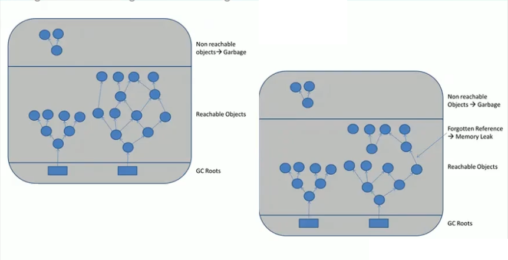
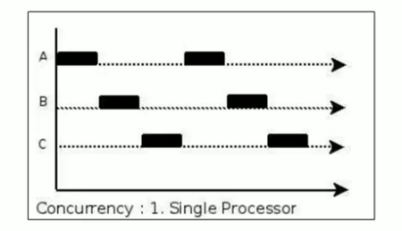
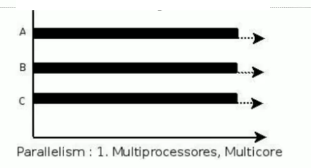
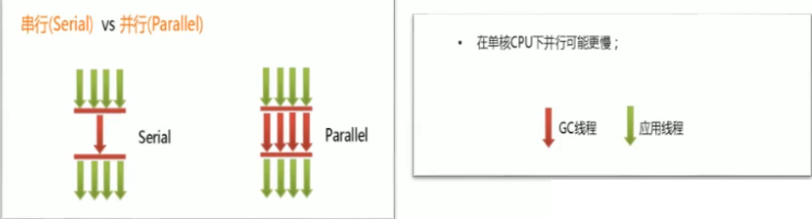
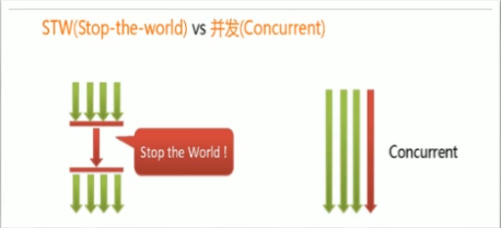
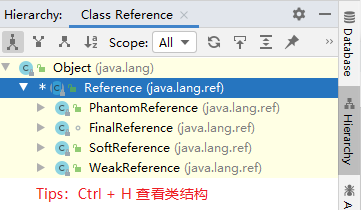
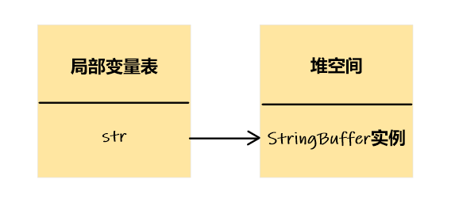
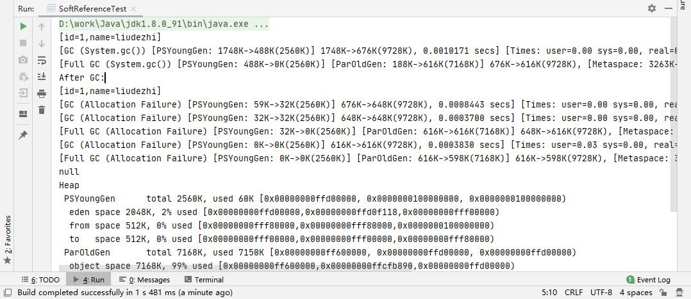

# 16.垃圾回收相关概念

- 笔记本：JVM_1_内存与垃圾回收
- 创建时间：2020-12-27 15:14:44 UTC
- 更新时间：2020-12-29 02:09:13 UTC
- 印象笔记 GUID：b1dfac57-72c0-4fcc-a7fd-7ccba8c7d3cb

## 垃圾回收相关概念

### 1. System.gc() 的理解

- 在默认情况下，通过 `System.gc()` 或者 `Runtiem.getRuntime().gc()` 的调用，*会显式触发 Full GC*，同时对老年代和新生代进行回收，尝试释放被丢弃对象占用的内存。

- 然而 `System.gc()` 调用附带一个免责声明，无法保证对垃圾收集器的调用。

- JVM 实现者可以通过 `System.gc()` 调用来决定 JVM 的 GC 行为。而一般情况下，垃圾回收应该是自动进行的，*无须手动触发，否则就太过于麻烦了*。在一些特殊情况下，如我们正在编写一个性能基准，我们可以在允许之间调用 `System.gc()`。

```
public class SystemGCTest {
    public static void main(String[] args) {
        new SystemGCTest();
        System.gc();    // 提醒 JVM 的垃圾回收器执行 GC
        // 与 Runtime.getRuntime().gc(); 的作用一样,System.gc()底层就是调用 Runtime.getRuntime().gc();

        System.runFinalization();  // 强制调用失去引用的对象的 finalize() 方法
    }

    @Override
    protected void finalize() throws Throwable {
        super.finalize();
        System.out.println("SystemGCTest 重写了 finalize()");
    }
}

```

**eg：**

```
/**
 * -XX:+PrintGCDetails
 */
public class LocalVarGC {
    public void localVarGC1() {
        byte[] buffer = new byte[10 * 1024 * 1024]; // 10MB
        System.gc();
    }

    public void localVarGC2() {
        byte[] buffer = new byte[10 * 1024 * 1024];
        buffer = null;
        System.gc();
    }

    public void localVarGC3() {
        {
            byte[] buffer = new byte[10 * 1024 * 1024];
        }
        System.gc();
    }

    public void localVarGC4() {
        {
            byte[] buffer = new byte[10 * 1024 * 1024];
        }
        int value = 10;
        System.gc();
    }

    public void localVarGC5() {
        localVarGC1();
        System.gc();
    }

    public static void main(String[] args) {
        LocalVarGC local = new LocalVarGC();
        local.localVarGC1();
    }
}

```

重点看3和4。在3中，通过查看 class 文件，可以直到分配了两个槽，一个是 this，一个是buffer。所以gc() 不会被回收。4中也是两个槽，一个是 this，一个先是 buffer，然后变成了 value，因此 buffer 可以被回收。

### 2. 内存溢出与内存泄漏

#### 2.1. 内存溢出（OOM）

-
内存溢出相对于内存泄漏来说，尽管更容易被理解，但是同样的，内存溢出也是引发程序崩溃的罪魁祸首之一。

-
由于 GC 一直在发展，所有一般情况下，除非应用程序占用的内存增长速度非常块，造成垃圾回收已经跟不上内存消耗的速度，否则不太容易出现 OOM 的情况。

-
大多数情况下，GC 会进行各种年龄段的垃圾回收，实在不行了就放大招，来一次独占式的 Full GC 操作，这时候会回收大量的内存，供应用程序继续使用。

-
javadoc 中对 OutOfMemoryError 的解释是，*没有空闲内存，并且垃圾收集器也无法提供更多内存*。

-
首先说没有空闲内存的情况：说明 Java 虚拟机的堆内存不够。原因有二：
 （1）**Java 虚拟机的堆内存设置不够**
 比如：可能存在内存泄漏问题；也很有可能就是堆的大小不合理，比如我们要处理比较可观的数据量，但是没有显式指定 JVM 堆大小或者指定数值偏小。我们可以通过参数 -Xms、-Xmx 来调整。
 （2）**代码中创建了大量大对象，并且长时间不能被垃圾收集器收集（存在被引用）**
 对于老版本的 Oracle JDK，因为永久代的大小是有限的，并且 JVM 对永久代垃圾回收（如：常量池回收、卸载不再需要的类型）非常不积极，所以当我们不断添加新类型的时候，永久代出现 OutOfMemoryError 也非常常见，尤其是在运行时存在大量动态类型生成的场合类似于 intern 字符串缓存占用太多空间，也会导致 OOM 问题。对应的异常信息，会标记出来和永久代相关："Java.lang.OutOfMemoryyError: PermGen space"。
 随着元数据区的引入，方法区内存已经不再那么窘迫，所以相应的 OOM 有所改观，出现OOM，异常信息则变成了："java.lang.OutOfMemoryError: Metaspace"。直接内存不足，也会导致 OOM。

-
这里面隐含着一层意思是，在抛出 **OutOfMemoryError** 之前，通常垃圾收集器会被触发，尽其所能去清理出空间。

  - 例如：在引用机制分析中，涉及到 JVM 会去尝试回收**软引用指向的对象等**。

  - 在 java.nio.BIts.reserveMemory() 方法中，我们能清楚的看到，System.gc() 会被调用，以清理空间。

-
当然，也不是在任何情况下垃圾收集器都会被触发的

  - 比如，我们去分配一个超大的对象，类似一个超大数组超过堆的最大值，JVM 可以判断出垃圾收集并不能解决这个问题，所以直接抛出 OutOfMemoryError。

#### 2.2. 内存泄漏

也称为”存储泄漏“。**严格来说**，*只有对象不会再被程序用到了，但是 GC 不能回收他们的情况，才叫做内存泄漏*。

但是实际情况很多时候一些不太好的实践（或忽略）会导致对象的生命周期变得很长很长甚至导致 OOM，也可以叫做**宽泛意义上的”内存泄漏“**。

尽管内存泄漏并不会立刻引起程序崩溃，但是一旦发生内存泄漏，程序中的可用内存就会被逐步蚕食，直到耗尽所有内存，最终出现 OutOfMemory 异常，导致程序崩溃。

注意，这里的存储空间并不是指物理内存，而是指虚拟内存大小，这个虚拟内存大小屈居于磁盘交换区设定的大小。
 

**举例：**
 1、单例模式
 单例的生命周期和应用程序是一样长的，所以单例程序中，如果持有对外部对象的引用的话，那么这个外部对象是不能被回收的，则会导致内存泄漏的产生。

2、一些提供 close 的资源未关闭导致内存泄漏
 数据库连接（dataSource.getConnection()），网络连接（socket）和 io 连接必须手动 close，否则是不能被回收的。

### 3. Stop The World

- Stop-the-World，简称 STW，指的是 GC 事件发生过程中，会产生应用程序的停顿。*停顿产生时整个应用程序线程都会被暂停，没有任何响应*，有点像卡死的感觉，这个停顿称为 STW。

  - 可达性分析算法中枚举根节点（GC Roots）会导致所有 Java 执行线程停顿。

    - 分析工作必须在一个能确保一致性的快照中进行。

    - 一致性指整个分析期间整个执行系统看起来像被冻结在某个时间点上

    - **如果出现分析过程中对象引用关系还在不断变化，则分析结果的准确性无法保证**

- 被 STW 中断的应用程序线程会在完成 GC 之后恢复，频繁中断会让用户感觉像是网速不快造成电影卡带一样，所以我们需要减少 STW 的产生。

- STW 事件和采用哪款 GC 无关，所有的 GC 都有这个事件。

- 哪怕是 G1 也不能完全避免 Stop-the-World 情况发生，只能说垃圾回收器越来越优秀，回收效率越来越高，尽可能地缩短了暂停时间。

- STW 是 JVM 在*后台自动发起和自动完成*的。在用户不可见的情况下，把用户正常的工作线程全部停掉。

- 开发中不要用 System.gc()；会导致 Stop-the-world 的发生。

```
public class StopTheWorldDemo {
    public static class WorkThread extends Thread {
        List<byte[]> list = new ArrayList<>();

        @Override
        public void run() {
            try {
                while (true) {
                    for (int i = 0; i < 1000; i++) {
                        byte[] buffer = new byte[1024];
                        list.add(buffer);
                    }

                    if (list.size() > 10000) {
                        list.clear();
                        System.gc();    // 会触发 Full GC，进而会出现 STW 事件
                    }
                }
            } catch (Exception e) {
                e.printStackTrace();
            }
        }
    }

    public static class PrintThread extends Thread {
        public final long startTime = System.currentTimeMillis();

        @Override
        public void run() {
            try {
                while (true) {
                    // 每秒打印时间信息
                    long t = System.currentTimeMillis() - startTime;
                    System.out.println(t / 1000 + "." + t % 1000);
                    Thread.sleep(1000);
                }
            } catch (Exception e) {
                e.printStackTrace();
            }
        }
    }

    public static void main(String[] args) {
        WorkThread w = new WorkThread();
        PrintThread p = new PrintThread();

        w.start();
        p.start();
    }
}

```

### 4. 垃圾回收的并行与并发

#### 4.1. 并发（Concurrent）

- 在操作系统中，是指一个时间段中有几个程序都处于已启动运行到运行完毕之间，且这几个程序都是在同一个处理器上运行。

- 并发不是真正意义上的”同时进行“，只是 CPU 把一个时间段划分为几个时间片段（时间区间），然后在这几个时间区间之间来回切换，由于 CPU 处理的速度非常块，只要时间间隔处理得当，即可让用户感觉是多个应用程序同时在进行。
 

#### 4.2. 并行

- 当系统有一个以上 CPU 时，当一个 CPU 执行一个进程时，另一个 CPU 可以执行另一个进程，两个进程互不抢占 CPU 资源，可以同时进行，我们称之为并行（Parallel）。

- 其实决定并行的因素不是 CPU 的数量，而是 CPU 的核心数量，比如一个 CPU 多个核也可以并行。

- 适合科学计算，后台处理等弱交互场景
 

#### 4.3. 并发 vs 并行

**二者对比：**
 并发，指的是多个事情，在**同一时间段内同时发生了**。
 并行，指的是多个事情，在**同一时间点上同时发生了**。

并发的多个任务之间是互相抢占资源的。
 并行的多个任务之间是不互相抢占资源的。

只有在多 CPU 或者一个 CPU 多核的情况中，才会发生并行。
 否则，看似同时发生的事情，其实都是并发执行的。

#### 4.4. 垃圾回收的并发与并行

并发和并行 ，在谈论垃圾收集器的上下文语境中，它们可以解释如下：

- 并行（Parallel）：指*多条垃圾收集线程并行工作*，但此时用户线程处于等待状态。

  - 如 ParNew、Parallel Scavenge、Parallel Old；

- 串行（Serial）：

  - 相较于并行的概念，单线程执行。

  - 如果内存不够，则程序暂停，启动 JVM 垃圾回收器回收。回收完，再启动程序的线程。
 

- 并发（Concurrent）：指用户线程与垃圾收集线程同时执行（但不一定是并行的，可能会交替执行），垃圾回收线程在执行时不会停顿用户程序的执行。

  - 用户程序在继续运行，而垃圾收集程序运行于另一个 CPU 上；

  - 如：CMS、G1
 

### 5. 安全点与安全区域

#### 5.1. 安全点（Safepoint）

程序执行时并非在所有地方都能停顿下来开始 GC，只有在特定的位置才能停顿下来开始 GC，这些位置称为“安全点（Safepoint）”。

**Safe Point** 的选择很重要，*如果太少可能导致 GC 等待的时间太长，如果太频繁可能导致运行时的性能问题*。大部分指令的执行时间都非常短暂，通常会根据**“是否具有让程序长时间执行的特征”**未标准。比如：选择一些执行时间较长的指令作为 Safe Point，如*方法调用、循环跳转和异常跳转*等。

**如何在 GC 发生时，检查所有线程都跑到最近的安全点停顿下来呢？**

- **抢先式中断：**（目前没有虚拟机采用了）
 首先中断所有线程。如果还有线程不在安全点，就恢复线程，让程序跑到安全点。

- **主动式中断：**
 设置一个中断标志，各个线程运行到 Safe Point 的时候主动轮询这个标志，如果中断标志为真，则将自己进行中断挂起。

#### 5.2. 安全区域（Safe Region）

Safepoint 机制保证了程序执行时，在不太长的时间内就会遇到可进入 GC 的 Safepoint。但是，程序“不执行”的时候呢？例如线程处于 Sleep 状态或 Blocked 状态，这时候线程无法响应 JVM 的中断请求，“走”到安全点去中断挂起，JVM 也不太可能等待线程被唤醒。对于这种情况，就需要安全区域（Safe Region）来解决。

*安全区域是指在一段代码片段中，对象的引用关系不会发生变化，在这个区域中的任何位置开始 GC 都是安全的*。我们也可以把 Safe Region 看做是被扩展了的 Safepoint。

**实际执行时：**
 1、当线程运行到 Safe Region 的代码时，首先标识已经进入了 Safe Region，如果这段时间内发生 GC，JVM 会忽略标识为 Safe Region 状态的线程；
 2、当线程即将离开 Safe Region 时，会检查 JVM 是否已经完成 GC，如果完成了，则继续运行，否则线程必须等待直到收到可以安全离开 Safe Region 的信号为止；

### 6. 再谈引用

我们希望能描述这样一类对象：当内存空间还足够时，则能保留在内存中；如果内存空间在进行垃圾收集后还是很紧张，则可以抛弃这些对象。

【即*偏门*又非常*高频*的面试题】强引用、软引用、弱引用、虚引用有什么区别？具体使用场景是什么？

在JDK 1.2 版之后，Java 对引用的概念进行了扩充，将引用分为强引用（Strong Reference）、软引用（Soft Reference）、弱引用（Weak Reference）和虚引用（Phantom Reference）4种，**这4种引用强度依次逐渐减弱**。

除强引用外，其它3种引用均可以在 java.lang.ref 包中找到它们的身影。如下图，显示了这3种引用类型对应的类，开发人员可以在应用程序中直接使用它们。
 

Reference 子类中只有终结器引用是包内可见的，其他3中引用类型均为 public，可以在应用程序中直接使用

- **强引用（StrongReference）：** 最传统的”引用“的定义，是指在程序代码之中普遍存在的引用复制，即类似 "Object obj = new Object()" 这种引用关系。无论任何情况下，只要强引用关系还存在，垃圾收集器就永远不会回收掉被引用的对象。

- **软引用（SoftReference）：** 在系统将要发生内存溢出之前，将会把这些对象列入回收范围之中进行第二次回收。如果这次回收后还没有足够的内存，才会抛出内存溢出异常。

- **弱引用（WeakReference）：** 被弱引用关联的对象只能生存到下一次垃圾收集之前，当垃圾收集器工作时，无论空间是否足够，都会回收掉被弱引用关联的对象。

- **虚引用（PhantomReference）** 一个对象是否有虚引用的存在，完全不会对其生存时间构成影响，也无法通过虚引用来获得一个对象的实例。为一个对象设置虚引用关联的**唯一目的就是能在这个对象被收集器回收时收到一个系统通知**。

#### 6.1. 强引用（Strong Reference）--不回收

在 Java 程序中，最常见的引用类型是强引用（*普通系统99%以上都是强引用*），也就是我们最常见的普通对象引用，*也是默认的引用类型*。

当在 Java 语言中使用 new 操作符创建一个新的对象，并将其赋值给一个变量的时候，这个变量就成为指向该对象的一个强引用。

*强引用的对象是可触及的，垃圾收集器就永远不会回收掉被引用的对象。*

对于一个普通的对象，如果没有其他的引用关系，只要超过了引用的作用域或者显式地将响应（强）引用赋值为 null，就是可以当作垃圾被收集了，当然具体回收时机还是要看垃圾收集策略。

相对的，软应用、弱引用和虚引用的对象是软可触及、弱可触及和虚可触及的，在一定条件下，都是可以被回收的。所以，*强引用是造成 Java 内存泄漏的主要原因之一*。

**强引用例子：**

```
StringBuilder str = new StringBuffer("Hello, 尚硅谷");

```

局部变量 str 指向 StringBuffer 实例所在堆空间，通过 str 可以操作该实例，那么 str 就是 StringBuffer 实例的强引用
 对应内存结构：
 

#### 6.2. 软引用（Soft Reference）--内存不足即回收

软引用时用来描述一些还有用，但非必须的对象。*只被软引用关联着的对象，在系统将要发生内存溢出异常前，会把这些对象列进回收范围之中进行第二次回收*，如果这次回收还没有足够的内存，才会抛出内存溢出异常。

软引用通常用来实现内存敏感的缓存。比如：*高速缓存*就有用到软引用（eg：Mybatis 源码一些内部类中就使用了软引用）。如果还有空闲内存，就可以暂时保留缓存，当内存不足时清理掉，这样就保证了使用缓存的同时，不会耗尽内存。

垃圾回收器在某个时刻决定回收软可达的对象的时候，会清理软引用，并可选地把引用存放到一个引用队列（Reference Queue）。

类似弱引用，只不过 Java 虚拟机会尽量让软引用的存活时间长一些，迫不得已才清理。

在 JDK1.2 版之后提供了 java.lang.ref.SoftReference 类来实现软引用。

```
Object obj = new Object();  // 声明强引用
SoftReference<Object> sf = new SoftReference<Object>(obj);
obj = null;     // 销毁强引用

```

**eg：**

```
/**
 * 软引用的测试：内存不足即回收
 *  -Xms10m -Xmx10m -XX:+PrintGCDetails
 */
public class SoftReferenceTest {
    public static class User {
        public int id;
        public String name;

        public User(int id, String name) {
            this.id = id;
            this.name = name;
        }

        @Override
        public String toString() {
            return "[hljs-string" style="color: #d69d85; line-height: 160%; box-sizing: content-box;">",name=" + name + "]";
        }
    }

    public static void main(String[] args) {
        // 创建对象，建立软引用
        SoftReference<User> userSoftRef = new SoftReference<>(new User(1, "liudezhi"));
        // 从软引用中重新获得强引用对象
        System.out.println(userSoftRef.get());

        System.gc();
        System.out.println("After GC:");
        // 垃圾回收之后获得软引用中的对象
        System.out.println(userSoftRef.get());  // 由于堆空间内存足够，所以不会回收软引用的可达对象
        try {
            // 让系统认为内存资源紧张、不够
            // byte[] b = new byte[1024 * 1024 * 7];   // 内存不够 OOM
            byte[] b = new byte[1024 * 7168 - 616 * 1024];   // 根据 GC 信息(ParOldGen total 7168K, used 616K)计算，让堆空间紧张
        } catch (Throwable e) {
            e.printStackTrace();
        } finally {
            // 再次从软引用中获取数据
            System.out.println(userSoftRef.get());  // 在报 OOM 之前，垃圾回收器会回收软引用的可达对象
        }
    }
}

```



#### 6.3. 弱引用（Weak Reference）--发现即回收

弱引用也是用来描述那些非必须对象，*只被弱引用关联的对象只能生存到下一次垃圾收集发生为止*。在系统 GC 时，只要发现弱引用，不管系统堆空间使用是否充足，都会回收掉只被弱引用关联的对象。

但是，由于垃圾回收器的线程通常优先级很低，因此，并不一定能很快地发现持有弱引用的对象。在这种情况下，*弱引用对象可以存在较长的时间*。

弱引用和软引用一样，在构造弱引用时，也可以指定一个引用队列，当弱引用对象被回收时，就会加入指定的引用队列，通过这个队列可以跟踪对象的回收情况。

*软引用、弱引用都非常适合来保存那些可有可无的缓存数据*。如果这么做，当系统内存不足时，这些缓存数据会被回收，不会导致内存溢出。而当内存资源充足时，这些缓存数据又可以存在相当长的时间，从而起到加速系统的作用。

在 JDK 1.2 版之后提供了 java.lang.ref.WeakReference 类来实现弱引用。

```
Object obj = new Object();  // 声明强引用
WeakReference<Object> wr = new WeakReference<Object>(obj);
obj = null;     // 销毁强引用

```

*弱引用对象与软引用对象的最大不同*就在于，当 GC 在进行回收时，需要通过算法检查是否回收软引用对象，而对于弱引用对象，GC 总是进行回收。*弱引用对象更容易、更快被 GC 回收*。

**eg：**

```
public class WeakReferenceTest {
    public static class User {
        public int id;
        public String name;

        public User(int id, String name) {
            this.id = id;
            this.name = name;
        }

        @Override
        public String toString() {
            return "[hljs-string" style="color: #d69d85; line-height: 160%; box-sizing: content-box;">",name=" + name + "]";
        }
    }

    public static void main(String[] args) {
        // 构造了弱引用
        WeakReference<User> userWeakRef = new WeakReference<>(new User(1, "liudezhi"));
        // 从弱引用中重新获取对象
        System.out.println(userWeakRef.get());  // [id=1,name=liudezhi]

        System.gc();
        // 不管当前内存空间是否足够与否，都会回收它的内存
        System.out.println("After GC:");
        // 重新尝试从弱引用中获取对象
        System.out.println(userWeakRef.get());  // null
    }
}

```

**面试题：** 你开发中使用过 WeakHashMap 吗？

#### 6.4. 虚引用（PhantomReference）-- 对象回收跟踪

也称为“幽灵引用”或者“幻影引用”，是所有引用类型中最弱的一个。

一个对象是否有虚引用的存在，完全不会决定对象的生命周期。如果一个对象仅持有虚引用，那么它和没有引用几乎是一样的，随时都可能被垃圾回收器回收。

它不能单独使用，也无法通过虚引用来获取被引用的对象。当试图通过虚引用的 get() 方法取得对象时，总是 null。

*为一个对象设置虚引用关联的唯一目的在于跟踪垃圾回收过程。比如：能在这个对象被收集器回收时收到一个系统通知。*

- 虚引用必须和引用队列一起使用。虚引用在创建时必须提供一个引用队列作为参数。当垃圾回收器准备回收一个对象时，如果发现它还有虚引用，就会在回收对象后，将这个虚引用加入引用队列，以通知应用程序对象的回收情况。

- *由于虚引用可以跟踪对象的回收时间，因此，也可以将一些资源释放操作放置在虚引用中执行和记录。*

- 在 JDK 1.2 版之后提供了 PhantomReference 类来实现虚引用。

```
Object obj = new Object();
ReferenceQueue phantomQueue = new ReferenceQueue();
PhantomReference<Object> pf = new PhantomReference<Object>(obj, phantomQueue);
obj = null;

```

**eg：**

```
public class PhantomReferenceTest {
    public static PhantomReferenceTest obj;     // 当前类对象的声明
    static ReferenceQueue<PhantomReferenceTest> phantomQueue;   // 引用队列

    public static class CheckRefQueue extends Thread {
        @Override
        public void run() {
            while (true) {
                if (phantomQueue != null) {
                    PhantomReference<PhantomReferenceTest> objt = null;
                    try {
                        objt = (PhantomReference<PhantomReferenceTest>) phantomQueue.remove();
                    } catch (InterruptedException e) {
                        e.printStackTrace();
                    }
                    if (objt != null) {
                        System.out.println("追踪垃圾回收过程：PhantomReferenceTest 实例被 GC 了");
                    }
                }
            }
        }
    }

    @Override
    protected void finalize() throws Throwable {    // finalize() 方法只能被调用一次
        super.finalize();
        System.out.println("调用当前类的 finalize() 方法");
        obj = this;
    }

    public static void main(String[] args) {
        Thread t = new CheckRefQueue();
        t.setDaemon(true);  // 设置为守护线程：当程序中没有非守护线程时，守护线程也就执行结束。
        t.start();

        phantomQueue = new ReferenceQueue<PhantomReferenceTest>();
        obj = new PhantomReferenceTest();
        // 构造了 PhantomReferenceTest 对象的虚引用，并制定了引用队列
        PhantomReference<PhantomReferenceTest> phantomRef = new PhantomReference<>(obj, phantomQueue);

        try {
            // 不可获取虚引用中的对象
            System.out.println(phantomRef.get());

            // 将强引用去除
            obj = null;
            // 第一次进行 GC，由于对象可复活，GC 无法回收该对象
            System.gc();
            Thread.sleep(1000);
            if (obj == null) {
                System.out.println("obj 是 null");
            } else {
                System.out.println("obj 可用");
            }
            System.out.println("第2次 gc");
            obj = null;
            System.gc();    // 一旦将 obj 对象回收，就会将此虚引用存放到引用队列中
            Thread.sleep(1000);
            if (obj == null) {
                System.out.println("obj 是 null");
            } else {
                System.out.println("obj 可用");
            }
        } catch (InterruptedException e) {
            e.printStackTrace();
        }
    }
}

```

#### 6.5. 终结器引用

%23%23%20%E5%9E%83%E5%9C%BE%E5%9B%9E%E6%94%B6%E7%9B%B8%E5%85%B3%E6%A6%82%E5%BF%B5%0A%23%23%23%201.%20System.gc()%20%E7%9A%84%E7%90%86%E8%A7%A3%0A-%20%E5%9C%A8%E9%BB%98%E8%AE%A4%E6%83%85%E5%86%B5%E4%B8%8B%EF%BC%8C%E9%80%9A%E8%BF%87%20%60System.gc()%60%20%E6%88%96%E8%80%85%20%60Runtiem.getRuntime().gc()%60%20%E7%9A%84%E8%B0%83%E7%94%A8%EF%BC%8C*%E4%BC%9A%E6%98%BE%E5%BC%8F%E8%A7%A6%E5%8F%91%20Full%20GC*%EF%BC%8C%E5%90%8C%E6%97%B6%E5%AF%B9%E8%80%81%E5%B9%B4%E4%BB%A3%E5%92%8C%E6%96%B0%E7%94%9F%E4%BB%A3%E8%BF%9B%E8%A1%8C%E5%9B%9E%E6%94%B6%EF%BC%8C%E5%B0%9D%E8%AF%95%E9%87%8A%E6%94%BE%E8%A2%AB%E4%B8%A2%E5%BC%83%E5%AF%B9%E8%B1%A1%E5%8D%A0%E7%94%A8%E7%9A%84%E5%86%85%E5%AD%98%E3%80%82%0A-%20%E7%84%B6%E8%80%8C%20%60System.gc()%60%20%E8%B0%83%E7%94%A8%E9%99%84%E5%B8%A6%E4%B8%80%E4%B8%AA%E5%85%8D%E8%B4%A3%E5%A3%B0%E6%98%8E%EF%BC%8C%E6%97%A0%E6%B3%95%E4%BF%9D%E8%AF%81%E5%AF%B9%E5%9E%83%E5%9C%BE%E6%94%B6%E9%9B%86%E5%99%A8%E7%9A%84%E8%B0%83%E7%94%A8%E3%80%82%0A-%20JVM%20%E5%AE%9E%E7%8E%B0%E8%80%85%E5%8F%AF%E4%BB%A5%E9%80%9A%E8%BF%87%20%60System.gc()%60%20%E8%B0%83%E7%94%A8%E6%9D%A5%E5%86%B3%E5%AE%9A%20JVM%20%E7%9A%84%20GC%20%E8%A1%8C%E4%B8%BA%E3%80%82%E8%80%8C%E4%B8%80%E8%88%AC%E6%83%85%E5%86%B5%E4%B8%8B%EF%BC%8C%E5%9E%83%E5%9C%BE%E5%9B%9E%E6%94%B6%E5%BA%94%E8%AF%A5%E6%98%AF%E8%87%AA%E5%8A%A8%E8%BF%9B%E8%A1%8C%E7%9A%84%EF%BC%8C*%E6%97%A0%E9%A1%BB%E6%89%8B%E5%8A%A8%E8%A7%A6%E5%8F%91%EF%BC%8C%E5%90%A6%E5%88%99%E5%B0%B1%E5%A4%AA%E8%BF%87%E4%BA%8E%E9%BA%BB%E7%83%A6%E4%BA%86*%E3%80%82%E5%9C%A8%E4%B8%80%E4%BA%9B%E7%89%B9%E6%AE%8A%E6%83%85%E5%86%B5%E4%B8%8B%EF%BC%8C%E5%A6%82%E6%88%91%E4%BB%AC%E6%AD%A3%E5%9C%A8%E7%BC%96%E5%86%99%E4%B8%80%E4%B8%AA%E6%80%A7%E8%83%BD%E5%9F%BA%E5%87%86%EF%BC%8C%E6%88%91%E4%BB%AC%E5%8F%AF%E4%BB%A5%E5%9C%A8%E5%85%81%E8%AE%B8%E4%B9%8B%E9%97%B4%E8%B0%83%E7%94%A8%20%60System.gc()%60%E3%80%82%0A%60%60%60java%0Apublic%20class%20SystemGCTest%20%7B%0A%20%20%20%20public%20static%20void%20main(String%5B%5D%20args)%20%7B%0A%20%20%20%20%20%20%20%20new%20SystemGCTest()%3B%0A%20%20%20%20%20%20%20%20System.gc()%3B%20%20%20%20%2F%2F%20%E6%8F%90%E9%86%92%20JVM%20%E7%9A%84%E5%9E%83%E5%9C%BE%E5%9B%9E%E6%94%B6%E5%99%A8%E6%89%A7%E8%A1%8C%20GC%0A%20%20%20%20%20%20%20%20%2F%2F%20%E4%B8%8E%20Runtime.getRuntime().gc()%3B%20%E7%9A%84%E4%BD%9C%E7%94%A8%E4%B8%80%E6%A0%B7%2CSystem.gc()%E5%BA%95%E5%B1%82%E5%B0%B1%E6%98%AF%E8%B0%83%E7%94%A8%20Runtime.getRuntime().gc()%3B%0A%0A%20%20%20%20%20%20%20%20System.runFinalization()%3B%20%20%2F%2F%20%E5%BC%BA%E5%88%B6%E8%B0%83%E7%94%A8%E5%A4%B1%E5%8E%BB%E5%BC%95%E7%94%A8%E7%9A%84%E5%AF%B9%E8%B1%A1%E7%9A%84%20finalize()%20%E6%96%B9%E6%B3%95%0A%20%20%20%20%7D%0A%0A%20%20%20%20%40Override%0A%20%20%20%20protected%20void%20finalize()%20throws%20Throwable%20%7B%0A%20%20%20%20%20%20%20%20super.finalize()%3B%0A%20%20%20%20%20%20%20%20System.out.println(%22SystemGCTest%20%E9%87%8D%E5%86%99%E4%BA%86%20finalize()%22)%3B%0A%20%20%20%20%7D%0A%7D%0A%60%60%60%0A%0A**eg%EF%BC%9A**%0A%60%60%60java%0A%2F**%0A%20*%20-XX%3A%2BPrintGCDetails%0A%20*%2F%0Apublic%20class%20LocalVarGC%20%7B%0A%20%20%20%20public%20void%20localVarGC1()%20%7B%0A%20%20%20%20%20%20%20%20byte%5B%5D%20buffer%20%3D%20new%20byte%5B10%20*%201024%20*%201024%5D%3B%20%2F%2F%2010MB%0A%20%20%20%20%20%20%20%20System.gc()%3B%0A%20%20%20%20%7D%0A%0A%20%20%20%20public%20void%20localVarGC2()%20%7B%0A%20%20%20%20%20%20%20%20byte%5B%5D%20buffer%20%3D%20new%20byte%5B10%20*%201024%20*%201024%5D%3B%0A%20%20%20%20%20%20%20%20buffer%20%3D%20null%3B%0A%20%20%20%20%20%20%20%20System.gc()%3B%0A%20%20%20%20%7D%0A%0A%20%20%20%20public%20void%20localVarGC3()%20%7B%0A%20%20%20%20%20%20%20%20%7B%0A%20%20%20%20%20%20%20%20%20%20%20%20byte%5B%5D%20buffer%20%3D%20new%20byte%5B10%20*%201024%20*%201024%5D%3B%0A%20%20%20%20%20%20%20%20%7D%0A%20%20%20%20%20%20%20%20System.gc()%3B%0A%20%20%20%20%7D%0A%0A%20%20%20%20public%20void%20localVarGC4()%20%7B%0A%20%20%20%20%20%20%20%20%7B%0A%20%20%20%20%20%20%20%20%20%20%20%20byte%5B%5D%20buffer%20%3D%20new%20byte%5B10%20*%201024%20*%201024%5D%3B%0A%20%20%20%20%20%20%20%20%7D%0A%20%20%20%20%20%20%20%20int%20value%20%3D%2010%3B%0A%20%20%20%20%20%20%20%20System.gc()%3B%0A%20%20%20%20%7D%0A%0A%20%20%20%20public%20void%20localVarGC5()%20%7B%0A%20%20%20%20%20%20%20%20localVarGC1()%3B%0A%20%20%20%20%20%20%20%20System.gc()%3B%0A%20%20%20%20%7D%0A%0A%20%20%20%20public%20static%20void%20main(String%5B%5D%20args)%20%7B%0A%20%20%20%20%20%20%20%20LocalVarGC%20local%20%3D%20new%20LocalVarGC()%3B%0A%20%20%20%20%20%20%20%20local.localVarGC1()%3B%0A%20%20%20%20%7D%0A%7D%0A%60%60%60%0A%E9%87%8D%E7%82%B9%E7%9C%8B3%E5%92%8C4%E3%80%82%E5%9C%A83%E4%B8%AD%EF%BC%8C%E9%80%9A%E8%BF%87%E6%9F%A5%E7%9C%8B%20class%20%E6%96%87%E4%BB%B6%EF%BC%8C%E5%8F%AF%E4%BB%A5%E7%9B%B4%E5%88%B0%E5%88%86%E9%85%8D%E4%BA%86%E4%B8%A4%E4%B8%AA%E6%A7%BD%EF%BC%8C%E4%B8%80%E4%B8%AA%E6%98%AF%20this%EF%BC%8C%E4%B8%80%E4%B8%AA%E6%98%AFbuffer%E3%80%82%E6%89%80%E4%BB%A5gc()%20%E4%B8%8D%E4%BC%9A%E8%A2%AB%E5%9B%9E%E6%94%B6%E3%80%824%E4%B8%AD%E4%B9%9F%E6%98%AF%E4%B8%A4%E4%B8%AA%E6%A7%BD%EF%BC%8C%E4%B8%80%E4%B8%AA%E6%98%AF%20this%EF%BC%8C%E4%B8%80%E4%B8%AA%E5%85%88%E6%98%AF%20buffer%EF%BC%8C%E7%84%B6%E5%90%8E%E5%8F%98%E6%88%90%E4%BA%86%20value%EF%BC%8C%E5%9B%A0%E6%AD%A4%20buffer%20%E5%8F%AF%E4%BB%A5%E8%A2%AB%E5%9B%9E%E6%94%B6%E3%80%82%0A%0A%23%23%23%202.%20%E5%86%85%E5%AD%98%E6%BA%A2%E5%87%BA%E4%B8%8E%E5%86%85%E5%AD%98%E6%B3%84%E6%BC%8F%0A%23%23%23%23%202.1.%20%E5%86%85%E5%AD%98%E6%BA%A2%E5%87%BA%EF%BC%88OOM%EF%BC%89%0A-%20%E5%86%85%E5%AD%98%E6%BA%A2%E5%87%BA%E7%9B%B8%E5%AF%B9%E4%BA%8E%E5%86%85%E5%AD%98%E6%B3%84%E6%BC%8F%E6%9D%A5%E8%AF%B4%EF%BC%8C%E5%B0%BD%E7%AE%A1%E6%9B%B4%E5%AE%B9%E6%98%93%E8%A2%AB%E7%90%86%E8%A7%A3%EF%BC%8C%E4%BD%86%E6%98%AF%E5%90%8C%E6%A0%B7%E7%9A%84%EF%BC%8C%E5%86%85%E5%AD%98%E6%BA%A2%E5%87%BA%E4%B9%9F%E6%98%AF%E5%BC%95%E5%8F%91%E7%A8%8B%E5%BA%8F%E5%B4%A9%E6%BA%83%E7%9A%84%E7%BD%AA%E9%AD%81%E7%A5%B8%E9%A6%96%E4%B9%8B%E4%B8%80%E3%80%82%0A-%20%E7%94%B1%E4%BA%8E%20GC%20%E4%B8%80%E7%9B%B4%E5%9C%A8%E5%8F%91%E5%B1%95%EF%BC%8C%E6%89%80%E6%9C%89%E4%B8%80%E8%88%AC%E6%83%85%E5%86%B5%E4%B8%8B%EF%BC%8C%E9%99%A4%E9%9D%9E%E5%BA%94%E7%94%A8%E7%A8%8B%E5%BA%8F%E5%8D%A0%E7%94%A8%E7%9A%84%E5%86%85%E5%AD%98%E5%A2%9E%E9%95%BF%E9%80%9F%E5%BA%A6%E9%9D%9E%E5%B8%B8%E5%9D%97%EF%BC%8C%E9%80%A0%E6%88%90%E5%9E%83%E5%9C%BE%E5%9B%9E%E6%94%B6%E5%B7%B2%E7%BB%8F%E8%B7%9F%E4%B8%8D%E4%B8%8A%E5%86%85%E5%AD%98%E6%B6%88%E8%80%97%E7%9A%84%E9%80%9F%E5%BA%A6%EF%BC%8C%E5%90%A6%E5%88%99%E4%B8%8D%E5%A4%AA%E5%AE%B9%E6%98%93%E5%87%BA%E7%8E%B0%20OOM%20%E7%9A%84%E6%83%85%E5%86%B5%E3%80%82%0A-%20%E5%A4%A7%E5%A4%9A%E6%95%B0%E6%83%85%E5%86%B5%E4%B8%8B%EF%BC%8CGC%20%E4%BC%9A%E8%BF%9B%E8%A1%8C%E5%90%84%E7%A7%8D%E5%B9%B4%E9%BE%84%E6%AE%B5%E7%9A%84%E5%9E%83%E5%9C%BE%E5%9B%9E%E6%94%B6%EF%BC%8C%E5%AE%9E%E5%9C%A8%E4%B8%8D%E8%A1%8C%E4%BA%86%E5%B0%B1%E6%94%BE%E5%A4%A7%E6%8B%9B%EF%BC%8C%E6%9D%A5%E4%B8%80%E6%AC%A1%E7%8B%AC%E5%8D%A0%E5%BC%8F%E7%9A%84%20Full%20GC%20%E6%93%8D%E4%BD%9C%EF%BC%8C%E8%BF%99%E6%97%B6%E5%80%99%E4%BC%9A%E5%9B%9E%E6%94%B6%E5%A4%A7%E9%87%8F%E7%9A%84%E5%86%85%E5%AD%98%EF%BC%8C%E4%BE%9B%E5%BA%94%E7%94%A8%E7%A8%8B%E5%BA%8F%E7%BB%A7%E7%BB%AD%E4%BD%BF%E7%94%A8%E3%80%82%0A-%20javadoc%20%E4%B8%AD%E5%AF%B9%20OutOfMemoryError%20%E7%9A%84%E8%A7%A3%E9%87%8A%E6%98%AF%EF%BC%8C*%E6%B2%A1%E6%9C%89%E7%A9%BA%E9%97%B2%E5%86%85%E5%AD%98%EF%BC%8C%E5%B9%B6%E4%B8%94%E5%9E%83%E5%9C%BE%E6%94%B6%E9%9B%86%E5%99%A8%E4%B9%9F%E6%97%A0%E6%B3%95%E6%8F%90%E4%BE%9B%E6%9B%B4%E5%A4%9A%E5%86%85%E5%AD%98*%E3%80%82%0A-%20%E9%A6%96%E5%85%88%E8%AF%B4%E6%B2%A1%E6%9C%89%E7%A9%BA%E9%97%B2%E5%86%85%E5%AD%98%E7%9A%84%E6%83%85%E5%86%B5%EF%BC%9A%E8%AF%B4%E6%98%8E%20Java%20%E8%99%9A%E6%8B%9F%E6%9C%BA%E7%9A%84%E5%A0%86%E5%86%85%E5%AD%98%E4%B8%8D%E5%A4%9F%E3%80%82%E5%8E%9F%E5%9B%A0%E6%9C%89%E4%BA%8C%EF%BC%9A%0A%EF%BC%881%EF%BC%89**Java%20%E8%99%9A%E6%8B%9F%E6%9C%BA%E7%9A%84%E5%A0%86%E5%86%85%E5%AD%98%E8%AE%BE%E7%BD%AE%E4%B8%8D%E5%A4%9F**%0A%E6%AF%94%E5%A6%82%EF%BC%9A%E5%8F%AF%E8%83%BD%E5%AD%98%E5%9C%A8%E5%86%85%E5%AD%98%E6%B3%84%E6%BC%8F%E9%97%AE%E9%A2%98%EF%BC%9B%E4%B9%9F%E5%BE%88%E6%9C%89%E5%8F%AF%E8%83%BD%E5%B0%B1%E6%98%AF%E5%A0%86%E7%9A%84%E5%A4%A7%E5%B0%8F%E4%B8%8D%E5%90%88%E7%90%86%EF%BC%8C%E6%AF%94%E5%A6%82%E6%88%91%E4%BB%AC%E8%A6%81%E5%A4%84%E7%90%86%E6%AF%94%E8%BE%83%E5%8F%AF%E8%A7%82%E7%9A%84%E6%95%B0%E6%8D%AE%E9%87%8F%EF%BC%8C%E4%BD%86%E6%98%AF%E6%B2%A1%E6%9C%89%E6%98%BE%E5%BC%8F%E6%8C%87%E5%AE%9A%20JVM%20%E5%A0%86%E5%A4%A7%E5%B0%8F%E6%88%96%E8%80%85%E6%8C%87%E5%AE%9A%E6%95%B0%E5%80%BC%E5%81%8F%E5%B0%8F%E3%80%82%E6%88%91%E4%BB%AC%E5%8F%AF%E4%BB%A5%E9%80%9A%E8%BF%87%E5%8F%82%E6%95%B0%20-Xms%E3%80%81-Xmx%20%E6%9D%A5%E8%B0%83%E6%95%B4%E3%80%82%0A%EF%BC%882%EF%BC%89**%E4%BB%A3%E7%A0%81%E4%B8%AD%E5%88%9B%E5%BB%BA%E4%BA%86%E5%A4%A7%E9%87%8F%E5%A4%A7%E5%AF%B9%E8%B1%A1%EF%BC%8C%E5%B9%B6%E4%B8%94%E9%95%BF%E6%97%B6%E9%97%B4%E4%B8%8D%E8%83%BD%E8%A2%AB%E5%9E%83%E5%9C%BE%E6%94%B6%E9%9B%86%E5%99%A8%E6%94%B6%E9%9B%86%EF%BC%88%E5%AD%98%E5%9C%A8%E8%A2%AB%E5%BC%95%E7%94%A8%EF%BC%89**%0A%E5%AF%B9%E4%BA%8E%E8%80%81%E7%89%88%E6%9C%AC%E7%9A%84%20Oracle%20JDK%EF%BC%8C%E5%9B%A0%E4%B8%BA%E6%B0%B8%E4%B9%85%E4%BB%A3%E7%9A%84%E5%A4%A7%E5%B0%8F%E6%98%AF%E6%9C%89%E9%99%90%E7%9A%84%EF%BC%8C%E5%B9%B6%E4%B8%94%20JVM%20%E5%AF%B9%E6%B0%B8%E4%B9%85%E4%BB%A3%E5%9E%83%E5%9C%BE%E5%9B%9E%E6%94%B6%EF%BC%88%E5%A6%82%EF%BC%9A%E5%B8%B8%E9%87%8F%E6%B1%A0%E5%9B%9E%E6%94%B6%E3%80%81%E5%8D%B8%E8%BD%BD%E4%B8%8D%E5%86%8D%E9%9C%80%E8%A6%81%E7%9A%84%E7%B1%BB%E5%9E%8B%EF%BC%89%E9%9D%9E%E5%B8%B8%E4%B8%8D%E7%A7%AF%E6%9E%81%EF%BC%8C%E6%89%80%E4%BB%A5%E5%BD%93%E6%88%91%E4%BB%AC%E4%B8%8D%E6%96%AD%E6%B7%BB%E5%8A%A0%E6%96%B0%E7%B1%BB%E5%9E%8B%E7%9A%84%E6%97%B6%E5%80%99%EF%BC%8C%E6%B0%B8%E4%B9%85%E4%BB%A3%E5%87%BA%E7%8E%B0%20OutOfMemoryError%20%E4%B9%9F%E9%9D%9E%E5%B8%B8%E5%B8%B8%E8%A7%81%EF%BC%8C%E5%B0%A4%E5%85%B6%E6%98%AF%E5%9C%A8%E8%BF%90%E8%A1%8C%E6%97%B6%E5%AD%98%E5%9C%A8%E5%A4%A7%E9%87%8F%E5%8A%A8%E6%80%81%E7%B1%BB%E5%9E%8B%E7%94%9F%E6%88%90%E7%9A%84%E5%9C%BA%E5%90%88%E7%B1%BB%E4%BC%BC%E4%BA%8E%20intern%20%E5%AD%97%E7%AC%A6%E4%B8%B2%E7%BC%93%E5%AD%98%E5%8D%A0%E7%94%A8%E5%A4%AA%E5%A4%9A%E7%A9%BA%E9%97%B4%EF%BC%8C%E4%B9%9F%E4%BC%9A%E5%AF%BC%E8%87%B4%20OOM%20%E9%97%AE%E9%A2%98%E3%80%82%E5%AF%B9%E5%BA%94%E7%9A%84%E5%BC%82%E5%B8%B8%E4%BF%A1%E6%81%AF%EF%BC%8C%E4%BC%9A%E6%A0%87%E8%AE%B0%E5%87%BA%E6%9D%A5%E5%92%8C%E6%B0%B8%E4%B9%85%E4%BB%A3%E7%9B%B8%E5%85%B3%EF%BC%9A%22Java.lang.OutOfMemoryyError%3A%20PermGen%20space%22%E3%80%82%0A%E9%9A%8F%E7%9D%80%E5%85%83%E6%95%B0%E6%8D%AE%E5%8C%BA%E7%9A%84%E5%BC%95%E5%85%A5%EF%BC%8C%E6%96%B9%E6%B3%95%E5%8C%BA%E5%86%85%E5%AD%98%E5%B7%B2%E7%BB%8F%E4%B8%8D%E5%86%8D%E9%82%A3%E4%B9%88%E7%AA%98%E8%BF%AB%EF%BC%8C%E6%89%80%E4%BB%A5%E7%9B%B8%E5%BA%94%E7%9A%84%20OOM%20%E6%9C%89%E6%89%80%E6%94%B9%E8%A7%82%EF%BC%8C%E5%87%BA%E7%8E%B0OOM%EF%BC%8C%E5%BC%82%E5%B8%B8%E4%BF%A1%E6%81%AF%E5%88%99%E5%8F%98%E6%88%90%E4%BA%86%EF%BC%9A%22java.lang.OutOfMemoryError%3A%20Metaspace%22%E3%80%82%E7%9B%B4%E6%8E%A5%E5%86%85%E5%AD%98%E4%B8%8D%E8%B6%B3%EF%BC%8C%E4%B9%9F%E4%BC%9A%E5%AF%BC%E8%87%B4%20OOM%E3%80%82%0A%0A-%20%E8%BF%99%E9%87%8C%E9%9D%A2%E9%9A%90%E5%90%AB%E7%9D%80%E4%B8%80%E5%B1%82%E6%84%8F%E6%80%9D%E6%98%AF%EF%BC%8C%E5%9C%A8%E6%8A%9B%E5%87%BA%20**OutOfMemoryError**%20%E4%B9%8B%E5%89%8D%EF%BC%8C%E9%80%9A%E5%B8%B8%E5%9E%83%E5%9C%BE%E6%94%B6%E9%9B%86%E5%99%A8%E4%BC%9A%E8%A2%AB%E8%A7%A6%E5%8F%91%EF%BC%8C%E5%B0%BD%E5%85%B6%E6%89%80%E8%83%BD%E5%8E%BB%E6%B8%85%E7%90%86%E5%87%BA%E7%A9%BA%E9%97%B4%E3%80%82%0A%20%20%20%20-%20%E4%BE%8B%E5%A6%82%EF%BC%9A%E5%9C%A8%E5%BC%95%E7%94%A8%E6%9C%BA%E5%88%B6%E5%88%86%E6%9E%90%E4%B8%AD%EF%BC%8C%E6%B6%89%E5%8F%8A%E5%88%B0%20JVM%20%E4%BC%9A%E5%8E%BB%E5%B0%9D%E8%AF%95%E5%9B%9E%E6%94%B6**%E8%BD%AF%E5%BC%95%E7%94%A8%E6%8C%87%E5%90%91%E7%9A%84%E5%AF%B9%E8%B1%A1%E7%AD%89**%E3%80%82%0A%20%20%20%20-%20%E5%9C%A8%20java.nio.BIts.reserveMemory()%20%E6%96%B9%E6%B3%95%E4%B8%AD%EF%BC%8C%E6%88%91%E4%BB%AC%E8%83%BD%E6%B8%85%E6%A5%9A%E7%9A%84%E7%9C%8B%E5%88%B0%EF%BC%8CSystem.gc()%20%E4%BC%9A%E8%A2%AB%E8%B0%83%E7%94%A8%EF%BC%8C%E4%BB%A5%E6%B8%85%E7%90%86%E7%A9%BA%E9%97%B4%E3%80%82%0A-%20%E5%BD%93%E7%84%B6%EF%BC%8C%E4%B9%9F%E4%B8%8D%E6%98%AF%E5%9C%A8%E4%BB%BB%E4%BD%95%E6%83%85%E5%86%B5%E4%B8%8B%E5%9E%83%E5%9C%BE%E6%94%B6%E9%9B%86%E5%99%A8%E9%83%BD%E4%BC%9A%E8%A2%AB%E8%A7%A6%E5%8F%91%E7%9A%84%0A%20%20%20%20-%20%E6%AF%94%E5%A6%82%EF%BC%8C%E6%88%91%E4%BB%AC%E5%8E%BB%E5%88%86%E9%85%8D%E4%B8%80%E4%B8%AA%E8%B6%85%E5%A4%A7%E7%9A%84%E5%AF%B9%E8%B1%A1%EF%BC%8C%E7%B1%BB%E4%BC%BC%E4%B8%80%E4%B8%AA%E8%B6%85%E5%A4%A7%E6%95%B0%E7%BB%84%E8%B6%85%E8%BF%87%E5%A0%86%E7%9A%84%E6%9C%80%E5%A4%A7%E5%80%BC%EF%BC%8CJVM%20%E5%8F%AF%E4%BB%A5%E5%88%A4%E6%96%AD%E5%87%BA%E5%9E%83%E5%9C%BE%E6%94%B6%E9%9B%86%E5%B9%B6%E4%B8%8D%E8%83%BD%E8%A7%A3%E5%86%B3%E8%BF%99%E4%B8%AA%E9%97%AE%E9%A2%98%EF%BC%8C%E6%89%80%E4%BB%A5%E7%9B%B4%E6%8E%A5%E6%8A%9B%E5%87%BA%20OutOfMemoryError%E3%80%82%0A%0A%23%23%23%23%202.2.%20%E5%86%85%E5%AD%98%E6%B3%84%E6%BC%8F%0A%E4%B9%9F%E7%A7%B0%E4%B8%BA%E2%80%9D%E5%AD%98%E5%82%A8%E6%B3%84%E6%BC%8F%E2%80%9C%E3%80%82**%E4%B8%A5%E6%A0%BC%E6%9D%A5%E8%AF%B4**%EF%BC%8C*%E5%8F%AA%E6%9C%89%E5%AF%B9%E8%B1%A1%E4%B8%8D%E4%BC%9A%E5%86%8D%E8%A2%AB%E7%A8%8B%E5%BA%8F%E7%94%A8%E5%88%B0%E4%BA%86%EF%BC%8C%E4%BD%86%E6%98%AF%20GC%20%E4%B8%8D%E8%83%BD%E5%9B%9E%E6%94%B6%E4%BB%96%E4%BB%AC%E7%9A%84%E6%83%85%E5%86%B5%EF%BC%8C%E6%89%8D%E5%8F%AB%E5%81%9A%E5%86%85%E5%AD%98%E6%B3%84%E6%BC%8F*%E3%80%82%0A%0A%E4%BD%86%E6%98%AF%E5%AE%9E%E9%99%85%E6%83%85%E5%86%B5%E5%BE%88%E5%A4%9A%E6%97%B6%E5%80%99%E4%B8%80%E4%BA%9B%E4%B8%8D%E5%A4%AA%E5%A5%BD%E7%9A%84%E5%AE%9E%E8%B7%B5%EF%BC%88%E6%88%96%E5%BF%BD%E7%95%A5%EF%BC%89%E4%BC%9A%E5%AF%BC%E8%87%B4%E5%AF%B9%E8%B1%A1%E7%9A%84%E7%94%9F%E5%91%BD%E5%91%A8%E6%9C%9F%E5%8F%98%E5%BE%97%E5%BE%88%E9%95%BF%E5%BE%88%E9%95%BF%E7%94%9A%E8%87%B3%E5%AF%BC%E8%87%B4%20OOM%EF%BC%8C%E4%B9%9F%E5%8F%AF%E4%BB%A5%E5%8F%AB%E5%81%9A**%E5%AE%BD%E6%B3%9B%E6%84%8F%E4%B9%89%E4%B8%8A%E7%9A%84%E2%80%9D%E5%86%85%E5%AD%98%E6%B3%84%E6%BC%8F%E2%80%9C**%E3%80%82%0A%0A%E5%B0%BD%E7%AE%A1%E5%86%85%E5%AD%98%E6%B3%84%E6%BC%8F%E5%B9%B6%E4%B8%8D%E4%BC%9A%E7%AB%8B%E5%88%BB%E5%BC%95%E8%B5%B7%E7%A8%8B%E5%BA%8F%E5%B4%A9%E6%BA%83%EF%BC%8C%E4%BD%86%E6%98%AF%E4%B8%80%E6%97%A6%E5%8F%91%E7%94%9F%E5%86%85%E5%AD%98%E6%B3%84%E6%BC%8F%EF%BC%8C%E7%A8%8B%E5%BA%8F%E4%B8%AD%E7%9A%84%E5%8F%AF%E7%94%A8%E5%86%85%E5%AD%98%E5%B0%B1%E4%BC%9A%E8%A2%AB%E9%80%90%E6%AD%A5%E8%9A%95%E9%A3%9F%EF%BC%8C%E7%9B%B4%E5%88%B0%E8%80%97%E5%B0%BD%E6%89%80%E6%9C%89%E5%86%85%E5%AD%98%EF%BC%8C%E6%9C%80%E7%BB%88%E5%87%BA%E7%8E%B0%20OutOfMemory%20%E5%BC%82%E5%B8%B8%EF%BC%8C%E5%AF%BC%E8%87%B4%E7%A8%8B%E5%BA%8F%E5%B4%A9%E6%BA%83%E3%80%82%0A%0A%E6%B3%A8%E6%84%8F%EF%BC%8C%E8%BF%99%E9%87%8C%E7%9A%84%E5%AD%98%E5%82%A8%E7%A9%BA%E9%97%B4%E5%B9%B6%E4%B8%8D%E6%98%AF%E6%8C%87%E7%89%A9%E7%90%86%E5%86%85%E5%AD%98%EF%BC%8C%E8%80%8C%E6%98%AF%E6%8C%87%E8%99%9A%E6%8B%9F%E5%86%85%E5%AD%98%E5%A4%A7%E5%B0%8F%EF%BC%8C%E8%BF%99%E4%B8%AA%E8%99%9A%E6%8B%9F%E5%86%85%E5%AD%98%E5%A4%A7%E5%B0%8F%E5%B1%88%E5%B1%85%E4%BA%8E%E7%A3%81%E7%9B%98%E4%BA%A4%E6%8D%A2%E5%8C%BA%E8%AE%BE%E5%AE%9A%E7%9A%84%E5%A4%A7%E5%B0%8F%E3%80%82%0A!%5B491866cbdf72ad07d3e102ed17d17dfa.png%5D(en-resource%3A%2F%2Fdatabase%2F5140%3A1)%0A%0A**%E4%B8%BE%E4%BE%8B%EF%BC%9A**%0A1%E3%80%81%E5%8D%95%E4%BE%8B%E6%A8%A1%E5%BC%8F%0A%E5%8D%95%E4%BE%8B%E7%9A%84%E7%94%9F%E5%91%BD%E5%91%A8%E6%9C%9F%E5%92%8C%E5%BA%94%E7%94%A8%E7%A8%8B%E5%BA%8F%E6%98%AF%E4%B8%80%E6%A0%B7%E9%95%BF%E7%9A%84%EF%BC%8C%E6%89%80%E4%BB%A5%E5%8D%95%E4%BE%8B%E7%A8%8B%E5%BA%8F%E4%B8%AD%EF%BC%8C%E5%A6%82%E6%9E%9C%E6%8C%81%E6%9C%89%E5%AF%B9%E5%A4%96%E9%83%A8%E5%AF%B9%E8%B1%A1%E7%9A%84%E5%BC%95%E7%94%A8%E7%9A%84%E8%AF%9D%EF%BC%8C%E9%82%A3%E4%B9%88%E8%BF%99%E4%B8%AA%E5%A4%96%E9%83%A8%E5%AF%B9%E8%B1%A1%E6%98%AF%E4%B8%8D%E8%83%BD%E8%A2%AB%E5%9B%9E%E6%94%B6%E7%9A%84%EF%BC%8C%E5%88%99%E4%BC%9A%E5%AF%BC%E8%87%B4%E5%86%85%E5%AD%98%E6%B3%84%E6%BC%8F%E7%9A%84%E4%BA%A7%E7%94%9F%E3%80%82%0A%0A2%E3%80%81%E4%B8%80%E4%BA%9B%E6%8F%90%E4%BE%9B%20close%20%E7%9A%84%E8%B5%84%E6%BA%90%E6%9C%AA%E5%85%B3%E9%97%AD%E5%AF%BC%E8%87%B4%E5%86%85%E5%AD%98%E6%B3%84%E6%BC%8F%0A%E6%95%B0%E6%8D%AE%E5%BA%93%E8%BF%9E%E6%8E%A5%EF%BC%88dataSource.getConnection()%EF%BC%89%EF%BC%8C%E7%BD%91%E7%BB%9C%E8%BF%9E%E6%8E%A5%EF%BC%88socket%EF%BC%89%E5%92%8C%20io%20%E8%BF%9E%E6%8E%A5%E5%BF%85%E9%A1%BB%E6%89%8B%E5%8A%A8%20close%EF%BC%8C%E5%90%A6%E5%88%99%E6%98%AF%E4%B8%8D%E8%83%BD%E8%A2%AB%E5%9B%9E%E6%94%B6%E7%9A%84%E3%80%82%0A%0A%23%23%23%203.%20Stop%20The%20World%0A-%20Stop-the-World%EF%BC%8C%E7%AE%80%E7%A7%B0%20STW%EF%BC%8C%E6%8C%87%E7%9A%84%E6%98%AF%20GC%20%E4%BA%8B%E4%BB%B6%E5%8F%91%E7%94%9F%E8%BF%87%E7%A8%8B%E4%B8%AD%EF%BC%8C%E4%BC%9A%E4%BA%A7%E7%94%9F%E5%BA%94%E7%94%A8%E7%A8%8B%E5%BA%8F%E7%9A%84%E5%81%9C%E9%A1%BF%E3%80%82*%E5%81%9C%E9%A1%BF%E4%BA%A7%E7%94%9F%E6%97%B6%E6%95%B4%E4%B8%AA%E5%BA%94%E7%94%A8%E7%A8%8B%E5%BA%8F%E7%BA%BF%E7%A8%8B%E9%83%BD%E4%BC%9A%E8%A2%AB%E6%9A%82%E5%81%9C%EF%BC%8C%E6%B2%A1%E6%9C%89%E4%BB%BB%E4%BD%95%E5%93%8D%E5%BA%94*%EF%BC%8C%E6%9C%89%E7%82%B9%E5%83%8F%E5%8D%A1%E6%AD%BB%E7%9A%84%E6%84%9F%E8%A7%89%EF%BC%8C%E8%BF%99%E4%B8%AA%E5%81%9C%E9%A1%BF%E7%A7%B0%E4%B8%BA%20STW%E3%80%82%0A%20%20%20%20-%20%E5%8F%AF%E8%BE%BE%E6%80%A7%E5%88%86%E6%9E%90%E7%AE%97%E6%B3%95%E4%B8%AD%E6%9E%9A%E4%B8%BE%E6%A0%B9%E8%8A%82%E7%82%B9%EF%BC%88GC%20Roots%EF%BC%89%E4%BC%9A%E5%AF%BC%E8%87%B4%E6%89%80%E6%9C%89%20Java%20%E6%89%A7%E8%A1%8C%E7%BA%BF%E7%A8%8B%E5%81%9C%E9%A1%BF%E3%80%82%0A%20%20%20%20%20%20%20%20-%20%E5%88%86%E6%9E%90%E5%B7%A5%E4%BD%9C%E5%BF%85%E9%A1%BB%E5%9C%A8%E4%B8%80%E4%B8%AA%E8%83%BD%E7%A1%AE%E4%BF%9D%E4%B8%80%E8%87%B4%E6%80%A7%E7%9A%84%E5%BF%AB%E7%85%A7%E4%B8%AD%E8%BF%9B%E8%A1%8C%E3%80%82%0A%20%20%20%20%20%20%20%20-%20%E4%B8%80%E8%87%B4%E6%80%A7%E6%8C%87%E6%95%B4%E4%B8%AA%E5%88%86%E6%9E%90%E6%9C%9F%E9%97%B4%E6%95%B4%E4%B8%AA%E6%89%A7%E8%A1%8C%E7%B3%BB%E7%BB%9F%E7%9C%8B%E8%B5%B7%E6%9D%A5%E5%83%8F%E8%A2%AB%E5%86%BB%E7%BB%93%E5%9C%A8%E6%9F%90%E4%B8%AA%E6%97%B6%E9%97%B4%E7%82%B9%E4%B8%8A%0A%20%20%20%20%20%20%20%20-%20**%E5%A6%82%E6%9E%9C%E5%87%BA%E7%8E%B0%E5%88%86%E6%9E%90%E8%BF%87%E7%A8%8B%E4%B8%AD%E5%AF%B9%E8%B1%A1%E5%BC%95%E7%94%A8%E5%85%B3%E7%B3%BB%E8%BF%98%E5%9C%A8%E4%B8%8D%E6%96%AD%E5%8F%98%E5%8C%96%EF%BC%8C%E5%88%99%E5%88%86%E6%9E%90%E7%BB%93%E6%9E%9C%E7%9A%84%E5%87%86%E7%A1%AE%E6%80%A7%E6%97%A0%E6%B3%95%E4%BF%9D%E8%AF%81**%0A-%20%E8%A2%AB%20STW%20%E4%B8%AD%E6%96%AD%E7%9A%84%E5%BA%94%E7%94%A8%E7%A8%8B%E5%BA%8F%E7%BA%BF%E7%A8%8B%E4%BC%9A%E5%9C%A8%E5%AE%8C%E6%88%90%20GC%20%E4%B9%8B%E5%90%8E%E6%81%A2%E5%A4%8D%EF%BC%8C%E9%A2%91%E7%B9%81%E4%B8%AD%E6%96%AD%E4%BC%9A%E8%AE%A9%E7%94%A8%E6%88%B7%E6%84%9F%E8%A7%89%E5%83%8F%E6%98%AF%E7%BD%91%E9%80%9F%E4%B8%8D%E5%BF%AB%E9%80%A0%E6%88%90%E7%94%B5%E5%BD%B1%E5%8D%A1%E5%B8%A6%E4%B8%80%E6%A0%B7%EF%BC%8C%E6%89%80%E4%BB%A5%E6%88%91%E4%BB%AC%E9%9C%80%E8%A6%81%E5%87%8F%E5%B0%91%20STW%20%E7%9A%84%E4%BA%A7%E7%94%9F%E3%80%82%0A-%20STW%20%E4%BA%8B%E4%BB%B6%E5%92%8C%E9%87%87%E7%94%A8%E5%93%AA%E6%AC%BE%20GC%20%E6%97%A0%E5%85%B3%EF%BC%8C%E6%89%80%E6%9C%89%E7%9A%84%20GC%20%E9%83%BD%E6%9C%89%E8%BF%99%E4%B8%AA%E4%BA%8B%E4%BB%B6%E3%80%82%0A-%20%E5%93%AA%E6%80%95%E6%98%AF%20G1%20%E4%B9%9F%E4%B8%8D%E8%83%BD%E5%AE%8C%E5%85%A8%E9%81%BF%E5%85%8D%20Stop-the-World%20%E6%83%85%E5%86%B5%E5%8F%91%E7%94%9F%EF%BC%8C%E5%8F%AA%E8%83%BD%E8%AF%B4%E5%9E%83%E5%9C%BE%E5%9B%9E%E6%94%B6%E5%99%A8%E8%B6%8A%E6%9D%A5%E8%B6%8A%E4%BC%98%E7%A7%80%EF%BC%8C%E5%9B%9E%E6%94%B6%E6%95%88%E7%8E%87%E8%B6%8A%E6%9D%A5%E8%B6%8A%E9%AB%98%EF%BC%8C%E5%B0%BD%E5%8F%AF%E8%83%BD%E5%9C%B0%E7%BC%A9%E7%9F%AD%E4%BA%86%E6%9A%82%E5%81%9C%E6%97%B6%E9%97%B4%E3%80%82%0A-%20STW%20%E6%98%AF%20JVM%20%E5%9C%A8*%E5%90%8E%E5%8F%B0%E8%87%AA%E5%8A%A8%E5%8F%91%E8%B5%B7%E5%92%8C%E8%87%AA%E5%8A%A8%E5%AE%8C%E6%88%90*%E7%9A%84%E3%80%82%E5%9C%A8%E7%94%A8%E6%88%B7%E4%B8%8D%E5%8F%AF%E8%A7%81%E7%9A%84%E6%83%85%E5%86%B5%E4%B8%8B%EF%BC%8C%E6%8A%8A%E7%94%A8%E6%88%B7%E6%AD%A3%E5%B8%B8%E7%9A%84%E5%B7%A5%E4%BD%9C%E7%BA%BF%E7%A8%8B%E5%85%A8%E9%83%A8%E5%81%9C%E6%8E%89%E3%80%82%0A-%20%E5%BC%80%E5%8F%91%E4%B8%AD%E4%B8%8D%E8%A6%81%E7%94%A8%20System.gc()%EF%BC%9B%E4%BC%9A%E5%AF%BC%E8%87%B4%20Stop-the-world%20%E7%9A%84%E5%8F%91%E7%94%9F%E3%80%82%0A%60%60%60java%0Apublic%20class%20StopTheWorldDemo%20%7B%0A%20%20%20%20public%20static%20class%20WorkThread%20extends%20Thread%20%7B%0A%20%20%20%20%20%20%20%20List%3Cbyte%5B%5D%3E%20list%20%3D%20new%20ArrayList%3C%3E()%3B%0A%0A%20%20%20%20%20%20%20%20%40Override%0A%20%20%20%20%20%20%20%20public%20void%20run()%20%7B%0A%20%20%20%20%20%20%20%20%20%20%20%20try%20%7B%0A%20%20%20%20%20%20%20%20%20%20%20%20%20%20%20%20while%20(true)%20%7B%0A%20%20%20%20%20%20%20%20%20%20%20%20%20%20%20%20%20%20%20%20for%20(int%20i%20%3D%200%3B%20i%20%3C%201000%3B%20i%2B%2B)%20%7B%0A%20%20%20%20%20%20%20%20%20%20%20%20%20%20%20%20%20%20%20%20%20%20%20%20byte%5B%5D%20buffer%20%3D%20new%20byte%5B1024%5D%3B%0A%20%20%20%20%20%20%20%20%20%20%20%20%20%20%20%20%20%20%20%20%20%20%20%20list.add(buffer)%3B%0A%20%20%20%20%20%20%20%20%20%20%20%20%20%20%20%20%20%20%20%20%7D%0A%0A%20%20%20%20%20%20%20%20%20%20%20%20%20%20%20%20%20%20%20%20if%20(list.size()%20%3E%2010000)%20%7B%0A%20%20%20%20%20%20%20%20%20%20%20%20%20%20%20%20%20%20%20%20%20%20%20%20list.clear()%3B%0A%20%20%20%20%20%20%20%20%20%20%20%20%20%20%20%20%20%20%20%20%20%20%20%20System.gc()%3B%20%20%20%20%2F%2F%20%E4%BC%9A%E8%A7%A6%E5%8F%91%20Full%20GC%EF%BC%8C%E8%BF%9B%E8%80%8C%E4%BC%9A%E5%87%BA%E7%8E%B0%20STW%20%E4%BA%8B%E4%BB%B6%0A%20%20%20%20%20%20%20%20%20%20%20%20%20%20%20%20%20%20%20%20%7D%0A%20%20%20%20%20%20%20%20%20%20%20%20%20%20%20%20%7D%0A%20%20%20%20%20%20%20%20%20%20%20%20%7D%20catch%20(Exception%20e)%20%7B%0A%20%20%20%20%20%20%20%20%20%20%20%20%20%20%20%20e.printStackTrace()%3B%0A%20%20%20%20%20%20%20%20%20%20%20%20%7D%0A%20%20%20%20%20%20%20%20%7D%0A%20%20%20%20%7D%0A%0A%20%20%20%20public%20static%20class%20PrintThread%20extends%20Thread%20%7B%0A%20%20%20%20%20%20%20%20public%20final%20long%20startTime%20%3D%20System.currentTimeMillis()%3B%0A%0A%20%20%20%20%20%20%20%20%40Override%0A%20%20%20%20%20%20%20%20public%20void%20run()%20%7B%0A%20%20%20%20%20%20%20%20%20%20%20%20try%20%7B%0A%20%20%20%20%20%20%20%20%20%20%20%20%20%20%20%20while%20(true)%20%7B%0A%20%20%20%20%20%20%20%20%20%20%20%20%20%20%20%20%20%20%20%20%2F%2F%20%E6%AF%8F%E7%A7%92%E6%89%93%E5%8D%B0%E6%97%B6%E9%97%B4%E4%BF%A1%E6%81%AF%0A%20%20%20%20%20%20%20%20%20%20%20%20%20%20%20%20%20%20%20%20long%20t%20%3D%20System.currentTimeMillis()%20-%20startTime%3B%0A%20%20%20%20%20%20%20%20%20%20%20%20%20%20%20%20%20%20%20%20System.out.println(t%20%2F%201000%20%2B%20%22.%22%20%2B%20t%20%25%201000)%3B%0A%20%20%20%20%20%20%20%20%20%20%20%20%20%20%20%20%20%20%20%20Thread.sleep(1000)%3B%0A%20%20%20%20%20%20%20%20%20%20%20%20%20%20%20%20%7D%0A%20%20%20%20%20%20%20%20%20%20%20%20%7D%20catch%20(Exception%20e)%20%7B%0A%20%20%20%20%20%20%20%20%20%20%20%20%20%20%20%20e.printStackTrace()%3B%0A%20%20%20%20%20%20%20%20%20%20%20%20%7D%0A%20%20%20%20%20%20%20%20%7D%0A%20%20%20%20%7D%0A%0A%20%20%20%20public%20static%20void%20main(String%5B%5D%20args)%20%7B%0A%20%20%20%20%20%20%20%20WorkThread%20w%20%3D%20new%20WorkThread()%3B%0A%20%20%20%20%20%20%20%20PrintThread%20p%20%3D%20new%20PrintThread()%3B%0A%0A%20%20%20%20%20%20%20%20w.start()%3B%0A%20%20%20%20%20%20%20%20p.start()%3B%0A%20%20%20%20%7D%0A%7D%0A%60%60%60%0A%0A%23%23%23%204.%20%E5%9E%83%E5%9C%BE%E5%9B%9E%E6%94%B6%E7%9A%84%E5%B9%B6%E8%A1%8C%E4%B8%8E%E5%B9%B6%E5%8F%91%0A%23%23%23%23%204.1.%20%E5%B9%B6%E5%8F%91%EF%BC%88Concurrent%EF%BC%89%0A-%20%E5%9C%A8%E6%93%8D%E4%BD%9C%E7%B3%BB%E7%BB%9F%E4%B8%AD%EF%BC%8C%E6%98%AF%E6%8C%87%E4%B8%80%E4%B8%AA%E6%97%B6%E9%97%B4%E6%AE%B5%E4%B8%AD%E6%9C%89%E5%87%A0%E4%B8%AA%E7%A8%8B%E5%BA%8F%E9%83%BD%E5%A4%84%E4%BA%8E%E5%B7%B2%E5%90%AF%E5%8A%A8%E8%BF%90%E8%A1%8C%E5%88%B0%E8%BF%90%E8%A1%8C%E5%AE%8C%E6%AF%95%E4%B9%8B%E9%97%B4%EF%BC%8C%E4%B8%94%E8%BF%99%E5%87%A0%E4%B8%AA%E7%A8%8B%E5%BA%8F%E9%83%BD%E6%98%AF%E5%9C%A8%E5%90%8C%E4%B8%80%E4%B8%AA%E5%A4%84%E7%90%86%E5%99%A8%E4%B8%8A%E8%BF%90%E8%A1%8C%E3%80%82%0A-%20%E5%B9%B6%E5%8F%91%E4%B8%8D%E6%98%AF%E7%9C%9F%E6%AD%A3%E6%84%8F%E4%B9%89%E4%B8%8A%E7%9A%84%E2%80%9D%E5%90%8C%E6%97%B6%E8%BF%9B%E8%A1%8C%E2%80%9C%EF%BC%8C%E5%8F%AA%E6%98%AF%20CPU%20%E6%8A%8A%E4%B8%80%E4%B8%AA%E6%97%B6%E9%97%B4%E6%AE%B5%E5%88%92%E5%88%86%E4%B8%BA%E5%87%A0%E4%B8%AA%E6%97%B6%E9%97%B4%E7%89%87%E6%AE%B5%EF%BC%88%E6%97%B6%E9%97%B4%E5%8C%BA%E9%97%B4%EF%BC%89%EF%BC%8C%E7%84%B6%E5%90%8E%E5%9C%A8%E8%BF%99%E5%87%A0%E4%B8%AA%E6%97%B6%E9%97%B4%E5%8C%BA%E9%97%B4%E4%B9%8B%E9%97%B4%E6%9D%A5%E5%9B%9E%E5%88%87%E6%8D%A2%EF%BC%8C%E7%94%B1%E4%BA%8E%20CPU%20%E5%A4%84%E7%90%86%E7%9A%84%E9%80%9F%E5%BA%A6%E9%9D%9E%E5%B8%B8%E5%9D%97%EF%BC%8C%E5%8F%AA%E8%A6%81%E6%97%B6%E9%97%B4%E9%97%B4%E9%9A%94%E5%A4%84%E7%90%86%E5%BE%97%E5%BD%93%EF%BC%8C%E5%8D%B3%E5%8F%AF%E8%AE%A9%E7%94%A8%E6%88%B7%E6%84%9F%E8%A7%89%E6%98%AF%E5%A4%9A%E4%B8%AA%E5%BA%94%E7%94%A8%E7%A8%8B%E5%BA%8F%E5%90%8C%E6%97%B6%E5%9C%A8%E8%BF%9B%E8%A1%8C%E3%80%82%0A!%5B8db815ee9fdcece04fe287b0cc7f82ea.png%5D(en-resource%3A%2F%2Fdatabase%2F5142%3A1)%0A%0A%23%23%23%23%204.2.%20%E5%B9%B6%E8%A1%8C%0A-%20%E5%BD%93%E7%B3%BB%E7%BB%9F%E6%9C%89%E4%B8%80%E4%B8%AA%E4%BB%A5%E4%B8%8A%20CPU%20%E6%97%B6%EF%BC%8C%E5%BD%93%E4%B8%80%E4%B8%AA%20CPU%20%E6%89%A7%E8%A1%8C%E4%B8%80%E4%B8%AA%E8%BF%9B%E7%A8%8B%E6%97%B6%EF%BC%8C%E5%8F%A6%E4%B8%80%E4%B8%AA%20CPU%20%E5%8F%AF%E4%BB%A5%E6%89%A7%E8%A1%8C%E5%8F%A6%E4%B8%80%E4%B8%AA%E8%BF%9B%E7%A8%8B%EF%BC%8C%E4%B8%A4%E4%B8%AA%E8%BF%9B%E7%A8%8B%E4%BA%92%E4%B8%8D%E6%8A%A2%E5%8D%A0%20CPU%20%E8%B5%84%E6%BA%90%EF%BC%8C%E5%8F%AF%E4%BB%A5%E5%90%8C%E6%97%B6%E8%BF%9B%E8%A1%8C%EF%BC%8C%E6%88%91%E4%BB%AC%E7%A7%B0%E4%B9%8B%E4%B8%BA%E5%B9%B6%E8%A1%8C%EF%BC%88Parallel%EF%BC%89%E3%80%82%0A-%20%E5%85%B6%E5%AE%9E%E5%86%B3%E5%AE%9A%E5%B9%B6%E8%A1%8C%E7%9A%84%E5%9B%A0%E7%B4%A0%E4%B8%8D%E6%98%AF%20CPU%20%E7%9A%84%E6%95%B0%E9%87%8F%EF%BC%8C%E8%80%8C%E6%98%AF%20CPU%20%E7%9A%84%E6%A0%B8%E5%BF%83%E6%95%B0%E9%87%8F%EF%BC%8C%E6%AF%94%E5%A6%82%E4%B8%80%E4%B8%AA%20CPU%20%E5%A4%9A%E4%B8%AA%E6%A0%B8%E4%B9%9F%E5%8F%AF%E4%BB%A5%E5%B9%B6%E8%A1%8C%E3%80%82%0A-%20%E9%80%82%E5%90%88%E7%A7%91%E5%AD%A6%E8%AE%A1%E7%AE%97%EF%BC%8C%E5%90%8E%E5%8F%B0%E5%A4%84%E7%90%86%E7%AD%89%E5%BC%B1%E4%BA%A4%E4%BA%92%E5%9C%BA%E6%99%AF%0A!%5Befdeadb5d1b0016a08e2e87792cbf350.png%5D(en-resource%3A%2F%2Fdatabase%2F5144%3A1)%0A%0A%23%23%23%23%204.3.%20%E5%B9%B6%E5%8F%91%20vs%20%E5%B9%B6%E8%A1%8C%0A**%E4%BA%8C%E8%80%85%E5%AF%B9%E6%AF%94%EF%BC%9A**%0A%E5%B9%B6%E5%8F%91%EF%BC%8C%E6%8C%87%E7%9A%84%E6%98%AF%E5%A4%9A%E4%B8%AA%E4%BA%8B%E6%83%85%EF%BC%8C%E5%9C%A8**%E5%90%8C%E4%B8%80%E6%97%B6%E9%97%B4%E6%AE%B5%E5%86%85%E5%90%8C%E6%97%B6%E5%8F%91%E7%94%9F%E4%BA%86**%E3%80%82%0A%E5%B9%B6%E8%A1%8C%EF%BC%8C%E6%8C%87%E7%9A%84%E6%98%AF%E5%A4%9A%E4%B8%AA%E4%BA%8B%E6%83%85%EF%BC%8C%E5%9C%A8**%E5%90%8C%E4%B8%80%E6%97%B6%E9%97%B4%E7%82%B9%E4%B8%8A%E5%90%8C%E6%97%B6%E5%8F%91%E7%94%9F%E4%BA%86**%E3%80%82%0A%0A%E5%B9%B6%E5%8F%91%E7%9A%84%E5%A4%9A%E4%B8%AA%E4%BB%BB%E5%8A%A1%E4%B9%8B%E9%97%B4%E6%98%AF%E4%BA%92%E7%9B%B8%E6%8A%A2%E5%8D%A0%E8%B5%84%E6%BA%90%E7%9A%84%E3%80%82%0A%E5%B9%B6%E8%A1%8C%E7%9A%84%E5%A4%9A%E4%B8%AA%E4%BB%BB%E5%8A%A1%E4%B9%8B%E9%97%B4%E6%98%AF%E4%B8%8D%E4%BA%92%E7%9B%B8%E6%8A%A2%E5%8D%A0%E8%B5%84%E6%BA%90%E7%9A%84%E3%80%82%0A%0A%E5%8F%AA%E6%9C%89%E5%9C%A8%E5%A4%9A%20CPU%20%E6%88%96%E8%80%85%E4%B8%80%E4%B8%AA%20CPU%20%E5%A4%9A%E6%A0%B8%E7%9A%84%E6%83%85%E5%86%B5%E4%B8%AD%EF%BC%8C%E6%89%8D%E4%BC%9A%E5%8F%91%E7%94%9F%E5%B9%B6%E8%A1%8C%E3%80%82%0A%E5%90%A6%E5%88%99%EF%BC%8C%E7%9C%8B%E4%BC%BC%E5%90%8C%E6%97%B6%E5%8F%91%E7%94%9F%E7%9A%84%E4%BA%8B%E6%83%85%EF%BC%8C%E5%85%B6%E5%AE%9E%E9%83%BD%E6%98%AF%E5%B9%B6%E5%8F%91%E6%89%A7%E8%A1%8C%E7%9A%84%E3%80%82%0A%0A%23%23%23%23%204.4.%20%E5%9E%83%E5%9C%BE%E5%9B%9E%E6%94%B6%E7%9A%84%E5%B9%B6%E5%8F%91%E4%B8%8E%E5%B9%B6%E8%A1%8C%0A%E5%B9%B6%E5%8F%91%E5%92%8C%E5%B9%B6%E8%A1%8C%20%EF%BC%8C%E5%9C%A8%E8%B0%88%E8%AE%BA%E5%9E%83%E5%9C%BE%E6%94%B6%E9%9B%86%E5%99%A8%E7%9A%84%E4%B8%8A%E4%B8%8B%E6%96%87%E8%AF%AD%E5%A2%83%E4%B8%AD%EF%BC%8C%E5%AE%83%E4%BB%AC%E5%8F%AF%E4%BB%A5%E8%A7%A3%E9%87%8A%E5%A6%82%E4%B8%8B%EF%BC%9A%0A-%20%E5%B9%B6%E8%A1%8C%EF%BC%88Parallel%EF%BC%89%EF%BC%9A%E6%8C%87*%E5%A4%9A%E6%9D%A1%E5%9E%83%E5%9C%BE%E6%94%B6%E9%9B%86%E7%BA%BF%E7%A8%8B%E5%B9%B6%E8%A1%8C%E5%B7%A5%E4%BD%9C*%EF%BC%8C%E4%BD%86%E6%AD%A4%E6%97%B6%E7%94%A8%E6%88%B7%E7%BA%BF%E7%A8%8B%E5%A4%84%E4%BA%8E%E7%AD%89%E5%BE%85%E7%8A%B6%E6%80%81%E3%80%82%0A%20%20%20%20-%20%E5%A6%82%20ParNew%E3%80%81Parallel%20Scavenge%E3%80%81Parallel%20Old%EF%BC%9B%0A-%20%E4%B8%B2%E8%A1%8C%EF%BC%88Serial%EF%BC%89%EF%BC%9A%0A%20%20%20%20-%20%E7%9B%B8%E8%BE%83%E4%BA%8E%E5%B9%B6%E8%A1%8C%E7%9A%84%E6%A6%82%E5%BF%B5%EF%BC%8C%E5%8D%95%E7%BA%BF%E7%A8%8B%E6%89%A7%E8%A1%8C%E3%80%82%0A%20%20%20%20-%20%E5%A6%82%E6%9E%9C%E5%86%85%E5%AD%98%E4%B8%8D%E5%A4%9F%EF%BC%8C%E5%88%99%E7%A8%8B%E5%BA%8F%E6%9A%82%E5%81%9C%EF%BC%8C%E5%90%AF%E5%8A%A8%20JVM%20%E5%9E%83%E5%9C%BE%E5%9B%9E%E6%94%B6%E5%99%A8%E5%9B%9E%E6%94%B6%E3%80%82%E5%9B%9E%E6%94%B6%E5%AE%8C%EF%BC%8C%E5%86%8D%E5%90%AF%E5%8A%A8%E7%A8%8B%E5%BA%8F%E7%9A%84%E7%BA%BF%E7%A8%8B%E3%80%82%0A!%5B17289f0885386cc2876deb5830cdfdc7.png%5D(en-resource%3A%2F%2Fdatabase%2F5146%3A1)%0A-%20%E5%B9%B6%E5%8F%91%EF%BC%88Concurrent%EF%BC%89%EF%BC%9A%E6%8C%87%E7%94%A8%E6%88%B7%E7%BA%BF%E7%A8%8B%E4%B8%8E%E5%9E%83%E5%9C%BE%E6%94%B6%E9%9B%86%E7%BA%BF%E7%A8%8B%E5%90%8C%E6%97%B6%E6%89%A7%E8%A1%8C%EF%BC%88%E4%BD%86%E4%B8%8D%E4%B8%80%E5%AE%9A%E6%98%AF%E5%B9%B6%E8%A1%8C%E7%9A%84%EF%BC%8C%E5%8F%AF%E8%83%BD%E4%BC%9A%E4%BA%A4%E6%9B%BF%E6%89%A7%E8%A1%8C%EF%BC%89%EF%BC%8C%E5%9E%83%E5%9C%BE%E5%9B%9E%E6%94%B6%E7%BA%BF%E7%A8%8B%E5%9C%A8%E6%89%A7%E8%A1%8C%E6%97%B6%E4%B8%8D%E4%BC%9A%E5%81%9C%E9%A1%BF%E7%94%A8%E6%88%B7%E7%A8%8B%E5%BA%8F%E7%9A%84%E6%89%A7%E8%A1%8C%E3%80%82%0A%20%20%20%20-%20%E7%94%A8%E6%88%B7%E7%A8%8B%E5%BA%8F%E5%9C%A8%E7%BB%A7%E7%BB%AD%E8%BF%90%E8%A1%8C%EF%BC%8C%E8%80%8C%E5%9E%83%E5%9C%BE%E6%94%B6%E9%9B%86%E7%A8%8B%E5%BA%8F%E8%BF%90%E8%A1%8C%E4%BA%8E%E5%8F%A6%E4%B8%80%E4%B8%AA%20CPU%20%E4%B8%8A%EF%BC%9B%0A%20%20%20%20-%20%E5%A6%82%EF%BC%9ACMS%E3%80%81G1%0A!%5B6a7ae8212fa03934a717d53bf227f2b4.png%5D(en-resource%3A%2F%2Fdatabase%2F5148%3A1)%0A%0A%23%23%23%205.%20%E5%AE%89%E5%85%A8%E7%82%B9%E4%B8%8E%E5%AE%89%E5%85%A8%E5%8C%BA%E5%9F%9F%0A%23%23%23%23%205.1.%20%E5%AE%89%E5%85%A8%E7%82%B9%EF%BC%88Safepoint%EF%BC%89%0A%E7%A8%8B%E5%BA%8F%E6%89%A7%E8%A1%8C%E6%97%B6%E5%B9%B6%E9%9D%9E%E5%9C%A8%E6%89%80%E6%9C%89%E5%9C%B0%E6%96%B9%E9%83%BD%E8%83%BD%E5%81%9C%E9%A1%BF%E4%B8%8B%E6%9D%A5%E5%BC%80%E5%A7%8B%20GC%EF%BC%8C%E5%8F%AA%E6%9C%89%E5%9C%A8%E7%89%B9%E5%AE%9A%E7%9A%84%E4%BD%8D%E7%BD%AE%E6%89%8D%E8%83%BD%E5%81%9C%E9%A1%BF%E4%B8%8B%E6%9D%A5%E5%BC%80%E5%A7%8B%20GC%EF%BC%8C%E8%BF%99%E4%BA%9B%E4%BD%8D%E7%BD%AE%E7%A7%B0%E4%B8%BA%E2%80%9C%E5%AE%89%E5%85%A8%E7%82%B9%EF%BC%88Safepoint%EF%BC%89%E2%80%9D%E3%80%82%0A%0A**Safe%20Point**%20%E7%9A%84%E9%80%89%E6%8B%A9%E5%BE%88%E9%87%8D%E8%A6%81%EF%BC%8C*%E5%A6%82%E6%9E%9C%E5%A4%AA%E5%B0%91%E5%8F%AF%E8%83%BD%E5%AF%BC%E8%87%B4%20GC%20%E7%AD%89%E5%BE%85%E7%9A%84%E6%97%B6%E9%97%B4%E5%A4%AA%E9%95%BF%EF%BC%8C%E5%A6%82%E6%9E%9C%E5%A4%AA%E9%A2%91%E7%B9%81%E5%8F%AF%E8%83%BD%E5%AF%BC%E8%87%B4%E8%BF%90%E8%A1%8C%E6%97%B6%E7%9A%84%E6%80%A7%E8%83%BD%E9%97%AE%E9%A2%98*%E3%80%82%E5%A4%A7%E9%83%A8%E5%88%86%E6%8C%87%E4%BB%A4%E7%9A%84%E6%89%A7%E8%A1%8C%E6%97%B6%E9%97%B4%E9%83%BD%E9%9D%9E%E5%B8%B8%E7%9F%AD%E6%9A%82%EF%BC%8C%E9%80%9A%E5%B8%B8%E4%BC%9A%E6%A0%B9%E6%8D%AE**%E2%80%9C%E6%98%AF%E5%90%A6%E5%85%B7%E6%9C%89%E8%AE%A9%E7%A8%8B%E5%BA%8F%E9%95%BF%E6%97%B6%E9%97%B4%E6%89%A7%E8%A1%8C%E7%9A%84%E7%89%B9%E5%BE%81%E2%80%9D**%E6%9C%AA%E6%A0%87%E5%87%86%E3%80%82%E6%AF%94%E5%A6%82%EF%BC%9A%E9%80%89%E6%8B%A9%E4%B8%80%E4%BA%9B%E6%89%A7%E8%A1%8C%E6%97%B6%E9%97%B4%E8%BE%83%E9%95%BF%E7%9A%84%E6%8C%87%E4%BB%A4%E4%BD%9C%E4%B8%BA%20Safe%20Point%EF%BC%8C%E5%A6%82*%E6%96%B9%E6%B3%95%E8%B0%83%E7%94%A8%E3%80%81%E5%BE%AA%E7%8E%AF%E8%B7%B3%E8%BD%AC%E5%92%8C%E5%BC%82%E5%B8%B8%E8%B7%B3%E8%BD%AC*%E7%AD%89%E3%80%82%0A%0A**%E5%A6%82%E4%BD%95%E5%9C%A8%20GC%20%E5%8F%91%E7%94%9F%E6%97%B6%EF%BC%8C%E6%A3%80%E6%9F%A5%E6%89%80%E6%9C%89%E7%BA%BF%E7%A8%8B%E9%83%BD%E8%B7%91%E5%88%B0%E6%9C%80%E8%BF%91%E7%9A%84%E5%AE%89%E5%85%A8%E7%82%B9%E5%81%9C%E9%A1%BF%E4%B8%8B%E6%9D%A5%E5%91%A2%EF%BC%9F**%0A-%20**%E6%8A%A2%E5%85%88%E5%BC%8F%E4%B8%AD%E6%96%AD%EF%BC%9A**%EF%BC%88%E7%9B%AE%E5%89%8D%E6%B2%A1%E6%9C%89%E8%99%9A%E6%8B%9F%E6%9C%BA%E9%87%87%E7%94%A8%E4%BA%86%EF%BC%89%0A%E9%A6%96%E5%85%88%E4%B8%AD%E6%96%AD%E6%89%80%E6%9C%89%E7%BA%BF%E7%A8%8B%E3%80%82%E5%A6%82%E6%9E%9C%E8%BF%98%E6%9C%89%E7%BA%BF%E7%A8%8B%E4%B8%8D%E5%9C%A8%E5%AE%89%E5%85%A8%E7%82%B9%EF%BC%8C%E5%B0%B1%E6%81%A2%E5%A4%8D%E7%BA%BF%E7%A8%8B%EF%BC%8C%E8%AE%A9%E7%A8%8B%E5%BA%8F%E8%B7%91%E5%88%B0%E5%AE%89%E5%85%A8%E7%82%B9%E3%80%82%0A-%20**%E4%B8%BB%E5%8A%A8%E5%BC%8F%E4%B8%AD%E6%96%AD%EF%BC%9A**%0A%E8%AE%BE%E7%BD%AE%E4%B8%80%E4%B8%AA%E4%B8%AD%E6%96%AD%E6%A0%87%E5%BF%97%EF%BC%8C%E5%90%84%E4%B8%AA%E7%BA%BF%E7%A8%8B%E8%BF%90%E8%A1%8C%E5%88%B0%20Safe%20Point%20%E7%9A%84%E6%97%B6%E5%80%99%E4%B8%BB%E5%8A%A8%E8%BD%AE%E8%AF%A2%E8%BF%99%E4%B8%AA%E6%A0%87%E5%BF%97%EF%BC%8C%E5%A6%82%E6%9E%9C%E4%B8%AD%E6%96%AD%E6%A0%87%E5%BF%97%E4%B8%BA%E7%9C%9F%EF%BC%8C%E5%88%99%E5%B0%86%E8%87%AA%E5%B7%B1%E8%BF%9B%E8%A1%8C%E4%B8%AD%E6%96%AD%E6%8C%82%E8%B5%B7%E3%80%82%0A%0A%23%23%23%23%205.2.%20%E5%AE%89%E5%85%A8%E5%8C%BA%E5%9F%9F%EF%BC%88Safe%20Region%EF%BC%89%0ASafepoint%20%E6%9C%BA%E5%88%B6%E4%BF%9D%E8%AF%81%E4%BA%86%E7%A8%8B%E5%BA%8F%E6%89%A7%E8%A1%8C%E6%97%B6%EF%BC%8C%E5%9C%A8%E4%B8%8D%E5%A4%AA%E9%95%BF%E7%9A%84%E6%97%B6%E9%97%B4%E5%86%85%E5%B0%B1%E4%BC%9A%E9%81%87%E5%88%B0%E5%8F%AF%E8%BF%9B%E5%85%A5%20GC%20%E7%9A%84%20Safepoint%E3%80%82%E4%BD%86%E6%98%AF%EF%BC%8C%E7%A8%8B%E5%BA%8F%E2%80%9C%E4%B8%8D%E6%89%A7%E8%A1%8C%E2%80%9D%E7%9A%84%E6%97%B6%E5%80%99%E5%91%A2%EF%BC%9F%E4%BE%8B%E5%A6%82%E7%BA%BF%E7%A8%8B%E5%A4%84%E4%BA%8E%20Sleep%20%E7%8A%B6%E6%80%81%E6%88%96%20Blocked%20%E7%8A%B6%E6%80%81%EF%BC%8C%E8%BF%99%E6%97%B6%E5%80%99%E7%BA%BF%E7%A8%8B%E6%97%A0%E6%B3%95%E5%93%8D%E5%BA%94%20JVM%20%E7%9A%84%E4%B8%AD%E6%96%AD%E8%AF%B7%E6%B1%82%EF%BC%8C%E2%80%9C%E8%B5%B0%E2%80%9D%E5%88%B0%E5%AE%89%E5%85%A8%E7%82%B9%E5%8E%BB%E4%B8%AD%E6%96%AD%E6%8C%82%E8%B5%B7%EF%BC%8CJVM%20%E4%B9%9F%E4%B8%8D%E5%A4%AA%E5%8F%AF%E8%83%BD%E7%AD%89%E5%BE%85%E7%BA%BF%E7%A8%8B%E8%A2%AB%E5%94%A4%E9%86%92%E3%80%82%E5%AF%B9%E4%BA%8E%E8%BF%99%E7%A7%8D%E6%83%85%E5%86%B5%EF%BC%8C%E5%B0%B1%E9%9C%80%E8%A6%81%E5%AE%89%E5%85%A8%E5%8C%BA%E5%9F%9F%EF%BC%88Safe%20Region%EF%BC%89%E6%9D%A5%E8%A7%A3%E5%86%B3%E3%80%82%0A%0A*%E5%AE%89%E5%85%A8%E5%8C%BA%E5%9F%9F%E6%98%AF%E6%8C%87%E5%9C%A8%E4%B8%80%E6%AE%B5%E4%BB%A3%E7%A0%81%E7%89%87%E6%AE%B5%E4%B8%AD%EF%BC%8C%E5%AF%B9%E8%B1%A1%E7%9A%84%E5%BC%95%E7%94%A8%E5%85%B3%E7%B3%BB%E4%B8%8D%E4%BC%9A%E5%8F%91%E7%94%9F%E5%8F%98%E5%8C%96%EF%BC%8C%E5%9C%A8%E8%BF%99%E4%B8%AA%E5%8C%BA%E5%9F%9F%E4%B8%AD%E7%9A%84%E4%BB%BB%E4%BD%95%E4%BD%8D%E7%BD%AE%E5%BC%80%E5%A7%8B%20GC%20%E9%83%BD%E6%98%AF%E5%AE%89%E5%85%A8%E7%9A%84*%E3%80%82%E6%88%91%E4%BB%AC%E4%B9%9F%E5%8F%AF%E4%BB%A5%E6%8A%8A%20Safe%20Region%20%E7%9C%8B%E5%81%9A%E6%98%AF%E8%A2%AB%E6%89%A9%E5%B1%95%E4%BA%86%E7%9A%84%20Safepoint%E3%80%82%0A%0A**%E5%AE%9E%E9%99%85%E6%89%A7%E8%A1%8C%E6%97%B6%EF%BC%9A**%0A1%E3%80%81%E5%BD%93%E7%BA%BF%E7%A8%8B%E8%BF%90%E8%A1%8C%E5%88%B0%20Safe%20Region%20%E7%9A%84%E4%BB%A3%E7%A0%81%E6%97%B6%EF%BC%8C%E9%A6%96%E5%85%88%E6%A0%87%E8%AF%86%E5%B7%B2%E7%BB%8F%E8%BF%9B%E5%85%A5%E4%BA%86%20Safe%20Region%EF%BC%8C%E5%A6%82%E6%9E%9C%E8%BF%99%E6%AE%B5%E6%97%B6%E9%97%B4%E5%86%85%E5%8F%91%E7%94%9F%20GC%EF%BC%8CJVM%20%E4%BC%9A%E5%BF%BD%E7%95%A5%E6%A0%87%E8%AF%86%E4%B8%BA%20Safe%20Region%20%E7%8A%B6%E6%80%81%E7%9A%84%E7%BA%BF%E7%A8%8B%EF%BC%9B%0A2%E3%80%81%E5%BD%93%E7%BA%BF%E7%A8%8B%E5%8D%B3%E5%B0%86%E7%A6%BB%E5%BC%80%20Safe%20Region%20%E6%97%B6%EF%BC%8C%E4%BC%9A%E6%A3%80%E6%9F%A5%20JVM%20%E6%98%AF%E5%90%A6%E5%B7%B2%E7%BB%8F%E5%AE%8C%E6%88%90%20GC%EF%BC%8C%E5%A6%82%E6%9E%9C%E5%AE%8C%E6%88%90%E4%BA%86%EF%BC%8C%E5%88%99%E7%BB%A7%E7%BB%AD%E8%BF%90%E8%A1%8C%EF%BC%8C%E5%90%A6%E5%88%99%E7%BA%BF%E7%A8%8B%E5%BF%85%E9%A1%BB%E7%AD%89%E5%BE%85%E7%9B%B4%E5%88%B0%E6%94%B6%E5%88%B0%E5%8F%AF%E4%BB%A5%E5%AE%89%E5%85%A8%E7%A6%BB%E5%BC%80%20Safe%20Region%20%E7%9A%84%E4%BF%A1%E5%8F%B7%E4%B8%BA%E6%AD%A2%EF%BC%9B%0A%0A%23%23%23%206.%20%E5%86%8D%E8%B0%88%E5%BC%95%E7%94%A8%0A%E6%88%91%E4%BB%AC%E5%B8%8C%E6%9C%9B%E8%83%BD%E6%8F%8F%E8%BF%B0%E8%BF%99%E6%A0%B7%E4%B8%80%E7%B1%BB%E5%AF%B9%E8%B1%A1%EF%BC%9A%E5%BD%93%E5%86%85%E5%AD%98%E7%A9%BA%E9%97%B4%E8%BF%98%E8%B6%B3%E5%A4%9F%E6%97%B6%EF%BC%8C%E5%88%99%E8%83%BD%E4%BF%9D%E7%95%99%E5%9C%A8%E5%86%85%E5%AD%98%E4%B8%AD%EF%BC%9B%E5%A6%82%E6%9E%9C%E5%86%85%E5%AD%98%E7%A9%BA%E9%97%B4%E5%9C%A8%E8%BF%9B%E8%A1%8C%E5%9E%83%E5%9C%BE%E6%94%B6%E9%9B%86%E5%90%8E%E8%BF%98%E6%98%AF%E5%BE%88%E7%B4%A7%E5%BC%A0%EF%BC%8C%E5%88%99%E5%8F%AF%E4%BB%A5%E6%8A%9B%E5%BC%83%E8%BF%99%E4%BA%9B%E5%AF%B9%E8%B1%A1%E3%80%82%0A%0A%E3%80%90%E5%8D%B3*%E5%81%8F%E9%97%A8*%E5%8F%88%E9%9D%9E%E5%B8%B8*%E9%AB%98%E9%A2%91*%E7%9A%84%E9%9D%A2%E8%AF%95%E9%A2%98%E3%80%91%E5%BC%BA%E5%BC%95%E7%94%A8%E3%80%81%E8%BD%AF%E5%BC%95%E7%94%A8%E3%80%81%E5%BC%B1%E5%BC%95%E7%94%A8%E3%80%81%E8%99%9A%E5%BC%95%E7%94%A8%E6%9C%89%E4%BB%80%E4%B9%88%E5%8C%BA%E5%88%AB%EF%BC%9F%E5%85%B7%E4%BD%93%E4%BD%BF%E7%94%A8%E5%9C%BA%E6%99%AF%E6%98%AF%E4%BB%80%E4%B9%88%EF%BC%9F%0A%0A%E5%9C%A8JDK%201.2%20%E7%89%88%E4%B9%8B%E5%90%8E%EF%BC%8CJava%20%E5%AF%B9%E5%BC%95%E7%94%A8%E7%9A%84%E6%A6%82%E5%BF%B5%E8%BF%9B%E8%A1%8C%E4%BA%86%E6%89%A9%E5%85%85%EF%BC%8C%E5%B0%86%E5%BC%95%E7%94%A8%E5%88%86%E4%B8%BA%E5%BC%BA%E5%BC%95%E7%94%A8%EF%BC%88Strong%20Reference%EF%BC%89%E3%80%81%E8%BD%AF%E5%BC%95%E7%94%A8%EF%BC%88Soft%20Reference%EF%BC%89%E3%80%81%E5%BC%B1%E5%BC%95%E7%94%A8%EF%BC%88Weak%20Reference%EF%BC%89%E5%92%8C%E8%99%9A%E5%BC%95%E7%94%A8%EF%BC%88Phantom%20Reference%EF%BC%894%E7%A7%8D%EF%BC%8C**%E8%BF%994%E7%A7%8D%E5%BC%95%E7%94%A8%E5%BC%BA%E5%BA%A6%E4%BE%9D%E6%AC%A1%E9%80%90%E6%B8%90%E5%87%8F%E5%BC%B1**%E3%80%82%0A%0A%E9%99%A4%E5%BC%BA%E5%BC%95%E7%94%A8%E5%A4%96%EF%BC%8C%E5%85%B6%E5%AE%833%E7%A7%8D%E5%BC%95%E7%94%A8%E5%9D%87%E5%8F%AF%E4%BB%A5%E5%9C%A8%20java.lang.ref%20%E5%8C%85%E4%B8%AD%E6%89%BE%E5%88%B0%E5%AE%83%E4%BB%AC%E7%9A%84%E8%BA%AB%E5%BD%B1%E3%80%82%E5%A6%82%E4%B8%8B%E5%9B%BE%EF%BC%8C%E6%98%BE%E7%A4%BA%E4%BA%86%E8%BF%993%E7%A7%8D%E5%BC%95%E7%94%A8%E7%B1%BB%E5%9E%8B%E5%AF%B9%E5%BA%94%E7%9A%84%E7%B1%BB%EF%BC%8C%E5%BC%80%E5%8F%91%E4%BA%BA%E5%91%98%E5%8F%AF%E4%BB%A5%E5%9C%A8%E5%BA%94%E7%94%A8%E7%A8%8B%E5%BA%8F%E4%B8%AD%E7%9B%B4%E6%8E%A5%E4%BD%BF%E7%94%A8%E5%AE%83%E4%BB%AC%E3%80%82%0A!%5B3224463da913b508ba0927f4f1c14940.png%5D(en-resource%3A%2F%2Fdatabase%2F5150%3A1)%0A%0AReference%20%E5%AD%90%E7%B1%BB%E4%B8%AD%E5%8F%AA%E6%9C%89%E7%BB%88%E7%BB%93%E5%99%A8%E5%BC%95%E7%94%A8%E6%98%AF%E5%8C%85%E5%86%85%E5%8F%AF%E8%A7%81%E7%9A%84%EF%BC%8C%E5%85%B6%E4%BB%963%E4%B8%AD%E5%BC%95%E7%94%A8%E7%B1%BB%E5%9E%8B%E5%9D%87%E4%B8%BA%20public%EF%BC%8C%E5%8F%AF%E4%BB%A5%E5%9C%A8%E5%BA%94%E7%94%A8%E7%A8%8B%E5%BA%8F%E4%B8%AD%E7%9B%B4%E6%8E%A5%E4%BD%BF%E7%94%A8%0A%0A-%20**%E5%BC%BA%E5%BC%95%E7%94%A8%EF%BC%88StrongReference%EF%BC%89%EF%BC%9A**%20%E6%9C%80%E4%BC%A0%E7%BB%9F%E7%9A%84%E2%80%9D%E5%BC%95%E7%94%A8%E2%80%9C%E7%9A%84%E5%AE%9A%E4%B9%89%EF%BC%8C%E6%98%AF%E6%8C%87%E5%9C%A8%E7%A8%8B%E5%BA%8F%E4%BB%A3%E7%A0%81%E4%B9%8B%E4%B8%AD%E6%99%AE%E9%81%8D%E5%AD%98%E5%9C%A8%E7%9A%84%E5%BC%95%E7%94%A8%E5%A4%8D%E5%88%B6%EF%BC%8C%E5%8D%B3%E7%B1%BB%E4%BC%BC%20%22Object%20obj%20%3D%20new%20Object()%22%20%E8%BF%99%E7%A7%8D%E5%BC%95%E7%94%A8%E5%85%B3%E7%B3%BB%E3%80%82%E6%97%A0%E8%AE%BA%E4%BB%BB%E4%BD%95%E6%83%85%E5%86%B5%E4%B8%8B%EF%BC%8C%E5%8F%AA%E8%A6%81%E5%BC%BA%E5%BC%95%E7%94%A8%E5%85%B3%E7%B3%BB%E8%BF%98%E5%AD%98%E5%9C%A8%EF%BC%8C%E5%9E%83%E5%9C%BE%E6%94%B6%E9%9B%86%E5%99%A8%E5%B0%B1%E6%B0%B8%E8%BF%9C%E4%B8%8D%E4%BC%9A%E5%9B%9E%E6%94%B6%E6%8E%89%E8%A2%AB%E5%BC%95%E7%94%A8%E7%9A%84%E5%AF%B9%E8%B1%A1%E3%80%82%0A-%20**%E8%BD%AF%E5%BC%95%E7%94%A8%EF%BC%88SoftReference%EF%BC%89%EF%BC%9A**%20%E5%9C%A8%E7%B3%BB%E7%BB%9F%E5%B0%86%E8%A6%81%E5%8F%91%E7%94%9F%E5%86%85%E5%AD%98%E6%BA%A2%E5%87%BA%E4%B9%8B%E5%89%8D%EF%BC%8C%E5%B0%86%E4%BC%9A%E6%8A%8A%E8%BF%99%E4%BA%9B%E5%AF%B9%E8%B1%A1%E5%88%97%E5%85%A5%E5%9B%9E%E6%94%B6%E8%8C%83%E5%9B%B4%E4%B9%8B%E4%B8%AD%E8%BF%9B%E8%A1%8C%E7%AC%AC%E4%BA%8C%E6%AC%A1%E5%9B%9E%E6%94%B6%E3%80%82%E5%A6%82%E6%9E%9C%E8%BF%99%E6%AC%A1%E5%9B%9E%E6%94%B6%E5%90%8E%E8%BF%98%E6%B2%A1%E6%9C%89%E8%B6%B3%E5%A4%9F%E7%9A%84%E5%86%85%E5%AD%98%EF%BC%8C%E6%89%8D%E4%BC%9A%E6%8A%9B%E5%87%BA%E5%86%85%E5%AD%98%E6%BA%A2%E5%87%BA%E5%BC%82%E5%B8%B8%E3%80%82%0A-%20**%E5%BC%B1%E5%BC%95%E7%94%A8%EF%BC%88WeakReference%EF%BC%89%EF%BC%9A**%20%E8%A2%AB%E5%BC%B1%E5%BC%95%E7%94%A8%E5%85%B3%E8%81%94%E7%9A%84%E5%AF%B9%E8%B1%A1%E5%8F%AA%E8%83%BD%E7%94%9F%E5%AD%98%E5%88%B0%E4%B8%8B%E4%B8%80%E6%AC%A1%E5%9E%83%E5%9C%BE%E6%94%B6%E9%9B%86%E4%B9%8B%E5%89%8D%EF%BC%8C%E5%BD%93%E5%9E%83%E5%9C%BE%E6%94%B6%E9%9B%86%E5%99%A8%E5%B7%A5%E4%BD%9C%E6%97%B6%EF%BC%8C%E6%97%A0%E8%AE%BA%E7%A9%BA%E9%97%B4%E6%98%AF%E5%90%A6%E8%B6%B3%E5%A4%9F%EF%BC%8C%E9%83%BD%E4%BC%9A%E5%9B%9E%E6%94%B6%E6%8E%89%E8%A2%AB%E5%BC%B1%E5%BC%95%E7%94%A8%E5%85%B3%E8%81%94%E7%9A%84%E5%AF%B9%E8%B1%A1%E3%80%82%0A-%20**%E8%99%9A%E5%BC%95%E7%94%A8%EF%BC%88PhantomReference%EF%BC%89**%20%E4%B8%80%E4%B8%AA%E5%AF%B9%E8%B1%A1%E6%98%AF%E5%90%A6%E6%9C%89%E8%99%9A%E5%BC%95%E7%94%A8%E7%9A%84%E5%AD%98%E5%9C%A8%EF%BC%8C%E5%AE%8C%E5%85%A8%E4%B8%8D%E4%BC%9A%E5%AF%B9%E5%85%B6%E7%94%9F%E5%AD%98%E6%97%B6%E9%97%B4%E6%9E%84%E6%88%90%E5%BD%B1%E5%93%8D%EF%BC%8C%E4%B9%9F%E6%97%A0%E6%B3%95%E9%80%9A%E8%BF%87%E8%99%9A%E5%BC%95%E7%94%A8%E6%9D%A5%E8%8E%B7%E5%BE%97%E4%B8%80%E4%B8%AA%E5%AF%B9%E8%B1%A1%E7%9A%84%E5%AE%9E%E4%BE%8B%E3%80%82%E4%B8%BA%E4%B8%80%E4%B8%AA%E5%AF%B9%E8%B1%A1%E8%AE%BE%E7%BD%AE%E8%99%9A%E5%BC%95%E7%94%A8%E5%85%B3%E8%81%94%E7%9A%84**%E5%94%AF%E4%B8%80%E7%9B%AE%E7%9A%84%E5%B0%B1%E6%98%AF%E8%83%BD%E5%9C%A8%E8%BF%99%E4%B8%AA%E5%AF%B9%E8%B1%A1%E8%A2%AB%E6%94%B6%E9%9B%86%E5%99%A8%E5%9B%9E%E6%94%B6%E6%97%B6%E6%94%B6%E5%88%B0%E4%B8%80%E4%B8%AA%E7%B3%BB%E7%BB%9F%E9%80%9A%E7%9F%A5**%E3%80%82%0A%0A%23%23%23%23%206.1.%20%E5%BC%BA%E5%BC%95%E7%94%A8%EF%BC%88Strong%20Reference%EF%BC%89--%E4%B8%8D%E5%9B%9E%E6%94%B6%0A%E5%9C%A8%20Java%20%E7%A8%8B%E5%BA%8F%E4%B8%AD%EF%BC%8C%E6%9C%80%E5%B8%B8%E8%A7%81%E7%9A%84%E5%BC%95%E7%94%A8%E7%B1%BB%E5%9E%8B%E6%98%AF%E5%BC%BA%E5%BC%95%E7%94%A8%EF%BC%88*%E6%99%AE%E9%80%9A%E7%B3%BB%E7%BB%9F99%25%E4%BB%A5%E4%B8%8A%E9%83%BD%E6%98%AF%E5%BC%BA%E5%BC%95%E7%94%A8*%EF%BC%89%EF%BC%8C%E4%B9%9F%E5%B0%B1%E6%98%AF%E6%88%91%E4%BB%AC%E6%9C%80%E5%B8%B8%E8%A7%81%E7%9A%84%E6%99%AE%E9%80%9A%E5%AF%B9%E8%B1%A1%E5%BC%95%E7%94%A8%EF%BC%8C*%E4%B9%9F%E6%98%AF%E9%BB%98%E8%AE%A4%E7%9A%84%E5%BC%95%E7%94%A8%E7%B1%BB%E5%9E%8B*%E3%80%82%0A%0A%E5%BD%93%E5%9C%A8%20Java%20%E8%AF%AD%E8%A8%80%E4%B8%AD%E4%BD%BF%E7%94%A8%20new%20%E6%93%8D%E4%BD%9C%E7%AC%A6%E5%88%9B%E5%BB%BA%E4%B8%80%E4%B8%AA%E6%96%B0%E7%9A%84%E5%AF%B9%E8%B1%A1%EF%BC%8C%E5%B9%B6%E5%B0%86%E5%85%B6%E8%B5%8B%E5%80%BC%E7%BB%99%E4%B8%80%E4%B8%AA%E5%8F%98%E9%87%8F%E7%9A%84%E6%97%B6%E5%80%99%EF%BC%8C%E8%BF%99%E4%B8%AA%E5%8F%98%E9%87%8F%E5%B0%B1%E6%88%90%E4%B8%BA%E6%8C%87%E5%90%91%E8%AF%A5%E5%AF%B9%E8%B1%A1%E7%9A%84%E4%B8%80%E4%B8%AA%E5%BC%BA%E5%BC%95%E7%94%A8%E3%80%82%0A%0A*%E5%BC%BA%E5%BC%95%E7%94%A8%E7%9A%84%E5%AF%B9%E8%B1%A1%E6%98%AF%E5%8F%AF%E8%A7%A6%E5%8F%8A%E7%9A%84%EF%BC%8C%E5%9E%83%E5%9C%BE%E6%94%B6%E9%9B%86%E5%99%A8%E5%B0%B1%E6%B0%B8%E8%BF%9C%E4%B8%8D%E4%BC%9A%E5%9B%9E%E6%94%B6%E6%8E%89%E8%A2%AB%E5%BC%95%E7%94%A8%E7%9A%84%E5%AF%B9%E8%B1%A1%E3%80%82*%0A%0A%E5%AF%B9%E4%BA%8E%E4%B8%80%E4%B8%AA%E6%99%AE%E9%80%9A%E7%9A%84%E5%AF%B9%E8%B1%A1%EF%BC%8C%E5%A6%82%E6%9E%9C%E6%B2%A1%E6%9C%89%E5%85%B6%E4%BB%96%E7%9A%84%E5%BC%95%E7%94%A8%E5%85%B3%E7%B3%BB%EF%BC%8C%E5%8F%AA%E8%A6%81%E8%B6%85%E8%BF%87%E4%BA%86%E5%BC%95%E7%94%A8%E7%9A%84%E4%BD%9C%E7%94%A8%E5%9F%9F%E6%88%96%E8%80%85%E6%98%BE%E5%BC%8F%E5%9C%B0%E5%B0%86%E5%93%8D%E5%BA%94%EF%BC%88%E5%BC%BA%EF%BC%89%E5%BC%95%E7%94%A8%E8%B5%8B%E5%80%BC%E4%B8%BA%20null%EF%BC%8C%E5%B0%B1%E6%98%AF%E5%8F%AF%E4%BB%A5%E5%BD%93%E4%BD%9C%E5%9E%83%E5%9C%BE%E8%A2%AB%E6%94%B6%E9%9B%86%E4%BA%86%EF%BC%8C%E5%BD%93%E7%84%B6%E5%85%B7%E4%BD%93%E5%9B%9E%E6%94%B6%E6%97%B6%E6%9C%BA%E8%BF%98%E6%98%AF%E8%A6%81%E7%9C%8B%E5%9E%83%E5%9C%BE%E6%94%B6%E9%9B%86%E7%AD%96%E7%95%A5%E3%80%82%0A%0A%E7%9B%B8%E5%AF%B9%E7%9A%84%EF%BC%8C%E8%BD%AF%E5%BA%94%E7%94%A8%E3%80%81%E5%BC%B1%E5%BC%95%E7%94%A8%E5%92%8C%E8%99%9A%E5%BC%95%E7%94%A8%E7%9A%84%E5%AF%B9%E8%B1%A1%E6%98%AF%E8%BD%AF%E5%8F%AF%E8%A7%A6%E5%8F%8A%E3%80%81%E5%BC%B1%E5%8F%AF%E8%A7%A6%E5%8F%8A%E5%92%8C%E8%99%9A%E5%8F%AF%E8%A7%A6%E5%8F%8A%E7%9A%84%EF%BC%8C%E5%9C%A8%E4%B8%80%E5%AE%9A%E6%9D%A1%E4%BB%B6%E4%B8%8B%EF%BC%8C%E9%83%BD%E6%98%AF%E5%8F%AF%E4%BB%A5%E8%A2%AB%E5%9B%9E%E6%94%B6%E7%9A%84%E3%80%82%E6%89%80%E4%BB%A5%EF%BC%8C*%E5%BC%BA%E5%BC%95%E7%94%A8%E6%98%AF%E9%80%A0%E6%88%90%20Java%20%E5%86%85%E5%AD%98%E6%B3%84%E6%BC%8F%E7%9A%84%E4%B8%BB%E8%A6%81%E5%8E%9F%E5%9B%A0%E4%B9%8B%E4%B8%80*%E3%80%82%0A%0A**%E5%BC%BA%E5%BC%95%E7%94%A8%E4%BE%8B%E5%AD%90%EF%BC%9A**%0A%60%60%60java%0AStringBuilder%20str%20%3D%20new%20StringBuffer(%22Hello%2C%20%E5%B0%9A%E7%A1%85%E8%B0%B7%22)%3B%0A%60%60%60%0A%E5%B1%80%E9%83%A8%E5%8F%98%E9%87%8F%20str%20%E6%8C%87%E5%90%91%20StringBuffer%20%E5%AE%9E%E4%BE%8B%E6%89%80%E5%9C%A8%E5%A0%86%E7%A9%BA%E9%97%B4%EF%BC%8C%E9%80%9A%E8%BF%87%20str%20%E5%8F%AF%E4%BB%A5%E6%93%8D%E4%BD%9C%E8%AF%A5%E5%AE%9E%E4%BE%8B%EF%BC%8C%E9%82%A3%E4%B9%88%20str%20%E5%B0%B1%E6%98%AF%20StringBuffer%20%E5%AE%9E%E4%BE%8B%E7%9A%84%E5%BC%BA%E5%BC%95%E7%94%A8%0A%E5%AF%B9%E5%BA%94%E5%86%85%E5%AD%98%E7%BB%93%E6%9E%84%EF%BC%9A%0A!%5B7416b8ca98aa91aa483fdd0e70bc93a0.png%5D(en-resource%3A%2F%2Fdatabase%2F5152%3A1)%0A%0A%23%23%23%23%206.2.%20%E8%BD%AF%E5%BC%95%E7%94%A8%EF%BC%88Soft%20Reference%EF%BC%89--%E5%86%85%E5%AD%98%E4%B8%8D%E8%B6%B3%E5%8D%B3%E5%9B%9E%E6%94%B6%0A%E8%BD%AF%E5%BC%95%E7%94%A8%E6%97%B6%E7%94%A8%E6%9D%A5%E6%8F%8F%E8%BF%B0%E4%B8%80%E4%BA%9B%E8%BF%98%E6%9C%89%E7%94%A8%EF%BC%8C%E4%BD%86%E9%9D%9E%E5%BF%85%E9%A1%BB%E7%9A%84%E5%AF%B9%E8%B1%A1%E3%80%82*%E5%8F%AA%E8%A2%AB%E8%BD%AF%E5%BC%95%E7%94%A8%E5%85%B3%E8%81%94%E7%9D%80%E7%9A%84%E5%AF%B9%E8%B1%A1%EF%BC%8C%E5%9C%A8%E7%B3%BB%E7%BB%9F%E5%B0%86%E8%A6%81%E5%8F%91%E7%94%9F%E5%86%85%E5%AD%98%E6%BA%A2%E5%87%BA%E5%BC%82%E5%B8%B8%E5%89%8D%EF%BC%8C%E4%BC%9A%E6%8A%8A%E8%BF%99%E4%BA%9B%E5%AF%B9%E8%B1%A1%E5%88%97%E8%BF%9B%E5%9B%9E%E6%94%B6%E8%8C%83%E5%9B%B4%E4%B9%8B%E4%B8%AD%E8%BF%9B%E8%A1%8C%E7%AC%AC%E4%BA%8C%E6%AC%A1%E5%9B%9E%E6%94%B6*%EF%BC%8C%E5%A6%82%E6%9E%9C%E8%BF%99%E6%AC%A1%E5%9B%9E%E6%94%B6%E8%BF%98%E6%B2%A1%E6%9C%89%E8%B6%B3%E5%A4%9F%E7%9A%84%E5%86%85%E5%AD%98%EF%BC%8C%E6%89%8D%E4%BC%9A%E6%8A%9B%E5%87%BA%E5%86%85%E5%AD%98%E6%BA%A2%E5%87%BA%E5%BC%82%E5%B8%B8%E3%80%82%0A%0A%E8%BD%AF%E5%BC%95%E7%94%A8%E9%80%9A%E5%B8%B8%E7%94%A8%E6%9D%A5%E5%AE%9E%E7%8E%B0%E5%86%85%E5%AD%98%E6%95%8F%E6%84%9F%E7%9A%84%E7%BC%93%E5%AD%98%E3%80%82%E6%AF%94%E5%A6%82%EF%BC%9A*%E9%AB%98%E9%80%9F%E7%BC%93%E5%AD%98*%E5%B0%B1%E6%9C%89%E7%94%A8%E5%88%B0%E8%BD%AF%E5%BC%95%E7%94%A8%EF%BC%88eg%EF%BC%9AMybatis%20%E6%BA%90%E7%A0%81%E4%B8%80%E4%BA%9B%E5%86%85%E9%83%A8%E7%B1%BB%E4%B8%AD%E5%B0%B1%E4%BD%BF%E7%94%A8%E4%BA%86%E8%BD%AF%E5%BC%95%E7%94%A8%EF%BC%89%E3%80%82%E5%A6%82%E6%9E%9C%E8%BF%98%E6%9C%89%E7%A9%BA%E9%97%B2%E5%86%85%E5%AD%98%EF%BC%8C%E5%B0%B1%E5%8F%AF%E4%BB%A5%E6%9A%82%E6%97%B6%E4%BF%9D%E7%95%99%E7%BC%93%E5%AD%98%EF%BC%8C%E5%BD%93%E5%86%85%E5%AD%98%E4%B8%8D%E8%B6%B3%E6%97%B6%E6%B8%85%E7%90%86%E6%8E%89%EF%BC%8C%E8%BF%99%E6%A0%B7%E5%B0%B1%E4%BF%9D%E8%AF%81%E4%BA%86%E4%BD%BF%E7%94%A8%E7%BC%93%E5%AD%98%E7%9A%84%E5%90%8C%E6%97%B6%EF%BC%8C%E4%B8%8D%E4%BC%9A%E8%80%97%E5%B0%BD%E5%86%85%E5%AD%98%E3%80%82%0A%0A%E5%9E%83%E5%9C%BE%E5%9B%9E%E6%94%B6%E5%99%A8%E5%9C%A8%E6%9F%90%E4%B8%AA%E6%97%B6%E5%88%BB%E5%86%B3%E5%AE%9A%E5%9B%9E%E6%94%B6%E8%BD%AF%E5%8F%AF%E8%BE%BE%E7%9A%84%E5%AF%B9%E8%B1%A1%E7%9A%84%E6%97%B6%E5%80%99%EF%BC%8C%E4%BC%9A%E6%B8%85%E7%90%86%E8%BD%AF%E5%BC%95%E7%94%A8%EF%BC%8C%E5%B9%B6%E5%8F%AF%E9%80%89%E5%9C%B0%E6%8A%8A%E5%BC%95%E7%94%A8%E5%AD%98%E6%94%BE%E5%88%B0%E4%B8%80%E4%B8%AA%E5%BC%95%E7%94%A8%E9%98%9F%E5%88%97%EF%BC%88Reference%20Queue%EF%BC%89%E3%80%82%0A%0A%E7%B1%BB%E4%BC%BC%E5%BC%B1%E5%BC%95%E7%94%A8%EF%BC%8C%E5%8F%AA%E4%B8%8D%E8%BF%87%20Java%20%E8%99%9A%E6%8B%9F%E6%9C%BA%E4%BC%9A%E5%B0%BD%E9%87%8F%E8%AE%A9%E8%BD%AF%E5%BC%95%E7%94%A8%E7%9A%84%E5%AD%98%E6%B4%BB%E6%97%B6%E9%97%B4%E9%95%BF%E4%B8%80%E4%BA%9B%EF%BC%8C%E8%BF%AB%E4%B8%8D%E5%BE%97%E5%B7%B2%E6%89%8D%E6%B8%85%E7%90%86%E3%80%82%0A%0A%E5%9C%A8%20JDK1.2%20%E7%89%88%E4%B9%8B%E5%90%8E%E6%8F%90%E4%BE%9B%E4%BA%86%20java.lang.ref.SoftReference%20%E7%B1%BB%E6%9D%A5%E5%AE%9E%E7%8E%B0%E8%BD%AF%E5%BC%95%E7%94%A8%E3%80%82%0A%60%60%60java%0AObject%20obj%20%3D%20new%20Object()%3B%20%20%2F%2F%20%E5%A3%B0%E6%98%8E%E5%BC%BA%E5%BC%95%E7%94%A8%0ASoftReference%3CObject%3E%20sf%20%3D%20new%20SoftReference%3CObject%3E(obj)%3B%0Aobj%20%3D%20null%3B%20%20%20%20%20%2F%2F%20%E9%94%80%E6%AF%81%E5%BC%BA%E5%BC%95%E7%94%A8%0A%60%60%60%0A%0A**eg%EF%BC%9A**%0A%60%60%60java%0A%2F**%0A%20*%20%E8%BD%AF%E5%BC%95%E7%94%A8%E7%9A%84%E6%B5%8B%E8%AF%95%EF%BC%9A%E5%86%85%E5%AD%98%E4%B8%8D%E8%B6%B3%E5%8D%B3%E5%9B%9E%E6%94%B6%0A%20*%20%20-Xms10m%20-Xmx10m%20-XX%3A%2BPrintGCDetails%0A%20*%2F%0Apublic%20class%20SoftReferenceTest%20%7B%0A%20%20%20%20public%20static%20class%20User%20%7B%0A%20%20%20%20%20%20%20%20public%20int%20id%3B%0A%20%20%20%20%20%20%20%20public%20String%20name%3B%0A%0A%20%20%20%20%20%20%20%20public%20User(int%20id%2C%20String%20name)%20%7B%0A%20%20%20%20%20%20%20%20%20%20%20%20this.id%20%3D%20id%3B%0A%20%20%20%20%20%20%20%20%20%20%20%20this.name%20%3D%20name%3B%0A%20%20%20%20%20%20%20%20%7D%0A%0A%20%20%20%20%20%20%20%20%40Override%0A%20%20%20%20%20%20%20%20public%20String%20toString()%20%7B%0A%20%20%20%20%20%20%20%20%20%20%20%20return%20%22%5Bid%3D%22%20%2B%20id%20%2B%20%22%2Cname%3D%22%20%2B%20name%20%2B%20%22%5D%22%3B%0A%20%20%20%20%20%20%20%20%7D%0A%20%20%20%20%7D%0A%0A%20%20%20%20public%20static%20void%20main(String%5B%5D%20args)%20%7B%0A%20%20%20%20%20%20%20%20%2F%2F%20%E5%88%9B%E5%BB%BA%E5%AF%B9%E8%B1%A1%EF%BC%8C%E5%BB%BA%E7%AB%8B%E8%BD%AF%E5%BC%95%E7%94%A8%0A%20%20%20%20%20%20%20%20SoftReference%3CUser%3E%20userSoftRef%20%3D%20new%20SoftReference%3C%3E(new%20User(1%2C%20%22liudezhi%22))%3B%0A%20%20%20%20%20%20%20%20%2F%2F%20%E4%BB%8E%E8%BD%AF%E5%BC%95%E7%94%A8%E4%B8%AD%E9%87%8D%E6%96%B0%E8%8E%B7%E5%BE%97%E5%BC%BA%E5%BC%95%E7%94%A8%E5%AF%B9%E8%B1%A1%0A%20%20%20%20%20%20%20%20System.out.println(userSoftRef.get())%3B%0A%0A%20%20%20%20%20%20%20%20System.gc()%3B%0A%20%20%20%20%20%20%20%20System.out.println(%22After%20GC%3A%22)%3B%0A%20%20%20%20%20%20%20%20%2F%2F%20%E5%9E%83%E5%9C%BE%E5%9B%9E%E6%94%B6%E4%B9%8B%E5%90%8E%E8%8E%B7%E5%BE%97%E8%BD%AF%E5%BC%95%E7%94%A8%E4%B8%AD%E7%9A%84%E5%AF%B9%E8%B1%A1%0A%20%20%20%20%20%20%20%20System.out.println(userSoftRef.get())%3B%20%20%2F%2F%20%E7%94%B1%E4%BA%8E%E5%A0%86%E7%A9%BA%E9%97%B4%E5%86%85%E5%AD%98%E8%B6%B3%E5%A4%9F%EF%BC%8C%E6%89%80%E4%BB%A5%E4%B8%8D%E4%BC%9A%E5%9B%9E%E6%94%B6%E8%BD%AF%E5%BC%95%E7%94%A8%E7%9A%84%E5%8F%AF%E8%BE%BE%E5%AF%B9%E8%B1%A1%0A%20%20%20%20%20%20%20%20try%20%7B%0A%20%20%20%20%20%20%20%20%20%20%20%20%2F%2F%20%E8%AE%A9%E7%B3%BB%E7%BB%9F%E8%AE%A4%E4%B8%BA%E5%86%85%E5%AD%98%E8%B5%84%E6%BA%90%E7%B4%A7%E5%BC%A0%E3%80%81%E4%B8%8D%E5%A4%9F%0A%20%20%20%20%20%20%20%20%20%20%20%20%2F%2F%20byte%5B%5D%20b%20%3D%20new%20byte%5B1024%20*%201024%20*%207%5D%3B%20%20%20%2F%2F%20%E5%86%85%E5%AD%98%E4%B8%8D%E5%A4%9F%20OOM%0A%20%20%20%20%20%20%20%20%20%20%20%20byte%5B%5D%20b%20%3D%20new%20byte%5B1024%20*%207168%20-%20616%20*%201024%5D%3B%20%20%20%2F%2F%20%E6%A0%B9%E6%8D%AE%20GC%20%E4%BF%A1%E6%81%AF(ParOldGen%20total%207168K%2C%20used%20616K)%E8%AE%A1%E7%AE%97%EF%BC%8C%E8%AE%A9%E5%A0%86%E7%A9%BA%E9%97%B4%E7%B4%A7%E5%BC%A0%0A%20%20%20%20%20%20%20%20%7D%20catch%20(Throwable%20e)%20%7B%0A%20%20%20%20%20%20%20%20%20%20%20%20e.printStackTrace()%3B%0A%20%20%20%20%20%20%20%20%7D%20finally%20%7B%0A%20%20%20%20%20%20%20%20%20%20%20%20%2F%2F%20%E5%86%8D%E6%AC%A1%E4%BB%8E%E8%BD%AF%E5%BC%95%E7%94%A8%E4%B8%AD%E8%8E%B7%E5%8F%96%E6%95%B0%E6%8D%AE%0A%20%20%20%20%20%20%20%20%20%20%20%20System.out.println(userSoftRef.get())%3B%20%20%2F%2F%20%E5%9C%A8%E6%8A%A5%20OOM%20%E4%B9%8B%E5%89%8D%EF%BC%8C%E5%9E%83%E5%9C%BE%E5%9B%9E%E6%94%B6%E5%99%A8%E4%BC%9A%E5%9B%9E%E6%94%B6%E8%BD%AF%E5%BC%95%E7%94%A8%E7%9A%84%E5%8F%AF%E8%BE%BE%E5%AF%B9%E8%B1%A1%0A%20%20%20%20%20%20%20%20%7D%0A%20%20%20%20%7D%0A%7D%0A%60%60%60%0A!%5B2bd1453810be45644abd7907a22f4700.png%5D(en-resource%3A%2F%2Fdatabase%2F5154%3A0)%0A%0A%23%23%23%23%206.3.%20%E5%BC%B1%E5%BC%95%E7%94%A8%EF%BC%88Weak%20Reference%EF%BC%89--%E5%8F%91%E7%8E%B0%E5%8D%B3%E5%9B%9E%E6%94%B6%0A%E5%BC%B1%E5%BC%95%E7%94%A8%E4%B9%9F%E6%98%AF%E7%94%A8%E6%9D%A5%E6%8F%8F%E8%BF%B0%E9%82%A3%E4%BA%9B%E9%9D%9E%E5%BF%85%E9%A1%BB%E5%AF%B9%E8%B1%A1%EF%BC%8C*%E5%8F%AA%E8%A2%AB%E5%BC%B1%E5%BC%95%E7%94%A8%E5%85%B3%E8%81%94%E7%9A%84%E5%AF%B9%E8%B1%A1%E5%8F%AA%E8%83%BD%E7%94%9F%E5%AD%98%E5%88%B0%E4%B8%8B%E4%B8%80%E6%AC%A1%E5%9E%83%E5%9C%BE%E6%94%B6%E9%9B%86%E5%8F%91%E7%94%9F%E4%B8%BA%E6%AD%A2*%E3%80%82%E5%9C%A8%E7%B3%BB%E7%BB%9F%20GC%20%E6%97%B6%EF%BC%8C%E5%8F%AA%E8%A6%81%E5%8F%91%E7%8E%B0%E5%BC%B1%E5%BC%95%E7%94%A8%EF%BC%8C%E4%B8%8D%E7%AE%A1%E7%B3%BB%E7%BB%9F%E5%A0%86%E7%A9%BA%E9%97%B4%E4%BD%BF%E7%94%A8%E6%98%AF%E5%90%A6%E5%85%85%E8%B6%B3%EF%BC%8C%E9%83%BD%E4%BC%9A%E5%9B%9E%E6%94%B6%E6%8E%89%E5%8F%AA%E8%A2%AB%E5%BC%B1%E5%BC%95%E7%94%A8%E5%85%B3%E8%81%94%E7%9A%84%E5%AF%B9%E8%B1%A1%E3%80%82%0A%0A%E4%BD%86%E6%98%AF%EF%BC%8C%E7%94%B1%E4%BA%8E%E5%9E%83%E5%9C%BE%E5%9B%9E%E6%94%B6%E5%99%A8%E7%9A%84%E7%BA%BF%E7%A8%8B%E9%80%9A%E5%B8%B8%E4%BC%98%E5%85%88%E7%BA%A7%E5%BE%88%E4%BD%8E%EF%BC%8C%E5%9B%A0%E6%AD%A4%EF%BC%8C%E5%B9%B6%E4%B8%8D%E4%B8%80%E5%AE%9A%E8%83%BD%E5%BE%88%E5%BF%AB%E5%9C%B0%E5%8F%91%E7%8E%B0%E6%8C%81%E6%9C%89%E5%BC%B1%E5%BC%95%E7%94%A8%E7%9A%84%E5%AF%B9%E8%B1%A1%E3%80%82%E5%9C%A8%E8%BF%99%E7%A7%8D%E6%83%85%E5%86%B5%E4%B8%8B%EF%BC%8C*%E5%BC%B1%E5%BC%95%E7%94%A8%E5%AF%B9%E8%B1%A1%E5%8F%AF%E4%BB%A5%E5%AD%98%E5%9C%A8%E8%BE%83%E9%95%BF%E7%9A%84%E6%97%B6%E9%97%B4*%E3%80%82%0A%0A%E5%BC%B1%E5%BC%95%E7%94%A8%E5%92%8C%E8%BD%AF%E5%BC%95%E7%94%A8%E4%B8%80%E6%A0%B7%EF%BC%8C%E5%9C%A8%E6%9E%84%E9%80%A0%E5%BC%B1%E5%BC%95%E7%94%A8%E6%97%B6%EF%BC%8C%E4%B9%9F%E5%8F%AF%E4%BB%A5%E6%8C%87%E5%AE%9A%E4%B8%80%E4%B8%AA%E5%BC%95%E7%94%A8%E9%98%9F%E5%88%97%EF%BC%8C%E5%BD%93%E5%BC%B1%E5%BC%95%E7%94%A8%E5%AF%B9%E8%B1%A1%E8%A2%AB%E5%9B%9E%E6%94%B6%E6%97%B6%EF%BC%8C%E5%B0%B1%E4%BC%9A%E5%8A%A0%E5%85%A5%E6%8C%87%E5%AE%9A%E7%9A%84%E5%BC%95%E7%94%A8%E9%98%9F%E5%88%97%EF%BC%8C%E9%80%9A%E8%BF%87%E8%BF%99%E4%B8%AA%E9%98%9F%E5%88%97%E5%8F%AF%E4%BB%A5%E8%B7%9F%E8%B8%AA%E5%AF%B9%E8%B1%A1%E7%9A%84%E5%9B%9E%E6%94%B6%E6%83%85%E5%86%B5%E3%80%82%0A%0A*%E8%BD%AF%E5%BC%95%E7%94%A8%E3%80%81%E5%BC%B1%E5%BC%95%E7%94%A8%E9%83%BD%E9%9D%9E%E5%B8%B8%E9%80%82%E5%90%88%E6%9D%A5%E4%BF%9D%E5%AD%98%E9%82%A3%E4%BA%9B%E5%8F%AF%E6%9C%89%E5%8F%AF%E6%97%A0%E7%9A%84%E7%BC%93%E5%AD%98%E6%95%B0%E6%8D%AE*%E3%80%82%E5%A6%82%E6%9E%9C%E8%BF%99%E4%B9%88%E5%81%9A%EF%BC%8C%E5%BD%93%E7%B3%BB%E7%BB%9F%E5%86%85%E5%AD%98%E4%B8%8D%E8%B6%B3%E6%97%B6%EF%BC%8C%E8%BF%99%E4%BA%9B%E7%BC%93%E5%AD%98%E6%95%B0%E6%8D%AE%E4%BC%9A%E8%A2%AB%E5%9B%9E%E6%94%B6%EF%BC%8C%E4%B8%8D%E4%BC%9A%E5%AF%BC%E8%87%B4%E5%86%85%E5%AD%98%E6%BA%A2%E5%87%BA%E3%80%82%E8%80%8C%E5%BD%93%E5%86%85%E5%AD%98%E8%B5%84%E6%BA%90%E5%85%85%E8%B6%B3%E6%97%B6%EF%BC%8C%E8%BF%99%E4%BA%9B%E7%BC%93%E5%AD%98%E6%95%B0%E6%8D%AE%E5%8F%88%E5%8F%AF%E4%BB%A5%E5%AD%98%E5%9C%A8%E7%9B%B8%E5%BD%93%E9%95%BF%E7%9A%84%E6%97%B6%E9%97%B4%EF%BC%8C%E4%BB%8E%E8%80%8C%E8%B5%B7%E5%88%B0%E5%8A%A0%E9%80%9F%E7%B3%BB%E7%BB%9F%E7%9A%84%E4%BD%9C%E7%94%A8%E3%80%82%0A%0A%E5%9C%A8%20JDK%201.2%20%E7%89%88%E4%B9%8B%E5%90%8E%E6%8F%90%E4%BE%9B%E4%BA%86%20java.lang.ref.WeakReference%20%E7%B1%BB%E6%9D%A5%E5%AE%9E%E7%8E%B0%E5%BC%B1%E5%BC%95%E7%94%A8%E3%80%82%0A%60%60%60java%0AObject%20obj%20%3D%20new%20Object()%3B%20%20%2F%2F%20%E5%A3%B0%E6%98%8E%E5%BC%BA%E5%BC%95%E7%94%A8%0AWeakReference%3CObject%3E%20wr%20%3D%20new%20WeakReference%3CObject%3E(obj)%3B%0Aobj%20%3D%20null%3B%20%20%20%20%20%2F%2F%20%E9%94%80%E6%AF%81%E5%BC%BA%E5%BC%95%E7%94%A8%0A%60%60%60%0A*%E5%BC%B1%E5%BC%95%E7%94%A8%E5%AF%B9%E8%B1%A1%E4%B8%8E%E8%BD%AF%E5%BC%95%E7%94%A8%E5%AF%B9%E8%B1%A1%E7%9A%84%E6%9C%80%E5%A4%A7%E4%B8%8D%E5%90%8C*%E5%B0%B1%E5%9C%A8%E4%BA%8E%EF%BC%8C%E5%BD%93%20GC%20%E5%9C%A8%E8%BF%9B%E8%A1%8C%E5%9B%9E%E6%94%B6%E6%97%B6%EF%BC%8C%E9%9C%80%E8%A6%81%E9%80%9A%E8%BF%87%E7%AE%97%E6%B3%95%E6%A3%80%E6%9F%A5%E6%98%AF%E5%90%A6%E5%9B%9E%E6%94%B6%E8%BD%AF%E5%BC%95%E7%94%A8%E5%AF%B9%E8%B1%A1%EF%BC%8C%E8%80%8C%E5%AF%B9%E4%BA%8E%E5%BC%B1%E5%BC%95%E7%94%A8%E5%AF%B9%E8%B1%A1%EF%BC%8CGC%20%E6%80%BB%E6%98%AF%E8%BF%9B%E8%A1%8C%E5%9B%9E%E6%94%B6%E3%80%82*%E5%BC%B1%E5%BC%95%E7%94%A8%E5%AF%B9%E8%B1%A1%E6%9B%B4%E5%AE%B9%E6%98%93%E3%80%81%E6%9B%B4%E5%BF%AB%E8%A2%AB%20GC%20%E5%9B%9E%E6%94%B6*%E3%80%82%0A%0A**eg%EF%BC%9A**%0A%60%60%60java%0Apublic%20class%20WeakReferenceTest%20%7B%0A%20%20%20%20public%20static%20class%20User%20%7B%0A%20%20%20%20%20%20%20%20public%20int%20id%3B%0A%20%20%20%20%20%20%20%20public%20String%20name%3B%0A%0A%20%20%20%20%20%20%20%20public%20User(int%20id%2C%20String%20name)%20%7B%0A%20%20%20%20%20%20%20%20%20%20%20%20this.id%20%3D%20id%3B%0A%20%20%20%20%20%20%20%20%20%20%20%20this.name%20%3D%20name%3B%0A%20%20%20%20%20%20%20%20%7D%0A%0A%20%20%20%20%20%20%20%20%40Override%0A%20%20%20%20%20%20%20%20public%20String%20toString()%20%7B%0A%20%20%20%20%20%20%20%20%20%20%20%20return%20%22%5Bid%3D%22%20%2B%20id%20%2B%20%22%2Cname%3D%22%20%2B%20name%20%2B%20%22%5D%22%3B%0A%20%20%20%20%20%20%20%20%7D%0A%20%20%20%20%7D%0A%0A%20%20%20%20public%20static%20void%20main(String%5B%5D%20args)%20%7B%0A%20%20%20%20%20%20%20%20%2F%2F%20%E6%9E%84%E9%80%A0%E4%BA%86%E5%BC%B1%E5%BC%95%E7%94%A8%0A%20%20%20%20%20%20%20%20WeakReference%3CUser%3E%20userWeakRef%20%3D%20new%20WeakReference%3C%3E(new%20User(1%2C%20%22liudezhi%22))%3B%0A%20%20%20%20%20%20%20%20%2F%2F%20%E4%BB%8E%E5%BC%B1%E5%BC%95%E7%94%A8%E4%B8%AD%E9%87%8D%E6%96%B0%E8%8E%B7%E5%8F%96%E5%AF%B9%E8%B1%A1%0A%20%20%20%20%20%20%20%20System.out.println(userWeakRef.get())%3B%20%20%2F%2F%20%5Bid%3D1%2Cname%3Dliudezhi%5D%0A%0A%20%20%20%20%20%20%20%20System.gc()%3B%0A%20%20%20%20%20%20%20%20%2F%2F%20%E4%B8%8D%E7%AE%A1%E5%BD%93%E5%89%8D%E5%86%85%E5%AD%98%E7%A9%BA%E9%97%B4%E6%98%AF%E5%90%A6%E8%B6%B3%E5%A4%9F%E4%B8%8E%E5%90%A6%EF%BC%8C%E9%83%BD%E4%BC%9A%E5%9B%9E%E6%94%B6%E5%AE%83%E7%9A%84%E5%86%85%E5%AD%98%0A%20%20%20%20%20%20%20%20System.out.println(%22After%20GC%3A%22)%3B%0A%20%20%20%20%20%20%20%20%2F%2F%20%E9%87%8D%E6%96%B0%E5%B0%9D%E8%AF%95%E4%BB%8E%E5%BC%B1%E5%BC%95%E7%94%A8%E4%B8%AD%E8%8E%B7%E5%8F%96%E5%AF%B9%E8%B1%A1%0A%20%20%20%20%20%20%20%20System.out.println(userWeakRef.get())%3B%20%20%2F%2F%20null%0A%20%20%20%20%7D%0A%7D%0A%60%60%60%0A%0A**%E9%9D%A2%E8%AF%95%E9%A2%98%EF%BC%9A**%20%E4%BD%A0%E5%BC%80%E5%8F%91%E4%B8%AD%E4%BD%BF%E7%94%A8%E8%BF%87%20WeakHashMap%20%E5%90%97%EF%BC%9F%0A%0A%23%23%23%23%206.4.%20%E8%99%9A%E5%BC%95%E7%94%A8%EF%BC%88PhantomReference%EF%BC%89--%20%E5%AF%B9%E8%B1%A1%E5%9B%9E%E6%94%B6%E8%B7%9F%E8%B8%AA%0A%E4%B9%9F%E7%A7%B0%E4%B8%BA%E2%80%9C%E5%B9%BD%E7%81%B5%E5%BC%95%E7%94%A8%E2%80%9D%E6%88%96%E8%80%85%E2%80%9C%E5%B9%BB%E5%BD%B1%E5%BC%95%E7%94%A8%E2%80%9D%EF%BC%8C%E6%98%AF%E6%89%80%E6%9C%89%E5%BC%95%E7%94%A8%E7%B1%BB%E5%9E%8B%E4%B8%AD%E6%9C%80%E5%BC%B1%E7%9A%84%E4%B8%80%E4%B8%AA%E3%80%82%0A%0A%E4%B8%80%E4%B8%AA%E5%AF%B9%E8%B1%A1%E6%98%AF%E5%90%A6%E6%9C%89%E8%99%9A%E5%BC%95%E7%94%A8%E7%9A%84%E5%AD%98%E5%9C%A8%EF%BC%8C%E5%AE%8C%E5%85%A8%E4%B8%8D%E4%BC%9A%E5%86%B3%E5%AE%9A%E5%AF%B9%E8%B1%A1%E7%9A%84%E7%94%9F%E5%91%BD%E5%91%A8%E6%9C%9F%E3%80%82%E5%A6%82%E6%9E%9C%E4%B8%80%E4%B8%AA%E5%AF%B9%E8%B1%A1%E4%BB%85%E6%8C%81%E6%9C%89%E8%99%9A%E5%BC%95%E7%94%A8%EF%BC%8C%E9%82%A3%E4%B9%88%E5%AE%83%E5%92%8C%E6%B2%A1%E6%9C%89%E5%BC%95%E7%94%A8%E5%87%A0%E4%B9%8E%E6%98%AF%E4%B8%80%E6%A0%B7%E7%9A%84%EF%BC%8C%E9%9A%8F%E6%97%B6%E9%83%BD%E5%8F%AF%E8%83%BD%E8%A2%AB%E5%9E%83%E5%9C%BE%E5%9B%9E%E6%94%B6%E5%99%A8%E5%9B%9E%E6%94%B6%E3%80%82%0A%0A%E5%AE%83%E4%B8%8D%E8%83%BD%E5%8D%95%E7%8B%AC%E4%BD%BF%E7%94%A8%EF%BC%8C%E4%B9%9F%E6%97%A0%E6%B3%95%E9%80%9A%E8%BF%87%E8%99%9A%E5%BC%95%E7%94%A8%E6%9D%A5%E8%8E%B7%E5%8F%96%E8%A2%AB%E5%BC%95%E7%94%A8%E7%9A%84%E5%AF%B9%E8%B1%A1%E3%80%82%E5%BD%93%E8%AF%95%E5%9B%BE%E9%80%9A%E8%BF%87%E8%99%9A%E5%BC%95%E7%94%A8%E7%9A%84%20get()%20%E6%96%B9%E6%B3%95%E5%8F%96%E5%BE%97%E5%AF%B9%E8%B1%A1%E6%97%B6%EF%BC%8C%E6%80%BB%E6%98%AF%20null%E3%80%82%0A%0A*%E4%B8%BA%E4%B8%80%E4%B8%AA%E5%AF%B9%E8%B1%A1%E8%AE%BE%E7%BD%AE%E8%99%9A%E5%BC%95%E7%94%A8%E5%85%B3%E8%81%94%E7%9A%84%E5%94%AF%E4%B8%80%E7%9B%AE%E7%9A%84%E5%9C%A8%E4%BA%8E%E8%B7%9F%E8%B8%AA%E5%9E%83%E5%9C%BE%E5%9B%9E%E6%94%B6%E8%BF%87%E7%A8%8B%E3%80%82%E6%AF%94%E5%A6%82%EF%BC%9A%E8%83%BD%E5%9C%A8%E8%BF%99%E4%B8%AA%E5%AF%B9%E8%B1%A1%E8%A2%AB%E6%94%B6%E9%9B%86%E5%99%A8%E5%9B%9E%E6%94%B6%E6%97%B6%E6%94%B6%E5%88%B0%E4%B8%80%E4%B8%AA%E7%B3%BB%E7%BB%9F%E9%80%9A%E7%9F%A5%E3%80%82*%0A%0A-%20%E8%99%9A%E5%BC%95%E7%94%A8%E5%BF%85%E9%A1%BB%E5%92%8C%E5%BC%95%E7%94%A8%E9%98%9F%E5%88%97%E4%B8%80%E8%B5%B7%E4%BD%BF%E7%94%A8%E3%80%82%E8%99%9A%E5%BC%95%E7%94%A8%E5%9C%A8%E5%88%9B%E5%BB%BA%E6%97%B6%E5%BF%85%E9%A1%BB%E6%8F%90%E4%BE%9B%E4%B8%80%E4%B8%AA%E5%BC%95%E7%94%A8%E9%98%9F%E5%88%97%E4%BD%9C%E4%B8%BA%E5%8F%82%E6%95%B0%E3%80%82%E5%BD%93%E5%9E%83%E5%9C%BE%E5%9B%9E%E6%94%B6%E5%99%A8%E5%87%86%E5%A4%87%E5%9B%9E%E6%94%B6%E4%B8%80%E4%B8%AA%E5%AF%B9%E8%B1%A1%E6%97%B6%EF%BC%8C%E5%A6%82%E6%9E%9C%E5%8F%91%E7%8E%B0%E5%AE%83%E8%BF%98%E6%9C%89%E8%99%9A%E5%BC%95%E7%94%A8%EF%BC%8C%E5%B0%B1%E4%BC%9A%E5%9C%A8%E5%9B%9E%E6%94%B6%E5%AF%B9%E8%B1%A1%E5%90%8E%EF%BC%8C%E5%B0%86%E8%BF%99%E4%B8%AA%E8%99%9A%E5%BC%95%E7%94%A8%E5%8A%A0%E5%85%A5%E5%BC%95%E7%94%A8%E9%98%9F%E5%88%97%EF%BC%8C%E4%BB%A5%E9%80%9A%E7%9F%A5%E5%BA%94%E7%94%A8%E7%A8%8B%E5%BA%8F%E5%AF%B9%E8%B1%A1%E7%9A%84%E5%9B%9E%E6%94%B6%E6%83%85%E5%86%B5%E3%80%82%0A-%20*%E7%94%B1%E4%BA%8E%E8%99%9A%E5%BC%95%E7%94%A8%E5%8F%AF%E4%BB%A5%E8%B7%9F%E8%B8%AA%E5%AF%B9%E8%B1%A1%E7%9A%84%E5%9B%9E%E6%94%B6%E6%97%B6%E9%97%B4%EF%BC%8C%E5%9B%A0%E6%AD%A4%EF%BC%8C%E4%B9%9F%E5%8F%AF%E4%BB%A5%E5%B0%86%E4%B8%80%E4%BA%9B%E8%B5%84%E6%BA%90%E9%87%8A%E6%94%BE%E6%93%8D%E4%BD%9C%E6%94%BE%E7%BD%AE%E5%9C%A8%E8%99%9A%E5%BC%95%E7%94%A8%E4%B8%AD%E6%89%A7%E8%A1%8C%E5%92%8C%E8%AE%B0%E5%BD%95%E3%80%82*%0A-%20%E5%9C%A8%20JDK%201.2%20%E7%89%88%E4%B9%8B%E5%90%8E%E6%8F%90%E4%BE%9B%E4%BA%86%20PhantomReference%20%E7%B1%BB%E6%9D%A5%E5%AE%9E%E7%8E%B0%E8%99%9A%E5%BC%95%E7%94%A8%E3%80%82%0A%60%60%60java%0AObject%20obj%20%3D%20new%20Object()%3B%0AReferenceQueue%20phantomQueue%20%3D%20new%20ReferenceQueue()%3B%0APhantomReference%3CObject%3E%20pf%20%3D%20new%20PhantomReference%3CObject%3E(obj%2C%20phantomQueue)%3B%0Aobj%20%3D%20null%3B%0A%60%60%60%0A%0A**eg%EF%BC%9A**%0A%60%60%60java%0Apublic%20class%20PhantomReferenceTest%20%7B%0A%20%20%20%20public%20static%20PhantomReferenceTest%20obj%3B%20%20%20%20%20%2F%2F%20%E5%BD%93%E5%89%8D%E7%B1%BB%E5%AF%B9%E8%B1%A1%E7%9A%84%E5%A3%B0%E6%98%8E%0A%20%20%20%20static%20ReferenceQueue%3CPhantomReferenceTest%3E%20phantomQueue%3B%20%20%20%2F%2F%20%E5%BC%95%E7%94%A8%E9%98%9F%E5%88%97%0A%0A%20%20%20%20public%20static%20class%20CheckRefQueue%20extends%20Thread%20%7B%0A%20%20%20%20%20%20%20%20%40Override%0A%20%20%20%20%20%20%20%20public%20void%20run()%20%7B%0A%20%20%20%20%20%20%20%20%20%20%20%20while%20(true)%20%7B%0A%20%20%20%20%20%20%20%20%20%20%20%20%20%20%20%20if%20(phantomQueue%20!%3D%20null)%20%7B%0A%20%20%20%20%20%20%20%20%20%20%20%20%20%20%20%20%20%20%20%20PhantomReference%3CPhantomReferenceTest%3E%20objt%20%3D%20null%3B%0A%20%20%20%20%20%20%20%20%20%20%20%20%20%20%20%20%20%20%20%20try%20%7B%0A%20%20%20%20%20%20%20%20%20%20%20%20%20%20%20%20%20%20%20%20%20%20%20%20objt%20%3D%20(PhantomReference%3CPhantomReferenceTest%3E)%20phantomQueue.remove()%3B%0A%20%20%20%20%20%20%20%20%20%20%20%20%20%20%20%20%20%20%20%20%7D%20catch%20(InterruptedException%20e)%20%7B%0A%20%20%20%20%20%20%20%20%20%20%20%20%20%20%20%20%20%20%20%20%20%20%20%20e.printStackTrace()%3B%0A%20%20%20%20%20%20%20%20%20%20%20%20%20%20%20%20%20%20%20%20%7D%0A%20%20%20%20%20%20%20%20%20%20%20%20%20%20%20%20%20%20%20%20if%20(objt%20!%3D%20null)%20%7B%0A%20%20%20%20%20%20%20%20%20%20%20%20%20%20%20%20%20%20%20%20%20%20%20%20System.out.println(%22%E8%BF%BD%E8%B8%AA%E5%9E%83%E5%9C%BE%E5%9B%9E%E6%94%B6%E8%BF%87%E7%A8%8B%EF%BC%9APhantomReferenceTest%20%E5%AE%9E%E4%BE%8B%E8%A2%AB%20GC%20%E4%BA%86%22)%3B%0A%20%20%20%20%20%20%20%20%20%20%20%20%20%20%20%20%20%20%20%20%7D%0A%20%20%20%20%20%20%20%20%20%20%20%20%20%20%20%20%7D%0A%20%20%20%20%20%20%20%20%20%20%20%20%7D%0A%20%20%20%20%20%20%20%20%7D%0A%20%20%20%20%7D%0A%0A%20%20%20%20%40Override%0A%20%20%20%20protected%20void%20finalize()%20throws%20Throwable%20%7B%20%20%20%20%2F%2F%20finalize()%20%E6%96%B9%E6%B3%95%E5%8F%AA%E8%83%BD%E8%A2%AB%E8%B0%83%E7%94%A8%E4%B8%80%E6%AC%A1%0A%20%20%20%20%20%20%20%20super.finalize()%3B%0A%20%20%20%20%20%20%20%20System.out.println(%22%E8%B0%83%E7%94%A8%E5%BD%93%E5%89%8D%E7%B1%BB%E7%9A%84%20finalize()%20%E6%96%B9%E6%B3%95%22)%3B%0A%20%20%20%20%20%20%20%20obj%20%3D%20this%3B%0A%20%20%20%20%7D%0A%0A%20%20%20%20public%20static%20void%20main(String%5B%5D%20args)%20%7B%0A%20%20%20%20%20%20%20%20Thread%20t%20%3D%20new%20CheckRefQueue()%3B%0A%20%20%20%20%20%20%20%20t.setDaemon(true)%3B%20%20%2F%2F%20%E8%AE%BE%E7%BD%AE%E4%B8%BA%E5%AE%88%E6%8A%A4%E7%BA%BF%E7%A8%8B%EF%BC%9A%E5%BD%93%E7%A8%8B%E5%BA%8F%E4%B8%AD%E6%B2%A1%E6%9C%89%E9%9D%9E%E5%AE%88%E6%8A%A4%E7%BA%BF%E7%A8%8B%E6%97%B6%EF%BC%8C%E5%AE%88%E6%8A%A4%E7%BA%BF%E7%A8%8B%E4%B9%9F%E5%B0%B1%E6%89%A7%E8%A1%8C%E7%BB%93%E6%9D%9F%E3%80%82%0A%20%20%20%20%20%20%20%20t.start()%3B%0A%0A%20%20%20%20%20%20%20%20phantomQueue%20%3D%20new%20ReferenceQueue%3CPhantomReferenceTest%3E()%3B%0A%20%20%20%20%20%20%20%20obj%20%3D%20new%20PhantomReferenceTest()%3B%0A%20%20%20%20%20%20%20%20%2F%2F%20%E6%9E%84%E9%80%A0%E4%BA%86%20PhantomReferenceTest%20%E5%AF%B9%E8%B1%A1%E7%9A%84%E8%99%9A%E5%BC%95%E7%94%A8%EF%BC%8C%E5%B9%B6%E5%88%B6%E5%AE%9A%E4%BA%86%E5%BC%95%E7%94%A8%E9%98%9F%E5%88%97%0A%20%20%20%20%20%20%20%20PhantomReference%3CPhantomReferenceTest%3E%20phantomRef%20%3D%20new%20PhantomReference%3C%3E(obj%2C%20phantomQueue)%3B%0A%0A%20%20%20%20%20%20%20%20try%20%7B%0A%20%20%20%20%20%20%20%20%20%20%20%20%2F%2F%20%E4%B8%8D%E5%8F%AF%E8%8E%B7%E5%8F%96%E8%99%9A%E5%BC%95%E7%94%A8%E4%B8%AD%E7%9A%84%E5%AF%B9%E8%B1%A1%0A%20%20%20%20%20%20%20%20%20%20%20%20System.out.println(phantomRef.get())%3B%0A%0A%20%20%20%20%20%20%20%20%20%20%20%20%2F%2F%20%E5%B0%86%E5%BC%BA%E5%BC%95%E7%94%A8%E5%8E%BB%E9%99%A4%0A%20%20%20%20%20%20%20%20%20%20%20%20obj%20%3D%20null%3B%0A%20%20%20%20%20%20%20%20%20%20%20%20%2F%2F%20%E7%AC%AC%E4%B8%80%E6%AC%A1%E8%BF%9B%E8%A1%8C%20GC%EF%BC%8C%E7%94%B1%E4%BA%8E%E5%AF%B9%E8%B1%A1%E5%8F%AF%E5%A4%8D%E6%B4%BB%EF%BC%8CGC%20%E6%97%A0%E6%B3%95%E5%9B%9E%E6%94%B6%E8%AF%A5%E5%AF%B9%E8%B1%A1%0A%20%20%20%20%20%20%20%20%20%20%20%20System.gc()%3B%0A%20%20%20%20%20%20%20%20%20%20%20%20Thread.sleep(1000)%3B%0A%20%20%20%20%20%20%20%20%20%20%20%20if%20(obj%20%3D%3D%20null)%20%7B%0A%20%20%20%20%20%20%20%20%20%20%20%20%20%20%20%20System.out.println(%22obj%20%E6%98%AF%20null%22)%3B%0A%20%20%20%20%20%20%20%20%20%20%20%20%7D%20else%20%7B%0A%20%20%20%20%20%20%20%20%20%20%20%20%20%20%20%20System.out.println(%22obj%20%E5%8F%AF%E7%94%A8%22)%3B%0A%20%20%20%20%20%20%20%20%20%20%20%20%7D%0A%20%20%20%20%20%20%20%20%20%20%20%20System.out.println(%22%E7%AC%AC2%E6%AC%A1%20gc%22)%3B%0A%20%20%20%20%20%20%20%20%20%20%20%20obj%20%3D%20null%3B%0A%20%20%20%20%20%20%20%20%20%20%20%20System.gc()%3B%20%20%20%20%2F%2F%20%E4%B8%80%E6%97%A6%E5%B0%86%20obj%20%E5%AF%B9%E8%B1%A1%E5%9B%9E%E6%94%B6%EF%BC%8C%E5%B0%B1%E4%BC%9A%E5%B0%86%E6%AD%A4%E8%99%9A%E5%BC%95%E7%94%A8%E5%AD%98%E6%94%BE%E5%88%B0%E5%BC%95%E7%94%A8%E9%98%9F%E5%88%97%E4%B8%AD%0A%20%20%20%20%20%20%20%20%20%20%20%20Thread.sleep(1000)%3B%0A%20%20%20%20%20%20%20%20%20%20%20%20if%20(obj%20%3D%3D%20null)%20%7B%0A%20%20%20%20%20%20%20%20%20%20%20%20%20%20%20%20System.out.println(%22obj%20%E6%98%AF%20null%22)%3B%0A%20%20%20%20%20%20%20%20%20%20%20%20%7D%20else%20%7B%0A%20%20%20%20%20%20%20%20%20%20%20%20%20%20%20%20System.out.println(%22obj%20%E5%8F%AF%E7%94%A8%22)%3B%0A%20%20%20%20%20%20%20%20%20%20%20%20%7D%0A%20%20%20%20%20%20%20%20%7D%20catch%20(InterruptedException%20e)%20%7B%0A%20%20%20%20%20%20%20%20%20%20%20%20e.printStackTrace()%3B%0A%20%20%20%20%20%20%20%20%7D%0A%20%20%20%20%7D%0A%7D%0A%60%60%60%0A%0A%23%23%23%23%206.5.%20%E7%BB%88%E7%BB%93%E5%99%A8%E5%BC%95%E7%94%A8%EF%BC%88Final%20Reference%EF%BC%89%0A-%20%E5%AE%83%E7%94%A8%E4%BB%A5%E5%AE%9E%E7%8E%B0%E5%AF%B9%E8%B1%A1%E7%9A%84%20finalize()%20%E6%96%B9%E6%B3%95%EF%BC%8C%E4%B9%9F%E5%8F%AF%E4%BB%A5%E7%A7%B0%E4%B8%BA%E7%BB%88%E7%BB%93%E5%99%A8%E5%BC%95%E7%94%A8%E3%80%82%0A-%20%E6%97%A0%E9%9C%80%E6%89%8B%E5%8A%A8%E7%BC%96%E7%A0%81%EF%BC%8C%E5%85%B6%E5%86%85%E9%83%A8%E9%85%8D%E5%90%88%E5%BC%95%E7%94%A8%E9%98%9F%E5%88%97%E4%BD%BF%E7%94%A8%E3%80%82%0A-%20%E5%9C%A8%20GC%20%E6%97%B6%EF%BC%8C%E7%BB%88%E7%BB%93%E5%99%A8%E5%BC%95%E7%94%A8%E5%85%A5%E9%98%9F%E3%80%82%E7%94%B1%20Finalizer%20%E7%BA%BF%E7%A8%8B%E9%80%9A%E8%BF%87%E7%BB%88%E7%BB%93%E5%99%A8%E5%BC%95%E7%94%A8%E6%89%BE%E5%88%B0%E8%A2%AB%E5%BC%95%E7%94%A8%E5%AF%B9%E8%B1%A1%E5%B9%B6%E8%B0%83%E7%94%A8%E5%AE%83%E7%9A%84%20finalize()%20%E6%96%B9%E6%B3%95%EF%BC%8C%E7%AC%AC%E4%BA%8C%E6%AC%A1%20GC%20%E6%97%B6%E6%89%8D%E8%83%BD%E5%9B%9E%E6%94%B6%E8%A2%AB%E5%BC%95%E7%94%A8%E5%AF%B9%E8%B1%A1%E3%80%82
