# 17.垃圾回收器

- 笔记本：JVM_1_内存与垃圾回收
- 创建时间：2020-12-29 02:10:31 UTC
- 更新时间：2021-01-02 10:58:53 UTC
- 印象笔记 GUID：ebc37210-6260-4e9b-a3b7-9337765bce5d

## 垃圾回收器

**垃圾回收器概述**

- 垃圾收集器没有在规范中定义过多的规定，可以由不同厂商、不同版本的 JVM 来实现。

- 由于 JDK 的版本处于高速迭代过程中，因此 Java 发展至今已经衍生了众多的 GC 版本。

- 从不同角度分析垃圾收集器，可以将 GC 分为不同的类型

### 1. GC 分类与性能指标

#### 1.1. GC 分类

-
按*线程数*（垃圾回收线程数）分，可以分为串行垃圾回收器和并行垃圾回收器。
 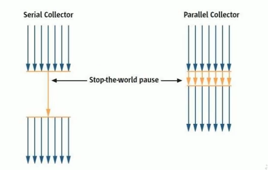

-
串行回收指的是在同一时间段内只允许有一个 CPU 用于执行垃圾回收操作，此时工作线程被暂停，直至垃圾收集工作结束。

  - 在诸如单 CPU 处理器或者较小的应用内存等硬件平台不是特别优越的场合，串行回收器的性能表现可以超过并行回收器和并发回收器。所以，*串行回收默认被应用在客户端的 Client 模式下的 JVM 中*

  - 在并发能力比较强的 CPU 上，并行回收器产生的停顿时间要短于串行回收器。

-
和串行回收相反，并行收集可以运用多个 CPU 同时执行垃圾回收，因此提升了应用的吞吐量，不过并行回收仍然与串行回收一样，采用独占式，使用了 “stop-the-world”机制。

-
按照*工作模式*分，可以分为并发式垃圾回收器和独占式垃圾回收器。

  - 并发式垃圾回收器与应用程序线程交替工作，以尽量可能减少应用程序的停顿时间。

  - 独占式垃圾回收器（Stop the world）一旦运行，就停止应用程序中的所有用户线程，直到垃圾回收过程完全结束。
 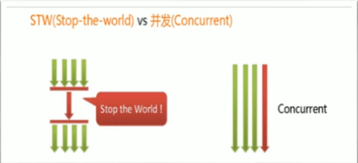

-
按*碎片处理方式*分，可分为压缩式垃圾回收器和非压缩式垃圾回收器。

  - 压缩式垃圾回收器会在回收完成后，对存活对象进行压缩整理，消除回收后的碎片。（再分配对象空间使用：指针碰撞）

  - 非压缩式的垃圾回收器不进行这步操作。

-
按*工作的内存区间*分，又可分为年轻代垃圾回收器和老年代垃圾回收器。（再分配对象空间使用：空闲列表）

#### 1.2. 评估 GC 的性能指标

-
**吞吐量：运行用户代码的时间占总运行时间的比例**

  - （总运行时间：程序的运行时间 + 回收内存的时间）

-
垃圾收集开销：吞吐量的补数，垃圾收集所用时间与总运行时间的比例。

-
**暂停时间：执行垃圾收集时，程序的工作线程被暂停的时间**。

-
收集频率：相对于应用程序的执行，收集操作发生的频率。

-
**内存占用：Java 堆区所占的内存大小。**

-
快速：一个对象从诞生到被回收所经理的时间。

-
上面六条中加粗的三条构成一个“不可能三角”。三者总体的表现会随着技术进步而越来越好。一款优秀的收集器通常最多同时满足其中的两项。

-
这三项里，暂停时间的重要性日益凸显。因为随着硬件发展，内存占用多越来越能容忍，硬件性能的提升也有助于降低收集器运行时对应用程序的影响，即提高了吞吐量。而内存的扩大，对延迟反而带来负面效果。

-
简单来说，主要抓住两点：

  - 吞吐量

  - 暂停时间

##### 评估 GC 的性能指标：吞吐量（throughput）

- 吞吐量就是 CPU 用于运行用户代码的时间与 CPU 总消耗时间的比值，即吞吐量= 运行用户代码时间 / （运行用户代码时间 + 垃圾收集时间）。

  - 比如：虚拟机总共运行了100分钟，其中垃圾收集花掉1分钟，那吞吐量就是 99%。

- 这种情况下，应用程序能容忍较高的暂停时间，因此，高吞吐量的应用程序有更长的时间基准，快速响应是不必考虑的。

- 吞吐量优先，意味着再单位时间内，STW 的时间最短 0.2 + 0.2 = 0.4
 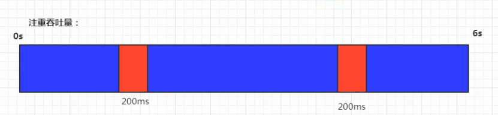

##### 评估 GC 的性能指标：暂停时间（pause time）

- “暂停时间”是指一个时间段内应用程序线程暂停，让 GC 线程执行的状态

  - 例如：GC 期间100毫秒的暂停时间意味着在这100毫秒期间内没有应用程序线程是活动的。

- 暂停时间优先，意味着尽可能让单词 STW 的时间最短：0.1 + 0.1 + 0.1 + 0.1 + 0.1 = 0.5
 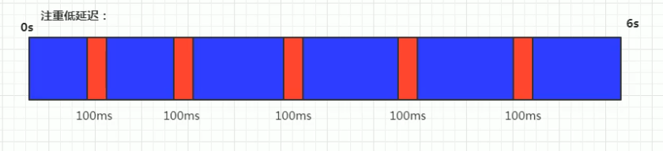

##### 评估 GC 的性能指标：吞吐量 vs 暂停时间

- 高吞吐量较好因为这会让应用程序的最终用户感觉只有应用程序在做“生产性”工作。直觉上，吞吐量越高程序运行越快。

- 低暂停时间（低延迟）较好因为从最终用户的角度来看不管是 GC 还是其他原因导致一个应用程序被挂起始终是不好的。这取决于应用程序的类型，*有时候甚至短暂的200ms暂停都可能打断终端用户体验*。因此，具有低的较大暂停时间是非常重要的，特别是对于一个*交互式应用程序*。

- 不幸的是“高吞吐量”和“低暂停时间”是一对相互竞争的目标（矛盾）

  - 因为如果选择以吞吐量优先，那么*必然需要降低内存回收的执行频率*，但是这样会导致 GC 需要更长的暂停时间来执行内存回收。

  - 相反的，如果选择以低延迟优先为原则，那么为了降低每次执行内存回收时的暂停时间，也*只能频繁地执行内存回收*。但这又引起了年轻代内存的缩减和导致程序吞吐量的下降。

在设计（或使用）GC 算法时，我们必须确定我们的目标：一个 GC 算法只可能针对两个目标之一（即只专注于较大吞吐量或最小暂停时间），或尝试找到一个二者的折衷。

现在标准：**在最大吞吐量优先的情况下，降低停顿时间。**

### 2. 不同的垃圾回收器概述

垃圾收集机制是 Java 的招牌能力，极大地提高了开发效率。这当然也是面试的热点。
 **那么，Java 常见的垃圾收集器有哪些？**

#### 垃圾收集器发展史

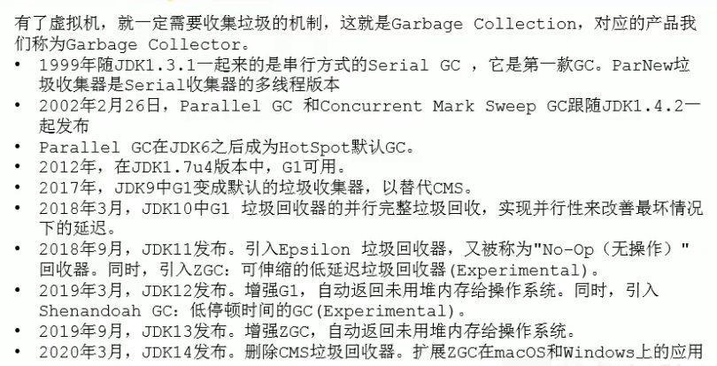

#### 7款经典的垃圾收集器

- 串行回收器：Serial、Serial Old

- 并行回收器：ParNew、Parallel Scavenge、Parallel Old

- 并发回收器：CMS、G1
 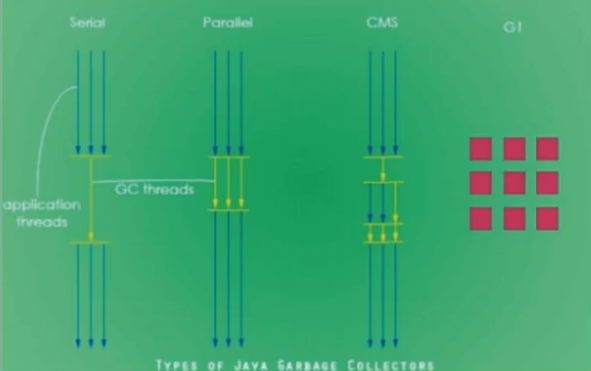

>
https://www.oracle.com/technetwork/java/javase/tech/memorymanagement-whitepaper-1-150020.pdf
 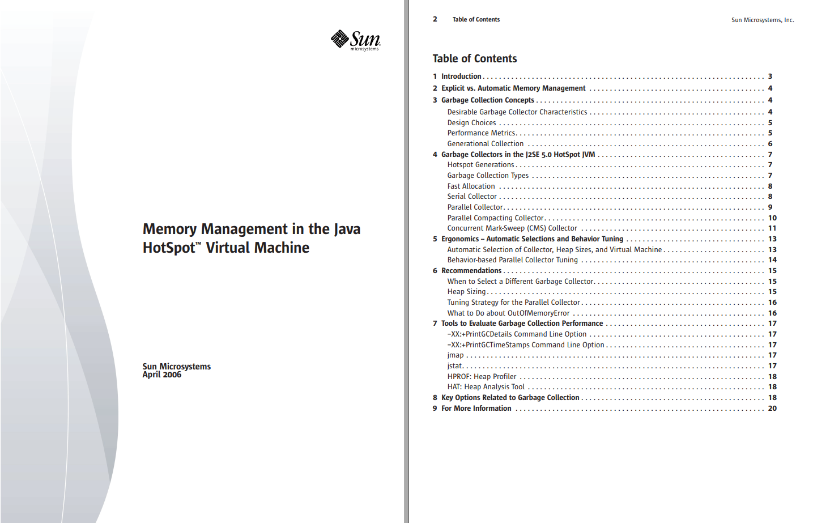

#### 7款经典垃圾收集器与垃圾分代之间的关系

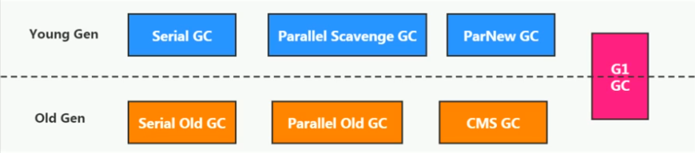

- 新生代收集器：Serial、ParNew、Parallel Scavenge;

- 老年代收集器：Serial Old、Parallel Old、CMS;

- 整堆收集器：G1;

#### 垃圾收集器的组合关系

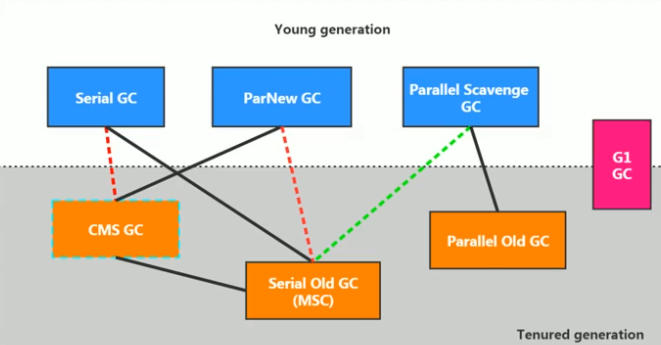
 上图更新到 JDK14，两根红线是 JDK8 和 9 的变化。绿色的线和青色的框是 JDK14 的变化

1. 两个收集器间有连线，表明它们可以搭配使用：
 Serial/Serial Old、Serial/CMS、ParNew/Serial Old、ParNew/CMS、Parallel Scavenge/Serial Old、Parallel Scavenge/Parallel Old、G1;

1. 其中 Serial Old 作为 CMS 出现“Concurrent Mode Failure”失败的后备预案。

1. （红色虚线）由于维护和兼容性测试的成本，在JDK 8 时将 Serial + CMS、ParNew+Serial Old 这两个组合声明为废弃（JEP 173），并在 JDK 9 中完全取消了这些组合的支持（JEP 214），即：移除。

1. （绿色虚线）JDK14 中 ：弃用 Parallel Scavenge 和 SerialOld GC 组合（JEP 366）

1. （青色虚线）JDK 14 中：删除 CMS 垃圾回收器（JEP 363）

#### 不同的垃圾收集器概述

- 为什么要有很多收集器，一个不够吗？因为 Java 的使用场景很多，移动端，服务器等。所以就需要针对不同的场景，提供不同的垃圾收集器，提高垃圾收集的性能。

- 虽然我们会对各个收集器进行比较，但并非为了挑选一个最好的收集器出来。没有一种放之四海皆准、任何场景下都使用的完美收集器存在，更加没有万能的收集器。所以*我们选择的只是对具体应用最合适的收集器*。

#### 查看默认的垃圾收集器

- `-XX:+PrintCommandLineFlags`：查看命令行相关参数（包含使用的垃圾收集器）

- 使用命令行指令：`jinfo -flag` 相关垃圾回收器参数 进程ID
 **eg：**

```
/**
 * -XX:+PrintCommandLineFlags
 */
public class GCUseTest {
    public static void main(String[] args) {
        List<byte[]> list = new ArrayList<>();

        while (true) {
            byte[] arr = new byte[100];
            list.add(arr);
            try {
                Thread.sleep(10);
            } catch (InterruptedException e) {
                e.printStackTrace();
            }
        }
    }
}

```

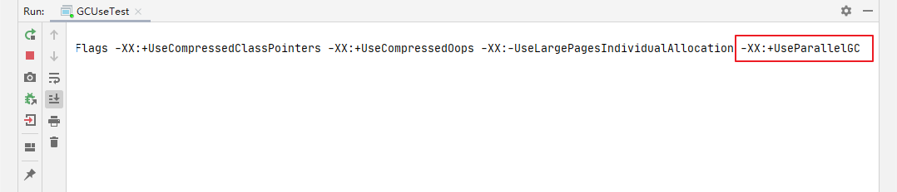
 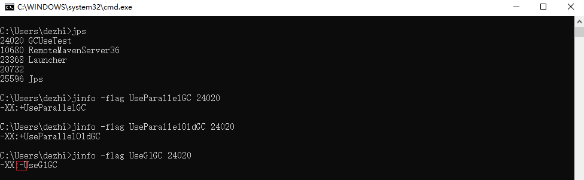

### 3. Serial 回收器：串行回收

- Serial 收集器是最基本、历史最悠久的垃圾收集器了。JDK 1.3 之前回收新生代唯一的选择。

- Serial 收集器作为 HotSpot 中 Client 模式下的默认新生代垃圾收集器。

- Serial 收集器采用**复制算法、串行回收和 "Stop-the-World" 机制**的方式执行内存回收。

- 除了年轻代之外，Serila 收集器还提供用于执行老年代垃圾收集的 Serial Old 收集器。Serial Old 收集器同样也采用了串行回收和 "Stop-the-World" 机制，只不过内存回收算法使用的是标记-压缩算法。

  - Serial Old 是运行在 Client 模式下默认的老年代的垃圾回收器

  - Serial Old 在 Server 模式下主要有两个用途：① 与新生代的 Parallel Scavenge 配合使用 ② 作为老年代 CMS 收集器的后备垃圾收集方案

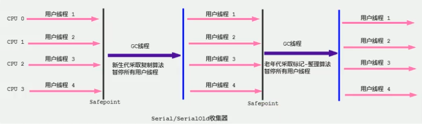
 这个收集器是一个单线程的收集器，但它的”单线程“的意义并不仅仅说明它*只会使用一个 CPU 或一条收集线程区完成垃圾收集工作*，更重要的是在它进行垃圾收集时，*必须暂停其他所有的工作线程*，直到它收集结束（Stop The World）。

- 优势：*简单而高效（与其他收集器的单线程比）*，对于限定单个 CPU 的环境来说，Serial 收集器由于没有线程交互的开销，专心做垃圾收集自然可以获得最高的单线程收集效率。

  - 运行在 Client 模式下的虚拟机是个不错的选择。

- 在用户的桌面应用场景中，可用内存一般不大（几十 MB 至 一两百 MB），可以在较短时间内完成垃圾收集（几十 ms 至 一百多 ms），只要不频繁发生，使用串行回收器是可以接受的。

- 在 HotSpot 虚拟机中，受用 -XX:+UseSerialGC 参数可以指定年轻代和老年代都使用串行收集器。

  - 等价于：新生代使用 Serial GC，而老年代用 Serial Old GC

**总结：**
 这种垃圾收集器大家了解，现在已经不用串行的了，而且在限定单核 CPU 才可以用。现在都不是单核的了。
 对于交互较强的应用而言，这种垃圾收集器是不能接受的。一般在 Java web 应用程序中是不会采用串行垃圾收集器的。

### 4. ParNew 回收器：并行回收

- 如果说 Serial GC 是年轻代中的单线程垃圾收集器，那么 ParNew 收集器则是 Serial 收集器的多线程版本。

  - Par 是 Parallel 的缩写，New：只能处理的是新生代

- ParNew 收集器除了采用*并行回收*的方式执行内存回收外，两款垃圾收集器之间几乎没有任何区别。ParNew 收集器在年轻代中同样也是*采用复制算法、”Stop-the-World“*机制。

- ParNew 是很多 JVM 运行在 Server 模式下新生代的默认垃圾收集器

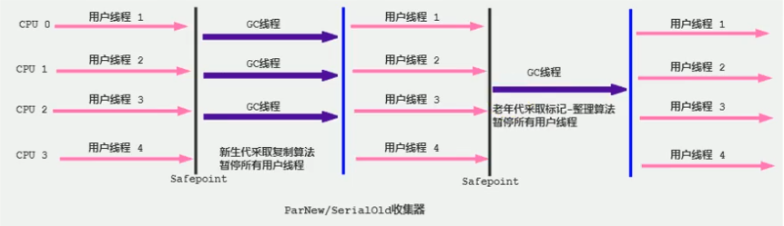

-
对于新生代，回收次数频繁，使用并行方式高效。

-
对于老年代，回收次数少，使用串行方式节省资源。（CPU 并行需要切换线程，串行可以省区切换线程的资源）

-
由于 ParNew 收集器是基于并行回收，那么是否可以判定 ParNew 收集器的回收效率在任何场景下都会比 Serial 收集器更高效？

  - ParNew 收集器运行在多 CPU 的环境下，由于可以充分利用多 CPU、多核心等物理硬件资源优势，可以更快速地完成垃圾收集，提升程序的吞吐量。

  - 但是*在单个 CPU 的环境下，ParNew 收集器不比 Serial 收集器更高效*。虽然 Serial 收集器是基于串行回收，但是由于 CPU 不需要频繁地做任务切换，因此可以有效避免多线程交互过程中产生的一些额外开销。

-
因为除 Serial 外，目前只有 ParNew GC 能与 CMS 收集器配合工作

-
在程序中，开发人员可以通过选项 `-XX:+UseParNewGC` 手动指定使用 ParNew 收集器执行内存回收任务。它表示年轻代使用并行收集器，不影响老年代。

-
`-XX:+ParallelGCThreads` 限制线程数量，默认开启和 CPU数据相同的线程数。

### 5. Parallel 回收器：吞吐量优先

-
HotSpot 的年轻代中除了用于 ParNew 收集器是基于并行回收的以外，Parallel Scavenge 收集器同样也采用了*复制算法，并行回收和 "Stop the World"* 机制。

-
那么 Parallel 收集器的出现是否多此一举？

  - 和 ParNew 收集器不同，Parallel Scavenge 收集器的目标则是达到一个*可控制的吞吐量*（Throughput），它也被称为吞吐量优先的垃圾收集器。

  - 自适应调节策略也是 Parallel Scavenge 与 ParNew 一个重要区别。

-
高吞吐量则可以高效率地利用 CPU 时间，尽快完成程序的运算任务，主要*适合在后台运算而不需要太多交互的任务*。因此常见在服务器环境中使用。*例如：那些执行批量处理、订单处理、工资支付、科学计算的应用程序*。

-
Parallel 收集器在 JDK1.6 时提供了用于执行老年代垃圾收集的 Parallel Old 收集器，用来代替老年代的 Serial Old 收集器。

-
Parallel Old 收集器采用了*标记-压缩算法*，但同样也是基于*并行回收和 "Stop-the-World" 机制。*
 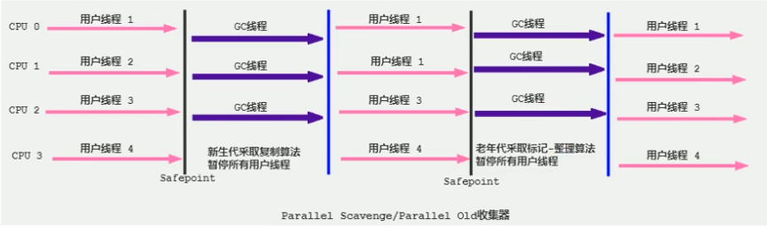

-
在程序吞吐量优先的应用场景中，Parallel 收集器和 Parallel Old 收集器的组合，在 Server 模式下的内存回收性能很不错。

-
在 Java8 中，默认是此垃圾收集器。

#### 参数配置

- `-XX:+UseParallelGC` 手动指定年轻代使用 Parallel 并行收集器执行内存回收任务。

- `-XX:+UseParallelOldGC` 手动指定年轻代和老年代都是使用并行回收收集器。

  - 分别适用于新生代和老年代。默认 JDK8 是开启的。

  - 上面两个参数，默认开启一个，另一个也会被开启。(互相激活)

- `-XX:ParallelGCThreads` 设置年轻代并行收集器的线程数。一般地，最好与 CPU 数量相当，以避免过多的线程数影响垃圾收集性能。

  - 在默认情况下，当 CPU 数据小于等于 8 个，ParallelGCThreads 的值等于 CPU 数量。

  - 当 CPU 数量大于 8 个，ParallelGCThreads 的值等于 3+(5*CPU_Count)/8.

- `-XX:MaxGCPauseMillis` 设置垃圾收集器最大停顿时间（即 STW 的时间）。单位是毫秒。

  - 为了尽可能地把停顿时间控制在 MaxGCPauseMills 以内，收集器在工作时会调整 Java 堆大小或者其他一些参数。

  - 对于用户来讲，停顿时间越短体验越好。但是在服务器端，我们注重高并发，整体的吞吐量。所以服务器端适合 Parallel，进行控制。

  - **该参数使用需谨慎。**

- `-XX:GCTimeRatio` 垃圾收集时间占总时间的比例（= 1 / (N + 1)）。用于衡量吞吐量的大小。

  - 取值范围（0，100）。默认值99，也就是垃圾回收时间不超过 1%。

  - 与前一个 -XX:MaxGCPauseMillis 参数有一定矛盾性。暂停时间越长，Radio 参数就容易超过设定的比例。

- `-XX:+UseAdaptiveSizePolicy` 设置 Parallel Scavenge 收集器具有*自适应调节策略*(默认开启)

  - 在这种模式下，年轻代的大小、Eden 和 Survivor 的比例、晋升老年代的对象年龄等参数会被自动调整，已达到在堆大小、吞吐量和停顿时间之间的平衡点。

  - 在手动调优比较困难的场合，可以直接使用这种自适应的方式，仅指定虚拟机的最大堆、目标的吞吐量（GCTimeRatio）和停顿时间（MaxGCPauseMills），让虚拟机自己完成调优工作。

### 6. CMS 回收器：低延迟

- 在 JDK 1.5 时期，HotSpot 推出了一款在*强交互应用*中几乎可认为有划时代意义的垃圾收集器：CMS（Concurrent-Mark-Sweep）收集器，*这款收集器是 HotSpot 虚拟机中第一款真正意义上的并发收集器，它第一次实现了让垃圾收集线程与用户线程同时工作*。

- CMS 收集器的关注点是尽可能缩短垃圾收集时用户线程的停顿时间。停顿时间越短（低延迟）就越适合与用户交互的程序，良好的响应速度能提升用户体验。

  - *目前很大一部分的 Java 应用集中在互联网或者 B/S 系统的服务端上，这类应用尤其重视服务的响应速度，希望系统停顿时间最短*，以给用户带来较好的体验。CMS 收集器就非常符合这类应用的需求。

- CMS 的垃圾收集算法采用*标记-清除*算法，并且也会”Stop-the-World“。

不幸的是，CMS 作为老年代的收集器，却无法与 JDK1.4.0 中已经存在的新生代收集器 Parallel Scavenge 配合工作，所以在 JDK1.5 中使用 CMS 收集老年代的时候，新生代只能选择 ParNew 或者 Serial 收集器中的一个。

在 G1 出现之前，CMS 使用还是非常广泛的。一直到今天，仍然有很多系统使用 CMS GC。

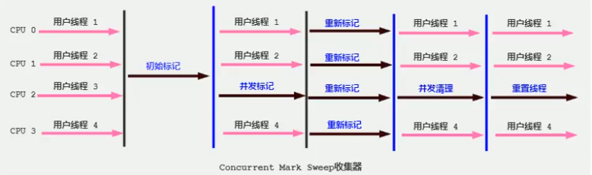
 CMS 整个过程比之前的收集器要复杂，整个过程分为 4 个阶段，即初始标记阶段、并发标记阶段、重新标记阶段和并发清除阶段。

- 初始标记（Initial-mark）阶段：在这个阶段中，程序中所有的工作线程都将会因为”Stop-the-World“机制而出现短暂的暂停，这个阶段的主要任务**仅仅只是标记出 GC Roots 能够直接关联到的对象**。一旦标记完成之后就会恢复之前被暂停的所有应用线程。由于直接关联对象比较小，所以这里的**速度非常快**。

- 并发标记（Concurrent-Mark）阶段：从 GC Roots 的**直接关联对象开始遍历整个对象图的过程**，这个过程**耗时较长**但是**不需要停顿用户线程**，可以与垃圾收集线程一起并发运行。

- 重新标记（Remark）阶段：由于在并发标记阶段中，程序的工作线程会和垃圾收集线程同时运行或者交叉运行，因此为了**修正并发标记期间，因用户程序继续运作而导致标记产生变动的那一部分对象的标记记录**，这个阶段的停顿时间通常会比初始标记阶段稍长一些，但也远比并发标记阶段的时间短。

- 并发清理（Concurrent-Swep）阶段：此阶段**清理删除掉标记阶段判断的已经死亡的对象，释放内存空间**。由于不需要移动存活对象，所以这个阶段也是可以与用户线程同时并发的

尽管 CMS 收集器采用的是并发回收（非独占式），但是在其*初始化标记和再次标记这两个阶段中仍然需要执行”Stop-the-World“机制*暂停程序中的工作线程，不过暂停时间并不会太长，因此可以说明目前所有的垃圾收集器都做不到完全不需要”Stop-the-World“，只是尽可能地缩短暂停时间。

*由于最耗时间的并发标记与并发清理阶段都不需要暂停工作，所以整体的回收是低停顿的。*

另外，由于在垃圾收集阶段用户线程没有中断，所以*在 CMS 回收过程中，还应该确保应用程序用户线程有足够的内存可用*。因此，CMS 收集器不能像其他收集器那样等到老年代几乎完全被填满了再进行收集，而是*当堆内存使用率达到某一阈值时，便开始进行回收*，以确保应用程序在 CMS 工作过程中依然有足够的空间支持应用程序运行。要是 CMS 运行期间预留的内存无法满足程序需要，就会出现一次”Concurrent Mode Failure“失败，这时虚拟机将启动后备预案：临时启用 Serial Old 收集器来重新 进行老年代的垃圾收集，这样停顿时间就很长了。

CMS 收集器的垃圾收集算法采用的是*标记-清除算法*，这意味着每次执行完内存回收后，由于被执行内存回收的无用对象所占用的内存空间极有可能是不连续的一些内存块，不可避免地将*会产生一些内存碎片*。那么 CMS 在为新对象分配内存空间时，将无法使用指针碰撞（Bump the Pointer）技术，而只能够选择空闲列表（Free List）执行内存分配。
 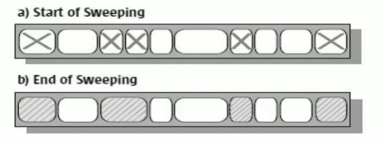

**有人觉得既然 Mark Sweap 会造成内存碎片，那么为什么不把算法换成 Mark Compact 呢？**
 答案其实很简单，因为当并发清除的时候，用 Compact 整理内存的话，原来的用户线程使用的内存还怎么用呢？要保证用户线程能继续执行，前提是它运行的资源不受影响。Mark Compact 更适合“Stop the World”这种场景下使用

#### CMS 的优点

- 并发收集

- 低延迟

#### CMS 的缺点

1）*会产生内存碎片*，导致并发清除后，用户线程可用的空间不足。在无法分配大对象的情况下，不得不提前触发 Full GC。
 2）*CMS 收集器对 CPU 资源非常敏感*。在并发阶段，它虽然不会导致用户停顿，但是会因为占用了一部分线程而导致应用程序变慢，总吞吐量会降低。
 3）*CMS 收集器无法处理浮动垃圾*。可能出现“Concurrent Mode Failure”失败而导致另一次 Full GC 的产生。在并发标记阶段由于程序的工作线程和垃圾收集线程是同时运行或者交叉运行的，那么*在并发标记阶段如果产生新的垃圾对象，CMS 将无法对这些垃圾对象进行标记，最终会导致这些新产生的垃圾对象没有被及时回收*，从而只能在下一次执行 GC 时释放这些之前未被回收的内存空间。

#### CMS 收集器可以设置的参数

- `-XX:+UseConcMarkSweapGC` 手动指定使用 CMS 收集器执行内存回收任务。

  - 开启该参数后自动将 `-XX:+UseParNewGC` 打开。即 PerNew(Young区用) + CMS(Old区用) + Serial Old 的组合。

- `-XX:CMSlnitiatingOccupanyFraction` 设置堆内存使用率的阈值，一旦达到该阈值，便开始进行回收。

  - JDK5 及以前版本的默认值为 68，即当老年代的空间使用率达到68%时，会执行一次 CMS 回收。*JDK6 及以上版本默认值为 92%*

  - 如果内存增长缓慢，则可以设置一个稍大的值，大的阈值可以有效降低 CMS 的触发频率，减少老年代回收的次数可以较为明显地改善应用程序性能。反之，如果应用程序内存使用率增长很快，则应该降低这个阈值，以避免频繁触发老年代串行收集器。因此*通过该选项便可以有效降低 Full GC 的执行次数*。

- `-XX:+UseCMSCompactAtFullGollection` 用于指定在执行完 Full GC 后对内存空间进行压缩整理，以此避免内存碎片的产生。不过由于内存压缩整理过程无法并发执行，所带来的问题就是停顿时间变得更长了。

- `-XX:CMSFullGCsBeforeCompaction` 设置在执行多少次 Full GC 后对内存空间进行压缩整理。

- `-XX:ParallelCMSThreads` 设置 CMS 的线程数量。

  - CMS 默认启动的线程数是 (ParallelGCThreads + 3) / 4， ParalleGCThreads 是年轻代并行收集器的线程数。当 CPU 资源比较紧张时，受到 CMS 收集器线程的影响，应用程序的性能在垃圾回收阶段可能会非常糟糕。

#### 小结

HotSpot 有这么多的垃圾收集器，那么如果有人问，Serial GC、Parallel GC、Concurrent Mark Sweap GC 这三个 GC 有什么不同呢？
 请记住一下口令：
 如果你想要最小化地使用内存和并行开销，请选 Serial GC;
 如果你想要最大化应用程序的吞吐量，请选 Parallel GC;
 如果你想要最小化 GC 的中断或停顿时间，请选 CMS GC;

#### JDK 后续版本中 CMS 的变化

- JDK9 新特性：CMS 被标记为 Deprecate 了（JEP291）

  - 如果对 JDK9 及以上版本的 HotSpot 虚拟机使用参数 -XX:UseConcMarkSweapGC 来开启 CMS 收集器的话，用户会收到一个警告信息，提示 CMS 未来将会被废弃。

- JDK14 新特性：删除 CMS 垃圾回收器（JEP363）

  - 移除了 CMS 垃圾收集器，如果在 JDK14 中使用 -XX:+UseConcMarkSweapGC 的话，JVM 不会报错，只是给出一个 Warning 信息，但是不会 exit。JVM 会自动回退以默认 GC 方式启动 JVM。

### 7. G1 回收器：区域化分代式

**既然我们已经有了前面几个强大的 GC，为什么还要发布 Garbage First（G1）GC？**
 原因就在于应用程序所应对的*业务越来越庞大、复杂，用户越来越多*，没有 GC 就不能保证应用程序正常进行，而经常造成 STW 的 GC 又跟不上实际的需求，所以才会不断地尝试对 GC 进行优化。G1（Garbage-First）垃圾回收器是在 Java7 update 4 之后引入的一个新的垃圾回收器，是当今收集器技术发展的最前沿成果之一。

与此同时，为了适应现在*不断扩大的内存和不断增加的处理器数量*，进一步降低暂停时间（pause time），同时兼顾良好的吞吐量。

*官方给 G1 设定的目标是在延迟可控的情况下获得尽可能高的吞吐量，所以才担当起“全功能收集器”的重任与期望。*

**为什么名字叫做 Garbae First（G1）呢？**

- 因为 G1 是一个并行回收器，它把内存分割为很多不相关的区域（Region）（物理上不连续的）。使用不同的 Region 来表示 Eden、幸存者0区、幸存者1区，老年代等。

- G1 GC 有计划地避免整个 Java 堆中进行全区域的垃圾收集。G1 跟踪各个 Region 里面的垃圾堆积的价值大小（回收所获得的空间大小以及回收所需时间的经验值），在后台维护一个优先列表，*每次根据允许的收集时间，优先回收价值最大的 Region*。

- 由于这种方式的侧重点在于回收垃圾最大量的区间（Region），所以我们给 G1 一个名字：垃圾优先（Garbage First）。

G1（Garbage-First）是一款面向服务端应用的垃圾收集器，*主要针对配备多核 CPU 及大容量内存的机器*，以极高概率满足 GC 停顿时间的同时，还兼具高吞吐量的性能特征。

在 JDK1.7 版本正式启用，移除了 Experimental 的标识，*是 JDK9 以后的默认垃圾回收器*，取代了 CMS 回收器以及 Parallel + Parallel Old 组合。被 Oracle 官方称为“全功能的垃圾收集器”。

与此同时，CMS 已经在 JDK9 中被标记为废弃（deprecated）。在 JDK8 中 G1 还不是默认的垃圾回收器，需要使用 `-XX:+UseG1GC` 来启用。

#### G1 回收器的特点（优势）

与其他 GC 收集器相比，G1 使用了全新的分区算法，其特点如下所示：

- **并行与并发**

  - 并行性：G1 在回收期间，可以有多个 GC 线程同时工作，有效利用多核计算能力。此时用户线程 STW；

  - 并发性：G1 拥有与应用程序交替执行的能力，部分工作可以和应用程序同时执行，因此，一般来说，不会在整个回收阶段发生完全阻塞应用程序的情况；

- **分代收集**

  - 从分代上看，G1 依然属于分代型垃圾回收器，它会区分年轻代和老年代，年轻代依然有 Eden 区 和 Survivor 区，但从堆的结构上看，它不要求整个 Eden 区、年轻代或者老年代都是连续的，也不再坚持固定大小和固定数量。

  - 将堆空间分为若干个区域（Region），这些区域中包含了逻辑上的年轻代和老年代。

  - 和之前的各类回收器不同，它同时兼顾年轻代和老年代。对比其他回收器，或者工作在年轻代，或者工作在老年代；
 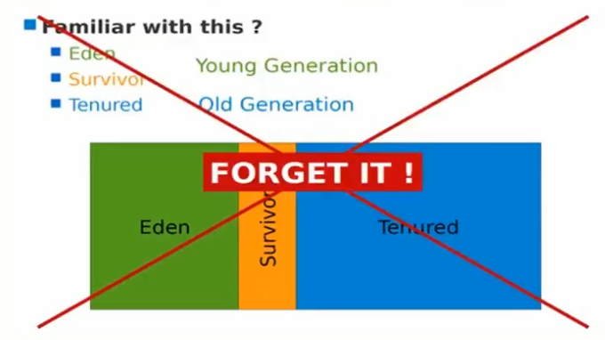
 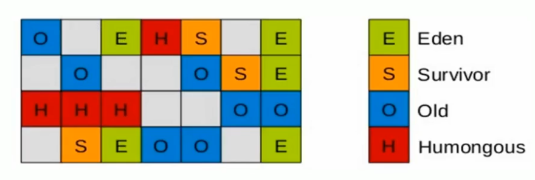

- **空间整合**

  - CMS：“标记-清除”算法、内存碎片、若干次 GC 后进行一次碎片整理

  - G1 将内存划分为一个个的 region。内存的回收是以 region 作为基本单位的。*Region 之间是复杂算法*，但整体上实际可以看作是*标记-压缩（Mark-Compact）算法*，两种算法都可以避免内存碎片。这种特性有利于程序长时间运行，分配大对象时不会因为无法找到连续内存空间而提前触发下一次 GC。尤其是当 Java 堆非常大的时候，G1 的优势更加明显。

- **可预测的停顿时间模型**（即：软实时 soft real-time）
 这是 G1 相对于 CMS 的另一大优势，G1 除了追求低停顿外，还能建立可预测的停顿时间模型，能让使用者明确指定在一个长度为 M 毫秒的时间片段内，消耗在垃圾收集上的时间不得超过 N 毫秒。

  - 由于分区的原因，G1 可以只选取部分区域进行内存回收，这样缩小了回收的范围，因此对于全局停顿情况的发生也能得到较好的控制。

  - G1 跟踪各个 Region 里面的垃圾堆积的价值大小（回收所获得的空间大小以及回收所需时间的经验值），在后台维护一个优先列表，*每次根据允许的收集时间，优先回收价值最大的 Region*。保证了 G1 收集器在有限的时间内可以*获取尽可能高的收集效率*。

  - 相比于 CMS GC，G1 未必能做到 CMS 在最好情况下的延时停顿，但是最差情况要好很多。

#### G1 回收器的缺点

相较于 CMS，G1 还不具备全方位、压倒性优势。比如在用户程序允许过程中，G1 无论时为了垃圾收集产生的内存占用（Footprint）还是程序运行时的额外执行负载（Overload）都要比 CMS 更高。

从经验上来说，在小内存应用上 CMS 的表现大概率会优于 G1，而 G1 在大内存应用上则发挥其优势。平衡点在 6-8GB 之间。

#### G1 回收器的参数设置

- `-XX:+UseG1GC` 手动指定使用 G1 收集器执行内存回收任务。

- `-XX:G1HeapRegionSize` 设置每个 Region 的大小。值是2的幂，范围是 1MB到32MB之间，目标是根据最小的 Java 堆大小划分出约 2048 个区域，默认是堆内存的 1/2000。

- `-XX:MaxGCPauseMillis` 设置期望达到的最大 GC 停顿时间指标（JVM 会尽力实现，但不保证达到）。默认值是 200ms。

- `-XX:ParallelGCThread` 设置 STW 时 GC 线程数的值，最多设置为8.

- `-XX:ConcGCThreads` 设置并发标记的线程数。将 n 设置为并行垃圾回收线程数（ParallelGCThreads）的 1/4 左右。

- `-XX:InitiatingHeapOccupanyPercent` 设置触发并发 GC 周期的 Java 堆占用率阈值。超过此值，就触发 GC。默认值是45.

#### G1 回收器的常见操作步骤

G1 的设计原则就是简化 JVM 性能调优，开发人员只需要简单的三步即可完成调优：：
 第一步：开启 G1 垃圾收集器
 第二部：设置堆的最大内存
 第三步：设置最大的停顿时间

G1 中提供了三种垃圾回收模式：YoungGC、Mixed GC 和 Full GC，在不同的条件下被触发。

#### G1 回收器的适用场景

- 面向服务端应用，针对具有大内存、多处理器的机器。（在普通大小的堆里表现并不惊喜）

- 最主要的应用是需要低 GC 延迟，并具有大堆的应用程序提供解决方案；

- 如：在堆大小约 6GB 或更大时，可预测的暂停时间低于 0.5 秒；（G1通过每次只清理一部分而不是全部的 Region 的增量式清理来保证每次 GC 停顿时间不会过长）。

- 用来替换掉 JDK1.5 中的 CMS 收集器：
 在下面的情况时，时，使用 G1 可能比 CMS 好：
 ① 超过50%的 Java 堆被活动数据占用；
 ② 对象分配频率或年代提升频率变化很大；
 ③ GC 停顿时间过长（长于0.5-1秒）。

- HotSpot 垃圾收集器里，除了 G1 以外，其他的垃圾收集器使用内置的 JVM 线程执行 GC 的多线程操作，而 G1 GC 可以采用应用线程承担后台允许的 GC 工作，即当 JVM 的 GC 线程处理速度慢时，系统会调用应用程序线程帮助加速垃圾回收过程。

##### 分区 Region：化整为零

使用 G1 收集器时，它将整个 Java 堆划分成约 2048个大小相同的独立 Region 块，每个 Region 块大小根据堆空间的实际大小而定，整体被控制在 1MB 到 32MB 之间，且为 2 的 N 次幂，即 1MB，2MB，4MB，8MB，16MB，32MB。可以通过 -XX:G1HeapRegionSize 设定。*所有的 Region 大小相同，且在 JVM 生命周期内不会被改变*。

虽然还保留有新生代和老年代的概念，但新生代和老年代不再是物理隔离的了，它们都是一部分 Region（不需要连续）的集合。通过 Region 的动态分配方式实现逻辑上的连续。
 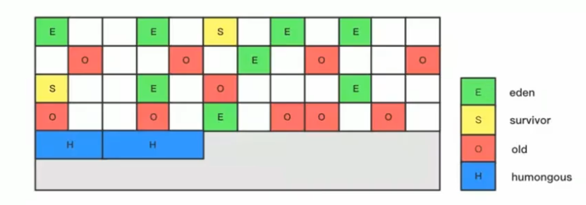

- 一个 region 有可能属于 Eden，Survivor 或者 Old/Tenured 内存区域。但是一个 region 只可能属于一个角色。图中的 E 表示该 region 属于 Eden 内存区域，S 表示属于 Survivor 内存区域，O 表示属于 Old 内存区域。图中空白的表示未使用的内存空间。

- G1 垃圾收集器还增加了一种新的内存区域，叫做 Humongous 内存区域，如果中的 H 块。主要用于存储大对象，如果超过 1.5 个 region，就放到 H。
 **设置 H 的原因：**
 对于堆中的大对象，默认直接会被分配到老年代，但是如果它是一个短期存在的大对象，就会对垃圾收集器造成负面影响。为了解决这个问题，G1 划分了一个 Humongous 区，它用来专门存放大对象。*如果一个 H 区装不下一个大对象，那么 G1 会寻找连续的 H 区来存储。*为了能找到连续的 H区，有时候不得不启动 Full GC。G1 的大多数行为都把 H区作为老年代的一部分来看待。
 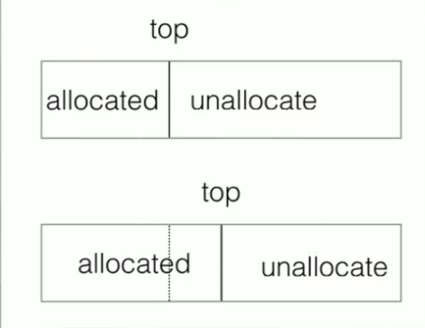

- Bump - the - pointer (指针碰撞)

- TLAB

#### G1 回收器垃圾回收过程

G1 GC 的垃圾回收过程主要包括如下三个环节：

- 年轻代GC（Young GC）

- 老年代并发标记过程（Concurrent Markign）

- 混合回收（Mixed GC）

- （如果需要，单线程、独占式、高强度的 Full GC 还是继续存在的。它针对 GC 的评估失败提供了一种失败保护机制，即强力回收）。
 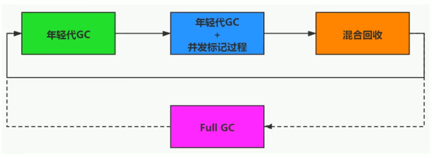
 顺时针，young gc -> young gc + concurrent mark -> Mixed GC 顺序，进行垃圾回收。

应用程序分配内存，*当年轻代的 Eden 区用尽时开始年轻代回收过程*；G1 的年轻代收集阶段是一个*并行*的*独占式*收集器。在年轻代回收期，G1 GC 暂停所有应用程序线程，启动多线程执行年轻代回收。然后*从年轻代区间移动存活对象到 survivor 区间或者老年区间，也有可能是两个区间都会涉及*。

当堆内存使用达到一定值（默认 45%）时，开始老年代并发标记过程。

标记完成马上开始混合回收过程。对于一个混合回收期，G1 GC 从老年区间移动存活对象到空闲区间，这些空闲区间也就成为了老年代的一部分。和年轻代 不同，老年代的 G1 回收器和其他 GC 不同，*G1 的老年代回收器不需要整个老年代被回收，一次只需要扫描/回收一小部分老年代的 Region 就可以了*。同时，这个老年代 Region 是和年轻代一起被回收的。

举个例子：一个 Web 服务器，Java 进程最大堆内存为 4G，每分钟响应 1500 个请求，没45秒钟会新分配大约2G的内存。G1 会每45秒钟进行一次年轻代回收，每31个小时整个堆的使用率会达到45%，会开始老年代并发标记过程，标记完成后开始四到五次的混合回收。

#### G1 回收器垃圾回收过程：Remembered Set

- 一个对象被不同区域引用的问题

- 一个 Region 不可能是孤立的，一个 Region 中的对象可能被其他任意 Region 中对象引用，判断对象存活时，是否需要扫描整个 Java 堆才能保证准确？

- 在其他的分代收集器，也存在这样的问题（而 G1 更突出）

- 回收新生代也不得不同时扫描老年代？

- 这样的话会降低 Minor GC 的效率；

**解决方法：**

- 无论 G1 还是其他分代收集器，JVM 都是使用 Remembered Set 来避免全局扫描；

- 每个 Region 都有一个对应的 Remembered Set；

- 每次 Reference 类型数据写操作时，都会产生一个 Write Barrier 暂时中断操作；

- 然后检查将要写入的引用指向的对象是否和该 Reference 类型数据在不同的 Region（其他收集器: 检查老年代对象是否引用了新生代对象）；

- 如果不同，通过 CardTable 把相关引用信息记录到引用指向对象的所在 Region 对应的 Remembered Set 中；

- 当进行垃圾收集时，在 GC 根节点的枚举范围加入 Remembered Set；就可以保证不进行全局扫描，也不会有遗漏。
 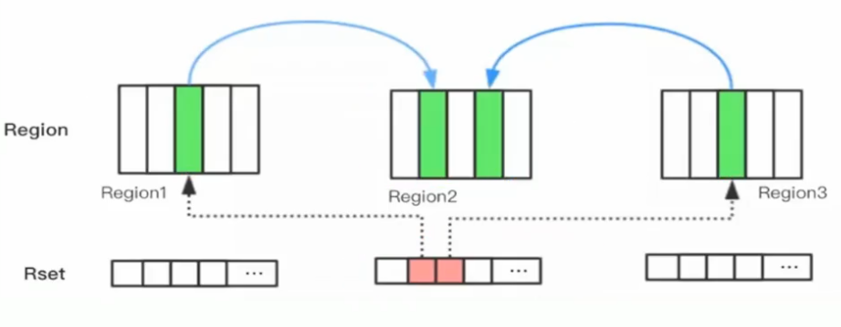

##### G1 回收过程一：年轻代 GC

JVM 启动时，G1 先准备好 Eden 区，程序在运行过程中不断创建对象到 Eden 区，当 Eden 空间耗尽时，G1 会启动一次年轻代垃圾回收过程。

年轻代垃圾回收只会回收 Eden 区和 Survivor 区。

首先 G1 停止应用程序的执行（Stop-the-World），G1 创建回收集（Collection Set），回收集是指需要被回收的内存分段的集合，年轻代回收过程的回收集包含年轻代 Eden 区和 Survivor 区所有的内存分段。
 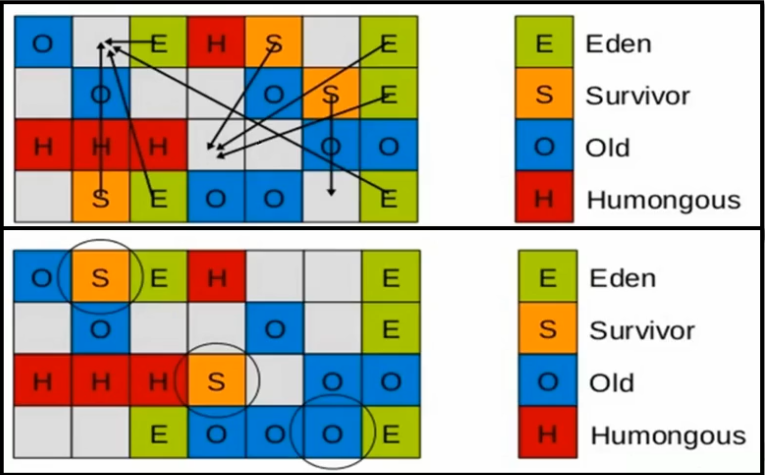
 然后开始如下回收过程：
 **第一阶段，扫描根**
 根是指 static 变量指向的对象，正在执行的方法调用链上的局部变量等。根引用连同 RSet 记录的外部引用作为扫描存活对象的入口。
 **第二阶段，更新 RSet**
 处理 dirty card queue（见备注） 中的 card，更新 RSet。此阶段完成后，*RSet 可以准确的反应老年代对所在的内存分段中对象的引用*。
 **第三阶段，处理 RSet**
 识别被老年代对象指向的 Eden 中的对象，这些被指向的 Eden 中的对象被认为是存活的对象。
 **第四阶段，复制对象**
 此阶段，对象树被遍历，Eden 区内存段中存活的对象会被复制到 Survivor 区中空的内存分段，Survivor 区内存段中存活的对象如果年龄未达阈值，年龄会加1，达到阈值挥别复制到 Old 区中空的内存分段。如果 Survivor 空间不够，Eden 空间的部分数据会直接晋升到老年代空间。
 **第五阶段，引用处理**
 处理 Soft，Weak，Phantom，Final，JNI Weak 等引用。最终 Eden 空间的数据为空，GC 停止工作，而目标内存中的对象都是连续存储的，没有碎片，所以复制过程可以达到内存整理的效果，减少碎片。

***注：*** 对于应用程序的引用赋值语句 Ojbect.field = object，JVM 会在之前和之后指向特殊的操作以在 dirty card queue 中入队一个保存了对象引用信息的 card。在年轻代回收的时候，G1 会对 Dirty Card Queue 中所有的 card 进行处理，以更新 RSet，保证 RSet 实时准确的反映引用关系。
 那为什么不再引用赋值语句处直接更新 RSet 呢？这是为了性能的需要，RSet 的处理需要线程同步，开销会很大，使用队列性能会好很多。

##### G1 回收过程二：并发标记过程

1. **初始标记阶段：** 标记从根节点直接可达的对象。这个阶段是 STW 的，并且会触发一次年轻代 GC。

1. **根区域扫描（Root Region Scanning）：** G1 GC 扫描 Survivor 区直接可达的老年代区域对象，并标记被引用的对象。这一过程必须在 young GC 之前完成。

1. **并发标记（Concurrent Marking）：** 在整个堆中进行并发标记（和应用程序并发执行），此过程可能被 young GC 中断。在并发标记阶段，若发现区域对象中的所有对象都是垃圾，那这个区域会被立即回收。同时，并发标记过程中，会计算每个区域的对象活性（区域中存活对象的比例）。

1. **再次标记（Remark）：** 由于应用程序持续进行，需要修正上一次的标记结果。是 STW 的。G1 中采用了比 CMS 更快的初始快照算法：snapshot-at-the-beginning(SATB).

1. **独占清理（cleanup,STW）：** 计算各个区域的存活对象和 GC 回收比例，并进行排序，识别可以混合回收的区域。为下阶段做铺垫。是 STW 的。

  - 这个阶段并不会实际上去做垃圾的收集

1. **并发清理阶段：** 识别并清理完全空闲的区域。

##### G1 回收过程三：混合回收

当越来越多的对象晋升到老年代 old region 时，为了避免堆内存被耗尽，虚拟机会触发一个混合的垃圾收集器，即 Mixed GC，该算法并不是一个 Old GC，除了回收整个 Young Region，还会回收一部分的 Old Region。这里需要注意：是一部分老年代，而不是全部老年代。可以选择哪些 Old Region 进行收集，从而可以对垃圾回收的耗时时间进行控制。也要注意的是 Mixed GC 并不是 Full GC。
 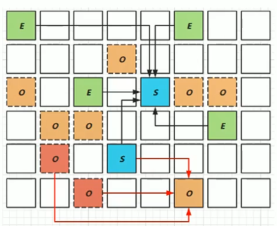

- 并发标记结束以后，老年代中百分百为垃圾的内存分段被回收了，部分为垃圾的内存分段被计算了出来。默认情况下，这些老年代的内存分段会分8次（可以通过 -XX:G1MixedGCCountTarget 设置）被回收。

- 混合回收的回收集（Collection Set）包括八分之一的老年代内存分段，Eden 区内存分段，Survivor 区内存分段。混合回收的算法和年轻代回收的算法完全一样，只是回收集多了老年代的内存分段。具体情况参考上面的年轻代回收过程。

- 由于老年代中的内存分段默认分8次回收，G1 会优先回收垃圾多的内存分段。垃圾占内存分段比例越过的，越会被先回收。并且有一个阈值会决定内存分段是否被回收， -XX:G1MixedGCLiveThresholdPercent，默认为 65%，意思是垃圾占内存分段比例要达到65%才会被回收。如果垃圾占比太低，意味着存活的对象占比高，在复制的时候会花费更多的时间。

- 混合回收并不一定要进行8次。有一个阈值 -XX:G1HeapWastePercent，默认值为10%，意思是允许整个对内存中有10%的空间被浪费，意味着如果发现可以回收的垃圾占堆内存的比例低于10%，则不再进行混合回收。因为 GC 会花费很多的时间但是回收到的内存却很少。

##### G1 回收过程四：Full GC

G1 的初衷就是要避免 Full GC 的出现。但是如果上述方式不能正常工作，G1 会*停止应用程序的执行*（Stop-The-World），使用*单线程*的内存回收算法进行垃圾回收，性能会非常差，应用程序停顿时间会很长。

要避免 Full GC 的发生，一旦发生需要进行调整。什么时候会发生 Full GC 呢？比如*堆内存太小*，当 G1 在复制存活对象的时候没有空的内存分段可用，则会回退到 Full GC，这种情况可以通过增大内存解决。

导致 G1 Full GC 的原因可能有两个：

1. Evacuation 的时候没有足够的 to-space 来存放晋升的对象；

1. 并发处理过程完成之前空间耗尽。

##### G1 回收过程：补充

从 Oracle 官方透露出来的信息可获知，回收阶段（Evacuation）其实本也有想过设计成与用户程序一起并发执行，但这件事情做起来比较复杂，考虑到 G1 只是回收一部分 Region，停顿时间是用户可控制的，所以并不迫切去实现，而*选择把这个特性放到了 G1 之后出现的低延迟垃圾收集器（即 ZGC）中*。另外，还考虑到 G1 不是仅仅面向低延迟，停顿用户线程能够最大幅度提高垃圾收集效率，为了保证吞吐量所以才选择了完全暂停用户线程的实现方案。

##### G1 回收器优化建议

- 年轻代大小

  - 避免使用 -Xmn 或 -XX:NewRatio 等相关选项显式设置年轻代大小

  - 固定年轻代的大小会覆盖暂停时间目标

- 暂停时间目标不要太过严苛

  - G1 GC 的吞吐量目标是 90% 的应用程序时间和 10% 的垃圾回收时间

  - 评估 G1 GC 的吞吐量时，暂停时间目标不要太严苛。目标太过严苛表示你愿意承受更多的垃圾回收开销，而这些会直接影响到吞吐量。

### 8. 垃圾回收器总结

#### 7种经典垃圾回收器总结

截至 JDK1.8，一共有7款不同的垃圾收集器。每一款不同的垃圾收集器都有不同的特点，在具体使用的时候，需要根据具体的情况选用不同的垃圾收集器。

 | 垃圾收集器 | 分类 | 作用位置 | 使用算法 | 特点 | 使用场景
 | Serial | 串行运行 | 作用于新生代 | 复制算法 | 响应速度优先 | 适用于单 CPU 环境下的 client 模式
 | ParNew | 并行运行 | 作用于新生代 | 复制算法 | 响应速度优先 | 多 CPU 环境 Server 模式下与 CMS 配合使用
 | Parallel | 并行运行 | 作用于新生代 | 复制算法 | 吞吐量优先 | 适用于后台运算而不需要太多交互的场景
 | Serial Old | 串行运行 | 作用于老年代 | 标记-压缩算法 | 响应速度优先 | 适用于单 CPU 环境下的 Client 模式
 | Parallel Old | 并行运行 | 作用于老年代 | 标记-压缩算法 | 吞吐量优先 | 适用于后台运算而不需要太多交互的场景
 | CMS | 并发运行 | 作用于老年代 | 标记-清除算法 | 响应速度优先 | 适用于互联网或 B/S 业务
 | G1 | 并发、并行运行 | 作用域新生代、老年代 | 标记-压缩算法、复制算法 | 响应速度优先 | 面向服务端应用

**GC 发展阶段：**
 Serial => Parallel（并行） => CMS（并发）=> G1 =>ZGC

#### 怎么选择垃圾回收器？

- Java 垃圾收集器的配置对于 JVM 优化来说是一个很重要的选择，选择合适的垃圾收集器可以让 JVM 的性能有一个很大的提升。

- 怎么选择垃圾收集器？

1. 优先调整堆的大小让 JVM 自适应完成。

1. 如果内存小于 100M，使用串行收集器

1. 如果是单核、单机程序，并且没有停顿时间的要求，串行收集器

1. 如果是多 CPU、需要高吞吐量、允许停顿时间超过1秒，选择并行或者 JVM 自己选择

1. 如果是多 CPU、追求低停顿时间，需快速响应（比如延迟不能超过1秒，如互联网应用），使用并发收集器，官方推荐 G1，性能高。**现在互联网的项目，基本都是使用 G1**。

**明确一个观点：** 没有最好的收集器，更没有万能的收集，调优永远是针对特定场景、特定需求，不存在一劳永逸

#### 面试

- 对于垃圾收集，面试官可以循序渐进从理论、实践各种角度深入，也未必是要求面试者什么都懂。但如果你懂得原理，一定会成为面试中的加分项。这里较通用、基础性的部分如下：

  - 垃圾收集的算法有哪些？如何判读一个对象是否可以回收？

  - 垃圾收集器工作的基本流程。

- 另外，需要多关注垃圾回收器这一章的各种常用参数。

### 9. GC 日志分析

通过阅读 GC 日志，我们可以了解 Java 虚拟机内存分配与回收策略。
 **内存分配与垃圾回收的参数列表：**
 `-XX:+PirntGC` 输出 GC 日志。类似：-verbose:gc
 `-XX:+PringGCDetails` 输出 GC 的详细日志
 `-XX:+PrintGCTimeStamps` 输出 GC 的时间戳（以基准时间的形式）
 `-XX:+PrintGCDateStamps` 输出 GC 的时间戳（以日期的形式，如 2020-10-10T20:20:12.123+0800）
 `-XX:+PrintHeapAtGC` 在进行 GC 的前后打印出堆信息
 `-Xloggc:../logs/gc.log` 日志文件的输出路径

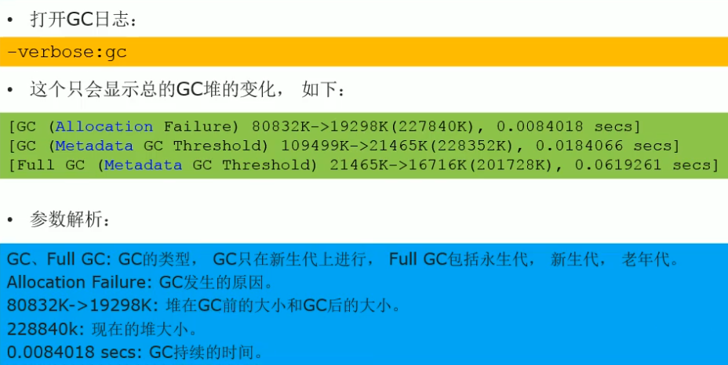
 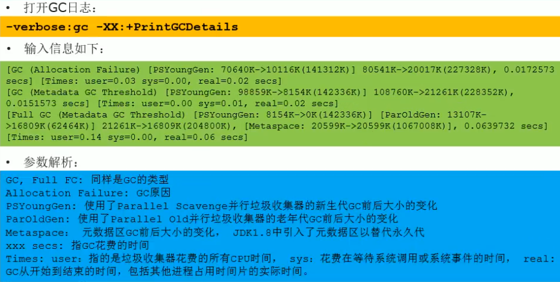
 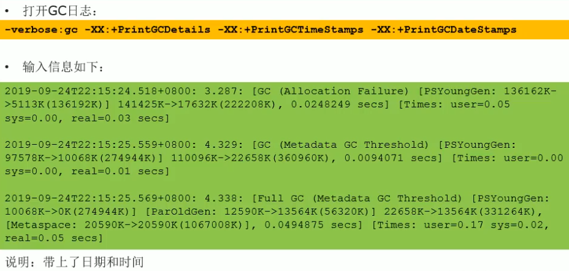
 

**日志补充说明：**
 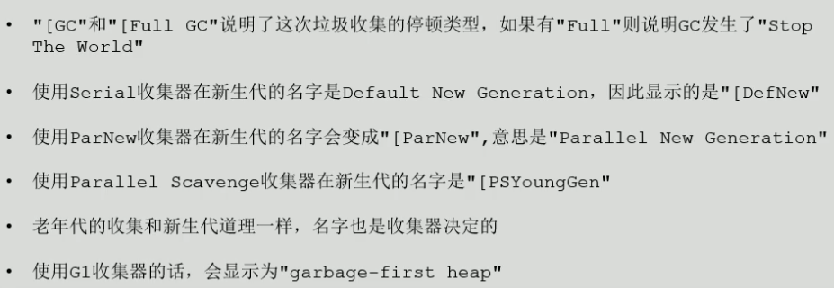
 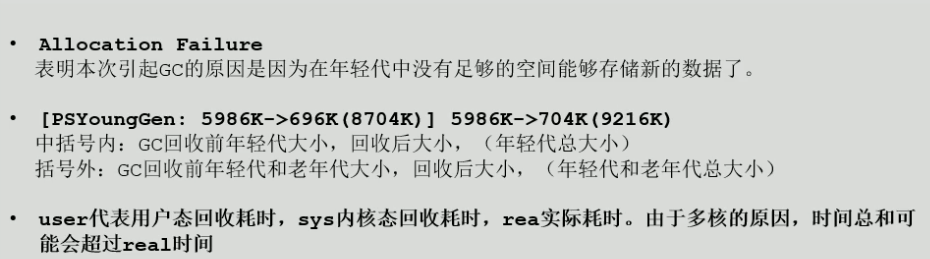
 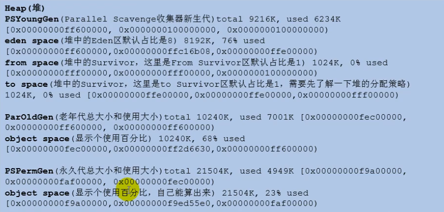

#### Minor GC 日志

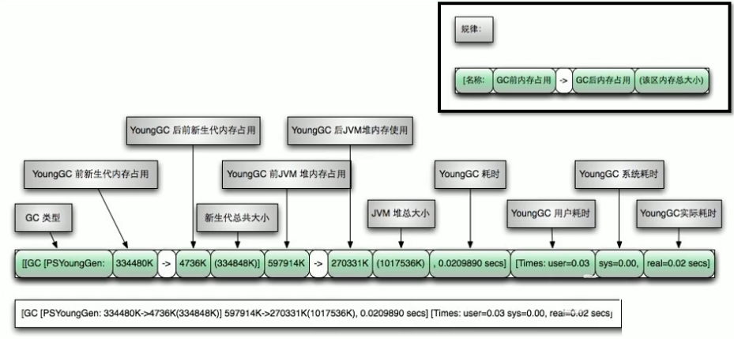

#### Full GC 日志

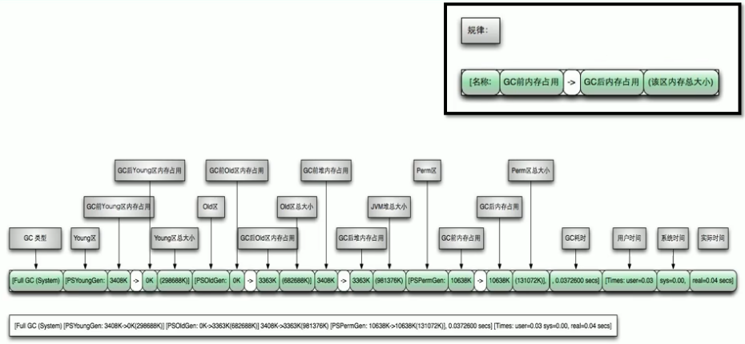

**eg:**

```
/**
 * 在 jdk7 和 jdk8 中分别执行
 * -verbose:gc -Xms20m -Xmx20m -Xmn10m -XX:+PrintGCDetails -XX:SurvivorRatio=8 -XX:+UseSerialGC
 */
public class GCLogTest1 {
    private static final int _1MB = 1024 * 1024;

    public static void testAllocation() {
        byte[] allocation1, allocation2, allocation3, allocation4;
        allocation1 = new byte[2 * _1MB];
        allocation2 = new byte[2 * _1MB];
        allocation3 = new byte[2 * _1MB];
        allocation4 = new byte[4 * _1MB];
    }

    public static void main(String[] args) {
        testAllocation();
    }
}

```

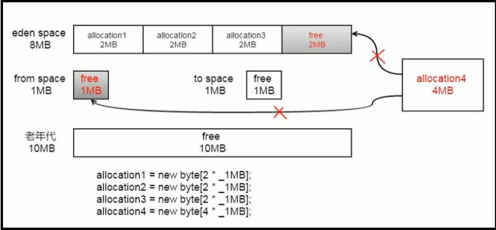
 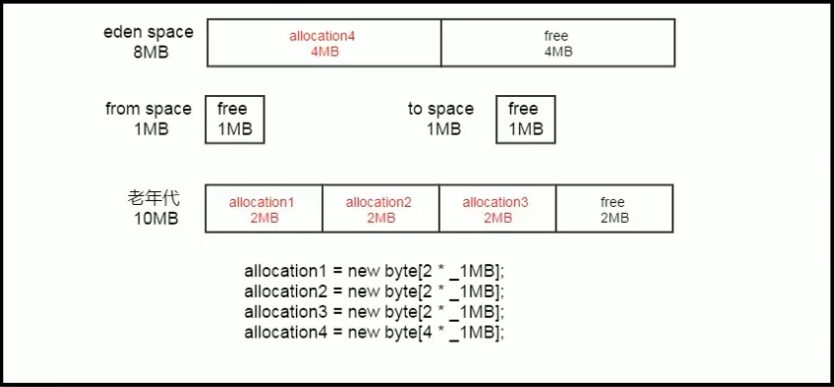

#### GC 日志分析工具

可以用一些工具去分析这些 gc 日志。
 常用的日志分析工具有：**GCViewer**、**GCEasy**、GCHisto、GCLogViewer、Hpjmeter、garbagecat 等。

**eg：GCViewer**
 下载 GCViewer 的 jar包，直接双击允许，打开输出的log文件即可。

**eg：GCEasy：**

>
https://gceasy.io
 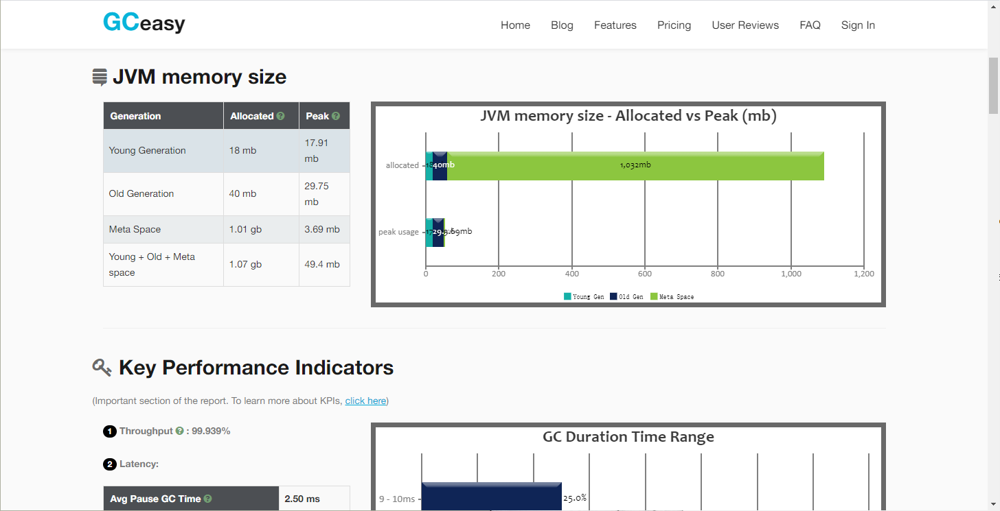

### 10. 垃圾回收器的新发展

GC 仍然处于飞速发展之中，目前的默认选项 *G1 GC 在不断 的进行改进*，很多我们原来认为的缺点，例如串行的 Full GC、Card Table 扫描的低效等，都已经被大幅改进，例如，JDK 10 以后，Full GC 已经是并行运行，在很多场景下，其表现还略由于 Parallel GC 的并行 Full GC 实现。
 即使是 Serial GC，虽然比较古老，但是简单的设计和实现未必就是过时的，它本身的开销，不管是 GC 相关数据结构的开销，还是线程的开销，都是非常小的，所以随着云计算的兴起，*在 Serverless 等新的应用场景下，Serial GC 找到了新的舞台*。
 比较不幸的是 CMS GC，因为其算法的理论缺陷等原因，虽然现在还有非常大的用户群体，但在 JDK9 中已经被标记为废弃，并且在 JDK14版本中移除。

%23%23%20%E5%9E%83%E5%9C%BE%E5%9B%9E%E6%94%B6%E5%99%A8%0A**%E5%9E%83%E5%9C%BE%E5%9B%9E%E6%94%B6%E5%99%A8%E6%A6%82%E8%BF%B0**%0A-%20%E5%9E%83%E5%9C%BE%E6%94%B6%E9%9B%86%E5%99%A8%E6%B2%A1%E6%9C%89%E5%9C%A8%E8%A7%84%E8%8C%83%E4%B8%AD%E5%AE%9A%E4%B9%89%E8%BF%87%E5%A4%9A%E7%9A%84%E8%A7%84%E5%AE%9A%EF%BC%8C%E5%8F%AF%E4%BB%A5%E7%94%B1%E4%B8%8D%E5%90%8C%E5%8E%82%E5%95%86%E3%80%81%E4%B8%8D%E5%90%8C%E7%89%88%E6%9C%AC%E7%9A%84%20JVM%20%E6%9D%A5%E5%AE%9E%E7%8E%B0%E3%80%82%0A-%20%E7%94%B1%E4%BA%8E%20JDK%20%E7%9A%84%E7%89%88%E6%9C%AC%E5%A4%84%E4%BA%8E%E9%AB%98%E9%80%9F%E8%BF%AD%E4%BB%A3%E8%BF%87%E7%A8%8B%E4%B8%AD%EF%BC%8C%E5%9B%A0%E6%AD%A4%20Java%20%E5%8F%91%E5%B1%95%E8%87%B3%E4%BB%8A%E5%B7%B2%E7%BB%8F%E8%A1%8D%E7%94%9F%E4%BA%86%E4%BC%97%E5%A4%9A%E7%9A%84%20GC%20%E7%89%88%E6%9C%AC%E3%80%82%0A-%20%E4%BB%8E%E4%B8%8D%E5%90%8C%E8%A7%92%E5%BA%A6%E5%88%86%E6%9E%90%E5%9E%83%E5%9C%BE%E6%94%B6%E9%9B%86%E5%99%A8%EF%BC%8C%E5%8F%AF%E4%BB%A5%E5%B0%86%20GC%20%E5%88%86%E4%B8%BA%E4%B8%8D%E5%90%8C%E7%9A%84%E7%B1%BB%E5%9E%8B%0A%0A%23%23%23%201.%20GC%20%E5%88%86%E7%B1%BB%E4%B8%8E%E6%80%A7%E8%83%BD%E6%8C%87%E6%A0%87%0A%23%23%23%23%201.1.%20GC%20%E5%88%86%E7%B1%BB%0A-%20%E6%8C%89*%E7%BA%BF%E7%A8%8B%E6%95%B0*%EF%BC%88%E5%9E%83%E5%9C%BE%E5%9B%9E%E6%94%B6%E7%BA%BF%E7%A8%8B%E6%95%B0%EF%BC%89%E5%88%86%EF%BC%8C%E5%8F%AF%E4%BB%A5%E5%88%86%E4%B8%BA%E4%B8%B2%E8%A1%8C%E5%9E%83%E5%9C%BE%E5%9B%9E%E6%94%B6%E5%99%A8%E5%92%8C%E5%B9%B6%E8%A1%8C%E5%9E%83%E5%9C%BE%E5%9B%9E%E6%94%B6%E5%99%A8%E3%80%82%0A!%5Bd1b25fe2a80497963d2b3380fbd825f1.png%5D(en-resource%3A%2F%2Fdatabase%2F5158%3A1)%0A-%20%E4%B8%B2%E8%A1%8C%E5%9B%9E%E6%94%B6%E6%8C%87%E7%9A%84%E6%98%AF%E5%9C%A8%E5%90%8C%E4%B8%80%E6%97%B6%E9%97%B4%E6%AE%B5%E5%86%85%E5%8F%AA%E5%85%81%E8%AE%B8%E6%9C%89%E4%B8%80%E4%B8%AA%20CPU%20%E7%94%A8%E4%BA%8E%E6%89%A7%E8%A1%8C%E5%9E%83%E5%9C%BE%E5%9B%9E%E6%94%B6%E6%93%8D%E4%BD%9C%EF%BC%8C%E6%AD%A4%E6%97%B6%E5%B7%A5%E4%BD%9C%E7%BA%BF%E7%A8%8B%E8%A2%AB%E6%9A%82%E5%81%9C%EF%BC%8C%E7%9B%B4%E8%87%B3%E5%9E%83%E5%9C%BE%E6%94%B6%E9%9B%86%E5%B7%A5%E4%BD%9C%E7%BB%93%E6%9D%9F%E3%80%82%0A%20%20%20%20-%20%E5%9C%A8%E8%AF%B8%E5%A6%82%E5%8D%95%20CPU%20%E5%A4%84%E7%90%86%E5%99%A8%E6%88%96%E8%80%85%E8%BE%83%E5%B0%8F%E7%9A%84%E5%BA%94%E7%94%A8%E5%86%85%E5%AD%98%E7%AD%89%E7%A1%AC%E4%BB%B6%E5%B9%B3%E5%8F%B0%E4%B8%8D%E6%98%AF%E7%89%B9%E5%88%AB%E4%BC%98%E8%B6%8A%E7%9A%84%E5%9C%BA%E5%90%88%EF%BC%8C%E4%B8%B2%E8%A1%8C%E5%9B%9E%E6%94%B6%E5%99%A8%E7%9A%84%E6%80%A7%E8%83%BD%E8%A1%A8%E7%8E%B0%E5%8F%AF%E4%BB%A5%E8%B6%85%E8%BF%87%E5%B9%B6%E8%A1%8C%E5%9B%9E%E6%94%B6%E5%99%A8%E5%92%8C%E5%B9%B6%E5%8F%91%E5%9B%9E%E6%94%B6%E5%99%A8%E3%80%82%E6%89%80%E4%BB%A5%EF%BC%8C*%E4%B8%B2%E8%A1%8C%E5%9B%9E%E6%94%B6%E9%BB%98%E8%AE%A4%E8%A2%AB%E5%BA%94%E7%94%A8%E5%9C%A8%E5%AE%A2%E6%88%B7%E7%AB%AF%E7%9A%84%20Client%20%E6%A8%A1%E5%BC%8F%E4%B8%8B%E7%9A%84%20JVM%20%E4%B8%AD*%0A%20%20%20%20-%20%E5%9C%A8%E5%B9%B6%E5%8F%91%E8%83%BD%E5%8A%9B%E6%AF%94%E8%BE%83%E5%BC%BA%E7%9A%84%20CPU%20%E4%B8%8A%EF%BC%8C%E5%B9%B6%E8%A1%8C%E5%9B%9E%E6%94%B6%E5%99%A8%E4%BA%A7%E7%94%9F%E7%9A%84%E5%81%9C%E9%A1%BF%E6%97%B6%E9%97%B4%E8%A6%81%E7%9F%AD%E4%BA%8E%E4%B8%B2%E8%A1%8C%E5%9B%9E%E6%94%B6%E5%99%A8%E3%80%82%0A-%20%E5%92%8C%E4%B8%B2%E8%A1%8C%E5%9B%9E%E6%94%B6%E7%9B%B8%E5%8F%8D%EF%BC%8C%E5%B9%B6%E8%A1%8C%E6%94%B6%E9%9B%86%E5%8F%AF%E4%BB%A5%E8%BF%90%E7%94%A8%E5%A4%9A%E4%B8%AA%20CPU%20%E5%90%8C%E6%97%B6%E6%89%A7%E8%A1%8C%E5%9E%83%E5%9C%BE%E5%9B%9E%E6%94%B6%EF%BC%8C%E5%9B%A0%E6%AD%A4%E6%8F%90%E5%8D%87%E4%BA%86%E5%BA%94%E7%94%A8%E7%9A%84%E5%90%9E%E5%90%90%E9%87%8F%EF%BC%8C%E4%B8%8D%E8%BF%87%E5%B9%B6%E8%A1%8C%E5%9B%9E%E6%94%B6%E4%BB%8D%E7%84%B6%E4%B8%8E%E4%B8%B2%E8%A1%8C%E5%9B%9E%E6%94%B6%E4%B8%80%E6%A0%B7%EF%BC%8C%E9%87%87%E7%94%A8%E7%8B%AC%E5%8D%A0%E5%BC%8F%EF%BC%8C%E4%BD%BF%E7%94%A8%E4%BA%86%20%E2%80%9Cstop-the-world%E2%80%9D%E6%9C%BA%E5%88%B6%E3%80%82%0A%0A-%20%E6%8C%89%E7%85%A7*%E5%B7%A5%E4%BD%9C%E6%A8%A1%E5%BC%8F*%E5%88%86%EF%BC%8C%E5%8F%AF%E4%BB%A5%E5%88%86%E4%B8%BA%E5%B9%B6%E5%8F%91%E5%BC%8F%E5%9E%83%E5%9C%BE%E5%9B%9E%E6%94%B6%E5%99%A8%E5%92%8C%E7%8B%AC%E5%8D%A0%E5%BC%8F%E5%9E%83%E5%9C%BE%E5%9B%9E%E6%94%B6%E5%99%A8%E3%80%82%0A%20%20%20%20-%20%E5%B9%B6%E5%8F%91%E5%BC%8F%E5%9E%83%E5%9C%BE%E5%9B%9E%E6%94%B6%E5%99%A8%E4%B8%8E%E5%BA%94%E7%94%A8%E7%A8%8B%E5%BA%8F%E7%BA%BF%E7%A8%8B%E4%BA%A4%E6%9B%BF%E5%B7%A5%E4%BD%9C%EF%BC%8C%E4%BB%A5%E5%B0%BD%E9%87%8F%E5%8F%AF%E8%83%BD%E5%87%8F%E5%B0%91%E5%BA%94%E7%94%A8%E7%A8%8B%E5%BA%8F%E7%9A%84%E5%81%9C%E9%A1%BF%E6%97%B6%E9%97%B4%E3%80%82%0A%20%20%20%20-%20%E7%8B%AC%E5%8D%A0%E5%BC%8F%E5%9E%83%E5%9C%BE%E5%9B%9E%E6%94%B6%E5%99%A8%EF%BC%88Stop%20the%20world%EF%BC%89%E4%B8%80%E6%97%A6%E8%BF%90%E8%A1%8C%EF%BC%8C%E5%B0%B1%E5%81%9C%E6%AD%A2%E5%BA%94%E7%94%A8%E7%A8%8B%E5%BA%8F%E4%B8%AD%E7%9A%84%E6%89%80%E6%9C%89%E7%94%A8%E6%88%B7%E7%BA%BF%E7%A8%8B%EF%BC%8C%E7%9B%B4%E5%88%B0%E5%9E%83%E5%9C%BE%E5%9B%9E%E6%94%B6%E8%BF%87%E7%A8%8B%E5%AE%8C%E5%85%A8%E7%BB%93%E6%9D%9F%E3%80%82%0A!%5B85afe169796a85aa9803dbd7c739c2f1.png%5D(en-resource%3A%2F%2Fdatabase%2F5160%3A1)%0A%0A-%20%E6%8C%89*%E7%A2%8E%E7%89%87%E5%A4%84%E7%90%86%E6%96%B9%E5%BC%8F*%E5%88%86%EF%BC%8C%E5%8F%AF%E5%88%86%E4%B8%BA%E5%8E%8B%E7%BC%A9%E5%BC%8F%E5%9E%83%E5%9C%BE%E5%9B%9E%E6%94%B6%E5%99%A8%E5%92%8C%E9%9D%9E%E5%8E%8B%E7%BC%A9%E5%BC%8F%E5%9E%83%E5%9C%BE%E5%9B%9E%E6%94%B6%E5%99%A8%E3%80%82%0A%20%20%20%20-%20%E5%8E%8B%E7%BC%A9%E5%BC%8F%E5%9E%83%E5%9C%BE%E5%9B%9E%E6%94%B6%E5%99%A8%E4%BC%9A%E5%9C%A8%E5%9B%9E%E6%94%B6%E5%AE%8C%E6%88%90%E5%90%8E%EF%BC%8C%E5%AF%B9%E5%AD%98%E6%B4%BB%E5%AF%B9%E8%B1%A1%E8%BF%9B%E8%A1%8C%E5%8E%8B%E7%BC%A9%E6%95%B4%E7%90%86%EF%BC%8C%E6%B6%88%E9%99%A4%E5%9B%9E%E6%94%B6%E5%90%8E%E7%9A%84%E7%A2%8E%E7%89%87%E3%80%82%EF%BC%88%E5%86%8D%E5%88%86%E9%85%8D%E5%AF%B9%E8%B1%A1%E7%A9%BA%E9%97%B4%E4%BD%BF%E7%94%A8%EF%BC%9A%E6%8C%87%E9%92%88%E7%A2%B0%E6%92%9E%EF%BC%89%0A%20%20%20%20-%20%E9%9D%9E%E5%8E%8B%E7%BC%A9%E5%BC%8F%E7%9A%84%E5%9E%83%E5%9C%BE%E5%9B%9E%E6%94%B6%E5%99%A8%E4%B8%8D%E8%BF%9B%E8%A1%8C%E8%BF%99%E6%AD%A5%E6%93%8D%E4%BD%9C%E3%80%82%0A-%20%E6%8C%89*%E5%B7%A5%E4%BD%9C%E7%9A%84%E5%86%85%E5%AD%98%E5%8C%BA%E9%97%B4*%E5%88%86%EF%BC%8C%E5%8F%88%E5%8F%AF%E5%88%86%E4%B8%BA%E5%B9%B4%E8%BD%BB%E4%BB%A3%E5%9E%83%E5%9C%BE%E5%9B%9E%E6%94%B6%E5%99%A8%E5%92%8C%E8%80%81%E5%B9%B4%E4%BB%A3%E5%9E%83%E5%9C%BE%E5%9B%9E%E6%94%B6%E5%99%A8%E3%80%82%EF%BC%88%E5%86%8D%E5%88%86%E9%85%8D%E5%AF%B9%E8%B1%A1%E7%A9%BA%E9%97%B4%E4%BD%BF%E7%94%A8%EF%BC%9A%E7%A9%BA%E9%97%B2%E5%88%97%E8%A1%A8%EF%BC%89%0A%0A%23%23%23%23%201.2.%20%E8%AF%84%E4%BC%B0%20GC%20%E7%9A%84%E6%80%A7%E8%83%BD%E6%8C%87%E6%A0%87%0A-%20**%E5%90%9E%E5%90%90%E9%87%8F%EF%BC%9A%E8%BF%90%E8%A1%8C%E7%94%A8%E6%88%B7%E4%BB%A3%E7%A0%81%E7%9A%84%E6%97%B6%E9%97%B4%E5%8D%A0%E6%80%BB%E8%BF%90%E8%A1%8C%E6%97%B6%E9%97%B4%E7%9A%84%E6%AF%94%E4%BE%8B**%0A%20%20%20%20-%20%EF%BC%88%E6%80%BB%E8%BF%90%E8%A1%8C%E6%97%B6%E9%97%B4%EF%BC%9A%E7%A8%8B%E5%BA%8F%E7%9A%84%E8%BF%90%E8%A1%8C%E6%97%B6%E9%97%B4%20%2B%20%E5%9B%9E%E6%94%B6%E5%86%85%E5%AD%98%E7%9A%84%E6%97%B6%E9%97%B4%EF%BC%89%0A-%20%E5%9E%83%E5%9C%BE%E6%94%B6%E9%9B%86%E5%BC%80%E9%94%80%EF%BC%9A%E5%90%9E%E5%90%90%E9%87%8F%E7%9A%84%E8%A1%A5%E6%95%B0%EF%BC%8C%E5%9E%83%E5%9C%BE%E6%94%B6%E9%9B%86%E6%89%80%E7%94%A8%E6%97%B6%E9%97%B4%E4%B8%8E%E6%80%BB%E8%BF%90%E8%A1%8C%E6%97%B6%E9%97%B4%E7%9A%84%E6%AF%94%E4%BE%8B%E3%80%82%0A-%20**%E6%9A%82%E5%81%9C%E6%97%B6%E9%97%B4%EF%BC%9A%E6%89%A7%E8%A1%8C%E5%9E%83%E5%9C%BE%E6%94%B6%E9%9B%86%E6%97%B6%EF%BC%8C%E7%A8%8B%E5%BA%8F%E7%9A%84%E5%B7%A5%E4%BD%9C%E7%BA%BF%E7%A8%8B%E8%A2%AB%E6%9A%82%E5%81%9C%E7%9A%84%E6%97%B6%E9%97%B4**%E3%80%82%0A-%20%E6%94%B6%E9%9B%86%E9%A2%91%E7%8E%87%EF%BC%9A%E7%9B%B8%E5%AF%B9%E4%BA%8E%E5%BA%94%E7%94%A8%E7%A8%8B%E5%BA%8F%E7%9A%84%E6%89%A7%E8%A1%8C%EF%BC%8C%E6%94%B6%E9%9B%86%E6%93%8D%E4%BD%9C%E5%8F%91%E7%94%9F%E7%9A%84%E9%A2%91%E7%8E%87%E3%80%82%0A-%20**%E5%86%85%E5%AD%98%E5%8D%A0%E7%94%A8%EF%BC%9AJava%20%E5%A0%86%E5%8C%BA%E6%89%80%E5%8D%A0%E7%9A%84%E5%86%85%E5%AD%98%E5%A4%A7%E5%B0%8F%E3%80%82**%0A-%20%E5%BF%AB%E9%80%9F%EF%BC%9A%E4%B8%80%E4%B8%AA%E5%AF%B9%E8%B1%A1%E4%BB%8E%E8%AF%9E%E7%94%9F%E5%88%B0%E8%A2%AB%E5%9B%9E%E6%94%B6%E6%89%80%E7%BB%8F%E7%90%86%E7%9A%84%E6%97%B6%E9%97%B4%E3%80%82%0A%0A-%20%E4%B8%8A%E9%9D%A2%E5%85%AD%E6%9D%A1%E4%B8%AD%E5%8A%A0%E7%B2%97%E7%9A%84%E4%B8%89%E6%9D%A1%E6%9E%84%E6%88%90%E4%B8%80%E4%B8%AA%E2%80%9C%E4%B8%8D%E5%8F%AF%E8%83%BD%E4%B8%89%E8%A7%92%E2%80%9D%E3%80%82%E4%B8%89%E8%80%85%E6%80%BB%E4%BD%93%E7%9A%84%E8%A1%A8%E7%8E%B0%E4%BC%9A%E9%9A%8F%E7%9D%80%E6%8A%80%E6%9C%AF%E8%BF%9B%E6%AD%A5%E8%80%8C%E8%B6%8A%E6%9D%A5%E8%B6%8A%E5%A5%BD%E3%80%82%E4%B8%80%E6%AC%BE%E4%BC%98%E7%A7%80%E7%9A%84%E6%94%B6%E9%9B%86%E5%99%A8%E9%80%9A%E5%B8%B8%E6%9C%80%E5%A4%9A%E5%90%8C%E6%97%B6%E6%BB%A1%E8%B6%B3%E5%85%B6%E4%B8%AD%E7%9A%84%E4%B8%A4%E9%A1%B9%E3%80%82%0A-%20%E8%BF%99%E4%B8%89%E9%A1%B9%E9%87%8C%EF%BC%8C%E6%9A%82%E5%81%9C%E6%97%B6%E9%97%B4%E7%9A%84%E9%87%8D%E8%A6%81%E6%80%A7%E6%97%A5%E7%9B%8A%E5%87%B8%E6%98%BE%E3%80%82%E5%9B%A0%E4%B8%BA%E9%9A%8F%E7%9D%80%E7%A1%AC%E4%BB%B6%E5%8F%91%E5%B1%95%EF%BC%8C%E5%86%85%E5%AD%98%E5%8D%A0%E7%94%A8%E5%A4%9A%E8%B6%8A%E6%9D%A5%E8%B6%8A%E8%83%BD%E5%AE%B9%E5%BF%8D%EF%BC%8C%E7%A1%AC%E4%BB%B6%E6%80%A7%E8%83%BD%E7%9A%84%E6%8F%90%E5%8D%87%E4%B9%9F%E6%9C%89%E5%8A%A9%E4%BA%8E%E9%99%8D%E4%BD%8E%E6%94%B6%E9%9B%86%E5%99%A8%E8%BF%90%E8%A1%8C%E6%97%B6%E5%AF%B9%E5%BA%94%E7%94%A8%E7%A8%8B%E5%BA%8F%E7%9A%84%E5%BD%B1%E5%93%8D%EF%BC%8C%E5%8D%B3%E6%8F%90%E9%AB%98%E4%BA%86%E5%90%9E%E5%90%90%E9%87%8F%E3%80%82%E8%80%8C%E5%86%85%E5%AD%98%E7%9A%84%E6%89%A9%E5%A4%A7%EF%BC%8C%E5%AF%B9%E5%BB%B6%E8%BF%9F%E5%8F%8D%E8%80%8C%E5%B8%A6%E6%9D%A5%E8%B4%9F%E9%9D%A2%E6%95%88%E6%9E%9C%E3%80%82%0A-%20%E7%AE%80%E5%8D%95%E6%9D%A5%E8%AF%B4%EF%BC%8C%E4%B8%BB%E8%A6%81%E6%8A%93%E4%BD%8F%E4%B8%A4%E7%82%B9%EF%BC%9A%0A%20%20%20%20-%20%E5%90%9E%E5%90%90%E9%87%8F%0A%20%20%20%20-%20%E6%9A%82%E5%81%9C%E6%97%B6%E9%97%B4%0A%0A%23%23%23%23%23%20%E8%AF%84%E4%BC%B0%20GC%20%E7%9A%84%E6%80%A7%E8%83%BD%E6%8C%87%E6%A0%87%EF%BC%9A%E5%90%9E%E5%90%90%E9%87%8F%EF%BC%88throughput%EF%BC%89%0A-%20%E5%90%9E%E5%90%90%E9%87%8F%E5%B0%B1%E6%98%AF%20CPU%20%E7%94%A8%E4%BA%8E%E8%BF%90%E8%A1%8C%E7%94%A8%E6%88%B7%E4%BB%A3%E7%A0%81%E7%9A%84%E6%97%B6%E9%97%B4%E4%B8%8E%20CPU%20%E6%80%BB%E6%B6%88%E8%80%97%E6%97%B6%E9%97%B4%E7%9A%84%E6%AF%94%E5%80%BC%EF%BC%8C%E5%8D%B3%E5%90%9E%E5%90%90%E9%87%8F%3D%20%E8%BF%90%E8%A1%8C%E7%94%A8%E6%88%B7%E4%BB%A3%E7%A0%81%E6%97%B6%E9%97%B4%20%2F%20%EF%BC%88%E8%BF%90%E8%A1%8C%E7%94%A8%E6%88%B7%E4%BB%A3%E7%A0%81%E6%97%B6%E9%97%B4%20%2B%20%E5%9E%83%E5%9C%BE%E6%94%B6%E9%9B%86%E6%97%B6%E9%97%B4%EF%BC%89%E3%80%82%0A%20%20%20%20-%20%E6%AF%94%E5%A6%82%EF%BC%9A%E8%99%9A%E6%8B%9F%E6%9C%BA%E6%80%BB%E5%85%B1%E8%BF%90%E8%A1%8C%E4%BA%86100%E5%88%86%E9%92%9F%EF%BC%8C%E5%85%B6%E4%B8%AD%E5%9E%83%E5%9C%BE%E6%94%B6%E9%9B%86%E8%8A%B1%E6%8E%891%E5%88%86%E9%92%9F%EF%BC%8C%E9%82%A3%E5%90%9E%E5%90%90%E9%87%8F%E5%B0%B1%E6%98%AF%2099%25%E3%80%82%0A-%20%E8%BF%99%E7%A7%8D%E6%83%85%E5%86%B5%E4%B8%8B%EF%BC%8C%E5%BA%94%E7%94%A8%E7%A8%8B%E5%BA%8F%E8%83%BD%E5%AE%B9%E5%BF%8D%E8%BE%83%E9%AB%98%E7%9A%84%E6%9A%82%E5%81%9C%E6%97%B6%E9%97%B4%EF%BC%8C%E5%9B%A0%E6%AD%A4%EF%BC%8C%E9%AB%98%E5%90%9E%E5%90%90%E9%87%8F%E7%9A%84%E5%BA%94%E7%94%A8%E7%A8%8B%E5%BA%8F%E6%9C%89%E6%9B%B4%E9%95%BF%E7%9A%84%E6%97%B6%E9%97%B4%E5%9F%BA%E5%87%86%EF%BC%8C%E5%BF%AB%E9%80%9F%E5%93%8D%E5%BA%94%E6%98%AF%E4%B8%8D%E5%BF%85%E8%80%83%E8%99%91%E7%9A%84%E3%80%82%0A-%20%E5%90%9E%E5%90%90%E9%87%8F%E4%BC%98%E5%85%88%EF%BC%8C%E6%84%8F%E5%91%B3%E7%9D%80%E5%86%8D%E5%8D%95%E4%BD%8D%E6%97%B6%E9%97%B4%E5%86%85%EF%BC%8CSTW%20%E7%9A%84%E6%97%B6%E9%97%B4%E6%9C%80%E7%9F%AD%200.2%20%2B%200.2%20%3D%200.4%0A!%5B5c1fae73971ee9789dd6c6114ad5dd1c.png%5D(en-resource%3A%2F%2Fdatabase%2F5164%3A1)%0A%0A%23%23%23%23%23%20%E8%AF%84%E4%BC%B0%20GC%20%E7%9A%84%E6%80%A7%E8%83%BD%E6%8C%87%E6%A0%87%EF%BC%9A%E6%9A%82%E5%81%9C%E6%97%B6%E9%97%B4%EF%BC%88pause%20time%EF%BC%89%0A-%20%E2%80%9C%E6%9A%82%E5%81%9C%E6%97%B6%E9%97%B4%E2%80%9D%E6%98%AF%E6%8C%87%E4%B8%80%E4%B8%AA%E6%97%B6%E9%97%B4%E6%AE%B5%E5%86%85%E5%BA%94%E7%94%A8%E7%A8%8B%E5%BA%8F%E7%BA%BF%E7%A8%8B%E6%9A%82%E5%81%9C%EF%BC%8C%E8%AE%A9%20GC%20%E7%BA%BF%E7%A8%8B%E6%89%A7%E8%A1%8C%E7%9A%84%E7%8A%B6%E6%80%81%0A%20%20%20%20-%20%E4%BE%8B%E5%A6%82%EF%BC%9AGC%20%E6%9C%9F%E9%97%B4100%E6%AF%AB%E7%A7%92%E7%9A%84%E6%9A%82%E5%81%9C%E6%97%B6%E9%97%B4%E6%84%8F%E5%91%B3%E7%9D%80%E5%9C%A8%E8%BF%99100%E6%AF%AB%E7%A7%92%E6%9C%9F%E9%97%B4%E5%86%85%E6%B2%A1%E6%9C%89%E5%BA%94%E7%94%A8%E7%A8%8B%E5%BA%8F%E7%BA%BF%E7%A8%8B%E6%98%AF%E6%B4%BB%E5%8A%A8%E7%9A%84%E3%80%82%0A-%20%E6%9A%82%E5%81%9C%E6%97%B6%E9%97%B4%E4%BC%98%E5%85%88%EF%BC%8C%E6%84%8F%E5%91%B3%E7%9D%80%E5%B0%BD%E5%8F%AF%E8%83%BD%E8%AE%A9%E5%8D%95%E8%AF%8D%20STW%20%E7%9A%84%E6%97%B6%E9%97%B4%E6%9C%80%E7%9F%AD%EF%BC%9A0.1%20%2B%200.1%20%2B%200.1%20%2B%200.1%20%2B%200.1%20%3D%200.5%0A!%5Bb6e916df8a085483f5b0501eb9d38205.png%5D(en-resource%3A%2F%2Fdatabase%2F5166%3A1)%0A%0A%23%23%23%23%23%20%E8%AF%84%E4%BC%B0%20GC%20%E7%9A%84%E6%80%A7%E8%83%BD%E6%8C%87%E6%A0%87%EF%BC%9A%E5%90%9E%E5%90%90%E9%87%8F%20vs%20%E6%9A%82%E5%81%9C%E6%97%B6%E9%97%B4%0A-%20%E9%AB%98%E5%90%9E%E5%90%90%E9%87%8F%E8%BE%83%E5%A5%BD%E5%9B%A0%E4%B8%BA%E8%BF%99%E4%BC%9A%E8%AE%A9%E5%BA%94%E7%94%A8%E7%A8%8B%E5%BA%8F%E7%9A%84%E6%9C%80%E7%BB%88%E7%94%A8%E6%88%B7%E6%84%9F%E8%A7%89%E5%8F%AA%E6%9C%89%E5%BA%94%E7%94%A8%E7%A8%8B%E5%BA%8F%E5%9C%A8%E5%81%9A%E2%80%9C%E7%94%9F%E4%BA%A7%E6%80%A7%E2%80%9D%E5%B7%A5%E4%BD%9C%E3%80%82%E7%9B%B4%E8%A7%89%E4%B8%8A%EF%BC%8C%E5%90%9E%E5%90%90%E9%87%8F%E8%B6%8A%E9%AB%98%E7%A8%8B%E5%BA%8F%E8%BF%90%E8%A1%8C%E8%B6%8A%E5%BF%AB%E3%80%82%0A-%20%E4%BD%8E%E6%9A%82%E5%81%9C%E6%97%B6%E9%97%B4%EF%BC%88%E4%BD%8E%E5%BB%B6%E8%BF%9F%EF%BC%89%E8%BE%83%E5%A5%BD%E5%9B%A0%E4%B8%BA%E4%BB%8E%E6%9C%80%E7%BB%88%E7%94%A8%E6%88%B7%E7%9A%84%E8%A7%92%E5%BA%A6%E6%9D%A5%E7%9C%8B%E4%B8%8D%E7%AE%A1%E6%98%AF%20GC%20%E8%BF%98%E6%98%AF%E5%85%B6%E4%BB%96%E5%8E%9F%E5%9B%A0%E5%AF%BC%E8%87%B4%E4%B8%80%E4%B8%AA%E5%BA%94%E7%94%A8%E7%A8%8B%E5%BA%8F%E8%A2%AB%E6%8C%82%E8%B5%B7%E5%A7%8B%E7%BB%88%E6%98%AF%E4%B8%8D%E5%A5%BD%E7%9A%84%E3%80%82%E8%BF%99%E5%8F%96%E5%86%B3%E4%BA%8E%E5%BA%94%E7%94%A8%E7%A8%8B%E5%BA%8F%E7%9A%84%E7%B1%BB%E5%9E%8B%EF%BC%8C*%E6%9C%89%E6%97%B6%E5%80%99%E7%94%9A%E8%87%B3%E7%9F%AD%E6%9A%82%E7%9A%84200ms%E6%9A%82%E5%81%9C%E9%83%BD%E5%8F%AF%E8%83%BD%E6%89%93%E6%96%AD%E7%BB%88%E7%AB%AF%E7%94%A8%E6%88%B7%E4%BD%93%E9%AA%8C*%E3%80%82%E5%9B%A0%E6%AD%A4%EF%BC%8C%E5%85%B7%E6%9C%89%E4%BD%8E%E7%9A%84%E8%BE%83%E5%A4%A7%E6%9A%82%E5%81%9C%E6%97%B6%E9%97%B4%E6%98%AF%E9%9D%9E%E5%B8%B8%E9%87%8D%E8%A6%81%E7%9A%84%EF%BC%8C%E7%89%B9%E5%88%AB%E6%98%AF%E5%AF%B9%E4%BA%8E%E4%B8%80%E4%B8%AA*%E4%BA%A4%E4%BA%92%E5%BC%8F%E5%BA%94%E7%94%A8%E7%A8%8B%E5%BA%8F*%E3%80%82%0A-%20%E4%B8%8D%E5%B9%B8%E7%9A%84%E6%98%AF%E2%80%9C%E9%AB%98%E5%90%9E%E5%90%90%E9%87%8F%E2%80%9D%E5%92%8C%E2%80%9C%E4%BD%8E%E6%9A%82%E5%81%9C%E6%97%B6%E9%97%B4%E2%80%9D%E6%98%AF%E4%B8%80%E5%AF%B9%E7%9B%B8%E4%BA%92%E7%AB%9E%E4%BA%89%E7%9A%84%E7%9B%AE%E6%A0%87%EF%BC%88%E7%9F%9B%E7%9B%BE%EF%BC%89%0A%20%20%20%20-%20%E5%9B%A0%E4%B8%BA%E5%A6%82%E6%9E%9C%E9%80%89%E6%8B%A9%E4%BB%A5%E5%90%9E%E5%90%90%E9%87%8F%E4%BC%98%E5%85%88%EF%BC%8C%E9%82%A3%E4%B9%88*%E5%BF%85%E7%84%B6%E9%9C%80%E8%A6%81%E9%99%8D%E4%BD%8E%E5%86%85%E5%AD%98%E5%9B%9E%E6%94%B6%E7%9A%84%E6%89%A7%E8%A1%8C%E9%A2%91%E7%8E%87*%EF%BC%8C%E4%BD%86%E6%98%AF%E8%BF%99%E6%A0%B7%E4%BC%9A%E5%AF%BC%E8%87%B4%20GC%20%E9%9C%80%E8%A6%81%E6%9B%B4%E9%95%BF%E7%9A%84%E6%9A%82%E5%81%9C%E6%97%B6%E9%97%B4%E6%9D%A5%E6%89%A7%E8%A1%8C%E5%86%85%E5%AD%98%E5%9B%9E%E6%94%B6%E3%80%82%0A%20%20%20%20-%20%E7%9B%B8%E5%8F%8D%E7%9A%84%EF%BC%8C%E5%A6%82%E6%9E%9C%E9%80%89%E6%8B%A9%E4%BB%A5%E4%BD%8E%E5%BB%B6%E8%BF%9F%E4%BC%98%E5%85%88%E4%B8%BA%E5%8E%9F%E5%88%99%EF%BC%8C%E9%82%A3%E4%B9%88%E4%B8%BA%E4%BA%86%E9%99%8D%E4%BD%8E%E6%AF%8F%E6%AC%A1%E6%89%A7%E8%A1%8C%E5%86%85%E5%AD%98%E5%9B%9E%E6%94%B6%E6%97%B6%E7%9A%84%E6%9A%82%E5%81%9C%E6%97%B6%E9%97%B4%EF%BC%8C%E4%B9%9F*%E5%8F%AA%E8%83%BD%E9%A2%91%E7%B9%81%E5%9C%B0%E6%89%A7%E8%A1%8C%E5%86%85%E5%AD%98%E5%9B%9E%E6%94%B6*%E3%80%82%E4%BD%86%E8%BF%99%E5%8F%88%E5%BC%95%E8%B5%B7%E4%BA%86%E5%B9%B4%E8%BD%BB%E4%BB%A3%E5%86%85%E5%AD%98%E7%9A%84%E7%BC%A9%E5%87%8F%E5%92%8C%E5%AF%BC%E8%87%B4%E7%A8%8B%E5%BA%8F%E5%90%9E%E5%90%90%E9%87%8F%E7%9A%84%E4%B8%8B%E9%99%8D%E3%80%82%0A%0A%E5%9C%A8%E8%AE%BE%E8%AE%A1%EF%BC%88%E6%88%96%E4%BD%BF%E7%94%A8%EF%BC%89GC%20%E7%AE%97%E6%B3%95%E6%97%B6%EF%BC%8C%E6%88%91%E4%BB%AC%E5%BF%85%E9%A1%BB%E7%A1%AE%E5%AE%9A%E6%88%91%E4%BB%AC%E7%9A%84%E7%9B%AE%E6%A0%87%EF%BC%9A%E4%B8%80%E4%B8%AA%20GC%20%E7%AE%97%E6%B3%95%E5%8F%AA%E5%8F%AF%E8%83%BD%E9%92%88%E5%AF%B9%E4%B8%A4%E4%B8%AA%E7%9B%AE%E6%A0%87%E4%B9%8B%E4%B8%80%EF%BC%88%E5%8D%B3%E5%8F%AA%E4%B8%93%E6%B3%A8%E4%BA%8E%E8%BE%83%E5%A4%A7%E5%90%9E%E5%90%90%E9%87%8F%E6%88%96%E6%9C%80%E5%B0%8F%E6%9A%82%E5%81%9C%E6%97%B6%E9%97%B4%EF%BC%89%EF%BC%8C%E6%88%96%E5%B0%9D%E8%AF%95%E6%89%BE%E5%88%B0%E4%B8%80%E4%B8%AA%E4%BA%8C%E8%80%85%E7%9A%84%E6%8A%98%E8%A1%B7%E3%80%82%0A%0A%E7%8E%B0%E5%9C%A8%E6%A0%87%E5%87%86%EF%BC%9A**%E5%9C%A8%E6%9C%80%E5%A4%A7%E5%90%9E%E5%90%90%E9%87%8F%E4%BC%98%E5%85%88%E7%9A%84%E6%83%85%E5%86%B5%E4%B8%8B%EF%BC%8C%E9%99%8D%E4%BD%8E%E5%81%9C%E9%A1%BF%E6%97%B6%E9%97%B4%E3%80%82**%0A%0A%23%23%23%202.%20%E4%B8%8D%E5%90%8C%E7%9A%84%E5%9E%83%E5%9C%BE%E5%9B%9E%E6%94%B6%E5%99%A8%E6%A6%82%E8%BF%B0%0A%E5%9E%83%E5%9C%BE%E6%94%B6%E9%9B%86%E6%9C%BA%E5%88%B6%E6%98%AF%20Java%20%E7%9A%84%E6%8B%9B%E7%89%8C%E8%83%BD%E5%8A%9B%EF%BC%8C%E6%9E%81%E5%A4%A7%E5%9C%B0%E6%8F%90%E9%AB%98%E4%BA%86%E5%BC%80%E5%8F%91%E6%95%88%E7%8E%87%E3%80%82%E8%BF%99%E5%BD%93%E7%84%B6%E4%B9%9F%E6%98%AF%E9%9D%A2%E8%AF%95%E7%9A%84%E7%83%AD%E7%82%B9%E3%80%82%0A**%E9%82%A3%E4%B9%88%EF%BC%8CJava%20%E5%B8%B8%E8%A7%81%E7%9A%84%E5%9E%83%E5%9C%BE%E6%94%B6%E9%9B%86%E5%99%A8%E6%9C%89%E5%93%AA%E4%BA%9B%EF%BC%9F**%0A%0A%23%23%23%23%20%E5%9E%83%E5%9C%BE%E6%94%B6%E9%9B%86%E5%99%A8%E5%8F%91%E5%B1%95%E5%8F%B2%0A!%5B49aaaa85b4a754f0adb7dae4bf878669.png%5D(en-resource%3A%2F%2Fdatabase%2F5168%3A1)%0A%0A%23%23%23%23%207%E6%AC%BE%E7%BB%8F%E5%85%B8%E7%9A%84%E5%9E%83%E5%9C%BE%E6%94%B6%E9%9B%86%E5%99%A8%0A-%20%E4%B8%B2%E8%A1%8C%E5%9B%9E%E6%94%B6%E5%99%A8%EF%BC%9ASerial%E3%80%81Serial%20Old%0A-%20%E5%B9%B6%E8%A1%8C%E5%9B%9E%E6%94%B6%E5%99%A8%EF%BC%9AParNew%E3%80%81Parallel%20Scavenge%E3%80%81Parallel%20Old%0A-%20%E5%B9%B6%E5%8F%91%E5%9B%9E%E6%94%B6%E5%99%A8%EF%BC%9ACMS%E3%80%81G1%0A!%5B99009675b1ed8cbf5dad6f3280f770e2.png%5D(en-resource%3A%2F%2Fdatabase%2F5170%3A1)%0A%3E%20https%3A%2F%2Fwww.oracle.com%2Ftechnetwork%2Fjava%2Fjavase%2Ftech%2Fmemorymanagement-whitepaper-1-150020.pdf%0A!%5B134fc4b023c1216a351dc8f3d775ec12.png%5D(en-resource%3A%2F%2Fdatabase%2F5172%3A1)%0A%0A%23%23%23%23%207%E6%AC%BE%E7%BB%8F%E5%85%B8%E5%9E%83%E5%9C%BE%E6%94%B6%E9%9B%86%E5%99%A8%E4%B8%8E%E5%9E%83%E5%9C%BE%E5%88%86%E4%BB%A3%E4%B9%8B%E9%97%B4%E7%9A%84%E5%85%B3%E7%B3%BB%0A!%5B0c100633630f939d3ac8ac2244204556.png%5D(en-resource%3A%2F%2Fdatabase%2F5174%3A1)%0A-%20%E6%96%B0%E7%94%9F%E4%BB%A3%E6%94%B6%E9%9B%86%E5%99%A8%EF%BC%9ASerial%E3%80%81ParNew%E3%80%81Parallel%20Scavenge%3B%0A-%20%E8%80%81%E5%B9%B4%E4%BB%A3%E6%94%B6%E9%9B%86%E5%99%A8%EF%BC%9ASerial%20Old%E3%80%81Parallel%20Old%E3%80%81CMS%3B%0A-%20%E6%95%B4%E5%A0%86%E6%94%B6%E9%9B%86%E5%99%A8%EF%BC%9AG1%3B%0A%0A%23%23%23%23%20%E5%9E%83%E5%9C%BE%E6%94%B6%E9%9B%86%E5%99%A8%E7%9A%84%E7%BB%84%E5%90%88%E5%85%B3%E7%B3%BB%0A!%5B1cb08da86f0e77d8dafff53a80603a57.png%5D(en-resource%3A%2F%2Fdatabase%2F5176%3A1)%0A%E4%B8%8A%E5%9B%BE%E6%9B%B4%E6%96%B0%E5%88%B0%20JDK14%EF%BC%8C%E4%B8%A4%E6%A0%B9%E7%BA%A2%E7%BA%BF%E6%98%AF%20JDK8%20%E5%92%8C%209%20%E7%9A%84%E5%8F%98%E5%8C%96%E3%80%82%E7%BB%BF%E8%89%B2%E7%9A%84%E7%BA%BF%E5%92%8C%E9%9D%92%E8%89%B2%E7%9A%84%E6%A1%86%E6%98%AF%20JDK14%20%E7%9A%84%E5%8F%98%E5%8C%96%0A%0A1.%20%E4%B8%A4%E4%B8%AA%E6%94%B6%E9%9B%86%E5%99%A8%E9%97%B4%E6%9C%89%E8%BF%9E%E7%BA%BF%EF%BC%8C%E8%A1%A8%E6%98%8E%E5%AE%83%E4%BB%AC%E5%8F%AF%E4%BB%A5%E6%90%AD%E9%85%8D%E4%BD%BF%E7%94%A8%EF%BC%9A%0ASerial%2FSerial%20Old%E3%80%81Serial%2FCMS%E3%80%81ParNew%2FSerial%20Old%E3%80%81ParNew%2FCMS%E3%80%81Parallel%20Scavenge%2FSerial%20Old%E3%80%81Parallel%20Scavenge%2FParallel%20Old%E3%80%81G1%3B%0A2.%20%E5%85%B6%E4%B8%AD%20Serial%20Old%20%E4%BD%9C%E4%B8%BA%20CMS%20%E5%87%BA%E7%8E%B0%E2%80%9CConcurrent%20Mode%20Failure%E2%80%9D%E5%A4%B1%E8%B4%A5%E7%9A%84%E5%90%8E%E5%A4%87%E9%A2%84%E6%A1%88%E3%80%82%0A3.%20%EF%BC%88%E7%BA%A2%E8%89%B2%E8%99%9A%E7%BA%BF%EF%BC%89%E7%94%B1%E4%BA%8E%E7%BB%B4%E6%8A%A4%E5%92%8C%E5%85%BC%E5%AE%B9%E6%80%A7%E6%B5%8B%E8%AF%95%E7%9A%84%E6%88%90%E6%9C%AC%EF%BC%8C%E5%9C%A8JDK%208%20%E6%97%B6%E5%B0%86%20Serial%20%2B%20CMS%E3%80%81ParNew%2BSerial%20Old%20%E8%BF%99%E4%B8%A4%E4%B8%AA%E7%BB%84%E5%90%88%E5%A3%B0%E6%98%8E%E4%B8%BA%E5%BA%9F%E5%BC%83%EF%BC%88JEP%20173%EF%BC%89%EF%BC%8C%E5%B9%B6%E5%9C%A8%20JDK%209%20%E4%B8%AD%E5%AE%8C%E5%85%A8%E5%8F%96%E6%B6%88%E4%BA%86%E8%BF%99%E4%BA%9B%E7%BB%84%E5%90%88%E7%9A%84%E6%94%AF%E6%8C%81%EF%BC%88JEP%20214%EF%BC%89%EF%BC%8C%E5%8D%B3%EF%BC%9A%E7%A7%BB%E9%99%A4%E3%80%82%0A4.%20%EF%BC%88%E7%BB%BF%E8%89%B2%E8%99%9A%E7%BA%BF%EF%BC%89JDK14%20%E4%B8%AD%20%EF%BC%9A%E5%BC%83%E7%94%A8%20Parallel%20Scavenge%20%E5%92%8C%20SerialOld%20GC%20%E7%BB%84%E5%90%88%EF%BC%88JEP%20366%EF%BC%89%0A5.%20%EF%BC%88%E9%9D%92%E8%89%B2%E8%99%9A%E7%BA%BF%EF%BC%89JDK%2014%20%E4%B8%AD%EF%BC%9A%E5%88%A0%E9%99%A4%20CMS%20%E5%9E%83%E5%9C%BE%E5%9B%9E%E6%94%B6%E5%99%A8%EF%BC%88JEP%20363%EF%BC%89%0A%0A%23%23%23%23%20%E4%B8%8D%E5%90%8C%E7%9A%84%E5%9E%83%E5%9C%BE%E6%94%B6%E9%9B%86%E5%99%A8%E6%A6%82%E8%BF%B0%0A-%20%E4%B8%BA%E4%BB%80%E4%B9%88%E8%A6%81%E6%9C%89%E5%BE%88%E5%A4%9A%E6%94%B6%E9%9B%86%E5%99%A8%EF%BC%8C%E4%B8%80%E4%B8%AA%E4%B8%8D%E5%A4%9F%E5%90%97%EF%BC%9F%E5%9B%A0%E4%B8%BA%20Java%20%E7%9A%84%E4%BD%BF%E7%94%A8%E5%9C%BA%E6%99%AF%E5%BE%88%E5%A4%9A%EF%BC%8C%E7%A7%BB%E5%8A%A8%E7%AB%AF%EF%BC%8C%E6%9C%8D%E5%8A%A1%E5%99%A8%E7%AD%89%E3%80%82%E6%89%80%E4%BB%A5%E5%B0%B1%E9%9C%80%E8%A6%81%E9%92%88%E5%AF%B9%E4%B8%8D%E5%90%8C%E7%9A%84%E5%9C%BA%E6%99%AF%EF%BC%8C%E6%8F%90%E4%BE%9B%E4%B8%8D%E5%90%8C%E7%9A%84%E5%9E%83%E5%9C%BE%E6%94%B6%E9%9B%86%E5%99%A8%EF%BC%8C%E6%8F%90%E9%AB%98%E5%9E%83%E5%9C%BE%E6%94%B6%E9%9B%86%E7%9A%84%E6%80%A7%E8%83%BD%E3%80%82%0A-%20%E8%99%BD%E7%84%B6%E6%88%91%E4%BB%AC%E4%BC%9A%E5%AF%B9%E5%90%84%E4%B8%AA%E6%94%B6%E9%9B%86%E5%99%A8%E8%BF%9B%E8%A1%8C%E6%AF%94%E8%BE%83%EF%BC%8C%E4%BD%86%E5%B9%B6%E9%9D%9E%E4%B8%BA%E4%BA%86%E6%8C%91%E9%80%89%E4%B8%80%E4%B8%AA%E6%9C%80%E5%A5%BD%E7%9A%84%E6%94%B6%E9%9B%86%E5%99%A8%E5%87%BA%E6%9D%A5%E3%80%82%E6%B2%A1%E6%9C%89%E4%B8%80%E7%A7%8D%E6%94%BE%E4%B9%8B%E5%9B%9B%E6%B5%B7%E7%9A%86%E5%87%86%E3%80%81%E4%BB%BB%E4%BD%95%E5%9C%BA%E6%99%AF%E4%B8%8B%E9%83%BD%E4%BD%BF%E7%94%A8%E7%9A%84%E5%AE%8C%E7%BE%8E%E6%94%B6%E9%9B%86%E5%99%A8%E5%AD%98%E5%9C%A8%EF%BC%8C%E6%9B%B4%E5%8A%A0%E6%B2%A1%E6%9C%89%E4%B8%87%E8%83%BD%E7%9A%84%E6%94%B6%E9%9B%86%E5%99%A8%E3%80%82%E6%89%80%E4%BB%A5*%E6%88%91%E4%BB%AC%E9%80%89%E6%8B%A9%E7%9A%84%E5%8F%AA%E6%98%AF%E5%AF%B9%E5%85%B7%E4%BD%93%E5%BA%94%E7%94%A8%E6%9C%80%E5%90%88%E9%80%82%E7%9A%84%E6%94%B6%E9%9B%86%E5%99%A8*%E3%80%82%0A%0A%23%23%23%23%20%E6%9F%A5%E7%9C%8B%E9%BB%98%E8%AE%A4%E7%9A%84%E5%9E%83%E5%9C%BE%E6%94%B6%E9%9B%86%E5%99%A8%0A-%20%60-XX%3A%2BPrintCommandLineFlags%60%EF%BC%9A%E6%9F%A5%E7%9C%8B%E5%91%BD%E4%BB%A4%E8%A1%8C%E7%9B%B8%E5%85%B3%E5%8F%82%E6%95%B0%EF%BC%88%E5%8C%85%E5%90%AB%E4%BD%BF%E7%94%A8%E7%9A%84%E5%9E%83%E5%9C%BE%E6%94%B6%E9%9B%86%E5%99%A8%EF%BC%89%0A-%20%E4%BD%BF%E7%94%A8%E5%91%BD%E4%BB%A4%E8%A1%8C%E6%8C%87%E4%BB%A4%EF%BC%9A%60jinfo%20-flag%60%20%E7%9B%B8%E5%85%B3%E5%9E%83%E5%9C%BE%E5%9B%9E%E6%94%B6%E5%99%A8%E5%8F%82%E6%95%B0%20%E8%BF%9B%E7%A8%8BID%0A**eg%EF%BC%9A**%0A%60%60%60java%0A%2F**%0A%20*%20-XX%3A%2BPrintCommandLineFlags%0A%20*%2F%0Apublic%20class%20GCUseTest%20%7B%0A%20%20%20%20public%20static%20void%20main(String%5B%5D%20args)%20%7B%0A%20%20%20%20%20%20%20%20List%3Cbyte%5B%5D%3E%20list%20%3D%20new%20ArrayList%3C%3E()%3B%0A%0A%20%20%20%20%20%20%20%20while%20(true)%20%7B%0A%20%20%20%20%20%20%20%20%20%20%20%20byte%5B%5D%20arr%20%3D%20new%20byte%5B100%5D%3B%0A%20%20%20%20%20%20%20%20%20%20%20%20list.add(arr)%3B%0A%20%20%20%20%20%20%20%20%20%20%20%20try%20%7B%0A%20%20%20%20%20%20%20%20%20%20%20%20%20%20%20%20Thread.sleep(10)%3B%0A%20%20%20%20%20%20%20%20%20%20%20%20%7D%20catch%20(InterruptedException%20e)%20%7B%0A%20%20%20%20%20%20%20%20%20%20%20%20%20%20%20%20e.printStackTrace()%3B%0A%20%20%20%20%20%20%20%20%20%20%20%20%7D%0A%20%20%20%20%20%20%20%20%7D%0A%20%20%20%20%7D%0A%7D%0A%60%60%60%0A!%5B0f5a18abc953f73e553195119583dda9.png%5D(en-resource%3A%2F%2Fdatabase%2F5178%3A1)%0A!%5Bb97609ca06669aef4744eb18f9035dd4.png%5D(en-resource%3A%2F%2Fdatabase%2F5180%3A1)%0A%0A%23%23%23%203.%20Serial%20%E5%9B%9E%E6%94%B6%E5%99%A8%EF%BC%9A%E4%B8%B2%E8%A1%8C%E5%9B%9E%E6%94%B6%0A-%20Serial%20%E6%94%B6%E9%9B%86%E5%99%A8%E6%98%AF%E6%9C%80%E5%9F%BA%E6%9C%AC%E3%80%81%E5%8E%86%E5%8F%B2%E6%9C%80%E6%82%A0%E4%B9%85%E7%9A%84%E5%9E%83%E5%9C%BE%E6%94%B6%E9%9B%86%E5%99%A8%E4%BA%86%E3%80%82JDK%201.3%20%E4%B9%8B%E5%89%8D%E5%9B%9E%E6%94%B6%E6%96%B0%E7%94%9F%E4%BB%A3%E5%94%AF%E4%B8%80%E7%9A%84%E9%80%89%E6%8B%A9%E3%80%82%0A-%20Serial%20%E6%94%B6%E9%9B%86%E5%99%A8%E4%BD%9C%E4%B8%BA%20HotSpot%20%E4%B8%AD%20Client%20%E6%A8%A1%E5%BC%8F%E4%B8%8B%E7%9A%84%E9%BB%98%E8%AE%A4%E6%96%B0%E7%94%9F%E4%BB%A3%E5%9E%83%E5%9C%BE%E6%94%B6%E9%9B%86%E5%99%A8%E3%80%82%0A-%20Serial%20%E6%94%B6%E9%9B%86%E5%99%A8%E9%87%87%E7%94%A8**%E5%A4%8D%E5%88%B6%E7%AE%97%E6%B3%95%E3%80%81%E4%B8%B2%E8%A1%8C%E5%9B%9E%E6%94%B6%E5%92%8C%20%22Stop-the-World%22%20%E6%9C%BA%E5%88%B6**%E7%9A%84%E6%96%B9%E5%BC%8F%E6%89%A7%E8%A1%8C%E5%86%85%E5%AD%98%E5%9B%9E%E6%94%B6%E3%80%82%0A-%20%E9%99%A4%E4%BA%86%E5%B9%B4%E8%BD%BB%E4%BB%A3%E4%B9%8B%E5%A4%96%EF%BC%8CSerila%20%E6%94%B6%E9%9B%86%E5%99%A8%E8%BF%98%E6%8F%90%E4%BE%9B%E7%94%A8%E4%BA%8E%E6%89%A7%E8%A1%8C%E8%80%81%E5%B9%B4%E4%BB%A3%E5%9E%83%E5%9C%BE%E6%94%B6%E9%9B%86%E7%9A%84%20Serial%20Old%20%E6%94%B6%E9%9B%86%E5%99%A8%E3%80%82Serial%20Old%20%E6%94%B6%E9%9B%86%E5%99%A8%E5%90%8C%E6%A0%B7%E4%B9%9F%E9%87%87%E7%94%A8%E4%BA%86%E4%B8%B2%E8%A1%8C%E5%9B%9E%E6%94%B6%E5%92%8C%20%22Stop-the-World%22%20%E6%9C%BA%E5%88%B6%EF%BC%8C%E5%8F%AA%E4%B8%8D%E8%BF%87%E5%86%85%E5%AD%98%E5%9B%9E%E6%94%B6%E7%AE%97%E6%B3%95%E4%BD%BF%E7%94%A8%E7%9A%84%E6%98%AF%E6%A0%87%E8%AE%B0-%E5%8E%8B%E7%BC%A9%E7%AE%97%E6%B3%95%E3%80%82%0A%20%20%20%20-%20Serial%20Old%20%E6%98%AF%E8%BF%90%E8%A1%8C%E5%9C%A8%20Client%20%E6%A8%A1%E5%BC%8F%E4%B8%8B%E9%BB%98%E8%AE%A4%E7%9A%84%E8%80%81%E5%B9%B4%E4%BB%A3%E7%9A%84%E5%9E%83%E5%9C%BE%E5%9B%9E%E6%94%B6%E5%99%A8%0A%20%20%20%20-%20Serial%20Old%20%E5%9C%A8%20Server%20%E6%A8%A1%E5%BC%8F%E4%B8%8B%E4%B8%BB%E8%A6%81%E6%9C%89%E4%B8%A4%E4%B8%AA%E7%94%A8%E9%80%94%EF%BC%9A%E2%91%A0%20%E4%B8%8E%E6%96%B0%E7%94%9F%E4%BB%A3%E7%9A%84%20Parallel%20Scavenge%20%E9%85%8D%E5%90%88%E4%BD%BF%E7%94%A8%20%E2%91%A1%20%E4%BD%9C%E4%B8%BA%E8%80%81%E5%B9%B4%E4%BB%A3%20CMS%20%E6%94%B6%E9%9B%86%E5%99%A8%E7%9A%84%E5%90%8E%E5%A4%87%E5%9E%83%E5%9C%BE%E6%94%B6%E9%9B%86%E6%96%B9%E6%A1%88%0A%0A!%5B93b57b5164cee59aecf06f6e9e88299c.png%5D(en-resource%3A%2F%2Fdatabase%2F5182%3A1)%0A%E8%BF%99%E4%B8%AA%E6%94%B6%E9%9B%86%E5%99%A8%E6%98%AF%E4%B8%80%E4%B8%AA%E5%8D%95%E7%BA%BF%E7%A8%8B%E7%9A%84%E6%94%B6%E9%9B%86%E5%99%A8%EF%BC%8C%E4%BD%86%E5%AE%83%E7%9A%84%E2%80%9D%E5%8D%95%E7%BA%BF%E7%A8%8B%E2%80%9C%E7%9A%84%E6%84%8F%E4%B9%89%E5%B9%B6%E4%B8%8D%E4%BB%85%E4%BB%85%E8%AF%B4%E6%98%8E%E5%AE%83*%E5%8F%AA%E4%BC%9A%E4%BD%BF%E7%94%A8%E4%B8%80%E4%B8%AA%20CPU%20%E6%88%96%E4%B8%80%E6%9D%A1%E6%94%B6%E9%9B%86%E7%BA%BF%E7%A8%8B%E5%8C%BA%E5%AE%8C%E6%88%90%E5%9E%83%E5%9C%BE%E6%94%B6%E9%9B%86%E5%B7%A5%E4%BD%9C*%EF%BC%8C%E6%9B%B4%E9%87%8D%E8%A6%81%E7%9A%84%E6%98%AF%E5%9C%A8%E5%AE%83%E8%BF%9B%E8%A1%8C%E5%9E%83%E5%9C%BE%E6%94%B6%E9%9B%86%E6%97%B6%EF%BC%8C*%E5%BF%85%E9%A1%BB%E6%9A%82%E5%81%9C%E5%85%B6%E4%BB%96%E6%89%80%E6%9C%89%E7%9A%84%E5%B7%A5%E4%BD%9C%E7%BA%BF%E7%A8%8B*%EF%BC%8C%E7%9B%B4%E5%88%B0%E5%AE%83%E6%94%B6%E9%9B%86%E7%BB%93%E6%9D%9F%EF%BC%88Stop%20The%20World%EF%BC%89%E3%80%82%0A%0A-%20%E4%BC%98%E5%8A%BF%EF%BC%9A*%E7%AE%80%E5%8D%95%E8%80%8C%E9%AB%98%E6%95%88%EF%BC%88%E4%B8%8E%E5%85%B6%E4%BB%96%E6%94%B6%E9%9B%86%E5%99%A8%E7%9A%84%E5%8D%95%E7%BA%BF%E7%A8%8B%E6%AF%94%EF%BC%89*%EF%BC%8C%E5%AF%B9%E4%BA%8E%E9%99%90%E5%AE%9A%E5%8D%95%E4%B8%AA%20CPU%20%E7%9A%84%E7%8E%AF%E5%A2%83%E6%9D%A5%E8%AF%B4%EF%BC%8CSerial%20%E6%94%B6%E9%9B%86%E5%99%A8%E7%94%B1%E4%BA%8E%E6%B2%A1%E6%9C%89%E7%BA%BF%E7%A8%8B%E4%BA%A4%E4%BA%92%E7%9A%84%E5%BC%80%E9%94%80%EF%BC%8C%E4%B8%93%E5%BF%83%E5%81%9A%E5%9E%83%E5%9C%BE%E6%94%B6%E9%9B%86%E8%87%AA%E7%84%B6%E5%8F%AF%E4%BB%A5%E8%8E%B7%E5%BE%97%E6%9C%80%E9%AB%98%E7%9A%84%E5%8D%95%E7%BA%BF%E7%A8%8B%E6%94%B6%E9%9B%86%E6%95%88%E7%8E%87%E3%80%82%0A%20%20%20%20-%20%E8%BF%90%E8%A1%8C%E5%9C%A8%20Client%20%E6%A8%A1%E5%BC%8F%E4%B8%8B%E7%9A%84%E8%99%9A%E6%8B%9F%E6%9C%BA%E6%98%AF%E4%B8%AA%E4%B8%8D%E9%94%99%E7%9A%84%E9%80%89%E6%8B%A9%E3%80%82%0A-%20%E5%9C%A8%E7%94%A8%E6%88%B7%E7%9A%84%E6%A1%8C%E9%9D%A2%E5%BA%94%E7%94%A8%E5%9C%BA%E6%99%AF%E4%B8%AD%EF%BC%8C%E5%8F%AF%E7%94%A8%E5%86%85%E5%AD%98%E4%B8%80%E8%88%AC%E4%B8%8D%E5%A4%A7%EF%BC%88%E5%87%A0%E5%8D%81%20MB%20%E8%87%B3%20%E4%B8%80%E4%B8%A4%E7%99%BE%20MB%EF%BC%89%EF%BC%8C%E5%8F%AF%E4%BB%A5%E5%9C%A8%E8%BE%83%E7%9F%AD%E6%97%B6%E9%97%B4%E5%86%85%E5%AE%8C%E6%88%90%E5%9E%83%E5%9C%BE%E6%94%B6%E9%9B%86%EF%BC%88%E5%87%A0%E5%8D%81%20ms%20%E8%87%B3%20%E4%B8%80%E7%99%BE%E5%A4%9A%20ms%EF%BC%89%EF%BC%8C%E5%8F%AA%E8%A6%81%E4%B8%8D%E9%A2%91%E7%B9%81%E5%8F%91%E7%94%9F%EF%BC%8C%E4%BD%BF%E7%94%A8%E4%B8%B2%E8%A1%8C%E5%9B%9E%E6%94%B6%E5%99%A8%E6%98%AF%E5%8F%AF%E4%BB%A5%E6%8E%A5%E5%8F%97%E7%9A%84%E3%80%82%0A-%20%E5%9C%A8%20HotSpot%20%E8%99%9A%E6%8B%9F%E6%9C%BA%E4%B8%AD%EF%BC%8C%E5%8F%97%E7%94%A8%20-XX%3A%2BUseSerialGC%20%E5%8F%82%E6%95%B0%E5%8F%AF%E4%BB%A5%E6%8C%87%E5%AE%9A%E5%B9%B4%E8%BD%BB%E4%BB%A3%E5%92%8C%E8%80%81%E5%B9%B4%E4%BB%A3%E9%83%BD%E4%BD%BF%E7%94%A8%E4%B8%B2%E8%A1%8C%E6%94%B6%E9%9B%86%E5%99%A8%E3%80%82%0A%20%20%20%20-%20%E7%AD%89%E4%BB%B7%E4%BA%8E%EF%BC%9A%E6%96%B0%E7%94%9F%E4%BB%A3%E4%BD%BF%E7%94%A8%20Serial%20GC%EF%BC%8C%E8%80%8C%E8%80%81%E5%B9%B4%E4%BB%A3%E7%94%A8%20Serial%20Old%20GC%0A%0A**%E6%80%BB%E7%BB%93%EF%BC%9A**%0A%E8%BF%99%E7%A7%8D%E5%9E%83%E5%9C%BE%E6%94%B6%E9%9B%86%E5%99%A8%E5%A4%A7%E5%AE%B6%E4%BA%86%E8%A7%A3%EF%BC%8C%E7%8E%B0%E5%9C%A8%E5%B7%B2%E7%BB%8F%E4%B8%8D%E7%94%A8%E4%B8%B2%E8%A1%8C%E7%9A%84%E4%BA%86%EF%BC%8C%E8%80%8C%E4%B8%94%E5%9C%A8%E9%99%90%E5%AE%9A%E5%8D%95%E6%A0%B8%20CPU%20%E6%89%8D%E5%8F%AF%E4%BB%A5%E7%94%A8%E3%80%82%E7%8E%B0%E5%9C%A8%E9%83%BD%E4%B8%8D%E6%98%AF%E5%8D%95%E6%A0%B8%E7%9A%84%E4%BA%86%E3%80%82%0A%E5%AF%B9%E4%BA%8E%E4%BA%A4%E4%BA%92%E8%BE%83%E5%BC%BA%E7%9A%84%E5%BA%94%E7%94%A8%E8%80%8C%E8%A8%80%EF%BC%8C%E8%BF%99%E7%A7%8D%E5%9E%83%E5%9C%BE%E6%94%B6%E9%9B%86%E5%99%A8%E6%98%AF%E4%B8%8D%E8%83%BD%E6%8E%A5%E5%8F%97%E7%9A%84%E3%80%82%E4%B8%80%E8%88%AC%E5%9C%A8%20Java%20web%20%E5%BA%94%E7%94%A8%E7%A8%8B%E5%BA%8F%E4%B8%AD%E6%98%AF%E4%B8%8D%E4%BC%9A%E9%87%87%E7%94%A8%E4%B8%B2%E8%A1%8C%E5%9E%83%E5%9C%BE%E6%94%B6%E9%9B%86%E5%99%A8%E7%9A%84%E3%80%82%0A%0A%23%23%23%204.%20ParNew%20%E5%9B%9E%E6%94%B6%E5%99%A8%EF%BC%9A%E5%B9%B6%E8%A1%8C%E5%9B%9E%E6%94%B6%0A-%20%E5%A6%82%E6%9E%9C%E8%AF%B4%20Serial%20GC%20%E6%98%AF%E5%B9%B4%E8%BD%BB%E4%BB%A3%E4%B8%AD%E7%9A%84%E5%8D%95%E7%BA%BF%E7%A8%8B%E5%9E%83%E5%9C%BE%E6%94%B6%E9%9B%86%E5%99%A8%EF%BC%8C%E9%82%A3%E4%B9%88%20ParNew%20%E6%94%B6%E9%9B%86%E5%99%A8%E5%88%99%E6%98%AF%20Serial%20%E6%94%B6%E9%9B%86%E5%99%A8%E7%9A%84%E5%A4%9A%E7%BA%BF%E7%A8%8B%E7%89%88%E6%9C%AC%E3%80%82%0A%20%20%20%20-%20Par%20%E6%98%AF%20Parallel%20%E7%9A%84%E7%BC%A9%E5%86%99%EF%BC%8CNew%EF%BC%9A%E5%8F%AA%E8%83%BD%E5%A4%84%E7%90%86%E7%9A%84%E6%98%AF%E6%96%B0%E7%94%9F%E4%BB%A3%0A-%20ParNew%20%E6%94%B6%E9%9B%86%E5%99%A8%E9%99%A4%E4%BA%86%E9%87%87%E7%94%A8*%E5%B9%B6%E8%A1%8C%E5%9B%9E%E6%94%B6*%E7%9A%84%E6%96%B9%E5%BC%8F%E6%89%A7%E8%A1%8C%E5%86%85%E5%AD%98%E5%9B%9E%E6%94%B6%E5%A4%96%EF%BC%8C%E4%B8%A4%E6%AC%BE%E5%9E%83%E5%9C%BE%E6%94%B6%E9%9B%86%E5%99%A8%E4%B9%8B%E9%97%B4%E5%87%A0%E4%B9%8E%E6%B2%A1%E6%9C%89%E4%BB%BB%E4%BD%95%E5%8C%BA%E5%88%AB%E3%80%82ParNew%20%E6%94%B6%E9%9B%86%E5%99%A8%E5%9C%A8%E5%B9%B4%E8%BD%BB%E4%BB%A3%E4%B8%AD%E5%90%8C%E6%A0%B7%E4%B9%9F%E6%98%AF*%E9%87%87%E7%94%A8%E5%A4%8D%E5%88%B6%E7%AE%97%E6%B3%95%E3%80%81%E2%80%9DStop-the-World%E2%80%9C*%E6%9C%BA%E5%88%B6%E3%80%82%0A-%20ParNew%20%E6%98%AF%E5%BE%88%E5%A4%9A%20JVM%20%E8%BF%90%E8%A1%8C%E5%9C%A8%20Server%20%E6%A8%A1%E5%BC%8F%E4%B8%8B%E6%96%B0%E7%94%9F%E4%BB%A3%E7%9A%84%E9%BB%98%E8%AE%A4%E5%9E%83%E5%9C%BE%E6%94%B6%E9%9B%86%E5%99%A8%0A%0A!%5B6b1341dff8cc10262b575ffd232de3f4.png%5D(en-resource%3A%2F%2Fdatabase%2F5184%3A1)%0A-%20%E5%AF%B9%E4%BA%8E%E6%96%B0%E7%94%9F%E4%BB%A3%EF%BC%8C%E5%9B%9E%E6%94%B6%E6%AC%A1%E6%95%B0%E9%A2%91%E7%B9%81%EF%BC%8C%E4%BD%BF%E7%94%A8%E5%B9%B6%E8%A1%8C%E6%96%B9%E5%BC%8F%E9%AB%98%E6%95%88%E3%80%82%0A-%20%E5%AF%B9%E4%BA%8E%E8%80%81%E5%B9%B4%E4%BB%A3%EF%BC%8C%E5%9B%9E%E6%94%B6%E6%AC%A1%E6%95%B0%E5%B0%91%EF%BC%8C%E4%BD%BF%E7%94%A8%E4%B8%B2%E8%A1%8C%E6%96%B9%E5%BC%8F%E8%8A%82%E7%9C%81%E8%B5%84%E6%BA%90%E3%80%82%EF%BC%88CPU%20%E5%B9%B6%E8%A1%8C%E9%9C%80%E8%A6%81%E5%88%87%E6%8D%A2%E7%BA%BF%E7%A8%8B%EF%BC%8C%E4%B8%B2%E8%A1%8C%E5%8F%AF%E4%BB%A5%E7%9C%81%E5%8C%BA%E5%88%87%E6%8D%A2%E7%BA%BF%E7%A8%8B%E7%9A%84%E8%B5%84%E6%BA%90%EF%BC%89%0A%0A-%20%E7%94%B1%E4%BA%8E%20ParNew%20%E6%94%B6%E9%9B%86%E5%99%A8%E6%98%AF%E5%9F%BA%E4%BA%8E%E5%B9%B6%E8%A1%8C%E5%9B%9E%E6%94%B6%EF%BC%8C%E9%82%A3%E4%B9%88%E6%98%AF%E5%90%A6%E5%8F%AF%E4%BB%A5%E5%88%A4%E5%AE%9A%20ParNew%20%E6%94%B6%E9%9B%86%E5%99%A8%E7%9A%84%E5%9B%9E%E6%94%B6%E6%95%88%E7%8E%87%E5%9C%A8%E4%BB%BB%E4%BD%95%E5%9C%BA%E6%99%AF%E4%B8%8B%E9%83%BD%E4%BC%9A%E6%AF%94%20Serial%20%E6%94%B6%E9%9B%86%E5%99%A8%E6%9B%B4%E9%AB%98%E6%95%88%EF%BC%9F%0A%20%20%20%20-%20ParNew%20%E6%94%B6%E9%9B%86%E5%99%A8%E8%BF%90%E8%A1%8C%E5%9C%A8%E5%A4%9A%20CPU%20%E7%9A%84%E7%8E%AF%E5%A2%83%E4%B8%8B%EF%BC%8C%E7%94%B1%E4%BA%8E%E5%8F%AF%E4%BB%A5%E5%85%85%E5%88%86%E5%88%A9%E7%94%A8%E5%A4%9A%20CPU%E3%80%81%E5%A4%9A%E6%A0%B8%E5%BF%83%E7%AD%89%E7%89%A9%E7%90%86%E7%A1%AC%E4%BB%B6%E8%B5%84%E6%BA%90%E4%BC%98%E5%8A%BF%EF%BC%8C%E5%8F%AF%E4%BB%A5%E6%9B%B4%E5%BF%AB%E9%80%9F%E5%9C%B0%E5%AE%8C%E6%88%90%E5%9E%83%E5%9C%BE%E6%94%B6%E9%9B%86%EF%BC%8C%E6%8F%90%E5%8D%87%E7%A8%8B%E5%BA%8F%E7%9A%84%E5%90%9E%E5%90%90%E9%87%8F%E3%80%82%0A%20%20%20%20-%20%E4%BD%86%E6%98%AF*%E5%9C%A8%E5%8D%95%E4%B8%AA%20CPU%20%E7%9A%84%E7%8E%AF%E5%A2%83%E4%B8%8B%EF%BC%8CParNew%20%E6%94%B6%E9%9B%86%E5%99%A8%E4%B8%8D%E6%AF%94%20Serial%20%E6%94%B6%E9%9B%86%E5%99%A8%E6%9B%B4%E9%AB%98%E6%95%88*%E3%80%82%E8%99%BD%E7%84%B6%20Serial%20%E6%94%B6%E9%9B%86%E5%99%A8%E6%98%AF%E5%9F%BA%E4%BA%8E%E4%B8%B2%E8%A1%8C%E5%9B%9E%E6%94%B6%EF%BC%8C%E4%BD%86%E6%98%AF%E7%94%B1%E4%BA%8E%20CPU%20%E4%B8%8D%E9%9C%80%E8%A6%81%E9%A2%91%E7%B9%81%E5%9C%B0%E5%81%9A%E4%BB%BB%E5%8A%A1%E5%88%87%E6%8D%A2%EF%BC%8C%E5%9B%A0%E6%AD%A4%E5%8F%AF%E4%BB%A5%E6%9C%89%E6%95%88%E9%81%BF%E5%85%8D%E5%A4%9A%E7%BA%BF%E7%A8%8B%E4%BA%A4%E4%BA%92%E8%BF%87%E7%A8%8B%E4%B8%AD%E4%BA%A7%E7%94%9F%E7%9A%84%E4%B8%80%E4%BA%9B%E9%A2%9D%E5%A4%96%E5%BC%80%E9%94%80%E3%80%82%0A-%20%E5%9B%A0%E4%B8%BA%E9%99%A4%20Serial%20%E5%A4%96%EF%BC%8C%E7%9B%AE%E5%89%8D%E5%8F%AA%E6%9C%89%20ParNew%20GC%20%E8%83%BD%E4%B8%8E%20CMS%20%E6%94%B6%E9%9B%86%E5%99%A8%E9%85%8D%E5%90%88%E5%B7%A5%E4%BD%9C%0A%0A-%20%E5%9C%A8%E7%A8%8B%E5%BA%8F%E4%B8%AD%EF%BC%8C%E5%BC%80%E5%8F%91%E4%BA%BA%E5%91%98%E5%8F%AF%E4%BB%A5%E9%80%9A%E8%BF%87%E9%80%89%E9%A1%B9%20%60-XX%3A%2BUseParNewGC%60%20%E6%89%8B%E5%8A%A8%E6%8C%87%E5%AE%9A%E4%BD%BF%E7%94%A8%20ParNew%20%E6%94%B6%E9%9B%86%E5%99%A8%E6%89%A7%E8%A1%8C%E5%86%85%E5%AD%98%E5%9B%9E%E6%94%B6%E4%BB%BB%E5%8A%A1%E3%80%82%E5%AE%83%E8%A1%A8%E7%A4%BA%E5%B9%B4%E8%BD%BB%E4%BB%A3%E4%BD%BF%E7%94%A8%E5%B9%B6%E8%A1%8C%E6%94%B6%E9%9B%86%E5%99%A8%EF%BC%8C%E4%B8%8D%E5%BD%B1%E5%93%8D%E8%80%81%E5%B9%B4%E4%BB%A3%E3%80%82%0A-%20%60-XX%3A%2BParallelGCThreads%60%20%E9%99%90%E5%88%B6%E7%BA%BF%E7%A8%8B%E6%95%B0%E9%87%8F%EF%BC%8C%E9%BB%98%E8%AE%A4%E5%BC%80%E5%90%AF%E5%92%8C%20CPU%E6%95%B0%E6%8D%AE%E7%9B%B8%E5%90%8C%E7%9A%84%E7%BA%BF%E7%A8%8B%E6%95%B0%E3%80%82%0A%0A%23%23%23%205.%20Parallel%20%E5%9B%9E%E6%94%B6%E5%99%A8%EF%BC%9A%E5%90%9E%E5%90%90%E9%87%8F%E4%BC%98%E5%85%88%0A-%20HotSpot%20%E7%9A%84%E5%B9%B4%E8%BD%BB%E4%BB%A3%E4%B8%AD%E9%99%A4%E4%BA%86%E7%94%A8%E4%BA%8E%20ParNew%20%E6%94%B6%E9%9B%86%E5%99%A8%E6%98%AF%E5%9F%BA%E4%BA%8E%E5%B9%B6%E8%A1%8C%E5%9B%9E%E6%94%B6%E7%9A%84%E4%BB%A5%E5%A4%96%EF%BC%8CParallel%20Scavenge%20%E6%94%B6%E9%9B%86%E5%99%A8%E5%90%8C%E6%A0%B7%E4%B9%9F%E9%87%87%E7%94%A8%E4%BA%86*%E5%A4%8D%E5%88%B6%E7%AE%97%E6%B3%95%EF%BC%8C%E5%B9%B6%E8%A1%8C%E5%9B%9E%E6%94%B6%E5%92%8C%20%22Stop%20the%20World%22*%20%E6%9C%BA%E5%88%B6%E3%80%82%0A-%20%E9%82%A3%E4%B9%88%20Parallel%20%E6%94%B6%E9%9B%86%E5%99%A8%E7%9A%84%E5%87%BA%E7%8E%B0%E6%98%AF%E5%90%A6%E5%A4%9A%E6%AD%A4%E4%B8%80%E4%B8%BE%EF%BC%9F%0A%20%20%20%20-%20%E5%92%8C%20ParNew%20%E6%94%B6%E9%9B%86%E5%99%A8%E4%B8%8D%E5%90%8C%EF%BC%8CParallel%20Scavenge%20%E6%94%B6%E9%9B%86%E5%99%A8%E7%9A%84%E7%9B%AE%E6%A0%87%E5%88%99%E6%98%AF%E8%BE%BE%E5%88%B0%E4%B8%80%E4%B8%AA*%E5%8F%AF%E6%8E%A7%E5%88%B6%E7%9A%84%E5%90%9E%E5%90%90%E9%87%8F*%EF%BC%88Throughput%EF%BC%89%EF%BC%8C%E5%AE%83%E4%B9%9F%E8%A2%AB%E7%A7%B0%E4%B8%BA%E5%90%9E%E5%90%90%E9%87%8F%E4%BC%98%E5%85%88%E7%9A%84%E5%9E%83%E5%9C%BE%E6%94%B6%E9%9B%86%E5%99%A8%E3%80%82%0A%20%20%20%20-%20%E8%87%AA%E9%80%82%E5%BA%94%E8%B0%83%E8%8A%82%E7%AD%96%E7%95%A5%E4%B9%9F%E6%98%AF%20Parallel%20Scavenge%20%E4%B8%8E%20ParNew%20%E4%B8%80%E4%B8%AA%E9%87%8D%E8%A6%81%E5%8C%BA%E5%88%AB%E3%80%82%0A-%20%E9%AB%98%E5%90%9E%E5%90%90%E9%87%8F%E5%88%99%E5%8F%AF%E4%BB%A5%E9%AB%98%E6%95%88%E7%8E%87%E5%9C%B0%E5%88%A9%E7%94%A8%20CPU%20%E6%97%B6%E9%97%B4%EF%BC%8C%E5%B0%BD%E5%BF%AB%E5%AE%8C%E6%88%90%E7%A8%8B%E5%BA%8F%E7%9A%84%E8%BF%90%E7%AE%97%E4%BB%BB%E5%8A%A1%EF%BC%8C%E4%B8%BB%E8%A6%81*%E9%80%82%E5%90%88%E5%9C%A8%E5%90%8E%E5%8F%B0%E8%BF%90%E7%AE%97%E8%80%8C%E4%B8%8D%E9%9C%80%E8%A6%81%E5%A4%AA%E5%A4%9A%E4%BA%A4%E4%BA%92%E7%9A%84%E4%BB%BB%E5%8A%A1*%E3%80%82%E5%9B%A0%E6%AD%A4%E5%B8%B8%E8%A7%81%E5%9C%A8%E6%9C%8D%E5%8A%A1%E5%99%A8%E7%8E%AF%E5%A2%83%E4%B8%AD%E4%BD%BF%E7%94%A8%E3%80%82*%E4%BE%8B%E5%A6%82%EF%BC%9A%E9%82%A3%E4%BA%9B%E6%89%A7%E8%A1%8C%E6%89%B9%E9%87%8F%E5%A4%84%E7%90%86%E3%80%81%E8%AE%A2%E5%8D%95%E5%A4%84%E7%90%86%E3%80%81%E5%B7%A5%E8%B5%84%E6%94%AF%E4%BB%98%E3%80%81%E7%A7%91%E5%AD%A6%E8%AE%A1%E7%AE%97%E7%9A%84%E5%BA%94%E7%94%A8%E7%A8%8B%E5%BA%8F*%E3%80%82%0A-%20Parallel%20%E6%94%B6%E9%9B%86%E5%99%A8%E5%9C%A8%20JDK1.6%20%E6%97%B6%E6%8F%90%E4%BE%9B%E4%BA%86%E7%94%A8%E4%BA%8E%E6%89%A7%E8%A1%8C%E8%80%81%E5%B9%B4%E4%BB%A3%E5%9E%83%E5%9C%BE%E6%94%B6%E9%9B%86%E7%9A%84%20Parallel%20Old%20%E6%94%B6%E9%9B%86%E5%99%A8%EF%BC%8C%E7%94%A8%E6%9D%A5%E4%BB%A3%E6%9B%BF%E8%80%81%E5%B9%B4%E4%BB%A3%E7%9A%84%20Serial%20Old%20%E6%94%B6%E9%9B%86%E5%99%A8%E3%80%82%0A-%20Parallel%20Old%20%E6%94%B6%E9%9B%86%E5%99%A8%E9%87%87%E7%94%A8%E4%BA%86*%E6%A0%87%E8%AE%B0-%E5%8E%8B%E7%BC%A9%E7%AE%97%E6%B3%95*%EF%BC%8C%E4%BD%86%E5%90%8C%E6%A0%B7%E4%B9%9F%E6%98%AF%E5%9F%BA%E4%BA%8E*%E5%B9%B6%E8%A1%8C%E5%9B%9E%E6%94%B6%E5%92%8C%20%22Stop-the-World%22%20%E6%9C%BA%E5%88%B6%E3%80%82*%20%0A!%5B3ad601b3ec52990782de9df92ff80959.png%5D(en-resource%3A%2F%2Fdatabase%2F5186%3A1)%0A%0A-%20%E5%9C%A8%E7%A8%8B%E5%BA%8F%E5%90%9E%E5%90%90%E9%87%8F%E4%BC%98%E5%85%88%E7%9A%84%E5%BA%94%E7%94%A8%E5%9C%BA%E6%99%AF%E4%B8%AD%EF%BC%8CParallel%20%E6%94%B6%E9%9B%86%E5%99%A8%E5%92%8C%20Parallel%20Old%20%E6%94%B6%E9%9B%86%E5%99%A8%E7%9A%84%E7%BB%84%E5%90%88%EF%BC%8C%E5%9C%A8%20Server%20%E6%A8%A1%E5%BC%8F%E4%B8%8B%E7%9A%84%E5%86%85%E5%AD%98%E5%9B%9E%E6%94%B6%E6%80%A7%E8%83%BD%E5%BE%88%E4%B8%8D%E9%94%99%E3%80%82%0A-%20%E5%9C%A8%20Java8%20%E4%B8%AD%EF%BC%8C%E9%BB%98%E8%AE%A4%E6%98%AF%E6%AD%A4%E5%9E%83%E5%9C%BE%E6%94%B6%E9%9B%86%E5%99%A8%E3%80%82%0A%0A%23%23%23%23%20%E5%8F%82%E6%95%B0%E9%85%8D%E7%BD%AE%0A-%20%60-XX%3A%2BUseParallelGC%60%20%E6%89%8B%E5%8A%A8%E6%8C%87%E5%AE%9A%E5%B9%B4%E8%BD%BB%E4%BB%A3%E4%BD%BF%E7%94%A8%20Parallel%20%E5%B9%B6%E8%A1%8C%E6%94%B6%E9%9B%86%E5%99%A8%E6%89%A7%E8%A1%8C%E5%86%85%E5%AD%98%E5%9B%9E%E6%94%B6%E4%BB%BB%E5%8A%A1%E3%80%82%0A-%20%60-XX%3A%2BUseParallelOldGC%60%20%E6%89%8B%E5%8A%A8%E6%8C%87%E5%AE%9A%E5%B9%B4%E8%BD%BB%E4%BB%A3%E5%92%8C%E8%80%81%E5%B9%B4%E4%BB%A3%E9%83%BD%E6%98%AF%E4%BD%BF%E7%94%A8%E5%B9%B6%E8%A1%8C%E5%9B%9E%E6%94%B6%E6%94%B6%E9%9B%86%E5%99%A8%E3%80%82%0A%20%20%20%20-%20%E5%88%86%E5%88%AB%E9%80%82%E7%94%A8%E4%BA%8E%E6%96%B0%E7%94%9F%E4%BB%A3%E5%92%8C%E8%80%81%E5%B9%B4%E4%BB%A3%E3%80%82%E9%BB%98%E8%AE%A4%20JDK8%20%E6%98%AF%E5%BC%80%E5%90%AF%E7%9A%84%E3%80%82%0A%20%20%20%20-%20%E4%B8%8A%E9%9D%A2%E4%B8%A4%E4%B8%AA%E5%8F%82%E6%95%B0%EF%BC%8C%E9%BB%98%E8%AE%A4%E5%BC%80%E5%90%AF%E4%B8%80%E4%B8%AA%EF%BC%8C%E5%8F%A6%E4%B8%80%E4%B8%AA%E4%B9%9F%E4%BC%9A%E8%A2%AB%E5%BC%80%E5%90%AF%E3%80%82(%E4%BA%92%E7%9B%B8%E6%BF%80%E6%B4%BB)%0A-%20%60-XX%3AParallelGCThreads%60%20%E8%AE%BE%E7%BD%AE%E5%B9%B4%E8%BD%BB%E4%BB%A3%E5%B9%B6%E8%A1%8C%E6%94%B6%E9%9B%86%E5%99%A8%E7%9A%84%E7%BA%BF%E7%A8%8B%E6%95%B0%E3%80%82%E4%B8%80%E8%88%AC%E5%9C%B0%EF%BC%8C%E6%9C%80%E5%A5%BD%E4%B8%8E%20CPU%20%E6%95%B0%E9%87%8F%E7%9B%B8%E5%BD%93%EF%BC%8C%E4%BB%A5%E9%81%BF%E5%85%8D%E8%BF%87%E5%A4%9A%E7%9A%84%E7%BA%BF%E7%A8%8B%E6%95%B0%E5%BD%B1%E5%93%8D%E5%9E%83%E5%9C%BE%E6%94%B6%E9%9B%86%E6%80%A7%E8%83%BD%E3%80%82%0A%20%20%20%20-%20%E5%9C%A8%E9%BB%98%E8%AE%A4%E6%83%85%E5%86%B5%E4%B8%8B%EF%BC%8C%E5%BD%93%20CPU%20%E6%95%B0%E6%8D%AE%E5%B0%8F%E4%BA%8E%E7%AD%89%E4%BA%8E%208%20%E4%B8%AA%EF%BC%8CParallelGCThreads%20%E7%9A%84%E5%80%BC%E7%AD%89%E4%BA%8E%20CPU%20%E6%95%B0%E9%87%8F%E3%80%82%0A%20%20%20%20-%20%E5%BD%93%20CPU%20%E6%95%B0%E9%87%8F%E5%A4%A7%E4%BA%8E%208%20%E4%B8%AA%EF%BC%8CParallelGCThreads%20%E7%9A%84%E5%80%BC%E7%AD%89%E4%BA%8E%203%2B(5%5C*CPU_Count)%2F8.%0A-%20%60-XX%3AMaxGCPauseMillis%60%20%E8%AE%BE%E7%BD%AE%E5%9E%83%E5%9C%BE%E6%94%B6%E9%9B%86%E5%99%A8%E6%9C%80%E5%A4%A7%E5%81%9C%E9%A1%BF%E6%97%B6%E9%97%B4%EF%BC%88%E5%8D%B3%20STW%20%E7%9A%84%E6%97%B6%E9%97%B4%EF%BC%89%E3%80%82%E5%8D%95%E4%BD%8D%E6%98%AF%E6%AF%AB%E7%A7%92%E3%80%82%0A%20%20%20%20-%20%E4%B8%BA%E4%BA%86%E5%B0%BD%E5%8F%AF%E8%83%BD%E5%9C%B0%E6%8A%8A%E5%81%9C%E9%A1%BF%E6%97%B6%E9%97%B4%E6%8E%A7%E5%88%B6%E5%9C%A8%20MaxGCPauseMills%20%E4%BB%A5%E5%86%85%EF%BC%8C%E6%94%B6%E9%9B%86%E5%99%A8%E5%9C%A8%E5%B7%A5%E4%BD%9C%E6%97%B6%E4%BC%9A%E8%B0%83%E6%95%B4%20Java%20%E5%A0%86%E5%A4%A7%E5%B0%8F%E6%88%96%E8%80%85%E5%85%B6%E4%BB%96%E4%B8%80%E4%BA%9B%E5%8F%82%E6%95%B0%E3%80%82%0A%20%20%20%20-%20%E5%AF%B9%E4%BA%8E%E7%94%A8%E6%88%B7%E6%9D%A5%E8%AE%B2%EF%BC%8C%E5%81%9C%E9%A1%BF%E6%97%B6%E9%97%B4%E8%B6%8A%E7%9F%AD%E4%BD%93%E9%AA%8C%E8%B6%8A%E5%A5%BD%E3%80%82%E4%BD%86%E6%98%AF%E5%9C%A8%E6%9C%8D%E5%8A%A1%E5%99%A8%E7%AB%AF%EF%BC%8C%E6%88%91%E4%BB%AC%E6%B3%A8%E9%87%8D%E9%AB%98%E5%B9%B6%E5%8F%91%EF%BC%8C%E6%95%B4%E4%BD%93%E7%9A%84%E5%90%9E%E5%90%90%E9%87%8F%E3%80%82%E6%89%80%E4%BB%A5%E6%9C%8D%E5%8A%A1%E5%99%A8%E7%AB%AF%E9%80%82%E5%90%88%20Parallel%EF%BC%8C%E8%BF%9B%E8%A1%8C%E6%8E%A7%E5%88%B6%E3%80%82%0A%20%20%20%20-%20**%E8%AF%A5%E5%8F%82%E6%95%B0%E4%BD%BF%E7%94%A8%E9%9C%80%E8%B0%A8%E6%85%8E%E3%80%82**%0A-%20%60-XX%3AGCTimeRatio%60%20%E5%9E%83%E5%9C%BE%E6%94%B6%E9%9B%86%E6%97%B6%E9%97%B4%E5%8D%A0%E6%80%BB%E6%97%B6%E9%97%B4%E7%9A%84%E6%AF%94%E4%BE%8B%EF%BC%88%3D%201%20%2F%20(N%20%2B%201)%EF%BC%89%E3%80%82%E7%94%A8%E4%BA%8E%E8%A1%A1%E9%87%8F%E5%90%9E%E5%90%90%E9%87%8F%E7%9A%84%E5%A4%A7%E5%B0%8F%E3%80%82%0A%20%20%20%20-%20%E5%8F%96%E5%80%BC%E8%8C%83%E5%9B%B4%EF%BC%880%EF%BC%8C100%EF%BC%89%E3%80%82%E9%BB%98%E8%AE%A4%E5%80%BC99%EF%BC%8C%E4%B9%9F%E5%B0%B1%E6%98%AF%E5%9E%83%E5%9C%BE%E5%9B%9E%E6%94%B6%E6%97%B6%E9%97%B4%E4%B8%8D%E8%B6%85%E8%BF%87%201%25%E3%80%82%0A%20%20%20%20-%20%E4%B8%8E%E5%89%8D%E4%B8%80%E4%B8%AA%20-XX%3AMaxGCPauseMillis%20%E5%8F%82%E6%95%B0%E6%9C%89%E4%B8%80%E5%AE%9A%E7%9F%9B%E7%9B%BE%E6%80%A7%E3%80%82%E6%9A%82%E5%81%9C%E6%97%B6%E9%97%B4%E8%B6%8A%E9%95%BF%EF%BC%8CRadio%20%E5%8F%82%E6%95%B0%E5%B0%B1%E5%AE%B9%E6%98%93%E8%B6%85%E8%BF%87%E8%AE%BE%E5%AE%9A%E7%9A%84%E6%AF%94%E4%BE%8B%E3%80%82%0A-%20%60-XX%3A%2BUseAdaptiveSizePolicy%60%20%E8%AE%BE%E7%BD%AE%20Parallel%20Scavenge%20%E6%94%B6%E9%9B%86%E5%99%A8%E5%85%B7%E6%9C%89*%E8%87%AA%E9%80%82%E5%BA%94%E8%B0%83%E8%8A%82%E7%AD%96%E7%95%A5*(%E9%BB%98%E8%AE%A4%E5%BC%80%E5%90%AF)%0A%20%20%20%20-%20%E5%9C%A8%E8%BF%99%E7%A7%8D%E6%A8%A1%E5%BC%8F%E4%B8%8B%EF%BC%8C%E5%B9%B4%E8%BD%BB%E4%BB%A3%E7%9A%84%E5%A4%A7%E5%B0%8F%E3%80%81Eden%20%E5%92%8C%20Survivor%20%E7%9A%84%E6%AF%94%E4%BE%8B%E3%80%81%E6%99%8B%E5%8D%87%E8%80%81%E5%B9%B4%E4%BB%A3%E7%9A%84%E5%AF%B9%E8%B1%A1%E5%B9%B4%E9%BE%84%E7%AD%89%E5%8F%82%E6%95%B0%E4%BC%9A%E8%A2%AB%E8%87%AA%E5%8A%A8%E8%B0%83%E6%95%B4%EF%BC%8C%E5%B7%B2%E8%BE%BE%E5%88%B0%E5%9C%A8%E5%A0%86%E5%A4%A7%E5%B0%8F%E3%80%81%E5%90%9E%E5%90%90%E9%87%8F%E5%92%8C%E5%81%9C%E9%A1%BF%E6%97%B6%E9%97%B4%E4%B9%8B%E9%97%B4%E7%9A%84%E5%B9%B3%E8%A1%A1%E7%82%B9%E3%80%82%0A%20%20%20%20-%20%E5%9C%A8%E6%89%8B%E5%8A%A8%E8%B0%83%E4%BC%98%E6%AF%94%E8%BE%83%E5%9B%B0%E9%9A%BE%E7%9A%84%E5%9C%BA%E5%90%88%EF%BC%8C%E5%8F%AF%E4%BB%A5%E7%9B%B4%E6%8E%A5%E4%BD%BF%E7%94%A8%E8%BF%99%E7%A7%8D%E8%87%AA%E9%80%82%E5%BA%94%E7%9A%84%E6%96%B9%E5%BC%8F%EF%BC%8C%E4%BB%85%E6%8C%87%E5%AE%9A%E8%99%9A%E6%8B%9F%E6%9C%BA%E7%9A%84%E6%9C%80%E5%A4%A7%E5%A0%86%E3%80%81%E7%9B%AE%E6%A0%87%E7%9A%84%E5%90%9E%E5%90%90%E9%87%8F%EF%BC%88GCTimeRatio%EF%BC%89%E5%92%8C%E5%81%9C%E9%A1%BF%E6%97%B6%E9%97%B4%EF%BC%88MaxGCPauseMills%EF%BC%89%EF%BC%8C%E8%AE%A9%E8%99%9A%E6%8B%9F%E6%9C%BA%E8%87%AA%E5%B7%B1%E5%AE%8C%E6%88%90%E8%B0%83%E4%BC%98%E5%B7%A5%E4%BD%9C%E3%80%82%0A%0A%23%23%23%206.%20CMS%20%E5%9B%9E%E6%94%B6%E5%99%A8%EF%BC%9A%E4%BD%8E%E5%BB%B6%E8%BF%9F%0A-%20%E5%9C%A8%20JDK%201.5%20%E6%97%B6%E6%9C%9F%EF%BC%8CHotSpot%20%E6%8E%A8%E5%87%BA%E4%BA%86%E4%B8%80%E6%AC%BE%E5%9C%A8*%E5%BC%BA%E4%BA%A4%E4%BA%92%E5%BA%94%E7%94%A8*%E4%B8%AD%E5%87%A0%E4%B9%8E%E5%8F%AF%E8%AE%A4%E4%B8%BA%E6%9C%89%E5%88%92%E6%97%B6%E4%BB%A3%E6%84%8F%E4%B9%89%E7%9A%84%E5%9E%83%E5%9C%BE%E6%94%B6%E9%9B%86%E5%99%A8%EF%BC%9ACMS%EF%BC%88Concurrent-Mark-Sweep%EF%BC%89%E6%94%B6%E9%9B%86%E5%99%A8%EF%BC%8C*%E8%BF%99%E6%AC%BE%E6%94%B6%E9%9B%86%E5%99%A8%E6%98%AF%20HotSpot%20%E8%99%9A%E6%8B%9F%E6%9C%BA%E4%B8%AD%E7%AC%AC%E4%B8%80%E6%AC%BE%E7%9C%9F%E6%AD%A3%E6%84%8F%E4%B9%89%E4%B8%8A%E7%9A%84%E5%B9%B6%E5%8F%91%E6%94%B6%E9%9B%86%E5%99%A8%EF%BC%8C%E5%AE%83%E7%AC%AC%E4%B8%80%E6%AC%A1%E5%AE%9E%E7%8E%B0%E4%BA%86%E8%AE%A9%E5%9E%83%E5%9C%BE%E6%94%B6%E9%9B%86%E7%BA%BF%E7%A8%8B%E4%B8%8E%E7%94%A8%E6%88%B7%E7%BA%BF%E7%A8%8B%E5%90%8C%E6%97%B6%E5%B7%A5%E4%BD%9C*%E3%80%82%0A-%20CMS%20%E6%94%B6%E9%9B%86%E5%99%A8%E7%9A%84%E5%85%B3%E6%B3%A8%E7%82%B9%E6%98%AF%E5%B0%BD%E5%8F%AF%E8%83%BD%E7%BC%A9%E7%9F%AD%E5%9E%83%E5%9C%BE%E6%94%B6%E9%9B%86%E6%97%B6%E7%94%A8%E6%88%B7%E7%BA%BF%E7%A8%8B%E7%9A%84%E5%81%9C%E9%A1%BF%E6%97%B6%E9%97%B4%E3%80%82%E5%81%9C%E9%A1%BF%E6%97%B6%E9%97%B4%E8%B6%8A%E7%9F%AD%EF%BC%88%E4%BD%8E%E5%BB%B6%E8%BF%9F%EF%BC%89%E5%B0%B1%E8%B6%8A%E9%80%82%E5%90%88%E4%B8%8E%E7%94%A8%E6%88%B7%E4%BA%A4%E4%BA%92%E7%9A%84%E7%A8%8B%E5%BA%8F%EF%BC%8C%E8%89%AF%E5%A5%BD%E7%9A%84%E5%93%8D%E5%BA%94%E9%80%9F%E5%BA%A6%E8%83%BD%E6%8F%90%E5%8D%87%E7%94%A8%E6%88%B7%E4%BD%93%E9%AA%8C%E3%80%82%0A%20%20%20%20-%20*%E7%9B%AE%E5%89%8D%E5%BE%88%E5%A4%A7%E4%B8%80%E9%83%A8%E5%88%86%E7%9A%84%20Java%20%E5%BA%94%E7%94%A8%E9%9B%86%E4%B8%AD%E5%9C%A8%E4%BA%92%E8%81%94%E7%BD%91%E6%88%96%E8%80%85%20B%2FS%20%E7%B3%BB%E7%BB%9F%E7%9A%84%E6%9C%8D%E5%8A%A1%E7%AB%AF%E4%B8%8A%EF%BC%8C%E8%BF%99%E7%B1%BB%E5%BA%94%E7%94%A8%E5%B0%A4%E5%85%B6%E9%87%8D%E8%A7%86%E6%9C%8D%E5%8A%A1%E7%9A%84%E5%93%8D%E5%BA%94%E9%80%9F%E5%BA%A6%EF%BC%8C%E5%B8%8C%E6%9C%9B%E7%B3%BB%E7%BB%9F%E5%81%9C%E9%A1%BF%E6%97%B6%E9%97%B4%E6%9C%80%E7%9F%AD*%EF%BC%8C%E4%BB%A5%E7%BB%99%E7%94%A8%E6%88%B7%E5%B8%A6%E6%9D%A5%E8%BE%83%E5%A5%BD%E7%9A%84%E4%BD%93%E9%AA%8C%E3%80%82CMS%20%E6%94%B6%E9%9B%86%E5%99%A8%E5%B0%B1%E9%9D%9E%E5%B8%B8%E7%AC%A6%E5%90%88%E8%BF%99%E7%B1%BB%E5%BA%94%E7%94%A8%E7%9A%84%E9%9C%80%E6%B1%82%E3%80%82%0A-%20CMS%20%E7%9A%84%E5%9E%83%E5%9C%BE%E6%94%B6%E9%9B%86%E7%AE%97%E6%B3%95%E9%87%87%E7%94%A8*%E6%A0%87%E8%AE%B0-%E6%B8%85%E9%99%A4*%E7%AE%97%E6%B3%95%EF%BC%8C%E5%B9%B6%E4%B8%94%E4%B9%9F%E4%BC%9A%E2%80%9DStop-the-World%E2%80%9C%E3%80%82%0A%0A%E4%B8%8D%E5%B9%B8%E7%9A%84%E6%98%AF%EF%BC%8CCMS%20%E4%BD%9C%E4%B8%BA%E8%80%81%E5%B9%B4%E4%BB%A3%E7%9A%84%E6%94%B6%E9%9B%86%E5%99%A8%EF%BC%8C%E5%8D%B4%E6%97%A0%E6%B3%95%E4%B8%8E%20JDK1.4.0%20%E4%B8%AD%E5%B7%B2%E7%BB%8F%E5%AD%98%E5%9C%A8%E7%9A%84%E6%96%B0%E7%94%9F%E4%BB%A3%E6%94%B6%E9%9B%86%E5%99%A8%20Parallel%20Scavenge%20%E9%85%8D%E5%90%88%E5%B7%A5%E4%BD%9C%EF%BC%8C%E6%89%80%E4%BB%A5%E5%9C%A8%20JDK1.5%20%E4%B8%AD%E4%BD%BF%E7%94%A8%20CMS%20%E6%94%B6%E9%9B%86%E8%80%81%E5%B9%B4%E4%BB%A3%E7%9A%84%E6%97%B6%E5%80%99%EF%BC%8C%E6%96%B0%E7%94%9F%E4%BB%A3%E5%8F%AA%E8%83%BD%E9%80%89%E6%8B%A9%20ParNew%20%E6%88%96%E8%80%85%20Serial%20%E6%94%B6%E9%9B%86%E5%99%A8%E4%B8%AD%E7%9A%84%E4%B8%80%E4%B8%AA%E3%80%82%0A%0A%E5%9C%A8%20G1%20%E5%87%BA%E7%8E%B0%E4%B9%8B%E5%89%8D%EF%BC%8CCMS%20%E4%BD%BF%E7%94%A8%E8%BF%98%E6%98%AF%E9%9D%9E%E5%B8%B8%E5%B9%BF%E6%B3%9B%E7%9A%84%E3%80%82%E4%B8%80%E7%9B%B4%E5%88%B0%E4%BB%8A%E5%A4%A9%EF%BC%8C%E4%BB%8D%E7%84%B6%E6%9C%89%E5%BE%88%E5%A4%9A%E7%B3%BB%E7%BB%9F%E4%BD%BF%E7%94%A8%20CMS%20GC%E3%80%82%0A%0A!%5Bfed4a237b8bb28853661082e581195ac.png%5D(en-resource%3A%2F%2Fdatabase%2F5188%3A1)%0ACMS%20%E6%95%B4%E4%B8%AA%E8%BF%87%E7%A8%8B%E6%AF%94%E4%B9%8B%E5%89%8D%E7%9A%84%E6%94%B6%E9%9B%86%E5%99%A8%E8%A6%81%E5%A4%8D%E6%9D%82%EF%BC%8C%E6%95%B4%E4%B8%AA%E8%BF%87%E7%A8%8B%E5%88%86%E4%B8%BA%204%20%E4%B8%AA%E9%98%B6%E6%AE%B5%EF%BC%8C%E5%8D%B3%E5%88%9D%E5%A7%8B%E6%A0%87%E8%AE%B0%E9%98%B6%E6%AE%B5%E3%80%81%E5%B9%B6%E5%8F%91%E6%A0%87%E8%AE%B0%E9%98%B6%E6%AE%B5%E3%80%81%E9%87%8D%E6%96%B0%E6%A0%87%E8%AE%B0%E9%98%B6%E6%AE%B5%E5%92%8C%E5%B9%B6%E5%8F%91%E6%B8%85%E9%99%A4%E9%98%B6%E6%AE%B5%E3%80%82%0A%0A-%20%E5%88%9D%E5%A7%8B%E6%A0%87%E8%AE%B0%EF%BC%88Initial-mark%EF%BC%89%E9%98%B6%E6%AE%B5%EF%BC%9A%E5%9C%A8%E8%BF%99%E4%B8%AA%E9%98%B6%E6%AE%B5%E4%B8%AD%EF%BC%8C%E7%A8%8B%E5%BA%8F%E4%B8%AD%E6%89%80%E6%9C%89%E7%9A%84%E5%B7%A5%E4%BD%9C%E7%BA%BF%E7%A8%8B%E9%83%BD%E5%B0%86%E4%BC%9A%E5%9B%A0%E4%B8%BA%E2%80%9DStop-the-World%E2%80%9C%E6%9C%BA%E5%88%B6%E8%80%8C%E5%87%BA%E7%8E%B0%E7%9F%AD%E6%9A%82%E7%9A%84%E6%9A%82%E5%81%9C%EF%BC%8C%E8%BF%99%E4%B8%AA%E9%98%B6%E6%AE%B5%E7%9A%84%E4%B8%BB%E8%A6%81%E4%BB%BB%E5%8A%A1**%E4%BB%85%E4%BB%85%E5%8F%AA%E6%98%AF%E6%A0%87%E8%AE%B0%E5%87%BA%20GC%20Roots%20%E8%83%BD%E5%A4%9F%E7%9B%B4%E6%8E%A5%E5%85%B3%E8%81%94%E5%88%B0%E7%9A%84%E5%AF%B9%E8%B1%A1**%E3%80%82%E4%B8%80%E6%97%A6%E6%A0%87%E8%AE%B0%E5%AE%8C%E6%88%90%E4%B9%8B%E5%90%8E%E5%B0%B1%E4%BC%9A%E6%81%A2%E5%A4%8D%E4%B9%8B%E5%89%8D%E8%A2%AB%E6%9A%82%E5%81%9C%E7%9A%84%E6%89%80%E6%9C%89%E5%BA%94%E7%94%A8%E7%BA%BF%E7%A8%8B%E3%80%82%E7%94%B1%E4%BA%8E%E7%9B%B4%E6%8E%A5%E5%85%B3%E8%81%94%E5%AF%B9%E8%B1%A1%E6%AF%94%E8%BE%83%E5%B0%8F%EF%BC%8C%E6%89%80%E4%BB%A5%E8%BF%99%E9%87%8C%E7%9A%84**%E9%80%9F%E5%BA%A6%E9%9D%9E%E5%B8%B8%E5%BF%AB**%E3%80%82%0A-%20%E5%B9%B6%E5%8F%91%E6%A0%87%E8%AE%B0%EF%BC%88Concurrent-Mark%EF%BC%89%E9%98%B6%E6%AE%B5%EF%BC%9A%E4%BB%8E%20GC%20Roots%20%E7%9A%84**%E7%9B%B4%E6%8E%A5%E5%85%B3%E8%81%94%E5%AF%B9%E8%B1%A1%E5%BC%80%E5%A7%8B%E9%81%8D%E5%8E%86%E6%95%B4%E4%B8%AA%E5%AF%B9%E8%B1%A1%E5%9B%BE%E7%9A%84%E8%BF%87%E7%A8%8B**%EF%BC%8C%E8%BF%99%E4%B8%AA%E8%BF%87%E7%A8%8B**%E8%80%97%E6%97%B6%E8%BE%83%E9%95%BF**%E4%BD%86%E6%98%AF**%E4%B8%8D%E9%9C%80%E8%A6%81%E5%81%9C%E9%A1%BF%E7%94%A8%E6%88%B7%E7%BA%BF%E7%A8%8B**%EF%BC%8C%E5%8F%AF%E4%BB%A5%E4%B8%8E%E5%9E%83%E5%9C%BE%E6%94%B6%E9%9B%86%E7%BA%BF%E7%A8%8B%E4%B8%80%E8%B5%B7%E5%B9%B6%E5%8F%91%E8%BF%90%E8%A1%8C%E3%80%82%0A-%20%E9%87%8D%E6%96%B0%E6%A0%87%E8%AE%B0%EF%BC%88Remark%EF%BC%89%E9%98%B6%E6%AE%B5%EF%BC%9A%E7%94%B1%E4%BA%8E%E5%9C%A8%E5%B9%B6%E5%8F%91%E6%A0%87%E8%AE%B0%E9%98%B6%E6%AE%B5%E4%B8%AD%EF%BC%8C%E7%A8%8B%E5%BA%8F%E7%9A%84%E5%B7%A5%E4%BD%9C%E7%BA%BF%E7%A8%8B%E4%BC%9A%E5%92%8C%E5%9E%83%E5%9C%BE%E6%94%B6%E9%9B%86%E7%BA%BF%E7%A8%8B%E5%90%8C%E6%97%B6%E8%BF%90%E8%A1%8C%E6%88%96%E8%80%85%E4%BA%A4%E5%8F%89%E8%BF%90%E8%A1%8C%EF%BC%8C%E5%9B%A0%E6%AD%A4%E4%B8%BA%E4%BA%86**%E4%BF%AE%E6%AD%A3%E5%B9%B6%E5%8F%91%E6%A0%87%E8%AE%B0%E6%9C%9F%E9%97%B4%EF%BC%8C%E5%9B%A0%E7%94%A8%E6%88%B7%E7%A8%8B%E5%BA%8F%E7%BB%A7%E7%BB%AD%E8%BF%90%E4%BD%9C%E8%80%8C%E5%AF%BC%E8%87%B4%E6%A0%87%E8%AE%B0%E4%BA%A7%E7%94%9F%E5%8F%98%E5%8A%A8%E7%9A%84%E9%82%A3%E4%B8%80%E9%83%A8%E5%88%86%E5%AF%B9%E8%B1%A1%E7%9A%84%E6%A0%87%E8%AE%B0%E8%AE%B0%E5%BD%95**%EF%BC%8C%E8%BF%99%E4%B8%AA%E9%98%B6%E6%AE%B5%E7%9A%84%E5%81%9C%E9%A1%BF%E6%97%B6%E9%97%B4%E9%80%9A%E5%B8%B8%E4%BC%9A%E6%AF%94%E5%88%9D%E5%A7%8B%E6%A0%87%E8%AE%B0%E9%98%B6%E6%AE%B5%E7%A8%8D%E9%95%BF%E4%B8%80%E4%BA%9B%EF%BC%8C%E4%BD%86%E4%B9%9F%E8%BF%9C%E6%AF%94%E5%B9%B6%E5%8F%91%E6%A0%87%E8%AE%B0%E9%98%B6%E6%AE%B5%E7%9A%84%E6%97%B6%E9%97%B4%E7%9F%AD%E3%80%82%0A-%20%E5%B9%B6%E5%8F%91%E6%B8%85%E7%90%86%EF%BC%88Concurrent-Swep%EF%BC%89%E9%98%B6%E6%AE%B5%EF%BC%9A%E6%AD%A4%E9%98%B6%E6%AE%B5**%E6%B8%85%E7%90%86%E5%88%A0%E9%99%A4%E6%8E%89%E6%A0%87%E8%AE%B0%E9%98%B6%E6%AE%B5%E5%88%A4%E6%96%AD%E7%9A%84%E5%B7%B2%E7%BB%8F%E6%AD%BB%E4%BA%A1%E7%9A%84%E5%AF%B9%E8%B1%A1%EF%BC%8C%E9%87%8A%E6%94%BE%E5%86%85%E5%AD%98%E7%A9%BA%E9%97%B4**%E3%80%82%E7%94%B1%E4%BA%8E%E4%B8%8D%E9%9C%80%E8%A6%81%E7%A7%BB%E5%8A%A8%E5%AD%98%E6%B4%BB%E5%AF%B9%E8%B1%A1%EF%BC%8C%E6%89%80%E4%BB%A5%E8%BF%99%E4%B8%AA%E9%98%B6%E6%AE%B5%E4%B9%9F%E6%98%AF%E5%8F%AF%E4%BB%A5%E4%B8%8E%E7%94%A8%E6%88%B7%E7%BA%BF%E7%A8%8B%E5%90%8C%E6%97%B6%E5%B9%B6%E5%8F%91%E7%9A%84%0A%0A%E5%B0%BD%E7%AE%A1%20CMS%20%E6%94%B6%E9%9B%86%E5%99%A8%E9%87%87%E7%94%A8%E7%9A%84%E6%98%AF%E5%B9%B6%E5%8F%91%E5%9B%9E%E6%94%B6%EF%BC%88%E9%9D%9E%E7%8B%AC%E5%8D%A0%E5%BC%8F%EF%BC%89%EF%BC%8C%E4%BD%86%E6%98%AF%E5%9C%A8%E5%85%B6*%E5%88%9D%E5%A7%8B%E5%8C%96%E6%A0%87%E8%AE%B0%E5%92%8C%E5%86%8D%E6%AC%A1%E6%A0%87%E8%AE%B0%E8%BF%99%E4%B8%A4%E4%B8%AA%E9%98%B6%E6%AE%B5%E4%B8%AD%E4%BB%8D%E7%84%B6%E9%9C%80%E8%A6%81%E6%89%A7%E8%A1%8C%E2%80%9DStop-the-World%E2%80%9C%E6%9C%BA%E5%88%B6*%E6%9A%82%E5%81%9C%E7%A8%8B%E5%BA%8F%E4%B8%AD%E7%9A%84%E5%B7%A5%E4%BD%9C%E7%BA%BF%E7%A8%8B%EF%BC%8C%E4%B8%8D%E8%BF%87%E6%9A%82%E5%81%9C%E6%97%B6%E9%97%B4%E5%B9%B6%E4%B8%8D%E4%BC%9A%E5%A4%AA%E9%95%BF%EF%BC%8C%E5%9B%A0%E6%AD%A4%E5%8F%AF%E4%BB%A5%E8%AF%B4%E6%98%8E%E7%9B%AE%E5%89%8D%E6%89%80%E6%9C%89%E7%9A%84%E5%9E%83%E5%9C%BE%E6%94%B6%E9%9B%86%E5%99%A8%E9%83%BD%E5%81%9A%E4%B8%8D%E5%88%B0%E5%AE%8C%E5%85%A8%E4%B8%8D%E9%9C%80%E8%A6%81%E2%80%9DStop-the-World%E2%80%9C%EF%BC%8C%E5%8F%AA%E6%98%AF%E5%B0%BD%E5%8F%AF%E8%83%BD%E5%9C%B0%E7%BC%A9%E7%9F%AD%E6%9A%82%E5%81%9C%E6%97%B6%E9%97%B4%E3%80%82%0A%0A*%E7%94%B1%E4%BA%8E%E6%9C%80%E8%80%97%E6%97%B6%E9%97%B4%E7%9A%84%E5%B9%B6%E5%8F%91%E6%A0%87%E8%AE%B0%E4%B8%8E%E5%B9%B6%E5%8F%91%E6%B8%85%E7%90%86%E9%98%B6%E6%AE%B5%E9%83%BD%E4%B8%8D%E9%9C%80%E8%A6%81%E6%9A%82%E5%81%9C%E5%B7%A5%E4%BD%9C%EF%BC%8C%E6%89%80%E4%BB%A5%E6%95%B4%E4%BD%93%E7%9A%84%E5%9B%9E%E6%94%B6%E6%98%AF%E4%BD%8E%E5%81%9C%E9%A1%BF%E7%9A%84%E3%80%82*%0A%0A%E5%8F%A6%E5%A4%96%EF%BC%8C%E7%94%B1%E4%BA%8E%E5%9C%A8%E5%9E%83%E5%9C%BE%E6%94%B6%E9%9B%86%E9%98%B6%E6%AE%B5%E7%94%A8%E6%88%B7%E7%BA%BF%E7%A8%8B%E6%B2%A1%E6%9C%89%E4%B8%AD%E6%96%AD%EF%BC%8C%E6%89%80%E4%BB%A5*%E5%9C%A8%20CMS%20%E5%9B%9E%E6%94%B6%E8%BF%87%E7%A8%8B%E4%B8%AD%EF%BC%8C%E8%BF%98%E5%BA%94%E8%AF%A5%E7%A1%AE%E4%BF%9D%E5%BA%94%E7%94%A8%E7%A8%8B%E5%BA%8F%E7%94%A8%E6%88%B7%E7%BA%BF%E7%A8%8B%E6%9C%89%E8%B6%B3%E5%A4%9F%E7%9A%84%E5%86%85%E5%AD%98%E5%8F%AF%E7%94%A8*%E3%80%82%E5%9B%A0%E6%AD%A4%EF%BC%8CCMS%20%E6%94%B6%E9%9B%86%E5%99%A8%E4%B8%8D%E8%83%BD%E5%83%8F%E5%85%B6%E4%BB%96%E6%94%B6%E9%9B%86%E5%99%A8%E9%82%A3%E6%A0%B7%E7%AD%89%E5%88%B0%E8%80%81%E5%B9%B4%E4%BB%A3%E5%87%A0%E4%B9%8E%E5%AE%8C%E5%85%A8%E8%A2%AB%E5%A1%AB%E6%BB%A1%E4%BA%86%E5%86%8D%E8%BF%9B%E8%A1%8C%E6%94%B6%E9%9B%86%EF%BC%8C%E8%80%8C%E6%98%AF*%E5%BD%93%E5%A0%86%E5%86%85%E5%AD%98%E4%BD%BF%E7%94%A8%E7%8E%87%E8%BE%BE%E5%88%B0%E6%9F%90%E4%B8%80%E9%98%88%E5%80%BC%E6%97%B6%EF%BC%8C%E4%BE%BF%E5%BC%80%E5%A7%8B%E8%BF%9B%E8%A1%8C%E5%9B%9E%E6%94%B6*%EF%BC%8C%E4%BB%A5%E7%A1%AE%E4%BF%9D%E5%BA%94%E7%94%A8%E7%A8%8B%E5%BA%8F%E5%9C%A8%20CMS%20%E5%B7%A5%E4%BD%9C%E8%BF%87%E7%A8%8B%E4%B8%AD%E4%BE%9D%E7%84%B6%E6%9C%89%E8%B6%B3%E5%A4%9F%E7%9A%84%E7%A9%BA%E9%97%B4%E6%94%AF%E6%8C%81%E5%BA%94%E7%94%A8%E7%A8%8B%E5%BA%8F%E8%BF%90%E8%A1%8C%E3%80%82%E8%A6%81%E6%98%AF%20CMS%20%E8%BF%90%E8%A1%8C%E6%9C%9F%E9%97%B4%E9%A2%84%E7%95%99%E7%9A%84%E5%86%85%E5%AD%98%E6%97%A0%E6%B3%95%E6%BB%A1%E8%B6%B3%E7%A8%8B%E5%BA%8F%E9%9C%80%E8%A6%81%EF%BC%8C%E5%B0%B1%E4%BC%9A%E5%87%BA%E7%8E%B0%E4%B8%80%E6%AC%A1%E2%80%9DConcurrent%20Mode%20Failure%E2%80%9C%E5%A4%B1%E8%B4%A5%EF%BC%8C%E8%BF%99%E6%97%B6%E8%99%9A%E6%8B%9F%E6%9C%BA%E5%B0%86%E5%90%AF%E5%8A%A8%E5%90%8E%E5%A4%87%E9%A2%84%E6%A1%88%EF%BC%9A%E4%B8%B4%E6%97%B6%E5%90%AF%E7%94%A8%20Serial%20Old%20%E6%94%B6%E9%9B%86%E5%99%A8%E6%9D%A5%E9%87%8D%E6%96%B0%20%E8%BF%9B%E8%A1%8C%E8%80%81%E5%B9%B4%E4%BB%A3%E7%9A%84%E5%9E%83%E5%9C%BE%E6%94%B6%E9%9B%86%EF%BC%8C%E8%BF%99%E6%A0%B7%E5%81%9C%E9%A1%BF%E6%97%B6%E9%97%B4%E5%B0%B1%E5%BE%88%E9%95%BF%E4%BA%86%E3%80%82%0A%0ACMS%20%E6%94%B6%E9%9B%86%E5%99%A8%E7%9A%84%E5%9E%83%E5%9C%BE%E6%94%B6%E9%9B%86%E7%AE%97%E6%B3%95%E9%87%87%E7%94%A8%E7%9A%84%E6%98%AF*%E6%A0%87%E8%AE%B0-%E6%B8%85%E9%99%A4%E7%AE%97%E6%B3%95*%EF%BC%8C%E8%BF%99%E6%84%8F%E5%91%B3%E7%9D%80%E6%AF%8F%E6%AC%A1%E6%89%A7%E8%A1%8C%E5%AE%8C%E5%86%85%E5%AD%98%E5%9B%9E%E6%94%B6%E5%90%8E%EF%BC%8C%E7%94%B1%E4%BA%8E%E8%A2%AB%E6%89%A7%E8%A1%8C%E5%86%85%E5%AD%98%E5%9B%9E%E6%94%B6%E7%9A%84%E6%97%A0%E7%94%A8%E5%AF%B9%E8%B1%A1%E6%89%80%E5%8D%A0%E7%94%A8%E7%9A%84%E5%86%85%E5%AD%98%E7%A9%BA%E9%97%B4%E6%9E%81%E6%9C%89%E5%8F%AF%E8%83%BD%E6%98%AF%E4%B8%8D%E8%BF%9E%E7%BB%AD%E7%9A%84%E4%B8%80%E4%BA%9B%E5%86%85%E5%AD%98%E5%9D%97%EF%BC%8C%E4%B8%8D%E5%8F%AF%E9%81%BF%E5%85%8D%E5%9C%B0%E5%B0%86*%E4%BC%9A%E4%BA%A7%E7%94%9F%E4%B8%80%E4%BA%9B%E5%86%85%E5%AD%98%E7%A2%8E%E7%89%87*%E3%80%82%E9%82%A3%E4%B9%88%20CMS%20%E5%9C%A8%E4%B8%BA%E6%96%B0%E5%AF%B9%E8%B1%A1%E5%88%86%E9%85%8D%E5%86%85%E5%AD%98%E7%A9%BA%E9%97%B4%E6%97%B6%EF%BC%8C%E5%B0%86%E6%97%A0%E6%B3%95%E4%BD%BF%E7%94%A8%E6%8C%87%E9%92%88%E7%A2%B0%E6%92%9E%EF%BC%88Bump%20the%20Pointer%EF%BC%89%E6%8A%80%E6%9C%AF%EF%BC%8C%E8%80%8C%E5%8F%AA%E8%83%BD%E5%A4%9F%E9%80%89%E6%8B%A9%E7%A9%BA%E9%97%B2%E5%88%97%E8%A1%A8%EF%BC%88Free%20List%EF%BC%89%E6%89%A7%E8%A1%8C%E5%86%85%E5%AD%98%E5%88%86%E9%85%8D%E3%80%82%0A!%5B9a0448f233c672e8561b11e0392452c1.png%5D(en-resource%3A%2F%2Fdatabase%2F5190%3A1)%0A%0A**%E6%9C%89%E4%BA%BA%E8%A7%89%E5%BE%97%E6%97%A2%E7%84%B6%20Mark%20Sweap%20%E4%BC%9A%E9%80%A0%E6%88%90%E5%86%85%E5%AD%98%E7%A2%8E%E7%89%87%EF%BC%8C%E9%82%A3%E4%B9%88%E4%B8%BA%E4%BB%80%E4%B9%88%E4%B8%8D%E6%8A%8A%E7%AE%97%E6%B3%95%E6%8D%A2%E6%88%90%20Mark%20Compact%20%E5%91%A2%EF%BC%9F**%0A%E7%AD%94%E6%A1%88%E5%85%B6%E5%AE%9E%E5%BE%88%E7%AE%80%E5%8D%95%EF%BC%8C%E5%9B%A0%E4%B8%BA%E5%BD%93%E5%B9%B6%E5%8F%91%E6%B8%85%E9%99%A4%E7%9A%84%E6%97%B6%E5%80%99%EF%BC%8C%E7%94%A8%20Compact%20%E6%95%B4%E7%90%86%E5%86%85%E5%AD%98%E7%9A%84%E8%AF%9D%EF%BC%8C%E5%8E%9F%E6%9D%A5%E7%9A%84%E7%94%A8%E6%88%B7%E7%BA%BF%E7%A8%8B%E4%BD%BF%E7%94%A8%E7%9A%84%E5%86%85%E5%AD%98%E8%BF%98%E6%80%8E%E4%B9%88%E7%94%A8%E5%91%A2%EF%BC%9F%E8%A6%81%E4%BF%9D%E8%AF%81%E7%94%A8%E6%88%B7%E7%BA%BF%E7%A8%8B%E8%83%BD%E7%BB%A7%E7%BB%AD%E6%89%A7%E8%A1%8C%EF%BC%8C%E5%89%8D%E6%8F%90%E6%98%AF%E5%AE%83%E8%BF%90%E8%A1%8C%E7%9A%84%E8%B5%84%E6%BA%90%E4%B8%8D%E5%8F%97%E5%BD%B1%E5%93%8D%E3%80%82Mark%20Compact%20%E6%9B%B4%E9%80%82%E5%90%88%E2%80%9CStop%20the%20World%E2%80%9D%E8%BF%99%E7%A7%8D%E5%9C%BA%E6%99%AF%E4%B8%8B%E4%BD%BF%E7%94%A8%0A%0A%23%23%23%23%20CMS%20%E7%9A%84%E4%BC%98%E7%82%B9%0A-%20%E5%B9%B6%E5%8F%91%E6%94%B6%E9%9B%86%0A-%20%E4%BD%8E%E5%BB%B6%E8%BF%9F%0A%0A%23%23%23%23%20CMS%20%E7%9A%84%E7%BC%BA%E7%82%B9%0A1%EF%BC%89*%E4%BC%9A%E4%BA%A7%E7%94%9F%E5%86%85%E5%AD%98%E7%A2%8E%E7%89%87*%EF%BC%8C%E5%AF%BC%E8%87%B4%E5%B9%B6%E5%8F%91%E6%B8%85%E9%99%A4%E5%90%8E%EF%BC%8C%E7%94%A8%E6%88%B7%E7%BA%BF%E7%A8%8B%E5%8F%AF%E7%94%A8%E7%9A%84%E7%A9%BA%E9%97%B4%E4%B8%8D%E8%B6%B3%E3%80%82%E5%9C%A8%E6%97%A0%E6%B3%95%E5%88%86%E9%85%8D%E5%A4%A7%E5%AF%B9%E8%B1%A1%E7%9A%84%E6%83%85%E5%86%B5%E4%B8%8B%EF%BC%8C%E4%B8%8D%E5%BE%97%E4%B8%8D%E6%8F%90%E5%89%8D%E8%A7%A6%E5%8F%91%20Full%20GC%E3%80%82%0A2%EF%BC%89*CMS%20%E6%94%B6%E9%9B%86%E5%99%A8%E5%AF%B9%20CPU%20%E8%B5%84%E6%BA%90%E9%9D%9E%E5%B8%B8%E6%95%8F%E6%84%9F*%E3%80%82%E5%9C%A8%E5%B9%B6%E5%8F%91%E9%98%B6%E6%AE%B5%EF%BC%8C%E5%AE%83%E8%99%BD%E7%84%B6%E4%B8%8D%E4%BC%9A%E5%AF%BC%E8%87%B4%E7%94%A8%E6%88%B7%E5%81%9C%E9%A1%BF%EF%BC%8C%E4%BD%86%E6%98%AF%E4%BC%9A%E5%9B%A0%E4%B8%BA%E5%8D%A0%E7%94%A8%E4%BA%86%E4%B8%80%E9%83%A8%E5%88%86%E7%BA%BF%E7%A8%8B%E8%80%8C%E5%AF%BC%E8%87%B4%E5%BA%94%E7%94%A8%E7%A8%8B%E5%BA%8F%E5%8F%98%E6%85%A2%EF%BC%8C%E6%80%BB%E5%90%9E%E5%90%90%E9%87%8F%E4%BC%9A%E9%99%8D%E4%BD%8E%E3%80%82%0A3%EF%BC%89*CMS%20%E6%94%B6%E9%9B%86%E5%99%A8%E6%97%A0%E6%B3%95%E5%A4%84%E7%90%86%E6%B5%AE%E5%8A%A8%E5%9E%83%E5%9C%BE*%E3%80%82%E5%8F%AF%E8%83%BD%E5%87%BA%E7%8E%B0%E2%80%9CConcurrent%20Mode%20Failure%E2%80%9D%E5%A4%B1%E8%B4%A5%E8%80%8C%E5%AF%BC%E8%87%B4%E5%8F%A6%E4%B8%80%E6%AC%A1%20Full%20GC%20%E7%9A%84%E4%BA%A7%E7%94%9F%E3%80%82%E5%9C%A8%E5%B9%B6%E5%8F%91%E6%A0%87%E8%AE%B0%E9%98%B6%E6%AE%B5%E7%94%B1%E4%BA%8E%E7%A8%8B%E5%BA%8F%E7%9A%84%E5%B7%A5%E4%BD%9C%E7%BA%BF%E7%A8%8B%E5%92%8C%E5%9E%83%E5%9C%BE%E6%94%B6%E9%9B%86%E7%BA%BF%E7%A8%8B%E6%98%AF%E5%90%8C%E6%97%B6%E8%BF%90%E8%A1%8C%E6%88%96%E8%80%85%E4%BA%A4%E5%8F%89%E8%BF%90%E8%A1%8C%E7%9A%84%EF%BC%8C%E9%82%A3%E4%B9%88*%E5%9C%A8%E5%B9%B6%E5%8F%91%E6%A0%87%E8%AE%B0%E9%98%B6%E6%AE%B5%E5%A6%82%E6%9E%9C%E4%BA%A7%E7%94%9F%E6%96%B0%E7%9A%84%E5%9E%83%E5%9C%BE%E5%AF%B9%E8%B1%A1%EF%BC%8CCMS%20%E5%B0%86%E6%97%A0%E6%B3%95%E5%AF%B9%E8%BF%99%E4%BA%9B%E5%9E%83%E5%9C%BE%E5%AF%B9%E8%B1%A1%E8%BF%9B%E8%A1%8C%E6%A0%87%E8%AE%B0%EF%BC%8C%E6%9C%80%E7%BB%88%E4%BC%9A%E5%AF%BC%E8%87%B4%E8%BF%99%E4%BA%9B%E6%96%B0%E4%BA%A7%E7%94%9F%E7%9A%84%E5%9E%83%E5%9C%BE%E5%AF%B9%E8%B1%A1%E6%B2%A1%E6%9C%89%E8%A2%AB%E5%8F%8A%E6%97%B6%E5%9B%9E%E6%94%B6*%EF%BC%8C%E4%BB%8E%E8%80%8C%E5%8F%AA%E8%83%BD%E5%9C%A8%E4%B8%8B%E4%B8%80%E6%AC%A1%E6%89%A7%E8%A1%8C%20GC%20%E6%97%B6%E9%87%8A%E6%94%BE%E8%BF%99%E4%BA%9B%E4%B9%8B%E5%89%8D%E6%9C%AA%E8%A2%AB%E5%9B%9E%E6%94%B6%E7%9A%84%E5%86%85%E5%AD%98%E7%A9%BA%E9%97%B4%E3%80%82%0A%0A%23%23%23%23%20CMS%20%E6%94%B6%E9%9B%86%E5%99%A8%E5%8F%AF%E4%BB%A5%E8%AE%BE%E7%BD%AE%E7%9A%84%E5%8F%82%E6%95%B0%0A-%20%60-XX%3A%2BUseConcMarkSweapGC%60%20%E6%89%8B%E5%8A%A8%E6%8C%87%E5%AE%9A%E4%BD%BF%E7%94%A8%20CMS%20%E6%94%B6%E9%9B%86%E5%99%A8%E6%89%A7%E8%A1%8C%E5%86%85%E5%AD%98%E5%9B%9E%E6%94%B6%E4%BB%BB%E5%8A%A1%E3%80%82%0A%20%20%20%20-%20%E5%BC%80%E5%90%AF%E8%AF%A5%E5%8F%82%E6%95%B0%E5%90%8E%E8%87%AA%E5%8A%A8%E5%B0%86%20%60-XX%3A%2BUseParNewGC%60%20%E6%89%93%E5%BC%80%E3%80%82%E5%8D%B3%20PerNew(Young%E5%8C%BA%E7%94%A8)%20%2B%20CMS(Old%E5%8C%BA%E7%94%A8)%20%2B%20Serial%20Old%20%E7%9A%84%E7%BB%84%E5%90%88%E3%80%82%0A-%20%60-XX%3ACMSlnitiatingOccupanyFraction%60%20%E8%AE%BE%E7%BD%AE%E5%A0%86%E5%86%85%E5%AD%98%E4%BD%BF%E7%94%A8%E7%8E%87%E7%9A%84%E9%98%88%E5%80%BC%EF%BC%8C%E4%B8%80%E6%97%A6%E8%BE%BE%E5%88%B0%E8%AF%A5%E9%98%88%E5%80%BC%EF%BC%8C%E4%BE%BF%E5%BC%80%E5%A7%8B%E8%BF%9B%E8%A1%8C%E5%9B%9E%E6%94%B6%E3%80%82%0A%20%20%20%20-%20JDK5%20%E5%8F%8A%E4%BB%A5%E5%89%8D%E7%89%88%E6%9C%AC%E7%9A%84%E9%BB%98%E8%AE%A4%E5%80%BC%E4%B8%BA%2068%EF%BC%8C%E5%8D%B3%E5%BD%93%E8%80%81%E5%B9%B4%E4%BB%A3%E7%9A%84%E7%A9%BA%E9%97%B4%E4%BD%BF%E7%94%A8%E7%8E%87%E8%BE%BE%E5%88%B068%25%E6%97%B6%EF%BC%8C%E4%BC%9A%E6%89%A7%E8%A1%8C%E4%B8%80%E6%AC%A1%20CMS%20%E5%9B%9E%E6%94%B6%E3%80%82*JDK6%20%E5%8F%8A%E4%BB%A5%E4%B8%8A%E7%89%88%E6%9C%AC%E9%BB%98%E8%AE%A4%E5%80%BC%E4%B8%BA%2092%25*%0A%20%20%20%20-%20%E5%A6%82%E6%9E%9C%E5%86%85%E5%AD%98%E5%A2%9E%E9%95%BF%E7%BC%93%E6%85%A2%EF%BC%8C%E5%88%99%E5%8F%AF%E4%BB%A5%E8%AE%BE%E7%BD%AE%E4%B8%80%E4%B8%AA%E7%A8%8D%E5%A4%A7%E7%9A%84%E5%80%BC%EF%BC%8C%E5%A4%A7%E7%9A%84%E9%98%88%E5%80%BC%E5%8F%AF%E4%BB%A5%E6%9C%89%E6%95%88%E9%99%8D%E4%BD%8E%20CMS%20%E7%9A%84%E8%A7%A6%E5%8F%91%E9%A2%91%E7%8E%87%EF%BC%8C%E5%87%8F%E5%B0%91%E8%80%81%E5%B9%B4%E4%BB%A3%E5%9B%9E%E6%94%B6%E7%9A%84%E6%AC%A1%E6%95%B0%E5%8F%AF%E4%BB%A5%E8%BE%83%E4%B8%BA%E6%98%8E%E6%98%BE%E5%9C%B0%E6%94%B9%E5%96%84%E5%BA%94%E7%94%A8%E7%A8%8B%E5%BA%8F%E6%80%A7%E8%83%BD%E3%80%82%E5%8F%8D%E4%B9%8B%EF%BC%8C%E5%A6%82%E6%9E%9C%E5%BA%94%E7%94%A8%E7%A8%8B%E5%BA%8F%E5%86%85%E5%AD%98%E4%BD%BF%E7%94%A8%E7%8E%87%E5%A2%9E%E9%95%BF%E5%BE%88%E5%BF%AB%EF%BC%8C%E5%88%99%E5%BA%94%E8%AF%A5%E9%99%8D%E4%BD%8E%E8%BF%99%E4%B8%AA%E9%98%88%E5%80%BC%EF%BC%8C%E4%BB%A5%E9%81%BF%E5%85%8D%E9%A2%91%E7%B9%81%E8%A7%A6%E5%8F%91%E8%80%81%E5%B9%B4%E4%BB%A3%E4%B8%B2%E8%A1%8C%E6%94%B6%E9%9B%86%E5%99%A8%E3%80%82%E5%9B%A0%E6%AD%A4*%E9%80%9A%E8%BF%87%E8%AF%A5%E9%80%89%E9%A1%B9%E4%BE%BF%E5%8F%AF%E4%BB%A5%E6%9C%89%E6%95%88%E9%99%8D%E4%BD%8E%20Full%20GC%20%E7%9A%84%E6%89%A7%E8%A1%8C%E6%AC%A1%E6%95%B0*%E3%80%82%0A-%20%60-XX%3A%2BUseCMSCompactAtFullGollection%60%20%E7%94%A8%E4%BA%8E%E6%8C%87%E5%AE%9A%E5%9C%A8%E6%89%A7%E8%A1%8C%E5%AE%8C%20Full%20GC%20%E5%90%8E%E5%AF%B9%E5%86%85%E5%AD%98%E7%A9%BA%E9%97%B4%E8%BF%9B%E8%A1%8C%E5%8E%8B%E7%BC%A9%E6%95%B4%E7%90%86%EF%BC%8C%E4%BB%A5%E6%AD%A4%E9%81%BF%E5%85%8D%E5%86%85%E5%AD%98%E7%A2%8E%E7%89%87%E7%9A%84%E4%BA%A7%E7%94%9F%E3%80%82%E4%B8%8D%E8%BF%87%E7%94%B1%E4%BA%8E%E5%86%85%E5%AD%98%E5%8E%8B%E7%BC%A9%E6%95%B4%E7%90%86%E8%BF%87%E7%A8%8B%E6%97%A0%E6%B3%95%E5%B9%B6%E5%8F%91%E6%89%A7%E8%A1%8C%EF%BC%8C%E6%89%80%E5%B8%A6%E6%9D%A5%E7%9A%84%E9%97%AE%E9%A2%98%E5%B0%B1%E6%98%AF%E5%81%9C%E9%A1%BF%E6%97%B6%E9%97%B4%E5%8F%98%E5%BE%97%E6%9B%B4%E9%95%BF%E4%BA%86%E3%80%82%0A-%20%60-XX%3ACMSFullGCsBeforeCompaction%60%20%E8%AE%BE%E7%BD%AE%E5%9C%A8%E6%89%A7%E8%A1%8C%E5%A4%9A%E5%B0%91%E6%AC%A1%20Full%20GC%20%E5%90%8E%E5%AF%B9%E5%86%85%E5%AD%98%E7%A9%BA%E9%97%B4%E8%BF%9B%E8%A1%8C%E5%8E%8B%E7%BC%A9%E6%95%B4%E7%90%86%E3%80%82%0A-%20%60-XX%3AParallelCMSThreads%60%20%E8%AE%BE%E7%BD%AE%20CMS%20%E7%9A%84%E7%BA%BF%E7%A8%8B%E6%95%B0%E9%87%8F%E3%80%82%0A%20%20%20%20-%20CMS%20%E9%BB%98%E8%AE%A4%E5%90%AF%E5%8A%A8%E7%9A%84%E7%BA%BF%E7%A8%8B%E6%95%B0%E6%98%AF%20(ParallelGCThreads%20%2B%203)%20%2F%204%EF%BC%8C%20ParalleGCThreads%20%E6%98%AF%E5%B9%B4%E8%BD%BB%E4%BB%A3%E5%B9%B6%E8%A1%8C%E6%94%B6%E9%9B%86%E5%99%A8%E7%9A%84%E7%BA%BF%E7%A8%8B%E6%95%B0%E3%80%82%E5%BD%93%20CPU%20%E8%B5%84%E6%BA%90%E6%AF%94%E8%BE%83%E7%B4%A7%E5%BC%A0%E6%97%B6%EF%BC%8C%E5%8F%97%E5%88%B0%20CMS%20%E6%94%B6%E9%9B%86%E5%99%A8%E7%BA%BF%E7%A8%8B%E7%9A%84%E5%BD%B1%E5%93%8D%EF%BC%8C%E5%BA%94%E7%94%A8%E7%A8%8B%E5%BA%8F%E7%9A%84%E6%80%A7%E8%83%BD%E5%9C%A8%E5%9E%83%E5%9C%BE%E5%9B%9E%E6%94%B6%E9%98%B6%E6%AE%B5%E5%8F%AF%E8%83%BD%E4%BC%9A%E9%9D%9E%E5%B8%B8%E7%B3%9F%E7%B3%95%E3%80%82%0A%0A%23%23%23%23%20%E5%B0%8F%E7%BB%93%0AHotSpot%20%E6%9C%89%E8%BF%99%E4%B9%88%E5%A4%9A%E7%9A%84%E5%9E%83%E5%9C%BE%E6%94%B6%E9%9B%86%E5%99%A8%EF%BC%8C%E9%82%A3%E4%B9%88%E5%A6%82%E6%9E%9C%E6%9C%89%E4%BA%BA%E9%97%AE%EF%BC%8CSerial%20GC%E3%80%81Parallel%20GC%E3%80%81Concurrent%20Mark%20Sweap%20GC%20%E8%BF%99%E4%B8%89%E4%B8%AA%20GC%20%E6%9C%89%E4%BB%80%E4%B9%88%E4%B8%8D%E5%90%8C%E5%91%A2%EF%BC%9F%0A%E8%AF%B7%E8%AE%B0%E4%BD%8F%E4%B8%80%E4%B8%8B%E5%8F%A3%E4%BB%A4%EF%BC%9A%0A%E5%A6%82%E6%9E%9C%E4%BD%A0%E6%83%B3%E8%A6%81%E6%9C%80%E5%B0%8F%E5%8C%96%E5%9C%B0%E4%BD%BF%E7%94%A8%E5%86%85%E5%AD%98%E5%92%8C%E5%B9%B6%E8%A1%8C%E5%BC%80%E9%94%80%EF%BC%8C%E8%AF%B7%E9%80%89%20Serial%20GC%3B%0A%E5%A6%82%E6%9E%9C%E4%BD%A0%E6%83%B3%E8%A6%81%E6%9C%80%E5%A4%A7%E5%8C%96%E5%BA%94%E7%94%A8%E7%A8%8B%E5%BA%8F%E7%9A%84%E5%90%9E%E5%90%90%E9%87%8F%EF%BC%8C%E8%AF%B7%E9%80%89%20Parallel%20GC%3B%0A%E5%A6%82%E6%9E%9C%E4%BD%A0%E6%83%B3%E8%A6%81%E6%9C%80%E5%B0%8F%E5%8C%96%20GC%20%E7%9A%84%E4%B8%AD%E6%96%AD%E6%88%96%E5%81%9C%E9%A1%BF%E6%97%B6%E9%97%B4%EF%BC%8C%E8%AF%B7%E9%80%89%20CMS%20GC%3B%0A%0A%23%23%23%23%20JDK%20%E5%90%8E%E7%BB%AD%E7%89%88%E6%9C%AC%E4%B8%AD%20CMS%20%E7%9A%84%E5%8F%98%E5%8C%96%0A-%20JDK9%20%E6%96%B0%E7%89%B9%E6%80%A7%EF%BC%9ACMS%20%E8%A2%AB%E6%A0%87%E8%AE%B0%E4%B8%BA%20Deprecate%20%E4%BA%86%EF%BC%88JEP291%EF%BC%89%0A%20%20%20%20-%20%E5%A6%82%E6%9E%9C%E5%AF%B9%20JDK9%20%E5%8F%8A%E4%BB%A5%E4%B8%8A%E7%89%88%E6%9C%AC%E7%9A%84%20HotSpot%20%E8%99%9A%E6%8B%9F%E6%9C%BA%E4%BD%BF%E7%94%A8%E5%8F%82%E6%95%B0%20-XX%3AUseConcMarkSweapGC%20%E6%9D%A5%E5%BC%80%E5%90%AF%20CMS%20%E6%94%B6%E9%9B%86%E5%99%A8%E7%9A%84%E8%AF%9D%EF%BC%8C%E7%94%A8%E6%88%B7%E4%BC%9A%E6%94%B6%E5%88%B0%E4%B8%80%E4%B8%AA%E8%AD%A6%E5%91%8A%E4%BF%A1%E6%81%AF%EF%BC%8C%E6%8F%90%E7%A4%BA%20CMS%20%E6%9C%AA%E6%9D%A5%E5%B0%86%E4%BC%9A%E8%A2%AB%E5%BA%9F%E5%BC%83%E3%80%82%0A-%20JDK14%20%E6%96%B0%E7%89%B9%E6%80%A7%EF%BC%9A%E5%88%A0%E9%99%A4%20CMS%20%E5%9E%83%E5%9C%BE%E5%9B%9E%E6%94%B6%E5%99%A8%EF%BC%88JEP363%EF%BC%89%0A%20%20%20%20-%20%E7%A7%BB%E9%99%A4%E4%BA%86%20CMS%20%E5%9E%83%E5%9C%BE%E6%94%B6%E9%9B%86%E5%99%A8%EF%BC%8C%E5%A6%82%E6%9E%9C%E5%9C%A8%20JDK14%20%E4%B8%AD%E4%BD%BF%E7%94%A8%20-XX%3A%2BUseConcMarkSweapGC%20%E7%9A%84%E8%AF%9D%EF%BC%8CJVM%20%E4%B8%8D%E4%BC%9A%E6%8A%A5%E9%94%99%EF%BC%8C%E5%8F%AA%E6%98%AF%E7%BB%99%E5%87%BA%E4%B8%80%E4%B8%AA%20Warning%20%E4%BF%A1%E6%81%AF%EF%BC%8C%E4%BD%86%E6%98%AF%E4%B8%8D%E4%BC%9A%20exit%E3%80%82JVM%20%E4%BC%9A%E8%87%AA%E5%8A%A8%E5%9B%9E%E9%80%80%E4%BB%A5%E9%BB%98%E8%AE%A4%20GC%20%E6%96%B9%E5%BC%8F%E5%90%AF%E5%8A%A8%20JVM%E3%80%82%0A%0A%23%23%23%207.%20G1%20%E5%9B%9E%E6%94%B6%E5%99%A8%EF%BC%9A%E5%8C%BA%E5%9F%9F%E5%8C%96%E5%88%86%E4%BB%A3%E5%BC%8F%0A**%E6%97%A2%E7%84%B6%E6%88%91%E4%BB%AC%E5%B7%B2%E7%BB%8F%E6%9C%89%E4%BA%86%E5%89%8D%E9%9D%A2%E5%87%A0%E4%B8%AA%E5%BC%BA%E5%A4%A7%E7%9A%84%20GC%EF%BC%8C%E4%B8%BA%E4%BB%80%E4%B9%88%E8%BF%98%E8%A6%81%E5%8F%91%E5%B8%83%20Garbage%20First%EF%BC%88G1%EF%BC%89GC%EF%BC%9F**%0A%E5%8E%9F%E5%9B%A0%E5%B0%B1%E5%9C%A8%E4%BA%8E%E5%BA%94%E7%94%A8%E7%A8%8B%E5%BA%8F%E6%89%80%E5%BA%94%E5%AF%B9%E7%9A%84*%E4%B8%9A%E5%8A%A1%E8%B6%8A%E6%9D%A5%E8%B6%8A%E5%BA%9E%E5%A4%A7%E3%80%81%E5%A4%8D%E6%9D%82%EF%BC%8C%E7%94%A8%E6%88%B7%E8%B6%8A%E6%9D%A5%E8%B6%8A%E5%A4%9A*%EF%BC%8C%E6%B2%A1%E6%9C%89%20GC%20%E5%B0%B1%E4%B8%8D%E8%83%BD%E4%BF%9D%E8%AF%81%E5%BA%94%E7%94%A8%E7%A8%8B%E5%BA%8F%E6%AD%A3%E5%B8%B8%E8%BF%9B%E8%A1%8C%EF%BC%8C%E8%80%8C%E7%BB%8F%E5%B8%B8%E9%80%A0%E6%88%90%20STW%20%E7%9A%84%20GC%20%E5%8F%88%E8%B7%9F%E4%B8%8D%E4%B8%8A%E5%AE%9E%E9%99%85%E7%9A%84%E9%9C%80%E6%B1%82%EF%BC%8C%E6%89%80%E4%BB%A5%E6%89%8D%E4%BC%9A%E4%B8%8D%E6%96%AD%E5%9C%B0%E5%B0%9D%E8%AF%95%E5%AF%B9%20GC%20%E8%BF%9B%E8%A1%8C%E4%BC%98%E5%8C%96%E3%80%82G1%EF%BC%88Garbage-First%EF%BC%89%E5%9E%83%E5%9C%BE%E5%9B%9E%E6%94%B6%E5%99%A8%E6%98%AF%E5%9C%A8%20Java7%20update%204%20%E4%B9%8B%E5%90%8E%E5%BC%95%E5%85%A5%E7%9A%84%E4%B8%80%E4%B8%AA%E6%96%B0%E7%9A%84%E5%9E%83%E5%9C%BE%E5%9B%9E%E6%94%B6%E5%99%A8%EF%BC%8C%E6%98%AF%E5%BD%93%E4%BB%8A%E6%94%B6%E9%9B%86%E5%99%A8%E6%8A%80%E6%9C%AF%E5%8F%91%E5%B1%95%E7%9A%84%E6%9C%80%E5%89%8D%E6%B2%BF%E6%88%90%E6%9E%9C%E4%B9%8B%E4%B8%80%E3%80%82%0A%0A%E4%B8%8E%E6%AD%A4%E5%90%8C%E6%97%B6%EF%BC%8C%E4%B8%BA%E4%BA%86%E9%80%82%E5%BA%94%E7%8E%B0%E5%9C%A8*%E4%B8%8D%E6%96%AD%E6%89%A9%E5%A4%A7%E7%9A%84%E5%86%85%E5%AD%98%E5%92%8C%E4%B8%8D%E6%96%AD%E5%A2%9E%E5%8A%A0%E7%9A%84%E5%A4%84%E7%90%86%E5%99%A8%E6%95%B0%E9%87%8F*%EF%BC%8C%E8%BF%9B%E4%B8%80%E6%AD%A5%E9%99%8D%E4%BD%8E%E6%9A%82%E5%81%9C%E6%97%B6%E9%97%B4%EF%BC%88pause%20time%EF%BC%89%EF%BC%8C%E5%90%8C%E6%97%B6%E5%85%BC%E9%A1%BE%E8%89%AF%E5%A5%BD%E7%9A%84%E5%90%9E%E5%90%90%E9%87%8F%E3%80%82%0A%0A*%E5%AE%98%E6%96%B9%E7%BB%99%20G1%20%E8%AE%BE%E5%AE%9A%E7%9A%84%E7%9B%AE%E6%A0%87%E6%98%AF%E5%9C%A8%E5%BB%B6%E8%BF%9F%E5%8F%AF%E6%8E%A7%E7%9A%84%E6%83%85%E5%86%B5%E4%B8%8B%E8%8E%B7%E5%BE%97%E5%B0%BD%E5%8F%AF%E8%83%BD%E9%AB%98%E7%9A%84%E5%90%9E%E5%90%90%E9%87%8F%EF%BC%8C%E6%89%80%E4%BB%A5%E6%89%8D%E6%8B%85%E5%BD%93%E8%B5%B7%E2%80%9C%E5%85%A8%E5%8A%9F%E8%83%BD%E6%94%B6%E9%9B%86%E5%99%A8%E2%80%9D%E7%9A%84%E9%87%8D%E4%BB%BB%E4%B8%8E%E6%9C%9F%E6%9C%9B%E3%80%82*%0A%0A**%E4%B8%BA%E4%BB%80%E4%B9%88%E5%90%8D%E5%AD%97%E5%8F%AB%E5%81%9A%20Garbae%20First%EF%BC%88G1%EF%BC%89%E5%91%A2%EF%BC%9F**%0A-%20%E5%9B%A0%E4%B8%BA%20G1%20%E6%98%AF%E4%B8%80%E4%B8%AA%E5%B9%B6%E8%A1%8C%E5%9B%9E%E6%94%B6%E5%99%A8%EF%BC%8C%E5%AE%83%E6%8A%8A%E5%86%85%E5%AD%98%E5%88%86%E5%89%B2%E4%B8%BA%E5%BE%88%E5%A4%9A%E4%B8%8D%E7%9B%B8%E5%85%B3%E7%9A%84%E5%8C%BA%E5%9F%9F%EF%BC%88Region%EF%BC%89%EF%BC%88%E7%89%A9%E7%90%86%E4%B8%8A%E4%B8%8D%E8%BF%9E%E7%BB%AD%E7%9A%84%EF%BC%89%E3%80%82%E4%BD%BF%E7%94%A8%E4%B8%8D%E5%90%8C%E7%9A%84%20Region%20%E6%9D%A5%E8%A1%A8%E7%A4%BA%20Eden%E3%80%81%E5%B9%B8%E5%AD%98%E8%80%850%E5%8C%BA%E3%80%81%E5%B9%B8%E5%AD%98%E8%80%851%E5%8C%BA%EF%BC%8C%E8%80%81%E5%B9%B4%E4%BB%A3%E7%AD%89%E3%80%82%0A-%20G1%20GC%20%E6%9C%89%E8%AE%A1%E5%88%92%E5%9C%B0%E9%81%BF%E5%85%8D%E6%95%B4%E4%B8%AA%20Java%20%E5%A0%86%E4%B8%AD%E8%BF%9B%E8%A1%8C%E5%85%A8%E5%8C%BA%E5%9F%9F%E7%9A%84%E5%9E%83%E5%9C%BE%E6%94%B6%E9%9B%86%E3%80%82G1%20%E8%B7%9F%E8%B8%AA%E5%90%84%E4%B8%AA%20Region%20%E9%87%8C%E9%9D%A2%E7%9A%84%E5%9E%83%E5%9C%BE%E5%A0%86%E7%A7%AF%E7%9A%84%E4%BB%B7%E5%80%BC%E5%A4%A7%E5%B0%8F%EF%BC%88%E5%9B%9E%E6%94%B6%E6%89%80%E8%8E%B7%E5%BE%97%E7%9A%84%E7%A9%BA%E9%97%B4%E5%A4%A7%E5%B0%8F%E4%BB%A5%E5%8F%8A%E5%9B%9E%E6%94%B6%E6%89%80%E9%9C%80%E6%97%B6%E9%97%B4%E7%9A%84%E7%BB%8F%E9%AA%8C%E5%80%BC%EF%BC%89%EF%BC%8C%E5%9C%A8%E5%90%8E%E5%8F%B0%E7%BB%B4%E6%8A%A4%E4%B8%80%E4%B8%AA%E4%BC%98%E5%85%88%E5%88%97%E8%A1%A8%EF%BC%8C*%E6%AF%8F%E6%AC%A1%E6%A0%B9%E6%8D%AE%E5%85%81%E8%AE%B8%E7%9A%84%E6%94%B6%E9%9B%86%E6%97%B6%E9%97%B4%EF%BC%8C%E4%BC%98%E5%85%88%E5%9B%9E%E6%94%B6%E4%BB%B7%E5%80%BC%E6%9C%80%E5%A4%A7%E7%9A%84%20Region*%E3%80%82%0A-%20%E7%94%B1%E4%BA%8E%E8%BF%99%E7%A7%8D%E6%96%B9%E5%BC%8F%E7%9A%84%E4%BE%A7%E9%87%8D%E7%82%B9%E5%9C%A8%E4%BA%8E%E5%9B%9E%E6%94%B6%E5%9E%83%E5%9C%BE%E6%9C%80%E5%A4%A7%E9%87%8F%E7%9A%84%E5%8C%BA%E9%97%B4%EF%BC%88Region%EF%BC%89%EF%BC%8C%E6%89%80%E4%BB%A5%E6%88%91%E4%BB%AC%E7%BB%99%20G1%20%E4%B8%80%E4%B8%AA%E5%90%8D%E5%AD%97%EF%BC%9A%E5%9E%83%E5%9C%BE%E4%BC%98%E5%85%88%EF%BC%88Garbage%20First%EF%BC%89%E3%80%82%0A%0AG1%EF%BC%88Garbage-First%EF%BC%89%E6%98%AF%E4%B8%80%E6%AC%BE%E9%9D%A2%E5%90%91%E6%9C%8D%E5%8A%A1%E7%AB%AF%E5%BA%94%E7%94%A8%E7%9A%84%E5%9E%83%E5%9C%BE%E6%94%B6%E9%9B%86%E5%99%A8%EF%BC%8C*%E4%B8%BB%E8%A6%81%E9%92%88%E5%AF%B9%E9%85%8D%E5%A4%87%E5%A4%9A%E6%A0%B8%20CPU%20%E5%8F%8A%E5%A4%A7%E5%AE%B9%E9%87%8F%E5%86%85%E5%AD%98%E7%9A%84%E6%9C%BA%E5%99%A8*%EF%BC%8C%E4%BB%A5%E6%9E%81%E9%AB%98%E6%A6%82%E7%8E%87%E6%BB%A1%E8%B6%B3%20GC%20%E5%81%9C%E9%A1%BF%E6%97%B6%E9%97%B4%E7%9A%84%E5%90%8C%E6%97%B6%EF%BC%8C%E8%BF%98%E5%85%BC%E5%85%B7%E9%AB%98%E5%90%9E%E5%90%90%E9%87%8F%E7%9A%84%E6%80%A7%E8%83%BD%E7%89%B9%E5%BE%81%E3%80%82%0A%0A%E5%9C%A8%20JDK1.7%20%E7%89%88%E6%9C%AC%E6%AD%A3%E5%BC%8F%E5%90%AF%E7%94%A8%EF%BC%8C%E7%A7%BB%E9%99%A4%E4%BA%86%20Experimental%20%E7%9A%84%E6%A0%87%E8%AF%86%EF%BC%8C*%E6%98%AF%20JDK9%20%E4%BB%A5%E5%90%8E%E7%9A%84%E9%BB%98%E8%AE%A4%E5%9E%83%E5%9C%BE%E5%9B%9E%E6%94%B6%E5%99%A8*%EF%BC%8C%E5%8F%96%E4%BB%A3%E4%BA%86%20CMS%20%E5%9B%9E%E6%94%B6%E5%99%A8%E4%BB%A5%E5%8F%8A%20Parallel%20%2B%20Parallel%20Old%20%E7%BB%84%E5%90%88%E3%80%82%E8%A2%AB%20Oracle%20%E5%AE%98%E6%96%B9%E7%A7%B0%E4%B8%BA%E2%80%9C%E5%85%A8%E5%8A%9F%E8%83%BD%E7%9A%84%E5%9E%83%E5%9C%BE%E6%94%B6%E9%9B%86%E5%99%A8%E2%80%9D%E3%80%82%0A%0A%E4%B8%8E%E6%AD%A4%E5%90%8C%E6%97%B6%EF%BC%8CCMS%20%E5%B7%B2%E7%BB%8F%E5%9C%A8%20JDK9%20%E4%B8%AD%E8%A2%AB%E6%A0%87%E8%AE%B0%E4%B8%BA%E5%BA%9F%E5%BC%83%EF%BC%88deprecated%EF%BC%89%E3%80%82%E5%9C%A8%20JDK8%20%E4%B8%AD%20G1%20%E8%BF%98%E4%B8%8D%E6%98%AF%E9%BB%98%E8%AE%A4%E7%9A%84%E5%9E%83%E5%9C%BE%E5%9B%9E%E6%94%B6%E5%99%A8%EF%BC%8C%E9%9C%80%E8%A6%81%E4%BD%BF%E7%94%A8%20%60-XX%3A%2BUseG1GC%60%20%E6%9D%A5%E5%90%AF%E7%94%A8%E3%80%82%0A%0A%23%23%23%23%20G1%20%E5%9B%9E%E6%94%B6%E5%99%A8%E7%9A%84%E7%89%B9%E7%82%B9%EF%BC%88%E4%BC%98%E5%8A%BF%EF%BC%89%0A%E4%B8%8E%E5%85%B6%E4%BB%96%20GC%20%E6%94%B6%E9%9B%86%E5%99%A8%E7%9B%B8%E6%AF%94%EF%BC%8CG1%20%E4%BD%BF%E7%94%A8%E4%BA%86%E5%85%A8%E6%96%B0%E7%9A%84%E5%88%86%E5%8C%BA%E7%AE%97%E6%B3%95%EF%BC%8C%E5%85%B6%E7%89%B9%E7%82%B9%E5%A6%82%E4%B8%8B%E6%89%80%E7%A4%BA%EF%BC%9A%0A-%20**%E5%B9%B6%E8%A1%8C%E4%B8%8E%E5%B9%B6%E5%8F%91**%0A%20%20%20%20-%20%E5%B9%B6%E8%A1%8C%E6%80%A7%EF%BC%9AG1%20%E5%9C%A8%E5%9B%9E%E6%94%B6%E6%9C%9F%E9%97%B4%EF%BC%8C%E5%8F%AF%E4%BB%A5%E6%9C%89%E5%A4%9A%E4%B8%AA%20GC%20%E7%BA%BF%E7%A8%8B%E5%90%8C%E6%97%B6%E5%B7%A5%E4%BD%9C%EF%BC%8C%E6%9C%89%E6%95%88%E5%88%A9%E7%94%A8%E5%A4%9A%E6%A0%B8%E8%AE%A1%E7%AE%97%E8%83%BD%E5%8A%9B%E3%80%82%E6%AD%A4%E6%97%B6%E7%94%A8%E6%88%B7%E7%BA%BF%E7%A8%8B%20STW%EF%BC%9B%0A%20%20%20%20-%20%E5%B9%B6%E5%8F%91%E6%80%A7%EF%BC%9AG1%20%E6%8B%A5%E6%9C%89%E4%B8%8E%E5%BA%94%E7%94%A8%E7%A8%8B%E5%BA%8F%E4%BA%A4%E6%9B%BF%E6%89%A7%E8%A1%8C%E7%9A%84%E8%83%BD%E5%8A%9B%EF%BC%8C%E9%83%A8%E5%88%86%E5%B7%A5%E4%BD%9C%E5%8F%AF%E4%BB%A5%E5%92%8C%E5%BA%94%E7%94%A8%E7%A8%8B%E5%BA%8F%E5%90%8C%E6%97%B6%E6%89%A7%E8%A1%8C%EF%BC%8C%E5%9B%A0%E6%AD%A4%EF%BC%8C%E4%B8%80%E8%88%AC%E6%9D%A5%E8%AF%B4%EF%BC%8C%E4%B8%8D%E4%BC%9A%E5%9C%A8%E6%95%B4%E4%B8%AA%E5%9B%9E%E6%94%B6%E9%98%B6%E6%AE%B5%E5%8F%91%E7%94%9F%E5%AE%8C%E5%85%A8%E9%98%BB%E5%A1%9E%E5%BA%94%E7%94%A8%E7%A8%8B%E5%BA%8F%E7%9A%84%E6%83%85%E5%86%B5%EF%BC%9B%0A-%20**%E5%88%86%E4%BB%A3%E6%94%B6%E9%9B%86**%0A%20%20%20%20-%20%E4%BB%8E%E5%88%86%E4%BB%A3%E4%B8%8A%E7%9C%8B%EF%BC%8CG1%20%E4%BE%9D%E7%84%B6%E5%B1%9E%E4%BA%8E%E5%88%86%E4%BB%A3%E5%9E%8B%E5%9E%83%E5%9C%BE%E5%9B%9E%E6%94%B6%E5%99%A8%EF%BC%8C%E5%AE%83%E4%BC%9A%E5%8C%BA%E5%88%86%E5%B9%B4%E8%BD%BB%E4%BB%A3%E5%92%8C%E8%80%81%E5%B9%B4%E4%BB%A3%EF%BC%8C%E5%B9%B4%E8%BD%BB%E4%BB%A3%E4%BE%9D%E7%84%B6%E6%9C%89%20Eden%20%E5%8C%BA%20%E5%92%8C%20Survivor%20%E5%8C%BA%EF%BC%8C%E4%BD%86%E4%BB%8E%E5%A0%86%E7%9A%84%E7%BB%93%E6%9E%84%E4%B8%8A%E7%9C%8B%EF%BC%8C%E5%AE%83%E4%B8%8D%E8%A6%81%E6%B1%82%E6%95%B4%E4%B8%AA%20Eden%20%E5%8C%BA%E3%80%81%E5%B9%B4%E8%BD%BB%E4%BB%A3%E6%88%96%E8%80%85%E8%80%81%E5%B9%B4%E4%BB%A3%E9%83%BD%E6%98%AF%E8%BF%9E%E7%BB%AD%E7%9A%84%EF%BC%8C%E4%B9%9F%E4%B8%8D%E5%86%8D%E5%9D%9A%E6%8C%81%E5%9B%BA%E5%AE%9A%E5%A4%A7%E5%B0%8F%E5%92%8C%E5%9B%BA%E5%AE%9A%E6%95%B0%E9%87%8F%E3%80%82%0A%20%20%20%20-%20%E5%B0%86%E5%A0%86%E7%A9%BA%E9%97%B4%E5%88%86%E4%B8%BA%E8%8B%A5%E5%B9%B2%E4%B8%AA%E5%8C%BA%E5%9F%9F%EF%BC%88Region%EF%BC%89%EF%BC%8C%E8%BF%99%E4%BA%9B%E5%8C%BA%E5%9F%9F%E4%B8%AD%E5%8C%85%E5%90%AB%E4%BA%86%E9%80%BB%E8%BE%91%E4%B8%8A%E7%9A%84%E5%B9%B4%E8%BD%BB%E4%BB%A3%E5%92%8C%E8%80%81%E5%B9%B4%E4%BB%A3%E3%80%82%0A%20%20%20%20-%20%E5%92%8C%E4%B9%8B%E5%89%8D%E7%9A%84%E5%90%84%E7%B1%BB%E5%9B%9E%E6%94%B6%E5%99%A8%E4%B8%8D%E5%90%8C%EF%BC%8C%E5%AE%83%E5%90%8C%E6%97%B6%E5%85%BC%E9%A1%BE%E5%B9%B4%E8%BD%BB%E4%BB%A3%E5%92%8C%E8%80%81%E5%B9%B4%E4%BB%A3%E3%80%82%E5%AF%B9%E6%AF%94%E5%85%B6%E4%BB%96%E5%9B%9E%E6%94%B6%E5%99%A8%EF%BC%8C%E6%88%96%E8%80%85%E5%B7%A5%E4%BD%9C%E5%9C%A8%E5%B9%B4%E8%BD%BB%E4%BB%A3%EF%BC%8C%E6%88%96%E8%80%85%E5%B7%A5%E4%BD%9C%E5%9C%A8%E8%80%81%E5%B9%B4%E4%BB%A3%EF%BC%9B%0A!%5Bab6af4e966166d2ad7336fbb5370b668.png%5D(en-resource%3A%2F%2Fdatabase%2F5192%3A1)%0A!%5B3ce4c9711d41ec0f6ba86ff276cf45ec.png%5D(en-resource%3A%2F%2Fdatabase%2F5194%3A1)%0A-%20**%E7%A9%BA%E9%97%B4%E6%95%B4%E5%90%88**%0A%20%20%20%20-%20CMS%EF%BC%9A%E2%80%9C%E6%A0%87%E8%AE%B0-%E6%B8%85%E9%99%A4%E2%80%9D%E7%AE%97%E6%B3%95%E3%80%81%E5%86%85%E5%AD%98%E7%A2%8E%E7%89%87%E3%80%81%E8%8B%A5%E5%B9%B2%E6%AC%A1%20GC%20%E5%90%8E%E8%BF%9B%E8%A1%8C%E4%B8%80%E6%AC%A1%E7%A2%8E%E7%89%87%E6%95%B4%E7%90%86%0A%20%20%20%20-%20G1%20%E5%B0%86%E5%86%85%E5%AD%98%E5%88%92%E5%88%86%E4%B8%BA%E4%B8%80%E4%B8%AA%E4%B8%AA%E7%9A%84%20region%E3%80%82%E5%86%85%E5%AD%98%E7%9A%84%E5%9B%9E%E6%94%B6%E6%98%AF%E4%BB%A5%20region%20%E4%BD%9C%E4%B8%BA%E5%9F%BA%E6%9C%AC%E5%8D%95%E4%BD%8D%E7%9A%84%E3%80%82*Region%20%E4%B9%8B%E9%97%B4%E6%98%AF%E5%A4%8D%E6%9D%82%E7%AE%97%E6%B3%95*%EF%BC%8C%E4%BD%86%E6%95%B4%E4%BD%93%E4%B8%8A%E5%AE%9E%E9%99%85%E5%8F%AF%E4%BB%A5%E7%9C%8B%E4%BD%9C%E6%98%AF*%E6%A0%87%E8%AE%B0-%E5%8E%8B%E7%BC%A9%EF%BC%88Mark-Compact%EF%BC%89%E7%AE%97%E6%B3%95*%EF%BC%8C%E4%B8%A4%E7%A7%8D%E7%AE%97%E6%B3%95%E9%83%BD%E5%8F%AF%E4%BB%A5%E9%81%BF%E5%85%8D%E5%86%85%E5%AD%98%E7%A2%8E%E7%89%87%E3%80%82%E8%BF%99%E7%A7%8D%E7%89%B9%E6%80%A7%E6%9C%89%E5%88%A9%E4%BA%8E%E7%A8%8B%E5%BA%8F%E9%95%BF%E6%97%B6%E9%97%B4%E8%BF%90%E8%A1%8C%EF%BC%8C%E5%88%86%E9%85%8D%E5%A4%A7%E5%AF%B9%E8%B1%A1%E6%97%B6%E4%B8%8D%E4%BC%9A%E5%9B%A0%E4%B8%BA%E6%97%A0%E6%B3%95%E6%89%BE%E5%88%B0%E8%BF%9E%E7%BB%AD%E5%86%85%E5%AD%98%E7%A9%BA%E9%97%B4%E8%80%8C%E6%8F%90%E5%89%8D%E8%A7%A6%E5%8F%91%E4%B8%8B%E4%B8%80%E6%AC%A1%20GC%E3%80%82%E5%B0%A4%E5%85%B6%E6%98%AF%E5%BD%93%20Java%20%E5%A0%86%E9%9D%9E%E5%B8%B8%E5%A4%A7%E7%9A%84%E6%97%B6%E5%80%99%EF%BC%8CG1%20%E7%9A%84%E4%BC%98%E5%8A%BF%E6%9B%B4%E5%8A%A0%E6%98%8E%E6%98%BE%E3%80%82%0A-%20**%E5%8F%AF%E9%A2%84%E6%B5%8B%E7%9A%84%E5%81%9C%E9%A1%BF%E6%97%B6%E9%97%B4%E6%A8%A1%E5%9E%8B**%EF%BC%88%E5%8D%B3%EF%BC%9A%E8%BD%AF%E5%AE%9E%E6%97%B6%20soft%20real-time%EF%BC%89%0A%E8%BF%99%E6%98%AF%20G1%20%E7%9B%B8%E5%AF%B9%E4%BA%8E%20CMS%20%E7%9A%84%E5%8F%A6%E4%B8%80%E5%A4%A7%E4%BC%98%E5%8A%BF%EF%BC%8CG1%20%E9%99%A4%E4%BA%86%E8%BF%BD%E6%B1%82%E4%BD%8E%E5%81%9C%E9%A1%BF%E5%A4%96%EF%BC%8C%E8%BF%98%E8%83%BD%E5%BB%BA%E7%AB%8B%E5%8F%AF%E9%A2%84%E6%B5%8B%E7%9A%84%E5%81%9C%E9%A1%BF%E6%97%B6%E9%97%B4%E6%A8%A1%E5%9E%8B%EF%BC%8C%E8%83%BD%E8%AE%A9%E4%BD%BF%E7%94%A8%E8%80%85%E6%98%8E%E7%A1%AE%E6%8C%87%E5%AE%9A%E5%9C%A8%E4%B8%80%E4%B8%AA%E9%95%BF%E5%BA%A6%E4%B8%BA%20M%20%E6%AF%AB%E7%A7%92%E7%9A%84%E6%97%B6%E9%97%B4%E7%89%87%E6%AE%B5%E5%86%85%EF%BC%8C%E6%B6%88%E8%80%97%E5%9C%A8%E5%9E%83%E5%9C%BE%E6%94%B6%E9%9B%86%E4%B8%8A%E7%9A%84%E6%97%B6%E9%97%B4%E4%B8%8D%E5%BE%97%E8%B6%85%E8%BF%87%20N%20%E6%AF%AB%E7%A7%92%E3%80%82%0A%20%20%20%20-%20%E7%94%B1%E4%BA%8E%E5%88%86%E5%8C%BA%E7%9A%84%E5%8E%9F%E5%9B%A0%EF%BC%8CG1%20%E5%8F%AF%E4%BB%A5%E5%8F%AA%E9%80%89%E5%8F%96%E9%83%A8%E5%88%86%E5%8C%BA%E5%9F%9F%E8%BF%9B%E8%A1%8C%E5%86%85%E5%AD%98%E5%9B%9E%E6%94%B6%EF%BC%8C%E8%BF%99%E6%A0%B7%E7%BC%A9%E5%B0%8F%E4%BA%86%E5%9B%9E%E6%94%B6%E7%9A%84%E8%8C%83%E5%9B%B4%EF%BC%8C%E5%9B%A0%E6%AD%A4%E5%AF%B9%E4%BA%8E%E5%85%A8%E5%B1%80%E5%81%9C%E9%A1%BF%E6%83%85%E5%86%B5%E7%9A%84%E5%8F%91%E7%94%9F%E4%B9%9F%E8%83%BD%E5%BE%97%E5%88%B0%E8%BE%83%E5%A5%BD%E7%9A%84%E6%8E%A7%E5%88%B6%E3%80%82%0A%20%20%20%20-%20G1%20%E8%B7%9F%E8%B8%AA%E5%90%84%E4%B8%AA%20Region%20%E9%87%8C%E9%9D%A2%E7%9A%84%E5%9E%83%E5%9C%BE%E5%A0%86%E7%A7%AF%E7%9A%84%E4%BB%B7%E5%80%BC%E5%A4%A7%E5%B0%8F%EF%BC%88%E5%9B%9E%E6%94%B6%E6%89%80%E8%8E%B7%E5%BE%97%E7%9A%84%E7%A9%BA%E9%97%B4%E5%A4%A7%E5%B0%8F%E4%BB%A5%E5%8F%8A%E5%9B%9E%E6%94%B6%E6%89%80%E9%9C%80%E6%97%B6%E9%97%B4%E7%9A%84%E7%BB%8F%E9%AA%8C%E5%80%BC%EF%BC%89%EF%BC%8C%E5%9C%A8%E5%90%8E%E5%8F%B0%E7%BB%B4%E6%8A%A4%E4%B8%80%E4%B8%AA%E4%BC%98%E5%85%88%E5%88%97%E8%A1%A8%EF%BC%8C*%E6%AF%8F%E6%AC%A1%E6%A0%B9%E6%8D%AE%E5%85%81%E8%AE%B8%E7%9A%84%E6%94%B6%E9%9B%86%E6%97%B6%E9%97%B4%EF%BC%8C%E4%BC%98%E5%85%88%E5%9B%9E%E6%94%B6%E4%BB%B7%E5%80%BC%E6%9C%80%E5%A4%A7%E7%9A%84%20Region*%E3%80%82%E4%BF%9D%E8%AF%81%E4%BA%86%20G1%20%E6%94%B6%E9%9B%86%E5%99%A8%E5%9C%A8%E6%9C%89%E9%99%90%E7%9A%84%E6%97%B6%E9%97%B4%E5%86%85%E5%8F%AF%E4%BB%A5*%E8%8E%B7%E5%8F%96%E5%B0%BD%E5%8F%AF%E8%83%BD%E9%AB%98%E7%9A%84%E6%94%B6%E9%9B%86%E6%95%88%E7%8E%87*%E3%80%82%0A%20%20%20%20-%20%E7%9B%B8%E6%AF%94%E4%BA%8E%20CMS%20GC%EF%BC%8CG1%20%E6%9C%AA%E5%BF%85%E8%83%BD%E5%81%9A%E5%88%B0%20CMS%20%E5%9C%A8%E6%9C%80%E5%A5%BD%E6%83%85%E5%86%B5%E4%B8%8B%E7%9A%84%E5%BB%B6%E6%97%B6%E5%81%9C%E9%A1%BF%EF%BC%8C%E4%BD%86%E6%98%AF%E6%9C%80%E5%B7%AE%E6%83%85%E5%86%B5%E8%A6%81%E5%A5%BD%E5%BE%88%E5%A4%9A%E3%80%82%0A%0A%23%23%23%23%20G1%20%E5%9B%9E%E6%94%B6%E5%99%A8%E7%9A%84%E7%BC%BA%E7%82%B9%0A%E7%9B%B8%E8%BE%83%E4%BA%8E%20CMS%EF%BC%8CG1%20%E8%BF%98%E4%B8%8D%E5%85%B7%E5%A4%87%E5%85%A8%E6%96%B9%E4%BD%8D%E3%80%81%E5%8E%8B%E5%80%92%E6%80%A7%E4%BC%98%E5%8A%BF%E3%80%82%E6%AF%94%E5%A6%82%E5%9C%A8%E7%94%A8%E6%88%B7%E7%A8%8B%E5%BA%8F%E5%85%81%E8%AE%B8%E8%BF%87%E7%A8%8B%E4%B8%AD%EF%BC%8CG1%20%E6%97%A0%E8%AE%BA%E6%97%B6%E4%B8%BA%E4%BA%86%E5%9E%83%E5%9C%BE%E6%94%B6%E9%9B%86%E4%BA%A7%E7%94%9F%E7%9A%84%E5%86%85%E5%AD%98%E5%8D%A0%E7%94%A8%EF%BC%88Footprint%EF%BC%89%E8%BF%98%E6%98%AF%E7%A8%8B%E5%BA%8F%E8%BF%90%E8%A1%8C%E6%97%B6%E7%9A%84%E9%A2%9D%E5%A4%96%E6%89%A7%E8%A1%8C%E8%B4%9F%E8%BD%BD%EF%BC%88Overload%EF%BC%89%E9%83%BD%E8%A6%81%E6%AF%94%20CMS%20%E6%9B%B4%E9%AB%98%E3%80%82%0A%0A%E4%BB%8E%E7%BB%8F%E9%AA%8C%E4%B8%8A%E6%9D%A5%E8%AF%B4%EF%BC%8C%E5%9C%A8%E5%B0%8F%E5%86%85%E5%AD%98%E5%BA%94%E7%94%A8%E4%B8%8A%20CMS%20%E7%9A%84%E8%A1%A8%E7%8E%B0%E5%A4%A7%E6%A6%82%E7%8E%87%E4%BC%9A%E4%BC%98%E4%BA%8E%20G1%EF%BC%8C%E8%80%8C%20G1%20%E5%9C%A8%E5%A4%A7%E5%86%85%E5%AD%98%E5%BA%94%E7%94%A8%E4%B8%8A%E5%88%99%E5%8F%91%E6%8C%A5%E5%85%B6%E4%BC%98%E5%8A%BF%E3%80%82%E5%B9%B3%E8%A1%A1%E7%82%B9%E5%9C%A8%206-8GB%20%E4%B9%8B%E9%97%B4%E3%80%82%0A%0A%23%23%23%23%20G1%20%E5%9B%9E%E6%94%B6%E5%99%A8%E7%9A%84%E5%8F%82%E6%95%B0%E8%AE%BE%E7%BD%AE%0A-%20%60-XX%3A%2BUseG1GC%60%20%E6%89%8B%E5%8A%A8%E6%8C%87%E5%AE%9A%E4%BD%BF%E7%94%A8%20G1%20%E6%94%B6%E9%9B%86%E5%99%A8%E6%89%A7%E8%A1%8C%E5%86%85%E5%AD%98%E5%9B%9E%E6%94%B6%E4%BB%BB%E5%8A%A1%E3%80%82%0A-%20%60-XX%3AG1HeapRegionSize%60%20%E8%AE%BE%E7%BD%AE%E6%AF%8F%E4%B8%AA%20Region%20%E7%9A%84%E5%A4%A7%E5%B0%8F%E3%80%82%E5%80%BC%E6%98%AF2%E7%9A%84%E5%B9%82%EF%BC%8C%E8%8C%83%E5%9B%B4%E6%98%AF%201MB%E5%88%B032MB%E4%B9%8B%E9%97%B4%EF%BC%8C%E7%9B%AE%E6%A0%87%E6%98%AF%E6%A0%B9%E6%8D%AE%E6%9C%80%E5%B0%8F%E7%9A%84%20Java%20%E5%A0%86%E5%A4%A7%E5%B0%8F%E5%88%92%E5%88%86%E5%87%BA%E7%BA%A6%202048%20%E4%B8%AA%E5%8C%BA%E5%9F%9F%EF%BC%8C%E9%BB%98%E8%AE%A4%E6%98%AF%E5%A0%86%E5%86%85%E5%AD%98%E7%9A%84%201%2F2000%E3%80%82%0A-%20%60-XX%3AMaxGCPauseMillis%60%20%E8%AE%BE%E7%BD%AE%E6%9C%9F%E6%9C%9B%E8%BE%BE%E5%88%B0%E7%9A%84%E6%9C%80%E5%A4%A7%20GC%20%E5%81%9C%E9%A1%BF%E6%97%B6%E9%97%B4%E6%8C%87%E6%A0%87%EF%BC%88JVM%20%E4%BC%9A%E5%B0%BD%E5%8A%9B%E5%AE%9E%E7%8E%B0%EF%BC%8C%E4%BD%86%E4%B8%8D%E4%BF%9D%E8%AF%81%E8%BE%BE%E5%88%B0%EF%BC%89%E3%80%82%E9%BB%98%E8%AE%A4%E5%80%BC%E6%98%AF%20200ms%E3%80%82%0A-%20%60-XX%3AParallelGCThread%60%20%E8%AE%BE%E7%BD%AE%20STW%20%E6%97%B6%20GC%20%E7%BA%BF%E7%A8%8B%E6%95%B0%E7%9A%84%E5%80%BC%EF%BC%8C%E6%9C%80%E5%A4%9A%E8%AE%BE%E7%BD%AE%E4%B8%BA8.%0A-%20%60-XX%3AConcGCThreads%60%20%E8%AE%BE%E7%BD%AE%E5%B9%B6%E5%8F%91%E6%A0%87%E8%AE%B0%E7%9A%84%E7%BA%BF%E7%A8%8B%E6%95%B0%E3%80%82%E5%B0%86%20n%20%E8%AE%BE%E7%BD%AE%E4%B8%BA%E5%B9%B6%E8%A1%8C%E5%9E%83%E5%9C%BE%E5%9B%9E%E6%94%B6%E7%BA%BF%E7%A8%8B%E6%95%B0%EF%BC%88ParallelGCThreads%EF%BC%89%E7%9A%84%201%2F4%20%E5%B7%A6%E5%8F%B3%E3%80%82%0A-%20%60-XX%3AInitiatingHeapOccupanyPercent%60%20%E8%AE%BE%E7%BD%AE%E8%A7%A6%E5%8F%91%E5%B9%B6%E5%8F%91%20GC%20%E5%91%A8%E6%9C%9F%E7%9A%84%20Java%20%E5%A0%86%E5%8D%A0%E7%94%A8%E7%8E%87%E9%98%88%E5%80%BC%E3%80%82%E8%B6%85%E8%BF%87%E6%AD%A4%E5%80%BC%EF%BC%8C%E5%B0%B1%E8%A7%A6%E5%8F%91%20GC%E3%80%82%E9%BB%98%E8%AE%A4%E5%80%BC%E6%98%AF45.%0A%0A%23%23%23%23%20G1%20%E5%9B%9E%E6%94%B6%E5%99%A8%E7%9A%84%E5%B8%B8%E8%A7%81%E6%93%8D%E4%BD%9C%E6%AD%A5%E9%AA%A4%0AG1%20%E7%9A%84%E8%AE%BE%E8%AE%A1%E5%8E%9F%E5%88%99%E5%B0%B1%E6%98%AF%E7%AE%80%E5%8C%96%20JVM%20%E6%80%A7%E8%83%BD%E8%B0%83%E4%BC%98%EF%BC%8C%E5%BC%80%E5%8F%91%E4%BA%BA%E5%91%98%E5%8F%AA%E9%9C%80%E8%A6%81%E7%AE%80%E5%8D%95%E7%9A%84%E4%B8%89%E6%AD%A5%E5%8D%B3%E5%8F%AF%E5%AE%8C%E6%88%90%E8%B0%83%E4%BC%98%EF%BC%9A%EF%BC%9A%0A%E7%AC%AC%E4%B8%80%E6%AD%A5%EF%BC%9A%E5%BC%80%E5%90%AF%20G1%20%E5%9E%83%E5%9C%BE%E6%94%B6%E9%9B%86%E5%99%A8%0A%E7%AC%AC%E4%BA%8C%E9%83%A8%EF%BC%9A%E8%AE%BE%E7%BD%AE%E5%A0%86%E7%9A%84%E6%9C%80%E5%A4%A7%E5%86%85%E5%AD%98%0A%E7%AC%AC%E4%B8%89%E6%AD%A5%EF%BC%9A%E8%AE%BE%E7%BD%AE%E6%9C%80%E5%A4%A7%E7%9A%84%E5%81%9C%E9%A1%BF%E6%97%B6%E9%97%B4%0A%0AG1%20%E4%B8%AD%E6%8F%90%E4%BE%9B%E4%BA%86%E4%B8%89%E7%A7%8D%E5%9E%83%E5%9C%BE%E5%9B%9E%E6%94%B6%E6%A8%A1%E5%BC%8F%EF%BC%9AYoungGC%E3%80%81Mixed%20GC%20%E5%92%8C%20Full%20GC%EF%BC%8C%E5%9C%A8%E4%B8%8D%E5%90%8C%E7%9A%84%E6%9D%A1%E4%BB%B6%E4%B8%8B%E8%A2%AB%E8%A7%A6%E5%8F%91%E3%80%82%0A%0A%23%23%23%23%20G1%20%E5%9B%9E%E6%94%B6%E5%99%A8%E7%9A%84%E9%80%82%E7%94%A8%E5%9C%BA%E6%99%AF%0A-%20%E9%9D%A2%E5%90%91%E6%9C%8D%E5%8A%A1%E7%AB%AF%E5%BA%94%E7%94%A8%EF%BC%8C%E9%92%88%E5%AF%B9%E5%85%B7%E6%9C%89%E5%A4%A7%E5%86%85%E5%AD%98%E3%80%81%E5%A4%9A%E5%A4%84%E7%90%86%E5%99%A8%E7%9A%84%E6%9C%BA%E5%99%A8%E3%80%82%EF%BC%88%E5%9C%A8%E6%99%AE%E9%80%9A%E5%A4%A7%E5%B0%8F%E7%9A%84%E5%A0%86%E9%87%8C%E8%A1%A8%E7%8E%B0%E5%B9%B6%E4%B8%8D%E6%83%8A%E5%96%9C%EF%BC%89%0A-%20%E6%9C%80%E4%B8%BB%E8%A6%81%E7%9A%84%E5%BA%94%E7%94%A8%E6%98%AF%E9%9C%80%E8%A6%81%E4%BD%8E%20GC%20%E5%BB%B6%E8%BF%9F%EF%BC%8C%E5%B9%B6%E5%85%B7%E6%9C%89%E5%A4%A7%E5%A0%86%E7%9A%84%E5%BA%94%E7%94%A8%E7%A8%8B%E5%BA%8F%E6%8F%90%E4%BE%9B%E8%A7%A3%E5%86%B3%E6%96%B9%E6%A1%88%EF%BC%9B%0A-%20%E5%A6%82%EF%BC%9A%E5%9C%A8%E5%A0%86%E5%A4%A7%E5%B0%8F%E7%BA%A6%206GB%20%E6%88%96%E6%9B%B4%E5%A4%A7%E6%97%B6%EF%BC%8C%E5%8F%AF%E9%A2%84%E6%B5%8B%E7%9A%84%E6%9A%82%E5%81%9C%E6%97%B6%E9%97%B4%E4%BD%8E%E4%BA%8E%200.5%20%E7%A7%92%EF%BC%9B%EF%BC%88G1%E9%80%9A%E8%BF%87%E6%AF%8F%E6%AC%A1%E5%8F%AA%E6%B8%85%E7%90%86%E4%B8%80%E9%83%A8%E5%88%86%E8%80%8C%E4%B8%8D%E6%98%AF%E5%85%A8%E9%83%A8%E7%9A%84%20Region%20%E7%9A%84%E5%A2%9E%E9%87%8F%E5%BC%8F%E6%B8%85%E7%90%86%E6%9D%A5%E4%BF%9D%E8%AF%81%E6%AF%8F%E6%AC%A1%20GC%20%E5%81%9C%E9%A1%BF%E6%97%B6%E9%97%B4%E4%B8%8D%E4%BC%9A%E8%BF%87%E9%95%BF%EF%BC%89%E3%80%82%0A-%20%E7%94%A8%E6%9D%A5%E6%9B%BF%E6%8D%A2%E6%8E%89%20JDK1.5%20%E4%B8%AD%E7%9A%84%20CMS%20%E6%94%B6%E9%9B%86%E5%99%A8%EF%BC%9A%0A%E5%9C%A8%E4%B8%8B%E9%9D%A2%E7%9A%84%E6%83%85%E5%86%B5%E6%97%B6%EF%BC%8C%E6%97%B6%EF%BC%8C%E4%BD%BF%E7%94%A8%20G1%20%E5%8F%AF%E8%83%BD%E6%AF%94%20CMS%20%E5%A5%BD%EF%BC%9A%0A%E2%91%A0%20%E8%B6%85%E8%BF%8750%25%E7%9A%84%20Java%20%E5%A0%86%E8%A2%AB%E6%B4%BB%E5%8A%A8%E6%95%B0%E6%8D%AE%E5%8D%A0%E7%94%A8%EF%BC%9B%0A%E2%91%A1%20%E5%AF%B9%E8%B1%A1%E5%88%86%E9%85%8D%E9%A2%91%E7%8E%87%E6%88%96%E5%B9%B4%E4%BB%A3%E6%8F%90%E5%8D%87%E9%A2%91%E7%8E%87%E5%8F%98%E5%8C%96%E5%BE%88%E5%A4%A7%EF%BC%9B%0A%E2%91%A2%20GC%20%E5%81%9C%E9%A1%BF%E6%97%B6%E9%97%B4%E8%BF%87%E9%95%BF%EF%BC%88%E9%95%BF%E4%BA%8E0.5-1%E7%A7%92%EF%BC%89%E3%80%82%0A-%20HotSpot%20%E5%9E%83%E5%9C%BE%E6%94%B6%E9%9B%86%E5%99%A8%E9%87%8C%EF%BC%8C%E9%99%A4%E4%BA%86%20G1%20%E4%BB%A5%E5%A4%96%EF%BC%8C%E5%85%B6%E4%BB%96%E7%9A%84%E5%9E%83%E5%9C%BE%E6%94%B6%E9%9B%86%E5%99%A8%E4%BD%BF%E7%94%A8%E5%86%85%E7%BD%AE%E7%9A%84%20JVM%20%E7%BA%BF%E7%A8%8B%E6%89%A7%E8%A1%8C%20GC%20%E7%9A%84%E5%A4%9A%E7%BA%BF%E7%A8%8B%E6%93%8D%E4%BD%9C%EF%BC%8C%E8%80%8C%20G1%20GC%20%E5%8F%AF%E4%BB%A5%E9%87%87%E7%94%A8%E5%BA%94%E7%94%A8%E7%BA%BF%E7%A8%8B%E6%89%BF%E6%8B%85%E5%90%8E%E5%8F%B0%E5%85%81%E8%AE%B8%E7%9A%84%20GC%20%E5%B7%A5%E4%BD%9C%EF%BC%8C%E5%8D%B3%E5%BD%93%20JVM%20%E7%9A%84%20GC%20%E7%BA%BF%E7%A8%8B%E5%A4%84%E7%90%86%E9%80%9F%E5%BA%A6%E6%85%A2%E6%97%B6%EF%BC%8C%E7%B3%BB%E7%BB%9F%E4%BC%9A%E8%B0%83%E7%94%A8%E5%BA%94%E7%94%A8%E7%A8%8B%E5%BA%8F%E7%BA%BF%E7%A8%8B%E5%B8%AE%E5%8A%A9%E5%8A%A0%E9%80%9F%E5%9E%83%E5%9C%BE%E5%9B%9E%E6%94%B6%E8%BF%87%E7%A8%8B%E3%80%82%0A%0A%23%23%23%23%23%20%E5%88%86%E5%8C%BA%20Region%EF%BC%9A%E5%8C%96%E6%95%B4%E4%B8%BA%E9%9B%B6%0A%E4%BD%BF%E7%94%A8%20G1%20%E6%94%B6%E9%9B%86%E5%99%A8%E6%97%B6%EF%BC%8C%E5%AE%83%E5%B0%86%E6%95%B4%E4%B8%AA%20Java%20%E5%A0%86%E5%88%92%E5%88%86%E6%88%90%E7%BA%A6%202048%E4%B8%AA%E5%A4%A7%E5%B0%8F%E7%9B%B8%E5%90%8C%E7%9A%84%E7%8B%AC%E7%AB%8B%20Region%20%E5%9D%97%EF%BC%8C%E6%AF%8F%E4%B8%AA%20Region%20%E5%9D%97%E5%A4%A7%E5%B0%8F%E6%A0%B9%E6%8D%AE%E5%A0%86%E7%A9%BA%E9%97%B4%E7%9A%84%E5%AE%9E%E9%99%85%E5%A4%A7%E5%B0%8F%E8%80%8C%E5%AE%9A%EF%BC%8C%E6%95%B4%E4%BD%93%E8%A2%AB%E6%8E%A7%E5%88%B6%E5%9C%A8%201MB%20%E5%88%B0%2032MB%20%E4%B9%8B%E9%97%B4%EF%BC%8C%E4%B8%94%E4%B8%BA%202%20%E7%9A%84%20N%20%E6%AC%A1%E5%B9%82%EF%BC%8C%E5%8D%B3%201MB%EF%BC%8C2MB%EF%BC%8C4MB%EF%BC%8C8MB%EF%BC%8C16MB%EF%BC%8C32MB%E3%80%82%E5%8F%AF%E4%BB%A5%E9%80%9A%E8%BF%87%20-XX%3AG1HeapRegionSize%20%E8%AE%BE%E5%AE%9A%E3%80%82*%E6%89%80%E6%9C%89%E7%9A%84%20Region%20%E5%A4%A7%E5%B0%8F%E7%9B%B8%E5%90%8C%EF%BC%8C%E4%B8%94%E5%9C%A8%20JVM%20%E7%94%9F%E5%91%BD%E5%91%A8%E6%9C%9F%E5%86%85%E4%B8%8D%E4%BC%9A%E8%A2%AB%E6%94%B9%E5%8F%98*%E3%80%82%0A%0A%E8%99%BD%E7%84%B6%E8%BF%98%E4%BF%9D%E7%95%99%E6%9C%89%E6%96%B0%E7%94%9F%E4%BB%A3%E5%92%8C%E8%80%81%E5%B9%B4%E4%BB%A3%E7%9A%84%E6%A6%82%E5%BF%B5%EF%BC%8C%E4%BD%86%E6%96%B0%E7%94%9F%E4%BB%A3%E5%92%8C%E8%80%81%E5%B9%B4%E4%BB%A3%E4%B8%8D%E5%86%8D%E6%98%AF%E7%89%A9%E7%90%86%E9%9A%94%E7%A6%BB%E7%9A%84%E4%BA%86%EF%BC%8C%E5%AE%83%E4%BB%AC%E9%83%BD%E6%98%AF%E4%B8%80%E9%83%A8%E5%88%86%20Region%EF%BC%88%E4%B8%8D%E9%9C%80%E8%A6%81%E8%BF%9E%E7%BB%AD%EF%BC%89%E7%9A%84%E9%9B%86%E5%90%88%E3%80%82%E9%80%9A%E8%BF%87%20Region%20%E7%9A%84%E5%8A%A8%E6%80%81%E5%88%86%E9%85%8D%E6%96%B9%E5%BC%8F%E5%AE%9E%E7%8E%B0%E9%80%BB%E8%BE%91%E4%B8%8A%E7%9A%84%E8%BF%9E%E7%BB%AD%E3%80%82%0A!%5Bcf16116030b0205bd488732c487cfb29.png%5D(en-resource%3A%2F%2Fdatabase%2F5196%3A1)%0A-%20%E4%B8%80%E4%B8%AA%20region%20%E6%9C%89%E5%8F%AF%E8%83%BD%E5%B1%9E%E4%BA%8E%20Eden%EF%BC%8CSurvivor%20%E6%88%96%E8%80%85%20Old%2FTenured%20%E5%86%85%E5%AD%98%E5%8C%BA%E5%9F%9F%E3%80%82%E4%BD%86%E6%98%AF%E4%B8%80%E4%B8%AA%20region%20%E5%8F%AA%E5%8F%AF%E8%83%BD%E5%B1%9E%E4%BA%8E%E4%B8%80%E4%B8%AA%E8%A7%92%E8%89%B2%E3%80%82%E5%9B%BE%E4%B8%AD%E7%9A%84%20E%20%E8%A1%A8%E7%A4%BA%E8%AF%A5%20region%20%E5%B1%9E%E4%BA%8E%20Eden%20%E5%86%85%E5%AD%98%E5%8C%BA%E5%9F%9F%EF%BC%8CS%20%E8%A1%A8%E7%A4%BA%E5%B1%9E%E4%BA%8E%20Survivor%20%E5%86%85%E5%AD%98%E5%8C%BA%E5%9F%9F%EF%BC%8CO%20%E8%A1%A8%E7%A4%BA%E5%B1%9E%E4%BA%8E%20Old%20%E5%86%85%E5%AD%98%E5%8C%BA%E5%9F%9F%E3%80%82%E5%9B%BE%E4%B8%AD%E7%A9%BA%E7%99%BD%E7%9A%84%E8%A1%A8%E7%A4%BA%E6%9C%AA%E4%BD%BF%E7%94%A8%E7%9A%84%E5%86%85%E5%AD%98%E7%A9%BA%E9%97%B4%E3%80%82%0A-%20G1%20%E5%9E%83%E5%9C%BE%E6%94%B6%E9%9B%86%E5%99%A8%E8%BF%98%E5%A2%9E%E5%8A%A0%E4%BA%86%E4%B8%80%E7%A7%8D%E6%96%B0%E7%9A%84%E5%86%85%E5%AD%98%E5%8C%BA%E5%9F%9F%EF%BC%8C%E5%8F%AB%E5%81%9A%20Humongous%20%E5%86%85%E5%AD%98%E5%8C%BA%E5%9F%9F%EF%BC%8C%E5%A6%82%E6%9E%9C%E4%B8%AD%E7%9A%84%20H%20%E5%9D%97%E3%80%82%E4%B8%BB%E8%A6%81%E7%94%A8%E4%BA%8E%E5%AD%98%E5%82%A8%E5%A4%A7%E5%AF%B9%E8%B1%A1%EF%BC%8C%E5%A6%82%E6%9E%9C%E8%B6%85%E8%BF%87%201.5%20%E4%B8%AA%20region%EF%BC%8C%E5%B0%B1%E6%94%BE%E5%88%B0%20H%E3%80%82%0A**%E8%AE%BE%E7%BD%AE%20H%20%E7%9A%84%E5%8E%9F%E5%9B%A0%EF%BC%9A**%0A%E5%AF%B9%E4%BA%8E%E5%A0%86%E4%B8%AD%E7%9A%84%E5%A4%A7%E5%AF%B9%E8%B1%A1%EF%BC%8C%E9%BB%98%E8%AE%A4%E7%9B%B4%E6%8E%A5%E4%BC%9A%E8%A2%AB%E5%88%86%E9%85%8D%E5%88%B0%E8%80%81%E5%B9%B4%E4%BB%A3%EF%BC%8C%E4%BD%86%E6%98%AF%E5%A6%82%E6%9E%9C%E5%AE%83%E6%98%AF%E4%B8%80%E4%B8%AA%E7%9F%AD%E6%9C%9F%E5%AD%98%E5%9C%A8%E7%9A%84%E5%A4%A7%E5%AF%B9%E8%B1%A1%EF%BC%8C%E5%B0%B1%E4%BC%9A%E5%AF%B9%E5%9E%83%E5%9C%BE%E6%94%B6%E9%9B%86%E5%99%A8%E9%80%A0%E6%88%90%E8%B4%9F%E9%9D%A2%E5%BD%B1%E5%93%8D%E3%80%82%E4%B8%BA%E4%BA%86%E8%A7%A3%E5%86%B3%E8%BF%99%E4%B8%AA%E9%97%AE%E9%A2%98%EF%BC%8CG1%20%E5%88%92%E5%88%86%E4%BA%86%E4%B8%80%E4%B8%AA%20Humongous%20%E5%8C%BA%EF%BC%8C%E5%AE%83%E7%94%A8%E6%9D%A5%E4%B8%93%E9%97%A8%E5%AD%98%E6%94%BE%E5%A4%A7%E5%AF%B9%E8%B1%A1%E3%80%82*%E5%A6%82%E6%9E%9C%E4%B8%80%E4%B8%AA%20H%20%E5%8C%BA%E8%A3%85%E4%B8%8D%E4%B8%8B%E4%B8%80%E4%B8%AA%E5%A4%A7%E5%AF%B9%E8%B1%A1%EF%BC%8C%E9%82%A3%E4%B9%88%20G1%20%E4%BC%9A%E5%AF%BB%E6%89%BE%E8%BF%9E%E7%BB%AD%E7%9A%84%20H%20%E5%8C%BA%E6%9D%A5%E5%AD%98%E5%82%A8%E3%80%82*%E4%B8%BA%E4%BA%86%E8%83%BD%E6%89%BE%E5%88%B0%E8%BF%9E%E7%BB%AD%E7%9A%84%20H%E5%8C%BA%EF%BC%8C%E6%9C%89%E6%97%B6%E5%80%99%E4%B8%8D%E5%BE%97%E4%B8%8D%E5%90%AF%E5%8A%A8%20Full%20GC%E3%80%82G1%20%E7%9A%84%E5%A4%A7%E5%A4%9A%E6%95%B0%E8%A1%8C%E4%B8%BA%E9%83%BD%E6%8A%8A%20H%E5%8C%BA%E4%BD%9C%E4%B8%BA%E8%80%81%E5%B9%B4%E4%BB%A3%E7%9A%84%E4%B8%80%E9%83%A8%E5%88%86%E6%9D%A5%E7%9C%8B%E5%BE%85%E3%80%82%0A!%5B33fb3ce13ddaf6cca3c93525e2268f8d.png%5D(en-resource%3A%2F%2Fdatabase%2F5198%3A1)%0A-%20Bump%20-%20the%20-%20pointer%20(%E6%8C%87%E9%92%88%E7%A2%B0%E6%92%9E)%0A-%20TLAB%0A%0A%23%23%23%23%20G1%20%E5%9B%9E%E6%94%B6%E5%99%A8%E5%9E%83%E5%9C%BE%E5%9B%9E%E6%94%B6%E8%BF%87%E7%A8%8B%0AG1%20GC%20%E7%9A%84%E5%9E%83%E5%9C%BE%E5%9B%9E%E6%94%B6%E8%BF%87%E7%A8%8B%E4%B8%BB%E8%A6%81%E5%8C%85%E6%8B%AC%E5%A6%82%E4%B8%8B%E4%B8%89%E4%B8%AA%E7%8E%AF%E8%8A%82%EF%BC%9A%0A-%20%E5%B9%B4%E8%BD%BB%E4%BB%A3GC%EF%BC%88Young%20GC%EF%BC%89%0A-%20%E8%80%81%E5%B9%B4%E4%BB%A3%E5%B9%B6%E5%8F%91%E6%A0%87%E8%AE%B0%E8%BF%87%E7%A8%8B%EF%BC%88Concurrent%20Markign%EF%BC%89%0A-%20%E6%B7%B7%E5%90%88%E5%9B%9E%E6%94%B6%EF%BC%88Mixed%20GC%EF%BC%89%0A-%20%EF%BC%88%E5%A6%82%E6%9E%9C%E9%9C%80%E8%A6%81%EF%BC%8C%E5%8D%95%E7%BA%BF%E7%A8%8B%E3%80%81%E7%8B%AC%E5%8D%A0%E5%BC%8F%E3%80%81%E9%AB%98%E5%BC%BA%E5%BA%A6%E7%9A%84%20Full%20GC%20%E8%BF%98%E6%98%AF%E7%BB%A7%E7%BB%AD%E5%AD%98%E5%9C%A8%E7%9A%84%E3%80%82%E5%AE%83%E9%92%88%E5%AF%B9%20GC%20%E7%9A%84%E8%AF%84%E4%BC%B0%E5%A4%B1%E8%B4%A5%E6%8F%90%E4%BE%9B%E4%BA%86%E4%B8%80%E7%A7%8D%E5%A4%B1%E8%B4%A5%E4%BF%9D%E6%8A%A4%E6%9C%BA%E5%88%B6%EF%BC%8C%E5%8D%B3%E5%BC%BA%E5%8A%9B%E5%9B%9E%E6%94%B6%EF%BC%89%E3%80%82%0A!%5Bc4ec793f8880ee8168323328c47b554b.png%5D(en-resource%3A%2F%2Fdatabase%2F5200%3A1)%0A%E9%A1%BA%E6%97%B6%E9%92%88%EF%BC%8Cyoung%20gc%20-%3E%20young%20gc%20%2B%20concurrent%20mark%20-%3E%20Mixed%20GC%20%E9%A1%BA%E5%BA%8F%EF%BC%8C%E8%BF%9B%E8%A1%8C%E5%9E%83%E5%9C%BE%E5%9B%9E%E6%94%B6%E3%80%82%0A%0A%E5%BA%94%E7%94%A8%E7%A8%8B%E5%BA%8F%E5%88%86%E9%85%8D%E5%86%85%E5%AD%98%EF%BC%8C*%E5%BD%93%E5%B9%B4%E8%BD%BB%E4%BB%A3%E7%9A%84%20Eden%20%E5%8C%BA%E7%94%A8%E5%B0%BD%E6%97%B6%E5%BC%80%E5%A7%8B%E5%B9%B4%E8%BD%BB%E4%BB%A3%E5%9B%9E%E6%94%B6%E8%BF%87%E7%A8%8B*%EF%BC%9BG1%20%E7%9A%84%E5%B9%B4%E8%BD%BB%E4%BB%A3%E6%94%B6%E9%9B%86%E9%98%B6%E6%AE%B5%E6%98%AF%E4%B8%80%E4%B8%AA*%E5%B9%B6%E8%A1%8C*%E7%9A%84*%E7%8B%AC%E5%8D%A0%E5%BC%8F*%E6%94%B6%E9%9B%86%E5%99%A8%E3%80%82%E5%9C%A8%E5%B9%B4%E8%BD%BB%E4%BB%A3%E5%9B%9E%E6%94%B6%E6%9C%9F%EF%BC%8CG1%20GC%20%E6%9A%82%E5%81%9C%E6%89%80%E6%9C%89%E5%BA%94%E7%94%A8%E7%A8%8B%E5%BA%8F%E7%BA%BF%E7%A8%8B%EF%BC%8C%E5%90%AF%E5%8A%A8%E5%A4%9A%E7%BA%BF%E7%A8%8B%E6%89%A7%E8%A1%8C%E5%B9%B4%E8%BD%BB%E4%BB%A3%E5%9B%9E%E6%94%B6%E3%80%82%E7%84%B6%E5%90%8E*%E4%BB%8E%E5%B9%B4%E8%BD%BB%E4%BB%A3%E5%8C%BA%E9%97%B4%E7%A7%BB%E5%8A%A8%E5%AD%98%E6%B4%BB%E5%AF%B9%E8%B1%A1%E5%88%B0%20survivor%20%E5%8C%BA%E9%97%B4%E6%88%96%E8%80%85%E8%80%81%E5%B9%B4%E5%8C%BA%E9%97%B4%EF%BC%8C%E4%B9%9F%E6%9C%89%E5%8F%AF%E8%83%BD%E6%98%AF%E4%B8%A4%E4%B8%AA%E5%8C%BA%E9%97%B4%E9%83%BD%E4%BC%9A%E6%B6%89%E5%8F%8A*%E3%80%82%0A%0A%E5%BD%93%E5%A0%86%E5%86%85%E5%AD%98%E4%BD%BF%E7%94%A8%E8%BE%BE%E5%88%B0%E4%B8%80%E5%AE%9A%E5%80%BC%EF%BC%88%E9%BB%98%E8%AE%A4%2045%25%EF%BC%89%E6%97%B6%EF%BC%8C%E5%BC%80%E5%A7%8B%E8%80%81%E5%B9%B4%E4%BB%A3%E5%B9%B6%E5%8F%91%E6%A0%87%E8%AE%B0%E8%BF%87%E7%A8%8B%E3%80%82%0A%0A%E6%A0%87%E8%AE%B0%E5%AE%8C%E6%88%90%E9%A9%AC%E4%B8%8A%E5%BC%80%E5%A7%8B%E6%B7%B7%E5%90%88%E5%9B%9E%E6%94%B6%E8%BF%87%E7%A8%8B%E3%80%82%E5%AF%B9%E4%BA%8E%E4%B8%80%E4%B8%AA%E6%B7%B7%E5%90%88%E5%9B%9E%E6%94%B6%E6%9C%9F%EF%BC%8CG1%20GC%20%E4%BB%8E%E8%80%81%E5%B9%B4%E5%8C%BA%E9%97%B4%E7%A7%BB%E5%8A%A8%E5%AD%98%E6%B4%BB%E5%AF%B9%E8%B1%A1%E5%88%B0%E7%A9%BA%E9%97%B2%E5%8C%BA%E9%97%B4%EF%BC%8C%E8%BF%99%E4%BA%9B%E7%A9%BA%E9%97%B2%E5%8C%BA%E9%97%B4%E4%B9%9F%E5%B0%B1%E6%88%90%E4%B8%BA%E4%BA%86%E8%80%81%E5%B9%B4%E4%BB%A3%E7%9A%84%E4%B8%80%E9%83%A8%E5%88%86%E3%80%82%E5%92%8C%E5%B9%B4%E8%BD%BB%E4%BB%A3%20%E4%B8%8D%E5%90%8C%EF%BC%8C%E8%80%81%E5%B9%B4%E4%BB%A3%E7%9A%84%20G1%20%E5%9B%9E%E6%94%B6%E5%99%A8%E5%92%8C%E5%85%B6%E4%BB%96%20GC%20%E4%B8%8D%E5%90%8C%EF%BC%8C*G1%20%E7%9A%84%E8%80%81%E5%B9%B4%E4%BB%A3%E5%9B%9E%E6%94%B6%E5%99%A8%E4%B8%8D%E9%9C%80%E8%A6%81%E6%95%B4%E4%B8%AA%E8%80%81%E5%B9%B4%E4%BB%A3%E8%A2%AB%E5%9B%9E%E6%94%B6%EF%BC%8C%E4%B8%80%E6%AC%A1%E5%8F%AA%E9%9C%80%E8%A6%81%E6%89%AB%E6%8F%8F%2F%E5%9B%9E%E6%94%B6%E4%B8%80%E5%B0%8F%E9%83%A8%E5%88%86%E8%80%81%E5%B9%B4%E4%BB%A3%E7%9A%84%20Region%20%E5%B0%B1%E5%8F%AF%E4%BB%A5%E4%BA%86*%E3%80%82%E5%90%8C%E6%97%B6%EF%BC%8C%E8%BF%99%E4%B8%AA%E8%80%81%E5%B9%B4%E4%BB%A3%20Region%20%E6%98%AF%E5%92%8C%E5%B9%B4%E8%BD%BB%E4%BB%A3%E4%B8%80%E8%B5%B7%E8%A2%AB%E5%9B%9E%E6%94%B6%E7%9A%84%E3%80%82%0A%0A%E4%B8%BE%E4%B8%AA%E4%BE%8B%E5%AD%90%EF%BC%9A%E4%B8%80%E4%B8%AA%20Web%20%E6%9C%8D%E5%8A%A1%E5%99%A8%EF%BC%8CJava%20%E8%BF%9B%E7%A8%8B%E6%9C%80%E5%A4%A7%E5%A0%86%E5%86%85%E5%AD%98%E4%B8%BA%204G%EF%BC%8C%E6%AF%8F%E5%88%86%E9%92%9F%E5%93%8D%E5%BA%94%201500%20%E4%B8%AA%E8%AF%B7%E6%B1%82%EF%BC%8C%E6%B2%A145%E7%A7%92%E9%92%9F%E4%BC%9A%E6%96%B0%E5%88%86%E9%85%8D%E5%A4%A7%E7%BA%A62G%E7%9A%84%E5%86%85%E5%AD%98%E3%80%82G1%20%E4%BC%9A%E6%AF%8F45%E7%A7%92%E9%92%9F%E8%BF%9B%E8%A1%8C%E4%B8%80%E6%AC%A1%E5%B9%B4%E8%BD%BB%E4%BB%A3%E5%9B%9E%E6%94%B6%EF%BC%8C%E6%AF%8F31%E4%B8%AA%E5%B0%8F%E6%97%B6%E6%95%B4%E4%B8%AA%E5%A0%86%E7%9A%84%E4%BD%BF%E7%94%A8%E7%8E%87%E4%BC%9A%E8%BE%BE%E5%88%B045%25%EF%BC%8C%E4%BC%9A%E5%BC%80%E5%A7%8B%E8%80%81%E5%B9%B4%E4%BB%A3%E5%B9%B6%E5%8F%91%E6%A0%87%E8%AE%B0%E8%BF%87%E7%A8%8B%EF%BC%8C%E6%A0%87%E8%AE%B0%E5%AE%8C%E6%88%90%E5%90%8E%E5%BC%80%E5%A7%8B%E5%9B%9B%E5%88%B0%E4%BA%94%E6%AC%A1%E7%9A%84%E6%B7%B7%E5%90%88%E5%9B%9E%E6%94%B6%E3%80%82%0A%0A%23%23%23%23%20G1%20%E5%9B%9E%E6%94%B6%E5%99%A8%E5%9E%83%E5%9C%BE%E5%9B%9E%E6%94%B6%E8%BF%87%E7%A8%8B%EF%BC%9ARemembered%20Set%0A-%20%E4%B8%80%E4%B8%AA%E5%AF%B9%E8%B1%A1%E8%A2%AB%E4%B8%8D%E5%90%8C%E5%8C%BA%E5%9F%9F%E5%BC%95%E7%94%A8%E7%9A%84%E9%97%AE%E9%A2%98%0A-%20%E4%B8%80%E4%B8%AA%20Region%20%E4%B8%8D%E5%8F%AF%E8%83%BD%E6%98%AF%E5%AD%A4%E7%AB%8B%E7%9A%84%EF%BC%8C%E4%B8%80%E4%B8%AA%20Region%20%E4%B8%AD%E7%9A%84%E5%AF%B9%E8%B1%A1%E5%8F%AF%E8%83%BD%E8%A2%AB%E5%85%B6%E4%BB%96%E4%BB%BB%E6%84%8F%20Region%20%E4%B8%AD%E5%AF%B9%E8%B1%A1%E5%BC%95%E7%94%A8%EF%BC%8C%E5%88%A4%E6%96%AD%E5%AF%B9%E8%B1%A1%E5%AD%98%E6%B4%BB%E6%97%B6%EF%BC%8C%E6%98%AF%E5%90%A6%E9%9C%80%E8%A6%81%E6%89%AB%E6%8F%8F%E6%95%B4%E4%B8%AA%20Java%20%E5%A0%86%E6%89%8D%E8%83%BD%E4%BF%9D%E8%AF%81%E5%87%86%E7%A1%AE%EF%BC%9F%0A-%20%E5%9C%A8%E5%85%B6%E4%BB%96%E7%9A%84%E5%88%86%E4%BB%A3%E6%94%B6%E9%9B%86%E5%99%A8%EF%BC%8C%E4%B9%9F%E5%AD%98%E5%9C%A8%E8%BF%99%E6%A0%B7%E7%9A%84%E9%97%AE%E9%A2%98%EF%BC%88%E8%80%8C%20G1%20%E6%9B%B4%E7%AA%81%E5%87%BA%EF%BC%89%0A-%20%E5%9B%9E%E6%94%B6%E6%96%B0%E7%94%9F%E4%BB%A3%E4%B9%9F%E4%B8%8D%E5%BE%97%E4%B8%8D%E5%90%8C%E6%97%B6%E6%89%AB%E6%8F%8F%E8%80%81%E5%B9%B4%E4%BB%A3%EF%BC%9F%0A-%20%E8%BF%99%E6%A0%B7%E7%9A%84%E8%AF%9D%E4%BC%9A%E9%99%8D%E4%BD%8E%20Minor%20GC%20%E7%9A%84%E6%95%88%E7%8E%87%EF%BC%9B%0A%0A**%E8%A7%A3%E5%86%B3%E6%96%B9%E6%B3%95%EF%BC%9A**%0A-%20%E6%97%A0%E8%AE%BA%20G1%20%E8%BF%98%E6%98%AF%E5%85%B6%E4%BB%96%E5%88%86%E4%BB%A3%E6%94%B6%E9%9B%86%E5%99%A8%EF%BC%8CJVM%20%E9%83%BD%E6%98%AF%E4%BD%BF%E7%94%A8%20Remembered%20Set%20%E6%9D%A5%E9%81%BF%E5%85%8D%E5%85%A8%E5%B1%80%E6%89%AB%E6%8F%8F%EF%BC%9B%0A-%20%E6%AF%8F%E4%B8%AA%20Region%20%E9%83%BD%E6%9C%89%E4%B8%80%E4%B8%AA%E5%AF%B9%E5%BA%94%E7%9A%84%20Remembered%20Set%EF%BC%9B%0A-%20%E6%AF%8F%E6%AC%A1%20Reference%20%E7%B1%BB%E5%9E%8B%E6%95%B0%E6%8D%AE%E5%86%99%E6%93%8D%E4%BD%9C%E6%97%B6%EF%BC%8C%E9%83%BD%E4%BC%9A%E4%BA%A7%E7%94%9F%E4%B8%80%E4%B8%AA%20Write%20Barrier%20%E6%9A%82%E6%97%B6%E4%B8%AD%E6%96%AD%E6%93%8D%E4%BD%9C%EF%BC%9B%0A-%20%E7%84%B6%E5%90%8E%E6%A3%80%E6%9F%A5%E5%B0%86%E8%A6%81%E5%86%99%E5%85%A5%E7%9A%84%E5%BC%95%E7%94%A8%E6%8C%87%E5%90%91%E7%9A%84%E5%AF%B9%E8%B1%A1%E6%98%AF%E5%90%A6%E5%92%8C%E8%AF%A5%20Reference%20%E7%B1%BB%E5%9E%8B%E6%95%B0%E6%8D%AE%E5%9C%A8%E4%B8%8D%E5%90%8C%E7%9A%84%20Region%EF%BC%88%E5%85%B6%E4%BB%96%E6%94%B6%E9%9B%86%E5%99%A8%3A%20%E6%A3%80%E6%9F%A5%E8%80%81%E5%B9%B4%E4%BB%A3%E5%AF%B9%E8%B1%A1%E6%98%AF%E5%90%A6%E5%BC%95%E7%94%A8%E4%BA%86%E6%96%B0%E7%94%9F%E4%BB%A3%E5%AF%B9%E8%B1%A1%EF%BC%89%EF%BC%9B%0A-%20%E5%A6%82%E6%9E%9C%E4%B8%8D%E5%90%8C%EF%BC%8C%E9%80%9A%E8%BF%87%20CardTable%20%E6%8A%8A%E7%9B%B8%E5%85%B3%E5%BC%95%E7%94%A8%E4%BF%A1%E6%81%AF%E8%AE%B0%E5%BD%95%E5%88%B0%E5%BC%95%E7%94%A8%E6%8C%87%E5%90%91%E5%AF%B9%E8%B1%A1%E7%9A%84%E6%89%80%E5%9C%A8%20Region%20%E5%AF%B9%E5%BA%94%E7%9A%84%20Remembered%20Set%20%E4%B8%AD%EF%BC%9B%0A-%20%E5%BD%93%E8%BF%9B%E8%A1%8C%E5%9E%83%E5%9C%BE%E6%94%B6%E9%9B%86%E6%97%B6%EF%BC%8C%E5%9C%A8%20GC%20%E6%A0%B9%E8%8A%82%E7%82%B9%E7%9A%84%E6%9E%9A%E4%B8%BE%E8%8C%83%E5%9B%B4%E5%8A%A0%E5%85%A5%20Remembered%20Set%EF%BC%9B%E5%B0%B1%E5%8F%AF%E4%BB%A5%E4%BF%9D%E8%AF%81%E4%B8%8D%E8%BF%9B%E8%A1%8C%E5%85%A8%E5%B1%80%E6%89%AB%E6%8F%8F%EF%BC%8C%E4%B9%9F%E4%B8%8D%E4%BC%9A%E6%9C%89%E9%81%97%E6%BC%8F%E3%80%82%0A!%5B113afad8bbfadf40e14e2866f2f71c77.png%5D(en-resource%3A%2F%2Fdatabase%2F5202%3A1)%0A%0A%23%23%23%23%23%20G1%20%E5%9B%9E%E6%94%B6%E8%BF%87%E7%A8%8B%E4%B8%80%EF%BC%9A%E5%B9%B4%E8%BD%BB%E4%BB%A3%20GC%0AJVM%20%E5%90%AF%E5%8A%A8%E6%97%B6%EF%BC%8CG1%20%E5%85%88%E5%87%86%E5%A4%87%E5%A5%BD%20Eden%20%E5%8C%BA%EF%BC%8C%E7%A8%8B%E5%BA%8F%E5%9C%A8%E8%BF%90%E8%A1%8C%E8%BF%87%E7%A8%8B%E4%B8%AD%E4%B8%8D%E6%96%AD%E5%88%9B%E5%BB%BA%E5%AF%B9%E8%B1%A1%E5%88%B0%20Eden%20%E5%8C%BA%EF%BC%8C%E5%BD%93%20Eden%20%E7%A9%BA%E9%97%B4%E8%80%97%E5%B0%BD%E6%97%B6%EF%BC%8CG1%20%E4%BC%9A%E5%90%AF%E5%8A%A8%E4%B8%80%E6%AC%A1%E5%B9%B4%E8%BD%BB%E4%BB%A3%E5%9E%83%E5%9C%BE%E5%9B%9E%E6%94%B6%E8%BF%87%E7%A8%8B%E3%80%82%0A%0A%E5%B9%B4%E8%BD%BB%E4%BB%A3%E5%9E%83%E5%9C%BE%E5%9B%9E%E6%94%B6%E5%8F%AA%E4%BC%9A%E5%9B%9E%E6%94%B6%20Eden%20%E5%8C%BA%E5%92%8C%20Survivor%20%E5%8C%BA%E3%80%82%0A%0A%E9%A6%96%E5%85%88%20G1%20%E5%81%9C%E6%AD%A2%E5%BA%94%E7%94%A8%E7%A8%8B%E5%BA%8F%E7%9A%84%E6%89%A7%E8%A1%8C%EF%BC%88Stop-the-World%EF%BC%89%EF%BC%8CG1%20%E5%88%9B%E5%BB%BA%E5%9B%9E%E6%94%B6%E9%9B%86%EF%BC%88Collection%20Set%EF%BC%89%EF%BC%8C%E5%9B%9E%E6%94%B6%E9%9B%86%E6%98%AF%E6%8C%87%E9%9C%80%E8%A6%81%E8%A2%AB%E5%9B%9E%E6%94%B6%E7%9A%84%E5%86%85%E5%AD%98%E5%88%86%E6%AE%B5%E7%9A%84%E9%9B%86%E5%90%88%EF%BC%8C%E5%B9%B4%E8%BD%BB%E4%BB%A3%E5%9B%9E%E6%94%B6%E8%BF%87%E7%A8%8B%E7%9A%84%E5%9B%9E%E6%94%B6%E9%9B%86%E5%8C%85%E5%90%AB%E5%B9%B4%E8%BD%BB%E4%BB%A3%20Eden%20%E5%8C%BA%E5%92%8C%20Survivor%20%E5%8C%BA%E6%89%80%E6%9C%89%E7%9A%84%E5%86%85%E5%AD%98%E5%88%86%E6%AE%B5%E3%80%82%0A!%5Be2a09678742e3c52f65db1718a6dea76.png%5D(en-resource%3A%2F%2Fdatabase%2F5204%3A1)%0A%E7%84%B6%E5%90%8E%E5%BC%80%E5%A7%8B%E5%A6%82%E4%B8%8B%E5%9B%9E%E6%94%B6%E8%BF%87%E7%A8%8B%EF%BC%9A%0A**%E7%AC%AC%E4%B8%80%E9%98%B6%E6%AE%B5%EF%BC%8C%E6%89%AB%E6%8F%8F%E6%A0%B9**%0A%E6%A0%B9%E6%98%AF%E6%8C%87%20static%20%E5%8F%98%E9%87%8F%E6%8C%87%E5%90%91%E7%9A%84%E5%AF%B9%E8%B1%A1%EF%BC%8C%E6%AD%A3%E5%9C%A8%E6%89%A7%E8%A1%8C%E7%9A%84%E6%96%B9%E6%B3%95%E8%B0%83%E7%94%A8%E9%93%BE%E4%B8%8A%E7%9A%84%E5%B1%80%E9%83%A8%E5%8F%98%E9%87%8F%E7%AD%89%E3%80%82%E6%A0%B9%E5%BC%95%E7%94%A8%E8%BF%9E%E5%90%8C%20RSet%20%E8%AE%B0%E5%BD%95%E7%9A%84%E5%A4%96%E9%83%A8%E5%BC%95%E7%94%A8%E4%BD%9C%E4%B8%BA%E6%89%AB%E6%8F%8F%E5%AD%98%E6%B4%BB%E5%AF%B9%E8%B1%A1%E7%9A%84%E5%85%A5%E5%8F%A3%E3%80%82%0A**%E7%AC%AC%E4%BA%8C%E9%98%B6%E6%AE%B5%EF%BC%8C%E6%9B%B4%E6%96%B0%20RSet**%0A%E5%A4%84%E7%90%86%20dirty%20card%20queue%EF%BC%88%E8%A7%81%E5%A4%87%E6%B3%A8%EF%BC%89%20%E4%B8%AD%E7%9A%84%20card%EF%BC%8C%E6%9B%B4%E6%96%B0%20RSet%E3%80%82%E6%AD%A4%E9%98%B6%E6%AE%B5%E5%AE%8C%E6%88%90%E5%90%8E%EF%BC%8C*RSet%20%E5%8F%AF%E4%BB%A5%E5%87%86%E7%A1%AE%E7%9A%84%E5%8F%8D%E5%BA%94%E8%80%81%E5%B9%B4%E4%BB%A3%E5%AF%B9%E6%89%80%E5%9C%A8%E7%9A%84%E5%86%85%E5%AD%98%E5%88%86%E6%AE%B5%E4%B8%AD%E5%AF%B9%E8%B1%A1%E7%9A%84%E5%BC%95%E7%94%A8*%E3%80%82%0A**%E7%AC%AC%E4%B8%89%E9%98%B6%E6%AE%B5%EF%BC%8C%E5%A4%84%E7%90%86%20RSet**%0A%E8%AF%86%E5%88%AB%E8%A2%AB%E8%80%81%E5%B9%B4%E4%BB%A3%E5%AF%B9%E8%B1%A1%E6%8C%87%E5%90%91%E7%9A%84%20Eden%20%E4%B8%AD%E7%9A%84%E5%AF%B9%E8%B1%A1%EF%BC%8C%E8%BF%99%E4%BA%9B%E8%A2%AB%E6%8C%87%E5%90%91%E7%9A%84%20Eden%20%E4%B8%AD%E7%9A%84%E5%AF%B9%E8%B1%A1%E8%A2%AB%E8%AE%A4%E4%B8%BA%E6%98%AF%E5%AD%98%E6%B4%BB%E7%9A%84%E5%AF%B9%E8%B1%A1%E3%80%82%0A**%E7%AC%AC%E5%9B%9B%E9%98%B6%E6%AE%B5%EF%BC%8C%E5%A4%8D%E5%88%B6%E5%AF%B9%E8%B1%A1**%0A%E6%AD%A4%E9%98%B6%E6%AE%B5%EF%BC%8C%E5%AF%B9%E8%B1%A1%E6%A0%91%E8%A2%AB%E9%81%8D%E5%8E%86%EF%BC%8CEden%20%E5%8C%BA%E5%86%85%E5%AD%98%E6%AE%B5%E4%B8%AD%E5%AD%98%E6%B4%BB%E7%9A%84%E5%AF%B9%E8%B1%A1%E4%BC%9A%E8%A2%AB%E5%A4%8D%E5%88%B6%E5%88%B0%20Survivor%20%E5%8C%BA%E4%B8%AD%E7%A9%BA%E7%9A%84%E5%86%85%E5%AD%98%E5%88%86%E6%AE%B5%EF%BC%8CSurvivor%20%E5%8C%BA%E5%86%85%E5%AD%98%E6%AE%B5%E4%B8%AD%E5%AD%98%E6%B4%BB%E7%9A%84%E5%AF%B9%E8%B1%A1%E5%A6%82%E6%9E%9C%E5%B9%B4%E9%BE%84%E6%9C%AA%E8%BE%BE%E9%98%88%E5%80%BC%EF%BC%8C%E5%B9%B4%E9%BE%84%E4%BC%9A%E5%8A%A01%EF%BC%8C%E8%BE%BE%E5%88%B0%E9%98%88%E5%80%BC%E6%8C%A5%E5%88%AB%E5%A4%8D%E5%88%B6%E5%88%B0%20Old%20%E5%8C%BA%E4%B8%AD%E7%A9%BA%E7%9A%84%E5%86%85%E5%AD%98%E5%88%86%E6%AE%B5%E3%80%82%E5%A6%82%E6%9E%9C%20Survivor%20%E7%A9%BA%E9%97%B4%E4%B8%8D%E5%A4%9F%EF%BC%8CEden%20%E7%A9%BA%E9%97%B4%E7%9A%84%E9%83%A8%E5%88%86%E6%95%B0%E6%8D%AE%E4%BC%9A%E7%9B%B4%E6%8E%A5%E6%99%8B%E5%8D%87%E5%88%B0%E8%80%81%E5%B9%B4%E4%BB%A3%E7%A9%BA%E9%97%B4%E3%80%82%0A**%E7%AC%AC%E4%BA%94%E9%98%B6%E6%AE%B5%EF%BC%8C%E5%BC%95%E7%94%A8%E5%A4%84%E7%90%86**%0A%E5%A4%84%E7%90%86%20Soft%EF%BC%8CWeak%EF%BC%8CPhantom%EF%BC%8CFinal%EF%BC%8CJNI%20Weak%20%E7%AD%89%E5%BC%95%E7%94%A8%E3%80%82%E6%9C%80%E7%BB%88%20Eden%20%E7%A9%BA%E9%97%B4%E7%9A%84%E6%95%B0%E6%8D%AE%E4%B8%BA%E7%A9%BA%EF%BC%8CGC%20%E5%81%9C%E6%AD%A2%E5%B7%A5%E4%BD%9C%EF%BC%8C%E8%80%8C%E7%9B%AE%E6%A0%87%E5%86%85%E5%AD%98%E4%B8%AD%E7%9A%84%E5%AF%B9%E8%B1%A1%E9%83%BD%E6%98%AF%E8%BF%9E%E7%BB%AD%E5%AD%98%E5%82%A8%E7%9A%84%EF%BC%8C%E6%B2%A1%E6%9C%89%E7%A2%8E%E7%89%87%EF%BC%8C%E6%89%80%E4%BB%A5%E5%A4%8D%E5%88%B6%E8%BF%87%E7%A8%8B%E5%8F%AF%E4%BB%A5%E8%BE%BE%E5%88%B0%E5%86%85%E5%AD%98%E6%95%B4%E7%90%86%E7%9A%84%E6%95%88%E6%9E%9C%EF%BC%8C%E5%87%8F%E5%B0%91%E7%A2%8E%E7%89%87%E3%80%82%0A%0A***%E6%B3%A8%EF%BC%9A***%20%E5%AF%B9%E4%BA%8E%E5%BA%94%E7%94%A8%E7%A8%8B%E5%BA%8F%E7%9A%84%E5%BC%95%E7%94%A8%E8%B5%8B%E5%80%BC%E8%AF%AD%E5%8F%A5%20Ojbect.field%20%3D%20object%EF%BC%8CJVM%20%E4%BC%9A%E5%9C%A8%E4%B9%8B%E5%89%8D%E5%92%8C%E4%B9%8B%E5%90%8E%E6%8C%87%E5%90%91%E7%89%B9%E6%AE%8A%E7%9A%84%E6%93%8D%E4%BD%9C%E4%BB%A5%E5%9C%A8%20dirty%20card%20queue%20%E4%B8%AD%E5%85%A5%E9%98%9F%E4%B8%80%E4%B8%AA%E4%BF%9D%E5%AD%98%E4%BA%86%E5%AF%B9%E8%B1%A1%E5%BC%95%E7%94%A8%E4%BF%A1%E6%81%AF%E7%9A%84%20card%E3%80%82%E5%9C%A8%E5%B9%B4%E8%BD%BB%E4%BB%A3%E5%9B%9E%E6%94%B6%E7%9A%84%E6%97%B6%E5%80%99%EF%BC%8CG1%20%E4%BC%9A%E5%AF%B9%20Dirty%20Card%20Queue%20%E4%B8%AD%E6%89%80%E6%9C%89%E7%9A%84%20card%20%E8%BF%9B%E8%A1%8C%E5%A4%84%E7%90%86%EF%BC%8C%E4%BB%A5%E6%9B%B4%E6%96%B0%20RSet%EF%BC%8C%E4%BF%9D%E8%AF%81%20RSet%20%E5%AE%9E%E6%97%B6%E5%87%86%E7%A1%AE%E7%9A%84%E5%8F%8D%E6%98%A0%E5%BC%95%E7%94%A8%E5%85%B3%E7%B3%BB%E3%80%82%0A%E9%82%A3%E4%B8%BA%E4%BB%80%E4%B9%88%E4%B8%8D%E5%86%8D%E5%BC%95%E7%94%A8%E8%B5%8B%E5%80%BC%E8%AF%AD%E5%8F%A5%E5%A4%84%E7%9B%B4%E6%8E%A5%E6%9B%B4%E6%96%B0%20RSet%20%E5%91%A2%EF%BC%9F%E8%BF%99%E6%98%AF%E4%B8%BA%E4%BA%86%E6%80%A7%E8%83%BD%E7%9A%84%E9%9C%80%E8%A6%81%EF%BC%8CRSet%20%E7%9A%84%E5%A4%84%E7%90%86%E9%9C%80%E8%A6%81%E7%BA%BF%E7%A8%8B%E5%90%8C%E6%AD%A5%EF%BC%8C%E5%BC%80%E9%94%80%E4%BC%9A%E5%BE%88%E5%A4%A7%EF%BC%8C%E4%BD%BF%E7%94%A8%E9%98%9F%E5%88%97%E6%80%A7%E8%83%BD%E4%BC%9A%E5%A5%BD%E5%BE%88%E5%A4%9A%E3%80%82%0A%0A%23%23%23%23%23%20G1%20%E5%9B%9E%E6%94%B6%E8%BF%87%E7%A8%8B%E4%BA%8C%EF%BC%9A%E5%B9%B6%E5%8F%91%E6%A0%87%E8%AE%B0%E8%BF%87%E7%A8%8B%0A1.%20**%E5%88%9D%E5%A7%8B%E6%A0%87%E8%AE%B0%E9%98%B6%E6%AE%B5%EF%BC%9A**%20%E6%A0%87%E8%AE%B0%E4%BB%8E%E6%A0%B9%E8%8A%82%E7%82%B9%E7%9B%B4%E6%8E%A5%E5%8F%AF%E8%BE%BE%E7%9A%84%E5%AF%B9%E8%B1%A1%E3%80%82%E8%BF%99%E4%B8%AA%E9%98%B6%E6%AE%B5%E6%98%AF%20STW%20%E7%9A%84%EF%BC%8C%E5%B9%B6%E4%B8%94%E4%BC%9A%E8%A7%A6%E5%8F%91%E4%B8%80%E6%AC%A1%E5%B9%B4%E8%BD%BB%E4%BB%A3%20GC%E3%80%82%0A2.%20**%E6%A0%B9%E5%8C%BA%E5%9F%9F%E6%89%AB%E6%8F%8F%EF%BC%88Root%20Region%20Scanning%EF%BC%89%EF%BC%9A**%20G1%20GC%20%E6%89%AB%E6%8F%8F%20Survivor%20%E5%8C%BA%E7%9B%B4%E6%8E%A5%E5%8F%AF%E8%BE%BE%E7%9A%84%E8%80%81%E5%B9%B4%E4%BB%A3%E5%8C%BA%E5%9F%9F%E5%AF%B9%E8%B1%A1%EF%BC%8C%E5%B9%B6%E6%A0%87%E8%AE%B0%E8%A2%AB%E5%BC%95%E7%94%A8%E7%9A%84%E5%AF%B9%E8%B1%A1%E3%80%82%E8%BF%99%E4%B8%80%E8%BF%87%E7%A8%8B%E5%BF%85%E9%A1%BB%E5%9C%A8%20young%20GC%20%E4%B9%8B%E5%89%8D%E5%AE%8C%E6%88%90%E3%80%82%0A3.%20**%E5%B9%B6%E5%8F%91%E6%A0%87%E8%AE%B0%EF%BC%88Concurrent%20Marking%EF%BC%89%EF%BC%9A**%20%E5%9C%A8%E6%95%B4%E4%B8%AA%E5%A0%86%E4%B8%AD%E8%BF%9B%E8%A1%8C%E5%B9%B6%E5%8F%91%E6%A0%87%E8%AE%B0%EF%BC%88%E5%92%8C%E5%BA%94%E7%94%A8%E7%A8%8B%E5%BA%8F%E5%B9%B6%E5%8F%91%E6%89%A7%E8%A1%8C%EF%BC%89%EF%BC%8C%E6%AD%A4%E8%BF%87%E7%A8%8B%E5%8F%AF%E8%83%BD%E8%A2%AB%20young%20GC%20%E4%B8%AD%E6%96%AD%E3%80%82%E5%9C%A8%E5%B9%B6%E5%8F%91%E6%A0%87%E8%AE%B0%E9%98%B6%E6%AE%B5%EF%BC%8C%E8%8B%A5%E5%8F%91%E7%8E%B0%E5%8C%BA%E5%9F%9F%E5%AF%B9%E8%B1%A1%E4%B8%AD%E7%9A%84%E6%89%80%E6%9C%89%E5%AF%B9%E8%B1%A1%E9%83%BD%E6%98%AF%E5%9E%83%E5%9C%BE%EF%BC%8C%E9%82%A3%E8%BF%99%E4%B8%AA%E5%8C%BA%E5%9F%9F%E4%BC%9A%E8%A2%AB%E7%AB%8B%E5%8D%B3%E5%9B%9E%E6%94%B6%E3%80%82%E5%90%8C%E6%97%B6%EF%BC%8C%E5%B9%B6%E5%8F%91%E6%A0%87%E8%AE%B0%E8%BF%87%E7%A8%8B%E4%B8%AD%EF%BC%8C%E4%BC%9A%E8%AE%A1%E7%AE%97%E6%AF%8F%E4%B8%AA%E5%8C%BA%E5%9F%9F%E7%9A%84%E5%AF%B9%E8%B1%A1%E6%B4%BB%E6%80%A7%EF%BC%88%E5%8C%BA%E5%9F%9F%E4%B8%AD%E5%AD%98%E6%B4%BB%E5%AF%B9%E8%B1%A1%E7%9A%84%E6%AF%94%E4%BE%8B%EF%BC%89%E3%80%82%0A4.%20**%E5%86%8D%E6%AC%A1%E6%A0%87%E8%AE%B0%EF%BC%88Remark%EF%BC%89%EF%BC%9A**%20%E7%94%B1%E4%BA%8E%E5%BA%94%E7%94%A8%E7%A8%8B%E5%BA%8F%E6%8C%81%E7%BB%AD%E8%BF%9B%E8%A1%8C%EF%BC%8C%E9%9C%80%E8%A6%81%E4%BF%AE%E6%AD%A3%E4%B8%8A%E4%B8%80%E6%AC%A1%E7%9A%84%E6%A0%87%E8%AE%B0%E7%BB%93%E6%9E%9C%E3%80%82%E6%98%AF%20STW%20%E7%9A%84%E3%80%82G1%20%E4%B8%AD%E9%87%87%E7%94%A8%E4%BA%86%E6%AF%94%20CMS%20%E6%9B%B4%E5%BF%AB%E7%9A%84%E5%88%9D%E5%A7%8B%E5%BF%AB%E7%85%A7%E7%AE%97%E6%B3%95%EF%BC%9Asnapshot-at-the-beginning(SATB).%0A5.%20**%E7%8B%AC%E5%8D%A0%E6%B8%85%E7%90%86%EF%BC%88cleanup%2CSTW%EF%BC%89%EF%BC%9A**%20%E8%AE%A1%E7%AE%97%E5%90%84%E4%B8%AA%E5%8C%BA%E5%9F%9F%E7%9A%84%E5%AD%98%E6%B4%BB%E5%AF%B9%E8%B1%A1%E5%92%8C%20GC%20%E5%9B%9E%E6%94%B6%E6%AF%94%E4%BE%8B%EF%BC%8C%E5%B9%B6%E8%BF%9B%E8%A1%8C%E6%8E%92%E5%BA%8F%EF%BC%8C%E8%AF%86%E5%88%AB%E5%8F%AF%E4%BB%A5%E6%B7%B7%E5%90%88%E5%9B%9E%E6%94%B6%E7%9A%84%E5%8C%BA%E5%9F%9F%E3%80%82%E4%B8%BA%E4%B8%8B%E9%98%B6%E6%AE%B5%E5%81%9A%E9%93%BA%E5%9E%AB%E3%80%82%E6%98%AF%20STW%20%E7%9A%84%E3%80%82%0A%20%20%20%20-%20%E8%BF%99%E4%B8%AA%E9%98%B6%E6%AE%B5%E5%B9%B6%E4%B8%8D%E4%BC%9A%E5%AE%9E%E9%99%85%E4%B8%8A%E5%8E%BB%E5%81%9A%E5%9E%83%E5%9C%BE%E7%9A%84%E6%94%B6%E9%9B%86%0A6.%20**%E5%B9%B6%E5%8F%91%E6%B8%85%E7%90%86%E9%98%B6%E6%AE%B5%EF%BC%9A**%20%E8%AF%86%E5%88%AB%E5%B9%B6%E6%B8%85%E7%90%86%E5%AE%8C%E5%85%A8%E7%A9%BA%E9%97%B2%E7%9A%84%E5%8C%BA%E5%9F%9F%E3%80%82%0A%0A%23%23%23%23%23%20G1%20%E5%9B%9E%E6%94%B6%E8%BF%87%E7%A8%8B%E4%B8%89%EF%BC%9A%E6%B7%B7%E5%90%88%E5%9B%9E%E6%94%B6%0A%E5%BD%93%E8%B6%8A%E6%9D%A5%E8%B6%8A%E5%A4%9A%E7%9A%84%E5%AF%B9%E8%B1%A1%E6%99%8B%E5%8D%87%E5%88%B0%E8%80%81%E5%B9%B4%E4%BB%A3%20old%20region%20%E6%97%B6%EF%BC%8C%E4%B8%BA%E4%BA%86%E9%81%BF%E5%85%8D%E5%A0%86%E5%86%85%E5%AD%98%E8%A2%AB%E8%80%97%E5%B0%BD%EF%BC%8C%E8%99%9A%E6%8B%9F%E6%9C%BA%E4%BC%9A%E8%A7%A6%E5%8F%91%E4%B8%80%E4%B8%AA%E6%B7%B7%E5%90%88%E7%9A%84%E5%9E%83%E5%9C%BE%E6%94%B6%E9%9B%86%E5%99%A8%EF%BC%8C%E5%8D%B3%20Mixed%20GC%EF%BC%8C%E8%AF%A5%E7%AE%97%E6%B3%95%E5%B9%B6%E4%B8%8D%E6%98%AF%E4%B8%80%E4%B8%AA%20Old%20GC%EF%BC%8C%E9%99%A4%E4%BA%86%E5%9B%9E%E6%94%B6%E6%95%B4%E4%B8%AA%20Young%20Region%EF%BC%8C%E8%BF%98%E4%BC%9A%E5%9B%9E%E6%94%B6%E4%B8%80%E9%83%A8%E5%88%86%E7%9A%84%20Old%20Region%E3%80%82%E8%BF%99%E9%87%8C%E9%9C%80%E8%A6%81%E6%B3%A8%E6%84%8F%EF%BC%9A%E6%98%AF%E4%B8%80%E9%83%A8%E5%88%86%E8%80%81%E5%B9%B4%E4%BB%A3%EF%BC%8C%E8%80%8C%E4%B8%8D%E6%98%AF%E5%85%A8%E9%83%A8%E8%80%81%E5%B9%B4%E4%BB%A3%E3%80%82%E5%8F%AF%E4%BB%A5%E9%80%89%E6%8B%A9%E5%93%AA%E4%BA%9B%20Old%20Region%20%E8%BF%9B%E8%A1%8C%E6%94%B6%E9%9B%86%EF%BC%8C%E4%BB%8E%E8%80%8C%E5%8F%AF%E4%BB%A5%E5%AF%B9%E5%9E%83%E5%9C%BE%E5%9B%9E%E6%94%B6%E7%9A%84%E8%80%97%E6%97%B6%E6%97%B6%E9%97%B4%E8%BF%9B%E8%A1%8C%E6%8E%A7%E5%88%B6%E3%80%82%E4%B9%9F%E8%A6%81%E6%B3%A8%E6%84%8F%E7%9A%84%E6%98%AF%20Mixed%20GC%20%E5%B9%B6%E4%B8%8D%E6%98%AF%20Full%20GC%E3%80%82%0A!%5Ba11df6f3ec977f4fadfab6cd941b84bc.png%5D(en-resource%3A%2F%2Fdatabase%2F5206%3A1)%0A-%20%E5%B9%B6%E5%8F%91%E6%A0%87%E8%AE%B0%E7%BB%93%E6%9D%9F%E4%BB%A5%E5%90%8E%EF%BC%8C%E8%80%81%E5%B9%B4%E4%BB%A3%E4%B8%AD%E7%99%BE%E5%88%86%E7%99%BE%E4%B8%BA%E5%9E%83%E5%9C%BE%E7%9A%84%E5%86%85%E5%AD%98%E5%88%86%E6%AE%B5%E8%A2%AB%E5%9B%9E%E6%94%B6%E4%BA%86%EF%BC%8C%E9%83%A8%E5%88%86%E4%B8%BA%E5%9E%83%E5%9C%BE%E7%9A%84%E5%86%85%E5%AD%98%E5%88%86%E6%AE%B5%E8%A2%AB%E8%AE%A1%E7%AE%97%E4%BA%86%E5%87%BA%E6%9D%A5%E3%80%82%E9%BB%98%E8%AE%A4%E6%83%85%E5%86%B5%E4%B8%8B%EF%BC%8C%E8%BF%99%E4%BA%9B%E8%80%81%E5%B9%B4%E4%BB%A3%E7%9A%84%E5%86%85%E5%AD%98%E5%88%86%E6%AE%B5%E4%BC%9A%E5%88%868%E6%AC%A1%EF%BC%88%E5%8F%AF%E4%BB%A5%E9%80%9A%E8%BF%87%20-XX%3AG1MixedGCCountTarget%20%E8%AE%BE%E7%BD%AE%EF%BC%89%E8%A2%AB%E5%9B%9E%E6%94%B6%E3%80%82%0A-%20%E6%B7%B7%E5%90%88%E5%9B%9E%E6%94%B6%E7%9A%84%E5%9B%9E%E6%94%B6%E9%9B%86%EF%BC%88Collection%20Set%EF%BC%89%E5%8C%85%E6%8B%AC%E5%85%AB%E5%88%86%E4%B9%8B%E4%B8%80%E7%9A%84%E8%80%81%E5%B9%B4%E4%BB%A3%E5%86%85%E5%AD%98%E5%88%86%E6%AE%B5%EF%BC%8CEden%20%E5%8C%BA%E5%86%85%E5%AD%98%E5%88%86%E6%AE%B5%EF%BC%8CSurvivor%20%E5%8C%BA%E5%86%85%E5%AD%98%E5%88%86%E6%AE%B5%E3%80%82%E6%B7%B7%E5%90%88%E5%9B%9E%E6%94%B6%E7%9A%84%E7%AE%97%E6%B3%95%E5%92%8C%E5%B9%B4%E8%BD%BB%E4%BB%A3%E5%9B%9E%E6%94%B6%E7%9A%84%E7%AE%97%E6%B3%95%E5%AE%8C%E5%85%A8%E4%B8%80%E6%A0%B7%EF%BC%8C%E5%8F%AA%E6%98%AF%E5%9B%9E%E6%94%B6%E9%9B%86%E5%A4%9A%E4%BA%86%E8%80%81%E5%B9%B4%E4%BB%A3%E7%9A%84%E5%86%85%E5%AD%98%E5%88%86%E6%AE%B5%E3%80%82%E5%85%B7%E4%BD%93%E6%83%85%E5%86%B5%E5%8F%82%E8%80%83%E4%B8%8A%E9%9D%A2%E7%9A%84%E5%B9%B4%E8%BD%BB%E4%BB%A3%E5%9B%9E%E6%94%B6%E8%BF%87%E7%A8%8B%E3%80%82%0A-%20%E7%94%B1%E4%BA%8E%E8%80%81%E5%B9%B4%E4%BB%A3%E4%B8%AD%E7%9A%84%E5%86%85%E5%AD%98%E5%88%86%E6%AE%B5%E9%BB%98%E8%AE%A4%E5%88%868%E6%AC%A1%E5%9B%9E%E6%94%B6%EF%BC%8CG1%20%E4%BC%9A%E4%BC%98%E5%85%88%E5%9B%9E%E6%94%B6%E5%9E%83%E5%9C%BE%E5%A4%9A%E7%9A%84%E5%86%85%E5%AD%98%E5%88%86%E6%AE%B5%E3%80%82%E5%9E%83%E5%9C%BE%E5%8D%A0%E5%86%85%E5%AD%98%E5%88%86%E6%AE%B5%E6%AF%94%E4%BE%8B%E8%B6%8A%E8%BF%87%E7%9A%84%EF%BC%8C%E8%B6%8A%E4%BC%9A%E8%A2%AB%E5%85%88%E5%9B%9E%E6%94%B6%E3%80%82%E5%B9%B6%E4%B8%94%E6%9C%89%E4%B8%80%E4%B8%AA%E9%98%88%E5%80%BC%E4%BC%9A%E5%86%B3%E5%AE%9A%E5%86%85%E5%AD%98%E5%88%86%E6%AE%B5%E6%98%AF%E5%90%A6%E8%A2%AB%E5%9B%9E%E6%94%B6%EF%BC%8C%20-XX%3AG1MixedGCLiveThresholdPercent%EF%BC%8C%E9%BB%98%E8%AE%A4%E4%B8%BA%2065%25%EF%BC%8C%E6%84%8F%E6%80%9D%E6%98%AF%E5%9E%83%E5%9C%BE%E5%8D%A0%E5%86%85%E5%AD%98%E5%88%86%E6%AE%B5%E6%AF%94%E4%BE%8B%E8%A6%81%E8%BE%BE%E5%88%B065%25%E6%89%8D%E4%BC%9A%E8%A2%AB%E5%9B%9E%E6%94%B6%E3%80%82%E5%A6%82%E6%9E%9C%E5%9E%83%E5%9C%BE%E5%8D%A0%E6%AF%94%E5%A4%AA%E4%BD%8E%EF%BC%8C%E6%84%8F%E5%91%B3%E7%9D%80%E5%AD%98%E6%B4%BB%E7%9A%84%E5%AF%B9%E8%B1%A1%E5%8D%A0%E6%AF%94%E9%AB%98%EF%BC%8C%E5%9C%A8%E5%A4%8D%E5%88%B6%E7%9A%84%E6%97%B6%E5%80%99%E4%BC%9A%E8%8A%B1%E8%B4%B9%E6%9B%B4%E5%A4%9A%E7%9A%84%E6%97%B6%E9%97%B4%E3%80%82%0A-%20%E6%B7%B7%E5%90%88%E5%9B%9E%E6%94%B6%E5%B9%B6%E4%B8%8D%E4%B8%80%E5%AE%9A%E8%A6%81%E8%BF%9B%E8%A1%8C8%E6%AC%A1%E3%80%82%E6%9C%89%E4%B8%80%E4%B8%AA%E9%98%88%E5%80%BC%20-XX%3AG1HeapWastePercent%EF%BC%8C%E9%BB%98%E8%AE%A4%E5%80%BC%E4%B8%BA10%25%EF%BC%8C%E6%84%8F%E6%80%9D%E6%98%AF%E5%85%81%E8%AE%B8%E6%95%B4%E4%B8%AA%E5%AF%B9%E5%86%85%E5%AD%98%E4%B8%AD%E6%9C%8910%25%E7%9A%84%E7%A9%BA%E9%97%B4%E8%A2%AB%E6%B5%AA%E8%B4%B9%EF%BC%8C%E6%84%8F%E5%91%B3%E7%9D%80%E5%A6%82%E6%9E%9C%E5%8F%91%E7%8E%B0%E5%8F%AF%E4%BB%A5%E5%9B%9E%E6%94%B6%E7%9A%84%E5%9E%83%E5%9C%BE%E5%8D%A0%E5%A0%86%E5%86%85%E5%AD%98%E7%9A%84%E6%AF%94%E4%BE%8B%E4%BD%8E%E4%BA%8E10%25%EF%BC%8C%E5%88%99%E4%B8%8D%E5%86%8D%E8%BF%9B%E8%A1%8C%E6%B7%B7%E5%90%88%E5%9B%9E%E6%94%B6%E3%80%82%E5%9B%A0%E4%B8%BA%20GC%20%E4%BC%9A%E8%8A%B1%E8%B4%B9%E5%BE%88%E5%A4%9A%E7%9A%84%E6%97%B6%E9%97%B4%E4%BD%86%E6%98%AF%E5%9B%9E%E6%94%B6%E5%88%B0%E7%9A%84%E5%86%85%E5%AD%98%E5%8D%B4%E5%BE%88%E5%B0%91%E3%80%82%0A%0A%23%23%23%23%23%20G1%20%E5%9B%9E%E6%94%B6%E8%BF%87%E7%A8%8B%E5%9B%9B%EF%BC%9AFull%20GC%0AG1%20%E7%9A%84%E5%88%9D%E8%A1%B7%E5%B0%B1%E6%98%AF%E8%A6%81%E9%81%BF%E5%85%8D%20Full%20GC%20%E7%9A%84%E5%87%BA%E7%8E%B0%E3%80%82%E4%BD%86%E6%98%AF%E5%A6%82%E6%9E%9C%E4%B8%8A%E8%BF%B0%E6%96%B9%E5%BC%8F%E4%B8%8D%E8%83%BD%E6%AD%A3%E5%B8%B8%E5%B7%A5%E4%BD%9C%EF%BC%8CG1%20%E4%BC%9A*%E5%81%9C%E6%AD%A2%E5%BA%94%E7%94%A8%E7%A8%8B%E5%BA%8F%E7%9A%84%E6%89%A7%E8%A1%8C*%EF%BC%88Stop-The-World%EF%BC%89%EF%BC%8C%E4%BD%BF%E7%94%A8*%E5%8D%95%E7%BA%BF%E7%A8%8B*%E7%9A%84%E5%86%85%E5%AD%98%E5%9B%9E%E6%94%B6%E7%AE%97%E6%B3%95%E8%BF%9B%E8%A1%8C%E5%9E%83%E5%9C%BE%E5%9B%9E%E6%94%B6%EF%BC%8C%E6%80%A7%E8%83%BD%E4%BC%9A%E9%9D%9E%E5%B8%B8%E5%B7%AE%EF%BC%8C%E5%BA%94%E7%94%A8%E7%A8%8B%E5%BA%8F%E5%81%9C%E9%A1%BF%E6%97%B6%E9%97%B4%E4%BC%9A%E5%BE%88%E9%95%BF%E3%80%82%0A%0A%E8%A6%81%E9%81%BF%E5%85%8D%20Full%20GC%20%E7%9A%84%E5%8F%91%E7%94%9F%EF%BC%8C%E4%B8%80%E6%97%A6%E5%8F%91%E7%94%9F%E9%9C%80%E8%A6%81%E8%BF%9B%E8%A1%8C%E8%B0%83%E6%95%B4%E3%80%82%E4%BB%80%E4%B9%88%E6%97%B6%E5%80%99%E4%BC%9A%E5%8F%91%E7%94%9F%20Full%20GC%20%E5%91%A2%EF%BC%9F%E6%AF%94%E5%A6%82*%E5%A0%86%E5%86%85%E5%AD%98%E5%A4%AA%E5%B0%8F*%EF%BC%8C%E5%BD%93%20G1%20%E5%9C%A8%E5%A4%8D%E5%88%B6%E5%AD%98%E6%B4%BB%E5%AF%B9%E8%B1%A1%E7%9A%84%E6%97%B6%E5%80%99%E6%B2%A1%E6%9C%89%E7%A9%BA%E7%9A%84%E5%86%85%E5%AD%98%E5%88%86%E6%AE%B5%E5%8F%AF%E7%94%A8%EF%BC%8C%E5%88%99%E4%BC%9A%E5%9B%9E%E9%80%80%E5%88%B0%20Full%20GC%EF%BC%8C%E8%BF%99%E7%A7%8D%E6%83%85%E5%86%B5%E5%8F%AF%E4%BB%A5%E9%80%9A%E8%BF%87%E5%A2%9E%E5%A4%A7%E5%86%85%E5%AD%98%E8%A7%A3%E5%86%B3%E3%80%82%0A%0A%E5%AF%BC%E8%87%B4%20G1%20Full%20GC%20%E7%9A%84%E5%8E%9F%E5%9B%A0%E5%8F%AF%E8%83%BD%E6%9C%89%E4%B8%A4%E4%B8%AA%EF%BC%9A%0A1.%20Evacuation%20%E7%9A%84%E6%97%B6%E5%80%99%E6%B2%A1%E6%9C%89%E8%B6%B3%E5%A4%9F%E7%9A%84%20to-space%20%E6%9D%A5%E5%AD%98%E6%94%BE%E6%99%8B%E5%8D%87%E7%9A%84%E5%AF%B9%E8%B1%A1%EF%BC%9B%0A2.%20%E5%B9%B6%E5%8F%91%E5%A4%84%E7%90%86%E8%BF%87%E7%A8%8B%E5%AE%8C%E6%88%90%E4%B9%8B%E5%89%8D%E7%A9%BA%E9%97%B4%E8%80%97%E5%B0%BD%E3%80%82%0A%0A%23%23%23%23%23%20G1%20%E5%9B%9E%E6%94%B6%E8%BF%87%E7%A8%8B%EF%BC%9A%E8%A1%A5%E5%85%85%0A%E4%BB%8E%20Oracle%20%E5%AE%98%E6%96%B9%E9%80%8F%E9%9C%B2%E5%87%BA%E6%9D%A5%E7%9A%84%E4%BF%A1%E6%81%AF%E5%8F%AF%E8%8E%B7%E7%9F%A5%EF%BC%8C%E5%9B%9E%E6%94%B6%E9%98%B6%E6%AE%B5%EF%BC%88Evacuation%EF%BC%89%E5%85%B6%E5%AE%9E%E6%9C%AC%E4%B9%9F%E6%9C%89%E6%83%B3%E8%BF%87%E8%AE%BE%E8%AE%A1%E6%88%90%E4%B8%8E%E7%94%A8%E6%88%B7%E7%A8%8B%E5%BA%8F%E4%B8%80%E8%B5%B7%E5%B9%B6%E5%8F%91%E6%89%A7%E8%A1%8C%EF%BC%8C%E4%BD%86%E8%BF%99%E4%BB%B6%E4%BA%8B%E6%83%85%E5%81%9A%E8%B5%B7%E6%9D%A5%E6%AF%94%E8%BE%83%E5%A4%8D%E6%9D%82%EF%BC%8C%E8%80%83%E8%99%91%E5%88%B0%20G1%20%E5%8F%AA%E6%98%AF%E5%9B%9E%E6%94%B6%E4%B8%80%E9%83%A8%E5%88%86%20Region%EF%BC%8C%E5%81%9C%E9%A1%BF%E6%97%B6%E9%97%B4%E6%98%AF%E7%94%A8%E6%88%B7%E5%8F%AF%E6%8E%A7%E5%88%B6%E7%9A%84%EF%BC%8C%E6%89%80%E4%BB%A5%E5%B9%B6%E4%B8%8D%E8%BF%AB%E5%88%87%E5%8E%BB%E5%AE%9E%E7%8E%B0%EF%BC%8C%E8%80%8C*%E9%80%89%E6%8B%A9%E6%8A%8A%E8%BF%99%E4%B8%AA%E7%89%B9%E6%80%A7%E6%94%BE%E5%88%B0%E4%BA%86%20G1%20%E4%B9%8B%E5%90%8E%E5%87%BA%E7%8E%B0%E7%9A%84%E4%BD%8E%E5%BB%B6%E8%BF%9F%E5%9E%83%E5%9C%BE%E6%94%B6%E9%9B%86%E5%99%A8%EF%BC%88%E5%8D%B3%20ZGC%EF%BC%89%E4%B8%AD*%E3%80%82%E5%8F%A6%E5%A4%96%EF%BC%8C%E8%BF%98%E8%80%83%E8%99%91%E5%88%B0%20G1%20%E4%B8%8D%E6%98%AF%E4%BB%85%E4%BB%85%E9%9D%A2%E5%90%91%E4%BD%8E%E5%BB%B6%E8%BF%9F%EF%BC%8C%E5%81%9C%E9%A1%BF%E7%94%A8%E6%88%B7%E7%BA%BF%E7%A8%8B%E8%83%BD%E5%A4%9F%E6%9C%80%E5%A4%A7%E5%B9%85%E5%BA%A6%E6%8F%90%E9%AB%98%E5%9E%83%E5%9C%BE%E6%94%B6%E9%9B%86%E6%95%88%E7%8E%87%EF%BC%8C%E4%B8%BA%E4%BA%86%E4%BF%9D%E8%AF%81%E5%90%9E%E5%90%90%E9%87%8F%E6%89%80%E4%BB%A5%E6%89%8D%E9%80%89%E6%8B%A9%E4%BA%86%E5%AE%8C%E5%85%A8%E6%9A%82%E5%81%9C%E7%94%A8%E6%88%B7%E7%BA%BF%E7%A8%8B%E7%9A%84%E5%AE%9E%E7%8E%B0%E6%96%B9%E6%A1%88%E3%80%82%0A%0A%23%23%23%23%23%20G1%20%E5%9B%9E%E6%94%B6%E5%99%A8%E4%BC%98%E5%8C%96%E5%BB%BA%E8%AE%AE%0A-%20%E5%B9%B4%E8%BD%BB%E4%BB%A3%E5%A4%A7%E5%B0%8F%0A%20%20%20%20-%20%E9%81%BF%E5%85%8D%E4%BD%BF%E7%94%A8%20-Xmn%20%E6%88%96%20-XX%3ANewRatio%20%E7%AD%89%E7%9B%B8%E5%85%B3%E9%80%89%E9%A1%B9%E6%98%BE%E5%BC%8F%E8%AE%BE%E7%BD%AE%E5%B9%B4%E8%BD%BB%E4%BB%A3%E5%A4%A7%E5%B0%8F%0A%20%20%20%20-%20%E5%9B%BA%E5%AE%9A%E5%B9%B4%E8%BD%BB%E4%BB%A3%E7%9A%84%E5%A4%A7%E5%B0%8F%E4%BC%9A%E8%A6%86%E7%9B%96%E6%9A%82%E5%81%9C%E6%97%B6%E9%97%B4%E7%9B%AE%E6%A0%87%0A-%20%E6%9A%82%E5%81%9C%E6%97%B6%E9%97%B4%E7%9B%AE%E6%A0%87%E4%B8%8D%E8%A6%81%E5%A4%AA%E8%BF%87%E4%B8%A5%E8%8B%9B%0A%20%20%20%20-%20G1%20GC%20%E7%9A%84%E5%90%9E%E5%90%90%E9%87%8F%E7%9B%AE%E6%A0%87%E6%98%AF%2090%25%20%E7%9A%84%E5%BA%94%E7%94%A8%E7%A8%8B%E5%BA%8F%E6%97%B6%E9%97%B4%E5%92%8C%2010%25%20%E7%9A%84%E5%9E%83%E5%9C%BE%E5%9B%9E%E6%94%B6%E6%97%B6%E9%97%B4%0A%20%20%20%20-%20%E8%AF%84%E4%BC%B0%20G1%20GC%20%E7%9A%84%E5%90%9E%E5%90%90%E9%87%8F%E6%97%B6%EF%BC%8C%E6%9A%82%E5%81%9C%E6%97%B6%E9%97%B4%E7%9B%AE%E6%A0%87%E4%B8%8D%E8%A6%81%E5%A4%AA%E4%B8%A5%E8%8B%9B%E3%80%82%E7%9B%AE%E6%A0%87%E5%A4%AA%E8%BF%87%E4%B8%A5%E8%8B%9B%E8%A1%A8%E7%A4%BA%E4%BD%A0%E6%84%BF%E6%84%8F%E6%89%BF%E5%8F%97%E6%9B%B4%E5%A4%9A%E7%9A%84%E5%9E%83%E5%9C%BE%E5%9B%9E%E6%94%B6%E5%BC%80%E9%94%80%EF%BC%8C%E8%80%8C%E8%BF%99%E4%BA%9B%E4%BC%9A%E7%9B%B4%E6%8E%A5%E5%BD%B1%E5%93%8D%E5%88%B0%E5%90%9E%E5%90%90%E9%87%8F%E3%80%82%0A%0A%23%23%23%208.%20%E5%9E%83%E5%9C%BE%E5%9B%9E%E6%94%B6%E5%99%A8%E6%80%BB%E7%BB%93%0A%23%23%23%23%207%E7%A7%8D%E7%BB%8F%E5%85%B8%E5%9E%83%E5%9C%BE%E5%9B%9E%E6%94%B6%E5%99%A8%E6%80%BB%E7%BB%93%0A%E6%88%AA%E8%87%B3%20JDK1.8%EF%BC%8C%E4%B8%80%E5%85%B1%E6%9C%897%E6%AC%BE%E4%B8%8D%E5%90%8C%E7%9A%84%E5%9E%83%E5%9C%BE%E6%94%B6%E9%9B%86%E5%99%A8%E3%80%82%E6%AF%8F%E4%B8%80%E6%AC%BE%E4%B8%8D%E5%90%8C%E7%9A%84%E5%9E%83%E5%9C%BE%E6%94%B6%E9%9B%86%E5%99%A8%E9%83%BD%E6%9C%89%E4%B8%8D%E5%90%8C%E7%9A%84%E7%89%B9%E7%82%B9%EF%BC%8C%E5%9C%A8%E5%85%B7%E4%BD%93%E4%BD%BF%E7%94%A8%E7%9A%84%E6%97%B6%E5%80%99%EF%BC%8C%E9%9C%80%E8%A6%81%E6%A0%B9%E6%8D%AE%E5%85%B7%E4%BD%93%E7%9A%84%E6%83%85%E5%86%B5%E9%80%89%E7%94%A8%E4%B8%8D%E5%90%8C%E7%9A%84%E5%9E%83%E5%9C%BE%E6%94%B6%E9%9B%86%E5%99%A8%E3%80%82%0A%E5%9E%83%E5%9C%BE%E6%94%B6%E9%9B%86%E5%99%A8%20%7C%20%E5%88%86%E7%B1%BB%20%7C%20%E4%BD%9C%E7%94%A8%E4%BD%8D%E7%BD%AE%20%7C%20%E4%BD%BF%E7%94%A8%E7%AE%97%E6%B3%95%20%7C%20%E7%89%B9%E7%82%B9%20%7C%20%E4%BD%BF%E7%94%A8%E5%9C%BA%E6%99%AF%0A-----------%20%7C%20-----%20%7C%20---------%20%7C%20--------%20%7C%20-----%20%7C%20---%0ASerial%20%7C%20%E4%B8%B2%E8%A1%8C%E8%BF%90%E8%A1%8C%20%7C%20%E4%BD%9C%E7%94%A8%E4%BA%8E%E6%96%B0%E7%94%9F%E4%BB%A3%20%7C%20%E5%A4%8D%E5%88%B6%E7%AE%97%E6%B3%95%20%7C%20%E5%93%8D%E5%BA%94%E9%80%9F%E5%BA%A6%E4%BC%98%E5%85%88%20%7C%20%E9%80%82%E7%94%A8%E4%BA%8E%E5%8D%95%20CPU%20%E7%8E%AF%E5%A2%83%E4%B8%8B%E7%9A%84%20client%20%E6%A8%A1%E5%BC%8F%0AParNew%20%7C%20%E5%B9%B6%E8%A1%8C%E8%BF%90%E8%A1%8C%20%7C%20%E4%BD%9C%E7%94%A8%E4%BA%8E%E6%96%B0%E7%94%9F%E4%BB%A3%20%7C%20%E5%A4%8D%E5%88%B6%E7%AE%97%E6%B3%95%20%7C%20%E5%93%8D%E5%BA%94%E9%80%9F%E5%BA%A6%E4%BC%98%E5%85%88%20%7C%20%E5%A4%9A%20CPU%20%E7%8E%AF%E5%A2%83%20Server%20%E6%A8%A1%E5%BC%8F%E4%B8%8B%E4%B8%8E%20CMS%20%E9%85%8D%E5%90%88%E4%BD%BF%E7%94%A8%0AParallel%20%7C%20%E5%B9%B6%E8%A1%8C%E8%BF%90%E8%A1%8C%20%7C%20%E4%BD%9C%E7%94%A8%E4%BA%8E%E6%96%B0%E7%94%9F%E4%BB%A3%20%7C%20%E5%A4%8D%E5%88%B6%E7%AE%97%E6%B3%95%20%7C%20%E5%90%9E%E5%90%90%E9%87%8F%E4%BC%98%E5%85%88%20%7C%20%E9%80%82%E7%94%A8%E4%BA%8E%E5%90%8E%E5%8F%B0%E8%BF%90%E7%AE%97%E8%80%8C%E4%B8%8D%E9%9C%80%E8%A6%81%E5%A4%AA%E5%A4%9A%E4%BA%A4%E4%BA%92%E7%9A%84%E5%9C%BA%E6%99%AF%0ASerial%20Old%20%7C%20%E4%B8%B2%E8%A1%8C%E8%BF%90%E8%A1%8C%20%7C%20%E4%BD%9C%E7%94%A8%E4%BA%8E%E8%80%81%E5%B9%B4%E4%BB%A3%20%7C%20%E6%A0%87%E8%AE%B0-%E5%8E%8B%E7%BC%A9%E7%AE%97%E6%B3%95%20%7C%20%E5%93%8D%E5%BA%94%E9%80%9F%E5%BA%A6%E4%BC%98%E5%85%88%20%7C%20%E9%80%82%E7%94%A8%E4%BA%8E%E5%8D%95%20CPU%20%E7%8E%AF%E5%A2%83%E4%B8%8B%E7%9A%84%20Client%20%E6%A8%A1%E5%BC%8F%0AParallel%20Old%20%7C%20%E5%B9%B6%E8%A1%8C%E8%BF%90%E8%A1%8C%20%7C%20%E4%BD%9C%E7%94%A8%E4%BA%8E%E8%80%81%E5%B9%B4%E4%BB%A3%20%7C%20%E6%A0%87%E8%AE%B0-%E5%8E%8B%E7%BC%A9%E7%AE%97%E6%B3%95%20%7C%20%E5%90%9E%E5%90%90%E9%87%8F%E4%BC%98%E5%85%88%20%7C%20%20%E9%80%82%E7%94%A8%E4%BA%8E%E5%90%8E%E5%8F%B0%E8%BF%90%E7%AE%97%E8%80%8C%E4%B8%8D%E9%9C%80%E8%A6%81%E5%A4%AA%E5%A4%9A%E4%BA%A4%E4%BA%92%E7%9A%84%E5%9C%BA%E6%99%AF%0ACMS%20%7C%20%E5%B9%B6%E5%8F%91%E8%BF%90%E8%A1%8C%20%7C%20%E4%BD%9C%E7%94%A8%E4%BA%8E%E8%80%81%E5%B9%B4%E4%BB%A3%20%7C%20%E6%A0%87%E8%AE%B0-%E6%B8%85%E9%99%A4%E7%AE%97%E6%B3%95%20%7C%20%E5%93%8D%E5%BA%94%E9%80%9F%E5%BA%A6%E4%BC%98%E5%85%88%20%7C%20%E9%80%82%E7%94%A8%E4%BA%8E%E4%BA%92%E8%81%94%E7%BD%91%E6%88%96%20B%2FS%20%E4%B8%9A%E5%8A%A1%0AG1%20%7C%20%E5%B9%B6%E5%8F%91%E3%80%81%E5%B9%B6%E8%A1%8C%E8%BF%90%E8%A1%8C%20%7C%20%E4%BD%9C%E7%94%A8%E5%9F%9F%E6%96%B0%E7%94%9F%E4%BB%A3%E3%80%81%E8%80%81%E5%B9%B4%E4%BB%A3%20%7C%20%E6%A0%87%E8%AE%B0-%E5%8E%8B%E7%BC%A9%E7%AE%97%E6%B3%95%E3%80%81%E5%A4%8D%E5%88%B6%E7%AE%97%E6%B3%95%20%7C%20%E5%93%8D%E5%BA%94%E9%80%9F%E5%BA%A6%E4%BC%98%E5%85%88%20%7C%20%E9%9D%A2%E5%90%91%E6%9C%8D%E5%8A%A1%E7%AB%AF%E5%BA%94%E7%94%A8%0A%0A**GC%20%E5%8F%91%E5%B1%95%E9%98%B6%E6%AE%B5%EF%BC%9A**%0ASerial%20%3D%3E%20Parallel%EF%BC%88%E5%B9%B6%E8%A1%8C%EF%BC%89%20%3D%3E%20CMS%EF%BC%88%E5%B9%B6%E5%8F%91%EF%BC%89%3D%3E%20G1%20%3D%3EZGC%0A%0A%23%23%23%23%20%E6%80%8E%E4%B9%88%E9%80%89%E6%8B%A9%E5%9E%83%E5%9C%BE%E5%9B%9E%E6%94%B6%E5%99%A8%EF%BC%9F%0A-%20Java%20%E5%9E%83%E5%9C%BE%E6%94%B6%E9%9B%86%E5%99%A8%E7%9A%84%E9%85%8D%E7%BD%AE%E5%AF%B9%E4%BA%8E%20JVM%20%E4%BC%98%E5%8C%96%E6%9D%A5%E8%AF%B4%E6%98%AF%E4%B8%80%E4%B8%AA%E5%BE%88%E9%87%8D%E8%A6%81%E7%9A%84%E9%80%89%E6%8B%A9%EF%BC%8C%E9%80%89%E6%8B%A9%E5%90%88%E9%80%82%E7%9A%84%E5%9E%83%E5%9C%BE%E6%94%B6%E9%9B%86%E5%99%A8%E5%8F%AF%E4%BB%A5%E8%AE%A9%20JVM%20%E7%9A%84%E6%80%A7%E8%83%BD%E6%9C%89%E4%B8%80%E4%B8%AA%E5%BE%88%E5%A4%A7%E7%9A%84%E6%8F%90%E5%8D%87%E3%80%82%0A-%20%E6%80%8E%E4%B9%88%E9%80%89%E6%8B%A9%E5%9E%83%E5%9C%BE%E6%94%B6%E9%9B%86%E5%99%A8%EF%BC%9F%0A1.%20%E4%BC%98%E5%85%88%E8%B0%83%E6%95%B4%E5%A0%86%E7%9A%84%E5%A4%A7%E5%B0%8F%E8%AE%A9%20JVM%20%E8%87%AA%E9%80%82%E5%BA%94%E5%AE%8C%E6%88%90%E3%80%82%0A2.%20%E5%A6%82%E6%9E%9C%E5%86%85%E5%AD%98%E5%B0%8F%E4%BA%8E%20100M%EF%BC%8C%E4%BD%BF%E7%94%A8%E4%B8%B2%E8%A1%8C%E6%94%B6%E9%9B%86%E5%99%A8%0A3.%20%E5%A6%82%E6%9E%9C%E6%98%AF%E5%8D%95%E6%A0%B8%E3%80%81%E5%8D%95%E6%9C%BA%E7%A8%8B%E5%BA%8F%EF%BC%8C%E5%B9%B6%E4%B8%94%E6%B2%A1%E6%9C%89%E5%81%9C%E9%A1%BF%E6%97%B6%E9%97%B4%E7%9A%84%E8%A6%81%E6%B1%82%EF%BC%8C%E4%B8%B2%E8%A1%8C%E6%94%B6%E9%9B%86%E5%99%A8%0A4.%20%E5%A6%82%E6%9E%9C%E6%98%AF%E5%A4%9A%20CPU%E3%80%81%E9%9C%80%E8%A6%81%E9%AB%98%E5%90%9E%E5%90%90%E9%87%8F%E3%80%81%E5%85%81%E8%AE%B8%E5%81%9C%E9%A1%BF%E6%97%B6%E9%97%B4%E8%B6%85%E8%BF%871%E7%A7%92%EF%BC%8C%E9%80%89%E6%8B%A9%E5%B9%B6%E8%A1%8C%E6%88%96%E8%80%85%20JVM%20%E8%87%AA%E5%B7%B1%E9%80%89%E6%8B%A9%0A5.%20%E5%A6%82%E6%9E%9C%E6%98%AF%E5%A4%9A%20CPU%E3%80%81%E8%BF%BD%E6%B1%82%E4%BD%8E%E5%81%9C%E9%A1%BF%E6%97%B6%E9%97%B4%EF%BC%8C%E9%9C%80%E5%BF%AB%E9%80%9F%E5%93%8D%E5%BA%94%EF%BC%88%E6%AF%94%E5%A6%82%E5%BB%B6%E8%BF%9F%E4%B8%8D%E8%83%BD%E8%B6%85%E8%BF%871%E7%A7%92%EF%BC%8C%E5%A6%82%E4%BA%92%E8%81%94%E7%BD%91%E5%BA%94%E7%94%A8%EF%BC%89%EF%BC%8C%E4%BD%BF%E7%94%A8%E5%B9%B6%E5%8F%91%E6%94%B6%E9%9B%86%E5%99%A8%EF%BC%8C%E5%AE%98%E6%96%B9%E6%8E%A8%E8%8D%90%20G1%EF%BC%8C%E6%80%A7%E8%83%BD%E9%AB%98%E3%80%82**%E7%8E%B0%E5%9C%A8%E4%BA%92%E8%81%94%E7%BD%91%E7%9A%84%E9%A1%B9%E7%9B%AE%EF%BC%8C%E5%9F%BA%E6%9C%AC%E9%83%BD%E6%98%AF%E4%BD%BF%E7%94%A8%20G1**%E3%80%82%0A%0A**%E6%98%8E%E7%A1%AE%E4%B8%80%E4%B8%AA%E8%A7%82%E7%82%B9%EF%BC%9A**%20%E6%B2%A1%E6%9C%89%E6%9C%80%E5%A5%BD%E7%9A%84%E6%94%B6%E9%9B%86%E5%99%A8%EF%BC%8C%E6%9B%B4%E6%B2%A1%E6%9C%89%E4%B8%87%E8%83%BD%E7%9A%84%E6%94%B6%E9%9B%86%EF%BC%8C%E8%B0%83%E4%BC%98%E6%B0%B8%E8%BF%9C%E6%98%AF%E9%92%88%E5%AF%B9%E7%89%B9%E5%AE%9A%E5%9C%BA%E6%99%AF%E3%80%81%E7%89%B9%E5%AE%9A%E9%9C%80%E6%B1%82%EF%BC%8C%E4%B8%8D%E5%AD%98%E5%9C%A8%E4%B8%80%E5%8A%B3%E6%B0%B8%E9%80%B8%0A%0A%23%23%23%23%20%E9%9D%A2%E8%AF%95%0A-%20%E5%AF%B9%E4%BA%8E%E5%9E%83%E5%9C%BE%E6%94%B6%E9%9B%86%EF%BC%8C%E9%9D%A2%E8%AF%95%E5%AE%98%E5%8F%AF%E4%BB%A5%E5%BE%AA%E5%BA%8F%E6%B8%90%E8%BF%9B%E4%BB%8E%E7%90%86%E8%AE%BA%E3%80%81%E5%AE%9E%E8%B7%B5%E5%90%84%E7%A7%8D%E8%A7%92%E5%BA%A6%E6%B7%B1%E5%85%A5%EF%BC%8C%E4%B9%9F%E6%9C%AA%E5%BF%85%E6%98%AF%E8%A6%81%E6%B1%82%E9%9D%A2%E8%AF%95%E8%80%85%E4%BB%80%E4%B9%88%E9%83%BD%E6%87%82%E3%80%82%E4%BD%86%E5%A6%82%E6%9E%9C%E4%BD%A0%E6%87%82%E5%BE%97%E5%8E%9F%E7%90%86%EF%BC%8C%E4%B8%80%E5%AE%9A%E4%BC%9A%E6%88%90%E4%B8%BA%E9%9D%A2%E8%AF%95%E4%B8%AD%E7%9A%84%E5%8A%A0%E5%88%86%E9%A1%B9%E3%80%82%E8%BF%99%E9%87%8C%E8%BE%83%E9%80%9A%E7%94%A8%E3%80%81%E5%9F%BA%E7%A1%80%E6%80%A7%E7%9A%84%E9%83%A8%E5%88%86%E5%A6%82%E4%B8%8B%EF%BC%9A%0A%20%20%20%20-%20%E5%9E%83%E5%9C%BE%E6%94%B6%E9%9B%86%E7%9A%84%E7%AE%97%E6%B3%95%E6%9C%89%E5%93%AA%E4%BA%9B%EF%BC%9F%E5%A6%82%E4%BD%95%E5%88%A4%E8%AF%BB%E4%B8%80%E4%B8%AA%E5%AF%B9%E8%B1%A1%E6%98%AF%E5%90%A6%E5%8F%AF%E4%BB%A5%E5%9B%9E%E6%94%B6%EF%BC%9F%0A%20%20%20%20-%20%E5%9E%83%E5%9C%BE%E6%94%B6%E9%9B%86%E5%99%A8%E5%B7%A5%E4%BD%9C%E7%9A%84%E5%9F%BA%E6%9C%AC%E6%B5%81%E7%A8%8B%E3%80%82%0A-%20%E5%8F%A6%E5%A4%96%EF%BC%8C%E9%9C%80%E8%A6%81%E5%A4%9A%E5%85%B3%E6%B3%A8%E5%9E%83%E5%9C%BE%E5%9B%9E%E6%94%B6%E5%99%A8%E8%BF%99%E4%B8%80%E7%AB%A0%E7%9A%84%E5%90%84%E7%A7%8D%E5%B8%B8%E7%94%A8%E5%8F%82%E6%95%B0%E3%80%82%0A%0A%23%23%23%209.%20GC%20%E6%97%A5%E5%BF%97%E5%88%86%E6%9E%90%0A%E9%80%9A%E8%BF%87%E9%98%85%E8%AF%BB%20GC%20%E6%97%A5%E5%BF%97%EF%BC%8C%E6%88%91%E4%BB%AC%E5%8F%AF%E4%BB%A5%E4%BA%86%E8%A7%A3%20Java%20%E8%99%9A%E6%8B%9F%E6%9C%BA%E5%86%85%E5%AD%98%E5%88%86%E9%85%8D%E4%B8%8E%E5%9B%9E%E6%94%B6%E7%AD%96%E7%95%A5%E3%80%82%0A**%E5%86%85%E5%AD%98%E5%88%86%E9%85%8D%E4%B8%8E%E5%9E%83%E5%9C%BE%E5%9B%9E%E6%94%B6%E7%9A%84%E5%8F%82%E6%95%B0%E5%88%97%E8%A1%A8%EF%BC%9A**%0A%60-XX%3A%2BPirntGC%60%20%E8%BE%93%E5%87%BA%20GC%20%E6%97%A5%E5%BF%97%E3%80%82%E7%B1%BB%E4%BC%BC%EF%BC%9A-verbose%3Agc%0A%60-XX%3A%2BPringGCDetails%60%20%E8%BE%93%E5%87%BA%20GC%20%E7%9A%84%E8%AF%A6%E7%BB%86%E6%97%A5%E5%BF%97%0A%60-XX%3A%2BPrintGCTimeStamps%60%20%E8%BE%93%E5%87%BA%20GC%20%E7%9A%84%E6%97%B6%E9%97%B4%E6%88%B3%EF%BC%88%E4%BB%A5%E5%9F%BA%E5%87%86%E6%97%B6%E9%97%B4%E7%9A%84%E5%BD%A2%E5%BC%8F%EF%BC%89%0A%60-XX%3A%2BPrintGCDateStamps%60%20%E8%BE%93%E5%87%BA%20GC%20%E7%9A%84%E6%97%B6%E9%97%B4%E6%88%B3%EF%BC%88%E4%BB%A5%E6%97%A5%E6%9C%9F%E7%9A%84%E5%BD%A2%E5%BC%8F%EF%BC%8C%E5%A6%82%202020-10-10T20%3A20%3A12.123%2B0800%EF%BC%89%0A%60-XX%3A%2BPrintHeapAtGC%60%20%E5%9C%A8%E8%BF%9B%E8%A1%8C%20GC%20%E7%9A%84%E5%89%8D%E5%90%8E%E6%89%93%E5%8D%B0%E5%87%BA%E5%A0%86%E4%BF%A1%E6%81%AF%0A%60-Xloggc%3A..%2Flogs%2Fgc.log%60%20%E6%97%A5%E5%BF%97%E6%96%87%E4%BB%B6%E7%9A%84%E8%BE%93%E5%87%BA%E8%B7%AF%E5%BE%84%0A%0A!%5B8ac0919c26cf2b41c926c4ffd491e644.png%5D(en-resource%3A%2F%2Fdatabase%2F5208%3A0)%0A!%5Be38922c481d886812e70264c5fd42895.png%5D(en-resource%3A%2F%2Fdatabase%2F5210%3A0)%0A!%5Bd0a7fcb85ee606942f71361559594046.png%5D(en-resource%3A%2F%2Fdatabase%2F5212%3A0)%0A!%5B0377f314b0006d0b6f8a2b5664b49b34.png%5D(en-resource%3A%2F%2Fdatabase%2F5214%3A0)%0A%0A**%E6%97%A5%E5%BF%97%E8%A1%A5%E5%85%85%E8%AF%B4%E6%98%8E%EF%BC%9A**%0A!%5Bd0e1399ac82917e407d4b4dd6b0ce8e3.png%5D(en-resource%3A%2F%2Fdatabase%2F5218%3A0)%0A!%5B846f80a23ebff206c57967d8438c0c03.png%5D(en-resource%3A%2F%2Fdatabase%2F5220%3A0)%0A!%5B14d7f10479ccede6c1428355cc59b56e.png%5D(en-resource%3A%2F%2Fdatabase%2F5222%3A0)%0A%0A%23%23%23%23%20Minor%20GC%20%E6%97%A5%E5%BF%97%0A!%5Bde1b610a9856beac25f2c30f1d5495d9.png%5D(en-resource%3A%2F%2Fdatabase%2F5224%3A0)%0A%0A%23%23%23%23%20Full%20GC%20%E6%97%A5%E5%BF%97%0A!%5B4d5773c44ca31980f181815c226b3383.png%5D(en-resource%3A%2F%2Fdatabase%2F5226%3A0)%0A%0A**eg%3A**%0A%60%60%60java%0A%2F**%0A%20*%20%E5%9C%A8%20jdk7%20%E5%92%8C%20jdk8%20%E4%B8%AD%E5%88%86%E5%88%AB%E6%89%A7%E8%A1%8C%0A%20*%20-verbose%3Agc%20-Xms20m%20-Xmx20m%20-Xmn10m%20-XX%3A%2BPrintGCDetails%20-XX%3ASurvivorRatio%3D8%20-XX%3A%2BUseSerialGC%0A%20*%2F%0Apublic%20class%20GCLogTest1%20%7B%0A%20%20%20%20private%20static%20final%20int%20_1MB%20%3D%201024%20*%201024%3B%0A%0A%20%20%20%20public%20static%20void%20testAllocation()%20%7B%0A%20%20%20%20%20%20%20%20byte%5B%5D%20allocation1%2C%20allocation2%2C%20allocation3%2C%20allocation4%3B%0A%20%20%20%20%20%20%20%20allocation1%20%3D%20new%20byte%5B2%20*%20_1MB%5D%3B%0A%20%20%20%20%20%20%20%20allocation2%20%3D%20new%20byte%5B2%20*%20_1MB%5D%3B%0A%20%20%20%20%20%20%20%20allocation3%20%3D%20new%20byte%5B2%20*%20_1MB%5D%3B%0A%20%20%20%20%20%20%20%20allocation4%20%3D%20new%20byte%5B4%20*%20_1MB%5D%3B%0A%20%20%20%20%7D%0A%0A%20%20%20%20public%20static%20void%20main(String%5B%5D%20args)%20%7B%0A%20%20%20%20%20%20%20%20testAllocation()%3B%0A%20%20%20%20%7D%0A%7D%0A%60%60%60%0A!%5B56253c2d83952c8d3f8be5b3704f67d2.png%5D(en-resource%3A%2F%2Fdatabase%2F5230%3A0)%0A!%5Be4246f179f5c33e3bf642e1165afc9df.png%5D(en-resource%3A%2F%2Fdatabase%2F5228%3A0)%0A%0A%23%23%23%23%20GC%20%E6%97%A5%E5%BF%97%E5%88%86%E6%9E%90%E5%B7%A5%E5%85%B7%0A%E5%8F%AF%E4%BB%A5%E7%94%A8%E4%B8%80%E4%BA%9B%E5%B7%A5%E5%85%B7%E5%8E%BB%E5%88%86%E6%9E%90%E8%BF%99%E4%BA%9B%20gc%20%E6%97%A5%E5%BF%97%E3%80%82%0A%E5%B8%B8%E7%94%A8%E7%9A%84%E6%97%A5%E5%BF%97%E5%88%86%E6%9E%90%E5%B7%A5%E5%85%B7%E6%9C%89%EF%BC%9A**GCViewer**%E3%80%81**GCEasy**%E3%80%81GCHisto%E3%80%81GCLogViewer%E3%80%81Hpjmeter%E3%80%81garbagecat%20%E7%AD%89%E3%80%82%0A%0A**eg%EF%BC%9AGCViewer**%0A%E4%B8%8B%E8%BD%BD%20GCViewer%20%E7%9A%84%20jar%E5%8C%85%EF%BC%8C%E7%9B%B4%E6%8E%A5%E5%8F%8C%E5%87%BB%E5%85%81%E8%AE%B8%EF%BC%8C%E6%89%93%E5%BC%80%E8%BE%93%E5%87%BA%E7%9A%84log%E6%96%87%E4%BB%B6%E5%8D%B3%E5%8F%AF%E3%80%82%0A%0A**eg%EF%BC%9AGCEasy%EF%BC%9A**%0A%3E%20https%3A%2F%2Fgceasy.io%0A%3E%20!%5Bbbf569ae4e2edb83bce6f486db3b02bc.png%5D(en-resource%3A%2F%2Fdatabase%2F5232%3A0)%0A%0A%23%23%23%2010.%20%E5%9E%83%E5%9C%BE%E5%9B%9E%E6%94%B6%E5%99%A8%E7%9A%84%E6%96%B0%E5%8F%91%E5%B1%95%0AGC%20%E4%BB%8D%E7%84%B6%E5%A4%84%E4%BA%8E%E9%A3%9E%E9%80%9F%E5%8F%91%E5%B1%95%E4%B9%8B%E4%B8%AD%EF%BC%8C%E7%9B%AE%E5%89%8D%E7%9A%84%E9%BB%98%E8%AE%A4%E9%80%89%E9%A1%B9%20*G1%20GC%20%E5%9C%A8%E4%B8%8D%E6%96%AD%20%E7%9A%84%E8%BF%9B%E8%A1%8C%E6%94%B9%E8%BF%9B*%EF%BC%8C%E5%BE%88%E5%A4%9A%E6%88%91%E4%BB%AC%E5%8E%9F%E6%9D%A5%E8%AE%A4%E4%B8%BA%E7%9A%84%E7%BC%BA%E7%82%B9%EF%BC%8C%E4%BE%8B%E5%A6%82%E4%B8%B2%E8%A1%8C%E7%9A%84%20Full%20GC%E3%80%81Card%20Table%20%E6%89%AB%E6%8F%8F%E7%9A%84%E4%BD%8E%E6%95%88%E7%AD%89%EF%BC%8C%E9%83%BD%E5%B7%B2%E7%BB%8F%E8%A2%AB%E5%A4%A7%E5%B9%85%E6%94%B9%E8%BF%9B%EF%BC%8C%E4%BE%8B%E5%A6%82%EF%BC%8CJDK%2010%20%E4%BB%A5%E5%90%8E%EF%BC%8CFull%20GC%20%E5%B7%B2%E7%BB%8F%E6%98%AF%E5%B9%B6%E8%A1%8C%E8%BF%90%E8%A1%8C%EF%BC%8C%E5%9C%A8%E5%BE%88%E5%A4%9A%E5%9C%BA%E6%99%AF%E4%B8%8B%EF%BC%8C%E5%85%B6%E8%A1%A8%E7%8E%B0%E8%BF%98%E7%95%A5%E7%94%B1%E4%BA%8E%20Parallel%20GC%20%E7%9A%84%E5%B9%B6%E8%A1%8C%20Full%20GC%20%E5%AE%9E%E7%8E%B0%E3%80%82%0A%E5%8D%B3%E4%BD%BF%E6%98%AF%20Serial%20GC%EF%BC%8C%E8%99%BD%E7%84%B6%E6%AF%94%E8%BE%83%E5%8F%A4%E8%80%81%EF%BC%8C%E4%BD%86%E6%98%AF%E7%AE%80%E5%8D%95%E7%9A%84%E8%AE%BE%E8%AE%A1%E5%92%8C%E5%AE%9E%E7%8E%B0%E6%9C%AA%E5%BF%85%E5%B0%B1%E6%98%AF%E8%BF%87%E6%97%B6%E7%9A%84%EF%BC%8C%E5%AE%83%E6%9C%AC%E8%BA%AB%E7%9A%84%E5%BC%80%E9%94%80%EF%BC%8C%E4%B8%8D%E7%AE%A1%E6%98%AF%20GC%20%E7%9B%B8%E5%85%B3%E6%95%B0%E6%8D%AE%E7%BB%93%E6%9E%84%E7%9A%84%E5%BC%80%E9%94%80%EF%BC%8C%E8%BF%98%E6%98%AF%E7%BA%BF%E7%A8%8B%E7%9A%84%E5%BC%80%E9%94%80%EF%BC%8C%E9%83%BD%E6%98%AF%E9%9D%9E%E5%B8%B8%E5%B0%8F%E7%9A%84%EF%BC%8C%E6%89%80%E4%BB%A5%E9%9A%8F%E7%9D%80%E4%BA%91%E8%AE%A1%E7%AE%97%E7%9A%84%E5%85%B4%E8%B5%B7%EF%BC%8C*%E5%9C%A8%20Serverless%20%E7%AD%89%E6%96%B0%E7%9A%84%E5%BA%94%E7%94%A8%E5%9C%BA%E6%99%AF%E4%B8%8B%EF%BC%8CSerial%20GC%20%E6%89%BE%E5%88%B0%E4%BA%86%E6%96%B0%E7%9A%84%E8%88%9E%E5%8F%B0*%E3%80%82%0A%E6%AF%94%E8%BE%83%E4%B8%8D%E5%B9%B8%E7%9A%84%E6%98%AF%20CMS%20GC%EF%BC%8C%E5%9B%A0%E4%B8%BA%E5%85%B6%E7%AE%97%E6%B3%95%E7%9A%84%E7%90%86%E8%AE%BA%E7%BC%BA%E9%99%B7%E7%AD%89%E5%8E%9F%E5%9B%A0%EF%BC%8C%E8%99%BD%E7%84%B6%E7%8E%B0%E5%9C%A8%E8%BF%98%E6%9C%89%E9%9D%9E%E5%B8%B8%E5%A4%A7%E7%9A%84%E7%94%A8%E6%88%B7%E7%BE%A4%E4%BD%93%EF%BC%8C%E4%BD%86%E5%9C%A8%20JDK9%20%E4%B8%AD%E5%B7%B2%E7%BB%8F%E8%A2%AB%E6%A0%87%E8%AE%B0%E4%B8%BA%E5%BA%9F%E5%BC%83%EF%BC%8C%E5%B9%B6%E4%B8%94%E5%9C%A8%20JDK14%E7%89%88%E6%9C%AC%E4%B8%AD%E7%A7%BB%E9%99%A4%E3%80%82%0A%0A%23%23%23%23%20JDK11%20%E6%96%B0%E7%89%B9%E6%80%A7%0A!%5B03952ae04b2614ca4ba9c629fe0c3fa1.png%5D(en-resource%3A%2F%2Fdatabase%2F5234%3A0)%0A%0A%0A%23%23%23%23%20JDK12%20%E7%9A%84%20Shenandoah%20GC%0A-%20%E7%8E%B0%E5%9C%A8%20G1%20%E5%9B%9E%E6%94%B6%E5%99%A8%E5%B7%B2%E7%BB%8F%E6%88%90%E4%B8%BA%E9%BB%98%E8%AE%A4%E5%9B%9E%E6%94%B6%E5%99%A8%E5%A5%BD%E5%87%A0%E5%B9%B4%E4%BA%86%E3%80%82%0A-%20%E6%88%91%E4%BB%AC%E8%BF%98%E7%9C%8B%E5%88%B0%E5%BC%95%E5%85%A5%E4%BA%86%E4%B8%A4%E4%B8%AA%E6%96%B0%E7%9A%84%E6%94%B6%E9%9B%86%E5%99%A8%EF%BC%9AZGC%EF%BC%88JDK11%20%E5%87%BA%E7%8E%B0%EF%BC%89%E5%92%8C%20Shenandoah%EF%BC%88Open%20JDK12%EF%BC%89%E3%80%82%E4%B8%BB%E6%89%93%E7%89%B9%E7%82%B9%EF%BC%9A**%E4%BD%8E%E5%81%9C%E9%A1%BF%E6%97%B6%E9%97%B4**%0A%0A**Open%20JDK12%20%E7%9A%84%20Shenandoah%20GC%EF%BC%9A%E4%BD%8E%E5%81%9C%E9%A1%BF%E6%97%B6%E9%97%B4%E7%9A%84%20GC%EF%BC%88%E5%AE%9E%E9%AA%8C%E6%80%A7%EF%BC%89**%0A*Shenandoah%EF%BC%8C%E6%97%A0%E7%96%91%E6%98%AF%E4%BC%97%E5%A4%9A%20GC%20%E4%B8%AD%E6%9C%80%E5%AD%A4%E7%8B%AC%E7%9A%84%E4%B8%80%E4%B8%AA*%E3%80%82%E6%98%AF%E7%AC%AC%E4%B8%80%E6%AC%BE%E4%B8%8D%E7%94%B1%20Oracle%20%E5%85%AC%E5%8F%B8%E5%9B%A2%E9%98%9F%E9%A2%86%E5%AF%BC%E5%BC%80%E5%8F%91%E7%9A%84%20HotSpot%20%E5%9E%83%E5%9C%BE%E6%94%B6%E9%9B%86%E5%99%A8%E3%80%82%E4%B8%8D%E5%8F%AF%E9%81%BF%E5%85%8D%E7%9A%84*%E5%8F%97%E5%88%B0%E5%AE%98%E6%96%B9%E7%9A%84%E6%8E%92%E6%8C%A4*%E3%80%82%E6%AF%94%E5%A6%82%E5%8F%B7%E7%A7%B0%20OpenJDK%20%E5%92%8C%20OracleJDK%20%E6%B2%A1%E6%9C%89%E5%8C%BA%E5%88%AB%E7%9A%84%20Oracle%20%E5%85%AC%E5%8F%B8%E4%BB%8D%E6%8B%92%E7%BB%9D%E5%9C%A8%20Oracle%20JDK12%20%E4%B8%AD%E6%94%AF%E6%8C%81%20Shenandoah%E3%80%82%0A%0AShenandoah%20%E5%9E%83%E5%9C%BE%E5%9B%9E%E6%94%B6%E5%99%A8%E6%9C%80%E5%88%9D%E7%94%B1%20RedHat%20%E8%BF%9B%E8%A1%8C%E7%9A%84%E4%B8%80%E9%A1%B9%E5%9E%83%E5%9C%BE%E6%94%B6%E9%9B%86%E5%99%A8%E7%A0%94%E7%A9%B6%E9%A1%B9%E7%9B%AE%20Pauseless%20GC%20%E7%9A%84%E5%AE%9E%E7%8E%B0%EF%BC%8C*%E6%97%A8%E5%9C%A8%E9%92%88%E5%AF%B9%20JVM%20%E4%B8%8A%E7%9A%84%E5%86%85%E5%AD%98%E5%9B%9E%E6%94%B6%E5%AE%9E%E7%8E%B0%E4%BD%8E%E5%81%9C%E9%A1%BF%E7%9A%84%E9%9C%80%E6%B1%82*%E3%80%82%E5%9C%A82014%E5%B9%B4%E8%B4%A1%E7%8C%AE%E7%BB%99%20OpenJDK%E3%80%82%0A%0ARedHat%20%E7%A0%94%E5%8F%91%20Shenandoah%20%E5%9B%A2%E9%98%9F%E5%AF%B9%E5%A4%96%E5%AE%A3%E7%A7%B0%EF%BC%8C*Shenandoah%20%E5%9E%83%E5%9C%BE%E5%9B%9E%E6%94%B6%E5%99%A8%E7%9A%84%E6%9A%82%E5%81%9C%E6%97%B6%E9%97%B4%E4%B8%8E%E5%A0%86%E5%A4%A7%E5%B0%8F%E6%97%A0%E5%85%B3%EF%BC%8C%E8%BF%99%E6%84%8F%E5%91%B3%E7%9D%80%E6%97%A0%E8%AE%BA%E5%B0%86%E5%A0%86%E8%AE%BE%E7%BD%AE%E4%B8%BA%20200MB%20%E8%BF%98%E6%98%AF%20200GB%EF%BC%8C99.9%25%20%E7%9A%84%E7%9B%AE%E6%A0%87%E9%83%BD%E5%8F%AF%E4%BB%A5%E6%8A%8A%E5%9E%83%E5%9C%BE%E6%94%B6%E9%9B%86%E7%9A%84%E5%81%9C%E9%A1%BF%E6%97%B6%E9%97%B4%E9%99%90%E5%88%B6%E5%9C%A8%E5%8D%81%E6%AF%AB%E7%B1%B3%E4%BB%A5%E5%86%85*%E3%80%82%E4%B8%8D%E8%BF%87%E5%AE%9E%E9%99%85%E4%BD%BF%E7%94%A8%E6%80%A7%E8%83%BD%E5%8F%96%E5%86%B3%E4%BA%8E%E5%AE%9E%E9%99%85%E5%B7%A5%E4%BD%9C%E5%A0%86%E7%9A%84%E5%A4%A7%E5%B0%8F%E5%92%8C%E5%B7%A5%E4%BD%9C%E8%B4%9F%E8%BD%BD%E3%80%82%0A%0A!%5B7eaa8218f1f2cd142ebc387a3955a504.png%5D(en-resource%3A%2F%2Fdatabase%2F5236%3A0)%0A%0A**%E6%80%BB%E7%BB%93%EF%BC%9A**%0AShenandoah%20GC%20%E7%9A%84%E5%BC%B1%E9%A1%B9%EF%BC%9A%E9%AB%98%E8%BF%90%E8%A1%8C%E8%B4%9F%E6%8B%85%E4%B8%8B%E7%9A%84%E5%90%9E%E5%90%90%E9%87%8F%E4%B8%8B%E9%99%8D%E3%80%82%0AShenandoah%20GC%20%E7%9A%84%E5%BC%BA%E9%A1%B9%EF%BC%9A%E4%BD%8E%E5%BB%B6%E8%BF%9F%E6%97%B6%E9%97%B4%E3%80%82%0A%0AShenandoah%20GC%20%E7%9A%84%E5%B7%A5%E4%BD%9C%E8%BF%87%E7%A8%8B%E5%A4%A7%E8%87%B4%E5%88%86%E4%B8%BA%E4%B9%9D%E4%B8%AA%E9%98%B6%E6%AE%B5%E3%80%82%E5%8F%82%E8%80%83%20Java12%20%E6%96%B0%E7%89%B9%E6%80%A7%E8%A7%86%E9%A2%91%E3%80%82%0A%3Ehttp%3A%2F%2Fwww.atguigu.com%2Fdownload_detail.shtml%3Fv%3D222%0A%3Ehttps%3A%2F%2Fwww.bilibili.com%2Fvideo%2FBV1jJ411M7kQ%3Ffrom%3Dsearch%3Fseid%3D12339069673726242866%0A%0A%23%23%23%23%20%E4%BB%A4%E4%BA%BA%E9%9C%87%E6%83%8A%E3%80%81%E9%9D%A9%E5%91%BD%E6%80%A7%E7%9A%84%20ZGC%EF%BC%9AJDk14%20%E6%96%B0%E7%89%B9%E6%80%A7%0A%3E%20https%3A%2F%2Fdocs.oracle.com%2Fen%2Fjava%2Fjavase%2F12%2Fgctuning%0A!%5Bd3ab9bd9acbeb6f05cbf6e484f5e7f14.png%5D(en-resource%3A%2F%2Fdatabase%2F5238%3A0)%0A%0AZGC%20%E4%B8%8E%20Shenandoah%20%E7%9B%AE%E6%A0%87%E9%AB%98%E5%BA%A6%E7%9B%B8%E4%BC%BC%EF%BC%8C*%E5%9C%A8%E5%B0%BD%E5%8F%AF%E8%83%BD%E5%A0%86%E5%90%9E%E5%90%90%E9%87%8F%E5%BD%B1%E5%93%8D%E4%B8%8D%E5%A4%A7%E7%9A%84%E5%89%8D%E6%8F%90%E4%B8%8B%EF%BC%8C%E5%AE%9E%E7%8E%B0%E5%9C%A8%E4%BB%BB%E6%84%8F%E5%A0%86%E5%86%85%E5%AD%98%E5%A4%A7%E5%B0%8F%E4%B8%8B%E9%83%BD%E5%8F%AF%E4%BB%A5%E6%8A%8A%E5%9E%83%E5%9C%BE%E6%94%B6%E9%9B%86%E7%9A%84%E5%81%9C%E9%A1%BF%E6%97%B6%E9%97%B4%E9%99%90%E5%88%B6%E5%9C%A8%E5%8D%81%E6%AF%AB%E7%A7%92%E4%BB%A5%E5%86%85%E7%9A%84%E4%BD%8E%E5%BB%B6%E8%BF%9F*%E3%80%82%0A%0A%E3%80%8A%E6%B7%B1%E5%85%A5%E7%90%86%E8%A7%A3%20Java%20%E8%99%9A%E6%8B%9F%E6%9C%BA%E3%80%8B%E4%B8%80%E4%B9%A6%E4%B8%AD%E8%BF%99%E6%A0%B7%E5%AE%9A%E4%B9%89%20ZGC%EF%BC%9AZGC%20%E6%94%B6%E9%9B%86%E5%99%A8%E6%98%AF%E4%B8%80%E6%AC%BE%E5%9F%BA%E4%BA%8E%20Region%20%E5%86%85%E5%AD%98%E5%B8%83%E5%B1%80%E7%9A%84%EF%BC%8C%EF%BC%88%E6%9A%82%E6%97%B6%EF%BC%89%E4%B8%8D%E8%AE%BE%E5%88%86%E4%BB%A3%E7%9A%84%EF%BC%8C%E4%BD%BF%E7%94%A8%E4%BA%86%E8%AF%BB%E5%B1%8F%E9%9A%9C%E3%80%81%E6%9F%93%E8%89%B2%E6%8C%87%E9%92%88%E5%92%8C%E5%86%85%E5%AD%98%E5%A4%9A%E9%87%8D%E6%98%A0%E5%B0%84%E7%AD%89%E6%8A%80%E6%9C%AF%E6%9D%A5%E5%AE%9E%E7%8E%B0*%E5%8F%AF%E5%B9%B6%E5%8F%91%E7%9A%84%E6%A0%87%E8%AE%B0-%E5%8E%8B%E7%BC%A9%E7%AE%97%E6%B3%95*%E7%9A%84%EF%BC%8C%E4%BB%A5*%E4%BD%8E%E5%BB%B6%E8%BF%9F%E4%B8%BA%E9%A6%96%E8%A6%81%E7%9B%AE%E6%A0%87*%E7%9A%84%E4%B8%80%E6%AC%BE%E5%9E%83%E5%9C%BE%E6%94%B6%E9%9B%86%E5%99%A8%E3%80%82%0A%0AZGC%20%E7%9A%84%E5%B7%A5%E4%BD%9C%E8%BF%87%E7%A8%8B%E5%8F%AF%E4%BB%A5%E5%88%86%E4%B8%BA4%E4%B8%AA%E9%98%B6%E6%AE%B5%EF%BC%9A*%E5%B9%B6%E5%8F%91%E6%A0%87%E8%AE%B0-%E5%B9%B6%E5%8F%91%E9%A2%84%E5%A4%87%E9%87%8D%E5%88%86%E9%85%8D-%E5%B9%B6%E5%8F%91%E9%87%8D%E5%88%86%E9%85%8D-%E5%B9%B6%E5%8F%91%E9%87%8D%E6%98%A0%E5%B0%84*%E7%AD%89%E3%80%82%0A%0AZGC%20%E5%87%A0%E4%B9%8E%E5%9C%A8%E6%89%80%E6%9C%89%E5%9C%B0%E6%96%B9%E5%B9%B6%E5%8F%91%E6%89%A7%E8%A1%8C%E7%9A%84%EF%BC%8C%E9%99%A4%E4%BA%86%E5%88%9D%E5%A7%8B%E6%A0%87%E8%AE%B0%E7%9A%84%E6%98%AF%20STW%20%E7%9A%84%E3%80%82%E6%89%80%E4%BB%A5%E5%81%9C%E9%A1%BF%E6%97%B6%E9%97%B4%E5%87%A0%E4%B9%8E%E5%B0%B1%E8%80%97%E8%B4%B9%E5%9C%A8%E5%88%9D%E5%A7%8B%E6%A0%87%E8%AE%B0%E4%B8%8A%EF%BC%8C%E8%BF%99%E9%83%A8%E5%88%86%E7%9A%84%E5%AE%9E%E9%99%85%E6%97%B6%E9%97%B4%E6%98%AF%E9%9D%9E%E5%B8%B8%E5%B0%91%E7%9A%84%E3%80%82%0A%0A**%E6%B5%8B%E8%AF%95%E6%95%B0%E6%8D%AE%EF%BC%9A**%0A!%5Bc24b285eb52f58d50b632aab41c745bd.png%5D(en-resource%3A%2F%2Fdatabase%2F5240%3A0)%0A!%5Bb4923897e8f9e87e45a0da1b34c83024.png%5D(en-resource%3A%2F%2Fdatabase%2F5242%3A0)%0A%E5%9C%A8%20ZGC%20%E7%9A%84%E5%BC%BA%E9%A1%B9%E5%81%9C%E9%A1%BF%E6%97%B6%E9%97%B4%E4%B8%8A%EF%BC%8C%E5%AE%83%E6%AF%AB%E4%B8%8D%E7%95%99%E6%83%85%E7%9A%84%E5%B0%86%20Parallel%E3%80%81G1%20%E6%9D%A5%E5%BC%80%E4%BA%86%E4%B8%A4%E4%B8%AA%E6%95%B0%E9%87%8F%E7%BA%A7%E7%9A%84%E5%B7%AE%E8%B7%9D%E3%80%82%E6%97%A0%E8%AE%BA%E5%B9%B3%E5%9D%87%E5%81%9C%E9%A1%BF%E3%80%8195%25%E5%81%9C%E9%A1%BF%E3%80%8199.9%25%E5%81%9C%E9%A1%BF%EF%BC%8C%E8%BF%98%E6%98%AF%E6%9C%80%E5%A4%A7%E5%81%9C%E9%A1%BF%E6%97%B6%E9%97%B4%EF%BC%8CZGC%20%E9%83%BD%E8%83%BD%E6%AF%AB%E4%B8%8D%E8%B4%B9%E5%8A%B2%E6%8E%A7%E5%88%B6%E5%9C%A8%2010%E6%AF%AB%E7%A7%92%E4%BB%A5%E5%86%85%E3%80%82%0A%0A!%5B60ca9d6c92507dc5c778c6d9b998ccac.png%5D(en-resource%3A%2F%2Fdatabase%2F5244%3A0)%0A%E8%99%BD%E7%84%B6ZGC%20%E8%BF%98%E5%A4%84%E4%BA%8E%E8%AF%95%E9%AA%8C%E9%98%B6%E6%AE%B5%EF%BC%8C%E6%B2%A1%E6%9C%89%E5%AE%8C%E6%88%90%E6%89%80%E6%9C%89%E7%89%B9%E6%80%A7%EF%BC%8C%E4%BD%86%E6%AD%A4%E6%97%B6%E6%80%A7%E8%83%BD%E5%B7%B2%E7%BB%8F%E7%9B%B8%E5%BD%93%E4%BA%AE%E7%9C%BC%EF%BC%8C%E7%94%A8%E2%80%9C%E4%BB%A4%E4%BA%BA%E9%9C%87%E6%83%8A%E3%80%81%E9%9D%A9%E5%91%BD%E6%80%A7%E2%80%9D%E6%9D%A5%E5%BD%A2%E5%AE%B9%EF%BC%8C%E4%B8%8D%E4%B8%BA%E8%BF%87%E3%80%82%0A**%E6%9C%AA%E6%9D%A5%E5%B0%86%E5%9C%A8%E6%9C%8D%E5%8A%A1%E7%AB%AF%E3%80%81%E5%A4%A7%E5%86%85%E5%AD%98%E3%80%81%E4%BD%8E%E5%BB%B6%E8%BF%9F%E5%BA%94%E7%94%A8%E7%9A%84%E9%A6%96%E9%80%89%E5%9E%83%E5%9C%BE%E6%94%B6%E9%9B%86%E5%99%A8**%0A%0A!%5B4eb93ecf386837f167d63c63364d81dd.png%5D(en-resource%3A%2F%2Fdatabase%2F5246%3A0)%0A%0A%23%23%23%23%20%E5%85%B6%E4%BB%96%E5%9E%83%E5%9C%BE%E5%9B%9E%E6%94%B6%E5%99%A8%EF%BC%9AAliGC%0AAliGC%20%E6%98%AF%E9%98%BF%E9%87%8C%E5%B7%B4%E5%B7%B4%20JVM%20%E5%9B%A2%E9%98%9F%E5%9F%BA%E4%BA%8E%20G1%20%E7%AE%97%E6%B3%95%EF%BC%8C%E9%9D%A2%E5%90%91%E5%A4%A7%E5%A0%86%EF%BC%88LargeHeap%EF%BC%89%E5%BA%94%E7%94%A8%E5%9C%BA%E6%99%AF%E3%80%82%E6%8C%87%E5%AE%9A%E5%9C%BA%E6%99%AF%E4%B8%8B%E7%9A%84%E5%AF%B9%E6%AF%94%EF%BC%9A%0A!%5B44db48e5f6c9cda6a0f9c192cc5eed36.png%5D(en-resource%3A%2F%2Fdatabase%2F5248%3A0)%0A%0A%E5%BD%93%E7%84%B6%EF%BC%8C%E5%85%B6%E4%BB%96%E5%8E%82%E5%95%86%E4%B9%9F%E6%8F%90%E4%BE%9B%E4%BA%86%E5%90%84%E7%A7%8D%E7%8B%AC%E5%85%B7%E4%B8%80%E6%A0%BC%E7%9A%84%20GC%20%E5%AE%9E%E7%8E%B0%EF%BC%8C%E4%BE%8B%E5%A6%82%E6%AF%94%E8%BE%83%E6%9C%89%E5%90%8D%E7%9A%84%E4%BD%8E%E5%BB%B6%E8%BF%9F%20GC%EF%BC%8CZing%EF%BC%88https%3A%2F%2Fwww.infoq.com%2Farticles%2Fazul_gc_in_detail%EF%BC%89%EF%BC%8C%E5%8F%AF%E4%BB%A5%E5%8F%82%E8%80%83%E9%93%BE%E6%8E%A5%E7%A0%94%E7%A9%B6%E3%80%82%0A
