# 01.Class文件结构

- 笔记本：JVM_2_字节码与类的加载器
- 创建时间：2021-01-02 14:14:34 UTC
- 更新时间：2021-01-04 14:51:37 UTC
- 印象笔记 GUID：2c960be1-24b2-465b-8906-ce433d954af5

## Class文件结构

### 1. 概述

#### 1.1. 字节码文件的跨平台性

1. **Java 语言：跨平台的语言**（write once, run anywhere）

- 当 Java 源代码成功编译为字节码后，如果想在不同的平台上面运行，则无需再次编译

- 这个优势不再那么吸引人。Python、PHP、Perl、Ruby、Lisp 等有强大的解释器

- 跨平台似乎已经快成为一门语言必选的特性。

1. **Java 虚拟机：跨语言的平台**
 **Java 虚拟机不和包括 Java 在内的任何语言绑定，它只与“Class 文件”这种特定的二进制文件格式所关联**。无论使用何种语言进行软件开发，只要能将源文件编译为正确的 Class 文件，那么这种语言就可以在 Java 虚拟机上执行。可以说，统一而强大的 Class 文件结构，就是 Java 虚拟机的基石、桥梁。
 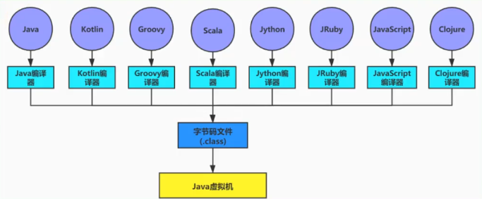
 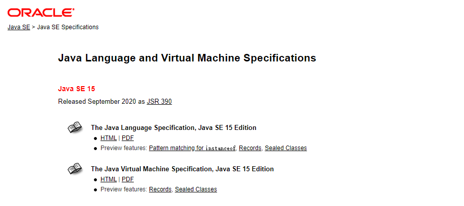

>
https://docs.oracle.com/javase/specs/index.html

- 所有的 JVM 全部遵循 Java 虚拟机规范，也就是说所有的 JVM 环境都是一样的，这样一来，字节码文件可以在各种 JVM 上运行。

1. 想要让一个 Java 程序正确地运行在 JVM 中，Java 源代码就必须要被编译为符合 JVM 规范的字节码。

- **前端编译器的主要任务**就是负载将符合 Java 语法规范的 Java 代码转换为符合 JVM 规范的字节码文件。

- javac 是一种能够将 Java 源码编译为字节码的前端编译器。

- javac 编译器在将 Java 源码编译为一个有效的字节码文件过程中经历了4个步骤，分别是**词法解析、语法解析、语义解析以及生产字节码**。
 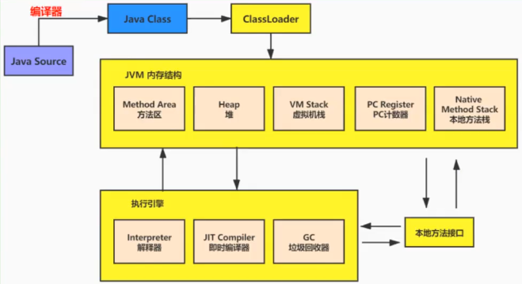
 Oracle 的 JDK 软件包括两部分内容：

- 一部分是将 Java 源代码编译为 Java 虚拟机的指令集的编译器

- 另一部分是用于实现 Java 虚拟机的运行时环境。

#### 1.2. Java 的前端编译器

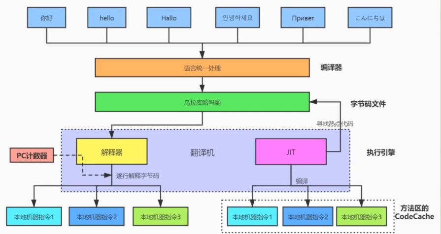
 ***前端编译器 VS 后端编译器***
 Java 源代码的编译结果是字节码，那么肯定需要有一种编译器能够将 Java 源码编译为字节码，承担这个重要责任的就是配置在 PATH 环境变量中的 **javac 编译器**。javac 是一种能够将 Java 源码编译为字节码的**前端编译器**。

HotSpot VM 并没有强制要求前端编译器只能使用 javac 来编译字节码，其实只要编译结果符合 JVM 规范都可以被 JVM 所识别即可。在 Java 的前端编译器领域，除了 javac 之外，还有一种被大家经常用到的前端编译器，那就是内置在 Eclipse 中的 **ECJ（Eclipse Compiler for Java）编译器**。和 javac 的全量式编译不同，ECJ 是一种增量式编译器。

- 在 Eclipse 中，当开发人员写完代码后，使用“Ctrl+S“快捷键时，ECJ 编译器所采取的**编译方法**是把未编译部分的源码逐行进行编译，而并非每次都全量编译。因此 ECJ 的编译效率比 javac 更加迅速和高效，当然编译质量和 javac 相比大致还是一样的。

- ECJ 不仅是 Eclipse 的默认内置前端编译器，在 Tomcat 中同样也是使用 ECJ 编译器来编译 jsp 文件。由于 ECJ 编译器是采用 GPLv2 的开源协议进行源代码公开，所以大家可以登录 eclipse 的官网下载 ECJ 编译器的源码进行二次开发。

- 默认情况下，IntelliJ IDEA 使用 javac 编译器。（还可以自己设置为 AspectJ 编译器 ajc）

前端编译器并不会直接涉及编译优化等方面的技术，而是将这些具体优化细节交给 HotSpot 的 JIT 编译器负责。

复习：AOT（静态提前编译器，Ahead Of Time Compiler）

### 1.3. 透过字节码指令看代码细节

1. BAT 面试题
 ① 类文件结构有几部分？
 ② 知道字节码吗？字节码指令都有哪些？Integer x = 5; int y = 5; 比较 x ==y 都经过哪些步骤？

1. **代码举例**
 代码举例1：

```
public class IntegerTest {
    public static void main(String[] args) {
        Integer x = 5;
        int y = 5;
        System.out.println(x == y);     // true

        Integer i1 = 10;
        Integer i2 = 10;
        System.out.println(i1 == i2);   // true

        Integer i3 = 128;
        Integer i4 = 128;
        System.out.println(i3 == i4);   // false
    }
}

```

代码举例2：

```
public class StringTest {
    public static void main(String[] args) {
        String str = new String("hello") + new String("world");
        String str1 = "helloworld";
        System.out.println(str == str1);    // false
    }
}

```

代码举例3：

```
/**
 * 成员变量（非静态）的赋值过程：① 默认初始化 ② 显示初始化/代码块中初始化
 *  ③ 构造器中初始化 ④ 有了对象后，可以“对象.属性”或“对象.方法”的方式对成员变量进行赋值
 */
class Father {
    int x = 10;

    public Father() {
        this.print();
        x = 20;
    }

    public void print() {
        System.out.println("Father.x = " + x);
    }
}

class Son extends Father {
    int x = 30;
    public Son() {
        this.print();
        x = 40;
    }
    public void print() {
        System.out.println("Son.x = " + x);
    }
}

public class SonTest {
    public static void main(String[] args) {
        Father f = new Son();
        System.out.println(f.x);    // 属性不存在多态性，调的是父类中的 x
    }
}

```

### 2. 虚拟机的基石：Class 文件

-
字节码文件里是什么？
 源代码经过编译器编译之后便会生产一个字节码文件，字节码是一种二进制的类文件，它的内容是 JVM 的指令，而不像 C、C++ 经由编译器直接生成机器码。

-
什么是字节码指令（byte code）？
 Java 虚拟机的指令由一个字节长度的、代表作某种特定操作含义的**操作码**（opcode）以及跟随其后的零至多个代表此操作所需参数的**操作数**（operand）所构成。虚拟机中许多指令并不包含操作数，只有一个操作码。eg：操作码 （操作数）
 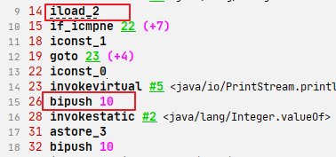

-
如何解决供虚拟机解释执行的二进制字节码？
 方式一：一个一个二进制的看，这里用到的是 VsCode，需要安装一个 hexdump 插件
 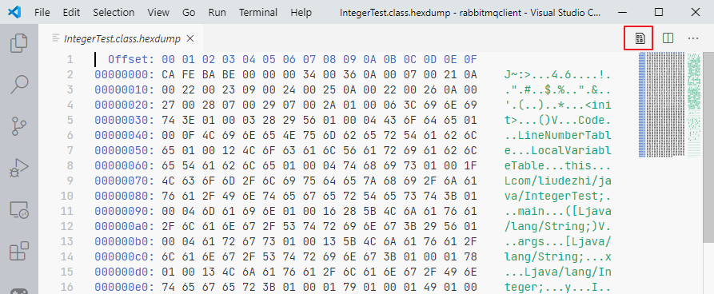

方式二：使用 javap 指令：jdk 自带的反解析工具
 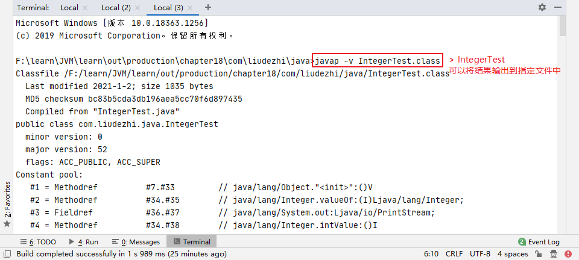

方式三：使用 IDEA 插件：jclasslib 或 jclasslib bytecode viewer 客户端工具。(可视化更好)
 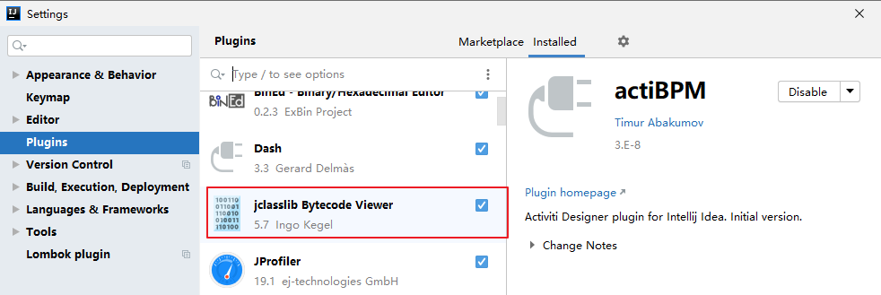
 或：
 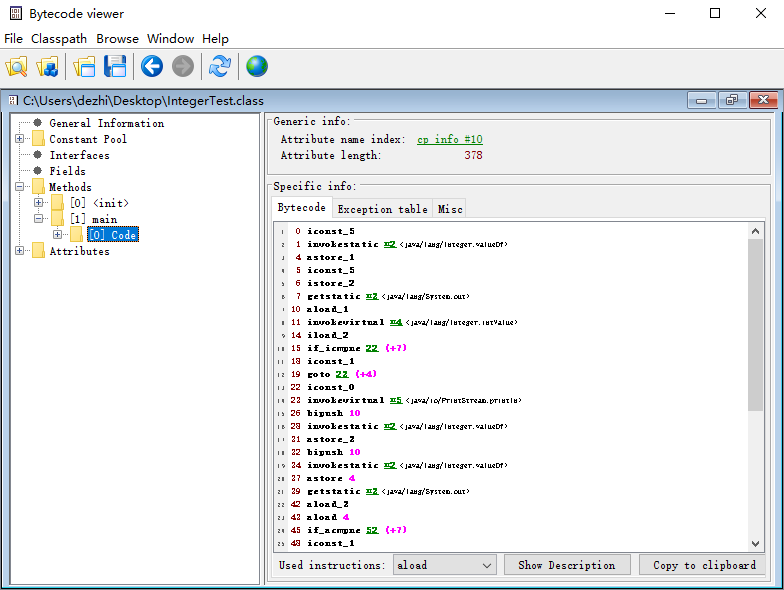

### 3. Class 文件的结构

- 官方文档位置：https://docs.oracle.com/javase/specs/jvms/se8/html/jvms-4.html

- Class 类的本质
 任何一个 Class 文件都对应着唯一一个类或接口的定义信息，但反过来说，Class 文件实际上它并不一定以磁盘文件的形式存在。Class 文件是一组以8位字节为基础单位的**二进制流**。

- Class 文件格式
 Class 的结构不像 XML 等描述语言，由于它没有任何分隔符号。所以在其中的数据项，无论是字节顺序还是数量，都是被严格限定的，哪个字节代表什么含义，长度是多少，先后顺序如何，都不允许改变。
 Class 文件格式采用一种类似于 C语言结构体的方式进行数据存储，这种结构中只有两种数据类型：**无符号数**和**表**。

  - 无符号数属于基本的数据类型，以 u1、u2、u4、u8 来分别代表 1个字节、2个字节、4个字节和8个字节的无符号数，无符号数可以用来描述数字、索引引用、数量值或者按照 UTF-8 编码构成的字符串值。

  - 表是由多个无符号数或者其他表作为数据项构成的符合数据类型，所有表都习惯性地以“_info”结尾。表用于描述有层次关系的符合结构的数据，整个 Class 文件本质上就是一张表。由于表没有固定长度，所以通常会在其前面加上个数说明

- 代码举例

```
public class Demo {
    private int num = 1;

    public int add() {
        num = num + 2;
        return num;
    }
}

```

对应的字节码文件：
 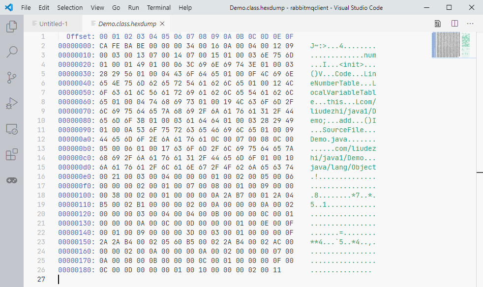
 **换句话说，充分理解了每一个字节码文件的细节，自己也可以反编译出 Java 源文件来。**

- Class 文件结构概述
 Class 文件的结构并不是一成不变的，随着 Java 虚拟机的不断发展，总是不可避免地会对 Class 文件结构做出一些调整，但是其基本结构和框架是非常稳定的。
 ***Class 文件的总体结构如下：：***

  - 魔数

  - Class 文件版本

  - 常量池

  - 访问标识

  - 类索引、父类索引、接口索引集合

  - 字段表集合

  - 方法表集合

  - 属性表集合
 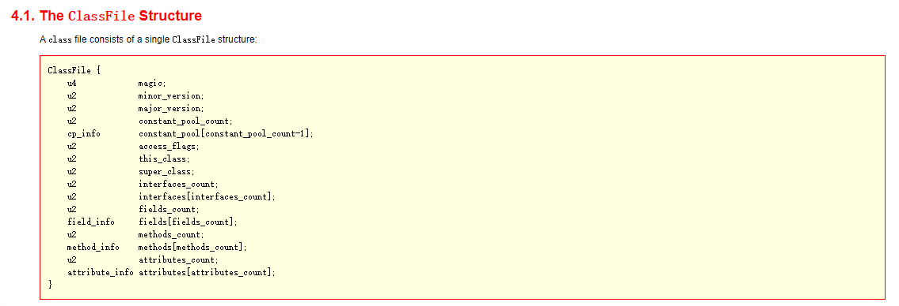

 | 类型 | 名称 | 说明 | 长度 | 数量
 | u4 | magic | 魔数，识别 Class 文件格式 | 4个字节 | 1
 | u2 | minor_version | 副版本号（小版本） | 2个字节 | 1
 | u2 | major_version | 主版本号（大版本） | 2个字节 | 1
 | u2 | constant_pool_count | 常量池计数器 | 2个字节 | 1
 | cp_info | constant_pool | 常量池表 | n个字节 | constant_pool_count-1
 | u2 | access_flags | 访问标识 | 2个字节 | 1
 | u2 | this_class | 类索引 | 2个字节 | 1
 | u2 | super_class | 父类索引 | 2个字节 | 1
 | u2 | interfaces_count | 接口计数器 | 2个字节 | 1
 | u2 | interfaces | 接口索引集合 | 2个字节 | 1
 | u2 | fields_count | 字段计数器 | 2个字节 | 1
 | field_info | fields | 字段表 | n个字节 | fields_count
 | u2 | methods_count | 方法计数器 | 2个字节 | 1
 | method_info | methods | 方法表 | n个字节 | methods_count
 | u2 | attributes_count | 属性计数器 | 2个字节 | 1
 | attribute_info | attributes | 属性表 | n个字节 | attributes_count

这是一张 Java 字节码总的结构表，按照上面的顺序逐一解读就可以了。

#### 3.1. 魔数：Class 文件的标志

- 每个 Class 文件开头的4个字节的无符号整数称为魔数（Magic Number）

- 它的唯一作用是确定这个文件是否是一个能被虚拟机所接受的有效合法的 Class 文件。即：魔数是 Class 文件的标识符。

- 魔数值固定为 0xCAFEBABE。不会改变。

- 如果一个 Class 文件不以 0XCAFEBABE 开头，虚拟机在进行文件校验的时候就会直接抛出以下错误：

```
Error: A JNI error has occurred, please check your installation and try again
Exception in thread "main" java.lang.ClassFormatError: Incompatible magic value 1885430635 in class file Demo

```

- 使用魔数而不是扩展名来进行识别主要是基于安全方面的考虑，因为文件扩展名可以随意地改动。

#### 3.2. Class 文件版本号

- 紧接着魔数的4个字节存储的是 Class 文件的版本号。同样也是4个字节。第五个和第六个字节所代表的含义就是编译的副版本号 minor_version，而第七个和第八个字节就是编译的主版本号 major_version。

- 它们共同构成了 class 文件的格式版本号。譬如某个 class 文件的版本号为 M，副版本号为 m，那么这个 Class 文件的格式版本号就确定为 M.m。

- 版本号和 Java 编译器的对应关系如下表：

 | 主版本（十进制） | 副版本（十进制） | 编译器版本
 | 45 | 3 | 1.1
 | 46 | 0 | 1.2
 | 47 | 0 | 1.3
 | 48 | 0 | 1.4
 | 49 | 0 | 1.5
 | 50 | 0 | 1.6
 | 51 | 0 | 1.7
 | 52 | 0 | 1.8
 | 53 | 0 | 1.9
 | 54 | 0 | 1.10
 | 55 | 0 | 1.11

- Java 的版本号是从 45 开始的，JDK1.1 之后的每个 JDK 大版本发布主版本号向上加1.

- **不同版本的 Java 编译器编译的 Class 文件对应的版本是不一样的。目前，高版本的 Java 虚拟机可以执行由低版本编译器生成的 Class 文件，但是低版本的 Java 虚拟机不能执行由高版本编译器生成的 Class 文件。否则 JVM 会抛出 java.lang.unsupportedClassVersionError 异常**。(向下兼容)

- 在实际应用中，由于开发环境和生产环境的不同，可能会导致该问题的发生。因此，需要我们在开发时，特别注意开发编译的 JDK 版本和生产环境中的 JDK 版本是否一致。

  - 虚拟机 JDK 版本为 1.k（k >= 2）时，对应的 class 文件格式版本号的范围为 45.0 - 44+k.0（含两端）。

#### 3.3. 常量池：存放所有常量

- 常量池是 Class 文件中内容最为丰富的区域之一。常量池对于 Class 文件中的字段和方法解析也有着至关重要的作用。

- 随着 Java 虚拟机的不断发展，常量池的内容也日渐丰富。可以说，常量池是整个 Class 文件的基石。
 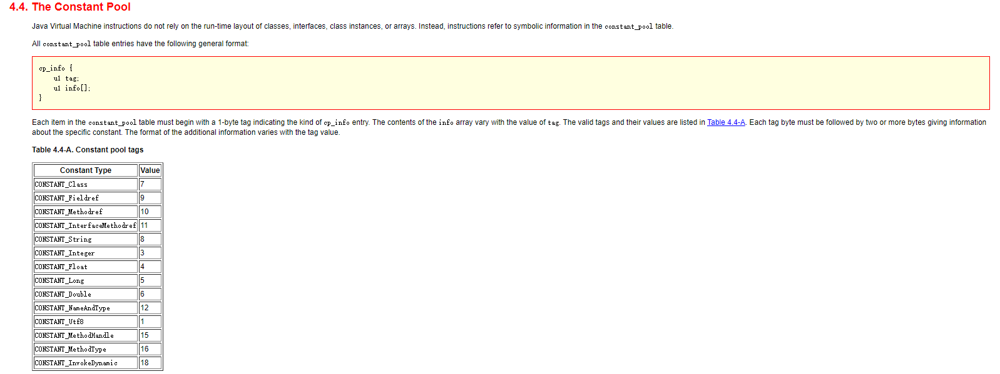

- 在版本号之后，紧跟着的是常量池的数量，以及若干个常量池表项。

- 常量池中常量的数量是不固定的，所以在常量池的入口需要放置一项u2类型的无符号数，代表常量池容量计数值（constant_pool_count）。与 Java 中语言习惯不一样的是，这个容量计数是从1而不是0开始的。

 | 类型 | 名称 | 数量
 | u2（无符号数） | constant_pool_count | 1
 | cp_info（表） | constant_pool | constant_pool_count-1

由上表可见，Class 文件使用了一个前置的容量计数器（constant_pool_count）加若干个连续的数据项（constant_pool）的形式来描述常量池内容。我们把这一系列连续常量池数据称为常量池集合。

- **常量池表项**中，用于存放编译时期生产的各种*字面量*和*符号引用*，这部分内容将在类加载后进入方法区的**运行时常量池**中存放。

##### 3.3.1. 常量池计数器

**constant_pool_count（常量池计数器）**

- 由于常量池的数量不固定，时长时短，所以需要放置两个字节来表示常量池容量计数值。

- 常量池容量计数器（u2类型）：**从1开始**，表示常量池中有多少项常量。即 constant_pool_count=1 表示常量池中有0个常量项。

- Demo 的值为：
 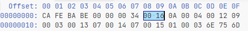
 其值为 0x0016，也就是22。
 需要注意的是，着实际上只有21项常量，索引范围是1-21。为什么呢？
 **答：** 通常我们写代码都是从0开始的，但是这里的常量池确实从1开始，因为它把第0项常量空出来了。这是为了满足后面某些指向常量池的索引值的数据在特定情况下需要表达“不引用任何一个常量池项目”的含义，这种情况可用索引值0来表示。

##### 3.3.2. 常量池表

**constant_pool[] （常量池）**

- constant_pool 是一种表结构，以 1~constant_pool_count-1 为索引。表明了后面有多少个常量项。

- 常量池主要存放两大类常量：**字面量（Literal）**和**符号引用（Symbolic References）**

- 它包含了 class 文件结构及其子结构中引用的所有字符串常量、类或接口名、字段名和其他常量。常量池中的每一项都具备相同的特征。第一个字节作为类型标记，用于确定该项的格式，这个字节称为 tag byte（标记字节、标签字节）。

 | 类型 | 标志（或标识） | 描述
 | CONSTANT_utf8_info | 1 | UTF-8 编码的字符串
 | CONSTANT_Integer_info | 3 | 整形字面量
 | CONSTANT_Float_info | 4 | 浮点型字面量
 | CONSTANT_Long_info | 5 | 长整型字面量
 | CONSTANT_Double_info | 6 | 双精度浮点型字面量
 | CONSTANT_Class_info | 7 | 类或接口的符号引用
 | CONSTANT_String_info | 8 | 字符串类型字面量
 | CONSTANT_Fieldref_info | 9 | 字段的符号引用
 | CONSTANT_Methodref_info | 10 | 类中方法的符号引用
 | CONSTANT_InterfaceMethodref_info | 11 | 接口中方法的符号引用
 | CONSTANT_NameAndType_info | 12 | 字段或方法的符号引用
 | CONSTANT_MethodHandle_info | 15 | 表示方法句柄
 | CONSTANT_MethodType_info | 16 | 标志方法类型
 | CONSTANT_InvokeDynamic_info | 18 | 表示一个动态方法调用点

###### 3.3.2.1. 字面量和符号引用

在对这些常量解读前，我们要搞清楚几个概念。
 常量池主要存放两大类常量：字面量（Literal）和符号引用（Symbolic References）。如下表：

 | 常量 | 具体的常量
 | 字面量 | 文本字符串
 |  | 声明为 final 的常量值
 | 符号引用 | 类和接口的全限定名
 |  | 字段的名称和描述符
 |  | 方法的名称和描述符

1. 全限定名
 com/liudezhi/java/Demo 这个就是类的全限定名，仅仅是把包名的"."替换成了"/"，为了使连续的多个全限定名之间不产生混淆，在使用时最后一般会加入一个“;”表示全限定名结束。

1. 简单名称
 简单名称是指没有类型和参数修饰的方法或者字段名称，上面例子中的 add() 方法和 num 字段的简单名称就是 add 和 num。

1. 描述符
 **描述符的作用是用来描述字段的数据类型、方法的参数列表（包括数量、类型以及顺序）和返回值**。根据描述符规则，基本数据类型（byte、char、double、float、int、long、short、boolean）以及代表无返回值的 void 类型都用一个大写字母来表示，而对象类型则用字符串L加对象的全限定名来表示，详见下表：

 | 标识符 | 含义
 | B | 基本数据类型 byte
 | C | 基本数据类型 char
 | D | 基本数据类型 double
 | F | 基本数据类型 float
 | I | 基本数据类型 int
 | J | 基本数据类型 long
 | S | 基本数据类型 short
 | Z | 基本数据类型 boolean
 | V | 代表 void 类型
 | L | 对象类型，比如：Ljava/lang/Object;
 | [ | 数组类型，代表一维数组。比如：double[][][] is [[[D

用描述符来描述方法时，按照先参数列表，后返回值的顺序描述，参数列表按照参数的严格顺序放在一组小括号“()”之内。如方法 java.lang.String.toString() 的描述符为() Ljava/lang/String;。方法 int abc(int[] x, int y) 的描述符为 ([II) I。

**补充说明：**
 虚拟机在加载 Class 文件时才会进行动态链接，也就是说，Class 文件中不会保存各个方法和字段的最终内存布局信息，因此，这些字段和方法的符号引用不经过转换是无法直接被虚拟机使用的。**当虚拟机运行时，需要从常量池中获得对应的符号引用，再在类的加载过程中的解析阶段将其转换为直接引用，并翻译到具体的内存地址中**。
 这里说明下符号引用和直接引用的区别和关联：

- 符号引用：符号引用以**一组符号**来描述所引用的目标，符号可以是任何形式的字面量，只要使用时能无歧义地定位到目标即可。**符号引用与虚拟机实现的内存布局无关**，引用的目标并不一定已经加载到内存中。

- 直接引用：直接引用可以是直接**指向目标的指针、相对偏移量或是一个能间接定位到目标的句柄。直接引用是虚拟机实现的内存布局相关的**。同一个符号引用在不同虚拟机实例上翻译出来的直接引用一般不会相同。如果有了直接引用，那说明引用的目标必定已经存在于内存中了。

###### 3.3.2.2. 常量类型和结构

常量池中每一项常量都是一个表，JDK1.7 之后共有14种不同的表结构数据。如下表所示：
 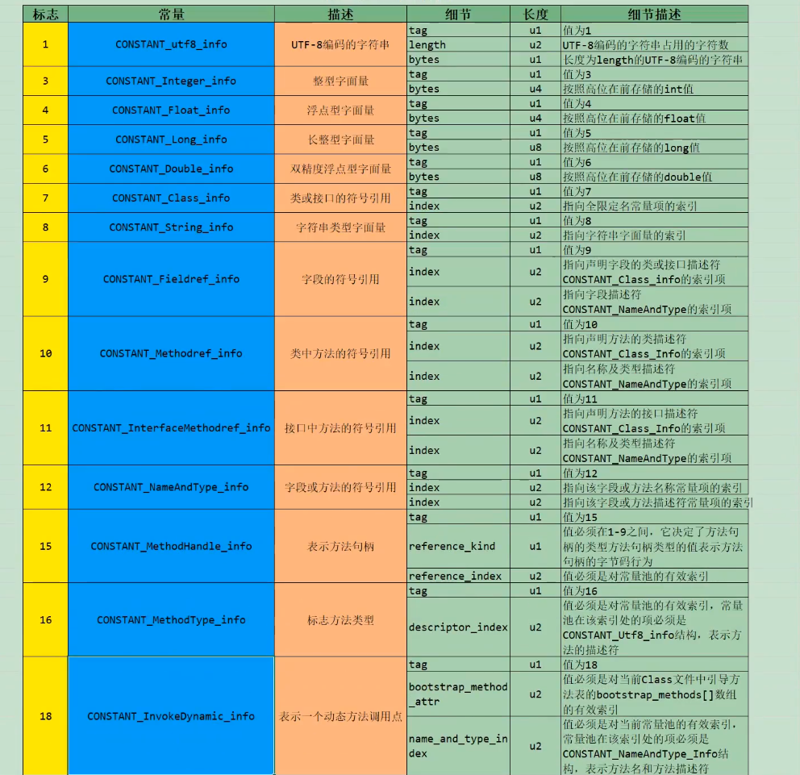

- 根据上图每个类型的描述，我们也可以知道每个类型是用来描述常量池中哪些内容（主要是字面量、符号引用）的。比如：CONSTANT_Integer_info 是用来描述常量池中字面量信息的，而且只是整形字面量信息。

- 标志为15、16、18的常量项是用来支持动态语言调用的（JDK1.7 时才加入的）。

- 细节说明：

  - CONSTANT_Class_info 结构用于表示类或接口

  - CONSTANT_Fieldref_info、CONSTANT_Methodref_info、CONSTANT_InterfaceMethodref_info 结构表示字段、方法和接口方法

  - CONSTANT_String_info 结构用于表示 String 类型的常量对象

  - CONSTANT_Integer_info 和 CONSTANT_Float_info 表示4字节（int 和 float）的数值常量

  - CONSTANT_Long_info 和 CONSTANT_Double_info 表示8字节（long和double）的数值常量

    - 在 class 文件的常量池表中，所有的8字节均占两个表成员（项）的空间。如果一个 CONSTANT_Long_info 或 CONSTANT_Double_info 结构的项在常量池表中的索位n，则常量池表中下一个可用项的索引位n+2，此时常量池表中索引为 n+1 的项目仍然有效但必须视为不可用。

  - CONSTANT_NameAndType_info 结构用于表示字段或方法，但是和之前的3个结构不同，CONSTANT_NameAndType_info 结构没有指明该字段或方法所属的类或接口。

  - CONSTANT_utf8_info 用于表示字符常量的值

  - CONSTANT_MethodHandle_info 结构用于表示方法句柄

  - CONSTANT_MethodType_info 结构表示方法类型

  - CONSTANT_InvokeDynamic_info 结构用于表示 invokedynamic 指令所用到的引导方法（bootstrap method）、引导方法所用到的动态调用名称（dynamic invocation name）、参数和返回类型，并可以给引导方法传入一系列称为静态参数（static argument）的常量。

- 解析方式：

  - 一个字节一个字节的解析

  - 使用 javap 命令解析：javap -verbose Demo.class 或者 jclasslib 工具会更方便。

**总结1：**

- 这14中表（或者常量项结构）的共同点是：表开始的第一位是一个 u1 类型的标志位（tag），代表当前这个常量项使用的是哪种表结构，即哪种常量类型。

- 在常量池列表中，CONSTANT_utf8_info 常量项是一种使用改进过的 UTF-8 编码格式来存储诸如文字字符串、类或者接口的全限定名、字段或者方法的简单名称以及描述符等常量字符串信息。

- 这14中常量项还有一个特点是，其中13个常量项占用的字节固定，只有 CONSTANT_utf8_info 占用字节不固定，其大小由 length 决定。**因为从常量池存放的内容可知，其存放的是字面量和符号引用，最终这些内容都会是一个字符串，这些字符串的大小是在编写程序时才确定**，比如你定义一个类，类名可以取长取短，所以在没编译前，大小不固定，编译后，通过 utf-8 编码，就可以知道其长度。

**总结2：**

- 常量池：可以理解为 Class 文件之中的资源仓库，它是 Class 文件结构中与其他项目关联最多的数据类型（后面的很多数据类型都会指向此处），也是占用 Class 文件空间最大的数据项目之一。

- **常量池中为什么要包含这些内容？**
 Java 代码在进行 javac 编译的时候，并不像 C 和 C++ 那样有“连接”这一步骤，而是在虚拟机加载 Class 文件的时候进行动态链接。也就是说，**在 Class 文件中不会保存各个方法、字段的最终内存布局信息，因为这些字段、方法的符号引用不经过运行期转换的话无法得到真正的内存入口地址，也就无法直接被虚拟机使用**。当虚拟机运行时，需要从常量池获得对应的符号引用，再在类创建时或运行时解析、翻译到具体的内存地址之中。关于类的创建和动态链接的内容，在虚拟机类加载过程时再进行详细讲解。

#### 3.4. 访问标识

**访问标识（access_flag、访问标志、访问标记）**

- 在常量池后，紧跟着访问标记。该标记使用两个字节表示，用于识别一些类或者接口层次的访问信息，包括：这个 Class 是类还是接口；是否定义为 public 类型；是否定义为 abstract 类型；如果是类的话，是否被声明为 final 等。各种访问标记如下所示：

 | 标志名称 | 标志值 | 含义
 | ACC_PUBLIC | 0x0001 | 标志为 public 类型
 | ACC_FINAL | 0x0010 | 标志被声明为 final，只有类可以设置
 | ACC_SUPER | 0x0020 | 标志允许使用 invokespecial 字节码指令的新语义，JDK1.0.2之后编译出来的类这个标志默认为真。（使用增强的方法调用父类方法）
 | ACC_INTERFACE | 0x0200 | 标志这是一个接口
 | ACC_ABSTRACT | 0x0400 | 是否为 abstract 类型，对于接口或者抽象类来说，此标志为真，其他类型为假
 | ACC_SYSTHEIC | 0x1000 | 标志此类并非由用户代码产生（即：由编译器产生的类，没有源码对应）
 | ACC_ANNOTATION | 0x2000 | 标志这是一个注解
 | ACC_ENUM | 0x4000 | 标志这是一个枚举

- 类的访问权限通常为 ACC_ 开头的常量。

- 每一种类型的表示都是通过设置访问标记的32位中的特定位来实现的。比如 若是 public final 的类，则该标记位 ACC_PUBLIC | ACC_FINAL。

- 使用 ACC_SUPER 可以让类更准确地定位到父类的方法 super.method()，现代编译器都会设置并且使用这个标记。

**补充说明：**

1. 带有 ACC_INTERFACE 标志的 class 文件表示的是接口而不是类，反之则表示的是类而不是接口。
 1）如果有一个 class 文件被设置了 ACC_INTERFACe 标志，那么同时也得设置 ACC_ABSTRACT 标志。同时它不能再设置 ACC_FINAL、ACC_SUPER 或 ACC_ENUM 标志。
 2）如果没有设置 ACC_INTERFACE 标志，那么这个 class 文件可以具有上表中除 ACC_ANNOTATION 外的其他所有标志。当然 ACC_FINAL 和 ACC_ABSTRACT 这类互斥的标志除外。这两个标志不得同时设置。

1. ACC_SUPER 标志用于确定类或接口里面的 invokespecial指令使用的是哪一种执行语义。**针对 Java 虚拟机指令集的编译器都应当设置这个标志**。对于 Java SE8 及后续版本来说，无论 class 文件中这个标志的实际值是什么，也不管 class 文件的版本号是多少，Java 虚拟机都认为每个 class 文件均设置了 ACC_SUPER 标志。
 1）ACC_SUPER 标志是为了向后兼容由旧 Java 编译器所编译的代码而设计的。目前的 ACC_SUPER 标志在由 JDK1.0.2 之前的编译器所生产的 access_flag 中式没有明确含义的，如果设置了该标志，那么 Oracle 的 Java 虚拟机实现会将其忽略。

1. ACC_SYNTHETIC 标志意味着该类或接口式由编译器生成的，而不是由源代码生成的。

1. 注解类型必须设置 ACC_ANNOTATION 标志。如果设置了 ACC_ANNOTATION 标志，那么也必须设置 ACC_INTERFACE 标志。

1. ACC_ENUM 标志表明该类或其父类为枚举类型。

#### 3.5. 类索引、父类索引、接口索引集合

- 在访问标记后，会指定该类的类别、父类类型以及实现的接口，格式如下：

 | 长度 | 含义
 | u2 | this_class
 | u2 | super_class
 | u2 | interfaces_count
 | u2 | interfaces[interfaces_count]

- 这三项数据来确定这个类的继承关系

  - 类索引用于确定这个类的全限定名

  - 父类索引用于确定这个类的父类的全限定名。由于 Java 语言不允许多重继承，所以父类索引只有一个，除了 java.lang.Object 之外，所有的 Java 类都有父类，因此除了 java.lang.Object 外，所有 Java 类的父类索引都不为 0.

  - 接口索引集合就用来描述这个类实现了哪些接口，这些被实现的接口将按 implements 语句（如果这个类本身是一个接口，则应当是 extends 语句）后的接口顺序从左到右排列在接口索引集合中。

1.
this_class(类索引)
 2字节无符号整数，指向常量池的索引。它提供了类的全限定名，如 com/liudezhi/java1/Demo。this_class 的值必须是对常量池表中某项的一个有效索引值。常量池在这个索引处的成员必须为 CONSTANT_Class_info 类型结构体，该结构体表示这个 class 文件所定义的类或接口。

1.
super_class（父类索引）

- 2字节无符号整数，指向常量池的索引。它提供了当前类的父类全限定名。如果我们没有继承任何类，其默认继承的是 java/lang/Object 类。同时，由于 Java 不支持多继承，所以其父类只有一个。

- superclass 指向的父类不能是 final

1. interfaces

- 指向常量池索引集合，它提供了一个符号引用到所有已实现的接口

- 由于一个类可以有多个多个接口，因此需要以数组形式保存多个接口的索引，表示接口的每个索引也是一个指向常量池的 CONSTANT_Class（当然这里就必须是接口，而不是类）。

3.1. interfaces_count(接口计数器)
 interfaces_count 项的值表示当前类或接口的直接超接口数量

3.2. interfaces[]
 interfaces[] 中每个成员的值必须是对常量池表中某项的有效索引值，它的长度为 interfaces_count。每个成员 interfaces[i] 必须为 CONSTANT_Class_info 结构，其中 0 <= i < interfaces_count。在 interfaces[] 中，各成员所表示的接口顺序和对应的源代码中给定的接口顺序（从左至右）一样，即 interfaces[0] 对应的是源代码中最左边的接口。

#### 3.6. 字段表集合

**fields**

- 用于描述接口或类中声明的变量。字段（field）包括**类级变量以及实例级变量**，但是不包括方法内部、代码块内部声明的局部变量。

- 字段叫什么名字、字段被定义为什么数据类型，这些都是无法固定的，只能引用常量池中的常量来描述

- 它指向常量池索引集合，它描述了每个字段的完整信息。比如**字段的标识符、访问修饰符（public、private或protected）、是类变量还是实例变量（static修饰符）、是否是常量（final修饰符）**等。

**注意事项：**

- 字段表集合中不会列出从父类或者实现的接口中继承而来的字段，但有可能列出原本 Java 代码之中不存在的字段。譬如在内部类中为了保持对外部类的访问性，会自动添加指向外部类实例的字段。

- 在 Java 语言中字段是无法重载的，两个字段的数据类型、修饰符不管是否相同，都必须使用不一样的名称，但是对于字节码来讲，如果两个字段的描述符不一致，那字段重名就是合法的。

##### 3.6.1. 字段计数器

fields_count 的值表示当前 class 文件 fields 表的成员个数。使用两个字节来表示。
 fields 表中每个成员都是一个 field_info 结构，用于表示该类或接口所声明的所有类字段或者实例字段，不包括方法内部声明的变量，也不包括从父类或父接口继承的那些字段。

##### 3.6.2. 字段表

**fields[]（字段表）**

- fields 表中的每个成员都必须是一个 fields_info 结构的数据项，用于表示当前类或接口中某个字段的完整描述。

- 一个字段的信息包括如下这些信息。这些信息中，**各个修饰符都是布尔值，要么有，要么没有**。

  - 作用域（public、private、protected修饰符）

  - 是实例变量还是类变量（static 修饰符）

  - 可变性（final）

  - 并发可见性（volatile 修饰符，是否强制从主内存读写）

  - 可否序列化（transient 修饰符）

  - 字段数据类型（基本数据类型、对象、数组）

  - 字段名称

- 字段表结构
 字段表作为一个表，同样有他自己的结构：

类型 | 名称 | 含义 | 数量
 u2 | access_flags | 访问标志 | 1
 u2 | name_index | 字段名索引 | 1
 u2 | descriptor_index | 描述符索引 | 1
 u2 | attributes_count | 属性计数器 | 1
 attribute_info | attributes | 属性集合| attributes_count

1. 字段访问标识
 我们知道，一个字段可以被各种关键字去修饰，比如：作用域修饰符（public、private、protected）、static修饰符、final修饰符、volatile修饰符等等。因此其可像类的访问标志那样，使用一些标志来标记字段。字段的访问标志有如下这些：

 | 标志名称 | 标志值 | 含义
 | ACC_PUBLIC | 0x0001 | 字段是否为 public
 | ACC_PRIVATE | 0x0002 | 字段是否为 private
 | ACC_PROTECTED | 0x0004 | 字段是否为 protected
 | ACC_STATIC | 0x0008 | 字段是否为 static
 | ACC_FINAL | 0x0010 | 字段是否为 final
 | ACC_VOLATILE | 0x0040 | 字段是否为 volatile
 | ACC_TRANSTENT | 0x0080 | 字段是否为 transient
 | ACC_SYNCHETIC | 0x1000 | 字段是否由编译器自动产生
 | ACC_ENUM | 0x40000 | 字段是否为 enum

1.
字段名索引
 根据字段名索引的值，查询常量池中的指定索引项即可。

1.
描述符索引
 描述符的作用是用来描述字段的数据类型、方法的参数列表（包括数量、类型以及顺序）和返回值。根据描述符规则，基本数据类型（byte、char、double、float、int、long、short、boolean）及代表无返回值的 void 类型都用一个大写字符来表示，而对象则用字符 L 加对象的全限定名来表示，如下所示：

 | 字符 | 类型 | 含义
 | B | byte | 有符号字节型数
 | C | char | Unicode字符，UTF-16编码
 | D | double | 双精度浮点数
 | F | float | 单精度浮点数
 | I | int | 整形数
 | J | long | 长整数
 | S | short | 有符号短整数
 | Z | boolean | 布尔值 true/false
 | L Classname; | reference | 一个名为 Classname 的实例
 | [ | reference | 一个一维数组

1. 属性表集合
 一个字段还可能拥有一些属性，用于存储更多的额外信息。比如初始化值、一些注释信息等。属性个数存放在 attribute_count 中，属性具体内容存放在 attributes 数组中。
 以常量属性为例，结构为：
 ConstantVale_attribute {
 u2 attribute_name_index;
 u2 attribute_length;
 u2 constantvalue_index;
 }
 说明：对于常量属性而言，attributee_length 值恒为2.

#### 3.7. 方法表集合

methods：指向常量池索引集合，它完整描述了每个方法的签名。

- 在字节码文件中，**每一个 method_info 项都对应着一个类或者接口中的方法信息**。比如方法的访问修饰符（public、private或protected），方法的返回值类型以及方法的参数信息等。

- 如果这个方法不是抽象的或者不是 native 的，那么字节码中会体现出来。

- 一方面，methods 表只描述当前类或接口中声明的方法，不包括从父类或父接口继承的方法。另一方面，methods 表有可能会出现由编译器自动添加的方法。最经典的便是编译器产生的方法信息（比如：类(接口)初始化方法 <clinit>() 和实例初始化方法 <init>()）。

**使用注意事项：**
 在 Java 语言中，要重载（Overload）一个方法，除了要与原方法具有相同的简单名称之外，还要求必须拥有一个与原方法不同的特征签名，特征签名就是一个方法中各个参数在常量池中的字段符号引用的集合，也就是因为返回值不会包含在特征签名之中，因此 Java 语言里无法仅仅依靠返回值的不同来对一个已有方法进行重载。但是 Class 文件格式中，特征签名的范围更大一些，只要描述符不是完全一致的两个方法就可以共存。也就是说，如果两个方法由相同的名称和特征签名，但返回值不同，那么也是可以合法共存于同一个 class 文件中。
 也就是说，尽管 Java 语法规范并不允许在一个类或者接口中声明多个方法签名相同的方法。但是和 Java 语法规范相反，字节码文件中却恰恰允许存放多个方法签名相同的方法，唯一的条件就是这些方法之间的返回值不能相同。

##### 3.7.1. 方法计数器

**methods_count(方法计数器)**
 methods_count 的值表示当前 class 文件 methods 表的成员个数。使用两个字节来表示。
 methods 表中每个成员都是一个 method_info 结构。

##### 3.7.2. 方法表

**methods[] （方法表）**

- methods 表中的每个成员都必须是一个 method_info 结构，用于表示当前类或接口中某个方法的完整描述。如果某个 method_info 结构的 access_flags 项既没有设置 ACC_NATIVE 标志也没有设置 ACC_ABSTRACT 标志，那么该结构中也应包含实现这个方法所用的 Java 虚拟机指令。

- method_info 结构可以表示类和接口中定义的所有方法，包括实例方法、类方法、实例初始化方法和类或接口初始化方法

- 方法表的结构实际跟字段表是一样的，方法表结构如下：

类型 | 名称 | 含义 | 数量
 u2 | access_flags | 访问标志 | 1
 u2 | name_index | 字段名索引 | 1
 u2 | descriptor_index | 描述符索引 | 1
 u2 | attributes_count | 属性计数器 | 1
 attribute_info | attributes | 属性集合| attributes_count

1. 方法表访问标志
 跟字段表一样，方法表也有访问标志，而且它们的标志有部分相同，方法表的具体访问标志如下：

 | 标记名 | 值 | 说明
 | ACC_PUBLIC | 0x0001 | public，方法可以从包外访问
 | ACC_PRIVATE | 0x0002 | private，方法只能本类中访问
 | ACC_PROTECTED | 0x0004 | protected，方法在自身和子类可以访问
 | ACC_STATIC | 0x0008 | static，静态方法
 | ACC_FINAL | 0x0010 | final，方法不能被重写（覆盖）
 | ACC_SYNCHRONIZED | 0x0020 | synchronized，方法由管理同步
 | ACC_BRIDGE | 0x0040 | birdge，方法由编译器产生

#### 3.8. 属性表集合

**属性表集合（attributes）**
 方法表集合之后的属性表集合，**指的是class 文件所携带的辅助信息**，比如该 class 文件的源文件的名称。以及任何带有 RetentionPolicy.CLASS 或者 RetentionPolicy.RUNTIME 的注解。这类信息通常被用于 Java 虚拟机的验证和运行，以及 Java 程序的调试，**一般无须深入了解**。

此外，字段表、方法表都可以由自己的属性表。用于描述某些场景转悠的信息。

属性表结合的限制没有那么严格，不再要求各个属性表具有严格的顺序，并且只要不与已有的属性名重复，任何人实现的编译器都可以向属性表中写入自己定义的属性信息，但 Java 虚拟机运行时会忽略掉它不认识的属性。

##### 3.8.1. 属性计数器

attributes_count 的值表示当前 class 文件属性表的成员个数。属性表中每一项都是一个 attribute_info 结构。

##### 3.8.2. 属性表

**attributes[]（属性表）**
 属性表的每个项的值必须是 attribute_info 结构。属性表的结构比较灵活，各种不同的属性只要满足以下结构即可。

1. 属性的通用格式

 | 类型 | 名称 | 数量 | 含义
 | u2 | attribute_name_index | 1 | 属性名索引
 | u4 | attribute_length | 1 | 属性长度
 | u1 | info | attribute_length | 属性表

即只需说明属性的名称以及占用位数的长度即可，属性表具体的结构可以去自定义。

1. 属性类型
 属性表实际上可以有很多类型，上面看大的 Code 属性只是其中一种，Java8 里面定义了 23 种属性。
 下面这些是虚拟机中预定义的属性：

 | 属性名称 | 使用位置 | 含义
 | Code | 方法表 | Java 代码编译成的字节码指令
 | ConstantValue | 字段表 | final 关键字定义的常量池
 | Deprecated | 类，方法，字段表 | 被声明为 deprecated 的方法和字段
 | Exceptions | 方法表 | 方法抛出的异常
 | EnclosingMethod | 类文件 | 仅当一个类为局部类或者匿名类时才能拥有这个属性，这个属性用于标识这个类所在的外围方法
 | InnerClass | 类文件 | 内部类列表
 | LineNumberTable | Code 属性 | Java 源码的行号与字节码指令的对应关系
 | LineVariableTable | Code 属性 | 方法的局部变量描述
 | StackMapTable | Code 属性 | JDK1.6 中新增的属性，供新的类型检查检验器检查和处理目标方法的局部变量和操作数有所需要的类是否匹配
 | Signature | 类，方法表，字段表 | 用于支持泛型情况下的方法签名
 | SourceFile | 类文件 | 记录源文件名称
 | SourceDebugExtension | 类文件 | 用于存储额外的调试信息
 | Synthetic | 类，方法表，字段表 | 标志方法或字段为编译器自动生成的
 | LocalVariableTyepTable | 类 | 使用特征签名代替描述符，是为了引入泛型语法之后能描述泛型参数化类型而添加
 | RuntimeVisibleAnnotations | 类，方法表，字段表 | 为动态注解提供支持
 | RuntimeInvisibleAnnotations | 类，方法表，字段表 | 用于指明哪些注解是运行时不可见的
 | RuntimeVisibleParameterAnnotation | 方法表 | 作用与 RunntimeVisibleAnnotations 属性类似，只不过作用对象为方法
 | RuntimeInvisibleParameterAnnotation | 方法表 | 作用与 RunntimeInvisibleAnnotations 属性类似，作用于对象方法参数
 | AnnotationDefault | 方法表 | 用于记录注解类元素的默认值
 | BootstrapMethods | 类文件 | 用于保存 invokeddynamic 指令引用的引导方式限定符

或查看官网：
 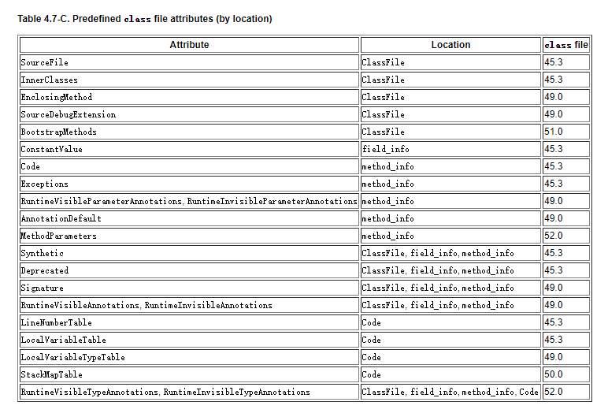

1. 部分属性详解
 **① ConstantValue 属性 **
 ConstantValue 属性表示一个常量字段的值。位于 field_info 结构的属性表中。

```
ConstatnValue_attribute {
    u2 attribute_name_index;
    u4 attribute_length;
    u2 constantvalue_index; // 字段值在常量池中的索引，常量池在该索引处的项给出该属性所表示的常量值。（eg：值是 long 型的，在常量池中便是 CONSTANT_Long）
}

```

**② Deprecated 属性**
 Deprecated 属性是在 JDK1.1 为了支持注解中的关键字 @deprecated 而引入的。

```
Deprecated_attribute {
    u2 attribute_name_index;
    u4 attribute_length;
}

```

**③ Code 属性**
 Code 属性就是存放方法体里面的代码。但是，并发所有方法表都有 Code 属性。像接口或者抽象方法，它们没有具体的方法体。
 Code 属性表的结构，如下图：

 | 类型 | 名称 | 数量 | 含义
 | u2 | attribute_name_index | 1 | 属性名索引
 | u4 | attribute_length | 1 | 属性长度
 | u2 | max_stack | 1 | 操作数栈深度的最大值
 | u2 | max_locals | 1 | 局部变量表所需的存储空间
 | u4 | code_length | 1 | 字节码指令的长度
 | u1 | code | code_length | 存储字节码指令
 | u2 | exception_table_length | 1 | 异常表长度
 | exception_info | exception_table | exception_length | 异常表
 | u2 | attributes_count | 1 | 属性集合计数器
 | attribute_info | attributes | attributes_count | 属性集合

可以看到：Code 属性表的前两项跟属性表是一致的，即 Code 属性表遵循属性表的结构，后面那些则是他自定义的结构。

**④ InnerClasses 属性**
 为了方便说明特别定义的一个表示类或接口的 Class 格式为 C。如果 C 的常量池中包含某个 CONSTANT_Class_info 成员，且这个成员所表示的类或接口不属于任何一个包，那么 C 的 ClassFile 结构的属性表中就必须含有对应的 InnerClass 属性。InnerClasses 属性是在 JDK1.1 中为了支持内部类和内部接口而引入的，位于 ClassFile 结构的属性表。

**⑤ LineNumberTable 属性**
 LineNumberTable 属性是可选变长属性，位于 Code 结构的属性表。
 LineNumberTable 属性是**用来描述 Java 源码行号与字节码行号之间的对应关系**。这个属性可以用来在调试的时候定位代码执行的行数。

- *start_pc，即字节码行号；line_number，即 Java 源代码行号*。
 在 Code 属性的属性表中，LineNumberTable 属性可以按照任意顺序出现，此外，多个 LineNumberTable 属性可以共同表示一个行号在源文件中表示的内容，即 LineNumberTable 属性不需要与源文件的行一一对应。

LineNumberTable 属性表结构：

```
LineNumberTable_attribute {
    u2 attribute_name_index;
    u4 attribute_length;
    u2 line_number_table_length;
    {
        u2 start_pc;
        u2 line_number;
    } line_number_table[line_number_table_length];
}

```

**⑥ LocalVariableTable 属性**
 LocalVariableTable 是可选变长属性，位于 Code 属性的属性表中。它被调试器**用于确定方法在执行过程中局部变量的信息**。在 Code 属性的属性表中，LocalVariableTable 属性可以按照任意顺序出现。Code 属性中的每个局部变量最多只能有一个 LocalVariableTable 属性。

- start_pc + length 表示这个变量在字节码中的生命周期起始和结束的偏移位置（this 声明周期从头0到结尾10）

- index 就是这个变量在局部变量表中的槽位（槽位可复用）

- name 就是变量名称

- Descriptor 表示局部变量类型描述

LocalVariableTable 属性表结构：

```
LocalVariableTable_attribute {
    u2 attribute_name_index;
    u4 attribute_length;
    u2 local_variable_table_length;
    {
        u2 start_pc;
        u2 length;
        u2 name_index;
        u2 descriptor_index;
        u2 index;
    } local_variable_table[local_variable_table_length];
}

```

**⑦ Signature 属性**
 Signature 属性是可选的定长属性，位于 ClassFile，field_info 或 method_info 结构的属性表中。在 Java 语言中，任何类、接口、初始化方法或成员的泛型签名如果包含了类型变量（Type Variable）或参数化类型（Paramterized Types），则 Signatrue 属性会为它记录泛型签名信息。

**⑧ SourceFile 属性**
 SourceFile 属性结构

 | 类型 | 名称 | 数量 | 含义
 | u2 | attribute_name_index | 1 | 属性名索引
 | u4 | attribute_length | 1 | 属性长度
 | u2 | sourcefile_index | 1 | 源码文件索引

可以看到，其长度总是固定的8个字节。

**⑨ 其他属性**
 Java 虚拟机中预定义的属性有20多个，这里就不一一介绍了，通过上面几个属性的介绍，只要领会其精髓，其他的属性的解读也是易如反掌。

#### 小结

本章主要介绍了 Class 文件的基本格式。

随着 Java 平台的不断发展，在将来，Class 文件的内容也一定会做进一步的扩充，但是其基本的格式和结构不会做重大调整。

从 Java 虚拟机的角度看，通过 Class 文件，可以让更多的计算机语言支持 Java 虚拟机平台。因此，Class 文件结构不仅仅是 Java 虚拟机的执行入口，更是 Java 生态圈的基础和核心。

### 4. 使用 javap 指令解析 Class 文件

#### 4.1. 解析字节码的作用

通过反编译生成的字节码文件，我们可以深入的了解 Java 代码的工作机制。但是，自己分析类文件结构太麻烦了！除了使用第三方的 jclasslib 工具之外，oracle 官方也提供了工具：javap。

javap 是 jdk 自带的反解析工具。它的作用就是根据 class 字节码文件，反解析出当前对应的 code 区（字节码指令）、局部变量表、异常类和代码行偏移量映射表、常量池等信息。

通过局部变量表，我们可以查看局部变量的作用域范围、所在槽位等信息，甚至可以看到槽位复用等信息。

#### 4.2. javac -g 操作

解析字节码文件得到的信息中，有些信息（如局部变量表、指令和代码行偏移量映射表、常量池中方法的参数名称等等）需要在使用 javac 编译成 class 文件时，指定参数才能输出。

比如：你直接 `javac xx.java`，就不会生成对应的局部变量表等信息，如果你使用 **`javac -g xx.java`** 就可以生成所有相关信息了。如果你使用 eclipse 活 IDEA，则默认情况下，eclipse、IDEA 在编译时会帮你生成局部变量表、指令和代码行偏移量映射表等信息的。

#### 4.3. javap 的用法

**javap 的用法格式：**
 **javap <options> <classes>**
 其中，classes 就是你要反编译的 class 文件。
 在命令行中直接输入 javap 或 javap -help 可以看到 javap 的 optios 有如下选项：
 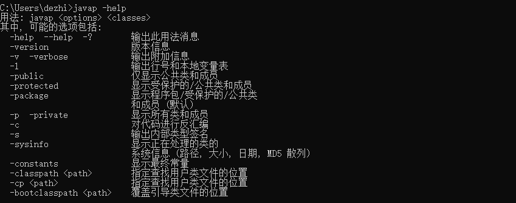
 这里重组一下：

```
-help  --help  -?        输出此用法消息
-version                 版本信息，其实是当前 javap 所在 jdk 的版本信息，不是 classes 在哪个 jdk 下生成的。

-public                  仅显示公共类和成员
-protected               显示受保护的/公共类和成员
-p  -private             显示所有类和成员
-package                 显示程序包/受保护的/公共类和成员 (默认)
-sysinfo                 显示正在处理的类的系统信息 (路径, 大小, 日期, MD5 散列)
-constants               显示最终常量

-s                       输出内部类型签名
-l                       输出行号和本地变量表
-c                       对代码进行反汇编
-v  -verbose             输出附加信息

-classpath <path>        指定查找用户类文件的位置
-cp <path>               指定查找用户类文件的位置

```

**一般常用的是 -v -l -c 三个选项**
 javap -l 会输出行号和本地变量表信息
 javap -c 会对当前 class 字节码进行反编译生成汇编代码。
 javap -v classxx 除了包含 -c 内容外，还会输出行号、局部变量表信息、常量池等信息。（不包含 private 内容，可以 java -v -p classes 输出最全面的信息）

#### 4.4. 使用举例

```
public class JavapTest {
    private int num;
    boolean flag;
    protected char gender;
    public String info;

    public static final int COUNTS = 1;
    static {
        String url = "www.liudezhi.com";
    }
    {
        info = "java";
    }
    public JavapTest() {

    }
    private JavapTest(boolean flag) {
        this.flag = flag;
    }
    private void methodPrivate() {

    }
    int getNum(int i) {
        return num + i;
    }
    protected char showGender() {
        return gender;
    }
    public void showInfo() {
        int i = 10;
        System.out.println(info + i);
    }
}

```

```
javap -v -p JavapTest.class

```

```
Classfile /C:/Users/dezhi/Desktop/1/JavapTest.class   // 字节码文件所属的路径
  Last modified 2021-1-4; size 1361 bytes             // 最后修改时间，字节码文件的大小
  MD5 checksum 6e3df7cda6197291a18c80e712feaee8       // MD5 散列值
  Compiled from "JavapTest.java"                      // 源文件的名称
public class com.liudezhi.java1.JavapTest
  minor version: 0                                    // 副版本
  major version: 52                                   // 主版本
  flags: ACC_PUBLIC, ACC_SUPER                        // 访问标识
Constant pool:                                        // 常量池
   #1 = Methodref          #16.#46        // java/lang/Object."<init>":()V
   #2 = String             #47            // java
   #3 = Fieldref           #15.#48        // com/liudezhi/java1/JavapTest.info:Ljava/lang/String;
   #4 = Fieldref           #15.#49        // com/liudezhi/java1/JavapTest.flag:Z
   #5 = Fieldref           #15.#50        // com/liudezhi/java1/JavapTest.num:I
   #6 = Fieldref           #15.#51        // com/liudezhi/java1/JavapTest.gender:C
   #7 = Fieldref           #52.#53        // java/lang/System.out:Ljava/io/PrintStream;
   #8 = Class              #54            // java/lang/StringBuilder
   #9 = Methodref          #8.#46         // java/lang/StringBuilder."<init>":()V
  #10 = Methodref          #8.#55         // java/lang/StringBuilder.append:(Ljava/lang/String;)Ljava/lang/StringBuilder;
  #11 = Methodref          #8.#56         // java/lang/StringBuilder.append:(I)Ljava/lang/StringBuilder;
  #12 = Methodref          #8.#57         // java/lang/StringBuilder.toString:()Ljava/lang/String;
  #13 = Methodref          #58.#59        // java/io/PrintStream.println:(Ljava/lang/String;)V
  #14 = String             #60            // www.liudezhi.com
  #15 = Class              #61            // com/liudezhi/java1/JavapTest
  #16 = Class              #62            // java/lang/Object
  #17 = Utf8               num
  #18 = Utf8               I
  #19 = Utf8               flag
  #20 = Utf8               Z
  #21 = Utf8               gender
  #22 = Utf8               C
  #23 = Utf8               info
  #24 = Utf8               Ljava/lang/String;
  #25 = Utf8               COUNTS
  #26 = Utf8               ConstantValue
  #27 = Integer            1
  #28 = Utf8               <init>
  #29 = Utf8               ()V
  #30 = Utf8               Code
  #31 = Utf8               LineNumberTable
  #32 = Utf8               LocalVariableTable
  #33 = Utf8               this
  #34 = Utf8               Lcom/liudezhi/java1/JavapTest;
  #35 = Utf8               (Z)V
  #36 = Utf8               methodPrivate
  #37 = Utf8               getNum
  #38 = Utf8               (I)I
  #39 = Utf8               i
  #40 = Utf8               showGender
  #41 = Utf8               ()C
  #42 = Utf8               showInfo
  #43 = Utf8               <clinit>
  #44 = Utf8               SourceFile
  #45 = Utf8               JavapTest.java
  #46 = NameAndType        #28:#29        // "<init>":()V
  #47 = Utf8               java
  #48 = NameAndType        #23:#24        // info:Ljava/lang/String;
  #49 = NameAndType        #19:#20        // flag:Z
  #50 = NameAndType        #17:#18        // num:I
  #51 = NameAndType        #21:#22        // gender:C
  #52 = Class              #63            // java/lang/System
  #53 = NameAndType        #64:#65        // out:Ljava/io/PrintStream;
  #54 = Utf8               java/lang/StringBuilder
  #55 = NameAndType        #66:#67        // append:(Ljava/lang/String;)Ljava/lang/StringBuilder;
  #56 = NameAndType        #66:#68        // append:(I)Ljava/lang/StringBuilder;
  #57 = NameAndType        #69:#70        // toString:()Ljava/lang/String;
  #58 = Class              #71            // java/io/PrintStream
  #59 = NameAndType        #72:#73        // println:(Ljava/lang/String;)V
  #60 = Utf8               www.liudezhi.com
  #61 = Utf8               com/liudezhi/java1/JavapTest
  #62 = Utf8               java/lang/Object
  #63 = Utf8               java/lang/System
  #64 = Utf8               out
  #65 = Utf8               Ljava/io/PrintStream;
  #66 = Utf8               append
  #67 = Utf8               (Ljava/lang/String;)Ljava/lang/StringBuilder;
  #68 = Utf8               (I)Ljava/lang/StringBuilder;
  #69 = Utf8               toString
  #70 = Utf8               ()Ljava/lang/String;
  #71 = Utf8               java/io/PrintStream
  #72 = Utf8               println
  #73 = Utf8               (Ljava/lang/String;)V
#####################################字段表集合的信息#########################################
{
  private int num;                              // 字段名
    descriptor: I                               // 字段描述符：字段的类型
    flags: ACC_PRIVATE                          // 字段的访问标识

  boolean flag;
    descriptor: Z
    flags:

  protected char gender;
    descriptor: C
    flags: ACC_PROTECTED

  public java.lang.String info;
    descriptor: Ljava/lang/String;
    flags: ACC_PUBLIC

  public static final int COUNTS;
    descriptor: I
    flags: ACC_PUBLIC, ACC_STATIC, ACC_FINAL
    ConstantValue: int 1                            // 常量字段的属性：ConstantValue

#######################################方法表集合的信息#######################################
  public com.liudezhi.java1.JavapTest();            // 构造器 1 的信息
    descriptor: ()V
    flags: ACC_PUBLIC
    Code:
      stack=2, locals=1, args_size=1
         0: aload_0
         1: invokespecial #1                  // Method java/lang/Object."<init>":()V
         4: aload_0
         5: ldc           #2                  // String java
         7: putfield      #3                  // Field info:Ljava/lang/String;
        10: return
      LineNumberTable:
        line 16: 0
        line 14: 4
        line 18: 10
      LocalVariableTable:
        Start  Length  Slot  Name   Signature
            0      11     0  this   Lcom/liudezhi/java1/JavapTest;

  private com.liudezhi.java1.JavapTest(boolean);      // 构造器 2 的信息
    descriptor: (Z)V
    flags: ACC_PRIVATE
    Code:
      stack=2, locals=2, args_size=2
         0: aload_0
         1: invokespecial #1                  // Method java/lang/Object."<init>":()V
         4: aload_0
         5: ldc           #2                  // String java
         7: putfield      #3                  // Field info:Ljava/lang/String;
        10: aload_0
        11: iload_1
        12: putfield      #4                  // Field flag:Z
        15: return
      LineNumberTable:
        line 19: 0
        line 14: 4
        line 20: 10
        line 21: 15
      LocalVariableTable:
        Start  Length  Slot  Name   Signature
            0      16     0  this   Lcom/liudezhi/java1/JavapTest;
            0      16     1  flag   Z

  private void methodPrivate();
    descriptor: ()V
    flags: ACC_PRIVATE
    Code:
      stack=0, locals=1, args_size=1
         0: return
      LineNumberTable:
        line 24: 0
      LocalVariableTable:
        Start  Length  Slot  Name   Signature
            0       1     0  this   Lcom/liudezhi/java1/JavapTest;

  int getNum(int);
    descriptor: (I)I
    flags:
    Code:
      stack=2, locals=2, args_size=2
         0: aload_0
         1: getfield      #5                  // Field num:I
         4: iload_1
         5: iadd
         6: ireturn
      LineNumberTable:
        line 26: 0
      LocalVariableTable:
        Start  Length  Slot  Name   Signature
            0       7     0  this   Lcom/liudezhi/java1/JavapTest;
            0       7     1     i   I

  protected char showGender();
    descriptor: ()C
    flags: ACC_PROTECTED
    Code:
      stack=1, locals=1, args_size=1
         0: aload_0
         1: getfield      #6                  // Field gender:C
         4: ireturn
      LineNumberTable:
        line 29: 0
      LocalVariableTable:
        Start  Length  Slot  Name   Signature
            0       5     0  this   Lcom/liudezhi/java1/JavapTest;

  public void showInfo();
    descriptor: ()V                           // 方法描述符：方法的形参列表、返回值类型
    flags: ACC_PUBLIC                         // 方法的访问标识
    Code:                                     // 方法的 Code 属性
      stack=3, locals=2, args_size=1          // stack：操作数栈的最大深度 locals：局部变量表长度 args_size：方法接受参数的个数
  // 偏移量   操作码       操作数
         0: bipush        10
         2: istore_1
         3: getstatic     #7                  // Field java/lang/System.out:Ljava/io/PrintStream;
         6: new           #8                  // class java/lang/StringBuilder
         9: dup
        10: invokespecial #9                  // Method java/lang/StringBuilder."<init>":()V
        13: aload_0
        14: getfield      #3                  // Field info:Ljava/lang/String;
        17: invokevirtual #10                 // Method java/lang/StringBuilder.append:(Ljava/lang/String;)Ljava/lang/StringBuilder;
        20: iload_1
        21: invokevirtual #11                 // Method java/lang/StringBuilder.append:(I)Ljava/lang/StringBuilder;
        24: invokevirtual #12                 // Method java/lang/StringBuilder.toString:()Ljava/lang/String;
        27: invokevirtual #13                 // Method java/io/PrintStream.println:(Ljava/lang/String;)V
        30: return
      // 行号表：指明字节码指令的偏移量与 java 源程序中代码的行号的一一对应关系
      LineNumberTable:
        line 32: 0
        line 33: 3
        line 34: 30
      // 局部变量表：描述内部局部变量的相关信息
      LocalVariableTable:
        Start  Length  Slot  Name   Signature
            0      31     0  this   Lcom/liudezhi/java1/JavapTest;
            3      28     1     i   I

  static {};
    descriptor: ()V
    flags: ACC_STATIC
    Code:
      stack=1, locals=1, args_size=0
         0: ldc           #14                 // String www.liudezhi.com
         2: astore_0
         3: return
      LineNumberTable:
        line 11: 0
        line 12: 3
      LocalVariableTable:
        Start  Length  Slot  Name   Signature
}
SourceFile: "JavapTest.java"          // 附加属性：指明当前字节码文件对应的源程序文件名

```

#### 4.5. 总结

1.
通过 javap 命令可以查看一个 java 反汇编(解析)得到的 Class 文件版本号、常量池、访问标识、变量表、指令代码行号等信息。不显示类索引、父类索引、接口索引集合、*<clinit>()*、*<init>()* 等结构

1.
通过对前面例子代码反汇编文件的简单分析，可以发现，一个方法的执行通常会设计下面几块内存的操作：
 （1）java 栈中：局部变量表、操作数栈
 （2）java 堆。通过对象的地址引用去操作。
 （3）常量池。
 （4）其他如帧数据区、方法区的剩余部分情况，测试中没有显示出来，这里说明一下。
 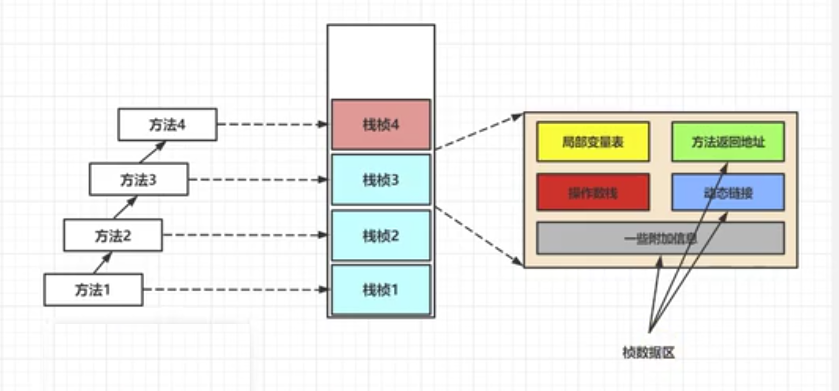

1.
平常，我们比较关注的是 java 类中每个方法的反汇编中的指令操作过程，这些指令都是顺序执行的，可以参考官方文档查看每个指令的含义，很简单：
 https://docs.oracle.com/javase/specs/jvms/se7/html/jvms-6.html

%23%23%20Class%E6%96%87%E4%BB%B6%E7%BB%93%E6%9E%84%0A%23%23%23%201.%20%E6%A6%82%E8%BF%B0%0A%23%23%23%23%201.1.%20%E5%AD%97%E8%8A%82%E7%A0%81%E6%96%87%E4%BB%B6%E7%9A%84%E8%B7%A8%E5%B9%B3%E5%8F%B0%E6%80%A7%0A1.%20**Java%20%E8%AF%AD%E8%A8%80%EF%BC%9A%E8%B7%A8%E5%B9%B3%E5%8F%B0%E7%9A%84%E8%AF%AD%E8%A8%80**%EF%BC%88write%20once%2C%20run%20anywhere%EF%BC%89%0A-%20%E5%BD%93%20Java%20%E6%BA%90%E4%BB%A3%E7%A0%81%E6%88%90%E5%8A%9F%E7%BC%96%E8%AF%91%E4%B8%BA%E5%AD%97%E8%8A%82%E7%A0%81%E5%90%8E%EF%BC%8C%E5%A6%82%E6%9E%9C%E6%83%B3%E5%9C%A8%E4%B8%8D%E5%90%8C%E7%9A%84%E5%B9%B3%E5%8F%B0%E4%B8%8A%E9%9D%A2%E8%BF%90%E8%A1%8C%EF%BC%8C%E5%88%99%E6%97%A0%E9%9C%80%E5%86%8D%E6%AC%A1%E7%BC%96%E8%AF%91%0A-%20%E8%BF%99%E4%B8%AA%E4%BC%98%E5%8A%BF%E4%B8%8D%E5%86%8D%E9%82%A3%E4%B9%88%E5%90%B8%E5%BC%95%E4%BA%BA%E3%80%82Python%E3%80%81PHP%E3%80%81Perl%E3%80%81Ruby%E3%80%81Lisp%20%E7%AD%89%E6%9C%89%E5%BC%BA%E5%A4%A7%E7%9A%84%E8%A7%A3%E9%87%8A%E5%99%A8%0A-%20%E8%B7%A8%E5%B9%B3%E5%8F%B0%E4%BC%BC%E4%B9%8E%E5%B7%B2%E7%BB%8F%E5%BF%AB%E6%88%90%E4%B8%BA%E4%B8%80%E9%97%A8%E8%AF%AD%E8%A8%80%E5%BF%85%E9%80%89%E7%9A%84%E7%89%B9%E6%80%A7%E3%80%82%0A2.%20**Java%20%E8%99%9A%E6%8B%9F%E6%9C%BA%EF%BC%9A%E8%B7%A8%E8%AF%AD%E8%A8%80%E7%9A%84%E5%B9%B3%E5%8F%B0**%0A**Java%20%E8%99%9A%E6%8B%9F%E6%9C%BA%E4%B8%8D%E5%92%8C%E5%8C%85%E6%8B%AC%20Java%20%E5%9C%A8%E5%86%85%E7%9A%84%E4%BB%BB%E4%BD%95%E8%AF%AD%E8%A8%80%E7%BB%91%E5%AE%9A%EF%BC%8C%E5%AE%83%E5%8F%AA%E4%B8%8E%E2%80%9CClass%20%E6%96%87%E4%BB%B6%E2%80%9D%E8%BF%99%E7%A7%8D%E7%89%B9%E5%AE%9A%E7%9A%84%E4%BA%8C%E8%BF%9B%E5%88%B6%E6%96%87%E4%BB%B6%E6%A0%BC%E5%BC%8F%E6%89%80%E5%85%B3%E8%81%94**%E3%80%82%E6%97%A0%E8%AE%BA%E4%BD%BF%E7%94%A8%E4%BD%95%E7%A7%8D%E8%AF%AD%E8%A8%80%E8%BF%9B%E8%A1%8C%E8%BD%AF%E4%BB%B6%E5%BC%80%E5%8F%91%EF%BC%8C%E5%8F%AA%E8%A6%81%E8%83%BD%E5%B0%86%E6%BA%90%E6%96%87%E4%BB%B6%E7%BC%96%E8%AF%91%E4%B8%BA%E6%AD%A3%E7%A1%AE%E7%9A%84%20Class%20%E6%96%87%E4%BB%B6%EF%BC%8C%E9%82%A3%E4%B9%88%E8%BF%99%E7%A7%8D%E8%AF%AD%E8%A8%80%E5%B0%B1%E5%8F%AF%E4%BB%A5%E5%9C%A8%20Java%20%E8%99%9A%E6%8B%9F%E6%9C%BA%E4%B8%8A%E6%89%A7%E8%A1%8C%E3%80%82%E5%8F%AF%E4%BB%A5%E8%AF%B4%EF%BC%8C%E7%BB%9F%E4%B8%80%E8%80%8C%E5%BC%BA%E5%A4%A7%E7%9A%84%20Class%20%E6%96%87%E4%BB%B6%E7%BB%93%E6%9E%84%EF%BC%8C%E5%B0%B1%E6%98%AF%20Java%20%E8%99%9A%E6%8B%9F%E6%9C%BA%E7%9A%84%E5%9F%BA%E7%9F%B3%E3%80%81%E6%A1%A5%E6%A2%81%E3%80%82%0A!%5B3269de022e3e4932f3a2cd9e345ed5b5.png%5D(en-resource%3A%2F%2Fdatabase%2F5266%3A1)%0A!%5B028f86d73e5a366bd7588b06b3b7269e.png%5D(en-resource%3A%2F%2Fdatabase%2F5268%3A1)%0A%3Ehttps%3A%2F%2Fdocs.oracle.com%2Fjavase%2Fspecs%2Findex.html%0A%0A-%20%E6%89%80%E6%9C%89%E7%9A%84%20JVM%20%E5%85%A8%E9%83%A8%E9%81%B5%E5%BE%AA%20Java%20%E8%99%9A%E6%8B%9F%E6%9C%BA%E8%A7%84%E8%8C%83%EF%BC%8C%E4%B9%9F%E5%B0%B1%E6%98%AF%E8%AF%B4%E6%89%80%E6%9C%89%E7%9A%84%20JVM%20%E7%8E%AF%E5%A2%83%E9%83%BD%E6%98%AF%E4%B8%80%E6%A0%B7%E7%9A%84%EF%BC%8C%E8%BF%99%E6%A0%B7%E4%B8%80%E6%9D%A5%EF%BC%8C%E5%AD%97%E8%8A%82%E7%A0%81%E6%96%87%E4%BB%B6%E5%8F%AF%E4%BB%A5%E5%9C%A8%E5%90%84%E7%A7%8D%20JVM%20%E4%B8%8A%E8%BF%90%E8%A1%8C%E3%80%82%0A3.%20%E6%83%B3%E8%A6%81%E8%AE%A9%E4%B8%80%E4%B8%AA%20Java%20%E7%A8%8B%E5%BA%8F%E6%AD%A3%E7%A1%AE%E5%9C%B0%E8%BF%90%E8%A1%8C%E5%9C%A8%20JVM%20%E4%B8%AD%EF%BC%8CJava%20%E6%BA%90%E4%BB%A3%E7%A0%81%E5%B0%B1%E5%BF%85%E9%A1%BB%E8%A6%81%E8%A2%AB%E7%BC%96%E8%AF%91%E4%B8%BA%E7%AC%A6%E5%90%88%20JVM%20%E8%A7%84%E8%8C%83%E7%9A%84%E5%AD%97%E8%8A%82%E7%A0%81%E3%80%82%0A-%20**%E5%89%8D%E7%AB%AF%E7%BC%96%E8%AF%91%E5%99%A8%E7%9A%84%E4%B8%BB%E8%A6%81%E4%BB%BB%E5%8A%A1**%E5%B0%B1%E6%98%AF%E8%B4%9F%E8%BD%BD%E5%B0%86%E7%AC%A6%E5%90%88%20Java%20%E8%AF%AD%E6%B3%95%E8%A7%84%E8%8C%83%E7%9A%84%20Java%20%E4%BB%A3%E7%A0%81%E8%BD%AC%E6%8D%A2%E4%B8%BA%E7%AC%A6%E5%90%88%20JVM%20%E8%A7%84%E8%8C%83%E7%9A%84%E5%AD%97%E8%8A%82%E7%A0%81%E6%96%87%E4%BB%B6%E3%80%82%0A-%20javac%20%E6%98%AF%E4%B8%80%E7%A7%8D%E8%83%BD%E5%A4%9F%E5%B0%86%20Java%20%E6%BA%90%E7%A0%81%E7%BC%96%E8%AF%91%E4%B8%BA%E5%AD%97%E8%8A%82%E7%A0%81%E7%9A%84%E5%89%8D%E7%AB%AF%E7%BC%96%E8%AF%91%E5%99%A8%E3%80%82%0A-%20javac%20%E7%BC%96%E8%AF%91%E5%99%A8%E5%9C%A8%E5%B0%86%20Java%20%E6%BA%90%E7%A0%81%E7%BC%96%E8%AF%91%E4%B8%BA%E4%B8%80%E4%B8%AA%E6%9C%89%E6%95%88%E7%9A%84%E5%AD%97%E8%8A%82%E7%A0%81%E6%96%87%E4%BB%B6%E8%BF%87%E7%A8%8B%E4%B8%AD%E7%BB%8F%E5%8E%86%E4%BA%864%E4%B8%AA%E6%AD%A5%E9%AA%A4%EF%BC%8C%E5%88%86%E5%88%AB%E6%98%AF**%E8%AF%8D%E6%B3%95%E8%A7%A3%E6%9E%90%E3%80%81%E8%AF%AD%E6%B3%95%E8%A7%A3%E6%9E%90%E3%80%81%E8%AF%AD%E4%B9%89%E8%A7%A3%E6%9E%90%E4%BB%A5%E5%8F%8A%E7%94%9F%E4%BA%A7%E5%AD%97%E8%8A%82%E7%A0%81**%E3%80%82%0A!%5B2850979844c43fd1d3eb2b4a300fffeb.png%5D(en-resource%3A%2F%2Fdatabase%2F5270%3A1)%0AOracle%20%E7%9A%84%20JDK%20%E8%BD%AF%E4%BB%B6%E5%8C%85%E6%8B%AC%E4%B8%A4%E9%83%A8%E5%88%86%E5%86%85%E5%AE%B9%EF%BC%9A%0A-%20%E4%B8%80%E9%83%A8%E5%88%86%E6%98%AF%E5%B0%86%20Java%20%E6%BA%90%E4%BB%A3%E7%A0%81%E7%BC%96%E8%AF%91%E4%B8%BA%20Java%20%E8%99%9A%E6%8B%9F%E6%9C%BA%E7%9A%84%E6%8C%87%E4%BB%A4%E9%9B%86%E7%9A%84%E7%BC%96%E8%AF%91%E5%99%A8%0A-%20%E5%8F%A6%E4%B8%80%E9%83%A8%E5%88%86%E6%98%AF%E7%94%A8%E4%BA%8E%E5%AE%9E%E7%8E%B0%20Java%20%E8%99%9A%E6%8B%9F%E6%9C%BA%E7%9A%84%E8%BF%90%E8%A1%8C%E6%97%B6%E7%8E%AF%E5%A2%83%E3%80%82%0A%0A%23%23%23%23%201.2.%20Java%20%E7%9A%84%E5%89%8D%E7%AB%AF%E7%BC%96%E8%AF%91%E5%99%A8%0A!%5B0ed3c6abb031104e5bf1da19ea05d38c.png%5D(en-resource%3A%2F%2Fdatabase%2F5272%3A1)%0A***%E5%89%8D%E7%AB%AF%E7%BC%96%E8%AF%91%E5%99%A8%20VS%20%E5%90%8E%E7%AB%AF%E7%BC%96%E8%AF%91%E5%99%A8***%0AJava%20%E6%BA%90%E4%BB%A3%E7%A0%81%E7%9A%84%E7%BC%96%E8%AF%91%E7%BB%93%E6%9E%9C%E6%98%AF%E5%AD%97%E8%8A%82%E7%A0%81%EF%BC%8C%E9%82%A3%E4%B9%88%E8%82%AF%E5%AE%9A%E9%9C%80%E8%A6%81%E6%9C%89%E4%B8%80%E7%A7%8D%E7%BC%96%E8%AF%91%E5%99%A8%E8%83%BD%E5%A4%9F%E5%B0%86%20Java%20%E6%BA%90%E7%A0%81%E7%BC%96%E8%AF%91%E4%B8%BA%E5%AD%97%E8%8A%82%E7%A0%81%EF%BC%8C%E6%89%BF%E6%8B%85%E8%BF%99%E4%B8%AA%E9%87%8D%E8%A6%81%E8%B4%A3%E4%BB%BB%E7%9A%84%E5%B0%B1%E6%98%AF%E9%85%8D%E7%BD%AE%E5%9C%A8%20PATH%20%E7%8E%AF%E5%A2%83%E5%8F%98%E9%87%8F%E4%B8%AD%E7%9A%84%20**javac%20%E7%BC%96%E8%AF%91%E5%99%A8**%E3%80%82javac%20%E6%98%AF%E4%B8%80%E7%A7%8D%E8%83%BD%E5%A4%9F%E5%B0%86%20Java%20%E6%BA%90%E7%A0%81%E7%BC%96%E8%AF%91%E4%B8%BA%E5%AD%97%E8%8A%82%E7%A0%81%E7%9A%84**%E5%89%8D%E7%AB%AF%E7%BC%96%E8%AF%91%E5%99%A8**%E3%80%82%0A%0AHotSpot%20VM%20%E5%B9%B6%E6%B2%A1%E6%9C%89%E5%BC%BA%E5%88%B6%E8%A6%81%E6%B1%82%E5%89%8D%E7%AB%AF%E7%BC%96%E8%AF%91%E5%99%A8%E5%8F%AA%E8%83%BD%E4%BD%BF%E7%94%A8%20javac%20%E6%9D%A5%E7%BC%96%E8%AF%91%E5%AD%97%E8%8A%82%E7%A0%81%EF%BC%8C%E5%85%B6%E5%AE%9E%E5%8F%AA%E8%A6%81%E7%BC%96%E8%AF%91%E7%BB%93%E6%9E%9C%E7%AC%A6%E5%90%88%20JVM%20%E8%A7%84%E8%8C%83%E9%83%BD%E5%8F%AF%E4%BB%A5%E8%A2%AB%20JVM%20%E6%89%80%E8%AF%86%E5%88%AB%E5%8D%B3%E5%8F%AF%E3%80%82%E5%9C%A8%20Java%20%E7%9A%84%E5%89%8D%E7%AB%AF%E7%BC%96%E8%AF%91%E5%99%A8%E9%A2%86%E5%9F%9F%EF%BC%8C%E9%99%A4%E4%BA%86%20javac%20%E4%B9%8B%E5%A4%96%EF%BC%8C%E8%BF%98%E6%9C%89%E4%B8%80%E7%A7%8D%E8%A2%AB%E5%A4%A7%E5%AE%B6%E7%BB%8F%E5%B8%B8%E7%94%A8%E5%88%B0%E7%9A%84%E5%89%8D%E7%AB%AF%E7%BC%96%E8%AF%91%E5%99%A8%EF%BC%8C%E9%82%A3%E5%B0%B1%E6%98%AF%E5%86%85%E7%BD%AE%E5%9C%A8%20Eclipse%20%E4%B8%AD%E7%9A%84%20**ECJ%EF%BC%88Eclipse%20Compiler%20for%20Java%EF%BC%89%E7%BC%96%E8%AF%91%E5%99%A8**%E3%80%82%E5%92%8C%20javac%20%E7%9A%84%E5%85%A8%E9%87%8F%E5%BC%8F%E7%BC%96%E8%AF%91%E4%B8%8D%E5%90%8C%EF%BC%8CECJ%20%E6%98%AF%E4%B8%80%E7%A7%8D%E5%A2%9E%E9%87%8F%E5%BC%8F%E7%BC%96%E8%AF%91%E5%99%A8%E3%80%82%0A-%20%E5%9C%A8%20Eclipse%20%E4%B8%AD%EF%BC%8C%E5%BD%93%E5%BC%80%E5%8F%91%E4%BA%BA%E5%91%98%E5%86%99%E5%AE%8C%E4%BB%A3%E7%A0%81%E5%90%8E%EF%BC%8C%E4%BD%BF%E7%94%A8%E2%80%9CCtrl%2BS%E2%80%9C%E5%BF%AB%E6%8D%B7%E9%94%AE%E6%97%B6%EF%BC%8CECJ%20%E7%BC%96%E8%AF%91%E5%99%A8%E6%89%80%E9%87%87%E5%8F%96%E7%9A%84**%E7%BC%96%E8%AF%91%E6%96%B9%E6%B3%95**%E6%98%AF%E6%8A%8A%E6%9C%AA%E7%BC%96%E8%AF%91%E9%83%A8%E5%88%86%E7%9A%84%E6%BA%90%E7%A0%81%E9%80%90%E8%A1%8C%E8%BF%9B%E8%A1%8C%E7%BC%96%E8%AF%91%EF%BC%8C%E8%80%8C%E5%B9%B6%E9%9D%9E%E6%AF%8F%E6%AC%A1%E9%83%BD%E5%85%A8%E9%87%8F%E7%BC%96%E8%AF%91%E3%80%82%E5%9B%A0%E6%AD%A4%20ECJ%20%E7%9A%84%E7%BC%96%E8%AF%91%E6%95%88%E7%8E%87%E6%AF%94%20javac%20%E6%9B%B4%E5%8A%A0%E8%BF%85%E9%80%9F%E5%92%8C%E9%AB%98%E6%95%88%EF%BC%8C%E5%BD%93%E7%84%B6%E7%BC%96%E8%AF%91%E8%B4%A8%E9%87%8F%E5%92%8C%20javac%20%E7%9B%B8%E6%AF%94%E5%A4%A7%E8%87%B4%E8%BF%98%E6%98%AF%E4%B8%80%E6%A0%B7%E7%9A%84%E3%80%82%0A-%20ECJ%20%E4%B8%8D%E4%BB%85%E6%98%AF%20Eclipse%20%E7%9A%84%E9%BB%98%E8%AE%A4%E5%86%85%E7%BD%AE%E5%89%8D%E7%AB%AF%E7%BC%96%E8%AF%91%E5%99%A8%EF%BC%8C%E5%9C%A8%20Tomcat%20%E4%B8%AD%E5%90%8C%E6%A0%B7%E4%B9%9F%E6%98%AF%E4%BD%BF%E7%94%A8%20ECJ%20%E7%BC%96%E8%AF%91%E5%99%A8%E6%9D%A5%E7%BC%96%E8%AF%91%20jsp%20%E6%96%87%E4%BB%B6%E3%80%82%E7%94%B1%E4%BA%8E%20ECJ%20%E7%BC%96%E8%AF%91%E5%99%A8%E6%98%AF%E9%87%87%E7%94%A8%20GPLv2%20%E7%9A%84%E5%BC%80%E6%BA%90%E5%8D%8F%E8%AE%AE%E8%BF%9B%E8%A1%8C%E6%BA%90%E4%BB%A3%E7%A0%81%E5%85%AC%E5%BC%80%EF%BC%8C%E6%89%80%E4%BB%A5%E5%A4%A7%E5%AE%B6%E5%8F%AF%E4%BB%A5%E7%99%BB%E5%BD%95%20eclipse%20%E7%9A%84%E5%AE%98%E7%BD%91%E4%B8%8B%E8%BD%BD%20ECJ%20%E7%BC%96%E8%AF%91%E5%99%A8%E7%9A%84%E6%BA%90%E7%A0%81%E8%BF%9B%E8%A1%8C%E4%BA%8C%E6%AC%A1%E5%BC%80%E5%8F%91%E3%80%82%0A-%20%E9%BB%98%E8%AE%A4%E6%83%85%E5%86%B5%E4%B8%8B%EF%BC%8CIntelliJ%20IDEA%20%E4%BD%BF%E7%94%A8%20javac%20%E7%BC%96%E8%AF%91%E5%99%A8%E3%80%82%EF%BC%88%E8%BF%98%E5%8F%AF%E4%BB%A5%E8%87%AA%E5%B7%B1%E8%AE%BE%E7%BD%AE%E4%B8%BA%20AspectJ%20%E7%BC%96%E8%AF%91%E5%99%A8%20ajc%EF%BC%89%0A%0A%E5%89%8D%E7%AB%AF%E7%BC%96%E8%AF%91%E5%99%A8%E5%B9%B6%E4%B8%8D%E4%BC%9A%E7%9B%B4%E6%8E%A5%E6%B6%89%E5%8F%8A%E7%BC%96%E8%AF%91%E4%BC%98%E5%8C%96%E7%AD%89%E6%96%B9%E9%9D%A2%E7%9A%84%E6%8A%80%E6%9C%AF%EF%BC%8C%E8%80%8C%E6%98%AF%E5%B0%86%E8%BF%99%E4%BA%9B%E5%85%B7%E4%BD%93%E4%BC%98%E5%8C%96%E7%BB%86%E8%8A%82%E4%BA%A4%E7%BB%99%20HotSpot%20%E7%9A%84%20JIT%20%E7%BC%96%E8%AF%91%E5%99%A8%E8%B4%9F%E8%B4%A3%E3%80%82%0A%0A%E5%A4%8D%E4%B9%A0%EF%BC%9AAOT%EF%BC%88%E9%9D%99%E6%80%81%E6%8F%90%E5%89%8D%E7%BC%96%E8%AF%91%E5%99%A8%EF%BC%8CAhead%20Of%20Time%20Compiler%EF%BC%89%0A%0A%23%23%23%201.3.%20%E9%80%8F%E8%BF%87%E5%AD%97%E8%8A%82%E7%A0%81%E6%8C%87%E4%BB%A4%E7%9C%8B%E4%BB%A3%E7%A0%81%E7%BB%86%E8%8A%82%0A1.%20BAT%20%E9%9D%A2%E8%AF%95%E9%A2%98%0A%E2%91%A0%20%E7%B1%BB%E6%96%87%E4%BB%B6%E7%BB%93%E6%9E%84%E6%9C%89%E5%87%A0%E9%83%A8%E5%88%86%EF%BC%9F%0A%E2%91%A1%20%E7%9F%A5%E9%81%93%E5%AD%97%E8%8A%82%E7%A0%81%E5%90%97%EF%BC%9F%E5%AD%97%E8%8A%82%E7%A0%81%E6%8C%87%E4%BB%A4%E9%83%BD%E6%9C%89%E5%93%AA%E4%BA%9B%EF%BC%9FInteger%20x%20%3D%205%3B%20int%20y%20%3D%205%3B%20%E6%AF%94%E8%BE%83%20x%20%3D%3Dy%20%E9%83%BD%E7%BB%8F%E8%BF%87%E5%93%AA%E4%BA%9B%E6%AD%A5%E9%AA%A4%EF%BC%9F%0A2.%20**%E4%BB%A3%E7%A0%81%E4%B8%BE%E4%BE%8B**%0A%E4%BB%A3%E7%A0%81%E4%B8%BE%E4%BE%8B1%EF%BC%9A%0A%60%60%60java%0Apublic%20class%20IntegerTest%20%7B%0A%20%20%20%20public%20static%20void%20main(String%5B%5D%20args)%20%7B%0A%20%20%20%20%20%20%20%20Integer%20x%20%3D%205%3B%0A%20%20%20%20%20%20%20%20int%20y%20%3D%205%3B%0A%20%20%20%20%20%20%20%20System.out.println(x%20%3D%3D%20y)%3B%20%20%20%20%20%2F%2F%20true%0A%0A%20%20%20%20%20%20%20%20Integer%20i1%20%3D%2010%3B%0A%20%20%20%20%20%20%20%20Integer%20i2%20%3D%2010%3B%0A%20%20%20%20%20%20%20%20System.out.println(i1%20%3D%3D%20i2)%3B%20%20%20%2F%2F%20true%0A%0A%20%20%20%20%20%20%20%20Integer%20i3%20%3D%20128%3B%0A%20%20%20%20%20%20%20%20Integer%20i4%20%3D%20128%3B%0A%20%20%20%20%20%20%20%20System.out.println(i3%20%3D%3D%20i4)%3B%20%20%20%2F%2F%20false%0A%20%20%20%20%7D%0A%7D%0A%60%60%60%0A%E4%BB%A3%E7%A0%81%E4%B8%BE%E4%BE%8B2%EF%BC%9A%0A%60%60%60java%0Apublic%20class%20StringTest%20%7B%0A%20%20%20%20public%20static%20void%20main(String%5B%5D%20args)%20%7B%0A%20%20%20%20%20%20%20%20String%20str%20%3D%20new%20String(%22hello%22)%20%2B%20new%20String(%22world%22)%3B%0A%20%20%20%20%20%20%20%20String%20str1%20%3D%20%22helloworld%22%3B%0A%20%20%20%20%20%20%20%20System.out.println(str%20%3D%3D%20str1)%3B%20%20%20%20%2F%2F%20false%0A%20%20%20%20%7D%0A%7D%0A%60%60%60%0A%E4%BB%A3%E7%A0%81%E4%B8%BE%E4%BE%8B3%EF%BC%9A%0A%60%60%60java%0A%2F**%0A%20*%20%E6%88%90%E5%91%98%E5%8F%98%E9%87%8F%EF%BC%88%E9%9D%9E%E9%9D%99%E6%80%81%EF%BC%89%E7%9A%84%E8%B5%8B%E5%80%BC%E8%BF%87%E7%A8%8B%EF%BC%9A%E2%91%A0%20%E9%BB%98%E8%AE%A4%E5%88%9D%E5%A7%8B%E5%8C%96%20%E2%91%A1%20%E6%98%BE%E7%A4%BA%E5%88%9D%E5%A7%8B%E5%8C%96%2F%E4%BB%A3%E7%A0%81%E5%9D%97%E4%B8%AD%E5%88%9D%E5%A7%8B%E5%8C%96%0A%20*%20%20%E2%91%A2%20%E6%9E%84%E9%80%A0%E5%99%A8%E4%B8%AD%E5%88%9D%E5%A7%8B%E5%8C%96%20%E2%91%A3%20%E6%9C%89%E4%BA%86%E5%AF%B9%E8%B1%A1%E5%90%8E%EF%BC%8C%E5%8F%AF%E4%BB%A5%E2%80%9C%E5%AF%B9%E8%B1%A1.%E5%B1%9E%E6%80%A7%E2%80%9D%E6%88%96%E2%80%9C%E5%AF%B9%E8%B1%A1.%E6%96%B9%E6%B3%95%E2%80%9D%E7%9A%84%E6%96%B9%E5%BC%8F%E5%AF%B9%E6%88%90%E5%91%98%E5%8F%98%E9%87%8F%E8%BF%9B%E8%A1%8C%E8%B5%8B%E5%80%BC%0A%20*%2F%0Aclass%20Father%20%7B%0A%20%20%20%20int%20x%20%3D%2010%3B%0A%0A%20%20%20%20public%20Father()%20%7B%0A%20%20%20%20%20%20%20%20this.print()%3B%0A%20%20%20%20%20%20%20%20x%20%3D%2020%3B%0A%20%20%20%20%7D%0A%0A%20%20%20%20public%20void%20print()%20%7B%0A%20%20%20%20%20%20%20%20System.out.println(%22Father.x%20%3D%20%22%20%2B%20x)%3B%0A%20%20%20%20%7D%0A%7D%0A%0Aclass%20Son%20extends%20Father%20%7B%0A%20%20%20%20int%20x%20%3D%2030%3B%0A%20%20%20%20public%20Son()%20%7B%0A%20%20%20%20%20%20%20%20this.print()%3B%0A%20%20%20%20%20%20%20%20x%20%3D%2040%3B%0A%20%20%20%20%7D%0A%20%20%20%20public%20void%20print()%20%7B%0A%20%20%20%20%20%20%20%20System.out.println(%22Son.x%20%3D%20%22%20%2B%20x)%3B%0A%20%20%20%20%7D%0A%7D%0A%0Apublic%20class%20SonTest%20%7B%0A%20%20%20%20public%20static%20void%20main(String%5B%5D%20args)%20%7B%0A%20%20%20%20%20%20%20%20Father%20f%20%3D%20new%20Son()%3B%0A%20%20%20%20%20%20%20%20System.out.println(f.x)%3B%20%20%20%20%2F%2F%20%E5%B1%9E%E6%80%A7%E4%B8%8D%E5%AD%98%E5%9C%A8%E5%A4%9A%E6%80%81%E6%80%A7%EF%BC%8C%E8%B0%83%E7%9A%84%E6%98%AF%E7%88%B6%E7%B1%BB%E4%B8%AD%E7%9A%84%20x%0A%20%20%20%20%7D%0A%7D%0A%60%60%60%0A%0A%23%23%23%202.%20%E8%99%9A%E6%8B%9F%E6%9C%BA%E7%9A%84%E5%9F%BA%E7%9F%B3%EF%BC%9AClass%20%E6%96%87%E4%BB%B6%0A-%20%E5%AD%97%E8%8A%82%E7%A0%81%E6%96%87%E4%BB%B6%E9%87%8C%E6%98%AF%E4%BB%80%E4%B9%88%EF%BC%9F%0A%E6%BA%90%E4%BB%A3%E7%A0%81%E7%BB%8F%E8%BF%87%E7%BC%96%E8%AF%91%E5%99%A8%E7%BC%96%E8%AF%91%E4%B9%8B%E5%90%8E%E4%BE%BF%E4%BC%9A%E7%94%9F%E4%BA%A7%E4%B8%80%E4%B8%AA%E5%AD%97%E8%8A%82%E7%A0%81%E6%96%87%E4%BB%B6%EF%BC%8C%E5%AD%97%E8%8A%82%E7%A0%81%E6%98%AF%E4%B8%80%E7%A7%8D%E4%BA%8C%E8%BF%9B%E5%88%B6%E7%9A%84%E7%B1%BB%E6%96%87%E4%BB%B6%EF%BC%8C%E5%AE%83%E7%9A%84%E5%86%85%E5%AE%B9%E6%98%AF%20JVM%20%E7%9A%84%E6%8C%87%E4%BB%A4%EF%BC%8C%E8%80%8C%E4%B8%8D%E5%83%8F%20C%E3%80%81C%2B%2B%20%E7%BB%8F%E7%94%B1%E7%BC%96%E8%AF%91%E5%99%A8%E7%9B%B4%E6%8E%A5%E7%94%9F%E6%88%90%E6%9C%BA%E5%99%A8%E7%A0%81%E3%80%82%0A%0A-%20%E4%BB%80%E4%B9%88%E6%98%AF%E5%AD%97%E8%8A%82%E7%A0%81%E6%8C%87%E4%BB%A4%EF%BC%88byte%20code%EF%BC%89%EF%BC%9F%0AJava%20%E8%99%9A%E6%8B%9F%E6%9C%BA%E7%9A%84%E6%8C%87%E4%BB%A4%E7%94%B1%E4%B8%80%E4%B8%AA%E5%AD%97%E8%8A%82%E9%95%BF%E5%BA%A6%E7%9A%84%E3%80%81%E4%BB%A3%E8%A1%A8%E4%BD%9C%E6%9F%90%E7%A7%8D%E7%89%B9%E5%AE%9A%E6%93%8D%E4%BD%9C%E5%90%AB%E4%B9%89%E7%9A%84**%E6%93%8D%E4%BD%9C%E7%A0%81**%EF%BC%88opcode%EF%BC%89%E4%BB%A5%E5%8F%8A%E8%B7%9F%E9%9A%8F%E5%85%B6%E5%90%8E%E7%9A%84%E9%9B%B6%E8%87%B3%E5%A4%9A%E4%B8%AA%E4%BB%A3%E8%A1%A8%E6%AD%A4%E6%93%8D%E4%BD%9C%E6%89%80%E9%9C%80%E5%8F%82%E6%95%B0%E7%9A%84**%E6%93%8D%E4%BD%9C%E6%95%B0**%EF%BC%88operand%EF%BC%89%E6%89%80%E6%9E%84%E6%88%90%E3%80%82%E8%99%9A%E6%8B%9F%E6%9C%BA%E4%B8%AD%E8%AE%B8%E5%A4%9A%E6%8C%87%E4%BB%A4%E5%B9%B6%E4%B8%8D%E5%8C%85%E5%90%AB%E6%93%8D%E4%BD%9C%E6%95%B0%EF%BC%8C%E5%8F%AA%E6%9C%89%E4%B8%80%E4%B8%AA%E6%93%8D%E4%BD%9C%E7%A0%81%E3%80%82eg%EF%BC%9A%E6%93%8D%E4%BD%9C%E7%A0%81%20%EF%BC%88%E6%93%8D%E4%BD%9C%E6%95%B0%EF%BC%89%0A!%5Bf1e9169c12b5f241fd753e8b8afcb778.png%5D(en-resource%3A%2F%2Fdatabase%2F5274%3A1)%0A%0A-%20%E5%A6%82%E4%BD%95%E8%A7%A3%E5%86%B3%E4%BE%9B%E8%99%9A%E6%8B%9F%E6%9C%BA%E8%A7%A3%E9%87%8A%E6%89%A7%E8%A1%8C%E7%9A%84%E4%BA%8C%E8%BF%9B%E5%88%B6%E5%AD%97%E8%8A%82%E7%A0%81%EF%BC%9F%0A%E6%96%B9%E5%BC%8F%E4%B8%80%EF%BC%9A%E4%B8%80%E4%B8%AA%E4%B8%80%E4%B8%AA%E4%BA%8C%E8%BF%9B%E5%88%B6%E7%9A%84%E7%9C%8B%EF%BC%8C%E8%BF%99%E9%87%8C%E7%94%A8%E5%88%B0%E7%9A%84%E6%98%AF%20VsCode%EF%BC%8C%E9%9C%80%E8%A6%81%E5%AE%89%E8%A3%85%E4%B8%80%E4%B8%AA%20hexdump%20%E6%8F%92%E4%BB%B6%0A!%5B2576bb6bc2075613379950d36e5a8df0.png%5D(en-resource%3A%2F%2Fdatabase%2F5276%3A1)%0A%0A%E6%96%B9%E5%BC%8F%E4%BA%8C%EF%BC%9A%E4%BD%BF%E7%94%A8%20javap%20%E6%8C%87%E4%BB%A4%EF%BC%9Ajdk%20%E8%87%AA%E5%B8%A6%E7%9A%84%E5%8F%8D%E8%A7%A3%E6%9E%90%E5%B7%A5%E5%85%B7%0A!%5Bfdfb980992c5b1ad3c7cb1cc3a204af4.png%5D(en-resource%3A%2F%2Fdatabase%2F5282%3A1)%0A%0A%E6%96%B9%E5%BC%8F%E4%B8%89%EF%BC%9A%E4%BD%BF%E7%94%A8%20IDEA%20%E6%8F%92%E4%BB%B6%EF%BC%9Ajclasslib%20%E6%88%96%20jclasslib%20bytecode%20viewer%20%E5%AE%A2%E6%88%B7%E7%AB%AF%E5%B7%A5%E5%85%B7%E3%80%82(%E5%8F%AF%E8%A7%86%E5%8C%96%E6%9B%B4%E5%A5%BD)%0A!%5B16059859c2443476592487d593749bdb.png%5D(en-resource%3A%2F%2Fdatabase%2F5278%3A1)%0A%E6%88%96%EF%BC%9A%0A!%5Bc84c086ad8a27d227bd1fe0ad2c50d9d.png%5D(en-resource%3A%2F%2Fdatabase%2F5280%3A1)%0A%0A%23%23%23%203.%20Class%20%E6%96%87%E4%BB%B6%E7%9A%84%E7%BB%93%E6%9E%84%0A-%20%E5%AE%98%E6%96%B9%E6%96%87%E6%A1%A3%E4%BD%8D%E7%BD%AE%EF%BC%9Ahttps%3A%2F%2Fdocs.oracle.com%2Fjavase%2Fspecs%2Fjvms%2Fse8%2Fhtml%2Fjvms-4.html%0A-%20Class%20%E7%B1%BB%E7%9A%84%E6%9C%AC%E8%B4%A8%0A%E4%BB%BB%E4%BD%95%E4%B8%80%E4%B8%AA%20Class%20%E6%96%87%E4%BB%B6%E9%83%BD%E5%AF%B9%E5%BA%94%E7%9D%80%E5%94%AF%E4%B8%80%E4%B8%80%E4%B8%AA%E7%B1%BB%E6%88%96%E6%8E%A5%E5%8F%A3%E7%9A%84%E5%AE%9A%E4%B9%89%E4%BF%A1%E6%81%AF%EF%BC%8C%E4%BD%86%E5%8F%8D%E8%BF%87%E6%9D%A5%E8%AF%B4%EF%BC%8CClass%20%E6%96%87%E4%BB%B6%E5%AE%9E%E9%99%85%E4%B8%8A%E5%AE%83%E5%B9%B6%E4%B8%8D%E4%B8%80%E5%AE%9A%E4%BB%A5%E7%A3%81%E7%9B%98%E6%96%87%E4%BB%B6%E7%9A%84%E5%BD%A2%E5%BC%8F%E5%AD%98%E5%9C%A8%E3%80%82Class%20%E6%96%87%E4%BB%B6%E6%98%AF%E4%B8%80%E7%BB%84%E4%BB%A58%E4%BD%8D%E5%AD%97%E8%8A%82%E4%B8%BA%E5%9F%BA%E7%A1%80%E5%8D%95%E4%BD%8D%E7%9A%84**%E4%BA%8C%E8%BF%9B%E5%88%B6%E6%B5%81**%E3%80%82%0A-%20Class%20%E6%96%87%E4%BB%B6%E6%A0%BC%E5%BC%8F%0AClass%20%E7%9A%84%E7%BB%93%E6%9E%84%E4%B8%8D%E5%83%8F%20XML%20%E7%AD%89%E6%8F%8F%E8%BF%B0%E8%AF%AD%E8%A8%80%EF%BC%8C%E7%94%B1%E4%BA%8E%E5%AE%83%E6%B2%A1%E6%9C%89%E4%BB%BB%E4%BD%95%E5%88%86%E9%9A%94%E7%AC%A6%E5%8F%B7%E3%80%82%E6%89%80%E4%BB%A5%E5%9C%A8%E5%85%B6%E4%B8%AD%E7%9A%84%E6%95%B0%E6%8D%AE%E9%A1%B9%EF%BC%8C%E6%97%A0%E8%AE%BA%E6%98%AF%E5%AD%97%E8%8A%82%E9%A1%BA%E5%BA%8F%E8%BF%98%E6%98%AF%E6%95%B0%E9%87%8F%EF%BC%8C%E9%83%BD%E6%98%AF%E8%A2%AB%E4%B8%A5%E6%A0%BC%E9%99%90%E5%AE%9A%E7%9A%84%EF%BC%8C%E5%93%AA%E4%B8%AA%E5%AD%97%E8%8A%82%E4%BB%A3%E8%A1%A8%E4%BB%80%E4%B9%88%E5%90%AB%E4%B9%89%EF%BC%8C%E9%95%BF%E5%BA%A6%E6%98%AF%E5%A4%9A%E5%B0%91%EF%BC%8C%E5%85%88%E5%90%8E%E9%A1%BA%E5%BA%8F%E5%A6%82%E4%BD%95%EF%BC%8C%E9%83%BD%E4%B8%8D%E5%85%81%E8%AE%B8%E6%94%B9%E5%8F%98%E3%80%82%0AClass%20%E6%96%87%E4%BB%B6%E6%A0%BC%E5%BC%8F%E9%87%87%E7%94%A8%E4%B8%80%E7%A7%8D%E7%B1%BB%E4%BC%BC%E4%BA%8E%20C%E8%AF%AD%E8%A8%80%E7%BB%93%E6%9E%84%E4%BD%93%E7%9A%84%E6%96%B9%E5%BC%8F%E8%BF%9B%E8%A1%8C%E6%95%B0%E6%8D%AE%E5%AD%98%E5%82%A8%EF%BC%8C%E8%BF%99%E7%A7%8D%E7%BB%93%E6%9E%84%E4%B8%AD%E5%8F%AA%E6%9C%89%E4%B8%A4%E7%A7%8D%E6%95%B0%E6%8D%AE%E7%B1%BB%E5%9E%8B%EF%BC%9A**%E6%97%A0%E7%AC%A6%E5%8F%B7%E6%95%B0**%E5%92%8C**%E8%A1%A8**%E3%80%82%0A%20%20%20%20-%20%E6%97%A0%E7%AC%A6%E5%8F%B7%E6%95%B0%E5%B1%9E%E4%BA%8E%E5%9F%BA%E6%9C%AC%E7%9A%84%E6%95%B0%E6%8D%AE%E7%B1%BB%E5%9E%8B%EF%BC%8C%E4%BB%A5%20u1%E3%80%81u2%E3%80%81u4%E3%80%81u8%20%E6%9D%A5%E5%88%86%E5%88%AB%E4%BB%A3%E8%A1%A8%201%E4%B8%AA%E5%AD%97%E8%8A%82%E3%80%812%E4%B8%AA%E5%AD%97%E8%8A%82%E3%80%814%E4%B8%AA%E5%AD%97%E8%8A%82%E5%92%8C8%E4%B8%AA%E5%AD%97%E8%8A%82%E7%9A%84%E6%97%A0%E7%AC%A6%E5%8F%B7%E6%95%B0%EF%BC%8C%E6%97%A0%E7%AC%A6%E5%8F%B7%E6%95%B0%E5%8F%AF%E4%BB%A5%E7%94%A8%E6%9D%A5%E6%8F%8F%E8%BF%B0%E6%95%B0%E5%AD%97%E3%80%81%E7%B4%A2%E5%BC%95%E5%BC%95%E7%94%A8%E3%80%81%E6%95%B0%E9%87%8F%E5%80%BC%E6%88%96%E8%80%85%E6%8C%89%E7%85%A7%20UTF-8%20%E7%BC%96%E7%A0%81%E6%9E%84%E6%88%90%E7%9A%84%E5%AD%97%E7%AC%A6%E4%B8%B2%E5%80%BC%E3%80%82%0A%20%20%20%20-%20%E8%A1%A8%E6%98%AF%E7%94%B1%E5%A4%9A%E4%B8%AA%E6%97%A0%E7%AC%A6%E5%8F%B7%E6%95%B0%E6%88%96%E8%80%85%E5%85%B6%E4%BB%96%E8%A1%A8%E4%BD%9C%E4%B8%BA%E6%95%B0%E6%8D%AE%E9%A1%B9%E6%9E%84%E6%88%90%E7%9A%84%E7%AC%A6%E5%90%88%E6%95%B0%E6%8D%AE%E7%B1%BB%E5%9E%8B%EF%BC%8C%E6%89%80%E6%9C%89%E8%A1%A8%E9%83%BD%E4%B9%A0%E6%83%AF%E6%80%A7%E5%9C%B0%E4%BB%A5%E2%80%9C_info%E2%80%9D%E7%BB%93%E5%B0%BE%E3%80%82%E8%A1%A8%E7%94%A8%E4%BA%8E%E6%8F%8F%E8%BF%B0%E6%9C%89%E5%B1%82%E6%AC%A1%E5%85%B3%E7%B3%BB%E7%9A%84%E7%AC%A6%E5%90%88%E7%BB%93%E6%9E%84%E7%9A%84%E6%95%B0%E6%8D%AE%EF%BC%8C%E6%95%B4%E4%B8%AA%20Class%20%E6%96%87%E4%BB%B6%E6%9C%AC%E8%B4%A8%E4%B8%8A%E5%B0%B1%E6%98%AF%E4%B8%80%E5%BC%A0%E8%A1%A8%E3%80%82%E7%94%B1%E4%BA%8E%E8%A1%A8%E6%B2%A1%E6%9C%89%E5%9B%BA%E5%AE%9A%E9%95%BF%E5%BA%A6%EF%BC%8C%E6%89%80%E4%BB%A5%E9%80%9A%E5%B8%B8%E4%BC%9A%E5%9C%A8%E5%85%B6%E5%89%8D%E9%9D%A2%E5%8A%A0%E4%B8%8A%E4%B8%AA%E6%95%B0%E8%AF%B4%E6%98%8E%0A-%20%E4%BB%A3%E7%A0%81%E4%B8%BE%E4%BE%8B%0A%60%60%60java%0Apublic%20class%20Demo%20%7B%0A%20%20%20%20private%20int%20num%20%3D%201%3B%0A%20%20%20%20%0A%20%20%20%20public%20int%20add()%20%7B%0A%20%20%20%20%20%20%20%20num%20%3D%20num%20%2B%202%3B%0A%20%20%20%20%20%20%20%20return%20num%3B%0A%20%20%20%20%7D%0A%7D%0A%60%60%60%0A%E5%AF%B9%E5%BA%94%E7%9A%84%E5%AD%97%E8%8A%82%E7%A0%81%E6%96%87%E4%BB%B6%EF%BC%9A%0A!%5B1003f794a4575dbe2239dc9d95655b6c.png%5D(en-resource%3A%2F%2Fdatabase%2F5284%3A1)%0A**%E6%8D%A2%E5%8F%A5%E8%AF%9D%E8%AF%B4%EF%BC%8C%E5%85%85%E5%88%86%E7%90%86%E8%A7%A3%E4%BA%86%E6%AF%8F%E4%B8%80%E4%B8%AA%E5%AD%97%E8%8A%82%E7%A0%81%E6%96%87%E4%BB%B6%E7%9A%84%E7%BB%86%E8%8A%82%EF%BC%8C%E8%87%AA%E5%B7%B1%E4%B9%9F%E5%8F%AF%E4%BB%A5%E5%8F%8D%E7%BC%96%E8%AF%91%E5%87%BA%20Java%20%E6%BA%90%E6%96%87%E4%BB%B6%E6%9D%A5%E3%80%82**%0A%0A-%20Class%20%E6%96%87%E4%BB%B6%E7%BB%93%E6%9E%84%E6%A6%82%E8%BF%B0%0AClass%20%E6%96%87%E4%BB%B6%E7%9A%84%E7%BB%93%E6%9E%84%E5%B9%B6%E4%B8%8D%E6%98%AF%E4%B8%80%E6%88%90%E4%B8%8D%E5%8F%98%E7%9A%84%EF%BC%8C%E9%9A%8F%E7%9D%80%20Java%20%E8%99%9A%E6%8B%9F%E6%9C%BA%E7%9A%84%E4%B8%8D%E6%96%AD%E5%8F%91%E5%B1%95%EF%BC%8C%E6%80%BB%E6%98%AF%E4%B8%8D%E5%8F%AF%E9%81%BF%E5%85%8D%E5%9C%B0%E4%BC%9A%E5%AF%B9%20Class%20%E6%96%87%E4%BB%B6%E7%BB%93%E6%9E%84%E5%81%9A%E5%87%BA%E4%B8%80%E4%BA%9B%E8%B0%83%E6%95%B4%EF%BC%8C%E4%BD%86%E6%98%AF%E5%85%B6%E5%9F%BA%E6%9C%AC%E7%BB%93%E6%9E%84%E5%92%8C%E6%A1%86%E6%9E%B6%E6%98%AF%E9%9D%9E%E5%B8%B8%E7%A8%B3%E5%AE%9A%E7%9A%84%E3%80%82%0A***Class%20%E6%96%87%E4%BB%B6%E7%9A%84%E6%80%BB%E4%BD%93%E7%BB%93%E6%9E%84%E5%A6%82%E4%B8%8B%EF%BC%9A%EF%BC%9A***%0A%20%20%20%20-%20%E9%AD%94%E6%95%B0%0A%20%20%20%20-%20Class%20%E6%96%87%E4%BB%B6%E7%89%88%E6%9C%AC%0A%20%20%20%20-%20%E5%B8%B8%E9%87%8F%E6%B1%A0%0A%20%20%20%20-%20%E8%AE%BF%E9%97%AE%E6%A0%87%E8%AF%86%0A%20%20%20%20-%20%E7%B1%BB%E7%B4%A2%E5%BC%95%E3%80%81%E7%88%B6%E7%B1%BB%E7%B4%A2%E5%BC%95%E3%80%81%E6%8E%A5%E5%8F%A3%E7%B4%A2%E5%BC%95%E9%9B%86%E5%90%88%0A%20%20%20%20-%20%E5%AD%97%E6%AE%B5%E8%A1%A8%E9%9B%86%E5%90%88%0A%20%20%20%20-%20%E6%96%B9%E6%B3%95%E8%A1%A8%E9%9B%86%E5%90%88%0A%20%20%20%20-%20%E5%B1%9E%E6%80%A7%E8%A1%A8%E9%9B%86%E5%90%88%0A!%5Bd77f323cbb6eb3a1455912620bfa6023.png%5D(en-resource%3A%2F%2Fdatabase%2F5286%3A1)%0A%0A%7C%20%E7%B1%BB%E5%9E%8B%20%7C%20%E5%90%8D%E7%A7%B0%20%7C%20%E8%AF%B4%E6%98%8E%20%7C%20%E9%95%BF%E5%BA%A6%20%7C%20%E6%95%B0%E9%87%8F%20%7C%0A%7C%20-----%20%7C%20----%20%7C%20----%20%7C%20----%20%7C%20------%20%7C%20%0A%7C%20u4%20%20%7C%20magic%20%7C%20%E9%AD%94%E6%95%B0%EF%BC%8C%E8%AF%86%E5%88%AB%20Class%20%E6%96%87%E4%BB%B6%E6%A0%BC%E5%BC%8F%20%7C%204%E4%B8%AA%E5%AD%97%E8%8A%82%20%7C%201%20%7C%0A%7C%20u2%20%20%7C%20minor_version%20%7C%20%E5%89%AF%E7%89%88%E6%9C%AC%E5%8F%B7%EF%BC%88%E5%B0%8F%E7%89%88%E6%9C%AC%EF%BC%89%20%7C%202%E4%B8%AA%E5%AD%97%E8%8A%82%20%7C%201%20%7C%0A%7C%20u2%20%20%7C%20major_version%20%7C%20%E4%B8%BB%E7%89%88%E6%9C%AC%E5%8F%B7%EF%BC%88%E5%A4%A7%E7%89%88%E6%9C%AC%EF%BC%89%20%7C%202%E4%B8%AA%E5%AD%97%E8%8A%82%20%7C%201%20%7C%0A%7C%20u2%20%20%7C%20constant_pool_count%20%7C%20%E5%B8%B8%E9%87%8F%E6%B1%A0%E8%AE%A1%E6%95%B0%E5%99%A8%20%7C%202%E4%B8%AA%E5%AD%97%E8%8A%82%20%7C%201%20%7C%0A%7C%20cp_info%20%7C%20constant_pool%20%7C%20%E5%B8%B8%E9%87%8F%E6%B1%A0%E8%A1%A8%20%7C%20n%E4%B8%AA%E5%AD%97%E8%8A%82%20%7C%20constant_pool_count-1%20%7C%0A%7C%20u2%20%20%7C%20access_flags%20%7C%20%E8%AE%BF%E9%97%AE%E6%A0%87%E8%AF%86%20%7C%202%E4%B8%AA%E5%AD%97%E8%8A%82%20%7C%201%20%7C%0A%7C%20u2%20%20%7C%20this_class%20%7C%20%E7%B1%BB%E7%B4%A2%E5%BC%95%20%7C%202%E4%B8%AA%E5%AD%97%E8%8A%82%20%7C%201%20%7C%0A%7C%20u2%20%20%7C%20super_class%20%7C%20%E7%88%B6%E7%B1%BB%E7%B4%A2%E5%BC%95%20%7C%202%E4%B8%AA%E5%AD%97%E8%8A%82%20%7C%201%20%7C%0A%7C%20u2%20%20%7C%20interfaces_count%20%7C%20%E6%8E%A5%E5%8F%A3%E8%AE%A1%E6%95%B0%E5%99%A8%20%7C%202%E4%B8%AA%E5%AD%97%E8%8A%82%20%7C%201%20%7C%0A%7C%20u2%20%20%7C%20interfaces%20%7C%20%E6%8E%A5%E5%8F%A3%E7%B4%A2%E5%BC%95%E9%9B%86%E5%90%88%20%7C%202%E4%B8%AA%E5%AD%97%E8%8A%82%20%7C%201%20%7C%0A%7C%20u2%20%20%7C%20fields_count%20%7C%20%E5%AD%97%E6%AE%B5%E8%AE%A1%E6%95%B0%E5%99%A8%20%7C%202%E4%B8%AA%E5%AD%97%E8%8A%82%20%7C%201%20%7C%0A%7C%20field_info%20%20%7C%20fields%20%7C%20%E5%AD%97%E6%AE%B5%E8%A1%A8%20%7C%20n%E4%B8%AA%E5%AD%97%E8%8A%82%20%7C%20fields_count%20%7C%0A%7C%20u2%20%20%7C%20methods_count%20%7C%20%E6%96%B9%E6%B3%95%E8%AE%A1%E6%95%B0%E5%99%A8%20%7C%202%E4%B8%AA%E5%AD%97%E8%8A%82%20%7C%201%20%7C%0A%7C%20method_info%20%20%7C%20methods%20%7C%20%E6%96%B9%E6%B3%95%E8%A1%A8%20%7C%20n%E4%B8%AA%E5%AD%97%E8%8A%82%20%7C%20methods_count%20%7C%0A%7C%20u2%20%20%7C%20attributes_count%20%7C%20%E5%B1%9E%E6%80%A7%E8%AE%A1%E6%95%B0%E5%99%A8%20%7C%202%E4%B8%AA%E5%AD%97%E8%8A%82%20%7C%201%20%7C%0A%7C%20attribute_info%20%20%7C%20attributes%20%7C%20%E5%B1%9E%E6%80%A7%E8%A1%A8%20%7C%20n%E4%B8%AA%E5%AD%97%E8%8A%82%20%7C%20attributes_count%20%7C%0A%E8%BF%99%E6%98%AF%E4%B8%80%E5%BC%A0%20Java%20%E5%AD%97%E8%8A%82%E7%A0%81%E6%80%BB%E7%9A%84%E7%BB%93%E6%9E%84%E8%A1%A8%EF%BC%8C%E6%8C%89%E7%85%A7%E4%B8%8A%E9%9D%A2%E7%9A%84%E9%A1%BA%E5%BA%8F%E9%80%90%E4%B8%80%E8%A7%A3%E8%AF%BB%E5%B0%B1%E5%8F%AF%E4%BB%A5%E4%BA%86%E3%80%82%0A%0A%23%23%23%23%203.1.%20%E9%AD%94%E6%95%B0%EF%BC%9AClass%20%E6%96%87%E4%BB%B6%E7%9A%84%E6%A0%87%E5%BF%97%0A-%20%E6%AF%8F%E4%B8%AA%20Class%20%E6%96%87%E4%BB%B6%E5%BC%80%E5%A4%B4%E7%9A%844%E4%B8%AA%E5%AD%97%E8%8A%82%E7%9A%84%E6%97%A0%E7%AC%A6%E5%8F%B7%E6%95%B4%E6%95%B0%E7%A7%B0%E4%B8%BA%E9%AD%94%E6%95%B0%EF%BC%88Magic%20Number%EF%BC%89%0A-%20%E5%AE%83%E7%9A%84%E5%94%AF%E4%B8%80%E4%BD%9C%E7%94%A8%E6%98%AF%E7%A1%AE%E5%AE%9A%E8%BF%99%E4%B8%AA%E6%96%87%E4%BB%B6%E6%98%AF%E5%90%A6%E6%98%AF%E4%B8%80%E4%B8%AA%E8%83%BD%E8%A2%AB%E8%99%9A%E6%8B%9F%E6%9C%BA%E6%89%80%E6%8E%A5%E5%8F%97%E7%9A%84%E6%9C%89%E6%95%88%E5%90%88%E6%B3%95%E7%9A%84%20Class%20%E6%96%87%E4%BB%B6%E3%80%82%E5%8D%B3%EF%BC%9A%E9%AD%94%E6%95%B0%E6%98%AF%20Class%20%E6%96%87%E4%BB%B6%E7%9A%84%E6%A0%87%E8%AF%86%E7%AC%A6%E3%80%82%0A-%20%E9%AD%94%E6%95%B0%E5%80%BC%E5%9B%BA%E5%AE%9A%E4%B8%BA%200xCAFEBABE%E3%80%82%E4%B8%8D%E4%BC%9A%E6%94%B9%E5%8F%98%E3%80%82%0A-%20%E5%A6%82%E6%9E%9C%E4%B8%80%E4%B8%AA%20Class%20%E6%96%87%E4%BB%B6%E4%B8%8D%E4%BB%A5%200XCAFEBABE%20%E5%BC%80%E5%A4%B4%EF%BC%8C%E8%99%9A%E6%8B%9F%E6%9C%BA%E5%9C%A8%E8%BF%9B%E8%A1%8C%E6%96%87%E4%BB%B6%E6%A0%A1%E9%AA%8C%E7%9A%84%E6%97%B6%E5%80%99%E5%B0%B1%E4%BC%9A%E7%9B%B4%E6%8E%A5%E6%8A%9B%E5%87%BA%E4%BB%A5%E4%B8%8B%E9%94%99%E8%AF%AF%EF%BC%9A%0A%60%60%60%0AError%3A%20A%20JNI%20error%20has%20occurred%2C%20please%20check%20your%20installation%20and%20try%20again%0AException%20in%20thread%20%22main%22%20java.lang.ClassFormatError%3A%20Incompatible%20magic%20value%201885430635%20in%20class%20file%20Demo%0A%60%60%60%0A-%20%E4%BD%BF%E7%94%A8%E9%AD%94%E6%95%B0%E8%80%8C%E4%B8%8D%E6%98%AF%E6%89%A9%E5%B1%95%E5%90%8D%E6%9D%A5%E8%BF%9B%E8%A1%8C%E8%AF%86%E5%88%AB%E4%B8%BB%E8%A6%81%E6%98%AF%E5%9F%BA%E4%BA%8E%E5%AE%89%E5%85%A8%E6%96%B9%E9%9D%A2%E7%9A%84%E8%80%83%E8%99%91%EF%BC%8C%E5%9B%A0%E4%B8%BA%E6%96%87%E4%BB%B6%E6%89%A9%E5%B1%95%E5%90%8D%E5%8F%AF%E4%BB%A5%E9%9A%8F%E6%84%8F%E5%9C%B0%E6%94%B9%E5%8A%A8%E3%80%82%0A%0A%23%23%23%23%203.2.%20Class%20%E6%96%87%E4%BB%B6%E7%89%88%E6%9C%AC%E5%8F%B7%0A-%20%E7%B4%A7%E6%8E%A5%E7%9D%80%E9%AD%94%E6%95%B0%E7%9A%844%E4%B8%AA%E5%AD%97%E8%8A%82%E5%AD%98%E5%82%A8%E7%9A%84%E6%98%AF%20Class%20%E6%96%87%E4%BB%B6%E7%9A%84%E7%89%88%E6%9C%AC%E5%8F%B7%E3%80%82%E5%90%8C%E6%A0%B7%E4%B9%9F%E6%98%AF4%E4%B8%AA%E5%AD%97%E8%8A%82%E3%80%82%E7%AC%AC%E4%BA%94%E4%B8%AA%E5%92%8C%E7%AC%AC%E5%85%AD%E4%B8%AA%E5%AD%97%E8%8A%82%E6%89%80%E4%BB%A3%E8%A1%A8%E7%9A%84%E5%90%AB%E4%B9%89%E5%B0%B1%E6%98%AF%E7%BC%96%E8%AF%91%E7%9A%84%E5%89%AF%E7%89%88%E6%9C%AC%E5%8F%B7%20minor_version%EF%BC%8C%E8%80%8C%E7%AC%AC%E4%B8%83%E4%B8%AA%E5%92%8C%E7%AC%AC%E5%85%AB%E4%B8%AA%E5%AD%97%E8%8A%82%E5%B0%B1%E6%98%AF%E7%BC%96%E8%AF%91%E7%9A%84%E4%B8%BB%E7%89%88%E6%9C%AC%E5%8F%B7%20major_version%E3%80%82%0A-%20%E5%AE%83%E4%BB%AC%E5%85%B1%E5%90%8C%E6%9E%84%E6%88%90%E4%BA%86%20class%20%E6%96%87%E4%BB%B6%E7%9A%84%E6%A0%BC%E5%BC%8F%E7%89%88%E6%9C%AC%E5%8F%B7%E3%80%82%E8%AD%AC%E5%A6%82%E6%9F%90%E4%B8%AA%20class%20%E6%96%87%E4%BB%B6%E7%9A%84%E7%89%88%E6%9C%AC%E5%8F%B7%E4%B8%BA%20M%EF%BC%8C%E5%89%AF%E7%89%88%E6%9C%AC%E5%8F%B7%E4%B8%BA%20m%EF%BC%8C%E9%82%A3%E4%B9%88%E8%BF%99%E4%B8%AA%20Class%20%E6%96%87%E4%BB%B6%E7%9A%84%E6%A0%BC%E5%BC%8F%E7%89%88%E6%9C%AC%E5%8F%B7%E5%B0%B1%E7%A1%AE%E5%AE%9A%E4%B8%BA%20M.m%E3%80%82%0A-%20%E7%89%88%E6%9C%AC%E5%8F%B7%E5%92%8C%20Java%20%E7%BC%96%E8%AF%91%E5%99%A8%E7%9A%84%E5%AF%B9%E5%BA%94%E5%85%B3%E7%B3%BB%E5%A6%82%E4%B8%8B%E8%A1%A8%EF%BC%9A%0A%0A%E4%B8%BB%E7%89%88%E6%9C%AC%EF%BC%88%E5%8D%81%E8%BF%9B%E5%88%B6%EF%BC%89%20%7C%20%E5%89%AF%E7%89%88%E6%9C%AC%EF%BC%88%E5%8D%81%E8%BF%9B%E5%88%B6%EF%BC%89%20%7C%20%E7%BC%96%E8%AF%91%E5%99%A8%E7%89%88%E6%9C%AC%0A%20--%20%7C%20--%20%7C%20--%0A45%20%7C%203%20%7C%201.1%0A46%20%7C%200%20%7C%201.2%0A47%20%7C%200%20%7C%201.3%0A48%20%7C%200%20%7C%201.4%0A49%20%7C%200%20%7C%201.5%20%0A50%20%7C%200%20%7C%201.6%20%0A51%20%7C%200%20%7C%201.7%0A52%20%7C%200%20%7C%201.8%0A53%20%7C%200%20%7C%201.9%0A54%20%7C%200%20%7C%201.10%0A55%20%7C%200%20%7C%201.11%0A-%20Java%20%E7%9A%84%E7%89%88%E6%9C%AC%E5%8F%B7%E6%98%AF%E4%BB%8E%2045%20%E5%BC%80%E5%A7%8B%E7%9A%84%EF%BC%8CJDK1.1%20%E4%B9%8B%E5%90%8E%E7%9A%84%E6%AF%8F%E4%B8%AA%20JDK%20%E5%A4%A7%E7%89%88%E6%9C%AC%E5%8F%91%E5%B8%83%E4%B8%BB%E7%89%88%E6%9C%AC%E5%8F%B7%E5%90%91%E4%B8%8A%E5%8A%A01.%0A-%20**%E4%B8%8D%E5%90%8C%E7%89%88%E6%9C%AC%E7%9A%84%20Java%20%E7%BC%96%E8%AF%91%E5%99%A8%E7%BC%96%E8%AF%91%E7%9A%84%20Class%20%E6%96%87%E4%BB%B6%E5%AF%B9%E5%BA%94%E7%9A%84%E7%89%88%E6%9C%AC%E6%98%AF%E4%B8%8D%E4%B8%80%E6%A0%B7%E7%9A%84%E3%80%82%E7%9B%AE%E5%89%8D%EF%BC%8C%E9%AB%98%E7%89%88%E6%9C%AC%E7%9A%84%20Java%20%E8%99%9A%E6%8B%9F%E6%9C%BA%E5%8F%AF%E4%BB%A5%E6%89%A7%E8%A1%8C%E7%94%B1%E4%BD%8E%E7%89%88%E6%9C%AC%E7%BC%96%E8%AF%91%E5%99%A8%E7%94%9F%E6%88%90%E7%9A%84%20Class%20%E6%96%87%E4%BB%B6%EF%BC%8C%E4%BD%86%E6%98%AF%E4%BD%8E%E7%89%88%E6%9C%AC%E7%9A%84%20Java%20%E8%99%9A%E6%8B%9F%E6%9C%BA%E4%B8%8D%E8%83%BD%E6%89%A7%E8%A1%8C%E7%94%B1%E9%AB%98%E7%89%88%E6%9C%AC%E7%BC%96%E8%AF%91%E5%99%A8%E7%94%9F%E6%88%90%E7%9A%84%20Class%20%E6%96%87%E4%BB%B6%E3%80%82%E5%90%A6%E5%88%99%20JVM%20%E4%BC%9A%E6%8A%9B%E5%87%BA%20java.lang.unsupportedClassVersionError%20%E5%BC%82%E5%B8%B8**%E3%80%82(%E5%90%91%E4%B8%8B%E5%85%BC%E5%AE%B9)%0A-%20%E5%9C%A8%E5%AE%9E%E9%99%85%E5%BA%94%E7%94%A8%E4%B8%AD%EF%BC%8C%E7%94%B1%E4%BA%8E%E5%BC%80%E5%8F%91%E7%8E%AF%E5%A2%83%E5%92%8C%E7%94%9F%E4%BA%A7%E7%8E%AF%E5%A2%83%E7%9A%84%E4%B8%8D%E5%90%8C%EF%BC%8C%E5%8F%AF%E8%83%BD%E4%BC%9A%E5%AF%BC%E8%87%B4%E8%AF%A5%E9%97%AE%E9%A2%98%E7%9A%84%E5%8F%91%E7%94%9F%E3%80%82%E5%9B%A0%E6%AD%A4%EF%BC%8C%E9%9C%80%E8%A6%81%E6%88%91%E4%BB%AC%E5%9C%A8%E5%BC%80%E5%8F%91%E6%97%B6%EF%BC%8C%E7%89%B9%E5%88%AB%E6%B3%A8%E6%84%8F%E5%BC%80%E5%8F%91%E7%BC%96%E8%AF%91%E7%9A%84%20JDK%20%E7%89%88%E6%9C%AC%E5%92%8C%E7%94%9F%E4%BA%A7%E7%8E%AF%E5%A2%83%E4%B8%AD%E7%9A%84%20JDK%20%E7%89%88%E6%9C%AC%E6%98%AF%E5%90%A6%E4%B8%80%E8%87%B4%E3%80%82%0A%20%20%20%20-%20%E8%99%9A%E6%8B%9F%E6%9C%BA%20JDK%20%E7%89%88%E6%9C%AC%E4%B8%BA%201.k%EF%BC%88k%20%3E%3D%202%EF%BC%89%E6%97%B6%EF%BC%8C%E5%AF%B9%E5%BA%94%E7%9A%84%20class%20%E6%96%87%E4%BB%B6%E6%A0%BC%E5%BC%8F%E7%89%88%E6%9C%AC%E5%8F%B7%E7%9A%84%E8%8C%83%E5%9B%B4%E4%B8%BA%2045.0%20-%2044%2Bk.0%EF%BC%88%E5%90%AB%E4%B8%A4%E7%AB%AF%EF%BC%89%E3%80%82%0A%0A%23%23%23%23%203.3.%20%E5%B8%B8%E9%87%8F%E6%B1%A0%EF%BC%9A%E5%AD%98%E6%94%BE%E6%89%80%E6%9C%89%E5%B8%B8%E9%87%8F%0A-%20%E5%B8%B8%E9%87%8F%E6%B1%A0%E6%98%AF%20Class%20%E6%96%87%E4%BB%B6%E4%B8%AD%E5%86%85%E5%AE%B9%E6%9C%80%E4%B8%BA%E4%B8%B0%E5%AF%8C%E7%9A%84%E5%8C%BA%E5%9F%9F%E4%B9%8B%E4%B8%80%E3%80%82%E5%B8%B8%E9%87%8F%E6%B1%A0%E5%AF%B9%E4%BA%8E%20Class%20%E6%96%87%E4%BB%B6%E4%B8%AD%E7%9A%84%E5%AD%97%E6%AE%B5%E5%92%8C%E6%96%B9%E6%B3%95%E8%A7%A3%E6%9E%90%E4%B9%9F%E6%9C%89%E7%9D%80%E8%87%B3%E5%85%B3%E9%87%8D%E8%A6%81%E7%9A%84%E4%BD%9C%E7%94%A8%E3%80%82%0A-%20%E9%9A%8F%E7%9D%80%20Java%20%E8%99%9A%E6%8B%9F%E6%9C%BA%E7%9A%84%E4%B8%8D%E6%96%AD%E5%8F%91%E5%B1%95%EF%BC%8C%E5%B8%B8%E9%87%8F%E6%B1%A0%E7%9A%84%E5%86%85%E5%AE%B9%E4%B9%9F%E6%97%A5%E6%B8%90%E4%B8%B0%E5%AF%8C%E3%80%82%E5%8F%AF%E4%BB%A5%E8%AF%B4%EF%BC%8C%E5%B8%B8%E9%87%8F%E6%B1%A0%E6%98%AF%E6%95%B4%E4%B8%AA%20Class%20%E6%96%87%E4%BB%B6%E7%9A%84%E5%9F%BA%E7%9F%B3%E3%80%82%0A!%5B7657d47a7ac1687d28f52e365b429420.png%5D(en-resource%3A%2F%2Fdatabase%2F5288%3A1)%0A-%20%E5%9C%A8%E7%89%88%E6%9C%AC%E5%8F%B7%E4%B9%8B%E5%90%8E%EF%BC%8C%E7%B4%A7%E8%B7%9F%E7%9D%80%E7%9A%84%E6%98%AF%E5%B8%B8%E9%87%8F%E6%B1%A0%E7%9A%84%E6%95%B0%E9%87%8F%EF%BC%8C%E4%BB%A5%E5%8F%8A%E8%8B%A5%E5%B9%B2%E4%B8%AA%E5%B8%B8%E9%87%8F%E6%B1%A0%E8%A1%A8%E9%A1%B9%E3%80%82%0A-%20%E5%B8%B8%E9%87%8F%E6%B1%A0%E4%B8%AD%E5%B8%B8%E9%87%8F%E7%9A%84%E6%95%B0%E9%87%8F%E6%98%AF%E4%B8%8D%E5%9B%BA%E5%AE%9A%E7%9A%84%EF%BC%8C%E6%89%80%E4%BB%A5%E5%9C%A8%E5%B8%B8%E9%87%8F%E6%B1%A0%E7%9A%84%E5%85%A5%E5%8F%A3%E9%9C%80%E8%A6%81%E6%94%BE%E7%BD%AE%E4%B8%80%E9%A1%B9u2%E7%B1%BB%E5%9E%8B%E7%9A%84%E6%97%A0%E7%AC%A6%E5%8F%B7%E6%95%B0%EF%BC%8C%E4%BB%A3%E8%A1%A8%E5%B8%B8%E9%87%8F%E6%B1%A0%E5%AE%B9%E9%87%8F%E8%AE%A1%E6%95%B0%E5%80%BC%EF%BC%88constant_pool_count%EF%BC%89%E3%80%82%E4%B8%8E%20Java%20%E4%B8%AD%E8%AF%AD%E8%A8%80%E4%B9%A0%E6%83%AF%E4%B8%8D%E4%B8%80%E6%A0%B7%E7%9A%84%E6%98%AF%EF%BC%8C%E8%BF%99%E4%B8%AA%E5%AE%B9%E9%87%8F%E8%AE%A1%E6%95%B0%E6%98%AF%E4%BB%8E1%E8%80%8C%E4%B8%8D%E6%98%AF0%E5%BC%80%E5%A7%8B%E7%9A%84%E3%80%82%0A%0A%E7%B1%BB%E5%9E%8B%20%7C%20%E5%90%8D%E7%A7%B0%20%7C%20%E6%95%B0%E9%87%8F%0A--%20%7C%20--%20%7C%20--%0Au2%EF%BC%88%E6%97%A0%E7%AC%A6%E5%8F%B7%E6%95%B0%EF%BC%89%20%7C%20constant_pool_count%20%7C%201%0Acp_info%EF%BC%88%E8%A1%A8%EF%BC%89%20%7C%20constant_pool%20%7C%20constant_pool_count-1%0A%E7%94%B1%E4%B8%8A%E8%A1%A8%E5%8F%AF%E8%A7%81%EF%BC%8CClass%20%E6%96%87%E4%BB%B6%E4%BD%BF%E7%94%A8%E4%BA%86%E4%B8%80%E4%B8%AA%E5%89%8D%E7%BD%AE%E7%9A%84%E5%AE%B9%E9%87%8F%E8%AE%A1%E6%95%B0%E5%99%A8%EF%BC%88constant_pool_count%EF%BC%89%E5%8A%A0%E8%8B%A5%E5%B9%B2%E4%B8%AA%E8%BF%9E%E7%BB%AD%E7%9A%84%E6%95%B0%E6%8D%AE%E9%A1%B9%EF%BC%88constant_pool%EF%BC%89%E7%9A%84%E5%BD%A2%E5%BC%8F%E6%9D%A5%E6%8F%8F%E8%BF%B0%E5%B8%B8%E9%87%8F%E6%B1%A0%E5%86%85%E5%AE%B9%E3%80%82%E6%88%91%E4%BB%AC%E6%8A%8A%E8%BF%99%E4%B8%80%E7%B3%BB%E5%88%97%E8%BF%9E%E7%BB%AD%E5%B8%B8%E9%87%8F%E6%B1%A0%E6%95%B0%E6%8D%AE%E7%A7%B0%E4%B8%BA%E5%B8%B8%E9%87%8F%E6%B1%A0%E9%9B%86%E5%90%88%E3%80%82%0A-%20**%E5%B8%B8%E9%87%8F%E6%B1%A0%E8%A1%A8%E9%A1%B9**%E4%B8%AD%EF%BC%8C%E7%94%A8%E4%BA%8E%E5%AD%98%E6%94%BE%E7%BC%96%E8%AF%91%E6%97%B6%E6%9C%9F%E7%94%9F%E4%BA%A7%E7%9A%84%E5%90%84%E7%A7%8D*%E5%AD%97%E9%9D%A2%E9%87%8F*%E5%92%8C*%E7%AC%A6%E5%8F%B7%E5%BC%95%E7%94%A8*%EF%BC%8C%E8%BF%99%E9%83%A8%E5%88%86%E5%86%85%E5%AE%B9%E5%B0%86%E5%9C%A8%E7%B1%BB%E5%8A%A0%E8%BD%BD%E5%90%8E%E8%BF%9B%E5%85%A5%E6%96%B9%E6%B3%95%E5%8C%BA%E7%9A%84**%E8%BF%90%E8%A1%8C%E6%97%B6%E5%B8%B8%E9%87%8F%E6%B1%A0**%E4%B8%AD%E5%AD%98%E6%94%BE%E3%80%82%0A%0A%23%23%23%23%23%203.3.1.%20%E5%B8%B8%E9%87%8F%E6%B1%A0%E8%AE%A1%E6%95%B0%E5%99%A8%0A**constant_pool_count%EF%BC%88%E5%B8%B8%E9%87%8F%E6%B1%A0%E8%AE%A1%E6%95%B0%E5%99%A8%EF%BC%89**%0A-%20%E7%94%B1%E4%BA%8E%E5%B8%B8%E9%87%8F%E6%B1%A0%E7%9A%84%E6%95%B0%E9%87%8F%E4%B8%8D%E5%9B%BA%E5%AE%9A%EF%BC%8C%E6%97%B6%E9%95%BF%E6%97%B6%E7%9F%AD%EF%BC%8C%E6%89%80%E4%BB%A5%E9%9C%80%E8%A6%81%E6%94%BE%E7%BD%AE%E4%B8%A4%E4%B8%AA%E5%AD%97%E8%8A%82%E6%9D%A5%E8%A1%A8%E7%A4%BA%E5%B8%B8%E9%87%8F%E6%B1%A0%E5%AE%B9%E9%87%8F%E8%AE%A1%E6%95%B0%E5%80%BC%E3%80%82%0A-%20%E5%B8%B8%E9%87%8F%E6%B1%A0%E5%AE%B9%E9%87%8F%E8%AE%A1%E6%95%B0%E5%99%A8%EF%BC%88u2%E7%B1%BB%E5%9E%8B%EF%BC%89%EF%BC%9A**%E4%BB%8E1%E5%BC%80%E5%A7%8B**%EF%BC%8C%E8%A1%A8%E7%A4%BA%E5%B8%B8%E9%87%8F%E6%B1%A0%E4%B8%AD%E6%9C%89%E5%A4%9A%E5%B0%91%E9%A1%B9%E5%B8%B8%E9%87%8F%E3%80%82%E5%8D%B3%20constant_pool_count%3D1%20%E8%A1%A8%E7%A4%BA%E5%B8%B8%E9%87%8F%E6%B1%A0%E4%B8%AD%E6%9C%890%E4%B8%AA%E5%B8%B8%E9%87%8F%E9%A1%B9%E3%80%82%0A-%20Demo%20%E7%9A%84%E5%80%BC%E4%B8%BA%EF%BC%9A%0A!%5B0e1305c18d069e59f7b41b175a733dd2.png%5D(en-resource%3A%2F%2Fdatabase%2F5290%3A1)%0A%E5%85%B6%E5%80%BC%E4%B8%BA%200x0016%EF%BC%8C%E4%B9%9F%E5%B0%B1%E6%98%AF22%E3%80%82%0A%E9%9C%80%E8%A6%81%E6%B3%A8%E6%84%8F%E7%9A%84%E6%98%AF%EF%BC%8C%E7%9D%80%E5%AE%9E%E9%99%85%E4%B8%8A%E5%8F%AA%E6%9C%8921%E9%A1%B9%E5%B8%B8%E9%87%8F%EF%BC%8C%E7%B4%A2%E5%BC%95%E8%8C%83%E5%9B%B4%E6%98%AF1-21%E3%80%82%E4%B8%BA%E4%BB%80%E4%B9%88%E5%91%A2%EF%BC%9F%0A**%E7%AD%94%EF%BC%9A**%20%E9%80%9A%E5%B8%B8%E6%88%91%E4%BB%AC%E5%86%99%E4%BB%A3%E7%A0%81%E9%83%BD%E6%98%AF%E4%BB%8E0%E5%BC%80%E5%A7%8B%E7%9A%84%EF%BC%8C%E4%BD%86%E6%98%AF%E8%BF%99%E9%87%8C%E7%9A%84%E5%B8%B8%E9%87%8F%E6%B1%A0%E7%A1%AE%E5%AE%9E%E4%BB%8E1%E5%BC%80%E5%A7%8B%EF%BC%8C%E5%9B%A0%E4%B8%BA%E5%AE%83%E6%8A%8A%E7%AC%AC0%E9%A1%B9%E5%B8%B8%E9%87%8F%E7%A9%BA%E5%87%BA%E6%9D%A5%E4%BA%86%E3%80%82%E8%BF%99%E6%98%AF%E4%B8%BA%E4%BA%86%E6%BB%A1%E8%B6%B3%E5%90%8E%E9%9D%A2%E6%9F%90%E4%BA%9B%E6%8C%87%E5%90%91%E5%B8%B8%E9%87%8F%E6%B1%A0%E7%9A%84%E7%B4%A2%E5%BC%95%E5%80%BC%E7%9A%84%E6%95%B0%E6%8D%AE%E5%9C%A8%E7%89%B9%E5%AE%9A%E6%83%85%E5%86%B5%E4%B8%8B%E9%9C%80%E8%A6%81%E8%A1%A8%E8%BE%BE%E2%80%9C%E4%B8%8D%E5%BC%95%E7%94%A8%E4%BB%BB%E4%BD%95%E4%B8%80%E4%B8%AA%E5%B8%B8%E9%87%8F%E6%B1%A0%E9%A1%B9%E7%9B%AE%E2%80%9D%E7%9A%84%E5%90%AB%E4%B9%89%EF%BC%8C%E8%BF%99%E7%A7%8D%E6%83%85%E5%86%B5%E5%8F%AF%E7%94%A8%E7%B4%A2%E5%BC%95%E5%80%BC0%E6%9D%A5%E8%A1%A8%E7%A4%BA%E3%80%82%0A%0A%23%23%23%23%23%203.3.2.%20%E5%B8%B8%E9%87%8F%E6%B1%A0%E8%A1%A8%0A**constant_pool%5B%5D%20%EF%BC%88%E5%B8%B8%E9%87%8F%E6%B1%A0%EF%BC%89**%0A-%20constant_pool%20%E6%98%AF%E4%B8%80%E7%A7%8D%E8%A1%A8%E7%BB%93%E6%9E%84%EF%BC%8C%E4%BB%A5%201~constant_pool_count-1%20%E4%B8%BA%E7%B4%A2%E5%BC%95%E3%80%82%E8%A1%A8%E6%98%8E%E4%BA%86%E5%90%8E%E9%9D%A2%E6%9C%89%E5%A4%9A%E5%B0%91%E4%B8%AA%E5%B8%B8%E9%87%8F%E9%A1%B9%E3%80%82%0A-%20%E5%B8%B8%E9%87%8F%E6%B1%A0%E4%B8%BB%E8%A6%81%E5%AD%98%E6%94%BE%E4%B8%A4%E5%A4%A7%E7%B1%BB%E5%B8%B8%E9%87%8F%EF%BC%9A**%E5%AD%97%E9%9D%A2%E9%87%8F%EF%BC%88Literal%EF%BC%89**%E5%92%8C**%E7%AC%A6%E5%8F%B7%E5%BC%95%E7%94%A8%EF%BC%88Symbolic%20References%EF%BC%89**%0A-%20%E5%AE%83%E5%8C%85%E5%90%AB%E4%BA%86%20class%20%E6%96%87%E4%BB%B6%E7%BB%93%E6%9E%84%E5%8F%8A%E5%85%B6%E5%AD%90%E7%BB%93%E6%9E%84%E4%B8%AD%E5%BC%95%E7%94%A8%E7%9A%84%E6%89%80%E6%9C%89%E5%AD%97%E7%AC%A6%E4%B8%B2%E5%B8%B8%E9%87%8F%E3%80%81%E7%B1%BB%E6%88%96%E6%8E%A5%E5%8F%A3%E5%90%8D%E3%80%81%E5%AD%97%E6%AE%B5%E5%90%8D%E5%92%8C%E5%85%B6%E4%BB%96%E5%B8%B8%E9%87%8F%E3%80%82%E5%B8%B8%E9%87%8F%E6%B1%A0%E4%B8%AD%E7%9A%84%E6%AF%8F%E4%B8%80%E9%A1%B9%E9%83%BD%E5%85%B7%E5%A4%87%E7%9B%B8%E5%90%8C%E7%9A%84%E7%89%B9%E5%BE%81%E3%80%82%E7%AC%AC%E4%B8%80%E4%B8%AA%E5%AD%97%E8%8A%82%E4%BD%9C%E4%B8%BA%E7%B1%BB%E5%9E%8B%E6%A0%87%E8%AE%B0%EF%BC%8C%E7%94%A8%E4%BA%8E%E7%A1%AE%E5%AE%9A%E8%AF%A5%E9%A1%B9%E7%9A%84%E6%A0%BC%E5%BC%8F%EF%BC%8C%E8%BF%99%E4%B8%AA%E5%AD%97%E8%8A%82%E7%A7%B0%E4%B8%BA%20tag%20byte%EF%BC%88%E6%A0%87%E8%AE%B0%E5%AD%97%E8%8A%82%E3%80%81%E6%A0%87%E7%AD%BE%E5%AD%97%E8%8A%82%EF%BC%89%E3%80%82%0A%0A%E7%B1%BB%E5%9E%8B%20%7C%20%E6%A0%87%E5%BF%97%EF%BC%88%E6%88%96%E6%A0%87%E8%AF%86%EF%BC%89%20%7C%20%E6%8F%8F%E8%BF%B0%0A--%20%7C%20%20------------%20%7C%20--%0ACONSTANT_utf8_info%20%7C%201%20%7C%20UTF-8%20%E7%BC%96%E7%A0%81%E7%9A%84%E5%AD%97%E7%AC%A6%E4%B8%B2%0ACONSTANT_Integer_info%20%7C%203%20%7C%20%E6%95%B4%E5%BD%A2%E5%AD%97%E9%9D%A2%E9%87%8F%0ACONSTANT_Float_info%20%7C%204%20%7C%20%E6%B5%AE%E7%82%B9%E5%9E%8B%E5%AD%97%E9%9D%A2%E9%87%8F%20%0ACONSTANT_Long_info%20%7C%205%20%7C%20%E9%95%BF%E6%95%B4%E5%9E%8B%E5%AD%97%E9%9D%A2%E9%87%8F%0ACONSTANT_Double_info%20%7C%206%20%7C%20%E5%8F%8C%E7%B2%BE%E5%BA%A6%E6%B5%AE%E7%82%B9%E5%9E%8B%E5%AD%97%E9%9D%A2%E9%87%8F%0ACONSTANT_Class_info%20%7C%207%20%7C%20%E7%B1%BB%E6%88%96%E6%8E%A5%E5%8F%A3%E7%9A%84%E7%AC%A6%E5%8F%B7%E5%BC%95%E7%94%A8%0ACONSTANT_String_info%20%7C%208%20%7C%20%E5%AD%97%E7%AC%A6%E4%B8%B2%E7%B1%BB%E5%9E%8B%E5%AD%97%E9%9D%A2%E9%87%8F%0ACONSTANT_Fieldref_info%20%7C%209%20%7C%20%E5%AD%97%E6%AE%B5%E7%9A%84%E7%AC%A6%E5%8F%B7%E5%BC%95%E7%94%A8%0ACONSTANT_Methodref_info%20%7C%2010%20%7C%20%E7%B1%BB%E4%B8%AD%E6%96%B9%E6%B3%95%E7%9A%84%E7%AC%A6%E5%8F%B7%E5%BC%95%E7%94%A8%0ACONSTANT_InterfaceMethodref_info%20%7C%2011%20%7C%20%E6%8E%A5%E5%8F%A3%E4%B8%AD%E6%96%B9%E6%B3%95%E7%9A%84%E7%AC%A6%E5%8F%B7%E5%BC%95%E7%94%A8%0ACONSTANT_NameAndType_info%20%7C%2012%20%7C%20%E5%AD%97%E6%AE%B5%E6%88%96%E6%96%B9%E6%B3%95%E7%9A%84%E7%AC%A6%E5%8F%B7%E5%BC%95%E7%94%A8%0ACONSTANT_MethodHandle_info%20%7C%2015%20%7C%20%E8%A1%A8%E7%A4%BA%E6%96%B9%E6%B3%95%E5%8F%A5%E6%9F%84%0ACONSTANT_MethodType_info%20%7C%2016%20%7C%20%E6%A0%87%E5%BF%97%E6%96%B9%E6%B3%95%E7%B1%BB%E5%9E%8B%0ACONSTANT_InvokeDynamic_info%20%7C%2018%20%7C%20%E8%A1%A8%E7%A4%BA%E4%B8%80%E4%B8%AA%E5%8A%A8%E6%80%81%E6%96%B9%E6%B3%95%E8%B0%83%E7%94%A8%E7%82%B9%0A%0A%23%23%23%23%23%23%203.3.2.1.%20%E5%AD%97%E9%9D%A2%E9%87%8F%E5%92%8C%E7%AC%A6%E5%8F%B7%E5%BC%95%E7%94%A8%0A%E5%9C%A8%E5%AF%B9%E8%BF%99%E4%BA%9B%E5%B8%B8%E9%87%8F%E8%A7%A3%E8%AF%BB%E5%89%8D%EF%BC%8C%E6%88%91%E4%BB%AC%E8%A6%81%E6%90%9E%E6%B8%85%E6%A5%9A%E5%87%A0%E4%B8%AA%E6%A6%82%E5%BF%B5%E3%80%82%0A%E5%B8%B8%E9%87%8F%E6%B1%A0%E4%B8%BB%E8%A6%81%E5%AD%98%E6%94%BE%E4%B8%A4%E5%A4%A7%E7%B1%BB%E5%B8%B8%E9%87%8F%EF%BC%9A%E5%AD%97%E9%9D%A2%E9%87%8F%EF%BC%88Literal%EF%BC%89%E5%92%8C%E7%AC%A6%E5%8F%B7%E5%BC%95%E7%94%A8%EF%BC%88Symbolic%20References%EF%BC%89%E3%80%82%E5%A6%82%E4%B8%8B%E8%A1%A8%EF%BC%9A%0A%E5%B8%B8%E9%87%8F%20%7C%20%E5%85%B7%E4%BD%93%E7%9A%84%E5%B8%B8%E9%87%8F%0A---%20%7C%20---%0A%E5%AD%97%E9%9D%A2%E9%87%8F%20%7C%20%E6%96%87%E6%9C%AC%E5%AD%97%E7%AC%A6%E4%B8%B2%0A%20%7C%20%E5%A3%B0%E6%98%8E%E4%B8%BA%20final%20%E7%9A%84%E5%B8%B8%E9%87%8F%E5%80%BC%0A%E7%AC%A6%E5%8F%B7%E5%BC%95%E7%94%A8%20%7C%20%E7%B1%BB%E5%92%8C%E6%8E%A5%E5%8F%A3%E7%9A%84%E5%85%A8%E9%99%90%E5%AE%9A%E5%90%8D%0A%20%7C%20%E5%AD%97%E6%AE%B5%E7%9A%84%E5%90%8D%E7%A7%B0%E5%92%8C%E6%8F%8F%E8%BF%B0%E7%AC%A6%0A%20%7C%20%E6%96%B9%E6%B3%95%E7%9A%84%E5%90%8D%E7%A7%B0%E5%92%8C%E6%8F%8F%E8%BF%B0%E7%AC%A6%0A%0A1.%20%E5%85%A8%E9%99%90%E5%AE%9A%E5%90%8D%0Acom%2Fliudezhi%2Fjava%2FDemo%20%E8%BF%99%E4%B8%AA%E5%B0%B1%E6%98%AF%E7%B1%BB%E7%9A%84%E5%85%A8%E9%99%90%E5%AE%9A%E5%90%8D%EF%BC%8C%E4%BB%85%E4%BB%85%E6%98%AF%E6%8A%8A%E5%8C%85%E5%90%8D%E7%9A%84%22.%22%E6%9B%BF%E6%8D%A2%E6%88%90%E4%BA%86%22%2F%22%EF%BC%8C%E4%B8%BA%E4%BA%86%E4%BD%BF%E8%BF%9E%E7%BB%AD%E7%9A%84%E5%A4%9A%E4%B8%AA%E5%85%A8%E9%99%90%E5%AE%9A%E5%90%8D%E4%B9%8B%E9%97%B4%E4%B8%8D%E4%BA%A7%E7%94%9F%E6%B7%B7%E6%B7%86%EF%BC%8C%E5%9C%A8%E4%BD%BF%E7%94%A8%E6%97%B6%E6%9C%80%E5%90%8E%E4%B8%80%E8%88%AC%E4%BC%9A%E5%8A%A0%E5%85%A5%E4%B8%80%E4%B8%AA%E2%80%9C%3B%E2%80%9D%E8%A1%A8%E7%A4%BA%E5%85%A8%E9%99%90%E5%AE%9A%E5%90%8D%E7%BB%93%E6%9D%9F%E3%80%82%0A2.%20%E7%AE%80%E5%8D%95%E5%90%8D%E7%A7%B0%0A%E7%AE%80%E5%8D%95%E5%90%8D%E7%A7%B0%E6%98%AF%E6%8C%87%E6%B2%A1%E6%9C%89%E7%B1%BB%E5%9E%8B%E5%92%8C%E5%8F%82%E6%95%B0%E4%BF%AE%E9%A5%B0%E7%9A%84%E6%96%B9%E6%B3%95%E6%88%96%E8%80%85%E5%AD%97%E6%AE%B5%E5%90%8D%E7%A7%B0%EF%BC%8C%E4%B8%8A%E9%9D%A2%E4%BE%8B%E5%AD%90%E4%B8%AD%E7%9A%84%20add()%20%E6%96%B9%E6%B3%95%E5%92%8C%20num%20%E5%AD%97%E6%AE%B5%E7%9A%84%E7%AE%80%E5%8D%95%E5%90%8D%E7%A7%B0%E5%B0%B1%E6%98%AF%20add%20%E5%92%8C%20num%E3%80%82%0A3.%20%E6%8F%8F%E8%BF%B0%E7%AC%A6%0A**%E6%8F%8F%E8%BF%B0%E7%AC%A6%E7%9A%84%E4%BD%9C%E7%94%A8%E6%98%AF%E7%94%A8%E6%9D%A5%E6%8F%8F%E8%BF%B0%E5%AD%97%E6%AE%B5%E7%9A%84%E6%95%B0%E6%8D%AE%E7%B1%BB%E5%9E%8B%E3%80%81%E6%96%B9%E6%B3%95%E7%9A%84%E5%8F%82%E6%95%B0%E5%88%97%E8%A1%A8%EF%BC%88%E5%8C%85%E6%8B%AC%E6%95%B0%E9%87%8F%E3%80%81%E7%B1%BB%E5%9E%8B%E4%BB%A5%E5%8F%8A%E9%A1%BA%E5%BA%8F%EF%BC%89%E5%92%8C%E8%BF%94%E5%9B%9E%E5%80%BC**%E3%80%82%E6%A0%B9%E6%8D%AE%E6%8F%8F%E8%BF%B0%E7%AC%A6%E8%A7%84%E5%88%99%EF%BC%8C%E5%9F%BA%E6%9C%AC%E6%95%B0%E6%8D%AE%E7%B1%BB%E5%9E%8B%EF%BC%88byte%E3%80%81char%E3%80%81double%E3%80%81float%E3%80%81int%E3%80%81long%E3%80%81short%E3%80%81boolean%EF%BC%89%E4%BB%A5%E5%8F%8A%E4%BB%A3%E8%A1%A8%E6%97%A0%E8%BF%94%E5%9B%9E%E5%80%BC%E7%9A%84%20void%20%E7%B1%BB%E5%9E%8B%E9%83%BD%E7%94%A8%E4%B8%80%E4%B8%AA%E5%A4%A7%E5%86%99%E5%AD%97%E6%AF%8D%E6%9D%A5%E8%A1%A8%E7%A4%BA%EF%BC%8C%E8%80%8C%E5%AF%B9%E8%B1%A1%E7%B1%BB%E5%9E%8B%E5%88%99%E7%94%A8%E5%AD%97%E7%AC%A6%E4%B8%B2L%E5%8A%A0%E5%AF%B9%E8%B1%A1%E7%9A%84%E5%85%A8%E9%99%90%E5%AE%9A%E5%90%8D%E6%9D%A5%E8%A1%A8%E7%A4%BA%EF%BC%8C%E8%AF%A6%E8%A7%81%E4%B8%8B%E8%A1%A8%EF%BC%9A%0A%0A%E6%A0%87%E8%AF%86%E7%AC%A6%20%7C%20%E5%90%AB%E4%B9%89%20%0A----%20%7C%20---%0AB%20%7C%20%E5%9F%BA%E6%9C%AC%E6%95%B0%E6%8D%AE%E7%B1%BB%E5%9E%8B%20byte%0AC%20%7C%20%E5%9F%BA%E6%9C%AC%E6%95%B0%E6%8D%AE%E7%B1%BB%E5%9E%8B%20char%0AD%20%7C%20%E5%9F%BA%E6%9C%AC%E6%95%B0%E6%8D%AE%E7%B1%BB%E5%9E%8B%20double%0AF%20%7C%20%E5%9F%BA%E6%9C%AC%E6%95%B0%E6%8D%AE%E7%B1%BB%E5%9E%8B%20float%0AI%20%7C%20%E5%9F%BA%E6%9C%AC%E6%95%B0%E6%8D%AE%E7%B1%BB%E5%9E%8B%20int%0AJ%20%7C%20%E5%9F%BA%E6%9C%AC%E6%95%B0%E6%8D%AE%E7%B1%BB%E5%9E%8B%20long%0AS%20%7C%20%E5%9F%BA%E6%9C%AC%E6%95%B0%E6%8D%AE%E7%B1%BB%E5%9E%8B%20short%0AZ%20%7C%20%E5%9F%BA%E6%9C%AC%E6%95%B0%E6%8D%AE%E7%B1%BB%E5%9E%8B%20boolean%0AV%20%7C%20%E4%BB%A3%E8%A1%A8%20void%20%E7%B1%BB%E5%9E%8B%0AL%20%7C%20%E5%AF%B9%E8%B1%A1%E7%B1%BB%E5%9E%8B%EF%BC%8C%E6%AF%94%E5%A6%82%EF%BC%9ALjava%2Flang%2FObject%3B%0A%5B%20%7C%20%E6%95%B0%E7%BB%84%E7%B1%BB%E5%9E%8B%EF%BC%8C%E4%BB%A3%E8%A1%A8%E4%B8%80%E7%BB%B4%E6%95%B0%E7%BB%84%E3%80%82%E6%AF%94%E5%A6%82%EF%BC%9Adouble%5B%5D%5B%5D%5B%5D%20is%20%5B%5B%5BD%0A%E7%94%A8%E6%8F%8F%E8%BF%B0%E7%AC%A6%E6%9D%A5%E6%8F%8F%E8%BF%B0%E6%96%B9%E6%B3%95%E6%97%B6%EF%BC%8C%E6%8C%89%E7%85%A7%E5%85%88%E5%8F%82%E6%95%B0%E5%88%97%E8%A1%A8%EF%BC%8C%E5%90%8E%E8%BF%94%E5%9B%9E%E5%80%BC%E7%9A%84%E9%A1%BA%E5%BA%8F%E6%8F%8F%E8%BF%B0%EF%BC%8C%E5%8F%82%E6%95%B0%E5%88%97%E8%A1%A8%E6%8C%89%E7%85%A7%E5%8F%82%E6%95%B0%E7%9A%84%E4%B8%A5%E6%A0%BC%E9%A1%BA%E5%BA%8F%E6%94%BE%E5%9C%A8%E4%B8%80%E7%BB%84%E5%B0%8F%E6%8B%AC%E5%8F%B7%E2%80%9C()%E2%80%9D%E4%B9%8B%E5%86%85%E3%80%82%E5%A6%82%E6%96%B9%E6%B3%95%20java.lang.String.toString()%20%E7%9A%84%E6%8F%8F%E8%BF%B0%E7%AC%A6%E4%B8%BA()%20Ljava%2Flang%2FString%3B%E3%80%82%E6%96%B9%E6%B3%95%20int%20abc(int%5B%5D%20x%2C%20int%20y)%20%E7%9A%84%E6%8F%8F%E8%BF%B0%E7%AC%A6%E4%B8%BA%20(%5BII)%20I%E3%80%82%0A%0A**%E8%A1%A5%E5%85%85%E8%AF%B4%E6%98%8E%EF%BC%9A**%0A%E8%99%9A%E6%8B%9F%E6%9C%BA%E5%9C%A8%E5%8A%A0%E8%BD%BD%20Class%20%E6%96%87%E4%BB%B6%E6%97%B6%E6%89%8D%E4%BC%9A%E8%BF%9B%E8%A1%8C%E5%8A%A8%E6%80%81%E9%93%BE%E6%8E%A5%EF%BC%8C%E4%B9%9F%E5%B0%B1%E6%98%AF%E8%AF%B4%EF%BC%8CClass%20%E6%96%87%E4%BB%B6%E4%B8%AD%E4%B8%8D%E4%BC%9A%E4%BF%9D%E5%AD%98%E5%90%84%E4%B8%AA%E6%96%B9%E6%B3%95%E5%92%8C%E5%AD%97%E6%AE%B5%E7%9A%84%E6%9C%80%E7%BB%88%E5%86%85%E5%AD%98%E5%B8%83%E5%B1%80%E4%BF%A1%E6%81%AF%EF%BC%8C%E5%9B%A0%E6%AD%A4%EF%BC%8C%E8%BF%99%E4%BA%9B%E5%AD%97%E6%AE%B5%E5%92%8C%E6%96%B9%E6%B3%95%E7%9A%84%E7%AC%A6%E5%8F%B7%E5%BC%95%E7%94%A8%E4%B8%8D%E7%BB%8F%E8%BF%87%E8%BD%AC%E6%8D%A2%E6%98%AF%E6%97%A0%E6%B3%95%E7%9B%B4%E6%8E%A5%E8%A2%AB%E8%99%9A%E6%8B%9F%E6%9C%BA%E4%BD%BF%E7%94%A8%E7%9A%84%E3%80%82**%E5%BD%93%E8%99%9A%E6%8B%9F%E6%9C%BA%E8%BF%90%E8%A1%8C%E6%97%B6%EF%BC%8C%E9%9C%80%E8%A6%81%E4%BB%8E%E5%B8%B8%E9%87%8F%E6%B1%A0%E4%B8%AD%E8%8E%B7%E5%BE%97%E5%AF%B9%E5%BA%94%E7%9A%84%E7%AC%A6%E5%8F%B7%E5%BC%95%E7%94%A8%EF%BC%8C%E5%86%8D%E5%9C%A8%E7%B1%BB%E7%9A%84%E5%8A%A0%E8%BD%BD%E8%BF%87%E7%A8%8B%E4%B8%AD%E7%9A%84%E8%A7%A3%E6%9E%90%E9%98%B6%E6%AE%B5%E5%B0%86%E5%85%B6%E8%BD%AC%E6%8D%A2%E4%B8%BA%E7%9B%B4%E6%8E%A5%E5%BC%95%E7%94%A8%EF%BC%8C%E5%B9%B6%E7%BF%BB%E8%AF%91%E5%88%B0%E5%85%B7%E4%BD%93%E7%9A%84%E5%86%85%E5%AD%98%E5%9C%B0%E5%9D%80%E4%B8%AD**%E3%80%82%0A%E8%BF%99%E9%87%8C%E8%AF%B4%E6%98%8E%E4%B8%8B%E7%AC%A6%E5%8F%B7%E5%BC%95%E7%94%A8%E5%92%8C%E7%9B%B4%E6%8E%A5%E5%BC%95%E7%94%A8%E7%9A%84%E5%8C%BA%E5%88%AB%E5%92%8C%E5%85%B3%E8%81%94%EF%BC%9A%0A-%20%E7%AC%A6%E5%8F%B7%E5%BC%95%E7%94%A8%EF%BC%9A%E7%AC%A6%E5%8F%B7%E5%BC%95%E7%94%A8%E4%BB%A5**%E4%B8%80%E7%BB%84%E7%AC%A6%E5%8F%B7**%E6%9D%A5%E6%8F%8F%E8%BF%B0%E6%89%80%E5%BC%95%E7%94%A8%E7%9A%84%E7%9B%AE%E6%A0%87%EF%BC%8C%E7%AC%A6%E5%8F%B7%E5%8F%AF%E4%BB%A5%E6%98%AF%E4%BB%BB%E4%BD%95%E5%BD%A2%E5%BC%8F%E7%9A%84%E5%AD%97%E9%9D%A2%E9%87%8F%EF%BC%8C%E5%8F%AA%E8%A6%81%E4%BD%BF%E7%94%A8%E6%97%B6%E8%83%BD%E6%97%A0%E6%AD%A7%E4%B9%89%E5%9C%B0%E5%AE%9A%E4%BD%8D%E5%88%B0%E7%9B%AE%E6%A0%87%E5%8D%B3%E5%8F%AF%E3%80%82**%E7%AC%A6%E5%8F%B7%E5%BC%95%E7%94%A8%E4%B8%8E%E8%99%9A%E6%8B%9F%E6%9C%BA%E5%AE%9E%E7%8E%B0%E7%9A%84%E5%86%85%E5%AD%98%E5%B8%83%E5%B1%80%E6%97%A0%E5%85%B3**%EF%BC%8C%E5%BC%95%E7%94%A8%E7%9A%84%E7%9B%AE%E6%A0%87%E5%B9%B6%E4%B8%8D%E4%B8%80%E5%AE%9A%E5%B7%B2%E7%BB%8F%E5%8A%A0%E8%BD%BD%E5%88%B0%E5%86%85%E5%AD%98%E4%B8%AD%E3%80%82%0A-%20%E7%9B%B4%E6%8E%A5%E5%BC%95%E7%94%A8%EF%BC%9A%E7%9B%B4%E6%8E%A5%E5%BC%95%E7%94%A8%E5%8F%AF%E4%BB%A5%E6%98%AF%E7%9B%B4%E6%8E%A5**%E6%8C%87%E5%90%91%E7%9B%AE%E6%A0%87%E7%9A%84%E6%8C%87%E9%92%88%E3%80%81%E7%9B%B8%E5%AF%B9%E5%81%8F%E7%A7%BB%E9%87%8F%E6%88%96%E6%98%AF%E4%B8%80%E4%B8%AA%E8%83%BD%E9%97%B4%E6%8E%A5%E5%AE%9A%E4%BD%8D%E5%88%B0%E7%9B%AE%E6%A0%87%E7%9A%84%E5%8F%A5%E6%9F%84%E3%80%82%E7%9B%B4%E6%8E%A5%E5%BC%95%E7%94%A8%E6%98%AF%E8%99%9A%E6%8B%9F%E6%9C%BA%E5%AE%9E%E7%8E%B0%E7%9A%84%E5%86%85%E5%AD%98%E5%B8%83%E5%B1%80%E7%9B%B8%E5%85%B3%E7%9A%84**%E3%80%82%E5%90%8C%E4%B8%80%E4%B8%AA%E7%AC%A6%E5%8F%B7%E5%BC%95%E7%94%A8%E5%9C%A8%E4%B8%8D%E5%90%8C%E8%99%9A%E6%8B%9F%E6%9C%BA%E5%AE%9E%E4%BE%8B%E4%B8%8A%E7%BF%BB%E8%AF%91%E5%87%BA%E6%9D%A5%E7%9A%84%E7%9B%B4%E6%8E%A5%E5%BC%95%E7%94%A8%E4%B8%80%E8%88%AC%E4%B8%8D%E4%BC%9A%E7%9B%B8%E5%90%8C%E3%80%82%E5%A6%82%E6%9E%9C%E6%9C%89%E4%BA%86%E7%9B%B4%E6%8E%A5%E5%BC%95%E7%94%A8%EF%BC%8C%E9%82%A3%E8%AF%B4%E6%98%8E%E5%BC%95%E7%94%A8%E7%9A%84%E7%9B%AE%E6%A0%87%E5%BF%85%E5%AE%9A%E5%B7%B2%E7%BB%8F%E5%AD%98%E5%9C%A8%E4%BA%8E%E5%86%85%E5%AD%98%E4%B8%AD%E4%BA%86%E3%80%82%0A%0A%23%23%23%23%23%23%203.3.2.2.%20%E5%B8%B8%E9%87%8F%E7%B1%BB%E5%9E%8B%E5%92%8C%E7%BB%93%E6%9E%84%0A%E5%B8%B8%E9%87%8F%E6%B1%A0%E4%B8%AD%E6%AF%8F%E4%B8%80%E9%A1%B9%E5%B8%B8%E9%87%8F%E9%83%BD%E6%98%AF%E4%B8%80%E4%B8%AA%E8%A1%A8%EF%BC%8CJDK1.7%20%E4%B9%8B%E5%90%8E%E5%85%B1%E6%9C%8914%E7%A7%8D%E4%B8%8D%E5%90%8C%E7%9A%84%E8%A1%A8%E7%BB%93%E6%9E%84%E6%95%B0%E6%8D%AE%E3%80%82%E5%A6%82%E4%B8%8B%E8%A1%A8%E6%89%80%E7%A4%BA%EF%BC%9A%0A!%5B6074e3e00454ecc0ab0875e93c940182.png%5D(en-resource%3A%2F%2Fdatabase%2F5292%3A1)%0A-%20%E6%A0%B9%E6%8D%AE%E4%B8%8A%E5%9B%BE%E6%AF%8F%E4%B8%AA%E7%B1%BB%E5%9E%8B%E7%9A%84%E6%8F%8F%E8%BF%B0%EF%BC%8C%E6%88%91%E4%BB%AC%E4%B9%9F%E5%8F%AF%E4%BB%A5%E7%9F%A5%E9%81%93%E6%AF%8F%E4%B8%AA%E7%B1%BB%E5%9E%8B%E6%98%AF%E7%94%A8%E6%9D%A5%E6%8F%8F%E8%BF%B0%E5%B8%B8%E9%87%8F%E6%B1%A0%E4%B8%AD%E5%93%AA%E4%BA%9B%E5%86%85%E5%AE%B9%EF%BC%88%E4%B8%BB%E8%A6%81%E6%98%AF%E5%AD%97%E9%9D%A2%E9%87%8F%E3%80%81%E7%AC%A6%E5%8F%B7%E5%BC%95%E7%94%A8%EF%BC%89%E7%9A%84%E3%80%82%E6%AF%94%E5%A6%82%EF%BC%9ACONSTANT_Integer_info%20%E6%98%AF%E7%94%A8%E6%9D%A5%E6%8F%8F%E8%BF%B0%E5%B8%B8%E9%87%8F%E6%B1%A0%E4%B8%AD%E5%AD%97%E9%9D%A2%E9%87%8F%E4%BF%A1%E6%81%AF%E7%9A%84%EF%BC%8C%E8%80%8C%E4%B8%94%E5%8F%AA%E6%98%AF%E6%95%B4%E5%BD%A2%E5%AD%97%E9%9D%A2%E9%87%8F%E4%BF%A1%E6%81%AF%E3%80%82%0A-%20%E6%A0%87%E5%BF%97%E4%B8%BA15%E3%80%8116%E3%80%8118%E7%9A%84%E5%B8%B8%E9%87%8F%E9%A1%B9%E6%98%AF%E7%94%A8%E6%9D%A5%E6%94%AF%E6%8C%81%E5%8A%A8%E6%80%81%E8%AF%AD%E8%A8%80%E8%B0%83%E7%94%A8%E7%9A%84%EF%BC%88JDK1.7%20%E6%97%B6%E6%89%8D%E5%8A%A0%E5%85%A5%E7%9A%84%EF%BC%89%E3%80%82%0A-%20%E7%BB%86%E8%8A%82%E8%AF%B4%E6%98%8E%EF%BC%9A%0A%20%20%20%20-%20CONSTANT_Class_info%20%E7%BB%93%E6%9E%84%E7%94%A8%E4%BA%8E%E8%A1%A8%E7%A4%BA%E7%B1%BB%E6%88%96%E6%8E%A5%E5%8F%A3%0A%20%20%20%20-%20CONSTANT_Fieldref_info%E3%80%81CONSTANT_Methodref_info%E3%80%81CONSTANT_InterfaceMethodref_info%20%E7%BB%93%E6%9E%84%E8%A1%A8%E7%A4%BA%E5%AD%97%E6%AE%B5%E3%80%81%E6%96%B9%E6%B3%95%E5%92%8C%E6%8E%A5%E5%8F%A3%E6%96%B9%E6%B3%95%0A%20%20%20%20-%20CONSTANT_String_info%20%E7%BB%93%E6%9E%84%E7%94%A8%E4%BA%8E%E8%A1%A8%E7%A4%BA%20String%20%E7%B1%BB%E5%9E%8B%E7%9A%84%E5%B8%B8%E9%87%8F%E5%AF%B9%E8%B1%A1%0A%20%20%20%20-%20CONSTANT_Integer_info%20%E5%92%8C%20CONSTANT_Float_info%20%E8%A1%A8%E7%A4%BA4%E5%AD%97%E8%8A%82%EF%BC%88int%20%E5%92%8C%20float%EF%BC%89%E7%9A%84%E6%95%B0%E5%80%BC%E5%B8%B8%E9%87%8F%0A%20%20%20%20-%20CONSTANT_Long_info%20%E5%92%8C%20CONSTANT_Double_info%20%E8%A1%A8%E7%A4%BA8%E5%AD%97%E8%8A%82%EF%BC%88long%E5%92%8Cdouble%EF%BC%89%E7%9A%84%E6%95%B0%E5%80%BC%E5%B8%B8%E9%87%8F%0A%20%20%20%20%20%20%20%20-%20%E5%9C%A8%20class%20%E6%96%87%E4%BB%B6%E7%9A%84%E5%B8%B8%E9%87%8F%E6%B1%A0%E8%A1%A8%E4%B8%AD%EF%BC%8C%E6%89%80%E6%9C%89%E7%9A%848%E5%AD%97%E8%8A%82%E5%9D%87%E5%8D%A0%E4%B8%A4%E4%B8%AA%E8%A1%A8%E6%88%90%E5%91%98%EF%BC%88%E9%A1%B9%EF%BC%89%E7%9A%84%E7%A9%BA%E9%97%B4%E3%80%82%E5%A6%82%E6%9E%9C%E4%B8%80%E4%B8%AA%20CONSTANT_Long_info%20%E6%88%96%20CONSTANT_Double_info%20%E7%BB%93%E6%9E%84%E7%9A%84%E9%A1%B9%E5%9C%A8%E5%B8%B8%E9%87%8F%E6%B1%A0%E8%A1%A8%E4%B8%AD%E7%9A%84%E7%B4%A2%E4%BD%8Dn%EF%BC%8C%E5%88%99%E5%B8%B8%E9%87%8F%E6%B1%A0%E8%A1%A8%E4%B8%AD%E4%B8%8B%E4%B8%80%E4%B8%AA%E5%8F%AF%E7%94%A8%E9%A1%B9%E7%9A%84%E7%B4%A2%E5%BC%95%E4%BD%8Dn%2B2%EF%BC%8C%E6%AD%A4%E6%97%B6%E5%B8%B8%E9%87%8F%E6%B1%A0%E8%A1%A8%E4%B8%AD%E7%B4%A2%E5%BC%95%E4%B8%BA%20n%2B1%20%E7%9A%84%E9%A1%B9%E7%9B%AE%E4%BB%8D%E7%84%B6%E6%9C%89%E6%95%88%E4%BD%86%E5%BF%85%E9%A1%BB%E8%A7%86%E4%B8%BA%E4%B8%8D%E5%8F%AF%E7%94%A8%E3%80%82%0A%20%20%20%20-%20CONSTANT_NameAndType_info%20%E7%BB%93%E6%9E%84%E7%94%A8%E4%BA%8E%E8%A1%A8%E7%A4%BA%E5%AD%97%E6%AE%B5%E6%88%96%E6%96%B9%E6%B3%95%EF%BC%8C%E4%BD%86%E6%98%AF%E5%92%8C%E4%B9%8B%E5%89%8D%E7%9A%843%E4%B8%AA%E7%BB%93%E6%9E%84%E4%B8%8D%E5%90%8C%EF%BC%8CCONSTANT_NameAndType_info%20%E7%BB%93%E6%9E%84%E6%B2%A1%E6%9C%89%E6%8C%87%E6%98%8E%E8%AF%A5%E5%AD%97%E6%AE%B5%E6%88%96%E6%96%B9%E6%B3%95%E6%89%80%E5%B1%9E%E7%9A%84%E7%B1%BB%E6%88%96%E6%8E%A5%E5%8F%A3%E3%80%82%0A%20%20%20%20-%20CONSTANT_utf8_info%20%E7%94%A8%E4%BA%8E%E8%A1%A8%E7%A4%BA%E5%AD%97%E7%AC%A6%E5%B8%B8%E9%87%8F%E7%9A%84%E5%80%BC%0A%20%20%20%20-%20CONSTANT_MethodHandle_info%20%E7%BB%93%E6%9E%84%E7%94%A8%E4%BA%8E%E8%A1%A8%E7%A4%BA%E6%96%B9%E6%B3%95%E5%8F%A5%E6%9F%84%0A%20%20%20%20-%20CONSTANT_MethodType_info%20%E7%BB%93%E6%9E%84%E8%A1%A8%E7%A4%BA%E6%96%B9%E6%B3%95%E7%B1%BB%E5%9E%8B%0A%20%20%20%20-%20CONSTANT_InvokeDynamic_info%20%E7%BB%93%E6%9E%84%E7%94%A8%E4%BA%8E%E8%A1%A8%E7%A4%BA%20invokedynamic%20%E6%8C%87%E4%BB%A4%E6%89%80%E7%94%A8%E5%88%B0%E7%9A%84%E5%BC%95%E5%AF%BC%E6%96%B9%E6%B3%95%EF%BC%88bootstrap%20method%EF%BC%89%E3%80%81%E5%BC%95%E5%AF%BC%E6%96%B9%E6%B3%95%E6%89%80%E7%94%A8%E5%88%B0%E7%9A%84%E5%8A%A8%E6%80%81%E8%B0%83%E7%94%A8%E5%90%8D%E7%A7%B0%EF%BC%88dynamic%20invocation%20name%EF%BC%89%E3%80%81%E5%8F%82%E6%95%B0%E5%92%8C%E8%BF%94%E5%9B%9E%E7%B1%BB%E5%9E%8B%EF%BC%8C%E5%B9%B6%E5%8F%AF%E4%BB%A5%E7%BB%99%E5%BC%95%E5%AF%BC%E6%96%B9%E6%B3%95%E4%BC%A0%E5%85%A5%E4%B8%80%E7%B3%BB%E5%88%97%E7%A7%B0%E4%B8%BA%E9%9D%99%E6%80%81%E5%8F%82%E6%95%B0%EF%BC%88static%20argument%EF%BC%89%E7%9A%84%E5%B8%B8%E9%87%8F%E3%80%82%0A-%20%E8%A7%A3%E6%9E%90%E6%96%B9%E5%BC%8F%EF%BC%9A%0A%20%20%20%20-%20%E4%B8%80%E4%B8%AA%E5%AD%97%E8%8A%82%E4%B8%80%E4%B8%AA%E5%AD%97%E8%8A%82%E7%9A%84%E8%A7%A3%E6%9E%90%0A%20%20%20%20-%20%E4%BD%BF%E7%94%A8%20javap%20%E5%91%BD%E4%BB%A4%E8%A7%A3%E6%9E%90%EF%BC%9Ajavap%20-verbose%20Demo.class%20%E6%88%96%E8%80%85%20jclasslib%20%E5%B7%A5%E5%85%B7%E4%BC%9A%E6%9B%B4%E6%96%B9%E4%BE%BF%E3%80%82%0A%0A**%E6%80%BB%E7%BB%931%EF%BC%9A**%0A-%20%E8%BF%9914%E4%B8%AD%E8%A1%A8%EF%BC%88%E6%88%96%E8%80%85%E5%B8%B8%E9%87%8F%E9%A1%B9%E7%BB%93%E6%9E%84%EF%BC%89%E7%9A%84%E5%85%B1%E5%90%8C%E7%82%B9%E6%98%AF%EF%BC%9A%E8%A1%A8%E5%BC%80%E5%A7%8B%E7%9A%84%E7%AC%AC%E4%B8%80%E4%BD%8D%E6%98%AF%E4%B8%80%E4%B8%AA%20u1%20%E7%B1%BB%E5%9E%8B%E7%9A%84%E6%A0%87%E5%BF%97%E4%BD%8D%EF%BC%88tag%EF%BC%89%EF%BC%8C%E4%BB%A3%E8%A1%A8%E5%BD%93%E5%89%8D%E8%BF%99%E4%B8%AA%E5%B8%B8%E9%87%8F%E9%A1%B9%E4%BD%BF%E7%94%A8%E7%9A%84%E6%98%AF%E5%93%AA%E7%A7%8D%E8%A1%A8%E7%BB%93%E6%9E%84%EF%BC%8C%E5%8D%B3%E5%93%AA%E7%A7%8D%E5%B8%B8%E9%87%8F%E7%B1%BB%E5%9E%8B%E3%80%82%0A-%20%E5%9C%A8%E5%B8%B8%E9%87%8F%E6%B1%A0%E5%88%97%E8%A1%A8%E4%B8%AD%EF%BC%8CCONSTANT_utf8_info%20%E5%B8%B8%E9%87%8F%E9%A1%B9%E6%98%AF%E4%B8%80%E7%A7%8D%E4%BD%BF%E7%94%A8%E6%94%B9%E8%BF%9B%E8%BF%87%E7%9A%84%20UTF-8%20%E7%BC%96%E7%A0%81%E6%A0%BC%E5%BC%8F%E6%9D%A5%E5%AD%98%E5%82%A8%E8%AF%B8%E5%A6%82%E6%96%87%E5%AD%97%E5%AD%97%E7%AC%A6%E4%B8%B2%E3%80%81%E7%B1%BB%E6%88%96%E8%80%85%E6%8E%A5%E5%8F%A3%E7%9A%84%E5%85%A8%E9%99%90%E5%AE%9A%E5%90%8D%E3%80%81%E5%AD%97%E6%AE%B5%E6%88%96%E8%80%85%E6%96%B9%E6%B3%95%E7%9A%84%E7%AE%80%E5%8D%95%E5%90%8D%E7%A7%B0%E4%BB%A5%E5%8F%8A%E6%8F%8F%E8%BF%B0%E7%AC%A6%E7%AD%89%E5%B8%B8%E9%87%8F%E5%AD%97%E7%AC%A6%E4%B8%B2%E4%BF%A1%E6%81%AF%E3%80%82%0A-%20%E8%BF%9914%E4%B8%AD%E5%B8%B8%E9%87%8F%E9%A1%B9%E8%BF%98%E6%9C%89%E4%B8%80%E4%B8%AA%E7%89%B9%E7%82%B9%E6%98%AF%EF%BC%8C%E5%85%B6%E4%B8%AD13%E4%B8%AA%E5%B8%B8%E9%87%8F%E9%A1%B9%E5%8D%A0%E7%94%A8%E7%9A%84%E5%AD%97%E8%8A%82%E5%9B%BA%E5%AE%9A%EF%BC%8C%E5%8F%AA%E6%9C%89%20CONSTANT_utf8_info%20%E5%8D%A0%E7%94%A8%E5%AD%97%E8%8A%82%E4%B8%8D%E5%9B%BA%E5%AE%9A%EF%BC%8C%E5%85%B6%E5%A4%A7%E5%B0%8F%E7%94%B1%20length%20%E5%86%B3%E5%AE%9A%E3%80%82**%E5%9B%A0%E4%B8%BA%E4%BB%8E%E5%B8%B8%E9%87%8F%E6%B1%A0%E5%AD%98%E6%94%BE%E7%9A%84%E5%86%85%E5%AE%B9%E5%8F%AF%E7%9F%A5%EF%BC%8C%E5%85%B6%E5%AD%98%E6%94%BE%E7%9A%84%E6%98%AF%E5%AD%97%E9%9D%A2%E9%87%8F%E5%92%8C%E7%AC%A6%E5%8F%B7%E5%BC%95%E7%94%A8%EF%BC%8C%E6%9C%80%E7%BB%88%E8%BF%99%E4%BA%9B%E5%86%85%E5%AE%B9%E9%83%BD%E4%BC%9A%E6%98%AF%E4%B8%80%E4%B8%AA%E5%AD%97%E7%AC%A6%E4%B8%B2%EF%BC%8C%E8%BF%99%E4%BA%9B%E5%AD%97%E7%AC%A6%E4%B8%B2%E7%9A%84%E5%A4%A7%E5%B0%8F%E6%98%AF%E5%9C%A8%E7%BC%96%E5%86%99%E7%A8%8B%E5%BA%8F%E6%97%B6%E6%89%8D%E7%A1%AE%E5%AE%9A**%EF%BC%8C%E6%AF%94%E5%A6%82%E4%BD%A0%E5%AE%9A%E4%B9%89%E4%B8%80%E4%B8%AA%E7%B1%BB%EF%BC%8C%E7%B1%BB%E5%90%8D%E5%8F%AF%E4%BB%A5%E5%8F%96%E9%95%BF%E5%8F%96%E7%9F%AD%EF%BC%8C%E6%89%80%E4%BB%A5%E5%9C%A8%E6%B2%A1%E7%BC%96%E8%AF%91%E5%89%8D%EF%BC%8C%E5%A4%A7%E5%B0%8F%E4%B8%8D%E5%9B%BA%E5%AE%9A%EF%BC%8C%E7%BC%96%E8%AF%91%E5%90%8E%EF%BC%8C%E9%80%9A%E8%BF%87%20utf-8%20%E7%BC%96%E7%A0%81%EF%BC%8C%E5%B0%B1%E5%8F%AF%E4%BB%A5%E7%9F%A5%E9%81%93%E5%85%B6%E9%95%BF%E5%BA%A6%E3%80%82%0A%0A**%E6%80%BB%E7%BB%932%EF%BC%9A**%0A-%20%E5%B8%B8%E9%87%8F%E6%B1%A0%EF%BC%9A%E5%8F%AF%E4%BB%A5%E7%90%86%E8%A7%A3%E4%B8%BA%20Class%20%E6%96%87%E4%BB%B6%E4%B9%8B%E4%B8%AD%E7%9A%84%E8%B5%84%E6%BA%90%E4%BB%93%E5%BA%93%EF%BC%8C%E5%AE%83%E6%98%AF%20Class%20%E6%96%87%E4%BB%B6%E7%BB%93%E6%9E%84%E4%B8%AD%E4%B8%8E%E5%85%B6%E4%BB%96%E9%A1%B9%E7%9B%AE%E5%85%B3%E8%81%94%E6%9C%80%E5%A4%9A%E7%9A%84%E6%95%B0%E6%8D%AE%E7%B1%BB%E5%9E%8B%EF%BC%88%E5%90%8E%E9%9D%A2%E7%9A%84%E5%BE%88%E5%A4%9A%E6%95%B0%E6%8D%AE%E7%B1%BB%E5%9E%8B%E9%83%BD%E4%BC%9A%E6%8C%87%E5%90%91%E6%AD%A4%E5%A4%84%EF%BC%89%EF%BC%8C%E4%B9%9F%E6%98%AF%E5%8D%A0%E7%94%A8%20Class%20%E6%96%87%E4%BB%B6%E7%A9%BA%E9%97%B4%E6%9C%80%E5%A4%A7%E7%9A%84%E6%95%B0%E6%8D%AE%E9%A1%B9%E7%9B%AE%E4%B9%8B%E4%B8%80%E3%80%82%0A-%20**%E5%B8%B8%E9%87%8F%E6%B1%A0%E4%B8%AD%E4%B8%BA%E4%BB%80%E4%B9%88%E8%A6%81%E5%8C%85%E5%90%AB%E8%BF%99%E4%BA%9B%E5%86%85%E5%AE%B9%EF%BC%9F**%0AJava%20%E4%BB%A3%E7%A0%81%E5%9C%A8%E8%BF%9B%E8%A1%8C%20javac%20%E7%BC%96%E8%AF%91%E7%9A%84%E6%97%B6%E5%80%99%EF%BC%8C%E5%B9%B6%E4%B8%8D%E5%83%8F%20C%20%E5%92%8C%20C%2B%2B%20%E9%82%A3%E6%A0%B7%E6%9C%89%E2%80%9C%E8%BF%9E%E6%8E%A5%E2%80%9D%E8%BF%99%E4%B8%80%E6%AD%A5%E9%AA%A4%EF%BC%8C%E8%80%8C%E6%98%AF%E5%9C%A8%E8%99%9A%E6%8B%9F%E6%9C%BA%E5%8A%A0%E8%BD%BD%20Class%20%E6%96%87%E4%BB%B6%E7%9A%84%E6%97%B6%E5%80%99%E8%BF%9B%E8%A1%8C%E5%8A%A8%E6%80%81%E9%93%BE%E6%8E%A5%E3%80%82%E4%B9%9F%E5%B0%B1%E6%98%AF%E8%AF%B4%EF%BC%8C**%E5%9C%A8%20Class%20%E6%96%87%E4%BB%B6%E4%B8%AD%E4%B8%8D%E4%BC%9A%E4%BF%9D%E5%AD%98%E5%90%84%E4%B8%AA%E6%96%B9%E6%B3%95%E3%80%81%E5%AD%97%E6%AE%B5%E7%9A%84%E6%9C%80%E7%BB%88%E5%86%85%E5%AD%98%E5%B8%83%E5%B1%80%E4%BF%A1%E6%81%AF%EF%BC%8C%E5%9B%A0%E4%B8%BA%E8%BF%99%E4%BA%9B%E5%AD%97%E6%AE%B5%E3%80%81%E6%96%B9%E6%B3%95%E7%9A%84%E7%AC%A6%E5%8F%B7%E5%BC%95%E7%94%A8%E4%B8%8D%E7%BB%8F%E8%BF%87%E8%BF%90%E8%A1%8C%E6%9C%9F%E8%BD%AC%E6%8D%A2%E7%9A%84%E8%AF%9D%E6%97%A0%E6%B3%95%E5%BE%97%E5%88%B0%E7%9C%9F%E6%AD%A3%E7%9A%84%E5%86%85%E5%AD%98%E5%85%A5%E5%8F%A3%E5%9C%B0%E5%9D%80%EF%BC%8C%E4%B9%9F%E5%B0%B1%E6%97%A0%E6%B3%95%E7%9B%B4%E6%8E%A5%E8%A2%AB%E8%99%9A%E6%8B%9F%E6%9C%BA%E4%BD%BF%E7%94%A8**%E3%80%82%E5%BD%93%E8%99%9A%E6%8B%9F%E6%9C%BA%E8%BF%90%E8%A1%8C%E6%97%B6%EF%BC%8C%E9%9C%80%E8%A6%81%E4%BB%8E%E5%B8%B8%E9%87%8F%E6%B1%A0%E8%8E%B7%E5%BE%97%E5%AF%B9%E5%BA%94%E7%9A%84%E7%AC%A6%E5%8F%B7%E5%BC%95%E7%94%A8%EF%BC%8C%E5%86%8D%E5%9C%A8%E7%B1%BB%E5%88%9B%E5%BB%BA%E6%97%B6%E6%88%96%E8%BF%90%E8%A1%8C%E6%97%B6%E8%A7%A3%E6%9E%90%E3%80%81%E7%BF%BB%E8%AF%91%E5%88%B0%E5%85%B7%E4%BD%93%E7%9A%84%E5%86%85%E5%AD%98%E5%9C%B0%E5%9D%80%E4%B9%8B%E4%B8%AD%E3%80%82%E5%85%B3%E4%BA%8E%E7%B1%BB%E7%9A%84%E5%88%9B%E5%BB%BA%E5%92%8C%E5%8A%A8%E6%80%81%E9%93%BE%E6%8E%A5%E7%9A%84%E5%86%85%E5%AE%B9%EF%BC%8C%E5%9C%A8%E8%99%9A%E6%8B%9F%E6%9C%BA%E7%B1%BB%E5%8A%A0%E8%BD%BD%E8%BF%87%E7%A8%8B%E6%97%B6%E5%86%8D%E8%BF%9B%E8%A1%8C%E8%AF%A6%E7%BB%86%E8%AE%B2%E8%A7%A3%E3%80%82%0A%0A%23%23%23%23%203.4.%20%E8%AE%BF%E9%97%AE%E6%A0%87%E8%AF%86%0A**%E8%AE%BF%E9%97%AE%E6%A0%87%E8%AF%86%EF%BC%88access_flag%E3%80%81%E8%AE%BF%E9%97%AE%E6%A0%87%E5%BF%97%E3%80%81%E8%AE%BF%E9%97%AE%E6%A0%87%E8%AE%B0%EF%BC%89**%0A-%20%E5%9C%A8%E5%B8%B8%E9%87%8F%E6%B1%A0%E5%90%8E%EF%BC%8C%E7%B4%A7%E8%B7%9F%E7%9D%80%E8%AE%BF%E9%97%AE%E6%A0%87%E8%AE%B0%E3%80%82%E8%AF%A5%E6%A0%87%E8%AE%B0%E4%BD%BF%E7%94%A8%E4%B8%A4%E4%B8%AA%E5%AD%97%E8%8A%82%E8%A1%A8%E7%A4%BA%EF%BC%8C%E7%94%A8%E4%BA%8E%E8%AF%86%E5%88%AB%E4%B8%80%E4%BA%9B%E7%B1%BB%E6%88%96%E8%80%85%E6%8E%A5%E5%8F%A3%E5%B1%82%E6%AC%A1%E7%9A%84%E8%AE%BF%E9%97%AE%E4%BF%A1%E6%81%AF%EF%BC%8C%E5%8C%85%E6%8B%AC%EF%BC%9A%E8%BF%99%E4%B8%AA%20Class%20%E6%98%AF%E7%B1%BB%E8%BF%98%E6%98%AF%E6%8E%A5%E5%8F%A3%EF%BC%9B%E6%98%AF%E5%90%A6%E5%AE%9A%E4%B9%89%E4%B8%BA%20public%20%E7%B1%BB%E5%9E%8B%EF%BC%9B%E6%98%AF%E5%90%A6%E5%AE%9A%E4%B9%89%E4%B8%BA%20abstract%20%E7%B1%BB%E5%9E%8B%EF%BC%9B%E5%A6%82%E6%9E%9C%E6%98%AF%E7%B1%BB%E7%9A%84%E8%AF%9D%EF%BC%8C%E6%98%AF%E5%90%A6%E8%A2%AB%E5%A3%B0%E6%98%8E%E4%B8%BA%20final%20%E7%AD%89%E3%80%82%E5%90%84%E7%A7%8D%E8%AE%BF%E9%97%AE%E6%A0%87%E8%AE%B0%E5%A6%82%E4%B8%8B%E6%89%80%E7%A4%BA%EF%BC%9A%0A%0A%E6%A0%87%E5%BF%97%E5%90%8D%E7%A7%B0%20%7C%20%E6%A0%87%E5%BF%97%E5%80%BC%20%7C%20%E5%90%AB%E4%B9%89%0A------%20%7C%20----%20%7C%20---%0AACC_PUBLIC%20%7C%200x0001%20%7C%20%E6%A0%87%E5%BF%97%E4%B8%BA%20public%20%E7%B1%BB%E5%9E%8B%0AACC_FINAL%20%7C%200x0010%20%7C%20%E6%A0%87%E5%BF%97%E8%A2%AB%E5%A3%B0%E6%98%8E%E4%B8%BA%20final%EF%BC%8C%E5%8F%AA%E6%9C%89%E7%B1%BB%E5%8F%AF%E4%BB%A5%E8%AE%BE%E7%BD%AE%0AACC_SUPER%20%7C%200x0020%20%7C%20%E6%A0%87%E5%BF%97%E5%85%81%E8%AE%B8%E4%BD%BF%E7%94%A8%20invokespecial%20%E5%AD%97%E8%8A%82%E7%A0%81%E6%8C%87%E4%BB%A4%E7%9A%84%E6%96%B0%E8%AF%AD%E4%B9%89%EF%BC%8CJDK1.0.2%E4%B9%8B%E5%90%8E%E7%BC%96%E8%AF%91%E5%87%BA%E6%9D%A5%E7%9A%84%E7%B1%BB%E8%BF%99%E4%B8%AA%E6%A0%87%E5%BF%97%E9%BB%98%E8%AE%A4%E4%B8%BA%E7%9C%9F%E3%80%82%EF%BC%88%E4%BD%BF%E7%94%A8%E5%A2%9E%E5%BC%BA%E7%9A%84%E6%96%B9%E6%B3%95%E8%B0%83%E7%94%A8%E7%88%B6%E7%B1%BB%E6%96%B9%E6%B3%95%EF%BC%89%0AACC_INTERFACE%20%7C%200x0200%20%7C%20%E6%A0%87%E5%BF%97%E8%BF%99%E6%98%AF%E4%B8%80%E4%B8%AA%E6%8E%A5%E5%8F%A3%0AACC_ABSTRACT%20%7C%200x0400%20%7C%20%E6%98%AF%E5%90%A6%E4%B8%BA%20abstract%20%E7%B1%BB%E5%9E%8B%EF%BC%8C%E5%AF%B9%E4%BA%8E%E6%8E%A5%E5%8F%A3%E6%88%96%E8%80%85%E6%8A%BD%E8%B1%A1%E7%B1%BB%E6%9D%A5%E8%AF%B4%EF%BC%8C%E6%AD%A4%E6%A0%87%E5%BF%97%E4%B8%BA%E7%9C%9F%EF%BC%8C%E5%85%B6%E4%BB%96%E7%B1%BB%E5%9E%8B%E4%B8%BA%E5%81%87%0AACC_SYSTHEIC%20%7C%200x1000%20%7C%20%E6%A0%87%E5%BF%97%E6%AD%A4%E7%B1%BB%E5%B9%B6%E9%9D%9E%E7%94%B1%E7%94%A8%E6%88%B7%E4%BB%A3%E7%A0%81%E4%BA%A7%E7%94%9F%EF%BC%88%E5%8D%B3%EF%BC%9A%E7%94%B1%E7%BC%96%E8%AF%91%E5%99%A8%E4%BA%A7%E7%94%9F%E7%9A%84%E7%B1%BB%EF%BC%8C%E6%B2%A1%E6%9C%89%E6%BA%90%E7%A0%81%E5%AF%B9%E5%BA%94%EF%BC%89%0AACC_ANNOTATION%20%7C%200x2000%20%7C%20%E6%A0%87%E5%BF%97%E8%BF%99%E6%98%AF%E4%B8%80%E4%B8%AA%E6%B3%A8%E8%A7%A3%0AACC_ENUM%20%7C%200x4000%20%7C%20%E6%A0%87%E5%BF%97%E8%BF%99%E6%98%AF%E4%B8%80%E4%B8%AA%E6%9E%9A%E4%B8%BE%0A%0A-%20%E7%B1%BB%E7%9A%84%E8%AE%BF%E9%97%AE%E6%9D%83%E9%99%90%E9%80%9A%E5%B8%B8%E4%B8%BA%20ACC_%20%E5%BC%80%E5%A4%B4%E7%9A%84%E5%B8%B8%E9%87%8F%E3%80%82%0A-%20%E6%AF%8F%E4%B8%80%E7%A7%8D%E7%B1%BB%E5%9E%8B%E7%9A%84%E8%A1%A8%E7%A4%BA%E9%83%BD%E6%98%AF%E9%80%9A%E8%BF%87%E8%AE%BE%E7%BD%AE%E8%AE%BF%E9%97%AE%E6%A0%87%E8%AE%B0%E7%9A%8432%E4%BD%8D%E4%B8%AD%E7%9A%84%E7%89%B9%E5%AE%9A%E4%BD%8D%E6%9D%A5%E5%AE%9E%E7%8E%B0%E7%9A%84%E3%80%82%E6%AF%94%E5%A6%82%20%E8%8B%A5%E6%98%AF%20public%20final%20%E7%9A%84%E7%B1%BB%EF%BC%8C%E5%88%99%E8%AF%A5%E6%A0%87%E8%AE%B0%E4%BD%8D%20ACC_PUBLIC%20%7C%20ACC_FINAL%E3%80%82%0A-%20%E4%BD%BF%E7%94%A8%20ACC_SUPER%20%E5%8F%AF%E4%BB%A5%E8%AE%A9%E7%B1%BB%E6%9B%B4%E5%87%86%E7%A1%AE%E5%9C%B0%E5%AE%9A%E4%BD%8D%E5%88%B0%E7%88%B6%E7%B1%BB%E7%9A%84%E6%96%B9%E6%B3%95%20super.method()%EF%BC%8C%E7%8E%B0%E4%BB%A3%E7%BC%96%E8%AF%91%E5%99%A8%E9%83%BD%E4%BC%9A%E8%AE%BE%E7%BD%AE%E5%B9%B6%E4%B8%94%E4%BD%BF%E7%94%A8%E8%BF%99%E4%B8%AA%E6%A0%87%E8%AE%B0%E3%80%82%0A%0A**%E8%A1%A5%E5%85%85%E8%AF%B4%E6%98%8E%EF%BC%9A**%0A1.%20%E5%B8%A6%E6%9C%89%20ACC_INTERFACE%20%E6%A0%87%E5%BF%97%E7%9A%84%20class%20%E6%96%87%E4%BB%B6%E8%A1%A8%E7%A4%BA%E7%9A%84%E6%98%AF%E6%8E%A5%E5%8F%A3%E8%80%8C%E4%B8%8D%E6%98%AF%E7%B1%BB%EF%BC%8C%E5%8F%8D%E4%B9%8B%E5%88%99%E8%A1%A8%E7%A4%BA%E7%9A%84%E6%98%AF%E7%B1%BB%E8%80%8C%E4%B8%8D%E6%98%AF%E6%8E%A5%E5%8F%A3%E3%80%82%0A%20%20%20%201%EF%BC%89%E5%A6%82%E6%9E%9C%E6%9C%89%E4%B8%80%E4%B8%AA%20class%20%E6%96%87%E4%BB%B6%E8%A2%AB%E8%AE%BE%E7%BD%AE%E4%BA%86%20ACC_INTERFACe%20%E6%A0%87%E5%BF%97%EF%BC%8C%E9%82%A3%E4%B9%88%E5%90%8C%E6%97%B6%E4%B9%9F%E5%BE%97%E8%AE%BE%E7%BD%AE%20ACC_ABSTRACT%20%E6%A0%87%E5%BF%97%E3%80%82%E5%90%8C%E6%97%B6%E5%AE%83%E4%B8%8D%E8%83%BD%E5%86%8D%E8%AE%BE%E7%BD%AE%20ACC_FINAL%E3%80%81ACC_SUPER%20%E6%88%96%20ACC_ENUM%20%E6%A0%87%E5%BF%97%E3%80%82%0A%20%20%20%202%EF%BC%89%E5%A6%82%E6%9E%9C%E6%B2%A1%E6%9C%89%E8%AE%BE%E7%BD%AE%20ACC_INTERFACE%20%E6%A0%87%E5%BF%97%EF%BC%8C%E9%82%A3%E4%B9%88%E8%BF%99%E4%B8%AA%20class%20%E6%96%87%E4%BB%B6%E5%8F%AF%E4%BB%A5%E5%85%B7%E6%9C%89%E4%B8%8A%E8%A1%A8%E4%B8%AD%E9%99%A4%20ACC_ANNOTATION%20%E5%A4%96%E7%9A%84%E5%85%B6%E4%BB%96%E6%89%80%E6%9C%89%E6%A0%87%E5%BF%97%E3%80%82%E5%BD%93%E7%84%B6%20ACC_FINAL%20%E5%92%8C%20ACC_ABSTRACT%20%E8%BF%99%E7%B1%BB%E4%BA%92%E6%96%A5%E7%9A%84%E6%A0%87%E5%BF%97%E9%99%A4%E5%A4%96%E3%80%82%E8%BF%99%E4%B8%A4%E4%B8%AA%E6%A0%87%E5%BF%97%E4%B8%8D%E5%BE%97%E5%90%8C%E6%97%B6%E8%AE%BE%E7%BD%AE%E3%80%82%0A2.%20ACC_SUPER%20%E6%A0%87%E5%BF%97%E7%94%A8%E4%BA%8E%E7%A1%AE%E5%AE%9A%E7%B1%BB%E6%88%96%E6%8E%A5%E5%8F%A3%E9%87%8C%E9%9D%A2%E7%9A%84%20invokespecial%E6%8C%87%E4%BB%A4%E4%BD%BF%E7%94%A8%E7%9A%84%E6%98%AF%E5%93%AA%E4%B8%80%E7%A7%8D%E6%89%A7%E8%A1%8C%E8%AF%AD%E4%B9%89%E3%80%82**%E9%92%88%E5%AF%B9%20Java%20%E8%99%9A%E6%8B%9F%E6%9C%BA%E6%8C%87%E4%BB%A4%E9%9B%86%E7%9A%84%E7%BC%96%E8%AF%91%E5%99%A8%E9%83%BD%E5%BA%94%E5%BD%93%E8%AE%BE%E7%BD%AE%E8%BF%99%E4%B8%AA%E6%A0%87%E5%BF%97**%E3%80%82%E5%AF%B9%E4%BA%8E%20Java%20SE8%20%E5%8F%8A%E5%90%8E%E7%BB%AD%E7%89%88%E6%9C%AC%E6%9D%A5%E8%AF%B4%EF%BC%8C%E6%97%A0%E8%AE%BA%20class%20%E6%96%87%E4%BB%B6%E4%B8%AD%E8%BF%99%E4%B8%AA%E6%A0%87%E5%BF%97%E7%9A%84%E5%AE%9E%E9%99%85%E5%80%BC%E6%98%AF%E4%BB%80%E4%B9%88%EF%BC%8C%E4%B9%9F%E4%B8%8D%E7%AE%A1%20class%20%E6%96%87%E4%BB%B6%E7%9A%84%E7%89%88%E6%9C%AC%E5%8F%B7%E6%98%AF%E5%A4%9A%E5%B0%91%EF%BC%8CJava%20%E8%99%9A%E6%8B%9F%E6%9C%BA%E9%83%BD%E8%AE%A4%E4%B8%BA%E6%AF%8F%E4%B8%AA%20class%20%E6%96%87%E4%BB%B6%E5%9D%87%E8%AE%BE%E7%BD%AE%E4%BA%86%20ACC_SUPER%20%E6%A0%87%E5%BF%97%E3%80%82%0A%20%20%20%201%EF%BC%89ACC_SUPER%20%E6%A0%87%E5%BF%97%E6%98%AF%E4%B8%BA%E4%BA%86%E5%90%91%E5%90%8E%E5%85%BC%E5%AE%B9%E7%94%B1%E6%97%A7%20Java%20%E7%BC%96%E8%AF%91%E5%99%A8%E6%89%80%E7%BC%96%E8%AF%91%E7%9A%84%E4%BB%A3%E7%A0%81%E8%80%8C%E8%AE%BE%E8%AE%A1%E7%9A%84%E3%80%82%E7%9B%AE%E5%89%8D%E7%9A%84%20ACC_SUPER%20%E6%A0%87%E5%BF%97%E5%9C%A8%E7%94%B1%20JDK1.0.2%20%E4%B9%8B%E5%89%8D%E7%9A%84%E7%BC%96%E8%AF%91%E5%99%A8%E6%89%80%E7%94%9F%E4%BA%A7%E7%9A%84%20access_flag%20%E4%B8%AD%E5%BC%8F%E6%B2%A1%E6%9C%89%E6%98%8E%E7%A1%AE%E5%90%AB%E4%B9%89%E7%9A%84%EF%BC%8C%E5%A6%82%E6%9E%9C%E8%AE%BE%E7%BD%AE%E4%BA%86%E8%AF%A5%E6%A0%87%E5%BF%97%EF%BC%8C%E9%82%A3%E4%B9%88%20Oracle%20%E7%9A%84%20Java%20%E8%99%9A%E6%8B%9F%E6%9C%BA%E5%AE%9E%E7%8E%B0%E4%BC%9A%E5%B0%86%E5%85%B6%E5%BF%BD%E7%95%A5%E3%80%82%0A3.%20ACC_SYNTHETIC%20%E6%A0%87%E5%BF%97%E6%84%8F%E5%91%B3%E7%9D%80%E8%AF%A5%E7%B1%BB%E6%88%96%E6%8E%A5%E5%8F%A3%E5%BC%8F%E7%94%B1%E7%BC%96%E8%AF%91%E5%99%A8%E7%94%9F%E6%88%90%E7%9A%84%EF%BC%8C%E8%80%8C%E4%B8%8D%E6%98%AF%E7%94%B1%E6%BA%90%E4%BB%A3%E7%A0%81%E7%94%9F%E6%88%90%E7%9A%84%E3%80%82%0A4.%20%E6%B3%A8%E8%A7%A3%E7%B1%BB%E5%9E%8B%E5%BF%85%E9%A1%BB%E8%AE%BE%E7%BD%AE%20ACC_ANNOTATION%20%E6%A0%87%E5%BF%97%E3%80%82%E5%A6%82%E6%9E%9C%E8%AE%BE%E7%BD%AE%E4%BA%86%20ACC_ANNOTATION%20%E6%A0%87%E5%BF%97%EF%BC%8C%E9%82%A3%E4%B9%88%E4%B9%9F%E5%BF%85%E9%A1%BB%E8%AE%BE%E7%BD%AE%20ACC_INTERFACE%20%E6%A0%87%E5%BF%97%E3%80%82%0A5.%20ACC_ENUM%20%E6%A0%87%E5%BF%97%E8%A1%A8%E6%98%8E%E8%AF%A5%E7%B1%BB%E6%88%96%E5%85%B6%E7%88%B6%E7%B1%BB%E4%B8%BA%E6%9E%9A%E4%B8%BE%E7%B1%BB%E5%9E%8B%E3%80%82%0A%0A%23%23%23%23%203.5.%20%E7%B1%BB%E7%B4%A2%E5%BC%95%E3%80%81%E7%88%B6%E7%B1%BB%E7%B4%A2%E5%BC%95%E3%80%81%E6%8E%A5%E5%8F%A3%E7%B4%A2%E5%BC%95%E9%9B%86%E5%90%88%0A-%20%E5%9C%A8%E8%AE%BF%E9%97%AE%E6%A0%87%E8%AE%B0%E5%90%8E%EF%BC%8C%E4%BC%9A%E6%8C%87%E5%AE%9A%E8%AF%A5%E7%B1%BB%E7%9A%84%E7%B1%BB%E5%88%AB%E3%80%81%E7%88%B6%E7%B1%BB%E7%B1%BB%E5%9E%8B%E4%BB%A5%E5%8F%8A%E5%AE%9E%E7%8E%B0%E7%9A%84%E6%8E%A5%E5%8F%A3%EF%BC%8C%E6%A0%BC%E5%BC%8F%E5%A6%82%E4%B8%8B%EF%BC%9A%0A%0A%E9%95%BF%E5%BA%A6%20%7C%20%E5%90%AB%E4%B9%89%0A---%20%7C%20---%0Au2%20%7C%20this_class%0Au2%20%7C%20super_class%0Au2%20%7C%20interfaces_count%0Au2%20%7C%20interfaces%5Binterfaces_count%5D%0A%0A-%20%E8%BF%99%E4%B8%89%E9%A1%B9%E6%95%B0%E6%8D%AE%E6%9D%A5%E7%A1%AE%E5%AE%9A%E8%BF%99%E4%B8%AA%E7%B1%BB%E7%9A%84%E7%BB%A7%E6%89%BF%E5%85%B3%E7%B3%BB%0A%20%20%20%20-%20%E7%B1%BB%E7%B4%A2%E5%BC%95%E7%94%A8%E4%BA%8E%E7%A1%AE%E5%AE%9A%E8%BF%99%E4%B8%AA%E7%B1%BB%E7%9A%84%E5%85%A8%E9%99%90%E5%AE%9A%E5%90%8D%0A%20%20%20%20-%20%E7%88%B6%E7%B1%BB%E7%B4%A2%E5%BC%95%E7%94%A8%E4%BA%8E%E7%A1%AE%E5%AE%9A%E8%BF%99%E4%B8%AA%E7%B1%BB%E7%9A%84%E7%88%B6%E7%B1%BB%E7%9A%84%E5%85%A8%E9%99%90%E5%AE%9A%E5%90%8D%E3%80%82%E7%94%B1%E4%BA%8E%20Java%20%E8%AF%AD%E8%A8%80%E4%B8%8D%E5%85%81%E8%AE%B8%E5%A4%9A%E9%87%8D%E7%BB%A7%E6%89%BF%EF%BC%8C%E6%89%80%E4%BB%A5%E7%88%B6%E7%B1%BB%E7%B4%A2%E5%BC%95%E5%8F%AA%E6%9C%89%E4%B8%80%E4%B8%AA%EF%BC%8C%E9%99%A4%E4%BA%86%20java.lang.Object%20%E4%B9%8B%E5%A4%96%EF%BC%8C%E6%89%80%E6%9C%89%E7%9A%84%20Java%20%E7%B1%BB%E9%83%BD%E6%9C%89%E7%88%B6%E7%B1%BB%EF%BC%8C%E5%9B%A0%E6%AD%A4%E9%99%A4%E4%BA%86%20java.lang.Object%20%E5%A4%96%EF%BC%8C%E6%89%80%E6%9C%89%20Java%20%E7%B1%BB%E7%9A%84%E7%88%B6%E7%B1%BB%E7%B4%A2%E5%BC%95%E9%83%BD%E4%B8%8D%E4%B8%BA%200.%0A%20%20%20%20-%20%E6%8E%A5%E5%8F%A3%E7%B4%A2%E5%BC%95%E9%9B%86%E5%90%88%E5%B0%B1%E7%94%A8%E6%9D%A5%E6%8F%8F%E8%BF%B0%E8%BF%99%E4%B8%AA%E7%B1%BB%E5%AE%9E%E7%8E%B0%E4%BA%86%E5%93%AA%E4%BA%9B%E6%8E%A5%E5%8F%A3%EF%BC%8C%E8%BF%99%E4%BA%9B%E8%A2%AB%E5%AE%9E%E7%8E%B0%E7%9A%84%E6%8E%A5%E5%8F%A3%E5%B0%86%E6%8C%89%20implements%20%E8%AF%AD%E5%8F%A5%EF%BC%88%E5%A6%82%E6%9E%9C%E8%BF%99%E4%B8%AA%E7%B1%BB%E6%9C%AC%E8%BA%AB%E6%98%AF%E4%B8%80%E4%B8%AA%E6%8E%A5%E5%8F%A3%EF%BC%8C%E5%88%99%E5%BA%94%E5%BD%93%E6%98%AF%20extends%20%E8%AF%AD%E5%8F%A5%EF%BC%89%E5%90%8E%E7%9A%84%E6%8E%A5%E5%8F%A3%E9%A1%BA%E5%BA%8F%E4%BB%8E%E5%B7%A6%E5%88%B0%E5%8F%B3%E6%8E%92%E5%88%97%E5%9C%A8%E6%8E%A5%E5%8F%A3%E7%B4%A2%E5%BC%95%E9%9B%86%E5%90%88%E4%B8%AD%E3%80%82%0A%0A1.%20this_class(%E7%B1%BB%E7%B4%A2%E5%BC%95)%0A2%E5%AD%97%E8%8A%82%E6%97%A0%E7%AC%A6%E5%8F%B7%E6%95%B4%E6%95%B0%EF%BC%8C%E6%8C%87%E5%90%91%E5%B8%B8%E9%87%8F%E6%B1%A0%E7%9A%84%E7%B4%A2%E5%BC%95%E3%80%82%E5%AE%83%E6%8F%90%E4%BE%9B%E4%BA%86%E7%B1%BB%E7%9A%84%E5%85%A8%E9%99%90%E5%AE%9A%E5%90%8D%EF%BC%8C%E5%A6%82%20com%2Fliudezhi%2Fjava1%2FDemo%E3%80%82this_class%20%E7%9A%84%E5%80%BC%E5%BF%85%E9%A1%BB%E6%98%AF%E5%AF%B9%E5%B8%B8%E9%87%8F%E6%B1%A0%E8%A1%A8%E4%B8%AD%E6%9F%90%E9%A1%B9%E7%9A%84%E4%B8%80%E4%B8%AA%E6%9C%89%E6%95%88%E7%B4%A2%E5%BC%95%E5%80%BC%E3%80%82%E5%B8%B8%E9%87%8F%E6%B1%A0%E5%9C%A8%E8%BF%99%E4%B8%AA%E7%B4%A2%E5%BC%95%E5%A4%84%E7%9A%84%E6%88%90%E5%91%98%E5%BF%85%E9%A1%BB%E4%B8%BA%20CONSTANT_Class_info%20%E7%B1%BB%E5%9E%8B%E7%BB%93%E6%9E%84%E4%BD%93%EF%BC%8C%E8%AF%A5%E7%BB%93%E6%9E%84%E4%BD%93%E8%A1%A8%E7%A4%BA%E8%BF%99%E4%B8%AA%20class%20%E6%96%87%E4%BB%B6%E6%89%80%E5%AE%9A%E4%B9%89%E7%9A%84%E7%B1%BB%E6%88%96%E6%8E%A5%E5%8F%A3%E3%80%82%0A%0A2.%20super_class%EF%BC%88%E7%88%B6%E7%B1%BB%E7%B4%A2%E5%BC%95%EF%BC%89%0A-%202%E5%AD%97%E8%8A%82%E6%97%A0%E7%AC%A6%E5%8F%B7%E6%95%B4%E6%95%B0%EF%BC%8C%E6%8C%87%E5%90%91%E5%B8%B8%E9%87%8F%E6%B1%A0%E7%9A%84%E7%B4%A2%E5%BC%95%E3%80%82%E5%AE%83%E6%8F%90%E4%BE%9B%E4%BA%86%E5%BD%93%E5%89%8D%E7%B1%BB%E7%9A%84%E7%88%B6%E7%B1%BB%E5%85%A8%E9%99%90%E5%AE%9A%E5%90%8D%E3%80%82%E5%A6%82%E6%9E%9C%E6%88%91%E4%BB%AC%E6%B2%A1%E6%9C%89%E7%BB%A7%E6%89%BF%E4%BB%BB%E4%BD%95%E7%B1%BB%EF%BC%8C%E5%85%B6%E9%BB%98%E8%AE%A4%E7%BB%A7%E6%89%BF%E7%9A%84%E6%98%AF%20java%2Flang%2FObject%20%E7%B1%BB%E3%80%82%E5%90%8C%E6%97%B6%EF%BC%8C%E7%94%B1%E4%BA%8E%20Java%20%E4%B8%8D%E6%94%AF%E6%8C%81%E5%A4%9A%E7%BB%A7%E6%89%BF%EF%BC%8C%E6%89%80%E4%BB%A5%E5%85%B6%E7%88%B6%E7%B1%BB%E5%8F%AA%E6%9C%89%E4%B8%80%E4%B8%AA%E3%80%82%0A-%20superclass%20%E6%8C%87%E5%90%91%E7%9A%84%E7%88%B6%E7%B1%BB%E4%B8%8D%E8%83%BD%E6%98%AF%20final%0A%0A3.%20interfaces%0A-%20%E6%8C%87%E5%90%91%E5%B8%B8%E9%87%8F%E6%B1%A0%E7%B4%A2%E5%BC%95%E9%9B%86%E5%90%88%EF%BC%8C%E5%AE%83%E6%8F%90%E4%BE%9B%E4%BA%86%E4%B8%80%E4%B8%AA%E7%AC%A6%E5%8F%B7%E5%BC%95%E7%94%A8%E5%88%B0%E6%89%80%E6%9C%89%E5%B7%B2%E5%AE%9E%E7%8E%B0%E7%9A%84%E6%8E%A5%E5%8F%A3%0A-%20%E7%94%B1%E4%BA%8E%E4%B8%80%E4%B8%AA%E7%B1%BB%E5%8F%AF%E4%BB%A5%E6%9C%89%E5%A4%9A%E4%B8%AA%E5%A4%9A%E4%B8%AA%E6%8E%A5%E5%8F%A3%EF%BC%8C%E5%9B%A0%E6%AD%A4%E9%9C%80%E8%A6%81%E4%BB%A5%E6%95%B0%E7%BB%84%E5%BD%A2%E5%BC%8F%E4%BF%9D%E5%AD%98%E5%A4%9A%E4%B8%AA%E6%8E%A5%E5%8F%A3%E7%9A%84%E7%B4%A2%E5%BC%95%EF%BC%8C%E8%A1%A8%E7%A4%BA%E6%8E%A5%E5%8F%A3%E7%9A%84%E6%AF%8F%E4%B8%AA%E7%B4%A2%E5%BC%95%E4%B9%9F%E6%98%AF%E4%B8%80%E4%B8%AA%E6%8C%87%E5%90%91%E5%B8%B8%E9%87%8F%E6%B1%A0%E7%9A%84%20CONSTANT_Class%EF%BC%88%E5%BD%93%E7%84%B6%E8%BF%99%E9%87%8C%E5%B0%B1%E5%BF%85%E9%A1%BB%E6%98%AF%E6%8E%A5%E5%8F%A3%EF%BC%8C%E8%80%8C%E4%B8%8D%E6%98%AF%E7%B1%BB%EF%BC%89%E3%80%82%0A%0A3.1.%20interfaces_count(%E6%8E%A5%E5%8F%A3%E8%AE%A1%E6%95%B0%E5%99%A8)%0Ainterfaces_count%20%E9%A1%B9%E7%9A%84%E5%80%BC%E8%A1%A8%E7%A4%BA%E5%BD%93%E5%89%8D%E7%B1%BB%E6%88%96%E6%8E%A5%E5%8F%A3%E7%9A%84%E7%9B%B4%E6%8E%A5%E8%B6%85%E6%8E%A5%E5%8F%A3%E6%95%B0%E9%87%8F%0A%0A3.2.%20interfaces%5B%5D(%E6%8E%A5%E5%8F%A3%E7%B4%A2%E5%BC%95%E9%9B%86%E5%90%88)%0Ainterfaces%5B%5D%20%E4%B8%AD%E6%AF%8F%E4%B8%AA%E6%88%90%E5%91%98%E7%9A%84%E5%80%BC%E5%BF%85%E9%A1%BB%E6%98%AF%E5%AF%B9%E5%B8%B8%E9%87%8F%E6%B1%A0%E8%A1%A8%E4%B8%AD%E6%9F%90%E9%A1%B9%E7%9A%84%E6%9C%89%E6%95%88%E7%B4%A2%E5%BC%95%E5%80%BC%EF%BC%8C%E5%AE%83%E7%9A%84%E9%95%BF%E5%BA%A6%E4%B8%BA%20interfaces_count%E3%80%82%E6%AF%8F%E4%B8%AA%E6%88%90%E5%91%98%20interfaces%5Bi%5D%20%E5%BF%85%E9%A1%BB%E4%B8%BA%20CONSTANT_Class_info%20%E7%BB%93%E6%9E%84%EF%BC%8C%E5%85%B6%E4%B8%AD%200%20%3C%3D%20i%20%3C%20interfaces_count%E3%80%82%E5%9C%A8%20interfaces%5B%5D%20%E4%B8%AD%EF%BC%8C%E5%90%84%E6%88%90%E5%91%98%E6%89%80%E8%A1%A8%E7%A4%BA%E7%9A%84%E6%8E%A5%E5%8F%A3%E9%A1%BA%E5%BA%8F%E5%92%8C%E5%AF%B9%E5%BA%94%E7%9A%84%E6%BA%90%E4%BB%A3%E7%A0%81%E4%B8%AD%E7%BB%99%E5%AE%9A%E7%9A%84%E6%8E%A5%E5%8F%A3%E9%A1%BA%E5%BA%8F%EF%BC%88%E4%BB%8E%E5%B7%A6%E8%87%B3%E5%8F%B3%EF%BC%89%E4%B8%80%E6%A0%B7%EF%BC%8C%E5%8D%B3%20interfaces%5B0%5D%20%E5%AF%B9%E5%BA%94%E7%9A%84%E6%98%AF%E6%BA%90%E4%BB%A3%E7%A0%81%E4%B8%AD%E6%9C%80%E5%B7%A6%E8%BE%B9%E7%9A%84%E6%8E%A5%E5%8F%A3%E3%80%82%0A%0A%23%23%23%23%203.6.%20%E5%AD%97%E6%AE%B5%E8%A1%A8%E9%9B%86%E5%90%88%0A**fields**%0A-%20%E7%94%A8%E4%BA%8E%E6%8F%8F%E8%BF%B0%E6%8E%A5%E5%8F%A3%E6%88%96%E7%B1%BB%E4%B8%AD%E5%A3%B0%E6%98%8E%E7%9A%84%E5%8F%98%E9%87%8F%E3%80%82%E5%AD%97%E6%AE%B5%EF%BC%88field%EF%BC%89%E5%8C%85%E6%8B%AC**%E7%B1%BB%E7%BA%A7%E5%8F%98%E9%87%8F%E4%BB%A5%E5%8F%8A%E5%AE%9E%E4%BE%8B%E7%BA%A7%E5%8F%98%E9%87%8F**%EF%BC%8C%E4%BD%86%E6%98%AF%E4%B8%8D%E5%8C%85%E6%8B%AC%E6%96%B9%E6%B3%95%E5%86%85%E9%83%A8%E3%80%81%E4%BB%A3%E7%A0%81%E5%9D%97%E5%86%85%E9%83%A8%E5%A3%B0%E6%98%8E%E7%9A%84%E5%B1%80%E9%83%A8%E5%8F%98%E9%87%8F%E3%80%82%0A-%20%E5%AD%97%E6%AE%B5%E5%8F%AB%E4%BB%80%E4%B9%88%E5%90%8D%E5%AD%97%E3%80%81%E5%AD%97%E6%AE%B5%E8%A2%AB%E5%AE%9A%E4%B9%89%E4%B8%BA%E4%BB%80%E4%B9%88%E6%95%B0%E6%8D%AE%E7%B1%BB%E5%9E%8B%EF%BC%8C%E8%BF%99%E4%BA%9B%E9%83%BD%E6%98%AF%E6%97%A0%E6%B3%95%E5%9B%BA%E5%AE%9A%E7%9A%84%EF%BC%8C%E5%8F%AA%E8%83%BD%E5%BC%95%E7%94%A8%E5%B8%B8%E9%87%8F%E6%B1%A0%E4%B8%AD%E7%9A%84%E5%B8%B8%E9%87%8F%E6%9D%A5%E6%8F%8F%E8%BF%B0%0A-%20%E5%AE%83%E6%8C%87%E5%90%91%E5%B8%B8%E9%87%8F%E6%B1%A0%E7%B4%A2%E5%BC%95%E9%9B%86%E5%90%88%EF%BC%8C%E5%AE%83%E6%8F%8F%E8%BF%B0%E4%BA%86%E6%AF%8F%E4%B8%AA%E5%AD%97%E6%AE%B5%E7%9A%84%E5%AE%8C%E6%95%B4%E4%BF%A1%E6%81%AF%E3%80%82%E6%AF%94%E5%A6%82**%E5%AD%97%E6%AE%B5%E7%9A%84%E6%A0%87%E8%AF%86%E7%AC%A6%E3%80%81%E8%AE%BF%E9%97%AE%E4%BF%AE%E9%A5%B0%E7%AC%A6%EF%BC%88public%E3%80%81private%E6%88%96protected%EF%BC%89%E3%80%81%E6%98%AF%E7%B1%BB%E5%8F%98%E9%87%8F%E8%BF%98%E6%98%AF%E5%AE%9E%E4%BE%8B%E5%8F%98%E9%87%8F%EF%BC%88static%E4%BF%AE%E9%A5%B0%E7%AC%A6%EF%BC%89%E3%80%81%E6%98%AF%E5%90%A6%E6%98%AF%E5%B8%B8%E9%87%8F%EF%BC%88final%E4%BF%AE%E9%A5%B0%E7%AC%A6%EF%BC%89**%E7%AD%89%E3%80%82%0A%0A**%E6%B3%A8%E6%84%8F%E4%BA%8B%E9%A1%B9%EF%BC%9A**%0A-%20%E5%AD%97%E6%AE%B5%E8%A1%A8%E9%9B%86%E5%90%88%E4%B8%AD%E4%B8%8D%E4%BC%9A%E5%88%97%E5%87%BA%E4%BB%8E%E7%88%B6%E7%B1%BB%E6%88%96%E8%80%85%E5%AE%9E%E7%8E%B0%E7%9A%84%E6%8E%A5%E5%8F%A3%E4%B8%AD%E7%BB%A7%E6%89%BF%E8%80%8C%E6%9D%A5%E7%9A%84%E5%AD%97%E6%AE%B5%EF%BC%8C%E4%BD%86%E6%9C%89%E5%8F%AF%E8%83%BD%E5%88%97%E5%87%BA%E5%8E%9F%E6%9C%AC%20Java%20%E4%BB%A3%E7%A0%81%E4%B9%8B%E4%B8%AD%E4%B8%8D%E5%AD%98%E5%9C%A8%E7%9A%84%E5%AD%97%E6%AE%B5%E3%80%82%E8%AD%AC%E5%A6%82%E5%9C%A8%E5%86%85%E9%83%A8%E7%B1%BB%E4%B8%AD%E4%B8%BA%E4%BA%86%E4%BF%9D%E6%8C%81%E5%AF%B9%E5%A4%96%E9%83%A8%E7%B1%BB%E7%9A%84%E8%AE%BF%E9%97%AE%E6%80%A7%EF%BC%8C%E4%BC%9A%E8%87%AA%E5%8A%A8%E6%B7%BB%E5%8A%A0%E6%8C%87%E5%90%91%E5%A4%96%E9%83%A8%E7%B1%BB%E5%AE%9E%E4%BE%8B%E7%9A%84%E5%AD%97%E6%AE%B5%E3%80%82%0A-%20%E5%9C%A8%20Java%20%E8%AF%AD%E8%A8%80%E4%B8%AD%E5%AD%97%E6%AE%B5%E6%98%AF%E6%97%A0%E6%B3%95%E9%87%8D%E8%BD%BD%E7%9A%84%EF%BC%8C%E4%B8%A4%E4%B8%AA%E5%AD%97%E6%AE%B5%E7%9A%84%E6%95%B0%E6%8D%AE%E7%B1%BB%E5%9E%8B%E3%80%81%E4%BF%AE%E9%A5%B0%E7%AC%A6%E4%B8%8D%E7%AE%A1%E6%98%AF%E5%90%A6%E7%9B%B8%E5%90%8C%EF%BC%8C%E9%83%BD%E5%BF%85%E9%A1%BB%E4%BD%BF%E7%94%A8%E4%B8%8D%E4%B8%80%E6%A0%B7%E7%9A%84%E5%90%8D%E7%A7%B0%EF%BC%8C%E4%BD%86%E6%98%AF%E5%AF%B9%E4%BA%8E%E5%AD%97%E8%8A%82%E7%A0%81%E6%9D%A5%E8%AE%B2%EF%BC%8C%E5%A6%82%E6%9E%9C%E4%B8%A4%E4%B8%AA%E5%AD%97%E6%AE%B5%E7%9A%84%E6%8F%8F%E8%BF%B0%E7%AC%A6%E4%B8%8D%E4%B8%80%E8%87%B4%EF%BC%8C%E9%82%A3%E5%AD%97%E6%AE%B5%E9%87%8D%E5%90%8D%E5%B0%B1%E6%98%AF%E5%90%88%E6%B3%95%E7%9A%84%E3%80%82%0A%23%23%23%23%23%203.6.1.%20%E5%AD%97%E6%AE%B5%E8%AE%A1%E6%95%B0%E5%99%A8%0Afields_count%20%E7%9A%84%E5%80%BC%E8%A1%A8%E7%A4%BA%E5%BD%93%E5%89%8D%20class%20%E6%96%87%E4%BB%B6%20fields%20%E8%A1%A8%E7%9A%84%E6%88%90%E5%91%98%E4%B8%AA%E6%95%B0%E3%80%82%E4%BD%BF%E7%94%A8%E4%B8%A4%E4%B8%AA%E5%AD%97%E8%8A%82%E6%9D%A5%E8%A1%A8%E7%A4%BA%E3%80%82%0Afields%20%E8%A1%A8%E4%B8%AD%E6%AF%8F%E4%B8%AA%E6%88%90%E5%91%98%E9%83%BD%E6%98%AF%E4%B8%80%E4%B8%AA%20field_info%20%E7%BB%93%E6%9E%84%EF%BC%8C%E7%94%A8%E4%BA%8E%E8%A1%A8%E7%A4%BA%E8%AF%A5%E7%B1%BB%E6%88%96%E6%8E%A5%E5%8F%A3%E6%89%80%E5%A3%B0%E6%98%8E%E7%9A%84%E6%89%80%E6%9C%89%E7%B1%BB%E5%AD%97%E6%AE%B5%E6%88%96%E8%80%85%E5%AE%9E%E4%BE%8B%E5%AD%97%E6%AE%B5%EF%BC%8C%E4%B8%8D%E5%8C%85%E6%8B%AC%E6%96%B9%E6%B3%95%E5%86%85%E9%83%A8%E5%A3%B0%E6%98%8E%E7%9A%84%E5%8F%98%E9%87%8F%EF%BC%8C%E4%B9%9F%E4%B8%8D%E5%8C%85%E6%8B%AC%E4%BB%8E%E7%88%B6%E7%B1%BB%E6%88%96%E7%88%B6%E6%8E%A5%E5%8F%A3%E7%BB%A7%E6%89%BF%E7%9A%84%E9%82%A3%E4%BA%9B%E5%AD%97%E6%AE%B5%E3%80%82%0A%23%23%23%23%23%203.6.2.%20%E5%AD%97%E6%AE%B5%E8%A1%A8%0A**fields%5B%5D%EF%BC%88%E5%AD%97%E6%AE%B5%E8%A1%A8%EF%BC%89**%0A-%20fields%20%E8%A1%A8%E4%B8%AD%E7%9A%84%E6%AF%8F%E4%B8%AA%E6%88%90%E5%91%98%E9%83%BD%E5%BF%85%E9%A1%BB%E6%98%AF%E4%B8%80%E4%B8%AA%20fields_info%20%E7%BB%93%E6%9E%84%E7%9A%84%E6%95%B0%E6%8D%AE%E9%A1%B9%EF%BC%8C%E7%94%A8%E4%BA%8E%E8%A1%A8%E7%A4%BA%E5%BD%93%E5%89%8D%E7%B1%BB%E6%88%96%E6%8E%A5%E5%8F%A3%E4%B8%AD%E6%9F%90%E4%B8%AA%E5%AD%97%E6%AE%B5%E7%9A%84%E5%AE%8C%E6%95%B4%E6%8F%8F%E8%BF%B0%E3%80%82%0A-%20%E4%B8%80%E4%B8%AA%E5%AD%97%E6%AE%B5%E7%9A%84%E4%BF%A1%E6%81%AF%E5%8C%85%E6%8B%AC%E5%A6%82%E4%B8%8B%E8%BF%99%E4%BA%9B%E4%BF%A1%E6%81%AF%E3%80%82%E8%BF%99%E4%BA%9B%E4%BF%A1%E6%81%AF%E4%B8%AD%EF%BC%8C**%E5%90%84%E4%B8%AA%E4%BF%AE%E9%A5%B0%E7%AC%A6%E9%83%BD%E6%98%AF%E5%B8%83%E5%B0%94%E5%80%BC%EF%BC%8C%E8%A6%81%E4%B9%88%E6%9C%89%EF%BC%8C%E8%A6%81%E4%B9%88%E6%B2%A1%E6%9C%89**%E3%80%82%0A%20%20%20%20-%20%E4%BD%9C%E7%94%A8%E5%9F%9F%EF%BC%88public%E3%80%81private%E3%80%81protected%E4%BF%AE%E9%A5%B0%E7%AC%A6%EF%BC%89%0A%20%20%20%20-%20%E6%98%AF%E5%AE%9E%E4%BE%8B%E5%8F%98%E9%87%8F%E8%BF%98%E6%98%AF%E7%B1%BB%E5%8F%98%E9%87%8F%EF%BC%88static%20%E4%BF%AE%E9%A5%B0%E7%AC%A6%EF%BC%89%0A%20%20%20%20-%20%E5%8F%AF%E5%8F%98%E6%80%A7%EF%BC%88final%EF%BC%89%0A%20%20%20%20-%20%E5%B9%B6%E5%8F%91%E5%8F%AF%E8%A7%81%E6%80%A7%EF%BC%88volatile%20%E4%BF%AE%E9%A5%B0%E7%AC%A6%EF%BC%8C%E6%98%AF%E5%90%A6%E5%BC%BA%E5%88%B6%E4%BB%8E%E4%B8%BB%E5%86%85%E5%AD%98%E8%AF%BB%E5%86%99%EF%BC%89%0A%20%20%20%20-%20%E5%8F%AF%E5%90%A6%E5%BA%8F%E5%88%97%E5%8C%96%EF%BC%88transient%20%E4%BF%AE%E9%A5%B0%E7%AC%A6%EF%BC%89%0A%20%20%20%20-%20%E5%AD%97%E6%AE%B5%E6%95%B0%E6%8D%AE%E7%B1%BB%E5%9E%8B%EF%BC%88%E5%9F%BA%E6%9C%AC%E6%95%B0%E6%8D%AE%E7%B1%BB%E5%9E%8B%E3%80%81%E5%AF%B9%E8%B1%A1%E3%80%81%E6%95%B0%E7%BB%84%EF%BC%89%0A%20%20%20%20-%20%E5%AD%97%E6%AE%B5%E5%90%8D%E7%A7%B0%0A-%20%E5%AD%97%E6%AE%B5%E8%A1%A8%E7%BB%93%E6%9E%84%0A%E5%AD%97%E6%AE%B5%E8%A1%A8%E4%BD%9C%E4%B8%BA%E4%B8%80%E4%B8%AA%E8%A1%A8%EF%BC%8C%E5%90%8C%E6%A0%B7%E6%9C%89%E4%BB%96%E8%87%AA%E5%B7%B1%E7%9A%84%E7%BB%93%E6%9E%84%EF%BC%9A%0A%0A%E7%B1%BB%E5%9E%8B%20%7C%20%E5%90%8D%E7%A7%B0%20%7C%20%E5%90%AB%E4%B9%89%20%7C%20%E6%95%B0%E9%87%8F%0Au2%20%7C%20access_flags%20%7C%20%E8%AE%BF%E9%97%AE%E6%A0%87%E5%BF%97%20%7C%201%0Au2%20%7C%20name_index%20%7C%20%E5%AD%97%E6%AE%B5%E5%90%8D%E7%B4%A2%E5%BC%95%20%7C%201%0Au2%20%7C%20descriptor_index%20%7C%20%E6%8F%8F%E8%BF%B0%E7%AC%A6%E7%B4%A2%E5%BC%95%20%7C%201%0Au2%20%7C%20attributes_count%20%7C%20%E5%B1%9E%E6%80%A7%E8%AE%A1%E6%95%B0%E5%99%A8%20%7C%201%0Aattribute_info%20%7C%20attributes%20%7C%20%E5%B1%9E%E6%80%A7%E9%9B%86%E5%90%88%7C%20attributes_count%0A%0A1.%20%E5%AD%97%E6%AE%B5%E8%AE%BF%E9%97%AE%E6%A0%87%E8%AF%86%0A%E6%88%91%E4%BB%AC%E7%9F%A5%E9%81%93%EF%BC%8C%E4%B8%80%E4%B8%AA%E5%AD%97%E6%AE%B5%E5%8F%AF%E4%BB%A5%E8%A2%AB%E5%90%84%E7%A7%8D%E5%85%B3%E9%94%AE%E5%AD%97%E5%8E%BB%E4%BF%AE%E9%A5%B0%EF%BC%8C%E6%AF%94%E5%A6%82%EF%BC%9A%E4%BD%9C%E7%94%A8%E5%9F%9F%E4%BF%AE%E9%A5%B0%E7%AC%A6%EF%BC%88public%E3%80%81private%E3%80%81protected%EF%BC%89%E3%80%81static%E4%BF%AE%E9%A5%B0%E7%AC%A6%E3%80%81final%E4%BF%AE%E9%A5%B0%E7%AC%A6%E3%80%81volatile%E4%BF%AE%E9%A5%B0%E7%AC%A6%E7%AD%89%E7%AD%89%E3%80%82%E5%9B%A0%E6%AD%A4%E5%85%B6%E5%8F%AF%E5%83%8F%E7%B1%BB%E7%9A%84%E8%AE%BF%E9%97%AE%E6%A0%87%E5%BF%97%E9%82%A3%E6%A0%B7%EF%BC%8C%E4%BD%BF%E7%94%A8%E4%B8%80%E4%BA%9B%E6%A0%87%E5%BF%97%E6%9D%A5%E6%A0%87%E8%AE%B0%E5%AD%97%E6%AE%B5%E3%80%82%E5%AD%97%E6%AE%B5%E7%9A%84%E8%AE%BF%E9%97%AE%E6%A0%87%E5%BF%97%E6%9C%89%E5%A6%82%E4%B8%8B%E8%BF%99%E4%BA%9B%EF%BC%9A%0A%0A%E6%A0%87%E5%BF%97%E5%90%8D%E7%A7%B0%20%7C%20%E6%A0%87%E5%BF%97%E5%80%BC%20%7C%20%E5%90%AB%E4%B9%89%20%0A------%20%7C%20------%20%7C%20---%0AACC_PUBLIC%20%7C%200x0001%20%7C%20%E5%AD%97%E6%AE%B5%E6%98%AF%E5%90%A6%E4%B8%BA%20public%0AACC_PRIVATE%20%7C%200x0002%20%7C%20%E5%AD%97%E6%AE%B5%E6%98%AF%E5%90%A6%E4%B8%BA%20private%0AACC_PROTECTED%20%7C%200x0004%20%7C%20%E5%AD%97%E6%AE%B5%E6%98%AF%E5%90%A6%E4%B8%BA%20protected%0AACC_STATIC%20%7C%200x0008%20%7C%20%E5%AD%97%E6%AE%B5%E6%98%AF%E5%90%A6%E4%B8%BA%20static%0AACC_FINAL%20%7C%200x0010%20%7C%20%E5%AD%97%E6%AE%B5%E6%98%AF%E5%90%A6%E4%B8%BA%20final%0AACC_VOLATILE%20%7C%200x0040%20%7C%20%E5%AD%97%E6%AE%B5%E6%98%AF%E5%90%A6%E4%B8%BA%20volatile%0AACC_TRANSTENT%20%7C%200x0080%20%7C%20%E5%AD%97%E6%AE%B5%E6%98%AF%E5%90%A6%E4%B8%BA%20transient%0AACC_SYNCHETIC%20%7C%200x1000%20%7C%20%E5%AD%97%E6%AE%B5%E6%98%AF%E5%90%A6%E7%94%B1%E7%BC%96%E8%AF%91%E5%99%A8%E8%87%AA%E5%8A%A8%E4%BA%A7%E7%94%9F%0AACC_ENUM%20%7C%200x40000%20%7C%20%E5%AD%97%E6%AE%B5%E6%98%AF%E5%90%A6%E4%B8%BA%20enum%0A%0A2.%20%E5%AD%97%E6%AE%B5%E5%90%8D%E7%B4%A2%E5%BC%95%0A%E6%A0%B9%E6%8D%AE%E5%AD%97%E6%AE%B5%E5%90%8D%E7%B4%A2%E5%BC%95%E7%9A%84%E5%80%BC%EF%BC%8C%E6%9F%A5%E8%AF%A2%E5%B8%B8%E9%87%8F%E6%B1%A0%E4%B8%AD%E7%9A%84%E6%8C%87%E5%AE%9A%E7%B4%A2%E5%BC%95%E9%A1%B9%E5%8D%B3%E5%8F%AF%E3%80%82%0A%0A3.%20%E6%8F%8F%E8%BF%B0%E7%AC%A6%E7%B4%A2%E5%BC%95%0A%E6%8F%8F%E8%BF%B0%E7%AC%A6%E7%9A%84%E4%BD%9C%E7%94%A8%E6%98%AF%E7%94%A8%E6%9D%A5%E6%8F%8F%E8%BF%B0%E5%AD%97%E6%AE%B5%E7%9A%84%E6%95%B0%E6%8D%AE%E7%B1%BB%E5%9E%8B%E3%80%81%E6%96%B9%E6%B3%95%E7%9A%84%E5%8F%82%E6%95%B0%E5%88%97%E8%A1%A8%EF%BC%88%E5%8C%85%E6%8B%AC%E6%95%B0%E9%87%8F%E3%80%81%E7%B1%BB%E5%9E%8B%E4%BB%A5%E5%8F%8A%E9%A1%BA%E5%BA%8F%EF%BC%89%E5%92%8C%E8%BF%94%E5%9B%9E%E5%80%BC%E3%80%82%E6%A0%B9%E6%8D%AE%E6%8F%8F%E8%BF%B0%E7%AC%A6%E8%A7%84%E5%88%99%EF%BC%8C%E5%9F%BA%E6%9C%AC%E6%95%B0%E6%8D%AE%E7%B1%BB%E5%9E%8B%EF%BC%88byte%E3%80%81char%E3%80%81double%E3%80%81float%E3%80%81int%E3%80%81long%E3%80%81short%E3%80%81boolean%EF%BC%89%E5%8F%8A%E4%BB%A3%E8%A1%A8%E6%97%A0%E8%BF%94%E5%9B%9E%E5%80%BC%E7%9A%84%20void%20%E7%B1%BB%E5%9E%8B%E9%83%BD%E7%94%A8%E4%B8%80%E4%B8%AA%E5%A4%A7%E5%86%99%E5%AD%97%E7%AC%A6%E6%9D%A5%E8%A1%A8%E7%A4%BA%EF%BC%8C%E8%80%8C%E5%AF%B9%E8%B1%A1%E5%88%99%E7%94%A8%E5%AD%97%E7%AC%A6%20L%20%E5%8A%A0%E5%AF%B9%E8%B1%A1%E7%9A%84%E5%85%A8%E9%99%90%E5%AE%9A%E5%90%8D%E6%9D%A5%E8%A1%A8%E7%A4%BA%EF%BC%8C%E5%A6%82%E4%B8%8B%E6%89%80%E7%A4%BA%EF%BC%9A%0A%0A%E5%AD%97%E7%AC%A6%20%7C%20%E7%B1%BB%E5%9E%8B%20%7C%20%E5%90%AB%E4%B9%89%0A---%20%7C%20----%20%7C%20---%0AB%20%7C%20byte%20%7C%20%E6%9C%89%E7%AC%A6%E5%8F%B7%E5%AD%97%E8%8A%82%E5%9E%8B%E6%95%B0%0AC%20%7C%20char%20%7C%20Unicode%E5%AD%97%E7%AC%A6%EF%BC%8CUTF-16%E7%BC%96%E7%A0%81%0AD%20%7C%20double%20%7C%20%E5%8F%8C%E7%B2%BE%E5%BA%A6%E6%B5%AE%E7%82%B9%E6%95%B0%0AF%20%7C%20float%20%7C%20%E5%8D%95%E7%B2%BE%E5%BA%A6%E6%B5%AE%E7%82%B9%E6%95%B0%0AI%20%7C%20int%20%7C%20%E6%95%B4%E5%BD%A2%E6%95%B0%0AJ%20%7C%20long%20%7C%20%E9%95%BF%E6%95%B4%E6%95%B0%0AS%20%7C%20short%20%7C%20%E6%9C%89%E7%AC%A6%E5%8F%B7%E7%9F%AD%E6%95%B4%E6%95%B0%0AZ%20%7C%20boolean%20%7C%20%E5%B8%83%E5%B0%94%E5%80%BC%20true%2Ffalse%0AL%20Classname%3B%20%7C%20reference%20%7C%20%E4%B8%80%E4%B8%AA%E5%90%8D%E4%B8%BA%20Classname%20%E7%9A%84%E5%AE%9E%E4%BE%8B%0A%5B%20%7C%20reference%20%7C%20%E4%B8%80%E4%B8%AA%E4%B8%80%E7%BB%B4%E6%95%B0%E7%BB%84%0A%0A4.%20%E5%B1%9E%E6%80%A7%E8%A1%A8%E9%9B%86%E5%90%88%0A%E4%B8%80%E4%B8%AA%E5%AD%97%E6%AE%B5%E8%BF%98%E5%8F%AF%E8%83%BD%E6%8B%A5%E6%9C%89%E4%B8%80%E4%BA%9B%E5%B1%9E%E6%80%A7%EF%BC%8C%E7%94%A8%E4%BA%8E%E5%AD%98%E5%82%A8%E6%9B%B4%E5%A4%9A%E7%9A%84%E9%A2%9D%E5%A4%96%E4%BF%A1%E6%81%AF%E3%80%82%E6%AF%94%E5%A6%82%E5%88%9D%E5%A7%8B%E5%8C%96%E5%80%BC%E3%80%81%E4%B8%80%E4%BA%9B%E6%B3%A8%E9%87%8A%E4%BF%A1%E6%81%AF%E7%AD%89%E3%80%82%E5%B1%9E%E6%80%A7%E4%B8%AA%E6%95%B0%E5%AD%98%E6%94%BE%E5%9C%A8%20attribute_count%20%E4%B8%AD%EF%BC%8C%E5%B1%9E%E6%80%A7%E5%85%B7%E4%BD%93%E5%86%85%E5%AE%B9%E5%AD%98%E6%94%BE%E5%9C%A8%20attributes%20%E6%95%B0%E7%BB%84%E4%B8%AD%E3%80%82%0A%E4%BB%A5%E5%B8%B8%E9%87%8F%E5%B1%9E%E6%80%A7%E4%B8%BA%E4%BE%8B%EF%BC%8C%E7%BB%93%E6%9E%84%E4%B8%BA%EF%BC%9A%0AConstantVale_attribute%20%7B%0A%20%20%20%20u2%20attribute_name_index%3B%0A%20%20%20%20u2%20attribute_length%3B%0A%20%20%20%20u2%20constantvalue_index%3B%0A%7D%0A%E8%AF%B4%E6%98%8E%EF%BC%9A%E5%AF%B9%E4%BA%8E%E5%B8%B8%E9%87%8F%E5%B1%9E%E6%80%A7%E8%80%8C%E8%A8%80%EF%BC%8Cattributee_length%20%E5%80%BC%E6%81%92%E4%B8%BA2.%0A%0A%23%23%23%23%203.7.%20%E6%96%B9%E6%B3%95%E8%A1%A8%E9%9B%86%E5%90%88%0Amethods%EF%BC%9A%E6%8C%87%E5%90%91%E5%B8%B8%E9%87%8F%E6%B1%A0%E7%B4%A2%E5%BC%95%E9%9B%86%E5%90%88%EF%BC%8C%E5%AE%83%E5%AE%8C%E6%95%B4%E6%8F%8F%E8%BF%B0%E4%BA%86%E6%AF%8F%E4%B8%AA%E6%96%B9%E6%B3%95%E7%9A%84%E7%AD%BE%E5%90%8D%E3%80%82%0A-%20%E5%9C%A8%E5%AD%97%E8%8A%82%E7%A0%81%E6%96%87%E4%BB%B6%E4%B8%AD%EF%BC%8C**%E6%AF%8F%E4%B8%80%E4%B8%AA%20method_info%20%E9%A1%B9%E9%83%BD%E5%AF%B9%E5%BA%94%E7%9D%80%E4%B8%80%E4%B8%AA%E7%B1%BB%E6%88%96%E8%80%85%E6%8E%A5%E5%8F%A3%E4%B8%AD%E7%9A%84%E6%96%B9%E6%B3%95%E4%BF%A1%E6%81%AF**%E3%80%82%E6%AF%94%E5%A6%82%E6%96%B9%E6%B3%95%E7%9A%84%E8%AE%BF%E9%97%AE%E4%BF%AE%E9%A5%B0%E7%AC%A6%EF%BC%88public%E3%80%81private%E6%88%96protected%EF%BC%89%EF%BC%8C%E6%96%B9%E6%B3%95%E7%9A%84%E8%BF%94%E5%9B%9E%E5%80%BC%E7%B1%BB%E5%9E%8B%E4%BB%A5%E5%8F%8A%E6%96%B9%E6%B3%95%E7%9A%84%E5%8F%82%E6%95%B0%E4%BF%A1%E6%81%AF%E7%AD%89%E3%80%82%0A-%20%E5%A6%82%E6%9E%9C%E8%BF%99%E4%B8%AA%E6%96%B9%E6%B3%95%E4%B8%8D%E6%98%AF%E6%8A%BD%E8%B1%A1%E7%9A%84%E6%88%96%E8%80%85%E4%B8%8D%E6%98%AF%20native%20%E7%9A%84%EF%BC%8C%E9%82%A3%E4%B9%88%E5%AD%97%E8%8A%82%E7%A0%81%E4%B8%AD%E4%BC%9A%E4%BD%93%E7%8E%B0%E5%87%BA%E6%9D%A5%E3%80%82%0A-%20%E4%B8%80%E6%96%B9%E9%9D%A2%EF%BC%8Cmethods%20%E8%A1%A8%E5%8F%AA%E6%8F%8F%E8%BF%B0%E5%BD%93%E5%89%8D%E7%B1%BB%E6%88%96%E6%8E%A5%E5%8F%A3%E4%B8%AD%E5%A3%B0%E6%98%8E%E7%9A%84%E6%96%B9%E6%B3%95%EF%BC%8C%E4%B8%8D%E5%8C%85%E6%8B%AC%E4%BB%8E%E7%88%B6%E7%B1%BB%E6%88%96%E7%88%B6%E6%8E%A5%E5%8F%A3%E7%BB%A7%E6%89%BF%E7%9A%84%E6%96%B9%E6%B3%95%E3%80%82%E5%8F%A6%E4%B8%80%E6%96%B9%E9%9D%A2%EF%BC%8Cmethods%20%E8%A1%A8%E6%9C%89%E5%8F%AF%E8%83%BD%E4%BC%9A%E5%87%BA%E7%8E%B0%E7%94%B1%E7%BC%96%E8%AF%91%E5%99%A8%E8%87%AA%E5%8A%A8%E6%B7%BB%E5%8A%A0%E7%9A%84%E6%96%B9%E6%B3%95%E3%80%82%E6%9C%80%E7%BB%8F%E5%85%B8%E7%9A%84%E4%BE%BF%E6%98%AF%E7%BC%96%E8%AF%91%E5%99%A8%E4%BA%A7%E7%94%9F%E7%9A%84%E6%96%B9%E6%B3%95%E4%BF%A1%E6%81%AF%EF%BC%88%E6%AF%94%E5%A6%82%EF%BC%9A%E7%B1%BB(%E6%8E%A5%E5%8F%A3)%E5%88%9D%E5%A7%8B%E5%8C%96%E6%96%B9%E6%B3%95%20%3Cclinit%3E()%20%E5%92%8C%E5%AE%9E%E4%BE%8B%E5%88%9D%E5%A7%8B%E5%8C%96%E6%96%B9%E6%B3%95%20%3Cinit%3E()%EF%BC%89%E3%80%82%0A%0A**%E4%BD%BF%E7%94%A8%E6%B3%A8%E6%84%8F%E4%BA%8B%E9%A1%B9%EF%BC%9A**%0A%E5%9C%A8%20Java%20%E8%AF%AD%E8%A8%80%E4%B8%AD%EF%BC%8C%E8%A6%81%E9%87%8D%E8%BD%BD%EF%BC%88Overload%EF%BC%89%E4%B8%80%E4%B8%AA%E6%96%B9%E6%B3%95%EF%BC%8C%E9%99%A4%E4%BA%86%E8%A6%81%E4%B8%8E%E5%8E%9F%E6%96%B9%E6%B3%95%E5%85%B7%E6%9C%89%E7%9B%B8%E5%90%8C%E7%9A%84%E7%AE%80%E5%8D%95%E5%90%8D%E7%A7%B0%E4%B9%8B%E5%A4%96%EF%BC%8C%E8%BF%98%E8%A6%81%E6%B1%82%E5%BF%85%E9%A1%BB%E6%8B%A5%E6%9C%89%E4%B8%80%E4%B8%AA%E4%B8%8E%E5%8E%9F%E6%96%B9%E6%B3%95%E4%B8%8D%E5%90%8C%E7%9A%84%E7%89%B9%E5%BE%81%E7%AD%BE%E5%90%8D%EF%BC%8C%E7%89%B9%E5%BE%81%E7%AD%BE%E5%90%8D%E5%B0%B1%E6%98%AF%E4%B8%80%E4%B8%AA%E6%96%B9%E6%B3%95%E4%B8%AD%E5%90%84%E4%B8%AA%E5%8F%82%E6%95%B0%E5%9C%A8%E5%B8%B8%E9%87%8F%E6%B1%A0%E4%B8%AD%E7%9A%84%E5%AD%97%E6%AE%B5%E7%AC%A6%E5%8F%B7%E5%BC%95%E7%94%A8%E7%9A%84%E9%9B%86%E5%90%88%EF%BC%8C%E4%B9%9F%E5%B0%B1%E6%98%AF%E5%9B%A0%E4%B8%BA%E8%BF%94%E5%9B%9E%E5%80%BC%E4%B8%8D%E4%BC%9A%E5%8C%85%E5%90%AB%E5%9C%A8%E7%89%B9%E5%BE%81%E7%AD%BE%E5%90%8D%E4%B9%8B%E4%B8%AD%EF%BC%8C%E5%9B%A0%E6%AD%A4%20Java%20%E8%AF%AD%E8%A8%80%E9%87%8C%E6%97%A0%E6%B3%95%E4%BB%85%E4%BB%85%E4%BE%9D%E9%9D%A0%E8%BF%94%E5%9B%9E%E5%80%BC%E7%9A%84%E4%B8%8D%E5%90%8C%E6%9D%A5%E5%AF%B9%E4%B8%80%E4%B8%AA%E5%B7%B2%E6%9C%89%E6%96%B9%E6%B3%95%E8%BF%9B%E8%A1%8C%E9%87%8D%E8%BD%BD%E3%80%82%E4%BD%86%E6%98%AF%20Class%20%E6%96%87%E4%BB%B6%E6%A0%BC%E5%BC%8F%E4%B8%AD%EF%BC%8C%E7%89%B9%E5%BE%81%E7%AD%BE%E5%90%8D%E7%9A%84%E8%8C%83%E5%9B%B4%E6%9B%B4%E5%A4%A7%E4%B8%80%E4%BA%9B%EF%BC%8C%E5%8F%AA%E8%A6%81%E6%8F%8F%E8%BF%B0%E7%AC%A6%E4%B8%8D%E6%98%AF%E5%AE%8C%E5%85%A8%E4%B8%80%E8%87%B4%E7%9A%84%E4%B8%A4%E4%B8%AA%E6%96%B9%E6%B3%95%E5%B0%B1%E5%8F%AF%E4%BB%A5%E5%85%B1%E5%AD%98%E3%80%82%E4%B9%9F%E5%B0%B1%E6%98%AF%E8%AF%B4%EF%BC%8C%E5%A6%82%E6%9E%9C%E4%B8%A4%E4%B8%AA%E6%96%B9%E6%B3%95%E7%94%B1%E7%9B%B8%E5%90%8C%E7%9A%84%E5%90%8D%E7%A7%B0%E5%92%8C%E7%89%B9%E5%BE%81%E7%AD%BE%E5%90%8D%EF%BC%8C%E4%BD%86%E8%BF%94%E5%9B%9E%E5%80%BC%E4%B8%8D%E5%90%8C%EF%BC%8C%E9%82%A3%E4%B9%88%E4%B9%9F%E6%98%AF%E5%8F%AF%E4%BB%A5%E5%90%88%E6%B3%95%E5%85%B1%E5%AD%98%E4%BA%8E%E5%90%8C%E4%B8%80%E4%B8%AA%20class%20%E6%96%87%E4%BB%B6%E4%B8%AD%E3%80%82%0A%E4%B9%9F%E5%B0%B1%E6%98%AF%E8%AF%B4%EF%BC%8C%E5%B0%BD%E7%AE%A1%20Java%20%E8%AF%AD%E6%B3%95%E8%A7%84%E8%8C%83%E5%B9%B6%E4%B8%8D%E5%85%81%E8%AE%B8%E5%9C%A8%E4%B8%80%E4%B8%AA%E7%B1%BB%E6%88%96%E8%80%85%E6%8E%A5%E5%8F%A3%E4%B8%AD%E5%A3%B0%E6%98%8E%E5%A4%9A%E4%B8%AA%E6%96%B9%E6%B3%95%E7%AD%BE%E5%90%8D%E7%9B%B8%E5%90%8C%E7%9A%84%E6%96%B9%E6%B3%95%E3%80%82%E4%BD%86%E6%98%AF%E5%92%8C%20Java%20%E8%AF%AD%E6%B3%95%E8%A7%84%E8%8C%83%E7%9B%B8%E5%8F%8D%EF%BC%8C%E5%AD%97%E8%8A%82%E7%A0%81%E6%96%87%E4%BB%B6%E4%B8%AD%E5%8D%B4%E6%81%B0%E6%81%B0%E5%85%81%E8%AE%B8%E5%AD%98%E6%94%BE%E5%A4%9A%E4%B8%AA%E6%96%B9%E6%B3%95%E7%AD%BE%E5%90%8D%E7%9B%B8%E5%90%8C%E7%9A%84%E6%96%B9%E6%B3%95%EF%BC%8C%E5%94%AF%E4%B8%80%E7%9A%84%E6%9D%A1%E4%BB%B6%E5%B0%B1%E6%98%AF%E8%BF%99%E4%BA%9B%E6%96%B9%E6%B3%95%E4%B9%8B%E9%97%B4%E7%9A%84%E8%BF%94%E5%9B%9E%E5%80%BC%E4%B8%8D%E8%83%BD%E7%9B%B8%E5%90%8C%E3%80%82%0A%23%23%23%23%23%203.7.1.%20%E6%96%B9%E6%B3%95%E8%AE%A1%E6%95%B0%E5%99%A8%0A**methods_count(%E6%96%B9%E6%B3%95%E8%AE%A1%E6%95%B0%E5%99%A8)**%0Amethods_count%20%E7%9A%84%E5%80%BC%E8%A1%A8%E7%A4%BA%E5%BD%93%E5%89%8D%20class%20%E6%96%87%E4%BB%B6%20methods%20%E8%A1%A8%E7%9A%84%E6%88%90%E5%91%98%E4%B8%AA%E6%95%B0%E3%80%82%E4%BD%BF%E7%94%A8%E4%B8%A4%E4%B8%AA%E5%AD%97%E8%8A%82%E6%9D%A5%E8%A1%A8%E7%A4%BA%E3%80%82%0Amethods%20%E8%A1%A8%E4%B8%AD%E6%AF%8F%E4%B8%AA%E6%88%90%E5%91%98%E9%83%BD%E6%98%AF%E4%B8%80%E4%B8%AA%20method_info%20%E7%BB%93%E6%9E%84%E3%80%82%0A%23%23%23%23%23%203.7.2.%20%E6%96%B9%E6%B3%95%E8%A1%A8%0A**methods%5B%5D%20%EF%BC%88%E6%96%B9%E6%B3%95%E8%A1%A8%EF%BC%89**%0A-%20methods%20%E8%A1%A8%E4%B8%AD%E7%9A%84%E6%AF%8F%E4%B8%AA%E6%88%90%E5%91%98%E9%83%BD%E5%BF%85%E9%A1%BB%E6%98%AF%E4%B8%80%E4%B8%AA%20method_info%20%E7%BB%93%E6%9E%84%EF%BC%8C%E7%94%A8%E4%BA%8E%E8%A1%A8%E7%A4%BA%E5%BD%93%E5%89%8D%E7%B1%BB%E6%88%96%E6%8E%A5%E5%8F%A3%E4%B8%AD%E6%9F%90%E4%B8%AA%E6%96%B9%E6%B3%95%E7%9A%84%E5%AE%8C%E6%95%B4%E6%8F%8F%E8%BF%B0%E3%80%82%E5%A6%82%E6%9E%9C%E6%9F%90%E4%B8%AA%20method_info%20%E7%BB%93%E6%9E%84%E7%9A%84%20access_flags%20%E9%A1%B9%E6%97%A2%E6%B2%A1%E6%9C%89%E8%AE%BE%E7%BD%AE%20ACC_NATIVE%20%E6%A0%87%E5%BF%97%E4%B9%9F%E6%B2%A1%E6%9C%89%E8%AE%BE%E7%BD%AE%20ACC_ABSTRACT%20%E6%A0%87%E5%BF%97%EF%BC%8C%E9%82%A3%E4%B9%88%E8%AF%A5%E7%BB%93%E6%9E%84%E4%B8%AD%E4%B9%9F%E5%BA%94%E5%8C%85%E5%90%AB%E5%AE%9E%E7%8E%B0%E8%BF%99%E4%B8%AA%E6%96%B9%E6%B3%95%E6%89%80%E7%94%A8%E7%9A%84%20Java%20%E8%99%9A%E6%8B%9F%E6%9C%BA%E6%8C%87%E4%BB%A4%E3%80%82%0A-%20method_info%20%E7%BB%93%E6%9E%84%E5%8F%AF%E4%BB%A5%E8%A1%A8%E7%A4%BA%E7%B1%BB%E5%92%8C%E6%8E%A5%E5%8F%A3%E4%B8%AD%E5%AE%9A%E4%B9%89%E7%9A%84%E6%89%80%E6%9C%89%E6%96%B9%E6%B3%95%EF%BC%8C%E5%8C%85%E6%8B%AC%E5%AE%9E%E4%BE%8B%E6%96%B9%E6%B3%95%E3%80%81%E7%B1%BB%E6%96%B9%E6%B3%95%E3%80%81%E5%AE%9E%E4%BE%8B%E5%88%9D%E5%A7%8B%E5%8C%96%E6%96%B9%E6%B3%95%E5%92%8C%E7%B1%BB%E6%88%96%E6%8E%A5%E5%8F%A3%E5%88%9D%E5%A7%8B%E5%8C%96%E6%96%B9%E6%B3%95%0A-%20%E6%96%B9%E6%B3%95%E8%A1%A8%E7%9A%84%E7%BB%93%E6%9E%84%E5%AE%9E%E9%99%85%E8%B7%9F%E5%AD%97%E6%AE%B5%E8%A1%A8%E6%98%AF%E4%B8%80%E6%A0%B7%E7%9A%84%EF%BC%8C%E6%96%B9%E6%B3%95%E8%A1%A8%E7%BB%93%E6%9E%84%E5%A6%82%E4%B8%8B%EF%BC%9A%0A%0A%E7%B1%BB%E5%9E%8B%20%7C%20%E5%90%8D%E7%A7%B0%20%7C%20%E5%90%AB%E4%B9%89%20%7C%20%E6%95%B0%E9%87%8F%0Au2%20%7C%20access_flags%20%7C%20%E8%AE%BF%E9%97%AE%E6%A0%87%E5%BF%97%20%7C%201%0Au2%20%7C%20name_index%20%7C%20%E5%AD%97%E6%AE%B5%E5%90%8D%E7%B4%A2%E5%BC%95%20%7C%201%0Au2%20%7C%20descriptor_index%20%7C%20%E6%8F%8F%E8%BF%B0%E7%AC%A6%E7%B4%A2%E5%BC%95%20%7C%201%0Au2%20%7C%20attributes_count%20%7C%20%E5%B1%9E%E6%80%A7%E8%AE%A1%E6%95%B0%E5%99%A8%20%7C%201%0Aattribute_info%20%7C%20attributes%20%7C%20%E5%B1%9E%E6%80%A7%E9%9B%86%E5%90%88%7C%20attributes_count%0A%0A1.%20%E6%96%B9%E6%B3%95%E8%A1%A8%E8%AE%BF%E9%97%AE%E6%A0%87%E5%BF%97%0A%E8%B7%9F%E5%AD%97%E6%AE%B5%E8%A1%A8%E4%B8%80%E6%A0%B7%EF%BC%8C%E6%96%B9%E6%B3%95%E8%A1%A8%E4%B9%9F%E6%9C%89%E8%AE%BF%E9%97%AE%E6%A0%87%E5%BF%97%EF%BC%8C%E8%80%8C%E4%B8%94%E5%AE%83%E4%BB%AC%E7%9A%84%E6%A0%87%E5%BF%97%E6%9C%89%E9%83%A8%E5%88%86%E7%9B%B8%E5%90%8C%EF%BC%8C%E6%96%B9%E6%B3%95%E8%A1%A8%E7%9A%84%E5%85%B7%E4%BD%93%E8%AE%BF%E9%97%AE%E6%A0%87%E5%BF%97%E5%A6%82%E4%B8%8B%EF%BC%9A%0A%0A%E6%A0%87%E8%AE%B0%E5%90%8D%20%7C%20%E5%80%BC%20%7C%20%E8%AF%B4%E6%98%8E%0A-----%20%7C%20--%20%7C%20---%0AACC_PUBLIC%20%7C%200x0001%20%7C%20public%EF%BC%8C%E6%96%B9%E6%B3%95%E5%8F%AF%E4%BB%A5%E4%BB%8E%E5%8C%85%E5%A4%96%E8%AE%BF%E9%97%AE%0AACC_PRIVATE%20%7C%200x0002%20%7C%20private%EF%BC%8C%E6%96%B9%E6%B3%95%E5%8F%AA%E8%83%BD%E6%9C%AC%E7%B1%BB%E4%B8%AD%E8%AE%BF%E9%97%AE%0AACC_PROTECTED%20%7C%200x0004%20%7C%20protected%EF%BC%8C%E6%96%B9%E6%B3%95%E5%9C%A8%E8%87%AA%E8%BA%AB%E5%92%8C%E5%AD%90%E7%B1%BB%E5%8F%AF%E4%BB%A5%E8%AE%BF%E9%97%AE%0AACC_STATIC%20%7C%200x0008%20%7C%20static%EF%BC%8C%E9%9D%99%E6%80%81%E6%96%B9%E6%B3%95%0AACC_FINAL%20%7C%200x0010%20%7C%20final%EF%BC%8C%E6%96%B9%E6%B3%95%E4%B8%8D%E8%83%BD%E8%A2%AB%E9%87%8D%E5%86%99%EF%BC%88%E8%A6%86%E7%9B%96%EF%BC%89%0AACC_SYNCHRONIZED%20%7C%200x0020%20%7C%20synchronized%EF%BC%8C%E6%96%B9%E6%B3%95%E7%94%B1%E7%AE%A1%E7%90%86%E5%90%8C%E6%AD%A5%0AACC_BRIDGE%20%7C%200x0040%20%7C%20birdge%EF%BC%8C%E6%96%B9%E6%B3%95%E7%94%B1%E7%BC%96%E8%AF%91%E5%99%A8%E4%BA%A7%E7%94%9F%0A%0A%23%23%23%23%203.8.%20%E5%B1%9E%E6%80%A7%E8%A1%A8%E9%9B%86%E5%90%88%0A**%E5%B1%9E%E6%80%A7%E8%A1%A8%E9%9B%86%E5%90%88%EF%BC%88attributes%EF%BC%89**%0A%E6%96%B9%E6%B3%95%E8%A1%A8%E9%9B%86%E5%90%88%E4%B9%8B%E5%90%8E%E7%9A%84%E5%B1%9E%E6%80%A7%E8%A1%A8%E9%9B%86%E5%90%88%EF%BC%8C**%E6%8C%87%E7%9A%84%E6%98%AFclass%20%E6%96%87%E4%BB%B6%E6%89%80%E6%90%BA%E5%B8%A6%E7%9A%84%E8%BE%85%E5%8A%A9%E4%BF%A1%E6%81%AF**%EF%BC%8C%E6%AF%94%E5%A6%82%E8%AF%A5%20class%20%E6%96%87%E4%BB%B6%E7%9A%84%E6%BA%90%E6%96%87%E4%BB%B6%E7%9A%84%E5%90%8D%E7%A7%B0%E3%80%82%E4%BB%A5%E5%8F%8A%E4%BB%BB%E4%BD%95%E5%B8%A6%E6%9C%89%20RetentionPolicy.CLASS%20%E6%88%96%E8%80%85%20RetentionPolicy.RUNTIME%20%E7%9A%84%E6%B3%A8%E8%A7%A3%E3%80%82%E8%BF%99%E7%B1%BB%E4%BF%A1%E6%81%AF%E9%80%9A%E5%B8%B8%E8%A2%AB%E7%94%A8%E4%BA%8E%20Java%20%E8%99%9A%E6%8B%9F%E6%9C%BA%E7%9A%84%E9%AA%8C%E8%AF%81%E5%92%8C%E8%BF%90%E8%A1%8C%EF%BC%8C%E4%BB%A5%E5%8F%8A%20Java%20%E7%A8%8B%E5%BA%8F%E7%9A%84%E8%B0%83%E8%AF%95%EF%BC%8C**%E4%B8%80%E8%88%AC%E6%97%A0%E9%A1%BB%E6%B7%B1%E5%85%A5%E4%BA%86%E8%A7%A3**%E3%80%82%0A%0A%E6%AD%A4%E5%A4%96%EF%BC%8C%E5%AD%97%E6%AE%B5%E8%A1%A8%E3%80%81%E6%96%B9%E6%B3%95%E8%A1%A8%E9%83%BD%E5%8F%AF%E4%BB%A5%E7%94%B1%E8%87%AA%E5%B7%B1%E7%9A%84%E5%B1%9E%E6%80%A7%E8%A1%A8%E3%80%82%E7%94%A8%E4%BA%8E%E6%8F%8F%E8%BF%B0%E6%9F%90%E4%BA%9B%E5%9C%BA%E6%99%AF%E8%BD%AC%E6%82%A0%E7%9A%84%E4%BF%A1%E6%81%AF%E3%80%82%0A%0A%E5%B1%9E%E6%80%A7%E8%A1%A8%E7%BB%93%E5%90%88%E7%9A%84%E9%99%90%E5%88%B6%E6%B2%A1%E6%9C%89%E9%82%A3%E4%B9%88%E4%B8%A5%E6%A0%BC%EF%BC%8C%E4%B8%8D%E5%86%8D%E8%A6%81%E6%B1%82%E5%90%84%E4%B8%AA%E5%B1%9E%E6%80%A7%E8%A1%A8%E5%85%B7%E6%9C%89%E4%B8%A5%E6%A0%BC%E7%9A%84%E9%A1%BA%E5%BA%8F%EF%BC%8C%E5%B9%B6%E4%B8%94%E5%8F%AA%E8%A6%81%E4%B8%8D%E4%B8%8E%E5%B7%B2%E6%9C%89%E7%9A%84%E5%B1%9E%E6%80%A7%E5%90%8D%E9%87%8D%E5%A4%8D%EF%BC%8C%E4%BB%BB%E4%BD%95%E4%BA%BA%E5%AE%9E%E7%8E%B0%E7%9A%84%E7%BC%96%E8%AF%91%E5%99%A8%E9%83%BD%E5%8F%AF%E4%BB%A5%E5%90%91%E5%B1%9E%E6%80%A7%E8%A1%A8%E4%B8%AD%E5%86%99%E5%85%A5%E8%87%AA%E5%B7%B1%E5%AE%9A%E4%B9%89%E7%9A%84%E5%B1%9E%E6%80%A7%E4%BF%A1%E6%81%AF%EF%BC%8C%E4%BD%86%20Java%20%E8%99%9A%E6%8B%9F%E6%9C%BA%E8%BF%90%E8%A1%8C%E6%97%B6%E4%BC%9A%E5%BF%BD%E7%95%A5%E6%8E%89%E5%AE%83%E4%B8%8D%E8%AE%A4%E8%AF%86%E7%9A%84%E5%B1%9E%E6%80%A7%E3%80%82%0A%23%23%23%23%23%203.8.1.%20%E5%B1%9E%E6%80%A7%E8%AE%A1%E6%95%B0%E5%99%A8%0Aattributes_count%20%E7%9A%84%E5%80%BC%E8%A1%A8%E7%A4%BA%E5%BD%93%E5%89%8D%20class%20%E6%96%87%E4%BB%B6%E5%B1%9E%E6%80%A7%E8%A1%A8%E7%9A%84%E6%88%90%E5%91%98%E4%B8%AA%E6%95%B0%E3%80%82%E5%B1%9E%E6%80%A7%E8%A1%A8%E4%B8%AD%E6%AF%8F%E4%B8%80%E9%A1%B9%E9%83%BD%E6%98%AF%E4%B8%80%E4%B8%AA%20attribute_info%20%E7%BB%93%E6%9E%84%E3%80%82%0A%23%23%23%23%23%203.8.2.%20%E5%B1%9E%E6%80%A7%E8%A1%A8%0A**attributes%5B%5D%EF%BC%88%E5%B1%9E%E6%80%A7%E8%A1%A8%EF%BC%89**%0A%E5%B1%9E%E6%80%A7%E8%A1%A8%E7%9A%84%E6%AF%8F%E4%B8%AA%E9%A1%B9%E7%9A%84%E5%80%BC%E5%BF%85%E9%A1%BB%E6%98%AF%20attribute_info%20%E7%BB%93%E6%9E%84%E3%80%82%E5%B1%9E%E6%80%A7%E8%A1%A8%E7%9A%84%E7%BB%93%E6%9E%84%E6%AF%94%E8%BE%83%E7%81%B5%E6%B4%BB%EF%BC%8C%E5%90%84%E7%A7%8D%E4%B8%8D%E5%90%8C%E7%9A%84%E5%B1%9E%E6%80%A7%E5%8F%AA%E8%A6%81%E6%BB%A1%E8%B6%B3%E4%BB%A5%E4%B8%8B%E7%BB%93%E6%9E%84%E5%8D%B3%E5%8F%AF%E3%80%82%0A1.%20%E5%B1%9E%E6%80%A7%E7%9A%84%E9%80%9A%E7%94%A8%E6%A0%BC%E5%BC%8F%0A%0A%E7%B1%BB%E5%9E%8B%20%7C%20%E5%90%8D%E7%A7%B0%20%7C%20%E6%95%B0%E9%87%8F%20%7C%20%E5%90%AB%E4%B9%89%0A---%20%7C%20----%20%7C%20---%20%7C%20----%0Au2%20%7C%20attribute_name_index%20%7C%201%20%7C%20%E5%B1%9E%E6%80%A7%E5%90%8D%E7%B4%A2%E5%BC%95%0Au4%20%7C%20attribute_length%20%7C%201%20%7C%20%E5%B1%9E%E6%80%A7%E9%95%BF%E5%BA%A6%0Au1%20%7C%20info%20%7C%20attribute_length%20%7C%20%E5%B1%9E%E6%80%A7%E8%A1%A8%0A%E5%8D%B3%E5%8F%AA%E9%9C%80%E8%AF%B4%E6%98%8E%E5%B1%9E%E6%80%A7%E7%9A%84%E5%90%8D%E7%A7%B0%E4%BB%A5%E5%8F%8A%E5%8D%A0%E7%94%A8%E4%BD%8D%E6%95%B0%E7%9A%84%E9%95%BF%E5%BA%A6%E5%8D%B3%E5%8F%AF%EF%BC%8C%E5%B1%9E%E6%80%A7%E8%A1%A8%E5%85%B7%E4%BD%93%E7%9A%84%E7%BB%93%E6%9E%84%E5%8F%AF%E4%BB%A5%E5%8E%BB%E8%87%AA%E5%AE%9A%E4%B9%89%E3%80%82%0A%0A2.%20%E5%B1%9E%E6%80%A7%E7%B1%BB%E5%9E%8B%0A%E5%B1%9E%E6%80%A7%E8%A1%A8%E5%AE%9E%E9%99%85%E4%B8%8A%E5%8F%AF%E4%BB%A5%E6%9C%89%E5%BE%88%E5%A4%9A%E7%B1%BB%E5%9E%8B%EF%BC%8C%E4%B8%8A%E9%9D%A2%E7%9C%8B%E5%A4%A7%E7%9A%84%20Code%20%E5%B1%9E%E6%80%A7%E5%8F%AA%E6%98%AF%E5%85%B6%E4%B8%AD%E4%B8%80%E7%A7%8D%EF%BC%8CJava8%20%E9%87%8C%E9%9D%A2%E5%AE%9A%E4%B9%89%E4%BA%86%2023%20%E7%A7%8D%E5%B1%9E%E6%80%A7%E3%80%82%0A%E4%B8%8B%E9%9D%A2%E8%BF%99%E4%BA%9B%E6%98%AF%E8%99%9A%E6%8B%9F%E6%9C%BA%E4%B8%AD%E9%A2%84%E5%AE%9A%E4%B9%89%E7%9A%84%E5%B1%9E%E6%80%A7%EF%BC%9A%0A%0A%E5%B1%9E%E6%80%A7%E5%90%8D%E7%A7%B0%20%7C%20%E4%BD%BF%E7%94%A8%E4%BD%8D%E7%BD%AE%20%7C%20%E5%90%AB%E4%B9%89%0A---%20%7C%20----%20%7C%20---%0ACode%20%7C%20%E6%96%B9%E6%B3%95%E8%A1%A8%20%7C%20Java%20%E4%BB%A3%E7%A0%81%E7%BC%96%E8%AF%91%E6%88%90%E7%9A%84%E5%AD%97%E8%8A%82%E7%A0%81%E6%8C%87%E4%BB%A4%0AConstantValue%20%7C%20%E5%AD%97%E6%AE%B5%E8%A1%A8%20%7C%20final%20%E5%85%B3%E9%94%AE%E5%AD%97%E5%AE%9A%E4%B9%89%E7%9A%84%E5%B8%B8%E9%87%8F%E6%B1%A0%0ADeprecated%20%7C%20%E7%B1%BB%EF%BC%8C%E6%96%B9%E6%B3%95%EF%BC%8C%E5%AD%97%E6%AE%B5%E8%A1%A8%20%7C%20%E8%A2%AB%E5%A3%B0%E6%98%8E%E4%B8%BA%20deprecated%20%E7%9A%84%E6%96%B9%E6%B3%95%E5%92%8C%E5%AD%97%E6%AE%B5%0AExceptions%20%7C%20%E6%96%B9%E6%B3%95%E8%A1%A8%20%7C%20%E6%96%B9%E6%B3%95%E6%8A%9B%E5%87%BA%E7%9A%84%E5%BC%82%E5%B8%B8%20%0AEnclosingMethod%20%7C%20%E7%B1%BB%E6%96%87%E4%BB%B6%20%7C%20%E4%BB%85%E5%BD%93%E4%B8%80%E4%B8%AA%E7%B1%BB%E4%B8%BA%E5%B1%80%E9%83%A8%E7%B1%BB%E6%88%96%E8%80%85%E5%8C%BF%E5%90%8D%E7%B1%BB%E6%97%B6%E6%89%8D%E8%83%BD%E6%8B%A5%E6%9C%89%E8%BF%99%E4%B8%AA%E5%B1%9E%E6%80%A7%EF%BC%8C%E8%BF%99%E4%B8%AA%E5%B1%9E%E6%80%A7%E7%94%A8%E4%BA%8E%E6%A0%87%E8%AF%86%E8%BF%99%E4%B8%AA%E7%B1%BB%E6%89%80%E5%9C%A8%E7%9A%84%E5%A4%96%E5%9B%B4%E6%96%B9%E6%B3%95%0AInnerClass%20%7C%20%E7%B1%BB%E6%96%87%E4%BB%B6%20%7C%20%E5%86%85%E9%83%A8%E7%B1%BB%E5%88%97%E8%A1%A8%0ALineNumberTable%20%7C%20Code%20%E5%B1%9E%E6%80%A7%20%7C%20Java%20%E6%BA%90%E7%A0%81%E7%9A%84%E8%A1%8C%E5%8F%B7%E4%B8%8E%E5%AD%97%E8%8A%82%E7%A0%81%E6%8C%87%E4%BB%A4%E7%9A%84%E5%AF%B9%E5%BA%94%E5%85%B3%E7%B3%BB%0ALineVariableTable%20%7C%20Code%20%E5%B1%9E%E6%80%A7%20%7C%20%E6%96%B9%E6%B3%95%E7%9A%84%E5%B1%80%E9%83%A8%E5%8F%98%E9%87%8F%E6%8F%8F%E8%BF%B0%0AStackMapTable%20%7C%20Code%20%E5%B1%9E%E6%80%A7%20%7C%20JDK1.6%20%E4%B8%AD%E6%96%B0%E5%A2%9E%E7%9A%84%E5%B1%9E%E6%80%A7%EF%BC%8C%E4%BE%9B%E6%96%B0%E7%9A%84%E7%B1%BB%E5%9E%8B%E6%A3%80%E6%9F%A5%E6%A3%80%E9%AA%8C%E5%99%A8%E6%A3%80%E6%9F%A5%E5%92%8C%E5%A4%84%E7%90%86%E7%9B%AE%E6%A0%87%E6%96%B9%E6%B3%95%E7%9A%84%E5%B1%80%E9%83%A8%E5%8F%98%E9%87%8F%E5%92%8C%E6%93%8D%E4%BD%9C%E6%95%B0%E6%9C%89%E6%89%80%E9%9C%80%E8%A6%81%E7%9A%84%E7%B1%BB%E6%98%AF%E5%90%A6%E5%8C%B9%E9%85%8D%0ASignature%20%20%7C%20%E7%B1%BB%EF%BC%8C%E6%96%B9%E6%B3%95%E8%A1%A8%EF%BC%8C%E5%AD%97%E6%AE%B5%E8%A1%A8%20%7C%20%E7%94%A8%E4%BA%8E%E6%94%AF%E6%8C%81%E6%B3%9B%E5%9E%8B%E6%83%85%E5%86%B5%E4%B8%8B%E7%9A%84%E6%96%B9%E6%B3%95%E7%AD%BE%E5%90%8D%20%0ASourceFile%20%7C%20%E7%B1%BB%E6%96%87%E4%BB%B6%20%7C%20%E8%AE%B0%E5%BD%95%E6%BA%90%E6%96%87%E4%BB%B6%E5%90%8D%E7%A7%B0%0ASourceDebugExtension%20%7C%20%E7%B1%BB%E6%96%87%E4%BB%B6%20%7C%20%E7%94%A8%E4%BA%8E%E5%AD%98%E5%82%A8%E9%A2%9D%E5%A4%96%E7%9A%84%E8%B0%83%E8%AF%95%E4%BF%A1%E6%81%AF%0ASynthetic%20%7C%20%E7%B1%BB%EF%BC%8C%E6%96%B9%E6%B3%95%E8%A1%A8%EF%BC%8C%E5%AD%97%E6%AE%B5%E8%A1%A8%20%7C%20%E6%A0%87%E5%BF%97%E6%96%B9%E6%B3%95%E6%88%96%E5%AD%97%E6%AE%B5%E4%B8%BA%E7%BC%96%E8%AF%91%E5%99%A8%E8%87%AA%E5%8A%A8%E7%94%9F%E6%88%90%E7%9A%84%0ALocalVariableTyepTable%20%7C%20%E7%B1%BB%20%7C%20%E4%BD%BF%E7%94%A8%E7%89%B9%E5%BE%81%E7%AD%BE%E5%90%8D%E4%BB%A3%E6%9B%BF%E6%8F%8F%E8%BF%B0%E7%AC%A6%EF%BC%8C%E6%98%AF%E4%B8%BA%E4%BA%86%E5%BC%95%E5%85%A5%E6%B3%9B%E5%9E%8B%E8%AF%AD%E6%B3%95%E4%B9%8B%E5%90%8E%E8%83%BD%E6%8F%8F%E8%BF%B0%E6%B3%9B%E5%9E%8B%E5%8F%82%E6%95%B0%E5%8C%96%E7%B1%BB%E5%9E%8B%E8%80%8C%E6%B7%BB%E5%8A%A0%0ARuntimeVisibleAnnotations%20%7C%20%E7%B1%BB%EF%BC%8C%E6%96%B9%E6%B3%95%E8%A1%A8%EF%BC%8C%E5%AD%97%E6%AE%B5%E8%A1%A8%20%7C%20%E4%B8%BA%E5%8A%A8%E6%80%81%E6%B3%A8%E8%A7%A3%E6%8F%90%E4%BE%9B%E6%94%AF%E6%8C%81%0ARuntimeInvisibleAnnotations%20%7C%20%E7%B1%BB%EF%BC%8C%E6%96%B9%E6%B3%95%E8%A1%A8%EF%BC%8C%E5%AD%97%E6%AE%B5%E8%A1%A8%20%7C%20%E7%94%A8%E4%BA%8E%E6%8C%87%E6%98%8E%E5%93%AA%E4%BA%9B%E6%B3%A8%E8%A7%A3%E6%98%AF%E8%BF%90%E8%A1%8C%E6%97%B6%E4%B8%8D%E5%8F%AF%E8%A7%81%E7%9A%84%0ARuntimeVisibleParameterAnnotation%20%7C%20%E6%96%B9%E6%B3%95%E8%A1%A8%20%7C%20%E4%BD%9C%E7%94%A8%E4%B8%8E%20RunntimeVisibleAnnotations%20%E5%B1%9E%E6%80%A7%E7%B1%BB%E4%BC%BC%EF%BC%8C%E5%8F%AA%E4%B8%8D%E8%BF%87%E4%BD%9C%E7%94%A8%E5%AF%B9%E8%B1%A1%E4%B8%BA%E6%96%B9%E6%B3%95%0ARuntimeInvisibleParameterAnnotation%20%7C%20%E6%96%B9%E6%B3%95%E8%A1%A8%20%7C%20%E4%BD%9C%E7%94%A8%E4%B8%8E%20RunntimeInvisibleAnnotations%20%E5%B1%9E%E6%80%A7%E7%B1%BB%E4%BC%BC%EF%BC%8C%E4%BD%9C%E7%94%A8%E4%BA%8E%E5%AF%B9%E8%B1%A1%E6%96%B9%E6%B3%95%E5%8F%82%E6%95%B0%0AAnnotationDefault%20%7C%20%E6%96%B9%E6%B3%95%E8%A1%A8%20%7C%20%E7%94%A8%E4%BA%8E%E8%AE%B0%E5%BD%95%E6%B3%A8%E8%A7%A3%E7%B1%BB%E5%85%83%E7%B4%A0%E7%9A%84%E9%BB%98%E8%AE%A4%E5%80%BC%0ABootstrapMethods%20%7C%20%E7%B1%BB%E6%96%87%E4%BB%B6%20%7C%20%E7%94%A8%E4%BA%8E%E4%BF%9D%E5%AD%98%20invokeddynamic%20%E6%8C%87%E4%BB%A4%E5%BC%95%E7%94%A8%E7%9A%84%E5%BC%95%E5%AF%BC%E6%96%B9%E5%BC%8F%E9%99%90%E5%AE%9A%E7%AC%A6%0A%E6%88%96%E6%9F%A5%E7%9C%8B%E5%AE%98%E7%BD%91%EF%BC%9A%0A!%5Bfa063868d9a5d897f3f120a973174210.png%5D(en-resource%3A%2F%2Fdatabase%2F5296%3A1)%0A%0A3.%20%E9%83%A8%E5%88%86%E5%B1%9E%E6%80%A7%E8%AF%A6%E8%A7%A3%0A**%E2%91%A0%20ConstantValue%20%E5%B1%9E%E6%80%A7%20**%0AConstantValue%20%E5%B1%9E%E6%80%A7%E8%A1%A8%E7%A4%BA%E4%B8%80%E4%B8%AA%E5%B8%B8%E9%87%8F%E5%AD%97%E6%AE%B5%E7%9A%84%E5%80%BC%E3%80%82%E4%BD%8D%E4%BA%8E%20field_info%20%E7%BB%93%E6%9E%84%E7%9A%84%E5%B1%9E%E6%80%A7%E8%A1%A8%E4%B8%AD%E3%80%82%0A%60%60%60%0AConstatnValue_attribute%20%7B%0A%20%20%20%20u2%20attribute_name_index%3B%0A%20%20%20%20u4%20attribute_length%3B%0A%20%20%20%20u2%20constantvalue_index%3B%20%2F%2F%20%E5%AD%97%E6%AE%B5%E5%80%BC%E5%9C%A8%E5%B8%B8%E9%87%8F%E6%B1%A0%E4%B8%AD%E7%9A%84%E7%B4%A2%E5%BC%95%EF%BC%8C%E5%B8%B8%E9%87%8F%E6%B1%A0%E5%9C%A8%E8%AF%A5%E7%B4%A2%E5%BC%95%E5%A4%84%E7%9A%84%E9%A1%B9%E7%BB%99%E5%87%BA%E8%AF%A5%E5%B1%9E%E6%80%A7%E6%89%80%E8%A1%A8%E7%A4%BA%E7%9A%84%E5%B8%B8%E9%87%8F%E5%80%BC%E3%80%82%EF%BC%88eg%EF%BC%9A%E5%80%BC%E6%98%AF%20long%20%E5%9E%8B%E7%9A%84%EF%BC%8C%E5%9C%A8%E5%B8%B8%E9%87%8F%E6%B1%A0%E4%B8%AD%E4%BE%BF%E6%98%AF%20CONSTANT_Long%EF%BC%89%0A%7D%0A%60%60%60%0A%0A**%E2%91%A1%20Deprecated%20%E5%B1%9E%E6%80%A7**%0ADeprecated%20%E5%B1%9E%E6%80%A7%E6%98%AF%E5%9C%A8%20JDK1.1%20%E4%B8%BA%E4%BA%86%E6%94%AF%E6%8C%81%E6%B3%A8%E8%A7%A3%E4%B8%AD%E7%9A%84%E5%85%B3%E9%94%AE%E5%AD%97%20%40deprecated%20%E8%80%8C%E5%BC%95%E5%85%A5%E7%9A%84%E3%80%82%0A%60%60%60%0ADeprecated_attribute%20%7B%0A%20%20%20%20u2%20attribute_name_index%3B%0A%20%20%20%20u4%20attribute_length%3B%0A%7D%0A%60%60%60%0A%0A**%E2%91%A2%20Code%20%E5%B1%9E%E6%80%A7**%0ACode%20%E5%B1%9E%E6%80%A7%E5%B0%B1%E6%98%AF%E5%AD%98%E6%94%BE%E6%96%B9%E6%B3%95%E4%BD%93%E9%87%8C%E9%9D%A2%E7%9A%84%E4%BB%A3%E7%A0%81%E3%80%82%E4%BD%86%E6%98%AF%EF%BC%8C%E5%B9%B6%E5%8F%91%E6%89%80%E6%9C%89%E6%96%B9%E6%B3%95%E8%A1%A8%E9%83%BD%E6%9C%89%20Code%20%E5%B1%9E%E6%80%A7%E3%80%82%E5%83%8F%E6%8E%A5%E5%8F%A3%E6%88%96%E8%80%85%E6%8A%BD%E8%B1%A1%E6%96%B9%E6%B3%95%EF%BC%8C%E5%AE%83%E4%BB%AC%E6%B2%A1%E6%9C%89%E5%85%B7%E4%BD%93%E7%9A%84%E6%96%B9%E6%B3%95%E4%BD%93%E3%80%82%0ACode%20%E5%B1%9E%E6%80%A7%E8%A1%A8%E7%9A%84%E7%BB%93%E6%9E%84%EF%BC%8C%E5%A6%82%E4%B8%8B%E5%9B%BE%EF%BC%9A%0A%0A%E7%B1%BB%E5%9E%8B%20%7C%20%E5%90%8D%E7%A7%B0%20%7C%20%E6%95%B0%E9%87%8F%20%7C%20%E5%90%AB%E4%B9%89%0A---%20%7C%20----%20%7C%20----%20%7C%20---%0Au2%20%7C%20attribute_name_index%20%7C%201%20%7C%20%E5%B1%9E%E6%80%A7%E5%90%8D%E7%B4%A2%E5%BC%95%0Au4%20%7C%20attribute_length%20%7C%201%20%7C%20%E5%B1%9E%E6%80%A7%E9%95%BF%E5%BA%A6%20%0Au2%20%7C%20max_stack%20%7C%201%20%7C%20%E6%93%8D%E4%BD%9C%E6%95%B0%E6%A0%88%E6%B7%B1%E5%BA%A6%E7%9A%84%E6%9C%80%E5%A4%A7%E5%80%BC%20%0Au2%20%7C%20max_locals%20%7C%201%20%7C%20%E5%B1%80%E9%83%A8%E5%8F%98%E9%87%8F%E8%A1%A8%E6%89%80%E9%9C%80%E7%9A%84%E5%AD%98%E5%82%A8%E7%A9%BA%E9%97%B4%20%0Au4%20%7C%20code_length%20%7C%201%20%7C%20%E5%AD%97%E8%8A%82%E7%A0%81%E6%8C%87%E4%BB%A4%E7%9A%84%E9%95%BF%E5%BA%A6%0Au1%20%7C%20code%20%7C%20code_length%20%7C%20%E5%AD%98%E5%82%A8%E5%AD%97%E8%8A%82%E7%A0%81%E6%8C%87%E4%BB%A4%0Au2%20%7C%20exception_table_length%20%7C%201%20%7C%20%E5%BC%82%E5%B8%B8%E8%A1%A8%E9%95%BF%E5%BA%A6%0Aexception_info%20%7C%20exception_table%20%7C%20exception_length%20%7C%20%E5%BC%82%E5%B8%B8%E8%A1%A8%0Au2%20%7C%20attributes_count%20%7C%201%20%7C%20%E5%B1%9E%E6%80%A7%E9%9B%86%E5%90%88%E8%AE%A1%E6%95%B0%E5%99%A8%0Aattribute_info%20%7C%20attributes%20%7C%20attributes_count%20%7C%20%E5%B1%9E%E6%80%A7%E9%9B%86%E5%90%88%0A%E5%8F%AF%E4%BB%A5%E7%9C%8B%E5%88%B0%EF%BC%9ACode%20%E5%B1%9E%E6%80%A7%E8%A1%A8%E7%9A%84%E5%89%8D%E4%B8%A4%E9%A1%B9%E8%B7%9F%E5%B1%9E%E6%80%A7%E8%A1%A8%E6%98%AF%E4%B8%80%E8%87%B4%E7%9A%84%EF%BC%8C%E5%8D%B3%20Code%20%E5%B1%9E%E6%80%A7%E8%A1%A8%E9%81%B5%E5%BE%AA%E5%B1%9E%E6%80%A7%E8%A1%A8%E7%9A%84%E7%BB%93%E6%9E%84%EF%BC%8C%E5%90%8E%E9%9D%A2%E9%82%A3%E4%BA%9B%E5%88%99%E6%98%AF%E4%BB%96%E8%87%AA%E5%AE%9A%E4%B9%89%E7%9A%84%E7%BB%93%E6%9E%84%E3%80%82%0A%0A**%E2%91%A3%20InnerClasses%20%E5%B1%9E%E6%80%A7**%0A%E4%B8%BA%E4%BA%86%E6%96%B9%E4%BE%BF%E8%AF%B4%E6%98%8E%E7%89%B9%E5%88%AB%E5%AE%9A%E4%B9%89%E7%9A%84%E4%B8%80%E4%B8%AA%E8%A1%A8%E7%A4%BA%E7%B1%BB%E6%88%96%E6%8E%A5%E5%8F%A3%E7%9A%84%20Class%20%E6%A0%BC%E5%BC%8F%E4%B8%BA%20C%E3%80%82%E5%A6%82%E6%9E%9C%20C%20%E7%9A%84%E5%B8%B8%E9%87%8F%E6%B1%A0%E4%B8%AD%E5%8C%85%E5%90%AB%E6%9F%90%E4%B8%AA%20CONSTANT_Class_info%20%E6%88%90%E5%91%98%EF%BC%8C%E4%B8%94%E8%BF%99%E4%B8%AA%E6%88%90%E5%91%98%E6%89%80%E8%A1%A8%E7%A4%BA%E7%9A%84%E7%B1%BB%E6%88%96%E6%8E%A5%E5%8F%A3%E4%B8%8D%E5%B1%9E%E4%BA%8E%E4%BB%BB%E4%BD%95%E4%B8%80%E4%B8%AA%E5%8C%85%EF%BC%8C%E9%82%A3%E4%B9%88%20C%20%E7%9A%84%20ClassFile%20%E7%BB%93%E6%9E%84%E7%9A%84%E5%B1%9E%E6%80%A7%E8%A1%A8%E4%B8%AD%E5%B0%B1%E5%BF%85%E9%A1%BB%E5%90%AB%E6%9C%89%E5%AF%B9%E5%BA%94%E7%9A%84%20InnerClass%20%E5%B1%9E%E6%80%A7%E3%80%82InnerClasses%20%E5%B1%9E%E6%80%A7%E6%98%AF%E5%9C%A8%20JDK1.1%20%E4%B8%AD%E4%B8%BA%E4%BA%86%E6%94%AF%E6%8C%81%E5%86%85%E9%83%A8%E7%B1%BB%E5%92%8C%E5%86%85%E9%83%A8%E6%8E%A5%E5%8F%A3%E8%80%8C%E5%BC%95%E5%85%A5%E7%9A%84%EF%BC%8C%E4%BD%8D%E4%BA%8E%20ClassFile%20%E7%BB%93%E6%9E%84%E7%9A%84%E5%B1%9E%E6%80%A7%E8%A1%A8%E3%80%82%0A%0A**%E2%91%A4%20LineNumberTable%20%E5%B1%9E%E6%80%A7**%0ALineNumberTable%20%E5%B1%9E%E6%80%A7%E6%98%AF%E5%8F%AF%E9%80%89%E5%8F%98%E9%95%BF%E5%B1%9E%E6%80%A7%EF%BC%8C%E4%BD%8D%E4%BA%8E%20Code%20%E7%BB%93%E6%9E%84%E7%9A%84%E5%B1%9E%E6%80%A7%E8%A1%A8%E3%80%82%0ALineNumberTable%20%E5%B1%9E%E6%80%A7%E6%98%AF**%E7%94%A8%E6%9D%A5%E6%8F%8F%E8%BF%B0%20Java%20%E6%BA%90%E7%A0%81%E8%A1%8C%E5%8F%B7%E4%B8%8E%E5%AD%97%E8%8A%82%E7%A0%81%E8%A1%8C%E5%8F%B7%E4%B9%8B%E9%97%B4%E7%9A%84%E5%AF%B9%E5%BA%94%E5%85%B3%E7%B3%BB**%E3%80%82%E8%BF%99%E4%B8%AA%E5%B1%9E%E6%80%A7%E5%8F%AF%E4%BB%A5%E7%94%A8%E6%9D%A5%E5%9C%A8%E8%B0%83%E8%AF%95%E7%9A%84%E6%97%B6%E5%80%99%E5%AE%9A%E4%BD%8D%E4%BB%A3%E7%A0%81%E6%89%A7%E8%A1%8C%E7%9A%84%E8%A1%8C%E6%95%B0%E3%80%82%0A-%20*start_pc%EF%BC%8C%E5%8D%B3%E5%AD%97%E8%8A%82%E7%A0%81%E8%A1%8C%E5%8F%B7%EF%BC%9Bline_number%EF%BC%8C%E5%8D%B3%20Java%20%E6%BA%90%E4%BB%A3%E7%A0%81%E8%A1%8C%E5%8F%B7*%E3%80%82%0A%E5%9C%A8%20Code%20%E5%B1%9E%E6%80%A7%E7%9A%84%E5%B1%9E%E6%80%A7%E8%A1%A8%E4%B8%AD%EF%BC%8CLineNumberTable%20%E5%B1%9E%E6%80%A7%E5%8F%AF%E4%BB%A5%E6%8C%89%E7%85%A7%E4%BB%BB%E6%84%8F%E9%A1%BA%E5%BA%8F%E5%87%BA%E7%8E%B0%EF%BC%8C%E6%AD%A4%E5%A4%96%EF%BC%8C%E5%A4%9A%E4%B8%AA%20LineNumberTable%20%E5%B1%9E%E6%80%A7%E5%8F%AF%E4%BB%A5%E5%85%B1%E5%90%8C%E8%A1%A8%E7%A4%BA%E4%B8%80%E4%B8%AA%E8%A1%8C%E5%8F%B7%E5%9C%A8%E6%BA%90%E6%96%87%E4%BB%B6%E4%B8%AD%E8%A1%A8%E7%A4%BA%E7%9A%84%E5%86%85%E5%AE%B9%EF%BC%8C%E5%8D%B3%20LineNumberTable%20%E5%B1%9E%E6%80%A7%E4%B8%8D%E9%9C%80%E8%A6%81%E4%B8%8E%E6%BA%90%E6%96%87%E4%BB%B6%E7%9A%84%E8%A1%8C%E4%B8%80%E4%B8%80%E5%AF%B9%E5%BA%94%E3%80%82%0A%0ALineNumberTable%20%E5%B1%9E%E6%80%A7%E8%A1%A8%E7%BB%93%E6%9E%84%EF%BC%9A%0A%60%60%60%0ALineNumberTable_attribute%20%7B%0A%20%20%20%20u2%20attribute_name_index%3B%0A%20%20%20%20u4%20attribute_length%3B%0A%20%20%20%20u2%20line_number_table_length%3B%0A%20%20%20%20%7B%0A%20%20%20%20%20%20%20%20u2%20start_pc%3B%0A%20%20%20%20%20%20%20%20u2%20line_number%3B%0A%20%20%20%20%7D%20line_number_table%5Bline_number_table_length%5D%3B%0A%7D%0A%60%60%60%0A%0A**%E2%91%A5%20LocalVariableTable%20%E5%B1%9E%E6%80%A7**%0ALocalVariableTable%20%20%E6%98%AF%E5%8F%AF%E9%80%89%E5%8F%98%E9%95%BF%E5%B1%9E%E6%80%A7%EF%BC%8C%E4%BD%8D%E4%BA%8E%20Code%20%E5%B1%9E%E6%80%A7%E7%9A%84%E5%B1%9E%E6%80%A7%E8%A1%A8%E4%B8%AD%E3%80%82%E5%AE%83%E8%A2%AB%E8%B0%83%E8%AF%95%E5%99%A8**%E7%94%A8%E4%BA%8E%E7%A1%AE%E5%AE%9A%E6%96%B9%E6%B3%95%E5%9C%A8%E6%89%A7%E8%A1%8C%E8%BF%87%E7%A8%8B%E4%B8%AD%E5%B1%80%E9%83%A8%E5%8F%98%E9%87%8F%E7%9A%84%E4%BF%A1%E6%81%AF**%E3%80%82%E5%9C%A8%20Code%20%E5%B1%9E%E6%80%A7%E7%9A%84%E5%B1%9E%E6%80%A7%E8%A1%A8%E4%B8%AD%EF%BC%8CLocalVariableTable%20%E5%B1%9E%E6%80%A7%E5%8F%AF%E4%BB%A5%E6%8C%89%E7%85%A7%E4%BB%BB%E6%84%8F%E9%A1%BA%E5%BA%8F%E5%87%BA%E7%8E%B0%E3%80%82Code%20%E5%B1%9E%E6%80%A7%E4%B8%AD%E7%9A%84%E6%AF%8F%E4%B8%AA%E5%B1%80%E9%83%A8%E5%8F%98%E9%87%8F%E6%9C%80%E5%A4%9A%E5%8F%AA%E8%83%BD%E6%9C%89%E4%B8%80%E4%B8%AA%20LocalVariableTable%20%E5%B1%9E%E6%80%A7%E3%80%82%0A-%20start_pc%20%2B%20length%20%E8%A1%A8%E7%A4%BA%E8%BF%99%E4%B8%AA%E5%8F%98%E9%87%8F%E5%9C%A8%E5%AD%97%E8%8A%82%E7%A0%81%E4%B8%AD%E7%9A%84%E7%94%9F%E5%91%BD%E5%91%A8%E6%9C%9F%E8%B5%B7%E5%A7%8B%E5%92%8C%E7%BB%93%E6%9D%9F%E7%9A%84%E5%81%8F%E7%A7%BB%E4%BD%8D%E7%BD%AE%EF%BC%88this%20%E5%A3%B0%E6%98%8E%E5%91%A8%E6%9C%9F%E4%BB%8E%E5%A4%B40%E5%88%B0%E7%BB%93%E5%B0%BE10%EF%BC%89%0A-%20index%20%E5%B0%B1%E6%98%AF%E8%BF%99%E4%B8%AA%E5%8F%98%E9%87%8F%E5%9C%A8%E5%B1%80%E9%83%A8%E5%8F%98%E9%87%8F%E8%A1%A8%E4%B8%AD%E7%9A%84%E6%A7%BD%E4%BD%8D%EF%BC%88%E6%A7%BD%E4%BD%8D%E5%8F%AF%E5%A4%8D%E7%94%A8%EF%BC%89%0A-%20name%20%E5%B0%B1%E6%98%AF%E5%8F%98%E9%87%8F%E5%90%8D%E7%A7%B0%0A-%20Descriptor%20%E8%A1%A8%E7%A4%BA%E5%B1%80%E9%83%A8%E5%8F%98%E9%87%8F%E7%B1%BB%E5%9E%8B%E6%8F%8F%E8%BF%B0%0A%0ALocalVariableTable%20%E5%B1%9E%E6%80%A7%E8%A1%A8%E7%BB%93%E6%9E%84%EF%BC%9A%0A%60%60%60%0ALocalVariableTable_attribute%20%7B%0A%20%20%20%20u2%20attribute_name_index%3B%0A%20%20%20%20u4%20attribute_length%3B%0A%20%20%20%20u2%20local_variable_table_length%3B%0A%20%20%20%20%7B%0A%20%20%20%20%20%20%20%20u2%20start_pc%3B%0A%20%20%20%20%20%20%20%20u2%20length%3B%0A%20%20%20%20%20%20%20%20u2%20name_index%3B%0A%20%20%20%20%20%20%20%20u2%20descriptor_index%3B%0A%20%20%20%20%20%20%20%20u2%20index%3B%0A%20%20%20%20%7D%20local_variable_table%5Blocal_variable_table_length%5D%3B%0A%7D%0A%60%60%60%0A%0A**%E2%91%A6%20Signature%20%E5%B1%9E%E6%80%A7**%0ASignature%20%E5%B1%9E%E6%80%A7%E6%98%AF%E5%8F%AF%E9%80%89%E7%9A%84%E5%AE%9A%E9%95%BF%E5%B1%9E%E6%80%A7%EF%BC%8C%E4%BD%8D%E4%BA%8E%20ClassFile%EF%BC%8Cfield_info%20%E6%88%96%20method_info%20%E7%BB%93%E6%9E%84%E7%9A%84%E5%B1%9E%E6%80%A7%E8%A1%A8%E4%B8%AD%E3%80%82%E5%9C%A8%20Java%20%E8%AF%AD%E8%A8%80%E4%B8%AD%EF%BC%8C%E4%BB%BB%E4%BD%95%E7%B1%BB%E3%80%81%E6%8E%A5%E5%8F%A3%E3%80%81%E5%88%9D%E5%A7%8B%E5%8C%96%E6%96%B9%E6%B3%95%E6%88%96%E6%88%90%E5%91%98%E7%9A%84%E6%B3%9B%E5%9E%8B%E7%AD%BE%E5%90%8D%E5%A6%82%E6%9E%9C%E5%8C%85%E5%90%AB%E4%BA%86%E7%B1%BB%E5%9E%8B%E5%8F%98%E9%87%8F%EF%BC%88Type%20Variable%EF%BC%89%E6%88%96%E5%8F%82%E6%95%B0%E5%8C%96%E7%B1%BB%E5%9E%8B%EF%BC%88Paramterized%20Types%EF%BC%89%EF%BC%8C%E5%88%99%20Signatrue%20%E5%B1%9E%E6%80%A7%E4%BC%9A%E4%B8%BA%E5%AE%83%E8%AE%B0%E5%BD%95%E6%B3%9B%E5%9E%8B%E7%AD%BE%E5%90%8D%E4%BF%A1%E6%81%AF%E3%80%82%0A%0A**%E2%91%A7%20SourceFile%20%E5%B1%9E%E6%80%A7**%0ASourceFile%20%E5%B1%9E%E6%80%A7%E7%BB%93%E6%9E%84%0A%0A%E7%B1%BB%E5%9E%8B%20%7C%20%E5%90%8D%E7%A7%B0%20%7C%20%E6%95%B0%E9%87%8F%20%7C%20%E5%90%AB%E4%B9%89%0A---%20%7C%20---%20%7C%20---%20%7C%20---%0Au2%20%7C%20attribute_name_index%20%7C%201%20%7C%20%E5%B1%9E%E6%80%A7%E5%90%8D%E7%B4%A2%E5%BC%95%0Au4%20%7C%20attribute_length%20%7C%201%20%7C%20%E5%B1%9E%E6%80%A7%E9%95%BF%E5%BA%A6%0Au2%20%7C%20sourcefile_index%20%7C%201%20%7C%20%E6%BA%90%E7%A0%81%E6%96%87%E4%BB%B6%E7%B4%A2%E5%BC%95%0A%E5%8F%AF%E4%BB%A5%E7%9C%8B%E5%88%B0%EF%BC%8C%E5%85%B6%E9%95%BF%E5%BA%A6%E6%80%BB%E6%98%AF%E5%9B%BA%E5%AE%9A%E7%9A%848%E4%B8%AA%E5%AD%97%E8%8A%82%E3%80%82%0A%0A**%E2%91%A8%20%E5%85%B6%E4%BB%96%E5%B1%9E%E6%80%A7**%0AJava%20%E8%99%9A%E6%8B%9F%E6%9C%BA%E4%B8%AD%E9%A2%84%E5%AE%9A%E4%B9%89%E7%9A%84%E5%B1%9E%E6%80%A7%E6%9C%8920%E5%A4%9A%E4%B8%AA%EF%BC%8C%E8%BF%99%E9%87%8C%E5%B0%B1%E4%B8%8D%E4%B8%80%E4%B8%80%E4%BB%8B%E7%BB%8D%E4%BA%86%EF%BC%8C%E9%80%9A%E8%BF%87%E4%B8%8A%E9%9D%A2%E5%87%A0%E4%B8%AA%E5%B1%9E%E6%80%A7%E7%9A%84%E4%BB%8B%E7%BB%8D%EF%BC%8C%E5%8F%AA%E8%A6%81%E9%A2%86%E4%BC%9A%E5%85%B6%E7%B2%BE%E9%AB%93%EF%BC%8C%E5%85%B6%E4%BB%96%E7%9A%84%E5%B1%9E%E6%80%A7%E7%9A%84%E8%A7%A3%E8%AF%BB%E4%B9%9F%E6%98%AF%E6%98%93%E5%A6%82%E5%8F%8D%E6%8E%8C%E3%80%82%0A%0A%23%23%23%23%20%E5%B0%8F%E7%BB%93%0A%E6%9C%AC%E7%AB%A0%E4%B8%BB%E8%A6%81%E4%BB%8B%E7%BB%8D%E4%BA%86%20Class%20%E6%96%87%E4%BB%B6%E7%9A%84%E5%9F%BA%E6%9C%AC%E6%A0%BC%E5%BC%8F%E3%80%82%0A%0A%E9%9A%8F%E7%9D%80%20Java%20%E5%B9%B3%E5%8F%B0%E7%9A%84%E4%B8%8D%E6%96%AD%E5%8F%91%E5%B1%95%EF%BC%8C%E5%9C%A8%E5%B0%86%E6%9D%A5%EF%BC%8CClass%20%E6%96%87%E4%BB%B6%E7%9A%84%E5%86%85%E5%AE%B9%E4%B9%9F%E4%B8%80%E5%AE%9A%E4%BC%9A%E5%81%9A%E8%BF%9B%E4%B8%80%E6%AD%A5%E7%9A%84%E6%89%A9%E5%85%85%EF%BC%8C%E4%BD%86%E6%98%AF%E5%85%B6%E5%9F%BA%E6%9C%AC%E7%9A%84%E6%A0%BC%E5%BC%8F%E5%92%8C%E7%BB%93%E6%9E%84%E4%B8%8D%E4%BC%9A%E5%81%9A%E9%87%8D%E5%A4%A7%E8%B0%83%E6%95%B4%E3%80%82%0A%0A%E4%BB%8E%20Java%20%E8%99%9A%E6%8B%9F%E6%9C%BA%E7%9A%84%E8%A7%92%E5%BA%A6%E7%9C%8B%EF%BC%8C%E9%80%9A%E8%BF%87%20Class%20%E6%96%87%E4%BB%B6%EF%BC%8C%E5%8F%AF%E4%BB%A5%E8%AE%A9%E6%9B%B4%E5%A4%9A%E7%9A%84%E8%AE%A1%E7%AE%97%E6%9C%BA%E8%AF%AD%E8%A8%80%E6%94%AF%E6%8C%81%20Java%20%E8%99%9A%E6%8B%9F%E6%9C%BA%E5%B9%B3%E5%8F%B0%E3%80%82%E5%9B%A0%E6%AD%A4%EF%BC%8CClass%20%E6%96%87%E4%BB%B6%E7%BB%93%E6%9E%84%E4%B8%8D%E4%BB%85%E4%BB%85%E6%98%AF%20Java%20%E8%99%9A%E6%8B%9F%E6%9C%BA%E7%9A%84%E6%89%A7%E8%A1%8C%E5%85%A5%E5%8F%A3%EF%BC%8C%E6%9B%B4%E6%98%AF%20Java%20%E7%94%9F%E6%80%81%E5%9C%88%E7%9A%84%E5%9F%BA%E7%A1%80%E5%92%8C%E6%A0%B8%E5%BF%83%E3%80%82%0A%0A%23%23%23%204.%20%E4%BD%BF%E7%94%A8%20javap%20%E6%8C%87%E4%BB%A4%E8%A7%A3%E6%9E%90%20Class%20%E6%96%87%E4%BB%B6%0A%23%23%23%23%204.1.%20%E8%A7%A3%E6%9E%90%E5%AD%97%E8%8A%82%E7%A0%81%E7%9A%84%E4%BD%9C%E7%94%A8%0A%E9%80%9A%E8%BF%87%E5%8F%8D%E7%BC%96%E8%AF%91%E7%94%9F%E6%88%90%E7%9A%84%E5%AD%97%E8%8A%82%E7%A0%81%E6%96%87%E4%BB%B6%EF%BC%8C%E6%88%91%E4%BB%AC%E5%8F%AF%E4%BB%A5%E6%B7%B1%E5%85%A5%E7%9A%84%E4%BA%86%E8%A7%A3%20Java%20%E4%BB%A3%E7%A0%81%E7%9A%84%E5%B7%A5%E4%BD%9C%E6%9C%BA%E5%88%B6%E3%80%82%E4%BD%86%E6%98%AF%EF%BC%8C%E8%87%AA%E5%B7%B1%E5%88%86%E6%9E%90%E7%B1%BB%E6%96%87%E4%BB%B6%E7%BB%93%E6%9E%84%E5%A4%AA%E9%BA%BB%E7%83%A6%E4%BA%86%EF%BC%81%E9%99%A4%E4%BA%86%E4%BD%BF%E7%94%A8%E7%AC%AC%E4%B8%89%E6%96%B9%E7%9A%84%20jclasslib%20%E5%B7%A5%E5%85%B7%E4%B9%8B%E5%A4%96%EF%BC%8Coracle%20%E5%AE%98%E6%96%B9%E4%B9%9F%E6%8F%90%E4%BE%9B%E4%BA%86%E5%B7%A5%E5%85%B7%EF%BC%9Ajavap%E3%80%82%0A%0Ajavap%20%E6%98%AF%20jdk%20%E8%87%AA%E5%B8%A6%E7%9A%84%E5%8F%8D%E8%A7%A3%E6%9E%90%E5%B7%A5%E5%85%B7%E3%80%82%E5%AE%83%E7%9A%84%E4%BD%9C%E7%94%A8%E5%B0%B1%E6%98%AF%E6%A0%B9%E6%8D%AE%20class%20%E5%AD%97%E8%8A%82%E7%A0%81%E6%96%87%E4%BB%B6%EF%BC%8C%E5%8F%8D%E8%A7%A3%E6%9E%90%E5%87%BA%E5%BD%93%E5%89%8D%E5%AF%B9%E5%BA%94%E7%9A%84%20code%20%E5%8C%BA%EF%BC%88%E5%AD%97%E8%8A%82%E7%A0%81%E6%8C%87%E4%BB%A4%EF%BC%89%E3%80%81%E5%B1%80%E9%83%A8%E5%8F%98%E9%87%8F%E8%A1%A8%E3%80%81%E5%BC%82%E5%B8%B8%E7%B1%BB%E5%92%8C%E4%BB%A3%E7%A0%81%E8%A1%8C%E5%81%8F%E7%A7%BB%E9%87%8F%E6%98%A0%E5%B0%84%E8%A1%A8%E3%80%81%E5%B8%B8%E9%87%8F%E6%B1%A0%E7%AD%89%E4%BF%A1%E6%81%AF%E3%80%82%0A%0A%E9%80%9A%E8%BF%87%E5%B1%80%E9%83%A8%E5%8F%98%E9%87%8F%E8%A1%A8%EF%BC%8C%E6%88%91%E4%BB%AC%E5%8F%AF%E4%BB%A5%E6%9F%A5%E7%9C%8B%E5%B1%80%E9%83%A8%E5%8F%98%E9%87%8F%E7%9A%84%E4%BD%9C%E7%94%A8%E5%9F%9F%E8%8C%83%E5%9B%B4%E3%80%81%E6%89%80%E5%9C%A8%E6%A7%BD%E4%BD%8D%E7%AD%89%E4%BF%A1%E6%81%AF%EF%BC%8C%E7%94%9A%E8%87%B3%E5%8F%AF%E4%BB%A5%E7%9C%8B%E5%88%B0%E6%A7%BD%E4%BD%8D%E5%A4%8D%E7%94%A8%E7%AD%89%E4%BF%A1%E6%81%AF%E3%80%82%0A%0A%23%23%23%23%204.2.%20javac%20-g%20%E6%93%8D%E4%BD%9C%0A%E8%A7%A3%E6%9E%90%E5%AD%97%E8%8A%82%E7%A0%81%E6%96%87%E4%BB%B6%E5%BE%97%E5%88%B0%E7%9A%84%E4%BF%A1%E6%81%AF%E4%B8%AD%EF%BC%8C%E6%9C%89%E4%BA%9B%E4%BF%A1%E6%81%AF%EF%BC%88%E5%A6%82%E5%B1%80%E9%83%A8%E5%8F%98%E9%87%8F%E8%A1%A8%E3%80%81%E6%8C%87%E4%BB%A4%E5%92%8C%E4%BB%A3%E7%A0%81%E8%A1%8C%E5%81%8F%E7%A7%BB%E9%87%8F%E6%98%A0%E5%B0%84%E8%A1%A8%E3%80%81%E5%B8%B8%E9%87%8F%E6%B1%A0%E4%B8%AD%E6%96%B9%E6%B3%95%E7%9A%84%E5%8F%82%E6%95%B0%E5%90%8D%E7%A7%B0%E7%AD%89%E7%AD%89%EF%BC%89%E9%9C%80%E8%A6%81%E5%9C%A8%E4%BD%BF%E7%94%A8%20javac%20%E7%BC%96%E8%AF%91%E6%88%90%20class%20%E6%96%87%E4%BB%B6%E6%97%B6%EF%BC%8C%E6%8C%87%E5%AE%9A%E5%8F%82%E6%95%B0%E6%89%8D%E8%83%BD%E8%BE%93%E5%87%BA%E3%80%82%0A%0A%E6%AF%94%E5%A6%82%EF%BC%9A%E4%BD%A0%E7%9B%B4%E6%8E%A5%20%60javac%20xx.java%60%EF%BC%8C%E5%B0%B1%E4%B8%8D%E4%BC%9A%E7%94%9F%E6%88%90%E5%AF%B9%E5%BA%94%E7%9A%84%E5%B1%80%E9%83%A8%E5%8F%98%E9%87%8F%E8%A1%A8%E7%AD%89%E4%BF%A1%E6%81%AF%EF%BC%8C%E5%A6%82%E6%9E%9C%E4%BD%A0%E4%BD%BF%E7%94%A8%20**%60javac%20-g%20xx.java%60**%20%E5%B0%B1%E5%8F%AF%E4%BB%A5%E7%94%9F%E6%88%90%E6%89%80%E6%9C%89%E7%9B%B8%E5%85%B3%E4%BF%A1%E6%81%AF%E4%BA%86%E3%80%82%E5%A6%82%E6%9E%9C%E4%BD%A0%E4%BD%BF%E7%94%A8%20eclipse%20%E6%B4%BB%20IDEA%EF%BC%8C%E5%88%99%E9%BB%98%E8%AE%A4%E6%83%85%E5%86%B5%E4%B8%8B%EF%BC%8Ceclipse%E3%80%81IDEA%20%E5%9C%A8%E7%BC%96%E8%AF%91%E6%97%B6%E4%BC%9A%E5%B8%AE%E4%BD%A0%E7%94%9F%E6%88%90%E5%B1%80%E9%83%A8%E5%8F%98%E9%87%8F%E8%A1%A8%E3%80%81%E6%8C%87%E4%BB%A4%E5%92%8C%E4%BB%A3%E7%A0%81%E8%A1%8C%E5%81%8F%E7%A7%BB%E9%87%8F%E6%98%A0%E5%B0%84%E8%A1%A8%E7%AD%89%E4%BF%A1%E6%81%AF%E7%9A%84%E3%80%82%0A%0A%23%23%23%23%204.3.%20javap%20%E7%9A%84%E7%94%A8%E6%B3%95%0A**javap%20%E7%9A%84%E7%94%A8%E6%B3%95%E6%A0%BC%E5%BC%8F%EF%BC%9A**%0A**javap%20%3Coptions%3E%20%3Cclasses%3E**%0A%E5%85%B6%E4%B8%AD%EF%BC%8Cclasses%20%E5%B0%B1%E6%98%AF%E4%BD%A0%E8%A6%81%E5%8F%8D%E7%BC%96%E8%AF%91%E7%9A%84%20class%20%E6%96%87%E4%BB%B6%E3%80%82%0A%E5%9C%A8%E5%91%BD%E4%BB%A4%E8%A1%8C%E4%B8%AD%E7%9B%B4%E6%8E%A5%E8%BE%93%E5%85%A5%20javap%20%E6%88%96%20javap%20-help%20%E5%8F%AF%E4%BB%A5%E7%9C%8B%E5%88%B0%20javap%20%E7%9A%84%20optios%20%E6%9C%89%E5%A6%82%E4%B8%8B%E9%80%89%E9%A1%B9%EF%BC%9A%0A!%5B0db42e481db54cec92e62b16ac14979b.png%5D(en-resource%3A%2F%2Fdatabase%2F5304%3A0)%0A%E8%BF%99%E9%87%8C%E9%87%8D%E7%BB%84%E4%B8%80%E4%B8%8B%EF%BC%9A%0A%60%60%60%0A-help%20%20--help%20%20-%3F%20%20%20%20%20%20%20%20%E8%BE%93%E5%87%BA%E6%AD%A4%E7%94%A8%E6%B3%95%E6%B6%88%E6%81%AF%0A-version%20%20%20%20%20%20%20%20%20%20%20%20%20%20%20%20%20%E7%89%88%E6%9C%AC%E4%BF%A1%E6%81%AF%EF%BC%8C%E5%85%B6%E5%AE%9E%E6%98%AF%E5%BD%93%E5%89%8D%20javap%20%E6%89%80%E5%9C%A8%20jdk%20%E7%9A%84%E7%89%88%E6%9C%AC%E4%BF%A1%E6%81%AF%EF%BC%8C%E4%B8%8D%E6%98%AF%20classes%20%E5%9C%A8%E5%93%AA%E4%B8%AA%20jdk%20%E4%B8%8B%E7%94%9F%E6%88%90%E7%9A%84%E3%80%82%0A%0A-public%20%20%20%20%20%20%20%20%20%20%20%20%20%20%20%20%20%20%E4%BB%85%E6%98%BE%E7%A4%BA%E5%85%AC%E5%85%B1%E7%B1%BB%E5%92%8C%E6%88%90%E5%91%98%0A-protected%20%20%20%20%20%20%20%20%20%20%20%20%20%20%20%E6%98%BE%E7%A4%BA%E5%8F%97%E4%BF%9D%E6%8A%A4%E7%9A%84%2F%E5%85%AC%E5%85%B1%E7%B1%BB%E5%92%8C%E6%88%90%E5%91%98%0A-p%20%20-private%20%20%20%20%20%20%20%20%20%20%20%20%20%E6%98%BE%E7%A4%BA%E6%89%80%E6%9C%89%E7%B1%BB%E5%92%8C%E6%88%90%E5%91%98%0A-package%20%20%20%20%20%20%20%20%20%20%20%20%20%20%20%20%20%E6%98%BE%E7%A4%BA%E7%A8%8B%E5%BA%8F%E5%8C%85%2F%E5%8F%97%E4%BF%9D%E6%8A%A4%E7%9A%84%2F%E5%85%AC%E5%85%B1%E7%B1%BB%E5%92%8C%E6%88%90%E5%91%98%20(%E9%BB%98%E8%AE%A4)%0A-sysinfo%20%20%20%20%20%20%20%20%20%20%20%20%20%20%20%20%20%E6%98%BE%E7%A4%BA%E6%AD%A3%E5%9C%A8%E5%A4%84%E7%90%86%E7%9A%84%E7%B1%BB%E7%9A%84%E7%B3%BB%E7%BB%9F%E4%BF%A1%E6%81%AF%20(%E8%B7%AF%E5%BE%84%2C%20%E5%A4%A7%E5%B0%8F%2C%20%E6%97%A5%E6%9C%9F%2C%20MD5%20%E6%95%A3%E5%88%97)%0A-constants%20%20%20%20%20%20%20%20%20%20%20%20%20%20%20%E6%98%BE%E7%A4%BA%E6%9C%80%E7%BB%88%E5%B8%B8%E9%87%8F%0A%0A-s%20%20%20%20%20%20%20%20%20%20%20%20%20%20%20%20%20%20%20%20%20%20%20%E8%BE%93%E5%87%BA%E5%86%85%E9%83%A8%E7%B1%BB%E5%9E%8B%E7%AD%BE%E5%90%8D%0A-l%20%20%20%20%20%20%20%20%20%20%20%20%20%20%20%20%20%20%20%20%20%20%20%E8%BE%93%E5%87%BA%E8%A1%8C%E5%8F%B7%E5%92%8C%E6%9C%AC%E5%9C%B0%E5%8F%98%E9%87%8F%E8%A1%A8%0A-c%20%20%20%20%20%20%20%20%20%20%20%20%20%20%20%20%20%20%20%20%20%20%20%E5%AF%B9%E4%BB%A3%E7%A0%81%E8%BF%9B%E8%A1%8C%E5%8F%8D%E6%B1%87%E7%BC%96%0A-v%20%20-verbose%20%20%20%20%20%20%20%20%20%20%20%20%20%E8%BE%93%E5%87%BA%E9%99%84%E5%8A%A0%E4%BF%A1%E6%81%AF%0A%0A-classpath%20%3Cpath%3E%20%20%20%20%20%20%20%20%E6%8C%87%E5%AE%9A%E6%9F%A5%E6%89%BE%E7%94%A8%E6%88%B7%E7%B1%BB%E6%96%87%E4%BB%B6%E7%9A%84%E4%BD%8D%E7%BD%AE%0A-cp%20%3Cpath%3E%20%20%20%20%20%20%20%20%20%20%20%20%20%20%20%E6%8C%87%E5%AE%9A%E6%9F%A5%E6%89%BE%E7%94%A8%E6%88%B7%E7%B1%BB%E6%96%87%E4%BB%B6%E7%9A%84%E4%BD%8D%E7%BD%AE%0A%60%60%60%0A**%E4%B8%80%E8%88%AC%E5%B8%B8%E7%94%A8%E7%9A%84%E6%98%AF%20-v%20-l%20-c%20%E4%B8%89%E4%B8%AA%E9%80%89%E9%A1%B9**%0Ajavap%20-l%20%E4%BC%9A%E8%BE%93%E5%87%BA%E8%A1%8C%E5%8F%B7%E5%92%8C%E6%9C%AC%E5%9C%B0%E5%8F%98%E9%87%8F%E8%A1%A8%E4%BF%A1%E6%81%AF%0Ajavap%20-c%20%E4%BC%9A%E5%AF%B9%E5%BD%93%E5%89%8D%20class%20%E5%AD%97%E8%8A%82%E7%A0%81%E8%BF%9B%E8%A1%8C%E5%8F%8D%E7%BC%96%E8%AF%91%E7%94%9F%E6%88%90%E6%B1%87%E7%BC%96%E4%BB%A3%E7%A0%81%E3%80%82%0Ajavap%20-v%20classxx%20%E9%99%A4%E4%BA%86%E5%8C%85%E5%90%AB%20-c%20%E5%86%85%E5%AE%B9%E5%A4%96%EF%BC%8C%E8%BF%98%E4%BC%9A%E8%BE%93%E5%87%BA%E8%A1%8C%E5%8F%B7%E3%80%81%E5%B1%80%E9%83%A8%E5%8F%98%E9%87%8F%E8%A1%A8%E4%BF%A1%E6%81%AF%E3%80%81%E5%B8%B8%E9%87%8F%E6%B1%A0%E7%AD%89%E4%BF%A1%E6%81%AF%E3%80%82%EF%BC%88%E4%B8%8D%E5%8C%85%E5%90%AB%20private%20%E5%86%85%E5%AE%B9%EF%BC%8C%E5%8F%AF%E4%BB%A5%20java%20-v%20-p%20classes%20%E8%BE%93%E5%87%BA%E6%9C%80%E5%85%A8%E9%9D%A2%E7%9A%84%E4%BF%A1%E6%81%AF%EF%BC%89%0A%0A%23%23%23%23%204.4.%20%E4%BD%BF%E7%94%A8%E4%B8%BE%E4%BE%8B%0A%60%60%60java%0Apublic%20class%20JavapTest%20%7B%0A%20%20%20%20private%20int%20num%3B%0A%20%20%20%20boolean%20flag%3B%0A%20%20%20%20protected%20char%20gender%3B%0A%20%20%20%20public%20String%20info%3B%0A%0A%20%20%20%20public%20static%20final%20int%20COUNTS%20%3D%201%3B%0A%20%20%20%20static%20%7B%0A%20%20%20%20%20%20%20%20String%20url%20%3D%20%22www.liudezhi.com%22%3B%0A%20%20%20%20%7D%0A%20%20%20%20%7B%0A%20%20%20%20%20%20%20%20info%20%3D%20%22java%22%3B%0A%20%20%20%20%7D%0A%20%20%20%20public%20JavapTest()%20%7B%0A%0A%20%20%20%20%7D%0A%20%20%20%20private%20JavapTest(boolean%20flag)%20%7B%0A%20%20%20%20%20%20%20%20this.flag%20%3D%20flag%3B%0A%20%20%20%20%7D%0A%20%20%20%20private%20void%20methodPrivate()%20%7B%0A%0A%20%20%20%20%7D%0A%20%20%20%20int%20getNum(int%20i)%20%7B%0A%20%20%20%20%20%20%20%20return%20num%20%2B%20i%3B%0A%20%20%20%20%7D%0A%20%20%20%20protected%20char%20showGender()%20%7B%0A%20%20%20%20%20%20%20%20return%20gender%3B%0A%20%20%20%20%7D%0A%20%20%20%20public%20void%20showInfo()%20%7B%0A%20%20%20%20%20%20%20%20int%20i%20%3D%2010%3B%0A%20%20%20%20%20%20%20%20System.out.println(info%20%2B%20i)%3B%0A%20%20%20%20%7D%0A%7D%0A%60%60%60%0A%60%60%60cmd%0Ajavap%20-v%20-p%20JavapTest.class%0A%60%60%60%0A%60%60%60%0AClassfile%20%2FC%3A%2FUsers%2Fdezhi%2FDesktop%2F1%2FJavapTest.class%20%20%20%2F%2F%20%E5%AD%97%E8%8A%82%E7%A0%81%E6%96%87%E4%BB%B6%E6%89%80%E5%B1%9E%E7%9A%84%E8%B7%AF%E5%BE%84%0A%20%20Last%20modified%202021-1-4%3B%20size%201361%20bytes%20%20%20%20%20%20%20%20%20%20%20%20%20%2F%2F%20%E6%9C%80%E5%90%8E%E4%BF%AE%E6%94%B9%E6%97%B6%E9%97%B4%EF%BC%8C%E5%AD%97%E8%8A%82%E7%A0%81%E6%96%87%E4%BB%B6%E7%9A%84%E5%A4%A7%E5%B0%8F%0A%20%20MD5%20checksum%206e3df7cda6197291a18c80e712feaee8%20%20%20%20%20%20%20%2F%2F%20MD5%20%E6%95%A3%E5%88%97%E5%80%BC%0A%20%20Compiled%20from%20%22JavapTest.java%22%20%20%20%20%20%20%20%20%20%20%20%20%20%20%20%20%20%20%20%20%20%20%2F%2F%20%E6%BA%90%E6%96%87%E4%BB%B6%E7%9A%84%E5%90%8D%E7%A7%B0%0Apublic%20class%20com.liudezhi.java1.JavapTest%0A%20%20minor%20version%3A%200%20%20%20%20%20%20%20%20%20%20%20%20%20%20%20%20%20%20%20%20%20%20%20%20%20%20%20%20%20%20%20%20%20%20%20%20%2F%2F%20%E5%89%AF%E7%89%88%E6%9C%AC%0A%20%20major%20version%3A%2052%20%20%20%20%20%20%20%20%20%20%20%20%20%20%20%20%20%20%20%20%20%20%20%20%20%20%20%20%20%20%20%20%20%20%20%2F%2F%20%E4%B8%BB%E7%89%88%E6%9C%AC%0A%20%20flags%3A%20ACC_PUBLIC%2C%20ACC_SUPER%20%20%20%20%20%20%20%20%20%20%20%20%20%20%20%20%20%20%20%20%20%20%20%20%2F%2F%20%E8%AE%BF%E9%97%AE%E6%A0%87%E8%AF%86%0AConstant%20pool%3A%20%20%20%20%20%20%20%20%20%20%20%20%20%20%20%20%20%20%20%20%20%20%20%20%20%20%20%20%20%20%20%20%20%20%20%20%20%20%20%20%2F%2F%20%E5%B8%B8%E9%87%8F%E6%B1%A0%0A%20%20%20%231%20%3D%20Methodref%20%20%20%20%20%20%20%20%20%20%2316.%2346%20%20%20%20%20%20%20%20%2F%2F%20java%2Flang%2FObject.%22%3Cinit%3E%22%3A()V%0A%20%20%20%232%20%3D%20String%20%20%20%20%20%20%20%20%20%20%20%20%20%2347%20%20%20%20%20%20%20%20%20%20%20%20%2F%2F%20java%0A%20%20%20%233%20%3D%20Fieldref%20%20%20%20%20%20%20%20%20%20%20%2315.%2348%20%20%20%20%20%20%20%20%2F%2F%20com%2Fliudezhi%2Fjava1%2FJavapTest.info%3ALjava%2Flang%2FString%3B%0A%20%20%20%234%20%3D%20Fieldref%20%20%20%20%20%20%20%20%20%20%20%2315.%2349%20%20%20%20%20%20%20%20%2F%2F%20com%2Fliudezhi%2Fjava1%2FJavapTest.flag%3AZ%0A%20%20%20%235%20%3D%20Fieldref%20%20%20%20%20%20%20%20%20%20%20%2315.%2350%20%20%20%20%20%20%20%20%2F%2F%20com%2Fliudezhi%2Fjava1%2FJavapTest.num%3AI%0A%20%20%20%236%20%3D%20Fieldref%20%20%20%20%20%20%20%20%20%20%20%2315.%2351%20%20%20%20%20%20%20%20%2F%2F%20com%2Fliudezhi%2Fjava1%2FJavapTest.gender%3AC%0A%20%20%20%237%20%3D%20Fieldref%20%20%20%20%20%20%20%20%20%20%20%2352.%2353%20%20%20%20%20%20%20%20%2F%2F%20java%2Flang%2FSystem.out%3ALjava%2Fio%2FPrintStream%3B%0A%20%20%20%238%20%3D%20Class%20%20%20%20%20%20%20%20%20%20%20%20%20%20%2354%20%20%20%20%20%20%20%20%20%20%20%20%2F%2F%20java%2Flang%2FStringBuilder%0A%20%20%20%239%20%3D%20Methodref%20%20%20%20%20%20%20%20%20%20%238.%2346%20%20%20%20%20%20%20%20%20%2F%2F%20java%2Flang%2FStringBuilder.%22%3Cinit%3E%22%3A()V%0A%20%20%2310%20%3D%20Methodref%20%20%20%20%20%20%20%20%20%20%238.%2355%20%20%20%20%20%20%20%20%20%2F%2F%20java%2Flang%2FStringBuilder.append%3A(Ljava%2Flang%2FString%3B)Ljava%2Flang%2FStringBuilder%3B%0A%20%20%2311%20%3D%20Methodref%20%20%20%20%20%20%20%20%20%20%238.%2356%20%20%20%20%20%20%20%20%20%2F%2F%20java%2Flang%2FStringBuilder.append%3A(I)Ljava%2Flang%2FStringBuilder%3B%0A%20%20%2312%20%3D%20Methodref%20%20%20%20%20%20%20%20%20%20%238.%2357%20%20%20%20%20%20%20%20%20%2F%2F%20java%2Flang%2FStringBuilder.toString%3A()Ljava%2Flang%2FString%3B%0A%20%20%2313%20%3D%20Methodref%20%20%20%20%20%20%20%20%20%20%2358.%2359%20%20%20%20%20%20%20%20%2F%2F%20java%2Fio%2FPrintStream.println%3A(Ljava%2Flang%2FString%3B)V%0A%20%20%2314%20%3D%20String%20%20%20%20%20%20%20%20%20%20%20%20%20%2360%20%20%20%20%20%20%20%20%20%20%20%20%2F%2F%20www.liudezhi.com%0A%20%20%2315%20%3D%20Class%20%20%20%20%20%20%20%20%20%20%20%20%20%20%2361%20%20%20%20%20%20%20%20%20%20%20%20%2F%2F%20com%2Fliudezhi%2Fjava1%2FJavapTest%0A%20%20%2316%20%3D%20Class%20%20%20%20%20%20%20%20%20%20%20%20%20%20%2362%20%20%20%20%20%20%20%20%20%20%20%20%2F%2F%20java%2Flang%2FObject%0A%20%20%2317%20%3D%20Utf8%20%20%20%20%20%20%20%20%20%20%20%20%20%20%20num%0A%20%20%2318%20%3D%20Utf8%20%20%20%20%20%20%20%20%20%20%20%20%20%20%20I%0A%20%20%2319%20%3D%20Utf8%20%20%20%20%20%20%20%20%20%20%20%20%20%20%20flag%0A%20%20%2320%20%3D%20Utf8%20%20%20%20%20%20%20%20%20%20%20%20%20%20%20Z%0A%20%20%2321%20%3D%20Utf8%20%20%20%20%20%20%20%20%20%20%20%20%20%20%20gender%0A%20%20%2322%20%3D%20Utf8%20%20%20%20%20%20%20%20%20%20%20%20%20%20%20C%0A%20%20%2323%20%3D%20Utf8%20%20%20%20%20%20%20%20%20%20%20%20%20%20%20info%0A%20%20%2324%20%3D%20Utf8%20%20%20%20%20%20%20%20%20%20%20%20%20%20%20Ljava%2Flang%2FString%3B%0A%20%20%2325%20%3D%20Utf8%20%20%20%20%20%20%20%20%20%20%20%20%20%20%20COUNTS%0A%20%20%2326%20%3D%20Utf8%20%20%20%20%20%20%20%20%20%20%20%20%20%20%20ConstantValue%0A%20%20%2327%20%3D%20Integer%20%20%20%20%20%20%20%20%20%20%20%201%0A%20%20%2328%20%3D%20Utf8%20%20%20%20%20%20%20%20%20%20%20%20%20%20%20%3Cinit%3E%0A%20%20%2329%20%3D%20Utf8%20%20%20%20%20%20%20%20%20%20%20%20%20%20%20()V%0A%20%20%2330%20%3D%20Utf8%20%20%20%20%20%20%20%20%20%20%20%20%20%20%20Code%0A%20%20%2331%20%3D%20Utf8%20%20%20%20%20%20%20%20%20%20%20%20%20%20%20LineNumberTable%0A%20%20%2332%20%3D%20Utf8%20%20%20%20%20%20%20%20%20%20%20%20%20%20%20LocalVariableTable%0A%20%20%2333%20%3D%20Utf8%20%20%20%20%20%20%20%20%20%20%20%20%20%20%20this%0A%20%20%2334%20%3D%20Utf8%20%20%20%20%20%20%20%20%20%20%20%20%20%20%20Lcom%2Fliudezhi%2Fjava1%2FJavapTest%3B%0A%20%20%2335%20%3D%20Utf8%20%20%20%20%20%20%20%20%20%20%20%20%20%20%20(Z)V%0A%20%20%2336%20%3D%20Utf8%20%20%20%20%20%20%20%20%20%20%20%20%20%20%20methodPrivate%0A%20%20%2337%20%3D%20Utf8%20%20%20%20%20%20%20%20%20%20%20%20%20%20%20getNum%0A%20%20%2338%20%3D%20Utf8%20%20%20%20%20%20%20%20%20%20%20%20%20%20%20(I)I%0A%20%20%2339%20%3D%20Utf8%20%20%20%20%20%20%20%20%20%20%20%20%20%20%20i%0A%20%20%2340%20%3D%20Utf8%20%20%20%20%20%20%20%20%20%20%20%20%20%20%20showGender%0A%20%20%2341%20%3D%20Utf8%20%20%20%20%20%20%20%20%20%20%20%20%20%20%20()C%0A%20%20%2342%20%3D%20Utf8%20%20%20%20%20%20%20%20%20%20%20%20%20%20%20showInfo%0A%20%20%2343%20%3D%20Utf8%20%20%20%20%20%20%20%20%20%20%20%20%20%20%20%3Cclinit%3E%0A%20%20%2344%20%3D%20Utf8%20%20%20%20%20%20%20%20%20%20%20%20%20%20%20SourceFile%0A%20%20%2345%20%3D%20Utf8%20%20%20%20%20%20%20%20%20%20%20%20%20%20%20JavapTest.java%0A%20%20%2346%20%3D%20NameAndType%20%20%20%20%20%20%20%20%2328%3A%2329%20%20%20%20%20%20%20%20%2F%2F%20%22%3Cinit%3E%22%3A()V%0A%20%20%2347%20%3D%20Utf8%20%20%20%20%20%20%20%20%20%20%20%20%20%20%20java%0A%20%20%2348%20%3D%20NameAndType%20%20%20%20%20%20%20%20%2323%3A%2324%20%20%20%20%20%20%20%20%2F%2F%20info%3ALjava%2Flang%2FString%3B%0A%20%20%2349%20%3D%20NameAndType%20%20%20%20%20%20%20%20%2319%3A%2320%20%20%20%20%20%20%20%20%2F%2F%20flag%3AZ%0A%20%20%2350%20%3D%20NameAndType%20%20%20%20%20%20%20%20%2317%3A%2318%20%20%20%20%20%20%20%20%2F%2F%20num%3AI%0A%20%20%2351%20%3D%20NameAndType%20%20%20%20%20%20%20%20%2321%3A%2322%20%20%20%20%20%20%20%20%2F%2F%20gender%3AC%0A%20%20%2352%20%3D%20Class%20%20%20%20%20%20%20%20%20%20%20%20%20%20%2363%20%20%20%20%20%20%20%20%20%20%20%20%2F%2F%20java%2Flang%2FSystem%0A%20%20%2353%20%3D%20NameAndType%20%20%20%20%20%20%20%20%2364%3A%2365%20%20%20%20%20%20%20%20%2F%2F%20out%3ALjava%2Fio%2FPrintStream%3B%0A%20%20%2354%20%3D%20Utf8%20%20%20%20%20%20%20%20%20%20%20%20%20%20%20java%2Flang%2FStringBuilder%0A%20%20%2355%20%3D%20NameAndType%20%20%20%20%20%20%20%20%2366%3A%2367%20%20%20%20%20%20%20%20%2F%2F%20append%3A(Ljava%2Flang%2FString%3B)Ljava%2Flang%2FStringBuilder%3B%0A%20%20%2356%20%3D%20NameAndType%20%20%20%20%20%20%20%20%2366%3A%2368%20%20%20%20%20%20%20%20%2F%2F%20append%3A(I)Ljava%2Flang%2FStringBuilder%3B%0A%20%20%2357%20%3D%20NameAndType%20%20%20%20%20%20%20%20%2369%3A%2370%20%20%20%20%20%20%20%20%2F%2F%20toString%3A()Ljava%2Flang%2FString%3B%0A%20%20%2358%20%3D%20Class%20%20%20%20%20%20%20%20%20%20%20%20%20%20%2371%20%20%20%20%20%20%20%20%20%20%20%20%2F%2F%20java%2Fio%2FPrintStream%0A%20%20%2359%20%3D%20NameAndType%20%20%20%20%20%20%20%20%2372%3A%2373%20%20%20%20%20%20%20%20%2F%2F%20println%3A(Ljava%2Flang%2FString%3B)V%0A%20%20%2360%20%3D%20Utf8%20%20%20%20%20%20%20%20%20%20%20%20%20%20%20www.liudezhi.com%0A%20%20%2361%20%3D%20Utf8%20%20%20%20%20%20%20%20%20%20%20%20%20%20%20com%2Fliudezhi%2Fjava1%2FJavapTest%0A%20%20%2362%20%3D%20Utf8%20%20%20%20%20%20%20%20%20%20%20%20%20%20%20java%2Flang%2FObject%0A%20%20%2363%20%3D%20Utf8%20%20%20%20%20%20%20%20%20%20%20%20%20%20%20java%2Flang%2FSystem%0A%20%20%2364%20%3D%20Utf8%20%20%20%20%20%20%20%20%20%20%20%20%20%20%20out%0A%20%20%2365%20%3D%20Utf8%20%20%20%20%20%20%20%20%20%20%20%20%20%20%20Ljava%2Fio%2FPrintStream%3B%0A%20%20%2366%20%3D%20Utf8%20%20%20%20%20%20%20%20%20%20%20%20%20%20%20append%0A%20%20%2367%20%3D%20Utf8%20%20%20%20%20%20%20%20%20%20%20%20%20%20%20(Ljava%2Flang%2FString%3B)Ljava%2Flang%2FStringBuilder%3B%0A%20%20%2368%20%3D%20Utf8%20%20%20%20%20%20%20%20%20%20%20%20%20%20%20(I)Ljava%2Flang%2FStringBuilder%3B%0A%20%20%2369%20%3D%20Utf8%20%20%20%20%20%20%20%20%20%20%20%20%20%20%20toString%0A%20%20%2370%20%3D%20Utf8%20%20%20%20%20%20%20%20%20%20%20%20%20%20%20()Ljava%2Flang%2FString%3B%0A%20%20%2371%20%3D%20Utf8%20%20%20%20%20%20%20%20%20%20%20%20%20%20%20java%2Fio%2FPrintStream%0A%20%20%2372%20%3D%20Utf8%20%20%20%20%20%20%20%20%20%20%20%20%20%20%20println%0A%20%20%2373%20%3D%20Utf8%20%20%20%20%20%20%20%20%20%20%20%20%20%20%20(Ljava%2Flang%2FString%3B)V%0A%23%23%23%23%23%23%23%23%23%23%23%23%23%23%23%23%23%23%23%23%23%23%23%23%23%23%23%23%23%23%23%23%23%23%23%23%23%E5%AD%97%E6%AE%B5%E8%A1%A8%E9%9B%86%E5%90%88%E7%9A%84%E4%BF%A1%E6%81%AF%23%23%23%23%23%23%23%23%23%23%23%23%23%23%23%23%23%23%23%23%23%23%23%23%23%23%23%23%23%23%23%23%23%23%23%23%23%23%23%23%23%0A%7B%0A%20%20private%20int%20num%3B%20%20%20%20%20%20%20%20%20%20%20%20%20%20%20%20%20%20%20%20%20%20%20%20%20%20%20%20%20%20%2F%2F%20%E5%AD%97%E6%AE%B5%E5%90%8D%0A%20%20%20%20descriptor%3A%20I%20%20%20%20%20%20%20%20%20%20%20%20%20%20%20%20%20%20%20%20%20%20%20%20%20%20%20%20%20%20%20%2F%2F%20%E5%AD%97%E6%AE%B5%E6%8F%8F%E8%BF%B0%E7%AC%A6%EF%BC%9A%E5%AD%97%E6%AE%B5%E7%9A%84%E7%B1%BB%E5%9E%8B%0A%20%20%20%20flags%3A%20ACC_PRIVATE%20%20%20%20%20%20%20%20%20%20%20%20%20%20%20%20%20%20%20%20%20%20%20%20%20%20%2F%2F%20%E5%AD%97%E6%AE%B5%E7%9A%84%E8%AE%BF%E9%97%AE%E6%A0%87%E8%AF%86%0A%0A%20%20boolean%20flag%3B%0A%20%20%20%20descriptor%3A%20Z%0A%20%20%20%20flags%3A%0A%0A%20%20protected%20char%20gender%3B%0A%20%20%20%20descriptor%3A%20C%0A%20%20%20%20flags%3A%20ACC_PROTECTED%0A%0A%20%20public%20java.lang.String%20info%3B%0A%20%20%20%20descriptor%3A%20Ljava%2Flang%2FString%3B%0A%20%20%20%20flags%3A%20ACC_PUBLIC%0A%0A%20%20public%20static%20final%20int%20COUNTS%3B%0A%20%20%20%20descriptor%3A%20I%0A%20%20%20%20flags%3A%20ACC_PUBLIC%2C%20ACC_STATIC%2C%20ACC_FINAL%0A%20%20%20%20ConstantValue%3A%20int%201%20%20%20%20%20%20%20%20%20%20%20%20%20%20%20%20%20%20%20%20%20%20%20%20%20%20%20%20%2F%2F%20%E5%B8%B8%E9%87%8F%E5%AD%97%E6%AE%B5%E7%9A%84%E5%B1%9E%E6%80%A7%EF%BC%9AConstantValue%0A%0A%23%23%23%23%23%23%23%23%23%23%23%23%23%23%23%23%23%23%23%23%23%23%23%23%23%23%23%23%23%23%23%23%23%23%23%23%23%23%23%E6%96%B9%E6%B3%95%E8%A1%A8%E9%9B%86%E5%90%88%E7%9A%84%E4%BF%A1%E6%81%AF%23%23%23%23%23%23%23%23%23%23%23%23%23%23%23%23%23%23%23%23%23%23%23%23%23%23%23%23%23%23%23%23%23%23%23%23%23%23%23%0A%20%20public%20com.liudezhi.java1.JavapTest()%3B%20%20%20%20%20%20%20%20%20%20%20%20%2F%2F%20%E6%9E%84%E9%80%A0%E5%99%A8%201%20%E7%9A%84%E4%BF%A1%E6%81%AF%0A%20%20%20%20descriptor%3A%20()V%0A%20%20%20%20flags%3A%20ACC_PUBLIC%0A%20%20%20%20Code%3A%0A%20%20%20%20%20%20stack%3D2%2C%20locals%3D1%2C%20args_size%3D1%0A%20%20%20%20%20%20%20%20%200%3A%20aload_0%0A%20%20%20%20%20%20%20%20%201%3A%20invokespecial%20%231%20%20%20%20%20%20%20%20%20%20%20%20%20%20%20%20%20%20%2F%2F%20Method%20java%2Flang%2FObject.%22%3Cinit%3E%22%3A()V%0A%20%20%20%20%20%20%20%20%204%3A%20aload_0%0A%20%20%20%20%20%20%20%20%205%3A%20ldc%20%20%20%20%20%20%20%20%20%20%20%232%20%20%20%20%20%20%20%20%20%20%20%20%20%20%20%20%20%20%2F%2F%20String%20java%0A%20%20%20%20%20%20%20%20%207%3A%20putfield%20%20%20%20%20%20%233%20%20%20%20%20%20%20%20%20%20%20%20%20%20%20%20%20%20%2F%2F%20Field%20info%3ALjava%2Flang%2FString%3B%0A%20%20%20%20%20%20%20%2010%3A%20return%0A%20%20%20%20%20%20LineNumberTable%3A%0A%20%20%20%20%20%20%20%20line%2016%3A%200%0A%20%20%20%20%20%20%20%20line%2014%3A%204%0A%20%20%20%20%20%20%20%20line%2018%3A%2010%0A%20%20%20%20%20%20LocalVariableTable%3A%0A%20%20%20%20%20%20%20%20Start%20%20Length%20%20Slot%20%20Name%20%20%20Signature%0A%20%20%20%20%20%20%20%20%20%20%20%200%20%20%20%20%20%2011%20%20%20%20%200%20%20this%20%20%20Lcom%2Fliudezhi%2Fjava1%2FJavapTest%3B%0A%0A%20%20private%20com.liudezhi.java1.JavapTest(boolean)%3B%20%20%20%20%20%20%2F%2F%20%E6%9E%84%E9%80%A0%E5%99%A8%202%20%E7%9A%84%E4%BF%A1%E6%81%AF%0A%20%20%20%20descriptor%3A%20(Z)V%0A%20%20%20%20flags%3A%20ACC_PRIVATE%0A%20%20%20%20Code%3A%0A%20%20%20%20%20%20stack%3D2%2C%20locals%3D2%2C%20args_size%3D2%0A%20%20%20%20%20%20%20%20%200%3A%20aload_0%0A%20%20%20%20%20%20%20%20%201%3A%20invokespecial%20%231%20%20%20%20%20%20%20%20%20%20%20%20%20%20%20%20%20%20%2F%2F%20Method%20java%2Flang%2FObject.%22%3Cinit%3E%22%3A()V%0A%20%20%20%20%20%20%20%20%204%3A%20aload_0%0A%20%20%20%20%20%20%20%20%205%3A%20ldc%20%20%20%20%20%20%20%20%20%20%20%232%20%20%20%20%20%20%20%20%20%20%20%20%20%20%20%20%20%20%2F%2F%20String%20java%0A%20%20%20%20%20%20%20%20%207%3A%20putfield%20%20%20%20%20%20%233%20%20%20%20%20%20%20%20%20%20%20%20%20%20%20%20%20%20%2F%2F%20Field%20info%3ALjava%2Flang%2FString%3B%0A%20%20%20%20%20%20%20%2010%3A%20aload_0%0A%20%20%20%20%20%20%20%2011%3A%20iload_1%0A%20%20%20%20%20%20%20%2012%3A%20putfield%20%20%20%20%20%20%234%20%20%20%20%20%20%20%20%20%20%20%20%20%20%20%20%20%20%2F%2F%20Field%20flag%3AZ%0A%20%20%20%20%20%20%20%2015%3A%20return%0A%20%20%20%20%20%20LineNumberTable%3A%0A%20%20%20%20%20%20%20%20line%2019%3A%200%0A%20%20%20%20%20%20%20%20line%2014%3A%204%0A%20%20%20%20%20%20%20%20line%2020%3A%2010%0A%20%20%20%20%20%20%20%20line%2021%3A%2015%0A%20%20%20%20%20%20LocalVariableTable%3A%0A%20%20%20%20%20%20%20%20Start%20%20Length%20%20Slot%20%20Name%20%20%20Signature%0A%20%20%20%20%20%20%20%20%20%20%20%200%20%20%20%20%20%2016%20%20%20%20%200%20%20this%20%20%20Lcom%2Fliudezhi%2Fjava1%2FJavapTest%3B%0A%20%20%20%20%20%20%20%20%20%20%20%200%20%20%20%20%20%2016%20%20%20%20%201%20%20flag%20%20%20Z%0A%0A%20%20private%20void%20methodPrivate()%3B%0A%20%20%20%20descriptor%3A%20()V%0A%20%20%20%20flags%3A%20ACC_PRIVATE%0A%20%20%20%20Code%3A%0A%20%20%20%20%20%20stack%3D0%2C%20locals%3D1%2C%20args_size%3D1%0A%20%20%20%20%20%20%20%20%200%3A%20return%0A%20%20%20%20%20%20LineNumberTable%3A%0A%20%20%20%20%20%20%20%20line%2024%3A%200%0A%20%20%20%20%20%20LocalVariableTable%3A%0A%20%20%20%20%20%20%20%20Start%20%20Length%20%20Slot%20%20Name%20%20%20Signature%0A%20%20%20%20%20%20%20%20%20%20%20%200%20%20%20%20%20%20%201%20%20%20%20%200%20%20this%20%20%20Lcom%2Fliudezhi%2Fjava1%2FJavapTest%3B%0A%0A%20%20int%20getNum(int)%3B%0A%20%20%20%20descriptor%3A%20(I)I%0A%20%20%20%20flags%3A%0A%20%20%20%20Code%3A%0A%20%20%20%20%20%20stack%3D2%2C%20locals%3D2%2C%20args_size%3D2%0A%20%20%20%20%20%20%20%20%200%3A%20aload_0%0A%20%20%20%20%20%20%20%20%201%3A%20getfield%20%20%20%20%20%20%235%20%20%20%20%20%20%20%20%20%20%20%20%20%20%20%20%20%20%2F%2F%20Field%20num%3AI%0A%20%20%20%20%20%20%20%20%204%3A%20iload_1%0A%20%20%20%20%20%20%20%20%205%3A%20iadd%0A%20%20%20%20%20%20%20%20%206%3A%20ireturn%0A%20%20%20%20%20%20LineNumberTable%3A%0A%20%20%20%20%20%20%20%20line%2026%3A%200%0A%20%20%20%20%20%20LocalVariableTable%3A%0A%20%20%20%20%20%20%20%20Start%20%20Length%20%20Slot%20%20Name%20%20%20Signature%0A%20%20%20%20%20%20%20%20%20%20%20%200%20%20%20%20%20%20%207%20%20%20%20%200%20%20this%20%20%20Lcom%2Fliudezhi%2Fjava1%2FJavapTest%3B%0A%20%20%20%20%20%20%20%20%20%20%20%200%20%20%20%20%20%20%207%20%20%20%20%201%20%20%20%20%20i%20%20%20I%0A%0A%20%20protected%20char%20showGender()%3B%0A%20%20%20%20descriptor%3A%20()C%0A%20%20%20%20flags%3A%20ACC_PROTECTED%0A%20%20%20%20Code%3A%0A%20%20%20%20%20%20stack%3D1%2C%20locals%3D1%2C%20args_size%3D1%0A%20%20%20%20%20%20%20%20%200%3A%20aload_0%0A%20%20%20%20%20%20%20%20%201%3A%20getfield%20%20%20%20%20%20%236%20%20%20%20%20%20%20%20%20%20%20%20%20%20%20%20%20%20%2F%2F%20Field%20gender%3AC%0A%20%20%20%20%20%20%20%20%204%3A%20ireturn%0A%20%20%20%20%20%20LineNumberTable%3A%0A%20%20%20%20%20%20%20%20line%2029%3A%200%0A%20%20%20%20%20%20LocalVariableTable%3A%0A%20%20%20%20%20%20%20%20Start%20%20Length%20%20Slot%20%20Name%20%20%20Signature%0A%20%20%20%20%20%20%20%20%20%20%20%200%20%20%20%20%20%20%205%20%20%20%20%200%20%20this%20%20%20Lcom%2Fliudezhi%2Fjava1%2FJavapTest%3B%0A%0A%20%20public%20void%20showInfo()%3B%0A%20%20%20%20descriptor%3A%20()V%20%20%20%20%20%20%20%20%20%20%20%20%20%20%20%20%20%20%20%20%20%20%20%20%20%20%20%2F%2F%20%E6%96%B9%E6%B3%95%E6%8F%8F%E8%BF%B0%E7%AC%A6%EF%BC%9A%E6%96%B9%E6%B3%95%E7%9A%84%E5%BD%A2%E5%8F%82%E5%88%97%E8%A1%A8%E3%80%81%E8%BF%94%E5%9B%9E%E5%80%BC%E7%B1%BB%E5%9E%8B%0A%20%20%20%20flags%3A%20ACC_PUBLIC%20%20%20%20%20%20%20%20%20%20%20%20%20%20%20%20%20%20%20%20%20%20%20%20%20%2F%2F%20%E6%96%B9%E6%B3%95%E7%9A%84%E8%AE%BF%E9%97%AE%E6%A0%87%E8%AF%86%0A%20%20%20%20Code%3A%20%20%20%20%20%20%20%20%20%20%20%20%20%20%20%20%20%20%20%20%20%20%20%20%20%20%20%20%20%20%20%20%20%20%20%20%20%2F%2F%20%E6%96%B9%E6%B3%95%E7%9A%84%20Code%20%E5%B1%9E%E6%80%A7%0A%20%20%20%20%20%20stack%3D3%2C%20locals%3D2%2C%20args_size%3D1%20%20%20%20%20%20%20%20%20%20%2F%2F%20stack%EF%BC%9A%E6%93%8D%E4%BD%9C%E6%95%B0%E6%A0%88%E7%9A%84%E6%9C%80%E5%A4%A7%E6%B7%B1%E5%BA%A6%20locals%EF%BC%9A%E5%B1%80%E9%83%A8%E5%8F%98%E9%87%8F%E8%A1%A8%E9%95%BF%E5%BA%A6%20args_size%EF%BC%9A%E6%96%B9%E6%B3%95%E6%8E%A5%E5%8F%97%E5%8F%82%E6%95%B0%E7%9A%84%E4%B8%AA%E6%95%B0%0A%20%20%2F%2F%20%E5%81%8F%E7%A7%BB%E9%87%8F%20%20%20%E6%93%8D%E4%BD%9C%E7%A0%81%20%20%20%20%20%20%20%E6%93%8D%E4%BD%9C%E6%95%B0%0A%20%20%20%20%20%20%20%20%200%3A%20bipush%20%20%20%20%20%20%20%2010%0A%20%20%20%20%20%20%20%20%202%3A%20istore_1%0A%20%20%20%20%20%20%20%20%203%3A%20getstatic%20%20%20%20%20%237%20%20%20%20%20%20%20%20%20%20%20%20%20%20%20%20%20%20%2F%2F%20Field%20java%2Flang%2FSystem.out%3ALjava%2Fio%2FPrintStream%3B%0A%20%20%20%20%20%20%20%20%206%3A%20new%20%20%20%20%20%20%20%20%20%20%20%238%20%20%20%20%20%20%20%20%20%20%20%20%20%20%20%20%20%20%2F%2F%20class%20java%2Flang%2FStringBuilder%0A%20%20%20%20%20%20%20%20%209%3A%20dup%0A%20%20%20%20%20%20%20%2010%3A%20invokespecial%20%239%20%20%20%20%20%20%20%20%20%20%20%20%20%20%20%20%20%20%2F%2F%20Method%20java%2Flang%2FStringBuilder.%22%3Cinit%3E%22%3A()V%0A%20%20%20%20%20%20%20%2013%3A%20aload_0%0A%20%20%20%20%20%20%20%2014%3A%20getfield%20%20%20%20%20%20%233%20%20%20%20%20%20%20%20%20%20%20%20%20%20%20%20%20%20%2F%2F%20Field%20info%3ALjava%2Flang%2FString%3B%0A%20%20%20%20%20%20%20%2017%3A%20invokevirtual%20%2310%20%20%20%20%20%20%20%20%20%20%20%20%20%20%20%20%20%2F%2F%20Method%20java%2Flang%2FStringBuilder.append%3A(Ljava%2Flang%2FString%3B)Ljava%2Flang%2FStringBuilder%3B%0A%20%20%20%20%20%20%20%2020%3A%20iload_1%0A%20%20%20%20%20%20%20%2021%3A%20invokevirtual%20%2311%20%20%20%20%20%20%20%20%20%20%20%20%20%20%20%20%20%2F%2F%20Method%20java%2Flang%2FStringBuilder.append%3A(I)Ljava%2Flang%2FStringBuilder%3B%0A%20%20%20%20%20%20%20%2024%3A%20invokevirtual%20%2312%20%20%20%20%20%20%20%20%20%20%20%20%20%20%20%20%20%2F%2F%20Method%20java%2Flang%2FStringBuilder.toString%3A()Ljava%2Flang%2FString%3B%0A%20%20%20%20%20%20%20%2027%3A%20invokevirtual%20%2313%20%20%20%20%20%20%20%20%20%20%20%20%20%20%20%20%20%2F%2F%20Method%20java%2Fio%2FPrintStream.println%3A(Ljava%2Flang%2FString%3B)V%0A%20%20%20%20%20%20%20%2030%3A%20return%0A%20%20%20%20%20%20%2F%2F%20%E8%A1%8C%E5%8F%B7%E8%A1%A8%EF%BC%9A%E6%8C%87%E6%98%8E%E5%AD%97%E8%8A%82%E7%A0%81%E6%8C%87%E4%BB%A4%E7%9A%84%E5%81%8F%E7%A7%BB%E9%87%8F%E4%B8%8E%20java%20%E6%BA%90%E7%A8%8B%E5%BA%8F%E4%B8%AD%E4%BB%A3%E7%A0%81%E7%9A%84%E8%A1%8C%E5%8F%B7%E7%9A%84%E4%B8%80%E4%B8%80%E5%AF%B9%E5%BA%94%E5%85%B3%E7%B3%BB%0A%20%20%20%20%20%20LineNumberTable%3A%0A%20%20%20%20%20%20%20%20line%2032%3A%200%0A%20%20%20%20%20%20%20%20line%2033%3A%203%0A%20%20%20%20%20%20%20%20line%2034%3A%2030%0A%20%20%20%20%20%20%2F%2F%20%E5%B1%80%E9%83%A8%E5%8F%98%E9%87%8F%E8%A1%A8%EF%BC%9A%E6%8F%8F%E8%BF%B0%E5%86%85%E9%83%A8%E5%B1%80%E9%83%A8%E5%8F%98%E9%87%8F%E7%9A%84%E7%9B%B8%E5%85%B3%E4%BF%A1%E6%81%AF%0A%20%20%20%20%20%20LocalVariableTable%3A%0A%20%20%20%20%20%20%20%20Start%20%20Length%20%20Slot%20%20Name%20%20%20Signature%0A%20%20%20%20%20%20%20%20%20%20%20%200%20%20%20%20%20%2031%20%20%20%20%200%20%20this%20%20%20Lcom%2Fliudezhi%2Fjava1%2FJavapTest%3B%0A%20%20%20%20%20%20%20%20%20%20%20%203%20%20%20%20%20%2028%20%20%20%20%201%20%20%20%20%20i%20%20%20I%0A%0A%20%20static%20%7B%7D%3B%0A%20%20%20%20descriptor%3A%20()V%0A%20%20%20%20flags%3A%20ACC_STATIC%0A%20%20%20%20Code%3A%0A%20%20%20%20%20%20stack%3D1%2C%20locals%3D1%2C%20args_size%3D0%0A%20%20%20%20%20%20%20%20%200%3A%20ldc%20%20%20%20%20%20%20%20%20%20%20%2314%20%20%20%20%20%20%20%20%20%20%20%20%20%20%20%20%20%2F%2F%20String%20www.liudezhi.com%0A%20%20%20%20%20%20%20%20%202%3A%20astore_0%0A%20%20%20%20%20%20%20%20%203%3A%20return%0A%20%20%20%20%20%20LineNumberTable%3A%0A%20%20%20%20%20%20%20%20line%2011%3A%200%0A%20%20%20%20%20%20%20%20line%2012%3A%203%0A%20%20%20%20%20%20LocalVariableTable%3A%0A%20%20%20%20%20%20%20%20Start%20%20Length%20%20Slot%20%20Name%20%20%20Signature%0A%7D%0ASourceFile%3A%20%22JavapTest.java%22%20%20%20%20%20%20%20%20%20%20%2F%2F%20%E9%99%84%E5%8A%A0%E5%B1%9E%E6%80%A7%EF%BC%9A%E6%8C%87%E6%98%8E%E5%BD%93%E5%89%8D%E5%AD%97%E8%8A%82%E7%A0%81%E6%96%87%E4%BB%B6%E5%AF%B9%E5%BA%94%E7%9A%84%E6%BA%90%E7%A8%8B%E5%BA%8F%E6%96%87%E4%BB%B6%E5%90%8D%0A%60%60%60%0A%0A%23%23%23%23%204.5.%20%E6%80%BB%E7%BB%93%0A1.%20%E9%80%9A%E8%BF%87%20javap%20%E5%91%BD%E4%BB%A4%E5%8F%AF%E4%BB%A5%E6%9F%A5%E7%9C%8B%E4%B8%80%E4%B8%AA%20java%20%E5%8F%8D%E6%B1%87%E7%BC%96(%E8%A7%A3%E6%9E%90)%E5%BE%97%E5%88%B0%E7%9A%84%20Class%20%E6%96%87%E4%BB%B6%E7%89%88%E6%9C%AC%E5%8F%B7%E3%80%81%E5%B8%B8%E9%87%8F%E6%B1%A0%E3%80%81%E8%AE%BF%E9%97%AE%E6%A0%87%E8%AF%86%E3%80%81%E5%8F%98%E9%87%8F%E8%A1%A8%E3%80%81%E6%8C%87%E4%BB%A4%E4%BB%A3%E7%A0%81%E8%A1%8C%E5%8F%B7%E7%AD%89%E4%BF%A1%E6%81%AF%E3%80%82%E4%B8%8D%E6%98%BE%E7%A4%BA%E7%B1%BB%E7%B4%A2%E5%BC%95%E3%80%81%E7%88%B6%E7%B1%BB%E7%B4%A2%E5%BC%95%E3%80%81%E6%8E%A5%E5%8F%A3%E7%B4%A2%E5%BC%95%E9%9B%86%E5%90%88%E3%80%81*%3Cclinit%3E()*%E3%80%81*%3Cinit%3E()*%20%E7%AD%89%E7%BB%93%E6%9E%84%0A%0A2.%20%E9%80%9A%E8%BF%87%E5%AF%B9%E5%89%8D%E9%9D%A2%E4%BE%8B%E5%AD%90%E4%BB%A3%E7%A0%81%E5%8F%8D%E6%B1%87%E7%BC%96%E6%96%87%E4%BB%B6%E7%9A%84%E7%AE%80%E5%8D%95%E5%88%86%E6%9E%90%EF%BC%8C%E5%8F%AF%E4%BB%A5%E5%8F%91%E7%8E%B0%EF%BC%8C%E4%B8%80%E4%B8%AA%E6%96%B9%E6%B3%95%E7%9A%84%E6%89%A7%E8%A1%8C%E9%80%9A%E5%B8%B8%E4%BC%9A%E8%AE%BE%E8%AE%A1%E4%B8%8B%E9%9D%A2%E5%87%A0%E5%9D%97%E5%86%85%E5%AD%98%E7%9A%84%E6%93%8D%E4%BD%9C%EF%BC%9A%0A%EF%BC%881%EF%BC%89java%20%E6%A0%88%E4%B8%AD%EF%BC%9A%E5%B1%80%E9%83%A8%E5%8F%98%E9%87%8F%E8%A1%A8%E3%80%81%E6%93%8D%E4%BD%9C%E6%95%B0%E6%A0%88%0A%EF%BC%882%EF%BC%89java%20%E5%A0%86%E3%80%82%E9%80%9A%E8%BF%87%E5%AF%B9%E8%B1%A1%E7%9A%84%E5%9C%B0%E5%9D%80%E5%BC%95%E7%94%A8%E5%8E%BB%E6%93%8D%E4%BD%9C%E3%80%82%0A%EF%BC%883%EF%BC%89%E5%B8%B8%E9%87%8F%E6%B1%A0%E3%80%82%0A%EF%BC%884%EF%BC%89%E5%85%B6%E4%BB%96%E5%A6%82%E5%B8%A7%E6%95%B0%E6%8D%AE%E5%8C%BA%E3%80%81%E6%96%B9%E6%B3%95%E5%8C%BA%E7%9A%84%E5%89%A9%E4%BD%99%E9%83%A8%E5%88%86%E6%83%85%E5%86%B5%EF%BC%8C%E6%B5%8B%E8%AF%95%E4%B8%AD%E6%B2%A1%E6%9C%89%E6%98%BE%E7%A4%BA%E5%87%BA%E6%9D%A5%EF%BC%8C%E8%BF%99%E9%87%8C%E8%AF%B4%E6%98%8E%E4%B8%80%E4%B8%8B%E3%80%82%0A!%5Bab88a4c6d9d4adc3897470e9b1c46982.png%5D(en-resource%3A%2F%2Fdatabase%2F5306%3A0)%0A%0A3.%20%E5%B9%B3%E5%B8%B8%EF%BC%8C%E6%88%91%E4%BB%AC%E6%AF%94%E8%BE%83%E5%85%B3%E6%B3%A8%E7%9A%84%E6%98%AF%20java%20%E7%B1%BB%E4%B8%AD%E6%AF%8F%E4%B8%AA%E6%96%B9%E6%B3%95%E7%9A%84%E5%8F%8D%E6%B1%87%E7%BC%96%E4%B8%AD%E7%9A%84%E6%8C%87%E4%BB%A4%E6%93%8D%E4%BD%9C%E8%BF%87%E7%A8%8B%EF%BC%8C%E8%BF%99%E4%BA%9B%E6%8C%87%E4%BB%A4%E9%83%BD%E6%98%AF%E9%A1%BA%E5%BA%8F%E6%89%A7%E8%A1%8C%E7%9A%84%EF%BC%8C%E5%8F%AF%E4%BB%A5%E5%8F%82%E8%80%83%E5%AE%98%E6%96%B9%E6%96%87%E6%A1%A3%E6%9F%A5%E7%9C%8B%E6%AF%8F%E4%B8%AA%E6%8C%87%E4%BB%A4%E7%9A%84%E5%90%AB%E4%B9%89%EF%BC%8C%E5%BE%88%E7%AE%80%E5%8D%95%EF%BC%9A%0Ahttps%3A%2F%2Fdocs.oracle.com%2Fjavase%2Fspecs%2Fjvms%2Fse7%2Fhtml%2Fjvms-6.html
