# 02.字节码指令集与解析举例

- 笔记本：JVM_2_字节码与类的加载器
- 创建时间：2021-01-02 14:15:05 UTC
- 更新时间：2021-01-10 13:29:43 UTC
- 印象笔记 GUID：10822c8b-f694-465f-9afa-ec49e6750f48

## 字节码指令集与解析举例

### 1. 概述

- Java 字节码对于虚拟机，就好像汇编语言对于计算机，属于基本执行指令。

- Java 虚拟机的指令由**一个字节长度**的、代表着某种特定操作含义的数字（称为 ***操作码，Opcode*** ）以及跟随其后的零至多个代表此操作所需参数（称为 ***操作数，Operands*** ）而构成。由于 Java 虚拟机采用面向操作数栈而不是寄存器的结构，所以大多数的指令都不包含操作数，只有一个操作码。

- 由于限制了 Java 虚拟机操作码的长度为一个字节（即：0~255），这意味着指令集的操作码总数不可能超过 256 条。

- 官方文档：https://docs.oracle.com/javase/specs/jvms/se8/html/jvms-6.html

- 熟悉虚拟机的指令对于动态字节码生成、反编译 Class 文件、Class 文件修补都有非常重要的价值。因此，阅读字节码作为了解 Java 虚拟机的基础技能，需要熟练掌握常见指令。

#### 1.1. 执行模型

如果不考虑异常处理的话，那么 Java 虚拟机的解释器可以使用下面这个伪代码当作最基本的执行模型来理解

```
do {
    自动计算 PC 寄存器的值 + 1;
    根据 PC 寄存器的指示位置，从字节码流中取出操作码;
    if(字节码存在操作数) 从字节码流中取出操作数;
    执行操作码所定义的操作;
} while(字节码长度 > 0);

```

#### 1.2. 字节码与数据类型

在 Java 虚拟机的指令集中，大多数的指令都包含了其操作所对应的数据类型信息。例如：iload 指令用于从局部变量表中加载 int 型的数据到操作数栈中，而 fload 指令加载的则是 float 类型的数据。

对于大部分与数据类型相关的字节码指令，**它们的操作码助记符中都有特殊的字符来表明专门为哪种数据类型服务**：

- i 代表对 int 类型的数据操作

- l 代表 long

- s 代表 short

- b 代表 byte

- c 代表 char

- f 代表 float

- d 代表 double

也有一些指令的助记符中**没有明确地指明操作类型的字母**，如 arraylength 指令，它没有代表数据类型的特殊字符，但操作数永远只能是一个数组类型的对象。

还有另外一些指令，如无条件跳转指令 goto 则是与**数据类型无关的**。

大部分的指令都没有支持整数类型 byte、char 和 short，甚至没有任何指令支持 boolean 类型。编译器会在编译期或运行期将 byte 和 short 类型的数据带符号扩展（Sign-Extend）为相应的 int 类型数据，将 boolean 和 char 类型数据零位扩展（Zero-Extend）为相应的 int 类型数据。与之类似，在处理 boolean、byte、short 和 char 类型的数组时，也会转换为使用对应的 int 类型的字节码指令来处理。因此，大多数对于 boolean、byte、short 和 char类型数据的操作，实际上都是使用相应的 int 类型作为运算类型。

#### 1.3. 指令分类

-
由于完全介绍和学习这些指令需要花费大量时间。为了让大家能够更快地熟悉和了解这些基本指令，这里将 JVM 中的字节码指令集按用途大致分为9类：

-
加载与存储指令

-
算术指令

-
类型转换指令

-
对象的创建于访问指令

-
方法调用于返回指令

-
操作数栈管理指令

-
比较控制指令

-
异常处理指令

-
同步控制指令

-
（说在前面）在做值相关操作时：

  - 一个指令，可以从局部变量表、常量池、堆中对象、方法调用、系统调用等中取得数据，这些数据（可能是值，可能是对象的引用）被压入操作数栈。

  - 一个指令，也可以从操作数栈中取出一到多个值（pop 多次），完成赋值、加减乘除、方法传参、系统调用等等操作。

### 2. 加载与存储指令

1. **作用**
 加载和存储指令用于将数据从栈帧的局部变量表和操作数栈之间来回传递。

1. **常用指令**
 1、【局部变量压栈指令】将一个局部变量加载到操作数栈：xload、xload_<n>（其中x为 i、l、f、d、a，n 为0到3）
 2、【常量入栈指令】将一个常量加载到操作数栈：bipush、sipush、ldc、ldc_w、ldc2_w、aconst_null、iconst_m1、iconst_<i>、lconst_<l>、fconst_<f>、dconst_<d>
 3、【出栈装入局部变量表指令】将一个数值从操作数栈存储到局部变量表：xstore、xstore_<n>（其中 x 为 i、l、f、d、a，n 为0到3）；xastore（其中 x 为 i、l、f、d、a，b、c、s）
 4、扩充局部变量表的访问索引的指令：wide。

上面所列举的指令助记符中，有一部分是以尖括号结尾的（例如 iload_<n>）。这些指令助记符实际上代表了一组指令（例如 iload_<n> 代表了 iload_0、iload_1、iload_2 和 iload_3 这几个指令）。这几组指令都是某个带有一个操作数的通用指令（例如 iload）的特殊形式，**对于这若干组特殊指令来说，它们表面上没有操作数，不需要进行取操作数的动作，但操作数都隐含在指令中**。
 eg：iload_0（与iload 0一样）：将局部变量表中索引为0位置上的数据压入操作数栈中。

除此之外，它们的语义与原生的通用指令完全一致（例如 iload_0 的语义与操作数为 0 时的 iload 指令语义完全一致）。在尖括号之间的字母制定了指令隐含操作数的数据类型，<n>代表非负的整数，<i> 代表是 int 类型数据，<l>代表 long 类型，<f>代表 float 类型，<d> 代表 double 类型。

操作 byte、char、short 和 boolean 类型数据时，经常用 int 类型的指令来表示。

#### 复习：再谈操作数栈与局部变量表

**1、操作数栈（Operand Stacks）**
 我们知道，Java 字节码是 Java 虚拟机所使用的指令集。因此，它与 Java 虚拟机基于栈的计算模型是密不可分的。
 在解释执行过程中，每当为 Java 方法分配栈帧时，Java 虚拟机往往需要开辟一块额外的空间作为**操作数栈，来存放计算的操作数栈以及返回结果**。
 具体来说便是：执行每一条指令之前，Java 虚拟机要求该指令的操作数已被压入操作数栈中。在执行指令时，Java 虚拟机会将该指令所需的操作数弹出，并且将指令的结果重新压入栈中。
 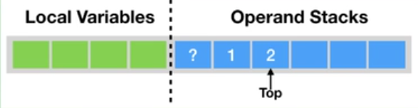
 以加法指令 iadd 为例。假设在执行该指令前，栈顶的两个元素分别为 int 值 1 和 int 值 2，那么 iadd 指令将弹出这两个 int，并将求得的和 int 值 3 压入栈中。
 
 由于 iadd 指令只会消耗栈顶的两个元素，因此，对于离栈顶距离为 2 的元素，即图中的问号，iadd 指令并不关心它是否存在，更加不会对其进行修改。

**2、局部变量表（Local Variables）**
 Java 方法栈帧的另外一个重要组成部分则是局部变量区，**字节码程序可以将计算的结果缓存在局部变量区之中**。
 实际上，Java 虚拟机将局部变量区**当成一个数组**，依次存放 this 指针（仅非静态方法），所传入的参数，以及字节码中的局部变量。
 和操作数栈一样，long 类型以及 double 类型的值将占据两个单元，其余类型仅占据一个单元。
 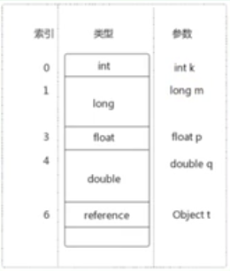
 举例：

```
public void foo(long l, float f) {
    {
        int i = 0;
    }
    {
        String s = "Hello, world";
    }
}

```

对应的图示（i/s 槽位复用）：
 

在栈帧中，与性能调优关系最为密切的部分就是局部变量表。局部变量表中的变量也是重要的垃圾回收根节点，只要被局部变量表中直接或间接引用的对象都不会被回收。
 在方法执行时，虚拟机使用局部变量表完成方法的传递。

#### 2.1. 局部变量压栈指令

**局部变量压栈指令将给定的局部变量表中的数据压入操作数栈**

这类指令大体可以分为：
 > xload_<n>（x 为 i、l、f、d、a，n 为 0 到 3）
 > xload (x 为 i、l、f、d、a)
 说明：在这里，x 的取值表示数据类型。

指令 xload_n 表示将第 n 个局部变量压入操作数栈，比如 iload_1、fload_0、aload_0 等指令。其中 aload_n 表示将一个对象引用压栈。

指令 xload 通过指定参数的形式，把局部变量压入操作数栈，当使用这个命令时，表示局部变量的数量可能超过了 4 个，比如指令 iload、fload 等。

#### 2.2. 常量入栈指令

常量入栈指令的功能是将常熟压入操作数栈，根据数据类型和入栈内容的不同，又可以分为 const 系列、push 系列和 ldc 指令。

**指令 const 系列：** 用于对特定的常量入栈，入栈的常量隐含在指令本身里。指令有：iconst_<i>(i 从 -1 到 5)、lconst_<l>(l 从 0 到 1)、fconst_<f>（f 从 0 到 2）、dconst_<d>（d 从 0 到 1）、aconst_null。
 比如：
 iconst_m1 将 -1 压入操作数栈；
 iconst_x（x 为 0 到 5）将 x 压入栈；
 lconst_0、lconst_1 分别将长整数 0 和 1 压入栈；
 fconst_0、fconst_1、fconst_2 分别将浮点数 0、1、2 压入栈；
 dconst_0 和 dconst_1 分别将 double 型 0 和 1 压入栈
 aconst_null 将 null 压入操作数栈；
 从指令的命名上不难找出规律，指令助记符的第一个字符总是喜欢表示数据类型，i表示整数，l表示长整数，f表示浮点数，d表示双精度浮点，习惯上用 a表示对象引用。如果指令隐含操作的参数，会以下划线形式给出。

**指令 push 系列：** 主要包括 bipush 和 sipush，它们的区别在于接受数据类型的不同，bipush 接收8位整数作为参数，sipush 接收16位整数，它们都将参数压入栈。

**指令 ldc 系列：** 如果以上指令都不能满足需求，那么可以使用万能的 ldc 指令，它可以接收一个8位的参数，该参数指向常量池中的 int、float 或者 String 的索引，将指定的内容压入堆栈。
 类似的还有 **ldc_w**，它接收两个8位参数，能支持的索引范围大于 ldc。
 如果要压入的元素是 long 或者 double 类型的，则使用 **ldc2_w**指令，使用方式都是类似的。

总结如下：

 | 类型 | 常熟指令 | 范围
 | int(boolean,byte,char,short) | iconst | [-1,5]
 |  | bipush | [-128,127]
 |  | sipush | [-32768,32767]
 |  | ldc | any int value
 | long | lconst | 0,1
 |  | ldc | any long value
 | float | fconst | 0,1,2
 |  | ldc | any float value
 | double | dconst | 0,1
 |  | ldc | any double value
 | reference | aconst | null
 |  | ldc | String literal, Class literal

#### 2.3. 出栈装入局部变量表指令

出栈装入局部变量表指令用于将操作数栈中栈顶元素弹出后，装入局部变量表的指定位置，用于给局部变量赋值。

这类指令主要以 store 的形式存在，比如 xstore（x 为 i、l、f、d、a）、xstore_n（x 为 i、l、f、d、a，n 为0至3）。

- 其中，指令 istore_n 将从操作数栈中弹出一个整数，并把它赋值给局部变量索引 n 位置。

- 指令 xstore 由于没有隐含参数信息，故需要提供一个 byte 类型的参数指定目标局部变量表的位置。

**说明：**
 **一般来说，类似像 store 这样的命令需要带一个参数，用来指明将弹出的元素放在局部变量表的第几个位置**。但是，为了尽可能压缩指令大小，使用专门的 istore_1 指令表示将弹出的元素放置在局部变量表第1个位置。类似的还有 istore_0、istore_2、istore_3，它们分别表示从操作数栈顶弹出一个元素，存放在局部变量表第 0、2、3个位置。

由于局部变量表前几个位置总是非常常用，因此**这种做法虽然增加了指令数量，但是可以大大缩短生成的字节码的体积**。如果局部变量表很大，需要存储的槽位大于3，那么使用 istore 指令，外加一个参数，用来表示需要存放的槽位位置。

### 3. 算术指令

**1、作用：**
 算术指令用于对两个操作数栈上的值进行某种特定运算，并把结果重新压入操作数栈。

**2、分类：**
 大体上算术指令可以分为两种：对**整形数据**进行运算的指令与对**浮点类型数据**进行运算的指令。

**3、byte、short、char 和 boolean 类型说明**
 在每一大类中，都有针对 Java 虚拟机具体数据类型的专用算术指令。但没有直接支持 byte、short、char 和 boolean 类型的算术指令，对于这些数据的运算，都使用 int 类型的指令来处理。此外，在处理 boolean、byte、short 和 char 类型的数组时，也会转换为使用对应的 int 类型的字节码指令来处理。
 **Java 虚拟机中的实际类型与运算类型**

 | 实际类型 | 运算类型 | 分类
 | boolean | int | 一
 | byte | int | 一
 | char | int | 一
 | short | int | 一
 | int | int | 一
 | float | float | 一
 | reference | reference | 一
 | returnAddress | returnAddress | 一
 | long | long | 二
 | double | double | 二

**4、运算时的溢出**
 数据运算可能会导致溢出，例如两个很大的正整数相加，结果可能是一个负数。其实 Java 虚拟机规范并无明确规定过整型数据溢出的具体结果，仅规定了在处理整型数据时，只有除法指令以及求余指令中当出现除数为 0 时会导致虚拟机抛出异常 ArithmeticException

**5、运算模式**

- 向最接近数舍入模式：JVM 要求在进行浮点数计算时，所有的运算结果都必须舍入到适当的精度，非精确结果必须舍入为可被表示的最接近的精确值，如果有两种可表示的形式与该值一样接近，将优先选择最低有效位为零的；

- 向零舍入模式：将浮点数转换为整数时，采用该模式，该模式将在目标数值类型中选择一个最接近但是不大于原值的数字作为最精确的舍入结果；

**6、NaN 值使用**
 当一个操作产生溢出时，将会使用有符号的无穷大表示，如果某个操作结果没有明确的数学定义的话，将会使用 NaN 值；

**eg：**

```
@Test
public void method1() {
    int i = 10;
    double j = i / 0.0;
    System.out.println(j);  // Infinity（无穷大）

    double d1 = 0.0;
    double d2 = d1 / 0.0;
    System.out.println(d2); // NaN（Not a number）
}

```

#### 所有算术指令

所有的算术指令包括：

 | 指令类别 | 指令
 | 加法指令 | iadd、ladd、fadd、dadd
 | 减法指令 | isub、lsub、fsub、dsub
 | 乘法指令 | imul、lmul、fmul、dmul
 | 除法指令 | idiv、ldiv、fdiv、ddiv
 | 求余指令 | irem、lrem、frem、drem // remainder：余数
 | 取反指令 | ineg、lneg、fneg、dneg // negation：取反
 | 自增指令 | iinc
 | 位运算指令 | 位移指令：ishl、ishr、iushr、lshl、lshr、lushr 按位或指令：ior、lor 按位与指令：iand、land 按位异或指令：ixor、lxor
 | 比较指令 | dcmpg、dcmpl、fcmpg、fcmpl、lcmp

##### 举例

```
public static int bar(int i) {
    return ((i + 2) - 2) * 3 / 4;
}

```

字节码指令对应的图示：
 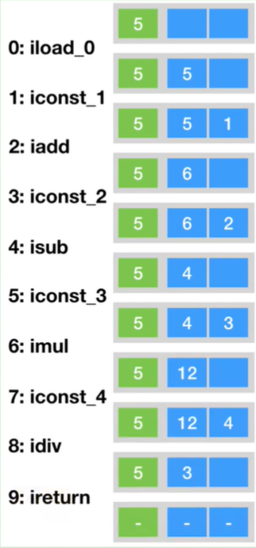

##### 一个曾经的案例

```
public void add() {
    byte i = 15;
    int j = 8;
    int k = i + j;
}

```

字节码对应的内存解析：
 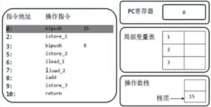
 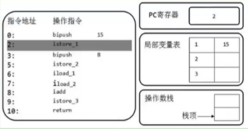
 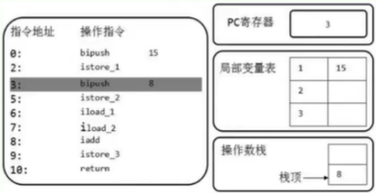
 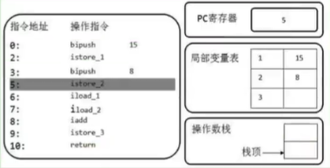
 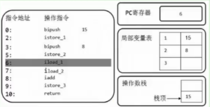
 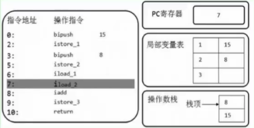
 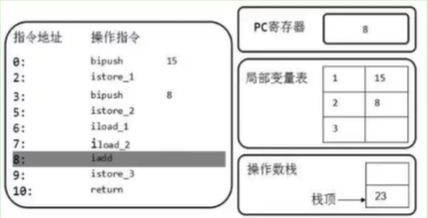
 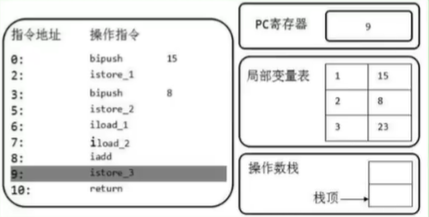

#### 比较指令的说明

- 比较指令的作用是比较栈顶两个元素的大小，并将比较结果入栈。

- 比较指令有：dcmpg，dcmpl、fcmpg、fcmpl、lcmp

  - 与前面讲解的指令类似，首字母 d 表示 double 类型，f 表示 float，l 表示 long。

- 对于 double 和 float 类型的数字，由于 NaN 的存在，各有两个版本的比较指令。以 float 为例，有 fcmpg 和 fcmpl 两个指令，它们的区别在于在数字比较时，若遇到 NaN值，处理结果不同。

- 指令 dcmpl 和 dcmpg 也是类似的，根据其命名可以推测其含义，在此不再赘述。

- 指令 lcmp 针对 long 型整数，由于 long 型整数没有 NaN 值，故无需准备两套指令。

举例：
 指令 fcmpg 和 fcmpl 都从栈中弹出两个操作数，并将它们做比较，设栈顶的元素位 v2，栈顶顺位第2位的元素为 v1，若 v1=v2 则压入0；若 v1 > v2 则压入0；若 v1 < v2 则压入 -1。
 两个指令的不同之处在于，如果遇到 NaN 值，fcmpg会压入1，而 fcmpl 会压入 -1。

### 4. 类型转换指令

**类型转换指令说明**
 ① 类型转换指令可以将两种不同的数值类型进行相互转换。（除了 boolean 类型外的其他7种基本类型）
 ② 这些转换操作一般用于实现用户代码中的**显式类型转换操作**，或者用来处理*字节码指令集中数据类型相关指令*无法与*数据类型*一一对应的问题。

#### 4.1. 宽化类型转换(Widening Numeric Conversions)

**1、转换规则**
 Java 虚拟机直接支持以下数值的宽化类型转换（Widening Numeric Conversions，小范围类型向大范围类型的安全转换）。也就是说，并不需要指令执行，包括：

- 从 int 类型到 long、float 或者 double 类型。对应的指令为：i2l、i2f、i2d

- 从 long 类型到 float、double 类型。对应的指令为：l2f、l2d

- 从 float 类型到 double 类型。对应的指令为：f2d
 简化为：int --> long --> float --> double

**2、精度损失问题**

1. 宽化类型转换是不会因为超过目标类型最大值而丢失信息的，例如：从 int 转换到 long，或者从 int 转换到 double，都不会丢失任何信息，转换前后的值是精确相等的。

1. 从 int、long 类型数值转换到 float，或者 long 类型数值转换到 double 时，将可能发生精度丢失--可能丢失掉几个最低有效位上的值，转换后的浮点数值是根据 IEEE754 最接近舍入模式所得到的正确整数值。
 尽管宽化类型转换实际上是可能发生精度丢失的，但是这种转换永远不会导致 Java 虚拟机抛出运行时异常。

**3、补充说明**
 **从 byte、char 和 short 类型到 int 类型的宽化类型转换实际上是不存在的**。对于 byte 类型转为 int，虚拟机并没有做实质性的转化处理，只是简单地通过操作数栈交换了两个数据。而将 byte 转为 long 时，使用的时 i2l，可以看到在内部 byte 在这里已经等同于 int 类型处理，类似的还有 short 类型，这种处理方式有两个特点：

- 一方面可以减少实际的数据类型，如果为 short 和 byte 都准备一套指令，那么指令的数量就会大增，而**虚拟机目前的设计上，只愿意使用一个字节表示指令，因此指令总数不能超过 256 个，为了节省指令资源，将 short 和 byte 当作 int 处理也在情理之中**。

- 另一方面，由于局部变量表种的槽位固定为 32 位，无论是 byte 或者 short 存入局部变量表，都会占用 32 位空间。从这个角度说，也没有必要特意区分这几种数据类型。

#### 4.2. 窄化类型转换（Narrowing Numeric Conversion）

**1、转换规则**
 Java 虚拟机也直接支持以下**窄化类型转换**：

- 从 int 类型至 byte、short 或者 char 类型。对应的指令有：**i2b、i2s、i2c**

- 从 long 类型到 int 类型。对应的指令有：**l2i**

  - 没有 long -> byte 一类的指令，`long l = 10L;byte b = (byte)l;` 对应的字节码指令为 l2i i2b。float一类同理。

- 从 float 类型到 int 或者 long 类型。对应的指令有：**f2i、f2l**

- 从 double 类型到 int、long 或者 float 类型。对应的指令有：**d2i、d2l、d2f**

**2、精度损失问题**
 窄化类型转换可能会导致转换结果具备不同的正负号、不同的数量级，因此，转换过程很可能会导致数据就是精度。

尽管数据类型窄化转换可能会发生上限溢出、下限溢出和精度丢失等情况。但是 Java 虚拟机规范中明确规定数值类型的窄化转换指令永远不可能导致虚拟机抛出运行时异常。

**3、补充说明**

1. 当将一个浮点值窄化转换为整数类型 T（T 限于 int 或 long 类型）的时候，将遵循以下转换规则：

- 如果浮点值是 NaN，那转换结果就是 int 或 long 类型的 0。

- 如果浮点值不是无穷大的话，浮点值使用 IEEE 754 的向零舍入模式取整，获得整数值 v，如果 v 在目标类型 T（int 或 long）的表示范围之内，那转换结果就是 v。否则，将根据 v 的符号，转换为 T 所能表示的最大或最小整数

1. 当将一个 double 类型窄化转换为 float 类型时，将遵循以下原则：
 通过向最接近数舍入模式舍入一个可以使用 float 类型标识的数字。最后结果根据下面这3条规则判断：

- 如果转换结果的绝对值太小而无法使用 float 来表示，将返回 float 类型的正负值。

- 如果转换结果的绝对值太大而无法使用 float 来表示，将返回 float 类型的正负无穷大。

- 对于 double 类型的 NaN 值将按规定转换为 float 类型的 NaN 值。

```
// 测试 NaN，无穷大的情况
@Test
public void downCast5() {
    double d1 = Double.NaN;
    int i = (int)d1;
    System.out.println(i);      // 0

    double d2 = Double.POSITIVE_INFINITY;
    long l = (long) d2;
    int j = (int)d2;
    System.out.println(l);      // 9223372036854775807
    System.out.println(Long.MAX_VALUE);     // 9223372036854775807
    System.out.println(j);      // 2147483647
    System.out.println(Integer.MAX_VALUE);  // 2147483647

    float f1 = (float)d1;
    float f2 = (float)d2;
    System.out.println(f1);  // NaN
    System.out.println(f2);  // Infinity
}

```

### 5. 对象的创建与访问指令

Java 是面向对象的程序设计语言，虚拟机平台从字节码层面就对面向对象做了深层次的支持。有一系列指令专门用于对象操作，可进一步细分为创建指令、字段访问指令、数组操作指令、类型检查指令。

#### 5.1. 创建指令

虽然类实例和数组都是对象，但 Java 虚拟机对对象实例和数组的创建与操作使用了不同的字节码指令：
 **1、创建类实例的指令：**
 创建类实例的指令：**`new`**。它接收一个操作数，为指向常量池的索引，表示要创建的类型，指向完成后，将对象的引用压入栈（操作数栈）。

**2、创建数组的指令：**
 创建数组的指令：**`newarray`、`anewarray`、`multianewarray`**。

- `newarray`：创建基本类型数组

- `anewarray`：创建引用类型数组

- `multianewarray`：创建多维数组

上述创建指令可以用于创建对象或者数组，由于对象和数组在 Java 中的广泛使用，这些指令的使用频率也非常高。

#### 5.2. 字段访问指令

对象创建后，就可以通过对象访问指令获取对象实例或数组实例中的字段或者数组元素。

- 访问类字段（static 字段或者称为类变量）的指令：**`getstatic`、`putstatic`**

- 访问类实例字段（非 static 字段或者称为实例变量）的指令：**`getfield`、`putfield`**

**举例：**
 以 getstatic 指令为例，它含有一个操作数，为指向常量池的 Fieldref 索引，它的作用就是获取 Fieldref 指定的对象或者值，并将其压入操作数栈。

```
public void sayHello() {
    System.out.println("hello");
}

```

对应的字节码指令：

```
0 getstatic #8 <java/lang/System.out>
3 ldc #9 <hello>
5 invokevirtual #10 <java/io/PrintStream.println>
8 return

```

**图示：**
 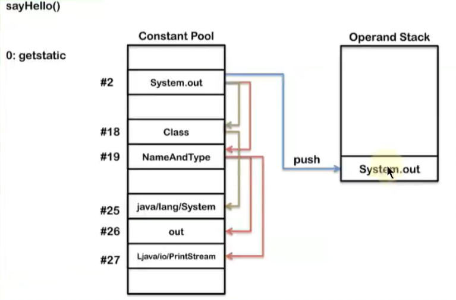
 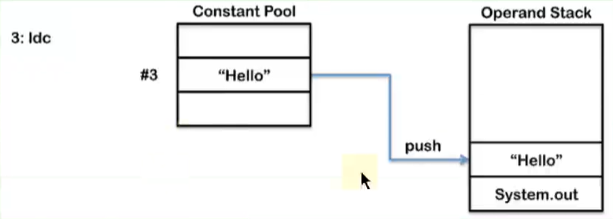
 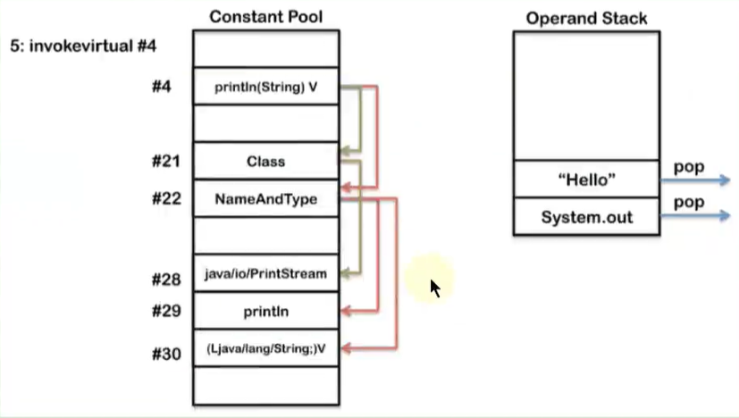

#### 5.3. 数组操作指令

数组操作指令主要有：`xastore` 和 `xaload` 指令。具体为：

- 把一个数组元素加载到操作数栈的指令：**`baload`、`caload`、`saload`、`iaload`、`laload`、`faload`、`daload`、`aaload`**

- 将一个操作数栈的值存储到数组元素中的指令：**`bastore`、`castore`、`sastore`、`iastore`、`lastore`、`fastore`、`dastore`、`aastore`**

即：

 | 数组类型 | 加载指令 | 存储指令
 | byte(boolean) | baload | bastore
 | char | caload | castore
 | short | saload | sastore
 | int | iaload | iastore
 | long | laload | lastore
 | float | faload | fastore
 | double | daload | dastore
 | reeference | aaload | aastore

- 取数组长度的指令：**`arraylength`**。

  - 该指令弹出栈顶的数组元素，获取数组的长度，将长度压入栈。

**说明**

- 指令 xaload 表示将数组的元素压栈，比如 saload、caload 分别表示压入 short 数组和 char 数组。指令 xaload 在执行时，要求操作数中栈顶元素为数组索引 i，栈顶顺位第2个元素为数组引用 a，该指令会弹出栈顶这两个元素，并将 a[i] 重新压入堆栈。

- xastore 则专门针对数组操作，以 iastore 为例，它用于给一个 int 数组的给定索引赋值。在 iastore 执行前，操作数栈顶需要以此准备 3 个元素：值、索引、数组引用，iastore 会弹出这 3 个值，并将值赋给数组中指定索引的位置。

#### 5.4. 类型检查指令

检查类实例或数组类型的指令：instanceof、checkcast。

- 指令 checkcast 用于检查类型强制转换是否可以进行。如果可以进行，那么 checkcast 指令不会改变操作数栈，否则它会抛出 ClassCastException 异常。

- 指令 instanceof 用来判断给定对象是否时某一个类的实例，它会将判断结果压入操作数栈。

### 6. 方法调用与返回指令

#### 6.1. 方法调用指令

方法调用指令：**`invokevirtual`、`invokeinterface`、`invokespecial`、`invokestatic`、`invokedynamic`**

以下 5 条指令用于方法调用：

- invokevirtual 指令用于调用对象的实例方法，根据对象的实际类型进行分派（虚方法分派），支持多态。这也是 Java 语言中**最常见的方法分派模式**。

- invokeinterface 指令用于**调用接口方法**，它会在运行时搜索由特定对象所实现的这个接口方法，并找出适合的方法进行调用。

- invokespecial 指令用于调用一些需要特殊处理的实际方法，包括**实例初始化方法（构造器）、私有方法和父类方法**。这些方法都是静态类型绑定的，不会在调用时进行动态派发。

- invokestatic 指令用于调用命名**类中的类方法（static 方法）**。这是静态绑定的。

- invokedynamic 指令用于调用动态绑定的方法，这是 JDK1.7 之后新加入的指令。用于在运行时动态解析出调用点限定符所引用的方法，并执行该方法。前面4条调用指令的分派逻辑都固化在 java 虚拟机内部，而 invokedynamic 指令的分派逻辑是由用户所设定的引导方法决定的。

#### 6.2. 方法返回指令

方法调用结束前，需要进行返回。方法返回指令是**根据返回值的类型区分**的。

- 包括 `ireturn`（当返回值是 boolean、byte、char、short 和 int 类型时使用）、`lreturn`、`freturn`、`dreturn` 和 `areturn`

- 另外还有一条 `return` 指令供声明为 void 的方法、实例初始化方法以及类和接口的类初始化方法使用。

 | 返回类型 | 返回指令
 | void | return
 | int(boolean、byte、char、short) | ireturn
 | long | lreturn
 | float | freturn
 | double | dreturn
 | reference | areturn

**举例：**
 通过 ireturn 指令，将当前函数操作数栈的顶层元素弹出，并将这个元素压入调用者函数的操作数栈中（因为调用者非常关心函数的返回值），所有在当前函数操作数栈中的其他元素都会被丢弃。

如果当前返回的是 synchronized 方法，那么还会执行一个隐含的 `monitorexit` 指令，退出临界区。

最后，会丢弃当前方法的整个帧，恢复调用者的帧，并将控制权转交给调用者。
 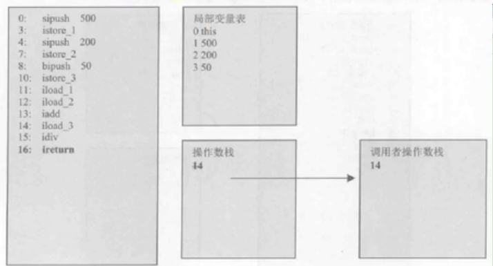
 对应的代码：

```
public int methodReturn() {
    int i = 500;
    int j = 200;
    int k = 50;

    return (i + j) / k;
}

```

### 7. 操作数栈管理指令

如同操作一个普通数据结构中的堆栈那样，JVM 提供的操作数栈管理指令，可以用于直接操作操作数栈。

这类指令包括如下内容：

- 将一个或两个元素从栈顶弹出，并且直接废弃：**`pop`, `pop2`**

- 复制栈顶一个或两个数值并将复制值或双份的复制值重新压入栈顶：**`dup`, `dup2`, `dup_x1`, `dup2_1`, `dup_x2`, `dup2_x2`**;

- 将栈最顶端的两个 Slot 数值位置交换：**`swap`**。Java 虚拟机没有提供交换两个 64 位数据类型（long、double）数值的指令。

- 指令 **`nop`**，是一个非常特殊的指令，它的字节码为 0x00。和汇编语言中的 **`nop`** 一样，它表示什么都不做。这条指令一般可用于调试、占位等。

这些指令属于通用型，对栈的压入或弹出无需指明数据类型。

**说明：**

- 不带 **_x** 的指令是复制栈顶数据并压入栈顶。包括两个指令，`dup` 和 `dup2`，`dup` 的系数代表要复制的 Slot 个数。

  - dup 开头的指令用于复制1个 Slot 的数据。例如1个 int 或 1个 reference 类型数据

  - dup2 开头的指令用于复制2个 Slot的数据。例如 1个 Long，或2个 int，或 1个 int+1 个 float 类型的数据

- 带 **_x** 的指令是复制栈顶数据并插入栈顶以下的某个位置。共有四个指令，`dup_x1`, `dup2_x1`, `dup_x2`, `dup2_x2`，对于带 _x 的复制插入指令，只要将指令的 dup 和 x 的系数相加，结果即为需要插入的位置。因此

  - `dup_x1` 插入位置：1+1=2，即栈顶2个 Slot 下面

  - `dup_x2` 插入位置：1+2=3，即栈顶3个 Slot 下面

  - `dup2_x1` 插入位置：2+1=3，即栈顶3个 Slot 下面

  - `dup2_x2` 插入位置：2+2=4，即栈顶4个 Slot 下面

- **`pop`：** 将栈顶的1个 Slot 数值出栈。例如1个 short 类型数值

- **`pop2`** 将栈顶的2个 Slot 数值出栈。例如1个double 类型数值，或者2个 int 类型数值

### 8. 比较控制指令

程序流程离不开条件控制，为了支持条件跳转，虚拟机提供了大量字节码指令，大体上可以分为：
 1）比较指令、2）条件跳转指令、3）比较条件跳转指令、4）多条件分支跳转指令、5）无条件跳转指令等。

#### 8.1. 条件跳转指令

条件跳转指令通常和比较指令结合使用。在条件跳转指令执行前，一般可以先用比较指令进行栈顶元素的准备，然后进行条件跳转。
 条件跳转指令有：`ifeq`, `ifne`, `iflt`, `ifle`, `ifne`, `ifgt`, `ifnull`, `ifnonnull`。这些指令都接收两个字节的操作数，用于计算跳转的位置（16位符号整数作为当前位置的 offset）。
 它们的统一含义为：**弹出栈顶元素，测试它是否满足某一条件，如果满足条件，则跳转到给定位置**。

**具体说明：**

 | 指令 | 说明
 | `ifeq` | 当栈顶 int 类型数值等于 0 时跳转
 | `ifne` | 当栈顶 int 类型数值不等于 0 时跳转
 | `iflt` | 当栈顶 int 类型数值小于 0 时跳转
 | `ifle` | 当栈顶 int 类型数值小于等于 0 时跳转
 | `ifgt` | 当栈顶 int 类型数值大于 0 时跳转
 | `ifge` | 当栈顶 int 类型数值大于等于 0 时跳转
 | `ifnull` | 为 null 时跳转
 | `ifnonnull` | 不为 null 时跳转

**注意：**

1. 与前面运算规则一致；

  - 对于 boolean、byte、char、short 类型的条件分支比较操作，都是使用 int 类型的比较指令完成

  - 对于 long、float、double 类型的条件分支比较操作，则会先执行相应类型的比较运算指令，运算指令会返回一个整形值到操作数栈中，随后再执行 int 类型的条件分支比较操作来完成整个分支跳转

1. 由于各类型的比较最终都会转为 int 类型的比较操作，所以 Java 虚拟机提供的 int 类型的条件分支指令是最为丰富和强大的。

#### 8.2. 比较条件跳转指令

比较条件跳转指令类似于比较指令和跳转指令的结合体，它将比较和跳转两个步骤合二为一。
 这类指令有：if_icmpeq、if_icmpne、if_icmplt、if_icmple、if_icmpge、if_icmpeq 和 if_acmpne。
 其中指令助记符加上“if_”后，以字符 "i" 开头的指令针对 int 型整数操作（也包括 short 和 byte），以字符 "a" 开头的指令表示对象引用的比较。

**具体说明：**

 | 指令 | 说明
 | if_icmpeq | 比较栈顶两 int 类型数值大小，当前者等于后者时跳转
 | if_icmpne | 比较栈顶两 int 类型数值大小，当前者不等于后者时跳转
 | if_icmplt | 比较栈顶两 int 类型数值大小，当前者小于后者时跳转
 | if_icmple | 比较栈顶两 int 类型数值大小，当前者小于等于后者时跳转
 | if_icmpgt | 比较栈顶两 int 类型数值大小，当前者大于后者时跳转
 | if_icmpge | 比较栈顶两 int 类型数值大小，当前者大于等于后者时跳转
 | if_acmpeq | 比较栈顶两引用类型数值，当结果相等时跳转
 | if_acmpne | 比较栈顶两引用类型数值，当结果不相等时跳转

这些指令都接收两个字节的操作数作为参数，用于计算跳转的位置。同时在执行指令时，栈顶需要准备两个元素进行比较。指令执行完成后，栈顶的这两个元素被清空，且没有任何数据入栈。**如果预设条件成立，则执行跳转，否则，继续执行下一条语句**。

#### 8.3.多条件分支跳转

多条件分支跳转指令是专为 switch-case 语句设计的，主要有 `tableswitch` 和 `lookupswitch`。
 指令名称 ｜ 描述
 ---- ｜ --
 tableswitch ｜ 用于 switch 条件跳转，case 值连续
 lookupswitch ｜ 用于 switch 条件跳转，case 值不连续
 从助记符上看，两者都是 switch 语句的实现，它们的区别：

- tableswitc 要求**多个条件分支是连续的**，它内部只存放起始值和终止值，以及若干个跳转偏移量，通过给定的操作数 index，可以立即定位到跳转偏移量位置，**因此效率比较高**。

- lookupswitch 内部**存放着各个离散的 case-offset 对**，每次执行都要搜索全部的 case-offset 对，找到匹配的 case 值，并根据对应的 offset 计算跳转地址，**因此效率较低**。

指令 tableswitch 的示意图如下图所示。由于 tableswitch 的 case 值是连续的，因此只需要记录最低值和最高值，以及每一项对应的 offset 偏移量，根据给定的 index 值通过简单的额计算即可直接定位到 offset。
 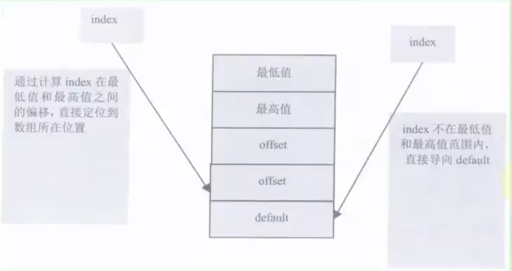
 指令 lookupswitch 处理的是离散的 case 值，但是出于效率考虑，**将 case-offset 对按照 case 值大小排序**，给定 index 时，需要查找与 index 相等的 case，获得其 offset，如果找不到则跳转到 default。指令 lookupswitch 如下图所示：
 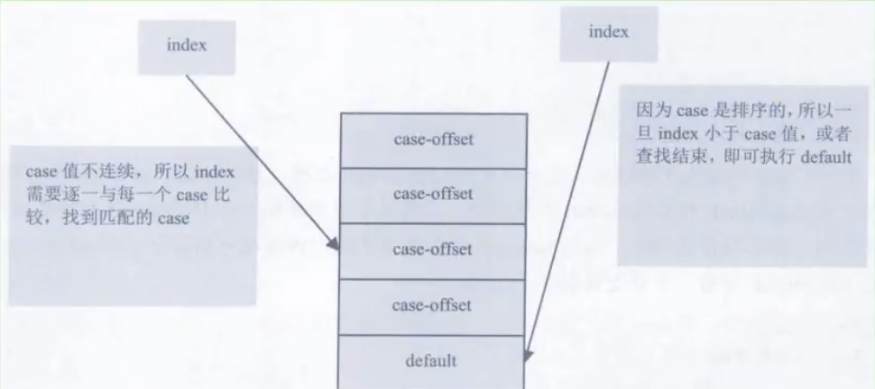

#### 8.4. 无条件跳转

目前主要的无条件跳转指令为 `goto`。指令 `goto` 接收两个字节的操作数，共同组成一个带符号的整数，**用于制定指令的偏移量，指令执行的目的就是跳转到偏移量给定的位置处**。

如果指令偏移量太大，超过双字节的带符号整数的范围，则可以使用指令 `goto_w` 它和 `goto` 有相同的作用，但是它接收4个字节的操作数，可以表示更大的地址范围。

指令 `jsr`、`jsr_w`、`ret` 虽然也是无条件跳转的，但是主要用于 try-finally 语句，且已经被虚拟机逐渐废弃，故不在这里介绍这两个指令。

 | 指令名称 | 描述
 | goto | 无条件跳转
 | goto_w | 无条件跳转（宽索引）
 | jsr | 跳转到指定16位offset，并将 jsr 下一条指令地址压入栈顶
 | jsr_w | 跳转到指定32位offset，并将 jsr_w 下一条指令地址压入栈顶
 | ret | 返回至由指定的局部变量表所给出的指令位置（一般与 jsr、jsr_w结 合使用）

### 9. 异常处理指令

#### 9.1. 抛出异常指令

（1）`athrow` 指令
 在 Java 程序中显示抛出异常的操作（throw 语句）都是由 athrow 指令来实现。
 除了使用 throw 语句显示抛出异常情况之外，**JVM 规范还规定了许多运行时异常会在其他 Java 虚拟机指令检测到异常情况时自动抛出**。例如：在之前的介绍的整数运算时，当除数为零时，虚拟机会在 idiv 或 ldiv 指令中抛出 ArithmeticException 异常。

（2）**注意**
 正常情况下，操作数栈的压入弹出都是一条条指令完成的。唯一的例外情况是 **在抛异常时，Java 虚拟机会清除操作数栈上的所有内容，而后将异常实例压入调用者操作数栈上**。

#### 9.2. 异常处理与异常表

**1、处理异常：**
 在 Java 虚拟机中，**处理异常**（catch 语句）不是由字节码指令来实现的（早期使用 jsr、ret 指令），而是**采用异常表来完成的**。

**2、异常表**
 如果一个方法定义了一个 try-catch 或者 try-finally 的异常处理，就会创建一个异常表。它包含了每个异常处理或者 finally 块的信息。异常表保存了每个异常处理信息。比如：

- 起始位置

- 结束位置

- 程序计数器记录的代码处理的偏移地址

- 被捕获的异常类在常量池中的索引

**当一个异常被抛出时，JVM 会在当前的方法里寻找一个匹配的处理，如果没有找到，这个方法会强制结束并弹出当前栈帧**，并且异常会重新抛给上层调用的方法（在调用方法栈帧）。如果在所有的栈帧弹出前仍没有找到合适的异常处理，这个线程将终止。如果这个异常在最后一个非守护线程里抛出，将会导致 JVM 自己终止，比如这个线程是个 main 线程。

**不管什么时候抛出异常，如果异常处理最终匹配了所有异常类型，代码就会继续执行**。在这种情况下，如果方法结束后没有抛出异常，仍然执行 finally 块，在 return 前，它直接跳到 finally块来完成目标。

**eg:**

```
public static String func() {
String str = "hello";
try {
    return str;
} finally {
    str = "liudezhi";
}
}

public static void main(String[] args) {
System.out.println(func());     // hello
}

```

### 10. 同步控制指令

**组成：** Java 虚拟机支持两种同步结构：**方法级的同步** 和 **方法内部一段指令序列的同步**，这两种同步都是使用 monitor 来支持的。

#### 10.1. 方法级的同步

方法级的同步：是**隐式**的，即无须通过字节码指令来控制，它实现在方法调用和返回操作之中。虚拟机可以从方法常量池的方法表结构中的 ACC_SYNCHRONIZED 访问标识得知一个方法是否声明为同步方法；

当调用方法时，调用指令将会检查方法的 ACC_SYNCHRONIZED 访问标志是否设置。

- 如果设置了，执行线程将先持有同步锁，然后执行方法。最后在方法完成（无论是正常完成还是非正常完成）时**释放同步锁**。

- 在方法执行期间，执行线程持有了同步锁，其他任何线程都无法再获得同一个锁。

- 如果一个同步方法执行期间抛出了异常，并且在方法内部无法处理此异常，那这个同步方法所持有的锁将在异常抛出到同步方法之外时自动释放。

**举例：**

```
private int i = 0;
public synchronized void add() {
    i++;
}

```

对应的字节码：

```
 0 aload_0
 1 dup
 2 getfield #2 <com/liudezhi/java1/SynchronizedTest.i>
 5 iconst_1
 6 iadd
 7 putfield #2 <com/liudezhi/java1/SynchronizedTest.i>
10 return

```

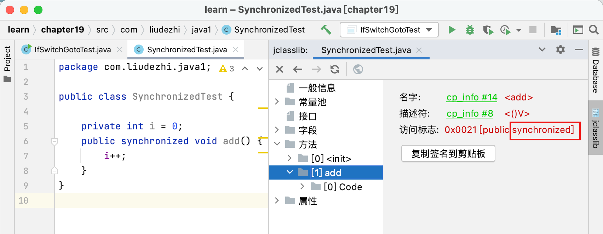
 **说明：**
 这段代码和普通的无同步操作没有什么不同，没有使用 monitorenter 和 monitoreexit 进行同步区控制。这是因为，对于同步方法而言，**当虚拟机通过方法的访问标识判断是一个同步方法时，会自动在方法调用前进行加锁**，当同步方法执行完毕后，不管方法是正常结束还是有异常抛出，均会由虚拟机释放这个锁。因此，对于同步方法而言，monitorenter 和 monitorexit 指令是隐式存在的，并未直接出现在字节码中。

#### 10.2. 方法内指定指令序列的同步

同步一段指令集序列：通常是由 java 中的 synchronized 语句块来表示表示的。jvm 的指令集有 `monitorenter` 和 `monitorexit` 两条指令来支持 synchronized 关键字的语义。

当一个线程进入同步代码块时，它使用 `monitorenter` 指令请求进入。如果当前对象的监视器为0，则它会被准许进入，若为1，则判断持有当前监视器的线程是否为自己，如果是，则进入，否则进行等待，直到对象的监视器计数器为0，才会被允许进入同步块。

当线程退出同步块时，需要使用 `monitorexit` 声明退出。在 Java 虚拟机中，任何对象都有一个监视器与之相关联，用来判断对象是否被锁定，当监视器被持有后，对象出于锁定状态。
 指令 `monitorenter` 和 `monitorexit` 在执行时，都需要在操作数栈顶压入对象，之后 `monitorenter` 和 `monitorexit` 的锁定和释放都是针对这个对象的监视器进行的。
 下图展示了监视器如何保护临界区代码不同时被多个线程访问，只有当线程4离开临界区后，线程1、2、3 才有可能进入。
 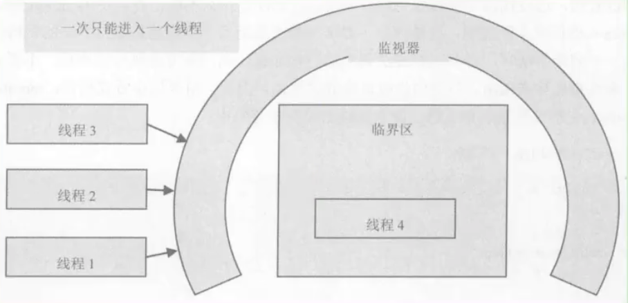

**举例：**

```
private int i = 0;
private Object obj = new Object();
public void subtract() {
    synchronized (obj) {
        i--;
    }
}

```

字节码：

```
 0 aload_0
 1 getfield #4 <com/liudezhi/java1/SynchronizedTest.obj>
 4 dup
 5 astore_1
 6 monitorenter
 7 aload_0
 8 dup
 9 getfield #2 <com/liudezhi/java1/SynchronizedTest.i>
12 iconst_1
13 isub
14 putfield #2 <com/liudezhi/java1/SynchronizedTest.i>
17 aload_1
18 monitorexit
19 goto 27 (+8)
22 astore_2
23 aload_1
24 monitorexit
25 aload_2
26 athrow
27 return

```

编译器必须保证无论方法通过何种方式完成，方法中调用过的每条 `monitorenter` 指令都必须执行其对应的 `monitorexit` 指令，而无论这个方法是正常结束还是异常结束。

为了保证在方法异常完成时 `monitorenter` 和 `monitorexit` 指令依然可以正确配对执行，**编译器会自动产生一个异常处理器，这个异常处理器声明可处理所有的异常**，它的目的就是用来执行 `monitorexit` 指令。

%23%23%20%E5%AD%97%E8%8A%82%E7%A0%81%E6%8C%87%E4%BB%A4%E9%9B%86%E4%B8%8E%E8%A7%A3%E6%9E%90%E4%B8%BE%E4%BE%8B%0A%23%23%23%201.%20%E6%A6%82%E8%BF%B0%0A-%20Java%20%E5%AD%97%E8%8A%82%E7%A0%81%E5%AF%B9%E4%BA%8E%E8%99%9A%E6%8B%9F%E6%9C%BA%EF%BC%8C%E5%B0%B1%E5%A5%BD%E5%83%8F%E6%B1%87%E7%BC%96%E8%AF%AD%E8%A8%80%E5%AF%B9%E4%BA%8E%E8%AE%A1%E7%AE%97%E6%9C%BA%EF%BC%8C%E5%B1%9E%E4%BA%8E%E5%9F%BA%E6%9C%AC%E6%89%A7%E8%A1%8C%E6%8C%87%E4%BB%A4%E3%80%82%0A-%20Java%20%E8%99%9A%E6%8B%9F%E6%9C%BA%E7%9A%84%E6%8C%87%E4%BB%A4%E7%94%B1**%E4%B8%80%E4%B8%AA%E5%AD%97%E8%8A%82%E9%95%BF%E5%BA%A6**%E7%9A%84%E3%80%81%E4%BB%A3%E8%A1%A8%E7%9D%80%E6%9F%90%E7%A7%8D%E7%89%B9%E5%AE%9A%E6%93%8D%E4%BD%9C%E5%90%AB%E4%B9%89%E7%9A%84%E6%95%B0%E5%AD%97%EF%BC%88%E7%A7%B0%E4%B8%BA%20***%E6%93%8D%E4%BD%9C%E7%A0%81%EF%BC%8COpcode***%20%EF%BC%89%E4%BB%A5%E5%8F%8A%E8%B7%9F%E9%9A%8F%E5%85%B6%E5%90%8E%E7%9A%84%E9%9B%B6%E8%87%B3%E5%A4%9A%E4%B8%AA%E4%BB%A3%E8%A1%A8%E6%AD%A4%E6%93%8D%E4%BD%9C%E6%89%80%E9%9C%80%E5%8F%82%E6%95%B0%EF%BC%88%E7%A7%B0%E4%B8%BA%20***%E6%93%8D%E4%BD%9C%E6%95%B0%EF%BC%8COperands***%20%EF%BC%89%E8%80%8C%E6%9E%84%E6%88%90%E3%80%82%E7%94%B1%E4%BA%8E%20Java%20%E8%99%9A%E6%8B%9F%E6%9C%BA%E9%87%87%E7%94%A8%E9%9D%A2%E5%90%91%E6%93%8D%E4%BD%9C%E6%95%B0%E6%A0%88%E8%80%8C%E4%B8%8D%E6%98%AF%E5%AF%84%E5%AD%98%E5%99%A8%E7%9A%84%E7%BB%93%E6%9E%84%EF%BC%8C%E6%89%80%E4%BB%A5%E5%A4%A7%E5%A4%9A%E6%95%B0%E7%9A%84%E6%8C%87%E4%BB%A4%E9%83%BD%E4%B8%8D%E5%8C%85%E5%90%AB%E6%93%8D%E4%BD%9C%E6%95%B0%EF%BC%8C%E5%8F%AA%E6%9C%89%E4%B8%80%E4%B8%AA%E6%93%8D%E4%BD%9C%E7%A0%81%E3%80%82%0A-%20%E7%94%B1%E4%BA%8E%E9%99%90%E5%88%B6%E4%BA%86%20Java%20%E8%99%9A%E6%8B%9F%E6%9C%BA%E6%93%8D%E4%BD%9C%E7%A0%81%E7%9A%84%E9%95%BF%E5%BA%A6%E4%B8%BA%E4%B8%80%E4%B8%AA%E5%AD%97%E8%8A%82%EF%BC%88%E5%8D%B3%EF%BC%9A0~255%EF%BC%89%EF%BC%8C%E8%BF%99%E6%84%8F%E5%91%B3%E7%9D%80%E6%8C%87%E4%BB%A4%E9%9B%86%E7%9A%84%E6%93%8D%E4%BD%9C%E7%A0%81%E6%80%BB%E6%95%B0%E4%B8%8D%E5%8F%AF%E8%83%BD%E8%B6%85%E8%BF%87%20256%20%E6%9D%A1%E3%80%82%0A-%20%E5%AE%98%E6%96%B9%E6%96%87%E6%A1%A3%EF%BC%9Ahttps%3A%2F%2Fdocs.oracle.com%2Fjavase%2Fspecs%2Fjvms%2Fse8%2Fhtml%2Fjvms-6.html%0A-%20%E7%86%9F%E6%82%89%E8%99%9A%E6%8B%9F%E6%9C%BA%E7%9A%84%E6%8C%87%E4%BB%A4%E5%AF%B9%E4%BA%8E%E5%8A%A8%E6%80%81%E5%AD%97%E8%8A%82%E7%A0%81%E7%94%9F%E6%88%90%E3%80%81%E5%8F%8D%E7%BC%96%E8%AF%91%20Class%20%E6%96%87%E4%BB%B6%E3%80%81Class%20%E6%96%87%E4%BB%B6%E4%BF%AE%E8%A1%A5%E9%83%BD%E6%9C%89%E9%9D%9E%E5%B8%B8%E9%87%8D%E8%A6%81%E7%9A%84%E4%BB%B7%E5%80%BC%E3%80%82%E5%9B%A0%E6%AD%A4%EF%BC%8C%E9%98%85%E8%AF%BB%E5%AD%97%E8%8A%82%E7%A0%81%E4%BD%9C%E4%B8%BA%E4%BA%86%E8%A7%A3%20Java%20%E8%99%9A%E6%8B%9F%E6%9C%BA%E7%9A%84%E5%9F%BA%E7%A1%80%E6%8A%80%E8%83%BD%EF%BC%8C%E9%9C%80%E8%A6%81%E7%86%9F%E7%BB%83%E6%8E%8C%E6%8F%A1%E5%B8%B8%E8%A7%81%E6%8C%87%E4%BB%A4%E3%80%82%0A%0A%23%23%23%23%201.1.%20%E6%89%A7%E8%A1%8C%E6%A8%A1%E5%9E%8B%0A%E5%A6%82%E6%9E%9C%E4%B8%8D%E8%80%83%E8%99%91%E5%BC%82%E5%B8%B8%E5%A4%84%E7%90%86%E7%9A%84%E8%AF%9D%EF%BC%8C%E9%82%A3%E4%B9%88%20Java%20%E8%99%9A%E6%8B%9F%E6%9C%BA%E7%9A%84%E8%A7%A3%E9%87%8A%E5%99%A8%E5%8F%AF%E4%BB%A5%E4%BD%BF%E7%94%A8%E4%B8%8B%E9%9D%A2%E8%BF%99%E4%B8%AA%E4%BC%AA%E4%BB%A3%E7%A0%81%E5%BD%93%E4%BD%9C%E6%9C%80%E5%9F%BA%E6%9C%AC%E7%9A%84%E6%89%A7%E8%A1%8C%E6%A8%A1%E5%9E%8B%E6%9D%A5%E7%90%86%E8%A7%A3%0A%60%60%60%0Ado%20%7B%0A%20%20%20%20%E8%87%AA%E5%8A%A8%E8%AE%A1%E7%AE%97%20PC%20%E5%AF%84%E5%AD%98%E5%99%A8%E7%9A%84%E5%80%BC%20%2B%201%3B%0A%20%20%20%20%E6%A0%B9%E6%8D%AE%20PC%20%E5%AF%84%E5%AD%98%E5%99%A8%E7%9A%84%E6%8C%87%E7%A4%BA%E4%BD%8D%E7%BD%AE%EF%BC%8C%E4%BB%8E%E5%AD%97%E8%8A%82%E7%A0%81%E6%B5%81%E4%B8%AD%E5%8F%96%E5%87%BA%E6%93%8D%E4%BD%9C%E7%A0%81%3B%0A%20%20%20%20if(%E5%AD%97%E8%8A%82%E7%A0%81%E5%AD%98%E5%9C%A8%E6%93%8D%E4%BD%9C%E6%95%B0)%20%E4%BB%8E%E5%AD%97%E8%8A%82%E7%A0%81%E6%B5%81%E4%B8%AD%E5%8F%96%E5%87%BA%E6%93%8D%E4%BD%9C%E6%95%B0%3B%0A%20%20%20%20%E6%89%A7%E8%A1%8C%E6%93%8D%E4%BD%9C%E7%A0%81%E6%89%80%E5%AE%9A%E4%B9%89%E7%9A%84%E6%93%8D%E4%BD%9C%3B%0A%7D%20while(%E5%AD%97%E8%8A%82%E7%A0%81%E9%95%BF%E5%BA%A6%20%3E%200)%3B%0A%60%60%60%0A%0A%23%23%23%23%201.2.%20%E5%AD%97%E8%8A%82%E7%A0%81%E4%B8%8E%E6%95%B0%E6%8D%AE%E7%B1%BB%E5%9E%8B%0A%E5%9C%A8%20Java%20%E8%99%9A%E6%8B%9F%E6%9C%BA%E7%9A%84%E6%8C%87%E4%BB%A4%E9%9B%86%E4%B8%AD%EF%BC%8C%E5%A4%A7%E5%A4%9A%E6%95%B0%E7%9A%84%E6%8C%87%E4%BB%A4%E9%83%BD%E5%8C%85%E5%90%AB%E4%BA%86%E5%85%B6%E6%93%8D%E4%BD%9C%E6%89%80%E5%AF%B9%E5%BA%94%E7%9A%84%E6%95%B0%E6%8D%AE%E7%B1%BB%E5%9E%8B%E4%BF%A1%E6%81%AF%E3%80%82%E4%BE%8B%E5%A6%82%EF%BC%9Aiload%20%E6%8C%87%E4%BB%A4%E7%94%A8%E4%BA%8E%E4%BB%8E%E5%B1%80%E9%83%A8%E5%8F%98%E9%87%8F%E8%A1%A8%E4%B8%AD%E5%8A%A0%E8%BD%BD%20int%20%E5%9E%8B%E7%9A%84%E6%95%B0%E6%8D%AE%E5%88%B0%E6%93%8D%E4%BD%9C%E6%95%B0%E6%A0%88%E4%B8%AD%EF%BC%8C%E8%80%8C%20fload%20%E6%8C%87%E4%BB%A4%E5%8A%A0%E8%BD%BD%E7%9A%84%E5%88%99%E6%98%AF%20float%20%E7%B1%BB%E5%9E%8B%E7%9A%84%E6%95%B0%E6%8D%AE%E3%80%82%0A%0A%E5%AF%B9%E4%BA%8E%E5%A4%A7%E9%83%A8%E5%88%86%E4%B8%8E%E6%95%B0%E6%8D%AE%E7%B1%BB%E5%9E%8B%E7%9B%B8%E5%85%B3%E7%9A%84%E5%AD%97%E8%8A%82%E7%A0%81%E6%8C%87%E4%BB%A4%EF%BC%8C**%E5%AE%83%E4%BB%AC%E7%9A%84%E6%93%8D%E4%BD%9C%E7%A0%81%E5%8A%A9%E8%AE%B0%E7%AC%A6%E4%B8%AD%E9%83%BD%E6%9C%89%E7%89%B9%E6%AE%8A%E7%9A%84%E5%AD%97%E7%AC%A6%E6%9D%A5%E8%A1%A8%E6%98%8E%E4%B8%93%E9%97%A8%E4%B8%BA%E5%93%AA%E7%A7%8D%E6%95%B0%E6%8D%AE%E7%B1%BB%E5%9E%8B%E6%9C%8D%E5%8A%A1**%EF%BC%9A%0A-%20i%20%E4%BB%A3%E8%A1%A8%E5%AF%B9%20int%20%E7%B1%BB%E5%9E%8B%E7%9A%84%E6%95%B0%E6%8D%AE%E6%93%8D%E4%BD%9C%0A-%20l%20%E4%BB%A3%E8%A1%A8%20long%0A-%20s%20%E4%BB%A3%E8%A1%A8%20short%0A-%20b%20%E4%BB%A3%E8%A1%A8%20byte%0A-%20c%20%E4%BB%A3%E8%A1%A8%20char%0A-%20f%20%E4%BB%A3%E8%A1%A8%20float%0A-%20d%20%E4%BB%A3%E8%A1%A8%20double%0A%0A%E4%B9%9F%E6%9C%89%E4%B8%80%E4%BA%9B%E6%8C%87%E4%BB%A4%E7%9A%84%E5%8A%A9%E8%AE%B0%E7%AC%A6%E4%B8%AD**%E6%B2%A1%E6%9C%89%E6%98%8E%E7%A1%AE%E5%9C%B0%E6%8C%87%E6%98%8E%E6%93%8D%E4%BD%9C%E7%B1%BB%E5%9E%8B%E7%9A%84%E5%AD%97%E6%AF%8D**%EF%BC%8C%E5%A6%82%20arraylength%20%E6%8C%87%E4%BB%A4%EF%BC%8C%E5%AE%83%E6%B2%A1%E6%9C%89%E4%BB%A3%E8%A1%A8%E6%95%B0%E6%8D%AE%E7%B1%BB%E5%9E%8B%E7%9A%84%E7%89%B9%E6%AE%8A%E5%AD%97%E7%AC%A6%EF%BC%8C%E4%BD%86%E6%93%8D%E4%BD%9C%E6%95%B0%E6%B0%B8%E8%BF%9C%E5%8F%AA%E8%83%BD%E6%98%AF%E4%B8%80%E4%B8%AA%E6%95%B0%E7%BB%84%E7%B1%BB%E5%9E%8B%E7%9A%84%E5%AF%B9%E8%B1%A1%E3%80%82%0A%0A%E8%BF%98%E6%9C%89%E5%8F%A6%E5%A4%96%E4%B8%80%E4%BA%9B%E6%8C%87%E4%BB%A4%EF%BC%8C%E5%A6%82%E6%97%A0%E6%9D%A1%E4%BB%B6%E8%B7%B3%E8%BD%AC%E6%8C%87%E4%BB%A4%20goto%20%E5%88%99%E6%98%AF%E4%B8%8E**%E6%95%B0%E6%8D%AE%E7%B1%BB%E5%9E%8B%E6%97%A0%E5%85%B3%E7%9A%84**%E3%80%82%0A%0A%E5%A4%A7%E9%83%A8%E5%88%86%E7%9A%84%E6%8C%87%E4%BB%A4%E9%83%BD%E6%B2%A1%E6%9C%89%E6%94%AF%E6%8C%81%E6%95%B4%E6%95%B0%E7%B1%BB%E5%9E%8B%20byte%E3%80%81char%20%E5%92%8C%20short%EF%BC%8C%E7%94%9A%E8%87%B3%E6%B2%A1%E6%9C%89%E4%BB%BB%E4%BD%95%E6%8C%87%E4%BB%A4%E6%94%AF%E6%8C%81%20boolean%20%E7%B1%BB%E5%9E%8B%E3%80%82%E7%BC%96%E8%AF%91%E5%99%A8%E4%BC%9A%E5%9C%A8%E7%BC%96%E8%AF%91%E6%9C%9F%E6%88%96%E8%BF%90%E8%A1%8C%E6%9C%9F%E5%B0%86%20byte%20%E5%92%8C%20short%20%E7%B1%BB%E5%9E%8B%E7%9A%84%E6%95%B0%E6%8D%AE%E5%B8%A6%E7%AC%A6%E5%8F%B7%E6%89%A9%E5%B1%95%EF%BC%88Sign-Extend%EF%BC%89%E4%B8%BA%E7%9B%B8%E5%BA%94%E7%9A%84%20int%20%E7%B1%BB%E5%9E%8B%E6%95%B0%E6%8D%AE%EF%BC%8C%E5%B0%86%20boolean%20%E5%92%8C%20char%20%E7%B1%BB%E5%9E%8B%E6%95%B0%E6%8D%AE%E9%9B%B6%E4%BD%8D%E6%89%A9%E5%B1%95%EF%BC%88Zero-Extend%EF%BC%89%E4%B8%BA%E7%9B%B8%E5%BA%94%E7%9A%84%20int%20%E7%B1%BB%E5%9E%8B%E6%95%B0%E6%8D%AE%E3%80%82%E4%B8%8E%E4%B9%8B%E7%B1%BB%E4%BC%BC%EF%BC%8C%E5%9C%A8%E5%A4%84%E7%90%86%20boolean%E3%80%81byte%E3%80%81short%20%E5%92%8C%20char%20%E7%B1%BB%E5%9E%8B%E7%9A%84%E6%95%B0%E7%BB%84%E6%97%B6%EF%BC%8C%E4%B9%9F%E4%BC%9A%E8%BD%AC%E6%8D%A2%E4%B8%BA%E4%BD%BF%E7%94%A8%E5%AF%B9%E5%BA%94%E7%9A%84%20int%20%E7%B1%BB%E5%9E%8B%E7%9A%84%E5%AD%97%E8%8A%82%E7%A0%81%E6%8C%87%E4%BB%A4%E6%9D%A5%E5%A4%84%E7%90%86%E3%80%82%E5%9B%A0%E6%AD%A4%EF%BC%8C%E5%A4%A7%E5%A4%9A%E6%95%B0%E5%AF%B9%E4%BA%8E%20boolean%E3%80%81byte%E3%80%81short%20%E5%92%8C%20char%E7%B1%BB%E5%9E%8B%E6%95%B0%E6%8D%AE%E7%9A%84%E6%93%8D%E4%BD%9C%EF%BC%8C%E5%AE%9E%E9%99%85%E4%B8%8A%E9%83%BD%E6%98%AF%E4%BD%BF%E7%94%A8%E7%9B%B8%E5%BA%94%E7%9A%84%20int%20%E7%B1%BB%E5%9E%8B%E4%BD%9C%E4%B8%BA%E8%BF%90%E7%AE%97%E7%B1%BB%E5%9E%8B%E3%80%82%0A%0A%23%23%23%23%201.3.%20%E6%8C%87%E4%BB%A4%E5%88%86%E7%B1%BB%0A-%20%E7%94%B1%E4%BA%8E%E5%AE%8C%E5%85%A8%E4%BB%8B%E7%BB%8D%E5%92%8C%E5%AD%A6%E4%B9%A0%E8%BF%99%E4%BA%9B%E6%8C%87%E4%BB%A4%E9%9C%80%E8%A6%81%E8%8A%B1%E8%B4%B9%E5%A4%A7%E9%87%8F%E6%97%B6%E9%97%B4%E3%80%82%E4%B8%BA%E4%BA%86%E8%AE%A9%E5%A4%A7%E5%AE%B6%E8%83%BD%E5%A4%9F%E6%9B%B4%E5%BF%AB%E5%9C%B0%E7%86%9F%E6%82%89%E5%92%8C%E4%BA%86%E8%A7%A3%E8%BF%99%E4%BA%9B%E5%9F%BA%E6%9C%AC%E6%8C%87%E4%BB%A4%EF%BC%8C%E8%BF%99%E9%87%8C%E5%B0%86%20JVM%20%E4%B8%AD%E7%9A%84%E5%AD%97%E8%8A%82%E7%A0%81%E6%8C%87%E4%BB%A4%E9%9B%86%E6%8C%89%E7%94%A8%E9%80%94%E5%A4%A7%E8%87%B4%E5%88%86%E4%B8%BA9%E7%B1%BB%EF%BC%9A%0A-%20%E5%8A%A0%E8%BD%BD%E4%B8%8E%E5%AD%98%E5%82%A8%E6%8C%87%E4%BB%A4%0A-%20%E7%AE%97%E6%9C%AF%E6%8C%87%E4%BB%A4%0A-%20%E7%B1%BB%E5%9E%8B%E8%BD%AC%E6%8D%A2%E6%8C%87%E4%BB%A4%0A-%20%E5%AF%B9%E8%B1%A1%E7%9A%84%E5%88%9B%E5%BB%BA%E4%BA%8E%E8%AE%BF%E9%97%AE%E6%8C%87%E4%BB%A4%0A-%20%E6%96%B9%E6%B3%95%E8%B0%83%E7%94%A8%E4%BA%8E%E8%BF%94%E5%9B%9E%E6%8C%87%E4%BB%A4%0A-%20%E6%93%8D%E4%BD%9C%E6%95%B0%E6%A0%88%E7%AE%A1%E7%90%86%E6%8C%87%E4%BB%A4%0A-%20%E6%AF%94%E8%BE%83%E6%8E%A7%E5%88%B6%E6%8C%87%E4%BB%A4%0A-%20%E5%BC%82%E5%B8%B8%E5%A4%84%E7%90%86%E6%8C%87%E4%BB%A4%0A-%20%E5%90%8C%E6%AD%A5%E6%8E%A7%E5%88%B6%E6%8C%87%E4%BB%A4%0A%0A-%20%EF%BC%88%E8%AF%B4%E5%9C%A8%E5%89%8D%E9%9D%A2%EF%BC%89%E5%9C%A8%E5%81%9A%E5%80%BC%E7%9B%B8%E5%85%B3%E6%93%8D%E4%BD%9C%E6%97%B6%EF%BC%9A%0A%20%20%20%20-%20%E4%B8%80%E4%B8%AA%E6%8C%87%E4%BB%A4%EF%BC%8C%E5%8F%AF%E4%BB%A5%E4%BB%8E%E5%B1%80%E9%83%A8%E5%8F%98%E9%87%8F%E8%A1%A8%E3%80%81%E5%B8%B8%E9%87%8F%E6%B1%A0%E3%80%81%E5%A0%86%E4%B8%AD%E5%AF%B9%E8%B1%A1%E3%80%81%E6%96%B9%E6%B3%95%E8%B0%83%E7%94%A8%E3%80%81%E7%B3%BB%E7%BB%9F%E8%B0%83%E7%94%A8%E7%AD%89%E4%B8%AD%E5%8F%96%E5%BE%97%E6%95%B0%E6%8D%AE%EF%BC%8C%E8%BF%99%E4%BA%9B%E6%95%B0%E6%8D%AE%EF%BC%88%E5%8F%AF%E8%83%BD%E6%98%AF%E5%80%BC%EF%BC%8C%E5%8F%AF%E8%83%BD%E6%98%AF%E5%AF%B9%E8%B1%A1%E7%9A%84%E5%BC%95%E7%94%A8%EF%BC%89%E8%A2%AB%E5%8E%8B%E5%85%A5%E6%93%8D%E4%BD%9C%E6%95%B0%E6%A0%88%E3%80%82%0A%20%20%20%20-%20%E4%B8%80%E4%B8%AA%E6%8C%87%E4%BB%A4%EF%BC%8C%E4%B9%9F%E5%8F%AF%E4%BB%A5%E4%BB%8E%E6%93%8D%E4%BD%9C%E6%95%B0%E6%A0%88%E4%B8%AD%E5%8F%96%E5%87%BA%E4%B8%80%E5%88%B0%E5%A4%9A%E4%B8%AA%E5%80%BC%EF%BC%88pop%20%E5%A4%9A%E6%AC%A1%EF%BC%89%EF%BC%8C%E5%AE%8C%E6%88%90%E8%B5%8B%E5%80%BC%E3%80%81%E5%8A%A0%E5%87%8F%E4%B9%98%E9%99%A4%E3%80%81%E6%96%B9%E6%B3%95%E4%BC%A0%E5%8F%82%E3%80%81%E7%B3%BB%E7%BB%9F%E8%B0%83%E7%94%A8%E7%AD%89%E7%AD%89%E6%93%8D%E4%BD%9C%E3%80%82%0A%0A%23%23%23%202.%20%E5%8A%A0%E8%BD%BD%E4%B8%8E%E5%AD%98%E5%82%A8%E6%8C%87%E4%BB%A4%0A1.%20**%E4%BD%9C%E7%94%A8**%0A%E5%8A%A0%E8%BD%BD%E5%92%8C%E5%AD%98%E5%82%A8%E6%8C%87%E4%BB%A4%E7%94%A8%E4%BA%8E%E5%B0%86%E6%95%B0%E6%8D%AE%E4%BB%8E%E6%A0%88%E5%B8%A7%E7%9A%84%E5%B1%80%E9%83%A8%E5%8F%98%E9%87%8F%E8%A1%A8%E5%92%8C%E6%93%8D%E4%BD%9C%E6%95%B0%E6%A0%88%E4%B9%8B%E9%97%B4%E6%9D%A5%E5%9B%9E%E4%BC%A0%E9%80%92%E3%80%82%0A2.%20**%E5%B8%B8%E7%94%A8%E6%8C%87%E4%BB%A4**%0A1%E3%80%81%E3%80%90%E5%B1%80%E9%83%A8%E5%8F%98%E9%87%8F%E5%8E%8B%E6%A0%88%E6%8C%87%E4%BB%A4%E3%80%91%E5%B0%86%E4%B8%80%E4%B8%AA%E5%B1%80%E9%83%A8%E5%8F%98%E9%87%8F%E5%8A%A0%E8%BD%BD%E5%88%B0%E6%93%8D%E4%BD%9C%E6%95%B0%E6%A0%88%EF%BC%9Axload%E3%80%81xload_%3Cn%3E%EF%BC%88%E5%85%B6%E4%B8%ADx%E4%B8%BA%20i%E3%80%81l%E3%80%81f%E3%80%81d%E3%80%81a%EF%BC%8Cn%20%E4%B8%BA0%E5%88%B03%EF%BC%89%0A2%E3%80%81%E3%80%90%E5%B8%B8%E9%87%8F%E5%85%A5%E6%A0%88%E6%8C%87%E4%BB%A4%E3%80%91%E5%B0%86%E4%B8%80%E4%B8%AA%E5%B8%B8%E9%87%8F%E5%8A%A0%E8%BD%BD%E5%88%B0%E6%93%8D%E4%BD%9C%E6%95%B0%E6%A0%88%EF%BC%9Abipush%E3%80%81sipush%E3%80%81ldc%E3%80%81ldc_w%E3%80%81ldc2_w%E3%80%81aconst_null%E3%80%81iconst_m1%E3%80%81iconst_%3Ci%3E%E3%80%81lconst_%3Cl%3E%E3%80%81fconst_%3Cf%3E%E3%80%81dconst_%3Cd%3E%0A3%E3%80%81%E3%80%90%E5%87%BA%E6%A0%88%E8%A3%85%E5%85%A5%E5%B1%80%E9%83%A8%E5%8F%98%E9%87%8F%E8%A1%A8%E6%8C%87%E4%BB%A4%E3%80%91%E5%B0%86%E4%B8%80%E4%B8%AA%E6%95%B0%E5%80%BC%E4%BB%8E%E6%93%8D%E4%BD%9C%E6%95%B0%E6%A0%88%E5%AD%98%E5%82%A8%E5%88%B0%E5%B1%80%E9%83%A8%E5%8F%98%E9%87%8F%E8%A1%A8%EF%BC%9Axstore%E3%80%81xstore_%3Cn%3E%EF%BC%88%E5%85%B6%E4%B8%AD%20x%20%E4%B8%BA%20i%E3%80%81l%E3%80%81f%E3%80%81d%E3%80%81a%EF%BC%8Cn%20%E4%B8%BA0%E5%88%B03%EF%BC%89%EF%BC%9Bxastore%EF%BC%88%E5%85%B6%E4%B8%AD%20%20x%20%E4%B8%BA%20i%E3%80%81l%E3%80%81f%E3%80%81d%E3%80%81a%EF%BC%8Cb%E3%80%81c%E3%80%81s%EF%BC%89%0A4%E3%80%81%E6%89%A9%E5%85%85%E5%B1%80%E9%83%A8%E5%8F%98%E9%87%8F%E8%A1%A8%E7%9A%84%E8%AE%BF%E9%97%AE%E7%B4%A2%E5%BC%95%E7%9A%84%E6%8C%87%E4%BB%A4%EF%BC%9Awide%E3%80%82%0A%0A%E4%B8%8A%E9%9D%A2%E6%89%80%E5%88%97%E4%B8%BE%E7%9A%84%E6%8C%87%E4%BB%A4%E5%8A%A9%E8%AE%B0%E7%AC%A6%E4%B8%AD%EF%BC%8C%E6%9C%89%E4%B8%80%E9%83%A8%E5%88%86%E6%98%AF%E4%BB%A5%E5%B0%96%E6%8B%AC%E5%8F%B7%E7%BB%93%E5%B0%BE%E7%9A%84%EF%BC%88%E4%BE%8B%E5%A6%82%20iload_%3Cn%3E%EF%BC%89%E3%80%82%E8%BF%99%E4%BA%9B%E6%8C%87%E4%BB%A4%E5%8A%A9%E8%AE%B0%E7%AC%A6%E5%AE%9E%E9%99%85%E4%B8%8A%E4%BB%A3%E8%A1%A8%E4%BA%86%E4%B8%80%E7%BB%84%E6%8C%87%E4%BB%A4%EF%BC%88%E4%BE%8B%E5%A6%82%20iload_%3Cn%3E%20%E4%BB%A3%E8%A1%A8%E4%BA%86%20iload_0%E3%80%81iload_1%E3%80%81iload_2%20%E5%92%8C%20iload_3%20%E8%BF%99%E5%87%A0%E4%B8%AA%E6%8C%87%E4%BB%A4%EF%BC%89%E3%80%82%E8%BF%99%E5%87%A0%E7%BB%84%E6%8C%87%E4%BB%A4%E9%83%BD%E6%98%AF%E6%9F%90%E4%B8%AA%E5%B8%A6%E6%9C%89%E4%B8%80%E4%B8%AA%E6%93%8D%E4%BD%9C%E6%95%B0%E7%9A%84%E9%80%9A%E7%94%A8%E6%8C%87%E4%BB%A4%EF%BC%88%E4%BE%8B%E5%A6%82%20iload%EF%BC%89%E7%9A%84%E7%89%B9%E6%AE%8A%E5%BD%A2%E5%BC%8F%EF%BC%8C**%E5%AF%B9%E4%BA%8E%E8%BF%99%E8%8B%A5%E5%B9%B2%E7%BB%84%E7%89%B9%E6%AE%8A%E6%8C%87%E4%BB%A4%E6%9D%A5%E8%AF%B4%EF%BC%8C%E5%AE%83%E4%BB%AC%E8%A1%A8%E9%9D%A2%E4%B8%8A%E6%B2%A1%E6%9C%89%E6%93%8D%E4%BD%9C%E6%95%B0%EF%BC%8C%E4%B8%8D%E9%9C%80%E8%A6%81%E8%BF%9B%E8%A1%8C%E5%8F%96%E6%93%8D%E4%BD%9C%E6%95%B0%E7%9A%84%E5%8A%A8%E4%BD%9C%EF%BC%8C%E4%BD%86%E6%93%8D%E4%BD%9C%E6%95%B0%E9%83%BD%E9%9A%90%E5%90%AB%E5%9C%A8%E6%8C%87%E4%BB%A4%E4%B8%AD**%E3%80%82%0Aeg%EF%BC%9Aiload_0%EF%BC%88%E4%B8%8Eiload%200%E4%B8%80%E6%A0%B7%EF%BC%89%EF%BC%9A%E5%B0%86%E5%B1%80%E9%83%A8%E5%8F%98%E9%87%8F%E8%A1%A8%E4%B8%AD%E7%B4%A2%E5%BC%95%E4%B8%BA0%E4%BD%8D%E7%BD%AE%E4%B8%8A%E7%9A%84%E6%95%B0%E6%8D%AE%E5%8E%8B%E5%85%A5%E6%93%8D%E4%BD%9C%E6%95%B0%E6%A0%88%E4%B8%AD%E3%80%82%0A%0A%E9%99%A4%E6%AD%A4%E4%B9%8B%E5%A4%96%EF%BC%8C%E5%AE%83%E4%BB%AC%E7%9A%84%E8%AF%AD%E4%B9%89%E4%B8%8E%E5%8E%9F%E7%94%9F%E7%9A%84%E9%80%9A%E7%94%A8%E6%8C%87%E4%BB%A4%E5%AE%8C%E5%85%A8%E4%B8%80%E8%87%B4%EF%BC%88%E4%BE%8B%E5%A6%82%20iload_0%20%E7%9A%84%E8%AF%AD%E4%B9%89%E4%B8%8E%E6%93%8D%E4%BD%9C%E6%95%B0%E4%B8%BA%200%20%E6%97%B6%E7%9A%84%20iload%20%E6%8C%87%E4%BB%A4%E8%AF%AD%E4%B9%89%E5%AE%8C%E5%85%A8%E4%B8%80%E8%87%B4%EF%BC%89%E3%80%82%E5%9C%A8%E5%B0%96%E6%8B%AC%E5%8F%B7%E4%B9%8B%E9%97%B4%E7%9A%84%E5%AD%97%E6%AF%8D%E5%88%B6%E5%AE%9A%E4%BA%86%E6%8C%87%E4%BB%A4%E9%9A%90%E5%90%AB%E6%93%8D%E4%BD%9C%E6%95%B0%E7%9A%84%E6%95%B0%E6%8D%AE%E7%B1%BB%E5%9E%8B%EF%BC%8C%3Cn%3E%E4%BB%A3%E8%A1%A8%E9%9D%9E%E8%B4%9F%E7%9A%84%E6%95%B4%E6%95%B0%EF%BC%8C%3Ci%3E%20%E4%BB%A3%E8%A1%A8%E6%98%AF%20int%20%E7%B1%BB%E5%9E%8B%E6%95%B0%E6%8D%AE%EF%BC%8C%3Cl%3E%E4%BB%A3%E8%A1%A8%20long%20%E7%B1%BB%E5%9E%8B%EF%BC%8C%3Cf%3E%E4%BB%A3%E8%A1%A8%20float%20%E7%B1%BB%E5%9E%8B%EF%BC%8C%3Cd%3E%20%E4%BB%A3%E8%A1%A8%20double%20%E7%B1%BB%E5%9E%8B%E3%80%82%0A%0A%E6%93%8D%E4%BD%9C%20byte%E3%80%81char%E3%80%81short%20%E5%92%8C%20boolean%20%E7%B1%BB%E5%9E%8B%E6%95%B0%E6%8D%AE%E6%97%B6%EF%BC%8C%E7%BB%8F%E5%B8%B8%E7%94%A8%20int%20%E7%B1%BB%E5%9E%8B%E7%9A%84%E6%8C%87%E4%BB%A4%E6%9D%A5%E8%A1%A8%E7%A4%BA%E3%80%82%0A%0A%23%23%23%23%20%E5%A4%8D%E4%B9%A0%EF%BC%9A%E5%86%8D%E8%B0%88%E6%93%8D%E4%BD%9C%E6%95%B0%E6%A0%88%E4%B8%8E%E5%B1%80%E9%83%A8%E5%8F%98%E9%87%8F%E8%A1%A8%0A**1%E3%80%81%E6%93%8D%E4%BD%9C%E6%95%B0%E6%A0%88%EF%BC%88Operand%20Stacks%EF%BC%89**%0A%E6%88%91%E4%BB%AC%E7%9F%A5%E9%81%93%EF%BC%8CJava%20%E5%AD%97%E8%8A%82%E7%A0%81%E6%98%AF%20Java%20%E8%99%9A%E6%8B%9F%E6%9C%BA%E6%89%80%E4%BD%BF%E7%94%A8%E7%9A%84%E6%8C%87%E4%BB%A4%E9%9B%86%E3%80%82%E5%9B%A0%E6%AD%A4%EF%BC%8C%E5%AE%83%E4%B8%8E%20Java%20%E8%99%9A%E6%8B%9F%E6%9C%BA%E5%9F%BA%E4%BA%8E%E6%A0%88%E7%9A%84%E8%AE%A1%E7%AE%97%E6%A8%A1%E5%9E%8B%E6%98%AF%E5%AF%86%E4%B8%8D%E5%8F%AF%E5%88%86%E7%9A%84%E3%80%82%0A%E5%9C%A8%E8%A7%A3%E9%87%8A%E6%89%A7%E8%A1%8C%E8%BF%87%E7%A8%8B%E4%B8%AD%EF%BC%8C%E6%AF%8F%E5%BD%93%E4%B8%BA%20Java%20%E6%96%B9%E6%B3%95%E5%88%86%E9%85%8D%E6%A0%88%E5%B8%A7%E6%97%B6%EF%BC%8CJava%20%E8%99%9A%E6%8B%9F%E6%9C%BA%E5%BE%80%E5%BE%80%E9%9C%80%E8%A6%81%E5%BC%80%E8%BE%9F%E4%B8%80%E5%9D%97%E9%A2%9D%E5%A4%96%E7%9A%84%E7%A9%BA%E9%97%B4%E4%BD%9C%E4%B8%BA**%E6%93%8D%E4%BD%9C%E6%95%B0%E6%A0%88%EF%BC%8C%E6%9D%A5%E5%AD%98%E6%94%BE%E8%AE%A1%E7%AE%97%E7%9A%84%E6%93%8D%E4%BD%9C%E6%95%B0%E6%A0%88%E4%BB%A5%E5%8F%8A%E8%BF%94%E5%9B%9E%E7%BB%93%E6%9E%9C**%E3%80%82%0A%E5%85%B7%E4%BD%93%E6%9D%A5%E8%AF%B4%E4%BE%BF%E6%98%AF%EF%BC%9A%E6%89%A7%E8%A1%8C%E6%AF%8F%E4%B8%80%E6%9D%A1%E6%8C%87%E4%BB%A4%E4%B9%8B%E5%89%8D%EF%BC%8CJava%20%E8%99%9A%E6%8B%9F%E6%9C%BA%E8%A6%81%E6%B1%82%E8%AF%A5%E6%8C%87%E4%BB%A4%E7%9A%84%E6%93%8D%E4%BD%9C%E6%95%B0%E5%B7%B2%E8%A2%AB%E5%8E%8B%E5%85%A5%E6%93%8D%E4%BD%9C%E6%95%B0%E6%A0%88%E4%B8%AD%E3%80%82%E5%9C%A8%E6%89%A7%E8%A1%8C%E6%8C%87%E4%BB%A4%E6%97%B6%EF%BC%8CJava%20%E8%99%9A%E6%8B%9F%E6%9C%BA%E4%BC%9A%E5%B0%86%E8%AF%A5%E6%8C%87%E4%BB%A4%E6%89%80%E9%9C%80%E7%9A%84%E6%93%8D%E4%BD%9C%E6%95%B0%E5%BC%B9%E5%87%BA%EF%BC%8C%E5%B9%B6%E4%B8%94%E5%B0%86%E6%8C%87%E4%BB%A4%E7%9A%84%E7%BB%93%E6%9E%9C%E9%87%8D%E6%96%B0%E5%8E%8B%E5%85%A5%E6%A0%88%E4%B8%AD%E3%80%82%0A!%5B04a69192143745ddb10a332a9186c2d2.png%5D(evernotecid%3A%2F%2F90F5C43D-AEAE-49B2-85BB-D02B6A52C764%2Fappyinxiangcom%2F25356149%2FENResource%2Fp1477)%0A%E4%BB%A5%E5%8A%A0%E6%B3%95%E6%8C%87%E4%BB%A4%20iadd%20%E4%B8%BA%E4%BE%8B%E3%80%82%E5%81%87%E8%AE%BE%E5%9C%A8%E6%89%A7%E8%A1%8C%E8%AF%A5%E6%8C%87%E4%BB%A4%E5%89%8D%EF%BC%8C%E6%A0%88%E9%A1%B6%E7%9A%84%E4%B8%A4%E4%B8%AA%E5%85%83%E7%B4%A0%E5%88%86%E5%88%AB%E4%B8%BA%20int%20%E5%80%BC%201%20%E5%92%8C%20int%20%E5%80%BC%202%EF%BC%8C%E9%82%A3%E4%B9%88%20iadd%20%E6%8C%87%E4%BB%A4%E5%B0%86%E5%BC%B9%E5%87%BA%E8%BF%99%E4%B8%A4%E4%B8%AA%20int%EF%BC%8C%E5%B9%B6%E5%B0%86%E6%B1%82%E5%BE%97%E7%9A%84%E5%92%8C%20int%20%E5%80%BC%203%20%E5%8E%8B%E5%85%A5%E6%A0%88%E4%B8%AD%E3%80%82%0A!%5B01f691bd0524c56b9ab7252c7c5d91de.png%5D(evernotecid%3A%2F%2F90F5C43D-AEAE-49B2-85BB-D02B6A52C764%2Fappyinxiangcom%2F25356149%2FENResource%2Fp1476)%0A%E7%94%B1%E4%BA%8E%20iadd%20%E6%8C%87%E4%BB%A4%E5%8F%AA%E4%BC%9A%E6%B6%88%E8%80%97%E6%A0%88%E9%A1%B6%E7%9A%84%E4%B8%A4%E4%B8%AA%E5%85%83%E7%B4%A0%EF%BC%8C%E5%9B%A0%E6%AD%A4%EF%BC%8C%E5%AF%B9%E4%BA%8E%E7%A6%BB%E6%A0%88%E9%A1%B6%E8%B7%9D%E7%A6%BB%E4%B8%BA%202%20%E7%9A%84%E5%85%83%E7%B4%A0%EF%BC%8C%E5%8D%B3%E5%9B%BE%E4%B8%AD%E7%9A%84%E9%97%AE%E5%8F%B7%EF%BC%8Ciadd%20%E6%8C%87%E4%BB%A4%E5%B9%B6%E4%B8%8D%E5%85%B3%E5%BF%83%E5%AE%83%E6%98%AF%E5%90%A6%E5%AD%98%E5%9C%A8%EF%BC%8C%E6%9B%B4%E5%8A%A0%E4%B8%8D%E4%BC%9A%E5%AF%B9%E5%85%B6%E8%BF%9B%E8%A1%8C%E4%BF%AE%E6%94%B9%E3%80%82%0A%0A**2%E3%80%81%E5%B1%80%E9%83%A8%E5%8F%98%E9%87%8F%E8%A1%A8%EF%BC%88Local%20Variables%EF%BC%89**%0AJava%20%E6%96%B9%E6%B3%95%E6%A0%88%E5%B8%A7%E7%9A%84%E5%8F%A6%E5%A4%96%E4%B8%80%E4%B8%AA%E9%87%8D%E8%A6%81%E7%BB%84%E6%88%90%E9%83%A8%E5%88%86%E5%88%99%E6%98%AF%E5%B1%80%E9%83%A8%E5%8F%98%E9%87%8F%E5%8C%BA%EF%BC%8C**%E5%AD%97%E8%8A%82%E7%A0%81%E7%A8%8B%E5%BA%8F%E5%8F%AF%E4%BB%A5%E5%B0%86%E8%AE%A1%E7%AE%97%E7%9A%84%E7%BB%93%E6%9E%9C%E7%BC%93%E5%AD%98%E5%9C%A8%E5%B1%80%E9%83%A8%E5%8F%98%E9%87%8F%E5%8C%BA%E4%B9%8B%E4%B8%AD**%E3%80%82%0A%E5%AE%9E%E9%99%85%E4%B8%8A%EF%BC%8CJava%20%E8%99%9A%E6%8B%9F%E6%9C%BA%E5%B0%86%E5%B1%80%E9%83%A8%E5%8F%98%E9%87%8F%E5%8C%BA**%E5%BD%93%E6%88%90%E4%B8%80%E4%B8%AA%E6%95%B0%E7%BB%84**%EF%BC%8C%E4%BE%9D%E6%AC%A1%E5%AD%98%E6%94%BE%20this%20%E6%8C%87%E9%92%88%EF%BC%88%E4%BB%85%E9%9D%9E%E9%9D%99%E6%80%81%E6%96%B9%E6%B3%95%EF%BC%89%EF%BC%8C%E6%89%80%E4%BC%A0%E5%85%A5%E7%9A%84%E5%8F%82%E6%95%B0%EF%BC%8C%E4%BB%A5%E5%8F%8A%E5%AD%97%E8%8A%82%E7%A0%81%E4%B8%AD%E7%9A%84%E5%B1%80%E9%83%A8%E5%8F%98%E9%87%8F%E3%80%82%0A%E5%92%8C%E6%93%8D%E4%BD%9C%E6%95%B0%E6%A0%88%E4%B8%80%E6%A0%B7%EF%BC%8Clong%20%E7%B1%BB%E5%9E%8B%E4%BB%A5%E5%8F%8A%20double%20%E7%B1%BB%E5%9E%8B%E7%9A%84%E5%80%BC%E5%B0%86%E5%8D%A0%E6%8D%AE%E4%B8%A4%E4%B8%AA%E5%8D%95%E5%85%83%EF%BC%8C%E5%85%B6%E4%BD%99%E7%B1%BB%E5%9E%8B%E4%BB%85%E5%8D%A0%E6%8D%AE%E4%B8%80%E4%B8%AA%E5%8D%95%E5%85%83%E3%80%82%0A!%5B5e1d8d9e9e6d2e4059eac79ca43ddada.png%5D(evernotecid%3A%2F%2F90F5C43D-AEAE-49B2-85BB-D02B6A52C764%2Fappyinxiangcom%2F25356149%2FENResource%2Fp1479)%0A%E4%B8%BE%E4%BE%8B%EF%BC%9A%0A%60%60%60java%0Apublic%20void%20foo(long%20l%2C%20float%20f)%20%7B%0A%20%20%20%20%7B%0A%20%20%20%20%20%20%20%20int%20i%20%3D%200%3B%0A%20%20%20%20%7D%0A%20%20%20%20%7B%0A%20%20%20%20%20%20%20%20String%20s%20%3D%20%22Hello%2C%20world%22%3B%0A%20%20%20%20%7D%0A%7D%0A%60%60%60%0A%E5%AF%B9%E5%BA%94%E7%9A%84%E5%9B%BE%E7%A4%BA%EF%BC%88i%2Fs%20%E6%A7%BD%E4%BD%8D%E5%A4%8D%E7%94%A8%EF%BC%89%EF%BC%9A%0A!%5B1024617ba4a0dc776615e45d1bc69900.png%5D(evernotecid%3A%2F%2F90F5C43D-AEAE-49B2-85BB-D02B6A52C764%2Fappyinxiangcom%2F25356149%2FENResource%2Fp1478)%0A%0A%E5%9C%A8%E6%A0%88%E5%B8%A7%E4%B8%AD%EF%BC%8C%E4%B8%8E%E6%80%A7%E8%83%BD%E8%B0%83%E4%BC%98%E5%85%B3%E7%B3%BB%E6%9C%80%E4%B8%BA%E5%AF%86%E5%88%87%E7%9A%84%E9%83%A8%E5%88%86%E5%B0%B1%E6%98%AF%E5%B1%80%E9%83%A8%E5%8F%98%E9%87%8F%E8%A1%A8%E3%80%82%E5%B1%80%E9%83%A8%E5%8F%98%E9%87%8F%E8%A1%A8%E4%B8%AD%E7%9A%84%E5%8F%98%E9%87%8F%E4%B9%9F%E6%98%AF%E9%87%8D%E8%A6%81%E7%9A%84%E5%9E%83%E5%9C%BE%E5%9B%9E%E6%94%B6%E6%A0%B9%E8%8A%82%E7%82%B9%EF%BC%8C%E5%8F%AA%E8%A6%81%E8%A2%AB%E5%B1%80%E9%83%A8%E5%8F%98%E9%87%8F%E8%A1%A8%E4%B8%AD%E7%9B%B4%E6%8E%A5%E6%88%96%E9%97%B4%E6%8E%A5%E5%BC%95%E7%94%A8%E7%9A%84%E5%AF%B9%E8%B1%A1%E9%83%BD%E4%B8%8D%E4%BC%9A%E8%A2%AB%E5%9B%9E%E6%94%B6%E3%80%82%0A%E5%9C%A8%E6%96%B9%E6%B3%95%E6%89%A7%E8%A1%8C%E6%97%B6%EF%BC%8C%E8%99%9A%E6%8B%9F%E6%9C%BA%E4%BD%BF%E7%94%A8%E5%B1%80%E9%83%A8%E5%8F%98%E9%87%8F%E8%A1%A8%E5%AE%8C%E6%88%90%E6%96%B9%E6%B3%95%E7%9A%84%E4%BC%A0%E9%80%92%E3%80%82%0A%0A%23%23%23%23%202.1.%20%E5%B1%80%E9%83%A8%E5%8F%98%E9%87%8F%E5%8E%8B%E6%A0%88%E6%8C%87%E4%BB%A4%0A**%E5%B1%80%E9%83%A8%E5%8F%98%E9%87%8F%E5%8E%8B%E6%A0%88%E6%8C%87%E4%BB%A4%E5%B0%86%E7%BB%99%E5%AE%9A%E7%9A%84%E5%B1%80%E9%83%A8%E5%8F%98%E9%87%8F%E8%A1%A8%E4%B8%AD%E7%9A%84%E6%95%B0%E6%8D%AE%E5%8E%8B%E5%85%A5%E6%93%8D%E4%BD%9C%E6%95%B0%E6%A0%88**%0A%0A%E8%BF%99%E7%B1%BB%E6%8C%87%E4%BB%A4%E5%A4%A7%E4%BD%93%E5%8F%AF%E4%BB%A5%E5%88%86%E4%B8%BA%EF%BC%9A%0A%20%20%20%20%5C%3E%20xload_%3Cn%3E%EF%BC%88x%20%E4%B8%BA%20i%E3%80%81l%E3%80%81f%E3%80%81d%E3%80%81a%EF%BC%8Cn%20%E4%B8%BA%200%20%E5%88%B0%203%EF%BC%89%0A%20%20%20%20%5C%3E%20xload%20(x%20%E4%B8%BA%20i%E3%80%81l%E3%80%81f%E3%80%81d%E3%80%81a)%0A%E8%AF%B4%E6%98%8E%EF%BC%9A%E5%9C%A8%E8%BF%99%E9%87%8C%EF%BC%8Cx%20%E7%9A%84%E5%8F%96%E5%80%BC%E8%A1%A8%E7%A4%BA%E6%95%B0%E6%8D%AE%E7%B1%BB%E5%9E%8B%E3%80%82%0A%0A%E6%8C%87%E4%BB%A4%20xload_n%20%E8%A1%A8%E7%A4%BA%E5%B0%86%E7%AC%AC%20n%20%E4%B8%AA%E5%B1%80%E9%83%A8%E5%8F%98%E9%87%8F%E5%8E%8B%E5%85%A5%E6%93%8D%E4%BD%9C%E6%95%B0%E6%A0%88%EF%BC%8C%E6%AF%94%E5%A6%82%20iload_1%E3%80%81fload_0%E3%80%81aload_0%20%E7%AD%89%E6%8C%87%E4%BB%A4%E3%80%82%E5%85%B6%E4%B8%AD%20aload_n%20%E8%A1%A8%E7%A4%BA%E5%B0%86%E4%B8%80%E4%B8%AA%E5%AF%B9%E8%B1%A1%E5%BC%95%E7%94%A8%E5%8E%8B%E6%A0%88%E3%80%82%0A%0A%E6%8C%87%E4%BB%A4%20xload%20%E9%80%9A%E8%BF%87%E6%8C%87%E5%AE%9A%E5%8F%82%E6%95%B0%E7%9A%84%E5%BD%A2%E5%BC%8F%EF%BC%8C%E6%8A%8A%E5%B1%80%E9%83%A8%E5%8F%98%E9%87%8F%E5%8E%8B%E5%85%A5%E6%93%8D%E4%BD%9C%E6%95%B0%E6%A0%88%EF%BC%8C%E5%BD%93%E4%BD%BF%E7%94%A8%E8%BF%99%E4%B8%AA%E5%91%BD%E4%BB%A4%E6%97%B6%EF%BC%8C%E8%A1%A8%E7%A4%BA%E5%B1%80%E9%83%A8%E5%8F%98%E9%87%8F%E7%9A%84%E6%95%B0%E9%87%8F%E5%8F%AF%E8%83%BD%E8%B6%85%E8%BF%87%E4%BA%86%204%20%E4%B8%AA%EF%BC%8C%E6%AF%94%E5%A6%82%E6%8C%87%E4%BB%A4%20iload%E3%80%81fload%20%E7%AD%89%E3%80%82%0A%0A%23%23%23%23%202.2.%20%E5%B8%B8%E9%87%8F%E5%85%A5%E6%A0%88%E6%8C%87%E4%BB%A4%0A%E5%B8%B8%E9%87%8F%E5%85%A5%E6%A0%88%E6%8C%87%E4%BB%A4%E7%9A%84%E5%8A%9F%E8%83%BD%E6%98%AF%E5%B0%86%E5%B8%B8%E7%86%9F%E5%8E%8B%E5%85%A5%E6%93%8D%E4%BD%9C%E6%95%B0%E6%A0%88%EF%BC%8C%E6%A0%B9%E6%8D%AE%E6%95%B0%E6%8D%AE%E7%B1%BB%E5%9E%8B%E5%92%8C%E5%85%A5%E6%A0%88%E5%86%85%E5%AE%B9%E7%9A%84%E4%B8%8D%E5%90%8C%EF%BC%8C%E5%8F%88%E5%8F%AF%E4%BB%A5%E5%88%86%E4%B8%BA%20const%20%E7%B3%BB%E5%88%97%E3%80%81push%20%E7%B3%BB%E5%88%97%E5%92%8C%20ldc%20%E6%8C%87%E4%BB%A4%E3%80%82%0A%20%0A**%E6%8C%87%E4%BB%A4%20const%20%E7%B3%BB%E5%88%97%EF%BC%9A**%20%E7%94%A8%E4%BA%8E%E5%AF%B9%E7%89%B9%E5%AE%9A%E7%9A%84%E5%B8%B8%E9%87%8F%E5%85%A5%E6%A0%88%EF%BC%8C%E5%85%A5%E6%A0%88%E7%9A%84%E5%B8%B8%E9%87%8F%E9%9A%90%E5%90%AB%E5%9C%A8%E6%8C%87%E4%BB%A4%E6%9C%AC%E8%BA%AB%E9%87%8C%E3%80%82%E6%8C%87%E4%BB%A4%E6%9C%89%EF%BC%9Aiconst_%3Ci%3E(i%20%E4%BB%8E%20-1%20%E5%88%B0%205)%E3%80%81lconst_%3Cl%3E(l%20%E4%BB%8E%200%20%E5%88%B0%201)%E3%80%81fconst_%3Cf%3E%EF%BC%88f%20%E4%BB%8E%200%20%E5%88%B0%202%EF%BC%89%E3%80%81dconst_%3Cd%3E%EF%BC%88d%20%E4%BB%8E%200%20%E5%88%B0%201%EF%BC%89%E3%80%81aconst_null%E3%80%82%0A%E6%AF%94%E5%A6%82%EF%BC%9A%0A%26emsp%3B%26emsp%3Biconst_m1%20%E5%B0%86%20-1%20%E5%8E%8B%E5%85%A5%E6%93%8D%E4%BD%9C%E6%95%B0%E6%A0%88%EF%BC%9B%0A%26emsp%3B%26emsp%3Biconst_x%EF%BC%88x%20%E4%B8%BA%200%20%E5%88%B0%205%EF%BC%89%E5%B0%86%20x%20%E5%8E%8B%E5%85%A5%E6%A0%88%EF%BC%9B%0A%26emsp%3B%26emsp%3Blconst_0%E3%80%81lconst_1%20%E5%88%86%E5%88%AB%E5%B0%86%E9%95%BF%E6%95%B4%E6%95%B0%200%20%E5%92%8C%201%20%E5%8E%8B%E5%85%A5%E6%A0%88%EF%BC%9B%0A%26emsp%3B%26emsp%3Bfconst_0%E3%80%81fconst_1%E3%80%81fconst_2%20%E5%88%86%E5%88%AB%E5%B0%86%E6%B5%AE%E7%82%B9%E6%95%B0%200%E3%80%811%E3%80%812%20%E5%8E%8B%E5%85%A5%E6%A0%88%EF%BC%9B%0A%26emsp%3B%26emsp%3Bdconst_0%20%E5%92%8C%20dconst_1%20%E5%88%86%E5%88%AB%E5%B0%86%20double%20%E5%9E%8B%200%20%E5%92%8C%201%20%E5%8E%8B%E5%85%A5%E6%A0%88%0A%26emsp%3B%26emsp%3Baconst_null%20%E5%B0%86%20null%20%E5%8E%8B%E5%85%A5%E6%93%8D%E4%BD%9C%E6%95%B0%E6%A0%88%EF%BC%9B%0A%E4%BB%8E%E6%8C%87%E4%BB%A4%E7%9A%84%E5%91%BD%E5%90%8D%E4%B8%8A%E4%B8%8D%E9%9A%BE%E6%89%BE%E5%87%BA%E8%A7%84%E5%BE%8B%EF%BC%8C%E6%8C%87%E4%BB%A4%E5%8A%A9%E8%AE%B0%E7%AC%A6%E7%9A%84%E7%AC%AC%E4%B8%80%E4%B8%AA%E5%AD%97%E7%AC%A6%E6%80%BB%E6%98%AF%E5%96%9C%E6%AC%A2%E8%A1%A8%E7%A4%BA%E6%95%B0%E6%8D%AE%E7%B1%BB%E5%9E%8B%EF%BC%8Ci%E8%A1%A8%E7%A4%BA%E6%95%B4%E6%95%B0%EF%BC%8Cl%E8%A1%A8%E7%A4%BA%E9%95%BF%E6%95%B4%E6%95%B0%EF%BC%8Cf%E8%A1%A8%E7%A4%BA%E6%B5%AE%E7%82%B9%E6%95%B0%EF%BC%8Cd%E8%A1%A8%E7%A4%BA%E5%8F%8C%E7%B2%BE%E5%BA%A6%E6%B5%AE%E7%82%B9%EF%BC%8C%E4%B9%A0%E6%83%AF%E4%B8%8A%E7%94%A8%20a%E8%A1%A8%E7%A4%BA%E5%AF%B9%E8%B1%A1%E5%BC%95%E7%94%A8%E3%80%82%E5%A6%82%E6%9E%9C%E6%8C%87%E4%BB%A4%E9%9A%90%E5%90%AB%E6%93%8D%E4%BD%9C%E7%9A%84%E5%8F%82%E6%95%B0%EF%BC%8C%E4%BC%9A%E4%BB%A5%E4%B8%8B%E5%88%92%E7%BA%BF%E5%BD%A2%E5%BC%8F%E7%BB%99%E5%87%BA%E3%80%82%0A%0A**%E6%8C%87%E4%BB%A4%20push%20%E7%B3%BB%E5%88%97%EF%BC%9A**%20%E4%B8%BB%E8%A6%81%E5%8C%85%E6%8B%AC%20bipush%20%E5%92%8C%20sipush%EF%BC%8C%E5%AE%83%E4%BB%AC%E7%9A%84%E5%8C%BA%E5%88%AB%E5%9C%A8%E4%BA%8E%E6%8E%A5%E5%8F%97%E6%95%B0%E6%8D%AE%E7%B1%BB%E5%9E%8B%E7%9A%84%E4%B8%8D%E5%90%8C%EF%BC%8Cbipush%20%E6%8E%A5%E6%94%B68%E4%BD%8D%E6%95%B4%E6%95%B0%E4%BD%9C%E4%B8%BA%E5%8F%82%E6%95%B0%EF%BC%8Csipush%20%E6%8E%A5%E6%94%B616%E4%BD%8D%E6%95%B4%E6%95%B0%EF%BC%8C%E5%AE%83%E4%BB%AC%E9%83%BD%E5%B0%86%E5%8F%82%E6%95%B0%E5%8E%8B%E5%85%A5%E6%A0%88%E3%80%82%0A%0A**%E6%8C%87%E4%BB%A4%20ldc%20%E7%B3%BB%E5%88%97%EF%BC%9A**%20%E5%A6%82%E6%9E%9C%E4%BB%A5%E4%B8%8A%E6%8C%87%E4%BB%A4%E9%83%BD%E4%B8%8D%E8%83%BD%E6%BB%A1%E8%B6%B3%E9%9C%80%E6%B1%82%EF%BC%8C%E9%82%A3%E4%B9%88%E5%8F%AF%E4%BB%A5%E4%BD%BF%E7%94%A8%E4%B8%87%E8%83%BD%E7%9A%84%20ldc%20%E6%8C%87%E4%BB%A4%EF%BC%8C%E5%AE%83%E5%8F%AF%E4%BB%A5%E6%8E%A5%E6%94%B6%E4%B8%80%E4%B8%AA8%E4%BD%8D%E7%9A%84%E5%8F%82%E6%95%B0%EF%BC%8C%E8%AF%A5%E5%8F%82%E6%95%B0%E6%8C%87%E5%90%91%E5%B8%B8%E9%87%8F%E6%B1%A0%E4%B8%AD%E7%9A%84%20int%E3%80%81float%20%E6%88%96%E8%80%85%20String%20%E7%9A%84%E7%B4%A2%E5%BC%95%EF%BC%8C%E5%B0%86%E6%8C%87%E5%AE%9A%E7%9A%84%E5%86%85%E5%AE%B9%E5%8E%8B%E5%85%A5%E5%A0%86%E6%A0%88%E3%80%82%0A%E7%B1%BB%E4%BC%BC%E7%9A%84%E8%BF%98%E6%9C%89%20**ldc_w**%EF%BC%8C%E5%AE%83%E6%8E%A5%E6%94%B6%E4%B8%A4%E4%B8%AA8%E4%BD%8D%E5%8F%82%E6%95%B0%EF%BC%8C%E8%83%BD%E6%94%AF%E6%8C%81%E7%9A%84%E7%B4%A2%E5%BC%95%E8%8C%83%E5%9B%B4%E5%A4%A7%E4%BA%8E%20ldc%E3%80%82%0A%E5%A6%82%E6%9E%9C%E8%A6%81%E5%8E%8B%E5%85%A5%E7%9A%84%E5%85%83%E7%B4%A0%E6%98%AF%20long%20%E6%88%96%E8%80%85%20double%20%E7%B1%BB%E5%9E%8B%E7%9A%84%EF%BC%8C%E5%88%99%E4%BD%BF%E7%94%A8%20**ldc2_w**%E6%8C%87%E4%BB%A4%EF%BC%8C%E4%BD%BF%E7%94%A8%E6%96%B9%E5%BC%8F%E9%83%BD%E6%98%AF%E7%B1%BB%E4%BC%BC%E7%9A%84%E3%80%82%0A%0A%E6%80%BB%E7%BB%93%E5%A6%82%E4%B8%8B%EF%BC%9A%0A%E7%B1%BB%E5%9E%8B%20%7C%20%E5%B8%B8%E7%86%9F%E6%8C%87%E4%BB%A4%20%7C%20%E8%8C%83%E5%9B%B4%0A---%20%7C%20-----------%20%7C%20---%0Aint(boolean%2Cbyte%2Cchar%2Cshort)%20%7C%20iconst%20%7C%20%5B-1%2C5%5D%0A%20%7C%20bipush%20%7C%20%5B-128%2C127%5D%0A%20%7C%20sipush%20%7C%20%5B-32768%2C32767%5D%0A%20%7C%20ldc%20%7C%20any%20int%20value%0Along%20%7C%20lconst%20%7C%200%2C1%0A%20%7C%20ldc%20%7C%20any%20long%20value%0Afloat%20%7C%20fconst%20%7C%200%2C1%2C2%0A%20%7C%20ldc%20%7C%20any%20float%20value%0Adouble%20%7C%20dconst%20%7C%200%2C1%0A%20%7C%20ldc%20%7C%20any%20double%20value%0Areference%20%7C%20aconst%20%7C%20null%0A%20%7C%20ldc%20%7C%20String%20literal%2C%20Class%20literal%0A%0A%23%23%23%23%202.3.%20%E5%87%BA%E6%A0%88%E8%A3%85%E5%85%A5%E5%B1%80%E9%83%A8%E5%8F%98%E9%87%8F%E8%A1%A8%E6%8C%87%E4%BB%A4%0A%E5%87%BA%E6%A0%88%E8%A3%85%E5%85%A5%E5%B1%80%E9%83%A8%E5%8F%98%E9%87%8F%E8%A1%A8%E6%8C%87%E4%BB%A4%E7%94%A8%E4%BA%8E%E5%B0%86%E6%93%8D%E4%BD%9C%E6%95%B0%E6%A0%88%E4%B8%AD%E6%A0%88%E9%A1%B6%E5%85%83%E7%B4%A0%E5%BC%B9%E5%87%BA%E5%90%8E%EF%BC%8C%E8%A3%85%E5%85%A5%E5%B1%80%E9%83%A8%E5%8F%98%E9%87%8F%E8%A1%A8%E7%9A%84%E6%8C%87%E5%AE%9A%E4%BD%8D%E7%BD%AE%EF%BC%8C%E7%94%A8%E4%BA%8E%E7%BB%99%E5%B1%80%E9%83%A8%E5%8F%98%E9%87%8F%E8%B5%8B%E5%80%BC%E3%80%82%0A%0A%E8%BF%99%E7%B1%BB%E6%8C%87%E4%BB%A4%E4%B8%BB%E8%A6%81%E4%BB%A5%20store%20%E7%9A%84%E5%BD%A2%E5%BC%8F%E5%AD%98%E5%9C%A8%EF%BC%8C%E6%AF%94%E5%A6%82%20xstore%EF%BC%88x%20%E4%B8%BA%20i%E3%80%81l%E3%80%81f%E3%80%81d%E3%80%81a%EF%BC%89%E3%80%81xstore_n%EF%BC%88x%20%E4%B8%BA%20i%E3%80%81l%E3%80%81f%E3%80%81d%E3%80%81a%EF%BC%8Cn%20%E4%B8%BA0%E8%87%B33%EF%BC%89%E3%80%82%0A-%20%E5%85%B6%E4%B8%AD%EF%BC%8C%E6%8C%87%E4%BB%A4%20istore_n%20%E5%B0%86%E4%BB%8E%E6%93%8D%E4%BD%9C%E6%95%B0%E6%A0%88%E4%B8%AD%E5%BC%B9%E5%87%BA%E4%B8%80%E4%B8%AA%E6%95%B4%E6%95%B0%EF%BC%8C%E5%B9%B6%E6%8A%8A%E5%AE%83%E8%B5%8B%E5%80%BC%E7%BB%99%E5%B1%80%E9%83%A8%E5%8F%98%E9%87%8F%E7%B4%A2%E5%BC%95%20n%20%E4%BD%8D%E7%BD%AE%E3%80%82%0A-%20%E6%8C%87%E4%BB%A4%20xstore%20%E7%94%B1%E4%BA%8E%E6%B2%A1%E6%9C%89%E9%9A%90%E5%90%AB%E5%8F%82%E6%95%B0%E4%BF%A1%E6%81%AF%EF%BC%8C%E6%95%85%E9%9C%80%E8%A6%81%E6%8F%90%E4%BE%9B%E4%B8%80%E4%B8%AA%20byte%20%E7%B1%BB%E5%9E%8B%E7%9A%84%E5%8F%82%E6%95%B0%E6%8C%87%E5%AE%9A%E7%9B%AE%E6%A0%87%E5%B1%80%E9%83%A8%E5%8F%98%E9%87%8F%E8%A1%A8%E7%9A%84%E4%BD%8D%E7%BD%AE%E3%80%82%0A%0A**%E8%AF%B4%E6%98%8E%EF%BC%9A**%0A**%E4%B8%80%E8%88%AC%E6%9D%A5%E8%AF%B4%EF%BC%8C%E7%B1%BB%E4%BC%BC%E5%83%8F%20store%20%E8%BF%99%E6%A0%B7%E7%9A%84%E5%91%BD%E4%BB%A4%E9%9C%80%E8%A6%81%E5%B8%A6%E4%B8%80%E4%B8%AA%E5%8F%82%E6%95%B0%EF%BC%8C%E7%94%A8%E6%9D%A5%E6%8C%87%E6%98%8E%E5%B0%86%E5%BC%B9%E5%87%BA%E7%9A%84%E5%85%83%E7%B4%A0%E6%94%BE%E5%9C%A8%E5%B1%80%E9%83%A8%E5%8F%98%E9%87%8F%E8%A1%A8%E7%9A%84%E7%AC%AC%E5%87%A0%E4%B8%AA%E4%BD%8D%E7%BD%AE**%E3%80%82%E4%BD%86%E6%98%AF%EF%BC%8C%E4%B8%BA%E4%BA%86%E5%B0%BD%E5%8F%AF%E8%83%BD%E5%8E%8B%E7%BC%A9%E6%8C%87%E4%BB%A4%E5%A4%A7%E5%B0%8F%EF%BC%8C%E4%BD%BF%E7%94%A8%E4%B8%93%E9%97%A8%E7%9A%84%20istore_1%20%E6%8C%87%E4%BB%A4%E8%A1%A8%E7%A4%BA%E5%B0%86%E5%BC%B9%E5%87%BA%E7%9A%84%E5%85%83%E7%B4%A0%E6%94%BE%E7%BD%AE%E5%9C%A8%E5%B1%80%E9%83%A8%E5%8F%98%E9%87%8F%E8%A1%A8%E7%AC%AC1%E4%B8%AA%E4%BD%8D%E7%BD%AE%E3%80%82%E7%B1%BB%E4%BC%BC%E7%9A%84%E8%BF%98%E6%9C%89%20istore_0%E3%80%81istore_2%E3%80%81istore_3%EF%BC%8C%E5%AE%83%E4%BB%AC%E5%88%86%E5%88%AB%E8%A1%A8%E7%A4%BA%E4%BB%8E%E6%93%8D%E4%BD%9C%E6%95%B0%E6%A0%88%E9%A1%B6%E5%BC%B9%E5%87%BA%E4%B8%80%E4%B8%AA%E5%85%83%E7%B4%A0%EF%BC%8C%E5%AD%98%E6%94%BE%E5%9C%A8%E5%B1%80%E9%83%A8%E5%8F%98%E9%87%8F%E8%A1%A8%E7%AC%AC%200%E3%80%812%E3%80%813%E4%B8%AA%E4%BD%8D%E7%BD%AE%E3%80%82%0A%0A%E7%94%B1%E4%BA%8E%E5%B1%80%E9%83%A8%E5%8F%98%E9%87%8F%E8%A1%A8%E5%89%8D%E5%87%A0%E4%B8%AA%E4%BD%8D%E7%BD%AE%E6%80%BB%E6%98%AF%E9%9D%9E%E5%B8%B8%E5%B8%B8%E7%94%A8%EF%BC%8C%E5%9B%A0%E6%AD%A4**%E8%BF%99%E7%A7%8D%E5%81%9A%E6%B3%95%E8%99%BD%E7%84%B6%E5%A2%9E%E5%8A%A0%E4%BA%86%E6%8C%87%E4%BB%A4%E6%95%B0%E9%87%8F%EF%BC%8C%E4%BD%86%E6%98%AF%E5%8F%AF%E4%BB%A5%E5%A4%A7%E5%A4%A7%E7%BC%A9%E7%9F%AD%E7%94%9F%E6%88%90%E7%9A%84%E5%AD%97%E8%8A%82%E7%A0%81%E7%9A%84%E4%BD%93%E7%A7%AF**%E3%80%82%E5%A6%82%E6%9E%9C%E5%B1%80%E9%83%A8%E5%8F%98%E9%87%8F%E8%A1%A8%E5%BE%88%E5%A4%A7%EF%BC%8C%E9%9C%80%E8%A6%81%E5%AD%98%E5%82%A8%E7%9A%84%E6%A7%BD%E4%BD%8D%E5%A4%A7%E4%BA%8E3%EF%BC%8C%E9%82%A3%E4%B9%88%E4%BD%BF%E7%94%A8%20istore%20%E6%8C%87%E4%BB%A4%EF%BC%8C%E5%A4%96%E5%8A%A0%E4%B8%80%E4%B8%AA%E5%8F%82%E6%95%B0%EF%BC%8C%E7%94%A8%E6%9D%A5%E8%A1%A8%E7%A4%BA%E9%9C%80%E8%A6%81%E5%AD%98%E6%94%BE%E7%9A%84%E6%A7%BD%E4%BD%8D%E4%BD%8D%E7%BD%AE%E3%80%82%0A%0A%23%23%23%203.%20%E7%AE%97%E6%9C%AF%E6%8C%87%E4%BB%A4%0A**1%E3%80%81%E4%BD%9C%E7%94%A8%EF%BC%9A**%0A%E7%AE%97%E6%9C%AF%E6%8C%87%E4%BB%A4%E7%94%A8%E4%BA%8E%E5%AF%B9%E4%B8%A4%E4%B8%AA%E6%93%8D%E4%BD%9C%E6%95%B0%E6%A0%88%E4%B8%8A%E7%9A%84%E5%80%BC%E8%BF%9B%E8%A1%8C%E6%9F%90%E7%A7%8D%E7%89%B9%E5%AE%9A%E8%BF%90%E7%AE%97%EF%BC%8C%E5%B9%B6%E6%8A%8A%E7%BB%93%E6%9E%9C%E9%87%8D%E6%96%B0%E5%8E%8B%E5%85%A5%E6%93%8D%E4%BD%9C%E6%95%B0%E6%A0%88%E3%80%82%0A%0A**2%E3%80%81%E5%88%86%E7%B1%BB%EF%BC%9A**%0A%E5%A4%A7%E4%BD%93%E4%B8%8A%E7%AE%97%E6%9C%AF%E6%8C%87%E4%BB%A4%E5%8F%AF%E4%BB%A5%E5%88%86%E4%B8%BA%E4%B8%A4%E7%A7%8D%EF%BC%9A%E5%AF%B9**%E6%95%B4%E5%BD%A2%E6%95%B0%E6%8D%AE**%E8%BF%9B%E8%A1%8C%E8%BF%90%E7%AE%97%E7%9A%84%E6%8C%87%E4%BB%A4%E4%B8%8E%E5%AF%B9**%E6%B5%AE%E7%82%B9%E7%B1%BB%E5%9E%8B%E6%95%B0%E6%8D%AE**%E8%BF%9B%E8%A1%8C%E8%BF%90%E7%AE%97%E7%9A%84%E6%8C%87%E4%BB%A4%E3%80%82%0A%0A**3%E3%80%81byte%E3%80%81short%E3%80%81char%20%E5%92%8C%20boolean%20%E7%B1%BB%E5%9E%8B%E8%AF%B4%E6%98%8E**%0A%E5%9C%A8%E6%AF%8F%E4%B8%80%E5%A4%A7%E7%B1%BB%E4%B8%AD%EF%BC%8C%E9%83%BD%E6%9C%89%E9%92%88%E5%AF%B9%20Java%20%E8%99%9A%E6%8B%9F%E6%9C%BA%E5%85%B7%E4%BD%93%E6%95%B0%E6%8D%AE%E7%B1%BB%E5%9E%8B%E7%9A%84%E4%B8%93%E7%94%A8%E7%AE%97%E6%9C%AF%E6%8C%87%E4%BB%A4%E3%80%82%E4%BD%86%E6%B2%A1%E6%9C%89%E7%9B%B4%E6%8E%A5%E6%94%AF%E6%8C%81%20byte%E3%80%81short%E3%80%81char%20%E5%92%8C%20boolean%20%E7%B1%BB%E5%9E%8B%E7%9A%84%E7%AE%97%E6%9C%AF%E6%8C%87%E4%BB%A4%EF%BC%8C%E5%AF%B9%E4%BA%8E%E8%BF%99%E4%BA%9B%E6%95%B0%E6%8D%AE%E7%9A%84%E8%BF%90%E7%AE%97%EF%BC%8C%E9%83%BD%E4%BD%BF%E7%94%A8%20int%20%E7%B1%BB%E5%9E%8B%E7%9A%84%E6%8C%87%E4%BB%A4%E6%9D%A5%E5%A4%84%E7%90%86%E3%80%82%E6%AD%A4%E5%A4%96%EF%BC%8C%E5%9C%A8%E5%A4%84%E7%90%86%20boolean%E3%80%81byte%E3%80%81short%20%E5%92%8C%20char%20%E7%B1%BB%E5%9E%8B%E7%9A%84%E6%95%B0%E7%BB%84%E6%97%B6%EF%BC%8C%E4%B9%9F%E4%BC%9A%E8%BD%AC%E6%8D%A2%E4%B8%BA%E4%BD%BF%E7%94%A8%E5%AF%B9%E5%BA%94%E7%9A%84%20int%20%E7%B1%BB%E5%9E%8B%E7%9A%84%E5%AD%97%E8%8A%82%E7%A0%81%E6%8C%87%E4%BB%A4%E6%9D%A5%E5%A4%84%E7%90%86%E3%80%82%0A**Java%20%E8%99%9A%E6%8B%9F%E6%9C%BA%E4%B8%AD%E7%9A%84%E5%AE%9E%E9%99%85%E7%B1%BB%E5%9E%8B%E4%B8%8E%E8%BF%90%E7%AE%97%E7%B1%BB%E5%9E%8B**%0A%E5%AE%9E%E9%99%85%E7%B1%BB%E5%9E%8B%20%7C%20%E8%BF%90%E7%AE%97%E7%B1%BB%E5%9E%8B%20%7C%20%E5%88%86%E7%B1%BB%0A----%20%7C%20---%20%7C%20%3A---%3A%0Aboolean%20%7C%20int%20%7C%20%E4%B8%80%0Abyte%20%7C%20int%20%7C%20%E4%B8%80%0Achar%20%7C%20int%20%7C%20%E4%B8%80%0Ashort%20%7C%20int%20%7C%20%E4%B8%80%0Aint%20%7C%20int%20%7C%20%E4%B8%80%0Afloat%20%7C%20float%20%7C%20%E4%B8%80%0Areference%20%7C%20reference%20%7C%20%E4%B8%80%0AreturnAddress%20%7C%20returnAddress%20%7C%20%E4%B8%80%0Along%20%7C%20long%20%7C%20%E4%BA%8C%0Adouble%20%7C%20double%20%7C%20%E4%BA%8C%0A%0A**4%E3%80%81%E8%BF%90%E7%AE%97%E6%97%B6%E7%9A%84%E6%BA%A2%E5%87%BA**%0A%E6%95%B0%E6%8D%AE%E8%BF%90%E7%AE%97%E5%8F%AF%E8%83%BD%E4%BC%9A%E5%AF%BC%E8%87%B4%E6%BA%A2%E5%87%BA%EF%BC%8C%E4%BE%8B%E5%A6%82%E4%B8%A4%E4%B8%AA%E5%BE%88%E5%A4%A7%E7%9A%84%E6%AD%A3%E6%95%B4%E6%95%B0%E7%9B%B8%E5%8A%A0%EF%BC%8C%E7%BB%93%E6%9E%9C%E5%8F%AF%E8%83%BD%E6%98%AF%E4%B8%80%E4%B8%AA%E8%B4%9F%E6%95%B0%E3%80%82%E5%85%B6%E5%AE%9E%20Java%20%E8%99%9A%E6%8B%9F%E6%9C%BA%E8%A7%84%E8%8C%83%E5%B9%B6%E6%97%A0%E6%98%8E%E7%A1%AE%E8%A7%84%E5%AE%9A%E8%BF%87%E6%95%B4%E5%9E%8B%E6%95%B0%E6%8D%AE%E6%BA%A2%E5%87%BA%E7%9A%84%E5%85%B7%E4%BD%93%E7%BB%93%E6%9E%9C%EF%BC%8C%E4%BB%85%E8%A7%84%E5%AE%9A%E4%BA%86%E5%9C%A8%E5%A4%84%E7%90%86%E6%95%B4%E5%9E%8B%E6%95%B0%E6%8D%AE%E6%97%B6%EF%BC%8C%E5%8F%AA%E6%9C%89%E9%99%A4%E6%B3%95%E6%8C%87%E4%BB%A4%E4%BB%A5%E5%8F%8A%E6%B1%82%E4%BD%99%E6%8C%87%E4%BB%A4%E4%B8%AD%E5%BD%93%E5%87%BA%E7%8E%B0%E9%99%A4%E6%95%B0%E4%B8%BA%200%20%E6%97%B6%E4%BC%9A%E5%AF%BC%E8%87%B4%E8%99%9A%E6%8B%9F%E6%9C%BA%E6%8A%9B%E5%87%BA%E5%BC%82%E5%B8%B8%20ArithmeticException%0A%0A**5%E3%80%81%E8%BF%90%E7%AE%97%E6%A8%A1%E5%BC%8F**%0A-%20%E5%90%91%E6%9C%80%E6%8E%A5%E8%BF%91%E6%95%B0%E8%88%8D%E5%85%A5%E6%A8%A1%E5%BC%8F%EF%BC%9AJVM%20%E8%A6%81%E6%B1%82%E5%9C%A8%E8%BF%9B%E8%A1%8C%E6%B5%AE%E7%82%B9%E6%95%B0%E8%AE%A1%E7%AE%97%E6%97%B6%EF%BC%8C%E6%89%80%E6%9C%89%E7%9A%84%E8%BF%90%E7%AE%97%E7%BB%93%E6%9E%9C%E9%83%BD%E5%BF%85%E9%A1%BB%E8%88%8D%E5%85%A5%E5%88%B0%E9%80%82%E5%BD%93%E7%9A%84%E7%B2%BE%E5%BA%A6%EF%BC%8C%E9%9D%9E%E7%B2%BE%E7%A1%AE%E7%BB%93%E6%9E%9C%E5%BF%85%E9%A1%BB%E8%88%8D%E5%85%A5%E4%B8%BA%E5%8F%AF%E8%A2%AB%E8%A1%A8%E7%A4%BA%E7%9A%84%E6%9C%80%E6%8E%A5%E8%BF%91%E7%9A%84%E7%B2%BE%E7%A1%AE%E5%80%BC%EF%BC%8C%E5%A6%82%E6%9E%9C%E6%9C%89%E4%B8%A4%E7%A7%8D%E5%8F%AF%E8%A1%A8%E7%A4%BA%E7%9A%84%E5%BD%A2%E5%BC%8F%E4%B8%8E%E8%AF%A5%E5%80%BC%E4%B8%80%E6%A0%B7%E6%8E%A5%E8%BF%91%EF%BC%8C%E5%B0%86%E4%BC%98%E5%85%88%E9%80%89%E6%8B%A9%E6%9C%80%E4%BD%8E%E6%9C%89%E6%95%88%E4%BD%8D%E4%B8%BA%E9%9B%B6%E7%9A%84%EF%BC%9B%0A-%20%E5%90%91%E9%9B%B6%E8%88%8D%E5%85%A5%E6%A8%A1%E5%BC%8F%EF%BC%9A%E5%B0%86%E6%B5%AE%E7%82%B9%E6%95%B0%E8%BD%AC%E6%8D%A2%E4%B8%BA%E6%95%B4%E6%95%B0%E6%97%B6%EF%BC%8C%E9%87%87%E7%94%A8%E8%AF%A5%E6%A8%A1%E5%BC%8F%EF%BC%8C%E8%AF%A5%E6%A8%A1%E5%BC%8F%E5%B0%86%E5%9C%A8%E7%9B%AE%E6%A0%87%E6%95%B0%E5%80%BC%E7%B1%BB%E5%9E%8B%E4%B8%AD%E9%80%89%E6%8B%A9%E4%B8%80%E4%B8%AA%E6%9C%80%E6%8E%A5%E8%BF%91%E4%BD%86%E6%98%AF%E4%B8%8D%E5%A4%A7%E4%BA%8E%E5%8E%9F%E5%80%BC%E7%9A%84%E6%95%B0%E5%AD%97%E4%BD%9C%E4%B8%BA%E6%9C%80%E7%B2%BE%E7%A1%AE%E7%9A%84%E8%88%8D%E5%85%A5%E7%BB%93%E6%9E%9C%EF%BC%9B%0A%0A**6%E3%80%81NaN%20%E5%80%BC%E4%BD%BF%E7%94%A8**%0A%E5%BD%93%E4%B8%80%E4%B8%AA%E6%93%8D%E4%BD%9C%E4%BA%A7%E7%94%9F%E6%BA%A2%E5%87%BA%E6%97%B6%EF%BC%8C%E5%B0%86%E4%BC%9A%E4%BD%BF%E7%94%A8%E6%9C%89%E7%AC%A6%E5%8F%B7%E7%9A%84%E6%97%A0%E7%A9%B7%E5%A4%A7%E8%A1%A8%E7%A4%BA%EF%BC%8C%E5%A6%82%E6%9E%9C%E6%9F%90%E4%B8%AA%E6%93%8D%E4%BD%9C%E7%BB%93%E6%9E%9C%E6%B2%A1%E6%9C%89%E6%98%8E%E7%A1%AE%E7%9A%84%E6%95%B0%E5%AD%A6%E5%AE%9A%E4%B9%89%E7%9A%84%E8%AF%9D%EF%BC%8C%E5%B0%86%E4%BC%9A%E4%BD%BF%E7%94%A8%20NaN%20%E5%80%BC%EF%BC%9B%0A%0A**eg%EF%BC%9A**%0A%60%60%60java%0A%40Test%0Apublic%20void%20method1()%20%7B%0A%20%20%20%20int%20i%20%3D%2010%3B%0A%20%20%20%20double%20j%20%3D%20i%20%2F%200.0%3B%0A%20%20%20%20System.out.println(j)%3B%20%20%2F%2F%20Infinity%EF%BC%88%E6%97%A0%E7%A9%B7%E5%A4%A7%EF%BC%89%0A%0A%20%20%20%20double%20d1%20%3D%200.0%3B%0A%20%20%20%20double%20d2%20%3D%20d1%20%2F%200.0%3B%0A%20%20%20%20System.out.println(d2)%3B%20%2F%2F%20NaN%EF%BC%88Not%20a%20number%EF%BC%89%0A%7D%0A%60%60%60%0A%0A%23%23%23%23%20%E6%89%80%E6%9C%89%E7%AE%97%E6%9C%AF%E6%8C%87%E4%BB%A4%0A%E6%89%80%E6%9C%89%E7%9A%84%E7%AE%97%E6%9C%AF%E6%8C%87%E4%BB%A4%E5%8C%85%E6%8B%AC%EF%BC%9A%0A%E6%8C%87%E4%BB%A4%E7%B1%BB%E5%88%AB%20%7C%20%E6%8C%87%E4%BB%A4%0A---%20%7C%20----%0A%E5%8A%A0%E6%B3%95%E6%8C%87%E4%BB%A4%20%7C%20iadd%E3%80%81ladd%E3%80%81fadd%E3%80%81dadd%0A%E5%87%8F%E6%B3%95%E6%8C%87%E4%BB%A4%20%7C%20isub%E3%80%81lsub%E3%80%81fsub%E3%80%81dsub%0A%E4%B9%98%E6%B3%95%E6%8C%87%E4%BB%A4%20%7C%20imul%E3%80%81lmul%E3%80%81fmul%E3%80%81dmul%0A%E9%99%A4%E6%B3%95%E6%8C%87%E4%BB%A4%20%7C%20idiv%E3%80%81ldiv%E3%80%81fdiv%E3%80%81ddiv%0A%E6%B1%82%E4%BD%99%E6%8C%87%E4%BB%A4%20%7C%20irem%E3%80%81lrem%E3%80%81frem%E3%80%81drem%20%20%2F%2F%20remainder%EF%BC%9A%E4%BD%99%E6%95%B0%0A%E5%8F%96%E5%8F%8D%E6%8C%87%E4%BB%A4%20%7C%20ineg%E3%80%81lneg%E3%80%81fneg%E3%80%81dneg%20%20%2F%2F%20negation%EF%BC%9A%E5%8F%96%E5%8F%8D%0A%E8%87%AA%E5%A2%9E%E6%8C%87%E4%BB%A4%20%7C%20iinc%0A%E4%BD%8D%E8%BF%90%E7%AE%97%E6%8C%87%E4%BB%A4%20%7C%20%E4%BD%8D%E7%A7%BB%E6%8C%87%E4%BB%A4%EF%BC%9Aishl%E3%80%81ishr%E3%80%81iushr%E3%80%81lshl%E3%80%81lshr%E3%80%81lushr%20%E6%8C%89%E4%BD%8D%E6%88%96%E6%8C%87%E4%BB%A4%EF%BC%9Aior%E3%80%81lor%20%E6%8C%89%E4%BD%8D%E4%B8%8E%E6%8C%87%E4%BB%A4%EF%BC%9Aiand%E3%80%81land%20%E6%8C%89%E4%BD%8D%E5%BC%82%E6%88%96%E6%8C%87%E4%BB%A4%EF%BC%9Aixor%E3%80%81lxor%0A%E6%AF%94%E8%BE%83%E6%8C%87%E4%BB%A4%20%7C%20dcmpg%E3%80%81dcmpl%E3%80%81fcmpg%E3%80%81fcmpl%E3%80%81lcmp%0A%0A%23%23%23%23%23%20%E4%B8%BE%E4%BE%8B%0A%60%60%60java%0Apublic%20static%20int%20bar(int%20i)%20%7B%0A%20%20%20%20return%20((i%20%2B%202)%20-%202)%20*%203%20%2F%204%3B%0A%7D%0A%60%60%60%0A%E5%AD%97%E8%8A%82%E7%A0%81%E6%8C%87%E4%BB%A4%E5%AF%B9%E5%BA%94%E7%9A%84%E5%9B%BE%E7%A4%BA%EF%BC%9A%0A!%5B265672d7c0b1cef92e8a77cc9234e168.png%5D(evernotecid%3A%2F%2F90F5C43D-AEAE-49B2-85BB-D02B6A52C764%2Fappyinxiangcom%2F25356149%2FENResource%2Fp1484)%0A%0A%23%23%23%23%23%20%E4%B8%80%E4%B8%AA%E6%9B%BE%E7%BB%8F%E7%9A%84%E6%A1%88%E4%BE%8B%0A%60%60%60java%0Apublic%20void%20add()%20%7B%0A%20%20%20%20byte%20i%20%3D%2015%3B%0A%20%20%20%20int%20j%20%3D%208%3B%0A%20%20%20%20int%20k%20%3D%20i%20%2B%20j%3B%0A%7D%0A%60%60%60%0A%E5%AD%97%E8%8A%82%E7%A0%81%E5%AF%B9%E5%BA%94%E7%9A%84%E5%86%85%E5%AD%98%E8%A7%A3%E6%9E%90%EF%BC%9A%0A!%5B1208b0eca3151a32c7a5b1eaed86753a.png%5D(evernotecid%3A%2F%2F90F5C43D-AEAE-49B2-85BB-D02B6A52C764%2Fappyinxiangcom%2F25356149%2FENResource%2Fp1483)%0A!%5B0536accede7fb42467345533741d6d18.png%5D(evernotecid%3A%2F%2F90F5C43D-AEAE-49B2-85BB-D02B6A52C764%2Fappyinxiangcom%2F25356149%2FENResource%2Fp1481)%0A!%5Bd22cdc0414fa9af7f29146abcb29b3d8.png%5D(evernotecid%3A%2F%2F90F5C43D-AEAE-49B2-85BB-D02B6A52C764%2Fappyinxiangcom%2F25356149%2FENResource%2Fp1486)%0A!%5B2ad117d4c360ee9c9f7c328f7ec5ad37.png%5D(evernotecid%3A%2F%2F90F5C43D-AEAE-49B2-85BB-D02B6A52C764%2Fappyinxiangcom%2F25356149%2FENResource%2Fp1485)%0A!%5B0c0f02d95a66c388c0fb6374755de90a.png%5D(evernotecid%3A%2F%2F90F5C43D-AEAE-49B2-85BB-D02B6A52C764%2Fappyinxiangcom%2F25356149%2FENResource%2Fp1482)%0A!%5Bf0487553d7ebb17d47c32d1956badc0a.png%5D(evernotecid%3A%2F%2F90F5C43D-AEAE-49B2-85BB-D02B6A52C764%2Fappyinxiangcom%2F25356149%2FENResource%2Fp1489)%0A!%5Be36daaca4d98816d3eadddff939763d4.png%5D(evernotecid%3A%2F%2F90F5C43D-AEAE-49B2-85BB-D02B6A52C764%2Fappyinxiangcom%2F25356149%2FENResource%2Fp1487)%0A!%5Be749f3f808221fc061ab20f77ff14664.png%5D(evernotecid%3A%2F%2F90F5C43D-AEAE-49B2-85BB-D02B6A52C764%2Fappyinxiangcom%2F25356149%2FENResource%2Fp1488)%0A%0A%23%23%23%23%20%E6%AF%94%E8%BE%83%E6%8C%87%E4%BB%A4%E7%9A%84%E8%AF%B4%E6%98%8E%0A-%20%E6%AF%94%E8%BE%83%E6%8C%87%E4%BB%A4%E7%9A%84%E4%BD%9C%E7%94%A8%E6%98%AF%E6%AF%94%E8%BE%83%E6%A0%88%E9%A1%B6%E4%B8%A4%E4%B8%AA%E5%85%83%E7%B4%A0%E7%9A%84%E5%A4%A7%E5%B0%8F%EF%BC%8C%E5%B9%B6%E5%B0%86%E6%AF%94%E8%BE%83%E7%BB%93%E6%9E%9C%E5%85%A5%E6%A0%88%E3%80%82%0A-%20%E6%AF%94%E8%BE%83%E6%8C%87%E4%BB%A4%E6%9C%89%EF%BC%9Adcmpg%EF%BC%8Cdcmpl%E3%80%81fcmpg%E3%80%81fcmpl%E3%80%81lcmp%0A%20%20%20%20-%20%E4%B8%8E%E5%89%8D%E9%9D%A2%E8%AE%B2%E8%A7%A3%E7%9A%84%E6%8C%87%E4%BB%A4%E7%B1%BB%E4%BC%BC%EF%BC%8C%E9%A6%96%E5%AD%97%E6%AF%8D%20d%20%E8%A1%A8%E7%A4%BA%20double%20%E7%B1%BB%E5%9E%8B%EF%BC%8Cf%20%E8%A1%A8%E7%A4%BA%20float%EF%BC%8Cl%20%E8%A1%A8%E7%A4%BA%20long%E3%80%82%0A-%20%E5%AF%B9%E4%BA%8E%20double%20%E5%92%8C%20float%20%E7%B1%BB%E5%9E%8B%E7%9A%84%E6%95%B0%E5%AD%97%EF%BC%8C%E7%94%B1%E4%BA%8E%20NaN%20%E7%9A%84%E5%AD%98%E5%9C%A8%EF%BC%8C%E5%90%84%E6%9C%89%E4%B8%A4%E4%B8%AA%E7%89%88%E6%9C%AC%E7%9A%84%E6%AF%94%E8%BE%83%E6%8C%87%E4%BB%A4%E3%80%82%E4%BB%A5%20float%20%E4%B8%BA%E4%BE%8B%EF%BC%8C%E6%9C%89%20fcmpg%20%E5%92%8C%20fcmpl%20%E4%B8%A4%E4%B8%AA%E6%8C%87%E4%BB%A4%EF%BC%8C%E5%AE%83%E4%BB%AC%E7%9A%84%E5%8C%BA%E5%88%AB%E5%9C%A8%E4%BA%8E%E5%9C%A8%E6%95%B0%E5%AD%97%E6%AF%94%E8%BE%83%E6%97%B6%EF%BC%8C%E8%8B%A5%E9%81%87%E5%88%B0%20NaN%E5%80%BC%EF%BC%8C%E5%A4%84%E7%90%86%E7%BB%93%E6%9E%9C%E4%B8%8D%E5%90%8C%E3%80%82%0A-%20%E6%8C%87%E4%BB%A4%20dcmpl%20%E5%92%8C%20dcmpg%20%E4%B9%9F%E6%98%AF%E7%B1%BB%E4%BC%BC%E7%9A%84%EF%BC%8C%E6%A0%B9%E6%8D%AE%E5%85%B6%E5%91%BD%E5%90%8D%E5%8F%AF%E4%BB%A5%E6%8E%A8%E6%B5%8B%E5%85%B6%E5%90%AB%E4%B9%89%EF%BC%8C%E5%9C%A8%E6%AD%A4%E4%B8%8D%E5%86%8D%E8%B5%98%E8%BF%B0%E3%80%82%0A-%20%E6%8C%87%E4%BB%A4%20lcmp%20%E9%92%88%E5%AF%B9%20long%20%E5%9E%8B%E6%95%B4%E6%95%B0%EF%BC%8C%E7%94%B1%E4%BA%8E%20long%20%E5%9E%8B%E6%95%B4%E6%95%B0%E6%B2%A1%E6%9C%89%20NaN%20%E5%80%BC%EF%BC%8C%E6%95%85%E6%97%A0%E9%9C%80%E5%87%86%E5%A4%87%E4%B8%A4%E5%A5%97%E6%8C%87%E4%BB%A4%E3%80%82%0A%0A%E4%B8%BE%E4%BE%8B%EF%BC%9A%0A%E6%8C%87%E4%BB%A4%20fcmpg%20%E5%92%8C%20fcmpl%20%E9%83%BD%E4%BB%8E%E6%A0%88%E4%B8%AD%E5%BC%B9%E5%87%BA%E4%B8%A4%E4%B8%AA%E6%93%8D%E4%BD%9C%E6%95%B0%EF%BC%8C%E5%B9%B6%E5%B0%86%E5%AE%83%E4%BB%AC%E5%81%9A%E6%AF%94%E8%BE%83%EF%BC%8C%E8%AE%BE%E6%A0%88%E9%A1%B6%E7%9A%84%E5%85%83%E7%B4%A0%E4%BD%8D%20v2%EF%BC%8C%E6%A0%88%E9%A1%B6%E9%A1%BA%E4%BD%8D%E7%AC%AC2%E4%BD%8D%E7%9A%84%E5%85%83%E7%B4%A0%E4%B8%BA%20v1%EF%BC%8C%E8%8B%A5%20v1%3Dv2%20%E5%88%99%E5%8E%8B%E5%85%A50%EF%BC%9B%E8%8B%A5%20v1%20%3E%20v2%20%E5%88%99%E5%8E%8B%E5%85%A50%EF%BC%9B%E8%8B%A5%20v1%20%3C%20v2%20%E5%88%99%E5%8E%8B%E5%85%A5%20-1%E3%80%82%0A%E4%B8%A4%E4%B8%AA%E6%8C%87%E4%BB%A4%E7%9A%84%E4%B8%8D%E5%90%8C%E4%B9%8B%E5%A4%84%E5%9C%A8%E4%BA%8E%EF%BC%8C%E5%A6%82%E6%9E%9C%E9%81%87%E5%88%B0%20NaN%20%E5%80%BC%EF%BC%8Cfcmpg%E4%BC%9A%E5%8E%8B%E5%85%A51%EF%BC%8C%E8%80%8C%20fcmpl%20%E4%BC%9A%E5%8E%8B%E5%85%A5%20-1%E3%80%82%0A%0A%23%23%23%204.%20%E7%B1%BB%E5%9E%8B%E8%BD%AC%E6%8D%A2%E6%8C%87%E4%BB%A4%0A**%E7%B1%BB%E5%9E%8B%E8%BD%AC%E6%8D%A2%E6%8C%87%E4%BB%A4%E8%AF%B4%E6%98%8E**%0A%E2%91%A0%20%E7%B1%BB%E5%9E%8B%E8%BD%AC%E6%8D%A2%E6%8C%87%E4%BB%A4%E5%8F%AF%E4%BB%A5%E5%B0%86%E4%B8%A4%E7%A7%8D%E4%B8%8D%E5%90%8C%E7%9A%84%E6%95%B0%E5%80%BC%E7%B1%BB%E5%9E%8B%E8%BF%9B%E8%A1%8C%E7%9B%B8%E4%BA%92%E8%BD%AC%E6%8D%A2%E3%80%82%EF%BC%88%E9%99%A4%E4%BA%86%20boolean%20%E7%B1%BB%E5%9E%8B%E5%A4%96%E7%9A%84%E5%85%B6%E4%BB%967%E7%A7%8D%E5%9F%BA%E6%9C%AC%E7%B1%BB%E5%9E%8B%EF%BC%89%0A%E2%91%A1%20%E8%BF%99%E4%BA%9B%E8%BD%AC%E6%8D%A2%E6%93%8D%E4%BD%9C%E4%B8%80%E8%88%AC%E7%94%A8%E4%BA%8E%E5%AE%9E%E7%8E%B0%E7%94%A8%E6%88%B7%E4%BB%A3%E7%A0%81%E4%B8%AD%E7%9A%84**%E6%98%BE%E5%BC%8F%E7%B1%BB%E5%9E%8B%E8%BD%AC%E6%8D%A2%E6%93%8D%E4%BD%9C**%EF%BC%8C%E6%88%96%E8%80%85%E7%94%A8%E6%9D%A5%E5%A4%84%E7%90%86*%E5%AD%97%E8%8A%82%E7%A0%81%E6%8C%87%E4%BB%A4%E9%9B%86%E4%B8%AD%E6%95%B0%E6%8D%AE%E7%B1%BB%E5%9E%8B%E7%9B%B8%E5%85%B3%E6%8C%87%E4%BB%A4*%E6%97%A0%E6%B3%95%E4%B8%8E*%E6%95%B0%E6%8D%AE%E7%B1%BB%E5%9E%8B*%E4%B8%80%E4%B8%80%E5%AF%B9%E5%BA%94%E7%9A%84%E9%97%AE%E9%A2%98%E3%80%82%0A%0A%23%23%23%23%204.1.%20%E5%AE%BD%E5%8C%96%E7%B1%BB%E5%9E%8B%E8%BD%AC%E6%8D%A2(Widening%20Numeric%20Conversions)%0A**1%E3%80%81%E8%BD%AC%E6%8D%A2%E8%A7%84%E5%88%99**%0AJava%20%E8%99%9A%E6%8B%9F%E6%9C%BA%E7%9B%B4%E6%8E%A5%E6%94%AF%E6%8C%81%E4%BB%A5%E4%B8%8B%E6%95%B0%E5%80%BC%E7%9A%84%E5%AE%BD%E5%8C%96%E7%B1%BB%E5%9E%8B%E8%BD%AC%E6%8D%A2%EF%BC%88Widening%20Numeric%20Conversions%EF%BC%8C%E5%B0%8F%E8%8C%83%E5%9B%B4%E7%B1%BB%E5%9E%8B%E5%90%91%E5%A4%A7%E8%8C%83%E5%9B%B4%E7%B1%BB%E5%9E%8B%E7%9A%84%E5%AE%89%E5%85%A8%E8%BD%AC%E6%8D%A2%EF%BC%89%E3%80%82%E4%B9%9F%E5%B0%B1%E6%98%AF%E8%AF%B4%EF%BC%8C%E5%B9%B6%E4%B8%8D%E9%9C%80%E8%A6%81%E6%8C%87%E4%BB%A4%E6%89%A7%E8%A1%8C%EF%BC%8C%E5%8C%85%E6%8B%AC%EF%BC%9A%0A-%20%E4%BB%8E%20int%20%E7%B1%BB%E5%9E%8B%E5%88%B0%20long%E3%80%81float%20%E6%88%96%E8%80%85%20double%20%E7%B1%BB%E5%9E%8B%E3%80%82%E5%AF%B9%E5%BA%94%E7%9A%84%E6%8C%87%E4%BB%A4%E4%B8%BA%EF%BC%9Ai2l%E3%80%81i2f%E3%80%81i2d%0A-%20%E4%BB%8E%20long%20%E7%B1%BB%E5%9E%8B%E5%88%B0%20float%E3%80%81double%20%E7%B1%BB%E5%9E%8B%E3%80%82%E5%AF%B9%E5%BA%94%E7%9A%84%E6%8C%87%E4%BB%A4%E4%B8%BA%EF%BC%9Al2f%E3%80%81l2d%0A-%20%E4%BB%8E%20float%20%E7%B1%BB%E5%9E%8B%E5%88%B0%20double%20%E7%B1%BB%E5%9E%8B%E3%80%82%E5%AF%B9%E5%BA%94%E7%9A%84%E6%8C%87%E4%BB%A4%E4%B8%BA%EF%BC%9Af2d%0A%E7%AE%80%E5%8C%96%E4%B8%BA%EF%BC%9Aint%20--%3E%20long%20--%3E%20float%20--%3E%20double%0A%0A**2%E3%80%81%E7%B2%BE%E5%BA%A6%E6%8D%9F%E5%A4%B1%E9%97%AE%E9%A2%98**%0A1.%20%E5%AE%BD%E5%8C%96%E7%B1%BB%E5%9E%8B%E8%BD%AC%E6%8D%A2%E6%98%AF%E4%B8%8D%E4%BC%9A%E5%9B%A0%E4%B8%BA%E8%B6%85%E8%BF%87%E7%9B%AE%E6%A0%87%E7%B1%BB%E5%9E%8B%E6%9C%80%E5%A4%A7%E5%80%BC%E8%80%8C%E4%B8%A2%E5%A4%B1%E4%BF%A1%E6%81%AF%E7%9A%84%EF%BC%8C%E4%BE%8B%E5%A6%82%EF%BC%9A%E4%BB%8E%20int%20%20%E8%BD%AC%E6%8D%A2%E5%88%B0%20long%EF%BC%8C%E6%88%96%E8%80%85%E4%BB%8E%20int%20%E8%BD%AC%E6%8D%A2%E5%88%B0%20double%EF%BC%8C%E9%83%BD%E4%B8%8D%E4%BC%9A%E4%B8%A2%E5%A4%B1%E4%BB%BB%E4%BD%95%E4%BF%A1%E6%81%AF%EF%BC%8C%E8%BD%AC%E6%8D%A2%E5%89%8D%E5%90%8E%E7%9A%84%E5%80%BC%E6%98%AF%E7%B2%BE%E7%A1%AE%E7%9B%B8%E7%AD%89%E7%9A%84%E3%80%82%0A2.%20%E4%BB%8E%20int%E3%80%81long%20%E7%B1%BB%E5%9E%8B%E6%95%B0%E5%80%BC%E8%BD%AC%E6%8D%A2%E5%88%B0%20float%EF%BC%8C%E6%88%96%E8%80%85%20long%20%E7%B1%BB%E5%9E%8B%E6%95%B0%E5%80%BC%E8%BD%AC%E6%8D%A2%E5%88%B0%20double%20%E6%97%B6%EF%BC%8C%E5%B0%86%E5%8F%AF%E8%83%BD%E5%8F%91%E7%94%9F%E7%B2%BE%E5%BA%A6%E4%B8%A2%E5%A4%B1--%E5%8F%AF%E8%83%BD%E4%B8%A2%E5%A4%B1%E6%8E%89%E5%87%A0%E4%B8%AA%E6%9C%80%E4%BD%8E%E6%9C%89%E6%95%88%E4%BD%8D%E4%B8%8A%E7%9A%84%E5%80%BC%EF%BC%8C%E8%BD%AC%E6%8D%A2%E5%90%8E%E7%9A%84%E6%B5%AE%E7%82%B9%E6%95%B0%E5%80%BC%E6%98%AF%E6%A0%B9%E6%8D%AE%20IEEE754%20%E6%9C%80%E6%8E%A5%E8%BF%91%E8%88%8D%E5%85%A5%E6%A8%A1%E5%BC%8F%E6%89%80%E5%BE%97%E5%88%B0%E7%9A%84%E6%AD%A3%E7%A1%AE%E6%95%B4%E6%95%B0%E5%80%BC%E3%80%82%0A%E5%B0%BD%E7%AE%A1%E5%AE%BD%E5%8C%96%E7%B1%BB%E5%9E%8B%E8%BD%AC%E6%8D%A2%E5%AE%9E%E9%99%85%E4%B8%8A%E6%98%AF%E5%8F%AF%E8%83%BD%E5%8F%91%E7%94%9F%E7%B2%BE%E5%BA%A6%E4%B8%A2%E5%A4%B1%E7%9A%84%EF%BC%8C%E4%BD%86%E6%98%AF%E8%BF%99%E7%A7%8D%E8%BD%AC%E6%8D%A2%E6%B0%B8%E8%BF%9C%E4%B8%8D%E4%BC%9A%E5%AF%BC%E8%87%B4%20Java%20%E8%99%9A%E6%8B%9F%E6%9C%BA%E6%8A%9B%E5%87%BA%E8%BF%90%E8%A1%8C%E6%97%B6%E5%BC%82%E5%B8%B8%E3%80%82%0A%0A**3%E3%80%81%E8%A1%A5%E5%85%85%E8%AF%B4%E6%98%8E**%0A**%E4%BB%8E%20byte%E3%80%81char%20%E5%92%8C%20short%20%E7%B1%BB%E5%9E%8B%E5%88%B0%20int%20%E7%B1%BB%E5%9E%8B%E7%9A%84%E5%AE%BD%E5%8C%96%E7%B1%BB%E5%9E%8B%E8%BD%AC%E6%8D%A2%E5%AE%9E%E9%99%85%E4%B8%8A%E6%98%AF%E4%B8%8D%E5%AD%98%E5%9C%A8%E7%9A%84**%E3%80%82%E5%AF%B9%E4%BA%8E%20byte%20%E7%B1%BB%E5%9E%8B%E8%BD%AC%E4%B8%BA%20int%EF%BC%8C%E8%99%9A%E6%8B%9F%E6%9C%BA%E5%B9%B6%E6%B2%A1%E6%9C%89%E5%81%9A%E5%AE%9E%E8%B4%A8%E6%80%A7%E7%9A%84%E8%BD%AC%E5%8C%96%E5%A4%84%E7%90%86%EF%BC%8C%E5%8F%AA%E6%98%AF%E7%AE%80%E5%8D%95%E5%9C%B0%E9%80%9A%E8%BF%87%E6%93%8D%E4%BD%9C%E6%95%B0%E6%A0%88%E4%BA%A4%E6%8D%A2%E4%BA%86%E4%B8%A4%E4%B8%AA%E6%95%B0%E6%8D%AE%E3%80%82%E8%80%8C%E5%B0%86%20byte%20%E8%BD%AC%E4%B8%BA%20long%20%E6%97%B6%EF%BC%8C%E4%BD%BF%E7%94%A8%E7%9A%84%E6%97%B6%20i2l%EF%BC%8C%E5%8F%AF%E4%BB%A5%E7%9C%8B%E5%88%B0%E5%9C%A8%E5%86%85%E9%83%A8%20byte%20%E5%9C%A8%E8%BF%99%E9%87%8C%E5%B7%B2%E7%BB%8F%E7%AD%89%E5%90%8C%E4%BA%8E%20int%20%E7%B1%BB%E5%9E%8B%E5%A4%84%E7%90%86%EF%BC%8C%E7%B1%BB%E4%BC%BC%E7%9A%84%E8%BF%98%E6%9C%89%20short%20%E7%B1%BB%E5%9E%8B%EF%BC%8C%E8%BF%99%E7%A7%8D%E5%A4%84%E7%90%86%E6%96%B9%E5%BC%8F%E6%9C%89%E4%B8%A4%E4%B8%AA%E7%89%B9%E7%82%B9%EF%BC%9A%0A-%20%E4%B8%80%E6%96%B9%E9%9D%A2%E5%8F%AF%E4%BB%A5%E5%87%8F%E5%B0%91%E5%AE%9E%E9%99%85%E7%9A%84%E6%95%B0%E6%8D%AE%E7%B1%BB%E5%9E%8B%EF%BC%8C%E5%A6%82%E6%9E%9C%E4%B8%BA%20short%20%E5%92%8C%20byte%20%E9%83%BD%E5%87%86%E5%A4%87%E4%B8%80%E5%A5%97%E6%8C%87%E4%BB%A4%EF%BC%8C%E9%82%A3%E4%B9%88%E6%8C%87%E4%BB%A4%E7%9A%84%E6%95%B0%E9%87%8F%E5%B0%B1%E4%BC%9A%E5%A4%A7%E5%A2%9E%EF%BC%8C%E8%80%8C**%E8%99%9A%E6%8B%9F%E6%9C%BA%E7%9B%AE%E5%89%8D%E7%9A%84%E8%AE%BE%E8%AE%A1%E4%B8%8A%EF%BC%8C%E5%8F%AA%E6%84%BF%E6%84%8F%E4%BD%BF%E7%94%A8%E4%B8%80%E4%B8%AA%E5%AD%97%E8%8A%82%E8%A1%A8%E7%A4%BA%E6%8C%87%E4%BB%A4%EF%BC%8C%E5%9B%A0%E6%AD%A4%E6%8C%87%E4%BB%A4%E6%80%BB%E6%95%B0%E4%B8%8D%E8%83%BD%E8%B6%85%E8%BF%87%20256%20%E4%B8%AA%EF%BC%8C%E4%B8%BA%E4%BA%86%E8%8A%82%E7%9C%81%E6%8C%87%E4%BB%A4%E8%B5%84%E6%BA%90%EF%BC%8C%E5%B0%86%20short%20%E5%92%8C%20byte%20%E5%BD%93%E4%BD%9C%20int%20%E5%A4%84%E7%90%86%E4%B9%9F%E5%9C%A8%E6%83%85%E7%90%86%E4%B9%8B%E4%B8%AD**%E3%80%82%0A-%20%E5%8F%A6%E4%B8%80%E6%96%B9%E9%9D%A2%EF%BC%8C%E7%94%B1%E4%BA%8E%E5%B1%80%E9%83%A8%E5%8F%98%E9%87%8F%E8%A1%A8%E7%A7%8D%E7%9A%84%E6%A7%BD%E4%BD%8D%E5%9B%BA%E5%AE%9A%E4%B8%BA%2032%20%E4%BD%8D%EF%BC%8C%E6%97%A0%E8%AE%BA%E6%98%AF%20byte%20%E6%88%96%E8%80%85%20short%20%E5%AD%98%E5%85%A5%E5%B1%80%E9%83%A8%E5%8F%98%E9%87%8F%E8%A1%A8%EF%BC%8C%E9%83%BD%E4%BC%9A%E5%8D%A0%E7%94%A8%2032%20%E4%BD%8D%E7%A9%BA%E9%97%B4%E3%80%82%E4%BB%8E%E8%BF%99%E4%B8%AA%E8%A7%92%E5%BA%A6%E8%AF%B4%EF%BC%8C%E4%B9%9F%E6%B2%A1%E6%9C%89%E5%BF%85%E8%A6%81%E7%89%B9%E6%84%8F%E5%8C%BA%E5%88%86%E8%BF%99%E5%87%A0%E7%A7%8D%E6%95%B0%E6%8D%AE%E7%B1%BB%E5%9E%8B%E3%80%82%0A%0A%23%23%23%23%204.2.%20%E7%AA%84%E5%8C%96%E7%B1%BB%E5%9E%8B%E8%BD%AC%E6%8D%A2%EF%BC%88Narrowing%20Numeric%20Conversion%EF%BC%89%0A**1%E3%80%81%E8%BD%AC%E6%8D%A2%E8%A7%84%E5%88%99**%0AJava%20%E8%99%9A%E6%8B%9F%E6%9C%BA%E4%B9%9F%E7%9B%B4%E6%8E%A5%E6%94%AF%E6%8C%81%E4%BB%A5%E4%B8%8B**%E7%AA%84%E5%8C%96%E7%B1%BB%E5%9E%8B%E8%BD%AC%E6%8D%A2**%EF%BC%9A%0A-%20%E4%BB%8E%20int%20%E7%B1%BB%E5%9E%8B%E8%87%B3%20byte%E3%80%81short%20%E6%88%96%E8%80%85%20char%20%E7%B1%BB%E5%9E%8B%E3%80%82%E5%AF%B9%E5%BA%94%E7%9A%84%E6%8C%87%E4%BB%A4%E6%9C%89%EF%BC%9A**i2b%E3%80%81i2s%E3%80%81i2c**%0A-%20%E4%BB%8E%20long%20%E7%B1%BB%E5%9E%8B%E5%88%B0%20int%20%E7%B1%BB%E5%9E%8B%E3%80%82%E5%AF%B9%E5%BA%94%E7%9A%84%E6%8C%87%E4%BB%A4%E6%9C%89%EF%BC%9A**l2i**%0A%20%20%20%20-%20%E6%B2%A1%E6%9C%89%20long%20-%3E%20byte%20%E4%B8%80%E7%B1%BB%E7%9A%84%E6%8C%87%E4%BB%A4%EF%BC%8C%60long%20l%20%3D%2010L%3Bbyte%20b%20%3D%20(byte)l%3B%60%20%E5%AF%B9%E5%BA%94%E7%9A%84%E5%AD%97%E8%8A%82%E7%A0%81%E6%8C%87%E4%BB%A4%E4%B8%BA%20l2i%20i2b%E3%80%82float%E4%B8%80%E7%B1%BB%E5%90%8C%E7%90%86%E3%80%82%0A-%20%E4%BB%8E%20float%20%E7%B1%BB%E5%9E%8B%E5%88%B0%20int%20%E6%88%96%E8%80%85%20long%20%E7%B1%BB%E5%9E%8B%E3%80%82%E5%AF%B9%E5%BA%94%E7%9A%84%E6%8C%87%E4%BB%A4%E6%9C%89%EF%BC%9A**f2i%E3%80%81f2l**%0A-%20%E4%BB%8E%20double%20%E7%B1%BB%E5%9E%8B%E5%88%B0%20int%E3%80%81long%20%E6%88%96%E8%80%85%20float%20%E7%B1%BB%E5%9E%8B%E3%80%82%E5%AF%B9%E5%BA%94%E7%9A%84%E6%8C%87%E4%BB%A4%E6%9C%89%EF%BC%9A**d2i%E3%80%81d2l%E3%80%81d2f**%0A%0A**2%E3%80%81%E7%B2%BE%E5%BA%A6%E6%8D%9F%E5%A4%B1%E9%97%AE%E9%A2%98**%0A%E7%AA%84%E5%8C%96%E7%B1%BB%E5%9E%8B%E8%BD%AC%E6%8D%A2%E5%8F%AF%E8%83%BD%E4%BC%9A%E5%AF%BC%E8%87%B4%E8%BD%AC%E6%8D%A2%E7%BB%93%E6%9E%9C%E5%85%B7%E5%A4%87%E4%B8%8D%E5%90%8C%E7%9A%84%E6%AD%A3%E8%B4%9F%E5%8F%B7%E3%80%81%E4%B8%8D%E5%90%8C%E7%9A%84%E6%95%B0%E9%87%8F%E7%BA%A7%EF%BC%8C%E5%9B%A0%E6%AD%A4%EF%BC%8C%E8%BD%AC%E6%8D%A2%E8%BF%87%E7%A8%8B%E5%BE%88%E5%8F%AF%E8%83%BD%E4%BC%9A%E5%AF%BC%E8%87%B4%E6%95%B0%E6%8D%AE%E5%B0%B1%E6%98%AF%E7%B2%BE%E5%BA%A6%E3%80%82%0A%0A%E5%B0%BD%E7%AE%A1%E6%95%B0%E6%8D%AE%E7%B1%BB%E5%9E%8B%E7%AA%84%E5%8C%96%E8%BD%AC%E6%8D%A2%E5%8F%AF%E8%83%BD%E4%BC%9A%E5%8F%91%E7%94%9F%E4%B8%8A%E9%99%90%E6%BA%A2%E5%87%BA%E3%80%81%E4%B8%8B%E9%99%90%E6%BA%A2%E5%87%BA%E5%92%8C%E7%B2%BE%E5%BA%A6%E4%B8%A2%E5%A4%B1%E7%AD%89%E6%83%85%E5%86%B5%E3%80%82%E4%BD%86%E6%98%AF%20Java%20%E8%99%9A%E6%8B%9F%E6%9C%BA%E8%A7%84%E8%8C%83%E4%B8%AD%E6%98%8E%E7%A1%AE%E8%A7%84%E5%AE%9A%E6%95%B0%E5%80%BC%E7%B1%BB%E5%9E%8B%E7%9A%84%E7%AA%84%E5%8C%96%E8%BD%AC%E6%8D%A2%E6%8C%87%E4%BB%A4%E6%B0%B8%E8%BF%9C%E4%B8%8D%E5%8F%AF%E8%83%BD%E5%AF%BC%E8%87%B4%E8%99%9A%E6%8B%9F%E6%9C%BA%E6%8A%9B%E5%87%BA%E8%BF%90%E8%A1%8C%E6%97%B6%E5%BC%82%E5%B8%B8%E3%80%82%0A%0A**3%E3%80%81%E8%A1%A5%E5%85%85%E8%AF%B4%E6%98%8E**%0A1.%20%E5%BD%93%E5%B0%86%E4%B8%80%E4%B8%AA%E6%B5%AE%E7%82%B9%E5%80%BC%E7%AA%84%E5%8C%96%E8%BD%AC%E6%8D%A2%E4%B8%BA%E6%95%B4%E6%95%B0%E7%B1%BB%E5%9E%8B%20T%EF%BC%88T%20%E9%99%90%E4%BA%8E%20int%20%E6%88%96%20long%20%E7%B1%BB%E5%9E%8B%EF%BC%89%E7%9A%84%E6%97%B6%E5%80%99%EF%BC%8C%E5%B0%86%E9%81%B5%E5%BE%AA%E4%BB%A5%E4%B8%8B%E8%BD%AC%E6%8D%A2%E8%A7%84%E5%88%99%EF%BC%9A%0A-%20%E5%A6%82%E6%9E%9C%E6%B5%AE%E7%82%B9%E5%80%BC%E6%98%AF%20NaN%EF%BC%8C%E9%82%A3%E8%BD%AC%E6%8D%A2%E7%BB%93%E6%9E%9C%E5%B0%B1%E6%98%AF%20int%20%E6%88%96%20long%20%E7%B1%BB%E5%9E%8B%E7%9A%84%200%E3%80%82%0A-%20%E5%A6%82%E6%9E%9C%E6%B5%AE%E7%82%B9%E5%80%BC%E4%B8%8D%E6%98%AF%E6%97%A0%E7%A9%B7%E5%A4%A7%E7%9A%84%E8%AF%9D%EF%BC%8C%E6%B5%AE%E7%82%B9%E5%80%BC%E4%BD%BF%E7%94%A8%20IEEE%20754%20%E7%9A%84%E5%90%91%E9%9B%B6%E8%88%8D%E5%85%A5%E6%A8%A1%E5%BC%8F%E5%8F%96%E6%95%B4%EF%BC%8C%E8%8E%B7%E5%BE%97%E6%95%B4%E6%95%B0%E5%80%BC%20v%EF%BC%8C%E5%A6%82%E6%9E%9C%20v%20%E5%9C%A8%E7%9B%AE%E6%A0%87%E7%B1%BB%E5%9E%8B%20T%EF%BC%88int%20%E6%88%96%20long%EF%BC%89%E7%9A%84%E8%A1%A8%E7%A4%BA%E8%8C%83%E5%9B%B4%E4%B9%8B%E5%86%85%EF%BC%8C%E9%82%A3%E8%BD%AC%E6%8D%A2%E7%BB%93%E6%9E%9C%E5%B0%B1%E6%98%AF%20v%E3%80%82%E5%90%A6%E5%88%99%EF%BC%8C%E5%B0%86%E6%A0%B9%E6%8D%AE%20v%20%E7%9A%84%E7%AC%A6%E5%8F%B7%EF%BC%8C%E8%BD%AC%E6%8D%A2%E4%B8%BA%20T%20%E6%89%80%E8%83%BD%E8%A1%A8%E7%A4%BA%E7%9A%84%E6%9C%80%E5%A4%A7%E6%88%96%E6%9C%80%E5%B0%8F%E6%95%B4%E6%95%B0%0A2.%20%E5%BD%93%E5%B0%86%E4%B8%80%E4%B8%AA%20double%20%E7%B1%BB%E5%9E%8B%E7%AA%84%E5%8C%96%E8%BD%AC%E6%8D%A2%E4%B8%BA%20float%20%E7%B1%BB%E5%9E%8B%E6%97%B6%EF%BC%8C%E5%B0%86%E9%81%B5%E5%BE%AA%E4%BB%A5%E4%B8%8B%E5%8E%9F%E5%88%99%EF%BC%9A%0A%E9%80%9A%E8%BF%87%E5%90%91%E6%9C%80%E6%8E%A5%E8%BF%91%E6%95%B0%E8%88%8D%E5%85%A5%E6%A8%A1%E5%BC%8F%E8%88%8D%E5%85%A5%E4%B8%80%E4%B8%AA%E5%8F%AF%E4%BB%A5%E4%BD%BF%E7%94%A8%20float%20%E7%B1%BB%E5%9E%8B%E6%A0%87%E8%AF%86%E7%9A%84%E6%95%B0%E5%AD%97%E3%80%82%E6%9C%80%E5%90%8E%E7%BB%93%E6%9E%9C%E6%A0%B9%E6%8D%AE%E4%B8%8B%E9%9D%A2%E8%BF%993%E6%9D%A1%E8%A7%84%E5%88%99%E5%88%A4%E6%96%AD%EF%BC%9A%0A-%20%E5%A6%82%E6%9E%9C%E8%BD%AC%E6%8D%A2%E7%BB%93%E6%9E%9C%E7%9A%84%E7%BB%9D%E5%AF%B9%E5%80%BC%E5%A4%AA%E5%B0%8F%E8%80%8C%E6%97%A0%E6%B3%95%E4%BD%BF%E7%94%A8%20float%20%E6%9D%A5%E8%A1%A8%E7%A4%BA%EF%BC%8C%E5%B0%86%E8%BF%94%E5%9B%9E%20float%20%E7%B1%BB%E5%9E%8B%E7%9A%84%E6%AD%A3%E8%B4%9F%E5%80%BC%E3%80%82%0A-%20%E5%A6%82%E6%9E%9C%E8%BD%AC%E6%8D%A2%E7%BB%93%E6%9E%9C%E7%9A%84%E7%BB%9D%E5%AF%B9%E5%80%BC%E5%A4%AA%E5%A4%A7%E8%80%8C%E6%97%A0%E6%B3%95%E4%BD%BF%E7%94%A8%20float%20%E6%9D%A5%E8%A1%A8%E7%A4%BA%EF%BC%8C%E5%B0%86%E8%BF%94%E5%9B%9E%20float%20%E7%B1%BB%E5%9E%8B%E7%9A%84%E6%AD%A3%E8%B4%9F%E6%97%A0%E7%A9%B7%E5%A4%A7%E3%80%82%0A-%20%E5%AF%B9%E4%BA%8E%20double%20%E7%B1%BB%E5%9E%8B%E7%9A%84%20NaN%20%E5%80%BC%E5%B0%86%E6%8C%89%E8%A7%84%E5%AE%9A%E8%BD%AC%E6%8D%A2%E4%B8%BA%20float%20%E7%B1%BB%E5%9E%8B%E7%9A%84%20NaN%20%E5%80%BC%E3%80%82%0A%60%60%60java%0A%2F%2F%20%E6%B5%8B%E8%AF%95%20NaN%EF%BC%8C%E6%97%A0%E7%A9%B7%E5%A4%A7%E7%9A%84%E6%83%85%E5%86%B5%0A%40Test%0Apublic%20void%20downCast5()%20%7B%0A%20%20%20%20double%20d1%20%3D%20Double.NaN%3B%0A%20%20%20%20int%20i%20%3D%20(int)d1%3B%0A%20%20%20%20System.out.println(i)%3B%20%20%20%20%20%20%2F%2F%200%0A%0A%20%20%20%20double%20d2%20%3D%20Double.POSITIVE_INFINITY%3B%0A%20%20%20%20long%20l%20%3D%20(long)%20d2%3B%0A%20%20%20%20int%20j%20%3D%20(int)d2%3B%0A%20%20%20%20System.out.println(l)%3B%20%20%20%20%20%20%2F%2F%209223372036854775807%0A%20%20%20%20System.out.println(Long.MAX_VALUE)%3B%20%20%20%20%20%2F%2F%209223372036854775807%0A%20%20%20%20System.out.println(j)%3B%20%20%20%20%20%20%2F%2F%202147483647%0A%20%20%20%20System.out.println(Integer.MAX_VALUE)%3B%20%20%2F%2F%202147483647%0A%0A%20%20%20%20float%20f1%20%3D%20(float)d1%3B%0A%20%20%20%20float%20f2%20%3D%20(float)d2%3B%0A%20%20%20%20System.out.println(f1)%3B%20%20%2F%2F%20NaN%0A%20%20%20%20System.out.println(f2)%3B%20%20%2F%2F%20Infinity%0A%7D%0A%60%60%60%0A%0A%23%23%23%205.%20%E5%AF%B9%E8%B1%A1%E7%9A%84%E5%88%9B%E5%BB%BA%E4%B8%8E%E8%AE%BF%E9%97%AE%E6%8C%87%E4%BB%A4%0AJava%20%E6%98%AF%E9%9D%A2%E5%90%91%E5%AF%B9%E8%B1%A1%E7%9A%84%E7%A8%8B%E5%BA%8F%E8%AE%BE%E8%AE%A1%E8%AF%AD%E8%A8%80%EF%BC%8C%E8%99%9A%E6%8B%9F%E6%9C%BA%E5%B9%B3%E5%8F%B0%E4%BB%8E%E5%AD%97%E8%8A%82%E7%A0%81%E5%B1%82%E9%9D%A2%E5%B0%B1%E5%AF%B9%E9%9D%A2%E5%90%91%E5%AF%B9%E8%B1%A1%E5%81%9A%E4%BA%86%E6%B7%B1%E5%B1%82%E6%AC%A1%E7%9A%84%E6%94%AF%E6%8C%81%E3%80%82%E6%9C%89%E4%B8%80%E7%B3%BB%E5%88%97%E6%8C%87%E4%BB%A4%E4%B8%93%E9%97%A8%E7%94%A8%E4%BA%8E%E5%AF%B9%E8%B1%A1%E6%93%8D%E4%BD%9C%EF%BC%8C%E5%8F%AF%E8%BF%9B%E4%B8%80%E6%AD%A5%E7%BB%86%E5%88%86%E4%B8%BA%E5%88%9B%E5%BB%BA%E6%8C%87%E4%BB%A4%E3%80%81%E5%AD%97%E6%AE%B5%E8%AE%BF%E9%97%AE%E6%8C%87%E4%BB%A4%E3%80%81%E6%95%B0%E7%BB%84%E6%93%8D%E4%BD%9C%E6%8C%87%E4%BB%A4%E3%80%81%E7%B1%BB%E5%9E%8B%E6%A3%80%E6%9F%A5%E6%8C%87%E4%BB%A4%E3%80%82%0A%23%23%23%23%205.1.%20%E5%88%9B%E5%BB%BA%E6%8C%87%E4%BB%A4%0A%E8%99%BD%E7%84%B6%E7%B1%BB%E5%AE%9E%E4%BE%8B%E5%92%8C%E6%95%B0%E7%BB%84%E9%83%BD%E6%98%AF%E5%AF%B9%E8%B1%A1%EF%BC%8C%E4%BD%86%20Java%20%E8%99%9A%E6%8B%9F%E6%9C%BA%E5%AF%B9%E5%AF%B9%E8%B1%A1%E5%AE%9E%E4%BE%8B%E5%92%8C%E6%95%B0%E7%BB%84%E7%9A%84%E5%88%9B%E5%BB%BA%E4%B8%8E%E6%93%8D%E4%BD%9C%E4%BD%BF%E7%94%A8%E4%BA%86%E4%B8%8D%E5%90%8C%E7%9A%84%E5%AD%97%E8%8A%82%E7%A0%81%E6%8C%87%E4%BB%A4%EF%BC%9A%0A**1%E3%80%81%E5%88%9B%E5%BB%BA%E7%B1%BB%E5%AE%9E%E4%BE%8B%E7%9A%84%E6%8C%87%E4%BB%A4%EF%BC%9A**%0A%E5%88%9B%E5%BB%BA%E7%B1%BB%E5%AE%9E%E4%BE%8B%E7%9A%84%E6%8C%87%E4%BB%A4%EF%BC%9A**%60new%60**%E3%80%82%E5%AE%83%E6%8E%A5%E6%94%B6%E4%B8%80%E4%B8%AA%E6%93%8D%E4%BD%9C%E6%95%B0%EF%BC%8C%E4%B8%BA%E6%8C%87%E5%90%91%E5%B8%B8%E9%87%8F%E6%B1%A0%E7%9A%84%E7%B4%A2%E5%BC%95%EF%BC%8C%E8%A1%A8%E7%A4%BA%E8%A6%81%E5%88%9B%E5%BB%BA%E7%9A%84%E7%B1%BB%E5%9E%8B%EF%BC%8C%E6%8C%87%E5%90%91%E5%AE%8C%E6%88%90%E5%90%8E%EF%BC%8C%E5%B0%86%E5%AF%B9%E8%B1%A1%E7%9A%84%E5%BC%95%E7%94%A8%E5%8E%8B%E5%85%A5%E6%A0%88%EF%BC%88%E6%93%8D%E4%BD%9C%E6%95%B0%E6%A0%88%EF%BC%89%E3%80%82%0A%0A**2%E3%80%81%E5%88%9B%E5%BB%BA%E6%95%B0%E7%BB%84%E7%9A%84%E6%8C%87%E4%BB%A4%EF%BC%9A**%0A%E5%88%9B%E5%BB%BA%E6%95%B0%E7%BB%84%E7%9A%84%E6%8C%87%E4%BB%A4%EF%BC%9A**%60newarray%60%E3%80%81%60anewarray%60%E3%80%81%60multianewarray%60**%E3%80%82%0A-%20%60newarray%60%EF%BC%9A%E5%88%9B%E5%BB%BA%E5%9F%BA%E6%9C%AC%E7%B1%BB%E5%9E%8B%E6%95%B0%E7%BB%84%0A-%20%60anewarray%60%EF%BC%9A%E5%88%9B%E5%BB%BA%E5%BC%95%E7%94%A8%E7%B1%BB%E5%9E%8B%E6%95%B0%E7%BB%84%0A-%20%60multianewarray%60%EF%BC%9A%E5%88%9B%E5%BB%BA%E5%A4%9A%E7%BB%B4%E6%95%B0%E7%BB%84%0A%0A%E4%B8%8A%E8%BF%B0%E5%88%9B%E5%BB%BA%E6%8C%87%E4%BB%A4%E5%8F%AF%E4%BB%A5%E7%94%A8%E4%BA%8E%E5%88%9B%E5%BB%BA%E5%AF%B9%E8%B1%A1%E6%88%96%E8%80%85%E6%95%B0%E7%BB%84%EF%BC%8C%E7%94%B1%E4%BA%8E%E5%AF%B9%E8%B1%A1%E5%92%8C%E6%95%B0%E7%BB%84%E5%9C%A8%20Java%20%E4%B8%AD%E7%9A%84%E5%B9%BF%E6%B3%9B%E4%BD%BF%E7%94%A8%EF%BC%8C%E8%BF%99%E4%BA%9B%E6%8C%87%E4%BB%A4%E7%9A%84%E4%BD%BF%E7%94%A8%E9%A2%91%E7%8E%87%E4%B9%9F%E9%9D%9E%E5%B8%B8%E9%AB%98%E3%80%82%0A%0A%23%23%23%23%205.2.%20%E5%AD%97%E6%AE%B5%E8%AE%BF%E9%97%AE%E6%8C%87%E4%BB%A4%0A%E5%AF%B9%E8%B1%A1%E5%88%9B%E5%BB%BA%E5%90%8E%EF%BC%8C%E5%B0%B1%E5%8F%AF%E4%BB%A5%E9%80%9A%E8%BF%87%E5%AF%B9%E8%B1%A1%E8%AE%BF%E9%97%AE%E6%8C%87%E4%BB%A4%E8%8E%B7%E5%8F%96%E5%AF%B9%E8%B1%A1%E5%AE%9E%E4%BE%8B%E6%88%96%E6%95%B0%E7%BB%84%E5%AE%9E%E4%BE%8B%E4%B8%AD%E7%9A%84%E5%AD%97%E6%AE%B5%E6%88%96%E8%80%85%E6%95%B0%E7%BB%84%E5%85%83%E7%B4%A0%E3%80%82%0A-%20%E8%AE%BF%E9%97%AE%E7%B1%BB%E5%AD%97%E6%AE%B5%EF%BC%88static%20%E5%AD%97%E6%AE%B5%E6%88%96%E8%80%85%E7%A7%B0%E4%B8%BA%E7%B1%BB%E5%8F%98%E9%87%8F%EF%BC%89%E7%9A%84%E6%8C%87%E4%BB%A4%EF%BC%9A**%60getstatic%60%E3%80%81%60putstatic%60**%0A-%20%E8%AE%BF%E9%97%AE%E7%B1%BB%E5%AE%9E%E4%BE%8B%E5%AD%97%E6%AE%B5%EF%BC%88%E9%9D%9E%20static%20%E5%AD%97%E6%AE%B5%E6%88%96%E8%80%85%E7%A7%B0%E4%B8%BA%E5%AE%9E%E4%BE%8B%E5%8F%98%E9%87%8F%EF%BC%89%E7%9A%84%E6%8C%87%E4%BB%A4%EF%BC%9A**%60getfield%60%E3%80%81%60putfield%60**%0A%0A**%E4%B8%BE%E4%BE%8B%EF%BC%9A**%0A%E4%BB%A5%20getstatic%20%E6%8C%87%E4%BB%A4%E4%B8%BA%E4%BE%8B%EF%BC%8C%E5%AE%83%E5%90%AB%E6%9C%89%E4%B8%80%E4%B8%AA%E6%93%8D%E4%BD%9C%E6%95%B0%EF%BC%8C%E4%B8%BA%E6%8C%87%E5%90%91%E5%B8%B8%E9%87%8F%E6%B1%A0%E7%9A%84%20Fieldref%20%E7%B4%A2%E5%BC%95%EF%BC%8C%E5%AE%83%E7%9A%84%E4%BD%9C%E7%94%A8%E5%B0%B1%E6%98%AF%E8%8E%B7%E5%8F%96%20Fieldref%20%E6%8C%87%E5%AE%9A%E7%9A%84%E5%AF%B9%E8%B1%A1%E6%88%96%E8%80%85%E5%80%BC%EF%BC%8C%E5%B9%B6%E5%B0%86%E5%85%B6%E5%8E%8B%E5%85%A5%E6%93%8D%E4%BD%9C%E6%95%B0%E6%A0%88%E3%80%82%0A%60%60%60java%0Apublic%20void%20sayHello()%20%7B%0A%20%20%20%20System.out.println(%22hello%22)%3B%0A%7D%0A%60%60%60%0A%E5%AF%B9%E5%BA%94%E7%9A%84%E5%AD%97%E8%8A%82%E7%A0%81%E6%8C%87%E4%BB%A4%EF%BC%9A%0A%60%60%60%0A0%20getstatic%20%238%20%3Cjava%2Flang%2FSystem.out%3E%0A3%20ldc%20%239%20%3Chello%3E%0A5%20invokevirtual%20%2310%20%3Cjava%2Fio%2FPrintStream.println%3E%0A8%20return%0A%60%60%60%0A**%E5%9B%BE%E7%A4%BA%EF%BC%9A**%0A!%5B68f57b8847b14c3f8ed748168ad2d95c.png%5D(evernotecid%3A%2F%2F90F5C43D-AEAE-49B2-85BB-D02B6A52C764%2Fappyinxiangcom%2F25356149%2FENResource%2Fp1490)%0A!%5B19adf0afdc4711491e36509822284979.png%5D(evernotecid%3A%2F%2F90F5C43D-AEAE-49B2-85BB-D02B6A52C764%2Fappyinxiangcom%2F25356149%2FENResource%2Fp1491)%0A!%5B1b2278e068582029bb3f891d078f2192.png%5D(evernotecid%3A%2F%2F90F5C43D-AEAE-49B2-85BB-D02B6A52C764%2Fappyinxiangcom%2F25356149%2FENResource%2Fp1492)%0A%0A%23%23%23%23%205.3.%20%E6%95%B0%E7%BB%84%E6%93%8D%E4%BD%9C%E6%8C%87%E4%BB%A4%0A%E6%95%B0%E7%BB%84%E6%93%8D%E4%BD%9C%E6%8C%87%E4%BB%A4%E4%B8%BB%E8%A6%81%E6%9C%89%EF%BC%9A%60xastore%60%20%E5%92%8C%20%60xaload%60%20%E6%8C%87%E4%BB%A4%E3%80%82%E5%85%B7%E4%BD%93%E4%B8%BA%EF%BC%9A%0A-%20%E6%8A%8A%E4%B8%80%E4%B8%AA%E6%95%B0%E7%BB%84%E5%85%83%E7%B4%A0%E5%8A%A0%E8%BD%BD%E5%88%B0%E6%93%8D%E4%BD%9C%E6%95%B0%E6%A0%88%E7%9A%84%E6%8C%87%E4%BB%A4%EF%BC%9A**%60baload%60%E3%80%81%60caload%60%E3%80%81%60saload%60%E3%80%81%60iaload%60%E3%80%81%60laload%60%E3%80%81%60faload%60%E3%80%81%60daload%60%E3%80%81%60aaload%60**%0A-%20%E5%B0%86%E4%B8%80%E4%B8%AA%E6%93%8D%E4%BD%9C%E6%95%B0%E6%A0%88%E7%9A%84%E5%80%BC%E5%AD%98%E5%82%A8%E5%88%B0%E6%95%B0%E7%BB%84%E5%85%83%E7%B4%A0%E4%B8%AD%E7%9A%84%E6%8C%87%E4%BB%A4%EF%BC%9A**%60bastore%60%E3%80%81%60castore%60%E3%80%81%60sastore%60%E3%80%81%60iastore%60%E3%80%81%60lastore%60%E3%80%81%60fastore%60%E3%80%81%60dastore%60%E3%80%81%60aastore%60**%0A%0A%E5%8D%B3%EF%BC%9A%0A%E6%95%B0%E7%BB%84%E7%B1%BB%E5%9E%8B%20%7C%20%E5%8A%A0%E8%BD%BD%E6%8C%87%E4%BB%A4%20%7C%20%E5%AD%98%E5%82%A8%E6%8C%87%E4%BB%A4%0A----%20%7C%20---%20%7C%20---%0Abyte(boolean)%20%7C%20baload%20%7C%20bastore%0Achar%20%7C%20caload%20%7C%20castore%0Ashort%20%7C%20saload%20%7C%20sastore%0Aint%20%7C%20iaload%20%7C%20iastore%0Along%20%7C%20laload%20%7C%20lastore%0Afloat%20%7C%20faload%20%7C%20fastore%0Adouble%20%7C%20daload%20%7C%20dastore%0Areeference%20%7C%20aaload%20%7C%20aastore%0A%0A-%20%E5%8F%96%E6%95%B0%E7%BB%84%E9%95%BF%E5%BA%A6%E7%9A%84%E6%8C%87%E4%BB%A4%EF%BC%9A**%60arraylength%60**%E3%80%82%0A%20%20%20%20-%20%E8%AF%A5%E6%8C%87%E4%BB%A4%E5%BC%B9%E5%87%BA%E6%A0%88%E9%A1%B6%E7%9A%84%E6%95%B0%E7%BB%84%E5%85%83%E7%B4%A0%EF%BC%8C%E8%8E%B7%E5%8F%96%E6%95%B0%E7%BB%84%E7%9A%84%E9%95%BF%E5%BA%A6%EF%BC%8C%E5%B0%86%E9%95%BF%E5%BA%A6%E5%8E%8B%E5%85%A5%E6%A0%88%E3%80%82%0A%0A**%E8%AF%B4%E6%98%8E**%0A-%20%E6%8C%87%E4%BB%A4%20xaload%20%E8%A1%A8%E7%A4%BA%E5%B0%86%E6%95%B0%E7%BB%84%E7%9A%84%E5%85%83%E7%B4%A0%E5%8E%8B%E6%A0%88%EF%BC%8C%E6%AF%94%E5%A6%82%20saload%E3%80%81caload%20%E5%88%86%E5%88%AB%E8%A1%A8%E7%A4%BA%E5%8E%8B%E5%85%A5%20short%20%E6%95%B0%E7%BB%84%E5%92%8C%20char%20%E6%95%B0%E7%BB%84%E3%80%82%E6%8C%87%E4%BB%A4%20xaload%20%E5%9C%A8%E6%89%A7%E8%A1%8C%E6%97%B6%EF%BC%8C%E8%A6%81%E6%B1%82%E6%93%8D%E4%BD%9C%E6%95%B0%E4%B8%AD%E6%A0%88%E9%A1%B6%E5%85%83%E7%B4%A0%E4%B8%BA%E6%95%B0%E7%BB%84%E7%B4%A2%E5%BC%95%20i%EF%BC%8C%E6%A0%88%E9%A1%B6%E9%A1%BA%E4%BD%8D%E7%AC%AC2%E4%B8%AA%E5%85%83%E7%B4%A0%E4%B8%BA%E6%95%B0%E7%BB%84%E5%BC%95%E7%94%A8%20a%EF%BC%8C%E8%AF%A5%E6%8C%87%E4%BB%A4%E4%BC%9A%E5%BC%B9%E5%87%BA%E6%A0%88%E9%A1%B6%E8%BF%99%E4%B8%A4%E4%B8%AA%E5%85%83%E7%B4%A0%EF%BC%8C%E5%B9%B6%E5%B0%86%20a%5Bi%5D%20%E9%87%8D%E6%96%B0%E5%8E%8B%E5%85%A5%E5%A0%86%E6%A0%88%E3%80%82%0A-%20xastore%20%E5%88%99%E4%B8%93%E9%97%A8%E9%92%88%E5%AF%B9%E6%95%B0%E7%BB%84%E6%93%8D%E4%BD%9C%EF%BC%8C%E4%BB%A5%20iastore%20%E4%B8%BA%E4%BE%8B%EF%BC%8C%E5%AE%83%E7%94%A8%E4%BA%8E%E7%BB%99%E4%B8%80%E4%B8%AA%20int%20%E6%95%B0%E7%BB%84%E7%9A%84%E7%BB%99%E5%AE%9A%E7%B4%A2%E5%BC%95%E8%B5%8B%E5%80%BC%E3%80%82%E5%9C%A8%20iastore%20%E6%89%A7%E8%A1%8C%E5%89%8D%EF%BC%8C%E6%93%8D%E4%BD%9C%E6%95%B0%E6%A0%88%E9%A1%B6%E9%9C%80%E8%A6%81%E4%BB%A5%E6%AD%A4%E5%87%86%E5%A4%87%203%20%E4%B8%AA%E5%85%83%E7%B4%A0%EF%BC%9A%E5%80%BC%E3%80%81%E7%B4%A2%E5%BC%95%E3%80%81%E6%95%B0%E7%BB%84%E5%BC%95%E7%94%A8%EF%BC%8Ciastore%20%E4%BC%9A%E5%BC%B9%E5%87%BA%E8%BF%99%203%20%E4%B8%AA%E5%80%BC%EF%BC%8C%E5%B9%B6%E5%B0%86%E5%80%BC%E8%B5%8B%E7%BB%99%E6%95%B0%E7%BB%84%E4%B8%AD%E6%8C%87%E5%AE%9A%E7%B4%A2%E5%BC%95%E7%9A%84%E4%BD%8D%E7%BD%AE%E3%80%82%0A%0A%23%23%23%23%205.4.%20%E7%B1%BB%E5%9E%8B%E6%A3%80%E6%9F%A5%E6%8C%87%E4%BB%A4%0A%E6%A3%80%E6%9F%A5%E7%B1%BB%E5%AE%9E%E4%BE%8B%E6%88%96%E6%95%B0%E7%BB%84%E7%B1%BB%E5%9E%8B%E7%9A%84%E6%8C%87%E4%BB%A4%EF%BC%9Ainstanceof%E3%80%81checkcast%E3%80%82%0A-%20%E6%8C%87%E4%BB%A4%20checkcast%20%E7%94%A8%E4%BA%8E%E6%A3%80%E6%9F%A5%E7%B1%BB%E5%9E%8B%E5%BC%BA%E5%88%B6%E8%BD%AC%E6%8D%A2%E6%98%AF%E5%90%A6%E5%8F%AF%E4%BB%A5%E8%BF%9B%E8%A1%8C%E3%80%82%E5%A6%82%E6%9E%9C%E5%8F%AF%E4%BB%A5%E8%BF%9B%E8%A1%8C%EF%BC%8C%E9%82%A3%E4%B9%88%20checkcast%20%E6%8C%87%E4%BB%A4%E4%B8%8D%E4%BC%9A%E6%94%B9%E5%8F%98%E6%93%8D%E4%BD%9C%E6%95%B0%E6%A0%88%EF%BC%8C%E5%90%A6%E5%88%99%E5%AE%83%E4%BC%9A%E6%8A%9B%E5%87%BA%20ClassCastException%20%E5%BC%82%E5%B8%B8%E3%80%82%0A-%20%E6%8C%87%E4%BB%A4%20instanceof%20%E7%94%A8%E6%9D%A5%E5%88%A4%E6%96%AD%E7%BB%99%E5%AE%9A%E5%AF%B9%E8%B1%A1%E6%98%AF%E5%90%A6%E6%97%B6%E6%9F%90%E4%B8%80%E4%B8%AA%E7%B1%BB%E7%9A%84%E5%AE%9E%E4%BE%8B%EF%BC%8C%E5%AE%83%E4%BC%9A%E5%B0%86%E5%88%A4%E6%96%AD%E7%BB%93%E6%9E%9C%E5%8E%8B%E5%85%A5%E6%93%8D%E4%BD%9C%E6%95%B0%E6%A0%88%E3%80%82%0A%0A%23%23%23%206.%20%E6%96%B9%E6%B3%95%E8%B0%83%E7%94%A8%E4%B8%8E%E8%BF%94%E5%9B%9E%E6%8C%87%E4%BB%A4%0A%23%23%23%23%206.1.%20%E6%96%B9%E6%B3%95%E8%B0%83%E7%94%A8%E6%8C%87%E4%BB%A4%0A%E6%96%B9%E6%B3%95%E8%B0%83%E7%94%A8%E6%8C%87%E4%BB%A4%EF%BC%9A**%60invokevirtual%60%E3%80%81%60invokeinterface%60%E3%80%81%60invokespecial%60%E3%80%81%60invokestatic%60%E3%80%81%60invokedynamic%60**%0A%0A%E4%BB%A5%E4%B8%8B%205%20%E6%9D%A1%E6%8C%87%E4%BB%A4%E7%94%A8%E4%BA%8E%E6%96%B9%E6%B3%95%E8%B0%83%E7%94%A8%EF%BC%9A%0A-%20invokevirtual%20%E6%8C%87%E4%BB%A4%E7%94%A8%E4%BA%8E%E8%B0%83%E7%94%A8%E5%AF%B9%E8%B1%A1%E7%9A%84%E5%AE%9E%E4%BE%8B%E6%96%B9%E6%B3%95%EF%BC%8C%E6%A0%B9%E6%8D%AE%E5%AF%B9%E8%B1%A1%E7%9A%84%E5%AE%9E%E9%99%85%E7%B1%BB%E5%9E%8B%E8%BF%9B%E8%A1%8C%E5%88%86%E6%B4%BE%EF%BC%88%E8%99%9A%E6%96%B9%E6%B3%95%E5%88%86%E6%B4%BE%EF%BC%89%EF%BC%8C%E6%94%AF%E6%8C%81%E5%A4%9A%E6%80%81%E3%80%82%E8%BF%99%E4%B9%9F%E6%98%AF%20Java%20%E8%AF%AD%E8%A8%80%E4%B8%AD**%E6%9C%80%E5%B8%B8%E8%A7%81%E7%9A%84%E6%96%B9%E6%B3%95%E5%88%86%E6%B4%BE%E6%A8%A1%E5%BC%8F**%E3%80%82%0A-%20invokeinterface%20%E6%8C%87%E4%BB%A4%E7%94%A8%E4%BA%8E**%E8%B0%83%E7%94%A8%E6%8E%A5%E5%8F%A3%E6%96%B9%E6%B3%95**%EF%BC%8C%E5%AE%83%E4%BC%9A%E5%9C%A8%E8%BF%90%E8%A1%8C%E6%97%B6%E6%90%9C%E7%B4%A2%E7%94%B1%E7%89%B9%E5%AE%9A%E5%AF%B9%E8%B1%A1%E6%89%80%E5%AE%9E%E7%8E%B0%E7%9A%84%E8%BF%99%E4%B8%AA%E6%8E%A5%E5%8F%A3%E6%96%B9%E6%B3%95%EF%BC%8C%E5%B9%B6%E6%89%BE%E5%87%BA%E9%80%82%E5%90%88%E7%9A%84%E6%96%B9%E6%B3%95%E8%BF%9B%E8%A1%8C%E8%B0%83%E7%94%A8%E3%80%82%0A-%20invokespecial%20%E6%8C%87%E4%BB%A4%E7%94%A8%E4%BA%8E%E8%B0%83%E7%94%A8%E4%B8%80%E4%BA%9B%E9%9C%80%E8%A6%81%E7%89%B9%E6%AE%8A%E5%A4%84%E7%90%86%E7%9A%84%E5%AE%9E%E9%99%85%E6%96%B9%E6%B3%95%EF%BC%8C%E5%8C%85%E6%8B%AC**%E5%AE%9E%E4%BE%8B%E5%88%9D%E5%A7%8B%E5%8C%96%E6%96%B9%E6%B3%95%EF%BC%88%E6%9E%84%E9%80%A0%E5%99%A8%EF%BC%89%E3%80%81%E7%A7%81%E6%9C%89%E6%96%B9%E6%B3%95%E5%92%8C%E7%88%B6%E7%B1%BB%E6%96%B9%E6%B3%95**%E3%80%82%E8%BF%99%E4%BA%9B%E6%96%B9%E6%B3%95%E9%83%BD%E6%98%AF%E9%9D%99%E6%80%81%E7%B1%BB%E5%9E%8B%E7%BB%91%E5%AE%9A%E7%9A%84%EF%BC%8C%E4%B8%8D%E4%BC%9A%E5%9C%A8%E8%B0%83%E7%94%A8%E6%97%B6%E8%BF%9B%E8%A1%8C%E5%8A%A8%E6%80%81%E6%B4%BE%E5%8F%91%E3%80%82%0A-%20invokestatic%20%E6%8C%87%E4%BB%A4%E7%94%A8%E4%BA%8E%E8%B0%83%E7%94%A8%E5%91%BD%E5%90%8D**%E7%B1%BB%E4%B8%AD%E7%9A%84%E7%B1%BB%E6%96%B9%E6%B3%95%EF%BC%88static%20%E6%96%B9%E6%B3%95%EF%BC%89**%E3%80%82%E8%BF%99%E6%98%AF%E9%9D%99%E6%80%81%E7%BB%91%E5%AE%9A%E7%9A%84%E3%80%82%0A-%20invokedynamic%20%E6%8C%87%E4%BB%A4%E7%94%A8%E4%BA%8E%E8%B0%83%E7%94%A8%E5%8A%A8%E6%80%81%E7%BB%91%E5%AE%9A%E7%9A%84%E6%96%B9%E6%B3%95%EF%BC%8C%E8%BF%99%E6%98%AF%20JDK1.7%20%E4%B9%8B%E5%90%8E%E6%96%B0%E5%8A%A0%E5%85%A5%E7%9A%84%E6%8C%87%E4%BB%A4%E3%80%82%E7%94%A8%E4%BA%8E%E5%9C%A8%E8%BF%90%E8%A1%8C%E6%97%B6%E5%8A%A8%E6%80%81%E8%A7%A3%E6%9E%90%E5%87%BA%E8%B0%83%E7%94%A8%E7%82%B9%E9%99%90%E5%AE%9A%E7%AC%A6%E6%89%80%E5%BC%95%E7%94%A8%E7%9A%84%E6%96%B9%E6%B3%95%EF%BC%8C%E5%B9%B6%E6%89%A7%E8%A1%8C%E8%AF%A5%E6%96%B9%E6%B3%95%E3%80%82%E5%89%8D%E9%9D%A24%E6%9D%A1%E8%B0%83%E7%94%A8%E6%8C%87%E4%BB%A4%E7%9A%84%E5%88%86%E6%B4%BE%E9%80%BB%E8%BE%91%E9%83%BD%E5%9B%BA%E5%8C%96%E5%9C%A8%20java%20%E8%99%9A%E6%8B%9F%E6%9C%BA%E5%86%85%E9%83%A8%EF%BC%8C%E8%80%8C%20invokedynamic%20%E6%8C%87%E4%BB%A4%E7%9A%84%E5%88%86%E6%B4%BE%E9%80%BB%E8%BE%91%E6%98%AF%E7%94%B1%E7%94%A8%E6%88%B7%E6%89%80%E8%AE%BE%E5%AE%9A%E7%9A%84%E5%BC%95%E5%AF%BC%E6%96%B9%E6%B3%95%E5%86%B3%E5%AE%9A%E7%9A%84%E3%80%82%0A%0A%23%23%23%23%206.2.%20%E6%96%B9%E6%B3%95%E8%BF%94%E5%9B%9E%E6%8C%87%E4%BB%A4%0A%E6%96%B9%E6%B3%95%E8%B0%83%E7%94%A8%E7%BB%93%E6%9D%9F%E5%89%8D%EF%BC%8C%E9%9C%80%E8%A6%81%E8%BF%9B%E8%A1%8C%E8%BF%94%E5%9B%9E%E3%80%82%E6%96%B9%E6%B3%95%E8%BF%94%E5%9B%9E%E6%8C%87%E4%BB%A4%E6%98%AF**%E6%A0%B9%E6%8D%AE%E8%BF%94%E5%9B%9E%E5%80%BC%E7%9A%84%E7%B1%BB%E5%9E%8B%E5%8C%BA%E5%88%86**%E7%9A%84%E3%80%82%0A-%20%E5%8C%85%E6%8B%AC%20%60ireturn%60%EF%BC%88%E5%BD%93%E8%BF%94%E5%9B%9E%E5%80%BC%E6%98%AF%20boolean%E3%80%81byte%E3%80%81char%E3%80%81short%20%E5%92%8C%20int%20%E7%B1%BB%E5%9E%8B%E6%97%B6%E4%BD%BF%E7%94%A8%EF%BC%89%E3%80%81%60lreturn%60%E3%80%81%60freturn%60%E3%80%81%60dreturn%60%20%E5%92%8C%20%60areturn%60%0A-%20%E5%8F%A6%E5%A4%96%E8%BF%98%E6%9C%89%E4%B8%80%E6%9D%A1%20%60return%60%20%E6%8C%87%E4%BB%A4%E4%BE%9B%E5%A3%B0%E6%98%8E%E4%B8%BA%20void%20%E7%9A%84%E6%96%B9%E6%B3%95%E3%80%81%E5%AE%9E%E4%BE%8B%E5%88%9D%E5%A7%8B%E5%8C%96%E6%96%B9%E6%B3%95%E4%BB%A5%E5%8F%8A%E7%B1%BB%E5%92%8C%E6%8E%A5%E5%8F%A3%E7%9A%84%E7%B1%BB%E5%88%9D%E5%A7%8B%E5%8C%96%E6%96%B9%E6%B3%95%E4%BD%BF%E7%94%A8%E3%80%82%0A%0A%E8%BF%94%E5%9B%9E%E7%B1%BB%E5%9E%8B%20%7C%20%E8%BF%94%E5%9B%9E%E6%8C%87%E4%BB%A4%0A----%20%7C%20-----%0Avoid%20%7C%20return%0Aint(boolean%E3%80%81byte%E3%80%81char%E3%80%81short)%20%7C%20ireturn%0Along%20%7C%20lreturn%0Afloat%20%7C%20freturn%0Adouble%20%7C%20dreturn%0Areference%20%7C%20areturn%0A%0A**%E4%B8%BE%E4%BE%8B%EF%BC%9A**%0A%E9%80%9A%E8%BF%87%20ireturn%20%E6%8C%87%E4%BB%A4%EF%BC%8C%E5%B0%86%E5%BD%93%E5%89%8D%E5%87%BD%E6%95%B0%E6%93%8D%E4%BD%9C%E6%95%B0%E6%A0%88%E7%9A%84%E9%A1%B6%E5%B1%82%E5%85%83%E7%B4%A0%E5%BC%B9%E5%87%BA%EF%BC%8C%E5%B9%B6%E5%B0%86%E8%BF%99%E4%B8%AA%E5%85%83%E7%B4%A0%E5%8E%8B%E5%85%A5%E8%B0%83%E7%94%A8%E8%80%85%E5%87%BD%E6%95%B0%E7%9A%84%E6%93%8D%E4%BD%9C%E6%95%B0%E6%A0%88%E4%B8%AD%EF%BC%88%E5%9B%A0%E4%B8%BA%E8%B0%83%E7%94%A8%E8%80%85%E9%9D%9E%E5%B8%B8%E5%85%B3%E5%BF%83%E5%87%BD%E6%95%B0%E7%9A%84%E8%BF%94%E5%9B%9E%E5%80%BC%EF%BC%89%EF%BC%8C%E6%89%80%E6%9C%89%E5%9C%A8%E5%BD%93%E5%89%8D%E5%87%BD%E6%95%B0%E6%93%8D%E4%BD%9C%E6%95%B0%E6%A0%88%E4%B8%AD%E7%9A%84%E5%85%B6%E4%BB%96%E5%85%83%E7%B4%A0%E9%83%BD%E4%BC%9A%E8%A2%AB%E4%B8%A2%E5%BC%83%E3%80%82%0A%0A%E5%A6%82%E6%9E%9C%E5%BD%93%E5%89%8D%E8%BF%94%E5%9B%9E%E7%9A%84%E6%98%AF%20synchronized%20%E6%96%B9%E6%B3%95%EF%BC%8C%E9%82%A3%E4%B9%88%E8%BF%98%E4%BC%9A%E6%89%A7%E8%A1%8C%E4%B8%80%E4%B8%AA%E9%9A%90%E5%90%AB%E7%9A%84%20%60monitorexit%60%20%E6%8C%87%E4%BB%A4%EF%BC%8C%E9%80%80%E5%87%BA%E4%B8%B4%E7%95%8C%E5%8C%BA%E3%80%82%0A%0A%E6%9C%80%E5%90%8E%EF%BC%8C%E4%BC%9A%E4%B8%A2%E5%BC%83%E5%BD%93%E5%89%8D%E6%96%B9%E6%B3%95%E7%9A%84%E6%95%B4%E4%B8%AA%E5%B8%A7%EF%BC%8C%E6%81%A2%E5%A4%8D%E8%B0%83%E7%94%A8%E8%80%85%E7%9A%84%E5%B8%A7%EF%BC%8C%E5%B9%B6%E5%B0%86%E6%8E%A7%E5%88%B6%E6%9D%83%E8%BD%AC%E4%BA%A4%E7%BB%99%E8%B0%83%E7%94%A8%E8%80%85%E3%80%82%0A!%5Bdd259054663acc3aa1afe9fecb8ba4d9.png%5D(evernotecid%3A%2F%2F90F5C43D-AEAE-49B2-85BB-D02B6A52C764%2Fappyinxiangcom%2F25356149%2FENResource%2Fp1493)%0A%E5%AF%B9%E5%BA%94%E7%9A%84%E4%BB%A3%E7%A0%81%EF%BC%9A%0A%60%60%60java%0Apublic%20int%20methodReturn()%20%7B%0A%20%20%20%20int%20i%20%3D%20500%3B%0A%20%20%20%20int%20j%20%3D%20200%3B%0A%20%20%20%20int%20k%20%3D%2050%3B%0A%0A%20%20%20%20return%20(i%20%2B%20j)%20%2F%20k%3B%0A%7D%0A%60%60%60%0A%0A%23%23%23%207.%20%E6%93%8D%E4%BD%9C%E6%95%B0%E6%A0%88%E7%AE%A1%E7%90%86%E6%8C%87%E4%BB%A4%0A%E5%A6%82%E5%90%8C%E6%93%8D%E4%BD%9C%E4%B8%80%E4%B8%AA%E6%99%AE%E9%80%9A%E6%95%B0%E6%8D%AE%E7%BB%93%E6%9E%84%E4%B8%AD%E7%9A%84%E5%A0%86%E6%A0%88%E9%82%A3%E6%A0%B7%EF%BC%8CJVM%20%E6%8F%90%E4%BE%9B%E7%9A%84%E6%93%8D%E4%BD%9C%E6%95%B0%E6%A0%88%E7%AE%A1%E7%90%86%E6%8C%87%E4%BB%A4%EF%BC%8C%E5%8F%AF%E4%BB%A5%E7%94%A8%E4%BA%8E%E7%9B%B4%E6%8E%A5%E6%93%8D%E4%BD%9C%E6%93%8D%E4%BD%9C%E6%95%B0%E6%A0%88%E3%80%82%0A%0A%E8%BF%99%E7%B1%BB%E6%8C%87%E4%BB%A4%E5%8C%85%E6%8B%AC%E5%A6%82%E4%B8%8B%E5%86%85%E5%AE%B9%EF%BC%9A%0A-%20%E5%B0%86%E4%B8%80%E4%B8%AA%E6%88%96%E4%B8%A4%E4%B8%AA%E5%85%83%E7%B4%A0%E4%BB%8E%E6%A0%88%E9%A1%B6%E5%BC%B9%E5%87%BA%EF%BC%8C%E5%B9%B6%E4%B8%94%E7%9B%B4%E6%8E%A5%E5%BA%9F%E5%BC%83%EF%BC%9A**%60pop%60%2C%20%60pop2%60**%0A-%20%E5%A4%8D%E5%88%B6%E6%A0%88%E9%A1%B6%E4%B8%80%E4%B8%AA%E6%88%96%E4%B8%A4%E4%B8%AA%E6%95%B0%E5%80%BC%E5%B9%B6%E5%B0%86%E5%A4%8D%E5%88%B6%E5%80%BC%E6%88%96%E5%8F%8C%E4%BB%BD%E7%9A%84%E5%A4%8D%E5%88%B6%E5%80%BC%E9%87%8D%E6%96%B0%E5%8E%8B%E5%85%A5%E6%A0%88%E9%A1%B6%EF%BC%9A**%60dup%60%2C%20%60dup2%60%2C%20%60dup_x1%60%2C%20%60dup2_1%60%2C%20%60dup_x2%60%2C%20%60dup2_x2%60**%3B%0A-%20%E5%B0%86%E6%A0%88%E6%9C%80%E9%A1%B6%E7%AB%AF%E7%9A%84%E4%B8%A4%E4%B8%AA%20Slot%20%E6%95%B0%E5%80%BC%E4%BD%8D%E7%BD%AE%E4%BA%A4%E6%8D%A2%EF%BC%9A**%60swap%60**%E3%80%82Java%20%E8%99%9A%E6%8B%9F%E6%9C%BA%E6%B2%A1%E6%9C%89%E6%8F%90%E4%BE%9B%E4%BA%A4%E6%8D%A2%E4%B8%A4%E4%B8%AA%2064%20%E4%BD%8D%E6%95%B0%E6%8D%AE%E7%B1%BB%E5%9E%8B%EF%BC%88long%E3%80%81double%EF%BC%89%E6%95%B0%E5%80%BC%E7%9A%84%E6%8C%87%E4%BB%A4%E3%80%82%0A-%20%E6%8C%87%E4%BB%A4%20**%60nop%60**%EF%BC%8C%E6%98%AF%E4%B8%80%E4%B8%AA%E9%9D%9E%E5%B8%B8%E7%89%B9%E6%AE%8A%E7%9A%84%E6%8C%87%E4%BB%A4%EF%BC%8C%E5%AE%83%E7%9A%84%E5%AD%97%E8%8A%82%E7%A0%81%E4%B8%BA%200x00%E3%80%82%E5%92%8C%E6%B1%87%E7%BC%96%E8%AF%AD%E8%A8%80%E4%B8%AD%E7%9A%84%20**%60nop%60**%20%E4%B8%80%E6%A0%B7%EF%BC%8C%E5%AE%83%E8%A1%A8%E7%A4%BA%E4%BB%80%E4%B9%88%E9%83%BD%E4%B8%8D%E5%81%9A%E3%80%82%E8%BF%99%E6%9D%A1%E6%8C%87%E4%BB%A4%E4%B8%80%E8%88%AC%E5%8F%AF%E7%94%A8%E4%BA%8E%E8%B0%83%E8%AF%95%E3%80%81%E5%8D%A0%E4%BD%8D%E7%AD%89%E3%80%82%0A%0A%E8%BF%99%E4%BA%9B%E6%8C%87%E4%BB%A4%E5%B1%9E%E4%BA%8E%E9%80%9A%E7%94%A8%E5%9E%8B%EF%BC%8C%E5%AF%B9%E6%A0%88%E7%9A%84%E5%8E%8B%E5%85%A5%E6%88%96%E5%BC%B9%E5%87%BA%E6%97%A0%E9%9C%80%E6%8C%87%E6%98%8E%E6%95%B0%E6%8D%AE%E7%B1%BB%E5%9E%8B%E3%80%82%0A%0A**%E8%AF%B4%E6%98%8E%EF%BC%9A**%0A-%20%E4%B8%8D%E5%B8%A6%20**_x**%20%E7%9A%84%E6%8C%87%E4%BB%A4%E6%98%AF%E5%A4%8D%E5%88%B6%E6%A0%88%E9%A1%B6%E6%95%B0%E6%8D%AE%E5%B9%B6%E5%8E%8B%E5%85%A5%E6%A0%88%E9%A1%B6%E3%80%82%E5%8C%85%E6%8B%AC%E4%B8%A4%E4%B8%AA%E6%8C%87%E4%BB%A4%EF%BC%8C%60dup%60%20%E5%92%8C%20%60dup2%60%EF%BC%8C%60dup%60%20%E7%9A%84%E7%B3%BB%E6%95%B0%E4%BB%A3%E8%A1%A8%E8%A6%81%E5%A4%8D%E5%88%B6%E7%9A%84%20Slot%20%E4%B8%AA%E6%95%B0%E3%80%82%0A%20%20%20%20-%20dup%20%E5%BC%80%E5%A4%B4%E7%9A%84%E6%8C%87%E4%BB%A4%E7%94%A8%E4%BA%8E%E5%A4%8D%E5%88%B61%E4%B8%AA%20Slot%20%E7%9A%84%E6%95%B0%E6%8D%AE%E3%80%82%E4%BE%8B%E5%A6%821%E4%B8%AA%20int%20%E6%88%96%201%E4%B8%AA%20reference%20%E7%B1%BB%E5%9E%8B%E6%95%B0%E6%8D%AE%0A%20%20%20%20-%20dup2%20%E5%BC%80%E5%A4%B4%E7%9A%84%E6%8C%87%E4%BB%A4%E7%94%A8%E4%BA%8E%E5%A4%8D%E5%88%B62%E4%B8%AA%20Slot%E7%9A%84%E6%95%B0%E6%8D%AE%E3%80%82%E4%BE%8B%E5%A6%82%201%E4%B8%AA%20Long%EF%BC%8C%E6%88%962%E4%B8%AA%20int%EF%BC%8C%E6%88%96%201%E4%B8%AA%20int%2B1%20%E4%B8%AA%20float%20%E7%B1%BB%E5%9E%8B%E7%9A%84%E6%95%B0%E6%8D%AE%0A-%20%E5%B8%A6%20**_x**%20%E7%9A%84%E6%8C%87%E4%BB%A4%E6%98%AF%E5%A4%8D%E5%88%B6%E6%A0%88%E9%A1%B6%E6%95%B0%E6%8D%AE%E5%B9%B6%E6%8F%92%E5%85%A5%E6%A0%88%E9%A1%B6%E4%BB%A5%E4%B8%8B%E7%9A%84%E6%9F%90%E4%B8%AA%E4%BD%8D%E7%BD%AE%E3%80%82%E5%85%B1%E6%9C%89%E5%9B%9B%E4%B8%AA%E6%8C%87%E4%BB%A4%EF%BC%8C%60dup_x1%60%2C%20%60dup2_x1%60%2C%20%60dup_x2%60%2C%20%60dup2_x2%60%EF%BC%8C%E5%AF%B9%E4%BA%8E%E5%B8%A6%20_x%20%E7%9A%84%E5%A4%8D%E5%88%B6%E6%8F%92%E5%85%A5%E6%8C%87%E4%BB%A4%EF%BC%8C%E5%8F%AA%E8%A6%81%E5%B0%86%E6%8C%87%E4%BB%A4%E7%9A%84%20dup%20%E5%92%8C%20x%20%E7%9A%84%E7%B3%BB%E6%95%B0%E7%9B%B8%E5%8A%A0%EF%BC%8C%E7%BB%93%E6%9E%9C%E5%8D%B3%E4%B8%BA%E9%9C%80%E8%A6%81%E6%8F%92%E5%85%A5%E7%9A%84%E4%BD%8D%E7%BD%AE%E3%80%82%E5%9B%A0%E6%AD%A4%0A%20%20%20%20-%20%60dup_x1%60%20%E6%8F%92%E5%85%A5%E4%BD%8D%E7%BD%AE%EF%BC%9A1%2B1%3D2%EF%BC%8C%E5%8D%B3%E6%A0%88%E9%A1%B62%E4%B8%AA%20Slot%20%E4%B8%8B%E9%9D%A2%0A%20%20%20%20-%20%60dup_x2%60%20%E6%8F%92%E5%85%A5%E4%BD%8D%E7%BD%AE%EF%BC%9A1%2B2%3D3%EF%BC%8C%E5%8D%B3%E6%A0%88%E9%A1%B63%E4%B8%AA%20Slot%20%E4%B8%8B%E9%9D%A2%0A%20%20%20%20-%20%60dup2_x1%60%20%E6%8F%92%E5%85%A5%E4%BD%8D%E7%BD%AE%EF%BC%9A2%2B1%3D3%EF%BC%8C%E5%8D%B3%E6%A0%88%E9%A1%B63%E4%B8%AA%20Slot%20%E4%B8%8B%E9%9D%A2%0A%20%20%20%20-%20%60dup2_x2%60%20%E6%8F%92%E5%85%A5%E4%BD%8D%E7%BD%AE%EF%BC%9A2%2B2%3D4%EF%BC%8C%E5%8D%B3%E6%A0%88%E9%A1%B64%E4%B8%AA%20Slot%20%E4%B8%8B%E9%9D%A2%0A-%20**%60pop%60%EF%BC%9A**%20%E5%B0%86%E6%A0%88%E9%A1%B6%E7%9A%841%E4%B8%AA%20Slot%20%E6%95%B0%E5%80%BC%E5%87%BA%E6%A0%88%E3%80%82%E4%BE%8B%E5%A6%821%E4%B8%AA%20short%20%E7%B1%BB%E5%9E%8B%E6%95%B0%E5%80%BC%0A-%20**%60pop2%60**%20%E5%B0%86%E6%A0%88%E9%A1%B6%E7%9A%842%E4%B8%AA%20Slot%20%E6%95%B0%E5%80%BC%E5%87%BA%E6%A0%88%E3%80%82%E4%BE%8B%E5%A6%821%E4%B8%AAdouble%20%E7%B1%BB%E5%9E%8B%E6%95%B0%E5%80%BC%EF%BC%8C%E6%88%96%E8%80%852%E4%B8%AA%20int%20%E7%B1%BB%E5%9E%8B%E6%95%B0%E5%80%BC%0A%0A%23%23%23%208.%20%E6%AF%94%E8%BE%83%E6%8E%A7%E5%88%B6%E6%8C%87%E4%BB%A4%0A%E7%A8%8B%E5%BA%8F%E6%B5%81%E7%A8%8B%E7%A6%BB%E4%B8%8D%E5%BC%80%E6%9D%A1%E4%BB%B6%E6%8E%A7%E5%88%B6%EF%BC%8C%E4%B8%BA%E4%BA%86%E6%94%AF%E6%8C%81%E6%9D%A1%E4%BB%B6%E8%B7%B3%E8%BD%AC%EF%BC%8C%E8%99%9A%E6%8B%9F%E6%9C%BA%E6%8F%90%E4%BE%9B%E4%BA%86%E5%A4%A7%E9%87%8F%E5%AD%97%E8%8A%82%E7%A0%81%E6%8C%87%E4%BB%A4%EF%BC%8C%E5%A4%A7%E4%BD%93%E4%B8%8A%E5%8F%AF%E4%BB%A5%E5%88%86%E4%B8%BA%EF%BC%9A%0A1%EF%BC%89%E6%AF%94%E8%BE%83%E6%8C%87%E4%BB%A4%E3%80%812%EF%BC%89%E6%9D%A1%E4%BB%B6%E8%B7%B3%E8%BD%AC%E6%8C%87%E4%BB%A4%E3%80%813%EF%BC%89%E6%AF%94%E8%BE%83%E6%9D%A1%E4%BB%B6%E8%B7%B3%E8%BD%AC%E6%8C%87%E4%BB%A4%E3%80%814%EF%BC%89%E5%A4%9A%E6%9D%A1%E4%BB%B6%E5%88%86%E6%94%AF%E8%B7%B3%E8%BD%AC%E6%8C%87%E4%BB%A4%E3%80%815%EF%BC%89%E6%97%A0%E6%9D%A1%E4%BB%B6%E8%B7%B3%E8%BD%AC%E6%8C%87%E4%BB%A4%E7%AD%89%E3%80%82%0A%23%23%23%23%208.1.%20%E6%9D%A1%E4%BB%B6%E8%B7%B3%E8%BD%AC%E6%8C%87%E4%BB%A4%0A%E6%9D%A1%E4%BB%B6%E8%B7%B3%E8%BD%AC%E6%8C%87%E4%BB%A4%E9%80%9A%E5%B8%B8%E5%92%8C%E6%AF%94%E8%BE%83%E6%8C%87%E4%BB%A4%E7%BB%93%E5%90%88%E4%BD%BF%E7%94%A8%E3%80%82%E5%9C%A8%E6%9D%A1%E4%BB%B6%E8%B7%B3%E8%BD%AC%E6%8C%87%E4%BB%A4%E6%89%A7%E8%A1%8C%E5%89%8D%EF%BC%8C%E4%B8%80%E8%88%AC%E5%8F%AF%E4%BB%A5%E5%85%88%E7%94%A8%E6%AF%94%E8%BE%83%E6%8C%87%E4%BB%A4%E8%BF%9B%E8%A1%8C%E6%A0%88%E9%A1%B6%E5%85%83%E7%B4%A0%E7%9A%84%E5%87%86%E5%A4%87%EF%BC%8C%E7%84%B6%E5%90%8E%E8%BF%9B%E8%A1%8C%E6%9D%A1%E4%BB%B6%E8%B7%B3%E8%BD%AC%E3%80%82%0A%E6%9D%A1%E4%BB%B6%E8%B7%B3%E8%BD%AC%E6%8C%87%E4%BB%A4%E6%9C%89%EF%BC%9A%60ifeq%60%2C%20%60ifne%60%2C%20%60iflt%60%2C%20%60ifle%60%2C%20%60ifne%60%2C%20%60ifgt%60%2C%20%60ifnull%60%2C%20%60ifnonnull%60%E3%80%82%E8%BF%99%E4%BA%9B%E6%8C%87%E4%BB%A4%E9%83%BD%E6%8E%A5%E6%94%B6%E4%B8%A4%E4%B8%AA%E5%AD%97%E8%8A%82%E7%9A%84%E6%93%8D%E4%BD%9C%E6%95%B0%EF%BC%8C%E7%94%A8%E4%BA%8E%E8%AE%A1%E7%AE%97%E8%B7%B3%E8%BD%AC%E7%9A%84%E4%BD%8D%E7%BD%AE%EF%BC%8816%E4%BD%8D%E7%AC%A6%E5%8F%B7%E6%95%B4%E6%95%B0%E4%BD%9C%E4%B8%BA%E5%BD%93%E5%89%8D%E4%BD%8D%E7%BD%AE%E7%9A%84%20offset%EF%BC%89%E3%80%82%0A%E5%AE%83%E4%BB%AC%E7%9A%84%E7%BB%9F%E4%B8%80%E5%90%AB%E4%B9%89%E4%B8%BA%EF%BC%9A**%E5%BC%B9%E5%87%BA%E6%A0%88%E9%A1%B6%E5%85%83%E7%B4%A0%EF%BC%8C%E6%B5%8B%E8%AF%95%E5%AE%83%E6%98%AF%E5%90%A6%E6%BB%A1%E8%B6%B3%E6%9F%90%E4%B8%80%E6%9D%A1%E4%BB%B6%EF%BC%8C%E5%A6%82%E6%9E%9C%E6%BB%A1%E8%B6%B3%E6%9D%A1%E4%BB%B6%EF%BC%8C%E5%88%99%E8%B7%B3%E8%BD%AC%E5%88%B0%E7%BB%99%E5%AE%9A%E4%BD%8D%E7%BD%AE**%E3%80%82%0A%0A**%E5%85%B7%E4%BD%93%E8%AF%B4%E6%98%8E%EF%BC%9A**%0A%E6%8C%87%E4%BB%A4%20%7C%20%E8%AF%B4%E6%98%8E%0A---%20%7C%20---%0A%60ifeq%60%20%7C%20%E5%BD%93%E6%A0%88%E9%A1%B6%20int%20%E7%B1%BB%E5%9E%8B%E6%95%B0%E5%80%BC%E7%AD%89%E4%BA%8E%200%20%E6%97%B6%E8%B7%B3%E8%BD%AC%0A%60ifne%60%20%7C%20%E5%BD%93%E6%A0%88%E9%A1%B6%20int%20%E7%B1%BB%E5%9E%8B%E6%95%B0%E5%80%BC%E4%B8%8D%E7%AD%89%E4%BA%8E%200%20%E6%97%B6%E8%B7%B3%E8%BD%AC%0A%60iflt%60%20%7C%20%E5%BD%93%E6%A0%88%E9%A1%B6%20int%20%E7%B1%BB%E5%9E%8B%E6%95%B0%E5%80%BC%E5%B0%8F%E4%BA%8E%200%20%E6%97%B6%E8%B7%B3%E8%BD%AC%0A%60ifle%60%20%7C%20%E5%BD%93%E6%A0%88%E9%A1%B6%20int%20%E7%B1%BB%E5%9E%8B%E6%95%B0%E5%80%BC%E5%B0%8F%E4%BA%8E%E7%AD%89%E4%BA%8E%200%20%E6%97%B6%E8%B7%B3%E8%BD%AC%0A%60ifgt%60%20%7C%20%E5%BD%93%E6%A0%88%E9%A1%B6%20int%20%E7%B1%BB%E5%9E%8B%E6%95%B0%E5%80%BC%E5%A4%A7%E4%BA%8E%200%20%E6%97%B6%E8%B7%B3%E8%BD%AC%0A%60ifge%60%20%7C%20%E5%BD%93%E6%A0%88%E9%A1%B6%20int%20%E7%B1%BB%E5%9E%8B%E6%95%B0%E5%80%BC%E5%A4%A7%E4%BA%8E%E7%AD%89%E4%BA%8E%200%20%E6%97%B6%E8%B7%B3%E8%BD%AC%0A%60ifnull%60%20%7C%20%E4%B8%BA%20null%20%E6%97%B6%E8%B7%B3%E8%BD%AC%0A%60ifnonnull%60%20%7C%20%E4%B8%8D%E4%B8%BA%20null%20%E6%97%B6%E8%B7%B3%E8%BD%AC%0A%0A**%E6%B3%A8%E6%84%8F%EF%BC%9A**%0A1.%20%E4%B8%8E%E5%89%8D%E9%9D%A2%E8%BF%90%E7%AE%97%E8%A7%84%E5%88%99%E4%B8%80%E8%87%B4%EF%BC%9B%0A%20%20%20%20-%20%E5%AF%B9%E4%BA%8E%20boolean%E3%80%81byte%E3%80%81char%E3%80%81short%20%E7%B1%BB%E5%9E%8B%E7%9A%84%E6%9D%A1%E4%BB%B6%E5%88%86%E6%94%AF%E6%AF%94%E8%BE%83%E6%93%8D%E4%BD%9C%EF%BC%8C%E9%83%BD%E6%98%AF%E4%BD%BF%E7%94%A8%20int%20%E7%B1%BB%E5%9E%8B%E7%9A%84%E6%AF%94%E8%BE%83%E6%8C%87%E4%BB%A4%E5%AE%8C%E6%88%90%0A%20%20%20%20-%20%E5%AF%B9%E4%BA%8E%20long%E3%80%81float%E3%80%81double%20%E7%B1%BB%E5%9E%8B%E7%9A%84%E6%9D%A1%E4%BB%B6%E5%88%86%E6%94%AF%E6%AF%94%E8%BE%83%E6%93%8D%E4%BD%9C%EF%BC%8C%E5%88%99%E4%BC%9A%E5%85%88%E6%89%A7%E8%A1%8C%E7%9B%B8%E5%BA%94%E7%B1%BB%E5%9E%8B%E7%9A%84%E6%AF%94%E8%BE%83%E8%BF%90%E7%AE%97%E6%8C%87%E4%BB%A4%EF%BC%8C%E8%BF%90%E7%AE%97%E6%8C%87%E4%BB%A4%E4%BC%9A%E8%BF%94%E5%9B%9E%E4%B8%80%E4%B8%AA%E6%95%B4%E5%BD%A2%E5%80%BC%E5%88%B0%E6%93%8D%E4%BD%9C%E6%95%B0%E6%A0%88%E4%B8%AD%EF%BC%8C%E9%9A%8F%E5%90%8E%E5%86%8D%E6%89%A7%E8%A1%8C%20int%20%E7%B1%BB%E5%9E%8B%E7%9A%84%E6%9D%A1%E4%BB%B6%E5%88%86%E6%94%AF%E6%AF%94%E8%BE%83%E6%93%8D%E4%BD%9C%E6%9D%A5%E5%AE%8C%E6%88%90%E6%95%B4%E4%B8%AA%E5%88%86%E6%94%AF%E8%B7%B3%E8%BD%AC%20%20%20%20%0A2.%20%E7%94%B1%E4%BA%8E%E5%90%84%E7%B1%BB%E5%9E%8B%E7%9A%84%E6%AF%94%E8%BE%83%E6%9C%80%E7%BB%88%E9%83%BD%E4%BC%9A%E8%BD%AC%E4%B8%BA%20int%20%E7%B1%BB%E5%9E%8B%E7%9A%84%E6%AF%94%E8%BE%83%E6%93%8D%E4%BD%9C%EF%BC%8C%E6%89%80%E4%BB%A5%20Java%20%E8%99%9A%E6%8B%9F%E6%9C%BA%E6%8F%90%E4%BE%9B%E7%9A%84%20int%20%E7%B1%BB%E5%9E%8B%E7%9A%84%E6%9D%A1%E4%BB%B6%E5%88%86%E6%94%AF%E6%8C%87%E4%BB%A4%E6%98%AF%E6%9C%80%E4%B8%BA%E4%B8%B0%E5%AF%8C%E5%92%8C%E5%BC%BA%E5%A4%A7%E7%9A%84%E3%80%82%0A%0A%23%23%23%23%208.2.%20%E6%AF%94%E8%BE%83%E6%9D%A1%E4%BB%B6%E8%B7%B3%E8%BD%AC%E6%8C%87%E4%BB%A4%0A%E6%AF%94%E8%BE%83%E6%9D%A1%E4%BB%B6%E8%B7%B3%E8%BD%AC%E6%8C%87%E4%BB%A4%E7%B1%BB%E4%BC%BC%E4%BA%8E%E6%AF%94%E8%BE%83%E6%8C%87%E4%BB%A4%E5%92%8C%E8%B7%B3%E8%BD%AC%E6%8C%87%E4%BB%A4%E7%9A%84%E7%BB%93%E5%90%88%E4%BD%93%EF%BC%8C%E5%AE%83%E5%B0%86%E6%AF%94%E8%BE%83%E5%92%8C%E8%B7%B3%E8%BD%AC%E4%B8%A4%E4%B8%AA%E6%AD%A5%E9%AA%A4%E5%90%88%E4%BA%8C%E4%B8%BA%E4%B8%80%E3%80%82%0A%E8%BF%99%E7%B1%BB%E6%8C%87%E4%BB%A4%E6%9C%89%EF%BC%9Aif_icmpeq%E3%80%81if_icmpne%E3%80%81if_icmplt%E3%80%81if_icmple%E3%80%81if_icmpge%E3%80%81if_icmpeq%20%E5%92%8C%20if_acmpne%E3%80%82%0A%E5%85%B6%E4%B8%AD%E6%8C%87%E4%BB%A4%E5%8A%A9%E8%AE%B0%E7%AC%A6%E5%8A%A0%E4%B8%8A%E2%80%9Cif_%E2%80%9D%E5%90%8E%EF%BC%8C%E4%BB%A5%E5%AD%97%E7%AC%A6%20%22i%22%20%E5%BC%80%E5%A4%B4%E7%9A%84%E6%8C%87%E4%BB%A4%E9%92%88%E5%AF%B9%20int%20%E5%9E%8B%E6%95%B4%E6%95%B0%E6%93%8D%E4%BD%9C%EF%BC%88%E4%B9%9F%E5%8C%85%E6%8B%AC%20short%20%E5%92%8C%20byte%EF%BC%89%EF%BC%8C%E4%BB%A5%E5%AD%97%E7%AC%A6%20%22a%22%20%E5%BC%80%E5%A4%B4%E7%9A%84%E6%8C%87%E4%BB%A4%E8%A1%A8%E7%A4%BA%E5%AF%B9%E8%B1%A1%E5%BC%95%E7%94%A8%E7%9A%84%E6%AF%94%E8%BE%83%E3%80%82%0A%0A**%E5%85%B7%E4%BD%93%E8%AF%B4%E6%98%8E%EF%BC%9A**%0A%E6%8C%87%E4%BB%A4%20%7C%20%E8%AF%B4%E6%98%8E%0A--%20%7C%20--%0Aif_icmpeq%20%7C%20%E6%AF%94%E8%BE%83%E6%A0%88%E9%A1%B6%E4%B8%A4%20int%20%E7%B1%BB%E5%9E%8B%E6%95%B0%E5%80%BC%E5%A4%A7%E5%B0%8F%EF%BC%8C%E5%BD%93%E5%89%8D%E8%80%85%E7%AD%89%E4%BA%8E%E5%90%8E%E8%80%85%E6%97%B6%E8%B7%B3%E8%BD%AC%0Aif_icmpne%20%7C%20%E6%AF%94%E8%BE%83%E6%A0%88%E9%A1%B6%E4%B8%A4%20int%20%E7%B1%BB%E5%9E%8B%E6%95%B0%E5%80%BC%E5%A4%A7%E5%B0%8F%EF%BC%8C%E5%BD%93%E5%89%8D%E8%80%85%E4%B8%8D%E7%AD%89%E4%BA%8E%E5%90%8E%E8%80%85%E6%97%B6%E8%B7%B3%E8%BD%AC%0Aif_icmplt%20%7C%20%E6%AF%94%E8%BE%83%E6%A0%88%E9%A1%B6%E4%B8%A4%20int%20%E7%B1%BB%E5%9E%8B%E6%95%B0%E5%80%BC%E5%A4%A7%E5%B0%8F%EF%BC%8C%E5%BD%93%E5%89%8D%E8%80%85%E5%B0%8F%E4%BA%8E%E5%90%8E%E8%80%85%E6%97%B6%E8%B7%B3%E8%BD%AC%0Aif_icmple%20%7C%20%E6%AF%94%E8%BE%83%E6%A0%88%E9%A1%B6%E4%B8%A4%20int%20%E7%B1%BB%E5%9E%8B%E6%95%B0%E5%80%BC%E5%A4%A7%E5%B0%8F%EF%BC%8C%E5%BD%93%E5%89%8D%E8%80%85%E5%B0%8F%E4%BA%8E%E7%AD%89%E4%BA%8E%E5%90%8E%E8%80%85%E6%97%B6%E8%B7%B3%E8%BD%AC%0Aif_icmpgt%20%7C%20%E6%AF%94%E8%BE%83%E6%A0%88%E9%A1%B6%E4%B8%A4%20int%20%E7%B1%BB%E5%9E%8B%E6%95%B0%E5%80%BC%E5%A4%A7%E5%B0%8F%EF%BC%8C%E5%BD%93%E5%89%8D%E8%80%85%E5%A4%A7%E4%BA%8E%E5%90%8E%E8%80%85%E6%97%B6%E8%B7%B3%E8%BD%AC%0Aif_icmpge%20%7C%20%E6%AF%94%E8%BE%83%E6%A0%88%E9%A1%B6%E4%B8%A4%20int%20%E7%B1%BB%E5%9E%8B%E6%95%B0%E5%80%BC%E5%A4%A7%E5%B0%8F%EF%BC%8C%E5%BD%93%E5%89%8D%E8%80%85%E5%A4%A7%E4%BA%8E%E7%AD%89%E4%BA%8E%E5%90%8E%E8%80%85%E6%97%B6%E8%B7%B3%E8%BD%AC%0Aif_acmpeq%20%7C%20%E6%AF%94%E8%BE%83%E6%A0%88%E9%A1%B6%E4%B8%A4%E5%BC%95%E7%94%A8%E7%B1%BB%E5%9E%8B%E6%95%B0%E5%80%BC%EF%BC%8C%E5%BD%93%E7%BB%93%E6%9E%9C%E7%9B%B8%E7%AD%89%E6%97%B6%E8%B7%B3%E8%BD%AC%0Aif_acmpne%20%7C%20%E6%AF%94%E8%BE%83%E6%A0%88%E9%A1%B6%E4%B8%A4%E5%BC%95%E7%94%A8%E7%B1%BB%E5%9E%8B%E6%95%B0%E5%80%BC%EF%BC%8C%E5%BD%93%E7%BB%93%E6%9E%9C%E4%B8%8D%E7%9B%B8%E7%AD%89%E6%97%B6%E8%B7%B3%E8%BD%AC%0A%0A%E8%BF%99%E4%BA%9B%E6%8C%87%E4%BB%A4%E9%83%BD%E6%8E%A5%E6%94%B6%E4%B8%A4%E4%B8%AA%E5%AD%97%E8%8A%82%E7%9A%84%E6%93%8D%E4%BD%9C%E6%95%B0%E4%BD%9C%E4%B8%BA%E5%8F%82%E6%95%B0%EF%BC%8C%E7%94%A8%E4%BA%8E%E8%AE%A1%E7%AE%97%E8%B7%B3%E8%BD%AC%E7%9A%84%E4%BD%8D%E7%BD%AE%E3%80%82%E5%90%8C%E6%97%B6%E5%9C%A8%E6%89%A7%E8%A1%8C%E6%8C%87%E4%BB%A4%E6%97%B6%EF%BC%8C%E6%A0%88%E9%A1%B6%E9%9C%80%E8%A6%81%E5%87%86%E5%A4%87%E4%B8%A4%E4%B8%AA%E5%85%83%E7%B4%A0%E8%BF%9B%E8%A1%8C%E6%AF%94%E8%BE%83%E3%80%82%E6%8C%87%E4%BB%A4%E6%89%A7%E8%A1%8C%E5%AE%8C%E6%88%90%E5%90%8E%EF%BC%8C%E6%A0%88%E9%A1%B6%E7%9A%84%E8%BF%99%E4%B8%A4%E4%B8%AA%E5%85%83%E7%B4%A0%E8%A2%AB%E6%B8%85%E7%A9%BA%EF%BC%8C%E4%B8%94%E6%B2%A1%E6%9C%89%E4%BB%BB%E4%BD%95%E6%95%B0%E6%8D%AE%E5%85%A5%E6%A0%88%E3%80%82**%E5%A6%82%E6%9E%9C%E9%A2%84%E8%AE%BE%E6%9D%A1%E4%BB%B6%E6%88%90%E7%AB%8B%EF%BC%8C%E5%88%99%E6%89%A7%E8%A1%8C%E8%B7%B3%E8%BD%AC%EF%BC%8C%E5%90%A6%E5%88%99%EF%BC%8C%E7%BB%A7%E7%BB%AD%E6%89%A7%E8%A1%8C%E4%B8%8B%E4%B8%80%E6%9D%A1%E8%AF%AD%E5%8F%A5**%E3%80%82%0A%0A%23%23%23%23%208.3.%E5%A4%9A%E6%9D%A1%E4%BB%B6%E5%88%86%E6%94%AF%E8%B7%B3%E8%BD%AC%0A%E5%A4%9A%E6%9D%A1%E4%BB%B6%E5%88%86%E6%94%AF%E8%B7%B3%E8%BD%AC%E6%8C%87%E4%BB%A4%E6%98%AF%E4%B8%93%E4%B8%BA%20switch-case%20%E8%AF%AD%E5%8F%A5%E8%AE%BE%E8%AE%A1%E7%9A%84%EF%BC%8C%E4%B8%BB%E8%A6%81%E6%9C%89%20%60tableswitch%60%20%E5%92%8C%20%60lookupswitch%60%E3%80%82%0A%E6%8C%87%E4%BB%A4%E5%90%8D%E7%A7%B0%20%EF%BD%9C%20%E6%8F%8F%E8%BF%B0%20%0A----%20%EF%BD%9C%20--%0Atableswitch%20%EF%BD%9C%20%E7%94%A8%E4%BA%8E%20switch%20%E6%9D%A1%E4%BB%B6%E8%B7%B3%E8%BD%AC%EF%BC%8Ccase%20%E5%80%BC%E8%BF%9E%E7%BB%AD%0Alookupswitch%20%EF%BD%9C%20%E7%94%A8%E4%BA%8E%20switch%20%E6%9D%A1%E4%BB%B6%E8%B7%B3%E8%BD%AC%EF%BC%8Ccase%20%E5%80%BC%E4%B8%8D%E8%BF%9E%E7%BB%AD%0A%E4%BB%8E%E5%8A%A9%E8%AE%B0%E7%AC%A6%E4%B8%8A%E7%9C%8B%EF%BC%8C%E4%B8%A4%E8%80%85%E9%83%BD%E6%98%AF%20switch%20%E8%AF%AD%E5%8F%A5%E7%9A%84%E5%AE%9E%E7%8E%B0%EF%BC%8C%E5%AE%83%E4%BB%AC%E7%9A%84%E5%8C%BA%E5%88%AB%EF%BC%9A%0A-%20tableswitc%20%E8%A6%81%E6%B1%82**%E5%A4%9A%E4%B8%AA%E6%9D%A1%E4%BB%B6%E5%88%86%E6%94%AF%E6%98%AF%E8%BF%9E%E7%BB%AD%E7%9A%84**%EF%BC%8C%E5%AE%83%E5%86%85%E9%83%A8%E5%8F%AA%E5%AD%98%E6%94%BE%E8%B5%B7%E5%A7%8B%E5%80%BC%E5%92%8C%E7%BB%88%E6%AD%A2%E5%80%BC%EF%BC%8C%E4%BB%A5%E5%8F%8A%E8%8B%A5%E5%B9%B2%E4%B8%AA%E8%B7%B3%E8%BD%AC%E5%81%8F%E7%A7%BB%E9%87%8F%EF%BC%8C%E9%80%9A%E8%BF%87%E7%BB%99%E5%AE%9A%E7%9A%84%E6%93%8D%E4%BD%9C%E6%95%B0%20index%EF%BC%8C%E5%8F%AF%E4%BB%A5%E7%AB%8B%E5%8D%B3%E5%AE%9A%E4%BD%8D%E5%88%B0%E8%B7%B3%E8%BD%AC%E5%81%8F%E7%A7%BB%E9%87%8F%E4%BD%8D%E7%BD%AE%EF%BC%8C**%E5%9B%A0%E6%AD%A4%E6%95%88%E7%8E%87%E6%AF%94%E8%BE%83%E9%AB%98**%E3%80%82%0A-%20lookupswitch%20%E5%86%85%E9%83%A8**%E5%AD%98%E6%94%BE%E7%9D%80%E5%90%84%E4%B8%AA%E7%A6%BB%E6%95%A3%E7%9A%84%20case-offset%20%E5%AF%B9**%EF%BC%8C%E6%AF%8F%E6%AC%A1%E6%89%A7%E8%A1%8C%E9%83%BD%E8%A6%81%E6%90%9C%E7%B4%A2%E5%85%A8%E9%83%A8%E7%9A%84%20case-offset%20%E5%AF%B9%EF%BC%8C%E6%89%BE%E5%88%B0%E5%8C%B9%E9%85%8D%E7%9A%84%20case%20%E5%80%BC%EF%BC%8C%E5%B9%B6%E6%A0%B9%E6%8D%AE%E5%AF%B9%E5%BA%94%E7%9A%84%20offset%20%E8%AE%A1%E7%AE%97%E8%B7%B3%E8%BD%AC%E5%9C%B0%E5%9D%80%EF%BC%8C**%E5%9B%A0%E6%AD%A4%E6%95%88%E7%8E%87%E8%BE%83%E4%BD%8E**%E3%80%82%0A%0A%E6%8C%87%E4%BB%A4%20tableswitch%20%E7%9A%84%E7%A4%BA%E6%84%8F%E5%9B%BE%E5%A6%82%E4%B8%8B%E5%9B%BE%E6%89%80%E7%A4%BA%E3%80%82%E7%94%B1%E4%BA%8E%20tableswitch%20%E7%9A%84%20case%20%E5%80%BC%E6%98%AF%E8%BF%9E%E7%BB%AD%E7%9A%84%EF%BC%8C%E5%9B%A0%E6%AD%A4%E5%8F%AA%E9%9C%80%E8%A6%81%E8%AE%B0%E5%BD%95%E6%9C%80%E4%BD%8E%E5%80%BC%E5%92%8C%E6%9C%80%E9%AB%98%E5%80%BC%EF%BC%8C%E4%BB%A5%E5%8F%8A%E6%AF%8F%E4%B8%80%E9%A1%B9%E5%AF%B9%E5%BA%94%E7%9A%84%20offset%20%E5%81%8F%E7%A7%BB%E9%87%8F%EF%BC%8C%E6%A0%B9%E6%8D%AE%E7%BB%99%E5%AE%9A%E7%9A%84%20index%20%E5%80%BC%E9%80%9A%E8%BF%87%E7%AE%80%E5%8D%95%E7%9A%84%E9%A2%9D%E8%AE%A1%E7%AE%97%E5%8D%B3%E5%8F%AF%E7%9B%B4%E6%8E%A5%E5%AE%9A%E4%BD%8D%E5%88%B0%20offset%E3%80%82%0A!%5B42b95d057b6661897ec6683611178737.png%5D(evernotecid%3A%2F%2F90F5C43D-AEAE-49B2-85BB-D02B6A52C764%2Fappyinxiangcom%2F25356149%2FENResource%2Fp1494)%0A%E6%8C%87%E4%BB%A4%20lookupswitch%20%E5%A4%84%E7%90%86%E7%9A%84%E6%98%AF%E7%A6%BB%E6%95%A3%E7%9A%84%20case%20%E5%80%BC%EF%BC%8C%E4%BD%86%E6%98%AF%E5%87%BA%E4%BA%8E%E6%95%88%E7%8E%87%E8%80%83%E8%99%91%EF%BC%8C**%E5%B0%86%20case-offset%20%E5%AF%B9%E6%8C%89%E7%85%A7%20case%20%E5%80%BC%E5%A4%A7%E5%B0%8F%E6%8E%92%E5%BA%8F**%EF%BC%8C%E7%BB%99%E5%AE%9A%20index%20%E6%97%B6%EF%BC%8C%E9%9C%80%E8%A6%81%E6%9F%A5%E6%89%BE%E4%B8%8E%20index%20%E7%9B%B8%E7%AD%89%E7%9A%84%20case%EF%BC%8C%E8%8E%B7%E5%BE%97%E5%85%B6%20offset%EF%BC%8C%E5%A6%82%E6%9E%9C%E6%89%BE%E4%B8%8D%E5%88%B0%E5%88%99%E8%B7%B3%E8%BD%AC%E5%88%B0%20default%E3%80%82%E6%8C%87%E4%BB%A4%20lookupswitch%20%E5%A6%82%E4%B8%8B%E5%9B%BE%E6%89%80%E7%A4%BA%EF%BC%9A%0A!%5Be910b3b238aad56e8e012d009eea35d7.png%5D(evernotecid%3A%2F%2F90F5C43D-AEAE-49B2-85BB-D02B6A52C764%2Fappyinxiangcom%2F25356149%2FENResource%2Fp1495)%0A%0A%23%23%23%23%208.4.%20%E6%97%A0%E6%9D%A1%E4%BB%B6%E8%B7%B3%E8%BD%AC%0A%E7%9B%AE%E5%89%8D%E4%B8%BB%E8%A6%81%E7%9A%84%E6%97%A0%E6%9D%A1%E4%BB%B6%E8%B7%B3%E8%BD%AC%E6%8C%87%E4%BB%A4%E4%B8%BA%20%60goto%60%E3%80%82%E6%8C%87%E4%BB%A4%20%60goto%60%20%E6%8E%A5%E6%94%B6%E4%B8%A4%E4%B8%AA%E5%AD%97%E8%8A%82%E7%9A%84%E6%93%8D%E4%BD%9C%E6%95%B0%EF%BC%8C%E5%85%B1%E5%90%8C%E7%BB%84%E6%88%90%E4%B8%80%E4%B8%AA%E5%B8%A6%E7%AC%A6%E5%8F%B7%E7%9A%84%E6%95%B4%E6%95%B0%EF%BC%8C**%E7%94%A8%E4%BA%8E%E5%88%B6%E5%AE%9A%E6%8C%87%E4%BB%A4%E7%9A%84%E5%81%8F%E7%A7%BB%E9%87%8F%EF%BC%8C%E6%8C%87%E4%BB%A4%E6%89%A7%E8%A1%8C%E7%9A%84%E7%9B%AE%E7%9A%84%E5%B0%B1%E6%98%AF%E8%B7%B3%E8%BD%AC%E5%88%B0%E5%81%8F%E7%A7%BB%E9%87%8F%E7%BB%99%E5%AE%9A%E7%9A%84%E4%BD%8D%E7%BD%AE%E5%A4%84**%E3%80%82%0A%0A%E5%A6%82%E6%9E%9C%E6%8C%87%E4%BB%A4%E5%81%8F%E7%A7%BB%E9%87%8F%E5%A4%AA%E5%A4%A7%EF%BC%8C%E8%B6%85%E8%BF%87%E5%8F%8C%E5%AD%97%E8%8A%82%E7%9A%84%E5%B8%A6%E7%AC%A6%E5%8F%B7%E6%95%B4%E6%95%B0%E7%9A%84%E8%8C%83%E5%9B%B4%EF%BC%8C%E5%88%99%E5%8F%AF%E4%BB%A5%E4%BD%BF%E7%94%A8%E6%8C%87%E4%BB%A4%20%60goto_w%60%20%E5%AE%83%E5%92%8C%20%20%60goto%60%20%E6%9C%89%E7%9B%B8%E5%90%8C%E7%9A%84%E4%BD%9C%E7%94%A8%EF%BC%8C%E4%BD%86%E6%98%AF%E5%AE%83%E6%8E%A5%E6%94%B64%E4%B8%AA%E5%AD%97%E8%8A%82%E7%9A%84%E6%93%8D%E4%BD%9C%E6%95%B0%EF%BC%8C%E5%8F%AF%E4%BB%A5%E8%A1%A8%E7%A4%BA%E6%9B%B4%E5%A4%A7%E7%9A%84%E5%9C%B0%E5%9D%80%E8%8C%83%E5%9B%B4%E3%80%82%0A%0A%E6%8C%87%E4%BB%A4%20%60jsr%60%E3%80%81%60jsr_w%60%E3%80%81%60ret%60%20%E8%99%BD%E7%84%B6%E4%B9%9F%E6%98%AF%E6%97%A0%E6%9D%A1%E4%BB%B6%E8%B7%B3%E8%BD%AC%E7%9A%84%EF%BC%8C%E4%BD%86%E6%98%AF%E4%B8%BB%E8%A6%81%E7%94%A8%E4%BA%8E%20try-finally%20%E8%AF%AD%E5%8F%A5%EF%BC%8C%E4%B8%94%E5%B7%B2%E7%BB%8F%E8%A2%AB%E8%99%9A%E6%8B%9F%E6%9C%BA%E9%80%90%E6%B8%90%E5%BA%9F%E5%BC%83%EF%BC%8C%E6%95%85%E4%B8%8D%E5%9C%A8%E8%BF%99%E9%87%8C%E4%BB%8B%E7%BB%8D%E8%BF%99%E4%B8%A4%E4%B8%AA%E6%8C%87%E4%BB%A4%E3%80%82%0A%0A%E6%8C%87%E4%BB%A4%E5%90%8D%E7%A7%B0%20%7C%20%E6%8F%8F%E8%BF%B0%0A----%20%7C%20---%0Agoto%20%7C%20%E6%97%A0%E6%9D%A1%E4%BB%B6%E8%B7%B3%E8%BD%AC%0Agoto_w%20%7C%20%E6%97%A0%E6%9D%A1%E4%BB%B6%E8%B7%B3%E8%BD%AC%EF%BC%88%E5%AE%BD%E7%B4%A2%E5%BC%95%EF%BC%89%0Ajsr%20%7C%20%E8%B7%B3%E8%BD%AC%E5%88%B0%E6%8C%87%E5%AE%9A16%E4%BD%8Doffset%EF%BC%8C%E5%B9%B6%E5%B0%86%20jsr%20%E4%B8%8B%E4%B8%80%E6%9D%A1%E6%8C%87%E4%BB%A4%E5%9C%B0%E5%9D%80%E5%8E%8B%E5%85%A5%E6%A0%88%E9%A1%B6%0Ajsr_w%20%7C%20%E8%B7%B3%E8%BD%AC%E5%88%B0%E6%8C%87%E5%AE%9A32%E4%BD%8Doffset%EF%BC%8C%E5%B9%B6%E5%B0%86%20jsr_w%20%E4%B8%8B%E4%B8%80%E6%9D%A1%E6%8C%87%E4%BB%A4%E5%9C%B0%E5%9D%80%E5%8E%8B%E5%85%A5%E6%A0%88%E9%A1%B6%0Aret%20%7C%20%E8%BF%94%E5%9B%9E%E8%87%B3%E7%94%B1%E6%8C%87%E5%AE%9A%E7%9A%84%E5%B1%80%E9%83%A8%E5%8F%98%E9%87%8F%E8%A1%A8%E6%89%80%E7%BB%99%E5%87%BA%E7%9A%84%E6%8C%87%E4%BB%A4%E4%BD%8D%E7%BD%AE%EF%BC%88%E4%B8%80%E8%88%AC%E4%B8%8E%20jsr%E3%80%81jsr_w%E7%BB%93%20%E5%90%88%E4%BD%BF%E7%94%A8%EF%BC%89%0A%0A%0A%23%23%23%209.%20%E5%BC%82%E5%B8%B8%E5%A4%84%E7%90%86%E6%8C%87%E4%BB%A4%0A%23%23%23%23%209.1.%20%E6%8A%9B%E5%87%BA%E5%BC%82%E5%B8%B8%E6%8C%87%E4%BB%A4%0A%EF%BC%881%EF%BC%89%60athrow%60%20%E6%8C%87%E4%BB%A4%0A%E5%9C%A8%20Java%20%E7%A8%8B%E5%BA%8F%E4%B8%AD%E6%98%BE%E7%A4%BA%E6%8A%9B%E5%87%BA%E5%BC%82%E5%B8%B8%E7%9A%84%E6%93%8D%E4%BD%9C%EF%BC%88throw%20%E8%AF%AD%E5%8F%A5%EF%BC%89%E9%83%BD%E6%98%AF%E7%94%B1%20athrow%20%E6%8C%87%E4%BB%A4%E6%9D%A5%E5%AE%9E%E7%8E%B0%E3%80%82%0A%E9%99%A4%E4%BA%86%E4%BD%BF%E7%94%A8%20throw%20%E8%AF%AD%E5%8F%A5%E6%98%BE%E7%A4%BA%E6%8A%9B%E5%87%BA%E5%BC%82%E5%B8%B8%E6%83%85%E5%86%B5%E4%B9%8B%E5%A4%96%EF%BC%8C**JVM%20%E8%A7%84%E8%8C%83%E8%BF%98%E8%A7%84%E5%AE%9A%E4%BA%86%E8%AE%B8%E5%A4%9A%E8%BF%90%E8%A1%8C%E6%97%B6%E5%BC%82%E5%B8%B8%E4%BC%9A%E5%9C%A8%E5%85%B6%E4%BB%96%20Java%20%E8%99%9A%E6%8B%9F%E6%9C%BA%E6%8C%87%E4%BB%A4%E6%A3%80%E6%B5%8B%E5%88%B0%E5%BC%82%E5%B8%B8%E6%83%85%E5%86%B5%E6%97%B6%E8%87%AA%E5%8A%A8%E6%8A%9B%E5%87%BA**%E3%80%82%E4%BE%8B%E5%A6%82%EF%BC%9A%E5%9C%A8%E4%B9%8B%E5%89%8D%E7%9A%84%E4%BB%8B%E7%BB%8D%E7%9A%84%E6%95%B4%E6%95%B0%E8%BF%90%E7%AE%97%E6%97%B6%EF%BC%8C%E5%BD%93%E9%99%A4%E6%95%B0%E4%B8%BA%E9%9B%B6%E6%97%B6%EF%BC%8C%E8%99%9A%E6%8B%9F%E6%9C%BA%E4%BC%9A%E5%9C%A8%20idiv%20%E6%88%96%20ldiv%20%E6%8C%87%E4%BB%A4%E4%B8%AD%E6%8A%9B%E5%87%BA%20ArithmeticException%20%E5%BC%82%E5%B8%B8%E3%80%82%0A%0A%EF%BC%882%EF%BC%89**%E6%B3%A8%E6%84%8F**%0A%E6%AD%A3%E5%B8%B8%E6%83%85%E5%86%B5%E4%B8%8B%EF%BC%8C%E6%93%8D%E4%BD%9C%E6%95%B0%E6%A0%88%E7%9A%84%E5%8E%8B%E5%85%A5%E5%BC%B9%E5%87%BA%E9%83%BD%E6%98%AF%E4%B8%80%E6%9D%A1%E6%9D%A1%E6%8C%87%E4%BB%A4%E5%AE%8C%E6%88%90%E7%9A%84%E3%80%82%E5%94%AF%E4%B8%80%E7%9A%84%E4%BE%8B%E5%A4%96%E6%83%85%E5%86%B5%E6%98%AF%20**%E5%9C%A8%E6%8A%9B%E5%BC%82%E5%B8%B8%E6%97%B6%EF%BC%8CJava%20%E8%99%9A%E6%8B%9F%E6%9C%BA%E4%BC%9A%E6%B8%85%E9%99%A4%E6%93%8D%E4%BD%9C%E6%95%B0%E6%A0%88%E4%B8%8A%E7%9A%84%E6%89%80%E6%9C%89%E5%86%85%E5%AE%B9%EF%BC%8C%E8%80%8C%E5%90%8E%E5%B0%86%E5%BC%82%E5%B8%B8%E5%AE%9E%E4%BE%8B%E5%8E%8B%E5%85%A5%E8%B0%83%E7%94%A8%E8%80%85%E6%93%8D%E4%BD%9C%E6%95%B0%E6%A0%88%E4%B8%8A**%E3%80%82%0A%0A%23%23%23%23%209.2.%20%E5%BC%82%E5%B8%B8%E5%A4%84%E7%90%86%E4%B8%8E%E5%BC%82%E5%B8%B8%E8%A1%A8%0A**1%E3%80%81%E5%A4%84%E7%90%86%E5%BC%82%E5%B8%B8%EF%BC%9A**%0A%E5%9C%A8%20Java%20%E8%99%9A%E6%8B%9F%E6%9C%BA%E4%B8%AD%EF%BC%8C**%E5%A4%84%E7%90%86%E5%BC%82%E5%B8%B8**%EF%BC%88catch%20%E8%AF%AD%E5%8F%A5%EF%BC%89%E4%B8%8D%E6%98%AF%E7%94%B1%E5%AD%97%E8%8A%82%E7%A0%81%E6%8C%87%E4%BB%A4%E6%9D%A5%E5%AE%9E%E7%8E%B0%E7%9A%84%EF%BC%88%E6%97%A9%E6%9C%9F%E4%BD%BF%E7%94%A8%20jsr%E3%80%81ret%20%E6%8C%87%E4%BB%A4%EF%BC%89%EF%BC%8C%E8%80%8C%E6%98%AF**%E9%87%87%E7%94%A8%E5%BC%82%E5%B8%B8%E8%A1%A8%E6%9D%A5%E5%AE%8C%E6%88%90%E7%9A%84**%E3%80%82%0A%0A**2%E3%80%81%E5%BC%82%E5%B8%B8%E8%A1%A8**%0A%E5%A6%82%E6%9E%9C%E4%B8%80%E4%B8%AA%E6%96%B9%E6%B3%95%E5%AE%9A%E4%B9%89%E4%BA%86%E4%B8%80%E4%B8%AA%20try-catch%20%E6%88%96%E8%80%85%20try-finally%20%E7%9A%84%E5%BC%82%E5%B8%B8%E5%A4%84%E7%90%86%EF%BC%8C%E5%B0%B1%E4%BC%9A%E5%88%9B%E5%BB%BA%E4%B8%80%E4%B8%AA%E5%BC%82%E5%B8%B8%E8%A1%A8%E3%80%82%E5%AE%83%E5%8C%85%E5%90%AB%E4%BA%86%E6%AF%8F%E4%B8%AA%E5%BC%82%E5%B8%B8%E5%A4%84%E7%90%86%E6%88%96%E8%80%85%20finally%20%E5%9D%97%E7%9A%84%E4%BF%A1%E6%81%AF%E3%80%82%E5%BC%82%E5%B8%B8%E8%A1%A8%E4%BF%9D%E5%AD%98%E4%BA%86%E6%AF%8F%E4%B8%AA%E5%BC%82%E5%B8%B8%E5%A4%84%E7%90%86%E4%BF%A1%E6%81%AF%E3%80%82%E6%AF%94%E5%A6%82%EF%BC%9A%0A-%20%E8%B5%B7%E5%A7%8B%E4%BD%8D%E7%BD%AE%0A-%20%E7%BB%93%E6%9D%9F%E4%BD%8D%E7%BD%AE%0A-%20%E7%A8%8B%E5%BA%8F%E8%AE%A1%E6%95%B0%E5%99%A8%E8%AE%B0%E5%BD%95%E7%9A%84%E4%BB%A3%E7%A0%81%E5%A4%84%E7%90%86%E7%9A%84%E5%81%8F%E7%A7%BB%E5%9C%B0%E5%9D%80%0A-%20%E8%A2%AB%E6%8D%95%E8%8E%B7%E7%9A%84%E5%BC%82%E5%B8%B8%E7%B1%BB%E5%9C%A8%E5%B8%B8%E9%87%8F%E6%B1%A0%E4%B8%AD%E7%9A%84%E7%B4%A2%E5%BC%95%0A%0A**%E5%BD%93%E4%B8%80%E4%B8%AA%E5%BC%82%E5%B8%B8%E8%A2%AB%E6%8A%9B%E5%87%BA%E6%97%B6%EF%BC%8CJVM%20%E4%BC%9A%E5%9C%A8%E5%BD%93%E5%89%8D%E7%9A%84%E6%96%B9%E6%B3%95%E9%87%8C%E5%AF%BB%E6%89%BE%E4%B8%80%E4%B8%AA%E5%8C%B9%E9%85%8D%E7%9A%84%E5%A4%84%E7%90%86%EF%BC%8C%E5%A6%82%E6%9E%9C%E6%B2%A1%E6%9C%89%E6%89%BE%E5%88%B0%EF%BC%8C%E8%BF%99%E4%B8%AA%E6%96%B9%E6%B3%95%E4%BC%9A%E5%BC%BA%E5%88%B6%E7%BB%93%E6%9D%9F%E5%B9%B6%E5%BC%B9%E5%87%BA%E5%BD%93%E5%89%8D%E6%A0%88%E5%B8%A7**%EF%BC%8C%E5%B9%B6%E4%B8%94%E5%BC%82%E5%B8%B8%E4%BC%9A%E9%87%8D%E6%96%B0%E6%8A%9B%E7%BB%99%E4%B8%8A%E5%B1%82%E8%B0%83%E7%94%A8%E7%9A%84%E6%96%B9%E6%B3%95%EF%BC%88%E5%9C%A8%E8%B0%83%E7%94%A8%E6%96%B9%E6%B3%95%E6%A0%88%E5%B8%A7%EF%BC%89%E3%80%82%E5%A6%82%E6%9E%9C%E5%9C%A8%E6%89%80%E6%9C%89%E7%9A%84%E6%A0%88%E5%B8%A7%E5%BC%B9%E5%87%BA%E5%89%8D%E4%BB%8D%E6%B2%A1%E6%9C%89%E6%89%BE%E5%88%B0%E5%90%88%E9%80%82%E7%9A%84%E5%BC%82%E5%B8%B8%E5%A4%84%E7%90%86%EF%BC%8C%E8%BF%99%E4%B8%AA%E7%BA%BF%E7%A8%8B%E5%B0%86%E7%BB%88%E6%AD%A2%E3%80%82%E5%A6%82%E6%9E%9C%E8%BF%99%E4%B8%AA%E5%BC%82%E5%B8%B8%E5%9C%A8%E6%9C%80%E5%90%8E%E4%B8%80%E4%B8%AA%E9%9D%9E%E5%AE%88%E6%8A%A4%E7%BA%BF%E7%A8%8B%E9%87%8C%E6%8A%9B%E5%87%BA%EF%BC%8C%E5%B0%86%E4%BC%9A%E5%AF%BC%E8%87%B4%20JVM%20%E8%87%AA%E5%B7%B1%E7%BB%88%E6%AD%A2%EF%BC%8C%E6%AF%94%E5%A6%82%E8%BF%99%E4%B8%AA%E7%BA%BF%E7%A8%8B%E6%98%AF%E4%B8%AA%20main%20%E7%BA%BF%E7%A8%8B%E3%80%82%0A%0A**%E4%B8%8D%E7%AE%A1%E4%BB%80%E4%B9%88%E6%97%B6%E5%80%99%E6%8A%9B%E5%87%BA%E5%BC%82%E5%B8%B8%EF%BC%8C%E5%A6%82%E6%9E%9C%E5%BC%82%E5%B8%B8%E5%A4%84%E7%90%86%E6%9C%80%E7%BB%88%E5%8C%B9%E9%85%8D%E4%BA%86%E6%89%80%E6%9C%89%E5%BC%82%E5%B8%B8%E7%B1%BB%E5%9E%8B%EF%BC%8C%E4%BB%A3%E7%A0%81%E5%B0%B1%E4%BC%9A%E7%BB%A7%E7%BB%AD%E6%89%A7%E8%A1%8C**%E3%80%82%E5%9C%A8%E8%BF%99%E7%A7%8D%E6%83%85%E5%86%B5%E4%B8%8B%EF%BC%8C%E5%A6%82%E6%9E%9C%E6%96%B9%E6%B3%95%E7%BB%93%E6%9D%9F%E5%90%8E%E6%B2%A1%E6%9C%89%E6%8A%9B%E5%87%BA%E5%BC%82%E5%B8%B8%EF%BC%8C%E4%BB%8D%E7%84%B6%E6%89%A7%E8%A1%8C%20finally%20%E5%9D%97%EF%BC%8C%E5%9C%A8%20return%20%E5%89%8D%EF%BC%8C%E5%AE%83%E7%9B%B4%E6%8E%A5%E8%B7%B3%E5%88%B0%20finally%E5%9D%97%E6%9D%A5%E5%AE%8C%E6%88%90%E7%9B%AE%E6%A0%87%E3%80%82%0A%0A**eg%3A**%0A%60%60%60java%0Apublic%20static%20String%20func()%20%7B%0AString%20str%20%3D%20%22hello%22%3B%0Atry%20%7B%0A%20%20%20%20return%20str%3B%0A%7D%20finally%20%7B%0A%20%20%20%20str%20%3D%20%22liudezhi%22%3B%0A%7D%0A%7D%0A%0Apublic%20static%20void%20main(String%5B%5D%20args)%20%7B%0ASystem.out.println(func())%3B%20%20%20%20%20%2F%2F%20hello%0A%7D%0A%60%60%60%0A%0A%23%23%23%2010.%20%E5%90%8C%E6%AD%A5%E6%8E%A7%E5%88%B6%E6%8C%87%E4%BB%A4%0A**%E7%BB%84%E6%88%90%EF%BC%9A**%20Java%20%E8%99%9A%E6%8B%9F%E6%9C%BA%E6%94%AF%E6%8C%81%E4%B8%A4%E7%A7%8D%E5%90%8C%E6%AD%A5%E7%BB%93%E6%9E%84%EF%BC%9A**%E6%96%B9%E6%B3%95%E7%BA%A7%E7%9A%84%E5%90%8C%E6%AD%A5**%20%E5%92%8C%20**%E6%96%B9%E6%B3%95%E5%86%85%E9%83%A8%E4%B8%80%E6%AE%B5%E6%8C%87%E4%BB%A4%E5%BA%8F%E5%88%97%E7%9A%84%E5%90%8C%E6%AD%A5**%EF%BC%8C%E8%BF%99%E4%B8%A4%E7%A7%8D%E5%90%8C%E6%AD%A5%E9%83%BD%E6%98%AF%E4%BD%BF%E7%94%A8%20monitor%20%E6%9D%A5%E6%94%AF%E6%8C%81%E7%9A%84%E3%80%82%0A%0A%23%23%23%23%2010.1.%20%E6%96%B9%E6%B3%95%E7%BA%A7%E7%9A%84%E5%90%8C%E6%AD%A5%0A%E6%96%B9%E6%B3%95%E7%BA%A7%E7%9A%84%E5%90%8C%E6%AD%A5%EF%BC%9A%E6%98%AF**%E9%9A%90%E5%BC%8F**%E7%9A%84%EF%BC%8C%E5%8D%B3%E6%97%A0%E9%A1%BB%E9%80%9A%E8%BF%87%E5%AD%97%E8%8A%82%E7%A0%81%E6%8C%87%E4%BB%A4%E6%9D%A5%E6%8E%A7%E5%88%B6%EF%BC%8C%E5%AE%83%E5%AE%9E%E7%8E%B0%E5%9C%A8%E6%96%B9%E6%B3%95%E8%B0%83%E7%94%A8%E5%92%8C%E8%BF%94%E5%9B%9E%E6%93%8D%E4%BD%9C%E4%B9%8B%E4%B8%AD%E3%80%82%E8%99%9A%E6%8B%9F%E6%9C%BA%E5%8F%AF%E4%BB%A5%E4%BB%8E%E6%96%B9%E6%B3%95%E5%B8%B8%E9%87%8F%E6%B1%A0%E7%9A%84%E6%96%B9%E6%B3%95%E8%A1%A8%E7%BB%93%E6%9E%84%E4%B8%AD%E7%9A%84%20ACC_SYNCHRONIZED%20%E8%AE%BF%E9%97%AE%E6%A0%87%E8%AF%86%E5%BE%97%E7%9F%A5%E4%B8%80%E4%B8%AA%E6%96%B9%E6%B3%95%E6%98%AF%E5%90%A6%E5%A3%B0%E6%98%8E%E4%B8%BA%E5%90%8C%E6%AD%A5%E6%96%B9%E6%B3%95%EF%BC%9B%0A%0A%E5%BD%93%E8%B0%83%E7%94%A8%E6%96%B9%E6%B3%95%E6%97%B6%EF%BC%8C%E8%B0%83%E7%94%A8%E6%8C%87%E4%BB%A4%E5%B0%86%E4%BC%9A%E6%A3%80%E6%9F%A5%E6%96%B9%E6%B3%95%E7%9A%84%20ACC_SYNCHRONIZED%20%E8%AE%BF%E9%97%AE%E6%A0%87%E5%BF%97%E6%98%AF%E5%90%A6%E8%AE%BE%E7%BD%AE%E3%80%82%0A-%20%E5%A6%82%E6%9E%9C%E8%AE%BE%E7%BD%AE%E4%BA%86%EF%BC%8C%E6%89%A7%E8%A1%8C%E7%BA%BF%E7%A8%8B%E5%B0%86%E5%85%88%E6%8C%81%E6%9C%89%E5%90%8C%E6%AD%A5%E9%94%81%EF%BC%8C%E7%84%B6%E5%90%8E%E6%89%A7%E8%A1%8C%E6%96%B9%E6%B3%95%E3%80%82%E6%9C%80%E5%90%8E%E5%9C%A8%E6%96%B9%E6%B3%95%E5%AE%8C%E6%88%90%EF%BC%88%E6%97%A0%E8%AE%BA%E6%98%AF%E6%AD%A3%E5%B8%B8%E5%AE%8C%E6%88%90%E8%BF%98%E6%98%AF%E9%9D%9E%E6%AD%A3%E5%B8%B8%E5%AE%8C%E6%88%90%EF%BC%89%E6%97%B6**%E9%87%8A%E6%94%BE%E5%90%8C%E6%AD%A5%E9%94%81**%E3%80%82%0A-%20%E5%9C%A8%E6%96%B9%E6%B3%95%E6%89%A7%E8%A1%8C%E6%9C%9F%E9%97%B4%EF%BC%8C%E6%89%A7%E8%A1%8C%E7%BA%BF%E7%A8%8B%E6%8C%81%E6%9C%89%E4%BA%86%E5%90%8C%E6%AD%A5%E9%94%81%EF%BC%8C%E5%85%B6%E4%BB%96%E4%BB%BB%E4%BD%95%E7%BA%BF%E7%A8%8B%E9%83%BD%E6%97%A0%E6%B3%95%E5%86%8D%E8%8E%B7%E5%BE%97%E5%90%8C%E4%B8%80%E4%B8%AA%E9%94%81%E3%80%82%0A-%20%E5%A6%82%E6%9E%9C%E4%B8%80%E4%B8%AA%E5%90%8C%E6%AD%A5%E6%96%B9%E6%B3%95%E6%89%A7%E8%A1%8C%E6%9C%9F%E9%97%B4%E6%8A%9B%E5%87%BA%E4%BA%86%E5%BC%82%E5%B8%B8%EF%BC%8C%E5%B9%B6%E4%B8%94%E5%9C%A8%E6%96%B9%E6%B3%95%E5%86%85%E9%83%A8%E6%97%A0%E6%B3%95%E5%A4%84%E7%90%86%E6%AD%A4%E5%BC%82%E5%B8%B8%EF%BC%8C%E9%82%A3%E8%BF%99%E4%B8%AA%E5%90%8C%E6%AD%A5%E6%96%B9%E6%B3%95%E6%89%80%E6%8C%81%E6%9C%89%E7%9A%84%E9%94%81%E5%B0%86%E5%9C%A8%E5%BC%82%E5%B8%B8%E6%8A%9B%E5%87%BA%E5%88%B0%E5%90%8C%E6%AD%A5%E6%96%B9%E6%B3%95%E4%B9%8B%E5%A4%96%E6%97%B6%E8%87%AA%E5%8A%A8%E9%87%8A%E6%94%BE%E3%80%82%0A%0A**%E4%B8%BE%E4%BE%8B%EF%BC%9A**%0A%60%60%60java%0Aprivate%20int%20i%20%3D%200%3B%0Apublic%20synchronized%20void%20add()%20%7B%0A%20%20%20%20i%2B%2B%3B%0A%7D%0A%60%60%60%0A%E5%AF%B9%E5%BA%94%E7%9A%84%E5%AD%97%E8%8A%82%E7%A0%81%EF%BC%9A%0A%60%60%60%0A%200%20aload_0%0A%201%20dup%0A%202%20getfield%20%232%20%3Ccom%2Fliudezhi%2Fjava1%2FSynchronizedTest.i%3E%0A%205%20iconst_1%0A%206%20iadd%0A%207%20putfield%20%232%20%3Ccom%2Fliudezhi%2Fjava1%2FSynchronizedTest.i%3E%0A10%20return%0A%60%60%60%0A!%5B24032e26b5f44a6cb8cf76812af376af.png%5D(evernotecid%3A%2F%2F90F5C43D-AEAE-49B2-85BB-D02B6A52C764%2Fappyinxiangcom%2F25356149%2FENResource%2Fp1496)%0A**%E8%AF%B4%E6%98%8E%EF%BC%9A**%0A%E8%BF%99%E6%AE%B5%E4%BB%A3%E7%A0%81%E5%92%8C%E6%99%AE%E9%80%9A%E7%9A%84%E6%97%A0%E5%90%8C%E6%AD%A5%E6%93%8D%E4%BD%9C%E6%B2%A1%E6%9C%89%E4%BB%80%E4%B9%88%E4%B8%8D%E5%90%8C%EF%BC%8C%E6%B2%A1%E6%9C%89%E4%BD%BF%E7%94%A8%20monitorenter%20%E5%92%8C%20monitoreexit%20%E8%BF%9B%E8%A1%8C%E5%90%8C%E6%AD%A5%E5%8C%BA%E6%8E%A7%E5%88%B6%E3%80%82%E8%BF%99%E6%98%AF%E5%9B%A0%E4%B8%BA%EF%BC%8C%E5%AF%B9%E4%BA%8E%E5%90%8C%E6%AD%A5%E6%96%B9%E6%B3%95%E8%80%8C%E8%A8%80%EF%BC%8C**%E5%BD%93%E8%99%9A%E6%8B%9F%E6%9C%BA%E9%80%9A%E8%BF%87%E6%96%B9%E6%B3%95%E7%9A%84%E8%AE%BF%E9%97%AE%E6%A0%87%E8%AF%86%E5%88%A4%E6%96%AD%E6%98%AF%E4%B8%80%E4%B8%AA%E5%90%8C%E6%AD%A5%E6%96%B9%E6%B3%95%E6%97%B6%EF%BC%8C%E4%BC%9A%E8%87%AA%E5%8A%A8%E5%9C%A8%E6%96%B9%E6%B3%95%E8%B0%83%E7%94%A8%E5%89%8D%E8%BF%9B%E8%A1%8C%E5%8A%A0%E9%94%81**%EF%BC%8C%E5%BD%93%E5%90%8C%E6%AD%A5%E6%96%B9%E6%B3%95%E6%89%A7%E8%A1%8C%E5%AE%8C%E6%AF%95%E5%90%8E%EF%BC%8C%E4%B8%8D%E7%AE%A1%E6%96%B9%E6%B3%95%E6%98%AF%E6%AD%A3%E5%B8%B8%E7%BB%93%E6%9D%9F%E8%BF%98%E6%98%AF%E6%9C%89%E5%BC%82%E5%B8%B8%E6%8A%9B%E5%87%BA%EF%BC%8C%E5%9D%87%E4%BC%9A%E7%94%B1%E8%99%9A%E6%8B%9F%E6%9C%BA%E9%87%8A%E6%94%BE%E8%BF%99%E4%B8%AA%E9%94%81%E3%80%82%E5%9B%A0%E6%AD%A4%EF%BC%8C%E5%AF%B9%E4%BA%8E%E5%90%8C%E6%AD%A5%E6%96%B9%E6%B3%95%E8%80%8C%E8%A8%80%EF%BC%8Cmonitorenter%20%E5%92%8C%20monitorexit%20%E6%8C%87%E4%BB%A4%E6%98%AF%E9%9A%90%E5%BC%8F%E5%AD%98%E5%9C%A8%E7%9A%84%EF%BC%8C%E5%B9%B6%E6%9C%AA%E7%9B%B4%E6%8E%A5%E5%87%BA%E7%8E%B0%E5%9C%A8%E5%AD%97%E8%8A%82%E7%A0%81%E4%B8%AD%E3%80%82%0A%0A%23%23%23%23%2010.2.%20%E6%96%B9%E6%B3%95%E5%86%85%E6%8C%87%E5%AE%9A%E6%8C%87%E4%BB%A4%E5%BA%8F%E5%88%97%E7%9A%84%E5%90%8C%E6%AD%A5%0A%E5%90%8C%E6%AD%A5%E4%B8%80%E6%AE%B5%E6%8C%87%E4%BB%A4%E9%9B%86%E5%BA%8F%E5%88%97%EF%BC%9A%E9%80%9A%E5%B8%B8%E6%98%AF%E7%94%B1%20java%20%E4%B8%AD%E7%9A%84%20synchronized%20%E8%AF%AD%E5%8F%A5%E5%9D%97%E6%9D%A5%E8%A1%A8%E7%A4%BA%E8%A1%A8%E7%A4%BA%E7%9A%84%E3%80%82jvm%20%E7%9A%84%E6%8C%87%E4%BB%A4%E9%9B%86%E6%9C%89%20%60monitorenter%60%20%E5%92%8C%20%60monitorexit%60%20%E4%B8%A4%E6%9D%A1%E6%8C%87%E4%BB%A4%E6%9D%A5%E6%94%AF%E6%8C%81%20synchronized%20%E5%85%B3%E9%94%AE%E5%AD%97%E7%9A%84%E8%AF%AD%E4%B9%89%E3%80%82%0A%0A%E5%BD%93%E4%B8%80%E4%B8%AA%E7%BA%BF%E7%A8%8B%E8%BF%9B%E5%85%A5%E5%90%8C%E6%AD%A5%E4%BB%A3%E7%A0%81%E5%9D%97%E6%97%B6%EF%BC%8C%E5%AE%83%E4%BD%BF%E7%94%A8%20%60monitorenter%60%20%E6%8C%87%E4%BB%A4%E8%AF%B7%E6%B1%82%E8%BF%9B%E5%85%A5%E3%80%82%E5%A6%82%E6%9E%9C%E5%BD%93%E5%89%8D%E5%AF%B9%E8%B1%A1%E7%9A%84%E7%9B%91%E8%A7%86%E5%99%A8%E4%B8%BA0%EF%BC%8C%E5%88%99%E5%AE%83%E4%BC%9A%E8%A2%AB%E5%87%86%E8%AE%B8%E8%BF%9B%E5%85%A5%EF%BC%8C%E8%8B%A5%E4%B8%BA1%EF%BC%8C%E5%88%99%E5%88%A4%E6%96%AD%E6%8C%81%E6%9C%89%E5%BD%93%E5%89%8D%E7%9B%91%E8%A7%86%E5%99%A8%E7%9A%84%E7%BA%BF%E7%A8%8B%E6%98%AF%E5%90%A6%E4%B8%BA%E8%87%AA%E5%B7%B1%EF%BC%8C%E5%A6%82%E6%9E%9C%E6%98%AF%EF%BC%8C%E5%88%99%E8%BF%9B%E5%85%A5%EF%BC%8C%E5%90%A6%E5%88%99%E8%BF%9B%E8%A1%8C%E7%AD%89%E5%BE%85%EF%BC%8C%E7%9B%B4%E5%88%B0%E5%AF%B9%E8%B1%A1%E7%9A%84%E7%9B%91%E8%A7%86%E5%99%A8%E8%AE%A1%E6%95%B0%E5%99%A8%E4%B8%BA0%EF%BC%8C%E6%89%8D%E4%BC%9A%E8%A2%AB%E5%85%81%E8%AE%B8%E8%BF%9B%E5%85%A5%E5%90%8C%E6%AD%A5%E5%9D%97%E3%80%82%0A%0A%E5%BD%93%E7%BA%BF%E7%A8%8B%E9%80%80%E5%87%BA%E5%90%8C%E6%AD%A5%E5%9D%97%E6%97%B6%EF%BC%8C%E9%9C%80%E8%A6%81%E4%BD%BF%E7%94%A8%20%60monitorexit%60%20%E5%A3%B0%E6%98%8E%E9%80%80%E5%87%BA%E3%80%82%E5%9C%A8%20Java%20%E8%99%9A%E6%8B%9F%E6%9C%BA%E4%B8%AD%EF%BC%8C%E4%BB%BB%E4%BD%95%E5%AF%B9%E8%B1%A1%E9%83%BD%E6%9C%89%E4%B8%80%E4%B8%AA%E7%9B%91%E8%A7%86%E5%99%A8%E4%B8%8E%E4%B9%8B%E7%9B%B8%E5%85%B3%E8%81%94%EF%BC%8C%E7%94%A8%E6%9D%A5%E5%88%A4%E6%96%AD%E5%AF%B9%E8%B1%A1%E6%98%AF%E5%90%A6%E8%A2%AB%E9%94%81%E5%AE%9A%EF%BC%8C%E5%BD%93%E7%9B%91%E8%A7%86%E5%99%A8%E8%A2%AB%E6%8C%81%E6%9C%89%E5%90%8E%EF%BC%8C%E5%AF%B9%E8%B1%A1%E5%87%BA%E4%BA%8E%E9%94%81%E5%AE%9A%E7%8A%B6%E6%80%81%E3%80%82%0A%E6%8C%87%E4%BB%A4%20%60monitorenter%60%20%E5%92%8C%20%60monitorexit%60%20%E5%9C%A8%E6%89%A7%E8%A1%8C%E6%97%B6%EF%BC%8C%E9%83%BD%E9%9C%80%E8%A6%81%E5%9C%A8%E6%93%8D%E4%BD%9C%E6%95%B0%E6%A0%88%E9%A1%B6%E5%8E%8B%E5%85%A5%E5%AF%B9%E8%B1%A1%EF%BC%8C%E4%B9%8B%E5%90%8E%20%60monitorenter%60%20%E5%92%8C%20%60monitorexit%60%20%E7%9A%84%E9%94%81%E5%AE%9A%E5%92%8C%E9%87%8A%E6%94%BE%E9%83%BD%E6%98%AF%E9%92%88%E5%AF%B9%E8%BF%99%E4%B8%AA%E5%AF%B9%E8%B1%A1%E7%9A%84%E7%9B%91%E8%A7%86%E5%99%A8%E8%BF%9B%E8%A1%8C%E7%9A%84%E3%80%82%0A%E4%B8%8B%E5%9B%BE%E5%B1%95%E7%A4%BA%E4%BA%86%E7%9B%91%E8%A7%86%E5%99%A8%E5%A6%82%E4%BD%95%E4%BF%9D%E6%8A%A4%E4%B8%B4%E7%95%8C%E5%8C%BA%E4%BB%A3%E7%A0%81%E4%B8%8D%E5%90%8C%E6%97%B6%E8%A2%AB%E5%A4%9A%E4%B8%AA%E7%BA%BF%E7%A8%8B%E8%AE%BF%E9%97%AE%EF%BC%8C%E5%8F%AA%E6%9C%89%E5%BD%93%E7%BA%BF%E7%A8%8B4%E7%A6%BB%E5%BC%80%E4%B8%B4%E7%95%8C%E5%8C%BA%E5%90%8E%EF%BC%8C%E7%BA%BF%E7%A8%8B1%E3%80%812%E3%80%813%20%E6%89%8D%E6%9C%89%E5%8F%AF%E8%83%BD%E8%BF%9B%E5%85%A5%E3%80%82%0A!%5B718d9b416d2981ff4c30223b3f7c7299.png%5D(evernotecid%3A%2F%2F90F5C43D-AEAE-49B2-85BB-D02B6A52C764%2Fappyinxiangcom%2F25356149%2FENResource%2Fp1497)%0A%0A**%E4%B8%BE%E4%BE%8B%EF%BC%9A**%0A%60%60%60java%0Aprivate%20int%20i%20%3D%200%3B%0Aprivate%20Object%20obj%20%3D%20new%20Object()%3B%0Apublic%20void%20subtract()%20%7B%0A%20%20%20%20synchronized%20(obj)%20%7B%0A%20%20%20%20%20%20%20%20i--%3B%0A%20%20%20%20%7D%0A%7D%0A%60%60%60%0A%E5%AD%97%E8%8A%82%E7%A0%81%EF%BC%9A%0A%60%60%60%0A%200%20aload_0%0A%201%20getfield%20%234%20%3Ccom%2Fliudezhi%2Fjava1%2FSynchronizedTest.obj%3E%0A%204%20dup%0A%205%20astore_1%0A%206%20monitorenter%0A%207%20aload_0%0A%208%20dup%0A%209%20getfield%20%232%20%3Ccom%2Fliudezhi%2Fjava1%2FSynchronizedTest.i%3E%0A12%20iconst_1%0A13%20isub%0A14%20putfield%20%232%20%3Ccom%2Fliudezhi%2Fjava1%2FSynchronizedTest.i%3E%0A17%20aload_1%0A18%20monitorexit%0A19%20goto%2027%20(%2B8)%0A22%20astore_2%0A23%20aload_1%0A24%20monitorexit%0A25%20aload_2%0A26%20athrow%0A27%20return%0A%60%60%60%0A!%5B3709a65016c537fe4093d9f653140034.png%5D(evernotecid%3A%2F%2F90F5C43D-AEAE-49B2-85BB-D02B6A52C764%2Fappyinxiangcom%2F25356149%2FENResource%2Fp1498)%0A%0A%E7%BC%96%E8%AF%91%E5%99%A8%E5%BF%85%E9%A1%BB%E4%BF%9D%E8%AF%81%E6%97%A0%E8%AE%BA%E6%96%B9%E6%B3%95%E9%80%9A%E8%BF%87%E4%BD%95%E7%A7%8D%E6%96%B9%E5%BC%8F%E5%AE%8C%E6%88%90%EF%BC%8C%E6%96%B9%E6%B3%95%E4%B8%AD%E8%B0%83%E7%94%A8%E8%BF%87%E7%9A%84%E6%AF%8F%E6%9D%A1%20%60monitorenter%60%20%E6%8C%87%E4%BB%A4%E9%83%BD%E5%BF%85%E9%A1%BB%E6%89%A7%E8%A1%8C%E5%85%B6%E5%AF%B9%E5%BA%94%E7%9A%84%20%60monitorexit%60%20%E6%8C%87%E4%BB%A4%EF%BC%8C%E8%80%8C%E6%97%A0%E8%AE%BA%E8%BF%99%E4%B8%AA%E6%96%B9%E6%B3%95%E6%98%AF%E6%AD%A3%E5%B8%B8%E7%BB%93%E6%9D%9F%E8%BF%98%E6%98%AF%E5%BC%82%E5%B8%B8%E7%BB%93%E6%9D%9F%E3%80%82%0A%0A%E4%B8%BA%E4%BA%86%E4%BF%9D%E8%AF%81%E5%9C%A8%E6%96%B9%E6%B3%95%E5%BC%82%E5%B8%B8%E5%AE%8C%E6%88%90%E6%97%B6%20%60monitorenter%60%20%E5%92%8C%20%60monitorexit%60%20%E6%8C%87%E4%BB%A4%E4%BE%9D%E7%84%B6%E5%8F%AF%E4%BB%A5%E6%AD%A3%E7%A1%AE%E9%85%8D%E5%AF%B9%E6%89%A7%E8%A1%8C%EF%BC%8C**%E7%BC%96%E8%AF%91%E5%99%A8%E4%BC%9A%E8%87%AA%E5%8A%A8%E4%BA%A7%E7%94%9F%E4%B8%80%E4%B8%AA%E5%BC%82%E5%B8%B8%E5%A4%84%E7%90%86%E5%99%A8%EF%BC%8C%E8%BF%99%E4%B8%AA%E5%BC%82%E5%B8%B8%E5%A4%84%E7%90%86%E5%99%A8%E5%A3%B0%E6%98%8E%E5%8F%AF%E5%A4%84%E7%90%86%E6%89%80%E6%9C%89%E7%9A%84%E5%BC%82%E5%B8%B8**%EF%BC%8C%E5%AE%83%E7%9A%84%E7%9B%AE%E7%9A%84%E5%B0%B1%E6%98%AF%E7%94%A8%E6%9D%A5%E6%89%A7%E8%A1%8C%20%60monitorexit%60%20%E6%8C%87%E4%BB%A4%E3%80%82
