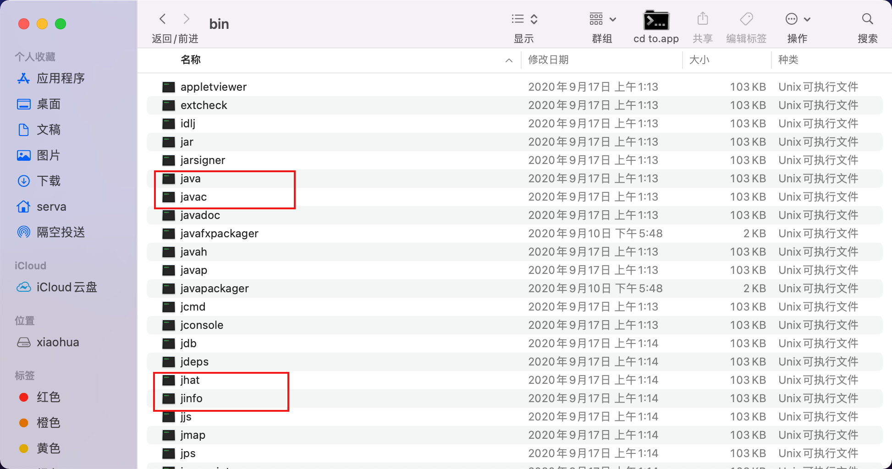
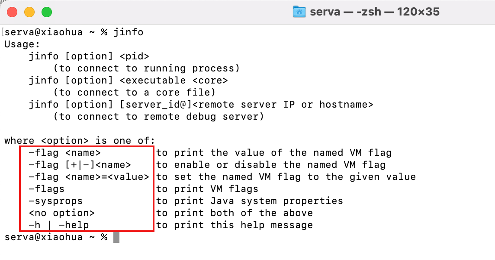
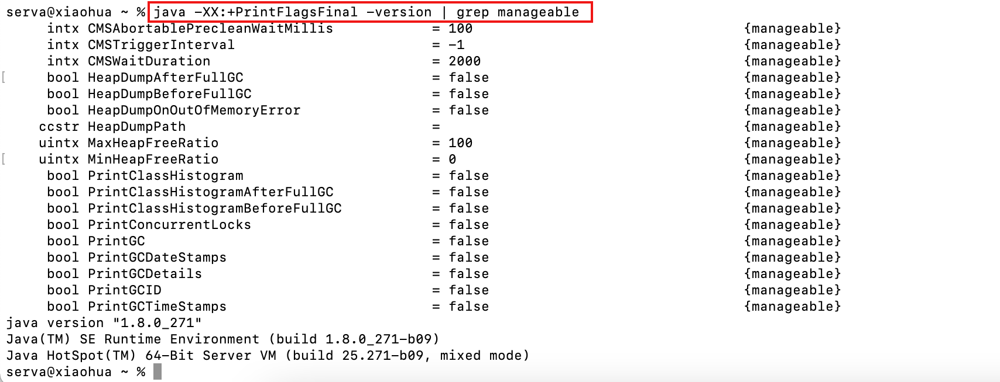
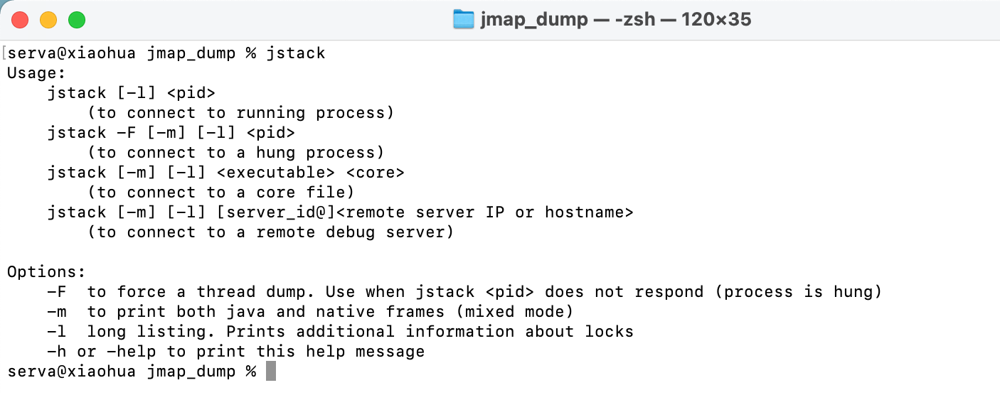
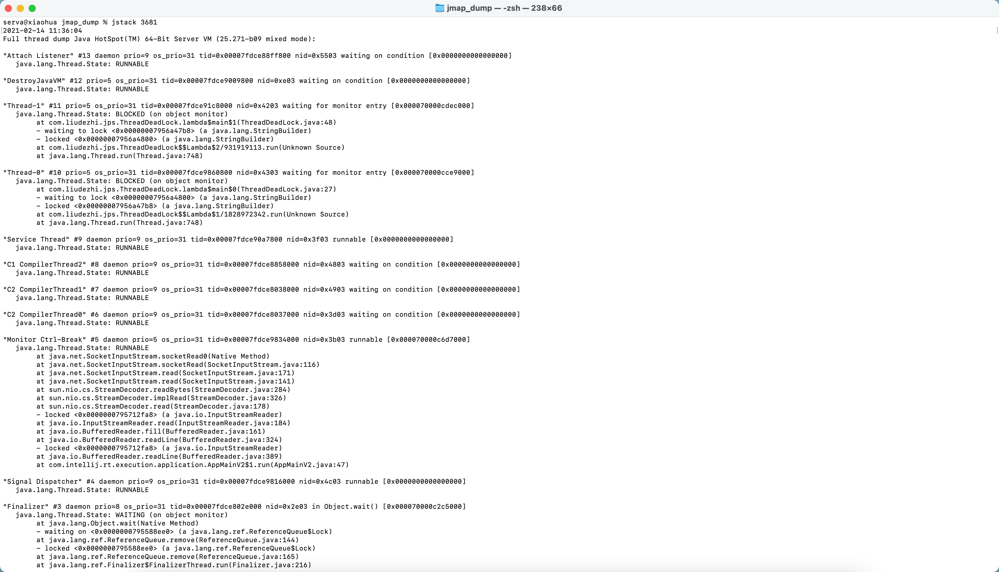
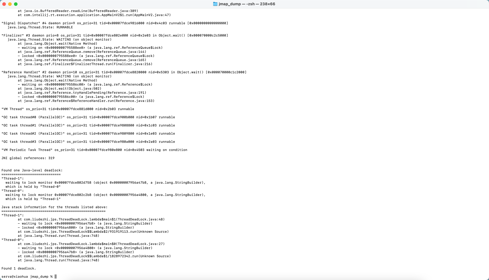
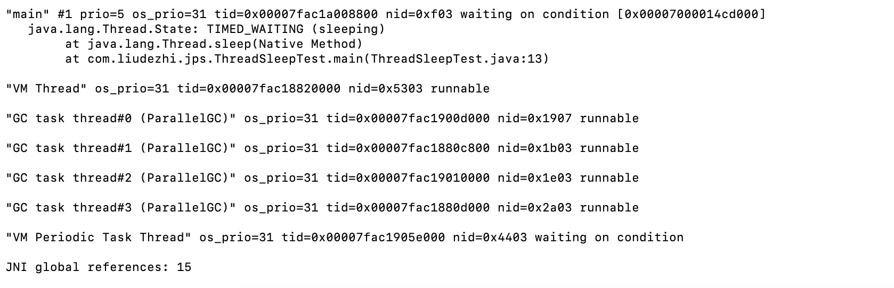
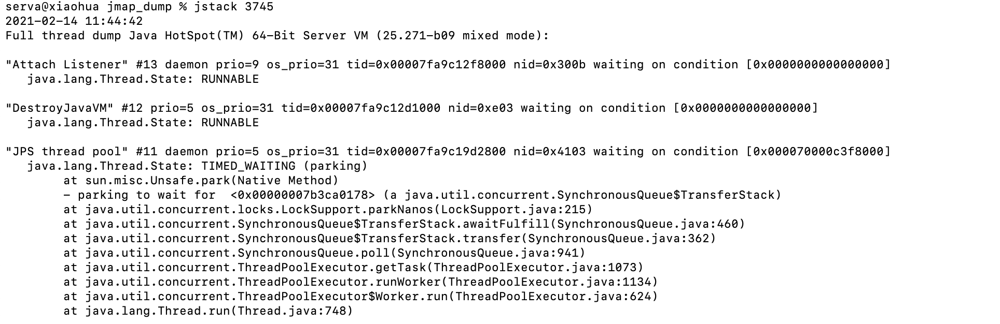
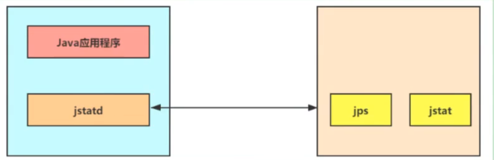

# 02. JVM 监控及诊断工具-命令行篇

- 笔记本：JVM_3_性能监控与调优
- 创建时间：2021-02-12 04:52:00 UTC
- 更新时间：2021-02-14 04:15:19 UTC
- 印象笔记 GUID：6e51c576-ef37-4bff-ab52-914b8c529229

## JVM 监控及诊断工具-命令行篇

### 1. 概述

性能诊断是软件工程师在日常工作中需要经常面对和解决的问题，在用户体验至上的今天，解决好应用的性能问题能带来非常大的收益。

Java 作为最流行的编程语言之一，其应用性能诊断一直受到业界广泛关注。可能造成 Java 应用出现性能问题的因素非常多，例如线程控制、磁盘读写、数据库访问、网络I/O、垃圾收集等。想要定位这些问题，一款优秀的性能诊断工具必不可少。

**体会1:** 使用数据说明问题，使用知识分析问题，使用工具处理问题。
 **体会2：** 无监控，不调优！

#### 简单命令行工具

在我们刚接触 Java 的时候，最先了解的两个命令就是 javac，java，除此之外，还有很多其他的命令供我们使用。进入 安装 JDK 的 bin 目录，可以发现还有一系列辅助工具。这些辅助工具用来获取目标 JVM 不同方面、不同层次的信息，帮助开发人员很好地解决 Java 应用程序的一些疑难杂症。
 mac 系统下：
 

源码：

>
https://hg.openjdk.java.net/jdk/jdk11/file/1ddf9a99e4ad/src/jdk.jcmd/share/classes/sun/tools

### 2. jps：查看正在运行的 Java 进程

#### 2.1. 基本情况

jps（Java Process Status）
 显示指定系统内所有的 HotSpot 虚拟机进行（查看虚拟机进程信息），可用于查询正在运行的虚拟机进程。

说明：对于本地虚拟机进程来说，进程的本地虚拟机 ID 与操作系统的进程 ID 是一致的，是唯一的。

#### 2.2. 基本语法

`jps [options] [hostid]`
 我们还可以通过追加参数，来打印额外的信息。

- options 参数

  - -q：仅仅显示 LVMID（Local Virtual Machine ID），即本地虚拟机唯一 id。不显示主类的名称等。

  - -l：输出应用程序主类的全类名或如果进程执行的是 jar 包，则输出 jar 包完整路径

  - -m：输出虚拟机进程启动时传递给主类 main() 的参数

  - -v：列出虚拟机进程启动时的 JVM 参数。比如：-Xms:20m -Xmx50m 是启动程序指定的 JVM 参数。

说明：以上参数可以综合使用。
 补充：如果某 Java 进程关闭了默认开启的 UsePerfData 参数（即使用参数 -XX:-UsePerfData），那么 jps 命令（以及下面介绍的 jstat）将无法探知该 Java 进程。

- hostid 参数
 RMI 注册表中注册的主机名。
 如果想要远程监控主机上的 Java 程序，需要安装 jstatd。
 对于具有更严格的安全实践的网络场所而言，可能使用一个自定义的策略文件来显示对特定的可信主机或网络的访问，尽管**这种技术容易受到 IP 地址欺诈攻击**。
 如果安全问题无法使用一个定制的策略文件来处理，那么最安全的操作是不运行 jstatd 服务器，而是在本地使用 jstat 和 jps 工具。

### 3. jstat：查看 JVM 统计信息

#### 3.1. 基本情况

jstat（JVM Statistics Monitoring Tool）：用于监视虚拟机各种运行状态信息的命令行工具。它可以显示本地或者远程虚拟机进程中的类装载、内存、垃圾收集、JIT 编译等运行数据。

在没有 GUI 图形界面，只提供了纯文本控制台环境的服务器上，它将是运行期定位虚拟机性能问题的首选工具。常用于检测垃圾回收问题以及内存泄漏问题。

官方文档：

>
https://docs.oracle.com/javase/8/docs/technotes/tools/unix/jstat.html

#### 3.2. 基本语法

它的基本使用语法为：
 `jstat -<option> [-t] [-h<lines>] <vmid> [<interval> [<count>]]`

查看命令相关参数：
 `jstat -h` 或 `jstat -help`

##### option 参数

选项 option 可以由以下值构成：

- **类装载相关的：**

  - -class：显示 ClassLoader 的相关信息：类的装载、卸载数量、总空间、类装载所消耗的时间等。

- **垃圾回收相关的：**

  - -gc：显示与 GC 相关的堆信息。包括 Eden 区、两个 Survivor 区、老年代、永久代等的容量、已用空间、GC 时间合计等信息。

  - -gccapactiy：显示内容与 -gc 基本相同，但输出的主要关注 Java 堆各个区域使用到的最大、最小空间。

  - -gcutil：显示内容与 -gc 基本相同，但输出主要关注已使用空间占总空间的百分比。

  - -gccause：与 -gcutil 功能一样，但是会额外输出导致最后一次或当前正在发生的 GC 产生的原因。

  - -gcnew：显示新生代 GC 状况

  - -gcnewcapacity：显示内容与 -gcnew 基本相同，输出主要关注使用到的最大、最小空间

  - -gcold：显示老年代 GC 状况

  - -gcoldcapacity：显示内容与 -gcold 基本相同，输出主要关注使用到的最大、最小空间

  - -gcpermcapacity：显示永久代使用到的最大、最小空间。

- **JIT 相关的：**

  - -compiler：显示 JIT 编译器编译过的方法、耗时等信息

  - -printcompilation：输出已经被 JIT 编译的方法

**-gc**

- 新生代相关

  - S0C 是第一个幸存者区的大小（字节）

  - S1C 是第二个幸存者区的大小（字节）

  - S0U 是第一个幸存者区已使用的大小（字节）

  - S1U 是第二个幸存者区已使用的大小（字节）

  - EC 是 Eden 空间的大小（字节）

  - EU 是 Eden 空间已使用大小（字节）

- 老年代相关

  - OC 是老年代的大小（字节）

  - OU 是老年代已使用的大小（字节）

- 方法区（元空间）相关

  - MC 是方法区的大小

  - MU 是方法区已使用的大小

  - CCSC 是压缩类空间的大小

  - CCSU 是压缩类空间已使用的大小

- 其它

  - YGC 是指从应用程序启动到采样时 young gc 次数

  - YGCT 是指从应用程序启动到采样时 young gc 消耗的时间（秒）

  - FGC 是指从应用程序启动到采样时 Full GC 次数

  - FGCT 是指从应用程序启动到采样时 Full GC 消耗的时间（秒）

  - GCT 是指从应用程序启动到采样时 GC 的总时间

##### interval 参数

用于指定输出统计数据的周期，单位为毫秒。即：查询间隔

##### count 参数

用于指定查询的总次数

##### -t 参数

可以在输出信息前加上一个 Timestamp 列，显示程序的运行时间。单位：秒

**经验：**
 我们可以比较 Java 进程的启动时间以及总 GC 时间（GCT 列），或者两次测量的间隔时间以及总 GC 的增量，来得出 GC 时间占运行时间的比例。（jstat -gc -t 进程号 间隔时间 次数）

如果该比例超过 20%，则说明目前堆的压力较大；如果该比例超过 90%，则说明堆里面几乎没有可用空间，随时都可能抛出 OOM 异常。

##### -h 参数

可以在周期性数据输出时，输出多少行数据后输出一个表头信息

#### 3.3. 补充

jstat 还可以用来判断是否出现内存泄漏。
 **第一步：** 在长时间运行的 Java 程序中，我们可以运行 jstat 命令连续获取多行性能数据，并取这几行数据中 OU 列（即已占用的老年代内存）的最小值。
 **第二步：** 我们每隔一段较长的时间重复一次上述操作，来获得多组 OU 最小值。如果这些值呈上涨趋势，则说明该 Java 程序的老年代内存已使用量在不断上涨，这意味着无法回收的对象在不断增加，因此很有可能存在内存泄漏。

### 4. jinfo：实时查看和修改 JVM 配置参数

#### 4.1. 基本情况

jinfo（Configuration Info for Java）
 查看虚拟机配置参数信息，也可用于调整虚拟机的配置参数。

在很多情况下，Java 应用程序不会指定所有的 Java 虚拟机参数。而此时，开发人员可能不知道某一个具体的 Java 虚拟机参数的默认值。在这种情况下，可能需要通过查找文档获取某个参数的默认值。这个查找过程可能是非常艰难的。但是有了 jinfo 工具，开发人员可以很方便地找到 Java 虚拟机参数的当前值。
 
 官方帮助文档：

>
https://docs.oracle.com/en/java/javase/11/tools/jinfo.html

#### 4.2. 基本语法

它的基本使用语法为：
 jinfo [options] pid

说明：java 进程 ID 必须要加上
 **[options]:**

 | 选项 | 选项说明
 | no option | 输出全部的参数和系统属性
 | -flag name | 输出对应名称的参数
 | -flag[+-]name | 开启或关闭对应名称的参数 只有被标记为 manageable 的参数才可以被动态修改
 | -flag name=value | 设置对应名称的参数
 | -flags | 输出全部的参数
 | -sysprops | 输出系统属性

##### 查看

- `jinfo -sysprops PID`
 可以查看由 `System.getProperties()` 取得的参数

- `jinfo -flags PID`
 查看曾经赋过值的一些参数

- `jinfo -flag 具体参数 PID`
 查看某个 Java 进程的具体参数

##### 修改

jinfo 不仅可以查看运行时某一个 Java 虚拟机参数的实际取之，甚至可以在运行时修改部分参数，并使之生效。

但是，并非所有参数都支持动态修改。参数只有被标记为 manageable 的 flag 可以被事实修改。其实，这个修改能力是极其有限的。
 # 可以查看被标记为 manageable 的参数
 `java -XX:+PrintFlagsFinal -version | grep manageable`
 

- 针对 boolean 类型
 `jinfo -flag[+|-]具体参数 PID`

- 针对非 boolean 类型
 `jinfo -flag 具体参数=具体参数值 PID`

#### 4.3. 扩展

- `java -XX:+PrintFlagsInitial`
 查看所有 JVM 参数启动的初始值

- `java -XX:+PrintFlagsFinal`
 查看所有 JVM 参数的最终值

- `java -XX:+PrintCommandLineFlags`
 查看那些已经被用户或者 JVM 设置过的详细的 XX 参数的名称和值

### 5. jmap：导出内存映射文件&内存使用情况

#### 5.1. 基本情况

jmap（JVM Memory Map）：作用一方面是获取 dump 文件（堆转储快照文件，二进制文件），它还可以获取目标 Java 进程的内存相关信息，包括 Java 堆各区域的使用情况、堆中对象的统计信息、类加载信息等。

开发人员可以在控制台输入命令 `jmap -help` 查阅 jmap 工具的具体使用方式和一些标准选项配置。

官方帮助文档：

>
https://docs.oracle.com/en/java/javase/11/tools/jmap.html

#### 5.2. 基本语法

它的基本使用语法为：

- jmap [option] <pid>

- jmap [option] <executable <core>

- jmap [option] [server_id@]<remote server IP or hostname>

其中 option 包括：

 | 选项 | 作用
 | `-dump` | 生成 dump 文件
 | `-finalizerinfo` | 显示在 F-Queue 中等待 Finalizer 线程执行 finalize 方法的对象
 | `-heap` | 输出整个堆空间的详细信息，包括 GC 的使用、堆配置信息，以及内存的使用信息等
 | `-histo` | 输出堆中对象的统计信息，包括类、实例数量和合计容量
 | `-permstat` | 以 ClassLoader 为统计口径输出永久代的内存状态信息
 | `-F` | 当虚拟机进程对 -dump 选项没有任何响应时，可以使用此选项强制执行生成 dump 文件

**说明：** 这些参数和 linux 下输入显示的命令多少会有不同，包括也受 JDK 版本的影响。

- **`-dump`** 生成 Java 堆转储快照：dump 文件
 特别的：-dump:live 只保存堆中的存活对象

- **`-heap`**
 输出整个堆空间的详细信息，包括 GC 的使用、堆配置信息，以及内存的使用信息等

- **`-histo`** 输出堆中对象的统计信息，包括类、实例数量和合计容量
 特别的：-histo:live 只统计堆中的存活对象

- `-permstat` 以 ClassLoader 为统计口径输出永久代的内存状态信息
 **仅 linux/solaris 平台有效**

- `-finalizerinfo` 显示在 F-Queue 中等待 Finalizer 线程执行 finalize 方法的对象
 **仅 linux/solaris 平台有效**

- `-F` 当虚拟机进程对 -dump 选项没有任何响应时，可以使用此选项强制执行生成 dump 文件
 **仅 linux/solaris 平台有效**

- `-h | -help jmap` 工具使用的帮助命令

- `-J <flag>` 传递参数给 jamp 启动的 JVM

#### 5.3. 使用1:导出内存映像文件

一般来说，使用 jmap 指令生成 dump 文件的操作算得上是最常用的 jmap 命令之一，将堆中所有存活对象导出至一个文件之中。

Heap Dump 又叫做堆存储文件，指一个 Java 进程在某个时间点的内存快照。Heap Dump 在触发内存快照的时候会保存此刻的信息如下：

- All Objects
 Class, fields, primitive values and references

- All Classes
 ClassLoader, name, super class, static fields

- Garbage Collection Roots
 Objects defined to be reachable by the JVM

- Thread Stacks and Local Variables
 The call-stacks of threads at the moment of the snapshot, and per-frame information about local objects

说明：

1. 通常在写 Heap Dump 文件前会触发一次 Full GC，所以 heap dump 文件里保存的都是 Full GC 后留下的对象信息。

1. 由于生成 dump 文件比较耗时，因此大家需要耐心等待，尤其是大内存镜像生成 dump 文件，则需要耗费更长的时间来完成。

***手动的方式***
 `jmap -dump:format=b,file=<filename.hprof> <pid>`
 **`jmap -dump:live,format=b,file=<filename.hprof> <pid>`**

***自动的方式***
 当程序发生 OOM 退出系统时，一些瞬时信息都随着程序的终止而消失，而重现 OOM 问题往往比较困难或者耗时。此时若能在 OOM 时，自动导出 dump 文件就显得非常迫切。

这里介绍一种比较常用的取得堆快照文件的方法，即使用：
 -XX:+HeapDumpOnOutOfMemoryError：在程序发生 OOM 时，导出应用程序的当前堆快照。
 -XX:HeapDumpPath：可以指定堆快照的保存位置。

比如：`-Xmx100m -XX:+HeapDumpOnOutOfMemoryError -XX:HeapDumpPath=/Users/serva/Desktop/jmap_dump/7.hprof`

`-XX:+HeapDumpOnOutOfMemoryError`
 `-XX:+HeapDumpPath=<filename.hprof>`

#### 5.4. 使用2:显示堆内存相关信息

`jmap -heap pid`
 `jmap -histo pid`

#### 5.5. 使用3:其它作用

`jmap -permstat pid`：查看系统的 ClassLoader 信息
 `jmap -finalizerinfo pid`：查看堆积在 finalizer 队列中的对象

#### 5.6. 小结

由于 jmap 将访问堆中的所有对象，为了保证在此过程中不被应用线程干扰，jmap 需要借助安全点机制，让所有线程停留在不改变堆中数据的状态。也就是说，由 jmap 导出的堆快照必定是安全点位置的。这可能导致基于该快照的分析结果存在偏差。

举个例子，假设在编译生成的机器码中，某些对象的生命周期在两个安全点之间，那么 :live 选项将无法探知到这些对象。

另外，如果某个线程长时间无法跑到安全点，jmap 将一直等下去。与前面讲的 jstat 则不同，垃圾回收器会主动将 jstat 所需要的摘要数据保存至固定位置之中，而 jstat 只需要直接读取即可。

### 6. jhat：JDK 自带堆分析工具

#### 6.1. 基本情况

jhat（JVM Heap Analysis Tool）

Sun JDK 提供的 jhat 命令与 jmap 命令搭配使用，用于分析 jmap 生成的 heap dump 文件（堆转储快照）。jhat 内置了一个微型的 HTTP/HTML 服务器，生成 dump 文件的分析结果后，用户可以在浏览器中查看分析结果（分析虚拟机转储快照信息）。

使用了 jhat 命令，就启动了一个 http 服务，端口是 7000，即：http://localhost:7000，就可以在浏览器里分析。

说明：jhat 命令在 JDK9、JDK10 中已经被删除，官方建议用 VisualVM 代替。

#### 6.2. 基本语法

它的基本使用语法为：
 `jhat [option] [dumpfile]`

- option 参数：-stack false | true
 关闭 ｜ 打开对象分配调用栈跟踪

- option 参数：-refs false | true
 关闭 ｜ 打开对象引用跟踪

- option 参数：-port port-number
 设置 jhat HTTP Server 的端口，默认7000

- option 参数：-exclude exclude-file
 执行对象查询时需要排除的数据成员

- option 参数：-baseline exclude-file
 指定一个基准堆转储

- option 参数：-debug int
 设置 debug 级别

- option 参数：-version
 启动后显示版本信息就退出

- option 参数：-J <flag>
 传入启动参数，比如：-J -Xmx512m

### 7. jstack：打印 JVM 中线程快照

#### 7.1. 基本情况

jstack（JVM Stack Trace）：用于生成虚拟机指定进程当前时刻的线程快照（虚拟机堆栈跟踪）。线程快照就是当前虚拟机内指定进程的每一条线程正在执行的方法堆栈的集合。

生成线程快照的作用：可以用于定位线程出现长时间停顿的原因，如线程间死锁、死循环、请求外部资源导致的长时间等待等问题。这些都是导致线程长时间停顿的常见原因。当线程出现停顿时，就可以用 jstatck 显示各个线程调用的堆栈情况。

官方帮助文档：

>
https://docs.oracle.com/en/java/javase/11/tools/jstack.html

在 thread dump 中，要留意下面几种状态：

- **死锁，Deadlock（重点关注）**

- **等待资源，Waiting on condition（重点关注）**

- **等待获取监视器，Waiting on monitor entry（重点关注）**

- **阻塞，Blocked（重点关注）**

- 执行中，Runnable

- 暂停，Suspended

- 对象等待中，Object.wait() 或 TIMED_WAITING

- 停止，Parked

#### 7.2. 基本语法


 它的基本使用语法为：
 `jstack option pid`

jstack 管理远程进程的话，需要在远程程序启动参数中增加：

```
-Djava.rmi.server.hostname=...
-Dcom.sun.management.jmxreomte
-Dcom.sun.management.jmxremote.port=8888
-Dcom.sun.management.jmxremote.authenticate=false
-Dcom.sun.management.jmxremote.ssl=false

```

**eg：**

```
/**
 * 演示线程的死锁问题
 */
public class ThreadDeadLock {
    public static void main(String[] args) {
        StringBuilder s1 = new StringBuilder();
        StringBuilder s2 = new StringBuilder();

        new Thread(() -> {
            synchronized (s1) {
                s1.append("a");
                s2.append("1");

                try {
                    Thread.sleep(100);
                } catch (InterruptedException e) {
                    e.printStackTrace();
                }

                synchronized (s2) {
                    s1.append("b");
                    s2.append("2");

                    System.out.println(s1);
                    System.out.println(s2);
                }
            }
        }).start();

        new Thread(() -> {
            synchronized (s2) {
                s1.append("c");
                s2.append("3");

                try {
                    Thread.sleep(100);
                } catch (InterruptedException e) {
                    e.printStackTrace();
                }

                synchronized (s1) {
                    s1.append("d");
                    s2.append("4");

                    System.out.println(s1);
                    System.out.println(s2);
                }
            }
        }).start();
    }
}

```


 

```
/**
 * 演示线程：TIMED_WAITING
 */
public class ThreadSleepTest {
    public static void main(String[] args) {
        System.out.println("hello - 1");
        try {
            Thread.sleep(1000 * 60 * 10);
        } catch (InterruptedException e) {
            e.printStackTrace();
        }
        System.out.println("hello - 2");
    }
}

```



```
/**
 * 演示线程的同步
 */
public class ThreadSyncTest {
    public static void main(String[] args) {
        Number number = new Number();
        Thread t1 = new Thread(number);
        Thread t2 = new Thread(number);

        t1.setName("线程1");
        t2.setName("线程2");

        t1.start();
        t2.start();
    }
}

class Number implements Runnable {
    private int number = 1;
    @Override
    public void run() {
        while (true) {
            synchronized (this) {
                if (number <= 100) {
                    try {
                        Thread.sleep(500);
                    } catch (InterruptedException e) {
                        e.printStackTrace();
                    }
                    System.out.println(Thread.currentThread().getName() + ":" + number);
                    number++;
                } else {
                    break;
                }
            }
        }
    }
}

```



- option 参数：-F 当正常输入的请求不被响应时，强制输出线程堆栈

- option 参数：-l 除堆栈外，显示关于锁的附加信息

- option 参数：-m 如果调用本地方法的话，可以显示 C/C++ 的堆栈

- option 参数：-h 帮助操作

**扩展：** 使用代码实现类似 jstack 功能

```
public class AllStackTrace {
    public static void main(String[] args) {
        Map<Thread, StackTraceElement[]> all = Thread.getAllStackTraces();
        Set<Map.Entry<Thread, StackTraceElement[]>> entries = all.entrySet();
        for (Map.Entry<Thread, StackTraceElement[]> entry : entries) {
            Thread t = entry.getKey();
            StackTraceElement[] value = entry.getValue();
            System.out.println("[Thread name is: " + t.getName() + "]");
            for (StackTraceElement s : value) {
                System.out.println("\t" + s.toString());
            }
        }
    }
}

```

### 8. jcmd：多功能命令行

#### 8.1. 基本情况

在 JDK1.7 以后，新增了一个命令行工具 jcmd。
 它是一个多功能的工具，可以用来实现前面除了 jstat 之外所有命令的功能。比如：用它来导出堆、内存使用、查看 Java 进程、导出线程信息、执行GC、JVM 运行时间等。

官方帮助文档：

>
https://docs.oracle.com/en/java/javese/11/tools/jcmd.html

jcmd 拥有 jmap 的大部分功能，并且在 Oracle 的官方网站上也推荐使用 jcmd 命令代替 jmap 命令。

#### 8.2. 基本语法

- `jcmd -l` 列出所有的 JVM 进程

- `jcmd pid help` 针对指定的进程，列出支持的命令

- `jcmd pid 具体命令` 显示指定进程的指令命令的数据
 可以探索 jcmd 中的下述功能，寻找适合的项目监控项：

  - Compiler.CodeHeap_Analytics

  - Compiler.codecache

  - Compiler.codelist

  - Compiler.directives_add

  - Compiler.directives_clear

  - Compiler.directives_print

  - Compiler.directives_remove

  - Compiler.queue

  - GC.class_histogram

  - GC.class_stats

  - GC.finalizer_info

  - GC.heap_dump

  - GC.heap_info

  - GC.run

  - GC.run_finalization

  - VM.class_hierarchy

  - VM.classloader_stats

  - VM.classloaders

  - VM.command_line

  - VM.dynlibs

  - VM.flags

  - VM.info

  - VM.log

  - VM.metaspace

  - VM.native_memory

  - VM.print_touched_methods

  - VM.set_flag

  - VM.stringtable

  - VM.symboltable

  - VM.system_properties

  - VM.systemdictionary

  - VM.unlock_commercial_features

  - VM.uptime

  - VM.version

### 9. jstatd：远程主机信息收集

之前的指令只涉及到监控本机的 Java 应用程序，而在这些工具中，一些监控工具也支持远程计算机的监控（如 jps、jstat）。为了启用远程监控，则需要配合 jstatd 工具。

命令 jstatd 是一个 RMI 服务端程序，它的作用相当于代理服务器，建立本地计算机与远程监控工具的通信。jstatd 服务器将本机的 Java 应用程序信息传递到远程计算机。
 

%23%23%20JVM%20%E7%9B%91%E6%8E%A7%E5%8F%8A%E8%AF%8A%E6%96%AD%E5%B7%A5%E5%85%B7-%E5%91%BD%E4%BB%A4%E8%A1%8C%E7%AF%87%0A%23%23%23%201.%20%E6%A6%82%E8%BF%B0%0A%E6%80%A7%E8%83%BD%E8%AF%8A%E6%96%AD%E6%98%AF%E8%BD%AF%E4%BB%B6%E5%B7%A5%E7%A8%8B%E5%B8%88%E5%9C%A8%E6%97%A5%E5%B8%B8%E5%B7%A5%E4%BD%9C%E4%B8%AD%E9%9C%80%E8%A6%81%E7%BB%8F%E5%B8%B8%E9%9D%A2%E5%AF%B9%E5%92%8C%E8%A7%A3%E5%86%B3%E7%9A%84%E9%97%AE%E9%A2%98%EF%BC%8C%E5%9C%A8%E7%94%A8%E6%88%B7%E4%BD%93%E9%AA%8C%E8%87%B3%E4%B8%8A%E7%9A%84%E4%BB%8A%E5%A4%A9%EF%BC%8C%E8%A7%A3%E5%86%B3%E5%A5%BD%E5%BA%94%E7%94%A8%E7%9A%84%E6%80%A7%E8%83%BD%E9%97%AE%E9%A2%98%E8%83%BD%E5%B8%A6%E6%9D%A5%E9%9D%9E%E5%B8%B8%E5%A4%A7%E7%9A%84%E6%94%B6%E7%9B%8A%E3%80%82%0A%0AJava%20%E4%BD%9C%E4%B8%BA%E6%9C%80%E6%B5%81%E8%A1%8C%E7%9A%84%E7%BC%96%E7%A8%8B%E8%AF%AD%E8%A8%80%E4%B9%8B%E4%B8%80%EF%BC%8C%E5%85%B6%E5%BA%94%E7%94%A8%E6%80%A7%E8%83%BD%E8%AF%8A%E6%96%AD%E4%B8%80%E7%9B%B4%E5%8F%97%E5%88%B0%E4%B8%9A%E7%95%8C%E5%B9%BF%E6%B3%9B%E5%85%B3%E6%B3%A8%E3%80%82%E5%8F%AF%E8%83%BD%E9%80%A0%E6%88%90%20Java%20%E5%BA%94%E7%94%A8%E5%87%BA%E7%8E%B0%E6%80%A7%E8%83%BD%E9%97%AE%E9%A2%98%E7%9A%84%E5%9B%A0%E7%B4%A0%E9%9D%9E%E5%B8%B8%E5%A4%9A%EF%BC%8C%E4%BE%8B%E5%A6%82%E7%BA%BF%E7%A8%8B%E6%8E%A7%E5%88%B6%E3%80%81%E7%A3%81%E7%9B%98%E8%AF%BB%E5%86%99%E3%80%81%E6%95%B0%E6%8D%AE%E5%BA%93%E8%AE%BF%E9%97%AE%E3%80%81%E7%BD%91%E7%BB%9CI%2FO%E3%80%81%E5%9E%83%E5%9C%BE%E6%94%B6%E9%9B%86%E7%AD%89%E3%80%82%E6%83%B3%E8%A6%81%E5%AE%9A%E4%BD%8D%E8%BF%99%E4%BA%9B%E9%97%AE%E9%A2%98%EF%BC%8C%E4%B8%80%E6%AC%BE%E4%BC%98%E7%A7%80%E7%9A%84%E6%80%A7%E8%83%BD%E8%AF%8A%E6%96%AD%E5%B7%A5%E5%85%B7%E5%BF%85%E4%B8%8D%E5%8F%AF%E5%B0%91%E3%80%82%0A%0A**%E4%BD%93%E4%BC%9A1%3A**%20%E4%BD%BF%E7%94%A8%E6%95%B0%E6%8D%AE%E8%AF%B4%E6%98%8E%E9%97%AE%E9%A2%98%EF%BC%8C%E4%BD%BF%E7%94%A8%E7%9F%A5%E8%AF%86%E5%88%86%E6%9E%90%E9%97%AE%E9%A2%98%EF%BC%8C%E4%BD%BF%E7%94%A8%E5%B7%A5%E5%85%B7%E5%A4%84%E7%90%86%E9%97%AE%E9%A2%98%E3%80%82%0A**%E4%BD%93%E4%BC%9A2%EF%BC%9A**%20%E6%97%A0%E7%9B%91%E6%8E%A7%EF%BC%8C%E4%B8%8D%E8%B0%83%E4%BC%98%EF%BC%81%0A%0A%23%23%23%23%20%E7%AE%80%E5%8D%95%E5%91%BD%E4%BB%A4%E8%A1%8C%E5%B7%A5%E5%85%B7%0A%E5%9C%A8%E6%88%91%E4%BB%AC%E5%88%9A%E6%8E%A5%E8%A7%A6%20Java%20%E7%9A%84%E6%97%B6%E5%80%99%EF%BC%8C%E6%9C%80%E5%85%88%E4%BA%86%E8%A7%A3%E7%9A%84%E4%B8%A4%E4%B8%AA%E5%91%BD%E4%BB%A4%E5%B0%B1%E6%98%AF%20javac%EF%BC%8Cjava%EF%BC%8C%E9%99%A4%E6%AD%A4%E4%B9%8B%E5%A4%96%EF%BC%8C%E8%BF%98%E6%9C%89%E5%BE%88%E5%A4%9A%E5%85%B6%E4%BB%96%E7%9A%84%E5%91%BD%E4%BB%A4%E4%BE%9B%E6%88%91%E4%BB%AC%E4%BD%BF%E7%94%A8%E3%80%82%E8%BF%9B%E5%85%A5%20%E5%AE%89%E8%A3%85%20JDK%20%E7%9A%84%20bin%20%E7%9B%AE%E5%BD%95%EF%BC%8C%E5%8F%AF%E4%BB%A5%E5%8F%91%E7%8E%B0%E8%BF%98%E6%9C%89%E4%B8%80%E7%B3%BB%E5%88%97%E8%BE%85%E5%8A%A9%E5%B7%A5%E5%85%B7%E3%80%82%E8%BF%99%E4%BA%9B%E8%BE%85%E5%8A%A9%E5%B7%A5%E5%85%B7%E7%94%A8%E6%9D%A5%E8%8E%B7%E5%8F%96%E7%9B%AE%E6%A0%87%20JVM%20%E4%B8%8D%E5%90%8C%E6%96%B9%E9%9D%A2%E3%80%81%E4%B8%8D%E5%90%8C%E5%B1%82%E6%AC%A1%E7%9A%84%E4%BF%A1%E6%81%AF%EF%BC%8C%E5%B8%AE%E5%8A%A9%E5%BC%80%E5%8F%91%E4%BA%BA%E5%91%98%E5%BE%88%E5%A5%BD%E5%9C%B0%E8%A7%A3%E5%86%B3%20Java%20%E5%BA%94%E7%94%A8%E7%A8%8B%E5%BA%8F%E7%9A%84%E4%B8%80%E4%BA%9B%E7%96%91%E9%9A%BE%E6%9D%82%E7%97%87%E3%80%82%0Amac%20%E7%B3%BB%E7%BB%9F%E4%B8%8B%EF%BC%9A%0A!%5B749ec2bf9e1d009cd396ea800d54fdc8.png%5D(evernotecid%3A%2F%2F90F5C43D-AEAE-49B2-85BB-D02B6A52C764%2Fappyinxiangcom%2F25356149%2FENResource%2Fp1627)%0A%0A%E6%BA%90%E7%A0%81%EF%BC%9A%0A%3E%20https%3A%2F%2Fhg.openjdk.java.net%2Fjdk%2Fjdk11%2Ffile%2F1ddf9a99e4ad%2Fsrc%2Fjdk.jcmd%2Fshare%2Fclasses%2Fsun%2Ftools%0A%0A%23%23%23%202.%20jps%EF%BC%9A%E6%9F%A5%E7%9C%8B%E6%AD%A3%E5%9C%A8%E8%BF%90%E8%A1%8C%E7%9A%84%20Java%20%E8%BF%9B%E7%A8%8B%0A%23%23%23%23%202.1.%20%E5%9F%BA%E6%9C%AC%E6%83%85%E5%86%B5%0Ajps%EF%BC%88Java%20Process%20Status%EF%BC%89%0A%E6%98%BE%E7%A4%BA%E6%8C%87%E5%AE%9A%E7%B3%BB%E7%BB%9F%E5%86%85%E6%89%80%E6%9C%89%E7%9A%84%20HotSpot%20%E8%99%9A%E6%8B%9F%E6%9C%BA%E8%BF%9B%E8%A1%8C%EF%BC%88%E6%9F%A5%E7%9C%8B%E8%99%9A%E6%8B%9F%E6%9C%BA%E8%BF%9B%E7%A8%8B%E4%BF%A1%E6%81%AF%EF%BC%89%EF%BC%8C%E5%8F%AF%E7%94%A8%E4%BA%8E%E6%9F%A5%E8%AF%A2%E6%AD%A3%E5%9C%A8%E8%BF%90%E8%A1%8C%E7%9A%84%E8%99%9A%E6%8B%9F%E6%9C%BA%E8%BF%9B%E7%A8%8B%E3%80%82%0A%0A%E8%AF%B4%E6%98%8E%EF%BC%9A%E5%AF%B9%E4%BA%8E%E6%9C%AC%E5%9C%B0%E8%99%9A%E6%8B%9F%E6%9C%BA%E8%BF%9B%E7%A8%8B%E6%9D%A5%E8%AF%B4%EF%BC%8C%E8%BF%9B%E7%A8%8B%E7%9A%84%E6%9C%AC%E5%9C%B0%E8%99%9A%E6%8B%9F%E6%9C%BA%20ID%20%E4%B8%8E%E6%93%8D%E4%BD%9C%E7%B3%BB%E7%BB%9F%E7%9A%84%E8%BF%9B%E7%A8%8B%20ID%20%E6%98%AF%E4%B8%80%E8%87%B4%E7%9A%84%EF%BC%8C%E6%98%AF%E5%94%AF%E4%B8%80%E7%9A%84%E3%80%82%0A%0A%23%23%23%23%202.2.%20%E5%9F%BA%E6%9C%AC%E8%AF%AD%E6%B3%95%0A%60jps%20%5Boptions%5D%20%5Bhostid%5D%60%0A%E6%88%91%E4%BB%AC%E8%BF%98%E5%8F%AF%E4%BB%A5%E9%80%9A%E8%BF%87%E8%BF%BD%E5%8A%A0%E5%8F%82%E6%95%B0%EF%BC%8C%E6%9D%A5%E6%89%93%E5%8D%B0%E9%A2%9D%E5%A4%96%E7%9A%84%E4%BF%A1%E6%81%AF%E3%80%82%0A-%20options%20%E5%8F%82%E6%95%B0%0A%20%20%20%20-%20-q%EF%BC%9A%E4%BB%85%E4%BB%85%E6%98%BE%E7%A4%BA%20LVMID%EF%BC%88Local%20Virtual%20Machine%20ID%EF%BC%89%EF%BC%8C%E5%8D%B3%E6%9C%AC%E5%9C%B0%E8%99%9A%E6%8B%9F%E6%9C%BA%E5%94%AF%E4%B8%80%20id%E3%80%82%E4%B8%8D%E6%98%BE%E7%A4%BA%E4%B8%BB%E7%B1%BB%E7%9A%84%E5%90%8D%E7%A7%B0%E7%AD%89%E3%80%82%0A%20%20%20%20-%20-l%EF%BC%9A%E8%BE%93%E5%87%BA%E5%BA%94%E7%94%A8%E7%A8%8B%E5%BA%8F%E4%B8%BB%E7%B1%BB%E7%9A%84%E5%85%A8%E7%B1%BB%E5%90%8D%E6%88%96%E5%A6%82%E6%9E%9C%E8%BF%9B%E7%A8%8B%E6%89%A7%E8%A1%8C%E7%9A%84%E6%98%AF%20jar%20%E5%8C%85%EF%BC%8C%E5%88%99%E8%BE%93%E5%87%BA%20jar%20%E5%8C%85%E5%AE%8C%E6%95%B4%E8%B7%AF%E5%BE%84%0A%20%20%20%20-%20-m%EF%BC%9A%E8%BE%93%E5%87%BA%E8%99%9A%E6%8B%9F%E6%9C%BA%E8%BF%9B%E7%A8%8B%E5%90%AF%E5%8A%A8%E6%97%B6%E4%BC%A0%E9%80%92%E7%BB%99%E4%B8%BB%E7%B1%BB%20main()%20%E7%9A%84%E5%8F%82%E6%95%B0%0A%20%20%20%20-%20-v%EF%BC%9A%E5%88%97%E5%87%BA%E8%99%9A%E6%8B%9F%E6%9C%BA%E8%BF%9B%E7%A8%8B%E5%90%AF%E5%8A%A8%E6%97%B6%E7%9A%84%20JVM%20%E5%8F%82%E6%95%B0%E3%80%82%E6%AF%94%E5%A6%82%EF%BC%9A-Xms%3A20m%20-Xmx50m%20%E6%98%AF%E5%90%AF%E5%8A%A8%E7%A8%8B%E5%BA%8F%E6%8C%87%E5%AE%9A%E7%9A%84%20JVM%20%E5%8F%82%E6%95%B0%E3%80%82%0A%0A%E8%AF%B4%E6%98%8E%EF%BC%9A%E4%BB%A5%E4%B8%8A%E5%8F%82%E6%95%B0%E5%8F%AF%E4%BB%A5%E7%BB%BC%E5%90%88%E4%BD%BF%E7%94%A8%E3%80%82%0A%E8%A1%A5%E5%85%85%EF%BC%9A%E5%A6%82%E6%9E%9C%E6%9F%90%20Java%20%E8%BF%9B%E7%A8%8B%E5%85%B3%E9%97%AD%E4%BA%86%E9%BB%98%E8%AE%A4%E5%BC%80%E5%90%AF%E7%9A%84%20UsePerfData%20%E5%8F%82%E6%95%B0%EF%BC%88%E5%8D%B3%E4%BD%BF%E7%94%A8%E5%8F%82%E6%95%B0%20-XX%3A-UsePerfData%EF%BC%89%EF%BC%8C%E9%82%A3%E4%B9%88%20jps%20%E5%91%BD%E4%BB%A4%EF%BC%88%E4%BB%A5%E5%8F%8A%E4%B8%8B%E9%9D%A2%E4%BB%8B%E7%BB%8D%E7%9A%84%20jstat%EF%BC%89%E5%B0%86%E6%97%A0%E6%B3%95%E6%8E%A2%E7%9F%A5%E8%AF%A5%20Java%20%E8%BF%9B%E7%A8%8B%E3%80%82%0A%0A-%20hostid%20%E5%8F%82%E6%95%B0%0ARMI%20%E6%B3%A8%E5%86%8C%E8%A1%A8%E4%B8%AD%E6%B3%A8%E5%86%8C%E7%9A%84%E4%B8%BB%E6%9C%BA%E5%90%8D%E3%80%82%0A%E5%A6%82%E6%9E%9C%E6%83%B3%E8%A6%81%E8%BF%9C%E7%A8%8B%E7%9B%91%E6%8E%A7%E4%B8%BB%E6%9C%BA%E4%B8%8A%E7%9A%84%20Java%20%E7%A8%8B%E5%BA%8F%EF%BC%8C%E9%9C%80%E8%A6%81%E5%AE%89%E8%A3%85%20jstatd%E3%80%82%0A%E5%AF%B9%E4%BA%8E%E5%85%B7%E6%9C%89%E6%9B%B4%E4%B8%A5%E6%A0%BC%E7%9A%84%E5%AE%89%E5%85%A8%E5%AE%9E%E8%B7%B5%E7%9A%84%E7%BD%91%E7%BB%9C%E5%9C%BA%E6%89%80%E8%80%8C%E8%A8%80%EF%BC%8C%E5%8F%AF%E8%83%BD%E4%BD%BF%E7%94%A8%E4%B8%80%E4%B8%AA%E8%87%AA%E5%AE%9A%E4%B9%89%E7%9A%84%E7%AD%96%E7%95%A5%E6%96%87%E4%BB%B6%E6%9D%A5%E6%98%BE%E7%A4%BA%E5%AF%B9%E7%89%B9%E5%AE%9A%E7%9A%84%E5%8F%AF%E4%BF%A1%E4%B8%BB%E6%9C%BA%E6%88%96%E7%BD%91%E7%BB%9C%E7%9A%84%E8%AE%BF%E9%97%AE%EF%BC%8C%E5%B0%BD%E7%AE%A1**%E8%BF%99%E7%A7%8D%E6%8A%80%E6%9C%AF%E5%AE%B9%E6%98%93%E5%8F%97%E5%88%B0%20IP%20%E5%9C%B0%E5%9D%80%E6%AC%BA%E8%AF%88%E6%94%BB%E5%87%BB**%E3%80%82%0A%E5%A6%82%E6%9E%9C%E5%AE%89%E5%85%A8%E9%97%AE%E9%A2%98%E6%97%A0%E6%B3%95%E4%BD%BF%E7%94%A8%E4%B8%80%E4%B8%AA%E5%AE%9A%E5%88%B6%E7%9A%84%E7%AD%96%E7%95%A5%E6%96%87%E4%BB%B6%E6%9D%A5%E5%A4%84%E7%90%86%EF%BC%8C%E9%82%A3%E4%B9%88%E6%9C%80%E5%AE%89%E5%85%A8%E7%9A%84%E6%93%8D%E4%BD%9C%E6%98%AF%E4%B8%8D%E8%BF%90%E8%A1%8C%20jstatd%20%E6%9C%8D%E5%8A%A1%E5%99%A8%EF%BC%8C%E8%80%8C%E6%98%AF%E5%9C%A8%E6%9C%AC%E5%9C%B0%E4%BD%BF%E7%94%A8%20jstat%20%E5%92%8C%20jps%20%E5%B7%A5%E5%85%B7%E3%80%82%0A%0A%0A%23%23%23%203.%20jstat%EF%BC%9A%E6%9F%A5%E7%9C%8B%20JVM%20%E7%BB%9F%E8%AE%A1%E4%BF%A1%E6%81%AF%0A%23%23%23%23%203.1.%20%E5%9F%BA%E6%9C%AC%E6%83%85%E5%86%B5%0Ajstat%EF%BC%88JVM%20Statistics%20Monitoring%20Tool%EF%BC%89%EF%BC%9A%E7%94%A8%E4%BA%8E%E7%9B%91%E8%A7%86%E8%99%9A%E6%8B%9F%E6%9C%BA%E5%90%84%E7%A7%8D%E8%BF%90%E8%A1%8C%E7%8A%B6%E6%80%81%E4%BF%A1%E6%81%AF%E7%9A%84%E5%91%BD%E4%BB%A4%E8%A1%8C%E5%B7%A5%E5%85%B7%E3%80%82%E5%AE%83%E5%8F%AF%E4%BB%A5%E6%98%BE%E7%A4%BA%E6%9C%AC%E5%9C%B0%E6%88%96%E8%80%85%E8%BF%9C%E7%A8%8B%E8%99%9A%E6%8B%9F%E6%9C%BA%E8%BF%9B%E7%A8%8B%E4%B8%AD%E7%9A%84%E7%B1%BB%E8%A3%85%E8%BD%BD%E3%80%81%E5%86%85%E5%AD%98%E3%80%81%E5%9E%83%E5%9C%BE%E6%94%B6%E9%9B%86%E3%80%81JIT%20%E7%BC%96%E8%AF%91%E7%AD%89%E8%BF%90%E8%A1%8C%E6%95%B0%E6%8D%AE%E3%80%82%0A%0A%E5%9C%A8%E6%B2%A1%E6%9C%89%20GUI%20%E5%9B%BE%E5%BD%A2%E7%95%8C%E9%9D%A2%EF%BC%8C%E5%8F%AA%E6%8F%90%E4%BE%9B%E4%BA%86%E7%BA%AF%E6%96%87%E6%9C%AC%E6%8E%A7%E5%88%B6%E5%8F%B0%E7%8E%AF%E5%A2%83%E7%9A%84%E6%9C%8D%E5%8A%A1%E5%99%A8%E4%B8%8A%EF%BC%8C%E5%AE%83%E5%B0%86%E6%98%AF%E8%BF%90%E8%A1%8C%E6%9C%9F%E5%AE%9A%E4%BD%8D%E8%99%9A%E6%8B%9F%E6%9C%BA%E6%80%A7%E8%83%BD%E9%97%AE%E9%A2%98%E7%9A%84%E9%A6%96%E9%80%89%E5%B7%A5%E5%85%B7%E3%80%82%E5%B8%B8%E7%94%A8%E4%BA%8E%E6%A3%80%E6%B5%8B%E5%9E%83%E5%9C%BE%E5%9B%9E%E6%94%B6%E9%97%AE%E9%A2%98%E4%BB%A5%E5%8F%8A%E5%86%85%E5%AD%98%E6%B3%84%E6%BC%8F%E9%97%AE%E9%A2%98%E3%80%82%0A%0A%E5%AE%98%E6%96%B9%E6%96%87%E6%A1%A3%EF%BC%9A%0A%3E%20https%3A%2F%2Fdocs.oracle.com%2Fjavase%2F8%2Fdocs%2Ftechnotes%2Ftools%2Funix%2Fjstat.html%0A%0A%23%23%23%23%203.2.%20%E5%9F%BA%E6%9C%AC%E8%AF%AD%E6%B3%95%0A%E5%AE%83%E7%9A%84%E5%9F%BA%E6%9C%AC%E4%BD%BF%E7%94%A8%E8%AF%AD%E6%B3%95%E4%B8%BA%EF%BC%9A%0A%60jstat%20-%3Coption%3E%20%5B-t%5D%20%5B-h%3Clines%3E%5D%20%3Cvmid%3E%20%5B%3Cinterval%3E%20%5B%3Ccount%3E%5D%5D%60%0A%0A%E6%9F%A5%E7%9C%8B%E5%91%BD%E4%BB%A4%E7%9B%B8%E5%85%B3%E5%8F%82%E6%95%B0%EF%BC%9A%0A%60jstat%20-h%60%20%E6%88%96%20%60jstat%20-help%60%0A%0A%23%23%23%23%23%20option%20%E5%8F%82%E6%95%B0%0A%E9%80%89%E9%A1%B9%20option%20%E5%8F%AF%E4%BB%A5%E7%94%B1%E4%BB%A5%E4%B8%8B%E5%80%BC%E6%9E%84%E6%88%90%EF%BC%9A%0A-%20**%E7%B1%BB%E8%A3%85%E8%BD%BD%E7%9B%B8%E5%85%B3%E7%9A%84%EF%BC%9A**%0A%20%20%20%20-%20-class%EF%BC%9A%E6%98%BE%E7%A4%BA%20ClassLoader%20%E7%9A%84%E7%9B%B8%E5%85%B3%E4%BF%A1%E6%81%AF%EF%BC%9A%E7%B1%BB%E7%9A%84%E8%A3%85%E8%BD%BD%E3%80%81%E5%8D%B8%E8%BD%BD%E6%95%B0%E9%87%8F%E3%80%81%E6%80%BB%E7%A9%BA%E9%97%B4%E3%80%81%E7%B1%BB%E8%A3%85%E8%BD%BD%E6%89%80%E6%B6%88%E8%80%97%E7%9A%84%E6%97%B6%E9%97%B4%E7%AD%89%E3%80%82%0A-%20**%E5%9E%83%E5%9C%BE%E5%9B%9E%E6%94%B6%E7%9B%B8%E5%85%B3%E7%9A%84%EF%BC%9A**%0A%20%20%20%20-%20-gc%EF%BC%9A%E6%98%BE%E7%A4%BA%E4%B8%8E%20GC%20%E7%9B%B8%E5%85%B3%E7%9A%84%E5%A0%86%E4%BF%A1%E6%81%AF%E3%80%82%E5%8C%85%E6%8B%AC%20Eden%20%E5%8C%BA%E3%80%81%E4%B8%A4%E4%B8%AA%20Survivor%20%E5%8C%BA%E3%80%81%E8%80%81%E5%B9%B4%E4%BB%A3%E3%80%81%E6%B0%B8%E4%B9%85%E4%BB%A3%E7%AD%89%E7%9A%84%E5%AE%B9%E9%87%8F%E3%80%81%E5%B7%B2%E7%94%A8%E7%A9%BA%E9%97%B4%E3%80%81GC%20%E6%97%B6%E9%97%B4%E5%90%88%E8%AE%A1%E7%AD%89%E4%BF%A1%E6%81%AF%E3%80%82%0A%20%20%20%20-%20-gccapactiy%EF%BC%9A%E6%98%BE%E7%A4%BA%E5%86%85%E5%AE%B9%E4%B8%8E%20-gc%20%E5%9F%BA%E6%9C%AC%E7%9B%B8%E5%90%8C%EF%BC%8C%E4%BD%86%E8%BE%93%E5%87%BA%E7%9A%84%E4%B8%BB%E8%A6%81%E5%85%B3%E6%B3%A8%20Java%20%E5%A0%86%E5%90%84%E4%B8%AA%E5%8C%BA%E5%9F%9F%E4%BD%BF%E7%94%A8%E5%88%B0%E7%9A%84%E6%9C%80%E5%A4%A7%E3%80%81%E6%9C%80%E5%B0%8F%E7%A9%BA%E9%97%B4%E3%80%82%0A%20%20%20%20-%20-gcutil%EF%BC%9A%E6%98%BE%E7%A4%BA%E5%86%85%E5%AE%B9%E4%B8%8E%20-gc%20%E5%9F%BA%E6%9C%AC%E7%9B%B8%E5%90%8C%EF%BC%8C%E4%BD%86%E8%BE%93%E5%87%BA%E4%B8%BB%E8%A6%81%E5%85%B3%E6%B3%A8%E5%B7%B2%E4%BD%BF%E7%94%A8%E7%A9%BA%E9%97%B4%E5%8D%A0%E6%80%BB%E7%A9%BA%E9%97%B4%E7%9A%84%E7%99%BE%E5%88%86%E6%AF%94%E3%80%82%0A%20%20%20%20-%20-gccause%EF%BC%9A%E4%B8%8E%20-gcutil%20%E5%8A%9F%E8%83%BD%E4%B8%80%E6%A0%B7%EF%BC%8C%E4%BD%86%E6%98%AF%E4%BC%9A%E9%A2%9D%E5%A4%96%E8%BE%93%E5%87%BA%E5%AF%BC%E8%87%B4%E6%9C%80%E5%90%8E%E4%B8%80%E6%AC%A1%E6%88%96%E5%BD%93%E5%89%8D%E6%AD%A3%E5%9C%A8%E5%8F%91%E7%94%9F%E7%9A%84%20GC%20%E4%BA%A7%E7%94%9F%E7%9A%84%E5%8E%9F%E5%9B%A0%E3%80%82%0A%20%20%20%20-%20-gcnew%EF%BC%9A%E6%98%BE%E7%A4%BA%E6%96%B0%E7%94%9F%E4%BB%A3%20GC%20%E7%8A%B6%E5%86%B5%0A%20%20%20%20-%20-gcnewcapacity%EF%BC%9A%E6%98%BE%E7%A4%BA%E5%86%85%E5%AE%B9%E4%B8%8E%20-gcnew%20%E5%9F%BA%E6%9C%AC%E7%9B%B8%E5%90%8C%EF%BC%8C%E8%BE%93%E5%87%BA%E4%B8%BB%E8%A6%81%E5%85%B3%E6%B3%A8%E4%BD%BF%E7%94%A8%E5%88%B0%E7%9A%84%E6%9C%80%E5%A4%A7%E3%80%81%E6%9C%80%E5%B0%8F%E7%A9%BA%E9%97%B4%0A%20%20%20%20-%20-gcold%EF%BC%9A%E6%98%BE%E7%A4%BA%E8%80%81%E5%B9%B4%E4%BB%A3%20GC%20%E7%8A%B6%E5%86%B5%0A%20%20%20%20-%20-gcoldcapacity%EF%BC%9A%E6%98%BE%E7%A4%BA%E5%86%85%E5%AE%B9%E4%B8%8E%20-gcold%20%E5%9F%BA%E6%9C%AC%E7%9B%B8%E5%90%8C%EF%BC%8C%E8%BE%93%E5%87%BA%E4%B8%BB%E8%A6%81%E5%85%B3%E6%B3%A8%E4%BD%BF%E7%94%A8%E5%88%B0%E7%9A%84%E6%9C%80%E5%A4%A7%E3%80%81%E6%9C%80%E5%B0%8F%E7%A9%BA%E9%97%B4%0A%20%20%20%20-%20-gcpermcapacity%EF%BC%9A%E6%98%BE%E7%A4%BA%E6%B0%B8%E4%B9%85%E4%BB%A3%E4%BD%BF%E7%94%A8%E5%88%B0%E7%9A%84%E6%9C%80%E5%A4%A7%E3%80%81%E6%9C%80%E5%B0%8F%E7%A9%BA%E9%97%B4%E3%80%82%0A-%20**JIT%20%E7%9B%B8%E5%85%B3%E7%9A%84%EF%BC%9A**%0A%20%20%20%20-%20-compiler%EF%BC%9A%E6%98%BE%E7%A4%BA%20JIT%20%E7%BC%96%E8%AF%91%E5%99%A8%E7%BC%96%E8%AF%91%E8%BF%87%E7%9A%84%E6%96%B9%E6%B3%95%E3%80%81%E8%80%97%E6%97%B6%E7%AD%89%E4%BF%A1%E6%81%AF%0A%20%20%20%20-%20-printcompilation%EF%BC%9A%E8%BE%93%E5%87%BA%E5%B7%B2%E7%BB%8F%E8%A2%AB%20JIT%20%E7%BC%96%E8%AF%91%E7%9A%84%E6%96%B9%E6%B3%95%0A%0A**-gc**%0A-%20%E6%96%B0%E7%94%9F%E4%BB%A3%E7%9B%B8%E5%85%B3%0A%20%20%20%20-%20S0C%20%E6%98%AF%E7%AC%AC%E4%B8%80%E4%B8%AA%E5%B9%B8%E5%AD%98%E8%80%85%E5%8C%BA%E7%9A%84%E5%A4%A7%E5%B0%8F%EF%BC%88%E5%AD%97%E8%8A%82%EF%BC%89%0A%20%20%20%20-%20S1C%20%E6%98%AF%E7%AC%AC%E4%BA%8C%E4%B8%AA%E5%B9%B8%E5%AD%98%E8%80%85%E5%8C%BA%E7%9A%84%E5%A4%A7%E5%B0%8F%EF%BC%88%E5%AD%97%E8%8A%82%EF%BC%89%0A%20%20%20%20-%20S0U%20%E6%98%AF%E7%AC%AC%E4%B8%80%E4%B8%AA%E5%B9%B8%E5%AD%98%E8%80%85%E5%8C%BA%E5%B7%B2%E4%BD%BF%E7%94%A8%E7%9A%84%E5%A4%A7%E5%B0%8F%EF%BC%88%E5%AD%97%E8%8A%82%EF%BC%89%0A%20%20%20%20-%20S1U%20%E6%98%AF%E7%AC%AC%E4%BA%8C%E4%B8%AA%E5%B9%B8%E5%AD%98%E8%80%85%E5%8C%BA%E5%B7%B2%E4%BD%BF%E7%94%A8%E7%9A%84%E5%A4%A7%E5%B0%8F%EF%BC%88%E5%AD%97%E8%8A%82%EF%BC%89%0A%20%20%20%20-%20EC%20%E6%98%AF%20Eden%20%E7%A9%BA%E9%97%B4%E7%9A%84%E5%A4%A7%E5%B0%8F%EF%BC%88%E5%AD%97%E8%8A%82%EF%BC%89%0A%20%20%20%20-%20EU%20%E6%98%AF%20Eden%20%E7%A9%BA%E9%97%B4%E5%B7%B2%E4%BD%BF%E7%94%A8%E5%A4%A7%E5%B0%8F%EF%BC%88%E5%AD%97%E8%8A%82%EF%BC%89%0A-%20%E8%80%81%E5%B9%B4%E4%BB%A3%E7%9B%B8%E5%85%B3%0A%20%20%20%20-%20OC%20%E6%98%AF%E8%80%81%E5%B9%B4%E4%BB%A3%E7%9A%84%E5%A4%A7%E5%B0%8F%EF%BC%88%E5%AD%97%E8%8A%82%EF%BC%89%0A%20%20%20%20-%20OU%20%E6%98%AF%E8%80%81%E5%B9%B4%E4%BB%A3%E5%B7%B2%E4%BD%BF%E7%94%A8%E7%9A%84%E5%A4%A7%E5%B0%8F%EF%BC%88%E5%AD%97%E8%8A%82%EF%BC%89%0A-%20%E6%96%B9%E6%B3%95%E5%8C%BA%EF%BC%88%E5%85%83%E7%A9%BA%E9%97%B4%EF%BC%89%E7%9B%B8%E5%85%B3%0A%20%20%20%20-%20MC%20%E6%98%AF%E6%96%B9%E6%B3%95%E5%8C%BA%E7%9A%84%E5%A4%A7%E5%B0%8F%0A%20%20%20%20-%20MU%20%E6%98%AF%E6%96%B9%E6%B3%95%E5%8C%BA%E5%B7%B2%E4%BD%BF%E7%94%A8%E7%9A%84%E5%A4%A7%E5%B0%8F%0A%20%20%20%20-%20CCSC%20%E6%98%AF%E5%8E%8B%E7%BC%A9%E7%B1%BB%E7%A9%BA%E9%97%B4%E7%9A%84%E5%A4%A7%E5%B0%8F%0A%20%20%20%20-%20CCSU%20%E6%98%AF%E5%8E%8B%E7%BC%A9%E7%B1%BB%E7%A9%BA%E9%97%B4%E5%B7%B2%E4%BD%BF%E7%94%A8%E7%9A%84%E5%A4%A7%E5%B0%8F%0A-%20%E5%85%B6%E5%AE%83%0A%20%20%20%20-%20YGC%20%E6%98%AF%E6%8C%87%E4%BB%8E%E5%BA%94%E7%94%A8%E7%A8%8B%E5%BA%8F%E5%90%AF%E5%8A%A8%E5%88%B0%E9%87%87%E6%A0%B7%E6%97%B6%20young%20gc%20%E6%AC%A1%E6%95%B0%0A%20%20%20%20-%20YGCT%20%E6%98%AF%E6%8C%87%E4%BB%8E%E5%BA%94%E7%94%A8%E7%A8%8B%E5%BA%8F%E5%90%AF%E5%8A%A8%E5%88%B0%E9%87%87%E6%A0%B7%E6%97%B6%20young%20gc%20%E6%B6%88%E8%80%97%E7%9A%84%E6%97%B6%E9%97%B4%EF%BC%88%E7%A7%92%EF%BC%89%0A%20%20%20%20-%20FGC%20%E6%98%AF%E6%8C%87%E4%BB%8E%E5%BA%94%E7%94%A8%E7%A8%8B%E5%BA%8F%E5%90%AF%E5%8A%A8%E5%88%B0%E9%87%87%E6%A0%B7%E6%97%B6%20Full%20GC%20%E6%AC%A1%E6%95%B0%0A%20%20%20%20-%20FGCT%20%E6%98%AF%E6%8C%87%E4%BB%8E%E5%BA%94%E7%94%A8%E7%A8%8B%E5%BA%8F%E5%90%AF%E5%8A%A8%E5%88%B0%E9%87%87%E6%A0%B7%E6%97%B6%20Full%20GC%20%20%E6%B6%88%E8%80%97%E7%9A%84%E6%97%B6%E9%97%B4%EF%BC%88%E7%A7%92%EF%BC%89%0A%20%20%20%20-%20GCT%20%E6%98%AF%E6%8C%87%E4%BB%8E%E5%BA%94%E7%94%A8%E7%A8%8B%E5%BA%8F%E5%90%AF%E5%8A%A8%E5%88%B0%E9%87%87%E6%A0%B7%E6%97%B6%20GC%20%E7%9A%84%E6%80%BB%E6%97%B6%E9%97%B4%0A%0A%23%23%23%23%23%20interval%20%E5%8F%82%E6%95%B0%0A%E7%94%A8%E4%BA%8E%E6%8C%87%E5%AE%9A%E8%BE%93%E5%87%BA%E7%BB%9F%E8%AE%A1%E6%95%B0%E6%8D%AE%E7%9A%84%E5%91%A8%E6%9C%9F%EF%BC%8C%E5%8D%95%E4%BD%8D%E4%B8%BA%E6%AF%AB%E7%A7%92%E3%80%82%E5%8D%B3%EF%BC%9A%E6%9F%A5%E8%AF%A2%E9%97%B4%E9%9A%94%0A%23%23%23%23%23%20count%20%E5%8F%82%E6%95%B0%0A%E7%94%A8%E4%BA%8E%E6%8C%87%E5%AE%9A%E6%9F%A5%E8%AF%A2%E7%9A%84%E6%80%BB%E6%AC%A1%E6%95%B0%0A%23%23%23%23%23%20-t%20%E5%8F%82%E6%95%B0%0A%E5%8F%AF%E4%BB%A5%E5%9C%A8%E8%BE%93%E5%87%BA%E4%BF%A1%E6%81%AF%E5%89%8D%E5%8A%A0%E4%B8%8A%E4%B8%80%E4%B8%AA%20Timestamp%20%E5%88%97%EF%BC%8C%E6%98%BE%E7%A4%BA%E7%A8%8B%E5%BA%8F%E7%9A%84%E8%BF%90%E8%A1%8C%E6%97%B6%E9%97%B4%E3%80%82%E5%8D%95%E4%BD%8D%EF%BC%9A%E7%A7%92%0A%0A**%E7%BB%8F%E9%AA%8C%EF%BC%9A**%0A%E6%88%91%E4%BB%AC%E5%8F%AF%E4%BB%A5%E6%AF%94%E8%BE%83%20Java%20%E8%BF%9B%E7%A8%8B%E7%9A%84%E5%90%AF%E5%8A%A8%E6%97%B6%E9%97%B4%E4%BB%A5%E5%8F%8A%E6%80%BB%20GC%20%E6%97%B6%E9%97%B4%EF%BC%88GCT%20%E5%88%97%EF%BC%89%EF%BC%8C%E6%88%96%E8%80%85%E4%B8%A4%E6%AC%A1%E6%B5%8B%E9%87%8F%E7%9A%84%E9%97%B4%E9%9A%94%E6%97%B6%E9%97%B4%E4%BB%A5%E5%8F%8A%E6%80%BB%20GC%20%E7%9A%84%E5%A2%9E%E9%87%8F%EF%BC%8C%E6%9D%A5%E5%BE%97%E5%87%BA%20GC%20%E6%97%B6%E9%97%B4%E5%8D%A0%E8%BF%90%E8%A1%8C%E6%97%B6%E9%97%B4%E7%9A%84%E6%AF%94%E4%BE%8B%E3%80%82%EF%BC%88jstat%20-gc%20-t%20%E8%BF%9B%E7%A8%8B%E5%8F%B7%20%E9%97%B4%E9%9A%94%E6%97%B6%E9%97%B4%20%E6%AC%A1%E6%95%B0%EF%BC%89%0A%0A%E5%A6%82%E6%9E%9C%E8%AF%A5%E6%AF%94%E4%BE%8B%E8%B6%85%E8%BF%87%2020%25%EF%BC%8C%E5%88%99%E8%AF%B4%E6%98%8E%E7%9B%AE%E5%89%8D%E5%A0%86%E7%9A%84%E5%8E%8B%E5%8A%9B%E8%BE%83%E5%A4%A7%EF%BC%9B%E5%A6%82%E6%9E%9C%E8%AF%A5%E6%AF%94%E4%BE%8B%E8%B6%85%E8%BF%87%2090%25%EF%BC%8C%E5%88%99%E8%AF%B4%E6%98%8E%E5%A0%86%E9%87%8C%E9%9D%A2%E5%87%A0%E4%B9%8E%E6%B2%A1%E6%9C%89%E5%8F%AF%E7%94%A8%E7%A9%BA%E9%97%B4%EF%BC%8C%E9%9A%8F%E6%97%B6%E9%83%BD%E5%8F%AF%E8%83%BD%E6%8A%9B%E5%87%BA%20OOM%20%E5%BC%82%E5%B8%B8%E3%80%82%0A%0A%23%23%23%23%23%20-h%20%E5%8F%82%E6%95%B0%0A%E5%8F%AF%E4%BB%A5%E5%9C%A8%E5%91%A8%E6%9C%9F%E6%80%A7%E6%95%B0%E6%8D%AE%E8%BE%93%E5%87%BA%E6%97%B6%EF%BC%8C%E8%BE%93%E5%87%BA%E5%A4%9A%E5%B0%91%E8%A1%8C%E6%95%B0%E6%8D%AE%E5%90%8E%E8%BE%93%E5%87%BA%E4%B8%80%E4%B8%AA%E8%A1%A8%E5%A4%B4%E4%BF%A1%E6%81%AF%0A%0A%23%23%23%23%203.3.%20%E8%A1%A5%E5%85%85%0Ajstat%20%E8%BF%98%E5%8F%AF%E4%BB%A5%E7%94%A8%E6%9D%A5%E5%88%A4%E6%96%AD%E6%98%AF%E5%90%A6%E5%87%BA%E7%8E%B0%E5%86%85%E5%AD%98%E6%B3%84%E6%BC%8F%E3%80%82%0A**%E7%AC%AC%E4%B8%80%E6%AD%A5%EF%BC%9A**%20%E5%9C%A8%E9%95%BF%E6%97%B6%E9%97%B4%E8%BF%90%E8%A1%8C%E7%9A%84%20Java%20%E7%A8%8B%E5%BA%8F%E4%B8%AD%EF%BC%8C%E6%88%91%E4%BB%AC%E5%8F%AF%E4%BB%A5%E8%BF%90%E8%A1%8C%20jstat%20%E5%91%BD%E4%BB%A4%E8%BF%9E%E7%BB%AD%E8%8E%B7%E5%8F%96%E5%A4%9A%E8%A1%8C%E6%80%A7%E8%83%BD%E6%95%B0%E6%8D%AE%EF%BC%8C%E5%B9%B6%E5%8F%96%E8%BF%99%E5%87%A0%E8%A1%8C%E6%95%B0%E6%8D%AE%E4%B8%AD%20OU%20%E5%88%97%EF%BC%88%E5%8D%B3%E5%B7%B2%E5%8D%A0%E7%94%A8%E7%9A%84%E8%80%81%E5%B9%B4%E4%BB%A3%E5%86%85%E5%AD%98%EF%BC%89%E7%9A%84%E6%9C%80%E5%B0%8F%E5%80%BC%E3%80%82%0A**%E7%AC%AC%E4%BA%8C%E6%AD%A5%EF%BC%9A**%20%E6%88%91%E4%BB%AC%E6%AF%8F%E9%9A%94%E4%B8%80%E6%AE%B5%E8%BE%83%E9%95%BF%E7%9A%84%E6%97%B6%E9%97%B4%E9%87%8D%E5%A4%8D%E4%B8%80%E6%AC%A1%E4%B8%8A%E8%BF%B0%E6%93%8D%E4%BD%9C%EF%BC%8C%E6%9D%A5%E8%8E%B7%E5%BE%97%E5%A4%9A%E7%BB%84%20OU%20%E6%9C%80%E5%B0%8F%E5%80%BC%E3%80%82%E5%A6%82%E6%9E%9C%E8%BF%99%E4%BA%9B%E5%80%BC%E5%91%88%E4%B8%8A%E6%B6%A8%E8%B6%8B%E5%8A%BF%EF%BC%8C%E5%88%99%E8%AF%B4%E6%98%8E%E8%AF%A5%20Java%20%E7%A8%8B%E5%BA%8F%E7%9A%84%E8%80%81%E5%B9%B4%E4%BB%A3%E5%86%85%E5%AD%98%E5%B7%B2%E4%BD%BF%E7%94%A8%E9%87%8F%E5%9C%A8%E4%B8%8D%E6%96%AD%E4%B8%8A%E6%B6%A8%EF%BC%8C%E8%BF%99%E6%84%8F%E5%91%B3%E7%9D%80%E6%97%A0%E6%B3%95%E5%9B%9E%E6%94%B6%E7%9A%84%E5%AF%B9%E8%B1%A1%E5%9C%A8%E4%B8%8D%E6%96%AD%E5%A2%9E%E5%8A%A0%EF%BC%8C%E5%9B%A0%E6%AD%A4%E5%BE%88%E6%9C%89%E5%8F%AF%E8%83%BD%E5%AD%98%E5%9C%A8%E5%86%85%E5%AD%98%E6%B3%84%E6%BC%8F%E3%80%82%0A%0A%23%23%23%204.%20jinfo%EF%BC%9A%E5%AE%9E%E6%97%B6%E6%9F%A5%E7%9C%8B%E5%92%8C%E4%BF%AE%E6%94%B9%20JVM%20%E9%85%8D%E7%BD%AE%E5%8F%82%E6%95%B0%0A%23%23%23%23%204.1.%20%E5%9F%BA%E6%9C%AC%E6%83%85%E5%86%B5%0Ajinfo%EF%BC%88Configuration%20Info%20for%20Java%EF%BC%89%0A%E6%9F%A5%E7%9C%8B%E8%99%9A%E6%8B%9F%E6%9C%BA%E9%85%8D%E7%BD%AE%E5%8F%82%E6%95%B0%E4%BF%A1%E6%81%AF%EF%BC%8C%E4%B9%9F%E5%8F%AF%E7%94%A8%E4%BA%8E%E8%B0%83%E6%95%B4%E8%99%9A%E6%8B%9F%E6%9C%BA%E7%9A%84%E9%85%8D%E7%BD%AE%E5%8F%82%E6%95%B0%E3%80%82%0A%0A%E5%9C%A8%E5%BE%88%E5%A4%9A%E6%83%85%E5%86%B5%E4%B8%8B%EF%BC%8CJava%20%E5%BA%94%E7%94%A8%E7%A8%8B%E5%BA%8F%E4%B8%8D%E4%BC%9A%E6%8C%87%E5%AE%9A%E6%89%80%E6%9C%89%E7%9A%84%20Java%20%E8%99%9A%E6%8B%9F%E6%9C%BA%E5%8F%82%E6%95%B0%E3%80%82%E8%80%8C%E6%AD%A4%E6%97%B6%EF%BC%8C%E5%BC%80%E5%8F%91%E4%BA%BA%E5%91%98%E5%8F%AF%E8%83%BD%E4%B8%8D%E7%9F%A5%E9%81%93%E6%9F%90%E4%B8%80%E4%B8%AA%E5%85%B7%E4%BD%93%E7%9A%84%20Java%20%E8%99%9A%E6%8B%9F%E6%9C%BA%E5%8F%82%E6%95%B0%E7%9A%84%E9%BB%98%E8%AE%A4%E5%80%BC%E3%80%82%E5%9C%A8%E8%BF%99%E7%A7%8D%E6%83%85%E5%86%B5%E4%B8%8B%EF%BC%8C%E5%8F%AF%E8%83%BD%E9%9C%80%E8%A6%81%E9%80%9A%E8%BF%87%E6%9F%A5%E6%89%BE%E6%96%87%E6%A1%A3%E8%8E%B7%E5%8F%96%E6%9F%90%E4%B8%AA%E5%8F%82%E6%95%B0%E7%9A%84%E9%BB%98%E8%AE%A4%E5%80%BC%E3%80%82%E8%BF%99%E4%B8%AA%E6%9F%A5%E6%89%BE%E8%BF%87%E7%A8%8B%E5%8F%AF%E8%83%BD%E6%98%AF%E9%9D%9E%E5%B8%B8%E8%89%B0%E9%9A%BE%E7%9A%84%E3%80%82%E4%BD%86%E6%98%AF%E6%9C%89%E4%BA%86%20jinfo%20%E5%B7%A5%E5%85%B7%EF%BC%8C%E5%BC%80%E5%8F%91%E4%BA%BA%E5%91%98%E5%8F%AF%E4%BB%A5%E5%BE%88%E6%96%B9%E4%BE%BF%E5%9C%B0%E6%89%BE%E5%88%B0%20Java%20%E8%99%9A%E6%8B%9F%E6%9C%BA%E5%8F%82%E6%95%B0%E7%9A%84%E5%BD%93%E5%89%8D%E5%80%BC%E3%80%82%0A!%5B44306371de43fc5aa09454e58e82f461.png%5D(evernotecid%3A%2F%2F90F5C43D-AEAE-49B2-85BB-D02B6A52C764%2Fappyinxiangcom%2F25356149%2FENResource%2Fp1628)%0A%E5%AE%98%E6%96%B9%E5%B8%AE%E5%8A%A9%E6%96%87%E6%A1%A3%EF%BC%9A%0A%3E%20https%3A%2F%2Fdocs.oracle.com%2Fen%2Fjava%2Fjavase%2F11%2Ftools%2Fjinfo.html%0A%0A%23%23%23%23%204.2.%20%E5%9F%BA%E6%9C%AC%E8%AF%AD%E6%B3%95%0A%E5%AE%83%E7%9A%84%E5%9F%BA%E6%9C%AC%E4%BD%BF%E7%94%A8%E8%AF%AD%E6%B3%95%E4%B8%BA%EF%BC%9A%0Ajinfo%20%5Boptions%5D%20pid%0A%0A%E8%AF%B4%E6%98%8E%EF%BC%9Ajava%20%E8%BF%9B%E7%A8%8B%20ID%20%E5%BF%85%E9%A1%BB%E8%A6%81%E5%8A%A0%E4%B8%8A%0A**%5Boptions%5D%3A**%0A%E9%80%89%E9%A1%B9%20%7C%20%E9%80%89%E9%A1%B9%E8%AF%B4%E6%98%8E%0A--%20%7C%20--%0Ano%20option%20%7C%20%E8%BE%93%E5%87%BA%E5%85%A8%E9%83%A8%E7%9A%84%E5%8F%82%E6%95%B0%E5%92%8C%E7%B3%BB%E7%BB%9F%E5%B1%9E%E6%80%A7%0A-flag%20name%20%7C%20%E8%BE%93%E5%87%BA%E5%AF%B9%E5%BA%94%E5%90%8D%E7%A7%B0%E7%9A%84%E5%8F%82%E6%95%B0%0A-flag%5B%2B-%5Dname%20%7C%20%E5%BC%80%E5%90%AF%E6%88%96%E5%85%B3%E9%97%AD%E5%AF%B9%E5%BA%94%E5%90%8D%E7%A7%B0%E7%9A%84%E5%8F%82%E6%95%B0%20%E5%8F%AA%E6%9C%89%E8%A2%AB%E6%A0%87%E8%AE%B0%E4%B8%BA%20manageable%20%E7%9A%84%E5%8F%82%E6%95%B0%E6%89%8D%E5%8F%AF%E4%BB%A5%E8%A2%AB%E5%8A%A8%E6%80%81%E4%BF%AE%E6%94%B9%0A-flag%20name%3Dvalue%20%7C%20%E8%AE%BE%E7%BD%AE%E5%AF%B9%E5%BA%94%E5%90%8D%E7%A7%B0%E7%9A%84%E5%8F%82%E6%95%B0%0A-flags%20%7C%20%E8%BE%93%E5%87%BA%E5%85%A8%E9%83%A8%E7%9A%84%E5%8F%82%E6%95%B0%0A-sysprops%20%7C%20%E8%BE%93%E5%87%BA%E7%B3%BB%E7%BB%9F%E5%B1%9E%E6%80%A7%0A%0A%23%23%23%23%23%20%E6%9F%A5%E7%9C%8B%0A-%20%60jinfo%20-sysprops%20PID%60%0A%E5%8F%AF%E4%BB%A5%E6%9F%A5%E7%9C%8B%E7%94%B1%20%60System.getProperties()%60%20%E5%8F%96%E5%BE%97%E7%9A%84%E5%8F%82%E6%95%B0%0A-%20%60jinfo%20-flags%20PID%60%0A%E6%9F%A5%E7%9C%8B%E6%9B%BE%E7%BB%8F%E8%B5%8B%E8%BF%87%E5%80%BC%E7%9A%84%E4%B8%80%E4%BA%9B%E5%8F%82%E6%95%B0%0A-%20%60jinfo%20-flag%20%E5%85%B7%E4%BD%93%E5%8F%82%E6%95%B0%20PID%60%0A%E6%9F%A5%E7%9C%8B%E6%9F%90%E4%B8%AA%20Java%20%E8%BF%9B%E7%A8%8B%E7%9A%84%E5%85%B7%E4%BD%93%E5%8F%82%E6%95%B0%0A%23%23%23%23%23%20%E4%BF%AE%E6%94%B9%0Ajinfo%20%E4%B8%8D%E4%BB%85%E5%8F%AF%E4%BB%A5%E6%9F%A5%E7%9C%8B%E8%BF%90%E8%A1%8C%E6%97%B6%E6%9F%90%E4%B8%80%E4%B8%AA%20Java%20%E8%99%9A%E6%8B%9F%E6%9C%BA%E5%8F%82%E6%95%B0%E7%9A%84%E5%AE%9E%E9%99%85%E5%8F%96%E4%B9%8B%EF%BC%8C%E7%94%9A%E8%87%B3%E5%8F%AF%E4%BB%A5%E5%9C%A8%E8%BF%90%E8%A1%8C%E6%97%B6%E4%BF%AE%E6%94%B9%E9%83%A8%E5%88%86%E5%8F%82%E6%95%B0%EF%BC%8C%E5%B9%B6%E4%BD%BF%E4%B9%8B%E7%94%9F%E6%95%88%E3%80%82%0A%0A%E4%BD%86%E6%98%AF%EF%BC%8C%E5%B9%B6%E9%9D%9E%E6%89%80%E6%9C%89%E5%8F%82%E6%95%B0%E9%83%BD%E6%94%AF%E6%8C%81%E5%8A%A8%E6%80%81%E4%BF%AE%E6%94%B9%E3%80%82%E5%8F%82%E6%95%B0%E5%8F%AA%E6%9C%89%E8%A2%AB%E6%A0%87%E8%AE%B0%E4%B8%BA%20manageable%20%E7%9A%84%20flag%20%E5%8F%AF%E4%BB%A5%E8%A2%AB%E4%BA%8B%E5%AE%9E%E4%BF%AE%E6%94%B9%E3%80%82%E5%85%B6%E5%AE%9E%EF%BC%8C%E8%BF%99%E4%B8%AA%E4%BF%AE%E6%94%B9%E8%83%BD%E5%8A%9B%E6%98%AF%E6%9E%81%E5%85%B6%E6%9C%89%E9%99%90%E7%9A%84%E3%80%82%0A%5C%23%20%E5%8F%AF%E4%BB%A5%E6%9F%A5%E7%9C%8B%E8%A2%AB%E6%A0%87%E8%AE%B0%E4%B8%BA%20manageable%20%E7%9A%84%E5%8F%82%E6%95%B0%0A%60java%20-XX%3A%2BPrintFlagsFinal%20-version%20%7C%20grep%20manageable%60%0A!%5B7e2af29e698c69041b6b47cf10120918.png%5D(evernotecid%3A%2F%2F90F5C43D-AEAE-49B2-85BB-D02B6A52C764%2Fappyinxiangcom%2F25356149%2FENResource%2Fp1629)%0A%0A-%20%E9%92%88%E5%AF%B9%20boolean%20%E7%B1%BB%E5%9E%8B%0A%60jinfo%20-flag%5B%2B%7C-%5D%E5%85%B7%E4%BD%93%E5%8F%82%E6%95%B0%20PID%60%0A-%20%E9%92%88%E5%AF%B9%E9%9D%9E%20boolean%20%E7%B1%BB%E5%9E%8B%0A%60jinfo%20-flag%20%E5%85%B7%E4%BD%93%E5%8F%82%E6%95%B0%3D%E5%85%B7%E4%BD%93%E5%8F%82%E6%95%B0%E5%80%BC%20PID%60%0A%0A%23%23%23%23%204.3.%20%E6%89%A9%E5%B1%95%0A-%20%60java%20-XX%3A%2BPrintFlagsInitial%60%0A%E6%9F%A5%E7%9C%8B%E6%89%80%E6%9C%89%20JVM%20%E5%8F%82%E6%95%B0%E5%90%AF%E5%8A%A8%E7%9A%84%E5%88%9D%E5%A7%8B%E5%80%BC%0A-%20%60java%20-XX%3A%2BPrintFlagsFinal%60%0A%E6%9F%A5%E7%9C%8B%E6%89%80%E6%9C%89%20JVM%20%E5%8F%82%E6%95%B0%E7%9A%84%E6%9C%80%E7%BB%88%E5%80%BC%0A-%20%60java%20-XX%3A%2BPrintCommandLineFlags%60%0A%E6%9F%A5%E7%9C%8B%E9%82%A3%E4%BA%9B%E5%B7%B2%E7%BB%8F%E8%A2%AB%E7%94%A8%E6%88%B7%E6%88%96%E8%80%85%20JVM%20%E8%AE%BE%E7%BD%AE%E8%BF%87%E7%9A%84%E8%AF%A6%E7%BB%86%E7%9A%84%20XX%20%E5%8F%82%E6%95%B0%E7%9A%84%E5%90%8D%E7%A7%B0%E5%92%8C%E5%80%BC%0A%0A%23%23%23%205.%20jmap%EF%BC%9A%E5%AF%BC%E5%87%BA%E5%86%85%E5%AD%98%E6%98%A0%E5%B0%84%E6%96%87%E4%BB%B6%26%E5%86%85%E5%AD%98%E4%BD%BF%E7%94%A8%E6%83%85%E5%86%B5%0A%23%23%23%23%205.1.%20%E5%9F%BA%E6%9C%AC%E6%83%85%E5%86%B5%0Ajmap%EF%BC%88JVM%20Memory%20Map%EF%BC%89%EF%BC%9A%E4%BD%9C%E7%94%A8%E4%B8%80%E6%96%B9%E9%9D%A2%E6%98%AF%E8%8E%B7%E5%8F%96%20dump%20%E6%96%87%E4%BB%B6%EF%BC%88%E5%A0%86%E8%BD%AC%E5%82%A8%E5%BF%AB%E7%85%A7%E6%96%87%E4%BB%B6%EF%BC%8C%E4%BA%8C%E8%BF%9B%E5%88%B6%E6%96%87%E4%BB%B6%EF%BC%89%EF%BC%8C%E5%AE%83%E8%BF%98%E5%8F%AF%E4%BB%A5%E8%8E%B7%E5%8F%96%E7%9B%AE%E6%A0%87%20Java%20%E8%BF%9B%E7%A8%8B%E7%9A%84%E5%86%85%E5%AD%98%E7%9B%B8%E5%85%B3%E4%BF%A1%E6%81%AF%EF%BC%8C%E5%8C%85%E6%8B%AC%20Java%20%E5%A0%86%E5%90%84%E5%8C%BA%E5%9F%9F%E7%9A%84%E4%BD%BF%E7%94%A8%E6%83%85%E5%86%B5%E3%80%81%E5%A0%86%E4%B8%AD%E5%AF%B9%E8%B1%A1%E7%9A%84%E7%BB%9F%E8%AE%A1%E4%BF%A1%E6%81%AF%E3%80%81%E7%B1%BB%E5%8A%A0%E8%BD%BD%E4%BF%A1%E6%81%AF%E7%AD%89%E3%80%82%0A%0A%E5%BC%80%E5%8F%91%E4%BA%BA%E5%91%98%E5%8F%AF%E4%BB%A5%E5%9C%A8%E6%8E%A7%E5%88%B6%E5%8F%B0%E8%BE%93%E5%85%A5%E5%91%BD%E4%BB%A4%20%60jmap%20-help%60%20%E6%9F%A5%E9%98%85%20jmap%20%E5%B7%A5%E5%85%B7%E7%9A%84%E5%85%B7%E4%BD%93%E4%BD%BF%E7%94%A8%E6%96%B9%E5%BC%8F%E5%92%8C%E4%B8%80%E4%BA%9B%E6%A0%87%E5%87%86%E9%80%89%E9%A1%B9%E9%85%8D%E7%BD%AE%E3%80%82%0A%0A%E5%AE%98%E6%96%B9%E5%B8%AE%E5%8A%A9%E6%96%87%E6%A1%A3%EF%BC%9A%0A%3E%20https%3A%2F%2Fdocs.oracle.com%2Fen%2Fjava%2Fjavase%2F11%2Ftools%2Fjmap.html%0A%0A%23%23%23%23%205.2.%20%E5%9F%BA%E6%9C%AC%E8%AF%AD%E6%B3%95%0A%E5%AE%83%E7%9A%84%E5%9F%BA%E6%9C%AC%E4%BD%BF%E7%94%A8%E8%AF%AD%E6%B3%95%E4%B8%BA%EF%BC%9A%0A-%20jmap%20%5Boption%5D%20%3Cpid%3E%0A-%20jmap%20%5Boption%5D%20%3Cexecutable%20%3Ccore%3E%0A-%20jmap%20%5Boption%5D%20%5Bserver_id%40%5D%3Cremote%20server%20IP%20or%20hostname%3E%0A%0A%E5%85%B6%E4%B8%AD%20option%20%E5%8C%85%E6%8B%AC%EF%BC%9A%0A%E9%80%89%E9%A1%B9%20%7C%20%E4%BD%9C%E7%94%A8%0A--%20%7C%20--%0A%60-dump%60%20%7C%20%E7%94%9F%E6%88%90%20dump%20%E6%96%87%E4%BB%B6%0A%60-finalizerinfo%60%20%7C%20%E6%98%BE%E7%A4%BA%E5%9C%A8%20F-Queue%20%E4%B8%AD%E7%AD%89%E5%BE%85%20Finalizer%20%E7%BA%BF%E7%A8%8B%E6%89%A7%E8%A1%8C%20finalize%20%E6%96%B9%E6%B3%95%E7%9A%84%E5%AF%B9%E8%B1%A1%0A%60-heap%60%20%7C%20%E8%BE%93%E5%87%BA%E6%95%B4%E4%B8%AA%E5%A0%86%E7%A9%BA%E9%97%B4%E7%9A%84%E8%AF%A6%E7%BB%86%E4%BF%A1%E6%81%AF%EF%BC%8C%E5%8C%85%E6%8B%AC%20GC%20%E7%9A%84%E4%BD%BF%E7%94%A8%E3%80%81%E5%A0%86%E9%85%8D%E7%BD%AE%E4%BF%A1%E6%81%AF%EF%BC%8C%E4%BB%A5%E5%8F%8A%E5%86%85%E5%AD%98%E7%9A%84%E4%BD%BF%E7%94%A8%E4%BF%A1%E6%81%AF%E7%AD%89%0A%60-histo%60%20%7C%20%E8%BE%93%E5%87%BA%E5%A0%86%E4%B8%AD%E5%AF%B9%E8%B1%A1%E7%9A%84%E7%BB%9F%E8%AE%A1%E4%BF%A1%E6%81%AF%EF%BC%8C%E5%8C%85%E6%8B%AC%E7%B1%BB%E3%80%81%E5%AE%9E%E4%BE%8B%E6%95%B0%E9%87%8F%E5%92%8C%E5%90%88%E8%AE%A1%E5%AE%B9%E9%87%8F%0A%60-permstat%60%20%7C%20%E4%BB%A5%20ClassLoader%20%E4%B8%BA%E7%BB%9F%E8%AE%A1%E5%8F%A3%E5%BE%84%E8%BE%93%E5%87%BA%E6%B0%B8%E4%B9%85%E4%BB%A3%E7%9A%84%E5%86%85%E5%AD%98%E7%8A%B6%E6%80%81%E4%BF%A1%E6%81%AF%0A%60-F%60%20%7C%20%E5%BD%93%E8%99%9A%E6%8B%9F%E6%9C%BA%E8%BF%9B%E7%A8%8B%E5%AF%B9%20-dump%20%E9%80%89%E9%A1%B9%E6%B2%A1%E6%9C%89%E4%BB%BB%E4%BD%95%E5%93%8D%E5%BA%94%E6%97%B6%EF%BC%8C%E5%8F%AF%E4%BB%A5%E4%BD%BF%E7%94%A8%E6%AD%A4%E9%80%89%E9%A1%B9%E5%BC%BA%E5%88%B6%E6%89%A7%E8%A1%8C%E7%94%9F%E6%88%90%20dump%20%E6%96%87%E4%BB%B6%0A%0A**%E8%AF%B4%E6%98%8E%EF%BC%9A**%20%E8%BF%99%E4%BA%9B%E5%8F%82%E6%95%B0%E5%92%8C%20linux%20%E4%B8%8B%E8%BE%93%E5%85%A5%E6%98%BE%E7%A4%BA%E7%9A%84%E5%91%BD%E4%BB%A4%E5%A4%9A%E5%B0%91%E4%BC%9A%E6%9C%89%E4%B8%8D%E5%90%8C%EF%BC%8C%E5%8C%85%E6%8B%AC%E4%B9%9F%E5%8F%97%20JDK%20%E7%89%88%E6%9C%AC%E7%9A%84%E5%BD%B1%E5%93%8D%E3%80%82%0A%0A-%20**%60-dump%60**%20%E7%94%9F%E6%88%90%20Java%20%E5%A0%86%E8%BD%AC%E5%82%A8%E5%BF%AB%E7%85%A7%EF%BC%9Adump%20%E6%96%87%E4%BB%B6%0A%E7%89%B9%E5%88%AB%E7%9A%84%EF%BC%9A-dump%3Alive%20%E5%8F%AA%E4%BF%9D%E5%AD%98%E5%A0%86%E4%B8%AD%E7%9A%84%E5%AD%98%E6%B4%BB%E5%AF%B9%E8%B1%A1%0A-%20**%60-heap%60**%0A%E8%BE%93%E5%87%BA%E6%95%B4%E4%B8%AA%E5%A0%86%E7%A9%BA%E9%97%B4%E7%9A%84%E8%AF%A6%E7%BB%86%E4%BF%A1%E6%81%AF%EF%BC%8C%E5%8C%85%E6%8B%AC%20GC%20%E7%9A%84%E4%BD%BF%E7%94%A8%E3%80%81%E5%A0%86%E9%85%8D%E7%BD%AE%E4%BF%A1%E6%81%AF%EF%BC%8C%E4%BB%A5%E5%8F%8A%E5%86%85%E5%AD%98%E7%9A%84%E4%BD%BF%E7%94%A8%E4%BF%A1%E6%81%AF%E7%AD%89%0A-%20**%60-histo%60**%20%E8%BE%93%E5%87%BA%E5%A0%86%E4%B8%AD%E5%AF%B9%E8%B1%A1%E7%9A%84%E7%BB%9F%E8%AE%A1%E4%BF%A1%E6%81%AF%EF%BC%8C%E5%8C%85%E6%8B%AC%E7%B1%BB%E3%80%81%E5%AE%9E%E4%BE%8B%E6%95%B0%E9%87%8F%E5%92%8C%E5%90%88%E8%AE%A1%E5%AE%B9%E9%87%8F%0A%E7%89%B9%E5%88%AB%E7%9A%84%EF%BC%9A-histo%3Alive%20%E5%8F%AA%E7%BB%9F%E8%AE%A1%E5%A0%86%E4%B8%AD%E7%9A%84%E5%AD%98%E6%B4%BB%E5%AF%B9%E8%B1%A1%0A-%20%60-permstat%60%20%E4%BB%A5%20ClassLoader%20%E4%B8%BA%E7%BB%9F%E8%AE%A1%E5%8F%A3%E5%BE%84%E8%BE%93%E5%87%BA%E6%B0%B8%E4%B9%85%E4%BB%A3%E7%9A%84%E5%86%85%E5%AD%98%E7%8A%B6%E6%80%81%E4%BF%A1%E6%81%AF%0A**%E4%BB%85%20linux%2Fsolaris%20%E5%B9%B3%E5%8F%B0%E6%9C%89%E6%95%88**%0A-%20%60-finalizerinfo%60%20%E6%98%BE%E7%A4%BA%E5%9C%A8%20F-Queue%20%E4%B8%AD%E7%AD%89%E5%BE%85%20Finalizer%20%E7%BA%BF%E7%A8%8B%E6%89%A7%E8%A1%8C%20finalize%20%E6%96%B9%E6%B3%95%E7%9A%84%E5%AF%B9%E8%B1%A1%0A**%E4%BB%85%20linux%2Fsolaris%20%E5%B9%B3%E5%8F%B0%E6%9C%89%E6%95%88**%0A-%20%60-F%60%20%E5%BD%93%E8%99%9A%E6%8B%9F%E6%9C%BA%E8%BF%9B%E7%A8%8B%E5%AF%B9%20-dump%20%E9%80%89%E9%A1%B9%E6%B2%A1%E6%9C%89%E4%BB%BB%E4%BD%95%E5%93%8D%E5%BA%94%E6%97%B6%EF%BC%8C%E5%8F%AF%E4%BB%A5%E4%BD%BF%E7%94%A8%E6%AD%A4%E9%80%89%E9%A1%B9%E5%BC%BA%E5%88%B6%E6%89%A7%E8%A1%8C%E7%94%9F%E6%88%90%20dump%20%E6%96%87%E4%BB%B6%0A**%E4%BB%85%20linux%2Fsolaris%20%E5%B9%B3%E5%8F%B0%E6%9C%89%E6%95%88**%0A-%20%60-h%20%7C%20-help%20jmap%60%20%E5%B7%A5%E5%85%B7%E4%BD%BF%E7%94%A8%E7%9A%84%E5%B8%AE%E5%8A%A9%E5%91%BD%E4%BB%A4%0A-%20%60-J%20%3Cflag%3E%60%20%E4%BC%A0%E9%80%92%E5%8F%82%E6%95%B0%E7%BB%99%20jamp%20%E5%90%AF%E5%8A%A8%E7%9A%84%20JVM%0A%0A%23%23%23%23%205.3.%20%E4%BD%BF%E7%94%A81%3A%E5%AF%BC%E5%87%BA%E5%86%85%E5%AD%98%E6%98%A0%E5%83%8F%E6%96%87%E4%BB%B6%0A%E4%B8%80%E8%88%AC%E6%9D%A5%E8%AF%B4%EF%BC%8C%E4%BD%BF%E7%94%A8%20jmap%20%E6%8C%87%E4%BB%A4%E7%94%9F%E6%88%90%20dump%20%E6%96%87%E4%BB%B6%E7%9A%84%E6%93%8D%E4%BD%9C%E7%AE%97%E5%BE%97%E4%B8%8A%E6%98%AF%E6%9C%80%E5%B8%B8%E7%94%A8%E7%9A%84%20jmap%20%E5%91%BD%E4%BB%A4%E4%B9%8B%E4%B8%80%EF%BC%8C%E5%B0%86%E5%A0%86%E4%B8%AD%E6%89%80%E6%9C%89%E5%AD%98%E6%B4%BB%E5%AF%B9%E8%B1%A1%E5%AF%BC%E5%87%BA%E8%87%B3%E4%B8%80%E4%B8%AA%E6%96%87%E4%BB%B6%E4%B9%8B%E4%B8%AD%E3%80%82%0A%0AHeap%20Dump%20%E5%8F%88%E5%8F%AB%E5%81%9A%E5%A0%86%E5%AD%98%E5%82%A8%E6%96%87%E4%BB%B6%EF%BC%8C%E6%8C%87%E4%B8%80%E4%B8%AA%20Java%20%E8%BF%9B%E7%A8%8B%E5%9C%A8%E6%9F%90%E4%B8%AA%E6%97%B6%E9%97%B4%E7%82%B9%E7%9A%84%E5%86%85%E5%AD%98%E5%BF%AB%E7%85%A7%E3%80%82Heap%20Dump%20%E5%9C%A8%E8%A7%A6%E5%8F%91%E5%86%85%E5%AD%98%E5%BF%AB%E7%85%A7%E7%9A%84%E6%97%B6%E5%80%99%E4%BC%9A%E4%BF%9D%E5%AD%98%E6%AD%A4%E5%88%BB%E7%9A%84%E4%BF%A1%E6%81%AF%E5%A6%82%E4%B8%8B%EF%BC%9A%0A-%20All%20Objects%0AClass%2C%20fields%2C%20primitive%20values%20and%20references%0A-%20All%20Classes%0AClassLoader%2C%20name%2C%20super%20class%2C%20static%20fields%0A-%20Garbage%20Collection%20Roots%0AObjects%20defined%20to%20be%20reachable%20by%20the%20JVM%0A-%20Thread%20Stacks%20and%20Local%20Variables%0AThe%20call-stacks%20of%20threads%20at%20the%20moment%20of%20the%20snapshot%2C%20and%20per-frame%20information%20about%20local%20objects%0A%0A%E8%AF%B4%E6%98%8E%EF%BC%9A%0A1.%20%E9%80%9A%E5%B8%B8%E5%9C%A8%E5%86%99%20Heap%20Dump%20%E6%96%87%E4%BB%B6%E5%89%8D%E4%BC%9A%E8%A7%A6%E5%8F%91%E4%B8%80%E6%AC%A1%20Full%20GC%EF%BC%8C%E6%89%80%E4%BB%A5%20heap%20dump%20%E6%96%87%E4%BB%B6%E9%87%8C%E4%BF%9D%E5%AD%98%E7%9A%84%E9%83%BD%E6%98%AF%20Full%20GC%20%E5%90%8E%E7%95%99%E4%B8%8B%E7%9A%84%E5%AF%B9%E8%B1%A1%E4%BF%A1%E6%81%AF%E3%80%82%0A2.%20%E7%94%B1%E4%BA%8E%E7%94%9F%E6%88%90%20dump%20%E6%96%87%E4%BB%B6%E6%AF%94%E8%BE%83%E8%80%97%E6%97%B6%EF%BC%8C%E5%9B%A0%E6%AD%A4%E5%A4%A7%E5%AE%B6%E9%9C%80%E8%A6%81%E8%80%90%E5%BF%83%E7%AD%89%E5%BE%85%EF%BC%8C%E5%B0%A4%E5%85%B6%E6%98%AF%E5%A4%A7%E5%86%85%E5%AD%98%E9%95%9C%E5%83%8F%E7%94%9F%E6%88%90%20dump%20%E6%96%87%E4%BB%B6%EF%BC%8C%E5%88%99%E9%9C%80%E8%A6%81%E8%80%97%E8%B4%B9%E6%9B%B4%E9%95%BF%E7%9A%84%E6%97%B6%E9%97%B4%E6%9D%A5%E5%AE%8C%E6%88%90%E3%80%82%0A%0A***%E6%89%8B%E5%8A%A8%E7%9A%84%E6%96%B9%E5%BC%8F***%0A%60jmap%20-dump%3Aformat%3Db%2Cfile%3D%3Cfilename.hprof%3E%20%3Cpid%3E%60%0A**%60jmap%20-dump%3Alive%2Cformat%3Db%2Cfile%3D%3Cfilename.hprof%3E%20%3Cpid%3E%60**%0A%0A***%E8%87%AA%E5%8A%A8%E7%9A%84%E6%96%B9%E5%BC%8F***%0A%E5%BD%93%E7%A8%8B%E5%BA%8F%E5%8F%91%E7%94%9F%20OOM%20%E9%80%80%E5%87%BA%E7%B3%BB%E7%BB%9F%E6%97%B6%EF%BC%8C%E4%B8%80%E4%BA%9B%E7%9E%AC%E6%97%B6%E4%BF%A1%E6%81%AF%E9%83%BD%E9%9A%8F%E7%9D%80%E7%A8%8B%E5%BA%8F%E7%9A%84%E7%BB%88%E6%AD%A2%E8%80%8C%E6%B6%88%E5%A4%B1%EF%BC%8C%E8%80%8C%E9%87%8D%E7%8E%B0%20OOM%20%E9%97%AE%E9%A2%98%E5%BE%80%E5%BE%80%E6%AF%94%E8%BE%83%E5%9B%B0%E9%9A%BE%E6%88%96%E8%80%85%E8%80%97%E6%97%B6%E3%80%82%E6%AD%A4%E6%97%B6%E8%8B%A5%E8%83%BD%E5%9C%A8%20OOM%20%E6%97%B6%EF%BC%8C%E8%87%AA%E5%8A%A8%E5%AF%BC%E5%87%BA%20dump%20%E6%96%87%E4%BB%B6%E5%B0%B1%E6%98%BE%E5%BE%97%E9%9D%9E%E5%B8%B8%E8%BF%AB%E5%88%87%E3%80%82%0A%0A%E8%BF%99%E9%87%8C%E4%BB%8B%E7%BB%8D%E4%B8%80%E7%A7%8D%E6%AF%94%E8%BE%83%E5%B8%B8%E7%94%A8%E7%9A%84%E5%8F%96%E5%BE%97%E5%A0%86%E5%BF%AB%E7%85%A7%E6%96%87%E4%BB%B6%E7%9A%84%E6%96%B9%E6%B3%95%EF%BC%8C%E5%8D%B3%E4%BD%BF%E7%94%A8%EF%BC%9A%0A-XX%3A%2BHeapDumpOnOutOfMemoryError%EF%BC%9A%E5%9C%A8%E7%A8%8B%E5%BA%8F%E5%8F%91%E7%94%9F%20OOM%20%E6%97%B6%EF%BC%8C%E5%AF%BC%E5%87%BA%E5%BA%94%E7%94%A8%E7%A8%8B%E5%BA%8F%E7%9A%84%E5%BD%93%E5%89%8D%E5%A0%86%E5%BF%AB%E7%85%A7%E3%80%82%0A-XX%3AHeapDumpPath%EF%BC%9A%E5%8F%AF%E4%BB%A5%E6%8C%87%E5%AE%9A%E5%A0%86%E5%BF%AB%E7%85%A7%E7%9A%84%E4%BF%9D%E5%AD%98%E4%BD%8D%E7%BD%AE%E3%80%82%0A%0A%E6%AF%94%E5%A6%82%EF%BC%9A%60-Xmx100m%20-XX%3A%2BHeapDumpOnOutOfMemoryError%20-XX%3AHeapDumpPath%3D%2FUsers%2Fserva%2FDesktop%2Fjmap_dump%2F7.hprof%60%0A%0A%60-XX%3A%2BHeapDumpOnOutOfMemoryError%60%0A%60-XX%3A%2BHeapDumpPath%3D%3Cfilename.hprof%3E%60%0A%0A%23%23%23%23%205.4.%20%E4%BD%BF%E7%94%A82%3A%E6%98%BE%E7%A4%BA%E5%A0%86%E5%86%85%E5%AD%98%E7%9B%B8%E5%85%B3%E4%BF%A1%E6%81%AF%0A%60jmap%20-heap%20pid%60%0A%60jmap%20-histo%20pid%60%0A%23%23%23%23%205.5.%20%E4%BD%BF%E7%94%A83%3A%E5%85%B6%E5%AE%83%E4%BD%9C%E7%94%A8%0A%60jmap%20-permstat%20pid%60%EF%BC%9A%E6%9F%A5%E7%9C%8B%E7%B3%BB%E7%BB%9F%E7%9A%84%20ClassLoader%20%E4%BF%A1%E6%81%AF%0A%60jmap%20-finalizerinfo%20pid%60%EF%BC%9A%E6%9F%A5%E7%9C%8B%E5%A0%86%E7%A7%AF%E5%9C%A8%20finalizer%20%E9%98%9F%E5%88%97%E4%B8%AD%E7%9A%84%E5%AF%B9%E8%B1%A1%0A%23%23%23%23%205.6.%20%E5%B0%8F%E7%BB%93%0A%E7%94%B1%E4%BA%8E%20jmap%20%E5%B0%86%E8%AE%BF%E9%97%AE%E5%A0%86%E4%B8%AD%E7%9A%84%E6%89%80%E6%9C%89%E5%AF%B9%E8%B1%A1%EF%BC%8C%E4%B8%BA%E4%BA%86%E4%BF%9D%E8%AF%81%E5%9C%A8%E6%AD%A4%E8%BF%87%E7%A8%8B%E4%B8%AD%E4%B8%8D%E8%A2%AB%E5%BA%94%E7%94%A8%E7%BA%BF%E7%A8%8B%E5%B9%B2%E6%89%B0%EF%BC%8Cjmap%20%E9%9C%80%E8%A6%81%E5%80%9F%E5%8A%A9%E5%AE%89%E5%85%A8%E7%82%B9%E6%9C%BA%E5%88%B6%EF%BC%8C%E8%AE%A9%E6%89%80%E6%9C%89%E7%BA%BF%E7%A8%8B%E5%81%9C%E7%95%99%E5%9C%A8%E4%B8%8D%E6%94%B9%E5%8F%98%E5%A0%86%E4%B8%AD%E6%95%B0%E6%8D%AE%E7%9A%84%E7%8A%B6%E6%80%81%E3%80%82%E4%B9%9F%E5%B0%B1%E6%98%AF%E8%AF%B4%EF%BC%8C%E7%94%B1%20jmap%20%E5%AF%BC%E5%87%BA%E7%9A%84%E5%A0%86%E5%BF%AB%E7%85%A7%E5%BF%85%E5%AE%9A%E6%98%AF%E5%AE%89%E5%85%A8%E7%82%B9%E4%BD%8D%E7%BD%AE%E7%9A%84%E3%80%82%E8%BF%99%E5%8F%AF%E8%83%BD%E5%AF%BC%E8%87%B4%E5%9F%BA%E4%BA%8E%E8%AF%A5%E5%BF%AB%E7%85%A7%E7%9A%84%E5%88%86%E6%9E%90%E7%BB%93%E6%9E%9C%E5%AD%98%E5%9C%A8%E5%81%8F%E5%B7%AE%E3%80%82%0A%0A%E4%B8%BE%E4%B8%AA%E4%BE%8B%E5%AD%90%EF%BC%8C%E5%81%87%E8%AE%BE%E5%9C%A8%E7%BC%96%E8%AF%91%E7%94%9F%E6%88%90%E7%9A%84%E6%9C%BA%E5%99%A8%E7%A0%81%E4%B8%AD%EF%BC%8C%E6%9F%90%E4%BA%9B%E5%AF%B9%E8%B1%A1%E7%9A%84%E7%94%9F%E5%91%BD%E5%91%A8%E6%9C%9F%E5%9C%A8%E4%B8%A4%E4%B8%AA%E5%AE%89%E5%85%A8%E7%82%B9%E4%B9%8B%E9%97%B4%EF%BC%8C%E9%82%A3%E4%B9%88%20%3Alive%20%E9%80%89%E9%A1%B9%E5%B0%86%E6%97%A0%E6%B3%95%E6%8E%A2%E7%9F%A5%E5%88%B0%E8%BF%99%E4%BA%9B%E5%AF%B9%E8%B1%A1%E3%80%82%0A%0A%E5%8F%A6%E5%A4%96%EF%BC%8C%E5%A6%82%E6%9E%9C%E6%9F%90%E4%B8%AA%E7%BA%BF%E7%A8%8B%E9%95%BF%E6%97%B6%E9%97%B4%E6%97%A0%E6%B3%95%E8%B7%91%E5%88%B0%E5%AE%89%E5%85%A8%E7%82%B9%EF%BC%8Cjmap%20%E5%B0%86%E4%B8%80%E7%9B%B4%E7%AD%89%E4%B8%8B%E5%8E%BB%E3%80%82%E4%B8%8E%E5%89%8D%E9%9D%A2%E8%AE%B2%E7%9A%84%20jstat%20%E5%88%99%E4%B8%8D%E5%90%8C%EF%BC%8C%E5%9E%83%E5%9C%BE%E5%9B%9E%E6%94%B6%E5%99%A8%E4%BC%9A%E4%B8%BB%E5%8A%A8%E5%B0%86%20jstat%20%E6%89%80%E9%9C%80%E8%A6%81%E7%9A%84%E6%91%98%E8%A6%81%E6%95%B0%E6%8D%AE%E4%BF%9D%E5%AD%98%E8%87%B3%E5%9B%BA%E5%AE%9A%E4%BD%8D%E7%BD%AE%E4%B9%8B%E4%B8%AD%EF%BC%8C%E8%80%8C%20jstat%20%E5%8F%AA%E9%9C%80%E8%A6%81%E7%9B%B4%E6%8E%A5%E8%AF%BB%E5%8F%96%E5%8D%B3%E5%8F%AF%E3%80%82%0A%0A%23%23%23%206.%20jhat%EF%BC%9AJDK%20%E8%87%AA%E5%B8%A6%E5%A0%86%E5%88%86%E6%9E%90%E5%B7%A5%E5%85%B7%0A%23%23%23%23%206.1.%20%E5%9F%BA%E6%9C%AC%E6%83%85%E5%86%B5%0Ajhat%EF%BC%88JVM%20Heap%20Analysis%20Tool%EF%BC%89%0A%0ASun%20JDK%20%E6%8F%90%E4%BE%9B%E7%9A%84%20jhat%20%E5%91%BD%E4%BB%A4%E4%B8%8E%20jmap%20%E5%91%BD%E4%BB%A4%E6%90%AD%E9%85%8D%E4%BD%BF%E7%94%A8%EF%BC%8C%E7%94%A8%E4%BA%8E%E5%88%86%E6%9E%90%20jmap%20%E7%94%9F%E6%88%90%E7%9A%84%20heap%20dump%20%E6%96%87%E4%BB%B6%EF%BC%88%E5%A0%86%E8%BD%AC%E5%82%A8%E5%BF%AB%E7%85%A7%EF%BC%89%E3%80%82jhat%20%E5%86%85%E7%BD%AE%E4%BA%86%E4%B8%80%E4%B8%AA%E5%BE%AE%E5%9E%8B%E7%9A%84%20HTTP%2FHTML%20%E6%9C%8D%E5%8A%A1%E5%99%A8%EF%BC%8C%E7%94%9F%E6%88%90%20dump%20%E6%96%87%E4%BB%B6%E7%9A%84%E5%88%86%E6%9E%90%E7%BB%93%E6%9E%9C%E5%90%8E%EF%BC%8C%E7%94%A8%E6%88%B7%E5%8F%AF%E4%BB%A5%E5%9C%A8%E6%B5%8F%E8%A7%88%E5%99%A8%E4%B8%AD%E6%9F%A5%E7%9C%8B%E5%88%86%E6%9E%90%E7%BB%93%E6%9E%9C%EF%BC%88%E5%88%86%E6%9E%90%E8%99%9A%E6%8B%9F%E6%9C%BA%E8%BD%AC%E5%82%A8%E5%BF%AB%E7%85%A7%E4%BF%A1%E6%81%AF%EF%BC%89%E3%80%82%0A%0A%E4%BD%BF%E7%94%A8%E4%BA%86%20jhat%20%E5%91%BD%E4%BB%A4%EF%BC%8C%E5%B0%B1%E5%90%AF%E5%8A%A8%E4%BA%86%E4%B8%80%E4%B8%AA%20http%20%E6%9C%8D%E5%8A%A1%EF%BC%8C%E7%AB%AF%E5%8F%A3%E6%98%AF%207000%EF%BC%8C%E5%8D%B3%EF%BC%9Ahttp%3A%2F%2Flocalhost%3A7000%EF%BC%8C%E5%B0%B1%E5%8F%AF%E4%BB%A5%E5%9C%A8%E6%B5%8F%E8%A7%88%E5%99%A8%E9%87%8C%E5%88%86%E6%9E%90%E3%80%82%0A%0A%E8%AF%B4%E6%98%8E%EF%BC%9Ajhat%20%E5%91%BD%E4%BB%A4%E5%9C%A8%20JDK9%E3%80%81JDK10%20%E4%B8%AD%E5%B7%B2%E7%BB%8F%E8%A2%AB%E5%88%A0%E9%99%A4%EF%BC%8C%E5%AE%98%E6%96%B9%E5%BB%BA%E8%AE%AE%E7%94%A8%20VisualVM%20%E4%BB%A3%E6%9B%BF%E3%80%82%0A%0A%23%23%23%23%206.2.%20%E5%9F%BA%E6%9C%AC%E8%AF%AD%E6%B3%95%0A%E5%AE%83%E7%9A%84%E5%9F%BA%E6%9C%AC%E4%BD%BF%E7%94%A8%E8%AF%AD%E6%B3%95%E4%B8%BA%EF%BC%9A%0A%60jhat%20%5Boption%5D%20%5Bdumpfile%5D%60%0A-%20option%20%E5%8F%82%E6%95%B0%EF%BC%9A-stack%20false%20%7C%20true%0A%E5%85%B3%E9%97%AD%20%EF%BD%9C%20%E6%89%93%E5%BC%80%E5%AF%B9%E8%B1%A1%E5%88%86%E9%85%8D%E8%B0%83%E7%94%A8%E6%A0%88%E8%B7%9F%E8%B8%AA%0A-%20option%20%E5%8F%82%E6%95%B0%EF%BC%9A-refs%20false%20%7C%20true%0A%E5%85%B3%E9%97%AD%20%EF%BD%9C%20%E6%89%93%E5%BC%80%E5%AF%B9%E8%B1%A1%E5%BC%95%E7%94%A8%E8%B7%9F%E8%B8%AA%0A-%20option%20%E5%8F%82%E6%95%B0%EF%BC%9A-port%20port-number%0A%E8%AE%BE%E7%BD%AE%20jhat%20HTTP%20Server%20%E7%9A%84%E7%AB%AF%E5%8F%A3%EF%BC%8C%E9%BB%98%E8%AE%A47000%0A-%20option%20%E5%8F%82%E6%95%B0%EF%BC%9A-exclude%20exclude-file%0A%E6%89%A7%E8%A1%8C%E5%AF%B9%E8%B1%A1%E6%9F%A5%E8%AF%A2%E6%97%B6%E9%9C%80%E8%A6%81%E6%8E%92%E9%99%A4%E7%9A%84%E6%95%B0%E6%8D%AE%E6%88%90%E5%91%98%0A-%20option%20%E5%8F%82%E6%95%B0%EF%BC%9A-baseline%20exclude-file%0A%E6%8C%87%E5%AE%9A%E4%B8%80%E4%B8%AA%E5%9F%BA%E5%87%86%E5%A0%86%E8%BD%AC%E5%82%A8%0A-%20option%20%E5%8F%82%E6%95%B0%EF%BC%9A-debug%20int%0A%E8%AE%BE%E7%BD%AE%20debug%20%E7%BA%A7%E5%88%AB%0A-%20option%20%E5%8F%82%E6%95%B0%EF%BC%9A-version%0A%E5%90%AF%E5%8A%A8%E5%90%8E%E6%98%BE%E7%A4%BA%E7%89%88%E6%9C%AC%E4%BF%A1%E6%81%AF%E5%B0%B1%E9%80%80%E5%87%BA%0A-%20option%20%E5%8F%82%E6%95%B0%EF%BC%9A-J%20%3Cflag%3E%20%0A%E4%BC%A0%E5%85%A5%E5%90%AF%E5%8A%A8%E5%8F%82%E6%95%B0%EF%BC%8C%E6%AF%94%E5%A6%82%EF%BC%9A-J%20-Xmx512m%0A%0A%23%23%23%207.%20jstack%EF%BC%9A%E6%89%93%E5%8D%B0%20JVM%20%E4%B8%AD%E7%BA%BF%E7%A8%8B%E5%BF%AB%E7%85%A7%0A%23%23%23%23%207.1.%20%E5%9F%BA%E6%9C%AC%E6%83%85%E5%86%B5%0Ajstack%EF%BC%88JVM%20Stack%20Trace%EF%BC%89%EF%BC%9A%E7%94%A8%E4%BA%8E%E7%94%9F%E6%88%90%E8%99%9A%E6%8B%9F%E6%9C%BA%E6%8C%87%E5%AE%9A%E8%BF%9B%E7%A8%8B%E5%BD%93%E5%89%8D%E6%97%B6%E5%88%BB%E7%9A%84%E7%BA%BF%E7%A8%8B%E5%BF%AB%E7%85%A7%EF%BC%88%E8%99%9A%E6%8B%9F%E6%9C%BA%E5%A0%86%E6%A0%88%E8%B7%9F%E8%B8%AA%EF%BC%89%E3%80%82%E7%BA%BF%E7%A8%8B%E5%BF%AB%E7%85%A7%E5%B0%B1%E6%98%AF%E5%BD%93%E5%89%8D%E8%99%9A%E6%8B%9F%E6%9C%BA%E5%86%85%E6%8C%87%E5%AE%9A%E8%BF%9B%E7%A8%8B%E7%9A%84%E6%AF%8F%E4%B8%80%E6%9D%A1%E7%BA%BF%E7%A8%8B%E6%AD%A3%E5%9C%A8%E6%89%A7%E8%A1%8C%E7%9A%84%E6%96%B9%E6%B3%95%E5%A0%86%E6%A0%88%E7%9A%84%E9%9B%86%E5%90%88%E3%80%82%0A%0A%E7%94%9F%E6%88%90%E7%BA%BF%E7%A8%8B%E5%BF%AB%E7%85%A7%E7%9A%84%E4%BD%9C%E7%94%A8%EF%BC%9A%E5%8F%AF%E4%BB%A5%E7%94%A8%E4%BA%8E%E5%AE%9A%E4%BD%8D%E7%BA%BF%E7%A8%8B%E5%87%BA%E7%8E%B0%E9%95%BF%E6%97%B6%E9%97%B4%E5%81%9C%E9%A1%BF%E7%9A%84%E5%8E%9F%E5%9B%A0%EF%BC%8C%E5%A6%82%E7%BA%BF%E7%A8%8B%E9%97%B4%E6%AD%BB%E9%94%81%E3%80%81%E6%AD%BB%E5%BE%AA%E7%8E%AF%E3%80%81%E8%AF%B7%E6%B1%82%E5%A4%96%E9%83%A8%E8%B5%84%E6%BA%90%E5%AF%BC%E8%87%B4%E7%9A%84%E9%95%BF%E6%97%B6%E9%97%B4%E7%AD%89%E5%BE%85%E7%AD%89%E9%97%AE%E9%A2%98%E3%80%82%E8%BF%99%E4%BA%9B%E9%83%BD%E6%98%AF%E5%AF%BC%E8%87%B4%E7%BA%BF%E7%A8%8B%E9%95%BF%E6%97%B6%E9%97%B4%E5%81%9C%E9%A1%BF%E7%9A%84%E5%B8%B8%E8%A7%81%E5%8E%9F%E5%9B%A0%E3%80%82%E5%BD%93%E7%BA%BF%E7%A8%8B%E5%87%BA%E7%8E%B0%E5%81%9C%E9%A1%BF%E6%97%B6%EF%BC%8C%E5%B0%B1%E5%8F%AF%E4%BB%A5%E7%94%A8%20jstatck%20%E6%98%BE%E7%A4%BA%E5%90%84%E4%B8%AA%E7%BA%BF%E7%A8%8B%E8%B0%83%E7%94%A8%E7%9A%84%E5%A0%86%E6%A0%88%E6%83%85%E5%86%B5%E3%80%82%0A%0A%E5%AE%98%E6%96%B9%E5%B8%AE%E5%8A%A9%E6%96%87%E6%A1%A3%EF%BC%9A%0A%3E%20https%3A%2F%2Fdocs.oracle.com%2Fen%2Fjava%2Fjavase%2F11%2Ftools%2Fjstack.html%0A%0A%E5%9C%A8%20thread%20dump%20%E4%B8%AD%EF%BC%8C%E8%A6%81%E7%95%99%E6%84%8F%E4%B8%8B%E9%9D%A2%E5%87%A0%E7%A7%8D%E7%8A%B6%E6%80%81%EF%BC%9A%0A-%20**%E6%AD%BB%E9%94%81%EF%BC%8CDeadlock%EF%BC%88%E9%87%8D%E7%82%B9%E5%85%B3%E6%B3%A8%EF%BC%89**%0A-%20**%E7%AD%89%E5%BE%85%E8%B5%84%E6%BA%90%EF%BC%8CWaiting%20on%20condition%EF%BC%88%E9%87%8D%E7%82%B9%E5%85%B3%E6%B3%A8%EF%BC%89**%0A-%20**%E7%AD%89%E5%BE%85%E8%8E%B7%E5%8F%96%E7%9B%91%E8%A7%86%E5%99%A8%EF%BC%8CWaiting%20on%20monitor%20entry%EF%BC%88%E9%87%8D%E7%82%B9%E5%85%B3%E6%B3%A8%EF%BC%89**%0A-%20**%E9%98%BB%E5%A1%9E%EF%BC%8CBlocked%EF%BC%88%E9%87%8D%E7%82%B9%E5%85%B3%E6%B3%A8%EF%BC%89**%0A-%20%E6%89%A7%E8%A1%8C%E4%B8%AD%EF%BC%8CRunnable%0A-%20%E6%9A%82%E5%81%9C%EF%BC%8CSuspended%0A-%20%E5%AF%B9%E8%B1%A1%E7%AD%89%E5%BE%85%E4%B8%AD%EF%BC%8CObject.wait()%20%E6%88%96%20TIMED_WAITING%0A-%20%E5%81%9C%E6%AD%A2%EF%BC%8CParked%0A%0A%23%23%23%23%207.2.%20%E5%9F%BA%E6%9C%AC%E8%AF%AD%E6%B3%95%0A!%5B9506fad307bcc7ee433094a491817d71.png%5D(evernotecid%3A%2F%2F90F5C43D-AEAE-49B2-85BB-D02B6A52C764%2Fappyinxiangcom%2F25356149%2FENResource%2Fp1630)%0A%E5%AE%83%E7%9A%84%E5%9F%BA%E6%9C%AC%E4%BD%BF%E7%94%A8%E8%AF%AD%E6%B3%95%E4%B8%BA%EF%BC%9A%0A%60jstack%20option%20pid%60%0A%0Ajstack%20%E7%AE%A1%E7%90%86%E8%BF%9C%E7%A8%8B%E8%BF%9B%E7%A8%8B%E7%9A%84%E8%AF%9D%EF%BC%8C%E9%9C%80%E8%A6%81%E5%9C%A8%E8%BF%9C%E7%A8%8B%E7%A8%8B%E5%BA%8F%E5%90%AF%E5%8A%A8%E5%8F%82%E6%95%B0%E4%B8%AD%E5%A2%9E%E5%8A%A0%EF%BC%9A%0A%60%60%60%0A-Djava.rmi.server.hostname%3D...%0A-Dcom.sun.management.jmxreomte%0A-Dcom.sun.management.jmxremote.port%3D8888%0A-Dcom.sun.management.jmxremote.authenticate%3Dfalse%0A-Dcom.sun.management.jmxremote.ssl%3Dfalse%0A%60%60%60%0A%0A**eg%EF%BC%9A**%0A%60%60%60java%0A%2F**%0A%20*%20%E6%BC%94%E7%A4%BA%E7%BA%BF%E7%A8%8B%E7%9A%84%E6%AD%BB%E9%94%81%E9%97%AE%E9%A2%98%0A%20*%2F%0Apublic%20class%20ThreadDeadLock%20%7B%0A%20%20%20%20public%20static%20void%20main(String%5B%5D%20args)%20%7B%0A%20%20%20%20%20%20%20%20StringBuilder%20s1%20%3D%20new%20StringBuilder()%3B%0A%20%20%20%20%20%20%20%20StringBuilder%20s2%20%3D%20new%20StringBuilder()%3B%0A%0A%20%20%20%20%20%20%20%20new%20Thread(()%20-%3E%20%7B%0A%20%20%20%20%20%20%20%20%20%20%20%20synchronized%20(s1)%20%7B%0A%20%20%20%20%20%20%20%20%20%20%20%20%20%20%20%20s1.append(%22a%22)%3B%0A%20%20%20%20%20%20%20%20%20%20%20%20%20%20%20%20s2.append(%221%22)%3B%0A%0A%20%20%20%20%20%20%20%20%20%20%20%20%20%20%20%20try%20%7B%0A%20%20%20%20%20%20%20%20%20%20%20%20%20%20%20%20%20%20%20%20Thread.sleep(100)%3B%0A%20%20%20%20%20%20%20%20%20%20%20%20%20%20%20%20%7D%20catch%20(InterruptedException%20e)%20%7B%0A%20%20%20%20%20%20%20%20%20%20%20%20%20%20%20%20%20%20%20%20e.printStackTrace()%3B%0A%20%20%20%20%20%20%20%20%20%20%20%20%20%20%20%20%7D%0A%0A%20%20%20%20%20%20%20%20%20%20%20%20%20%20%20%20synchronized%20(s2)%20%7B%0A%20%20%20%20%20%20%20%20%20%20%20%20%20%20%20%20%20%20%20%20s1.append(%22b%22)%3B%0A%20%20%20%20%20%20%20%20%20%20%20%20%20%20%20%20%20%20%20%20s2.append(%222%22)%3B%0A%0A%20%20%20%20%20%20%20%20%20%20%20%20%20%20%20%20%20%20%20%20System.out.println(s1)%3B%0A%20%20%20%20%20%20%20%20%20%20%20%20%20%20%20%20%20%20%20%20System.out.println(s2)%3B%0A%20%20%20%20%20%20%20%20%20%20%20%20%20%20%20%20%7D%0A%20%20%20%20%20%20%20%20%20%20%20%20%7D%0A%20%20%20%20%20%20%20%20%7D).start()%3B%0A%0A%20%20%20%20%20%20%20%20new%20Thread(()%20-%3E%20%7B%0A%20%20%20%20%20%20%20%20%20%20%20%20synchronized%20(s2)%20%7B%0A%20%20%20%20%20%20%20%20%20%20%20%20%20%20%20%20s1.append(%22c%22)%3B%0A%20%20%20%20%20%20%20%20%20%20%20%20%20%20%20%20s2.append(%223%22)%3B%0A%0A%20%20%20%20%20%20%20%20%20%20%20%20%20%20%20%20try%20%7B%0A%20%20%20%20%20%20%20%20%20%20%20%20%20%20%20%20%20%20%20%20Thread.sleep(100)%3B%0A%20%20%20%20%20%20%20%20%20%20%20%20%20%20%20%20%7D%20catch%20(InterruptedException%20e)%20%7B%0A%20%20%20%20%20%20%20%20%20%20%20%20%20%20%20%20%20%20%20%20e.printStackTrace()%3B%0A%20%20%20%20%20%20%20%20%20%20%20%20%20%20%20%20%7D%0A%0A%20%20%20%20%20%20%20%20%20%20%20%20%20%20%20%20synchronized%20(s1)%20%7B%0A%20%20%20%20%20%20%20%20%20%20%20%20%20%20%20%20%20%20%20%20s1.append(%22d%22)%3B%0A%20%20%20%20%20%20%20%20%20%20%20%20%20%20%20%20%20%20%20%20s2.append(%224%22)%3B%0A%0A%20%20%20%20%20%20%20%20%20%20%20%20%20%20%20%20%20%20%20%20System.out.println(s1)%3B%0A%20%20%20%20%20%20%20%20%20%20%20%20%20%20%20%20%20%20%20%20System.out.println(s2)%3B%0A%20%20%20%20%20%20%20%20%20%20%20%20%20%20%20%20%7D%0A%20%20%20%20%20%20%20%20%20%20%20%20%7D%0A%20%20%20%20%20%20%20%20%7D).start()%3B%0A%20%20%20%20%7D%0A%7D%0A%60%60%60%0A!%5Ba9a56441e61b5f2cc58ecb9222186a96.png%5D(evernotecid%3A%2F%2F90F5C43D-AEAE-49B2-85BB-D02B6A52C764%2Fappyinxiangcom%2F25356149%2FENResource%2Fp1631)%0A!%5B6ba68eecaabd59d8b4aff098a227fdb9.png%5D(evernotecid%3A%2F%2F90F5C43D-AEAE-49B2-85BB-D02B6A52C764%2Fappyinxiangcom%2F25356149%2FENResource%2Fp1632)%0A%0A%60%60%60java%0A%2F**%0A%20*%20%E6%BC%94%E7%A4%BA%E7%BA%BF%E7%A8%8B%EF%BC%9ATIMED_WAITING%0A%20*%2F%0Apublic%20class%20ThreadSleepTest%20%7B%0A%20%20%20%20public%20static%20void%20main(String%5B%5D%20args)%20%7B%0A%20%20%20%20%20%20%20%20System.out.println(%22hello%20-%201%22)%3B%0A%20%20%20%20%20%20%20%20try%20%7B%0A%20%20%20%20%20%20%20%20%20%20%20%20Thread.sleep(1000%20*%2060%20*%2010)%3B%0A%20%20%20%20%20%20%20%20%7D%20catch%20(InterruptedException%20e)%20%7B%0A%20%20%20%20%20%20%20%20%20%20%20%20e.printStackTrace()%3B%0A%20%20%20%20%20%20%20%20%7D%0A%20%20%20%20%20%20%20%20System.out.println(%22hello%20-%202%22)%3B%0A%20%20%20%20%7D%0A%7D%0A%60%60%60%0A!%5B34b18886347b2f4a3cdc00a730ae72ec.png%5D(evernotecid%3A%2F%2F90F5C43D-AEAE-49B2-85BB-D02B6A52C764%2Fappyinxiangcom%2F25356149%2FENResource%2Fp1633)%0A%0A%60%60%60java%0A%2F**%0A%20*%20%E6%BC%94%E7%A4%BA%E7%BA%BF%E7%A8%8B%E7%9A%84%E5%90%8C%E6%AD%A5%0A%20*%2F%0Apublic%20class%20ThreadSyncTest%20%7B%0A%20%20%20%20public%20static%20void%20main(String%5B%5D%20args)%20%7B%0A%20%20%20%20%20%20%20%20Number%20number%20%3D%20new%20Number()%3B%0A%20%20%20%20%20%20%20%20Thread%20t1%20%3D%20new%20Thread(number)%3B%0A%20%20%20%20%20%20%20%20Thread%20t2%20%3D%20new%20Thread(number)%3B%0A%0A%20%20%20%20%20%20%20%20t1.setName(%22%E7%BA%BF%E7%A8%8B1%22)%3B%0A%20%20%20%20%20%20%20%20t2.setName(%22%E7%BA%BF%E7%A8%8B2%22)%3B%0A%0A%20%20%20%20%20%20%20%20t1.start()%3B%0A%20%20%20%20%20%20%20%20t2.start()%3B%0A%20%20%20%20%7D%0A%7D%0A%0Aclass%20Number%20implements%20Runnable%20%7B%0A%20%20%20%20private%20int%20number%20%3D%201%3B%0A%20%20%20%20%40Override%0A%20%20%20%20public%20void%20run()%20%7B%0A%20%20%20%20%20%20%20%20while%20(true)%20%7B%0A%20%20%20%20%20%20%20%20%20%20%20%20synchronized%20(this)%20%7B%0A%20%20%20%20%20%20%20%20%20%20%20%20%20%20%20%20if%20(number%20%3C%3D%20100)%20%7B%0A%20%20%20%20%20%20%20%20%20%20%20%20%20%20%20%20%20%20%20%20try%20%7B%0A%20%20%20%20%20%20%20%20%20%20%20%20%20%20%20%20%20%20%20%20%20%20%20%20Thread.sleep(500)%3B%0A%20%20%20%20%20%20%20%20%20%20%20%20%20%20%20%20%20%20%20%20%7D%20catch%20(InterruptedException%20e)%20%7B%0A%20%20%20%20%20%20%20%20%20%20%20%20%20%20%20%20%20%20%20%20%20%20%20%20e.printStackTrace()%3B%0A%20%20%20%20%20%20%20%20%20%20%20%20%20%20%20%20%20%20%20%20%7D%0A%20%20%20%20%20%20%20%20%20%20%20%20%20%20%20%20%20%20%20%20System.out.println(Thread.currentThread().getName()%20%2B%20%22%3A%22%20%2B%20number)%3B%0A%20%20%20%20%20%20%20%20%20%20%20%20%20%20%20%20%20%20%20%20number%2B%2B%3B%0A%20%20%20%20%20%20%20%20%20%20%20%20%20%20%20%20%7D%20else%20%7B%0A%20%20%20%20%20%20%20%20%20%20%20%20%20%20%20%20%20%20%20%20break%3B%0A%20%20%20%20%20%20%20%20%20%20%20%20%20%20%20%20%7D%0A%20%20%20%20%20%20%20%20%20%20%20%20%7D%0A%20%20%20%20%20%20%20%20%7D%0A%20%20%20%20%7D%0A%7D%0A%60%60%60%0A!%5B86423cebb79d5162b65bf42835e6985d.png%5D(evernotecid%3A%2F%2F90F5C43D-AEAE-49B2-85BB-D02B6A52C764%2Fappyinxiangcom%2F25356149%2FENResource%2Fp1634)%0A%0A-%20option%20%E5%8F%82%E6%95%B0%EF%BC%9A-F%20%E5%BD%93%E6%AD%A3%E5%B8%B8%E8%BE%93%E5%85%A5%E7%9A%84%E8%AF%B7%E6%B1%82%E4%B8%8D%E8%A2%AB%E5%93%8D%E5%BA%94%E6%97%B6%EF%BC%8C%E5%BC%BA%E5%88%B6%E8%BE%93%E5%87%BA%E7%BA%BF%E7%A8%8B%E5%A0%86%E6%A0%88%0A-%20option%20%E5%8F%82%E6%95%B0%EF%BC%9A-l%20%E9%99%A4%E5%A0%86%E6%A0%88%E5%A4%96%EF%BC%8C%E6%98%BE%E7%A4%BA%E5%85%B3%E4%BA%8E%E9%94%81%E7%9A%84%E9%99%84%E5%8A%A0%E4%BF%A1%E6%81%AF%0A-%20option%20%E5%8F%82%E6%95%B0%EF%BC%9A-m%20%E5%A6%82%E6%9E%9C%E8%B0%83%E7%94%A8%E6%9C%AC%E5%9C%B0%E6%96%B9%E6%B3%95%E7%9A%84%E8%AF%9D%EF%BC%8C%E5%8F%AF%E4%BB%A5%E6%98%BE%E7%A4%BA%20C%2FC%2B%2B%20%E7%9A%84%E5%A0%86%E6%A0%88%0A-%20option%20%E5%8F%82%E6%95%B0%EF%BC%9A-h%20%E5%B8%AE%E5%8A%A9%E6%93%8D%E4%BD%9C%0A%0A**%E6%89%A9%E5%B1%95%EF%BC%9A**%20%E4%BD%BF%E7%94%A8%E4%BB%A3%E7%A0%81%E5%AE%9E%E7%8E%B0%E7%B1%BB%E4%BC%BC%20jstack%20%E5%8A%9F%E8%83%BD%0A%60%60%60java%0Apublic%20class%20AllStackTrace%20%7B%0A%20%20%20%20public%20static%20void%20main(String%5B%5D%20args)%20%7B%0A%20%20%20%20%20%20%20%20Map%3CThread%2C%20StackTraceElement%5B%5D%3E%20all%20%3D%20Thread.getAllStackTraces()%3B%0A%20%20%20%20%20%20%20%20Set%3CMap.Entry%3CThread%2C%20StackTraceElement%5B%5D%3E%3E%20entries%20%3D%20all.entrySet()%3B%0A%20%20%20%20%20%20%20%20for%20(Map.Entry%3CThread%2C%20StackTraceElement%5B%5D%3E%20entry%20%3A%20entries)%20%7B%0A%20%20%20%20%20%20%20%20%20%20%20%20Thread%20t%20%3D%20entry.getKey()%3B%0A%20%20%20%20%20%20%20%20%20%20%20%20StackTraceElement%5B%5D%20value%20%3D%20entry.getValue()%3B%0A%20%20%20%20%20%20%20%20%20%20%20%20System.out.println(%22%5BThread%20name%20is%3A%20%22%20%2B%20t.getName()%20%2B%20%22%5D%22)%3B%0A%20%20%20%20%20%20%20%20%20%20%20%20for%20(StackTraceElement%20s%20%3A%20value)%20%7B%0A%20%20%20%20%20%20%20%20%20%20%20%20%20%20%20%20System.out.println(%22%5Ct%22%20%2B%20s.toString())%3B%0A%20%20%20%20%20%20%20%20%20%20%20%20%7D%0A%20%20%20%20%20%20%20%20%7D%0A%20%20%20%20%7D%0A%7D%0A%60%60%60%0A%0A%23%23%23%208.%20jcmd%EF%BC%9A%E5%A4%9A%E5%8A%9F%E8%83%BD%E5%91%BD%E4%BB%A4%E8%A1%8C%0A%23%23%23%23%208.1.%20%E5%9F%BA%E6%9C%AC%E6%83%85%E5%86%B5%0A%E5%9C%A8%20JDK1.7%20%E4%BB%A5%E5%90%8E%EF%BC%8C%E6%96%B0%E5%A2%9E%E4%BA%86%E4%B8%80%E4%B8%AA%E5%91%BD%E4%BB%A4%E8%A1%8C%E5%B7%A5%E5%85%B7%20jcmd%E3%80%82%0A%E5%AE%83%E6%98%AF%E4%B8%80%E4%B8%AA%E5%A4%9A%E5%8A%9F%E8%83%BD%E7%9A%84%E5%B7%A5%E5%85%B7%EF%BC%8C%E5%8F%AF%E4%BB%A5%E7%94%A8%E6%9D%A5%E5%AE%9E%E7%8E%B0%E5%89%8D%E9%9D%A2%E9%99%A4%E4%BA%86%20jstat%20%E4%B9%8B%E5%A4%96%E6%89%80%E6%9C%89%E5%91%BD%E4%BB%A4%E7%9A%84%E5%8A%9F%E8%83%BD%E3%80%82%E6%AF%94%E5%A6%82%EF%BC%9A%E7%94%A8%E5%AE%83%E6%9D%A5%E5%AF%BC%E5%87%BA%E5%A0%86%E3%80%81%E5%86%85%E5%AD%98%E4%BD%BF%E7%94%A8%E3%80%81%E6%9F%A5%E7%9C%8B%20Java%20%E8%BF%9B%E7%A8%8B%E3%80%81%E5%AF%BC%E5%87%BA%E7%BA%BF%E7%A8%8B%E4%BF%A1%E6%81%AF%E3%80%81%E6%89%A7%E8%A1%8CGC%E3%80%81JVM%20%E8%BF%90%E8%A1%8C%E6%97%B6%E9%97%B4%E7%AD%89%E3%80%82%0A%0A%E5%AE%98%E6%96%B9%E5%B8%AE%E5%8A%A9%E6%96%87%E6%A1%A3%EF%BC%9A%0A%3E%20https%3A%2F%2Fdocs.oracle.com%2Fen%2Fjava%2Fjavese%2F11%2Ftools%2Fjcmd.html%0A%0Ajcmd%20%E6%8B%A5%E6%9C%89%20jmap%20%E7%9A%84%E5%A4%A7%E9%83%A8%E5%88%86%E5%8A%9F%E8%83%BD%EF%BC%8C%E5%B9%B6%E4%B8%94%E5%9C%A8%20Oracle%20%E7%9A%84%E5%AE%98%E6%96%B9%E7%BD%91%E7%AB%99%E4%B8%8A%E4%B9%9F%E6%8E%A8%E8%8D%90%E4%BD%BF%E7%94%A8%20jcmd%20%E5%91%BD%E4%BB%A4%E4%BB%A3%E6%9B%BF%20jmap%20%E5%91%BD%E4%BB%A4%E3%80%82%0A%0A%23%23%23%23%208.2.%20%E5%9F%BA%E6%9C%AC%E8%AF%AD%E6%B3%95%0A-%20%60jcmd%20-l%60%20%E5%88%97%E5%87%BA%E6%89%80%E6%9C%89%E7%9A%84%20JVM%20%E8%BF%9B%E7%A8%8B%0A-%20%60jcmd%20pid%20help%60%20%E9%92%88%E5%AF%B9%E6%8C%87%E5%AE%9A%E7%9A%84%E8%BF%9B%E7%A8%8B%EF%BC%8C%E5%88%97%E5%87%BA%E6%94%AF%E6%8C%81%E7%9A%84%E5%91%BD%E4%BB%A4%0A-%20%60jcmd%20pid%20%E5%85%B7%E4%BD%93%E5%91%BD%E4%BB%A4%60%20%E6%98%BE%E7%A4%BA%E6%8C%87%E5%AE%9A%E8%BF%9B%E7%A8%8B%E7%9A%84%E6%8C%87%E4%BB%A4%E5%91%BD%E4%BB%A4%E7%9A%84%E6%95%B0%E6%8D%AE%0A%E5%8F%AF%E4%BB%A5%E6%8E%A2%E7%B4%A2%20jcmd%20%E4%B8%AD%E7%9A%84%E4%B8%8B%E8%BF%B0%E5%8A%9F%E8%83%BD%EF%BC%8C%E5%AF%BB%E6%89%BE%E9%80%82%E5%90%88%E7%9A%84%E9%A1%B9%E7%9B%AE%E7%9B%91%E6%8E%A7%E9%A1%B9%EF%BC%9A%0A%20%20%20%20-%20Compiler.CodeHeap_Analytics%0A%20%20%20%20-%20Compiler.codecache%0A%20%20%20%20-%20Compiler.codelist%0A%20%20%20%20-%20Compiler.directives_add%0A%20%20%20%20-%20Compiler.directives_clear%0A%20%20%20%20-%20Compiler.directives_print%0A%20%20%20%20-%20Compiler.directives_remove%0A%20%20%20%20-%20Compiler.queue%0A%20%20%20%20-%20GC.class_histogram%0A%20%20%20%20-%20GC.class_stats%0A%20%20%20%20-%20GC.finalizer_info%0A%20%20%20%20-%20GC.heap_dump%0A%20%20%20%20-%20GC.heap_info%0A%20%20%20%20-%20GC.run%0A%20%20%20%20-%20GC.run_finalization%0A%20%20%20%20-%20VM.class_hierarchy%0A%20%20%20%20-%20VM.classloader_stats%0A%20%20%20%20-%20VM.classloaders%0A%20%20%20%20-%20VM.command_line%0A%20%20%20%20-%20VM.dynlibs%0A%20%20%20%20-%20VM.flags%0A%20%20%20%20-%20VM.info%0A%20%20%20%20-%20VM.log%0A%20%20%20%20-%20VM.metaspace%0A%20%20%20%20-%20VM.native_memory%0A%20%20%20%20-%20VM.print_touched_methods%0A%20%20%20%20-%20VM.set_flag%0A%20%20%20%20-%20VM.stringtable%0A%20%20%20%20-%20VM.symboltable%0A%20%20%20%20-%20VM.system_properties%0A%20%20%20%20-%20VM.systemdictionary%0A%20%20%20%20-%20VM.unlock_commercial_features%0A%20%20%20%20-%20VM.uptime%0A%20%20%20%20-%20VM.version%0A%0A%23%23%23%209.%20jstatd%EF%BC%9A%E8%BF%9C%E7%A8%8B%E4%B8%BB%E6%9C%BA%E4%BF%A1%E6%81%AF%E6%94%B6%E9%9B%86%0A%E4%B9%8B%E5%89%8D%E7%9A%84%E6%8C%87%E4%BB%A4%E5%8F%AA%E6%B6%89%E5%8F%8A%E5%88%B0%E7%9B%91%E6%8E%A7%E6%9C%AC%E6%9C%BA%E7%9A%84%20Java%20%E5%BA%94%E7%94%A8%E7%A8%8B%E5%BA%8F%EF%BC%8C%E8%80%8C%E5%9C%A8%E8%BF%99%E4%BA%9B%E5%B7%A5%E5%85%B7%E4%B8%AD%EF%BC%8C%E4%B8%80%E4%BA%9B%E7%9B%91%E6%8E%A7%E5%B7%A5%E5%85%B7%E4%B9%9F%E6%94%AF%E6%8C%81%E8%BF%9C%E7%A8%8B%E8%AE%A1%E7%AE%97%E6%9C%BA%E7%9A%84%E7%9B%91%E6%8E%A7%EF%BC%88%E5%A6%82%20jps%E3%80%81jstat%EF%BC%89%E3%80%82%E4%B8%BA%E4%BA%86%E5%90%AF%E7%94%A8%E8%BF%9C%E7%A8%8B%E7%9B%91%E6%8E%A7%EF%BC%8C%E5%88%99%E9%9C%80%E8%A6%81%E9%85%8D%E5%90%88%20jstatd%20%E5%B7%A5%E5%85%B7%E3%80%82%0A%0A%E5%91%BD%E4%BB%A4%20jstatd%20%E6%98%AF%E4%B8%80%E4%B8%AA%20RMI%20%E6%9C%8D%E5%8A%A1%E7%AB%AF%E7%A8%8B%E5%BA%8F%EF%BC%8C%E5%AE%83%E7%9A%84%E4%BD%9C%E7%94%A8%E7%9B%B8%E5%BD%93%E4%BA%8E%E4%BB%A3%E7%90%86%E6%9C%8D%E5%8A%A1%E5%99%A8%EF%BC%8C%E5%BB%BA%E7%AB%8B%E6%9C%AC%E5%9C%B0%E8%AE%A1%E7%AE%97%E6%9C%BA%E4%B8%8E%E8%BF%9C%E7%A8%8B%E7%9B%91%E6%8E%A7%E5%B7%A5%E5%85%B7%E7%9A%84%E9%80%9A%E4%BF%A1%E3%80%82jstatd%20%E6%9C%8D%E5%8A%A1%E5%99%A8%E5%B0%86%E6%9C%AC%E6%9C%BA%E7%9A%84%20Java%20%E5%BA%94%E7%94%A8%E7%A8%8B%E5%BA%8F%E4%BF%A1%E6%81%AF%E4%BC%A0%E9%80%92%E5%88%B0%E8%BF%9C%E7%A8%8B%E8%AE%A1%E7%AE%97%E6%9C%BA%E3%80%82%0A!%5Be2f9497e2fae71996b7b44e40c08c571.png%5D(evernotecid%3A%2F%2F90F5C43D-AEAE-49B2-85BB-D02B6A52C764%2Fappyinxiangcom%2F25356149%2FENResource%2Fp1635)%0A
