# 03. JVM 监控及诊断工具-GUI 篇

- 笔记本：JVM_3_性能监控与调优
- 创建时间：2021-02-12 04:52:25 UTC
- 更新时间：2021-02-17 14:16:07 UTC
- 印象笔记 GUID：f64d97c2-9b33-4e53-a3f1-eac2fb613128

## JVM 监控及诊断工具-GUI 篇

### 1. 工具概述

使用上一章命令行工具或组合能帮您获取目标 Java 应用性能相关的基础信息，但它们存在下列局限：

1. 无法获取方法级别的分析数据，如方法间的调用关系、各方法的调用次数和调用时间等（这对定位应用性能瓶颈至关重要）。

1. 要求用户登陆到目标 Java 应用所在的宿主机上，使用起来不是很方便。

1. 分析数据通过终端输出，结果展示不够直观。

为此，JDK 提供了一些内存泄漏的分析工具，如 jconsole，jvisualvm 等，用于辅助开发人员定位问题，但是这些工具很多时候并不满足快速定位的需求。所以这里介绍的工具相对多一些、丰富一些。

**图形化综合诊断工具**

- **JDK 自带的工具**

  - **jconsole：** JDK 自带的可视化监控工具。查看 Java 应用程序的运行概况、监控堆信息、永久区（或元空间）使用情况、类加载情况等。
 位置：jdk/bin/jconsole.exe(windows)，/Library/Java/JavaVirtualMachines/jdk1.8.0_271.jdk/Contents/Home/bin/jconsole(mac)

  - **Visual VM：** Visual VM 是一个工具，它提供了一个可视化界面，用于查看 Java 虚拟机上运行的基于 Java 技术的应用程序的详细信息。
 位置：jdk/bin/jvisualvm.exe(windows)，/Library/Java/JavaVirtualMachines/jdk1.8.0_271.jdk/Contents/Home/bin/jvisualvm(mac)

  - **JMC：** Java Mission Control，内置 Java Flight Recorder。能够以极低的性能开销收集 Java 虚拟机的性能数据。

- **第三方工具**

  - **MAT：** MAT（Memory Analyzer Tool）是基于 Eclipse 的内存分析工具，是一个快速、功能丰富的 Java Heap 分析工具，它可以帮助我们查找内存泄漏和减少内存消耗
 以 Eclipse 的插件形式

  - **JProfiler：** 商业软件，需要付费。功能强大。
 与 Visual VM 类似

  - **Arthas：** Alibaba 开源的 Java 诊断工具。深受开发者喜爱。

  - **Btrace：** Java 运行时追踪工具。可以在不停机的情况下，跟踪指定的方法调用、构造函数调用和系统内存等信息。

### 2. jConsole

#### 2.1. 基本概述

- 从 Java5 开始，在 JDK 中自带的 java 监控和管理控制台。

- 用于对 JVM 中内存、线程和类等的监控，是一个基于 JMX（java management extensions）的 GUI 性能监控工具

官方教程：

>
https://docs.oracle.com/javase/7/docs/technotes/guides/management/jconsole.html

#### 2.2. 启动

1. jdk/bin 目录下，双击 jconsole 即可

1. 命令行中直接执行 jconsole 即可
 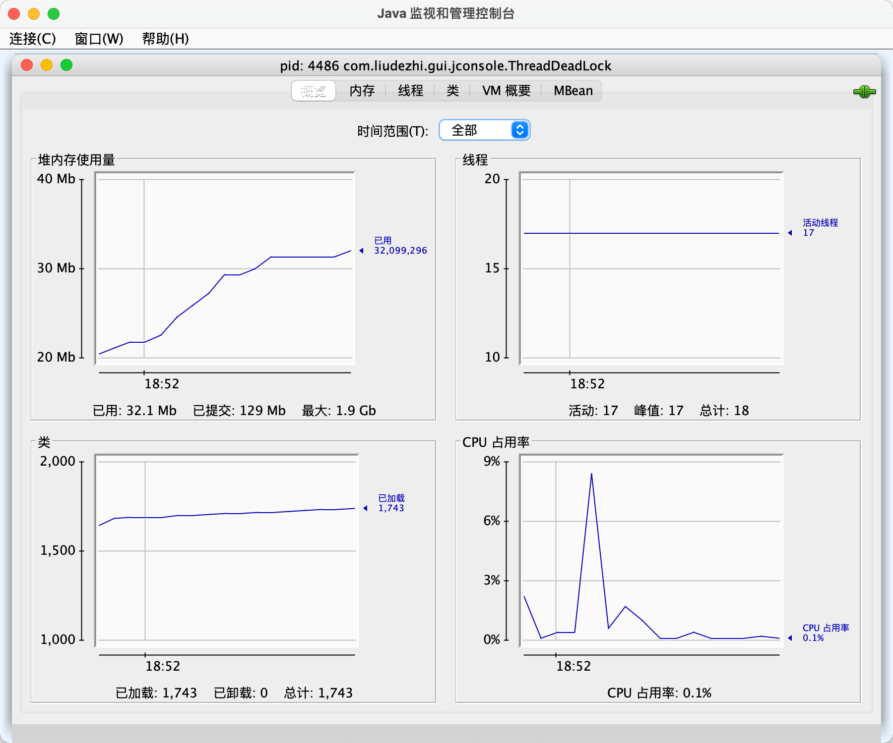

#### 2.3. 三种连接方式

- Local
 使用 JConsole 连接一个正在本地系统运行的 JVM，并且执行程序的和运行 JConsole 的需要是同一个用户。JConsole 使用文件系统的授权通过 RMI 连接器连接到平台的 MBean 服务器上。这种从本地连接的监控能力只有 Sun 的 JDK 具有。

- Remote
 使用下面的 URL 通过 RMI 连接器连接到一个 JMX 代理，service:jmx:rmi:///jndi/rmi://hostName:portNum/jmxrmi 。JConsole 为建立连接需要在环境变量中设置 mx.remote.credentials 来指定用户名和密码，从而进行授权。

- Advanced
 使用一个特殊的 URL 连接 JMX 代理。一般情况使用自己定制的连接器而不是 RMI 提供的连接器来连接 JMX 代理，或者是一个使用 JDK1.4 的实现了 JMX 和 JMX Remote 的应用。

### 3. Visual VM

#### 3.1. 基本概述

- Visual VM 是一个功能强大的多合一故障诊断和性能监控的可视化工具。

- 它集成了多个 JDK 命令行工具，使用 Visual VM 可用于显示虚拟机进程及进程的配置和环境信息（jps，jinfo），监视应用程序的 CPU、GC、堆、方法区及线程的信息（jstat、jstack）等，甚至代替 JConsole。

- 在 JDK6 Update 7 以后，Visual VM 便作为 JDK 的一部分发布（VisualVM 在 jdk/bin 目录下），即：它完全免费。

- 此外Visual VM 也可以作为独立的软件安装

首页：https:/visualvm.github.io/index.html
 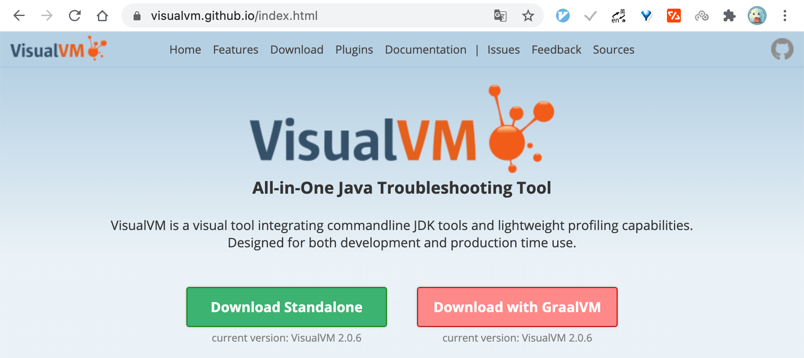

#### 3.2. 插件的安装

-
Visual VM 的一大特点就是支持插件扩展，并且插件安装非常方便。我们既可以通过离线下载插件文件 *.nbm，然后在 Plugin 对话框的已下载页面下添加已下载的插件。也可以在可用插件页面下，在线安装插件。（**建议安装上 Visual GC**）
 插件地址：https://visualvm.github.io/pluginscenters.html
 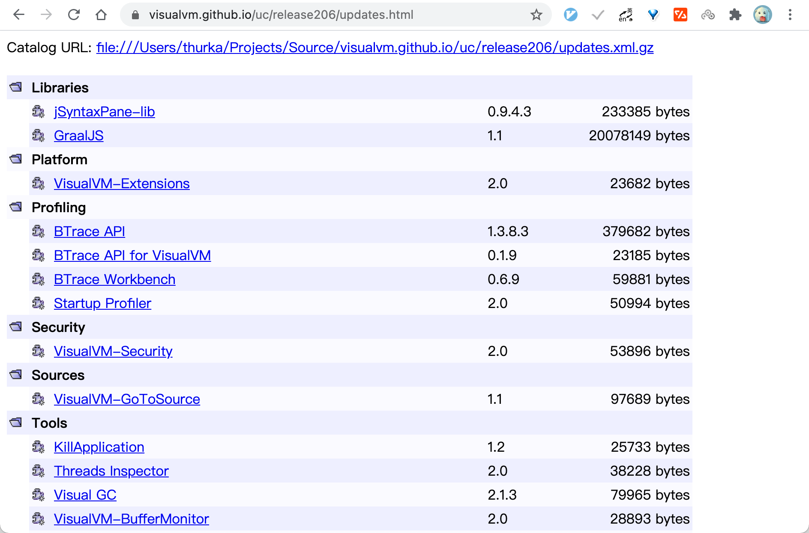

-
IDEA 安装 VisualVM Launcher 插件
 perferences --> Plugins --> 搜索 VisualVM Launcher，安装重启即可。
 1⃣️ 在 IDEA 中安装插件：
 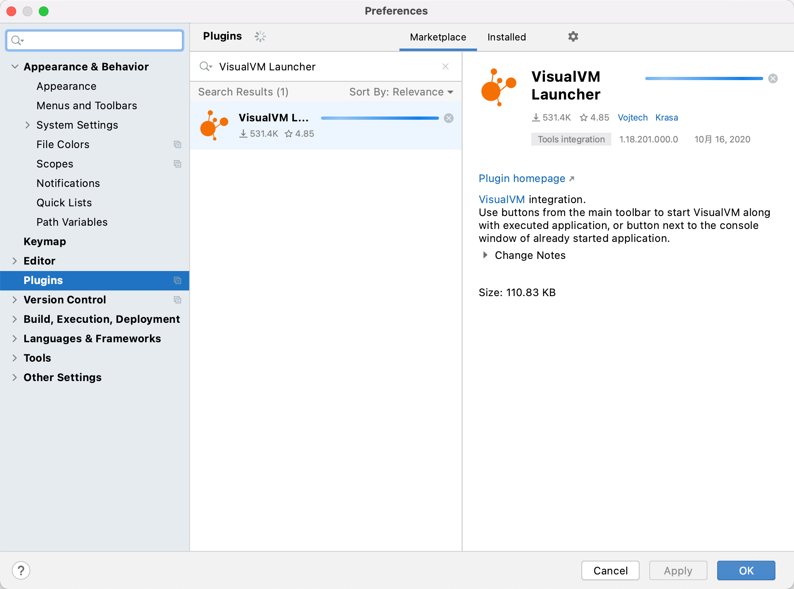
 2⃣️ 配置 Visual VM 安装目录及 JDK 目录
 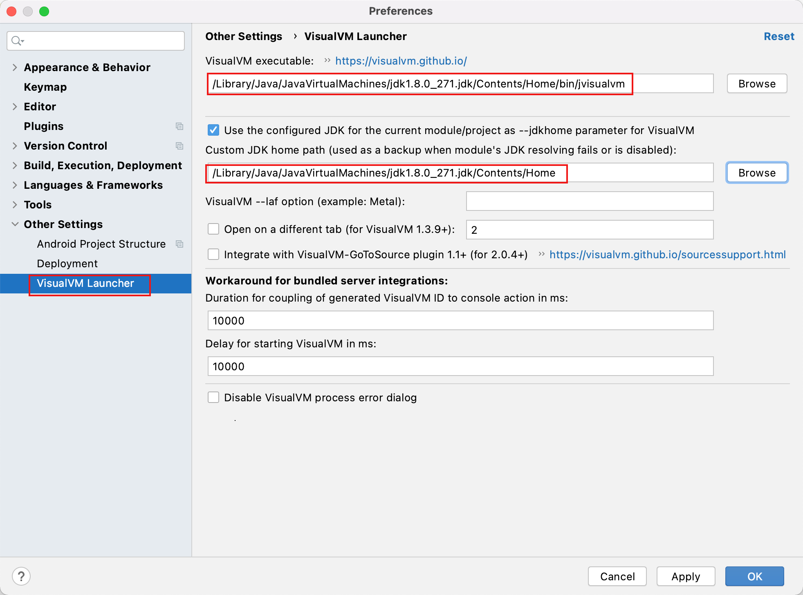

#### 3.3. 连接方式

- 本地连接
 监控本地 Java 进程的 CPU、类、线程等

- 远程连接

1. 确定远程服务器的 IP 地址

1. 添加 JMX（通过 JMX 技术具体监控远端服务器哪个 Java 进程）

1. 修改 bin/catalina.sh 文件，连接远程的 tomcat

1. 在 ../conf 中添加 jmxremote.access 和 jmxremote.password 文件

1. 将服务器地址修改为公网 IP 地址

1. 设置阿里云安全策略和防火墙策略

1. 启动 tomcat，查看 tomcat 启动日志和端口监听

1. JMX 中输入端口号、用户名、密码登陆

#### 3.4. 主要作用

1.
生成/读取堆内存快照
 生成：
 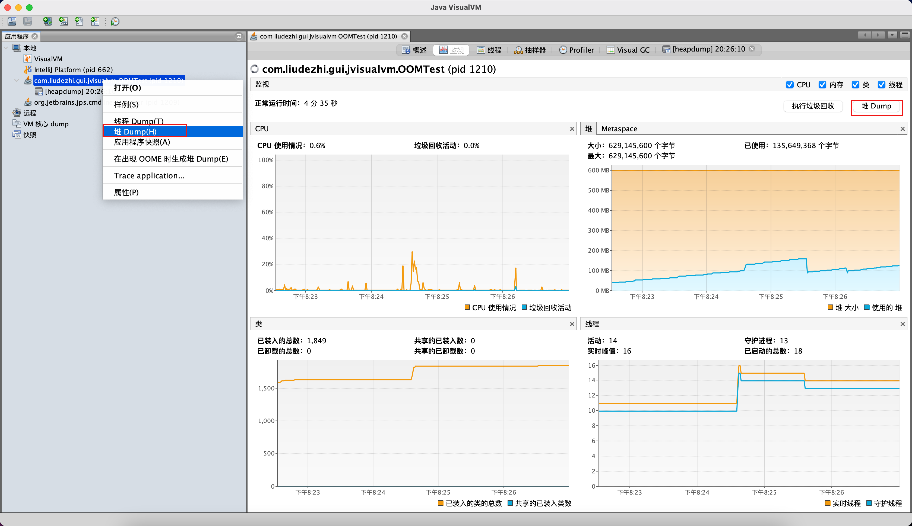
 注意：右键或在监视中堆 dump 生成的快照生成，并没有保存到文件中，需要手动右键保存。
 读取：
 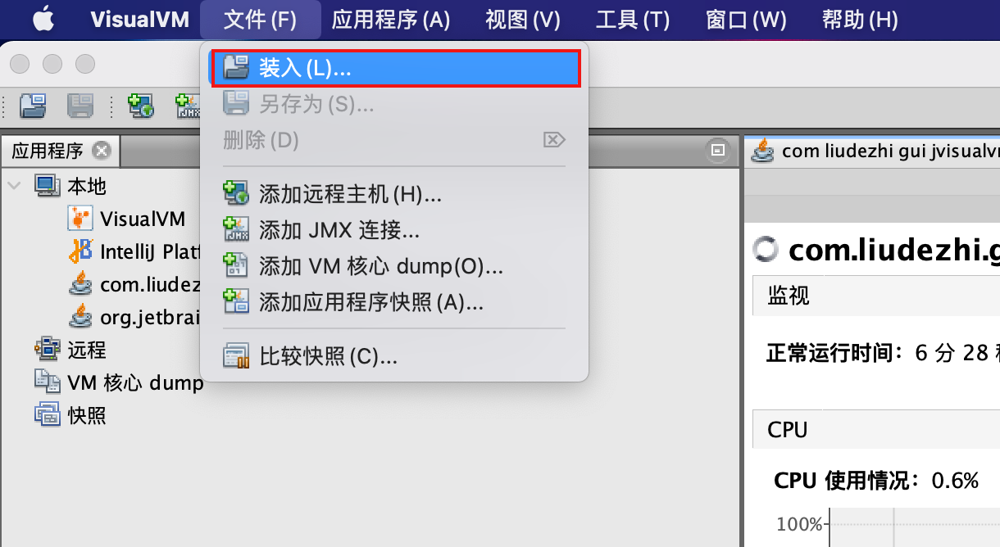
 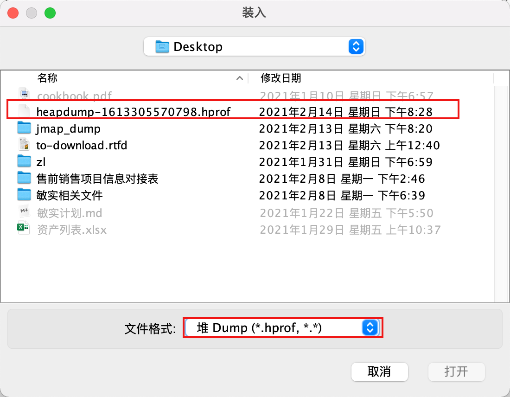

1.
查看 JVM 参数和系统属性

1.
查看运行中的虚拟机进程

1.
生成/读取线程快照
 生成：
 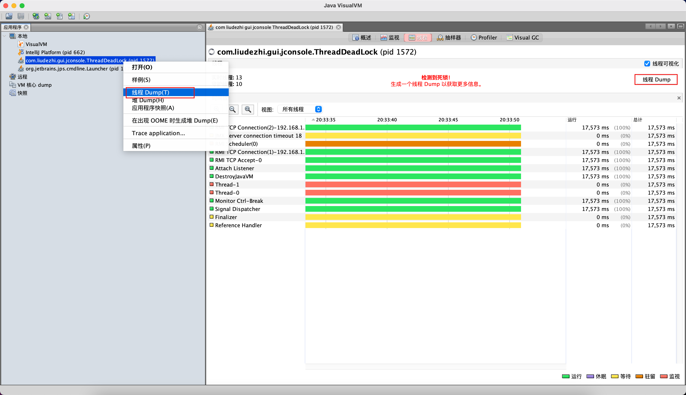
 同堆快照生成。
 读取：
 文件 -> 装入
 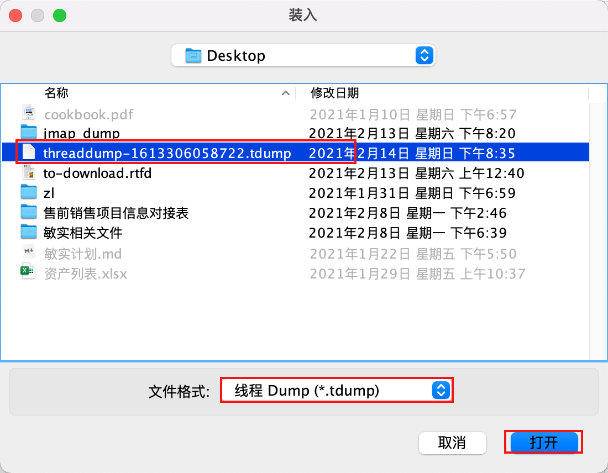

1.
程序资源的实时监控

1.
其他功能

  - JMX 代理连接

  - 远程环境监控

  - CPU 分析和内存分析
 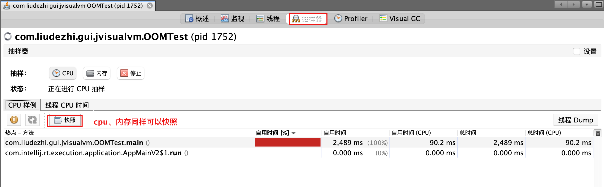

### 4. eclipse MAT

#### 4.1. 基本概述(主要用来分析 dump 文件)

MAT（Memory Analyzer Tool）工具是一款功能强大的 Java 堆内存分析器。可以用于查找内存泄漏以及查看内存消耗情况。

MAT 是基于 Eclipse 开发的，不仅可以单独使用，还可以作为插件的形式嵌入在 Eclipse 中使用。是一款免费的性能分析工具，使用起来非常方便。可以在 https://www.eclipse.com/mat/downloads.php 下载并使用 MAT。
 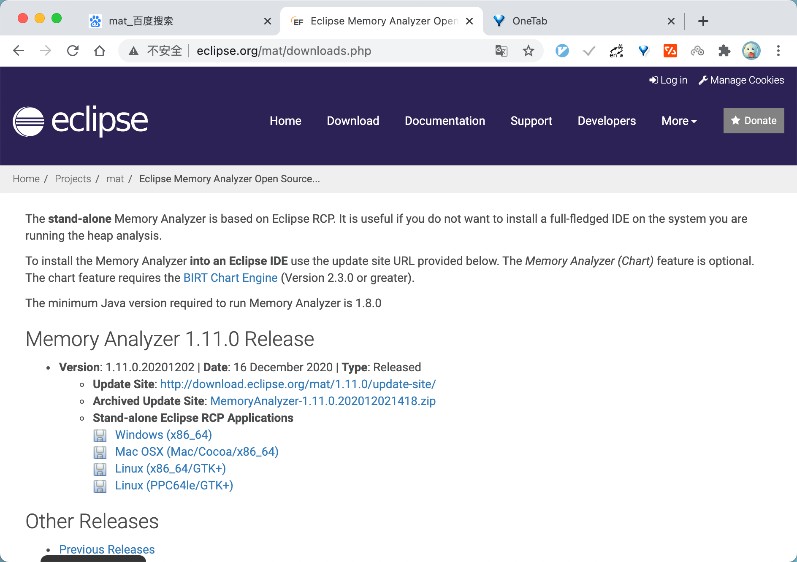
 只要确保机器上装有 JDK 并配置好相关的环境变量，MAT 可正常启动。
 还可以在 Eclipse 中以插件的方式安装：（略）

**mac 安装后启动报错：**
 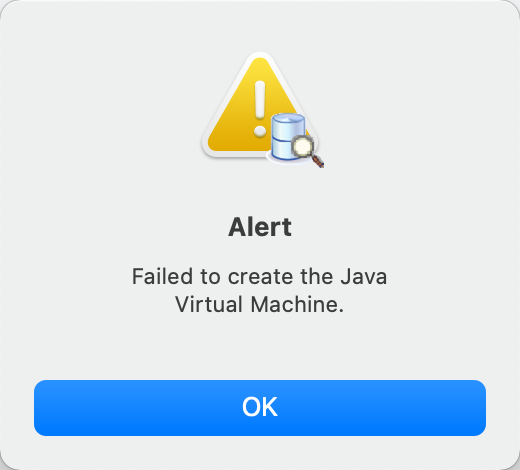
 **解决：** 在配置文件中指定 jdk
 完整配置文件如下：

```
-startup
../Eclipse/plugins/org.eclipse.equinox.launcher_1.5.700.v20200207-2156.jar
--launcher.library
../Eclipse/plugins/org.eclipse.equinox.launcher.cocoa.macosx.x86_64_1.1.1100.v20190907-0426
-vm
/Library/Java/JavaVirtualMachines/jdk1.8.0_271.jdk/Contents/Home/bin
-vmargs
-Xmx1024m
-Dorg.eclipse.swt.internal.carbon.smallFonts
-XstartOnFirstThread

```

其中：`-vm /Library/Java/JavaVirtualMachines/jdk1.8.0_271.jdk/Contents/Home/bin` 为新添加的

再次启动：
 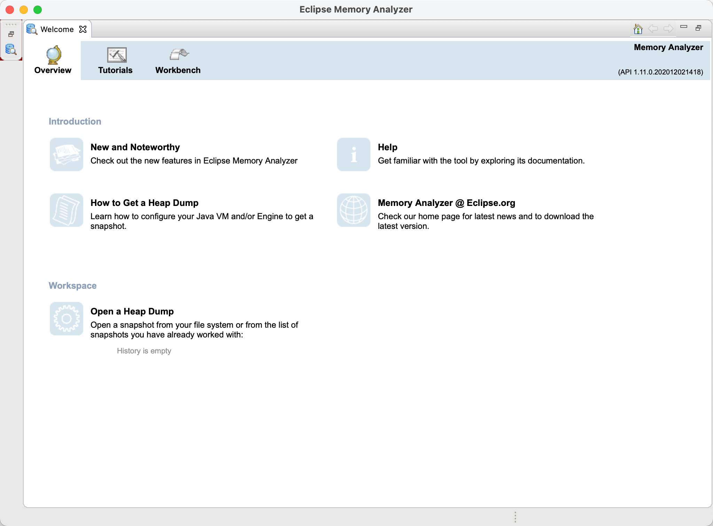

#### 4.2. 获取堆 dump 文件

##### dump 文件内容

MAT 可以分析 heap dump 文件。在进行内存分析时，只要获得了反映当前设备内存映像的 hprof 文件，通过 MAT 打开就可以直观地看到当前的内存信息。

一般来说，这些内存信息包含：

- 所有的对象信息，包括对象实例、成员变量、存储于栈中的基本类型值和存储于堆中的其他对象的引用值。

- 所有的类信息，包括 classloader、类名称、父类、静态变量等

- GCRoot 到所有的这些对象的引用路径

- 线程信息，包括线程的调用栈及此线程的线程局部变量（TLS）

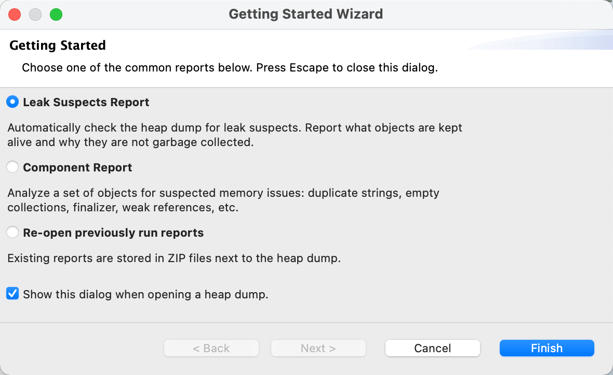

##### 两点说明

**说明1：缺点**
 MAT 不是一个万能工具，它并不能处理所有类型的堆存储文件。但是比较主流的厂家和格式，例如：Sun、HP，SAP 所采用的 HPROF 二进制堆存储文件，以及 IBM 的 PHD 堆存储文件等都能被很好的解析。

**说明2:**
 最吸引人的还是能够快速为开发人员生成**内存泄漏报表**，方便定位问题和分析问题。虽然 MAT 有如此强大的功能，但是内存分析也没有简单到一键完成的程度，很多内存问题还是需要我们从 MAT 展现给我们的信息当中通过经验和直觉来判断才能发现。

##### 获取 dump 文件

**方法一：** 通过前一章介绍的 jmap 工具生成，可以生成任意一个 Java 进程的 dump 文件；

**方法二：** 通过配置 JVM 参数生成。

- 选项 "-XX:+HeapDumpOnOutOfMemoryError" 或 "-XX:+HeapDumpBeforeFullGC"

- 选项 "-XX:HeapDumpPath" 所代表的含义就是当程序出现 OutOfMemory 时，将会在相应的目录下生成一份 dump 文件。如果不指定选项 "-XX:HeapDumpPath" 则在当前目录下生成 dump 文件。

对比：考虑到生成环境中几乎不可能在线对其进行分析，大都是采用离线分析，因此使用 jmap + MAT 工具是最常见的组合。

**方法三：** 使用 Visual VM 可以导出堆 dump 文件

**方法四：**
 使用 MAT 既可以打开一个已有的堆快照，也可以通过 MAT 直接从活动 Java 程序中导出堆快照。
 该功能将借助 jps 列出当前正在运行的 Java 进程，以供选择并获取快照。
 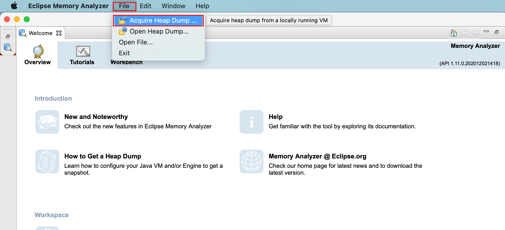

#### 4.3. 分析堆 dump 文件

##### histogram

MAT 的直方图和 jmap 的 -histo 子命令一样，都能够展示各个类的实例数目以及这些实例的 Shallow heap 的总和。但是，MAT 的直方图还能够计算 Retained heap，并支持基于实例数目或 Retained heap 的排序方式（默认为 Shallow heap）。

此外，MAT 还可以将直方图中的类按照超类、类加载器或者包名分组。

当选中某个类时，MAT 界面左上角的 Inspector 窗口将展示该类的 Class 实例的相关信息，如类加载器等。

##### thread overview

- 查看系统中的 Java 线程

- 查看局部变量的信息

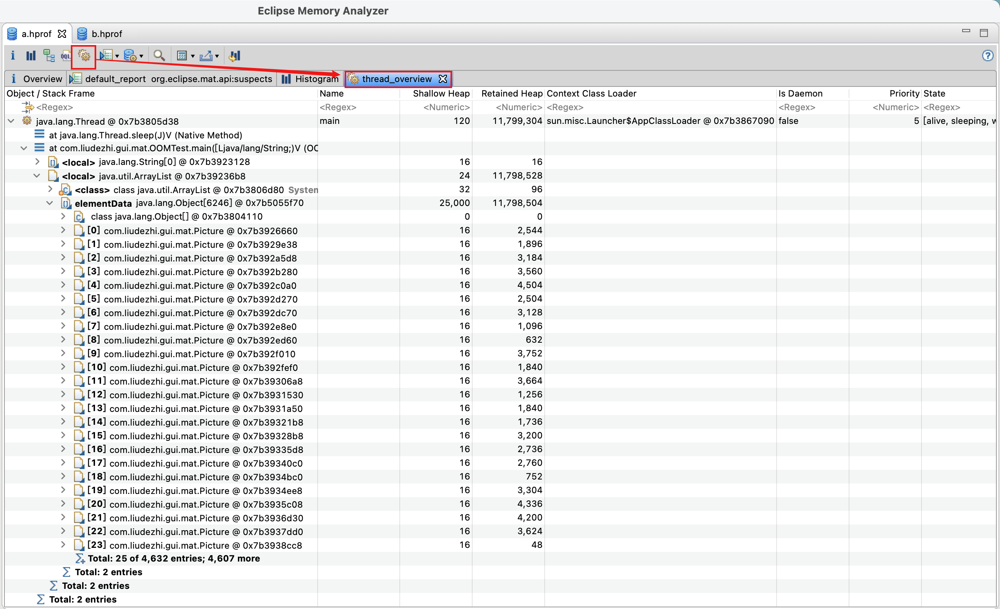

##### 获得对象相互引用的关系

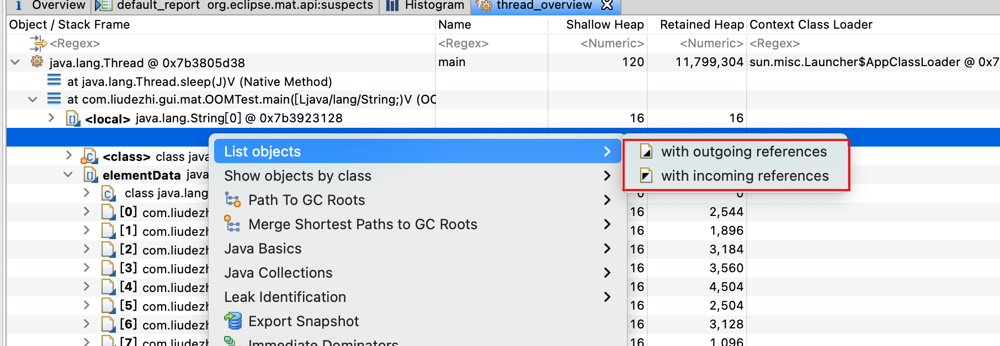

##### 浅堆与深堆

***shallow heap***
 浅堆（Shallow Heap）是指一个对象所消耗的内存。在32位系统中，一个对象引用会占据4个字节，一个 int 类型会占据4个字节，long 型会占据8个字节，每个对象头需要占用8个字节。根据堆快照格式不同，对象的大小可能会向8字节进行对齐。

以 String 为例，2个 int 值共占8个字节，对象引用占用4个字节，对象头8个字节，合计20字节，向8字节对齐，故占24字节。（JDK7中）

这24字节为 String 对象的浅堆大小。它与 String 的 value 实际取值无关，无论字符串长度如何，浅堆大小始终是 24 字节。

***retained heap***
 保留集（Retained Set）：
 对象A的保留集指当对象A被垃圾回收后，可以被释放的所有的对象集合（包括对象A本身），即对象A的保留集可以被认为是**只能通过**对象A被直接或间接访问到的所有对象的集合。通俗地说，就是指仅被对象A所持有的对象的集合。

深堆（Retained Heap）：
 深堆是指对象的保留集中所有的对象的浅堆大小之和。

**注意：** 浅堆指对象本身占用的内存，不包括其内部引用对象的大小。一个对象的深堆指只能通过该对象访问到的（直接或间接）所有对象的浅堆之和，即对象被回收后，可以释放的真实空间。

***补充：对象实际大小***
 另外一个常用的概念是对象的实际大小。这里，对象的实际大小定义为一个对象**所能触及的**所有对象的浅堆大小之和，也就是通常意义上我们说的对象大小。与深堆相比，似乎这个在日常开发中更为直观和被人接受，**但实际上，这个概念和垃圾回收无关**。

下图显示了一个简单的对象引用关系图，对象A引用了C和D，对象B引用了C和E。那么对象A的浅堆大小只是A本身，不包含C和D，而A的实际大小为A、C、D三者之和。而A的深堆大小为A与D之和，由于对象C还可以通过对象B访问到，因此不在对象A的深堆范围内。
 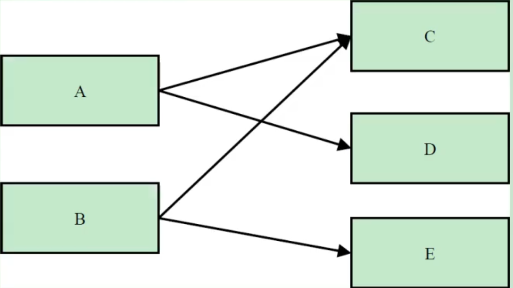

***练习***
 
 上图中，GC Roots 直接引用了A和B两个对象。

A对象的 Retained Size = A对象的 Shallow Size
 B对象的 Retained Size = B对象的 Shallow Size + C对象的 Shallow Size

**这里不包括D对象，因为D对象被 GC Roots 直接引。**
 如果 GC Roots 不引用D对象：
 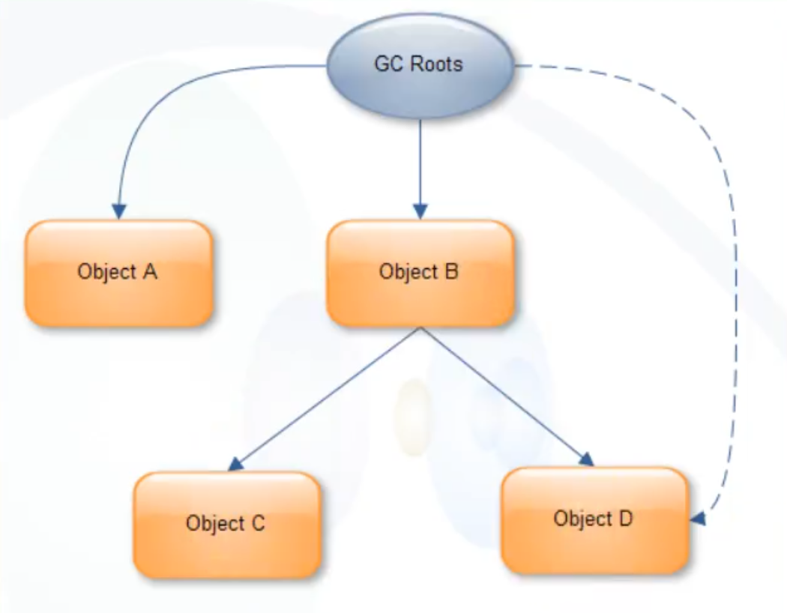

B对象的 Retained Size = B对象的 Shallow Size + C对象的 Shallow Size + D对象的 Shallow Size = B对象的实际大小

***案例分析：StudentTrace***

```
/**
 * 学生浏览网页的记录程序，它将记录每个学生访问过的网站地址。
 * 由三个部分组成：Student、WebPage 和 StudentTrace 三个类
 *
 *  -XX:+HeapDumpBeforeFullGC -XX:HeapDumpPath=/Users/serva/Desktop/mat_log/student.hprof
 */
public class StudentTrace {
    static List<WebPage> webPages = new ArrayList<>();

    public static void createWebPages() {
        for (int i = 0; i < 100; i++) {
            WebPage webPage = new WebPage();
            webPage.setUrl("http://www." + Integer.toString(i) + ".com");
            webPage.setContent(Integer.toString(i));
            webPages.add(webPage);
        }
    }

    public static void main(String[] args) {
        createWebPages();   // 创建了 100 个网页
        // 创建3个学生对象
        Student st3 = new Student(3, "Tom");
        Student st5 = new Student(5, "Jerry");
        Student st7 = new Student(7, "Lily");

        for (int i = 0; i < webPages.size(); i++) {
            if (i % st3.getId() == 0) {
                st3.visit(webPages.get(i));
            }
            if (i % st5.getId() == 0) {
                st5.visit(webPages.get(i));
            }
            if (i % st7.getId() == 0) {
                st7.visit(webPages.get(i));
            }
        }
        webPages.clear();
        System.gc();
    }
}

class Student {
    private int id;
    private String name;
    private List<WebPage> history = new ArrayList<>();

    public Student(int id, String name) {
        this.id = id;
        this.name = name;
    }
    // getter and setter
    public void visit(WebPage webPage) {
        if (webPage != null) {
            history.add(webPage);
        }
    }
}

class WebPage {
    private String url;
    private String content;
    // getter and setter
}

```

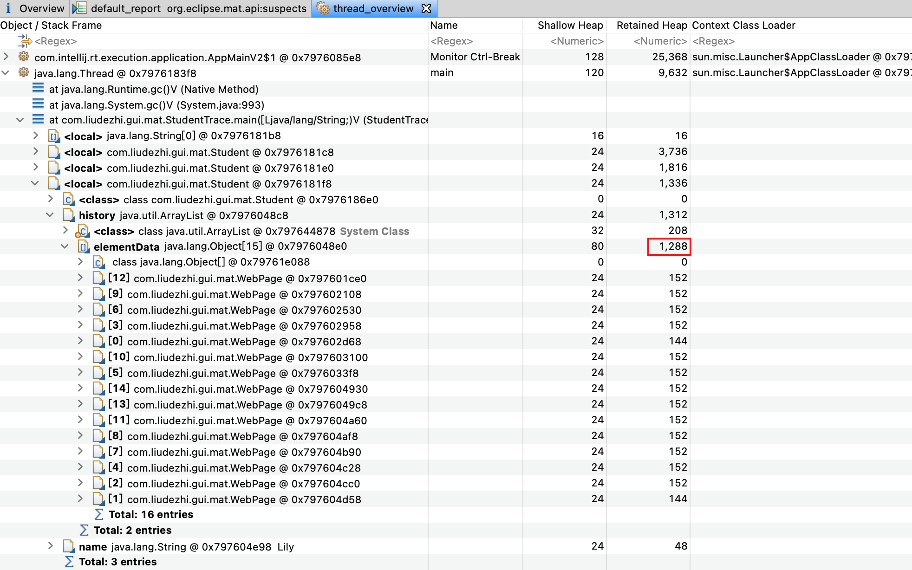
 **分析 Lily 同学：**
 15 个 webpage，每个对应 152个字节 15 * 152 = 2280 字节 --> 即为 elementData 的实际大小。

关心的是 elementData 的深堆 1288 是如何计算出来的？

能被7整除，且能被3整除，以及能被7整除，且能被5整除的数值有：0，21，42，63，84，35，70 共7个数。
 7 * 152 = 1064 字节

2280 - 1064 + 72 = 1288 字节！

这 72 个字节是：
 15 个 elementData 的元素 * 4字节 = 60 字节
 60 + 8个对象头的字节数 + 4 字节（对象引用） = 72 字节

##### 支配树（Dominator Tree）

支配树的概念源自图论。

MAT 提供了一个称为支配树（Dominator Tree）的对象图。支配树体现了对象实例间的支配关系。在对象引用图中，所有指向对象B的路径都经过对象A，则认为**对象A支配对象B**。如果对象A是离对象B最近的一个支配对象，则认为对象A为对象B的**直接支配者**。支配树是基于对象间的引用图所建立的，它有以下基本特征：

- 对象A的子树（所有被对象A支配的对象集合）表示对象A的保留集（retained set），即深堆。

- 如果对象A支配对象B，那么对象A的直接支配者也支配对象B。

- 支配树的边与对象引用图的边不直接对应。

如下图所示：左图表示对象引用图，右图表示左图所对应的支配树。对象A和B由根对象直接支配，由于在到对象C的路径中，可以经过A，也可以经过B，因此对象C的直接支配者也是根对象。对象F与对象D相互引用，因为到对象F的所有路径都必然经过对象D，因此，对象D是对象F的直接支配者。而到对象D的所有路径中，必然经过对象C，即使是从对象F到对象D的引用，从根节点出发，也是经过对象C的，所以，对象D的直接支配者为对象C。
 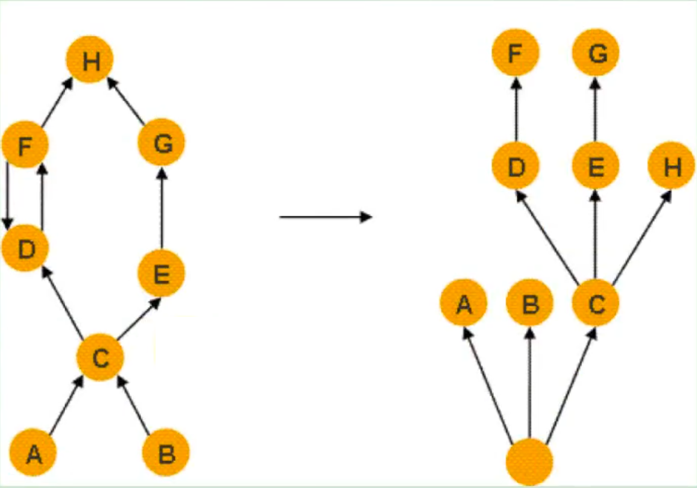
 同理，对象E支配对象G，到达对象H可以通过对象D，也可以通过对象E，因此对象D和E都不能支配对象H，而经过对象C既可以到达D也可以到达E，因此C为对象H的直接支配者。

在 MAT 中，单击工具栏上的对象支配树按钮，可以打开对象支配树视图。
 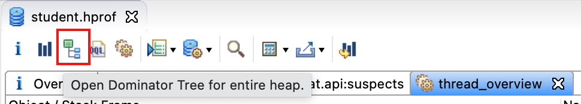
 下图显示了对象支配树视图的一部分。该截图显示部分 Lily 学生的 history 队列的直接支配对象。即当 Lily 对象被回收，也会一并回收的所有对象。显然能被 3 或者 5 整除的网页不会出现在该列表中，因为它们同时被另外两名学生对象引用。
 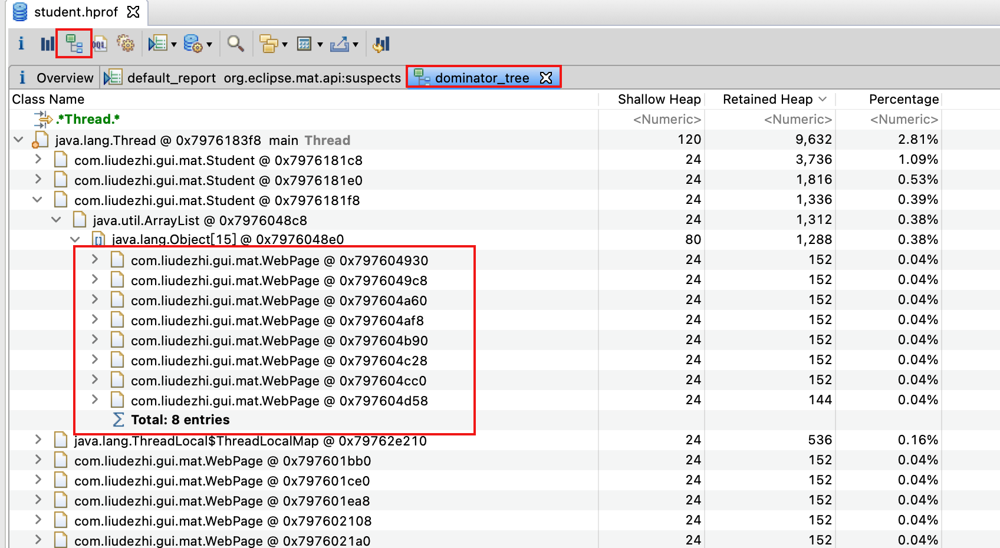

#### 4.4. 案例：Tomcat 堆溢出分析

##### 说明

Tomcat 是最常用的 Java Servlet 容器之一，同时也可以当作单独的 Web 服务器使用。Tomcat 本身使用 Java 实现，并运行于 Java 虚拟机之上。在大规模请求时，Tomcat 有可能会因为无法承受压力而发生内存溢出错误。这里根据一个被压垮的 Tomcat 的堆快照文件，来分析 Tomcat 在崩溃时的内部情况。

##### 分析过程

略（宋红康JVM334集）

### 补充1：再谈内存泄漏

#### 内存泄漏的理解与分类

**何为内存泄漏（memory leak）**
 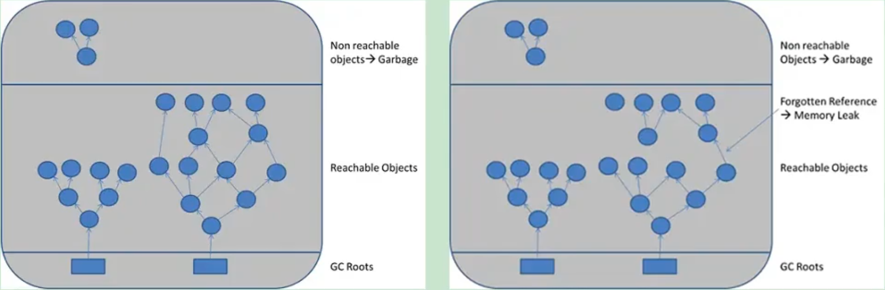
 可达性分析算法来判断对象是否是不再使用的对象，本质都是判断一个对象是否还被引用。那么对于这种情况下，由于代码的实现不同就会出现很多种内存泄漏问题（让 JVM 误以为此对象还在引用，无法回收，造成内存泄漏）。

**内存泄漏（memory leak）的理解**
 **严格来说**，只有对象不会再被程序用到了，但是 GC 又不能回收他们的情况，才叫内存泄漏。
 但实际情况很多时候一些不太好的实践（或疏忽）会导致对象的生命周期变得很长甚至导致 OOM，也可叫做**宽泛意义上的“内存泄漏”**。
 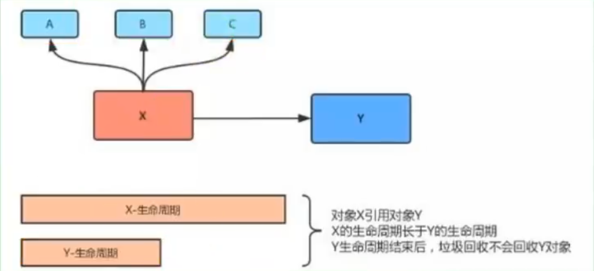
 对象 X 引用对象 Y，X 的生命周期比 Y 的生命周期长；
 那么当 Y 生命周期结束的时候，X 依然引用着 Y，这时候，垃圾回收器是不会回收对象 Y 的；
 如果对象 X 还引用着生命周期比较短的 A、B、C，对象 A 又引用着对象 a、b、c，这样就可能造成大量无用的对象不能被回收，进而占据了内存资源，造成内存泄漏，知道内存溢出。

**内存泄漏和内存溢出的关系：**

1.
内存泄漏（memory leak）
 申请了内存用完了不释放，比如一共有 1024M 内存，分配了 521M 的内存一直不回收，那么可以用的内存只有 521M 了，仿佛泄漏掉了一部分；

1.
内存溢出（out of memory）
 申请内存时，没有足够的内存可以使用；

可见，内存泄漏和内存溢出的关系：内存泄漏的增多，最终会导致内存溢出。

***泄漏的分类：***
 **经常发生：** 发生内存泄漏的代码会被多次执行，每次执行，泄漏一块内存；
 **偶然发生：** 某些特定情况下才会发生；
 **一次性：** 发生内存泄漏的方法只会执行一次；
 **隐式泄漏：** 一直占着内存不释放，直到执行结束；严格的说这个不算内存泄漏，因为最终释放掉了，但是如果执行的时间特别长，也可能会导致内存耗尽。

#### Java 中内存泄漏的8中情况

##### 1. 静态集合类

静态集合类，如 HashMap、LinkedList 等等。如果这些容器为静态的，那么它们的生命周期与 JVM 程序一致，则容器中的对象在程序结束之前将不能被释放，从而造成内存泄漏。简单而言，长生命周期的对象持有短生命周期对象的引用，尽管短生命周期的对象不再使用，但是因为长生命周期对象持有它的引用而导致不能被回收。

```
public class MemoryLear {
    static List list = new ArrayList();
    public void oomTests() {
        Object obj = new Object();
        list.add(obj);
    }
}

```

##### 2. 单例模式

单例模式，和静态集合类导致内存泄漏的原因类似，因为单例的静态特性，它的生命周期和 JVM 的生命周期一样长，所以如果单例对象持有外部对象的引用，那么这个外部对象也不会被回收，那么就会造成内存泄漏。

##### 3. 内部类持有外部类

内部类持有外部类，如果一个外部类的实例对象的方法返回了一个内部类的实例对象。
 这个内部类对象被长期引用了，即使那个外部类实例对象不再被使用，但由于内部类持有外部类的实例对象，这个外部类对象将不会被垃圾回收，这也会造成内存泄漏。

##### 4. 各种连接，如数据库连接、网络连接和 IO 连接等

在对数据库进行操作的过程中，首先需要建立与数据库的连接，当不再使用时，需要调用 close 方法来释放与数据库的连接。只有连接被关闭后，垃圾回收器才会回收对于的对象。
 否则，如果在访问数据库的过程中，对 Connection、Statement 或 ResultSet 不显示地关闭，将会造成大量的对象无法被回收，从而引起内存泄漏。

```
public static void main(String[] args) {
    try {
        Connection conn = null;
        Class.forName("com.mysql.jdbc.Driver");
        conn = DriverManager.getConnection("url", "", "");
        Statement stmt = conn.createStatement();
        ResultSet rs = stmt.executeQuery("......");
    } catch (Exception e) { // 异常日志

    } finally {
        // 1. 关闭结果集 Statement
        // 2. 关闭声明的对象 ResultSet
        // 3. 关闭连接 Connection
    }
}

```

##### 5. 变量不合理的作用域

变量不合理的作用域。一般而言，一个变量的定义的作用范围大于其使用范围，很有可能会造成内存泄漏。另一方面，如果没有及时地把对象设置为 null，很有可能导致内存泄漏的发生。

```
public class UsingRandom {
    private String message;
    public void receiveMsg() {
        // private String message;
        readFromNet();  // 从网络中接受数据保存到 msg 中
        saveDB();       // 把 msg 保存到数据库中
        // msg = null;
    }
}

```

如果上面这个伪代码，通过 readFromNet 方法把接受的消息保存在变量 msg 中，然后调用 saveDB 方法把 msg 的内存保存到数据库中，此时 msg 已经就没用了，由于 msg 的生命周期与对象的生命周期相同，此时 msg 还不能回收，因此造成了内存泄漏。

实际上这个 msg 变量可以放在 receiveMsg 方法内部，当方法使用完，那么 msg 的生命周期也就结束，此时就可以回收了。还有一种方法，在使用完 msg 后，把 msg 设置为 null，这样垃圾回收器也会回收 msg 的内存空间。

##### 6. 改变哈希值

改变哈希值，当一个对象被存储进 HashSet 集合中以后，就不能修改这个对象中的那些参与计算哈希值的字段了。
 否则，对象修改后的哈希值与最初存储进 HashSet 集合中时的哈希值就不同了，在这种情况下，即使在 contains 方法使用该对象的当前引用作为参数去 HashSet 集合中检索对象，也将返回找不到对象的结果，这也会导致无法从 HashSet 集合中单独删除当前对象，造成内存泄漏。

这也是 String 为什么被设置成了不可变类型，我们可以放心地把 String 存入 HashSet，或者把 String 当作 HashMap 的 Key 值；

当我们想把自定义的类保存到散列表的时候，需要保证对象的 hashCode 不可变。
 **举例1:**

```
public class ChangeHashCode {
    public static void main(String[] args) {
        HashSet<Person> set = new HashSet<>();
        Person p1 = new Person(1001, "AA");
        Person p2 = new Person(1002, "BB");

        set.add(p1);
        set.add(p2);
        p1.name = "CC"; // 导致了内存的泄漏
        set.remove(p1); // 删除失败
        System.out.println(set);

        set.add(new Person(1001, "CC"));
        System.out.println(set);
        set.add(new Person(1001, "AA"));
        System.out.println(set);
    }
}
class Person {
    int id;
    String name;
    public Person(int id, String name) {
        this.id = id;
        this.name = name;
    }
    @Override
    public boolean equals(Object obj) {
        if (this == obj) return true;
        if (!(obj instanceof Person)) return false;
        Person person = (Person)obj;
        if (id != person.id) return false;
        return name != null ? name.equals(person.name) : person.name == null;
    }
    @Override
    public int hashCode() {
        int result = id;
        result = 31 * result + (name != null ? name.hashCode() : 0) ;
        return result;
    }
    @Override
    public String toString() {
        return "Person{" +
                "id=" + id +
                ", name='" + name + '\'' +
                '}';
    }
}

```

**举例2:**

```
public class ChangeHashCode1 {
    public static void main(String[] args) {
        HashSet<Point> hs = new HashSet<>();
        Point cc = new Point();
        cc.setX(10);    // hashCode = 41
        hs.add(cc);
        cc.setX(20);    // hashCode = 51    此行为导致了内存的泄漏
        System.out.println("hs.remove = " + hs.remove(cc)); // false
        hs.add(cc);
        System.out.println("hs.size = " + hs.size());       // size = 2
    }
}
class Point {
    int x;
    // getter and setter
    @Override
    public int hashCode() {
        final int prime = 31;
        int result = 1;
        result = prime * result + x;
        return result;
    }
    @Override
    public boolean equals(Object obj) {
        if (this == obj) return true;
        if (obj == null) return false;
        if (getClass() != obj.getClass()) return false;
        Point other = (Point) obj;
        if (x != other.getX()) return false;
        return true;
    }
}

```

##### 7. 缓存泄漏

内存泄漏的另一个常见来源是缓存，一旦你把对象引用放入到缓存中，它就很容易被遗忘。比如：项目启动时加载一个表中的数据到缓存（内存）中，测试环境中只有几百条数据，但是生成环境有几百万数据。

对于这个问题，可以使用 WeakHashMap 代表缓存，此种 Map 的特点是，当除了自身对 Key 的引用外，此 key 没有其他引用那么此 map 会自动丢弃此值。
 **演示内存泄漏：**

```
public class MapTest {
    static Map wMap = new WeakHashMap();
    static Map map = new HashMap();

    public static void main(String[] args) {
        init();
        testWeakHashMap();
        testHashMap();
    }
    public static void init() {
        String ref1 = new String("object1");
        String ref2 = new String("object2");
        String ref3 = new String("object3");
        String ref4 = new String("object4");
        wMap.put(ref1, "cacheObject1");
        wMap.put(ref2, "cacheObject2");
        map.put(ref3, "cacheObject3");
        map.put(ref4, "cacheObject4");
        System.out.println("String 引用 ref1，ref2，ref3，ref4 消失");
    }
    public static void testWeakHashMap() {
        System.out.println("WeakHashMap GC 之前");
        for (Object o : wMap.entrySet()) {
            System.out.println(o);
        }
        try {
            System.gc();
            TimeUnit.SECONDS.sleep(5);
        } catch (InterruptedException e) {
            e.printStackTrace();
        }
        System.out.println("WeakHashMap GC 之后");
        for (Object o : wMap.entrySet()) {
            System.out.println(o);
        }
    }
    public static void testHashMap() {
        System.out.println("HashMap GC 之前");
        for (Object o : map.entrySet()) {
            System.out.println(o);
        }
        try {
            System.gc();
            TimeUnit.SECONDS.sleep(5);
        } catch (InterruptedException e) {
            e.printStackTrace();
        }
        System.out.println("HashMap GC 之后");
        for (Object o : map.entrySet()) {
            System.out.println(o);
        }
    }
}

```

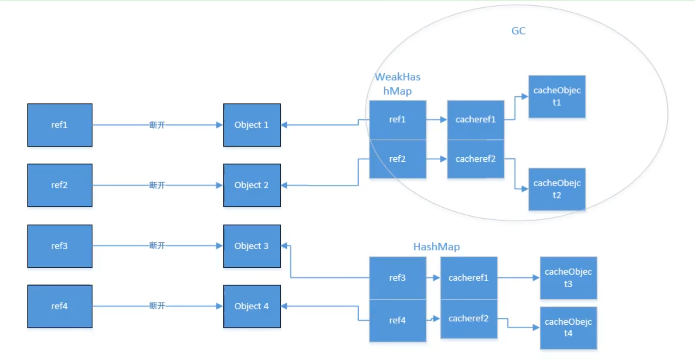
 上面代码和图示演示 WeakHashMap 如何自动释放缓存对象，当 init 函数执行完成后，局部变量字符串引用 weakd1，weakd2，d1，d2都会消失，此时只有静态 map 中保存对字符串对象的引用，可以看到，调用 gc 之后，HashMap 的没有被回收，而 WeakHashMap 里面的缓存被回收了。

##### 8. 监听器和回调

内存泄漏另一个常见来源是监听器和其他回调，如果客户端在你实现的 API 中注册回调，却没有显示的取消，那么就会积聚。

需要确保回调立即被当作垃圾回收的最佳方法是只保存它的弱引用，例如将他们保存成为 WeakHashMap 中的键。

#### 内存泄漏案例分析

##### 案例1

###### 案例代码

```
public class Stack {
    private Object[] elements;
    private int size = 0;
    private static final int DEFAULT_INTIAL_CAPACITY = 16;

    public Stack() {
        elements = new Object[DEFAULT_INTIAL_CAPACITY];
    }

    public void push(Object e) {    // 入栈
        ensureCapacity();
        elements[size++] = e;
    }

    // 存在泄漏问题
    public Object pop() {             // 出栈
        if (size == 0) {
            throw new EmptyStackException();
        }
        return elements[--size];
    }
    /*public Object pop() {
        if (size == 0) {
            throw new EmptyStackException();
        }
        Object result = elements[--size];
        elements[size] = null;
        return result;
    }*/

    private void ensureCapacity() {
        if (elements.length == size) {
            elements = Arrays.copyOf(elements, 2 * size + 1);
        }
    }
}

```

###### 分析

上述程序并没有明显的错误，但是这段程序有一个明显的内存泄漏，随着 GC 活动的增加，或者内存占用的不断增加，程序性能的降低就会表现出来，严重时可导致内存泄漏，但是这种失败情况相对较少。
 代码的主要问题在 pop 函数，下面通过这张图示展现
 假设这个栈一直增长，增长后如下图所示：
 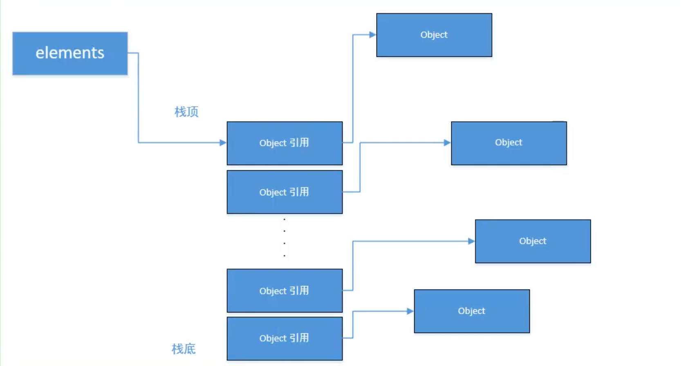
 当进行大量的 pop 操作时，由于引用未进行置空，gc 是不会释放的，如下图所示：
 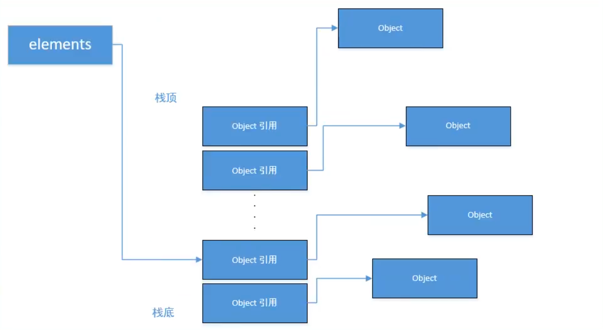
 从上图中可以看出，如果栈先增长，再收缩，那么从栈中弹出的对象将不会被当作垃圾回收，即使程序不再使用栈中的这些对象，他们也不会回收，因为栈中仍然保存着这个对象的引用，俗称**过期引用**，这个内存泄漏很隐蔽。

###### 解决办法

```
public Object pop() {
    if (size == 0) {
        throw new EmptyStackException();
    }
    Object result = elements[--size];
    elements[size] = null;
    return result;
}

```

一旦引用过期，清空这些引用，将引用置空。
 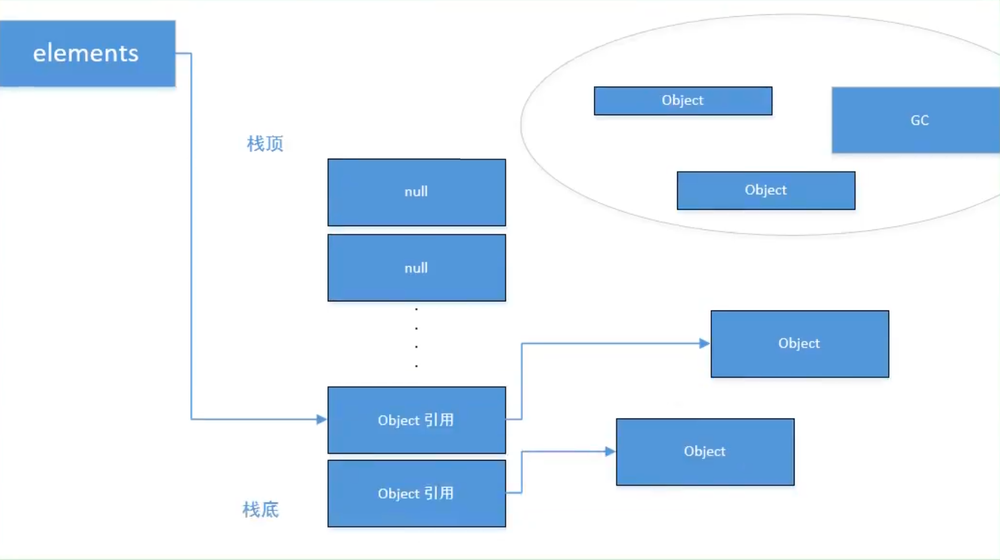

##### 案例2

###### 案例代码

```
public class TestActivity extends Activity {
    private static final Object key = new Object();

    @Override
    protected void onCreate(Bundle savedInstancedState) {
        super.onCreate(savedInstancedState);
        setContentView(R.layout.activity_main);

        new Thread() {  // 匿名线程
            public void run() {
                synchronized(key) {
                    try {
                        key.wait();
                    } catch (InterruptedException e) {
                        e.printStackTrace();
                    }
                }
            }
        }.start();
    }
}

```

###### 分析

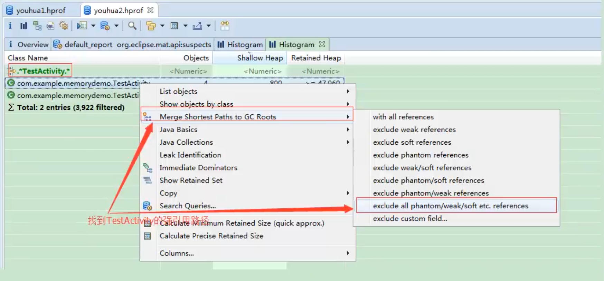
 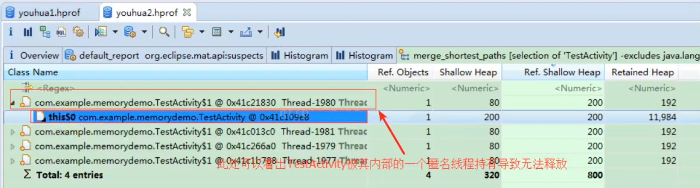

###### 解决办法

1. 使用线程时，一定要确保线程在周期性对象（如 Activity）销毁时能正常结束，如能正常结束，但是 Activity 销毁后还需执行一段时间，也可能造成泄漏，此时可采用 WeakReference 方法来解决，另外在使用 Handler 的时候，如存在 Delay 操作，也可以采用 WeakReference；

1. 使用 Handler + HandlerThread 时，记住在周期性对象销毁时调用 looper.quit() 方法；

### 补充2：支持使用 OQL 语言查询对象信息

MAT 支持一种类似于 SQL 的查询语言 OQL（Object Query Language）。OQL 使用类 SQL 语法，可以在堆中进行对象的查找和筛选。

#### SELECT 子句

在 MAT 中，Select 子句的格式与 SQL 基本一致，用于指定要显示的列。Select 子句中可以使用 "*"，查看结果对象的引用实例（相当于 outgoing references）。

SELECT * FROM java.util.Vector v

使用 "OBJECTS" 关键字，可以将返回结果集中的项以对象的形式显示。
 SELECT objects v.elementData FROM java.util.Vecotr v
 SELECT OBJECTS s.value FROM java.lang.String s

在 Select 子句中，使用 "AS RETAINED SET" 关键字可以得到所得对象的保留集。
 SELECT AS RETAINDE SET * FROM com.liudezhi.mat.Student

"DISTINCT" 关键字用于在结果集中去除重复对象。
 SELECT DISTINCT OBJECTS classof(s) FROM java.lang.String s

#### FROM 子句

From 子句用于指定查询范围，它用于指定类名、正则表达式或者对象地址。
 SELECT * FROM java.lang.String s

下例使用正则表达式，限定搜索范围，输出所有 com.liudezhi 包下所有类的实例
 SELECT * FROM "com.liudezhi..*"

也可以直接使用类的地址进行搜索。使用类的地址的好处是可以区分被不同 ClassLoader 加载的同一种类型。
 select * from 0x37a0b4d;

#### WHERE 子句

Where 子句用于指定 OQL 的查询条件。OQL 查询将只返回满足 Where 子句指定条件的对象。
 Where 子句的格式与传统 SQL 极为相似。
 下例返回长度大于 10 的 char 数组
 SELECT * FROM char[] s where s.@length > 10

下例返回包含 "java" 子字符串的所有字符串，使用 "LIKE" 操作符，"LIKE" 操作符的操作参数为正则表达式。
 SELECT * FROM java.lang.String s WHERE toString(s) like ".*java*."

下例返回所有 value 域不为 null 的字符串，使用 "=" 操作符。
 SELECT * FROM java.lang.String s where s.value != null

Where 子句支持多个条件的 AND、OR 运算。下例返回数组长度大于 15，并且堆深度大于 1000 字节的所有 Vector 对象。
 SELECT * FROM java.util.Vector v where v.elementData.@length > 15 AND v.@retainedHeapSize > 1000

#### 内置对象与方法

OQL 中可以访问堆内对象的属性，也可以访问堆内代理对象的属性。访问堆内对象的属性时，格式如下：

[<alias>.] <field>. <field>. <field>
 其中 alias 为对象名称

访问 java.io.File 对象的 path 属性，并进一步访问 path 的 value 属性：
 SELECT toString(f.path.value) FROM java.io.File f

下例显示了 String 对象的内容、objectid 和 objectAddress。
 SELECT s.toString(), s.@objectId, s.@objectAddress FROM java.lang.String s

下例显示 java.util.Vector 内部数组的长度
 SELECT v.elementData.@length FROM java.util.Vector v

下例显示了所有的 java.util.Vector 对象及其子类型
 SELECT * from INSTANCEOF java.util.Vector

### 5. JProfiler

#### 5.1. 基本概述

##### 介绍

在运行 Java 的时候有时候想测试运行时占用内存情况，这时候就需要使用测试工具查看了。在 eclipse 里面有 Eclipse Memory Analyzer Tool（MAT）插件可以测试，而在 IDEA 中也有这么一个插件，就是 JProfiler

JProfiler 是由 ej-technologies 公司开发的一款 Java 应用性能诊断工具。功能强大，但是收费。

官网下载地址：

>
https://www.ej-technologies.com/products/jprofiler/overview.html

##### 特点

- 使用方便，界面操作友好（简单且强大）

- 对被分析的应用影响小（提供模版）

- CPU，Thread，Memory 分析功能尤其强大

- 支持对 jdbc，noSql，jsp，servlet，socket 等进行分析

- 支持多种模式（离线，在线）的分析

- 支持监控本地，远程的 JVM

- 跨平台，拥有多种操作系统的安装版本
 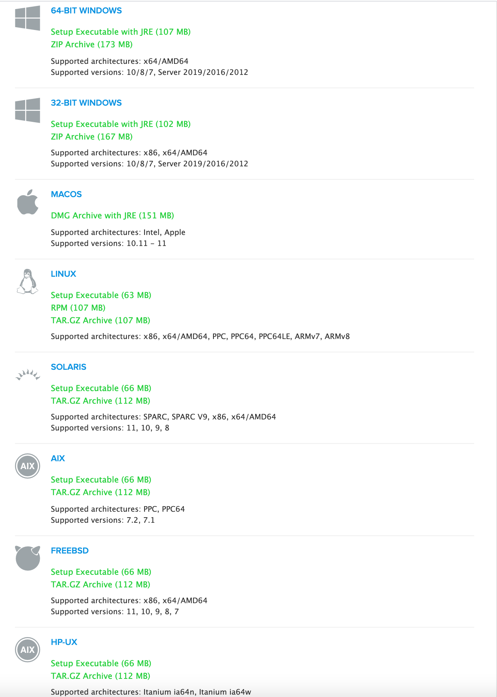

##### 主要功能

1. 方法调用
 对方法调用的分析可以帮组您了解应用程序正在做什么，并找到提高其性能的方法

1. 内存分配
 通过分析堆上对象、引用链和垃圾收集能帮您修复内存泄漏问题，优化内存使用

1. 线程和锁
 JProfiler 提供多种针对线程和锁的分析视图助您发现多线程问题

1. 高级子系统
 许多性能问题都发生在更高的语义级别上。例如：对于 JDBC 调用，您可能希望找出执行最慢的 SQL 语句。JProfiler 支持对这些子系统进行集成分析

#### 5.2. 安装与配置

##### 下载与安装

下载地址：(收费，可以下载破解版)

>
https://www.ej-technologies.com/download/jprofiler/files

##### 配置

**IDEA 集成 JProfiler**
 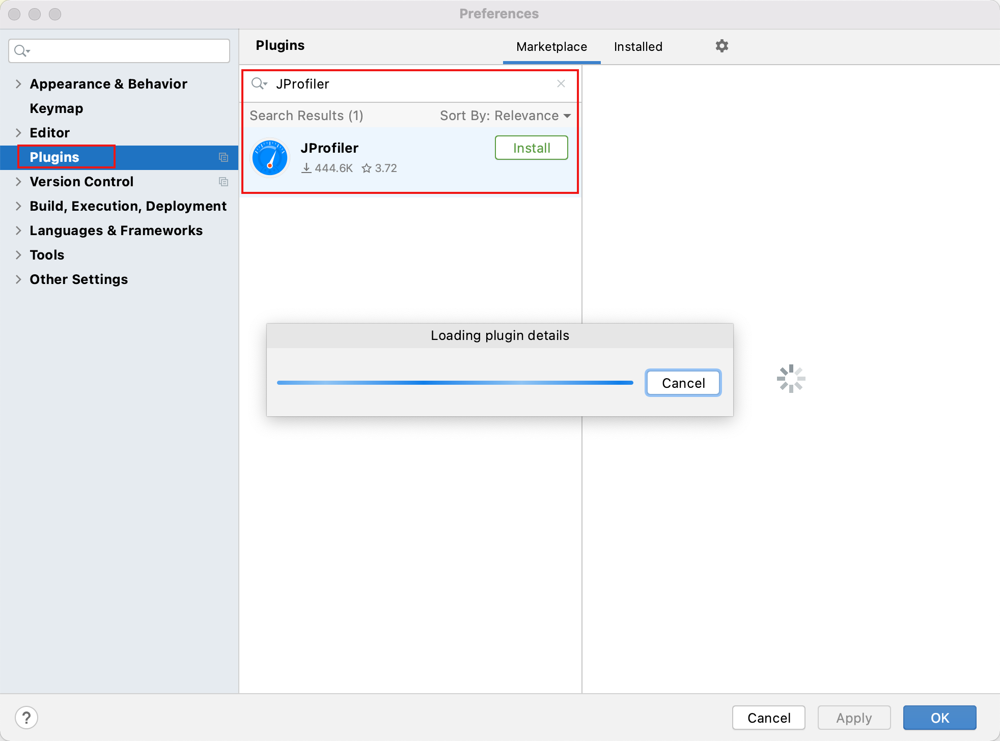
 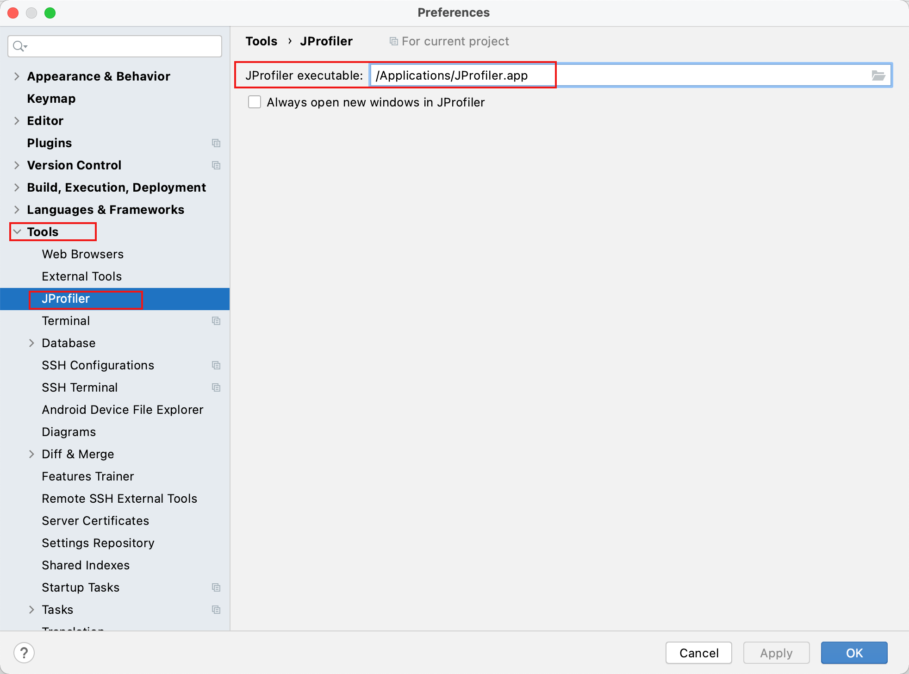

**JProfiler 中配置 IDEA**
 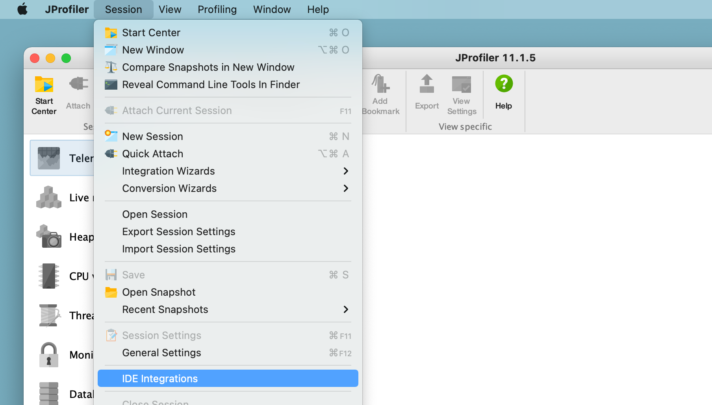
 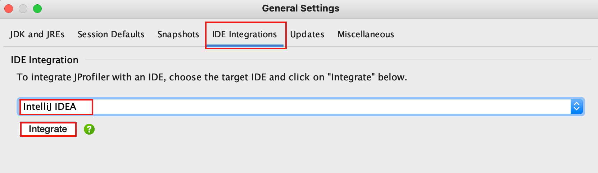

#### 5.3. 具体使用

##### 数据采集方式

**JProfiler 数据采集方式** 分为两种：Sampling（样本采集）和 Instrumentation（重构模式）

- **Instrumentation：** 这是 JProfiler 全功能模式。在 class 加载之前，JProfiler 把相关功能代码写入到需要分析的 class 的 bytecode 中，对正在运行的 jvm 有一定影响。

  - 优点：功能强大，在此设置中，调用堆栈信息是准确的。

  - 缺点：要分析的 class 较多，则对应用的性能影响较大，CPU 开销可能很高（取决于 Filter 的控制）。因此使用此模式一般配合 Filter 使用，只对特定的类或包进行分析。

- **Sampling：** 类似于样本统计，每隔一段时间（5ms）将每个线程栈中的方法栈中的信息统计出来。

  - 优点：对 CPU 的开销非常低，对应用影响小（即使你不配置任何 Filter）

  - 缺点：一些数据/特性不能提供（例如：方法的调用次数、执行时间）

注：JProfiler 本身没有指出数据的采集类型，这里的采集类型是针对方法调用的采集类型。因为 JProfiler 的绝大多数核心功能都依赖方法调用采集的数据，所以可以直接认为是 JProfiler 的数据采集类型。

##### 遥感监测 Telemetries

遥感监测 Telemetries（查看 JVM 的运行信息）

- **整体视图 Overview：** 显示堆内存、CPU、线程以及 GC 等活动视图

- **内存 Memory：** 显示一张关于内存变化的活动时间表。

- **记录的对象 Recorded objects：** 显示一张关于活动对象与数组的图表的活动时间表。

- **记录吞吐量 Record Throughput：** 显示一段时间累计的 JVM 生产和释放的活动时间表。

- **垃圾回收活动 GC Activity：** 显示一张关于垃圾回收活动的活动时间表。

- **类 Classes：** 显示一个与已装载类的图表的活动时间表。

- **线程 Threads：** 显示一个与动态线程图表的活动时间表。

- **CPU 负载 CPU Load：** 显示一段时间中 CPU 的负载图表。

##### 内存视图 Live Memory

Live memory 内存剖析：class/class instance 的相关信息。例如对象的个数，大小，对象创建的方法执行栈，对象创建的热点。

- **所有对象 All Objects**
 显示所有加载的类的列表和在堆上分配的实例数。只有 Java1.5（JVMTI）才会显示此视图。
 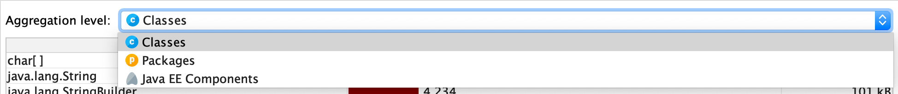

- **记录对象 Record Objects**
 查看特定时间段对象的分配，并记录分配的调用堆栈

- **分配访问树 Allocation Call Tree**
 显示一颗请求树或者方法、类、包或对以选择类有带注释的分配信息的 J2EE 组件。

- **分配热点 Allocation Hot Spots**
 显示一个列表，包括方法、类、包或分配已选类的 J2EE 组件。你可以标注当前值并且显示差异值。对于每个热点都可以显示它的跟踪记录树。

- **类追踪器 Class Tracker**
 类追踪视图可以包含任意数量的图表，显示选定的类和包的实例与时间。

##### 堆遍历 Heap Walker

**类 Classes**
 显示所有类和它们的实例，可以右击具体的类 "used Selected Instance" 实现进一步跟踪。
 **分配 Allocations**
 为所有记录对象显示分配树和分配热点。
 **索引 References**
 为单个对象和“显示到垃圾回收根目录的路径”提供索引图的显示功能。还能提供合并输入视图和输出视图的功能。
 **时间 Time**
 显示一个对已记录对象的解决时间的柱状图。
 **检查 Inspections**
 显示了一个数量的操作，将分析当前对象集在某种条件下的子集，实质是一个筛选的过程。
 **图标 Graph**
 你需要在 references 视图和 biggest 视图手动添加对象到图表，它可以显示对象的传入和传出引用，能方便的找到垃圾收集器根源。

PS：在工具栏点击 "Go To Start" 可以使堆内存重新计数，也就是回到初始状态。

##### CPU 视图 CPU Views

Jprofiler 提供不同的方法来记录访问树以优化性能和细节。线程或者线程组以及线程状况可以被所有的视图选择。所有的视图都可以聚集到方法、类、包或 J2EE 组件等不同层上。
 **访问树 Call Tree**
 显示一个积累的自顶向下的树，树中包含所有在 JVM 中已记录的访问队列。JDBC，JMS 和 JNDI 服务请求都被注释在请求树中。请求树可以根据 Servlet 和 JSP 对 URL 的不同需要进行拆分。
 **热点 Hot Spots**
 显示消耗时间最多的方法的列表。对每个热点都能够显示回调树。该热点可以按照方法请求，JDBC，JMS 和 JNDI 服务请求以及按照 URL 请求来进行计算。
 **访问图 Call Graph**
 显示一个从已选方法、类、包或 J2EE 组件开发的访问队列的图。
 **方法统计 Method Statistic**
 显示一段时间内记录的方法的调用时间细节。

##### 线程视图 Threads

JProfiler 通过对线程历史的监控判断其运行状态，并监控是否有线程阻塞产生，还能将一个线程锁管理的方法以树状形式呈现。对线程剖析。
 **线程历史 Thread History**
 显示一个与线程活动和线程状态在一起的活动时间表
 **线程监控 Thread Monitor**
 显示一个列表，包括所有的活动线程以及它们目前的活动状况。
 **线程转储 Thread Dumps**
 显示所有线程的堆栈跟踪。

线程分析主要关心三个方面：

1. web 容器的线程最大数。比如：Tomcat 的线程容量应该略大于最大并发数。

1. 线程阻塞

1. 线程死锁

##### 监视器&锁 Monitors&locks

**监视器&锁 Monitors&locks** 所有线程持有锁的情况以及锁的信息。
 观察 JVM 的内部线程并查看状态：

- 死锁探测图表 Current Locking Graph：显示 JVM 中的当前死锁图表。

- 目前使用的监视器 Current Monitors：显示目前使用的监视器并且包括它们的关联线程。

- 锁定历史图表 Locking History Graph：显示记录在 JVM 中的锁定历史

- 历史检查记录 Monitor History：显示重大的等待事件和阻塞事件的历史记录。

- 监控器使用统计 Monitor Usage Statistics：显示分组监测，线程和监测类的统计监测数据

#### 5.4. 案例分析

##### 案例1

```
public class JProfilerTest {
    public static void main(String[] args) {
        while (true) {
            ArrayList list = new ArrayList();
            for (int i = 0; i < 500; i++) {
                Data data = new Data();
                list.add(data);
            }
            try {
                TimeUnit.MILLISECONDS.sleep(500);
            } catch (InterruptedException e) {
                e.printStackTrace();
            }
        }
    }
}

class Data {
    private int size = 10;
    private byte[] buffer = new byte[1024 * 1024];  // 1MB
    private String info = "hello, liudezhi";
}

```

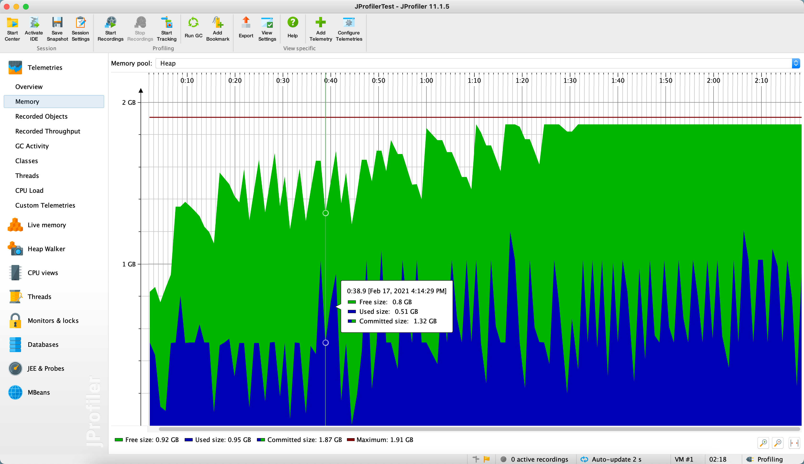
 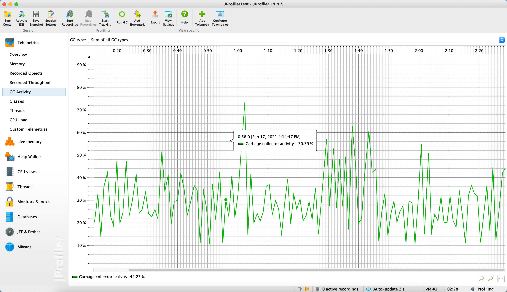

##### 案例2

```
public class MemoryLeak {
    public static void main(String[] args) {
        while (true) {
            ArrayList beanList = new ArrayList();
            for (int i = 0; i < 500; i++) {
                Bean data = new Bean();
                data.list.add(new byte[1024 * 10]); // 10KB
                beanList.add(data);
            }
            try {
                TimeUnit.MILLISECONDS.sleep(500);
            } catch (InterruptedException e) {
                e.printStackTrace();
            }
        }
    }
}

class Bean {
    int size = 10;
    String info = "hello, liudezhi";
    static ArrayList list = new ArrayList();
}

```

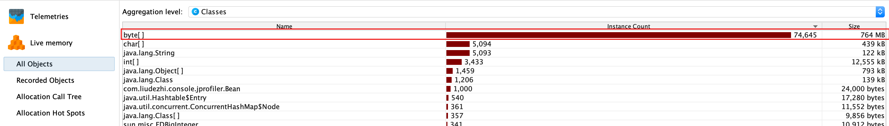
 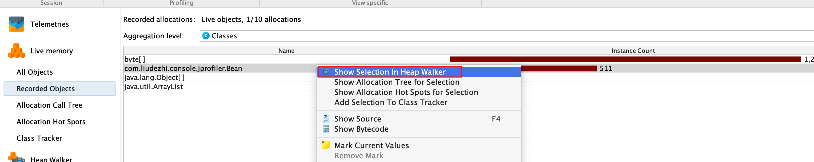
 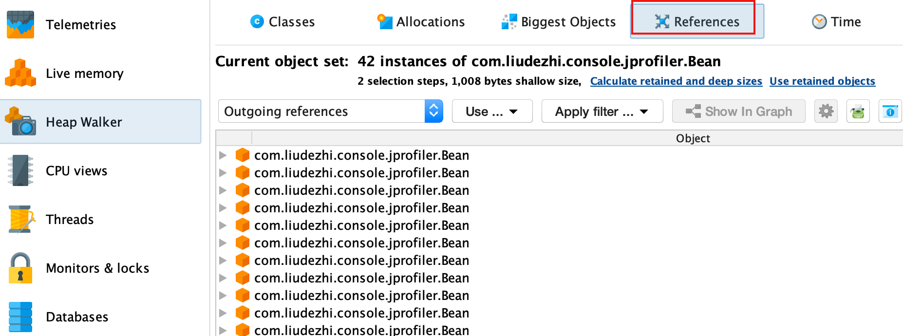
 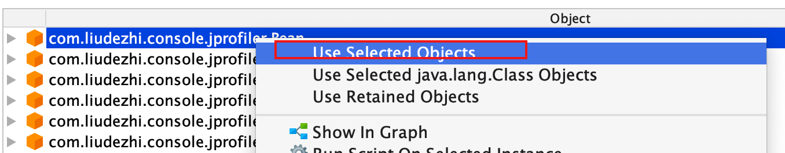
 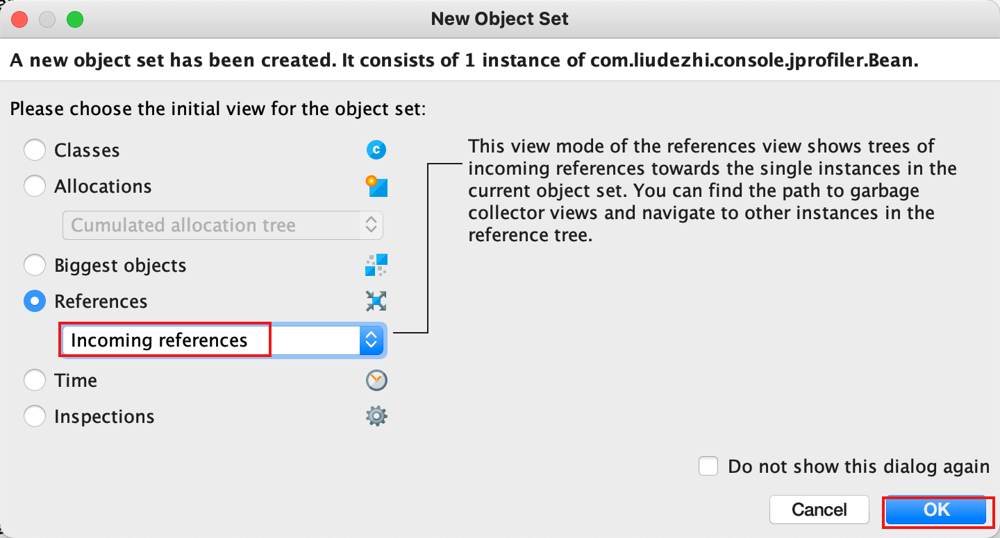
 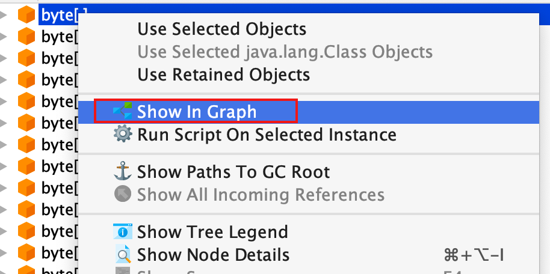
 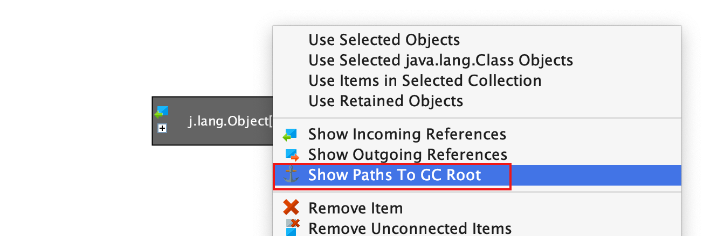
 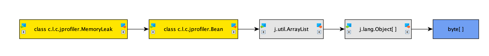

### 6. Arthas

#### 6.1. 基本概述

##### 背景

前面，我们介绍了 jdk 自带的 jvisualvm 等免费工具，以及商业化工具 JProfiler。

这两款工具在业界知名度也比较高，他们的**优点**是可以图形界面上看到各维度的性能数据，使用者根据这些数据进行综合分析，然后判断哪里出了性能问题。

但是这两款工具也有个**缺点**，都必须在服务端项目进程中配置相关的监控参数。然后工具通过远程连接到项目进程，获取相关的数据。这样就会带来一些不便，比如线上环境的网络是隔离的，本地的监控工具根部连不上线上环境。并且类似于 JProfiler 这样的商业工具，是需要付费的。

**阿里巴巴开源的性能分析神奇 Arthas（阿尔萨斯）** 是一款不需要远程连接，也不需要配置监控参数，同时提供了丰富的性能监控数据的工具。

##### 概述


 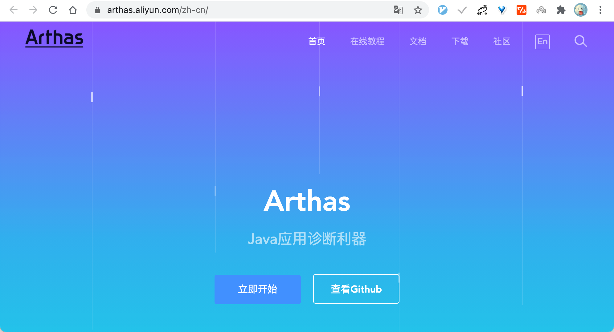
 Arthas（阿尔萨斯）是 Alibaba 开源的 Java 诊断工具，深受开发者喜爱。在线排查问题，无需重启，动态跟踪 Java 代码，实时监控 JVM 状态。

Arthas 支持 JDK1.6+，支持 Linux/Mac/Windows，采用命令行交互模式，同时提供丰富的 Tab 自动补全功能，进一步方便进行问题的定位和诊断。

当你遇到以下类似问题而束手无策时，Arthas 可以帮助你解决：

- 这个类从哪个 jar 包加载的？为什么会报各种类相关的 Exception？

- 我改的代码为什么没有执行到？难道是我没有 commit？分支搞错了？

- 遇到问题无法在线上 debug，难道只能通过加日志再重新发布吗？

- 线上遇到某个用户的数据处理有问题，但线上同样无法 debug，线下无法重现！

- 是否有一个全局视角来查看系统的运行状况？

- 有什么办法可以监控到 JVM 的实时运行状态？

- 怎么快速定位应用的热点，生成火焰图？

##### 基于哪些工具开发而来

- greys-anatomy：**Arthas 代码基于 Greys 二次开发而来**

- termd：**Arthas 的命令行实现基于 termd 开发**，是一款优秀的命令行程序开发框架。

- crash：**Arthas 的文本渲染功能基于 crash 中的文本渲染功能开发**

- cli：**Arthas 的命令行界面**基于 vert.x 提供的 cli 库进行开发

- compiler：Arthas 里的**内存编译器代码**来源

- Apache Commons Net：Arthas 里的 Telnet Client 代码来源

- JavaAgent：运行在 main 方法之前的**拦截器**，它内定的方法名叫 premain，也就是说先执行 premain 方法然后再执行 main 方法。

- ASM：一个通用的 Java 字节码操作和分析框架。它可以用于修改现有的类或直接以二进制形式动态生成类。ASM 提供了一些常见的字节码转换和分析算法，可以从它们构建定制的复杂转换和代码分析工具。ASM 提供了与其他 Java 字节码框架类似的功能，但是主要关注性能。因为它被设计和实现的尽可能小和快，所以非常适合在动态系统中使用（当然也可以以静态方式使用，例如在编译器中）。

**官方使用文档：**

>
https://arthas.aliyun.com/zh-cn/

#### 6.2. 安装与使用

- 安装
 https://arthas.aliyun.com/doc/quick-start.html

- 工程目录
 arthas-agent：基于 JavaAgent 技术的代理
 bin：一些启动脚本
 arthas-boot：Java 版本的一键安装启动脚本
 arthas-client：telnet client 代码
 arthas-common：一些公用的工具类和枚举类
 arthas-core：核心库，各种 arthas 命令的交互和实现
 arthas-demo：示例代码
 arthas-memorycompiler：内存编译器代码，From https://github.com/skalogs/SkaETL/tree/master/compiler
 arthas-packaging：maven 打包相关的
 arthas-site：arthas 站点
 arthas-spy：编织到目标类中的各个切面
 static：静态资源
 arthas-testcase：测试

- 启动
 Arthas 只是一个 Java 程序，所以可以直接用 java -jar 运行。
 执行成功后，arthas 提供了一种命令行方式的交互方式，arthas 会检测当前服务器上 Java 进程，并将进程列表展示出来，用户输入对应的编号（1、2、3、4...）进行选择，然后回车。
 方式1：**`java -jar arthas-boot.jar`**
 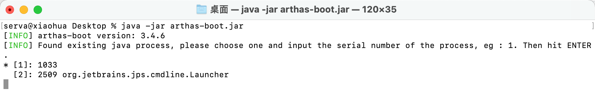
 方式2：**`java -jar arthas-boot.jar [PID]`**

- 查看进程
 jps -l 或 ps aux | grep java

- 查看日志 `cat ~/logs/arthas/arthas.log`

- 查看帮助 `java -jar arthas-boot.jar -h`

- web console
 除了在命令行查看外，Arthas 目前还支持 Web Console。在启动成功连接进程之后就已经自动启动，可以直接访问 http://127.0.0.1:8563/ 访问，页面上的操作模式和控制台完全一样。
 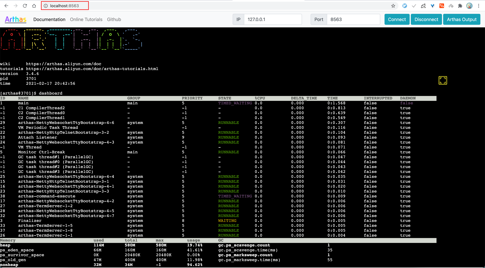

- 退出
 最后一行 [arthas@(PID)]，说明打开进入了监控客户端，在这里就可以执行相关命令进行查看了。

  - 使用 quit/exit; 退出当前客户端

  - 使用 stop/shutdown; 关闭 arthas 服务端，并退出所有客户端。

#### 6.3. 相关诊断指令

>
https://arthas.gitee.io/advanced-use.html

##### 基础指令

- help——查看命令帮助信息

- cat——打印文件内容，和linux里的cat命令类似

- echo–打印参数，和linux里的echo命令类似

- grep——匹配查找，和linux里的grep命令类似

- base64——base64编码转换，和linux里的base64命令类似

- tee——复制标准输入到标准输出和指定的文件，和linux里的tee命令类似

- pwd——返回当前的工作目录，和linux命令类似

- cls——清空当前屏幕区域

- session——查看当前会话的信息

- reset——重置增强类，将被 Arthas 增强过的类全部还原，Arthas 服务端关闭时会重置所有增强过的类

- version——输出当前目标 Java 进程所加载的 Arthas 版本号

- history——打印命令历史

- quit——退出当前 Arthas 客户端，其他 Arthas 客户端不受影响

- stop——关闭 Arthas 服务端，所有 Arthas 客户端全部退出

- keymap——Arthas快捷键列表及自定义快捷键

##### JVM 相关

- dashboard——当前系统的实时数据面板

- thread——查看当前 JVM 的线程堆栈信息

- jvm——查看当前 JVM 的信息

- sysprop——查看和修改JVM的系统属性

- sysenv——查看JVM的环境变量

- vmoption——查看和修改JVM里诊断相关的option

- perfcounter——查看当前 JVM 的Perf Counter信息

- logger——查看和修改logger

- getstatic——查看类的静态属性

- ognl——执行ognl表达式

- mbean——查看 Mbean 的信息

- heapdump——dump java heap, 类似jmap命令的heap dump功能

##### class/classloader 相关

- sc——查看JVM已加载的类信息

- sm——查看已加载类的方法信息

- jad——反编译指定已加载类的源码

- mc——内存编译器，内存编译.java文件为.class文件

- retransform——加载外部的.class文件，retransform到JVM里

- redefine——加载外部的.class文件，redefine到JVM里

- dump——dump 已加载类的 byte code 到特定目录

- classloader——查看classloader的继承树，urls，类加载信息，使用classloader去getResource

##### monitor/watch/trace 相关

- monitor——方法执行监控

- watch——方法执行数据观测

- trace——方法内部调用路径，并输出方法路径上的每个节点上耗时

- stack——输出当前方法被调用的调用路径

- tt——方法执行数据的时空隧道，记录下指定方法每次调用的入参和返回信息，并能对这些不同的时间下调用进行观测

##### 其它

- profiler/火焰图

- options

- ...

### 7. Java Mission Control

#### 7.1. 历史

在 Oracle 收购 Sun 之前，Oracle 的 JRockit 虚拟机提供了一款叫做 JRockit Mission Control 的虚拟机诊断工具。

在 Oracle 收购 Sun 之后，Oracle 公司同时拥有了 Sun Hotspot 和 JRockit 两款虚拟机。根据 Oracle 对于 Java 的战略，在今后的发展中，会将 JRockit 的优秀特性移植到 Hotspot 上。其中，一个重要的改进就是在 Sun 的 JDK 中加入了 JRockit 的支持。
 在 Oracle JDK 7u40 之后，Mission Control 这款工具已经绑定在 Oracle JDK 中发布。

自 JDK11 开始，本节介绍的 JFR 已经开源。但在之前的 Java 版本，JFR 属于 Commercial Feature，需要通过 Java 虚拟机参数 `-XX:+UnlockCommercialFeatrues` 开启。

如果有兴趣可以查看 OpenJDK 的 Mission Control 项目：

>
https://github.com/JDKMissionController/jmc

#### 7.2. 启动

Mission Control 位于 %JAVA_HOME%/bin/jmc，打开这款软件。(windows 下 jmc.exe 双击即可)
 mac 下？

#### 7.3. 概述

Java Mission Contorl（简称 JMC），Java 官方提供的性能强劲的工具。是一个用于对 Java 应用程序进行管理、监视、概要分析和故障排除的工具套件。

它包含一个 GUI 客户端，以及众多用来收集 Java 虚拟机性能数据的插件，如 JMX Console（能够访问用来存放虚拟机各个子系统运行数据的 MXBeans），以及虚拟机内置的高效 profiling 工具 Java Flight Recorder（JFR）。

JMC 的另一个优点就是：采用取样，而不是传统的代码植入技术，对应用程序的影响非常非常小，完全可以开着 JMC 来做压测（唯一影响的可能是 Full GC 多了）。

#### 7.4. 功能：实时监控 JVM 运行时的状态

如果是远程服务器，使用前要开 JMX。

```
-Dcom.sun.management.jmxremote.port=${YOUR PORT}
-Dcom.sun.management.jmxremote
-Dcom.sun.management.jmxremote.authenticate=false
-Dcom.sun.management.jmxremote.ssl=false
-Djava.rmi.server.hostname=${YOUR HOST/IP}

```

文件 -> 连接 -> 创建新连接，填上上面 JMX 参数的 host 和 port

#### 7.5. Java Flight Recorder

Java Flight Recorder 是 JMC 的其中一个组件。

Java Flight Recorder 能够以极低的性能开销收集 Java 虚拟机的性能数据。

JFR 的性能开销很小，在默认配置下平均低于 1%，与其他工具相比，JFR 能够直接访问虚拟机内的数据，并且不会影响虚拟机的优化。因此，**它非常适用于生成环境下满负荷运行的 Java 程序**。

Java Flight Recorder 和 JDK Mission Control 共同创建了一个完整的工具链。JDK Mission Control 可对 Java Flight Recorder 连续收集低水平和详细的运行时信息进行搞高效、详细的分析。

##### 事件类型

当启用时，JFR 将记录运行过程中发生的一系列事件。其中包括 Java 层面的事件，如线程事件、锁事件，以及 Java 虚拟机内部的事件，如新建对象、垃圾回收和即时编译事件。

按照发生时机以及持续时间来划分，JFR 的事件共有四种类型，它们分别为以下四种：

1. 瞬时事件（Instant Event），用户关心的是它们发生与否，例如异常、线程启动事件。

1. 持续事件（Duration Event），用户关心的是它们的持续时间，例如垃圾回收事件。

1. 计时事件（Timed Event），是时长超出指定阈值的持续事件。

1. 取样事件（Sample Event），是周期性取样的事件。

取样事件的其中一个常见例子便是方法抽样（Method Sampling），即每隔一段时间统计各个线程的栈轨迹。如果在这些抽样取得的栈轨迹中存在一个反复出现的方法，那么我们可以推测该方法是热点方法。

##### 启动方式

- 方式1：使用 -XX:StartFlightRecording=参数
 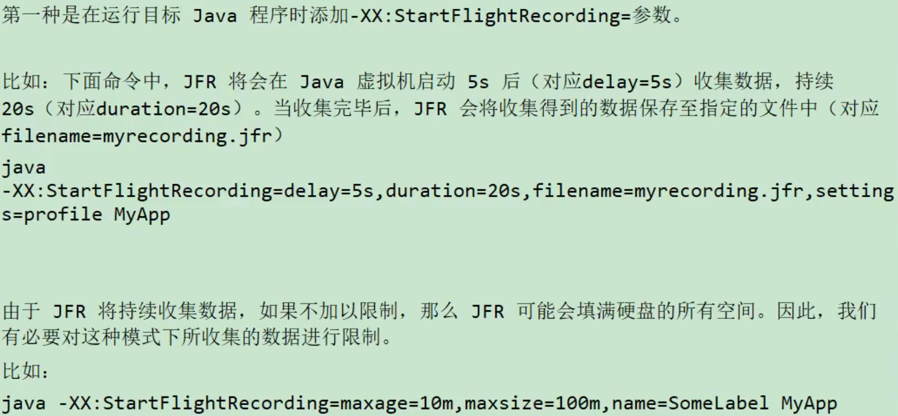

- 方式2：使用 jcmd 的 JFR.*子命令
 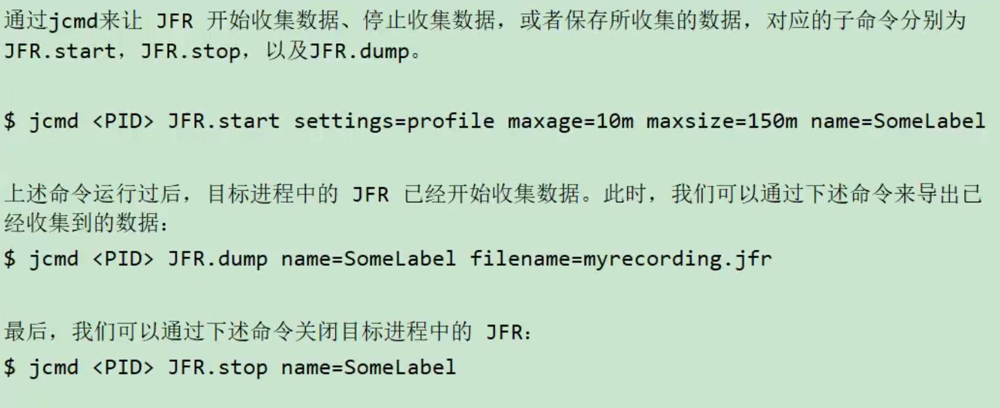

- 方式3：JMC 的 JFR 插件
 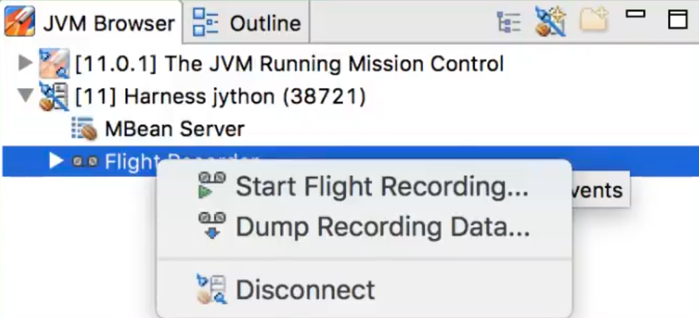

### 8. 其它工具

#### 8.1. Flame Graphs（火焰图）

在追求极致性能的场景下，了解你的程序运行过程中 CPU 在干什么很重要，火焰图就是一种非常直观的展示 CPU 在程序整个生命周期过程中时间分配的工具。

现代的程序员对于火焰图不应该陌生，这个工具可以非常直观的显示出调用栈中的 CPU 消耗瓶颈。

网上的关于 Java 火焰图的讲解大部分来自于 Brendan Gregg 的博客：

>
http://www.brendangregg.com/flamegraphs.html
 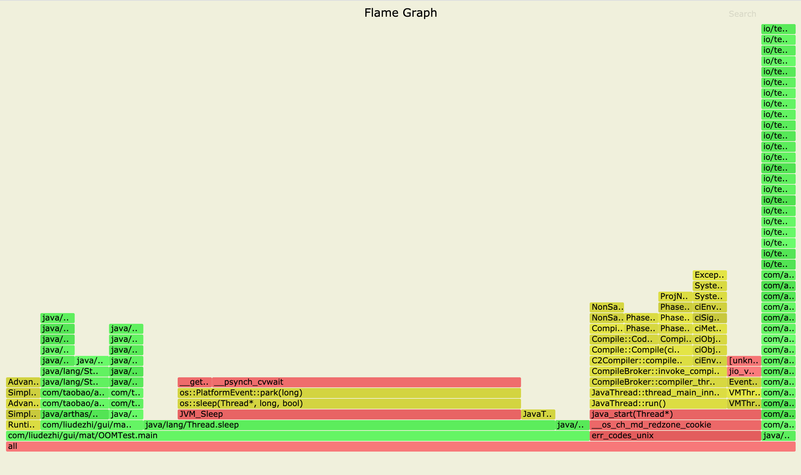

火焰图，简单通过 x 轴横条宽度来度量时间指标，y 轴代表线程栈的层次。

#### 8.2. Tprofiler

**案例：**
 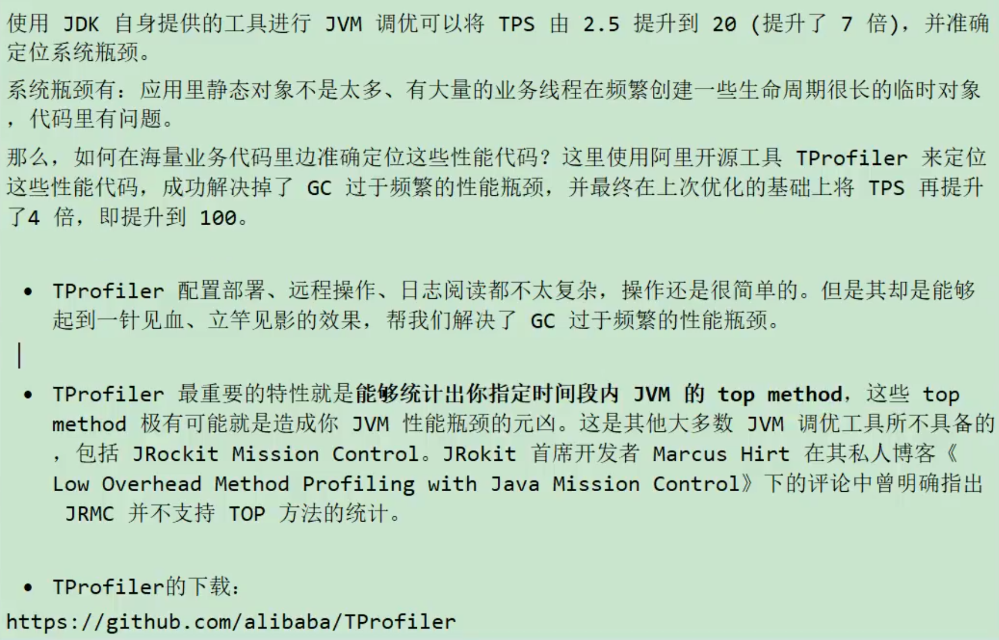

#### 8.3. Btrace

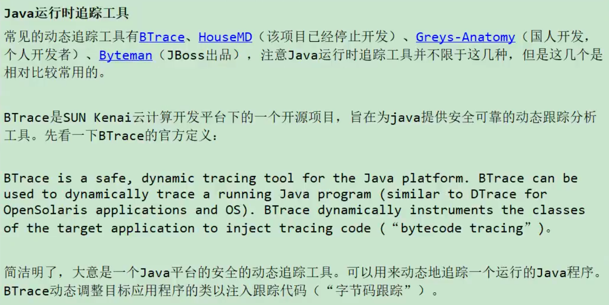

#### 8.4. YourKit

...

#### 8.5. JProbe

#### 8.6. Spring Insight

...

%23%23%20JVM%20%E7%9B%91%E6%8E%A7%E5%8F%8A%E8%AF%8A%E6%96%AD%E5%B7%A5%E5%85%B7-GUI%20%E7%AF%87%0A%23%23%23%201.%20%E5%B7%A5%E5%85%B7%E6%A6%82%E8%BF%B0%0A%E4%BD%BF%E7%94%A8%E4%B8%8A%E4%B8%80%E7%AB%A0%E5%91%BD%E4%BB%A4%E8%A1%8C%E5%B7%A5%E5%85%B7%E6%88%96%E7%BB%84%E5%90%88%E8%83%BD%E5%B8%AE%E6%82%A8%E8%8E%B7%E5%8F%96%E7%9B%AE%E6%A0%87%20Java%20%E5%BA%94%E7%94%A8%E6%80%A7%E8%83%BD%E7%9B%B8%E5%85%B3%E7%9A%84%E5%9F%BA%E7%A1%80%E4%BF%A1%E6%81%AF%EF%BC%8C%E4%BD%86%E5%AE%83%E4%BB%AC%E5%AD%98%E5%9C%A8%E4%B8%8B%E5%88%97%E5%B1%80%E9%99%90%EF%BC%9A%0A1.%20%E6%97%A0%E6%B3%95%E8%8E%B7%E5%8F%96%E6%96%B9%E6%B3%95%E7%BA%A7%E5%88%AB%E7%9A%84%E5%88%86%E6%9E%90%E6%95%B0%E6%8D%AE%EF%BC%8C%E5%A6%82%E6%96%B9%E6%B3%95%E9%97%B4%E7%9A%84%E8%B0%83%E7%94%A8%E5%85%B3%E7%B3%BB%E3%80%81%E5%90%84%E6%96%B9%E6%B3%95%E7%9A%84%E8%B0%83%E7%94%A8%E6%AC%A1%E6%95%B0%E5%92%8C%E8%B0%83%E7%94%A8%E6%97%B6%E9%97%B4%E7%AD%89%EF%BC%88%E8%BF%99%E5%AF%B9%E5%AE%9A%E4%BD%8D%E5%BA%94%E7%94%A8%E6%80%A7%E8%83%BD%E7%93%B6%E9%A2%88%E8%87%B3%E5%85%B3%E9%87%8D%E8%A6%81%EF%BC%89%E3%80%82%0A2.%20%E8%A6%81%E6%B1%82%E7%94%A8%E6%88%B7%E7%99%BB%E9%99%86%E5%88%B0%E7%9B%AE%E6%A0%87%20Java%20%E5%BA%94%E7%94%A8%E6%89%80%E5%9C%A8%E7%9A%84%E5%AE%BF%E4%B8%BB%E6%9C%BA%E4%B8%8A%EF%BC%8C%E4%BD%BF%E7%94%A8%E8%B5%B7%E6%9D%A5%E4%B8%8D%E6%98%AF%E5%BE%88%E6%96%B9%E4%BE%BF%E3%80%82%0A3.%20%E5%88%86%E6%9E%90%E6%95%B0%E6%8D%AE%E9%80%9A%E8%BF%87%E7%BB%88%E7%AB%AF%E8%BE%93%E5%87%BA%EF%BC%8C%E7%BB%93%E6%9E%9C%E5%B1%95%E7%A4%BA%E4%B8%8D%E5%A4%9F%E7%9B%B4%E8%A7%82%E3%80%82%0A%0A%E4%B8%BA%E6%AD%A4%EF%BC%8CJDK%20%E6%8F%90%E4%BE%9B%E4%BA%86%E4%B8%80%E4%BA%9B%E5%86%85%E5%AD%98%E6%B3%84%E6%BC%8F%E7%9A%84%E5%88%86%E6%9E%90%E5%B7%A5%E5%85%B7%EF%BC%8C%E5%A6%82%20jconsole%EF%BC%8Cjvisualvm%20%E7%AD%89%EF%BC%8C%E7%94%A8%E4%BA%8E%E8%BE%85%E5%8A%A9%E5%BC%80%E5%8F%91%E4%BA%BA%E5%91%98%E5%AE%9A%E4%BD%8D%E9%97%AE%E9%A2%98%EF%BC%8C%E4%BD%86%E6%98%AF%E8%BF%99%E4%BA%9B%E5%B7%A5%E5%85%B7%E5%BE%88%E5%A4%9A%E6%97%B6%E5%80%99%E5%B9%B6%E4%B8%8D%E6%BB%A1%E8%B6%B3%E5%BF%AB%E9%80%9F%E5%AE%9A%E4%BD%8D%E7%9A%84%E9%9C%80%E6%B1%82%E3%80%82%E6%89%80%E4%BB%A5%E8%BF%99%E9%87%8C%E4%BB%8B%E7%BB%8D%E7%9A%84%E5%B7%A5%E5%85%B7%E7%9B%B8%E5%AF%B9%E5%A4%9A%E4%B8%80%E4%BA%9B%E3%80%81%E4%B8%B0%E5%AF%8C%E4%B8%80%E4%BA%9B%E3%80%82%0A%0A**%E5%9B%BE%E5%BD%A2%E5%8C%96%E7%BB%BC%E5%90%88%E8%AF%8A%E6%96%AD%E5%B7%A5%E5%85%B7**%0A-%20**JDK%20%E8%87%AA%E5%B8%A6%E7%9A%84%E5%B7%A5%E5%85%B7**%0A%20%20%20%20-%20**jconsole%EF%BC%9A**%20JDK%20%E8%87%AA%E5%B8%A6%E7%9A%84%E5%8F%AF%E8%A7%86%E5%8C%96%E7%9B%91%E6%8E%A7%E5%B7%A5%E5%85%B7%E3%80%82%E6%9F%A5%E7%9C%8B%20Java%20%E5%BA%94%E7%94%A8%E7%A8%8B%E5%BA%8F%E7%9A%84%E8%BF%90%E8%A1%8C%E6%A6%82%E5%86%B5%E3%80%81%E7%9B%91%E6%8E%A7%E5%A0%86%E4%BF%A1%E6%81%AF%E3%80%81%E6%B0%B8%E4%B9%85%E5%8C%BA%EF%BC%88%E6%88%96%E5%85%83%E7%A9%BA%E9%97%B4%EF%BC%89%E4%BD%BF%E7%94%A8%E6%83%85%E5%86%B5%E3%80%81%E7%B1%BB%E5%8A%A0%E8%BD%BD%E6%83%85%E5%86%B5%E7%AD%89%E3%80%82%0A%20%20%20%20%E4%BD%8D%E7%BD%AE%EF%BC%9Ajdk%2Fbin%2Fjconsole.exe(windows)%EF%BC%8C%2FLibrary%2FJava%2FJavaVirtualMachines%2Fjdk1.8.0_271.jdk%2FContents%2FHome%2Fbin%2Fjconsole(mac)%0A%20%20%20%20-%20**Visual%20VM%EF%BC%9A**%20Visual%20VM%20%E6%98%AF%E4%B8%80%E4%B8%AA%E5%B7%A5%E5%85%B7%EF%BC%8C%E5%AE%83%E6%8F%90%E4%BE%9B%E4%BA%86%E4%B8%80%E4%B8%AA%E5%8F%AF%E8%A7%86%E5%8C%96%E7%95%8C%E9%9D%A2%EF%BC%8C%E7%94%A8%E4%BA%8E%E6%9F%A5%E7%9C%8B%20Java%20%E8%99%9A%E6%8B%9F%E6%9C%BA%E4%B8%8A%E8%BF%90%E8%A1%8C%E7%9A%84%E5%9F%BA%E4%BA%8E%20Java%20%E6%8A%80%E6%9C%AF%E7%9A%84%E5%BA%94%E7%94%A8%E7%A8%8B%E5%BA%8F%E7%9A%84%E8%AF%A6%E7%BB%86%E4%BF%A1%E6%81%AF%E3%80%82%0A%20%20%20%20%E4%BD%8D%E7%BD%AE%EF%BC%9Ajdk%2Fbin%2Fjvisualvm.exe(windows)%EF%BC%8C%2FLibrary%2FJava%2FJavaVirtualMachines%2Fjdk1.8.0_271.jdk%2FContents%2FHome%2Fbin%2Fjvisualvm(mac)%0A%20%20%20%20-%20**JMC%EF%BC%9A**%20Java%20Mission%20Control%EF%BC%8C%E5%86%85%E7%BD%AE%20Java%20Flight%20Recorder%E3%80%82%E8%83%BD%E5%A4%9F%E4%BB%A5%E6%9E%81%E4%BD%8E%E7%9A%84%E6%80%A7%E8%83%BD%E5%BC%80%E9%94%80%E6%94%B6%E9%9B%86%20Java%20%E8%99%9A%E6%8B%9F%E6%9C%BA%E7%9A%84%E6%80%A7%E8%83%BD%E6%95%B0%E6%8D%AE%E3%80%82%0A-%20**%E7%AC%AC%E4%B8%89%E6%96%B9%E5%B7%A5%E5%85%B7**%0A%20%20%20%20-%20**MAT%EF%BC%9A**%20MAT%EF%BC%88Memory%20Analyzer%20Tool%EF%BC%89%E6%98%AF%E5%9F%BA%E4%BA%8E%20Eclipse%20%E7%9A%84%E5%86%85%E5%AD%98%E5%88%86%E6%9E%90%E5%B7%A5%E5%85%B7%EF%BC%8C%E6%98%AF%E4%B8%80%E4%B8%AA%E5%BF%AB%E9%80%9F%E3%80%81%E5%8A%9F%E8%83%BD%E4%B8%B0%E5%AF%8C%E7%9A%84%20Java%20Heap%20%E5%88%86%E6%9E%90%E5%B7%A5%E5%85%B7%EF%BC%8C%E5%AE%83%E5%8F%AF%E4%BB%A5%E5%B8%AE%E5%8A%A9%E6%88%91%E4%BB%AC%E6%9F%A5%E6%89%BE%E5%86%85%E5%AD%98%E6%B3%84%E6%BC%8F%E5%92%8C%E5%87%8F%E5%B0%91%E5%86%85%E5%AD%98%E6%B6%88%E8%80%97%0A%20%20%20%20%E4%BB%A5%20Eclipse%20%E7%9A%84%E6%8F%92%E4%BB%B6%E5%BD%A2%E5%BC%8F%0A%20%20%20%20-%20**JProfiler%EF%BC%9A**%20%E5%95%86%E4%B8%9A%E8%BD%AF%E4%BB%B6%EF%BC%8C%E9%9C%80%E8%A6%81%E4%BB%98%E8%B4%B9%E3%80%82%E5%8A%9F%E8%83%BD%E5%BC%BA%E5%A4%A7%E3%80%82%0A%20%20%20%20%E4%B8%8E%20Visual%20VM%20%E7%B1%BB%E4%BC%BC%0A%20%20%20%20-%20**Arthas%EF%BC%9A**%20Alibaba%20%E5%BC%80%E6%BA%90%E7%9A%84%20Java%20%E8%AF%8A%E6%96%AD%E5%B7%A5%E5%85%B7%E3%80%82%E6%B7%B1%E5%8F%97%E5%BC%80%E5%8F%91%E8%80%85%E5%96%9C%E7%88%B1%E3%80%82%0A%20%20%20%20-%20**Btrace%EF%BC%9A**%20Java%20%E8%BF%90%E8%A1%8C%E6%97%B6%E8%BF%BD%E8%B8%AA%E5%B7%A5%E5%85%B7%E3%80%82%E5%8F%AF%E4%BB%A5%E5%9C%A8%E4%B8%8D%E5%81%9C%E6%9C%BA%E7%9A%84%E6%83%85%E5%86%B5%E4%B8%8B%EF%BC%8C%E8%B7%9F%E8%B8%AA%E6%8C%87%E5%AE%9A%E7%9A%84%E6%96%B9%E6%B3%95%E8%B0%83%E7%94%A8%E3%80%81%E6%9E%84%E9%80%A0%E5%87%BD%E6%95%B0%E8%B0%83%E7%94%A8%E5%92%8C%E7%B3%BB%E7%BB%9F%E5%86%85%E5%AD%98%E7%AD%89%E4%BF%A1%E6%81%AF%E3%80%82%0A%0A%23%23%23%202.%20jConsole%0A%23%23%23%23%202.1.%20%E5%9F%BA%E6%9C%AC%E6%A6%82%E8%BF%B0%0A-%20%E4%BB%8E%20Java5%20%E5%BC%80%E5%A7%8B%EF%BC%8C%E5%9C%A8%20JDK%20%E4%B8%AD%E8%87%AA%E5%B8%A6%E7%9A%84%20java%20%E7%9B%91%E6%8E%A7%E5%92%8C%E7%AE%A1%E7%90%86%E6%8E%A7%E5%88%B6%E5%8F%B0%E3%80%82%0A-%20%E7%94%A8%E4%BA%8E%E5%AF%B9%20JVM%20%E4%B8%AD%E5%86%85%E5%AD%98%E3%80%81%E7%BA%BF%E7%A8%8B%E5%92%8C%E7%B1%BB%E7%AD%89%E7%9A%84%E7%9B%91%E6%8E%A7%EF%BC%8C%E6%98%AF%E4%B8%80%E4%B8%AA%E5%9F%BA%E4%BA%8E%20JMX%EF%BC%88java%20management%20extensions%EF%BC%89%E7%9A%84%20GUI%20%E6%80%A7%E8%83%BD%E7%9B%91%E6%8E%A7%E5%B7%A5%E5%85%B7%0A%0A%E5%AE%98%E6%96%B9%E6%95%99%E7%A8%8B%EF%BC%9A%0A%3E%20https%3A%2F%2Fdocs.oracle.com%2Fjavase%2F7%2Fdocs%2Ftechnotes%2Fguides%2Fmanagement%2Fjconsole.html%0A%0A%23%23%23%23%202.2.%20%E5%90%AF%E5%8A%A8%0A1.%20jdk%2Fbin%20%E7%9B%AE%E5%BD%95%E4%B8%8B%EF%BC%8C%E5%8F%8C%E5%87%BB%20jconsole%20%E5%8D%B3%E5%8F%AF%0A2.%20%E5%91%BD%E4%BB%A4%E8%A1%8C%E4%B8%AD%E7%9B%B4%E6%8E%A5%E6%89%A7%E8%A1%8C%20jconsole%20%E5%8D%B3%E5%8F%AF%0A!%5Bf9c43bfb343fb24a388c27ec9693a4d0.png%5D(evernotecid%3A%2F%2F90F5C43D-AEAE-49B2-85BB-D02B6A52C764%2Fappyinxiangcom%2F25356149%2FENResource%2Fp1636)%0A%0A%0A%23%23%23%23%202.3.%20%E4%B8%89%E7%A7%8D%E8%BF%9E%E6%8E%A5%E6%96%B9%E5%BC%8F%0A-%20Local%0A%E4%BD%BF%E7%94%A8%20JConsole%20%E8%BF%9E%E6%8E%A5%E4%B8%80%E4%B8%AA%E6%AD%A3%E5%9C%A8%E6%9C%AC%E5%9C%B0%E7%B3%BB%E7%BB%9F%E8%BF%90%E8%A1%8C%E7%9A%84%20JVM%EF%BC%8C%E5%B9%B6%E4%B8%94%E6%89%A7%E8%A1%8C%E7%A8%8B%E5%BA%8F%E7%9A%84%E5%92%8C%E8%BF%90%E8%A1%8C%20JConsole%20%E7%9A%84%E9%9C%80%E8%A6%81%E6%98%AF%E5%90%8C%E4%B8%80%E4%B8%AA%E7%94%A8%E6%88%B7%E3%80%82JConsole%20%E4%BD%BF%E7%94%A8%E6%96%87%E4%BB%B6%E7%B3%BB%E7%BB%9F%E7%9A%84%E6%8E%88%E6%9D%83%E9%80%9A%E8%BF%87%20RMI%20%E8%BF%9E%E6%8E%A5%E5%99%A8%E8%BF%9E%E6%8E%A5%E5%88%B0%E5%B9%B3%E5%8F%B0%E7%9A%84%20MBean%20%E6%9C%8D%E5%8A%A1%E5%99%A8%E4%B8%8A%E3%80%82%E8%BF%99%E7%A7%8D%E4%BB%8E%E6%9C%AC%E5%9C%B0%E8%BF%9E%E6%8E%A5%E7%9A%84%E7%9B%91%E6%8E%A7%E8%83%BD%E5%8A%9B%E5%8F%AA%E6%9C%89%20Sun%20%E7%9A%84%20JDK%20%E5%85%B7%E6%9C%89%E3%80%82%0A-%20Remote%0A%E4%BD%BF%E7%94%A8%E4%B8%8B%E9%9D%A2%E7%9A%84%20URL%20%E9%80%9A%E8%BF%87%20RMI%20%E8%BF%9E%E6%8E%A5%E5%99%A8%E8%BF%9E%E6%8E%A5%E5%88%B0%E4%B8%80%E4%B8%AA%20JMX%20%E4%BB%A3%E7%90%86%EF%BC%8Cservice%3Ajmx%3Armi%3A%2F%2F%2Fjndi%2Frmi%3A%2F%2FhostName%3AportNum%2Fjmxrmi%20%E3%80%82JConsole%20%E4%B8%BA%E5%BB%BA%E7%AB%8B%E8%BF%9E%E6%8E%A5%E9%9C%80%E8%A6%81%E5%9C%A8%E7%8E%AF%E5%A2%83%E5%8F%98%E9%87%8F%E4%B8%AD%E8%AE%BE%E7%BD%AE%20mx.remote.credentials%20%E6%9D%A5%E6%8C%87%E5%AE%9A%E7%94%A8%E6%88%B7%E5%90%8D%E5%92%8C%E5%AF%86%E7%A0%81%EF%BC%8C%E4%BB%8E%E8%80%8C%E8%BF%9B%E8%A1%8C%E6%8E%88%E6%9D%83%E3%80%82%0A-%20Advanced%0A%E4%BD%BF%E7%94%A8%E4%B8%80%E4%B8%AA%E7%89%B9%E6%AE%8A%E7%9A%84%20URL%20%E8%BF%9E%E6%8E%A5%20JMX%20%E4%BB%A3%E7%90%86%E3%80%82%E4%B8%80%E8%88%AC%E6%83%85%E5%86%B5%E4%BD%BF%E7%94%A8%E8%87%AA%E5%B7%B1%E5%AE%9A%E5%88%B6%E7%9A%84%E8%BF%9E%E6%8E%A5%E5%99%A8%E8%80%8C%E4%B8%8D%E6%98%AF%20RMI%20%E6%8F%90%E4%BE%9B%E7%9A%84%E8%BF%9E%E6%8E%A5%E5%99%A8%E6%9D%A5%E8%BF%9E%E6%8E%A5%20JMX%20%E4%BB%A3%E7%90%86%EF%BC%8C%E6%88%96%E8%80%85%E6%98%AF%E4%B8%80%E4%B8%AA%E4%BD%BF%E7%94%A8%20JDK1.4%20%E7%9A%84%E5%AE%9E%E7%8E%B0%E4%BA%86%20JMX%20%E5%92%8C%20JMX%20Remote%20%E7%9A%84%E5%BA%94%E7%94%A8%E3%80%82%0A%0A%23%23%23%203.%20Visual%20VM%0A%23%23%23%23%203.1.%20%E5%9F%BA%E6%9C%AC%E6%A6%82%E8%BF%B0%0A-%20Visual%20VM%20%E6%98%AF%E4%B8%80%E4%B8%AA%E5%8A%9F%E8%83%BD%E5%BC%BA%E5%A4%A7%E7%9A%84%E5%A4%9A%E5%90%88%E4%B8%80%E6%95%85%E9%9A%9C%E8%AF%8A%E6%96%AD%E5%92%8C%E6%80%A7%E8%83%BD%E7%9B%91%E6%8E%A7%E7%9A%84%E5%8F%AF%E8%A7%86%E5%8C%96%E5%B7%A5%E5%85%B7%E3%80%82%0A-%20%E5%AE%83%E9%9B%86%E6%88%90%E4%BA%86%E5%A4%9A%E4%B8%AA%20JDK%20%E5%91%BD%E4%BB%A4%E8%A1%8C%E5%B7%A5%E5%85%B7%EF%BC%8C%E4%BD%BF%E7%94%A8%20Visual%20VM%20%E5%8F%AF%E7%94%A8%E4%BA%8E%E6%98%BE%E7%A4%BA%E8%99%9A%E6%8B%9F%E6%9C%BA%E8%BF%9B%E7%A8%8B%E5%8F%8A%E8%BF%9B%E7%A8%8B%E7%9A%84%E9%85%8D%E7%BD%AE%E5%92%8C%E7%8E%AF%E5%A2%83%E4%BF%A1%E6%81%AF%EF%BC%88jps%EF%BC%8Cjinfo%EF%BC%89%EF%BC%8C%E7%9B%91%E8%A7%86%E5%BA%94%E7%94%A8%E7%A8%8B%E5%BA%8F%E7%9A%84%20CPU%E3%80%81GC%E3%80%81%E5%A0%86%E3%80%81%E6%96%B9%E6%B3%95%E5%8C%BA%E5%8F%8A%E7%BA%BF%E7%A8%8B%E7%9A%84%E4%BF%A1%E6%81%AF%EF%BC%88jstat%E3%80%81jstack%EF%BC%89%E7%AD%89%EF%BC%8C%E7%94%9A%E8%87%B3%E4%BB%A3%E6%9B%BF%20JConsole%E3%80%82%0A-%20%E5%9C%A8%20JDK6%20Update%207%20%E4%BB%A5%E5%90%8E%EF%BC%8CVisual%20VM%20%E4%BE%BF%E4%BD%9C%E4%B8%BA%20JDK%20%E7%9A%84%E4%B8%80%E9%83%A8%E5%88%86%E5%8F%91%E5%B8%83%EF%BC%88VisualVM%20%E5%9C%A8%20jdk%2Fbin%20%E7%9B%AE%E5%BD%95%E4%B8%8B%EF%BC%89%EF%BC%8C%E5%8D%B3%EF%BC%9A%E5%AE%83%E5%AE%8C%E5%85%A8%E5%85%8D%E8%B4%B9%E3%80%82%0A-%20%E6%AD%A4%E5%A4%96Visual%20VM%20%E4%B9%9F%E5%8F%AF%E4%BB%A5%E4%BD%9C%E4%B8%BA%E7%8B%AC%E7%AB%8B%E7%9A%84%E8%BD%AF%E4%BB%B6%E5%AE%89%E8%A3%85%0A%0A%E9%A6%96%E9%A1%B5%EF%BC%9Ahttps%3A%2Fvisualvm.github.io%2Findex.html%0A!%5B5482b832bb80134c3dc2371a28dc3b81.png%5D(evernotecid%3A%2F%2F90F5C43D-AEAE-49B2-85BB-D02B6A52C764%2Fappyinxiangcom%2F25356149%2FENResource%2Fp1637)%0A%0A%23%23%23%23%203.2.%20%E6%8F%92%E4%BB%B6%E7%9A%84%E5%AE%89%E8%A3%85%0A-%20Visual%20VM%20%E7%9A%84%E4%B8%80%E5%A4%A7%E7%89%B9%E7%82%B9%E5%B0%B1%E6%98%AF%E6%94%AF%E6%8C%81%E6%8F%92%E4%BB%B6%E6%89%A9%E5%B1%95%EF%BC%8C%E5%B9%B6%E4%B8%94%E6%8F%92%E4%BB%B6%E5%AE%89%E8%A3%85%E9%9D%9E%E5%B8%B8%E6%96%B9%E4%BE%BF%E3%80%82%E6%88%91%E4%BB%AC%E6%97%A2%E5%8F%AF%E4%BB%A5%E9%80%9A%E8%BF%87%E7%A6%BB%E7%BA%BF%E4%B8%8B%E8%BD%BD%E6%8F%92%E4%BB%B6%E6%96%87%E4%BB%B6%20%5C*.nbm%EF%BC%8C%E7%84%B6%E5%90%8E%E5%9C%A8%20Plugin%20%E5%AF%B9%E8%AF%9D%E6%A1%86%E7%9A%84%E5%B7%B2%E4%B8%8B%E8%BD%BD%E9%A1%B5%E9%9D%A2%E4%B8%8B%E6%B7%BB%E5%8A%A0%E5%B7%B2%E4%B8%8B%E8%BD%BD%E7%9A%84%E6%8F%92%E4%BB%B6%E3%80%82%E4%B9%9F%E5%8F%AF%E4%BB%A5%E5%9C%A8%E5%8F%AF%E7%94%A8%E6%8F%92%E4%BB%B6%E9%A1%B5%E9%9D%A2%E4%B8%8B%EF%BC%8C%E5%9C%A8%E7%BA%BF%E5%AE%89%E8%A3%85%E6%8F%92%E4%BB%B6%E3%80%82%EF%BC%88**%E5%BB%BA%E8%AE%AE%E5%AE%89%E8%A3%85%E4%B8%8A%20Visual%20GC**%EF%BC%89%0A%E6%8F%92%E4%BB%B6%E5%9C%B0%E5%9D%80%EF%BC%9Ahttps%3A%2F%2Fvisualvm.github.io%2Fpluginscenters.html%0A!%5B10810b76c8e887362cbdc0d4ab0d84b2.png%5D(evernotecid%3A%2F%2F90F5C43D-AEAE-49B2-85BB-D02B6A52C764%2Fappyinxiangcom%2F25356149%2FENResource%2Fp1638)%0A%0A-%20IDEA%20%E5%AE%89%E8%A3%85%20VisualVM%20Launcher%20%E6%8F%92%E4%BB%B6%0Aperferences%20--%3E%20Plugins%20--%3E%20%E6%90%9C%E7%B4%A2%20VisualVM%20Launcher%EF%BC%8C%E5%AE%89%E8%A3%85%E9%87%8D%E5%90%AF%E5%8D%B3%E5%8F%AF%E3%80%82%0A1%E2%83%A3%EF%B8%8F%20%E5%9C%A8%20IDEA%20%E4%B8%AD%E5%AE%89%E8%A3%85%E6%8F%92%E4%BB%B6%EF%BC%9A%0A!%5B65a8321322788d2f906e34d2933c23d0.png%5D(evernotecid%3A%2F%2F90F5C43D-AEAE-49B2-85BB-D02B6A52C764%2Fappyinxiangcom%2F25356149%2FENResource%2Fp1639)%0A2%E2%83%A3%EF%B8%8F%20%E9%85%8D%E7%BD%AE%20Visual%20VM%20%E5%AE%89%E8%A3%85%E7%9B%AE%E5%BD%95%E5%8F%8A%20JDK%20%E7%9B%AE%E5%BD%95%0A!%5B47d9905f39ef411f91de473f6bf223be.png%5D(evernotecid%3A%2F%2F90F5C43D-AEAE-49B2-85BB-D02B6A52C764%2Fappyinxiangcom%2F25356149%2FENResource%2Fp1641)%0A%0A%23%23%23%23%203.3.%20%E8%BF%9E%E6%8E%A5%E6%96%B9%E5%BC%8F%0A-%20%E6%9C%AC%E5%9C%B0%E8%BF%9E%E6%8E%A5%0A%E7%9B%91%E6%8E%A7%E6%9C%AC%E5%9C%B0%20Java%20%E8%BF%9B%E7%A8%8B%E7%9A%84%20CPU%E3%80%81%E7%B1%BB%E3%80%81%E7%BA%BF%E7%A8%8B%E7%AD%89%0A-%20%E8%BF%9C%E7%A8%8B%E8%BF%9E%E6%8E%A5%0A1.%20%E7%A1%AE%E5%AE%9A%E8%BF%9C%E7%A8%8B%E6%9C%8D%E5%8A%A1%E5%99%A8%E7%9A%84%20IP%20%E5%9C%B0%E5%9D%80%0A2.%20%E6%B7%BB%E5%8A%A0%20JMX%EF%BC%88%E9%80%9A%E8%BF%87%20JMX%20%E6%8A%80%E6%9C%AF%E5%85%B7%E4%BD%93%E7%9B%91%E6%8E%A7%E8%BF%9C%E7%AB%AF%E6%9C%8D%E5%8A%A1%E5%99%A8%E5%93%AA%E4%B8%AA%20Java%20%E8%BF%9B%E7%A8%8B%EF%BC%89%0A3.%20%E4%BF%AE%E6%94%B9%20bin%2Fcatalina.sh%20%E6%96%87%E4%BB%B6%EF%BC%8C%E8%BF%9E%E6%8E%A5%E8%BF%9C%E7%A8%8B%E7%9A%84%20tomcat%0A4.%20%E5%9C%A8%20..%2Fconf%20%E4%B8%AD%E6%B7%BB%E5%8A%A0%20jmxremote.access%20%E5%92%8C%20jmxremote.password%20%E6%96%87%E4%BB%B6%0A5.%20%E5%B0%86%E6%9C%8D%E5%8A%A1%E5%99%A8%E5%9C%B0%E5%9D%80%E4%BF%AE%E6%94%B9%E4%B8%BA%E5%85%AC%E7%BD%91%20IP%20%E5%9C%B0%E5%9D%80%0A6.%20%E8%AE%BE%E7%BD%AE%E9%98%BF%E9%87%8C%E4%BA%91%E5%AE%89%E5%85%A8%E7%AD%96%E7%95%A5%E5%92%8C%E9%98%B2%E7%81%AB%E5%A2%99%E7%AD%96%E7%95%A5%0A7.%20%E5%90%AF%E5%8A%A8%20tomcat%EF%BC%8C%E6%9F%A5%E7%9C%8B%20tomcat%20%E5%90%AF%E5%8A%A8%E6%97%A5%E5%BF%97%E5%92%8C%E7%AB%AF%E5%8F%A3%E7%9B%91%E5%90%AC%0A8.%20JMX%20%E4%B8%AD%E8%BE%93%E5%85%A5%E7%AB%AF%E5%8F%A3%E5%8F%B7%E3%80%81%E7%94%A8%E6%88%B7%E5%90%8D%E3%80%81%E5%AF%86%E7%A0%81%E7%99%BB%E9%99%86%0A%0A%23%23%23%23%203.4.%20%E4%B8%BB%E8%A6%81%E4%BD%9C%E7%94%A8%0A1.%20%E7%94%9F%E6%88%90%2F%E8%AF%BB%E5%8F%96%E5%A0%86%E5%86%85%E5%AD%98%E5%BF%AB%E7%85%A7%0A%E7%94%9F%E6%88%90%EF%BC%9A%0A!%5Bbd1dc3bc3a2768cbc2b0eaeacc1b95d2.png%5D(evernotecid%3A%2F%2F90F5C43D-AEAE-49B2-85BB-D02B6A52C764%2Fappyinxiangcom%2F25356149%2FENResource%2Fp1642)%0A%E6%B3%A8%E6%84%8F%EF%BC%9A%E5%8F%B3%E9%94%AE%E6%88%96%E5%9C%A8%E7%9B%91%E8%A7%86%E4%B8%AD%E5%A0%86%20dump%20%E7%94%9F%E6%88%90%E7%9A%84%E5%BF%AB%E7%85%A7%E7%94%9F%E6%88%90%EF%BC%8C%E5%B9%B6%E6%B2%A1%E6%9C%89%E4%BF%9D%E5%AD%98%E5%88%B0%E6%96%87%E4%BB%B6%E4%B8%AD%EF%BC%8C%E9%9C%80%E8%A6%81%E6%89%8B%E5%8A%A8%E5%8F%B3%E9%94%AE%E4%BF%9D%E5%AD%98%E3%80%82%0A%E8%AF%BB%E5%8F%96%EF%BC%9A%0A!%5B935d69919ab3bdb44149bbcc0d9643f2.png%5D(evernotecid%3A%2F%2F90F5C43D-AEAE-49B2-85BB-D02B6A52C764%2Fappyinxiangcom%2F25356149%2FENResource%2Fp1643)%0A!%5B39c32857a429ef4ebf9f84dc9c5071d1.png%5D(evernotecid%3A%2F%2F90F5C43D-AEAE-49B2-85BB-D02B6A52C764%2Fappyinxiangcom%2F25356149%2FENResource%2Fp1644)%0A%0A2.%20%E6%9F%A5%E7%9C%8B%20JVM%20%E5%8F%82%E6%95%B0%E5%92%8C%E7%B3%BB%E7%BB%9F%E5%B1%9E%E6%80%A7%0A3.%20%E6%9F%A5%E7%9C%8B%E8%BF%90%E8%A1%8C%E4%B8%AD%E7%9A%84%E8%99%9A%E6%8B%9F%E6%9C%BA%E8%BF%9B%E7%A8%8B%0A4.%20%E7%94%9F%E6%88%90%2F%E8%AF%BB%E5%8F%96%E7%BA%BF%E7%A8%8B%E5%BF%AB%E7%85%A7%0A%E7%94%9F%E6%88%90%EF%BC%9A%0A!%5Bcab20ab4989377c24b87540fb1947b50.png%5D(evernotecid%3A%2F%2F90F5C43D-AEAE-49B2-85BB-D02B6A52C764%2Fappyinxiangcom%2F25356149%2FENResource%2Fp1645)%0A%E5%90%8C%E5%A0%86%E5%BF%AB%E7%85%A7%E7%94%9F%E6%88%90%E3%80%82%0A%E8%AF%BB%E5%8F%96%EF%BC%9A%0A%E6%96%87%E4%BB%B6%20-%3E%20%E8%A3%85%E5%85%A5%0A!%5Babd5cde1f169a507a8da0fb33c37ac37.png%5D(evernotecid%3A%2F%2F90F5C43D-AEAE-49B2-85BB-D02B6A52C764%2Fappyinxiangcom%2F25356149%2FENResource%2Fp1646)%0A%0A5.%20%E7%A8%8B%E5%BA%8F%E8%B5%84%E6%BA%90%E7%9A%84%E5%AE%9E%E6%97%B6%E7%9B%91%E6%8E%A7%0A6.%20%E5%85%B6%E4%BB%96%E5%8A%9F%E8%83%BD%0A%20%20%20%20-%20JMX%20%E4%BB%A3%E7%90%86%E8%BF%9E%E6%8E%A5%0A%20%20%20%20-%20%E8%BF%9C%E7%A8%8B%E7%8E%AF%E5%A2%83%E7%9B%91%E6%8E%A7%0A%20%20%20%20-%20CPU%20%E5%88%86%E6%9E%90%E5%92%8C%E5%86%85%E5%AD%98%E5%88%86%E6%9E%90%0A%20%20%20%20!%5Be5b8a1d42978d682c7fe9e4108a6bfd1.png%5D(evernotecid%3A%2F%2F90F5C43D-AEAE-49B2-85BB-D02B6A52C764%2Fappyinxiangcom%2F25356149%2FENResource%2Fp1647)%0A%20%20%20%20%0A%23%23%23%204.%20eclipse%20MAT%0A%23%23%23%23%204.1.%20%E5%9F%BA%E6%9C%AC%E6%A6%82%E8%BF%B0(%E4%B8%BB%E8%A6%81%E7%94%A8%E6%9D%A5%E5%88%86%E6%9E%90%20dump%20%E6%96%87%E4%BB%B6)%0AMAT%EF%BC%88Memory%20Analyzer%20Tool%EF%BC%89%E5%B7%A5%E5%85%B7%E6%98%AF%E4%B8%80%E6%AC%BE%E5%8A%9F%E8%83%BD%E5%BC%BA%E5%A4%A7%E7%9A%84%20Java%20%E5%A0%86%E5%86%85%E5%AD%98%E5%88%86%E6%9E%90%E5%99%A8%E3%80%82%E5%8F%AF%E4%BB%A5%E7%94%A8%E4%BA%8E%E6%9F%A5%E6%89%BE%E5%86%85%E5%AD%98%E6%B3%84%E6%BC%8F%E4%BB%A5%E5%8F%8A%E6%9F%A5%E7%9C%8B%E5%86%85%E5%AD%98%E6%B6%88%E8%80%97%E6%83%85%E5%86%B5%E3%80%82%0A%0AMAT%20%E6%98%AF%E5%9F%BA%E4%BA%8E%20Eclipse%20%E5%BC%80%E5%8F%91%E7%9A%84%EF%BC%8C%E4%B8%8D%E4%BB%85%E5%8F%AF%E4%BB%A5%E5%8D%95%E7%8B%AC%E4%BD%BF%E7%94%A8%EF%BC%8C%E8%BF%98%E5%8F%AF%E4%BB%A5%E4%BD%9C%E4%B8%BA%E6%8F%92%E4%BB%B6%E7%9A%84%E5%BD%A2%E5%BC%8F%E5%B5%8C%E5%85%A5%E5%9C%A8%20Eclipse%20%E4%B8%AD%E4%BD%BF%E7%94%A8%E3%80%82%E6%98%AF%E4%B8%80%E6%AC%BE%E5%85%8D%E8%B4%B9%E7%9A%84%E6%80%A7%E8%83%BD%E5%88%86%E6%9E%90%E5%B7%A5%E5%85%B7%EF%BC%8C%E4%BD%BF%E7%94%A8%E8%B5%B7%E6%9D%A5%E9%9D%9E%E5%B8%B8%E6%96%B9%E4%BE%BF%E3%80%82%E5%8F%AF%E4%BB%A5%E5%9C%A8%20https%3A%2F%2Fwww.eclipse.com%2Fmat%2Fdownloads.php%20%E4%B8%8B%E8%BD%BD%E5%B9%B6%E4%BD%BF%E7%94%A8%20MAT%E3%80%82%0A!%5B49f92d54a008fe8c2bef1b3a5b54bf84.png%5D(evernotecid%3A%2F%2F90F5C43D-AEAE-49B2-85BB-D02B6A52C764%2Fappyinxiangcom%2F25356149%2FENResource%2Fp1648)%0A%E5%8F%AA%E8%A6%81%E7%A1%AE%E4%BF%9D%E6%9C%BA%E5%99%A8%E4%B8%8A%E8%A3%85%E6%9C%89%20JDK%20%E5%B9%B6%E9%85%8D%E7%BD%AE%E5%A5%BD%E7%9B%B8%E5%85%B3%E7%9A%84%E7%8E%AF%E5%A2%83%E5%8F%98%E9%87%8F%EF%BC%8CMAT%20%E5%8F%AF%E6%AD%A3%E5%B8%B8%E5%90%AF%E5%8A%A8%E3%80%82%0A%E8%BF%98%E5%8F%AF%E4%BB%A5%E5%9C%A8%20Eclipse%20%E4%B8%AD%E4%BB%A5%E6%8F%92%E4%BB%B6%E7%9A%84%E6%96%B9%E5%BC%8F%E5%AE%89%E8%A3%85%EF%BC%9A%EF%BC%88%E7%95%A5%EF%BC%89%0A%0A**mac%20%E5%AE%89%E8%A3%85%E5%90%8E%E5%90%AF%E5%8A%A8%E6%8A%A5%E9%94%99%EF%BC%9A**%0A!%5B878a961c332ffa174d334b3955fdfc46.png%5D(evernotecid%3A%2F%2F90F5C43D-AEAE-49B2-85BB-D02B6A52C764%2Fappyinxiangcom%2F25356149%2FENResource%2Fp1649)%0A**%E8%A7%A3%E5%86%B3%EF%BC%9A**%20%E5%9C%A8%E9%85%8D%E7%BD%AE%E6%96%87%E4%BB%B6%E4%B8%AD%E6%8C%87%E5%AE%9A%20jdk%0A%E5%AE%8C%E6%95%B4%E9%85%8D%E7%BD%AE%E6%96%87%E4%BB%B6%E5%A6%82%E4%B8%8B%EF%BC%9A%0A%60%60%60%0A-startup%0A..%2FEclipse%2Fplugins%2Forg.eclipse.equinox.launcher_1.5.700.v20200207-2156.jar%0A--launcher.library%0A..%2FEclipse%2Fplugins%2Forg.eclipse.equinox.launcher.cocoa.macosx.x86_64_1.1.1100.v20190907-0426%0A-vm%0A%2FLibrary%2FJava%2FJavaVirtualMachines%2Fjdk1.8.0_271.jdk%2FContents%2FHome%2Fbin%0A-vmargs%0A-Xmx1024m%0A-Dorg.eclipse.swt.internal.carbon.smallFonts%0A-XstartOnFirstThread%0A%60%60%60%0A%E5%85%B6%E4%B8%AD%EF%BC%9A%60-vm%20%2FLibrary%2FJava%2FJavaVirtualMachines%2Fjdk1.8.0_271.jdk%2FContents%2FHome%2Fbin%60%20%E4%B8%BA%E6%96%B0%E6%B7%BB%E5%8A%A0%E7%9A%84%0A%0A%E5%86%8D%E6%AC%A1%E5%90%AF%E5%8A%A8%EF%BC%9A%0A!%5Bed2d576af71d317a45b8d16fb7013fee.png%5D(evernotecid%3A%2F%2F90F5C43D-AEAE-49B2-85BB-D02B6A52C764%2Fappyinxiangcom%2F25356149%2FENResource%2Fp1650)%0A%0A%23%23%23%23%204.2.%20%E8%8E%B7%E5%8F%96%E5%A0%86%20dump%20%E6%96%87%E4%BB%B6%0A%23%23%23%23%23%20dump%20%E6%96%87%E4%BB%B6%E5%86%85%E5%AE%B9%0AMAT%20%E5%8F%AF%E4%BB%A5%E5%88%86%E6%9E%90%20heap%20dump%20%E6%96%87%E4%BB%B6%E3%80%82%E5%9C%A8%E8%BF%9B%E8%A1%8C%E5%86%85%E5%AD%98%E5%88%86%E6%9E%90%E6%97%B6%EF%BC%8C%E5%8F%AA%E8%A6%81%E8%8E%B7%E5%BE%97%E4%BA%86%E5%8F%8D%E6%98%A0%E5%BD%93%E5%89%8D%E8%AE%BE%E5%A4%87%E5%86%85%E5%AD%98%E6%98%A0%E5%83%8F%E7%9A%84%20hprof%20%E6%96%87%E4%BB%B6%EF%BC%8C%E9%80%9A%E8%BF%87%20MAT%20%E6%89%93%E5%BC%80%E5%B0%B1%E5%8F%AF%E4%BB%A5%E7%9B%B4%E8%A7%82%E5%9C%B0%E7%9C%8B%E5%88%B0%E5%BD%93%E5%89%8D%E7%9A%84%E5%86%85%E5%AD%98%E4%BF%A1%E6%81%AF%E3%80%82%0A%0A%E4%B8%80%E8%88%AC%E6%9D%A5%E8%AF%B4%EF%BC%8C%E8%BF%99%E4%BA%9B%E5%86%85%E5%AD%98%E4%BF%A1%E6%81%AF%E5%8C%85%E5%90%AB%EF%BC%9A%0A-%20%E6%89%80%E6%9C%89%E7%9A%84%E5%AF%B9%E8%B1%A1%E4%BF%A1%E6%81%AF%EF%BC%8C%E5%8C%85%E6%8B%AC%E5%AF%B9%E8%B1%A1%E5%AE%9E%E4%BE%8B%E3%80%81%E6%88%90%E5%91%98%E5%8F%98%E9%87%8F%E3%80%81%E5%AD%98%E5%82%A8%E4%BA%8E%E6%A0%88%E4%B8%AD%E7%9A%84%E5%9F%BA%E6%9C%AC%E7%B1%BB%E5%9E%8B%E5%80%BC%E5%92%8C%E5%AD%98%E5%82%A8%E4%BA%8E%E5%A0%86%E4%B8%AD%E7%9A%84%E5%85%B6%E4%BB%96%E5%AF%B9%E8%B1%A1%E7%9A%84%E5%BC%95%E7%94%A8%E5%80%BC%E3%80%82%0A-%20%E6%89%80%E6%9C%89%E7%9A%84%E7%B1%BB%E4%BF%A1%E6%81%AF%EF%BC%8C%E5%8C%85%E6%8B%AC%20classloader%E3%80%81%E7%B1%BB%E5%90%8D%E7%A7%B0%E3%80%81%E7%88%B6%E7%B1%BB%E3%80%81%E9%9D%99%E6%80%81%E5%8F%98%E9%87%8F%E7%AD%89%0A-%20GCRoot%20%E5%88%B0%E6%89%80%E6%9C%89%E7%9A%84%E8%BF%99%E4%BA%9B%E5%AF%B9%E8%B1%A1%E7%9A%84%E5%BC%95%E7%94%A8%E8%B7%AF%E5%BE%84%0A-%20%E7%BA%BF%E7%A8%8B%E4%BF%A1%E6%81%AF%EF%BC%8C%E5%8C%85%E6%8B%AC%E7%BA%BF%E7%A8%8B%E7%9A%84%E8%B0%83%E7%94%A8%E6%A0%88%E5%8F%8A%E6%AD%A4%E7%BA%BF%E7%A8%8B%E7%9A%84%E7%BA%BF%E7%A8%8B%E5%B1%80%E9%83%A8%E5%8F%98%E9%87%8F%EF%BC%88TLS%EF%BC%89%0A%0A!%5B20b324627224b08f28ce8b638b3d2d0a.png%5D(evernotecid%3A%2F%2F90F5C43D-AEAE-49B2-85BB-D02B6A52C764%2Fappyinxiangcom%2F25356149%2FENResource%2Fp1652)%0A%0A%23%23%23%23%23%20%E4%B8%A4%E7%82%B9%E8%AF%B4%E6%98%8E%0A**%E8%AF%B4%E6%98%8E1%EF%BC%9A%E7%BC%BA%E7%82%B9**%0AMAT%20%E4%B8%8D%E6%98%AF%E4%B8%80%E4%B8%AA%E4%B8%87%E8%83%BD%E5%B7%A5%E5%85%B7%EF%BC%8C%E5%AE%83%E5%B9%B6%E4%B8%8D%E8%83%BD%E5%A4%84%E7%90%86%E6%89%80%E6%9C%89%E7%B1%BB%E5%9E%8B%E7%9A%84%E5%A0%86%E5%AD%98%E5%82%A8%E6%96%87%E4%BB%B6%E3%80%82%E4%BD%86%E6%98%AF%E6%AF%94%E8%BE%83%E4%B8%BB%E6%B5%81%E7%9A%84%E5%8E%82%E5%AE%B6%E5%92%8C%E6%A0%BC%E5%BC%8F%EF%BC%8C%E4%BE%8B%E5%A6%82%EF%BC%9ASun%E3%80%81HP%EF%BC%8CSAP%20%E6%89%80%E9%87%87%E7%94%A8%E7%9A%84%20HPROF%20%E4%BA%8C%E8%BF%9B%E5%88%B6%E5%A0%86%E5%AD%98%E5%82%A8%E6%96%87%E4%BB%B6%EF%BC%8C%E4%BB%A5%E5%8F%8A%20IBM%20%E7%9A%84%20PHD%20%E5%A0%86%E5%AD%98%E5%82%A8%E6%96%87%E4%BB%B6%E7%AD%89%E9%83%BD%E8%83%BD%E8%A2%AB%E5%BE%88%E5%A5%BD%E7%9A%84%E8%A7%A3%E6%9E%90%E3%80%82%0A%0A**%E8%AF%B4%E6%98%8E2%3A**%0A%E6%9C%80%E5%90%B8%E5%BC%95%E4%BA%BA%E7%9A%84%E8%BF%98%E6%98%AF%E8%83%BD%E5%A4%9F%E5%BF%AB%E9%80%9F%E4%B8%BA%E5%BC%80%E5%8F%91%E4%BA%BA%E5%91%98%E7%94%9F%E6%88%90**%E5%86%85%E5%AD%98%E6%B3%84%E6%BC%8F%E6%8A%A5%E8%A1%A8**%EF%BC%8C%E6%96%B9%E4%BE%BF%E5%AE%9A%E4%BD%8D%E9%97%AE%E9%A2%98%E5%92%8C%E5%88%86%E6%9E%90%E9%97%AE%E9%A2%98%E3%80%82%E8%99%BD%E7%84%B6%20MAT%20%E6%9C%89%E5%A6%82%E6%AD%A4%E5%BC%BA%E5%A4%A7%E7%9A%84%E5%8A%9F%E8%83%BD%EF%BC%8C%E4%BD%86%E6%98%AF%E5%86%85%E5%AD%98%E5%88%86%E6%9E%90%E4%B9%9F%E6%B2%A1%E6%9C%89%E7%AE%80%E5%8D%95%E5%88%B0%E4%B8%80%E9%94%AE%E5%AE%8C%E6%88%90%E7%9A%84%E7%A8%8B%E5%BA%A6%EF%BC%8C%E5%BE%88%E5%A4%9A%E5%86%85%E5%AD%98%E9%97%AE%E9%A2%98%E8%BF%98%E6%98%AF%E9%9C%80%E8%A6%81%E6%88%91%E4%BB%AC%E4%BB%8E%20MAT%20%E5%B1%95%E7%8E%B0%E7%BB%99%E6%88%91%E4%BB%AC%E7%9A%84%E4%BF%A1%E6%81%AF%E5%BD%93%E4%B8%AD%E9%80%9A%E8%BF%87%E7%BB%8F%E9%AA%8C%E5%92%8C%E7%9B%B4%E8%A7%89%E6%9D%A5%E5%88%A4%E6%96%AD%E6%89%8D%E8%83%BD%E5%8F%91%E7%8E%B0%E3%80%82%0A%23%23%23%23%23%20%E8%8E%B7%E5%8F%96%20dump%20%E6%96%87%E4%BB%B6%0A**%E6%96%B9%E6%B3%95%E4%B8%80%EF%BC%9A**%20%E9%80%9A%E8%BF%87%E5%89%8D%E4%B8%80%E7%AB%A0%E4%BB%8B%E7%BB%8D%E7%9A%84%20jmap%20%E5%B7%A5%E5%85%B7%E7%94%9F%E6%88%90%EF%BC%8C%E5%8F%AF%E4%BB%A5%E7%94%9F%E6%88%90%E4%BB%BB%E6%84%8F%E4%B8%80%E4%B8%AA%20Java%20%E8%BF%9B%E7%A8%8B%E7%9A%84%20dump%20%E6%96%87%E4%BB%B6%EF%BC%9B%0A%0A**%E6%96%B9%E6%B3%95%E4%BA%8C%EF%BC%9A**%20%E9%80%9A%E8%BF%87%E9%85%8D%E7%BD%AE%20JVM%20%E5%8F%82%E6%95%B0%E7%94%9F%E6%88%90%E3%80%82%0A-%20%E9%80%89%E9%A1%B9%20%22-XX%3A%2BHeapDumpOnOutOfMemoryError%22%20%E6%88%96%20%22-XX%3A%2BHeapDumpBeforeFullGC%22%0A-%20%E9%80%89%E9%A1%B9%20%22-XX%3AHeapDumpPath%22%20%E6%89%80%E4%BB%A3%E8%A1%A8%E7%9A%84%E5%90%AB%E4%B9%89%E5%B0%B1%E6%98%AF%E5%BD%93%E7%A8%8B%E5%BA%8F%E5%87%BA%E7%8E%B0%20OutOfMemory%20%E6%97%B6%EF%BC%8C%E5%B0%86%E4%BC%9A%E5%9C%A8%E7%9B%B8%E5%BA%94%E7%9A%84%E7%9B%AE%E5%BD%95%E4%B8%8B%E7%94%9F%E6%88%90%E4%B8%80%E4%BB%BD%20dump%20%E6%96%87%E4%BB%B6%E3%80%82%E5%A6%82%E6%9E%9C%E4%B8%8D%E6%8C%87%E5%AE%9A%E9%80%89%E9%A1%B9%20%22-XX%3AHeapDumpPath%22%20%E5%88%99%E5%9C%A8%E5%BD%93%E5%89%8D%E7%9B%AE%E5%BD%95%E4%B8%8B%E7%94%9F%E6%88%90%20dump%20%E6%96%87%E4%BB%B6%E3%80%82%0A%0A%E5%AF%B9%E6%AF%94%EF%BC%9A%E8%80%83%E8%99%91%E5%88%B0%E7%94%9F%E6%88%90%E7%8E%AF%E5%A2%83%E4%B8%AD%E5%87%A0%E4%B9%8E%E4%B8%8D%E5%8F%AF%E8%83%BD%E5%9C%A8%E7%BA%BF%E5%AF%B9%E5%85%B6%E8%BF%9B%E8%A1%8C%E5%88%86%E6%9E%90%EF%BC%8C%E5%A4%A7%E9%83%BD%E6%98%AF%E9%87%87%E7%94%A8%E7%A6%BB%E7%BA%BF%E5%88%86%E6%9E%90%EF%BC%8C%E5%9B%A0%E6%AD%A4%E4%BD%BF%E7%94%A8%20jmap%20%2B%20MAT%20%E5%B7%A5%E5%85%B7%E6%98%AF%E6%9C%80%E5%B8%B8%E8%A7%81%E7%9A%84%E7%BB%84%E5%90%88%E3%80%82%0A%0A**%E6%96%B9%E6%B3%95%E4%B8%89%EF%BC%9A**%20%E4%BD%BF%E7%94%A8%20Visual%20VM%20%E5%8F%AF%E4%BB%A5%E5%AF%BC%E5%87%BA%E5%A0%86%20dump%20%E6%96%87%E4%BB%B6%0A%0A**%E6%96%B9%E6%B3%95%E5%9B%9B%EF%BC%9A**%20%0A%E4%BD%BF%E7%94%A8%20MAT%20%E6%97%A2%E5%8F%AF%E4%BB%A5%E6%89%93%E5%BC%80%E4%B8%80%E4%B8%AA%E5%B7%B2%E6%9C%89%E7%9A%84%E5%A0%86%E5%BF%AB%E7%85%A7%EF%BC%8C%E4%B9%9F%E5%8F%AF%E4%BB%A5%E9%80%9A%E8%BF%87%20MAT%20%E7%9B%B4%E6%8E%A5%E4%BB%8E%E6%B4%BB%E5%8A%A8%20Java%20%E7%A8%8B%E5%BA%8F%E4%B8%AD%E5%AF%BC%E5%87%BA%E5%A0%86%E5%BF%AB%E7%85%A7%E3%80%82%0A%E8%AF%A5%E5%8A%9F%E8%83%BD%E5%B0%86%E5%80%9F%E5%8A%A9%20jps%20%E5%88%97%E5%87%BA%E5%BD%93%E5%89%8D%E6%AD%A3%E5%9C%A8%E8%BF%90%E8%A1%8C%E7%9A%84%20Java%20%E8%BF%9B%E7%A8%8B%EF%BC%8C%E4%BB%A5%E4%BE%9B%E9%80%89%E6%8B%A9%E5%B9%B6%E8%8E%B7%E5%8F%96%E5%BF%AB%E7%85%A7%E3%80%82%0A!%5B17bcbd660e9c8a746166fa25241d41da.png%5D(evernotecid%3A%2F%2F90F5C43D-AEAE-49B2-85BB-D02B6A52C764%2Fappyinxiangcom%2F25356149%2FENResource%2Fp1651)%0A%0A%23%23%23%23%204.3.%20%E5%88%86%E6%9E%90%E5%A0%86%20dump%20%E6%96%87%E4%BB%B6%0A%23%23%23%23%23%20histogram%0AMAT%20%E7%9A%84%E7%9B%B4%E6%96%B9%E5%9B%BE%E5%92%8C%20jmap%20%E7%9A%84%20-histo%20%E5%AD%90%E5%91%BD%E4%BB%A4%E4%B8%80%E6%A0%B7%EF%BC%8C%E9%83%BD%E8%83%BD%E5%A4%9F%E5%B1%95%E7%A4%BA%E5%90%84%E4%B8%AA%E7%B1%BB%E7%9A%84%E5%AE%9E%E4%BE%8B%E6%95%B0%E7%9B%AE%E4%BB%A5%E5%8F%8A%E8%BF%99%E4%BA%9B%E5%AE%9E%E4%BE%8B%E7%9A%84%20Shallow%20heap%20%E7%9A%84%E6%80%BB%E5%92%8C%E3%80%82%E4%BD%86%E6%98%AF%EF%BC%8CMAT%20%E7%9A%84%E7%9B%B4%E6%96%B9%E5%9B%BE%E8%BF%98%E8%83%BD%E5%A4%9F%E8%AE%A1%E7%AE%97%20Retained%20heap%EF%BC%8C%E5%B9%B6%E6%94%AF%E6%8C%81%E5%9F%BA%E4%BA%8E%E5%AE%9E%E4%BE%8B%E6%95%B0%E7%9B%AE%E6%88%96%20Retained%20heap%20%E7%9A%84%E6%8E%92%E5%BA%8F%E6%96%B9%E5%BC%8F%EF%BC%88%E9%BB%98%E8%AE%A4%E4%B8%BA%20Shallow%20heap%EF%BC%89%E3%80%82%0A%0A%E6%AD%A4%E5%A4%96%EF%BC%8CMAT%20%E8%BF%98%E5%8F%AF%E4%BB%A5%E5%B0%86%E7%9B%B4%E6%96%B9%E5%9B%BE%E4%B8%AD%E7%9A%84%E7%B1%BB%E6%8C%89%E7%85%A7%E8%B6%85%E7%B1%BB%E3%80%81%E7%B1%BB%E5%8A%A0%E8%BD%BD%E5%99%A8%E6%88%96%E8%80%85%E5%8C%85%E5%90%8D%E5%88%86%E7%BB%84%E3%80%82%0A%0A%E5%BD%93%E9%80%89%E4%B8%AD%E6%9F%90%E4%B8%AA%E7%B1%BB%E6%97%B6%EF%BC%8CMAT%20%E7%95%8C%E9%9D%A2%E5%B7%A6%E4%B8%8A%E8%A7%92%E7%9A%84%20Inspector%20%E7%AA%97%E5%8F%A3%E5%B0%86%E5%B1%95%E7%A4%BA%E8%AF%A5%E7%B1%BB%E7%9A%84%20Class%20%E5%AE%9E%E4%BE%8B%E7%9A%84%E7%9B%B8%E5%85%B3%E4%BF%A1%E6%81%AF%EF%BC%8C%E5%A6%82%E7%B1%BB%E5%8A%A0%E8%BD%BD%E5%99%A8%E7%AD%89%E3%80%82%0A%23%23%23%23%23%20thread%20overview%0A-%20%E6%9F%A5%E7%9C%8B%E7%B3%BB%E7%BB%9F%E4%B8%AD%E7%9A%84%20Java%20%E7%BA%BF%E7%A8%8B%0A-%20%E6%9F%A5%E7%9C%8B%E5%B1%80%E9%83%A8%E5%8F%98%E9%87%8F%E7%9A%84%E4%BF%A1%E6%81%AF%0A%0A!%5B84ca197bd17d662c585ee967905e1516.png%5D(evernotecid%3A%2F%2F90F5C43D-AEAE-49B2-85BB-D02B6A52C764%2Fappyinxiangcom%2F25356149%2FENResource%2Fp1653)%0A%0A%23%23%23%23%23%20%E8%8E%B7%E5%BE%97%E5%AF%B9%E8%B1%A1%E7%9B%B8%E4%BA%92%E5%BC%95%E7%94%A8%E7%9A%84%E5%85%B3%E7%B3%BB%0A!%5B7e0fbc2dc56a303ade3b0dc412ff9f58.png%5D(evernotecid%3A%2F%2F90F5C43D-AEAE-49B2-85BB-D02B6A52C764%2Fappyinxiangcom%2F25356149%2FENResource%2Fp1654)%0A%0A%23%23%23%23%23%20%E6%B5%85%E5%A0%86%E4%B8%8E%E6%B7%B1%E5%A0%86%0A***shallow%20heap***%0A%E6%B5%85%E5%A0%86%EF%BC%88Shallow%20Heap%EF%BC%89%E6%98%AF%E6%8C%87%E4%B8%80%E4%B8%AA%E5%AF%B9%E8%B1%A1%E6%89%80%E6%B6%88%E8%80%97%E7%9A%84%E5%86%85%E5%AD%98%E3%80%82%E5%9C%A832%E4%BD%8D%E7%B3%BB%E7%BB%9F%E4%B8%AD%EF%BC%8C%E4%B8%80%E4%B8%AA%E5%AF%B9%E8%B1%A1%E5%BC%95%E7%94%A8%E4%BC%9A%E5%8D%A0%E6%8D%AE4%E4%B8%AA%E5%AD%97%E8%8A%82%EF%BC%8C%E4%B8%80%E4%B8%AA%20int%20%E7%B1%BB%E5%9E%8B%E4%BC%9A%E5%8D%A0%E6%8D%AE4%E4%B8%AA%E5%AD%97%E8%8A%82%EF%BC%8Clong%20%E5%9E%8B%E4%BC%9A%E5%8D%A0%E6%8D%AE8%E4%B8%AA%E5%AD%97%E8%8A%82%EF%BC%8C%E6%AF%8F%E4%B8%AA%E5%AF%B9%E8%B1%A1%E5%A4%B4%E9%9C%80%E8%A6%81%E5%8D%A0%E7%94%A88%E4%B8%AA%E5%AD%97%E8%8A%82%E3%80%82%E6%A0%B9%E6%8D%AE%E5%A0%86%E5%BF%AB%E7%85%A7%E6%A0%BC%E5%BC%8F%E4%B8%8D%E5%90%8C%EF%BC%8C%E5%AF%B9%E8%B1%A1%E7%9A%84%E5%A4%A7%E5%B0%8F%E5%8F%AF%E8%83%BD%E4%BC%9A%E5%90%918%E5%AD%97%E8%8A%82%E8%BF%9B%E8%A1%8C%E5%AF%B9%E9%BD%90%E3%80%82%0A%0A%E4%BB%A5%20String%20%E4%B8%BA%E4%BE%8B%EF%BC%8C2%E4%B8%AA%20int%20%E5%80%BC%E5%85%B1%E5%8D%A08%E4%B8%AA%E5%AD%97%E8%8A%82%EF%BC%8C%E5%AF%B9%E8%B1%A1%E5%BC%95%E7%94%A8%E5%8D%A0%E7%94%A84%E4%B8%AA%E5%AD%97%E8%8A%82%EF%BC%8C%E5%AF%B9%E8%B1%A1%E5%A4%B48%E4%B8%AA%E5%AD%97%E8%8A%82%EF%BC%8C%E5%90%88%E8%AE%A120%E5%AD%97%E8%8A%82%EF%BC%8C%E5%90%918%E5%AD%97%E8%8A%82%E5%AF%B9%E9%BD%90%EF%BC%8C%E6%95%85%E5%8D%A024%E5%AD%97%E8%8A%82%E3%80%82%EF%BC%88JDK7%E4%B8%AD%EF%BC%89%0A%0A%E8%BF%9924%E5%AD%97%E8%8A%82%E4%B8%BA%20String%20%E5%AF%B9%E8%B1%A1%E7%9A%84%E6%B5%85%E5%A0%86%E5%A4%A7%E5%B0%8F%E3%80%82%E5%AE%83%E4%B8%8E%20String%20%E7%9A%84%20value%20%E5%AE%9E%E9%99%85%E5%8F%96%E5%80%BC%E6%97%A0%E5%85%B3%EF%BC%8C%E6%97%A0%E8%AE%BA%E5%AD%97%E7%AC%A6%E4%B8%B2%E9%95%BF%E5%BA%A6%E5%A6%82%E4%BD%95%EF%BC%8C%E6%B5%85%E5%A0%86%E5%A4%A7%E5%B0%8F%E5%A7%8B%E7%BB%88%E6%98%AF%2024%20%E5%AD%97%E8%8A%82%E3%80%82%0A%0A***retained%20heap***%0A%E4%BF%9D%E7%95%99%E9%9B%86%EF%BC%88Retained%20Set%EF%BC%89%EF%BC%9A%0A%E5%AF%B9%E8%B1%A1A%E7%9A%84%E4%BF%9D%E7%95%99%E9%9B%86%E6%8C%87%E5%BD%93%E5%AF%B9%E8%B1%A1A%E8%A2%AB%E5%9E%83%E5%9C%BE%E5%9B%9E%E6%94%B6%E5%90%8E%EF%BC%8C%E5%8F%AF%E4%BB%A5%E8%A2%AB%E9%87%8A%E6%94%BE%E7%9A%84%E6%89%80%E6%9C%89%E7%9A%84%E5%AF%B9%E8%B1%A1%E9%9B%86%E5%90%88%EF%BC%88%E5%8C%85%E6%8B%AC%E5%AF%B9%E8%B1%A1A%E6%9C%AC%E8%BA%AB%EF%BC%89%EF%BC%8C%E5%8D%B3%E5%AF%B9%E8%B1%A1A%E7%9A%84%E4%BF%9D%E7%95%99%E9%9B%86%E5%8F%AF%E4%BB%A5%E8%A2%AB%E8%AE%A4%E4%B8%BA%E6%98%AF**%E5%8F%AA%E8%83%BD%E9%80%9A%E8%BF%87**%E5%AF%B9%E8%B1%A1A%E8%A2%AB%E7%9B%B4%E6%8E%A5%E6%88%96%E9%97%B4%E6%8E%A5%E8%AE%BF%E9%97%AE%E5%88%B0%E7%9A%84%E6%89%80%E6%9C%89%E5%AF%B9%E8%B1%A1%E7%9A%84%E9%9B%86%E5%90%88%E3%80%82%E9%80%9A%E4%BF%97%E5%9C%B0%E8%AF%B4%EF%BC%8C%E5%B0%B1%E6%98%AF%E6%8C%87%E4%BB%85%E8%A2%AB%E5%AF%B9%E8%B1%A1A%E6%89%80%E6%8C%81%E6%9C%89%E7%9A%84%E5%AF%B9%E8%B1%A1%E7%9A%84%E9%9B%86%E5%90%88%E3%80%82%0A%0A%E6%B7%B1%E5%A0%86%EF%BC%88Retained%20Heap%EF%BC%89%EF%BC%9A%0A%E6%B7%B1%E5%A0%86%E6%98%AF%E6%8C%87%E5%AF%B9%E8%B1%A1%E7%9A%84%E4%BF%9D%E7%95%99%E9%9B%86%E4%B8%AD%E6%89%80%E6%9C%89%E7%9A%84%E5%AF%B9%E8%B1%A1%E7%9A%84%E6%B5%85%E5%A0%86%E5%A4%A7%E5%B0%8F%E4%B9%8B%E5%92%8C%E3%80%82%0A%0A**%E6%B3%A8%E6%84%8F%EF%BC%9A**%20%E6%B5%85%E5%A0%86%E6%8C%87%E5%AF%B9%E8%B1%A1%E6%9C%AC%E8%BA%AB%E5%8D%A0%E7%94%A8%E7%9A%84%E5%86%85%E5%AD%98%EF%BC%8C%E4%B8%8D%E5%8C%85%E6%8B%AC%E5%85%B6%E5%86%85%E9%83%A8%E5%BC%95%E7%94%A8%E5%AF%B9%E8%B1%A1%E7%9A%84%E5%A4%A7%E5%B0%8F%E3%80%82%E4%B8%80%E4%B8%AA%E5%AF%B9%E8%B1%A1%E7%9A%84%E6%B7%B1%E5%A0%86%E6%8C%87%E5%8F%AA%E8%83%BD%E9%80%9A%E8%BF%87%E8%AF%A5%E5%AF%B9%E8%B1%A1%E8%AE%BF%E9%97%AE%E5%88%B0%E7%9A%84%EF%BC%88%E7%9B%B4%E6%8E%A5%E6%88%96%E9%97%B4%E6%8E%A5%EF%BC%89%E6%89%80%E6%9C%89%E5%AF%B9%E8%B1%A1%E7%9A%84%E6%B5%85%E5%A0%86%E4%B9%8B%E5%92%8C%EF%BC%8C%E5%8D%B3%E5%AF%B9%E8%B1%A1%E8%A2%AB%E5%9B%9E%E6%94%B6%E5%90%8E%EF%BC%8C%E5%8F%AF%E4%BB%A5%E9%87%8A%E6%94%BE%E7%9A%84%E7%9C%9F%E5%AE%9E%E7%A9%BA%E9%97%B4%E3%80%82%0A%0A***%E8%A1%A5%E5%85%85%EF%BC%9A%E5%AF%B9%E8%B1%A1%E5%AE%9E%E9%99%85%E5%A4%A7%E5%B0%8F***%0A%E5%8F%A6%E5%A4%96%E4%B8%80%E4%B8%AA%E5%B8%B8%E7%94%A8%E7%9A%84%E6%A6%82%E5%BF%B5%E6%98%AF%E5%AF%B9%E8%B1%A1%E7%9A%84%E5%AE%9E%E9%99%85%E5%A4%A7%E5%B0%8F%E3%80%82%E8%BF%99%E9%87%8C%EF%BC%8C%E5%AF%B9%E8%B1%A1%E7%9A%84%E5%AE%9E%E9%99%85%E5%A4%A7%E5%B0%8F%E5%AE%9A%E4%B9%89%E4%B8%BA%E4%B8%80%E4%B8%AA%E5%AF%B9%E8%B1%A1**%E6%89%80%E8%83%BD%E8%A7%A6%E5%8F%8A%E7%9A%84**%E6%89%80%E6%9C%89%E5%AF%B9%E8%B1%A1%E7%9A%84%E6%B5%85%E5%A0%86%E5%A4%A7%E5%B0%8F%E4%B9%8B%E5%92%8C%EF%BC%8C%E4%B9%9F%E5%B0%B1%E6%98%AF%E9%80%9A%E5%B8%B8%E6%84%8F%E4%B9%89%E4%B8%8A%E6%88%91%E4%BB%AC%E8%AF%B4%E7%9A%84%E5%AF%B9%E8%B1%A1%E5%A4%A7%E5%B0%8F%E3%80%82%E4%B8%8E%E6%B7%B1%E5%A0%86%E7%9B%B8%E6%AF%94%EF%BC%8C%E4%BC%BC%E4%B9%8E%E8%BF%99%E4%B8%AA%E5%9C%A8%E6%97%A5%E5%B8%B8%E5%BC%80%E5%8F%91%E4%B8%AD%E6%9B%B4%E4%B8%BA%E7%9B%B4%E8%A7%82%E5%92%8C%E8%A2%AB%E4%BA%BA%E6%8E%A5%E5%8F%97%EF%BC%8C**%E4%BD%86%E5%AE%9E%E9%99%85%E4%B8%8A%EF%BC%8C%E8%BF%99%E4%B8%AA%E6%A6%82%E5%BF%B5%E5%92%8C%E5%9E%83%E5%9C%BE%E5%9B%9E%E6%94%B6%E6%97%A0%E5%85%B3**%E3%80%82%0A%0A%E4%B8%8B%E5%9B%BE%E6%98%BE%E7%A4%BA%E4%BA%86%E4%B8%80%E4%B8%AA%E7%AE%80%E5%8D%95%E7%9A%84%E5%AF%B9%E8%B1%A1%E5%BC%95%E7%94%A8%E5%85%B3%E7%B3%BB%E5%9B%BE%EF%BC%8C%E5%AF%B9%E8%B1%A1A%E5%BC%95%E7%94%A8%E4%BA%86C%E5%92%8CD%EF%BC%8C%E5%AF%B9%E8%B1%A1B%E5%BC%95%E7%94%A8%E4%BA%86C%E5%92%8CE%E3%80%82%E9%82%A3%E4%B9%88%E5%AF%B9%E8%B1%A1A%E7%9A%84%E6%B5%85%E5%A0%86%E5%A4%A7%E5%B0%8F%E5%8F%AA%E6%98%AFA%E6%9C%AC%E8%BA%AB%EF%BC%8C%E4%B8%8D%E5%8C%85%E5%90%ABC%E5%92%8CD%EF%BC%8C%E8%80%8CA%E7%9A%84%E5%AE%9E%E9%99%85%E5%A4%A7%E5%B0%8F%E4%B8%BAA%E3%80%81C%E3%80%81D%E4%B8%89%E8%80%85%E4%B9%8B%E5%92%8C%E3%80%82%E8%80%8CA%E7%9A%84%E6%B7%B1%E5%A0%86%E5%A4%A7%E5%B0%8F%E4%B8%BAA%E4%B8%8ED%E4%B9%8B%E5%92%8C%EF%BC%8C%E7%94%B1%E4%BA%8E%E5%AF%B9%E8%B1%A1C%E8%BF%98%E5%8F%AF%E4%BB%A5%E9%80%9A%E8%BF%87%E5%AF%B9%E8%B1%A1B%E8%AE%BF%E9%97%AE%E5%88%B0%EF%BC%8C%E5%9B%A0%E6%AD%A4%E4%B8%8D%E5%9C%A8%E5%AF%B9%E8%B1%A1A%E7%9A%84%E6%B7%B1%E5%A0%86%E8%8C%83%E5%9B%B4%E5%86%85%E3%80%82%0A!%5B5cac4dc59e6ced8e3849c9c229075e2a.png%5D(evernotecid%3A%2F%2F90F5C43D-AEAE-49B2-85BB-D02B6A52C764%2Fappyinxiangcom%2F25356149%2FENResource%2Fp1655)%0A%0A***%E7%BB%83%E4%B9%A0***%0A!%5Befe5707cb823a6a717d5f5b5fc00a684.png%5D(evernotecid%3A%2F%2F90F5C43D-AEAE-49B2-85BB-D02B6A52C764%2Fappyinxiangcom%2F25356149%2FENResource%2Fp1656)%0A%E4%B8%8A%E5%9B%BE%E4%B8%AD%EF%BC%8CGC%20Roots%20%E7%9B%B4%E6%8E%A5%E5%BC%95%E7%94%A8%E4%BA%86A%E5%92%8CB%E4%B8%A4%E4%B8%AA%E5%AF%B9%E8%B1%A1%E3%80%82%0A%0AA%E5%AF%B9%E8%B1%A1%E7%9A%84%20Retained%20Size%20%3D%20A%E5%AF%B9%E8%B1%A1%E7%9A%84%20Shallow%20Size%0AB%E5%AF%B9%E8%B1%A1%E7%9A%84%20Retained%20Size%20%3D%20B%E5%AF%B9%E8%B1%A1%E7%9A%84%20Shallow%20Size%20%2B%20C%E5%AF%B9%E8%B1%A1%E7%9A%84%20Shallow%20Size%0A%0A**%E8%BF%99%E9%87%8C%E4%B8%8D%E5%8C%85%E6%8B%ACD%E5%AF%B9%E8%B1%A1%EF%BC%8C%E5%9B%A0%E4%B8%BAD%E5%AF%B9%E8%B1%A1%E8%A2%AB%20GC%20Roots%20%E7%9B%B4%E6%8E%A5%E5%BC%95%E3%80%82**%0A%E5%A6%82%E6%9E%9C%20GC%20Roots%20%E4%B8%8D%E5%BC%95%E7%94%A8D%E5%AF%B9%E8%B1%A1%EF%BC%9A%0A!%5Bf8275a245456cce63ad4a3cc979f89cf.png%5D(evernotecid%3A%2F%2F90F5C43D-AEAE-49B2-85BB-D02B6A52C764%2Fappyinxiangcom%2F25356149%2FENResource%2Fp1657)%0A%0AB%E5%AF%B9%E8%B1%A1%E7%9A%84%20Retained%20Size%20%3D%20B%E5%AF%B9%E8%B1%A1%E7%9A%84%20Shallow%20Size%20%2B%20C%E5%AF%B9%E8%B1%A1%E7%9A%84%20Shallow%20Size%20%2B%20D%E5%AF%B9%E8%B1%A1%E7%9A%84%20Shallow%20Size%20%3D%20B%E5%AF%B9%E8%B1%A1%E7%9A%84%E5%AE%9E%E9%99%85%E5%A4%A7%E5%B0%8F%0A%0A***%E6%A1%88%E4%BE%8B%E5%88%86%E6%9E%90%EF%BC%9AStudentTrace***%0A%60%60%60java%0A%2F**%0A%20*%20%E5%AD%A6%E7%94%9F%E6%B5%8F%E8%A7%88%E7%BD%91%E9%A1%B5%E7%9A%84%E8%AE%B0%E5%BD%95%E7%A8%8B%E5%BA%8F%EF%BC%8C%E5%AE%83%E5%B0%86%E8%AE%B0%E5%BD%95%E6%AF%8F%E4%B8%AA%E5%AD%A6%E7%94%9F%E8%AE%BF%E9%97%AE%E8%BF%87%E7%9A%84%E7%BD%91%E7%AB%99%E5%9C%B0%E5%9D%80%E3%80%82%0A%20*%20%E7%94%B1%E4%B8%89%E4%B8%AA%E9%83%A8%E5%88%86%E7%BB%84%E6%88%90%EF%BC%9AStudent%E3%80%81WebPage%20%E5%92%8C%20StudentTrace%20%E4%B8%89%E4%B8%AA%E7%B1%BB%0A%20*%0A%20*%20%20-XX%3A%2BHeapDumpBeforeFullGC%20-XX%3AHeapDumpPath%3D%2FUsers%2Fserva%2FDesktop%2Fmat_log%2Fstudent.hprof%0A%20*%2F%0Apublic%20class%20StudentTrace%20%7B%0A%20%20%20%20static%20List%3CWebPage%3E%20webPages%20%3D%20new%20ArrayList%3C%3E()%3B%0A%0A%20%20%20%20public%20static%20void%20createWebPages()%20%7B%0A%20%20%20%20%20%20%20%20for%20(int%20i%20%3D%200%3B%20i%20%3C%20100%3B%20i%2B%2B)%20%7B%0A%20%20%20%20%20%20%20%20%20%20%20%20WebPage%20webPage%20%3D%20new%20WebPage()%3B%0A%20%20%20%20%20%20%20%20%20%20%20%20webPage.setUrl(%22http%3A%2F%2Fwww.%22%20%2B%20Integer.toString(i)%20%2B%20%22.com%22)%3B%0A%20%20%20%20%20%20%20%20%20%20%20%20webPage.setContent(Integer.toString(i))%3B%0A%20%20%20%20%20%20%20%20%20%20%20%20webPages.add(webPage)%3B%0A%20%20%20%20%20%20%20%20%7D%0A%20%20%20%20%7D%0A%0A%20%20%20%20public%20static%20void%20main(String%5B%5D%20args)%20%7B%0A%20%20%20%20%20%20%20%20createWebPages()%3B%20%20%20%2F%2F%20%E5%88%9B%E5%BB%BA%E4%BA%86%20100%20%E4%B8%AA%E7%BD%91%E9%A1%B5%0A%20%20%20%20%20%20%20%20%2F%2F%20%E5%88%9B%E5%BB%BA3%E4%B8%AA%E5%AD%A6%E7%94%9F%E5%AF%B9%E8%B1%A1%0A%20%20%20%20%20%20%20%20Student%20st3%20%3D%20new%20Student(3%2C%20%22Tom%22)%3B%0A%20%20%20%20%20%20%20%20Student%20st5%20%3D%20new%20Student(5%2C%20%22Jerry%22)%3B%0A%20%20%20%20%20%20%20%20Student%20st7%20%3D%20new%20Student(7%2C%20%22Lily%22)%3B%0A%0A%20%20%20%20%20%20%20%20for%20(int%20i%20%3D%200%3B%20i%20%3C%20webPages.size()%3B%20i%2B%2B)%20%7B%0A%20%20%20%20%20%20%20%20%20%20%20%20if%20(i%20%25%20st3.getId()%20%3D%3D%200)%20%7B%0A%20%20%20%20%20%20%20%20%20%20%20%20%20%20%20%20st3.visit(webPages.get(i))%3B%0A%20%20%20%20%20%20%20%20%20%20%20%20%7D%0A%20%20%20%20%20%20%20%20%20%20%20%20if%20(i%20%25%20st5.getId()%20%3D%3D%200)%20%7B%0A%20%20%20%20%20%20%20%20%20%20%20%20%20%20%20%20st5.visit(webPages.get(i))%3B%0A%20%20%20%20%20%20%20%20%20%20%20%20%7D%0A%20%20%20%20%20%20%20%20%20%20%20%20if%20(i%20%25%20st7.getId()%20%3D%3D%200)%20%7B%0A%20%20%20%20%20%20%20%20%20%20%20%20%20%20%20%20st7.visit(webPages.get(i))%3B%0A%20%20%20%20%20%20%20%20%20%20%20%20%7D%0A%20%20%20%20%20%20%20%20%7D%0A%20%20%20%20%20%20%20%20webPages.clear()%3B%0A%20%20%20%20%20%20%20%20System.gc()%3B%0A%20%20%20%20%7D%0A%7D%0A%0Aclass%20Student%20%7B%0A%20%20%20%20private%20int%20id%3B%0A%20%20%20%20private%20String%20name%3B%0A%20%20%20%20private%20List%3CWebPage%3E%20history%20%3D%20new%20ArrayList%3C%3E()%3B%0A%0A%20%20%20%20public%20Student(int%20id%2C%20String%20name)%20%7B%0A%20%20%20%20%20%20%20%20this.id%20%3D%20id%3B%0A%20%20%20%20%20%20%20%20this.name%20%3D%20name%3B%0A%20%20%20%20%7D%0A%20%20%20%20%2F%2F%20getter%20and%20setter%0A%20%20%20%20public%20void%20visit(WebPage%20webPage)%20%7B%0A%20%20%20%20%20%20%20%20if%20(webPage%20!%3D%20null)%20%7B%0A%20%20%20%20%20%20%20%20%20%20%20%20history.add(webPage)%3B%0A%20%20%20%20%20%20%20%20%7D%0A%20%20%20%20%7D%0A%7D%0A%0Aclass%20WebPage%20%7B%0A%20%20%20%20private%20String%20url%3B%0A%20%20%20%20private%20String%20content%3B%0A%20%20%20%20%2F%2F%20getter%20and%20setter%0A%7D%0A%60%60%60%0A!%5Bb1cc94ed232400842b36901b4b4c7c68.png%5D(evernotecid%3A%2F%2F90F5C43D-AEAE-49B2-85BB-D02B6A52C764%2Fappyinxiangcom%2F25356149%2FENResource%2Fp1658)%0A**%E5%88%86%E6%9E%90%20Lily%20%E5%90%8C%E5%AD%A6%EF%BC%9A**%0A15%20%E4%B8%AA%20webpage%EF%BC%8C%E6%AF%8F%E4%B8%AA%E5%AF%B9%E5%BA%94%20152%E4%B8%AA%E5%AD%97%E8%8A%82%2015%20*%20152%20%3D%202280%20%E5%AD%97%E8%8A%82%20--%3E%20%E5%8D%B3%E4%B8%BA%20elementData%20%E7%9A%84%E5%AE%9E%E9%99%85%E5%A4%A7%E5%B0%8F%E3%80%82%0A%0A%E5%85%B3%E5%BF%83%E7%9A%84%E6%98%AF%20elementData%20%E7%9A%84%E6%B7%B1%E5%A0%86%201288%20%E6%98%AF%E5%A6%82%E4%BD%95%E8%AE%A1%E7%AE%97%E5%87%BA%E6%9D%A5%E7%9A%84%EF%BC%9F%0A%0A%E8%83%BD%E8%A2%AB7%E6%95%B4%E9%99%A4%EF%BC%8C%E4%B8%94%E8%83%BD%E8%A2%AB3%E6%95%B4%E9%99%A4%EF%BC%8C%E4%BB%A5%E5%8F%8A%E8%83%BD%E8%A2%AB7%E6%95%B4%E9%99%A4%EF%BC%8C%E4%B8%94%E8%83%BD%E8%A2%AB5%E6%95%B4%E9%99%A4%E7%9A%84%E6%95%B0%E5%80%BC%E6%9C%89%EF%BC%9A0%EF%BC%8C21%EF%BC%8C42%EF%BC%8C63%EF%BC%8C84%EF%BC%8C35%EF%BC%8C70%20%E5%85%B17%E4%B8%AA%E6%95%B0%E3%80%82%0A7%20*%20152%20%3D%201064%20%E5%AD%97%E8%8A%82%0A%0A2280%20-%201064%20%2B%2072%20%3D%201288%20%E5%AD%97%E8%8A%82%EF%BC%81%0A%0A%E8%BF%99%2072%20%E4%B8%AA%E5%AD%97%E8%8A%82%E6%98%AF%EF%BC%9A%0A15%20%E4%B8%AA%20elementData%20%E7%9A%84%E5%85%83%E7%B4%A0%20*%204%E5%AD%97%E8%8A%82%20%3D%2060%20%E5%AD%97%E8%8A%82%0A60%20%2B%208%E4%B8%AA%E5%AF%B9%E8%B1%A1%E5%A4%B4%E7%9A%84%E5%AD%97%E8%8A%82%E6%95%B0%20%2B%204%20%E5%AD%97%E8%8A%82%EF%BC%88%E5%AF%B9%E8%B1%A1%E5%BC%95%E7%94%A8%EF%BC%89%20%3D%2072%20%E5%AD%97%E8%8A%82%0A%0A%23%23%23%23%23%20%E6%94%AF%E9%85%8D%E6%A0%91%EF%BC%88Dominator%20Tree%EF%BC%89%0A%E6%94%AF%E9%85%8D%E6%A0%91%E7%9A%84%E6%A6%82%E5%BF%B5%E6%BA%90%E8%87%AA%E5%9B%BE%E8%AE%BA%E3%80%82%0A%0AMAT%20%E6%8F%90%E4%BE%9B%E4%BA%86%E4%B8%80%E4%B8%AA%E7%A7%B0%E4%B8%BA%E6%94%AF%E9%85%8D%E6%A0%91%EF%BC%88Dominator%20Tree%EF%BC%89%E7%9A%84%E5%AF%B9%E8%B1%A1%E5%9B%BE%E3%80%82%E6%94%AF%E9%85%8D%E6%A0%91%E4%BD%93%E7%8E%B0%E4%BA%86%E5%AF%B9%E8%B1%A1%E5%AE%9E%E4%BE%8B%E9%97%B4%E7%9A%84%E6%94%AF%E9%85%8D%E5%85%B3%E7%B3%BB%E3%80%82%E5%9C%A8%E5%AF%B9%E8%B1%A1%E5%BC%95%E7%94%A8%E5%9B%BE%E4%B8%AD%EF%BC%8C%E6%89%80%E6%9C%89%E6%8C%87%E5%90%91%E5%AF%B9%E8%B1%A1B%E7%9A%84%E8%B7%AF%E5%BE%84%E9%83%BD%E7%BB%8F%E8%BF%87%E5%AF%B9%E8%B1%A1A%EF%BC%8C%E5%88%99%E8%AE%A4%E4%B8%BA**%E5%AF%B9%E8%B1%A1A%E6%94%AF%E9%85%8D%E5%AF%B9%E8%B1%A1B**%E3%80%82%E5%A6%82%E6%9E%9C%E5%AF%B9%E8%B1%A1A%E6%98%AF%E7%A6%BB%E5%AF%B9%E8%B1%A1B%E6%9C%80%E8%BF%91%E7%9A%84%E4%B8%80%E4%B8%AA%E6%94%AF%E9%85%8D%E5%AF%B9%E8%B1%A1%EF%BC%8C%E5%88%99%E8%AE%A4%E4%B8%BA%E5%AF%B9%E8%B1%A1A%E4%B8%BA%E5%AF%B9%E8%B1%A1B%E7%9A%84**%E7%9B%B4%E6%8E%A5%E6%94%AF%E9%85%8D%E8%80%85**%E3%80%82%E6%94%AF%E9%85%8D%E6%A0%91%E6%98%AF%E5%9F%BA%E4%BA%8E%E5%AF%B9%E8%B1%A1%E9%97%B4%E7%9A%84%E5%BC%95%E7%94%A8%E5%9B%BE%E6%89%80%E5%BB%BA%E7%AB%8B%E7%9A%84%EF%BC%8C%E5%AE%83%E6%9C%89%E4%BB%A5%E4%B8%8B%E5%9F%BA%E6%9C%AC%E7%89%B9%E5%BE%81%EF%BC%9A%0A-%20%E5%AF%B9%E8%B1%A1A%E7%9A%84%E5%AD%90%E6%A0%91%EF%BC%88%E6%89%80%E6%9C%89%E8%A2%AB%E5%AF%B9%E8%B1%A1A%E6%94%AF%E9%85%8D%E7%9A%84%E5%AF%B9%E8%B1%A1%E9%9B%86%E5%90%88%EF%BC%89%E8%A1%A8%E7%A4%BA%E5%AF%B9%E8%B1%A1A%E7%9A%84%E4%BF%9D%E7%95%99%E9%9B%86%EF%BC%88retained%20set%EF%BC%89%EF%BC%8C%E5%8D%B3%E6%B7%B1%E5%A0%86%E3%80%82%0A-%20%E5%A6%82%E6%9E%9C%E5%AF%B9%E8%B1%A1A%E6%94%AF%E9%85%8D%E5%AF%B9%E8%B1%A1B%EF%BC%8C%E9%82%A3%E4%B9%88%E5%AF%B9%E8%B1%A1A%E7%9A%84%E7%9B%B4%E6%8E%A5%E6%94%AF%E9%85%8D%E8%80%85%E4%B9%9F%E6%94%AF%E9%85%8D%E5%AF%B9%E8%B1%A1B%E3%80%82%0A-%20%E6%94%AF%E9%85%8D%E6%A0%91%E7%9A%84%E8%BE%B9%E4%B8%8E%E5%AF%B9%E8%B1%A1%E5%BC%95%E7%94%A8%E5%9B%BE%E7%9A%84%E8%BE%B9%E4%B8%8D%E7%9B%B4%E6%8E%A5%E5%AF%B9%E5%BA%94%E3%80%82%0A%0A%E5%A6%82%E4%B8%8B%E5%9B%BE%E6%89%80%E7%A4%BA%EF%BC%9A%E5%B7%A6%E5%9B%BE%E8%A1%A8%E7%A4%BA%E5%AF%B9%E8%B1%A1%E5%BC%95%E7%94%A8%E5%9B%BE%EF%BC%8C%E5%8F%B3%E5%9B%BE%E8%A1%A8%E7%A4%BA%E5%B7%A6%E5%9B%BE%E6%89%80%E5%AF%B9%E5%BA%94%E7%9A%84%E6%94%AF%E9%85%8D%E6%A0%91%E3%80%82%E5%AF%B9%E8%B1%A1A%E5%92%8CB%E7%94%B1%E6%A0%B9%E5%AF%B9%E8%B1%A1%E7%9B%B4%E6%8E%A5%E6%94%AF%E9%85%8D%EF%BC%8C%E7%94%B1%E4%BA%8E%E5%9C%A8%E5%88%B0%E5%AF%B9%E8%B1%A1C%E7%9A%84%E8%B7%AF%E5%BE%84%E4%B8%AD%EF%BC%8C%E5%8F%AF%E4%BB%A5%E7%BB%8F%E8%BF%87A%EF%BC%8C%E4%B9%9F%E5%8F%AF%E4%BB%A5%E7%BB%8F%E8%BF%87B%EF%BC%8C%E5%9B%A0%E6%AD%A4%E5%AF%B9%E8%B1%A1C%E7%9A%84%E7%9B%B4%E6%8E%A5%E6%94%AF%E9%85%8D%E8%80%85%E4%B9%9F%E6%98%AF%E6%A0%B9%E5%AF%B9%E8%B1%A1%E3%80%82%E5%AF%B9%E8%B1%A1F%E4%B8%8E%E5%AF%B9%E8%B1%A1D%E7%9B%B8%E4%BA%92%E5%BC%95%E7%94%A8%EF%BC%8C%E5%9B%A0%E4%B8%BA%E5%88%B0%E5%AF%B9%E8%B1%A1F%E7%9A%84%E6%89%80%E6%9C%89%E8%B7%AF%E5%BE%84%E9%83%BD%E5%BF%85%E7%84%B6%E7%BB%8F%E8%BF%87%E5%AF%B9%E8%B1%A1D%EF%BC%8C%E5%9B%A0%E6%AD%A4%EF%BC%8C%E5%AF%B9%E8%B1%A1D%E6%98%AF%E5%AF%B9%E8%B1%A1F%E7%9A%84%E7%9B%B4%E6%8E%A5%E6%94%AF%E9%85%8D%E8%80%85%E3%80%82%E8%80%8C%E5%88%B0%E5%AF%B9%E8%B1%A1D%E7%9A%84%E6%89%80%E6%9C%89%E8%B7%AF%E5%BE%84%E4%B8%AD%EF%BC%8C%E5%BF%85%E7%84%B6%E7%BB%8F%E8%BF%87%E5%AF%B9%E8%B1%A1C%EF%BC%8C%E5%8D%B3%E4%BD%BF%E6%98%AF%E4%BB%8E%E5%AF%B9%E8%B1%A1F%E5%88%B0%E5%AF%B9%E8%B1%A1D%E7%9A%84%E5%BC%95%E7%94%A8%EF%BC%8C%E4%BB%8E%E6%A0%B9%E8%8A%82%E7%82%B9%E5%87%BA%E5%8F%91%EF%BC%8C%E4%B9%9F%E6%98%AF%E7%BB%8F%E8%BF%87%E5%AF%B9%E8%B1%A1C%E7%9A%84%EF%BC%8C%E6%89%80%E4%BB%A5%EF%BC%8C%E5%AF%B9%E8%B1%A1D%E7%9A%84%E7%9B%B4%E6%8E%A5%E6%94%AF%E9%85%8D%E8%80%85%E4%B8%BA%E5%AF%B9%E8%B1%A1C%E3%80%82%0A!%5B346132a6a94db8c558eb1d4549f267e1.png%5D(evernotecid%3A%2F%2F90F5C43D-AEAE-49B2-85BB-D02B6A52C764%2Fappyinxiangcom%2F25356149%2FENResource%2Fp1659)%0A%E5%90%8C%E7%90%86%EF%BC%8C%E5%AF%B9%E8%B1%A1E%E6%94%AF%E9%85%8D%E5%AF%B9%E8%B1%A1G%EF%BC%8C%E5%88%B0%E8%BE%BE%E5%AF%B9%E8%B1%A1H%E5%8F%AF%E4%BB%A5%E9%80%9A%E8%BF%87%E5%AF%B9%E8%B1%A1D%EF%BC%8C%E4%B9%9F%E5%8F%AF%E4%BB%A5%E9%80%9A%E8%BF%87%E5%AF%B9%E8%B1%A1E%EF%BC%8C%E5%9B%A0%E6%AD%A4%E5%AF%B9%E8%B1%A1D%E5%92%8CE%E9%83%BD%E4%B8%8D%E8%83%BD%E6%94%AF%E9%85%8D%E5%AF%B9%E8%B1%A1H%EF%BC%8C%E8%80%8C%E7%BB%8F%E8%BF%87%E5%AF%B9%E8%B1%A1C%E6%97%A2%E5%8F%AF%E4%BB%A5%E5%88%B0%E8%BE%BED%E4%B9%9F%E5%8F%AF%E4%BB%A5%E5%88%B0%E8%BE%BEE%EF%BC%8C%E5%9B%A0%E6%AD%A4C%E4%B8%BA%E5%AF%B9%E8%B1%A1H%E7%9A%84%E7%9B%B4%E6%8E%A5%E6%94%AF%E9%85%8D%E8%80%85%E3%80%82%0A%0A%E5%9C%A8%20MAT%20%E4%B8%AD%EF%BC%8C%E5%8D%95%E5%87%BB%E5%B7%A5%E5%85%B7%E6%A0%8F%E4%B8%8A%E7%9A%84%E5%AF%B9%E8%B1%A1%E6%94%AF%E9%85%8D%E6%A0%91%E6%8C%89%E9%92%AE%EF%BC%8C%E5%8F%AF%E4%BB%A5%E6%89%93%E5%BC%80%E5%AF%B9%E8%B1%A1%E6%94%AF%E9%85%8D%E6%A0%91%E8%A7%86%E5%9B%BE%E3%80%82%0A!%5B25d7d7f063ca4b88238f4630d4297ec8.png%5D(evernotecid%3A%2F%2F90F5C43D-AEAE-49B2-85BB-D02B6A52C764%2Fappyinxiangcom%2F25356149%2FENResource%2Fp1660)%0A%E4%B8%8B%E5%9B%BE%E6%98%BE%E7%A4%BA%E4%BA%86%E5%AF%B9%E8%B1%A1%E6%94%AF%E9%85%8D%E6%A0%91%E8%A7%86%E5%9B%BE%E7%9A%84%E4%B8%80%E9%83%A8%E5%88%86%E3%80%82%E8%AF%A5%E6%88%AA%E5%9B%BE%E6%98%BE%E7%A4%BA%E9%83%A8%E5%88%86%20Lily%20%E5%AD%A6%E7%94%9F%E7%9A%84%20history%20%E9%98%9F%E5%88%97%E7%9A%84%E7%9B%B4%E6%8E%A5%E6%94%AF%E9%85%8D%E5%AF%B9%E8%B1%A1%E3%80%82%E5%8D%B3%E5%BD%93%20Lily%20%E5%AF%B9%E8%B1%A1%E8%A2%AB%E5%9B%9E%E6%94%B6%EF%BC%8C%E4%B9%9F%E4%BC%9A%E4%B8%80%E5%B9%B6%E5%9B%9E%E6%94%B6%E7%9A%84%E6%89%80%E6%9C%89%E5%AF%B9%E8%B1%A1%E3%80%82%E6%98%BE%E7%84%B6%E8%83%BD%E8%A2%AB%203%20%E6%88%96%E8%80%85%205%20%E6%95%B4%E9%99%A4%E7%9A%84%E7%BD%91%E9%A1%B5%E4%B8%8D%E4%BC%9A%E5%87%BA%E7%8E%B0%E5%9C%A8%E8%AF%A5%E5%88%97%E8%A1%A8%E4%B8%AD%EF%BC%8C%E5%9B%A0%E4%B8%BA%E5%AE%83%E4%BB%AC%E5%90%8C%E6%97%B6%E8%A2%AB%E5%8F%A6%E5%A4%96%E4%B8%A4%E5%90%8D%E5%AD%A6%E7%94%9F%E5%AF%B9%E8%B1%A1%E5%BC%95%E7%94%A8%E3%80%82%0A!%5B7f71e6bcaf506e937f85db073922da10.png%5D(evernotecid%3A%2F%2F90F5C43D-AEAE-49B2-85BB-D02B6A52C764%2Fappyinxiangcom%2F25356149%2FENResource%2Fp1661)%0A%0A%23%23%23%23%204.4.%20%E6%A1%88%E4%BE%8B%EF%BC%9ATomcat%20%E5%A0%86%E6%BA%A2%E5%87%BA%E5%88%86%E6%9E%90%0A%23%23%23%23%23%20%E8%AF%B4%E6%98%8E%0ATomcat%20%E6%98%AF%E6%9C%80%E5%B8%B8%E7%94%A8%E7%9A%84%20Java%20Servlet%20%E5%AE%B9%E5%99%A8%E4%B9%8B%E4%B8%80%EF%BC%8C%E5%90%8C%E6%97%B6%E4%B9%9F%E5%8F%AF%E4%BB%A5%E5%BD%93%E4%BD%9C%E5%8D%95%E7%8B%AC%E7%9A%84%20Web%20%E6%9C%8D%E5%8A%A1%E5%99%A8%E4%BD%BF%E7%94%A8%E3%80%82Tomcat%20%E6%9C%AC%E8%BA%AB%E4%BD%BF%E7%94%A8%20Java%20%E5%AE%9E%E7%8E%B0%EF%BC%8C%E5%B9%B6%E8%BF%90%E8%A1%8C%E4%BA%8E%20Java%20%E8%99%9A%E6%8B%9F%E6%9C%BA%E4%B9%8B%E4%B8%8A%E3%80%82%E5%9C%A8%E5%A4%A7%E8%A7%84%E6%A8%A1%E8%AF%B7%E6%B1%82%E6%97%B6%EF%BC%8CTomcat%20%E6%9C%89%E5%8F%AF%E8%83%BD%E4%BC%9A%E5%9B%A0%E4%B8%BA%E6%97%A0%E6%B3%95%E6%89%BF%E5%8F%97%E5%8E%8B%E5%8A%9B%E8%80%8C%E5%8F%91%E7%94%9F%E5%86%85%E5%AD%98%E6%BA%A2%E5%87%BA%E9%94%99%E8%AF%AF%E3%80%82%E8%BF%99%E9%87%8C%E6%A0%B9%E6%8D%AE%E4%B8%80%E4%B8%AA%E8%A2%AB%E5%8E%8B%E5%9E%AE%E7%9A%84%20Tomcat%20%E7%9A%84%E5%A0%86%E5%BF%AB%E7%85%A7%E6%96%87%E4%BB%B6%EF%BC%8C%E6%9D%A5%E5%88%86%E6%9E%90%20Tomcat%20%E5%9C%A8%E5%B4%A9%E6%BA%83%E6%97%B6%E7%9A%84%E5%86%85%E9%83%A8%E6%83%85%E5%86%B5%E3%80%82%0A%23%23%23%23%23%20%E5%88%86%E6%9E%90%E8%BF%87%E7%A8%8B%0A%E7%95%A5%EF%BC%88%E5%AE%8B%E7%BA%A2%E5%BA%B7JVM334%E9%9B%86%EF%BC%89%0A%0A%23%23%23%20%E8%A1%A5%E5%85%851%EF%BC%9A%E5%86%8D%E8%B0%88%E5%86%85%E5%AD%98%E6%B3%84%E6%BC%8F%0A%23%23%23%23%20%E5%86%85%E5%AD%98%E6%B3%84%E6%BC%8F%E7%9A%84%E7%90%86%E8%A7%A3%E4%B8%8E%E5%88%86%E7%B1%BB%0A**%E4%BD%95%E4%B8%BA%E5%86%85%E5%AD%98%E6%B3%84%E6%BC%8F%EF%BC%88memory%20leak%EF%BC%89**%0A!%5B155954f4fb78d341dc5c62a77ccec986.png%5D(evernotecid%3A%2F%2F90F5C43D-AEAE-49B2-85BB-D02B6A52C764%2Fappyinxiangcom%2F25356149%2FENResource%2Fp1662)%0A%E5%8F%AF%E8%BE%BE%E6%80%A7%E5%88%86%E6%9E%90%E7%AE%97%E6%B3%95%E6%9D%A5%E5%88%A4%E6%96%AD%E5%AF%B9%E8%B1%A1%E6%98%AF%E5%90%A6%E6%98%AF%E4%B8%8D%E5%86%8D%E4%BD%BF%E7%94%A8%E7%9A%84%E5%AF%B9%E8%B1%A1%EF%BC%8C%E6%9C%AC%E8%B4%A8%E9%83%BD%E6%98%AF%E5%88%A4%E6%96%AD%E4%B8%80%E4%B8%AA%E5%AF%B9%E8%B1%A1%E6%98%AF%E5%90%A6%E8%BF%98%E8%A2%AB%E5%BC%95%E7%94%A8%E3%80%82%E9%82%A3%E4%B9%88%E5%AF%B9%E4%BA%8E%E8%BF%99%E7%A7%8D%E6%83%85%E5%86%B5%E4%B8%8B%EF%BC%8C%E7%94%B1%E4%BA%8E%E4%BB%A3%E7%A0%81%E7%9A%84%E5%AE%9E%E7%8E%B0%E4%B8%8D%E5%90%8C%E5%B0%B1%E4%BC%9A%E5%87%BA%E7%8E%B0%E5%BE%88%E5%A4%9A%E7%A7%8D%E5%86%85%E5%AD%98%E6%B3%84%E6%BC%8F%E9%97%AE%E9%A2%98%EF%BC%88%E8%AE%A9%20JVM%20%E8%AF%AF%E4%BB%A5%E4%B8%BA%E6%AD%A4%E5%AF%B9%E8%B1%A1%E8%BF%98%E5%9C%A8%E5%BC%95%E7%94%A8%EF%BC%8C%E6%97%A0%E6%B3%95%E5%9B%9E%E6%94%B6%EF%BC%8C%E9%80%A0%E6%88%90%E5%86%85%E5%AD%98%E6%B3%84%E6%BC%8F%EF%BC%89%E3%80%82%0A%0A**%E5%86%85%E5%AD%98%E6%B3%84%E6%BC%8F%EF%BC%88memory%20leak%EF%BC%89%E7%9A%84%E7%90%86%E8%A7%A3**%0A**%E4%B8%A5%E6%A0%BC%E6%9D%A5%E8%AF%B4**%EF%BC%8C%E5%8F%AA%E6%9C%89%E5%AF%B9%E8%B1%A1%E4%B8%8D%E4%BC%9A%E5%86%8D%E8%A2%AB%E7%A8%8B%E5%BA%8F%E7%94%A8%E5%88%B0%E4%BA%86%EF%BC%8C%E4%BD%86%E6%98%AF%20GC%20%E5%8F%88%E4%B8%8D%E8%83%BD%E5%9B%9E%E6%94%B6%E4%BB%96%E4%BB%AC%E7%9A%84%E6%83%85%E5%86%B5%EF%BC%8C%E6%89%8D%E5%8F%AB%E5%86%85%E5%AD%98%E6%B3%84%E6%BC%8F%E3%80%82%0A%E4%BD%86%E5%AE%9E%E9%99%85%E6%83%85%E5%86%B5%E5%BE%88%E5%A4%9A%E6%97%B6%E5%80%99%E4%B8%80%E4%BA%9B%E4%B8%8D%E5%A4%AA%E5%A5%BD%E7%9A%84%E5%AE%9E%E8%B7%B5%EF%BC%88%E6%88%96%E7%96%8F%E5%BF%BD%EF%BC%89%E4%BC%9A%E5%AF%BC%E8%87%B4%E5%AF%B9%E8%B1%A1%E7%9A%84%E7%94%9F%E5%91%BD%E5%91%A8%E6%9C%9F%E5%8F%98%E5%BE%97%E5%BE%88%E9%95%BF%E7%94%9A%E8%87%B3%E5%AF%BC%E8%87%B4%20OOM%EF%BC%8C%E4%B9%9F%E5%8F%AF%E5%8F%AB%E5%81%9A**%E5%AE%BD%E6%B3%9B%E6%84%8F%E4%B9%89%E4%B8%8A%E7%9A%84%E2%80%9C%E5%86%85%E5%AD%98%E6%B3%84%E6%BC%8F%E2%80%9D**%E3%80%82%0A!%5Be99a0c77e2c88be36aa7e5c6c10aa932.png%5D(evernotecid%3A%2F%2F90F5C43D-AEAE-49B2-85BB-D02B6A52C764%2Fappyinxiangcom%2F25356149%2FENResource%2Fp1663)%0A%E5%AF%B9%E8%B1%A1%20X%20%E5%BC%95%E7%94%A8%E5%AF%B9%E8%B1%A1%20Y%EF%BC%8CX%20%E7%9A%84%E7%94%9F%E5%91%BD%E5%91%A8%E6%9C%9F%E6%AF%94%20Y%20%E7%9A%84%E7%94%9F%E5%91%BD%E5%91%A8%E6%9C%9F%E9%95%BF%EF%BC%9B%0A%E9%82%A3%E4%B9%88%E5%BD%93%20Y%20%E7%94%9F%E5%91%BD%E5%91%A8%E6%9C%9F%E7%BB%93%E6%9D%9F%E7%9A%84%E6%97%B6%E5%80%99%EF%BC%8CX%20%E4%BE%9D%E7%84%B6%E5%BC%95%E7%94%A8%E7%9D%80%20Y%EF%BC%8C%E8%BF%99%E6%97%B6%E5%80%99%EF%BC%8C%E5%9E%83%E5%9C%BE%E5%9B%9E%E6%94%B6%E5%99%A8%E6%98%AF%E4%B8%8D%E4%BC%9A%E5%9B%9E%E6%94%B6%E5%AF%B9%E8%B1%A1%20Y%20%E7%9A%84%EF%BC%9B%0A%E5%A6%82%E6%9E%9C%E5%AF%B9%E8%B1%A1%20X%20%E8%BF%98%E5%BC%95%E7%94%A8%E7%9D%80%E7%94%9F%E5%91%BD%E5%91%A8%E6%9C%9F%E6%AF%94%E8%BE%83%E7%9F%AD%E7%9A%84%20A%E3%80%81B%E3%80%81C%EF%BC%8C%E5%AF%B9%E8%B1%A1%20A%20%E5%8F%88%E5%BC%95%E7%94%A8%E7%9D%80%E5%AF%B9%E8%B1%A1%20a%E3%80%81b%E3%80%81c%EF%BC%8C%E8%BF%99%E6%A0%B7%E5%B0%B1%E5%8F%AF%E8%83%BD%E9%80%A0%E6%88%90%E5%A4%A7%E9%87%8F%E6%97%A0%E7%94%A8%E7%9A%84%E5%AF%B9%E8%B1%A1%E4%B8%8D%E8%83%BD%E8%A2%AB%E5%9B%9E%E6%94%B6%EF%BC%8C%E8%BF%9B%E8%80%8C%E5%8D%A0%E6%8D%AE%E4%BA%86%E5%86%85%E5%AD%98%E8%B5%84%E6%BA%90%EF%BC%8C%E9%80%A0%E6%88%90%E5%86%85%E5%AD%98%E6%B3%84%E6%BC%8F%EF%BC%8C%E7%9F%A5%E9%81%93%E5%86%85%E5%AD%98%E6%BA%A2%E5%87%BA%E3%80%82%0A%0A**%E5%86%85%E5%AD%98%E6%B3%84%E6%BC%8F%E5%92%8C%E5%86%85%E5%AD%98%E6%BA%A2%E5%87%BA%E7%9A%84%E5%85%B3%E7%B3%BB%EF%BC%9A**%0A1.%20%E5%86%85%E5%AD%98%E6%B3%84%E6%BC%8F%EF%BC%88memory%20leak%EF%BC%89%0A%E7%94%B3%E8%AF%B7%E4%BA%86%E5%86%85%E5%AD%98%E7%94%A8%E5%AE%8C%E4%BA%86%E4%B8%8D%E9%87%8A%E6%94%BE%EF%BC%8C%E6%AF%94%E5%A6%82%E4%B8%80%E5%85%B1%E6%9C%89%201024M%20%E5%86%85%E5%AD%98%EF%BC%8C%E5%88%86%E9%85%8D%E4%BA%86%20521M%20%E7%9A%84%E5%86%85%E5%AD%98%E4%B8%80%E7%9B%B4%E4%B8%8D%E5%9B%9E%E6%94%B6%EF%BC%8C%E9%82%A3%E4%B9%88%E5%8F%AF%E4%BB%A5%E7%94%A8%E7%9A%84%E5%86%85%E5%AD%98%E5%8F%AA%E6%9C%89%20521M%20%E4%BA%86%EF%BC%8C%E4%BB%BF%E4%BD%9B%E6%B3%84%E6%BC%8F%E6%8E%89%E4%BA%86%E4%B8%80%E9%83%A8%E5%88%86%EF%BC%9B%0A%0A2.%20%E5%86%85%E5%AD%98%E6%BA%A2%E5%87%BA%EF%BC%88out%20of%20memory%EF%BC%89%0A%E7%94%B3%E8%AF%B7%E5%86%85%E5%AD%98%E6%97%B6%EF%BC%8C%E6%B2%A1%E6%9C%89%E8%B6%B3%E5%A4%9F%E7%9A%84%E5%86%85%E5%AD%98%E5%8F%AF%E4%BB%A5%E4%BD%BF%E7%94%A8%EF%BC%9B%0A%0A%E5%8F%AF%E8%A7%81%EF%BC%8C%E5%86%85%E5%AD%98%E6%B3%84%E6%BC%8F%E5%92%8C%E5%86%85%E5%AD%98%E6%BA%A2%E5%87%BA%E7%9A%84%E5%85%B3%E7%B3%BB%EF%BC%9A%E5%86%85%E5%AD%98%E6%B3%84%E6%BC%8F%E7%9A%84%E5%A2%9E%E5%A4%9A%EF%BC%8C%E6%9C%80%E7%BB%88%E4%BC%9A%E5%AF%BC%E8%87%B4%E5%86%85%E5%AD%98%E6%BA%A2%E5%87%BA%E3%80%82%0A%0A***%E6%B3%84%E6%BC%8F%E7%9A%84%E5%88%86%E7%B1%BB%EF%BC%9A***%0A**%E7%BB%8F%E5%B8%B8%E5%8F%91%E7%94%9F%EF%BC%9A**%20%E5%8F%91%E7%94%9F%E5%86%85%E5%AD%98%E6%B3%84%E6%BC%8F%E7%9A%84%E4%BB%A3%E7%A0%81%E4%BC%9A%E8%A2%AB%E5%A4%9A%E6%AC%A1%E6%89%A7%E8%A1%8C%EF%BC%8C%E6%AF%8F%E6%AC%A1%E6%89%A7%E8%A1%8C%EF%BC%8C%E6%B3%84%E6%BC%8F%E4%B8%80%E5%9D%97%E5%86%85%E5%AD%98%EF%BC%9B%0A**%E5%81%B6%E7%84%B6%E5%8F%91%E7%94%9F%EF%BC%9A**%20%E6%9F%90%E4%BA%9B%E7%89%B9%E5%AE%9A%E6%83%85%E5%86%B5%E4%B8%8B%E6%89%8D%E4%BC%9A%E5%8F%91%E7%94%9F%EF%BC%9B%0A**%E4%B8%80%E6%AC%A1%E6%80%A7%EF%BC%9A**%20%E5%8F%91%E7%94%9F%E5%86%85%E5%AD%98%E6%B3%84%E6%BC%8F%E7%9A%84%E6%96%B9%E6%B3%95%E5%8F%AA%E4%BC%9A%E6%89%A7%E8%A1%8C%E4%B8%80%E6%AC%A1%EF%BC%9B%0A**%E9%9A%90%E5%BC%8F%E6%B3%84%E6%BC%8F%EF%BC%9A**%20%E4%B8%80%E7%9B%B4%E5%8D%A0%E7%9D%80%E5%86%85%E5%AD%98%E4%B8%8D%E9%87%8A%E6%94%BE%EF%BC%8C%E7%9B%B4%E5%88%B0%E6%89%A7%E8%A1%8C%E7%BB%93%E6%9D%9F%EF%BC%9B%E4%B8%A5%E6%A0%BC%E7%9A%84%E8%AF%B4%E8%BF%99%E4%B8%AA%E4%B8%8D%E7%AE%97%E5%86%85%E5%AD%98%E6%B3%84%E6%BC%8F%EF%BC%8C%E5%9B%A0%E4%B8%BA%E6%9C%80%E7%BB%88%E9%87%8A%E6%94%BE%E6%8E%89%E4%BA%86%EF%BC%8C%E4%BD%86%E6%98%AF%E5%A6%82%E6%9E%9C%E6%89%A7%E8%A1%8C%E7%9A%84%E6%97%B6%E9%97%B4%E7%89%B9%E5%88%AB%E9%95%BF%EF%BC%8C%E4%B9%9F%E5%8F%AF%E8%83%BD%E4%BC%9A%E5%AF%BC%E8%87%B4%E5%86%85%E5%AD%98%E8%80%97%E5%B0%BD%E3%80%82%0A%0A%23%23%23%23%20Java%20%E4%B8%AD%E5%86%85%E5%AD%98%E6%B3%84%E6%BC%8F%E7%9A%848%E4%B8%AD%E6%83%85%E5%86%B5%0A%23%23%23%23%23%201.%20%E9%9D%99%E6%80%81%E9%9B%86%E5%90%88%E7%B1%BB%0A%E9%9D%99%E6%80%81%E9%9B%86%E5%90%88%E7%B1%BB%EF%BC%8C%E5%A6%82%20HashMap%E3%80%81LinkedList%20%E7%AD%89%E7%AD%89%E3%80%82%E5%A6%82%E6%9E%9C%E8%BF%99%E4%BA%9B%E5%AE%B9%E5%99%A8%E4%B8%BA%E9%9D%99%E6%80%81%E7%9A%84%EF%BC%8C%E9%82%A3%E4%B9%88%E5%AE%83%E4%BB%AC%E7%9A%84%E7%94%9F%E5%91%BD%E5%91%A8%E6%9C%9F%E4%B8%8E%20JVM%20%E7%A8%8B%E5%BA%8F%E4%B8%80%E8%87%B4%EF%BC%8C%E5%88%99%E5%AE%B9%E5%99%A8%E4%B8%AD%E7%9A%84%E5%AF%B9%E8%B1%A1%E5%9C%A8%E7%A8%8B%E5%BA%8F%E7%BB%93%E6%9D%9F%E4%B9%8B%E5%89%8D%E5%B0%86%E4%B8%8D%E8%83%BD%E8%A2%AB%E9%87%8A%E6%94%BE%EF%BC%8C%E4%BB%8E%E8%80%8C%E9%80%A0%E6%88%90%E5%86%85%E5%AD%98%E6%B3%84%E6%BC%8F%E3%80%82%E7%AE%80%E5%8D%95%E8%80%8C%E8%A8%80%EF%BC%8C%E9%95%BF%E7%94%9F%E5%91%BD%E5%91%A8%E6%9C%9F%E7%9A%84%E5%AF%B9%E8%B1%A1%E6%8C%81%E6%9C%89%E7%9F%AD%E7%94%9F%E5%91%BD%E5%91%A8%E6%9C%9F%E5%AF%B9%E8%B1%A1%E7%9A%84%E5%BC%95%E7%94%A8%EF%BC%8C%E5%B0%BD%E7%AE%A1%E7%9F%AD%E7%94%9F%E5%91%BD%E5%91%A8%E6%9C%9F%E7%9A%84%E5%AF%B9%E8%B1%A1%E4%B8%8D%E5%86%8D%E4%BD%BF%E7%94%A8%EF%BC%8C%E4%BD%86%E6%98%AF%E5%9B%A0%E4%B8%BA%E9%95%BF%E7%94%9F%E5%91%BD%E5%91%A8%E6%9C%9F%E5%AF%B9%E8%B1%A1%E6%8C%81%E6%9C%89%E5%AE%83%E7%9A%84%E5%BC%95%E7%94%A8%E8%80%8C%E5%AF%BC%E8%87%B4%E4%B8%8D%E8%83%BD%E8%A2%AB%E5%9B%9E%E6%94%B6%E3%80%82%0A%60%60%60java%0Apublic%20class%20MemoryLear%20%7B%0A%20%20%20%20static%20List%20list%20%3D%20new%20ArrayList()%3B%0A%20%20%20%20public%20void%20oomTests()%20%7B%0A%20%20%20%20%20%20%20%20Object%20obj%20%3D%20new%20Object()%3B%0A%20%20%20%20%20%20%20%20list.add(obj)%3B%0A%20%20%20%20%7D%0A%7D%0A%60%60%60%0A%0A%23%23%23%23%23%202.%20%E5%8D%95%E4%BE%8B%E6%A8%A1%E5%BC%8F%0A%E5%8D%95%E4%BE%8B%E6%A8%A1%E5%BC%8F%EF%BC%8C%E5%92%8C%E9%9D%99%E6%80%81%E9%9B%86%E5%90%88%E7%B1%BB%E5%AF%BC%E8%87%B4%E5%86%85%E5%AD%98%E6%B3%84%E6%BC%8F%E7%9A%84%E5%8E%9F%E5%9B%A0%E7%B1%BB%E4%BC%BC%EF%BC%8C%E5%9B%A0%E4%B8%BA%E5%8D%95%E4%BE%8B%E7%9A%84%E9%9D%99%E6%80%81%E7%89%B9%E6%80%A7%EF%BC%8C%E5%AE%83%E7%9A%84%E7%94%9F%E5%91%BD%E5%91%A8%E6%9C%9F%E5%92%8C%20JVM%20%E7%9A%84%E7%94%9F%E5%91%BD%E5%91%A8%E6%9C%9F%E4%B8%80%E6%A0%B7%E9%95%BF%EF%BC%8C%E6%89%80%E4%BB%A5%E5%A6%82%E6%9E%9C%E5%8D%95%E4%BE%8B%E5%AF%B9%E8%B1%A1%E6%8C%81%E6%9C%89%E5%A4%96%E9%83%A8%E5%AF%B9%E8%B1%A1%E7%9A%84%E5%BC%95%E7%94%A8%EF%BC%8C%E9%82%A3%E4%B9%88%E8%BF%99%E4%B8%AA%E5%A4%96%E9%83%A8%E5%AF%B9%E8%B1%A1%E4%B9%9F%E4%B8%8D%E4%BC%9A%E8%A2%AB%E5%9B%9E%E6%94%B6%EF%BC%8C%E9%82%A3%E4%B9%88%E5%B0%B1%E4%BC%9A%E9%80%A0%E6%88%90%E5%86%85%E5%AD%98%E6%B3%84%E6%BC%8F%E3%80%82%0A%0A%23%23%23%23%23%203.%20%E5%86%85%E9%83%A8%E7%B1%BB%E6%8C%81%E6%9C%89%E5%A4%96%E9%83%A8%E7%B1%BB%0A%E5%86%85%E9%83%A8%E7%B1%BB%E6%8C%81%E6%9C%89%E5%A4%96%E9%83%A8%E7%B1%BB%EF%BC%8C%E5%A6%82%E6%9E%9C%E4%B8%80%E4%B8%AA%E5%A4%96%E9%83%A8%E7%B1%BB%E7%9A%84%E5%AE%9E%E4%BE%8B%E5%AF%B9%E8%B1%A1%E7%9A%84%E6%96%B9%E6%B3%95%E8%BF%94%E5%9B%9E%E4%BA%86%E4%B8%80%E4%B8%AA%E5%86%85%E9%83%A8%E7%B1%BB%E7%9A%84%E5%AE%9E%E4%BE%8B%E5%AF%B9%E8%B1%A1%E3%80%82%0A%E8%BF%99%E4%B8%AA%E5%86%85%E9%83%A8%E7%B1%BB%E5%AF%B9%E8%B1%A1%E8%A2%AB%E9%95%BF%E6%9C%9F%E5%BC%95%E7%94%A8%E4%BA%86%EF%BC%8C%E5%8D%B3%E4%BD%BF%E9%82%A3%E4%B8%AA%E5%A4%96%E9%83%A8%E7%B1%BB%E5%AE%9E%E4%BE%8B%E5%AF%B9%E8%B1%A1%E4%B8%8D%E5%86%8D%E8%A2%AB%E4%BD%BF%E7%94%A8%EF%BC%8C%E4%BD%86%E7%94%B1%E4%BA%8E%E5%86%85%E9%83%A8%E7%B1%BB%E6%8C%81%E6%9C%89%E5%A4%96%E9%83%A8%E7%B1%BB%E7%9A%84%E5%AE%9E%E4%BE%8B%E5%AF%B9%E8%B1%A1%EF%BC%8C%E8%BF%99%E4%B8%AA%E5%A4%96%E9%83%A8%E7%B1%BB%E5%AF%B9%E8%B1%A1%E5%B0%86%E4%B8%8D%E4%BC%9A%E8%A2%AB%E5%9E%83%E5%9C%BE%E5%9B%9E%E6%94%B6%EF%BC%8C%E8%BF%99%E4%B9%9F%E4%BC%9A%E9%80%A0%E6%88%90%E5%86%85%E5%AD%98%E6%B3%84%E6%BC%8F%E3%80%82%0A%0A%23%23%23%23%23%204.%20%E5%90%84%E7%A7%8D%E8%BF%9E%E6%8E%A5%EF%BC%8C%E5%A6%82%E6%95%B0%E6%8D%AE%E5%BA%93%E8%BF%9E%E6%8E%A5%E3%80%81%E7%BD%91%E7%BB%9C%E8%BF%9E%E6%8E%A5%E5%92%8C%20IO%20%E8%BF%9E%E6%8E%A5%E7%AD%89%0A%E5%9C%A8%E5%AF%B9%E6%95%B0%E6%8D%AE%E5%BA%93%E8%BF%9B%E8%A1%8C%E6%93%8D%E4%BD%9C%E7%9A%84%E8%BF%87%E7%A8%8B%E4%B8%AD%EF%BC%8C%E9%A6%96%E5%85%88%E9%9C%80%E8%A6%81%E5%BB%BA%E7%AB%8B%E4%B8%8E%E6%95%B0%E6%8D%AE%E5%BA%93%E7%9A%84%E8%BF%9E%E6%8E%A5%EF%BC%8C%E5%BD%93%E4%B8%8D%E5%86%8D%E4%BD%BF%E7%94%A8%E6%97%B6%EF%BC%8C%E9%9C%80%E8%A6%81%E8%B0%83%E7%94%A8%20close%20%E6%96%B9%E6%B3%95%E6%9D%A5%E9%87%8A%E6%94%BE%E4%B8%8E%E6%95%B0%E6%8D%AE%E5%BA%93%E7%9A%84%E8%BF%9E%E6%8E%A5%E3%80%82%E5%8F%AA%E6%9C%89%E8%BF%9E%E6%8E%A5%E8%A2%AB%E5%85%B3%E9%97%AD%E5%90%8E%EF%BC%8C%E5%9E%83%E5%9C%BE%E5%9B%9E%E6%94%B6%E5%99%A8%E6%89%8D%E4%BC%9A%E5%9B%9E%E6%94%B6%E5%AF%B9%E4%BA%8E%E7%9A%84%E5%AF%B9%E8%B1%A1%E3%80%82%0A%E5%90%A6%E5%88%99%EF%BC%8C%E5%A6%82%E6%9E%9C%E5%9C%A8%E8%AE%BF%E9%97%AE%E6%95%B0%E6%8D%AE%E5%BA%93%E7%9A%84%E8%BF%87%E7%A8%8B%E4%B8%AD%EF%BC%8C%E5%AF%B9%20Connection%E3%80%81Statement%20%E6%88%96%20ResultSet%20%E4%B8%8D%E6%98%BE%E7%A4%BA%E5%9C%B0%E5%85%B3%E9%97%AD%EF%BC%8C%E5%B0%86%E4%BC%9A%E9%80%A0%E6%88%90%E5%A4%A7%E9%87%8F%E7%9A%84%E5%AF%B9%E8%B1%A1%E6%97%A0%E6%B3%95%E8%A2%AB%E5%9B%9E%E6%94%B6%EF%BC%8C%E4%BB%8E%E8%80%8C%E5%BC%95%E8%B5%B7%E5%86%85%E5%AD%98%E6%B3%84%E6%BC%8F%E3%80%82%0A%60%60%60java%0Apublic%20static%20void%20main(String%5B%5D%20args)%20%7B%0A%20%20%20%20try%20%7B%0A%20%20%20%20%20%20%20%20Connection%20conn%20%3D%20null%3B%0A%20%20%20%20%20%20%20%20Class.forName(%22com.mysql.jdbc.Driver%22)%3B%0A%20%20%20%20%20%20%20%20conn%20%3D%20DriverManager.getConnection(%22url%22%2C%20%22%22%2C%20%22%22)%3B%0A%20%20%20%20%20%20%20%20Statement%20stmt%20%3D%20conn.createStatement()%3B%0A%20%20%20%20%20%20%20%20ResultSet%20rs%20%3D%20stmt.executeQuery(%22......%22)%3B%0A%20%20%20%20%7D%20catch%20(Exception%20e)%20%7B%20%2F%2F%20%E5%BC%82%E5%B8%B8%E6%97%A5%E5%BF%97%0A%0A%20%20%20%20%7D%20finally%20%7B%0A%20%20%20%20%20%20%20%20%2F%2F%201.%20%E5%85%B3%E9%97%AD%E7%BB%93%E6%9E%9C%E9%9B%86%20Statement%0A%20%20%20%20%20%20%20%20%2F%2F%202.%20%E5%85%B3%E9%97%AD%E5%A3%B0%E6%98%8E%E7%9A%84%E5%AF%B9%E8%B1%A1%20ResultSet%0A%20%20%20%20%20%20%20%20%2F%2F%203.%20%E5%85%B3%E9%97%AD%E8%BF%9E%E6%8E%A5%20Connection%0A%20%20%20%20%7D%0A%7D%0A%60%60%60%0A%0A%23%23%23%23%23%205.%20%E5%8F%98%E9%87%8F%E4%B8%8D%E5%90%88%E7%90%86%E7%9A%84%E4%BD%9C%E7%94%A8%E5%9F%9F%0A%E5%8F%98%E9%87%8F%E4%B8%8D%E5%90%88%E7%90%86%E7%9A%84%E4%BD%9C%E7%94%A8%E5%9F%9F%E3%80%82%E4%B8%80%E8%88%AC%E8%80%8C%E8%A8%80%EF%BC%8C%E4%B8%80%E4%B8%AA%E5%8F%98%E9%87%8F%E7%9A%84%E5%AE%9A%E4%B9%89%E7%9A%84%E4%BD%9C%E7%94%A8%E8%8C%83%E5%9B%B4%E5%A4%A7%E4%BA%8E%E5%85%B6%E4%BD%BF%E7%94%A8%E8%8C%83%E5%9B%B4%EF%BC%8C%E5%BE%88%E6%9C%89%E5%8F%AF%E8%83%BD%E4%BC%9A%E9%80%A0%E6%88%90%E5%86%85%E5%AD%98%E6%B3%84%E6%BC%8F%E3%80%82%E5%8F%A6%E4%B8%80%E6%96%B9%E9%9D%A2%EF%BC%8C%E5%A6%82%E6%9E%9C%E6%B2%A1%E6%9C%89%E5%8F%8A%E6%97%B6%E5%9C%B0%E6%8A%8A%E5%AF%B9%E8%B1%A1%E8%AE%BE%E7%BD%AE%E4%B8%BA%20null%EF%BC%8C%E5%BE%88%E6%9C%89%E5%8F%AF%E8%83%BD%E5%AF%BC%E8%87%B4%E5%86%85%E5%AD%98%E6%B3%84%E6%BC%8F%E7%9A%84%E5%8F%91%E7%94%9F%E3%80%82%0A%60%60%60java%0Apublic%20class%20UsingRandom%20%7B%0A%20%20%20%20private%20String%20message%3B%0A%20%20%20%20public%20void%20receiveMsg()%20%7B%0A%20%20%20%20%20%20%20%20%2F%2F%20private%20String%20message%3B%0A%20%20%20%20%20%20%20%20readFromNet()%3B%20%20%2F%2F%20%E4%BB%8E%E7%BD%91%E7%BB%9C%E4%B8%AD%E6%8E%A5%E5%8F%97%E6%95%B0%E6%8D%AE%E4%BF%9D%E5%AD%98%E5%88%B0%20msg%20%E4%B8%AD%0A%20%20%20%20%20%20%20%20saveDB()%3B%20%20%20%20%20%20%20%2F%2F%20%E6%8A%8A%20msg%20%E4%BF%9D%E5%AD%98%E5%88%B0%E6%95%B0%E6%8D%AE%E5%BA%93%E4%B8%AD%0A%20%20%20%20%20%20%20%20%2F%2F%20msg%20%3D%20null%3B%0A%20%20%20%20%7D%0A%7D%0A%60%60%60%0A%E5%A6%82%E6%9E%9C%E4%B8%8A%E9%9D%A2%E8%BF%99%E4%B8%AA%E4%BC%AA%E4%BB%A3%E7%A0%81%EF%BC%8C%E9%80%9A%E8%BF%87%20readFromNet%20%E6%96%B9%E6%B3%95%E6%8A%8A%E6%8E%A5%E5%8F%97%E7%9A%84%E6%B6%88%E6%81%AF%E4%BF%9D%E5%AD%98%E5%9C%A8%E5%8F%98%E9%87%8F%20msg%20%E4%B8%AD%EF%BC%8C%E7%84%B6%E5%90%8E%E8%B0%83%E7%94%A8%20saveDB%20%E6%96%B9%E6%B3%95%E6%8A%8A%20msg%20%E7%9A%84%E5%86%85%E5%AD%98%E4%BF%9D%E5%AD%98%E5%88%B0%E6%95%B0%E6%8D%AE%E5%BA%93%E4%B8%AD%EF%BC%8C%E6%AD%A4%E6%97%B6%20msg%20%E5%B7%B2%E7%BB%8F%E5%B0%B1%E6%B2%A1%E7%94%A8%E4%BA%86%EF%BC%8C%E7%94%B1%E4%BA%8E%20msg%20%E7%9A%84%E7%94%9F%E5%91%BD%E5%91%A8%E6%9C%9F%E4%B8%8E%E5%AF%B9%E8%B1%A1%E7%9A%84%E7%94%9F%E5%91%BD%E5%91%A8%E6%9C%9F%E7%9B%B8%E5%90%8C%EF%BC%8C%E6%AD%A4%E6%97%B6%20msg%20%E8%BF%98%E4%B8%8D%E8%83%BD%E5%9B%9E%E6%94%B6%EF%BC%8C%E5%9B%A0%E6%AD%A4%E9%80%A0%E6%88%90%E4%BA%86%E5%86%85%E5%AD%98%E6%B3%84%E6%BC%8F%E3%80%82%0A%0A%E5%AE%9E%E9%99%85%E4%B8%8A%E8%BF%99%E4%B8%AA%20msg%20%E5%8F%98%E9%87%8F%E5%8F%AF%E4%BB%A5%E6%94%BE%E5%9C%A8%20receiveMsg%20%E6%96%B9%E6%B3%95%E5%86%85%E9%83%A8%EF%BC%8C%E5%BD%93%E6%96%B9%E6%B3%95%E4%BD%BF%E7%94%A8%E5%AE%8C%EF%BC%8C%E9%82%A3%E4%B9%88%20msg%20%E7%9A%84%E7%94%9F%E5%91%BD%E5%91%A8%E6%9C%9F%E4%B9%9F%E5%B0%B1%E7%BB%93%E6%9D%9F%EF%BC%8C%E6%AD%A4%E6%97%B6%E5%B0%B1%E5%8F%AF%E4%BB%A5%E5%9B%9E%E6%94%B6%E4%BA%86%E3%80%82%E8%BF%98%E6%9C%89%E4%B8%80%E7%A7%8D%E6%96%B9%E6%B3%95%EF%BC%8C%E5%9C%A8%E4%BD%BF%E7%94%A8%E5%AE%8C%20msg%20%E5%90%8E%EF%BC%8C%E6%8A%8A%20msg%20%E8%AE%BE%E7%BD%AE%E4%B8%BA%20null%EF%BC%8C%E8%BF%99%E6%A0%B7%E5%9E%83%E5%9C%BE%E5%9B%9E%E6%94%B6%E5%99%A8%E4%B9%9F%E4%BC%9A%E5%9B%9E%E6%94%B6%20msg%20%E7%9A%84%E5%86%85%E5%AD%98%E7%A9%BA%E9%97%B4%E3%80%82%0A%0A%23%23%23%23%23%206.%20%E6%94%B9%E5%8F%98%E5%93%88%E5%B8%8C%E5%80%BC%0A%E6%94%B9%E5%8F%98%E5%93%88%E5%B8%8C%E5%80%BC%EF%BC%8C%E5%BD%93%E4%B8%80%E4%B8%AA%E5%AF%B9%E8%B1%A1%E8%A2%AB%E5%AD%98%E5%82%A8%E8%BF%9B%20HashSet%20%E9%9B%86%E5%90%88%E4%B8%AD%E4%BB%A5%E5%90%8E%EF%BC%8C%E5%B0%B1%E4%B8%8D%E8%83%BD%E4%BF%AE%E6%94%B9%E8%BF%99%E4%B8%AA%E5%AF%B9%E8%B1%A1%E4%B8%AD%E7%9A%84%E9%82%A3%E4%BA%9B%E5%8F%82%E4%B8%8E%E8%AE%A1%E7%AE%97%E5%93%88%E5%B8%8C%E5%80%BC%E7%9A%84%E5%AD%97%E6%AE%B5%E4%BA%86%E3%80%82%0A%E5%90%A6%E5%88%99%EF%BC%8C%E5%AF%B9%E8%B1%A1%E4%BF%AE%E6%94%B9%E5%90%8E%E7%9A%84%E5%93%88%E5%B8%8C%E5%80%BC%E4%B8%8E%E6%9C%80%E5%88%9D%E5%AD%98%E5%82%A8%E8%BF%9B%20HashSet%20%E9%9B%86%E5%90%88%E4%B8%AD%E6%97%B6%E7%9A%84%E5%93%88%E5%B8%8C%E5%80%BC%E5%B0%B1%E4%B8%8D%E5%90%8C%E4%BA%86%EF%BC%8C%E5%9C%A8%E8%BF%99%E7%A7%8D%E6%83%85%E5%86%B5%E4%B8%8B%EF%BC%8C%E5%8D%B3%E4%BD%BF%E5%9C%A8%20contains%20%E6%96%B9%E6%B3%95%E4%BD%BF%E7%94%A8%E8%AF%A5%E5%AF%B9%E8%B1%A1%E7%9A%84%E5%BD%93%E5%89%8D%E5%BC%95%E7%94%A8%E4%BD%9C%E4%B8%BA%E5%8F%82%E6%95%B0%E5%8E%BB%20HashSet%20%E9%9B%86%E5%90%88%E4%B8%AD%E6%A3%80%E7%B4%A2%E5%AF%B9%E8%B1%A1%EF%BC%8C%E4%B9%9F%E5%B0%86%E8%BF%94%E5%9B%9E%E6%89%BE%E4%B8%8D%E5%88%B0%E5%AF%B9%E8%B1%A1%E7%9A%84%E7%BB%93%E6%9E%9C%EF%BC%8C%E8%BF%99%E4%B9%9F%E4%BC%9A%E5%AF%BC%E8%87%B4%E6%97%A0%E6%B3%95%E4%BB%8E%20HashSet%20%E9%9B%86%E5%90%88%E4%B8%AD%E5%8D%95%E7%8B%AC%E5%88%A0%E9%99%A4%E5%BD%93%E5%89%8D%E5%AF%B9%E8%B1%A1%EF%BC%8C%E9%80%A0%E6%88%90%E5%86%85%E5%AD%98%E6%B3%84%E6%BC%8F%E3%80%82%0A%0A%E8%BF%99%E4%B9%9F%E6%98%AF%20String%20%E4%B8%BA%E4%BB%80%E4%B9%88%E8%A2%AB%E8%AE%BE%E7%BD%AE%E6%88%90%E4%BA%86%E4%B8%8D%E5%8F%AF%E5%8F%98%E7%B1%BB%E5%9E%8B%EF%BC%8C%E6%88%91%E4%BB%AC%E5%8F%AF%E4%BB%A5%E6%94%BE%E5%BF%83%E5%9C%B0%E6%8A%8A%20String%20%E5%AD%98%E5%85%A5%20HashSet%EF%BC%8C%E6%88%96%E8%80%85%E6%8A%8A%20String%20%E5%BD%93%E4%BD%9C%20HashMap%20%E7%9A%84%20Key%20%E5%80%BC%EF%BC%9B%0A%0A%E5%BD%93%E6%88%91%E4%BB%AC%E6%83%B3%E6%8A%8A%E8%87%AA%E5%AE%9A%E4%B9%89%E7%9A%84%E7%B1%BB%E4%BF%9D%E5%AD%98%E5%88%B0%E6%95%A3%E5%88%97%E8%A1%A8%E7%9A%84%E6%97%B6%E5%80%99%EF%BC%8C%E9%9C%80%E8%A6%81%E4%BF%9D%E8%AF%81%E5%AF%B9%E8%B1%A1%E7%9A%84%20hashCode%20%E4%B8%8D%E5%8F%AF%E5%8F%98%E3%80%82%0A**%E4%B8%BE%E4%BE%8B1%3A**%0A%60%60%60java%0Apublic%20class%20ChangeHashCode%20%7B%0A%20%20%20%20public%20static%20void%20main(String%5B%5D%20args)%20%7B%0A%20%20%20%20%20%20%20%20HashSet%3CPerson%3E%20set%20%3D%20new%20HashSet%3C%3E()%3B%0A%20%20%20%20%20%20%20%20Person%20p1%20%3D%20new%20Person(1001%2C%20%22AA%22)%3B%0A%20%20%20%20%20%20%20%20Person%20p2%20%3D%20new%20Person(1002%2C%20%22BB%22)%3B%0A%0A%20%20%20%20%20%20%20%20set.add(p1)%3B%0A%20%20%20%20%20%20%20%20set.add(p2)%3B%0A%20%20%20%20%20%20%20%20p1.name%20%3D%20%22CC%22%3B%20%2F%2F%20%E5%AF%BC%E8%87%B4%E4%BA%86%E5%86%85%E5%AD%98%E7%9A%84%E6%B3%84%E6%BC%8F%0A%20%20%20%20%20%20%20%20set.remove(p1)%3B%20%2F%2F%20%E5%88%A0%E9%99%A4%E5%A4%B1%E8%B4%A5%0A%20%20%20%20%20%20%20%20System.out.println(set)%3B%0A%0A%20%20%20%20%20%20%20%20set.add(new%20Person(1001%2C%20%22CC%22))%3B%0A%20%20%20%20%20%20%20%20System.out.println(set)%3B%0A%20%20%20%20%20%20%20%20set.add(new%20Person(1001%2C%20%22AA%22))%3B%0A%20%20%20%20%20%20%20%20System.out.println(set)%3B%0A%20%20%20%20%7D%0A%7D%0Aclass%20Person%20%7B%0A%20%20%20%20int%20id%3B%0A%20%20%20%20String%20name%3B%0A%20%20%20%20public%20Person(int%20id%2C%20String%20name)%20%7B%0A%20%20%20%20%20%20%20%20this.id%20%3D%20id%3B%0A%20%20%20%20%20%20%20%20this.name%20%3D%20name%3B%0A%20%20%20%20%7D%0A%20%20%20%20%40Override%0A%20%20%20%20public%20boolean%20equals(Object%20obj)%20%7B%0A%20%20%20%20%20%20%20%20if%20(this%20%3D%3D%20obj)%20return%20true%3B%0A%20%20%20%20%20%20%20%20if%20(!(obj%20instanceof%20Person))%20return%20false%3B%0A%20%20%20%20%20%20%20%20Person%20person%20%3D%20(Person)obj%3B%0A%20%20%20%20%20%20%20%20if%20(id%20!%3D%20person.id)%20return%20false%3B%0A%20%20%20%20%20%20%20%20return%20name%20!%3D%20null%20%3F%20name.equals(person.name)%20%3A%20person.name%20%3D%3D%20null%3B%0A%20%20%20%20%7D%0A%20%20%20%20%40Override%0A%20%20%20%20public%20int%20hashCode()%20%7B%0A%20%20%20%20%20%20%20%20int%20result%20%3D%20id%3B%0A%20%20%20%20%20%20%20%20result%20%3D%2031%20*%20result%20%2B%20(name%20!%3D%20null%20%3F%20name.hashCode()%20%3A%200)%20%3B%0A%20%20%20%20%20%20%20%20return%20result%3B%0A%20%20%20%20%7D%0A%20%20%20%20%40Override%0A%20%20%20%20public%20String%20toString()%20%7B%0A%20%20%20%20%20%20%20%20return%20%22Person%7B%22%20%2B%0A%20%20%20%20%20%20%20%20%20%20%20%20%20%20%20%20%22id%3D%22%20%2B%20id%20%2B%0A%20%20%20%20%20%20%20%20%20%20%20%20%20%20%20%20%22%2C%20name%3D'%22%20%2B%20name%20%2B%20'%5C''%20%2B%0A%20%20%20%20%20%20%20%20%20%20%20%20%20%20%20%20'%7D'%3B%0A%20%20%20%20%7D%0A%7D%0A%60%60%60%0A%0A**%E4%B8%BE%E4%BE%8B2%3A**%0A%60%60%60java%0Apublic%20class%20ChangeHashCode1%20%7B%0A%20%20%20%20public%20static%20void%20main(String%5B%5D%20args)%20%7B%0A%20%20%20%20%20%20%20%20HashSet%3CPoint%3E%20hs%20%3D%20new%20HashSet%3C%3E()%3B%0A%20%20%20%20%20%20%20%20Point%20cc%20%3D%20new%20Point()%3B%0A%20%20%20%20%20%20%20%20cc.setX(10)%3B%20%20%20%20%2F%2F%20hashCode%20%3D%2041%0A%20%20%20%20%20%20%20%20hs.add(cc)%3B%0A%20%20%20%20%20%20%20%20cc.setX(20)%3B%20%20%20%20%2F%2F%20hashCode%20%3D%2051%20%20%20%20%E6%AD%A4%E8%A1%8C%E4%B8%BA%E5%AF%BC%E8%87%B4%E4%BA%86%E5%86%85%E5%AD%98%E7%9A%84%E6%B3%84%E6%BC%8F%0A%20%20%20%20%20%20%20%20System.out.println(%22hs.remove%20%3D%20%22%20%2B%20hs.remove(cc))%3B%20%2F%2F%20false%0A%20%20%20%20%20%20%20%20hs.add(cc)%3B%0A%20%20%20%20%20%20%20%20System.out.println(%22hs.size%20%3D%20%22%20%2B%20hs.size())%3B%20%20%20%20%20%20%20%2F%2F%20size%20%3D%202%0A%20%20%20%20%7D%0A%7D%0Aclass%20Point%20%7B%0A%20%20%20%20int%20x%3B%0A%20%20%20%20%2F%2F%20getter%20and%20setter%0A%20%20%20%20%40Override%0A%20%20%20%20public%20int%20hashCode()%20%7B%0A%20%20%20%20%20%20%20%20final%20int%20prime%20%3D%2031%3B%0A%20%20%20%20%20%20%20%20int%20result%20%3D%201%3B%0A%20%20%20%20%20%20%20%20result%20%3D%20prime%20*%20result%20%2B%20x%3B%0A%20%20%20%20%20%20%20%20return%20result%3B%0A%20%20%20%20%7D%0A%20%20%20%20%40Override%0A%20%20%20%20public%20boolean%20equals(Object%20obj)%20%7B%0A%20%20%20%20%20%20%20%20if%20(this%20%3D%3D%20obj)%20return%20true%3B%0A%20%20%20%20%20%20%20%20if%20(obj%20%3D%3D%20null)%20return%20false%3B%0A%20%20%20%20%20%20%20%20if%20(getClass()%20!%3D%20obj.getClass())%20return%20false%3B%0A%20%20%20%20%20%20%20%20Point%20other%20%3D%20(Point)%20obj%3B%0A%20%20%20%20%20%20%20%20if%20(x%20!%3D%20other.getX())%20return%20false%3B%0A%20%20%20%20%20%20%20%20return%20true%3B%0A%20%20%20%20%7D%0A%7D%0A%60%60%60%0A%0A%23%23%23%23%23%207.%20%E7%BC%93%E5%AD%98%E6%B3%84%E6%BC%8F%0A%E5%86%85%E5%AD%98%E6%B3%84%E6%BC%8F%E7%9A%84%E5%8F%A6%E4%B8%80%E4%B8%AA%E5%B8%B8%E8%A7%81%E6%9D%A5%E6%BA%90%E6%98%AF%E7%BC%93%E5%AD%98%EF%BC%8C%E4%B8%80%E6%97%A6%E4%BD%A0%E6%8A%8A%E5%AF%B9%E8%B1%A1%E5%BC%95%E7%94%A8%E6%94%BE%E5%85%A5%E5%88%B0%E7%BC%93%E5%AD%98%E4%B8%AD%EF%BC%8C%E5%AE%83%E5%B0%B1%E5%BE%88%E5%AE%B9%E6%98%93%E8%A2%AB%E9%81%97%E5%BF%98%E3%80%82%E6%AF%94%E5%A6%82%EF%BC%9A%E9%A1%B9%E7%9B%AE%E5%90%AF%E5%8A%A8%E6%97%B6%E5%8A%A0%E8%BD%BD%E4%B8%80%E4%B8%AA%E8%A1%A8%E4%B8%AD%E7%9A%84%E6%95%B0%E6%8D%AE%E5%88%B0%E7%BC%93%E5%AD%98%EF%BC%88%E5%86%85%E5%AD%98%EF%BC%89%E4%B8%AD%EF%BC%8C%E6%B5%8B%E8%AF%95%E7%8E%AF%E5%A2%83%E4%B8%AD%E5%8F%AA%E6%9C%89%E5%87%A0%E7%99%BE%E6%9D%A1%E6%95%B0%E6%8D%AE%EF%BC%8C%E4%BD%86%E6%98%AF%E7%94%9F%E6%88%90%E7%8E%AF%E5%A2%83%E6%9C%89%E5%87%A0%E7%99%BE%E4%B8%87%E6%95%B0%E6%8D%AE%E3%80%82%0A%0A%E5%AF%B9%E4%BA%8E%E8%BF%99%E4%B8%AA%E9%97%AE%E9%A2%98%EF%BC%8C%E5%8F%AF%E4%BB%A5%E4%BD%BF%E7%94%A8%20WeakHashMap%20%E4%BB%A3%E8%A1%A8%E7%BC%93%E5%AD%98%EF%BC%8C%E6%AD%A4%E7%A7%8D%20Map%20%E7%9A%84%E7%89%B9%E7%82%B9%E6%98%AF%EF%BC%8C%E5%BD%93%E9%99%A4%E4%BA%86%E8%87%AA%E8%BA%AB%E5%AF%B9%20Key%20%E7%9A%84%E5%BC%95%E7%94%A8%E5%A4%96%EF%BC%8C%E6%AD%A4%20key%20%E6%B2%A1%E6%9C%89%E5%85%B6%E4%BB%96%E5%BC%95%E7%94%A8%E9%82%A3%E4%B9%88%E6%AD%A4%20map%20%E4%BC%9A%E8%87%AA%E5%8A%A8%E4%B8%A2%E5%BC%83%E6%AD%A4%E5%80%BC%E3%80%82%0A**%E6%BC%94%E7%A4%BA%E5%86%85%E5%AD%98%E6%B3%84%E6%BC%8F%EF%BC%9A**%0A%60%60%60java%0Apublic%20class%20MapTest%20%7B%0A%20%20%20%20static%20Map%20wMap%20%3D%20new%20WeakHashMap()%3B%0A%20%20%20%20static%20Map%20map%20%3D%20new%20HashMap()%3B%0A%0A%20%20%20%20public%20static%20void%20main(String%5B%5D%20args)%20%7B%0A%20%20%20%20%20%20%20%20init()%3B%0A%20%20%20%20%20%20%20%20testWeakHashMap()%3B%0A%20%20%20%20%20%20%20%20testHashMap()%3B%0A%20%20%20%20%7D%0A%20%20%20%20public%20static%20void%20init()%20%7B%0A%20%20%20%20%20%20%20%20String%20ref1%20%3D%20new%20String(%22object1%22)%3B%0A%20%20%20%20%20%20%20%20String%20ref2%20%3D%20new%20String(%22object2%22)%3B%0A%20%20%20%20%20%20%20%20String%20ref3%20%3D%20new%20String(%22object3%22)%3B%0A%20%20%20%20%20%20%20%20String%20ref4%20%3D%20new%20String(%22object4%22)%3B%0A%20%20%20%20%20%20%20%20wMap.put(ref1%2C%20%22cacheObject1%22)%3B%0A%20%20%20%20%20%20%20%20wMap.put(ref2%2C%20%22cacheObject2%22)%3B%0A%20%20%20%20%20%20%20%20map.put(ref3%2C%20%22cacheObject3%22)%3B%0A%20%20%20%20%20%20%20%20map.put(ref4%2C%20%22cacheObject4%22)%3B%0A%20%20%20%20%20%20%20%20System.out.println(%22String%20%E5%BC%95%E7%94%A8%20ref1%EF%BC%8Cref2%EF%BC%8Cref3%EF%BC%8Cref4%20%E6%B6%88%E5%A4%B1%22)%3B%0A%20%20%20%20%7D%0A%20%20%20%20public%20static%20void%20testWeakHashMap()%20%7B%0A%20%20%20%20%20%20%20%20System.out.println(%22WeakHashMap%20GC%20%E4%B9%8B%E5%89%8D%22)%3B%0A%20%20%20%20%20%20%20%20for%20(Object%20o%20%3A%20wMap.entrySet())%20%7B%0A%20%20%20%20%20%20%20%20%20%20%20%20System.out.println(o)%3B%0A%20%20%20%20%20%20%20%20%7D%0A%20%20%20%20%20%20%20%20try%20%7B%0A%20%20%20%20%20%20%20%20%20%20%20%20System.gc()%3B%0A%20%20%20%20%20%20%20%20%20%20%20%20TimeUnit.SECONDS.sleep(5)%3B%0A%20%20%20%20%20%20%20%20%7D%20catch%20(InterruptedException%20e)%20%7B%0A%20%20%20%20%20%20%20%20%20%20%20%20e.printStackTrace()%3B%0A%20%20%20%20%20%20%20%20%7D%0A%20%20%20%20%20%20%20%20System.out.println(%22WeakHashMap%20GC%20%E4%B9%8B%E5%90%8E%22)%3B%0A%20%20%20%20%20%20%20%20for%20(Object%20o%20%3A%20wMap.entrySet())%20%7B%0A%20%20%20%20%20%20%20%20%20%20%20%20System.out.println(o)%3B%0A%20%20%20%20%20%20%20%20%7D%0A%20%20%20%20%7D%0A%20%20%20%20public%20static%20void%20testHashMap()%20%7B%0A%20%20%20%20%20%20%20%20System.out.println(%22HashMap%20GC%20%E4%B9%8B%E5%89%8D%22)%3B%0A%20%20%20%20%20%20%20%20for%20(Object%20o%20%3A%20map.entrySet())%20%7B%0A%20%20%20%20%20%20%20%20%20%20%20%20System.out.println(o)%3B%0A%20%20%20%20%20%20%20%20%7D%0A%20%20%20%20%20%20%20%20try%20%7B%0A%20%20%20%20%20%20%20%20%20%20%20%20System.gc()%3B%0A%20%20%20%20%20%20%20%20%20%20%20%20TimeUnit.SECONDS.sleep(5)%3B%0A%20%20%20%20%20%20%20%20%7D%20catch%20(InterruptedException%20e)%20%7B%0A%20%20%20%20%20%20%20%20%20%20%20%20e.printStackTrace()%3B%0A%20%20%20%20%20%20%20%20%7D%0A%20%20%20%20%20%20%20%20System.out.println(%22HashMap%20GC%20%E4%B9%8B%E5%90%8E%22)%3B%0A%20%20%20%20%20%20%20%20for%20(Object%20o%20%3A%20map.entrySet())%20%7B%0A%20%20%20%20%20%20%20%20%20%20%20%20System.out.println(o)%3B%0A%20%20%20%20%20%20%20%20%7D%0A%20%20%20%20%7D%0A%7D%0A%60%60%60%0A!%5Bf5b99d9c34086e6d9dd00e9dc9793618.png%5D(evernotecid%3A%2F%2F90F5C43D-AEAE-49B2-85BB-D02B6A52C764%2Fappyinxiangcom%2F25356149%2FENResource%2Fp1664)%0A%E4%B8%8A%E9%9D%A2%E4%BB%A3%E7%A0%81%E5%92%8C%E5%9B%BE%E7%A4%BA%E6%BC%94%E7%A4%BA%20WeakHashMap%20%E5%A6%82%E4%BD%95%E8%87%AA%E5%8A%A8%E9%87%8A%E6%94%BE%E7%BC%93%E5%AD%98%E5%AF%B9%E8%B1%A1%EF%BC%8C%E5%BD%93%20init%20%E5%87%BD%E6%95%B0%E6%89%A7%E8%A1%8C%E5%AE%8C%E6%88%90%E5%90%8E%EF%BC%8C%E5%B1%80%E9%83%A8%E5%8F%98%E9%87%8F%E5%AD%97%E7%AC%A6%E4%B8%B2%E5%BC%95%E7%94%A8%20weakd1%EF%BC%8Cweakd2%EF%BC%8Cd1%EF%BC%8Cd2%E9%83%BD%E4%BC%9A%E6%B6%88%E5%A4%B1%EF%BC%8C%E6%AD%A4%E6%97%B6%E5%8F%AA%E6%9C%89%E9%9D%99%E6%80%81%20map%20%E4%B8%AD%E4%BF%9D%E5%AD%98%E5%AF%B9%E5%AD%97%E7%AC%A6%E4%B8%B2%E5%AF%B9%E8%B1%A1%E7%9A%84%E5%BC%95%E7%94%A8%EF%BC%8C%E5%8F%AF%E4%BB%A5%E7%9C%8B%E5%88%B0%EF%BC%8C%E8%B0%83%E7%94%A8%20gc%20%E4%B9%8B%E5%90%8E%EF%BC%8CHashMap%20%E7%9A%84%E6%B2%A1%E6%9C%89%E8%A2%AB%E5%9B%9E%E6%94%B6%EF%BC%8C%E8%80%8C%20WeakHashMap%20%E9%87%8C%E9%9D%A2%E7%9A%84%E7%BC%93%E5%AD%98%E8%A2%AB%E5%9B%9E%E6%94%B6%E4%BA%86%E3%80%82%0A%23%23%23%23%23%208.%20%E7%9B%91%E5%90%AC%E5%99%A8%E5%92%8C%E5%9B%9E%E8%B0%83%0A%E5%86%85%E5%AD%98%E6%B3%84%E6%BC%8F%E5%8F%A6%E4%B8%80%E4%B8%AA%E5%B8%B8%E8%A7%81%E6%9D%A5%E6%BA%90%E6%98%AF%E7%9B%91%E5%90%AC%E5%99%A8%E5%92%8C%E5%85%B6%E4%BB%96%E5%9B%9E%E8%B0%83%EF%BC%8C%E5%A6%82%E6%9E%9C%E5%AE%A2%E6%88%B7%E7%AB%AF%E5%9C%A8%E4%BD%A0%E5%AE%9E%E7%8E%B0%E7%9A%84%20API%20%E4%B8%AD%E6%B3%A8%E5%86%8C%E5%9B%9E%E8%B0%83%EF%BC%8C%E5%8D%B4%E6%B2%A1%E6%9C%89%E6%98%BE%E7%A4%BA%E7%9A%84%E5%8F%96%E6%B6%88%EF%BC%8C%E9%82%A3%E4%B9%88%E5%B0%B1%E4%BC%9A%E7%A7%AF%E8%81%9A%E3%80%82%0A%0A%E9%9C%80%E8%A6%81%E7%A1%AE%E4%BF%9D%E5%9B%9E%E8%B0%83%E7%AB%8B%E5%8D%B3%E8%A2%AB%E5%BD%93%E4%BD%9C%E5%9E%83%E5%9C%BE%E5%9B%9E%E6%94%B6%E7%9A%84%E6%9C%80%E4%BD%B3%E6%96%B9%E6%B3%95%E6%98%AF%E5%8F%AA%E4%BF%9D%E5%AD%98%E5%AE%83%E7%9A%84%E5%BC%B1%E5%BC%95%E7%94%A8%EF%BC%8C%E4%BE%8B%E5%A6%82%E5%B0%86%E4%BB%96%E4%BB%AC%E4%BF%9D%E5%AD%98%E6%88%90%E4%B8%BA%20WeakHashMap%20%E4%B8%AD%E7%9A%84%E9%94%AE%E3%80%82%0A%23%23%23%23%20%E5%86%85%E5%AD%98%E6%B3%84%E6%BC%8F%E6%A1%88%E4%BE%8B%E5%88%86%E6%9E%90%0A%23%23%23%23%23%20%E6%A1%88%E4%BE%8B1%0A%23%23%23%23%23%23%20%E6%A1%88%E4%BE%8B%E4%BB%A3%E7%A0%81%0A%60%60%60java%0Apublic%20class%20Stack%20%7B%0A%20%20%20%20private%20Object%5B%5D%20elements%3B%0A%20%20%20%20private%20int%20size%20%3D%200%3B%0A%20%20%20%20private%20static%20final%20int%20DEFAULT_INTIAL_CAPACITY%20%3D%2016%3B%0A%0A%20%20%20%20public%20Stack()%20%7B%0A%20%20%20%20%20%20%20%20elements%20%3D%20new%20Object%5BDEFAULT_INTIAL_CAPACITY%5D%3B%0A%20%20%20%20%7D%0A%0A%20%20%20%20public%20void%20push(Object%20e)%20%7B%20%20%20%20%2F%2F%20%E5%85%A5%E6%A0%88%0A%20%20%20%20%20%20%20%20ensureCapacity()%3B%0A%20%20%20%20%20%20%20%20elements%5Bsize%2B%2B%5D%20%3D%20e%3B%0A%20%20%20%20%7D%0A%0A%20%20%20%20%2F%2F%20%E5%AD%98%E5%9C%A8%E6%B3%84%E6%BC%8F%E9%97%AE%E9%A2%98%0A%20%20%20%20public%20Object%20pop()%20%7B%20%20%20%20%20%20%20%20%20%20%20%20%20%2F%2F%20%E5%87%BA%E6%A0%88%0A%20%20%20%20%20%20%20%20if%20(size%20%3D%3D%200)%20%7B%0A%20%20%20%20%20%20%20%20%20%20%20%20throw%20new%20EmptyStackException()%3B%0A%20%20%20%20%20%20%20%20%7D%0A%20%20%20%20%20%20%20%20return%20elements%5B--size%5D%3B%0A%20%20%20%20%7D%0A%20%20%20%20%2F*public%20Object%20pop()%20%7B%0A%20%20%20%20%20%20%20%20if%20(size%20%3D%3D%200)%20%7B%0A%20%20%20%20%20%20%20%20%20%20%20%20throw%20new%20EmptyStackException()%3B%0A%20%20%20%20%20%20%20%20%7D%0A%20%20%20%20%20%20%20%20Object%20result%20%3D%20elements%5B--size%5D%3B%0A%20%20%20%20%20%20%20%20elements%5Bsize%5D%20%3D%20null%3B%0A%20%20%20%20%20%20%20%20return%20result%3B%0A%20%20%20%20%7D*%2F%0A%0A%20%20%20%20private%20void%20ensureCapacity()%20%7B%0A%20%20%20%20%20%20%20%20if%20(elements.length%20%3D%3D%20size)%20%7B%0A%20%20%20%20%20%20%20%20%20%20%20%20elements%20%3D%20Arrays.copyOf(elements%2C%202%20*%20size%20%2B%201)%3B%0A%20%20%20%20%20%20%20%20%7D%0A%20%20%20%20%7D%0A%7D%0A%60%60%60%0A%23%23%23%23%23%23%20%E5%88%86%E6%9E%90%0A%E4%B8%8A%E8%BF%B0%E7%A8%8B%E5%BA%8F%E5%B9%B6%E6%B2%A1%E6%9C%89%E6%98%8E%E6%98%BE%E7%9A%84%E9%94%99%E8%AF%AF%EF%BC%8C%E4%BD%86%E6%98%AF%E8%BF%99%E6%AE%B5%E7%A8%8B%E5%BA%8F%E6%9C%89%E4%B8%80%E4%B8%AA%E6%98%8E%E6%98%BE%E7%9A%84%E5%86%85%E5%AD%98%E6%B3%84%E6%BC%8F%EF%BC%8C%E9%9A%8F%E7%9D%80%20GC%20%E6%B4%BB%E5%8A%A8%E7%9A%84%E5%A2%9E%E5%8A%A0%EF%BC%8C%E6%88%96%E8%80%85%E5%86%85%E5%AD%98%E5%8D%A0%E7%94%A8%E7%9A%84%E4%B8%8D%E6%96%AD%E5%A2%9E%E5%8A%A0%EF%BC%8C%E7%A8%8B%E5%BA%8F%E6%80%A7%E8%83%BD%E7%9A%84%E9%99%8D%E4%BD%8E%E5%B0%B1%E4%BC%9A%E8%A1%A8%E7%8E%B0%E5%87%BA%E6%9D%A5%EF%BC%8C%E4%B8%A5%E9%87%8D%E6%97%B6%E5%8F%AF%E5%AF%BC%E8%87%B4%E5%86%85%E5%AD%98%E6%B3%84%E6%BC%8F%EF%BC%8C%E4%BD%86%E6%98%AF%E8%BF%99%E7%A7%8D%E5%A4%B1%E8%B4%A5%E6%83%85%E5%86%B5%E7%9B%B8%E5%AF%B9%E8%BE%83%E5%B0%91%E3%80%82%0A%E4%BB%A3%E7%A0%81%E7%9A%84%E4%B8%BB%E8%A6%81%E9%97%AE%E9%A2%98%E5%9C%A8%20pop%20%E5%87%BD%E6%95%B0%EF%BC%8C%E4%B8%8B%E9%9D%A2%E9%80%9A%E8%BF%87%E8%BF%99%E5%BC%A0%E5%9B%BE%E7%A4%BA%E5%B1%95%E7%8E%B0%0A%E5%81%87%E8%AE%BE%E8%BF%99%E4%B8%AA%E6%A0%88%E4%B8%80%E7%9B%B4%E5%A2%9E%E9%95%BF%EF%BC%8C%E5%A2%9E%E9%95%BF%E5%90%8E%E5%A6%82%E4%B8%8B%E5%9B%BE%E6%89%80%E7%A4%BA%EF%BC%9A%0A!%5Bbe0b3839385db1c89811fb4a2d3c6baa.png%5D(evernotecid%3A%2F%2F90F5C43D-AEAE-49B2-85BB-D02B6A52C764%2Fappyinxiangcom%2F25356149%2FENResource%2Fp1665)%0A%E5%BD%93%E8%BF%9B%E8%A1%8C%E5%A4%A7%E9%87%8F%E7%9A%84%20pop%20%E6%93%8D%E4%BD%9C%E6%97%B6%EF%BC%8C%E7%94%B1%E4%BA%8E%E5%BC%95%E7%94%A8%E6%9C%AA%E8%BF%9B%E8%A1%8C%E7%BD%AE%E7%A9%BA%EF%BC%8Cgc%20%E6%98%AF%E4%B8%8D%E4%BC%9A%E9%87%8A%E6%94%BE%E7%9A%84%EF%BC%8C%E5%A6%82%E4%B8%8B%E5%9B%BE%E6%89%80%E7%A4%BA%EF%BC%9A%0A!%5B749dca6cae1e7aebeb6f1cbe89860105.png%5D(evernotecid%3A%2F%2F90F5C43D-AEAE-49B2-85BB-D02B6A52C764%2Fappyinxiangcom%2F25356149%2FENResource%2Fp1666)%0A%E4%BB%8E%E4%B8%8A%E5%9B%BE%E4%B8%AD%E5%8F%AF%E4%BB%A5%E7%9C%8B%E5%87%BA%EF%BC%8C%E5%A6%82%E6%9E%9C%E6%A0%88%E5%85%88%E5%A2%9E%E9%95%BF%EF%BC%8C%E5%86%8D%E6%94%B6%E7%BC%A9%EF%BC%8C%E9%82%A3%E4%B9%88%E4%BB%8E%E6%A0%88%E4%B8%AD%E5%BC%B9%E5%87%BA%E7%9A%84%E5%AF%B9%E8%B1%A1%E5%B0%86%E4%B8%8D%E4%BC%9A%E8%A2%AB%E5%BD%93%E4%BD%9C%E5%9E%83%E5%9C%BE%E5%9B%9E%E6%94%B6%EF%BC%8C%E5%8D%B3%E4%BD%BF%E7%A8%8B%E5%BA%8F%E4%B8%8D%E5%86%8D%E4%BD%BF%E7%94%A8%E6%A0%88%E4%B8%AD%E7%9A%84%E8%BF%99%E4%BA%9B%E5%AF%B9%E8%B1%A1%EF%BC%8C%E4%BB%96%E4%BB%AC%E4%B9%9F%E4%B8%8D%E4%BC%9A%E5%9B%9E%E6%94%B6%EF%BC%8C%E5%9B%A0%E4%B8%BA%E6%A0%88%E4%B8%AD%E4%BB%8D%E7%84%B6%E4%BF%9D%E5%AD%98%E7%9D%80%E8%BF%99%E4%B8%AA%E5%AF%B9%E8%B1%A1%E7%9A%84%E5%BC%95%E7%94%A8%EF%BC%8C%E4%BF%97%E7%A7%B0**%E8%BF%87%E6%9C%9F%E5%BC%95%E7%94%A8**%EF%BC%8C%E8%BF%99%E4%B8%AA%E5%86%85%E5%AD%98%E6%B3%84%E6%BC%8F%E5%BE%88%E9%9A%90%E8%94%BD%E3%80%82%0A%23%23%23%23%23%23%20%E8%A7%A3%E5%86%B3%E5%8A%9E%E6%B3%95%0A%60%60%60java%0Apublic%20Object%20pop()%20%7B%0A%20%20%20%20if%20(size%20%3D%3D%200)%20%7B%0A%20%20%20%20%20%20%20%20throw%20new%20EmptyStackException()%3B%0A%20%20%20%20%7D%0A%20%20%20%20Object%20result%20%3D%20elements%5B--size%5D%3B%0A%20%20%20%20elements%5Bsize%5D%20%3D%20null%3B%0A%20%20%20%20return%20result%3B%0A%7D%0A%60%60%60%0A%E4%B8%80%E6%97%A6%E5%BC%95%E7%94%A8%E8%BF%87%E6%9C%9F%EF%BC%8C%E6%B8%85%E7%A9%BA%E8%BF%99%E4%BA%9B%E5%BC%95%E7%94%A8%EF%BC%8C%E5%B0%86%E5%BC%95%E7%94%A8%E7%BD%AE%E7%A9%BA%E3%80%82%0A!%5B1b3d266e1dd48964bbc90ad445709606.png%5D(evernotecid%3A%2F%2F90F5C43D-AEAE-49B2-85BB-D02B6A52C764%2Fappyinxiangcom%2F25356149%2FENResource%2Fp1667)%0A%0A%23%23%23%23%23%20%E6%A1%88%E4%BE%8B2%0A%23%23%23%23%23%23%20%E6%A1%88%E4%BE%8B%E4%BB%A3%E7%A0%81%0A%60%60%60java%0Apublic%20class%20TestActivity%20extends%20Activity%20%7B%0A%20%20%20%20private%20static%20final%20Object%20key%20%3D%20new%20Object()%3B%0A%0A%20%20%20%20%40Override%0A%20%20%20%20protected%20void%20onCreate(Bundle%20savedInstancedState)%20%7B%0A%20%20%20%20%20%20%20%20super.onCreate(savedInstancedState)%3B%0A%20%20%20%20%20%20%20%20setContentView(R.layout.activity_main)%3B%0A%0A%20%20%20%20%20%20%20%20new%20Thread()%20%7B%20%20%2F%2F%20%E5%8C%BF%E5%90%8D%E7%BA%BF%E7%A8%8B%0A%20%20%20%20%20%20%20%20%20%20%20%20public%20void%20run()%20%7B%0A%20%20%20%20%20%20%20%20%20%20%20%20%20%20%20%20synchronized(key)%20%7B%0A%20%20%20%20%20%20%20%20%20%20%20%20%20%20%20%20%20%20%20%20try%20%7B%0A%20%20%20%20%20%20%20%20%20%20%20%20%20%20%20%20%20%20%20%20%20%20%20%20key.wait()%3B%0A%20%20%20%20%20%20%20%20%20%20%20%20%20%20%20%20%20%20%20%20%7D%20catch%20(InterruptedException%20e)%20%7B%0A%20%20%20%20%20%20%20%20%20%20%20%20%20%20%20%20%20%20%20%20%20%20%20%20e.printStackTrace()%3B%0A%20%20%20%20%20%20%20%20%20%20%20%20%20%20%20%20%20%20%20%20%7D%0A%20%20%20%20%20%20%20%20%20%20%20%20%20%20%20%20%7D%0A%20%20%20%20%20%20%20%20%20%20%20%20%7D%0A%20%20%20%20%20%20%20%20%7D.start()%3B%0A%20%20%20%20%7D%0A%7D%0A%60%60%60%0A%23%23%23%23%23%23%20%E5%88%86%E6%9E%90%0A!%5B0a35b31ee496cd9d4e921e631ab64d9b.png%5D(evernotecid%3A%2F%2F90F5C43D-AEAE-49B2-85BB-D02B6A52C764%2Fappyinxiangcom%2F25356149%2FENResource%2Fp1668)%0A!%5B074e2f4e54f7697f9c7eae12e71b3b36.png%5D(evernotecid%3A%2F%2F90F5C43D-AEAE-49B2-85BB-D02B6A52C764%2Fappyinxiangcom%2F25356149%2FENResource%2Fp1669)%0A%0A%23%23%23%23%23%23%20%E8%A7%A3%E5%86%B3%E5%8A%9E%E6%B3%95%0A1.%20%E4%BD%BF%E7%94%A8%E7%BA%BF%E7%A8%8B%E6%97%B6%EF%BC%8C%E4%B8%80%E5%AE%9A%E8%A6%81%E7%A1%AE%E4%BF%9D%E7%BA%BF%E7%A8%8B%E5%9C%A8%E5%91%A8%E6%9C%9F%E6%80%A7%E5%AF%B9%E8%B1%A1%EF%BC%88%E5%A6%82%20Activity%EF%BC%89%E9%94%80%E6%AF%81%E6%97%B6%E8%83%BD%E6%AD%A3%E5%B8%B8%E7%BB%93%E6%9D%9F%EF%BC%8C%E5%A6%82%E8%83%BD%E6%AD%A3%E5%B8%B8%E7%BB%93%E6%9D%9F%EF%BC%8C%E4%BD%86%E6%98%AF%20Activity%20%E9%94%80%E6%AF%81%E5%90%8E%E8%BF%98%E9%9C%80%E6%89%A7%E8%A1%8C%E4%B8%80%E6%AE%B5%E6%97%B6%E9%97%B4%EF%BC%8C%E4%B9%9F%E5%8F%AF%E8%83%BD%E9%80%A0%E6%88%90%E6%B3%84%E6%BC%8F%EF%BC%8C%E6%AD%A4%E6%97%B6%E5%8F%AF%E9%87%87%E7%94%A8%20WeakReference%20%E6%96%B9%E6%B3%95%E6%9D%A5%E8%A7%A3%E5%86%B3%EF%BC%8C%E5%8F%A6%E5%A4%96%E5%9C%A8%E4%BD%BF%E7%94%A8%20Handler%20%E7%9A%84%E6%97%B6%E5%80%99%EF%BC%8C%E5%A6%82%E5%AD%98%E5%9C%A8%20Delay%20%E6%93%8D%E4%BD%9C%EF%BC%8C%E4%B9%9F%E5%8F%AF%E4%BB%A5%E9%87%87%E7%94%A8%20WeakReference%EF%BC%9B%0A2.%20%E4%BD%BF%E7%94%A8%20Handler%20%2B%20HandlerThread%20%E6%97%B6%EF%BC%8C%E8%AE%B0%E4%BD%8F%E5%9C%A8%E5%91%A8%E6%9C%9F%E6%80%A7%E5%AF%B9%E8%B1%A1%E9%94%80%E6%AF%81%E6%97%B6%E8%B0%83%E7%94%A8%20looper.quit()%20%E6%96%B9%E6%B3%95%EF%BC%9B%0A%0A%23%23%23%20%E8%A1%A5%E5%85%852%EF%BC%9A%E6%94%AF%E6%8C%81%E4%BD%BF%E7%94%A8%20OQL%20%E8%AF%AD%E8%A8%80%E6%9F%A5%E8%AF%A2%E5%AF%B9%E8%B1%A1%E4%BF%A1%E6%81%AF%0AMAT%20%E6%94%AF%E6%8C%81%E4%B8%80%E7%A7%8D%E7%B1%BB%E4%BC%BC%E4%BA%8E%20SQL%20%E7%9A%84%E6%9F%A5%E8%AF%A2%E8%AF%AD%E8%A8%80%20OQL%EF%BC%88Object%20Query%20Language%EF%BC%89%E3%80%82OQL%20%E4%BD%BF%E7%94%A8%E7%B1%BB%20SQL%20%E8%AF%AD%E6%B3%95%EF%BC%8C%E5%8F%AF%E4%BB%A5%E5%9C%A8%E5%A0%86%E4%B8%AD%E8%BF%9B%E8%A1%8C%E5%AF%B9%E8%B1%A1%E7%9A%84%E6%9F%A5%E6%89%BE%E5%92%8C%E7%AD%9B%E9%80%89%E3%80%82%0A%23%23%23%23%20SELECT%20%E5%AD%90%E5%8F%A5%0A%E5%9C%A8%20MAT%20%E4%B8%AD%EF%BC%8CSelect%20%E5%AD%90%E5%8F%A5%E7%9A%84%E6%A0%BC%E5%BC%8F%E4%B8%8E%20SQL%20%E5%9F%BA%E6%9C%AC%E4%B8%80%E8%87%B4%EF%BC%8C%E7%94%A8%E4%BA%8E%E6%8C%87%E5%AE%9A%E8%A6%81%E6%98%BE%E7%A4%BA%E7%9A%84%E5%88%97%E3%80%82Select%20%E5%AD%90%E5%8F%A5%E4%B8%AD%E5%8F%AF%E4%BB%A5%E4%BD%BF%E7%94%A8%20%22%5C*%22%EF%BC%8C%E6%9F%A5%E7%9C%8B%E7%BB%93%E6%9E%9C%E5%AF%B9%E8%B1%A1%E7%9A%84%E5%BC%95%E7%94%A8%E5%AE%9E%E4%BE%8B%EF%BC%88%E7%9B%B8%E5%BD%93%E4%BA%8E%20outgoing%20references%EF%BC%89%E3%80%82%0A%0ASELECT%20*%20FROM%20java.util.Vector%20v%0A%0A%E4%BD%BF%E7%94%A8%20%22OBJECTS%22%20%E5%85%B3%E9%94%AE%E5%AD%97%EF%BC%8C%E5%8F%AF%E4%BB%A5%E5%B0%86%E8%BF%94%E5%9B%9E%E7%BB%93%E6%9E%9C%E9%9B%86%E4%B8%AD%E7%9A%84%E9%A1%B9%E4%BB%A5%E5%AF%B9%E8%B1%A1%E7%9A%84%E5%BD%A2%E5%BC%8F%E6%98%BE%E7%A4%BA%E3%80%82%0ASELECT%20objects%20v.elementData%20FROM%20java.util.Vecotr%20v%0ASELECT%20OBJECTS%20s.value%20FROM%20java.lang.String%20s%0A%0A%E5%9C%A8%20Select%20%E5%AD%90%E5%8F%A5%E4%B8%AD%EF%BC%8C%E4%BD%BF%E7%94%A8%20%22AS%20RETAINED%20SET%22%20%E5%85%B3%E9%94%AE%E5%AD%97%E5%8F%AF%E4%BB%A5%E5%BE%97%E5%88%B0%E6%89%80%E5%BE%97%E5%AF%B9%E8%B1%A1%E7%9A%84%E4%BF%9D%E7%95%99%E9%9B%86%E3%80%82%0ASELECT%20AS%20RETAINDE%20SET%20*%20FROM%20com.liudezhi.mat.Student%0A%0A%22DISTINCT%22%20%E5%85%B3%E9%94%AE%E5%AD%97%E7%94%A8%E4%BA%8E%E5%9C%A8%E7%BB%93%E6%9E%9C%E9%9B%86%E4%B8%AD%E5%8E%BB%E9%99%A4%E9%87%8D%E5%A4%8D%E5%AF%B9%E8%B1%A1%E3%80%82%0ASELECT%20DISTINCT%20OBJECTS%20classof(s)%20FROM%20java.lang.String%20s%0A%23%23%23%23%20FROM%20%E5%AD%90%E5%8F%A5%0AFrom%20%E5%AD%90%E5%8F%A5%E7%94%A8%E4%BA%8E%E6%8C%87%E5%AE%9A%E6%9F%A5%E8%AF%A2%E8%8C%83%E5%9B%B4%EF%BC%8C%E5%AE%83%E7%94%A8%E4%BA%8E%E6%8C%87%E5%AE%9A%E7%B1%BB%E5%90%8D%E3%80%81%E6%AD%A3%E5%88%99%E8%A1%A8%E8%BE%BE%E5%BC%8F%E6%88%96%E8%80%85%E5%AF%B9%E8%B1%A1%E5%9C%B0%E5%9D%80%E3%80%82%0ASELECT%20*%20FROM%20java.lang.String%20s%0A%0A%E4%B8%8B%E4%BE%8B%E4%BD%BF%E7%94%A8%E6%AD%A3%E5%88%99%E8%A1%A8%E8%BE%BE%E5%BC%8F%EF%BC%8C%E9%99%90%E5%AE%9A%E6%90%9C%E7%B4%A2%E8%8C%83%E5%9B%B4%EF%BC%8C%E8%BE%93%E5%87%BA%E6%89%80%E6%9C%89%20com.liudezhi%20%E5%8C%85%E4%B8%8B%E6%89%80%E6%9C%89%E7%B1%BB%E7%9A%84%E5%AE%9E%E4%BE%8B%0ASELECT%20*%20FROM%20%22com%5C.liudezhi%5C..*%22%0A%0A%E4%B9%9F%E5%8F%AF%E4%BB%A5%E7%9B%B4%E6%8E%A5%E4%BD%BF%E7%94%A8%E7%B1%BB%E7%9A%84%E5%9C%B0%E5%9D%80%E8%BF%9B%E8%A1%8C%E6%90%9C%E7%B4%A2%E3%80%82%E4%BD%BF%E7%94%A8%E7%B1%BB%E7%9A%84%E5%9C%B0%E5%9D%80%E7%9A%84%E5%A5%BD%E5%A4%84%E6%98%AF%E5%8F%AF%E4%BB%A5%E5%8C%BA%E5%88%86%E8%A2%AB%E4%B8%8D%E5%90%8C%20ClassLoader%20%E5%8A%A0%E8%BD%BD%E7%9A%84%E5%90%8C%E4%B8%80%E7%A7%8D%E7%B1%BB%E5%9E%8B%E3%80%82%0Aselect%20*%20from%200x37a0b4d%3B%0A%23%23%23%23%20WHERE%20%E5%AD%90%E5%8F%A5%0AWhere%20%E5%AD%90%E5%8F%A5%E7%94%A8%E4%BA%8E%E6%8C%87%E5%AE%9A%20OQL%20%E7%9A%84%E6%9F%A5%E8%AF%A2%E6%9D%A1%E4%BB%B6%E3%80%82OQL%20%E6%9F%A5%E8%AF%A2%E5%B0%86%E5%8F%AA%E8%BF%94%E5%9B%9E%E6%BB%A1%E8%B6%B3%20Where%20%E5%AD%90%E5%8F%A5%E6%8C%87%E5%AE%9A%E6%9D%A1%E4%BB%B6%E7%9A%84%E5%AF%B9%E8%B1%A1%E3%80%82%0AWhere%20%E5%AD%90%E5%8F%A5%E7%9A%84%E6%A0%BC%E5%BC%8F%E4%B8%8E%E4%BC%A0%E7%BB%9F%20SQL%20%E6%9E%81%E4%B8%BA%E7%9B%B8%E4%BC%BC%E3%80%82%0A%E4%B8%8B%E4%BE%8B%E8%BF%94%E5%9B%9E%E9%95%BF%E5%BA%A6%E5%A4%A7%E4%BA%8E%2010%20%E7%9A%84%20char%20%E6%95%B0%E7%BB%84%0ASELECT%20*%20FROM%20char%5B%5D%20s%20where%20s.%40length%20%3E%2010%0A%0A%E4%B8%8B%E4%BE%8B%E8%BF%94%E5%9B%9E%E5%8C%85%E5%90%AB%20%22java%22%20%E5%AD%90%E5%AD%97%E7%AC%A6%E4%B8%B2%E7%9A%84%E6%89%80%E6%9C%89%E5%AD%97%E7%AC%A6%E4%B8%B2%EF%BC%8C%E4%BD%BF%E7%94%A8%20%22LIKE%22%20%E6%93%8D%E4%BD%9C%E7%AC%A6%EF%BC%8C%22LIKE%22%20%E6%93%8D%E4%BD%9C%E7%AC%A6%E7%9A%84%E6%93%8D%E4%BD%9C%E5%8F%82%E6%95%B0%E4%B8%BA%E6%AD%A3%E5%88%99%E8%A1%A8%E8%BE%BE%E5%BC%8F%E3%80%82%0ASELECT%20*%20FROM%20java.lang.String%20s%20WHERE%20toString(s)%20like%20%22.*java*.%22%0A%0A%E4%B8%8B%E4%BE%8B%E8%BF%94%E5%9B%9E%E6%89%80%E6%9C%89%20value%20%E5%9F%9F%E4%B8%8D%E4%B8%BA%20null%20%E7%9A%84%E5%AD%97%E7%AC%A6%E4%B8%B2%EF%BC%8C%E4%BD%BF%E7%94%A8%20%22%3D%22%20%E6%93%8D%E4%BD%9C%E7%AC%A6%E3%80%82%0ASELECT%20*%20FROM%20java.lang.String%20s%20where%20s.value%20!%3D%20null%0A%0AWhere%20%E5%AD%90%E5%8F%A5%E6%94%AF%E6%8C%81%E5%A4%9A%E4%B8%AA%E6%9D%A1%E4%BB%B6%E7%9A%84%20AND%E3%80%81OR%20%E8%BF%90%E7%AE%97%E3%80%82%E4%B8%8B%E4%BE%8B%E8%BF%94%E5%9B%9E%E6%95%B0%E7%BB%84%E9%95%BF%E5%BA%A6%E5%A4%A7%E4%BA%8E%2015%EF%BC%8C%E5%B9%B6%E4%B8%94%E5%A0%86%E6%B7%B1%E5%BA%A6%E5%A4%A7%E4%BA%8E%201000%20%E5%AD%97%E8%8A%82%E7%9A%84%E6%89%80%E6%9C%89%20Vector%20%E5%AF%B9%E8%B1%A1%E3%80%82%0ASELECT%20*%20FROM%20java.util.Vector%20v%20where%20v.elementData.%40length%20%3E%2015%20AND%20v.%40retainedHeapSize%20%3E%201000%0A%23%23%23%23%20%E5%86%85%E7%BD%AE%E5%AF%B9%E8%B1%A1%E4%B8%8E%E6%96%B9%E6%B3%95%0AOQL%20%E4%B8%AD%E5%8F%AF%E4%BB%A5%E8%AE%BF%E9%97%AE%E5%A0%86%E5%86%85%E5%AF%B9%E8%B1%A1%E7%9A%84%E5%B1%9E%E6%80%A7%EF%BC%8C%E4%B9%9F%E5%8F%AF%E4%BB%A5%E8%AE%BF%E9%97%AE%E5%A0%86%E5%86%85%E4%BB%A3%E7%90%86%E5%AF%B9%E8%B1%A1%E7%9A%84%E5%B1%9E%E6%80%A7%E3%80%82%E8%AE%BF%E9%97%AE%E5%A0%86%E5%86%85%E5%AF%B9%E8%B1%A1%E7%9A%84%E5%B1%9E%E6%80%A7%E6%97%B6%EF%BC%8C%E6%A0%BC%E5%BC%8F%E5%A6%82%E4%B8%8B%EF%BC%9A%0A%5B%3Calias%3E.%5D%20%3Cfield%3E.%20%3Cfield%3E.%20%3Cfield%3E%0A%E5%85%B6%E4%B8%AD%20alias%20%E4%B8%BA%E5%AF%B9%E8%B1%A1%E5%90%8D%E7%A7%B0%0A%0A%E8%AE%BF%E9%97%AE%20java.io.File%20%E5%AF%B9%E8%B1%A1%E7%9A%84%20path%20%E5%B1%9E%E6%80%A7%EF%BC%8C%E5%B9%B6%E8%BF%9B%E4%B8%80%E6%AD%A5%E8%AE%BF%E9%97%AE%20path%20%E7%9A%84%20value%20%E5%B1%9E%E6%80%A7%EF%BC%9A%0ASELECT%20toString(f.path.value)%20FROM%20java.io.File%20f%0A%0A%E4%B8%8B%E4%BE%8B%E6%98%BE%E7%A4%BA%E4%BA%86%20String%20%E5%AF%B9%E8%B1%A1%E7%9A%84%E5%86%85%E5%AE%B9%E3%80%81objectid%20%E5%92%8C%20objectAddress%E3%80%82%0ASELECT%20s.toString()%2C%20s.%40objectId%2C%20s.%40objectAddress%20FROM%20java.lang.String%20s%0A%0A%E4%B8%8B%E4%BE%8B%E6%98%BE%E7%A4%BA%20java.util.Vector%20%E5%86%85%E9%83%A8%E6%95%B0%E7%BB%84%E7%9A%84%E9%95%BF%E5%BA%A6%0ASELECT%20v.elementData.%40length%20FROM%20java.util.Vector%20v%0A%0A%E4%B8%8B%E4%BE%8B%E6%98%BE%E7%A4%BA%E4%BA%86%E6%89%80%E6%9C%89%E7%9A%84%20java.util.Vector%20%E5%AF%B9%E8%B1%A1%E5%8F%8A%E5%85%B6%E5%AD%90%E7%B1%BB%E5%9E%8B%0ASELECT%20*%20from%20INSTANCEOF%20java.util.Vector%0A%0A%23%23%23%205.%20JProfiler%0A%23%23%23%23%205.1.%20%E5%9F%BA%E6%9C%AC%E6%A6%82%E8%BF%B0%0A%23%23%23%23%23%20%E4%BB%8B%E7%BB%8D%0A%E5%9C%A8%E8%BF%90%E8%A1%8C%20Java%20%E7%9A%84%E6%97%B6%E5%80%99%E6%9C%89%E6%97%B6%E5%80%99%E6%83%B3%E6%B5%8B%E8%AF%95%E8%BF%90%E8%A1%8C%E6%97%B6%E5%8D%A0%E7%94%A8%E5%86%85%E5%AD%98%E6%83%85%E5%86%B5%EF%BC%8C%E8%BF%99%E6%97%B6%E5%80%99%E5%B0%B1%E9%9C%80%E8%A6%81%E4%BD%BF%E7%94%A8%E6%B5%8B%E8%AF%95%E5%B7%A5%E5%85%B7%E6%9F%A5%E7%9C%8B%E4%BA%86%E3%80%82%E5%9C%A8%20eclipse%20%E9%87%8C%E9%9D%A2%E6%9C%89%20Eclipse%20Memory%20Analyzer%20Tool%EF%BC%88MAT%EF%BC%89%E6%8F%92%E4%BB%B6%E5%8F%AF%E4%BB%A5%E6%B5%8B%E8%AF%95%EF%BC%8C%E8%80%8C%E5%9C%A8%20IDEA%20%E4%B8%AD%E4%B9%9F%E6%9C%89%E8%BF%99%E4%B9%88%E4%B8%80%E4%B8%AA%E6%8F%92%E4%BB%B6%EF%BC%8C%E5%B0%B1%E6%98%AF%20JProfiler%0A%0AJProfiler%20%E6%98%AF%E7%94%B1%20ej-technologies%20%E5%85%AC%E5%8F%B8%E5%BC%80%E5%8F%91%E7%9A%84%E4%B8%80%E6%AC%BE%20Java%20%E5%BA%94%E7%94%A8%E6%80%A7%E8%83%BD%E8%AF%8A%E6%96%AD%E5%B7%A5%E5%85%B7%E3%80%82%E5%8A%9F%E8%83%BD%E5%BC%BA%E5%A4%A7%EF%BC%8C%E4%BD%86%E6%98%AF%E6%94%B6%E8%B4%B9%E3%80%82%0A%0A%E5%AE%98%E7%BD%91%E4%B8%8B%E8%BD%BD%E5%9C%B0%E5%9D%80%EF%BC%9A%0A%3E%20https%3A%2F%2Fwww.ej-technologies.com%2Fproducts%2Fjprofiler%2Foverview.html%0A%0A%23%23%23%23%23%20%E7%89%B9%E7%82%B9%0A-%20%E4%BD%BF%E7%94%A8%E6%96%B9%E4%BE%BF%EF%BC%8C%E7%95%8C%E9%9D%A2%E6%93%8D%E4%BD%9C%E5%8F%8B%E5%A5%BD%EF%BC%88%E7%AE%80%E5%8D%95%E4%B8%94%E5%BC%BA%E5%A4%A7%EF%BC%89%0A-%20%E5%AF%B9%E8%A2%AB%E5%88%86%E6%9E%90%E7%9A%84%E5%BA%94%E7%94%A8%E5%BD%B1%E5%93%8D%E5%B0%8F%EF%BC%88%E6%8F%90%E4%BE%9B%E6%A8%A1%E7%89%88%EF%BC%89%0A-%20CPU%EF%BC%8CThread%EF%BC%8CMemory%20%E5%88%86%E6%9E%90%E5%8A%9F%E8%83%BD%E5%B0%A4%E5%85%B6%E5%BC%BA%E5%A4%A7%0A-%20%E6%94%AF%E6%8C%81%E5%AF%B9%20jdbc%EF%BC%8CnoSql%EF%BC%8Cjsp%EF%BC%8Cservlet%EF%BC%8Csocket%20%E7%AD%89%E8%BF%9B%E8%A1%8C%E5%88%86%E6%9E%90%0A-%20%E6%94%AF%E6%8C%81%E5%A4%9A%E7%A7%8D%E6%A8%A1%E5%BC%8F%EF%BC%88%E7%A6%BB%E7%BA%BF%EF%BC%8C%E5%9C%A8%E7%BA%BF%EF%BC%89%E7%9A%84%E5%88%86%E6%9E%90%0A-%20%E6%94%AF%E6%8C%81%E7%9B%91%E6%8E%A7%E6%9C%AC%E5%9C%B0%EF%BC%8C%E8%BF%9C%E7%A8%8B%E7%9A%84%20JVM%0A-%20%E8%B7%A8%E5%B9%B3%E5%8F%B0%EF%BC%8C%E6%8B%A5%E6%9C%89%E5%A4%9A%E7%A7%8D%E6%93%8D%E4%BD%9C%E7%B3%BB%E7%BB%9F%E7%9A%84%E5%AE%89%E8%A3%85%E7%89%88%E6%9C%AC%0A!%5Be5d4b599d17a993ffdcd9611ed060d4c.png%5D(evernotecid%3A%2F%2F90F5C43D-AEAE-49B2-85BB-D02B6A52C764%2Fappyinxiangcom%2F25356149%2FENResource%2Fp1670)%0A%0A%23%23%23%23%23%20%E4%B8%BB%E8%A6%81%E5%8A%9F%E8%83%BD%0A1.%20%E6%96%B9%E6%B3%95%E8%B0%83%E7%94%A8%0A%E5%AF%B9%E6%96%B9%E6%B3%95%E8%B0%83%E7%94%A8%E7%9A%84%E5%88%86%E6%9E%90%E5%8F%AF%E4%BB%A5%E5%B8%AE%E7%BB%84%E6%82%A8%E4%BA%86%E8%A7%A3%E5%BA%94%E7%94%A8%E7%A8%8B%E5%BA%8F%E6%AD%A3%E5%9C%A8%E5%81%9A%E4%BB%80%E4%B9%88%EF%BC%8C%E5%B9%B6%E6%89%BE%E5%88%B0%E6%8F%90%E9%AB%98%E5%85%B6%E6%80%A7%E8%83%BD%E7%9A%84%E6%96%B9%E6%B3%95%0A2.%20%E5%86%85%E5%AD%98%E5%88%86%E9%85%8D%0A%E9%80%9A%E8%BF%87%E5%88%86%E6%9E%90%E5%A0%86%E4%B8%8A%E5%AF%B9%E8%B1%A1%E3%80%81%E5%BC%95%E7%94%A8%E9%93%BE%E5%92%8C%E5%9E%83%E5%9C%BE%E6%94%B6%E9%9B%86%E8%83%BD%E5%B8%AE%E6%82%A8%E4%BF%AE%E5%A4%8D%E5%86%85%E5%AD%98%E6%B3%84%E6%BC%8F%E9%97%AE%E9%A2%98%EF%BC%8C%E4%BC%98%E5%8C%96%E5%86%85%E5%AD%98%E4%BD%BF%E7%94%A8%0A3.%20%E7%BA%BF%E7%A8%8B%E5%92%8C%E9%94%81%0AJProfiler%20%E6%8F%90%E4%BE%9B%E5%A4%9A%E7%A7%8D%E9%92%88%E5%AF%B9%E7%BA%BF%E7%A8%8B%E5%92%8C%E9%94%81%E7%9A%84%E5%88%86%E6%9E%90%E8%A7%86%E5%9B%BE%E5%8A%A9%E6%82%A8%E5%8F%91%E7%8E%B0%E5%A4%9A%E7%BA%BF%E7%A8%8B%E9%97%AE%E9%A2%98%0A4.%20%E9%AB%98%E7%BA%A7%E5%AD%90%E7%B3%BB%E7%BB%9F%0A%E8%AE%B8%E5%A4%9A%E6%80%A7%E8%83%BD%E9%97%AE%E9%A2%98%E9%83%BD%E5%8F%91%E7%94%9F%E5%9C%A8%E6%9B%B4%E9%AB%98%E7%9A%84%E8%AF%AD%E4%B9%89%E7%BA%A7%E5%88%AB%E4%B8%8A%E3%80%82%E4%BE%8B%E5%A6%82%EF%BC%9A%E5%AF%B9%E4%BA%8E%20JDBC%20%E8%B0%83%E7%94%A8%EF%BC%8C%E6%82%A8%E5%8F%AF%E8%83%BD%E5%B8%8C%E6%9C%9B%E6%89%BE%E5%87%BA%E6%89%A7%E8%A1%8C%E6%9C%80%E6%85%A2%E7%9A%84%20SQL%20%E8%AF%AD%E5%8F%A5%E3%80%82JProfiler%20%E6%94%AF%E6%8C%81%E5%AF%B9%E8%BF%99%E4%BA%9B%E5%AD%90%E7%B3%BB%E7%BB%9F%E8%BF%9B%E8%A1%8C%E9%9B%86%E6%88%90%E5%88%86%E6%9E%90%0A%0A%23%23%23%23%205.2.%20%E5%AE%89%E8%A3%85%E4%B8%8E%E9%85%8D%E7%BD%AE%0A%23%23%23%23%23%20%E4%B8%8B%E8%BD%BD%E4%B8%8E%E5%AE%89%E8%A3%85%0A%E4%B8%8B%E8%BD%BD%E5%9C%B0%E5%9D%80%EF%BC%9A(%E6%94%B6%E8%B4%B9%EF%BC%8C%E5%8F%AF%E4%BB%A5%E4%B8%8B%E8%BD%BD%E7%A0%B4%E8%A7%A3%E7%89%88)%0A%3E%20https%3A%2F%2Fwww.ej-technologies.com%2Fdownload%2Fjprofiler%2Ffiles%0A%0A%23%23%23%23%23%20%E9%85%8D%E7%BD%AE%0A**IDEA%20%E9%9B%86%E6%88%90%20JProfiler**%0A!%5B9c305a6615f73e3c64e1e0c740708c43.png%5D(evernotecid%3A%2F%2F90F5C43D-AEAE-49B2-85BB-D02B6A52C764%2Fappyinxiangcom%2F25356149%2FENResource%2Fp1673)%0A!%5Bf05ee48d40382c4768512631481b6629.png%5D(evernotecid%3A%2F%2F90F5C43D-AEAE-49B2-85BB-D02B6A52C764%2Fappyinxiangcom%2F25356149%2FENResource%2Fp1674)%0A%0A**JProfiler%20%E4%B8%AD%E9%85%8D%E7%BD%AE%20IDEA**%0A!%5B40766b2fcc7ff245e89c0a4e1738a81f.png%5D(evernotecid%3A%2F%2F90F5C43D-AEAE-49B2-85BB-D02B6A52C764%2Fappyinxiangcom%2F25356149%2FENResource%2Fp1671)%0A!%5Bbb174386528947e10b1a25776ebc1889.png%5D(evernotecid%3A%2F%2F90F5C43D-AEAE-49B2-85BB-D02B6A52C764%2Fappyinxiangcom%2F25356149%2FENResource%2Fp1672)%0A%0A%23%23%23%23%205.3.%20%E5%85%B7%E4%BD%93%E4%BD%BF%E7%94%A8%0A%23%23%23%23%23%20%E6%95%B0%E6%8D%AE%E9%87%87%E9%9B%86%E6%96%B9%E5%BC%8F%0A**JProfiler%20%E6%95%B0%E6%8D%AE%E9%87%87%E9%9B%86%E6%96%B9%E5%BC%8F**%20%E5%88%86%E4%B8%BA%E4%B8%A4%E7%A7%8D%EF%BC%9ASampling%EF%BC%88%E6%A0%B7%E6%9C%AC%E9%87%87%E9%9B%86%EF%BC%89%E5%92%8C%20Instrumentation%EF%BC%88%E9%87%8D%E6%9E%84%E6%A8%A1%E5%BC%8F%EF%BC%89%0A-%20**Instrumentation%EF%BC%9A**%20%E8%BF%99%E6%98%AF%20JProfiler%20%E5%85%A8%E5%8A%9F%E8%83%BD%E6%A8%A1%E5%BC%8F%E3%80%82%E5%9C%A8%20class%20%E5%8A%A0%E8%BD%BD%E4%B9%8B%E5%89%8D%EF%BC%8CJProfiler%20%E6%8A%8A%E7%9B%B8%E5%85%B3%E5%8A%9F%E8%83%BD%E4%BB%A3%E7%A0%81%E5%86%99%E5%85%A5%E5%88%B0%E9%9C%80%E8%A6%81%E5%88%86%E6%9E%90%E7%9A%84%20class%20%E7%9A%84%20bytecode%20%E4%B8%AD%EF%BC%8C%E5%AF%B9%E6%AD%A3%E5%9C%A8%E8%BF%90%E8%A1%8C%E7%9A%84%20jvm%20%E6%9C%89%E4%B8%80%E5%AE%9A%E5%BD%B1%E5%93%8D%E3%80%82%0A%20%20%20%20-%20%E4%BC%98%E7%82%B9%EF%BC%9A%E5%8A%9F%E8%83%BD%E5%BC%BA%E5%A4%A7%EF%BC%8C%E5%9C%A8%E6%AD%A4%E8%AE%BE%E7%BD%AE%E4%B8%AD%EF%BC%8C%E8%B0%83%E7%94%A8%E5%A0%86%E6%A0%88%E4%BF%A1%E6%81%AF%E6%98%AF%E5%87%86%E7%A1%AE%E7%9A%84%E3%80%82%0A%20%20%20%20-%20%E7%BC%BA%E7%82%B9%EF%BC%9A%E8%A6%81%E5%88%86%E6%9E%90%E7%9A%84%20class%20%E8%BE%83%E5%A4%9A%EF%BC%8C%E5%88%99%E5%AF%B9%E5%BA%94%E7%94%A8%E7%9A%84%E6%80%A7%E8%83%BD%E5%BD%B1%E5%93%8D%E8%BE%83%E5%A4%A7%EF%BC%8CCPU%20%E5%BC%80%E9%94%80%E5%8F%AF%E8%83%BD%E5%BE%88%E9%AB%98%EF%BC%88%E5%8F%96%E5%86%B3%E4%BA%8E%20Filter%20%E7%9A%84%E6%8E%A7%E5%88%B6%EF%BC%89%E3%80%82%E5%9B%A0%E6%AD%A4%E4%BD%BF%E7%94%A8%E6%AD%A4%E6%A8%A1%E5%BC%8F%E4%B8%80%E8%88%AC%E9%85%8D%E5%90%88%20Filter%20%E4%BD%BF%E7%94%A8%EF%BC%8C%E5%8F%AA%E5%AF%B9%E7%89%B9%E5%AE%9A%E7%9A%84%E7%B1%BB%E6%88%96%E5%8C%85%E8%BF%9B%E8%A1%8C%E5%88%86%E6%9E%90%E3%80%82%0A-%20**Sampling%EF%BC%9A**%20%E7%B1%BB%E4%BC%BC%E4%BA%8E%E6%A0%B7%E6%9C%AC%E7%BB%9F%E8%AE%A1%EF%BC%8C%E6%AF%8F%E9%9A%94%E4%B8%80%E6%AE%B5%E6%97%B6%E9%97%B4%EF%BC%885ms%EF%BC%89%E5%B0%86%E6%AF%8F%E4%B8%AA%E7%BA%BF%E7%A8%8B%E6%A0%88%E4%B8%AD%E7%9A%84%E6%96%B9%E6%B3%95%E6%A0%88%E4%B8%AD%E7%9A%84%E4%BF%A1%E6%81%AF%E7%BB%9F%E8%AE%A1%E5%87%BA%E6%9D%A5%E3%80%82%0A%20%20%20%20-%20%E4%BC%98%E7%82%B9%EF%BC%9A%E5%AF%B9%20CPU%20%E7%9A%84%E5%BC%80%E9%94%80%E9%9D%9E%E5%B8%B8%E4%BD%8E%EF%BC%8C%E5%AF%B9%E5%BA%94%E7%94%A8%E5%BD%B1%E5%93%8D%E5%B0%8F%EF%BC%88%E5%8D%B3%E4%BD%BF%E4%BD%A0%E4%B8%8D%E9%85%8D%E7%BD%AE%E4%BB%BB%E4%BD%95%20Filter%EF%BC%89%0A%20%20%20%20-%20%E7%BC%BA%E7%82%B9%EF%BC%9A%E4%B8%80%E4%BA%9B%E6%95%B0%E6%8D%AE%2F%E7%89%B9%E6%80%A7%E4%B8%8D%E8%83%BD%E6%8F%90%E4%BE%9B%EF%BC%88%E4%BE%8B%E5%A6%82%EF%BC%9A%E6%96%B9%E6%B3%95%E7%9A%84%E8%B0%83%E7%94%A8%E6%AC%A1%E6%95%B0%E3%80%81%E6%89%A7%E8%A1%8C%E6%97%B6%E9%97%B4%EF%BC%89%0A%0A%E6%B3%A8%EF%BC%9AJProfiler%20%E6%9C%AC%E8%BA%AB%E6%B2%A1%E6%9C%89%E6%8C%87%E5%87%BA%E6%95%B0%E6%8D%AE%E7%9A%84%E9%87%87%E9%9B%86%E7%B1%BB%E5%9E%8B%EF%BC%8C%E8%BF%99%E9%87%8C%E7%9A%84%E9%87%87%E9%9B%86%E7%B1%BB%E5%9E%8B%E6%98%AF%E9%92%88%E5%AF%B9%E6%96%B9%E6%B3%95%E8%B0%83%E7%94%A8%E7%9A%84%E9%87%87%E9%9B%86%E7%B1%BB%E5%9E%8B%E3%80%82%E5%9B%A0%E4%B8%BA%20JProfiler%20%E7%9A%84%E7%BB%9D%E5%A4%A7%E5%A4%9A%E6%95%B0%E6%A0%B8%E5%BF%83%E5%8A%9F%E8%83%BD%E9%83%BD%E4%BE%9D%E8%B5%96%E6%96%B9%E6%B3%95%E8%B0%83%E7%94%A8%E9%87%87%E9%9B%86%E7%9A%84%E6%95%B0%E6%8D%AE%EF%BC%8C%E6%89%80%E4%BB%A5%E5%8F%AF%E4%BB%A5%E7%9B%B4%E6%8E%A5%E8%AE%A4%E4%B8%BA%E6%98%AF%20JProfiler%20%E7%9A%84%E6%95%B0%E6%8D%AE%E9%87%87%E9%9B%86%E7%B1%BB%E5%9E%8B%E3%80%82%0A%0A%23%23%23%23%23%20%E9%81%A5%E6%84%9F%E7%9B%91%E6%B5%8B%20Telemetries%0A%E9%81%A5%E6%84%9F%E7%9B%91%E6%B5%8B%20Telemetries%EF%BC%88%E6%9F%A5%E7%9C%8B%20JVM%20%E7%9A%84%E8%BF%90%E8%A1%8C%E4%BF%A1%E6%81%AF%EF%BC%89%0A-%20**%E6%95%B4%E4%BD%93%E8%A7%86%E5%9B%BE%20Overview%EF%BC%9A**%20%E6%98%BE%E7%A4%BA%E5%A0%86%E5%86%85%E5%AD%98%E3%80%81CPU%E3%80%81%E7%BA%BF%E7%A8%8B%E4%BB%A5%E5%8F%8A%20GC%20%E7%AD%89%E6%B4%BB%E5%8A%A8%E8%A7%86%E5%9B%BE%0A-%20**%E5%86%85%E5%AD%98%20Memory%EF%BC%9A**%20%E6%98%BE%E7%A4%BA%E4%B8%80%E5%BC%A0%E5%85%B3%E4%BA%8E%E5%86%85%E5%AD%98%E5%8F%98%E5%8C%96%E7%9A%84%E6%B4%BB%E5%8A%A8%E6%97%B6%E9%97%B4%E8%A1%A8%E3%80%82%0A-%20**%E8%AE%B0%E5%BD%95%E7%9A%84%E5%AF%B9%E8%B1%A1%20Recorded%20objects%EF%BC%9A**%20%E6%98%BE%E7%A4%BA%E4%B8%80%E5%BC%A0%E5%85%B3%E4%BA%8E%E6%B4%BB%E5%8A%A8%E5%AF%B9%E8%B1%A1%E4%B8%8E%E6%95%B0%E7%BB%84%E7%9A%84%E5%9B%BE%E8%A1%A8%E7%9A%84%E6%B4%BB%E5%8A%A8%E6%97%B6%E9%97%B4%E8%A1%A8%E3%80%82%0A-%20**%E8%AE%B0%E5%BD%95%E5%90%9E%E5%90%90%E9%87%8F%20Record%20Throughput%EF%BC%9A**%20%E6%98%BE%E7%A4%BA%E4%B8%80%E6%AE%B5%E6%97%B6%E9%97%B4%E7%B4%AF%E8%AE%A1%E7%9A%84%20JVM%20%E7%94%9F%E4%BA%A7%E5%92%8C%E9%87%8A%E6%94%BE%E7%9A%84%E6%B4%BB%E5%8A%A8%E6%97%B6%E9%97%B4%E8%A1%A8%E3%80%82%0A-%20**%E5%9E%83%E5%9C%BE%E5%9B%9E%E6%94%B6%E6%B4%BB%E5%8A%A8%20GC%20Activity%EF%BC%9A**%20%E6%98%BE%E7%A4%BA%E4%B8%80%E5%BC%A0%E5%85%B3%E4%BA%8E%E5%9E%83%E5%9C%BE%E5%9B%9E%E6%94%B6%E6%B4%BB%E5%8A%A8%E7%9A%84%E6%B4%BB%E5%8A%A8%E6%97%B6%E9%97%B4%E8%A1%A8%E3%80%82%0A-%20**%E7%B1%BB%20Classes%EF%BC%9A**%20%E6%98%BE%E7%A4%BA%E4%B8%80%E4%B8%AA%E4%B8%8E%E5%B7%B2%E8%A3%85%E8%BD%BD%E7%B1%BB%E7%9A%84%E5%9B%BE%E8%A1%A8%E7%9A%84%E6%B4%BB%E5%8A%A8%E6%97%B6%E9%97%B4%E8%A1%A8%E3%80%82%0A-%20**%E7%BA%BF%E7%A8%8B%20Threads%EF%BC%9A**%20%E6%98%BE%E7%A4%BA%E4%B8%80%E4%B8%AA%E4%B8%8E%E5%8A%A8%E6%80%81%E7%BA%BF%E7%A8%8B%E5%9B%BE%E8%A1%A8%E7%9A%84%E6%B4%BB%E5%8A%A8%E6%97%B6%E9%97%B4%E8%A1%A8%E3%80%82%0A-%20**CPU%20%E8%B4%9F%E8%BD%BD%20CPU%20Load%EF%BC%9A**%20%E6%98%BE%E7%A4%BA%E4%B8%80%E6%AE%B5%E6%97%B6%E9%97%B4%E4%B8%AD%20CPU%20%E7%9A%84%E8%B4%9F%E8%BD%BD%E5%9B%BE%E8%A1%A8%E3%80%82%0A%0A%23%23%23%23%23%20%E5%86%85%E5%AD%98%E8%A7%86%E5%9B%BE%20Live%20Memory%0ALive%20memory%20%E5%86%85%E5%AD%98%E5%89%96%E6%9E%90%EF%BC%9Aclass%2Fclass%20instance%20%E7%9A%84%E7%9B%B8%E5%85%B3%E4%BF%A1%E6%81%AF%E3%80%82%E4%BE%8B%E5%A6%82%E5%AF%B9%E8%B1%A1%E7%9A%84%E4%B8%AA%E6%95%B0%EF%BC%8C%E5%A4%A7%E5%B0%8F%EF%BC%8C%E5%AF%B9%E8%B1%A1%E5%88%9B%E5%BB%BA%E7%9A%84%E6%96%B9%E6%B3%95%E6%89%A7%E8%A1%8C%E6%A0%88%EF%BC%8C%E5%AF%B9%E8%B1%A1%E5%88%9B%E5%BB%BA%E7%9A%84%E7%83%AD%E7%82%B9%E3%80%82%0A%0A-%20**%E6%89%80%E6%9C%89%E5%AF%B9%E8%B1%A1%20All%20Objects**%0A%E6%98%BE%E7%A4%BA%E6%89%80%E6%9C%89%E5%8A%A0%E8%BD%BD%E7%9A%84%E7%B1%BB%E7%9A%84%E5%88%97%E8%A1%A8%E5%92%8C%E5%9C%A8%E5%A0%86%E4%B8%8A%E5%88%86%E9%85%8D%E7%9A%84%E5%AE%9E%E4%BE%8B%E6%95%B0%E3%80%82%E5%8F%AA%E6%9C%89%20Java1.5%EF%BC%88JVMTI%EF%BC%89%E6%89%8D%E4%BC%9A%E6%98%BE%E7%A4%BA%E6%AD%A4%E8%A7%86%E5%9B%BE%E3%80%82%0A!%5B9c7204abe04943cbd9f9c32ce775bddb.png%5D(evernotecid%3A%2F%2F90F5C43D-AEAE-49B2-85BB-D02B6A52C764%2Fappyinxiangcom%2F25356149%2FENResource%2Fp1675)%0A-%20**%E8%AE%B0%E5%BD%95%E5%AF%B9%E8%B1%A1%20Record%20Objects**%0A%E6%9F%A5%E7%9C%8B%E7%89%B9%E5%AE%9A%E6%97%B6%E9%97%B4%E6%AE%B5%E5%AF%B9%E8%B1%A1%E7%9A%84%E5%88%86%E9%85%8D%EF%BC%8C%E5%B9%B6%E8%AE%B0%E5%BD%95%E5%88%86%E9%85%8D%E7%9A%84%E8%B0%83%E7%94%A8%E5%A0%86%E6%A0%88%0A-%20**%E5%88%86%E9%85%8D%E8%AE%BF%E9%97%AE%E6%A0%91%20Allocation%20Call%20Tree**%0A%E6%98%BE%E7%A4%BA%E4%B8%80%E9%A2%97%E8%AF%B7%E6%B1%82%E6%A0%91%E6%88%96%E8%80%85%E6%96%B9%E6%B3%95%E3%80%81%E7%B1%BB%E3%80%81%E5%8C%85%E6%88%96%E5%AF%B9%E4%BB%A5%E9%80%89%E6%8B%A9%E7%B1%BB%E6%9C%89%E5%B8%A6%E6%B3%A8%E9%87%8A%E7%9A%84%E5%88%86%E9%85%8D%E4%BF%A1%E6%81%AF%E7%9A%84%20J2EE%20%E7%BB%84%E4%BB%B6%E3%80%82%0A-%20**%E5%88%86%E9%85%8D%E7%83%AD%E7%82%B9%20Allocation%20Hot%20Spots**%0A%E6%98%BE%E7%A4%BA%E4%B8%80%E4%B8%AA%E5%88%97%E8%A1%A8%EF%BC%8C%E5%8C%85%E6%8B%AC%E6%96%B9%E6%B3%95%E3%80%81%E7%B1%BB%E3%80%81%E5%8C%85%E6%88%96%E5%88%86%E9%85%8D%E5%B7%B2%E9%80%89%E7%B1%BB%E7%9A%84%20J2EE%20%E7%BB%84%E4%BB%B6%E3%80%82%E4%BD%A0%E5%8F%AF%E4%BB%A5%E6%A0%87%E6%B3%A8%E5%BD%93%E5%89%8D%E5%80%BC%E5%B9%B6%E4%B8%94%E6%98%BE%E7%A4%BA%E5%B7%AE%E5%BC%82%E5%80%BC%E3%80%82%E5%AF%B9%E4%BA%8E%E6%AF%8F%E4%B8%AA%E7%83%AD%E7%82%B9%E9%83%BD%E5%8F%AF%E4%BB%A5%E6%98%BE%E7%A4%BA%E5%AE%83%E7%9A%84%E8%B7%9F%E8%B8%AA%E8%AE%B0%E5%BD%95%E6%A0%91%E3%80%82%0A-%20**%E7%B1%BB%E8%BF%BD%E8%B8%AA%E5%99%A8%20Class%20Tracker**%0A%E7%B1%BB%E8%BF%BD%E8%B8%AA%E8%A7%86%E5%9B%BE%E5%8F%AF%E4%BB%A5%E5%8C%85%E5%90%AB%E4%BB%BB%E6%84%8F%E6%95%B0%E9%87%8F%E7%9A%84%E5%9B%BE%E8%A1%A8%EF%BC%8C%E6%98%BE%E7%A4%BA%E9%80%89%E5%AE%9A%E7%9A%84%E7%B1%BB%E5%92%8C%E5%8C%85%E7%9A%84%E5%AE%9E%E4%BE%8B%E4%B8%8E%E6%97%B6%E9%97%B4%E3%80%82%0A%0A%23%23%23%23%23%20%E5%A0%86%E9%81%8D%E5%8E%86%20Heap%20Walker%0A**%E7%B1%BB%20Classes**%0A%E6%98%BE%E7%A4%BA%E6%89%80%E6%9C%89%E7%B1%BB%E5%92%8C%E5%AE%83%E4%BB%AC%E7%9A%84%E5%AE%9E%E4%BE%8B%EF%BC%8C%E5%8F%AF%E4%BB%A5%E5%8F%B3%E5%87%BB%E5%85%B7%E4%BD%93%E7%9A%84%E7%B1%BB%20%22used%20Selected%20Instance%22%20%E5%AE%9E%E7%8E%B0%E8%BF%9B%E4%B8%80%E6%AD%A5%E8%B7%9F%E8%B8%AA%E3%80%82%0A**%E5%88%86%E9%85%8D%20Allocations**%0A%E4%B8%BA%E6%89%80%E6%9C%89%E8%AE%B0%E5%BD%95%E5%AF%B9%E8%B1%A1%E6%98%BE%E7%A4%BA%E5%88%86%E9%85%8D%E6%A0%91%E5%92%8C%E5%88%86%E9%85%8D%E7%83%AD%E7%82%B9%E3%80%82%0A**%E7%B4%A2%E5%BC%95%20References**%0A%E4%B8%BA%E5%8D%95%E4%B8%AA%E5%AF%B9%E8%B1%A1%E5%92%8C%E2%80%9C%E6%98%BE%E7%A4%BA%E5%88%B0%E5%9E%83%E5%9C%BE%E5%9B%9E%E6%94%B6%E6%A0%B9%E7%9B%AE%E5%BD%95%E7%9A%84%E8%B7%AF%E5%BE%84%E2%80%9D%E6%8F%90%E4%BE%9B%E7%B4%A2%E5%BC%95%E5%9B%BE%E7%9A%84%E6%98%BE%E7%A4%BA%E5%8A%9F%E8%83%BD%E3%80%82%E8%BF%98%E8%83%BD%E6%8F%90%E4%BE%9B%E5%90%88%E5%B9%B6%E8%BE%93%E5%85%A5%E8%A7%86%E5%9B%BE%E5%92%8C%E8%BE%93%E5%87%BA%E8%A7%86%E5%9B%BE%E7%9A%84%E5%8A%9F%E8%83%BD%E3%80%82%0A**%E6%97%B6%E9%97%B4%20Time**%0A%E6%98%BE%E7%A4%BA%E4%B8%80%E4%B8%AA%E5%AF%B9%E5%B7%B2%E8%AE%B0%E5%BD%95%E5%AF%B9%E8%B1%A1%E7%9A%84%E8%A7%A3%E5%86%B3%E6%97%B6%E9%97%B4%E7%9A%84%E6%9F%B1%E7%8A%B6%E5%9B%BE%E3%80%82%0A**%E6%A3%80%E6%9F%A5%20Inspections**%0A%E6%98%BE%E7%A4%BA%E4%BA%86%E4%B8%80%E4%B8%AA%E6%95%B0%E9%87%8F%E7%9A%84%E6%93%8D%E4%BD%9C%EF%BC%8C%E5%B0%86%E5%88%86%E6%9E%90%E5%BD%93%E5%89%8D%E5%AF%B9%E8%B1%A1%E9%9B%86%E5%9C%A8%E6%9F%90%E7%A7%8D%E6%9D%A1%E4%BB%B6%E4%B8%8B%E7%9A%84%E5%AD%90%E9%9B%86%EF%BC%8C%E5%AE%9E%E8%B4%A8%E6%98%AF%E4%B8%80%E4%B8%AA%E7%AD%9B%E9%80%89%E7%9A%84%E8%BF%87%E7%A8%8B%E3%80%82%0A**%E5%9B%BE%E6%A0%87%20Graph**%0A%E4%BD%A0%E9%9C%80%E8%A6%81%E5%9C%A8%20references%20%E8%A7%86%E5%9B%BE%E5%92%8C%20biggest%20%E8%A7%86%E5%9B%BE%E6%89%8B%E5%8A%A8%E6%B7%BB%E5%8A%A0%E5%AF%B9%E8%B1%A1%E5%88%B0%E5%9B%BE%E8%A1%A8%EF%BC%8C%E5%AE%83%E5%8F%AF%E4%BB%A5%E6%98%BE%E7%A4%BA%E5%AF%B9%E8%B1%A1%E7%9A%84%E4%BC%A0%E5%85%A5%E5%92%8C%E4%BC%A0%E5%87%BA%E5%BC%95%E7%94%A8%EF%BC%8C%E8%83%BD%E6%96%B9%E4%BE%BF%E7%9A%84%E6%89%BE%E5%88%B0%E5%9E%83%E5%9C%BE%E6%94%B6%E9%9B%86%E5%99%A8%E6%A0%B9%E6%BA%90%E3%80%82%0A%0APS%EF%BC%9A%E5%9C%A8%E5%B7%A5%E5%85%B7%E6%A0%8F%E7%82%B9%E5%87%BB%20%22Go%20To%20Start%22%20%E5%8F%AF%E4%BB%A5%E4%BD%BF%E5%A0%86%E5%86%85%E5%AD%98%E9%87%8D%E6%96%B0%E8%AE%A1%E6%95%B0%EF%BC%8C%E4%B9%9F%E5%B0%B1%E6%98%AF%E5%9B%9E%E5%88%B0%E5%88%9D%E5%A7%8B%E7%8A%B6%E6%80%81%E3%80%82%0A%23%23%23%23%23%20CPU%20%E8%A7%86%E5%9B%BE%20CPU%20Views%0AJprofiler%20%E6%8F%90%E4%BE%9B%E4%B8%8D%E5%90%8C%E7%9A%84%E6%96%B9%E6%B3%95%E6%9D%A5%E8%AE%B0%E5%BD%95%E8%AE%BF%E9%97%AE%E6%A0%91%E4%BB%A5%E4%BC%98%E5%8C%96%E6%80%A7%E8%83%BD%E5%92%8C%E7%BB%86%E8%8A%82%E3%80%82%E7%BA%BF%E7%A8%8B%E6%88%96%E8%80%85%E7%BA%BF%E7%A8%8B%E7%BB%84%E4%BB%A5%E5%8F%8A%E7%BA%BF%E7%A8%8B%E7%8A%B6%E5%86%B5%E5%8F%AF%E4%BB%A5%E8%A2%AB%E6%89%80%E6%9C%89%E7%9A%84%E8%A7%86%E5%9B%BE%E9%80%89%E6%8B%A9%E3%80%82%E6%89%80%E6%9C%89%E7%9A%84%E8%A7%86%E5%9B%BE%E9%83%BD%E5%8F%AF%E4%BB%A5%E8%81%9A%E9%9B%86%E5%88%B0%E6%96%B9%E6%B3%95%E3%80%81%E7%B1%BB%E3%80%81%E5%8C%85%E6%88%96%20J2EE%20%E7%BB%84%E4%BB%B6%E7%AD%89%E4%B8%8D%E5%90%8C%E5%B1%82%E4%B8%8A%E3%80%82%0A**%E8%AE%BF%E9%97%AE%E6%A0%91%20Call%20Tree**%0A%E6%98%BE%E7%A4%BA%E4%B8%80%E4%B8%AA%E7%A7%AF%E7%B4%AF%E7%9A%84%E8%87%AA%E9%A1%B6%E5%90%91%E4%B8%8B%E7%9A%84%E6%A0%91%EF%BC%8C%E6%A0%91%E4%B8%AD%E5%8C%85%E5%90%AB%E6%89%80%E6%9C%89%E5%9C%A8%20JVM%20%E4%B8%AD%E5%B7%B2%E8%AE%B0%E5%BD%95%E7%9A%84%E8%AE%BF%E9%97%AE%E9%98%9F%E5%88%97%E3%80%82JDBC%EF%BC%8CJMS%20%E5%92%8C%20JNDI%20%E6%9C%8D%E5%8A%A1%E8%AF%B7%E6%B1%82%E9%83%BD%E8%A2%AB%E6%B3%A8%E9%87%8A%E5%9C%A8%E8%AF%B7%E6%B1%82%E6%A0%91%E4%B8%AD%E3%80%82%E8%AF%B7%E6%B1%82%E6%A0%91%E5%8F%AF%E4%BB%A5%E6%A0%B9%E6%8D%AE%20Servlet%20%E5%92%8C%20JSP%20%E5%AF%B9%20URL%20%E7%9A%84%E4%B8%8D%E5%90%8C%E9%9C%80%E8%A6%81%E8%BF%9B%E8%A1%8C%E6%8B%86%E5%88%86%E3%80%82%0A**%E7%83%AD%E7%82%B9%20Hot%20Spots**%0A%E6%98%BE%E7%A4%BA%E6%B6%88%E8%80%97%E6%97%B6%E9%97%B4%E6%9C%80%E5%A4%9A%E7%9A%84%E6%96%B9%E6%B3%95%E7%9A%84%E5%88%97%E8%A1%A8%E3%80%82%E5%AF%B9%E6%AF%8F%E4%B8%AA%E7%83%AD%E7%82%B9%E9%83%BD%E8%83%BD%E5%A4%9F%E6%98%BE%E7%A4%BA%E5%9B%9E%E8%B0%83%E6%A0%91%E3%80%82%E8%AF%A5%E7%83%AD%E7%82%B9%E5%8F%AF%E4%BB%A5%E6%8C%89%E7%85%A7%E6%96%B9%E6%B3%95%E8%AF%B7%E6%B1%82%EF%BC%8CJDBC%EF%BC%8CJMS%20%E5%92%8C%20JNDI%20%E6%9C%8D%E5%8A%A1%E8%AF%B7%E6%B1%82%E4%BB%A5%E5%8F%8A%E6%8C%89%E7%85%A7%20URL%20%E8%AF%B7%E6%B1%82%E6%9D%A5%E8%BF%9B%E8%A1%8C%E8%AE%A1%E7%AE%97%E3%80%82%0A**%E8%AE%BF%E9%97%AE%E5%9B%BE%20Call%20Graph**%0A%E6%98%BE%E7%A4%BA%E4%B8%80%E4%B8%AA%E4%BB%8E%E5%B7%B2%E9%80%89%E6%96%B9%E6%B3%95%E3%80%81%E7%B1%BB%E3%80%81%E5%8C%85%E6%88%96%20J2EE%20%E7%BB%84%E4%BB%B6%E5%BC%80%E5%8F%91%E7%9A%84%E8%AE%BF%E9%97%AE%E9%98%9F%E5%88%97%E7%9A%84%E5%9B%BE%E3%80%82%0A**%E6%96%B9%E6%B3%95%E7%BB%9F%E8%AE%A1%20Method%20Statistic**%0A%E6%98%BE%E7%A4%BA%E4%B8%80%E6%AE%B5%E6%97%B6%E9%97%B4%E5%86%85%E8%AE%B0%E5%BD%95%E7%9A%84%E6%96%B9%E6%B3%95%E7%9A%84%E8%B0%83%E7%94%A8%E6%97%B6%E9%97%B4%E7%BB%86%E8%8A%82%E3%80%82%0A%23%23%23%23%23%20%E7%BA%BF%E7%A8%8B%E8%A7%86%E5%9B%BE%20Threads%0AJProfiler%20%E9%80%9A%E8%BF%87%E5%AF%B9%E7%BA%BF%E7%A8%8B%E5%8E%86%E5%8F%B2%E7%9A%84%E7%9B%91%E6%8E%A7%E5%88%A4%E6%96%AD%E5%85%B6%E8%BF%90%E8%A1%8C%E7%8A%B6%E6%80%81%EF%BC%8C%E5%B9%B6%E7%9B%91%E6%8E%A7%E6%98%AF%E5%90%A6%E6%9C%89%E7%BA%BF%E7%A8%8B%E9%98%BB%E5%A1%9E%E4%BA%A7%E7%94%9F%EF%BC%8C%E8%BF%98%E8%83%BD%E5%B0%86%E4%B8%80%E4%B8%AA%E7%BA%BF%E7%A8%8B%E9%94%81%E7%AE%A1%E7%90%86%E7%9A%84%E6%96%B9%E6%B3%95%E4%BB%A5%E6%A0%91%E7%8A%B6%E5%BD%A2%E5%BC%8F%E5%91%88%E7%8E%B0%E3%80%82%E5%AF%B9%E7%BA%BF%E7%A8%8B%E5%89%96%E6%9E%90%E3%80%82%0A**%E7%BA%BF%E7%A8%8B%E5%8E%86%E5%8F%B2%20Thread%20History**%0A%E6%98%BE%E7%A4%BA%E4%B8%80%E4%B8%AA%E4%B8%8E%E7%BA%BF%E7%A8%8B%E6%B4%BB%E5%8A%A8%E5%92%8C%E7%BA%BF%E7%A8%8B%E7%8A%B6%E6%80%81%E5%9C%A8%E4%B8%80%E8%B5%B7%E7%9A%84%E6%B4%BB%E5%8A%A8%E6%97%B6%E9%97%B4%E8%A1%A8%0A**%E7%BA%BF%E7%A8%8B%E7%9B%91%E6%8E%A7%20Thread%20Monitor**%0A%E6%98%BE%E7%A4%BA%E4%B8%80%E4%B8%AA%E5%88%97%E8%A1%A8%EF%BC%8C%E5%8C%85%E6%8B%AC%E6%89%80%E6%9C%89%E7%9A%84%E6%B4%BB%E5%8A%A8%E7%BA%BF%E7%A8%8B%E4%BB%A5%E5%8F%8A%E5%AE%83%E4%BB%AC%E7%9B%AE%E5%89%8D%E7%9A%84%E6%B4%BB%E5%8A%A8%E7%8A%B6%E5%86%B5%E3%80%82%0A**%E7%BA%BF%E7%A8%8B%E8%BD%AC%E5%82%A8%20Thread%20Dumps**%0A%E6%98%BE%E7%A4%BA%E6%89%80%E6%9C%89%E7%BA%BF%E7%A8%8B%E7%9A%84%E5%A0%86%E6%A0%88%E8%B7%9F%E8%B8%AA%E3%80%82%0A%0A%E7%BA%BF%E7%A8%8B%E5%88%86%E6%9E%90%E4%B8%BB%E8%A6%81%E5%85%B3%E5%BF%83%E4%B8%89%E4%B8%AA%E6%96%B9%E9%9D%A2%EF%BC%9A%0A1.%20web%20%E5%AE%B9%E5%99%A8%E7%9A%84%E7%BA%BF%E7%A8%8B%E6%9C%80%E5%A4%A7%E6%95%B0%E3%80%82%E6%AF%94%E5%A6%82%EF%BC%9ATomcat%20%E7%9A%84%E7%BA%BF%E7%A8%8B%E5%AE%B9%E9%87%8F%E5%BA%94%E8%AF%A5%E7%95%A5%E5%A4%A7%E4%BA%8E%E6%9C%80%E5%A4%A7%E5%B9%B6%E5%8F%91%E6%95%B0%E3%80%82%0A2.%20%E7%BA%BF%E7%A8%8B%E9%98%BB%E5%A1%9E%0A3.%20%E7%BA%BF%E7%A8%8B%E6%AD%BB%E9%94%81%0A%0A%23%23%23%23%23%20%E7%9B%91%E8%A7%86%E5%99%A8%26%E9%94%81%20Monitors%26locks%0A**%E7%9B%91%E8%A7%86%E5%99%A8%26%E9%94%81%20Monitors%26locks**%20%E6%89%80%E6%9C%89%E7%BA%BF%E7%A8%8B%E6%8C%81%E6%9C%89%E9%94%81%E7%9A%84%E6%83%85%E5%86%B5%E4%BB%A5%E5%8F%8A%E9%94%81%E7%9A%84%E4%BF%A1%E6%81%AF%E3%80%82%0A%E8%A7%82%E5%AF%9F%20JVM%20%E7%9A%84%E5%86%85%E9%83%A8%E7%BA%BF%E7%A8%8B%E5%B9%B6%E6%9F%A5%E7%9C%8B%E7%8A%B6%E6%80%81%EF%BC%9A%0A-%20%E6%AD%BB%E9%94%81%E6%8E%A2%E6%B5%8B%E5%9B%BE%E8%A1%A8%20Current%20Locking%20Graph%EF%BC%9A%E6%98%BE%E7%A4%BA%20JVM%20%E4%B8%AD%E7%9A%84%E5%BD%93%E5%89%8D%E6%AD%BB%E9%94%81%E5%9B%BE%E8%A1%A8%E3%80%82%0A-%20%E7%9B%AE%E5%89%8D%E4%BD%BF%E7%94%A8%E7%9A%84%E7%9B%91%E8%A7%86%E5%99%A8%20Current%20Monitors%EF%BC%9A%E6%98%BE%E7%A4%BA%E7%9B%AE%E5%89%8D%E4%BD%BF%E7%94%A8%E7%9A%84%E7%9B%91%E8%A7%86%E5%99%A8%E5%B9%B6%E4%B8%94%E5%8C%85%E6%8B%AC%E5%AE%83%E4%BB%AC%E7%9A%84%E5%85%B3%E8%81%94%E7%BA%BF%E7%A8%8B%E3%80%82%0A-%20%E9%94%81%E5%AE%9A%E5%8E%86%E5%8F%B2%E5%9B%BE%E8%A1%A8%20Locking%20History%20Graph%EF%BC%9A%E6%98%BE%E7%A4%BA%E8%AE%B0%E5%BD%95%E5%9C%A8%20JVM%20%E4%B8%AD%E7%9A%84%E9%94%81%E5%AE%9A%E5%8E%86%E5%8F%B2%0A-%20%E5%8E%86%E5%8F%B2%E6%A3%80%E6%9F%A5%E8%AE%B0%E5%BD%95%20Monitor%20History%EF%BC%9A%E6%98%BE%E7%A4%BA%E9%87%8D%E5%A4%A7%E7%9A%84%E7%AD%89%E5%BE%85%E4%BA%8B%E4%BB%B6%E5%92%8C%E9%98%BB%E5%A1%9E%E4%BA%8B%E4%BB%B6%E7%9A%84%E5%8E%86%E5%8F%B2%E8%AE%B0%E5%BD%95%E3%80%82%0A-%20%E7%9B%91%E6%8E%A7%E5%99%A8%E4%BD%BF%E7%94%A8%E7%BB%9F%E8%AE%A1%20Monitor%20Usage%20Statistics%EF%BC%9A%E6%98%BE%E7%A4%BA%E5%88%86%E7%BB%84%E7%9B%91%E6%B5%8B%EF%BC%8C%E7%BA%BF%E7%A8%8B%E5%92%8C%E7%9B%91%E6%B5%8B%E7%B1%BB%E7%9A%84%E7%BB%9F%E8%AE%A1%E7%9B%91%E6%B5%8B%E6%95%B0%E6%8D%AE%0A%0A%23%23%23%23%205.4.%20%E6%A1%88%E4%BE%8B%E5%88%86%E6%9E%90%0A%23%23%23%23%23%20%E6%A1%88%E4%BE%8B1%0A%60%60%60java%0Apublic%20class%20JProfilerTest%20%7B%0A%20%20%20%20public%20static%20void%20main(String%5B%5D%20args)%20%7B%0A%20%20%20%20%20%20%20%20while%20(true)%20%7B%0A%20%20%20%20%20%20%20%20%20%20%20%20ArrayList%20list%20%3D%20new%20ArrayList()%3B%0A%20%20%20%20%20%20%20%20%20%20%20%20for%20(int%20i%20%3D%200%3B%20i%20%3C%20500%3B%20i%2B%2B)%20%7B%0A%20%20%20%20%20%20%20%20%20%20%20%20%20%20%20%20Data%20data%20%3D%20new%20Data()%3B%0A%20%20%20%20%20%20%20%20%20%20%20%20%20%20%20%20list.add(data)%3B%0A%20%20%20%20%20%20%20%20%20%20%20%20%7D%0A%20%20%20%20%20%20%20%20%20%20%20%20try%20%7B%0A%20%20%20%20%20%20%20%20%20%20%20%20%20%20%20%20TimeUnit.MILLISECONDS.sleep(500)%3B%0A%20%20%20%20%20%20%20%20%20%20%20%20%7D%20catch%20(InterruptedException%20e)%20%7B%0A%20%20%20%20%20%20%20%20%20%20%20%20%20%20%20%20e.printStackTrace()%3B%0A%20%20%20%20%20%20%20%20%20%20%20%20%7D%0A%20%20%20%20%20%20%20%20%7D%0A%20%20%20%20%7D%0A%7D%0A%0Aclass%20Data%20%7B%0A%20%20%20%20private%20int%20size%20%3D%2010%3B%0A%20%20%20%20private%20byte%5B%5D%20buffer%20%3D%20new%20byte%5B1024%20*%201024%5D%3B%20%20%2F%2F%201MB%0A%20%20%20%20private%20String%20info%20%3D%20%22hello%2C%20liudezhi%22%3B%0A%7D%0A%60%60%60%0A!%5B541485e0dbca79b9dee4cd6837b47f42.png%5D(evernotecid%3A%2F%2F90F5C43D-AEAE-49B2-85BB-D02B6A52C764%2Fappyinxiangcom%2F25356149%2FENResource%2Fp1676)%0A!%5Bfac94d43444989b1886d88d4d151a8c2.png%5D(evernotecid%3A%2F%2F90F5C43D-AEAE-49B2-85BB-D02B6A52C764%2Fappyinxiangcom%2F25356149%2FENResource%2Fp1677)%0A%0A%23%23%23%23%23%20%E6%A1%88%E4%BE%8B2%0A%60%60%60java%0Apublic%20class%20MemoryLeak%20%7B%0A%20%20%20%20public%20static%20void%20main(String%5B%5D%20args)%20%7B%0A%20%20%20%20%20%20%20%20while%20(true)%20%7B%0A%20%20%20%20%20%20%20%20%20%20%20%20ArrayList%20beanList%20%3D%20new%20ArrayList()%3B%0A%20%20%20%20%20%20%20%20%20%20%20%20for%20(int%20i%20%3D%200%3B%20i%20%3C%20500%3B%20i%2B%2B)%20%7B%0A%20%20%20%20%20%20%20%20%20%20%20%20%20%20%20%20Bean%20data%20%3D%20new%20Bean()%3B%0A%20%20%20%20%20%20%20%20%20%20%20%20%20%20%20%20data.list.add(new%20byte%5B1024%20*%2010%5D)%3B%20%2F%2F%2010KB%0A%20%20%20%20%20%20%20%20%20%20%20%20%20%20%20%20beanList.add(data)%3B%0A%20%20%20%20%20%20%20%20%20%20%20%20%7D%0A%20%20%20%20%20%20%20%20%20%20%20%20try%20%7B%0A%20%20%20%20%20%20%20%20%20%20%20%20%20%20%20%20TimeUnit.MILLISECONDS.sleep(500)%3B%0A%20%20%20%20%20%20%20%20%20%20%20%20%7D%20catch%20(InterruptedException%20e)%20%7B%0A%20%20%20%20%20%20%20%20%20%20%20%20%20%20%20%20e.printStackTrace()%3B%0A%20%20%20%20%20%20%20%20%20%20%20%20%7D%0A%20%20%20%20%20%20%20%20%7D%0A%20%20%20%20%7D%0A%7D%0A%0Aclass%20Bean%20%7B%0A%20%20%20%20int%20size%20%3D%2010%3B%0A%20%20%20%20String%20info%20%3D%20%22hello%2C%20liudezhi%22%3B%0A%20%20%20%20static%20ArrayList%20list%20%3D%20new%20ArrayList()%3B%0A%7D%0A%60%60%60%0A!%5B808659cdaa973ff6f3732f4dd22e4a54.png%5D(evernotecid%3A%2F%2F90F5C43D-AEAE-49B2-85BB-D02B6A52C764%2Fappyinxiangcom%2F25356149%2FENResource%2Fp1678)%0A!%5Bb772441e3f7fc79dbc25c96b819d16fb.png%5D(evernotecid%3A%2F%2F90F5C43D-AEAE-49B2-85BB-D02B6A52C764%2Fappyinxiangcom%2F25356149%2FENResource%2Fp1679)%0A!%5Bad7e4e2421d3b430df140e2dba33a23a.png%5D(evernotecid%3A%2F%2F90F5C43D-AEAE-49B2-85BB-D02B6A52C764%2Fappyinxiangcom%2F25356149%2FENResource%2Fp1680)%0A!%5Bc51a0372d176b0d5486d47aa91c2b5de.png%5D(evernotecid%3A%2F%2F90F5C43D-AEAE-49B2-85BB-D02B6A52C764%2Fappyinxiangcom%2F25356149%2FENResource%2Fp1681)%0A!%5Bf5938f01ec21128afc18b6e65934ee05.png%5D(evernotecid%3A%2F%2F90F5C43D-AEAE-49B2-85BB-D02B6A52C764%2Fappyinxiangcom%2F25356149%2FENResource%2Fp1682)%0A!%5B446af857ab136aa3febf10850b66a515.png%5D(evernotecid%3A%2F%2F90F5C43D-AEAE-49B2-85BB-D02B6A52C764%2Fappyinxiangcom%2F25356149%2FENResource%2Fp1683)%0A!%5B092c9ebcd0017598fb8e04a93e41af32.png%5D(evernotecid%3A%2F%2F90F5C43D-AEAE-49B2-85BB-D02B6A52C764%2Fappyinxiangcom%2F25356149%2FENResource%2Fp1684)%0A!%5B4f89a18f485a38d91a2c44600bb17757.png%5D(evernotecid%3A%2F%2F90F5C43D-AEAE-49B2-85BB-D02B6A52C764%2Fappyinxiangcom%2F25356149%2FENResource%2Fp1686)%0A%0A%23%23%23%206.%20Arthas%0A%23%23%23%23%206.1.%20%E5%9F%BA%E6%9C%AC%E6%A6%82%E8%BF%B0%0A%23%23%23%23%23%20%E8%83%8C%E6%99%AF%0A%E5%89%8D%E9%9D%A2%EF%BC%8C%E6%88%91%E4%BB%AC%E4%BB%8B%E7%BB%8D%E4%BA%86%20jdk%20%E8%87%AA%E5%B8%A6%E7%9A%84%20jvisualvm%20%E7%AD%89%E5%85%8D%E8%B4%B9%E5%B7%A5%E5%85%B7%EF%BC%8C%E4%BB%A5%E5%8F%8A%E5%95%86%E4%B8%9A%E5%8C%96%E5%B7%A5%E5%85%B7%20JProfiler%E3%80%82%0A%0A%E8%BF%99%E4%B8%A4%E6%AC%BE%E5%B7%A5%E5%85%B7%E5%9C%A8%E4%B8%9A%E7%95%8C%E7%9F%A5%E5%90%8D%E5%BA%A6%E4%B9%9F%E6%AF%94%E8%BE%83%E9%AB%98%EF%BC%8C%E4%BB%96%E4%BB%AC%E7%9A%84**%E4%BC%98%E7%82%B9**%E6%98%AF%E5%8F%AF%E4%BB%A5%E5%9B%BE%E5%BD%A2%E7%95%8C%E9%9D%A2%E4%B8%8A%E7%9C%8B%E5%88%B0%E5%90%84%E7%BB%B4%E5%BA%A6%E7%9A%84%E6%80%A7%E8%83%BD%E6%95%B0%E6%8D%AE%EF%BC%8C%E4%BD%BF%E7%94%A8%E8%80%85%E6%A0%B9%E6%8D%AE%E8%BF%99%E4%BA%9B%E6%95%B0%E6%8D%AE%E8%BF%9B%E8%A1%8C%E7%BB%BC%E5%90%88%E5%88%86%E6%9E%90%EF%BC%8C%E7%84%B6%E5%90%8E%E5%88%A4%E6%96%AD%E5%93%AA%E9%87%8C%E5%87%BA%E4%BA%86%E6%80%A7%E8%83%BD%E9%97%AE%E9%A2%98%E3%80%82%0A%0A%E4%BD%86%E6%98%AF%E8%BF%99%E4%B8%A4%E6%AC%BE%E5%B7%A5%E5%85%B7%E4%B9%9F%E6%9C%89%E4%B8%AA**%E7%BC%BA%E7%82%B9**%EF%BC%8C%E9%83%BD%E5%BF%85%E9%A1%BB%E5%9C%A8%E6%9C%8D%E5%8A%A1%E7%AB%AF%E9%A1%B9%E7%9B%AE%E8%BF%9B%E7%A8%8B%E4%B8%AD%E9%85%8D%E7%BD%AE%E7%9B%B8%E5%85%B3%E7%9A%84%E7%9B%91%E6%8E%A7%E5%8F%82%E6%95%B0%E3%80%82%E7%84%B6%E5%90%8E%E5%B7%A5%E5%85%B7%E9%80%9A%E8%BF%87%E8%BF%9C%E7%A8%8B%E8%BF%9E%E6%8E%A5%E5%88%B0%E9%A1%B9%E7%9B%AE%E8%BF%9B%E7%A8%8B%EF%BC%8C%E8%8E%B7%E5%8F%96%E7%9B%B8%E5%85%B3%E7%9A%84%E6%95%B0%E6%8D%AE%E3%80%82%E8%BF%99%E6%A0%B7%E5%B0%B1%E4%BC%9A%E5%B8%A6%E6%9D%A5%E4%B8%80%E4%BA%9B%E4%B8%8D%E4%BE%BF%EF%BC%8C%E6%AF%94%E5%A6%82%E7%BA%BF%E4%B8%8A%E7%8E%AF%E5%A2%83%E7%9A%84%E7%BD%91%E7%BB%9C%E6%98%AF%E9%9A%94%E7%A6%BB%E7%9A%84%EF%BC%8C%E6%9C%AC%E5%9C%B0%E7%9A%84%E7%9B%91%E6%8E%A7%E5%B7%A5%E5%85%B7%E6%A0%B9%E9%83%A8%E8%BF%9E%E4%B8%8D%E4%B8%8A%E7%BA%BF%E4%B8%8A%E7%8E%AF%E5%A2%83%E3%80%82%E5%B9%B6%E4%B8%94%E7%B1%BB%E4%BC%BC%E4%BA%8E%20JProfiler%20%E8%BF%99%E6%A0%B7%E7%9A%84%E5%95%86%E4%B8%9A%E5%B7%A5%E5%85%B7%EF%BC%8C%E6%98%AF%E9%9C%80%E8%A6%81%E4%BB%98%E8%B4%B9%E7%9A%84%E3%80%82%0A%0A**%E9%98%BF%E9%87%8C%E5%B7%B4%E5%B7%B4%E5%BC%80%E6%BA%90%E7%9A%84%E6%80%A7%E8%83%BD%E5%88%86%E6%9E%90%E7%A5%9E%E5%A5%87%20Arthas%EF%BC%88%E9%98%BF%E5%B0%94%E8%90%A8%E6%96%AF%EF%BC%89**%20%E6%98%AF%E4%B8%80%E6%AC%BE%E4%B8%8D%E9%9C%80%E8%A6%81%E8%BF%9C%E7%A8%8B%E8%BF%9E%E6%8E%A5%EF%BC%8C%E4%B9%9F%E4%B8%8D%E9%9C%80%E8%A6%81%E9%85%8D%E7%BD%AE%E7%9B%91%E6%8E%A7%E5%8F%82%E6%95%B0%EF%BC%8C%E5%90%8C%E6%97%B6%E6%8F%90%E4%BE%9B%E4%BA%86%E4%B8%B0%E5%AF%8C%E7%9A%84%E6%80%A7%E8%83%BD%E7%9B%91%E6%8E%A7%E6%95%B0%E6%8D%AE%E7%9A%84%E5%B7%A5%E5%85%B7%E3%80%82%0A%0A%23%23%23%23%23%20%E6%A6%82%E8%BF%B0%0A!%5Bf7bd3d9c6a542f893b1bd82fbdd9a092.png%5D(evernotecid%3A%2F%2F90F5C43D-AEAE-49B2-85BB-D02B6A52C764%2Fappyinxiangcom%2F25356149%2FENNote%2Fp412%3Fhash%3Df7bd3d9c6a542f893b1bd82fbdd9a092)%0A!%5B39cae6d4e099b93f5c1b56e114c8c977.png%5D(evernotecid%3A%2F%2F90F5C43D-AEAE-49B2-85BB-D02B6A52C764%2Fappyinxiangcom%2F25356149%2FENResource%2Fp1687)%0AArthas%EF%BC%88%E9%98%BF%E5%B0%94%E8%90%A8%E6%96%AF%EF%BC%89%E6%98%AF%20Alibaba%20%E5%BC%80%E6%BA%90%E7%9A%84%20Java%20%E8%AF%8A%E6%96%AD%E5%B7%A5%E5%85%B7%EF%BC%8C%E6%B7%B1%E5%8F%97%E5%BC%80%E5%8F%91%E8%80%85%E5%96%9C%E7%88%B1%E3%80%82%E5%9C%A8%E7%BA%BF%E6%8E%92%E6%9F%A5%E9%97%AE%E9%A2%98%EF%BC%8C%E6%97%A0%E9%9C%80%E9%87%8D%E5%90%AF%EF%BC%8C%E5%8A%A8%E6%80%81%E8%B7%9F%E8%B8%AA%20Java%20%E4%BB%A3%E7%A0%81%EF%BC%8C%E5%AE%9E%E6%97%B6%E7%9B%91%E6%8E%A7%20JVM%20%E7%8A%B6%E6%80%81%E3%80%82%0A%0AArthas%20%E6%94%AF%E6%8C%81%20JDK1.6%2B%EF%BC%8C%E6%94%AF%E6%8C%81%20Linux%2FMac%2FWindows%EF%BC%8C%E9%87%87%E7%94%A8%E5%91%BD%E4%BB%A4%E8%A1%8C%E4%BA%A4%E4%BA%92%E6%A8%A1%E5%BC%8F%EF%BC%8C%E5%90%8C%E6%97%B6%E6%8F%90%E4%BE%9B%E4%B8%B0%E5%AF%8C%E7%9A%84%20Tab%20%E8%87%AA%E5%8A%A8%E8%A1%A5%E5%85%A8%E5%8A%9F%E8%83%BD%EF%BC%8C%E8%BF%9B%E4%B8%80%E6%AD%A5%E6%96%B9%E4%BE%BF%E8%BF%9B%E8%A1%8C%E9%97%AE%E9%A2%98%E7%9A%84%E5%AE%9A%E4%BD%8D%E5%92%8C%E8%AF%8A%E6%96%AD%E3%80%82%0A%0A%E5%BD%93%E4%BD%A0%E9%81%87%E5%88%B0%E4%BB%A5%E4%B8%8B%E7%B1%BB%E4%BC%BC%E9%97%AE%E9%A2%98%E8%80%8C%E6%9D%9F%E6%89%8B%E6%97%A0%E7%AD%96%E6%97%B6%EF%BC%8CArthas%20%E5%8F%AF%E4%BB%A5%E5%B8%AE%E5%8A%A9%E4%BD%A0%E8%A7%A3%E5%86%B3%EF%BC%9A%0A-%20%E8%BF%99%E4%B8%AA%E7%B1%BB%E4%BB%8E%E5%93%AA%E4%B8%AA%20jar%20%E5%8C%85%E5%8A%A0%E8%BD%BD%E7%9A%84%EF%BC%9F%E4%B8%BA%E4%BB%80%E4%B9%88%E4%BC%9A%E6%8A%A5%E5%90%84%E7%A7%8D%E7%B1%BB%E7%9B%B8%E5%85%B3%E7%9A%84%20Exception%EF%BC%9F%0A-%20%E6%88%91%E6%94%B9%E7%9A%84%E4%BB%A3%E7%A0%81%E4%B8%BA%E4%BB%80%E4%B9%88%E6%B2%A1%E6%9C%89%E6%89%A7%E8%A1%8C%E5%88%B0%EF%BC%9F%E9%9A%BE%E9%81%93%E6%98%AF%E6%88%91%E6%B2%A1%E6%9C%89%20commit%EF%BC%9F%E5%88%86%E6%94%AF%E6%90%9E%E9%94%99%E4%BA%86%EF%BC%9F%0A-%20%E9%81%87%E5%88%B0%E9%97%AE%E9%A2%98%E6%97%A0%E6%B3%95%E5%9C%A8%E7%BA%BF%E4%B8%8A%20debug%EF%BC%8C%E9%9A%BE%E9%81%93%E5%8F%AA%E8%83%BD%E9%80%9A%E8%BF%87%E5%8A%A0%E6%97%A5%E5%BF%97%E5%86%8D%E9%87%8D%E6%96%B0%E5%8F%91%E5%B8%83%E5%90%97%EF%BC%9F%0A-%20%E7%BA%BF%E4%B8%8A%E9%81%87%E5%88%B0%E6%9F%90%E4%B8%AA%E7%94%A8%E6%88%B7%E7%9A%84%E6%95%B0%E6%8D%AE%E5%A4%84%E7%90%86%E6%9C%89%E9%97%AE%E9%A2%98%EF%BC%8C%E4%BD%86%E7%BA%BF%E4%B8%8A%E5%90%8C%E6%A0%B7%E6%97%A0%E6%B3%95%20debug%EF%BC%8C%E7%BA%BF%E4%B8%8B%E6%97%A0%E6%B3%95%E9%87%8D%E7%8E%B0%EF%BC%81%0A-%20%E6%98%AF%E5%90%A6%E6%9C%89%E4%B8%80%E4%B8%AA%E5%85%A8%E5%B1%80%E8%A7%86%E8%A7%92%E6%9D%A5%E6%9F%A5%E7%9C%8B%E7%B3%BB%E7%BB%9F%E7%9A%84%E8%BF%90%E8%A1%8C%E7%8A%B6%E5%86%B5%EF%BC%9F%0A-%20%E6%9C%89%E4%BB%80%E4%B9%88%E5%8A%9E%E6%B3%95%E5%8F%AF%E4%BB%A5%E7%9B%91%E6%8E%A7%E5%88%B0%20JVM%20%E7%9A%84%E5%AE%9E%E6%97%B6%E8%BF%90%E8%A1%8C%E7%8A%B6%E6%80%81%EF%BC%9F%0A-%20%E6%80%8E%E4%B9%88%E5%BF%AB%E9%80%9F%E5%AE%9A%E4%BD%8D%E5%BA%94%E7%94%A8%E7%9A%84%E7%83%AD%E7%82%B9%EF%BC%8C%E7%94%9F%E6%88%90%E7%81%AB%E7%84%B0%E5%9B%BE%EF%BC%9F%0A%0A%23%23%23%23%23%20%E5%9F%BA%E4%BA%8E%E5%93%AA%E4%BA%9B%E5%B7%A5%E5%85%B7%E5%BC%80%E5%8F%91%E8%80%8C%E6%9D%A5%0A-%20greys-anatomy%EF%BC%9A**Arthas%20%E4%BB%A3%E7%A0%81%E5%9F%BA%E4%BA%8E%20Greys%20%E4%BA%8C%E6%AC%A1%E5%BC%80%E5%8F%91%E8%80%8C%E6%9D%A5**%0A-%20termd%EF%BC%9A**Arthas%20%E7%9A%84%E5%91%BD%E4%BB%A4%E8%A1%8C%E5%AE%9E%E7%8E%B0%E5%9F%BA%E4%BA%8E%20termd%20%E5%BC%80%E5%8F%91**%EF%BC%8C%E6%98%AF%E4%B8%80%E6%AC%BE%E4%BC%98%E7%A7%80%E7%9A%84%E5%91%BD%E4%BB%A4%E8%A1%8C%E7%A8%8B%E5%BA%8F%E5%BC%80%E5%8F%91%E6%A1%86%E6%9E%B6%E3%80%82%0A-%20crash%EF%BC%9A**Arthas%20%E7%9A%84%E6%96%87%E6%9C%AC%E6%B8%B2%E6%9F%93%E5%8A%9F%E8%83%BD%E5%9F%BA%E4%BA%8E%20crash%20%E4%B8%AD%E7%9A%84%E6%96%87%E6%9C%AC%E6%B8%B2%E6%9F%93%E5%8A%9F%E8%83%BD%E5%BC%80%E5%8F%91**%0A-%20cli%EF%BC%9A**Arthas%20%E7%9A%84%E5%91%BD%E4%BB%A4%E8%A1%8C%E7%95%8C%E9%9D%A2**%E5%9F%BA%E4%BA%8E%20vert.x%20%E6%8F%90%E4%BE%9B%E7%9A%84%20cli%20%E5%BA%93%E8%BF%9B%E8%A1%8C%E5%BC%80%E5%8F%91%0A-%20compiler%EF%BC%9AArthas%20%E9%87%8C%E7%9A%84**%E5%86%85%E5%AD%98%E7%BC%96%E8%AF%91%E5%99%A8%E4%BB%A3%E7%A0%81**%E6%9D%A5%E6%BA%90%0A-%20Apache%20Commons%20Net%EF%BC%9AArthas%20%E9%87%8C%E7%9A%84%20Telnet%20Client%20%E4%BB%A3%E7%A0%81%E6%9D%A5%E6%BA%90%0A-%20JavaAgent%EF%BC%9A%E8%BF%90%E8%A1%8C%E5%9C%A8%20main%20%E6%96%B9%E6%B3%95%E4%B9%8B%E5%89%8D%E7%9A%84**%E6%8B%A6%E6%88%AA%E5%99%A8**%EF%BC%8C%E5%AE%83%E5%86%85%E5%AE%9A%E7%9A%84%E6%96%B9%E6%B3%95%E5%90%8D%E5%8F%AB%20premain%EF%BC%8C%E4%B9%9F%E5%B0%B1%E6%98%AF%E8%AF%B4%E5%85%88%E6%89%A7%E8%A1%8C%20premain%20%E6%96%B9%E6%B3%95%E7%84%B6%E5%90%8E%E5%86%8D%E6%89%A7%E8%A1%8C%20main%20%E6%96%B9%E6%B3%95%E3%80%82%0A-%20ASM%EF%BC%9A%E4%B8%80%E4%B8%AA%E9%80%9A%E7%94%A8%E7%9A%84%20Java%20%E5%AD%97%E8%8A%82%E7%A0%81%E6%93%8D%E4%BD%9C%E5%92%8C%E5%88%86%E6%9E%90%E6%A1%86%E6%9E%B6%E3%80%82%E5%AE%83%E5%8F%AF%E4%BB%A5%E7%94%A8%E4%BA%8E%E4%BF%AE%E6%94%B9%E7%8E%B0%E6%9C%89%E7%9A%84%E7%B1%BB%E6%88%96%E7%9B%B4%E6%8E%A5%E4%BB%A5%E4%BA%8C%E8%BF%9B%E5%88%B6%E5%BD%A2%E5%BC%8F%E5%8A%A8%E6%80%81%E7%94%9F%E6%88%90%E7%B1%BB%E3%80%82ASM%20%E6%8F%90%E4%BE%9B%E4%BA%86%E4%B8%80%E4%BA%9B%E5%B8%B8%E8%A7%81%E7%9A%84%E5%AD%97%E8%8A%82%E7%A0%81%E8%BD%AC%E6%8D%A2%E5%92%8C%E5%88%86%E6%9E%90%E7%AE%97%E6%B3%95%EF%BC%8C%E5%8F%AF%E4%BB%A5%E4%BB%8E%E5%AE%83%E4%BB%AC%E6%9E%84%E5%BB%BA%E5%AE%9A%E5%88%B6%E7%9A%84%E5%A4%8D%E6%9D%82%E8%BD%AC%E6%8D%A2%E5%92%8C%E4%BB%A3%E7%A0%81%E5%88%86%E6%9E%90%E5%B7%A5%E5%85%B7%E3%80%82ASM%20%E6%8F%90%E4%BE%9B%E4%BA%86%E4%B8%8E%E5%85%B6%E4%BB%96%20Java%20%E5%AD%97%E8%8A%82%E7%A0%81%E6%A1%86%E6%9E%B6%E7%B1%BB%E4%BC%BC%E7%9A%84%E5%8A%9F%E8%83%BD%EF%BC%8C%E4%BD%86%E6%98%AF%E4%B8%BB%E8%A6%81%E5%85%B3%E6%B3%A8%E6%80%A7%E8%83%BD%E3%80%82%E5%9B%A0%E4%B8%BA%E5%AE%83%E8%A2%AB%E8%AE%BE%E8%AE%A1%E5%92%8C%E5%AE%9E%E7%8E%B0%E7%9A%84%E5%B0%BD%E5%8F%AF%E8%83%BD%E5%B0%8F%E5%92%8C%E5%BF%AB%EF%BC%8C%E6%89%80%E4%BB%A5%E9%9D%9E%E5%B8%B8%E9%80%82%E5%90%88%E5%9C%A8%E5%8A%A8%E6%80%81%E7%B3%BB%E7%BB%9F%E4%B8%AD%E4%BD%BF%E7%94%A8%EF%BC%88%E5%BD%93%E7%84%B6%E4%B9%9F%E5%8F%AF%E4%BB%A5%E4%BB%A5%E9%9D%99%E6%80%81%E6%96%B9%E5%BC%8F%E4%BD%BF%E7%94%A8%EF%BC%8C%E4%BE%8B%E5%A6%82%E5%9C%A8%E7%BC%96%E8%AF%91%E5%99%A8%E4%B8%AD%EF%BC%89%E3%80%82%0A%0A**%E5%AE%98%E6%96%B9%E4%BD%BF%E7%94%A8%E6%96%87%E6%A1%A3%EF%BC%9A**%0A%3E%20https%3A%2F%2Farthas.aliyun.com%2Fzh-cn%2F%0A%0A%23%23%23%23%206.2.%20%E5%AE%89%E8%A3%85%E4%B8%8E%E4%BD%BF%E7%94%A8%0A-%20%E5%AE%89%E8%A3%85%0Ahttps%3A%2F%2Farthas.aliyun.com%2Fdoc%2Fquick-start.html%0A-%20%E5%B7%A5%E7%A8%8B%E7%9B%AE%E5%BD%95%0Aarthas-agent%EF%BC%9A%E5%9F%BA%E4%BA%8E%20JavaAgent%20%E6%8A%80%E6%9C%AF%E7%9A%84%E4%BB%A3%E7%90%86%0Abin%EF%BC%9A%E4%B8%80%E4%BA%9B%E5%90%AF%E5%8A%A8%E8%84%9A%E6%9C%AC%0Aarthas-boot%EF%BC%9AJava%20%E7%89%88%E6%9C%AC%E7%9A%84%E4%B8%80%E9%94%AE%E5%AE%89%E8%A3%85%E5%90%AF%E5%8A%A8%E8%84%9A%E6%9C%AC%0Aarthas-client%EF%BC%9Atelnet%20client%20%E4%BB%A3%E7%A0%81%0Aarthas-common%EF%BC%9A%E4%B8%80%E4%BA%9B%E5%85%AC%E7%94%A8%E7%9A%84%E5%B7%A5%E5%85%B7%E7%B1%BB%E5%92%8C%E6%9E%9A%E4%B8%BE%E7%B1%BB%0Aarthas-core%EF%BC%9A%E6%A0%B8%E5%BF%83%E5%BA%93%EF%BC%8C%E5%90%84%E7%A7%8D%20arthas%20%E5%91%BD%E4%BB%A4%E7%9A%84%E4%BA%A4%E4%BA%92%E5%92%8C%E5%AE%9E%E7%8E%B0%0Aarthas-demo%EF%BC%9A%E7%A4%BA%E4%BE%8B%E4%BB%A3%E7%A0%81%0Aarthas-memorycompiler%EF%BC%9A%E5%86%85%E5%AD%98%E7%BC%96%E8%AF%91%E5%99%A8%E4%BB%A3%E7%A0%81%EF%BC%8CFrom%20https%3A%2F%2Fgithub.com%2Fskalogs%2FSkaETL%2Ftree%2Fmaster%2Fcompiler%0Aarthas-packaging%EF%BC%9Amaven%20%E6%89%93%E5%8C%85%E7%9B%B8%E5%85%B3%E7%9A%84%0Aarthas-site%EF%BC%9Aarthas%20%E7%AB%99%E7%82%B9%0Aarthas-spy%EF%BC%9A%E7%BC%96%E7%BB%87%E5%88%B0%E7%9B%AE%E6%A0%87%E7%B1%BB%E4%B8%AD%E7%9A%84%E5%90%84%E4%B8%AA%E5%88%87%E9%9D%A2%0Astatic%EF%BC%9A%E9%9D%99%E6%80%81%E8%B5%84%E6%BA%90%0Aarthas-testcase%EF%BC%9A%E6%B5%8B%E8%AF%95%0A-%20%E5%90%AF%E5%8A%A8%0AArthas%20%E5%8F%AA%E6%98%AF%E4%B8%80%E4%B8%AA%20Java%20%E7%A8%8B%E5%BA%8F%EF%BC%8C%E6%89%80%E4%BB%A5%E5%8F%AF%E4%BB%A5%E7%9B%B4%E6%8E%A5%E7%94%A8%20java%20-jar%20%E8%BF%90%E8%A1%8C%E3%80%82%0A%E6%89%A7%E8%A1%8C%E6%88%90%E5%8A%9F%E5%90%8E%EF%BC%8Carthas%20%E6%8F%90%E4%BE%9B%E4%BA%86%E4%B8%80%E7%A7%8D%E5%91%BD%E4%BB%A4%E8%A1%8C%E6%96%B9%E5%BC%8F%E7%9A%84%E4%BA%A4%E4%BA%92%E6%96%B9%E5%BC%8F%EF%BC%8Carthas%20%E4%BC%9A%E6%A3%80%E6%B5%8B%E5%BD%93%E5%89%8D%E6%9C%8D%E5%8A%A1%E5%99%A8%E4%B8%8A%20Java%20%E8%BF%9B%E7%A8%8B%EF%BC%8C%E5%B9%B6%E5%B0%86%E8%BF%9B%E7%A8%8B%E5%88%97%E8%A1%A8%E5%B1%95%E7%A4%BA%E5%87%BA%E6%9D%A5%EF%BC%8C%E7%94%A8%E6%88%B7%E8%BE%93%E5%85%A5%E5%AF%B9%E5%BA%94%E7%9A%84%E7%BC%96%E5%8F%B7%EF%BC%881%E3%80%812%E3%80%813%E3%80%814...%EF%BC%89%E8%BF%9B%E8%A1%8C%E9%80%89%E6%8B%A9%EF%BC%8C%E7%84%B6%E5%90%8E%E5%9B%9E%E8%BD%A6%E3%80%82%0A%E6%96%B9%E5%BC%8F1%EF%BC%9A**%60java%20-jar%20arthas-boot.jar%60**%0A!%5B63308e9edbfcc77ef5bb8ed8616558d6.png%5D(evernotecid%3A%2F%2F90F5C43D-AEAE-49B2-85BB-D02B6A52C764%2Fappyinxiangcom%2F25356149%2FENResource%2Fp1690)%0A%E6%96%B9%E5%BC%8F2%EF%BC%9A**%60java%20-jar%20arthas-boot.jar%20%5BPID%5D%60**%0A-%20%E6%9F%A5%E7%9C%8B%E8%BF%9B%E7%A8%8B%0Ajps%20-l%20%E6%88%96%20ps%20aux%20%7C%20grep%20java%0A-%20%E6%9F%A5%E7%9C%8B%E6%97%A5%E5%BF%97%20%60cat%20~%2Flogs%2Farthas%2Farthas.log%60%0A-%20%E6%9F%A5%E7%9C%8B%E5%B8%AE%E5%8A%A9%20%60java%20-jar%20arthas-boot.jar%20-h%60%0A-%20web%20console%0A%E9%99%A4%E4%BA%86%E5%9C%A8%E5%91%BD%E4%BB%A4%E8%A1%8C%E6%9F%A5%E7%9C%8B%E5%A4%96%EF%BC%8CArthas%20%E7%9B%AE%E5%89%8D%E8%BF%98%E6%94%AF%E6%8C%81%20Web%20Console%E3%80%82%E5%9C%A8%E5%90%AF%E5%8A%A8%E6%88%90%E5%8A%9F%E8%BF%9E%E6%8E%A5%E8%BF%9B%E7%A8%8B%E4%B9%8B%E5%90%8E%E5%B0%B1%E5%B7%B2%E7%BB%8F%E8%87%AA%E5%8A%A8%E5%90%AF%E5%8A%A8%EF%BC%8C%E5%8F%AF%E4%BB%A5%E7%9B%B4%E6%8E%A5%E8%AE%BF%E9%97%AE%20http%3A%2F%2F127.0.0.1%3A8563%2F%20%E8%AE%BF%E9%97%AE%EF%BC%8C%E9%A1%B5%E9%9D%A2%E4%B8%8A%E7%9A%84%E6%93%8D%E4%BD%9C%E6%A8%A1%E5%BC%8F%E5%92%8C%E6%8E%A7%E5%88%B6%E5%8F%B0%E5%AE%8C%E5%85%A8%E4%B8%80%E6%A0%B7%E3%80%82%0A!%5B113fd68aebf6065d042373aa5bc16d65.png%5D(evernotecid%3A%2F%2F90F5C43D-AEAE-49B2-85BB-D02B6A52C764%2Fappyinxiangcom%2F25356149%2FENResource%2Fp1691)%0A-%20%E9%80%80%E5%87%BA%0A%E6%9C%80%E5%90%8E%E4%B8%80%E8%A1%8C%20%5Barthas%40(PID)%5D%EF%BC%8C%E8%AF%B4%E6%98%8E%E6%89%93%E5%BC%80%E8%BF%9B%E5%85%A5%E4%BA%86%E7%9B%91%E6%8E%A7%E5%AE%A2%E6%88%B7%E7%AB%AF%EF%BC%8C%E5%9C%A8%E8%BF%99%E9%87%8C%E5%B0%B1%E5%8F%AF%E4%BB%A5%E6%89%A7%E8%A1%8C%E7%9B%B8%E5%85%B3%E5%91%BD%E4%BB%A4%E8%BF%9B%E8%A1%8C%E6%9F%A5%E7%9C%8B%E4%BA%86%E3%80%82%0A%20%20%20%20-%20%E4%BD%BF%E7%94%A8%20quit%2Fexit%3B%20%E9%80%80%E5%87%BA%E5%BD%93%E5%89%8D%E5%AE%A2%E6%88%B7%E7%AB%AF%0A%20%20%20%20-%20%E4%BD%BF%E7%94%A8%20stop%2Fshutdown%3B%20%E5%85%B3%E9%97%AD%20arthas%20%E6%9C%8D%E5%8A%A1%E7%AB%AF%EF%BC%8C%E5%B9%B6%E9%80%80%E5%87%BA%E6%89%80%E6%9C%89%E5%AE%A2%E6%88%B7%E7%AB%AF%E3%80%82%0A%0A%23%23%23%23%206.3.%20%E7%9B%B8%E5%85%B3%E8%AF%8A%E6%96%AD%E6%8C%87%E4%BB%A4%0A%3E%20https%3A%2F%2Farthas.gitee.io%2Fadvanced-use.html%0A%0A%23%23%23%23%23%20%E5%9F%BA%E7%A1%80%E6%8C%87%E4%BB%A4%0A-%20help%E2%80%94%E2%80%94%E6%9F%A5%E7%9C%8B%E5%91%BD%E4%BB%A4%E5%B8%AE%E5%8A%A9%E4%BF%A1%E6%81%AF%0A-%20cat%E2%80%94%E2%80%94%E6%89%93%E5%8D%B0%E6%96%87%E4%BB%B6%E5%86%85%E5%AE%B9%EF%BC%8C%E5%92%8Clinux%E9%87%8C%E7%9A%84cat%E5%91%BD%E4%BB%A4%E7%B1%BB%E4%BC%BC%0A-%20echo%E2%80%93%E6%89%93%E5%8D%B0%E5%8F%82%E6%95%B0%EF%BC%8C%E5%92%8Clinux%E9%87%8C%E7%9A%84echo%E5%91%BD%E4%BB%A4%E7%B1%BB%E4%BC%BC%0A-%20grep%E2%80%94%E2%80%94%E5%8C%B9%E9%85%8D%E6%9F%A5%E6%89%BE%EF%BC%8C%E5%92%8Clinux%E9%87%8C%E7%9A%84grep%E5%91%BD%E4%BB%A4%E7%B1%BB%E4%BC%BC%0A-%20base64%E2%80%94%E2%80%94base64%E7%BC%96%E7%A0%81%E8%BD%AC%E6%8D%A2%EF%BC%8C%E5%92%8Clinux%E9%87%8C%E7%9A%84base64%E5%91%BD%E4%BB%A4%E7%B1%BB%E4%BC%BC%0A-%20tee%E2%80%94%E2%80%94%E5%A4%8D%E5%88%B6%E6%A0%87%E5%87%86%E8%BE%93%E5%85%A5%E5%88%B0%E6%A0%87%E5%87%86%E8%BE%93%E5%87%BA%E5%92%8C%E6%8C%87%E5%AE%9A%E7%9A%84%E6%96%87%E4%BB%B6%EF%BC%8C%E5%92%8Clinux%E9%87%8C%E7%9A%84tee%E5%91%BD%E4%BB%A4%E7%B1%BB%E4%BC%BC%0A-%20pwd%E2%80%94%E2%80%94%E8%BF%94%E5%9B%9E%E5%BD%93%E5%89%8D%E7%9A%84%E5%B7%A5%E4%BD%9C%E7%9B%AE%E5%BD%95%EF%BC%8C%E5%92%8Clinux%E5%91%BD%E4%BB%A4%E7%B1%BB%E4%BC%BC%0A-%20cls%E2%80%94%E2%80%94%E6%B8%85%E7%A9%BA%E5%BD%93%E5%89%8D%E5%B1%8F%E5%B9%95%E5%8C%BA%E5%9F%9F%0A-%20session%E2%80%94%E2%80%94%E6%9F%A5%E7%9C%8B%E5%BD%93%E5%89%8D%E4%BC%9A%E8%AF%9D%E7%9A%84%E4%BF%A1%E6%81%AF%0A-%20reset%E2%80%94%E2%80%94%E9%87%8D%E7%BD%AE%E5%A2%9E%E5%BC%BA%E7%B1%BB%EF%BC%8C%E5%B0%86%E8%A2%AB%20Arthas%20%E5%A2%9E%E5%BC%BA%E8%BF%87%E7%9A%84%E7%B1%BB%E5%85%A8%E9%83%A8%E8%BF%98%E5%8E%9F%EF%BC%8CArthas%20%E6%9C%8D%E5%8A%A1%E7%AB%AF%E5%85%B3%E9%97%AD%E6%97%B6%E4%BC%9A%E9%87%8D%E7%BD%AE%E6%89%80%E6%9C%89%E5%A2%9E%E5%BC%BA%E8%BF%87%E7%9A%84%E7%B1%BB%0A-%20version%E2%80%94%E2%80%94%E8%BE%93%E5%87%BA%E5%BD%93%E5%89%8D%E7%9B%AE%E6%A0%87%20Java%20%E8%BF%9B%E7%A8%8B%E6%89%80%E5%8A%A0%E8%BD%BD%E7%9A%84%20Arthas%20%E7%89%88%E6%9C%AC%E5%8F%B7%0A-%20history%E2%80%94%E2%80%94%E6%89%93%E5%8D%B0%E5%91%BD%E4%BB%A4%E5%8E%86%E5%8F%B2%0A-%20quit%E2%80%94%E2%80%94%E9%80%80%E5%87%BA%E5%BD%93%E5%89%8D%20Arthas%20%E5%AE%A2%E6%88%B7%E7%AB%AF%EF%BC%8C%E5%85%B6%E4%BB%96%20Arthas%20%E5%AE%A2%E6%88%B7%E7%AB%AF%E4%B8%8D%E5%8F%97%E5%BD%B1%E5%93%8D%0A-%20stop%E2%80%94%E2%80%94%E5%85%B3%E9%97%AD%20Arthas%20%E6%9C%8D%E5%8A%A1%E7%AB%AF%EF%BC%8C%E6%89%80%E6%9C%89%20Arthas%20%E5%AE%A2%E6%88%B7%E7%AB%AF%E5%85%A8%E9%83%A8%E9%80%80%E5%87%BA%0A-%20keymap%E2%80%94%E2%80%94Arthas%E5%BF%AB%E6%8D%B7%E9%94%AE%E5%88%97%E8%A1%A8%E5%8F%8A%E8%87%AA%E5%AE%9A%E4%B9%89%E5%BF%AB%E6%8D%B7%E9%94%AE%0A%0A%23%23%23%23%23%20JVM%20%E7%9B%B8%E5%85%B3%0A-%20dashboard%E2%80%94%E2%80%94%E5%BD%93%E5%89%8D%E7%B3%BB%E7%BB%9F%E7%9A%84%E5%AE%9E%E6%97%B6%E6%95%B0%E6%8D%AE%E9%9D%A2%E6%9D%BF%0A-%20thread%E2%80%94%E2%80%94%E6%9F%A5%E7%9C%8B%E5%BD%93%E5%89%8D%20JVM%20%E7%9A%84%E7%BA%BF%E7%A8%8B%E5%A0%86%E6%A0%88%E4%BF%A1%E6%81%AF%0A-%20jvm%E2%80%94%E2%80%94%E6%9F%A5%E7%9C%8B%E5%BD%93%E5%89%8D%20JVM%20%E7%9A%84%E4%BF%A1%E6%81%AF%0A-%20sysprop%E2%80%94%E2%80%94%E6%9F%A5%E7%9C%8B%E5%92%8C%E4%BF%AE%E6%94%B9JVM%E7%9A%84%E7%B3%BB%E7%BB%9F%E5%B1%9E%E6%80%A7%0A-%20sysenv%E2%80%94%E2%80%94%E6%9F%A5%E7%9C%8BJVM%E7%9A%84%E7%8E%AF%E5%A2%83%E5%8F%98%E9%87%8F%0A-%20vmoption%E2%80%94%E2%80%94%E6%9F%A5%E7%9C%8B%E5%92%8C%E4%BF%AE%E6%94%B9JVM%E9%87%8C%E8%AF%8A%E6%96%AD%E7%9B%B8%E5%85%B3%E7%9A%84option%0A-%20perfcounter%E2%80%94%E2%80%94%E6%9F%A5%E7%9C%8B%E5%BD%93%E5%89%8D%20JVM%20%E7%9A%84Perf%20Counter%E4%BF%A1%E6%81%AF%0A-%20logger%E2%80%94%E2%80%94%E6%9F%A5%E7%9C%8B%E5%92%8C%E4%BF%AE%E6%94%B9logger%0A-%20getstatic%E2%80%94%E2%80%94%E6%9F%A5%E7%9C%8B%E7%B1%BB%E7%9A%84%E9%9D%99%E6%80%81%E5%B1%9E%E6%80%A7%0A-%20ognl%E2%80%94%E2%80%94%E6%89%A7%E8%A1%8Cognl%E8%A1%A8%E8%BE%BE%E5%BC%8F%0A-%20mbean%E2%80%94%E2%80%94%E6%9F%A5%E7%9C%8B%20Mbean%20%E7%9A%84%E4%BF%A1%E6%81%AF%0A-%20heapdump%E2%80%94%E2%80%94dump%20java%20heap%2C%20%E7%B1%BB%E4%BC%BCjmap%E5%91%BD%E4%BB%A4%E7%9A%84heap%20dump%E5%8A%9F%E8%83%BD%0A%0A%23%23%23%23%23%20class%2Fclassloader%20%E7%9B%B8%E5%85%B3%0A-%20sc%E2%80%94%E2%80%94%E6%9F%A5%E7%9C%8BJVM%E5%B7%B2%E5%8A%A0%E8%BD%BD%E7%9A%84%E7%B1%BB%E4%BF%A1%E6%81%AF%0A-%20sm%E2%80%94%E2%80%94%E6%9F%A5%E7%9C%8B%E5%B7%B2%E5%8A%A0%E8%BD%BD%E7%B1%BB%E7%9A%84%E6%96%B9%E6%B3%95%E4%BF%A1%E6%81%AF%0A-%20jad%E2%80%94%E2%80%94%E5%8F%8D%E7%BC%96%E8%AF%91%E6%8C%87%E5%AE%9A%E5%B7%B2%E5%8A%A0%E8%BD%BD%E7%B1%BB%E7%9A%84%E6%BA%90%E7%A0%81%0A-%20mc%E2%80%94%E2%80%94%E5%86%85%E5%AD%98%E7%BC%96%E8%AF%91%E5%99%A8%EF%BC%8C%E5%86%85%E5%AD%98%E7%BC%96%E8%AF%91.java%E6%96%87%E4%BB%B6%E4%B8%BA.class%E6%96%87%E4%BB%B6%0A-%20retransform%E2%80%94%E2%80%94%E5%8A%A0%E8%BD%BD%E5%A4%96%E9%83%A8%E7%9A%84.class%E6%96%87%E4%BB%B6%EF%BC%8Cretransform%E5%88%B0JVM%E9%87%8C%0A-%20redefine%E2%80%94%E2%80%94%E5%8A%A0%E8%BD%BD%E5%A4%96%E9%83%A8%E7%9A%84.class%E6%96%87%E4%BB%B6%EF%BC%8Credefine%E5%88%B0JVM%E9%87%8C%0A-%20dump%E2%80%94%E2%80%94dump%20%E5%B7%B2%E5%8A%A0%E8%BD%BD%E7%B1%BB%E7%9A%84%20byte%20code%20%E5%88%B0%E7%89%B9%E5%AE%9A%E7%9B%AE%E5%BD%95%0A-%20classloader%E2%80%94%E2%80%94%E6%9F%A5%E7%9C%8Bclassloader%E7%9A%84%E7%BB%A7%E6%89%BF%E6%A0%91%EF%BC%8Curls%EF%BC%8C%E7%B1%BB%E5%8A%A0%E8%BD%BD%E4%BF%A1%E6%81%AF%EF%BC%8C%E4%BD%BF%E7%94%A8classloader%E5%8E%BBgetResource%0A%0A%23%23%23%23%23%20monitor%2Fwatch%2Ftrace%20%E7%9B%B8%E5%85%B3%0A-%20monitor%E2%80%94%E2%80%94%E6%96%B9%E6%B3%95%E6%89%A7%E8%A1%8C%E7%9B%91%E6%8E%A7%0A-%20watch%E2%80%94%E2%80%94%E6%96%B9%E6%B3%95%E6%89%A7%E8%A1%8C%E6%95%B0%E6%8D%AE%E8%A7%82%E6%B5%8B%0A-%20trace%E2%80%94%E2%80%94%E6%96%B9%E6%B3%95%E5%86%85%E9%83%A8%E8%B0%83%E7%94%A8%E8%B7%AF%E5%BE%84%EF%BC%8C%E5%B9%B6%E8%BE%93%E5%87%BA%E6%96%B9%E6%B3%95%E8%B7%AF%E5%BE%84%E4%B8%8A%E7%9A%84%E6%AF%8F%E4%B8%AA%E8%8A%82%E7%82%B9%E4%B8%8A%E8%80%97%E6%97%B6%0A-%20stack%E2%80%94%E2%80%94%E8%BE%93%E5%87%BA%E5%BD%93%E5%89%8D%E6%96%B9%E6%B3%95%E8%A2%AB%E8%B0%83%E7%94%A8%E7%9A%84%E8%B0%83%E7%94%A8%E8%B7%AF%E5%BE%84%0A-%20tt%E2%80%94%E2%80%94%E6%96%B9%E6%B3%95%E6%89%A7%E8%A1%8C%E6%95%B0%E6%8D%AE%E7%9A%84%E6%97%B6%E7%A9%BA%E9%9A%A7%E9%81%93%EF%BC%8C%E8%AE%B0%E5%BD%95%E4%B8%8B%E6%8C%87%E5%AE%9A%E6%96%B9%E6%B3%95%E6%AF%8F%E6%AC%A1%E8%B0%83%E7%94%A8%E7%9A%84%E5%85%A5%E5%8F%82%E5%92%8C%E8%BF%94%E5%9B%9E%E4%BF%A1%E6%81%AF%EF%BC%8C%E5%B9%B6%E8%83%BD%E5%AF%B9%E8%BF%99%E4%BA%9B%E4%B8%8D%E5%90%8C%E7%9A%84%E6%97%B6%E9%97%B4%E4%B8%8B%E8%B0%83%E7%94%A8%E8%BF%9B%E8%A1%8C%E8%A7%82%E6%B5%8B%0A%0A%23%23%23%23%23%20%E5%85%B6%E5%AE%83%0A-%20profiler%2F%E7%81%AB%E7%84%B0%E5%9B%BE%0A-%20options%0A-%20...%0A%0A%23%23%23%207.%20Java%20Mission%20Control%0A%23%23%23%23%207.1.%20%E5%8E%86%E5%8F%B2%0A%E5%9C%A8%20Oracle%20%E6%94%B6%E8%B4%AD%20Sun%20%E4%B9%8B%E5%89%8D%EF%BC%8COracle%20%E7%9A%84%20JRockit%20%E8%99%9A%E6%8B%9F%E6%9C%BA%E6%8F%90%E4%BE%9B%E4%BA%86%E4%B8%80%E6%AC%BE%E5%8F%AB%E5%81%9A%20JRockit%20Mission%20Control%20%E7%9A%84%E8%99%9A%E6%8B%9F%E6%9C%BA%E8%AF%8A%E6%96%AD%E5%B7%A5%E5%85%B7%E3%80%82%0A%0A%E5%9C%A8%20Oracle%20%E6%94%B6%E8%B4%AD%20Sun%20%E4%B9%8B%E5%90%8E%EF%BC%8COracle%20%E5%85%AC%E5%8F%B8%E5%90%8C%E6%97%B6%E6%8B%A5%E6%9C%89%E4%BA%86%20Sun%20Hotspot%20%E5%92%8C%20JRockit%20%E4%B8%A4%E6%AC%BE%E8%99%9A%E6%8B%9F%E6%9C%BA%E3%80%82%E6%A0%B9%E6%8D%AE%20Oracle%20%E5%AF%B9%E4%BA%8E%20Java%20%E7%9A%84%E6%88%98%E7%95%A5%EF%BC%8C%E5%9C%A8%E4%BB%8A%E5%90%8E%E7%9A%84%E5%8F%91%E5%B1%95%E4%B8%AD%EF%BC%8C%E4%BC%9A%E5%B0%86%20JRockit%20%E7%9A%84%E4%BC%98%E7%A7%80%E7%89%B9%E6%80%A7%E7%A7%BB%E6%A4%8D%E5%88%B0%20Hotspot%20%E4%B8%8A%E3%80%82%E5%85%B6%E4%B8%AD%EF%BC%8C%E4%B8%80%E4%B8%AA%E9%87%8D%E8%A6%81%E7%9A%84%E6%94%B9%E8%BF%9B%E5%B0%B1%E6%98%AF%E5%9C%A8%20Sun%20%E7%9A%84%20JDK%20%E4%B8%AD%E5%8A%A0%E5%85%A5%E4%BA%86%20JRockit%20%E7%9A%84%E6%94%AF%E6%8C%81%E3%80%82%0A%E5%9C%A8%20Oracle%20JDK%207u40%20%E4%B9%8B%E5%90%8E%EF%BC%8CMission%20Control%20%E8%BF%99%E6%AC%BE%E5%B7%A5%E5%85%B7%E5%B7%B2%E7%BB%8F%E7%BB%91%E5%AE%9A%E5%9C%A8%20Oracle%20JDK%20%E4%B8%AD%E5%8F%91%E5%B8%83%E3%80%82%0A%0A%E8%87%AA%20JDK11%20%E5%BC%80%E5%A7%8B%EF%BC%8C%E6%9C%AC%E8%8A%82%E4%BB%8B%E7%BB%8D%E7%9A%84%20JFR%20%E5%B7%B2%E7%BB%8F%E5%BC%80%E6%BA%90%E3%80%82%E4%BD%86%E5%9C%A8%E4%B9%8B%E5%89%8D%E7%9A%84%20Java%20%E7%89%88%E6%9C%AC%EF%BC%8CJFR%20%E5%B1%9E%E4%BA%8E%20Commercial%20Feature%EF%BC%8C%E9%9C%80%E8%A6%81%E9%80%9A%E8%BF%87%20Java%20%E8%99%9A%E6%8B%9F%E6%9C%BA%E5%8F%82%E6%95%B0%20%60-XX%3A%2BUnlockCommercialFeatrues%60%20%E5%BC%80%E5%90%AF%E3%80%82%0A%0A%E5%A6%82%E6%9E%9C%E6%9C%89%E5%85%B4%E8%B6%A3%E5%8F%AF%E4%BB%A5%E6%9F%A5%E7%9C%8B%20OpenJDK%20%E7%9A%84%20Mission%20Control%20%E9%A1%B9%E7%9B%AE%EF%BC%9A%0A%3E%20https%3A%2F%2Fgithub.com%2FJDKMissionController%2Fjmc%0A%0A%23%23%23%23%207.2.%20%E5%90%AF%E5%8A%A8%0AMission%20Control%20%E4%BD%8D%E4%BA%8E%20%25JAVA_HOME%25%2Fbin%2Fjmc%EF%BC%8C%E6%89%93%E5%BC%80%E8%BF%99%E6%AC%BE%E8%BD%AF%E4%BB%B6%E3%80%82(windows%20%E4%B8%8B%20jmc.exe%20%E5%8F%8C%E5%87%BB%E5%8D%B3%E5%8F%AF)%0Amac%20%E4%B8%8B%EF%BC%9F%0A%0A%23%23%23%23%207.3.%20%E6%A6%82%E8%BF%B0%0AJava%20Mission%20Contorl%EF%BC%88%E7%AE%80%E7%A7%B0%20JMC%EF%BC%89%EF%BC%8CJava%20%E5%AE%98%E6%96%B9%E6%8F%90%E4%BE%9B%E7%9A%84%E6%80%A7%E8%83%BD%E5%BC%BA%E5%8A%B2%E7%9A%84%E5%B7%A5%E5%85%B7%E3%80%82%E6%98%AF%E4%B8%80%E4%B8%AA%E7%94%A8%E4%BA%8E%E5%AF%B9%20Java%20%E5%BA%94%E7%94%A8%E7%A8%8B%E5%BA%8F%E8%BF%9B%E8%A1%8C%E7%AE%A1%E7%90%86%E3%80%81%E7%9B%91%E8%A7%86%E3%80%81%E6%A6%82%E8%A6%81%E5%88%86%E6%9E%90%E5%92%8C%E6%95%85%E9%9A%9C%E6%8E%92%E9%99%A4%E7%9A%84%E5%B7%A5%E5%85%B7%E5%A5%97%E4%BB%B6%E3%80%82%0A%0A%E5%AE%83%E5%8C%85%E5%90%AB%E4%B8%80%E4%B8%AA%20GUI%20%E5%AE%A2%E6%88%B7%E7%AB%AF%EF%BC%8C%E4%BB%A5%E5%8F%8A%E4%BC%97%E5%A4%9A%E7%94%A8%E6%9D%A5%E6%94%B6%E9%9B%86%20Java%20%E8%99%9A%E6%8B%9F%E6%9C%BA%E6%80%A7%E8%83%BD%E6%95%B0%E6%8D%AE%E7%9A%84%E6%8F%92%E4%BB%B6%EF%BC%8C%E5%A6%82%20JMX%20Console%EF%BC%88%E8%83%BD%E5%A4%9F%E8%AE%BF%E9%97%AE%E7%94%A8%E6%9D%A5%E5%AD%98%E6%94%BE%E8%99%9A%E6%8B%9F%E6%9C%BA%E5%90%84%E4%B8%AA%E5%AD%90%E7%B3%BB%E7%BB%9F%E8%BF%90%E8%A1%8C%E6%95%B0%E6%8D%AE%E7%9A%84%20MXBeans%EF%BC%89%EF%BC%8C%E4%BB%A5%E5%8F%8A%E8%99%9A%E6%8B%9F%E6%9C%BA%E5%86%85%E7%BD%AE%E7%9A%84%E9%AB%98%E6%95%88%20profiling%20%E5%B7%A5%E5%85%B7%20Java%20Flight%20Recorder%EF%BC%88JFR%EF%BC%89%E3%80%82%0A%0AJMC%20%E7%9A%84%E5%8F%A6%E4%B8%80%E4%B8%AA%E4%BC%98%E7%82%B9%E5%B0%B1%E6%98%AF%EF%BC%9A%E9%87%87%E7%94%A8%E5%8F%96%E6%A0%B7%EF%BC%8C%E8%80%8C%E4%B8%8D%E6%98%AF%E4%BC%A0%E7%BB%9F%E7%9A%84%E4%BB%A3%E7%A0%81%E6%A4%8D%E5%85%A5%E6%8A%80%E6%9C%AF%EF%BC%8C%E5%AF%B9%E5%BA%94%E7%94%A8%E7%A8%8B%E5%BA%8F%E7%9A%84%E5%BD%B1%E5%93%8D%E9%9D%9E%E5%B8%B8%E9%9D%9E%E5%B8%B8%E5%B0%8F%EF%BC%8C%E5%AE%8C%E5%85%A8%E5%8F%AF%E4%BB%A5%E5%BC%80%E7%9D%80%20JMC%20%E6%9D%A5%E5%81%9A%E5%8E%8B%E6%B5%8B%EF%BC%88%E5%94%AF%E4%B8%80%E5%BD%B1%E5%93%8D%E7%9A%84%E5%8F%AF%E8%83%BD%E6%98%AF%20Full%20GC%20%E5%A4%9A%E4%BA%86%EF%BC%89%E3%80%82%0A%0A%23%23%23%23%207.4.%20%E5%8A%9F%E8%83%BD%EF%BC%9A%E5%AE%9E%E6%97%B6%E7%9B%91%E6%8E%A7%20JVM%20%E8%BF%90%E8%A1%8C%E6%97%B6%E7%9A%84%E7%8A%B6%E6%80%81%0A%E5%A6%82%E6%9E%9C%E6%98%AF%E8%BF%9C%E7%A8%8B%E6%9C%8D%E5%8A%A1%E5%99%A8%EF%BC%8C%E4%BD%BF%E7%94%A8%E5%89%8D%E8%A6%81%E5%BC%80%20JMX%E3%80%82%0A%60%60%60%0A-Dcom.sun.management.jmxremote.port%3D%24%7BYOUR%20PORT%7D%0A-Dcom.sun.management.jmxremote%0A-Dcom.sun.management.jmxremote.authenticate%3Dfalse%0A-Dcom.sun.management.jmxremote.ssl%3Dfalse%0A-Djava.rmi.server.hostname%3D%24%7BYOUR%20HOST%2FIP%7D%0A%60%60%60%0A%E6%96%87%E4%BB%B6%20-%3E%20%E8%BF%9E%E6%8E%A5%20-%3E%20%E5%88%9B%E5%BB%BA%E6%96%B0%E8%BF%9E%E6%8E%A5%EF%BC%8C%E5%A1%AB%E4%B8%8A%E4%B8%8A%E9%9D%A2%20JMX%20%E5%8F%82%E6%95%B0%E7%9A%84%20host%20%E5%92%8C%20port%0A%0A%23%23%23%23%207.5.%20Java%20Flight%20Recorder%0AJava%20Flight%20Recorder%20%E6%98%AF%20JMC%20%E7%9A%84%E5%85%B6%E4%B8%AD%E4%B8%80%E4%B8%AA%E7%BB%84%E4%BB%B6%E3%80%82%0A%0AJava%20Flight%20Recorder%20%E8%83%BD%E5%A4%9F%E4%BB%A5%E6%9E%81%E4%BD%8E%E7%9A%84%E6%80%A7%E8%83%BD%E5%BC%80%E9%94%80%E6%94%B6%E9%9B%86%20Java%20%E8%99%9A%E6%8B%9F%E6%9C%BA%E7%9A%84%E6%80%A7%E8%83%BD%E6%95%B0%E6%8D%AE%E3%80%82%0A%0AJFR%20%E7%9A%84%E6%80%A7%E8%83%BD%E5%BC%80%E9%94%80%E5%BE%88%E5%B0%8F%EF%BC%8C%E5%9C%A8%E9%BB%98%E8%AE%A4%E9%85%8D%E7%BD%AE%E4%B8%8B%E5%B9%B3%E5%9D%87%E4%BD%8E%E4%BA%8E%201%25%EF%BC%8C%E4%B8%8E%E5%85%B6%E4%BB%96%E5%B7%A5%E5%85%B7%E7%9B%B8%E6%AF%94%EF%BC%8CJFR%20%E8%83%BD%E5%A4%9F%E7%9B%B4%E6%8E%A5%E8%AE%BF%E9%97%AE%E8%99%9A%E6%8B%9F%E6%9C%BA%E5%86%85%E7%9A%84%E6%95%B0%E6%8D%AE%EF%BC%8C%E5%B9%B6%E4%B8%94%E4%B8%8D%E4%BC%9A%E5%BD%B1%E5%93%8D%E8%99%9A%E6%8B%9F%E6%9C%BA%E7%9A%84%E4%BC%98%E5%8C%96%E3%80%82%E5%9B%A0%E6%AD%A4%EF%BC%8C**%E5%AE%83%E9%9D%9E%E5%B8%B8%E9%80%82%E7%94%A8%E4%BA%8E%E7%94%9F%E6%88%90%E7%8E%AF%E5%A2%83%E4%B8%8B%E6%BB%A1%E8%B4%9F%E8%8D%B7%E8%BF%90%E8%A1%8C%E7%9A%84%20Java%20%E7%A8%8B%E5%BA%8F**%E3%80%82%0A%0AJava%20Flight%20Recorder%20%E5%92%8C%20JDK%20Mission%20Control%20%E5%85%B1%E5%90%8C%E5%88%9B%E5%BB%BA%E4%BA%86%E4%B8%80%E4%B8%AA%E5%AE%8C%E6%95%B4%E7%9A%84%E5%B7%A5%E5%85%B7%E9%93%BE%E3%80%82JDK%20Mission%20Control%20%E5%8F%AF%E5%AF%B9%20Java%20Flight%20Recorder%20%E8%BF%9E%E7%BB%AD%E6%94%B6%E9%9B%86%E4%BD%8E%E6%B0%B4%E5%B9%B3%E5%92%8C%E8%AF%A6%E7%BB%86%E7%9A%84%E8%BF%90%E8%A1%8C%E6%97%B6%E4%BF%A1%E6%81%AF%E8%BF%9B%E8%A1%8C%E6%90%9E%E9%AB%98%E6%95%88%E3%80%81%E8%AF%A6%E7%BB%86%E7%9A%84%E5%88%86%E6%9E%90%E3%80%82%0A%23%23%23%23%23%20%E4%BA%8B%E4%BB%B6%E7%B1%BB%E5%9E%8B%0A%E5%BD%93%E5%90%AF%E7%94%A8%E6%97%B6%EF%BC%8CJFR%20%E5%B0%86%E8%AE%B0%E5%BD%95%E8%BF%90%E8%A1%8C%E8%BF%87%E7%A8%8B%E4%B8%AD%E5%8F%91%E7%94%9F%E7%9A%84%E4%B8%80%E7%B3%BB%E5%88%97%E4%BA%8B%E4%BB%B6%E3%80%82%E5%85%B6%E4%B8%AD%E5%8C%85%E6%8B%AC%20Java%20%E5%B1%82%E9%9D%A2%E7%9A%84%E4%BA%8B%E4%BB%B6%EF%BC%8C%E5%A6%82%E7%BA%BF%E7%A8%8B%E4%BA%8B%E4%BB%B6%E3%80%81%E9%94%81%E4%BA%8B%E4%BB%B6%EF%BC%8C%E4%BB%A5%E5%8F%8A%20Java%20%E8%99%9A%E6%8B%9F%E6%9C%BA%E5%86%85%E9%83%A8%E7%9A%84%E4%BA%8B%E4%BB%B6%EF%BC%8C%E5%A6%82%E6%96%B0%E5%BB%BA%E5%AF%B9%E8%B1%A1%E3%80%81%E5%9E%83%E5%9C%BE%E5%9B%9E%E6%94%B6%E5%92%8C%E5%8D%B3%E6%97%B6%E7%BC%96%E8%AF%91%E4%BA%8B%E4%BB%B6%E3%80%82%0A%0A%E6%8C%89%E7%85%A7%E5%8F%91%E7%94%9F%E6%97%B6%E6%9C%BA%E4%BB%A5%E5%8F%8A%E6%8C%81%E7%BB%AD%E6%97%B6%E9%97%B4%E6%9D%A5%E5%88%92%E5%88%86%EF%BC%8CJFR%20%E7%9A%84%E4%BA%8B%E4%BB%B6%E5%85%B1%E6%9C%89%E5%9B%9B%E7%A7%8D%E7%B1%BB%E5%9E%8B%EF%BC%8C%E5%AE%83%E4%BB%AC%E5%88%86%E5%88%AB%E4%B8%BA%E4%BB%A5%E4%B8%8B%E5%9B%9B%E7%A7%8D%EF%BC%9A%0A1.%20%E7%9E%AC%E6%97%B6%E4%BA%8B%E4%BB%B6%EF%BC%88Instant%20Event%EF%BC%89%EF%BC%8C%E7%94%A8%E6%88%B7%E5%85%B3%E5%BF%83%E7%9A%84%E6%98%AF%E5%AE%83%E4%BB%AC%E5%8F%91%E7%94%9F%E4%B8%8E%E5%90%A6%EF%BC%8C%E4%BE%8B%E5%A6%82%E5%BC%82%E5%B8%B8%E3%80%81%E7%BA%BF%E7%A8%8B%E5%90%AF%E5%8A%A8%E4%BA%8B%E4%BB%B6%E3%80%82%0A2.%20%E6%8C%81%E7%BB%AD%E4%BA%8B%E4%BB%B6%EF%BC%88Duration%20Event%EF%BC%89%EF%BC%8C%E7%94%A8%E6%88%B7%E5%85%B3%E5%BF%83%E7%9A%84%E6%98%AF%E5%AE%83%E4%BB%AC%E7%9A%84%E6%8C%81%E7%BB%AD%E6%97%B6%E9%97%B4%EF%BC%8C%E4%BE%8B%E5%A6%82%E5%9E%83%E5%9C%BE%E5%9B%9E%E6%94%B6%E4%BA%8B%E4%BB%B6%E3%80%82%0A3.%20%E8%AE%A1%E6%97%B6%E4%BA%8B%E4%BB%B6%EF%BC%88Timed%20Event%EF%BC%89%EF%BC%8C%E6%98%AF%E6%97%B6%E9%95%BF%E8%B6%85%E5%87%BA%E6%8C%87%E5%AE%9A%E9%98%88%E5%80%BC%E7%9A%84%E6%8C%81%E7%BB%AD%E4%BA%8B%E4%BB%B6%E3%80%82%0A4.%20%E5%8F%96%E6%A0%B7%E4%BA%8B%E4%BB%B6%EF%BC%88Sample%20Event%EF%BC%89%EF%BC%8C%E6%98%AF%E5%91%A8%E6%9C%9F%E6%80%A7%E5%8F%96%E6%A0%B7%E7%9A%84%E4%BA%8B%E4%BB%B6%E3%80%82%0A%0A%E5%8F%96%E6%A0%B7%E4%BA%8B%E4%BB%B6%E7%9A%84%E5%85%B6%E4%B8%AD%E4%B8%80%E4%B8%AA%E5%B8%B8%E8%A7%81%E4%BE%8B%E5%AD%90%E4%BE%BF%E6%98%AF%E6%96%B9%E6%B3%95%E6%8A%BD%E6%A0%B7%EF%BC%88Method%20Sampling%EF%BC%89%EF%BC%8C%E5%8D%B3%E6%AF%8F%E9%9A%94%E4%B8%80%E6%AE%B5%E6%97%B6%E9%97%B4%E7%BB%9F%E8%AE%A1%E5%90%84%E4%B8%AA%E7%BA%BF%E7%A8%8B%E7%9A%84%E6%A0%88%E8%BD%A8%E8%BF%B9%E3%80%82%E5%A6%82%E6%9E%9C%E5%9C%A8%E8%BF%99%E4%BA%9B%E6%8A%BD%E6%A0%B7%E5%8F%96%E5%BE%97%E7%9A%84%E6%A0%88%E8%BD%A8%E8%BF%B9%E4%B8%AD%E5%AD%98%E5%9C%A8%E4%B8%80%E4%B8%AA%E5%8F%8D%E5%A4%8D%E5%87%BA%E7%8E%B0%E7%9A%84%E6%96%B9%E6%B3%95%EF%BC%8C%E9%82%A3%E4%B9%88%E6%88%91%E4%BB%AC%E5%8F%AF%E4%BB%A5%E6%8E%A8%E6%B5%8B%E8%AF%A5%E6%96%B9%E6%B3%95%E6%98%AF%E7%83%AD%E7%82%B9%E6%96%B9%E6%B3%95%E3%80%82%0A%0A%23%23%23%23%23%20%E5%90%AF%E5%8A%A8%E6%96%B9%E5%BC%8F%0A-%20%E6%96%B9%E5%BC%8F1%EF%BC%9A%E4%BD%BF%E7%94%A8%20-XX%3AStartFlightRecording%3D%E5%8F%82%E6%95%B0%0A!%5Bb6ebb1dd8edd453027ab59f571fabaac.png%5D(evernotecid%3A%2F%2F90F5C43D-AEAE-49B2-85BB-D02B6A52C764%2Fappyinxiangcom%2F25356149%2FENResource%2Fp1692)%0A-%20%E6%96%B9%E5%BC%8F2%EF%BC%9A%E4%BD%BF%E7%94%A8%20jcmd%20%E7%9A%84%20JFR.%5C*%E5%AD%90%E5%91%BD%E4%BB%A4%0A!%5B0cc543ec6c737f12ee93c69f42aa05ce.png%5D(evernotecid%3A%2F%2F90F5C43D-AEAE-49B2-85BB-D02B6A52C764%2Fappyinxiangcom%2F25356149%2FENResource%2Fp1693)%0A-%20%E6%96%B9%E5%BC%8F3%EF%BC%9AJMC%20%E7%9A%84%20JFR%20%E6%8F%92%E4%BB%B6%0A!%5B745e1a9d620d8dc0fbdc2fafbbeba01e.png%5D(evernotecid%3A%2F%2F90F5C43D-AEAE-49B2-85BB-D02B6A52C764%2Fappyinxiangcom%2F25356149%2FENResource%2Fp1694)%0A%0A%23%23%23%208.%20%E5%85%B6%E5%AE%83%E5%B7%A5%E5%85%B7%0A%23%23%23%23%208.1.%20Flame%20Graphs%EF%BC%88%E7%81%AB%E7%84%B0%E5%9B%BE%EF%BC%89%0A%E5%9C%A8%E8%BF%BD%E6%B1%82%E6%9E%81%E8%87%B4%E6%80%A7%E8%83%BD%E7%9A%84%E5%9C%BA%E6%99%AF%E4%B8%8B%EF%BC%8C%E4%BA%86%E8%A7%A3%E4%BD%A0%E7%9A%84%E7%A8%8B%E5%BA%8F%E8%BF%90%E8%A1%8C%E8%BF%87%E7%A8%8B%E4%B8%AD%20CPU%20%E5%9C%A8%E5%B9%B2%E4%BB%80%E4%B9%88%E5%BE%88%E9%87%8D%E8%A6%81%EF%BC%8C%E7%81%AB%E7%84%B0%E5%9B%BE%E5%B0%B1%E6%98%AF%E4%B8%80%E7%A7%8D%E9%9D%9E%E5%B8%B8%E7%9B%B4%E8%A7%82%E7%9A%84%E5%B1%95%E7%A4%BA%20CPU%20%E5%9C%A8%E7%A8%8B%E5%BA%8F%E6%95%B4%E4%B8%AA%E7%94%9F%E5%91%BD%E5%91%A8%E6%9C%9F%E8%BF%87%E7%A8%8B%E4%B8%AD%E6%97%B6%E9%97%B4%E5%88%86%E9%85%8D%E7%9A%84%E5%B7%A5%E5%85%B7%E3%80%82%0A%0A%E7%8E%B0%E4%BB%A3%E7%9A%84%E7%A8%8B%E5%BA%8F%E5%91%98%E5%AF%B9%E4%BA%8E%E7%81%AB%E7%84%B0%E5%9B%BE%E4%B8%8D%E5%BA%94%E8%AF%A5%E9%99%8C%E7%94%9F%EF%BC%8C%E8%BF%99%E4%B8%AA%E5%B7%A5%E5%85%B7%E5%8F%AF%E4%BB%A5%E9%9D%9E%E5%B8%B8%E7%9B%B4%E8%A7%82%E7%9A%84%E6%98%BE%E7%A4%BA%E5%87%BA%E8%B0%83%E7%94%A8%E6%A0%88%E4%B8%AD%E7%9A%84%20CPU%20%E6%B6%88%E8%80%97%E7%93%B6%E9%A2%88%E3%80%82%0A%0A%E7%BD%91%E4%B8%8A%E7%9A%84%E5%85%B3%E4%BA%8E%20Java%20%E7%81%AB%E7%84%B0%E5%9B%BE%E7%9A%84%E8%AE%B2%E8%A7%A3%E5%A4%A7%E9%83%A8%E5%88%86%E6%9D%A5%E8%87%AA%E4%BA%8E%20Brendan%20Gregg%20%E7%9A%84%E5%8D%9A%E5%AE%A2%EF%BC%9A%0A%3E%20http%3A%2F%2Fwww.brendangregg.com%2Fflamegraphs.html%0A!%5Ba39e9726de269f7d68ea3572003648b8.png%5D(evernotecid%3A%2F%2F90F5C43D-AEAE-49B2-85BB-D02B6A52C764%2Fappyinxiangcom%2F25356149%2FENResource%2Fp1695)%0A%0A%E7%81%AB%E7%84%B0%E5%9B%BE%EF%BC%8C%E7%AE%80%E5%8D%95%E9%80%9A%E8%BF%87%20x%20%E8%BD%B4%E6%A8%AA%E6%9D%A1%E5%AE%BD%E5%BA%A6%E6%9D%A5%E5%BA%A6%E9%87%8F%E6%97%B6%E9%97%B4%E6%8C%87%E6%A0%87%EF%BC%8Cy%20%E8%BD%B4%E4%BB%A3%E8%A1%A8%E7%BA%BF%E7%A8%8B%E6%A0%88%E7%9A%84%E5%B1%82%E6%AC%A1%E3%80%82%0A%0A%23%23%23%23%208.2.%20Tprofiler%0A**%E6%A1%88%E4%BE%8B%EF%BC%9A**%0A!%5Bf67fae93597ffb5ff5adda00ead4563c.png%5D(evernotecid%3A%2F%2F90F5C43D-AEAE-49B2-85BB-D02B6A52C764%2Fappyinxiangcom%2F25356149%2FENResource%2Fp1696)%0A%0A%23%23%23%23%208.3.%20Btrace%0A!%5B5d468e990930aa743c094a173bc1d716.png%5D(evernotecid%3A%2F%2F90F5C43D-AEAE-49B2-85BB-D02B6A52C764%2Fappyinxiangcom%2F25356149%2FENResource%2Fp1697)%0A%0A%23%23%23%23%208.4.%20YourKit%0A...%0A%23%23%23%23%208.5.%20JProbe%0A...%0A%23%23%23%23%208.6.%20Spring%20Insight%0A...
