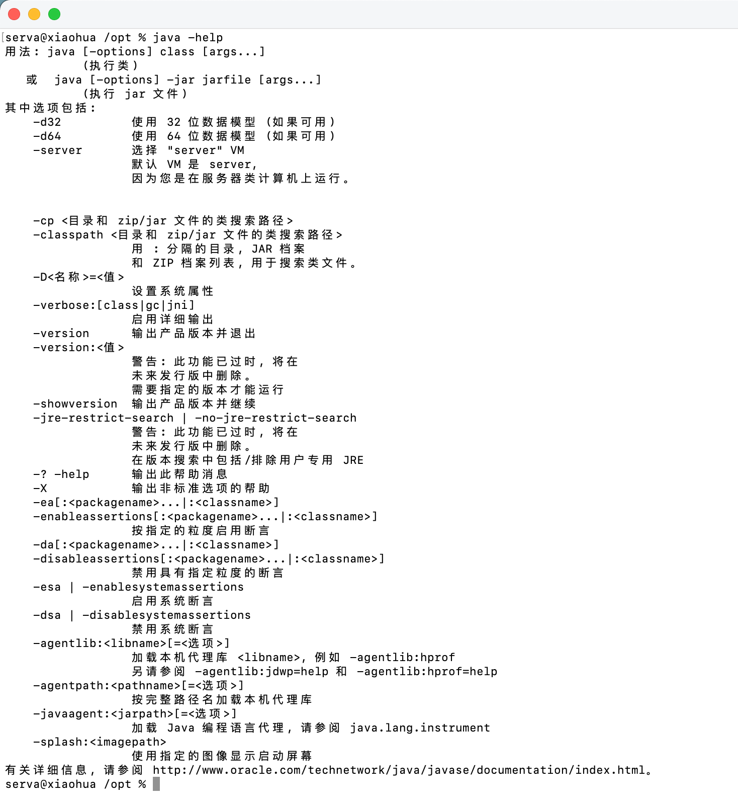
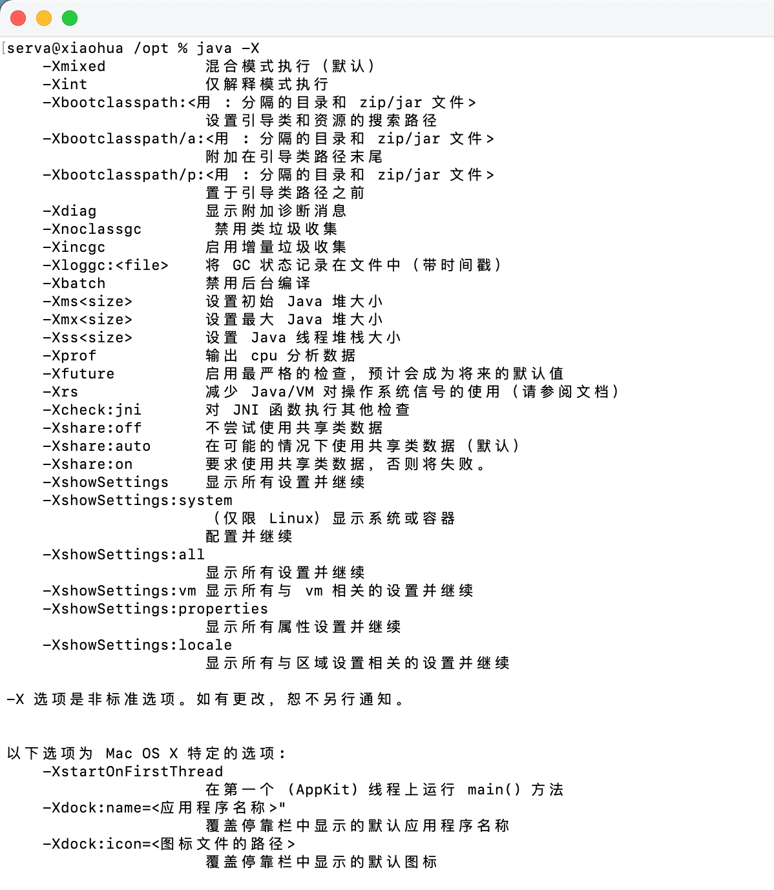
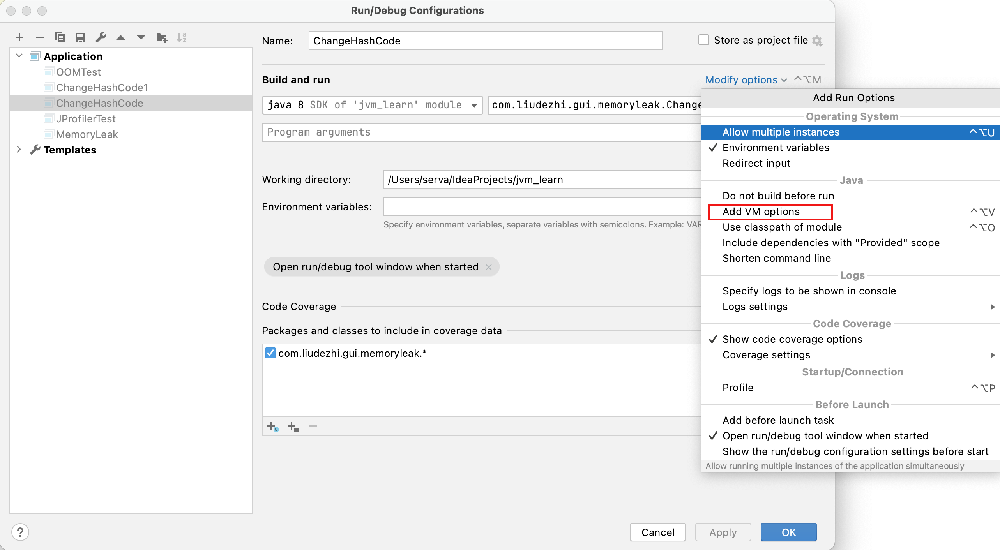
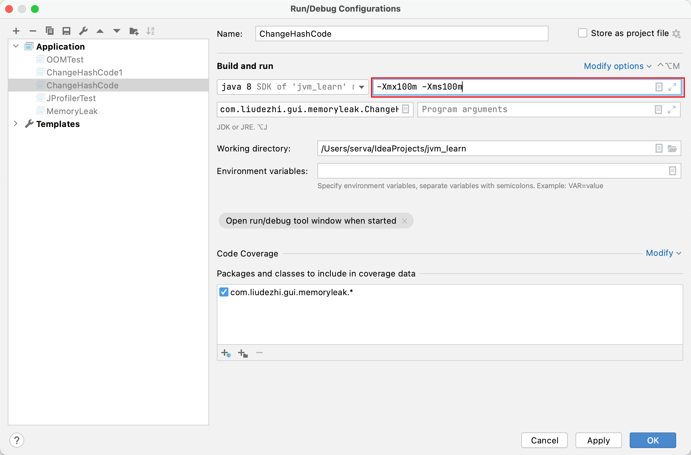
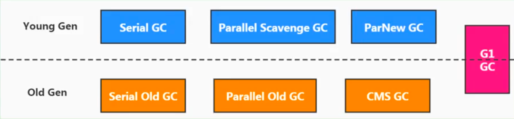
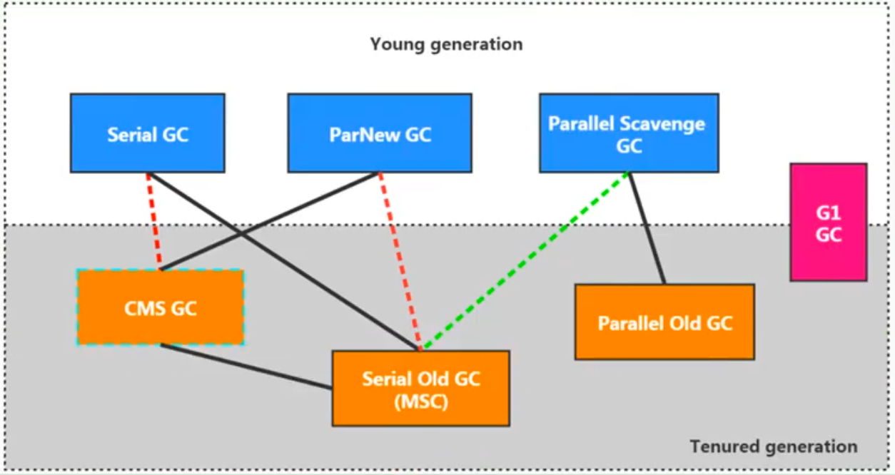
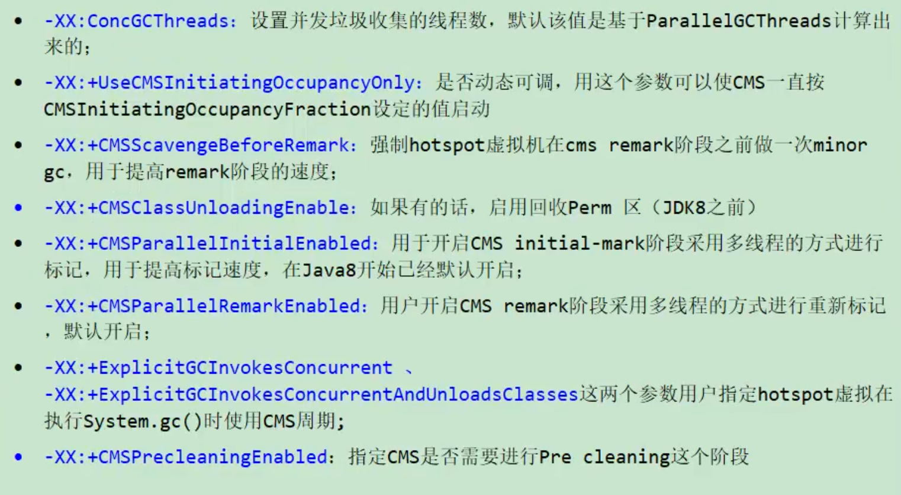
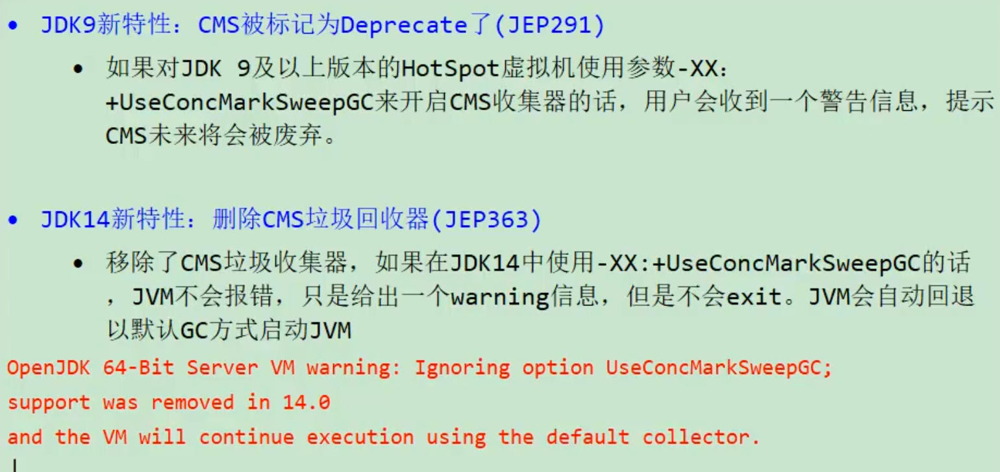
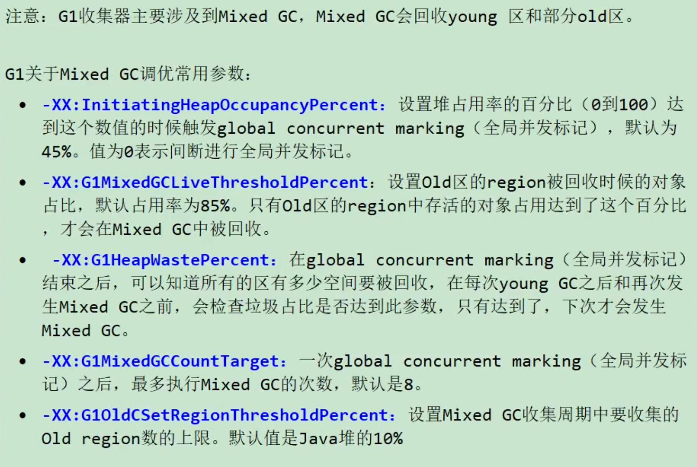

# 04. JVM 运行时参数

- 笔记本：JVM_3_性能监控与调优
- 创建时间：2021-02-12 04:52:50 UTC
- 更新时间：2021-02-19 14:47:42 UTC
- 印象笔记 GUID：06e80e1e-1619-4af1-bd6f-349fa14a9a3e

## JVM 运行时参数

### 1. JVM 参数选项类型

#### 类型一：标准参数选项

##### 特点

- 比较稳定，后续版本基本不会变化

- **以-开头**

##### 各种选项


 运行 `java` 或者 `java -help` 可以看到所有的标准选项

##### 补充内容：-server 与 -client

Hotspot JVM 有两种模式，分别是 server 和 client，分别通过 -server 和 -client 模式设置

1. 在 32位 Windows 系统上，默认使用 Client 类型的 JVM。想要使用 Server 模式，则机器配置至少有2个以上的 CPU 和2G以上的物理内存。client 模式适用于对内存要求较小的桌面应用程序，默认使用 Serial 串行垃圾收集器。

1. 64位机器上只支持 Server 模式的 JVM，适用于需要大内存的应用程序，默认使用并行垃圾收集器。

关于 server 和 client 的官网介绍为：

>
https://docs.oracle.com/javase/8/docs/technotes/guides/vm/server-class.html

#### 类型二：-X 参数选项

##### 特点

- 非标准化参数

- 功能还是比较稳定的。但官方说后续版本可能会变更

- **以-X开头**

##### 各种选项


 运行 `java -X` 命令可以看到所有的 X 选项

##### JVM 的 JIT 编译模式相关的参数

- -Xint：禁用 JIT，所有字节码都被解释执行，这个模式的速度是最慢的

- -Xcomp：所有字节码第一次使用就都被编译成本地代码，然后再执行

- -Xmixed：混合模式（默认），让 JIT 根据程序运行的情况，有选择地将某些热点代码编译成本地代码。

##### 特别地

-Xmx -Xms -Xss 属于 XX 参数？

- `-XmS<size>`：设置初始 Java 堆大小，等价于 `-XX:InitialHeapSize`

- `-Xmx<size>`：设置最大 Java 堆大小，等价于 `-XX:MaxHeapSize`

- `-XSs<size>`：设置 Java 线程堆栈大小，`-XX:ThreadStackSize`

#### 类型三：-XX 参数选项

##### 特点

- 非标准化参数

- **使用的最多的参数类型**

- 这类选项属于实验性，不稳定

- **以 -XX 开头**

##### 作用

用于开发和调试 JVM

##### 分类

- Boolean 类型格式

  - `-XX:+<option>` 表示启用 option 属性

  - `-XX:-<option>` 表示禁用 option 属性

  - 举例：
 `-XX:-UseParallelGC` 不选择垃圾收集器为并行收集器
 `-XX:+UseG1GC` 表示启用 G1 收集器
 `-XX:+UseAdaptiveSizePolicy` 自动选择年轻代区大小和相应的 Survivor 区比例

  - 说明：因为有的指令默认是开启的，所以可以使用 -关闭

- 非 Boolean 类型格式（key-value 类型）

  - 子类型1：数值型格式 `-XX:<option>=<number>`
 number 表示数值，number 可以带上单位，比如 'm'、'M' 表示兆，'k'、'K' 表示 Kb，'g'、'G' 表示 g（例如：32k 跟 32768 是一样的效果）
 eg：
 `-XX:NewSize=1024m` 表示设置新生代初始大小为 1024 兆
 `-XX:MaxGCPauseMillis=500` 表示设置 GC 停顿时间：500毫秒
 `-XX:GCTimeRatio=19` 表示设置吞吐量
 `-XX:NewRatio=2` 表示新生代与老年代的比例

  - 子类型2：非数值型格式 `-XX:<name>=<string>`
 eg：`-XX:HeapDumpPath=/tmp/heapdump.hprof` 用来指定 heap 转储文件的存储路径。

##### 特别地

`-XX:+PrintFlagsFinal`

- 输出所有参数的名称和默认值

- 默认不包括 Diagnostic 和 Experimental 的参数

- 可以配合 `-XX:+UnlockDiagnosticVMOptions` 和 `-XX:UnlockExperimentalVMOptions` 使用

### 2. 添加 JVM 参数选项

#### Eclipse

略

#### IDEA


 

#### 运行 Jar 包

`java -Xms50m -Xmx50m -XX:+PrintGCDetails -XX:+PrintGCTimeStamps -jar demo.jar`

#### 通过 Tomcat 运行 war 包

- Linux 系统下可以在 tomcat/bin/catalina.sh 中添加类似如下配置：
 `JAVA_OPTS="-Xms512M -Xmx1024M"`

- Windows 系统下在 catalina.bat 中添加类似如下配置：
 `set "JAVA_OPTS=-Xms512M -Xmx1024M"`

#### 程序运行过程中

- 使用 `jinfo -flag <name>=<value> <pid> 设置非 Boolean 类型参数`

- 使用 `jinfo -flag [+/-]<name> <pid>` 设置 Boolean 类型参数

### 3. 常用的 JVM 参数选项

#### 3.1. 打印设置的 XX 选项及值

- `-XX:+PrintCommandLineFlags` 可以让在程序运行前打印出用户手动设置或者 JVM 自动设置的 XX 选项

- `-XX:+PrintFlagsInitial` 表示打印出所有 XX 选项的默认值

- **`-XX:+PrintFlagsFinal`** 表示打印出 XX 选项在运行程序时生效的值

- `-XX:+PrintVMOptions` 打印 JVM 的参数

#### 3.2. 堆、栈、方法区等内存大小设置

##### 栈

- `-Xss128k` 设置每个线程的栈大小为 128k，等价于 `-XX:ThreadStackSize=128k`

##### 堆内存

- `-Xms3550m` 等价于 `-XX:InitialHeapSize=3550m`，设置 JVM 初始堆内存为 3550m

- `-Xmx3550m` 等价于 `-XX:MaxHeapSize=3550m`，设置 JVM 最大堆内存为 3550m

- `-Xmn2g` 设置年轻代大小为2G，官方推荐配置为整个堆大小的 3/8

- `-XX:NewSize=1024m` 设置年轻代初始值为 1024m

- `-XX:MaxNewSize=1024m` 设置年轻代最大值为 1024m

- `-XX:SurvivorRatio=8` 设置年轻代中 Eden 区与一个 Survivor 区的比值，默认为 8（虽然默认是8，但是会被 -XX:+UseAdaptiveSizePolicy 覆盖，想要设置为8，需要添加：-XX:SurvivorRatio=8）

- `-XX:+UseAdaptiveSizePolicy` 自动选择各区大小比例（默认开启）

- `-XX:NewRatio=4` 设置老年代与新生代（包括一个 Eden 和 2个 Survivor 区）的比值（默认值为2）

- `-XX:PretenureSizeThreadshold=1024` 设置让大于此阈值的对象直接分配在老年代，单位为字节，只对 Serial、ParNew 收集器有效

- `-XX:MaxTenuringThreshold=15` 默认值为 15，新生代每次 MinorGC 后，还存活的对象年龄 +1，当对象的年龄大于设置的这个值时就进入老年代

- `-XX:PrintTenuringDistribution` 让 JVM 在每次 MinorGC 后打印出当前使用的 Survivor 中对象的年龄分布

- `-XX:TargetSurvivorRatio` 表示 MinorGC 结束后 Survivor 区域中占用空间的期望比例

##### 方法区

- 永久代

  - `-XX:PermSize=256m` 设置永久代初始值为 256m

  - `-XX:MaxPermSize=256m` 设置永久代最大值为 256m

- 元空间

  - `-XX:MetaspaceSize` 初始空间大小

  - `-XX:MaxMetaspaceSize` 最大空间，默认没有限制

  - `-XX:UseCompressedOops` 压缩对象指针

  - `-XX:UseCompressedClassPointers` 压缩类指针

  - `-XX:CompressedClassSpaceSize` 设置 class metaspace 的大小，默认1G

##### 直接内存

- `-XX:MaxDirectMemorySize` 指定 DirectMemory 容量，若未指定，则默认与 Java 堆最大值一样

#### 3.3. OutOfMemory 相关的选项

-
`-XX:+HeapDumpOnOutOfMemoryError` 表示在内存出现 OOM 的时候，把 Heap 转存（Dump）到文件以便后续分析

-
`-XX:+HeapDumpBeforeFullGC` 表示在出现 FullGC 之前，生成 Heap 转储文件

-
`-XX:HeapDumpPath=<path>` 指定 heap 转存文件的存储路径

-
`-XX:OnOutOfMemoryError` 指定一个可行性程序或者脚本的路径，当发生 OOM 的时候，去执行这个脚本
 对 OnOutOfMemoryError 的运维处理
 以部署在 linux 系统 /opt/Server目录下的 Server.jar 为例

  1. 在 run.sh 启动脚本中添加 jvm 参数 -XX:OnOutOfMemoryError=/opt/Server/restart.sh

  1. restart.sh 脚本
 linux 环境：

```
#!/bin/bash
pid=$(ps -ef | grep Server.jar | awk '{if($8=="java") {print $2}}')
kill -9 $pid
cd /opt/Server; sh run.sh

```

windows 环境：

```
echo off
wmic process where Name='java.exe' delete
cd D:\Server
start run.bat

```

#### 3.4. 垃圾收集器相关选项

**7款经典收集器与垃圾分代之间的关系：**
 
 **垃圾收集器的组合关系：**
 

##### 查看默认垃圾收集器

- `-XX:+PrintCommandLineFlags` 查看命令行相关参数（包括使用的垃圾收集器）

- 使用命令行指令：`jinfo -flag 相关垃圾回收器参数 进程ID`

##### Serial 回收器

Serial 收集器作为 Hotspot 中 Client 模式下的默认新生代垃圾收集器。Serial Old 是运行在 Client 模式下默认的老年代的垃圾回收器。

`-XX:+UseSerialGC`
 指定年轻代和老年代都使用串行收集器。等价于新生代使用 Serial GC，且老年代用 Serial Old GC。可以获得最高的单线程收集效率。

##### ParNew 回收器

`-XX:+UseParNewGC`
 手动指定使用 ParNew 收集器执行内存回收任务。它表示年轻代使用并行收集器，不影响老年代。

`-XX:ParallelGCThreads=N`
 限制线程数量，默认开启和 CPU 数量相同的线程数。

##### Parallel 回收器（主打吞吐量）

- `-XX:+UseParallelGC` 手动指定年轻代使用 Parallel 并行收集器执行内存回收任务。

- `-XX:+UseParallelOldGC` 手动指定老年代都是使用并行回收收集器。

  - 分别适用于新生代和老年代。默认 JDK8 是开启的。

  - 上面两个参数，默认开启一个，另一个也会被开启。（**互相激活**）

- `-XX:ParallelGCThreads` 设置年轻代并行收集器的线程数。一般地，最好与 CPU 数量相等，以避免过多的线程数影响垃圾收集器性能。

  - 在默认情况下，当 CPU 数量小于8个，ParallelGCThreads 的值等于 CPU 数量。

  - 当 CPU 数量大于8个，ParallelGCThreads 的值等于 3+[5*CPU_Count]/8.

- `-XX:MaxGCPauseMillis` 设置垃圾收集器最大停顿时间（即 STW 的时间）。单位是毫秒。

  - 为了尽可能地把停顿时间控制在 MaxGCPauseMills 以内，收集器在工作时会调整 Java 堆大小或者其他一些参数。

  - 对于用户来讲，停顿时间越短体验越好。但是在服务器端，我们注重高并发，整体的吞吐量。所以服务器端适合 Parallel，进行控制。

  - **该参数使用需谨慎**。

- `-XX:GCTimeRatio` 垃圾收集时间占总时间的比例（=1 / (N + 1)）。用于衡量吞吐量的大小。

  - 取值范围（0,100）。默认值 99，也就是垃圾回收时间不超过 1%。

  - 与前一个 `-XX:MaxGCPauseMills` 参数有一定矛盾性。暂停时间越长，Radio 参数就容易超过设定的比例。

- `-XX:+UseAdaptiveSizePolicy` 设置 Parallel Scavenge 收集器具有**自适应调节策略**

  - 在这种模式下，年轻代的大小、Eden 和 Survivor 的比例、晋升老年代的对象年龄等参数会被自动调整，以达到在堆大小、吞吐量和停顿时间之间的平衡点。

  - 在手动调优比较困难的场合，可以直接使用这种自适应的方式，仅指定虚拟机的最大堆、目标的吞吐量（GCTimeRatio）和停顿时间（MaxGCPauseMills），让虚拟机自己完成调优工作。

##### CMS 回收器

- `-XX:+UseConcMarkSweepGC` 手动指定使用 CMS 收集器执行内存回收任务。

  - 开启该参数后会自动将 `-XX:_UseParNewGC` 打开。即：ParNew(Young 区用) + CMS(Old 区用) + Serial Old 的组合。

- `-XX:CMSlnitiationgOccupanyFraction` 设置堆内存使用率的阈值，一旦达到该阈值，便开始进行回收。

  - JDK5 及以前版本的默认值为68，即当老年代的空间使用率达到68%时，会执行一次 CMS 回收。**JDK6 及以上版本默认值为 92%**

  - 如果内存增长缓慢，可以设置一个稍大的值，大的阈值可以有效降低 CMS 的触发频率，减少老年代回收的次数可以明显地改善应用程序性能。反之，如果应用程序内存使用率增长很快，则应该降低这个阈值，以避免频繁触发老年代串行收集器。因此**通过该选项便可以有效降低 Full GC 的执行次数**。

- `-XX:+UseCMSCompactAtFullCollection` 用于指定在执行完 Full GC 后对内存空间进行压缩整理，以此避免内存碎片的产生。不过由于内存压缩整理过程无法并发执行，所带来的问题就是停顿时间变得更长了。

- `-XX:CMSFullGCsBeforeCompaction` 设置在执行多少次 Full GC 后对内存空间进行压缩整理。

- `-XX:ParallelCMSThreads` 设置 CMS 的线程数量。

  - CMS 默认启动的线程数是 (ParallelGCThreads + 3) / 4，ParallelGCThreads 是年轻代并行收集器的线程数。当 CPU 资源比较紧张时，受到 CMS 收集器线程的影响，应用程序的性能在垃圾回收阶段可能会非常糟糕。

###### 补充参数

另外，CMS 收集器还有如下常用参数：
 

###### 特别说明



##### G1 回收器

- `-XX:+UseG1GC` 手动指定使用 G1 收集器执行内存回收任务。

- `-XX:G1HeapRegionSize`
 设置每个 Region 的大小。值是2的幂，范围是1MB到32MB之间，目标是根据最小的 Java 堆大小划分出约2048个区域。默认是堆内存的 1/2000.

- `-XX:MaxGCPauseMillis`
 设置期望达到的最大 GC 停顿时间指标（JVM 会尽力实现，但不保证达到）。默认值是 200ms

- `-XX:ParallelGCThreads` 设置 STW 时 GC 线程数的值。最多设置为8

- `-XX:ConcGCThreads`
 设置并发标记的线程数。将 n 设置为并行垃圾回收线程数（ParallelGCThreads）的1/4左右。

- `-XX:InitiatingHeapOccupancyPercent`
 设置触发并发 GC 周期的 Java 堆占用率阈值。超过此值，就触发 GC。默认值是45.

- `-XX:G1NewSizePercent`、`-XX:G1MaxNewSizePercent`
 新生代占用整个堆内存的最小百分比（默认5%）、最大百分比（默认60%）

- `-XX:G1ReservePercent=10`
 保留内存区域，防止 to space（Survivor 中的 to 区）溢出

###### Mixed GC 调优参数



##### 怎么选择垃圾回收器

- 优先调整堆的大小让 JVM 自适应完成。

- 如果内存小于 100M，使用串行收集器。

- 如果是单核、单击程序，并且没有停顿时间的要求，串行收集器

- 如果是多 CPU、需要高吞吐量、运行停顿时间超过1秒，选择并行或者 JVM 自己选择

- 如果是多 CPU、追求低停顿时间，需要快速相应（比如演出不能超过1s，如互联网应用），使用并发收集器。官方推荐 G1，性能高。**现在互联网的项目，基本都是使用 G1**。

**特别说明：**

1. 没有最好的收集器，更没有万能的收集器；

1. 调优永远是针对特定场景、特定需求，不存在一劳永逸的收集器

#### 3.5. GC 日志相关选项

##### 常用参数

- `-verbose:gc` 输出 GC 日志信息，默认输出到标准输出

- `-XX:+PrintGC` 等同于 `-verbose:gc` 表示打开简化的 GC 日志

- `-XX:+PrintGCDetails` 在发生垃圾回收时打印内存回收详情的日志，并在进程退出时输出当前内存各区域分配情况

- `-XX:+PrintGCTimeStamps` 输出 GC 发生时的时间戳

- `-XX:+PrintGCDateStamps` 输出 GC 发生时的时间戳（以日期的形式，如 2020-02-19T21:21:212+0800）

- `-XX:+PrintHeapAtGC` 每一次 GC 前和 GC 后，都打印堆信息

- `-Xloggc:<file>` 把 GC 日志写入到一个文件中去，而不是打印到标准输出中

##### 其他参数

- `-XX:+TraceClassLoading` 监控类的加载

- `-XX:+PrintGCApplicationStoppedTime` 打印 GC 时线程的停顿时间

- `-XX:+PrintGCApplicationConcurrentTime` 垃圾收集之前打印出应用未中断的执行时间

- `-XX:+PrintReferenceGC` 记录回收了多少种不同引用类型的引用

- `-XX:+PrintTenuringDistribution` 让 JVM 在每次 MinorGC 后打印出当前使用的 Survivor 中对象的年龄

- `-XX:+UseGCLogFileRatation` 启用 GC 日志文件的自动转储

- `-XX:NumberOfGCLogFIles=1` GC 日志文件的循环数目

- `-XX:GCLogFileSize=1M` 控制 GC 日志文件的大小

#### 3.6. 其他参数

- `-XX:+DisableExplicitGC` 禁止 hotspot 执行 System.gc()，默认禁用

- `-XX:ReservedCodeCacheSize=<n>[g|m|k]、-XX:InitialCodeCacheSize=<n>[g|m|k]` 指定代码缓存的大小

- `-XX:+UseCodeCacheFlusing` 使用该参数让 JVM 放弃一些被编译的代码，避免代码缓存被占满时 JVM 切换到 interpreted-only 情况

- `-XX:+DoEscapeAnalysis` 开启逃逸分析

- `-XX:+UseBiasedLocking` 开启偏向锁

- `-XX:+UseLargePages` 开启使用大页面

- `-XX:+UseTLAB` 使用 TLAB，默认打开

- `-XX:+PrintTLAB` 打印 TLAB 的使用情况

- `-XX:TLABSize` 设置 TLAB 大小

### 4. 通过 Java 代码获取 JVM 参数

Java 提供了 java.lang.management 包用于监视和管理 Java 虚拟机和 Java 运行时中的其他组件，它允许本地和远程监控和管理允许的 Java 虚拟机。其中 ManagementFactory 这个类还是挺常用的。另外还有 Runtime 类也可以获取一些内存、CPU 核数等相关的数据。

通过这些 API 可以监控我们的应用服务器的堆内存使用情况，设置一些阈值进行报警等处理。

```
/**
 * 监控我们的应用服务器的堆内存使用情况，设置一些阈值进行报警等处理
 * -Xms100m -Xmx100m
 */
public class MemroyMonitor {
    public static void main(String[] args) {
        MemoryMXBean memoryMXBean = ManagementFactory.getMemoryMXBean();
        MemoryUsage usage = memoryMXBean.getHeapMemoryUsage();
        System.out.println("INIT HEAP: " + usage.getInit() / 1024 / 1024 + "m");
        System.out.println("MAX HEAP: " + usage.getMax() / 1024 / 1024 + "m");
        System.out.println("USE HEAP: " + usage.getUsed() / 1024 / 1024 + "m");
        System.out.println("\nFull Information:");
        System.out.println("Heap Memory Usage: " + memoryMXBean.getHeapMemoryUsage());
        System.out.println("Non-Heap Memory Usage: " + memoryMXBean.getNonHeapMemoryUsage());
        System.out.println("============== 通过 Java 来获取相关系统状态 ==============");
        System.out.println("当前堆内存大小 totalMemory：" + (int) Runtime.getRuntime().totalMemory() / 1024 / 1024 + "m");
        System.out.println("空闲堆内存大小 freeMemory：" + (int) Runtime.getRuntime().freeMemory() / 1024 / 1024 + "m");
        System.out.println("最大可用堆内存大小 maxMemory：" + (int) Runtime.getRuntime().maxMemory() / 1024 / 1024 + "m");
    }
}

```

##### 上篇中通过 Runtime 获取

```
public class HeapSpaceInitial {
    public static void main(String[] args) {
        // 返回 Java 虚拟机中的堆内存总量
        long initialMemory = Runtime.getRuntime().totalMemory() / 1024 / 1024;
        // 返回 Java 虚拟机试图使用的最大堆内存量
        long maxMemory = Runtime.getRuntime().maxMemory() / 1024 / 1024;

        System.out.println("-Xms: " + initialMemory + "M");
        System.out.println("-Xmx: " + maxMemory + "M");

        System.out.println("系统内存大小为：" + maxMemory * 4.0 / 1024 + "G");
        System.out.println("系统内存大小为：" + initialMemory * 64.0 / 1024 + "G");
    }
}

```

%23%23%20JVM%20%E8%BF%90%E8%A1%8C%E6%97%B6%E5%8F%82%E6%95%B0%0A%23%23%23%201.%20JVM%20%E5%8F%82%E6%95%B0%E9%80%89%E9%A1%B9%E7%B1%BB%E5%9E%8B%0A%23%23%23%23%20%E7%B1%BB%E5%9E%8B%E4%B8%80%EF%BC%9A%E6%A0%87%E5%87%86%E5%8F%82%E6%95%B0%E9%80%89%E9%A1%B9%0A%23%23%23%23%23%20%E7%89%B9%E7%82%B9%0A-%20%E6%AF%94%E8%BE%83%E7%A8%B3%E5%AE%9A%EF%BC%8C%E5%90%8E%E7%BB%AD%E7%89%88%E6%9C%AC%E5%9F%BA%E6%9C%AC%E4%B8%8D%E4%BC%9A%E5%8F%98%E5%8C%96%0A-%20**%E4%BB%A5-%E5%BC%80%E5%A4%B4**%0A%23%23%23%23%23%20%E5%90%84%E7%A7%8D%E9%80%89%E9%A1%B9%0A!%5B5acbb51c445b015a0e56c18223e87767.png%5D(evernotecid%3A%2F%2F90F5C43D-AEAE-49B2-85BB-D02B6A52C764%2Fappyinxiangcom%2F25356149%2FENResource%2Fp1698)%0A%E8%BF%90%E8%A1%8C%20%60java%60%20%E6%88%96%E8%80%85%20%60java%20-help%60%20%E5%8F%AF%E4%BB%A5%E7%9C%8B%E5%88%B0%E6%89%80%E6%9C%89%E7%9A%84%E6%A0%87%E5%87%86%E9%80%89%E9%A1%B9%0A%23%23%23%23%23%20%E8%A1%A5%E5%85%85%E5%86%85%E5%AE%B9%EF%BC%9A-server%20%E4%B8%8E%20-client%0AHotspot%20JVM%20%E6%9C%89%E4%B8%A4%E7%A7%8D%E6%A8%A1%E5%BC%8F%EF%BC%8C%E5%88%86%E5%88%AB%E6%98%AF%20server%20%E5%92%8C%20client%EF%BC%8C%E5%88%86%E5%88%AB%E9%80%9A%E8%BF%87%20-server%20%E5%92%8C%20-client%20%E6%A8%A1%E5%BC%8F%E8%AE%BE%E7%BD%AE%0A1.%20%E5%9C%A8%2032%E4%BD%8D%20Windows%20%E7%B3%BB%E7%BB%9F%E4%B8%8A%EF%BC%8C%E9%BB%98%E8%AE%A4%E4%BD%BF%E7%94%A8%20Client%20%E7%B1%BB%E5%9E%8B%E7%9A%84%20JVM%E3%80%82%E6%83%B3%E8%A6%81%E4%BD%BF%E7%94%A8%20Server%20%E6%A8%A1%E5%BC%8F%EF%BC%8C%E5%88%99%E6%9C%BA%E5%99%A8%E9%85%8D%E7%BD%AE%E8%87%B3%E5%B0%91%E6%9C%892%E4%B8%AA%E4%BB%A5%E4%B8%8A%E7%9A%84%20CPU%20%E5%92%8C2G%E4%BB%A5%E4%B8%8A%E7%9A%84%E7%89%A9%E7%90%86%E5%86%85%E5%AD%98%E3%80%82client%20%E6%A8%A1%E5%BC%8F%E9%80%82%E7%94%A8%E4%BA%8E%E5%AF%B9%E5%86%85%E5%AD%98%E8%A6%81%E6%B1%82%E8%BE%83%E5%B0%8F%E7%9A%84%E6%A1%8C%E9%9D%A2%E5%BA%94%E7%94%A8%E7%A8%8B%E5%BA%8F%EF%BC%8C%E9%BB%98%E8%AE%A4%E4%BD%BF%E7%94%A8%20Serial%20%E4%B8%B2%E8%A1%8C%E5%9E%83%E5%9C%BE%E6%94%B6%E9%9B%86%E5%99%A8%E3%80%82%0A2.%2064%E4%BD%8D%E6%9C%BA%E5%99%A8%E4%B8%8A%E5%8F%AA%E6%94%AF%E6%8C%81%20Server%20%E6%A8%A1%E5%BC%8F%E7%9A%84%20JVM%EF%BC%8C%E9%80%82%E7%94%A8%E4%BA%8E%E9%9C%80%E8%A6%81%E5%A4%A7%E5%86%85%E5%AD%98%E7%9A%84%E5%BA%94%E7%94%A8%E7%A8%8B%E5%BA%8F%EF%BC%8C%E9%BB%98%E8%AE%A4%E4%BD%BF%E7%94%A8%E5%B9%B6%E8%A1%8C%E5%9E%83%E5%9C%BE%E6%94%B6%E9%9B%86%E5%99%A8%E3%80%82%0A%0A%E5%85%B3%E4%BA%8E%20server%20%E5%92%8C%20client%20%E7%9A%84%E5%AE%98%E7%BD%91%E4%BB%8B%E7%BB%8D%E4%B8%BA%EF%BC%9A%0A%3E%20https%3A%2F%2Fdocs.oracle.com%2Fjavase%2F8%2Fdocs%2Ftechnotes%2Fguides%2Fvm%2Fserver-class.html%0A%0A%23%23%23%23%20%E7%B1%BB%E5%9E%8B%E4%BA%8C%EF%BC%9A-X%20%E5%8F%82%E6%95%B0%E9%80%89%E9%A1%B9%0A%23%23%23%23%23%20%E7%89%B9%E7%82%B9%0A-%20%E9%9D%9E%E6%A0%87%E5%87%86%E5%8C%96%E5%8F%82%E6%95%B0%0A-%20%E5%8A%9F%E8%83%BD%E8%BF%98%E6%98%AF%E6%AF%94%E8%BE%83%E7%A8%B3%E5%AE%9A%E7%9A%84%E3%80%82%E4%BD%86%E5%AE%98%E6%96%B9%E8%AF%B4%E5%90%8E%E7%BB%AD%E7%89%88%E6%9C%AC%E5%8F%AF%E8%83%BD%E4%BC%9A%E5%8F%98%E6%9B%B4%0A-%20**%E4%BB%A5-X%E5%BC%80%E5%A4%B4**%0A%23%23%23%23%23%20%E5%90%84%E7%A7%8D%E9%80%89%E9%A1%B9%0A!%5B691987c717e4cbcf251c9ae6e22e63e6.png%5D(evernotecid%3A%2F%2F90F5C43D-AEAE-49B2-85BB-D02B6A52C764%2Fappyinxiangcom%2F25356149%2FENResource%2Fp1699)%0A%E8%BF%90%E8%A1%8C%20%60java%20-X%60%20%E5%91%BD%E4%BB%A4%E5%8F%AF%E4%BB%A5%E7%9C%8B%E5%88%B0%E6%89%80%E6%9C%89%E7%9A%84%20X%20%E9%80%89%E9%A1%B9%0A%23%23%23%23%23%20JVM%20%E7%9A%84%20JIT%20%E7%BC%96%E8%AF%91%E6%A8%A1%E5%BC%8F%E7%9B%B8%E5%85%B3%E7%9A%84%E5%8F%82%E6%95%B0%0A-%20-Xint%EF%BC%9A%E7%A6%81%E7%94%A8%20JIT%EF%BC%8C%E6%89%80%E6%9C%89%E5%AD%97%E8%8A%82%E7%A0%81%E9%83%BD%E8%A2%AB%E8%A7%A3%E9%87%8A%E6%89%A7%E8%A1%8C%EF%BC%8C%E8%BF%99%E4%B8%AA%E6%A8%A1%E5%BC%8F%E7%9A%84%E9%80%9F%E5%BA%A6%E6%98%AF%E6%9C%80%E6%85%A2%E7%9A%84%0A-%20-Xcomp%EF%BC%9A%E6%89%80%E6%9C%89%E5%AD%97%E8%8A%82%E7%A0%81%E7%AC%AC%E4%B8%80%E6%AC%A1%E4%BD%BF%E7%94%A8%E5%B0%B1%E9%83%BD%E8%A2%AB%E7%BC%96%E8%AF%91%E6%88%90%E6%9C%AC%E5%9C%B0%E4%BB%A3%E7%A0%81%EF%BC%8C%E7%84%B6%E5%90%8E%E5%86%8D%E6%89%A7%E8%A1%8C%0A-%20-Xmixed%EF%BC%9A%E6%B7%B7%E5%90%88%E6%A8%A1%E5%BC%8F%EF%BC%88%E9%BB%98%E8%AE%A4%EF%BC%89%EF%BC%8C%E8%AE%A9%20JIT%20%E6%A0%B9%E6%8D%AE%E7%A8%8B%E5%BA%8F%E8%BF%90%E8%A1%8C%E7%9A%84%E6%83%85%E5%86%B5%EF%BC%8C%E6%9C%89%E9%80%89%E6%8B%A9%E5%9C%B0%E5%B0%86%E6%9F%90%E4%BA%9B%E7%83%AD%E7%82%B9%E4%BB%A3%E7%A0%81%E7%BC%96%E8%AF%91%E6%88%90%E6%9C%AC%E5%9C%B0%E4%BB%A3%E7%A0%81%E3%80%82%0A%23%23%23%23%23%20%E7%89%B9%E5%88%AB%E5%9C%B0%0A-Xmx%20-Xms%20-Xss%20%E5%B1%9E%E4%BA%8E%20XX%20%E5%8F%82%E6%95%B0%EF%BC%9F%0A-%20%60-XmS%3Csize%3E%60%EF%BC%9A%E8%AE%BE%E7%BD%AE%E5%88%9D%E5%A7%8B%20Java%20%E5%A0%86%E5%A4%A7%E5%B0%8F%EF%BC%8C%E7%AD%89%E4%BB%B7%E4%BA%8E%20%60-XX%3AInitialHeapSize%60%0A-%20%60-Xmx%3Csize%3E%60%EF%BC%9A%E8%AE%BE%E7%BD%AE%E6%9C%80%E5%A4%A7%20Java%20%E5%A0%86%E5%A4%A7%E5%B0%8F%EF%BC%8C%E7%AD%89%E4%BB%B7%E4%BA%8E%20%60-XX%3AMaxHeapSize%60%0A-%20%60-XSs%3Csize%3E%60%EF%BC%9A%E8%AE%BE%E7%BD%AE%20Java%20%E7%BA%BF%E7%A8%8B%E5%A0%86%E6%A0%88%E5%A4%A7%E5%B0%8F%EF%BC%8C%60-XX%3AThreadStackSize%60%0A%0A%23%23%23%23%20%E7%B1%BB%E5%9E%8B%E4%B8%89%EF%BC%9A-XX%20%E5%8F%82%E6%95%B0%E9%80%89%E9%A1%B9%0A%23%23%23%23%23%20%E7%89%B9%E7%82%B9%0A-%20%E9%9D%9E%E6%A0%87%E5%87%86%E5%8C%96%E5%8F%82%E6%95%B0%0A-%20**%E4%BD%BF%E7%94%A8%E7%9A%84%E6%9C%80%E5%A4%9A%E7%9A%84%E5%8F%82%E6%95%B0%E7%B1%BB%E5%9E%8B**%0A-%20%E8%BF%99%E7%B1%BB%E9%80%89%E9%A1%B9%E5%B1%9E%E4%BA%8E%E5%AE%9E%E9%AA%8C%E6%80%A7%EF%BC%8C%E4%B8%8D%E7%A8%B3%E5%AE%9A%0A-%20**%E4%BB%A5%20-XX%20%E5%BC%80%E5%A4%B4**%0A%0A%23%23%23%23%23%20%E4%BD%9C%E7%94%A8%0A%E7%94%A8%E4%BA%8E%E5%BC%80%E5%8F%91%E5%92%8C%E8%B0%83%E8%AF%95%20JVM%0A%0A%23%23%23%23%23%20%E5%88%86%E7%B1%BB%0A-%20Boolean%20%E7%B1%BB%E5%9E%8B%E6%A0%BC%E5%BC%8F%0A%20%20%20%20-%20%60-XX%3A%2B%3Coption%3E%60%20%E8%A1%A8%E7%A4%BA%E5%90%AF%E7%94%A8%20option%20%E5%B1%9E%E6%80%A7%0A%20%20%20%20-%20%60-XX%3A-%3Coption%3E%60%20%E8%A1%A8%E7%A4%BA%E7%A6%81%E7%94%A8%20option%20%E5%B1%9E%E6%80%A7%0A%20%20%20%20-%20%E4%B8%BE%E4%BE%8B%EF%BC%9A%0A%20%20%20%20%60-XX%3A-UseParallelGC%60%20%E4%B8%8D%E9%80%89%E6%8B%A9%E5%9E%83%E5%9C%BE%E6%94%B6%E9%9B%86%E5%99%A8%E4%B8%BA%E5%B9%B6%E8%A1%8C%E6%94%B6%E9%9B%86%E5%99%A8%0A%20%20%20%20%60-XX%3A%2BUseG1GC%60%20%E8%A1%A8%E7%A4%BA%E5%90%AF%E7%94%A8%20G1%20%E6%94%B6%E9%9B%86%E5%99%A8%0A%20%20%20%20%60-XX%3A%2BUseAdaptiveSizePolicy%60%20%E8%87%AA%E5%8A%A8%E9%80%89%E6%8B%A9%E5%B9%B4%E8%BD%BB%E4%BB%A3%E5%8C%BA%E5%A4%A7%E5%B0%8F%E5%92%8C%E7%9B%B8%E5%BA%94%E7%9A%84%20Survivor%20%E5%8C%BA%E6%AF%94%E4%BE%8B%0A%20%20%20%20-%20%E8%AF%B4%E6%98%8E%EF%BC%9A%E5%9B%A0%E4%B8%BA%E6%9C%89%E7%9A%84%E6%8C%87%E4%BB%A4%E9%BB%98%E8%AE%A4%E6%98%AF%E5%BC%80%E5%90%AF%E7%9A%84%EF%BC%8C%E6%89%80%E4%BB%A5%E5%8F%AF%E4%BB%A5%E4%BD%BF%E7%94%A8%20-%E5%85%B3%E9%97%AD%0A-%20%E9%9D%9E%20Boolean%20%E7%B1%BB%E5%9E%8B%E6%A0%BC%E5%BC%8F%EF%BC%88key-value%20%E7%B1%BB%E5%9E%8B%EF%BC%89%0A%20%20%20%20-%20%E5%AD%90%E7%B1%BB%E5%9E%8B1%EF%BC%9A%E6%95%B0%E5%80%BC%E5%9E%8B%E6%A0%BC%E5%BC%8F%20%60-XX%3A%3Coption%3E%3D%3Cnumber%3E%60%0A%20%20%20%20number%20%E8%A1%A8%E7%A4%BA%E6%95%B0%E5%80%BC%EF%BC%8Cnumber%20%E5%8F%AF%E4%BB%A5%E5%B8%A6%E4%B8%8A%E5%8D%95%E4%BD%8D%EF%BC%8C%E6%AF%94%E5%A6%82%20'm'%E3%80%81'M'%20%E8%A1%A8%E7%A4%BA%E5%85%86%EF%BC%8C'k'%E3%80%81'K'%20%E8%A1%A8%E7%A4%BA%20Kb%EF%BC%8C'g'%E3%80%81'G'%20%E8%A1%A8%E7%A4%BA%20g%EF%BC%88%E4%BE%8B%E5%A6%82%EF%BC%9A32k%20%E8%B7%9F%2032768%20%E6%98%AF%E4%B8%80%E6%A0%B7%E7%9A%84%E6%95%88%E6%9E%9C%EF%BC%89%0A%20%20%20%20eg%EF%BC%9A%0A%20%20%20%20%60-XX%3ANewSize%3D1024m%60%20%E8%A1%A8%E7%A4%BA%E8%AE%BE%E7%BD%AE%E6%96%B0%E7%94%9F%E4%BB%A3%E5%88%9D%E5%A7%8B%E5%A4%A7%E5%B0%8F%E4%B8%BA%201024%20%E5%85%86%0A%20%20%20%20%60-XX%3AMaxGCPauseMillis%3D500%60%20%E8%A1%A8%E7%A4%BA%E8%AE%BE%E7%BD%AE%20GC%20%E5%81%9C%E9%A1%BF%E6%97%B6%E9%97%B4%EF%BC%9A500%E6%AF%AB%E7%A7%92%0A%20%20%20%20%60-XX%3AGCTimeRatio%3D19%60%20%E8%A1%A8%E7%A4%BA%E8%AE%BE%E7%BD%AE%E5%90%9E%E5%90%90%E9%87%8F%0A%20%20%20%20%60-XX%3ANewRatio%3D2%60%20%E8%A1%A8%E7%A4%BA%E6%96%B0%E7%94%9F%E4%BB%A3%E4%B8%8E%E8%80%81%E5%B9%B4%E4%BB%A3%E7%9A%84%E6%AF%94%E4%BE%8B%0A%20%20%20%20-%20%E5%AD%90%E7%B1%BB%E5%9E%8B2%EF%BC%9A%E9%9D%9E%E6%95%B0%E5%80%BC%E5%9E%8B%E6%A0%BC%E5%BC%8F%20%60-XX%3A%3Cname%3E%3D%3Cstring%3E%60%0A%20%20%20%20eg%EF%BC%9A%60-XX%3AHeapDumpPath%3D%2Ftmp%2Fheapdump.hprof%60%20%E7%94%A8%E6%9D%A5%E6%8C%87%E5%AE%9A%20heap%20%E8%BD%AC%E5%82%A8%E6%96%87%E4%BB%B6%E7%9A%84%E5%AD%98%E5%82%A8%E8%B7%AF%E5%BE%84%E3%80%82%0A%0A%23%23%23%23%23%20%E7%89%B9%E5%88%AB%E5%9C%B0%0A%60-XX%3A%2BPrintFlagsFinal%60%0A-%20%E8%BE%93%E5%87%BA%E6%89%80%E6%9C%89%E5%8F%82%E6%95%B0%E7%9A%84%E5%90%8D%E7%A7%B0%E5%92%8C%E9%BB%98%E8%AE%A4%E5%80%BC%0A-%20%E9%BB%98%E8%AE%A4%E4%B8%8D%E5%8C%85%E6%8B%AC%20Diagnostic%20%E5%92%8C%20Experimental%20%E7%9A%84%E5%8F%82%E6%95%B0%0A-%20%E5%8F%AF%E4%BB%A5%E9%85%8D%E5%90%88%20%60-XX%3A%2BUnlockDiagnosticVMOptions%60%20%E5%92%8C%20%60-XX%3AUnlockExperimentalVMOptions%60%20%E4%BD%BF%E7%94%A8%0A%0A%23%23%23%202.%20%E6%B7%BB%E5%8A%A0%20JVM%20%E5%8F%82%E6%95%B0%E9%80%89%E9%A1%B9%0A%23%23%23%23%20Eclipse%0A%E7%95%A5%0A%23%23%23%23%20IDEA%0A!%5Bdb1f861c52807a5892c877065dfd1fb0.png%5D(evernotecid%3A%2F%2F90F5C43D-AEAE-49B2-85BB-D02B6A52C764%2Fappyinxiangcom%2F25356149%2FENResource%2Fp1700)%0A!%5Baaed89c5005f5620a138d95ffa145902.png%5D(evernotecid%3A%2F%2F90F5C43D-AEAE-49B2-85BB-D02B6A52C764%2Fappyinxiangcom%2F25356149%2FENResource%2Fp1701)%0A%23%23%23%23%20%E8%BF%90%E8%A1%8C%20Jar%20%E5%8C%85%0A%60java%20-Xms50m%20-Xmx50m%20-XX%3A%2BPrintGCDetails%20-XX%3A%2BPrintGCTimeStamps%20-jar%20demo.jar%60%0A%23%23%23%23%20%E9%80%9A%E8%BF%87%20Tomcat%20%E8%BF%90%E8%A1%8C%20war%20%E5%8C%85%0A-%20Linux%20%E7%B3%BB%E7%BB%9F%E4%B8%8B%E5%8F%AF%E4%BB%A5%E5%9C%A8%20tomcat%2Fbin%2Fcatalina.sh%20%E4%B8%AD%E6%B7%BB%E5%8A%A0%E7%B1%BB%E4%BC%BC%E5%A6%82%E4%B8%8B%E9%85%8D%E7%BD%AE%EF%BC%9A%0A%60JAVA_OPTS%3D%22-Xms512M%20-Xmx1024M%22%60%0A-%20Windows%20%E7%B3%BB%E7%BB%9F%E4%B8%8B%E5%9C%A8%20catalina.bat%20%E4%B8%AD%E6%B7%BB%E5%8A%A0%E7%B1%BB%E4%BC%BC%E5%A6%82%E4%B8%8B%E9%85%8D%E7%BD%AE%EF%BC%9A%0A%60set%20%22JAVA_OPTS%3D-Xms512M%20-Xmx1024M%22%60%0A%23%23%23%23%20%E7%A8%8B%E5%BA%8F%E8%BF%90%E8%A1%8C%E8%BF%87%E7%A8%8B%E4%B8%AD%0A-%20%E4%BD%BF%E7%94%A8%20%60jinfo%20-flag%20%3Cname%3E%3D%3Cvalue%3E%20%3Cpid%3E%20%E8%AE%BE%E7%BD%AE%E9%9D%9E%20Boolean%20%E7%B1%BB%E5%9E%8B%E5%8F%82%E6%95%B0%60%0A-%20%E4%BD%BF%E7%94%A8%20%60jinfo%20-flag%20%5B%2B%2F-%5D%3Cname%3E%20%3Cpid%3E%60%20%E8%AE%BE%E7%BD%AE%20Boolean%20%E7%B1%BB%E5%9E%8B%E5%8F%82%E6%95%B0%0A%0A%23%23%23%203.%20%E5%B8%B8%E7%94%A8%E7%9A%84%20JVM%20%E5%8F%82%E6%95%B0%E9%80%89%E9%A1%B9%0A%23%23%23%23%203.1.%20%E6%89%93%E5%8D%B0%E8%AE%BE%E7%BD%AE%E7%9A%84%20XX%20%E9%80%89%E9%A1%B9%E5%8F%8A%E5%80%BC%0A-%20%60-XX%3A%2BPrintCommandLineFlags%60%20%E5%8F%AF%E4%BB%A5%E8%AE%A9%E5%9C%A8%E7%A8%8B%E5%BA%8F%E8%BF%90%E8%A1%8C%E5%89%8D%E6%89%93%E5%8D%B0%E5%87%BA%E7%94%A8%E6%88%B7%E6%89%8B%E5%8A%A8%E8%AE%BE%E7%BD%AE%E6%88%96%E8%80%85%20JVM%20%E8%87%AA%E5%8A%A8%E8%AE%BE%E7%BD%AE%E7%9A%84%20XX%20%E9%80%89%E9%A1%B9%0A-%20%60-XX%3A%2BPrintFlagsInitial%60%20%E8%A1%A8%E7%A4%BA%E6%89%93%E5%8D%B0%E5%87%BA%E6%89%80%E6%9C%89%20XX%20%E9%80%89%E9%A1%B9%E7%9A%84%E9%BB%98%E8%AE%A4%E5%80%BC%0A-%20**%60-XX%3A%2BPrintFlagsFinal%60**%20%E8%A1%A8%E7%A4%BA%E6%89%93%E5%8D%B0%E5%87%BA%20XX%20%E9%80%89%E9%A1%B9%E5%9C%A8%E8%BF%90%E8%A1%8C%E7%A8%8B%E5%BA%8F%E6%97%B6%E7%94%9F%E6%95%88%E7%9A%84%E5%80%BC%0A-%20%60-XX%3A%2BPrintVMOptions%60%20%E6%89%93%E5%8D%B0%20JVM%20%E7%9A%84%E5%8F%82%E6%95%B0%0A%23%23%23%23%203.2.%20%E5%A0%86%E3%80%81%E6%A0%88%E3%80%81%E6%96%B9%E6%B3%95%E5%8C%BA%E7%AD%89%E5%86%85%E5%AD%98%E5%A4%A7%E5%B0%8F%E8%AE%BE%E7%BD%AE%0A%23%23%23%23%23%20%E6%A0%88%0A-%20%60-Xss128k%60%20%E8%AE%BE%E7%BD%AE%E6%AF%8F%E4%B8%AA%E7%BA%BF%E7%A8%8B%E7%9A%84%E6%A0%88%E5%A4%A7%E5%B0%8F%E4%B8%BA%20128k%EF%BC%8C%E7%AD%89%E4%BB%B7%E4%BA%8E%20%60-XX%3AThreadStackSize%3D128k%60%0A%23%23%23%23%23%20%E5%A0%86%E5%86%85%E5%AD%98%0A-%20%60-Xms3550m%60%20%E7%AD%89%E4%BB%B7%E4%BA%8E%20%60-XX%3AInitialHeapSize%3D3550m%60%EF%BC%8C%E8%AE%BE%E7%BD%AE%20JVM%20%E5%88%9D%E5%A7%8B%E5%A0%86%E5%86%85%E5%AD%98%E4%B8%BA%203550m%0A-%20%60-Xmx3550m%60%20%E7%AD%89%E4%BB%B7%E4%BA%8E%20%60-XX%3AMaxHeapSize%3D3550m%60%EF%BC%8C%E8%AE%BE%E7%BD%AE%20JVM%20%E6%9C%80%E5%A4%A7%E5%A0%86%E5%86%85%E5%AD%98%E4%B8%BA%203550m%0A-%20%60-Xmn2g%60%20%E8%AE%BE%E7%BD%AE%E5%B9%B4%E8%BD%BB%E4%BB%A3%E5%A4%A7%E5%B0%8F%E4%B8%BA2G%EF%BC%8C%E5%AE%98%E6%96%B9%E6%8E%A8%E8%8D%90%E9%85%8D%E7%BD%AE%E4%B8%BA%E6%95%B4%E4%B8%AA%E5%A0%86%E5%A4%A7%E5%B0%8F%E7%9A%84%203%2F8%0A-%20%60-XX%3ANewSize%3D1024m%60%20%E8%AE%BE%E7%BD%AE%E5%B9%B4%E8%BD%BB%E4%BB%A3%E5%88%9D%E5%A7%8B%E5%80%BC%E4%B8%BA%201024m%0A-%20%60-XX%3AMaxNewSize%3D1024m%60%20%E8%AE%BE%E7%BD%AE%E5%B9%B4%E8%BD%BB%E4%BB%A3%E6%9C%80%E5%A4%A7%E5%80%BC%E4%B8%BA%201024m%0A-%20%60-XX%3ASurvivorRatio%3D8%60%20%E8%AE%BE%E7%BD%AE%E5%B9%B4%E8%BD%BB%E4%BB%A3%E4%B8%AD%20Eden%20%E5%8C%BA%E4%B8%8E%E4%B8%80%E4%B8%AA%20Survivor%20%E5%8C%BA%E7%9A%84%E6%AF%94%E5%80%BC%EF%BC%8C%E9%BB%98%E8%AE%A4%E4%B8%BA%208%EF%BC%88%E8%99%BD%E7%84%B6%E9%BB%98%E8%AE%A4%E6%98%AF8%EF%BC%8C%E4%BD%86%E6%98%AF%E4%BC%9A%E8%A2%AB%20-XX%3A%2BUseAdaptiveSizePolicy%20%E8%A6%86%E7%9B%96%EF%BC%8C%E6%83%B3%E8%A6%81%E8%AE%BE%E7%BD%AE%E4%B8%BA8%EF%BC%8C%E9%9C%80%E8%A6%81%E6%B7%BB%E5%8A%A0%EF%BC%9A-XX%3ASurvivorRatio%3D8%EF%BC%89%0A-%20%60-XX%3A%2BUseAdaptiveSizePolicy%60%20%E8%87%AA%E5%8A%A8%E9%80%89%E6%8B%A9%E5%90%84%E5%8C%BA%E5%A4%A7%E5%B0%8F%E6%AF%94%E4%BE%8B%EF%BC%88%E9%BB%98%E8%AE%A4%E5%BC%80%E5%90%AF%EF%BC%89%0A-%20%60-XX%3ANewRatio%3D4%60%20%E8%AE%BE%E7%BD%AE%E8%80%81%E5%B9%B4%E4%BB%A3%E4%B8%8E%E6%96%B0%E7%94%9F%E4%BB%A3%EF%BC%88%E5%8C%85%E6%8B%AC%E4%B8%80%E4%B8%AA%20Eden%20%E5%92%8C%202%E4%B8%AA%20Survivor%20%E5%8C%BA%EF%BC%89%E7%9A%84%E6%AF%94%E5%80%BC%EF%BC%88%E9%BB%98%E8%AE%A4%E5%80%BC%E4%B8%BA2%EF%BC%89%0A-%20%60-XX%3APretenureSizeThreadshold%3D1024%60%20%E8%AE%BE%E7%BD%AE%E8%AE%A9%E5%A4%A7%E4%BA%8E%E6%AD%A4%E9%98%88%E5%80%BC%E7%9A%84%E5%AF%B9%E8%B1%A1%E7%9B%B4%E6%8E%A5%E5%88%86%E9%85%8D%E5%9C%A8%E8%80%81%E5%B9%B4%E4%BB%A3%EF%BC%8C%E5%8D%95%E4%BD%8D%E4%B8%BA%E5%AD%97%E8%8A%82%EF%BC%8C%E5%8F%AA%E5%AF%B9%20Serial%E3%80%81ParNew%20%E6%94%B6%E9%9B%86%E5%99%A8%E6%9C%89%E6%95%88%0A-%20%60-XX%3AMaxTenuringThreshold%3D15%60%20%E9%BB%98%E8%AE%A4%E5%80%BC%E4%B8%BA%2015%EF%BC%8C%E6%96%B0%E7%94%9F%E4%BB%A3%E6%AF%8F%E6%AC%A1%20MinorGC%20%E5%90%8E%EF%BC%8C%E8%BF%98%E5%AD%98%E6%B4%BB%E7%9A%84%E5%AF%B9%E8%B1%A1%E5%B9%B4%E9%BE%84%20%2B1%EF%BC%8C%E5%BD%93%E5%AF%B9%E8%B1%A1%E7%9A%84%E5%B9%B4%E9%BE%84%E5%A4%A7%E4%BA%8E%E8%AE%BE%E7%BD%AE%E7%9A%84%E8%BF%99%E4%B8%AA%E5%80%BC%E6%97%B6%E5%B0%B1%E8%BF%9B%E5%85%A5%E8%80%81%E5%B9%B4%E4%BB%A3%0A-%20%60-XX%3APrintTenuringDistribution%60%20%E8%AE%A9%20JVM%20%E5%9C%A8%E6%AF%8F%E6%AC%A1%20MinorGC%20%E5%90%8E%E6%89%93%E5%8D%B0%E5%87%BA%E5%BD%93%E5%89%8D%E4%BD%BF%E7%94%A8%E7%9A%84%20Survivor%20%E4%B8%AD%E5%AF%B9%E8%B1%A1%E7%9A%84%E5%B9%B4%E9%BE%84%E5%88%86%E5%B8%83%0A-%20%60-XX%3ATargetSurvivorRatio%60%20%E8%A1%A8%E7%A4%BA%20MinorGC%20%E7%BB%93%E6%9D%9F%E5%90%8E%20Survivor%20%E5%8C%BA%E5%9F%9F%E4%B8%AD%E5%8D%A0%E7%94%A8%E7%A9%BA%E9%97%B4%E7%9A%84%E6%9C%9F%E6%9C%9B%E6%AF%94%E4%BE%8B%0A%23%23%23%23%23%20%E6%96%B9%E6%B3%95%E5%8C%BA%0A-%20%E6%B0%B8%E4%B9%85%E4%BB%A3%0A%20%20%20%20-%20%60-XX%3APermSize%3D256m%60%20%E8%AE%BE%E7%BD%AE%E6%B0%B8%E4%B9%85%E4%BB%A3%E5%88%9D%E5%A7%8B%E5%80%BC%E4%B8%BA%20256m%0A%20%20%20%20-%20%60-XX%3AMaxPermSize%3D256m%60%20%E8%AE%BE%E7%BD%AE%E6%B0%B8%E4%B9%85%E4%BB%A3%E6%9C%80%E5%A4%A7%E5%80%BC%E4%B8%BA%20256m%0A-%20%E5%85%83%E7%A9%BA%E9%97%B4%0A%20%20%20%20-%20%60-XX%3AMetaspaceSize%60%20%E5%88%9D%E5%A7%8B%E7%A9%BA%E9%97%B4%E5%A4%A7%E5%B0%8F%0A%20%20%20%20-%20%60-XX%3AMaxMetaspaceSize%60%20%E6%9C%80%E5%A4%A7%E7%A9%BA%E9%97%B4%EF%BC%8C%E9%BB%98%E8%AE%A4%E6%B2%A1%E6%9C%89%E9%99%90%E5%88%B6%0A%20%20%20%20-%20%60-XX%3AUseCompressedOops%60%20%E5%8E%8B%E7%BC%A9%E5%AF%B9%E8%B1%A1%E6%8C%87%E9%92%88%0A%20%20%20%20-%20%60-XX%3AUseCompressedClassPointers%60%20%E5%8E%8B%E7%BC%A9%E7%B1%BB%E6%8C%87%E9%92%88%0A%20%20%20%20-%20%60-XX%3ACompressedClassSpaceSize%60%20%E8%AE%BE%E7%BD%AE%20class%20metaspace%20%E7%9A%84%E5%A4%A7%E5%B0%8F%EF%BC%8C%E9%BB%98%E8%AE%A41G%0A%23%23%23%23%23%20%E7%9B%B4%E6%8E%A5%E5%86%85%E5%AD%98%0A-%20%60-XX%3AMaxDirectMemorySize%60%20%E6%8C%87%E5%AE%9A%20DirectMemory%20%E5%AE%B9%E9%87%8F%EF%BC%8C%E8%8B%A5%E6%9C%AA%E6%8C%87%E5%AE%9A%EF%BC%8C%E5%88%99%E9%BB%98%E8%AE%A4%E4%B8%8E%20Java%20%E5%A0%86%E6%9C%80%E5%A4%A7%E5%80%BC%E4%B8%80%E6%A0%B7%0A%0A%23%23%23%23%203.3.%20OutOfMemory%20%E7%9B%B8%E5%85%B3%E7%9A%84%E9%80%89%E9%A1%B9%0A-%20%60-XX%3A%2BHeapDumpOnOutOfMemoryError%60%20%E8%A1%A8%E7%A4%BA%E5%9C%A8%E5%86%85%E5%AD%98%E5%87%BA%E7%8E%B0%20OOM%20%E7%9A%84%E6%97%B6%E5%80%99%EF%BC%8C%E6%8A%8A%20Heap%20%E8%BD%AC%E5%AD%98%EF%BC%88Dump%EF%BC%89%E5%88%B0%E6%96%87%E4%BB%B6%E4%BB%A5%E4%BE%BF%E5%90%8E%E7%BB%AD%E5%88%86%E6%9E%90%0A-%20%60-XX%3A%2BHeapDumpBeforeFullGC%60%20%E8%A1%A8%E7%A4%BA%E5%9C%A8%E5%87%BA%E7%8E%B0%20FullGC%20%E4%B9%8B%E5%89%8D%EF%BC%8C%E7%94%9F%E6%88%90%20Heap%20%E8%BD%AC%E5%82%A8%E6%96%87%E4%BB%B6%0A-%20%60-XX%3AHeapDumpPath%3D%3Cpath%3E%60%20%E6%8C%87%E5%AE%9A%20heap%20%E8%BD%AC%E5%AD%98%E6%96%87%E4%BB%B6%E7%9A%84%E5%AD%98%E5%82%A8%E8%B7%AF%E5%BE%84%0A-%20%60-XX%3AOnOutOfMemoryError%60%20%E6%8C%87%E5%AE%9A%E4%B8%80%E4%B8%AA%E5%8F%AF%E8%A1%8C%E6%80%A7%E7%A8%8B%E5%BA%8F%E6%88%96%E8%80%85%E8%84%9A%E6%9C%AC%E7%9A%84%E8%B7%AF%E5%BE%84%EF%BC%8C%E5%BD%93%E5%8F%91%E7%94%9F%20OOM%20%E7%9A%84%E6%97%B6%E5%80%99%EF%BC%8C%E5%8E%BB%E6%89%A7%E8%A1%8C%E8%BF%99%E4%B8%AA%E8%84%9A%E6%9C%AC%0A%E5%AF%B9%20OnOutOfMemoryError%20%E7%9A%84%E8%BF%90%E7%BB%B4%E5%A4%84%E7%90%86%0A%E4%BB%A5%E9%83%A8%E7%BD%B2%E5%9C%A8%20linux%20%E7%B3%BB%E7%BB%9F%20%2Fopt%2FServer%E7%9B%AE%E5%BD%95%E4%B8%8B%E7%9A%84%20Server.jar%20%E4%B8%BA%E4%BE%8B%0A%20%20%20%201.%20%E5%9C%A8%20run.sh%20%E5%90%AF%E5%8A%A8%E8%84%9A%E6%9C%AC%E4%B8%AD%E6%B7%BB%E5%8A%A0%20jvm%20%E5%8F%82%E6%95%B0%20-XX%3AOnOutOfMemoryError%3D%2Fopt%2FServer%2Frestart.sh%0A%20%20%20%202.%20restart.sh%20%E8%84%9A%E6%9C%AC%0A%20%20%20%20linux%20%E7%8E%AF%E5%A2%83%EF%BC%9A%0A%20%20%20%20%60%60%60shell%0A%20%20%20%20%23!%2Fbin%2Fbash%0A%20%20%20%20pid%3D%24(ps%20-ef%20%7C%20grep%20Server.jar%20%7C%20awk%20'%7Bif(%248%3D%3D%22java%22)%20%7Bprint%20%242%7D%7D')%0A%20%20%20%20kill%20-9%20%24pid%0A%20%20%20%20cd%20%2Fopt%2FServer%3B%20sh%20run.sh%0A%20%20%20%20%60%60%60%0A%20%20%20%0A%20%20%20%20windows%20%E7%8E%AF%E5%A2%83%EF%BC%9A%0A%20%20%20%20%60%60%60shell%0A%20%20%20%20echo%20off%0A%20%20%20%20wmic%20process%20where%20Name%3D'java.exe'%20delete%0A%20%20%20%20cd%20D%3A%5CServer%0A%20%20%20%20start%20run.bat%0A%20%20%20%20%60%60%60%0A%0A%23%23%23%23%203.4.%20%E5%9E%83%E5%9C%BE%E6%94%B6%E9%9B%86%E5%99%A8%E7%9B%B8%E5%85%B3%E9%80%89%E9%A1%B9%0A**7%E6%AC%BE%E7%BB%8F%E5%85%B8%E6%94%B6%E9%9B%86%E5%99%A8%E4%B8%8E%E5%9E%83%E5%9C%BE%E5%88%86%E4%BB%A3%E4%B9%8B%E9%97%B4%E7%9A%84%E5%85%B3%E7%B3%BB%EF%BC%9A**%0A!%5B2a643c7aafe99c0bd062963a512baeb4.png%5D(evernotecid%3A%2F%2F90F5C43D-AEAE-49B2-85BB-D02B6A52C764%2Fappyinxiangcom%2F25356149%2FENResource%2Fp1702)%0A**%E5%9E%83%E5%9C%BE%E6%94%B6%E9%9B%86%E5%99%A8%E7%9A%84%E7%BB%84%E5%90%88%E5%85%B3%E7%B3%BB%EF%BC%9A**%0A!%5B7f79bb5e0a959198e7c2230f78edf997.png%5D(evernotecid%3A%2F%2F90F5C43D-AEAE-49B2-85BB-D02B6A52C764%2Fappyinxiangcom%2F25356149%2FENResource%2Fp1703)%0A%0A%23%23%23%23%23%20%E6%9F%A5%E7%9C%8B%E9%BB%98%E8%AE%A4%E5%9E%83%E5%9C%BE%E6%94%B6%E9%9B%86%E5%99%A8%0A-%20%60-XX%3A%2BPrintCommandLineFlags%60%20%E6%9F%A5%E7%9C%8B%E5%91%BD%E4%BB%A4%E8%A1%8C%E7%9B%B8%E5%85%B3%E5%8F%82%E6%95%B0%EF%BC%88%E5%8C%85%E6%8B%AC%E4%BD%BF%E7%94%A8%E7%9A%84%E5%9E%83%E5%9C%BE%E6%94%B6%E9%9B%86%E5%99%A8%EF%BC%89%0A-%20%E4%BD%BF%E7%94%A8%E5%91%BD%E4%BB%A4%E8%A1%8C%E6%8C%87%E4%BB%A4%EF%BC%9A%60jinfo%20-flag%20%E7%9B%B8%E5%85%B3%E5%9E%83%E5%9C%BE%E5%9B%9E%E6%94%B6%E5%99%A8%E5%8F%82%E6%95%B0%20%E8%BF%9B%E7%A8%8BID%60%0A%0A%23%23%23%23%23%20Serial%20%E5%9B%9E%E6%94%B6%E5%99%A8%0ASerial%20%E6%94%B6%E9%9B%86%E5%99%A8%E4%BD%9C%E4%B8%BA%20Hotspot%20%E4%B8%AD%20Client%20%E6%A8%A1%E5%BC%8F%E4%B8%8B%E7%9A%84%E9%BB%98%E8%AE%A4%E6%96%B0%E7%94%9F%E4%BB%A3%E5%9E%83%E5%9C%BE%E6%94%B6%E9%9B%86%E5%99%A8%E3%80%82Serial%20Old%20%E6%98%AF%E8%BF%90%E8%A1%8C%E5%9C%A8%20Client%20%E6%A8%A1%E5%BC%8F%E4%B8%8B%E9%BB%98%E8%AE%A4%E7%9A%84%E8%80%81%E5%B9%B4%E4%BB%A3%E7%9A%84%E5%9E%83%E5%9C%BE%E5%9B%9E%E6%94%B6%E5%99%A8%E3%80%82%0A%0A%60-XX%3A%2BUseSerialGC%60%0A%E6%8C%87%E5%AE%9A%E5%B9%B4%E8%BD%BB%E4%BB%A3%E5%92%8C%E8%80%81%E5%B9%B4%E4%BB%A3%E9%83%BD%E4%BD%BF%E7%94%A8%E4%B8%B2%E8%A1%8C%E6%94%B6%E9%9B%86%E5%99%A8%E3%80%82%E7%AD%89%E4%BB%B7%E4%BA%8E%E6%96%B0%E7%94%9F%E4%BB%A3%E4%BD%BF%E7%94%A8%20Serial%20GC%EF%BC%8C%E4%B8%94%E8%80%81%E5%B9%B4%E4%BB%A3%E7%94%A8%20Serial%20Old%20GC%E3%80%82%E5%8F%AF%E4%BB%A5%E8%8E%B7%E5%BE%97%E6%9C%80%E9%AB%98%E7%9A%84%E5%8D%95%E7%BA%BF%E7%A8%8B%E6%94%B6%E9%9B%86%E6%95%88%E7%8E%87%E3%80%82%0A%0A%23%23%23%23%23%20ParNew%20%E5%9B%9E%E6%94%B6%E5%99%A8%0A%60-XX%3A%2BUseParNewGC%60%0A%E6%89%8B%E5%8A%A8%E6%8C%87%E5%AE%9A%E4%BD%BF%E7%94%A8%20ParNew%20%E6%94%B6%E9%9B%86%E5%99%A8%E6%89%A7%E8%A1%8C%E5%86%85%E5%AD%98%E5%9B%9E%E6%94%B6%E4%BB%BB%E5%8A%A1%E3%80%82%E5%AE%83%E8%A1%A8%E7%A4%BA%E5%B9%B4%E8%BD%BB%E4%BB%A3%E4%BD%BF%E7%94%A8%E5%B9%B6%E8%A1%8C%E6%94%B6%E9%9B%86%E5%99%A8%EF%BC%8C%E4%B8%8D%E5%BD%B1%E5%93%8D%E8%80%81%E5%B9%B4%E4%BB%A3%E3%80%82%0A%0A%60-XX%3AParallelGCThreads%3DN%60%0A%E9%99%90%E5%88%B6%E7%BA%BF%E7%A8%8B%E6%95%B0%E9%87%8F%EF%BC%8C%E9%BB%98%E8%AE%A4%E5%BC%80%E5%90%AF%E5%92%8C%20CPU%20%E6%95%B0%E9%87%8F%E7%9B%B8%E5%90%8C%E7%9A%84%E7%BA%BF%E7%A8%8B%E6%95%B0%E3%80%82%0A%0A%23%23%23%23%23%20Parallel%20%E5%9B%9E%E6%94%B6%E5%99%A8%EF%BC%88%E4%B8%BB%E6%89%93%E5%90%9E%E5%90%90%E9%87%8F%EF%BC%89%0A-%20%60-XX%3A%2BUseParallelGC%60%20%E6%89%8B%E5%8A%A8%E6%8C%87%E5%AE%9A%E5%B9%B4%E8%BD%BB%E4%BB%A3%E4%BD%BF%E7%94%A8%20Parallel%20%E5%B9%B6%E8%A1%8C%E6%94%B6%E9%9B%86%E5%99%A8%E6%89%A7%E8%A1%8C%E5%86%85%E5%AD%98%E5%9B%9E%E6%94%B6%E4%BB%BB%E5%8A%A1%E3%80%82%0A-%20%60-XX%3A%2BUseParallelOldGC%60%20%E6%89%8B%E5%8A%A8%E6%8C%87%E5%AE%9A%E8%80%81%E5%B9%B4%E4%BB%A3%E9%83%BD%E6%98%AF%E4%BD%BF%E7%94%A8%E5%B9%B6%E8%A1%8C%E5%9B%9E%E6%94%B6%E6%94%B6%E9%9B%86%E5%99%A8%E3%80%82%0A%20%20%20%20-%20%E5%88%86%E5%88%AB%E9%80%82%E7%94%A8%E4%BA%8E%E6%96%B0%E7%94%9F%E4%BB%A3%E5%92%8C%E8%80%81%E5%B9%B4%E4%BB%A3%E3%80%82%E9%BB%98%E8%AE%A4%20JDK8%20%E6%98%AF%E5%BC%80%E5%90%AF%E7%9A%84%E3%80%82%0A%20%20%20%20-%20%E4%B8%8A%E9%9D%A2%E4%B8%A4%E4%B8%AA%E5%8F%82%E6%95%B0%EF%BC%8C%E9%BB%98%E8%AE%A4%E5%BC%80%E5%90%AF%E4%B8%80%E4%B8%AA%EF%BC%8C%E5%8F%A6%E4%B8%80%E4%B8%AA%E4%B9%9F%E4%BC%9A%E8%A2%AB%E5%BC%80%E5%90%AF%E3%80%82%EF%BC%88**%E4%BA%92%E7%9B%B8%E6%BF%80%E6%B4%BB**%EF%BC%89%0A-%20%60-XX%3AParallelGCThreads%60%20%E8%AE%BE%E7%BD%AE%E5%B9%B4%E8%BD%BB%E4%BB%A3%E5%B9%B6%E8%A1%8C%E6%94%B6%E9%9B%86%E5%99%A8%E7%9A%84%E7%BA%BF%E7%A8%8B%E6%95%B0%E3%80%82%E4%B8%80%E8%88%AC%E5%9C%B0%EF%BC%8C%E6%9C%80%E5%A5%BD%E4%B8%8E%20CPU%20%E6%95%B0%E9%87%8F%E7%9B%B8%E7%AD%89%EF%BC%8C%E4%BB%A5%E9%81%BF%E5%85%8D%E8%BF%87%E5%A4%9A%E7%9A%84%E7%BA%BF%E7%A8%8B%E6%95%B0%E5%BD%B1%E5%93%8D%E5%9E%83%E5%9C%BE%E6%94%B6%E9%9B%86%E5%99%A8%E6%80%A7%E8%83%BD%E3%80%82%0A%20%20%20%20-%20%E5%9C%A8%E9%BB%98%E8%AE%A4%E6%83%85%E5%86%B5%E4%B8%8B%EF%BC%8C%E5%BD%93%20CPU%20%E6%95%B0%E9%87%8F%E5%B0%8F%E4%BA%8E8%E4%B8%AA%EF%BC%8CParallelGCThreads%20%E7%9A%84%E5%80%BC%E7%AD%89%E4%BA%8E%20CPU%20%E6%95%B0%E9%87%8F%E3%80%82%0A%20%20%20%20-%20%E5%BD%93%20CPU%20%E6%95%B0%E9%87%8F%E5%A4%A7%E4%BA%8E8%E4%B8%AA%EF%BC%8CParallelGCThreads%20%E7%9A%84%E5%80%BC%E7%AD%89%E4%BA%8E%203%2B%5B5*CPU_Count%5D%2F8.%0A-%20%60-XX%3AMaxGCPauseMillis%60%20%E8%AE%BE%E7%BD%AE%E5%9E%83%E5%9C%BE%E6%94%B6%E9%9B%86%E5%99%A8%E6%9C%80%E5%A4%A7%E5%81%9C%E9%A1%BF%E6%97%B6%E9%97%B4%EF%BC%88%E5%8D%B3%20STW%20%E7%9A%84%E6%97%B6%E9%97%B4%EF%BC%89%E3%80%82%E5%8D%95%E4%BD%8D%E6%98%AF%E6%AF%AB%E7%A7%92%E3%80%82%0A%20%20%20%20-%20%E4%B8%BA%E4%BA%86%E5%B0%BD%E5%8F%AF%E8%83%BD%E5%9C%B0%E6%8A%8A%E5%81%9C%E9%A1%BF%E6%97%B6%E9%97%B4%E6%8E%A7%E5%88%B6%E5%9C%A8%20MaxGCPauseMills%20%E4%BB%A5%E5%86%85%EF%BC%8C%E6%94%B6%E9%9B%86%E5%99%A8%E5%9C%A8%E5%B7%A5%E4%BD%9C%E6%97%B6%E4%BC%9A%E8%B0%83%E6%95%B4%20Java%20%E5%A0%86%E5%A4%A7%E5%B0%8F%E6%88%96%E8%80%85%E5%85%B6%E4%BB%96%E4%B8%80%E4%BA%9B%E5%8F%82%E6%95%B0%E3%80%82%0A%20%20%20%20-%20%E5%AF%B9%E4%BA%8E%E7%94%A8%E6%88%B7%E6%9D%A5%E8%AE%B2%EF%BC%8C%E5%81%9C%E9%A1%BF%E6%97%B6%E9%97%B4%E8%B6%8A%E7%9F%AD%E4%BD%93%E9%AA%8C%E8%B6%8A%E5%A5%BD%E3%80%82%E4%BD%86%E6%98%AF%E5%9C%A8%E6%9C%8D%E5%8A%A1%E5%99%A8%E7%AB%AF%EF%BC%8C%E6%88%91%E4%BB%AC%E6%B3%A8%E9%87%8D%E9%AB%98%E5%B9%B6%E5%8F%91%EF%BC%8C%E6%95%B4%E4%BD%93%E7%9A%84%E5%90%9E%E5%90%90%E9%87%8F%E3%80%82%E6%89%80%E4%BB%A5%E6%9C%8D%E5%8A%A1%E5%99%A8%E7%AB%AF%E9%80%82%E5%90%88%20Parallel%EF%BC%8C%E8%BF%9B%E8%A1%8C%E6%8E%A7%E5%88%B6%E3%80%82%0A%20%20%20%20-%20**%E8%AF%A5%E5%8F%82%E6%95%B0%E4%BD%BF%E7%94%A8%E9%9C%80%E8%B0%A8%E6%85%8E**%E3%80%82%0A-%20%60-XX%3AGCTimeRatio%60%20%E5%9E%83%E5%9C%BE%E6%94%B6%E9%9B%86%E6%97%B6%E9%97%B4%E5%8D%A0%E6%80%BB%E6%97%B6%E9%97%B4%E7%9A%84%E6%AF%94%E4%BE%8B%EF%BC%88%3D1%20%2F%20(N%20%2B%201)%EF%BC%89%E3%80%82%E7%94%A8%E4%BA%8E%E8%A1%A1%E9%87%8F%E5%90%9E%E5%90%90%E9%87%8F%E7%9A%84%E5%A4%A7%E5%B0%8F%E3%80%82%0A%20%20%20%20-%20%E5%8F%96%E5%80%BC%E8%8C%83%E5%9B%B4%EF%BC%880%2C100%EF%BC%89%E3%80%82%E9%BB%98%E8%AE%A4%E5%80%BC%2099%EF%BC%8C%E4%B9%9F%E5%B0%B1%E6%98%AF%E5%9E%83%E5%9C%BE%E5%9B%9E%E6%94%B6%E6%97%B6%E9%97%B4%E4%B8%8D%E8%B6%85%E8%BF%87%201%25%E3%80%82%0A%20%20%20%20-%20%E4%B8%8E%E5%89%8D%E4%B8%80%E4%B8%AA%20%60-XX%3AMaxGCPauseMills%60%20%E5%8F%82%E6%95%B0%E6%9C%89%E4%B8%80%E5%AE%9A%E7%9F%9B%E7%9B%BE%E6%80%A7%E3%80%82%E6%9A%82%E5%81%9C%E6%97%B6%E9%97%B4%E8%B6%8A%E9%95%BF%EF%BC%8CRadio%20%E5%8F%82%E6%95%B0%E5%B0%B1%E5%AE%B9%E6%98%93%E8%B6%85%E8%BF%87%E8%AE%BE%E5%AE%9A%E7%9A%84%E6%AF%94%E4%BE%8B%E3%80%82%0A-%20%60-XX%3A%2BUseAdaptiveSizePolicy%60%20%E8%AE%BE%E7%BD%AE%20Parallel%20Scavenge%20%E6%94%B6%E9%9B%86%E5%99%A8%E5%85%B7%E6%9C%89**%E8%87%AA%E9%80%82%E5%BA%94%E8%B0%83%E8%8A%82%E7%AD%96%E7%95%A5**%0A%20%20%20%20-%20%E5%9C%A8%E8%BF%99%E7%A7%8D%E6%A8%A1%E5%BC%8F%E4%B8%8B%EF%BC%8C%E5%B9%B4%E8%BD%BB%E4%BB%A3%E7%9A%84%E5%A4%A7%E5%B0%8F%E3%80%81Eden%20%E5%92%8C%20Survivor%20%E7%9A%84%E6%AF%94%E4%BE%8B%E3%80%81%E6%99%8B%E5%8D%87%E8%80%81%E5%B9%B4%E4%BB%A3%E7%9A%84%E5%AF%B9%E8%B1%A1%E5%B9%B4%E9%BE%84%E7%AD%89%E5%8F%82%E6%95%B0%E4%BC%9A%E8%A2%AB%E8%87%AA%E5%8A%A8%E8%B0%83%E6%95%B4%EF%BC%8C%E4%BB%A5%E8%BE%BE%E5%88%B0%E5%9C%A8%E5%A0%86%E5%A4%A7%E5%B0%8F%E3%80%81%E5%90%9E%E5%90%90%E9%87%8F%E5%92%8C%E5%81%9C%E9%A1%BF%E6%97%B6%E9%97%B4%E4%B9%8B%E9%97%B4%E7%9A%84%E5%B9%B3%E8%A1%A1%E7%82%B9%E3%80%82%0A%20%20%20%20-%20%E5%9C%A8%E6%89%8B%E5%8A%A8%E8%B0%83%E4%BC%98%E6%AF%94%E8%BE%83%E5%9B%B0%E9%9A%BE%E7%9A%84%E5%9C%BA%E5%90%88%EF%BC%8C%E5%8F%AF%E4%BB%A5%E7%9B%B4%E6%8E%A5%E4%BD%BF%E7%94%A8%E8%BF%99%E7%A7%8D%E8%87%AA%E9%80%82%E5%BA%94%E7%9A%84%E6%96%B9%E5%BC%8F%EF%BC%8C%E4%BB%85%E6%8C%87%E5%AE%9A%E8%99%9A%E6%8B%9F%E6%9C%BA%E7%9A%84%E6%9C%80%E5%A4%A7%E5%A0%86%E3%80%81%E7%9B%AE%E6%A0%87%E7%9A%84%E5%90%9E%E5%90%90%E9%87%8F%EF%BC%88GCTimeRatio%EF%BC%89%E5%92%8C%E5%81%9C%E9%A1%BF%E6%97%B6%E9%97%B4%EF%BC%88MaxGCPauseMills%EF%BC%89%EF%BC%8C%E8%AE%A9%E8%99%9A%E6%8B%9F%E6%9C%BA%E8%87%AA%E5%B7%B1%E5%AE%8C%E6%88%90%E8%B0%83%E4%BC%98%E5%B7%A5%E4%BD%9C%E3%80%82%0A%0A%23%23%23%23%23%20CMS%20%E5%9B%9E%E6%94%B6%E5%99%A8%0A-%20%60-XX%3A%2BUseConcMarkSweepGC%60%20%E6%89%8B%E5%8A%A8%E6%8C%87%E5%AE%9A%E4%BD%BF%E7%94%A8%20CMS%20%E6%94%B6%E9%9B%86%E5%99%A8%E6%89%A7%E8%A1%8C%E5%86%85%E5%AD%98%E5%9B%9E%E6%94%B6%E4%BB%BB%E5%8A%A1%E3%80%82%0A%20%20%20%20-%20%E5%BC%80%E5%90%AF%E8%AF%A5%E5%8F%82%E6%95%B0%E5%90%8E%E4%BC%9A%E8%87%AA%E5%8A%A8%E5%B0%86%20%60-XX%3A_UseParNewGC%60%20%E6%89%93%E5%BC%80%E3%80%82%E5%8D%B3%EF%BC%9AParNew(Young%20%E5%8C%BA%E7%94%A8)%20%2B%20CMS(Old%20%E5%8C%BA%E7%94%A8)%20%2B%20Serial%20Old%20%E7%9A%84%E7%BB%84%E5%90%88%E3%80%82%0A-%20%60-XX%3ACMSlnitiationgOccupanyFraction%60%20%E8%AE%BE%E7%BD%AE%E5%A0%86%E5%86%85%E5%AD%98%E4%BD%BF%E7%94%A8%E7%8E%87%E7%9A%84%E9%98%88%E5%80%BC%EF%BC%8C%E4%B8%80%E6%97%A6%E8%BE%BE%E5%88%B0%E8%AF%A5%E9%98%88%E5%80%BC%EF%BC%8C%E4%BE%BF%E5%BC%80%E5%A7%8B%E8%BF%9B%E8%A1%8C%E5%9B%9E%E6%94%B6%E3%80%82%0A%20%20%20%20-%20JDK5%20%E5%8F%8A%E4%BB%A5%E5%89%8D%E7%89%88%E6%9C%AC%E7%9A%84%E9%BB%98%E8%AE%A4%E5%80%BC%E4%B8%BA68%EF%BC%8C%E5%8D%B3%E5%BD%93%E8%80%81%E5%B9%B4%E4%BB%A3%E7%9A%84%E7%A9%BA%E9%97%B4%E4%BD%BF%E7%94%A8%E7%8E%87%E8%BE%BE%E5%88%B068%25%E6%97%B6%EF%BC%8C%E4%BC%9A%E6%89%A7%E8%A1%8C%E4%B8%80%E6%AC%A1%20CMS%20%E5%9B%9E%E6%94%B6%E3%80%82**JDK6%20%E5%8F%8A%E4%BB%A5%E4%B8%8A%E7%89%88%E6%9C%AC%E9%BB%98%E8%AE%A4%E5%80%BC%E4%B8%BA%2092%25**%0A%20%20%20%20-%20%E5%A6%82%E6%9E%9C%E5%86%85%E5%AD%98%E5%A2%9E%E9%95%BF%E7%BC%93%E6%85%A2%EF%BC%8C%E5%8F%AF%E4%BB%A5%E8%AE%BE%E7%BD%AE%E4%B8%80%E4%B8%AA%E7%A8%8D%E5%A4%A7%E7%9A%84%E5%80%BC%EF%BC%8C%E5%A4%A7%E7%9A%84%E9%98%88%E5%80%BC%E5%8F%AF%E4%BB%A5%E6%9C%89%E6%95%88%E9%99%8D%E4%BD%8E%20CMS%20%E7%9A%84%E8%A7%A6%E5%8F%91%E9%A2%91%E7%8E%87%EF%BC%8C%E5%87%8F%E5%B0%91%E8%80%81%E5%B9%B4%E4%BB%A3%E5%9B%9E%E6%94%B6%E7%9A%84%E6%AC%A1%E6%95%B0%E5%8F%AF%E4%BB%A5%E6%98%8E%E6%98%BE%E5%9C%B0%E6%94%B9%E5%96%84%E5%BA%94%E7%94%A8%E7%A8%8B%E5%BA%8F%E6%80%A7%E8%83%BD%E3%80%82%E5%8F%8D%E4%B9%8B%EF%BC%8C%E5%A6%82%E6%9E%9C%E5%BA%94%E7%94%A8%E7%A8%8B%E5%BA%8F%E5%86%85%E5%AD%98%E4%BD%BF%E7%94%A8%E7%8E%87%E5%A2%9E%E9%95%BF%E5%BE%88%E5%BF%AB%EF%BC%8C%E5%88%99%E5%BA%94%E8%AF%A5%E9%99%8D%E4%BD%8E%E8%BF%99%E4%B8%AA%E9%98%88%E5%80%BC%EF%BC%8C%E4%BB%A5%E9%81%BF%E5%85%8D%E9%A2%91%E7%B9%81%E8%A7%A6%E5%8F%91%E8%80%81%E5%B9%B4%E4%BB%A3%E4%B8%B2%E8%A1%8C%E6%94%B6%E9%9B%86%E5%99%A8%E3%80%82%E5%9B%A0%E6%AD%A4**%E9%80%9A%E8%BF%87%E8%AF%A5%E9%80%89%E9%A1%B9%E4%BE%BF%E5%8F%AF%E4%BB%A5%E6%9C%89%E6%95%88%E9%99%8D%E4%BD%8E%20Full%20GC%20%E7%9A%84%E6%89%A7%E8%A1%8C%E6%AC%A1%E6%95%B0**%E3%80%82%0A-%20%60-XX%3A%2BUseCMSCompactAtFullCollection%60%20%E7%94%A8%E4%BA%8E%E6%8C%87%E5%AE%9A%E5%9C%A8%E6%89%A7%E8%A1%8C%E5%AE%8C%20Full%20GC%20%E5%90%8E%E5%AF%B9%E5%86%85%E5%AD%98%E7%A9%BA%E9%97%B4%E8%BF%9B%E8%A1%8C%E5%8E%8B%E7%BC%A9%E6%95%B4%E7%90%86%EF%BC%8C%E4%BB%A5%E6%AD%A4%E9%81%BF%E5%85%8D%E5%86%85%E5%AD%98%E7%A2%8E%E7%89%87%E7%9A%84%E4%BA%A7%E7%94%9F%E3%80%82%E4%B8%8D%E8%BF%87%E7%94%B1%E4%BA%8E%E5%86%85%E5%AD%98%E5%8E%8B%E7%BC%A9%E6%95%B4%E7%90%86%E8%BF%87%E7%A8%8B%E6%97%A0%E6%B3%95%E5%B9%B6%E5%8F%91%E6%89%A7%E8%A1%8C%EF%BC%8C%E6%89%80%E5%B8%A6%E6%9D%A5%E7%9A%84%E9%97%AE%E9%A2%98%E5%B0%B1%E6%98%AF%E5%81%9C%E9%A1%BF%E6%97%B6%E9%97%B4%E5%8F%98%E5%BE%97%E6%9B%B4%E9%95%BF%E4%BA%86%E3%80%82%0A-%20%60-XX%3ACMSFullGCsBeforeCompaction%60%20%E8%AE%BE%E7%BD%AE%E5%9C%A8%E6%89%A7%E8%A1%8C%E5%A4%9A%E5%B0%91%E6%AC%A1%20Full%20GC%20%E5%90%8E%E5%AF%B9%E5%86%85%E5%AD%98%E7%A9%BA%E9%97%B4%E8%BF%9B%E8%A1%8C%E5%8E%8B%E7%BC%A9%E6%95%B4%E7%90%86%E3%80%82%0A-%20%60-XX%3AParallelCMSThreads%60%20%E8%AE%BE%E7%BD%AE%20CMS%20%E7%9A%84%E7%BA%BF%E7%A8%8B%E6%95%B0%E9%87%8F%E3%80%82%0A%20%20%20%20-%20CMS%20%E9%BB%98%E8%AE%A4%E5%90%AF%E5%8A%A8%E7%9A%84%E7%BA%BF%E7%A8%8B%E6%95%B0%E6%98%AF%20(ParallelGCThreads%20%2B%203)%20%2F%204%EF%BC%8CParallelGCThreads%20%E6%98%AF%E5%B9%B4%E8%BD%BB%E4%BB%A3%E5%B9%B6%E8%A1%8C%E6%94%B6%E9%9B%86%E5%99%A8%E7%9A%84%E7%BA%BF%E7%A8%8B%E6%95%B0%E3%80%82%E5%BD%93%20CPU%20%E8%B5%84%E6%BA%90%E6%AF%94%E8%BE%83%E7%B4%A7%E5%BC%A0%E6%97%B6%EF%BC%8C%E5%8F%97%E5%88%B0%20CMS%20%E6%94%B6%E9%9B%86%E5%99%A8%E7%BA%BF%E7%A8%8B%E7%9A%84%E5%BD%B1%E5%93%8D%EF%BC%8C%E5%BA%94%E7%94%A8%E7%A8%8B%E5%BA%8F%E7%9A%84%E6%80%A7%E8%83%BD%E5%9C%A8%E5%9E%83%E5%9C%BE%E5%9B%9E%E6%94%B6%E9%98%B6%E6%AE%B5%E5%8F%AF%E8%83%BD%E4%BC%9A%E9%9D%9E%E5%B8%B8%E7%B3%9F%E7%B3%95%E3%80%82%0A%0A%23%23%23%23%23%23%20%E8%A1%A5%E5%85%85%E5%8F%82%E6%95%B0%0A%E5%8F%A6%E5%A4%96%EF%BC%8CCMS%20%E6%94%B6%E9%9B%86%E5%99%A8%E8%BF%98%E6%9C%89%E5%A6%82%E4%B8%8B%E5%B8%B8%E7%94%A8%E5%8F%82%E6%95%B0%EF%BC%9A%0A!%5B29db9461fc9ecb79c4d37948bc8b5a88.png%5D(evernotecid%3A%2F%2F90F5C43D-AEAE-49B2-85BB-D02B6A52C764%2Fappyinxiangcom%2F25356149%2FENResource%2Fp1704)%0A%23%23%23%23%23%23%20%E7%89%B9%E5%88%AB%E8%AF%B4%E6%98%8E%0A!%5Bb4e009513ec6141a668c8e5ac20dc1d9.png%5D(evernotecid%3A%2F%2F90F5C43D-AEAE-49B2-85BB-D02B6A52C764%2Fappyinxiangcom%2F25356149%2FENResource%2Fp1705)%0A%0A%23%23%23%23%23%20G1%20%E5%9B%9E%E6%94%B6%E5%99%A8%0A-%20%60-XX%3A%2BUseG1GC%60%20%E6%89%8B%E5%8A%A8%E6%8C%87%E5%AE%9A%E4%BD%BF%E7%94%A8%20G1%20%E6%94%B6%E9%9B%86%E5%99%A8%E6%89%A7%E8%A1%8C%E5%86%85%E5%AD%98%E5%9B%9E%E6%94%B6%E4%BB%BB%E5%8A%A1%E3%80%82%0A-%20%60-XX%3AG1HeapRegionSize%60%20%0A%E8%AE%BE%E7%BD%AE%E6%AF%8F%E4%B8%AA%20Region%20%E7%9A%84%E5%A4%A7%E5%B0%8F%E3%80%82%E5%80%BC%E6%98%AF2%E7%9A%84%E5%B9%82%EF%BC%8C%E8%8C%83%E5%9B%B4%E6%98%AF1MB%E5%88%B032MB%E4%B9%8B%E9%97%B4%EF%BC%8C%E7%9B%AE%E6%A0%87%E6%98%AF%E6%A0%B9%E6%8D%AE%E6%9C%80%E5%B0%8F%E7%9A%84%20Java%20%E5%A0%86%E5%A4%A7%E5%B0%8F%E5%88%92%E5%88%86%E5%87%BA%E7%BA%A62048%E4%B8%AA%E5%8C%BA%E5%9F%9F%E3%80%82%E9%BB%98%E8%AE%A4%E6%98%AF%E5%A0%86%E5%86%85%E5%AD%98%E7%9A%84%201%2F2000.%0A-%20%60-XX%3AMaxGCPauseMillis%60%20%0A%E8%AE%BE%E7%BD%AE%E6%9C%9F%E6%9C%9B%E8%BE%BE%E5%88%B0%E7%9A%84%E6%9C%80%E5%A4%A7%20GC%20%E5%81%9C%E9%A1%BF%E6%97%B6%E9%97%B4%E6%8C%87%E6%A0%87%EF%BC%88JVM%20%E4%BC%9A%E5%B0%BD%E5%8A%9B%E5%AE%9E%E7%8E%B0%EF%BC%8C%E4%BD%86%E4%B8%8D%E4%BF%9D%E8%AF%81%E8%BE%BE%E5%88%B0%EF%BC%89%E3%80%82%E9%BB%98%E8%AE%A4%E5%80%BC%E6%98%AF%20200ms%0A-%20%60-XX%3AParallelGCThreads%60%20%E8%AE%BE%E7%BD%AE%20STW%20%E6%97%B6%20GC%20%E7%BA%BF%E7%A8%8B%E6%95%B0%E7%9A%84%E5%80%BC%E3%80%82%E6%9C%80%E5%A4%9A%E8%AE%BE%E7%BD%AE%E4%B8%BA8%0A-%20%60-XX%3AConcGCThreads%60%0A%E8%AE%BE%E7%BD%AE%E5%B9%B6%E5%8F%91%E6%A0%87%E8%AE%B0%E7%9A%84%E7%BA%BF%E7%A8%8B%E6%95%B0%E3%80%82%E5%B0%86%20n%20%E8%AE%BE%E7%BD%AE%E4%B8%BA%E5%B9%B6%E8%A1%8C%E5%9E%83%E5%9C%BE%E5%9B%9E%E6%94%B6%E7%BA%BF%E7%A8%8B%E6%95%B0%EF%BC%88ParallelGCThreads%EF%BC%89%E7%9A%841%2F4%E5%B7%A6%E5%8F%B3%E3%80%82%0A-%20%60-XX%3AInitiatingHeapOccupancyPercent%60%0A%E8%AE%BE%E7%BD%AE%E8%A7%A6%E5%8F%91%E5%B9%B6%E5%8F%91%20GC%20%E5%91%A8%E6%9C%9F%E7%9A%84%20Java%20%E5%A0%86%E5%8D%A0%E7%94%A8%E7%8E%87%E9%98%88%E5%80%BC%E3%80%82%E8%B6%85%E8%BF%87%E6%AD%A4%E5%80%BC%EF%BC%8C%E5%B0%B1%E8%A7%A6%E5%8F%91%20GC%E3%80%82%E9%BB%98%E8%AE%A4%E5%80%BC%E6%98%AF45.%0A-%20%60-XX%3AG1NewSizePercent%60%E3%80%81%60-XX%3AG1MaxNewSizePercent%60%0A%E6%96%B0%E7%94%9F%E4%BB%A3%E5%8D%A0%E7%94%A8%E6%95%B4%E4%B8%AA%E5%A0%86%E5%86%85%E5%AD%98%E7%9A%84%E6%9C%80%E5%B0%8F%E7%99%BE%E5%88%86%E6%AF%94%EF%BC%88%E9%BB%98%E8%AE%A45%25%EF%BC%89%E3%80%81%E6%9C%80%E5%A4%A7%E7%99%BE%E5%88%86%E6%AF%94%EF%BC%88%E9%BB%98%E8%AE%A460%25%EF%BC%89%0A-%20%60-XX%3AG1ReservePercent%3D10%60%0A%E4%BF%9D%E7%95%99%E5%86%85%E5%AD%98%E5%8C%BA%E5%9F%9F%EF%BC%8C%E9%98%B2%E6%AD%A2%20to%20space%EF%BC%88Survivor%20%E4%B8%AD%E7%9A%84%20to%20%E5%8C%BA%EF%BC%89%E6%BA%A2%E5%87%BA%0A%0A%23%23%23%23%23%23%20Mixed%20GC%20%E8%B0%83%E4%BC%98%E5%8F%82%E6%95%B0%0A!%5B28ec9d301062b7d64f06688e7cdfe55d.png%5D(evernotecid%3A%2F%2F90F5C43D-AEAE-49B2-85BB-D02B6A52C764%2Fappyinxiangcom%2F25356149%2FENResource%2Fp1706)%0A%0A%23%23%23%23%23%20%E6%80%8E%E4%B9%88%E9%80%89%E6%8B%A9%E5%9E%83%E5%9C%BE%E5%9B%9E%E6%94%B6%E5%99%A8%0A-%20%E4%BC%98%E5%85%88%E8%B0%83%E6%95%B4%E5%A0%86%E7%9A%84%E5%A4%A7%E5%B0%8F%E8%AE%A9%20JVM%20%E8%87%AA%E9%80%82%E5%BA%94%E5%AE%8C%E6%88%90%E3%80%82%0A-%20%E5%A6%82%E6%9E%9C%E5%86%85%E5%AD%98%E5%B0%8F%E4%BA%8E%20100M%EF%BC%8C%E4%BD%BF%E7%94%A8%E4%B8%B2%E8%A1%8C%E6%94%B6%E9%9B%86%E5%99%A8%E3%80%82%0A-%20%E5%A6%82%E6%9E%9C%E6%98%AF%E5%8D%95%E6%A0%B8%E3%80%81%E5%8D%95%E5%87%BB%E7%A8%8B%E5%BA%8F%EF%BC%8C%E5%B9%B6%E4%B8%94%E6%B2%A1%E6%9C%89%E5%81%9C%E9%A1%BF%E6%97%B6%E9%97%B4%E7%9A%84%E8%A6%81%E6%B1%82%EF%BC%8C%E4%B8%B2%E8%A1%8C%E6%94%B6%E9%9B%86%E5%99%A8%0A-%20%E5%A6%82%E6%9E%9C%E6%98%AF%E5%A4%9A%20CPU%E3%80%81%E9%9C%80%E8%A6%81%E9%AB%98%E5%90%9E%E5%90%90%E9%87%8F%E3%80%81%E8%BF%90%E8%A1%8C%E5%81%9C%E9%A1%BF%E6%97%B6%E9%97%B4%E8%B6%85%E8%BF%871%E7%A7%92%EF%BC%8C%E9%80%89%E6%8B%A9%E5%B9%B6%E8%A1%8C%E6%88%96%E8%80%85%20JVM%20%E8%87%AA%E5%B7%B1%E9%80%89%E6%8B%A9%0A-%20%E5%A6%82%E6%9E%9C%E6%98%AF%E5%A4%9A%20CPU%E3%80%81%E8%BF%BD%E6%B1%82%E4%BD%8E%E5%81%9C%E9%A1%BF%E6%97%B6%E9%97%B4%EF%BC%8C%E9%9C%80%E8%A6%81%E5%BF%AB%E9%80%9F%E7%9B%B8%E5%BA%94%EF%BC%88%E6%AF%94%E5%A6%82%E6%BC%94%E5%87%BA%E4%B8%8D%E8%83%BD%E8%B6%85%E8%BF%871s%EF%BC%8C%E5%A6%82%E4%BA%92%E8%81%94%E7%BD%91%E5%BA%94%E7%94%A8%EF%BC%89%EF%BC%8C%E4%BD%BF%E7%94%A8%E5%B9%B6%E5%8F%91%E6%94%B6%E9%9B%86%E5%99%A8%E3%80%82%E5%AE%98%E6%96%B9%E6%8E%A8%E8%8D%90%20G1%EF%BC%8C%E6%80%A7%E8%83%BD%E9%AB%98%E3%80%82**%E7%8E%B0%E5%9C%A8%E4%BA%92%E8%81%94%E7%BD%91%E7%9A%84%E9%A1%B9%E7%9B%AE%EF%BC%8C%E5%9F%BA%E6%9C%AC%E9%83%BD%E6%98%AF%E4%BD%BF%E7%94%A8%20G1**%E3%80%82%0A%0A**%E7%89%B9%E5%88%AB%E8%AF%B4%E6%98%8E%EF%BC%9A**%0A1.%20%E6%B2%A1%E6%9C%89%E6%9C%80%E5%A5%BD%E7%9A%84%E6%94%B6%E9%9B%86%E5%99%A8%EF%BC%8C%E6%9B%B4%E6%B2%A1%E6%9C%89%E4%B8%87%E8%83%BD%E7%9A%84%E6%94%B6%E9%9B%86%E5%99%A8%EF%BC%9B%0A2.%20%E8%B0%83%E4%BC%98%E6%B0%B8%E8%BF%9C%E6%98%AF%E9%92%88%E5%AF%B9%E7%89%B9%E5%AE%9A%E5%9C%BA%E6%99%AF%E3%80%81%E7%89%B9%E5%AE%9A%E9%9C%80%E6%B1%82%EF%BC%8C%E4%B8%8D%E5%AD%98%E5%9C%A8%E4%B8%80%E5%8A%B3%E6%B0%B8%E9%80%B8%E7%9A%84%E6%94%B6%E9%9B%86%E5%99%A8%0A%0A%23%23%23%23%203.5.%20GC%20%E6%97%A5%E5%BF%97%E7%9B%B8%E5%85%B3%E9%80%89%E9%A1%B9%0A%23%23%23%23%23%20%E5%B8%B8%E7%94%A8%E5%8F%82%E6%95%B0%0A-%20%60-verbose%3Agc%60%20%E8%BE%93%E5%87%BA%20GC%20%E6%97%A5%E5%BF%97%E4%BF%A1%E6%81%AF%EF%BC%8C%E9%BB%98%E8%AE%A4%E8%BE%93%E5%87%BA%E5%88%B0%E6%A0%87%E5%87%86%E8%BE%93%E5%87%BA%0A-%20%60-XX%3A%2BPrintGC%60%20%E7%AD%89%E5%90%8C%E4%BA%8E%20%60-verbose%3Agc%60%20%E8%A1%A8%E7%A4%BA%E6%89%93%E5%BC%80%E7%AE%80%E5%8C%96%E7%9A%84%20GC%20%E6%97%A5%E5%BF%97%0A-%20%60-XX%3A%2BPrintGCDetails%60%20%E5%9C%A8%E5%8F%91%E7%94%9F%E5%9E%83%E5%9C%BE%E5%9B%9E%E6%94%B6%E6%97%B6%E6%89%93%E5%8D%B0%E5%86%85%E5%AD%98%E5%9B%9E%E6%94%B6%E8%AF%A6%E6%83%85%E7%9A%84%E6%97%A5%E5%BF%97%EF%BC%8C%E5%B9%B6%E5%9C%A8%E8%BF%9B%E7%A8%8B%E9%80%80%E5%87%BA%E6%97%B6%E8%BE%93%E5%87%BA%E5%BD%93%E5%89%8D%E5%86%85%E5%AD%98%E5%90%84%E5%8C%BA%E5%9F%9F%E5%88%86%E9%85%8D%E6%83%85%E5%86%B5%0A-%20%60-XX%3A%2BPrintGCTimeStamps%60%20%E8%BE%93%E5%87%BA%20GC%20%E5%8F%91%E7%94%9F%E6%97%B6%E7%9A%84%E6%97%B6%E9%97%B4%E6%88%B3%0A-%20%60-XX%3A%2BPrintGCDateStamps%60%20%E8%BE%93%E5%87%BA%20GC%20%E5%8F%91%E7%94%9F%E6%97%B6%E7%9A%84%E6%97%B6%E9%97%B4%E6%88%B3%EF%BC%88%E4%BB%A5%E6%97%A5%E6%9C%9F%E7%9A%84%E5%BD%A2%E5%BC%8F%EF%BC%8C%E5%A6%82%202020-02-19T21%3A21%3A212%2B0800%EF%BC%89%0A-%20%60-XX%3A%2BPrintHeapAtGC%60%20%E6%AF%8F%E4%B8%80%E6%AC%A1%20GC%20%E5%89%8D%E5%92%8C%20GC%20%E5%90%8E%EF%BC%8C%E9%83%BD%E6%89%93%E5%8D%B0%E5%A0%86%E4%BF%A1%E6%81%AF%0A-%20%60-Xloggc%3A%3Cfile%3E%60%20%E6%8A%8A%20GC%20%E6%97%A5%E5%BF%97%E5%86%99%E5%85%A5%E5%88%B0%E4%B8%80%E4%B8%AA%E6%96%87%E4%BB%B6%E4%B8%AD%E5%8E%BB%EF%BC%8C%E8%80%8C%E4%B8%8D%E6%98%AF%E6%89%93%E5%8D%B0%E5%88%B0%E6%A0%87%E5%87%86%E8%BE%93%E5%87%BA%E4%B8%AD%0A%23%23%23%23%23%20%E5%85%B6%E4%BB%96%E5%8F%82%E6%95%B0%0A-%20%60-XX%3A%2BTraceClassLoading%60%20%E7%9B%91%E6%8E%A7%E7%B1%BB%E7%9A%84%E5%8A%A0%E8%BD%BD%0A-%20%60-XX%3A%2BPrintGCApplicationStoppedTime%60%20%E6%89%93%E5%8D%B0%20GC%20%E6%97%B6%E7%BA%BF%E7%A8%8B%E7%9A%84%E5%81%9C%E9%A1%BF%E6%97%B6%E9%97%B4%0A-%20%60-XX%3A%2BPrintGCApplicationConcurrentTime%60%20%E5%9E%83%E5%9C%BE%E6%94%B6%E9%9B%86%E4%B9%8B%E5%89%8D%E6%89%93%E5%8D%B0%E5%87%BA%E5%BA%94%E7%94%A8%E6%9C%AA%E4%B8%AD%E6%96%AD%E7%9A%84%E6%89%A7%E8%A1%8C%E6%97%B6%E9%97%B4%0A-%20%60-XX%3A%2BPrintReferenceGC%60%20%E8%AE%B0%E5%BD%95%E5%9B%9E%E6%94%B6%E4%BA%86%E5%A4%9A%E5%B0%91%E7%A7%8D%E4%B8%8D%E5%90%8C%E5%BC%95%E7%94%A8%E7%B1%BB%E5%9E%8B%E7%9A%84%E5%BC%95%E7%94%A8%0A-%20%60-XX%3A%2BPrintTenuringDistribution%60%20%E8%AE%A9%20JVM%20%E5%9C%A8%E6%AF%8F%E6%AC%A1%20MinorGC%20%E5%90%8E%E6%89%93%E5%8D%B0%E5%87%BA%E5%BD%93%E5%89%8D%E4%BD%BF%E7%94%A8%E7%9A%84%20Survivor%20%E4%B8%AD%E5%AF%B9%E8%B1%A1%E7%9A%84%E5%B9%B4%E9%BE%84%0A-%20%60-XX%3A%2BUseGCLogFileRatation%60%20%E5%90%AF%E7%94%A8%20GC%20%E6%97%A5%E5%BF%97%E6%96%87%E4%BB%B6%E7%9A%84%E8%87%AA%E5%8A%A8%E8%BD%AC%E5%82%A8%0A-%20%60-XX%3ANumberOfGCLogFIles%3D1%60%20GC%20%E6%97%A5%E5%BF%97%E6%96%87%E4%BB%B6%E7%9A%84%E5%BE%AA%E7%8E%AF%E6%95%B0%E7%9B%AE%0A-%20%60-XX%3AGCLogFileSize%3D1M%60%20%E6%8E%A7%E5%88%B6%20GC%20%E6%97%A5%E5%BF%97%E6%96%87%E4%BB%B6%E7%9A%84%E5%A4%A7%E5%B0%8F%0A%0A%23%23%23%23%203.6.%20%E5%85%B6%E4%BB%96%E5%8F%82%E6%95%B0%0A-%20%60-XX%3A%2BDisableExplicitGC%60%20%E7%A6%81%E6%AD%A2%20hotspot%20%E6%89%A7%E8%A1%8C%20System.gc()%EF%BC%8C%E9%BB%98%E8%AE%A4%E7%A6%81%E7%94%A8%0A-%20%60-XX%3AReservedCodeCacheSize%3D%3Cn%3E%5Bg%7Cm%7Ck%5D%E3%80%81-XX%3AInitialCodeCacheSize%3D%3Cn%3E%5Bg%7Cm%7Ck%5D%60%20%E6%8C%87%E5%AE%9A%E4%BB%A3%E7%A0%81%E7%BC%93%E5%AD%98%E7%9A%84%E5%A4%A7%E5%B0%8F%0A-%20%60-XX%3A%2BUseCodeCacheFlusing%60%20%E4%BD%BF%E7%94%A8%E8%AF%A5%E5%8F%82%E6%95%B0%E8%AE%A9%20JVM%20%E6%94%BE%E5%BC%83%E4%B8%80%E4%BA%9B%E8%A2%AB%E7%BC%96%E8%AF%91%E7%9A%84%E4%BB%A3%E7%A0%81%EF%BC%8C%E9%81%BF%E5%85%8D%E4%BB%A3%E7%A0%81%E7%BC%93%E5%AD%98%E8%A2%AB%E5%8D%A0%E6%BB%A1%E6%97%B6%20JVM%20%E5%88%87%E6%8D%A2%E5%88%B0%20interpreted-only%20%E6%83%85%E5%86%B5%0A-%20%60-XX%3A%2BDoEscapeAnalysis%60%20%E5%BC%80%E5%90%AF%E9%80%83%E9%80%B8%E5%88%86%E6%9E%90%0A-%20%60-XX%3A%2BUseBiasedLocking%60%20%E5%BC%80%E5%90%AF%E5%81%8F%E5%90%91%E9%94%81%0A-%20%60-XX%3A%2BUseLargePages%60%20%E5%BC%80%E5%90%AF%E4%BD%BF%E7%94%A8%E5%A4%A7%E9%A1%B5%E9%9D%A2%0A-%20%60-XX%3A%2BUseTLAB%60%20%E4%BD%BF%E7%94%A8%20TLAB%EF%BC%8C%E9%BB%98%E8%AE%A4%E6%89%93%E5%BC%80%0A-%20%60-XX%3A%2BPrintTLAB%60%20%E6%89%93%E5%8D%B0%20TLAB%20%E7%9A%84%E4%BD%BF%E7%94%A8%E6%83%85%E5%86%B5%0A-%20%60-XX%3ATLABSize%60%20%E8%AE%BE%E7%BD%AE%20TLAB%20%E5%A4%A7%E5%B0%8F%0A%0A%23%23%23%204.%20%E9%80%9A%E8%BF%87%20Java%20%E4%BB%A3%E7%A0%81%E8%8E%B7%E5%8F%96%20JVM%20%E5%8F%82%E6%95%B0%0AJava%20%E6%8F%90%E4%BE%9B%E4%BA%86%20java.lang.management%20%E5%8C%85%E7%94%A8%E4%BA%8E%E7%9B%91%E8%A7%86%E5%92%8C%E7%AE%A1%E7%90%86%20Java%20%E8%99%9A%E6%8B%9F%E6%9C%BA%E5%92%8C%20Java%20%E8%BF%90%E8%A1%8C%E6%97%B6%E4%B8%AD%E7%9A%84%E5%85%B6%E4%BB%96%E7%BB%84%E4%BB%B6%EF%BC%8C%E5%AE%83%E5%85%81%E8%AE%B8%E6%9C%AC%E5%9C%B0%E5%92%8C%E8%BF%9C%E7%A8%8B%E7%9B%91%E6%8E%A7%E5%92%8C%E7%AE%A1%E7%90%86%E5%85%81%E8%AE%B8%E7%9A%84%20Java%20%E8%99%9A%E6%8B%9F%E6%9C%BA%E3%80%82%E5%85%B6%E4%B8%AD%20ManagementFactory%20%E8%BF%99%E4%B8%AA%E7%B1%BB%E8%BF%98%E6%98%AF%E6%8C%BA%E5%B8%B8%E7%94%A8%E7%9A%84%E3%80%82%E5%8F%A6%E5%A4%96%E8%BF%98%E6%9C%89%20Runtime%20%E7%B1%BB%E4%B9%9F%E5%8F%AF%E4%BB%A5%E8%8E%B7%E5%8F%96%E4%B8%80%E4%BA%9B%E5%86%85%E5%AD%98%E3%80%81CPU%20%E6%A0%B8%E6%95%B0%E7%AD%89%E7%9B%B8%E5%85%B3%E7%9A%84%E6%95%B0%E6%8D%AE%E3%80%82%0A%0A%E9%80%9A%E8%BF%87%E8%BF%99%E4%BA%9B%20API%20%E5%8F%AF%E4%BB%A5%E7%9B%91%E6%8E%A7%E6%88%91%E4%BB%AC%E7%9A%84%E5%BA%94%E7%94%A8%E6%9C%8D%E5%8A%A1%E5%99%A8%E7%9A%84%E5%A0%86%E5%86%85%E5%AD%98%E4%BD%BF%E7%94%A8%E6%83%85%E5%86%B5%EF%BC%8C%E8%AE%BE%E7%BD%AE%E4%B8%80%E4%BA%9B%E9%98%88%E5%80%BC%E8%BF%9B%E8%A1%8C%E6%8A%A5%E8%AD%A6%E7%AD%89%E5%A4%84%E7%90%86%E3%80%82%0A%60%60%60java%0A%2F**%0A%20*%20%E7%9B%91%E6%8E%A7%E6%88%91%E4%BB%AC%E7%9A%84%E5%BA%94%E7%94%A8%E6%9C%8D%E5%8A%A1%E5%99%A8%E7%9A%84%E5%A0%86%E5%86%85%E5%AD%98%E4%BD%BF%E7%94%A8%E6%83%85%E5%86%B5%EF%BC%8C%E8%AE%BE%E7%BD%AE%E4%B8%80%E4%BA%9B%E9%98%88%E5%80%BC%E8%BF%9B%E8%A1%8C%E6%8A%A5%E8%AD%A6%E7%AD%89%E5%A4%84%E7%90%86%0A%20*%20-Xms100m%20-Xmx100m%0A%20*%2F%0Apublic%20class%20MemroyMonitor%20%7B%0A%20%20%20%20public%20static%20void%20main(String%5B%5D%20args)%20%7B%0A%20%20%20%20%20%20%20%20MemoryMXBean%20memoryMXBean%20%3D%20ManagementFactory.getMemoryMXBean()%3B%0A%20%20%20%20%20%20%20%20MemoryUsage%20usage%20%3D%20memoryMXBean.getHeapMemoryUsage()%3B%0A%20%20%20%20%20%20%20%20System.out.println(%22INIT%20HEAP%3A%20%22%20%2B%20usage.getInit()%20%2F%201024%20%2F%201024%20%2B%20%22m%22)%3B%0A%20%20%20%20%20%20%20%20System.out.println(%22MAX%20HEAP%3A%20%22%20%2B%20usage.getMax()%20%2F%201024%20%2F%201024%20%2B%20%22m%22)%3B%0A%20%20%20%20%20%20%20%20System.out.println(%22USE%20HEAP%3A%20%22%20%2B%20usage.getUsed()%20%2F%201024%20%2F%201024%20%2B%20%22m%22)%3B%0A%20%20%20%20%20%20%20%20System.out.println(%22%5CnFull%20Information%3A%22)%3B%0A%20%20%20%20%20%20%20%20System.out.println(%22Heap%20Memory%20Usage%3A%20%22%20%2B%20memoryMXBean.getHeapMemoryUsage())%3B%0A%20%20%20%20%20%20%20%20System.out.println(%22Non-Heap%20Memory%20Usage%3A%20%22%20%2B%20memoryMXBean.getNonHeapMemoryUsage())%3B%0A%20%20%20%20%20%20%20%20System.out.println(%22%3D%3D%3D%3D%3D%3D%3D%3D%3D%3D%3D%3D%3D%3D%20%E9%80%9A%E8%BF%87%20Java%20%E6%9D%A5%E8%8E%B7%E5%8F%96%E7%9B%B8%E5%85%B3%E7%B3%BB%E7%BB%9F%E7%8A%B6%E6%80%81%20%3D%3D%3D%3D%3D%3D%3D%3D%3D%3D%3D%3D%3D%3D%22)%3B%0A%20%20%20%20%20%20%20%20System.out.println(%22%E5%BD%93%E5%89%8D%E5%A0%86%E5%86%85%E5%AD%98%E5%A4%A7%E5%B0%8F%20totalMemory%EF%BC%9A%22%20%2B%20(int)%20Runtime.getRuntime().totalMemory()%20%2F%201024%20%2F%201024%20%2B%20%22m%22)%3B%0A%20%20%20%20%20%20%20%20System.out.println(%22%E7%A9%BA%E9%97%B2%E5%A0%86%E5%86%85%E5%AD%98%E5%A4%A7%E5%B0%8F%20freeMemory%EF%BC%9A%22%20%2B%20(int)%20Runtime.getRuntime().freeMemory()%20%2F%201024%20%2F%201024%20%2B%20%22m%22)%3B%0A%20%20%20%20%20%20%20%20System.out.println(%22%E6%9C%80%E5%A4%A7%E5%8F%AF%E7%94%A8%E5%A0%86%E5%86%85%E5%AD%98%E5%A4%A7%E5%B0%8F%20maxMemory%EF%BC%9A%22%20%2B%20(int)%20Runtime.getRuntime().maxMemory()%20%2F%201024%20%2F%201024%20%2B%20%22m%22)%3B%0A%20%20%20%20%7D%0A%7D%0A%60%60%60%0A%0A%23%23%23%23%23%20%E4%B8%8A%E7%AF%87%E4%B8%AD%E9%80%9A%E8%BF%87%20Runtime%20%E8%8E%B7%E5%8F%96%0A%60%60%60java%0Apublic%20class%20HeapSpaceInitial%20%7B%0A%20%20%20%20public%20static%20void%20main(String%5B%5D%20args)%20%7B%0A%20%20%20%20%20%20%20%20%2F%2F%20%E8%BF%94%E5%9B%9E%20Java%20%E8%99%9A%E6%8B%9F%E6%9C%BA%E4%B8%AD%E7%9A%84%E5%A0%86%E5%86%85%E5%AD%98%E6%80%BB%E9%87%8F%0A%20%20%20%20%20%20%20%20long%20initialMemory%20%3D%20Runtime.getRuntime().totalMemory()%20%2F%201024%20%2F%201024%3B%0A%20%20%20%20%20%20%20%20%2F%2F%20%E8%BF%94%E5%9B%9E%20Java%20%E8%99%9A%E6%8B%9F%E6%9C%BA%E8%AF%95%E5%9B%BE%E4%BD%BF%E7%94%A8%E7%9A%84%E6%9C%80%E5%A4%A7%E5%A0%86%E5%86%85%E5%AD%98%E9%87%8F%0A%20%20%20%20%20%20%20%20long%20maxMemory%20%3D%20Runtime.getRuntime().maxMemory()%20%2F%201024%20%2F%201024%3B%0A%0A%20%20%20%20%20%20%20%20System.out.println(%22-Xms%3A%20%22%20%2B%20initialMemory%20%2B%20%22M%22)%3B%0A%20%20%20%20%20%20%20%20System.out.println(%22-Xmx%3A%20%22%20%2B%20maxMemory%20%2B%20%22M%22)%3B%0A%0A%20%20%20%20%20%20%20%20System.out.println(%22%E7%B3%BB%E7%BB%9F%E5%86%85%E5%AD%98%E5%A4%A7%E5%B0%8F%E4%B8%BA%EF%BC%9A%22%20%2B%20maxMemory%20*%204.0%20%2F%201024%20%2B%20%22G%22)%3B%0A%20%20%20%20%20%20%20%20System.out.println(%22%E7%B3%BB%E7%BB%9F%E5%86%85%E5%AD%98%E5%A4%A7%E5%B0%8F%E4%B8%BA%EF%BC%9A%22%20%2B%20initialMemory%20*%2064.0%20%2F%201024%20%2B%20%22G%22)%3B%0A%20%20%20%20%7D%0A%7D%0A%60%60%60
